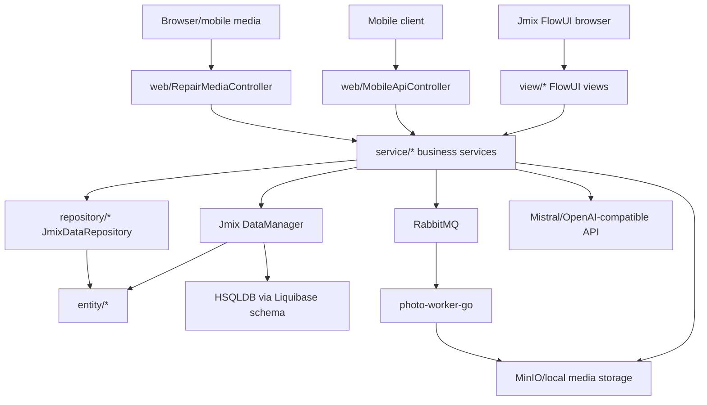
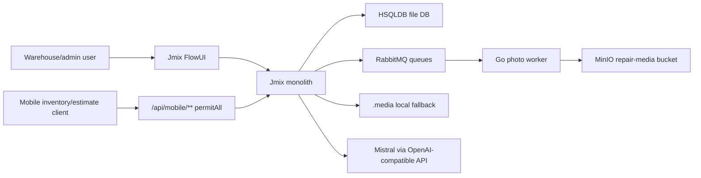

# 02 Architecture

## Package Map

Legacy Java root: `dev.buhanzaz.wmspanel`.

- `entity`: Jmix entities, mapped superclasses, enums.
- `service`: application services and business workflows.
- `service.smartsearch`: AI-backed reservation smart search.
- `view`: FlowUI screens and programmatic Vaadin views.
- `web`: REST/mobile/media controllers.
- `security`: Jmix roles, security filter chain, user repository.
- `repository`: Jmix data repositories for a small subset of entities.
- root package: application class and Jmix repository configuration.

## Layering

## Runtime Context

## Main Application Services

Warehouse/security:

- `WarehouseAccessService`: available warehouses, default warehouse, warehouse access checks.
- `ViewStateService`: user/session selected warehouse and board state.
- `WorkerManagementService`: workers, worker classes, groups, memberships, validation.

Rental inventory:

- `RentalItemService`: rental item creation/update, classifier attributes, tags, accessories, grid settings, accessory transfer.
- `RentalItemEventService`: timeline/history events, photos, accessory snapshots, status-change events.
- `RentalTypeDisplayFormatter`: current implementation returns base type name; no template logic found.

Reservations:

- `ReservationService`: availability search, temporary/client reservations, stock and accessory reservations, reservation permissions.
- `ReservationExpirationService`: waiting-payment, confirm, cancel, release, delete expired, expiration checks.
- `ReservationSearchSettingsService`: refresh interval settings.
- `SmartReservationSearchService`: AI/local criteria parsing for reservation search.

Repair and queues:

- `RepairEstimateService`: estimate CRUD, lines, totals, photos, history, media content, accessory stock/furniture sync.
- `RepairEstimateTaskPlanService`: prepare/save/delete task plans, resolve queues/catalog nodes.
- `RepairEstimateTaskPlanGenerationService`: generate board tasks and movement tasks from plans.
- `RepairProcessService`: repair process lifecycle, statuses, task/photo links, after-repair acceptance.
- `RepairReworkService`: create rework child process and task.
- `RepairCatalogService`: DB-backed repair catalog snapshot, dependencies, follow-up links, furniture detection.
- `RepairCatalogBootstrapService`: application-ready catalog bootstrap is present, but tests indicate legacy packaged bootstrap is not run.
- `QueueBoardService`: board state, queues, task creation, taking/completing/pausing/resuming, DnD reorder, process route reorder.
- `KpiAndReworkService`: KPI/rework history by worker class/group.

Media/integration:

- `LocalMediaStorageService`: local and MinIO storage, structured paths, variants, deletion.
- `PhotoProcessingQueueService`: publish processing tasks and consume processing results.
- `WarehouseAiQueryInterpreter`: AI-assisted natural-language warehouse inventory search.
- `RepairCatalogWorkbookImportService` and runner: POI workbook import for repair catalog.

## Repository Layer

Jmix repositories are enabled by `JmixDataRepositoryConfiguration`.

Repository classes found:

- `UuidEntityRepository<T extends UuidEntity>`
- `RentalCategoryRepository`
- `RentalSubcategoryRepository`
- `RentalTypeRepository`
- `RentalItemRepository`

Most business code uses `DataManager` directly. Plain Spring Data JPA repositories for the full model are not present.

## State And Session Behavior

The UI stores selected warehouse and board settings through `ViewStateService`.
This matters for React migration: selected warehouse is a first-class application state, not just a filter value.

State keys identified:

- selected warehouse
- terminal warehouse
- terminal selected rental item
- task board warehouse
- task board show-shadow toggle

## Architectural Warnings

- Programmatic FlowUI screens contain business orchestration and should not be treated as passive forms.
- Services sometimes encode permissions in query logic rather than centralized security policies.
- Mobile API bypasses user identity and runs as admin.
- Final database behavior depends on all Liquibase changelogs, including cleanup and cascade changelogs.
- Media consistency spans DB rows, local filesystem/MinIO objects, RabbitMQ messages, and Go worker responses.

## Target Microservice Baseline (2026-07-11)

The target Spring runtime is now a Gradle multi-module application:

- `services/auth-service` on port `9000` owns OAuth2/OIDC, USER accounts, separate WORKER credentials, global roles, and warehouse-access grants.
- `services/task-board-service` on port `8081` owns work queues, queue order, worker classes, workers, qualifications, groups, memberships, task-board entries, assignments, timing history, and automatic interruption links.
- `panel` remains a separate Vite/React application on port `8080` and uses OIDC Authorization Code + PKCE plus Bearer API calls.
- A future worker client is registered separately and uses port/origin `8082` in the dev profile.
- Auth and task-board use separate PostgreSQL databases. Auth uses JPA plus
  reviewed SQL releases after F1; task-board retains its Liquibase history until
  F2. Cross-service warehouse/worker identifiers are values only; there are no
  database foreign keys between services.

Evidence:

- `settings.gradle.kts`
- `services/auth-service/`
- `services/task-board-service/`
- `compose.yaml`
- `panel/src/features/auth/`

## F0 Platform Foundation (2026-07-12)

The approved target foundation now contains two non-deployable shared modules:

- `platform:technical-contracts` contains only immutable, framework-neutral
  technical records for Problem Details, pagination, event envelopes, actor
  snapshots, and correlation metadata. Architecture tests reject Spring, JPA,
  Hibernate, repository, entity, and domain dependencies; its main runtime
  classpath is empty.
- `platform:spring-boot-starter` provides conditional Jackson/UTC, correlation,
  Problem Details, JWT audience, observability, RabbitMQ, and production JPA
  safety configuration. It does not create a `SecurityFilterChain`, persistence
  entity, outbox/inbox model, secret, service URL, or business rule.

There is exactly one currently approved stateless deployable shape:

- F3 `api-gateway-service`, a Spring edge without a database, RabbitMQ
  participation, token exchange, or business aggregation.

The former separate Stage 4 Go worker is superseded by the user-approved
combined Stage 3–4 Go `media-service`. That service is stateful: it owns media
metadata and its PostgreSQL/Flyway schema, authorizes signed MinIO URLs, writes
its Kafka outbox/inbox records, and performs transformations in-process.

Stateful services still own independent PostgreSQL databases, aggregates,
service-local Flyway migrations, and messaging persistence. Outbox and inbox are
service-owned; F0 documents their convention but does not provide shared
entities or implementations.

Current-state qualification after F1: `auth-service` now consumes both shared
platform modules and has completed its Liquibase-to-JPA/reviewed-SQL cutover.
`task-board-service` remains on its existing Liquibase runtime until F2; F1 did
not change that deployable. F3 gateway and W1 warehouse remain planned, not
implemented.

Evidence:

- `platform/technical-contracts/`
- `platform/spring-boot-starter/`
- `services/README.md`
- `docs/plans/ACTIVE_STAGE.md`

## F1 Auth Foundation (2026-07-13)

`auth-service` is the first application deployable to adopt the F0 platform:

- `platform:technical-contracts` supplies the common technical error envelope;
- `platform:spring-boot-starter` supplies conditional technical configuration
  and production JPA safety, while auth retains all of its own security chains
  and authorization rules;
- OAuth service clients are configuration-driven and reconciled under an auth
  database advisory lock. Managed client identity and issued-at timestamps are
  stable; revisions make configuration/secret rotation explicit; disabling a
  client is fail-closed without deleting its audit rows, while explicit
  revocation removes its stored authorizations and consents;
- the base public issuer is the future gateway URL ending in `/auth`; explicit
  development uses the direct `http://localhost:9000` issuer.

F1 adds no gateway. F3 must strip exactly one `/auth` prefix, provide only
trusted forwarded headers, and exclude the panel `/auth/callback` route from the
auth-service catch-all route.

Evidence:

- `services/auth-service/src/main/java/dev/buhanzaz/rwms/auth/config/`
- `services/auth-service/src/main/resources/application.yaml`
- `services/auth-service/src/main/resources/application-dev.yaml`
- `services/auth-service/database/`
- `services/auth-service/src/test/`

## F2 Task-Board Foundation (2026-07-13)

`task-board-service` is now the second application deployable to adopt the F0
platform. The earlier statements that it still uses Liquibase describe the F0
and F1 closure states and are superseded for the current target:

- it consumes `platform:technical-contracts` and
  `platform:spring-boot-starter` while retaining service-owned JPA entities,
  repositories, API models, security rules, outbox, and inbox;
- its public API remains the owner of queue/workforce settings, board tasks,
  assignments, timing, interruptions, worker credential orchestration, and
  stable external-task registration;
- canonical OpenAPI lives at `contracts/openapi/task-board-service.yaml`;
  canonical created/cancelled event schemas live at
  `contracts/events/task-board-events.yaml`;
- `externalTaskId` is an idempotency boundary. A retry with the same
  `task-board-create:v1` canonical fingerprint returns the existing result;
  changed, cross-warehouse, or unfingerprinted legacy reuse fails with `409`;
- worker credential effects are serialized per worker with PostgreSQL session
  advisory locks and durable operation metadata. Local completion is fenced by
  operation ID, while the cross-service fencing limitation after timeout is
  retained as an explicit `UNKNOWN`.

The operational browser schedules, simulation clock, local worker inbox, and
DEMO seed remain development MOCK behavior. F2 does not claim the Stage 2
production scheduler or notification contract.

Evidence:

- `services/task-board-service/database/`
- `services/task-board-service/src/main/java/dev/buhanzaz/rwms/taskboard/`
- `services/task-board-service/src/test/java/dev/buhanzaz/rwms/taskboard/`
- `contracts/openapi/task-board-service.yaml`
- `contracts/events/task-board-events.yaml`

## F3 Stateless API Gateway Foundation (2026-07-13)

`api-gateway-service` is now the single browser-facing Spring edge for the
implemented OIDC and API routes. It is a Spring Cloud Gateway Server MVC
deployable on port `8088` and deliberately owns no database, JPA model, schema
release, RabbitMQ topology, outbox/inbox, token exchange, or business
aggregation.

- `/auth/**` removes exactly one public prefix before forwarding to
  `auth-service`; the exact panel `/auth/callback` path remains panel-owned.
- `/api/task-board/**` maps to the task-board service's existing `/api/**`
  contract. `/api/warehouse/**` is reserved and fails closed until the
  warehouse deployable exists.
- The panel derives OIDC and protected API addresses from its own browser
  origin. Vite proxies `/auth` and `/api` to the gateway in development, so
  production has no direct-auth/direct-task-board browser fallback.
- Protected API requests are validated at the gateway and again by the owning
  downstream service. Internal client-credentials traffic continues to use
  private service addresses.
- Spring Boot 4.1 HTTP client timeout configuration uses the plural
  `spring.http.clients.*` namespace.

All client-supplied forwarded metadata is removed. For auth requests the
gateway synthesizes `X-Forwarded-Proto`, `X-Forwarded-Host`,
`X-Forwarded-Port`, and `X-Forwarded-Prefix` from its validated public base URL.
Therefore the ingress must preserve the public `Host`; the gateway does not
infer its public issuer from arbitrary request headers.

Production ingress, TLS termination, private-backend network policy, service
discovery, and deployment topology remain deployment `UNKNOWN`s rather than
gateway-owned domain behavior.

Evidence:

- `services/api-gateway-service/`
- `panel/src/lib/gateway-config.ts`
- `panel/src/lib/gateway-routes.ts`
- `panel/src/features/auth/auth-config.ts`
- `panel/vite.config.ts`
- `WMS_ARCHITECTURE_KNOWLEDGE/09_MIGRATION/f3_api_gateway_foundation.md`

## F1C Auth Warehouse-Existence Correction (2026-07-13)

Before W1, `auth-service` gained an auth-local, configuration-driven
`WarehouseExistenceClient`. It is disabled by default so auth remains operable
before Warehouse Service exists. When enabled, it uses a private
client-credentials token scoped only to `warehouse.read` and validates every
distinct UUID before a USER warehouse-access mutation is persisted.

The client contract is deliberately singular and technical:
`GET /api/internal/warehouse/v1/warehouses/{warehouseId}/existence` returns
exactly `{id, version, active}`. Auth still owns only opaque access-grant IDs;
it gains no Warehouse entity, repository, cache, cross-database relation, or
per-request/JWT Warehouse Service call.

Reviewed auth release V0002 canonicalizes only the approved `spb` and `msk`
aliases. W1 remains the owner of Warehouse identity/API/events and is not
implemented by this correction.

Evidence:

- `services/auth-service/src/main/java/dev/buhanzaz/rwms/auth/integration/warehouse/`
- `services/auth-service/src/main/java/dev/buhanzaz/rwms/auth/service/WarehouseIdentifierPolicy.java`
- `services/auth-service/database/releases/V0002__canonicalize-warehouse-identifiers/`
- `WMS_ARCHITECTURE_KNOWLEDGE/09_MIGRATION/f1c_auth_warehouse_existence.md`

## Approved F4 Event-Driven Modernization Target (2026-07-13)

F4 governance was approved on 2026-07-13 after the prerequisite F1C closure
commit `d50922d`. It introduces the ordered modernization sequence
`F4K -> F4MA -> F4MT -> F4A -> F4T -> F4R -> F4G -> W1`. F4K is implemented by commit
`52c0702`, F4MA by `334576a` and F4MT by `01cb9c2`; later F4 gates
remain separately staged and `ACTIVE_STAGE.md` remains the only execution
authority.

- F4K implements Kafka 4.3.1, Spring Cloud Stream and service-local event-store
  conventions without creating or changing a business deployable. This is
  platform readiness, not auth/task-board business event publication.
- F4MA and F4MT have adopted Flyway in auth and task-board respectively. Flyway
  is now the sole active schema version/checksum authority for both current
  stateful services, `baselineOnMigrate` stays false, and Hibernate only
  validates.
- F4A and F4T then modernize only the existing auth and task-board deployables, one
  at a time. Full event sourcing applies only to classified non-secret domain
  aggregates; PostgreSQL projections remain service-owned. Auth telemetry is
  implemented and verified in F4A; task-board telemetry is implemented and
  verified in F4T.
- F4R retires RabbitMQ from target Spring integration only after Kafka
  outbox/inbox cutover and recovery proof. F0/F2 RabbitMQ behavior remains
  valid historical implementation evidence. An isolated media-compat RabbitMQ
  runtime/topology remains solely for the unchanged legacy Go worker until the
  compatibility retirement after the combined Stage 3–4 media-service cutover
  is technically verified; the active pointer's user confirmation is not that
  runtime evidence.
- F4G changes only the existing stateless, event-free gateway deployable to add
  its telemetry. Its closing verification then proves metrics, logs and traces
  across auth, task-board and gateway without reopening F4A or F4T code.
- F4I deployment readiness is superseded by the 2026-07-14 service-only
  product direction. Its Compose readiness profiles, Helm/Kind assets and
  operating runbooks were removed; historical evidence remains audit context
  only and does not block W1.

Kafka topics are aggregate-family streams, keyed by `aggregateId`; event type
and schema version remain inside the envelope. PostgreSQL transactional outbox,
consumer-owned inbox, aggregate-version fencing and at-least-once idempotency
remain mandatory. Kafka transactions do not replace the database outbox.

Schema cutover uses cumulative `V2__auth_schema.sql` and
`V4__task_board_schema.sql` for clean databases. Existing non-empty databases
are explicitly baselined at versions 2 and 4 respectively;
`baselineOnMigrate=false`. F4A later owns auth V3 event sourcing and F4T owns
task-board V5. Historical custom release trees, `rwms_schema_history` and
`databasechangelog*` remain read-only evidence.

F4MA closure is proven by governance correction `844e55d`, implementation
`334576a`, Flyway 12.4.0 dependency resolution, successful Amplicode rebuild/
analysis and 72 passing auth tests with one expected environment skip. F4MT
closure is proven by implementation `01cb9c2`, exact V1-V4/V4 catalog digest
`2b204139b97ff46298b9818800cc3f9e`, exact historical release checksums,
12 passing migration/JPA checks and a forced full task-board suite of 87 tests
with one expected environment skip. Neither cutover adds application event
sourcing or changes API/domain/Rabbit behavior.

F4K introduces `DomainEventEnvelopeV2` alongside, rather than by mutating, the
existing V1 `EventEnvelope`. V2 permits a nullable `occurredAt` for migration
baselines, requires `recordedAt`, and carries only a sanitized opaque actor
reference without display name or raw PII. At F4R the existing V1
`EventEnvelope` and `ActorSnapshot` are removed from target Spring integration
and isolated to media-compat RabbitMQ for the unchanged legacy Go worker; they
remain there until compatibility retirement after the combined Stage 3–4
media-service cutover is technically verified and must never be used as the
Kafka/event-store source-of-truth envelope.

PII, password hashes, OAuth tokens/codes, client/signing secrets and other
sensitive material are excluded from event payloads. Where replay needs stable
identity, the owning service uses an opaque reference to its service-local PII
vault/operational store rather than copying protected values into Kafka or the
event store. OAuth JDBC state and delivery/lease/checkpoint machinery remain
operational state, not event-sourced business aggregates.

Lombok and MapStruct reduce mechanical code only. JPA entities must not use
`@Data`, generated entity equality or unrestricted builders; aggregate
invariants and authorization remain explicit. Cross-service truth continues to
come from versioned OpenAPI/event schemas, not shared MapStruct models.

Evidence:

- `WMS_ARCHITECTURE_KNOWLEDGE/09_MIGRATION/f4_event_driven_modernization.md`
- prerequisite F1C closure commit `d50922d`
- F4K foundation commit `52c0702`
- F4MA auth Flyway commit `334576a`
- F4MT task-board Flyway commit `01cb9c2`

## F4A Auth Event-Sourced Cutover (2026-07-14)

`auth-service` now owns authoritative PostgreSQL event streams for the approved
non-secret `USER_AUTHORIZATION` and `WORKER_ACCESS` aggregates. Relational auth
tables are synchronous projections; Kafka is transport through a transactional
outbox and is not the archive. OAuth JDBC and protected identity/credential
stores remain operational. No other application deployable gained Kafka domain
publication in F4A.

## F4T Task-Board Event Sourcing (2026-07-14)

The current F4T diff introduces service-local event streams for
`WORKER_CLASS`, `WORKER`, `WORKER_GROUP`, `WORK_QUEUE`,
`QUEUE_USAGE_REFERENCE`, `BOARD_TASK` and `QUEUE_ENTRY`. Qualifications,
members and queue-class bindings are captured inside their owning aggregate
facts. Assignments, time events and automatic interruptions remain children of
`QUEUE_ENTRY`, so their order follows the entry stream rather than separate
topics.

Command transactions now combine stream CAS, synchronous projection mutation
and Kafka outbox insertion. `TaskBoardProjectionWriter` requires an existing
transaction for projection writes, and the architecture test forbids
event-sourced repository mutations outside that writer. Command services
delegate persistence to the writer. Multi-stream locking is stable by
aggregate type and UUID. Kafka remains transport; replay stays in the
PostgreSQL event store.

The canonical schema
`contracts/events/task-board/task-board-events-v1.schema.json` is the
cross-service truth. It permits only sanitized operational facts and excludes
human names, comments, descriptions, task text and credential state. Existing
worker profile fields remain in the task-board operational projection; F4T
uses an opaque `profileRevision` marker and does not invent a production PII
vault or erasure contract.

Rabbit and Kafka deliberately coexist in this candidate. Rabbit is historical
F2 runtime and is not removed until F4R. The bounded cutover rehearsal proves
immutable retarget mappings plus outbox/inbox/checkpoint parity under an
explicit write freeze. Migration, runtime, security and affected regression
tests have run, and the independent closing review reported no actionable
P0-P3 findings. Commit `0c0957e` closes the implementation; the operational
stage pointer now authorizes F4R only.

## F4R Target Spring Rabbit Retirement (2026-07-14)

Target Spring integration is Kafka-only. `task-board-service` no longer has an
AMQP classpath, topology, relay, listener or dual-write recorder, and the common
starter no longer exposes Rabbit auto-configuration. Task commands retain the
F4T PostgreSQL event-store/Kafka-outbox transaction and unchanged HTTP
concurrency/idempotency behavior.

Rabbit remains only as the explicit Compose `media-compat-rabbit` profile for
the unchanged legacy Go image worker. The `rabbitmq` network alias and volume
are preserved, while no target Spring service depends on that profile. Legacy
V1 contracts and task-board Rabbit tables remain immutable migration evidence,
not active integration boundaries.

## F4G Gateway Observability (2026-07-14)

`api-gateway-service` now completes the telemetry surface of the three existing
deployables without acquiring domain state. It exposes public health,
liveness and readiness probes, an authenticated Prometheus scrape, OTLP tracing
and ECS structured stdout logs. Architecture tests reject database, JPA,
Flyway, Kafka, RabbitMQ, Redis, workflow, persistence, domain and eventing
dependencies from the gateway runtime.

Gateway HTTP forwarding preserves W3C `traceparent` and `tracestate` while the
technical `X-Correlation-Id` remains a separate application-level value. The
gateway has no Cloud Stream binder; the downstream Kafka hop remains owned by
the already completed F4A/F4T service instrumentation.

Scoped implementation commit `08d4037` closes F4G without changing auth,
task-board, panel or a future deployable.

## W1 Warehouse Registry Boundary (2026-07-14)

`warehouse-service` is the Stage 1 owner of the canonical warehouse UUID,
code, metadata, IANA timezone, active state and nullable sort order. It owns a
service-local PostgreSQL database and a transactional Kafka outbox, but no
event store, consumer inbox, location graph, access grants, cabin/stock state
or cross-service database relation. Future services retain only opaque
warehouse IDs and contract snapshots.

The public HTTP surface is behind the stateless gateway and is validated again
by the service. The private existence endpoint is a direct client-credentials
boundary for `auth-service` only; it is not a general internal warehouse API.
The W1 user-approved panel cutover follows the existing port/provider pattern
and does not make browser fixtures production fallbacks.

## Asset-service boundary (implementation record, 2026-07-16)

`asset-service` owns rental items, canonical statuses, equipment catalog and
balances, immutable movement ledger, allocation holds and operation leases. It
has a separate PostgreSQL schema and service-local event streams, snapshots,
live projection checkpoints, transactional outbox, inbox, quarantine and
sanitized DLT storage. Kafka is transport only; the service database remains
the target canonical replay source. The 2026-07-16 readiness audit proved the
append/snapshot write path but found no deterministic stream reader,
rebuild/shadow replay or projection-parity test, so replay authority is not yet
implementation exit evidence.

The gateway forwards `/api/asset/**` without state, database or broker
participation. Warehouse identity stays in `warehouse-service`: asset checks a
narrow direct registry endpoint using only its exact client credential. This
record describes implemented ownership. Focused Java 26 Testcontainers/JPA,
contract and authorization checks are recorded in the Stage 5 history: the
asset module passed 25 tests and the shared architecture gate passed 16. The
changed exact auth-client, warehouse-registry and gateway-route checks also
passed 1, 3 and 18 tests respectively. The complete broker-outage and browser
matrix remains pending.

The subsequent backend hardening introduces actual MapStruct entity-read to
DTO mapping for the equipment catalog and Lombok constructor injection for the
asset API layer. Shared architecture coverage now imports warehouse mappers and
checks warehouse JPA sources too; generated entity mutation, domain transitions
and unsafe Lombok on JPA identity/version/timestamp/invariant fields remain
forbidden.

### Stage 5 event/recovery completion update (2026-07-16)

`AssetReplayVerifier` now reconstructs a named shadow projection from ordered
`domain_event` facts and fails on stream-head, canonical-outbox/checksum or
live-projection parity drift. The covered aggregate families include rental
items, equipment catalog/balances/movements/holds/leases and classifiers.

Asset inbound delivery uses one multiplexed Cloud Stream functional consumer
for all owned aggregate-family topics. It derives the expected aggregate family
from the received Kafka topic before handing the fact to the inbox processor;
this prevents separate listeners in one consumer group from receiving a topic
belonging to another family. The outbox binding is synchronous and uses the
byte-array aggregate key serializer, so `PUBLISHED` follows broker acknowledgement
rather than local channel acceptance.

Final Stage 5 verification adds an in-place Flyway V1-to-V2 upgrade test,
passes the affected asset cutover flow in all three responsive Playwright
projects, and completes a successful root Gradle `test` graph. The earlier
missing replay, real-broker and browser evidence statements above are retained
as chronological audit findings and are superseded by this completion record.
