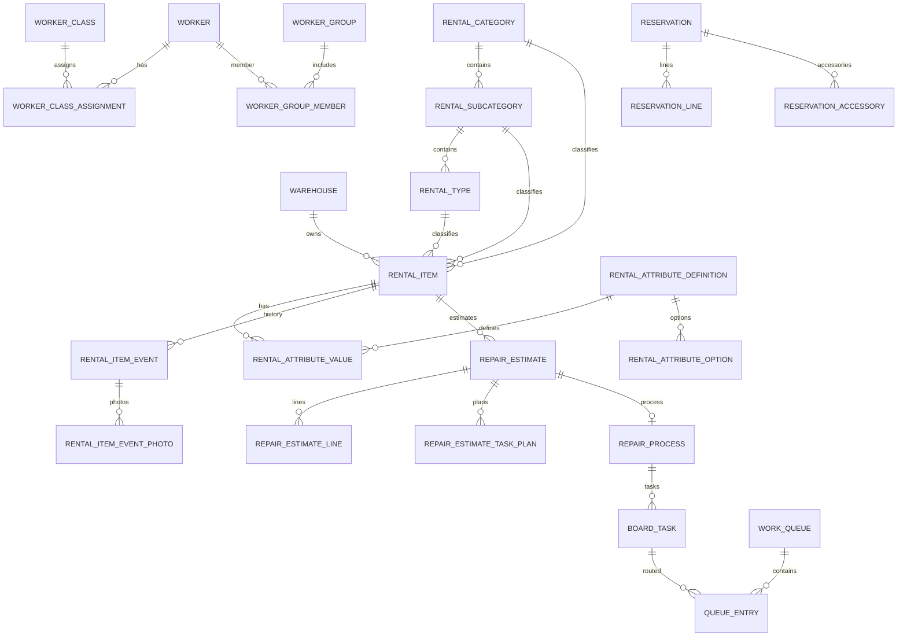

# 03 Database

## Configuration

Default datasource:

- URL: `jdbc:hsqldb:file:.jmix/hsqldb/wmspanel`
- Username: `sa`
- Password: empty

Liquibase master:

- `wms-panel-old/src/main/resources/dev/buhanzaz/wmspanel/liquibase/changelog.xml`
- Includes Jmix framework changelogs:
  - `/io/jmix/data/liquibase/changelog.xml`
  - `/io/jmix/flowuidata/liquibase/changelog.xml`
  - `/io/jmix/securitydata/liquibase/changelog.xml`
- Then `includeAll` for `/dev/buhanzaz/wmspanel/liquibase/changelog`.

Do not migrate only app changelogs unless target app replaces Jmix framework tables intentionally.

## Final Schema Domains

Security/users:

- `USER_`
- `USER_WAREHOUSE_ACCESS`
- `USER_GRID_COLUMN_SETTINGS`
- Jmix security tables such as `SEC_ROLE_ASSIGNMENT` are created by framework changelogs and seeded by app changelog.

Warehouse/stock:

- `WAREHOUSE`
- `WAREHOUSE_SEGMENT`
- `STOCK_ITEM`

Rental catalog/inventory:

- `RENTAL_CATEGORY`
- `RENTAL_SUBCATEGORY`
- `RENTAL_TYPE`
- `RENTAL_ITEM`
- `RENTAL_ITEM_CONDITION`
- `RENTAL_ATTRIBUTE_DEFINITION`
- `RENTAL_ATTRIBUTE_OPTION`
- `RENTAL_ATTRIBUTE_VALUE`
- `RENTAL_CLASSIFIER_ATTRIBUTE`
- `RENTAL_CLASSIFIER_ATTRIBUTE_CATEGORY_LINK`
- `RENTAL_TAG`
- `RENTAL_ITEM_TAG`

Accessories:

- `ACCESSORY_CATEGORY`
- `ACCESSORY_SUBCATEGORY`
- `ACCESSORY_ITEM`
- `ACCESSORY_STOCK_BALANCE`
- `RENTAL_ITEM_ACCESSORY`
- `RENTAL_ITEM_EVENT_ACCESSORY`

Reservations:

- `RESERVATION`
- `RESERVATION_LINE`
- `RESERVATION_ACCESSORY`
- `RESERVATION_SEARCH_SETTINGS`

Workers/queues/tasks:

- `WORKER_CLASS`
- `WORKER`
- `WORKER_CLASS_ASSIGNMENT`
- `WORKER_GROUP`
- `WORKER_GROUP_MEMBER`
- `WORK_QUEUE`
- `WORK_QUEUE_WORKER_GROUP`
- `BOARD_TASK`
- `QUEUE_ENTRY`
- `TASK_ASSIGNMENT`
- `TASK_TIME_EVENT`
- `BOARD_TASK_PHOTO_LINK`

Repair/history/media:

- `REPAIR_ESTIMATE`
- `REPAIR_ESTIMATE_LINE`
- `REPAIR_ESTIMATE_CATALOG_NODE`
- `REPAIR_ESTIMATE_CATALOG_LINK`
- `REPAIR_ESTIMATE_TASK_PLAN`
- `REPAIR_PROCESS`
- `REPAIR_PROCESS_TASK_LINE`
- `RENTAL_ITEM_EVENT`
- `RENTAL_ITEM_EVENT_PHOTO`

## Relationship Diagram

## Important Constraints And Indexes

Main unique constraints from changelogs and entity annotations:

- `USER_.USERNAME` unique index.
- `RENTAL_CATEGORY.CODE` unique.
- `RENTAL_SUBCATEGORY(CATEGORY_ID, CODE)` unique.
- `RENTAL_TYPE(SUBCATEGORY_ID, CODE)` unique.
- `RENTAL_ITEM.NUMBER` unique.
- `WAREHOUSE.NAME` and later `WAREHOUSE.CODE` are constrained in changelogs.
- `USER_WAREHOUSE_ACCESS(USER_ID, WAREHOUSE_ID)` unique after cleanup migration.
- `WORKER_CLASS.CODE` unique.
- Worker class assignment and worker group membership have duplicate-prevention constraints.
- `WORK_QUEUE(WAREHOUSE_ID, CODE)` unique.
- Queue worker-class binding has duplicate-prevention constraints.
- `RENTAL_ATTRIBUTE_DEFINITION.CODE` unique.
- `RENTAL_ATTRIBUTE_OPTION(ATTRIBUTE_DEFINITION_ID, CODE)` unique.
- `RENTAL_ATTRIBUTE_VALUE(RENTAL_ITEM_ID, ATTRIBUTE_DEFINITION_ID)` unique.
- `RENTAL_TAG.CODE` unique.
- `RENTAL_ITEM_TAG(RENTAL_ITEM_ID, TAG_ID)` unique.
- Accessory category/subcategory/item code hierarchy is constrained.
- `ACCESSORY_STOCK_BALANCE(WAREHOUSE_ID, ACCESSORY_ITEM_ID)` unique.
- `RESERVATION.RESERVATION_NUMBER` unique.
- `REPAIR_ESTIMATE_CATALOG_NODE.CODE` unique.
- `REPAIR_ESTIMATE_CATALOG_LINK(SOURCE_NODE_ID, TARGET_NODE_ID, LINK_TYPE)` unique.
- `REPAIR_ESTIMATE_LINE(ESTIMATE_ID, SOURCE_LINE_KEY)` unique.
- `REPAIR_ESTIMATE_TASK_PLAN.GENERATED_BOARD_TASK_ID` unique.
- Repair process estimate relation is constrained.
- `ACCESSORY_ITEM.FURNITURE_MATERIAL_ID` has a unique constraint in later changelog.

## Cascades And Deletes

Important hard-delete behavior:

- Later changelogs add DB-level cascade and set-null rules around rental item deletion and repair board dependencies.
- `RentalItemHardDeleteTest` confirms deleting a rental item should remove dependent repair/board graph enough to free the number for reuse.
- `REPAIR_ESTIMATE.LATEST_EVENT_ID` cascade behavior is corrected in `2026/07/02-131000-hard-delete-latest-event-cascade.xml`.

Spring/Hibernate migration must intentionally mirror DB cascade behavior or replace it with service-level deletes and tests.

## Seed Data

Seed categories:

- Admin user and role assignments in `010-init-user.xml`.
- Rental catalog inline inserts and CSV imports under `liquibase/data/rental-import`.
- Imported CSV files:
  - `rental-category.csv`
  - `rental-subcategory.csv`
  - `rental-type.csv`
  - `rental-item.csv`
- Warehouse seed includes at least SPB and Moscow legacy warehouses.
- Worker classes/queues and repair catalog are heavily seeded by changelogs.
- Repair catalog includes many `REPAIR_ESTIMATE_CATALOG_NODE` inserts and cleanup/reload migrations.

Seed data is behavior, not sample data. Do not drop it casually in migration.

## Legacy/Dropped Schema

Known legacy schema that is created and later removed or superseded:

- `CATEGORY`
- `WAREHOUSE_FINISHING`
- `WAREHOUSE_ELECTRIC`
- `WAREHOUSE_LINOLEUM`
- `WAREHOUSE_STATUS`
- `WORKER_USER`
- `WORKER_CREW*`
- `ADJACENT_CREW_RULE`
- old columns/indexes removed by cleanup migrations

Final schema must be derived after replaying all changelogs, not from early create-table files alone.

## Migration Risks

- Jmix/EclipseLink metadata and `JmixDataRepository` do not map 1:1 to Spring Data JPA/Hibernate.
- HSQLDB-tolerated SQL may not replay cleanly on PostgreSQL.
- Enum storage is inconsistent across the model.
- Framework tables from Jmix may need explicit replacement or migration.
- Cleanup changelog order matters because the app uses `includeAll`.
- Legacy production DB vendor and data volume are `UNKNOWN`; target stateful
  services are approved on PostgreSQL.

## Target Auth And Task-Board Schemas (2026-07-11)

`auth-service` owns:

- `auth_subject` for distinct `USER` and `WORKER` subjects, encoded passwords, active state, global role, external worker identity, and optimistic version.
- `user_warehouse_access` for opaque warehouse IDs and `VIEW`/`EDIT`/`MANAGE` grants.
- Spring Authorization Server JDBC registered-client, authorization, and consent tables.

`task-board-service` owns:

- worker classes, workers, class assignments, groups, and group members;
- work queues and queue-to-class bindings with `stop_task_on_take`;
- board tasks, REAL/SHADOW queue entries, assignments, time events, and automatic interruption links;
- queue-usage references used to fail closed when a queue is referenced by an external plan/catalog;
- internal worker-deletion intents used to reconcile the auth-first delete saga without changing the public Worker on an auth failure.

All mutable task-board records carry an optimistic `version`. Queue code is unique per warehouse; worker-class code is global; duplicate memberships, qualifications, and queue bindings are constrained. PostgreSQL 17 Testcontainers tests validate the current mappings. After F1, auth uses reviewed SQL releases rather than Liquibase; task-board continues to replay Liquibase until its F2 cutover.

Evidence:

- `services/auth-service/database/baseline/schema.sql`
- `services/auth-service/database/releases/V0001__adopt-auth-schema/`
- `services/task-board-service/src/main/resources/db/changelog/001-task-board-schema.yaml`
- `services/*/src/test/java/**/**Postgres*IntegrationTest.java`

## Target Flyway Schema Authority (2026-07-13)

The approved target now supersedes the custom schema runner:

- Flyway is the sole active migration ordering, version-history and checksum
  mechanism; Liquibase remains forbidden;
- JPA/Hibernate mappings define the application model but every target profile
  uses only `ddl-auto=validate`; Hibernate schema mutation is forbidden in dev,
  test and production;
- `baselineOnMigrate=false`; existing non-empty databases require an explicit
  operator-controlled baseline at their proven current version;
- F4MA installs auth clean databases from cumulative `V2__auth_schema.sql` and
  explicitly baselines existing auth databases at version 2;
- F4MT installs task-board clean databases from cumulative
  `V4__task_board_schema.sql` and explicitly baselines existing task-board
  databases at version 4;
- F4A later owns `V3__auth_event_sourcing.sql`; F4T owns
  `V5__task_board_event_sourcing.sql`;
- clean baseline install, explicit-baseline upgrade, repeat migration, Flyway
  checksum rejection and JPA validation are mandatory Testcontainers evidence.

Historical `database/releases`, `rwms_schema_history`,
`databasechangelog*`, backups and checksums remain read-only evidence.

The auth cumulative migration is deliberately versioned as `V2`, not `B2`:
Flyway 12.4.0 runtime evidence showed that drift in an applied baseline
migration was not rejected by `validate`, which does not satisfy the target
checksum gate.

The same evidence fixed the task-board clean migration as cumulative versioned
`V4__task_board_schema.sql`, not B4. Existing task-board databases require
explicit baseline version 4; implementation commit `01cb9c2` closes this
cutover.

## F4MA Auth Flyway Cutover (2026-07-13)

Governance correction `844e55d` and implementation commit `334576a` establish
Flyway 12.4.0 as auth schema authority. Clean databases apply cumulative V2;
existing non-empty databases pass exact preflight, are explicitly baselined at
version 2 and retain their row digests. All target profiles use JPA `validate`,
and `baselineOnMigrate=false`.

The full auth suite passed 72 tests with zero failures/errors and one expected
environment skip. Dependency insight, Amplicode rebuild/analysis, clean/repeat/
checksum/non-empty/explicit-baseline/JPA validation checks passed. One forced
rerun was blocked by unrelated npm `ENOTEMPTY`; the successful normal suite is
the accepted closing evidence. Historical custom releases,
`rwms_schema_history` and `databasechangelog*` remain read-only.

## F4MT Task-Board Flyway Cutover (2026-07-13)

Implementation commit `01cb9c2` establishes Flyway 12.4.0 as the sole active
task-board schema migration/version/checksum authority. Clean databases apply
cumulative `V4__task_board_schema.sql`; existing non-empty databases must pass
the exact version-4 preflight and are explicitly baselined at version 4.
`baselineOnMigrate=false` and JPA `ddl-auto=validate` apply in every target
profile.

The cumulative V4 catalog exactly matches the historical V0001-V0004 result
for all sixteen domain/Rabbit tables. The independent canonical digest over
columns, nullability/defaults, constraints and indexes is
`2b204139b97ff46298b9818800cc3f9e`; each historical release SHA-256 matches the
recorded preflight checksum. Existing task-board rows, Rabbit outbox/inbox,
`rwms_schema_history` and `databasechangelog*` remain unchanged evidence.

Verification covered 12 targeted clean/repeat/checksum/non-empty/preflight/
baseline/digest and clean/adopted JPA checks. The forced full task-board suite
passed 87 tests with zero failures/errors and one expected restored-backup
environment skip. Flyway dependency insight resolved 12.4.0, Amplicode rebuild
and analysis passed, and independent review found no API, domain or Rabbit
delivery behavior change. F4MT adds no event-store schema and no Kafka business
publication; those remain F4T work through Flyway V5.

## Historical Custom Schema Delivery Foundation (2026-07-12)

F0–F2 implemented the following custom release mechanism. It remains factual
migration evidence but is no longer the target schema authority after the
F4MA/F4MT Flyway cutovers:

- reviewed PostgreSQL releases live under
  `database/releases/V####__slug/{apply.sql,verify.sql,manifest.json}`;
- `Apply-SchemaReleases.ps1` validates manifests, uses an advisory lock and
  records version/checksum/description in `public.rwms_schema_history`;
- clean install, ordered upgrade, repeat verification and checksum-drift
  rejection were verified for those historical gates.

F0 captured the current Compose `auth-db` and `task-board-db` into the ignored
`.rwms-migration-backups/20260712T203837Z/` tree. Both custom dumps restored into
disposable PostgreSQL 17 containers with identical canonical inventories and
normalized schemas; source temporary files and restore containers were absent
after verification. The backup manifest SHA-256 is anchored separately under
the operator-local `%LOCALAPPDATA%/RWMS/migration-backup-index` rather than only
beside the backup. Backup contents and the detached digest are not committed.

F0 alone did not migrate either service. F1 has now migrated `auth-service`;
`task-board-service` continues to use Liquibase until F2. Historical
`databasechangelog*` tables in both databases remain evidence and must not be
deleted implicitly.

Evidence:

- `tools/migration/Apply-SchemaReleases.ps1`
- `tools/migration/Test-SchemaReleaseIntegration.ps1`
- `tools/migration/Invoke-F0Snapshot.ps1`
- `tools/migration/ROLLBACK.md`
- ignored backup verification files for backup `20260712T203837Z`

## F1 Auth Schema Cutover (2026-07-13)

This section records the verified F1 state before F4MA. Its custom-runner and
Hibernate-mode statements are historical evidence, not the current target.

`auth-service` now has no Liquibase or Flyway runtime/build/configuration. Its
schema policy is:

- explicit local `dev`: Hibernate `update`;
- isolated PostgreSQL tests: Hibernate `create-drop` plus reviewed OAuth JDBC
  schema fixtures;
- base/production: Hibernate `validate` only, protected by the common starter;
- production changes: immutable releases under
  `services/auth-service/database/releases` through the common runner.

`V0001__adopt-auth-schema` is both a clean installer and a non-destructive
adoption release. It creates or verifies `auth_subject`,
`user_warehouse_access`, and the three Spring Authorization Server JDBC tables,
then records its manifest checksum in auth-owned `public.rwms_schema_history`.
Its monotonic `verify.sql` checks required PostgreSQL columns, types, lengths,
nullability, defaults, named PK/unique/check/FK constraints, cascade behavior,
and exact index definitions. It does not create, alter, truncate, or delete
`databasechangelog*`.

Verified migration evidence:

- common runner clean install and repeat produced five auth/OAuth tables plus
  one `rwms_schema_history` row;
- the auth release test script passed clean install, repeat verification,
  checksum drift rejection, and failed-verification rollback;
- a real F0 dump was restored, released, and started with JPA `validate`; all
  three clients and nineteen OAuth authorizations remained JDBC-readable;
- pre/post digests were unchanged for the seven pre-existing tables, including
  one subject, three clients, nineteen authorizations, and four historical
  Liquibase rows;
- disposable verification containers were removed.

The lifetime and production retention policy for the unused
`databasechangelog*` tables remains `UNKNOWN`; F1 intentionally does not clean
them up.

Evidence:

- `services/auth-service/database/baseline/schema.sql`
- `services/auth-service/database/releases/V0001__adopt-auth-schema/`
- `services/auth-service/database/Test-AuthSchemaRelease.ps1`
- `services/auth-service/src/test/java/dev/buhanzaz/rwms/auth/AuthSchemaReleaseIntegrationTest.java`
- `services/auth-service/src/test/java/dev/buhanzaz/rwms/auth/AuthF0RestoredDatabaseIntegrationTest.java`
- F0 operator backup `20260712T203837Z` and its detached manifest anchor

## F2 Task-Board Schema Cutover (2026-07-13)

The following task-board state records the verified F2 implementation before
F4MT. Its custom-runner and Hibernate-mode statements are historical evidence,
not the current target.

`task-board-service` now has no Liquibase or Flyway build/runtime/configuration.
Historical `databasechangelog` and `databasechangeloglock` remain untouched on
upgraded databases and are not created in a clean target database.

Its reviewed PostgreSQL release chain is:

1. `V0001__adopt-task-board-schema` adopts the exact fourteen-table F0 domain
   schema without rewriting existing domain rows.
2. `V0002__add-integration-messaging` adds the versioned external-command
   fingerprint plus task-board-owned outbox and inbox.
3. `V0003__enforce-case-insensitive-identities` fails closed on normalized
   duplicates, then adds functional unique indexes for worker-class code,
   worker login, and per-warehouse queue code without rewriting old values.
4. `V0004__add-worker-credential-operation` adds all-or-none durable operation
   ID/type/start metadata used by the auth-effect coordinator.

Schema modes are explicit: local `dev` uses Hibernate `update`, isolated
PostgreSQL tests use `create-drop`, and base/production uses only `validate`
under the common production-safety validator. Production releases run through
the common advisory-lock/checksum/verification runner and task-board-owned
`rwms_schema_history`.

The operator restored the real F0 backup `20260712T203837Z`, applied V0001-V0004,
and passed JPA `validate` with four history rows. The F0 domain tables contained
no business rows, so a separate populated compatibility fixture proves the
fourteen-table relationship graph and JPA readability. The historical table
digests were unchanged: `databasechangelog`
`9dc7...` and `databasechangeloglock` `ae466...`; the abbreviated values are
recorded only as non-secret verification evidence, not as substitute trust
anchors.

Verification covered clean install, ordered upgrade, repeat safety, checksum
drift rejection, failed-verification rollback, exact catalog checks, V3
duplicate preflight, JPA validation, and the restored-F0 run. Retention and
eventual cleanup of the historical Liquibase tables, outbox, inbox, and schema
history remain `UNKNOWN` and require reviewed releases.

Evidence:

- `services/task-board-service/database/baseline/schema.sql`
- `services/task-board-service/database/releases/`
- `services/task-board-service/database/Test-TaskBoardSchemaRelease.ps1`
- `services/task-board-service/src/test/java/dev/buhanzaz/rwms/taskboard/TaskBoardReleaseSchemaValidationIntegrationTest.java`
- `services/task-board-service/src/test/java/dev/buhanzaz/rwms/taskboard/TaskBoardF0RestoredDatabaseIntegrationTest.java`
- F0 operator backup `20260712T203837Z` and its detached manifest anchor

## F4K Event-Store Persistence Convention (2026-07-13)

Commit `52c0702` adds canonical technical schemas for service-local
`event_stream_head`, append-only `domain_event`, `aggregate_snapshot`,
`projection_checkpoint`, transactional `outbox_event`, `inbox_message` and
consumer aggregate checkpoints. The convention requires stream CAS, unique
aggregate versions, snapshot threshold 100, stable multi-stream lock order and
atomic producer/consumer database effects.

This is a verified platform convention, not an application schema cutover. F4K
adds none of these tables to auth or task-board databases and performs no
baseline/replay. Auth owns its expand-only implementation and shadow parity in
F4A; task-board owns its equivalent work in F4T. Existing relational tables,
Rabbit outbox/inbox and migration evidence remain intact.

Evidence:

- `contracts/events/technical/event-store-convention-v1.schema.yaml`
- `contracts/events/technical/aggregate-checkpoint-policy-v1.schema.yaml`
- `platform/spring-boot-starter/src/main/java/dev/buhanzaz/rwms/platform/kafka/`
- F4K commit `52c0702`

## F4A Auth V3 (2026-07-14)

Flyway V3 adds the auth event store, stream heads, snapshots, replay/checkpoint
tables, transactional outbox, inbox, version-gap quarantine and separated
PII/credential operational stores. Migration is expand-only. Deterministic
baseline facts retain existing JPA versions, use `occurred_at = NULL`, never
enter outbox and preserve all legacy/OAuth rows. Clean install, adopted V2
upgrade, repeat/checksum rejection and JPA validation are verified.

## F4T Task-Board V5 Candidate (2026-07-14)

The current expand-only `V5__task_board_event_sourcing.sql` adds
`event_stream_head`, append-only `domain_event`, `aggregate_snapshot`,
`projection_checkpoint`, Kafka `outbox_event`, `inbox_message`,
`consumer_aggregate_checkpoint`, `version_gap_quarantine`,
`sanitized_dead_letter` and `replay_operation_audit` after cumulative V4.
It does not remove or rewrite the sixteen V4 domain/Rabbit tables or historical
migration evidence.

V5 creates one deterministic baseline event per existing aggregate at its
current JPA version. Baselines use `occurred_at = NULL`, a migration-only
`recorded_at`, deterministic IDs and canonical payload checksums. They do not
enter the Kafka outbox. The seven permitted stream types are constrained in
SQL, and aggregate type/ID/version/event identity is fenced by primary, unique
and foreign-key constraints.

Live events persist a canonical `DomainEventEnvelopeV2`, update the live
projection checkpoint and enter the service-owned outbox in one transaction.
Consumer state provides event-ID deduplication, aggregate-version blocking and
sanitized DLT metadata. Replay writes shadow state and records parity/audit
outcomes rather than truncating live projections.

Worker names and other profile fields remain in the existing operational JPA
projection. Event payloads contain only worker identity, warehouse/access
facts, qualifications and an opaque `profileRevision`; the future protected
PII carrier is still `UNKNOWN`. Migration, replay and JPA validation tests exist
in the diff. The focused 17-test migration batch and the later affected
regression rerun passed. Commit `0c0957e` closes the F4T database/runtime cutover.

## W1 Warehouse Flyway V1 (2026-07-14)

`warehouse-service` installs from `V1__warehouse_schema.sql` with Hibernate
always set to `validate`. V1 creates only `warehouse`, immutable
`outbox_event`, and a seven-day `idempotency_record`; it does not inherit an
event store, snapshot, projection checkpoint, inbox, location/topology table
or cross-service foreign key.

The only seed rows are confirmed registry facts: UUIDs ending `...001` (СПБ,
Санкт-Петербург) and `...002` (Москва, Москва), both `Europe/Moscow`, with
null address and sort order. They are seed records, not reconstructed historical
domain events. PostgreSQL tests cover clean install, repeat safety, checksum
drift rejection, JPA validation, uniqueness, idempotency expiry/replay and
deactivation/reactivation.

## Asset Flyway V1 (implementation record, 2026-07-16)

`services/asset-service/src/main/resources/db/migration/V1__asset_schema.sql`
is a clean, empty-database install for the asset-owned model. It creates rental
items, classifier/dynamic-attribute/tag structures, append-only local notes,
equipment catalog/balances/movement ledger, holds/leases, event streams,
snapshots, checkpoints, outbox/inbox, quarantine/DLT and idempotency records.
It intentionally has no production fixture or legacy import. Hibernate is
configured to validate the Flyway-owned schema.

Rental numbers have a global uniqueness constraint and no-delete trigger;
movement ledger and manual-note tables are append-only. This schema record does
not claim a complete stage exit. Focused Java 26 Testcontainers checks cover
clean install, repeat safety, checksum drift rejection, non-empty unversioned
schema rejection and JPA validation; an explicit prior-version upgrade matrix
and the remaining event/broker recovery cases still require exit evidence. The
affected asset module test task passed 25 tests in that focused run.

### Asset Flyway V2 event-stream completion (2026-07-16)

`V2__asset_event_stream_completion.sql` adds `committed_at` and the explicit
`COMMITTED` hold state. A committed hold still consumes availability and may be
released; the migration does not infer a logistics transfer. It also expands
the immutable event/outbox constraints for hold-commit and classifier facts,
and permits `CLASSIFIER` stream heads. V1 remains immutable.

## Maintenance Flyway V1 (verified implementation, 2026-07-17)

`services/maintenance-service/src/main/resources/db/migration/
V1__maintenance_schema.sql` is the cumulative empty-database install for the
maintenance-owned JPA model. It creates catalog/estimate/repair projections,
append-only domain events, stream heads, snapshots, projection checkpoints,
outbox/inbox/checkpoints, sanitized DLT/quarantine, idempotency and explicit
integration-reconciliation state. Hibernate always uses `ddl-auto=validate`;
Flyway `baselineOnMigrate` remains false.

Testcontainers proves clean install, repeat validation, checksum-drift and
non-empty-unversioned rejection plus JPA validation. The reviewed legacy
catalog is a packaged, hash-pinned command artifact imported into a DRAFT
stream, not a Flyway seed, cross-database query or raw-SQL runtime path. Import,
event append, synchronous projection and idempotency commit atomically.
