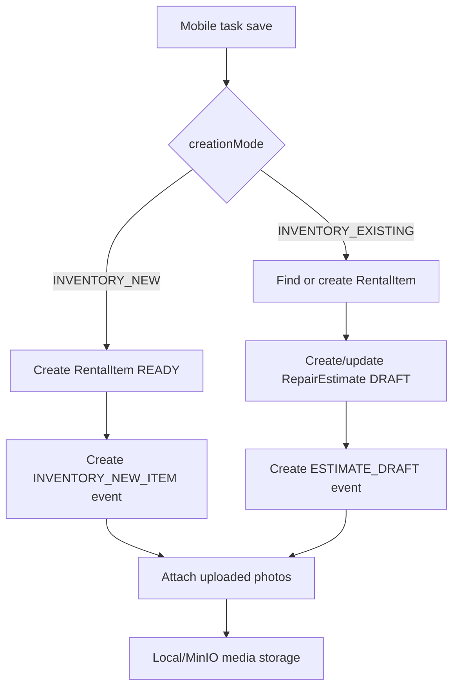
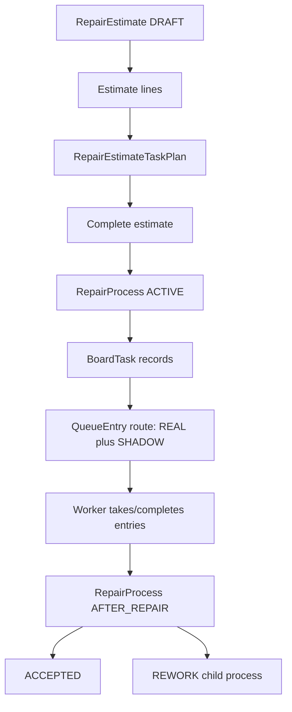

# 06 Business

## Legacy Estimate Furniture Accessory Synchronization (2026-07-10)

- Every legacy `RepairEstimateService.saveEstimate()` call, including a draft save, synchronizes furniture-linked estimate materials into the selected rental item's accessory assignments.
- The service matches estimate lines to linked accessory items by normalized catalog code, sums line quantities, creates/updates/removes `RentalItemAccessory` assignments, reduces available stock when quantities grow, and returns stock when quantities shrink or lines disappear.
- Insufficient available accessory stock rejects the synchronization. Estimate pricing remains independent and continues to use estimate line `unitPrice * quantity`.

Evidence:

- `wms-panel-old/src/main/java/dev/buhanzaz/wmspanel/service/RepairEstimateService.java:130`
- `wms-panel-old/src/main/java/dev/buhanzaz/wmspanel/service/RentalItemService.java:586`
- `wms-panel-old/src/test/java/dev/buhanzaz/wmspanel/service/RepairEstimateServiceTest.java:555`

## Domain Summary

The legacy system is not a generic WMS only. It combines:

- Warehouse-scoped numbered rental assets.
- Quantity stock and accessory stock.
- Mobile inventory/passport capture.
- Repair estimates and repair catalog.
- Work queue board for repair/movement tasks.
- Worker classes/groups and assignments.
- Reservations for rental items, stock items, and accessories.
- Media/history for item events.
- AI-assisted search.

## Warehouse

Implemented:

- Warehouses have name, code, city, address, time zone, active flag, sort order.
- Warehouse is the main scope for users, rental items, queues, workers, reservations, repair, and media paths.
- `WarehouseAccessService` determines available/default warehouses and checks access.

UNKNOWN/not found:

- Formal bins, shelves, cells, locations, or warehouse movement documents.
- Receiving docks or putaway workflow.
- Shipping workflow.

## Products / Rental Items

Implemented:

- Main numbered asset is `RentalItem`.
- `RentalItem.number` is normalized to uppercase and unique.
- Classifier hierarchy: category -> subcategory -> type.
- Dynamic passport fields are `RentalAttributeDefinition`, `RentalAttributeOption`, `RentalAttributeValue`, and classifier attribute links.
- Accessories assigned to rental item are tracked by `RentalItemAccessory`.
- History is `RentalItemEvent`; photos are `RentalItemEventPhoto`.

Business statuses:

- `READY`
- `TEMP_RESERVED`
- `RESERVED`
- `IN_RENT`
- `NEED_INSPECTION`
- `WAITING_ESTIMATE_CONFIRMATION`
- `WAITING_REPAIR`
- `IN_REPAIR`
- `WAITING_REPAIR_CHECK`
- `IN_CAP_REPAIR`

Status is a string in `RentalItem`, so service code, not DB enum mapping, is the effective source of transitions.

## Inventory

Implemented:

- Mobile inventory modes:
  - `INVENTORY_NEW`
  - `INVENTORY_EXISTING`
  - legacy `INVENTORY`
- `INVENTORY_NEW` creates a rental item, can set passport/category data, sets item status to `READY`, and creates an `INVENTORY_NEW_ITEM` event without a repair estimate.
- `INVENTORY_EXISTING` uses an existing rental item if found, but can create a missing item if not found; it creates or updates an estimate draft and latest event.
- Mobile passport can update category/subcategory/type, dynamic attributes, and accessories.
- If accessory field is missing, existing accessories are kept. If accessory list is empty, accessories are cleared.
- Photos are attached to latest inventory/estimate event.

UNKNOWN/not found:

- Cycle counting documents.
- Stock adjustment documents.
- Bin-level inventory.
- Barcode-authenticated worker flow.

## Stock And Accessories

Implemented:

- `StockItem` stores quantity-like warehouse stock with total/reserved/available behavior used by reservations and search.
- `AccessoryStockBalance` stores counters:
  - total
  - available
  - reserved
  - in rent
  - broken
  - written off
- Accessory stock can be reserved and associated with reservation lines.
- Repair estimate completion can assign furniture/accessories to items and reduce available accessory stock.

Important unknown:

- Source comment says the total balance formula is intentionally deferred. Do not invent counter invariants without checking service behavior.

## Reservations

Implemented:

- Temporary and client reservations.
- Client types: individual and legal entity.
- Reservation statuses:
  - `ACTIVE`
  - `TEMPORARY`
  - `WAITING_PAYMENT`
  - `CONFIRMED`
  - `EXPIRED`
  - `CANCELLED`
  - `COMPLETED`
- Reservation lines can target rental items and stock items.
- Reservation accessories can target accessory items and optionally reservation lines.
- Expiration/payment/cancel/release flows are in `ReservationExpirationService`.
- Search availability is in `ReservationService`.
- Smart reservation search can use AI parsing when configured.

UNKNOWN/not found:

- Scheduled reservation expiration job. Expiration service exists, but a scheduler annotation was not found.
- External payment integration.

## Repair Estimate And Repair Process

Implemented:

- Estimate starts as `DRAFT`.
- Estimate lines can be `WORK` or `MATERIAL`.
- Lines have stable `sourceLineKey`; duplicate line identity is prevented by `(ESTIMATE_ID, SOURCE_LINE_KEY)`.
- Completing an estimate can generate task plans and board tasks.
- Empty estimate can complete as ready, but empty estimate with movement can stay waiting for repair.
- Task plans can route work to queues and can generate movement tasks when required.
- Repair process statuses:
  - `ACTIVE`
  - `AFTER_REPAIR`
  - `REWORK`
  - `ACCEPTED`
  - `CANCELLED`
- Repair process kinds:
  - `ESTIMATE_REPAIR`
  - `REWORK`
- Movement flags track movement to repair and movement from repair required/done/cancelled.
- After-repair view accepts process or sends to rework.
- Rework creates child process and distinct board task; accepting completed rework can also accept source process.

## Queue Board

Implemented:

- Queues are per warehouse and have kind `MOVEMENT`, `REPAIR`, or `HOLDING`.
- Tasks are `BoardTask`; their route instances are `QueueEntry`.
- Queue entries have:
  - entry type `REAL` or `SHADOW`
  - status `WAITING`, `IN_PROGRESS`, `PAUSED`, `DONE`, `CANCELLED`
  - route index and position
  - active work seconds
- Creating a task can create a real first entry and shadow future entries.
- Completing current task promotes next shadow route entry to real.
- Later repair process queue is shadow and cannot be taken before previous queue is done.
- Reordering repair process route controls which queue can start first.
- Holding/sink queues hide or defer future shadow entries and stay at the end of queue order.
- Worker class bindings control which groups can take work.
- `stopTaskOnTake` pauses current task for same worker when taking an interrupting task.

## Receiving, Picking, Shipping

Prompt requested these categories. Source audit result:

- Receiving: UNKNOWN/not implemented as formal workflow.
- Picking: UNKNOWN/not implemented as formal workflow.
- Shipping: UNKNOWN/not implemented as formal workflow.

There may be business concepts adjacent to shipping/rental movement inside reservations and repair movement tasks, but no dedicated receiving/picking/shipping modules, entities, or screens were found.

## Business Diagrams

### Mobile Inventory / Estimate

### Repair Estimate To Queue Board

## Target Repair-Cycle Product Rules (2026-07-10)

These target rules are explicit product decisions where they differ from or simplify legacy behavior:

- Completing an estimate with zero lines marks the rental item `FREE` (`Свободная`) and creates neither a repair nor a movement. Legacy has a movement-dependent empty-estimate exception, so the unconditional target rule is a product override.
- Completing any estimate with at least one meaningful work or material line creates one cabin-root repair record. Its subtasks are snapshots of the estimate task plans and lines. Unassigned or material-only lines are retained in a fallback subtask rather than discarded.
- A completed estimate stays immutable. The repair projection can reorder its subtasks without changing the estimate snapshot. Queue/route and group-comment fields remain compatibility metadata but are not operator controls in the current `/repairs` detail.
- Direct creation under `/repairs` creates only the repair aggregate; it does not create a `RepairEstimate`. An empty direct repair may be saved as a draft, but it cannot be queued until at least one meaningful work or material line exists.
- Comments belong to individual work/material lines. The repair detail renders each `lineComment` with its source line and does not substitute or aggregate the subtask `groupComment`.
- New target estimate and repair records capture an author snapshot. Current browser-mock writes use `Текущий пользователь`; migrated records without an author show `Не указан`. Legacy proves `createdBy` audit fields for `RepairEstimate`, `RepairProcess`, and `BoardTask`, but the final username-to-display-name mapping is unresolved.

Legacy evidence:

- `wms-panel-old/src/main/java/dev/buhanzaz/wmspanel/entity/CreateAuditEntity.java`
- `wms-panel-old/src/main/java/dev/buhanzaz/wmspanel/entity/RepairEstimate.java`
- `wms-panel-old/src/main/java/dev/buhanzaz/wmspanel/entity/RepairProcess.java`
- `wms-panel-old/src/main/java/dev/buhanzaz/wmspanel/entity/BoardTask.java`
- `wms-panel-old/src/main/java/dev/buhanzaz/wmspanel/service/RepairEstimateTaskPlanService.java`
- `wms-panel-old/src/main/java/dev/buhanzaz/wmspanel/service/RepairEstimateTaskPlanGenerationService.java`
- `wms-panel-old/src/main/java/dev/buhanzaz/wmspanel/view/queueworkboard/QueueWorkBoardView.java`

Target evidence:

- `panel/src/features/repair-estimates/api/repair-estimates-api.ts`
- `panel/src/features/repair-tasks/domain/repair-task-domain.ts`
- `panel/src/features/repair-tasks/api/repair-tasks-api.ts`
- `panel/src/features/repair-tasks/adapters/local-storage-repair-tasks-adapter.ts`
- `panel/src/features/repair-tasks/repair-subtasks-editor.tsx`

## Target Ordered Repair And Amendment Rules (2026-07-10)

- Supersede the preceding blanket immutability sentence: completed estimates are read-only by default but may be amended through a dedicated command before the linked task has started.
- Amendment is allowed when no linked task exists, or when the linked task is `QUEUED`, has no `startedAt`, and all subtasks are `WAITING`. Both estimate version and nullable task version are captured at edit start and rechecked before persistence.
- A linked nonempty task cannot be silently removed by amending the estimate to zero lines. Cancellation requires a separate future product command.
- Task status and subtask kind/status are separate concepts. A movement stage is a kind, not a completion state.
- The linked task's stored subtask order is the current execution order. Before start, the operator may arbitrarily reorder work and movement stages. Reorder mutates ordered IDs/sort values only and preserves hidden queue/route/group data.
- Starting any stage makes the structural order and estimate amendment read-only. In the current target mock, non-null `startedAt`, task status other than `QUEUED`, or any subtask status other than `WAITING` blocks those mutations.
- Material-only and otherwise unassigned estimate lines receive deterministic repair-plan/subtask identities so they remain visible and orderable across amendment synchronization.

Target evidence:

- `panel/src/features/repair-estimates/api/repair-estimates-api.ts`
- `panel/src/features/repair-estimates/domain/repair-estimate-domain.ts`
- `panel/src/features/repair-tasks/domain/repair-task-domain.ts`
- `panel/src/features/repair-tasks/adapters/local-storage-repair-tasks-adapter.ts`

## Target Operational Board Rules (2026-07-10)

- Active board roots are target repairs in `QUEUED` or `IN_PROGRESS`. `DONE` and `CANCELLED` subtasks are terminal and excluded from the operational board.
- For each task, the lowest-`sortOrder` unfinished subtask is REAL and every later unfinished subtask is SHADOW. Completing the current `IN_PROGRESS` stage makes the next unfinished stage REAL by projection.
- Execution transitions are `WAITING -> IN_PROGRESS -> PAUSED -> IN_PROGRESS -> DONE`. The first start sets root `startedAt` once and root `IN_PROGRESS`; pause accumulates active seconds without clearing root start; all terminal subtasks set root `COMPLETED`.
- Queue identity priority is explicit `queueCode`, then movement-kind synthetic queues, then `routeQueueKind`, then `Без очереди`. HOLDING columns sort last.
- `sortOrder` controls one task's route. `queuePosition` controls ordering among entries from different tasks in one queue. Queue DnD changes only queue routing/position unless the safe same-task future-stage swap changes route roles deliberately.
- Take is validated under the repair mutation lock against the full warehouse/queue projection and may start only the first REAL+WAITING entry by `queuePosition` and stable tie breakers.
- Moving an `IN_PROGRESS` entry is forbidden. A same-task unfinished duplicate in the target queue is either the valid REAL-to-future WAITING route swap or an error.
- Board commands use expected task version and recheck state after acquiring the lock. DnD writes once on drop; outside drop and command conflict leave durable state unchanged.
- Completed-estimate amendment initializes plans from the linked task's current routing/order and preserves matching queue position/execution metadata during synchronization, preventing silent board-priority rollback.

Target evidence:

- `panel/src/features/task-board/domain/task-board-domain.ts`
- `panel/src/features/repair-tasks/adapters/local-storage-repair-tasks-adapter.ts`
- `panel/src/features/repair-estimates/repair-estimate-completed-workspace.tsx`

## Target Repair Execution, Acceptance, And Write-Off Rules (2026-07-10)

- Repair roots record `ESTIMATE` or `DIRECT_REPAIR` origin. The queued cabin is `REPAIR`; after every stage reaches a terminal state, the root is `COMPLETED/PENDING` and the cabin is `WAITING_REPAIR_CHECK`.
- Accepting a pending repair records decision date/author/optional comment, sets acceptance `ACCEPTED`, and returns the cabin to `FREE`. Writing it off requires a nonblank reason, records the same audit snapshot, sets acceptance and cabin to `WRITTEN_OFF`, and removes it from active acceptance.
- A stage normative time is the sum of catalog `durationMinutes * quantity` for included work lines. If no included work provides a normative duration, the stored value is `null`.
- Taking a stage requires a queue-compatible active group. Selecting one member assigns only that member; selecting the group assigns all active members. Stage pause/resume/finish updates the stage and every assignment's active-time snapshot.
- Stage completion always enters the photo workflow. A stage with any catalog work marked `photoRequired` requires at least three group-result photos; all stages cap result media at 20.
- The browser mock serializes versioned repair mutations, checks expected versions, and compensates repair/media state when a dependent rental-status or media commit fails. These are target mock guarantees, not proof of final distributed transaction semantics.

Target evidence:

- `panel/src/features/repair-tasks/model/repair-task.ts`
- `panel/src/features/repair-tasks/adapters/local-storage-repair-tasks-adapter.ts`
- `panel/src/features/repair-tasks/api/repair-tasks-api.ts`
- `panel/src/features/repair-tasks/adapters/mock-repair-worker-directory-adapter.ts`
- `panel/src/features/task-board/`

### Early draft write-off correction

- Write-off is also a valid terminal command from an editable estimate or direct-repair draft. It requires a selected cabin and a nonblank decision reason, but it does not require meaningful repair lines, board execution, or pending acceptance.
- The command stores `CANCELLED/WRITTEN_OFF`, the decision audit snapshot, current before-media and current line-derived subtasks, then compensates the repair envelope if the rental status cannot become `WRITTEN_OFF`.
- Pending media uploads are committed before the command and discarded if the command fails. Existing durable media references are reused; removed previous draft media is cleaned up only after a successful durable decision.
- An explicit valid origin is authoritative during v2 normalization. Source-id inference exists only for legacy records lacking a valid origin.

Target evidence:

- `panel/src/features/repair-tasks/model/repair-task.ts`
- `panel/src/features/repair-tasks/api/repair-tasks-api.ts`
- `panel/src/features/repair-tasks/adapters/local-storage-repair-tasks-adapter.ts`
## Target Warehouse Inventory Rules (2026-07-11)

- Starting an inventory freezes every selected-warehouse rental item whose status
  belongs to `RENTAL_ITEM_NON_RENTED_ACTIVE_STATUSES`; `RENTED` and `WRITTEN_OFF`
  are excluded from the expected population.
- Numbers use trimmed, collapsed-space, locale-aware uppercase canonicalization
  while preserving hyphens. Global creation/recheck is serialized with rental-item
  mutations and inventory-origin creation is idempotent by session/finding.
- An empty inspection is `READY` for inventory only and never changes the cabin's
  operational status. Work/material rows, prices, routes, durations, comments,
  and media references are frozen in the finding for later publication.
- Completion permits missing and conflicting items after explicit acknowledgment.
  Statistics separately aggregate work and material quantities, exact money, and
  normative minutes from the frozen snapshot.
- Repair publication occurs only after completion or an explicit late command.
  Each finding is recoverable/idempotent by source key; publishable findings may
  succeed while conflicting ones remain blocked, producing a `PARTIAL` aggregate.
- A finding with repair rows freezes the selected `AUTO` or `MANUAL` completion
  mode, whether movement is required, and each finalized ordered stage. Automatic
  mode is regenerated and validated from the current catalog; manual mode preserves
  the selected routes and stage ordering. Publication projects that frozen snapshot
  without replacing movement stages with generic repair work.

Target evidence:

- `panel/src/features/inventory/domain/inventory-domain.ts`
- `panel/src/features/inventory/api/inventory-api.ts`
- `panel/src/features/inventory/adapters/local-storage-inventory-adapter.ts`
- `panel/src/features/repair-tasks/adapters/local-storage-repair-tasks-adapter.ts`

## Target Rental Item Dossier Rules (2026-07-12)

- `CabinActivityDto` is an append-only browser projection of proven events.
  The adapter aggregates current inventory, estimate, repair, shipment, accepted
  return-receipt, and manual dossier records; it does not synthesize missing
  legacy intermediate steps.
- Pending returns and `PREPARING`/`FAILED` shipments are not rental history.
  Accepted inbound return lines appear both in the rental movement chronology
  and in inspections, with their receipt, media, actor, and proven linked
  estimate/repair references.
- Manual cabin status changes use the cabin version, require a reason, reject
  no-op transitions, and allow only `FREE`, `WAREHOUSE`, `OWN_NEEDS`,
  `RESERVED`, and `USED_SALE`. Rental, write-off, estimate-waiting, and repair
  process statuses fail closed.
- `AFTER_RENT` without a conflicting active process creates a typed estimate
  seed. Other eligible non-rented states create a typed direct-repair seed.
  `RENTED`, `WRITTEN_OFF`, estimate confirmation, and active repair states expose
  the reason instead of an invalid action.
- The cabin general comment is versioned and editable. Manual comments and
  comments projected from proven source records are immutable timeline entries.
- Every dossier mutation appends its event only after domain validation succeeds;
  optimistic conflicts leave the activity stream unchanged.

Target evidence:

- `panel/src/features/rental-items/dossier/`
- `panel/src/features/rental-items/api/rental-items-api.ts`
- `panel/src/features/repair-estimates/repair-estimates-page.tsx`
- `panel/src/features/repairs/repairs-page.tsx`

## Target Cabin Contents Transfer Rules (2026-07-12)

- A source and target must differ, belong to the same warehouse, use an active
  non-rented status, and have no unresolved equipment-disposition freeze.
- Requested quantities must be positive integers and cannot exceed the source
  snapshot. Source and target expected versions are checked under the rental
  mutation lock; success advances both versions.
- The browser coordinator persists an intent before registering the first
  active visible `MOVEMENT` queue task. It persists the confirmed task before
  applying the cabin mutation and records `APPLIED` only after success or a
  proven recovery of an already-applied mutation.
- Task failure leaves cabin contents unchanged. A stale CAS remains a visible
  `CONFLICT`; a new command with new versions does not reuse the stale attempt.
- Source and target dossier activities are mirrored from one `APPLIED` record
  with actor, timestamp, counter-cabin number, and exact items. Pending attempts
  are never projected as completed history.

Target evidence:

- `panel/src/features/rental-items/contents-transfer/`
- `panel/src/features/rental-items/api/rental-items-api.ts`
- `panel/src/api/rental-item-inventory-api.ts`

## Target MOCK Logistics Rules (2026-07-12)

- Return number lookup is global. Written-off numbers and active workflows fail
  closed; another warehouse or tenant creates a persisted conflict.
- Return media uploaded at intake is inspection media. Missing media keeps the
  line awaiting inspection rather than inventing a completed inspection.
- Missing expected furniture creates deterministic replacement estimate lines.
  Old or extra furniture remains blocked until its full quantity is allocated.
- Shipment source allocations may combine warehouse stock and several cabins.
  A single target task lists every source and destination; source and target
  versions are rechecked before physical application.
- Inter-warehouse transfer departure and arrival are separate commands. Arrival
  requires durable photos and exact contents; mismatch stays `CONFLICT` and does
  not change the warehouse.
- Active logistics intents block competing cabin, contents, estimate, repair,
  write-off, shipment, and transfer mutations.

Target evidence:

- `panel/src/features/logistics/shipments/`
- `panel/src/features/logistics/warehouse-transfers/`
- `panel/src/features/logistics/api/logistics-api.ts`
- `services/task-board-service/src/main/java/dev/buhanzaz/rwms/taskboard/`

## Target Browser MOCK Task Runtime And Schedules (2026-07-12)

- Development uses one browser aggregate for queue settings, workforce,
  schedules, assignments, tasks, routes, interruptions, notifications, and the
  simulation clock. Updates check an expected version; first registration and
  retries register repair/logistics work idempotently by `externalTaskId`.
- Pauses are a set of causes rather than one status bit. Manual, schedule, and
  interruption reasons are added and removed independently; execution resumes
  only when the set is empty.
- Taking a configured `MOVEMENT` task with `stopTaskOnTake=true` interrupts work
  that shares selected workers, creates per-task interruption links, excludes the
  interruption from active work time, and creates per-worker notifications.
- Completing movement puts interrupted work into `RETURNING`. The group's
  configured grace starts without accumulating work time; `Вернулась бригада`
  may confirm the group early, otherwise the browser evaluator advances it at
  the deadline. Schedule/manual reasons continue to block resume.
- At rest-period warning/start/end, the evaluator deduplicates per-worker events,
  applies/removes the period's schedule pause only when `autoPause` is enabled,
  and does not clear unrelated pause causes.
- Repair source tasks synchronize their full non-cancelled route using stable
  source-step IDs so already-completed prefixes and later amendments do not shift
  execution metadata. Logistics, warehouse-transfer, and cabin-content transfer
  adapters select an active visible `MOVEMENT` queue bound to
  `GENERAL_WORKER`.
- The additive development seed contains global classes, SPB workers/groups,
  matching SPB/MSK queues, schedules, and marked DEMO work. Drivers remain a
  logistics directory; MSK initially has no workers. DEMO work does not mutate
  cabin statuses or dossier history.

Target evidence:

- `panel/src/features/task-board/mock/`
- `panel/src/features/task-board/api/task-board-api.ts`
- `panel/src/features/repair-tasks/api/repair-tasks-api.ts`
- `panel/src/features/logistics/adapters/browser-logistics-preparation-task-client.ts`
- `panel/src/features/logistics/warehouse-transfers/adapters/browser-warehouse-transfer-task-client.ts`
- `panel/src/features/rental-items/contents-transfer/adapters/browser-contents-transfer-task-client.ts`

## Asset status and balance rules (approved implementation record, 2026-07-16)

The explicit legacy status mapping is `READY→FREE`, `TEMP_RESERVED→BOOKED`,
`RESERVED→RESERVED`, `IN_RENT→RENTED`, `NEED_INSPECTION→AFTER_RENT`,
`WAITING_REPAIR→REPAIR`, `IN_REPAIR→REPAIR`,
`WAITING_REPAIR_CHECK→WAITING_REPAIR_CHECK`, and
`IN_CAP_REPAIR→CAPITAL_REPAIR`. An unknown legacy value is rejected rather than
interpreted.

For a warehouse/equipment pair the operator total is `stock + non-rented cabin + rented cabin + written-off + lost`; an active hold reduces available stock
only. Quantities never become negative, and a stock transfer cannot consume
units reserved by an active hold. Warehouse↔cabin and cabin↔cabin changes write
both balance streams and two immutable ledger lines in one local transaction.
Holds and leases last 15 minutes, use expected versions/idempotency, and leases
use fencing tokens to reject stale commands.

The 2026-07-16 Stage 5 audit narrows the last sentence: stale tokens are
rejected only by the fenced endpoint, while several public cabin mutations can
bypass an active lease. The fenced cabin write-off currently reaches the
manual transition that rejects `WRITTEN_OFF`; hold commit is absent; classifier
updates do not append domain events; and no deterministic rebuild proves the
event-store projection. These are active gate failures, not deferred Stage 6+
implementation work.

### Stage 5 blocker resolution update (2026-07-16)

The audit findings above are retained as history. Current asset behavior
rejects active-lease bypasses for the listed public cabin mutations, while the
fenced path can write off a cabin only after validating its lease/fencing token.
The allocation lifecycle now records a `COMMITTED` hold without inventing a
shipment or transfer effect. Classifier create/change operations append
sanitized classifier facts, and replay twice rebuilds the same shadow checksum
and validates live projection parity.

## Stage 6 target contract evidence update (2026-07-16)

Legacy repair facts remain migration evidence, not target authority. Legacy
completion is split across estimate save, plan preparation and task generation;
legacy services also lack command-level expected-version/idempotency contracts.
The approved roadmap instead requires one local estimate/lines/plan/repair/
outbox transaction and retryable task-board synchronization.

The approved Stage 6 contract uses separate repair execution and acceptance
axes, makes child rework DRAFT creation side-effect-free, changes the source to
`IN_REWORK` only when the child is queued, and makes only an all-`DONE` plan
eligible for acceptance. It preserves the approved target overrides that an
empty estimate creates no repair and frees the cabin, while every non-empty
estimate retains material-only/unassigned lines in one repair snapshot. These
details were approved by the user's `Продолжай` response; implementation and
verification evidence remain outstanding until the Stage 6 exit gate.

### Stage 6 implementation and catalog-policy resolution (2026-07-17)

The approved estimate, repair, rework, acceptance and fenced-write-off state
machines are implemented with optimistic versions, stable idempotency keys and
truthful lease/task reconciliation. Deterministic replay, concurrency,
authorization, failure/retry and real Kafka recovery are covered by the final
18-class/116-test maintenance suite.

The approved closed catalog mapping preserves UUID/code/name/type/parent/unit/
price, applicable node booleans and reviewed queue routing. It maps 144 null
durations and 254 null link orders to zero and omits 45 non-null node sort
orders plus audit, canvas, default-quantity, additional-option,
furniture-category, main-menu order/title, link-active and all comment fields.
Exactly 232 nodes/254 links import into DRAFT; activation is a separate
MANAGE/CAS decision. Ten routed nodes use six queue snapshots bound to legacy
warehouse `00000000-0000-0000-0000-000000000002`.
