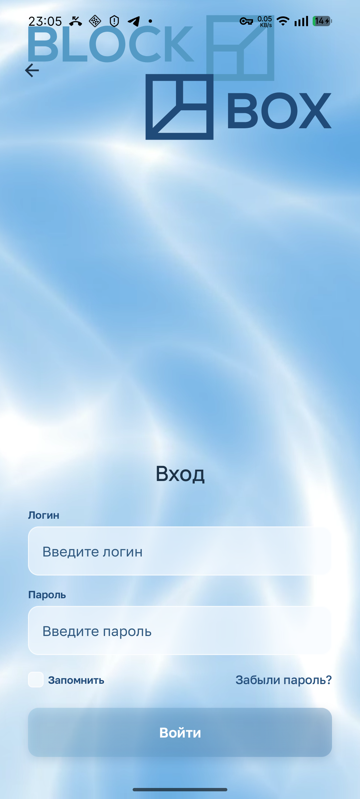
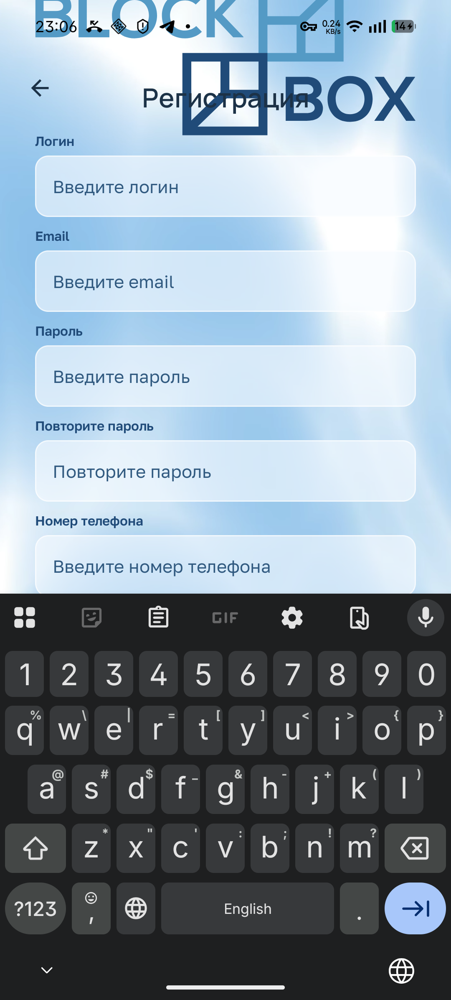
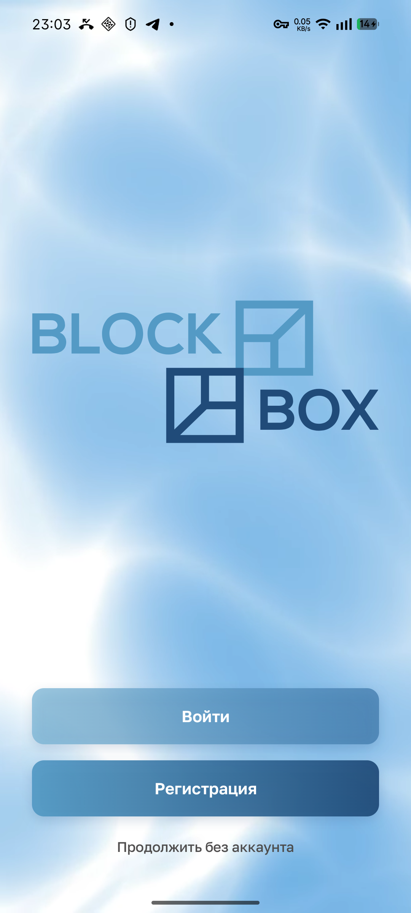
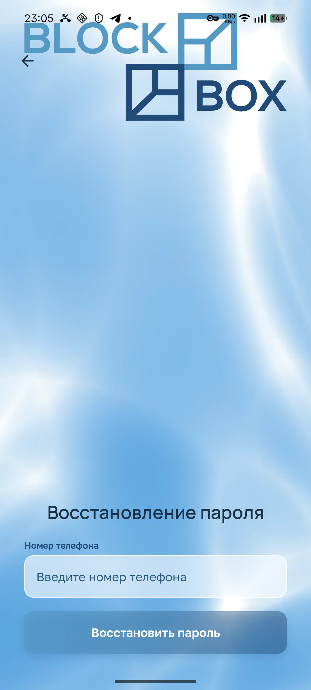
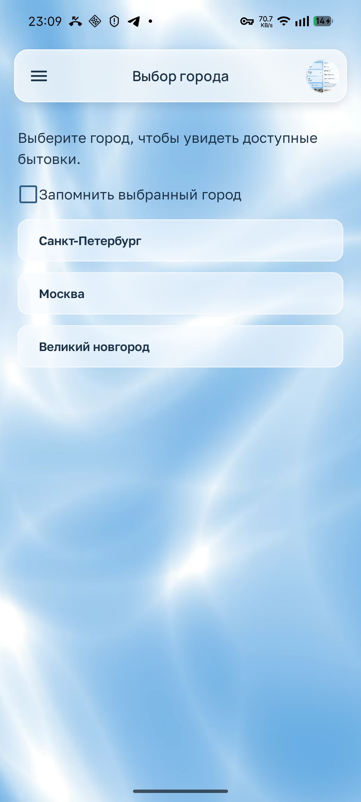
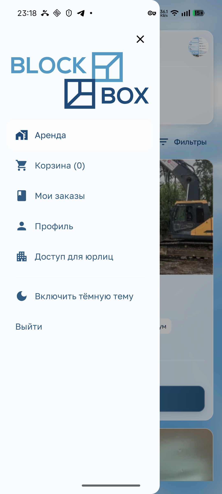

# Вход, регистрация и навигация

[К обзору](README.md) · [Обязательные правила](design-rules.md)

## A01 · P1 · Логотип выходит за верхнюю границу форм

**Основание:** телефон, владелец, код. **Повторение:** со стартового экрана открыть вход и регистрацию при закрытой клавиатуре.

Логотип слишком велик для выделенной области: верхняя часть оказывается под системной строкой и за границей экрана. Вход выглядит как незавершённая вёрстка; между верхней частью и формой остаётся большой разрыв. Это наблюдалось и после завершения перехода.

**Будущая задача:** согласовать реальные ограничения размера изображения, безопасную верхнюю область и положение формы. В `CustomerStoreLogo` переданный размер сочетается с `fillMaxWidth/aspectRatio`; это место для проверки причины, а не доказанный единственный источник дефекта. **Приёмка:** логотип целиком виден на входе, регистрации и восстановлении, не пересекается со стрелкой возврата и системной строкой, сохраняет пропорции.

[Регистрация без клавиатуры](screenshots/03-registration.png). Источник: [CustomerStoreLogo](../client-app/app/src/main/java/dev/buhanzaz/rwms/client/ui/CustomerStoreDesign.kt#L115), [компоновка авторизации](../client-app/app/src/main/java/dev/buhanzaz/rwms/client/ui/CustomerStoreWelcomeScreen.kt#L174).

## A02 · P1 · Клавиатура нарушает композицию формы

**Основание:** телефон, владелец. **Повторение:** открыть регистрацию, поставить фокус в первое поле, затем прокрутить форму вверх при открытой клавиатуре; сравнить с входом.

На регистрации заголовок попадает поверх логотипа. Нижние поля и действие уходят под клавиатуру до прокрутки; после прокрутки верхний край формы конфликтует со стрелкой и оставшимся логотипом. На входе логотип также продолжает рисоваться при вводе. Активные поля входа в снятом состоянии видны — их перекрытие здесь не утверждается.

**Будущая задача:** единая компоновка для IME: полностью скрывать/уменьшать логотип, сохранять отдельную безопасную область навигации, прокручивать активное поле и его ошибку в видимую область. Не фиксировать всю форму в высоте, которая перестаёт вмещаться с клавиатурой. **Приёмка:** пройти все поля кнопками клавиатуры и касаниями; каретка, подпись и ошибка видны; прокрутка не заводит содержимое под стрелку; отправка достижима без закрытия клавиатуры.

[Вход с IME](screenshots/04-login-ime.png) · [Регистрация после прокрутки](screenshots/06-registration-ime-scroll.png). Источник: [CustomerAnimatedAuthForm](../client-app/app/src/main/java/dev/buhanzaz/rwms/client/ui/CustomerStoreWelcomeScreen.kt#L519).

## A03 · P1 · Типографика и цвета текста не создают единую систему

**Основание:** телефон, владелец, код. **Повторение:** сравнить вход, выбор города, карточку, панель мебели, условия доставки и счёт.

Владелец отдельно отклонил оформление заголовков и ссылок входа/регистрации, затем указал на разнобой шрифтов, размеров и цветов по всему приложению. Крупные заголовки служебных форм, обычный текст и насыщенные синие подписи конкурируют; типографическая иерархия меняется между разделами. В коде уже есть Manrope и Golos Text: объявлять весь интерфейс стандартным Roboto было бы неверно.

**Будущая задача:** общий набор ролей для заголовка страницы, названия товара, подписи, ссылки, значения, цены и ошибки; привести экраны к нему. Сохранить отдельно одобренное оформление кнопок. **Приёмка:** страница образцов и одинаковые роли на всех проверенных экранах, включая кириллицу, длинные названия и обе темы; нет локально выбранных размеров/цветов без смысловой роли.

Доказательства: [вход](screenshots/02-login.png), [мебель](screenshots/18-equipment-empty.png), [время доставки](screenshots/27-delivery-times.png), [счёт](screenshots/31-payment-actions.png). Источник: [CustomerTheme](../client-app/app/src/main/java/dev/buhanzaz/rwms/client/ui/CustomerTheme.kt), [оформление элементов](../client-app/app/src/main/java/dev/buhanzaz/rwms/client/ui/CustomerStoreDesign.kt).

## A04 · P2 · Гостевой вход выглядит рабочим, но не реагирует

**Основание:** телефон, код. **Повторение:** на стартовом экране нажать гостевой вход.

Текст выглядит как доступная ссылка, но элемент отключён; нажатие ничего не делает. Клиенту приходится угадывать, сломалась ли кнопка. Визуально недоступность не объяснена.

**Будущая задача:** убрать обещание неподдерживаемого перехода либо ясно обозначить его недоступность до нажатия. Если гостевой каталог нужен продукту, это отдельная задача на поддерживаемую возможность и авторизацию; нельзя подставлять локальные товары. **Приёмка:** видимый интерактивный элемент выполняет заявленное действие, а недоступная возможность не маскируется под активную ссылку.

Источник: [CustomerAuthActions](../client-app/app/src/main/java/dev/buhanzaz/rwms/client/ui/CustomerStoreWelcomeScreen.kt#L255), [CustomerTextAction](../client-app/app/src/main/java/dev/buhanzaz/rwms/client/ui/CustomerStoreDesign.kt#L426).

## A05 · P1 · Восстановление пароля предлагает заполнить неработающую форму

**Основание:** экран на телефоне, действие по коду. **Повторение:** вход → «Забыли пароль?». Отправка во время аудита не выполнялась.

Экран просит телефон и показывает действие восстановления. В текущем обработчике после отправки устанавливается только сообщение «Восстановление пароля пока недоступно»; рабочего обращения к восстановлению здесь нет. О недоступности клиент узнаёт слишком поздно, уже потратив время на ввод.

**Будущая задача:** честно сообщать об ограничении до заполнения и дать реально поддерживаемый способ помощи. Полноценное восстановление реализовать только с согласованным контрактом auth-service. **Приёмка:** либо существует проверенный полный сценарий восстановления, либо недоступность ясна сразу; форма не имитирует отправку кода/ссылки.

Источник: [CustomerPasswordRecoveryForm](../client-app/app/src/main/java/dev/buhanzaz/rwms/client/ui/CustomerStoreWelcomeScreen.kt#L483).

## A06 · P2 · Старт не объясняет ценность клиентского магазина

**Основание:** телефон; рекомендация аудитора. **Повторение:** открыть приложение без входа.

Экран состоит преимущественно из логотипа, фона и авторизации. До ввода учётных данных человек не видит, что здесь можно выбрать конкретную бытовку, срок и доставку. Для первого визита это слабый переход от бренда к задаче клиента.

**Будущая задача:** добавить краткую содержательную вводную о магазине и понятный следующий шаг, не увеличивая высоту логотипа и не подменяя реальный каталог рекламными фиктивными карточками. Возможность просмотра до входа требует отдельного продуктового решения. **Приёмка:** новый клиент понимает назначение приложения с первого экрана; одобренные кнопки остаются основными действиями.

Доказательство: [старт](screenshots/01-welcome.png). Источник: [стартовые действия](../client-app/app/src/main/java/dev/buhanzaz/rwms/client/ui/CustomerStoreWelcomeScreen.kt#L255).

## A07 · P2 · Ввод пароля и интеграция с менеджером паролей требуют доработки

**Основание:** отсутствие переключателя видно на телефоне; семантика полей проверена по коду. **Повторение:** открыть вход/регистрацию и поставить фокус в пароль.

Нет видимого действия показать/скрыть пароль. В собственном `BasicTextField` не заданы явные роли автозаполнения логина, текущего и нового пароля. Работу конкретного менеджера паролей на телефоне не тестировали; утверждать полный отказ автозаполнения нельзя. Переходы Next/Done в формах уже предусмотрены — их отсутствие не является замечанием.

**Будущая задача:** добавить доступное переключение видимости и проверить системное автозаполнение с правильным назначением полей. **Приёмка:** длинный пароль можно проверить перед отправкой; переключение не стирает значение и не теряет каретку; менеджер паролей различает вход и создание учётной записи.

Доказательства: [вход](screenshots/02-login.png), [регистрация](screenshots/03-registration.png). Источник: [CustomerStoreInputField](../client-app/app/src/main/java/dev/buhanzaz/rwms/client/ui/CustomerStoreDesign.kt#L311).

## A08 · P2 · Искусственная задержка стартового экрана

**Основание:** код, без измерения времени запуска. При создании стартового gate выполняется заданная задержка приветствия в 3 секунды.

Постоянная заставка задерживает доступ к товару даже тогда, когда её длительность не связана с готовностью данных. Впечатление скорости ухудшается без полезной обратной связи.

**Будущая задача:** показывать бренд в рамках необходимого старта; не удерживать готовый интерфейс искусственным таймером. **Приёмка:** готовый экран открывается без дополнительной обязательной паузы; при реальном ожидании клиент видит осмысленное состояние загрузки. Проверить холодный и повторный запуск отдельно.

Источник: [CustomerStoreLaunchGate](../client-app/app/src/main/java/dev/buhanzaz/rwms/client/ui/CustomerStoreWelcomeScreen.kt#L73).

## A09 · P2 · Профиль использует другую систему полей

**Основание:** телефон и код. **Повторение:** после входа открыть профиль и сравнить поля с регистрацией.

В профиле применяются отдельные поля на базе `OutlinedTextField`; в авторизации — собственные поля с вынесенной подписью. Различаются плотность и подача форм, хотя клиент редактирует похожие данные. Снимок профиля намеренно не приложен из-за контактных данных. Сохранение не выполнялось; ошибок сохранения аудит не доказывает.

**Будущая задача:** единый стиль текстовых полей, подписи, обязательности, фокуса и сообщения об ошибке для регистрации и профиля; сохранить корректные типы клавиатуры. **Приёмка:** однотипные поля выглядят и ведут себя согласованно, большой шрифт и IME не перекрывают активное поле; изменяются только явно сохранённые данные.

Источник: [ProfileFormScreen](../client-app/app/src/main/java/dev/buhanzaz/rwms/client/ui/AuthAndProfileScreens.kt#L60), [CustomerTextField](../client-app/app/src/main/java/dev/buhanzaz/rwms/client/ui/AuthAndProfileScreens.kt#L361).

## A10 · P2 · Выбор города выглядит как технический список

**Основание:** телефон, владелец. **Повторение:** войти без сохранённого города.

Однообразные светлые строки, большой незанятый участок и отдельно стоящий стандартный чекбокс не образуют законченный экран выбора. Написание «Великий новгород» выглядит небрежно. Оно приходит из серверного поля города; клиент не должен угадывать правильный город по внутреннему названию склада.

**Будущая задача:** связать заголовок, подсказку, строки городов и запоминание общей сеткой; использовать единую подачу выбора. Корректное написание исправить в авторитетном справочнике. **Приёмка:** очевидно, что нажимается вся строка и что именно запоминается; длинные названия читаются; названия согласованы с раскрытием города в шапке.

[Раскрытие городов в шапке](screenshots/09-city-dropdown.png). Источник: [WarehouseScreen](../client-app/app/src/main/java/dev/buhanzaz/rwms/client/ui/AuthAndProfileScreens.kt#L300), [customerCityLabel](../client-app/app/src/main/java/dev/buhanzaz/rwms/client/ui/CatalogScreens.kt#L242).

## A11 · P2 · Меню: чрезмерный логотип, лишний X и разрозненные элементы

**Основание:** телефон, владелец. **Повторение:** открыть боковое меню.

Логотип занимает большую верхнюю часть панели; навигация начинается далеко ниже. Крупный X выделен как самостоятельное главное действие. Типовые иконки и строки не поддерживают одобренный стиль магазина. Владелец прямо попросил уменьшить логотип и убрать X.

**Будущая задача:** компактный бренд-блок, выровненные строки и иконки одной семьи, ясное активное состояние. Закрытие сохранить через системный возврат, жест и нажатие вне панели. **Приёмка:** меню узнаваемо как часть магазина, основные маршруты легко сканируются, X отсутствует, логотип целиком виден в обеих темах.

Источник: [ModalDrawerSheet](../client-app/app/src/main/java/dev/buhanzaz/rwms/client/ui/CustomerApp.kt#L397). Тёмный вариант: [D01](04-theme-and-accessibility.md#d01).

## A12 · P2 · «Доступ для юрлиц» расположен в основном меню и ведёт в заглушку

**Основание:** пункт виден на телефоне, обработчик проверен по коду; владелец потребовал перенос в профиль или настройки. Нажатие отдельно не воспроизводилось.

Пункт выглядит полноценным разделом, но обработчик лишь закрывает меню и сообщает, что доступ появится позже. Пользователь не может оценить доступность до перехода.

**Будущая задача:** перенести пункт из бокового меню в профиль или настройки и обозначить реальную доступность до нажатия. Существующий профиль — доступная точка размещения без отдельного нового раздела. Полный корпоративный сценарий — отдельная продуктовая задача. **Приёмка:** пункта нет в основном меню, он обнаружим в профиле/настройках; активное действие открывает поддерживаемую возможность, а недоступность не скрыта за обычным видом навигации.

Доказательство: [меню](screenshots/10-drawer.png). Источник: [legal-entity-access-placeholder](../client-app/app/src/main/java/dev/buhanzaz/rwms/client/ui/CustomerApp.kt#L452).
