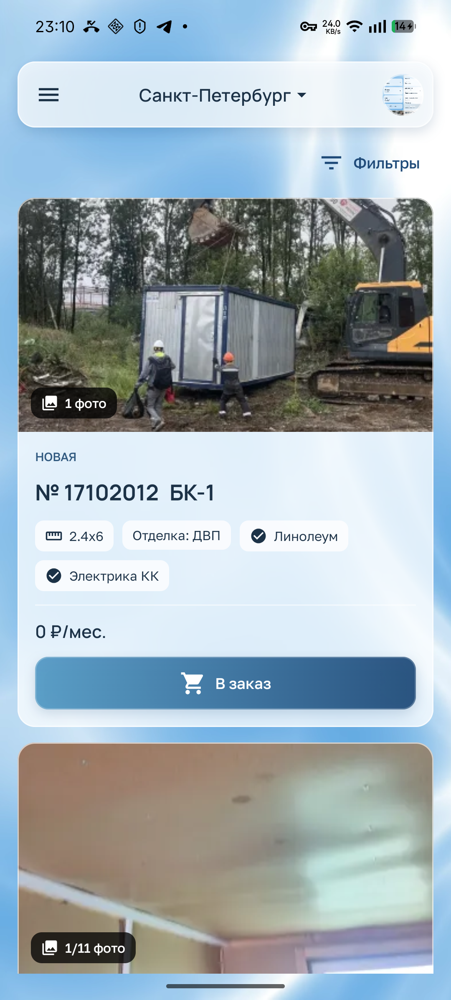
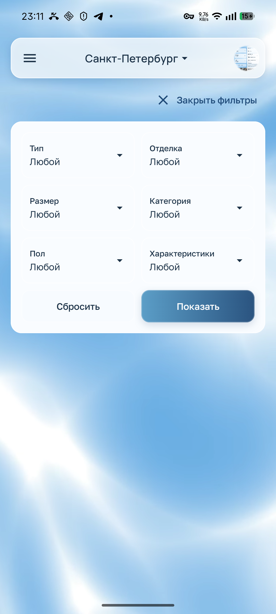
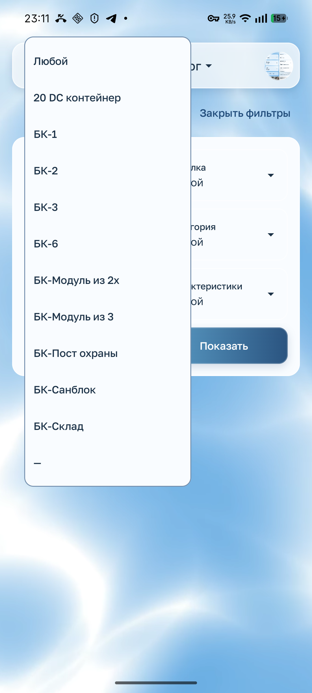
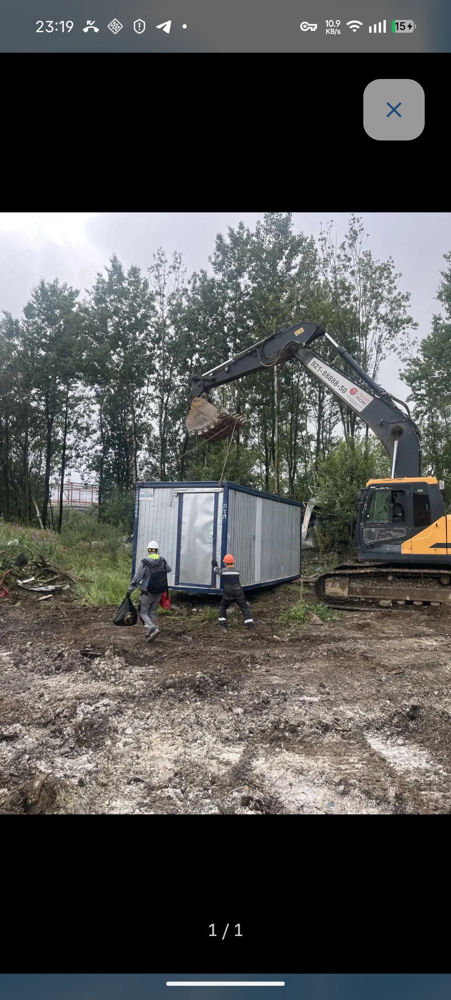
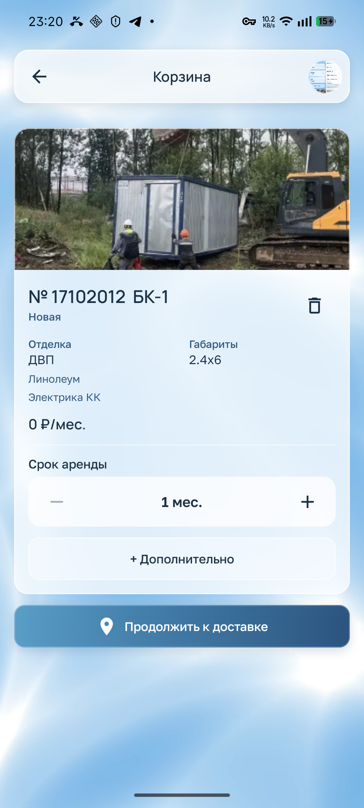
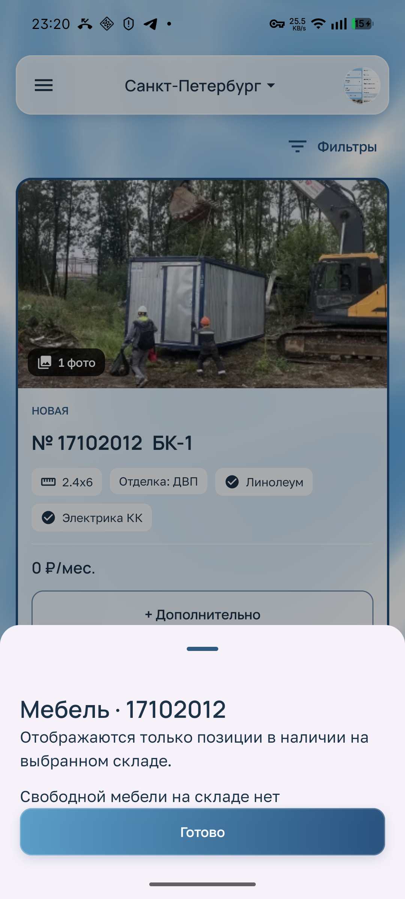

# Каталог, фильтры, фотографии и корзина

[К обзору](README.md) · [Обязательные правила](design-rules.md)

## B01 · P1 · Тип и учётный номер стоят в неверном порядке

**Основание:** телефон, владелец. **Повторение:** открыть каталог, затем добавить эту же бытовку и открыть корзину.

Сначала показан номер, следом тип; оба сгруппированы слева. Владелец требует тип у левого края, номер у правого. Сейчас служебный номер перехватывает внимание у названия товара.

**Будущая задача:** единая строка идентификации в каталоге и корзине: «БК-1» слева, «№ 17102012» справа. **Приёмка:** совпадают боковые отступы, тип и номер не слипаются; длинный тип корректно переносится, номер остаётся однозначным; порядок сохраняется с большим шрифтом.

Источники: [CabinCardBody](../client-app/app/src/main/java/dev/buhanzaz/rwms/client/ui/CatalogScreens.kt), [CartCabinCard](../client-app/app/src/main/java/dev/buhanzaz/rwms/client/ui/CheckoutScreens.kt#L174).

## B02 · P2 · Панель фильтров не согласована с шапкой

**Основание:** телефон, владелец. **Повторение:** раскрыть фильтры.

Шапка имеет выраженную фирменную поверхность, а фильтры превращаются в большую светлую форму со слабо различимыми границами полей. Часть подписей и значений читается как текст внутри общего блока, а не отдельные элементы выбора. Это другой визуальный язык.

**Будущая задача:** связать панель с шапкой общими радиусами, отступами, обводкой и типографикой. Поля должны различаться на её поверхности; выпадающие меню получать непрозрачный контейнер. **Приёмка:** закрытые/раскрытые фильтры выглядят частью шапки, все поля узнаваемы без пробного нажатия; обе темы согласованы.

Источник: [CabinFilterPanel и CatalogFacetField](../client-app/app/src/main/java/dev/buhanzaz/rwms/client/ui/CatalogScreens.kt#L607).

## B03 · P1 · Открытие фильтров убирает товары

**Основание:** телефон, владелец, код. **Повторение:** при загруженном каталоге нажать «Фильтры».

Карточки полностью исчезают, ниже панели остаётся пустое пространство. В реализации фильтры и товары находятся в противоположных ветках `if (showFilters)`. Клиент теряет контекст выбора и не может сопоставлять условия с результатом.

**Будущая задача:** раскрывать фильтры внутри страницы каталога, сохраняя список и его положение. **Приёмка:** открытие/закрытие панели само по себе не убирает карточки из страницы и не сбрасывает выбор; список доступен прокруткой; загрузка новой выдачи явно обозначена и не выглядит как отсутствие товара.

Доказательства: [до раскрытия](screenshots/11-catalog.png), [после](screenshots/12-filters.png). Источник: [CabinCatalogScreen](../client-app/app/src/main/java/dev/buhanzaz/rwms/client/ui/CatalogScreens.kt#L250).

## B04 · P1 · Выпадающий список открывается над полем

**Основание:** телефон, владелец. **Повторение:** открыть фильтры → «Тип».

Список типов уходит вверх, перекрывает часть шапки/формы и теряет понятную связь с полем. Направление не соответствует явному требованию владельца: все списки раскрываются вниз.

**Будущая задача:** управлять размещением списка относительно нижней границы поля; при недостатке места ограничивать высоту и включать прокрутку. **Приёмка:** проверить каждый фильтр, верх/низ экрана и длинный список: раскрытие всегда вниз, пункты и выбранное значение доступны, край меню не выходит под системную панель.

Источник: [CatalogFacetField](../client-app/app/src/main/java/dev/buhanzaz/rwms/client/ui/CatalogScreens.kt#L689).

## B05 · P2 · Характеристики спрятаны в неудобный мультивыбор

**Основание:** телефон, владелец, код. **Повторение:** открыть фильтры и поле «Характеристики».

Характеристики представлены ещё одним dropdown. По коду выбор пункта закрывает меню даже при множественном выборе; несколько значений сворачиваются в одну строку с обрезкой. Чтобы понять и изменить набор, нужны повторные открытия.

**Будущая задача:** отдельный блок чекбоксов с видимыми названиями. **Приёмка:** можно включить несколько характеристик подряд, увидеть все выбранные, снять одну и сбросить всё. Состояние чекбокса доступно сервисам доступности; действие не закрывает весь блок.

Доказательство: [панель фильтров](screenshots/12-filters.png). Источник: [множественный выбор](../client-app/app/src/main/java/dev/buhanzaz/rwms/client/ui/CatalogScreens.kt#L668).

## B06 · P1 · «Сбросить» очищает только черновик

**Основание:** телефон, владелец, код. **Повторение:** применить фильтр → снова раскрыть панель → «Сбросить».

Поля становятся пустыми, но для изменения применённой выдачи требуется «Показать». В коде сброс меняет только `draft`, а `onApply` вызывается отдельной кнопкой. Владелец прямо требует немедленный сброс без второго действия.

**Будущая задача:** одно нажатие сбрасывает и форму, и применённое состояние с запросом актуального каталога. **Приёмка:** без «Показать» счётчик и выбранные условия очищены, загружается нефильтрованная выдача текущего города; ошибки запроса не скрываются. Возврат в фильтры показывает согласованное состояние.

Во время обхода наблюдался промежуточный старый результат, затем каталог восстановился. **Постоянный отказ сброса и конкретная длительность задержки не доказаны.** Подтверждённое замечание — двухшаговая семантика. Источник: [обработчики Сбросить/Показать](../client-app/app/src/main/java/dev/buhanzaz/rwms/client/ui/CatalogScreens.kt#L680).

## B07 · P1 · Требуется отдельная проверка правильности фильтрации

**Основание:** сообщение владельца и наблюдение результата на телефоне; причина не установлена. **Сценарий обхода:** Санкт-Петербург → фильтр типа «БК-Санблок» → «Показать» → пустая выдача, счётчик фильтров 1. Владелец сообщил, что фильтры работают неправильно и подходящие бытовки есть.

Сам по себе пустой экран не доказывает ошибку: для доказательства нужно сопоставить ответ сервера, доступность и выбранные условия в один момент времени. В этом аудите такое сопоставление не выполнялось. Ошибку нельзя списывать на оформление и нельзя объявлять исправленной после изменения формы.

**Будущая задача:** воспроизвести на проверяемом наборе серверных бытовок; записать выбранный город, значения фасетов, параметры запроса, ответ и ожидаемые unitId. Проверить отдельно тип, размер, отделку, категорию, пол, сочетания характеристик, смену города и сброс. Затем исправить только подтверждённую причину в соответствующем владельце.

**Приёмка:** тест с заведомо подходящими и неподходящими бытовками доказывает правильный состав результата и согласованность фасетов; старый ответ не перезаписывает более новый запрос; смена города/типа не сохраняет несовместимое условие. Это будущая функциональная задача, а не результат выполненного backend-теста.

Точки исследования: [каталог и нормализация фасетов](../client-app/app/src/main/java/dev/buhanzaz/rwms/client/ui/CatalogScreens.kt), [CustomerAppViewModel](../client-app/app/src/main/java/dev/buhanzaz/rwms/client/ui/CustomerAppViewModel.kt), [контракт logistics-service](../contracts/openapi/logistics-service.yaml).

## B08 · P2 · Пустая выдача не помогает снять ограничения

**Основание:** телефон. **Повторение:** применить условие с пустым результатом.

Показано только «Свободных бытовок по выбранным условиям нет» и число фильтров вверху. Конкретное активное условие скрыто; прямого сброса рядом с пустым результатом нет. Клиент должен снова открыть форму, вспомнить выбор и разобраться со сбросом.

**Будущая задача:** видимые активные условия и осмысленное действие «Сбросить фильтры» рядом с пустой выдачей; отличать её от загрузки и ошибки. **Приёмка:** из пустого результата можно одним действием снять ограничения, город сохраняется; нулевой результат не подменяет ошибку сервера. Согласовать с B06.

Доказательство: [пустой результат](screenshots/14-filter-empty.png). Источник: [empty state каталога](../client-app/app/src/main/java/dev/buhanzaz/rwms/client/ui/CatalogScreens.kt#L318).

## B09 · P2 · Первая фотография слабо представляет товар

**Основание:** телефон; замечание к контенту. **Повторение:** открыть первую карточку каталога.

На основном фото много строительного окружения, техники и людей; конкретная бытовка не выступает ясным главным объектом. Для магазина дорогой аренды это слабое доказательство состояния товара. Нельзя делать вывод о фотографиях всего каталога по одной позиции.

**Будущая задача:** требования к обложке: реальная конкретная бытовка, целый внешний вид, различимое состояние, достаточное разрешение; дополнительные ракурсы и интерьер. Управление обложкой выполнять в существующем источнике медиа, не генерировать вымышленное состояние товара. **Приёмка:** у проверяемой позиции обложка позволяет уверенно узнать товар и сопоставить его с остальными фото.

Доказательства: [карточка](screenshots/11-catalog.png), [оригинальное фото в галерее](screenshots/17-gallery.png). Источник отображения: [CabinPhotoPager](../client-app/app/src/main/java/dev/buhanzaz/rwms/client/ui/CatalogScreens.kt).

## B10 · P2 · Характеристики поданы как внутренние обозначения

**Основание:** телефон. **Повторение:** прочитать карточку и фильтры без знания складских терминов.

Размер «2.4 × 6» не содержит единиц, «ДВП» и «Электрика КК» не объясняют клиенту свойств. Одно «Любой» используется для разных по роду и числу полей. В списке типов встречается «—», выглядящий как полноценный вариант без понятного смысла.

**Будущая задача:** клиентские названия с единицами и согласованными подписями, понятная подача отсутствующего значения. Не придумывать расшифровку «КК» без подтверждения значения в каталоге. **Приёмка:** размер имеет корректную единицу, свойства понятны вне склада, отсутствующие данные не выглядят типом товара; значения фильтра сохраняют точный смысл серверного контракта.

Доказательства: [характеристики](screenshots/11-catalog.png), [поля](screenshots/12-filters.png), [варианты типа](screenshots/13-filter-dropdown.png). Источник: [CatalogScreens](../client-app/app/src/main/java/dev/buhanzaz/rwms/client/ui/CatalogScreens.kt).

## B11 · P1 · Галерея имеет несогласованные края и тяжёлую кнопку закрытия

**Основание:** телефон, владелец. **Повторение:** нажать фото бытовки и дождаться загрузки.

Чёрное поле галереи обрамлено системными областями другого цвета, верх/низ выглядят оторванными от просмотра. Крупная плашка X похожа на отдельную системную кнопку. Владелец требует белый X на чёрном фоне без рамки, скруглённого фона и плашки. На снимке есть свободные поля вокруг фото; это не доказательство обрезки самого фото: используется `ContentScale.Fit`.

**Будущая задача:** цельный чёрный экран, согласованные системные области, безопасное положение X и счётчика. **Приёмка:** портретные и горизонтальные фото видны целиком, системные области не создают чужих полос, X белый без подложки, закрывается также системным Back; счётчик читается в обеих темах.

Источник: [FullscreenCabinGallery](../client-app/app/src/main/java/dev/buhanzaz/rwms/client/ui/CatalogScreens.kt#L862).

## B12 · P2 · Просмотр фото не имеет законченных состояний загрузки и детализации

**Основание:** краткое пустое состояние наблюдалось при открытии; возможности проверены по коду. Длительность загрузки не измерялась, отказ сети не воспроизводился.

Галерея использует `AsyncImage` без явных состояний загрузки/ошибки; клиент может видеть пустое поле без объяснения. Реализована пагинация фотографий, но нет масштабирования для осмотра деталей. Это ограничивает полезность фото перед арендой.

**Будущая задача:** стабильное место изображения, понятное ожидание и ошибка, автоматическое восстановление загрузки в согласованной политике; масштабирование/перемещение фото без конфликта с переключением страниц. **Приёмка:** медленная и неуспешная загрузка различаются; увеличение позволяет рассмотреть деталь и вернуться к целому фото; счётчик соответствует странице. Масштабирование в текущей версии не заявляется как сломанный жест — оно отсутствует в исследованной реализации.

Доказательство компоновки: [галерея](screenshots/17-gallery.png). Источник: [FullscreenCabinGallery](../client-app/app/src/main/java/dev/buhanzaz/rwms/client/ui/CatalogScreens.kt#L862).

## B13 · P1 · Карточка корзины выглядит как другой компонент продукта

**Основание:** телефон, владелец. **Повторение:** сравнить одну бытовку после выбора в каталоге и в корзине.

Фотография получает другую высоту, характеристики из компактных элементов превращаются в обычные строки, добавляются другие группировки и действия. Клиент должен заново распознавать ту же вещь. Владелец прямо отклонил различие внешнего вида.

**Будущая задача:** согласованная карточка товара с вариантами для контекста, без самостоятельного дизайна корзины. Срок, мебель и удаление занимают предусмотренные области. **Приёмка:** фото, тип/номер, факты и цена узнаваемы без повторного чтения; общие размеры и роли совпадают, добавление срока не разрушает композицию.

[Та же бытовка в каталоге](screenshots/16-catalog-selected.png). Источники: [CabinCard](../client-app/app/src/main/java/dev/buhanzaz/rwms/client/ui/CatalogScreens.kt#L365), [CartCabinCard](../client-app/app/src/main/java/dev/buhanzaz/rwms/client/ui/CheckoutScreens.kt#L174).

## B14 · P1 · Удаление обозначено только мусорной корзиной

**Основание:** телефон, владелец. **Повторение:** открыть непустую корзину.

Справа от заголовка стоит отдельная иконка удаления. Владелец требует текстовую кнопку «Удалить». Область нажатия не объявляется маленькой: используется `IconButton` с системными ограничениями; проблема — выбранная подача действия.

**Будущая задача:** читаемая подписанная кнопка в общей семье действий. **Приёмка:** «Удалить» однозначно относится к своей бытовке, работает на одной позиции, защищено от дублирования во время запроса; обновляется фактический состав корзины. Бронирование или чужой заказ этим действием не отменяются.

Доказательство: [корзина](screenshots/20-cart.png). Источник: [cart-remove](../client-app/app/src/main/java/dev/buhanzaz/rwms/client/ui/CheckoutScreens.kt#L218).

## B15 · P2 · Пустая корзина не ведёт обратно к выбору

**Основание:** телефон и код. **Повторение:** открыть пустую корзину или удалить последнюю позицию.

Остаются короткий текст и недоступное «Продолжить к доставке». Прямого «Выбрать бытовку» нет. В непустом списке продолжение находится только в конце содержимого; для длинной корзины оно уйдёт за экран — длинный список на устройстве не проверялся.

**Будущая задача:** полноценное пустое состояние с переходом в каталог; для заполненной корзины — ясное положение основной кнопки рядом со сводкой. **Приёмка:** пустая корзина ведёт к выбору одним действием; после удаления последней позиции сразу появляется это состояние; при длинном списке продолжение легко доступно и не закрывает товар.

Источник: [CartScreen](../client-app/app/src/main/java/dev/buhanzaz/rwms/client/ui/CheckoutScreens.kt#L71). Финансовая сводка: [C09](03-delivery-and-orders.md#c09).

## B16 · P2 · Панель мебели выбивается из стиля; длинный список не защищён прокруткой

**Основание:** пустая панель проверена на телефоне, длинный список — риск по коду.

Нижняя панель получает отдельный светло-лиловый оттенок и крупный заголовок; сообщение об отсутствии мебели занимает полноценный дополнительный шаг. Для непустых списков используются обычные `Column` с перебором позиций без собственной прокрутки; на малом экране содержимое и «Готово» могут не поместиться. Это не подтверждённый обрезанный длинный список: доступной мебели в проверенном состоянии не было.

**Будущая задача:** непрозрачная панель в общей палитре, компактный заголовок, понятное состояние наличия; прокрутка длинного содержимого и доступное завершение. **Приёмка:** проверить 0, 1 и много позиций, длинные названия и крупный шрифт; количества и ограничения видны, последняя строка и кнопка достижимы. Цену комплектации показывать из подтверждённых данных, см. C09.

Источники: [FurnitureSheet](../client-app/app/src/main/java/dev/buhanzaz/rwms/client/ui/CatalogScreens.kt#L815), [CartAdditionalSheet](../client-app/app/src/main/java/dev/buhanzaz/rwms/client/ui/CheckoutScreens.kt#L401).

## B17 · P1 · Плавающая корзина остаётся на экране заказов

**Основание:** телефон, владелец, код. **Повторение:** выбрать бытовку и открыть «Мои заказы», в том числе после оплаты.

Корзина продолжает висеть справа внизу, перекрывает часть содержимого счёта и выглядит неуместно в уже оформленном заказе. Владелец ограничил её видимость каталогом выбора. Текущая проверка видимости исключает ряд маршрутов, но не ограничивается каталогом.

**Будущая задача:** показывать плавающий переход только на маршруте каталога, при подходящем состоянии корзины. **Приёмка:** он есть при выборе бытовок и отсутствует в заказах, профиле, выборе города, корзине и доставке; навигация в корзину из меню сохраняется. Счётчик после оформления отдельно сверить с авторитетным состоянием — сам его вид не доказывает дублирование заказа.

Доказательства: [каталог — подходящее место](screenshots/16-catalog-selected.png), [заказ — лишний элемент](screenshots/30-order-paid.png). Источник: [условие видимости](../client-app/app/src/main/java/dev/buhanzaz/rwms/client/ui/CustomerApp.kt#L652).

## B18 · P2 · Каталог мало помогает сравнить и найти конкретную бытовку

**Основание:** телефон, код; предложение к UX, а не ошибка существующего API.

Каталог не показывает общего числа найденных позиций, текстового поиска и управления сортировкой. Фото и подробная карточка занимают значительную часть экрана; повторно найти знакомый номер или оценить объём выбора трудно. Сам размер фото не нужно механически уменьшать: для аренды оно важно.

**Будущая задача:** прежде всего показывать подтверждённое количество результатов и ясные активные ограничения. Отдельно определить необходимость поиска по номеру/типу и полезной сортировки с учётом возможностей текущего контракта. **Приёмка:** клиент понимает, сколько вариантов доступно и как сузить выбор; счётчик не выдаёт размер одной страницы за весь результат. Поиск/сортировка не объявляются обязательными полями контракта без соответствующего решения.

Доказательство: [каталог](screenshots/11-catalog.png). Источник: [CabinCatalogScreen](../client-app/app/src/main/java/dev/buhanzaz/rwms/client/ui/CatalogScreens.kt#L250).
