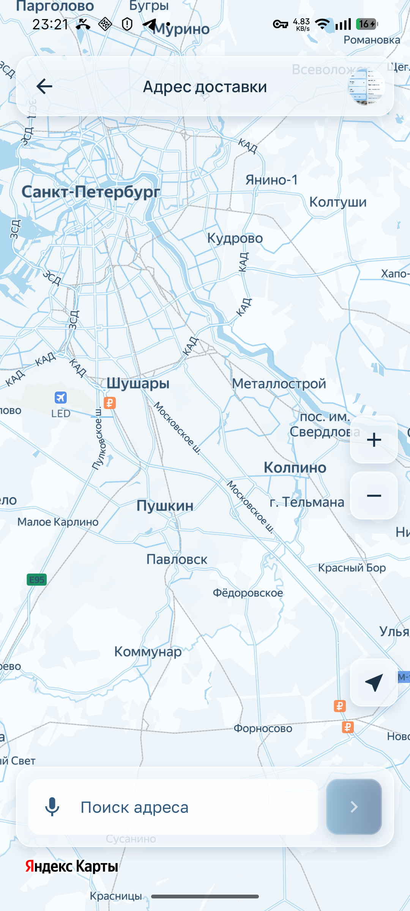
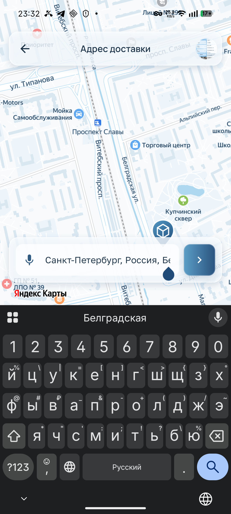
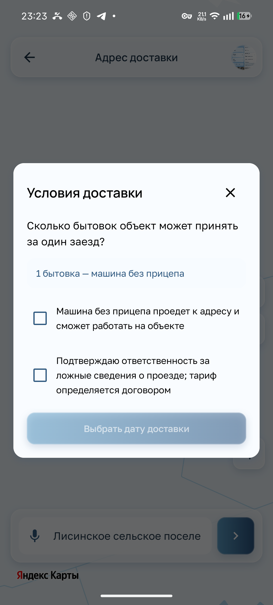
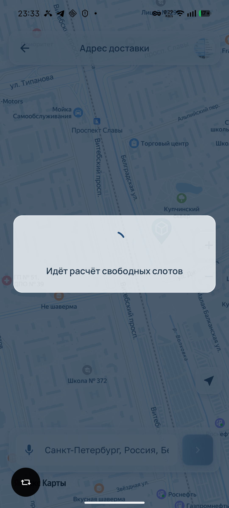
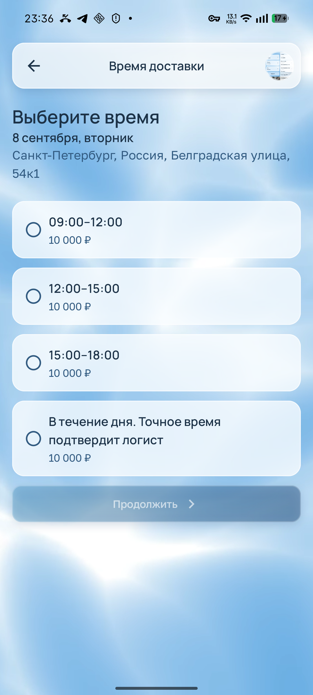
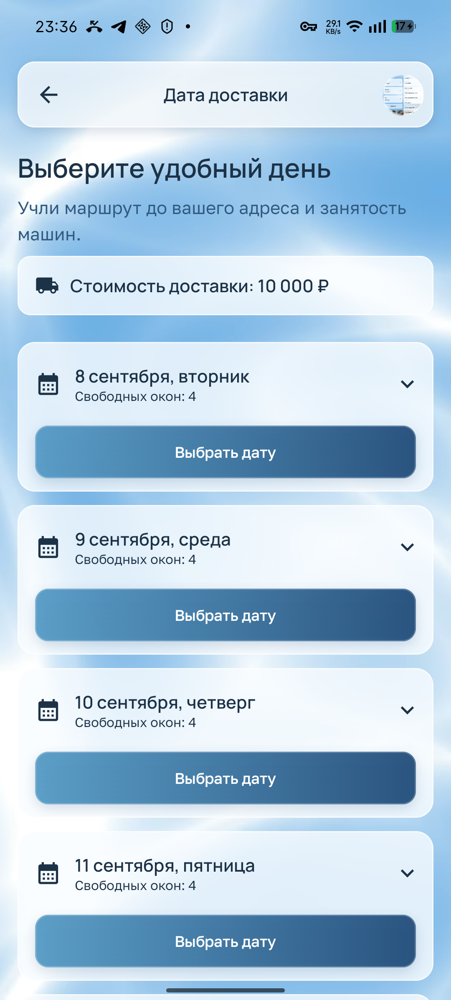
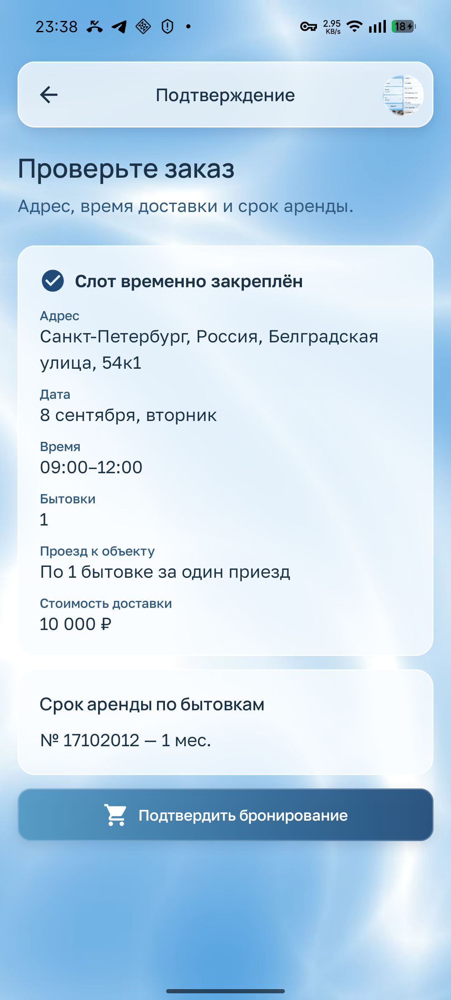
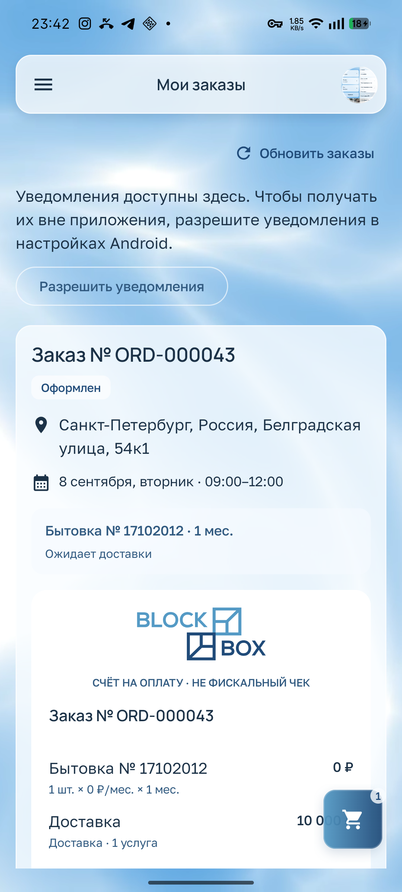
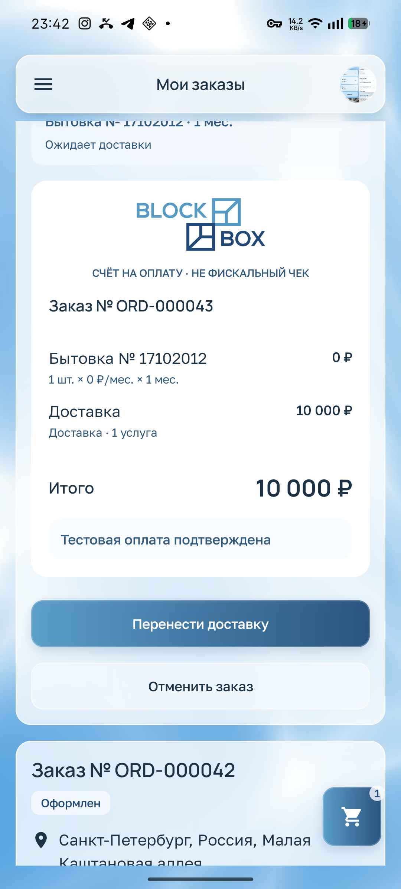

# Доставка, оформление, оплата и заказы

[К обзору](README.md) · [Обязательные правила](design-rules.md)

## C01 · P1 · Геометрия поиска на карте не согласована с шапкой

**Основание:** телефон, владелец. **Повторение:** корзина → «Продолжить к доставке».

Поиск выглядит отдельной более высокой конструкцией; логотип Яндекса находится ниже него. Владелец требует опустить поиск, поставить Яндекс выше и сделать базовый размер поиска таким же, как у шапки. При этом **цвета самой карты нужно сохранить**.

**Будущая задача:** одинаковые внешняя ширина, высота закрытого состояния и боковые отступы шапки/поиска; корректное взаимное размещение поиска, атрибуции карты, нижних контролов и системной области. **Приёмка:** Яндекс виден целиком над поиском, поиск ниже текущего положения в доступной безопасной области; с клавиатурой компоненты не перекрываются. Подсказки раскрываются отдельным блоком и не меняют базовые пропорции поля.

Источники: [DeliveryMapScreen / DeliveryAddressPanel](../client-app/app/src/main/java/dev/buhanzaz/rwms/client/ui/DeliveryFlowScreens.kt), [YandexDeliveryMap](../client-app/app/src/main/java/dev/buhanzaz/rwms/client/ui/YandexDeliveryMap.kt).

## C02 · P1 · Длинный адрес не прокручивается при перемещении каретки

**Основание:** сообщение владельца во время работы с телефоном; контекст ввода сохранён. Независимый повтор всего жеста и запись движения не выполнялись.

Владелец сообщил: при перетаскивании системного маркера курсора влево/вправо строка адреса не прокручивается, поэтому трудно вставить символ в нужное место. Это функциональная проблема ввода, которую нельзя закрыть изменением высоты поиска.

**Будущая задача:** воспроизвести с длинным русским адресом и системной клавиатурой; проверить владение выделением, обновления адреса из геокодера и горизонтальную прокрутку текстового поля. Корневая причина в этом аудите не определена. **Приёмка:** каретку можно провести к обоим концам строки, поле прокручивается вслед за ней; вставка, выделение и удаление работают в середине адреса; асинхронная подсказка не сбрасывает позицию во время редактирования.

Источник для исследования: [поле адреса](../client-app/app/src/main/java/dev/buhanzaz/rwms/client/ui/DeliveryFlowScreens.kt#L890).

## C03 · P1 · Условия доставки воспринимаются как прыгающая текстовая форма

**Основание:** телефон, сообщение владельца. Скриншот фиксирует компоновку, но не доказывает движение текста во времени.

Владелец отметил скачки текста и несогласованные размеры в условиях доставки. Длинные подтверждения, стандартные чекбоксы и блок вместимости имеют разную плотность, что затрудняет спокойное чтение важного согласия.

**Будущая задача:** общая сетка, одна роль текста условий, постоянный межстрочный интервал, предсказуемая ширина текста рядом с чекбоксом. Изменение выбора не должно внезапно двигать соседние элементы. **Приёмка:** проверить 1/2 бытовки, оба состояния согласий, длинные формулировки и большой шрифт; содержимое прокручивается, действие достижимо. Смысл проезда и ответственности сохраняется; согласия не отмечаются автоматически.

Источник: [DeliveryResponsibilityDialog / DeliveryConsentRow](../client-app/app/src/main/java/dev/buhanzaz/rwms/client/ui/DeliveryFlowScreens.kt#L944).

## C04 · P2 · В формулировках используется «приезд» / «заезд»

**Основание:** телефон, владелец. **Повторение:** открыть условия и финальное подтверждение.

На подтверждении написано «По 1 бытовке за один приезд», в условиях — «за один заезд». Последнее решение владельца — слово **«доставка»**. Ранее обсуждённое «ходка» больше не является целевой формулировкой.

**Будущая задача:** единый пользовательский словарь на всех шагах: «По 1 бытовке за одну доставку» / «До 2 бытовок за одну доставку». **Приёмка:** в соответствующих условиях и сводке нет «ходки», «приезда» и «заезда»; изменение текста не меняет вместимость машины, расчёт количества рейсов или тарифную семантику контракта.

Доказательства: [условия](screenshots/24-delivery-conditions.png), [подтверждение](screenshots/28-confirmation.png). Источник: [формулировки подтверждения](../client-app/app/src/main/java/dev/buhanzaz/rwms/client/ui/DeliveryFlowScreens.kt#L765).

## C05 · P1 · Модальное окно расчёта просвечивает

**Основание:** телефон, владелец, код. **Повторение:** подтвердить условия доставки и дождаться расчёта свободных окон.

Внутри центрального окна ожидания видна карта под ним. Это ухудшает отделение сообщения от фона и прямо нарушает требование непрозрачных модальных окон. Не все текущие окна прозрачны: контейнер условий уже принудительно непрозрачен; проблема доказана для окна расчёта.

**Будущая задача:** непрозрачные поверхности содержимого всех диалогов и нижних панелей, согласованные с темой. Затемнение вокруг остаётся отдельным слоем. **Приёмка:** сквозь содержимое окна не видно карту, карточки и фон; проверены расчёт, условия, мебель и доступные диалоги заказов в обеих темах. Полезный текст ожидания виден, бесконечное зависание не маскируется анимацией.

Источник: [DeliverySlotCalculationOverlay](../client-app/app/src/main/java/dev/buhanzaz/rwms/client/ui/DeliveryFlowScreens.kt#L419), [поверхности темы](../client-app/app/src/main/java/dev/buhanzaz/rwms/client/ui/CustomerTheme.kt).

## C06 · P2 · Одинаковая цена повторена в каждом интервале

**Основание:** телефон, владелец. **Повторение:** дата доставки → выбор времени.

Во всех четырёх видимых вариантах повторяется 10 000 ₽, хотя общая стоимость уже показана на предыдущем шаге. Строки разрастаются, а одинаковые суммы создают ложное ожидание ценовой разницы между интервалами.

**Будущая задача:** показывать общую стоимость один раз в сводке шага, интервалы оставить компактными. **Приёмка:** в наборе с одинаковой ценой она не дублируется по строкам; клиент видит выбранное время и общую сумму. Поле цены в серверном слоте не удаляется косметической правкой; фактическое изменение серверной стоимости должно честно отразиться в сводке.

Источник: [DeliverySlotsScreen](../client-app/app/src/main/java/dev/buhanzaz/rwms/client/ui/DeliveryFlowScreens.kt#L600).

## C07 · P2 · Даты и время поданы как тяжёлые повторяющиеся формы

**Основание:** телефон; рекомендация аудитора. **Повторение:** пройти даты → время → подтверждение.

Заголовок шапки дублируется крупным заголовком внутри, каждый день занимает большую карточку с одинаковым основным действием. На выборе времени много места забирают повторные пояснения. Клиент видит множество равнозначных крупных элементов; выбранный шаг и остаток пути обозначены слабо.

**Будущая задача:** компактная последовательность оформления с общей краткой сводкой и ясным активным выбором; использовать одобренный стиль кнопок с понятной иерархией. **Приёмка:** можно быстро сравнить несколько дат/окон, выбранное состояние очевидно, число шагов понятно; сокращение пространства не уменьшает области нажатия и не скрывает важные условия.

Источники: [DeliveryDatesScreen](../client-app/app/src/main/java/dev/buhanzaz/rwms/client/ui/DeliveryFlowScreens.kt#L460), [DeliverySlotsScreen](../client-app/app/src/main/java/dev/buhanzaz/rwms/client/ui/DeliveryFlowScreens.kt#L570).

## C08 · P1 · «Слот временно закреплён» не сообщает срок удержания

**Основание:** телефон, код. **Повторение:** выбрать время и открыть подтверждение до создания заказа.

Экран сообщает о временном удержании, но не показывает, сколько оно действует. Клиент не знает, можно ли спокойно проверять адрес или требуется немедленное действие. Таймер оплаты на более позднем экране существует — это другой срок и он не решает проблему удержания слота.

**Будущая задача:** понятное время окончания/остаток резерва из авторитетных данных и отдельное поведение после истечения. **Приёмка:** до создания заказа виден реальный срок удержания; при истечении нельзя подтвердить старый резерв как действующий, предлагается выбрать доступное время; часы устройства не продлевают серверный резерв. Истечение в этом аудите не воспроизводилось.

Источник: [DeliveryConfirmationScreen](../client-app/app/src/main/java/dev/buhanzaz/rwms/client/ui/DeliveryFlowScreens.kt#L734).

## C09 · P1 · До оформления нет цельной финансовой сводки; 0 ₽ не объяснён

**Основание:** телефон, текущие документы и код. **Повторение:** карточка → корзина, изменение срока → подтверждение → счёт.

Карточка показывает 0 ₽/мес. На подтверждении видна цена доставки, но нет полной общей суммы с арендой и комплектацией. Подробный точный итог появляется уже в счёте созданного заказа. Это затрудняет информированное решение до бронирования.

**Важно:** 0 ₽ не доказанная ошибка вычисления. Текущий контракт поддерживает явный нулевой тариф по умолчанию; в проверенном счёте 0 ₽ аренды + 10 000 ₽ доставки действительно дают 10 000 ₽. Нельзя заменять серверный ноль выдуманной ценой или автоматически объявлять его «по запросу».

**Будущая задача:** до подтверждения показывать согласованную серверную сводку: бытовки и сроки, комплектация, доставка, включённые суммы и итог. Отдельно проверить, соответствует ли нулевой тариф коммерческому намерению владельца цен. **Приёмка:** изменение срока/комплектации отражается в подтверждённом расчёте; неизвестная цена имеет отдельное состояние; сумма до подтверждения согласована со счётом либо изменение цены требует явного нового согласия. Денежную арифметику не переносить в UI как второго владельца.

Доказательства: [каталог](screenshots/11-catalog.png), [корзина со сроком 2 месяца](screenshots/21-cart-term.png), [подтверждение](screenshots/28-confirmation.png), [счёт](screenshots/29-payment-pending.png). Источники: [описание тарифов](../client-app/README.ru.md#L124), [CustomerPaymentReceipt](../client-app/app/src/main/java/dev/buhanzaz/rwms/client/ui/CustomerPaymentReceipt.kt), [контракт logistics-service](../contracts/openapi/logistics-service.yaml).

## C10 · P1 · Предложение уведомлений вытесняет содержимое заказов

**Основание:** телефон, владелец. **Повторение:** открыть «Мои заказы» без разрешённых уведомлений.

Вверху находится большой постоянный абзац с переходом в системные настройки и отдельная округлая кнопка, отличающаяся от фирменной семьи. Заказы начинаются заметно ниже. Владелец требует предложение в модальном окне или включение в настройках.

**Будущая задача:** краткое контекстное предложение в непрозрачном фирменном диалоге и постоянный пункт в профиле/настройках; системное разрешение запрашивать штатным способом. **Приёмка:** просмотр заказов не занят повторяющимся баннером, отказ не блокирует сценарий, настройка доступна позднее, системный статус разрешения отображается корректно.

Источники: [CustomerNotificationPermission](../client-app/app/src/main/java/dev/buhanzaz/rwms/client/ui/CustomerNotificationPermission.kt), [BookingsScreen](../client-app/app/src/main/java/dev/buhanzaz/rwms/client/ui/CheckoutScreens.kt#L538).

## C11 · P1 · На экране есть ручное «Обновить заказы»

**Основание:** телефон, владелец, код. **Повторение:** открыть «Мои заказы».

Ручная кнопка обновления перекладывает актуальность на клиента и прямо противоречит требованию автоматического обновления всех экранов. Наличие кнопки не доказывает, что автоматических механизмов сейчас совсем нет: после оплаты статус в обходе обновился.

**Будущая задача:** убрать ручное обновление/перезагрузку, закрыть необходимые триггеры автоматического чтения: вход на экран, возврат из фона, завершение команды и восстановление связи. Проверить также действия вроде «Проверить изменение», если их смысл — повторное чтение статуса. **Приёмка:** данные становятся актуальными без нажатия refresh; ошибка и ожидание различимы; фоновые запросы не мешают нажимать другие действия. Повтор чтения не повторяет оплату, создание или отмену, а политика восстановления не превращается в бесконечный retry.

Доказательство: [верх заказов](screenshots/30-order-paid.png). Источники: [onRefreshUpdates](../client-app/app/src/main/java/dev/buhanzaz/rwms/client/ui/CheckoutScreens.kt#L541), [CustomerAppViewModel](../client-app/app/src/main/java/dev/buhanzaz/rwms/client/ui/CustomerAppViewModel.kt).

## C12 · P1 · Вторичные кнопки плохо различимы; пример — «Отменить заказ»

**Основание:** сообщение владельца, сравнение светлого/тёмного экранов, код.

Владелец указал на нечитаемые кнопки, в частности «Отменить заказ». На сохранённом светлом кадре текст виден, но светлая граница и подложка слабо отделяются от карточки. Для разных состояний используется дополнительная прозрачность. Нельзя по этому кадру утверждать, что текст всегда невидим или что измерен конкретный провал контраста.

**Будущая задача:** проверить конкретные обычное, нажатое, недоступное и ожидающее состояния и обеспечить ясную роль вторичного/опасного действия в одобренной семье кнопок. **Приёмка:** подпись и область действия читаются в обеих темах и на разных кадрах фона; причина недоступности понятна; опасное действие не маскируется под декоративный текст. Саму отмену заказа в аудите не выполняли.

[Тёмный вариант](screenshots/33-dark-order.png). Источники: [OutlinedButton](../client-app/app/src/main/java/dev/buhanzaz/rwms/client/ui/CustomerStoreDesign.kt#L179), [действия заказа](../client-app/app/src/main/java/dev/buhanzaz/rwms/client/ui/CheckoutScreens.kt#L672).

## C13 · P2 · Каждый заказ превращён в длинный раскрытый счёт

**Основание:** телефон, код. **Повторение:** открыть два существующих заказа и прокрутить до действий.

Большой логотип, повтор номера заказа, каждая строка расчёта и крупные отступы постоянно занимают список. Основные сведения, статус оплаты и управление разнесены по длинной карточке; трудно быстро сравнить заказы. Брендовый счёт полезен, но его постоянная полная высота мешает обзору.

**Будущая задача:** компактная сводка заказа с явными статусом, датой, составом и итогом; подробный счёт раскрывается предсказуемо. **Приёмка:** несколько заказов легко просматриваются; точный счёт доступен, его суммы и пометка «не фискальный чек» сохранены; до оплаты сумма и срок видимы без поиска по длинной карточке.

Доказательства: [начало заказа](screenshots/30-order-paid.png), [нижняя часть со счётом и действиями](screenshots/31-payment-actions.png). Источники: [BookingsScreen](../client-app/app/src/main/java/dev/buhanzaz/rwms/client/ui/CheckoutScreens.kt#L564), [CustomerInitialPaymentReceipt](../client-app/app/src/main/java/dev/buhanzaz/rwms/client/ui/CustomerPaymentReceipt.kt#L60).

## C14 · P2 · Проверка результата оплаты оформлена как ошибка

**Основание:** переходное состояние наблюдалось на телефоне и подтверждено кодом. Кадр этого момента не включён из-за постороннего личного уведомления.

После тестовой оплаты на короткое время одновременно были видны подтверждение оплаты и красное «Проверяем результат оплаты…». По коду сообщение о проверке записывается в `paymentErrors`, а экран окрашивает его как ошибку. Нейтральное ожидание выглядит тревожно и может провоцировать лишние действия. Затем появился согласованный оплаченный результат; повторного списания аудит не обнаружил.

**Будущая задача:** отдельная подача ожидания, подтверждения и ошибки; авторитетное состояние счёта и локальная проверка не должны давать противоречивые сообщения. **Приёмка:** при неопределённом ответе показывается нейтральное ожидание, подтверждённая оплата выводится как успех, реальная ошибка содержит понятный следующий шаг; платёжная команда не повторяется автоматически.

Источники: [confirmInitialPayment](../client-app/app/src/main/java/dev/buhanzaz/rwms/client/ui/CustomerAppViewModel.kt#L775), [вывод paymentErrors](../client-app/app/src/main/java/dev/buhanzaz/rwms/client/ui/CheckoutScreens.kt#L670). Итоговый успешный результат: [скриншот](screenshots/31-payment-actions.png).
