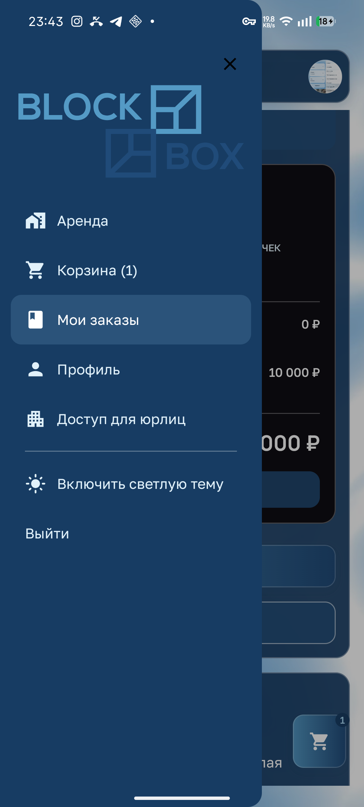
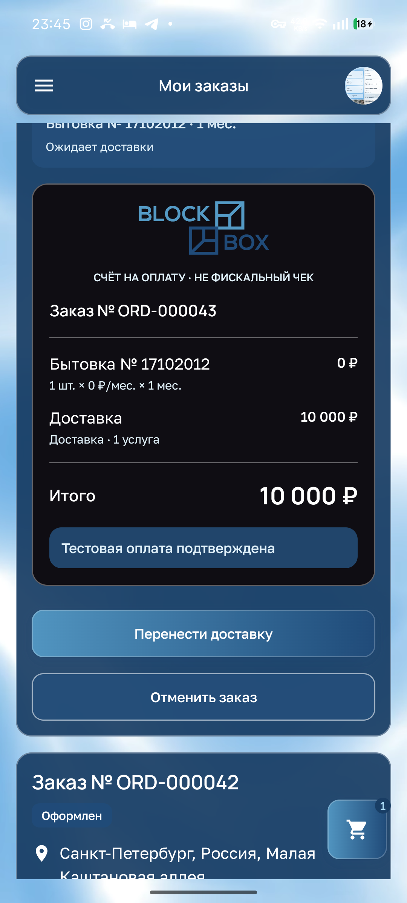

# Тёмная тема, системные области и доступность

[К обзору](README.md) · [Обязательные правила](design-rules.md)

## D01 · P1 · Тёмная тема остаётся синей, логотип теряется

**Основание:** телефон, владелец, код. **Повторение:** меню → «Включить тёмную тему» → посмотреть меню и оплаченный заказ.

Подложки становятся насыщенно-синими, при этом синий логотип используется без адаптации. Нижняя часть знака почти сливается с меню; в счёте она также плохо различается на тёмной поверхности. Владелец прямо указал, что такой режим не воспринимается как тёмная тема. Светлый анимированный фон дополнительно усиливает разрыв между фоном и карточками.

**Будущая задача:** нейтральные тёмные поверхности и предназначенный для них контрастный вариант существующего логотипа, согласованные текстовые роли и состояния. **Приёмка:** тёмный экран визуально цельный, обе части логотипа узнаваемы, меню и счёт используют согласованные поверхности. Одобренные градиенты кнопок и цвета карты сохраняются. Перекрашивание карты под нейтральную тёмную палитру не входит в это решение.

[Заказ в тёмном режиме](screenshots/33-dark-order.png). Источники: [CustomerDarkColors](../client-app/app/src/main/java/dev/buhanzaz/rwms/client/ui/CustomerTheme.kt#L79), [CustomerStoreLogo](../client-app/app/src/main/java/dev/buhanzaz/rwms/client/ui/CustomerStoreDesign.kt#L115), [поверхность счёта](../client-app/app/src/main/java/dev/buhanzaz/rwms/client/ui/CustomerPaymentReceipt.kt#L78).

## D02 · P1 · Системные значки теряют читаемость на светлом фоне тёмной темы

**Основание:** телефон, код. **Повторение:** оставить заказ открытым в тёмной теме и наблюдать фон в области системной строки.

Значки времени, сети и уведомлений становятся белыми, но под ними остаётся светлый анимированный фон. На светлых кадрах значки почти сливаются с ним. По коду выбор светлых/тёмных значков зависит только от переключателя темы, а системные панели прозрачны.

**Будущая задача:** обеспечить предсказуемый фон системных областей и соответствующий ему цвет значков; галерею и карту проверять отдельно. **Приёмка:** время и системные значки различимы на протяжении всей анимации в обеих темах; сверху/снизу нет случайных цветовых полос; элементы приложения не попадают под системные жесты. Числовой замер контраста в этом аудите не выполнялся.

Источник: [SyncCustomerSystemBars](../client-app/app/src/main/java/dev/buhanzaz/rwms/client/ui/CustomerTheme.kt#L289).

## D03 · P2 · Собственный чекбокс «Запомнить» не публикует явное состояние выбора

**Основание:** код; TalkBack не запускался.

`CustomerRememberMeOption` рисует галочку в Canvas и использует `clickable(role = Checkbox)`. Явное состояние checked/toggleable в семантике не задано. Роль чекбокса без состояния недостаточна для уверенного озвучивания выбора; это риск, требующий проверки средствами доступности.

**Будущая задача:** сохранить внешний вид, но передать полную семантику значения, доступности и действия. **Приёмка:** TalkBack озвучивает название и выбранное/невыбранное состояние, нажатие меняет его один раз, disabled корректно объявляется. Аналогично проверить новые чекбоксы характеристик.

**Не подтверждено как дефект:** маленькая область нажатия «Запомнить». Хотя видимая строка в коде имеет высоту 24 dp, дерево интерфейса показало расширенную область около 48 dp. Внешний размер рисунка не заменяет измерение интерактивной области.

Источник: [CustomerRememberMeOption](../client-app/app/src/main/java/dev/buhanzaz/rwms/client/ui/CustomerStoreDesign.kt#L369). Внешний вид: [вход](screenshots/02-login.png).

## D04 · P2 · Постоянный движущийся фон не учитывает предпочтение меньшей анимации

**Основание:** движение наблюдалось, пользовательский режим уменьшения движения в исследованном коде/навигации не найден. Производительность, расход батареи и укачивание не измерялись.

Фоновое видео сопровождает все маршруты, включая длинные формы и счёт. Это отвлекает при чтении условий и меняет визуальную подложку. Проблема читаемости системных областей отдельно подтверждена в D02; утверждать измеренные просадки FPS или расход батареи нельзя.

**Будущая задача:** согласовать движение с назначением экрана и поддержать спокойный вариант при соответствующих системных/пользовательских предпочтениях. Фирменные состояния нажатия сохраняются, но не должны мешать чтению. **Приёмка:** фон не влияет на читаемость и фокус ввода; при выбранном уменьшении движения декоративный цикл прекращается без потери информации. Производительность проверяется отдельно на целевых устройствах, а не оценивается по ощущению.

Источник: [CustomerStoreBackground / CustomerVideoBackground](../client-app/app/src/main/java/dev/buhanzaz/rwms/client/ui/CustomerStoreDesign.kt#L133).

## Что ещё обязательно проверить при реализации

Это матрица будущей проверки, а не перечень доказанных дефектов:

| Условие | Проверка |
| --- | --- |
| Большой системный шрифт | Формы, номер/тип, длинные чекбоксы, условия, сумма и кнопки не обрезаются. |
| Малый экран / горизонтальная ориентация | Прокрутка диалогов, полей и списков; доступность продолжения. |
| Другая клавиатура | Каретка, выделение, ввод телефона/email, Next/Done/Search и IME-insets. |
| TalkBack / будущий VoiceOver | Названия, роли, состояния выбора, порядок фокуса, ошибки и модальные границы. |
| Медленная/отсутствующая сеть | Загрузка не имитирует пустую выдачу; введённое не стирается; автоматическое восстановление ограничено. |
| Сворачивание / возврат | Актуальные статусы и сроки без ручной перезагрузки; команды не повторяются. |
| Все состояния кнопок | Обычное, фокус, нажатие, ожидание, disabled, ошибка; текст и назначение понятны. |
| Реальное iOS-устройство | Safe areas, Dynamic Type, жест возврата и разрешения в соответствующей реализации. |
