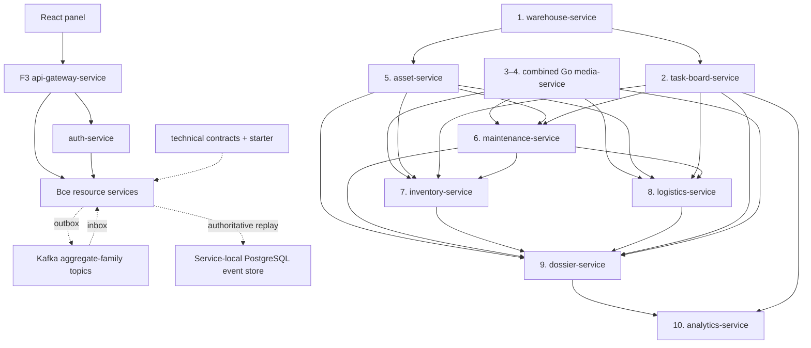

# Поэтапная декомпозиция RWMS Panel в микросервисы

Дата: 2026-07-12

Статус: утверждённый рабочий roadmap. Foundation выполняется по отдельным
gate-этапам; операционное состояние хранится только в `ACTIVE_STAGE.md`.

Технологии в этом roadmap имеют только один из четырёх проверяемых статусов:

- `IMPLEMENTED` — реально используется приложением и подтверждено тестами;
- `MIGRATION` — выполняется контролируемый переход между реализациями;
- `DEFERRED_DOMAIN_USE` — технология ждёт owning stage и не подключается к
  бизнес-коду заранее.

Текущий разрешённый этап и правила перехода между этапами фиксируются в
[`ACTIVE_STAGE.md`](ACTIVE_STAGE.md). Утверждение roadmap не разрешает начинать
следующий этап автоматически: одновременно активен только один этап, и его
границы обязательны для всех изменений.

## Overview

Цель — последовательно заменить browser MOCK и прямые связи между React-feature
модулями на автономные сервисы с явным владельцем данных. Один этап создаёт или
меняет только один сервис. Следующий этап начинается только после полного
cutover и проверки предыдущего.

План использует strangler-подход:

1. существующий UI сохраняется;
2. browser-хранилище скрывается за feature port;
3. появляется versioned HTTP-клиент;
4. один домен переносится в собственный сервис и PostgreSQL;
5. production переключается на HTTP и остаётся fail-closed;
6. browser adapter сохраняется только как явно помеченный development fixture;
7. после проверки начинается следующий сервисный этап.

## Context From Discovery

### Уже существующие production-границы

- `auth-service` владеет OAuth2/OIDC, USER/WORKER credentials, ролями и
  warehouse-access grants.
- `task-board-service` владеет очередями, классами, рабочими, бригадами,
  заданиями и базовым исполнением, но ещё не достиг parity с текущим browser
  runtime графиков, независимых pause reasons, RETURNING и уведомлений.
- У обоих сервисов отдельные PostgreSQL. F1/F2 уже заменили исторический
  Liquibase runtime на JPA validation и проверяемые SQL-релизы, не удаляя
  существующие данные и `databasechangelog*` таблицы.

Evidence:

- `services/auth-service/`
- `services/task-board-service/`
- `compose.yaml`
- `settings.gradle.kts`
- `panel/src/features/auth/`
- `panel/src/features/settings/task-board/`
- `panel/src/features/task-board/mock/`

### Browser-owned бизнес-состояние

| Область | Текущее доказательство |
|---|---|
| Склады и локации | `panel/src/api/warehouse-api.ts`, `warehouse-location-api.ts` |
| Бытовки, паспорта, статусы | `panel/src/features/rental-items/api/rental-items-api.ts` |
| Оборудование, остатки, списания | `panel/src/api/equipment-api.ts` |
| Инвентаризации | `panel/src/features/inventory/adapters/local-storage-inventory-adapter.ts` |
| Сметы | `panel/src/features/repair-estimates/adapters/local-storage-repair-estimates-adapter.ts` |
| Ремонты | `panel/src/features/repair-tasks/adapters/local-storage-repair-tasks-adapter.ts` |
| Ремонтный каталог | `panel/src/features/settings/estimates-repairs/api/repair-estimate-catalog-store.ts` |
| Возвраты и отгрузки | `panel/src/features/logistics/api/logistics-api.ts`, `shipments/adapters/browser-shipment-client.ts` |
| Межскладские перемещения | `panel/src/features/logistics/warehouse-transfers/` |
| Досье | `panel/src/features/rental-items/dossier/adapters/browser-rental-item-dossier-adapter.ts` |
| Медиа | `panel/src/features/repair-estimates/adapters/indexed-db-repair-estimate-media-adapter.ts` |

### Наиболее сильные связи в panel

Статический аудит feature imports показывает высокую связность:

- `logistics -> rental-items`;
- `inventory -> repair-estimates` и `inventory -> rental-items`;
- `repair-tasks -> repair-estimates`;
- `task-board -> repair-tasks`;
- `acceptance -> repair-tasks`;
- двусторонние связи `rental-items <-> logistics` и
  `repair-estimates <-> repair-tasks`.

Эти связи нельзя механически перенести как синхронные межсервисные вызовы.
Текущие rollback/journal механизмы доказывают необходимость saga и
reconciliation, но не являются backend-контрактами.

## Chosen Decomposition

### Рекомендуемый вариант: domain strangler

Первый проход создаёт крупные, но цельные bounded contexts:

- `asset-service` совместно владеет бытовками, оборудованием, остатками и
  наполнением;
- `maintenance-service` совместно владеет ремонтным каталогом, сметами,
  ремонтами, приёмкой и доработками;
- `logistics-service` совместно владеет возвратами, отгрузками и межскладскими
  перемещениями.

Это минимизирует количество распределённых транзакций во время первого
production cutover.

### Отклонённый сейчас вариант: сервис на каждый экран

Отдельные `estimate-service`, `repair-service`, `equipment-service`,
`rental-item-service`, `return-service`, `shipment-service` и
`transfer-service` создадут циклические зависимости и saga почти для каждой
операции. Разделение допускается позднее только при доказанном независимом
lifecycle, нагрузке и стабильных event contracts.

### Отклонённый сейчас вариант: один operational-core

Один новый сервис быстрее заменит localStorage, но восстановит монолит и общую
схему. Он не решает владение данными и затрудняет независимое масштабирование.

### Gateway decision

После миграции существующих сервисов foundation gate F3 создаёт stateless
Spring Cloud Gateway Server MVC. Gateway предоставляет единый origin для OIDC и
`/api/**`, но не является BFF: у него нет БД, message-bus participation, token exchange или
бизнесовой агрегации. Downstream services повторно валидируют JWT, а внутренние
service-to-service вызовы идут напрямую по закрытой сети.

## Target Repository Shape

```text
rwms/
├── panel/
├── contracts/
│   ├── openapi/
│   └── events/
├── platform/
│   ├── technical-contracts/           # framework-neutral technical records
│   └── spring-boot-starter/            # conditional technical configuration
├── services/
│   ├── auth-service/                 # existing
│   ├── task-board-service/           # existing, parity in stage 2
│   ├── api-gateway-service/           # stateless foundation edge
│   ├── warehouse-service/
│   ├── media-service/
│   ├── asset-service/
│   ├── maintenance-service/
│   ├── inventory-service/
│   ├── logistics-service/
│   ├── dossier-service/
│   └── analytics-service/
├── compose.yaml                         # local development/test dependencies only
├── settings.gradle.kts
└── WMS_ARCHITECTURE_KNOWLEDGE/
```

`contracts` содержит canonical schemas. `platform:technical-contracts` —
отдельный узкий Java-модуль только с immutable technical records; ни один из
них не содержит JPA entities, repositories, domain enums или business rules.

## Dependency Direction



Стрелка означает контрактную зависимость или event consumption, а не общий
доступ к БД.

## Panel Route To Stage Matrix

| Panel route / surface | Production owner / cutover stage |
|---|---|
| `/settings/users` | existing `auth-service` |
| `/settings/task-board`, `/task-board` | Stage 2 `task-board-service` |
| Shared uploads, galleries and fullscreen media | Combined Stage 3–4 Go `media-service` |
| `/warehouse`, `/equipment`, `/write-offs/equipment`, cabin overview/passport/comments/actions | Stage 5 `asset-service` |
| `/estimates`, `/repairs`, `/acceptance`, `/settings/estimates-repairs`, cabin write-off | Stage 6 `maintenance-service` |
| `/inventory/**` | Stage 7 `inventory-service` |
| `/logistics/returns`, `/logistics/shipments`, `/logistics/transfers` | Stage 8 `logistics-service` |
| Warehouse-detail dossier tabs: history and cross-domain projections | Stage 9 `dossier-service` |
| `/`, `/kpi` | Stage 10 `analytics-service` |

Поздний read-model может обслуживать часть чтения route, например dossier tabs
или dashboard projection, но это не переносит command ownership из сервиса,
назначенного на более раннем этапе.

## Foundation Delivery Before Stage 1

Foundation выполняется строго
`F0 → F1 → F2 → F3 → F1C → F4K → F4MA → F4MT → F4A → F4T → F4R → F4G → W1`. Текущий gate определён
только в `ACTIVE_STAGE.md`; закрытие каждого gate требует полного exit-checklist
и отдельного проверенного коммита.

- **F0 Migration Foundation** не меняет application deployable: backup/restore
  evidence, SQL release tooling, technical contracts, common starter и RabbitMQ.
- **F1 Auth Foundation** меняет только `auth-service`: отказ от Liquibase,
  production JPA `validate`, reviewed SQL releases и declarative service clients.
- **F2 Task Board Foundation** меняет только `task-board-service`: такой же
  schema cutover, common platform wiring и service-owned outbox/inbox relay без
  преждевременной реализации Stage 2 parity.
- **F3 API Gateway** добавляет только stateless gateway на `8088`.
- **F1C Auth Warehouse Existence Correction** меняет только `auth-service`:
  добавляет отключаемую до W1 fail-closed проверку существования склада,
  least-privilege `warehouse.read` client и reviewed SQL-канонизацию известных
  `spb`/`msk` access-grant aliases в UUID.
- **F4K Kafka/Java Foundation** не меняет application deployable: version
  catalog, convention plugin, Lombok/MapStruct policy, Kafka/Cloud Stream,
  event-store conventions и TDD platform tests.
- **F4MA Auth Flyway Migration** меняет только `auth-service`: переводит
  authority схемы с исторического custom runner на Flyway и cumulative V2.
- **F4MT Task Board Flyway Migration** меняет только `task-board-service`:
  переводит authority схемы на Flyway и cumulative V4.
- **F4A Auth Event Sourcing** меняет только `auth-service`.
- **F4T Task Board Event Sourcing** меняет только `task-board-service`.
- **F4R Target Spring Rabbit Retirement** удаляет AMQP из target
  Spring/task-board runtime после Kafka parity, сохраняет изолированный
  media-compat Rabbit для неизменённого Go worker до cutover combined Stage
  3–4 media-service и не переписывает
  исторический факт внедрения RabbitMQ в F0/F2.
- **F4G Gateway/Observability** меняет только `api-gateway-service` и завершает
  единый telemetry contract трёх существующих deployables.
- **F4I Infrastructure Readiness** superseded: deployment-readiness work is
  removed from this service-only roadmap and is not an exit gate.
- **W1 Warehouse** является реализацией Stage 1.

### Verified foundation history

| Gate | Commit | Technology status and evidence |
|---|---|---|
| F0 | `a3da339` | `IMPLEMENTED`: backup/restore, reviewed SQL runner, technical contracts/common starter and RabbitMQ foundation; no application deployable changed |
| F1 | `9704f27` | `IMPLEMENTED`: auth JPA/reviewed-SQL cutover, OAuth persistence, PKCE/JWKS/login regression and restored-data validation |
| F2 | `3a47888` | `IMPLEMENTED`: task-board JPA/reviewed-SQL cutover, optimistic/idempotency compatibility and RabbitMQ outbox/inbox/relay |
| F3 | `7e6f4aa` | `IMPLEMENTED`: stateless gateway, single-origin OIDC/API cutover, defense-in-depth JWT and live PKCE verification |
| F1C | `d50922d` | `IMPLEMENTED`: auth-only canonical warehouse UUID migration and disabled-by-default least-privilege existence validation; 59 auth, 26 gateway and 76 task-board tests passed with documented conditional skips |
| F4K | `52c0702` | `IMPLEMENTED`: version catalog/convention plugins, guarded Lombok/MapStruct, Kafka 4.3.1/Cloud Stream foundation, V2 technical envelope, validated delivery/event-store schemas and KRaft core profile; full Gradle build passed 254 tests with zero failures and two documented skips |
| F4MA | `334576a` | `IMPLEMENTED`: auth Flyway 12.4.0 cutover with cumulative V2, explicit existing-database baseline 2, validate-only JPA and preserved migration evidence; 72 tests passed with zero failures/errors and one expected environment skip |
| F4MT | `01cb9c2` | `IMPLEMENTED`: task-board Flyway 12.4.0 cutover with cumulative V4, exact historical catalog/checksum preflight, explicit existing-database baseline 4, validate-only JPA and preserved Rabbit/history evidence; the forced suite passed 87 tests with zero failures/errors and one expected environment skip |
| F4A | `cd0dfd9` | `IMPLEMENTED`: auth event sourcing for non-secret authorization aggregates, Flyway V3, deterministic baseline/replay, Kafka outbox/inbox/DLT and recovery; auth 129, task-board 87 and gateway 26 tests passed |
| F4T | `0c0957e` | `IMPLEMENTED`: task-board Flyway V5 event sourcing, synchronous projections, Kafka outbox/inbox/DLT/quarantine and Rabbit-to-Kafka cutover rehearsal |
| F4R | `c58c9fb` | `IMPLEMENTED`: RabbitMQ removed from target Spring runtime and isolated behind the `media-compat-rabbit` profile for the unchanged Go worker |
| F4G | `08d4037` | `IMPLEMENTED`: stateless gateway probes, authenticated Prometheus, OTLP tracing, ECS logs, W3C propagation and forbidden-state architecture guards |

RabbitMQ остаётся честным `IMPLEMENTED` фактом F0/F2. С начала F4 он получает
статус `MIGRATION`, а после F4R — исторический superseded implementation. Это не
разрешает удалять старые DB-колонки, таблицы или migration evidence.

### Auth/service-client provisioning gate

В F1 существующий `auth-service` доводится до конфигурационного контракта
service-client provisioning. Он не совмещается с изменением другого deployable.

- confidential clients и scopes описываются декларативно и применяются
  идемпотентно через контролируемый bootstrap/admin mechanism;
- дальнейшее добавление service client не требует изменения или пересборки
  исходного кода `auth-service`;
- для каждого клиента фиксируются audience, grant type, least-privilege scopes,
  владелец секрета, rotation/revocation procedure и production secret source;
- token acquisition, неверный audience/scope, disabled client и secret rotation
  покрываются contract/integration tests;
- warehouse ID остаётся opaque value: auth может проверить существование склада
  при изменении grant через `warehouse.read`, но не получает warehouse entities
  и не вызывает warehouse-service при проверке каждого JWT.

Gate считается закрытым только после регистрации заранее известных клиентов
активных этапов и доказательства, что последующее конфигурационное provisioning
не изменяет второй deployable service внутри domain stage.

- Один stateful service — одна БД и собственная `flyway_schema_history`.
- JPA mappings являются application model source, но Hibernate не создаёт, не
  обновляет и не удаляет target schema: dev/test/production используют только
  `ddl-auto=validate` после Flyway migration.
- Flyway является единственным target-механизмом migration ordering, version и
  checksum. Liquibase запрещён; `baselineOnMigrate=false` обязателен.
- Existing non-empty databases получают только явный operator-controlled
  Flyway baseline на доказанной текущей версии. Новые БД устанавливаются из
  cumulative baseline migration, затем применяют более новые `V*` migrations.
- Старые `database/releases`, `rwms_schema_history` и `databasechangelog*`
  сохраняются как read-only migration evidence и не являются active authority.
- Между БД запрещены FK, joins и shared JPA entities.
- Mutable commands используют `expectedVersion`/ETag и единый `409` envelope.
- Create/retry commands используют `Idempotency-Key` или стабильный
  domain `externalId`.
- Каждый изменяющий сервис имеет transactional `outbox_event`.
- Event consumers имеют `inbox_message` и дедупликацию `eventId`.
- REST используется для немедленного operator result; события — для проекций и
  downstream effects.
- 2PC запрещён. Инициирующий сервис владеет saga state и компенсациями.
- JWT проверяется локально по issuer/audience; auth-service не вызывается на
  каждый запрос.
- Service-to-service clients получают least-privilege OAuth scopes.
- Browser DTO/localStorage envelope не считается backend schema.
- UI preferences остаются client-side до отдельного product decision.

Существующие `EventEnvelope` и `ActorSnapshot` — Rabbit V1 compatibility
contract. F4K не изменяет их поля или JSON и не выполняет breaking migration:

```json
{
  "eventId": "uuid",
  "eventType": "asset.rental-item.status-changed.v1",
  "eventVersion": 1,
  "occurredAt": "ISO-8601 UTC",
  "producer": "asset-service",
  "aggregateType": "RentalItem",
  "aggregateId": "uuid",
  "aggregateVersion": 12,
  "correlation": {
    "correlationId": "uuid",
    "causationId": "uuid-or-null"
  },
  "actor": {
    "actorId": "opaque-subject-id",
    "actorType": "USER",
    "displayName": "legacy-v1-snapshot"
  },
  "payload": {}
}
```

F4K добавляет рядом новый framework-neutral `DomainEventEnvelopeV2`.
`occurredAt` nullable для честного baseline неизвестной исторической даты;
`recordedAt` обязателен и означает время записи. Actor содержит только
санитизированную opaque-ссылку без display name, login, email или другого PII:

```json
{
  "envelopeVersion": 2,
  "eventId": "uuid",
  "eventType": "task-board.board-task.cancelled.v1",
  "eventVersion": 1,
  "occurredAt": null,
  "recordedAt": "ISO-8601 UTC",
  "producer": "task-board-service",
  "aggregateType": "BOARD_TASK",
  "aggregateId": "uuid",
  "aggregateVersion": 12,
  "correlation": {
    "correlationId": "uuid",
    "causationId": "uuid-or-null"
  },
  "actorRef": {
    "subjectId": "opaque-subject-id",
    "principalType": "USER",
    "profileRevision": "opaque-revision-or-null"
  },
  "payload": {}
}
```

До F4 RabbitMQ был общей at-least-once event bus. F4 переводит существующие
deployables на Kafka aggregate-family topics через Cloud Stream. PostgreSQL
service-local event store становится источником бессрочного domain replay;
Kafka остаётся транспортом, а transactional outbox/inbox — границей
согласованности. События и DLT не содержат PII, credentials, password hashes,
tokens, secrets или полный business payload, который не нужен контракту.

> F0–F1C sections below are archived closure-criteria definitions. Their
> completion is proven by the verified commit/evidence table above and durable
> migration evidence; unchecked syntax here is not active unfinished work and
> does not reopen those gates.

### F0 migration foundation exit

- [ ] auth/task-board backups, schema inventories, constraints, indexes and
      checksums are captured outside Git in `.rwms-migration-backups/`;
- [ ] each backup is restored into isolated PostgreSQL and compared with its
      source inventory;
- [ ] rollback runbooks and Liquibase-to-JPA compatibility fixtures are verified;
- [ ] reviewed SQL release runner proves advisory locking, ordered apply,
      checksum drift rejection, `verify.sql` and `rwms_schema_history`;
- [ ] `platform:technical-contracts` has no runtime dependencies and passes
      JSON/immutability/structural validation tests;
- [ ] common starter is conditional, blocks unsafe production DDL, and does not
      create a `SecurityFilterChain`;
- [ ] RabbitMQ retry/DLQ/confirm and outbox/inbox conventions are proven;
- [ ] no application deployable behavior changed.

### F1 auth foundation exit

- [ ] auth baseline/release SQL recreates a clean schema and upgrades the
      restored F0 snapshot without data loss;
- [ ] Liquibase runtime/build/configuration is removed only from `auth-service`;
- [ ] production starts with JPA `validate`; unsafe DDL modes fail startup;
- [ ] existing OAuth authorizations, clients, USER/WORKER separation, login,
      PKCE and JWKS remain compatible;
- [ ] service clients/scopes are declarative, idempotent, least-privilege and
      configuration-driven with external secret ownership/rotation;
- [ ] the public issuer works at the future gateway `/auth` prefix;
- [ ] verified pre-migration backup restore rollback exists before cutover.

### F2 task-board foundation exit

- [ ] task-board baseline/release SQL passes the same clean/upgrade/repeat/
      checksum/JPA validation matrix against the restored F0 snapshot;
- [ ] Liquibase is removed only from `task-board-service`;
- [ ] technical starter/contracts are integrated without changing current API
      semantics, optimistic locking or external-task idempotency;
- [ ] service-owned outbox/inbox and RabbitMQ relay pass duplicate, retry, DLQ
      and outage recovery tests;
- [ ] Stage 2 schedules/notifications production parity is not implemented early;
- [ ] tested rollback exists before cutover.

### F3 stateless API gateway exit

- [ ] Spring Cloud Gateway Server MVC runs on `8088` without DB or RabbitMQ;
- [ ] `/auth/**`, `/api/task-board/**` and reserved `/api/warehouse/**` routes
      preserve their approved prefixes;
- [ ] panel OIDC/API uses the gateway origin and Vite proxies `/auth/**` and
      `/api/**` to it in development;
- [ ] gateway and downstream services both validate JWT for protected APIs;
- [ ] internal client-credentials traffic bypasses the gateway;
- [ ] trusted forwarded-header, CORS, discovery/JWKS, PKCE, logout, invalid
      issuer/audience and direct-backend exposure tests pass.

### F1C auth warehouse-existence correction exit

- [ ] only `auth-service` is changed; disabled validation preserves pre-W1
      login, token, current-user and user-administration behavior;
- [ ] enabled validation obtains only `warehouse.read`, validates every distinct
      UUID before persistence and fails closed without partial grant mutation;
- [ ] the auth-local client contract accepts only exact `{id, version, active}`
      responses and distinguishes invalid ID, not-found/inactive and upstream
      unavailable outcomes;
- [ ] the reviewed alias release canonicalizes only known `spb`/`msk` values,
      preserves source row IDs and `created_at`, deletes/merges no grant,
      increments `version`/`updated_at` for changed rows, rejects collisions and
      unmapped opaque IDs, and proves clean/repeat/checksum/verify/JPA validation;
- [ ] rollback is the verified pre-migration backup restore; no compensating SQL
      is required or claimed for the alias rewrite;
- [ ] auth, task-board and gateway regressions pass, security review is clean,
      and no Warehouse Service or panel implementation is claimed.

F4I is superseded by the 2026-07-14 service-only product decision. W1 no
longer waits for deployment readiness; its actual authorization remains in
`ACTIVE_STAGE.md`.

## F4 — Event-driven modernization of existing backend

F4 не создаёт новых бизнес-сервисов. Каждый sub-gate начинается только после
тестов, memory reconciliation и отдельного human commit предыдущего. TDD
обязателен: новый контракт сначала фиксируется падающим тестом.

### Technology status matrix

| Technology | Current verified F4 status | Service-only target |
|---|---|---|
| RabbitMQ | `IMPLEMENTED` legacy compatibility only: target Spring runtime is retired; isolated `media-compat-rabbit` and historical evidence remain until the combined Stage 3–4 cutover | unchanged until the combined Go media-service cutover |
| Flyway | `IMPLEMENTED` for auth and task-board by F4MA/F4MT with cumulative V2/V4 and explicit existing-database baselines 2/4 | remains `IMPLEMENTED`; F4A/F4T add expand-only V3/V5 migrations |
| Kafka 4.3.1 KRaft + Cloud Stream 5.0.2 | `IMPLEMENTED` by auth/task-board with service-local event stores, outbox/inbox, DLT and quarantine | remains `IMPLEMENTED`; gateway stays binder-free |
| Lombok 1.18.46 + MapStruct 1.6.3 | `IMPLEMENTED`: versioned build tooling and architecture guardrails are active; service-local mapper adoption remains owning-gate work | remains `IMPLEMENTED` under architecture guardrails |
| PostgreSQL event sourcing | `IMPLEMENTED` for approved auth/task-board aggregates | remains `IMPLEMENTED` for those owning services |
| Prometheus/OTLP instrumentation | `IMPLEMENTED` inside the three current services; no observability backend is maintained in this repository | service telemetry remains local to each owner |
| Future owning-stage integrations | `DEFERRED_DOMAIN_USE` | remain deferred until their approved stage |

### F4K — Java tooling and Kafka foundation

Status: `IMPLEMENTED` by commit `52c0702`. This closes only the shared
foundation; Kafka business publication and service-local event sourcing remain
`MIGRATION` work in F4A/F4T.

Scope:

- no application deployable behavior changes;
- pin Spring Cloud `2025.1.2`, Cloud Stream `5.0.2`, Kafka `4.3.1`,
  Lombok `1.18.46`, MapStruct `1.6.3` and
  `lombok-mapstruct-binding:0.2.0` in a version catalog/convention plugin;
- configure deterministic annotation processing. MapStruct uses Spring
  component model, constructor injection and `unmappedTargetPolicy=ERROR`;
- keep `technical-contracts` free of Spring, Lombok, MapStruct, JPA and Kafka;
- add conditional Kafka/Cloud Stream and observability starter configuration;
  keep Rabbit starter available unchanged until F4R;
- add side-by-side framework-neutral `DomainEventEnvelopeV2` with nullable
  `occurredAt`, mandatory `recordedAt` and sanitized opaque `actorRef`;
  preserve Rabbit V1 `EventEnvelope`/`ActorSnapshot` JSON unchanged;
- create canonical technical schemas and reusable tests for event-store,
  aggregate-family topics, retry/DLT, quarantine and PII/secret exclusion;
- run Kafka in KRaft mode for local/test foundation.

Lombok guardrails: records remain records; JPA entities never use `@Data`,
Lombok builders, generated equality/string methods or setters for IDs, versions,
timestamps and invariants. Lifecycle callbacks and proxy-safe equality remain
explicit. MapStruct maps projection/entity reads to DTOs and sanitized
integration payloads only; request-to-entity mutation, domain transitions,
security/secrets, optimistic versions, outbox/checksum construction are manual.

Exit:

- [x] dependency convergence and clean/incremental Java 25 compilation pass;
- [x] API/JSON compatibility and reproducible generated-source tests pass;
- [x] V1 serialization fixtures remain byte/field compatible while V2 tests
      enforce nullable `occurredAt`, mandatory `recordedAt`, opaque actor
      references and PII/secret rejection;
- [x] architecture tests enforce Lombok/MapStruct/JPA/technical-contract rules;
- [x] starter remains conditional and creates no shared security/domain state;
- [x] Kafka KRaft tests prove aggregate-key ordering, broker ack, retry/DLT and
      quarantine primitives without publishing application business events;
- [x] auth/task-board/gateway regressions pass with unchanged behavior;
- [x] one reviewed F4K commit exists.

Verified evidence:

- `./gradlew build --max-workers=1 --no-daemon` passed: 254 tests, zero
  failures, two documented skips;
- default Compose and `--profile core` configurations validate; the core
  profile resolves Kafka 4.3.1 in KRaft mode while RabbitMQ remains present;
- dependency convergence resolves Kafka client 4.3.1; gateway runtime contains
  no Kafka client and auth/task-board runtime contains no MapStruct dependency;
- canonical event schemas compile/validate and payload scans are clean; the
  only private-key text is an intentional negative-test sentinel;
- `git diff --check`, independent Java/platform, messaging/security and
  database/event-store reviews passed before commit `52c0702`.

### F4MA — auth-service Flyway migration

F4MA changes only `auth-service` and changes no auth domain behavior.

Runtime evidence with Flyway `12.4.0` showed that editing an already applied
`B2` baseline migration was not rejected by `validate`. Auth therefore uses
the cumulative versioned `V2__auth_schema.sql`, whose applied checksum is part
of the required drift gate. Governance correction `844e55d` preceded the
verified implementation commit `334576a`.

Status: `IMPLEMENTED` by commit `334576a`.

Scope:

- add Flyway as the sole active auth schema migration/version/checksum owner;
- keep `baselineOnMigrate=false` in every profile;
- create cumulative `V2__auth_schema.sql` representing the proven post-F1C
  schema for clean databases;
- explicitly baseline every restored/deployed non-empty auth database at
  version `2`, then run `migrate`;
- use `ddl-auto=validate` after Flyway in dev, test and production; Hibernate
  schema mutation is forbidden;
- retain `database/baseline`, `database/releases/V0001..V0002`,
  `rwms_schema_history` and `databasechangelog*` unchanged as read-only
  historical evidence;
- do not create event-store tables, business events or V3 in this gate.

Exit:

- [x] clean PostgreSQL installs from cumulative V2 and passes JPA validation;
- [x] restored post-F1C data is explicitly baselined at version 2, migrates
      without data drift and passes JPA validation;
- [x] repeat migrate is a no-op and Flyway rejects checksum drift;
- [x] `baselineOnMigrate=false` and `ddl-auto=validate` are enforced everywhere;
- [x] auth OAuth/PKCE/JWKS/USER/WORKER/grant regressions pass;
- [x] old migration evidence remains intact and one reviewed F4MA commit exists.

Verified evidence:

- Flyway dependency insight resolves `12.4.0`;
- Amplicode rebuild and static analysis passed;
- the full auth suite passed 72 tests with zero failures/errors and one expected
  environment-dependent restored-backup skip;
- clean V2, repeat, checksum drift, non-empty-schema rejection, exact preflight,
  explicit baseline 2, row digests and JPA validation passed;
- one forced `--rerun-tasks` attempt was blocked by unrelated npm `ENOTEMPTY`;
  the successful normal full suite is the closing verification.

### F4MT — task-board-service Flyway migration

Status: `IMPLEMENTED` by commit `01cb9c2`. F4MT changed only
`task-board-service` and did not start F4T behavior.

The Flyway 12.4.0 baseline-checksum behavior proven during F4MA was applied to
task-board: clean installation uses cumulative versioned
`V4__task_board_schema.sql`, while existing non-empty databases require an
explicit baseline at version 4.

Scope:

- add Flyway as the sole active task-board schema migration/version/checksum
  owner with `baselineOnMigrate=false`;
- create cumulative `V4__task_board_schema.sql` representing the proven current
  four-release schema for clean databases;
- explicitly baseline every restored/deployed non-empty task-board database at
  version `4`, then run `migrate`;
- use `ddl-auto=validate` after Flyway in dev, test and production;
- retain old release directories, `rwms_schema_history`,
  `databasechangelog*`, Rabbit outbox/inbox and current data unchanged;
- do not implement F4T event sourcing, Kafka business publication or V5.

Exit:

- [x] clean PostgreSQL installs from cumulative V4 and passes JPA validation;
- [x] restored current data is explicitly baselined at version 4, migrates
      without data drift and passes JPA validation;
- [x] repeat migrate is a no-op and Flyway rejects checksum drift;
- [x] `baselineOnMigrate=false` and `ddl-auto=validate` are enforced everywhere;
- [x] task-board HTTP/concurrency/idempotency/Rabbit regressions pass;
- [x] old migration evidence remains intact and one reviewed F4MT commit exists.

Verified evidence:

- dependency insight resolves Flyway `12.4.0`;
- exact historical V1-V4 and cumulative V4 catalog digest is
  `2b204139b97ff46298b9818800cc3f9e`, and all four historical release SHA-256
  values match the recorded preflight evidence;
- targeted clean/repeat/checksum/non-empty/preflight/baseline/digest and clean/
  adopted JPA validation checks passed 12 of 12;
- the forced full task-board suite passed 87 tests with zero failures/errors and
  one expected restored-backup environment skip;
- Amplicode rebuild and analysis passed; SQL-resolution diagnostics were only
  the expected absence of a configured IDE datasource;
- independent review found no API, domain or Rabbit delivery behavior change.

### Event-store invariants for F4A/F4T

Each stateful service owns:

- `event_stream_head`;
- append-only `domain_event`;
- `aggregate_snapshot`, created every 100 events;
- `projection_checkpoint`;
- transactional `outbox_event`;
- `inbox_message`;
- consumer aggregate checkpoint.

`(aggregate_type, aggregate_id, aggregate_version)` is unique. Commands CAS
`expectedVersion`; append, synchronous projection and outbox insertion commit
in one PostgreSQL transaction. Projection JPA tables become read models and
command services may not mutate their repositories directly. Architecture
tests enforce that boundary. Multi-stream commands lock stream heads in stable
order and atomically apply every CAS/append/projection.

Kafka is transport, not the source of truth. Kafka transactions and
`ChainedTransactionManager` do not replace PostgreSQL outbox. Producers use
synchronous Cloud Stream `StreamBridge` and mark outbox published only after
broker ack. Consumers use `Consumer<Message<byte[]>>`; effect, inbox and
checkpoint commit together.

Kafka policy:

- key: `aggregateId`; `acks=all`, producer idempotence, Zstd;
- first attempt plus three retries at 1s/2s/4s, then
  `<topic>.<consumer-group>.dlt`;
- validation errors are not retried; transient infrastructure failures are;
- aggregate version gaps quarantine and block later effects for that aggregate;
- auto topic creation is allowed only in explicit local development;
- Kafka retention is not an archive; indefinite replay belongs to PostgreSQL.

Baseline/replay:

1. freeze writes for the one service being migrated;
2. append one deterministic `*.baseline.v1` per existing aggregate using its
   current JPA version;
3. leave `occurredAt` null when history does not prove it; store migration
   time only as `recordedAt`;
4. never publish baseline events to Kafka or present them as historical facts;
5. replay to shadow projections and compare IDs, versions, counts and canonical
   JSON checksums;
6. retain live tables and old columns; production replay never truncates them.

### F4A — auth-service event sourcing

F4A changes only `auth-service`.

Event-sourced streams:

- `USER_AUTHORIZATION`: active, global role, warehouse grants and opaque
  profile-revision reference;
- `WORKER_ACCESS`: worker link, warehouse ID, active and credential status.

Operational exclusions:

- password hashes and credential material stay in a protected operational table;
- username, name, email and other PII move behind a service-local PII vault;
- OAuth clients, authorizations, consents, sessions, signing keys and tokens
  remain Spring Authorization Server JDBC operational state;
- events contain subject IDs, authorization facts, roles, grants and opaque
  revisions only; never PII, passwords/hashes, tokens or secrets;
- password/profile changes append sanitized audit facts but do not replay secret
  or PII values.

Aggregate-family topics:

- `rwms.auth.user-authorization.v1`;
- `rwms.auth.worker-access.v1`.

Exact facts remain versioned in `eventType`.
`V3__auth_event_sourcing.sql` is expand-only: event store,
vault/credential separation, outbox and deterministic baseline are added after
F4MA without deleting legacy columns.

In-progress recovery evidence (2026-07-14): auth producer bindings are created
at startup without synthetic events; the common publisher now supplies the
aggregate Kafka key as UTF-8 bytes to the configured `ByteArraySerializer`.
The real-broker outage/recovery test passes on the remaining due attempts with
the unchanged `initial + 3 retries` policy. Raw timeout-race duplicates are
deduplicated by stable `eventId`; unique aggregate versions remain ordered
`0, 1`. This evidence does not close the F4A gate.

Exit:

- [x] clean V2+V3, restored explicit-baseline-2 upgrade, repeat, Flyway
      checksum and JPA-validate matrix passes;
- [x] deterministic baseline and shadow replay parity pass;
- [x] concurrent append/CAS, snapshot and outbox recovery pass;
- [x] scans prove no PII/credentials/secrets in events, Kafka, logs or DLT;
- [x] PKCE, JWKS, login/logout, client credentials, USER/WORKER separation and
      warehouse-grant security regressions pass;
- [x] only `auth-service` application deployable behavior changed; the shared
      publisher received the required byte-array Kafka-key correction and no
      other deployable publishes Kafka business events yet;
- [x] independent database/security/messaging review and one F4A commit exist.

### F4T — task-board-service event sourcing and Kafka cutover

F4T changes only `task-board-service`.

Its expand-only event-store schema is delivered as
`V5__task_board_event_sourcing.sql` after the F4MT cumulative V4 cutover.

Streams:

- `WORKER_CLASS`;
- `WORKER` with qualifications;
- `WORKER_GROUP` with members;
- `WORK_QUEUE` with class bindings;
- `QUEUE_USAGE_REFERENCE`;
- `BOARD_TASK`;
- `QUEUE_ENTRY`, separate because public commands own its version.

Assignments, time events and interruptions are child events of `QUEUE_ENTRY`.
Credential operations and technical saga intents remain operational state.
Existing HTTP API, `expectedVersion`/409 and `externalTaskId` semantics remain
compatible.

Aggregate-family topics:

- `rwms.task-board.worker-class.v1`;
- `rwms.task-board.worker.v1`;
- `rwms.task-board.worker-group.v1`;
- `rwms.task-board.work-queue.v1`;
- `rwms.task-board.queue-usage-reference.v1`;
- `rwms.task-board.board-task.v1`;
- `rwms.task-board.queue-entry.v1`.

Implemented on 2026-07-14 by commit `0c0957e`:

- expand-only Flyway `V5__task_board_event_sourcing.sql` adds the seven stream
  families, deterministic non-published baselines, projection/snapshot state,
  Kafka outbox, consumer inbox/checkpoints, sanitized DLT, aggregate-version
  quarantine and replay-operation audit without deleting V4 domain rows,
  historical schema evidence or Rabbit tables;
- the canonical event contract is
  `contracts/events/task-board/task-board-events-v1.schema.json`. It binds every
  exact fact to one aggregate-family topic and excludes names, comments,
  descriptions, task text, credentials and other PII from transport payloads;
- `TaskBoardProjectionWriter` is the transaction-mandatory projection write
  boundary. ArchUnit forbids event-sourced repository mutations outside this
  writer; command services delegate projection persistence to it while event
  append, live projection and outbox remain in the same caller-owned
  PostgreSQL transaction;
- workers still carry human-readable profile fields in the existing
  service-local operational projection. Events carry only opaque worker ID and
  `profileRevision`; a separate production PII carrier/vault and erasure
  workflow are not invented by F4T and remain `UNKNOWN`;
- Kafka business publication/consumption has an explicit dev/test opt-out and
  fails closed outside local profiles unless all seven topics, broker settings,
  synchronous acknowledgements and bounded consumer handling match the F4T
  contract. The F2 Rabbit delivery path remains active side-by-side until the
  separately authorized F4R retirement gate. A bounded write-freeze rehearsal
  preserves legacy rows and records idempotent Rabbit-to-Kafka mappings in an
  append-only ledger before checking outbox/inbox/aggregate parity.

Verification executed on 2026-07-14: the Flyway V5 focused batch passed 17
tests; compile plus projection/security/payload checks passed 12 tests; the
cutover/runtime Testcontainers batch passed; and the full 105-test task-board
run exposed one shared test-cleanup regression plus one migrated-fixture count.
After fixing only those test assertions/helpers, all 61 tests in the four
previously failing classes passed, while the other 50 had already passed and
one conditional infrastructure test remained skipped. The independent final
database/security/messaging review reported no actionable P0-P3 findings.

Created/cancelled or other facts of one aggregate may not be split across
topics. Cutover uses write freeze, Rabbit outbox drain/inventory, stopped old
instances, deterministic baseline/shadow parity, retargeting unpublished outbox
destinations, Kafka startup and lag/inbox parity proof.

Exit:

- [x] task-board SQL/event baseline and shadow replay parity pass;
- [x] all stream CAS, stable multi-stream locking and atomicity tests pass;
- [x] HTTP compatibility, authorization, optimistic conflicts and external-task
      idempotency regressions pass;
- [x] Kafka ordering, duplicate, retry, DLT, version-gap, broker/DB outage and
      restart recovery pass;
- [x] Rabbit-to-Kafka cutover rehearsal reaches zero lag and inbox parity without
      lost or duplicate effects;
- [x] only `task-board-service` runtime behavior changed;
- [x] independent database/security/messaging review and one F4T commit exist.

### F4R — target Spring RabbitMQ runtime retirement

F4R changes no new business deployable and may change only the existing
`task-board-service` application runtime plus shared platform/infra artifacts.
It retires RabbitMQ from target Spring integration, not from the unchanged
legacy Go photo-processing compatibility path.

Scope:

- prove write freeze, Rabbit outbox drain/inventory, unpublished destination
  retarget, Kafka lag zero and inbox parity;
- remove Spring AMQP dependencies, task-board Rabbit relay/listeners and target
  Spring Rabbit configuration/bindings;
- preserve an isolated `media-compat-rabbit` profile/runtime and its V1
  contract for the unchanged legacy Go worker until the combined Stage 3–4
  media-service replaces it; it must not be consumed by auth, task-board or
  gateway;
- retain old DB tables/columns and historical F0/F2 migration evidence until a
  separate reviewed cleanup.

Implemented on 2026-07-14 by commit `c58c9fb`:

- target `task-board-service` and the common Spring starter no longer contain
  Spring AMQP/Rabbit dependencies, auto-configuration, bindings, relay,
  listener, legacy recorder or Rabbit Testcontainers runtime;
- task creation/cancellation now writes only the V2 service-local domain event
  store and Kafka outbox. Public API, optimistic versions and external-task
  idempotency are unchanged;
- `compose.yaml` exposes Rabbit only as service `media-compat-rabbitmq` under
  explicit profile `media-compat-rabbit`, retaining volume and network alias
  `rabbitmq` for the unchanged Go worker;
- V4/V5 migrations, `task_board_outbox`/`task_board_inbox`, V1 technical
  contracts and F0/F2 evidence remain unchanged and are not runtime beans;
- the deterministic local cutover fixture retained one historical unpublished
  Rabbit row, mapped exactly one row on the first rehearsal, mapped zero on the
  idempotent repeat, and reported zero unresolved and zero unmappable rows when
  readiness became true. Production counts remain deployment evidence rather
  than invented repository history.

Focused verification: 13 Kafka/contract/security/retirement tests and 38
task-board service regressions passed; the common starter retirement suite
passed 2 tests; both default Compose and `media-compat-rabbit` profile configs
validated; `git diff --check` passed. Independent messaging/security review
reported no actionable P0-P3 runtime defect.

Exit:

- [x] no AMQP runtime dependency or live Rabbit path remains in target Spring
      integration; the only allowed exception is the isolated, tested
      `media-compat-rabbit` path for the unchanged Go worker;
- [x] Kafka-only task-board recovery and focused regressions pass;
- [x] archived migration evidence names exact retained/retargeted fixture counts;
- [x] one reviewed F4R commit exists.

### F4G — gateway and observability completion

F4G changes only `api-gateway-service`. Auth/task-board telemetry foundations
must already be added within F4A/F4T so this gate only completes the gateway and
validates cross-deployable correlation.

All three existing deployables expose Actuator readiness/liveness, Prometheus
metrics, Micrometer OpenTelemetry/OTLP tracing and structured JSON stdout logs.
W3C trace context crosses HTTP and Kafka; domain correlation/causation stays
separate. Metrics cover HTTP/JVM/Hikari, replay, outbox backlog/age/retries,
Kafka lag/publish failures/DLT. Tokens, passwords, PII, event payloads and
high-cardinality entity IDs are forbidden in logs and labels.

The gateway remains stateless: no Kafka binder, event store, outbox/inbox,
business Redis state, workflow or aggregation.

Implemented by commit `08d4037` (2026-07-14):

- `api-gateway-service` now exposes public health/liveness/readiness probes and
  an authenticated Prometheus endpoint, with OTLP tracing, a bounded sampling
  rate, an application metric tag and ECS JSON stdout logging;
- W3C `traceparent`/`tracestate` is propagated to downstream HTTP independently
  from the existing `X-Correlation-Id`. Existing F4A/F4T Cloud Stream
  instrumentation supplies the Kafka hop without adding a binder to the
  gateway;
- architecture tests forbid database/JPA/Flyway, Kafka, RabbitMQ, Redis,
  workflow, domain, persistence and eventing dependencies in the gateway;
- management tests prove the probe/security boundary and scan scrape/log
  output for tokens, PII and high-cardinality UUIDs;
- gateway compilation passed. In the focused gateway batch 31 unchanged tests
  passed; after removing one false test-only assertion, both affected
  observability-configuration tests passed. Auth/task-board code was unchanged,
  so their closed F4A/F4T regression evidence remains applicable;
- independent observability/security review found no actionable P0-P3 defect.

Exit:

- [x] gateway classpath/stateless/security tests prove every forbidden
      dependency/state boundary;
- [x] readiness/liveness, Prometheus scrape, structured logs and HTTP-to-Kafka
      trace correlation pass without secret/PII leakage;
- [x] gateway, auth and task-board regressions pass;
- [x] one reviewed F4G commit exists.

### F4I — deployment readiness (removed)

On 2026-07-14 the product direction changed to service-only delivery. F4I is
superseded, not completed: it has no exit gate and cannot block W1. Kubernetes,
Helm, Kind, VPS/hosting, and readiness-only infrastructure artifacts are removed
from this repository. Historical candidate evidence is retained only in durable
history and does not authorize restoration of deployment work.

## Universal Definition of Done For Every Stage

Для каждого gate безусловно:

- [ ] scope/owner и применимые state/contract boundaries документированы;
- [ ] создано или изменено не более одного application service; foundation
      gates могут не менять ни одного;
- [ ] только реально изменённые OpenAPI/event schemas versioned и проверены;
- [ ] применимые unit/integration/contract/security/concurrency tests проходят;
- [ ] affected panel tests, `typecheck`, `lint`, `build` и Playwright
      выполняются только если panel/API surface изменён;
- [ ] архитектурная память и migration map обновлены;
- [ ] отдельный reviewed human commit закрывает gate;
- [ ] только после этого разрешён следующий gate.

Дополнительно только для stateful deployable:

- [ ] отдельная PostgreSQL DB и service-owned `flyway_schema_history`;
- [ ] cumulative baseline и versioned Flyway migrations прошли clean install,
      explicit-baseline upgrade, repeat, checksum drift и JPA `validate`;
- [ ] `baselineOnMigrate=false`; dev/test/production отклоняют Hibernate
      `update/create/create-drop` и используют только `validate`;
- [ ] optimistic locking/idempotency/error envelope и применимая
      authorization policy покрыты тестами;
- [ ] outbox/inbox реализованы либо отсутствие async effects доказано;
- [ ] применимый legacy ETL/seed повторяем, сверяет counts/checksums и не
      импортирует browser MOCK как production data.

HTTP/OpenAPI и panel feature-port/adapter/cutover требования применяются только
если gate действительно меняет соответствующий API или panel surface.
Platform-only gates не наследуют DB/JPA/SQL/OpenAPI/panel требования: они
закрываются собственными checklist, указанными в их sections.

### Combined Go media-service requirements

The combined Stage 3–4 `media-service` is stateful and therefore remains
subject to the full PostgreSQL/Flyway, HTTP authorization, idempotency,
concurrency, outbox and inbox requirements above. Its in-process Go processor
also requires:

- [ ] reproducible Go build with `libvips` and FFmpeg toolchain evidence;
- [ ] versioned Kafka/MinIO contract, duplicate-delivery safety and idempotent
      generation writes;
- [ ] bounded retry/backoff, poison-message handling and consumer-owned DLT;
- [ ] MinIO and Kafka outage recovery tests against real local dependencies;
- [ ] no second media metadata or business-audit owner.

> **Spring Data JPA skill required.** Перед entity/repository кодом каждого
> Spring-сервиса нужно подтвердить aggregate ownership, cascade/orphan policy и
> transaction boundaries. Amplicode MCP сейчас недоступен; его следует
> подключить до реализации либо выполнить эквивалентный evidence review.

## Stage 1 — `warehouse-service`

### Ownership

- канонический UUID склада;
- code, name, city, address, timezone, active, sort order;
- после отдельного product gate — topology/location nodes and edges;
- stable mapping legacy `spb`/`msk` slug -> UUID.

Не владеет access grants, очередями, бытовками или остатками.

### Delivered scope

- `services/warehouse-service/` is a Spring Boot 4.1/JPA/Flyway deployable on
  local port `8083`; `settings.gradle.kts` and Compose `core` now include its
  module and dedicated `warehouse-db` only.
- `contracts/openapi/warehouse-service.yaml` and
  `contracts/events/warehouse/warehouse-events-v1.schema.json` are the
  canonical cross-service contracts.
- The panel warehouse port is a Bearer HTTP client through the gateway. Its
  provider migrates the persisted `spb`/`msk` selection to the two confirmed
  UUID seeds, fails closed in production and exposes `/settings/warehouses` to
  `SYSTEM_ADMIN` only.
- `panel/src/api/warehouse-location-api.ts` remains a development-only fixture;
  topology is not an implicit part of this stage.

### Data and contracts

- Flyway V1 creates only `warehouse`, immutable `outbox_event` and seven-day
  `idempotency_record`. It seeds only the confirmed Санкт-Петербург and Москва
  UUID records; no historical event is invented.
- `warehouse_location_node/edge`, `domain_event`, snapshots and
  `inbox_message` are absent. Location topology remains a separate approval.
- Public list/detail/admin CRUD uses optimistic versions and an
  subject-bound UUID idempotency key. The private existence endpoint returns
  exactly `{id, version, active}` to the F1C `auth-service` client.
- Lifecycle facts publish only sanitized `warehouseId`, `code`, `timeZone`,
  `active` and nullable `sortOrder` to
  `rwms.warehouse.warehouse.v1`; names, city and address never enter Kafka.

### Cutover and exit gate

- [x] panel loads warehouses from gateway HTTP; missing token/service remains a
  production error rather than a browser-mock fallback;
- [x] one canonical UUID replaces `serviceId` in W1 service-call paths; the
  dev-only browser adapters retain an explicit local slug bridge only for their
  unchanged mock storage;
- [x] auth keeps opaque IDs and does not gain warehouse entities;
- [x] a real local F1C client validated active, unknown and inactive W1 grants
  without an auth-service rebuild or partial mutation;
- [x] canonical IANA timezone is validated, stored and returned for later
  scheduler ownership;
- [x] location graph remains `UNKNOWN` unless separately approved;
- [x] production receives no location endpoints/tables before separate approval;
- [x] warehouse API/Flyway/security/outbox, gateway, panel component/Vitest and
  desktop/tablet/mobile browser smoke checks pass.

## Stage 2 — `task-board-service` Production Parity

### Ownership extension

- schedules, days and rest periods;
- independent `MANUAL/SCHEDULE/INTERRUPTION` pause reasons;
- full interruption state machine and return grace;
- worker notifications/read state;
- stable source task/step identities;
- idempotent external task register/sync/cancel;
- production schedule evaluator and durable task events.

### Planned files

- Modify: `services/task-board-service/`
- Modify: `contracts/openapi/task-board-service.yaml`
- Create: `contracts/events/task-board-events.yaml`
- Modify: `panel/src/features/task-board/`
- Modify: `panel/src/features/settings/task-board/`

### Cutover and exit gate

- [ ] all six settings tabs use HTTP in production;
- [ ] `/task-board` uses Spring snapshot and commands;
- [ ] REAL/SHADOW, HOLDING-last and queue references are server-enforced;
- [ ] interruption, break overlap and group RETURNING pass integration tests;
- [ ] DEMO seed and simulator remain development-only;
- [ ] browser runtime is not a production fallback.

## Combined Stage 3–4 — Go `media-service`

### Ownership

- upload session and finalization;
- media object metadata and provenance;
- `SMALL`, `MEDIUM`, `LARGE` WebP image variants and an `ORIGINAL`;
- processing state and attempts;
- MinIO object keys, retention and orphan policy;
- signed access and original capability checks;
- attachment references by opaque owner type/id.

This is one stateful Go deployable. It owns the HTTP API, PostgreSQL metadata,
MinIO signed URLs, Kafka outbox/inbox and the image/video processing path. The
panel calls it only for authorization and signed URLs, then transfers bytes
directly to MinIO. Images correct EXIF orientation and produce three WebP
derivatives; videos retain only an original. A manual rotation creates a new
immutable MinIO generation and makes it current only after successful
processing.

`wms-panel-old/photo-worker-go` is read-only evidence for its proven
`bimg/libvips` pipeline. No separate target `photo-processing-service` is
created.

### Planned files

- Create: `services/media-service/`
- Modify: `compose.yaml` only when a local development/test dependency is
  required.
- Create: `contracts/openapi/media-service.yaml`
- Create: `contracts/events/media-events.yaml`
- Replace: IndexedDB media adapters behind existing ports.

### Cutover and exit gate

- [ ] drag/drop and mobile upload use authorized direct MinIO upload URLs;
- [ ] general galleries never request original;
- [ ] original access is context-authorized;
- [ ] upload/finalize retry is idempotent;
- [ ] retention/orphan cleanup rules are approved and tested;
- [ ] `MediaUploaded/Ready/Failed/Deleted` events are versioned.
- [ ] duplicate delivery and generation writes are harmless;
- [ ] corrupted/unsupported images and videos fail truthfully;
- [ ] MinIO and Kafka outage recovery is tested;
- [ ] a video is original-only and follows every image in presentation order;
- [ ] no second deployable owns media metadata, status or transformations.

## Stage 5 — `asset-service`

### Ownership

One initial transactional bounded context:

- rental item registry and globally unique number;
- passport, classifiers, dynamic attributes and tags;
- canonical status/location/general comment/version;
- equipment catalog;
- warehouse stock balances;
- cabin contents;
- canonical `equipment_allocation_hold` for physical equipment operations;
- canonical exclusive operation leases/fencing tokens for cabin mutations;
- stock/cabin and cabin/cabin transfers;
- equipment disposition, loss and write-off ledger;
- cabin write-off state transition;
- immutable manual cabin notes; the editable general comment remains part of the
  rental-item aggregate.

This combined boundary is deliberate: current panel operations atomically
change cabin contents, stock and disposition state. Splitting it now would make
almost every furniture command distributed.

`equipment_allocation_hold` is an internal physical-stock invariant, not the
deferred customer/rental reservation domain.

### Planned files

- Create: `services/asset-service/`
- Modify: `settings.gradle.kts`, `compose.yaml`
- Create: `contracts/openapi/asset-service.yaml`
- Create: `contracts/events/asset-events.yaml`
- Introduce ports around `panel/src/features/rental-items/api/rental-items-api.ts`
- Introduce ports around `panel/src/api/equipment-api.ts`
- Replace `panel/src/features/rental-items/contents-transfer/` stores.

### Data and events

- rental item/classifier/attribute/tag aggregates;
- equipment catalog, stock, cabin balance and immutable movement ledger;
- `equipment_allocation_hold` records, disposition/write-off records;
- generic cabin `operation_lease` with owner type/id, fencing version, expiry
  and idempotent acquire/release commands;
- `RentalItemCreated/PassportChanged/StatusChanged/WarehouseChanged`;
- `EquipmentReserved/Transferred/BalanceChanged/WrittenOff`.
- `CabinManualNoteAdded`.

### 2026-07-16 implementation note (not exit evidence)

The user confirmed Stages 1–4 as completed. That confirmation is not being
rewritten as reconstructed commit, test, or operational evidence in this
roadmap.

The current asset work adds `services/asset-service/` with an empty Flyway V1
database, JPA validation, canonical rental-item and equipment aggregates,
movement ledger, holds, leases/fencing, event store/snapshots/outbox/inbox,
quarantine and hash-only DLT. The public contract is
`contracts/openapi/asset-service.yaml`; sanitized facts are specified under
`contracts/events/asset-events.yaml` and `contracts/events/asset/`.

Narrow integration changes add a separate exact `warehouse.read`
`asset-service` registry path/client, a disabled declarative auth client, local
`asset-db`, and a stateless gateway route for `/api/asset/**`. The panel routes
for the asset registry, detail/passport/comments/contents, equipment,
equipment dispositions, and global asset settings use the new Bearer HTTP
adapter. Deferred inventory, logistics, repair and dossier routes no longer
activate browser business stores in the production route tree.

Asset-owned photos are intentionally not sent to asset-service. The required
media-service HTTP/gateway contract is absent from this scoped change, so the
panel remains fail-closed rather than falling back to browser media storage.
Focused verification on Java 26.0.1 passed 25 asset-module tests and 16 shared
architecture tests. Panel typecheck, ESLint, production build and all 243
Vitest tests passed. Later Java 25 verification passed all 31 asset tests,
including the real recovery matrix and V1-to-V2 upgrade. The affected
Playwright flow passed the configured `desktop`, `tablet` and `mobile` projects,
3/3, using bundled Chromium in an isolated test container. A final root `test`
graph also completed successfully. The user approved an initial-history
strategy, and reviewed root commit `3c509d6` establishes the current repository
baseline without reconstructing missing history. The technical and memory exit
matrix is reconciled; the separately scoped closure change advances
`ACTIVE_STAGE.md` to the Stage 6 evidence/contract gate in commit `4e473ac`.

### Cutover implementation status (not full exit evidence)

- [x] `/warehouse`, `/equipment` and equipment write-offs use HTTP;
- [x] global number uniqueness is DB-enforced;
- [x] target and legacy statuses have an explicit mapping table;
- [x] every movement is one local DB transaction and ledger event;
- [x] server commands enforce cross-flow active-lease guards and quantity CAS;
  public cabin mutations reject an active operation lease, and write-off is
  available only through the lease-validated fenced command;
- [x] asset-service is the sole owner of cabin operation leases; downstream
  services persist only opaque lease ID/fencing version snapshots;
- [x] Stage 5 production routes do not mutate another feature store directly;
- [x] browser rental/equipment business stores are retired from the Stage 5
  production route tree.

### Future split trigger

`equipment-service` may be extracted only after movement ledger/event contracts
are stable and the cost of asset/equipment sagas is accepted.

## Stage 6 — `maintenance-service`

### Ownership

One initial maintenance bounded context:

- repair catalog nodes/links, work/material/furniture mappings;
- price, duration, photo and route requirements;
- catalog import and versioned snapshots;
- estimates, lines, amendments and task plans;
- direct repairs and repair stages;
- rework, acceptance and maintenance-driven cabin write-off decisions;
- task-board registration/reconciliation state;
- media references and immutable actor/source snapshots.

Catalog, estimate and repair stay together initially because estimate completion
creates a repair and amendments synchronize the same process.

### Planned files

- Create: `services/maintenance-service/`
- Modify: `settings.gradle.kts`, `compose.yaml`
- Create: `contracts/openapi/maintenance-service.yaml`
- Create: `contracts/events/maintenance-events.yaml`
- Replace ports/adapters in `repair-estimate-catalog`, `repair-estimates`,
  `repair-tasks`, `acceptance`, `write-offs` and maintenance settings.

### Integrations and saga

- local transaction: estimate + lines + plan snapshot + repair process + outbox;
- task-board: idempotent external task sync;
- asset-service: versioned status commands;
- asset-service: acquire/release canonical cabin operation lease; maintenance
  owns repair state, but never a competing cabin lock;
- media-service: opaque media refs;
- asset equipment catalog: frozen material/equipment snapshots.

### Cutover and exit gate

- [ ] `/estimates`, `/repairs`, `/acceptance`, cabin write-off and settings use HTTP;
- [ ] draft/complete/amend/direct repair/rework are versioned;
- [ ] task registration failures remain retryable, not UI rollbacks;
- [ ] task-board completion is inbox-deduplicated;
- [ ] operation lease is released or truthfully reconciled after every terminal
  maintenance outcome and retry;
- [ ] maintenance write-off decision changes canonical cabin status only through
  the fenced asset-service command;
- [ ] catalog import is reconciled against legacy evidence;
- [ ] browser estimate/repair/catalog stores are retired from production.

### Future split trigger

Catalog, estimate and repair may split only after snapshot/event boundaries are
stable and no command requires a shared transaction.

## Stage 7 — `inventory-service`

### Ownership

- inventory session and one-active-session invariant;
- frozen expected population;
- findings, inspection results and conflicts;
- completion statistics;
- publication intents for maintenance/task work;
- source/media snapshots and optimistic versions.

### Planned files

- Create: `services/inventory-service/`
- Modify: `settings.gradle.kts`, `compose.yaml`
- Create: `contracts/openapi/inventory-service.yaml`
- Create: `contracts/events/inventory-events.yaml`
- Replace `panel/src/features/inventory/adapters/local-storage-inventory-adapter.ts`.

### Integrations and saga

- asset snapshots and idempotent new-item creation;
- asset operation lease acquisition/release around conflicting cabin workflow;
- media references;
- maintenance upsert by stable `inventoryId:findingId`;
- optional task-board task request;
- completion does not roll back because downstream publication failed.

### Cutover and exit gate

- [ ] start/resolve/add/save/preview/complete are server-owned;
- [ ] work automation plan is persisted and recoverable;
- [ ] partial publication is explicit and retryable;
- [ ] inventory operation lease is released after completion/cancellation and
  recoverable after a failed downstream publication;
- [ ] history/statistics use server queries;
- [ ] inventory browser store is retired from production.

## Stage 8 — `logistics-service`

### Ownership

One logistics aggregate family:

- rental returns and conflicts;
- shipments and equipment source allocations;
- inter-warehouse trips and per-cabin lines;
- accounting correction;
- logistics-local workflow guards backed by the canonical asset operation lease;
- driver/tenant/passport/equipment immutable snapshots;
- saga attempts, opaque asset `equipment_allocation_hold` and `operation_lease`
  references, and external task refs.

`logistics-service` owns logistics workflow state only. Canonical cabin locks and
physical-equipment holds stay in `asset-service`; logistics stores their opaque
IDs, fencing versions and observed status for reconciliation.

Returns, shipments and transfers are not separate services because they compete
for the same cabin and require one logistics state machine.

### Planned files

- Create: `services/logistics-service/`
- Modify: `settings.gradle.kts`, `compose.yaml`
- Create: `contracts/openapi/logistics-service.yaml`
- Create: `contracts/events/logistics-events.yaml`
- Replace `panel/src/features/logistics/` browser stores and journals.

### Integrations and saga

- asset duplicate lookup/status/warehouse commands;
- asset cabin operation lease acquire/release;
- asset equipment hold/commit/release;
- task-board external tasks;
- media refs;
- maintenance estimate request for proven shortage;
- warehouse origin/destination validation.

### Cutover and exit gate

- [ ] one canonical backend model replaces three browser envelopes;
- [ ] return never leaves an orphan cabin;
- [ ] shipment creates an asset equipment hold before work and commits it after
  preparation confirmation;
- [ ] transfer departure/arrival remain separate irreversible steps;
- [ ] cancellation releases equipment holds, operation leases and external tasks
  idempotently;
- [ ] stale fencing versions cannot mutate a cabin after lease expiry/reacquire;
- [ ] conflicts are server states with audit/retry, not transient dialogs;
- [ ] all three logistics routes use HTTP only in production.

### Product gates before implementation

- company/contract owner remains `UNKNOWN`; store immutable snapshot only;
- shipment-to-business-rental-reservation linkage remains `UNKNOWN`;
- location correction approval policy must be finalized.

## Stage 9 — `dossier-service`

### Ownership

Read-model/event service, not a business command owner:

- append-only cabin activity projection;
- materialized dossier view;
- photo grouping and source/deep links;
- event inbox/offsets and replay tooling.

General cabin comment, status and immutable manual-note commands stay in
asset-service. Dossier only projects `CabinManualNoteAdded` together with other
activity events.

### Planned files

- Create: `services/dossier-service/`
- Modify: `settings.gradle.kts`, `compose.yaml`
- Create: `contracts/openapi/dossier-service.yaml`
- Create: `contracts/events/dossier-consumers.yaml`
- Replace `browser-rental-item-dossier-adapter.ts`.

### Cutover and exit gate

- [ ] events from asset, maintenance, inventory, logistics and task-board are consumed;
- [ ] `MediaReady/Failed/Deleted` events are consumed so photo groups cannot
  retain stale processing state or deleted media;
- [ ] duplicate delivery cannot duplicate history;
- [ ] replay produces the same projection;
- [ ] source filters, dates, actors, media groups and deep links are queryable;
- [ ] missing legacy dates/actors are never synthesized;
- [ ] detail page no longer fans out to browser stores.

## Stage 10 — `analytics-service`

### Ownership

Read-only projections for:

- dashboard;
- KPI;
- worker/group utilization;
- repair duration and rework;
- inventory, warehouse and logistics aggregates.

Analytics never participates in a command path.

### Planned files

- Create: `services/analytics-service/`
- Modify: `settings.gradle.kts`, `compose.yaml`
- Create: `contracts/openapi/analytics-service.yaml`
- Create: `contracts/events/analytics-consumers.yaml`
- Replace empty `/` and `/kpi` routes with real projections.

### Cutover and exit gate

- [ ] formulas, business timezone and period boundaries are approved;
- [ ] projections are reproducible from event replay;
- [ ] analytics outage cannot block operational commands;
- [ ] dashboard/KPI queries have performance budgets;
- [ ] desktop/mobile UI and export requirements are tested.

## Deferred Decision Gates

These services are deliberately excluded from the active 10-stage plan:

- `reservation-service`: current target UI is empty; legacy proves a domain but
  target payment/expiry/shipment linkage is not approved;
- `company-service`: current panel proves only immutable company/tenant strings;
- `search-service`: current smart search is local; provider, index and cost model
  are `UNKNOWN`;
- `preference-service`: server synchronization between devices is not approved;
- `notification-service`: task-board owns worker inbox; general push channel is
  not specified;
- BFF/server-side aggregation: gateway остаётся stateless edge до доказанной
  необходимости отдельного aggregation stage.

Each deferred capability must receive its own future service stage if approved.

## Data Migration Strategy

### Browser data

Browser localStorage/IndexedDB values are development fixtures and recovery
evidence. They are not imported into production automatically.

### Legacy data

`wms-panel-old` and `old_db` remain read-only. Every owning service receives an
idempotent ETL for only its tables:

1. extract into immutable intermediate files;
2. map legacy IDs/statuses/enums explicitly;
3. load through staging tables or service-owned importer;
4. reconcile counts, uniqueness and checksums;
5. run domain invariant queries;
6. record migration batch and source checksum;
7. allow repeat without duplicates;
8. never invent missing actor/date/history values.

## Testing Strategy

Testing is contract-first:

- domain/state-machine unit tests;
- API and authorization integration tests;
- PostgreSQL Testcontainers with cumulative Flyway clean-install, explicit
  existing-version baseline upgrade, repeat/checksum and JPA-validate replay;
- producer/consumer contract tests for REST and events;
- outbox/inbox/idempotency/concurrency tests;
- failure and compensation tests for every saga step;
- migration fixtures and reconciliation tests;
- panel component tests for HTTP adapters;
- Playwright desktop/tablet/mobile for affected routes;
- final `panel` typecheck, lint and production build;
- regression tests for all previously completed services before stage exit.

## Progress Tracking

- `[ ]` — not started;
- `[x]` — verified complete;
- `[+]` — newly approved scope;
- `[!]` — blocker or unresolved decision.

The plan must be updated immediately when a boundary or product decision
changes. A stage may not be marked complete based only on compilation or a
running service.

## Principal Risks And UNKNOWNs

1. Canonical mapping of legacy and target rental-item statuses.
2. Kafka retention, delivery SLA, DLT/quarantine ownership and event-store
   replay/archival operations beyond the F4 technical baseline.
3. Warehouse location/bin graph is target mock behavior, not proven legacy.
4. Stock balance/reservation invariant needs explicit formalization.
5. Scheduler timezone/DST/downtime behavior in task-board-service.
6. Media retention, original authorization and orphan cleanup.
7. Compensation after irreversible shipment/transfer departure.
8. Company/contract and reservation ownership.
9. KPI formulas and reporting periods.
10. Backfill of incomplete historical activity.
11. Worker push/offline delivery.
12. Hosting, deployment topology and production operations are outside the
    repository scope.

No implementation stage may resolve an `UNKNOWN` by copying a browser DTO or
guessing legacy behavior.

## Post-Completion

After all ten active stages:

- run service-level broker-outage and recovery exercises;
- run load tests for registry, board, dossier and media service APIs;
- perform security review of service clients and original media access;
- approve or reject deferred reservation/company/search/preferences services;
- archive this plan only after every stage has a verified commit and updated
  architecture memory.
