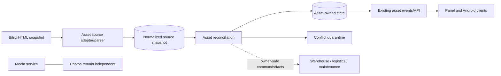

# План: Bitrix HTML как источник истины для реестра бытовок

Статус: **Proposed**. Этот документ описывает будущую реализацию и не меняет
текущее поведение RWMS. `docs/plans/` не является источником текущих
бизнес-правил.

## Цель

Сделать таблицу реестра бытовок из Bitrix внешним источником истины для всех
содержащихся в ней данных, кроме фотографий, при этом:

- сохранить внутренние UUID RWMS и границы владения сервисов;
- хранить Bitrix ID как постоянную внешнюю идентичность бытовки;
- повторно применять одинаковый снимок без побочных эффектов;
- обновлять уже связанную бытовку, а не создавать дубликат;
- не выполнять JavaScript из HTML, не переходить по ссылкам и не хранить сырой
  HTML;
- не читать, не сохранять и не загружать `UF_PHOTO_URL`;
- не обходить status/lease/hold/transfer/repair-инварианты прямыми записями в
  таблицы;
- явно показывать неподтверждённые или конфликтующие строки, а не выдавать
  частичную синхронизацию за успешную.

## Зафиксированное понимание запроса

Под «всеми данными» в основной реализации понимаются:

1. Bitrix ID строки и номер бытовки;
2. все `td[data-field]` таблицы `#city-bootcamps-table`, кроме
   `UF_PHOTO_URL`;
3. скрытые атрибуты бронирования строки (`data-book-*`), если они остаются
   частью согласованного HTML-контракта.

Метаданные страницы над таблицей (адрес площадки, ставка, контакты), счётчики
статусов, складская легенда мебели и история поездок перечислены отдельно ниже:
они присутствуют в HTML, но не являются колонками основной таблицы. Их нельзя
молча смешивать с паспортом бытовки.

## Критерии готовности будущей реализации

- Каждая принятая строка имеет уникальную неизменяемую связь
  `Bitrix ID -> rentalItemId`.
- Повтор снимка с теми же нормализованными данными ничего не изменяет.
- Изменение номера при прежнем Bitrix ID обновляет ту же бытовку с обычным
  version fence; новый Bitrix ID с уже занятым номером блокируется как конфликт.
- Фото не попадает ни в нормализованный снимок, ни в БД, API, журнал, событие
  или сетевой вызов.
- Неполный или более старый снимок не удаляет и не откатывает данные.
- Значения каталогов связываются по Bitrix ID, а отображаемое имя остаётся
  изменяемым атрибутом, а не идентичностью.
- Workflow-статусы и состав мебели применяются только через владеющие ими
  доменные операции; невозможное изменение остаётся в карантине.
- Все публичные клиенты получают `bitrixId`, а поиск бытовок умеет находить его.
- После переключения поля, принадлежащие Bitrix, нельзя параллельно редактировать
  в RWMS; фото по-прежнему управляются через `media-service`.

## Обнаруженный источник

Локальный `test.html` игнорируется Git правилом `/test.html`. Он содержит
реальный снимок страницы, поэтому не должен становиться тестовым fixture или
публиковаться.

Подтверждённая структура снимка:

- `table#city-bootcamps-table`;
- 755 строк `tr.bootcamp-row`;
- 755 уникальных `data-bc-id`, без дублей;
- номер бытовки в `td.bc-number`;
- 14 полей `UF_*` в каждой строке, одно из которых — `UF_PHOTO_URL`;
- 11 исходных статусов;
- 418 непустых значений фото, которые будущая синхронизация должна полностью
  игнорировать;
- 22 строки с составом мебели;
- 2 строки с непустыми атрибутами бронирования.

HTML также содержит исполняемые скрипты, URL внутренних действий, персональные
данные и идентификатор веб-сессии. Парсеру разрешено читать только согласованный
DOM-контракт таблицы. Сырой файл, скрипты, ссылки и session values нельзя
сохранять или выводить в лог.

## Текущее состояние RWMS и разрывы

Текущий поток уже умеет безопасно разобрать ограниченный HTML без исполнения
скриптов:

- парсер: `services/asset-service/src/main/java/dev/buhanzaz/rwms/asset/service/RentalItemHtmlParser.java`;
- orchestration: `services/asset-service/src/main/java/dev/buhanzaz/rwms/asset/service/RentalItemHtmlImportService.java`;
- публичный контракт: `contracts/openapi/asset-service.yaml`;
- Flyway: `services/asset-service/src/main/resources/db/migration/V22__html_import_drafts.sql`
  и `V32__html_import_commit_and_equipment_receipts.sql`;
- панель: `panel/src/features/rental-items/html-import/`.

Но это не постоянная синхронизация источника истины:

- `source_row_id` уникален только внутри одного import ID;
- постоянной связи Bitrix ID с `rental_item.id` нет;
- совпавшая существующая бытовка требует review, а активный `MERGE` запрещён;
- commit создаёт только новые бытовки;
- источник идентифицируется SHA-256 всего HTML, поэтому изменение скрипта или
  session value меняет hash при неизменной таблице;
- `UF_PHOTO_URL` сейчас участвует в отдельной media-фазе;
- разрешены только ручные статусы `SALE`, `USED_SALE`, `FREE`, `WAREHOUSE` и
  `OWN_NEEDS`; в текущем снимке им соответствуют лишь 89 из 755 строк;
- Bitrix ID не возвращается в `RentalItem` API и не участвует в поиске;
- отсутствуют правила порядка снимков, исчезнувших строк, source lag и
  конфликтов с незавершёнными workflow.

Предыдущие миграции намеренно удаляли старые `legacyId` из произвольного
`passport_json`. Новый Bitrix ID нельзя возвращать туда как неструктурированный
ключ: ему нужна отдельная namespaced identity с ограничениями уникальности.

## Рекомендуемая архитектура

`asset-service` остаётся владельцем интеграции, потому что одна исходная строка
идентифицирует бытовку. Новый deployable и shared database не нужны.

Разбор, нормализация и запись наблюдаемого снимка выполняются один раз в
`asset-service`. Другие сервисы не должны повторно парсить HTML. Для данных,
чьё изменение принадлежит другому владельцу, asset-service сохраняет
наблюдаемое значение и создаёт восстановимую reconciliation intent; владеющий
сервис подтверждает изменение своим контрактом. Прямая запись в чужую БД
запрещена.

### Почему не использовать текущий import как есть

Текущий import годится для контролируемого создания отсутствующих бытовок. Он
не решает идентичность между снимками, обновление, удаление, порядок версий и
конфликты с рабочими процессами. Расширение его `MERGE` до безусловной
перезаписи превратило бы HTML в обход всех доменных инвариантов.

### Почему не парсить HTML в панели или gateway

Панель не может владеть идемпотентностью и восстановлением после обрыва, а
gateway не владеет бизнес-состоянием. Оба варианта создают зависимость результата
от открытого браузера и дублируют правила между клиентами.

## Контракт источника

Вход должен содержать не только HTML bytes, но и provenance:

- `sourceSystem`: фиксированное значение вроде `BITRIX_CABIN_REGISTRY`;
- `sourceInstance`: стабильный tenant/list namespace Bitrix;
- `warehouseId`: явный UUID RWMS;
- `sourceRevision` или монотонный export sequence;
- `generatedAt`: время формирования снимка;
- `html`: ограниченный UTF-8 документ.

В текущем HTML нет надёжной монотонной версии. До появления `sourceRevision`
можно принимать снимок только вручную и не разрешать автоматическое применение
более позднего/раннего состояния по времени получения.

Парсер принимает только:

- ровно одну таблицу `#city-bootcamps-table`;
- уникальные `tr.bootcamp-row[data-bc-id]`;
- согласованный набор field codes;
- bounded strings, dates, money, booleans и JSON-массивы;
- явную версию DOM-схемы или точный schema fingerprint.

Он не выполняет scripts, не загружает styles/resources, не следует URL, не
читает cookies/session data и не сохраняет сырой HTML.

Нормализованный hash строится из source namespace, warehouse, revision и
отсортированных по Bitrix ID непиксельных полей. `UF_PHOTO_URL` исключается до
hashing, diagnostics и persistence.

## Сопоставление полей

| Источник | Значение | Владелец/цель | Правило синхронизации |
| --- | --- | --- | --- |
| `tr[data-bc-id]` | Bitrix ID | `asset-service`, отдельная external-reference таблица | Строка, не UUID; неизменяемая связь в пределах source namespace; возвращается как `bitrixId` |
| `td.bc-number` | Номер бытовки | `rental_item.number` | Один Bitrix ID обновляет ту же бытовку; уникальность номера проверяется в текущем warehouse |
| `UF_TYPE_ID` | Тип | cabin catalog TYPE + external reference | Основной ключ — исходный ID; label можно переименовывать |
| `UF_GABARIT_ID` | Габариты | cabin catalog DIMENSION + external reference | `0`/пусто означает отсутствие, не каталог с ID `0` |
| `UF_OTDELKA_ID` | Отделка | cabin catalog FINISHING + external reference | Обязательное значение либо явный quarantine |
| `UF_CATEGORY_ID` | Категория | cabin catalog CATEGORY + external reference | `0`/пусто означает отсутствие |
| `UF_CHARS_IDS` | Характеристики | cabin catalog CHARACTERISTIC links | Разбирать исходные ID как набор; не выводить идентичность из текста типа |
| `UF_LINOLEUM` | Линолеум | `rental_item.linoleum` | Строгий boolean mapping |
| `UF_STATE_STORAGE` | Состояние на складе | source-backed passport field либо отдельное typed поле | Пустое значение очищает поле только в полном, более новом снимке |
| `UF_STATUS_ID` | Статус | asset status + owner-safe workflow reconciliation | Маппинг по ID; невозможный переход блокирует команды по строке и попадает в quarantine |
| `UF_COMMENT` | Общий комментарий | `rental_item.general_comment` | Source-owned после cutover; локальное редактирование отключается |
| `UF_PHOTO_URL` | Фото | Нигде | Полностью игнорировать; `media-service` остаётся единственным владельцем фото |
| `UF_FURNITURE_JSON` | Наполнение | asset equipment balances | Только audited delta/receipt/movement; запрещён прямой `set quantity` |
| `UF_SHIPMENT_DATE` | Дата отгрузки | typed passport snapshot / logistics reconciliation | Не заменяет logistics shipment document; конфликт явно видим |
| `UF_RECEIVED_FROM` | Арендатор | typed passport snapshot / logistics tenant snapshot | PII не попадает в Kafka и диагностические логи |
| `UF_PRICE` | Цена | typed passport/commercial snapshot | До реализации подтвердить валюту, единицу и семантику `0` |
| `data-book-until` | Срок брони | order/reservation owner | Применять только вместе с устойчивой identity сделки/брони |
| `data-book-deal-url` | Ссылка сделки | закрытая source metadata | Не возвращать URL публично; желательно извлекать стабильный deal ID |
| `data-book-days` | Дни брони | order/reservation owner | Производное значение; не хранить независимо от срока |

`data-book-id` дублирует Bitrix ID, а `data-book-number` — номер; они служат
проверкой целостности и должны совпадать с основной строкой.

## Данные страницы вне основной таблицы

- Город и адрес можно связать с `warehouse-service`, но только через отдельную
  source identity склада и version-fenced metadata command.
- Ставка аренды, владелец земли, представители и email сейчас не имеют
  подтверждённой канонической модели. Нужен отдельный продуктовый выбор их
  владельца; их нельзя складывать в паспорт бытовки.
- Счётчики статусов — производная проверка: сумма должна совпасть со строками,
  но они не записываются как отдельная истина.
- Легенда мебели на складе относится к warehouse equipment balances. Если она
  войдёт в scope, требуется отдельная audited reconciliation, а не перезапись
  агрегата.
- Badge истории и URL history API не содержат саму историю. Исторические
  поездки нельзя восстановить из этого HTML.

## Будущая модель данных

Точные имена фиксируются при реализации, но границы должны быть такими:

1. `source_snapshot`
   - source namespace, warehouse, revision/generated/received timestamps;
   - raw SHA только для аудита приёма и canonical non-photo SHA для replay;
   - состояние `RECEIVED`, `VALIDATED`, `RECONCILING`, `APPLIED`,
     `APPLIED_WITH_CONFLICTS`, `REJECTED`;
   - counts и обезличенные diagnostic codes;
   - сырого HTML нет.
2. `rental_item_external_reference`
   - `(source_system, source_instance, external_id)` — primary/unique key;
   - `rental_item_id` — уникальная постоянная ссылка;
   - запись immutable; ошибочную связь исправляет отдельная admin-команда с
     evidence, а не UPDATE таблицы.
3. `catalog_external_reference`
   - source namespace + catalog kind + external ID -> local catalog UUID;
   - label не участвует в identity.
4. `source_row_state`
   - последний принятый row hash и snapshot;
   - normalized non-photo payload;
   - applied asset version и reconciliation state.
5. `source_reconciliation_item`
   - одно действие/конфликт на поле или группу полей;
   - stable idempotency key, expected versions, attempts, last failure code;
   - без PII в Kafka/outbox diagnostics.

Схема создаётся новой Flyway migration в `asset-service`; старые миграции не
редактируются. JPA остаётся `ddl-auto=validate`.

## Правила идентичности и конфликтов

1. Bitrix ID — внешний ключ, внутренний UUID — ключ RWMS. Один нельзя подменять
   другим.
2. Одинаковый external ID с другим source namespace — другая identity.
3. Одинаковый external ID, связанный с другим rental item, — hard conflict.
4. Изменённый номер при прежнем external ID — version-fenced rename той же
   бытовки.
5. Новый external ID с номером существующей бытовки — ручное первоначальное
   связывание; автоматическое rebinding запрещено.
6. Отсутствие строки в одном HTML не означает удаление. Для снятия с учёта
   нужен полный snapshot с явным tombstone либо отдельно согласованное правило
   нескольких последовательных пропусков.
7. Старый `sourceRevision` отклоняется; одинаковая revision с другим canonical
   hash — corruption conflict.
8. При активном lease, hold, transfer, repair или reservation запрещено
   насильно менять связанные status/warehouse/contents. Снимок сохраняется, а
   строка остаётся в quarantine до owner-safe reconciliation.

## Публичные контракты и клиенты

Будущая контрактная работа должна выполняться одной совместимой серией:

- добавить read-only nullable `bitrixId` в `RentalItem` и необходимые cabin
  snapshot schemas в `contracts/openapi/asset-service.yaml`;
- добавить поиск по точному/частичному Bitrix ID;
- добавить API приёма, просмотра и reconciliation снимков;
- не добавлять Bitrix ID в sanitized Kafka payload без подтверждённого
  потребителя;
- обновить Java transport models, panel parser/model и manager Android DTO;
- проверить worker app только как активного потребителя downstream task
  snapshots; не добавлять поле, если его контракт не переносит;
- заменить panel legacy import workspace на source sync/reconciliation status;
- после cutover удалить media import endpoints/UI и устаревшие CREATE/MERGE
  ветви, а не сохранять их как fallback.

## Порядок реализации

Тестовый подход: обычный — сначала маленький production slice, затем его unit,
integration и contract tests до перехода к следующему slice. Перед изменением
JPA/Flyway активировать `spring-data-jpa` skill.

### Task 1: Зафиксировать версионированный DOM-контракт

**Files:**

- Create: sanitized fixture under
  `services/asset-service/src/test/resources/html/`
- Modify: `services/asset-service/src/main/java/dev/buhanzaz/rwms/asset/service/RentalItemHtmlParser.java`
- Modify: `services/asset-service/src/test/java/dev/buhanzaz/rwms/asset/service/RentalItemHtmlParserTest.java`

- [ ] Создать обезличенный fixture без cookies/session/телефонов/email/URL фото.
- [ ] Зафиксировать source namespace, revision, table selector и field codes.
- [ ] Исключить фото до normalized payload/hash/diagnostics.
- [ ] Разбирать Bitrix ID, catalog IDs и booking attributes строго и bounded.
- [ ] Покрыть duplicate ID, missing field, hostile HTML, malformed JSON/date/money,
      oversized input и отсутствие сетевых обращений.
- [ ] Запустить parser tests до Task 2.

### Task 2: Добавить постоянную external identity и snapshot inbox

**Files:**

- Create: next immutable Flyway migration in
  `services/asset-service/src/main/resources/db/migration/`
- Create/Modify: source snapshot, external reference and reconciliation JPA
  entities/repositories under `services/asset-service/src/main/java/`
- Modify: `services/asset-service/src/test/java/dev/buhanzaz/rwms/asset/AssetFlywayMigrationIntegrationTest.java`

> **JPA skill required (`spring-data-jpa`).** До изменения entity активировать
> skill и проверить mapping, locks, constraints и immutable identity rules.

- [ ] Создать tables/constraints/indexes без изменения существующих миграций.
- [ ] Хранить external ID как строку и namespaced composite identity.
- [ ] Запретить silent rebind и raw HTML persistence.
- [ ] Реализовать canonical non-photo hash и ordered snapshot fence.
- [ ] Добавить clean-install, upgrade, JPA validate и concurrent identity tests.
- [ ] Запустить Flyway/JPA tests до Task 3.

### Task 3: Реализовать observe-only reconciliation

**Files:**

- Create/Modify: source ingestion/reconciliation services in `asset-service`
- Modify: `contracts/openapi/asset-service.yaml`
- Modify: asset API models/controllers/security and OpenAPI parity tests

- [ ] Принимать снимок только с warehouse access и stable idempotency key.
- [ ] Сопоставлять сначала по external ID, затем выполнять контролируемый
      первичный match по warehouse + canonical number.
- [ ] Сохранять diff и conflicts без изменения rental items.
- [ ] Возвращать counts, lag, row state и обезличенные errors.
- [ ] Покрыть replay, out-of-order, partial snapshot, number collision и
      authorization tests.
- [ ] Провалидировать OpenAPI и запустить asset focused tests до Task 4.

### Task 4: Применять asset-owned паспортные поля

**Files:**

- Modify: `RentalItem`, `AssetService`, composition/catalog mapping and source
  reconciliation code
- Modify/Create: focused asset integration tests

> **JPA skill required (`spring-data-jpa`).** Любые entity/mapping изменения
> проверяются вместе с Flyway schema.

- [ ] Применять number, type, dimensions, finishing, category,
      characteristics, linoleum, storage state, comment и typed passport values
      под expectedVersion.
- [ ] Создавать отсутствующую бытовку и external identity атомарно.
- [ ] Не очищать поле из-за неполного/старого снимка.
- [ ] Писать обычные asset events и source reconciliation evidence.
- [ ] Покрыть create/update/no-op/conflict и transactional rollback tests.
- [ ] Запустить asset tests до Task 5.

### Task 5: Согласовать workflow status, booking и contents

**Files:**

- Modify/Create: owner-specific contracts and reconciliation adapters only
  after product decisions
- Modify: asset/logistics/maintenance focused services and tests as required

- [ ] Маппить все 11 source statuses по стабильному Bitrix status ID.
- [ ] Переводить workflow statuses только через owning fenced operations.
- [ ] Связать booking data со stable Bitrix deal/reservation identity.
- [ ] Применять furniture differences через audited receipts/movements.
- [ ] Сохранять retryable intent и quarantine при active workflow conflict.
- [ ] Покрыть lost response, retry, stale version, active lease/hold/transfer,
      invalid transition и duplicate delivery.
- [ ] Запустить affected cross-service contract/integration tests до Task 6.

### Task 6: Обновить публичные read models и клиенты

**Files:**

- Modify: `contracts/openapi/asset-service.yaml`
- Modify: asset public API/search
- Modify: `panel/src/features/rental-items/`
- Modify: `app/src/main/java/dev/buhanzaz/rwms/manager/network/ApiModels.kt`
  и затронутые manager flows
- Review: `worker-app/` consumers

- [ ] Вернуть nullable `bitrixId` и source sync state в утверждённых reads.
- [ ] Искать по Bitrix ID без смешивания с internal UUID.
- [ ] Показать source conflict/lag и сделать source-owned поля read-only.
- [ ] Оставить photo UI и media APIs независимыми.
- [ ] Обновить contract, panel и Android tests.
- [ ] Выполнить panel typecheck/tests и собрать точный manager APK.

### Task 7: Shadow run и cutover

**Files:**

- Modify: paired README files and `docs/project-knowledge/` after behavior is
  implemented
- Modify: observability/runbook configuration for affected services

- [ ] Прогнать несколько последовательных production-like snapshots в
      observe-only режиме.
- [ ] Добиться 100% permanent Bitrix identity bindings и нулевых необъяснённых
      duplicates/collisions.
- [ ] Сверить counts и все non-photo fields по row hash.
- [ ] Проверить reconciliation lag, retries, quarantine и source staleness
      alerts.
- [ ] Переключить source-owned fields на read-only в RWMS.
- [ ] Удалить заменённый legacy HTML/media import runtime и UI.
- [ ] Обновить bilingual README, project knowledge и change log.
- [ ] Обновить только затронутые VPS services и проверить running artifact.

## Cutover gates

Переключение возможно только при одновременном выполнении условий:

- 100% принятых строк имеют уникальный Bitrix ID и binding;
- нет `sourceRevision/hash` конфликтов;
- нет нерешённых catalog/status mappings;
- нет принудительно перезаписанных active workflows;
- source staleness и reconciliation lag наблюдаемы;
- повтор последнего снимка даёт zero mutations;
- отсутствие строки не приводит к автоматическому удалению;
- число и содержимое media assets не меняются;
- panel и manager app читают тот же deployed asset-service contract;
- backup/recovery проверены без удаления текущей базы или объектов.

## Решения, которые нужно подтвердить до кода

Рекомендуемые defaults указаны первыми.

1. **Scope:** все строки и `data-book-*`; page-level contacts/rate вынести в
   отдельную задачу.
2. **Статусы:** Bitrix задаёт desired truth, но конфликтующий workflow не
   перезаписывается; строка блокируется до owner-safe reconciliation.
3. **Удаление:** отсутствие в HTML ничего не удаляет; нужен явный tombstone/full
   snapshot protocol.
4. **Порядок:** Bitrix/exporter обязан дать монотонный `sourceRevision` и
   `generatedAt` до включения автоматического режима.
5. **ID namespace:** использовать source instance/list namespace даже если
   текущие numeric IDs выглядят глобально уникальными.
6. **Цена:** подтвердить валюту, major/minor units и означает ли `0` отсутствие
   цены.
7. **Локальные правки:** после cutover запретить изменение всех source-owned
   non-photo полей в RWMS; фото остаются редактируемыми.
8. **Чувствительный fixture:** реальный `test.html` не коммитить; если
   обнаруженный session value ещё действителен, его нужно отозвать/обновить во
   внешней системе.

## Проверка этой подготовительной работы

На этом этапе исходный код, OpenAPI, Flyway, клиенты, runtime и VPS не меняются.
Проверяется только документ: отсутствие секретов/PII, корректность ссылок на
существующие paths, trailing whitespace и факт, что новый файл — единственное
изменение текущей задачи.
