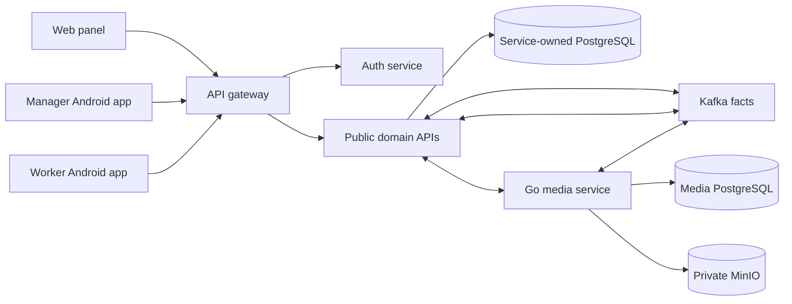

# Current Architecture

Status: Confirmed repository structure as of 2026-08-04.

Primary evidence:

- [`settings.gradle.kts`](../../settings.gradle.kts)
- [`services/`](../../services/)
- [`contracts/`](../../contracts/)
- [`panel/package.json`](../../panel/package.json)
- [`app/README.md`](../../app/README.md)
- [`worker-app/README.md`](../../worker-app/README.md)

## Runtime Context

The gateway is a stateless transport edge. It does not aggregate business
responses or own workflow state. Each downstream service validates its token
and owns its commands.

Long-lived SSE routes remain transport-only. The gateway bounds their
concurrency, relays the producer's bytes with Servlet asynchronous I/O, flushes
each complete heartbeat/event item and cancels the upstream subscription when
the client disconnects. Heartbeat timing and event meaning stay with the
producing service; the gateway does not create domain events or retain stream
state.

Evidence:
[`SseProxyHandler.java`](../../services/api-gateway-service/src/main/java/dev/buhanzaz/rwms/gateway/config/SseProxyHandler.java),
[`GatewaySseConcurrencyIntegrationTest.java`](../../services/api-gateway-service/src/test/java/dev/buhanzaz/rwms/gateway/GatewaySseConcurrencyIntegrationTest.java).

## Deployables And Ownership

| Deployable            | Shape                      | Owner responsibility                                                       | Canonical API                                                                  |
| --------------------- | -------------------------- | -------------------------------------------------------------------------- | ------------------------------------------------------------------------------ |
| `auth-service`        | Stateful Spring            | Login, user/worker credentials, roles, OAuth clients and warehouse grants  | [`auth-service.yaml`](../../contracts/openapi/auth-service.yaml)               |
| `api-gateway-service` | Stateless Spring           | Public routing and edge transport policy                                   | Downstream contracts                                                           |
| `warehouse-service`   | Stateful Spring            | Warehouse identity, metadata and timezone                                  | [`warehouse-service.yaml`](../../contracts/openapi/warehouse-service.yaml)     |
| `asset-service`       | Stateful Spring            | Cabins, status, equipment, balances, holds and leases                      | [`asset-service.yaml`](../../contracts/openapi/asset-service.yaml)             |
| `task-board-service`  | Stateful Spring            | Queues, workforce, assignments and task board                              | [`task-board-service.yaml`](../../contracts/openapi/task-board-service.yaml)   |
| `maintenance-service` | Stateful Spring            | Catalog, estimates, repairs, acceptance and write-off decisions            | [`maintenance-service.yaml`](../../contracts/openapi/maintenance-service.yaml) |
| `inventory-service`   | Stateful Spring            | Sessions, findings, completion and publication                             | [`inventory-service.yaml`](../../contracts/openapi/inventory-service.yaml)     |
| `logistics-service`   | Stateful Spring            | Rental inquiries, returns, shipments, transfers, drivers and orchestration | [`logistics-service.yaml`](../../contracts/openapi/logistics-service.yaml)     |
| `media-service`       | Stateful Go                | Media metadata, private upload/read, originals and transformations         | [`media-service.yaml`](../../contracts/openapi/media-service.yaml)             |
| `dossier-service`     | Stateful Spring read model | Cross-domain cabin activity projection                                     | [`dossier-service.yaml`](../../contracts/openapi/dossier-service.yaml)         |
| `analytics-service`   | Stateful Spring read model | KPI and dashboard projections                                              | [`analytics-service.yaml`](../../contracts/openapi/analytics-service.yaml)     |
| `assistant-service`   | Stateful Spring            | Assistant conversations, messages and tool-call history                    | [`assistant-service.yaml`](../../contracts/openapi/assistant-service.yaml)     |

`assistant-service` does not own cabin availability or rental inquiries; those
remain logistics-owned. Read models do not issue commands for producer-owned
aggregates.

## Client Boundaries

- `panel/`, `app/` and `worker-app/` use the public gateway.
- Browser requests are same-origin `/auth/**` and `/api/**` only.
- Clients do not call `/api/internal/**` or direct service database/storage
  endpoints.
- Server responses are authoritative. Local state is limited to UI preferences,
  secure sessions and explicitly designed offline caches.
- Mutable operations use contract-defined optimistic concurrency and
  idempotency.

## Data And Dependency Boundaries

- Every stateful service owns one PostgreSQL database and Flyway history.
- Cross-database foreign keys, joins, shared tables and direct repository access
  are forbidden.
- Shared libraries contain technical types only, never mutable business models
  or JPA entities.
- Services exchange versioned APIs, versioned facts, opaque identifiers and
  immutable snapshots.
- Kafka provides at-least-once transport. Producers use transactional outbox;
  consumers use inbox deduplication and version checks.
- MinIO is private and media ownership stays in `media-service`.
- Multi-service workflows are owned and persisted by the initiating service;
  there is no 2PC and no browser saga.

## Architecture Change Rule

Before moving responsibility between components, changing dependency direction
or adding a deployable, update the relevant canonical contracts and obtain an
explicit product decision. Then update this document and the change log after
focused architecture tests pass.
