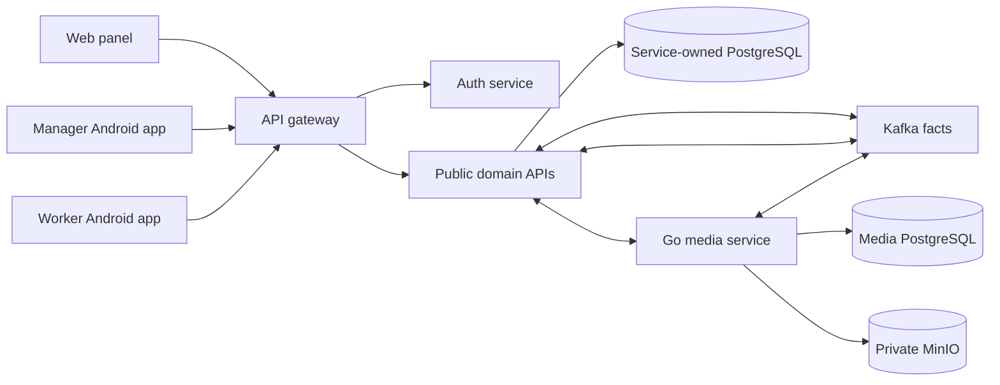

# Current Architecture

Status: Confirmed repository structure as of 2026-08-08.

Primary evidence:

- [`settings.gradle.kts`](../../settings.gradle.kts)
- [`services/`](../../services/)
- [`contracts/`](../../contracts/)
- [`service-catalog.md`](service-catalog.md)
- [`panel/package.json`](../../panel/package.json)
- [`app/README.md`](../../app/README.md)
- [`worker-app/README.md`](../../worker-app/README.md)

## Runtime Context

The gateway is a stateless transport edge. It does not aggregate business
responses or own workflow state. Each downstream service validates its token
and owns its commands.

Long-lived SSE routes remain transport-only. The gateway bounds their
concurrency, relays the producer's bytes with Servlet asynchronous I/O, flushes
each complete heartbeat/event item and cancels the upstream subscription when
the client disconnects. Heartbeat timing and event meaning stay with the
producing service; the gateway does not create domain events or retain stream
state.

Evidence:
[`SseProxyHandler.java`](../../services/api-gateway-service/src/main/java/dev/buhanzaz/rwms/gateway/config/SseProxyHandler.java),
[`GatewaySseConcurrencyIntegrationTest.java`](../../services/api-gateway-service/src/test/java/dev/buhanzaz/rwms/gateway/GatewaySseConcurrencyIntegrationTest.java).

## Deployables And Ownership

| Deployable            | Shape                      | Owner responsibility                                                       | Canonical API                                                                  |
| --------------------- | -------------------------- | -------------------------------------------------------------------------- | ------------------------------------------------------------------------------ |
| `auth-service`        | Stateful Spring            | Login, user/worker credentials, roles, OAuth clients and warehouse grants  | [`auth-service.yaml`](../../contracts/openapi/auth-service.yaml)               |
| `api-gateway-service` | Stateless Spring           | Public routing and edge transport policy                                   | Downstream contracts                                                           |
| `warehouse-service`   | Stateful Spring            | Warehouse identity, metadata and timezone                                  | [`warehouse-service.yaml`](../../contracts/openapi/warehouse-service.yaml)     |
| `asset-service`       | Stateful Spring            | Cabins, status, equipment, balances, holds and leases                      | [`asset-service.yaml`](../../contracts/openapi/asset-service.yaml)             |
| `task-board-service`  | Stateful Spring            | Queues, workforce, assignments and task board                              | [`task-board-service.yaml`](../../contracts/openapi/task-board-service.yaml)   |
| `maintenance-service` | Stateful Spring            | Catalog, estimates, repairs, acceptance and write-off decisions            | [`maintenance-service.yaml`](../../contracts/openapi/maintenance-service.yaml) |
| `inventory-service`   | Stateful Spring            | Sessions, findings, completion and publication                             | [`inventory-service.yaml`](../../contracts/openapi/inventory-service.yaml)     |
| `logistics-service`   | Stateful Spring            | Rental counterparties, inquiries, orders, returns, shipments and transfers | [`logistics-service.yaml`](../../contracts/openapi/logistics-service.yaml)     |
| `media-service`       | Stateful Go                | Media metadata, private upload/read, originals and transformations         | [`media-service.yaml`](../../contracts/openapi/media-service.yaml)             |
| `dossier-service`     | Stateful Spring read model | Cross-domain cabin activity projection                                     | [`dossier-service.yaml`](../../contracts/openapi/dossier-service.yaml)         |
| `analytics-service`   | Stateful Spring read model | KPI and dashboard projections                                              | [`analytics-service.yaml`](../../contracts/openapi/analytics-service.yaml)     |
| `assistant-service`   | Stateful Spring            | Assistant conversations, messages, clarifications and tool-call history    | [`assistant-service.yaml`](../../contracts/openapi/assistant-service.yaml)     |

`assistant-service` does not own cabin availability or rental inquiries; those
remain logistics-owned. Read models do not issue commands for producer-owned
aggregates.

`dossier-service` scopes `PARTIAL` to the requested cabin and active projection
generation. Hidden activity/media and unresolved unlinked or DLT evidence can
degrade that read only when service-local proof binds the evidence to that
cabin and generation; global, raw and legacy-unproven rows remain operational
recovery evidence. Rebuild transfers unresolved DLT coverage before activating
the target generation. Row-level locks serialize coverage changes with relay
status changes on the same audit row, while transport delivery and projection
coverage remain separate state dimensions.

Evidence:
[`DossierQueryService.java`](../../services/dossier-service/src/main/java/dev/buhanzaz/rwms/dossier/service/DossierQueryService.java),
[`DossierVisibilityCoverageResolver.java`](../../services/dossier-service/src/main/java/dev/buhanzaz/rwms/dossier/service/DossierVisibilityCoverageResolver.java),
[`DossierRelayTransactions.java`](../../services/dossier-service/src/main/java/dev/buhanzaz/rwms/dossier/eventing/DossierRelayTransactions.java),
[`V3__dossier_cabin_visibility_scope.sql`](../../services/dossier-service/src/main/resources/db/migration/V3__dossier_cabin_visibility_scope.sql).

## Client Boundaries

- `panel/`, `app/` and `worker-app/` use the public gateway.
- Browser requests are same-origin `/auth/**` and `/api/**` only.
- Clients do not call `/api/internal/**` or direct service database/storage
  endpoints.
- Server responses are authoritative. Local state is limited to UI preferences,
  secure sessions and explicitly designed offline caches.
- Mutable operations use contract-defined optimistic concurrency and
  idempotency.

The panel's rental workspace exposes logistics-owned clients, their orders and
complete delivery facts. A client can start a manual order, warehouse booking
or assistant conversation without copying the client record into browser
state. Assistant clarification cards and result-group tabs are presentation of
assistant/logistics state: exact button answers are persisted by the assistant,
while selected cabin identifiers, expiry and hold effects remain authoritative
in logistics and asset services.

Evidence:
[`client routes`](../../panel/src/features/clients/clients-routes.tsx),
[`assistant page`](../../panel/src/features/assistant/pages/assistant-page.tsx),
and
[`order detail`](../../panel/src/features/orders/pages/order-detail-page.tsx).

### Android transport contract boundary

Manager and worker Retrofit declarations are executable inventories rather than
implicit conventions. The manager inventory contains 62 methods: 60 fixed
public-gateway routes plus two media-only dynamic URLs whose callers enforce the
same public media origin. The worker inventory contains 11 methods: nine fixed
public-gateway routes and the same two guarded media URL families. Converter
construction and representative request/response fixtures cover every consumed
JSON root family.

`WorkerActionRequestDto` has a targeted serializer because the canonical worker
action request requires the nullable `workerGroupId` and `evidenceId` properties
to be present. It emits both keys explicitly while the rest of the worker keeps
its established `explicitNulls = false` behavior. Neither client may call an
internal/private service path or a direct service origin.

Evidence:
[`manager contract boundary`](../../app/src/test/java/dev/buhanzaz/rwms/manager/network/RwmsApiContractBoundaryTest.kt),
[`worker contract boundary`](../../worker-app/core-network/src/test/java/dev/buhanzaz/rwms/worker/core/network/WorkerGatewayApiContractBoundaryTest.kt),
and
[`worker action serializer`](../../worker-app/core-network/src/main/java/dev/buhanzaz/rwms/worker/core/network/WorkerActionRequestDtoSerializer.kt).

### Authenticated browser state boundary

The panel keeps public/bootstrap data on its root TanStack Query client. A
verified `/me` subject and the current bearer-grant revision own a separate
protected client. Logout, subject change or bearer-grant change cancels and
removes protected queries and mutations, clears media object URLs, and remounts
the protected subtree so its effect-owned realtime streams close. A late
response retains only a reference to the retired client and therefore cannot
populate the next subject's cache.

Evidence:
[`AuthProvider`](../../panel/src/features/auth/auth-provider.tsx),
[`ProtectedClientState`](../../panel/src/features/auth/protected-client-state.ts),
[`media preview cache`](../../panel/src/features/media/media-preview-cache.ts).

### Manager durable client state boundary

The manager app resolves the authoritative `/me` account and its live warehouse
grants before exposing a durable upload queue or catalog snapshot. Every upload
row, draft, retained original, WorkManager input and unique work name carries
one immutable account-and-workspace-warehouse scope. A worker resolves `/me`
again and proves that owner and every retained warehouse grant before its first
media or domain effect. Logout, a replacement login and warehouse rebinding
cancel and join the prior scope before its authentication snapshot can be
replaced.

Maintenance catalog snapshots and refresh slots are partitioned by the same
verified account and warehouse and encrypted with AES-GCM using a non-exportable
Android Keystore key; the storage key is authenticated as associated data.
Ownerless version-1 uploads and plaintext catalog values are quarantined without
being assigned to the next account. These stores remain client recovery/read
optimizations; server state and authorization are authoritative.

Manager OAuth uses the public HTTPS `/auth/manager/callback`, which the native
login client consumes inside the app. The production, release and local-test
manifests do not expose AppAuth's custom-scheme redirect receiver, and the
Gradle configuration has no custom redirect-scheme placeholder.

Evidence:
[`BackgroundUploadStore`](../../app/src/main/java/dev/buhanzaz/rwms/manager/uploads/BackgroundUploadStore.kt),
[`BackgroundUploadCoordinator`](../../app/src/main/java/dev/buhanzaz/rwms/manager/uploads/BackgroundUploadCoordinator.kt),
[`BackgroundUploadWorker`](../../app/src/main/java/dev/buhanzaz/rwms/manager/uploads/BackgroundUploadWorker.kt),
[`ManagerWorkspaceCoordinator`](../../app/src/main/java/dev/buhanzaz/rwms/manager/ui/coordinator/ManagerWorkspaceCoordinator.kt),
[`MaintenanceCatalogCache`](../../app/src/main/java/dev/buhanzaz/rwms/manager/ui/MaintenanceCatalogCache.kt),
[`ManagerAuth`](../../app/src/main/java/dev/buhanzaz/rwms/manager/auth/ManagerAuth.kt),
and the [manager manifest](../../app/src/main/AndroidManifest.xml).

### Client Problem Details and retry boundary

Panel HTTP and assistant-stream failures use the same status-bearing `ApiError`.
Malformed or non-JSON upstream bodies retain the actual HTTP status but are not
shown verbatim. The worker uses one closed disposition set: an exhausted `401`
requires login, `403` requires user/grant action, `409` records the conflict and
refreshes authoritative state, and only `429`, `502`, `503`, `504` or a proven
transport failure may enter automatic retry. Cancellation always propagates.

Worker automatic retry is owned by WorkManager, not an in-process delay. One
unique sync request uses a persisted jittered exponential backoff and returns
`retry` for at most four total runs; pending media/evidence state completes the
current run and waits for a later explicit invalidation or refresh trigger.

Evidence:
[`api-client.ts`](../../panel/src/lib/api-client.ts),
[`assistant-api.ts`](../../panel/src/features/assistant/api/assistant-api.ts),
[`GatewayFailure.kt`](../../worker-app/core-network/src/main/java/dev/buhanzaz/rwms/worker/core/network/GatewayFailure.kt),
[`WorkerSyncCoordinator.kt`](../../worker-app/core-sync/src/main/java/dev/buhanzaz/rwms/worker/core/sync/WorkerSyncCoordinator.kt),
and
[`WorkerSyncWork.kt`](../../worker-app/core-sync/src/main/java/dev/buhanzaz/rwms/worker/core/sync/WorkerSyncWork.kt).

### Production endpoint and datasource safety

The API gateway applies the same origin-shape, public-host separation and
production loopback rejection to every configured downstream route. Auth-service
keeps local PostgreSQL values only in its explicit `dev` profile. Outside
`dev`/`test`, an environment post-processor requires a non-loopback PostgreSQL
JDBC URL and deployment-specific username/password before the application
context can initialize Flyway, JPA or a datasource; diagnostics never include
the supplied values.

Warehouse-service, asset-service, maintenance-service and logistics-service
also fail non-local startup unless Kafka publication is explicitly enabled with
the owner-approved destinations, non-empty brokers and safe producer
acknowledgement/idempotence settings. Their relay/binding beans are part of the
startup invariant, so a command cannot silently accumulate an outbox behind a
disabled publisher. Maintenance uses one ordered five-topic authority for
catalog, estimate, repair, property-disposition and sanitized-DLT output.
Logistics uses one ordered four-topic authority for return, shipment, transfer
and rental-inquiry facts; its canonical rental topic retains the explicit
`.events` segment. Service-local fixed-name gauges expose pending age/count,
terminal evidence where the owner has such a state, version gaps and bounded
external-attempt claims without making Kafka the source of truth.

Evidence:
[`GatewayProductionSafetyValidator`](../../services/api-gateway-service/src/main/java/dev/buhanzaz/rwms/gateway/config/GatewayProductionSafetyValidator.java),
[`AuthDatasourceEnvironmentPostProcessor`](../../services/auth-service/src/main/java/dev/buhanzaz/rwms/auth/config/AuthDatasourceEnvironmentPostProcessor.java),
[`auth base configuration`](../../services/auth-service/src/main/resources/application.yaml),
[`auth dev configuration`](../../services/auth-service/src/main/resources/application-dev.yaml),
[`WarehouseProductionSafetyValidator`](../../services/warehouse-service/src/main/java/dev/buhanzaz/rwms/warehouse/config/WarehouseProductionSafetyValidator.java),
[`WarehouseEventingMetrics`](../../services/warehouse-service/src/main/java/dev/buhanzaz/rwms/warehouse/eventing/WarehouseEventingMetrics.java),
[`AssetProductionSafetyValidator`](../../services/asset-service/src/main/java/dev/buhanzaz/rwms/asset/config/AssetProductionSafetyValidator.java),
[`LogisticsProductionSafetyValidator`](../../services/logistics-service/src/main/java/dev/buhanzaz/rwms/logistics/config/LogisticsProductionSafetyValidator.java),
[`LogisticsTransportTopics`](../../services/logistics-service/src/main/java/dev/buhanzaz/rwms/logistics/eventing/LogisticsTransportTopics.java),
[`LogisticsRecoveryMetrics`](../../services/logistics-service/src/main/java/dev/buhanzaz/rwms/logistics/eventing/LogisticsRecoveryMetrics.java),
[`MaintenanceProductionSafetyValidator`](../../services/maintenance-service/src/main/java/dev/buhanzaz/rwms/maintenance/config/MaintenanceProductionSafetyValidator.java),
[`MaintenanceTransportTopics`](../../services/maintenance-service/src/main/java/dev/buhanzaz/rwms/maintenance/eventing/transport/MaintenanceTransportTopics.java),
[`MaintenanceEventingMetrics`](../../services/maintenance-service/src/main/java/dev/buhanzaz/rwms/maintenance/eventing/transport/MaintenanceEventingMetrics.java).

## Data And Dependency Boundaries

- Every stateful service owns one PostgreSQL database and Flyway history.
- Cross-database foreign keys, joins, shared tables and direct repository access
  are forbidden.
- Shared libraries contain technical types only, never mutable business models
  or JPA entities.
- Services exchange versioned APIs, versioned facts, opaque identifiers and
  immutable snapshots.
- Kafka provides at-least-once transport. Producers use transactional outbox;
  consumers use inbox deduplication and version checks.
- MinIO is private and media ownership stays in `media-service`.
- Multi-service workflows are owned and persisted by the initiating service;
  there is no 2PC and no browser saga.

Inventory keeps low-level PostgreSQL mechanics behind two exact technical
owners. `InventoryAssetInboxStore` is the only asset-consumer owner of
`inbox_message` SQL, while `InventoryPostgresJsonbCanonicalizer` owns only the
PostgreSQL JSONB canonical-text operation used for stable fingerprints. Domain
processors, retry policy and frozen-plan hashing depend on those capabilities
and no longer carry `JdbcTemplate`, JDBC types or arbitrary table access. The
source policy names these two files exactly; it does not permit a package-wide
persistence escape.

Evidence:
[`InventoryAssetInboxStore`](../../services/inventory-service/src/main/java/dev/buhanzaz/rwms/inventory/eventing/InventoryAssetInboxStore.java),
[`InventoryPostgresJsonbCanonicalizer`](../../services/inventory-service/src/main/java/dev/buhanzaz/rwms/inventory/persistence/InventoryPostgresJsonbCanonicalizer.java),
and
[`InventorySourcePolicy`](../../platform/architecture-tests/src/test/java/dev/buhanzaz/rwms/architecture/InventorySourcePolicy.java).

Logistics keeps provider-specific SQL behind four exact persistence paths:
the rental-inquiry booked outbox store and the warehouse admission,
single-statement blocker and operation-mark adapters. They preserve database
time, conflict-safe insert, atomic blocker snapshots, `FOR UPDATE SKIP LOCKED`
and conditional fencing writes; their application stores retain workflow and
replay decisions. `LogisticsTransactionLock` is the only application-facing
capability over the one approved native transaction advisory-lock query. The
source policy names the exact paths and rejects arbitrary JDBC or native JPA
SQL even inside the same persistence package.

Evidence:
[`RentalInquiryBookedOutboxStore`](../../services/logistics-service/src/main/java/dev/buhanzaz/rwms/logistics/inquiry/eventing/RentalInquiryBookedOutboxStore.java),
[`LogisticsWarehouseAdmissionPersistence`](../../services/logistics-service/src/main/java/dev/buhanzaz/rwms/logistics/service/persistence/LogisticsWarehouseAdmissionPersistence.java),
[`LogisticsWarehouseLifecycleBlockerReader`](../../services/logistics-service/src/main/java/dev/buhanzaz/rwms/logistics/service/persistence/LogisticsWarehouseLifecycleBlockerReader.java),
[`LogisticsWarehouseOperationMarkPersistence`](../../services/logistics-service/src/main/java/dev/buhanzaz/rwms/logistics/service/persistence/LogisticsWarehouseOperationMarkPersistence.java),
[`LogisticsTransactionLock`](../../services/logistics-service/src/main/java/dev/buhanzaz/rwms/logistics/repository/LogisticsTransactionLock.java),
and
[`LogisticsSourcePolicy`](../../platform/architecture-tests/src/test/java/dev/buhanzaz/rwms/architecture/LogisticsSourcePolicy.java).

Rental-inquiry cabin search is a logistics-owned recoverable remote effect.
V41 stores a subject-scoped public key, canonical request digest, exact asset
request text, domain-separated downstream UUID, expiry and frozen completed
response. PREPARE and COMPLETE/REJECT are short local transactions; warehouse
and asset calls run between them without holding a logistics transaction. An
unknown remote outcome stays `PREPARED`, while an exact completed replay makes
no remote call. The booking transaction also persists the strict V2 booking
envelope in its service-owned outbox; Kafka remains transport rather than saga
state.

Evidence:
[`RentalInquirySearchAttempt`](../../services/logistics-service/src/main/java/dev/buhanzaz/rwms/logistics/inquiry/domain/RentalInquirySearchAttempt.java),
[`RentalInquiryCabinSearchStore`](../../services/logistics-service/src/main/java/dev/buhanzaz/rwms/logistics/inquiry/service/RentalInquiryCabinSearchStore.java),
[`RentalInquiryCabinSearchService`](../../services/logistics-service/src/main/java/dev/buhanzaz/rwms/logistics/inquiry/service/RentalInquiryCabinSearchService.java),
and
[`V41`](../../services/logistics-service/src/main/resources/db/migration/V41__rental_inquiry_search_receipts_and_booked_envelope_v2.sql).

V42 adds a separate durable receipt for replacing or releasing the current
chat selection. It freezes the public request hash, exact downstream bytes and
a non-null command expiry before the asset call. The hold expiry is present
only for a non-empty selection; an empty selection releases immediately. A
lost response remains retryable with the same key and bytes until the persisted
command expiry, after which the one-PREPARED-per-inquiry slot is released.
Logistics stores only response evidence, while asset-service remains the owner
of live holds. The same migration expands logistics-owned rental counterparties
and order delivery facts without coupling to the auth database.

Evidence:
[`RentalInquiryCabinSelectionService`](../../services/logistics-service/src/main/java/dev/buhanzaz/rwms/logistics/inquiry/service/RentalInquiryCabinSelectionService.java),
[`RentalInquiryCabinSelectionStore`](../../services/logistics-service/src/main/java/dev/buhanzaz/rwms/logistics/inquiry/service/RentalInquiryCabinSelectionStore.java),
[`OrderClientService`](../../services/logistics-service/src/main/java/dev/buhanzaz/rwms/logistics/order/service/OrderClientService.java),
and
[`V42`](../../services/logistics-service/src/main/resources/db/migration/V42__clients_order_delivery_and_acceptable_dates.sql).

Read-model recovery metrics remain read-only projections of each projection's
own operational state. Analytics observes gap and sanitized-DLT aggregates.
Dossier observes blocked checkpoints, retained unresolved evidence,
activity-outbox work and sanitized-DLT work. Neither component changes a
checkpoint, visibility result, generation, relay status or producer command;
both expose fixed metric names without identity/payload/error labels and return
`NaN` when the database observation itself is unavailable.

Evidence:
[`AnalyticsRecoveryMetrics`](../../services/analytics-service/src/main/java/dev/buhanzaz/rwms/analytics/eventing/AnalyticsRecoveryMetrics.java)
and
[`DossierRecoveryMetrics`](../../services/dossier-service/src/main/java/dev/buhanzaz/rwms/dossier/eventing/DossierRecoveryMetrics.java).

Assistant recovery metrics are likewise observational. They count durable
tool calls still in `STARTED` and expose the oldest displayed age through two
fixed-name, read-only gauges. `COMPLETED` and `FAILED` are terminal history,
not retry backlog; a scrape neither changes a tool call nor resolves the open
cross-service recovery decision for assistant-initiated logistics work.

Evidence:
[`AssistantRecoveryMetrics`](../../services/assistant-service/src/main/java/dev/buhanzaz/rwms/assistant/eventing/AssistantRecoveryMetrics.java)
and
[`assistant recovery decision`](open-questions.md).

Assistant booking-fact recovery is owner-local as well. A strict canonical
inbox records event identity, hash and broker coordinates before applying the
conversation archive effect. Bounded failures create sanitized DLT/review
evidence without copying raw records or credentials. Reviewed replay can apply
only the already staged canonical envelope; it neither creates logistics state
nor provides a public operator command.

Evidence:
[`AssistantEventInbox`](../../services/assistant-service/src/main/java/dev/buhanzaz/rwms/assistant/domain/AssistantEventInbox.java),
[`AssistantEventDeadLetter`](../../services/assistant-service/src/main/java/dev/buhanzaz/rwms/assistant/domain/AssistantEventDeadLetter.java),
and
[`AssistantDltRecoveryService`](../../services/assistant-service/src/main/java/dev/buhanzaz/rwms/assistant/eventing/AssistantDltRecoveryService.java).

Media processing remains entirely inside the existing `media-service`. Its
PostgreSQL job/inbox/outbox state is authoritative before Kafka acknowledgement.
The worker claims a four-attempt fenced cycle, records append-only terminal and
review evidence, and treats a successful database replay as an idempotent
duplicate. Persistence and offset-commit retries are bounded; shutdown or
exhaustion releases the Kafka rebalance instead of retaining a partition
forever. The same typed recovery snapshot fans out to structured logs and a
separate loopback-only OpenMetrics listener; it never becomes a route on the
public media API. The exporter caps partition series and exposes no topic,
identity, payload or free-form error labels. No second media deployable or
cross-service recovery table is added.

Evidence:
[`consumer.go`](../../services/media-service/internal/worker/consumer.go),
[`worker.go`](../../services/media-service/internal/persistence/worker.go),
[`processing_metrics.go`](../../services/media-service/internal/observability/processing_metrics.go),
[`metrics_runtime.go`](../../services/media-service/cmd/media-service/metrics_runtime.go),
[`V11__bounded_media_processing_recovery.sql`](../../services/media-service/db/migration/V11__bounded_media_processing_recovery.sql).

## Internal Application Orchestration

Controller- and UI-facing application surfaces remain stable facades, but they
do not own unrelated workflow families. Each facade delegates to cohesive,
constructor-injected owners through an acyclic graph. Existing transaction
annotations stay on the public boundary when that is where callers previously
entered; extracted collaborators do not introduce a second transaction policy.

| Boundary | Current internal owners |
| --- | --- |
| Manager `ManagerViewModel` | Workspace/auth, inventory, shipment, return, transfer, maintenance catalog/read/editor/persistence and media coordinators connected through narrow ports |
| Asset application | Rental items, logistics effects, equipment, maintenance and classifiers; separate inventory capture/projection/furniture/source, HTML-import and property-disposition facades |
| Task board | Read projection, external registration/mutation, logistics tasks, worker execution and ordering; workforce profile, credential and group owners |
| Inventory | Session, read, finding/validation/review, planning, completion, statistics, publication and projection owners |
| Maintenance | Catalog, estimate, repair, transfer, inbound and reconciliation owners; separate inventory maintenance/publication and property-disposition facades |
| Logistics | Return, shipment, transfer, reconciliation and rental-order document hooks; rental-order read/create/lifecycle/reservation/terms/shipment owners |
| Assistant | Conversation creation store, durable clarification branches, cabin search/reference tools and selection delegation; logistics and asset remain the command owners |
| Private HTTP adapters | Logistics and maintenance gateway facades delegate by remote owner to warehouse, asset, task-board, logistics, maintenance or media clients over one technical OAuth/HTTP transport each |

Compatibility facades contain delegation and small public-result adapters, not
repository bags or hidden workflow bases. Extracted types do not refer back to
their facade, and the source policy caps named facades, constructors, support/
use-case/coordinator types and manager coordinators. Large declarative boundary
containers and cohesive persisted state-machine stores are reviewed by
responsibility rather than line count alone.

This structure changes neither deployable/domain ownership nor transport
meaning. The detailed before/after evidence, focused checks and explicitly
frozen runtime defects are recorded in the
[`god-class decomposition review`](../reviews/20260808-god-class-decomposition.md).

Evidence:
[`GodClassSourcePolicy.java`](../../platform/architecture-tests/src/test/java/dev/buhanzaz/rwms/architecture/GodClassSourcePolicy.java),
[`AssetService.java`](../../services/asset-service/src/main/java/dev/buhanzaz/rwms/asset/service/AssetService.java),
[`TaskBoardService.java`](../../services/task-board-service/src/main/java/dev/buhanzaz/rwms/taskboard/service/TaskBoardService.java),
[`InventoryApplicationService.java`](../../services/inventory-service/src/main/java/dev/buhanzaz/rwms/inventory/service/InventoryApplicationService.java),
[`MaintenanceApplicationService.java`](../../services/maintenance-service/src/main/java/dev/buhanzaz/rwms/maintenance/service/MaintenanceApplicationService.java),
[`LogisticsDocumentService.java`](../../services/logistics-service/src/main/java/dev/buhanzaz/rwms/logistics/service/LogisticsDocumentService.java),
[`RentalOrderService.java`](../../services/logistics-service/src/main/java/dev/buhanzaz/rwms/logistics/order/service/RentalOrderService.java),
[`ManagerViewModel.kt`](../../app/src/main/java/dev/buhanzaz/rwms/manager/ui/ManagerViewModel.kt).

## Warehouse Lifecycle Coordination

`warehouse-service` is the only owner of warehouse lifecycle
`ACTIVE -> DRAINING -> INACTIVE`, directional operation admission and
effective-dated timezone history. Deactivation is a version-fenced distributed
readiness protocol, not a direct Boolean update. Each stateful operation owner
keeps its own durable readiness/admission intent, uses a service-local
PostgreSQL advisory lock and commit guard, calls warehouse-service outside its
database transaction, and confirms the exact warehouse lifecycle version only
after local blockers have drained. Pending, indeterminate and quarantined work
remains a blocker; a timeout is never interpreted as readiness.

An accepted operation records a durable service-local operated-boundary mark
in the same transaction as its first warehouse-bound fact. Logistics records
the admitted direction and exact warehouse lifecycle version on each new
permanent mark. A dependency-free replay candidate requires a live durable
domain identity, a live owner idempotency receipt and the complete exact mark
vector; the owning command still verifies its payload checksum before returning
the stored result. Historical or test/parent-owned marks with null evidence are
never upgraded by inference and must use remote re-admission or fail with an
explicit dependency error. Delivery to warehouse-service is idempotent and
recoverable, so a later timezone change cannot mistake an already operating
warehouse for an unused one. Physical inter-warehouse movement remains
logistics-owned. `asset-service` exposes only a separate administrator
correction for a record that was wrong without a physical movement; that
correction is not a replacement for a retrospective logistics document.

Evidence:
[`warehouse-service.yaml`](../../contracts/openapi/warehouse-service.yaml),
[`WarehouseLifecycleController.java`](../../services/warehouse-service/src/main/java/dev/buhanzaz/rwms/warehouse/api/WarehouseLifecycleController.java),
[`V5__warehouse_lifecycle.sql`](../../services/warehouse-service/src/main/resources/db/migration/V5__warehouse_lifecycle.sql),
[`AssetWarehouseLifecycleStore.java`](../../services/asset-service/src/main/java/dev/buhanzaz/rwms/asset/service/AssetWarehouseLifecycleStore.java),
[`LogisticsWarehouseLifecycle.java`](../../services/logistics-service/src/main/java/dev/buhanzaz/rwms/logistics/service/LogisticsWarehouseLifecycle.java),
[`LogisticsWarehouseLifecycleStore.java`](../../services/logistics-service/src/main/java/dev/buhanzaz/rwms/logistics/service/LogisticsWarehouseLifecycleStore.java),
[`V39__warehouse_admission_evidence.sql`](../../services/logistics-service/src/main/resources/db/migration/V39__warehouse_admission_evidence.sql),
[`WarehouseLifecycleOperations.java`](../../services/maintenance-service/src/main/java/dev/buhanzaz/rwms/maintenance/service/WarehouseLifecycleOperations.java),
[`TaskBoardWarehouseLifecycleFence.java`](../../services/task-board-service/src/main/java/dev/buhanzaz/rwms/taskboard/service/TaskBoardWarehouseLifecycleFence.java).

## Bounded Logistics External Effects

Logistics external-attempt relays never scan and execute an unbounded owner
backlog in one scheduler thread. Each of the five owners claims only the page
permitted by its configured budget in a short database-only transaction. The
claim stores a unique token, monotonic fence, expiry, post-flush row version and
request hash; its transaction closes before any remote HTTP call. Completion,
failure and deferral re-lock and verify that complete capability before an
owner mutation.

A dedicated lightweight trigger submits claims to a bounded worker executor
with per-owner permits, while the normal Boot task scheduler remains available
to unrelated scheduled work. Database time governs due, lease and defer
decisions. An expired lease can be reclaimed with a higher fence; a stale or
duplicate completion cannot change either the attempt or its owner workflow.
`V40` supplies stable due/expiry indexes and lease constraints without changing
the external transport contract.

Evidence:
[`LogisticsExternalAttemptClaimService`](../../services/logistics-service/src/main/java/dev/buhanzaz/rwms/logistics/service/LogisticsExternalAttemptClaimService.java),
[`LogisticsExternalAttemptRelayExecutor`](../../services/logistics-service/src/main/java/dev/buhanzaz/rwms/logistics/service/LogisticsExternalAttemptRelayExecutor.java),
[`LogisticsExternalAttemptSchedulerConfiguration`](../../services/logistics-service/src/main/java/dev/buhanzaz/rwms/logistics/service/LogisticsExternalAttemptSchedulerConfiguration.java),
and
[`V40__bounded_logistics_external_attempt_claims.sql`](../../services/logistics-service/src/main/resources/db/migration/V40__bounded_logistics_external_attempt_claims.sql).

## Maintenance Remote Effects

`maintenance-service` never waits for asset, task-board, logistics or warehouse
HTTP while holding its local transaction. Commands use short local
prepare/finalize transactions around an immutable remote plan; background work
uses durable claims with exact lease fencing. A retry replays the same derived
idempotency key and original expected version even when a diagnostic read sees
the post-effect state. For transfer arrival, logistics supplies the exact asset
version persisted by its released guard, and that version is part of the
durable attempt fingerprint.

Evidence:
[`MaintenanceApplicationService.java`](../../services/maintenance-service/src/main/java/dev/buhanzaz/rwms/maintenance/service/MaintenanceApplicationService.java),
[`MaintenanceReconciliationStore.java`](../../services/maintenance-service/src/main/java/dev/buhanzaz/rwms/maintenance/service/MaintenanceReconciliationStore.java),
[`TransferWorkflowStore.java`](../../services/logistics-service/src/main/java/dev/buhanzaz/rwms/logistics/service/TransferWorkflowStore.java),
[`maintenance-service.yaml`](../../contracts/openapi/maintenance-service.yaml).

## Enforced Java Service Boundaries

The central Java architecture graph includes all 11 active Spring services,
including assistant, analytics and api-gateway. It enforces constructor
injection and MapStruct placement across that graph, prevents command/read-model
ownership from crossing inventory, logistics, dossier, assistant and analytics
packages, and treats technical-contracts as framework-neutral.

The gateway is structurally stateless: production gateway code cannot depend on
service implementation packages, JPA/Spring Data, repositories, JDBC/DataSource
or Kafka. Analytics and dossier controllers are read-only; method-level
`POST/PUT/PATCH/DELETE`, a write-capable `RequestMapping`, and a bare
method-level `RequestMapping` are rejected. A path-only class-level mapping is
allowed because it does not itself expose a write method.

Canonical OpenAPI, AsyncAPI catalogs and JSON Schemas have a separate root
integrity gate. It resolves only repository-local references, compiles declared
schema drafts, enforces path-bound schema IDs, and rejects duplicate or blank
OpenAPI operation IDs and event message names within their owning documents.
The gate validates transport
structure and reference integrity; it does not replace owner-specific
producer/consumer compatibility tests.

Owner-specific route gates close that second half. Inventory and logistics
compare their canonical method/path sets with merged Spring controller mappings
and exercise the production security chains. The gateway resolves all 265
canonical domain-public operations through its 16 owner routers, keeps exactly
four logistics presentation operations anonymous, and rejects canonical
internal operations plus reserved private/internal aliases. The current focused
route/security gate is 9/9.

Media-service has an independent Go structural gate. It requires one module and
one `cmd/media-service` executable, builds an acyclic role-directed module-local
import graph, rejects foreign RWMS implementation imports and direct datastore
access from API/worker/observability, and restricts operational telemetry to
fixed non-sensitive fields and keys. New production package families fail until
their role is reviewed explicitly.

Evidence:
[`ArchitectureRules.java`](../../platform/architecture-tests/src/test/java/dev/buhanzaz/rwms/architecture/ArchitectureRules.java),
[`PlatformArchitectureTest.java`](../../platform/architecture-tests/src/test/java/dev/buhanzaz/rwms/architecture/PlatformArchitectureTest.java),
[`ServiceBoundaryArchitectureTest.java`](../../platform/architecture-tests/src/test/java/dev/buhanzaz/rwms/architecture/ServiceBoundaryArchitectureTest.java),
[`CanonicalContractIntegrityGate.java`](../../platform/architecture-tests/src/test/java/dev/buhanzaz/rwms/contracts/CanonicalContractIntegrityGate.java),
[`GatewayRouteSecurityParityTest.java`](../../services/api-gateway-service/src/test/java/dev/buhanzaz/rwms/gateway/config/GatewayRouteSecurityParityTest.java),
and
[`media architecture gate`](../../services/media-service/internal/architecture/architecture_test.go).

## Architecture Change Rule

Before moving responsibility between components, changing dependency direction
or adding a deployable, update the relevant canonical contracts and obtain an
explicit product decision. Then update this document and the change log after
focused architecture tests pass.

## Current Conformance Review

The intended ownership and dependency direction above remain the current
architecture. A repository-wide review on 2026-08-08 found implementation and
operational deviations that must not be mistaken for approved architecture,
including account-unscoped client work/cache, dependency-disable paths that
accept domain work without required lifecycle/event delivery, projection gaps
without authoritative reconciliation, and a remote assistant effect without a
durable saga boundary.

The expanded central rules are green. Inventory's three low-level SQL findings
were moved into two exact technical adapters; its focused service checks are
52/52 and the central inventory source policy is 7/7. Logistics' ten findings
were moved into four exact persistence paths plus one narrow advisory-lock
capability; its source policy is 9/9 and full module is 330/330. The
deterministic root contract gate is 7/7 over the checked-in corpus and negative
fixtures. The resulting full central architecture run is 82/82, and the
approved-dependency-version gate is green without a broad SQL allow-list.
Owner route/security parity is 9/9; manager and worker contract boundaries are
11/11 and 12/12; the media architecture package, full Go tests, vet and build
are green. The exact worker debug APK was assembled from the reviewed source,
but it was not installed or published from the mixed protected worktree.

Evidence, severity, implementation slices and acceptance gates are maintained
in the
[`2026-08-08 full architecture audit`](../reviews/20260808-full-architecture-audit.md).
Decisions that cannot be inferred safely are isolated in
[`open-questions.md`](open-questions.md).
