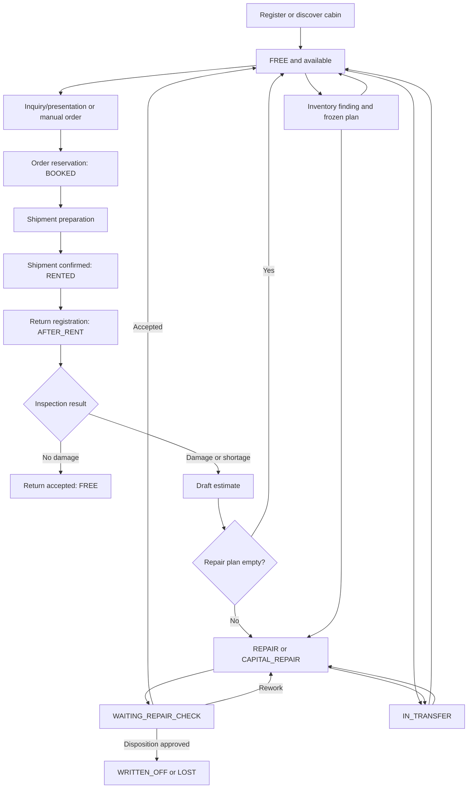

# Cabin Operational Lifecycle

[Russian version](cabin-lifecycle.ru.md)

Status: Confirmed current workflow map as of 2026-08-08.

This guide follows one cabin (`RentalItem`) from registration through booking,
shipment, return, estimate, work, acceptance, inventory, transfer, and terminal
disposition. It explains the current implementation; it does not introduce a
new workflow or authorize the remediation items recorded in the
[architecture audit](../reviews/20260808-full-architecture-audit.md).

Canonical OpenAPI and event schemas remain the transport authority. Each
owning service remains the authority for its transitions and invariants.

## Lifecycle at a glance



The diagram shows the normal status path, not every temporary saga state.
Logistics documents, estimates, repairs, tasks, and inventory sessions each
have their own owner-local lifecycle described below.

## Owners and durable truth

| Concern | Owner | Durable truth |
| --- | --- | --- |
| Cabin identity, warehouse, passport, contents, availability and lifecycle status | `asset-service` | Rental-item aggregate, balances, holds, reservations, leases and asset event history |
| Inquiry, client presentation, booking, rental order, shipment, return and transfer | `logistics-service` | Inquiry/order/document aggregates plus durable external attempts and workflow stores |
| Repair catalogue, return estimate, repair plan, execution, acceptance, rework and disposition proposal | `maintenance-service` | Estimate, repair, stages, acceptance, allocation, reconciliation and disposition records |
| Operational queue, assignment and worker execution | `task-board-service` | Queue entries, tasks, assignments, timing and task-board event history |
| Inventory membership, findings, frozen completion plan and publication | `inventory-service` | Session, findings, plan version, completion and publication state |
| Photos and derivatives | `media-service` | Media metadata, ownership proof, upload/finalize state and private object storage |
| Warehouse identity, directional admission and lifecycle | `warehouse-service` | Warehouse aggregate, lifecycle version, admission and operated marks |

No client or gateway owns a cross-service transition. A command crosses an
owner boundary only through a canonical, idempotent and version-fenced HTTP
effect or a versioned fact.

## 0. Cabin entry and identity

There are three supported creation variants:

1. Interactive creation calls the public asset API. The warehouse must accept
   incoming work, the cabin number is normalized and unique inside that
   warehouse, catalogue selections are validated, and the new cabin starts in
   `FREE`.
2. A reviewed HTML import may create cabins in one of the explicitly allowed
   manual states: `SALE`, `USED_SALE`, `FREE`, `WAREHOUSE`, or `OWN_NEEDS`.
   Import review, commit, media retry, replacement, and skip are one
   asset-owned workflow. Number identity is still enforced; unlike interactive
   creation, a reviewed legacy row may explicitly omit type, dimensions, or
   category, while every supplied catalogue UUID is resolved before commit.
3. An inventory finding may permanently create one source cabin through the
   private inventory boundary. The stable identity is
   `inventoryId:findingId`; the exact request replays, a changed request
   conflicts, and the cabin starts in `FREE`.

Manual status changes are limited to the five manual states above. Rental,
return, repair, transfer, and terminal statuses must be produced by their
owning workflows rather than selected directly in a UI.

Exit condition: the cabin has a canonical asset ID, warehouse-scoped immutable
number identity, version, valid passport/composition, and an asset event.

## 1. Availability, inquiry, and selection

A cabin is bookable only when `asset-service` proves all of the following in
one warehouse-scoped read:

- status is `FREE`;
- there is no active order reservation;
- there is no active presentation hold;
- there is no conflicting operation lease.

The normal client-selection branch is:

1. `logistics-service` creates an `ACTIVE` rental inquiry.
2. A manager creates an `ACTIVE` client presentation with an expiry time and
   a separate view window.
3. `asset-service` acquires short-lived holds for the selected cabins.
4. The client reads the token-limited presentation and chooses cabins.
5. Expired, revoked, or rejected presentations release or eventually expire
   their holds; they do not create a booking.

The interactive manager branch keeps the same owners but adds a conversational
decision layer:

1. the assistant reads logistics facets and asks persisted, independent button
   questions until every search group has an exact type and finish;
2. one type-related size is resolved automatically, several sizes remain a
   choice, and approximate six-metre input is accepted only through a current
   6x2.4 relation;
3. `REPLACE` starts a new result set and explicit `APPEND` adds another group;
   groups such as ОСБ and ЛДСП remain switchable and answerable in either order;
4. logistics durably freezes each complete selection replace/release command,
   while asset-service creates, renews or releases the actual holds;
5. removing cabins sends the complete retained identifier set, immediately
   releases removed holds and resets the retained hold lifetime. An empty set
   releases the selection completely.

Catalog help by number or text is read-only and can explain current types,
finishes, dimensions, relations, characteristics and linoleum without creating
or renewing a hold.

The alternative manager branch creates a `DRAFT` rental order directly,
selects a warehouse, and adds cabins through authoritative order reservations.
Manual booking drafts also use bounded holds; they are not authoritative after
expiry.

## 2. Booking and rental order

### Presentation booking

Confirming a client presentation is a durable logistics workflow:

1. create a `PENDING` presentation-booking record;
2. create or resolve the target `DRAFT` order;
3. select the order warehouse;
4. convert every presentation hold into an order-unit reservation;
5. finalize the booking as `COMPLETED`, the presentation as `BOOKED`, and the
   inquiry as `BOOKED`.

The asset reservation changes each selected cabin from `FREE` to `BOOKED`.
Any failure before complete conversion is rejected or recoverable through the
same stable booking identity; a partial conversion must not be presented as a
successful booking.

### Manual order

A manager may create a `DRAFT` order, select one warehouse, add from 1 to 100
available cabins, specify desired furniture/equipment and rental terms, and
then save it for fulfillment. Adding a cabin reserves it in `asset-service`;
removing it releases that reservation when the order/document guards allow the
edit. The draft also identifies one logistics-owned rental client and records
delivery address, optional coordinate pair, contact phone, optional comment and
one to 31 acceptable delivery dates. Saving requires those delivery facts
except the comment, and a planned shipment date must be one of the accepted
dates.

The order lifecycle is:

```text
DRAFT -> SAVED -> FULFILLED -> CLOSED
   \
    -> CANCELLED
```

- `DRAFT` is the normal editable state and the only cancellable state.
- `SAVED` requires a warehouse and complete per-cabin rental terms.
- A saved order remains editable only while its linked shipment is still an
  untouched `DRAFT` without a furniture task.
- `FULFILLED` means every ordered cabin has reached `SHIPPED`, not that it has
  returned.
- `CLOSED` means every automatically linked return has reached either
  `ACCEPTED` or `ESTIMATE_REQUESTED`.

## 3. Preparation and shipment

A saved order can be split into independently scheduled shipments. Every
shipment contains a selected subset of reserved cabins, freezes the driver and
scheduled date, and progresses through:

```text
DRAFT -> PREPARING -> AWAITING_CONFIRMATION
      -> CONFIRMING_PREPARATION -> SHIPPED
```

Preparation acquires asset leases and furniture/equipment holds, validates
asset snapshots, and creates the required movement task. Confirmation is
blocked until the furniture task is ready and the effective warehouse date
permits departure, unless the operator explicitly keeps the planned date
through the contract-defined override.

For every confirmed line, the fenced asset effect changes `FREE` or `BOOKED`
to `RENTED`, commits the required holds, and releases the temporary guard. A
failed or ambiguous private effect remains a durable attempt and moves the
document through its explicit conflict/reconciliation behavior; it is not
converted into success.

When a rental shipment becomes `SHIPPED`, logistics creates one independently
schedulable return document per cabin. The order stays `SAVED` while any
ordered cabin is not shipped, then becomes `FULFILLED` and releases its
remaining order-level furniture reservations.

A pre-shipment cancellation releases confirmed holds and leases. Cancellation
is refused when a mutable preparation effect has an unknown result.

## 4. Rental period

While the cabin is at the client:

- asset status is `RENTED`;
- the linked order and shipment IDs remain logistics-owned evidence;
- each cabin has its own rental term and return document;
- rental terms may be extended while the order is `SAVED` or `FULFILLED`;
- one cabin may return while another cabin from the same order remains rented.

The repository contains no separate invoicing, payment, or accounting owner.
`RentalOrder` terms and maintenance repair estimates are operational data, not
an implemented billing lifecycle.

## 5. Return and inspection

Each return starts as a `DRAFT`. Scheduling and registration produce:

```text
DRAFT -> REGISTERING -> INSPECTION_REQUIRED
```

Registration uses a durable workflow and changes the asset from `RENTED` to
`AFTER_RENT`. At `INSPECTION_REQUIRED`, the operator must choose exactly one
branch for the return document.

### Undamaged branch

The operator confirms equipment completeness and freezes the exact inspection
media generations. The document progresses:

```text
INSPECTION_REQUIRED -> ACCEPTING -> ACCEPTED
```

After media and fenced asset effects complete, the cabin changes from
`AFTER_RENT` to `FREE`.

### Damage or shortage branch

The operator supplies inspection media for every return line. Logistics
freezes the source snapshot and starts one maintenance-owned draft estimate
per line:

```text
INSPECTION_REQUIRED -> ESTIMATE_PENDING -> ESTIMATE_REQUESTED
```

The corresponding asset effect changes `AFTER_RENT` to
`WAITING_ESTIMATE_CONFIRMATION`. `ESTIMATE_REQUESTED` closes the logistics
return branch; later repair decisions belong to maintenance.

The order closes only after every linked return is either `ACCEPTED` or
`ESTIMATE_REQUESTED`. This allows damaged cabins to continue through repair
without keeping the commercial logistics order open indefinitely.

## 6. Estimate

`maintenance-service` owns one `DRAFT` estimate for each source
`returnId:lineId`. Estimates from different cabins or return lines are never
merged. The source cabin/version, inspection evidence, catalogue items,
quantities, prices, work stages, and furniture-accounting decision are frozen
or fenced by the maintenance workflow.

Completion has two principal outcomes:

- Empty estimate: there is no repair plan and no task. Maintenance applies the
  fenced empty-estimate effect and the cabin becomes `FREE`.
- Non-empty estimate: maintenance creates the primary repair with origin
  `ESTIMATE`, records the plan/stages, and queues the repair. The cabin becomes
  `REPAIR` or `CAPITAL_REPAIR` according to the repair path.

Recorded cabin contents normally use asset-owned custody/balance effects.
For a legacy cabin with no recorded composition, the explicit
`UNACCOUNTED_CABIN_CONTENTS` choice creates separately approved maintenance
decisions without inventing an asset balance movement.

## 7. Repair and work execution

A repair has two independent classifications:

- origin: `ESTIMATE`, `DIRECT_REPAIR`, or `INVENTORY`;
- kind: `PRIMARY` or `REWORK`.

Its calculated complexity is `LIGHT`, `MEDIUM`, `COMPLEX`, or `CAPITAL`.
Execution progresses through `DRAFT`, `QUEUED`, `IN_PROGRESS`, `COMPLETED`, or
`CANCELLED`; acceptance progresses separately through `NOT_READY`, `PENDING`,
`IN_REWORK`, `ACCEPTED`, or `WRITTEN_OFF`.

Queueing reserves the appropriate repair place, moves the cabin to `REPAIR`
or `CAPITAL_REPAIR`, and publishes or registers the task-board work. When a
repair must be delivered to another place, maintenance prepares the movement
and logistics/task-board dependencies complete the delivery before execution
is activated.

`task-board-service` owns queue entries, assignment, worker identity, stage
execution, work timing, and completion evidence. A worker action advances the
task and reports the canonical result; it does not mutate the cabin directly.
Maintenance consumes or reconciles that result and advances its repair.

When all required work is completed, maintenance moves the cabin to
`WAITING_REPAIR_CHECK` and the repair acceptance state to `PENDING`.

## 8. Acceptance, rework, and terminal disposition

At repair acceptance there are three branches:

1. Accept: maintenance applies the fenced acceptance effect, releases the
   repair place, marks the repair `ACCEPTED`, and the cabin becomes `FREE`.
2. Rework: maintenance creates one child `REWORK` repair in the same cabin,
   warehouse, version lineage and root hierarchy. The source remains
   non-terminal while its active child is queued and executed; after the child
   completes, acceptance is evaluated again.
3. Property disposition: maintenance owns proposal, evidence, review and
   approval. A global administrator applies the terminal decision; asset
   status becomes `WRITTEN_OFF` or `LOST`. Furniture is either moved in exact
   quantities to stock or disposed with the cabin according to the approved
   plan.

`WRITTEN_OFF` and `LOST` are terminal asset statuses. They are not manual
status edits and cannot return to the booking pool without a separately
authorized product change.

## 9. Inventory branch

Inventory can intersect the cabin lifecycle before booking, after return, or
while repair work exists:

1. The panel starts an `ACTIVE` session. Membership is a live warehouse-scoped
   population owned by inventory; the manager app records field findings.
2. An inspection moves from `NOT_INSPECTED` to `READY` or `WORK_STAGED` and
   stores a proposal only. Saving a finding does not yet mutate another owner.
3. Review builds a server-owned final plan in `DRAFT`; source changes make it
   `STALE`.
4. Completing the exact plan version changes it to `COMPLETED` and publishes
   idempotent effects. Publication progresses through `READY`, `PENDING`,
   `SUCCEEDED`, retryable failure, or an explicit blocked state.

Variants include:

- resolving an existing warehouse-scoped number;
- permanently creating a previously unknown cabin in `FREE`;
- supplementing the current cabin record;
- replacing a proposed snapshot;
- publishing new maintenance work with origin `INVENTORY`;
- preserving already-started work and deducting it from a replacement plan;
- opening a draft estimate for an `AFTER_RENT` finding instead of creating a
  repair task directly.

The session ends as `COMPLETED` or `CANCELLED`. A closed or blocked publication
remains visible; it is not silently treated as applied.

## 10. Transfer branch

A transfer is a logistics document from one warehouse to another. Each line is
independently fenced and progresses:

```text
PENDING -> DEPARTING -> DEPARTED -> ARRIVING -> ARRIVED
```

The document progresses from `DRAFT` through `DEPARTING`, `IN_TRANSIT`, and
`ARRIVING` to `COMPLETED`. Before departure, warehouse identities, destination
admission, furniture movement, maintenance continuation, and asset snapshot
are prepared durably.

Asset behavior depends on the source class:

- a `FREE` cabin becomes `IN_TRANSFER` and returns to `FREE` at the destination;
- a `REPAIR` or `CAPITAL_REPAIR` cabin becomes `IN_TRANSFER` while its repair
  origin/class is persisted, then resumes the permitted repair class at the
  destination;
- a conflicting or ambiguous line remains `CONFLICT` or
  `RECONCILIATION_REQUIRED` until the durable workflow proves the remote
  outcome.

Arrival freezes media generations, assigns the destination warehouse through
the asset owner, and resumes any approved repair continuation. A multi-line
transfer can therefore be partly in transit while other lines are already
arrived.

## 11. Failure, concurrency, and recovery

Every mutable step must retain the same safety shape:

| Risk | Required mechanism | Operator-visible outcome |
| --- | --- | --- |
| Client retry | `Idempotency-Key` or stable source identity | Original success replays; changed payload conflicts |
| Concurrent edit | `expectedVersion`, document/line version, lease or fence token | `409` and authoritative refresh |
| Lost private response | Prepare durable attempt before network call | Relay/reconciler retries the identical effect |
| Remote success, lost local finalize | Immutable attempt and original fence | Reconcile; never issue a semantically new command |
| Invalid or exhausted event | Inbox/checkpoint/DLT policy | Explicit blocked or quarantined evidence |
| Warehouse draining | Directional admission and operated mark | New incoming work rejected; accepted draining work remains recoverable |
| Media not ready or wrong owner | Owner proof and exact generation | Command remains pending or fails explicitly |

Current deviations from this target shape are intentionally not corrected by
this documentation/refactoring task. Their evidence and remediation sequence
remain in the [full architecture audit](../reviews/20260808-full-architecture-audit.md).

## End-state matrix

| Cabin status | Meaning | Next legitimate owner/action |
| --- | --- | --- |
| `FREE` | Available only if no hold, reservation or lease exists | Logistics may hold/book; inventory may inspect; logistics may transfer |
| `BOOKED` | Bound to an active order-unit reservation | Logistics prepares shipment or releases/cancels the reservation |
| `RENTED` | Shipment confirmed and cabin at client | Logistics schedules/registers its linked return |
| `AFTER_RENT` | Return registered, inspection not settled | Logistics accepts undamaged return or requests maintenance estimate |
| `WAITING_ESTIMATE_CONFIRMATION` | Damaged return handed to maintenance | Maintenance completes an empty or non-empty estimate |
| `REPAIR` / `CAPITAL_REPAIR` | Maintenance work is queued or executing | Maintenance and task-board execute/reconcile work; logistics may transfer under repair rules |
| `WAITING_REPAIR_CHECK` | Work complete, acceptance pending | Maintenance accepts, starts rework, or begins disposition review |
| `IN_TRANSFER` | Logistics transfer custody is active | Logistics completes arrival/reconciliation |
| `SALE` / `USED_SALE` / `WAREHOUSE` / `OWN_NEEDS` | Manual operational classification | Asset-owned guarded manual transition among allowed manual states |
| `WRITTEN_OFF` / `LOST` | Terminal approved disposition | No ordinary operational transition |

## Scenario catalogue

1. Standard rental: create `FREE` -> book -> ship -> `RENTED` -> undamaged
   return -> `FREE`.
2. Damaged return with empty estimate: return ->
   `WAITING_ESTIMATE_CONFIRMATION` -> complete empty estimate -> `FREE`.
3. Damaged return with repair: estimate -> `REPAIR` -> worker stages ->
   `WAITING_REPAIR_CHECK` -> accept -> `FREE`.
4. Capital repair: estimate/direct/inventory origin -> `CAPITAL_REPAIR` ->
   work -> acceptance.
5. Rework: completed primary repair -> rejected at acceptance -> child
   `REWORK` -> repeat acceptance.
6. Terminal loss/write-off: failed acceptance or separate property review ->
   approved furniture plan -> `WRITTEN_OFF` or `LOST`.
7. Multi-cabin order: independent shipments and one return per cabin; order
   becomes `FULFILLED` only after all shipments and `CLOSED` only after all
   returns settle.
8. Presentation expiry/rejection: holds release or expire; no order reservation
   and cabin remains `FREE`.
9. Free-cabin transfer: `FREE` -> `IN_TRANSFER` -> `FREE` in the destination.
10. Repair transfer: repair class -> `IN_TRANSFER` -> approved repair
    continuation at the destination.
11. Inventory discovery: unknown number -> permanent source asset in `FREE` ->
    later ordinary booking.
12. Inventory-derived work: frozen finding plan -> `INVENTORY` repair while
    started work is preserved and duplicate effects replay safely.

## Primary sources

- [`asset-service.yaml`](../../contracts/openapi/asset-service.yaml) and
  [`RentalItemStatus.java`](../../services/asset-service/src/main/java/dev/buhanzaz/rwms/asset/domain/RentalItemStatus.java)
- [`logistics-service.yaml`](../../contracts/openapi/logistics-service.yaml),
  [`PresentationBookingService.java`](../../services/logistics-service/src/main/java/dev/buhanzaz/rwms/logistics/inquiry/service/PresentationBookingService.java),
  [`RentalOrder.java`](../../services/logistics-service/src/main/java/dev/buhanzaz/rwms/logistics/order/domain/RentalOrder.java), and
  [`LogisticsDocument.java`](../../services/logistics-service/src/main/java/dev/buhanzaz/rwms/logistics/domain/LogisticsDocument.java)
- [`maintenance-service.yaml`](../../contracts/openapi/maintenance-service.yaml),
  [`MaintenanceApplicationService.java`](../../services/maintenance-service/src/main/java/dev/buhanzaz/rwms/maintenance/service/MaintenanceApplicationService.java), and maintenance domain enums under
  [`maintenance/domain`](../../services/maintenance-service/src/main/java/dev/buhanzaz/rwms/maintenance/domain/)
- [`inventory-service.yaml`](../../contracts/openapi/inventory-service.yaml) and
  [`InventoryApplicationService.java`](../../services/inventory-service/src/main/java/dev/buhanzaz/rwms/inventory/service/InventoryApplicationService.java)
- [`task-board-service.yaml`](../../contracts/openapi/task-board-service.yaml),
  [`media-service.yaml`](../../contracts/openapi/media-service.yaml), and
  [`warehouse-service.yaml`](../../contracts/openapi/warehouse-service.yaml)
- [`domain-logic.md`](domain-logic.md), [`runtime-flows.md`](runtime-flows.md),
  and [`service-catalog.md`](service-catalog.md)
