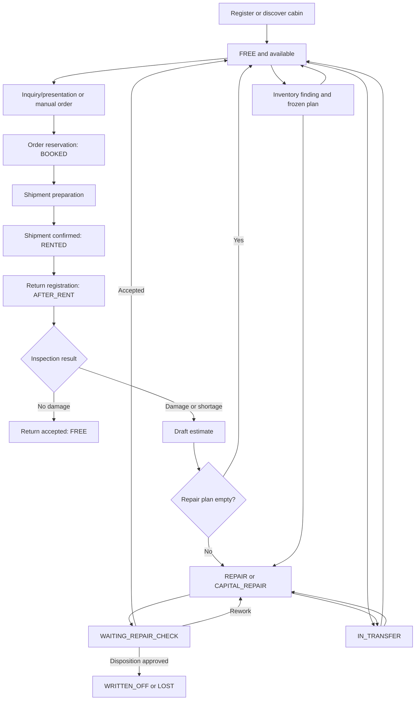

# Cabin Operational Lifecycle

[Russian version](cabin-lifecycle.ru.md)

Status: Confirmed current workflow map as of 2026-08-08.

This guide follows one cabin (`RentalItem`) from registration through booking,
shipment, return, estimate, work, acceptance, inventory, transfer, and terminal
disposition. It explains the current implementation; it does not introduce a
new workflow or authorize the remediation items recorded in the
[architecture audit](../reviews/20260808-full-architecture-audit.md).

Canonical OpenAPI and event schemas remain the transport authority. Each
owning service remains the authority for its transitions and invariants.

## Lifecycle at a glance



The diagram shows the normal status path, not every temporary saga state.
Logistics documents, estimates, repairs, tasks, and inventory sessions each
have their own owner-local lifecycle described below.

## Owners and durable truth

| Concern | Owner | Durable truth |
| --- | --- | --- |
| Cabin identity, warehouse, passport, contents, availability and lifecycle status | `asset-service` | Rental-item aggregate, balances, holds, reservations, leases and asset event history |
| Inquiry, client presentation, booking, rental order, shipment, return and transfer | `logistics-service` | Inquiry/order/document aggregates plus durable external attempts and workflow stores |
| Repair catalogue, return estimate, repair plan, execution, acceptance, rework and disposition proposal | `maintenance-service` | Estimate, repair, stages, acceptance, allocation, reconciliation and disposition records |
| Operational queue, assignment and worker execution | `task-board-service` | Queue entries, tasks, assignments, timing and task-board event history |
| Inventory membership, findings, frozen completion plan and publication | `inventory-service` | Session, findings, plan version, completion and publication state |
| Photos and derivatives | `media-service` | Media metadata, ownership proof, upload/finalize state and private object storage |
| Warehouse identity, directional admission and lifecycle | `warehouse-service` | Warehouse aggregate, lifecycle version, admission and operated marks |

No client or gateway owns a cross-service transition. A command crosses an
owner boundary only through a canonical, idempotent and version-fenced HTTP
effect or a versioned fact.

## 0. Cabin entry and identity

There are three supported creation variants:

1. Interactive creation calls the public asset API. The warehouse must accept
   incoming work, the cabin number is normalized and unique inside that
   warehouse, catalogue selections are validated, and the new cabin starts in
   `FREE`.
2. A reviewed HTML import may create cabins in one of the explicitly allowed
   manual states: `SALE`, `USED_SALE`, `FREE`, `WAREHOUSE`, or `OWN_NEEDS`.
   Import review, commit, media retry, replacement, and skip are one
   asset-owned workflow. Number identity is still enforced; unlike interactive
   creation, a reviewed legacy row may explicitly omit type, dimensions, or
   category, while every supplied catalogue UUID is resolved before commit.
3. An inventory finding may permanently create one source cabin through the
   private inventory boundary. The stable identity is
   `inventoryId:findingId`; the exact request replays, a changed request
   conflicts, and the cabin starts in `FREE`.

Manual status changes are limited to the five manual states above. Rental,
return, repair, transfer, and terminal statuses must be produced by their
owning workflows rather than selected directly in a UI.

Exit condition: the cabin has a canonical asset ID, warehouse-scoped immutable
number identity, version, valid passport/composition, and an asset event.

## 1. Availability, inquiry, and selection

A cabin is bookable only when `asset-service` proves all of the following in
one warehouse-scoped read:

- status is `FREE`;
- there is no active order reservation;
- there is no active presentation hold;
- there is no conflicting operation lease.

The supported client-selection branch is:

1. `logistics-service` creates an `ACTIVE` inquiry linked to the current
   `DRAFT` or normally editable `SAVED` order. An assistant inquiry retains its
   conversation ID; a manual inquiry uses the same entity with no hidden chat.
2. Assistant clarifications advance one at a time in one conversation. Manual
   and assistant inquiries remain rediscoverable from the order after reload.
3. The first selected cabin fixes the order warehouse. Every later search,
   presentation, assistant query and additional-cabin confirmation uses only
   that warehouse.
4. A manager publishes an `ACTIVE` presentation. `asset-service` atomically
   acquires its short-lived cabin holds and returns the held cabin snapshots;
   logistics never publishes a pre-hold content snapshot as current truth.
5. The token-limited presentation exposes the exact selectable count, each
   cabin's current contents, all active equipment metadata, shared free
   quantity and the per-cabin maximum. Zero shared availability remains visible
   when selected held-cabin contents can fulfil the request.
6. The client chooses cabins and optional furniture separately per cabin.
   Expired or revoked presentations release or eventually expire their holds
   and create no booking. A terminal rejected booking may be republished as a
   new revision; pending or completed booking work remains fenced.

The interactive search still stores exact replace/release receipts. `REPLACE`
starts a result set and explicit `APPEND` adds a group; removing cabins sends
the complete retained identifier set, and an empty set releases it completely.

Catalog help by number or text is read-only and can explain current types,
finishes, dimensions, relations, characteristics and linoleum without creating
or renewing a hold.

The manager first creates the `DRAFT` order, records the client wishes and then
uses “Add cabins” repeatedly through either the assistant or ordinary
inquiry/presentation path. Every successful selection appends to that same
order; it does not create a parallel order or inventory pool.

## 2. Booking and rental order

### Presentation booking

Confirming a client presentation is a durable logistics workflow:

1. create a `PENDING` presentation-booking record;
2. resolve and lock the linked `DRAFT` or normally editable `SAVED` order;
3. validate exact selection cardinality and the order's fixed warehouse;
4. send every selected cabin with its equipment quantities plus the
   authoritative composition of all existing order cabins to `asset-service`;
5. atomically convert all presentation holds into order-unit reservations and
   replace the one shared order equipment reservation;
6. store the same per-cabin requirements in the order;
7. finalize the booking as `COMPLETED`, the presentation as `BOOKED`, and the
   inquiry as `BOOKED`.

The asset reservation changes each selected cabin from `FREE` to `BOOKED`.
Per-cabin quantity must satisfy both live shared capacity and the equipment
item's `maximumPerCabin`. The conversion is one asset transaction, so another
manager, presentation or assistant sees the same remaining quantity and no
partial conversion is presented as success. A crash replays the same booking
selection and asset receipt.

### Manual order

A manager may create an incomplete `DRAFT` order and then supply delivery
address, optional coordinates, primary contact, separate client/order
additional contacts, comment, rental terms and any number of ordered desired
delivery windows. A new window is a single date or inclusive date range with an
ordered time range. These wishes are required before final cabin assignment and
save but remain advisory; the actual trip date/time may be outside them.

Ordinary cabin/furniture add, replace or edit is allowed only while the linked
trip has no final date/time, shipment has not started and no furniture task has
crossed the edit cutoff. The same rule applies to `DRAFT` and editable `SAVED`
orders. Removing an active cabin releases its asset reservation only after the
same guards pass.

The order lifecycle is:

```text
DRAFT -> SAVED -> FULFILLED -> CLOSED
   \
    -> CANCELLED
```

- `DRAFT` is the normal editable state and the only cancellable state.
- `SAVED` requires a warehouse and complete per-cabin rental terms.
- A saved order remains ordinarily editable only while the shared editability
  rule above is true.
- `FULFILLED` means every ordered cabin has reached `SHIPPED`, not that it has
  returned.
- `CLOSED` means every automatically linked return has reached either
  `ACCEPTED` or `ESTIMATE_REQUESTED`.

### Replacement inside the same order

An authorized warehouse manager may replace an unavailable cabin separately
from ordinary editing until that exact cabin's trip starts:

1. direct replacement selects old/new cabins and records a nonblank reason, or
   replacement presentation holds alternatives and requires exactly as many
   selections as target cabins;
2. replacement confirmation forbids furniture edits and preserves each old
   cabin's quantities in the target-list/selection order;
3. any unfinished ordinary furniture task targeting an old cabin is cancelled
   and its holds released before swap; executing work blocks replacement;
4. one asset batch validates all pairs, presentation holds and all-order
   furniture composition before swapping any reservation;
5. one local transaction moves the existing requirements, document lines,
   grouped driver members and audit facts, then replans the pre-start grouped
   trip with the new cabin;
6. when completed work left physical furniture in the old cabin, the existing
   equipment-movement task mechanism moves it directly to the replacement.
   Reservations stay with the order and readiness remains false until `DONE`.

A crash after the asset receipt replays the same ordered batch/checkpoints. A
permanent rejection leaves the order unchanged and restores any pre-start
grouped trip cancelled as the execution fence.

## 3. Preparation and shipment

A saved order can be split into independently scheduled shipments. Every
shipment contains a selected subset of reserved cabins, freezes the driver and
actual scheduled date/time, and progresses through:

```text
DRAFT -> PREPARING -> AWAITING_CONFIRMATION
      -> CONFIRMING_PREPARATION -> SHIPPED
```

Every newly scheduled shipment, return or transfer creates one grouped driver
trip with immutable cabin members and a stable order trip number. The one
warehouse setting limits member count for every trip; no second limit or
per-cabin driver task is created. Board movement reorders the whole trip and,
before start, synchronizes the actual document date while preserving its time
and client wishes.

Preparation acquires asset leases and furniture/equipment holds, validates one
snapshot containing all active order cabins, and creates the required existing
movement task. This all-order composition lets physical surplus from another
trip cabin satisfy the target without double reservation. Confirmation is
blocked until the furniture task is ready and the effective warehouse date
permits departure, unless the operator explicitly keeps the planned date
through the contract-defined override.

For every confirmed line, the fenced asset effect changes `FREE` or `BOOKED`
to `RENTED`, commits the required holds, and releases the temporary guard. A
failed or ambiguous private effect remains a durable attempt and moves the
document through its explicit conflict/reconciliation behavior; it is not
converted into success.

When a rental shipment becomes `SHIPPED`, logistics creates one independently
schedulable return document per cabin. The order stays `SAVED` while any
ordered cabin is not shipped, then becomes `FULFILLED` and releases its
remaining order-level furniture reservations.

A pre-shipment cancellation releases confirmed holds and leases. Cancellation
is refused when a mutable preparation effect has an unknown result.

## 4. Rental period

While the cabin is at the client:

- asset status is `RENTED`;
- the linked order and shipment IDs remain logistics-owned evidence;
- each cabin has its own rental term and return document;
- rental terms may be extended while the order is `SAVED` or `FULFILLED`;
- one cabin may return while another cabin from the same order remains rented.

The repository contains no separate invoicing, payment, or accounting owner.
`RentalOrder` terms and maintenance repair estimates are operational data, not
an implemented billing lifecycle.

## 5. Return and inspection

Each return starts as a `DRAFT`. Scheduling and registration produce:

```text
DRAFT -> REGISTERING -> INSPECTION_REQUIRED
```

Registration uses a durable workflow and changes the asset from `RENTED` to
`AFTER_RENT`. At `INSPECTION_REQUIRED`, the operator must choose exactly one
branch for the return document.

### Undamaged branch

The operator confirms equipment completeness and freezes the exact inspection
media generations. The document progresses:

```text
INSPECTION_REQUIRED -> ACCEPTING -> ACCEPTED
```

After media and fenced asset effects complete, the cabin changes from
`AFTER_RENT` to `FREE`.

### Damage or shortage branch

The operator supplies inspection media for every return line. Logistics
freezes the source snapshot and starts one maintenance-owned draft estimate
per line:

```text
INSPECTION_REQUIRED -> ESTIMATE_PENDING -> ESTIMATE_REQUESTED
```

The corresponding asset effect changes `AFTER_RENT` to
`WAITING_ESTIMATE_CONFIRMATION`. `ESTIMATE_REQUESTED` closes the logistics
return branch; later repair decisions belong to maintenance.

The order closes only after every linked return is either `ACCEPTED` or
`ESTIMATE_REQUESTED`. This allows damaged cabins to continue through repair
without keeping the commercial logistics order open indefinitely.

## 6. Estimate

`maintenance-service` owns one `DRAFT` estimate for each source
`returnId:lineId`. Estimates from different cabins or return lines are never
merged. The source cabin/version, inspection evidence, catalogue items,
quantities, prices, work stages, and furniture-accounting decision are frozen
or fenced by the maintenance workflow.

Completion has two principal outcomes:

- Empty estimate: there is no repair plan and no task. Maintenance applies the
  fenced empty-estimate effect and the cabin becomes `FREE`.
- Non-empty estimate: maintenance creates the primary repair with origin
  `ESTIMATE`, records the plan/stages, and queues the repair. The cabin becomes
  `REPAIR` or `CAPITAL_REPAIR` according to the repair path.

Recorded cabin contents normally use asset-owned custody/balance effects.
For a legacy cabin with no recorded composition, the explicit
`UNACCOUNTED_CABIN_CONTENTS` choice creates separately approved maintenance
decisions without inventing an asset balance movement.

## 7. Repair and work execution

A repair has two independent classifications:

- origin: `ESTIMATE`, `DIRECT_REPAIR`, or `INVENTORY`;
- kind: `PRIMARY` or `REWORK`.

Its calculated complexity is `LIGHT`, `MEDIUM`, `COMPLEX`, or `CAPITAL`.
Execution progresses through `DRAFT`, `QUEUED`, `IN_PROGRESS`, `COMPLETED`, or
`CANCELLED`; acceptance progresses separately through `NOT_READY`, `PENDING`,
`IN_REWORK`, `ACCEPTED`, or `WRITTEN_OFF`.

Queueing reserves the appropriate repair place, moves the cabin to `REPAIR`
or `CAPITAL_REPAIR`, and publishes or registers the task-board work. When a
repair must be delivered to another place, maintenance prepares the movement
and logistics/task-board dependencies complete the delivery before execution
is activated.

`task-board-service` owns queue entries, assignment, worker identity, stage
execution, work timing, and completion evidence. A worker action advances the
task and reports the canonical result; it does not mutate the cabin directly.
Maintenance consumes or reconciles that result and advances its repair.

When all required work is completed, maintenance moves the cabin to
`WAITING_REPAIR_CHECK` and the repair acceptance state to `PENDING`.

## 8. Acceptance, rework, and terminal disposition

At repair acceptance there are three branches:

1. Accept: maintenance applies the fenced acceptance effect, releases the
   repair place, marks the repair `ACCEPTED`, and the cabin becomes `FREE`.
2. Rework: maintenance creates one child `REWORK` repair in the same cabin,
   warehouse, version lineage and root hierarchy. The source remains
   non-terminal while its active child is queued and executed; after the child
   completes, acceptance is evaluated again.
3. Property disposition: maintenance owns proposal, evidence, review and
   approval. A global administrator applies the terminal decision; asset
   status becomes `WRITTEN_OFF` or `LOST`. Furniture is either moved in exact
   quantities to stock or disposed with the cabin according to the approved
   plan.

`WRITTEN_OFF` and `LOST` are terminal asset statuses. They are not manual
status edits and cannot return to the booking pool without a separately
authorized product change.

## 9. Inventory branch

Inventory can intersect the cabin lifecycle before booking, after return, or
while repair work exists:

1. The panel starts an `ACTIVE` session. Membership is a live warehouse-scoped
   population owned by inventory; the manager app records field findings.
2. An inspection moves from `NOT_INSPECTED` to `READY` or `WORK_STAGED` and
   stores a proposal only. Saving a finding does not yet mutate another owner.
3. Review builds a server-owned final plan in `DRAFT`; source changes make it
   `STALE`.
4. Completing the exact plan version changes it to `COMPLETED` and records a
   durable idempotent outcome for every found cabin. After furniture
   reconciliation, asset-service applies the final finding as current truth:
   no work becomes `FREE`, ordinary work becomes `REPAIR`, and the explicit
   capital choice becomes `CAPITAL_REPAIR`. Active rental/transfer holds,
   reservations and leases are superseded without deleting their history.
5. The exact finding images become the current media-service inventory folder;
   older cabin folders remain historical and their MinIO objects are unchanged.
6. One plan-wide logistics command supersedes active rental/document lines and
   their cancellable tasks. A mixed document with an unrelated active line
   fails the batch before any effect instead of partially changing it.
7. A work finding then supersedes non-terminal maintenance predecessors and
   creates the reviewed repair using the effective asset version; `AFTER_RENT`
   is not a separate estimate branch for completed inventory. A no-work finding
   explicitly cleans up non-terminal maintenance work before settling as
   `FREE`. Publication progresses through `READY`, `PENDING`, `SUCCEEDED`,
   retryable failure, or an explicit blocked state. Terminal `LOST` and
   `WRITTEN_OFF` cabins remain rejected.

Variants include:

- resolving an existing warehouse-scoped number;
- permanently creating a previously unknown cabin in `FREE`;
- supplementing the current cabin record;
- replacing a proposed snapshot;
- publishing or reconciling a repair with origin `INVENTORY` while preserving
  superseded repair evidence;
- replacing a non-terminal rental, transfer, reservation or earlier repair
  status with the reviewed inventory outcome.

The session ends as `COMPLETED` or `CANCELLED`. A closed or blocked publication
remains visible; it is not silently treated as applied. From completed history,
a MANAGE user can rebuild missing work and requeue every existing publication,
including an earlier success, because the later photo, logistics and no-work
owner effects may not have existed when that result was recorded. Exact
owner-local receipts make the replay safe; photos and finding evidence are
retained.

All findings in one frozen plan share one durable reapplication generation.
Automatic retries preserve it and their downstream keys; only the confirmed
history action advances it for the whole plan. During that same-source
reassertion asset-service preserves an operation lease that may already belong
to the exact inventory repair, while maintenance or logistics releases only an
unrelated predecessor lease under its recorded owner and fencing token.

## 10. Transfer branch

A transfer is a logistics document from one warehouse to another. Each line is
independently fenced and progresses:

```text
PENDING -> DEPARTING -> DEPARTED -> ARRIVING -> ARRIVED
```

The document progresses from `DRAFT` through `DEPARTING`, `IN_TRANSIT`, and
`ARRIVING` to `COMPLETED`. Before departure, warehouse identities, destination
admission, furniture movement, maintenance continuation, and asset snapshot
are prepared durably.

Asset behavior depends on the source class:

- a `FREE` cabin becomes `IN_TRANSFER` and returns to `FREE` at the destination;
- a `REPAIR` or `CAPITAL_REPAIR` cabin becomes `IN_TRANSFER` while its repair
  origin/class is persisted, then resumes the permitted repair class at the
  destination;
- a conflicting or ambiguous line remains `CONFLICT` or
  `RECONCILIATION_REQUIRED` until the durable workflow proves the remote
  outcome.

Arrival freezes media generations, assigns the destination warehouse through
the asset owner, and resumes any approved repair continuation. A multi-line
transfer can therefore be partly in transit while other lines are already
arrived.

## 11. Failure, concurrency, and recovery

Every mutable step must retain the same safety shape:

| Risk | Required mechanism | Operator-visible outcome |
| --- | --- | --- |
| Client retry | `Idempotency-Key` or stable source identity | Original success replays; changed payload conflicts |
| Concurrent edit | `expectedVersion`, document/line version, lease or fence token | `409` and authoritative refresh |
| Lost private response | Prepare durable attempt before network call | Relay/reconciler retries the identical effect |
| Remote success, lost local finalize | Immutable attempt and original fence | Reconcile; never issue a semantically new command |
| Invalid or exhausted event | Inbox/checkpoint/DLT policy | Explicit blocked or quarantined evidence |
| Warehouse draining | Directional admission and operated mark | New incoming work rejected; accepted draining work remains recoverable |
| Media not ready or wrong owner | Owner proof and exact generation | Command remains pending or fails explicitly |

Current deviations from this target shape are intentionally not corrected by
this documentation/refactoring task. Their evidence and remediation sequence
remain in the [full architecture audit](../reviews/20260808-full-architecture-audit.md).

## End-state matrix

| Cabin status | Meaning | Next legitimate owner/action |
| --- | --- | --- |
| `FREE` | Available only if no hold, reservation or lease exists | Logistics may hold/book; inventory may inspect; logistics may transfer |
| `BOOKED` | Bound to an active order-unit reservation | Logistics prepares shipment or releases/cancels the reservation |
| `RENTED` | Shipment confirmed and cabin at client | Logistics schedules/registers its linked return |
| `AFTER_RENT` | Return registered, inspection not settled | Logistics accepts undamaged return or requests maintenance estimate |
| `WAITING_ESTIMATE_CONFIRMATION` | Damaged return handed to maintenance | Maintenance completes an empty or non-empty estimate |
| `REPAIR` / `CAPITAL_REPAIR` | Maintenance work is queued or executing | Maintenance and task-board execute/reconcile work; logistics may transfer under repair rules |
| `WAITING_REPAIR_CHECK` | Work complete, acceptance pending | Maintenance accepts, starts rework, or begins disposition review |
| `IN_TRANSFER` | Logistics transfer custody is active | Logistics completes arrival/reconciliation |
| `SALE` / `USED_SALE` / `WAREHOUSE` / `OWN_NEEDS` | Manual operational classification | Asset-owned guarded manual transition among allowed manual states |
| `WRITTEN_OFF` / `LOST` | Terminal approved disposition | No ordinary operational transition |

## Scenario catalogue

1. Standard rental: create `FREE` -> book -> ship -> `RENTED` -> undamaged
   return -> `FREE`.
2. Damaged return with empty estimate: return ->
   `WAITING_ESTIMATE_CONFIRMATION` -> complete empty estimate -> `FREE`.
3. Damaged return with repair: estimate -> `REPAIR` -> worker stages ->
   `WAITING_REPAIR_CHECK` -> accept -> `FREE`.
4. Capital repair: estimate/direct/inventory origin -> `CAPITAL_REPAIR` ->
   work -> acceptance.
5. Rework: completed primary repair -> rejected at acceptance -> child
   `REWORK` -> repeat acceptance.
6. Terminal loss/write-off: failed acceptance or separate property review ->
   approved furniture plan -> `WRITTEN_OFF` or `LOST`.
7. Multi-cabin order: independent shipments and one return per cabin; order
   becomes `FULFILLED` only after all shipments and `CLOSED` only after all
   returns settle.
8. Presentation expiry/rejection: holds release or expire; no order reservation
   and cabin remains `FREE`.
9. Free-cabin transfer: `FREE` -> `IN_TRANSFER` -> `FREE` in the destination.
10. Repair transfer: repair class -> `IN_TRANSFER` -> approved repair
    continuation at the destination.
11. Inventory discovery: unknown number -> permanent source asset in `FREE` ->
    later ordinary booking.
12. Inventory-derived work: frozen finding plan -> `INVENTORY` repair while
    started work is preserved and duplicate effects replay safely.
13. Pre-start booked-cabin replacement: old order unit -> one atomic swap ->
    same order/new unit, with unchanged furniture requirements and an existing
    old-to-new movement task when physical contents require it.
14. Multi-cabin trip: one shipment, return or transfer document -> one stable
    grouped driver task; board movement changes the whole group, never a
    member.

## Primary sources

- [`asset-service.yaml`](../../contracts/openapi/asset-service.yaml) and
  [`RentalItemStatus.java`](../../services/asset-service/src/main/java/dev/buhanzaz/rwms/asset/domain/RentalItemStatus.java)
- [`logistics-service.yaml`](../../contracts/openapi/logistics-service.yaml),
  [`PresentationBookingService.java`](../../services/logistics-service/src/main/java/dev/buhanzaz/rwms/logistics/inquiry/service/PresentationBookingService.java),
  [`RentalOrderUnitReplacementService.java`](../../services/logistics-service/src/main/java/dev/buhanzaz/rwms/logistics/order/service/RentalOrderUnitReplacementService.java),
  [`DocumentDriverTaskPlanner.java`](../../services/logistics-service/src/main/java/dev/buhanzaz/rwms/logistics/driver/service/DocumentDriverTaskPlanner.java),
  [`RentalOrder.java`](../../services/logistics-service/src/main/java/dev/buhanzaz/rwms/logistics/order/domain/RentalOrder.java), and
  [`LogisticsDocument.java`](../../services/logistics-service/src/main/java/dev/buhanzaz/rwms/logistics/domain/LogisticsDocument.java), plus
  [`V47__order_contacts_windows_and_inquiry_target.sql`](../../services/logistics-service/src/main/resources/db/migration/V47__order_contacts_windows_and_inquiry_target.sql)
- [`maintenance-service.yaml`](../../contracts/openapi/maintenance-service.yaml),
  [`MaintenanceApplicationService.java`](../../services/maintenance-service/src/main/java/dev/buhanzaz/rwms/maintenance/service/MaintenanceApplicationService.java), and maintenance domain enums under
  [`maintenance/domain`](../../services/maintenance-service/src/main/java/dev/buhanzaz/rwms/maintenance/domain/)
- [`inventory-service.yaml`](../../contracts/openapi/inventory-service.yaml) and
  [`InventoryApplicationService.java`](../../services/inventory-service/src/main/java/dev/buhanzaz/rwms/inventory/service/InventoryApplicationService.java)
- [`task-board-service.yaml`](../../contracts/openapi/task-board-service.yaml),
  [`media-service.yaml`](../../contracts/openapi/media-service.yaml), and
  [`warehouse-service.yaml`](../../contracts/openapi/warehouse-service.yaml)
- [`domain-logic.md`](domain-logic.md), [`runtime-flows.md`](runtime-flows.md),
  and [`service-catalog.md`](service-catalog.md)
