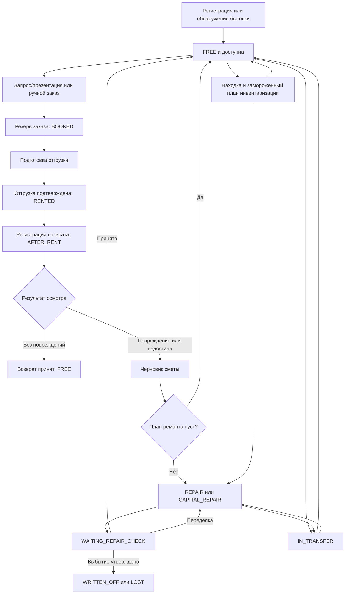

# Полный операционный цикл бытовки

[English version](cabin-lifecycle.md)

Статус: подтверждённая карта текущего процесса на 2026-08-08.

Этот документ сопровождает одну бытовку (`RentalItem`) от регистрации через
бронирование, отгрузку, возврат, смету, работы, приёмку, инвентаризацию,
перемещение и терминальное выбытие. Он описывает текущую реализацию, но не
добавляет новый workflow и не разрешает исправления из
[архитектурного аудита](../reviews/20260808-full-architecture-audit.md).

Канонические OpenAPI- и event-схемы остаются источником истины для транспорта.
Каждый сервис-владелец остаётся источником истины для своих переходов и
инвариантов.

## Цикл одним взглядом



Диаграмма показывает обычный путь статуса, но не все временные состояния саг.
У логистических документов, смет, ремонтов, задач и сессий инвентаризации есть
собственные локальные lifecycle, описанные ниже.

## Владельцы и долговременный источник истины

| Предмет | Владелец | Долговременный источник истины |
| --- | --- | --- |
| Идентичность бытовки, склад, паспорт, содержимое, доступность и lifecycle-статус | `asset-service` | Агрегат rental item, остатки, holds, резервы, leases и история asset-событий |
| Запрос, клиентская презентация, бронирование, заказ аренды, отгрузка, возврат и перемещение | `logistics-service` | Агрегаты inquiry/order/document, долговременные external attempts и workflow stores |
| Каталог ремонта, смета возврата, план и исполнение ремонта, приёмка, переделка и предложение о выбытии | `maintenance-service` | Смета, ремонт, этапы, приёмка, размещение, reconciliation и записи выбытия |
| Операционная очередь, назначение и выполнение работником | `task-board-service` | Элементы очередей, задачи, назначения, хронометраж и история task-board |
| Состав инвентаризации, находки, замороженный план завершения и публикация | `inventory-service` | Сессия, находки, версия плана, завершение и состояние публикации |
| Фотографии и производные | `media-service` | Метаданные, proof владельца, upload/finalize state и приватное объектное хранилище |
| Идентичность склада, направленный admission и lifecycle | `warehouse-service` | Агрегат склада, версия lifecycle, admission и operated marks |

Ни клиент, ни gateway не владеют межсервисным переходом. Команда пересекает
границу владельца только через канонический идемпотентный и version-fenced
HTTP-эффект либо версионированный факт.

## 0. Появление и идентичность бытовки

Поддерживаются три варианта создания:

1. Интерактивное создание вызывает публичный asset API. Склад должен принимать
   входящие операции, номер нормализуется и уникален внутри склада, выборы
   каталогов проверяются, новая бытовка получает статус `FREE`.
2. Проверенный HTML-импорт может создать бытовки только в явно разрешённых
   ручных состояниях: `SALE`, `USED_SALE`, `FREE`, `WAREHOUSE` или `OWN_NEEDS`.
   Проверка, commit, повтор медиа, замена и пропуск образуют один asset-owned
   workflow. Идентичность номера всё равно проверяется; в отличие от
   интерактивного создания, проверенная legacy-строка может явно не содержать
   тип, размеры или категорию, а каждый переданный UUID каталога разрешается до
   commit.
3. Находка инвентаризации может навсегда создать одну исходную бытовку через
   приватную inventory-границу. Стабильная идентичность —
   `inventoryId:findingId`: точный запрос воспроизводится, изменённый
   конфликтует, бытовка создаётся в `FREE`.

Ручное изменение статуса ограничено пятью ручными состояниями выше. Статусы
аренды, возврата, ремонта, перемещения и терминального выбытия должны создавать
владеющие workflow, а не прямой выбор в UI.

Условие выхода: у бытовки есть канонический asset ID, неизменяемая
warehouse-scoped идентичность номера, версия, валидный паспорт/состав и
asset-событие.

## 1. Доступность, запрос и выбор

Бытовку можно бронировать, только если `asset-service` доказывает в одном
warehouse-scoped чтении все условия:

- статус равен `FREE`;
- нет активного резерва заказа;
- нет активного presentation hold;
- нет конфликтующего operation lease.

Поддерживаемая клиентская ветка выбора:

1. `logistics-service` создаёт запрос в `ACTIVE`, связанный с текущим заказом
   `DRAFT` или обычным редактируемым `SAVED`. Запрос ассистента хранит ID
   диалога; ручной запрос использует ту же сущность без скрытого AI-чата.
2. Уточнения ассистента идут по одному в одном диалоге. Ручные и AI-запросы
   снова находятся из заказа после перезагрузки.
3. Первая выбранная бытовка фиксирует склад заказа. Все дальнейшие поиски,
   презентации, запросы ассистента и подтверждения дополнительных бытовок
   используют только этот склад.
4. Менеджер публикует презентацию в `ACTIVE`. `asset-service` атомарно
   захватывает её короткоживущие holds бытовок и возвращает snapshots уже
   удерживаемых бытовок; logistics не публикует pre-hold содержимое как
   актуальную истину.
5. Ограниченная токеном презентация показывает точное число выбора, текущее
   содержимое каждой бытовки, метаданные всех активных позиций оборудования,
   общий свободный остаток и максимум на бытовку. Строка с нулевым общим
   остатком остаётся видимой, если запрос можно выполнить содержимым выбранной
   удерживаемой бытовки.
6. Клиент выбирает бытовки и при необходимости мебель отдельно для каждой.
   Истёкшая или отозванная презентация освобождает holds либо позволяет им
   истечь и не создаёт booking. После терминального отклонённого booking запрос
   можно опубликовать новой revision; `PENDING` и `COMPLETED` по-прежнему
   блокируют текущую revision.

Интерактивный поиск по-прежнему хранит точные receipts замены/освобождения.
`REPLACE` начинает выдачу, явный `APPEND` добавляет группу; удаление бытовок
передаёт полный оставшийся набор, пустой набор освобождает выбор полностью.

Справочный поиск по номеру или тексту только читает актуальные типы, отделки,
размеры, связи, характеристики и линолеум и не создаёт и не продлевает hold.

Менеджер сначала создаёт заказ `DRAFT`, фиксирует пожелания клиента, затем
повторно использует «Добавить бытовки» через AI или обычный inquiry/
presentation. Каждый успешный выбор добавляется в тот же заказ и не создаёт
параллельный заказ или остаток.

## 2. Бронирование и заказ аренды

### Бронирование из презентации

Подтверждение клиентской презентации — долговременный logistics workflow:

1. создать запись presentation booking в `PENDING`;
2. найти и заблокировать связанный заказ `DRAFT` или обычный редактируемый
   `SAVED`;
3. проверить точное количество выбора и зафиксированный склад заказа;
4. передать каждую выбранную бытовку с количествами оборудования и
   авторитетную композицию всех существующих бытовок заказа в `asset-service`;
5. атомарно преобразовать все presentation holds в резервы единиц заказа и
   заменить единый общий резерв оборудования заказа;
6. сохранить те же требования отдельно для каждой бытовки заказа;
7. завершить booking в `COMPLETED`, презентацию в `BOOKED`, а запрос в
   `BOOKED`.

Asset-резерв меняет каждую выбранную бытовку с `FREE` на `BOOKED`. Количество
по бытовке обязано одновременно укладываться в живую общую доступность и
`maximumPerCabin` позиции. Преобразование выполняется одной asset-транзакцией,
поэтому другой менеджер, презентация и ассистент видят один остаток, а частичный
успех невозможен. После сбоя повторяется тот же booking selection и receipt.

### Ручной заказ

Менеджер может создать неполный заказ `DRAFT`, затем указать адрес, необязательные
координаты, основной контакт, отдельные дополнительные контакты клиента/
заказа, комментарий, сроки аренды и любое количество упорядоченных желаемых
окон доставки. Новое окно — одна дата или включительный диапазон дат с
упорядоченным временем «с/до». Пожелания нужны до окончательного назначения
бытовок и сохранения, но остаются ориентиром: фактическая дата/время ходки может
находиться вне них.

Обычное добавление, замена или редактирование бытовок/мебели разрешено только
пока у связанной ходки нет финальной даты/времени, отгрузка не началась и задача
по мебели не пересекла общий edit cutoff. Правило одинаково для `DRAFT` и
редактируемого `SAVED`. Активный резерв бытовки освобождается только после тех
же проверок.

Lifecycle заказа:

```text
DRAFT -> SAVED -> FULFILLED -> CLOSED
   \
    -> CANCELLED
```

- `DRAFT` — обычное редактируемое и единственное отменяемое состояние.
- `SAVED` требует выбранного склада и полных сроков аренды по каждой бытовке.
- Сохранённый заказ обычно редактируется только пока истинно общее правило
  редактируемости выше.
- `FULFILLED` означает, что все бытовки заказа достигли `SHIPPED`, а не то, что
  они вернулись.
- `CLOSED` означает, что каждый автоматически связанный возврат достиг
  `ACCEPTED` или `ESTIMATE_REQUESTED`.

### Замена внутри того же заказа

Авторизованный руководитель склада может заменить недоступную бытовку отдельно
от обычного редактирования до старта ходки именно этой бытовки:

1. прямая замена выбирает старую/новую бытовки и сохраняет непустую причину, а
   replacement presentation удерживает альтернативы и требует ровно столько
   выборов, сколько заменяемых бытовок;
2. подтверждение replacement запрещает редактировать мебель и переносит
   количества каждой старой бытовки в порядке targets/selection;
3. незавершённая обычная задача наполнения старой бытовки отменяется, а её
   holds освобождаются до swap; выполняющаяся задача блокирует замену;
4. один asset batch проверяет все пары, presentation holds и полную композицию
   мебели заказа до замены любого резерва;
5. одна локальная транзакция переносит существующие требования, строки
   документа, участников сгруппированной ходки и audit facts, после чего
   перепланирует pre-start ходку с новой бытовкой;
6. если выполненная работа уже оставила мебель внутри старой бытовки,
   существующий механизм equipment movement task перемещает её прямо в новую.
   Резерв остаётся у заказа, readiness равен false до `DONE`.

Сбой после asset receipt повторяет тот же упорядоченный batch/checkpoints.
Постоянный отказ оставляет заказ без изменений и восстанавливает pre-start
ходку, отменённую как execution fence.

## 3. Подготовка и отгрузка

Сохранённый заказ можно разделить на независимо планируемые отгрузки. Каждая
отгрузка содержит выбранное подмножество зарезервированных бытовок, фиксирует
водителя и фактические дату/время и проходит:

```text
DRAFT -> PREPARING -> AWAITING_CONFIRMATION
      -> CONFIRMING_PREPARATION -> SHIPPED
```

Каждая новая запланированная отгрузка, возврат или transfer создаёт одну
сгруппированную водительскую ходку с неизменяемыми участниками и стабильным
номером в заказе. Одна складская настройка ограничивает число участников любой
ходки; второй лимит и driver task на отдельную бытовку не создаются. Board move
перемещает всю ходку и до старта синхронизирует фактическую дату документа,
сохраняя его время и пожелания клиента.

Подготовка захватывает asset leases и holds мебели/оборудования, проверяет один
snapshot всех ACTIVE бытовок заказа и создаёт существующую требуемую задачу
перемещения. Такая all-order композиция позволяет направить физический излишек
из бытовки другой ходки без двойного резерва. Подтверждение
блокируется, пока задача по мебели не готова и effective warehouse date не
разрешает выезд, если только оператор явно не сохраняет запланированную дату
через предусмотренный контрактом override.

Для каждой подтверждённой строки fenced asset effect меняет `FREE` или
`BOOKED` на `RENTED`, фиксирует нужные holds и освобождает временный guard.
Неудачный или неоднозначный приватный эффект остаётся долговременной попыткой и
переводит документ по явной ветке conflict/reconciliation; он не превращается
в успех.

Когда арендная отгрузка достигает `SHIPPED`, logistics создаёт по одному
независимо планируемому документу возврата на каждую бытовку. Заказ остаётся
`SAVED`, пока не отгружена хотя бы одна заказанная бытовка, затем становится
`FULFILLED` и освобождает оставшиеся резервы мебели уровня заказа.

Отмена до отгрузки освобождает подтверждённые holds и leases. Отмена
запрещается, если результат изменяющего подготовительного эффекта неизвестен.

## 4. Период аренды

Пока бытовка у клиента:

- asset-статус равен `RENTED`;
- связанные ID заказа и отгрузки остаются logistics-owned свидетельствами;
- у каждой бытовки свой срок аренды и свой документ возврата;
- сроки аренды можно продлить при заказе в `SAVED` или `FULFILLED`;
- одна бытовка может вернуться, пока другая из того же заказа ещё арендуется.

В репозитории нет отдельного владельца счетов, платежей или бухгалтерского
цикла. Условия `RentalOrder` и ремонтные сметы maintenance — операционные
данные, а не реализованный billing lifecycle.

## 5. Возврат и осмотр

Каждый возврат начинается в `DRAFT`. Планирование и регистрация дают:

```text
DRAFT -> REGISTERING -> INSPECTION_REQUIRED
```

Регистрация использует долговременный workflow и меняет asset с `RENTED` на
`AFTER_RENT`. В `INSPECTION_REQUIRED` оператор обязан выбрать ровно одну ветку
документа возврата.

### Ветка без повреждений

Оператор подтверждает комплектность оборудования и фиксирует точные поколения
медиа осмотра. Документ проходит:

```text
INSPECTION_REQUIRED -> ACCEPTING -> ACCEPTED
```

После завершения media- и fenced asset-эффектов бытовка меняется с
`AFTER_RENT` на `FREE`.

### Ветка повреждения или недостачи

Оператор передаёт медиа осмотра для каждой строки возврата. Logistics фиксирует
исходный snapshot и запускает по одному maintenance-owned черновику сметы на
строку:

```text
INSPECTION_REQUIRED -> ESTIMATE_PENDING -> ESTIMATE_REQUESTED
```

Соответствующий asset effect меняет `AFTER_RENT` на
`WAITING_ESTIMATE_CONFIRMATION`. `ESTIMATE_REQUESTED` закрывает логистическую
ветку возврата; последующие решения о ремонте принадлежат maintenance.

Заказ закрывается только после того, как каждый связанный возврат стал
`ACCEPTED` или `ESTIMATE_REQUESTED`. Благодаря этому повреждённые бытовки
продолжают ремонт, не удерживая коммерческий logistics-заказ открытым.

## 6. Смета

`maintenance-service` владеет одной сметой `DRAFT` для каждого источника
`returnId:lineId`. Сметы разных бытовок или строк возврата не объединяются.
Исходная бытовка/версия, свидетельства осмотра, позиции каталога, количества,
цены, этапы работ и решение по учёту мебели фиксируются либо fence-ятся
maintenance workflow.

Завершение имеет два основных результата:

- Пустая смета: плана ремонта и задачи нет. Maintenance применяет fenced
  empty-estimate effect, бытовка становится `FREE`.
- Непустая смета: maintenance создаёт первичный ремонт с origin `ESTIMATE`,
  записывает план/этапы и ставит ремонт в очередь. Бытовка становится `REPAIR`
  или `CAPITAL_REPAIR` согласно пути ремонта.

Учтённое содержимое бытовки обычно использует asset-owned эффекты custody и
остатков. Для старой бытовки без записанного состава явный выбор
`UNACCOUNTED_CABIN_CONTENTS` создаёт отдельно утверждаемые maintenance-решения,
не выдумывая движение asset-остатка.

## 7. Ремонт и выполнение работ

У ремонта две независимые классификации:

- origin: `ESTIMATE`, `DIRECT_REPAIR` или `INVENTORY`;
- kind: `PRIMARY` или `REWORK`.

Расчётная сложность — `LIGHT`, `MEDIUM`, `COMPLEX` или `CAPITAL`. Исполнение
проходит `DRAFT`, `QUEUED`, `IN_PROGRESS`, `COMPLETED` или `CANCELLED`, а
приёмка отдельно проходит `NOT_READY`, `PENDING`, `IN_REWORK`, `ACCEPTED` или
`WRITTEN_OFF`.

Постановка в очередь резервирует нужное ремонтное место, переводит бытовку в
`REPAIR` или `CAPITAL_REPAIR` и публикует либо регистрирует работу task-board.
Если ремонт нужно доставить в другое место, maintenance подготавливает
перемещение, а зависимости logistics/task-board завершают доставку до активации
исполнения.

`task-board-service` владеет элементами очереди, назначением, идентичностью
работника, исполнением этапов, временем работы и свидетельствами завершения.
Действие работника продвигает задачу и сообщает канонический результат, но не
меняет бытовку напрямую. Maintenance потребляет или сверяет этот результат и
продвигает ремонт.

После завершения всех обязательных работ maintenance переводит бытовку в
`WAITING_REPAIR_CHECK`, а состояние приёмки ремонта — в `PENDING`.

## 8. Приёмка, переделка и терминальное выбытие

На приёмке ремонта есть три ветки:

1. Принять: maintenance применяет fenced acceptance effect, освобождает
   ремонтное место, помечает ремонт `ACCEPTED`, бытовка становится `FREE`.
2. Переделка: maintenance создаёт один дочерний ремонт `REWORK` в той же
   бытовке, складе, version lineage и корневой иерархии. Исходный ремонт не
   становится терминальным, пока активный потомок поставлен в очередь и
   выполняется; после завершения потомка приёмка повторяется.
3. Выбытие имущества: maintenance владеет предложением, свидетельствами,
   проверкой и утверждением. Глобальный администратор применяет терминальное
   решение; asset-статус становится `WRITTEN_OFF` или `LOST`. Мебель либо
   точными количествами перемещается на складской остаток, либо выбывает вместе
   с бытовкой согласно утверждённому плану.

`WRITTEN_OFF` и `LOST` — терминальные asset-статусы. Это не ручное изменение
статуса, и вернуть их в пул бронирования нельзя без отдельно разрешённого
продуктового изменения.

## 9. Ветка инвентаризации

Инвентаризация может пересекать цикл бытовки до бронирования, после возврата
или при существующих ремонтных работах:

1. Панель запускает сессию `ACTIVE`. Состав — живая warehouse-scoped популяция
   inventory; manager app записывает полевые находки. Только автоматически captured finding
   `EXPECTED` следует за последующим уходом из реестра. Явное наблюдение `ADDED_NEW`, `ADDED_USED`
   или `UNEXPECTED_EXISTING` остаётся в результате, когда последующий capture его не вернул,
   поскольку физическая находка на складе является авторитетным evidence инвентаризации.
2. Осмотр меняется с `NOT_INSPECTED` на `READY` или `WORK_STAGED` и сохраняет
   только предложение. Сохранение находки ещё не изменяет другого владельца.
3. Review создаёт server-owned итоговый план в `DRAFT`; изменение источника
   делает его `STALE`.
4. Завершение точной версии плана меняет его на `COMPLETED` и записывает
   durable idempotent outcome для каждой найденной бытовки. После сверки
   мебели asset-service применяет итог finding как текущую истину: отсутствие
   работ даёт `FREE`, обычные работы — `REPAIR`, а явный выбор капремонта —
   `CAPITAL_REPAIR`. Active rental/transfer holds, reservations и leases
   замещаются без удаления их истории.
5. Точные изображения finding становятся текущей inventory-папкой в
   media-service; прежние папки остаются историей, а их объекты MinIO не
   изменяются.
6. Одна plan-wide команда logistics замещает активные строки аренды/документов
   и их отменяемые задачи. Смешанный документ с посторонней активной строкой
   отклоняет весь пакет до любого эффекта, а не изменяется частично.
7. Затем finding с работами замещает нетерминальных maintenance-предшественников
   и создаёт проверенный ремонт с эффективной версией asset; `AFTER_RENT` не
   является отдельной веткой сметы для завершённой инвентаризации. Finding без
   работ явно очищает нетерминальную maintenance-работу перед переходом в
   `FREE`. Публикация проходит `READY`, `PENDING`, `SUCCEEDED`, повторяемую
   ошибку или явное blocked-состояние. Терминальные бытовки `LOST` и
   `WRITTEN_OFF` по-прежнему отклоняются.

Варианты:

- найти существующий warehouse-scoped номер;
- навсегда создать ранее неизвестную бытовку в `FREE`;
- дополнить текущую запись бытовки;
- заменить предложенный snapshot;
- опубликовать или сверить ремонт с origin `INVENTORY`, сохранив evidence
  замещённого ремонта;
- заменить нетерминальный статус аренды, перемещения, резерва или прежнего
  ремонта на проверенный итог инвентаризации.

Сессия заканчивается как `COMPLETED` или `CANCELLED`. Закрытая или
заблокированная публикация остаётся видимой; её нельзя молча считать
применённой. Из истории завершённой инвентаризации MANAGE-пользователь может
восстановить недостающую работу и повторно поставить каждую существующую
публикацию, включая прежний success: более поздних owner-эффектов фотографий,
логистики и no-work тогда могло ещё не быть. Точные локальные receipts делают
повтор безопасным; фотографии и evidence finding сохраняются. Если устаревшее правило состава уже
деактивировало и исключило осмотренные явные наблюдения, та же команда восстанавливает их inspection
baseline, добавляет после неизменённых прежних entries в строго следующую completed-версию плана,
заменяет статистику и ставит в очередь весь исправленный план. Completed inventory авторитетна,
поэтому correction не делает remote I/O или downstream mutation и не открывает заново
media upload authority завершённой сессии.

Все findings одного замороженного плана используют одну durable-генерацию
повторного применения. Автоматические повторы сохраняют её и downstream-ключи;
только подтверждённое действие из истории повышает её для всего плана. При
таком same-source reassertion asset-service сохраняет operation lease, который
уже может принадлежать точному ремонту этой инвентаризации, а maintenance или
logistics освобождает только посторонний lease предшественника по сохранённым
owner и fencing token.
В тот же момент завершения каждый owner принимает большую версию плана только как исправление того
же inventory/finding: maintenance принимает эквивалентный applied repair без дубликата immutable
source, но проводит обычное durable supersession, если изменились work/no-work, приоритет,
перемещение или маршрут капремонта. Даже после восстановления прерванного `EFFECTS_SETTLED`
остаётся ровно один текущий маршрут. Media сохраняет точную папку фото, а drift меньшей или той же
версии отклоняется. Приватный completed-outcome путь может использовать сохранённый proof находки
только когда `VERSION_GAP` начинается позже этого proof; карантин и все публичные ограничения media
остаются без изменений.

## 10. Ветка перемещения

Перемещение — logistics-документ из одного склада в другой. Каждая строка
независимо fence-ится и проходит:

```text
PENDING -> DEPARTING -> DEPARTED -> ARRIVING -> ARRIVED
```

Документ проходит из `DRAFT` через `DEPARTING`, `IN_TRANSIT` и `ARRIVING` в
`COMPLETED`. До отправления долговременно подготавливаются идентичности складов,
destination admission, перемещение мебели, продолжение ремонта и asset
snapshot.

Поведение asset зависит от исходного класса:

- бытовка `FREE` становится `IN_TRANSFER` и возвращается в `FREE` на складе
  назначения;
- бытовка `REPAIR` или `CAPITAL_REPAIR` становится `IN_TRANSFER`, при этом её
  origin/class ремонта сохраняется, а на складе назначения возобновляется
  разрешённый класс ремонта;
- конфликтующая или неоднозначная строка остаётся `CONFLICT` или
  `RECONCILIATION_REQUIRED`, пока долговременный workflow не докажет удалённый
  результат.

Прибытие фиксирует поколения медиа, назначает склад назначения через владельца
asset и возобновляет утверждённое продолжение ремонта. Поэтому многострочное
перемещение может быть частично в пути, когда другие строки уже прибыли.

## 11. Ошибки, конкуренция и восстановление

Каждый изменяющий шаг должен сохранять одну форму безопасности:

| Риск | Обязательный механизм | Видимый оператору результат |
| --- | --- | --- |
| Повтор клиентом | `Idempotency-Key` или стабильная source identity | Исходный успех воспроизводится; изменённый payload конфликтует |
| Конкурентное изменение | `expectedVersion`, версия документа/строки, lease или fence token | `409` и обновление авторитетного состояния |
| Потерянный приватный ответ | Долговременная попытка до сетевого вызова | Relay/reconciler повторяет идентичный эффект |
| Удалённый успех и потерянный local finalize | Неизменяемая попытка и исходный fence | Reconcile без семантически новой команды |
| Невалидное или исчерпавшее повторы событие | Политика inbox/checkpoint/DLT | Явное blocked- или quarantined-свидетельство |
| Склад в draining | Направленный admission и operated mark | Новая входящая работа отклоняется; принятый draining-work восстанавливается |
| Медиа не готово или чужое | Owner proof и точное generation | Команда остаётся pending или явно завершается ошибкой |

Текущие отклонения от этой целевой формы намеренно не исправляются задачей
документирования и рефакторинга. Их доказательства и порядок исправления
остаются в [полном архитектурном аудите](../reviews/20260808-full-architecture-audit.md).

## Матрица конечных состояний

| Статус бытовки | Значение | Следующий законный владелец/действие |
| --- | --- | --- |
| `FREE` | Доступна, только если нет hold, резерва или lease | Logistics может удержать/забронировать; inventory — осмотреть; logistics — переместить |
| `BOOKED` | Связана с активным резервом единицы заказа | Logistics готовит отгрузку либо освобождает/отменяет резерв |
| `RENTED` | Отгрузка подтверждена, бытовка у клиента | Logistics планирует и регистрирует связанный возврат |
| `AFTER_RENT` | Возврат зарегистрирован, осмотр не урегулирован | Logistics принимает без повреждений или запрашивает maintenance-смету |
| `WAITING_ESTIMATE_CONFIRMATION` | Повреждённый возврат передан maintenance | Maintenance завершает пустую или непустую смету |
| `REPAIR` / `CAPITAL_REPAIR` | Maintenance-работа поставлена в очередь или выполняется | Maintenance и task-board выполняют/сверяют работу; logistics может переместить по repair-правилам |
| `WAITING_REPAIR_CHECK` | Работа завершена, ожидается приёмка | Maintenance принимает, создаёт переделку или начинает review выбытия |
| `IN_TRANSFER` | Активна custody перемещения logistics | Logistics завершает прибытие/reconciliation |
| `SALE` / `USED_SALE` / `WAREHOUSE` / `OWN_NEEDS` | Ручная операционная классификация | Asset-owned guarded ручной переход между разрешёнными состояниями |
| `WRITTEN_OFF` / `LOST` | Терминальное утверждённое выбытие | Обычного операционного перехода нет |

## Каталог сценариев

1. Обычная аренда: создать `FREE` -> забронировать -> отгрузить -> `RENTED` ->
   вернуть без повреждений -> `FREE`.
2. Повреждённый возврат с пустой сметой: возврат ->
   `WAITING_ESTIMATE_CONFIRMATION` -> завершить пустую смету -> `FREE`.
3. Повреждённый возврат с ремонтом: смета -> `REPAIR` -> этапы работника ->
   `WAITING_REPAIR_CHECK` -> принять -> `FREE`.
4. Капитальный ремонт: origin estimate/direct/inventory -> `CAPITAL_REPAIR` ->
   работа -> приёмка.
5. Переделка: первичный ремонт завершён -> отклонён на приёмке -> дочерний
   `REWORK` -> повторная приёмка.
6. Терминальная потеря/списание: неудачная приёмка или отдельный property
   review -> утверждённый план мебели -> `WRITTEN_OFF` или `LOST`.
7. Заказ с несколькими бытовками: независимые отгрузки и один возврат на
   бытовку; `FULFILLED` только после всех отгрузок, `CLOSED` только после всех
   урегулированных возвратов.
8. Истечение/отклонение презентации: holds освобождаются или истекают, резерва
   заказа нет, бытовка остаётся `FREE`.
9. Перемещение свободной бытовки: `FREE` -> `IN_TRANSFER` -> `FREE` на складе
   назначения.
10. Перемещение ремонта: класс ремонта -> `IN_TRANSFER` -> утверждённое
    продолжение ремонта на складе назначения.
11. Обнаружение инвентаризацией: неизвестный номер -> permanent source asset в
    `FREE` -> обычное последующее бронирование.
12. Работа из инвентаризации: замороженный finding plan -> ремонт `INVENTORY`,
    уже начатая работа сохраняется, повторные эффекты безопасно воспроизводятся.
13. Замена забронированной бытовки до старта: старая единица заказа -> один
    атомарный swap -> тот же заказ/новая единица с неизменными требованиями к
    мебели и существующей задачей old-to-new, когда нужно переместить физическое
    содержимое.
14. Ходка с несколькими бытовками: один документ shipment, return или transfer
    -> одно стабильное сгруппированное задание водителя; board move перемещает
    всю группу, но не отдельного участника.

## Основные источники

- [`asset-service.yaml`](../../contracts/openapi/asset-service.yaml) и
  [`RentalItemStatus.java`](../../services/asset-service/src/main/java/dev/buhanzaz/rwms/asset/domain/RentalItemStatus.java)
- [`logistics-service.yaml`](../../contracts/openapi/logistics-service.yaml),
  [`PresentationBookingService.java`](../../services/logistics-service/src/main/java/dev/buhanzaz/rwms/logistics/inquiry/service/PresentationBookingService.java),
  [`RentalOrderUnitReplacementService.java`](../../services/logistics-service/src/main/java/dev/buhanzaz/rwms/logistics/order/service/RentalOrderUnitReplacementService.java),
  [`DocumentDriverTaskPlanner.java`](../../services/logistics-service/src/main/java/dev/buhanzaz/rwms/logistics/driver/service/DocumentDriverTaskPlanner.java),
  [`RentalOrder.java`](../../services/logistics-service/src/main/java/dev/buhanzaz/rwms/logistics/order/domain/RentalOrder.java) и
  [`LogisticsDocument.java`](../../services/logistics-service/src/main/java/dev/buhanzaz/rwms/logistics/domain/LogisticsDocument.java), а также
  [`V47__order_contacts_windows_and_inquiry_target.sql`](../../services/logistics-service/src/main/resources/db/migration/V47__order_contacts_windows_and_inquiry_target.sql)
- [`maintenance-service.yaml`](../../contracts/openapi/maintenance-service.yaml),
  [`MaintenanceApplicationService.java`](../../services/maintenance-service/src/main/java/dev/buhanzaz/rwms/maintenance/service/MaintenanceApplicationService.java) и enum-типы домена в
  [`maintenance/domain`](../../services/maintenance-service/src/main/java/dev/buhanzaz/rwms/maintenance/domain/)
- [`inventory-service.yaml`](../../contracts/openapi/inventory-service.yaml) и
  [`InventoryApplicationService.java`](../../services/inventory-service/src/main/java/dev/buhanzaz/rwms/inventory/service/InventoryApplicationService.java)
- [`task-board-service.yaml`](../../contracts/openapi/task-board-service.yaml),
  [`media-service.yaml`](../../contracts/openapi/media-service.yaml) и
  [`warehouse-service.yaml`](../../contracts/openapi/warehouse-service.yaml)
- [`domain-logic.md`](domain-logic.md), [`runtime-flows.md`](runtime-flows.md) и
  [`service-catalog.md`](service-catalog.md)
