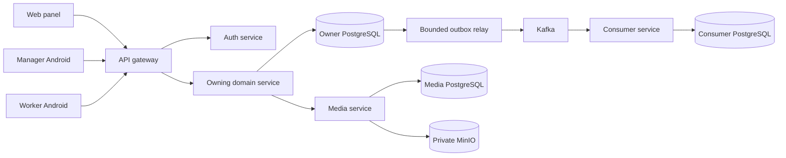
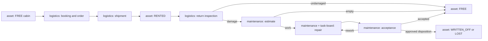
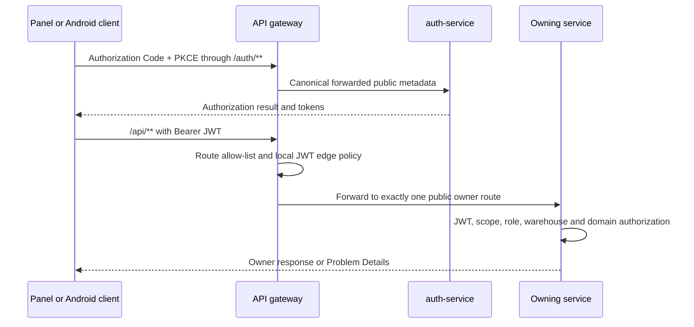
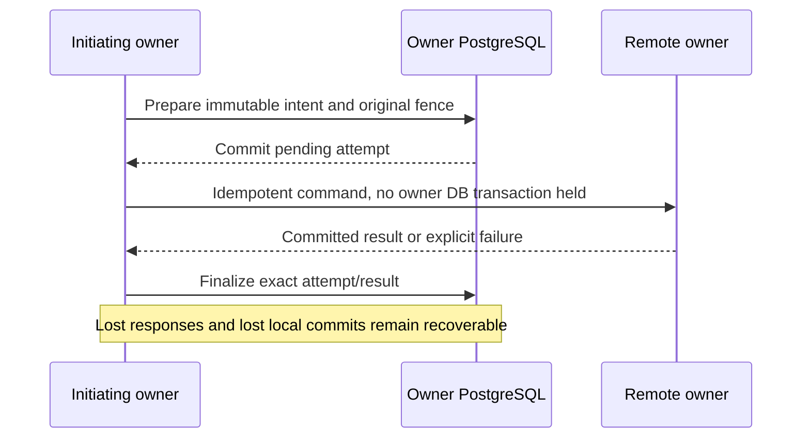
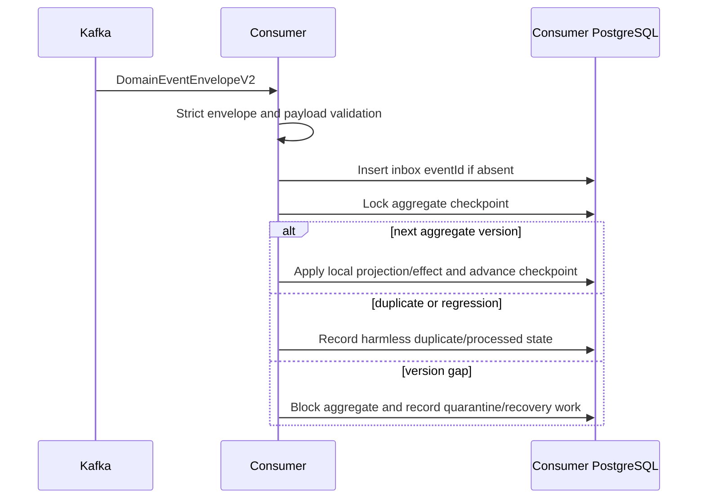

# Current Runtime Flows

Status: Confirmed cross-component execution model as of 2026-08-08.

This page explains how current RWMS components cooperate at runtime. It is a
navigation layer: canonical request fields remain in OpenAPI, event fields in
event schemas, domain transitions in the owning service, and persistence shape
in service-local Flyway migrations.

Primary evidence:

- [`architecture.md`](architecture.md)
- [`contracts.md`](contracts.md)
- [`domain-logic.md`](domain-logic.md)
- [`contracts/openapi/`](../../contracts/openapi/)
- [`contracts/events/`](../../contracts/events/)
- [`api-gateway-service`](../../services/api-gateway-service/)
- [`platform/spring-boot-starter`](../../platform/spring-boot-starter/)

Known deviations and hardening work are recorded separately in
[`20260808-full-architecture-audit.md`](../reviews/20260808-full-architecture-audit.md).

## System context



Interactive clients know the public gateway, never the private deployment
topology. Internal service calls use service credentials and private addresses.
Every stateful service owns its database; Kafka and MinIO do not create shared
domain ownership.

## Cabin product lifecycle

The main product path crosses several owners without transferring ownership of
their state:



The detailed state machines, owner handoffs, recovery rules and supported
variants are maintained in the bilingual
[`Cabin Operational Lifecycle`](cabin-lifecycle.md) /
[`Полный операционный цикл бытовки`](cabin-lifecycle.ru.md). That guide also
covers direct orders, presentation expiry, partial multi-cabin shipments,
inventory discovery/work and free/repair transfers. It records current behavior
only; known implementation deviations remain in the architecture audit.

## Interactive authentication and public request



The gateway strips caller-supplied forwarding headers and reconstructs auth
metadata from configured public values. It denies private namespaces and does
not reshape several owner responses into a new business aggregate.

The owner repeats resource-server validation because edge authentication does
not replace domain authorization. Warehouse access, role, scope, entity
ownership, status, and command preconditions are enforced where their state is
owned.

After the panel verifies `/me`, it binds protected server state to the exact
subject and bearer-grant revision. A logout, account switch or silent grant
renewal first retires the old protected query client: in-flight queries are
cancelled, query/mutation state and media object URLs are removed, and the
protected React subtree is remounted. Public offer/bootstrap state remains on a
separate root client. This ordering prevents a late response or long-lived SSE
effect from principal A from becoming visible to principal B.

Evidence:
[`GatewayRouteConfiguration.java`](../../services/api-gateway-service/src/main/java/dev/buhanzaz/rwms/gateway/config/GatewayRouteConfiguration.java),
[`GatewaySecurityConfiguration.java`](../../services/api-gateway-service/src/main/java/dev/buhanzaz/rwms/gateway/config/GatewaySecurityConfiguration.java),
[`AuthorizationServerConfiguration.java`](../../services/auth-service/src/main/java/dev/buhanzaz/rwms/auth/config/AuthorizationServerConfiguration.java),
[`AuthProvider`](../../panel/src/features/auth/auth-provider.tsx),
[`ProtectedClientState`](../../panel/src/features/auth/protected-client-state.ts).

The manager app establishes durable client state only after `/me` confirms an
eligible USER account and live warehouse grants. It then selects a visible
warehouse, activates that exact account-and-warehouse upload/catalog partition,
restores its encrypted cache, and resumes only its pending work. Before logout,
a replacement login or warehouse rebinding, it hides the queue, cancels and
joins WorkManager, and waits for the worker's authentication snapshot to close.
Each resumed worker performs a fresh `/me` check against its immutable owner and
all warehouse IDs retained by its command or media before any side effect.
Ownerless legacy state remains quarantined and is never adopted by the current
session.

Evidence:
[`ManagerWorkspaceCoordinator`](../../app/src/main/java/dev/buhanzaz/rwms/manager/ui/coordinator/ManagerWorkspaceCoordinator.kt),
[`BackgroundUploadWorker`](../../app/src/main/java/dev/buhanzaz/rwms/manager/uploads/BackgroundUploadWorker.kt),
[`MaintenanceCatalogCache`](../../app/src/main/java/dev/buhanzaz/rwms/manager/ui/MaintenanceCatalogCache.kt).

### Client failure and retry sequence

1. The panel converts ordinary HTTP and assistant-stream failures through the
   same Problem Details mapper. The response status is authoritative; malformed
   or non-JSON content receives a safe status-only fallback.
2. The worker's authenticator gets its normal refresh opportunity. A remaining
   `401` stops the chain for login; `403` stops for a grant/user decision.
3. A command `409` records the conflict, applies any supplied current snapshot
   (or retires a proven-absent entry) and fetches the authoritative feed in the
   same pass before another command may be sent.
4. Only `429`, `502`, `503`, `504` and a transport exception whose cause chain
   contains no cancellation can request an automatic WorkManager retry.
5. WorkManager persists one jittered exponential-backoff seed and permits at
   most four total runs. Cancellation is rethrown. Media/evidence that is
   correctly pending is not a network failure and waits for a later explicit
   sync trigger.

Evidence:
[`api-client.ts`](../../panel/src/lib/api-client.ts),
[`assistant-api.ts`](../../panel/src/features/assistant/api/assistant-api.ts),
[`GatewayFailure.kt`](../../worker-app/core-network/src/main/java/dev/buhanzaz/rwms/worker/core/network/GatewayFailure.kt),
[`WorkerSyncCoordinator.kt`](../../worker-app/core-sync/src/main/java/dev/buhanzaz/rwms/worker/core/sync/WorkerSyncCoordinator.kt),
and
[`WorkerSyncWork.kt`](../../worker-app/core-sync/src/main/java/dev/buhanzaz/rwms/worker/core/sync/WorkerSyncWork.kt).

## Mutable command

The common synchronous command shape is:

1. validate Bearer identity, exact audience/scope, role and warehouse access;
2. validate the transport request and resolve only owner-local domain state;
3. claim the `Idempotency-Key` or stable external identifier when the effect is
   retryable;
4. lock or compare the contract-defined `expectedVersion`, ETag, lease token,
   or other fence;
5. apply the owner aggregate transition inside one local transaction;
6. write audit/domain history and an outbox event in that same transaction;
7. return the committed owner result, an idempotent replay, or an explicit
   validation/authorization/conflict/dependency Problem Details response.

A `409` is a real concurrent-write signal. A client refreshes authoritative
state and asks the user to reconcile when necessary; it does not silently
overwrite or roll back another service.

Evidence:
[`contracts/openapi/`](../../contracts/openapi/),
[`domain-event-envelope-v2.schema.yaml`](../../contracts/events/technical/domain-event-envelope-v2.schema.yaml),
service-local `*Idempotency*`, event-store, and application-service sources.

## Cross-service command and saga

When a workflow needs a remote effect, the initiating domain owns durable
coordination. The safe pattern is:



The durable attempt stores enough immutable input to replay the same command,
including the same idempotency identity and original expected version. A
background reconciler uses a lease or claim so several instances do not apply
one effect concurrently. Terminal or ambiguous failures remain visible for
review; they are not converted into fabricated success.

The system has no distributed database transaction. A remote call must not be
made while holding an ambient local transaction when that would retain locks or
make a remote success impossible to reconcile after a local rollback.

Evidence:
[`MaintenanceApplicationService.java`](../../services/maintenance-service/src/main/java/dev/buhanzaz/rwms/maintenance/service/MaintenanceApplicationService.java),
[`MaintenanceReconciliationStore.java`](../../services/maintenance-service/src/main/java/dev/buhanzaz/rwms/maintenance/service/MaintenanceReconciliationStore.java),
[`TransferWorkflowStore.java`](../../services/logistics-service/src/main/java/dev/buhanzaz/rwms/logistics/service/TransferWorkflowStore.java).

### Logistics external-attempt claim

1. The owner relay asks for no more claims than its currently available
   per-owner worker permits.
2. A short database transaction selects due attempts in stable due/created/ID
   order, skips a row locked by another replica, and writes a unique token,
   higher fence, database-time expiry and post-flush row version.
3. The claim transaction closes. Only then does one bounded worker load the
   owner work and perform the remote call with the stored request identity.
4. Before preflight and before any final owner mutation, the workflow store
   re-locks and verifies attempt ID, operation ID, token, fence, row version,
   request hash and live lease.
5. Success or bounded failure changes the owner state and clears the lease;
   a locally blocked attempt is deferred using database time. An expired lease
   may be reclaimed with a higher fence, so its earlier worker can no longer
   complete.
6. Trigger shutdown stops accepting work, returns owner permits and leaves any
   unfinished persisted lease recoverable by expiry. Slow work for one owner
   cannot consume every worker slot.

Evidence:
[`LogisticsExternalAttemptClaimService`](../../services/logistics-service/src/main/java/dev/buhanzaz/rwms/logistics/service/LogisticsExternalAttemptClaimService.java),
[`LogisticsExternalAttemptRelayExecutor`](../../services/logistics-service/src/main/java/dev/buhanzaz/rwms/logistics/service/LogisticsExternalAttemptRelayExecutor.java),
[`ReturnRegistrationRelay`](../../services/logistics-service/src/main/java/dev/buhanzaz/rwms/logistics/service/ReturnRegistrationRelay.java),
and
[`V40`](../../services/logistics-service/src/main/resources/db/migration/V40__bounded_logistics_external_attempt_claims.sql).

## Event publication

```mermaid
sequenceDiagram
    participant S as Producer service
    participant DB as Producer PostgreSQL
    participant R as Outbox relay
    participant K as Kafka

    S->>DB: Domain mutation + domain_event + outbox_event
    DB-->>S: One local commit
    R->>DB: Claim next ordered row with lease
    R->>R: Verify envelope, schema and checksum
    R->>K: Publish with aggregate ID key; wait for broker ack
    K-->>R: Ack or bounded failure
    R->>DB: Mark published, retryable, DLT or quarantined
```

The event describes an already committed fact. The producer's PostgreSQL state
is authoritative and the outbox closes the local commit/publish gap. Kafka is
at-least-once transport, so publication may repeat and consumers must be
idempotent.

In warehouse-service, asset-service, maintenance-service and logistics-service,
non-local startup now requires the Kafka publisher, exact owner destinations,
brokers and safe producer delivery settings. Development/test profiles may
disable transport explicitly, but a production command path cannot start with
a relay missing. Maintenance binds and validates the same ordered five outputs:
catalog, estimate, repair, property disposition and sanitized DLT. Logistics
binds return, shipment, transfer and the canonical
`rwms.logistics.rental-inquiry.events.v1` output from one ordered authority.
Operational gauges report local pending/terminal evidence, version gaps and
bounded external-attempt work; they do not replace ordered relay recovery or
authorize an automatic backlog rewrite. The rental-inquiry outbox currently
has only `PENDING` and `PUBLISHED`, so its gauges do not invent a terminal or
reviewed state.

Outbox claims are fenced by a lease token. Publication wait must be shorter than
the lease. A checksum or schema mismatch is quarantined instead of sent. A
terminal record is recovered only through a reviewed, version-fenced owner
operation when such an operation exists.

Evidence:
[`RwmsKafkaOutboundEventPublisher.java`](../../platform/spring-boot-starter/src/main/java/dev/buhanzaz/rwms/platform/kafka/RwmsKafkaOutboundEventPublisher.java),
[`WarehouseProductionSafetyValidator`](../../services/warehouse-service/src/main/java/dev/buhanzaz/rwms/warehouse/config/WarehouseProductionSafetyValidator.java),
[`AssetProductionSafetyValidator`](../../services/asset-service/src/main/java/dev/buhanzaz/rwms/asset/config/AssetProductionSafetyValidator.java),
[`LogisticsProductionSafetyValidator`](../../services/logistics-service/src/main/java/dev/buhanzaz/rwms/logistics/config/LogisticsProductionSafetyValidator.java),
[`LogisticsTransportTopics`](../../services/logistics-service/src/main/java/dev/buhanzaz/rwms/logistics/eventing/LogisticsTransportTopics.java),
[`LogisticsRecoveryMetrics`](../../services/logistics-service/src/main/java/dev/buhanzaz/rwms/logistics/eventing/LogisticsRecoveryMetrics.java),
[`MaintenanceProductionSafetyValidator`](../../services/maintenance-service/src/main/java/dev/buhanzaz/rwms/maintenance/config/MaintenanceProductionSafetyValidator.java),
[`MaintenanceTransportTopics`](../../services/maintenance-service/src/main/java/dev/buhanzaz/rwms/maintenance/eventing/transport/MaintenanceTransportTopics.java),
service-local `*EventStore`, `*OutboxStore`, `*OutboxRelay`, and recovery tests.

## Event consumption, ordering, and recovery



The inbox, local projection update, and checkpoint advance are one local
transaction. The consumer validates the expected producer, aggregate family,
event type/version, payload shape, and sanitized-data policy before applying an
effect.

Processing retry is bounded. Exhausted or invalid input is represented by safe
metadata in a consumer-owned DLT; raw credentials or rejected personal payloads
are not copied there. A version gap blocks later effects for that aggregate
until an explicit replay/reconciliation path proves and applies the missing
history.

Evidence:
[`event-delivery-policy-v1.schema.yaml`](../../contracts/events/technical/event-delivery-policy-v1.schema.yaml),
[`aggregate-checkpoint-policy-v1.schema.yaml`](../../contracts/events/technical/aggregate-checkpoint-policy-v1.schema.yaml),
service-local inbox, checkpoint, DLT, replay, and reconciliation sources.

### Rental-inquiry cabin search and booked fact

1. The public cabin-search command requires `Idempotency-Key` and a write-capable
   logistics actor. A short PREPARE transaction locks the inquiry, revalidates
   its manager, active state and current warehouse edit authority, and stores a
   subject/operation/key request digest, domain-separated downstream UUID,
   immutable actor snapshot, hold expiry, and the exact asset request text plus
   its SHA-256.
2. Warehouse identity lookup and the asset search run only after PREPARE has
   committed. The asset request always uses the persisted downstream key and
   exact persisted bytes, so an unknown response can be retried without a new
   hold identity or altered request.
3. A short COMPLETE transaction relocks the receipt and inquiry, repeats the
   current ownership/state/warehouse checks, selects the warehouse only after
   asset success, and freezes the public response. An identical completed retry
   returns that response with `Idempotency-Replayed: true` and makes no remote
   call.
4. Changed reuse or another live public key conflicts before a remote effect.
   Only an inactive warehouse or classified asset `400`/`409` rejection becomes
   `REJECTED`; authentication, configuration, transport, timeout, `5xx`, and a
   lost response remain `PREPARED`. Expiry releases the inquiry slot while the
   expired key remains terminal.
5. Booking appends one strict `DomainEventEnvelopeV2` in the booking
   transaction. Its aggregate version is the post-flush inquiry version, its
   correlation is the conversation with the booking as causation, and its
   stable Kafka key is the conversation ID. V41 upgrades legacy pending and
   published outbox JSON without changing event IDs, keys, or delivery status;
   published rows never become relayable again.

Evidence:
[`RentalInquiryCabinSearchService.java`](../../services/logistics-service/src/main/java/dev/buhanzaz/rwms/logistics/inquiry/service/RentalInquiryCabinSearchService.java),
[`RentalInquiryCabinSearchStore.java`](../../services/logistics-service/src/main/java/dev/buhanzaz/rwms/logistics/inquiry/service/RentalInquiryCabinSearchStore.java),
[`RentalInquiryBookedOutboxStore.java`](../../services/logistics-service/src/main/java/dev/buhanzaz/rwms/logistics/inquiry/eventing/RentalInquiryBookedOutboxStore.java),
and
[`V41__rental_inquiry_search_receipts_and_booked_envelope_v2.sql`](../../services/logistics-service/src/main/resources/db/migration/V41__rental_inquiry_search_receipts_and_booked_envelope_v2.sql).

### Interactive clarification and authoritative selection

1. The assistant reads logistics facets before executing an availability
   search. Every requested group must have an exact current cabin type and
   finish. Missing or ambiguous fields become persisted, branch-specific
   button questions; no hold is created at this stage.
2. Type-to-dimension relations are the only size authority. One related size
   is resolved automatically, several become exact buttons, and approximate
   six-metre input narrows only through a current 6x2.4 relation. Category,
   characteristics and linoleum remain explicit optional filters.
3. A read-only catalog tool answers questions by cabin number, type or text and
   exposes current relations and characteristics without changing selection
   expiry. Independent ОСБ/ЛДСП branches can be answered in either order and
   remain after conversation reload.
4. Search `REPLACE` is the default; `APPEND` is explicit. The browser renders
   each logical group as a switchable tab, while logistics/asset state remains
   authoritative for selected IDs and expiry.
5. A selection mutation first commits an exact request receipt with a command
   expiry, then calls asset-service outside the local transaction. Success
   freezes the validated response. An unknown result retries with the same
   key/bytes; a confirmed empty selection releases all holds. Partial removal
   replaces the complete retained set, releases removed holds immediately and
   resets the retained selection lifetime.

Evidence:
[`AssistantCabinSearchTool.java`](../../services/assistant-service/src/main/java/dev/buhanzaz/rwms/assistant/service/AssistantCabinSearchTool.java),
[`AssistantClarificationService.java`](../../services/assistant-service/src/main/java/dev/buhanzaz/rwms/assistant/service/AssistantClarificationService.java),
[`AssistantCabinReferenceTool.java`](../../services/assistant-service/src/main/java/dev/buhanzaz/rwms/assistant/service/AssistantCabinReferenceTool.java),
[`RentalInquiryCabinSelectionStore.java`](../../services/logistics-service/src/main/java/dev/buhanzaz/rwms/logistics/inquiry/service/RentalInquiryCabinSelectionStore.java),
and
[`PresentationHoldService.java`](../../services/asset-service/src/main/java/dev/buhanzaz/rwms/asset/service/PresentationHoldService.java).

### Rental client and order entry

1. The manager creates a logistics-owned client explicitly or inline with an
   order/inquiry. The only supported forms are an individual and a legal
   entity. The server derives the responsible manager from the actor,
   normalizes the required phone and requires a contact person only for a legal
   entity. Idempotent replay returns the same record; invisible duplicates do
   not disclose an identifier. V43 reclassifies historical sole proprietors as
   legal entities, but stops before any ambiguous same-phone reclassification.
2. A draft order records one existing or inline-created client, delivery
   address, coordinate pair, contact phone, optional comment and one to 31
   unique acceptable dates. A manual order, warehouse booking or assistant
   conversation can be entered from the same client detail without a browser
   saga.
3. Order detail combines logistics-owned units and document movements with
   read-only dossier activity. The panel labels dossier evidence incomplete
   until every page is loaded and complete; it never turns an error or partial
   projection into “no estimate/repair”. The evidence lower bound is the latest
   actual return for that cabin, with order creation only as an explicit
   fallback.
4. The panel reuses one client-field surface in explicit client creation and
   inline order, booking and assistant entry. It visibly shows the
   session-derived responsible manager as read-only and never sends it as
   browser-owned client data. The booking catalogue uses bounded pages and a
   deferred query; availability of selected cabins and final hold commands
   remain server-authoritative. A hold expiry schedules one exact deadline
   refresh rather than polling the entire booking screen every second.

Evidence:
[`OrderClientService.java`](../../services/logistics-service/src/main/java/dev/buhanzaz/rwms/logistics/order/service/OrderClientService.java),
[`RentalOrderService.java`](../../services/logistics-service/src/main/java/dev/buhanzaz/rwms/logistics/order/service/RentalOrderService.java),
[`client detail page`](../../panel/src/features/clients/pages/client-detail-page.tsx),
[`shared client fields`](../../panel/src/features/clients/components/client-create-fields.tsx),
[`booking catalogue`](../../panel/src/features/booking/booking-catalog-page.tsx),
[`booking hold expiry`](../../panel/src/features/booking/use-booking-hold-expiry.ts),
and
[`order dossier evidence`](../../panel/src/features/orders/components/order-unit-dossier-evidence.tsx).

### Logistics document to driver work

1. A manager creates or schedules a shipment or return with a calendar date,
   cabin lines and an optional task-board worker ID plus display snapshot.
   Logistics stores the ID as opaque identity and never resolves it from the
   snapshot. Transfer creation carries the calendar date and lines but no
   driver identity.
2. Before it creates a shipment, logistics reads the warehouse-local maximum
   group size (1–100; an unconfigured warehouse defaults to one) and rejects a
   selected set above that value. A newly created shipment then persists one
   idempotent document-owned driver intent with immutable cabin members and the
   client snapshot; the full cabin list is its task text. Existing shipment
   line intents remain supported, while return and transfer continue to create
   one intent per line. Shipment/return intents are assigned when the ID exists
   and otherwise unassigned. Transfer intents are warehouse-shared and have
   neither worker ID nor name snapshot.
3. The existing logistics driver relay registers each committed intent through
   the private task-board boundary. Task-board validates the source, warehouse,
   active worker and primary driver qualification, replaces the supplied name
   with its authoritative snapshot, and stores the audience with the task.
4. The panel's Logistics route reads the board and active driver directory
   separately, then presents shipment/return date columns with collapsible
   assigned-driver and unassigned sections. A grouped shipment displays its
   cabin count, client and complete cabin list without a priority badge.
   Dragging a card sends task/entry fences and a queue index only inside the
   same driver/date/lane section; it cannot reassign or reschedule the card.
   The separate Movements route shows warehouse-shared work without driver
   controls.
5. Worker feed reads are filtered in task-board. Assigned work reaches only its
   selected driver; unassigned work reaches none; an unclaimed shared Current
   entry reaches every qualified warehouse driver and becomes assignee-only
   after take. Only the first visible waiting Current entry is actionable.
6. WorkerApp uses the required nullable worker-feed audience to split the
   logistics-driver category into two collapsible tables: personal Logistics
   (`ASSIGNED_DRIVER`) and shared warehouse Movements (`WAREHOUSE_DRIVERS`). It
   also keeps separately collapsible group-role and qualification-only panels.
   A grouped shipment shows the cabin count and exposes its client/cabin list
   in details. Cards show cabin, date, authoritative elapsed time and photo
   state; details reuse the existing camera, durable evidence upload and
   Downloads retry flows.

Evidence:
[`DocumentDriverTaskPlanner.java`](../../services/logistics-service/src/main/java/dev/buhanzaz/rwms/logistics/driver/service/DocumentDriverTaskPlanner.java),
[`DriverTaskAudienceService.java`](../../services/task-board-service/src/main/java/dev/buhanzaz/rwms/taskboard/service/DriverTaskAudienceService.java),
[`TaskBoardReadProjectionService.java`](../../services/task-board-service/src/main/java/dev/buhanzaz/rwms/taskboard/service/TaskBoardReadProjectionService.java),
[`logistics-board-page.tsx`](../../panel/src/features/logistics/driver-board/logistics-board-page.tsx),
and
[`TasksScreen.kt`](../../worker-app/feature-tasks/src/main/java/dev/buhanzaz/rwms/worker/feature/tasks/TasksScreen.kt).

### Assistant booking-fact inbox and recovery

1. The assistant accepts only the exact rental-inquiry booking
   `DomainEventEnvelopeV2`: producer, aggregate identity/version, conversation
   Kafka key, correlation, actor shape and payload all have closed schemas.
2. A valid record is staged by event ID, canonical SHA-256 and Kafka
   topic/partition/offset before its conversation archive effect runs. The same
   ID and hash is status-aware idempotent; a different hash or legacy unknown
   hash is never treated as a successful duplicate.
3. Processing has four lifetime attempts at the initial delivery and after
   1, 3 and 7 seconds. Exhaustion, malformed input and identity conflicts leave
   only stable failure codes, safe IDs/hashes and coordinates in the local DLT;
   raw bodies, rejected values, credentials and free-form errors are excluded.
4. A version-fenced review may approve, reject or resume already staged
   canonical evidence. The recovery service has no public controller or
   authenticated production caller yet, so review is never fabricated or
   auto-triggered.

Evidence:
[`RentalInquiryBookedEventParser.java`](../../services/assistant-service/src/main/java/dev/buhanzaz/rwms/assistant/eventing/RentalInquiryBookedEventParser.java),
[`RentalInquiryBookedKafkaConsumer.java`](../../services/assistant-service/src/main/java/dev/buhanzaz/rwms/assistant/eventing/RentalInquiryBookedKafkaConsumer.java),
[`AssistantEventDeadLetterService.java`](../../services/assistant-service/src/main/java/dev/buhanzaz/rwms/assistant/eventing/AssistantEventDeadLetterService.java),
[`AssistantDltRecoveryService.java`](../../services/assistant-service/src/main/java/dev/buhanzaz/rwms/assistant/eventing/AssistantDltRecoveryService.java),
and
[`V4__canonical_booking_inbox_and_recovery.sql`](../../services/assistant-service/src/main/resources/db/migration/V4__canonical_booking_inbox_and_recovery.sql).

## Read projections

`dossier-service` and `analytics-service` consume versioned producer facts and
own only their read models. They may retain opaque producer IDs, immutable
snapshots, checkpoints, generations, and publication metadata required to make
reads explainable and rebuildable.

They do not accept commands for producer-owned aggregates. A projection result
must expose partial, stale, blocked, or unavailable evidence instead of
presenting an unproven complete fact. Rebuild uses producer-owned event history
or a contract-defined snapshot/replay source, not Kafka retention as an archive.

Evidence:
[`dossier-service.yaml`](../../contracts/openapi/dossier-service.yaml),
[`analytics-service.yaml`](../../contracts/openapi/analytics-service.yaml),
[`dossier-consumers.yaml`](../../contracts/events/dossier-consumers.yaml),
[`analytics-consumers.yaml`](../../contracts/events/analytics-consumers.yaml).

Analytics recovery gauges are observational reads over owner-local projection
gaps and sanitized DLT state. They expose active and terminal gap counts,
oldest gap age, maximum retained gap attempt, pending/retry DLT backlog and its
oldest age, plus terminal DLT count. Empty state is zero, a future timestamp is
clamped to zero age, and a database read failure is `NaN`; a scrape never
advances a checkpoint, marks work complete or starts recovery. The component
adds no identity, aggregate, topic, payload or error labels (the existing
application-wide static Micrometer tag remains outside it).

Evidence:
[`AnalyticsRecoveryMetrics`](../../services/analytics-service/src/main/java/dev/buhanzaz/rwms/analytics/eventing/AnalyticsRecoveryMetrics.java),
[`checkpoint aggregates`](../../services/analytics-service/src/main/java/dev/buhanzaz/rwms/analytics/repository/AnalyticsAggregateCheckpointRepository.java),
and
[`DLT aggregates`](../../services/analytics-service/src/main/java/dev/buhanzaz/rwms/analytics/repository/AnalyticsSanitizedDeadLetterRepository.java).

Assistant recovery gauges observe only durable tool calls whose status remains
`STARTED`: one gauge counts them and one reports the oldest displayed age.
Both are lazy read-only JPA observations with fixed names and no conversation,
turn, tool, failure or payload labels. Empty state is zero, future age is
clamped to zero and a database read failure is `NaN`. `COMPLETED` and `FAILED`
rows are terminal history; scraping never retries or completes a tool call.

Evidence:
[`AssistantRecoveryMetrics`](../../services/assistant-service/src/main/java/dev/buhanzaz/rwms/assistant/eventing/AssistantRecoveryMetrics.java)
and
[`AssistantToolCallRepository`](../../services/assistant-service/src/main/java/dev/buhanzaz/rwms/assistant/repository/AssistantToolCallRepository.java).

### Dossier visibility and generation rebuild

1. The dossier consumer validates and records the producer fact in its local
   inbox/checkpoint transaction.
2. The coverage resolver uses only dossier-local association and source-journal
   proof to bind unresolved evidence to a cabin and projection generation. If
   that proof is absent or conflicting, the evidence remains operationally
   visible but unscoped.
3. A query returns `PARTIAL` only for hidden evidence or unresolved
   unlinked/DLT coverage proven for the requested cabin and active generation.
4. A successful rebuild transfers unresolved DLT coverage to the target
   generation while holding the generation pointer fence, then activates that
   target. A rejected rebuild does not transfer coverage.
5. Relay publication/failure recovery and coverage resolution take the same
   DLT row lock before mutation, preventing one state dimension from erasing
   the other. The immutable audit row remains after its coverage is resolved.
6. Maintenance repair transfer facts remain read-only activity evidence:
   `transfer-prepared` records the immutable source-warehouse snapshot and
   `transferred` records the immutable target-warehouse snapshot. Both retain
   the maintenance repair aggregate as `sourceRef`; dossier performs no
   warehouse lookup and owns no repair-transfer command.

Evidence:
[`DossierInboxProcessor.java`](../../services/dossier-service/src/main/java/dev/buhanzaz/rwms/dossier/service/DossierInboxProcessor.java),
[`DossierVisibilityCoverageResolver.java`](../../services/dossier-service/src/main/java/dev/buhanzaz/rwms/dossier/service/DossierVisibilityCoverageResolver.java),
[`DossierReplayTransactions.java`](../../services/dossier-service/src/main/java/dev/buhanzaz/rwms/dossier/service/DossierReplayTransactions.java),
[`DossierDeadLetterService.java`](../../services/dossier-service/src/main/java/dev/buhanzaz/rwms/dossier/eventing/DossierDeadLetterService.java),
[`DossierRelayTransactions.java`](../../services/dossier-service/src/main/java/dev/buhanzaz/rwms/dossier/eventing/DossierRelayTransactions.java),
[`V3__dossier_cabin_visibility_scope.sql`](../../services/dossier-service/src/main/resources/db/migration/V3__dossier_cabin_visibility_scope.sql),
[`dossier-consumers.yaml`](../../contracts/events/dossier-consumers.yaml),
and
[`V4__dossier_repair_transfer_activities.sql`](../../services/dossier-service/src/main/resources/db/migration/V4__dossier_repair_transfer_activities.sql).

Dossier's operational gauges deliberately use a broader retained-state view
than one cabin visibility response. They report blocked checkpoints, unresolved
unlinked facts, unresolved exact DLT coverage, pending/retry and terminal
activity-outbox rows, and pending/retry and terminal sanitized-DLT rows, with
oldest ages for blocked/backlog work. That breadth is for operations only: it
does not make global evidence cabin-scoped or turn a dossier `PARTIAL`.

Evidence:
[`DossierRecoveryMetrics`](../../services/dossier-service/src/main/java/dev/buhanzaz/rwms/dossier/eventing/DossierRecoveryMetrics.java),
[`DossierUnlinkedFactRepository`](../../services/dossier-service/src/main/java/dev/buhanzaz/rwms/dossier/repository/DossierUnlinkedFactRepository.java),
and
[`DossierSanitizedDeadLetterRepository`](../../services/dossier-service/src/main/java/dev/buhanzaz/rwms/dossier/repository/DossierSanitizedDeadLetterRepository.java).

## Media upload and processing

1. The client asks `media-service` for an owner-scoped upload session using the
   public gateway.
2. The service validates the authenticated warehouse and a service-owned proof
   that the referenced domain entity may own media.
3. The client uploads bytes to the narrow media content route. Object storage
   remains private; clients never receive MinIO administration access.
4. Finalization records immutable media metadata and processing work.
5. A fenced worker claims at most four processing attempts in one cycle. A
   transient dependency failure is scheduled after 1s/2s/4s; the fourth
   failure is terminal. If a worker dies during that fourth attempt, the
   expired lease is reclaimed only to record
   `PROCESSING_ATTEMPT_EXHAUSTED`, never to invoke the processor a fifth time.
6. Database completion and inbox outcome precede Kafka offset acknowledgement.
   Persistence retry is bounded to four attempts and commit retry to three
   deadline-bound attempts; exhaustion releases the rebalance and returns an
   error so supervisor restart/redelivery can use the durable inbox result.
7. Media facts notify owning domains and projections. A generation/revision
   prevents clients from retaining a stale transformed URL after replacement.

Terminal evidence and operator review receipts are append-only and contain no
raw record, object key or free-form dependency error. A review receipt is audit
evidence only: no authenticated production command currently resets or
executes a new processing cycle. Recovery telemetry remains available in the
structured log and is also exposed from a separately supervised, loopback-only
OpenMetrics listener. It reports bounded job/review states, oldest age, maximum
attempt, one-hot breaker state and at most 64 numeric partition-offset series;
there is no dynamic topic, identity, payload or exception label. Alert
thresholds and runtime rollout still require a measured operational baseline
and explicit deployment scope.

`media-service` is the only stateful media deployable. Other services store
contract-defined media references or owner proofs, not object bytes or a second
image-processing truth.

Evidence:
[`media-service.yaml`](../../contracts/openapi/media-service.yaml),
[`media-events.yaml`](../../contracts/events/media-events.yaml),
[`media-processing-dlt-v1.schema.json`](../../contracts/events/media/media-processing-dlt-v1.schema.json),
[`consumer.go`](../../services/media-service/internal/worker/consumer.go),
[`processing_metrics.go`](../../services/media-service/internal/observability/processing_metrics.go),
[`metrics_runtime.go`](../../services/media-service/cmd/media-service/metrics_runtime.go),
[`V11__bounded_media_processing_recovery.sql`](../../services/media-service/db/migration/V11__bounded_media_processing_recovery.sql),
[`services/media-service`](../../services/media-service/).

## SSE and client invalidation

The gateway provides bounded transport for declared SSE routes. It limits
concurrency, uses asynchronous I/O, forwards complete event/heartbeat items,
and cancels upstream work when the client disconnects. It does not manufacture
domain events, keep a replay log, or become the source projection.

The producer owns heartbeat, cursor/replay, event identity, and resync meaning.
Unless the contract explicitly says that an SSE payload is a complete
projection, clients treat it as an invalidation signal and refresh only the
affected query or local cache entry. Periodic pull may provide an additional
recovery path, but it does not make an inaccurate replay contract acceptable.

Evidence:
[`SseProxyHandler.java`](../../services/api-gateway-service/src/main/java/dev/buhanzaz/rwms/gateway/config/SseProxyHandler.java),
[`WorkerInvalidationHub.java`](../../services/task-board-service/src/main/java/dev/buhanzaz/rwms/taskboard/service/WorkerInvalidationHub.java),
client realtime coordinators under [`panel/`](../../panel/) and
[`worker-app/`](../../worker-app/).

## Warehouse lifecycle coordination

`warehouse-service` owns `ACTIVE -> DRAINING -> INACTIVE`, directional
admission, and exact lifecycle version. Starting `DRAINING` permanently closes
new incoming work while allowing already valid outbound draining work.

Each operation owner:

1. records durable local admission/readiness intent;
2. calls warehouse-service outside its local database transaction;
3. commits an accepted operation together with a local operated-boundary mark;
4. reconciles delivery of that mark idempotently;
5. treats pending, ambiguous, quarantined, or non-terminal work as a readiness
   blocker;
6. confirms readiness for the exact warehouse lifecycle version only after all
   local blockers drain.

For a new logistics operation, every permanent operated-boundary mark stores
the admitted direction and exact warehouse lifecycle version in the same local
transaction as the owner row. A dependency-free replay is only a candidate
when SQL proves the live document/equipment/driver identity, a live owner
receipt and an exact complete evidence vector. The owner then compares the
incoming command fingerprint before returning its stored result; changed
payload, warehouse or direction remains a conflict. Legacy null evidence,
expired receipts and incomplete or extra mark sets do not qualify, so a retry
re-admits remotely or fails closed while warehouse-service is unavailable.

Warehouse-service enters `INACTIVE` only after every contract-defined owner has
confirmed. A timeout is not readiness, and another service may not bypass the
admission protocol merely because a dependency is unavailable.

Evidence:
[`warehouse-service.yaml`](../../contracts/openapi/warehouse-service.yaml),
[`WarehouseLifecycleController.java`](../../services/warehouse-service/src/main/java/dev/buhanzaz/rwms/warehouse/api/WarehouseLifecycleController.java),
[`V5__warehouse_lifecycle.sql`](../../services/warehouse-service/src/main/resources/db/migration/V5__warehouse_lifecycle.sql),
[`LogisticsWarehouseLifecycleStore.java`](../../services/logistics-service/src/main/java/dev/buhanzaz/rwms/logistics/service/LogisticsWarehouseLifecycleStore.java),
[`V39__warehouse_admission_evidence.sql`](../../services/logistics-service/src/main/resources/db/migration/V39__warehouse_admission_evidence.sql),
service-local `*WarehouseLifecycle*` and `*WarehouseOperationMark*` sources.

## Failure ownership

| Failure | Owner response |
| --- | --- |
| Invalid/expired token or wrong audience | Gateway and service reject; no domain write |
| Missing role, scope, warehouse grant, or owner proof | Owning service rejects; no gateway workaround |
| Stale expected version or lease | Explicit conflict; client refreshes authority |
| Retried create/effect | Same idempotency identity replays the committed result or resumes durable work |
| Downstream timeout before known result | Initiating saga remains pending/ambiguous and reconciles; UI does not roll back authority |
| Kafka publish failure | Outbox remains locally recoverable; owner command is not undone |
| Duplicate Kafka record | Inbox makes it harmless |
| Aggregate version gap | Consumer blocks that aggregate and requires reconciliation |
| Invalid event or checksum | Reject/quarantine with sanitized diagnostics |
| Media processing failure | Media state and owning workflow expose recoverable/terminal failure |
| Projection cannot prove completeness | Read model reports partial/stale/blocked state |

Every retry has an owner and a bound. Readiness and metrics must make a durable
backlog visible; infinite retry, fabricated success, and hidden mock fallback
are not valid recovery mechanisms.
