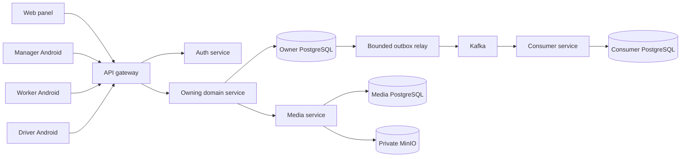
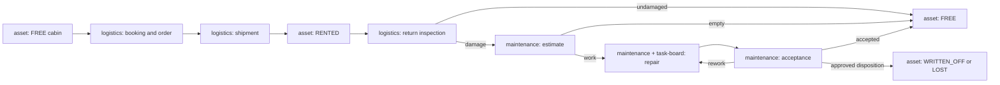
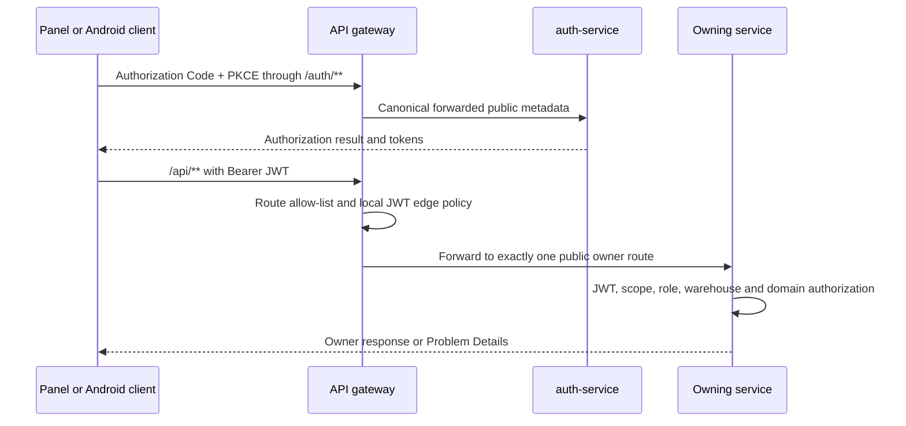
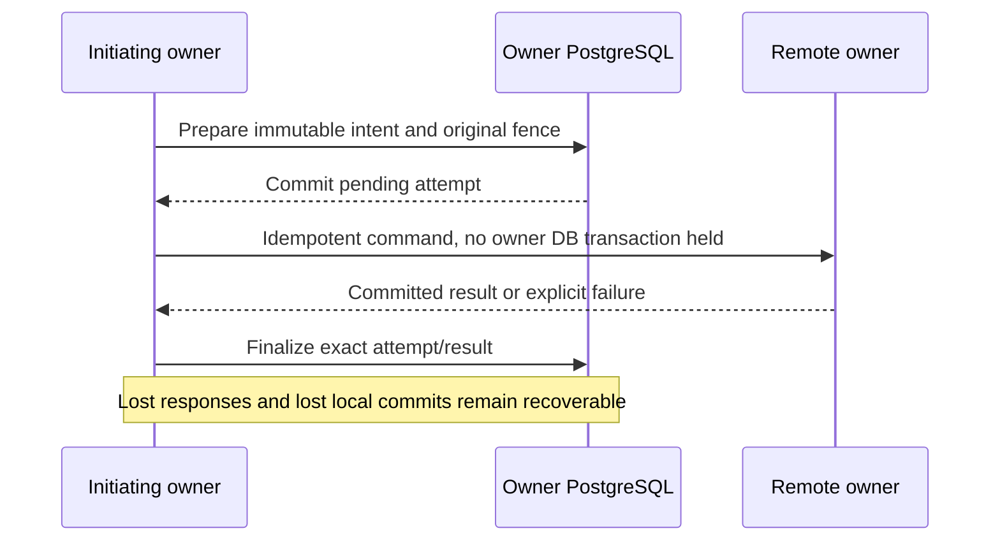
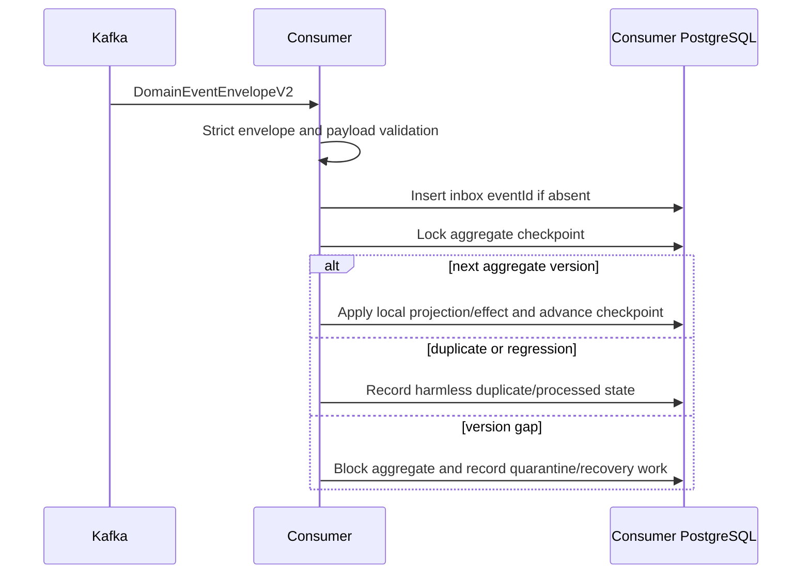

# Current Runtime Flows

Status: Confirmed cross-component execution model as of 2026-08-12.

This page explains how current RWMS components cooperate at runtime. It is a
navigation layer: canonical request fields remain in OpenAPI, event fields in
event schemas, domain transitions in the owning service, and persistence shape
in service-local Flyway migrations.

Primary evidence:

- [`architecture.md`](architecture.md)
- [`contracts.md`](contracts.md)
- [`domain-logic.md`](domain-logic.md)
- [`contracts/openapi/`](../../contracts/openapi/)
- [`contracts/events/`](../../contracts/events/)
- [`api-gateway-service`](../../services/api-gateway-service/)
- [`platform/spring-boot-starter`](../../platform/spring-boot-starter/)

Known deviations and hardening work are recorded separately in
[`20260808-full-architecture-audit.md`](../reviews/20260808-full-architecture-audit.md).

## System context



Interactive clients know the public gateway, never the private deployment
topology. Internal service calls use service credentials and private addresses.
Every stateful service owns its database; Kafka and MinIO do not create shared
domain ownership.

## Dynamic planning-day recovery

Planner snapshots select shifts covering the requested date and date-relevant ready/locked
requests, plus references required by active plans and explicit plan/override/recovery operations.
The fingerprint uses that same selected request set. Exact source-plan references remain available
for historical validation and simulation; unrelated retained warehouse history is not materialized.
See [runtime loader](../../logistics/backend/app/services/planner_runtime.py).

The standalone logistics planner reuses the existing route planner, RWMS owner
reads, capacity publisher and task-board integration. A dispatcher fact follows
`LogisticsEvent → impact analysis → notice/action → RecoveryProposal → decision
→ explicit apply`; a recommendation is not a customer commitment or a published
plan. `PlanningDayPolicy` is a root-planning-group, warehouse-local constraint.
Empty-day mode changes only constrain future planning; incompatible planned work
remains visible until an approved recovery is applied.
An event's local time is entered explicitly for the day currently open in the
header and is converted with the planning-root warehouse IANA timezone. Browser
timezone and a global `Europe/Moscow` fallback are not authorities for this fact.

The standalone day workspace has no second system-journal projection. Persisted
notices and immutable dispatcher decisions are merged chronologically into the
existing notification center and the read-only **Settings → Journal** view,
while unresolved actions and calculated proposals retain their dedicated
operational surfaces. A truncated history window is explicit.

For an existing unassigned RWMS delivery, the dispatcher selects a date rather
than entering a time window. Standalone asks logistics-service for every fresh
owner-calculated slot on that date, exposes only those slots, and applies one
explicitly customer-agreed choice under local-request, order, session, slot and
idempotency fences. Before the owner call it persists one active hold for both
the request and source plan lineage. Competing plan/catalog/contractor/recovery
mutations are rejected. The owner call runs without a long local transaction;
a leased `SKIP LOCKED` worker resumes the same persisted command with its
original owner idempotency key, bounded backoff and quarantine. The explicit
retry surface resumes only that hold and cannot accept a different date or slot.

An unstarted published-plan member is not removed by a browser or a standalone
database update. Standalone first stages a hidden local revision and calls the
logistics owner with the exact source/replacement versions and idempotency key.
Logistics persists `PENDING -> PREPARED -> OWNER_COMMITTED -> BOARD_COMMITTED ->
COMPLETE`, while task-board `PREPARE/COMMIT/RELEASE` fences the complete source
membership. Reschedule commits the agreed customer slot at the owner stage;
cancellation requires the order, document and local/board task to be already
cancelled. Task-board then stores the removed-member tombstone and advances the
remaining lineage atomically. Release is possible only before owner commit;
after owner commit every retry moves forward. Standalone activates its staged
revision only after the complete owner receipt.
The locked customer session admits only one non-terminal published change for
the booking/order, including quarantined recovery. Route/capacity preparation
runs outside the local commit transaction; that short transaction rechecks all
mutable fences and persists an immutable customer receipt used by every exact
replay and post-owner-commit recovery.

Evidence: [`operations model`](../../logistics/backend/app/models/operations.py),
[`impact analyzer`](../../logistics/backend/app/services/dynamic_impacts.py),
[`recovery workflow`](../../logistics/backend/app/services/dynamic_recovery.py),
[`published recovery owner`](../../services/logistics-service/src/main/java/dev/buhanzaz/rwms/logistics/order/service/PlanningPublishedRescheduleSagaService.java),
[`task-board hold`](../../services/task-board-service/src/main/java/dev/buhanzaz/rwms/taskboard/service/PlanningReplanHoldService.java),
and [`operations UI`](../../logistics/frontend/src/features/operations/OperationsPanel.tsx).

## Cabin product lifecycle

The main product path crosses several owners without transferring ownership of
their state:



For a new post-return estimate, maintenance reads the latest physical arrival
from logistics and evaluates the warehouse-local inclusive deadline from the
versioned `estimateCreationWindowDays` setting (default seven). Arrival on
1 August therefore permits creation through 8 August and rejects a new estimate
from 9 August with `ESTIMATE_CREATION_WINDOW_EXPIRED`; direct repair remains a
separate supported command. A normal return freezes that instant once as
logistics-owned `returnArrivedAt`; inventory-created historical returns bypass
intake and deliberately have no such source. The same policy fences
logistics-origin automatic estimate registration.

The detailed state machines, owner handoffs, recovery rules and supported
variants are maintained in the bilingual
[`Cabin Operational Lifecycle`](cabin-lifecycle.md) /
[`Полный операционный цикл бытовки`](cabin-lifecycle.ru.md). That guide also
covers direct orders, presentation expiry, partial multi-cabin shipments,
inventory discovery/work and free/repair transfers. It records current behavior
only; known implementation deviations remain in the architecture audit.

## Interactive authentication and public request

After CSRF validation, form login reserves durable source/account budgets before password
verification. A rejected request receives `429` with a retry interval and either static HTML or
Problem Details. Success refunds only its authentication reservation in the same window generation;
ingress stays counted. Database admission failure returns `503`, and a lost process reservation
expires with its fixed window. Saved OAuth authorization requests survive throttling.
See [auth-service configuration and semantics](../../services/auth-service/README.md#safety-properties).

The repository [public Nginx log snippets](../../nginx/README.md) omit query strings and Referer and
mask capability paths before formatting access rows, including HTTP redirects. Their activation
requires a separate publication; repository presence does not describe the running edge format.



The gateway strips caller-supplied forwarding headers and reconstructs auth
metadata from configured public values. It denies private namespaces and does
not reshape several owner responses into a new business aggregate.

The owner repeats resource-server validation because edge authentication does
not replace domain authorization. Warehouse access, role, scope, entity
ownership, status, and command preconditions are enforced where their state is
owned.

WorkerApp and DriverApp are distinct public PKCE-S256 clients for the same WORKER
principal family. `rwms-worker-android` receives `worker.tasks` and returns to
the HTTPS `/auth/worker/callback`; `rwms-driver-android` receives
`driver.tasks` and returns to `/auth/driver/callback`. The scopes are not
interchangeable at either gateway or task-board. Each native client validates
and consumes its callback in the in-memory login transaction and exposes no
custom-scheme redirect receiver.

CustomerApp is a third independent public PKCE-S256 client. Anonymous
registration first obtains `/auth/api/auth/csrf`, then posts only to
`/auth/api/customer/v1/registrations`; auth-service creates `USER/CUSTOMER`
without warehouse grants. Only `rwms-customer-android` may issue that role a
`customer.rental` token, and logistics rejects a customer token minted for any
other client. Credentials and CSRF cookies exist only for the in-memory native
exchange; renewable tokens are Keystore-encrypted.

After the panel verifies `/me`, it binds protected server state to the exact
subject and bearer-grant revision. A logout, account switch or silent grant
renewal first retires the old protected query client: in-flight queries are
cancelled, query/mutation state and media object URLs are removed, and the
protected React subtree is remounted. Public offer/bootstrap state remains on a
separate root client. This ordering prevents a late response or long-lived SSE
effect from principal A from becoming visible to principal B.

Evidence:
[`GatewayRouteConfiguration.java`](../../services/api-gateway-service/src/main/java/dev/buhanzaz/rwms/gateway/config/GatewayRouteConfiguration.java),
[`GatewaySecurityConfiguration.java`](../../services/api-gateway-service/src/main/java/dev/buhanzaz/rwms/gateway/config/GatewaySecurityConfiguration.java),
[`AuthorizationServerConfiguration.java`](../../services/auth-service/src/main/java/dev/buhanzaz/rwms/auth/config/AuthorizationServerConfiguration.java),
[`OAuthClientProperties.java`](../../services/auth-service/src/main/java/dev/buhanzaz/rwms/auth/config/OAuthClientProperties.java),
[`CustomerRegistrationService.java`](../../services/auth-service/src/main/java/dev/buhanzaz/rwms/auth/service/CustomerRegistrationService.java),
[`CustomerAuth.kt`](../../client-app/app/src/main/java/dev/buhanzaz/rwms/client/auth/CustomerAuth.kt),
[`WorkerAuthConfiguration.kt`](../../worker-app/core-auth/src/main/java/dev/buhanzaz/rwms/worker/core/auth/WorkerAuthConfiguration.kt),
[`DriverAuthConfiguration.kt`](../../driver-app/core-auth/src/main/java/dev/buhanzaz/rwms/driver/core/auth/DriverAuthConfiguration.kt),
[`AuthProvider`](../../panel/src/features/auth/auth-provider.tsx),
[`ProtectedClientState`](../../panel/src/features/auth/protected-client-state.ts).

The manager app establishes durable client state only after `/me` confirms an
eligible USER account and live warehouse grants. It then selects a visible
warehouse, activates that exact account-and-warehouse upload/catalog partition,
restores its encrypted cache, and resumes only its pending work. Before logout,
a replacement login or warehouse rebinding, it hides the queue, cancels and
joins WorkManager, and waits for every worker's authentication snapshot to close.
Each resumed worker performs a fresh `/me` check against its immutable owner and
all warehouse IDs retained by its command or media before any side effect.
Ownerless legacy state remains quarantined and is never adopted by the current
session.

Manager background uploads admit three cabin operations concurrently, while all
uploaders share one image preparation slot, four logical photo transfers and six
variant PUT streams. A batch bounds its own pending transfers so one large cabin
does not queue all its photos ahead of the other cabins. Retries of the same
account/warehouse operation remain exclusive; final command preflight and writes
are serialized to preserve shared inventory session revisions. Queue schema 2,
original file paths, accepted references and idempotency identities are retained.
Logout drains both running workers and permit waiters before replacing the session.
Bounded owner-proof retry exhaustion exposes a fixed recovery message and leaves
the persisted upload available for an explicit retry.

Before the new-cabin confirmation command, Manager commits the entire scoped inspection
draft and original files, then rereads the session without replacing the form. A recognized
stale-revision conflict permits one additional attempt only after the revision changes;
account, warehouse, session and editor identity stay fenced. The durable finding ID is
unchanged even after process restart or a lost create response, allowing the inventory
service's existing source attachment to recover the same effect. A changed revision gets
a distinct request idempotency key. During confirmation, failure retains the draft and
successful durable enqueue clears it; explicit editor closure still discards it.
In-flight confirmation taps are coalesced before launching
another command, and both queue admission and draft cleanup retain the original scope.

An inventory upload can lose its response after the server has committed the
inspection. Before rejecting the newer finding fence, Manager compares the
durable command with the active finding's saved observations, evidence, cover
and complete selected plan. An equivalent result is checkpointed locally before
continuing any separately idempotent furniture command. Changed or unprovable
results remain queued with an explicit recovery message; retry never overwrites
a newer inspection or acknowledges it merely from matching line counts.

For a manager request rejected with `401`, the client submits the rejected
access token to one mutex-serialized refresh. A valid newer token persisted by
a concurrent request is reused; a transient refresh exception remains a
connectivity failure and does not reach session invalidation as a false
terminal `401`. Missing or terminally rejected refresh authority still fails
closed.

During an active inventory session, ManagerApp loads the authoritative finding
and warehouse-cabin populations, then filters the visible cards locally by
canonical-number prefix. It exposes “add cabin” only when no loaded cabin
number has that prefix. The local draft advances through passport, photos,
furniture, work catalog, inspection details, and confirmation; only the final
public command changes owner state. Before each visible photo/video attachment
is adopted, its source is copied into the scoped app-private draft directory;
encrypted draft metadata and the current route then restore the exact step
after process death or an emergency close. A newly attached catalog-work media
item is previewed in that draft before submission, while the media and
inventory services remain authoritative after upload/save. Immediately before a
queued first inspection command, the worker rereads the active finding and then
the session revision, and persists its current finding revision only while it
remains `NOT_INSPECTED` and in an idle/save-ready source state. One `409
INVENTORY_VERSION_CONFLICT` with detail `Inventory revision is stale` triggers
a new read/rebase/save cycle; a saved/repeated or departed finding is not rebased over server data.

Inventory source creation registers an isolated proposal with a permanent `inventoryId:findingId`
identity and reserved asset UUID. No real cabin, balance or created event exists until completed
publication, so warehouse operations and customer availability do not include the proposal.
Private inventory reads can address it explicitly. An added proposal must be inspected before
disposition review; it cannot become an automatic missing-cabin write-off. In the completion
transaction, inventory freezes its exact final-plan asset outcome into the furniture reconciliation
intent, even for an empty furniture catalog. Asset-service atomically materializes the final status,
passport and contents before per-finding publication continues. A conflicting real cabin number
blocks that transaction without overwriting warehouse data. Cancelled proposals remain isolated;
real cabins created by earlier versions are not automatically removed or hidden.

An explicitly approved legacy-source correction can instead retain those exact rows under
asset-owned `inventory_isolation_id`. An opt-in local manifest runner requires untouched version-zero
sources, immutable source-operation/receipt identity and no operational references, then atomically
records the cohort receipt and ordered `asset.rental-item.inventory-visibility-changed.v1` facts.
Operators must back up, freeze the active inventory and recheck cross-service dependencies first.
Ordinary asset reads/commands and maintenance command-source lookups exclude isolated sources;
private inventory reads use the exact persisted inventory/finding binding. Completion releases the
same UUID before applying the final outcome. Marker consumers preserve stream order without treating
isolation as a physical warehouse departure or media-owner deletion. Exact repair replay cannot
re-isolate a released cabin. Deploy all strict consumers before enabling the correction.

When a MANAGE user selects **Recalculate session changes** on the panel finish surface, the panel
first refuses to run beside a dirty furniture/final-plan draft or another finish command. It sends
the displayed session revision and a new idempotency key to inventory-service. The owner checks that
revision, completes a fresh asset capture outside the local apply transaction, rechecks the revision
under lock, and atomically journals target-session arrivals, departures and current snapshots. Saved
finding inspections/media/history remain in PostgreSQL. A departure deactivates only uninspected
automatically captured `EXPECTED` population. Inspected findings and the explicit `ADDED_NEW`,
`ADDED_USED` and `UNEXPECTED_EXISTING` observations remain in the result even when capture omits them. Only the derived
registry/furniture/final-plan projections are discarded or marked stale. The returned session replaces the detail cache and
the panel clears only those derived query entries before the user rebuilds cabin and furniture
review. If the rebuilt final plan contains no maintenance work, inventory sends `findings: []` and
maintenance returns an empty candidate set instead of a validation failure.

Every inventory transition in that sequence which advances a finding but does not edit photos,
including source-asset attachment, carries the immediately preceding exact media-reference set into
the new finding revision in the same local transaction. Explicit inspection save remains the sole
replacement operation and may persist an intentional empty set. Migration
[`V18__carry_forward_inventory_finding_media.sql`](../../services/inventory-service/src/main/resources/db/migration/V18__carry_forward_inventory_finding_media.sql)
repairs older missing-current-revision rows only when the finding still names a cover photo and a
prior exact set contains it; it appends that newest whole set without combining older revisions or
touching MinIO objects.

Before furniture review, inventory freezes the current finding revision vector into a
server-owned cabin-disposition review. In `RETURNS`, every physically found candidate captured as
`RENTED` requires its actual return date and existing client. In `SHIPMENTS`, the manager submits
only missing cabins known to have departed, with actual date, client and zero or more exact
catalog-versioned furniture quantities. Every omitted missing candidate becomes `WRITE_OFF`; an
empty shipment submission therefore sends all missing cabins to write-off review. Only `LOCAL`
rows proceed into warehouse furniture reconciliation. Final-plan preparation then freezes each
row's `LOCAL`, `SHIPMENT`, `WRITE_OFF` or `PRESERVE` evidence and rejects stale session/review/finding fences.

An inspected cabin that subsequently departs retains its inventory passport, photo and frozen-work
history, but becomes `PRESERVE`: publication can update passport/photos, never the live operational
state or existing work. Ordered asset-event facts maintain a separate membership cursor from the
latest HTTP projection so an out-and-back sequence remains visible in the movement journal. Fresh
departure truth rejects an obsolete local plan before completion; a frozen expected asset version
also prevents late FREE/REPAIR publication from replacing a newer rental or transfer.

The ordinary rental return path imports checked evidence into inventory after
`logistics.return.accepted.v1` (no estimate), or `maintenance.estimate.completed.v1` for its linked
return line. `logistics.return.estimate-requested.v1` only creates a draft and never marks the cabin
checked. Inventory verifies the private logistics/maintenance proof outside its transaction, then
locks the session active at proof completion and atomically stores the finding, immutable semantic
receipt and processed inbox state. `LOGISTICS_RETURN` provenance has no invented inspection
baseline and always preserves live operations; previous inventory media/work remains historical
without being copied to the imported revision. Duplicate delivery cannot create another import.
The public warehouse-scoped return-estimate inspection read exposes `CONFIRMED` only after the
receipt exists, providing the client confirmation after successful estimate completion.

For planning dates, inventory combines its own explicit holidays with an inclusive private
task-board effective-calendar snapshot. The exact `inventory-service` service credential carries
only `task-board.inventory-calendar.read`; task-board returns timezone, effective `daysOff`
schedule revision and fingerprint for each date. AUTO assigns every eligible movement/repair to
the earliest common working date without a daily cabin limit; MANUAL verifies only that calendar
and movement-before-repair ordering. Inventory persists the consumed snapshot/fingerprint with a
new final-plan version, so a later task-board calendar change makes the draft stale rather than
silently changing completion. Existing completed dates remain evidence; a completed-history
correction applies the same rule only to newly appended work.

Preparing that final plan calls maintenance's read-only publication preflight. Inventory retries it
once with the identical request and idempotency key only after a transport failure or HTTP
`502/503/504`; semantic, authorization, other server and malformed-response failures remain
fail-closed. Maintenance first verifies the raw frozen-plan fingerprint. For schema version 1 only,
it then recognizes a historical producer snapshot when the identical non-empty aggregate media list
was copied onto every line, clears only those executable line copies and retains the aggregate
evidence. The raw inventory snapshot and fingerprint remain unchanged. No other version-1 shape is
normalized, and version 2 is never adapted.

Exact completion persists immutable recovery work for every final-plan entry and performs no remote
effect inside the completion transaction. For `LOCAL` and `SHIPMENT`, durable publication waits for
the local-furniture reconciliation generation when applicable and sends the immutable
completed-at/plan/finding identity to asset-service. Asset rejects an older watermark or terminal
cabin, otherwise releases/supersedes active reservations, holds, leases and transfer state and
applies `FREE`, `REPAIR`, `CAPITAL_REPAIR` or `RENTED`. `RENTED` exact-replaces the cabin's reviewed
contents without reading, reserving or decrementing `STOCK`. A `WRITE_OFF` entry skips this status
command and remains non-terminal. Inventory stores each canonical asset result and effective
version before the remaining owner effects:

0. The request carries the exact passport observation frozen on that publication intent and its
   canonical SHA-256. For `PRESENT`, asset-service resolves required names only against active
   catalog rows, atomically replaces type, dimensions, finishing, category, normalized complete
   characteristics and nullable linoleum, and emits ordinary asset facts. `ABSENT` leaves those
   values unchanged. A missing/ambiguous catalog value, wrong warehouse, terminal cabin or
   observation/hash mismatch rolls back the complete asset command before downstream publication.

1. If the exact finding revision has images, media-service projects their immutable IDs and
   generations into the deterministic inventory folder and makes that folder the current cabin
   presentation. Older folders and objects remain available as history.
2. Inventory submits the whole immutable final plan to logistics-service once per plan/version
   reapplication generation under one stable idempotency key. Logistics supersedes active
   rental/document lines and cancellable tasks for every listed asset while retaining their rows
   and audit facts. `LOCAL` with former-rental evidence creates a terminal historical return;
   `SHIPMENT` creates a terminal driverless shipment and stores the exact reviewed furniture on
   its line; `WRITE_OFF` records only the release marker needed by the downstream decision owner.
3. A local work finding asks maintenance to supersede non-terminal predecessor work and materialize the
   reviewed ordinary/capital repair, including a former `AFTER_RENT` cabin. A no-work finding sends
   an explicit cleanup command, so stale estimates, repairs, tasks, driver effects and leases do not
   survive a `FREE` result. If the preceding asset command changed only the cabin's technical
   version while applying the same immutable inventory source, maintenance retains the original
   no-work coordinator and binds the newer exact request to a separate receipt; this is a
   recoverable reassertion, not a different inventory decision. Inventory projects this command
   explicitly to the maintenance schema; the asset-only passport observation and hash remain on
   the asset boundary.
   When predecessor repair delivery lost its registration response, maintenance still captures the
   stable external task ID even if its local task-board version is absent. It reads source-owned
   task truth outside the maintenance transaction, persists the returned live version before a
   cancellation attempt, and treats an owner `404` only as terminal `NOT_FOUND`. The successor can
   therefore become current without leaving the predecessor visible in WorkerApp.
4. After that exact logistics generation succeeds, every `WRITE_OFF` recovery intent calls the
   service-only maintenance boundary with one stable finding identity. Maintenance rereads the
   cabin, freezes its current contents as `DISPOSE_WITH_CABIN` and creates or replays the ordinary
   `PENDING_APPROVAL` property decision. A global administrator remains the only actor who can
   advance the existing disposition saga to terminal asset state.
5. Maintenance routes the materialized result without manufacturing completion: ordinary work
   without inbound movement registers on task-board; selected movement creates the logistics
   delivery and registers ordinary work after arrival; catalog-enforced capital work with the same
   frozen movement choice creates or reuses `CAPITAL_TO_PRODUCTION` while remaining active as
   `QUEUED/NOT_READY`; explicit no-movement capital work remains on that active route without a
   driver task; and no-work remains `FREE`. Only task-board completion can open inventory
   repair acceptance/rework: at least one stage must exist and every stage must be `DONE` with its
   queue entry, task-board version, completion event and completion time. Historical inventory rows
   without that execution proof and sources blocked by unresolved rework are excluded in the same
   database-paged query; reapplying their completed outcome restores legacy `COMPLETED/PENDING`
   capital rows to the active `QUEUED/NOT_READY` route.

The panel repair-detail workspace keeps three evidence sets separate: aggregate task media, the
selected work line's source media, and worker result photos. Maintenance reconstructs an
authoritative repair's immutable inventory source from the newest completed receipt that names the
repair, then from the outcome coordinator's original target, and finally from a legacy repair-source
row. Maintenance publishes the aggregate source references to every synchronized repair stage and
the work-line references to their exact stage. The panel therefore reads a synchronized aggregate
set through the first executable task-board entry proof and a work-line set through that line's
exact stage-entry proof; drafts without an entry fall back to the original inventory, estimate or
repair proof. Worker-result evidence uses its exact task-board entry proof as well. The panel renders
the exact `mediaId`/generation references from the current projections; it neither substitutes the
repair-wide gallery nor changes media or MinIO ownership. Each exact work-line set uses the shared
compact carousel with an in-image count and always-visible previous/next controls; aggregate and
result-evidence sets retain the standard gallery presentation. The public cabin-cover projection is
scoped to the one media-owned active gallery folder, puts its explicit cover first, counts only
that folder's logical images and retains stable association order for the remaining bounded
previews. The panel repeats that ordering defensively during a mixed-version rollout. The passport
and warehouse-card carousels use this projection and never mix older folders. The passport photo
archive groups every retained CABIN association by its media-owned folder and shows the folder's
source, occurrence time, actor and photo count before opening its images. Folder provenance comes
from a separately paginated `INVENTORY`/`MEDIA` dossier read, so History-tab filters or its first
page cannot relabel older photo folders; missing provenance remains explicitly unknown. The panel
also consumes every CABIN archive cursor instead of truncating history at the first 100
associations. Media migration V17 consolidates only the one-photo folders generated by the
pre-library `BACKFILL` into one retained legacy folder per cabin; inventory and runtime-upload
folders retain their own boundaries and no media/object/association is deleted. Cabin reads expose
the association-owned gallery folder, so the photo tab opens every retained image in that folder.
The passport carousel and its fullscreen shortcut use only the READY images of the active latest
folder with its explicit cover first. Older folders stay visible only after opening the photo
archive. If the active-folder projection is unavailable, the carousel fails explicitly instead of
falling back to a mixed archive. The
authoritative read projection is implemented by
[`InventoryRepairSourceReadProjection`](../../services/maintenance-service/src/main/java/dev/buhanzaz/rwms/maintenance/service/InventoryRepairSourceReadProjection.java),
and the panel owner precedence is implemented by
[`repair-task-media-owner.ts`](../../panel/src/features/repair-tasks/repair-task-media-owner.ts); the
work-line presentation is implemented by
[`ServiceOwnerPhotos`](../../panel/src/features/media/service-owner-photos.tsx).

The acceptance/rework dossier keeps those same owner proofs and evidence boundaries. The panel
follows every database-backed acceptance page and resolves represented repair IDs in bounded
batches, with at most eight exact repair/asset fallbacks in flight; an opened repair uses the exact
`repairId` filter independently of the list and is actionable only when that projection returns its
required `readyAt`. Both reads poll every 15 seconds. Starting rework puts only the source
warehouse, repair ID/version and
selected lineage IDs in the URL, then reloads the authoritative source and rejects malformed,
cross-warehouse, stale or no-longer-pending intent. A direct or rework draft retains one creation
idempotency key for its entire lifetime and all retries. Its top photo workspace switches between
acceptance and aggregate task photos or reveals both for comparison;
work-line photos stay only on their compact work cards. The queue selector is the title of the
lower-right card and renders one physical queue at a time with its task-board result gallery, timing
budget, brigade, member assignments, compact work/material quantities and on-demand work comments.
For historical repairs only, the panel coalesces stored stages with the same non-null physical queue
ID into that one read-only queue view, retaining every work, material, assignment and result-evidence
fact without rewriting persisted stage history. It does not coalesce different queue IDs, infer
missing stages, merge media owner sets or create repair/media state. This read behavior is owned by
the [acceptance dossier](../../panel/src/features/acceptance/repair-acceptance-dossier.tsx).

Worker result upload uses two versions for different purposes: the JDBC reservation row advances
when media becomes `READY`, while the externally visible `TASK_EVIDENCE` stream begins at aggregate
version `0` because no reservation fact is published. The ordered outbox can therefore publish the
photo immediately, and maintenance projects it onto the exact repair stage used by acceptance.
V35 preserves immutable history by inserting deterministic missing origins only for entirely
unpublished evidence streams and then requeuing their original version-gap facts; it never rewrites
an original or published event. This recovery is owned by
[`TaskBoardEventSourcing`](../../services/task-board-service/src/main/java/dev/buhanzaz/rwms/taskboard/eventing/TaskBoardEventSourcing.java)
and
[`V35__repair_task_evidence_stream_origins.sql`](../../services/task-board-service/src/main/resources/db/migration/V35__repair_task_evidence_stream_origins.sql).
Maintenance validates the same fact, stages it in its replay journal and advances the ordered inbox
before applying the repair-stage projection. Its configured subscription was previously ahead of
the two PostgreSQL topic constraints; V47 adds the task-evidence topic to those exact allow-lists so
both new and recovered version-`0` facts can traverse the durable transport path. The migration is
[`V47__admit_task_evidence_transport_topic.sql`](../../services/maintenance-service/src/main/resources/db/migration/V47__admit_task_evidence_transport_topic.sql),
and the transport path is covered by
[`MaintenanceTransportPersistenceIntegrationTest`](../../services/maintenance-service/src/test/java/dev/buhanzaz/rwms/maintenance/eventing/transport/MaintenanceTransportPersistenceIntegrationTest.java).

When a rework plan repeats a source line, maintenance resolves the exact source repair stage that
contained that line and places all of that stage's projected worker-result photos in the child
stage's general task-board `sourceMedia`. Work-line media IDs remain line-scoped, and the inherited
general photos remain input context: maintenance does not create child result-evidence rows and the
new task's photo completion gate remains unsatisfied. Resolution is batched per source repair and
media fact, ordered by the source evidence timestamps and deduplicated by media ID in
[`MaintenanceReworkSourceMediaResolver`](../../services/maintenance-service/src/main/java/dev/buhanzaz/rwms/maintenance/service/MaintenanceReworkSourceMediaResolver.java),
while
[`MaintenanceTaskBoardSupport`](../../services/maintenance-service/src/main/java/dev/buhanzaz/rwms/maintenance/service/MaintenanceTaskBoardSupport.java)
keeps the final worker-stage snapshot boundary.

Maintenance registrations and immutable source rows written before the V45 coordinator remain
historical evidence. They do not bind the current outcome: an estimate or operation-only source is
superseded, while a repair previously adopted into an `APPLIED` outcome is replaced by one new
full-plan repair and bound through a new permanent receipt. The old source, outcome, receipt and
repair rows remain unchanged. A current V45 repair is reasserted instead of duplicated.

One narrow exception lets a new-key reassertion of that exact already-`APPLIED` work coordinator
recover after the maintenance asset projection has advanced beyond the request's original
authority. Its immutable request, warehouse, watermark and active coordinator-bound repair must
still match. A current immutable source row must name that repair; when an equivalent corrected
plan intentionally has no current source row, an immutable different-plan source must already own
the exact retained repair. The current asset status may equal the stored desired repair status, or
a stored `REPAIR` may have been promoted to `CAPITAL_REPAIR`; the bound repair's own classification
must already match that current truth. Maintenance therefore schedules only the existing bound
status/task/driver/lease reconciliation effects and performs no asset-status transition. It keeps
the coordinator's stored authoritative version and response unchanged. Initial publication,
`FREE`/`RENTED`/`BOOKED`, desired capital with current ordinary repair, terminal state, changed
source, absent or non-applied coordinator, unbound or mismatched repair and stale plan/watermark
still fail closed. The lock order remains
source/coordinator, asset projection, watermark, then bound repair. Evidence:
[`InventoryPublicationAssetFence`](../../services/maintenance-service/src/main/java/dev/buhanzaz/rwms/maintenance/service/InventoryPublicationAssetFence.java),
[`InventoryAuthoritativeOutcomeStore`](../../services/maintenance-service/src/main/java/dev/buhanzaz/rwms/maintenance/service/InventoryAuthoritativeOutcomeStore.java),
and the DB-backed
[`MaintenanceInventoryBoundaryIntegrationTest`](../../services/maintenance-service/src/test/java/dev/buhanzaz/rwms/maintenance/MaintenanceInventoryBoundaryIntegrationTest.java).

Each owner uses a permanent receipt and latest-completed-inventory watermark. An exact retry returns
the stored result, an older inventory is rejected, and no service reads another owner's database.
At the same completion instant, a strictly higher plan version is a correction only for the same
inventory/finding. Asset and logistics advance their ordering fences; maintenance first proves the
prior outcome is applied. Equivalent work evidence adopts the current repair from the newest
completed predecessor receipt without creating a second immutable source row. Changed priority,
work, movement, capital or work/no-work evidence uses the same durable supersession workflow to
leave exactly one current route; terminal accepted or written-off work still fails closed. An
interrupted correction whose remote effects already settled resumes from its coordinator, restores
the retained route's task/driver/lease effects when needed and completes idempotently. Media requires
the exact prior photo set and reuses the stable gallery folder while advancing association metadata.
When that retained repair has several historical corrected-plan coordinators, driver-task recovery
selects the newest `APPLIED` owner with a bounded completion-time/plan-version query; it never asks
JPA for an invalid unique target row and never rewrites the older coordinators.
If a fresh private maintenance movement keeps a `FIXED_DATE` that has already passed by the current
warehouse-local day, logistics preserves that original day in its idempotency checksum while using
the current local day as the task's effective schedule. Exact maintenance replay returns that stored
effective date; a changed original day conflicts, and public creates remain subject to the normal
past-date rejection. The private contract therefore distinguishes the immutable requested date from
the logistics-owned effective `DriverTask.scheduledDate`. Maintenance rejects a private HTTP
response before the request date, then resolves the current warehouse-local day outside its database
transaction before confirming the durable reconciliation: `AUTO` still requires a returned date;
current or future `FIXED_DATE` must match exactly; overdue `FIXED_DATE` accepts only the inclusive
range from the request through the current local day. The original maintenance repair date and
stable key are not rewritten, while the confirmation receipt records the effective date. Scheduling
normalization remains owned by
[`DriverTaskService`](../../services/logistics-service/src/main/java/dev/buhanzaz/rwms/logistics/driver/service/DriverTaskService.java),
and maintenance only fences its consumed response in
[`MaintenanceTaskReconciliationUseCases`](../../services/maintenance-service/src/main/java/dev/buhanzaz/rwms/maintenance/service/MaintenanceTaskReconciliationUseCases.java).
For this SERVICE-only completed-outcome command, a retained finding proof may still authorize those
exact READY generations when its checkpoint predates a later unresolved `VERSION_GAP`; every other
finding quarantine and every cabin quarantine remains fail-closed, and public finding media access
is unchanged.
A retained ordinary pre-start task that the settled correction already cancelled cannot be
reactivated under the same task-board identity. Maintenance uses the cancellation ledger to rotate
that inventory-owned task to one deterministic replacement identity, clears only its confirmed
stage mappings, marks the released lease for reconciliation, acquires a new fence and registers the
replacement once. Exact replay sees the new task/lease identities and performs no second rotation;
started, completed, movement and capital routes remain unchanged.
A later same-plan reassertion treats the retained repair's durable local
`RECONCILIATION_REQUIRED` lease fence as recovery authority even when the exact release ledger is
stored only with an older plan version. It acquires and persists a replacement lease before
confirming an already-matching asset status. The replacement completes local reconciliation only
when the ordinary task is already generated and no movement remains; otherwise the task or driver
effect keeps ownership of the final confirmation.
A lower version, equal-version drift, changed completion instant or another inventory/finding fails
closed.
Inventory keeps one durable reapplication generation across every finding in the completed plan.
Automatic retry after a timeout or lost response keeps the same generation and downstream keys;
only a confirmed history recalculation advances the whole plan to a new generation. On that
same-source reassertion asset-service preserves a possibly current-successor operation lease, while
the maintenance or logistics owner releases an unrelated predecessor lease under its exact owner
and fencing token. Maintenance accepts an exact same-owner/fence terminal asset response in either
`RELEASED` or naturally `EXPIRED` state; a local `RECONCILIATION_REQUIRED` lease may therefore
finish recovery, while a locally `RELEASED` lease is not called again. When the latest generation
preserves its current repair, maintenance also enqueues generation-specific status and execution
reassertions: calculated `REPAIR`/`CAPITAL_REPAIR` truth is restored after the asset-first command,
and an inventory movement whose predecessor task was superseded receives a new driver task.
Ordinary repair movement is an inbound `DELIVER_TO_REPAIR` task sourced by the authoritative
inventory finding. External-capital movement is a separate outbound `CAPITAL_TO_PRODUCTION` task
sourced by the current capital repair; it never becomes an ordinary repair task. The ordinary
driver-task source identity is resolved from the authoritative outcome before older
publication-source formats, so logistics can distinguish the current inventory finding from
predecessor work.

From completed history, the panel MANAGE action **Recalculate and apply outcomes** confirms the
exact session revision and completed final-plan version/SHA. Inventory creates missing intents,
but first restores every inspected `ADDED_NEW`, `ADDED_USED` or `UNEXPECTED_EXISTING` finding that
the obsolete capture rule deactivated and omitted. It restores the inspection baseline, emits a
membership-restored ordering fact without reopening owner proof, copies every old plan entry,
choice, date and order unchanged, appends the restored findings to a strict next completed version
and replaces frozen statistics. Restored work is capacity-scheduled after retained work. Because
completed inventory is authoritative, the correction needs no maintenance preflight and performs
no remote I/O or downstream mutation. The
response therefore may contain a newer plan version/SHA than the request, which the panel treats as
the authoritative successor. Inventory then advances one shared plan reapplication generation and
requeues every existing intent, including an
earlier `SUCCEEDED` result, and makes a failed furniture
reconciliation immediately eligible. Replaying every row is deliberate: an old success cannot prove
that owner effects introduced later in the chain were applied. The public command returns a slim
`202` containing only the authoritative fences, furniture state and created/requeued counts after
this local scheduling step. It does not serialize every publication intent; the panel invalidates
and rereads the publication projection. The existing schedulers perform remote effects and keep
every prior attempt/result as audit evidence. Finding media references and MinIO objects are not mutated
by either scheduling or outcome apply; media-service reasserts the exact completed batch as the
current folder and the selected cover as that folder's first presentation image. Earlier folders
and their objects remain in the passport archive.
One immutable logistics request is stored for the whole final-plan/reapplication generation. A
short claim sends it once with one stable key, and later finding publications reuse its durable
success; they do not rebuild and resend the complete outcomes array. A bounded semantic downstream
Problem Details code remains visible on the blocked publication, whereas unavailable dependencies
remain retryable.
Migration
[`V22__retry_legacy_maintenance_source_outcomes.sql`](../../services/inventory-service/src/main/resources/db/migration/V22__retry_legacy_maintenance_source_outcomes.sql)
advances the whole affected completed plan, rather than only its blocked rows, when a partially
processed pre-coordinator maintenance source conflict is detected. This keeps all findings on one
reapplication generation and allows prior apparent successes to receive the corrected owner
effects without deleting their attempts or receipts.

The panel keeps inspection evidence and applied outcome truth distinct. While a session is active,
its finding list continues to show the frozen current-status snapshot. In completed history, a
`PUBLISHED` operation shows the inventory owner's `desiredAssetStatus`; a selected movement is
shown alongside that status. A current operation which has not reached `PUBLISHED` is explicitly
shown as not applied, while an absent or cancelled operation falls back to the historical snapshot.
Thus a cabin found at the warehouse may retain `RENTED` in its immutable inspection evidence while
the completed result correctly displays the applied `REPAIR`, `CAPITAL_REPAIR` or `FREE` truth.
This presentation does not let the browser derive or change asset status. It is implemented by the
[`inventory view mapper`](../../panel/src/features/inventory/domain/inventory-view-mapper.ts) and
[`completed findings list`](../../panel/src/features/inventory/inventory-findings-list.tsx).

The public gateway gives this exact recalculation POST a dedicated bounded 60-second upstream read
timeout. It remains a transport-only exception: the unchanged path, bearer token and
`Idempotency-Key` reach inventory-service, cookies are stripped, and every other inventory route
keeps the normal gateway timeout. This allows the durable `202` response to reach the panel when a
large completed-plan correction takes longer than the ordinary edge budget without moving retry or
business state into the gateway.

Finding membership markers carry additive `membershipActive` state. Historical added/inspection
facts may omit it, while departed requires `false` and refreshed/restored require `true`.
Media-service and dossier-service validate and checkpoint these lifecycle markers as ordering
evidence only: they neither reopen media owner authorization nor create a dossier cabin activity.
The live media Kafka consumer remains strict. For exact authoritative lifecycle bytes emitted
before that additive field existed, only the bounded operator-reviewed
`reconcile-inventory-owner` file command may infer the value from the event type while retaining
the original wire body and SHA; every other missing, null, contradictory or unknown field still
fails closed.

Evidence:
[`ManagerWorkspaceCoordinator`](../../app/src/main/java/dev/buhanzaz/rwms/manager/ui/coordinator/ManagerWorkspaceCoordinator.kt),
[`BackgroundUploadWorker`](../../app/src/main/java/dev/buhanzaz/rwms/manager/uploads/BackgroundUploadWorker.kt),
[`MaintenanceCatalogCache`](../../app/src/main/java/dev/buhanzaz/rwms/manager/ui/MaintenanceCatalogCache.kt),
[`ManagerAuth`](../../app/src/main/java/dev/buhanzaz/rwms/manager/auth/ManagerAuth.kt),
[`manager bearer transport`](../../app/src/main/java/dev/buhanzaz/rwms/manager/network/Backend.kt),
[`inventory UI`](../../app/src/main/java/dev/buhanzaz/rwms/manager/ui/screens/InventoryScreens.kt),
[`inventory coordinator`](../../app/src/main/java/dev/buhanzaz/rwms/manager/ui/coordinator/ManagerInventoryCoordinator.kt),
[`inventory draft store`](../../app/src/main/java/dev/buhanzaz/rwms/manager/ui/InventoryDraftStore.kt),
[`inventory upload revision policy`](../../app/src/main/java/dev/buhanzaz/rwms/manager/uploads/InventoryUploadRevisionPolicy.kt),
[`inventory session refresh`](../../services/inventory-service/src/main/java/dev/buhanzaz/rwms/inventory/service/InventorySessionService.java),
[`inventory membership reconciliation`](../../services/inventory-service/src/main/java/dev/buhanzaz/rwms/inventory/service/InventoryFindingService.java),
[`inventory history recovery`](../../services/inventory-service/src/main/java/dev/buhanzaz/rwms/inventory/service/InventoryOutcomeRecoveryService.java),
[`completed-plan correction`](../../services/inventory-service/src/main/java/dev/buhanzaz/rwms/inventory/service/CompletedInventoryPlanCorrectionService.java),
[`inventory publication`](../../services/inventory-service/src/main/java/dev/buhanzaz/rwms/inventory/service/InventoryPublicationService.java),
[`restoration event migration`](../../services/inventory-service/src/main/resources/db/migration/V24__restore_explicit_inventory_observations.sql),
[`media membership-marker migration`](../../services/media-service/db/migration/V15__inventory_finding_membership_markers.sql),
[`inventory passport intent migration`](../../services/inventory-service/src/main/resources/db/migration/V23__freeze_inventory_outcome_passport_observation.sql),
[`asset outcome owner`](../../services/asset-service/src/main/java/dev/buhanzaz/rwms/asset/service/InventoryAssetOutcomeService.java),
[`asset passport watermark migration`](../../services/asset-service/src/main/resources/db/migration/V39__inventory_outcome_passport_watermark.sql),
[`media inventory projection`](../../services/media-service/internal/persistence/inventory_cabin_photos.go),
[`logistics outcome owner`](../../services/logistics-service/src/main/java/dev/buhanzaz/rwms/logistics/inventory/service/InventoryOutcomeService.java),
[`maintenance preflight contract`](../../contracts/openapi/maintenance-service.yaml),
[`maintenance outcome owner`](../../services/maintenance-service/src/main/java/dev/buhanzaz/rwms/maintenance/service/InventoryAuthoritativeOutcomeService.java),
[`maintenance source compatibility`](../../services/maintenance-service/src/main/java/dev/buhanzaz/rwms/maintenance/service/InventoryPublicationSourceLifecycle.java),
[`maintenance inventory apply`](../../services/maintenance-service/src/main/java/dev/buhanzaz/rwms/maintenance/service/InventoryPublicationApplyUseCases.java),
[`panel inventory finish flow`](../../panel/src/features/inventory/inventory-pages.tsx),
[`inventory event contract`](../../contracts/events/inventory-events.yaml),
[`media inventory consumer`](../../services/media-service/internal/worker/inventory_owner_consumer.go),
[`dossier inventory validator`](../../services/dossier-service/src/main/java/dev/buhanzaz/rwms/dossier/eventing/DossierEnvelopeValidator.java),
[`panel repair task media`](../../panel/src/features/repair-tasks/repair-task-media-owner.ts),
and
[`maintenance work-photo UI`](../../app/src/main/java/dev/buhanzaz/rwms/manager/ui/screens/MaintenanceScreen.kt).

### Client failure and retry sequence

1. The panel converts ordinary HTTP and assistant-stream failures through the
   same Problem Details mapper. The response status is authoritative; malformed
   or non-JSON content receives a safe status-only fallback.
2. The worker's authenticator gets its normal refresh opportunity. A remaining
   `401` stops the chain for login; `403` stops for a grant/user decision.
3. A command or feed `409` records the conflict and any supplied current
   snapshot. The full authoritative feed is still fetched in that pass, but it
   never acknowledges the journal entry: only the worker's explicit
   `Принять состояние RWMS и обновить` action closes open conflicts.
4. Only `429`, `502`, `503`, `504` and a transport exception whose cause chain
   contains no cancellation permit automatic failure retries. Pending evidence
   processing also receives a bounded background follow-up; it is not classified
   as a transport failure.
5. WorkManager persists one jittered exponential-backoff seed and permits at
   most four total runs. Cancellation is rethrown. A durable visible conflict
   ends the background run successfully and waits for explicit acknowledgement.
   Pending media/evidence uses the same finite run budget. New local commands and
   photos append a follow-up behind an existing job, while ordinary foreground and
   invalidation refreshes remain coalesced.
6. Within one pass each task entry advances independently through prerequisite
   commands, evidence reservation, upload/finalize and completion. A conflict,
   delayed media item or terminal local failure blocks only its own entry; other
   entries still progress before the feed refresh. Completion compares the
   server READY count with the union of exact READY IDs from cached detail and
   local finalized evidence, without double-counting one photo.
7. WorkerApp persists the final confirmed result photo and its COMPLETE command in
   one Room transaction. Camera/navigation callbacks do not dispatch completion.
   A partial batch retains saved photos without closing the task. Pending COMPLETE
   remains the one home card until server acknowledgement. Lease expiry retains
   only assigned-result and pending-command recovery, while unrelated waiting work
   is removed and new TAKE/JOIN transitions still require a current lease.

Evidence:
[`api-client.ts`](../../panel/src/lib/api-client.ts),
[`assistant-api.ts`](../../panel/src/features/assistant/api/assistant-api.ts),
[`GatewayFailure.kt`](../../worker-app/core-network/src/main/java/dev/buhanzaz/rwms/worker/core/network/GatewayFailure.kt),
[`WorkerSyncCoordinator.kt`](../../worker-app/core-sync/src/main/java/dev/buhanzaz/rwms/worker/core/sync/WorkerSyncCoordinator.kt),
and
[`WorkerSyncWork.kt`](../../worker-app/core-sync/src/main/java/dev/buhanzaz/rwms/worker/core/sync/WorkerSyncWork.kt).

### Panel home daily brigade status

The panel's `/` route is a read-only, warehouse-scoped daily view. It reads the
public task-board snapshot, task-board's current-day brigade activity, active
worker groups and current KPI settings, then renders one timeline for every
active group. The scale starts and ends at the active warehouse-local work
schedule; its client-side marker advances once per second in that warehouse
time zone. A missing active schedule or a warehouse-local day off remains
explicit instead of inventing a working day.

The KPI palette and work schedule are one installation-wide settings head.
Neither admin editor accepts a scope selector. A saved palette
and an activated schedule are used by every warehouse and native worker context
under one shared expected-version fence.

The settings page may save one pending schedule effective on the current UTC
configuration date or later. Saving alone leaves it `DRAFT`, including when an
older schedule is already active, so the activation action remains available.
Activation is idempotent and applies the same local-calendar effective date,
shift, breaks and days off to every warehouse; each warehouse interprets that
policy through its own authoritative timezone. A current-date revision is
promoted immediately, a future activation remains `SCHEDULED`, and a past date
is rejected. The activation receipt belongs to the global settings head and replacement
of an earlier revision for the same date remains deterministic.

Task-board owns `GET
/api/warehouses/{warehouseId}/task-board/daily-brigade-activity`. It selects
assignments overlapping the current warehouse-local calendar day and returns
their persisted TAKE `startedAt` and completion `finishedAt`; a live interval
has no finish. Overlapping assignment-per-member or legacy route rows for the
same brigade, task and physical queue are coalesced, while non-overlapping
retakes remain distinct. Configured shift bounds never replace assignment
timestamps.

The panel positions each returned interval on the shift scale and clips only
its presentation. Completed intervals remain neutral history. A current entry
and assignment in `IN_PROGRESS`/`PAUSED` and `ACTIVE`/`PAUSED` gives the live
segment its current KPI palette color calculated from task-board's remaining
percentage. The hover/focus envelope is display-only and shows actual start and
end, cabin number, physical queue, maintenance repair complexity when
applicable, priority and remaining percentage. The browser neither owns task
state nor combines owner responses in the gateway; it loads repair complexity
only for represented maintenance-repair source IDs in bounded public
collection reads.

Task-board declares real-time feeds only for WorkerApp and DriverApp. Therefore
the Home view refreshes both task-board reads every 30 seconds while it is
mounted, alongside the local one-second marker; no panel-wide cache clear or
browser-owned fallback is used.

Evidence:
[`HomePage`](../../panel/src/features/home/home-page.tsx),
[`daily activity client`](../../panel/src/features/home/daily-brigade-activity-api.ts),
[`daily brigade projection`](../../panel/src/features/home/daily-brigade-timeline.ts),
[`KPI editor`](../../panel/src/features/settings/kpi/kpi-palette-settings-page.tsx),
[`work-schedule editor`](../../panel/src/features/settings/kpi/kpi-settings-page.tsx),
[`palette owner`](../../services/task-board-service/src/main/java/dev/buhanzaz/rwms/taskboard/service/KpiPaletteService.java),
[`work-schedule owner`](../../services/task-board-service/src/main/java/dev/buhanzaz/rwms/taskboard/service/KpiSettingsService.java),
[`daily activity owner`](../../services/task-board-service/src/main/java/dev/buhanzaz/rwms/taskboard/service/DailyBrigadeActivityService.java),
[`task-board API`](../../contracts/openapi/task-board-service.yaml),
[`maintenance repairs API`](../../contracts/openapi/maintenance-service.yaml),
[`workforce group owner`](../../services/task-board-service/src/main/java/dev/buhanzaz/rwms/taskboard/service/WorkforceGroupService.java),
and
[`task execution owner`](../../services/task-board-service/src/main/java/dev/buhanzaz/rwms/taskboard/service/TaskBoardWorkerExecutionService.java).

## Mutable command

The common synchronous command shape is:

1. validate Bearer identity, exact audience/scope, role and warehouse access;
2. validate the transport request and resolve only owner-local domain state;
3. claim the `Idempotency-Key` or stable external identifier when the effect is
   retryable;
4. lock or compare the contract-defined `expectedVersion`, ETag, lease token,
   or other fence;
5. apply the owner aggregate transition inside one local transaction;
6. write audit/domain history and an outbox event in that same transaction;
7. return the committed owner result, an idempotent replay, or an explicit
   validation/authorization/conflict/dependency Problem Details response.

A `409` is a real concurrent-write signal. A client refreshes authoritative
state and asks the user to reconcile when necessary; it does not silently
overwrite or roll back another service.

An operation-lease release has one narrow terminal recovery rule: when the
stored lease is already `RELEASED` or `EXPIRED`, the owner returns that terminal
projection only if the original owner identity and fencing token still match.
Natural expiry may have advanced the row version, so the earlier expected
version alone does not turn this exact readback into a conflict. A different
owner or fencing token still returns `409`.

Evidence:
[`contracts/openapi/`](../../contracts/openapi/),
[`domain-event-envelope-v2.schema.yaml`](../../contracts/events/technical/domain-event-envelope-v2.schema.yaml),
[`AssetLogisticsService.java`](../../services/asset-service/src/main/java/dev/buhanzaz/rwms/asset/service/AssetLogisticsService.java),
[`AssetMaintenanceService.java`](../../services/asset-service/src/main/java/dev/buhanzaz/rwms/asset/service/AssetMaintenanceService.java),
service-local `*Idempotency*`, event-store, and application-service sources.

## Cross-service command and saga

When a workflow needs a remote effect, the initiating domain owns durable
coordination. The safe pattern is:



The durable attempt stores enough immutable input to replay the same command,
including the same idempotency identity and original expected version. A
background reconciler uses a lease or claim so several instances do not apply
one effect concurrently. Terminal or ambiguous failures remain visible for
review; they are not converted into fabricated success.

The system has no distributed database transaction. A remote call must not be
made while holding an ambient local transaction when that would retain locks or
make a remote success impossible to reconcile after a local rollback.

Evidence:
[`MaintenanceApplicationService.java`](../../services/maintenance-service/src/main/java/dev/buhanzaz/rwms/maintenance/service/MaintenanceApplicationService.java),
[`MaintenanceReconciliationStore.java`](../../services/maintenance-service/src/main/java/dev/buhanzaz/rwms/maintenance/service/MaintenanceReconciliationStore.java),
[`TransferWorkflowStore.java`](../../services/logistics-service/src/main/java/dev/buhanzaz/rwms/logistics/service/TransferWorkflowStore.java).

### Logistics external-attempt claim

1. The owner relay asks for no more claims than its currently available
   per-owner worker permits.
2. A short database transaction selects due attempts in stable due/created/ID
   order, skips a row locked by another replica, and writes a unique token,
   higher fence, database-time expiry and post-flush row version.
3. The claim transaction closes. Only then does one bounded worker load the
   owner work and perform the remote call with the stored request identity.
4. Before preflight and before any final owner mutation, the workflow store
   re-locks and verifies attempt ID, operation ID, token, fence, row version,
   request hash and live lease.
5. Success or bounded failure changes the owner state and clears the lease;
   a locally blocked attempt is deferred using database time. An expired lease
   may be reclaimed with a higher fence, so its earlier worker can no longer
   complete.
6. Trigger shutdown stops accepting work, returns owner permits and leaves any
   unfinished persisted lease recoverable by expiry. Slow work for one owner
   cannot consume every worker slot.

Evidence:
[`LogisticsExternalAttemptClaimService`](../../services/logistics-service/src/main/java/dev/buhanzaz/rwms/logistics/service/LogisticsExternalAttemptClaimService.java),
[`LogisticsExternalAttemptRelayExecutor`](../../services/logistics-service/src/main/java/dev/buhanzaz/rwms/logistics/service/LogisticsExternalAttemptRelayExecutor.java),
[`ReturnRegistrationRelay`](../../services/logistics-service/src/main/java/dev/buhanzaz/rwms/logistics/service/ReturnRegistrationRelay.java),
and
[`V40`](../../services/logistics-service/src/main/resources/db/migration/V40__bounded_logistics_external_attempt_claims.sql).

## Event publication

```mermaid
sequenceDiagram
    participant S as Producer service
    participant DB as Producer PostgreSQL
    participant R as Outbox relay
    participant K as Kafka

    S->>DB: Domain mutation + domain_event + outbox_event
    DB-->>S: One local commit
    R->>DB: Claim next ordered row with lease
    R->>R: Verify envelope, schema and checksum
    R->>K: Publish with aggregate ID key; wait for broker ack
    K-->>R: Ack or bounded failure
    R->>DB: Mark published, retryable, DLT or quarantined
```

The event describes an already committed fact. The producer's PostgreSQL state
is authoritative and the outbox closes the local commit/publish gap. Kafka is
at-least-once transport, so publication may repeat and consumers must be
idempotent.

In warehouse-service, asset-service, maintenance-service and logistics-service,
non-local startup now requires the Kafka publisher, exact owner destinations,
brokers and safe producer delivery settings. Development/test profiles may
disable transport explicitly, but a production command path cannot start with
a relay missing. Maintenance binds and validates the same ordered five outputs:
catalog, estimate, repair, property disposition and sanitized DLT. Logistics
binds return, shipment, transfer and the canonical
`rwms.logistics.rental-inquiry.events.v1` output from one ordered authority.
Operational gauges report local pending/terminal evidence, version gaps and
bounded external-attempt work; they do not replace ordered relay recovery or
authorize an automatic backlog rewrite. The rental-inquiry outbox consumes a finite delivery
budget in individual committed `IN_FLIGHT` claims; token-fenced completion preserves earlier
successful rows when a later send fails. Exhausted or invalid events remain `QUARANTINED` with
unchanged bytes, IDs and checksum. Its global-admin recovery operation requires the observed
recovery version and a reason, revalidates the retained envelope and payload, and records an
immutable review. Exact replay returns the historical `PENDING` receipt even after publication;
backlog and terminal gauges expose the persisted delivery state.

Outbox claims are fenced by a lease token. Publication wait must be shorter than
the lease. A checksum or schema mismatch is quarantined instead of sent. A
terminal record is recovered only through a reviewed, version-fenced owner
operation when such an operation exists.

Inventory applies a finite budget to outbox and sanitized DLT sends, including
expired claims. Exhausted records retain their payload and terminal metadata;
an unpublished outbox head still blocks later aggregate versions. Its two
administrator recovery operations validate the stored body and review version,
append immutable reviewer/failure evidence and reset only the same record's
delivery budget. Exact replay returns the original recovery receipt after later
publication, without another state transition. Corrupt data cannot be overridden
by a review reason. The default budget is four attempts, configured with
`INVENTORY_KAFKA_OUTBOX_MAX_ATTEMPTS`.

Evidence:
[`inventory delivery recovery`](../../services/inventory-service/src/main/java/dev/buhanzaz/rwms/inventory/eventing/InventoryEventingRecoveryService.java),
[`inventory operations contract`](../../contracts/openapi/inventory-service.yaml),
[`V29 terminal and review schema`](../../services/inventory-service/src/main/resources/db/migration/V29__finite_event_delivery_and_reviewed_recovery.sql).

Evidence:
[`RwmsKafkaOutboundEventPublisher.java`](../../platform/spring-boot-starter/src/main/java/dev/buhanzaz/rwms/platform/kafka/RwmsKafkaOutboundEventPublisher.java),
[`WarehouseProductionSafetyValidator`](../../services/warehouse-service/src/main/java/dev/buhanzaz/rwms/warehouse/config/WarehouseProductionSafetyValidator.java),
[`AssetProductionSafetyValidator`](../../services/asset-service/src/main/java/dev/buhanzaz/rwms/asset/config/AssetProductionSafetyValidator.java),
[`LogisticsProductionSafetyValidator`](../../services/logistics-service/src/main/java/dev/buhanzaz/rwms/logistics/config/LogisticsProductionSafetyValidator.java),
[`LogisticsTransportTopics`](../../services/logistics-service/src/main/java/dev/buhanzaz/rwms/logistics/eventing/LogisticsTransportTopics.java),
[`LogisticsRecoveryMetrics`](../../services/logistics-service/src/main/java/dev/buhanzaz/rwms/logistics/eventing/LogisticsRecoveryMetrics.java),
[`MaintenanceProductionSafetyValidator`](../../services/maintenance-service/src/main/java/dev/buhanzaz/rwms/maintenance/config/MaintenanceProductionSafetyValidator.java),
[`MaintenanceTransportTopics`](../../services/maintenance-service/src/main/java/dev/buhanzaz/rwms/maintenance/eventing/transport/MaintenanceTransportTopics.java),
service-local `*EventStore`, `*OutboxStore`, `*OutboxRelay`, and recovery tests.

## Event consumption, ordering, and recovery



The inbox, local projection update, and checkpoint advance are one local
transaction. The consumer validates the expected producer, aggregate family,
event type/version, payload shape, and sanitized-data policy before applying an
effect.

Processing retry is bounded. Exhausted or invalid input is represented by safe
metadata in a consumer-owned DLT; raw credentials or rejected personal payloads
are not copied there. A version gap blocks later effects for that aggregate
until an explicit replay/reconciliation path proves and applies the missing
history.

Evidence:
[`event-delivery-policy-v1.schema.yaml`](../../contracts/events/technical/event-delivery-policy-v1.schema.yaml),
[`aggregate-checkpoint-policy-v1.schema.yaml`](../../contracts/events/technical/aggregate-checkpoint-policy-v1.schema.yaml),
service-local inbox, checkpoint, DLT, replay, and reconciliation sources.

### Rental-inquiry cabin search and booked fact

1. The public cabin-search command requires `Idempotency-Key` and a write-capable
   logistics actor. A short PREPARE transaction locks the inquiry, revalidates
   its manager, active state and current warehouse edit authority, and stores a
   subject/operation/key request digest, domain-separated downstream UUID,
   immutable actor snapshot, hold expiry, and the exact asset request text plus
   its SHA-256.
2. Warehouse identity lookup and the asset search run only after PREPARE has
   committed. The asset request always uses the persisted downstream key and
   exact persisted bytes, so an unknown response can be retried without a new
   hold identity or altered request.
3. A short COMPLETE transaction relocks the receipt and inquiry, repeats the
   current ownership/state/warehouse checks, selects the warehouse only after
   asset success, and freezes the public response. An identical completed retry
   returns that response with `Idempotency-Replayed: true` and makes no remote
   call.
4. Changed reuse or another live public key conflicts before a remote effect.
   Only an inactive warehouse or classified asset `400`/`409` rejection becomes
   `REJECTED`; authentication, configuration, transport, timeout, `5xx`, and a
   lost response remain `PREPARED`. Expiry releases the inquiry slot while the
   expired key remains terminal.
5. Booking appends one strict `DomainEventEnvelopeV2` in the booking
   transaction. Its aggregate version is the post-flush inquiry version, its
   correlation is the conversation with the booking as causation, and its
   stable Kafka key is the conversation ID. V41 upgrades legacy pending and
   published outbox JSON without changing event IDs, keys, or delivery status;
   published rows never become relayable again.

Evidence:
[`RentalInquiryCabinSearchService.java`](../../services/logistics-service/src/main/java/dev/buhanzaz/rwms/logistics/inquiry/service/RentalInquiryCabinSearchService.java),
[`RentalInquiryCabinSearchStore.java`](../../services/logistics-service/src/main/java/dev/buhanzaz/rwms/logistics/inquiry/service/RentalInquiryCabinSearchStore.java),
[`RentalInquiryBookedOutboxStore.java`](../../services/logistics-service/src/main/java/dev/buhanzaz/rwms/logistics/inquiry/eventing/RentalInquiryBookedOutboxStore.java),
and
[`V41__rental_inquiry_search_receipts_and_booked_envelope_v2.sql`](../../services/logistics-service/src/main/resources/db/migration/V41__rental_inquiry_search_receipts_and_booked_envelope_v2.sql).

### Interactive clarification and authoritative selection

1. The assistant reads logistics facets before executing an availability
   search. Every requested group must have an exact current cabin type and
   finish. Missing or ambiguous fields become one durable ordered queue of
   exact button questions; no hold is created at this stage. The queue head is
   `PENDING`, later questions are `QUEUED` and hidden, and at most one question
   is actionable in a conversation.
2. Type-to-dimension relations are the only size authority. One related size
   is resolved automatically, several become exact buttons, and approximate
   six-metre input narrows only through a current 6x2.4 relation. Category,
   characteristics and linoleum remain explicit optional filters.
3. A read-only catalog tool answers questions by cabin number, type or text and
   exposes current relations and characteristics without changing selection
   expiry. A clarification answer is accepted only for the visible queue head,
   then activates the next exact question. Intermediate answers park the turn;
   only the final answer resumes assistant continuation. `branchKey` remains
   immutable history metadata and never creates an independently advancing
   dialogue branch. Ordered history and the sole visible head survive reload.
4. Search `REPLACE` is the default; `APPEND` is explicit. The browser renders
   each logical group as a switchable tab, while logistics/asset state remains
   authoritative for selected IDs and expiry.
5. A selection mutation first commits an exact request receipt with a command
   expiry, then calls asset-service outside the local transaction. Success
   freezes the validated response. An unknown result retries with the same
   key/bytes; a confirmed empty selection releases all holds. Partial removal
   replaces the complete retained set, releases removed holds immediately and
   resets the retained selection lifetime.
6. Order-filtered assistant list/create reads the exact linked logistics
   inquiry/client/order context outside its local transaction. `ACTIVE` reopens;
   a terminal `BOOKED`/`ARCHIVED` pair is archived under the order fence, after
   which a fresh conversation/inquiry can open immediately without waiting for
   Kafka. A late booking fact names the old conversation and inquiry together,
   so it replays idempotently and cannot archive the newer order conversation.
7. The public assistant boundary accepts only the dedicated rental-manager web
   or Android clients with the exact `rental.manage` application scope. The
   signed manager subject scopes every list, direct read and mutation; no
   request parameter can select another owner. Conversation ownership is
   immutable.
   Each provider attempt bounds headers and body with the configured overall deadline and a
   separate SSE-line idle timeout (defaults 60s and 15s). Timeout closes the raw provider stream
   and cancels its reader; client SSE termination cancels unfinished turn work. Final persistence
   and cancellation are fenced so a cancelled turn cannot commit a successful assistant message.
   Already committed tool effects and history remain authoritative.
8. Rental-manager Android consumes that same owner boundary for history,
   existing-client conversation creation, archive, text turns and the sole
   visible `PENDING` clarification. A create request keeps one actor-scoped
   conversation identity across explicit retry. Turn SSE has bounded framing,
   typed event and conversation-ID validation plus one required terminal event;
   the non-idempotent POST is never automatically replayed. Completion, `409`
   and interrupted streams reread the authoritative detail and history instead
   of treating temporary Android messages as server state. Structured search
   shortages and the current held cabins come from that authoritative detail.
   Android may replace only the complete retained set or release it, using one
   stable actor-scoped key through an uncertain result. Publishing the exact
   grouped selection remains a logistics-service command; `409` and unknown
   outcomes reread both the conversation and current presentation. The UI only
   copies or shares the resulting public link explicitly and cannot replace a
   replacement-mode or already-started booking presentation.

Evidence:
[`AssistantCabinSearchTool.java`](../../services/assistant-service/src/main/java/dev/buhanzaz/rwms/assistant/service/AssistantCabinSearchTool.java),
[`AssistantClarificationService.java`](../../services/assistant-service/src/main/java/dev/buhanzaz/rwms/assistant/service/AssistantClarificationService.java),
[`AssistantTurnService.java`](../../services/assistant-service/src/main/java/dev/buhanzaz/rwms/assistant/service/AssistantTurnService.java),
[`AssistantConversationService.java`](../../services/assistant-service/src/main/java/dev/buhanzaz/rwms/assistant/service/AssistantConversationService.java),
[`AssistantConversationCreationStore.java`](../../services/assistant-service/src/main/java/dev/buhanzaz/rwms/assistant/service/AssistantConversationCreationStore.java),
[`Android assistant repository`](../../rental-manager-app/src/main/java/dev/buhanzaz/rwms/rentalmanager/data/AssistantRepository.kt),
[`Android presentation repository`](../../rental-manager-app/src/main/java/dev/buhanzaz/rwms/rentalmanager/data/RentalPresentationRepository.kt),
[`Android assistant state`](../../rental-manager-app/src/main/java/dev/buhanzaz/rwms/rentalmanager/ui/RentalManagerChatViewModel.kt),
[`AssistantCabinReferenceTool.java`](../../services/assistant-service/src/main/java/dev/buhanzaz/rwms/assistant/service/AssistantCabinReferenceTool.java),
[`RentalInquiryCabinSelectionStore.java`](../../services/logistics-service/src/main/java/dev/buhanzaz/rwms/logistics/inquiry/service/RentalInquiryCabinSelectionStore.java),
[`V6__order_linked_sequential_conversations.sql`](../../services/assistant-service/src/main/resources/db/migration/V6__order_linked_sequential_conversations.sql),
[`PresentationHoldService.java`](../../services/asset-service/src/main/java/dev/buhanzaz/rwms/asset/service/PresentationHoldService.java).

### CustomerApp registration, capacity and checkout

Anonymous catalog browsing uses the public gateway's four GET routes under
`/api/logistics/public/v1/catalog/warehouses`. Logistics lists the same active,
routable customer warehouses and asks asset-service for available cabins without
an inquiry hold scope. All live holds, order reservations and operation leases are
excluded. Filtering, prices and gallery derivatives reuse the customer catalog
pipeline; public cards omit arbitrary passport facts. Facets and card characteristics follow the
asset-owned global catalog order and omit characteristics disabled for customers, including after
a signed-in customer moves a cabin into the held selection. Every photo read rechecks the
warehouse, cabin availability, current gallery membership, generation and derivative
variant. Browsing creates no customer profile, inquiry, selection or booking. Cart,
delivery and order commands retain customer authentication and ownership checks.

CustomerApp enters that catalog from `Продолжить без входа` using an ephemeral guest state and a
credential-free HTTP client for data and photos. The shared catalog renderer retains filters,
paging, prices and gallery navigation; its order action opens login, and no cart or equipment
mutation is available. City/filter changes, leaving and authentication cancel and generation-fence
reads. Foreground/network recovery repeats only public GETs, with visible errors and no persisted
guest domain state.

1. The Android client validates login/password confirmation locally, obtains
   an auth-service CSRF cookie/header pair through the delegated `/auth/**`
   route, and submits one registration command. Auth-service serializes the
   normalized login and atomically stores credential, `USER/CUSTOMER` identity,
   projection, event and outbox before returning `201`.
2. Authorization Code with S256 PKCE issues `customer.rental` as the only domain scope through
   `rwms-customer-android`, alongside the OIDC protocol scopes `openid`, `profile` and
   `offline_access`. Media accepts only those protocol scopes in addition to `customer.rental`;
   any other scope remains forbidden for customer media. Logistics verifies principal type, role, scope,
   audience and `client_id`/`azp` before reading customer state.
3. Android registration collects first/last name and contacts together with the credentials.
   After PKCE, it creates the individual logistics profile through the existing customer API
   before opening the signed-in catalog. There is no second profile-entry step. A failed save
   retains an encrypted account-bound draft for retry, including after process restart; a missing
   profile without a draft is an explicit error. Existing individual/legal profile kind and auth/client
   binding remain immutable, while contact/display fields are editable under
   the logistics profile version fence and synchronize the existing rental-client
   projection in one transaction. The profile's camera action opens Android Photo Picker and a
   local circular crop editor, retaining the common app background. Pan/zoom selects the square;
   only Done exports a 1024×1024 JPEG without source EXIF/GPS and starts the server upload.
   Android decodes the source with its encoded orientation and a 2048px maximum edge. The bounded
   JPEG bytes/checksum define a stable upload identity; cancellation sends no media command.
   Upload can precede catalog selection by using the avatar's existing warehouse, the current
   catalog warehouse, or the first authorized warehouse. Logistics fixes that first warehouse as an immutable
   media authorization scope, establishes a deterministic subject-bound
   `LOGISTICS_CUSTOMER_PROFILE/PROFILE_AVATAR` proof, and binds only one exact
   current `READY` generation after private media validation. Media-service owns
   the image bytes and variants. Warehouse selection is a separate Android step
   with an optional remember checkbox. Logistics lists only identities that are
   active in warehouse-service, have a complete in-range owner-held coordinate
   pair other than the reserved `0,0` placeholder and are either
   representative or present as ordinary warehouses in the enabled delivery-depot
   registry. A representative warehouse needs no duplicate depot entry, and every
   response carries the authoritative Warehouse route-origin coordinates. An old
   `0,0` identity remains diagnostic data only: CustomerApp omits it, Java planning
   publishes `routingReady=false`, and standalone reconciliation disables any
   matching local route origin unless the existing geocoder resolves a real point.
   The catalog header shows the selected warehouse and opens a downward list of the
   other available warehouses; selecting another creates or resumes that
   warehouse's separately bound inquiry. Before the first remote create,
   CustomerApp persists one non-authoritative warehouse, remember preference and
   idempotency-key intent. The same-process retry reuses the pending key;
   process recreation auto-resumes it only when remember is enabled. After
   success the pointer binds the returned inquiry ID and the authoritative cart
   is reloaded. CustomerApp commits that session before loading facets and the
   first page, so a lost create response or downstream catalogue failure cannot
   create another inquiry through repeated warehouse selection. A restored
   `BOOKED` session, or the stable `409 INQUIRY_ARCHIVED` response from a
   cart-scoped read, leaves the old booking untouched and atomically replaces
   only the local pointer with a new pending create key for the same selected
   warehouse. The resulting inquiry owns a separate mutable cart.
4. Logistics reads a least-privilege asset projection. Only currently `FREE`
   cabins or the same session's existing hold are listed, one card per row with
   facet filters and current photos; there is no free-text cabin search. The opaque
   filter form expands above the same cabin list, applies each choice/reset immediately
   and retains the latest intent while a previous request finishes. Options open downward;
   characteristics remain visible checkboxes. Catalog and cart headers place type left and
   accounting number right, with the same photo/card treatment.
   Null-valued legacy passport facts are omitted
   from a card instead of rejecting the complete page. The app can open/swipe
   those photos but has no dossier route. Selection PUT replaces the complete
   held cabin set under an idempotency key plus session/asset versions.
5. Furniture rows are returned only for positive warehouse stock. The customer
   replaces the complete per-cabin quantity map; both physical balance and hold
   conversion remain asset-owned. The cart also replaces a complete,
   version-fenced initial rental duration for each selected cabin; a newly held
   cabin receives one month. Android edits each cabin's term and provides a labelled
   removal action without bulk checkboxes. Changing
   cabins, furniture or rental terms detaches any earlier delivery slot so
   stale cart intent cannot reach checkout. On confirmation, a temporarily
   absent local term entry is both displayed and validated as the same one-month
   default, so the button cannot remain disabled for a value shown as valid.
   Checkout applies that default to missing entries in an unfinished cart created
   before this invariant, without changing the held slot/version fence.
6. CustomerApp opens a focused full-screen Yandex `MapType.VECTOR_MAP` map on the
   selected depot, with the application palette and chosen light/dark appearance.
   Provider attribution stays above the address panel and keyboard.
   Pan/pinch plus explicit zoom remain native MapKit actions;
   satellite/hybrid, route, traffic, weather and layer toggles are absent. The
   fixed bottom search panel stays above the IME and matches the header's 60 dp
   base height and 16 dp side gutters. The native editor retains caret/scroll state;
   background order reads do not drop address edits. Suggestions form a separate
   bounded downward panel below the field. A retained Yandex suggest
   session supplies live address choices; selecting one or submitting typed
   text forward-geocodes a marker, while a map tap reverse-geocodes the exact
   point and immediately renders a visible pin. The current-location arrow
   alone requests Android approximate/precise location permission, obtains one
   enabled Android location-provider fix with a bounded timeout, recenters the
   marker and reverse-geocodes it; denial/provider failure is explicit. The
   installed Yandex recognizer returns Russian text to the same geocoder and its
   absence opens an install modal; no microphone permission, audio retention,
   manual-coordinate UI or Google fallback exists. An address/point edit
   invalidates its prior binding and slots, superseded asynchronous callbacks
   are ignored, and no redundant confirmation banner is rendered. One jointly
   confirmed address/coordinate pair is mandatory for slot search; geocoding is
   never treated as capacity. Pressing continue first opens the private-site
   access/failed-trip responsibility modal. For two or more selected cabins the
   same step requires a one/two choice for how many cabins the site can accept
   per visit: one means sequential solo-truck trips, while two permits but does
   not guarantee a trailer route. The exact search and hold carry this value and
   revalidate both responsibility facts. Its Navigation 3 sequence is
   map/address, server dates, exact slots, then rental duration and checkout.
   The date view only groups the exact offers returned by the current search
   and creates no local calendar availability. On each date, fixed-time offers precede
   the flexible during-day offer, including when rescheduling. The date screen shows
   the server delivery price without exposing tariff-zone or isochrone metadata.
   Logistics reads the customer
   profile and cabin count from its own identity/session/cart, then obtains a
   private directed Valhalla truck matrix from the selected warehouse's depot
   coordinates. The process-local matrix cache is keyed by the explicit graph
   data version, Valhalla endpoint, exact truck profile, ordered points, local
   date and 15-minute departure bucket. Entries expire under the configured
   positive TTL (maximum 24 hours), share concurrent identical misses and are
   bounded to 512 access-ordered results; operators advance the graph version
   whenever tiles or restrictions change. More than thirty workload points are
   evaluated by assembling the exact directed matrix from provider-bounded
   `32 x 32` source/target blocks. The online calculation is bounded to 128
   points; overflow is the explicit `CUSTOMER_DELIVERY_WORKLOAD_LIMIT` domain
   failure and never an empty availability result. `travelZoneHours` is an informational unbounded travel band.
   Ordinary reach still comes only from exact road time and the farthest tariff;
   separate current `FORBIDDEN`, `NO_TRAILER` and `SPECIAL_PRICE` policies may
   reject an in-boundary point, force the solo profile or replace its price.
   They never extend reach. The returned offer freezes
   successful public-road truck routing, site capacity and the applicable solo
   or truck-and-trailer dimensions/weight/axle profile. Logistics
   evaluates fixed local windows `09:00-12:00`, `12:00-15:00`,
   `15:00-18:00` plus one `DURING_DAY` choice over the configured delivery day
   for an ordinary warehouse. A representative warehouse filters the fixed
   windows and offers `DURING_DAY` only when that same exact schedule is
   feasible; a support link/calendar alone is planning topology and never
   substitutes for confirmed capacity. Feasibility is one complete schedule over the exact warehouse-capacity
   anonymous shifts for that warehouse-local date. Each driver may visit
   multiple delivery points, wait for a later hard window and return to the
   depot for another load. Exact directed legs, conservative service and travel
   buffers, site/vehicle/trailer capacity, warehouse unload/reload, every later
   trip, final warehouse operations before 20:00, every other held/confirmed
   slot, generated delivery workload and dated shipment/transfer work must
   remain feasible. Existing active demand and unexpired holds are reclassified
   by the same current policies in bounded batches; confirmed plan workload is
   retained as immutable occupied capacity rather than disappearing after a
   later policy edit. Generated and real pickups are secondary return-leg work:
   they are retained only when their service, unload and subsequent trips leave
   every delivery feasible. The price above the date cards is independently
   classified from the matching tariff polygon and has no capacity effect.
7. Search persists only feasible offers. Holding one offer repeats capacity
   validation under its version and a short expiry; changed or oversubscribed
   work returns a conflict rather than optimistic UI success.
8. Checkout uses one stable domain idempotency key to publish/confirm the
   existing presentation receipt, convert asset holds, save the ordinary rental
   order with each cabin's exact initial rental duration, confirm the durable
   delivery slot and create deterministic per-cabin furniture tasks. Slot confirmation and
   furniture creation require explicit `CONFIRMED` order payment; null evidence never grants
   admission. Until then the slot remains temporary `CHECKOUT_PENDING` capacity, released through
   the owning expiry/cancellation workflow. A new
   transport retry for the same intent adopts the original domain key; a lost
   response is reconciled from the saved receipt and cannot create a duplicate
   order or task. Both the presentation booking and customer checkout receipt
   are recovered through bounded committed leases with `SKIP LOCKED`, persisted
   exponential backoff and quarantine after eight failed attempts. Remote work
   occurs outside the claim transaction, and an expired worker cannot complete
   or reject after another worker reclaims the row.
9. My Orders reads the ordinary rental order and exact grouped shipment task.
   A cabin becomes arrived only when its non-cancelled shipment document line
   is an exact member of a `LOGISTICS_DOCUMENT/SHIPMENT` task in
   `COMPLETED`. The customer may accept it once with a bounded full-screen
   drawn signature or create idempotent missing-equipment, unsuitable-cabin or
   other reports before/after acceptance. CameraX photo/video and gallery
   imports stay in app-private drafts until media upload/finalize reaches
   READY. Media accepts only the exact CustomerApp subject from the
   logistics-registered shipment-line owner proof; a problem stores references,
   not bytes.
   Before execution starts, the same owner may cancel with the current session
   version and a stable idempotency key. Logistics persists the cancellation
   checkpoint before calling the order owner, exposes a pending recovery state
   on uncertainty and releases the confirmed slot only after durable order
   cancellation. The owner may alternatively search replacement slots for that
   exact booking and reschedule with session/slot fences. Logistics locks both
   capacity dates, repeats feasibility, then changes the order date and swaps
   old/new confirmed slots in one transaction; failure retains the original
   booking and slot. CustomerApp refreshes authoritative bookings after success
   and never edits the old date locally.
   The separate versioned rental-settings boundary now stores advance notice in
   warehouse-local calendar days (default 2), a nullable FIXED/PERCENT fee rule
   and the company's optional support phone. Fee values cross HTTP as exact
   decimal strings; null means unconfigured, not a zero charge. V95 quote creation
   snapshots the exact booking/source slot, replacement date/window and current
   policy. Late percentages use the original confirmed delivery price, rounded
   once HALF_UP to whole RUB. Expiry is the earlier of fifteen minutes and
   warehouse-local midnight; all existing slot and road/capacity checks still apply.
   Public cancel/reschedule require the quote ID/version and explicit test-payment
   consent when needed. `TEST_PAID` is a simulation, recorded only with the completed
   owner mutation; pending cancellation is `APPLYING`. Exact quote GET, not booking
   status or local storage, proves the outcome after a lost response or process death.
   CustomerApp reads pending exact quotes separately from booking-list failures, with no manual
   refresh controls or automatic fee/slot/command replay. Foreground reads pause after five
   consecutive failed cycles with increasing intervals; foreground return, validated network
   restoration or completion of an explicit action renews the budget. Polling leaves a closed
   dialog closed. Expired or source-stale terms block confirmation; a protected waiver cannot be
   replaced with a newly charged quote by background recovery. Notification permission is an
   optional profile setting; its denial does not prevent reading orders or the owned inbox.
   A staff waiver requires rental write access, warehouse EDIT, a reason, exact quote
   version and idempotency key; original fee facts are retained. The limited pending-fee
   feed exposes only the fee intent and does not widen full order visibility.
   V96 completed-change alerts fan out to all rental-entitled staff users with current
   warehouse READ access. Acknowledgements belong to individual users, not to the
   booking, and cannot hide another user's unread notification.
10. A confirmed fixed choice enters the logistics-owned planning feed with hard
   bounds; a confirmed `DURING_DAY` choice enters as a soft date-only option
   with null planner bounds. Informational `travelZoneHours` and the site-derived
   trailer-access fact accompany both. `orderVersion`
   remains the assignment fence, while deterministic `sourceRevision` covers
   the complete order, slot and unplanned-cabin snapshot. A slot/reservation
   change can therefore refresh the same order version; different payload under
   one revision fails closed. Opening the linked warehouse workspace refreshes
   its 31-day horizon before listing requests, so a real booking remains
   independent of generated test workload. Generated deliveries may reduce
   offered dates and slots through their anonymous warehouse snapshot; pickups
   remain removable backhaul. A normal tariff contributes its minute tier; a
   covering in-boundary special-price policy contributes its source UUID and
   amount, while restriction policies contribute no price. Generated work never
   becomes an RWMS order and capacity replacement
   never deletes a real booking. Per-warehouse `sourceGeneration` rejects an
   older unaccepted publication and replays an exact accepted command.

Evidence:
[`customer auth contract`](../../contracts/openapi/auth-service.yaml),
[`customer logistics contract`](../../contracts/openapi/logistics-service.yaml),
[`CustomerController`](../../services/logistics-service/src/main/java/dev/buhanzaz/rwms/logistics/customer/api/CustomerController.java),
[`CustomerProfileService`](../../services/logistics-service/src/main/java/dev/buhanzaz/rwms/logistics/customer/service/CustomerProfileService.java),
[`CustomerDeliverySlotService`](../../services/logistics-service/src/main/java/dev/buhanzaz/rwms/logistics/customer/service/CustomerDeliverySlotService.java),
[`CustomerCheckoutService`](../../services/logistics-service/src/main/java/dev/buhanzaz/rwms/logistics/customer/service/CustomerCheckoutService.java),
[`CustomerBookingService`](../../services/logistics-service/src/main/java/dev/buhanzaz/rwms/logistics/customer/service/CustomerBookingService.java),
[`capacity projection owner`](../../services/logistics-service/src/main/java/dev/buhanzaz/rwms/logistics/customer/capacity/service/WarehouseCapacitySnapshotService.java),
[`asset customer catalogue`](../../services/asset-service/src/main/java/dev/buhanzaz/rwms/asset/api/LogisticsAssetController.java),
[`V59`](../../services/logistics-service/src/main/resources/db/migration/V59__customer_app_booking_and_delivery_slots.sql),
[`V61`](../../services/logistics-service/src/main/resources/db/migration/V61__customer_terms_capacity_shifts_and_reception.sql),
[`V63`](../../services/logistics-service/src/main/resources/db/migration/V63__customer_profile_edit_and_avatar.sql),
[`V64`](../../services/logistics-service/src/main/resources/db/migration/V64__dynamic_delivery_slots_and_tariff_zones.sql),
[`V60`](../../services/logistics-service/src/main/resources/db/migration/V60__customer_scenario_capacity_projection.sql),
[`V65`](../../services/logistics-service/src/main/resources/db/migration/V65__warehouse_capacity_identity_and_tariff_zones.sql),
[`V66`](../../services/logistics-service/src/main/resources/db/migration/V66__customer_delivery_slot_kind.sql),
[`V75`](../../services/logistics-service/src/main/resources/db/migration/V75__bounded_customer_booking_recovery.sql),
[`V76`](../../services/logistics-service/src/main/resources/db/migration/V76__restore_exceptional_delivery_zone_policies.sql),
[`media V19`](../../services/media-service/db/migration/V19__customer_profile_avatar_owner.sql),
and
[`CustomerApp`](../../client-app/app/src/main/java/dev/buhanzaz/rwms/client/ui/CustomerApp.kt),
[`delivery flow screens`](../../client-app/app/src/main/java/dev/buhanzaz/rwms/client/ui/DeliveryFlowScreens.kt),
[`CustomerApp recovery pointer`](../../client-app/app/src/main/java/dev/buhanzaz/rwms/client/data/CustomerWorkflowStore.kt),
[`delivery map adapter`](../../client-app/app/src/main/java/dev/buhanzaz/rwms/client/ui/YandexDeliveryMap.kt),
and [`dynamic-slot design`](../isochrone-slot-planning.md).

### Rental client and order entry

The dedicated manager web and Android applications obtain only
`rental.manage`. Auth-service also freezes a recognized non-customer staff role,
`rentalAccess=true` and the dedicated client ID into that boundary. The global role
continues to control order visibility, administration and warehouse permissions.
Warehouse-service accepts it only for the active warehouse directory; a direct warehouse UUID
read, inactive listing, mutation,
support or internal route still fails. The shared browser provider then shows only
warehouses present in the token's explicit grants. An `EDIT` grant is required for
the existing cabin-search and order-selection commands; no grant produces a clear
manager warning while chat and client lookup remain usable. Logistics clients and
orders reject a token carrying any application scope in addition to
`rental.manage`; operational return, shipment and transfer APIs still require their
ordinary RWMS scopes.

The standalone Android client validates the authoritative `/me` subject, recognized non-customer
staff role and rental access before exposing data, then intersects the live warehouse directory
with explicit active `EDIT`/`MANAGE` grants. It pages clients and
orders through the same public logistics API as the web application, obeys
server `permissions.canEdit`, sends version-fenced updates and stable
idempotency keys, and stores only a SHA-256 request fingerprint for command
recovery. A final repeated `401` invalidates the encrypted local session; a
transient refresh failure does not fabricate a logout or a successful command.
The Android surface contains Chat, Clients and Orders but exposes no RWMS,
logistics-dispatch or admin navigation. From an editable `DRAFT` or `SAVED`
order it requests the one assistant conversation with that exact client/order
link; assistant-service reopens an existing active conversation instead of
creating a duplicate inquiry. The same order detail reads selected cabins,
requested equipment and nullable rental terms from the canonical logistics
projection; list summaries legitimately omit those detail fields. The app still
does not invent the undefined claims lifecycle. An editable `DRAFT` exposes an
explicitly confirmed cancellation command; Android sends the current order
version and retains the same actor-scoped idempotency key across an unknown
outcome. Logistics-service remains the owner that releases active reservations,
records history and returns the terminal projection. A `409` rereads the order,
while the client performs no optimistic cancellation. The same card enables
the existing save command only when the authoritative projection contains a
contact phone, client-confirmed address and delivery dates, warehouse, a
complete selected-cabin set and a rental term for every cabin. The stable
actor-scoped command identity survives an unknown outcome; only the returned
`SAVED` projection changes Android state.

1. The manager creates a logistics-owned client explicitly or inline with an
   order/inquiry. The supported forms are an individual, a sole proprietor and
   a legal entity. The server derives the responsible manager from the actor,
   normalizes the required phone and requires a contact person for a sole
   proprietor or legal entity. Idempotent replay returns the same record;
   invisible duplicates do not disclose an identifier. V43 reclassifies historical sole proprietors as
   legal entities, but stops before any ambiguous same-phone reclassification.
2. The client keeps its primary contact plus any number of validated
   name/phone additional contacts. An order stores its own additional contacts
   separately. Driver/task projections build a deterministic full snapshot in
   primary, client-owned, then order-owned order; no contact is silently
   collapsed into another owner.
3. A draft order records one existing or inline-created client, primary phone
   and optional comment. Create and ordinary update do not accept delivery
   address, coordinates, order-owned additional contacts or client delivery
   wishes. Desired windows remain readable order state: legacy physical time
   columns may retain historical values but are never exposed. A draft may be
   created without those fulfillment details, but it cannot enter `SAVED` and a
   rental shipment cannot be created until client confirmation supplies an
   address, primary phone, complete rental terms and at least one desired
   delivery day. Wishes remain advisory and do not constrain the document's
   actual `scheduledDate`.
4. “Add cabins” creates an idempotent inquiry linked to the current `DRAFT` or
   normally editable `SAVED` order. The assistant branch retains a conversation
   ID; the manual branch uses the same inquiry/presentation entities with a
   null conversation ID. Repeating the action creates another inquiry for the
   same order, and the order-filtered inquiry collection makes manual and
   assistant presentations rediscoverable after reload. The first selected
   cabin fixes the order warehouse for every later search and confirmation.
5. A normal presentation publishes atomically held cabin snapshots, live
   equipment metadata and the server-owned requestable date list. For the
   current warehouse-local day that list is exactly `today+2` through
   `today+5`; it is a preference horizon, not a capacity promise. Public
   confirmation requires one to four distinct dates from that exact list, a positive initial rental
   duration, delivery address, optional complete latitude/longitude pair and
   nullable additional contacts normalized
   to an empty list, without prefill from a linked order. Confirmation stores
   those normalized facts with the existing durable booking receipt, carries
   furniture quantities per cabin, atomically converts all selected holds plus
   the authoritative all-order furniture composition, then writes the ordered
   desired order dates and terms only for newly converted cabins in the same
   local transition. The receipt and local command checksum fence every delivery
   fact and duration on replay; they never rewrite existing terms. Selected
   cabins append to the target order instead of creating another order. A
   replacement presentation exposes existing order facts read-only, rejects all
   normal-only fields and retains current terms. A rejected booking may
   be republished as a new presentation revision, while pending or completed
   booking work fences the current revision.
6. Warehouse managers replace unavailable pre-start cabins either with an
   exact-cardinality replacement presentation or the direct order command. One
   ordered asset batch swaps every reservation, then one local transaction
   moves the existing order requirements and document/task members. Existing
   furniture movement tasks cancel unfinished old-cabin filling before the
   swap; completed physical contents use the same movement-task mechanism for
   an exact old-to-new move and remain not ready until that task completes.
7. Order detail combines logistics-owned units and document movements with
   read-only dossier activity. The panel labels dossier evidence incomplete
   until every page is loaded and complete; it never turns an error or partial
   projection into “no estimate/repair”. The evidence lower bound is the latest
   actual return for that cabin, with order creation only as an explicit
   fallback.
8. The panel reuses one client-field surface in explicit client creation and
   inline order, booking and assistant entry. It visibly shows the
   session-derived responsible manager as read-only and never sends it as
   browser-owned client data. The booking catalogue uses bounded pages and a
   deferred query; availability of selected cabins and final hold commands
   remain server-authoritative. A hold expiry schedules one exact deadline
   refresh rather than polling the entire booking screen every second.
9. Cancel order and remove-unit commands first persist one immutable local
   mutation intent with separate stable keys for unit release and furniture
   reservation replacement. Each remote effect runs outside the claim
   transaction and stores its receipt in a short local transaction. Only after
   all required receipts exist does one transaction update the order, write the
   public command receipt and mark recovery complete. A pending or quarantined
   command fences another order/replacement mutation. A scheduler claims due
   rows in bounded `SKIP LOCKED` pages under a five-minute token lease, retries
   transient failures with finite backoff and quarantines the eighth failure or
   an explicit permanent/configuration rejection. Quarantine is visible in
   logs/metrics but currently has no public requeue/resolve command. An exact
   caller that races with a concurrent completion between lookup and intent
   preparation returns the stored completed replay.

Evidence:
[`OrderClientService.java`](../../services/logistics-service/src/main/java/dev/buhanzaz/rwms/logistics/order/service/OrderClientService.java),
[`RentalOrderService.java`](../../services/logistics-service/src/main/java/dev/buhanzaz/rwms/logistics/order/service/RentalOrderService.java),
[`RentalOrderMutationRecoveryService.java`](../../services/logistics-service/src/main/java/dev/buhanzaz/rwms/logistics/order/service/RentalOrderMutationRecoveryService.java),
[`RentalOrderMutationLocalStore.java`](../../services/logistics-service/src/main/java/dev/buhanzaz/rwms/logistics/order/service/RentalOrderMutationLocalStore.java),
[`V77`](../../services/logistics-service/src/main/resources/db/migration/V77__durable_rental_order_mutation_recovery.sql),
[`ClientPresentationService.java`](../../services/logistics-service/src/main/java/dev/buhanzaz/rwms/logistics/inquiry/service/ClientPresentationService.java),
[`ClientDeliveryDatePolicy.java`](../../services/logistics-service/src/main/java/dev/buhanzaz/rwms/logistics/inquiry/service/ClientDeliveryDatePolicy.java),
[`PresentationBookingService.java`](../../services/logistics-service/src/main/java/dev/buhanzaz/rwms/logistics/inquiry/service/PresentationBookingService.java),
[`RentalOrderUnitReplacementService.java`](../../services/logistics-service/src/main/java/dev/buhanzaz/rwms/logistics/order/service/RentalOrderUnitReplacementService.java),
[`client detail page`](../../panel/src/features/clients/pages/client-detail-page.tsx),
[`shared client fields`](../../panel/src/features/clients/components/client-create-fields.tsx),
[`booking catalogue`](../../panel/src/features/booking/booking-catalog-page.tsx),
[`booking hold expiry`](../../panel/src/features/booking/use-booking-hold-expiry.ts),
and
[`order dossier evidence`](../../panel/src/features/orders/components/order-unit-dossier-evidence.tsx).

### Historical rental movement from cabin dossier

1. A manager with warehouse edit access opens the cabin dossier and selects a past shipment for a
   `FREE`, `RENTED` or supported repair-status cabin, or a past return for a `RENTED` cabin. The panel reuses
   the logistics client chooser; it creates a new client first only when requested, with a separate
   stable key from the movement command. Before a live shipment document exists, the dossier may
   present imported passport facts as `Отгружена` only when both shipment date and a non-blank
   tenant are present; this read-only compatibility label performs no transition, and any live
   logistics document has priority.
2. `POST /api/logistics/v1/historical-rental-movements` authorizes the warehouse and client,
   admits the incoming/outgoing warehouse direction, rejects a future warehouse-local date and
   stores a normal logistics document/line/event/attempt receipt with
   `historicalRentalImport=true`. The request contains the cabin version. A shipment carries either
   a complete selected driver snapshot/worker-ID pair or an explicit null pair meaning unknown; a
   return rejects driver data. Neither variant carries a route/raw status or creates driver work.
3. A historical shipment's first durable attempt calls maintenance outside the logistics
   transaction. Maintenance records the exact audit comment `Автоматически закрыто в связи с
   отгрузкой.`, completes eligible ordinary repair stages, cancels eligible pre-start capital or
   movement work, fences started/stale work for reconciliation, releases the maintenance lease and
   returns the exact `FREE` cabin version. Logistics refreshes its line fence, then uses the normal
   shipment lease/confirmation workflow to reach `SHIPPED` and `RENTED` without a driver task.
   If there is no repair and asset-service already proves `RENTED`, maintenance returns
   `ALREADY_RENTED` with the unchanged version instead. Logistics synchronizes that line fence and
   marks the imported document `SHIPPED` directly; it creates no asset snapshot, lease, hold,
   shipment-confirm effect or driver task.
4. `PUT /api/logistics/v1/historical-rental-movements/{documentId}` corrects the client, optional
   complete driver pair and past physical date of an existing user-entered shipment.
   Warehouse/client authorization, document version, cabin identity, a stable key and
   warehouse-local non-future date are checked. The same document ID is retained and no physical
   attempt is replayed.
5. In the shipment list, a warehouse editor can cancel an imported shipment only while it is
   `CONFLICT` or `RECONCILIATION_REQUIRED`. Logistics locks the current document version, rejects a
   completed or unknown `SHIPMENT_ASSET_CONFIRM`, and reopens an ambiguous
   `SHIPMENT_ASSET_LEASE_ACQUIRE` with the original operation ID. Asset-service therefore replays
   the exact capability; logistics records it, releases its matching `RELEASED` or naturally
   `EXPIRED` terminal state, retains open reconciliation rows as operator-resolved audit and reaches
   `CANCELLED`. A proven acquire rejection needs no compensation. A successful import remains
   non-cancellable; the browser never rewrites either state locally.
6. A historical return uses the ordinary return-registration attempts: owner proof, warehouse
   identity, `RENTED` snapshot, lease and fenced intake. It reaches `INSPECTION_REQUIRED`, where
   the normal accept or estimate/repair commands apply; no synthetic worker or driver evidence is
   created.
7. On an uncertain response, the stored idempotency receipt and each owner-local durable attempt
   resume the same operation. The browser only invalidates affected reads after a confirmed public
   response and never coordinates compensation. Logistics migration V57 admits the exact
   `CREATE_HISTORICAL_RENTAL_MOVEMENT` receipt operation in the database check, matching the domain
   validator and allowing the command to enter this recoverable workflow.
   Migration V58 admits the separate `UPDATE_HISTORICAL_RENTAL_MOVEMENT` receipt for exact
   correction replay without rewriting existing documents or receipts.

Evidence:
[`logistics OpenAPI`](../../contracts/openapi/logistics-service.yaml),
[`maintenance OpenAPI`](../../contracts/openapi/maintenance-service.yaml),
[`HistoricalRentalMovementCoordinator.java`](../../services/logistics-service/src/main/java/dev/buhanzaz/rwms/logistics/service/HistoricalRentalMovementCoordinator.java),
[`LogisticsShipmentDocumentCoordinator.java`](../../services/logistics-service/src/main/java/dev/buhanzaz/rwms/logistics/service/LogisticsShipmentDocumentCoordinator.java),
[`LogisticsShipmentCancellationRecovery.java`](../../services/logistics-service/src/main/java/dev/buhanzaz/rwms/logistics/service/LogisticsShipmentCancellationRecovery.java),
[`ShipmentWorkflowStore.java`](../../services/logistics-service/src/main/java/dev/buhanzaz/rwms/logistics/service/ShipmentWorkflowStore.java),
[`ReturnRegistrationWorkflowStore.java`](../../services/logistics-service/src/main/java/dev/buhanzaz/rwms/logistics/service/ReturnRegistrationWorkflowStore.java),
[`HistoricalShipmentRepairClosureService.java`](../../services/maintenance-service/src/main/java/dev/buhanzaz/rwms/maintenance/service/HistoricalShipmentRepairClosureService.java),
[`V57 idempotency migration`](../../services/logistics-service/src/main/resources/db/migration/V57__historical_rental_movement_idempotency.sql),
[`V58 correction migration`](../../services/logistics-service/src/main/resources/db/migration/V58__historical_rental_movement_update_idempotency.sql),
[`dossier rental label`](../../panel/src/features/rental-items/rental-item-lifecycle.ts),
[`historical dialog`](../../panel/src/features/rental-items/historical-rental-movement-dialog.tsx),
and
[`shipment list`](../../panel/src/features/logistics/logistics-shipments-page.tsx).

### Cabin photo presentation

1. A manager with warehouse EDIT access opens a cabin dossier. The panel offers
   `Создать представление` beside the photo count only when the current media
   projection contains at least one READY image generation.
2. The panel sends the cabin ID, warehouse ID, observed asset version and one
   idempotency key to logistics. Logistics authorizes the warehouse, rereads the
   dedicated asset-owned cabin number/version/warehouse fence plus dimensions,
   finishing, category, ordered characteristic names and nullable linoleum. It
   separately asks media-service for the full logical image count and the
   bounded ordered READY references only from
   `media_cabin_photo_library.active_gallery_folder_id` outside its local persistence transaction.
   That media-owned pointer identifies the current/latest selected folder; older folders remain in
   the full passport archive but are not mixed into a newly created presentation.
   Logistics accepts only a count from one to 100 that exactly equals the
   returned reference count; an empty, still-processing, incomplete or
   over-100 set is rejected explicitly.
3. Logistics stores one immutable ordered list of media ID, generation and sort
   position together with the cabin-number snapshot and the five allowlisted
   display fields. Existing rows created before the metadata column read as
   null catalog values, an empty characteristic list and null linoleum. Subject
   plus idempotency key is unique: an exact replay returns the same presentation
   and token, while different command bytes conflict. The signed token has no
   expiry claim and the row has no expiry state.
4. The successful panel callback starts copying the absolute link and immediately
   navigates to `/photos/{token}` outside the authenticated React subtree. The
   public metadata response contains only the cabin number, the five allowlisted
   display fields, creation time and presentation-scoped image URLs. The responsive
   grid opens a true viewport-sized viewer with previous/next and close controls,
   1x-5x wheel/button/pinch zoom and panning of a zoomed image. Left/Right always
   navigates between photos, including while zoomed; Up/Down retains keyboard panning. The public
   page owns a viewport-height vertical scroll container, so every grid row remains reachable even
   though the authenticated application shell keeps the document body fixed.
5. Gateway permits only the two cabin-photo GET families anonymously. Logistics
   verifies token signature plus exact snapshot membership/generation/SMALL-or-LARGE
   variant before proxying private media bytes. Media-service then matches the
   retained cabin/warehouse/media association and exact generation/variant row
   and streams its pinned MinIO object version. That presentation-only read
   remains valid after a later generation advance or soft delete, while a new
   snapshot still accepts only active-folder, `READY`, current-generation
   images. The gateway strips cookies on this edge path, and logistics returns
   `no-store` metadata. The capability is not a general media reader and
   exposes no warehouse, status, rental type, client, passport, actor, version
   or object-storage locator.

Evidence:
[`logistics OpenAPI`](../../contracts/openapi/logistics-service.yaml),
[`asset OpenAPI`](../../contracts/openapi/asset-service.yaml),
[`LogisticsAssetController.java`](../../services/asset-service/src/main/java/dev/buhanzaz/rwms/asset/api/LogisticsAssetController.java),
[`CabinPhotoPresentationService.java`](../../services/logistics-service/src/main/java/dev/buhanzaz/rwms/logistics/photo/CabinPhotoPresentationService.java),
[`CabinPhotoPresentationStore.java`](../../services/logistics-service/src/main/java/dev/buhanzaz/rwms/logistics/photo/CabinPhotoPresentationStore.java),
[`PublicCabinPhotoPresentationController.java`](../../services/logistics-service/src/main/java/dev/buhanzaz/rwms/logistics/photo/PublicCabinPhotoPresentationController.java),
[`media V17`](../../services/media-service/db/migration/V17__consolidate_legacy_cabin_photo_folders.sql),
[`active-folder presentation projection`](../../services/media-service/internal/persistence/cabin_presentation.go),
[`gateway security`](../../services/api-gateway-service/src/main/java/dev/buhanzaz/rwms/gateway/config/GatewaySecurityConfiguration.java),
[`panel command client`](../../panel/src/features/rental-items/cabin-photo-presentations-api.ts),
[`public photo page`](../../panel/src/features/rental-items/public-cabin-photo-presentation-page.tsx),
and
[`fullscreen viewer`](../../panel/src/components/media/fullscreen-photo-viewer.tsx).

### Warehouse logistics planning sync and apply

1. The standalone browser first restores the renewable `rwms-panel` OIDC
   `USER` session. Every operational FastAPI call and planning-event stream
   carries its fresh Bearer token; health and generated documentation are the
   only anonymous routes. FastAPI validates signature/JWKS, issuer, audience,
   expiry, `principal_type`, client, `rwms.read` and the required warehouse
   access before a repository or RWMS side effect. Mutable commands derive the
   audit actor from the signed subject instead of accepting browser identity.
2. The backend reads the exact canonical warehouse directory and automatically
   reconciles every active RWMS warehouse with a complete coordinate pair into
   its map projection under the same UUID. The owner-held coordinates win over
   address. An address-only warehouse is resolved automatically during the same
   directory read with the existing server geocoder; that derived point
   survives later reads only while the canonical address and city are unchanged,
   and no browser-supplied point is accepted. A failed resolution leaves that
   identity explicitly unavailable without hiding routable siblings. A changed warehouse
   version or coordinate pair updates the marker and invalidates mutable plans
   and visual isochrone data that used the prior point. There is no separate
   “connect warehouse” action and no required initial delivery polygon.
   Driver creation selects either one qualified worker UUID from that
   warehouse's directory or explicit shared `WAREHOUSE_DRIVERS` mode. The
   integration remains disabled until private service URLs and the dedicated
   runtime secret are configured.
3. FastAPI obtains a short-lived client-credentials token whose exact subject
   is `logistics-planner`, audience is `rwms-services` and sole scope is
   `logistics.planning`. It never sends that secret or token to the browser.
4. `GET /api/warehouses/{warehouseId}/workspace` performs no synchronization or
   mutation. It reads one exact date in the selected warehouse timezone and
   returns a bounded request page with total and stable UUID cursor. The browser
   accumulates pages only for the current warehouse/date generation; late pages
   are ignored and the map uses one clustered GeoJSON source. A separate
   PostgreSQL-advisory-fenced worker reconciles the directory and imports the
   selected warehouse's local current day through day +30 in bounded warehouse
   pages. Successful sibling orders commit; a bad row is retained as explicit
   per-order failure. Directory/import commits happen before support-network
   HTTP and a separate auto-planning transaction, so later network or planning
   failure does not roll back demand. The feed contains
   explicitly paid (`CONFIRMED`) SAVED unshipped remainders, exact order versions, cabin IDs and
   accepted dates. Missing payment evidence is excluded without fabricating a confirmation.
   New assignment, shipment and furniture commands for saved orders independently enforce the same payment gate;
   exact committed shipment retries replay before mutable admission checks. Draft editing and its
   warehouse replacement preparation remain available before payment. A confirmed fixed CustomerApp option adds hard
   `windowStart`/`windowEnd`; a confirmed `DURING_DAY` option adds a soft date
   with null bounds. Both add informational `travelZoneHours` and trailer
   access. The planner upserts by
   stable `(warehouse, RWMS, orderId)` identity and source revision. RWMS contact names
   and local create/update/planning-details commands share a 512-character limit,
   preserved exactly in `logistics_requests.contact_name`; migration `20260906_0035`
   widens that column and refuses a downgrade that would lose a longer name. Coordinates
   win over address; ordinary price uses the first configured hourly isochrone
   tier that covers exact one-way Valhalla travel time. The farthest configured
   tier is the hard order-acceptance boundary. Address-only input is resolved
   through the existing server geocoder before upsert. Feed coordinates bypass
   that resolver and remain authoritative; a derived point is written only to
   the operational request projection, while the retained raw RWMS snapshot and
   revision stay unchanged. Provider failure is recorded per order, commits
   valid siblings and, because source presence is recorded first, never retires
   that present identity as omitted. A new cargo-less delivery receives
   the warehouse standard-cargo profile without overwriting measured local
   enrichment. New or changed demand archives mutable plan heads only on the
   union of its old and new dates before automatic rebuild; confirmed revisions
   and their audit history are preserved, while an attempted mutation of
   confirmed demand fails closed. Exact replay is a no-op. The successful
   warehouse/date response is the complete still-unplanned snapshot for its
   inclusive range. An omitted mutable `READY`/`UNASSIGNED` RWMS projection is
   retained for history but becomes `CANCELLED`, its tasks become `CANCELLED`
   and only mutable plan heads are archived. Confirmed references and later
   request lifecycles are not rewound. Reappearance restores the same retained
   identities to `READY`; a row present in the response but rejected by local
   validation is not treated as omitted.
5. With the separate capacity flag enabled, every capacity-affecting warehouse,
   resource, period-shift, isochrone-tariff or generated-request mutation advances a
   per-warehouse generation and queues one complete deterministic snapshot in
   the same local transaction. The mutation result is not changed into a
   failure after that commit merely because the remote projection is
   temporarily unavailable.
   It contains generated delivery/return-pickup jobs, mandatory/trailer facts,
   active shift date ranges, vehicle capacity and the warehouse's complete
   one-to-twelve-entry hourly tariff ladder. Warehouse identity exists only in the URL.
   Logistics stores the snapshot separately from bookings and replaces it
   idempotently. Durable publication state records `PENDING`, `PUBLISHED` or
   `FAILED`, a safe error code, attempt count and next retry. A leased
   multi-instance worker claims due current generations with `SKIP LOCKED` and
   bounded backoff. `/api/warehouses/{id}/rwms/capacity` remains an explicit
   reconciliation boundary without rolling back local work. Immutable receipts
   replay accepted commands; an older generation cannot replace the active
   projection or hide newer pending work. A shift period may cross a month
   boundary but never exceeds 31 days. `end < start` means the shift ends on the
   next local day, equality is invalid, and the break must fit the actual
   daytime or overnight interval.
6. The warehouse planner validates routes within its own PostGIS schema. For
   each active period shift covering the date it loads resources owned by every
   admitted planning-group member and every calendar-eligible support
   warehouse. Each option retains its physical origin depot and each request
   retains its service warehouse; resource overlap is enforced across all
   variants.
   Its automatic heuristic completes outbound deliveries before considering a
   return pickup. Manual moves are clamped to stable delivery and pickup phases:
   relative order inside a phase is retained, but no pickup is placed before a
   delivery. Exact load, capacity, time, site and shift checks then reschedule
   every affected cycle of the driver day.
   Warehouse unload/reload precedes any later trip. Independent
   shifts stay parallel; multiple tasks may share one trip and multiple trips
   may be distributed across drivers. It builds exact directed truck
   submatrices in deterministic temporal and overlapping spatial partitions of
   at most 32 points instead of allocating a full `N×N` day matrix. Matrix
   preparation and candidate optimization use consecutive monotonic deadlines,
   each bounded by the configured optimization duration, so a completed matrix
   leaves a full interval for exact candidate routing. An interrupted candidate
   is discarded and only fully validated best-known cycles may be returned.
   Hard service-start windows, load/site/
   trailer capacity, warehouse operations, every later trip, final finish and
   exact directed Valhalla legs decide feasibility. Informational travel bands,
   tariff contours and isochrone containment do not replace those legs. It
   neither mutates an RWMS
   order nor reads an RWMS database during planning. Separate default-off map
   switches visualize every configured hourly truck-road contour for connected
   warehouses or the one selected request/slot-check point; exact route legs
   remain final and slot responses calculate no contour/intersection polygons.
   The common map shows all routable warehouse markers. Selecting a warehouse
   does not move the viewport; an explicit header action
   recentres it when requested, and later manual pan/zoom is not reset by refreshes. New canonical
   warehouses appear from directory reconciliation without a second create form,
   temporary identity or browser-owned geometry.
   “Создать перемещение” and a support-route “Добавить бытовки” action open the
   same local draft dialog. With the shared renewable panel `USER` session it
   submits the existing public `POST /api/logistics/v1/transfers` command and
   stays on the map; if login is required, the shared callback returns through a
   full page load to `/logistics-panel/**`. FastAPI owns no duplicate
   transfer command or state. The dialog may submit a resource-only draft or
   canonical cabin requirement groups loaded from asset-service: type, size,
   finishing, characteristics, quantity and furniture per cabin. These are
   planning requirements with empty physical allocations, so evaluation neither
   reserves stock nor moves a cabin. The source-local departure is converted in
   the warehouse timezone, and the read-only
   `POST /api/routing/transfer-arrival-estimate` reuses the planner's physical
   vehicle/trailer snapshot and exact truck provider to derive road arrival for
   the current zero-to-two-cabin leg. The selected local vehicle is calculation
   input only; the canonical transfer's trip resource remains unassigned until
   its owning confirmation workflow receives a compatible canonical resource.
   In the primary panel, confirmation already creates preparation tasks from the
   actual-versus-required furniture difference and blocks departure until they
   are complete.
   The standalone slot checker obtains navigator-style suggestions, suggestion
   resolution and reverse-geocoded map addresses through three same-origin
   FastAPI reads backed by separate server-only Yandex Geosuggest/Geocoder keys.
   Missing credentials or provider results are explicit and do not fabricate a
   point, address or slot.
   Delivery protection compares earliest-deadline, longest-first and
   nearest-first reference schedules. After every usable shift is already
   active, an equally feasible current trip uses the shift with the least
   remaining slack, preserving a later-finishing resource for work that only it
   can finish. Soft-window and overtime warnings are recalculated from exact
   truck timings rather than retained from the approximate matrix. The overtime
   switch permits only its configured minute bound; capacity publication extends
   the dated shift by the same amount and clamps it before the local day ends.
   A complete ingestion batch invokes the server-owned automatic pre-plan
   coordinator for affected dates in a new transaction. Pure group workspace
   reads keep the current plan identity; ingestion invalidates mutable root
   plans only after a failure-free import reports a change. A partial failure
   remains explicit, commits durable valid siblings and preserves the last plan
   until a later complete batch can regenerate from the whole group. The
   browser treats the first successful response for one planning
   root and exact group membership as the notification baseline: existing
   representative RWMS requests do not produce “new request” alerts after a
   reload. Only a request ID first observed on a later response is surfaced,
   and changing groups establishes a fresh baseline. Opening a date invokes the same
   idempotent ensure boundary, so no browser **Build routes** action is needed
   for the initial draft. Changing planning details on an existing draft marks
   it stale and exposes **Refresh routes** before the date. That explicit ensure
   refresh preserves stable cycle IDs and a still-valid manual task order; an
   invalid retained order is rejected rather than silently rearranged.
   It waits for an explicit interval or soft full-day choice, trailer decisions,
   cargo facts and at least one usable shift; an existing non-archived plan is
   preserved. While that date accepts new requests, the delivery-priority
   pre-plan already attaches compatible return pickups after singleton or full
   outbound deliveries and may create pickup-only work after no delivery fits.
   `POST
   /api/warehouses/{warehouseId}/planning-days/{date}/close` stores the one-way
   warehouse/date closure, archives only a mutable preliminary head and builds
   the final draft against that date's request set with the same priority
   rules. A confirmed head is retained unchanged. The same driver's later cycle is scheduled after the prior
   depot finish plus warehouse turnaround and route buffer. Closed dates retain
   their jobs for reproducibility but publish no shift capacity for new
   customer slots; automatic drafts are replaced through linked revisions while
   confirmed plans and historical revisions remain immutable. Repeated close
   preserves the same state. Closing the date never publishes an unconfirmed
   plan to RWMS. The browser waits for
   that fresh request projection before normalizing
   its ensured plan and cancels an older ensure during explicit refresh, so a
   newly imported task cannot produce a stale `references missing task` error.
   A workspace mutation refetches the selected planning-day status only after
   the workspace refresh completes, so a cached pre-warehouse `422` cannot keep
   request-acceptance controls disabled once a depot exists.
   The Deliveries inspector's adjacent-date controls update that shared date
   without switching its active section to Day plan. For one unassigned
   `TIME_WINDOW_CONFLICT`, a planner-supplied nearest instant exposes **Change
   time window** and opens the existing request editor on the same date; the
   separate move-to-another-day action remains available. Saving either choice
   follows the same versioned request mutation and automatic plan refresh.
7. With RWMS sync enabled, the explicit plan-apply command accepts only an
   exact `CONFIRMED` plan version and preflights every warehouse, order, cabin
   slice and driver identity before the remote effect. A draft, validated or
   archived plan fails with `PLAN_NOT_CONFIRMED`. The assignment uses a stable
   plan/version idempotency key and expected RWMS order versions. Its payload
   also contains one concrete
   `driverShiftPlans` snapshot per assigned driver/work date, including vehicle,
   optional trailer, start odometer, trip count and exact unrounded
   `routeDistanceMeters`. Logistics validates unique source-shift and driver/date
   identities and classifies exact committed shipment receipts through read-only checksum/ownership/
   visibility checks, without replay locks, response projection or lineage writes. New parts require
   CONFIRMED payment and valid route date/type/audience/ETA before any driver effects; failure rejects
   the whole input plan with 409, while exact receipts bypass mutable re-admission. Logistics then
   registers every referenced snapshot and authorized transfer-bearing snapshot before actual
   shipment replay/create, skipping unused non-transfer snapshots. Registration runs outside local
   transactions and any failure stops local shipment effects. Exact retry reuses the same keys.
   Live warehouse, accepted-date, version and cabin checks still reject individual parts after
   registration and retain successful siblings through the existing shipment owner.
   Only tasks sourced from `RWMS` may enter the command; generated/manual tasks,
   pickups and unassigned parts remain local. Repeating the exact explicit
   apply retries the same version-derived assignment command. If remote I/O
   fails after the local command snapshot is committed, the browser can use the
   read-only status diagnostic and retry the same idempotent apply; closing the
   day does not silently retry or publish assignments.
8. Publishing unassigned delivery parts is never inferred by automatic close.
   A lower-level recovery command may explicitly name exact `RWMS` leftovers
   for future shared publication.
   RWMS stores that intent on the shipment, creates `WAREHOUSE_DRIVERS` work without a
   concrete worker, rejects the warehouse-local current day, and leaves the
   DriverApp claim as a separate version-fenced action. Tomorrow is allowed for
   this manual publication; unselected, generated/manual and non-delivery tasks
   remain hidden.
9. The lower-level status diagnostic refreshes the exact plan version through a read-only
   warehouse/date status call after releasing its local transaction. Logistics
   returns only planner-created document/unit identity plus current driver-task
   audience, assignee and state. The planner maps that unit slice back to the
   exact planning task, so the operator sees “published” or the authoritative
   driver who claimed it; no task-board or RWMS database read crosses the boundary.

Evidence:
[`PlanningIntegrationController.java`](../../services/logistics-service/src/main/java/dev/buhanzaz/rwms/logistics/planning/api/PlanningIntegrationController.java),
[`RentalOrderPlanningIntegrationService.java`](../../services/logistics-service/src/main/java/dev/buhanzaz/rwms/logistics/order/service/RentalOrderPlanningIntegrationService.java),
[`HeuristicPlanner`](../../logistics/backend/app/planner/heuristic.py),
[`route validator`](../../logistics/backend/app/planner/validation.py),
[`capacity publisher`](../../logistics/backend/app/services/capacity_projection.py),
[`route-front contours`](../../logistics/frontend/src/map/TravelTimeContours.ts),
[`request map assignment`](../../logistics/frontend/src/map/RequestMapCard.tsx),
[`shared calendar`](../../logistics/frontend/src/components/DatePicker.tsx),
[`theme and notification preferences`](../../logistics/frontend/src/stores/ui-store.ts),
[`operator geocoding`](../../logistics/backend/app/api/geocoding.py),
[`automatic close/apply`](../../logistics/backend/app/api/plans.py),
[`workspace coordinator`](../../logistics/frontend/src/app/App.tsx),
[`rwms.py`](../../logistics/backend/app/integrations/rwms.py),
and
[`rwms_sync.py`](../../logistics/backend/app/integrations/rwms_sync.py).

### Breakdown recovery

The planner records truck/trailer incidents in the root warehouse's local day and
disables the exact resource. Trailer impact follows saved routed-segment identity;
it does not disable a healthy tractor or reuse a failed trailer after a catalog edit.
The same group/day incident exclusions feed exact slots, support-resource positioning
and capacity publication, including representative warehouse resources. A truck supplies
one cabin platform and a compatible available trailer at most one more. Day incidents
cannot be erased by catalog reactivation; replacing the exact trailer can restore its
second platform, and later dates consult current availability. Exclusions enter slot
revision fences, while capacity reads batch the requested date range once.
The incident dialog offers AUTO or MANUAL. AUTO commits the event before invoking
the existing version-fenced proposal/owner-replacement saga with the authenticated
subject and a stable event-derived key. Failures retain the source and expose
missing task IDs; they never count an unassigned task as successfully recovered.
New departures respect both incident and apply time, while immutable unaffected
cycles preserve their original timing and manual-lock flags. Delivery priority,
real warehouse origins, equipment and exact truck-road validation remain in force.
Already executing cargo or an affected manually locked cycle requires dispatcher
control. Customer date changes and contractor handoffs stay explicit request
workflows; this resource incident does not collect a customer cancellation fee.

### Representative warehouse resource selection

1. Warehouse-service returns every active directed support link that is valid at the served
   warehouse's local instant. The link has independent driver, vehicle, inventory, direct-delivery,
   transfer and contractor capabilities plus priority and its recurring/date-exception calendar.
2. The planner evaluates local staff shifts first, then every eligible support warehouse. Each
   candidate retains its real resource-origin warehouse and
   support-link identity. Exact directed truck legs, both warehouse calendars, shift bounds,
   existing assignments, vehicle/trailer capacity and all customer windows decide feasibility;
   straight-line distance and isochrone containment do not.
3. A support driver becomes usable for regional work only after the calculated arrival, warehouse
   operations and technical buffer. Until the candidate is confirmed, an exact customer window is
   not guaranteed; the result carries confirmation-required semantics and structured reasons such
   as no local driver, support resource available, arrival after the early slot or contractor
   required.
4. `CROSS_WAREHOUSE_SERVICE` creates one physical route that starts and normally ends at the
   support warehouse without changing the driver's base or operational assignment. The route may
   contain customer work and a side-effect-free useful-cargo proposal. Accepting that proposal
   creates a normal transfer draft; only transfer confirmation reserves exact cabins/furniture,
   departure marks them in transit and actual unload completes the destination receipt.
5. `RESOURCE_REPOSITION` is an explicit transfer intent. Task-board keeps the home warehouse and a
   dated operational-assignment history; the destination assignment activates after arrival and is
   cancelled/released through the same transfer lifecycle. A contractor is instead a reusable,
   task-board-owned on-demand worker profile without a required vehicle, availability range,
   internal cycle or automatically provisioned login. It never enters the staff optimizer. The
   dispatcher chooses the date in the workspace header and then either asks the server to assign
   all supported unassigned work or submits an explicit request set. Generated/local pickups are
   supported, but a real RWMS pickup is excluded from automatic selection and rejected before any
   effect in manual/direct handoff because the canonical assignment boundary has no pickup command.
   A supported delivery in the same automatic batch still proceeds. The simulator validates the
   active warehouse-owned profile, locks each request, invalidates mutable plans for the affected
   date and records `CONTRACTOR_HANDOFF`. Real RWMS deliveries use the canonical assignment command
   with a concrete worker and stable idempotency identity; generated/manual demand remains local.
   Logistics-service independently owns the matching vehicle reservation/history. Transfer
   confirmation creates distinct trip-only and reposition rows under per-vehicle advisory locks;
   departure changes them to `IN_TRANSIT`, factual arrival completes the trip reservation and
   activates or replaces the destination placement, and pre-start cancellation retains a terminal
   row. A transfer with no cabin lines uses whole-transfer `depart`/`arrive` commands and the same
   furniture/driver/vehicle workflow. The planner reads the live chain through the exact private
   service identity, overlays it on the immutable catalog home and rejects contradictory facts.
6. The simulator resolves a non-transitive dated planning group from the warehouse-service
   adjacent support network. A main warehouse and every directly served, routing-ready
   representative share one root plan. The optimizer considers local resources of every admitted
   member and all calendar-eligible support links; each resource keeps its physical origin,
   each imported order keeps its own `serviceWarehouseId`, and every concrete cabin keeps its
   `inventorySourceWarehouseId`. Selecting a representative therefore changes the visible map context but
   never creates a second regional day plan. Exact calendar exclusions win over allowed dates and
   recurring weekdays. The header lists each selected root before its indented direct
   representatives; choosing a representative preserves the root command target. Route mapping
   resolves depot labels and root-shift time from the persisted plan's `warehouse_id`, not from the
   currently open representative context.
   A period shift may span at most 31 dates across a month boundary. `end < start` means the shift
   finishes on the next local day, equality is invalid, and break capacity is checked against that
   actual interval.
7. Only real RWMS regional requests create dispatcher notifications. Synthetic/manual workload is
   deliberately filtered. Activating a notification selects the planning date, request layer and
   exact regional request without changing its owner or inventory source.
8. Representative customer search emits only `DURING_DAY`, and only after the same exact
   route-capacity planner has proved a feasible schedule. An active incoming support edge and its
   calendar do not reserve a driver, vehicle or contractor and therefore cannot open a customer
   date by themselves. Until a durable external-capacity token exists, search and hold both fail
   closed when confirmed capacity is absent.
9. The request feed carries the nullable confirmed delivery-price and hourly-tariff pair. The
   standalone request projection replaces that pair atomically, and delivery, unassigned and map
   cards render the formatted amount or an explicit not-calculated state. A list-card selection
   highlights the same marker and pans at the current zoom; selecting a warehouse marker alone
   does not change workspace, while the explicit go-to action activates that exact warehouse UUID.
10. A transfer draft may include outbound cabin requirement groups and independent top-level
   capital-repair return lines. Creation locks the selected repair/assets in stable order and
   atomically creates a linked concrete-line reverse transfer. Confirmation/departure/arrival retain
   the ordinary reservation and in-transit rules for each direction. Driver content freezes exact
   cabin numbers and generation-aware gallery media; an unload cannot be inferred from a photo or
   from presentation state.
11. Contractor handoff first commits one durable command and keeps every selected request in
   `DRAFT` with its reservation. External directory and assignment calls run outside the database
   transaction and reuse the command UUID as their idempotency key. The UUID includes the source
   revision as well as the order version, so a changed reservation-source snapshot does not replay
   a terminal command for the old payload. Complete success finalizes
   assignments and invalidates affected mutable plans; a complete business rejection releases
   reservations. Transport uncertainty or a mixed applied/rejected response remains `PENDING`,
   preserves the plan and reservations, and is retried by a leased `SKIP LOCKED` worker until the
   owner can reconcile the exact immutable payload.
12. Every date-only operator decision is derived from the selected or owning warehouse's canonical
   IANA timezone. Task-board external-task fallback and "visible today", panel shipment/furniture
   scheduling, Manager transfer dates and the standalone planning header fail closed until the
   required warehouse metadata is available. Switching the standalone warehouse clears the prior
   date/workspace context before loading the newly selected warehouse's local date.
13. Development fixtures can be projected to DriverApp only through the explicit
   `tools/driver-fixture-bridge` utility. It accepts a confirmed, generated-only route plan, is
   dry-run by default, rejects production and mixed/manual/RWMS demand, and registers exact ordered
   tasks through the existing private task-board contract with a stable UUIDv5 identity. Cleanup is
   version-fenced and may cancel only pre-start fixture tasks.
14. Publishing a confirmed regional plan sends the exact service warehouse and physical source
   for each cabin slice plus the shift's real origin and exact support-link ID. Logistics rejects a
   mixed-source slice, stale reservation location or ineligible dated link before creating the
   shipment. It materializes a contiguous operation sequence from persisted planner stops and exact
   positioning evidence: origin start, inbound positioning, warehouse/customer stops and return
   positioning. Times are aware instants, load changes form one continuous chain, and positioning
   distance contributes to the shift's exact meter total. It registers the driver shift and this
   operation snapshot before any shipment is created or replayed, after hard payment/schedule
   admission of new parts. Before registration, logistics-service matches only
   `CONFIRMED`/`RESERVED`/`READY` transfers with the same source, destination, assigned driver,
   vehicle and departure/arrival instants. It appends paired owner-generated
   `TRANSFER_LOAD`/`TRANSFER_UNLOAD` operations with canonical `sourceTransferId` and the exact
   effective cabin capacity; furniture-only cargo keeps the cabin counter unchanged. This read
   enrichment does not reserve, depart or arrive inventory. Task-board validates and freezes those
   identities, endpoints and per-leg loads. When the exact assigned transfer task enters `CURRENT`,
   the durable logistics driver-task relay invokes the existing version-fenced departure. After
   task-board completion evidence, it freezes the cabin cover while source ownership still applies,
   then invokes factual arrival and completes the task only after the transfer owner reaches
   `COMPLETED`. Derived command identities make retries idempotent. A shared pool transfer without a
   pre-owned driver is not executed by guessing the mobile claimant. Task-board then exposes an exact remote task only to that
   assigned driver, resolves its physical warehouse from the entry for detail/actions/evidence and
   keeps the worker's home warehouse unchanged. Shift completion counts that driver's dated exact
   work across warehouses; remote shared pools and another driver's work remain excluded. The
   existing SSE route is home-scoped, so REST revision comparison uses the shared global sequence
   as a conservative convergence fence and may cause an unrelated refresh without leaking data.
15. DriverApp continues to authenticate with the immutable home warehouse in its JWT. For a new
   daily shift, task-board derives the current operational placement from assignment history:
   `PLANNED` and `IN_TRANSIT` remain unavailable, while `ACTIVE` temporary and completed permanent
   placement select the destination warehouse and its IANA work date. Every shift command first
   verifies the home identity and exact driver, then applies effects in the frozen shift warehouse.
   An unfinished destination shift is resumed by exact identity after assignment expiry so process
   death or a delayed close cannot strand the driver's state machine. `GET /shift/today` includes
   the task-board-owned immutable operation list. DriverApp shows it before start, from an optional
   route sheet while the task list remains active, and during return/closing. It converts planned
   instants with the valid shift-warehouse IANA timezone and otherwise preserves the timestamp's own
   offset; the screen labels them as planned ETA and does not invent live/actual arrival.
16. A completed real contractor handoff persists its command UUID, exact external task IDs and
   contiguous request positions. The standalone dispatcher reconstructs only a complete
   single-worker group and creates the route capability solely after **Скопировать маршрут**; generated,
   incomplete or mixed groups stay explicitly unavailable. Logistics stores one expiring and
   revocable ordered capability and returns a same-origin Panel URL. The public Panel reads each
   task live through logistics, then starts or completes exact entries with expected version and a
   stable idempotency key. Logistics re-proves every task-board binding and allows START only for
   the first unfinished entry across the whole shared route. Task-board remains the transition and
   evidence-readiness owner. Evidence upload is pre-bounded by the gateway, revalidated by
   logistics, reserved in task-board and stored/finalized in media-service; capability-scoped media
   reads repeat the exact worker/entry/generation proof. Expiry, revocation, reassignment and all
   identity mismatches return the same unavailable-link outcome without exposing another task.

Evidence:
[`support-link owner`](../../services/warehouse-service/src/main/java/dev/buhanzaz/rwms/warehouse/service/WarehouseSupportLinkService.java),
[`adjacent support boundary`](../../services/warehouse-service/src/main/java/dev/buhanzaz/rwms/warehouse/api/LogisticsWarehouseController.java),
[`planning group`](../../logistics/backend/app/services/planning_group.py),
[`support candidates`](../../logistics/backend/app/services/support_resource_candidates.py),
[`contractor handoff`](../../logistics/backend/app/services/contractor_assignment.py),
[`contractor recovery worker`](../../logistics/backend/app/services/contractor_handoff_worker.py),
[`contractor UI`](../../logistics/frontend/src/features/contractors/ContractorDriversPanel.tsx),
[`contractor share owner`](../../services/logistics-service/src/main/java/dev/buhanzaz/rwms/logistics/contractor/share/ContractorRouteShareService.java),
[`contractor execution owner`](../../services/task-board-service/src/main/java/dev/buhanzaz/rwms/taskboard/service/ContractorTaskExecutionService.java),
[`contractor media boundary`](../../services/media-service/internal/api/contractor_task_execution.go),
[`public contractor route`](../../panel/src/features/logistics/contractor-route-share/public-contractor-route-page.tsx),
[`planner runtime`](../../logistics/backend/app/services/planner_runtime.py),
[`representative slot policy`](../../services/logistics-service/src/main/java/dev/buhanzaz/rwms/logistics/customer/service/RepresentativeDeliverySlotPolicy.java),
[`transfer workflow`](../../services/logistics-service/src/main/java/dev/buhanzaz/rwms/logistics/service/TransferPlanWorkflowStore.java),
[`operational assignments`](../../services/task-board-service/src/main/java/dev/buhanzaz/rwms/taskboard/service/WorkerOperationalAssignmentService.java),
[`external-task business date`](../../services/task-board-service/src/main/java/dev/buhanzaz/rwms/taskboard/service/TaskBoardExternalRegistrationService.java),
[`fixture bridge`](../../tools/driver-fixture-bridge/driver_fixture_bridge.py),
[`planning application`](../../services/logistics-service/src/main/java/dev/buhanzaz/rwms/logistics/order/service/RentalOrderPlanningIntegrationService.java),
[`transfer route enrichment`](../../services/logistics-service/src/main/java/dev/buhanzaz/rwms/logistics/order/service/TransferRouteCargoEnricher.java),
[`driver transfer execution`](../../services/logistics-service/src/main/java/dev/buhanzaz/rwms/logistics/driver/service/DriverTransferExecutionService.java),
[`cross-warehouse driver feed`](../../services/task-board-service/src/main/java/dev/buhanzaz/rwms/taskboard/service/WorkerTaskBoardService.java), and
[`operational driver shift owner`](../../services/task-board-service/src/main/java/dev/buhanzaz/rwms/taskboard/service/DriverShiftService.java).

### Warehouse plan editing and notifications

1. The shared planning date filters **Requests** and **Plan Day** consistently.
   Request preparation owns delivery/pickup type, mandatory choice, one accepted
   date, either a positive service window or soft full-day choice, trailer
   access, contact data and cargo facts.
   **Plan Day** renders the computed plan, route order and metrics without
   duplicating request time or trailer controls. Missing facts reject automatic
   generation with `PLANNING_INPUT_INCOMPLETE`; browser preflight is only early
   feedback. An internal interval may be `09:00-15:00`; CustomerApp exposes
   those three fixed windows plus one route-proven **During the day** choice.
2. A negative trailer answer rebuilds automatic task parts at one cabin each.
   Explicit part quantities must each be one or two and sum to the source
   quantity. The heuristic and exact per-leg truck router both reject a
   trailer-attached cycle which visits any address that denied trailer access;
   an allowed address still passes every effective-profile and Valhalla/OSM
   safety check.
3. The heuristic treats arrival as service start. It absorbs future-window
   slack by delaying loading and the already routed prefix at the warehouse as
   far as earlier windows allow. Residual waiting is capped by
   `max_customer_wait_minutes`; a longer gap rejects the combined candidate so
   another warehouse cycle can be selected. Exact Valhalla requests use each
   resulting delayed leg departure.
4. Simulation starts at the earliest assigned shift rather than the first
   delayed cycle. Seeking into that prefix derives `WAITING_SHIFT` at the depot,
   so a just-in-time departure remains visible before loading starts.
5. Once all eligible requests also have complete cargo facts and at least one
   active driver/vehicle period shift covers the date, the backend automatically persists
   the missing plan. The result already fixes the driver, vehicle, exact
   service-start ETAs, attached return pickups and depot-return time. Existing
   non-archived plans are not replaced; input mutations delete only affected
   stale dates before another ensure. A date-only option is complete only when
   it is explicitly soft with both bounds absent; partial bounds and a hard
   option without bounds remain incomplete.
6. Generated tasks are grouped by driver and depot cycle on the same page.
   Dragging a task produces a version-fenced manual command; before approval the
   UI exposes **Undo changes**, which resets those manual changes under the same
   version fence. Clicking the task marker shows its driver/cycle and the same
   command can select another cycle. The backend clamps that insertion into the
   delivery or pickup phase while preserving order inside each phase. Backend validation
   owns capacity, non-negative load, delivery-before-pickup order, windows,
   shift/vehicle overlap and exact truck-route feasibility before returning an
   updated schedule.
7. Explicit **Approve** first validates optional passport inclusion for
   every assigned driver. It then writes at most one local
   `SIMULATED_DELIVERED` log per plan/request, aggregating split visits into the
   message, and advances plan status/version in the same transaction. Repeated
   approval returns the same records. UI notifications appear for eight seconds
   by default, then remain in bounded bell history with unread count until the
   operator clears it; Settings changes the display duration. No external
   notification provider is called. The same Settings page uses a switch plus
   an hours field for the bounded overtime policy. A persistent header switch
   selects the RWMS light/dark theme, and the planning date uses the shared
   Russian React calendar rather than browser-native date chrome. Browser
   storage retains only the selected warehouse, warehouse-scoped date and map
   viewport, menu/mode, shift filter and map presentation controls; all
   operational state is re-read from the server.

Evidence:
[`planning details and task split`](../../logistics/backend/app/services/catalog.py),
[`planner preflight`](../../logistics/backend/app/services/planner_runtime.py),
[`trailer agreement enforcement`](../../logistics/backend/app/services/truck_cycle_router.py),
[`confirmation journal`](../../logistics/backend/app/services/plans.py),
[`Plan page`](../../logistics/frontend/src/features/planning/PlanningDayRequests.tsx),
[`notification center`](../../logistics/frontend/src/components/ui.tsx), and
[`notification setting`](../../logistics/frontend/src/features/settings/SettingsEditor.tsx).

### Warehouse workload replacement

1. Regenerating a workload resolves the selected warehouse to the planning root
   and locks that root. It deletes a saved plan in the date horizon only after
   proving that all referenced requests are generator-owned; a mixed or
   confirmed plan fails with `WORKLOAD_GENERATOR_PLAN_CONFLICT` before any row
   changes.
2. **Delete workload** is a separate explicit command for one exact planning
   date, including while a representative warehouse is the visible context. It
   may remove an unconfirmed mixed derived revision so generated task references
   cannot keep test demand alive, but deletes only generator-owned requests and
   preserves manual and RWMS demand for replanning. A confirmed plan always
   fences the command. Plan children are removed through their existing database
   cascades; an optimizer run remains independent and loses only its nullable
   plan reference.
3. Plan deletion, removal of generator-owned requests, road snapping and
   insertion of the replacement batch share one database transaction. Any
   later failure rolls back to the complete previous plan and workload.
4. **Create workload** uses the explicit warehouse date and generator settings.
   The generic generator accepts a one-to-31-day horizon. Deliveries use
   deterministic hard windows round-robin `09:00-12:00`, `12:00-15:00`,
   `15:00-18:00`; pickups use the selected warehouse's working day. When capacity
   publication is enabled, the local transaction commits before the complete
   delivery snapshot is sent. A remote failure does not undo local generation
   and the browser reloads that committed workload while reporting the required
   capacity reconciliation.
5. Manual and RWMS requests, other warehouses, generated requests and plans
   outside the affected dates are preserved. A generated point must have an
   exact truck route covered by the selected warehouse's farthest configured
   isochrone tier.
6. After the replacement commits, the backend invokes automatic pre-planning
   for every horizon date. A soft date-only option with both bounds absent is a
   complete whole-day fact; partial bounds and hard options without bounds are
   not. A date without the remaining dispatcher/resource facts remains
   intentionally unplanned until the same idempotent ensure can build it.

Evidence:
[`workload generator`](../../logistics/backend/app/services/workload_generator.py),
[`automatic readiness`](../../logistics/backend/app/services/auto_planning.py),
[`planning-root UI commands`](../../logistics/frontend/src/app/App.tsx),
[`route-plan persistence`](../../logistics/backend/app/models/domain.py),
[`public schemas`](../../logistics/backend/app/schemas/domain.py),
and
[`regression`](../../logistics/backend/tests/test_workload_generator.py).

### Worker problem reports to the panel

Task-board owns immutable worker problem reports and personal manager read
receipts. `POST /worker/v1/entries/{entryId}/problem-reports` atomically stores a
comment and all declared photo reservations under the active assignment and
entry lock. Its operation UUID is the report ID; an exact author-owned replay
and own-report read survive task closure. Uploads use the existing media-service
pipeline. A non-null `worker_task_evidence.problem_report_id` excludes these
photos from result counts, selection, worker result detail and result-history
facts while retaining media inbox processing and owner-proof recovery.

A report also marks the owning board task as problematic independently of read
receipts. Resource reports carry exact work/material line IDs and the current
entry version. Task-board resolves their undirected, transitive dependency and
follow-up groups against the repair's frozen catalog versions through the private
maintenance `task-requirements` read. Only saved repair lines become requirements;
intermediate catalog locations/options connect groups but are not invented work.
The machine client requests the separate `maintenance.task-requirements` scope.
The task-board palette has a separate configurable problem color (default
`#FF3B30`); both clients show `MISSING` rows red and `RESTORED` rows green.

COMPLETE with missing requirements credits only the newly completed normative
work share to the existing KPI formula, records those lines as `COMPLETED`, and
suspends the task as incomplete. It does not emit a source-stage completion fact.
The version-fenced manager restore command confirms exact complete linked groups;
unselected groups remain missing. Previously credited lines stay completed, and
the next execution receives only its remaining budget. A warehouse EDIT manager
may apply a resource report to all active tasks in that warehouse through one
idempotent server command matched by stable catalog node IDs.

WorkerApp keeps the editable comment and encrypted photo bundles in a Room
draft. Submission freezes one immutable outbox declaration and atomically
activates its photos. Per-entry replay posts this declaration before uploads
and COMPLETE; the media pipeline polls the author-owned report instead of task
detail for these attachments. A closed task does not remove submitted-report
recovery from Downloads. Report failures require explicit immutable retry;
ordinary transport failures remain bounded background retries. Room 11→12
adds a nullable local report ID, leaving prior result evidence unchanged.
Room 12→13 preserves task problem/progress flags and the configured problem color;
resource declarations reuse the encrypted report outbox with stable operation IDs.

The warehouse `task-problem-reports` read returns a bounded cursor page and a
per-user unread count. `PUT .../{reportId}/read` records only that user's read
receipt under USER/read/warehouse-VIEW authorization. Later attachment readiness
does not reset that receipt. Both client surfaces use `/api/task-board/**` through
the existing public gateway; no command orchestration moves into the panel.

The panel header bell polls the selected warehouse every 15 seconds and loads
older cursor pages on request. Its cache is scoped by user and warehouse;
explicit acknowledgement invalidates only that report query. Comments, worker
and task snapshots remain separate from pending/ready photo presentation.
Protected previews and full-photo viewing use the existing authenticated media
facilities. Missing authentication, warehouse selection and read failures have
explicit UI states rather than an invented empty inbox.
Resource notifications include the cabin number and missing work/material list.
The board recovery checklist reads the authoritative task requirements and submits
the visible linked-group selection with its task version.

Evidence: [task-board contract](../../contracts/openapi/task-board-service.yaml),
[owning service](../../services/task-board-service/README.md), and
[PostgreSQL/API checks](../../services/task-board-service/src/test/java/dev/buhanzaz/rwms/taskboard/WorkerProblemReportIntegrationTest.java).

### Maintenance repair package to worker completion

The ordinary panel board is one aggregate warehouse projection with a single persisted ordering
partition per ordinary queue; task scheduling metadata neither partitions nor orders it. One
warehouse-fenced JPA fetch loads every unfinished entry with its task, queue and definition, after
which source references and assignments are loaded in bounded batches. Active work stays first,
followed by waiting `REAL` cards and future `SHADOW` cards in canonical pin, persisted-position and
identity order. Priority has already chosen the persisted insertion position and is not applied
again by the read. A queue definition supplies the initial `availableTaskLimit` (six by default)
only when a warehouse projection is created. The physical queue then owns that count and
`workerFeedEnabled`; global reconciliation preserves both. Neither control removes a card from the
complete manager read.

The fixed route sequence is SES, welding, exterior, interior, electrical and plumbing. The first
existing unfinished phase is `REAL` by default and every later phase starts as `SHADOW`, so a route
whose first work is electricity exposes a takeable electricity card immediately when every
preceding phase is absent or complete. An `EDIT` manager may POST the selected entry version and
desired availability for a `WAITING` ordinary entry strictly after the earliest unfinished route
position. Promotion changes `SHADOW` to `REAL`, emits the existing queue-entry-changed fact and
refreshes the media-owner proof in the same transaction so its worker source-evidence audience is
granted or revoked; WorkerApp invalidation runs only after commit. Exact desired-state retries are
idempotent, stale versions and a route step that became current conflict, and an unfinished SES
rejects later promotion. Multiple ordinary `REAL` stages may execute in parallel. A promoted card
regains its persisted position ahead of later unpinned work; a manager-pinned real card keeps its
slot. WorkerApp first removes disabled ordinary queues and every card they contain, including active
work. In each enabled queue it removes every shadow, retains active real work and then selects only
the first configured waiting real cards. Native detail, media-reader proof and `TAKE`/`JOIN` apply
the same queue plan, qualification and SES fences.

V36 stores one monotonic native-feed revision per warehouse. An event append
that changes a worker-visible aggregate bumps that warehouse inside the same
transaction; context and every cursor page use a repeatable-read snapshot, and
the ETag also scopes surface, worker and warehouse. A native action first takes
an operation advisory lock, then replays only an exact frozen
surface/worker/warehouse/entry/request receipt; reuse with different scope or
payload conflicts before another effect can run. The receipt is written with
the command result, and the in-memory invalidation is dispatched only after
commit. This durable feed revision fences authoritative REST reads; it is not
an SSE replay cursor. Native reconnects open a fresh invalidation subscription
and explicitly request that authoritative feed again.

The panel initially renders all current `REAL` cards and hides shadows. “Show future subtasks”
renders every shadow, and every eligible future card exposes a controlled “Available to workers”
checkbox backed by the availability command. “Full route” on a real card renders and highlights
every entry with that task identity across all queues even when the global shadow checkbox is off,
expands route queues and scrolls every column vertically until its matching card is visible without
changing position. A second press clears the temporary route selection. A versioned,
warehouse-scoped local preference restores the future-view flag, collapsed queues, outer board
scroll and per-queue vertical scroll after details/back navigation; it contains no authoritative
task, entry or ordering state.
The panel derives daily-plan badges from the first configured number of waiting real entries in the
server order. A `MANAGE` user changes that warehouse-local count and the adjacent WorkerApp switch
in each column header. With filters and full-route mode clear, an `EDIT` user may drag only unpinned
waiting real cards inside the same queue; entry and queue versions plus the observed target-card
identity fence the reorder, while active, pinned and shadow cards remain fixed. It resolves repair
complexity only for entries currently rendered. The ordinary public boundary has no date/shadow
query dimension, cross-queue
move/date-swap command, maintenance daily-capacity scheduling or rollover scan. Driver movements
and external capital work stay outside this board.

Maintenance first canonicalizes new plan persistence and every task snapshot. Task-board repeats
that normalization for maintenance-owned registration and pre-start replacement, persists the
earliest existing phase as the default initial `REAL`, and preserves route indices when a manager
opens another future phase. Flyway V33 fixes
the six queue-column positions and only fully waiting active maintenance routes. It records the
exact changed work-queue and queue-entry aggregate IDs so replay can tolerate only the migrated
`sortOrder`, `routeIndex` and `entryType` fields on pre-cutover tails; started or paused routes and
all post-cutover event tails remain exact.

Flyway V34 adds the enabled WorkerApp switch to existing physical queues with a `true` default and
does not rewrite their plan counts. New work-queue facts carry the local switch and count. Replay
comparison drops either field only for immutable historical facts that did not contain it; every
new fact remains exact. A queue-plan change emits the normal work-queue revision, so the bounded
owner-proof reconciler refreshes open media-reader audiences without an idle whole-table scan.

The panel renders ordinary queues as side-by-side columns with vertically stacked cards. It derives
the distinct maintenance repair IDs from the currently rendered aggregate board and resolves
complexity through the public repair collection in chunks of at most 200 IDs.
Maintenance applies that optional `repairIds` filter, the warehouse fence, state filters and
pagination in PostgreSQL before mapping repair DTOs. Board refresh therefore scales with visible
cards instead of the warehouse's complete repair history; the ordinary unfiltered repair read
remains paged. The separate `/repairs` menu remains available as a paged repair registry without
schedule-date columns or a duplicate queue view; cabin numbers are resolved from asset-service in
bounded batches. Evidence:
[`task-board page`](../../panel/src/features/task-board/task-board-page.tsx),
[`repairs registry`](../../panel/src/features/repairs/repairs-page.tsx),
[`maintenance OpenAPI`](../../contracts/openapi/maintenance-service.yaml), and
[`MaintenanceRepairUseCases.java`](../../services/maintenance-service/src/main/java/dev/buhanzaz/rwms/maintenance/service/MaintenanceRepairUseCases.java).

V31 is a projection cutover: it normalizes the existing ordinary queue positions into the aggregate
sequence and corrects the real/shadow shape of a fully waiting holding route without rewriting
append-only `domain_event` facts. Replay verification uses the successful V31 installation time as
the boundary and tolerates only the migrated `queuePosition` and `entryType` fields for queue-entry
tails recorded at or before that boundary. Post-cutover tails and every other field remain exact.
This compatibility is owned by
[`TaskBoardReplayVerifier.java`](../../services/task-board-service/src/main/java/dev/buhanzaz/rwms/taskboard/eventing/TaskBoardReplayVerifier.java)
and is covered by adopted-V4, Flyway-upgrade and eventing-runtime integration tests.

1. Maintenance freezes the ordered repair plan and registers exactly one task-board route entry per
   physical queue in that repair. Every work, material, comment and media reference routed to the
   same `queueId` is carried inside that one subtask, so one cabin cannot repeat in one queue. It
   puts the selected repair cover first in each stage's source-media snapshot and records
   every line photo in that work's `sourceMediaIds`. The existing task title carries the
   maintenance-calculated worker label for light, medium, heavy or capital repair instead of the
   technical `Maintenance repair`; no transport field is added. That queue-stage-to-entry identity
   remains the reconciliation boundary. On deployment, an idempotent owner-local
   `worker-presentation-v8` startup pass enqueues the existing pre-start update workflow for already
   registered queued repairs, so their old snapshots and duplicate same-queue stages converge
   without cross-database writes or remote calls in the startup transaction. Maintenance builds the
   combined outbound route before changing any local stage. The worker observes task-board's current
   source-owned version before replacement. Task-board returns an identical complete snapshot as a
   no-op even after a lost response left maintenance with an older version; any changed snapshot
   still requires the current version and an entirely unstarted route. A changed pre-start route
   may carry fewer, new owner entry IDs. Only after task-board accepts the atomic replacement does
   maintenance merge its same-queue `QUEUED/GENERATED` rows, retain their complete content and bind
   the returned route in one local transaction. Initial registration keeps its immutable-mapping
   fence. V8 also creates one new stable presentation attempt for a queued repair
   whose repair-level delivery failed only when every stage mapping remains confirmed with a local
   task-board version; uncertain mappings and started work remain ineligible. Earlier-generation
   work, including quarantined v2/v3/v4/v5/v6/v7 refreshes, keeps its state and identity; a current-generation
   stable refresh already quarantined for reviewed resume is counted and skipped without failing application startup;
   other stable-key conflicts remain fail-closed. If a worker starts one during this bounded recovery race,
   task-board rejects the pre-start refresh and maintenance keeps both its persisted rows and the
   repair's delivery state unchanged instead of turning presentation recovery into a domain failure.
2. New and successfully converged `MAINTENANCE_REPAIR` routes already contain one entry per queue.
   For started or completed historical duplicates only, task-board treats each maximal consecutive
   route segment that uses the same physical work queue as one compatibility execution package.
   `routeIndex` remains the raw persisted row identity used for evidence and commands;
   `routeStepIndex` is the zero-based package ordinal and `routeStepCount` is the number of maximal
   consecutive packages. Therefore A-A-B is `[0,0,1]` with count 2, while A-B-A is `[0,1,2]` with
   count 3. Feed and detail load those coordinates from the same bounded SQL projection.
   Opening any current member returns
   the ordered, de-duplicated works, materials, comments and source media from the complete segment.
   Already completed earlier members remain visible as part of the package, while the presented
   duration, countdown and KPI budget include only unfinished members. WorkerApp keeps the first
   general reference as the task cover and renders each work-linked reference inside the matching
   work card rather than as an anonymous task-level gallery. Its collapsed board card omits the
   schedule date and task totals; expansion and detail both show the source queue as stage, numeric
   priority and source-owned repair complexity. TAKE/RESUME stays in a full-width static footer.
3. A worker takes any `REAL` representative admitted by its queue's WorkerApp policy. A manager may
   have opened several ordinary packages for parallel work; task-board records an independent
   assignment and responsibility timer against each package's combined remaining budget. A
   `SHADOW` member cannot be taken separately, and unfinished SES still excludes every later stage.
4. One photo-gated, version-fenced COMPLETE transaction closes that representative and every later
   unfinished shadow member in its same-queue segment when its requirements are available.
   With missing requirements it follows the partial-completion flow above instead.
   Task-board records assignment/time audit for
   each, emits the existing `QUEUE_ENTRY_COMPLETED` fact once per route entry and ensures the
   earliest remaining route step is `REAL` without demoting any already manager-opened stage. The
   board task becomes done only when no unfinished package remains, independent of parallel
   completion order.
5. Maintenance consumes those ordinary per-entry facts idempotently and marks every mapped repair
   stage done. If the board-task creation fact predates the maintenance consumer group, the
   completion effect resolves its owner through the existing local
   `repair_stage.external_queue_entry_id` mapping instead of waiting for cross-topic correlation or
   making a remote read. A highest-precedence application-ready pass also reapplies immutable
   `PROCESSED` completion facts whose mapped stage is still `QUEUED`; the ordinary task-outcome use
   case supplies the repair/stage locks, while inbox and replay audit rows remain unchanged. The
   final fact moves the repair to pending acceptance. The transport payload and service/database
   owners do not change; logistics and other task sources remain entry-scoped.
6. ManagerApp opens that pending repair and resolves one complete bounded owner-authorized preview
   snapshot while preserving three independent scopes. Like WorkerApp, the cabin header uses only
   general aggregate references after removing every work-line media ID. It tries each ordered
   stage's `TASK_BOARD_ENTRY`/`WORK_RESULT` source-media proof before the original estimate,
   inventory-finding or repair owner proof, so a completed inventory repair remains readable even
   when its historical response no longer includes `inventorySource`. Each work card uses only that
   line's planned `mediaReferences`; the stage footer uses only worker result photos projected into
   that stage's `evidence`. Streaming variant/original bodies are copied to the app-private cache on
   an IO dispatcher; a length check and verified stream-copy fallback protect devices where the
   final same-directory rename fails. Compose receives the editor only after every referenced photo
   has a local URI, never a partial set with an unavailable-photo warning. A non-empty scope renders
   an inline swipeable slider with arrows, count and exact-index full-screen viewing. An empty scope
   emits no photo action, warning or placeholder, so a work without planned photos proceeds directly
   to `Принято` and `Переделать`. Acceptance evidence capture remains separate and mandatory for the
   existing version-fenced accept command. This is ManagerApp presentation only: WorkerApp, the
   public contract, media ownership and repair transition semantics do not change.

Evidence:
[`MaintenanceTaskBoardSupport.java`](../../services/maintenance-service/src/main/java/dev/buhanzaz/rwms/maintenance/service/MaintenanceTaskBoardSupport.java),
[`MaintenanceWorkerCoverReconciliation.java`](../../services/maintenance-service/src/main/java/dev/buhanzaz/rwms/maintenance/service/MaintenanceWorkerCoverReconciliation.java),
[`MaintenanceTaskExecutionPackageService.java`](../../services/task-board-service/src/main/java/dev/buhanzaz/rwms/taskboard/service/MaintenanceTaskExecutionPackageService.java),
[`TaskBoardWorkerExecutionService.java`](../../services/task-board-service/src/main/java/dev/buhanzaz/rwms/taskboard/service/TaskBoardWorkerExecutionService.java),
[`MaintenanceInboundDomainEffects.java`](../../services/maintenance-service/src/main/java/dev/buhanzaz/rwms/maintenance/service/MaintenanceInboundDomainEffects.java),
[`MaintenanceInboundUseCases.java`](../../services/maintenance-service/src/main/java/dev/buhanzaz/rwms/maintenance/service/MaintenanceInboundUseCases.java),
[`MaintenanceProcessedTaskOutcomeRecovery.java`](../../services/maintenance-service/src/main/java/dev/buhanzaz/rwms/maintenance/service/MaintenanceProcessedTaskOutcomeRecovery.java),
[`Manager acceptance media policy`](../../app/src/main/java/dev/buhanzaz/rwms/manager/ui/AcceptanceMediaPolicies.kt),
[`Manager acceptance screen`](../../app/src/main/java/dev/buhanzaz/rwms/manager/ui/screens/MaintenanceAcceptanceScreen.kt),
[`Manager media read coordinator`](../../app/src/main/java/dev/buhanzaz/rwms/manager/ui/coordinator/ManagerMaintenanceReadCoordinator.kt),
[`Manager media cache`](../../app/src/main/java/dev/buhanzaz/rwms/manager/media/MediaDownloader.kt),
[`maintenance OpenAPI`](../../contracts/openapi/maintenance-service.yaml),
and
[`task-board OpenAPI`](../../contracts/openapi/task-board-service.yaml).

### Logistics document to driver work

1. A manager schedules a shipment, return or transfer with an actual calendar
   date and cabin lines. Shipment and return may
   carry an opaque task-board worker ID plus display snapshot; a transfer plan separately owns the
   trip driver and any post-arrival driver-reposition intent. An unassigned transfer remains
   warehouse-shared. Client desired windows remain a separate
   advisory order value.
2. Before it creates any new document trip, logistics reuses the one
   warehouse-local maximum group size (1–100; an unconfigured warehouse
   defaults to one) and rejects a selected set above it. Each shipment, return
   or transfer then persists one idempotent `LOGISTICS_DOCUMENT` driver intent
   with a stable order trip number, immutable ordered cabin members and client
   snapshot. For a regional shipment the task warehouse is the single physical
   inventory source, while the order's service warehouse remains unchanged. No new document-line driver tasks are created. Waiting historical
   line tasks are atomically cancelled before grouping; any started historical
   member prevents regrouping.
3. The existing logistics driver relay registers each committed intent through
   the private task-board boundary. Task-board validates the source, warehouse,
   active worker and primary driver qualification, replaces the supplied name
   with its authoritative snapshot, and stores the audience with the task. A transfer route step
   also freezes the source-to-destination text, ordered load/travel/unload works, exact cabin and
   furniture materials, and the logistics-visible comment through the existing task-board worker
   content fields. Logistics retains the canonical JSON with the durable driver intent; an exact
   relay retry reuses it, and a changed snapshot replaces only a not-yet-started task under the
   existing task/entry version fences. Task-board persists those snapshots for its existing offline
   feeds.
4. The driver-board API reads task-board placement plus a batched logistics trip
   projection. The owner projection retains operation, address/coordinates,
   contacts, client wishes, actual scheduled date, cabins and per-cabin
   desired/actual furniture, movement-task state and readiness. The active Panel
   uses dated shipment, return and transfer pages. `Logistics → Internal movements`
   (`/logistics/tasks`) separately shows repair delivery, capital-production movement,
   pending capital repairs and repair places under the existing date/promotion rules.
   Opening the page creates no driver or repair work; rental trips remain on their
   dedicated pages. Its retired `/logistics/board` and `/logistics/order-tasks`
   routes still redirect to shipments. Board enrichment performs at most one asset order read
   per distinct rental order; an unavailable owner snapshot is explicit rather
   than false readiness. The public board publishes only warehouse-local
   current/future columns; overdue rolling maintenance cards are folded into
   `currentDate`; the API retains the complete ordered Current lane.
   Shipment/return/transfer dates are deadlines: after the warehouse-local day ends,
   the bounded driver relay persists V97 expiry intent and cancels unfinished task-board
   work with a fresh version fence. DONE/FINALIZING wins a cancellation race. Expiry
   intent is withdrawn if a newer authoritative waiting-task date is observed, including
   dependency reconciliation. Warehouse discovery outages defer calendar scans/promotion
   without blocking due-task recovery; transport admission still requires warehouse time.
   Expiring transport cannot be promoted, reflowed or moved to a new date. The last 50 terminal
   auto-cancellations remain visible through `driver-tasks?expiredOnly=true` and the panel.
   Cargo and lease ownership are unchanged; current work requires custody review and
   an explicit return or customer-agreed redirection, with no auto-cancellation fee.
   The isolated Manager app polls `rental-expired-trips` across all of the current
   rental-entitled staff user's readable warehouses, with a bounded 50-row operational-only
   projection and no expansion of full-order visibility.
5. A driver-board move command always moves the whole grouped task. A locked local
   pre-start check runs before task-board; after version-fenced remote success
   logistics synchronizes the owning document date while preserving the desired
   delivery date. Public move and capital-scheduling commands reject a target
   before the warehouse-local current date. A lost local confirmation converges from the
   task status poll. The relay reads at most 100 due tasks per pass and defers an
   unchanged active snapshot for 30 seconds without advancing the driver-task
   business version; immediate logistics command processing is unchanged. This
   keeps missed-event recovery while preventing an idle active task from issuing
   one private HTTP read every relay second. A separate 30-second bounded pass
   rereads at most 100 generic dependency-failure reconciliation rows from
   task-board, binds an already-created remote registration when its response
   was lost and resumes only the matching authoritative scheduled/current/
   finalizing/cancelled workflow; compensation and business reconciliation
   codes remain terminal. A full page advances the next-pass cursor so those
   retained rows cannot starve later recoverable work. Members cannot be reordered
   independently and the move never changes audience. The pass also repairs the former
   capital snapshot's duplicate source-photo ownership, but only for an unregistered
   `CAPITAL_TO_PRODUCTION` task rejected with
   `TASK_BOARD_DEPENDENCY_PERMANENT_REJECTION`. Photos remain assigned to their first
   work and the complete gallery, operations and external identity are retained.
   Registration resumes once through the same relay; registered work and other
   failures are not reopened, and another rejection cannot repeat this repair once
   the duplicate references are gone. Evidence:
   [`DriverTaskRelay`](../../services/logistics-service/src/main/java/dev/buhanzaz/rwms/logistics/driver/service/DriverTaskRelay.java),
   [`DriverTaskWorkflowStore`](../../services/logistics-service/src/main/java/dev/buhanzaz/rwms/logistics/driver/service/DriverTaskWorkflowStore.java), and
   [`DriverLogisticsTaskRepository`](../../services/logistics-service/src/main/java/dev/buhanzaz/rwms/logistics/driver/repository/DriverLogisticsTaskRepository.java).
6. DriverApp feed reads are filtered in task-board. Assigned work reaches only
   its selected driver; unassigned work reaches none; an unclaimed shared
   Current entry reaches every qualified warehouse driver and becomes
   assignee-only after take. Only the first visible waiting Current entry is
   actionable. The driver may `TAKE`, `PAUSE`, `RESUME` or `COMPLETE`, but may
   never `JOIN`. An exact assigned task may reside at another physical warehouse; task-board
   resolves that location from the entry and authorizes only the named driver without changing its
   home warehouse. A remote identity-free pool never enters the feed. DriverApp's existing detail/offline projection renders the transfer's frozen
   route text, exact cargo materials, ordered load/travel/unload works and dispatcher comment; it
   does not own a second transfer command or inventory projection.
7. The driver's successful logistics `TAKE` commits a
   `TASK_JOIN_AVAILABLE` push-outbox row in the same task-board transaction for
   each eligible secondary worker. The leased dispatcher sends only to active
   WorkerApp installations, using the registered Firebase Installation ID;
   retries are bounded and an invalid installation is revoked. FCM and SSE are
   invalidations, so WorkerApp refreshes the authoritative feed.
8. WorkerApp has no driver board or independent driver-trip transport. It reveals a joint
   `LOGISTICS_DRIVER` entry only after the driver has made it active and only
   to an eligible secondary worker. The visible `Взять задание` action sends
   `JOIN` with the current group ID. Task-board pauses the whole entry currently
   executed by that group, not only one worker's timer, and resumes it after the
   joint task closes. Every selected task is a dedicated full-screen Navigation 3
   destination on phones, tablets and foldables; the worker board never shares
   that image-heavy detail in a list/detail scene. The screen keeps task-board's
   timer snapshot authoritative, shows startup immediately after a queued take,
   and decrements the header countdown only from a confirmed `WORKING` snapshot.
   For a canonical `LOGISTICS_DRIVER_TASK` transfer it labels the existing entry as a
   межскладской рейс and renders its warehouse route, exact cabins, furniture and dispatcher
   comment. It then presents general source photos, materials, ordered works with their
   exact work-bound photos, comments and result evidence in execution order.
   Selecting a thumbnail opens that exact index in the authenticated paged and
   zoomable viewer. The viewer first reuses the already displayed preview, loads the authenticated
   original independently for each page and retains bounded preview/original LRU entries, so a
   slow original does not blank the page and swiping back does not restart every download.
   Task-board publishes `entryType` and `pinned` in the worker feed, and WorkerApp mirrors the
   server's active/real/pinned/position order while keeping shadows visible and read-only. The task
   complexity label remains visible on the main card. Task-board publishes that same feed/detail-visible audience
   as `readerWorkerIds`; `allowedWorkerIds` remains limited to assigned workers
   and evidence reservers, so viewing a waiting task never grants result-upload
   authority. Task creation emits the initial proof in its local transaction.
   The bounded owner-proof reconciler runs at startup and after a warehouse audience-revision
   change, republishes only a changed audience and also repairs proofs created before the reader
   field existed. It does not scan all entries while idle, and a failed pass does not advance its
   watermark.
9. Slinger participation is optional. The driver may close before anyone joins,
   while a joined driver and slinger share one task-board entry and evidence
   set. At least one result photo from either active participant must have
   reached media state `READY`; after that, either active participant may
   complete the entry. The one owner transition closes it for both clients and
   resumes interrupted group work.
   Task-board's terminal owner proof reduces both audiences to every historical
   assignee/evidence worker. Media-service uses that inactive proof only for
   assigned-worker list/original/variant reads; upload creation and finalization still require
   the active proof, so WorkerApp can reopen completed-task photos without
   extending write authority.
10. DriverApp exposes warehouse work, dated logistics and durable uploads as
    three main destinations. The logistics surface defaults to the
    assigned warehouse's current calendar date, derived from the persisted
    server-time anchor and canonical IANA timezone in `shift/today`. Its
    carousel, rich-trip preview and claim action share that same date and wake
    at warehouse midnight. Missing, expired, malformed or cross-warehouse
    clock facts fail closed and request synchronization; the Android wall clock
    and timezone are not fallback authorities. `ASSIGNED_DRIVER` work remains in “Мои задания”;
    future unstarted `WAREHOUSE_DRIVERS` work is shown separately as
    “Дополнительные задания”, while today's shared work is neither previewable
    nor claimable through this flow. Task-board publishes that candidate only
    to a qualified driver; the same-warehouse DriverApp worker may open the
    logistics-owned rich detail and a prefilled Yandex Maps route, then claim
    the trip. Logistics rereads task-board versions, moves the existing
    entry to that driver's `ASSIGNED_DRIVER` audience and confirms its local
    projection; claim does not send task-board `TAKE` or start the work.
    Same-driver replay succeeds idempotently and a concurrent different-driver
    winner is explicit. The client refreshes server state after success.
11. DriverApp enables result capture only for effective `IN_PROGRESS` work by
    the participating driver. A server-READY photo and a merely retained local
    JPEG are displayed as different states. If a pre-activation reservation
    was terminally rejected, the next activating `TAKE` or `RESUME` may
    atomically restore the same encrypted evidence reservation after the action
    command, but only when its original capture time is within the active
    24-hour offline lease. The client preserves the original timestamp and
    stable IDs; expired evidence requires a new capture. CameraX storage and
    the WorkManager outbox survive restart, and Uploads never invents local
    task success.

For WorkerApp, a 24-hour offline lease remains the strict delegation fence for
new `TAKE`, `JOIN`, `PAUSE`, `RESUME` and evidence capture. It is not a task
deadline: an already assigned worker may submit retained result evidence and
`COMPLETE` after that period using the same signed identity, provided that
task-board still proves the current JWT worker, active assignment, task state,
expected version, result-photo gate and a non-future client occurrence time.
The task's `deadlineAt`, including an equipment-movement reservation deadline,
is operational metadata rather than a completion fence. A server-accepted
`COMPLETE` emits `QUEUE_ENTRY_COMPLETED`; maintenance's ordered inbox consumes
the mapped final repair-stage fact and moves the repair to pending acceptance.
An old WorkerApp that persisted the exact `Действие создано вне срока offline
lease` evidence conflict in either review or upload-error state retains the
encrypted original. After a fresh authenticated context its sync coordinator
resets the same retained reservation outbox row with the fresh lease, evidence
identity and original capture timestamp; it does not recreate any other
review-required photo. If task-board proves the owning entry is already `DONE`
or `CANCELLED`, WorkerApp preserves the encrypted original as local
`SUPERSEDED` recovery data and removes only the impossible active replay. The
Downloads screen hides that archived row and gives immediate queued/progress
feedback when the worker requests a retry.

For an equipment-movement task, logistics records the same authoritative Task Board `DONE` fact
even when `taskBoardDoneAt` is at or after the asset-reservation `deadlineAt`. It must not debit an
expired source hold automatically, because another workflow can already have reused that balance;
the local movement is terminal `RECONCILIATION_REQUIRED` with
`TASK_BOARD_COMPLETED_AFTER_RESERVATION_EXPIRY`. This does not reopen or reject the worker task and
does not prevent maintenance from consuming the independent completed repair-stage event.

The browser-facing equipment-movement create, read and cancel boundary requires its existing scope
and warehouse grant before admission, reservation or cancellation effects. Reads and cancels
validate the warehouse IDs retained on every task line, not only the task's primary warehouse. The
warehouse shipment-task settings read/update boundary uses the same warehouse authorization before
the read can lazily create its default row or an update can mutate the version-fenced policy.
Creating or revoking a contractor route capability likewise requires path-warehouse `EDIT` access
before idempotency replay, local persistence, task-board reads or revocation.

Evidence:
[`DocumentDriverTaskPlanner.java`](../../services/logistics-service/src/main/java/dev/buhanzaz/rwms/logistics/driver/service/DocumentDriverTaskPlanner.java),
[`DriverBoardService.java`](../../services/logistics-service/src/main/java/dev/buhanzaz/rwms/logistics/driver/service/DriverBoardService.java),
[`DriverTripProjectionService.java`](../../services/logistics-service/src/main/java/dev/buhanzaz/rwms/logistics/driver/service/DriverTripProjectionService.java),
[`FutureDriverTaskClaimService.java`](../../services/logistics-service/src/main/java/dev/buhanzaz/rwms/logistics/driver/service/FutureDriverTaskClaimService.java),
[`DriverTaskAudienceService.java`](../../services/task-board-service/src/main/java/dev/buhanzaz/rwms/taskboard/service/DriverTaskAudienceService.java),
[`MobileTaskSurfacePolicy.java`](../../services/task-board-service/src/main/java/dev/buhanzaz/rwms/taskboard/service/MobileTaskSurfacePolicy.java),
[`WorkerPushDispatcher.java`](../../services/task-board-service/src/main/java/dev/buhanzaz/rwms/taskboard/push/WorkerPushDispatcher.java),
[`TaskBoardReadProjectionService.java`](../../services/task-board-service/src/main/java/dev/buhanzaz/rwms/taskboard/service/TaskBoardReadProjectionService.java),
[`WorkerTaskBoardService.java`](../../services/task-board-service/src/main/java/dev/buhanzaz/rwms/taskboard/service/WorkerTaskBoardService.java),
[`TaskBoardExternalRegistrationService.java`](../../services/task-board-service/src/main/java/dev/buhanzaz/rwms/taskboard/service/TaskBoardExternalRegistrationService.java),
[`TaskBoardEntryOwnerProofService.java`](../../services/task-board-service/src/main/java/dev/buhanzaz/rwms/taskboard/service/TaskBoardEntryOwnerProofService.java),
[`EquipmentMovementTask.java`](../../services/logistics-service/src/main/java/dev/buhanzaz/rwms/logistics/equipment/domain/EquipmentMovementTask.java),
[`EquipmentMovementWorkflowStore.java`](../../services/logistics-service/src/main/java/dev/buhanzaz/rwms/logistics/equipment/service/EquipmentMovementWorkflowStore.java),
[`media task-entry projection`](../../services/media-service/internal/persistence/task_board_owner_projection.go),
[`DriverLocalStore.kt`](../../driver-app/core-database/src/main/java/dev/buhanzaz/rwms/driver/core/database/DriverLocalStore.kt),
[`TaskDetailScreen.kt`](../../driver-app/feature-task-detail/src/main/java/dev/buhanzaz/rwms/driver/feature/taskdetail/TaskDetailScreen.kt),
[`Panel routes`](../../panel/src/App.tsx),
[`Worker TasksScreen.kt`](../../worker-app/feature-tasks/src/main/java/dev/buhanzaz/rwms/worker/feature/tasks/TasksScreen.kt),
[`Worker task detail`](../../worker-app/feature-task-detail/src/main/java/dev/buhanzaz/rwms/worker/feature/taskdetail/TaskDetailScreen.kt),
[`Worker offline recovery`](../../worker-app/core-database/src/main/java/dev/buhanzaz/rwms/worker/core/database/WorkerLocalStore.kt),
[`Worker sync coordinator`](../../worker-app/core-sync/src/main/java/dev/buhanzaz/rwms/worker/core/sync/WorkerSyncCoordinator.kt),
[`Worker Downloads`](../../worker-app/app/src/main/java/dev/buhanzaz/rwms/worker/WorkerDownloads.kt),
[`Worker photo viewer`](../../worker-app/app/src/main/java/dev/buhanzaz/rwms/worker/PhotoPagerScreen.kt),
and
[`Driver TasksScreen.kt`](../../driver-app/feature-tasks/src/main/java/dev/buhanzaz/rwms/driver/feature/tasks/TasksScreen.kt).

### Driver Up daily shift lifecycle

1. A separately confirmed planner revision publishes concrete driver-shift snapshots through
   logistics' private, exact-scope adapter. Task-board stores the source plan
   idempotently and fences a worker to one plan/shift for one work date. Generated or manual
   simulator jobs never enter this boundary; only the concrete assigned resource snapshot and
   RWMS task summary do. Logistics rejects invalid new-plan payment/schedule facts before driver
   effects, then registers all relevant snapshots before shipment replay/create. Later mutable
   conflicts can leave an itinerary stop without a new shipment; executable work separately requires
   the committed logistics-owned driver task. This flow does not remove stops or create a cleanup saga.
   Closing request acceptance alone does not apply assignments. Every ordinary
   apply attempt revalidates current truck/trailer proofs, resources, warehouse
   restrictions and exact request states under the planner's NOWAIT local fence.
   A stale retry stops before the mutating owner call but does not establish the
   outcome of an earlier lost response; owner status/reconciliation remains
   authoritative. The fence is released before that mutating call and does not
   create a distributed transaction.
2. After DriverApp authentication, `GET /driver/v1/shift/today` resolves the authenticated
   `worker_id`, its plan, and current owner-held warehouse identity through warehouse-service.
   The work date is the warehouse-local calendar date after 06:00 and the previous date before
   06:00. A lock on the source plan plus `UNIQUE(driver_id, work_date)` makes simultaneous first
   opens converge on one shift. Missing/disabled/inactive prerequisites return
   `SHIFT_NOT_AVAILABLE`; Android does not manufacture a local day.
3. The combined response carries the shift/version, `nextRequiredAction`, warehouse/vehicle,
   briefing, inspection progress, exact-driver task summary, configured suspicious-odometer
   threshold and server timestamps. DriverApp stores that projection in Room and routes only from
   `nextRequiredAction`. Daily briefing acknowledgement is one idempotent command per work date;
   a later launch therefore does not repeat it.
4. Task-board loads forecast data from MET Norway by the warehouse coordinate pair, normalizes it
   into the Driver Up DTO, evaluates configurable wind/precipitation/visibility hazards and caches
   by rounded coordinates with a bounded TTL/entry count and conditional ETag refresh. Timeout,
   invalid data or missing coordinates returns an unavailable briefing without blocking the
   state machine. DriverApp separately asks its replaceable Yandex MapKit traffic provider for the
   current 0–10 `TrafficLevel`; traffic failure is equally informational and fail-open.
5. Medical self-confirmation stores confirmation type `SELF_CONFIRMATION_TEST`, actor and server
   completion time. Vehicle inspection is a snapshot of the selected `TRUCK`,
   `TRUCK_WITH_TRAILER` or `TRUCK_WITH_CRANE` template. Each required item advances from
   `NOT_CHECKED` to `OK` or `DEFECT`; description/severity and its stable defect identity are
   persisted separately. Completion requires every mandatory result, and any blocking defect
   prevents ordinary shift start. All mutations use expected shift version, stable
   `Idempotency-Key`, an immutable response receipt and server audit time.
6. `READY_TO_START` permits one explicit start command. Only its accepted server response makes
   the state `SHIFT_ACTIVE` and opens the pre-existing DriverApp task/feed/detail flow; no second
   task screen or task aggregate is created. The client may persist commands and inspection drafts
   before reconnect, but it never displays an authorization-gated transition as server-complete.
7. After task completion, task-board counts only required non-cancelled tasks planned/assigned to
   that exact driver for the shift work date across all physical warehouses. Shared work without a
   live assignment and another driver's task are excluded. Closing remains forbidden while one is non-terminal. When all
   are done, the combined shift projection exposes the closing summary and the explicit idempotent
   start-closing transition; Android never infers “last trip” from array position.
8. Closing then requires, in server order, manual warehouse return, end-of-shift vehicle condition,
   non-decreasing end odometer, 0–100 fuel level, and final confirmation. A suspicious odometer
   jump uses the threshold supplied by the server and requires explicit client confirmation rather
   than silent rejection. Route distance and odometer distance remain distinct facts.
9. Shift evidence reuses DriverApp's encrypted CameraX/upload outbox. Task-board publishes a
   dedicated `DRIVER_SHIFT_OWNER_PROOF`; media-service admits only the exact `driver.tasks` worker
   and warehouse, retains the stable reservation reference and reports processing state back via
   media facts. A required `END_SHIFT_DEFECT` photo must be `READY`; reserved/processing/unrelated
   evidence cannot close the shift. Only the accepted close command records server `closedAt` and
   `SHIFT_CLOSED`. Room snapshots and closing drafts restore the same step after process/device
   restart, while an unsent close remains honestly pending rather than a false terminal state.

Evidence:
[`DriverShiftService.java`](../../services/task-board-service/src/main/java/dev/buhanzaz/rwms/taskboard/service/DriverShiftService.java),
[`V39`](../../services/task-board-service/src/main/resources/db/migration/V39__driver_daily_shift.sql),
[`task-board OpenAPI`](../../contracts/openapi/task-board-service.yaml),
[`warehouse identity boundary`](../../contracts/openapi/warehouse-service.yaml),
[`media owner contract`](../../contracts/openapi/media-service.yaml),
[`media V20`](../../services/media-service/db/migration/V20__driver_shift_media_owner.sql),
[`DriverShiftViewModel.kt`](../../driver-app/feature-shift/src/main/java/dev/buhanzaz/rwms/driver/feature/shift/DriverShiftViewModel.kt),
[`DriverLocalStore.kt`](../../driver-app/core-database/src/main/java/dev/buhanzaz/rwms/driver/core/database/DriverLocalStore.kt),
and
[`DriverSyncCoordinator.kt`](../../driver-app/core-sync/src/main/java/dev/buhanzaz/rwms/driver/core/sync/DriverSyncCoordinator.kt).

### Assistant booking-fact inbox and recovery

1. The assistant accepts only the exact rental-inquiry booking
   `DomainEventEnvelopeV2`: producer, aggregate identity/version, conversation
   Kafka key, correlation, actor shape and payload all have closed schemas.
2. A valid record is staged by event ID, canonical SHA-256 and Kafka
   topic/partition/offset before its conversation archive effect runs. The same
   ID and hash is status-aware idempotent; a different hash or legacy unknown
   hash is never treated as a successful duplicate.
3. Processing has four lifetime attempts at the initial delivery and after
   1, 3 and 7 seconds. Exhaustion, malformed input and identity conflicts leave
   only stable failure codes, safe IDs/hashes and coordinates in the local DLT;
   raw bodies, rejected values, credentials and free-form errors are excluded.
4. A version-fenced review may approve, reject or resume already staged
   canonical evidence. The recovery service has no public controller or
   authenticated production caller yet, so review is never fabricated or
   auto-triggered.

Evidence:
[`RentalInquiryBookedEventParser.java`](../../services/assistant-service/src/main/java/dev/buhanzaz/rwms/assistant/eventing/RentalInquiryBookedEventParser.java),
[`RentalInquiryBookedKafkaConsumer.java`](../../services/assistant-service/src/main/java/dev/buhanzaz/rwms/assistant/eventing/RentalInquiryBookedKafkaConsumer.java),
[`AssistantEventDeadLetterService.java`](../../services/assistant-service/src/main/java/dev/buhanzaz/rwms/assistant/eventing/AssistantEventDeadLetterService.java),
[`AssistantDltRecoveryService.java`](../../services/assistant-service/src/main/java/dev/buhanzaz/rwms/assistant/eventing/AssistantDltRecoveryService.java),
and
[`V4__canonical_booking_inbox_and_recovery.sql`](../../services/assistant-service/src/main/resources/db/migration/V4__canonical_booking_inbox_and_recovery.sql).

## Read projections

`dossier-service` and `analytics-service` consume versioned producer facts and
own only their read models. They may retain opaque producer IDs, immutable
snapshots, checkpoints, generations, and publication metadata required to make
reads explainable and rebuildable.

They do not accept commands for producer-owned aggregates. A projection result
must expose partial, stale, blocked, or unavailable evidence instead of
presenting an unproven complete fact. Rebuild uses producer-owned event history
or a contract-defined snapshot/replay source, not Kafka retention as an archive.

Logistics return, shipment and transfer list reads are bounded page projections.
The public JSON body remains an array for existing clients; request parameters
select the zero-based page and bounded size, fixed response headers describe the
page and totals, and one batch query loads every document line for that page.

Evidence:
[`dossier-service.yaml`](../../contracts/openapi/dossier-service.yaml),
[`analytics-service.yaml`](../../contracts/openapi/analytics-service.yaml),
[`dossier-consumers.yaml`](../../contracts/events/dossier-consumers.yaml),
[`analytics-consumers.yaml`](../../contracts/events/analytics-consumers.yaml).
The logistics paging boundary is defined by
[`logistics-service.yaml`](../../contracts/openapi/logistics-service.yaml) and
[`LogisticsDocumentReadProjection`](../../services/logistics-service/src/main/java/dev/buhanzaz/rwms/logistics/service/LogisticsDocumentReadProjection.java).

Analytics recovery gauges are observational reads over owner-local projection
gaps and sanitized DLT state. They expose active and terminal gap counts,
oldest gap age, maximum retained gap attempt, pending/retry DLT backlog and its
oldest age, plus terminal DLT count. Empty state is zero, a future timestamp is
clamped to zero age, and a database read failure is `NaN`; a scrape never
advances a checkpoint, marks work complete or starts recovery. The component
adds no identity, aggregate, topic, payload or error labels (the existing
application-wide static Micrometer tag remains outside it).

Evidence:
[`AnalyticsRecoveryMetrics`](../../services/analytics-service/src/main/java/dev/buhanzaz/rwms/analytics/eventing/AnalyticsRecoveryMetrics.java),
[`checkpoint aggregates`](../../services/analytics-service/src/main/java/dev/buhanzaz/rwms/analytics/repository/AnalyticsAggregateCheckpointRepository.java),
and
[`DLT aggregates`](../../services/analytics-service/src/main/java/dev/buhanzaz/rwms/analytics/repository/AnalyticsSanitizedDeadLetterRepository.java).

Assistant recovery gauges observe only durable tool calls whose status remains
`STARTED`: one gauge counts them and one reports the oldest displayed age.
Both are lazy read-only JPA observations with fixed names and no conversation,
turn, tool, failure or payload labels. Empty state is zero, future age is
clamped to zero and a database read failure is `NaN`. `COMPLETED` and `FAILED`
rows are terminal history; scraping never retries or completes a tool call.

Evidence:
[`AssistantRecoveryMetrics`](../../services/assistant-service/src/main/java/dev/buhanzaz/rwms/assistant/eventing/AssistantRecoveryMetrics.java)
and
[`AssistantToolCallRepository`](../../services/assistant-service/src/main/java/dev/buhanzaz/rwms/assistant/repository/AssistantToolCallRepository.java).

### Dossier visibility and generation rebuild

1. The dossier consumer validates and records the producer fact in its local
   inbox/checkpoint transaction.
2. The coverage resolver uses only dossier-local association and source-journal
   proof to bind unresolved evidence to a cabin and projection generation. If
   that proof is absent or conflicting, the evidence remains operationally
   visible but unscoped.
3. A query returns `PARTIAL` only for hidden evidence or unresolved
   unlinked/DLT coverage proven for the requested cabin and active generation.
4. A successful rebuild transfers unresolved DLT coverage to the target
   generation while holding the generation pointer fence, then activates that
   target. A rejected rebuild does not transfer coverage.
5. Relay publication/failure recovery and coverage resolution take the same
   DLT row lock before mutation, preventing one state dimension from erasing
   the other. The immutable audit row remains after its coverage is resolved.
6. Maintenance repair transfer facts remain read-only activity evidence:
   `transfer-prepared` records the immutable source-warehouse snapshot and
   `transferred` records the immutable target-warehouse snapshot. Both retain
   the maintenance repair aggregate as `sourceRef`; dossier performs no
   warehouse lookup and owns no repair-transfer command.
7. A media-service cabin-photo fact is journaled as source evidence. Only
   `media.cabin.cover-changed.v1` with a non-null `taskBoardEntryId` creates
   `MEDIA_TASK_EVIDENCE_ATTACHED`; a direct cover change has no public activity
   and never enters the ordinary media lifecycle projection. The dossier API
   exposes the opaque media ID, generation and task-entry ID; the panel reads
   the image only through the existing public task-entry media owner proof.

Evidence:
[`DossierInboxProcessor.java`](../../services/dossier-service/src/main/java/dev/buhanzaz/rwms/dossier/service/DossierInboxProcessor.java),
[`DossierVisibilityCoverageResolver.java`](../../services/dossier-service/src/main/java/dev/buhanzaz/rwms/dossier/service/DossierVisibilityCoverageResolver.java),
[`DossierReplayTransactions.java`](../../services/dossier-service/src/main/java/dev/buhanzaz/rwms/dossier/service/DossierReplayTransactions.java),
[`DossierDeadLetterService.java`](../../services/dossier-service/src/main/java/dev/buhanzaz/rwms/dossier/eventing/DossierDeadLetterService.java),
[`DossierRelayTransactions.java`](../../services/dossier-service/src/main/java/dev/buhanzaz/rwms/dossier/eventing/DossierRelayTransactions.java),
[`V3__dossier_cabin_visibility_scope.sql`](../../services/dossier-service/src/main/resources/db/migration/V3__dossier_cabin_visibility_scope.sql),
[`dossier-consumers.yaml`](../../contracts/events/dossier-consumers.yaml),
and
[`V5__dossier_task_evidence_activity.sql`](../../services/dossier-service/src/main/resources/db/migration/V5__dossier_task_evidence_activity.sql).

Dossier's operational gauges deliberately use a broader retained-state view
than one cabin visibility response. They report blocked checkpoints, unresolved
unlinked facts, unresolved exact DLT coverage, pending/retry and terminal
activity-outbox rows, and pending/retry and terminal sanitized-DLT rows, with
oldest ages for blocked/backlog work. That breadth is for operations only: it
does not make global evidence cabin-scoped or turn a dossier `PARTIAL`.

Evidence:
[`DossierRecoveryMetrics`](../../services/dossier-service/src/main/java/dev/buhanzaz/rwms/dossier/eventing/DossierRecoveryMetrics.java),
[`DossierUnlinkedFactRepository`](../../services/dossier-service/src/main/java/dev/buhanzaz/rwms/dossier/repository/DossierUnlinkedFactRepository.java),
and
[`DossierSanitizedDeadLetterRepository`](../../services/dossier-service/src/main/java/dev/buhanzaz/rwms/dossier/repository/DossierSanitizedDeadLetterRepository.java).

## Media upload and processing

Cabin creation with mandatory photos starts one step earlier than the ordinary
upload sequence. Panel sends the ordered manifest (title first) to
asset-service, which atomically creates the cabin, creation hold and durable
intent with server folder/command identities. Panel uploads with stable per-file
IDs and waits for the exact READY gallery; reload lists the warehouse's pending
intents and requires re-selection of files matching the immutable manifest.
Only asset-service can complete after re-reading the current media snapshot and
then release availability. Explicit abandon is separately confirmed and leaves
the cabin quarantined in `WAREHOUSE` rather than deleting it or pretending the
photos succeeded.

Evidence:
[`creation intent contract`](../../contracts/openapi/asset-service.yaml),
[`creation intent owner`](../../services/asset-service/src/main/java/dev/buhanzaz/rwms/asset/service/RentalItemCreationIntentService.java),
[`media snapshot adapter`](../../services/asset-service/src/main/java/dev/buhanzaz/rwms/asset/integration/media/OAuthMediaCabinCreationSnapshotClient.java),
and
[`panel uploader`](../../panel/src/features/rental-items/rental-item-creation-photo-uploader.tsx).

1. The client asks `media-service` for an owner-scoped upload session through
   the public gateway. A current Android still-image request declares exactly
   `SMALL`, `MEDIUM` and `LARGE` WebP parts; their aggregate length cannot
   exceed one MiB. For Worker evidence, task-board separately reserves their
   aggregate byte count and the SHA-256 of the canonical ordered manifest. The
   compatible source-upload request remains available for panel, video and
   older clients.
2. The service validates the authenticated warehouse and a service-owned proof
   that the referenced domain entity may own media. Task-board media access
   locks the local entry proof before its binding and worker-audience rows,
   matching proof replacement order. This prevents lock inversion during a
   concurrent projection refresh while retaining the transaction-scoped
   revocation fence.
3. ManagerApp and WorkerApp physically orient a still image and durably encode
   the three upload parts while keeping one phone-only original for local
   display. WorkerApp's CameraX surface collects an ordered transient batch
   without a per-shot confirmation screen and persists it only when the worker
   continues; a partial persistence result removes acknowledged frames and a
   retry processes only the remaining paths while retaining the already durable
   evidence IDs. The clients upload only the WebP parts through authenticated same-origin
   variant PUT routes, using a stable idempotency key per part and bounded
   photo/part concurrency. Panel, video and legacy clients stream their source
   through the corresponding authenticated content route. Object storage
   remains private; clients receive neither a MinIO address nor credentials.
   The panel immediately renders the selected local original, shows byte
   progress under that preview and enables cover/delete only after the scoped
   server item is ready. This disposable blob URL is never a media fact.
4. `media-service` verifies each streamed length, checksum, object version,
   ETag and WebP type without reading the object back into an image decoder.
   Finalization accepts only the complete persisted bundle and records its
   immutable metadata. Compatible source finalization reloads expected length,
   content type and checksum from the locked upload session. The Android app
   retains its local original and generated parts through READY polling, then
   deletes them only after the media owner reports the asset as `READY`.
5. The worker promotes current Android image parts to READY without decoding or
   transforming them. For a compatible legacy source image, it creates logical
   variant aliases to the same pinned object. An accepted video retains its
   exact original and produces an MP4 `PLAYBACK` derivative through
   startup-resolved ffmpeg and ffprobe executables, bounded duration and output
   bytes.
   Clients play only a scoped READY URL and never an object-store key.
6. A fenced worker claims at most four processing attempts in one cycle. A
   transient dependency failure is scheduled after 1s/2s/4s; the fourth
   failure is terminal. If a worker dies during that fourth attempt, the
   expired lease is reclaimed only to record
   `PROCESSING_ATTEMPT_EXHAUSTED`, never to invoke the processor a fifth time.
7. Database completion and inbox outcome precede Kafka offset acknowledgement.
   Persistence retry is bounded to four attempts and commit retry to three
   deadline-bound attempts; exhaustion releases the rebalance and returns an
   error so supervisor restart/redelivery can use the durable inbox result.
8. Media facts notify owning domains and projections. A generation/revision
   prevents clients from retaining a stale transformed URL after replacement.
   When the first READY image of a newer direct CABIN batch arrives, that
   gallery folder atomically becomes active. Its READY image with the smallest
   stable `(sortOrder, attachedAt, mediaId)` tuple becomes the cover, so a title
   uploaded with `sortOrder=0` converges deterministically when processing
   completes out of order; a delayed image from an older folder cannot reclaim
   the pointer. Task-evidence and inventory commands retain their explicit
   current-folder transitions. Soft-deleting the current
   CABIN cover clears both the cover and active-folder pointers in the same
   transaction while retaining the photo association, variants, immutable
   bytes and cover history; no replacement cover is selected implicitly.

Terminal evidence and operator review receipts are append-only and contain no
raw record, object key or free-form dependency error. A review receipt is audit
evidence only: no authenticated production command currently resets or
executes a new processing cycle. Recovery telemetry remains available in the
structured log and is also exposed from a separately supervised, loopback-only
OpenMetrics listener. It reports bounded job/review states, oldest age, maximum
attempt, one-hot breaker state and at most 64 numeric partition-offset series;
there is no dynamic topic, identity, payload or exception label. Alert
thresholds and runtime rollout still require a measured operational baseline
and explicit deployment scope.

`media-service` is the only stateful media deployable. Other services store
contract-defined media references or owner proofs, not object bytes or a second
image-processing truth.

Evidence:
[`media-service.yaml`](../../contracts/openapi/media-service.yaml),
[`media-events.yaml`](../../contracts/events/media-events.yaml),
[`media-processing-dlt-v1.schema.json`](../../contracts/events/media/media-processing-dlt-v1.schema.json),
[`consumer.go`](../../services/media-service/internal/worker/consumer.go),
[`video_transcoder.go`](../../services/media-service/internal/media/video_transcoder.go),
[`video_probe.go`](../../services/media-service/internal/media/video_probe.go),
[`media-service startup`](../../services/media-service/cmd/media-service/main.go),
[`media upload queue`](../../panel/src/features/media/media-upload-queue.ts),
[`Manager media uploader`](../../app/src/main/java/dev/buhanzaz/rwms/manager/media/MediaUploader.kt),
[`Manager image bundle encoder`](../../app/src/main/java/dev/buhanzaz/rwms/manager/media/ImageUploadBundleEncoder.kt),
[`Worker image upload pipeline`](../../worker-app/core-media/src/main/java/dev/buhanzaz/rwms/worker/core/media/MediaUploadPipeline.kt),
[`Worker CameraX batch`](../../worker-app/feature-camera/src/main/java/dev/buhanzaz/rwms/worker/feature/camera/CameraScreen.kt),
[`Worker camera persistence`](../../worker-app/feature-camera/src/main/java/dev/buhanzaz/rwms/worker/feature/camera/CameraViewModel.kt),
[`media upload API`](../../services/media-service/internal/api/server.go),
[`media upload persistence`](../../services/media-service/internal/persistence/repository.go),
[`task-board media authorization`](../../services/media-service/internal/persistence/task_board_owner_projection.go),
[`task-board lock-order regression`](../../services/media-service/internal/persistence/task_board_worker_media_integration_test.go),
[`CABIN photo library`](../../services/media-service/internal/persistence/cabin_photo_library.go),
[`CABIN cover soft-delete`](../../services/media-service/internal/persistence/soft_delete.go),
[`V12__video_playback_variant.sql`](../../services/media-service/db/migration/V12__video_playback_variant.sql),
[`V16__client_image_variants.sql`](../../services/media-service/db/migration/V16__client_image_variants.sql),
[`processing_metrics.go`](../../services/media-service/internal/observability/processing_metrics.go),
[`metrics_runtime.go`](../../services/media-service/cmd/media-service/metrics_runtime.go),
[`V11__bounded_media_processing_recovery.sql`](../../services/media-service/db/migration/V11__bounded_media_processing_recovery.sql),
[`services/media-service`](../../services/media-service/).

Private asset-import work renews its token-fenced lease throughout resource
enumeration and activation I/O. Lease loss cancels the phase, and renewal stops
before the repository checks the final completion fence. Expired claims consume
the same three-attempt phase budget: an exhausted claim becomes `FAILED` with
`LEASE_LOST`, retaining the job for the existing explicit retry command.

Evidence:
[`asset-import worker`](../../services/media-service/internal/assetimport/worker.go),
[`asset-import claim and completion`](../../services/media-service/internal/persistence/asset_import.go).

## SSE and client invalidation

The gateway provides bounded transport for declared SSE routes. It limits
concurrency, uses asynchronous I/O, forwards complete event/heartbeat items,
and cancels upstream work when the client disconnects. It does not manufacture
domain events, keep a replay log, or become the source projection.
The header timeout completes a separate deadline future and cancels the original HTTP exchange;
late response bodies are cancelled and the connection slot is released once.

The producer owns heartbeat, cursor/replay, event identity, and resync meaning.
Unless the contract explicitly says that an SSE payload is a complete
projection, clients treat it as an invalidation signal and refresh only the
affected query or local cache entry. Periodic pull may provide an additional
recovery path, but it does not create replay semantics.
Asset and task-board hubs serialize subscription registration and last-subscriber cleanup per
warehouse or warehouse/surface/worker key. A concurrent reconnect remains registered for later
events after the old stream closes.

Task-board exposes separate WorkerApp and DriverApp SSE routes. A persisted
`TASK_JOIN_AVAILABLE` FCM delivery is also only an invalidation for WorkerApp;
it carries stable event/revision/entry identifiers for deduplication and never
replaces the owner feed or grants task access. Neither native SSE operation
accepts `Last-Event-ID`: a reconnect is a fresh subscription and schedules an
authoritative REST feed refresh before normal invalidation and foreground-poll
recovery continue. Persisted local event IDs remain deduplication/audit facts,
not server replay cursors.

Evidence:
[`SseProxyHandler.java`](../../services/api-gateway-service/src/main/java/dev/buhanzaz/rwms/gateway/config/SseProxyHandler.java),
[`WorkerInvalidationHub.java`](../../services/task-board-service/src/main/java/dev/buhanzaz/rwms/taskboard/service/WorkerInvalidationHub.java),
[`WorkerRealtimeCoordinator.kt`](../../worker-app/core-sync/src/main/java/dev/buhanzaz/rwms/worker/core/sync/WorkerRealtimeCoordinator.kt),
and
[`DriverRealtimeCoordinator.kt`](../../driver-app/core-sync/src/main/java/dev/buhanzaz/rwms/driver/core/sync/DriverRealtimeCoordinator.kt).

## Warehouse lifecycle coordination

`warehouse-service` owns `ACTIVE -> DRAINING -> INACTIVE`, directional
admission, and exact lifecycle version. Starting `DRAINING` permanently closes
new incoming work while allowing already valid outbound draining work.

Each operation owner:

1. records durable local admission/readiness intent;
2. calls warehouse-service outside its local database transaction;
3. commits an accepted operation together with a local operated-boundary mark;
4. reconciles delivery of that mark idempotently;
5. treats pending, ambiguous, quarantined, or non-terminal work as a readiness
   blocker;
6. confirms readiness for the exact warehouse lifecycle version only after all
   local blockers drain.

For a new logistics operation, every permanent operated-boundary mark stores
the admitted direction and exact warehouse lifecycle version in the same local
transaction as the owner row. A dependency-free replay is only a candidate
when SQL proves the live document/equipment/driver identity, a live owner
receipt and an exact complete evidence vector. The owner then compares the
incoming command fingerprint before returning its stored result; changed
payload, warehouse or direction remains a conflict. Legacy null evidence,
expired receipts and incomplete or extra mark sets do not qualify, so a retry
re-admits remotely or fails closed while warehouse-service is unavailable.

Warehouse-service enters `INACTIVE` only after every contract-defined owner has
confirmed. A timeout is not readiness, and another service may not bypass the
admission protocol merely because a dependency is unavailable.

Evidence:
[`warehouse-service.yaml`](../../contracts/openapi/warehouse-service.yaml),
[`WarehouseLifecycleController.java`](../../services/warehouse-service/src/main/java/dev/buhanzaz/rwms/warehouse/api/WarehouseLifecycleController.java),
[`V5__warehouse_lifecycle.sql`](../../services/warehouse-service/src/main/resources/db/migration/V5__warehouse_lifecycle.sql),
[`LogisticsWarehouseLifecycleStore.java`](../../services/logistics-service/src/main/java/dev/buhanzaz/rwms/logistics/service/LogisticsWarehouseLifecycleStore.java),
[`V39__warehouse_admission_evidence.sql`](../../services/logistics-service/src/main/resources/db/migration/V39__warehouse_admission_evidence.sql),
service-local `*WarehouseLifecycle*` and `*WarehouseOperationMark*` sources.

## Failure ownership

| Failure | Owner response |
| --- | --- |
| Invalid/expired token or wrong audience | Gateway and service reject; no domain write |
| Missing role, scope, warehouse grant, or owner proof | Owning service rejects; no gateway workaround |
| Stale expected version or lease | Explicit conflict; client refreshes authority |
| Retried create/effect | Same idempotency identity replays the committed result or resumes durable work |
| Downstream timeout before known result | Initiating saga remains pending/ambiguous and reconciles; UI does not roll back authority |
| Kafka publish failure | Outbox remains locally recoverable; owner command is not undone |
| Duplicate Kafka record | Inbox makes it harmless |
| Aggregate version gap | Consumer blocks that aggregate and requires reconciliation |
| Invalid event or checksum | Reject/quarantine with sanitized diagnostics |
| Media processing failure | Media state and owning workflow expose recoverable/terminal failure |
| Projection cannot prove completeness | Read model reports partial/stale/blocked state |

Every retry has an owner and a bound. Readiness and metrics must make a durable
backlog visible; infinite retry, fabricated success, and hidden mock fallback
are not valid recovery mechanisms.
