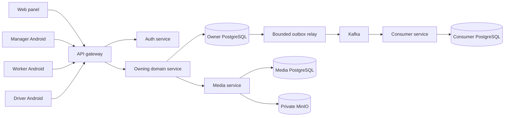
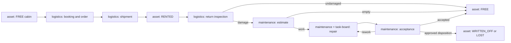
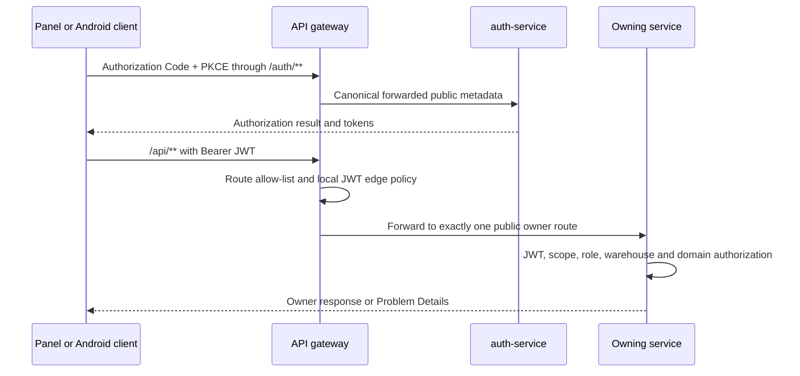
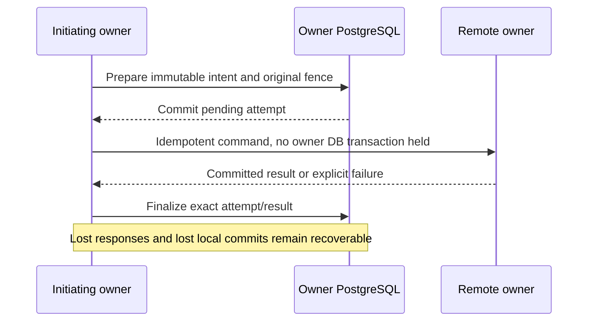
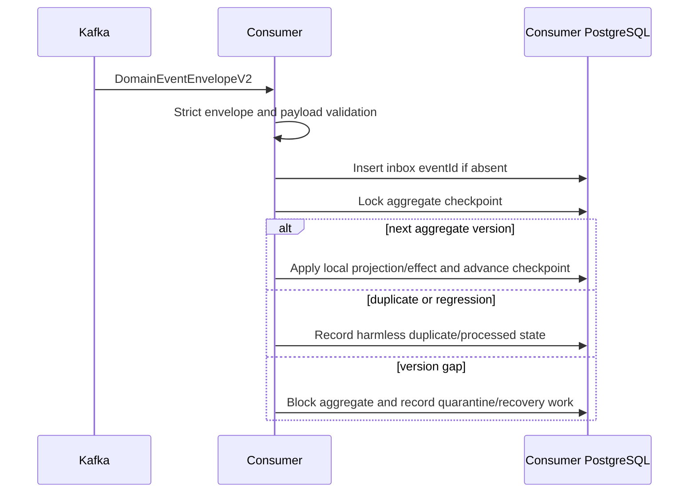

# Current Runtime Flows

Status: Confirmed cross-component execution model as of 2026-08-12.

This page explains how current RWMS components cooperate at runtime. It is a
navigation layer: canonical request fields remain in OpenAPI, event fields in
event schemas, domain transitions in the owning service, and persistence shape
in service-local Flyway migrations.

Primary evidence:

- [`architecture.md`](architecture.md)
- [`contracts.md`](contracts.md)
- [`domain-logic.md`](domain-logic.md)
- [`contracts/openapi/`](../../contracts/openapi/)
- [`contracts/events/`](../../contracts/events/)
- [`api-gateway-service`](../../services/api-gateway-service/)
- [`platform/spring-boot-starter`](../../platform/spring-boot-starter/)

Known deviations and hardening work are recorded separately in
[`20260808-full-architecture-audit.md`](../reviews/20260808-full-architecture-audit.md).

## System context



Interactive clients know the public gateway, never the private deployment
topology. Internal service calls use service credentials and private addresses.
Every stateful service owns its database; Kafka and MinIO do not create shared
domain ownership.

## Cabin product lifecycle

The main product path crosses several owners without transferring ownership of
their state:



For a new post-return estimate, maintenance reads the latest physical arrival
from logistics and evaluates the warehouse-local inclusive deadline from the
versioned `estimateCreationWindowDays` setting (default seven). Arrival on
1 August therefore permits creation through 8 August and rejects a new estimate
from 9 August with `ESTIMATE_CREATION_WINDOW_EXPIRED`; direct repair remains a
separate supported command. A normal return freezes that instant once as
logistics-owned `returnArrivedAt`; inventory-created historical returns bypass
intake and deliberately have no such source. The same policy fences
logistics-origin automatic estimate registration.

The detailed state machines, owner handoffs, recovery rules and supported
variants are maintained in the bilingual
[`Cabin Operational Lifecycle`](cabin-lifecycle.md) /
[`Полный операционный цикл бытовки`](cabin-lifecycle.ru.md). That guide also
covers direct orders, presentation expiry, partial multi-cabin shipments,
inventory discovery/work and free/repair transfers. It records current behavior
only; known implementation deviations remain in the architecture audit.

## Interactive authentication and public request



The gateway strips caller-supplied forwarding headers and reconstructs auth
metadata from configured public values. It denies private namespaces and does
not reshape several owner responses into a new business aggregate.

The owner repeats resource-server validation because edge authentication does
not replace domain authorization. Warehouse access, role, scope, entity
ownership, status, and command preconditions are enforced where their state is
owned.

WorkerApp and DriverApp are distinct public PKCE-S256 clients for the same WORKER
principal family. `rwms-worker-android` receives `worker.tasks` and returns to
the HTTPS `/auth/worker/callback`; `rwms-driver-android` receives
`driver.tasks` and returns to `/auth/driver/callback`. The scopes are not
interchangeable at either gateway or task-board. Each native client validates
and consumes its callback in the in-memory login transaction and exposes no
custom-scheme redirect receiver.

After the panel verifies `/me`, it binds protected server state to the exact
subject and bearer-grant revision. A logout, account switch or silent grant
renewal first retires the old protected query client: in-flight queries are
cancelled, query/mutation state and media object URLs are removed, and the
protected React subtree is remounted. Public offer/bootstrap state remains on a
separate root client. This ordering prevents a late response or long-lived SSE
effect from principal A from becoming visible to principal B.

Evidence:
[`GatewayRouteConfiguration.java`](../../services/api-gateway-service/src/main/java/dev/buhanzaz/rwms/gateway/config/GatewayRouteConfiguration.java),
[`GatewaySecurityConfiguration.java`](../../services/api-gateway-service/src/main/java/dev/buhanzaz/rwms/gateway/config/GatewaySecurityConfiguration.java),
[`AuthorizationServerConfiguration.java`](../../services/auth-service/src/main/java/dev/buhanzaz/rwms/auth/config/AuthorizationServerConfiguration.java),
[`OAuthClientProperties.java`](../../services/auth-service/src/main/java/dev/buhanzaz/rwms/auth/config/OAuthClientProperties.java),
[`WorkerAuthConfiguration.kt`](../../worker-app/core-auth/src/main/java/dev/buhanzaz/rwms/worker/core/auth/WorkerAuthConfiguration.kt),
[`DriverAuthConfiguration.kt`](../../driver-app/core-auth/src/main/java/dev/buhanzaz/rwms/driver/core/auth/DriverAuthConfiguration.kt),
[`AuthProvider`](../../panel/src/features/auth/auth-provider.tsx),
[`ProtectedClientState`](../../panel/src/features/auth/protected-client-state.ts).

The manager app establishes durable client state only after `/me` confirms an
eligible USER account and live warehouse grants. It then selects a visible
warehouse, activates that exact account-and-warehouse upload/catalog partition,
restores its encrypted cache, and resumes only its pending work. Before logout,
a replacement login or warehouse rebinding, it hides the queue, cancels and
joins WorkManager, and waits for the worker's authentication snapshot to close.
Each resumed worker performs a fresh `/me` check against its immutable owner and
all warehouse IDs retained by its command or media before any side effect.
Ownerless legacy state remains quarantined and is never adopted by the current
session.

For a manager request rejected with `401`, the client submits the rejected
access token to one mutex-serialized refresh. A valid newer token persisted by
a concurrent request is reused; a transient refresh exception remains a
connectivity failure and does not reach session invalidation as a false
terminal `401`. Missing or terminally rejected refresh authority still fails
closed.

During an active inventory session, ManagerApp loads the authoritative finding
and warehouse-cabin populations, then filters the visible cards locally by
canonical-number prefix. It exposes “add cabin” only when no loaded cabin
number has that prefix. The local draft advances through passport, photos,
furniture, work catalog, inspection details, and confirmation; only the final
public command changes owner state. Before each visible photo/video attachment
is adopted, its source is copied into the scoped app-private draft directory;
encrypted draft metadata and the current route then restore the exact step
after process death or an emergency close. A newly attached catalog-work media
item is previewed in that draft before submission, while the media and
inventory services remain authoritative after upload/save. Immediately before a
queued first inspection command, the worker rereads the active finding and then
the session revision, and persists its current finding revision only while it
remains `NOT_INSPECTED` and in an idle/save-ready source state. One `409
INVENTORY_VERSION_CONFLICT` with detail `Inventory revision is stale` triggers
a new read/rebase/save cycle; a saved/repeated or departed finding is not rebased over server data.

When a MANAGE user selects **Recalculate session changes** on the panel finish surface, the panel
first refuses to run beside a dirty furniture/final-plan draft or another finish command. It sends
the displayed session revision and a new idempotency key to inventory-service. The owner checks that
revision, completes a fresh asset capture outside the local apply transaction, rechecks the revision
under lock, and atomically journals target-session arrivals, departures and current snapshots. Saved
finding inspections/media/history remain in PostgreSQL. A departure deactivates only automatically
captured `EXPECTED` population; `ADDED_NEW`, `ADDED_USED` and `UNEXPECTED_EXISTING` are explicit
physical observations and remain in the result even when the capture omits them. Only the derived
registry/furniture/final-plan projections are discarded or marked stale. The returned session replaces the detail cache and
the panel clears only those derived query entries before the user rebuilds cabin and furniture
review. If the rebuilt final plan contains no maintenance work, inventory sends `findings: []` and
maintenance returns an empty candidate set instead of a validation failure.

Every inventory transition in that sequence which advances a finding but does not edit photos,
including source-asset attachment, carries the immediately preceding exact media-reference set into
the new finding revision in the same local transaction. Explicit inspection save remains the sole
replacement operation and may persist an intentional empty set. Migration
[`V18__carry_forward_inventory_finding_media.sql`](../../services/inventory-service/src/main/resources/db/migration/V18__carry_forward_inventory_finding_media.sql)
repairs older missing-current-revision rows only when the finding still names a cover photo and a
prior exact set contains it; it appends that newest whole set without combining older revisions or
touching MinIO objects.

Before furniture review, inventory freezes the current finding revision vector into a
server-owned cabin-disposition review. In `RETURNS`, every physically found candidate captured as
`RENTED` requires its actual return date and existing client. In `SHIPMENTS`, the manager submits
only missing cabins known to have departed, with actual date, client and zero or more exact
catalog-versioned furniture quantities. Every omitted missing candidate becomes `WRITE_OFF`; an
empty shipment submission therefore sends all missing cabins to write-off review. Only `LOCAL`
rows proceed into warehouse furniture reconciliation. Final-plan preparation then freezes each
row's `LOCAL`, `SHIPMENT` or `WRITE_OFF` evidence and rejects stale session/review/finding fences.

Preparing that final plan calls maintenance's read-only publication preflight. Inventory retries it
once with the identical request and idempotency key only after a transport failure or HTTP
`502/503/504`; semantic, authorization, other server and malformed-response failures remain
fail-closed. Maintenance first verifies the raw frozen-plan fingerprint. For schema version 1 only,
it then recognizes a historical producer snapshot when the identical non-empty aggregate media list
was copied onto every line, clears only those executable line copies and retains the aggregate
evidence. The raw inventory snapshot and fingerprint remain unchanged. No other version-1 shape is
normalized, and version 2 is never adapted.

Exact completion persists immutable recovery work for every final-plan entry and performs no remote
effect inside the completion transaction. For `LOCAL` and `SHIPMENT`, durable publication waits for
the local-furniture reconciliation generation when applicable and sends the immutable
completed-at/plan/finding identity to asset-service. Asset rejects an older watermark or terminal
cabin, otherwise releases/supersedes active reservations, holds, leases and transfer state and
applies `FREE`, `REPAIR`, `CAPITAL_REPAIR` or `RENTED`. `RENTED` exact-replaces the cabin's reviewed
contents without reading, reserving or decrementing `STOCK`. A `WRITE_OFF` entry skips this status
command and remains non-terminal. Inventory stores each canonical asset result and effective
version before the remaining owner effects:

0. The request carries the exact passport observation frozen on that publication intent and its
   canonical SHA-256. For `PRESENT`, asset-service resolves required names only against active
   catalog rows, atomically replaces type, dimensions, finishing, category, normalized complete
   characteristics and nullable linoleum, and emits ordinary asset facts. `ABSENT` leaves those
   values unchanged. A missing/ambiguous catalog value, wrong warehouse, terminal cabin or
   observation/hash mismatch rolls back the complete asset command before downstream publication.

1. If the exact finding revision has images, media-service projects their immutable IDs and
   generations into the deterministic inventory folder and makes that folder the current cabin
   presentation. Older folders and objects remain available as history.
2. Inventory submits the whole immutable final plan to logistics-service once per plan/version
   reapplication generation under one stable idempotency key. Logistics supersedes active
   rental/document lines and cancellable tasks for every listed asset while retaining their rows
   and audit facts. `LOCAL` with former-rental evidence creates a terminal historical return;
   `SHIPMENT` creates a terminal driverless shipment and stores the exact reviewed furniture on
   its line; `WRITE_OFF` records only the release marker needed by the downstream decision owner.
3. A local work finding asks maintenance to supersede non-terminal predecessor work and materialize the
   reviewed ordinary/capital repair, including a former `AFTER_RENT` cabin. A no-work finding sends
   an explicit cleanup command, so stale estimates, repairs, tasks, driver effects and leases do not
   survive a `FREE` result. If the preceding asset command changed only the cabin's technical
   version while applying the same immutable inventory source, maintenance retains the original
   no-work coordinator and binds the newer exact request to a separate receipt; this is a
   recoverable reassertion, not a different inventory decision. Inventory projects this command
   explicitly to the maintenance schema; the asset-only passport observation and hash remain on
   the asset boundary.
4. After that exact logistics generation succeeds, every `WRITE_OFF` recovery intent calls the
   service-only maintenance boundary with one stable finding identity. Maintenance rereads the
   cabin, freezes its current contents as `DISPOSE_WITH_CABIN` and creates or replays the ordinary
   `PENDING_APPROVAL` property decision. A global administrator remains the only actor who can
   advance the existing disposition saga to terminal asset state.
5. Maintenance routes the materialized result without manufacturing completion: ordinary work
   without inbound movement registers on task-board; selected movement creates the logistics
   delivery and registers ordinary work after arrival; catalog-enforced capital work with the same
   frozen movement choice creates or reuses `CAPITAL_TO_PRODUCTION` while remaining active as
   `QUEUED/NOT_READY`; explicit no-movement capital work remains on that active route without a
   driver task; and no-work remains `FREE`. Only task-board completion can open inventory
   repair acceptance/rework. Historical inventory rows without that execution proof are excluded
   from both surfaces; reapplying their completed outcome restores legacy `COMPLETED/PENDING`
   capital rows to the active `QUEUED/NOT_READY` route.

The panel repair-detail workspace keeps three evidence sets separate: aggregate task media, the
selected work line's source media, and worker result photos. Maintenance reconstructs an
authoritative repair's immutable inventory source from the newest completed receipt that names the
repair, then from the outcome coordinator's original target, and finally from a legacy repair-source
row. Aggregate and work-line references therefore prefer that inventory-finding owner even when an
adopted repair still has an older estimate origin; otherwise they use the original estimate or
repair owner proof. Only worker-result evidence uses the task-board entry proof. The panel renders
the exact `mediaId`/generation references from the current projections; it neither substitutes the
repair-wide gallery nor changes media or MinIO ownership. Each exact work-line set uses the shared
compact carousel with an in-image count and always-visible previous/next controls; aggregate and
result-evidence sets retain the standard gallery presentation. The public cabin-cover projection
puts its explicit cover first, counts every retained archive association and retains stable
association order for the remaining bounded archive previews;
the panel repeats that ordering defensively during a mixed-version rollout. The passport photo
archive groups every retained CABIN association by its media-owned folder and shows the folder's
source, occurrence time, actor and photo count before opening its images. Folder provenance comes
from a separately paginated `INVENTORY`/`MEDIA` dossier read, so History-tab filters or its first
page cannot relabel older photo folders; missing provenance remains explicitly unknown. The panel
also consumes every CABIN archive cursor instead of truncating history at the first 100
associations. The authoritative read projection is implemented by
[`InventoryRepairSourceReadProjection`](../../services/maintenance-service/src/main/java/dev/buhanzaz/rwms/maintenance/service/InventoryRepairSourceReadProjection.java),
and the panel owner precedence is implemented by
[`repair-task-media-owner.ts`](../../panel/src/features/repair-tasks/repair-task-media-owner.ts); the
work-line presentation is implemented by
[`ServiceOwnerPhotos`](../../panel/src/features/media/service-owner-photos.tsx).

Maintenance registrations and immutable source rows written before the V45 coordinator remain
historical evidence. They do not bind the current outcome: an estimate or operation-only source is
superseded, while a repair previously adopted into an `APPLIED` outcome is replaced by one new
full-plan repair and bound through a new permanent receipt. The old source, outcome, receipt and
repair rows remain unchanged. A current V45 repair is reasserted instead of duplicated.

One narrow exception lets a new-key reassertion of that exact already-`APPLIED` work coordinator
recover after the maintenance asset projection has advanced beyond the request's original
authority. Its immutable request, warehouse, watermark and active coordinator-bound repair must
still match. A current immutable source row must name that repair; when an equivalent corrected
plan intentionally has no current source row, an immutable different-plan source must already own
the exact retained repair. The current asset status may equal the stored desired repair status, or
a stored `REPAIR` may have been promoted to `CAPITAL_REPAIR`; the bound repair's own classification
must already match that current truth. Maintenance therefore schedules only the existing bound
status/task/driver/lease reconciliation effects and performs no asset-status transition. It keeps
the coordinator's stored authoritative version and response unchanged. Initial publication,
`FREE`/`RENTED`/`BOOKED`, desired capital with current ordinary repair, terminal state, changed
source, absent or non-applied coordinator, unbound or mismatched repair and stale plan/watermark
still fail closed. The lock order remains
source/coordinator, asset projection, watermark, then bound repair. Evidence:
[`InventoryPublicationAssetFence`](../../services/maintenance-service/src/main/java/dev/buhanzaz/rwms/maintenance/service/InventoryPublicationAssetFence.java),
[`InventoryAuthoritativeOutcomeStore`](../../services/maintenance-service/src/main/java/dev/buhanzaz/rwms/maintenance/service/InventoryAuthoritativeOutcomeStore.java),
and the DB-backed
[`MaintenanceInventoryBoundaryIntegrationTest`](../../services/maintenance-service/src/test/java/dev/buhanzaz/rwms/maintenance/MaintenanceInventoryBoundaryIntegrationTest.java).

Each owner uses a permanent receipt and latest-completed-inventory watermark. An exact retry returns
the stored result, an older inventory is rejected, and no service reads another owner's database.
At the same completion instant, a strictly higher plan version is a correction only for the same
inventory/finding. Asset and logistics advance their ordering fences; maintenance first proves the
prior outcome is applied. Equivalent work evidence adopts the current repair from the newest
completed predecessor receipt without creating a second immutable source row. Changed priority,
work, movement, capital or work/no-work evidence uses the same durable supersession workflow to
leave exactly one current route; terminal accepted or written-off work still fails closed. An
interrupted correction whose remote effects already settled resumes from its coordinator, restores
the retained route's task/driver/lease effects when needed and completes idempotently. Media requires
the exact prior photo set and reuses the stable gallery folder while advancing association metadata.
When that retained repair has several historical corrected-plan coordinators, driver-task recovery
selects the newest `APPLIED` owner with a bounded completion-time/plan-version query; it never asks
JPA for an invalid unique target row and never rewrites the older coordinators.
If a fresh private maintenance movement keeps a `FIXED_DATE` that has already passed by the current
warehouse-local day, logistics preserves that original day in its idempotency checksum while using
the current local day as the task's effective schedule. Exact maintenance replay returns that stored
effective date; a changed original day conflicts, and public creates remain subject to the normal
past-date rejection. The private contract therefore distinguishes the immutable requested date from
the logistics-owned effective `DriverTask.scheduledDate`. Maintenance rejects a private HTTP
response before the request date, then resolves the current warehouse-local day outside its database
transaction before confirming the durable reconciliation: `AUTO` still requires a returned date;
current or future `FIXED_DATE` must match exactly; overdue `FIXED_DATE` accepts only the inclusive
range from the request through the current local day. The original maintenance repair date and
stable key are not rewritten, while the confirmation receipt records the effective date. Scheduling
normalization remains owned by
[`DriverTaskService`](../../services/logistics-service/src/main/java/dev/buhanzaz/rwms/logistics/driver/service/DriverTaskService.java),
and maintenance only fences its consumed response in
[`MaintenanceTaskReconciliationUseCases`](../../services/maintenance-service/src/main/java/dev/buhanzaz/rwms/maintenance/service/MaintenanceTaskReconciliationUseCases.java).
For this SERVICE-only completed-outcome command, a retained finding proof may still authorize those
exact READY generations when its checkpoint predates a later unresolved `VERSION_GAP`; every other
finding quarantine and every cabin quarantine remains fail-closed, and public finding media access
is unchanged.
A retained ordinary pre-start task that the settled correction already cancelled cannot be
reactivated under the same task-board identity. Maintenance uses the cancellation ledger to rotate
that inventory-owned task to one deterministic replacement identity, clears only its confirmed
stage mappings, marks the released lease for reconciliation, acquires a new fence and registers the
replacement once. Exact replay sees the new task/lease identities and performs no second rotation;
started, completed, movement and capital routes remain unchanged.
A later same-plan reassertion treats the retained repair's durable local
`RECONCILIATION_REQUIRED` lease fence as recovery authority even when the exact release ledger is
stored only with an older plan version. It acquires and persists a replacement lease before
confirming an already-matching asset status. The replacement completes local reconciliation only
when the ordinary task is already generated and no movement remains; otherwise the task or driver
effect keeps ownership of the final confirmation.
A lower version, equal-version drift, changed completion instant or another inventory/finding fails
closed.
Inventory keeps one durable reapplication generation across every finding in the completed plan.
Automatic retry after a timeout or lost response keeps the same generation and downstream keys;
only a confirmed history recalculation advances the whole plan to a new generation. On that
same-source reassertion asset-service preserves a possibly current-successor operation lease, while
the maintenance or logistics owner releases an unrelated predecessor lease under its exact owner
and fencing token. Maintenance accepts an exact same-owner/fence terminal asset response in either
`RELEASED` or naturally `EXPIRED` state; a local `RECONCILIATION_REQUIRED` lease may therefore
finish recovery, while a locally `RELEASED` lease is not called again. When the latest generation
preserves its current repair, maintenance also enqueues generation-specific status and execution
reassertions: calculated `REPAIR`/`CAPITAL_REPAIR` truth is restored after the asset-first command,
and an inventory movement whose predecessor task was superseded receives a new driver task.
Ordinary repair movement is an inbound `DELIVER_TO_REPAIR` task sourced by the authoritative
inventory finding. External-capital movement is a separate outbound `CAPITAL_TO_PRODUCTION` task
sourced by the current capital repair; it never becomes an ordinary repair task. The ordinary
driver-task source identity is resolved from the authoritative outcome before older
publication-source formats, so logistics can distinguish the current inventory finding from
predecessor work.

From completed history, the panel MANAGE action **Recalculate and apply outcomes** confirms the
exact session revision and completed final-plan version/SHA. Inventory creates missing intents,
but first restores every inspected `ADDED_NEW`, `ADDED_USED` or `UNEXPECTED_EXISTING` finding that
the obsolete capture rule deactivated and omitted. It restores the inspection baseline, emits a
membership-restored ordering fact without reopening owner proof, copies every old plan entry,
choice, date and order unchanged, appends the restored findings to a strict next completed version
and replaces frozen statistics. Restored work is capacity-scheduled after retained work. Because
completed inventory is authoritative, the correction needs no maintenance preflight and performs
no remote I/O or downstream mutation. The
response therefore may contain a newer plan version/SHA than the request, which the panel treats as
the authoritative successor. Inventory then advances one shared plan reapplication generation and
requeues every existing intent, including an
earlier `SUCCEEDED` result, and makes a failed furniture
reconciliation immediately eligible. Replaying every row is deliberate: an old success cannot prove
that owner effects introduced later in the chain were applied. The public command returns a slim
`202` containing only the authoritative fences, furniture state and created/requeued counts after
this local scheduling step. It does not serialize every publication intent; the panel invalidates
and rereads the publication projection. The existing schedulers perform remote effects and keep
every prior attempt/result as audit evidence. Finding media references and MinIO objects are not mutated
by either scheduling or outcome apply; media-service reasserts the exact completed batch as the
current folder and the selected cover as that folder's first presentation image. Earlier folders
and their objects remain in the passport archive.
One immutable logistics request is stored for the whole final-plan/reapplication generation. A
short claim sends it once with one stable key, and later finding publications reuse its durable
success; they do not rebuild and resend the complete outcomes array. A bounded semantic downstream
Problem Details code remains visible on the blocked publication, whereas unavailable dependencies
remain retryable.
Migration
[`V22__retry_legacy_maintenance_source_outcomes.sql`](../../services/inventory-service/src/main/resources/db/migration/V22__retry_legacy_maintenance_source_outcomes.sql)
advances the whole affected completed plan, rather than only its blocked rows, when a partially
processed pre-coordinator maintenance source conflict is detected. This keeps all findings on one
reapplication generation and allows prior apparent successes to receive the corrected owner
effects without deleting their attempts or receipts.

The panel keeps inspection evidence and applied outcome truth distinct. While a session is active,
its finding list continues to show the frozen current-status snapshot. In completed history, a
`PUBLISHED` operation shows the inventory owner's `desiredAssetStatus`; a selected movement is
shown alongside that status. A current operation which has not reached `PUBLISHED` is explicitly
shown as not applied, while an absent or cancelled operation falls back to the historical snapshot.
Thus a cabin found at the warehouse may retain `RENTED` in its immutable inspection evidence while
the completed result correctly displays the applied `REPAIR`, `CAPITAL_REPAIR` or `FREE` truth.
This presentation does not let the browser derive or change asset status. It is implemented by the
[`inventory view mapper`](../../panel/src/features/inventory/domain/inventory-view-mapper.ts) and
[`completed findings list`](../../panel/src/features/inventory/inventory-findings-list.tsx).

The public gateway gives this exact recalculation POST a dedicated bounded 60-second upstream read
timeout. It remains a transport-only exception: the unchanged path, bearer token and
`Idempotency-Key` reach inventory-service, cookies are stripped, and every other inventory route
keeps the normal gateway timeout. This allows the durable `202` response to reach the panel when a
large completed-plan correction takes longer than the ordinary edge budget without moving retry or
business state into the gateway.

Finding membership markers carry additive `membershipActive` state. Historical added/inspection
facts may omit it, while departed requires `false` and refreshed/restored require `true`.
Media-service and dossier-service validate and checkpoint these lifecycle markers as ordering
evidence only: they neither reopen media owner authorization nor create a dossier cabin activity.

Evidence:
[`ManagerWorkspaceCoordinator`](../../app/src/main/java/dev/buhanzaz/rwms/manager/ui/coordinator/ManagerWorkspaceCoordinator.kt),
[`BackgroundUploadWorker`](../../app/src/main/java/dev/buhanzaz/rwms/manager/uploads/BackgroundUploadWorker.kt),
[`MaintenanceCatalogCache`](../../app/src/main/java/dev/buhanzaz/rwms/manager/ui/MaintenanceCatalogCache.kt),
[`ManagerAuth`](../../app/src/main/java/dev/buhanzaz/rwms/manager/auth/ManagerAuth.kt),
[`manager bearer transport`](../../app/src/main/java/dev/buhanzaz/rwms/manager/network/Backend.kt),
[`inventory UI`](../../app/src/main/java/dev/buhanzaz/rwms/manager/ui/screens/InventoryScreens.kt),
[`inventory coordinator`](../../app/src/main/java/dev/buhanzaz/rwms/manager/ui/coordinator/ManagerInventoryCoordinator.kt),
[`inventory draft store`](../../app/src/main/java/dev/buhanzaz/rwms/manager/ui/InventoryDraftStore.kt),
[`inventory upload revision policy`](../../app/src/main/java/dev/buhanzaz/rwms/manager/uploads/InventoryUploadRevisionPolicy.kt),
[`inventory session refresh`](../../services/inventory-service/src/main/java/dev/buhanzaz/rwms/inventory/service/InventorySessionService.java),
[`inventory membership reconciliation`](../../services/inventory-service/src/main/java/dev/buhanzaz/rwms/inventory/service/InventoryFindingService.java),
[`inventory history recovery`](../../services/inventory-service/src/main/java/dev/buhanzaz/rwms/inventory/service/InventoryOutcomeRecoveryService.java),
[`completed-plan correction`](../../services/inventory-service/src/main/java/dev/buhanzaz/rwms/inventory/service/CompletedInventoryPlanCorrectionService.java),
[`inventory publication`](../../services/inventory-service/src/main/java/dev/buhanzaz/rwms/inventory/service/InventoryPublicationService.java),
[`restoration event migration`](../../services/inventory-service/src/main/resources/db/migration/V24__restore_explicit_inventory_observations.sql),
[`media membership-marker migration`](../../services/media-service/db/migration/V15__inventory_finding_membership_markers.sql),
[`inventory passport intent migration`](../../services/inventory-service/src/main/resources/db/migration/V23__freeze_inventory_outcome_passport_observation.sql),
[`asset outcome owner`](../../services/asset-service/src/main/java/dev/buhanzaz/rwms/asset/service/InventoryAssetOutcomeService.java),
[`asset passport watermark migration`](../../services/asset-service/src/main/resources/db/migration/V39__inventory_outcome_passport_watermark.sql),
[`media inventory projection`](../../services/media-service/internal/persistence/inventory_cabin_photos.go),
[`logistics outcome owner`](../../services/logistics-service/src/main/java/dev/buhanzaz/rwms/logistics/inventory/service/InventoryOutcomeService.java),
[`maintenance preflight contract`](../../contracts/openapi/maintenance-service.yaml),
[`maintenance outcome owner`](../../services/maintenance-service/src/main/java/dev/buhanzaz/rwms/maintenance/service/InventoryAuthoritativeOutcomeService.java),
[`maintenance source compatibility`](../../services/maintenance-service/src/main/java/dev/buhanzaz/rwms/maintenance/service/InventoryPublicationSourceLifecycle.java),
[`maintenance inventory apply`](../../services/maintenance-service/src/main/java/dev/buhanzaz/rwms/maintenance/service/InventoryPublicationApplyUseCases.java),
[`panel inventory finish flow`](../../panel/src/features/inventory/inventory-pages.tsx),
[`inventory event contract`](../../contracts/events/inventory-events.yaml),
[`media inventory consumer`](../../services/media-service/internal/worker/inventory_owner_consumer.go),
[`dossier inventory validator`](../../services/dossier-service/src/main/java/dev/buhanzaz/rwms/dossier/eventing/DossierEnvelopeValidator.java),
[`panel repair task media`](../../panel/src/features/repair-tasks/repair-task-media-owner.ts),
and
[`maintenance work-photo UI`](../../app/src/main/java/dev/buhanzaz/rwms/manager/ui/screens/MaintenanceScreen.kt).

### Client failure and retry sequence

1. The panel converts ordinary HTTP and assistant-stream failures through the
   same Problem Details mapper. The response status is authoritative; malformed
   or non-JSON content receives a safe status-only fallback.
2. The worker's authenticator gets its normal refresh opportunity. A remaining
   `401` stops the chain for login; `403` stops for a grant/user decision.
3. A command `409` records the conflict, applies any supplied current snapshot
   (or retires a proven-absent entry) and fetches the authoritative feed in the
   same pass before another command may be sent.
4. Only `429`, `502`, `503`, `504` and a transport exception whose cause chain
   contains no cancellation can request an automatic WorkManager retry.
5. WorkManager persists one jittered exponential-backoff seed and permits at
   most four total runs. Cancellation is rethrown. Media/evidence that is
   correctly pending is not a network failure and waits for a later explicit
   sync trigger.

Evidence:
[`api-client.ts`](../../panel/src/lib/api-client.ts),
[`assistant-api.ts`](../../panel/src/features/assistant/api/assistant-api.ts),
[`GatewayFailure.kt`](../../worker-app/core-network/src/main/java/dev/buhanzaz/rwms/worker/core/network/GatewayFailure.kt),
[`WorkerSyncCoordinator.kt`](../../worker-app/core-sync/src/main/java/dev/buhanzaz/rwms/worker/core/sync/WorkerSyncCoordinator.kt),
and
[`WorkerSyncWork.kt`](../../worker-app/core-sync/src/main/java/dev/buhanzaz/rwms/worker/core/sync/WorkerSyncWork.kt).

## Mutable command

The common synchronous command shape is:

1. validate Bearer identity, exact audience/scope, role and warehouse access;
2. validate the transport request and resolve only owner-local domain state;
3. claim the `Idempotency-Key` or stable external identifier when the effect is
   retryable;
4. lock or compare the contract-defined `expectedVersion`, ETag, lease token,
   or other fence;
5. apply the owner aggregate transition inside one local transaction;
6. write audit/domain history and an outbox event in that same transaction;
7. return the committed owner result, an idempotent replay, or an explicit
   validation/authorization/conflict/dependency Problem Details response.

A `409` is a real concurrent-write signal. A client refreshes authoritative
state and asks the user to reconcile when necessary; it does not silently
overwrite or roll back another service.

An operation-lease release has one narrow terminal recovery rule: when the
stored lease is already `RELEASED` or `EXPIRED`, the owner returns that terminal
projection only if the original owner identity and fencing token still match.
Natural expiry may have advanced the row version, so the earlier expected
version alone does not turn this exact readback into a conflict. A different
owner or fencing token still returns `409`.

Evidence:
[`contracts/openapi/`](../../contracts/openapi/),
[`domain-event-envelope-v2.schema.yaml`](../../contracts/events/technical/domain-event-envelope-v2.schema.yaml),
[`AssetLogisticsService.java`](../../services/asset-service/src/main/java/dev/buhanzaz/rwms/asset/service/AssetLogisticsService.java),
[`AssetMaintenanceService.java`](../../services/asset-service/src/main/java/dev/buhanzaz/rwms/asset/service/AssetMaintenanceService.java),
service-local `*Idempotency*`, event-store, and application-service sources.

## Cross-service command and saga

When a workflow needs a remote effect, the initiating domain owns durable
coordination. The safe pattern is:



The durable attempt stores enough immutable input to replay the same command,
including the same idempotency identity and original expected version. A
background reconciler uses a lease or claim so several instances do not apply
one effect concurrently. Terminal or ambiguous failures remain visible for
review; they are not converted into fabricated success.

The system has no distributed database transaction. A remote call must not be
made while holding an ambient local transaction when that would retain locks or
make a remote success impossible to reconcile after a local rollback.

Evidence:
[`MaintenanceApplicationService.java`](../../services/maintenance-service/src/main/java/dev/buhanzaz/rwms/maintenance/service/MaintenanceApplicationService.java),
[`MaintenanceReconciliationStore.java`](../../services/maintenance-service/src/main/java/dev/buhanzaz/rwms/maintenance/service/MaintenanceReconciliationStore.java),
[`TransferWorkflowStore.java`](../../services/logistics-service/src/main/java/dev/buhanzaz/rwms/logistics/service/TransferWorkflowStore.java).

### Logistics external-attempt claim

1. The owner relay asks for no more claims than its currently available
   per-owner worker permits.
2. A short database transaction selects due attempts in stable due/created/ID
   order, skips a row locked by another replica, and writes a unique token,
   higher fence, database-time expiry and post-flush row version.
3. The claim transaction closes. Only then does one bounded worker load the
   owner work and perform the remote call with the stored request identity.
4. Before preflight and before any final owner mutation, the workflow store
   re-locks and verifies attempt ID, operation ID, token, fence, row version,
   request hash and live lease.
5. Success or bounded failure changes the owner state and clears the lease;
   a locally blocked attempt is deferred using database time. An expired lease
   may be reclaimed with a higher fence, so its earlier worker can no longer
   complete.
6. Trigger shutdown stops accepting work, returns owner permits and leaves any
   unfinished persisted lease recoverable by expiry. Slow work for one owner
   cannot consume every worker slot.

Evidence:
[`LogisticsExternalAttemptClaimService`](../../services/logistics-service/src/main/java/dev/buhanzaz/rwms/logistics/service/LogisticsExternalAttemptClaimService.java),
[`LogisticsExternalAttemptRelayExecutor`](../../services/logistics-service/src/main/java/dev/buhanzaz/rwms/logistics/service/LogisticsExternalAttemptRelayExecutor.java),
[`ReturnRegistrationRelay`](../../services/logistics-service/src/main/java/dev/buhanzaz/rwms/logistics/service/ReturnRegistrationRelay.java),
and
[`V40`](../../services/logistics-service/src/main/resources/db/migration/V40__bounded_logistics_external_attempt_claims.sql).

## Event publication

```mermaid
sequenceDiagram
    participant S as Producer service
    participant DB as Producer PostgreSQL
    participant R as Outbox relay
    participant K as Kafka

    S->>DB: Domain mutation + domain_event + outbox_event
    DB-->>S: One local commit
    R->>DB: Claim next ordered row with lease
    R->>R: Verify envelope, schema and checksum
    R->>K: Publish with aggregate ID key; wait for broker ack
    K-->>R: Ack or bounded failure
    R->>DB: Mark published, retryable, DLT or quarantined
```

The event describes an already committed fact. The producer's PostgreSQL state
is authoritative and the outbox closes the local commit/publish gap. Kafka is
at-least-once transport, so publication may repeat and consumers must be
idempotent.

In warehouse-service, asset-service, maintenance-service and logistics-service,
non-local startup now requires the Kafka publisher, exact owner destinations,
brokers and safe producer delivery settings. Development/test profiles may
disable transport explicitly, but a production command path cannot start with
a relay missing. Maintenance binds and validates the same ordered five outputs:
catalog, estimate, repair, property disposition and sanitized DLT. Logistics
binds return, shipment, transfer and the canonical
`rwms.logistics.rental-inquiry.events.v1` output from one ordered authority.
Operational gauges report local pending/terminal evidence, version gaps and
bounded external-attempt work; they do not replace ordered relay recovery or
authorize an automatic backlog rewrite. The rental-inquiry outbox currently
has only `PENDING` and `PUBLISHED`, so its gauges do not invent a terminal or
reviewed state.

Outbox claims are fenced by a lease token. Publication wait must be shorter than
the lease. A checksum or schema mismatch is quarantined instead of sent. A
terminal record is recovered only through a reviewed, version-fenced owner
operation when such an operation exists.

Evidence:
[`RwmsKafkaOutboundEventPublisher.java`](../../platform/spring-boot-starter/src/main/java/dev/buhanzaz/rwms/platform/kafka/RwmsKafkaOutboundEventPublisher.java),
[`WarehouseProductionSafetyValidator`](../../services/warehouse-service/src/main/java/dev/buhanzaz/rwms/warehouse/config/WarehouseProductionSafetyValidator.java),
[`AssetProductionSafetyValidator`](../../services/asset-service/src/main/java/dev/buhanzaz/rwms/asset/config/AssetProductionSafetyValidator.java),
[`LogisticsProductionSafetyValidator`](../../services/logistics-service/src/main/java/dev/buhanzaz/rwms/logistics/config/LogisticsProductionSafetyValidator.java),
[`LogisticsTransportTopics`](../../services/logistics-service/src/main/java/dev/buhanzaz/rwms/logistics/eventing/LogisticsTransportTopics.java),
[`LogisticsRecoveryMetrics`](../../services/logistics-service/src/main/java/dev/buhanzaz/rwms/logistics/eventing/LogisticsRecoveryMetrics.java),
[`MaintenanceProductionSafetyValidator`](../../services/maintenance-service/src/main/java/dev/buhanzaz/rwms/maintenance/config/MaintenanceProductionSafetyValidator.java),
[`MaintenanceTransportTopics`](../../services/maintenance-service/src/main/java/dev/buhanzaz/rwms/maintenance/eventing/transport/MaintenanceTransportTopics.java),
service-local `*EventStore`, `*OutboxStore`, `*OutboxRelay`, and recovery tests.

## Event consumption, ordering, and recovery



The inbox, local projection update, and checkpoint advance are one local
transaction. The consumer validates the expected producer, aggregate family,
event type/version, payload shape, and sanitized-data policy before applying an
effect.

Processing retry is bounded. Exhausted or invalid input is represented by safe
metadata in a consumer-owned DLT; raw credentials or rejected personal payloads
are not copied there. A version gap blocks later effects for that aggregate
until an explicit replay/reconciliation path proves and applies the missing
history.

Evidence:
[`event-delivery-policy-v1.schema.yaml`](../../contracts/events/technical/event-delivery-policy-v1.schema.yaml),
[`aggregate-checkpoint-policy-v1.schema.yaml`](../../contracts/events/technical/aggregate-checkpoint-policy-v1.schema.yaml),
service-local inbox, checkpoint, DLT, replay, and reconciliation sources.

### Rental-inquiry cabin search and booked fact

1. The public cabin-search command requires `Idempotency-Key` and a write-capable
   logistics actor. A short PREPARE transaction locks the inquiry, revalidates
   its manager, active state and current warehouse edit authority, and stores a
   subject/operation/key request digest, domain-separated downstream UUID,
   immutable actor snapshot, hold expiry, and the exact asset request text plus
   its SHA-256.
2. Warehouse identity lookup and the asset search run only after PREPARE has
   committed. The asset request always uses the persisted downstream key and
   exact persisted bytes, so an unknown response can be retried without a new
   hold identity or altered request.
3. A short COMPLETE transaction relocks the receipt and inquiry, repeats the
   current ownership/state/warehouse checks, selects the warehouse only after
   asset success, and freezes the public response. An identical completed retry
   returns that response with `Idempotency-Replayed: true` and makes no remote
   call.
4. Changed reuse or another live public key conflicts before a remote effect.
   Only an inactive warehouse or classified asset `400`/`409` rejection becomes
   `REJECTED`; authentication, configuration, transport, timeout, `5xx`, and a
   lost response remain `PREPARED`. Expiry releases the inquiry slot while the
   expired key remains terminal.
5. Booking appends one strict `DomainEventEnvelopeV2` in the booking
   transaction. Its aggregate version is the post-flush inquiry version, its
   correlation is the conversation with the booking as causation, and its
   stable Kafka key is the conversation ID. V41 upgrades legacy pending and
   published outbox JSON without changing event IDs, keys, or delivery status;
   published rows never become relayable again.

Evidence:
[`RentalInquiryCabinSearchService.java`](../../services/logistics-service/src/main/java/dev/buhanzaz/rwms/logistics/inquiry/service/RentalInquiryCabinSearchService.java),
[`RentalInquiryCabinSearchStore.java`](../../services/logistics-service/src/main/java/dev/buhanzaz/rwms/logistics/inquiry/service/RentalInquiryCabinSearchStore.java),
[`RentalInquiryBookedOutboxStore.java`](../../services/logistics-service/src/main/java/dev/buhanzaz/rwms/logistics/inquiry/eventing/RentalInquiryBookedOutboxStore.java),
and
[`V41__rental_inquiry_search_receipts_and_booked_envelope_v2.sql`](../../services/logistics-service/src/main/resources/db/migration/V41__rental_inquiry_search_receipts_and_booked_envelope_v2.sql).

### Interactive clarification and authoritative selection

1. The assistant reads logistics facets before executing an availability
   search. Every requested group must have an exact current cabin type and
   finish. Missing or ambiguous fields become one durable ordered queue of
   exact button questions; no hold is created at this stage. The queue head is
   `PENDING`, later questions are `QUEUED` and hidden, and at most one question
   is actionable in a conversation.
2. Type-to-dimension relations are the only size authority. One related size
   is resolved automatically, several become exact buttons, and approximate
   six-metre input narrows only through a current 6x2.4 relation. Category,
   characteristics and linoleum remain explicit optional filters.
3. A read-only catalog tool answers questions by cabin number, type or text and
   exposes current relations and characteristics without changing selection
   expiry. A clarification answer is accepted only for the visible queue head,
   then activates the next exact question. Intermediate answers park the turn;
   only the final answer resumes assistant continuation. `branchKey` remains
   immutable history metadata and never creates an independently advancing
   dialogue branch. Ordered history and the sole visible head survive reload.
4. Search `REPLACE` is the default; `APPEND` is explicit. The browser renders
   each logical group as a switchable tab, while logistics/asset state remains
   authoritative for selected IDs and expiry.
5. A selection mutation first commits an exact request receipt with a command
   expiry, then calls asset-service outside the local transaction. Success
   freezes the validated response. An unknown result retries with the same
   key/bytes; a confirmed empty selection releases all holds. Partial removal
   replaces the complete retained set, releases removed holds immediately and
   resets the retained selection lifetime.
6. Order-filtered assistant list/create reads the exact linked logistics
   inquiry/client/order context outside its local transaction. `ACTIVE` reopens;
   a terminal `BOOKED`/`ARCHIVED` pair is archived under the order fence, after
   which a fresh conversation/inquiry can open immediately without waiting for
   Kafka. A late booking fact names the old conversation and inquiry together,
   so it replays idempotently and cannot archive the newer order conversation.

Evidence:
[`AssistantCabinSearchTool.java`](../../services/assistant-service/src/main/java/dev/buhanzaz/rwms/assistant/service/AssistantCabinSearchTool.java),
[`AssistantClarificationService.java`](../../services/assistant-service/src/main/java/dev/buhanzaz/rwms/assistant/service/AssistantClarificationService.java),
[`AssistantTurnService.java`](../../services/assistant-service/src/main/java/dev/buhanzaz/rwms/assistant/service/AssistantTurnService.java),
[`AssistantConversationService.java`](../../services/assistant-service/src/main/java/dev/buhanzaz/rwms/assistant/service/AssistantConversationService.java),
[`AssistantConversationCreationStore.java`](../../services/assistant-service/src/main/java/dev/buhanzaz/rwms/assistant/service/AssistantConversationCreationStore.java),
[`AssistantCabinReferenceTool.java`](../../services/assistant-service/src/main/java/dev/buhanzaz/rwms/assistant/service/AssistantCabinReferenceTool.java),
[`RentalInquiryCabinSelectionStore.java`](../../services/logistics-service/src/main/java/dev/buhanzaz/rwms/logistics/inquiry/service/RentalInquiryCabinSelectionStore.java),
[`V6__order_linked_sequential_conversations.sql`](../../services/assistant-service/src/main/resources/db/migration/V6__order_linked_sequential_conversations.sql),
and
[`PresentationHoldService.java`](../../services/asset-service/src/main/java/dev/buhanzaz/rwms/asset/service/PresentationHoldService.java).

### Rental client and order entry

1. The manager creates a logistics-owned client explicitly or inline with an
   order/inquiry. The only supported forms are an individual and a legal
   entity. The server derives the responsible manager from the actor,
   normalizes the required phone and requires a contact person only for a legal
   entity. Idempotent replay returns the same record; invisible duplicates do
   not disclose an identifier. V43 reclassifies historical sole proprietors as
   legal entities, but stops before any ambiguous same-phone reclassification.
2. The client keeps its primary contact plus any number of validated
   name/phone additional contacts. An order stores its own additional contacts
   separately. Driver/task projections build a deterministic full snapshot in
   primary, client-owned, then order-owned order; no contact is silently
   collapsed into another owner.
3. A draft order records one existing or inline-created client, primary phone
   and optional comment. Create and ordinary update do not accept delivery
   address, coordinates, order-owned additional contacts or client delivery
   wishes. Desired windows remain readable order state: legacy physical time
   columns may retain historical values but are never exposed. A draft can save
   with none, and a rental shipment cannot be created until client confirmation
   supplies an address, primary phone and at least one desired delivery day. Wishes
   remain advisory and do not constrain the document's actual `scheduledDate`.
4. “Add cabins” creates an idempotent inquiry linked to the current `DRAFT` or
   normally editable `SAVED` order. The assistant branch retains a conversation
   ID; the manual branch uses the same inquiry/presentation entities with a
   null conversation ID. Repeating the action creates another inquiry for the
   same order, and the order-filtered inquiry collection makes manual and
   assistant presentations rediscoverable after reload. The first selected
   cabin fixes the order warehouse for every later search and confirmation.
5. A normal presentation publishes atomically held cabin snapshots and live
   equipment metadata. Its public confirmation requires one to five distinct,
   independently selected date-only client dates, a positive initial rental
   duration, delivery address, optional complete latitude/longitude pair and
   nullable additional contacts normalized
   to an empty list, without prefill from a linked order. Confirmation stores
   those normalized facts with the existing durable booking receipt, carries
   furniture quantities per cabin, atomically converts all selected holds plus
   the authoritative all-order furniture composition, then writes the ordered
   desired order dates and terms only for newly converted cabins in the same
   local transition. The receipt and local command checksum fence every delivery
   fact and duration on replay; they never rewrite existing terms. Selected
   cabins append to the target order instead of creating another order. A
   replacement presentation exposes existing order facts read-only, rejects all
   normal-only fields and retains current terms. A rejected booking may
   be republished as a new presentation revision, while pending or completed
   booking work fences the current revision.
6. Warehouse managers replace unavailable pre-start cabins either with an
   exact-cardinality replacement presentation or the direct order command. One
   ordered asset batch swaps every reservation, then one local transaction
   moves the existing order requirements and document/task members. Existing
   furniture movement tasks cancel unfinished old-cabin filling before the
   swap; completed physical contents use the same movement-task mechanism for
   an exact old-to-new move and remain not ready until that task completes.
7. Order detail combines logistics-owned units and document movements with
   read-only dossier activity. The panel labels dossier evidence incomplete
   until every page is loaded and complete; it never turns an error or partial
   projection into “no estimate/repair”. The evidence lower bound is the latest
   actual return for that cabin, with order creation only as an explicit
   fallback.
8. The panel reuses one client-field surface in explicit client creation and
   inline order, booking and assistant entry. It visibly shows the
   session-derived responsible manager as read-only and never sends it as
   browser-owned client data. The booking catalogue uses bounded pages and a
   deferred query; availability of selected cabins and final hold commands
   remain server-authoritative. A hold expiry schedules one exact deadline
   refresh rather than polling the entire booking screen every second.

Evidence:
[`OrderClientService.java`](../../services/logistics-service/src/main/java/dev/buhanzaz/rwms/logistics/order/service/OrderClientService.java),
[`RentalOrderService.java`](../../services/logistics-service/src/main/java/dev/buhanzaz/rwms/logistics/order/service/RentalOrderService.java),
[`ClientPresentationService.java`](../../services/logistics-service/src/main/java/dev/buhanzaz/rwms/logistics/inquiry/service/ClientPresentationService.java),
[`PresentationBookingService.java`](../../services/logistics-service/src/main/java/dev/buhanzaz/rwms/logistics/inquiry/service/PresentationBookingService.java),
[`RentalOrderUnitReplacementService.java`](../../services/logistics-service/src/main/java/dev/buhanzaz/rwms/logistics/order/service/RentalOrderUnitReplacementService.java),
[`client detail page`](../../panel/src/features/clients/pages/client-detail-page.tsx),
[`shared client fields`](../../panel/src/features/clients/components/client-create-fields.tsx),
[`booking catalogue`](../../panel/src/features/booking/booking-catalog-page.tsx),
[`booking hold expiry`](../../panel/src/features/booking/use-booking-hold-expiry.ts),
and
[`order dossier evidence`](../../panel/src/features/orders/components/order-unit-dossier-evidence.tsx).

### Maintenance repair package to worker completion

The ordinary panel board is one aggregate warehouse projection with a single persisted ordering
partition per ordinary queue; task scheduling metadata neither partitions nor orders it. For each
queue, PostgreSQL selects every real `IN_PROGRESS`/`PAUSED` entry and only the first
`availableTaskLimit` real `WAITING` entries in pinned/aggregate-position/identity order before JPA
hydration. Priority has already chosen the persisted insertion position and is not applied again by
the read. Active work stays first, followed by waiting `REAL` cards and then the visible future
`SHADOW` cards at their reserved positions; a shadow never consumes the actionable limit, whose
default is six. Thus a route whose first unfinished work is electricity exposes a takeable
electricity card immediately despite earlier inactive shadows. When an earlier shadow is promoted,
it regains its earlier position ahead of later unpinned real work; a manager-pinned real card keeps
its slot. The same real-card eligibility window fences `TAKE`, and both panel and WorkerApp refuse
mutations for shadows. When a route contains an unfinished `HOLDING`/SES gate, that gate is the only
ordinary card for the cabin and no repair shadow is exposed until SES completes. The ordinary
public boundary has no date/shadow selector, move/date-swap command, maintenance daily-capacity
scheduling or rollover scan. Driver movements and external capital work stay outside this board.

The panel renders ordinary queues as side-by-side columns with vertically stacked cards. It derives
the distinct maintenance repair IDs from the currently rendered aggregate board and resolves
complexity through the public repair collection in chunks of at most 200 IDs.
Maintenance applies that optional `repairIds` filter, the warehouse fence, state filters and
pagination in PostgreSQL before mapping repair DTOs. Board refresh therefore scales with visible
cards instead of the warehouse's complete repair history; the ordinary unfiltered repair read
remains paged. The separate `/repairs` menu remains available as a paged repair registry without
schedule-date columns or a duplicate queue view; cabin numbers are resolved from asset-service in
bounded batches. Evidence:
[`task-board page`](../../panel/src/features/task-board/task-board-page.tsx),
[`repairs registry`](../../panel/src/features/repairs/repairs-page.tsx),
[`maintenance OpenAPI`](../../contracts/openapi/maintenance-service.yaml), and
[`MaintenanceRepairUseCases.java`](../../services/maintenance-service/src/main/java/dev/buhanzaz/rwms/maintenance/service/MaintenanceRepairUseCases.java).

V31 is a projection cutover: it normalizes the existing ordinary queue positions into the aggregate
sequence and corrects the real/shadow shape of a fully waiting holding route without rewriting
append-only `domain_event` facts. Replay verification uses the successful V31 installation time as
the boundary and tolerates only the migrated `queuePosition` and `entryType` fields for queue-entry
tails recorded at or before that boundary. Post-cutover tails and every other field remain exact.
This compatibility is owned by
[`TaskBoardReplayVerifier.java`](../../services/task-board-service/src/main/java/dev/buhanzaz/rwms/taskboard/eventing/TaskBoardReplayVerifier.java)
and is covered by adopted-V4, Flyway-upgrade and eventing-runtime integration tests.

1. Maintenance freezes the ordered repair plan and registers one task-board route entry per repair
   stage. It puts the selected repair cover first in each stage's source-media snapshot and records
   every line photo in that work's `sourceMediaIds`. The existing task title carries the
   maintenance-calculated worker label for light, medium, heavy or capital repair instead of the
   technical `Maintenance repair`; no transport field is added. That one-to-one identity remains the
   reconciliation boundary; task-board does not merge or replace source stage IDs. On deployment,
   an idempotent owner-local `worker-presentation-v3` startup pass enqueues the existing pre-start
   update workflow for
   already registered queued repairs, so their old snapshots converge without cross-database
   writes or remote calls in the startup transaction. Earlier-generation work, including a
   quarantined v2 refresh, keeps its state and identity; a current-generation stable refresh already
   quarantined for reviewed resume is counted and skipped without failing application startup;
   other stable-key conflicts remain fail-closed. If a worker starts one during this bounded recovery race,
   task-board rejects the pre-start refresh and maintenance retains the repair's delivery state
   instead of turning a presentation refresh into a domain failure.
2. For a `MAINTENANCE_REPAIR`, task-board treats each maximal consecutive route segment that uses
   the same physical work queue as one worker execution package. Opening any current member returns
   the ordered, de-duplicated works, materials, comments and source media from the complete segment.
   Already completed earlier members remain visible as part of the package, while the presented
   duration, countdown and KPI budget include only unfinished members. WorkerApp keeps the first
   general reference as the task cover and renders each work-linked reference inside the matching
   work card rather than as an anonymous task-level gallery. Its collapsed board card omits the
   schedule date and task totals; expansion and detail both show the source queue as stage, numeric
   priority and source-owned repair complexity. TAKE/RESUME stays in a full-width static footer.
3. The worker takes only the current real representative. Task-board records the one assignment and
   responsibility timer against the combined remaining package budget; shadow members cannot be
   taken separately.
4. One photo-gated, version-fenced COMPLETE transaction closes the representative and every later
   unfinished shadow member in the segment. Task-board records assignment/time audit for each,
   emits the existing `QUEUE_ENTRY_COMPLETED` fact once per route entry and promotes only the next
   different segment, or marks the board task done when none remains.
5. Maintenance consumes those ordinary per-entry facts idempotently and marks every mapped repair
   stage done. The final fact moves the repair to pending acceptance. The transport payload and
   service/database owners do not change; logistics and other task sources remain entry-scoped.

Evidence:
[`MaintenanceTaskBoardSupport.java`](../../services/maintenance-service/src/main/java/dev/buhanzaz/rwms/maintenance/service/MaintenanceTaskBoardSupport.java),
[`MaintenanceWorkerCoverReconciliation.java`](../../services/maintenance-service/src/main/java/dev/buhanzaz/rwms/maintenance/service/MaintenanceWorkerCoverReconciliation.java),
[`MaintenanceTaskExecutionPackageService.java`](../../services/task-board-service/src/main/java/dev/buhanzaz/rwms/taskboard/service/MaintenanceTaskExecutionPackageService.java),
[`TaskBoardWorkerExecutionService.java`](../../services/task-board-service/src/main/java/dev/buhanzaz/rwms/taskboard/service/TaskBoardWorkerExecutionService.java),
[`MaintenanceInboundUseCases.java`](../../services/maintenance-service/src/main/java/dev/buhanzaz/rwms/maintenance/service/MaintenanceInboundUseCases.java),
and
[`task-board OpenAPI`](../../contracts/openapi/task-board-service.yaml).

### Logistics document to driver work

1. A manager schedules a shipment, return or transfer with an actual calendar
   date and cabin lines. Shipment and return may
   carry an opaque task-board worker ID plus display snapshot; transfer remains
   warehouse-shared and identity-free. Client desired windows remain a separate
   advisory order value.
2. Before it creates any new document trip, logistics reuses the one
   warehouse-local maximum group size (1–100; an unconfigured warehouse
   defaults to one) and rejects a selected set above it. Each shipment, return
   or transfer then persists one idempotent `LOGISTICS_DOCUMENT` driver intent
   with a stable order trip number, immutable ordered cabin members and client
   snapshot. No new document-line driver tasks are created. Waiting historical
   line tasks are atomically cancelled before grouping; any started historical
   member prevents regrouping.
3. The existing logistics driver relay registers each committed intent through
   the private task-board boundary. Task-board validates the source, warehouse,
   active worker and primary driver qualification, replaces the supplied name
   with its authoritative snapshot, and stores the audience with the task.
4. The logistics board reads task-board placement plus a batched logistics trip
   projection. The owner projection retains operation, address/coordinates,
   contacts, client wishes, actual scheduled date, cabins and per-cabin
   desired/actual furniture, movement-task state and readiness. The panel
   renders only grouped shipment/return projections, suppresses legacy raw
   cards, task/trip numbers and client wishes, and displays the scheduled day as
   `Дата выполнения задания`; each cabin uses actual contents plus exactly one
   final filling status. Board enrichment performs at most one asset order read
   per distinct rental order; an unavailable owner snapshot is explicit rather
   than false readiness.
5. Dragging a card always moves the whole grouped task. A locked local
   pre-start check runs before task-board; after version-fenced remote success
   logistics synchronizes the owning document date while preserving the desired
   delivery date. A lost local confirmation converges from the
   task status poll. The relay reads at most 100 due tasks per pass and defers an
   unchanged active snapshot for 30 seconds without advancing the driver-task
   business version; immediate logistics command processing is unchanged. This
   keeps missed-event recovery while preventing an idle active task from issuing
   one private HTTP read every relay second. Members cannot be reordered
   independently and the move never changes audience. Evidence:
   [`DriverTaskRelay`](../../services/logistics-service/src/main/java/dev/buhanzaz/rwms/logistics/driver/service/DriverTaskRelay.java),
   [`DriverTaskWorkflowStore`](../../services/logistics-service/src/main/java/dev/buhanzaz/rwms/logistics/driver/service/DriverTaskWorkflowStore.java), and
   [`DriverLogisticsTaskRepository`](../../services/logistics-service/src/main/java/dev/buhanzaz/rwms/logistics/driver/repository/DriverLogisticsTaskRepository.java).
6. DriverApp feed reads are filtered in task-board. Assigned work reaches only
   its selected driver; unassigned work reaches none; an unclaimed shared
   Current entry reaches every qualified warehouse driver and becomes
   assignee-only after take. Only the first visible waiting Current entry is
   actionable. The driver may `TAKE`, `PAUSE`, `RESUME` or `COMPLETE`, but may
   never `JOIN`.
7. The driver's successful logistics `TAKE` commits a
   `TASK_JOIN_AVAILABLE` push-outbox row in the same task-board transaction for
   each eligible secondary worker. The leased dispatcher sends only to active
   WorkerApp installations, using the registered Firebase Installation ID;
   retries are bounded and an invalid installation is revoked. FCM and SSE are
   invalidations, so WorkerApp refreshes the authoritative feed.
8. WorkerApp has no driver board or driver-trip route. It reveals a joint
   `LOGISTICS_DRIVER` entry only after the driver has made it active and only
   to an eligible secondary worker. The visible `Взять задание` action sends
   `JOIN` with the current group ID. Task-board pauses the whole entry currently
   executed by that group, not only one worker's timer, and resumes it after the
   joint task closes. Every selected task is a dedicated full-screen Navigation 3
   destination on phones, tablets and foldables; the worker board never shares
   that image-heavy detail in a list/detail scene. The screen keeps task-board's
   timer snapshot authoritative, shows startup immediately after a queued take,
   and decrements the header countdown only from a confirmed `WORKING` snapshot.
   It then presents general source photos, materials, ordered works with their
   exact work-bound photos, comments and result evidence in execution order.
   Selecting a thumbnail opens that exact index in the authenticated paged and
   zoomable viewer. The viewer first reuses the already displayed preview, loads the authenticated
   original independently for each page and retains bounded preview/original LRU entries, so a
   slow original does not blank the page and swiping back does not restart every download.
   Task-board publishes `entryType` and `pinned` in the worker feed, and WorkerApp mirrors the
   server's active/real/pinned/position order while keeping shadows visible and read-only. The task
   complexity label remains visible on the main card. Task-board publishes that same feed/detail-visible audience
   as `readerWorkerIds`; `allowedWorkerIds` remains limited to assigned workers
   and evidence reservers, so viewing a waiting task never grants result-upload
   authority. Task creation emits the initial proof in its local transaction.
   The bounded owner-proof reconciler runs at startup and after a warehouse audience-revision
   change, republishes only a changed audience and also repairs proofs created before the reader
   field existed. It does not scan all entries while idle, and a failed pass does not advance its
   watermark.
9. Slinger participation is optional. The driver may close before anyone joins,
   while a joined driver and slinger share one task-board entry and evidence
   set. At least one result photo from either active participant must have
   reached media state `READY`; after that, either active participant may
   complete the entry. The one owner transition closes it for both clients and
   resumes interrupted group work.
   Task-board's terminal owner proof reduces both audiences to every historical
   assignee/evidence worker. Media-service uses that inactive proof only for
   assigned-worker list/original/variant reads; upload creation and finalization still require
   the active proof, so WorkerApp can reopen completed-task photos without
   extending write authority.
10. DriverApp exposes warehouse work, dated personal logistics and durable
    uploads as three main destinations. The logistics surface defaults to the
    device-local current date and filters only task-board-issued
    `ASSIGNED_DRIVER` work; shared `WAREHOUSE_DRIVERS` movement stays on the
    warehouse board. Grouped-trip detail remains logistics-owned and is
    requested only for the planned `ASSIGNED_DRIVER` with `driver.tasks`;
    shared movement uses its task-board detail and never turns the expected
    logistics authorization boundary into a false refresh error.
11. DriverApp enables result capture only for effective `IN_PROGRESS` work by
    the participating driver. A server-READY photo and a merely retained local
    JPEG are displayed as different states. If a pre-activation reservation
    was terminally rejected, the next activating `TAKE` or `RESUME` may
    atomically restore the same encrypted evidence reservation after the action
    command, but only when its original capture time is within the active
    24-hour offline lease. The client preserves the original timestamp and
    stable IDs; expired evidence requires a new capture. CameraX storage and
    the WorkManager outbox survive restart, and Uploads never invents local
    task success.

Evidence:
[`DocumentDriverTaskPlanner.java`](../../services/logistics-service/src/main/java/dev/buhanzaz/rwms/logistics/driver/service/DocumentDriverTaskPlanner.java),
[`DriverBoardService.java`](../../services/logistics-service/src/main/java/dev/buhanzaz/rwms/logistics/driver/service/DriverBoardService.java),
[`DriverTripProjectionService.java`](../../services/logistics-service/src/main/java/dev/buhanzaz/rwms/logistics/driver/service/DriverTripProjectionService.java),
[`DriverTaskAudienceService.java`](../../services/task-board-service/src/main/java/dev/buhanzaz/rwms/taskboard/service/DriverTaskAudienceService.java),
[`MobileTaskSurfacePolicy.java`](../../services/task-board-service/src/main/java/dev/buhanzaz/rwms/taskboard/service/MobileTaskSurfacePolicy.java),
[`WorkerPushDispatcher.java`](../../services/task-board-service/src/main/java/dev/buhanzaz/rwms/taskboard/push/WorkerPushDispatcher.java),
[`TaskBoardReadProjectionService.java`](../../services/task-board-service/src/main/java/dev/buhanzaz/rwms/taskboard/service/TaskBoardReadProjectionService.java),
[`WorkerTaskBoardService.java`](../../services/task-board-service/src/main/java/dev/buhanzaz/rwms/taskboard/service/WorkerTaskBoardService.java),
[`TaskBoardExternalRegistrationService.java`](../../services/task-board-service/src/main/java/dev/buhanzaz/rwms/taskboard/service/TaskBoardExternalRegistrationService.java),
[`TaskBoardEntryOwnerProofService.java`](../../services/task-board-service/src/main/java/dev/buhanzaz/rwms/taskboard/service/TaskBoardEntryOwnerProofService.java),
[`media task-entry projection`](../../services/media-service/internal/persistence/task_board_owner_projection.go),
[`DriverLocalStore.kt`](../../driver-app/core-database/src/main/java/dev/buhanzaz/rwms/driver/core/database/DriverLocalStore.kt),
[`TaskDetailScreen.kt`](../../driver-app/feature-task-detail/src/main/java/dev/buhanzaz/rwms/driver/feature/taskdetail/TaskDetailScreen.kt),
[`logistics-board-page.tsx`](../../panel/src/features/logistics/driver-board/logistics-board-page.tsx),
[`Worker TasksScreen.kt`](../../worker-app/feature-tasks/src/main/java/dev/buhanzaz/rwms/worker/feature/tasks/TasksScreen.kt),
[`Worker task detail`](../../worker-app/feature-task-detail/src/main/java/dev/buhanzaz/rwms/worker/feature/taskdetail/TaskDetailScreen.kt),
[`Worker photo viewer`](../../worker-app/app/src/main/java/dev/buhanzaz/rwms/worker/PhotoPagerScreen.kt),
and
[`Driver TasksScreen.kt`](../../driver-app/feature-tasks/src/main/java/dev/buhanzaz/rwms/driver/feature/tasks/TasksScreen.kt).

### Assistant booking-fact inbox and recovery

1. The assistant accepts only the exact rental-inquiry booking
   `DomainEventEnvelopeV2`: producer, aggregate identity/version, conversation
   Kafka key, correlation, actor shape and payload all have closed schemas.
2. A valid record is staged by event ID, canonical SHA-256 and Kafka
   topic/partition/offset before its conversation archive effect runs. The same
   ID and hash is status-aware idempotent; a different hash or legacy unknown
   hash is never treated as a successful duplicate.
3. Processing has four lifetime attempts at the initial delivery and after
   1, 3 and 7 seconds. Exhaustion, malformed input and identity conflicts leave
   only stable failure codes, safe IDs/hashes and coordinates in the local DLT;
   raw bodies, rejected values, credentials and free-form errors are excluded.
4. A version-fenced review may approve, reject or resume already staged
   canonical evidence. The recovery service has no public controller or
   authenticated production caller yet, so review is never fabricated or
   auto-triggered.

Evidence:
[`RentalInquiryBookedEventParser.java`](../../services/assistant-service/src/main/java/dev/buhanzaz/rwms/assistant/eventing/RentalInquiryBookedEventParser.java),
[`RentalInquiryBookedKafkaConsumer.java`](../../services/assistant-service/src/main/java/dev/buhanzaz/rwms/assistant/eventing/RentalInquiryBookedKafkaConsumer.java),
[`AssistantEventDeadLetterService.java`](../../services/assistant-service/src/main/java/dev/buhanzaz/rwms/assistant/eventing/AssistantEventDeadLetterService.java),
[`AssistantDltRecoveryService.java`](../../services/assistant-service/src/main/java/dev/buhanzaz/rwms/assistant/eventing/AssistantDltRecoveryService.java),
and
[`V4__canonical_booking_inbox_and_recovery.sql`](../../services/assistant-service/src/main/resources/db/migration/V4__canonical_booking_inbox_and_recovery.sql).

## Read projections

`dossier-service` and `analytics-service` consume versioned producer facts and
own only their read models. They may retain opaque producer IDs, immutable
snapshots, checkpoints, generations, and publication metadata required to make
reads explainable and rebuildable.

They do not accept commands for producer-owned aggregates. A projection result
must expose partial, stale, blocked, or unavailable evidence instead of
presenting an unproven complete fact. Rebuild uses producer-owned event history
or a contract-defined snapshot/replay source, not Kafka retention as an archive.

Evidence:
[`dossier-service.yaml`](../../contracts/openapi/dossier-service.yaml),
[`analytics-service.yaml`](../../contracts/openapi/analytics-service.yaml),
[`dossier-consumers.yaml`](../../contracts/events/dossier-consumers.yaml),
[`analytics-consumers.yaml`](../../contracts/events/analytics-consumers.yaml).

Analytics recovery gauges are observational reads over owner-local projection
gaps and sanitized DLT state. They expose active and terminal gap counts,
oldest gap age, maximum retained gap attempt, pending/retry DLT backlog and its
oldest age, plus terminal DLT count. Empty state is zero, a future timestamp is
clamped to zero age, and a database read failure is `NaN`; a scrape never
advances a checkpoint, marks work complete or starts recovery. The component
adds no identity, aggregate, topic, payload or error labels (the existing
application-wide static Micrometer tag remains outside it).

Evidence:
[`AnalyticsRecoveryMetrics`](../../services/analytics-service/src/main/java/dev/buhanzaz/rwms/analytics/eventing/AnalyticsRecoveryMetrics.java),
[`checkpoint aggregates`](../../services/analytics-service/src/main/java/dev/buhanzaz/rwms/analytics/repository/AnalyticsAggregateCheckpointRepository.java),
and
[`DLT aggregates`](../../services/analytics-service/src/main/java/dev/buhanzaz/rwms/analytics/repository/AnalyticsSanitizedDeadLetterRepository.java).

Assistant recovery gauges observe only durable tool calls whose status remains
`STARTED`: one gauge counts them and one reports the oldest displayed age.
Both are lazy read-only JPA observations with fixed names and no conversation,
turn, tool, failure or payload labels. Empty state is zero, future age is
clamped to zero and a database read failure is `NaN`. `COMPLETED` and `FAILED`
rows are terminal history; scraping never retries or completes a tool call.

Evidence:
[`AssistantRecoveryMetrics`](../../services/assistant-service/src/main/java/dev/buhanzaz/rwms/assistant/eventing/AssistantRecoveryMetrics.java)
and
[`AssistantToolCallRepository`](../../services/assistant-service/src/main/java/dev/buhanzaz/rwms/assistant/repository/AssistantToolCallRepository.java).

### Dossier visibility and generation rebuild

1. The dossier consumer validates and records the producer fact in its local
   inbox/checkpoint transaction.
2. The coverage resolver uses only dossier-local association and source-journal
   proof to bind unresolved evidence to a cabin and projection generation. If
   that proof is absent or conflicting, the evidence remains operationally
   visible but unscoped.
3. A query returns `PARTIAL` only for hidden evidence or unresolved
   unlinked/DLT coverage proven for the requested cabin and active generation.
4. A successful rebuild transfers unresolved DLT coverage to the target
   generation while holding the generation pointer fence, then activates that
   target. A rejected rebuild does not transfer coverage.
5. Relay publication/failure recovery and coverage resolution take the same
   DLT row lock before mutation, preventing one state dimension from erasing
   the other. The immutable audit row remains after its coverage is resolved.
6. Maintenance repair transfer facts remain read-only activity evidence:
   `transfer-prepared` records the immutable source-warehouse snapshot and
   `transferred` records the immutable target-warehouse snapshot. Both retain
   the maintenance repair aggregate as `sourceRef`; dossier performs no
   warehouse lookup and owns no repair-transfer command.
7. A media-service cabin-photo fact is journaled as source evidence. Only
   `media.cabin.cover-changed.v1` with a non-null `taskBoardEntryId` creates
   `MEDIA_TASK_EVIDENCE_ATTACHED`; a direct cover change has no public activity
   and never enters the ordinary media lifecycle projection. The dossier API
   exposes the opaque media ID, generation and task-entry ID; the panel reads
   the image only through the existing public task-entry media owner proof.

Evidence:
[`DossierInboxProcessor.java`](../../services/dossier-service/src/main/java/dev/buhanzaz/rwms/dossier/service/DossierInboxProcessor.java),
[`DossierVisibilityCoverageResolver.java`](../../services/dossier-service/src/main/java/dev/buhanzaz/rwms/dossier/service/DossierVisibilityCoverageResolver.java),
[`DossierReplayTransactions.java`](../../services/dossier-service/src/main/java/dev/buhanzaz/rwms/dossier/service/DossierReplayTransactions.java),
[`DossierDeadLetterService.java`](../../services/dossier-service/src/main/java/dev/buhanzaz/rwms/dossier/eventing/DossierDeadLetterService.java),
[`DossierRelayTransactions.java`](../../services/dossier-service/src/main/java/dev/buhanzaz/rwms/dossier/eventing/DossierRelayTransactions.java),
[`V3__dossier_cabin_visibility_scope.sql`](../../services/dossier-service/src/main/resources/db/migration/V3__dossier_cabin_visibility_scope.sql),
[`dossier-consumers.yaml`](../../contracts/events/dossier-consumers.yaml),
and
[`V5__dossier_task_evidence_activity.sql`](../../services/dossier-service/src/main/resources/db/migration/V5__dossier_task_evidence_activity.sql).

Dossier's operational gauges deliberately use a broader retained-state view
than one cabin visibility response. They report blocked checkpoints, unresolved
unlinked facts, unresolved exact DLT coverage, pending/retry and terminal
activity-outbox rows, and pending/retry and terminal sanitized-DLT rows, with
oldest ages for blocked/backlog work. That breadth is for operations only: it
does not make global evidence cabin-scoped or turn a dossier `PARTIAL`.

Evidence:
[`DossierRecoveryMetrics`](../../services/dossier-service/src/main/java/dev/buhanzaz/rwms/dossier/eventing/DossierRecoveryMetrics.java),
[`DossierUnlinkedFactRepository`](../../services/dossier-service/src/main/java/dev/buhanzaz/rwms/dossier/repository/DossierUnlinkedFactRepository.java),
and
[`DossierSanitizedDeadLetterRepository`](../../services/dossier-service/src/main/java/dev/buhanzaz/rwms/dossier/repository/DossierSanitizedDeadLetterRepository.java).

## Media upload and processing

1. The client asks `media-service` for an owner-scoped upload session through
   the public gateway. A current Android still-image request declares exactly
   `SMALL`, `MEDIUM` and `LARGE` WebP parts; their aggregate length cannot
   exceed one MiB. For Worker evidence, task-board separately reserves their
   aggregate byte count and the SHA-256 of the canonical ordered manifest. The
   compatible source-upload request remains available for panel, video and
   older clients.
2. The service validates the authenticated warehouse and a service-owned proof
   that the referenced domain entity may own media.
3. ManagerApp and WorkerApp physically orient a still image and durably encode
   the three upload parts while keeping one phone-only original for local
   display. They upload only the WebP parts through authenticated same-origin
   variant PUT routes, using a stable idempotency key per part and bounded
   photo/part concurrency. Panel, video and legacy clients stream their source
   through the corresponding authenticated content route. Object storage
   remains private; clients receive neither a MinIO address nor credentials.
   The panel immediately renders the selected local original, shows byte
   progress under that preview and enables cover/delete only after the scoped
   server item is ready. This disposable blob URL is never a media fact.
4. `media-service` verifies each streamed length, checksum, object version,
   ETag and WebP type without reading the object back into an image decoder.
   Finalization accepts only the complete persisted bundle and records its
   immutable metadata. The Android app retains its local original and generated
   parts through READY polling, then deletes them only after the media owner
   reports the asset as `READY`.
5. The worker promotes current Android image parts to READY without decoding or
   transforming them. For a compatible legacy source image, it creates logical
   variant aliases to the same pinned object. An accepted video retains its
   exact original and produces an MP4 `PLAYBACK` derivative through
   startup-resolved ffmpeg and ffprobe executables, bounded duration and output
   bytes.
   Clients play only a scoped READY URL and never an object-store key.
6. A fenced worker claims at most four processing attempts in one cycle. A
   transient dependency failure is scheduled after 1s/2s/4s; the fourth
   failure is terminal. If a worker dies during that fourth attempt, the
   expired lease is reclaimed only to record
   `PROCESSING_ATTEMPT_EXHAUSTED`, never to invoke the processor a fifth time.
7. Database completion and inbox outcome precede Kafka offset acknowledgement.
   Persistence retry is bounded to four attempts and commit retry to three
   deadline-bound attempts; exhaustion releases the rebalance and returns an
   error so supervisor restart/redelivery can use the durable inbox result.
8. Media facts notify owning domains and projections. A generation/revision
   prevents clients from retaining a stale transformed URL after replacement.

Terminal evidence and operator review receipts are append-only and contain no
raw record, object key or free-form dependency error. A review receipt is audit
evidence only: no authenticated production command currently resets or
executes a new processing cycle. Recovery telemetry remains available in the
structured log and is also exposed from a separately supervised, loopback-only
OpenMetrics listener. It reports bounded job/review states, oldest age, maximum
attempt, one-hot breaker state and at most 64 numeric partition-offset series;
there is no dynamic topic, identity, payload or exception label. Alert
thresholds and runtime rollout still require a measured operational baseline
and explicit deployment scope.

`media-service` is the only stateful media deployable. Other services store
contract-defined media references or owner proofs, not object bytes or a second
image-processing truth.

Evidence:
[`media-service.yaml`](../../contracts/openapi/media-service.yaml),
[`media-events.yaml`](../../contracts/events/media-events.yaml),
[`media-processing-dlt-v1.schema.json`](../../contracts/events/media/media-processing-dlt-v1.schema.json),
[`consumer.go`](../../services/media-service/internal/worker/consumer.go),
[`video_transcoder.go`](../../services/media-service/internal/media/video_transcoder.go),
[`video_probe.go`](../../services/media-service/internal/media/video_probe.go),
[`media-service startup`](../../services/media-service/cmd/media-service/main.go),
[`media upload queue`](../../panel/src/features/media/media-upload-queue.ts),
[`Manager media uploader`](../../app/src/main/java/dev/buhanzaz/rwms/manager/media/MediaUploader.kt),
[`Manager image bundle encoder`](../../app/src/main/java/dev/buhanzaz/rwms/manager/media/ImageUploadBundleEncoder.kt),
[`Worker image upload pipeline`](../../worker-app/core-media/src/main/java/dev/buhanzaz/rwms/worker/core/media/MediaUploadPipeline.kt),
[`media upload API`](../../services/media-service/internal/api/server.go),
[`V12__video_playback_variant.sql`](../../services/media-service/db/migration/V12__video_playback_variant.sql),
[`V16__client_image_variants.sql`](../../services/media-service/db/migration/V16__client_image_variants.sql),
[`processing_metrics.go`](../../services/media-service/internal/observability/processing_metrics.go),
[`metrics_runtime.go`](../../services/media-service/cmd/media-service/metrics_runtime.go),
[`V11__bounded_media_processing_recovery.sql`](../../services/media-service/db/migration/V11__bounded_media_processing_recovery.sql),
[`services/media-service`](../../services/media-service/).

## SSE and client invalidation

The gateway provides bounded transport for declared SSE routes. It limits
concurrency, uses asynchronous I/O, forwards complete event/heartbeat items,
and cancels upstream work when the client disconnects. It does not manufacture
domain events, keep a replay log, or become the source projection.

The producer owns heartbeat, cursor/replay, event identity, and resync meaning.
Unless the contract explicitly says that an SSE payload is a complete
projection, clients treat it as an invalidation signal and refresh only the
affected query or local cache entry. Periodic pull may provide an additional
recovery path, but it does not make an inaccurate replay contract acceptable.

Task-board exposes separate WorkerApp and DriverApp SSE routes. A persisted
`TASK_JOIN_AVAILABLE` FCM delivery is also only an invalidation for WorkerApp;
it carries stable event/revision/entry identifiers for deduplication and never
replaces the owner feed or grants task access.

Evidence:
[`SseProxyHandler.java`](../../services/api-gateway-service/src/main/java/dev/buhanzaz/rwms/gateway/config/SseProxyHandler.java),
[`WorkerInvalidationHub.java`](../../services/task-board-service/src/main/java/dev/buhanzaz/rwms/taskboard/service/WorkerInvalidationHub.java),
client realtime coordinators under [`panel/`](../../panel/) and
[`worker-app/`](../../worker-app/), and [`driver-app/`](../../driver-app/).

## Warehouse lifecycle coordination

`warehouse-service` owns `ACTIVE -> DRAINING -> INACTIVE`, directional
admission, and exact lifecycle version. Starting `DRAINING` permanently closes
new incoming work while allowing already valid outbound draining work.

Each operation owner:

1. records durable local admission/readiness intent;
2. calls warehouse-service outside its local database transaction;
3. commits an accepted operation together with a local operated-boundary mark;
4. reconciles delivery of that mark idempotently;
5. treats pending, ambiguous, quarantined, or non-terminal work as a readiness
   blocker;
6. confirms readiness for the exact warehouse lifecycle version only after all
   local blockers drain.

For a new logistics operation, every permanent operated-boundary mark stores
the admitted direction and exact warehouse lifecycle version in the same local
transaction as the owner row. A dependency-free replay is only a candidate
when SQL proves the live document/equipment/driver identity, a live owner
receipt and an exact complete evidence vector. The owner then compares the
incoming command fingerprint before returning its stored result; changed
payload, warehouse or direction remains a conflict. Legacy null evidence,
expired receipts and incomplete or extra mark sets do not qualify, so a retry
re-admits remotely or fails closed while warehouse-service is unavailable.

Warehouse-service enters `INACTIVE` only after every contract-defined owner has
confirmed. A timeout is not readiness, and another service may not bypass the
admission protocol merely because a dependency is unavailable.

Evidence:
[`warehouse-service.yaml`](../../contracts/openapi/warehouse-service.yaml),
[`WarehouseLifecycleController.java`](../../services/warehouse-service/src/main/java/dev/buhanzaz/rwms/warehouse/api/WarehouseLifecycleController.java),
[`V5__warehouse_lifecycle.sql`](../../services/warehouse-service/src/main/resources/db/migration/V5__warehouse_lifecycle.sql),
[`LogisticsWarehouseLifecycleStore.java`](../../services/logistics-service/src/main/java/dev/buhanzaz/rwms/logistics/service/LogisticsWarehouseLifecycleStore.java),
[`V39__warehouse_admission_evidence.sql`](../../services/logistics-service/src/main/resources/db/migration/V39__warehouse_admission_evidence.sql),
service-local `*WarehouseLifecycle*` and `*WarehouseOperationMark*` sources.

## Failure ownership

| Failure | Owner response |
| --- | --- |
| Invalid/expired token or wrong audience | Gateway and service reject; no domain write |
| Missing role, scope, warehouse grant, or owner proof | Owning service rejects; no gateway workaround |
| Stale expected version or lease | Explicit conflict; client refreshes authority |
| Retried create/effect | Same idempotency identity replays the committed result or resumes durable work |
| Downstream timeout before known result | Initiating saga remains pending/ambiguous and reconciles; UI does not roll back authority |
| Kafka publish failure | Outbox remains locally recoverable; owner command is not undone |
| Duplicate Kafka record | Inbox makes it harmless |
| Aggregate version gap | Consumer blocks that aggregate and requires reconciliation |
| Invalid event or checksum | Reject/quarantine with sanitized diagnostics |
| Media processing failure | Media state and owning workflow expose recoverable/terminal failure |
| Projection cannot prove completeness | Read model reports partial/stale/blocked state |

Every retry has an owner and a bound. Readiness and metrics must make a durable
backlog visible; infinite retry, fabricated success, and hidden mock fallback
are not valid recovery mechanisms.
