# План и архитектурный аудит блока инвентаризации RWMS

**Дата среза:** 2026-08-04

**Ветка и исходная ревизия:** `develop`, `694da2e95acfabcedce9f6e7ba1795c66aedb38b`

**Объект анализа:** текущее рабочее дерево, включая незавершённые изменения
**Тип работы:** полный архитектурный аудит с последующей реализацией этапов 1–4; исходные выводы аудита сохранены, а фактические изменения и проверки вынесены в раздел 15

> Начните с раздела ниже: в нём простым языком зафиксировано, как должна работать
> инвентаризация. Подробный технический аудит оставлен дальше как справочник для
> разработчиков.

## Как должна работать инвентаризация — простыми словами

### Главное правило

Инвентаризация — это **живой список бытовок, которые прямо сейчас находятся на складе**.

- Бытовка приехала во время инвентаризации — она автоматически добавилась.
- Бытовка уехала — она сразу исчезла из текущей инвентаризации.
- Если уехавшую бытовку уже успели проверить, это не меняет правило: в итог склада она не входит.
- Уход бытовки нужно сохранить в журнале для истории, но не показывать её как активную и не создавать по ней итоговые задачи этого склада.

Это продуктовое решение уже принято. Вопроса «живой список или список на момент старта» больше нет: нужен именно **живой список**.

### Что делает панель, а что — мобильное приложение

| Где | Для чего используется |
| --- | --- |
| Панель | Начать инвентаризацию, следить за общим прогрессом, выполнить итоговую расстановку приоритетов и дат, окончательно завершить инвентаризацию |
| Мобильное приложение | Полевая работа: найти или добавить бытовку, открыть её, проверить и изменить фактические параметры, зафиксировать мебель, фотографии и необходимые работы, затем закрыть полевое задание |
| Доска задач и доска ремонтов | Получают новые задачи только после окончательного завершения всей инвентаризации |

Мобильное приложение **не должно**:

- начинать новую инвентаризацию;
- окончательно завершать всю инвентаризацию;
- само создавать задачи ремонта или перемещения;
- самостоятельно управлять общей очередью ремонтов.

Закрытие задания в мобильном приложении означает только: «эта бытовка проверена». Она переходит в раздел «Просмотрено» внутри текущей инвентаризации. До общего завершения никакие ремонтные или логистические задачи из этого действия не создаются.

### Полный процесс

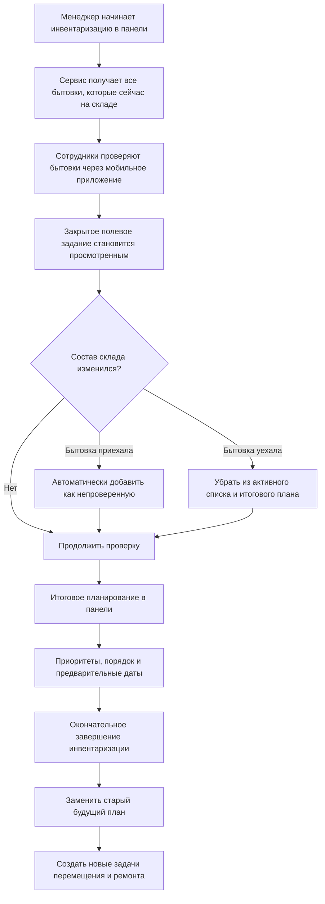

### Шаг 1. Начало

Менеджер выбирает склад и нажимает «Начать инвентаризацию» в панели. В сессию попадают все бытовки, которые в этот момент реально числятся на складе и подходят для инвентаризации.

Почему это важно: панель отвечает за управленческое действие и права доступа, а мобильное приложение остаётся простым рабочим инструментом сотрудника в поле.

### Шаг 2. Полевая проверка

Сотрудник в мобильном приложении:

1. находит бытовку по номеру;
2. если бытовка приехала, но ещё не появилась на экране, повторяет поиск после автоматической синхронизации;
3. проверяет основные параметры;
4. при необходимости исправляет фактические данные;
5. отмечает мебель: что находится в бытовке, что добавлено или убрано;
6. прикладывает фотографии;
7. отмечает необходимые работы;
8. закрывает полевое задание.

После этого бытовка считается просмотренной. Результат сохраняется внутри инвентаризации, но пока не становится заданием на доске ремонтов или перемещений.

### Шаг 3. Бытовки приезжают и уезжают во время работы

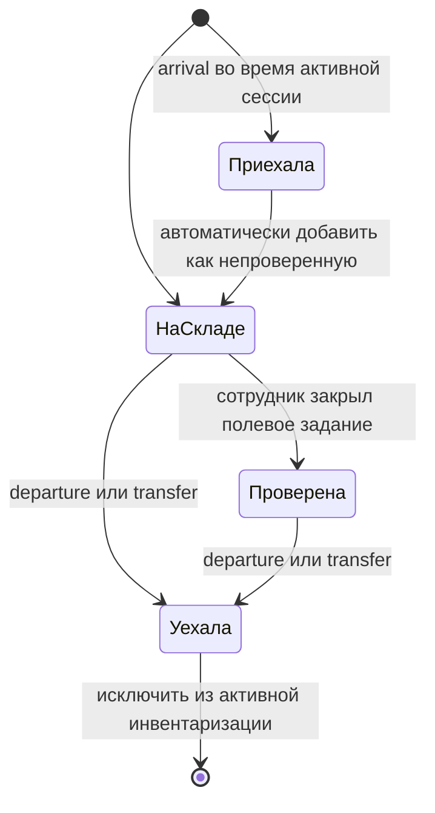

Правила здесь однозначны:

- приехавшая бытовка сразу увеличивает текущий список и требует проверки;
- уехавшая бытовка сразу перестаёт участвовать в прогрессе, статистике, итоговом плане и публикации задач;
- прошлый осмотр уехавшей бытовки остаётся только в журнале событий;
- если бытовка вернулась до завершения, сервис добавляет её новой активной позицией и всегда требует повторный осмотр. Старый осмотр остаётся только в истории.

### Шаг 4. Итоговое планирование перед завершением

Когда полевая работа закончена, менеджер открывает в панели отдельный итоговый экран. На нём показываются **только бытовки, которые всё ещё находятся на этом складе**.

Для каждой бытовки должны быть видны:

- номер и краткие данные;
- проверена она или нет;
- какие работы обнаружены;
- нужно ли перемещение в ремонтную зону;
- приоритет;
- место в общей очереди;
- предварительная дата перемещения;
- предварительная дата начала ремонта;
- существующие незавершённые задачи, которые будут заменены новым планом.

Менеджер может:

- повысить или понизить приоритет;
- перетащить бытовку на другое место в общей очереди;
- назначить конкретную предварительную дату;
- снять или добавить признак отправки в ремонт;
- изменить порядок как в очереди перемещения, так и в очереди ремонта.

### Предварительное распределение по дням

Система должна сама предложить простой начальный план: примерно **по шесть бытовок в день**.

Пример для 14 бытовок:

| День | Предварительный план |
| --- | --- |
| День 1 | первые 6 бытовок по приоритету и очереди |
| День 2 | следующие 6 бытовок |
| День 3 | оставшиеся 2 бытовки |

Это не обещание и не жёсткая бронь. План нужен, чтобы увидеть примерную нагрузку. Очередь может сдвигаться из-за реальной работы, а менеджер может вручную поменять дату, приоритет или позицию.

Для перемещений и ремонтов используются **две отдельные настройки** склада;
начальное значение каждой — 6 бытовок в день. В календаре отдельно выбираются
рабочие дни недели и праздничные даты. Дни без задач ничего не «съедают» и не
требуют отдельного учёта простоя. Все даты рассчитываются в часовом поясе склада.

### Две связанные очереди

После инвентаризации могут появиться два вида будущей работы:

1. **Перемещение в ремонт** — когда бытовку сначала нужно доставить в ремонтную зону или на другой участок.
2. **Сам ремонт** — работы, которые должны появиться на доске ремонтов.

У этих этапов могут быть свои позиции и предварительные даты. Ремонт не должен быть запланирован раньше необходимого перемещения. При этом менеджер должен видеть общий порядок и иметь возможность его скорректировать перед завершением.

Если осмотрена бытовка в статусе `AFTER_RENT`, которая вернулась из аренды и
ждёт решения по замечаниям, итог инвентаризации создаёт **черновую смету**, а не
ремонт и не задачу исполнителю. Дальнейший ремонт начинается только через
существующий процесс согласования сметы.

### Шаг 5. Окончательное завершение

До нажатия «Завершить инвентаризацию» все данные являются черновиком инвентаризации. Внешние доски не меняются.

После подтверждения сервис должен:

1. ещё раз проверить живой состав склада;
2. убрать из итогового списка всё, что успело уехать;
3. потребовать повторного просмотра плана, если состав изменился;
4. зафиксировать итоговую статистику;
5. сохранить утверждённые позиции, приоритеты и предварительные даты;
6. заменить старый будущий план по затронутым бытовкам;
7. создать новые задачи перемещения и ремонта;
8. показать результат по каждой бытовке: создано, заменено, конфликт или временная ошибка.

При найденной старой записи менеджер заранее выбирает один из двух вариантов:

- **замена** — выбранная незапущенная запись уходит из активной очереди, новый итог становится единственным активным результатом;
- **ручное слияние** — менеджер сначала собирает полный объединённый состав работ, затем старая запись сохраняется в истории, а в очередь попадает один новый результат.

Если выбранная ремонтная работа **уже началась**, её не заменяют и не
останавливают. Для неё действует отдельное автоматическое слияние:

1. текущая работа продолжает выполняться без изменения;
2. сервис сравнивает результат инвентаризации с работами и материалами текущего
   задания;
3. совпадающие позиции исключаются из нового задания, потому что они уже
   выполняются;
4. оставшийся объём сохраняется как следующая работа, связанная с текущей
   отношением «выполнить после»;
5. следующая работа не передаётся исполнителям раньше подтверждённого завершения
   текущей;
6. если после вычитания ничего не осталось, новое задание не создаётся.

Это правило одинаково для обычного и капитального ремонта. Уже начавшееся или
завершённое перемещение также остаётся фактом и не создаётся повторно;
компенсировать можно только ещё не начатое будущее действие.

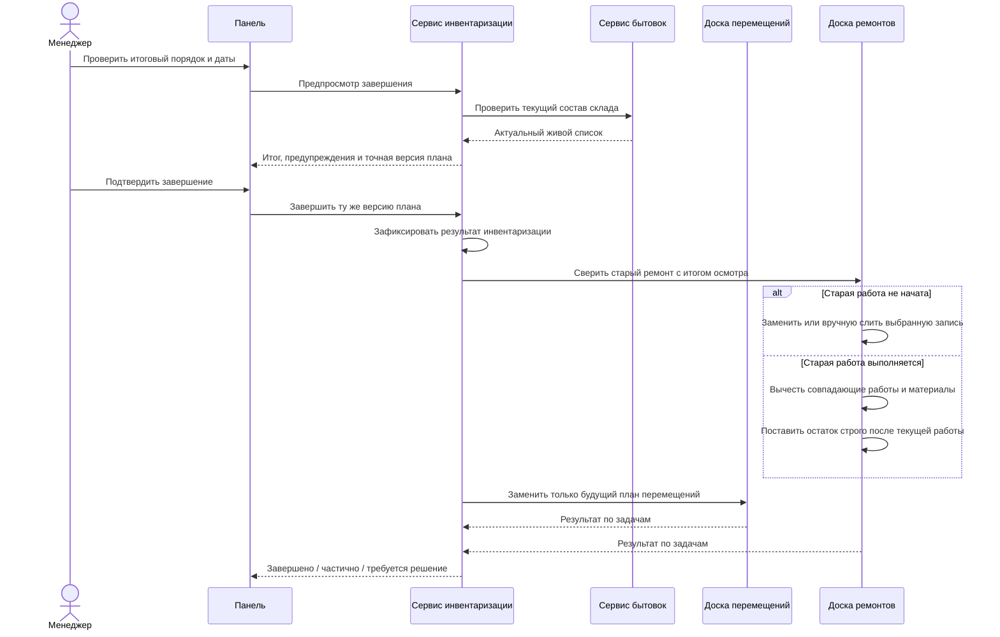

### Что значит «старые задачи удаляются»

Итог инвентаризации становится новым источником правды для **будущей незавершённой работы** по затронутым бытовкам.

Безопасная трактовка замены:

- старые ожидающие и запланированные задачи убираются с активных досок как устаревшие;
- вместо них создаются задачи из нового итогового плана;
- выполненная история не удаляется;
- начатая работа не удаляется и не переписывается: из нового плана вычитаются
  уже выполняемые работы и материалы, а остаток становится её преемником;
- выполненное или начатое перемещение сохраняется, поэтому повторная доставка
  той же бытовки не создаётся;
- каждая новая задача хранит ссылку на инвентаризацию и её итоговую версию, чтобы повтор команды не создавал дубликаты.

То есть для пользователя старые данные исчезают из текущей очереди, но в техническом журнале остаётся запись: что было заменено, когда и какой инвентаризацией. Это нужно для разбора ошибок и ответственности.

### Простая аналогия с Git: четыре действия при сверке

Пользовательская аналогия с Git хорошо описывает нужное поведение, если помнить:
реальные начатые действия нельзя «откатить» одной записью в базе.

| Действие | Что видит менеджер | Что система делает безопасно |
| --- | --- | --- |
| Удалить | Старая будущая задача исчезает с активной доски | Только ещё не начатая задача помечается отменённой или заменённой. История физически не удаляется |
| Объединить | Выбирается один общий состав работ и материалов | Для незапущенной работы менеджер вручную подтверждает итоговый объединённый состав; в активной очереди остаётся ровно один результат |
| Вычесть | Из нового задания пропадают уже выполняемые позиции | Если работа началась, система сравнивает и работы, и материалы, вычитает точные совпадения и ставит только остаток следом за текущим заданием |
| Заменить | Новый результат инвентаризации занимает место старого | Сначала атомарно доказывается, что физическая работа и перемещение не начались; затем компенсируются ожидающие задачи, место и аренда ресурса, старая запись уходит в историю, создаётся новая |

Эти правила одинаково защищают обычный ремонт, ремонт с доставкой в ремонтную
зону и капитальный ремонт. Если доставка уже выполнена, её не повторяют: факт
перемещения и занятое место ремонта переносятся на новый результат. Если
перемещение или ремонт уже начались, замена запрещается, но остаток работ и
материалов не теряется — он становится заданием-преемником.

### Что меняется в выводах аудита

После этого уточнения несколько вопросов больше не являются открытыми:

1. **Нужна live membership модель.** Текущий сервис ошибается, когда оставляет уехавшую бытовку активной. Исправление — действительно деактивировать её и исключать из всех итоговых расчётов.
2. **Android не нужен полный lifecycle.** Из приложения нужно убрать начало и окончательное завершение инвентаризации. Оно закрывает только конкретную полевую проверку.
3. **Ранние Android-задачи недопустимы.** Мобильное приложение сейчас способно запускать отдельную furniture/logistics цепочку; её нужно удалить. До общего завершения доски не меняются.
4. **Нужен отдельный итоговый план.** Сейчас приоритет, перемещение и дата задаются внутри отдельных осмотров. Требуется один общий экран со всеми бытовками, общей очередью и распределением примерно по шесть в день.
5. **Нужна операция замены, а не набор несвязанных добавлений.** Текущая публикация по отдельным findings не описывает полную замену старых задач на досках.
6. **Изменение состава делает план устаревшим.** Если бытовка приехала или уехала после открытия итогового экрана, завершение должно остановиться и показать обновлённый список.

### Минимальные сценарии приёмки

| Сценарий | Ожидаемый результат |
| --- | --- |
| Инвентаризацию начинают с телефона | Действие отсутствует или запрещено; начало доступно только в панели |
| Бытовка приехала во время активной сессии | Автоматически появилась как непроверенная |
| Уже проверенная бытовка уехала | Исчезла из active list, statistics и final plan; осталась в журнале |
| Полевое задание закрыто | Бытовка стала просмотренной; на внешних досках ничего не появилось |
| 14 бытовок требуют ремонта | Предложено распределение 6 + 6 + 2 с возможностью ручного изменения |
| Менеджер поменял приоритет и дату | Итоговый preview и создаваемые задачи используют именно этот порядок |
| Состав изменился после preview | Завершение отклонено; показан новый список и требуется повторное подтверждение |
| У бытовки были старые ожидающие задачи | Они помечены заменёнными и исчезли с active board; создан новый план |
| У бытовки есть уже начатая задача | Она продолжается; совпадающие строки вычтены, остаток поставлен следом; при пустом остатке дубль не создан |
| Повтор запроса после потери ответа | Новые задачи не дублируются, возвращается результат той же операции |

### План работ с учётом уточнённой логики

1. **Привести живой состав в порядок.** Уехавшая бытовка деактивируется, приехавшая добавляется; progress/statistics/final plan считают только текущий склад.
2. **Упростить мобильное приложение.** Оставить поиск, добавление, фактические параметры, мебель, фото, работы и закрытие одного полевого задания. Удалить начало/общее завершение и раннюю отправку задач.
3. **Добавить серверный итоговый план.** Он хранит порядок, приоритет, необходимость перемещения и предварительные даты отдельно от отдельных UI-экранов.
4. **Сделать общий экран планирования в панели.** Полный список, drag-and-drop позиции, приоритеты, даты и автоматическая раскладка по шесть в день.
5. **Добавить server-owned замену будущих задач.** Inventory передаёт владельцам досок полное желаемое состояние, а они идемпотентно supersede старый незавершённый план и создают новый.
6. **Добавить преемника начатой работы.** Maintenance вычитает доказанные
   совпадения, хранит явную связь с текущим ремонтом и публикует остаток только
   после факта его завершения.
7. **Добавить восстановление и понятные ошибки.** Частичная недоступность одной доски не теряет завершённую инвентаризацию; менеджер видит, что применено, что будет повторено и где нужен конфликтный разбор.
8. **После этого закрыть migration и performance defects** из подробного аудита ниже.

### Какие решения уже зафиксированы

- мощности перемещений и ремонтов задаются отдельно, по умолчанию по 6 в день;
- рабочие дни и праздники настраиваются календарём, пустые дни отдельно не учитываются;
- возврат бытовки всегда создаёт обязанность нового осмотра;
- совпадение со старой записью решается явной заменой выбранной записи либо ручным слиянием;
- `movementToShipment` не является настройкой инвентаризации: обратная доставка остаётся частью общего ремонтно-логистического цикла;
- начатая работа сохраняется, а итог инвентаризации становится следующим
  заданием только в оставшейся части;
- для обычного ремонта, ремонта с перемещением и капитального ремонта одинаково
  сохраняются уже наступившие факты; отменять разрешено только будущие эффекты.

Техническая готовность компенсации ожидающих логистических эффектов и строгой
связи «после текущей работы» отдельно проверяется в `INV-068`: бизнес-решение
уже принято, поэтому fail-closed блокировка не считается конечной реализацией.

## 1. Резюме тимлида

Блок инвентаризации уже не является браузерным mock-flow: основной panel ходит через same-origin gateway в `inventory-service`, сервер владеет сессией, результатами осмотра, frozen-планами, статистикой, публикацией и furniture reconciliation. В сервисе есть серьёзная база для надёжного решения: Flyway + `ddl-auto=validate`, серверная авторизация, durable idempotency, stable asset capture, optimistic concurrency, transactional outbox/inbox, свежая валидация перед завершением и независимые publication intents.

Тем не менее **текущее состояние нельзя выпускать в production**. Причина не в стиле кода, а в нескольких сценариях потери или неверной интерпретации данных:

1. OpenAPI и AsyncAPI обещают живой состав инвентаризации, но выбывшие/переведённые бытовки остаются `membership_active=true`; одна бытовка может одновременно оставаться активной в двух складских сессиях.
2. Незавершённое удаление `movementToShipment` не имеет новой Flyway-миграции и versioned compatibility. Существующие frozen snapshots V12 будут отвергаться при публикации в maintenance.
3. Panel способен обойти optimistic lock: polling получает новую finding revision, а старый локальный draft сохраняется уже с этой новой ревизией и затирает чужое изменение.
4. Каталог ремонтных работ для inventory выбирается через глобальный `localStorage` и кеш без `warehouseId`, поэтому сессия склада B может получить каталог склада A.
5. Незавершённый UI-refactor не round-trip-ит существующий `MANUAL` frozen plan и способен преобразовать/разрушить его при обычном повторном сохранении.
6. Android manager хранит единую background queue без subject/account; операция пользователя A может возобновиться с токеном пользователя B.
7. Android manager пытается управлять всей сессией и завершать её, хотя по уточнённой бизнес-роли он должен закрывать только проверку одной бытовки; одновременно приложение запускает преждевременную client-owned furniture/logistics saga.
8. Scheduler восстановления публикаций создаёт невалидного service actor и падает до обработки первого подходящего `PENDING` intent.
9. `PENDING` publication attempt не коммитится до внешнего maintenance-вызова: remote effect и локальный recovery state разделены crash-window.
10. В текущей модели нет общего итогового плана со всеми оставшимися на складе бытовками, единой очередью, приоритетами, двумя предварительными датами и начальной раскладкой примерно по шесть бытовок в день.
11. Нет server-owned операции, которая после завершения инвентаризации заменяет старую будущую работу на всех затронутых досках и отдельно обрабатывает уже начатые задания.

### Решение о готовности

| Область | Оценка | Решение |
| --- | --- | --- |
| Доменная семантика состава | Красная | Продуктовое решение принято: нужен живой состав; contract/code/tests требуется привести к нему |
| Сохранность frozen-планов | Красная | Нужна versioned expand/contract миграция до продолжения dirty-refactor |
| Web concurrency и warehouse isolation | Красная | Нельзя выпускать до regression tests и исправления |
| Android field flow | Красная | Клиент должен закрывать только одну полевую проверку, но сейчас содержит команды общего lifecycle и ранние side effects |
| Итоговое планирование и замена досок | Красная | Требуемого общего плана и атомарно наблюдаемой замены будущей работы сейчас нет |
| Серверная транзакционность и recovery | Красная | Durable-модель задумана правильно, но фактический recovery сломан и remote I/O выполняется до commit attempt |
| Контракты и документация | Жёлтая | Формально подробные, но расходятся с реализацией и текущей стадией |
| Автотесты | Жёлтая | Фокусные suites зелёные, но не покрывают главные найденные сценарии |

**Итоговый verdict: `NO-GO` для production.** Сначала должны быть закрыты все Critical findings: `INV-001`–`INV-008`, `INV-013`, `INV-014`, `INV-059` и `INV-060`. Зелёные текущие тесты не меняют verdict: они закрепляют часть устаревшей семантики и не воспроизводят критические cross-layer сценарии.

> Это решение относится к исходному срезу до реализации этапов 1–4. Что именно
> исправлено после аудита, какие проверки выполнены и какие ограничения остались,
> зафиксировано в разделе 15; исторический вывод выше намеренно не переписан
> задним числом.

## 2. Границы, исходные данные и методика

### 2.1. Что проверено

- canonical REST contract: `contracts/openapi/inventory-service.yaml`;
- inventory/event contracts и потребители: `contracts/events/inventory-events.yaml`, asset/media schemas, dossier consumers;
- `services/inventory-service/**`: API, security, domain/JPA, application workflows, repositories, dependency gateway, outbox/inbox/DLT, scheduled recovery;
- все inventory Flyway migrations `V1`–`V13`;
- inventory boundaries в `asset-service`, `maintenance-service`, `media-service`, `warehouse-service`, `task-board-service`, `logistics-service` и gateway;
- `panel/src/features/inventory/**`, sidebar/routes, shared repair catalog/completion dialog, media и API client;
- Android manager app: inventory network DTO/API, ViewModel/UI, media/background upload и logout/login lifecycle;
- актуальные и исторические планы, особенно:
  - `docs/plans/20260717-inventory-service-contract.md`;
  - `docs/plans/20260717-inventory-service-implementation.md`;
  - `docs/plans/20260718-panel-mocks-to-services-transition.md`;
- тесты и тестовые пробелы по panel, inventory-service, maintenance boundary и Android.

### 2.2. Как учитывались незавершённые изменения

Аудит сделан по dirty working tree, а не только по `HEAD`. На момент среза во всём репозитории было **201 modified** и **16 untracked** файлов. В inventory/app/maintenance-related выборке — 56 изменённых tracked-файлов, около `+886/-603`. Это параллельная работа пользователя/других процессов; она не откатывалась и не «очищалась».

Inventory-related dirty change состоит из двух основных частей:

- добавлен `GET /api/inventory/v1/sessions/{inventoryId}/statistics-preview` и подключён panel;
- удаляется `movementToShipment` из OpenAPI, Java/Kotlin/TypeScript и maintenance/logistics boundaries.

Вторая часть **не завершена как schema/history migration**: inventory V12 и maintenance V27 продолжают хранить и хешировать это поле; новых совместимых миграций нет. Поэтому в findings отдельно различаются дефекты существующей архитектуры и regressions незавершённого diff.

### 2.3. Шкала серьёзности

| Уровень | Значение |
| --- | --- |
| Critical / P0 | Возможна потеря/подмена данных, нарушение warehouse/account isolation или невозможен canonical end-to-end flow; release blocker |
| High / P1 | Реальный operational failure, dead end, ambiguous outcome или серьёзное масштабирование; исправить до широкого использования |
| Medium / P2 | Contract/UX/observability/maintainability gap; планировать сразу после P0/P1 |
| Low / P3 | Локальная несогласованность или качество реализации без немедленной угрозы данным |

Всего зафиксировано **60 findings**: 12 Critical, 32 High, 14 Medium и 2 Low. Первые 45, а также новые продуктовые разрывы `INV-059` и `INV-060`, разобраны отдельно с evidence/impact/fix/acceptance criteria; `INV-046`–`INV-058` сведены в таблицу технического долга.

## 3. Карта архитектуры и владельцы данных

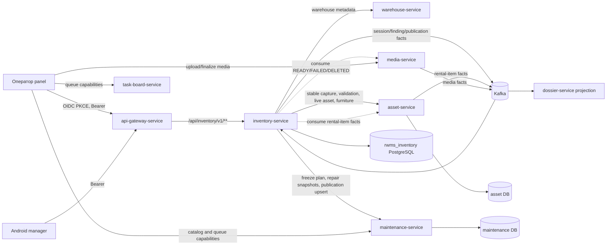

### 3.1. Фактическая ответственность компонентов

| Компонент | Что делает в inventory flow | Чего делать не должен |
| --- | --- | --- |
| `inventory-service` | Сессия, findings, review stages, frozen statistics, publication/furniture intents, audit facts | Не владеет asset, media bytes, repair aggregate или task queues |
| `asset-service` | Stable capture, номер/asset truth, current validation, furniture snapshot и absolute reconciliation | Не завершает inventory session |
| `maintenance-service` | Валидирует/замораживает repair plan, отдаёт repair snapshot, идемпотентно создаёт/обновляет repair source | Не владеет inventory finding lifecycle |
| `media-service` | Upload/finalize/transform и owner facts | Не решает, какие media входят в frozen inspection |
| `task-board-service` | Queue capabilities и downstream work queues | Не является inventory store |
| `panel` | Показывает серверное состояние и отправляет команды | Не должен владеть business date, totals, saga, warehouse truth или conflict resolution |
| Android manager | Поиск/добавление бытовки, фактическая проверка, мебель, фото, работы и закрытие одного полевого задания | Не начинает и не завершает общую сессию, не планирует очередь и не создаёт ранние board-задачи |

### 3.2. Публичная и внутренняя сеть

Browser path построен правильно: `panel/src/lib/gateway-config.ts` формирует same-origin `/api/inventory`, а gateway маршрутизирует `/api/inventory/**` и блокирует `/internal/**` и `/private/**`. Inventory-service обращается к владельцам данных только через private routes и service credentials:

| Зависимость | Внутренние операции inventory-service |
| --- | --- |
| warehouse | metadata для конкретного склада |
| asset | capture create/page/release, number resolution, current asset, source create, bulk validation, furniture snapshot/reconcile |
| maintenance | repair snapshots, plan freeze, inventory-source repair upsert |

Прямых service origins или mock fallback в production inventory panel flow не найдено.

## 4. Фактическая модель данных

Ниже показана упрощённая модель; технические inbox/outbox/idempotency таблицы вынесены в отдельный блок.

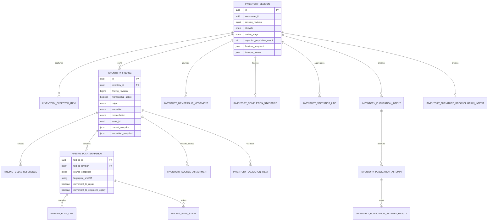

Техническая надёжность хранится рядом, но отдельно от business aggregates:

- `inventory_start_operation`, `inventory_start_capture_attempt/result`, `inventory_capture_release`;
- `inventory_idempotency_record`;
- `domain_event`, `event_stream_head`, `aggregate_snapshot`, `outbox_event`;
- `inbox_message`, `consumer_aggregate_checkpoint`, `version_gap_quarantine`, `sanitized_dead_letter`;
- `inventory_media_fact_projection`.

## 5. Жизненный цикл: от начала до конца

### 5.1. Текущие состояния сессии и review stages

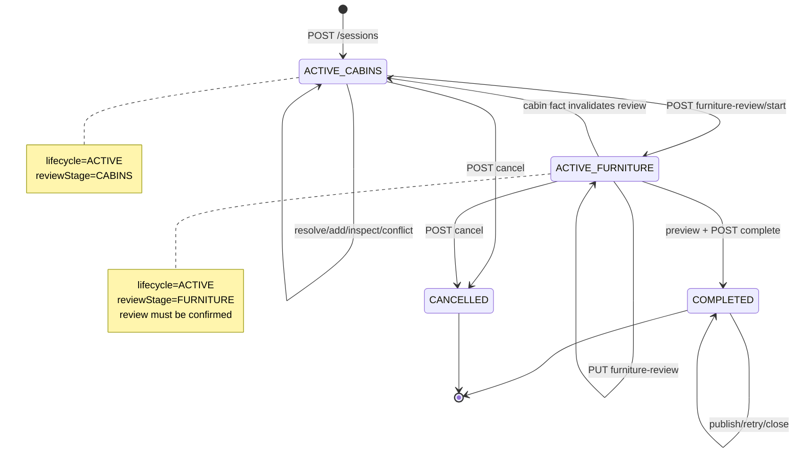

Так сейчас устроен сервер: сессия имеет три terminal/lifecycle состояния `ACTIVE`, `COMPLETED`, `CANCELLED`, а внутри `ACTIVE` есть переход `CABINS → FURNITURE`. Сохранение осмотра или разрешение конфликта в furniture stage откатывает review в `CABINS`. Завершение необратимо. Публикация repair plans и применение furniture balance происходят после локального завершения и имеют собственные durable states.

Это описание фактического кода, а не окончательная продуктовая схема. По уточнённой роли мобильное приложение не управляет этими стадиями целиком: оно редактирует факты и мебель одной бытовки и закрывает только её полевую проверку. Начало сессии, общий итоговый review, планирование и завершение принадлежат панели.

### 5.2. Старт инвентаризации

Текущая последовательность:

1. Клиент отправляет `POST /sessions` с `warehouseId` и `Idempotency-Key`.
2. Сервер проверяет USER + `rwms.write` + warehouse `EDIT`.
3. Durable idempotency связывает subject, operation name, key и canonical request hash.
4. Inventory получает warehouse metadata и IANA timezone.
5. Inventory резервирует durable start operation и запрашивает в asset-service stable capture.
6. Capture читается страницами по 200; каждая страница проверяется по capture identity/order/digest.
7. В одной локальной транзакции создаются session, expected items, findings и initial domain/outbox facts.
8. После commit capture освобождается; отдельный scheduler повторяет release после сбоя.

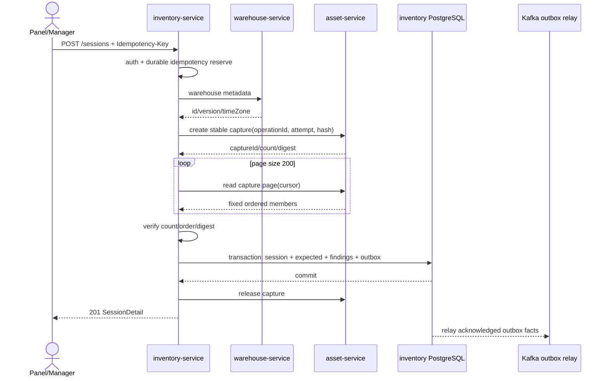

Сильные стороны: no-partial-session commit, unique one-active-session invariant, stable capture, durable attempt/release recovery. Узкое место: весь capture сначала собирается в память и затем записывается большим количеством row-by-row операций в одной транзакции; см. `INV-025`.

### 5.3. Состав сессии и asset events

После старта inventory consume-ит rental-item facts. Event является invalidation: сервис повторно читает current asset из asset-service и обновляет snapshot. При появлении eligible asset в складе создаётся finding/expected item и movement `ARRIVED`; при уходе записывается `DEPARTED`/transfer journal.

Здесь находится главный semantic defect: при уходе `changeMembership(false)` не вызывается. Finding остаётся активным, а expected count не уменьшается. Это расходится с OpenAPI/AsyncAPI и подробно разобрано в `INV-001`.

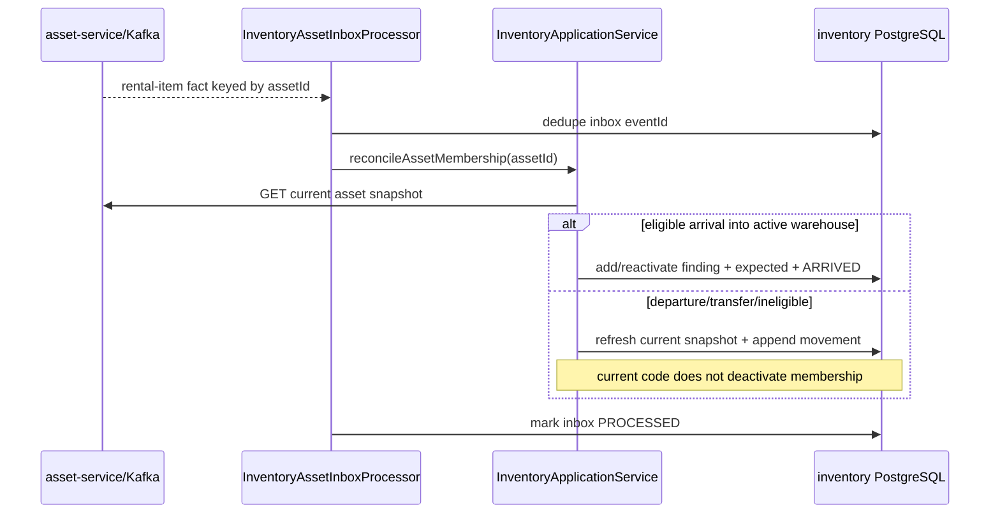

### 5.4. Поиск номера, найденная и новая бытовка

`POST /number-resolutions` выполняет глобальное server-side разрешение identity match key:

- уже известный finding возвращается с текущей validation projection;
- найденный существующий asset создаёт `UNEXPECTED_EXISTING` finding;
- неизвестный номер возвращает `NOT_FOUND`, после чего client может вызвать durable `POST /findings/{id}/assets` и создать asset с permanent source identity `inventoryId:findingId`;
- cross-warehouse и excluded status должны давать конфликт без перемещения/дублирования.

Фактическая eligibility-проверка расходится с capture policy: код исключает только `WRITTEN_OFF`, но пропускает `RENTED`, `WAITING_ESTIMATE_CONFIRMATION` и `IN_TRANSFER`; см. `INV-009`.

### 5.5. Осмотр finding

Для каждого finding оператор сохраняет `READY` либо `WORK_STAGED`:

- сервер сравнивает session/finding revisions;
- получает свежую asset validation и maintenance repair snapshots;
- проверяет passport/equipment observations;
- проверяет media ownership, generation и `READY` projection;
- для `WORK_STAGED` отправляет plan selection в maintenance-service;
- maintenance валидирует catalog/routing и возвращает immutable frozen snapshot + SHA-256;
- inventory сохраняет snapshot/lines/stages/media и fingerprint в своей транзакции;
- finding/session facts попадают в outbox.

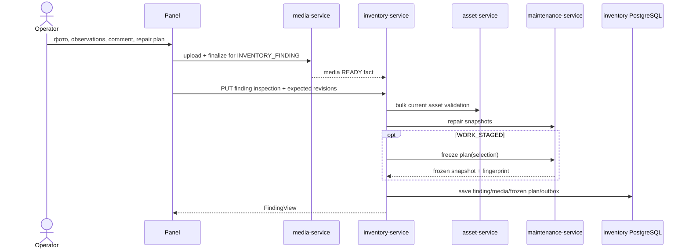

### 5.6. Конфликты реестра

После осмотра сервер сравнивает immutable inspection baseline с current asset/maintenance truth. Поддержаны два решения:

- `ACCEPT_REGISTRY`: принять текущий реестр как новую baseline; ранее staged work не публикуется автоматически;
- `KEEP_INSPECTION`: сохранить осмотр, обязательна reason; решение привязано к exact semantic fingerprint текущего реестра.

Любое новое semantic change делает решение устаревшим. Это хорошая модель, но panel сейчас способен подменить исходную finding revision свежей после polling (`INV-003`).

### 5.7. Предварительная статистика

Dirty change добавляет read-only `statistics-preview` в stage `CABINS`. Он считает counters/money только по persisted active findings/frozen plan lines, не делает fresh asset validation, не создаёт validation snapshot и не меняет состояние. Это правильное разделение «оперативного экрана» и formal completion preview.

Проблемы находятся в presentation и scalability:

- panel иногда подменяет официальный результат browser-derived counters;
- названия catalog aggregate lines не заморожены надёжно;
- summary endpoints делают N+1 и допускают unbounded period;
- panel dedicated statistics endpoints фактически не использует.

### 5.8. Furniture review

Переход в furniture stage:

1. `POST furniture-review/start` получает полный revision vector и explicit acknowledgement только для `MISSING`/`NOT_INSPECTED`.
2. Asset-service возвращает frozen furniture snapshot по physical cabin subset.
3. `PUT furniture-review` обязан содержать абсолютное количество по каждому equipment item, stock и каждой cabin.
4. Inventory сохраняет observations и canonical review hash.
5. Completion повторно получает fresh snapshot и требует exact hash equality.

Это серверно-владеемый barrier текущей реализации. Android manager его не реализует, но после продуктового уточнения это не причина добавлять в телефон общий этап завершения. Нужно переразложить контракт так, чтобы мобильный клиент сохранял мебель конкретной бытовки, а общий furniture/result barrier подтверждался в панели перед окончательным завершением. Asset membership event при этом всё равно не инвалидирует уже подтверждённый review (`INV-011`).

### 5.9. Completion preview и завершение

Formal completion состоит из двух отдельных команд:

1. `POST completion-preview` с exact session/finding revision vector:
   - fresh asset validation;
   - current maintenance repair truth;
   - risks;
   - проверка confirmed/current furniture review;
   - exact server-owned statistics;
   - canonical acknowledgement hash;
   - persisted validation snapshot.
2. `POST complete`:
   - повторяет fresh validation;
   - требует тот же validation/acknowledgement и semantic truth;
   - разрешает только явно принятые `MISSING`/`NOT_INSPECTED` risks;
   - локально фиксирует `COMPLETED`, frozen statistics, publication intents и furniture reconciliation intent;
   - после commit пытается dispatch furniture reconciliation.

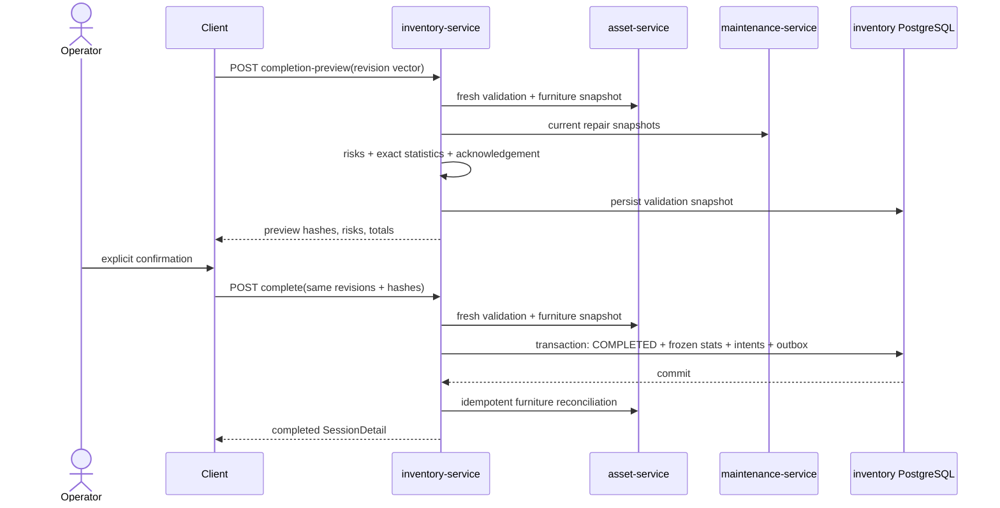

Серверная схема хорошо защищает от stale acknowledgement. Panel, однако, получает preview несколько раз и завершает по последнему невидимому пользователю ответу (`INV-013`).

В целевой бизнес-логике этого preview недостаточно. До него нужен серверный итоговый план: полный живой список бытовок, общий порядок, приоритеты, признаки перемещения, предварительные даты перемещения и ремонта. Команда `complete` должна подтверждать точную версию именно этого плана и только затем запускать замену будущей работы на досках (`INV-059`, `INV-060`).

### 5.10. Furniture reconciliation после completion

Если furniture items есть, inventory создаёт deterministic idempotency key и frozen request body. Состояния: `PENDING → SUCCEEDED` либо `TRANSIENT_FAILED` с scheduled retry; conflict становится `BLOCKED`. Scheduler повторяет только `PENDING`/`TRANSIENT_FAILED`.

`BLOCKED` не имеет ни public retry/reconcile/close endpoint, ни гарантированного automatic recovery. Поскольку session уже `COMPLETED`, это terminal operational dead end (`INV-018`).

### 5.11. Публикация repair plans

Completion только создаёт по-finding intents:

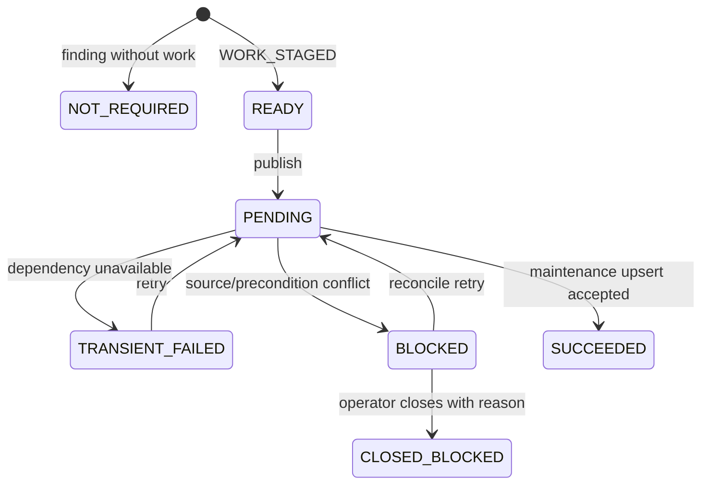

Каждая попытка имеет durable attempt/result ledger и stable `inventoryId:findingId` source. Maintenance upsert получает исходный frozen JSON и fingerprint. Это правильное разделение local completion и downstream side effect.

Текущие проблемы:

- dirty removal `movementToShipment` ломает публикацию старых frozen snapshots (`INV-002`);
- panel не даёт per-finding retry/reconcile/close и теряет `CLOSED_BLOCKED` (`INV-016`);
- API response не возвращает precondition evidence, нужное retry contract (`INV-017`);
- completed async states не обновляются без focus/reload (`INV-019`).

### 5.12. История, статистика и отмена

- `COMPLETED` сессии отдают frozen statistics и immutable findings/publication states.
- `CANCELLED` хранит reason/actor/time и деактивирует media owner proof.
- `/statistics/sessions` и `/statistics/summary` читают только completed sessions.

Panel не реализует cancel command, неверно подписывает cancelled session как завершённую и не может открыть её detail (`INV-015`). History дополнительно превращает один page списка в N detail + все findings (`INV-021`).

## 6. Матрица публичного API и клиентов

| Операция | Серверный доступ | Panel | Android manager | Основной разрыв |
| --- | --- | --- | --- | --- |
| list/start/active/detail | VIEW/EDIT | Есть | Частично | Начало должно остаться только в panel; panel не использует ETag; history N+1 |
| findings list | VIEW | Есть | Есть | Клиенты выкачивают большие наборы |
| statistics-preview | MANAGE | Есть, dirty | Нет | Только panel |
| number resolution | EDIT | Есть | Есть | Status/nullability semantics расходятся |
| create source asset | EDIT | Есть | Есть | Ambiguous post-command refresh/queue |
| save inspection / close field task | EDIT | Есть | Есть частично | Нужна явная семантика «просмотрено» без ранней публикации; Android client saga лишняя |
| conflict resolution | EDIT | Есть, но UI требует MANAGE | Есть | Capability matrix расходится |
| общий furniture review | EDIT/VIEW | Есть | Нет | Это panel barrier; Android должен менять мебель только в рамках одной бытовки |
| completion preview/complete | MANAGE | Есть | Есть, но не должен | Panel multi-preview; из Android общий lifecycle нужно убрать |
| cancel | MANAGE | **Нет** | Нет | Lifecycle реализован только сервером |
| publish all/selected | MANAGE | Только all | Нет | Recovery недоступен |
| publication retry/close | MANAGE | Adapter only, UI нет | Нет | `CLOSED_BLOCKED` теряется |
| statistics page/summary | VIEW | Adapter only, UI нет | Нет | Dead integration + N+1 server |

## 7. Сильные стороны текущего решения

Чтобы remediation не разрушила уже правильные свойства, их нужно зафиксировать явно:

1. **Один owning service и одна БД.** Inventory не создаёт shared tables/foreign keys и не переносит repair/asset ownership к себе.
2. **Stable capture protocol.** Start не создаёт частичную сессию и не доверяет меняющемуся списку asset-service.
3. **Durable idempotency.** Server связывает subject/operation/key/request hash и возвращает `Idempotency-Replayed`.
4. **Optimistic concurrency.** Session, finding и publication имеют независимые revisions; completion использует полный revision vector.
5. **Fresh validation barrier.** Preview и complete не доверяют browser totals и перепроверяют asset/maintenance truth.
6. **Immutable publication source.** Maintenance plan fingerprint и source identity отделены от mutable repair aggregate.
7. **Transactional outbox/inbox.** Facts не отправляются «после commit на удачу»; event IDs дедуплицируются, ошибки sanitised.
8. **Failure isolation.** Kafka/maintenance outage не откатывает уже завершённую локальную инвентаризацию.
9. **Gateway boundary.** Browser не знает private service origins и не ходит в `/api/internal/**`.
10. **Flyway discipline.** `baselineOnMigrate=false`, `ddl-auto=validate`, clean disabled, migrations service-local.

Эти свойства должны стать acceptance criteria при рефакторинге, а не быть заменены browser saga или shared transaction.

## 8. Findings и способы исправления

### INV-001 — Critical — Контракт «живого состава» не соответствует фактической модели

**Факт.** OpenAPI утверждает, что departures/transfers удаляются из active finding set (`contracts/openapi/inventory-service.yaml:123-127`), а AsyncAPI — что population синхронизирован с live warehouse (`contracts/events/inventory-events.yaml:38-45`). Реализация в `InventoryApplicationService.java:526-647` при уходе только обновляет current snapshot и пишет movement. `finding.changeMembership(false)` не вызывается; единственный runtime-вызов `changeMembership` передаёт `true` (`:656-697`). Тест `InventoryReadProjectionIntegrationTest.java:628-834` закрепляет сохранение `membership_active=true` и в source, и в destination session.

Комментарий к furniture scope (`InventoryApplicationService.java:2365-2377`) прямо признаёт фактическую модель: departed finding считается «историческим», но остаётся active и только исключается из furniture subset.

**Последствия.** Термины `active`, `expectedPopulationCount`, `membershipActive` и статистика означают разное в contract, БД и UI. Одна бытовка может находиться в active revision vectors двух складов. Непроверенная выбывшая бытовка не получает registry conflict (`conflictViews` возвращает empty для `NOT_INSPECTED` на `:3318-3324`) и completion разрешает риск `NOT_INSPECTED`; результат способен быть принят как инвентаризация physical warehouse, хотя item уже не в нём.

**Продуктовое решение уже принято:** нужна **true live population**.

**Как исправить.** На departure/transfer/ineligible status деактивировать membership, исключать бытовку из active findings, progress, statistics, furniture scope, итогового плана и публикации. При arrival в активную сессию создавать или реактивировать finding как непроверенный. Immutable start evidence и movement history сохранять отдельно, чтобы уход не стирал факт уже выполненной проверки. Одновременно привести к этой семантике OpenAPI, AsyncAPI, JPA query names, panel labels и tests.

Если бытовка уехала после осмотра, её inspection остаётся в audit journal, но не участвует в результате склада. При возвращении до завершения безопасный default — новый обязательный осмотр; возможность восстановить прежний результат остаётся отдельным продуктовым решением.

**Acceptance criteria.** Тесты start → arrival, transfer A→B, departure to excluded status, departure after inspection, return, duplicate delivery и completion подтверждают live-модель; уехавшая бытовка отсутствует во всех активных расчётах и итоговых board-командах, но её история не потеряна.

### INV-002 — Critical — Dirty removal `movementToShipment` ломает исторические frozen snapshots

**Факт.** Незавершённый diff удаляет поле из inventory/maintenance DTO, JPA и OpenAPI. Но inventory V12:

- создаёт `movement_to_shipment` (`V12__canonical_inbound_inventory_movement.sql:4-28`);
- записывает `movementToShipment` в каждый immutable JSON (`:73-149`);
- пересчитывает привязанный fingerprint (`:151-162`).

Maintenance V27 делает то же для своих historical snapshots. Новой inventory/maintenance migration после этого semantic change нет. Untracked logistics V35 меняет task kind, но не мигрирует source JSON/hashes.

Inventory при publication отправляет raw stored snapshot и старый fingerprint (`InventoryApplicationService.java:3973-3989`). Maintenance десериализует его в новую typed model без поля, снова сериализует и требует exact JSON/hash equality (`InventoryMaintenanceService.java:545-557`). Даже если неизвестное поле будет проигнорировано parser-ом, повторно сериализованный JSON уже другой, и source будет отвергнут.

**Последствия.** Ранее сохранённый `WORK_STAGED` finding может стать навсегда непубликуемым; replay/идемпотентный повтор может давать conflict. Это нарушение заявленной неизменяемости evidence и upgrade safety.

**Как исправить.** До удаления runtime-поля:

1. утвердить таблицу преобразования четырёх старых комбинаций `(movementToRepair, movementToShipment)`;
2. выбрать versioned snapshot (`schemaVersion`) либо временно сохранить v1 adapter;
3. сделать согласованный expand/contract в inventory и maintenance: новые поля рядом, dual-read одного переходного формата, one-time rewrite только доказанным Flyway;
4. обновить все связанные plan/source/request/idempotency fingerprints атомарно и документировать, почему это допустимое преобразование evidence;
5. только после upgrade tests удалить старые колонки/DTO.

**Acceptance criteria.** Testcontainers upgrade V12→new и V27→new; publication/retry старого active и completed finding; replay старого idempotency record; все четыре комбинации; JPA validate на clean и upgraded schema.

### INV-003 — Critical — Panel обходит optimistic lock и допускает lost update

**Факт.** Draft создаётся из finding только при mount (`panel/.../inventory-pages.tsx:447-452`), а detail poll выполняется каждые 5 секунд (`:627-633`). Component key содержит finding ID, но не revision (`:703-708`), поэтому новый server finding обновляет props/revisions, сохраняя старый local state. Перед `PUT` facade дополнительно загружает свежую session и подставляет свежую finding revision (`inventory-api.ts:334-385`).

**Сценарий.** Оператор A открыл draft. Оператор B сохранил finding. Polling A получил revision B, но draft A остался старым. Save A отправляет новую revision B и успешно перезаписывает данные B — сервер видит корректный optimistic token и не может распознать stale draft.

**Как исправить.** Хранить `baseFindingRevision` вместе с draft и передавать именно его. Не заменять expected finding revision свежим GET. Независимое изменение session membership можно обрабатывать отдельно, но finding conflict обязан открывать compare/reload UI. На refetch с изменившейся revision dirty draft не синхронизировать молча.

**Acceptance criteria.** Двухклиентский test: A/B открыли revision N, B сохранил N+1, A получает polling update и при save получает 409 без потери draft; отдельный test на независимое session revision change.

### INV-004 — Critical — Repair catalog не изолирован по warehouse

**Факт.** Inventory picker/dialog не передаёт `warehouseId` (`inventory-inspection-workspace.tsx:283-293`, `repair-work-completion-dialog.tsx:127-145`). Shared catalog picker использует глобальный query key (`repair-estimate-catalog-picker.tsx:80-90,202-205`), а HTTP client получает warehouse из `window.localStorage` (`http-repair-estimate-catalog-client.ts:9-20`).

**Сценарий.** После переключения склада A→B React Query сохраняет catalog A, а inventory session уже B. В лучшем случае maintenance поздно вернёт 422; в худшем frozen plan получает неверную routing semantics.

**Как исправить.** Передавать authoritative `session.warehouseId` явно через component/client boundary; query key сделать `['estimate-catalog', warehouseId]`; не использовать preference storage как command input; на смене key не показывать предыдущий catalog как текущий.

**Acceptance criteria.** Test двух складов с разными catalog versions: switch не должен переиспользовать cache, request B всегда содержит B, plan A нельзя сохранить в session B.

### INV-005 — Critical — Dirty UI-refactor не сохраняет существующий `MANUAL` plan

**Факт.** Finding с lines открывает completion dialog (`inventory-pages.tsx:537-540`), но dirty call больше не передаёт initial completion mode и исходные stages (`:593-613`). Dialog заново строит plan по текущему operational catalog (`repair-work-completion-dialog.tsx:143-150`) и для непустой estimate возвращает `completionMode: AUTO` (`:451-472`). AUTO mapper отвергает manual lines (`inventory-plan-mapper.ts:119-123`). Diff удалил `initialCompletionMode` и `reconcileInitialPlans`.

**Последствия.** Изменение только comment/photo у старого `MANUAL` finding либо падает, либо превращает его в AUTO, меняет group/order/stages и нарушает immutable publication snapshot.

**Как исправить.** Разделить metadata-only save и explicit plan replacement. Server-issued mode, lines, stages, routing и fingerprint должны round-trip-иться без реконструкции из live catalog. Изменение frozen plan должно быть отдельным осознанным действием с новой finding revision.

**Acceptance criteria.** Regression tests для MANUAL/AUTO, comment-only/media-only save, удалённого/переименованного catalog node и неизменности canonical JSON/fingerprint.

### INV-006 — Critical — Android background queue смешивает учётные записи

**Факт.** `BackgroundUploadOperation` не содержит issuer subject/account (`app/.../BackgroundUploadModels.kt:48-74`), а store один для всего приложения — `filesDir/background-uploads/queue.json` (`BackgroundUploadStore.kt:14-25,98-109`). Logout лишь ставит coordinator на pause (`ManagerViewModel.kt:405-412`); любой следующий `SignedIn` возобновляет очередь (`:383-396`, `BackgroundUploadCoordinator.kt:59-67`). Worker создаёт backend с текущим сохранённым token (`BackgroundUploadWorker.kt:35-47`).

**Сценарий.** A поставил inspection/media в очередь и вышел. B вошёл. WorkManager отправляет payload A под JWT B: получается ложный audit actor, 403 либо изменение данных, доступных B.

**Как исправить.** Каждая операция обязана хранить immutable `issuerSub`, tenant/warehouse scope и command identity; store/cache физически partition по `sub`; worker перед каждым effect сравнивает current JWT subject; logout cancel/purge либо безопасно архивирует только очередь этого subject; чужие операции никогда не «переавторизуются».

**Acceptance criteria.** Instrumented/unit test A → pending → logout → B login → WorkManager wake-up: ни один network effect A не выполнен токеном B; после возвращения A операция восстанавливается с тем же idempotency key.

### INV-007 — Critical — Android manager нарушает границу полевого клиента

**Факт.** Android API и manager реализуют start/session/findings/inspection/conflict/preview/complete (`app/.../RwmsApi.kt:23-89`, `ManagerViewModel.kt:699-744`). При этом приложение не знает общий furniture review и пытается перейти из CABINS прямо к завершению. По уточнённой бизнес-роли телефон вообще не должен начинать или завершать общую сессию: его граница заканчивается сохранением фактов одной бытовки и переводом её в «Просмотрено».

**Последствия.** UI обещает действие, которое не принадлежит мобильному клиенту и не может корректно пройти серверные barriers. Это создаёт второй неполный lifecycle, разные правила в panel и app и риск ранних side effects.

**Как исправить.** Удалить из Android начало сессии, общий preview/complete и управление общей очередью. Оставить поиск/добавление бытовки, фактические параметры, мебель конкретной бытовки, фото, обнаруженные работы, разрешённые конфликты и команду закрытия одного полевого задания. Эта команда меняет только inventory finding на «Просмотрено» и не публикует работу на внешние доски.

**Acceptance criteria.** Contract и emulator/public-gateway сценарий: login → получить активную сессию → найти/добавить бытовку → изменить факты/мебель/фото/работы → закрыть полевое задание → увидеть «Просмотрено». Android не отправляет start/complete и после закрытия на task/repair/logistics boards не появляется ни одной новой задачи; отдельно проверены 401/403/409 и stale revision.

### INV-008 — Critical — Android публикует работу до завершения инвентаризации

**Факт.** Manager после inspection формирует отдельный logistics furniture task (`ManagerViewModel.kt:926-1097`, `BackgroundUploadWorker.kt:284-339`). Этот task не несёт inventory session/finding correlation. Одновременно canonical completion создаёт inventory-owned durable asset reconciliation (`InventoryApplicationService.java:1450-1494,2766-2998`).

**Риски.** Это напрямую нарушает правило «до общего завершения внешние доски не меняются». Logistics task может первым зарезервировать balance и заблокировать server reconciliation; reconciliation может пройти первым, а отложенная app task примениться к устаревшему balance; inspection commit может пройти, task упасть, а единственное saga-state остаться в локальном файле.

**Как исправить.** Удалить per-inspection client saga. Любые repair/movement/task-board effects разрешены только server-owned orchestrator после подтверждения общей финальной версии плана. Android только сохраняет полевой результат и отображает серверный статус.

**Acceptance criteria.** До общей команды completion ни закрытие finding, ни process death/offline retry не создаёт внешнюю задачу. После completion остаётся один server-owned producer с `inventoryId/finalPlanVersion`, повторная доставка безопасна, а каждое применение видно в результате публикации.

### INV-009 — High — Number resolution пропускает статусы вне capture policy

**Факт.** `CAPTURE_STATUSES` исключает `RENTED`, `WRITTEN_OFF`, `WAITING_ESTIMATE_CONFIRMATION`, `IN_TRANSFER` (`InventoryApplicationService.java:130-142`). Но `doResolveNumber` считает excluded только `WRITTEN_OFF` (`:826-877`), а helper повторяет то же (`:3308-3315`). Такой asset становится `UNEXPECTED_EXISTING/MATCHED` и получает `ARRIVED`, хотя stable capture никогда бы его не включил.

**Последствия.** Состав, movement journal и completion statistics зависят от способа появления item: start/event path и ручной scan применяют разные eligibility rules.

**Как исправить.** Вынести одну server-side `InventoryEligibilityPolicy`, используемую capture contract, number resolution, event reconciliation и completion. Outcome должен возвращать точный excluded status/reason, не маскировать всё как written-off.

**Acceptance criteria.** Parameterized tests для каждого `RentalItemStatus` через start capture, scan и Kafka arrival дают одинаковое решение.

### INV-010 — High — Глобальный asset number lookup противоречит warehouse-scoped uniqueness и раскрывает чужие данные

**Факт.** Asset implementation после local lookup делает глобальный `findFirst...OrderByIdAsc` (`InventoryAssetService.java:250-259`), хотя asset OpenAPI обещает warehouse-local resolution (`contracts/openapi/asset-service.yaml:1479-1485`). V9 допускает одинаковые rental numbers в разных складах. Integration test возвращает cross-warehouse snapshot вместе с tenant (`InventoryAssetCaptureSnapshotIntegrationTest.java:151-156`), а inventory OpenAPI, наоборот, рассчитывает на global conflict.

**Последствия.** При законных дублях выбирается произвольный asset; вызывающему складу раскрываются tenant/status/passport другого склада; два canonical contracts расходятся.

**Как исправить.** Основной endpoint сделать строго warehouse-local. Если нужен collision check, создать узкую авторизованную projection `NONE/UNIQUE/AMBIGUOUS` без tenant/passport/details, либо искать только среди warehouse grants subject-а.

**Acceptance criteria.** Два склада с одинаковым номером не раскрывают друг другу данные; ambiguous collision детерминирован; asset/inventory OpenAPI говорят одно и то же.

### INV-011 — High — Asset event не инвалидирует confirmed furniture review

**Факт.** Save inspection и conflict resolution вызывают `invalidateFurnitureReviewAfterCabinChange` (`InventoryApplicationService.java:1147,1209`). `reconcileAssetMembership` меняет session/finding и physical furniture subset, но не вызывает invalidation (`:526-783`). Completion затем получает fresh furniture snapshot и обнаруживает hash mismatch (`:2703-2710`). `startFurnitureReview` отказывает, если review уже confirmed (`:2738-2743`).

**Сценарий.** После confirmed review cabin прибыла/ушла/сменила eligible status. Preview конфликтует как stale, но оператор не всегда может изменить finding, чтобы принудительно вернуться в CABINS. Flow застревает до cancel.

**Как исправить.** В той же транзакции, где membership/current physical scope меняется, сбрасывать review в CABINS и удалять только ещё не завершённый reconciliation intent. Либо добавить explicit `rebase/restart furniture review` command с expected revision. Не сохранять `confirmed=true` для snapshot, заведомо не совпадающего с physical scope.

**Acceptance criteria.** Tests arrival/departure/status/transfer во время draft и confirmed review; UI получает понятный stage transition и сохраняет audit trail.

### INV-012 — High — Android unknown-outcome recovery может принять чужую команду за свою

**Факт.** `inventoryInspectionAlreadySaved` (`BackgroundUploadWorker.kt:533-571`) проверяет рост revision и грубое совпадение count/media/comment. Он не сравнивает exact line/stage IDs, prices, routing, observations, media identities и plan fingerprint.

**Сценарий.** Другое устройство сохраняет похожий payload и повышает revision после network timeout. Worker помечает свою операцию successful и может запустить следующий effect, хотя его request не был применён.

**Как исправить.** Сервер должен отдавать mutation receipt по `Idempotency-Key/operationId` с canonical request SHA и terminal result. Клиент reconciles именно свою operation identity. Полное semantic DTO comparison допустимо только как временный fallback.

**Acceptance criteria.** Concurrency test с двумя payload одинакового размера, но разными line/routing/media facts; операция никогда не получает receipt другой команды.

### INV-013 — Critical — Scheduler recovery публикаций падает до обработки первой записи

**Факт.** `recoverPendingPublications()` создаёт service actor как `new OpaqueActorReference("inventory-service", "SERVICE", "0")` (`InventoryApplicationService.java:3902-3917`). Конструктор требует UUID-shaped `subjectId` и UUID/SHA-shaped `profileRevision` (`platform/technical-contracts/.../OpaqueActorReference.java:8-19`). Исключение возникает до inner `try` с HTTP-вызовом.

**Последствия.** При наличии первой eligible `PENDING` записи scheduler завершает текущий batch: публикация не отправляется, settlement не записывается, все следующие intents остаются зависшими. Текущий module test suite не содержит recovery test и поэтому остаётся зелёным.

**Как исправить.** Использовать стабильный технический UUID и `profileRevision=null` либо валидный opaque revision; обернуть обработку **каждого** intent отдельным `try`, чтобы poison record не останавливал batch; валидировать emitted actor payload канонической event schema.

**Acceptance criteria.** Integration test создаёт минимум две stale `PENDING` записи, запускает scheduler и доказывает recovery обеих; первая deliberately faulty запись не блокирует вторую; actor проходит JSON schema.

### INV-014 — Critical — Publication attempt не коммитится до удалённого side effect

**Факт.** `InventoryIdempotencyService.execute` держит транзакцию и row lock от получения reservation до `command.get()` и сохранения response (`InventoryIdempotencyService.java:106-133`). В `publish` вложенный `TransactionTemplate` имеет propagation `REQUIRED`, поэтому запись `PENDING`/attempt в `dispatchPublication` (`InventoryApplicationService.java:3839-3864`) остаётся частью внешней idempotency-транзакции и не видна recovery до завершения HTTP.

**Сценарий.** Maintenance применил upsert, затем inventory process/transaction упал до commit. Локально нет committed attempt, scheduler не видит работу, а клиент получает ambiguous outcome. Повтор с новым client key особенно опасен. Кроме того, DB connection и locks удерживаются на всём remote I/O.

**Как исправить.** Перейти к короткой трёхфазной state machine:

1. `REQUIRES_NEW`: reserve idempotency + persist `PENDING`/attempt/request SHA;
2. HTTP вне DB transaction;
3. `REQUIRES_NEW`: CAS-settle success/failure и complete operation receipt.

Maintenance source identity и idempotency key должны переживать crash/retry неизменными. Аналогичный transaction audit провести для start/capture, validation/complete и furniture dispatch.

**Acceptance criteria.** Fault injection после remote success, до settlement и после settlement; recovery всегда видит committed attempt; повтор использует тот же key; remote effect ровно один; во время HTTP нет долгой DB transaction/row lock.

### INV-015 — High — Completion сознательно игнорирует asset version, но publication использует старую version как precondition

**Факт.** Semantic validation digest удаляет technical `assetVersion` (`InventoryApplicationService.java:3021-3024,3095-3117`), что закреплено текущим OpenAPI (`inventory-service.yaml:963-969`) и тестами. Утверждённый Stage 7 plan, напротив, требовал stale preview при изменении `{assetId, version, status, warehouseId}`. После completion publication отправляет сохранённую старую `rentalItemVersion` (`InventoryApplicationService.java:3973-3988`), а maintenance использует её как concurrency precondition.

**Последствия.** Между preview и complete может пройти semantic-neutral asset write: completion станет необратимо `COMPLETED`, после чего publication блокируется на старой version. Формально current OpenAPI и код совпадают, но cross-service invariant не совпадает.

**Как исправить.** Либо включить asset version в acknowledgement freshness, либо ввести отдельную `semanticRevision`, одинаково признаваемую asset/inventory/maintenance. Финальную revision/precondition замораживать в completion source, а не брать более старую inspection snapshot.

**Acceptance criteria.** Tests technical-only и semantic changes между preview/complete и между complete/publication; каждый исход заранее определён и одинаково описан обоими контрактами.

### INV-016 — High — Retry start повторно использует уже освобождённый capture

**Факт.** При ошибке `copyCapture` сервис вызывает release (`InventoryApplicationService.java:259-267`). Но `latestCapture()` выбирает запись по состоянию `CAPTURED` и TTL, не учитывая successful release (`InventoryIdempotencyService.java:180-191,323-332`). Следующий публичный retry получает тот же уже освобождённый capture и может падать до его expiry. Существующий test создаёт новый низкоуровневый attempt напрямую и не воспроизводит `application.start` retry.

**Как исправить.** Перед remote release атомарно переводить capture result в `INVALIDATED/RELEASED`; `latestCapture` обязан исключать его. Если release outcome unknown, сохранять отдельное состояние и получать новый technical attempt, не переиспользуя старый ID.

**Acceptance criteria.** Публичный start: page-copy failure → release → retry тем же user idempotency key → новый technical attempt/capture → успешная одна session.

### INV-017 — High — Сервер может создать сессию больше downstream contract limits

**Факт.** Capture copy допускает почти `Integer.MAX_VALUE` (`InventoryApplicationService.java:1726-1793`). Asset validation/furniture contracts ограничивают batch примерно 5000 элементов, но session с 5001+ findings стартует успешно и позднее не проходит furniture/preview. Дополнительно capture дважды материализуется в heap, а expected/findings/events записываются row-by-row одной большой транзакцией.

**Как исправить.** Выбрать и документировать единый maximum supported population во всех contracts. Краткосрочно fail-fast на start до commit; долгосрочно — staged/batched capture import, incremental digest, bulk insert, chunked validation и sparse/paged furniture matrix с общим byte/cell limit.

**Acceptance criteria.** Boundary/load tests `limit-1`, `limit`, `limit+1`; нельзя создать session, которую невозможно завершить; memory/transaction duration измерены на max supported warehouse.

### INV-018 — High — Publication reconcile/retry принимает недоказанный клиентский hash

**Факт.** Retry request содержит `reconcileReason` и `currentPreconditionSha256`, но code лишь проверяет nullability (`InventoryApplicationService.java:1599-1615`). Domain intent сохраняет переданный hash, reason теряется (`InventoryPublicationIntent.java:131-139`); свежие asset/maintenance facts не читаются, владельцу эффекта proof не передаётся.

**Последствия.** Любой синтаксически корректный SHA может перевести `BLOCKED` обратно в `PENDING`; audit не знает, кто и почему счёл conflict устранённым.

**Как исправить.** Определить владельца precondition. Предпочтительно inventory/maintenance preflight возвращает server-calculated current proof и allowed action; retry проверяет его по свежей truth. В attempt ledger сохранить reason, actor, time, old/new proof и reconcile result.

**Acceptance criteria.** Произвольный/stale hash отвергается; correct proof проходит; audit evidence доступно; два concurrent reconcile получают deterministic CAS outcome.

### INV-019 — High — `safePassport` contract шире обязательного asset request

**Факт.** Inventory принимает arbitrary JSON object (`InventoryApiModels.java:39-45`, OpenAPI `:657-667`) и пересылает keys downstream. Asset source-create schema требует конкретные mandatory поля и запрещает additional properties (`contracts/openapi/asset-service.yaml:3251-3271`). Например, `{}` проходит inventory schema и гарантированно не проходит asset.

**Как исправить.** Ввести строгий typed request/allowlist в canonical inventory OpenAPI, согласованный с asset schema; boundary mapper должен явно переносить только разрешённые поля. Ошибка downstream schema — 502/503 contract violation, а не пользовательский 422 без деталей.

**Acceptance criteria.** Generated/schema compatibility test inventory request → exact asset request; missing/extra field отлавливается на публичной границе до remote mutation.

### INV-020 — High — Missing completed statistics маскируются нулевым результатом

**Факт.** Для `COMPLETED` `readStatistics` возвращает `zeroStatistics()`, если header отсутствует (`InventoryApplicationService.java:4653-4676`). Session detail тем самым не отличает реальную пустую инвентаризацию от corruption/partial migration.

**Как исправить.** Утвердить invariant `COMPLETED ⇒ exactly one statistics header`; при нарушении fail closed с stable problem code/correlation и operational alert. Добавить integrity check/readiness metric и repair procedure, но не генерировать нули автоматически.

**Acceptance criteria.** Corruption test удаляет statistics header и получает explicit integrity failure; штатная пустая session имеет физически сохранённую zero-statistics строку.

### INV-021 — High — Server statistics реализованы как N+1 и unbounded summary

**Факт.** Page до 200 sessions вызывает отдельные header/line reads; summary сначала получает все matching IDs, затем `readStatistics` и ещё раз lines на каждый ID (`InventoryApplicationService.java:1655-1723,4653-4696,4731-4742`). Односторонние/no-date ranges не ограничены.

**Как исправить.** Использовать DB aggregate/projection queries и одну bulk lines выборку; потребовать bounded date range либо безопасный default horizon; summary для больших периодов сделать asynchronous/export только при прямом решении продукта.

**Acceptance criteria.** Query-count test остаётся O(1)/bounded при росте N; hard max range; explain/analyze и latency budget на production-like dataset.

### INV-022 — High — Outbox retry и throughput расходятся с event contract

**Факт.** Контракт описывает transient attempts `1s/2s/4s` и sanitized DLT (`contracts/events/inventory-events.yaml:47-53`). Реализация повторяет indefinitely с cap 64 seconds; раннее событие блокирует последующие aggregate versions. Relay берёт по одной записи за tick. Start на 200 assets создаёт более 400 finding/owner facts — минимум несколько минут backlog даже при здоровом Kafka.

**Как исправить.** Либо реализовать bounded attempts→DLT/reconciliation, либо официально изменить contract на infinite durable retry. Relay должен batch-drain с сохранением per-aggregate order; нужны backlog count/oldest age/error metrics и load/backpressure tests.

**Acceptance criteria.** Доказанный throughput для max start; poison event не блокирует несвязанные aggregates; поведение после max attempts соответствует AsyncAPI.

### INV-023 — High — Обязательный architecture gate уже красный

**Факт.** Запущенный `InventorySourcePolicyTest` дал **7 tests, 1 failure**. Platform allowlist разрешает шесть low-level SQL adapters, а current service дополнительно использует JDBC в:

- `InventoryAssetInboxProcessor.java`;
- `InventoryAssetRetryStore.java`;
- `InventoryFrozenPlanFingerprint.java`.

Module-local policy разрешает их, platform policy — нет. XML evidence: `platform/architecture-tests/build/test-results/test/TEST-dev.buhanzaz.rwms.architecture.InventorySourcePolicyTest.xml`.

**Как исправить.** Оставить один authoritative policy. Либо вынести SQL в утверждённые technical adapters, либо осознанно расширить общий allowlist и архитектурную документацию; локальная policy не должна расходиться с platform gate.

**Acceptance criteria.** Общий architecture suite зелёный; новый неразрешённый JDBC caller снова делает gate красным; implementation claims обновлены фактическим результатом.

### INV-024 — High — Panel завершает по preview, которого оператор не видел

**Факт.** Первый preview автоматически загружается query (`inventory-pages.tsx:901-922`), второй запрашивается по click (`:1001-1006`), а `completeInventory` внутри facade делает третий preview (`inventory-api.ts:483-536`). Complete получает hashes последнего невидимого response.

**Последствия.** Пользователь подтверждает одни risks/totals, а server acknowledgement относится к другому snapshot. Лишние preview также повторяют bulk validation/repair/furniture calls и создают новые idempotency records.

**Как исправить.** Хранить raw preview DTO как review artifact, показать все его risks/statistics и передать **его же** hashes/revisions в complete. Если refresh меняет snapshot, вернуть оператора на review и потребовать новое подтверждение.

**Acceptance criteria.** Один explicit preview на одно подтверждение; complete payload равен показанному DTO; stale preview даёт понятный 409 и не auto-confirms fresh data.

### INV-025 — High — Panel всегда отправляет passport/equipment observations как `ABSENT`

**Факт.** Contract различает `ABSENT`, `EXPLICIT_EMPTY`, `PRESENT` (`inventory-service.yaml:668-710,838-885`). Adapter всегда формирует обе observations как `ABSENT` (`http-inventory-adapter.ts:211-222`); UI не показывает эти поля и presentation model их не хранит.

**Последствия.** Finding становится `READY/WORK_STAGED` без факта физической проверки. Повторное metadata-save стирает ранее сохранённые observation semantics.

**Как исправить.** В UI model и форме хранить/показывать три состояния: «не проверено», «проверено пусто», «фактические данные». Metadata-only save round-trip-ит предыдущий value, а не подставляет default.

**Acceptance criteria.** Contract/UI tests каждого discriminator; repeat save comment-only не меняет observation JSON/fingerprint.

### INV-026 — High — Client idempotency key не переживает повтор user intent

**Факт.** `commandKey()` каждый раз создаёт UUID (`inventory-api.ts:80-82`) и вызывается внутри start/resolve/create/review/preview/complete/publication. При timeout manual retry получает новый key, хотя server хранит identity 7 дней.

**Как исправить.** Создавать key при создании mutation intent и хранить до terminal/reconciled outcome, включая reload/process recovery где применимо. После transport uncertainty сначала читать authoritative state/receipt, затем повторять тем же key.

**Acceptance criteria.** Lost-response test: повтор отправляет тот же key и получает `Idempotency-Replayed`; новая user intent получает новый key.

### INV-027 — High — Успешная команда превращается в UI error из-за последующего GET

**Факт.** Create asset, conflict resolution, complete и publish после command response обязательно делают detail GET (`inventory-api.ts:286-314,405-416,532-557`). Если commit прошёл, а projection refresh упал, mutation считается failed и пользователь повторяет её новым key.

**Как исправить.** Разделить command outcome и cache refresh. Response команды является committed result; последующий GET — non-blocking projection update со stale/retry indication. Для timeout до response нужен receipt/authoritative reconciliation, а не generic failure.

**Acceptance criteria.** Test `command=200, refresh=503`: UI показывает успех команды и stale data, не предлагает повторить side effect.

### INV-028 — High — `CANCELLED` lifecycle не реализован в panel

**Факт.** Server/OpenAPI имеют cancel command и cancellation audit. Panel не имеет API facade/UI; mapper теряет cancellation. Любой non-ACTIVE session подписывается «Завершена», history ведёт CANCELLED в detail, который принимает только COMPLETED (`inventory-session-list.tsx:25-27`, `inventory-pages.tsx:1539-1587`).

**Последствия.** Ошибочную active session нельзя отменить из основного UI; отменённая другим клиентом отображается неверно и не открывается.

**Как исправить.** MANAGE dialog с reason/version/stable key; отдельное read-only cancelled detail с actor/time/reason; явно отличать cancelled от completed во всех labels/filters.

**Acceptance criteria.** Cancel success/409/403; cancelled history opens; publication/statistics недоступны; audit не теряется mapper-ом.

### INV-029 — High — Publication recovery недоступен из UI и contract не отдаёт evidence

**Факт.** Retry/close существуют в HTTP adapter, но не подняты в facade/UI; `CLOSED_BLOCKED` сворачивается в `BLOCKED` (`inventory-view-mapper.ts:73-84`). Retry request требует `currentPreconditionSha256`, но `PublicationIntent` response его не возвращает (`inventory-service.yaml:1004-1011,1398-1411`).

**Последствия.** Оператор не может понять/устранить per-finding conflict, корректно retry/reconcile или закрыть terminal blocker. All-eligible publish не заменяет эти actions.

**Как исправить.** Добавить server recovery/preflight projection: current/expected proof, allowed actions, revision, failure category. Сохранить все states один-к-одному в UI model; дать per-finding retry/reconcile/close с reason/audit.

**Acceptance criteria.** BLOCKED→retry/close и TRANSIENT_FAILED→retry доступны только когда разрешены; CLOSED_BLOCKED terminal и не выглядит повторяемым.

### INV-030 — High — `BLOCKED` furniture reconciliation не имеет recovery path

**Факт.** State присутствует в contract/UI, но public retry/reconcile/close endpoint отсутствует. Scheduler повторяет только `PENDING/TRANSIENT_FAILED` (`InventoryApplicationService.java:2987-2998`). Panel лишь показывает alert; test прямо закрепляет отсутствие retry control.

**Последствия.** Session уже необратимо `COMPLETED`, а asset balances не применены и operational action не определён.

**Как исправить.** Определить product semantics: server-owned preflight/reconcile/retry либо explicit close/manual resolution. Команда должна быть idempotent, versioned, с reason/proof и audit. Если BLOCKED всегда terminal, нужен runbook и operator queue, а не passive badge.

**Acceptance criteria.** Для каждого failure code существует documented next action; UI/monitoring показывает owner/SLA; повтор не дублирует balance effect.

### INV-031 — High — Completed async states остаются stale

**Факт.** Polling включён только для `ACTIVE` (`inventory-pages.tsx:631-632`). После complete UI сразу уходит в history; publication/furniture states читаются один раз. `subscribeInventory` — только focus/visibility hook, не realtime subscription.

**Как исправить.** Polling с backoff либо SSE для non-terminal furniture/publication states; остановка только на terminal set. Инвалидировать targeted session, не весь inventory root.

**Acceptance criteria.** `PENDING→SUCCEEDED/FAILED/BLOCKED` появляется без reload/focus; polling прекращается и не создаёт request storm.

### INV-032 — High — Background refetch error уничтожает unsaved draft

**Факт.** При наличии cached data любой `query.error` заменяет всю page error-state (`inventory-pages.tsx:666-673`). Editor unmount-ится, а local draft/media selection теряются.

**Как исправить.** Различать initial error и background refetch error: при cached data сохранять component tree, показывать stale banner/retry; добавить dirty navigation guard и recoverable draft policy.

**Acceptance criteria.** Test `data + refetch 503` сохраняет comment/plan/media state; initial 503 по-прежнему показывает blocking error.

### INV-033 — High — Ошибка queue capabilities трактуется как подтверждённое `false`

**Факт.** Loading/error `undefined` превращается в `false`, после чего UI скрывает movement и принудительно сохраняет `movementToRepair=false` (`inventory-pages.tsx:455-490`, `repair-work-completion-dialog.tsx:118-125,251-254`).

**Последствия.** Временная недоступность task-board может незаметно стереть существующее movement/logistics решение.

**Как исправить.** Tri-state `loading/error/available`; до authoritative response plan mutation блокируется. Error никогда не переписывает сохранённое значение; `false` только явный server result/user choice.

**Acceptance criteria.** Loading/503 сохраняет existing `true`; recovery показывает control; no-change save не меняет movement fields.

### INV-034 — High — Abandoned web draft оставляет скрытые media objects

**Факт.** Media загружается до inventory save. Component показывает authoritative references + local `sessionMediaIds`; после unmount local IDs исчезают, но upload уже существует (`service-owner-photos.tsx:150-203,298-320`).

**Как исправить.** Определить draft-media policy у server owner: draft attachment/operation, либо projection «unattached media» с attach/discard. Добавить unsaved-change guard и cleanup/retention rule; не удалять автоматически без доказанной ownership semantics.

**Acceptance criteria.** Reload/network error после upload позволяет найти и прикрепить media либо осознанно discard; orphan count наблюдаем.

### INV-035 — High — Panel создаёт N+1/refetch storm и не использует ETag

**Факт.** History выкачивает все list pages и для каждой из до 50 sessions делает detail, а каждый detail — все finding pages (`inventory-api.ts:104-121`, `http-inventory-adapter.ts:45-60,91-108`). Sidebar загружает full active detail/findings, active page повторяет это каждые 5 секунд, два focus listeners инвалидируют весь root. Контрактный ETag/304 не используется.

**Как исправить.** History строить из `SessionSummary` с server pagination; detail/findings — только при открытии и с independent pagination/filter. Sidebar использует lightweight active summary/ID. Внедрить `If-None-Match`, `AbortSignal`, targeted invalidation и request dedupe.

**Acceptance criteria.** Открытие history page = один bounded request; sidebar не загружает findings; unchanged poll получает 304; query-count/client request budget проверяется тестом.

### INV-036 — High — Membership movement journal без pagination встроен в каждый detail

**Факт.** `sessionView` загружает все movements и вкладывает их в `SessionDetail` (`InventoryApplicationService.java:4139-4143`). Для долгой active session с часто меняющимися asset это неограниченно растущий response, который panel повторно получает каждые 5 секунд.

**Как исправить.** В detail оставить count/last movement/revision; журнал вынести в paginated endpoint с stable sort/cursor и фильтрами. ETag detail не должен зависеть от повторной сериализации всей истории.

**Acceptance criteria.** Response detail bounded независимо от возраста session; movement page имеет deterministic pagination и не теряет записи при concurrent append.

### INV-037 — High — Mobile media pipeline имеет несовместимые timeout и memory limits

**Факт.** Media-service использует глобальный `ReadTimeout=15s` (`media-service/cmd/media-service/main.go:160-164`), тогда как gateway допускает upload до пяти минут, Android — 2–3 минуты. Handler потоково читает request, поэтому медленное соединение будет оборвано самим owner-service раньше edge/client. Android, со своей стороны, читает `File/InputStream.readBytes()` целиком и держит до трёх параллельных payload (`MediaUploader.kt:102-140,262-407`).

**Последствия.** Реальные фото/видео на мобильной сети получают timeout или OOM до сохранения inspection; затем включаются ambiguous background recovery/orphans.

**Как исправить.** Для upload route использовать streaming deadline, согласованный с gateway/upload expiry/max size, оставив короткий header timeout. Android — streaming `RequestBody`, incremental SHA-256, bounded temp file/resumable multipart, отдельный lower concurrency для video.

**Acceptance criteria.** Slow-body integration test длительностью >15s проходит в разрешённом budget; peak heap bounded; три больших video не вызывают OOM.

### INV-038 — High — Maintenance и dossier отправляют валидные чужие media facts в DLT

**Факт.** Оба сервиса слушают multiplexed media topic. Canonical schema допускает много owner types, включая composite logistics owner IDs. Maintenance после общей validation безусловно UUID-parses owner ID (`MaintenanceInboundDomainEffects.java:95-107`), dossier принимает только `INVENTORY_FINDING/CABIN` (`DossierEnvelopeValidator.java:196-204`). Валидное, но нерелевантное событие становится retry/DLT.

**Последствия.** Ложные alarms и DLT noise маскируют реальные inventory media failures; Kafka lag/operational load растут.

**Как исправить.** Сначала canonical envelope validation, затем route by owner type. `valid but irrelevant` подтверждается/игнорируется, а DLT получает только invalid/relevant processing failure. Альтернатива — filtered topics/subscriptions.

**Acceptance criteria.** Contract test каждого canonical owner type; нерелевантные facts не создают retry/DLT, inventory-owned invalid fact создаёт.

### INV-039 — High — Заявление об event sourcing/replay не соответствует runtime

**Факт.** AsyncAPI называет PostgreSQL streams authoritative и обещает gap quarantine (`inventory-events.yaml:5-10`). Таблицы `aggregate_snapshot/projection_checkpoint` и API `saveSnapshot/latestSnapshot/readStream` существуют, но production flow их не использует; только tests вызывают snapshot/replay. Events не содержат всех transitions: membership movement, furniture review/reconciliation и отдельное conflict-resolution fact отсутствуют.

Asset inbox не ведёт aggregate checkpoint/gap quarantine, а re-reads current state; media допускает monotonic non-contiguous versions. Это может быть корректной invalidation model, но не соответствует общему контрактному утверждению.

**Как исправить.** Рекомендуемый путь для текущей JPA-архитектуры: официально признать business tables authoritative aggregates, а domain events — integration facts/audit; удалить/архивировать неиспользуемую replay/snapshot machinery после проверки потребителей и уточнить per-consumer ordering semantics. Альтернатива — дорогостоящий полный event-source/projector для всех transitions, но он не оправдан без прямого продуктового решения.

**Acceptance criteria.** Документация не обещает восстановление, которое невозможно; каждый event consumer имеет явно описанную contiguous/monotonic/invalidation policy и соответствующие tests.

### INV-040 — High — Два handwritten panel model слоя скрывают contract drift

**Факт.** JSON boundary просто cast-ит ответ в generic type; transport model написан вручную (`model/inventory-service.ts`), затем маппится в old-panel-shaped `model/inventory.ts`. Required OpenAPI поля сделаны optional, states/cancellation/statistics теряются, permissions и warehouse fallback фабрикуются. Тест прямо называет результат old-panel shape.

**Как исправить.** Генерировать transport types из canonical OpenAPI или валидировать runtime schema; оставить один purpose-built UI view model, сохраняющий все domain discriminators. Удалить dead actor/command args и fabricated warehouse/permission defaults.

**Acceptance criteria.** Contract change ломает compile/schema test, а не превращается в `undefined/default`; cancellation и terminal states round-trip без collapse.

### INV-041 — High — Стандартный dev profile запускается, но не способен выполнить inventory flow

**Факт.** `application-dev.yaml:12-22` включает Kafka, отключает dependency gateway и по умолчанию включает auth bypass. `DisabledInventoryDependencyGateway` возвращает unavailable для всех обязательных операций. Repository auth dev-profile не гарантирует inventory client secret/registration. Production validator корректно fail-closes только в prod.

**Последствия.** Service выглядит запущенным/readiness healthy, но start получает 503. Auth bypass на случайно exposed internal port расширяет риск.

**Как исправить.** Разделить unit/dev-disabled и integration/demo profiles. Demo profile: dependencies enabled, fail-closed auth, provisioned narrow client, private URLs; readiness DOWN при неполной dependency/token configuration. Internal service port не публиковать наружу.

**Acceptance criteria.** Документированная local/VPS команда поднимает реальный start flow; disabled profile явно не ready для demo; bypass opt-in, не default.

### INV-042 — High — Tenant и display identity сохраняются вопреки прежнему privacy решению

**Факт.** Stage 7 contract (`docs/plans/20260717-inventory-service-contract.md:240-242`) исключал tenant из inventory aggregate/HTTP/events и требовал opaque actor. Фактически tenant хранится в finding/movement, возвращается OpenAPI/DTO, участвует в conflict fingerprint (`InventoryApplicationService.java:3369-3375,3425`). Session сохраняет `preferred_username` как startedBy display (`InventoryAuthorizer.java:71-79`, start `:275-289`). Events tenant фильтруют, но DB/HTTP divergence остаётся.

**Как исправить.** Нужна явная privacy decision: либо удалить tenant/display snapshots expand/contract-миграцией и резолвить presentation из owning auth/dossier projection, либо утвердить purpose, access, retention и masking. Нельзя одновременно считать поле запрещённым в плане и canonical в API.

**Acceptance criteria.** Data inventory/retention утверждены; unauthorized/cross-warehouse paths не раскрывают tenant; actor audit остаётся стабильным после rename без хранения лишнего PII.

### INV-043 — Medium — Problem Details schema и фактические ошибки расходятся

**Факт.** Security writer не добавляет обязательный `causationId`, а при отсутствии correlation header пишет пустую строку вместо UUID (`InventorySecurityProblemWriter.java:21-57`; OpenAPI `:1468-1474`). General handler превращает любой `IllegalArgumentException` в 422 и `IllegalStateException` в 409, отдавая raw message (`InventoryProblemHandler.java:38-50`), что маскирует server/dependency defects. Panel сохраняет только status/code/message, теряя violations/correlation.

**Как исправить.** Один shared Problem Details factory для filter/controller paths; correlation context всегда schema-valid; internal exceptions логируются с correlation и наружу получают безопасный stable code/5xx. Panel сохраняет violations и correlation и ветвит UX по code.

**Acceptance criteria.** Schema tests 400/401/403/404/409/422/5xx; никакой raw stack/domain internal detail; field violation доступен форме и support.

### INV-044 — Medium — Configurable idempotency retention является фикцией, cleanup отсутствует

**Факт.** `application.yaml` объявляет `INVENTORY_IDEMPOTENCY_RETENTION`, но entities и DB check жёстко фиксируют семь дней (`InventoryIdempotencyRecord.java:95`, `InventoryStartOperation.java:70`, V1 `:687-688`). Scheduled cleanup expired idempotency/start records не найден.

**Последствия.** Настройка не действует, таблицы растут, а изменение retention через env может создать ложные ожидания support/clients.

**Как исправить.** Либо убрать configuration и документировать fixed contract, либо провести schema-compatible migration и использовать одно injected `Duration`; добавить bounded cleanup с учётом FK/audit requirements и metrics.

**Acceptance criteria.** Config и DB constraint согласованы; expired rows удаляются/архивируются без потери active/recovery state; retention test использует virtual clock.

### INV-045 — Medium — `InventoryApplicationService` стал god service

**Факт.** Один файл содержит 5191 строку, около 27 constructor dependencies и смешивает commands, read projections, hashing, JSON parsing, publication/furniture recovery, statistics и event production. Manual `TransactionTemplate` делает transaction boundary неочевидной; дефект `INV-014` — прямое следствие этой связанности.

**Как исправить без нового deployable.** Разделить внутри `inventory-service` по use cases:

- start/capture;
- membership projection;
- finding/inspection;
- furniture review/completion;
- publication orchestration;
- statistics/read model;
- technical event/idempotency adapters.

Shared domain policies — eligibility, revisions, canonical hashing — должны быть явными и unit-testable. Транзакции ставить на коротких application methods; remote calls — между фазами.

**Acceptance criteria.** Ни один orchestrator не держит transaction через remote I/O; dependency graph и ownership очевидны; existing invariants/tests сохранены.

### INV-059 — Critical — Нет общего итогового плана перед завершением

**Факт.** Сейчас решение о работах и frozen plan формируется внутри отдельного finding во время осмотра. Completion preview собирает результат из этих findings, но отдельного server-owned агрегата итогового планирования не найдено. Нет общего ранга бытовки, ручной позиции, закреплённой даты, предварительных дат перемещения и ремонта, дневной вместимости и версии полного упорядоченного списка.

**Последствия.** Нельзя реализовать согласованный пользователем процесс: после полевых проверок показать все оставшиеся на складе бытовки от первой до последней, изменить направление в ремонт, общий приоритет и дату, затем предложить раскладку примерно по шесть в день. Порядок осмотров рискует случайно стать порядком реальных работ. Arrival/departure после открытия экрана нельзя надёжно обнаружить как устаревший plan preview.

**Как исправить.** До completion в `inventory-service` должен существовать черновик итогового плана с собственной revision. Он строится только по текущим active memberships и хранит по бытовке как минимум решение о перемещении/ремонте, общий приоритет, позиции в очередях, предварительные даты и признак ручного закрепления даты. Начальная автопланировка использует настраиваемую вместимость склада — по исходному правилу около шести бытовок в день. Полевые факты findings остаются evidence и не подменяются этим operational plan.

Любой arrival/departure/значимое изменение finding повышает revision состава и делает прежний preview непригодным для completion. Panel показывает новый полный список и просит менеджера снова подтвердить порядок.

**Acceptance criteria.** Для 14 подходящих бытовок default-план даёт `6 + 6 + 2`; ручная перестановка, изменение приоритета и закрепление даты сохраняются после reload; ремонт не ставится раньше обязательного перемещения; departure удаляет бытовку из draft, arrival добавляет как непроверенную; complete со старой revision возвращает conflict и ничего не публикует.

### INV-060 — Critical — Нет операции полной замены будущей работы на досках

**Факт.** Текущая completion-модель создаёт независимые publication intents по findings и делает maintenance upsert. Контракта «вот полное желаемое будущее состояние по всем затронутым бытовкам» для task-board, repair board и перемещений не найдено. Нет preflight существующих задач и единой семантики, какие старые записи заменить, какие оставить как историю и что делать с уже начатой работой.

**Последствия.** Новые inventory-задачи могут сосуществовать со старым планом, дублироваться или конфликтовать с начатым ремонтом/перемещением. Простое физическое удаление старых строк уничтожит audit trail, а последовательные delete/create между несколькими сервисами оставят доски в частично обновлённом состоянии при сбое.

**Как исправить.** При completion `inventory-service` сначала сохраняет immutable final plan и его версию, затем после commit передаёт владельцам досок идемпотентные команды замены с `inventoryId`, `finalPlanVersion`, списком asset IDs и полным desired state. Каждый owning service сам помечает прежние `PLANNED/PENDING` задания затронутых бытовок как `SUPERSEDED` и создаёт новые. Для пользователя они исчезают с активной доски; выполненная история остаётся. Для уже начатого ремонта maintenance сохраняет текущее задание, вычитает из inventory-плана совпадающие работы и материалы и создаёт только оставшийся объём как durable successor, который нельзя активировать до terminal-факта предшественника.

Межсервисная операция должна иметь durable per-board status и безопасный retry, а не распределённую транзакцию. Panel показывает результат по каждой бытовке и доске: заменено, создано, конфликт или временная ошибка.

**Acceptance criteria.** Старое ожидающее задание исчезает из active board и связано с заменившей его версией инвентаризации; выполненная запись остаётся в истории; начатая работа продолжается без изменения, а её неповторяющийся остаток активируется только следом; пустой остаток не создаёт задачу; повтор той же команды не создаёт дубликаты; сбой одной доски восстанавливается с той же версией без повторного применения на уже успешной доске.

### 8.1. Остальные расхождения и технический долг

| ID / уровень | Наблюдение и риск | Как исправить |
| --- | --- | --- |
| `INV-046` Medium | Panel при ошибке `statistics-preview` всё равно показывает browser-derived counters (`inventory-pages.tsx:1081-1124`). Они выглядят официальными, хотя contract объявляет server-owned totals. | Официальные totals при ошибке показывать как «недоступно»; локальный progress, если нужен, явно назвать derived и никогда не использовать для stage/complete decision. |
| `INV-047` Medium | UI model отбрасывает `unexpectedExistingCount` и `roundingAdjustmentMinor`, а «цикл перемещения» считает из findings; dedicated statistics API остаётся adapter-only dead integration. | Сохранять весь `FrozenStatistics` один-к-одному; либо подключить paginated statistics UI, либо удалить premature dead adapter; derived метрики маркировать отдельно. |
| `INV-048` Medium | `StatisticsLine.normalizedDescription` nullable; immutable display name catalog line отсутствует. Dirty UI пытается восстановить описание из текущих findings по key без `catalogVersionId`. История может показать новое/чужое название. | Замораживать обязательный `displayDescription`/catalog snapshot name вместе с version; panel не реконструирует historical label из live data. |
| `INV-049` Medium | OpenAPI monetary minor — `int64`, TypeScript использует `number` и floating divide/multiply. Выше `2^53-1` теряются копейки и возможен другой rounding. | Передавать money minor как decimal string либо задать contract maximum ≤ `MAX_SAFE_INTEGER`; использовать `bigint`/decimal formatter без binary float. |
| `INV-050` Medium | UI access matrix расходится с server: conflict/furniture требуют `EDIT`, но весь finish flow скрыт за `MANAGE`; sidebar показывает finish и VIEW user. Client учитывает warehouse level, но не scopes. | Единая capability matrix `scope + warehouse grant + lifecycle/stage`; если product хочет MANAGE для furniture, синхронно изменить OpenAPI/server, иначе разрешить EDIT. |
| `INV-051` Medium | `NumberResolutionView` не является discriminated union: contract допускает `finding:null` слишком широко, panel требует finding для почти всех outcomes и любой excluded status называет `WRITTEN_OFF`. | OpenAPI `oneOf` по outcome с exact nullability и reason/status; UI generic excluded/cross/ambiguous messages без fabricated subtype. |
| `INV-052` Medium | Start dialog вычисляет warehouse business date в browser и передаёт actor/date, но facade отправляет только warehouse; server правильно вычисляет date. Warehouse mapper при отсутствии metadata фабрикует имя «Склад». | Удалить dead actor/businessDate command args; показывать фактическую server date после create или server preflight; не фабриковать domain metadata — показывать unavailable. |
| `INV-053` Medium | Audit labels смешивают finding origin, inspection source и publication: inspected = «Инвентаризация», любые lines = «Направлено в ремонт» даже без успешной publication. | Отдельно показывать origin, inspection state, plan presence и publication state; «передано» только после `SUCCEEDED`. |
| `INV-054` Medium | `photoRequired` в frozen stage всегда `false` (`InventoryApplicationService.java:2285-2303`), хотя поле сохраняется/выдаётся как будто authoritative. | Определить владельца правила и получать snapshot от maintenance/task-board либо удалить поле из v1; не публиковать постоянный fake value. |
| `INV-055` Medium | Dirty preliminary endpoint возвращает тип `FrozenStatistics`, хотя данные не frozen и могут устареть сразу; нет `calculatedAt/revision`. | Отдельный `PreliminaryStatistics` с session/finding basis revision и `calculatedAt`; термин `Frozen` оставить только completion evidence. |
| `INV-056` Low | `Idempotency-Replayed` controller всегда возвращает `true|false`, OpenAPI header разрешает только `true`. | Исправить header schema на boolean/string enum `[true,false]` либо отправлять header только для replay; добавить parity test. |
| `INV-057` Low | Form validation слабее contract: comment/number limits, decimal 14/3 digits/exponent; history timestamps используют browser timezone, movements — warehouse timezone; navigation вызывается во время render. | Переиспользовать contract validators, форматировать всё через warehouse timezone, заменить render-side navigate на `<Navigate>`/effect. |
| `INV-058` Medium | Findings pagination не имеет snapshot token: при live arrival/revision между page 1 и 2 client может получить duplicate/skip, а completion facade предполагает полный vector. | Для полного vector — server snapshot/change token либо cursor tied to session revision; UI pagination должна обнаруживать revision change и перезапускать read. |

## 9. Legacy, zombie state и устаревшая документация

### 9.1. Что уже удалено корректно

В прямом production runtime `panel/src/features/inventory/**` не найдено browser `localStorage`/IndexedDB business state, inventory mocks, seeds или silent fallback. Gateway route same-origin. Старые movement stage symbols (`MOVE_TO_REPAIR`, `MOVE_FROM_REPAIR`) из активного inventory plan UI удаляются.

### 9.2. Что осталось

| Legacy / zombie | Evidence | Решение |
| --- | --- | --- |
| Indirect warehouse truth из `localStorage` | Shared repair catalog client | Закрывается `INV-004`: authoritative warehouse только из session/context argument. |
| Два panel model слоя и mapper в old-panel shape | `model/inventory-service.ts`, `model/inventory.ts` | Закрывается `INV-040`: один validated transport + один lossless view model. |
| `membership_active=false` и reactivation branches почти недостижимы | V3–V5, runtime only `changeMembership(true)` | Решение принято: полноценно реализовать live state, использовать deactivation на уходе и reactivation/new review на возвращении. |
| `PLAN_RESOLVE_PENDING` практически не используется | `MutationState` и service search | Удалить после доказательства отсутствия recovery path либо реализовать как настоящую durable state machine. |
| `movement_to_shipment` column/JSON при удалённом runtime field | Inventory V12, maintenance V27 | Не удалять вручную; только versioned migration `INV-002`. |
| Event snapshot/replay/projection checkpoint machinery | V1 + `InventoryEventStore`; production callers отсутствуют | После решения `INV-039` удалить/архивировать либо реально включить в source-of-truth path. |
| Adapter-only/dead panel operations | statistics page/summary, publication retry/close | Либо довести vertical slice до UI, либо убрать неиспользуемый premature code после проверки consumers. |
| Dead panel types | `InventoryCreateIntent`, `InventoryPublicationReconcileEvidence`, `InventoryCommandIdentity`, `InventoryMediaAsset`, `InventoryMediaScope` | Удалить вместе с model consolidation; не держать как compatibility shim. |
| `subscribeInventory` с misleading name | Это focus/visibility invalidation, не subscription | Переименовать или реализовать реальный SSE/polling abstraction. |
| RabbitMQ compatibility runtime | `compose.yaml:284-307,323,327-328` | После repository-wide проверки оставшихся consumers удалить broker/config/tests; inventory/media target уже Kafka. |

### 9.3. Документы расходятся с кодом

- Текущий migration plan `docs/plans/20260718-panel-mocks-to-services-transition.md` всё ещё описывает inventory как не подключённый и Wave 3B как незавершённую, хотя основной panel уже service-backed.
- `docs/plans/20260717-inventory-service-implementation.md` объявляет Stage 7 complete, старые counts тестов и Playwright 9/9. В текущем panel нет поддерживаемого inventory Playwright suite/script; есть только unit/Vitest coverage и старые artifacts.
- OpenAPI остаётся `version: 1.3.0`, `x-rwms-stability: approved-stage-7`, хотя после Stage 7 добавлены live membership/furniture/preliminary statistics и dirty breaking removal поля.
- V3/V4/V5 и исторический contract содержат взаимоисключающие claims live vs immutable population.
- Implementation doc утверждает зелёный architecture gate и фиксированный набор шести JDBC adapters, но текущий gate красный (`INV-023`).

**Рекомендация.** Не переписывать исторические документы как будто прошлое было другим. Добавить явный current architecture decision/errata, обновить активный migration plan после кода и пометить старые implementation claims как snapshot на дату. Contract metadata/version менять вместе с compatibility policy.

## 10. Проверки и реальное тестовое покрытие

### 10.1. Что было запущено

| Проверка | Результат |
| --- | --- |
| `panel: npm run typecheck` | PASS, exit 0 |
| `panel: npx vitest run src/features/inventory` | PASS: 14 files, 80 tests |
| Panel sidebar + gateway-config focused Vitest | PASS: 2 files, 21 tests |
| `bash gradlew :services:inventory-service:test --rerun-tasks` | PASS: 97 tests, 0 failed/skipped |
| Maintenance inventory boundary + OpenAPI parity | PASS: 24 tests, 0 failed/skipped |
| Android `testDebugUnitTest --tests '*Inventory*' --tests '*BackgroundUploadStoreTest' --rerun-tasks` | PASS: 15 result files, 56 tests |
| `InventorySourcePolicyTest` platform architecture gate | **FAIL: 7 tests, 1 failure** — три extra JDBC callers, см. `INV-023` |
| Scoped `git diff --check` у аудиторов | PASS |

Wrapper корневого проекта не executable, поэтому Gradle запускался как `bash gradlew`; это не повлияло на test result. В build output также есть warning о Java 26/Kotlin JVM 25 target mismatch и отдельные deprecation warnings; они не являются причиной inventory test failure.

### 10.2. Почему зелёные suites не отменяют findings

Часть тестов проверяет transport happy path или мокает facade/shared workspaces. Несколько tests прямо закрепляют уже отвергнутую или неполную реализацию:

- departed/transfer finding остаётся active;
- asset version исключена из semantic completion digest;
- media versions могут иметь gaps;
- outbox retry фактически infinite;
- panel finish tests не проходят real gateway + real furniture/maintenance/media boundaries;
- Android tests не проверяют целевую границу field-only: отсутствие start/complete и отсутствие board side effects после закрытия одной бытовки; также нет account-switch queue scenario.

Тесты подтверждают внутреннюю согласованность проверяемого кода, но не согласованность между product contract, исторической БД и несколькими клиентами.

### 10.3. Критические отсутствующие сценарии

1. Upgrade inventory V12/maintenance V27 с реальными frozen snapshots и их последующая publication/replay.
2. Crash после remote maintenance success и до local publication settlement.
3. `recoverPendingPublications()` с реальным service actor и несколькими intents.
4. Public start retry после release испорченного capture.
5. Два panel клиента, stale dirty draft и polling revision update.
6. Cross-warehouse catalog cache switch.
7. Existing `MANUAL` plan comment/media-only round-trip.
8. Arrival, departure и transfer во время проверки: live counts, уход уже просмотренной бытовки и invalidation итогового плана.
9. Population limits `5000/5001`, large furniture matrix и performance budgets.
10. Android A→logout→B с pending WorkManager operation.
11. Android field-only flow: find/add → facts/furniture/media/work → close one task → «Просмотрено», без start/complete и внешних задач.
12. Slow streaming upload >15 seconds и large-video heap profile.
13. Cancel/CANCELLED history, per-finding publication retry/close и furniture BLOCKED recovery.
14. Panel command success + failed refresh; stable idempotency after lost response.
15. Query-count tests для server statistics и client history/sidebar.
16. Итоговый ordered plan: `6 + 6 + 2`, ручной rank/date, arrival/departure invalidation и stale completion conflict.
17. Замена старых `PLANNED/PENDING` задач, дельта и successor для
    `IN_PROGRESS`, пустой остаток, частичный сбой одной доски и идемпотентный
    retry.

### 10.4. Что не проверялось runtime-ом

В рамках read-only архитектурного аудита не запускался полный VPS stack, не выполнялся Playwright browser E2E, не собирался/устанавливался новый APK и не проходила авторизация Android против публичного RWMS gateway. Это не выдаётся за end-to-end validation. Код app не менялся, поэтому APK/download deployment gate этой задачей не активировался. Running test services не обновлялись: единственный созданный артефакт — документация.

## 11. План исправления

Порядок важен: сначала нужно защитить данные и зафиксировать серверные границы, затем делать новый экран и только после этого включать замену реальных досок.

### Этап 0 — Зафиксировать целевые правила в контрактах

| Что фиксируется | Кто участвует | Зачем это нужно до разработки |
| --- | --- | --- |
| Живой состав: arrival добавляет, departure/transfer деактивирует | Product + inventory + asset | Все сервисы и клиенты должны одинаково считать активный список и прогресс |
| Android — только полевая проверка одной бытовки | Product + inventory + Android | Удалить второй lifecycle и не проектировать общий completion для телефона |
| Поля и version итогового ordered plan (`INV-059`) | Product + inventory + panel + maintenance/logistics/task-board | Panel и owning services должны согласовать один и тот же порядок, даты и признаки |
| Правила замены старой будущей работы (`INV-060`) | Product + inventory + owners досок | Нельзя удалять или дублировать реальные задачи по догадке |
| Mapping старого `movementToShipment` и snapshot version (`INV-002`) | Inventory + maintenance + logistics | Нельзя ломать уже сохранённые frozen plans |
| Semantic revision и privacy/audit policy | Asset + inventory + security | Completion и журнал должны быть безопасными и проверяемыми |

До завершения этого этапа начало/общее завершение в Android и ранняя client-owned публикация должны считаться неподдерживаемыми. Старый `MANUAL` plan нельзя незаметно пересохранять в новом формате.

### Этап 1 — Защитить live-данные и историю

1. Реализовать выбранную live membership семантику во всех слоях: уход исключает бытовку из active scope, arrival добавляет её как непроверенную, movement journal остаётся.
2. Провести versioned expand/contract миграции inventory + maintenance и проверить upgrade/replay старых frozen snapshots.
3. Исправить stale draft/warehouse catalog isolation в panel.
4. Разделить Android background queue по account и сохранить identity каждой операции.
5. Исправить publication recovery: валидный service actor, committed attempt до remote I/O и точный receipt.
6. Использовать одну eligibility policy для start, scan, event и completion.

**Готовность этапа:** transfer/departure/return tests подтверждают live-состав; старая история читается и публикуется; two-client и account-switch сценарии не теряют и не подменяют данные.

### Этап 2 — Сделать правильную полевую работу

1. В Android оставить только получение активной сессии, поиск/добавление бытовки, фактические параметры, мебель, фото, работы, конфликт и закрытие одного задания.
2. Удалить из Android начало, общий preview/complete, управление очередью и client-owned furniture/logistics saga.
3. Ввести однозначный серверный статус «Просмотрено»: закрытие одной проверки не создаёт внешних задач.
4. В panel сохранить начало сессии, мониторинг общего прогресса и отмену с корректным отображением `CANCELLED`.

**Готовность этапа:** реальный APK через public gateway проходит field-only flow, а доски до общего completion остаются неизменными; panel отдельно начинает и управляет сессией.

### Этап 3 — Добавить итоговое планирование в панели

1. Создать server-owned draft итогового плана с revision, построенный по текущему живому составу.
2. Показать полный ordered list: работы, решение о перемещении/ремонте, общий приоритет, позиции и предварительные даты.
3. Предлагать начальную раскладку примерно по шесть бытовок в день; ручной rank и закреплённая дата имеют приоритет над предложением.
4. Разделить связанную очередь перемещения и очередь ремонта; не ставить ремонт раньше обязательного перемещения.
5. При arrival/departure или изменении finding инвалидировать preview и требовать повторного просмотра.
6. Выполнять один видимый preview и подтверждать exact plan revision/hashes.

**Готовность этапа:** сценарий 14 бытовок даёт `6 + 6 + 2`, любые ручные изменения переживают reload, stale plan не завершается и ничего не публикует.

### Этап 4 — Заменять будущую работу только после completion

1. Перед завершением запросить у owners досок preflight существующей будущей и начатой работы.
2. После локального commit final plan создать durable per-board replacement intents.
3. В owning services помечать прежние `PLANNED/PENDING` задачи как заменённые и сохранять completed history.
4. Для `IN_PROGRESS` не отменять текущую работу: вычислить остаток без уже
   присутствующих работ и материалов, сохранить successor и активировать его
   только после terminal-факта текущей работы.
5. Сохранять начатые/выполненные перемещения как факты и компенсировать только
   ещё не начатые будущие эффекты.
6. Создавать новые movement/repair/task-board entries с `inventoryId + finalPlanVersion` и stable external identity.
7. Показывать per-cabin/per-board результат и дать безопасный retry/reconcile для partial failure.

**Готовность этапа:** старый будущий план исчезает с активных досок, новый появляется один раз, история не теряется, начатая работа сохраняется, неповторяющийся остаток поставлен строго следом, частичный сбой восстанавливается.

### Этап 5 — Промышленная приёмка (`prod-ready` gate)

Этапы 1–4 отвечают на вопрос «реализована ли нужная бизнес-логика». Этап 5
должен ответить на другой вопрос: «доказано ли, что эта логика безопасно работает
в настоящем окружении, с реальными сбоями и объёмами». Поэтому после одного
только зелёного unit/integration build блок ещё нельзя называть промышленным.

1. Развернуть на приёмочном окружении ровно те сборки сервисов, панели и APK,
   которые планируется выпускать. Проверить версии и контрольные суммы артефактов.
2. Прогнать Flyway upgrade на свежей обезличенной копии рабочей БД. Зафиксировать
   длительность, блокировки, результат `ddl-auto=validate` и проверенный порядок
   восстановления из резервной копии. Миграции назад не откатываются переписыванием
   файлов — используется заранее проверенный restore/forward-fix runbook.
3. Через настоящий публичный gateway пройти полный сценарий: panel начинает
   инвентаризацию, Android выполняет полевые осмотры, приезды и отъезды меняют
   живой список, panel делает сверку и завершает сессию, а новые записи появляются
   на нужных досках только после завершения.
4. Отдельно пройти бизнес-развилки: `AFTER_RENT` с замечаниями создаёт DRAFT-смету;
   незапущенный обычный ремонт, доставка в ремонт и капитальный ремонт проходят
   замену/ручное слияние; начатый ремонт сохраняется, из его преемника вычитаются
   совпадающие работы **и материалы**; пустой остаток не создаёт задачу.
5. Искусственно оборвать запрос после каждого внешнего эффекта и повторить его:
   после отмены task-board entry, отмены/завершения перемещения, переназначения
   ремонтного места, освобождения lease и постановки преемника. Ни один повтор не
   должен создавать дубль, терять задачу или отменять уже начатую работу.
6. Проверить гонки: «работник взял задание ↔ inventory пытается заменить»,
   «бытовка приехала/уехала ↔ строится или подтверждается итоговый план», два
   одновременных завершения, два повтора с одинаковым и разными idempotency keys.
7. Провести нагрузочный прогон на согласованном максимальном размере склада:
   время открытия, подготовки плана, preview и completion; размер payload;
   количество SQL-запросов; скорость outbox/reconciliation; отсутствие N+1 и
   бесконечных очередей. До прогона нужно утвердить реальные пределы population,
   furniture matrix и media payload.
8. Проверить права: чужой склад не читается и не изменяется; Android не может
   начать или завершить всю сессию; внутренние endpoints недоступны через браузер;
   service credentials имеют только необходимые scopes.
9. Настроить наблюдаемость и инструкцию дежурному: метрики/алерты для
   `PENDING`, `BLOCKED`, `RECONCILIATION_REQUIRED`, outbox/DLT, зависших lease,
   расхождений версий и возраста незавершённой публикации; определить безопасную
   команду повтора и случаи, когда требуется ручная сверка.
10. Выполнить реальный Android E2E с установкой выпущенного APK, авторизацией,
    UI tree/скриншотом и проверкой logcat, а также browser E2E панели. Ошибка JSON,
    HTTP-контракта, авторизации, соединения или crash закрывает gate как неуспешный.
11. После успешного приёмочного прогона удалить только доказанно мёртвый legacy,
    разделить перегруженные application services по use cases без нового deployable,
    сделать batch/pagination для подтверждённых узких мест и актуализировать
    рабочую документацию. Исторические документы остаются архивными.

**Критерий решения:** если все пункты выше имеют сохранённые доказательства, нет
открытых Critical/High дефектов потери или дублирования данных и есть проверенный
runbook восстановления, блок можно пометить `PROD-READY`. До этого корректный
статус после этапов 1–4 — `FEATURE-COMPLETE / READY FOR ACCEPTANCE`, но не `PROD`.

## 12. Решения, принятые перед реализацией

Бизнес-развилки, которые раньше мешали начать разработку, закрыты:

1. Для перемещений и ремонтов используются **две отдельные настройки** дневной
   вместимости. Значение по умолчанию для каждой — шесть бытовок в день.
2. В настройках склада выбираются рабочие дни недели и отдельные праздничные
   даты. День без задач никуда не записывается как простой и не влияет на расчёт.
3. Уехавшая и вернувшаяся бытовка всегда получает новый активный осмотр. Старый
   осмотр не удаляется, но остаётся только историей предыдущего пребывания.
4. Для незапущенной существующей работы менеджер выбирает замену или ручное
   слияние. Конкретная старая запись выбирается явно на экране сверки.
5. Если ремонт уже выполняется, он не отменяется. Новый inventory-план
   сравнивается с его заданием, совпадающие работы и материалы вычитаются, а
   непустой остаток становится преемником строго после текущей работы.
6. Начатое или завершённое перемещение сохраняется как физический факт.
   Компенсировать разрешено только ещё не начатое действие. Завершённая доставка
   в ремонт переносит занятое ремонтное место на новую запись без второй доставки.
7. Историческое поле `movementToShipment` не становится частью итогового плана
   инвентаризации. Обратная логистика остаётся в существующем ремонтном цикле;
   инвентаризация планирует только явно выбранную доставку **в** ремонт.
8. Любое изменение смыслового состояния бытовки, её активного членства, осмотра,
   мебели или настроек календаря делает подготовленный план устаревшим. Перед
   завершением нужен новый preview по точной версии и хешу.
9. `BLOCKED`/неоднозначный межсервисный результат не считается успехом и не
   исправляется удалением данных. Он остаётся в durable reconciliation с
   безопасным повтором; противоречивые факты требуют ручной сверки.

До этапа 5 остаются не продуктовые, а эксплуатационные решения: максимальный
размер склада и furniture matrix, пределы media payload/retention, срок хранения
audit-данных и конкретные пороги алертов. Их нельзя угадывать в коде; они должны
быть утверждены на промышленной приёмке с измерениями.

## 13. Целевая логика после исправлений

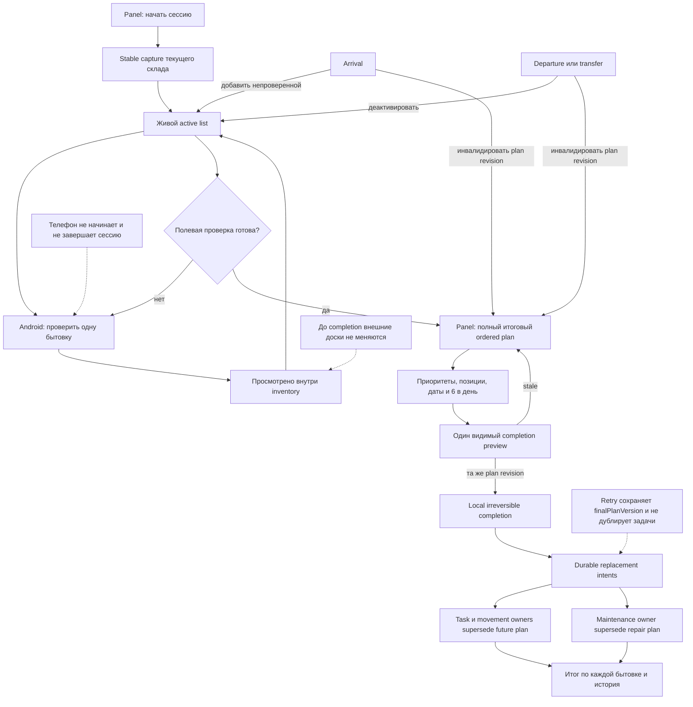

Ключевой принцип целевого решения: **один server-owned workflow и чётко разные роли клиентов**. Panel владеет управленческими действиями всей сессии; Android выполняет только одну полевую проверку. Оба клиента читают одни серверные факты, но мобильное приложение не получает полномочий начать/завершить инвентаризацию или опубликовать задачи. Все внешние effects появляются только из одной подтверждённой версии итогового плана.

## 14. Финальный вывод

Inventory-service содержит много правильных механизмов, поэтому блок не нужно переписывать с нуля и тем более не нужно создавать ещё один сервис. Основная проблема — незавершённые развороты модели: код продолжает смешивать исторический cohort и живой состав, старые/новые movement semantics, полный Android lifecycle и field-only роль, а также по-finding publication и требуемую замену общего плана.

Приоритет — не косметический рефакторинг. Сначала нужно сохранить исторические frozen данные, реализовать настоящий live-состав, вернуть account/warehouse/concurrency isolation и сделать recovery действительно durable. Затем Android ограничивается полевой проверкой, а panel получает полный итоговый ordered plan. Только подтверждение этого плана может заменить будущую работу на досках. После этого имеет смысл оптимизировать query count, batch processing и удалять legacy.

До закрытия Critical findings и красного architecture gate production release блока инвентаризации следует считать заблокированным.

---

## 15. Журнал реализации этапов 1–4

> Раздел ведётся во время реализации. Здесь фиксируются только фактически внесённые
> изменения и реально выполненные проверки. Незавершённая работа не отмечается как
> готовая.

### 15.1. Зафиксированные решения от 2026-08-04

- Дневная вместимость перемещений и ремонтов настраивается отдельно; начальное значение — 6 бытовок в день для каждой очереди.
- В настройках задаются рабочие дни недели и отдельные праздничные даты. Пустой день из-за отсутствия задач не считается простоем и не требует специального переноса.
- Бытовка, которая уехала и вернулась во время активной инвентаризации, всегда требует нового осмотра. Предыдущий осмотр остаётся в журнале, но не засчитывается как актуальный.
- Перед завершением открывается обязательная сверка будущих заданий. Для найденного совпадения менеджер выбирает замену конкретной старой задачи либо ручное слияние.
- При ручном слиянии менеджер формирует один итоговый состав работ; старая незапущенная запись сохраняется в истории как заменённая, а в активную очередь попадает ровно один новый объединённый результат.
- Замена и ручное слияние разрешены для любого фактически не начатого ремонта, включая уже поставленный в очередь обычный ремонт, ремонт с перемещением в ремонтную зону и капитальный ремонт. Ожидающие внешние эффекты нужно компенсировать, а уже выполненное перемещение сохраняется как факт. Фактически начатая работа не заменяется — для неё действует правило следующего пункта.
- Если ремонт уже начат, используется не замена, а автоматическое слияние
  остатка: текущее задание продолжается, совпадающие работы и материалы из
  inventory-плана исключаются, а оставшаяся часть ставится строго после него.
  Пустой остаток считается успешно сопоставленным и не создаёт дубль.
- Это правило действует для обычного и капитального ремонта. Начатое или
  выполненное перемещение сохраняется; отменять можно только ещё не начатый
  будущий эффект.
- Бытовка в статусе `AFTER_RENT`, прибывшая из аренды и ожидающая осмотра, при наличии замечаний создаёт DRAFT-смету. Ремонтная работа и задача на доске на этом шаге не создаются.
- Исторический `movementToShipment` не переносится в управление инвентаризацией. Инвентаризация явно планирует только доставку в ремонт; обратное перемещение остаётся частью существующего ремонтно-логистического цикла.
- Существующие Android-слои ремонта, логистики и фоновой загрузки сохраняются. Меняется только inventory-оркестрация, использующая уже реализованные шаги осмотра.

### 15.2. Текущий статус

| Этап | Статус | Фактический результат |
| --- | --- | --- |
| 1. Live-состав и сохранность истории | **Готово** | Приезд добавляет бытовку в активную сессию, отъезд исключает её даже после осмотра, возврат создаёт новый обязательный осмотр, а старая проверка остаётся в истории |
| 2. Мобильный полевой осмотр | **Готово по коду и сборке** | Android получает активную сессию, проверяет одну бытовку, сохраняет факты, фото, работы и мебель и переводит её в «Просмотрено». Общую сессию телефон не начинает и не завершает; существующие repair/logistics/upload-механизмы не перепроектированы |
| 3. Итоговый ordered plan и календарь | **Готово** | Panel показывает полный список, приоритеты, ручную позицию и даты; мощности перемещений и ремонтов разделены, по умолчанию равны 6 в день; рабочие дни и праздники настраиваются отдельно |
| 4. Сверка, replace/merge и публикация | **Готово** | Реализованы `AFTER_RENT → DRAFT estimate`, замена/ручное слияние незапущенных работ, автоматический остаток после начатой работы, вычитание работ и материалов, durable retry и защита от дублей/гонок |

Этапы 1–4 завершены. Это означает, что требуемая бизнес-логика реализована и
прошла локальные/сервисные проверки. Это **не** означает автоматический статус
`PROD`: реальное устройство, публичный gateway, промышленная миграция, нагрузка,
аварийные повторы и эксплуатационный runbook относятся к этапу 5.

### 15.3. Новые дефекты, найденные во время реализации

После исходного аудита подтверждены дополнительные дефекты. Они не заменяют
`INV-001`–`INV-060`, а дополняют их фактами, найденными уже во время разработки.
Ниже используется простой формат: проблема → риск → результат.

#### Panel, contracts и запуск публикации

| ID | Уровень | Что нашли и почему это важно | Результат |
| --- | --- | --- | --- |
| `INV-061` | High | После изменения мебели panel мог показывать старый итоговый план из cache | **Закрыто:** plan и preview удаляются из cache, сервер всё равно проверяет точную revision |
| `INV-062` | High | Сообщение «опубликовано» могло скрыть `BLOCKED` по мебели | **Закрыто:** блокирующий результат показывается отдельно и раньше сообщения об успехе |
| `INV-063` | Critical | Неуспешный `CREATE` оставлял operation key и навсегда мешал корректному `REPLACE` | **Закрыто:** удаляется только неопубликованный и доказанно неуспешный ключ; успешный source остаётся immutable |
| `INV-064` | Critical | Panel и OpenAPI разошлись по `state`, приоритету, режимам и `Idempotency-Key` | **Закрыто:** transport model, adapter и строгий контракт синхронизированы |
| `INV-065` | Critical | Сессия могла завершиться, а `READY` publication intents не запускались автоматически | **Закрыто:** post-commit публикация и recovery обрабатывают `READY` и `PENDING` по стабильному ключу finding |
| `INV-066` | High | Inventory отправлял лишнее поле `targetKind`, запрещённое maintenance OpenAPI | **Закрыто:** поле удалено; target определяется владельцем домена по актуальному asset-факту |
| `INV-067` | High | UI позволял выбрать «Слияние», не подтвердив, что менеджер действительно собрал полный итоговый состав | **Закрыто:** старая запись открывается из сверки, а ручное слияние требует явного подтверждения |
| `INV-094` | High | Одинаковые паспортные JSON-снимки с разным порядком полей считались разными: список показывал 0 конфликтов, но переход к мебели стабильно получал ложный 409 | **Закрыто:** снимки сравниваются как канонические JSON-значения, а не как порядок полей; добавлена регрессия на реальном типе сбоя СПб2 |
| `INV-095` | High | При настоящем 409 panel показывал только тупиковый текст «обновите страницу»; свежая asset/maintenance-сверка не была доступна существующему меню конфликтов | **Закрыто:** добавлена read-only операция `registry-review`, модальное предупреждение и кнопка «Перейти к разрешению конфликтов» с загрузкой актуальных данных и переходом к нужному разделу |

#### Замена, слияние, вычитание и гонки

| ID | Уровень | Что нашли и почему это важно | Результат |
| --- | --- | --- | --- |
| `INV-068` | Critical | Незапущенный `QUEUED` ремонт уже мог иметь task, lease, доставку или капитальное перемещение; простое удаление создало бы сиротские эффекты | **Закрыто:** добавлена durable compensation saga. Она атомарно проверяет task-board, отменяет только будущие эффекты, сохраняет выполненное перемещение, переносит занятое место и затем публикует ровно одного преемника |
| `INV-070` | High | Одинаковый JSON с другим порядком ключей давал другой hash и ложный конфликт кандидатов | **Закрыто:** hash строится по canonical JSON, порядок полей не меняет смысл |
| `INV-071` | Critical | При нескольких активных сметах/ремонтах код мог выбрать не ту запись | **Закрыто:** неоднозначность блокируется; активный replacement дополнительно защищён уникальным индексом по predecessor |
| `INV-072` | Critical | Остаток после начатой работы сравнивался без устойчивой identity строк | **Закрыто:** catalog-строки сравниваются по типу и UUID, ручные строки — по нормализованной semantic signature; итоговая delta сохраняется в source |
| `INV-073` | Critical | Капитальный ремонт мог выпустить преемника по обычному task-completion, хотя физическая работа выполняется снаружи | **Закрыто:** для external capital единственным разрешающим фактом является acceptance |
| `INV-074` | Critical | Обычная отмена task-board могла попасть в уже взятую/приостановленную работу; версия задачи не доказывала, что entry ещё не стартовал | **Закрыто:** owner endpoint `cancel-if-pre-start` берёт блокировки и возвращает `CANCELLED`, `ALREADY_CANCELLED`, `STARTED` или `VERSION_CONFLICT`; гонка повторена тестом 10 раз |
| `INV-075` | Critical | Остаток только из материалов мог считаться пустым и потеряться | **Закрыто:** материалы участвуют в subtraction наравне с работами; material-only successor допустим |
| `INV-076` | Critical | Результат `MATCHED` без нового ремонта нарушал старое DB-ограничение | **Закрыто:** миграция V15 разрешает честный `MATCHED`; пустая delta не создаёт фиктивную задачу |
| `INV-077` | Critical | Потерянный ответ после освобождения repair place оставлял сагу в вечном ожидании | **Закрыто:** повтор распознаёт exact `RELEASED` как уже выполненный результат |
| `INV-078` | Critical | Maintenance держал DB-транзакцию во время вызова logistics, который мог синхронно вызвать maintenance обратно | **Закрыто:** V31 разбивает процесс на короткие локальные транзакции; callback-capable remote I/O выполняется между ними |
| `INV-079` | Critical | Переназначение занятого места не было fenced точным allocation ID/version; completed logistics projection возвращала старую версию | **Закрыто:** проверяются точные ID/version, а logistics сохраняет authoritative `OCCUPIED` response |
| `INV-080` | Critical | Recovery мог отметить отложенную reconciliation успешной и больше никогда её не выполнить | **Закрыто:** активная replacement saga делает `defer`, но не `CONFIRMED`; работа остаётся повторяемой |
| `INV-081` | Critical | `STARTED` доставки в ремонт ошибочно трактовался как начатый ремонт; external-capital preflight тоже мог дать ложный started | **Закрыто:** физическое перемещение и исполнение ремонта имеют разные правила; одна policy используется в preflight и apply |
| `INV-082` | Critical | Если работу взяли после выбора `REPLACE`, сервер отвечал конфликтом вместо безопасного продолжения | **Закрыто:** система автоматически переходит к subtraction и создаёт остаточный successor либо `MATCHED` |
| `INV-083` | High | Начавшаяся входящая доставка становилась ручным `BLOCKED`, хотя нужно лишь дождаться её завершения | **Закрыто:** возвращается retryable 503; повторяется тот же source/key после `COMPLETED` и exact occupied-allocation truth |
| `INV-084` | Critical | Completion/acceptance мог прийти между удалённой проверкой и сохранением successor relation; преемник оставался ждать уже случившееся событие | **Закрыто:** после вставки relation читается локальный terminal event и release выполняется идемпотентно |
| `INV-085` | Critical | Любой 409 после возможного remote effect мог удалить source guard либо, наоборот, навсегда оставить его без возможности завершения | **Закрыто:** только первый доказанно inert `VERSION_CONFLICT` освобождает неопубликованный source; после возможного эффекта ответ всегда retryable 503; другой request hash остаётся terminal 409 |
| `INV-086` | Critical | Kafka-событие отмены task могло прийти раньше локального финала и запустить общий `CANCELLED_PRIMARY` workflow | **Закрыто:** активная V31 saga принимает exact cancel-event как подтверждение своей операции и не запускает общую отмену |

#### Проверки и эксплуатационные ограничения

| ID | Уровень | Что нашли и почему это важно | Результат |
| --- | --- | --- | --- |
| `INV-069` | High, этап 5 | Старый Android outbox теоретически может содержать legacy `furnitureMove` | Новый flow такие команды не создаёт. На этапе 5 нужен безопасный quarantine/expiry уже сохранённых legacy записей; общий upload-слой намеренно не переписывался |
| `INV-087` | Medium | После добавления нового publication service HTTP security slice не поднимался из-за отсутствующего mock | **Закрыто:** добавлен только test mock; весь security class зелёный, production wiring не ослаблен |
| `INV-088` | High | Незаконченная правка теста требовала сразу `RELEASED` после ремонта и фактически предлагала обойти существующую обратную логистику; сообщение immutable-сметы также потеряло прежний смысл | **Закрыто:** доставленная бытовка остаётся `READY_TO_RELEASE` до общего logistics removal; сообщение снова явно говорит об immutable состоянии |
| `INV-089` | Medium | Тест возврата logistics создавал «связь» без реального shipment/return факта и падал на корректном production-инварианте | **Закрыто:** исправлена fixture; production-проверка существующей связи сохранена |
| `INV-090` | High, этап 5 | Тестовый VPS запускает mutable `build/libs/*-SNAPSHOT.jar`; перезапись JAR во время работы уже вызвала у старого процесса `NoClassDefFoundError` при остановке | Нужны versioned immutable артефакты и переключение symlink/release directory только при restart |
| `INV-091` | Medium, вне inventory | Полный panel lint имеет 14 существующих ошибок в assistant/rental-items/write-offs/test setup | Inventory/settings/catalog scope чистый, но общий lint gate надо закрыть до общего релиза панели |
| `INV-092` | Acceptance gate | APK собран и опубликован, но установка, вход через публичный gateway, UI tree/screenshot и logcat по решению заказчика перенесены | Выполнить в этапе 5; до этого Android нельзя называть E2E-проверенным |
| `INV-093` | Medium, этап 5 | Panel build предупреждает о крупном JS chunk: около 2,26 MB, 612 KB gzip | Измерить реальную загрузку и при необходимости разделить bundle; функциональность это не блокирует, но относится к performance gate |

Всего после первоначального аудита зарегистрировано **35 дополнительных пунктов**
(`INV-061`–`INV-095`). Из них 30 закрыты кодом, контрактами или корректными
регрессиями. Пять явно перенесены в этап 5 или общий release gate:
`INV-069`, `INV-090`, `INV-091`, `INV-092`, `INV-093`. Открытых Critical
дефектов потери/дублирования данных в реализованном объёме этапов 1–4 не осталось.

### 15.4. Как теперь проходит сверка и публикация

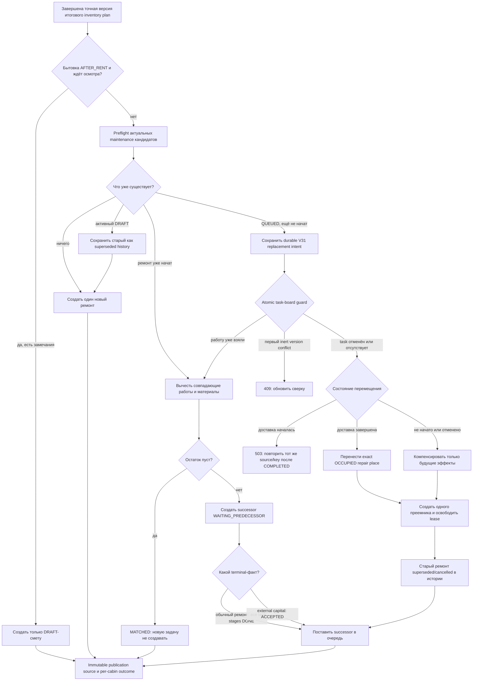

Главная идея схемы: система никогда не удаляет подтверждённый физический факт.
Она удаляет из активного будущего только то, что доказанно не началось. Если
исполнение уже началось, используется операция, похожая на Git-сверку:
совпавшее вычитается, новый остаток объединяется в один преемник, пустой остаток
означает полное совпадение.

### 15.5. Фактически выполненные проверки

| Область | Результат |
| --- | --- |
| `inventory-service` | 15 test suites, 101 тест, 0 failures/errors; `bootJar` зелёный |
| `task-board-service` | 38 suites, 235 тестов, 0 failures/errors, 1 заранее помеченный skip; атомарная гонка cancel/start прогнана 10 раз |
| `logistics-service` | 44 suites, 244 теста, 0 failures/errors; `bootJar` зелёный |
| `maintenance-service` | Полный повторный прогон: 34 suites, 327 тестов, 0 failures/errors/skips; отдельно зелёные Flyway, JPA validation, OpenAPI parity и `bootJar` |
| Panel inventory/settings | 21 test files, 130 тестов; `typecheck` и production build зелёные; ESLint затронутого inventory/settings/catalog scope зелёный |
| Android unit/contract | 8 suites, 53 теста, 0 failures/errors; APK собран. Реальный device/gateway E2E намеренно не заявляется |
| Рабочее дерево | Tracked diff и все scoped untracked inventory/maintenance/contracts/docs файлы прошли whitespace check; чужие и незаконченные изменения не сбрасывались |

Публикация на тестовом VPS также проверена:

- panel отвечает `200`; локальный и опубликованный `index.html` имеют SHA-256
  `af62a88d2512181661c32e390593994b4de44045ffd0f061a131be734350ec9a`;
- APK в build и на `/download` имеет одинаковый SHA-256
  `d7b9304a82abec8cec7be7659146ad158b9ddcdcf0f661f12f759771bafac581`,
  размер 23 452 909 байт, версия `0.3.33-debug` / versionCode 36;
- inventory, task-board, logistics и maintenance systemd services находятся в
  состоянии `active`;
- maintenance при запуске валидировал 32 миграции, применил V30–V32 поверх V29,
  поднял Tomcat на `127.0.0.1:8087` и стартовал за 27,768 секунды;
- запрос к maintenance health без Bearer вернул ожидаемый `401`, то есть
  служебный endpoint не стал анонимным; новых startup `ERROR` не найдено.

### 15.6. Что осталось на этапе 5

Этап 5 — не ещё одна переделка бизнес-логики. Это доказательство того, что
готовая логика выдерживает настоящее окружение. Остались следующие группы работ:

1. Установить именно собранный APK, войти через публичный RWMS gateway и пройти
   весь field-only сценарий с UI tree/скриншотом и logcat.
2. Пройти browser E2E: начало сессии, live arrival/departure/return, итоговая
   сверка, завершение и появление задач только после завершения.
3. На обезличенной копии рабочей БД проверить upgrade, блокировки, длительность,
   backup restore и forward-fix runbook.
4. Искусственно терять ответы после каждого удалённого эффекта и проверять
   отсутствие дублей: task cancel, movement cancel/completion, allocation
   reassign, lease release и successor queue.
5. Проверить нагрузку, права между складами, метрики/алерты и операторский
   recovery для зависших reconciliation/outbox/DLT.
6. Перевести VPS/release процесс на immutable versioned JAR, решить legacy
   Android outbox и закрыть общий panel lint/performance gate.

### 15.7. Итог после этапов 1–4

Текущий честный статус: **`FEATURE-COMPLETE / READY FOR ACCEPTANCE`**.

- Требуемая логика этапов 1–4 реализована.
- Незапущенные обычные ремонты, доставки в ремонт и капитальные ремонты можно
  заменить или вручную слить без удаления подтверждённых фактов.
- Начатая работа сохраняется; работы и материалы вычитаются; непустой остаток
  идёт строго следом, пустой даёт `MATCHED`.
- `AFTER_RENT` с замечаниями создаёт DRAFT-смету, а не работу.
- До завершения инвентаризации новые записи на операционных досках не появляются.
- Android E2E не выполнен по прямому решению заказчика и относится к этапу 5.

После успешного выполнения **всех** пунктов этапа 5, а не только Android-проверки,
блок можно считать `PROD-READY`. На текущем шаге называть его production-ready
раньше сохранённых приёмочных доказательств нельзя.

### 15.8. Доработка перед этапом 5: переход от бытовок к мебели

Этап 5 **не начинался**. Перед ним отдельно устранён блокирующий случай активной
инвентаризации СПб2 `af343842-f6c8-412d-a92f-ddc5f66dba43`.

#### Что видел пользователь

После нажатия «Завершить проверку бытовок и перейти к мебели» страница показывала
только текст «Данные инвентаризации изменились. Обновите страницу и повторите
действие». При этом счётчик показывал `Конфликты: 0`, поэтому разрешить ошибку на
этой же странице было невозможно.

#### Почему это происходило

PostgreSQL `jsonb` вправе менять порядок полей объекта. Актуальный паспорт из
`asset-service` содержал те же значения, но поля шли в другом порядке. Старое
сравнение ошибочно считало порядок полей частью смысла:

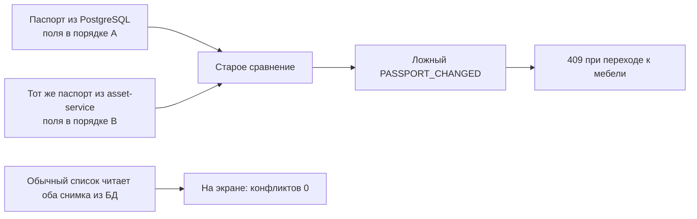

Это был не реальный конфликт данных СПб2, а дефект сравнения. Read-only проверка
новой версией сервиса сравнила все **210** активных бытовок и вернула
**0 реальных конфликтов**. Сессия при проверке осталась `ACTIVE / CABINS`, её
revision и бизнес-данные не изменялись.

#### Что сделано

1. JSON-снимки паспорта, состава и ремонтов теперь сравниваются по значениям,
   независимо от порядка полей. Тем же способом строится отпечаток ручного
   решения конфликта, поэтому принятое решение не «забывается» после записи
   JSON в PostgreSQL.
2. В OpenAPI `inventory-service` 1.5.0 добавлен
   `POST /api/inventory/v1/sessions/{inventoryId}/registry-review`. Это
   **read-only** сверка точной версии с актуальными фактами `asset-service` и
   `maintenance-service`. Она не разрешает конфликт сама, не создаёт работы,
   не меняет ремонтный цикл и не меняет логистику.
3. При 409 panel теперь открывает модальное окно «Данные инвентаризации
   изменились». Основная кнопка называется **«Перейти к разрешению конфликтов»**.
4. По этой кнопке panel загружает свежую серверную сверку. Если конфликты есть,
   страница фокусирует и прокручивает существующий раздел «Конфликты реестра».
   Там остаются прежние явные варианты: принять реестр, оставить данные осмотра
   с причиной либо открыть бытовку и дополнить осмотр.
5. Пока свежая сверка загружается, кнопка заблокирована и показывает состояние
   загрузки; ошибка остаётся в модальном окне. Если после обновления конфликтов
   уже нет, окно закрывается и пользователь получает понятное предложение
   повторить переход к мебели.

#### Проверки и публикация

| Проверка | Результат |
| --- | --- |
| Полный `inventory-service` test gate | 101 тест, 0 failures, 0 errors, 0 skipped |
| Регрессия порядка JSON | Одинаковый паспорт с другим порядком полей не создаёт конфликт и разрешает переход к мебели |
| Контракт | Новый маршрут присутствует в строгом OpenAPI-наборе; контрактный тест зелёный |
| Panel | 3 затронутых test files, 49 тестов; typecheck и scoped ESLint зелёные |
| Production build | `inventory-service` bootJar и panel Vite build зелёные; остаётся уже известное предупреждение о крупном JS chunk (`INV-093`) |
| Реальная СПб2 | read-only `registry-review`: 210 проверено, 0 конфликтов |
| VPS | `inventory-service` активен; public endpoint без Bearer возвращает ожидаемый 401; panel и новый JS asset возвращают 200 |

Опубликованный `panel/index.html` имеет SHA-256
`af62a88d2512181661c32e390593994b4de44045ffd0f061a131be734350ec9a`.
Предыдущая панель сохранена в восстанавливаемой копии
`/var/www/rwms-panel.backup-20260804-1836-inventory-conflict-review`.
Android-приложение, APK и проверки этапа 5 не изменялись и не запускались.

## 15.9. Этап 5: проверка на реальной тестовой инвентаризации

Этап 5 выполнен без повторного завершения инвентаризации и без новых прогонов
Android. Целью было проверить уже собранный сценарий на настоящих сервисах,
найти причину исчезающих данных на экране, безопасно исправить последствия и
доказать отсутствие дублей.

### Что означал симптом «данные есть 5–10 секунд, затем остаётся одна бытовка»

Данные в PostgreSQL не удалялись. Экран сначала показывал свежую сверку, а
затем фоновое обновление общего inventory-кэша могло заменить её другим снимком
сессии. После успешного завершения была ещё одна разновидность той же проблемы:
широкая инвалидизация кэша повторно вызывала уже недопустимый completion preview
и получала `409`.

Теперь успешное завершение сразу кладёт полученную от сервера завершённую
сессию в detail/history-кэш, очищает active-кэш и обновляет список истории.
Active/list помечаются устаревшими без немедленного refetch, а уже завершённый
preview больше не вызывается. В регрессии второй preview специально отвечает
`409`: история всё равно открывается, а preview вызывается ровно один раз.

### Как обнаружилась ошибка даты

Тестовая инвентаризация началась 4 августа и завершилась после полуночи,
5 августа. Старый планировщик использовал дату начала сессии. Поэтому два
ремонта были честно созданы по одному разу, но logistics отказался создавать
перемещения «на вчера» и после четырёх попыток поместил обе записи в карантин.

Это не было потерей работ или материалов:

- у A и C сохранились по одной работе и одному материалу;
- у обеих бытовок сохранился приоритет 1;
- у B, где замечаний не было, ремонт не создавался;
- публикационных источников было ровно два — по одному для A и C;
- инвентаризация уже была завершена, поэтому повторно завершать её было нельзя
  и не потребовалось.

Исправление простое по смыслу: начальная дата итогового плана теперь равна
более поздней из двух дат — бизнес-даты сессии и сегодняшней даты на складе.
Автоматический план не может построить перемещение или ремонт в прошлом.
Ручная дата в прошлом отклоняется, а сохранённый вчера итоговый план требует
повторной подготовки и просмотра.

### Как восстановлены два перемещения без удаления данных

Добавлена публичная MANAGE-команда
`POST /api/maintenance/v1/repairs/{id}/inbound-delivery/retry`. Это не общий
«повторить всё» и не прямое изменение БД. Команда работает только если сервер
одновременно доказывает все условия:

1. ремонт обычный, находится в `QUEUED`, ещё не начат и остаётся `STABLE`;
2. для него действительно требуется доставка в ремонт;
3. в карантине находится именно исходная стабильная запись
   `LOGISTICS / CREATE_DRIVER_TASK`;
4. logistics подтверждает `ABSENT` — задания с таким repair ID у него нет;
5. версия ремонта совпадает с версией, просмотренной оператором;
6. запрос имеет отдельный `Idempotency-Key` и обязательную причину.

После этого меняются только режим и дата входящего перемещения. Приоритет,
работы, материалы, ремонт и исходный стабильный ключ сохраняются. Существующая
reconciliation-запись возобновляется; новая не создаётся. Если logistics видит
задание, начатое исполнение или неопределённое состояние, команда возвращает
конфликт и ничего не удаляет.

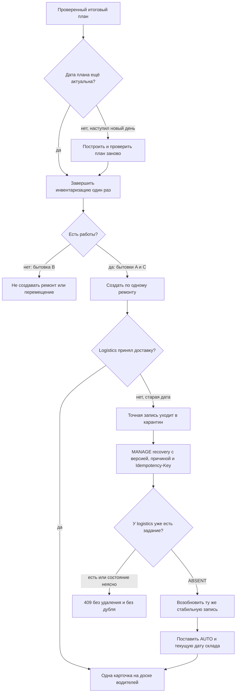

### Фактический результат на складе Test

Проверена завершённая сессия
`4d61e95c-9fe2-4dfb-9721-8a6a40ebfd84` склада
`f5338f81-2831-4b14-ab99-2e611d09ba3e`.

| Бытовка | Результат ремонта | Результат перемещения |
| --- | --- | --- |
| A | Ровно один ремонт `def307bf-826d-4b37-84e5-210702817c01`; приоритет 1; 1 работа; 1 материал | Ровно одна задача `432ca9f7-ee69-474b-b1da-acabbe1912f6`, `DELIVER_TO_REPAIR`, `AUTO`, дата 05.08.2026, `CURRENT / WAITING` |
| B | 0 ремонтов | 0 заданий, как и должно быть без замечаний |
| C | Ровно один ремонт `4b35bd0d-2c10-4037-80b4-9cab1c85d38a`; приоритет 1; 1 работа; 1 материал | Ровно одна задача `fe1cc724-dc9b-4e8d-b8d5-44ecf80f8ebe`, `DELIVER_TO_REPAIR`, `AUTO`, дата 05.08.2026, `CURRENT / WAITING` |

Для обеих стабильных reconciliation-записей подтверждены `CONFIRMED`,
`review_version = 1` и ровно одна строка на repair ID. В
`inventory_publication_source` осталось ровно две строки этой инвентаризации.
То есть повторный MANAGE-запрос не создавал новый ремонт, новый источник или
второе перемещение.

Ремонтные рабочие задания не обязаны появляться до физической доставки бытовки
в зону ремонта. Сейчас на доске водителей находятся именно две входящие
доставки. После их выполнения существующий ремонтный цикл сам откроет следующие
рабочие этапы; этот слой не удалялся и не менялся.

### Проверки этапа 5

| Проверка | Результат |
| --- | --- |
| Ручная маршрутизация WORK/MATERIAL | 51 серверный тест: inventory 14, maintenance parity 13, maintenance boundary 24 — зелёные; panel mapper 24 теста и typecheck — зелёные |
| Дата долгой сессии | `InventoryReadProjectionIntegrationTest`: 19 тестов, 0 failures/errors/skips |
| Кэш после завершения | `inventory-pages.test.tsx`: 26 тестов; второй preview принудительно получает 409, фактически вызван один раз; typecheck зелёный |
| Recovery-команда | В изолированном release-снимке: 2 интеграционных теста, 0 failures/errors/skips; проверены success, повтор, все внешние состояния, invalid local state, сохранение priority/WORK/MATERIAL и одна stable-строка |
| OpenAPI | Маршрут, MANAGE-защита, DTO и `AUTO/null`/`FIXED_DATE/date` присутствуют. Семь проверок общего parity-класса проходят; шесть оставшихся падений относятся к незавершённому параллельному блоку списаний, а не к recovery-маршруту |
| Panel | 26 focused тестов, typecheck и production build зелёные; опубликованные `index.html` и JS имеют точные SHA-256, приведённые ниже |
| Android | Новых тестов, эмулятора и переустановки APK не было по прямому решению заказчика. Сохраняются только более ранние focused 7 тестов, compile/assemble и проверка уже опубликованного APK; полный Android flow не заявляется |
| VPS | inventory, maintenance и logistics — `active`; после релиза в их journal нет новых `ERROR`; публичный recovery без Bearer даёт ожидаемый 401 |

### Что опубликовано на VPS

- `inventory-service` JAR: SHA-256
  `cfab1c4752624d143407d9bcd7828f544e4ffde179833189fba2a56f976a3e0b`;
- `maintenance-service` JAR: SHA-256
  `56ea8b6473ff05566e18307d8806643c895a581bd9908ae72d0eebe47ec45be9`;
- panel `index.html`: SHA-256
  `75322f3dff763220eae6b92eea0c6dfbfe5a9a5e8171a815126cd224427f0815`;
- panel JS `index-ti3k9te0.js`: SHA-256
  `c377a4505c09c4f4fe1a3cf5108a03b3fbd743d5c48db76dc9536018e959d758`;
- оба публичных panel-файла отвечают `200` и совпадают с локальной сборкой;
- прежние JAR сохранены в
  `/var/backups/rwms-stage5-20260805-013729`;
- прежняя панель сохранена в
  `/var/www/rwms-panel.backup-20260805-013729-inventory-stage5-final`.

Релиз собирался не из mutable рабочего `build/libs`, а из отдельного снимка.
Из него намеренно исключён незавершённый параллельный блок property disposition
и его V33. Поэтому пользовательские изменения не откатывались и не попали на
VPS в полусобранном виде.

### Новые дефекты и дополнительные замечания

| ID | Важность | Что найдено | Состояние и рекомендуемое исправление |
| --- | --- | --- | --- |
| `INV-096` | Critical | Ручная WORK/MATERIAL-строка могла потерять связь с выбранным этапом и попасть в неверный маршрут | **Закрыто:** `routingCatalogNodeId` передаётся отдельно от каталожной позиции; maintenance проверяет, что маршрут является выбранным `REPAIR_WORK`-этапом |
| `INV-097` | High | Старый schema v2 не содержал маршрут ручной строки и позволял неоднозначное восстановление | **Закрыто безопасно:** адаптер восстанавливает маршрут только при единственном доказуемом варианте; неоднозначный снимок отклоняется, а не публикуется наугад |
| `INV-098` | High | После успешного завершения panel повторно запрашивал completion preview и показывал шумный 409 | **Закрыто:** authoritative completion response обновляет точные cache keys, preview не инвалидируется |
| `INV-099` | Critical | Долгая сессия планировала задания датой открытия и после полуночи отправляла logistics дату в прошлом | **Закрыто:** используется `max(session business date, warehouse local today)`, прошлые ручные даты и вчерашний draft блокируются |
| `INV-100` | High | Для точной карантинной доставки не было поддерживаемой безопасной команды восстановления | **Закрыто:** добавлена MANAGE recovery-команда с remote `ABSENT`, optimistic version и тем же stable key; live A/C восстановлены без дублей |
| `INV-101` | Medium | Web-panel пока не имеет авторитетного выбранного stage node для создания новой manual-only строки | **Открыто, fail-closed:** мобильный field-flow поддержан; если ручное создание понадобится в web, panel должен получить явный stage selector из того же каталога, а не угадывать маршрут |
| `INV-102` | High | Карантин downstream-публикации плохо виден из истории инвентаризации и обычного списка ремонтов | **Открыто:** добавить операторский экран/счётчик с repair ID, operation, причиной, временем, review version и разрешёнными действиями; не показывать ложный `PUBLISHED`, пока effect не подтверждён |
| `INV-103` | Medium | Общий `MaintenanceDependencyException` скрывает часть полезного upstream Problem Details | **Открыто:** сохранять безопасный upstream code/correlation и показывать оператору доменный код без токенов и внутренних URL |
| `INV-104` | Acceptance | Полный Android UI-flow не выполнен по решению заказчика | **Принятый отложенный риск:** перед массовым мобильным rollout один раз пройти вход, первый workspace request и изменённый field-flow на точном опубликованном APK |
| `INV-105` | High, вне inventory | Незавершённый property-disposition V33 сейчас не проходит общий maintenance gate: JPA ожидает другой тип `request_sha256`, а OpenAPI parity matrix ещё не синхронизирована | **Открыто и не опубликовано:** закончить entity/Flyway соответствие, обновить точную operation matrix и получить зелёные Flyway/JPA/OpenAPI/full maintenance tests до следующей общей сборки maintenance |

### Итоговый статус после этапа 5

Для согласованного сценария инвентаризации статус теперь
**`READY FOR CONTROLLED PRODUCTION`**:

- сессия открывается и завершается только в panel;
- Android остаётся полевым инструментом осмотра;
- приезды и отъезды меняют активный состав;
- до завершения нет новых операционных заданий;
- после завершения применяются CREATE/REPLACE/MERGE, включая вычитание работ и
  материалов начатого задания;
- `AFTER_RENT` с замечаниями создаёт смету;
- итоговый план не публикует прошлые даты;
- потерянный ответ или карантин не приводят к удалению, дублю либо прямой
  правке БД;
- реальная тестовая сессия дала ровно A/C и не дала B.

Называть весь продукт безусловно `FULL PROD-READY` пока рано. До такого статуса
остаются открытые `INV-090`, `INV-091`, `INV-093`, `INV-101`–`INV-105`.
Главные практические следующие шаги: закончить незавершённый disposition gate,
добавить видимость карантина, перейти на immutable versioned JAR и, когда
заказчик разрешит, один раз выполнить полный Android acceptance-flow.

Следующим отдельным архитектурным аудитом рекомендуется блок **перемещений**:
складские transfers, входящая/исходящая логистика, доставка в ремонт,
возврат из ремонта, гонки приезда/отъезда и компенсации task-board. Именно он
связывает инвентаризацию с ремонтным циклом и имеет наибольший риск дублей или
потери состояния после уже проверенного inventory owner.

### Кратко: что сделано в этой работе

Проверены и завершены этапы 1–5 блока инвентаризации, исправлены маршруты ручных
работ/материалов, конфликтная сверка, кэш завершения, календарь долгой сессии и
безопасное восстановление карантинной доставки. Обновлены inventory,
maintenance и panel на VPS, реальные A/C восстановлены без повторного
завершения и без дублей. Android на этом финальном шаге намеренно не запускался.
Дополнительно найдены ограничения `INV-101`–`INV-105`; они не скрыты и для
каждого выше указан безопасный следующий шаг.

## Дополнение 06.08.2026: повторный осмотр, дозагрузка фото и новая бытовка

### Итог простыми словами

Проверены три ошибки, которые возникли на уже установленном APK. Для их
исправления новый APK не требуется:

1. Осмотр `1150518` в режиме «Дополнить» теперь сохранён как новая ревизия.
   Старый осмотр остался в истории, дублей сметы или ремонта нет.
2. У `T237` семь фотографий дошли, а три остались только в очереди телефона.
   Сервер теперь выдаёт им новые upload-сессии для тех же media ID, поэтому их
   можно дозагрузить кнопкой «Дозагрузить» без создания копий.
3. Новая бытовка `101148` раньше получала сначала `422`, затем сообщение
   `An identical command is still in progress`. Сервер теперь понимает формат
   паспорта старого APK и сразу освобождает неудачную попытку для повтора.

Публичный APK и `/download` в рамках этого исправления не заменялись.

### 1. Почему не сохранялось дополнение осмотра `1150518`

У части фотографий после предыдущего осмотра изменилась версия: логический
`mediaId` остался прежним, но актуальная готовая генерация стала новее. Старый
APK честно отправил ссылки из предыдущей ревизии. Inventory принял их как
прежние данные, но maintenance отказался замораживать новый план, потому что в
строке работы была указана уже не текущая генерация фотографии.

Дополнительно ответ maintenance `422` неверно превращался inventory-сервисом в
общий `503`, поэтому на телефоне была показана ложная ошибка недоступной
зависимости.

Исправление сделано на двух уровнях:

- сервер обновляет до текущей READY-генерации только ту ссылку, которая
  доказанно принадлежала предыдущей ревизии этого же осмотра и тому же складу;
- новая, чужая, удалённая или неготовая ссылка по-прежнему отклоняется;
- HTTP `400/404/409/422` от зависимости теперь распознаются по числовому
  статусу и не маскируются как `503`;
- код manager-приложения также умеет обновлять сохранённые ссылки для будущего
  APK, но успешность текущего установленного APK от этого не зависит.

После повтора пользователь подтвердил успешное сохранение. Живая база
проверена:

- finding имеет ревизию 2 и состояние `WORK_STAGED`;
- сохранены ровно два immutable plan snapshot: ревизии 1 и 2;
- maintenance хранит ровно два источника: по одному на каждую ревизию;
- ремонт и задача до завершения общей инвентаризации не созданы;
- прежние фотографии не удалены из истории.

### 2. Почему три фотографии `T237` не дозагружались

По живым данным у осмотра было десять фотографий: семь `READY` и три
`UPLOADING`. Первичная передача этих трёх оборвалась: один запрос получил
`401`, два соединения были закрыты клиентом до ответа. Через десять минут их
upload-сессии истекли.

Телефон повторял ту же команду с тем же `Idempotency-Key`. Старый media-service
находил уже созданный media asset, но на истёкшей сессии всегда отвечал `409`.
Получался тупик: новый media ID создавать нельзя, а продолжить старый нельзя.

Теперь точный повтор работает так:

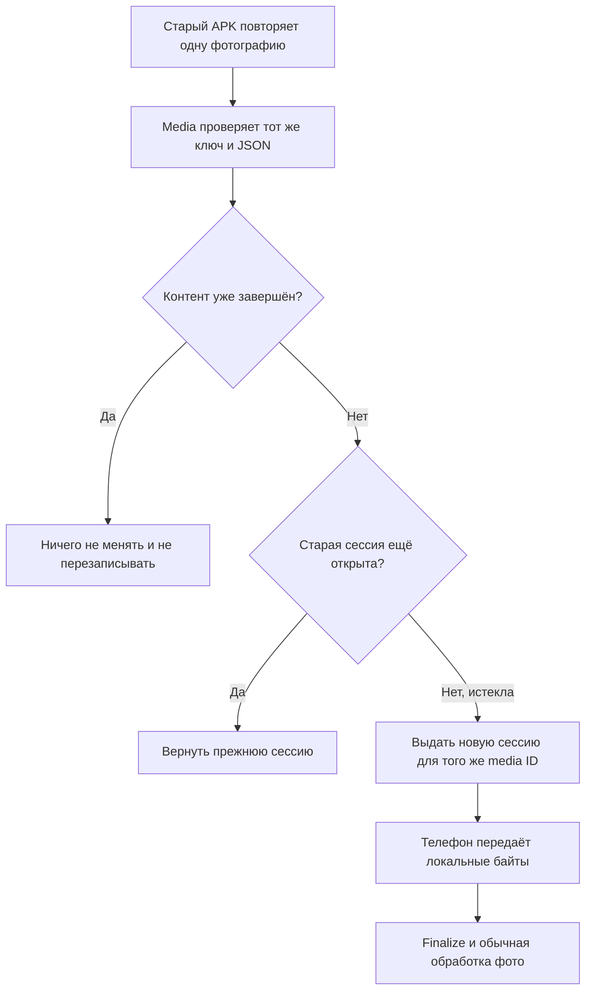

При восстановлении повторно проверяются пользователь, склад и owner binding.
Операция синхронизирована с возможной параллельной передачей байтов. Media ID,
object key, owner, idempotency-запись и исходное событие не дублируются.
Завершённое фото никогда не открывается для перезаписи.

Сами три файла находятся только на телефоне. Поэтому после серверного
исправления оператору всё равно нужно нажать «Дозагрузить»; сервер физически не
может передать отсутствующие у него байты самостоятельно.

### 3. Почему не создавалась бытовка `101148`

Здесь было две связанные ошибки.

Первая: manager-приложение передаёт названия, например `БК-1`, `2.4x6`, `ДВП`
и строку характеристик. Inventory пересылал их дальше, а внутренний контракт
asset-service требовал UUID каталога. Поэтому самый первый запрос завершался
`422` ещё до создания бытовки.

Вторая: после rollback inventory оставлял idempotency lease активным ещё на
минуту. Немедленный повтор с телефона видел этот lease и получал `409` с
текстом `An identical command is still in progress`, хотя исходная команда уже
не выполнялась.

Исправлено следующее:

- asset-service принимает строго один формат: полный набор UUID либо полный
  name-based формат manager-клиента;
- смешанный или неполный формат запрещён;
- названия нормализуются по регистру и пробелам и разрешаются только в активные
  значения asset-каталога;
- пустая строка характеристик, включая `, ,`, становится пустым списком;
- неизвестное или неоднозначное название отклоняется до source registration,
  number claim и создания rental item;
- постоянный fingerprint строится по разрешённым UUID. Поэтому эквивалентный
  повтор names → UUID возвращает ту же бытовку, а не создаёт вторую;
- после rollback inventory в отдельной короткой транзакции немедленно завершает
  только собственный lease. Чужая или реально выполняющаяся команда остаётся
  защищённой от дубля.

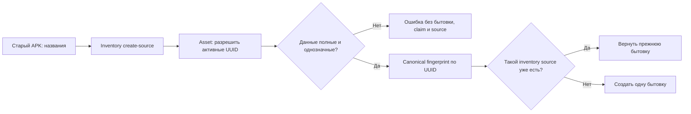

### Что изменено и опубликовано

| Область | Основные изменения | VPS |
| --- | --- | --- |
| `inventory-service` | безопасное обновление retained media generation; точное отображение HTTP-ошибок; немедленное освобождение собственного failed idempotency lease | обновлён, readiness `UP` |
| `media-service` | восстановление истёкшей незавершённой upload-сессии на том же media ID; concurrency и no-overwrite защита | обновлён, `/health/ready` = `UP` |
| `asset-service` | совместимый name/UUID контракт создания source asset и asset-owned разрешение каталога | обновлён, readiness с service token = `UP` |
| `manager app` | защитное обновление retained media для будущей сборки | APK собран ранее, но в этом hotfix не публиковался и не запускался |

SHA-256 запущенных артефактов:

- inventory: `aa59283dfbbcab85ec4e4ef0e6f9efa575ab398702658ed4370fc0da998457f4`;
- media: `f7f00b1fe1f286d72086e420f768601897f29a8b86350921d0375c84e19a1e68`;
- asset: `4e4f1ad2eb3c285bdc1e7fbfeb78100e0c1f612fe88238f886e90c2fc40d5d5f`.

После финальных запусков все три процесса `active/running`, порты слушают, а
новых warning/error в их журналах нет. Схемные миграции и ручные исправления
данных не требовались; ревизия 2 осмотра `1150518` появилась только через
обычную успешно повторённую пользовательскую команду.

### Выполненные проверки

| Проверка | Результат |
| --- | --- |
| Media persistence + OpenAPI | `go test ./internal/persistence ./internal/contract -count=1` — успешно на изолированной PostgreSQL; recovery, completed no-overwrite, mismatch и параллельные повторы покрыты |
| Media build | `go build ./cmd/media-service` — успешно |
| Inventory retained media/dependency | 16 focused tests — успешно; `bootJar` — успешно |
| Inventory idempotency | `InventoryIdempotencyRecoveryIntegrationTest` 6/6 и `InventoryDomainStateMachineTest` 7/7 — успешно |
| Asset source compatibility | `AssetJpaValidationIntegrationTest` 27/27 и `AssetOpenApiParityTest` 2/2 — успешно; `bootJar` — успешно |
| Android static/unit | 25 focused JVM tests и `assembleDebug` были успешны; текущий hotfix не зависит от установки этой сборки |
| Android UI | Эмулятор, ADB, приложение и скриншотные тесты не запускались по прямому требованию заказчика |

### Дополнительно найдено

| ID | Важность | Что найдено | Состояние и рекомендуемое исправление |
| --- | --- | --- | --- |
| `INV-106` | Critical | Один временный разрыв inventory → maintenance срывал весь осмотр, хотя freeze-команда идемпотентна | **Закрыто:** один строго ограниченный повтор с тем же ключом только для сети и `502/503/504` |
| `INV-107` | Critical | Живые OAuth-регистрации отставали от обязательных складских зависимостей | **Закрыто:** ревизии/scopes обновлены и живой межсервисный маршрут проверен |
| `INV-108` | High, эксплуатация | VPS использует transient unit-файлы и mutable `build/libs`; при обычном restart Spring-процессы с кодом 143, а media с кодом 1 кратко отмечаются systemd как failed, хотя затем успешно запускаются | **Открыто:** постоянные unit-файлы, закрытые EnvironmentFile/systemd credentials, immutable versioned artifacts, атомарная ссылка `current`, корректные `SuccessExitStatus` и graceful SIGTERM для media |
| `INV-109` | Medium, UX | Мобильный экран показывает технический английский `detail` | **Открыто:** локализовать сообщение по стабильному Problem Details `code`, сохраняя correlation ID для поддержки |
| `INV-110` | Critical | Retained work-line photo ссылалась на историческую generation и блокировала supplement | **Закрыто:** только доказанная ссылка предыдущей ревизии обновляется до текущей READY generation; остальные случаи fail-closed |
| `INV-111` | High | HTTP `422` зависимости ошибочно отображался как общий `503` | **Закрыто:** статусы сопоставляются по числовому коду и покрыты тестами |
| `INV-112` | Critical | Exact retry истёкшей незавершённой upload-сессии всегда получал `409` | **Закрыто:** replacement session на том же media ID без дубля и перезаписи |
| `INV-113` | High | Rollback команды оставлял активный lease и блокировал немедленный честный повтор | **Закрыто:** owner-token-fenced abandon в `REQUIRES_NEW`; активная параллельная команда остаётся защищённой |
| `INV-114` | Critical | Manager передавал названия состава бытовки, а asset принимал только UUID | **Закрыто:** явный one-of контракт и разрешение имён у владельца каталога до любых записей |
| `INV-115` | Medium | Поздний exact replay name-based source после переименования или деактивации каталога может fail-closed, потому что старое имя уже нельзя разрешить | **Открыто, без риска дубля/потери:** при необходимости долгого replay хранить принятый transport hash/разрешённый snapshot рядом с permanent source и сначала проверять exact raw replay, не ослабляя проверку изменённого payload |
