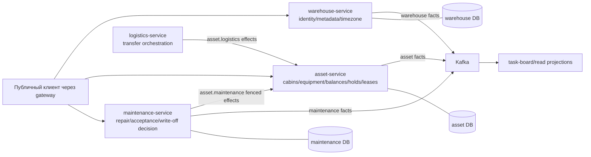

# Полный аудит складов, имущества, дополнительного оборудования и списания

Дата аудита: 2026-08-04

Рабочая копия: ветка `develop`, базовый `HEAD 694da2e95acf`, поверх него имеется большой набор незакоммиченных пользовательских изменений

Статус исходного среза 2026-08-04: **контур не был готов к безопасной промышленной эксплуатации без устранения P0/P1-дефектов**

Статус исправлений 2026-08-05: см. [раздел 17](#17-исправления-по-результатам-аудита-2026-08-05). Разделы 1–16 сохранены как исходное доказательство проблем и не описывают состояние кода после исправлений.

## 1. Резюме

Проверены серверная архитектура, канонические HTTP/event-контракты, доменные переходы, авторизация, складская изоляция, optimistic concurrency, идемпотентность, транзакции, Flyway/JPA-модель, outbox/reconciliation, чтение и масштабирование для следующих областей:

- справочник складов, активность склада и часовой пояс;
- бытовки (`rental items`), их принадлежность складу и статусы;
- текущий публичный HTML-import/merge реестра бытовок;
- каталог дополнительного оборудования;
- остатки оборудования в стоке и бытовках;
- перемещения, резервы, holds и leases;
- списание бытовок и оборудования, утрата оборудования;
- связанные серверные эффекты maintenance, logistics, order/task-board;
- аудит, события, восстановление после ошибок и операционная наблюдаемость.

Инвентаризация намеренно исключена: её сессии, findings, final plan, публикация и Android/UI-потоки не проверялись. Приложения `app/`, `worker-app/`, UI панели, браузерные сценарии, APK, эмулятор и VPS не запускались и не тестировались. Код продукта и данные не изменялись; единственный результат работы — этот отчёт.

Обнаружено **29 замечаний**:

| Критичность | Количество | Смысл |
| --- | ---: | --- |
| Critical | 6 | Возможна порча терминального состояния/учёта имущества или основной поток списания не работает корректно |
| High | 15 | Нарушены ownership, аудит, восстановление, доступность либо масштабируемость ключевого контура |
| Medium | 8 | Контрактный, эксплуатационный, security или масштабный риск, который требуется закрыть до роста нагрузки/реплик |

Главные блокеры:

1. Списанное или утраченное оборудование можно обычным перемещением вернуть в рабочий остаток.
2. Повторное списание одного вида оборудования на том же складе после первой операции получает `409` из-за жёстко заданной версии целевого терминального остатка `0`.
3. Списание бытовки не разрешает её содержимое: оборудование остаётся в `CABIN_NON_RENTED`, учитывается как доступное и затем может быть перемещено.
4. Списанную бытовку можно снова поставить в ремонт и перевести из `WRITTEN_OFF` в `REPAIR`.
5. Общий публичный endpoint смены статуса позволяет вручную синтезировать статусы, которыми должны владеть maintenance/logistics/order-процессы.
6. Действующий HTML-import может напрямую заменить количество оборудования без movement ledger и создать/merge бытовку в workflow-статусе без owning aggregate.

Положительная основа есть: сервисы разделены по базам, схемы принадлежат Flyway, остатки защищены optimistic version и неотрицательными ограничениями, перемещение пишет парные неизменяемые проводки и события, межсервисные эффекты имеют reconciliation/outbox, а специальные интеграции используют отдельные scopes. Однако эти механизмы не закрывают найденные терминальные и ownership-разрывы.

## 2. Критерии и метод проверки

Контур считался бы приемлемым, если одновременно выполнены следующие условия:

- терминальные состояния `WRITTEN_OFF`/`LOST` необратимы обычными командами;
- одна бизнес-операция имеет одного владельца, а остальные сервисы вызывают узкие идемпотентные эффекты;
- списание бытовки атомарно разрешает всё её имущество либо честно запрещается до освобождения;
- доступность и резервирование используют одну и ту же политику допустимых источников;
- все мутации ограждены версией/ETag и корректно повторяются после потери ответа;
- решение, причина, инициатор и фактическое применение списания восстанавливаются из истории;
- деактивация склада не запирает имущество и проходит через контролируемое осушение;
- outbox и reconciliation можно безопасно восстановить после quarantine/DLT;
- списки и агрегаты работают с серверной пагинацией и ограниченным числом запросов;
- канонические OpenAPI/event-схемы совпадают с фактической runtime-валидацией;
- складская изоляция и service scopes не дают общих обходных команд.

Проверка выполнялась трассировкой от контрактов до контроллеров, application/domain-сервисов, JPA/Flyway, интеграционных шлюзов, outbox/reconciliation и активных серверных потребителей. Источники истины использованы в порядке, заданном [`AGENTS.md`](../../AGENTS.md):

- [`contracts/openapi/warehouse-service.yaml`](../../contracts/openapi/warehouse-service.yaml);
- [`contracts/openapi/asset-service.yaml`](../../contracts/openapi/asset-service.yaml);
- [`contracts/openapi/maintenance-service.yaml`](../../contracts/openapi/maintenance-service.yaml);
- [`contracts/events/`](../../contracts/events/);
- [`services/warehouse-service/`](../../services/warehouse-service/);
- [`services/asset-service/`](../../services/asset-service/);
- [`services/maintenance-service/`](../../services/maintenance-service/);
- связанные части [`services/logistics-service/`](../../services/logistics-service/) и [`services/task-board-service/`](../../services/task-board-service/);
- актуальная карта ownership в [`docs/project-knowledge/architecture.md`](../project-knowledge/architecture.md) и [`domain-logic.md`](../project-knowledge/domain-logic.md).

Аудит проведён по текущей рабочей копии, а не по чистому коммиту. Поэтому перед исправлением каждого пункта нужно сохранить и пересмотреть параллельные пользовательские изменения, особенно в контрактах и сервисах.

## 3. Фактическая архитектура контура

Нормальная граница должна выглядеть так:

- `warehouse-service` владеет UUID склада, метаданными, активностью и timezone;
- `asset-service` владеет бытовкой, её физическим статусом, каталогом и остатками оборудования;
- `maintenance-service` владеет решением о списании и его причиной;
- `logistics-service` владеет межскладским процессом, отправлением/прибытием и восстановлением;
- фактическое изменение чужого агрегата выполняется узким fenced/idempotent effect, а не общей командой статуса;
- Kafka передаёт подтверждённые факты, но не заменяет базу или workflow state.

Текущая реализация следует этой схеме частично: физические таблицы разделены корректно, но публичные общие команды asset-service и несколько переходов позволяют обойти владельцев бизнес-процессов.

## 4. Сводная таблица замечаний

| ID | Severity | Область | Краткий результат |
| --- | --- | --- | --- |
| P-01 | Critical | Оборудование | Терминальный остаток можно использовать как обычный источник и «воскресить» |
| P-02 | Critical | Списание оборудования | Вторая операция в тот же terminal bucket конфликтует с версией `0` |
| P-03 | Critical | Списание бытовки | Содержимое списанной бытовки остаётся доступным и перемещаемым |
| P-04 | Critical | Списание бытовки | `WRITTEN_OFF` разрешён как источник нового ремонта и меняется на `REPAIR` |
| P-05 | Critical | Статусы бытовки | Общий публичный status endpoint обходит владельцев workflow |
| P-06 | High | Доступность | Формула доступности и политика допустимых источников расходятся |
| P-07 | High | Каталог оборудования | Активный товар можно скрыть/переименовать/переклассифицировать при живых остатках |
| P-08 | High | Деактивация склада | Нет drain/preflight; неактивный склад может запереть имущество |
| P-09 | High | Межскладские перемещения | Публичные asset-команды обходят logistics orchestration |
| P-10 | High | Ownership списания | Asset API сам принимает решение о списании оборудования без maintenance decision |
| P-11 | High | Аудит | Причина/инициатор/исторический контекст списания не восстанавливаются |
| P-12 | High | Проекция списаний | Одно решение по rework-цепочке становится несколькими строками списка |
| P-13 | High | Reconciliation | Решение может быть финальным, а asset-effect — навсегда quarantined без recovery API |
| P-14 | High | Транзакции | Удалённые asset-вызовы выполняются внутри DB-транзакции/блокировок maintenance |
| P-15 | High | Идемпотентность | 7-дневный dedup asset короче потенциальной жизни reconciliation |
| P-16 | High | Outbox | DLT/quarantine головы агрегата навсегда блокирует последующие события |
| P-17 | High | Интеграция каталогов | Auto-create оборудования происходит до локального commit и оставляет сироты |
| P-18 | High | Идемпотентность | Fingerprint общих команд не включает path resource ID |
| P-19 | High | Безопасность API | Широкий `asset.internal` API не имеет подтверждённых production-потребителей |
| P-20 | High | Производительность | In-memory paging и N+1 делают основные списки неограниченными |
| P-21 | Medium | OAuth | warehouse validation получает service token на каждый вызов |
| P-22 | Medium | OpenAPI | `@NotBlank` runtime не отражён `minLength` в схемах каталога |
| P-23 | Medium | SSE | Invalidation process-local и теряется между репликами |
| P-24 | Medium | Event contract | Movement fact не содержит warehouse/location context и не имеет активного consumer |
| P-25 | Medium | Идентичность | Политика дубликатов названий оборудования/складов не определена |
| P-26 | Medium | Время | Изменение timezone немедленно меняет смысл календарных KPI без effective date |
| P-27 | Medium | Хранение | Event/outbox/snapshot-таблицы растут без проверяемой lifecycle-политики |
| P-28 | Critical | HTML-import имущества | Legacy runtime API переписывает остатки без проводок и обходит lifecycle ownership |
| P-29 | Medium | Warehouse isolation | Публичный warehouse read игнорирует grants и раскрывает весь активный реестр |

## 5. Critical findings

### P-01. Списанное/утраченное оборудование можно вернуть в рабочий остаток

**Доказательство.** В [`AssetService.transfer`](../../services/asset-service/src/main/java/dev/buhanzaz/rwms/asset/service/AssetService.java#L1368) запрещён терминальный **целевой** bucket (`WRITTEN_OFF`, `LOST`), но нет запрета на такой источник. Далее `move` загружает source/target как обычные balances, а `validateBalanceLocation` принимает terminal kind с `rentalItemId = null`. В OpenAPI источник и цель описаны одним и тем же общим `BalanceLocationKind`, включающим терминальные значения.

**Сценарий отказа.** Оператор списывает 10 единиц. Затем обычным transfer указывает созданный `WRITTEN_OFF` balance как source и складской `STOCK` как target. Проводки корректно сходятся математически, но бизнес-смысл списания отменён без решения, причины и полномочий.

**Последствия.** Терминальное состояние не терминально; аудит неотличим от обычного перемещения; отчёты по списанию и фактический остаток расходятся.

**Исправление.** Разделить допустимые source/target location в контракте либо явно запретить terminal source в домене. Обычные команды никогда не должны выходить из `WRITTEN_OFF`/`LOST`. Если бизнесу нужна коррекция, создать отдельную привилегированную append-only команду с ссылкой на исходную проводку/решение, причиной, инициатором, approval и новой компенсирующей проводкой. Старую проводку не удалять и quantity напрямую не обновлять.

**Обязательные проверки.** Transfer из каждого terminal kind получает детерминированный `409`; retry возвращает тот же результат; correction (если одобрена продуктом) проверяет полномочия и оставляет обе проводки; параллельная transfer/correction не делает остаток отрицательным.

### P-02. Повторное списание одного вида оборудования на складе не работает

**Доказательство.** [`AssetService.dispose`](../../services/asset-service/src/main/java/dev/buhanzaz/rwms/asset/service/AssetService.java#L1470) преобразует disposition в transfer и жёстко задаёт `targetExpectedVersion = 0L`. Первый вызов создаёт складской terminal balance и увеличивает его версию. Любой второй write-off/loss того же `equipmentId` на том же складе проверяет уже существующую цель против `0` и получает conflict. Публичный `DispositionEquipmentRequest` не содержит target version, поэтому вызывающая сторона не может исправить ситуацию. Имеющийся интеграционный тест покрывает только первую disposition.

**Сценарий отказа.** В понедельник списана одна сломанная кровать; во вторник списание ещё одной кровати на этом складе всегда возвращает `409`, хотя source version актуальна.

**Исправление.** Версию server-owned sink должен читать и блокировать сам asset-service в той же транзакции; клиент ограждает только принадлежащий ему source. Для terminal sink сохранить advisory/row lock и optimistic check от фактически загруженной версии. Идемпотентность привязать к effect/decision ID.

**Обязательные проверки.** Две последовательные disposition одного SKU/склада; `WRITE_OFF` и `LOSS`; параллельные вызовы; retry после потери ответа; конкурентные write-off/loss в разные terminal buckets; отсутствие lost update.

### P-03. Списание бытовки не разрешает её содержимое

**Доказательство.** При смене статуса [`changeStatusLocked`](../../services/asset-service/src/main/java/dev/buhanzaz/rwms/asset/service/AssetService.java#L2058) вызывает `reclassifyCabinBalances`. Реализация различает только `RENTED` и «любой другой статус»: для `WRITTEN_OFF` содержимое остаётся/становится `CABIN_NON_RENTED`. `equipmentTotals` включает весь `CABIN_NON_RENTED` в available quantity. Планировщики заказа и logistics также выбирают такие balances, не проверяя terminal status бытовки.

**Сценарий отказа.** Бытовка с 20 единицами мебели списывается. Решение maintenance применяет `WRITTEN_OFF`, но мебель продолжает увеличивать доступность. После освобождения maintenance lease её можно зарезервировать или переместить как имущество обычной бытовки.

**Исправление требует продуктового решения.** Безопасный default — запретить списание бытовки с ненулевым содержимым и потребовать предварительно провести каждую позицию в stock/write-off/loss. Альтернатива — атомарная asset-команда списания бытовки с явным решением по каждой строке содержимого. Между решением и эффектом нельзя оставлять доступное имущество. Независимо от выбранного варианта немедленно исключить terminal cabins из availability, hold/reservation, planning и transfer.

**Существующие данные.** Найти все `WRITTEN_OFF` cabins с положительными `CABIN_*` balances. После ручного решения создать компенсирующие append-only movements; не переписывать quantity и историю напрямую.

**Обязательные проверки.** Списание пустой/непустой бытовки; многопозиционное содержимое; отказ посередине; конкурирующий transfer; доступность до/после; retry; отсутствие активных holds/leases/reservations после terminal transition.

### P-04. Списанную бытовку можно вернуть в ремонт

**Доказательство.** `DIRECT_REPAIR_QUEUE_SOURCE_STATUSES` в [`MaintenanceApplicationService`](../../services/maintenance-service/src/main/java/dev/buhanzaz/rwms/maintenance/service/MaintenanceApplicationService.java#L109) включает `WRITTEN_OFF`; `requireDirectRepairSourceStatus` запрещает только `RENTED` и `AFTER_RENT`. На стороне asset [`MaintenanceAssetTransitionPolicy`](../../services/asset-service/src/main/java/dev/buhanzaz/rwms/asset/service/MaintenanceAssetTransitionPolicy.java) считает допустимым repair source всё, кроме `RENTED`/`IN_TRANSFER`, а [`RentalItem.changeStatusUnderLease`](../../services/asset-service/src/main/java/dev/buhanzaz/rwms/asset/domain/RentalItem.java#L284) не делает `WRITTEN_OFF` терминальным. Тесты прямо фиксируют `WRITTEN_OFF` как допустимый источник. Та же maintenance-таблица и параметризованный тест допускают `IN_TRANSFER`, хотя asset-policy его отвергает: это отдельный рассинхрон, при котором maintenance способен принять работу, физический эффект которой не применится.

**Сценарий отказа.** После подтверждённого списания создаётся новый direct repair. Maintenance берёт lease и вызывает fenced transition; asset меняет `WRITTEN_OFF` на `REPAIR`. Имущество «воскресает» через штатный серверный workflow.

**Исправление.** Defense in depth: убрать `WRITTEN_OFF` и `IN_TRANSFER` из direct-repair allowlist, синхронизировать обе стороны канонической action/source-матрицей и сделать в asset domain безусловный запрет выхода из terminal status для любых public/internal effects. Список допустимых переходов должен быть явным, а не «всё кроме двух». Сверить существующие списанные бытовки с более поздними repair/transition событиями.

**Обязательные проверки.** Direct repair, queue repair, rework и retry из terminal status получают conflict; lease не создаётся/освобождается; три уровня rework не могут воскресить root asset; параллельный write-off/queue имеет один терминальный результат.

### P-05. Общая публичная смена статуса обходит владельцев процессов

**Доказательство.** OpenAPI публикует `PUT /rental-items/{id}/status` и запрещает только ручную установку `IN_TRANSFER`/`WRITTEN_OFF`. Контроллер требует обычное право `EDIT`. [`RentalItemStatus.acceptsManualStatusChangeTo`](../../services/asset-service/src/main/java/dev/buhanzaz/rwms/asset/domain/RentalItemStatus.java) блокирует только terminal source/target; полноценной матрицы workflow нет. Поэтому, например, `FREE -> RENTED`, `FREE -> REPAIR`, `FREE -> BOOKED` или `REPAIR -> SALE` можно выполнить без заказа, lease, repair или logistics aggregate.

**Последствия.** Статус перестаёт доказывать существование owning workflow; оборудование переклассифицируется лишь по признаку `RENTED`; downstream-проекции получают формально валидный, но ложный факт.

**Исправление требует продуктового решения.** Удалить generic status target command либо оставить только узкий явно утверждённый набор административных переходов. Workflow-статусы должны меняться специальными fenced effects владельцев maintenance/logistics/order. Административная коррекция — отдельная команда с повышенным scope, причиной и immutable audit.

**Обязательные проверки.** Исчерпывающая матрица source/target; доказательство owning aggregate/lease для каждого workflow-перехода; запрет terminal exit; warehouse isolation; replay и conflict.

### P-28. Текущий HTML-import переписывает имущество без проводок и owning workflow

**Доказательство.** Канонический контракт сохраняет полный публичный `/api/asset/v1/html-imports` runtime flow. В коде он прямо описан как импорт legacy rows, хотя согласно текущей цели проекта активной migration program нет. [`RentalItemHtmlImportService.commit`](../../services/asset-service/src/main/java/dev/buhanzaz/rwms/asset/service/RentalItemHtmlImportService.java#L353) в одной транзакции создаёт или merge-ит реальные assets. Создание допускает любой status, кроме `IN_TRANSFER/WRITTEN_OFF`; merge вызывает общий `assets.updateStatus`, то есть может синтезировать `RENTED/BOOKED/REPAIR/...` без заказа, ремонта или logistics workflow. Для мебели [`initializeImportedEquipmentContents`](../../services/asset-service/src/main/java/dev/buhanzaz/rwms/asset/service/AssetService.java#L1213) вызывает `replaceBalanceQuantity`: напрямую ставит произвольное quantity и обнуляет альтернативный cabin bucket, пишет balance event, но не создаёт equipment movement, две ledger lines, receipt/counter-account, причину или import ID в факте. Кроме того, `commit` вызывает remote media preflight внутри локальной DB-транзакции до commit.

**Сценарий отказа.** Администратор merge-ит строку старого HTML в уже живую бытовку, выбирает source furniture и status. Остаток конкретного SKU меняется, например, с 20 на 2 без движения/списания; одновременно `FREE` становится `RENTED`. Баланс и event snapshot показывают новое состояние, но бухгалтерская история имущества и owning workflows не объясняют исчезновение 18 единиц или аренду.

**Исправление.** Сначала подтвердить runtime usage и явную текущую продуктовую потребность. При отсутствии активной программы импорта удалить runtime path, contract, parser, media binding и связанные permissions/tests, сохранив существующие records в read-only истории. Удалять или архивировать таблицы с живыми данными можно только отдельным безопасным expand/contract после impact analysis, утверждённого retention и явного разрешения на destructive data operation. Если импорт остаётся поддерживаемым продуктовым flow, превратить его в отдельное контролируемое reconciliation: запрещать merge в уже использованный/заблокированный asset без per-field correction; каждое изменение quantity проводить immutable adjustment/receipt/disposition movements с source document, reason, actor и counter-account; workflow statuses применять только через owning effects; media preflight выполнить вне DB transaction через durable intent. Временный безопасный режим — запретить commit, сохранив read/export существующих import records.

**Существующие данные и проверки.** Выгрузить все committed imports и target assets; найти balance version/event изменения возле import commit, для которых нет movement/receipt/disposition provenance; вручную подтвердить исходный документ и провести audited correction, ничего не удаляя. Тесты: merge живого asset запрещён либо создаёт полный adjustment ledger; создание не синтезирует workflow status; partial catalog/asset/media failure; retry после потери ответа и >7 дней; warehouse access и admin role; removal contract-consumer scan.

## 6. High findings

### P-06. Доступность вычисляется не по той же политике, что резервирование и исполнение

`equipmentTotals` суммирует `STOCK + CABIN_NON_RENTED`, затем вычитает active holds и order reservations. Но `CABIN_NON_RENTED` включает бытовки в `REPAIR`, `CAPITAL_REPAIR`, `SALE`, `WRITTEN_OFF` и других неарендных статусах. Одновременно logistics допускает holds на `CABIN_RENTED`; они вычитаются из числителя, который rented balances уже не содержит. [`OrderAssetService`](../../services/asset-service/src/main/java/dev/buhanzaz/rwms/asset/service/OrderAssetService.java) повторяет похожую формулу, а фактический transfer позднее дополнительно проверяет leases/reserved cabins. В результате система может как обещать невозможный остаток, так и показывать ложный дефицит.

**Исправление.** Ввести одну доменную политику `allocatable source`, основанную на явном allowlist статусов и blockers. Агрегат SQL должен суммировать только eligible balances и вычитать holds только этих balance IDs; исключать terminal/workflow cabins, active leases и уже зарезервированные бытовки. Эту политику обязаны использовать totals, order approval, hold, plan и execution.

**Проверки.** Таблица сценариев для `FREE/BOOKED/RENTED/REPAIR/IN_TRANSFER/WRITTEN_OFF`, holds на каждом bucket, active lease, cabin reservation и параллельное изменение статуса; query-count и нагрузочный набор.

### P-07. Каталог оборудования позволяет скрыть живое имущество и переписать его смысл

[`AssetService.updateEquipment`](../../services/asset-service/src/main/java/dev/buhanzaz/rwms/asset/service/AssetService.java#L1310) разрешает менять name, category и active только по version. [`EquipmentCatalogItem.change`](../../services/asset-service/src/main/java/dev/buhanzaz/rwms/asset/domain/EquipmentCatalogItem.java) не проверяет остатки, holds, reservations или внешние ссылки. Обычные списки фильтруют inactive, тогда как часть команд всё ещё находит inactive item. Поэтому деактивация позиции с ненулевым остатком скрывает её из стандартного складского обзора, а переименование/смена category изменяют смысл истории и maintenance furniture link.

**Исправление.** Запретить deactivate при любом нетерминальном количестве, hold/reservation или активной внешней ссылке; не скрывать inactive item, если по нему есть остаток/история; сделать category неизменяемой после первого использования/связи. Исторические движения должны хранить snapshot названия/category. Нужен отчёт по inactive items с quantity/holds/maintenance links.

### P-08. Деактивация склада не имеет состояния осушения и может запереть имущество

[`WarehouseService.replace/deactivate`](../../services/warehouse-service/src/main/java/dev/buhanzaz/rwms/warehouse/service/WarehouseService.java#L78) меняет `active` без междоменного readiness. Затем asset transfer требует активный source и target; бытовку с содержимым нельзя сразу сменить на другой склад, а содержимое уже нельзя вывести из неактивного source. Реактивация становится единственным обходом. Другие команды проверяют activity непоследовательно.

**Исправление.** Состояния `ACTIVE -> DRAINING -> INACTIVE`: в DRAINING запретить входящие операции/новые резервы, но разрешить исходящие. Финальная деактивация проходит preflight по owner APIs/reconciliation: нет активных бытовок, нетерминальных balances, holds, leases, orders, repairs и logistics work. Не делать cross-DB join. Определить, какие read endpoints продолжают показывать архивный склад.

### P-09. Публичные asset-команды обходят владельца межскладского процесса

`PUT /rental-items/{id}/warehouse` двигает бытовку непосредственно в asset-service, а `/equipment/transfers` поддерживает `WAREHOUSE_TO_WAREHOUSE` одной локальной транзакцией. Для этого не требуется logistics transfer document, departure/arrival, driver task или saga recovery. UI/оператор вынужден самостоятельно упорядочить перенос содержимого и бытовки, то есть получается запрещённая browser saga.

**Исправление.** Обычные межскладские перемещения должны инициироваться и храниться в logistics-service, который вызывает узкие asset effects. В публичном asset API оставить только внутрискладскую комплектацию, если она нужна. Административная коррекция — отдельный привилегированный путь с причиной и запретом при активном workflow. Изменение ownership и удаление endpoint — breaking contract, требующий явного решения.

### P-10. Решение о списании оборудования находится не у заявленного владельца

Актуальная архитектура говорит, что maintenance-service владеет write-off decisions, а asset-service — физическим остатком. Но публичный `POST /equipment/dispositions` в asset-service сам принимает `WRITE_OFF/LOSS` и сразу выполняет движение без maintenance decision ID. Канонический asset OpenAPI закрепляет это противоречие, поэтому нельзя молча выбрать одну сторону.

**Варианты решения.**

1. Maintenance хранит equipment write-off decision/reason/approval и вызывает узкий идемпотентный asset effect; loss получает отдельный incident owner.
2. Если продукт считает оборудование чисто складским решением asset-service, официально изменить ownership/knowledge и построить полноценный decision/audit contract там.

До решения нельзя добавлять ещё одну параллельную модель. В обоих вариантах terminal movement остаётся физическим эффектом asset-service.

### P-11. История списания не восстанавливает обязательный бизнес-контекст

Для бытовки maintenance request требует reason, а `MaintenanceRepair` хранит `decisionReason`, но публичные `RepairResponse`/`WriteOffProjection` её не возвращают. После команды уполномоченный пользователь не может получить причину через API. Для оборудования disposition вообще не имеет reason/comment/document/cause; movement response/fact не содержит полного actor/source context. Список dispositions присоединяет **текущее** имя каталога, поэтому rename переписывает отображаемую историю.

**Исправление.** Хранить service-local immutable decision/effect record: reason обязателен для write-off, loss имеет incident/reference; snapshot equipment name/category, source warehouse/location/cabin, actor, occurredAt, decision ID и effect/movement ID. Авторизованный HTTP read возвращает reason/actor; публичный Kafka остаётся санитизированным. Старым строкам присвоить честное `legacy/unknown`, не выдумывать причины.

### P-12. Одно решение о списании rework-цепочки появляется как несколько списаний

`cascadeTerminal` устанавливает `WRITTEN_OFF` каждому repair в source/rework chain. `writeOffs` затем возвращает каждую строку repair со state `WRITTEN_OFF`; root grouping нет. Поэтому один decision может увеличить список и счётчики на длину цепочки. `rootRepairId` присутствует, но контракт не определяет семантику строки.

**Исправление требует решения.** Рекомендуется одна строка на decision/root/cabin с `decisionRepairId` и списком/числом затронутых chain nodes; отдельные repairs остаются историей detail. Альтернатива — явно объявить per-repair semantics и обязать consumers группировать. Проверить цепочку из трёх rework и pagination totals.

### P-13. Maintenance decision может стать финальным раньше asset effect, а recovery не эксплуатируем

Write-off транзакция фиксирует локальный repair как `WRITTEN_OFF`, пишет события и ставит reconciliation task. Ответ допускает pending delivery. Worker делает ограниченное число попыток и переводит задачу в quarantine. [`MaintenanceReconciliationReviewService`](../../services/maintenance-service/src/main/java/dev/buhanzaz/rwms/maintenance/service/MaintenanceReconciliationReviewService.java) существует, но не имеет HTTP/management boundary и фактически доступен только тестам/внутреннему коду. Проекция списаний не показывает effective asset state/delivery. Пользователь может видеть завершённое списание, когда бытовка физически не списана.

**Исправление.** В контракте честно писать «решение записано, эффект поставлен в очередь», вернуть/показывать `assetTransitionState` и `effectiveAssetStatus`. Добавить least-privilege recovery endpoint или аудируемую CLI с reviewVersion, reviewer, reason и preflight истины asset-service; метрики/alerts по возрасту и quarantine. Нельзя просто повторять вслепую.

### P-14. Удалённый asset-вызов выполняется внутри maintenance DB-транзакции

До исправления `reconcileOneTask` входил в transaction callback,
перезагружал/блокировал repair chain и в `reconcileAssetTransition` вызывал
acquire/renew/status/release удалённого asset-service до commit. Сетевой timeout
удерживал соединение и локи, повышал риск pool starvation и неоднозначного
retry.

**Исправление.** Короткая транзакция claims task с lease token; удалённый вызов вне DB-транзакции; короткая финализация CAS по lease/review version. После timeout — truth read/idempotent retry. Разделить гигантские application services по use cases внутри текущего deployable, не создавая новый сервис.

**Реализовано.** Reconciliation, inventory publication, warehouse admission и
синхронные команды estimates/repairs/acceptance/transfer разделены на короткие
prepare/finalize-транзакции; HTTP-вызовы выполняются между ними. Claim хранит
точный lease fence, а поздний worker не может подтвердить более новый claim.
Повтор transfer arrival использует прежние derived idempotency keys, сохранённые
task versions и переданную logistics точную `rentalItemVersion`; текущие
snapshots служат только диагностикой и не заменяют повтор команды. См.
[`MaintenanceApplicationService.java`](../../services/maintenance-service/src/main/java/dev/buhanzaz/rwms/maintenance/service/MaintenanceApplicationService.java),
[`MaintenanceReconciliationStore.java`](../../services/maintenance-service/src/main/java/dev/buhanzaz/rwms/maintenance/service/MaintenanceReconciliationStore.java) и
[`TransferWorkflowStore.java`](../../services/logistics-service/src/main/java/dev/buhanzaz/rwms/logistics/service/TransferWorkflowStore.java).

### P-15. Срок asset idempotency меньше потенциального срока reconciliation

[`AssetIdempotencyProperties`](../../services/asset-service/src/main/java/dev/buhanzaz/rwms/asset/service/AssetIdempotencyProperties.java) задаёт default retention 7 дней; expired response удаляется и команда выполняется снова. Quarantined maintenance/logistics effect может быть возобновлён значительно позже с тем же stable key. Если первый asset effect применился, а ответ потерялся, повтор после 7 дней уже не распознаётся и часто упирается в старый expectedVersion/lease.

**Исправление.** Для межсервисных эффектов нужен постоянный natural dedup/effect ledger по `(ownerType, ownerId, effectId/transition)`, либо срок не меньше максимальной жизни workflow и архива. Перед поздним retry выполнять truth query. Проверить потерю ответа и повтор после искусственного истечения >7 дней.

### P-16. Terminal outbox item навсегда блокирует следующие события агрегата

[`AssetKafkaOutboxStore.claim`](../../services/asset-service/src/main/java/dev/buhanzaz/rwms/asset/eventing/AssetKafkaOutboxStore.java) не выдаёт более позднюю sequence, пока предыдущая не `PUBLISHED`. После лимита ошибок строка попадает в DLT/quarantine, но production recovery boundary не найден. [`WarehouseKafkaOutboxStore`](../../services/warehouse-service/src/main/java/dev/buhanzaz/rwms/warehouse/eventing/WarehouseKafkaOutboxStore.java) реализует тот же ordered head blocking; requeue используется тестом, но не доступен оператору. Одна плохая голова останавливает все последующие факты агрегата.

**Исправление.** Добавить привилегированный review/requeue/quarantine-repair с event/review version, reviewer, reason, checksum/schema revalidation. Нужны backlog count, oldest age, blocked aggregate count и alerts. Тест: head DLT блокирует successor; проверенный requeue публикует строго по порядку. Envelope не редактировать вручную.

### P-17. Auto-create furniture equipment создаёт внешний объект до локального commit

Maintenance при сохранении catalog nodes вызывает `ensureFurnitureEquipment` для отсутствующих ссылок до локальной mutation transaction. Если первый remote create успешен, а последующий узел или локальная запись падает, созданный asset equipment остаётся сиротой. Идемпотентность основана на node ID, но asset response cache живёт только 7 дней и не является вечным external-reference mapping.

**Исправление.** Сначала фиксировать локальный durable intent/outbox, затем reconciliation вызывает asset `ensure` с постоянным external reference maintenance node ID. Asset должен иметь уникальную долговечную mapping-запись, а не только временный replay response. Удалять сироту автоматически нельзя, если у неё появились balances. Проверить partial N failure, retry >7 дней, abandon, rename и ручную сверку ссылок через API/export.

### P-18. Fingerprint общих idempotent-команд не включает ID ресурса из path

В generic note/hold/lease renew/commit/release fingerprint строится только из request body и фиксированного scope. Primary key dedup использует subject + scope + key, а replay происходит до lookup target. Один и тот же key с одинаковым body/version для ресурса B способен вернуть response ресурса A.

**Исправление.** Включить path aggregate ID в canonical fingerprint либо command scope. Exact replay на том же target должен вернуть сохранённый response; другой target с тем же key — `409 idempotency mismatch`. Для существующих 7-дневных ключей нужен ограниченный rollout/истечение, а не неявная смена смысла.

### P-19. Широкий `asset.internal` API выглядит неиспользуемым и расширяет blast radius

`InternalAssetController` (присутствовал в исходном срезе и удалён исправлением
P-19) предоставлял общие holds/leases и raw fenced status target. Authorizer
принимал service identity с `asset.internal`, но не было найдено production
provisioning или first-party caller: maintenance, logistics и inventory
использовали отдельные scopes. Наличие общего raw endpoint сохраняло обход
узких политик и включало дефекты fingerprint из P-18.

**Исправление.** Сначала подтвердить runtime telemetry/конфигурацию внешних consumers. Если потребителей нет — удалить route/models/service methods/tests/OpenAPI и scope. Если неизвестный consumer есть — мигрировать его на dedicated least-privilege contract. Общая audience validation уже включена платформенным starter; для оставшегося generic пути дополнительно требовать `sub == client_id`, известный allowlisted client и точный scope, как это уже сделано для dedicated maintenance/logistics/inventory credentials.

### P-20. Основные чтения используют in-memory paging и N+1

Asset list загружает все бытовки и только затем фильтрует/map/page. Warehouse equipment list проходит весь каталог, для каждой позиции строит totals, а totals отдельно читает holds по balances. Dispositions не имеют пагинации. Maintenance list/write-offs также сначала загружают коллекцию, а response mapper делает дополнительные evidence/stage/source/media/settings запросы на каждую строку.

**Исправление.** DB-side filters/paging со стабильным tie-breaker, projection/batched aggregate для totals, keyset paging для movement history, batch fetch деталей. Добавить необходимые индексы только после `EXPLAIN ANALYZE` на реалистичных данных. Query-count тесты и наборы порядка 10k бытовок, 500 SKU, 100k movements/repairs; зафиксировать p95/лимит памяти. Не умножать page/size в `int` вне DB pageable.

## 7. Medium findings

### P-21. OAuth token запрашивается при каждой проверке склада

[`OAuthWarehouseRegistryClient.requireActive`](../../services/asset-service/src/main/java/dev/buhanzaz/rwms/asset/integration/warehouse/OAuthWarehouseRegistryClient.java) вызывает token endpoint на каждую warehouse validation. Transfer с source и target вызывает как минимум два token request и два warehouse request. Это повышает latency и делает auth-service синхронной точкой отказа для каждой складской операции.

**Исправление.** Cache client-credentials token до `expires_in - skew`, single-flight refresh, один refresh/retry на `401`, метрики и circuit breaker. Warehouse activity не кэшировать надолго без event invalidation; возможен batch validate.

### P-22. OpenAPI допускает пустые имена, которые runtime отвергает

Runtime DTO create/update equipment и classifier используют `@NotBlank`, но соответствующие OpenAPI fields имеют только `maxLength`, без `minLength`/описания trim. Формально schema-valid `""` получает runtime `400`.

**Исправление.** Добавить `minLength: 1` и документировать trimmed nonblank semantics во всех затронутых schemas; contract tests должны проверять validation facets, а не только имена полей.

### P-23. SSE invalidation process-local и не работает надёжно при нескольких репликах

[`AssetInvalidationHub`](../../services/asset-service/src/main/java/dev/buhanzaz/rwms/asset/service/AssetInvalidationHub.java) прямо хранит subscribers в process-local map. Запись на replica B не попадает в stream, открытый на replica A. `Last-Event-ID` не воспроизводится; reconnect даёт только `RESYNC`.

**Исправление.** Если сервис масштабируется более чем в одну реплику — общий fanout из committed Kafka/outbox/PG notification. Сохранить честный `RESYNC`; не обещать replay, пока нет durable cursor. Нужен multi-instance test. При гарантированной одной реплике явно закрепить это runtime-ограничение и alert.

### P-24. Equipment movement event не самодостаточен и не имеет найденного активного consumer

Movement fact содержит movement/equipment/sourceBalance/targetBalance/quantity/kind, но не immutable source/target warehouse, location kind и cabin ID. Новый projection не может безопасно определить склад без отдельного balance stream и межстримового ordering. В репозитории активный consumer `rwms.asset.equipment-movement.v1` не найден.

**Исправление.** По runtime telemetry подтвердить отсутствие внешних consumers. Либо удалить неиспользуемое событие/topic, либо выпустить совместимое расширение/новую версию с immutable location context и одновременно обновить всех consumers. Свободный reason/персональные данные в Kafka не добавлять.

### P-25. Политика бизнес-дубликатов не определена

Flyway удалил уникальность equipment code; warehouse и equipment идентифицируются UUID, а одинаковые display names технически разрешены. Это может быть допустимо, но auto-link maintenance и операторские списки не имеют устойчивого внешнего ключа/дизамбигуации.

**Исправление требует решения.** Если дубликаты запрещены — сначала отчёт/дедупликация, затем normalized business key и expand/contract constraint. Если разрешены — постоянный external reference, различимый display label и предупреждение о дубле. Не объединять существующие записи и остатки автоматически.

### P-26. Изменение timezone немедленно меняет календарную семантику downstream

Warehouse replace меняет timezone сразу; task-board consumer синхронизирует её в KPI settings, а расчёт «сегодня» использует текущее значение. Коррекция timezone способна переопределить границы текущего дня/DST без `effectiveFrom` и исторического snapshot.

**Исправление.** Определить, является timezone исправлением метаданных или датированным бизнес-изменением. Для второго варианта хранить effective-at/history и не пересчитывать прошлые KPI другой зоной; перед сменой проверять расписанные работы. Нужны DST и mid-day timezone switch tests.

### P-27. Для event/outbox/snapshot-таблиц не найдена lifecycle-политика

Asset хранит каждое движение, domain event, canonical outbox и snapshots; replay verifier требует наличие соответствующих строк. При высокой частоте equipment movements все таблицы растут постоянно. Проверяемого partition/archive/retention плана не найдено.

**Исправление.** Зафиксировать объёмные SLO, partitioning/archival policy и минимальный replay horizon. Архив должен сохранять checksum, sequence и возможность аудита; простое удаление outbox/event history недопустимо. Добавить размер/возраст/lag metrics и тест restore/replay из архива.

### P-29. Публичное чтение складов не применяет warehouse grants

[`WarehouseAuthorizer.requireWarehouseRead`](../../services/warehouse-service/src/main/java/dev/buhanzaz/rwms/warehouse/security/WarehouseAuthorizer.java#L27) проверяет только `USER + warehouse.read`. `list` возвращает все активные склады, а `get` — любой активный склад, включая name, city и address; `warehouse_access` из JWT не проверяется. В asset-service тот же подписанный claim уже используется для warehouse isolation. Канонический warehouse OpenAPI закрепляет глобальное чтение, поэтому это не случайный controller bug, а неразрешённая семантика доступа.

**Риск и решение.** Пользователь одного склада видит метаданные всех складов. Если глобальный directory действительно является продуктовым требованием, это нужно явно утвердить и определить, допустимо ли раскрывать address; тогда замечание закрывается документированным решением. Иначе list фильтруется по signed JWT grants, get для чужого склада возвращает согласованный `403/404`, а `SYSTEM_ADMIN/WMS_ADMIN` получает предусмотренный global access. Warehouse-service не должен читать auth DB или делать синхронный auth lookup на каждый запрос.

**Проверки.** Пользователь с одним/несколькими/no grants, global admin, inactive warehouse, malformed claim, cross-warehouse UUID enumeration и OpenAPI description/response semantics.

## 8. Подтверждённые сильные стороны

Эти элементы следует сохранить при исправлении:

- У каждого stateful service собственная PostgreSQL и собственные неизменяемые Flyway migrations; cross-service JPA/foreign keys не обнаружены.
- Hibernate настроен на validation, а не schema mutation.
- Equipment transfer выполняется локально в одной asset-транзакции, использует locks/versions, неотрицательные ограничения и создаёт парные immutable ledger lines.
- Maintenance write-off требует reason, право `MANAGE`, expected version и idempotency key.
- Межсервисные maintenance/logistics/inventory interfaces разделены scopes; production fallback на mock warehouse отсутствует.
- Outbox хранит sequence/checksum и намеренно не публикует следующий факт агрегата раньше предыдущего.
- Kafka payloads в целом санитизированы; чувствительная причина решения не отправляется как публичный факт.
- Task-board действительно потребляет warehouse metadata events, то есть warehouse event family не является полностью мёртвой.

## 9. Контрактные изменения, необходимые для исправления

| Контракт | Изменение | Совместимость/решение |
| --- | --- | --- |
| Asset transfer locations | Запрет terminal source; разделить operational/terminal schemas | Совместимо на сервере как новый `409`, но clients с запрещёнными значениями надо выявить |
| Equipment disposition | Убрать client target version semantics; добавить decision/effect ID и reason/incident ref | Ownership P-10 требует продуктового решения |
| Cabin write-off effect | Передать/проверить policy разрешения содержимого | Breaking semantics; выбрать reject-empty-only или atomic per-line disposition |
| Rental item status | Удалить generic target либо сузить enum/actions | Breaking; нужна карта активных consumers и решение по manual transitions |
| Inter-warehouse move | Перенести initiation в logistics workflow | Breaking ownership change для текущих прямых callers |
| Write-off projection/detail | Добавить delivery/effective status, reason/actor по авторизации, one-decision semantics | Добавочные поля совместимы; row semantics P-12 требует решения |
| Recovery APIs | Review/requeue с version/reason/actor | Новый private/management contract и отдельный scope |
| Catalog item | External reference, deactivation/category invariants | Добавочные поля совместимы; старые данные требуют audit |
| Equipment movement event | Warehouse/location snapshots либо удаление unused event | Нужна runtime consumer discovery; новую обязательную семантику лучше версионировать |
| Catalog validation | `minLength`, trimmed nonblank | Схема становится честнее, но ранее «валидные» пустые payloads официально запрещаются |
| HTML import | Удалить obsolete runtime family либо заменить на audited reconciliation с movement provenance | Breaking; сначала runtime consumer/usage discovery и сохранение read-only истории |
| Warehouse public reads | Фильтровать по grants либо явно объявить global directory и безопасный набор полей | Текущее поведение закреплено контрактом; нужно access/product решение |

Все изменения должны выполняться contract-first вместе с owning service и каждым активным consumer. Gateway не должен агрегировать или хранить workflow.

## 10. Безопасная сверка существующих данных

Перед rollout исправлений нужны **read-only** отчёты. Ниже логические проверки; точный SQL строится отдельно в каждой service-owned DB. Cross-database joins и прямое исправление данных запрещены.

1. Asset DB: бытовки `WRITTEN_OFF` с положительным `CABIN_RENTED/CABIN_NON_RENTED` balance.
2. Asset DB: movement, где source balance имеет `WRITTEN_OFF` или `LOST`, особенно с более поздней целью `STOCK/CABIN_*`.
3. Asset DB: rental item с terminal status, после которого event stream содержит более поздний nonterminal status.
4. Asset DB: inactive equipment с ненулевым balance, active hold/reservation или внешней ссылкой.
5. Warehouse + owner API exports: inactive warehouse, у которого остались бытовки, balances, holds, leases, orders, repairs или logistics tasks.
6. Maintenance DB: active/new repair, ссылающийся на asset, который asset API показывает `WRITTEN_OFF`.
7. Maintenance DB: несколько `WRITTEN_OFF` repair rows с одним root repair/cabin и одним decision моментом.
8. Maintenance DB: quarantined reconciliation, где truth asset status уже совпадает или расходится с desired status.
9. Asset/warehouse outbox: DLT/quarantined head и количество заблокированных последующих sequence по aggregate.
10. Maintenance export против asset API: furniture nodes без устойчивого equipment mapping, несколько equipment для одного node или сироты без maintenance reference.
11. Asset/warehouse DB отдельно: группы одинакового normalized name для ручной оценки, без автоматического merge.
12. Event/storage metrics: число/размер/возраст domain-event, outbox, movement и snapshot partitions/tables.
13. Asset DB: committed HTML imports и balance changes их target assets, для которых нет движения/receipt/disposition с исходным документом и причиной.

Коррекция должна быть append-only и аудируемой. Нельзя массово обновлять quantities/statuses, удалять проводки, базы, volumes, backups или Kafka историю. Для каждого расхождения нужен владелец решения, причина, old/new IDs/versions и compensating command.

## 11. Приоритетный план исправления

### P0 — немедленное сдерживание целостности

1. Запретить terminal balance как source обычного transfer (P-01).
2. Сделать `WRITTEN_OFF` бытовки терминальным во всех asset/maintenance policies (P-04).
3. Починить server-owned terminal sink version и покрыть повторные disposition (P-02).
4. Исключить содержимое terminal/workflow cabins из availability/reservation/plan/transfer (часть P-03/P-06).
5. До выбора полной политики запрещать write-off бытовки с ненулевым содержимым (P-03).
6. Временно сузить generic status endpoint до заведомо безопасного allowlist либо закрыть его (P-05).
7. Запретить новые HTML-import commits до решения и сверить уже committed imports (P-28).
8. Выполнить read-only data audit по пунктам 1–3 и 13 раздела 10 и вручную классифицировать расхождения.

### P1 — восстановить ownership, аудит и recovery

1. Утвердить владельца equipment write-off/loss и one-decision semantics (P-10/P-12).
2. Спроектировать atomic content resolution для списания бытовки.
3. Передать inter-warehouse initiation в logistics; убрать browser/operator saga (P-09).
4. Ввести `DRAINING` и readiness для склада (P-08).
5. Сохранить неизменяемый decision/effect audit и показать delivery/effective state (P-11/P-13).
6. Вынести remote call из DB transaction, ввести долгоживущий effect ledger (P-14/P-15).
7. Добавить аудируемое recovery для reconciliation и outbox (P-13/P-16).
8. Перевести auto-link на durable intent/external reference (P-17).
9. Устранить path-ID fingerprint и удалить/сузить `asset.internal` (P-18/P-19).
10. Выполнить одобренные compensating commands для расхождений; сохранить отчёт до/после.

### P2 — масштаб, контракты и эксплуатация

1. Единая SQL-backed availability policy и DB paging/batching (P-06/P-20).
2. Catalog lifecycle invariants и исторические snapshots (P-07).
3. OAuth token cache, multi-replica invalidation и event decision (P-21/P-23/P-24).
4. Выравнивание OpenAPI validation и решение по business identity/timezone (P-22/P-25/P-26).
5. Утвердить и реализовать warehouse registry visibility/grant policy (P-29).
6. Partition/archive/metrics для event и movement history (P-27).
7. Разделить `AssetService` и `MaintenanceApplicationService` на use-case компоненты без изменения deployable ownership.

## 12. Обязательная стратегия тестирования исправлений

### Доменные и persistence-тесты

- исчерпывающая матрица переходов бытовки, включая все terminal и workflow statuses;
- property/concurrency tests: сумма проводок равна нулю, quantity неотрицательна, version монотонна;
- повторное списание одного SKU/склада, параллельное списание и loss;
- occupied cabin write-off, partial failure и concurrent transfer;
- catalog deactivate/category/name invariants при balances/holds/links;
- HTML-import/correction никогда не меняет quantity без полного adjustment ledger и не выставляет чужой workflow status;
- warehouse `ACTIVE/DRAINING/INACTIVE` preflight и outbound drain;
- Flyway clean install, upgrade с предыдущей версии и JPA `ddl-auto=validate`.

### Контрактные тесты

- OpenAPI validation для min/max/nonblank, enums и Problem Details;
- producer/consumer compatibility всех изменённых event schemas;
- exact scope/audience/sub/client checks для каждого internal effect;
- warehouse list/get isolation для одного, нескольких и отсутствующих grants;
- idempotency: exact replay, mismatch, different path target, lost response и retry после retention;
- one write-off decision = согласованная row semantics и стабильная pagination.

### Интеграционные и failure-тесты

- maintenance decision commit при asset timeout; truth-read recovery;
- два reconciliation workers, lease expiry и CAS finalization;
- outbox DLT head, blocked successors, reviewed requeue и строгий порядок;
- auth-service/token endpoint outage и cached token behavior;
- multi-instance SSE invalidation/RESYNC;
- partial auto-link N-item failure и retry спустя >7 дней;
- Kafka outage/replay/version gap для затронутых facts.

### Производительность

- 10 000 бытовок, 500 catalog items, 100 000+ movement/repair rows;
- фиксированный максимум SQL queries на страницу/aggregate;
- p95 latency и heap/connection-pool limits для list, totals и write-off list;
- `EXPLAIN ANALYZE` на warehouse/status/equipment/occurred-at/sequence фильтрах.

Клиентские app/UI-проверки в этот аудит не входят. Когда контракты будут изменены, их активных consumers всё равно потребуется отдельно обновить и проверить в рамках соответствующей реализации.

## 13. Открытые продуктовые решения

Без этих решений нельзя корректно завершить часть P1:

1. Что происходит с каждой позицией содержимого при списании бытовки: обязательное предварительное освобождение или атомарное per-line решение?
2. Кто владеет решением о списании **дополнительного оборудования**, а кто — решением об утрате?
3. Какие ручные переходы статуса бытовки действительно допустимы без owning workflow?
4. Все ли межскладские перемещения должны иметь logistics document, или существует отдельный административный correction flow?
5. Одна строка write-off list соответствует решению/root asset или каждой записи repair chain?
6. Допустимы ли одинаковые display names складов/оборудования и какой внешний business reference является устойчивым?
7. Должен ли неактивный склад оставаться видимым в исторических read endpoints?
8. Является ли смена timezone простой коррекцией или датированным операционным изменением?
9. Нужен ли вообще публичный HTML-import в текущем продукте без активной migration program, и если нужен — какие только pristine assets он вправе создавать/сверять?
10. Должен ли любой пользователь с `warehouse.read` видеть названия, города и адреса всех активных складов либо только свои warehouse grants?

До ответа безопасные временные правила: terminal state необратим, списание занятой бытовки запрещено, прямой межскладский обход запрещён, неизвестный ручной status transition запрещён.

## 14. Definition of Done для контура

Контур можно повторно признать готовым только когда:

- закрыты все Critical/High P-01…P-20 и P-28 либо для конкретного пункта принято и документировано другое бизнес-решение;
- read-only reconciliation не находит terminal resurrection, terminal-source movements и occupied written-off cabins;
- все corrections выполнены audited compensating commands;
- contracts, owners, producers и активные consumers изменены вместе;
- focused unit/integration/contract/Flyway/JPA tests зелёные;
- concurrency, idempotency, timeout, quarantine и replay failure paths зелёные;
- outbox/reconciliation recovery реально доступен оператору и наблюдаем;
- list/totals проходят согласованный load/query-count gate;
- project knowledge отражает принятые durable ownership/invariant решения;
- обновлены только затронутые runtime services, проверены их health/logs и нет backlog/quarantine.

## 15. Проверки, выполненные во время аудита

Проверялись только серверные owning modules и документ:

- `bash ./gradlew :services:warehouse-service:test :services:asset-service:test :services:maintenance-service:test --continue` — **FAILED** за 15m25s из-за одного asset-теста:
  - `warehouse-service:test`: **PASSED**, 31/31;
  - `asset-service:test`: **FAILED**, 1/191 (`190 passed, 1 failed`);
  - `maintenance-service:test`: **PASSED**, 329/329;
  - failing testcase: `AssetKafkaBrokerRecoveryIntegrationTest#brokerOutageRecoveryPreservesOutboxAckDuplicateGapAndSanitizedDltInvariants`;
  - verbatim failure: `java.lang.AssertionError: Timed out waiting for self-consumed committed fact` at `AssetKafkaBrokerRecoveryIntegrationTest.java:223`, вызвано ожиданием на строке 130 после pause/unpause broker;
- `bash ./gradlew :services:asset-service:test --tests 'dev.buhanzaz.rwms.asset.eventing.AssetKafkaBrokerRecoveryIntegrationTest'` — **PASSED**, 1/1 за 1m48s. Поэтому функциональное падение не воспроизвелось изолированно, но полный gate честно остаётся красным, а broker-recovery test требует устранить недетерминизм/подтвердить timing под параллельной нагрузкой;
- первый запуск через `./gradlew ...` не стартовал из-за отсутствия executable bit (`Permission denied`) и не считается тестовым результатом; команда корректно повторена через `bash`;
- Android, worker app, panel tests/build, браузер, emulator/device и VPS намеренно не запускались;
- пользовательские/постоянные данные, рабочие базы, Kafka/MinIO, VPS и запущенные runtime services не изменялись; тесты использовали только свои временные Testcontainers.

Для тестов использован навык `run-tests` с console Gradle fallback: IDE test integration в сессии недоступна, а отдельный QA-subagent запрещён правилами этого репозитория. MCP и внешние источники не использовались. Project knowledge не изменялся, потому что аудит не меняет реализованную архитектуру или инварианты.

## 16. Итог архитектурного review

Границы физических баз и базовое владение агрегатами в целом правильные: warehouse, asset и maintenance не делят JPA-модели или таблицы. Основной риск находится выше persistence — в переходах и общих transport-командах. Терминальные состояния не защищены как терминальные, availability не следует фактической политике исполнения, а generic status/transfer/disposition endpoints позволяют обойти ownership maintenance/logistics. Recovery механизмы присутствуют как внутренние классы, но не доведены до безопасной эксплуатации.

Рекомендуемый порядок — сначала запретить порчу terminal state и ложную доступность, затем утвердить ownership/семантику списания и восстановить audit/recovery, после чего заниматься масштабированием чтений и эксплуатационной оптимизацией. Выпускать текущий контур как полностью проверенный и безопасный до P0/P1 нельзя.

## 17. Исправления по результатам аудита 2026-08-05

### 17.1. Утверждённые продуктовые решения

Реализация ниже следует прямым решениям владельца продукта:

1. При списании непустой бытовки оператор выбирает: вернуть на склад точные
   положительные количества по строкам или списать всё с бытовкой. Количество
   выше фактического запрещено, нулевые остатки не показываются. Не выбранный
   остаток становится частью списания. Для пустой бытовки плана наполнения нет.
2. Списание и утрата дополнительного оборудования — предложение
   `maintenance-service`: управляющий склада или администратор создаёт его с
   обязательной причиной, обычный менеджер аренды не может. Финально решает
   только администратор. Недостача при завершении инвентаризации создаёт `LOSS`.
3. Ручной статус бытовки ограничен `SALE`, `USED_SALE`, `FREE`, `WAREHOUSE`,
   `OWN_NEEDS`.
4. Любое физическое межскладское перемещение оформляется logistics document.
   Отдельная administrative correction применяется только когда физического
   движения не было; она требует администратора, причину, HTTPS-доказательство,
   `expectedVersion`, отсутствие активных workflow-blockers и неизменяемый
   аудит. Фактическое перемещение без документа оформляется ретроспективным
   logistics document.
5. Одна строка списка списаний/утрат означает одно решение и один root asset;
   repair/rework chain показывается в detail.
6. Нормализованные display names складов и оборудования уникальны; UUID —
   устойчивый внешний business reference.
7. Неактивный склад остаётся доступен историческим read-моделям.
8. До первой операции timezone можно исправить сразу. После начала работы это
   датированное изменение: старая зона продолжает применяться к старым фактам,
   новая — только с `effectiveFrom`; отчёты прошлого не переписываются.
9. HTML-import временно сохранён как рудимент, но ограничен безопасным созданием
   pristine assets и receipt-ledger; merge живого имущества и workflow-статусы
   запрещены.
10. Глобальный read справочника складов пока оставлен для всех авторизованных
    пользователей; это принятое раскрытие, а не незакрытый isolation-дефект.

### 17.2. Итог по замечаниям

| ID | Статус после исправлений | Реализованное правило и основное доказательство |
| --- | --- | --- |
| P-01 | Закрыто | Terminal balances запрещены как source обычного transfer в [`AssetService.java`](../../services/asset-service/src/main/java/dev/buhanzaz/rwms/asset/service/AssetService.java). |
| P-02 | Закрыто | Версия terminal sink определяется и блокируется asset-service; повторное списание не требует фиктивной client version. См. [`PropertyDispositionService.java`](../../services/asset-service/src/main/java/dev/buhanzaz/rwms/asset/disposition/PropertyDispositionService.java). |
| P-03 | Закрыто | Непустая бытовка требует полной version-fenced contents plan; выбранное уходит в furniture task, остаток — в terminal effect. См. [`maintenance-service.yaml`](../../contracts/openapi/maintenance-service.yaml). |
| P-04 | Закрыто | Terminal cabin не может войти в direct repair, queue/rework или выйти из terminal статуса. См. [`RentalItemStatus.java`](../../services/asset-service/src/main/java/dev/buhanzaz/rwms/asset/domain/RentalItemStatus.java) и узкий maintenance effect. |
| P-05 | Закрыто | Generic status route оставлен только как ручная команда для пяти утверждённых статусов; workflow/terminal targets отвергаются доменом и контрактом. |
| P-06 | Закрыто | Totals, holds, order reservation и movement используют одну SQL-backed [`EquipmentAllocationPolicy.java`](../../services/asset-service/src/main/java/dev/buhanzaz/rwms/asset/service/EquipmentAllocationPolicy.java). |
| P-07 | Закрыто | Нормализованное имя уникально; category неизменяема после использования, а deactivation блокируется живыми остатками/ссылками. См. [`V28__equipment_catalog_identity_and_live_usage.sql`](../../services/asset-service/src/main/resources/db/migration/V28__equipment_catalog_identity_and_live_usage.sql). |
| P-08 | Закрыто | `ACTIVE -> DRAINING -> INACTIVE`, directional admission, durable readiness intents и одинаковые local DB commit-fences реализованы в warehouse/asset/maintenance/logistics/task-board. |
| P-09 | Закрыто | Прямой cabin warehouse route удалён, public equipment transfer ограничен одним складом; физический межскладской процесс принадлежит logistics, correction отделена. |
| P-10 | Закрыто | Maintenance хранит единое business decision, asset применяет только узкий prepared effect. См. [`PropertyDispositionApplicationService.java`](../../services/maintenance-service/src/main/java/dev/buhanzaz/rwms/maintenance/disposition/application/PropertyDispositionApplicationService.java). |
| P-11 | Закрыто | Decision/effect хранят reason, actor, source и immutable name/category/location/content snapshots; Kafka payload остаётся санитизированным. |
| P-12 | Закрыто | Серверная пагинация возвращает одну строку на decision/root; repair chain находится в detail response. |
| P-13 | Закрыто | UI показывает pending/effective/quarantined effect; admin recovery требует reason и exact review version, затем повторно проверяет внешнюю истину. |
| P-14 | Закрыто | Property effects, reconciliation, inventory publication, warehouse admission и синхронные maintenance commands используют prepare/remote/finalize без сетевого вызова под локальной DB-транзакцией. Transfer retry повторяет exact key/version-fenced effects. |
| P-15 | Закрыто | Permanent decision fence и append-only furniture custody заменили семидневный dedup как доказательство эффекта. |
| P-16 | Закрыто | Asset и warehouse outbox имеют проверяемую reviewed recovery: checksum/schema, stream head, exact replay, неизменяемый audit и terminal fencing. |
| P-17 | Закрыто | Auto-link сначала сохраняет durable intent со stable node UUID, вызывает asset вне catalog transaction и подтверждает локально; partial failure/rename/remap требует version-fenced admin retry/abandon. См. [`FurnitureEquipmentLinkStore.java`](../../services/maintenance-service/src/main/java/dev/buhanzaz/rwms/maintenance/service/FurnitureEquipmentLinkStore.java). |
| P-18 | Закрыто | Resource ID включён в fingerprints mutable commands; replay другого target с тем же ключом конфликтует. |
| P-19 | Закрыто | Широкий `InternalAssetController` и `asset.internal` runtime boundary удалены; остались exact service identity/audience/scope contracts. |
| P-20 | Частично закрыто | Rental-item и property-decision lists используют DB paging; equipment warehouse list выполняет constant-count batch reads вместо per-SKU N+1. Production-scale p95/heap/pool/`EXPLAIN ANALYZE` gate на 10k/500/100k ещё не выполнялся, а полный catalog read остаётся непагинированным. |
| P-21 | Закрыто | OAuth client-credentials token кэшируется до expiry-skew, refresh single-flight, после `401` допускается один refresh/retry. |
| P-22 | Закрыто | `minLength`/trim semantics синхронизированы с runtime validation и parity tests. |
| P-23 | Закрыто | Invalidation публикуется из committed Kafka facts между репликами; SSE остаётся честным invalidation/`RESYNC`, не event archive. |
| P-24 | Закрыто | Equipment movement fact содержит immutable source/target warehouse, location и cabin context; task-board consumer активен и version/dedup fenced. |
| P-25 | Закрыто | Warehouse/equipment normalized names уникальны, UUID закреплён как стабильная identity. |
| P-26 | Закрыто | Append-only timezone history и as-of reads отделяют немедленную unused correction от effective-dated operational change. См. [`V4__warehouse_effective_time_zones.sql`](../../services/warehouse-service/src/main/resources/db/migration/V4__warehouse_effective_time_zones.sql). |
| P-27 | Открытое продуктовое решение | Добавлены backlog/age/quarantine metrics, но retention/archive не придуман и данные не удаляются. Требуемое решение записано в [`open-questions.md`](../project-knowledge/open-questions.md). |
| P-28 | Закрыто в утверждённом режиме | HTML-import сохранён, но может только создать новый asset с ручным статусом и immutable equipment receipts; existing asset merge/replace и remote call внутри commit запрещены. |
| P-29 | Разрешено продуктовым решением | Глобальный warehouse directory сохранён намеренно; inactive warehouses доступны историческим reads. |

Итог: все Critical закрыты. Из High полностью закрыты P-06–P-19; P-20 закрыт
частично — устранены in-memory paging основных списков и N+1 warehouse totals,
но полный catalog read ещё не пагинирован и целевой production-scale gate не
проводился. P-27 нельзя закрыть без retention/legal/archive решения и отдельного
разрешения на необратимое удаление данных.

### 17.3. Основные изменённые контуры

- canonical contracts: [`contracts/openapi/`](../../contracts/openapi/) и
  [`contracts/events/`](../../contracts/events/);
- owners: [`warehouse-service`](../../services/warehouse-service/),
  [`asset-service`](../../services/asset-service/),
  [`maintenance-service`](../../services/maintenance-service/) и
  [`logistics-service`](../../services/logistics-service/);
- затронутые consumers: [`inventory-service`](../../services/inventory-service/),
  [`task-board-service`](../../services/task-board-service/), service OAuth
  provisioning в [`auth-service`](../../services/auth-service/) и
  [`panel`](../../panel/);
- ключевые Flyway-границы: warehouse V3–V6, asset V28–V35, maintenance
  V34–V39, logistics V36–V37, inventory V16 и task-board V27.

Инвентаризационный продуктовый контур повторно не аудировался. В нём изменены
только узкая публикация furniture shortage как `LOSS` proposal и участие в
warehouse lifecycle. `app/`, `worker-app/`, APK/emulator и VPS не трогались по
прямому указанию пользователя.

## 18. Проверки исправлений

Подтверждены следующие проверки:

- logistics-service: полный модуль — **275/275**, `BUILD SUCCESSFUL`; отдельно
  изменённые transfer workflow/HTTP contract — **37/37**;
- asset-service: полный модуль — **240/240**, `BUILD SUCCESSFUL` за 7m22s;
  отдельно warehouse lifecycle/Flyway — **23/23**, JPA validation — **24/24**,
  исправленные status/catalog/allocation regressions — **32/32**;
- warehouse recovery/access/relay/Flyway/OpenAPI — selected gate green;
- inventory-service — полный модуль **117/117**;
- task-board-service — полный модуль, **258 passed + 1 skipped**, green;
- panel — **130 focused tests**, typecheck и production build green;
- maintenance-service: полный модуль — **392/392**, `BUILD SUCCESSFUL`;
  отдельный transaction/inventory/lifecycle/media/logistics gate — **41/41**;
  ранее disposition baseline — **102/102**, расширенный
  core/disposition/lifecycle/recovery/dependency gate — **164/164** и
  Flyway/JPA/OpenAPI/P-17/P-08 gate — **50/50**.

Полный panel lint остаётся красным на 13 ранее существовавших ошибках вне этого
diff; изменённые файлы проходят scoped lint. Production load gate P-20,
Android/device E2E и runtime/VPS smoke не выполнялись.

## 19. Финальный architecture review и эксплуатационный запуск

Команды остались у owning services; общих таблиц/JPA-моделей, gateway saga или
browser-owned domain state не добавлено. Cross-service calls используют exact
service credentials, durable local intents и выполняются вне локальных
транзакций. DB guards/advisory locks закрывают admission-to-commit race,
optimistic versions и idempotency fences защищают retry, а outbox/inbox/recovery
сохраняют at-least-once semantics. Коррекции, решения и recovery audit
append-only; уничтожение production evidence не выполнялось.

Для завершения межскладского ремонта logistics передаёт maintenance точную
версию бытовки, сохранённую released asset guard после `TRANSFER_ARRIVE`.
Версия входит в durable request fingerprint; повтор после успешных внешних
эффектов и потерянного локального commit безусловно воспроизводит те же
task/lease/status commands с теми же ключами и версиями, а затем повторно
проверяет полную repair chain перед фиксацией.

Код не развёртывался. Перед runtime-вводом требуется применить Flyway и обновить
только затронутые сервисы, затем проверить health/logs, readiness/admission и
outbox/reconciliation/quarantine backlog, выполнить публичный smoke списания
пустой и наполненной бытовки, оборудования, admin approval/recovery,
межскладского документа и датированной timezone. До отдельного нагрузочного
gate P-20 нельзя утверждать production p95/heap/pool готовность.
