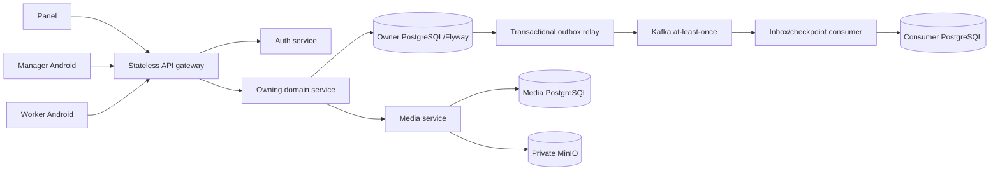

# Полный архитектурный аудит RWMS

Дата среза: 2026-08-08

Ветка и базовый `HEAD`: `develop`, `92e3c85aa6c99bf043450a6580161c9d30c897b3`

Объект проверки: текущее рабочее дерево, включая защищённые незакоммиченные
изменения пользователя и параллельные изменения документации

Статус: **архитектурная основа здравая, но до промышленной готовности необходимо
устранить P1-разрывы идентичности, lifecycle, доставки событий и восстановления**

Этот документ фиксирует состояние, найденное статическим аудитом. Он не
объявляет дефекты исправленными. В рамках аудита изменены только README,
архитектурная база знаний и документационные комментарии; бизнес-код,
контракты, схемы данных и runtime-конфигурация намеренно не исправлялись без
отдельного согласованного implementation scope.

## 1. Резюме для руководителя разработки

Проверена цепочка от трёх активных клиентов через gateway и OAuth до каждого
владельца домена, PostgreSQL/Flyway, внутренних HTTP-команд, outbox/inbox,
Kafka, read projections, media/MinIO, SSE, фоновых reconciler-ов и
архитектурных тестов.

Главный вывод: сервисные границы в целом выбраны правильно. У каждого основного
домена есть собственная база, Flyway и owner-service; gateway не содержит
бизнес-саг; media остаётся одним владельцем объектов; maintenance уже
демонстрирует хороший `prepare -> remote -> finalize` pattern. Критические
риски сосредоточены не в разбиении на сервисы, а в нескольких обходах этих
границ и отсутствующих recovery-путях.

Найдено 24 группы замечаний:

| Приоритет | Количество | Смысл |
| --- | ---: | --- |
| P1 | 7 | Возможны межаккаунтные эффекты, нарушение warehouse lifecycle, потеря проекционной полноты или остановка критичного event/media потока |
| P2 | 11 | Существенный security, recovery, release, масштабный или production-configuration риск; закрыть следующим release train |
| P3 | 6 | Контрактный долг, рост локальных таблиц, наблюдаемость, parity и удаление текущего legacy |

Первые обязательные действия:

1. привязать durable Android upload queue к подтверждённому `accountId` и
   карантинировать старые записи;
2. запретить production-start asset/maintenance/logistics/warehouse без Kafka,
   а logistics — без реальных dependencies;
3. убрать bypass warehouse admission/operation marks из публичных logistics
   команд;
4. вынести assistant inquiry create из локальной транзакции в durable saga;
5. дать analytics авторитетный replay/reconciliation path и исправить
   cabin-scoped visibility в dossier;
6. ограничить бесконечную обработку одной media Kafka-записи и сделать отказ
   наблюдаемым/восстанавливаемым;
7. только после этого заниматься release-site, parity, cleanup и косметическим
   документационным долгом.

## 2. Масштаб и метод

### 2.1. Инвентаризация активного продукта

| Область | Просканированный объём |
| --- | ---: |
| Spring production source | 11 Gradle deployables, 1 201 Java-файл |
| Spring tests | 355 test/resource files |
| Spring Flyway | 171 SQL migration |
| Go media-service | 90 Go-файлов, из них 46 test files, 12 SQL migrations |
| Web panel | 536 TypeScript/TSX-файлов, 180 test files |
| Manager Android | 44 production Kotlin-файла, 53 test files |
| Worker Android | 55 production Kotlin-файлов, 35 test files |
| Canonical contracts | 11 OpenAPI и 13 event/schema YAML-файлов |
| Shared platform | technical contracts, Spring starter и architecture tests |

Количество файлов — это показатель охвата, а не code coverage. Источники
истины проверялись в порядке из [`AGENTS.md`](../../AGENTS.md): contracts,
owner code, Flyway, tests, затем текущая project knowledge.

### 2.2. Проверенные свойства

- ownership команд, статусов и проекций;
- отсутствие cross-service таблиц, JPA entities и repositories;
- gateway route/private-route границы и прямые вызовы клиентов;
- JWT audience, scopes, warehouse isolation и account-switch state;
- optimistic concurrency, idempotency и lost-response recovery;
- границы локальной транзакции вокруг удалённых эффектов;
- outbox leasing/order/checksum, inbox deduplication, DLT и version gaps;
- Flyway/JPA соответствие и production safety validators;
- cache keys, offline persistence, SSE/reconnect и invalidation scope;
- Kafka/MinIO/media processing и фоновая обработка;
- OpenAPI/event producer-consumer parity и центральные architecture gates;
- README RU/EN, JavaDoc/KDoc/GoDoc/TSDoc и актуальность stage/legacy текста.

### 2.3. Ограничения аудита

Это repository-level static audit. Не выполнялись production pentest, нагрузка,
disaster-recovery rehearsal, Kafka outage/replay на полном окружении,
восстановление production backup, реальный OIDC login, Android emulator E2E,
VPS deploy или проверка внешнего LLM/MinIO/Kafka SLA. Наличие теста
рассматривалось как доказательство намерения и локального поведения, но не как
доказательство работающего production runtime.

Рабочее дерево было dirty до аудита. Существующие изменения auth/media и
нескольких task-board/warehouse файлов, а также четыре файла во вложенном
`manager-download-site` сохранены как защищённые. Перед реализацией каждого
пункта разработчик обязан повторно снять diff и не заменять параллельную работу
чистым `HEAD`.

Корневой `README.ru.md` до аудита был untracked и побайтово совпадал с
`services/auth-service/README.ru.md`. Для требуемой корневой RU/EN-пары этот
путь переиспользован; исходное содержимое осталось без изменений в README
auth-service и во внешнем pre-edit snapshot. Другие защищённые файлы не
переиспользовались.

## 3. Подтверждённая архитектура

Подробные owner-границы находятся в
[`service-catalog.md`](../project-knowledge/service-catalog.md), а фактическая
последовательность команд, событий, саг, projections, media и SSE — в
[`runtime-flows.md`](../project-knowledge/runtime-flows.md).

### 3.1. Что уже сделано правильно

- Spring stateful services имеют отдельные PostgreSQL/Flyway контуры;
  cross-service JPA/repository coupling в проверенной production source не
  найден.
- `api-gateway-service` остаётся stateless transport edge и не агрегирует
  доменные команды.
- Активные panel/manager/worker используют публичный gateway; прямых вызовов
  service origins или `/api/internal/**` из клиентов не найдено.
- Общая архитектура использует canonical V2 envelope, transactional outbox,
  inbox/checkpoints, optimistic fencing и sanitized DLT вместо shared DB/2PC.
- Warehouse lifecycle имеет хороший целевой протокол
  `ACTIVE -> DRAINING -> INACTIVE`, directional admission, exact version и
  durable operation marks.
- Maintenance удалённые эффекты в основных потоках используют короткие
  prepare/finalize транзакции и durable attempts с исходным fence.
- Media bytes и transformations принадлежат одному Go media-service и private
  MinIO; второго активного media owner не найдено.
- Inventory production validator уже является хорошим образцом fail-closed
  проверки dependencies, Kafka и auth bypass.

## 4. Сводный реестр рисков

| ID | Priority | Область | Результат |
| --- | --- | --- | --- |
| RWMS-001 | P1 | Manager Android identity | Durable uploads/photos одного аккаунта могут возобновиться с Bearer другого аккаунта |
| RWMS-002 | P1 | Logistics/warehouse lifecycle | При выключенных dependencies публичные документы создаются без admission и operation mark |
| RWMS-003 | P1 | Event delivery/config | Четыре owner-service могут стартовать без Kafka, продолжая писать неподвижный outbox |
| RWMS-004 | P1 | Assistant saga | Удалённый inquiry создаётся внутри локальной транзакции без durable recovery |
| RWMS-005 | P1 | Analytics projection | Terminal aggregate version gap не имеет replay/reconciliation пути |
| RWMS-006 | P1 | Dossier projection | Один глобальный unlinked/DLT факт делает все cabin dossier `PARTIAL` |
| RWMS-007 | P1 | Media/Kafka availability | Одна постоянно ошибочная запись или commit может бесконечно удерживать consumer loop |
| RWMS-008 | P2 | Manager Android cache | Maintenance catalog cache scoped по warehouse, но не по account, и хранится plaintext |
| RWMS-009 | P2 | Panel authorization cache | Protected QueryClient state не удаляется при principal/grant change |
| RWMS-010 | P2 | Assistant events/idempotency | Booking consumer вне canonical delivery policy; search retry получает случайный ключ |
| RWMS-011 | P2 | Assistant security/privacy | Не определены delegated identity и минимальный LLM data boundary |
| RWMS-012 | P2 | Logistics scalability | Recovery relays читают неограниченные списки и конкурируют множеством schedulers |
| RWMS-013 | P2 | Analytics completeness | `COMPLETE` не доказывает внутреннюю date/group continuity периода |
| RWMS-014 | P2 | Gateway production safety | Private-split production validation полно проверяет только auth target |
| RWMS-015 | P2 | Auth production safety | Base profile содержит dev DB defaults, которые prod validator не отвергает |
| RWMS-016 | P2 | Architecture/contract gates | Central ArchUnit и root contract gate не покрывают все активные deployables |
| RWMS-017 | P2 | Android release | Download site дублирован, публикует mutable debug APK без manifest/checksum truth |
| RWMS-018 | P2 | Current legacy | Cutover/import/compatibility runtime paths и stage metadata остаются активными |
| RWMS-019 | P3 | Worker SSE | OpenAPI обещает `Last-Event-ID`, но producer не делает replay |
| RWMS-020 | P3 | Worker storage | Invalidation table append-only, без retention и подходящего индекса |
| RWMS-021 | P3 | Client failure policy | Assistant stream bypasses Problem Details; worker повторяет terminal auth failures |
| RWMS-022 | P3 | Observability | Несколько owner-service не имеют достаточных domain/backlog/recovery gauges |
| RWMS-023 | P3 | Contract parity | Inventory/logistics и часть gateway routes не имеют полного implementation-to-OpenAPI gate |
| RWMS-024 | P3 | Repository hygiene | Остались stale stage comments, жёсткий broker URL и tracked runtime/test debris |

## 5. P1: обязательные исправления

### RWMS-001. Межаккаунтная durable upload queue в manager Android

**Доказательство.** `BackgroundUploadOperation` и draft не содержат owner
account; очередь одна на `filesDir/background-uploads/queue.json`;
`ManagerViewModel` при `SignedIn` вызывает `resumePending()` до загрузки `/me`;
worker создаёт новый backend и берёт текущую общую encrypted auth session.

Основные источники:
[`BackgroundUploadModels.kt`](../../app/src/main/java/dev/buhanzaz/rwms/manager/uploads/BackgroundUploadModels.kt),
[`BackgroundUploadStore.kt`](../../app/src/main/java/dev/buhanzaz/rwms/manager/uploads/BackgroundUploadStore.kt),
[`BackgroundUploadCoordinator.kt`](../../app/src/main/java/dev/buhanzaz/rwms/manager/uploads/BackgroundUploadCoordinator.kt),
[`BackgroundUploadWorker.kt`](../../app/src/main/java/dev/buhanzaz/rwms/manager/uploads/BackgroundUploadWorker.kt),
[`ManagerViewModel.kt`](../../app/src/main/java/dev/buhanzaz/rwms/manager/ui/ManagerViewModel.kt).

**Сценарий.** Аккаунт A сохраняет команду/фото offline, выходит, аккаунт B
входит в том же Android profile. До подтверждения `/me` приложение возобновляет
операцию A с Bearer B. Если B имеет доступ к объекту, возможен чужой эффект;
если нет — B всё равно видит состояние/ошибку чужой операции.

**Исправление.** Добавить immutable `ownerAccountId` во все operation/draft,
файлы, WorkManager input и unique work names. Создавать durable запись только
после подтверждённого `/me`; UI/retry/resume фильтровать по account и warehouse.
На logout дождаться отмены работ и закрыть auth snapshot. Старые записи без
owner не угадывать: переместить в локальный quarantine с явным действием
удаления/повторного создания. Рассмотреть шифрование retained media, но
account scoping обязателен независимо от шифрования.

**Приёмка.** Два аккаунта на одном устройстве; pending, running, retry и process
restart; ни один HTTP-запрос B не содержит operation/file A; legacy queue не
отправляется; logout/login race покрыт детерминированным тестом.

### RWMS-002. Logistics обходит warehouse admission при disabled dependencies

**Доказательство.** Base config задаёт
`LOGISTICS_DEPENDENCIES_ENABLED=false`; disabled gateway сообщает
`productionReady=false`; `LogisticsWarehouseLifecycle.prepare` возвращает
`AdmissionTicket.bypassed`, после чего Return/Shipment/Transfer и их outbox
сохраняются, а warehouse operation-mark relay также пропускается.

Основные источники:
[`application.yaml`](../../services/logistics-service/src/main/resources/application.yaml),
[`DisabledLogisticsDependencyGateway.java`](../../services/logistics-service/src/main/java/dev/buhanzaz/rwms/logistics/integration/DisabledLogisticsDependencyGateway.java),
[`LogisticsWarehouseLifecycle.java`](../../services/logistics-service/src/main/java/dev/buhanzaz/rwms/logistics/service/LogisticsWarehouseLifecycle.java),
[`LogisticsDocumentService.java`](../../services/logistics-service/src/main/java/dev/buhanzaz/rwms/logistics/service/LogisticsDocumentService.java),
[`LogisticsWarehouseOperationMarkRelay.java`](../../services/logistics-service/src/main/java/dev/buhanzaz/rwms/logistics/service/LogisticsWarehouseOperationMarkRelay.java).

**Последствие.** Новый incoming document может быть принят для `DRAINING` или
`INACTIVE` warehouse, а warehouse-service не получает permanent operated mark.
Это нарушает подтверждённый lifecycle protocol и может дать ложную readiness.

**Исправление.** Добавить production validator как в inventory: production
требует real dependencies, Kafka, fail-closed auth и `productionReady()`.
Публичная create-команда при недоступной admission dependency возвращает
явный `503` до доменной записи. `bypassed` допустим только для доказанного
idempotent replay уже локально admitted operation, а не для первого эффекта.

**Приёмка.** Production startup с dependencies=false падает; dev mode явно
маркирован. Create при disabled/timeout/`DRAINING`/`INACTIVE` не создаёт
document/outbox. Потеря ответа после admission безопасно повторяется; operation
mark доставляется и участвует в readiness.

### RWMS-003. Outbox пишется, а Kafka relay может отсутствовать

**Доказательство.** Warehouse, asset, maintenance и logistics по умолчанию
принимают `rwms.platform.kafka.enabled=false`; доменный event/outbox store
пишется независимо, но relay/channel beans создаются только при `true`.
Production validators этих сервисов либо отсутствуют, либо не требуют Kafka.
Inventory validator уже корректно отвергает такой production profile.

Основные источники: service-local `application.yaml`, `*EventStore` или
`*OutboxWriter`, `*KafkaOutboxRelay` и `*ProductionSafetyValidator` в
[`warehouse-service`](../../services/warehouse-service/),
[`asset-service`](../../services/asset-service/),
[`maintenance-service`](../../services/maintenance-service/) и
[`logistics-service`](../../services/logistics-service/); положительный образец
— [`InventoryProductionSafetyValidator.java`](../../services/inventory-service/src/main/java/dev/buhanzaz/rwms/inventory/config/InventoryProductionSafetyValidator.java).

**Последствие.** Команды возвращают success, producer DB остаётся верной, но
consumers/read models никогда не узнают факт. Backlog растёт без relay и может
быть замечен только после функционального расхождения.

**Исправление.** Сохранить false как явный dev/test режим, но для prod требовать
Kafka=true, непустые destinations и безопасные broker properties до startup.
Добавить `outbox_backlog`, `oldest_pending_age`, DLT/quarantine gauges и alert.
Для существующего backlog включать relay без переписывания rows и дренировать
в aggregate order.

**Приёмка.** Для каждого owner-service: prod startup false/empty destination
падает; dev startup остаётся доступен; команда+commit+relay integration test;
broker outage оставляет recoverable backlog; повторная доставка не дублирует
consumer effect.

### RWMS-004. Assistant remote create не имеет durable saga

**Доказательство.** `AssistantConversationService.create` имеет
`@Transactional`, вызывает logistics create до `saveAndFlush`; Flyway не
содержит таблицы attempt/saga. Потеря локального commit после успешного HTTP
оставляет logistics inquiry без восстанавливаемой локальной связи.

Основные источники:
[`AssistantConversationService.java`](../../services/assistant-service/src/main/java/dev/buhanzaz/rwms/assistant/service/AssistantConversationService.java),
[`HttpLogisticsClient.java`](../../services/assistant-service/src/main/java/dev/buhanzaz/rwms/assistant/integration/HttpLogisticsClient.java),
[`assistant Flyway`](../../services/assistant-service/src/main/resources/db/migration/),
[`logistics-service.yaml`](../../contracts/openapi/logistics-service.yaml).

**Исправление.** Ввести assistant-owned durable attempt:
`PREPARED -> REMOTE_CONFIRMED -> FINALIZED` плюс reviewed/quarantined state.
Стабильный `conversationId` остаётся remote idempotency identity; HTTP идёт
вне локальной транзакции; result fingerprint сохраняется и reconciler завершает
потерянный local commit. Необходимо заранее решить судьбу уже созданного
orphan и модель delegated/service identity — см.
[`open-questions.md`](../project-knowledge/open-questions.md).

**Приёмка.** Fault injection после prepare, после remote commit, до/после local
finalize; process restart и две replicas; один inquiry и одна conversation;
несовпадающий replay quarantined; user/actor audit не теряется.

### RWMS-005. Terminal analytics gap невозможно восстановить

**Доказательство.** Aggregate checkpoint после ограниченного числа попыток
становится `terminallyBlocked`; поздние события уходят в DLT. Имеющийся
`AnalyticsGapRecoveryService` повторяет только локально удержанные факты и не
запрашивает producer replay/snapshot, не снимает terminal block доказанным
операторским действием.

Основные источники:
[`AnalyticsAggregateCheckpoint.java`](../../services/analytics-service/src/main/java/dev/buhanzaz/rwms/analytics/domain/AnalyticsAggregateCheckpoint.java),
[`AnalyticsGapRecoveryService.java`](../../services/analytics-service/src/main/java/dev/buhanzaz/rwms/analytics/service/AnalyticsGapRecoveryService.java),
[`AnalyticsInboxProcessor.java`](../../services/analytics-service/src/main/java/dev/buhanzaz/rwms/analytics/service/AnalyticsInboxProcessor.java),
[`aggregate-checkpoint-policy-v1.schema.yaml`](../../contracts/events/technical/aggregate-checkpoint-policy-v1.schema.yaml).

**Исправление.** После продуктового решения об archive authority добавить
producer replay/snapshot или reviewed reconciliation contract. Recovery должен
проверить continuous versions/checksum, применить missing fact, затем held
facts строго по порядку и только после этого снять block. Существующие terminal
checkpoints инвентаризировать и восстанавливать поштучно, не массовым update.

**Приёмка.** Gap N+2, поздний N+1, restart, duplicate, conflicting payload,
несколько replicas и terminal recovery. `COMPLETE` недоступен, пока checkpoint
или coverage не доказаны.

### RWMS-006. Dossier global failures загрязняют все cabin reads

**Доказательство.** `DossierQueryService` вычисляет `PARTIAL`, если в generation
есть любой unresolved unlinked fact или вообще существует DLT row с source
event ID. Условие не связано с запрошенным `cabinId`, хотя cabin-scoped
repository query существует; canonical consumer contract говорит, что обычный
unlinked факт не виден ни в одном dossier до связи.

Основные источники:
[`DossierQueryService.java`](../../services/dossier-service/src/main/java/dev/buhanzaz/rwms/dossier/service/DossierQueryService.java),
[`DossierUnlinkedFactRepository.java`](../../services/dossier-service/src/main/java/dev/buhanzaz/rwms/dossier/repository/DossierUnlinkedFactRepository.java),
[`dossier-consumers.yaml`](../../contracts/events/dossier-consumers.yaml).

**Исправление.** Вычислять visibility только из hidden/failed evidence,
доказуемо относящегося к cabin и активной generation. Для unlinked факта без
cabin не ухудшать все reads; показывать его отдельной operational metric/queue.
Добавить индекс для cabin/generation unresolved lookup и backfill только если
link доказан источником.

**Приёмка.** Unlinked/DLT для cabin A не меняет B; hidden warehouse evidence
меняет только соответствующий read; rebuild generation изолирован; API parity
проверяет `COMPLETE/PARTIAL` причины.

### RWMS-007. Media consumer может бесконечно удерживать одну запись

**Доказательство.** `handleUntilPersisted` и `commitUntilAcknowledged` содержат
неограниченные циклы с backoff до 4 секунд. Постоянный persistence/process
failure удерживает текущий record/partition; постоянный broker commit failure
не возвращает управление, пока context не отменён.

Основной источник:
[`consumer.go`](../../services/media-service/internal/worker/consumer.go).

**Исправление.** Разделить transient dependency outage и terminal/poison
failure. Processing attempts хранить durably и после bound переводить safe
metadata в terminal/DLT с возможностью reviewed retry; idempotent job state
позволяет перечитать record. Commit retry ограничить context/deadline и вернуть
consumer loop/rebalance вместо вечного goroutine. Добавить circuit breaker,
oldest job age, attempts, partition/offset и terminal reason metrics без raw
payload.

**Приёмка.** Transient outage восстанавливается; permanent invalid/processor
failure не блокирует следующую пригодную работу; broker outage не теряет
committed DB effect; shutdown завершается; повторная запись не создаёт второй
media result.

## 6. P2: следующий release train

### RWMS-008. Manager maintenance cache не изолирован по аккаунту

`CachedMaintenanceCatalog` хранит один plaintext SharedPreferences payload и
проверяет только `warehouseId`. После входа B в тот же warehouse может быть
восстановлен catalog A, включая цены и routing. Для сравнения `ManagerReadCache`
уже корректно использует account+warehouse scope.

Источники:
[`MaintenanceCatalogCache.kt`](../../app/src/main/java/dev/buhanzaz/rwms/manager/ui/MaintenanceCatalogCache.kt),
[`ManagerReadCache.kt`](../../app/src/main/java/dev/buhanzaz/rwms/manager/ui/ManagerReadCache.kt),
[`ManagerViewModel.kt`](../../app/src/main/java/dev/buhanzaz/rwms/manager/ui/ManagerViewModel.kt).

Исправление: account+warehouse key, owner metadata внутри authenticated/encrypted
payload, migration/quarantine старого формата, очистка при revoke/grant change.
Тест: два пользователя одного склада, offline start, logout/login и downgrade
grants.

### RWMS-009. Panel QueryClient переживает смену principal/grants

Один `QueryClient` живёт на всё приложение. Auth provider очищает OIDC/media
state, но не protected query cache. Несколько query keys не содержат principal;
есть `staleTime: Infinity` и `gcTime: 2h`. Полный redirect часто снижает риск,
но silent renewal, смена grants и повторный login в той же вкладке оставляют
authorization boundary неявной.

Источники:
[`main.tsx`](../../panel/src/main.tsx),
[`auth-provider.tsx`](../../panel/src/features/auth/auth-provider.tsx),
[`equipment-page.tsx`](../../panel/src/features/equipment/equipment-page.tsx).

Исправление: центральный protected-query registry или QueryClient reset на
logout и authenticated subject/grant-revision change; media blobs/realtime
subscriptions закрывать тем же transition. Не добавлять account во все keys
как единственную защиту — server authorization остаётся обязательной.

### RWMS-010. Assistant event consumer и search retry вне общей policy

`RentalInquiryBookedKafkaConsumer` принимает raw String напрямую, parser не
использует полный strict canonical V2/delivery pipeline, а inbox считает тот же
eventId duplicate без проверки changed payload. Search command генерирует
новый random idempotency key на каждую попытку, хотя logistics search меняет
hold/selection state.

Источники:
[`RentalInquiryBookedKafkaConsumer.java`](../../services/assistant-service/src/main/java/dev/buhanzaz/rwms/assistant/eventing/RentalInquiryBookedKafkaConsumer.java),
[`RentalInquiryBookedEventParser.java`](../../services/assistant-service/src/main/java/dev/buhanzaz/rwms/assistant/eventing/RentalInquiryBookedEventParser.java),
[`AssistantEventInboxRepository.java`](../../services/assistant-service/src/main/java/dev/buhanzaz/rwms/assistant/repository/AssistantEventInboxRepository.java),
[`HttpLogisticsClient.java`](../../services/assistant-service/src/main/java/dev/buhanzaz/rwms/assistant/integration/HttpLogisticsClient.java).

Исправление: перевести booking consumer на canonical envelope, schema/delivery
policy, payload hash conflict и bounded DLT/recovery. Search attempt должен
иметь durable stable ID на один tool call; logistics boundary обязан принять и
проверить этот key. Проверить lost response, process restart и duplicate event
с отличающимся body.

### RWMS-011. Не определены assistant identity и LLM data boundary

Private logistics client пересылает интерактивный Bearer пользователя, хотя
общая service-to-service модель требует service credential либо явный
delegated identity contract. В LLM уходит вся восстановленная история сообщений
и tool payloads без общего context budget и schema-level allow-list; фильтр
контактов основан преимущественно на именах полей.

Источники:
[`HttpLogisticsClient.java`](../../services/assistant-service/src/main/java/dev/buhanzaz/rwms/assistant/integration/HttpLogisticsClient.java),
[`AssistantConversationService.java`](../../services/assistant-service/src/main/java/dev/buhanzaz/rwms/assistant/service/AssistantConversationService.java),
[`HttpChatCompletionClient.java`](../../services/assistant-service/src/main/java/dev/buhanzaz/rwms/assistant/integration/HttpChatCompletionClient.java).

Решения вынесены в
[`open-questions.md`](../project-knowledge/open-questions.md). После решения:
service token с узким scope + immutable actor context либо формальная token
exchange/delegation; outbound DTO allow-list, redaction, hard token/turn budget,
approved retention/provider region и safe metrics. Нельзя логировать prompt,
token или raw provider response.

### RWMS-012. Logistics recovery не имеет bounded claiming

`LogisticsExternalAttemptRepository` возвращает все подходящие attempts без
page/limit/lease claim. Несколько relays проходят большие коллекции; один
document может порождать сотни/тысячи шагов и пятисекундные remote calls.
В сервисе много независимых schedulers без явно ограниченного общего
executor/ownership, поэтому backlog создаёт starvation и duplicate pressure.

Источники:
[`LogisticsExternalAttemptRepository.java`](../../services/logistics-service/src/main/java/dev/buhanzaz/rwms/logistics/repository/LogisticsExternalAttemptRepository.java),
[`services/logistics-service`](../../services/logistics-service/).

Исправление: `FOR UPDATE SKIP LOCKED`/lease token, page size, stable ordering,
per-owner concurrency budget, next-attempt index и один наблюдаемый scheduler
executor. Каждый HTTP effect остаётся вне DB transaction. Проверки: 10k
attempts, две replicas, lease expiry, slow dependency, starvation и shutdown.

### RWMS-013. Analytics `COMPLETE` не доказывает полный период

Даже без terminal aggregate gap текущая логика не доказывает, что для каждой
ожидаемой warehouse-local date и каждой активной group получен факт. Краевые
факты могут дать видимость непрерывности при внутренней дыре.

Источники:
[`AnalyticsProjectionService.java`](../../services/analytics-service/src/main/java/dev/buhanzaz/rwms/analytics/service/AnalyticsProjectionService.java),
[`AnalyticsQueryService.java`](../../services/analytics-service/src/main/java/dev/buhanzaz/rwms/analytics/service/AnalyticsQueryService.java),
[`analytics-service.yaml`](../../contracts/openapi/analytics-service.yaml).

Исправление зависит от определения completeness в open questions. После него
хранить expected coverage или watermarks и отдавать причины
`PARTIAL/BLOCKED/STALE`; тестировать внутреннюю дату, изменение timezone,
создание/закрытие group и delayed fact.

### RWMS-014. Gateway production target validation асимметрична

`GatewayProductionSafetyValidator` проверяет public/private split только для
auth target. Остальные service URLs проходят shape/non-loopback проверки, хотя
README обещает private split для всех targets. Ошибка deployment topology может
отправить gateway к публичному или неверно разделённому origin.

Источник:
[`GatewayProductionSafetyValidator.java`](../../services/api-gateway-service/src/main/java/dev/buhanzaz/rwms/gateway/config/GatewayProductionSafetyValidator.java).

Исправление: единая typed target policy для каждого downstream, запрет
loopback/userinfo/query/fragment, HTTPS/public-host expectations и явный
private-network/service-discovery rule. Table-driven startup tests на все
targets и SSE route parity.

### RWMS-015. Auth production validator не закрывает DB defaults

Base `application.yaml` имеет fallback `127.0.0.1`, `rwms_auth/rwms_auth`.
Validator проверяет OAuth endpoints, dev credentials и Kafka cutover, но не
datasource URL/username/password. В prod при пропущенной переменной возможен
непреднамеренный loopback/default credential startup либо поздний неочевидный
отказ.

Источники:
[`application.yaml`](../../services/auth-service/src/main/resources/application.yaml),
[`AuthProductionSafetyValidator.java`](../../services/auth-service/src/main/java/dev/buhanzaz/rwms/auth/config/AuthProductionSafetyValidator.java).

Исправление: убрать секретный password default из base либо явно отвергать
default URL/user/password в prod до DataSource init; добавить negative startup
tests. Секреты не выводить в exception/log.

### RWMS-016. Architecture и contract gates покрывают не весь продукт

`platform:architecture-tests` зависит от auth/task-board/warehouse/asset/
maintenance/inventory/logistics/dossier, но не assistant, analytics и gateway.
Root не имеет одного gate, который валидирует все OpenAPI/event schemas и
producer/consumer references. Поэтому новые deployables могут обойти
dependency/JPA/MapStruct rules, а stale contract проходит до локального теста.

Фактический запуск текущего suite дополнительно обнаружил drift внутри уже
подключённых модулей: 40 из 42 тестов прошли, а inventory/logistics source
policies отвергли действующие low-level adapters/native queries, которых нет в
их узких allow-list. Это нельзя исправлять простым добавлением имён: сначала
каждый adapter должен доказать техническую, а не business-persistence роль.

Источники:
[`architecture-tests/build.gradle.kts`](../../platform/architecture-tests/build.gradle.kts),
[`PlatformArchitectureTest.java`](../../platform/architecture-tests/src/test/java/dev/buhanzaz/rwms/architecture/PlatformArchitectureTest.java),
[`contracts`](../../contracts/).

Исправление: включить все Java deployables, отдельно проверять stateless
gateway/no DB/no Kafka, read-model command prohibition и technical-contract
neutrality. Добавить root `validateContracts` с schema refs, duplicate
operation/event IDs и producer/consumer compatibility. Не добавлять Go service
в Java class scan; для него нужен отдельный structural Go gate. Параллельно
актуализировать inventory/logistics policy по проверенной роли каждого
`JdbcTemplate`/`nativeQuery`, удалить Stage-имена из test descriptions и не
маскировать violation широкой package allow-list.

### RWMS-017. APK download publication не воспроизводима

`manager-download-site` содержит две конкурирующие страницы (Next и static),
mutable debug APK и вручную заданные version/date/size. App version и package
version расходятся; release manifest, SHA-256 и единый artifact source
отсутствуют. Четыре существующих site-файла уже имели защищённые изменения и в
этом аудите не редактировались.

Источники:
[`app/page.jsx`](../../manager-download-site/app/page.jsx),
[`public/index.html`](../../manager-download-site/public/index.html),
[`prepare-sites-worker.mjs`](../../manager-download-site/scripts/prepare-sites-worker.mjs),
[`app/build.gradle.kts`](../../app/build.gradle.kts).

Исправление после release-решения: одна page implementation; CI создаёт
signed release APK, immutable filename и JSON manifest из Gradle metadata,
source revision, build time, size, SHA-256 и signing certificate fingerprint;
страница только рендерит manifest. Проверять hash опубликованного файла и
устанавливать именно его перед E2E claim.

### RWMS-018. Текущий runtime содержит завершённые migration paths

В task-board остаётся Kafka cutover rehearsal runner и связанная persistence;
maintenance имеет one-time task-board import surface; Compose сохраняет
RabbitMQ compatibility profile, который platform test специально закрепляет,
хотя media production source не использует AMQP. Canonical event metadata ещё
содержит F4A/F4T/approved-stage language и hard-coded `kafka:9092` в одном
описании.

Источники:
[`TaskBoardKafkaCutoverRehearsalRunner.java`](../../services/task-board-service/src/main/java/dev/buhanzaz/rwms/taskboard/eventing/TaskBoardKafkaCutoverRehearsalRunner.java),
[`maintenance-service`](../../services/maintenance-service/),
[`compose.yaml`](../../compose.yaml),
[`AmqpRetirementArchitectureTest.java`](../../platform/spring-boot-starter/src/test/java/dev/buhanzaz/rwms/platform/isolation/AmqpRetirementArchitectureTest.java),
[`contracts/events`](../../contracts/events/).

Исправление: сначала доказать отсутствие active caller/data/release dependency,
затем удалить runtime path, таблицы только через отдельный expand/contract и
авторизованную retention/data decision. Contract descriptions перевести на
current product semantics без изменения event meaning. Исторические отчёты
оставить в `docs/plans`/legacy knowledge.

## 7. P3: hardening и поддерживаемость

### RWMS-019. `Last-Event-ID` обещан, но не используется

OpenAPI требует reconnect с cursor; controller принимает header и игнорирует;
worker читает последний ID только перед началом flow. Текущий hub при каждом
connect посылает новый `FEED_CHANGED`, а worker опрашивает server примерно раз
в 15 секунд, поэтому доказанной потери authoritative data сейчас нет. Это
contract/forward-compatibility defect, а не подтверждённая data-loss.

Решение: выбрать invalidation-only full resync без replay или durable replay с
cursor expiry. До решения не строить половинчатый in-memory replay. См.
[`task-board-service.yaml`](../../contracts/openapi/task-board-service.yaml),
[`WorkerTaskBoardController.java`](../../services/task-board-service/src/main/java/dev/buhanzaz/rwms/taskboard/api/WorkerTaskBoardController.java) и
[`WorkerRealtimeCoordinator.kt`](../../worker-app/core-sync/src/main/java/dev/buhanzaz/rwms/worker/core/sync/WorkerRealtimeCoordinator.kt).

### RWMS-020. Worker invalidation storage растёт без bound

Локальная `worker_invalidation` append-only; DAO имеет insert/MAX/order reads,
но не delete/retention, и latest lookup не обеспечен индексом
`(userId, revision DESC)`. Hub создаёт новый random invalidation при connect,
FCM добавляет ещё записи.

Исправление: хранить cursor + короткое bounded окно event IDs, deduplicate
SSE/FCM, индексировать lookup, pruning выполнять после успешного authoritative
sync. Migration test обязан сохранить текущий cursor.

Источники:
[`WorkerDatabaseEntities.kt`](../../worker-app/core-database/src/main/java/dev/buhanzaz/rwms/worker/core/database/WorkerDatabaseEntities.kt),
[`WorkerDatabaseDaos.kt`](../../worker-app/core-database/src/main/java/dev/buhanzaz/rwms/worker/core/database/WorkerDatabaseDaos.kt).

### RWMS-021. Client failure policies расходятся

Panel assistant stream превращает часть transport errors в локальный формат
мимо общего Problem Details mapper. Worker network retry продолжает повторять
`403` при full sync, хотя этот результат требует нового grant или действия
пользователя. В manager Gradle остаётся runtime-unused AppAuth custom-scheme
placeholder: production manifest удаляет библиотечный receiver, а реальный
login использует HTTPS gateway callback. Это не доказывает, что placeholder
можно удалить без проверки test manifest merge.

Исправление: единая typed error taxonomy; 401 требует refresh/login, 403 —
grant refresh/user action, 409 — authoritative refetch, 429/502/503/504 —
bounded retry по policy. Проверить stream и ordinary HTTP одинаковыми contract
fixtures. AppAuth placeholder удалять только после отдельной проверки main и
test merged manifests без него.

### RWMS-022. Неполная operational observability

Asset и inventory уже имеют часть backlog/domain metrics; maintenance и
logistics не дают эквивалентной картины durable attempts, lease age, terminal
state и scheduler saturation. Warehouse Kafka-disabled backlog также может
оставаться незаметным.

Минимальный набор: backlog count/oldest age по state, claim latency, attempt
count, terminal/quarantine reason, version-gap age, scheduler active/queue,
remote latency/status, outbox publish lag и projection completeness. Labels не
содержат aggregate IDs, user IDs или payload.

### RWMS-023. Неполная implementation-to-OpenAPI parity

Inventory и logistics не имеют одного полного route/method/security parity
test; gateway route family и Android-consumed shapes проверяются фрагментами.
Это повышает вероятность drift при большом числе внутренних endpoints.

Исправление: сгенерировать operation inventory из canonical OpenAPI и
сопоставить с Spring mappings/security matcher; отдельно проверять private
namespace и active consumer DTO fixtures. Contract gate не заменяет
business integration tests.

### RWMS-024. Hygiene и stale metadata

Canonical/current docs местами используют stage/cutover формулировки, один
AsyncAPI server жёстко указывает `kafka:9092`; в root tracked `imege_1.png` и
`panel/test-results/.last-run.json`. Это не production incident, но затрудняет
понимание authoritative state и создаёт ложный release signal.

Исправление: после проверки owners удалить generated/test debris, исправить
current contract descriptions без изменения semantics, использовать server
variables/example вместо runtime promise. Не удалять исторические документы и
не переписывать live migrations.

## 8. Последовательный план исправления

### Phase 0 — решения и безопасный release freeze (1–2 дня)

1. Назначить owner каждому RWMS-ID и запретить production rollout с новыми
   P1-backlogs до fail-fast проверки.
2. Принять четыре минимальных решения из
   [`open-questions.md`](../project-knowledge/open-questions.md): assistant
   orphan/identity, LLM data boundary, analytics replay/completeness, worker SSE
   semantics; отдельно утвердить APK signing/publication.
3. Снять production inventory: pending Android operations на управляемых
   устройствах, outbox backlog/age четырёх сервисов, terminal analytics gaps,
   unresolved dossier facts, media job age и logistics disabled-dependency
   deployments. Это read-only измерение; ничего массово не исправлять SQL.

### Phase 1 — identity и fail-closed configuration (первая неделя)

1. RWMS-001 и RWMS-008: account-scoped Android migrations и two-user tests.
2. RWMS-009: principal/grant-aware panel cache teardown.
3. RWMS-002/RWMS-003: production validators и удаление first-command bypass.
4. RWMS-014/RWMS-015: gateway/auth startup safety.
5. Включить alerts до дренирования существующего outbox; не отмечать phase
   завершённой только по успешному startup.

### Phase 2 — durable recovery и projection truth (2–4 недели)

1. RWMS-004: assistant saga + identity contract + reconciliation.
2. RWMS-005/RWMS-013: analytics replay and coverage model.
3. RWMS-006: cabin-scoped dossier visibility и индексы.
4. RWMS-007: bounded media processing/commit lifecycle.
5. RWMS-010/RWMS-012: canonical assistant consumer, stable search attempt и
   bounded logistics claims.

### Phase 3 — enforcement и release integrity (после P1)

1. RWMS-016/RWMS-023: полный architecture/contract/parity gate.
2. RWMS-017: единая signed APK publication pipeline.
3. RWMS-019/RWMS-020/RWMS-021: согласованный SSE/storage/error behavior.
4. RWMS-022: SLO dashboards и failure drills.

### Phase 4 — controlled legacy removal

1. Для каждого RWMS-018/024 path доказать отсутствие active callers и данных.
2. Удалить implementation/config/tests одним slice; schema cleanup — только
   после retention/backup/rollback решения и отдельной авторизации.
3. Перепроверить root search, contracts, compose profiles и deploy manifests;
   исторические доказательства оставить помеченными historical.

## 9. Work packages для передачи программистам

| Package | Owner/components | Contract impact | Persistence/existing data | Обязательный gate |
| --- | --- | --- | --- | --- |
| WP-01 Account-scoped mobile state | `app`, auth `/me`; затем `panel` cache | Серверный контракт не меняется | Local queue/catalog schema; quarantine ownerless records | Two-account JVM/instrumented tests, exact APK, emulator login A→B |
| WP-02 Production dependency safety | warehouse, asset, maintenance, logistics, gateway, auth | Runtime config contract/README | Схемы не меняются; измерить и безопасно drain существующий outbox | Negative prod startup, broker outage, backlog drain, service logs |
| WP-03 Logistics lifecycle admission | logistics + warehouse private API | Обычно без schema change; уточнить error response | Возможно добавить durable admission state/index, без rewrite документов | disabled/timeout/draining/replay/mark/readiness Testcontainers |
| WP-04 Assistant durable inquiry | assistant + logistics | Private auth/idempotency/recovery boundary | New Flyway attempt table; reconcile orphan inventory by reviewed process | Fault injection at every transaction/HTTP boundary, two replicas |
| WP-05 Projection recovery | analytics + producer owners | Replay/snapshot/admin contract; completeness semantics | New recovery audit/coverage; per-checkpoint migration, no bulk unblock | Gap/replay/conflict/date/group/rebuild integration suite |
| WP-06 Dossier visibility | dossier | Public visibility meaning unchanged | Cabin/generation indexes; safe link backfill only | Unrelated-cabin isolation, DLT/unlinked/rebuild tests |
| WP-07 Media bounded worker | media | Event meaning unchanged; operational retry policy documented | Durable attempts/terminal metadata may need Go migration | Go unit/integration, Kafka outage, poison record, shutdown/build |
| WP-08 Event and logistics hardening | assistant/logistics/platform | Canonical booking event and stable search key | Inbox payload hash and leased attempt migrations | Duplicate-conflict, lost response, 10k backlog, replica tests |
| WP-09 Platform gates | architecture-tests/contracts/all deployables | Validation only | None | Full ArchUnit, schema refs, route parity, approved versions |
| WP-10 Release site | app/download site/release CI | Artifact manifest format | Immutable artifact retention, no live data | Signed release build, hash/signature, install exact published APK |
| WP-11 SSE and worker retention | task-board/worker/gateway | Contract description or durable replay API | Room migration/index/prune; optional server replay store | Disconnect/reconnect/cursor expiry/FCM duplicate/retention tests |
| WP-12 Legacy removal | owning services/platform/compose/contracts | Remove only proven obsolete surfaces | Expand/contract and retention decision before table deletion | Caller search, clean install/upgrade, full affected module gate |

Один package не должен одновременно менять чужой owner aggregate «для
удобства». Контракт, producer и все активные consumers меняются вместе.

## 10. Data-safety и migration правила

- Не связывать ownerless Android queue с «текущим» пользователем по догадке.
- Не снимать analytics terminal block прямым SQL без доказанного missing
  history и recovery audit.
- Не удалять outbox/DLT/unlinked rows для получения зелёной метрики; сначала
  классифицировать и восстановить owner truth.
- Не переписывать опубликованные Flyway migrations; все новые schema steps
  service-local и ordered.
- Не удалять Rabbit/cutover/import tables или volume только потому, что код
  выглядит устаревшим. Нужны caller/data inventory, backup/rollback и явная
  destructive-data авторизация.
- Не публиковать APK из mixed dirty worktree. Artifact должен быть связан с
  reviewed source revision и точным manifest/hash.

## 11. Документационная работа этого аудита

Создана единая текущая карта проекта:

- корневые [`README.md`](../../README.md) и
  [`README.ru.md`](../../README.ru.md);
- парные README активных services, clients, contracts и platform modules;
- [`service-catalog.md`](../project-knowledge/service-catalog.md),
  [`runtime-flows.md`](../project-knowledge/runtime-flows.md) и
  [`documentation-standard.md`](../project-knowledge/documentation-standard.md);
- semantic JavaDoc/KDoc для production architecture types и нетривиальных
  command/security/event/recovery boundaries в затронутых чистых файлах;
- этот evidence-backed risk register и developer remediation plan.

README объясняют ownership, API/security, persistence, event/recovery,
production config, failure behavior и focused checks. Они не копируют полные
schemas и не превращают найденный дефект в «нормальную архитектуру».

Документационные комментарии не являются исправлением P1/P2. Их задача —
сделать границы и известные failure semantics видимыми до implementation.

## 12. Verification и критерий закрытия аудита

Фактически выполнены следующие проверки итогового documentation/comment diff:

| Проверка | Результат |
| --- | --- |
| README и Markdown | 34 EN/RU-пары; одинаковая структура заголовков и взаимные language links; 78 изменённых/новых и 93 активных Markdown-файла; 965 локальных ссылок без неразрешённых targets |
| JavaDoc coverage | 1 381 production Java-файл; файлов без документационного блока: 0 |
| KDoc coverage | 113 production Kotlin-файлов; файлов без документационного блока: 0 |
| New-source declaration coverage | 167 новых незакоммиченных Java/Kotlin-файлов; 490 реальных деклараций типов (454 Java, 36 Kotlin), пропусков: 0; добавлено 236 содержательных JavaDoc/KDoc-блоков; восемь declaration-shaped фрагментов внутри synthetic test text blocks исключены |
| GoDoc coverage | 302 exported Go declarations; gaps: 0 |
| Spring/platform compile | `compileJava` для 13 production Java modules — `BUILD SUCCESSFUL` (16 s) |
| JavaDoc generation | `javadoc --rerun-tasks` для тех же 13 modules — `BUILD SUCCESSFUL` (2 min 12 s); остаются non-fatal предупреждения о неполных member comments/`@param`, в том числе у nested records/accessors; ошибок нет |
| Panel | `npm run typecheck` — успешно |
| Android | manager `compileDebugKotlin` (32 s) и worker `:app:compileDebugKotlin` (1 min 37 s) — успешно с JDK 17 |
| Media | `/opt/go1.25.10/bin/go test ./...` и `/opt/go1.25.10/bin/go vet ./...` — успешно |
| Dependency policy | `verifyApprovedDependencyVersions` — `BUILD SUCCESSFUL`; 14 module checks |
| Central architecture suite | 47/49 passed; 2 существующих policy-drift failure описаны ниже; отдельный `GodClassSourcePolicyTest` — 7/7 |
| Diff/data safety | `git diff --check` и побайтовая сверка protected snapshots — успешно |

Central architecture suite не зелёный и не скрыт за формулировкой «успешно»:

1. `InventorySourcePolicyTest` обнаруживает low-level SQL в
   `InventoryAssetInboxProcessor`, `InventoryAssetRetryStore` и
   `InventoryFrozenPlanFingerprint` вне точного allow-list.
2. `LogisticsSourcePolicyTest` обнаруживает low-level/native SQL в десяти
   production типах, включая booking outbox, warehouse lifecycle/marks,
   orders и driver tasks, также вне точного allow-list.

Allow-list автоматически не расширялся: сначала нужно решить, должны ли эти
SQL-boundaries быть официально разрешены или перенесены в утверждённые
repository/store пакеты. Остальные 47 architecture tests прошли.

Отдельно от этих проверок каждый remediation package обязан выполнить gates из
таблицы выше; успешная компиляция комментариев не доказывает исправление
найденных runtime-дефектов. APK не собирался и Android emulator E2E не
выполнялся, потому что runtime/Android behavior не менялись.

Аудит считается переданным, когда:

1. все README links и RU/EN heading pairs проверены;
2. comment-only Java/Kotlin changes компилируются и Javadoc tasks не падают;
3. architecture test и approved dependency gate выполнены либо точный внешний
   blocker записан;
4. protected pre-existing diffs не потеряны;
5. каждый P1 имеет owner, issue/work package, migration/recovery strategy и
   acceptance tests;
6. product decisions не подменены предположениями.

## 13. Итоговая оценка

RWMS не требуется переписывать как монолит или заново нарезать на сервисы.
Текущая owner-oriented основа пригодна для дальнейшего развития. До
production-ready состояния необходимо закрыть конкретные boundary failures:
идентичность durable client state, fail-closed dependencies/Kafka, durable
remote-effect recovery, projection reconciliation и bounded worker execution.

Приоритет следует определять не количеством JavaDoc или README, а возможностью
системы после любого retry/restart однозначно ответить на четыре вопроса:

1. кто выполнил эффект;
2. какой owner его подтвердил;
3. где находится authoritative state;
4. как система доказываемо восстановится после потери ответа, события или
   локального commit.

Пока хотя бы один P1 не отвечает на эти вопросы, его поток нельзя считать
готовым к безопасной промышленной эксплуатации.

## Приложение A. Line-level evidence

Номера строк относятся к рабочему дереву на дату среза и дополняют ссылки в
основных разделах. Для выводов об отсутствии механизма указан проверенный
положительный контраст или полный boundary, в котором такой механизм должен
находиться.

| ID | Ключевые доказательства в source/config/tests |
| --- | --- |
| RWMS-001 | `app/src/main/java/dev/buhanzaz/rwms/manager/uploads/BackgroundUploadModels.kt:61-111`; `app/src/main/java/dev/buhanzaz/rwms/manager/ui/ManagerViewModel.kt:419-420`; `app/src/main/java/dev/buhanzaz/rwms/manager/uploads/BackgroundUploadWorker.kt:44-52` |
| RWMS-002 | `services/logistics-service/src/main/resources/application.yaml:100`; `services/logistics-service/src/main/java/dev/buhanzaz/rwms/logistics/service/LogisticsWarehouseLifecycle.java:110-111`; public callers: `services/logistics-service/src/main/java/dev/buhanzaz/rwms/logistics/api/LogisticsController.java:90`, `:188`, `:317` |
| RWMS-003 | Kafka defaults: `services/warehouse-service/src/main/resources/application.yaml:76`, `services/asset-service/src/main/resources/application.yaml:102`, `services/maintenance-service/src/main/resources/application.yaml:91`, `services/logistics-service/src/main/resources/application.yaml:91`; conditional relay example: `services/logistics-service/src/main/java/dev/buhanzaz/rwms/logistics/eventing/LogisticsKafkaOutboxRelay.java:15` |
| RWMS-004 | `services/assistant-service/src/main/java/dev/buhanzaz/rwms/assistant/service/AssistantConversationService.java:57-95`; remote POST: `services/assistant-service/src/main/java/dev/buhanzaz/rwms/assistant/integration/HttpLogisticsClient.java:43-70` |
| RWMS-005 | `services/analytics-service/src/main/java/dev/buhanzaz/rwms/analytics/domain/AnalyticsAggregateCheckpoint.java:115-122`; `services/analytics-service/src/main/java/dev/buhanzaz/rwms/analytics/service/AnalyticsGapRecoveryService.java:43-59` |
| RWMS-006 | `services/dossier-service/src/main/java/dev/buhanzaz/rwms/dossier/service/DossierQueryService.java:136-146` |
| RWMS-007 | `services/media-service/internal/worker/consumer.go:144-180` |
| RWMS-008 | `app/src/main/java/dev/buhanzaz/rwms/manager/ui/MaintenanceCatalogCache.kt:21-29`, `:45-53`, `:89-98`; restore guard: `app/src/main/java/dev/buhanzaz/rwms/manager/ui/ManagerViewModel.kt:3510-3515`; scoped contrast: `app/src/main/java/dev/buhanzaz/rwms/manager/ui/ManagerReadCache.kt:140-165` |
| RWMS-009 | singleton cache: `panel/src/main.tsx:10`; logout boundary without QueryClient: `panel/src/features/auth/auth-provider.tsx:230-248`; principal-free infinite-stale key: `panel/src/features/equipment/equipment-page.tsx:442-450` |
| RWMS-010 | `services/assistant-service/src/main/java/dev/buhanzaz/rwms/assistant/eventing/RentalInquiryBookedKafkaConsumer.java:23-28`; random retry key: `services/assistant-service/src/main/java/dev/buhanzaz/rwms/assistant/integration/HttpLogisticsClient.java:125-130` |
| RWMS-011 | delegated bearer: `services/assistant-service/src/main/java/dev/buhanzaz/rwms/assistant/integration/HttpLogisticsClient.java:179-188`; provider/tool context: `services/assistant-service/src/main/java/dev/buhanzaz/rwms/assistant/service/AssistantTurnService.java:236-292`; name-based prohibited-data filter: `services/assistant-service/src/main/java/dev/buhanzaz/rwms/assistant/service/AssistantToolExecutor.java:725-743` |
| RWMS-012 | unpaged due queries: `services/logistics-service/src/main/java/dev/buhanzaz/rwms/logistics/repository/LogisticsExternalAttemptRepository.java:31-49`; all-results relay/no lease: `services/logistics-service/src/main/java/dev/buhanzaz/rwms/logistics/service/ReturnRegistrationRelay.java:17-18`, `:34-35` |
| RWMS-013 | `services/analytics-service/src/main/java/dev/buhanzaz/rwms/analytics/service/AnalyticsQueryService.java:130-141` |
| RWMS-014 | auth-only host split: `services/api-gateway-service/src/main/java/dev/buhanzaz/rwms/gateway/config/GatewayProductionSafetyValidator.java:32-35`; all targets receive only loopback checks: `:81-91` |
| RWMS-015 | dev DB defaults in base profile: `services/auth-service/src/main/resources/application.yaml:41-44`; production validation boundary, without datasource validation: `services/auth-service/src/main/java/dev/buhanzaz/rwms/auth/config/AuthProductionSafetyValidator.java:41-63` |
| RWMS-016 | module dependencies omit assistant/analytics/gateway: `platform/architecture-tests/build.gradle.kts:10-23`; imported packages: `platform/architecture-tests/src/test/java/dev/buhanzaz/rwms/architecture/PlatformArchitectureTest.java:23-31`, `:41-49` |
| RWMS-017 | competing implementations: `manager-download-site/app/page.jsx:120-129`, `manager-download-site/public/index.html:406-419`; version drift: `manager-download-site/package.json:3`, `app/build.gradle.kts:35-36`; publisher reads only static page: `manager-download-site/scripts/prepare-sites-worker.mjs:3-4` |
| RWMS-018 | active rehearsal: `services/task-board-service/src/main/java/dev/buhanzaz/rwms/taskboard/eventing/TaskBoardKafkaCutoverRehearsal.java:12-20`; compatibility broker profile: `compose.yaml:284-304`; maintenance task-board import boundary: `services/maintenance-service/src/main/java/dev/buhanzaz/rwms/maintenance/api/RepairComplexitySettingsController.java:46-47` |
| RWMS-019 | contract promise: `contracts/openapi/task-board-service.yaml:993-1000`; ignored header: `services/task-board-service/src/main/java/dev/buhanzaz/rwms/taskboard/api/WorkerTaskBoardController.java:99-103`; connect-time resync signal: `services/task-board-service/src/main/java/dev/buhanzaz/rwms/taskboard/service/WorkerInvalidationHub.java:30-46`; one initial client cursor: `worker-app/core-sync/src/main/java/dev/buhanzaz/rwms/worker/core/sync/WorkerRealtimeCoordinator.kt:33-34` |
| RWMS-020 | append-only entity/DAO surface: `worker-app/core-database/src/main/java/dev/buhanzaz/rwms/worker/core/database/WorkerDatabaseEntities.kt:226-230`, `worker-app/core-database/src/main/java/dev/buhanzaz/rwms/worker/core/database/WorkerDatabaseDaos.kt:237-243`; FCM insert: `worker-app/app/src/main/java/dev/buhanzaz/rwms/worker/WorkerPushCoordinator.kt:102-112` |
| RWMS-021 | stream-local error: `panel/src/features/assistant/api/assistant-api.ts:224-228`; full-sync 403 retry: `worker-app/core-sync/src/main/java/dev/buhanzaz/rwms/worker/core/sync/WorkerSyncCoordinator.kt:203-210`; runtime-unused placeholder/receiver removal: `app/build.gradle.kts:39`, `app/src/main/AndroidManifest.xml:41-42` |
| RWMS-022 | positive metrics contrast: `services/asset-service/src/main/java/dev/buhanzaz/rwms/asset/eventing/AssetEventingMetrics.java:43-52`, `services/inventory-service/src/main/java/dev/buhanzaz/rwms/inventory/observability/InventoryOperationalMetrics.java:49-59`; uninstrumented logistics loop: `services/logistics-service/src/main/java/dev/buhanzaz/rwms/logistics/service/ReturnRegistrationRelay.java:34-35` |
| RWMS-023 | contract-only operation inventory: `services/inventory-service/src/test/java/dev/buhanzaz/rwms/inventory/InventoryContractSchemaTest.java:30-32`, `:600-608`; logistics extraction: `services/logistics-service/src/test/java/dev/buhanzaz/rwms/logistics/LogisticsContractFoundationTest.java:605-619`; selected gateway routes: `services/api-gateway-service/src/test/java/dev/buhanzaz/rwms/gateway/GatewayRouteIntegrationTest.java:102-112` |
| RWMS-024 | hard-coded broker: `contracts/events/task-board-events.yaml:14`; tracked debris: `imege_1.png`, `panel/test-results/.last-run.json`; active cutover vocabulary: `services/task-board-service/src/main/java/dev/buhanzaz/rwms/taskboard/eventing/TaskBoardKafkaCutoverRehearsal.java:12-20` |
