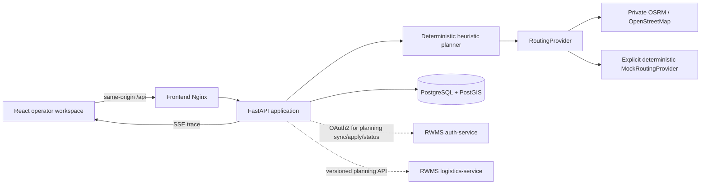

# Logistics Simulator Architecture

Status: standalone internal test application with isolated persistence and an
optional, contract-only integration with the active RWMS logistics owner.

## Runtime boundary

The browser owns only editor and simulation presentation state. Scenario,
zone membership, requests, planning results, explanations, manual audit and
plan versions are backend facts. The private OSRM graph makes real driving
routing keyless; the grid map and explicit mock router retain a fully offline
test mode.

This boundary retains independent ownership: it has its own Compose project
name, PostGIS volume, Alembic history, OpenAPI document and generated browser
declarations. It never reads a service-owned RWMS database or publishes an
RWMS event. When `RWMS_SYNC_ENABLED=true`, FastAPI authenticates as the
dedicated `logistics-planner` client and calls only the private, versioned
planning operations of `services/logistics-service`. The integration is
disabled by default and never exposes its client secret to the browser.

## Modules

- `backend/app/api` exposes transport operations and maps failures to stable
  problem codes.
- `backend/app/models`, `repositories` and `services` own transactional data
  access. Alembic is the only schema mutation mechanism.
- `backend/app/geo` classifies request coordinates with PostGIS. Higher zone
  priority wins; equal priority selects the smallest covering geometry.
- `backend/app/routing` contains the provider protocol, the private OSRM HTTP
  adapter and deterministic Haversine implementation.
- `backend/app/planner` creates and validates delivery-before-pickup cycles.
- `backend/app/simulation` derives delay-adjusted schedules without mutating a
  confirmed plan.
- `backend/app/integrations` owns the opt-in OAuth token cache, strict RWMS
  transport models, idempotent synchronization and versioned plan application.
- `frontend/src/api` is the only HTTP boundary in the browser.
- `frontend/src/features` contains cohesive operator workflows.
- `frontend/src/map` owns MapLibre/Terra Draw rendering and offline grid style.
- `frontend/src/stores` owns non-authoritative UI and simulation controls.

The normal API dependency has function scope: a successful handler transaction
is committed before its response becomes visible to a following browser read.
This matters for create/reset flows where the UI immediately refetches the
scenario aggregate. Import and demo reset use the same atomic boundary. The
multi-day demo creation command instead creates a new scenario graph, so it
cannot delete or overwrite the scenario which an operator is currently testing.

## Consistency and recovery

- Every route plan has an optimistic `version`; manual changes must submit the
  expected version and stale writes return `409 PLAN_VERSION_CONFLICT`.
- An optimization run is persisted separately and never overwrites a confirmed
  plan. Trace events are bounded progress evidence, not the plan itself.
- Import runs in one database transaction. Invalid input creates no partial
  scenario.
- Existing requests retain `zone_id` and `zone_version` after zone geometry
  changes. Reclassification is a separate explicit operation.
- Planner and simulation functions use stable ordering and explicit seeds so a
  saved JSON scenario can reproduce a result.
- Temporary simulation delay and driver-unavailability overrides remain in the
  browser and are derived as pure timestamp functions. `persist=true` is the
  explicit audited mutation boundary.
- A request's accepted dates are backend-owned request facts. The date-board
  UI can promote one date or add a negotiated alternative by replacing the
  validated date-option collection; it never removes an existing alternative.
- The header planning date is a shared view filter: the request inspector and
  MapLibre markers both render only requests accepted for that date. The map
  request card can promote the selected date or add/promote the next date by
  using the same backend-owned collection.
- The planner runtime applies the same date filter before splitting tasks, so
  a request that is only available on another date cannot inflate the selected
  plan's unassigned count or metrics.
- Map rendering uses all persisted `RouteSegment` records. Cycle-colored legs
  and a cycle legend are view state only; sequence, geometry and timing remain
  owned by the saved plan. Selecting a cycle or a driver's route dims unrelated
  legs in gray without altering the plan.
- RWMS orders are upserted by stable external identity and retain their source
  version plus cabin unit IDs. Coordinates are authoritative over address;
  address-only rows fail explicitly because no geocoder is configured.
- Applying a plan locks and verifies its exact version, deterministically maps
  split delivery parts to non-overlapping RWMS cabin IDs and uses a stable
  idempotency key. RWMS validates order versions, dates and assignments again.
- Unassigned parts are never published implicitly. The apply command may carry
  an operator-selected set of delivery task IDs; those exact future parts are
  mapped to `WAREHOUSE_DRIVERS` without a driver identity. RWMS rejects current
  day publication and DriverApp claims the resulting shared task separately.
- Claim ownership is read back through a warehouse/date-bounded, read-only RWMS
  status operation after the simulator releases its local transaction. The
  simulator maps only exact `(orderId, unitIds)` slices from the requested plan
  version, ignores unrelated RWMS documents and fails on conflicting matches.
  This lets the operator UI disable already published or claimed parts without
  copying driver-task ownership into simulator persistence.

## Execution model and current extension points

The heuristic is deterministic and bounded, but currently runs in the FastAPI
request process. The optimization run, trace and resulting plan are persisted
separately; confirmed plans are never overwritten. This is suitable for the
local MVP, while interruptible live cancellation and concurrent heavy runs
need a future worker/queue boundary.

Manual editing currently supports validated task move/reorder, task lock at the
API boundary and cycle lock. Reoptimization carries locked cycles into a new
plan. Replanning from an interpolated in-flight truck position and structural
cycle split/merge are not represented as completed work.

## Future adapters

OSRM is selected by `ROUTING_PROVIDER=osrm` and runs only inside the Compose
network. Its one-shot download/preparation containers own only the separate
`logistics-osrm-data` volume; scenario facts remain in PostGIS. Another routing
adapter implements the same matrix/route protocol and must not bypass domain
validation. OR-Tools or CP-SAT can implement `PlannerEngine`, returning the
same validated result contract, explanations and unassigned reasons.
