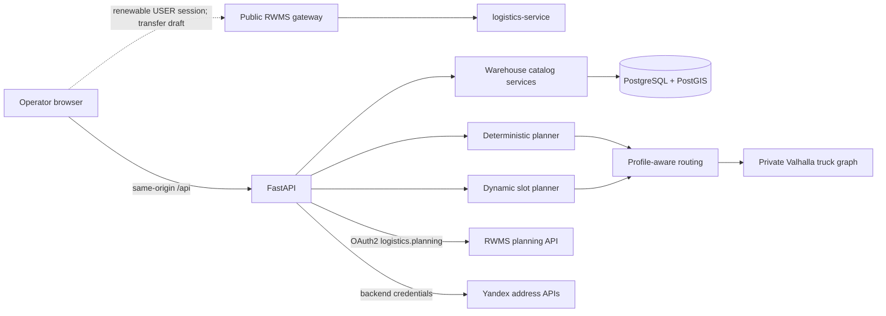

# Warehouse logistics planning architecture

## Boundaries

The backend owns warehouse identity bindings, warehouse-owned tariff polygons,
warehouse resources, requests, shift periods, slot holds, plans, plan versions,
manual audit and closing state. The browser owns only presentation and
short-lived view controls. It cannot author canonical warehouse identity,
classification, route feasibility, slot feasibility or RWMS effects.

Planner operations use the standalone same-origin FastAPI. Creating an
interwarehouse transfer is deliberately not duplicated there: the local modal
reuses the panel's renewable `USER` OIDC session and sends the canonical draft
command through the public gateway to `logistics-service`. The shared panel
callback performs a full-page return to `/logistics-simulator/**` after login.

FastAPI is standalone and uses only its own database. It integrates with RWMS
through authenticated transport contracts and never reads another service's
tables. Alembic is the only schema mutation mechanism. These boundaries are
implemented in [`backend/app/api`](../backend/app/api),
[`backend/app/services`](../backend/app/services),
[`backend/app/integrations`](../backend/app/integrations) and
[`backend/migrations`](../backend/migrations).

## Aggregate and ownership model

`Warehouse` is the local planning projection root. It has a required, globally
unique RWMS external warehouse UUID, canonical name/address/timezone, routing point,
planning date/seed/settings, capacity generation and depot timing. Drivers,
vehicles, trailers, shift periods, requests, optimization runs and plans carry
one local `warehouse_id`.

Warehouse discovery is an automatic server orchestration:

1. Read the authenticated canonical RWMS warehouse directory.
2. Materialize every active identity with an owner-held coordinate pair under
   the same external UUID.
3. For an address-only identity, resolve its canonical address with the existing
   backend Geocoder and retain the derived point while address and city remain
   unchanged.
4. Keep an unresolved identity visible as unavailable without hiding routable
   siblings; never infer a point from the city or browser input.
5. Yield to later owner-held coordinates and invalidate mutable route plans when
   the owner version, routing readiness or effective point changes.

Identity refresh follows the same validation and never accepts browser-provided
name, address or coordinates. There is no second create/connect/refresh action
and no required first delivery polygon. See
[`catalog.py`](../backend/app/api/catalog.py) and
[`catalog.py`](../backend/app/services/catalog.py).

Every warehouse owns one to twelve `WarehouseIsochroneTariff` rows. Boundaries
start at 60 minutes, advance in contiguous 60-minute steps and carry one
non-negative whole-ruble price. Exact one-way Valhalla time selects the first
covering row; the final row is the hard order-acceptance boundary. The active
aggregate contains no delivery-zone geometry or request-zone identity.

Driver identity is explicit. `ASSIGNED_DRIVER` requires a worker UUID that is
currently present in the selected RWMS warehouse directory; its local display
name is canonical. `WAREHOUSE_DRIVERS` requires a null worker UUID and publishes
to the warehouse-wide audience. No fake identity is generated.

Vehicles own their operational axle-load profiles as one aggregate. Vehicle
reads, including workspace vehicles, embed only each profile's configuration
type and measured maximum axle load. The atomic configuration commands replace
the complete set; no separately mutable or listable profile resource exists.
Trailers remain independently mutable, but workspace is their sole read.

A `DriverShift` is one inclusive `date_from`/`date_to` period within a single
calendar month plus daily local `start_time`/`end_time`. Each range is at most
31 days. Database exclusion constraints and service validation prevent an
active driver or vehicle from belonging to overlapping periods. The planner
materializes only periods covering its selected date.

Requests own delivery/pickup type, address/point, physical cargo, accepted
dates/windows, access decision, contact facts, priority and the `mandatory`
business flag. Server-created `PlanningTask` parts copy `mandatory` and all
route-relevant facts. Unassigned mandatory tasks stop plan confirmation and
planning-day closing with the same stable error.

## Workspace read and RWMS synchronization

The aggregate read is
`GET /api/warehouses/{warehouse_id}/workspace`. It returns the selected root,
the common routable warehouse marker list and only that warehouse's resources
and requests.

When synchronization is configured, a normal workspace read performs one
automatic request refresh for the warehouse-local current date through day
+30. Remote I/O occurs outside local row locks. Each order is processed in a
savepoint: valid siblings are retained even when another order lacks
coordinates or violates a stable invariant. The backend commits those valid
rows and returns `RWMS_WORKSPACE_SYNC_INCOMPLETE` with structured failures.
`refresh_rwms=false` deliberately bypasses remote I/O and exposes that persisted
recovery state. This distinction prevents both double synchronization and a
silent incomplete success. See
[`rwms_sync.py`](../backend/app/integrations/rwms_sync.py) and
[`catalog.py`](../backend/app/api/catalog.py).

RWMS requests are upserted by `(warehouse_id, source_system, external_id)` and
retain order version, source revision and unit UUIDs. An unchanged revision is
idempotent; a conflicting payload at the same revision fails. New or changed
source facts invalidate affected saved plans before rebuilding tasks. Address-
only source rows return `COORDINATES_REQUIRED`; customer data is not silently
sent to the operator geocoder. The current upstream feed contains no tombstone
reason, so absence alone does not invent a local cancellation transition.

## Planning and manual changes

[`backend/app/planner`](../backend/app/planner) builds deterministic depot
cycles whose automatic heuristic prioritizes outbound deliveries. Hard dates/windows, exact truck routes,
vehicle/site/trailer capacity, cargo profile, resource availability, depot
timings and shift end decide feasibility. Tariff polygons and visual contours
do not participate.

The engine evaluates bounded nearest-first candidates and applies a fixed
activation cost for additional driver/vehicle resources plus duty-utilization
cost. Each cycle returns to the warehouse before its next trip; turnaround and
route buffer fence the next start. For the operational case where one vehicle
returns at 14:30 and its driver may work until 20:00, the remaining shift can
therefore accept later trips when exact route, service and return timing fit.

The runtime persists independently addressable optimization runs, complete
plans, route cycles/stops/segments, explanations and structured unassigned
reasons. `nearest_option.possible_at` is a typed aware timestamp. Every
Valhalla-built segment stores provider, OSM version, calculation time and the
effective vehicle/trailer/cargo profile used on that leg.

Automatic ensure creates a missing current plan and refreshes a draft marked
stale by changed planning details. Refresh preserves stable cycle IDs and a
still-valid manual task sequence, updates timings and clears the marker; it
rejects an invalid retained sequence rather than silently reordering it.
Supported manual move/reorder/lock commands permit delivery/pickup interleaving
when every load transition remains valid, validate the complete resulting plan and append an
immutable audit row while advancing the version. Confirmed plans reject manual
mutation. Manual reset row-locks the edited source, rebuilds from current
authoritative inputs, archives the source and stores a replacement marker on
it. The marker makes a retry with the original expected version return exactly
the same replacement; concurrent callers serialize on the source plan. See
[`planner_runtime.py`](../backend/app/services/planner_runtime.py) and
[`plans.py`](../backend/app/services/plans.py).

## Dynamic slot planning

[`backend/app/slot_planning`](../backend/app/slot_planning) is a cohesive domain
module independent of FastAPI and SQLAlchemy. The application adapter loads the
warehouse day, current trips, holds, requests and truck profiles, then performs
complete multi-driver/multi-trip resimulation for each of the three standard
customer windows.

The simulation includes insertion before/between/after deliveries, new trips,
one-or-two-cabin split work, delivery-first return pickups, site/trailer
capacity, waiting, later trips and final warehouse operations. It uses exact
directed road geometry for the selected candidate. The response exposes only
the selected trip's route before/after and pickup candidates; it deliberately
does not produce contour/intersection geometry. The first configured hourly
isochrone tier covering exact one-way travel supplies price; its farthest tier
is the hard acceptance boundary.

Every hold references one warehouse/date day-plan version, immutable source
revision, candidate, client session and expiry. Confirmation locks the hold and
day plan, recalculates without its own hold, rejects expiry/version drift,
creates a mandatory request plus mandatory tasks and increments the day-plan
version. Exact confirmation-key replay returns the original outcome.

## Planning-day closing and assignment effects

[`planning_days.py`](../backend/app/services/planning_days.py) owns the one-way
warehouse/date acceptance closure. Closing locks the warehouse, records the
closure, archives previous non-final plans as needed and generates the final
plan. The transaction rejects any mandatory task missing from route stops.

With RWMS synchronization enabled, the API freezes the exact final plan version
and builds assignments before releasing local locks. An exact driver publishes
its validated worker UUID. A shared driver explicitly publishes
`WAREHOUSE_DRIVERS` with null worker UUID, so a missing historical worker link
cannot cause `RWMS_DRIVER_NOT_LINKED`. The stable plan/version idempotency key
makes repeated close the recovery operation after a failed or uncertain remote
outcome. Applied and rejected upstream outcomes remain visible rather than
being replaced with local success.

## Capacity projection

[`capacity_projection.py`](../backend/app/services/capacity_projection.py)
derives one sorted anonymous replacement snapshot from active generated
deliveries/pickups, active shift dates and the selected warehouse's complete
hourly isochrone tariff list. Jobs carry type,
date/window, point, service, quantity, priority, mandatory and access facts.
Shifts omit personal driver data and concrete vehicle identity. Tariff items
contain only contiguous `travelMinutes` boundaries and non-negative
`priceRubles` values.

The RWMS external warehouse UUID is authoritative in the capacity PUT path;
the request does not duplicate it. A database-global monotonic warehouse
generation distinguishes intentional `A -> B -> A` replacement from a delayed
retry. [`capacity_mutations.py`](../backend/app/services/capacity_mutations.py)
advances and commits local mutations before remote HTTP. A failed publish is
explicit and can be retried through the same reconciliation endpoint without
rolling back authoritative local state.

## Address and routing adapters

[`geocoding.py`](../backend/app/api/geocoding.py) owns Yandex Geosuggest and
Geocoder credentials. Suggestions are normalized into navigator-style
title/subtitle/address/URI values. Resolve and reverse calls return one formatted
address plus coordinates. Missing configuration, transport failure, malformed
provider data and no match are separate explicit outcomes. Credentials never
enter browser responses or build arguments.

[`backend/app/routing`](../backend/app/routing) owns the routing protocol,
effective-truck-profile calculator, deterministic mock provider, private
Valhalla adapter and an explicitly selected OSRM adapter for local testing
only. Production Valhalla uses `costing=truck`; failure never falls back
to passenger-car routing.

Travel-time contours are ephemeral read-only Valhalla estimates for every
configured hourly tariff boundary. Independent warehouse and selected-task layers default
off. The task origin is only the explicitly selected request or slot-check
point; duplicate origins prefer the warehouse. The UI runs no more than four
calls concurrently and cancels siblings on the first failure. Routes render
above polygon overlays, and the Full routes card precedes the layer list.
Contours are neither stored nor consumed by price, capacity, slot or route
commands.

The versioned global truck-restriction index derives from the same pinned OSM
source family as Valhalla. A complete import is atomic and boundary features are
deduplicated. Missing data for the configured `OSM_DATA_VERSION` is an explicit
service error rather than an invented empty overlay.

## Persistence migration and safety

Migration
[`20260828_0016_warehouse_workspaces.py`](../backend/migrations/versions/20260828_0016_warehouse_workspaces.py)
converts the old container layout into warehouse roots without guessing:

- exact built-in generated-fixture fingerprints are removed before conversion;
  city and warehouse names are never deletion criteria, so near-matches and
  live Moscow/Saint Petersburg data remain subject to the ordinary safety guard;
- every other old root must have exactly one warehouse and every warehouse
  must have a unique RWMS external UUID, otherwise the migration aborts;
- timezone, default planning date, seed, settings and capacity generation move
  onto that warehouse;
- resources, requests and optimization runs receive the local warehouse UUID;
- safe consecutive equal daily shifts fold into one period, while a shift row
  referenced by a saved route remains individually addressable;
- null historical worker identities become the explicit shared-driver mode;
- the global capacity sequence is renamed for its warehouse authority.

Existing migration files before 0017 remain immutable history. New warehouse
timestamps retain database defaults, so post-upgrade creation works. The
migration has clean-install, live Moscow/SPb preservation, shift-reference,
exact generated-fixture removal, ambiguous-owner guard and Alembic parity
checks.

Migration
[`20260828_0017_warehouse_owned_zones.py`](../backend/migrations/versions/20260828_0017_warehouse_owned_zones.py)
is retained as immutable upgrade history. It assigned legacy zones to a unique nearest warehouse and made
`zones.warehouse_id` non-null with a cascade foreign key. It validates existing
request/task/stop references and warehouse coverage, and aborts on no warehouse,
a nearest-distance tie or cross-owner data rather than guessing.

Migration
[`20260830_0020_normalize_isochrone_tariffs.py`](../backend/migrations/versions/20260830_0020_normalize_isochrone_tariffs.py)
backfills the former four fixed prices into normalized hourly rows, removes the
four columns and deletes all active zone tables/references. Calculated request
and hold prices remain; the migration refuses downgrade because deleted polygon
geometry cannot be truthfully reconstructed.

## Consistency and recovery

- Request, workload, close and reset commands use one service-owned database
  transaction; the browser never coordinates partial writes.
- Plan versions fence every mutation. Confirmation logs use a unique
  `(plan_id, request_id)` projection and are idempotent.
- Automatic synchronization and generation invalidate only affected warehouse
  dates. Workload replacement locks its warehouse and preserves manual/RWMS
  requests plus plans outside the selected horizon.
- Slot confirmation locks both hold and day-plan versions. Expiry or changed
  authoritative inputs returns a conflict rather than accepting stale capacity.
- RWMS OAuth tokens stay in a bounded in-memory cache. Remote I/O failures are
  sanitized and never expose client credentials.
- Provider and OSM versions are part of routing cache identity, so differing
  truck/cargo states cannot share an unsafe route result.

## Runtime configuration

The main validated settings live in [`config.py`](../backend/app/config.py):

- database: `DATABASE_URL`;
- warehouse default: `DEFAULT_WAREHOUSE_TIMEZONE`, `PLANNER_DEFAULT_SEED`;
- routing: `ROUTING_PROVIDER`, Valhalla/OSRM URLs and timeouts,
  `OSM_DATA_VERSION`;
- RWMS: sync/capacity flags, private service URL, token URL, client ID/secret and
  timeout;
- geocoding: separate Geosuggest/Geocoder keys and timeout.

No unavailable integration silently falls back to mock data. The mock router
is used only when explicitly selected for deterministic local tests.
