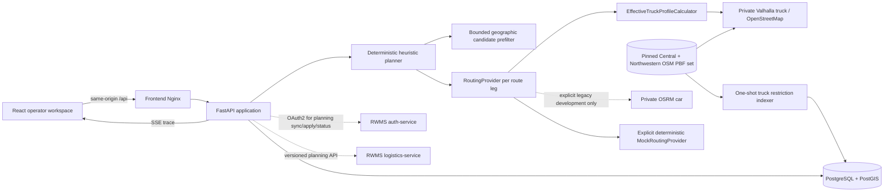

# Logistics Simulator Architecture

Status: standalone internal test application with isolated persistence and an
optional, contract-only integration with the active RWMS logistics owner.

## Runtime boundary

The browser owns only editor and simulation presentation state. Scenario,
zone membership, requests, planning results, explanations, manual audit and
plan versions are backend facts. Private Valhalla makes keyless truck routing
depend on the exact vehicle/trailer/cargo state of each leg; the grid map and
explicit mock router retain a fully offline deterministic test mode. Valhalla
failure is explicit and never falls back to OSRM or passenger-car costing.

This boundary retains independent ownership: it has its own Compose project
name, PostGIS volume, Alembic history, OpenAPI document and generated browser
declarations. It never reads a service-owned RWMS database or publishes an
RWMS event. When `RWMS_SYNC_ENABLED=true`, FastAPI authenticates as the
dedicated `logistics-planner` client and calls only the private, versioned
planning operations of `services/logistics-service`. The integration is
disabled by default and never exposes its client secret to the browser.

## Modules

- `backend/app/api` exposes transport operations and maps failures to stable
  problem codes.
- `backend/app/models`, `repositories` and `services` own transactional data
  access. Alembic is the only schema mutation mechanism.
- `backend/app/geo` classifies request coordinates with PostGIS. Higher zone
  priority wins; equal priority selects the smallest covering geometry.
- `backend/app/services/catalog.py` owns the atomic cutout command: it versions
  the source geometry and creates the independent inner zone in one transaction.
  It also owns the atomic planning-details command and explicit transport-task
  split, so date/window/access state cannot be partially saved by the browser.
  Source lineage is included in ordinary request reads. Manual CRUD cannot
  replace/delete RWMS-owned request facts or accepted dates, and an exact hard
  CustomerApp window is immutable outside source synchronization. No-op full
  form submissions compare effective values and retain task UUIDs rather than
  regenerating referenced transport tasks.
- `backend/app/services/workload_generator.py` creates bounded, seed-stable
  request workloads. Every command locks and removes only
  generator-owned rows in the chosen horizon after deleting saved plans for
  those exact planning dates; manual/RWMS rows and every other date remain
  outside the deletion set. A separate idempotent delete command uses the same
  date-scoped ownership boundary. New rows use stable
  external source IDs and are explicitly scheduled to their preferred date, so
  accepted alternatives never move them between planning days automatically.
  Generated deliveries receive deterministic hard `09:00-12:00`,
  `12:00-15:00`, `15:00-18:00` windows; pickups receive `09:00-18:00`.
  Planner projection additionally identifies legacy generator rows without an
  external ID by direction, exact point and primary logistics date rather than
  mutable display data, so renumbered legacy batches cannot revisit one point.
  Non-generator sources continue to use their authoritative external IDs.
  It samples inside current Polygon/MultiPolygon geometry, asks the configured
  routing boundary for the nearest driving point and accepts it only while the
  snapped point remains covered by the selected zone. Every create still goes
  through the canonical catalog classifier.
- `backend/app/services/capacity_projection.py` derives one sorted anonymous
  snapshot from active generator deliveries for exactly one linked warehouse.
  Migrations `20260827_0009` and `20260827_0010` persist a simulator-wide
  monotonic capacity generation; `20260827_0011` floors the sequence above any
  values allocated before the global sequence existed. The publisher sends it as `sourceGeneration`;
  UUIDv5 idempotency and a SHA-256 revision over that generation plus the
  sorted capacity facts make exact replay stable, distinguish an intentional
  `A -> B -> A` regeneration, and let RWMS reject a never-accepted delayed
  command older than the active warehouse generation.
  Publication commits simulator mutations before OAuth/HTTP and never includes
  pickups, manual requests, imported RWMS orders, customers, cabins or drivers.
  Migration `20260827_0012` hardens only the already selected complete windows
  of pre-existing generator deliveries and normalizes generator pickups to the
  `09:00-18:00` backhaul window; it never rewrites manual or RWMS requests.
  Scenario deletion, demo reset and warehouse relinking are not remote
  deactivation commands and currently do not clear an already accepted RWMS
  capacity snapshot; that unresolved lifecycle must not be inferred from local
  row deletion.
- `backend/app/routing` contains the provider protocol, Valhalla truck adapter,
  immutable effective-profile calculator, capability audit, explicit legacy
  OSRM adapter and deterministic Haversine implementation. Its Valhalla adapter
  also validates the fixed one-to-four-hour truck isochrone response before a
  read-only routing endpoint can expose those GeoJSON areas to the map.
- `backend/app/services/osm_restriction_indexer.py` performs a one-shot,
  versioned, boundary-deduplicated Osmium extraction from the same PBF set used to build Valhalla and
  atomically replaces the derived PostGIS viewport index. The read-only
  routing API exposes only bounded node/way GeoJSON; it does not become a
  second routing engine.
- `backend/app/services/truck_cycle_router.py` evolves cargo placement after
  every stop, computes one profile per leg, asks Valhalla for exact geometry
  and reschedules windows/shift finish from the returned travel time. Customer
  arrival is the service start. The heuristic first absorbs early slack by
  shifting the routed prefix at the depot; exact routing permits only the
  configured bounded residual wait at a prior customer and rejects a longer
  combined cycle. The exact provider is queried with every actual delayed
  departure. Trailer attachment changes only through load configuration, never
  as a side effect of unloading its cargo.
- `backend/app/planner` creates and validates delivery-before-pickup schedules
  per depot cycle: a loaded cycle may append pickups only after its deliveries,
  then a depot return allows the same shift to load a new independent cycle.
  Its deterministic candidate objective minimizes compatible depot cycles and
  charges a fixed activation cost for every driver/vehicle shift beyond the
  first. For imported CustomerApp options it first ranks equal-priority
  multi-point candidates by depot-matrix overflow of the persisted
  one-to-four-hour travel band and by band spread. Exact routed legs, hard
  windows, capacity and shift end still decide feasibility. A trailer-attached
  candidate is infeasible when any visited request explicitly denied trailer
  access.
- `backend/app/services/plans.py` confirms validated plans and writes the
  idempotent simulated contact-message projection. It validates optional
  driver-passport inclusion before mutating plan status, so a failed message
  preparation cannot leave a partially confirmed plan.
- `backend/app/simulation` derives delay-adjusted schedules without mutating a
  confirmed plan.
- `backend/app/integrations` owns the opt-in OAuth token cache, strict RWMS
  transport models, idempotent synchronization and versioned plan application.
  Current-horizon workspace refresh is one backend command: it discovers every
  linked warehouse, fixes the UTC 31-day inclusive range and reports incomplete
  per-order imports explicitly. The browser does not own that write saga. The
  upstream snapshot exposes no tombstone or absence reason, so disappearance
  does not currently choose a local delete/cancel/history transition.
- `frontend/src/api` is the only HTTP boundary in the browser.
- `frontend/src/features` contains cohesive operator workflows.
- `frontend/src/app/App.tsx` performs the operator preflight that explicitly
  reclassifies missing/stale zone snapshots before optimization. Its Plan mode
  also blocks generation until every visible READY request has a window and
  trailer decision, while the backend repeats that check authoritatively.
- `frontend/src/map` owns MapLibre/Terra Draw rendering, request popups anchored
  to coordinates and the offline grid style. It renders validated Valhalla
  60/120/180/240-minute areas from outer to inner behind scenario overlays and
  exposes provider failure as a non-blocking status; the rings do not mutate or
  validate a plan.
- `frontend/src/stores` owns non-authoritative UI and simulation controls.

The normal API dependency has function scope: a successful handler transaction
is committed before its response becomes visible to a following browser read.
This matters for create/reset flows where the UI immediately refetches the
scenario aggregate. Import and demo reset use the same atomic boundary. The
multi-day demo creation command instead creates a new scenario graph, so it
cannot delete or overwrite the scenario which an operator is currently testing.

## Consistency and recovery

- Every route plan has an optimistic `version`; manual changes must submit the
  expected version and stale writes return `409 PLAN_VERSION_CONFLICT`.
- An optimization run is persisted separately and never overwrites a confirmed
  plan. Trace events are bounded progress evidence, not the plan itself.
- Import runs in one database transaction. Invalid input creates no partial
  scenario. Clone and JSON round trips preserve optional request source
  identity/version/payload so generator duplicate fences and RWMS lineage do
  not silently degrade.
- Workload generation uses the request-scoped transaction: any failed generated
  request rolls back the complete batch. A lock on the scenario row serializes
  concurrent generator commands. Generation is replacement-only: it replaces
  generator-owned rows whose priority-100 date is in the horizon and first
  removes the saved plans derived from those dates. Date-scoped workload
  deletion uses the same transaction and ownership boundary; cascades remove
  plan children before request tasks, while any later failure restores the
  complete old workload and plans.
- Existing requests retain `zone_id` and `zone_version` after zone geometry
  changes. Reclassification is a separate explicit operation.
- Zone delivery/pickup prices are non-negative integer-ruble simulator facts.
  They are independent of geometry version and currently inform the operator
  without changing route feasibility or score.
- A zone cutout is a server-validated geometry subtraction. It must be strictly
  contained by an unlocked source zone, becomes an interior ring, increments
  the zone version once and follows the same explicit reclassification rule.
  The command locks the source row, so concurrent cutouts or geometry edits
  serialize instead of losing one operator's hole.
- Planner and simulation functions use stable ordering and explicit seeds so a
  saved JSON scenario can reproduce a result.
- Vehicles, trailers, cargo dimensions and operational axle profiles are
  authoritative simulator facts. Missing physical inputs reject a candidate;
  neither the planner nor adapter guesses height, mass or axle distribution.
- The vehicle editor submits physical fields and the complete operational
  axle-profile set to one backend command. The service row-locks updates and
  replaces the profile set in the same transaction; the browser owns no
  partial-save saga.
- Every persisted route segment stores the effective profile, provider,
  `OSM_DATA_VERSION` and calculation time. Route cache identity includes that
  profile and data version, so one- and two-unit configurations cannot share a
  result accidentally.
- The truck-restriction overlay is derived global routing data, not a scenario
  aggregate. Its import metadata and features share `OSM_DATA_VERSION`; a
  complete new extraction is committed atomically and older derived versions
  are removed only in that transaction. A missing active-version index fails
  explicitly instead of appearing as an empty viewport.
- Travel-time contours are ephemeral read-only Valhalla estimates centered on
  current scenario warehouses and each driver's latest delivery point in the
  visible plan. Pickup and depot-return stops are not origins; duplicate
  coordinates prefer the depot. At most four provider calls run concurrently,
  and the first failure cancels its siblings. The contours are neither stored
  nor reused as routing, capacity or delivery-slot facts. Cancellation and an
  explicit unavailable state prevent a stale or partial response from appearing
  as valid rings.
- Temporary simulation delay and driver-unavailability overrides remain in the
  browser and are derived as pure timestamp functions. `persist=true` is the
  explicit audited mutation boundary.
- A request's accepted dates and nullable `scheduled_date` are backend-owned
  facts. Until scheduling, every accepted option remains eligible. The
  dedicated scheduling command selects one authoritative logistics date,
  clears it, or explicitly adds a newly negotiated option atomically for a
  local request. An RWMS request can select only dates from its synchronized
  source feed.
- Dispatcher planning details are backend-owned. A negative trailer decision
  changes task capacity to one and remains a hard cycle constraint; a positive
  decision only admits trailer access at the address and never bypasses the
  effective-truck-profile or Valhalla/OSM road checks.
- Plan notification logs are immutable simulator projections created only by
  explicit confirmation. Their unique `(plan_id, request_id)` identity makes a
  repeated confirmation safe, and no external notification provider is called.
  Scenario export/import retains those records and remaps their request
  identities in the same all-or-nothing import transaction.
- The header planning date is a shared view filter: the request inspector and
  MapLibre markers both render unscheduled requests accepted for that date and
  scheduled requests assigned to it. The map request card displays the source
  options but mutates date assignment only through the backend command.
- The planner runtime applies the same date filter before splitting tasks, so
  a request that is only available on another date cannot inflate the selected
  plan's unassigned count or metrics.
- Map rendering uses all persisted `RouteSegment` records. Cycle-colored legs
  and a cycle legend are view state only; sequence, geometry and timing remain
  owned by the saved plan. Selecting a cycle or a driver's route dims unrelated
  legs in gray without altering the plan. Missing task references and malformed
  segment GeoJSON are explicit response-contract failures; the browser never
  creates placeholder task or route facts.
- RWMS orders are upserted by stable external identity and retain their source
  version plus cabin unit IDs. Coordinates are authoritative over address;
  address-only rows fail explicitly because no geocoder is configured. A
  CustomerApp date option also persists its hard window and
  `travel_zone_hours`; the operator UI shows that source band next to the
  accepted date and disables editing of an exact source-fixed window. Request
  provenance also lets the unassigned-task UI expose only true RWMS deliveries
  for explicit DriverApp publication.
- Applying a plan locks and verifies its exact version, deterministically maps
  split delivery parts to non-overlapping RWMS cabin IDs and uses a stable
  idempotency key. RWMS validates order versions, dates and assignments again.
- Unassigned parts are never published implicitly. The apply command may carry
  an operator-selected set of delivery task IDs; those exact future parts are
  mapped to `WAREHOUSE_DRIVERS` without a driver identity. RWMS rejects current
  day publication and DriverApp claims the resulting shared task separately.
- Claim ownership is read back through a warehouse/date-bounded, read-only RWMS
  status operation after the simulator releases its local transaction. The
  simulator maps only exact `(orderId, unitIds)` slices from the requested plan
  version, ignores unrelated RWMS documents and fails on conflicting matches.
  This lets the operator UI disable already published or claimed parts without
  copying driver-task ownership into simulator persistence.

## Execution model and current extension points

The heuristic is deterministic and bounded, but currently runs in the FastAPI
request process. The optimization run, trace and resulting plan are persisted
separately; confirmed plans are never overwritten. This is suitable for the
local MVP, while interruptible live cancellation and concurrent heavy runs
need a future worker/queue boundary.

Candidate selection is lexicographic for domain priority and weighted for
operating cost. Delivery urgency is ranked independently from pickup urgency;
hard dates/windows, capacity, per-cycle delivery-before-pickup ordering,
blocked zone transitions, resource overlap and shift limits first remove
infeasible variants. Equal-priority deliveries are batched nearest-first and a
delivery group evaluates at most `max_candidate_neighbors` detour-ranked pickup
groups. The scenario defaults of 35 minutes and a 1.5 travel-detour ratio,
including tighter zone-relation thresholds, are hard automatic-planning limits.
The engine constructs bounded nearest-first and longest-first delivery-only
references before mixed search and keeps the one with the strongest hard-date,
last-date and total delivery coverage. When the mixed draft covers less, the
reference cycles and shift availability are restored before pickup-only
scheduling. After restoration, an optional pickup may replace a delivery cycle
only when the selected cycle and its complete shift suffix can be rescheduled
without dropping a task or violating a hard window/shift limit. Detour minutes
and ratio measure additional road travel only; pickup service remains in cycle
duration, windows, workload and shift-end validation.
Equal business-priority candidates use exact compact route-rank buckets, so
dense identical-priority workloads do not require a full cross-product of task
pairs and shifts. CustomerApp bands participate before route distance: the
bounded matrix records how far a depot leg exceeds its source ring and prefers
multi-point groups within the same ring. This is a deterministic construction
rank, not a replacement for the exact routed window check. Within that fence,
full mixed loads are preferred to reduce depot returns.
Within that rank, a first resource is chosen with enough remaining shift
reserve and subsequent cycles reuse it unless a new shift improves the route
by more than `additional_resource_activation_penalty` or is required for
feasibility. The saved plan score includes this cost once per additional used
shift. It also measures each driver's elapsed duty against break-adjusted shift
capacity: minutes above `preferred_shift_utilization_percent` receive
`driver_workload_weight`, so a heavily loaded shift can justify a second
resource before the hard shift end. Manual changes recalculate both objective
components from the complete resulting plan.

Candidate construction yields to the API event loop between assigned cycles.
In Valhalla mode the bounded geometric matrix only narrows combinations. Every
candidate leg is then fetched with `costing=truck`; exact distance/duration
replace the preliminary schedule before hard windows, shift end and score are
accepted. A leg after a delivery or pickup is routed with its new mass and
placement state. `RouteStop.planned_arrival` is the actual service start and
`planned_departure` is exactly that arrival plus service duration. A leg may
start later than the preceding stop finishes only for the bounded residual
that could not be absorbed at the depot; a larger gap rejects the combination
and lets the planner create another depot cycle. The gap is stored as
source-side waiting, never as service time at the next customer. These exact
requests are cached by endpoint, departure,
provider/OSM versions and the complete effective profile.

Simulation bounds start at the earliest assigned driver shift and end at the
last route finish. Before a just-in-time cycle starts, its deterministic state
is `WAITING_SHIFT` at the depot rather than an early customer-side stop.

Manual editing currently supports validated task move/reorder, task lock at the
API boundary and cycle lock. Reoptimization carries locked cycles into a new
plan. Replanning from an interpolated in-flight truck position and structural
cycle split/merge are not represented as completed work.

## Future adapters

Valhalla 3.8.3 is selected by `ROUTING_PROVIDER=valhalla` and runs only inside
the Compose network. The source-manifested Central and Northwestern PBFs and
generated tiles live in separate routing volumes; scenario facts remain in
PostGIS. A changed source manifest forces derived admin, tile and extract
regeneration without deleting scenario data. The Compose-specific
`valhalla/rwms-entrypoint.sh` delegates tile/config generation to the pinned
upstream image, then atomically enforces `max_contours=4` and
`max_time_contour=240` before starting the service. This is required because
the upstream 120-minute ceiling rejects the canonical outer two contours.
The exact supported/partial/
unsupported OSM tags are maintained in
[`osm-truck-restrictions.md`](osm-truck-restrictions.md). OSRM remains available
only through the `legacy-routing` Compose profile and explicit provider setting;
it is not safe-truck routing and is never a fallback. Another safe provider must
implement the same profile-aware matrix/route protocol, persist equivalent
diagnostics and never bypass domain validation. OR-Tools or CP-SAT can implement
`PlannerEngine`, returning the same validated result contract, explanations and
unassigned reasons.
