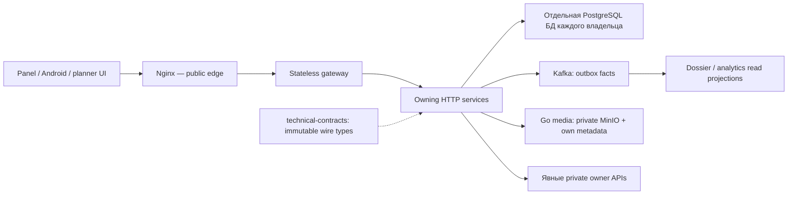

# RWMS — последовательный аудит проекта

Дата: **6 сентября 2026 года**, Europe/Moscow. Аудируемая основная ветка: **develop**, итоговая исходная ревизия **70f1369255655455ab3783ad16fa2c00e99a5e0b**.

Результат: **135 уникальных проблем и конкретных рекомендаций: 1 High, 38 Medium, 96 Low**. Все десять шагов выполнены последовательно. Список рекомендаций полный, без ограничения десятью местами. Код продукта, контракты, БД и runtime этим аудитом не изменяются; результат задачи — этот отчёт.

Первая по срочности — [R-095](#r-095): публичная auth-установка использует включённый фиксированный credential service-клиента из репозитория. Следом идут аутентификация/журналы, потеря или частичное применение состояния, несовместимые границы и бесконечные retry. Подтверждение конфигурации не означает, что выдача токена или злоупотребление были испытаны.

Нумерация R обозначает самостоятельную проблему или связную рекомендацию. Несколько файлов одной причины считаются один раз; метрики длины, окна совпадений и нейтральные наблюдения в этот счётчик не включены. Low включает технический долг и конкретные пробелы тестов, а не только пользовательские ошибки.

Навигация: [Шаг 1](#step-1) · [Шаг 2](#step-2) · [Шаг 3](#step-3) · [Шаг 4](#step-4) · [Шаг 5](#step-5) · [Шаг 6](#step-6) · [Шаг 7](#step-7) · [Шаг 8](#step-8) · [Шаг 9](#step-9) · [Шаг 10](#step-10).

Приложения: [A — все файлы](#appendix-a), [B — все HTTP-операции и схемы](#appendix-b), [C — все элементы мёртвого кода](#appendix-c), [D — все тела длиннее 40 строк](#appendix-d), [E — все типы длиннее 300 строк](#appendix-e), [F — все зарегистрированные совпадения](#appendix-f), [G — проверки и ограничения](#appendix-g).

<a id="step-1"></a>

## Шаг 1. Инвентаризация

Прочитаны и индексированы все **5 421 versioned входных файла**: 5 379 текстовых, 42 бинарных; 1 361 572 текстовые строки, включая lock-файлы, generated types, схемы и документацию. В начале было 5 419 файлов; после завершённых изменений других задач индекс обновлён и все SHA-256 сверены с текущим диском. Сам создаваемый отчёт не включён в состав входных файлов. Это полная машинная инвентаризация и предметный анализ перечисленных границ, а не заявление о ручном прочтении каждой из 1,36 млн строк.

| Исходная область | Файлов | Ревизия |
| --- | --- | --- |
| . | 5137 | 70f1369255655455ab3783ad16fa2c00e99a5e0b |
| cabin-cad | 264 | b1f31329e0813274a49a93cd970773bbf9e4e410 |
| manager-download-site | 20 | 68c4f7fc4bcc49bc269718cc2e65d562f553f3fb |

`cabin-cad` и `manager-download-site` — уже существующие самостоятельные репозитории внутри каталога проекта; аудит не создавал worktree/clone/branch. Установленные зависимости, `.git`, build/cache/runtime output не являются входным кодом. `wms-panel-old/` и `old_db/` отсутствуют; `WMS_ARCHITECTURE_KNOWLEDGE/` и `docs/plans/` учитываются только как исторические материалы. Содержимое бинарных APK/JAR/media/документов как исходный код не анализировалось: нет данных.

```text
rwms/
├── panel/                          основной, admin и manager web entrypoints
├── services/                       11 Spring сервисов + Go media
│   └── auth-service/ui/            UI входа
├── platform/                       technical-contracts, starter, architecture-tests
├── contracts/                      OpenAPI, события, технические схемы
├── app/                            Manager Android
├── worker-app/                     Worker Android
├── driver-app/                     Driver Android
├── client-app/                     Customer Android
├── rental-manager-app/             Rental Manager Android
├── logistics/                      Python planner, React UI, routing/config
├── cabin-cad/                      самостоятельный редактор CAD
├── *-download-site/, downloads-site/ APK release surfaces и общая страница
├── build-logic/, gradle/, tools/    сборка и операционные утилиты
├── docs/project-knowledge/         проверяемая карта проекта
└── WMS_ARCHITECTURE_KNOWLEDGE/      исторические материалы
```

| Компонент | Стек и роль | Вход / конфигурация |
| --- | --- | --- |
| Spring services | Java 25; Spring Boot 4.1.0; Gradle Kotlin; JPA/PostgreSQL, Flyway; Web MVC, OAuth2/JWT, Kafka | settings.gradle.kts; gradle/libs.versions.toml; отдельный *ServiceApplication и application.yaml у каждого owner |
| platform | Framework-neutral transport records; технический Spring starter; архитектурные проверки | Три root Gradle modules; бизнес-сущностей общего владения нет |
| panel | React 19, TS 6, Vite 8, Router 7, TanStack Query/Table/Virtual, Tailwind 4, shadcn/Base UI/Radix | panel/package.json; src/main.tsx; src/apps/{admin,manager}/main.tsx |
| auth UI | React 19, TS 5.9, Vite 7; CSRF и login form | services/auth-service/ui/src/main.tsx; src/login-form.tsx |
| media-service | Go 1.25; pgx, MinIO, franz-go, JWT; метаданные/оригиналы/трансформации | services/media-service/cmd/media-service/main.go |
| logistics backend | Python &gt;=3.12; FastAPI, Pydantic, async SQLAlchemy, Alembic/PostGIS; Valhalla routing | logistics/backend/app/main.py:158; pyproject.toml; docker-compose*.yml |
| logistics frontend | React 19, TS 5.9, Vite 7; OIDC, TanStack Query; generated OpenAPI types | logistics/frontend/src/main.tsx; package.json |
| Android | Kotlin/Compose; PKCE/OIDC, Retrofit/Moshi; Worker/Driver Room/WorkManager и offline sync | Пять отдельных приложений; MainActivity и соответствующие settings/build/manifest |
| cabin-cad | React 19, Vite 7, Three/R3F, Konva, Zustand, OCCT; local CAD document | cabin-cad/src/main.tsx; vite.config.ts; diagnostics NDJSON facilities |
| Download surfaces | Manager/Worker Next/OpenNext + собственная статическая публикация; Customer/Driver static Node; aggregator читает owner manifests | Собственные build/verifier/release-trust scripts. Manager и Worker APK/policy разделены |
| tools | Java/PowerShell migration tools и driver-fixture bridge | Только явные операционные команды; fixture bridge dry-run/fail-closed по умолчанию |

**Все объявленные Gradle-модули:**

| Settings | Модули |
| --- | --- |
| app/settings.gradle.kts | Самостоятельный root project; include дочерних модулей нет |
| build-logic/settings.gradle.kts | Самостоятельный root project; include дочерних модулей нет |
| client-app/settings.gradle.kts | :app |
| driver-app/settings.gradle.kts | :app, :core-auth, :core-network, :core-database, :core-sync, :core-media, :core-ui, :feature-login, :feature-tasks, :feature-task-detail, :feature-camera, :feature-shift, :baselineprofile |
| rental-manager-app/settings.gradle.kts | Самостоятельный root project; include дочерних модулей нет |
| services/assistant-service/settings.gradle.kts | Самостоятельный root project; include дочерних модулей нет |
| settings.gradle.kts | platform:architecture-tests, platform:technical-contracts, platform:spring-boot-starter, services:auth-service, services:task-board-service, services:api-gateway-service, services:warehouse-service, services:asset-service, services:maintenance-service, services:inventory-service, services:logistics-service, services:dossier-service, services:assistant-service, services:analytics-service |
| worker-app/settings.gradle.kts | :app, :core-auth, :core-network, :core-database, :core-sync, :core-media, :core-ui, :feature-login, :feature-tasks, :feature-task-detail, :feature-camera, :baselineprofile |

**Исполняемые точки входа:**

| Файл и строка | Роль |
| --- | --- |
| [app/src/main/java/dev/buhanzaz/rwms/manager/MainActivity.kt:29](app/src/main/java/dev/buhanzaz/rwms/manager/MainActivity.kt#L29) | точка входа Android Activity |
| [cabin-cad/src/main.tsx:30](cabin-cad/src/main.tsx#L30) | точка входа React |
| [client-app/app/src/main/java/dev/buhanzaz/rwms/client/MainActivity.kt:13](client-app/app/src/main/java/dev/buhanzaz/rwms/client/MainActivity.kt#L13) | точка входа Android Activity |
| [driver-app/app/src/main/java/dev/buhanzaz/rwms/driver/MainActivity.kt:21](driver-app/app/src/main/java/dev/buhanzaz/rwms/driver/MainActivity.kt#L21) | точка входа Android Activity |
| [logistics/backend/app/main.py:158](logistics/backend/app/main.py#L158) | точка входа FastAPI |
| [logistics/frontend/src/main.tsx:19](logistics/frontend/src/main.tsx#L19) | точка входа React |
| [panel/src/apps/admin/main.tsx:13](panel/src/apps/admin/main.tsx#L13) | точка входа React |
| [panel/src/apps/manager/main.tsx:13](panel/src/apps/manager/main.tsx#L13) | точка входа React |
| [panel/src/main.tsx:15](panel/src/main.tsx#L15) | точка входа React |
| [rental-manager-app/src/main/java/dev/buhanzaz/rwms/rentalmanager/MainActivity.kt:16](rental-manager-app/src/main/java/dev/buhanzaz/rwms/rentalmanager/MainActivity.kt#L16) | точка входа Android Activity |
| [services/analytics-service/src/main/java/dev/buhanzaz/rwms/analytics/AnalyticsServiceApplication.java:11](services/analytics-service/src/main/java/dev/buhanzaz/rwms/analytics/AnalyticsServiceApplication.java#L11) | точка входа Spring Boot |
| [services/api-gateway-service/src/main/java/dev/buhanzaz/rwms/gateway/ApiGatewayServiceApplication.java:19](services/api-gateway-service/src/main/java/dev/buhanzaz/rwms/gateway/ApiGatewayServiceApplication.java#L19) | точка входа Spring Boot |
| [services/asset-service/src/main/java/dev/buhanzaz/rwms/asset/AssetServiceApplication.java:13](services/asset-service/src/main/java/dev/buhanzaz/rwms/asset/AssetServiceApplication.java#L13) | точка входа Spring Boot |
| [services/assistant-service/src/main/java/dev/buhanzaz/rwms/assistant/AssistantServiceApplication.java:18](services/assistant-service/src/main/java/dev/buhanzaz/rwms/assistant/AssistantServiceApplication.java#L18) | точка входа Spring Boot |
| [services/auth-service/src/main/java/dev/buhanzaz/rwms/auth/AuthServiceApplication.java:20](services/auth-service/src/main/java/dev/buhanzaz/rwms/auth/AuthServiceApplication.java#L20) | точка входа Spring Boot |
| [services/auth-service/ui/src/main.tsx:7](services/auth-service/ui/src/main.tsx#L7) | точка входа React |
| [services/dossier-service/src/main/java/dev/buhanzaz/rwms/dossier/DossierServiceApplication.java:9](services/dossier-service/src/main/java/dev/buhanzaz/rwms/dossier/DossierServiceApplication.java#L9) | точка входа Spring Boot |
| [services/inventory-service/src/main/java/dev/buhanzaz/rwms/inventory/InventoryServiceApplication.java:11](services/inventory-service/src/main/java/dev/buhanzaz/rwms/inventory/InventoryServiceApplication.java#L11) | точка входа Spring Boot |
| [services/logistics-service/src/main/java/dev/buhanzaz/rwms/logistics/LogisticsServiceApplication.java:16](services/logistics-service/src/main/java/dev/buhanzaz/rwms/logistics/LogisticsServiceApplication.java#L16) | точка входа Spring Boot |
| [services/maintenance-service/src/main/java/dev/buhanzaz/rwms/maintenance/MaintenanceServiceApplication.java:11](services/maintenance-service/src/main/java/dev/buhanzaz/rwms/maintenance/MaintenanceServiceApplication.java#L11) | точка входа Spring Boot |
| [services/media-service/cmd/media-service/main.go:31](services/media-service/cmd/media-service/main.go#L31) | точка входа Go |
| [services/task-board-service/src/main/java/dev/buhanzaz/rwms/taskboard/TaskBoardServiceApplication.java:10](services/task-board-service/src/main/java/dev/buhanzaz/rwms/taskboard/TaskBoardServiceApplication.java#L10) | точка входа Spring Boot |
| [services/warehouse-service/src/main/java/dev/buhanzaz/rwms/warehouse/WarehouseServiceApplication.java:14](services/warehouse-service/src/main/java/dev/buhanzaz/rwms/warehouse/WarehouseServiceApplication.java#L14) | точка входа Spring Boot |
| [worker-app/app/src/main/java/dev/buhanzaz/rwms/worker/MainActivity.kt:20](worker-app/app/src/main/java/dev/buhanzaz/rwms/worker/MainActivity.kt#L20) | точка входа Android Activity |

**Конфиги, миграции и тесты:** у всех stateful Spring владельцев есть application profiles, JPA mappings и Flyway; production schema authority — Flyway, Hibernate validate, baselineOnMigrate=false. Gateway без business DB. 314 Spring Flyway + 25 media Flyway + 34 Alembic-ревизии. Применённость к живой БД не проверялась.

| Область | Миграции | Тестовые/вспомогательные файлы по инвентаризации |
| --- | --- | --- |
| logistics/backend Alembic | 34 | см. приложение A |
| services/analytics-service | 1 | 18 |
| services/asset-service | 49 | 65 |
| services/assistant-service | 6 | 23 |
| services/auth-service | 10 | 57 |
| services/dossier-service | 5 | 32 |
| services/inventory-service | 28 | 26 |
| services/logistics-service | 106 | 182 |
| services/maintenance-service | 50 | 61 |
| services/media-service | 25 | 60 |
| services/task-board-service | 48 | 72 |
| services/warehouse-service | 11 | 18 |

Panel содержит 268 test-файлов; auth UI не содержит клиентского test runner/test-файлов — см. R-113. Android, CAD, planner, media и download trust имеют собственные тесты/проверки. Количество файлов не является количеством выполненных тестов или процентом покрытия. Полная таблица **«Файл → Роль → Зависимости»** — [приложение A](#appendix-a).

**✅ Шаг 1 завершён. Итого: 0 проблем — High: 0, Medium: 0, Low: 0.**

<a id="step-2"></a>

## Шаг 2. Архитектура

Проект использует сервисные bounded contexts, Spring MVC/application/domain/persistence слои и отдельные read projections. Это не единая «строгая Clean Architecture» для всего дерева: JPA и технические адаптеры допускаются действующим стандартом владельца. Зависимость адаптера от внутреннего порта/домена нормальна; обратная зависимость долговечного доменного типа от HTTP DTO — предмет R-002. Интерфейс не предлагается лишь ради наличия интерфейса.



В root Gradle graph циклов нет. Проверены 1 932 production Java source files и 189 межмодульных импортов: service → technical platform, без циклов модулей. В JS/TS graph 749 файлов и 3 509 разрешённых статических рёбер; после исключения явных type-only imports циклов нет. В Go production graph — 51 файл / 14 packages, циклов нет. Кажущийся Python rwms ↔ vehicle_availability цикл использует TYPE_CHECKING, runtime цикл не установлен. Java package SCC внутри сервисов не приравнены к нарушению владения. Эти графы не доказывают отсутствие динамических runtime зависимостей.

| ID / место | Как есть | Как должно быть |
| --- | --- | --- |
| [R-001](#r-001) · [platform/architecture-tests/src/test/java/dev/buhanzaz/rwms/architecture/LogisticsSourcePolicy.java:181](platform/architecture-tests/src/test/java/dev/buhanzaz/rwms/architecture/LogisticsSourcePolicy.java#L181) | Application services → JdbcTemplate; native repositories вне exact allowlist; guard падает | Application services → узкие journal/retention readers; точные проверяемые исключения для необходимого native SQL |
| [R-002](#r-002) · [services/logistics-service/src/main/java/dev/buhanzaz/rwms/logistics/customer/domain/CustomerCabinProblem.java:3](services/logistics-service/src/main/java/dev/buhanzaz/rwms/logistics/customer/domain/CustomerCabinProblem.java#L3) | Domain JPA → CustomerApiModels enum | HTTP DTO/claim view → domain enums; wire/DB значения сохраняются |

<a id="r-001"></a>

### R-001 · Medium — SQL-граница logistics-service расходится с исполняемой архитектурной политикой

**Место:** [platform/architecture-tests/src/test/java/dev/buhanzaz/rwms/architecture/LogisticsSourcePolicy.java:181](platform/architecture-tests/src/test/java/dev/buhanzaz/rwms/architecture/LogisticsSourcePolicy.java#L181).

Два сервиса напрямую используют JdbcTemplate вне разрешённых технических адаптеров, семь JPA-репозиториев используют nativeQuery вне единственного разрешённого запроса. Прямой запуск текущего LogisticsSourcePolicy.assertSafe завершился AssertionError по всем девяти файлам. Это одно рассогласование политики и реализации; native SQL сам по себе не объявляется дефектом.

**Конкретный фикс:** Вынести SQL чтения domain_event из LogisticsDocumentHistoryService в узкий journal reader, SQL счётчиков из LogisticsRetentionService — в retention reader; добавить ровно эти адаптеры в проверку. Для семи необходимых native-запросов зафиксировать точные method/query-исключения с негативными тестами, сохранив clock_timestamp и FOR UPDATE SKIP LOCKED. Не отключать правило целиком.

**Объём:** 1–2 дня.

**Основания:** [platform/architecture-tests/src/test/java/dev/buhanzaz/rwms/architecture/LogisticsSourcePolicy.java:181](platform/architecture-tests/src/test/java/dev/buhanzaz/rwms/architecture/LogisticsSourcePolicy.java#L181); [services/logistics-service/src/main/java/dev/buhanzaz/rwms/logistics/service/LogisticsDocumentHistoryService.java:31](services/logistics-service/src/main/java/dev/buhanzaz/rwms/logistics/service/LogisticsDocumentHistoryService.java#L31); [services/logistics-service/src/main/java/dev/buhanzaz/rwms/logistics/service/LogisticsDocumentHistoryService.java:49](services/logistics-service/src/main/java/dev/buhanzaz/rwms/logistics/service/LogisticsDocumentHistoryService.java#L49); [services/logistics-service/src/main/java/dev/buhanzaz/rwms/logistics/retention/LogisticsRetentionService.java:40](services/logistics-service/src/main/java/dev/buhanzaz/rwms/logistics/retention/LogisticsRetentionService.java#L40); [services/logistics-service/src/main/java/dev/buhanzaz/rwms/logistics/pricing/repository/RentalPricingSettingsRepository.java:31](services/logistics-service/src/main/java/dev/buhanzaz/rwms/logistics/pricing/repository/RentalPricingSettingsRepository.java#L31); [services/logistics-service/src/main/java/dev/buhanzaz/rwms/logistics/order/repository/RentalOrderRepository.java:87](services/logistics-service/src/main/java/dev/buhanzaz/rwms/logistics/order/repository/RentalOrderRepository.java#L87); [services/logistics-service/src/main/java/dev/buhanzaz/rwms/logistics/order/repository/RentalOrderPaymentReceiptRepository.java:15](services/logistics-service/src/main/java/dev/buhanzaz/rwms/logistics/order/repository/RentalOrderPaymentReceiptRepository.java#L15); [services/logistics-service/src/main/java/dev/buhanzaz/rwms/logistics/order/recovery/RentalOrderMutationCommandRepository.java:46](services/logistics-service/src/main/java/dev/buhanzaz/rwms/logistics/order/recovery/RentalOrderMutationCommandRepository.java#L46); [services/logistics-service/src/main/java/dev/buhanzaz/rwms/logistics/customer/repository/CustomerBookingMutationRepository.java:81](services/logistics-service/src/main/java/dev/buhanzaz/rwms/logistics/customer/repository/CustomerBookingMutationRepository.java#L81); [services/logistics-service/src/main/java/dev/buhanzaz/rwms/logistics/customer/repository/CustomerRentalSessionRepository.java:47](services/logistics-service/src/main/java/dev/buhanzaz/rwms/logistics/customer/repository/CustomerRentalSessionRepository.java#L47); [services/logistics-service/src/main/java/dev/buhanzaz/rwms/logistics/customer/repository/CustomerNotificationRepository.java:37](services/logistics-service/src/main/java/dev/buhanzaz/rwms/logistics/customer/repository/CustomerNotificationRepository.java#L37); [platform/architecture-tests/src/test/java/dev/buhanzaz/rwms/architecture/LogisticsSourcePolicyTest.java:20](platform/architecture-tests/src/test/java/dev/buhanzaz/rwms/architecture/LogisticsSourcePolicyTest.java#L20).

**Проверка и предел вывода:** Исполнен текущий LogisticsSourcePolicy.assertSafe через изолированный Java runner: AssertionError по девяти указанным production файлам. Gradle/JUnit suite не запускалась.

<a id="r-002"></a>

### R-002 · Low — JPA-сущность сохраняет перечисления из контейнера HTTP DTO

**Место:** [services/logistics-service/src/main/java/dev/buhanzaz/rwms/logistics/customer/domain/CustomerCabinProblem.java:3](services/logistics-service/src/main/java/dev/buhanzaz/rwms/logistics/customer/domain/CustomerCabinProblem.java#L3).

CustomerCabinProblemCategory и CustomerCabinProblemPhase объявлены внутри CustomerApiModels и импортируются доменной сущностью и claim view. Поля category/phase @Enumerated(STRING) связывают типы долговечного состояния с HTTP-контейнером.

**Конкретный фикс:** Перенести оба enum в customer.domain или существующий словарь claims; API records, сущность и claim view должны импортировать доменные enum. Сохранить все enum names и wire/database values; миграция схемы и изменение JSON не требуются.

**Объём:** 2–4 часа.

**Основания:** [services/logistics-service/src/main/java/dev/buhanzaz/rwms/logistics/customer/domain/CustomerCabinProblem.java:3](services/logistics-service/src/main/java/dev/buhanzaz/rwms/logistics/customer/domain/CustomerCabinProblem.java#L3); [services/logistics-service/src/main/java/dev/buhanzaz/rwms/logistics/customer/domain/CustomerCabinProblem.java:72](services/logistics-service/src/main/java/dev/buhanzaz/rwms/logistics/customer/domain/CustomerCabinProblem.java#L72); [services/logistics-service/src/main/java/dev/buhanzaz/rwms/logistics/customer/api/CustomerApiModels.java:431](services/logistics-service/src/main/java/dev/buhanzaz/rwms/logistics/customer/api/CustomerApiModels.java#L431); [services/logistics-service/src/main/java/dev/buhanzaz/rwms/logistics/customer/claims/CustomerCabinProblemClaimView.java:3](services/logistics-service/src/main/java/dev/buhanzaz/rwms/logistics/customer/claims/CustomerCabinProblemClaimView.java#L3).

**Проверка и предел вывода:** Статический trace текущего кода, контракта и потребителя. Сценарий описывает достижимый порядок операций; runtime-воспроизведение и результат application test suite не заявляются.

**✅ Шаг 2 завершён. Итого: 2 проблем — High: 0, Medium: 1, Low: 1.**

<a id="step-3"></a>

## Шаг 3. Домены и взаимодействия

Команды и authoritative transitions прослежены до владельцев. Проверка 321 migration-owned имени таблицы дала пять первичных «чужих SQL» совпадений; все оказались комментариями. В просмотренных persistence границах чужих DB joins/repositories не подтверждено. Клиентские preferences, designed offline store и CAD document не объявлены конкурирующим серверным владельцем.

| Домен | Границы | Способ связи | Нарушения / проверенное основание |
| --- | --- | --- | --- |
| auth-service | Учётные записи, credentials, роли, OAuth clients, warehouse grants | HTTP warehouse existence; собственные authorization/access events | R-003: ошибочное описание throttling в knowledge; [services/auth-service/src/main/java/dev/buhanzaz/rwms/auth/service/UserAdministrationService.java:162](services/auth-service/src/main/java/dev/buhanzaz/rwms/auth/service/UserAdministrationService.java#L162) |
| warehouse-service | UUID/identity, metadata, timezone, ACTIVE→DRAINING→INACTIVE | Private admission/readiness; warehouse events | Новых нарушений границ не установлено; [services/warehouse-service/src/main/java/dev/buhanzaz/rwms/warehouse/service/WarehouseService.java:306](services/warehouse-service/src/main/java/dev/buhanzaz/rwms/warehouse/service/WarehouseService.java#L306) |
| asset-service | Статус бытовки, оборудование, balances/holds/leases/custody | Private owner commands, warehouse/media HTTP; asset events | Решения списания остаются у maintenance; [services/asset-service/src/main/java/dev/buhanzaz/rwms/asset/api/LogisticsAssetController.java:101](services/asset-service/src/main/java/dev/buhanzaz/rwms/asset/api/LogisticsAssetController.java#L101) |
| task-board-service | Очереди, workforce, execution entries, группы/KPI evidence, driver shifts | Auth credentials, warehouse/media HTTP; source task commands и execution events | Source business meaning остаётся у maintenance/logistics; [services/task-board-service/src/main/java/dev/buhanzaz/rwms/taskboard/api/InternalTaskSyncController.java:43](services/task-board-service/src/main/java/dev/buhanzaz/rwms/taskboard/api/InternalTaskSyncController.java#L43) |
| maintenance-service | Каталог, сметы, ремонт, acceptance/rework, loss/write-off decisions | Asset/task-board/logistics/media/warehouse HTTP + producer facts | Физическое применение asset не переносит владение решением; [services/maintenance-service/src/main/java/dev/buhanzaz/rwms/maintenance/service/MaintenanceRepairUseCases.java:247](services/maintenance-service/src/main/java/dev/buhanzaz/rwms/maintenance/service/MaintenanceRepairUseCases.java#L247) |
| inventory-service | Сессии, findings, final plan, completion facts и publication intents | Asset/maintenance/logistics/media/task-board HTTP; inbox/outbox | Completion/publication saga остаётся у inventory; [services/inventory-service/src/main/java/dev/buhanzaz/rwms/inventory/api/InventoryController.java:295](services/inventory-service/src/main/java/dev/buhanzaz/rwms/inventory/api/InventoryController.java#L295) |
| logistics-service | Клиенты/аренда/цены/availability/bookings/orders; shipments/returns/transfers | Private asset/task-board/maintenance/warehouse/media HTTP; события | R-002 уже учтён; planner не становится владельцем shipment; [services/logistics-service/src/main/java/dev/buhanzaz/rwms/logistics/integration/HttpLogisticsDependencyGateway.java:34](services/logistics-service/src/main/java/dev/buhanzaz/rwms/logistics/integration/HttpLogisticsDependencyGateway.java#L34) |
| assistant-service | Conversation, clarification и tool-call history | Private logistics API и model provider; booking facts | Availability/booking decisions остаются у logistics; [services/assistant-service/src/main/java/dev/buhanzaz/rwms/assistant/service/AssistantConversationService.java:81](services/assistant-service/src/main/java/dev/buhanzaz/rwms/assistant/service/AssistantConversationService.java#L81) |
| dossier-service | Read-only cabin activity/media projection и replay coverage | Kafka шести producer domains; собственные derived facts | Producer commands/DB reads не обнаружены; [services/dossier-service/src/main/java/dev/buhanzaz/rwms/dossier/api/DossierController.java:26](services/dossier-service/src/main/java/dev/buhanzaz/rwms/dossier/api/DossierController.java#L26) |
| analytics-service | Read-only KPI evidence и period calculations | Task-board group-kpi-day events | Raw execution evidence/policy остаётся у task-board; [services/analytics-service/src/main/java/dev/buhanzaz/rwms/analytics/api/AnalyticsController.java:22](services/analytics-service/src/main/java/dev/buhanzaz/rwms/analytics/api/AnalyticsController.java#L22) |
| api-gateway-service | Stateless HTTP/SSE transport | Публичные маршруты к владельцам | Business aggregate/database отсутствуют; [services/api-gateway-service/src/main/java/dev/buhanzaz/rwms/gateway/config/GatewayRouteConfiguration.java:42](services/api-gateway-service/src/main/java/dev/buhanzaz/rwms/gateway/config/GatewayRouteConfiguration.java#L42) |
| media-service | Metadata/upload/finalize, originals/variants, processing jobs | Private service owner proofs; HTTP bytes; owner/media events | Единственный media processor; owner projection хранит допустимые proof data |
| Python planner | Фактический план, routing/capacity/slot calculations, own recovery | Versioned logistics planning apply и read feeds; отдельный PostGIS | Чужие order/shipment mutations делегируются logistics owner |
| Panel / пять Android | Presentation/commands/cache/offline intents | Public gateway, PKCE/Bearer; events в основном invalidation | R-004: неполный локальный словарь LOST; client не завершает запрещённый переход |
| CAD / download sites | CAD document и release-specific presentation/trust | Local document facilities; owned release manifests | CAD не выдаёт себя за серверный складской state; APK boundaries разделены |

Важные цепочки проверены: workforce credential lifecycle инициируется task-board, изменение credential делает auth; inventory completion создаёт publication intents; maintenance disposition сохраняет решение и вызывает physical effects asset/logistics; logistics shipment/reschedule saga хранит собственный recovery state. platform:technical-contracts содержит технические immutable boundary types; starter — общую техническую инфраструктуру без shared mutable domain entities.

<a id="r-003"></a>

### R-003 · Low — Документация неверно назначает владельца throttling регистрации

**Место:** [docs/project-knowledge/domain-logic.md:32](docs/project-knowledge/domain-logic.md#L32).

Текст назначает source-address throttling только ingress и исключает auth-state; текущий CustomerRegistrationController вызывает durable CustomerRegistrationThrottle, сохраняющий собственную таблицу auth-service. Архитектурный документ уже описывает это правильно.

**Конкретный фикс:** Исправить этот абзац: auth-service владеет долговечным лимитом регистрации по адресу и глобальным лимитом, edge может добавлять собственный лимит. Сослаться на текущую реализацию.

**Объём:** 15–30 минут.

**Основания:** [docs/project-knowledge/domain-logic.md:32](docs/project-knowledge/domain-logic.md#L32); [services/auth-service/src/main/java/dev/buhanzaz/rwms/auth/api/CustomerRegistrationController.java:41](services/auth-service/src/main/java/dev/buhanzaz/rwms/auth/api/CustomerRegistrationController.java#L41); [services/auth-service/src/main/java/dev/buhanzaz/rwms/auth/service/CustomerRegistrationThrottle.java:39](services/auth-service/src/main/java/dev/buhanzaz/rwms/auth/service/CustomerRegistrationThrottle.java#L39); [docs/project-knowledge/architecture.md:45](docs/project-knowledge/architecture.md#L45).

**Проверка и предел вывода:** Статический trace текущего кода, контракта и потребителя. Сценарий описывает достижимый порядок операций; runtime-воспроизведение и результат application test suite не заявляются.

<a id="r-004"></a>

### R-004 · Low — Manager пропускает LOST в словаре исключаемых статусов сметы

**Место:** [app/src/main/java/dev/buhanzaz/rwms/manager/ui/MaintenancePolicies.kt:30](app/src/main/java/dev/buhanzaz/rwms/manager/ui/MaintenancePolicies.kt#L30).

LOST отсутствует в списке knownRentalItemStatuses; построенные исключения оставляют LOST в поиске для сметы. Ответ поиска напрямую попадает в combobox, который фильтрует лишь номер. При выборе защитная проверка отвергает эту бытовку; неверный серверный переход не выполняется.

**Конкретный фикс:** Добавить LOST в словарь; дополнить существующий focused policy test проверкой полноты словаря и тем, что в выборе сметы остаётся только AFTER_RENT.

**Объём:** 1–2 часа.

**Основания:** [app/src/main/java/dev/buhanzaz/rwms/manager/ui/MaintenancePolicies.kt:30](app/src/main/java/dev/buhanzaz/rwms/manager/ui/MaintenancePolicies.kt#L30); [contracts/openapi/asset-service.yaml:2233](contracts/openapi/asset-service.yaml#L2233); [app/src/main/java/dev/buhanzaz/rwms/manager/ui/coordinator/ManagerMaintenanceEditorCoordinator.kt:743](app/src/main/java/dev/buhanzaz/rwms/manager/ui/coordinator/ManagerMaintenanceEditorCoordinator.kt#L743); [app/src/main/java/dev/buhanzaz/rwms/manager/ui/coordinator/ManagerMaintenanceEditorCoordinator.kt:764](app/src/main/java/dev/buhanzaz/rwms/manager/ui/coordinator/ManagerMaintenanceEditorCoordinator.kt#L764); [app/src/main/java/dev/buhanzaz/rwms/manager/ui/screens/MaintenanceScreen.kt:890](app/src/main/java/dev/buhanzaz/rwms/manager/ui/screens/MaintenanceScreen.kt#L890); [app/src/main/java/dev/buhanzaz/rwms/manager/ui/screens/MaintenanceScreen.kt:983](app/src/main/java/dev/buhanzaz/rwms/manager/ui/screens/MaintenanceScreen.kt#L983); [app/src/main/java/dev/buhanzaz/rwms/manager/ui/coordinator/ManagerMaintenanceEditorCoordinator.kt:542](app/src/main/java/dev/buhanzaz/rwms/manager/ui/coordinator/ManagerMaintenanceEditorCoordinator.kt#L542).

**Проверка и предел вывода:** Статический trace текущего кода, контракта и потребителя. Сценарий описывает достижимый порядок операций; runtime-воспроизведение и результат application test suite не заявляются.

**✅ Шаг 3 завершён. Итого: 4 проблем — High: 0, Medium: 1, Low: 3.**

<a id="step-4"></a>

## Шаг 4. Контракты API / DTO / интерфейсы

Индекс охватывает **44 канонических YAML/JSON документа**, **6 504 локальных ссылки**, **592 HTTP-операции** (425 public, 167 internal), **1 243 именованных OpenAPI schema**. Локальные refs разрешаются; дубликатов YAML keys/operationId в пределах контракта нет. 23 standalone JSON schema и все 1 243 OpenAPI component schema прошли metaschema Draft 2020-12. Это не полный OpenAPI/AsyncAPI validator и не исполнение каждого API. Индекс обновлён по итоговой ревизии при сборке отчёта.

| Контракт | OpenAPI / info.version | Операций | Схем |
| --- | --- | --- | --- |
| contracts/openapi/analytics-service.yaml | 3.1.0 / 1.0.0 | 1 | 7 |
| contracts/openapi/asset-service.yaml | 3.1.0 / 1.16.0 | 110 | 234 |
| contracts/openapi/assistant-service.yaml | 3.1.1 / 1.1.0 | 6 | 46 |
| contracts/openapi/auth-service.yaml | 3.1.0 / 1.0.0 | 7 | 14 |
| contracts/openapi/dossier-service.yaml | 3.1.0 / 1.0.0 | 1 | 18 |
| contracts/openapi/inventory-service.yaml | 3.1.0 / 1.7.0 | 32 | 108 |
| contracts/openapi/logistics-planner-service.yaml | 3.1.0 / 1.1.0 | 17 | 33 |
| contracts/openapi/logistics-service.yaml | 3.1.0 / 1.0.0 | 177 | 326 |
| contracts/openapi/maintenance-service.yaml | 3.1.0 / 2.0.0 | 71 | 175 |
| contracts/openapi/media-service.yaml | 3.1.0 / 1.22.0 | 26 | 49 |
| contracts/openapi/task-board-service.yaml | 3.1.0 / 1.19.0 | 121 | 203 |
| contracts/openapi/warehouse-service.yaml | 3.1.0 / 1.2.0 | 23 | 30 |

Связаны 549/549 Spring canonical routes, 829 прямых DTO/schema пар и 954 вложенных object shapes; 22 неоднозначные/non-record associations требуют ручного разбора, автоматической полной эквивалентности ограничений не заявляется. Сверены 163 event-type values и 150 production literals. Go: 26/26 операций; planner admin: 17/17; Android: 150 Retrofit операций и 583 модели; Panel: 191 schema/model pairing и 80 API/adapter файлов. Динамически построенные payload и все внешние потребители статическим индексом не покрываются.

| ID / контракт или boundary | Поле / гарантия | Проблема | Конкретный фикс |
| --- | --- | --- | --- |
| [R-005](#r-005) · [contracts/technical-contracts.md:14](contracts/technical-contracts.md#L14) | V2 envelopeVersion / producer / shared record catalog | Каталог shared records перечисляет только старые EventEnvelope/ActorSnapshot, пропуская действующие DomainEventEnvelopeV2/OpaqueActorReference. Event README также не перечисляет обязательный envelopeVersion и описывает producer как имя сервиса вместе с версией deployable, хотя канонические схемы используют точную service identity, например const asset-service. Owning module README уже правильно различает старые формы и V2. | Добавить действующие V2 records и их wire fields в technical-contracts.md, обозначить старые records как compatibility-only согласно module README; синхронно исправить обе версии events/README: envelopeVersion=2 и producer как точная service identity без номера сборки. |
| [R-006](#r-006) · [services/logistics-service/src/main/java/dev/buhanzaz/rwms/logistics/order/service/RentalOrderPlanningIntegrationService.java:426](services/logistics-service/src/main/java/dev/buhanzaz/rwms/logistics/order/service/RentalOrderPlanningIntegrationService.java#L426) | apply / driverShiftPlans / порядок эффектов | Метод apply сначала создаёт или повторяет отгрузки, затем регистрирует shift snapshots. Создание выполняется в отдельном @Transactional collaborator и коммитит документ, привязки, driver-task intent, события и idempotency receipt. Ошибка последующей регистрации возвращает 409/503, сохраняя эти эффекты. Канонический контракт обещает обратный порядок. Stable replay может исправить временный отказ без дублей; ущерб на production не измерялся. | По действующему контракту регистрировать предварительно проверенные shift snapshots с теми же стабильными ключами до первого create/replay отгрузки. Добавить проверку порядка и transaction-aware тест: отказ регистрации не создаёт shipment/terms/task/events. Синхронизировать README и knowledge. Сохранение нынешнего порядка требует отдельного явного решения о смене контрактной гарантии и описания partial-effects/retry для409/503. |
| [R-007](#r-007) · [logistics/backend/app/schemas/domain.py:1003](logistics/backend/app/schemas/domain.py#L1003) | contactName | PlanningRequest.contactName допускает512 символов; logistics действительно формирует его из contactPerson(max255) или displayName(max512). Pydantic ограничивает строку200, валидирует весь feed до per-order обработки и возвращает502. Локальные DTO и varchar(200) сохраняют тот же неверный предел, поэтому исправления одного входного поля недостаточно. | Расширить входной RWMS DTO и затронутые локальные create/update/planning-details поля до512; новой additive Alembic миграцией расширить logistics_requests.contact_name и SQLAlchemy mapping. Не обрезать значение. Обновить generated OpenAPI/types; проверить границы200/201/255/512 и соседнюю корректную запись. |
| [R-008](#r-008) · [logistics/backend/app/schemas/domain.py:1844](logistics/backend/app/schemas/domain.py#L1844) | assignment status feed.assignments | Канонический дневной status feed и его producer возвращают все отгрузки склада/даты без maxItems. Python response DTO ограничивает массив500, хотя этот предел относится к одной apply-команде.501 накопленная отгрузка из нескольких допустимых команд вызывает502 и блокирует чтение статусов и recovery. Текущий production объём: нет данных. | Убрать max_length=500 только у полного response DTO, сохранив ограничения mutable command. Проверить принятие501 записей и точные warehouse/date/identity поля. Пагинацию вводить только отдельным согласованным изменением producer и всех потребителей; не обрезать массив. |
| [R-009](#r-009) · [rental-manager-app/src/main/java/dev/buhanzaz/rwms/rentalmanager/network/RentalPricingApi.kt:17](rental-manager-app/src/main/java/dev/buhanzaz/rwms/rentalmanager/network/RentalPricingApi.kt#L17) | ids ↔ rentalItemIds | Moshi сериализует ids без wire alias, тогда как контракт и @NotNull owner DTO требуют rentalItemIds. Реальный вызов из выбора в чате приводит к отказу загрузки тарифов. Существующий тест закрепляет тот же неверный JSON. | Переименовать поле DTO в rentalItemIds или задать явную Moshi-аннотацию; исправить exact-wire ожидание существующего теста и проверить совместимость с owner request. Серверный alias ids не добавлять. |
| [R-010](#r-010) · [app/src/main/java/dev/buhanzaz/rwms/manager/network/ApiModels.kt:759](app/src/main/java/dev/buhanzaz/rwms/manager/network/ApiModels.kt#L759) | arrival priority | ArriveTransferLineRequest содержит только references; поля priority нет и в durable upload command. Для бытовки с активным ремонтом owner требует выбранный сотрудником приоритет1..5, поэтому команда отвергается после загрузки фото. Без активного ремонта этот runtime отказ не утверждается. | Добавить публичное arrival-preflight чтение и выбор priority, когда его требует сервер; сохранить значение в durable upload command и передать через BackgroundUploadWorker. Без ремонта сериализовать явныйnull. Сохранить version/idempotency fences; автоматический приоритет не выдумывать. |
| [R-011](#r-011) · [panel/src/features/repair-estimates/api/http-maintenance-lifecycle-client.ts:198](panel/src/features/repair-estimates/api/http-maintenance-lifecycle-client.ts#L198) | generationState.NOT_REQUIRED | Transport union содержит только PENDING_GENERATION/GENERATED/FAILED, хотя canonical GenerationState и реальный external capital repair возвращают NOT_REQUIRED. Текущий потребитель проверяет FAILED; runtime-сбой не доказан. | Добавить NOT_REQUIRED в MaintenanceTaskSyncSnapshot.generationState и canonical external-capital response fixture в focused consumer check. |
| [R-012](#r-012) · [services/logistics-service/src/main/java/dev/buhanzaz/rwms/logistics/service/LogisticsTransferDocumentCoordinator.java:734](services/logistics-service/src/main/java/dev/buhanzaz/rwms/logistics/service/LogisticsTransferDocumentCoordinator.java#L734) | eventType cancellation-started.v1 | LogisticsTransferDocumentCoordinator реально сохраняет logistics.transfer.cancellation-started.v1 в outbox. Канонический enum и whitelist DossierEnvelopeValidator не содержат этого типа; consumer сохраняет SOURCE_EVENT_TYPE_UNSUPPORTED в sanitized DLT. Потеря cabin timeline не утверждается: логистические факты имеют SubjectKind.NONE. | Добавить существующий lifecycle fact в producer schema и каталог событий; синхронно обновить dossier event policy и focused producer-schema/consumer-acceptance проверки. Сохранить текущую read-only семантику и обработку aggregate ordering. |
| [R-013](#r-013) · [contracts/openapi/auth-service.yaml:1](contracts/openapi/auth-service.yaml#L1) | 14 отсутствующих REST-операций | В auth-service.yaml только7 операций. Отсутствуют reset password, warehouse-access update, user delete, actor displays,4 eventing admin и6 worker credential operations. Есть активные Panel и task-board consumers; их текущая работоспособность не опровергается. HTML login не включён в14. | Описать все14 существующих операций и их реальные DTO, роли/scopes, warehouse access, headers, fencing и idempotency в auth-service.yaml; сверить Panel и OAuthWorkerCredentialGateway с новой полной схемой. |
| [R-014](#r-014) · [contracts/openapi/asset-service.yaml:3853](contracts/openapi/asset-service.yaml#L3853) | MaintenanceRentalItemSnapshot.number | Asset сериализует number; MaintenanceAssetHttpClient требует непустое значение и использует его. Закрытая MaintenanceRentalItemSnapshot схема этого поля не допускает. Текущие producer/consumer совместимы между собой, но корректный по схеме ответ не удовлетворяет consumer. | Добавить существующий number с проверенными ограничениями producer в свойства и required MaintenanceRentalItemSnapshot; проверить реальный JSON производителя и чтение maintenance по той же схеме. |
| [R-015](#r-015) · [contracts/openapi/task-board-service.yaml:4202](contracts/openapi/task-board-service.yaml#L4202) | RegisterExternalTaskRequest.plannerLineage | Logistics отправляет plannerLineage; task-board нормализует, сохраняет и сравнивает lineage при idempotent replay. Закрытый RegisterExternalTaskRequest не содержит этого поля. Текущий runtime отказ не доказан, расхождение канонической границы подтверждено. | Добавить optional nullable PlannerTaskLineage с фактическими sourcePlanId, sourcePlanVersion, sourcePlanWarehouseId и sourcePlanDate и правилами exact replay; проверить JSON logistics и task-board contract tests. |
| [R-016](#r-016) · [contracts/openapi/task-board-service.yaml:3745](contracts/openapi/task-board-service.yaml#L3745) | BoardEntry / RouteStepRequest.audienceSelectors | BoardEntry требует audienceSelectors, а BoardEntryDto не содержит поля. RouteStepRequest описывает explicit union worker-class/group с null→queue defaults и запретом пустого массива, но Java input не содержит селекторов. Активного чтения поля Panel не найдено; runtime обход аудитории не доказан. | По действующему контракту добавить selectors в входной DTO, применить документированные union/null/empty правила через текущую audience-модель и вернуть фактические selectors в BoardEntryDto. Проверить точные правила видимости. Удаление обещанной возможности из контракта допустимо лишь после явного решения о поддерживаемом поведении; отдельные WorkerTaskDetail selectors сохраняются. |
| [R-017](#r-017) · [contracts/openapi/asset-service.yaml:3779](contracts/openapi/asset-service.yaml#L3779) | outbox requeue receipt identity/state | Схема требует aggregateType/aggregateId/aggregateVersion/state=PENDING, а DTO возвращает status/attemptCount/lastErrorCode без aggregate fields. При replay код возвращает текущую store truth, что отличается от receipt повторной постановки. Активный внешний consumer не найден. | Вернуть канонический command receipt с aggregate identity/version и состоянием операции повторной постановки, сохраняя стабильность replay и не выдавая выдуманное текущее состояние. Если API должен возвращать именно current store truth, явно согласовать эту семантику и затем синхронно изменить response schema/описание/replay tests; простое переименование status недостаточно. |
| [R-018](#r-018) · [contracts/openapi/logistics-service.yaml:7628](contracts/openapi/logistics-service.yaml#L7628) | movementTaskCreated / movementTaskCompleted / contentReady | ShipmentFurnitureTaskStatusView сериализует movementTaskCreated/movementTaskCompleted/contentReady; закрытая схема ShipmentFurnitureTaskStatus не содержит их. Panel сейчас отображает другие поля и отбрасывает эти флаги; неправильный UI статус не доказан. | Добавить три фактических boolean поля в свойства и required закрытой response schema; закрепить schema validation текущего producer JSON. Не считать поля лишними только по одному Panel mapping. |
| [R-019](#r-019) · [contracts/openapi/logistics-service.yaml:9807](contracts/openapi/logistics-service.yaml#L9807) | PresentationCabinSelectionInput.rentalMonths | PresentationCabinSelectionInput DTO и booking validation поддерживают rentalMonths1..120 для каждой выбранной бытовки, all-or-none правило и global fallback. Закрытая public schema поле не содержит. Customer checkout использует in-process вариант; текущий HTTP отказ у Panel, который задаёт global duration, не доказан. | Добавить optional nullable rentalMonths integer1..120 в PresentationCabinSelectionInput; описать all-or-none правило и global fallback, проверить public request validation. |

Возвращаемое поле не названо лишним лишь потому, что его игнорирует один Panel mapper: external/public consumers и разрешённые snapshots могут его использовать. Доказанного лишнего wire поля без потребителей не найдено. Отдельный availability/read endpoint не объявлен недостающим полем без конкретного лишнего round-trip. Независимые DTO service owners и generated client types не объединяются из-за похожих полей. Версия HTTP path/info и V2 envelope/event type существуют; конкретный разрыв event catalog — R-012. Integer minimum=1/exclusiveMinimum=0 и эквивалентные nullable compositions исключены как ложные расхождения.

<a id="r-005"></a>

### R-005 · Low — Общие инструкции контрактов неполно описывают действующий V2 envelope

**Место:** [contracts/technical-contracts.md:14](contracts/technical-contracts.md#L14).

Каталог shared records перечисляет только старые EventEnvelope/ActorSnapshot, пропуская действующие DomainEventEnvelopeV2/OpaqueActorReference. Event README также не перечисляет обязательный envelopeVersion и описывает producer как имя сервиса вместе с версией deployable, хотя канонические схемы используют точную service identity, например const asset-service. Owning module README уже правильно различает старые формы и V2.

**Конкретный фикс:** Добавить действующие V2 records и их wire fields в technical-contracts.md, обозначить старые records как compatibility-only согласно module README; синхронно исправить обе версии events/README: envelopeVersion=2 и producer как точная service identity без номера сборки.

**Объём:** 30–60 минут.

**Основания:** [contracts/technical-contracts.md:14](contracts/technical-contracts.md#L14); [platform/technical-contracts/README.md:23](platform/technical-contracts/README.md#L23); [platform/technical-contracts/README.md:29](platform/technical-contracts/README.md#L29); [contracts/events/README.md:14](contracts/events/README.md#L14); [contracts/events/README.md:21](contracts/events/README.md#L21); [contracts/events/technical/domain-event-envelope-v2.schema.yaml:10](contracts/events/technical/domain-event-envelope-v2.schema.yaml#L10); [contracts/events/asset/asset-events-v1.schema.json:24](contracts/events/asset/asset-events-v1.schema.json#L24).

**Проверка и предел вывода:** Статический trace текущего кода, контракта и потребителя. Сценарий описывает достижимый порядок операций; runtime-воспроизведение и результат application test suite не заявляются.

<a id="r-006"></a>

### R-006 · Medium — Планирование создаёт отгрузки до обязательной по контракту регистрации смены

**Место:** [services/logistics-service/src/main/java/dev/buhanzaz/rwms/logistics/order/service/RentalOrderPlanningIntegrationService.java:426](services/logistics-service/src/main/java/dev/buhanzaz/rwms/logistics/order/service/RentalOrderPlanningIntegrationService.java#L426).

Метод apply сначала создаёт или повторяет отгрузки, затем регистрирует shift snapshots. Создание выполняется в отдельном @Transactional collaborator и коммитит документ, привязки, driver-task intent, события и idempotency receipt. Ошибка последующей регистрации возвращает 409/503, сохраняя эти эффекты. Канонический контракт обещает обратный порядок. Stable replay может исправить временный отказ без дублей; ущерб на production не измерялся.

**Конкретный фикс:** По действующему контракту регистрировать предварительно проверенные shift snapshots с теми же стабильными ключами до первого create/replay отгрузки. Добавить проверку порядка и transaction-aware тест: отказ регистрации не создаёт shipment/terms/task/events. Синхронизировать README и knowledge. Сохранение нынешнего порядка требует отдельного явного решения о смене контрактной гарантии и описания partial-effects/retry для409/503.

**Объём:** 2–3 дня.

**Основания:** [services/logistics-service/src/main/java/dev/buhanzaz/rwms/logistics/order/service/RentalOrderPlanningIntegrationService.java:426](services/logistics-service/src/main/java/dev/buhanzaz/rwms/logistics/order/service/RentalOrderPlanningIntegrationService.java#L426); [contracts/openapi/logistics-service.yaml:1047](contracts/openapi/logistics-service.yaml#L1047); [services/logistics-service/src/main/java/dev/buhanzaz/rwms/logistics/planning/api/PlanningIntegrationController.java:154](services/logistics-service/src/main/java/dev/buhanzaz/rwms/logistics/planning/api/PlanningIntegrationController.java#L154); [services/logistics-service/src/main/java/dev/buhanzaz/rwms/logistics/order/service/RentalOrderPlanningIntegrationService.java:359](services/logistics-service/src/main/java/dev/buhanzaz/rwms/logistics/order/service/RentalOrderPlanningIntegrationService.java#L359); [services/logistics-service/src/main/java/dev/buhanzaz/rwms/logistics/order/service/RentalOrderService.java:310](services/logistics-service/src/main/java/dev/buhanzaz/rwms/logistics/order/service/RentalOrderService.java#L310); [services/logistics-service/src/main/java/dev/buhanzaz/rwms/logistics/service/LogisticsRentalOrderShipmentCoordinator.java:208](services/logistics-service/src/main/java/dev/buhanzaz/rwms/logistics/service/LogisticsRentalOrderShipmentCoordinator.java#L208); [services/logistics-service/src/main/java/dev/buhanzaz/rwms/logistics/integration/LogisticsTaskBoardDependencyClient.java:110](services/logistics-service/src/main/java/dev/buhanzaz/rwms/logistics/integration/LogisticsTaskBoardDependencyClient.java#L110); [services/logistics-service/src/main/java/dev/buhanzaz/rwms/logistics/api/LogisticsProblemHandler.java:62](services/logistics-service/src/main/java/dev/buhanzaz/rwms/logistics/api/LogisticsProblemHandler.java#L62); [services/logistics-service/src/test/java/dev/buhanzaz/rwms/logistics/order/service/RentalOrderPlanningIntegrationServiceTest.java:1000](services/logistics-service/src/test/java/dev/buhanzaz/rwms/logistics/order/service/RentalOrderPlanningIntegrationServiceTest.java#L1000); [services/logistics-service/README.md:722](services/logistics-service/README.md#L722); [docs/project-knowledge/runtime-flows.md:1871](docs/project-knowledge/runtime-flows.md#L1871); [docs/project-knowledge/runtime-flows.md:1707](docs/project-knowledge/runtime-flows.md#L1707).

**Проверка и предел вывода:** Статический trace текущего кода, контракта и потребителя. Сценарий описывает достижимый порядок операций; runtime-воспроизведение и результат application test suite не заявляются.

<a id="r-007"></a>

### R-007 · Medium — Планировщик отвергает допустимые у владельца имена контактов длиннее 200 символов

**Место:** [logistics/backend/app/schemas/domain.py:1003](logistics/backend/app/schemas/domain.py#L1003).

PlanningRequest.contactName допускает512 символов; logistics действительно формирует его из contactPerson(max255) или displayName(max512). Pydantic ограничивает строку200, валидирует весь feed до per-order обработки и возвращает502. Локальные DTO и varchar(200) сохраняют тот же неверный предел, поэтому исправления одного входного поля недостаточно.

**Конкретный фикс:** Расширить входной RWMS DTO и затронутые локальные create/update/planning-details поля до512; новой additive Alembic миграцией расширить logistics_requests.contact_name и SQLAlchemy mapping. Не обрезать значение. Обновить generated OpenAPI/types; проверить границы200/201/255/512 и соседнюю корректную запись.

**Объём:** 0,5–1 день.

**Основания:** [logistics/backend/app/schemas/domain.py:1003](logistics/backend/app/schemas/domain.py#L1003); [contracts/openapi/logistics-service.yaml:5286](contracts/openapi/logistics-service.yaml#L5286); [services/logistics-service/src/main/java/dev/buhanzaz/rwms/logistics/order/api/OrderApiModels.java:52](services/logistics-service/src/main/java/dev/buhanzaz/rwms/logistics/order/api/OrderApiModels.java#L52); [services/logistics-service/src/main/java/dev/buhanzaz/rwms/logistics/order/service/RentalOrderPlanningIntegrationService.java:180](services/logistics-service/src/main/java/dev/buhanzaz/rwms/logistics/order/service/RentalOrderPlanningIntegrationService.java#L180); [logistics/backend/app/integrations/rwms.py:120](logistics/backend/app/integrations/rwms.py#L120); [logistics/backend/app/integrations/rwms_sync.py:141](logistics/backend/app/integrations/rwms_sync.py#L141); [logistics/backend/app/services/catalog.py:1577](logistics/backend/app/services/catalog.py#L1577); [logistics/backend/app/schemas/domain.py:748](logistics/backend/app/schemas/domain.py#L748); [logistics/backend/app/models/domain.py:1055](logistics/backend/app/models/domain.py#L1055); [logistics/backend/migrations/versions/20260826_0007_planning_details_notifications.py:41](logistics/backend/migrations/versions/20260826_0007_planning_details_notifications.py#L41); [services/logistics-service/src/main/java/dev/buhanzaz/rwms/logistics/order/service/OrderClientService.java:234](services/logistics-service/src/main/java/dev/buhanzaz/rwms/logistics/order/service/OrderClientService.java#L234); [services/logistics-service/src/main/java/dev/buhanzaz/rwms/logistics/order/domain/OrderClient.java:136](services/logistics-service/src/main/java/dev/buhanzaz/rwms/logistics/order/domain/OrderClient.java#L136).

**Проверка и предел вывода:** Исполнен model_validate действующей Pydantic модели на синтетических строках: 200 символов принимается; 201, 255, 512 отклоняются в contactName. Без БД/HTTP.

<a id="r-008"></a>

### R-008 · Medium — Ограничение одной команды ошибочно применено ко всей дневной выдаче статусов

**Место:** [logistics/backend/app/schemas/domain.py:1844](logistics/backend/app/schemas/domain.py#L1844).

Канонический дневной status feed и его producer возвращают все отгрузки склада/даты без maxItems. Python response DTO ограничивает массив500, хотя этот предел относится к одной apply-команде.501 накопленная отгрузка из нескольких допустимых команд вызывает502 и блокирует чтение статусов и recovery. Текущий production объём: нет данных.

**Конкретный фикс:** Убрать max_length=500 только у полного response DTO, сохранив ограничения mutable command. Проверить принятие501 записей и точные warehouse/date/identity поля. Пагинацию вводить только отдельным согласованным изменением producer и всех потребителей; не обрезать массив.

**Объём:** 1–2 часа.

**Основания:** [logistics/backend/app/schemas/domain.py:1844](logistics/backend/app/schemas/domain.py#L1844); [contracts/openapi/logistics-service.yaml:6131](contracts/openapi/logistics-service.yaml#L6131); [services/logistics-service/src/main/java/dev/buhanzaz/rwms/logistics/order/service/RentalOrderPlanningIntegrationService.java:229](services/logistics-service/src/main/java/dev/buhanzaz/rwms/logistics/order/service/RentalOrderPlanningIntegrationService.java#L229); [logistics/backend/app/integrations/rwms.py:532](logistics/backend/app/integrations/rwms.py#L532); [logistics/backend/app/integrations/rwms_sync.py:1566](logistics/backend/app/integrations/rwms_sync.py#L1566); [logistics/backend/app/services/dynamic_impacts.py:340](logistics/backend/app/services/dynamic_impacts.py#L340); [logistics/backend/app/services/dynamic_recovery.py:729](logistics/backend/app/services/dynamic_recovery.py#L729).

**Проверка и предел вывода:** Исполнен model_validate действующей Pydantic модели: 500 различных status records принимаются, 501 отклоняется в assignments. Без БД/HTTP.

<a id="r-009"></a>

### R-009 · Medium — Rental Manager отправляет неверное имя поля в запросе тарифов

**Место:** [rental-manager-app/src/main/java/dev/buhanzaz/rwms/rentalmanager/network/RentalPricingApi.kt:17](rental-manager-app/src/main/java/dev/buhanzaz/rwms/rentalmanager/network/RentalPricingApi.kt#L17).

Moshi сериализует ids без wire alias, тогда как контракт и @NotNull owner DTO требуют rentalItemIds. Реальный вызов из выбора в чате приводит к отказу загрузки тарифов. Существующий тест закрепляет тот же неверный JSON.

**Конкретный фикс:** Переименовать поле DTO в rentalItemIds или задать явную Moshi-аннотацию; исправить exact-wire ожидание существующего теста и проверить совместимость с owner request. Серверный alias ids не добавлять.

**Объём:** 1–2 часа.

**Основания:** [rental-manager-app/src/main/java/dev/buhanzaz/rwms/rentalmanager/network/RentalPricingApi.kt:17](rental-manager-app/src/main/java/dev/buhanzaz/rwms/rentalmanager/network/RentalPricingApi.kt#L17); [contracts/openapi/logistics-service.yaml:2922](contracts/openapi/logistics-service.yaml#L2922); [contracts/openapi/logistics-service.yaml:9019](contracts/openapi/logistics-service.yaml#L9019); [services/logistics-service/src/main/java/dev/buhanzaz/rwms/logistics/inquiry/api/RentalInquiryApiModels.java:168](services/logistics-service/src/main/java/dev/buhanzaz/rwms/logistics/inquiry/api/RentalInquiryApiModels.java#L168); [services/logistics-service/src/main/java/dev/buhanzaz/rwms/logistics/pricing/api/RentalPricingController.java:59](services/logistics-service/src/main/java/dev/buhanzaz/rwms/logistics/pricing/api/RentalPricingController.java#L59); [rental-manager-app/src/main/java/dev/buhanzaz/rwms/rentalmanager/data/RentalPricingRepository.kt:19](rental-manager-app/src/main/java/dev/buhanzaz/rwms/rentalmanager/data/RentalPricingRepository.kt#L19); [rental-manager-app/src/main/java/dev/buhanzaz/rwms/rentalmanager/ui/RentalManagerChatViewModel.kt:163](rental-manager-app/src/main/java/dev/buhanzaz/rwms/rentalmanager/ui/RentalManagerChatViewModel.kt#L163); [panel/src/features/assistant/api/rental-pricing-api.ts:302](panel/src/features/assistant/api/rental-pricing-api.ts#L302).

**Проверка и предел вывода:** Статический trace текущего кода, контракта и потребителя. Сценарий описывает достижимый порядок операций; runtime-воспроизведение и результат application test suite не заявляются.

<a id="r-010"></a>

### R-010 · Medium — Android Manager не передаёт приоритет продолжения активного ремонта при приёмке перемещения

**Место:** [app/src/main/java/dev/buhanzaz/rwms/manager/network/ApiModels.kt:759](app/src/main/java/dev/buhanzaz/rwms/manager/network/ApiModels.kt#L759).

ArriveTransferLineRequest содержит только references; поля priority нет и в durable upload command. Для бытовки с активным ремонтом owner требует выбранный сотрудником приоритет1..5, поэтому команда отвергается после загрузки фото. Без активного ремонта этот runtime отказ не утверждается.

**Конкретный фикс:** Добавить публичное arrival-preflight чтение и выбор priority, когда его требует сервер; сохранить значение в durable upload command и передать через BackgroundUploadWorker. Без ремонта сериализовать явныйnull. Сохранить version/idempotency fences; автоматический приоритет не выдумывать.

**Объём:** 1–2 дня.

**Основания:** [app/src/main/java/dev/buhanzaz/rwms/manager/network/ApiModels.kt:759](app/src/main/java/dev/buhanzaz/rwms/manager/network/ApiModels.kt#L759); [contracts/openapi/logistics-service.yaml:626](contracts/openapi/logistics-service.yaml#L626); [contracts/openapi/logistics-service.yaml:8036](contracts/openapi/logistics-service.yaml#L8036); [services/logistics-service/src/main/java/dev/buhanzaz/rwms/logistics/api/LogisticsApiModels.java:404](services/logistics-service/src/main/java/dev/buhanzaz/rwms/logistics/api/LogisticsApiModels.java#L404); [services/logistics-service/src/main/java/dev/buhanzaz/rwms/logistics/service/LogisticsTransferDocumentCoordinator.java:805](services/logistics-service/src/main/java/dev/buhanzaz/rwms/logistics/service/LogisticsTransferDocumentCoordinator.java#L805); [services/logistics-service/src/main/java/dev/buhanzaz/rwms/logistics/service/LogisticsTransferDocumentCoordinator.java:818](services/logistics-service/src/main/java/dev/buhanzaz/rwms/logistics/service/LogisticsTransferDocumentCoordinator.java#L818); [app/src/main/java/dev/buhanzaz/rwms/manager/ui/coordinator/ManagerTransferCoordinator.kt:419](app/src/main/java/dev/buhanzaz/rwms/manager/ui/coordinator/ManagerTransferCoordinator.kt#L419); [app/src/main/java/dev/buhanzaz/rwms/manager/ui/coordinator/ManagerTransferCoordinator.kt:454](app/src/main/java/dev/buhanzaz/rwms/manager/ui/coordinator/ManagerTransferCoordinator.kt#L454); [app/src/main/java/dev/buhanzaz/rwms/manager/uploads/BackgroundUploadModels.kt:280](app/src/main/java/dev/buhanzaz/rwms/manager/uploads/BackgroundUploadModels.kt#L280); [app/src/main/java/dev/buhanzaz/rwms/manager/uploads/BackgroundUploadWorker.kt:630](app/src/main/java/dev/buhanzaz/rwms/manager/uploads/BackgroundUploadWorker.kt#L630); [panel/src/features/logistics/warehouse-transfers/adapters/http-warehouse-transfer-client.ts:663](panel/src/features/logistics/warehouse-transfers/adapters/http-warehouse-transfer-client.ts#L663); [panel/src/features/logistics/warehouse-transfers/adapters/http-warehouse-transfer-client.ts:748](panel/src/features/logistics/warehouse-transfers/adapters/http-warehouse-transfer-client.ts#L748); [panel/src/features/logistics/warehouse-transfers/warehouse-transfers-page.tsx:1515](panel/src/features/logistics/warehouse-transfers/warehouse-transfers-page.tsx#L1515).

**Проверка и предел вывода:** Статический trace текущего кода, контракта и потребителя. Сценарий описывает достижимый порядок операций; runtime-воспроизведение и результат application test suite не заявляются.

<a id="r-011"></a>

### R-011 · Low — Тип Panel пропускает допустимое состояние генерации NOT_REQUIRED

**Место:** [panel/src/features/repair-estimates/api/http-maintenance-lifecycle-client.ts:198](panel/src/features/repair-estimates/api/http-maintenance-lifecycle-client.ts#L198).

Transport union содержит только PENDING_GENERATION/GENERATED/FAILED, хотя canonical GenerationState и реальный external capital repair возвращают NOT_REQUIRED. Текущий потребитель проверяет FAILED; runtime-сбой не доказан.

**Конкретный фикс:** Добавить NOT_REQUIRED в MaintenanceTaskSyncSnapshot.generationState и canonical external-capital response fixture в focused consumer check.

**Объём:** 30–60 минут.

**Основания:** [panel/src/features/repair-estimates/api/http-maintenance-lifecycle-client.ts:198](panel/src/features/repair-estimates/api/http-maintenance-lifecycle-client.ts#L198); [contracts/openapi/maintenance-service.yaml:1540](contracts/openapi/maintenance-service.yaml#L1540); [contracts/openapi/maintenance-service.yaml:2652](contracts/openapi/maintenance-service.yaml#L2652); [services/maintenance-service/src/main/java/dev/buhanzaz/rwms/maintenance/domain/RepairStage.java:176](services/maintenance-service/src/main/java/dev/buhanzaz/rwms/maintenance/domain/RepairStage.java#L176); [services/maintenance-service/src/main/java/dev/buhanzaz/rwms/maintenance/domain/RepairStage.java:201](services/maintenance-service/src/main/java/dev/buhanzaz/rwms/maintenance/domain/RepairStage.java#L201); [services/maintenance-service/src/main/java/dev/buhanzaz/rwms/maintenance/service/MaintenanceRepairModelSupport.java:194](services/maintenance-service/src/main/java/dev/buhanzaz/rwms/maintenance/service/MaintenanceRepairModelSupport.java#L194); [panel/src/features/repair-tasks/adapters/http-maintenance-repair-tasks-adapter.ts:771](panel/src/features/repair-tasks/adapters/http-maintenance-repair-tasks-adapter.ts#L771); [panel/src/features/repair-tasks/adapters/http-maintenance-repair-tasks-adapter.ts:780](panel/src/features/repair-tasks/adapters/http-maintenance-repair-tasks-adapter.ts#L780); [app/src/main/java/dev/buhanzaz/rwms/manager/network/ApiModels.kt:1101](app/src/main/java/dev/buhanzaz/rwms/manager/network/ApiModels.kt#L1101).

**Проверка и предел вывода:** Статический trace текущего кода, контракта и потребителя. Сценарий описывает достижимый порядок операций; runtime-воспроизведение и результат application test suite не заявляются.

<a id="r-012"></a>

### R-012 · Medium — Факт начала отмены перемещения отсутствует в схеме и попадает в dossier DLT

**Место:** [services/logistics-service/src/main/java/dev/buhanzaz/rwms/logistics/service/LogisticsTransferDocumentCoordinator.java:734](services/logistics-service/src/main/java/dev/buhanzaz/rwms/logistics/service/LogisticsTransferDocumentCoordinator.java#L734).

LogisticsTransferDocumentCoordinator реально сохраняет logistics.transfer.cancellation-started.v1 в outbox. Канонический enum и whitelist DossierEnvelopeValidator не содержат этого типа; consumer сохраняет SOURCE_EVENT_TYPE_UNSUPPORTED в sanitized DLT. Потеря cabin timeline не утверждается: логистические факты имеют SubjectKind.NONE.

**Конкретный фикс:** Добавить существующий lifecycle fact в producer schema и каталог событий; синхронно обновить dossier event policy и focused producer-schema/consumer-acceptance проверки. Сохранить текущую read-only семантику и обработку aggregate ordering.

**Объём:** 0,5–1 день.

**Основания:** [services/logistics-service/src/main/java/dev/buhanzaz/rwms/logistics/service/LogisticsTransferDocumentCoordinator.java:734](services/logistics-service/src/main/java/dev/buhanzaz/rwms/logistics/service/LogisticsTransferDocumentCoordinator.java#L734); [services/logistics-service/src/main/java/dev/buhanzaz/rwms/logistics/eventing/LogisticsEventType.java:60](services/logistics-service/src/main/java/dev/buhanzaz/rwms/logistics/eventing/LogisticsEventType.java#L60); [services/logistics-service/src/main/java/dev/buhanzaz/rwms/logistics/eventing/LogisticsEventStore.java:192](services/logistics-service/src/main/java/dev/buhanzaz/rwms/logistics/eventing/LogisticsEventStore.java#L192); [contracts/events/logistics/logistics-events-v1.schema.json:34](contracts/events/logistics/logistics-events-v1.schema.json#L34); [services/dossier-service/src/main/java/dev/buhanzaz/rwms/dossier/eventing/DossierEnvelopeValidator.java:84](services/dossier-service/src/main/java/dev/buhanzaz/rwms/dossier/eventing/DossierEnvelopeValidator.java#L84); [services/dossier-service/src/main/java/dev/buhanzaz/rwms/dossier/eventing/DossierEnvelopeValidator.java:372](services/dossier-service/src/main/java/dev/buhanzaz/rwms/dossier/eventing/DossierEnvelopeValidator.java#L372); [services/dossier-service/src/main/java/dev/buhanzaz/rwms/dossier/eventing/DossierSourceConsumerConfiguration.java:51](services/dossier-service/src/main/java/dev/buhanzaz/rwms/dossier/eventing/DossierSourceConsumerConfiguration.java#L51); [services/dossier-service/src/main/java/dev/buhanzaz/rwms/dossier/eventing/DossierDeadLetterService.java:24](services/dossier-service/src/main/java/dev/buhanzaz/rwms/dossier/eventing/DossierDeadLetterService.java#L24); [services/dossier-service/src/main/java/dev/buhanzaz/rwms/dossier/eventing/DossierProducerSchemaValidator.java:40](services/dossier-service/src/main/java/dev/buhanzaz/rwms/dossier/eventing/DossierProducerSchemaValidator.java#L40).

**Проверка и предел вывода:** Статический trace текущего кода, контракта и потребителя. Сценарий описывает достижимый порядок операций; runtime-воспроизведение и результат application test suite не заявляются.

<a id="r-013"></a>

### R-013 · Medium — Канонический auth OpenAPI не описывает 14 действующих REST-операций

**Место:** [contracts/openapi/auth-service.yaml:1](contracts/openapi/auth-service.yaml#L1).

В auth-service.yaml только7 операций. Отсутствуют reset password, warehouse-access update, user delete, actor displays,4 eventing admin и6 worker credential operations. Есть активные Panel и task-board consumers; их текущая работоспособность не опровергается. HTML login не включён в14.

**Конкретный фикс:** Описать все14 существующих операций и их реальные DTO, роли/scopes, warehouse access, headers, fencing и idempotency в auth-service.yaml; сверить Panel и OAuthWorkerCredentialGateway с новой полной схемой.

**Объём:** 1–2 дня.

**Основания:** [contracts/openapi/auth-service.yaml:1](contracts/openapi/auth-service.yaml#L1); [services/auth-service/src/main/java/dev/buhanzaz/rwms/auth/api/AdminUserController.java:94](services/auth-service/src/main/java/dev/buhanzaz/rwms/auth/api/AdminUserController.java#L94); [services/auth-service/src/main/java/dev/buhanzaz/rwms/auth/api/UserController.java:38](services/auth-service/src/main/java/dev/buhanzaz/rwms/auth/api/UserController.java#L38); [services/auth-service/src/main/java/dev/buhanzaz/rwms/auth/api/AuthEventingAdminController.java:48](services/auth-service/src/main/java/dev/buhanzaz/rwms/auth/api/AuthEventingAdminController.java#L48); [services/auth-service/src/main/java/dev/buhanzaz/rwms/auth/api/InternalWorkerCredentialController.java:36](services/auth-service/src/main/java/dev/buhanzaz/rwms/auth/api/InternalWorkerCredentialController.java#L36); [panel/src/features/settings/users/api/users-api.ts:95](panel/src/features/settings/users/api/users-api.ts#L95); [panel/src/features/rental-items/dossier/actor/actor-display-api.ts:5](panel/src/features/rental-items/dossier/actor/actor-display-api.ts#L5); [services/task-board-service/src/main/java/dev/buhanzaz/rwms/taskboard/service/OAuthWorkerCredentialGateway.java:33](services/task-board-service/src/main/java/dev/buhanzaz/rwms/taskboard/service/OAuthWorkerCredentialGateway.java#L33).

**Проверка и предел вывода:** Статический trace текущего кода, контракта и потребителя. Сценарий описывает достижимый порядок операций; runtime-воспроизведение и результат application test suite не заявляются.

<a id="r-014"></a>

### R-014 · Medium — Maintenance snapshot требует number у потребителя, но запрещает его в схеме

**Место:** [contracts/openapi/asset-service.yaml:3853](contracts/openapi/asset-service.yaml#L3853).

Asset сериализует number; MaintenanceAssetHttpClient требует непустое значение и использует его. Закрытая MaintenanceRentalItemSnapshot схема этого поля не допускает. Текущие producer/consumer совместимы между собой, но корректный по схеме ответ не удовлетворяет consumer.

**Конкретный фикс:** Добавить существующий number с проверенными ограничениями producer в свойства и required MaintenanceRentalItemSnapshot; проверить реальный JSON производителя и чтение maintenance по той же схеме.

**Объём:** 2–4 часа.

**Основания:** [contracts/openapi/asset-service.yaml:3853](contracts/openapi/asset-service.yaml#L3853); [services/asset-service/src/main/java/dev/buhanzaz/rwms/asset/api/AssetApiModels.java:255](services/asset-service/src/main/java/dev/buhanzaz/rwms/asset/api/AssetApiModels.java#L255); [services/asset-service/src/main/java/dev/buhanzaz/rwms/asset/api/MaintenanceAssetController.java:40](services/asset-service/src/main/java/dev/buhanzaz/rwms/asset/api/MaintenanceAssetController.java#L40); [services/maintenance-service/src/main/java/dev/buhanzaz/rwms/maintenance/integration/MaintenanceAssetHttpClient.java:32](services/maintenance-service/src/main/java/dev/buhanzaz/rwms/maintenance/integration/MaintenanceAssetHttpClient.java#L32).

**Проверка и предел вывода:** Статический trace текущего кода, контракта и потребителя. Сценарий описывает достижимый порядок операций; runtime-воспроизведение и результат application test suite не заявляются.

<a id="r-015"></a>

### R-015 · Medium — Схема регистрации внешней задачи запрещает действующий plannerLineage

**Место:** [contracts/openapi/task-board-service.yaml:4202](contracts/openapi/task-board-service.yaml#L4202).

Logistics отправляет plannerLineage; task-board нормализует, сохраняет и сравнивает lineage при idempotent replay. Закрытый RegisterExternalTaskRequest не содержит этого поля. Текущий runtime отказ не доказан, расхождение канонической границы подтверждено.

**Конкретный фикс:** Добавить optional nullable PlannerTaskLineage с фактическими sourcePlanId, sourcePlanVersion, sourcePlanWarehouseId и sourcePlanDate и правилами exact replay; проверить JSON logistics и task-board contract tests.

**Объём:** 2–4 часа.

**Основания:** [contracts/openapi/task-board-service.yaml:4202](contracts/openapi/task-board-service.yaml#L4202); [services/task-board-service/src/main/java/dev/buhanzaz/rwms/taskboard/api/ApiModels.java:777](services/task-board-service/src/main/java/dev/buhanzaz/rwms/taskboard/api/ApiModels.java#L777); [services/task-board-service/src/main/java/dev/buhanzaz/rwms/taskboard/service/TaskBoardExternalRegistrationService.java:149](services/task-board-service/src/main/java/dev/buhanzaz/rwms/taskboard/service/TaskBoardExternalRegistrationService.java#L149); [services/logistics-service/src/main/java/dev/buhanzaz/rwms/logistics/integration/LogisticsTaskBoardDependencyClient.java:623](services/logistics-service/src/main/java/dev/buhanzaz/rwms/logistics/integration/LogisticsTaskBoardDependencyClient.java#L623).

**Проверка и предел вывода:** Статический trace текущего кода, контракта и потребителя. Сценарий описывает достижимый порядок операций; runtime-воспроизведение и результат application test suite не заявляются.

<a id="r-016"></a>

### R-016 · Low — Контракт доски обещает audienceSelectors, которых нет во входном и выходном DTO

**Место:** [contracts/openapi/task-board-service.yaml:3745](contracts/openapi/task-board-service.yaml#L3745).

BoardEntry требует audienceSelectors, а BoardEntryDto не содержит поля. RouteStepRequest описывает explicit union worker-class/group с null→queue defaults и запретом пустого массива, но Java input не содержит селекторов. Активного чтения поля Panel не найдено; runtime обход аудитории не доказан.

**Конкретный фикс:** По действующему контракту добавить selectors в входной DTO, применить документированные union/null/empty правила через текущую audience-модель и вернуть фактические selectors в BoardEntryDto. Проверить точные правила видимости. Удаление обещанной возможности из контракта допустимо лишь после явного решения о поддерживаемом поведении; отдельные WorkerTaskDetail selectors сохраняются.

**Объём:** 0,5–1 день.

**Основания:** [contracts/openapi/task-board-service.yaml:3745](contracts/openapi/task-board-service.yaml#L3745); [services/task-board-service/src/main/java/dev/buhanzaz/rwms/taskboard/api/ApiModels.java:1273](services/task-board-service/src/main/java/dev/buhanzaz/rwms/taskboard/api/ApiModels.java#L1273); [contracts/openapi/task-board-service.yaml:4093](contracts/openapi/task-board-service.yaml#L4093); [services/task-board-service/src/main/java/dev/buhanzaz/rwms/taskboard/api/ApiModels.java:595](services/task-board-service/src/main/java/dev/buhanzaz/rwms/taskboard/api/ApiModels.java#L595).

**Проверка и предел вывода:** Статический trace текущего кода, контракта и потребителя. Сценарий описывает достижимый порядок операций; runtime-воспроизведение и результат application test suite не заявляются.

<a id="r-017"></a>

### R-017 · Low — Ответ повторной постановки asset outbox не соответствует канонической форме

**Место:** [contracts/openapi/asset-service.yaml:3779](contracts/openapi/asset-service.yaml#L3779).

Схема требует aggregateType/aggregateId/aggregateVersion/state=PENDING, а DTO возвращает status/attemptCount/lastErrorCode без aggregate fields. При replay код возвращает текущую store truth, что отличается от receipt повторной постановки. Активный внешний consumer не найден.

**Конкретный фикс:** Вернуть канонический command receipt с aggregate identity/version и состоянием операции повторной постановки, сохраняя стабильность replay и не выдавая выдуманное текущее состояние. Если API должен возвращать именно current store truth, явно согласовать эту семантику и затем синхронно изменить response schema/описание/replay tests; простое переименование status недостаточно.

**Объём:** 0,5–1 день.

**Основания:** [contracts/openapi/asset-service.yaml:3779](contracts/openapi/asset-service.yaml#L3779); [services/asset-service/src/main/java/dev/buhanzaz/rwms/asset/operations/outbox/AssetOutboxRequeueResponse.java:7](services/asset-service/src/main/java/dev/buhanzaz/rwms/asset/operations/outbox/AssetOutboxRequeueResponse.java#L7); [services/asset-service/src/main/java/dev/buhanzaz/rwms/asset/operations/outbox/AssetOutboxRecoveryController.java:30](services/asset-service/src/main/java/dev/buhanzaz/rwms/asset/operations/outbox/AssetOutboxRecoveryController.java#L30); [services/asset-service/src/main/java/dev/buhanzaz/rwms/asset/operations/outbox/AssetOutboxRecoveryService.java:164](services/asset-service/src/main/java/dev/buhanzaz/rwms/asset/operations/outbox/AssetOutboxRecoveryService.java#L164).

**Проверка и предел вывода:** Статический trace текущего кода, контракта и потребителя. Сценарий описывает достижимый порядок операций; runtime-воспроизведение и результат application test suite не заявляются.

<a id="r-018"></a>

### R-018 · Low — Схема readiness мебели запрещает три реально возвращаемых флага

**Место:** [contracts/openapi/logistics-service.yaml:7628](contracts/openapi/logistics-service.yaml#L7628).

ShipmentFurnitureTaskStatusView сериализует movementTaskCreated/movementTaskCompleted/contentReady; закрытая схема ShipmentFurnitureTaskStatus не содержит их. Panel сейчас отображает другие поля и отбрасывает эти флаги; неправильный UI статус не доказан.

**Конкретный фикс:** Добавить три фактических boolean поля в свойства и required закрытой response schema; закрепить schema validation текущего producer JSON. Не считать поля лишними только по одному Panel mapping.

**Объём:** 1–2 часа.

**Основания:** [contracts/openapi/logistics-service.yaml:7628](contracts/openapi/logistics-service.yaml#L7628); [services/logistics-service/src/main/java/dev/buhanzaz/rwms/logistics/api/LogisticsApiModels.java:144](services/logistics-service/src/main/java/dev/buhanzaz/rwms/logistics/api/LogisticsApiModels.java#L144); [services/logistics-service/src/main/java/dev/buhanzaz/rwms/logistics/service/ShipmentFurnitureTaskService.java:487](services/logistics-service/src/main/java/dev/buhanzaz/rwms/logistics/service/ShipmentFurnitureTaskService.java#L487); [panel/src/features/logistics/shipments/adapters/http-shipment-client.ts:178](panel/src/features/logistics/shipments/adapters/http-shipment-client.ts#L178).

**Проверка и предел вывода:** Статический trace текущего кода, контракта и потребителя. Сценарий описывает достижимый порядок операций; runtime-воспроизведение и результат application test suite не заявляются.

<a id="r-019"></a>

### R-019 · Low — Схема выбора в презентации не допускает реализованный срок аренды отдельной бытовки

**Место:** [contracts/openapi/logistics-service.yaml:9807](contracts/openapi/logistics-service.yaml#L9807).

PresentationCabinSelectionInput DTO и booking validation поддерживают rentalMonths1..120 для каждой выбранной бытовки, all-or-none правило и global fallback. Закрытая public schema поле не содержит. Customer checkout использует in-process вариант; текущий HTTP отказ у Panel, который задаёт global duration, не доказан.

**Конкретный фикс:** Добавить optional nullable rentalMonths integer1..120 в PresentationCabinSelectionInput; описать all-or-none правило и global fallback, проверить public request validation.

**Объём:** 1–2 часа.

**Основания:** [contracts/openapi/logistics-service.yaml:9807](contracts/openapi/logistics-service.yaml#L9807); [services/logistics-service/src/main/java/dev/buhanzaz/rwms/logistics/inquiry/api/RentalInquiryApiModels.java:287](services/logistics-service/src/main/java/dev/buhanzaz/rwms/logistics/inquiry/api/RentalInquiryApiModels.java#L287); [services/logistics-service/src/main/java/dev/buhanzaz/rwms/logistics/inquiry/service/PresentationBookingService.java:428](services/logistics-service/src/main/java/dev/buhanzaz/rwms/logistics/inquiry/service/PresentationBookingService.java#L428); [services/logistics-service/src/main/java/dev/buhanzaz/rwms/logistics/inquiry/service/PresentationBookingStore.java:519](services/logistics-service/src/main/java/dev/buhanzaz/rwms/logistics/inquiry/service/PresentationBookingStore.java#L519); [services/logistics-service/src/main/java/dev/buhanzaz/rwms/logistics/customer/service/CustomerCheckoutService.java:360](services/logistics-service/src/main/java/dev/buhanzaz/rwms/logistics/customer/service/CustomerCheckoutService.java#L360).

**Проверка и предел вывода:** Статический trace текущего кода, контракта и потребителя. Сценарий описывает достижимый порядок операций; runtime-воспроизведение и результат application test suite не заявляются.

**✅ Шаг 4 завершён. Итого: 19 проблем — High: 0, Medium: 10, Low: 9.**

<a id="step-5"></a>

## Шаг 5. Легаси и мёртвый код

Подтверждены **56 связных Low-групп**, раскрытых в **108 клиентских элементах и 33 остальных строках** приложения C. TS graph: 654 production файла, 626 достижимых, 26 недостижимых и два ambient declarations вне runtime graph; после проверки исключений подтверждены 16 лишних implementation файлов. Восемь catalog-файлов, два fixtures и 45 test-only symbols не названы мёртвыми автоматически. Учтены 55 TS declarations, один Kotlin helper file, 11 Kotlin functions и 25 explicit imports.

Java-поиск 5 281 private declarations по 1 932 production файлам дал десять методов без вызовов. Дальнейшее расследование R-078 установило, что один из них — обязательный guard requireRoutePurpose: его нужно подключить. Удалению подлежат только остальные девять. Это уточнение действия, отдельный повторный дефект не добавлен.

| Маркер / область | Файл / строка | Решение |
| --- | --- | --- |
| Deprecated ReturnUploadAction.REQUEST_ESTIMATE | [app/src/main/java/dev/buhanzaz/rwms/manager/uploads/BackgroundUploadModels.kt:300](app/src/main/java/dev/buhanzaz/rwms/manager/uploads/BackgroundUploadModels.kt#L300) | Сохранить: описана recovery старых durable commands Manager; worker отправляет replacement endpoint |
| Deprecated automaticRefillDelayMinutes | [contracts/openapi/maintenance-service.yaml:1823](contracts/openapi/maintenance-service.yaml#L1823) | Сохранить: canonical compatibility marker const 0; delay не является действующим флагом |
| Исторические миграции | 314 Spring + 25 Go/Flyway + 34 Alembic | Сохранить immutable install/upgrade history. Применённость и остаточные live данные: нет данных |
| 18 имён старых Spring таблиц | Миграции и последующие ALTER/DROP | 9 уже удалены, 7 переименованы; projection_checkpoint (inventory) и task_board_inbox требуют live schema/usage evidence, удаления не предлагается |
| Шестимесячные временные хаки | Срез Git на 2026-09-06; порог 2026-03-06 | Нет данных: retained histories начинаются 2026-07-09 (root), 08-14 (CAD), 07-27 (Manager downloads); age импортированного кода не выводится |
| TODO/FIXME/HACK/XXX | Production source/config/schema scan | Таких маркеров не найдено; это не доказывает отсутствие неотмеченных временных решений |
| Флаги и закомментированный код | Текущие config/source paths | Неиспользуемый PLANNER_DEFAULT_SEED — R-026. Дополнительного доказанного always-on/off flag или исполняемого закомментированного legacy блока не установлено |

| ID / файл и строка | Что найдено | Почему / конкретное действие |
| --- | --- | --- |
| [R-020](#r-020) · [services/media-service/internal/persistence/repository.go:3004](services/media-service/internal/persistence/repository.go#L3004) | Три старых Go-обёртки событий не имеют вызовов | Удалить только эти3 функции из repository.go. Сохранить вызываемую из soft_delete.go appendEventWithID и действующие ForActor/WithID варианты. |
| [R-021](#r-021) · [logistics/frontend/src/features/vehicles/TruckConfigurationPreview.tsx:32](logistics/frontend/src/features/vehicles/TruckConfigurationPreview.tsx#L32) | Компонент предпросмотра грузовика и калькулятор недостижимы | Удалить оба файла вместе с принадлежащими только им типами/функциями. Активные общие vehicle types сохраняются; новая UI-функция по наличию старого кода не требуется. |
| [R-022](#r-022) · [logistics/frontend/src/components/ui.tsx:87](logistics/frontend/src/components/ui.tsx#L87) | SwitchField и пять связанных CSS-правил не используются | Удалить SwitchField и5 относящихся к нему CSS-правил, сохранить Switch/ThemeSwitch и их стили. |
| [R-023](#r-023) · [logistics/frontend/src/utils/format.ts:43](logistics/frontend/src/utils/format.ts#L43) | Три TS-экспорта планировщика не имеют потребителей | Удалить одну функцию и два type aliases; сохранить общие GeoJSON imports и действующие Python/generated contour schemas. |
| [R-024](#r-024) · [logistics/backend/app/integrations/rwms.py:379](logistics/backend/app/integrations/rwms.py#L379) | Python ETA-адаптер и два его DTO не вызываются | Удалить невызываемый Python method,2 импорта и2 локальных исключительно зависимых DTO. Сохранить canonical/Java endpoint и ETA поля действующих команд. |
| [R-025](#r-025) · [logistics/backend/app/routing/capabilities.py:104](logistics/backend/app/routing/capabilities.py#L104) | Функция поиска truck capability не используется | Удалить только lookup function; сохранить таблицу, enums и проверки ограничений транспорта. |
| [R-026](#r-026) · [logistics/backend/app/config.py:140](logistics/backend/app/config.py#L140) | Документированная PLANNER_DEFAULT_SEED не влияет на работу | Удалить неиспользуемое поле Settings, оба Compose env значения и устаревшие EN/RU README/architecture references; сузить alias-only тест. Сохранить поддерживаемые per-command/persisted warehouse seeds и данные. Настраиваемый default для новых складов, если нужен продукту, реализовать отдельно в owner creation path с behavioral test. |
| [R-027](#r-027) · [services/inventory-service/src/main/java/dev/buhanzaz/rwms/inventory/eventing/InventoryMediaInboxProcessor.java:357](services/inventory-service/src/main/java/dev/buhanzaz/rwms/inventory/eventing/InventoryMediaInboxProcessor.java#L357) | Девять приватных Java-методов не имеют потребителей | Удалить девять перечисленных неиспользуемых private helpers. Десятый requireRoutePurpose в TaskBoardExternalMutationService сохранить и подключить: шаг 6 обнаружил отсутствующую проверку совместимости маршрута (R-078). Мёртвый helper здесь является частью того же исправления, отдельного удаления не требуется. |
| [R-028](#r-028) · [services/logistics-service/src/main/java/dev/buhanzaz/rwms/logistics/service/LogisticsDocumentReconciliationCoordinator.java:8](services/logistics-service/src/main/java/dev/buhanzaz/rwms/logistics/service/LogisticsDocumentReconciliationCoordinator.java#L8) | Reconciliation coordinator получает неиспользуемый репозиторий | Удалить import LogisticsDocumentRepository и поле documentRepository только из LogisticsDocumentReconciliationCoordinator; Lombok уберёт лишний параметр конструктора. |
| [R-029](#r-029) · [platform/spring-boot-starter/src/main/java/dev/buhanzaz/rwms/platform/eventing/RwmsEventDeliveryPolicy.java:12](platform/spring-boot-starter/src/main/java/dev/buhanzaz/rwms/platform/eventing/RwmsEventDeliveryPolicy.java#L12) | Три тестовые reference policy упаковываются в runtime starter | Перенести3 класса из src/main/java в src/test/java с теми же package и сохранить существующие tests. Test-fixtures вводить лишь при реальном межмодульном тестовом потребителе; не заставлять бизнес-сервисы принимать их ради устранения unused. |
| [R-030](#r-030) · [panel/src/features/logistics/driver-board/driver-board-page.tsx:1](panel/src/features/logistics/driver-board/driver-board-page.tsx#L1) | Старые страницы driver/logistics board недостижимы | Удалить указанные неподключённые файлы и только dedicated tests этой удаляемой реализации; сохранить shared dependencies и текущие рабочие экраны. |
| [R-031](#r-031) · [panel/src/features/logistics/logistics-order-tasks-page.tsx:1](panel/src/features/logistics/logistics-order-tasks-page.tsx#L1) | Старый экран задач логистики и его API-клиент недостижимы | Удалить указанные неподключённые файлы и только dedicated tests этой удаляемой реализации; сохранить shared dependencies и текущие рабочие экраны. |
| [R-032](#r-032) · [panel/src/features/logistics/returns/operation-contract.ts:1](panel/src/features/logistics/returns/operation-contract.ts#L1) | Локальные operation-contract константы проверяют только сами себя | Удалить3 неподключённых набора констант и их self-only tests; необходимые транспортные проверки закреплять на действующих API-клиентах, без удаления общих бизнес-тестов. |
| [R-033](#r-033) · [panel/src/features/media/adapters/local-storage-media-preferences-adapter.ts:1](panel/src/features/media/adapters/local-storage-media-preferences-adapter.ts#L1) | Hook, порт и адаптер media preferences не подключены | Удалить указанные неподключённые файлы и только dedicated tests этой удаляемой реализации; сохранить shared dependencies и текущие рабочие экраны. |
| [R-034](#r-034) · [panel/src/features/equipment/return-equipment-disposition-guard.ts:1](panel/src/features/equipment/return-equipment-disposition-guard.ts#L1) | Старый разрешающий guard возврата оборудования не вызывается | Удалить указанные неподключённые файлы и только dedicated tests этой удаляемой реализации; сохранить shared dependencies и текущие рабочие экраны. |
| [R-035](#r-035) · [panel/src/features/rental-items/add-contents-confirm-dialog.tsx:1](panel/src/features/rental-items/add-contents-confirm-dialog.tsx#L1) | Диалог добавления содержимого не подключён | Удалить указанные неподключённые файлы и только dedicated tests этой удаляемой реализации; сохранить shared dependencies и текущие рабочие экраны. |
| [R-036](#r-036) · [panel/src/features/settings/logistics/inventory-planning-settings-card.tsx:1](panel/src/features/settings/logistics/inventory-planning-settings-card.tsx#L1) | Карточка настроек планирования инвентаризации не подключена | Удалить указанные неподключённые файлы и только dedicated tests этой удаляемой реализации; сохранить shared dependencies и текущие рабочие экраны. |
| [R-037](#r-037) · [panel/src/features/settings/users/password-dialog.tsx:1](panel/src/features/settings/users/password-dialog.tsx#L1) | Старый диалог пароля не подключён | Удалить указанные неподключённые файлы и только dedicated tests этой удаляемой реализации; сохранить shared dependencies и текущие рабочие экраны. |
| [R-038](#r-038) · [panel/src/components/grid-sort-button.tsx:12](panel/src/components/grid-sort-button.tsx#L12) | Неиспользуемые объявления: panel/src/components/grid-sort-button.tsx | Удалить только перечисленные объявления: GRID_FLEX_CELL_CLASS, GRID_FLEX_ROW_CLASS. Сохранить используемую часть модуля, persistence data и действующие recovery пути. |
| [R-039](#r-039) · [panel/src/features/auth/auth-config.ts:41](panel/src/features/auth/auth-config.ts#L41) | Неиспользуемые объявления: panel/src/features/auth/auth-config.ts | Удалить только перечисленные объявления: AUTH_CLIENT_ID, getPanelRedirectUri, getPanelPostLogoutRedirectUri. Сохранить используемую часть модуля, persistence data и действующие recovery пути. |
| [R-040](#r-040) · [panel/src/features/inventory/api/inventory-api.ts:622](panel/src/features/inventory/api/inventory-api.ts#L622) | Неиспользуемые объявления: panel/src/features/inventory/api/inventory-api.ts | Удалить только перечисленные объявления: saveInventoryPlanningSettings. Сохранить используемую часть модуля, persistence data и действующие recovery пути. |
| [R-041](#r-041) · [panel/src/features/inventory/domain/inventory-domain.ts:7](panel/src/features/inventory/domain/inventory-domain.ts#L7) | Неиспользуемые объявления: panel/src/features/inventory/domain/inventory-domain.ts | Удалить только перечисленные объявления: inventoryCompletionRiskSignature. Сохранить используемую часть модуля, persistence data и действующие recovery пути. |
| [R-042](#r-042) · [panel/src/features/inventory/inventory-access.ts:14](panel/src/features/inventory/inventory-access.ts#L14) | Неиспользуемые объявления: panel/src/features/inventory/inventory-access.ts | Удалить только перечисленные объявления: INVENTORY_REQUIRED_ACCESS. Сохранить используемую часть модуля, persistence data и действующие recovery пути. |
| [R-043](#r-043) · [panel/src/features/inventory/model/inventory-service.ts:598](panel/src/features/inventory/model/inventory-service.ts#L598) | Неиспользуемые объявления: panel/src/features/inventory/model/inventory-service.ts | Удалить только перечисленные объявления: InventoryPublicationBatch, InventoryCreateIntent, InventoryPublicationReconcileEvidence, InventoryCommandIdentity, InventoryMediaAsset, InventoryMediaScope. Сохранить используемую часть модуля, persistence data и действующие recovery пути. |
| [R-044](#r-044) · [panel/src/features/logistics/returns/api.ts:20](panel/src/features/logistics/returns/api.ts#L20) | Неиспользуемые объявления: panel/src/features/logistics/returns/api.ts | Удалить только перечисленные объявления: getReturn. Сохранить используемую часть модуля, persistence data и действующие recovery пути. |
| [R-045](#r-045) · [panel/src/features/media/media-preview-cache.ts:147](panel/src/features/media/media-preview-cache.ts#L147) | Неиспользуемые объявления: panel/src/features/media/media-preview-cache.ts | Удалить только перечисленные объявления: evictCabinMediaPreviews. Сохранить используемую часть модуля, persistence data и действующие recovery пути. |
| [R-046](#r-046) · [panel/src/features/media/model/media.ts:7](panel/src/features/media/model/media.ts#L7) | Неиспользуемые объявления: panel/src/features/media/model/media.ts | Удалить только перечисленные объявления: OriginalMediaViewerContext. Сохранить используемую часть модуля, persistence data и действующие recovery пути. |
| [R-047](#r-047) · [panel/src/features/orders/api/orders-api.ts:603](panel/src/features/orders/api/orders-api.ts#L603) | Неиспользуемые объявления: panel/src/features/orders/api/orders-api.ts | Удалить только перечисленные объявления: createOrderClient. Сохранить используемую часть модуля, persistence data и действующие recovery пути. |
| [R-048](#r-048) · [panel/src/features/orders/domain/orders.ts:225](panel/src/features/orders/domain/orders.ts#L225) | Неиспользуемые объявления: panel/src/features/orders/domain/orders.ts | Удалить только перечисленные объявления: orderUnitToRentalItem. Сохранить используемую часть модуля, persistence data и действующие recovery пути. |
| [R-049](#r-049) · [panel/src/features/rental-items/model/rental-item.ts:19](panel/src/features/rental-items/model/rental-item.ts#L19) | Неиспользуемые объявления: panel/src/features/rental-items/model/rental-item.ts | Удалить только перечисленные объявления: MoveRentalItemContentToStockPayload, RentalItemsQueryParams, EMPTY_RENTAL_ITEMS_TABLE_SCHEMA, getRentalItemSearchText. Сохранить используемую часть модуля, persistence data и действующие recovery пути. |
| [R-050](#r-050) · [panel/src/features/repair-estimates/api/http-maintenance-lifecycle-client.ts:76](panel/src/features/repair-estimates/api/http-maintenance-lifecycle-client.ts#L76) | Неиспользуемые объявления: panel/src/features/repair-estimates/api/http-maintenance-lifecycle-client.ts | Удалить только перечисленные объявления: MaintenanceReworkLineMetadata. Сохранить используемую часть модуля, persistence data и действующие recovery пути. |
| [R-051](#r-051) · [panel/src/features/repair-estimates/api/repair-estimates-api.ts:81](panel/src/features/repair-estimates/api/repair-estimates-api.ts#L81) | Неиспользуемые объявления: panel/src/features/repair-estimates/api/repair-estimates-api.ts | Удалить только перечисленные объявления: estimateRentalItemsQueryKey, listEstimateRentalItems, prepareRepairEstimateCompletion. Сохранить используемую часть модуля, persistence data и действующие recovery пути. |
| [R-052](#r-052) · [panel/src/features/repair-tasks/api/repair-tasks-api.ts:96](panel/src/features/repair-tasks/api/repair-tasks-api.ts#L96) | Неиспользуемые объявления: panel/src/features/repair-tasks/api/repair-tasks-api.ts | Удалить только перечисленные объявления: getRepairTaskSnapshotBySourceEstimateId. Сохранить используемую часть модуля, persistence data и действующие recovery пути. |
| [R-053](#r-053) · [panel/src/features/repair-tasks/domain/repair-task-domain.ts:208](panel/src/features/repair-tasks/domain/repair-task-domain.ts#L208) | Неиспользуемые объявления: panel/src/features/repair-tasks/domain/repair-task-domain.ts | Удалить только перечисленные объявления: assertRepairTaskSubtasksValid. Сохранить используемую часть модуля, persistence data и действующие recovery пути. |
| [R-054](#r-054) · [panel/src/features/settings/estimates-repairs/api/repair-estimate-catalog-canvas-settings-api.ts:41](panel/src/features/settings/estimates-repairs/api/repair-estimate-catalog-canvas-settings-api.ts#L41) | Неиспользуемые объявления: panel/src/features/settings/estimates-repairs/api/repair-estimate-catalog-canvas-settings-api.ts | Удалить только перечисленные объявления: deleteRepairEstimateCatalogCanvasNode, saveRepairEstimateCatalogCanvasLink, deleteRepairEstimateCatalogCanvasLink. Сохранить используемую часть модуля, persistence data и действующие recovery пути. |
| [R-055](#r-055) · [panel/src/features/task-board/domain/task-board-domain.ts:6](panel/src/features/task-board/domain/task-board-domain.ts#L6) | Неиспользуемые объявления: panel/src/features/task-board/domain/task-board-domain.ts | Удалить только перечисленные объявления: taskBoardTargetIndexAt, canMoveEntryToQueue. Сохранить используемую часть модуля, persistence data и действующие recovery пути. |
| [R-056](#r-056) · [cabin-cad/src/cad/commands/components.ts:458](cabin-cad/src/cad/commands/components.ts#L458) | Неиспользуемые объявления: cabin-cad/src/cad/commands/components.ts | Удалить только перечисленные объявления: movePlacedComponent. Сохранить используемую часть модуля, persistence data и действующие recovery пути. |
| [R-057](#r-057) · [cabin-cad/src/cad/commands/moveModule.ts:41](cabin-cad/src/cad/commands/moveModule.ts#L41) | Неиспользуемые объявления: cabin-cad/src/cad/commands/moveModule.ts | Удалить только перечисленные объявления: translateModule. Сохранить используемую часть модуля, persistence data и действующие recovery пути. |
| [R-058](#r-058) · [cabin-cad/src/cad/commands/shared.ts:393](cabin-cad/src/cad/commands/shared.ts#L393) | Неиспользуемые объявления: cabin-cad/src/cad/commands/shared.ts | Удалить только перечисленные объявления: assertUsableWallLength. Сохранить используемую часть модуля, persistence data и действующие recovery пути. |
| [R-059](#r-059) · [cabin-cad/src/cad/commands/stairs.ts:589](cabin-cad/src/cad/commands/stairs.ts#L589) | Неиспользуемые объявления: cabin-cad/src/cad/commands/stairs.ts | Удалить только перечисленные объявления: resolveStairWidthSide. Сохранить используемую часть модуля, persistence data и действующие recovery пути. |
| [R-060](#r-060) · [cabin-cad/src/cad/constraints/openings.ts:163](cabin-cad/src/cad/constraints/openings.ts#L163) | Неиспользуемые объявления: cabin-cad/src/cad/constraints/openings.ts | Удалить только перечисленные объявления: nearestAllowedOpeningOffset, validateOpeningPlacement. Сохранить используемую часть модуля, persistence data и действующие recovery пути. |
| [R-061](#r-061) · [cabin-cad/src/cad/domain/floors.ts:116](cabin-cad/src/cad/domain/floors.ts#L116) | Неиспользуемые объявления: cabin-cad/src/cad/domain/floors.ts | Удалить только перечисленные объявления: hasValidDirectSupport. Сохранить используемую часть модуля, persistence data и действующие recovery пути. |
| [R-062](#r-062) · [cabin-cad/src/cad/frame/frameMaterials.ts:38](cabin-cad/src/cad/frame/frameMaterials.ts#L38) | Неиспользуемые объявления: cabin-cad/src/cad/frame/frameMaterials.ts | Удалить только перечисленные объявления: FRAME_REFERENCE_LENGTH_MM, FRAME_REFERENCE_WIDTH_MM, FRAME_CHANNEL_WIDTH_MM, FRAME_REFERENCE_CORNER_POST_LENGTH_MM, getFrameMaterialSummary. Сохранить используемую часть модуля, persistence data и действующие recovery пути. |
| [R-063](#r-063) · [cabin-cad/src/cad/selectors/documentSelectors.ts:43](cabin-cad/src/cad/selectors/documentSelectors.ts#L43) | Неиспользуемые объявления: cabin-cad/src/cad/selectors/documentSelectors.ts | Удалить только перечисленные объявления: getWallOpenings, getModuleWalls, indexSuppressedSpansByWall. Сохранить используемую часть модуля, persistence data и действующие recovery пути. |
| [R-064](#r-064) · [cabin-cad/src/diagnostics/runtimeDiagnostics.ts:209](cabin-cad/src/diagnostics/runtimeDiagnostics.ts#L209) | Неиспользуемые объявления: cabin-cad/src/diagnostics/runtimeDiagnostics.ts | Удалить только перечисленные объявления: subscribeCadDiagnosticEntries. Сохранить используемую часть модуля, persistence data и действующие recovery пути. |
| [R-065](#r-065) · [cabin-cad/src/master-template/domain/model.ts:57](cabin-cad/src/master-template/domain/model.ts#L57) | Неиспользуемые объявления: cabin-cad/src/master-template/domain/model.ts | Удалить только перечисленные объявления: PARAMETER_ID_BY_DIMENSION, DIMENSION_BY_MODEL_AXIS, updateSheetLayoutAppearance. Сохранить используемую часть модуля, persistence data и действующие recovery пути. |
| [R-066](#r-066) · [cabin-cad/src/master-template/domain/validation.ts:25](cabin-cad/src/master-template/domain/validation.ts#L25) | Неиспользуемые объявления: cabin-cad/src/master-template/domain/validation.ts | Удалить только перечисленные объявления: isValidMasterTemplate. Сохранить используемую часть модуля, persistence data и действующие recovery пути. |
| [R-067](#r-067) · [cabin-cad/src/master-template/persistence.ts:204](cabin-cad/src/master-template/persistence.ts#L204) | Неиспользуемые объявления: cabin-cad/src/master-template/persistence.ts | Удалить только перечисленные объявления: downloadMasterTemplate. Сохранить используемую часть модуля, persistence data и действующие recovery пути. |
| [R-068](#r-068) · [app/src/main/java/dev/buhanzaz/rwms/manager/ui/InventoryCompletionPolicy.kt:17](app/src/main/java/dev/buhanzaz/rwms/manager/ui/InventoryCompletionPolicy.kt#L17) | Неиспользуемые Manager inventory policy helpers | Удалить только перечисленные объявления: inventoryCompletionRevisionExpectations, inventoryFurnitureDesiredContents. Сохранить используемую часть модуля, persistence data и действующие recovery пути. |
| [R-069](#r-069) · [worker-app/feature-tasks/src/main/java/dev/buhanzaz/rwms/worker/feature/tasks/TasksScreen.kt:60](worker-app/feature-tasks/src/main/java/dev/buhanzaz/rwms/worker/feature/tasks/TasksScreen.kt#L60) | Неиспользуемый экран Worker и sync-status banner | Удалить только перечисленные объявления: TasksScreen, SyncStatusBanner. Сохранить используемую часть модуля, persistence data и действующие recovery пути. |
| [R-070](#r-070) · [worker-app/core-database/src/main/java/dev/buhanzaz/rwms/worker/core/database/WorkerDatabaseDaos.kt:293](worker-app/core-database/src/main/java/dev/buhanzaz/rwms/worker/core/database/WorkerDatabaseDaos.kt#L293) | Неиспользуемые методы local store/DAO Worker | Удалить только перечисленные объявления: latestRevision, decryptConflictCurrentEntry, setSession. Сохранить используемую часть модуля, persistence data и действующие recovery пути. |
| [R-071](#r-071) · [driver-app/core-database/src/main/java/dev/buhanzaz/rwms/driver/core/database/DriverLocalStore.kt:323](driver-app/core-database/src/main/java/dev/buhanzaz/rwms/driver/core/database/DriverLocalStore.kt#L323) | Неиспользуемые методы local store/DAO Driver | Удалить только перечисленные объявления: saveShiftSnapshot, clearShiftDraft, decryptConflictCurrentEntry, setSession, latestRevision. Сохранить используемую часть модуля, persistence data и действующие recovery пути. |
| [R-072](#r-072) · [app/src/main/java/dev/buhanzaz/rwms/manager/ui/ManagerReadCache.kt:8](app/src/main/java/dev/buhanzaz/rwms/manager/ui/ManagerReadCache.kt#L8) | Неиспользуемые explicit imports: app | Удалить только перечисленные explicit imports; сохранить используемые extension/operator imports. Изменение runtime поведения не требуется. |
| [R-073](#r-073) · [client-app/app/src/main/java/dev/buhanzaz/rwms/client/ui/CatalogScreens.kt:5](client-app/app/src/main/java/dev/buhanzaz/rwms/client/ui/CatalogScreens.kt#L5) | Неиспользуемые explicit imports: client-app | Удалить только перечисленные explicit imports; сохранить используемые extension/operator imports. Изменение runtime поведения не требуется. |
| [R-074](#r-074) · [worker-app/core-auth/src/main/java/dev/buhanzaz/rwms/worker/core/auth/WorkerAuthRepository.kt:29](worker-app/core-auth/src/main/java/dev/buhanzaz/rwms/worker/core/auth/WorkerAuthRepository.kt#L29) | Неиспользуемые explicit imports: worker-app | Удалить только перечисленные explicit imports; сохранить используемые extension/operator imports. Изменение runtime поведения не требуется. |
| [R-075](#r-075) · [driver-app/feature-tasks/src/main/java/dev/buhanzaz/rwms/driver/feature/tasks/LogisticsScreen.kt:28](driver-app/feature-tasks/src/main/java/dev/buhanzaz/rwms/driver/feature/tasks/LogisticsScreen.kt#L28) | Неиспользуемые explicit imports: driver-app | Удалить только перечисленные explicit imports; сохранить используемые extension/operator imports. Изменение runtime поведения не требуется. |

Точный перечень каждого удаляемого/заменяемого объявления, файла и импорта с основанием — [приложение C](#appendix-c). Старые миграции и реальные данные не смешаны со списком удаления кода.

<a id="r-020"></a>

### R-020 · Low — Три старых Go-обёртки событий не имеют вызовов

**Место:** [services/media-service/internal/persistence/repository.go:3004](services/media-service/internal/persistence/repository.go#L3004).

appendInitialEvent, appendEvent и insertDomainEvent встречаются только в своих объявлениях, включая tests. Это package-private free functions без callbacks/linkname/reflection; production использует ForActor/WithID варианты.

**Конкретный фикс:** Удалить только эти3 функции из repository.go. Сохранить вызываемую из soft_delete.go appendEventWithID и действующие ForActor/WithID варианты.

**Объём:** 15–30 минут.

**Основания:** [services/media-service/internal/persistence/repository.go:3004](services/media-service/internal/persistence/repository.go#L3004); [services/media-service/internal/persistence/repository.go:3026](services/media-service/internal/persistence/repository.go#L3026); [services/media-service/internal/persistence/repository.go:3065](services/media-service/internal/persistence/repository.go#L3065).

**Проверка и предел вывода:** Статический поиск объявлений, callers и активных entrypoints; подробные элементы и действия — в приложении C. Runtime-покрытие и удаление в аудите не выполнялись.

<a id="r-021"></a>

### R-021 · Low — Компонент предпросмотра грузовика и калькулятор недостижимы

**Место:** [logistics/frontend/src/features/vehicles/TruckConfigurationPreview.tsx:32](logistics/frontend/src/features/vehicles/TruckConfigurationPreview.tsx#L32).

TruckConfigurationPreview.tsx и truck-preview.ts образуют замкнутую пару, не достижимую от main.tsx и не импортируемую tests/другими приложениями. Динамической регистрации не найдено; все private preview helpers используются только внутри пары.

**Конкретный фикс:** Удалить оба файла вместе с принадлежащими только им типами/функциями. Активные общие vehicle types сохраняются; новая UI-функция по наличию старого кода не требуется.

**Объём:** 30–60 минут.

**Основания:** [logistics/frontend/src/features/vehicles/TruckConfigurationPreview.tsx:32](logistics/frontend/src/features/vehicles/TruckConfigurationPreview.tsx#L32); [logistics/frontend/src/features/vehicles/truck-preview.ts:53](logistics/frontend/src/features/vehicles/truck-preview.ts#L53).

**Проверка и предел вывода:** Статический поиск объявлений, callers и активных entrypoints; подробные элементы и действия — в приложении C. Runtime-покрытие и удаление в аудите не выполнялись.

<a id="r-022"></a>

### R-022 · Low — SwitchField и пять связанных CSS-правил не используются

**Место:** [logistics/frontend/src/components/ui.tsx:87](logistics/frontend/src/components/ui.tsx#L87).

SwitchField имеет только объявление; нет runtime/test imports. Его .switch-field и .switch-field--disabled selectors связаны лишь с этим неотрисовываемым компонентом. Другие Switch и ThemeSwitch используются.

**Конкретный фикс:** Удалить SwitchField и5 относящихся к нему CSS-правил, сохранить Switch/ThemeSwitch и их стили.

**Объём:** 15–30 минут.

**Основания:** [logistics/frontend/src/components/ui.tsx:87](logistics/frontend/src/components/ui.tsx#L87); [logistics/frontend/src/styles.css:466](logistics/frontend/src/styles.css#L466).

**Проверка и предел вывода:** Статический поиск объявлений, callers и активных entrypoints; подробные элементы и действия — в приложении C. Runtime-покрытие и удаление в аудите не выполнялись.

<a id="r-023"></a>

### R-023 · Low — Три TS-экспорта планировщика не имеют потребителей

**Место:** [logistics/frontend/src/utils/format.ts:43](logistics/frontend/src/utils/format.ts#L43).

dateInputValue, TravelTimeContourFeature и GeoPointFeature встречаются только в объявлениях. Наличие одноимённой Python-схемы не является TS-потребителем; актуальные GeoJSON imports и TravelTimeContourProperties используются другими типами.

**Конкретный фикс:** Удалить одну функцию и два type aliases; сохранить общие GeoJSON imports и действующие Python/generated contour schemas.

**Объём:** 15–30 минут.

**Основания:** [logistics/frontend/src/utils/format.ts:43](logistics/frontend/src/utils/format.ts#L43); [logistics/frontend/src/api/client.ts:259](logistics/frontend/src/api/client.ts#L259); [logistics/frontend/src/domain/types.ts:678](logistics/frontend/src/domain/types.ts#L678).

**Проверка и предел вывода:** Статический поиск объявлений, callers и активных entrypoints; подробные элементы и действия — в приложении C. Runtime-покрытие и удаление в аудите не выполнялись.

<a id="r-024"></a>

### R-024 · Low — Python ETA-адаптер и два его DTO не вызываются

**Место:** [logistics/backend/app/integrations/rwms.py:379](logistics/backend/app/integrations/rwms.py#L379).

replace_provisional_eta не вызывается app/tests/scripts и не зарегистрирован динамически. RwmsProvisionalEtaUpdate/Result нужны только ему. Canonical Java endpoint и ETA поля apply/replacement остаются действующими отдельными границами.

**Конкретный фикс:** Удалить невызываемый Python method,2 импорта и2 локальных исключительно зависимых DTO. Сохранить canonical/Java endpoint и ETA поля действующих команд.

**Объём:** 30–60 минут.

**Основания:** [logistics/backend/app/integrations/rwms.py:379](logistics/backend/app/integrations/rwms.py#L379); [logistics/backend/app/schemas/operations.py:549](logistics/backend/app/schemas/operations.py#L549); [logistics/backend/app/schemas/operations.py:558](logistics/backend/app/schemas/operations.py#L558).

**Проверка и предел вывода:** Статический поиск объявлений, callers и активных entrypoints; подробные элементы и действия — в приложении C. Runtime-покрытие и удаление в аудите не выполнялись.

<a id="r-025"></a>

### R-025 · Low — Функция поиска truck capability не используется

**Место:** [logistics/backend/app/routing/capabilities.py:104](logistics/backend/app/routing/capabilities.py#L104).

truck_restriction_capability встречается только в объявлении; таблицу OSM_TRUCK_RESTRICTIONS напрямую используют действующие tests.

**Конкретный фикс:** Удалить только lookup function; сохранить таблицу, enums и проверки ограничений транспорта.

**Объём:** 15–30 минут.

**Основания:** [logistics/backend/app/routing/capabilities.py:104](logistics/backend/app/routing/capabilities.py#L104).

**Проверка и предел вывода:** Статический поиск объявлений, callers и активных entrypoints; подробные элементы и действия — в приложении C. Runtime-покрытие и удаление в аудите не выполнялись.

<a id="r-026"></a>

### R-026 · Low — Документированная PLANNER_DEFAULT_SEED не влияет на работу

**Место:** [logistics/backend/app/config.py:140](logistics/backend/app/config.py#L140).

Settings читает env alias, Compose его передаёт, README обещаетdefault. Но runtime выбирает command_seed или workspace.seed; автоматическое создание склада не читает настройку, SQLAlchemy default=1. Единственный тест проверяет parsing alias, а не влияние на планирование.

**Конкретный фикс:** Удалить неиспользуемое поле Settings, оба Compose env значения и устаревшие EN/RU README/architecture references; сузить alias-only тест. Сохранить поддерживаемые per-command/persisted warehouse seeds и данные. Настраиваемый default для новых складов, если нужен продукту, реализовать отдельно в owner creation path с behavioral test.

**Объём:** 1–2 часа.

**Основания:** [logistics/backend/app/config.py:140](logistics/backend/app/config.py#L140); [logistics/docker-compose.yml:200](logistics/docker-compose.yml#L200); [logistics/docker-compose.yml:256](logistics/docker-compose.yml#L256); [logistics/README.md:592](logistics/README.md#L592); [logistics/README.ru.md:598](logistics/README.ru.md#L598).

**Проверка и предел вывода:** Статический поиск объявлений, callers и активных entrypoints; подробные элементы и действия — в приложении C. Runtime-покрытие и удаление в аудите не выполнялись.

<a id="r-027"></a>

### R-027 · Low — Девять приватных Java-методов не имеют потребителей

**Место:** [services/inventory-service/src/main/java/dev/buhanzaz/rwms/inventory/eventing/InventoryMediaInboxProcessor.java:357](services/inventory-service/src/main/java/dev/buhanzaz/rwms/inventory/eventing/InventoryMediaInboxProcessor.java#L357).

Все10 unannotated private methods встречаются в своём owner file только в объявлении. Глобально проверены string/reflection lookup и одноимённые методы; входов Spring/Jackson/MapStruct/интерфейсов нет. Уточнение шага 6: из первоначальных десяти requireRoutePurpose исключён из удаления; его необходимо вызвать по R-078. В группе удаления остаются девять методов.

**Конкретный фикс:** Удалить девять перечисленных неиспользуемых private helpers. Десятый requireRoutePurpose в TaskBoardExternalMutationService сохранить и подключить: шаг 6 обнаружил отсутствующую проверку совместимости маршрута (R-078). Мёртвый helper здесь является частью того же исправления, отдельного удаления не требуется.

**Объём:** 1–2 часа.

**Основания:** [services/inventory-service/src/main/java/dev/buhanzaz/rwms/inventory/eventing/InventoryMediaInboxProcessor.java:357](services/inventory-service/src/main/java/dev/buhanzaz/rwms/inventory/eventing/InventoryMediaInboxProcessor.java#L357); [services/logistics-service/src/main/java/dev/buhanzaz/rwms/logistics/service/ShipmentFurnitureTaskService.java:837](services/logistics-service/src/main/java/dev/buhanzaz/rwms/logistics/service/ShipmentFurnitureTaskService.java#L837); [services/task-board-service/src/main/java/dev/buhanzaz/rwms/taskboard/service/TaskBoardExternalMutationService.java:898](services/task-board-service/src/main/java/dev/buhanzaz/rwms/taskboard/service/TaskBoardExternalMutationService.java#L898); [services/task-board-service/src/main/java/dev/buhanzaz/rwms/taskboard/service/TaskBoardExternalMutationService.java:1072](services/task-board-service/src/main/java/dev/buhanzaz/rwms/taskboard/service/TaskBoardExternalMutationService.java#L1072); [services/task-board-service/src/main/java/dev/buhanzaz/rwms/taskboard/service/TaskBoardExternalMutationService.java:1089](services/task-board-service/src/main/java/dev/buhanzaz/rwms/taskboard/service/TaskBoardExternalMutationService.java#L1089); [services/task-board-service/src/main/java/dev/buhanzaz/rwms/taskboard/service/TaskBoardWorkerExecutionService.java:1061](services/task-board-service/src/main/java/dev/buhanzaz/rwms/taskboard/service/TaskBoardWorkerExecutionService.java#L1061); [services/task-board-service/src/main/java/dev/buhanzaz/rwms/taskboard/service/TaskBoardReadProjectionService.java:520](services/task-board-service/src/main/java/dev/buhanzaz/rwms/taskboard/service/TaskBoardReadProjectionService.java#L520); [services/task-board-service/src/main/java/dev/buhanzaz/rwms/taskboard/service/TaskBoardReadProjectionService.java:529](services/task-board-service/src/main/java/dev/buhanzaz/rwms/taskboard/service/TaskBoardReadProjectionService.java#L529); [services/task-board-service/src/main/java/dev/buhanzaz/rwms/taskboard/service/TaskBoardReadProjectionService.java:588](services/task-board-service/src/main/java/dev/buhanzaz/rwms/taskboard/service/TaskBoardReadProjectionService.java#L588); [services/task-board-service/src/main/java/dev/buhanzaz/rwms/taskboard/service/TaskBoardExternalRegistrationService.java:730](services/task-board-service/src/main/java/dev/buhanzaz/rwms/taskboard/service/TaskBoardExternalRegistrationService.java#L730).

**Проверка и предел вывода:** Статический поиск объявлений, callers и активных entrypoints; подробные элементы и действия — в приложении C. Runtime-покрытие и удаление в аудите не выполнялись.

**Уточнение последующих шагов:** Шаг6: requireRoutePurpose нужен для исправления R-078; не удалять.

<a id="r-028"></a>

### R-028 · Low — Reconciliation coordinator получает неиспользуемый репозиторий

**Место:** [services/logistics-service/src/main/java/dev/buhanzaz/rwms/logistics/service/LogisticsDocumentReconciliationCoordinator.java:8](services/logistics-service/src/main/java/dev/buhanzaz/rwms/logistics/service/LogisticsDocumentReconciliationCoordinator.java#L8).

documentRepository встречается только в private final field, который @RequiredArgsConstructor превращает в DI dependency. Реальное чтение выполняется через readProjection.document. Сам coordinator и repository у других владельцев используются.

**Конкретный фикс:** Удалить import LogisticsDocumentRepository и поле documentRepository только из LogisticsDocumentReconciliationCoordinator; Lombok уберёт лишний параметр конструктора.

**Объём:** 15–30 минут.

**Основания:** [services/logistics-service/src/main/java/dev/buhanzaz/rwms/logistics/service/LogisticsDocumentReconciliationCoordinator.java:8](services/logistics-service/src/main/java/dev/buhanzaz/rwms/logistics/service/LogisticsDocumentReconciliationCoordinator.java#L8); [services/logistics-service/src/main/java/dev/buhanzaz/rwms/logistics/service/LogisticsDocumentReconciliationCoordinator.java:22](services/logistics-service/src/main/java/dev/buhanzaz/rwms/logistics/service/LogisticsDocumentReconciliationCoordinator.java#L22); [services/logistics-service/src/main/java/dev/buhanzaz/rwms/logistics/service/LogisticsDocumentReconciliationCoordinator.java:26](services/logistics-service/src/main/java/dev/buhanzaz/rwms/logistics/service/LogisticsDocumentReconciliationCoordinator.java#L26); [services/logistics-service/src/main/java/dev/buhanzaz/rwms/logistics/service/LogisticsDocumentReconciliationCoordinator.java:55](services/logistics-service/src/main/java/dev/buhanzaz/rwms/logistics/service/LogisticsDocumentReconciliationCoordinator.java#L55); [services/logistics-service/src/main/java/dev/buhanzaz/rwms/logistics/service/LogisticsDocumentService.java:110](services/logistics-service/src/main/java/dev/buhanzaz/rwms/logistics/service/LogisticsDocumentService.java#L110).

**Проверка и предел вывода:** Статический поиск объявлений, callers и активных entrypoints; подробные элементы и действия — в приложении C. Runtime-покрытие и удаление в аудите не выполнялись.

<a id="r-029"></a>

### R-029 · Low — Три тестовые reference policy упаковываются в runtime starter

**Место:** [platform/spring-boot-starter/src/main/java/dev/buhanzaz/rwms/platform/eventing/RwmsEventDeliveryPolicy.java:12](platform/spring-boot-starter/src/main/java/dev/buhanzaz/rwms/platform/eventing/RwmsEventDeliveryPolicy.java#L12).

RwmsEventDeliveryPolicy, RwmsAggregateCheckpointPolicy и RwmsEventStoreConventions не имеют production/build/auto-config consumers; все callers находятся в их unit tests. Это исполняемые reference specifications, их проверки сохраняют смысл.

**Конкретный фикс:** Перенести3 класса из src/main/java в src/test/java с теми же package и сохранить существующие tests. Test-fixtures вводить лишь при реальном межмодульном тестовом потребителе; не заставлять бизнес-сервисы принимать их ради устранения unused.

**Объём:** 30–60 минут.

**Основания:** [platform/spring-boot-starter/src/main/java/dev/buhanzaz/rwms/platform/eventing/RwmsEventDeliveryPolicy.java:12](platform/spring-boot-starter/src/main/java/dev/buhanzaz/rwms/platform/eventing/RwmsEventDeliveryPolicy.java#L12); [platform/spring-boot-starter/src/main/java/dev/buhanzaz/rwms/platform/eventing/RwmsAggregateCheckpointPolicy.java:9](platform/spring-boot-starter/src/main/java/dev/buhanzaz/rwms/platform/eventing/RwmsAggregateCheckpointPolicy.java#L9); [platform/spring-boot-starter/src/main/java/dev/buhanzaz/rwms/platform/eventing/RwmsEventStoreConventions.java:7](platform/spring-boot-starter/src/main/java/dev/buhanzaz/rwms/platform/eventing/RwmsEventStoreConventions.java#L7); [platform/spring-boot-starter/src/test/java/dev/buhanzaz/rwms/platform/eventing/RwmsEventDeliveryPolicyTest.java:11](platform/spring-boot-starter/src/test/java/dev/buhanzaz/rwms/platform/eventing/RwmsEventDeliveryPolicyTest.java#L11); [platform/spring-boot-starter/src/test/java/dev/buhanzaz/rwms/platform/eventing/RwmsAggregateCheckpointPolicyTest.java:10](platform/spring-boot-starter/src/test/java/dev/buhanzaz/rwms/platform/eventing/RwmsAggregateCheckpointPolicyTest.java#L10); [platform/spring-boot-starter/src/test/java/dev/buhanzaz/rwms/platform/eventing/RwmsEventStoreConventionsTest.java:27](platform/spring-boot-starter/src/test/java/dev/buhanzaz/rwms/platform/eventing/RwmsEventStoreConventionsTest.java#L27); [platform/spring-boot-starter/src/main/resources/META-INF/spring/org.springframework.boot.autoconfigure.AutoConfiguration.imports:1](platform/spring-boot-starter/src/main/resources/META-INF/spring/org.springframework.boot.autoconfigure.AutoConfiguration.imports#L1).

**Проверка и предел вывода:** Статический поиск объявлений, callers и активных entrypoints; подробные элементы и действия — в приложении C. Runtime-покрытие и удаление в аудите не выполнялись.

<a id="r-030"></a>

### R-030 · Low — Старые страницы driver/logistics board недостижимы

**Место:** [panel/src/features/logistics/driver-board/driver-board-page.tsx:1](panel/src/features/logistics/driver-board/driver-board-page.tsx#L1).

Модули недостижимы от активных точек входа Panel/admin/manager/auth/CAD, включая literal dynamic imports; остаются лишь указанные внутренние или dedicated test связи. Общие действующие зависимости проверены отдельно.

**Конкретный фикс:** Удалить указанные неподключённые файлы и только dedicated tests этой удаляемой реализации; сохранить shared dependencies и текущие рабочие экраны.

**Объём:** 30–90 минут.

**Основания:** [panel/src/features/logistics/driver-board/driver-board-page.tsx:1](panel/src/features/logistics/driver-board/driver-board-page.tsx#L1); [panel/src/features/logistics/driver-board/driver-trip-details.tsx:1](panel/src/features/logistics/driver-board/driver-trip-details.tsx#L1); [panel/src/features/logistics/driver-board/index.ts:1](panel/src/features/logistics/driver-board/index.ts#L1); [panel/src/features/logistics/driver-board/logistics-board-page.tsx:1](panel/src/features/logistics/driver-board/logistics-board-page.tsx#L1).

**Проверка и предел вывода:** Статический поиск объявлений, callers и активных entrypoints; подробные элементы и действия — в приложении C. Runtime-покрытие и удаление в аудите не выполнялись.

<a id="r-031"></a>

### R-031 · Low — Старый экран задач логистики и его API-клиент недостижимы

**Место:** [panel/src/features/logistics/logistics-order-tasks-page.tsx:1](panel/src/features/logistics/logistics-order-tasks-page.tsx#L1).

Модули недостижимы от активных точек входа Panel/admin/manager/auth/CAD, включая literal dynamic imports; остаются лишь указанные внутренние или dedicated test связи. Общие действующие зависимости проверены отдельно.

**Конкретный фикс:** Удалить указанные неподключённые файлы и только dedicated tests этой удаляемой реализации; сохранить shared dependencies и текущие рабочие экраны.

**Объём:** 30–60 минут.

**Основания:** [panel/src/features/logistics/logistics-order-tasks-page.tsx:1](panel/src/features/logistics/logistics-order-tasks-page.tsx#L1); [panel/src/features/logistics/order-tasks-api.ts:1](panel/src/features/logistics/order-tasks-api.ts#L1).

**Проверка и предел вывода:** Статический поиск объявлений, callers и активных entrypoints; подробные элементы и действия — в приложении C. Runtime-покрытие и удаление в аудите не выполнялись.

<a id="r-032"></a>

### R-032 · Low — Локальные operation-contract константы проверяют только сами себя

**Место:** [panel/src/features/logistics/returns/operation-contract.ts:1](panel/src/features/logistics/returns/operation-contract.ts#L1).

Эти3 модуля с operation-contract константами недостижимы от runtime и импортируются лишь собственными tests; они не управляют выполнением операций.

**Конкретный фикс:** Удалить3 неподключённых набора констант и их self-only tests; необходимые транспортные проверки закреплять на действующих API-клиентах, без удаления общих бизнес-тестов.

**Объём:** 15–30 минут.

**Основания:** [panel/src/features/logistics/returns/operation-contract.ts:1](panel/src/features/logistics/returns/operation-contract.ts#L1); [panel/src/features/logistics/shipments/operation-contract.ts:1](panel/src/features/logistics/shipments/operation-contract.ts#L1); [panel/src/features/logistics/warehouse-transfers/operation-contract.ts:1](panel/src/features/logistics/warehouse-transfers/operation-contract.ts#L1).

**Проверка и предел вывода:** Статический поиск объявлений, callers и активных entrypoints; подробные элементы и действия — в приложении C. Runtime-покрытие и удаление в аудите не выполнялись.

<a id="r-033"></a>

### R-033 · Low — Hook, порт и адаптер media preferences не подключены

**Место:** [panel/src/features/media/adapters/local-storage-media-preferences-adapter.ts:1](panel/src/features/media/adapters/local-storage-media-preferences-adapter.ts#L1).

Модули недостижимы от активных точек входа Panel/admin/manager/auth/CAD, включая literal dynamic imports; остаются лишь указанные внутренние или dedicated test связи. Общие действующие зависимости проверены отдельно.

**Конкретный фикс:** Удалить указанные неподключённые файлы и только dedicated tests этой удаляемой реализации; сохранить shared dependencies и текущие рабочие экраны.

**Объём:** 15–45 минут.

**Основания:** [panel/src/features/media/adapters/local-storage-media-preferences-adapter.ts:1](panel/src/features/media/adapters/local-storage-media-preferences-adapter.ts#L1); [panel/src/features/media/ports/media-preferences-client.ts:1](panel/src/features/media/ports/media-preferences-client.ts#L1); [panel/src/features/media/use-media-preferences.ts:1](panel/src/features/media/use-media-preferences.ts#L1).

**Проверка и предел вывода:** Статический поиск объявлений, callers и активных entrypoints; подробные элементы и действия — в приложении C. Runtime-покрытие и удаление в аудите не выполнялись.

<a id="r-034"></a>

### R-034 · Low — Старый разрешающий guard возврата оборудования не вызывается

**Место:** [panel/src/features/equipment/return-equipment-disposition-guard.ts:1](panel/src/features/equipment/return-equipment-disposition-guard.ts#L1).

Модули недостижимы от активных точек входа Panel/admin/manager/auth/CAD, включая literal dynamic imports; остаются лишь указанные внутренние или dedicated test связи. Общие действующие зависимости проверены отдельно.

**Конкретный фикс:** Удалить указанные неподключённые файлы и только dedicated tests этой удаляемой реализации; сохранить shared dependencies и текущие рабочие экраны.

**Объём:** 5–15 минут.

**Основания:** [panel/src/features/equipment/return-equipment-disposition-guard.ts:1](panel/src/features/equipment/return-equipment-disposition-guard.ts#L1).

**Проверка и предел вывода:** Статический поиск объявлений, callers и активных entrypoints; подробные элементы и действия — в приложении C. Runtime-покрытие и удаление в аудите не выполнялись.

<a id="r-035"></a>

### R-035 · Low — Диалог добавления содержимого не подключён

**Место:** [panel/src/features/rental-items/add-contents-confirm-dialog.tsx:1](panel/src/features/rental-items/add-contents-confirm-dialog.tsx#L1).

Модули недостижимы от активных точек входа Panel/admin/manager/auth/CAD, включая literal dynamic imports; остаются лишь указанные внутренние или dedicated test связи. Общие действующие зависимости проверены отдельно.

**Конкретный фикс:** Удалить указанные неподключённые файлы и только dedicated tests этой удаляемой реализации; сохранить shared dependencies и текущие рабочие экраны.

**Объём:** 10–20 минут.

**Основания:** [panel/src/features/rental-items/add-contents-confirm-dialog.tsx:1](panel/src/features/rental-items/add-contents-confirm-dialog.tsx#L1).

**Проверка и предел вывода:** Статический поиск объявлений, callers и активных entrypoints; подробные элементы и действия — в приложении C. Runtime-покрытие и удаление в аудите не выполнялись.

<a id="r-036"></a>

### R-036 · Low — Карточка настроек планирования инвентаризации не подключена

**Место:** [panel/src/features/settings/logistics/inventory-planning-settings-card.tsx:1](panel/src/features/settings/logistics/inventory-planning-settings-card.tsx#L1).

Модули недостижимы от активных точек входа Panel/admin/manager/auth/CAD, включая literal dynamic imports; остаются лишь указанные внутренние или dedicated test связи. Общие действующие зависимости проверены отдельно.

**Конкретный фикс:** Удалить указанные неподключённые файлы и только dedicated tests этой удаляемой реализации; сохранить shared dependencies и текущие рабочие экраны.

**Объём:** 15–45 минут.

**Основания:** [panel/src/features/settings/logistics/inventory-planning-settings-card.tsx:1](panel/src/features/settings/logistics/inventory-planning-settings-card.tsx#L1).

**Проверка и предел вывода:** Статический поиск объявлений, callers и активных entrypoints; подробные элементы и действия — в приложении C. Runtime-покрытие и удаление в аудите не выполнялись.

<a id="r-037"></a>

### R-037 · Low — Старый диалог пароля не подключён

**Место:** [panel/src/features/settings/users/password-dialog.tsx:1](panel/src/features/settings/users/password-dialog.tsx#L1).

Модули недостижимы от активных точек входа Panel/admin/manager/auth/CAD, включая literal dynamic imports; остаются лишь указанные внутренние или dedicated test связи. Общие действующие зависимости проверены отдельно.

**Конкретный фикс:** Удалить указанные неподключённые файлы и только dedicated tests этой удаляемой реализации; сохранить shared dependencies и текущие рабочие экраны.

**Объём:** 10–20 минут.

**Основания:** [panel/src/features/settings/users/password-dialog.tsx:1](panel/src/features/settings/users/password-dialog.tsx#L1).

**Проверка и предел вывода:** Статический поиск объявлений, callers и активных entrypoints; подробные элементы и действия — в приложении C. Runtime-покрытие и удаление в аудите не выполнялись.

<a id="r-038"></a>

### R-038 · Low — Неиспользуемые объявления: panel/src/components/grid-sort-button.tsx

**Место:** [panel/src/components/grid-sort-button.tsx:12](panel/src/components/grid-sort-button.tsx#L12).

Перечисленные функции/типы/константы не имеют production/test потребителей в проверенном приложении. Проверены AST/token references, ресурсы, manifest/DI/serialization и framework hooks; одноимённые элементы других владельцев не считаются вызовами.

**Конкретный фикс:** Удалить только перечисленные объявления: GRID_FLEX_CELL_CLASS, GRID_FLEX_ROW_CLASS. Сохранить используемую часть модуля, persistence data и действующие recovery пути.

**Объём:** 5–30 минут + проверка затронутого поведения.

**Основания:** [panel/src/components/grid-sort-button.tsx:12](panel/src/components/grid-sort-button.tsx#L12); [panel/src/components/grid-sort-button.tsx:13](panel/src/components/grid-sort-button.tsx#L13).

**Проверка и предел вывода:** Статический поиск объявлений, callers и активных entrypoints; подробные элементы и действия — в приложении C. Runtime-покрытие и удаление в аудите не выполнялись.

<a id="r-039"></a>

### R-039 · Low — Неиспользуемые объявления: panel/src/features/auth/auth-config.ts

**Место:** [panel/src/features/auth/auth-config.ts:41](panel/src/features/auth/auth-config.ts#L41).

Перечисленные функции/типы/константы не имеют production/test потребителей в проверенном приложении. Проверены AST/token references, ресурсы, manifest/DI/serialization и framework hooks; одноимённые элементы других владельцев не считаются вызовами.

**Конкретный фикс:** Удалить только перечисленные объявления: AUTH_CLIENT_ID, getPanelRedirectUri, getPanelPostLogoutRedirectUri. Сохранить используемую часть модуля, persistence data и действующие recovery пути.

**Объём:** 5–30 минут + проверка затронутого поведения.

**Основания:** [panel/src/features/auth/auth-config.ts:41](panel/src/features/auth/auth-config.ts#L41); [panel/src/features/auth/auth-config.ts:52](panel/src/features/auth/auth-config.ts#L52); [panel/src/features/auth/auth-config.ts:56](panel/src/features/auth/auth-config.ts#L56).

**Проверка и предел вывода:** Статический поиск объявлений, callers и активных entrypoints; подробные элементы и действия — в приложении C. Runtime-покрытие и удаление в аудите не выполнялись.

<a id="r-040"></a>

### R-040 · Low — Неиспользуемые объявления: panel/src/features/inventory/api/inventory-api.ts

**Место:** [panel/src/features/inventory/api/inventory-api.ts:622](panel/src/features/inventory/api/inventory-api.ts#L622).

Перечисленные функции/типы/константы не имеют production/test потребителей в проверенном приложении. Проверены AST/token references, ресурсы, manifest/DI/serialization и framework hooks; одноимённые элементы других владельцев не считаются вызовами.

**Конкретный фикс:** Удалить только перечисленные объявления: saveInventoryPlanningSettings. Сохранить используемую часть модуля, persistence data и действующие recovery пути.

**Объём:** 5–30 минут + проверка затронутого поведения.

**Основания:** [panel/src/features/inventory/api/inventory-api.ts:622](panel/src/features/inventory/api/inventory-api.ts#L622).

**Проверка и предел вывода:** Статический поиск объявлений, callers и активных entrypoints; подробные элементы и действия — в приложении C. Runtime-покрытие и удаление в аудите не выполнялись.

<a id="r-041"></a>

### R-041 · Low — Неиспользуемые объявления: panel/src/features/inventory/domain/inventory-domain.ts

**Место:** [panel/src/features/inventory/domain/inventory-domain.ts:7](panel/src/features/inventory/domain/inventory-domain.ts#L7).

Перечисленные функции/типы/константы не имеют production/test потребителей в проверенном приложении. Проверены AST/token references, ресурсы, manifest/DI/serialization и framework hooks; одноимённые элементы других владельцев не считаются вызовами.

**Конкретный фикс:** Удалить только перечисленные объявления: inventoryCompletionRiskSignature. Сохранить используемую часть модуля, persistence data и действующие recovery пути.

**Объём:** 5–30 минут + проверка затронутого поведения.

**Основания:** [panel/src/features/inventory/domain/inventory-domain.ts:7](panel/src/features/inventory/domain/inventory-domain.ts#L7).

**Проверка и предел вывода:** Статический поиск объявлений, callers и активных entrypoints; подробные элементы и действия — в приложении C. Runtime-покрытие и удаление в аудите не выполнялись.

<a id="r-042"></a>

### R-042 · Low — Неиспользуемые объявления: panel/src/features/inventory/inventory-access.ts

**Место:** [panel/src/features/inventory/inventory-access.ts:14](panel/src/features/inventory/inventory-access.ts#L14).

Перечисленные функции/типы/константы не имеют production/test потребителей в проверенном приложении. Проверены AST/token references, ресурсы, manifest/DI/serialization и framework hooks; одноимённые элементы других владельцев не считаются вызовами.

**Конкретный фикс:** Удалить только перечисленные объявления: INVENTORY_REQUIRED_ACCESS. Сохранить используемую часть модуля, persistence data и действующие recovery пути.

**Объём:** 5–30 минут + проверка затронутого поведения.

**Основания:** [panel/src/features/inventory/inventory-access.ts:14](panel/src/features/inventory/inventory-access.ts#L14).

**Проверка и предел вывода:** Статический поиск объявлений, callers и активных entrypoints; подробные элементы и действия — в приложении C. Runtime-покрытие и удаление в аудите не выполнялись.

<a id="r-043"></a>

### R-043 · Low — Неиспользуемые объявления: panel/src/features/inventory/model/inventory-service.ts

**Место:** [panel/src/features/inventory/model/inventory-service.ts:598](panel/src/features/inventory/model/inventory-service.ts#L598).

Перечисленные функции/типы/константы не имеют production/test потребителей в проверенном приложении. Проверены AST/token references, ресурсы, manifest/DI/serialization и framework hooks; одноимённые элементы других владельцев не считаются вызовами.

**Конкретный фикс:** Удалить только перечисленные объявления: InventoryPublicationBatch, InventoryCreateIntent, InventoryPublicationReconcileEvidence, InventoryCommandIdentity, InventoryMediaAsset, InventoryMediaScope. Сохранить используемую часть модуля, persistence data и действующие recovery пути.

**Объём:** 5–30 минут + проверка затронутого поведения.

**Основания:** [panel/src/features/inventory/model/inventory-service.ts:598](panel/src/features/inventory/model/inventory-service.ts#L598); [panel/src/features/inventory/model/inventory-service.ts:620](panel/src/features/inventory/model/inventory-service.ts#L620); [panel/src/features/inventory/model/inventory-service.ts:626](panel/src/features/inventory/model/inventory-service.ts#L626); [panel/src/features/inventory/model/inventory-service.ts:631](panel/src/features/inventory/model/inventory-service.ts#L631); [panel/src/features/inventory/model/inventory-service.ts:654](panel/src/features/inventory/model/inventory-service.ts#L654); [panel/src/features/inventory/model/inventory-service.ts:675](panel/src/features/inventory/model/inventory-service.ts#L675).

**Проверка и предел вывода:** Статический поиск объявлений, callers и активных entrypoints; подробные элементы и действия — в приложении C. Runtime-покрытие и удаление в аудите не выполнялись.

<a id="r-044"></a>

### R-044 · Low — Неиспользуемые объявления: panel/src/features/logistics/returns/api.ts

**Место:** [panel/src/features/logistics/returns/api.ts:20](panel/src/features/logistics/returns/api.ts#L20).

Перечисленные функции/типы/константы не имеют production/test потребителей в проверенном приложении. Проверены AST/token references, ресурсы, manifest/DI/serialization и framework hooks; одноимённые элементы других владельцев не считаются вызовами.

**Конкретный фикс:** Удалить только перечисленные объявления: getReturn. Сохранить используемую часть модуля, persistence data и действующие recovery пути.

**Объём:** 5–30 минут + проверка затронутого поведения.

**Основания:** [panel/src/features/logistics/returns/api.ts:20](panel/src/features/logistics/returns/api.ts#L20).

**Проверка и предел вывода:** Статический поиск объявлений, callers и активных entrypoints; подробные элементы и действия — в приложении C. Runtime-покрытие и удаление в аудите не выполнялись.

<a id="r-045"></a>

### R-045 · Low — Неиспользуемые объявления: panel/src/features/media/media-preview-cache.ts

**Место:** [panel/src/features/media/media-preview-cache.ts:147](panel/src/features/media/media-preview-cache.ts#L147).

Перечисленные функции/типы/константы не имеют production/test потребителей в проверенном приложении. Проверены AST/token references, ресурсы, manifest/DI/serialization и framework hooks; одноимённые элементы других владельцев не считаются вызовами.

**Конкретный фикс:** Удалить только перечисленные объявления: evictCabinMediaPreviews. Сохранить используемую часть модуля, persistence data и действующие recovery пути.

**Объём:** 5–30 минут + проверка затронутого поведения.

**Основания:** [panel/src/features/media/media-preview-cache.ts:147](panel/src/features/media/media-preview-cache.ts#L147).

**Проверка и предел вывода:** Статический поиск объявлений, callers и активных entrypoints; подробные элементы и действия — в приложении C. Runtime-покрытие и удаление в аудите не выполнялись.

<a id="r-046"></a>

### R-046 · Low — Неиспользуемые объявления: panel/src/features/media/model/media.ts

**Место:** [panel/src/features/media/model/media.ts:7](panel/src/features/media/model/media.ts#L7).

Перечисленные функции/типы/константы не имеют production/test потребителей в проверенном приложении. Проверены AST/token references, ресурсы, manifest/DI/serialization и framework hooks; одноимённые элементы других владельцев не считаются вызовами.

**Конкретный фикс:** Удалить только перечисленные объявления: OriginalMediaViewerContext. Сохранить используемую часть модуля, persistence data и действующие recovery пути.

**Объём:** 5–30 минут + проверка затронутого поведения.

**Основания:** [panel/src/features/media/model/media.ts:7](panel/src/features/media/model/media.ts#L7).

**Проверка и предел вывода:** Статический поиск объявлений, callers и активных entrypoints; подробные элементы и действия — в приложении C. Runtime-покрытие и удаление в аудите не выполнялись.

<a id="r-047"></a>

### R-047 · Low — Неиспользуемые объявления: panel/src/features/orders/api/orders-api.ts

**Место:** [panel/src/features/orders/api/orders-api.ts:603](panel/src/features/orders/api/orders-api.ts#L603).

Перечисленные функции/типы/константы не имеют production/test потребителей в проверенном приложении. Проверены AST/token references, ресурсы, manifest/DI/serialization и framework hooks; одноимённые элементы других владельцев не считаются вызовами.

**Конкретный фикс:** Удалить только перечисленные объявления: createOrderClient. Сохранить используемую часть модуля, persistence data и действующие recovery пути.

**Объём:** 5–30 минут + проверка затронутого поведения.

**Основания:** [panel/src/features/orders/api/orders-api.ts:603](panel/src/features/orders/api/orders-api.ts#L603).

**Проверка и предел вывода:** Статический поиск объявлений, callers и активных entrypoints; подробные элементы и действия — в приложении C. Runtime-покрытие и удаление в аудите не выполнялись.

<a id="r-048"></a>

### R-048 · Low — Неиспользуемые объявления: panel/src/features/orders/domain/orders.ts

**Место:** [panel/src/features/orders/domain/orders.ts:225](panel/src/features/orders/domain/orders.ts#L225).

Перечисленные функции/типы/константы не имеют production/test потребителей в проверенном приложении. Проверены AST/token references, ресурсы, manifest/DI/serialization и framework hooks; одноимённые элементы других владельцев не считаются вызовами.

**Конкретный фикс:** Удалить только перечисленные объявления: orderUnitToRentalItem. Сохранить используемую часть модуля, persistence data и действующие recovery пути.

**Объём:** 5–30 минут + проверка затронутого поведения.

**Основания:** [panel/src/features/orders/domain/orders.ts:225](panel/src/features/orders/domain/orders.ts#L225).

**Проверка и предел вывода:** Статический поиск объявлений, callers и активных entrypoints; подробные элементы и действия — в приложении C. Runtime-покрытие и удаление в аудите не выполнялись.

<a id="r-049"></a>

### R-049 · Low — Неиспользуемые объявления: panel/src/features/rental-items/model/rental-item.ts

**Место:** [panel/src/features/rental-items/model/rental-item.ts:19](panel/src/features/rental-items/model/rental-item.ts#L19).

Перечисленные функции/типы/константы не имеют production/test потребителей в проверенном приложении. Проверены AST/token references, ресурсы, manifest/DI/serialization и framework hooks; одноимённые элементы других владельцев не считаются вызовами.

**Конкретный фикс:** Удалить только перечисленные объявления: MoveRentalItemContentToStockPayload, RentalItemsQueryParams, EMPTY_RENTAL_ITEMS_TABLE_SCHEMA, getRentalItemSearchText. Сохранить используемую часть модуля, persistence data и действующие recovery пути.

**Объём:** 5–30 минут + проверка затронутого поведения.

**Основания:** [panel/src/features/rental-items/model/rental-item.ts:19](panel/src/features/rental-items/model/rental-item.ts#L19); [panel/src/features/rental-items/model/rental-item.ts:170](panel/src/features/rental-items/model/rental-item.ts#L170); [panel/src/features/rental-items/model/rental-item.ts:366](panel/src/features/rental-items/model/rental-item.ts#L366); [panel/src/features/rental-items/model/rental-item.ts:682](panel/src/features/rental-items/model/rental-item.ts#L682).

**Проверка и предел вывода:** Статический поиск объявлений, callers и активных entrypoints; подробные элементы и действия — в приложении C. Runtime-покрытие и удаление в аудите не выполнялись.

<a id="r-050"></a>

### R-050 · Low — Неиспользуемые объявления: panel/src/features/repair-estimates/api/http-maintenance-lifecycle-client.ts

**Место:** [panel/src/features/repair-estimates/api/http-maintenance-lifecycle-client.ts:76](panel/src/features/repair-estimates/api/http-maintenance-lifecycle-client.ts#L76).

Перечисленные функции/типы/константы не имеют production/test потребителей в проверенном приложении. Проверены AST/token references, ресурсы, manifest/DI/serialization и framework hooks; одноимённые элементы других владельцев не считаются вызовами.

**Конкретный фикс:** Удалить только перечисленные объявления: MaintenanceReworkLineMetadata. Сохранить используемую часть модуля, persistence data и действующие recovery пути.

**Объём:** 5–30 минут + проверка затронутого поведения.

**Основания:** [panel/src/features/repair-estimates/api/http-maintenance-lifecycle-client.ts:76](panel/src/features/repair-estimates/api/http-maintenance-lifecycle-client.ts#L76).

**Проверка и предел вывода:** Статический поиск объявлений, callers и активных entrypoints; подробные элементы и действия — в приложении C. Runtime-покрытие и удаление в аудите не выполнялись.

<a id="r-051"></a>

### R-051 · Low — Неиспользуемые объявления: panel/src/features/repair-estimates/api/repair-estimates-api.ts

**Место:** [panel/src/features/repair-estimates/api/repair-estimates-api.ts:81](panel/src/features/repair-estimates/api/repair-estimates-api.ts#L81).

Перечисленные функции/типы/константы не имеют production/test потребителей в проверенном приложении. Проверены AST/token references, ресурсы, manifest/DI/serialization и framework hooks; одноимённые элементы других владельцев не считаются вызовами.

**Конкретный фикс:** Удалить только перечисленные объявления: estimateRentalItemsQueryKey, listEstimateRentalItems, prepareRepairEstimateCompletion. Сохранить используемую часть модуля, persistence data и действующие recovery пути.

**Объём:** 5–30 минут + проверка затронутого поведения.

**Основания:** [panel/src/features/repair-estimates/api/repair-estimates-api.ts:81](panel/src/features/repair-estimates/api/repair-estimates-api.ts#L81); [panel/src/features/repair-estimates/api/repair-estimates-api.ts:108](panel/src/features/repair-estimates/api/repair-estimates-api.ts#L108); [panel/src/features/repair-estimates/api/repair-estimates-api.ts:202](panel/src/features/repair-estimates/api/repair-estimates-api.ts#L202).

**Проверка и предел вывода:** Статический поиск объявлений, callers и активных entrypoints; подробные элементы и действия — в приложении C. Runtime-покрытие и удаление в аудите не выполнялись.

<a id="r-052"></a>

### R-052 · Low — Неиспользуемые объявления: panel/src/features/repair-tasks/api/repair-tasks-api.ts

**Место:** [panel/src/features/repair-tasks/api/repair-tasks-api.ts:96](panel/src/features/repair-tasks/api/repair-tasks-api.ts#L96).

Перечисленные функции/типы/константы не имеют production/test потребителей в проверенном приложении. Проверены AST/token references, ресурсы, manifest/DI/serialization и framework hooks; одноимённые элементы других владельцев не считаются вызовами.

**Конкретный фикс:** Удалить только перечисленные объявления: getRepairTaskSnapshotBySourceEstimateId. Сохранить используемую часть модуля, persistence data и действующие recovery пути.

**Объём:** 5–30 минут + проверка затронутого поведения.

**Основания:** [panel/src/features/repair-tasks/api/repair-tasks-api.ts:96](panel/src/features/repair-tasks/api/repair-tasks-api.ts#L96).

**Проверка и предел вывода:** Статический поиск объявлений, callers и активных entrypoints; подробные элементы и действия — в приложении C. Runtime-покрытие и удаление в аудите не выполнялись.

<a id="r-053"></a>

### R-053 · Low — Неиспользуемые объявления: panel/src/features/repair-tasks/domain/repair-task-domain.ts

**Место:** [panel/src/features/repair-tasks/domain/repair-task-domain.ts:208](panel/src/features/repair-tasks/domain/repair-task-domain.ts#L208).

Перечисленные функции/типы/константы не имеют production/test потребителей в проверенном приложении. Проверены AST/token references, ресурсы, manifest/DI/serialization и framework hooks; одноимённые элементы других владельцев не считаются вызовами.

**Конкретный фикс:** Удалить только перечисленные объявления: assertRepairTaskSubtasksValid. Сохранить используемую часть модуля, persistence data и действующие recovery пути.

**Объём:** 5–30 минут + проверка затронутого поведения.

**Основания:** [panel/src/features/repair-tasks/domain/repair-task-domain.ts:208](panel/src/features/repair-tasks/domain/repair-task-domain.ts#L208).

**Проверка и предел вывода:** Статический поиск объявлений, callers и активных entrypoints; подробные элементы и действия — в приложении C. Runtime-покрытие и удаление в аудите не выполнялись.

<a id="r-054"></a>

### R-054 · Low — Неиспользуемые объявления: panel/src/features/settings/estimates-repairs/api/repair-estimate-catalog-canvas-settings-api.ts

**Место:** [panel/src/features/settings/estimates-repairs/api/repair-estimate-catalog-canvas-settings-api.ts:41](panel/src/features/settings/estimates-repairs/api/repair-estimate-catalog-canvas-settings-api.ts#L41).

Перечисленные функции/типы/константы не имеют production/test потребителей в проверенном приложении. Проверены AST/token references, ресурсы, manifest/DI/serialization и framework hooks; одноимённые элементы других владельцев не считаются вызовами.

**Конкретный фикс:** Удалить только перечисленные объявления: deleteRepairEstimateCatalogCanvasNode, saveRepairEstimateCatalogCanvasLink, deleteRepairEstimateCatalogCanvasLink. Сохранить используемую часть модуля, persistence data и действующие recovery пути.

**Объём:** 5–30 минут + проверка затронутого поведения.

**Основания:** [panel/src/features/settings/estimates-repairs/api/repair-estimate-catalog-canvas-settings-api.ts:41](panel/src/features/settings/estimates-repairs/api/repair-estimate-catalog-canvas-settings-api.ts#L41); [panel/src/features/settings/estimates-repairs/api/repair-estimate-catalog-canvas-settings-api.ts:48](panel/src/features/settings/estimates-repairs/api/repair-estimate-catalog-canvas-settings-api.ts#L48); [panel/src/features/settings/estimates-repairs/api/repair-estimate-catalog-canvas-settings-api.ts:55](panel/src/features/settings/estimates-repairs/api/repair-estimate-catalog-canvas-settings-api.ts#L55).

**Проверка и предел вывода:** Статический поиск объявлений, callers и активных entrypoints; подробные элементы и действия — в приложении C. Runtime-покрытие и удаление в аудите не выполнялись.

<a id="r-055"></a>

### R-055 · Low — Неиспользуемые объявления: panel/src/features/task-board/domain/task-board-domain.ts

**Место:** [panel/src/features/task-board/domain/task-board-domain.ts:6](panel/src/features/task-board/domain/task-board-domain.ts#L6).

Перечисленные функции/типы/константы не имеют production/test потребителей в проверенном приложении. Проверены AST/token references, ресурсы, manifest/DI/serialization и framework hooks; одноимённые элементы других владельцев не считаются вызовами.

**Конкретный фикс:** Удалить только перечисленные объявления: taskBoardTargetIndexAt, canMoveEntryToQueue. Сохранить используемую часть модуля, persistence data и действующие recovery пути.

**Объём:** 5–30 минут + проверка затронутого поведения.

**Основания:** [panel/src/features/task-board/domain/task-board-domain.ts:6](panel/src/features/task-board/domain/task-board-domain.ts#L6); [panel/src/features/task-board/domain/task-board-domain.ts:14](panel/src/features/task-board/domain/task-board-domain.ts#L14).

**Проверка и предел вывода:** Статический поиск объявлений, callers и активных entrypoints; подробные элементы и действия — в приложении C. Runtime-покрытие и удаление в аудите не выполнялись.

<a id="r-056"></a>

### R-056 · Low — Неиспользуемые объявления: cabin-cad/src/cad/commands/components.ts

**Место:** [cabin-cad/src/cad/commands/components.ts:458](cabin-cad/src/cad/commands/components.ts#L458).

Перечисленные функции/типы/константы не имеют production/test потребителей в проверенном приложении. Проверены AST/token references, ресурсы, manifest/DI/serialization и framework hooks; одноимённые элементы других владельцев не считаются вызовами.

**Конкретный фикс:** Удалить только перечисленные объявления: movePlacedComponent. Сохранить используемую часть модуля, persistence data и действующие recovery пути.

**Объём:** 5–30 минут + проверка затронутого поведения.

**Основания:** [cabin-cad/src/cad/commands/components.ts:458](cabin-cad/src/cad/commands/components.ts#L458).

**Проверка и предел вывода:** Статический поиск объявлений, callers и активных entrypoints; подробные элементы и действия — в приложении C. Runtime-покрытие и удаление в аудите не выполнялись.

<a id="r-057"></a>

### R-057 · Low — Неиспользуемые объявления: cabin-cad/src/cad/commands/moveModule.ts

**Место:** [cabin-cad/src/cad/commands/moveModule.ts:41](cabin-cad/src/cad/commands/moveModule.ts#L41).

Перечисленные функции/типы/константы не имеют production/test потребителей в проверенном приложении. Проверены AST/token references, ресурсы, manifest/DI/serialization и framework hooks; одноимённые элементы других владельцев не считаются вызовами.

**Конкретный фикс:** Удалить только перечисленные объявления: translateModule. Сохранить используемую часть модуля, persistence data и действующие recovery пути.

**Объём:** 5–30 минут + проверка затронутого поведения.

**Основания:** [cabin-cad/src/cad/commands/moveModule.ts:41](cabin-cad/src/cad/commands/moveModule.ts#L41).

**Проверка и предел вывода:** Статический поиск объявлений, callers и активных entrypoints; подробные элементы и действия — в приложении C. Runtime-покрытие и удаление в аудите не выполнялись.

<a id="r-058"></a>

### R-058 · Low — Неиспользуемые объявления: cabin-cad/src/cad/commands/shared.ts

**Место:** [cabin-cad/src/cad/commands/shared.ts:393](cabin-cad/src/cad/commands/shared.ts#L393).

Перечисленные функции/типы/константы не имеют production/test потребителей в проверенном приложении. Проверены AST/token references, ресурсы, manifest/DI/serialization и framework hooks; одноимённые элементы других владельцев не считаются вызовами.

**Конкретный фикс:** Удалить только перечисленные объявления: assertUsableWallLength. Сохранить используемую часть модуля, persistence data и действующие recovery пути.

**Объём:** 5–30 минут + проверка затронутого поведения.

**Основания:** [cabin-cad/src/cad/commands/shared.ts:393](cabin-cad/src/cad/commands/shared.ts#L393).

**Проверка и предел вывода:** Статический поиск объявлений, callers и активных entrypoints; подробные элементы и действия — в приложении C. Runtime-покрытие и удаление в аудите не выполнялись.

<a id="r-059"></a>

### R-059 · Low — Неиспользуемые объявления: cabin-cad/src/cad/commands/stairs.ts

**Место:** [cabin-cad/src/cad/commands/stairs.ts:589](cabin-cad/src/cad/commands/stairs.ts#L589).

Перечисленные функции/типы/константы не имеют production/test потребителей в проверенном приложении. Проверены AST/token references, ресурсы, manifest/DI/serialization и framework hooks; одноимённые элементы других владельцев не считаются вызовами.

**Конкретный фикс:** Удалить только перечисленные объявления: resolveStairWidthSide. Сохранить используемую часть модуля, persistence data и действующие recovery пути.

**Объём:** 5–30 минут + проверка затронутого поведения.

**Основания:** [cabin-cad/src/cad/commands/stairs.ts:589](cabin-cad/src/cad/commands/stairs.ts#L589).

**Проверка и предел вывода:** Статический поиск объявлений, callers и активных entrypoints; подробные элементы и действия — в приложении C. Runtime-покрытие и удаление в аудите не выполнялись.

<a id="r-060"></a>

### R-060 · Low — Неиспользуемые объявления: cabin-cad/src/cad/constraints/openings.ts

**Место:** [cabin-cad/src/cad/constraints/openings.ts:163](cabin-cad/src/cad/constraints/openings.ts#L163).

Перечисленные функции/типы/константы не имеют production/test потребителей в проверенном приложении. Проверены AST/token references, ресурсы, manifest/DI/serialization и framework hooks; одноимённые элементы других владельцев не считаются вызовами.

**Конкретный фикс:** Удалить только перечисленные объявления: nearestAllowedOpeningOffset, validateOpeningPlacement. Сохранить используемую часть модуля, persistence data и действующие recovery пути.

**Объём:** 5–30 минут + проверка затронутого поведения.

**Основания:** [cabin-cad/src/cad/constraints/openings.ts:163](cabin-cad/src/cad/constraints/openings.ts#L163); [cabin-cad/src/cad/constraints/openings.ts:202](cabin-cad/src/cad/constraints/openings.ts#L202).

**Проверка и предел вывода:** Статический поиск объявлений, callers и активных entrypoints; подробные элементы и действия — в приложении C. Runtime-покрытие и удаление в аудите не выполнялись.

<a id="r-061"></a>

### R-061 · Low — Неиспользуемые объявления: cabin-cad/src/cad/domain/floors.ts

**Место:** [cabin-cad/src/cad/domain/floors.ts:116](cabin-cad/src/cad/domain/floors.ts#L116).

Перечисленные функции/типы/константы не имеют production/test потребителей в проверенном приложении. Проверены AST/token references, ресурсы, manifest/DI/serialization и framework hooks; одноимённые элементы других владельцев не считаются вызовами.

**Конкретный фикс:** Удалить только перечисленные объявления: hasValidDirectSupport. Сохранить используемую часть модуля, persistence data и действующие recovery пути.

**Объём:** 5–30 минут + проверка затронутого поведения.

**Основания:** [cabin-cad/src/cad/domain/floors.ts:116](cabin-cad/src/cad/domain/floors.ts#L116).

**Проверка и предел вывода:** Статический поиск объявлений, callers и активных entrypoints; подробные элементы и действия — в приложении C. Runtime-покрытие и удаление в аудите не выполнялись.

<a id="r-062"></a>

### R-062 · Low — Неиспользуемые объявления: cabin-cad/src/cad/frame/frameMaterials.ts

**Место:** [cabin-cad/src/cad/frame/frameMaterials.ts:38](cabin-cad/src/cad/frame/frameMaterials.ts#L38).

Перечисленные функции/типы/константы не имеют production/test потребителей в проверенном приложении. Проверены AST/token references, ресурсы, manifest/DI/serialization и framework hooks; одноимённые элементы других владельцев не считаются вызовами.

**Конкретный фикс:** Удалить только перечисленные объявления: FRAME_REFERENCE_LENGTH_MM, FRAME_REFERENCE_WIDTH_MM, FRAME_CHANNEL_WIDTH_MM, FRAME_REFERENCE_CORNER_POST_LENGTH_MM, getFrameMaterialSummary. Сохранить используемую часть модуля, persistence data и действующие recovery пути.

**Объём:** 5–30 минут + проверка затронутого поведения.

**Основания:** [cabin-cad/src/cad/frame/frameMaterials.ts:38](cabin-cad/src/cad/frame/frameMaterials.ts#L38); [cabin-cad/src/cad/frame/frameMaterials.ts:41](cabin-cad/src/cad/frame/frameMaterials.ts#L41); [cabin-cad/src/cad/frame/frameMaterials.ts:50](cabin-cad/src/cad/frame/frameMaterials.ts#L50); [cabin-cad/src/cad/frame/frameMaterials.ts:53](cabin-cad/src/cad/frame/frameMaterials.ts#L53); [cabin-cad/src/cad/frame/frameMaterials.ts:113](cabin-cad/src/cad/frame/frameMaterials.ts#L113).

**Проверка и предел вывода:** Статический поиск объявлений, callers и активных entrypoints; подробные элементы и действия — в приложении C. Runtime-покрытие и удаление в аудите не выполнялись.

<a id="r-063"></a>

### R-063 · Low — Неиспользуемые объявления: cabin-cad/src/cad/selectors/documentSelectors.ts

**Место:** [cabin-cad/src/cad/selectors/documentSelectors.ts:43](cabin-cad/src/cad/selectors/documentSelectors.ts#L43).

Перечисленные функции/типы/константы не имеют production/test потребителей в проверенном приложении. Проверены AST/token references, ресурсы, manifest/DI/serialization и framework hooks; одноимённые элементы других владельцев не считаются вызовами.

**Конкретный фикс:** Удалить только перечисленные объявления: getWallOpenings, getModuleWalls, indexSuppressedSpansByWall. Сохранить используемую часть модуля, persistence data и действующие recovery пути.

**Объём:** 5–30 минут + проверка затронутого поведения.

**Основания:** [cabin-cad/src/cad/selectors/documentSelectors.ts:43](cabin-cad/src/cad/selectors/documentSelectors.ts#L43); [cabin-cad/src/cad/selectors/documentSelectors.ts:71](cabin-cad/src/cad/selectors/documentSelectors.ts#L71); [cabin-cad/src/cad/selectors/documentSelectors.ts:113](cabin-cad/src/cad/selectors/documentSelectors.ts#L113).

**Проверка и предел вывода:** Статический поиск объявлений, callers и активных entrypoints; подробные элементы и действия — в приложении C. Runtime-покрытие и удаление в аудите не выполнялись.

<a id="r-064"></a>

### R-064 · Low — Неиспользуемые объявления: cabin-cad/src/diagnostics/runtimeDiagnostics.ts

**Место:** [cabin-cad/src/diagnostics/runtimeDiagnostics.ts:209](cabin-cad/src/diagnostics/runtimeDiagnostics.ts#L209).

Перечисленные функции/типы/константы не имеют production/test потребителей в проверенном приложении. Проверены AST/token references, ресурсы, manifest/DI/serialization и framework hooks; одноимённые элементы других владельцев не считаются вызовами.

**Конкретный фикс:** Удалить только перечисленные объявления: subscribeCadDiagnosticEntries. Сохранить используемую часть модуля, persistence data и действующие recovery пути.

**Объём:** 5–30 минут + проверка затронутого поведения.

**Основания:** [cabin-cad/src/diagnostics/runtimeDiagnostics.ts:209](cabin-cad/src/diagnostics/runtimeDiagnostics.ts#L209).

**Проверка и предел вывода:** Статический поиск объявлений, callers и активных entrypoints; подробные элементы и действия — в приложении C. Runtime-покрытие и удаление в аудите не выполнялись.

<a id="r-065"></a>

### R-065 · Low — Неиспользуемые объявления: cabin-cad/src/master-template/domain/model.ts

**Место:** [cabin-cad/src/master-template/domain/model.ts:57](cabin-cad/src/master-template/domain/model.ts#L57).

Перечисленные функции/типы/константы не имеют production/test потребителей в проверенном приложении. Проверены AST/token references, ресурсы, manifest/DI/serialization и framework hooks; одноимённые элементы других владельцев не считаются вызовами.

**Конкретный фикс:** Удалить только перечисленные объявления: PARAMETER_ID_BY_DIMENSION, DIMENSION_BY_MODEL_AXIS, updateSheetLayoutAppearance. Сохранить используемую часть модуля, persistence data и действующие recovery пути.

**Объём:** 5–30 минут + проверка затронутого поведения.

**Основания:** [cabin-cad/src/master-template/domain/model.ts:57](cabin-cad/src/master-template/domain/model.ts#L57); [cabin-cad/src/master-template/domain/model.ts:66](cabin-cad/src/master-template/domain/model.ts#L66); [cabin-cad/src/master-template/domain/model.ts:863](cabin-cad/src/master-template/domain/model.ts#L863).

**Проверка и предел вывода:** Статический поиск объявлений, callers и активных entrypoints; подробные элементы и действия — в приложении C. Runtime-покрытие и удаление в аудите не выполнялись.

<a id="r-066"></a>

### R-066 · Low — Неиспользуемые объявления: cabin-cad/src/master-template/domain/validation.ts

**Место:** [cabin-cad/src/master-template/domain/validation.ts:25](cabin-cad/src/master-template/domain/validation.ts#L25).

Перечисленные функции/типы/константы не имеют production/test потребителей в проверенном приложении. Проверены AST/token references, ресурсы, manifest/DI/serialization и framework hooks; одноимённые элементы других владельцев не считаются вызовами.

**Конкретный фикс:** Удалить только перечисленные объявления: isValidMasterTemplate. Сохранить используемую часть модуля, persistence data и действующие recovery пути.

**Объём:** 5–30 минут + проверка затронутого поведения.

**Основания:** [cabin-cad/src/master-template/domain/validation.ts:25](cabin-cad/src/master-template/domain/validation.ts#L25).

**Проверка и предел вывода:** Статический поиск объявлений, callers и активных entrypoints; подробные элементы и действия — в приложении C. Runtime-покрытие и удаление в аудите не выполнялись.

<a id="r-067"></a>

### R-067 · Low — Неиспользуемые объявления: cabin-cad/src/master-template/persistence.ts

**Место:** [cabin-cad/src/master-template/persistence.ts:204](cabin-cad/src/master-template/persistence.ts#L204).

Перечисленные функции/типы/константы не имеют production/test потребителей в проверенном приложении. Проверены AST/token references, ресурсы, manifest/DI/serialization и framework hooks; одноимённые элементы других владельцев не считаются вызовами.

**Конкретный фикс:** Удалить только перечисленные объявления: downloadMasterTemplate. Сохранить используемую часть модуля, persistence data и действующие recovery пути.

**Объём:** 5–30 минут + проверка затронутого поведения.

**Основания:** [cabin-cad/src/master-template/persistence.ts:204](cabin-cad/src/master-template/persistence.ts#L204).

**Проверка и предел вывода:** Статический поиск объявлений, callers и активных entrypoints; подробные элементы и действия — в приложении C. Runtime-покрытие и удаление в аудите не выполнялись.

<a id="r-068"></a>

### R-068 · Low — Неиспользуемые Manager inventory policy helpers

**Место:** [app/src/main/java/dev/buhanzaz/rwms/manager/ui/InventoryCompletionPolicy.kt:17](app/src/main/java/dev/buhanzaz/rwms/manager/ui/InventoryCompletionPolicy.kt#L17).

Перечисленные функции/типы/константы не имеют production/test потребителей в проверенном приложении. Проверены AST/token references, ресурсы, manifest/DI/serialization и framework hooks; одноимённые элементы других владельцев не считаются вызовами.

**Конкретный фикс:** Удалить только перечисленные объявления: inventoryCompletionRevisionExpectations, inventoryFurnitureDesiredContents. Сохранить используемую часть модуля, persistence data и действующие recovery пути.

**Объём:** 30–60 минут.

**Основания:** [app/src/main/java/dev/buhanzaz/rwms/manager/ui/InventoryCompletionPolicy.kt:17](app/src/main/java/dev/buhanzaz/rwms/manager/ui/InventoryCompletionPolicy.kt#L17); [app/src/main/java/dev/buhanzaz/rwms/manager/ui/InventoryEquipmentPolicy.kt:92](app/src/main/java/dev/buhanzaz/rwms/manager/ui/InventoryEquipmentPolicy.kt#L92).

**Проверка и предел вывода:** Статический поиск объявлений, callers и активных entrypoints; подробные элементы и действия — в приложении C. Runtime-покрытие и удаление в аудите не выполнялись.

<a id="r-069"></a>

### R-069 · Low — Неиспользуемый экран Worker и sync-status banner

**Место:** [worker-app/feature-tasks/src/main/java/dev/buhanzaz/rwms/worker/feature/tasks/TasksScreen.kt:60](worker-app/feature-tasks/src/main/java/dev/buhanzaz/rwms/worker/feature/tasks/TasksScreen.kt#L60).

Перечисленные функции/типы/константы не имеют production/test потребителей в проверенном приложении. Проверены AST/token references, ресурсы, manifest/DI/serialization и framework hooks; одноимённые элементы других владельцев не считаются вызовами.

**Конкретный фикс:** Удалить только перечисленные объявления: TasksScreen, SyncStatusBanner. Сохранить используемую часть модуля, persistence data и действующие recovery пути.

**Объём:** 20–45 минут.

**Основания:** [worker-app/feature-tasks/src/main/java/dev/buhanzaz/rwms/worker/feature/tasks/TasksScreen.kt:60](worker-app/feature-tasks/src/main/java/dev/buhanzaz/rwms/worker/feature/tasks/TasksScreen.kt#L60); [worker-app/core-ui/src/main/java/dev/buhanzaz/rwms/worker/core/ui/WorkerComponents.kt:135](worker-app/core-ui/src/main/java/dev/buhanzaz/rwms/worker/core/ui/WorkerComponents.kt#L135).

**Проверка и предел вывода:** Статический поиск объявлений, callers и активных entrypoints; подробные элементы и действия — в приложении C. Runtime-покрытие и удаление в аудите не выполнялись.

<a id="r-070"></a>

### R-070 · Low — Неиспользуемые методы local store/DAO Worker

**Место:** [worker-app/core-database/src/main/java/dev/buhanzaz/rwms/worker/core/database/WorkerDatabaseDaos.kt:293](worker-app/core-database/src/main/java/dev/buhanzaz/rwms/worker/core/database/WorkerDatabaseDaos.kt#L293).

Перечисленные функции/типы/константы не имеют production/test потребителей в проверенном приложении. Проверены AST/token references, ресурсы, manifest/DI/serialization и framework hooks; одноимённые элементы других владельцев не считаются вызовами.

**Конкретный фикс:** Удалить только перечисленные объявления: latestRevision, decryptConflictCurrentEntry, setSession. Сохранить используемую часть модуля, persistence data и действующие recovery пути.

**Объём:** 20–45 минут.

**Основания:** [worker-app/core-database/src/main/java/dev/buhanzaz/rwms/worker/core/database/WorkerDatabaseDaos.kt:293](worker-app/core-database/src/main/java/dev/buhanzaz/rwms/worker/core/database/WorkerDatabaseDaos.kt#L293); [worker-app/core-database/src/main/java/dev/buhanzaz/rwms/worker/core/database/WorkerLocalStore.kt:342](worker-app/core-database/src/main/java/dev/buhanzaz/rwms/worker/core/database/WorkerLocalStore.kt#L342); [worker-app/core-database/src/main/java/dev/buhanzaz/rwms/worker/core/database/WorkerLocalStore.kt:354](worker-app/core-database/src/main/java/dev/buhanzaz/rwms/worker/core/database/WorkerLocalStore.kt#L354).

**Проверка и предел вывода:** Статический поиск объявлений, callers и активных entrypoints; подробные элементы и действия — в приложении C. Runtime-покрытие и удаление в аудите не выполнялись.

<a id="r-071"></a>

### R-071 · Low — Неиспользуемые методы local store/DAO Driver

**Место:** [driver-app/core-database/src/main/java/dev/buhanzaz/rwms/driver/core/database/DriverLocalStore.kt:323](driver-app/core-database/src/main/java/dev/buhanzaz/rwms/driver/core/database/DriverLocalStore.kt#L323).

Перечисленные функции/типы/константы не имеют production/test потребителей в проверенном приложении. Проверены AST/token references, ресурсы, manifest/DI/serialization и framework hooks; одноимённые элементы других владельцев не считаются вызовами.

**Конкретный фикс:** Удалить только перечисленные объявления: saveShiftSnapshot, clearShiftDraft, decryptConflictCurrentEntry, setSession, latestRevision. Сохранить используемую часть модуля, persistence data и действующие recovery пути.

**Объём:** 30–60 минут.

**Основания:** [driver-app/core-database/src/main/java/dev/buhanzaz/rwms/driver/core/database/DriverLocalStore.kt:323](driver-app/core-database/src/main/java/dev/buhanzaz/rwms/driver/core/database/DriverLocalStore.kt#L323); [driver-app/core-database/src/main/java/dev/buhanzaz/rwms/driver/core/database/DriverLocalStore.kt:432](driver-app/core-database/src/main/java/dev/buhanzaz/rwms/driver/core/database/DriverLocalStore.kt#L432); [driver-app/core-database/src/main/java/dev/buhanzaz/rwms/driver/core/database/DriverLocalStore.kt:474](driver-app/core-database/src/main/java/dev/buhanzaz/rwms/driver/core/database/DriverLocalStore.kt#L474); [driver-app/core-database/src/main/java/dev/buhanzaz/rwms/driver/core/database/DriverLocalStore.kt:479](driver-app/core-database/src/main/java/dev/buhanzaz/rwms/driver/core/database/DriverLocalStore.kt#L479); [driver-app/core-database/src/main/java/dev/buhanzaz/rwms/driver/core/database/DriverDatabaseDaos.kt:318](driver-app/core-database/src/main/java/dev/buhanzaz/rwms/driver/core/database/DriverDatabaseDaos.kt#L318).

**Проверка и предел вывода:** Статический поиск объявлений, callers и активных entrypoints; подробные элементы и действия — в приложении C. Runtime-покрытие и удаление в аудите не выполнялись.

<a id="r-072"></a>

### R-072 · Low — Неиспользуемые explicit imports: app

**Место:** [app/src/main/java/dev/buhanzaz/rwms/manager/ui/ManagerReadCache.kt:8](app/src/main/java/dev/buhanzaz/rwms/manager/ui/ManagerReadCache.kt#L8).

Перечисленные явно импортированные имена отсутствуют в коде после import. Проверка учитывает Kotlin strings, aliases, implicit operators, DI, ресурсы и annotations; компилятор/linter не запускался.

**Конкретный фикс:** Удалить только перечисленные explicit imports; сохранить используемые extension/operator imports. Изменение runtime поведения не требуется.

**Объём:** 5–20 минут.

**Основания:** [app/src/main/java/dev/buhanzaz/rwms/manager/ui/ManagerReadCache.kt:8](app/src/main/java/dev/buhanzaz/rwms/manager/ui/ManagerReadCache.kt#L8); [app/src/main/java/dev/buhanzaz/rwms/manager/ui/components/ManagerPhotos.kt:35](app/src/main/java/dev/buhanzaz/rwms/manager/ui/components/ManagerPhotos.kt#L35); [app/src/main/java/dev/buhanzaz/rwms/manager/ui/components/ManagerPhotos.kt:36](app/src/main/java/dev/buhanzaz/rwms/manager/ui/components/ManagerPhotos.kt#L36); [app/src/main/java/dev/buhanzaz/rwms/manager/ui/components/ManagerPhotos.kt:57](app/src/main/java/dev/buhanzaz/rwms/manager/ui/components/ManagerPhotos.kt#L57); [app/src/main/java/dev/buhanzaz/rwms/manager/ui/components/ManagerPhotos.kt:62](app/src/main/java/dev/buhanzaz/rwms/manager/ui/components/ManagerPhotos.kt#L62); [app/src/main/java/dev/buhanzaz/rwms/manager/ui/components/ManagerPhotos.kt:64](app/src/main/java/dev/buhanzaz/rwms/manager/ui/components/ManagerPhotos.kt#L64); [app/src/main/java/dev/buhanzaz/rwms/manager/ui/components/ManagerPhotos.kt:85](app/src/main/java/dev/buhanzaz/rwms/manager/ui/components/ManagerPhotos.kt#L85); [app/src/main/java/dev/buhanzaz/rwms/manager/ui/components/ManagerPhotos.kt:86](app/src/main/java/dev/buhanzaz/rwms/manager/ui/components/ManagerPhotos.kt#L86); [app/src/main/java/dev/buhanzaz/rwms/manager/ui/screens/InventoryScreens.kt:96](app/src/main/java/dev/buhanzaz/rwms/manager/ui/screens/InventoryScreens.kt#L96).

**Проверка и предел вывода:** Статический поиск объявлений, callers и активных entrypoints; подробные элементы и действия — в приложении C. Runtime-покрытие и удаление в аудите не выполнялись.

<a id="r-073"></a>

### R-073 · Low — Неиспользуемые explicit imports: client-app

**Место:** [client-app/app/src/main/java/dev/buhanzaz/rwms/client/ui/CatalogScreens.kt:5](client-app/app/src/main/java/dev/buhanzaz/rwms/client/ui/CatalogScreens.kt#L5).

Перечисленные явно импортированные имена отсутствуют в коде после import. Проверка учитывает Kotlin strings, aliases, implicit operators, DI, ресурсы и annotations; компилятор/linter не запускался.

**Конкретный фикс:** Удалить только перечисленные explicit imports; сохранить используемые extension/operator imports. Изменение runtime поведения не требуется.

**Объём:** 5–20 минут.

**Основания:** [client-app/app/src/main/java/dev/buhanzaz/rwms/client/ui/CatalogScreens.kt:5](client-app/app/src/main/java/dev/buhanzaz/rwms/client/ui/CatalogScreens.kt#L5); [client-app/app/src/main/java/dev/buhanzaz/rwms/client/ui/CatalogScreens.kt:6](client-app/app/src/main/java/dev/buhanzaz/rwms/client/ui/CatalogScreens.kt#L6); [client-app/app/src/main/java/dev/buhanzaz/rwms/client/ui/CatalogScreens.kt:7](client-app/app/src/main/java/dev/buhanzaz/rwms/client/ui/CatalogScreens.kt#L7); [client-app/app/src/main/java/dev/buhanzaz/rwms/client/ui/CatalogScreens.kt:8](client-app/app/src/main/java/dev/buhanzaz/rwms/client/ui/CatalogScreens.kt#L8); [client-app/app/src/main/java/dev/buhanzaz/rwms/client/ui/CustomerReceptionScreens.kt:52](client-app/app/src/main/java/dev/buhanzaz/rwms/client/ui/CustomerReceptionScreens.kt#L52).

**Проверка и предел вывода:** Статический поиск объявлений, callers и активных entrypoints; подробные элементы и действия — в приложении C. Runtime-покрытие и удаление в аудите не выполнялись.

<a id="r-074"></a>

### R-074 · Low — Неиспользуемые explicit imports: worker-app

**Место:** [worker-app/core-auth/src/main/java/dev/buhanzaz/rwms/worker/core/auth/WorkerAuthRepository.kt:29](worker-app/core-auth/src/main/java/dev/buhanzaz/rwms/worker/core/auth/WorkerAuthRepository.kt#L29).

Перечисленные явно импортированные имена отсутствуют в коде после import. Проверка учитывает Kotlin strings, aliases, implicit operators, DI, ресурсы и annotations; компилятор/linter не запускался.

**Конкретный фикс:** Удалить только перечисленные explicit imports; сохранить используемые extension/operator imports. Изменение runtime поведения не требуется.

**Объём:** 5–20 минут.

**Основания:** [worker-app/core-auth/src/main/java/dev/buhanzaz/rwms/worker/core/auth/WorkerAuthRepository.kt:29](worker-app/core-auth/src/main/java/dev/buhanzaz/rwms/worker/core/auth/WorkerAuthRepository.kt#L29); [worker-app/core-database/src/main/java/dev/buhanzaz/rwms/worker/core/database/WorkerLocalStore.kt:5](worker-app/core-database/src/main/java/dev/buhanzaz/rwms/worker/core/database/WorkerLocalStore.kt#L5); [worker-app/app/src/main/java/dev/buhanzaz/rwms/worker/AvatarEditorScreen.kt:55](worker-app/app/src/main/java/dev/buhanzaz/rwms/worker/AvatarEditorScreen.kt#L55).

**Проверка и предел вывода:** Статический поиск объявлений, callers и активных entrypoints; подробные элементы и действия — в приложении C. Runtime-покрытие и удаление в аудите не выполнялись.

<a id="r-075"></a>

### R-075 · Low — Неиспользуемые explicit imports: driver-app

**Место:** [driver-app/feature-tasks/src/main/java/dev/buhanzaz/rwms/driver/feature/tasks/LogisticsScreen.kt:28](driver-app/feature-tasks/src/main/java/dev/buhanzaz/rwms/driver/feature/tasks/LogisticsScreen.kt#L28).

Перечисленные явно импортированные имена отсутствуют в коде после import. Проверка учитывает Kotlin strings, aliases, implicit operators, DI, ресурсы и annotations; компилятор/linter не запускался.

**Конкретный фикс:** Удалить только перечисленные explicit imports; сохранить используемые extension/operator imports. Изменение runtime поведения не требуется.

**Объём:** 5–20 минут.

**Основания:** [driver-app/feature-tasks/src/main/java/dev/buhanzaz/rwms/driver/feature/tasks/LogisticsScreen.kt:28](driver-app/feature-tasks/src/main/java/dev/buhanzaz/rwms/driver/feature/tasks/LogisticsScreen.kt#L28); [driver-app/feature-tasks/src/main/java/dev/buhanzaz/rwms/driver/feature/tasks/TasksViewModel.kt:29](driver-app/feature-tasks/src/main/java/dev/buhanzaz/rwms/driver/feature/tasks/TasksViewModel.kt#L29); [driver-app/core-auth/src/main/java/dev/buhanzaz/rwms/driver/core/auth/DriverAuthRepository.kt:29](driver-app/core-auth/src/main/java/dev/buhanzaz/rwms/driver/core/auth/DriverAuthRepository.kt#L29); [driver-app/feature-camera/src/main/java/dev/buhanzaz/rwms/driver/feature/camera/CameraScreen.kt:87](driver-app/feature-camera/src/main/java/dev/buhanzaz/rwms/driver/feature/camera/CameraScreen.kt#L87); [driver-app/core-sync/src/main/java/dev/buhanzaz/rwms/driver/core/sync/DriverSyncCoordinator.kt:6](driver-app/core-sync/src/main/java/dev/buhanzaz/rwms/driver/core/sync/DriverSyncCoordinator.kt#L6); [driver-app/feature-shift/src/main/java/dev/buhanzaz/rwms/driver/feature/shift/DriverShiftViewModel.kt:15](driver-app/feature-shift/src/main/java/dev/buhanzaz/rwms/driver/feature/shift/DriverShiftViewModel.kt#L15); [driver-app/feature-shift/src/main/java/dev/buhanzaz/rwms/driver/feature/shift/DriverShiftViewModel.kt:16](driver-app/feature-shift/src/main/java/dev/buhanzaz/rwms/driver/feature/shift/DriverShiftViewModel.kt#L16); [driver-app/feature-shift/src/main/java/dev/buhanzaz/rwms/driver/feature/shift/ClosingFlowScreen.kt:13](driver-app/feature-shift/src/main/java/dev/buhanzaz/rwms/driver/feature/shift/ClosingFlowScreen.kt#L13).

**Проверка и предел вывода:** Статический поиск объявлений, callers и активных entrypoints; подробные элементы и действия — в приложении C. Runtime-покрытие и удаление в аудите не выполнялись.

**✅ Шаг 5 завершён. Итого: 75 проблем — High: 0, Medium: 10, Low: 65.**

<a id="step-6"></a>

## Шаг 6. Ошибки и баги

Выделены 19 дополнительных причин: 17 Medium и 2 Low. Для асинхронных гонок ниже задан конкретный порядок завершения операций; это статически доказанная достижимость, если рядом явно не указан выполненный probe. Отсутствие измеренного production ущерба не заменено утверждением об успешном E2E.

| ID / файл и строка | Тип / эффект | Условие воспроизведения | Конкретный фикс |
| --- | --- | --- | --- |
| [R-076](#r-076) · [services/api-gateway-service/src/main/java/dev/buhanzaz/rwms/gateway/config/SseProxyHandler.java:225](services/api-gateway-service/src/main/java/dev/buhanzaz/rwms/gateway/config/SseProxyHandler.java#L225) | Таймаут заголовков SSE не отменяет исходящий HTTP exchange | Upstream принимает соединение SSE, но не присылает заголовки до deadline gateway. После orTimeout выполнить cancel исходного future и проверить, закрылась ли сторона сервера. | Отделить deadline future от исходного sendAsync future; по таймауту отменять реальный pending exchange. Если заголовки успели прийти после проигрыша deadline race, явно cancel publisher без чтения тела. Добавить header-stall/late-header/client-disconnect проверки закрытия upstream и освобождения slot ровноодинраз. |
| [R-077](#r-077) · [services/assistant-service/src/main/java/dev/buhanzaz/rwms/assistant/integration/HttpChatCompletionClient.java:100](services/assistant-service/src/main/java/dev/buhanzaz/rwms/assistant/integration/HttpChatCompletionClient.java#L100) | Чтение SSE от LLM не имеет действующего таймаута после получения заголовков | Провайдер отвечает 200 text/event-stream, затем оставляет тело открытым без следующей строки. Восемь таких запросов занимают весь пул; закрытие пользовательского SSE само по себе чтение провайдера не отменяет. | Ввести общий deadline и idle timeout для чтения provider stream с явным закрытием InputStream/отменой задачи; привязать жизненный цикл turn к завершению/ошибке SSE. Проверить headers-then-stall, зависание между chunks и освобождение executor после disconnect. Сохранять уже совершённые tool effects и историю, не выдавая успех незавершённого turn. |
| [R-078](#r-078) · [services/task-board-service/src/main/java/dev/buhanzaz/rwms/taskboard/service/TaskBoardExternalMutationService.java:533](services/task-board-service/src/main/java/dev/buhanzaz/rwms/taskboard/service/TaskBoardExternalMutationService.java#L533) | Замена маршрута до начала работ обходит проверку назначения очереди | Авторизованный maintenance source меняет непустой маршрут ACTIVE, ещё не начатой задачи с правильным expectedTaskVersion на существующую LOGISTICS_DRIVER очередь того же склада. | После resolveRoute проверить purpose очередей по сохранённому TaskSyncSource до изменения/удаления записей. Подключить существующий requireRoutePurpose; отклонять обе несовместимые смены с conflict и неизменным состоянием. Проверить допустимые замены и обе запрещённые стороны. |
| [R-079](#r-079) · [services/inventory-service/src/main/java/dev/buhanzaz/rwms/inventory/eventing/InventoryOutboxStore.java:81](services/inventory-service/src/main/java/dev/buhanzaz/rwms/inventory/eventing/InventoryOutboxStore.java#L81) | Inventory outbox и sanitized DLT повторяют публикацию без конечного лимита | Есть due outbox/DLT запись, Kafka включена; StreamBridge устойчиво возвращает false либо бросает исключение публикации. | Добавить конечный бюджет попыток и явное terminal/review состояние обеим relay. Сохранять payload и барьер порядка aggregate; возобновлять только проверенной операцией. Не пропускать failed head. Проверить границу бюджета, false ack, exception и recovery. |
| [R-080](#r-080) · [services/logistics-service/src/main/java/dev/buhanzaz/rwms/logistics/inquiry/eventing/RentalInquiryBookedOutboxRelay.java:45](services/logistics-service/src/main/java/dev/buhanzaz/rwms/logistics/inquiry/eventing/RentalInquiryBookedOutboxRelay.java#L45) | Inquiry outbox не сохраняет прогресс retry при исключении и не завершает повторные попытки | У подтверждённого бронирования есть due rental_inquiry_outbox. Kafka send повторяет false или выбрасывает исключение, в том числе после успешной отправки предыдущей строки batch. | Объединить false/exception в устойчивый bounded transition; использовать короткие per-row claim/finalization транзакции с lease. Новая неизменяемая Flyway migration для terminal/review состояния; сохранить IDs/payload и явное восстановление. Проверить исключение в начале/середине batch и исчерпание бюджета. |
| [R-081](#r-081) · [services/asset-service/src/main/java/dev/buhanzaz/rwms/asset/service/AssetInvalidationHub.java:112](services/asset-service/src/main/java/dev/buhanzaz/rwms/asset/service/AssetInvalidationHub.java#L112) | Одновременное закрытие SSE удаляет только что добавленную подписку | Последняя SSE-подписка завершается одновременно с регистрацией новой для того же ключа warehouse либо warehouse/surface/worker. | Сериализовать добавление и удаление через per-key ConcurrentHashMap.compute/computeIfPresent; создавать/добавлять и проверять пустоту внутри этих операций. Сохранить surface isolation. Добавить управляемый barrier test гонки в обоих hubs. |
| [R-082](#r-082) · [client-app/app/src/main/java/dev/buhanzaz/rwms/client/ui/CustomerAppViewModel.kt:285](client-app/app/src/main/java/dev/buhanzaz/rwms/client/ui/CustomerAppViewModel.kt#L285) | Customer: повторный вход во время старого polling-запроса пропускает загрузку нового сеанса | Войти в существующую учётную запись, дождаться обычного фонового refreshCustomerUpdates (каждые 5 секунд). → Задержать ответ bookings(), выйти и снова войти до завершения этого запроса; logout и login успевают закончиться раньше отдельного медленного запроса. → Завершить старый запрос после нового SignedIn. | Сделать jobs и gate зависимыми от поколения авторизации; отменять и дожидаться старого запроса при смене сеанса. Не отмечать bootstrap начатым до успешного допуска; гарантировать запуск bootstrap после освобождения gate. |
| [R-083](#r-083) · [rental-manager-app/src/main/java/dev/buhanzaz/rwms/rentalmanager/ui/RentalManagerViewModel.kt:429](rental-manager-app/src/main/java/dev/buhanzaz/rwms/rentalmanager/ui/RentalManagerViewModel.kt#L429) | Rental Manager: позднее сохранение заказа A подменяет открытую карточку B | Открыть редактируемый заказ A и отправить сохранение изменений; задержать ответ updateOrder(A). → Доступной кнопкой Назад вернуться к списку, открыть заказ B и дождаться его загрузки. → Вернуть успешный ответ updateOrder(A). | Привязать публикацию результата/навигацию к captured actor/session и orderId; обновлять выбранную карточку только если этот контекст всё ещё текущий, а соответствующий элемент списка — по ID. Отслеживать и закрывать UI jobs при смене сеанса. |
| [R-084](#r-084) · [panel/src/features/media/service-owner-photos.tsx:518](panel/src/features/media/service-owner-photos.tsx#L518) | Panel: частичный успех пакетной загрузки теряет загруженные media IDs и блокирует готовность | Открыть осмотр инвентаризации или ремонт с ServiceOwnerPhotos и authoritativeReadyReferences. → Добавить два изображения одним пакетом. Первый upload/finalize успешно создаёт asset; второй завершается сетевой ошибкой. → Дождаться завершения пакета и повторного чтения owner media. | Возвращать результат по каждому заданию, фиксировать успешные media IDs немедленно, обновлять authoritative selection и invalidation после любого завершившегося пакета. Повторять только неуспешные задания с прежними ключами. |
| [R-085](#r-085) · [cabin-cad/src/store/useCadStore.ts:975](cabin-cad/src/store/useCadStore.ts#L975) | CAD: поздний импорт заменяет более новый проект и стирает его undo-историю | Начать импорт валидного файла A, чтение которого ещё не завершилось. → До его завершения импортировать файл B и дождаться B; либо загрузить сохранённый проект/сбросить проект и сделать новую правку. → Завершить чтение A последним. | Ввести поколение replace/import операций и принимать результат только для актуального поколения; аннулировать его при load/reset и явно определить защиту редактирования на время импорта. |
| [R-086](#r-086) · [cabin-cad/src/master-setup/MaterialAppearanceEditor.tsx:72](cabin-cad/src/master-setup/MaterialAppearanceEditor.tsx#L72) | CAD: окончание импорта текстуры отменяет выбранное пользователем наследование материала | На материале с allowInheritance=true включить локальное переопределение и начать импорт PNG/JPEG/WebP. → Пока идёт чтение/декодирование, снять флажок «Переопределить материал на этом уровне». → Дождаться успешного завершения импорта. | Аннулировать незавершённый импорт при смене режима наследования/материала и проверять поколение перед commit; либо временно блокировать этот флажок вместе с остальными контролами. |
| [R-087](#r-087) · [driver-app/core-sync/src/main/java/dev/buhanzaz/rwms/driver/core/sync/DriverProjectionWriter.kt:160](driver-app/core-sync/src/main/java/dev/buhanzaz/rwms/driver/core/sync/DriverProjectionWriter.kt#L160) | Driver: запоздавший GET снимка смены откатывает уже подтверждённую версию в Room | Запустить Driver с отсутствующим cachedShiftSnapshot: bind начинает GET todayDriverShift и задерживает уже сформированный ответ версии N. → Параллельная обычная синхронизация получает снимок и открывает экран смены; выполнить разрешённую команду, дождаться commitShiftCommandResult версии N+1. → После commit вернуть старый ответ GET версии N из bind. | Защитить запись авторитетного снимка от устаревших ответов по поколению/идентичности смены и серверной версии/времени. Отдельно сохранить допустимый pending overlay; не сравнивать авторитетную версию вслепую с оптимистически увеличенной локальной. |
| [R-088](#r-088) · [app/src/main/java/dev/buhanzaz/rwms/manager/ui/coordinator/ManagerWorkspaceCoordinator.kt:109](app/src/main/java/dev/buhanzaz/rwms/manager/ui/coordinator/ManagerWorkspaceCoordinator.kt#L109) | Manager: ошибка записи очереди при «Повторить загрузку» выходит необработанной из ViewModel | Иметь видимую неудачную фоновую загрузку/фотографию. → Пока нет места для записи AtomicFile очереди (либо запись очереди возвращает IOException), нажать «Повторить» у операции или фотографии. | Обернуть обе retry операции тем же обработчиком, что соседние команды: отдельно пробрасывать CancellationException, остальные ошибки передавать runtime.handleFailure, сохраняя исходную запись очереди. |
| [R-089](#r-089) · [worker-app/app/src/main/java/dev/buhanzaz/rwms/worker/ProfileViewModel.kt:171](worker-app/app/src/main/java/dev/buhanzaz/rwms/worker/ProfileViewModel.kt#L171) | Worker: старое обновление профиля перезаписывает только что загруженный аватар | Открыть профиль с существующим аватаром A, начать refresh и задержать download/decode A. → Пока refresh не закончен, доступной кнопкой аватара выбрать и сохранить B; дождаться успешного upload и отображения B. → Завершить старый loadAvatar(A). | При начале upload отменять/аннулировать старый refresh и проверять поколение результата; обновлять независимые loading/uploading флаги без сброса состояния другой операции. |
| [R-090](#r-090) · [logistics/backend/app/services/capacity_publication_state.py:59](logistics/backend/app/services/capacity_publication_state.py#L59) | Поздний успех публикации capacity снимает обязательство отправить новую генерацию | A держит ORM generation G во время HTTP; B коммитит G+1 PENDING. После успеха G сессия A делает SELECT FOR UPDATE без обновления identity map и записывает PUBLISHED/очистку retry для текущей строки. | Обновлять свежую locked row либо использовать условный SQL UPDATE по generation/attempt с GREATEST для cursor. Захватывать отправленное G до HTTP; снимать due/status/lease только для актуальной попытки. Добавить настоящий двухсессионный тест позднего G после commit G+1. |
| [R-091](#r-091) · [logistics/backend/app/services/capacity_publication_state.py:92](logistics/backend/app/services/capacity_publication_state.py#L92) | Capacity и contractor recovery ограничивают backoff, но не количество попыток | Одна capacity generation постоянно отвергается либо неизменяемый contractor handoff получает постоянный/частичный отказ; claim продолжает возвращать ту же работу. | В обоих workflow добавить конечный persisted budget и exhausted/quarantined состояние вне automatic claim. Capacity: отделить permanent validation, оставить last valid projection; новое G/явный retry обновляет обязательство. Contractor: сохранить command identity, evidence частичных эффектов и резервы, предоставить fenced reconciliation; нельзя считать неоднозначное исчерпание отказом и освобождать резервы. Новые additive migrations и budget/partial/permanent tests. |
| [R-092](#r-092) · [services/media-service/internal/assetimport/worker.go:113](services/media-service/internal/assetimport/worker.go#L113) | Media import теряет собственный lease при допустимо медленном preflight и обходит MaxAttempts | Допустимая исходная директория успешно перечисляется, но суммарно дольше 90 секунд. Даже один worker теряет lease до завершения preflight. | Продлевать lease периодически или между страницами на всех долгих фазах; немедленно отменять работу при фактической потере lease. Проверять persisted retry budget также при reclaim expired work; сохранить fencing, не разрешать commit истёкшим token. Fake-clock/multipage и exhausted-claim tests. |
| [R-093](#r-093) · [logistics/frontend/src/features/slot-availability/SlotAvailabilityPanel.tsx:287](logistics/frontend/src/features/slot-availability/SlotAvailabilityPanel.tsx#L287) | Поздний resolve адреса подменяет более новый адрес проверки слотов | Начать resolve адреса A, затем выбрать B или переместить точку. Завершить ответ A последним. | Хранить controller/generation resolve в ref; отменять/инвалидировать при новом выборе, вводе, manual point и unmount. Публиковать success/error только текущего запроса. Проверить A/B с обратным порядком ответов и edit-during-resolution. |
| [R-094](#r-094) · [logistics/frontend/src/features/slot-availability/SlotAvailabilityPanel.tsx:69](logistics/frontend/src/features/slot-availability/SlotAvailabilityPanel.tsx#L69) | Время прибытия и остановок слота форматируется в часовом поясе браузера | Часовой пояс браузера отличается от склада: например UTC и Asia/Yekaterinburg. Форматируется строка времени с offset +05:00. | Передавать warehouse.timezone во все formatter/timeLabel; сохранить семантику уже локального HH:mm fallback. Добавить case с различными зонами браузера и склада. |

<a id="r-076"></a>

### R-076 · Medium — Таймаут заголовков SSE не отменяет исходящий HTTP exchange

**Место:** [services/api-gateway-service/src/main/java/dev/buhanzaz/rwms/gateway/config/SseProxyHandler.java:225](services/api-gateway-service/src/main/java/dev/buhanzaz/rwms/gateway/config/SseProxyHandler.java#L225).

orTimeout возвращает и exceptional-completes тот же upstream future. Callback затем вызывает cancel(true) уже завершённого future; actual HttpClient отмены не происходит. Gateway возвращает timeout и освобождает semaphore, но upstream socket ожидает заголовки дальше; повторные запросы обходят эффективный connection bound. На проектном JDK25 подтверждён такой же exact future pattern на созданном loopback ServerSocket.

**Условие / сценарий:** Upstream принимает соединение SSE, но не присылает заголовки до deadline gateway. После orTimeout выполнить cancel исходного future и проверить, закрылась ли сторона сервера.

**Конкретный фикс:** Отделить deadline future от исходного sendAsync future; по таймауту отменять реальный pending exchange. Если заголовки успели прийти после проигрыша deadline race, явно cancel publisher без чтения тела. Добавить header-stall/late-header/client-disconnect проверки закрытия upstream и освобождения slot ровноодинраз.

**Объём:** 0,5–1 день.

**Основания:** [services/api-gateway-service/src/main/java/dev/buhanzaz/rwms/gateway/config/SseProxyHandler.java:225](services/api-gateway-service/src/main/java/dev/buhanzaz/rwms/gateway/config/SseProxyHandler.java#L225); [services/api-gateway-service/src/main/java/dev/buhanzaz/rwms/gateway/config/SseProxyHandler.java:136](services/api-gateway-service/src/main/java/dev/buhanzaz/rwms/gateway/config/SseProxyHandler.java#L136); [services/api-gateway-service/src/main/java/dev/buhanzaz/rwms/gateway/config/SseProxyHandler.java:229](services/api-gateway-service/src/main/java/dev/buhanzaz/rwms/gateway/config/SseProxyHandler.java#L229); [services/api-gateway-service/src/main/java/dev/buhanzaz/rwms/gateway/config/SseProxyHandler.java:475](services/api-gateway-service/src/main/java/dev/buhanzaz/rwms/gateway/config/SseProxyHandler.java#L475).

**Проверка и предел вывода:** Исполнен отдельный JDK 25 probe с реальным loopback socket и той же цепочкой CompletableFuture/HttpClient. Это проверка механизма, а не запуск Gateway integration test.

```text
gateway-current-pattern sameFuture=true cancelResult=false socketEOF=false socketStillOpenAfterTimeout=true
independent-timeout-control sameFuture=false cancelResult=true socketEOF=true socketStillOpenAfterTimeout=false
```

<a id="r-077"></a>

### R-077 · Medium — Чтение SSE от LLM не имеет действующего таймаута после получения заголовков

**Место:** [services/assistant-service/src/main/java/dev/buhanzaz/rwms/assistant/integration/HttpChatCompletionClient.java:100](services/assistant-service/src/main/java/dev/buhanzaz/rwms/assistant/integration/HttpChatCompletionClient.java#L100).

HttpRequest.timeout защищает получение response, но BodyHandlers.ofInputStream возвращает управление после заголовков. Затем BufferedReader.readLine может ждать тело бесконечно. AssistantTurnService не сохраняет отменяемый job и не связывает его с timeout/completion SseEmitter; ограниченный пул из 8 потоков может целиком зависнуть на молчащем провайдере.

**Условие / сценарий:** Провайдер отвечает 200 text/event-stream, затем оставляет тело открытым без следующей строки. Восемь таких запросов занимают весь пул; закрытие пользовательского SSE само по себе чтение провайдера не отменяет.

**Конкретный фикс:** Ввести общий deadline и idle timeout для чтения provider stream с явным закрытием InputStream/отменой задачи; привязать жизненный цикл turn к завершению/ошибке SSE. Проверить headers-then-stall, зависание между chunks и освобождение executor после disconnect. Сохранять уже совершённые tool effects и историю, не выдавая успех незавершённого turn.

**Объём:** 1–2 дня.

**Основания:** [services/assistant-service/src/main/java/dev/buhanzaz/rwms/assistant/integration/HttpChatCompletionClient.java:100](services/assistant-service/src/main/java/dev/buhanzaz/rwms/assistant/integration/HttpChatCompletionClient.java#L100); [services/assistant-service/src/main/java/dev/buhanzaz/rwms/assistant/integration/HttpChatCompletionClient.java:69](services/assistant-service/src/main/java/dev/buhanzaz/rwms/assistant/integration/HttpChatCompletionClient.java#L69); [services/assistant-service/src/main/java/dev/buhanzaz/rwms/assistant/integration/HttpChatCompletionClient.java:76](services/assistant-service/src/main/java/dev/buhanzaz/rwms/assistant/integration/HttpChatCompletionClient.java#L76); [services/assistant-service/src/main/java/dev/buhanzaz/rwms/assistant/service/AssistantTurnService.java:165](services/assistant-service/src/main/java/dev/buhanzaz/rwms/assistant/service/AssistantTurnService.java#L165); [services/assistant-service/src/main/java/dev/buhanzaz/rwms/assistant/service/AssistantTurnService.java:234](services/assistant-service/src/main/java/dev/buhanzaz/rwms/assistant/service/AssistantTurnService.java#L234); [services/assistant-service/src/main/java/dev/buhanzaz/rwms/assistant/config/AssistantAsyncConfiguration.java:15](services/assistant-service/src/main/java/dev/buhanzaz/rwms/assistant/config/AssistantAsyncConfiguration.java#L15); [services/assistant-service/src/main/java/dev/buhanzaz/rwms/assistant/api/AssistantConversationController.java:92](services/assistant-service/src/main/java/dev/buhanzaz/rwms/assistant/api/AssistantConversationController.java#L92).

**Проверка и предел вывода:** Исполнен отдельный JDK 25 probe: после 200 headers request timeout 500 ms не прерывает readLine, блокирующийся более 1300 ms. Assistant endpoint не вызывался.

```text
headersStatus=200 requestTimeoutMs=500 readStillBlockedAfterMs=1300 result=true
```

<a id="r-078"></a>

### R-078 · Medium — Замена маршрута до начала работ обходит проверку назначения очереди

**Место:** [services/task-board-service/src/main/java/dev/buhanzaz/rwms/taskboard/service/TaskBoardExternalMutationService.java:533](services/task-board-service/src/main/java/dev/buhanzaz/rwms/taskboard/service/TaskBoardExternalMutationService.java#L533).

При создании source/queue purpose проверяется, при замене маршрута — только склад, binding и active/visible. Maintenance-задача с null driverAudienceMode может попасть в LOGISTICS_DRIVER: она становится невидимой в ожидающем состоянии и DriverApp, и WorkerApp. Авторизация владения задачей выполняется; обход доступа не заявляется.

**Условие / сценарий:** Авторизованный maintenance source меняет непустой маршрут ACTIVE, ещё не начатой задачи с правильным expectedTaskVersion на существующую LOGISTICS_DRIVER очередь того же склада.

**Конкретный фикс:** После resolveRoute проверить purpose очередей по сохранённому TaskSyncSource до изменения/удаления записей. Подключить существующий requireRoutePurpose; отклонять обе несовместимые смены с conflict и неизменным состоянием. Проверить допустимые замены и обе запрещённые стороны.

**Объём:** 0,5–1 день.

**Основания:** [services/task-board-service/src/main/java/dev/buhanzaz/rwms/taskboard/service/TaskBoardExternalMutationService.java:533](services/task-board-service/src/main/java/dev/buhanzaz/rwms/taskboard/service/TaskBoardExternalMutationService.java#L533); [services/task-board-service/src/main/java/dev/buhanzaz/rwms/taskboard/api/InternalTaskSyncController.java:60](services/task-board-service/src/main/java/dev/buhanzaz/rwms/taskboard/api/InternalTaskSyncController.java#L60); [services/task-board-service/src/main/java/dev/buhanzaz/rwms/taskboard/service/TaskBoardService.java:209](services/task-board-service/src/main/java/dev/buhanzaz/rwms/taskboard/service/TaskBoardService.java#L209); [services/task-board-service/src/main/java/dev/buhanzaz/rwms/taskboard/service/TaskBoardExternalMutationService.java:915](services/task-board-service/src/main/java/dev/buhanzaz/rwms/taskboard/service/TaskBoardExternalMutationService.java#L915); [services/task-board-service/src/main/java/dev/buhanzaz/rwms/taskboard/service/RegistryService.java:446](services/task-board-service/src/main/java/dev/buhanzaz/rwms/taskboard/service/RegistryService.java#L446); [services/task-board-service/src/main/java/dev/buhanzaz/rwms/taskboard/service/TaskBoardExternalRegistrationService.java:306](services/task-board-service/src/main/java/dev/buhanzaz/rwms/taskboard/service/TaskBoardExternalRegistrationService.java#L306); [services/task-board-service/src/main/java/dev/buhanzaz/rwms/taskboard/service/TaskBoardExternalMutationService.java:898](services/task-board-service/src/main/java/dev/buhanzaz/rwms/taskboard/service/TaskBoardExternalMutationService.java#L898); [services/task-board-service/src/main/java/dev/buhanzaz/rwms/taskboard/service/TaskBoardExternalMutationService.java:625](services/task-board-service/src/main/java/dev/buhanzaz/rwms/taskboard/service/TaskBoardExternalMutationService.java#L625); [services/task-board-service/src/main/java/dev/buhanzaz/rwms/taskboard/service/DriverTaskAudienceService.java:147](services/task-board-service/src/main/java/dev/buhanzaz/rwms/taskboard/service/DriverTaskAudienceService.java#L147); [services/task-board-service/src/main/java/dev/buhanzaz/rwms/taskboard/service/DriverTaskAudienceService.java:178](services/task-board-service/src/main/java/dev/buhanzaz/rwms/taskboard/service/DriverTaskAudienceService.java#L178); [services/task-board-service/src/main/java/dev/buhanzaz/rwms/taskboard/service/WorkerTaskAccessService.java:160](services/task-board-service/src/main/java/dev/buhanzaz/rwms/taskboard/service/WorkerTaskAccessService.java#L160).

**Проверка и предел вывода:** Статический trace текущего кода, контракта и потребителя. Сценарий описывает достижимый порядок операций; runtime-воспроизведение и результат application test suite не заявляются.

<a id="r-079"></a>

### R-079 · Medium — Inventory outbox и sanitized DLT повторяют публикацию без конечного лимита

**Место:** [services/inventory-service/src/main/java/dev/buhanzaz/rwms/inventory/eventing/InventoryOutboxStore.java:81](services/inventory-service/src/main/java/dev/buhanzaz/rwms/inventory/eventing/InventoryOutboxStore.java#L81).

После send=false или исключения попытки растут, состояние всегда возвращается в PENDING; ограничена только задержка до 64 секунд. Claim не имеет attempt ceiling. Непубликуемый head блокирует следующие версии своего aggregate; потери исходного события не заявляется.

**Условие / сценарий:** Есть due outbox/DLT запись, Kafka включена; StreamBridge устойчиво возвращает false либо бросает исключение публикации.

**Конкретный фикс:** Добавить конечный бюджет попыток и явное terminal/review состояние обеим relay. Сохранять payload и барьер порядка aggregate; возобновлять только проверенной операцией. Не пропускать failed head. Проверить границу бюджета, false ack, exception и recovery.

**Объём:** 1–2 дня.

**Основания:** [services/inventory-service/src/main/java/dev/buhanzaz/rwms/inventory/eventing/InventoryOutboxStore.java:81](services/inventory-service/src/main/java/dev/buhanzaz/rwms/inventory/eventing/InventoryOutboxStore.java#L81); [services/inventory-service/src/main/java/dev/buhanzaz/rwms/inventory/eventing/InventoryOutboxRelay.java:71](services/inventory-service/src/main/java/dev/buhanzaz/rwms/inventory/eventing/InventoryOutboxRelay.java#L71); [services/inventory-service/src/main/java/dev/buhanzaz/rwms/inventory/eventing/InventoryOutboxStore.java:41](services/inventory-service/src/main/java/dev/buhanzaz/rwms/inventory/eventing/InventoryOutboxStore.java#L41); [services/inventory-service/src/main/java/dev/buhanzaz/rwms/inventory/eventing/InventoryOutboxProperties.java:10](services/inventory-service/src/main/java/dev/buhanzaz/rwms/inventory/eventing/InventoryOutboxProperties.java#L10); [services/inventory-service/src/main/java/dev/buhanzaz/rwms/inventory/eventing/InventoryDeadLetterRelay.java:105](services/inventory-service/src/main/java/dev/buhanzaz/rwms/inventory/eventing/InventoryDeadLetterRelay.java#L105); [services/inventory-service/src/main/java/dev/buhanzaz/rwms/inventory/eventing/InventoryDeadLetterRelay.java:120](services/inventory-service/src/main/java/dev/buhanzaz/rwms/inventory/eventing/InventoryDeadLetterRelay.java#L120); [services/maintenance-service/src/main/java/dev/buhanzaz/rwms/maintenance/eventing/transport/MaintenanceKafkaOutboxStore.java:85](services/maintenance-service/src/main/java/dev/buhanzaz/rwms/maintenance/eventing/transport/MaintenanceKafkaOutboxStore.java#L85).

**Проверка и предел вывода:** Статический trace текущего кода, контракта и потребителя. Сценарий описывает достижимый порядок операций; runtime-воспроизведение и результат application test suite не заявляются.

<a id="r-080"></a>

### R-080 · Medium — Inquiry outbox не сохраняет прогресс retry при исключении и не завершает повторные попытки

**Место:** [services/logistics-service/src/main/java/dev/buhanzaz/rwms/logistics/inquiry/eventing/RentalInquiryBookedOutboxRelay.java:45](services/logistics-service/src/main/java/dev/buhanzaz/rwms/logistics/inquiry/eventing/RentalInquiryBookedOutboxRelay.java#L45).

Одна транзакция охватывает до 50 отправок. Только send=false сохраняет фиксированный retry через 5 секунд без лимита. Исключение откатывает весь batch: failing row остаётся due, локальные PUBLISHED предыдущих успешных отправок теряются, последующие строки не обрабатываются. Повтор стабильных event ID не доказывает дубликат бизнес-эффекта.

**Условие / сценарий:** У подтверждённого бронирования есть due rental_inquiry_outbox. Kafka send повторяет false или выбрасывает исключение, в том числе после успешной отправки предыдущей строки batch.

**Конкретный фикс:** Объединить false/exception в устойчивый bounded transition; использовать короткие per-row claim/finalization транзакции с lease. Новая неизменяемая Flyway migration для terminal/review состояния; сохранить IDs/payload и явное восстановление. Проверить исключение в начале/середине batch и исчерпание бюджета.

**Объём:** 2–3 дня.

**Основания:** [services/logistics-service/src/main/java/dev/buhanzaz/rwms/logistics/inquiry/eventing/RentalInquiryBookedOutboxRelay.java:45](services/logistics-service/src/main/java/dev/buhanzaz/rwms/logistics/inquiry/eventing/RentalInquiryBookedOutboxRelay.java#L45); [services/logistics-service/src/main/java/dev/buhanzaz/rwms/logistics/inquiry/service/PresentationBookingStore.java:381](services/logistics-service/src/main/java/dev/buhanzaz/rwms/logistics/inquiry/service/PresentationBookingStore.java#L381); [services/logistics-service/src/main/java/dev/buhanzaz/rwms/logistics/inquiry/eventing/RentalInquiryBookedOutboxRelay.java:37](services/logistics-service/src/main/java/dev/buhanzaz/rwms/logistics/inquiry/eventing/RentalInquiryBookedOutboxRelay.java#L37); [services/logistics-service/src/main/java/dev/buhanzaz/rwms/logistics/inquiry/eventing/RentalInquiryBookedOutboxRelay.java:56](services/logistics-service/src/main/java/dev/buhanzaz/rwms/logistics/inquiry/eventing/RentalInquiryBookedOutboxRelay.java#L56); [services/logistics-service/src/main/java/dev/buhanzaz/rwms/logistics/inquiry/eventing/RentalInquiryBookedOutboxStore.java:84](services/logistics-service/src/main/java/dev/buhanzaz/rwms/logistics/inquiry/eventing/RentalInquiryBookedOutboxStore.java#L84); [services/logistics-service/src/main/java/dev/buhanzaz/rwms/logistics/inquiry/eventing/RentalInquiryBookedOutboxStore.java:113](services/logistics-service/src/main/java/dev/buhanzaz/rwms/logistics/inquiry/eventing/RentalInquiryBookedOutboxStore.java#L113); [services/logistics-service/src/main/resources/db/migration/V19__rental_inquiries_and_client_presentations.sql:220](services/logistics-service/src/main/resources/db/migration/V19__rental_inquiries_and_client_presentations.sql#L220); [services/logistics-service/README.md:1254](services/logistics-service/README.md#L1254); [services/logistics-service/src/test/java/dev/buhanzaz/rwms/logistics/inquiry/eventing/RentalInquiryBookedOutboxStoreIntegrationTest.java:87](services/logistics-service/src/test/java/dev/buhanzaz/rwms/logistics/inquiry/eventing/RentalInquiryBookedOutboxStoreIntegrationTest.java#L87).

**Проверка и предел вывода:** Статический trace текущего кода, контракта и потребителя. Сценарий описывает достижимый порядок операций; runtime-воспроизведение и результат application test suite не заявляются.

<a id="r-081"></a>

### R-081 · Medium — Одновременное закрытие SSE удаляет только что добавленную подписку

**Место:** [services/asset-service/src/main/java/dev/buhanzaz/rwms/asset/service/AssetInvalidationHub.java:112](services/asset-service/src/main/java/dev/buhanzaz/rwms/asset/service/AssetInvalidationHub.java#L112).

Cleanup удаляет последний emitter и видит пустой set. subscribe получает этот же set через computeIfAbsent и добавляет нового emitter. Затем cleanup удаляет mapping по тому же set. Начальное событие приходит напрямую, будущие invalidations/heartbeat больше не находят соединение.

**Условие / сценарий:** Последняя SSE-подписка завершается одновременно с регистрацией новой для того же ключа warehouse либо warehouse/surface/worker.

**Конкретный фикс:** Сериализовать добавление и удаление через per-key ConcurrentHashMap.compute/computeIfPresent; создавать/добавлять и проверять пустоту внутри этих операций. Сохранить surface isolation. Добавить управляемый barrier test гонки в обоих hubs.

**Объём:** 0,5–1 день.

**Основания:** [services/asset-service/src/main/java/dev/buhanzaz/rwms/asset/service/AssetInvalidationHub.java:112](services/asset-service/src/main/java/dev/buhanzaz/rwms/asset/service/AssetInvalidationHub.java#L112); [services/asset-service/src/main/java/dev/buhanzaz/rwms/asset/api/AssetEventsController.java:39](services/asset-service/src/main/java/dev/buhanzaz/rwms/asset/api/AssetEventsController.java#L39); [services/asset-service/src/main/java/dev/buhanzaz/rwms/asset/service/AssetInvalidationHub.java:37](services/asset-service/src/main/java/dev/buhanzaz/rwms/asset/service/AssetInvalidationHub.java#L37); [services/task-board-service/src/main/java/dev/buhanzaz/rwms/taskboard/api/WorkerTaskBoardController.java:121](services/task-board-service/src/main/java/dev/buhanzaz/rwms/taskboard/api/WorkerTaskBoardController.java#L121); [services/task-board-service/src/main/java/dev/buhanzaz/rwms/taskboard/api/DriverTaskBoardController.java:108](services/task-board-service/src/main/java/dev/buhanzaz/rwms/taskboard/api/DriverTaskBoardController.java#L108); [services/task-board-service/src/main/java/dev/buhanzaz/rwms/taskboard/service/WorkerInvalidationHub.java:48](services/task-board-service/src/main/java/dev/buhanzaz/rwms/taskboard/service/WorkerInvalidationHub.java#L48); [services/task-board-service/src/main/java/dev/buhanzaz/rwms/taskboard/service/WorkerInvalidationHub.java:177](services/task-board-service/src/main/java/dev/buhanzaz/rwms/taskboard/service/WorkerInvalidationHub.java#L177).

**Проверка и предел вывода:** Статический trace текущего кода, контракта и потребителя. Сценарий описывает достижимый порядок операций; runtime-воспроизведение и результат application test suite не заявляются.

<a id="r-082"></a>

### R-082 · Medium — Customer: повторный вход во время старого polling-запроса пропускает загрузку нового сеанса

**Место:** [client-app/app/src/main/java/dev/buhanzaz/rwms/client/ui/CustomerAppViewModel.kt:285](client-app/app/src/main/java/dev/buhanzaz/rwms/client/ui/CustomerAppViewModel.kt#L285).

Polling запускается отдельной viewModelScope.launch через общий mutationGate. SignedOut сбрасывает UI и bootstrappedSession, но не отменяет job и не освобождает gate. Новый SignedIn сначала ставит bootstrappedSession=true, затем bootstrap вызывает launchMutation, который при занятом gate молча возвращается. Старый запрос правильно отбрасывает данные по notificationSession, однако его finally меняет уже новый workflow: bootstrapping=false. Повторного bootstrap нет. Существующий клиент попадает в обязательное создание профиля с profile=null вместо загрузки своего профиля/складов. Сам последующий polling не восстанавливает состояние: он возвращается при profile==null. Старые данные bookings по этому пути не протекают — session fence присутствует.

**Условие / сценарий:** Войти в существующую учётную запись, дождаться обычного фонового refreshCustomerUpdates (каждые 5 секунд). → Задержать ответ bookings(), выйти и снова войти до завершения этого запроса; logout и login успевают закончиться раньше отдельного медленного запроса. → Завершить старый запрос после нового SignedIn.

**Конкретный фикс:** Сделать jobs и gate зависимыми от поколения авторизации; отменять и дожидаться старого запроса при смене сеанса. Не отмечать bootstrap начатым до успешного допуска; гарантировать запуск bootstrap после освобождения gate.

**Объём:** M (2–4 часа с тестом смены сеанса).

**Основания:** [client-app/app/src/main/java/dev/buhanzaz/rwms/client/ui/CustomerAppViewModel.kt:285](client-app/app/src/main/java/dev/buhanzaz/rwms/client/ui/CustomerAppViewModel.kt#L285); [client-app/app/src/main/java/dev/buhanzaz/rwms/client/ui/CustomerAppViewModel.kt:276](client-app/app/src/main/java/dev/buhanzaz/rwms/client/ui/CustomerAppViewModel.kt#L276); [client-app/app/src/main/java/dev/buhanzaz/rwms/client/ui/CustomerAppViewModel.kt:696](client-app/app/src/main/java/dev/buhanzaz/rwms/client/ui/CustomerAppViewModel.kt#L696); [client-app/app/src/main/java/dev/buhanzaz/rwms/client/ui/CustomerAppViewModel.kt:1033](client-app/app/src/main/java/dev/buhanzaz/rwms/client/ui/CustomerAppViewModel.kt#L1033); [client-app/app/src/main/java/dev/buhanzaz/rwms/client/ui/CustomerAppViewModel.kt:1094](client-app/app/src/main/java/dev/buhanzaz/rwms/client/ui/CustomerAppViewModel.kt#L1094); [client-app/app/src/main/java/dev/buhanzaz/rwms/client/ui/CustomerApp.kt:113](client-app/app/src/main/java/dev/buhanzaz/rwms/client/ui/CustomerApp.kt#L113); [client-app/app/src/main/java/dev/buhanzaz/rwms/client/ui/CustomerApp.kt:246](client-app/app/src/main/java/dev/buhanzaz/rwms/client/ui/CustomerApp.kt#L246).

**Проверка и предел вывода:** Статический trace текущего кода, контракта и потребителя. Сценарий описывает достижимый порядок операций; runtime-воспроизведение и результат application test suite не заявляются.

<a id="r-083"></a>

### R-083 · Medium — Rental Manager: позднее сохранение заказа A подменяет открытую карточку B

**Место:** [rental-manager-app/src/main/java/dev/buhanzaz/rwms/rentalmanager/ui/RentalManagerViewModel.kt:429](rental-manager-app/src/main/java/dev/buhanzaz/rwms/rentalmanager/ui/RentalManagerViewModel.kt#L429).

updateOrder захватывает A, но после await безусловно записывает selectedOrder=updated. openOrder(B) меняет selectedOrderId и загружает B, однако не отменяет команду A. Навигация и кнопка выхода не блокируются commandRunning. OrderDetailScreen читает selectedOrder напрямую и не сопоставляет его с маршрутом/selectedOrderId. Аналогичная безусловная запись есть в cancelOrder/saveOrder. Маршрут остаётся B, а карточка и дальнейшие команды начинают работать с A. Сохранение одного документа меняет контекст другого. Командные jobs также не включены в отмену при SignedOut, поэтому исправление должно учитывать и поколение сеанса.

**Условие / сценарий:** Открыть редактируемый заказ A и отправить сохранение изменений; задержать ответ updateOrder(A). → Доступной кнопкой Назад вернуться к списку, открыть заказ B и дождаться его загрузки. → Вернуть успешный ответ updateOrder(A).

**Конкретный фикс:** Привязать публикацию результата/навигацию к captured actor/session и orderId; обновлять выбранную карточку только если этот контекст всё ещё текущий, а соответствующий элемент списка — по ID. Отслеживать и закрывать UI jobs при смене сеанса.

**Объём:** M (2–4 часа с тестами навигации и поздних ответов).

**Основания:** [rental-manager-app/src/main/java/dev/buhanzaz/rwms/rentalmanager/ui/RentalManagerViewModel.kt:429](rental-manager-app/src/main/java/dev/buhanzaz/rwms/rentalmanager/ui/RentalManagerViewModel.kt#L429); [rental-manager-app/src/main/java/dev/buhanzaz/rwms/rentalmanager/ui/RentalManagerViewModel.kt:356](rental-manager-app/src/main/java/dev/buhanzaz/rwms/rentalmanager/ui/RentalManagerViewModel.kt#L356); [rental-manager-app/src/main/java/dev/buhanzaz/rwms/rentalmanager/ui/RentalManagerViewModel.kt:451](rental-manager-app/src/main/java/dev/buhanzaz/rwms/rentalmanager/ui/RentalManagerViewModel.kt#L451); [rental-manager-app/src/main/java/dev/buhanzaz/rwms/rentalmanager/ui/RentalManagerViewModel.kt:474](rental-manager-app/src/main/java/dev/buhanzaz/rwms/rentalmanager/ui/RentalManagerViewModel.kt#L474); [rental-manager-app/src/main/java/dev/buhanzaz/rwms/rentalmanager/ui/RentalManagerViewModel.kt:643](rental-manager-app/src/main/java/dev/buhanzaz/rwms/rentalmanager/ui/RentalManagerViewModel.kt#L643); [rental-manager-app/src/main/java/dev/buhanzaz/rwms/rentalmanager/ui/RentalManagerViewModel.kt:510](rental-manager-app/src/main/java/dev/buhanzaz/rwms/rentalmanager/ui/RentalManagerViewModel.kt#L510); [rental-manager-app/src/main/java/dev/buhanzaz/rwms/rentalmanager/ui/RentalManagerApp.kt:181](rental-manager-app/src/main/java/dev/buhanzaz/rwms/rentalmanager/ui/RentalManagerApp.kt#L181); [rental-manager-app/src/main/java/dev/buhanzaz/rwms/rentalmanager/ui/screens/OrderScreens.kt:228](rental-manager-app/src/main/java/dev/buhanzaz/rwms/rentalmanager/ui/screens/OrderScreens.kt#L228).

**Проверка и предел вывода:** Статический trace текущего кода, контракта и потребителя. Сценарий описывает достижимый порядок операций; runtime-воспроизведение и результат application test suite не заявляются.

<a id="r-084"></a>

### R-084 · Medium — Panel: частичный успех пакетной загрузки теряет загруженные media IDs и блокирует готовность

**Место:** [panel/src/features/media/service-owner-photos.tsx:518](panel/src/features/media/service-owner-photos.tsx#L518).

runMediaUploadQueue дожидается всех начатых задач, но при одной ошибке выбрасывает firstError и не возвращает успешные результаты. В .then компонента только при полном успехе заполняются assetId и sessionMediaIds. .catch помечает все локальные записи FAILED, включая успешно созданный asset, оставляя assetId=null. Query invalidation в hook установлен только onSuccess. Даже последующий refetch не может связать успешный server asset с локальной записью и authoritative selection. Успешное фото не попадает в выбранные ready references и выглядит ошибочным. activePendingUploads сохраняется и ready=false, поэтому завершение осмотра блокируется до ручного удаления записей. Повторный выбор того же файла создаёт новые idempotency keys и может оставить дубликат/неиспользуемый asset на сервере.

**Условие / сценарий:** Открыть осмотр инвентаризации или ремонт с ServiceOwnerPhotos и authoritativeReadyReferences. → Добавить два изображения одним пакетом. Первый upload/finalize успешно создаёт asset; второй завершается сетевой ошибкой. → Дождаться завершения пакета и повторного чтения owner media.

**Конкретный фикс:** Возвращать результат по каждому заданию, фиксировать успешные media IDs немедленно, обновлять authoritative selection и invalidation после любого завершившегося пакета. Повторять только неуспешные задания с прежними ключами.

**Объём:** M (3–5 часов с тестом частичного успеха).

**Основания:** [panel/src/features/media/service-owner-photos.tsx:518](panel/src/features/media/service-owner-photos.tsx#L518); [panel/src/features/media/media-upload-queue.ts:43](panel/src/features/media/media-upload-queue.ts#L43); [panel/src/features/media/use-service-owner-media.ts:337](panel/src/features/media/use-service-owner-media.ts#L337); [panel/src/features/media/service-owner-photos.tsx:495](panel/src/features/media/service-owner-photos.tsx#L495); [panel/src/features/media/service-owner-photos.tsx:254](panel/src/features/media/service-owner-photos.tsx#L254); [panel/src/features/media/service-owner-photos.tsx:451](panel/src/features/media/service-owner-photos.tsx#L451); [panel/src/features/inventory/inventory-inspection-workspace.tsx:195](panel/src/features/inventory/inventory-inspection-workspace.tsx#L195).

**Проверка и предел вывода:** Статический trace текущего кода, контракта и потребителя. Сценарий описывает достижимый порядок операций; runtime-воспроизведение и результат application test suite не заявляются.

<a id="r-085"></a>

### R-085 · Medium — CAD: поздний импорт заменяет более новый проект и стирает его undo-историю

**Место:** [cabin-cad/src/store/useCadStore.ts:975](cabin-cad/src/store/useCadStore.ts#L975).

importProject не захватывает поколение документа/номер импорта и после await readDocumentFile безусловно заменяет document, history и future. Toolbar передаёт async onImport как void и не имеет состояния pending: импорт, загрузка и сброс остаются доступны. readDocumentFile содержит асинхронный file.text(). Поздний A становится текущим вместо более нового B/новой работы; история отмены очищается, поэтому вернуть вытеснённую работу через Undo нельзя.

**Условие / сценарий:** Начать импорт валидного файла A, чтение которого ещё не завершилось. → До его завершения импортировать файл B и дождаться B; либо загрузить сохранённый проект/сбросить проект и сделать новую правку. → Завершить чтение A последним.

**Конкретный фикс:** Ввести поколение replace/import операций и принимать результат только для актуального поколения; аннулировать его при load/reset и явно определить защиту редактирования на время импорта.

**Объём:** S (1–2 часа с тестом обратного порядка ответов).

**Основания:** [cabin-cad/src/store/useCadStore.ts:975](cabin-cad/src/store/useCadStore.ts#L975); [cabin-cad/src/components/Toolbar.tsx:112](cabin-cad/src/components/Toolbar.tsx#L112); [cabin-cad/src/components/Toolbar.tsx:303](cabin-cad/src/components/Toolbar.tsx#L303); [cabin-cad/src/store/persistence.ts:477](cabin-cad/src/store/persistence.ts#L477); [cabin-cad/src/store/useCadStore.ts:981](cabin-cad/src/store/useCadStore.ts#L981).

**Проверка и предел вывода:** Статический trace текущего кода, контракта и потребителя. Сценарий описывает достижимый порядок операций; runtime-воспроизведение и результат application test suite не заявляются.

<a id="r-086"></a>

### R-086 · Low — CAD: окончание импорта текстуры отменяет выбранное пользователем наследование материала

**Место:** [cabin-cad/src/master-setup/MaterialAppearanceEditor.tsx:72](cabin-cad/src/master-setup/MaterialAppearanceEditor.tsx#L72).

Флажок наследования остаётся enabled во время isImporting и сразу вызывает onChange(undefined). Старый handleTextureFile после await вызывает commitAppearance с захваченным effectiveAppearance и текстурой, снова устанавливая явный материал. Проверки актуальности выбора/поколения нет. Последняя явная команда пользователя — наследовать материал — теряется; вместо неё снова применяется локальная текстура.

**Условие / сценарий:** На материале с allowInheritance=true включить локальное переопределение и начать импорт PNG/JPEG/WebP. → Пока идёт чтение/декодирование, снять флажок «Переопределить материал на этом уровне». → Дождаться успешного завершения импорта.

**Конкретный фикс:** Аннулировать незавершённый импорт при смене режима наследования/материала и проверять поколение перед commit; либо временно блокировать этот флажок вместе с остальными контролами.

**Объём:** XS (30–60 минут с тестом отложенного импорта).

**Основания:** [cabin-cad/src/master-setup/MaterialAppearanceEditor.tsx:72](cabin-cad/src/master-setup/MaterialAppearanceEditor.tsx#L72); [cabin-cad/src/master-setup/MaterialAppearanceEditor.tsx:107](cabin-cad/src/master-setup/MaterialAppearanceEditor.tsx#L107); [cabin-cad/src/master-setup/MaterialAppearanceEditor.tsx:113](cabin-cad/src/master-setup/MaterialAppearanceEditor.tsx#L113); [cabin-cad/src/master-setup/materialTextureImport.ts:36](cabin-cad/src/master-setup/materialTextureImport.ts#L36); [cabin-cad/src/master-setup/materialTextureImport.ts:74](cabin-cad/src/master-setup/materialTextureImport.ts#L74).

**Проверка и предел вывода:** Статический trace текущего кода, контракта и потребителя. Сценарий описывает достижимый порядок операций; runtime-воспроизведение и результат application test suite не заявляются.

<a id="r-087"></a>

### R-087 · Medium — Driver: запоздавший GET снимка смены откатывает уже подтверждённую версию в Room

**Место:** [driver-app/core-sync/src/main/java/dev/buhanzaz/rwms/driver/core/sync/DriverProjectionWriter.kt:160](driver-app/core-sync/src/main/java/dev/buhanzaz/rwms/driver/core/sync/DriverProjectionWriter.kt#L160).

DriverShiftViewModel.bind и sync coordinator независимо вызывают GET/applyTodayShift; writer сериализует только запись транзакциями, но не порядок выдачи ответов. applyTodayShiftInTransaction без проверки существующего shift id/server revision/time делает upsert, поэтому более поздняя транзакция со старым ответом заменяет N+1 на N. commitShiftCommandResult уже удалил подтверждённый outbox operation, следовательно повторного применения результата в очереди нет. Экран может вернуться к уже выполненному этапу смены и предложить следующую команду со старой expectedVersion; это вызывает лишние конфликты и неверное локальное состояние до новой синхронизации. Данные сервера при этом не откатываются.

**Условие / сценарий:** Запустить Driver с отсутствующим cachedShiftSnapshot: bind начинает GET todayDriverShift и задерживает уже сформированный ответ версии N. → Параллельная обычная синхронизация получает снимок и открывает экран смены; выполнить разрешённую команду, дождаться commitShiftCommandResult версии N+1. → После commit вернуть старый ответ GET версии N из bind.

**Конкретный фикс:** Защитить запись авторитетного снимка от устаревших ответов по поколению/идентичности смены и серверной версии/времени. Отдельно сохранить допустимый pending overlay; не сравнивать авторитетную версию вслепую с оптимистически увеличенной локальной.

**Объём:** M (3–5 часов с конкурентным тестом проекции).

**Основания:** [driver-app/core-sync/src/main/java/dev/buhanzaz/rwms/driver/core/sync/DriverProjectionWriter.kt:160](driver-app/core-sync/src/main/java/dev/buhanzaz/rwms/driver/core/sync/DriverProjectionWriter.kt#L160); [driver-app/feature-shift/src/main/java/dev/buhanzaz/rwms/driver/feature/shift/DriverShiftViewModel.kt:120](driver-app/feature-shift/src/main/java/dev/buhanzaz/rwms/driver/feature/shift/DriverShiftViewModel.kt#L120); [driver-app/feature-shift/src/main/java/dev/buhanzaz/rwms/driver/feature/shift/DriverShiftViewModel.kt:104](driver-app/feature-shift/src/main/java/dev/buhanzaz/rwms/driver/feature/shift/DriverShiftViewModel.kt#L104); [driver-app/core-sync/src/main/java/dev/buhanzaz/rwms/driver/core/sync/DriverSyncCoordinator.kt:146](driver-app/core-sync/src/main/java/dev/buhanzaz/rwms/driver/core/sync/DriverSyncCoordinator.kt#L146); [driver-app/core-sync/src/main/java/dev/buhanzaz/rwms/driver/core/sync/DriverSyncCoordinator.kt:332](driver-app/core-sync/src/main/java/dev/buhanzaz/rwms/driver/core/sync/DriverSyncCoordinator.kt#L332); [driver-app/core-sync/src/main/java/dev/buhanzaz/rwms/driver/core/sync/DriverProjectionWriter.kt:62](driver-app/core-sync/src/main/java/dev/buhanzaz/rwms/driver/core/sync/DriverProjectionWriter.kt#L62); [driver-app/core-sync/src/main/java/dev/buhanzaz/rwms/driver/core/sync/DriverProjectionWriter.kt:158](driver-app/core-sync/src/main/java/dev/buhanzaz/rwms/driver/core/sync/DriverProjectionWriter.kt#L158).

**Проверка и предел вывода:** Статический trace текущего кода, контракта и потребителя. Сценарий описывает достижимый порядок операций; runtime-воспроизведение и результат application test suite не заявляются.

<a id="r-088"></a>

### R-088 · Medium — Manager: ошибка записи очереди при «Повторить загрузку» выходит необработанной из ViewModel

**Место:** [app/src/main/java/dev/buhanzaz/rwms/manager/ui/coordinator/ManagerWorkspaceCoordinator.kt:109](app/src/main/java/dev/buhanzaz/rwms/manager/ui/coordinator/ManagerWorkspaceCoordinator.kt#L109).

Оба UI callbacks запускают viewModelScope.launch без try/catch и вызывают retry/retryPhoto. Эти методы меняют durable store. updateAll вызывает writeDocument, а writeDocument после failWrite повторно бросает исключение. Между storage exception и корнем AndroidViewModel coroutine нет обработчика, хотя соседние cancel/confirm actions используют runtime.handleFailure. Вместо понятной ошибки повторной постановки необработанное исключение завершается в обработчике coroutine/Android и может аварийно завершить приложение. Повторить загрузку при проблеме хранения становится аварийным действием.

**Условие / сценарий:** Иметь видимую неудачную фоновую загрузку/фотографию. → Пока нет места для записи AtomicFile очереди (либо запись очереди возвращает IOException), нажать «Повторить» у операции или фотографии.

**Конкретный фикс:** Обернуть обе retry операции тем же обработчиком, что соседние команды: отдельно пробрасывать CancellationException, остальные ошибки передавать runtime.handleFailure, сохраняя исходную запись очереди.

**Объём:** XS (30–60 минут с тестом отказа).

**Основания:** [app/src/main/java/dev/buhanzaz/rwms/manager/ui/coordinator/ManagerWorkspaceCoordinator.kt:109](app/src/main/java/dev/buhanzaz/rwms/manager/ui/coordinator/ManagerWorkspaceCoordinator.kt#L109); [app/src/main/java/dev/buhanzaz/rwms/manager/ui/coordinator/ManagerWorkspaceCoordinator.kt:114](app/src/main/java/dev/buhanzaz/rwms/manager/ui/coordinator/ManagerWorkspaceCoordinator.kt#L114); [app/src/main/java/dev/buhanzaz/rwms/manager/navigation/ManagerNavGraph.kt:245](app/src/main/java/dev/buhanzaz/rwms/manager/navigation/ManagerNavGraph.kt#L245); [app/src/main/java/dev/buhanzaz/rwms/manager/uploads/BackgroundUploadCoordinator.kt:144](app/src/main/java/dev/buhanzaz/rwms/manager/uploads/BackgroundUploadCoordinator.kt#L144); [app/src/main/java/dev/buhanzaz/rwms/manager/uploads/BackgroundUploadStore.kt:206](app/src/main/java/dev/buhanzaz/rwms/manager/uploads/BackgroundUploadStore.kt#L206); [app/src/main/java/dev/buhanzaz/rwms/manager/uploads/BackgroundUploadStore.kt:321](app/src/main/java/dev/buhanzaz/rwms/manager/uploads/BackgroundUploadStore.kt#L321); [app/src/main/java/dev/buhanzaz/rwms/manager/ui/ManagerViewModel.kt:304](app/src/main/java/dev/buhanzaz/rwms/manager/ui/ManagerViewModel.kt#L304).

**Проверка и предел вывода:** Статический trace текущего кода, контракта и потребителя. Сценарий описывает достижимый порядок операций; runtime-воспроизведение и результат application test suite не заявляются.

<a id="r-089"></a>

### R-089 · Low — Worker: старое обновление профиля перезаписывает только что загруженный аватар

**Место:** [worker-app/app/src/main/java/dev/buhanzaz/rwms/worker/ProfileViewModel.kt:171](worker-app/app/src/main/java/dev/buhanzaz/rwms/worker/ProfileViewModel.kt#L171).

refresh и uploadAvatar запускаются независимыми jobs. Upload не отменяет refreshJob и не увеличивает revision; обе ветки безусловно присваивают avatar.value = AvatarState(bitmap=...). Кнопка выбора аватара clickable даже при isAvatarLoading. Поэтому ответ refresh(A) после успеха upload(B) заменяет B на A. Если refresh заканчивается во время upload, он также сбрасывает uploading=false конструктором AvatarState. После успешного сохранения пользователь снова видит старое фото; индикатор/блокировка сохранения могут сброситься до завершения загрузки. Серверный B сохраняется, но UI сообщает противоречивое состояние.

**Условие / сценарий:** Открыть профиль с существующим аватаром A, начать refresh и задержать download/decode A. → Пока refresh не закончен, доступной кнопкой аватара выбрать и сохранить B; дождаться успешного upload и отображения B. → Завершить старый loadAvatar(A).

**Конкретный фикс:** При начале upload отменять/аннулировать старый refresh и проверять поколение результата; обновлять независимые loading/uploading флаги без сброса состояния другой операции.

**Объём:** S (1–2 часа с проверкой двух порядков завершения).

**Основания:** [worker-app/app/src/main/java/dev/buhanzaz/rwms/worker/ProfileViewModel.kt:171](worker-app/app/src/main/java/dev/buhanzaz/rwms/worker/ProfileViewModel.kt#L171); [worker-app/app/src/main/java/dev/buhanzaz/rwms/worker/ProfileViewModel.kt:150](worker-app/app/src/main/java/dev/buhanzaz/rwms/worker/ProfileViewModel.kt#L150); [worker-app/app/src/main/java/dev/buhanzaz/rwms/worker/ProfileViewModel.kt:181](worker-app/app/src/main/java/dev/buhanzaz/rwms/worker/ProfileViewModel.kt#L181); [worker-app/app/src/main/java/dev/buhanzaz/rwms/worker/ProfileViewModel.kt:189](worker-app/app/src/main/java/dev/buhanzaz/rwms/worker/ProfileViewModel.kt#L189); [worker-app/app/src/main/java/dev/buhanzaz/rwms/worker/WorkerProfileScreen.kt:81](worker-app/app/src/main/java/dev/buhanzaz/rwms/worker/WorkerProfileScreen.kt#L81); [worker-app/app/src/main/java/dev/buhanzaz/rwms/worker/WorkerApp.kt:427](worker-app/app/src/main/java/dev/buhanzaz/rwms/worker/WorkerApp.kt#L427).

**Проверка и предел вывода:** Статический trace текущего кода, контракта и потребителя. Сценарий описывает достижимый порядок операций; runtime-воспроизведение и результат application test suite не заявляются.

<a id="r-090"></a>

### R-090 · Medium — Поздний успех публикации capacity снимает обязательство отправить новую генерацию

**Место:** [logistics/backend/app/services/capacity_publication_state.py:59](logistics/backend/app/services/capacity_publication_state.py#L59).

expire_on_commit=False сохраняет объект Warehouse поколения G в session A. Пока HTTP выполняется без DB lock, session B фиксирует G+1/PENDING. Обычный SELECT FOR UPDATE в A повторно использует identity без refresh; cached G проходит условие, и flush пишет PUBLISHED/очищает due у текущего G+1. Claim затем пропускает эту строку.

**Условие / сценарий:** A держит ORM generation G во время HTTP; B коммитит G+1 PENDING. После успеха G сессия A делает SELECT FOR UPDATE без обновления identity map и записывает PUBLISHED/очистку retry для текущей строки.

**Конкретный фикс:** Обновлять свежую locked row либо использовать условный SQL UPDATE по generation/attempt с GREATEST для cursor. Захватывать отправленное G до HTTP; снимать due/status/lease только для актуальной попытки. Добавить настоящий двухсессионный тест позднего G после commit G+1.

**Объём:** 1–2 дня.

**Основания:** [logistics/backend/app/services/capacity_publication_state.py:59](logistics/backend/app/services/capacity_publication_state.py#L59); [logistics/backend/app/db.py:72](logistics/backend/app/db.py#L72); [logistics/backend/app/services/capacity_projection.py:477](logistics/backend/app/services/capacity_projection.py#L477); [logistics/backend/app/services/capacity_mutations.py:40](logistics/backend/app/services/capacity_mutations.py#L40); [logistics/backend/app/services/capacity_generation.py:26](logistics/backend/app/services/capacity_generation.py#L26); [logistics/backend/app/services/capacity_publication_state.py:58](logistics/backend/app/services/capacity_publication_state.py#L58); [logistics/backend/app/models/domain.py:145](logistics/backend/app/models/domain.py#L145); [logistics/backend/app/services/capacity_publication_state.py:115](logistics/backend/app/services/capacity_publication_state.py#L115); [logistics/backend/tests/test_capacity_publication_recovery.py:77](logistics/backend/tests/test_capacity_publication_recovery.py#L77).

**Проверка и предел вывода:** Статический trace текущего кода, контракта и потребителя. Сценарий описывает достижимый порядок операций; runtime-воспроизведение и результат application test suite не заявляются.

<a id="r-091"></a>

### R-091 · Medium — Capacity и contractor recovery ограничивают backoff, но не количество попыток

**Место:** [logistics/backend/app/services/capacity_publication_state.py:92](logistics/backend/app/services/capacity_publication_state.py#L92).

Capacity выбирает PENDING/FAILED с наступившим сроком и свободным либо истёкшим lease; contractor выбирает PENDING с наступившим сроком либо APPLYING с истёкшим lease. Обе петли повторяют работу без конечного бюджета попыток, ограничивая задержку 300 секундами. Capacity повторяет даже неизменяемую локальную 422; contractor повторяет неизменный payload при постоянном partial rejection, сохраняя блокировки/резервы без состояния для ручной проверки.

**Условие / сценарий:** Одна capacity generation постоянно отвергается либо неизменяемый contractor handoff получает постоянный/частичный отказ; claim продолжает возвращать ту же работу.

**Конкретный фикс:** В обоих workflow добавить конечный persisted budget и exhausted/quarantined состояние вне automatic claim. Capacity: отделить permanent validation, оставить last valid projection; новое G/явный retry обновляет обязательство. Contractor: сохранить command identity, evidence частичных эффектов и резервы, предоставить fenced reconciliation; нельзя считать неоднозначное исчерпание отказом и освобождать резервы. Новые additive migrations и budget/partial/permanent tests.

**Объём:** 2–4 дня.

**Основания:** [logistics/backend/app/services/capacity_publication_state.py:92](logistics/backend/app/services/capacity_publication_state.py#L92); [logistics/backend/app/services/capacity_projection.py:506](logistics/backend/app/services/capacity_projection.py#L506); [logistics/backend/app/services/capacity_publication_worker.py:17](logistics/backend/app/services/capacity_publication_worker.py#L17); [logistics/backend/app/models/domain.py:63](logistics/backend/app/models/domain.py#L63); [logistics/backend/app/schemas/domain.py:102](logistics/backend/app/schemas/domain.py#L102); [logistics/backend/app/services/workload_generator.py:341](logistics/backend/app/services/workload_generator.py#L341); [logistics/backend/app/services/capacity_projection.py:234](logistics/backend/app/services/capacity_projection.py#L234); [logistics/backend/app/main.py:52](logistics/backend/app/main.py#L52); [logistics/backend/app/services/contractor_handoff_worker.py:23](logistics/backend/app/services/contractor_handoff_worker.py#L23); [logistics/backend/app/services/contractor_assignment.py:755](logistics/backend/app/services/contractor_assignment.py#L755); [logistics/backend/app/models/domain.py:72](logistics/backend/app/models/domain.py#L72); [logistics/backend/tests/test_contractor_assignment.py:1402](logistics/backend/tests/test_contractor_assignment.py#L1402).

**Проверка и предел вывода:** Статический trace текущего кода, контракта и потребителя. Сценарий описывает достижимый порядок операций; runtime-воспроизведение и результат application test suite не заявляются.

<a id="r-092"></a>

### R-092 · Medium — Media import теряет собственный lease при допустимо медленном preflight и обходит MaxAttempts

**Место:** [services/media-service/internal/assetimport/worker.go:113](services/media-service/internal/assetimport/worker.go#L113).

Lease 90 секунд продлевается перед Enumerate, но не внутри до 64 последовательных HTTP pages. Например 12 успешных страниц по 8 секунд дают 96 секунд: завершение отклоняется как LeaseLost, обработчик его игнорирует до проверки MaxAttempts=3, claim снова подбирает expired RUNNING без потолка. Второй worker не требуется.

**Условие / сценарий:** Допустимая исходная директория успешно перечисляется, но суммарно дольше 90 секунд. Даже один worker теряет lease до завершения preflight.

**Конкретный фикс:** Продлевать lease периодически или между страницами на всех долгих фазах; немедленно отменять работу при фактической потере lease. Проверять persisted retry budget также при reclaim expired work; сохранить fencing, не разрешать commit истёкшим token. Fake-clock/multipage и exhausted-claim tests.

**Объём:** 1–2 дня.

**Основания:** [services/media-service/internal/assetimport/worker.go:113](services/media-service/internal/assetimport/worker.go#L113); [services/media-service/internal/assetimport/worker.go:26](services/media-service/internal/assetimport/worker.go#L26); [services/media-service/internal/assetimport/yandex.go:27](services/media-service/internal/assetimport/yandex.go#L27); [services/media-service/internal/persistence/asset_import.go:378](services/media-service/internal/persistence/asset_import.go#L378); [services/media-service/internal/assetimport/worker.go:501](services/media-service/internal/assetimport/worker.go#L501); [services/media-service/internal/persistence/asset_import.go:316](services/media-service/internal/persistence/asset_import.go#L316); [services/media-service/db/migration/V9__asset_import_worker.sql:22](services/media-service/db/migration/V9__asset_import_worker.sql#L22); [services/media-service/internal/assetimport/model.go:34](services/media-service/internal/assetimport/model.go#L34); [services/media-service/README.md:407](services/media-service/README.md#L407).

**Проверка и предел вывода:** Статический trace текущего кода, контракта и потребителя. Сценарий описывает достижимый порядок операций; runtime-воспроизведение и результат application test suite не заявляются.

<a id="r-093"></a>

### R-093 · Medium — Поздний resolve адреса подменяет более новый адрес проверки слотов

**Место:** [logistics/frontend/src/features/slot-availability/SlotAvailabilityPanel.tsx:287](logistics/frontend/src/features/slot-availability/SlotAvailabilityPanel.tsx#L287).

selectSuggestion создаёт локальный AbortController, но не сохраняет/отменяет его и без generation check применяет результат. Более поздний ввод B/выбор точки не инвалидирует A; последним завершившийся A перезаписывает адрес/координаты и запускает расчёт для A.

**Условие / сценарий:** Начать resolve адреса A, затем выбрать B или переместить точку. Завершить ответ A последним.

**Конкретный фикс:** Хранить controller/generation resolve в ref; отменять/инвалидировать при новом выборе, вводе, manual point и unmount. Публиковать success/error только текущего запроса. Проверить A/B с обратным порядком ответов и edit-during-resolution.

**Объём:** 2–4 часа.

**Основания:** [logistics/frontend/src/features/slot-availability/SlotAvailabilityPanel.tsx:287](logistics/frontend/src/features/slot-availability/SlotAvailabilityPanel.tsx#L287); [logistics/frontend/src/features/slot-availability/SlotAvailabilityPanel.tsx:282](logistics/frontend/src/features/slot-availability/SlotAvailabilityPanel.tsx#L282); [logistics/frontend/src/app/App.tsx:1285](logistics/frontend/src/app/App.tsx#L1285); [logistics/frontend/tests/slot-availability-panel.test.tsx:183](logistics/frontend/tests/slot-availability-panel.test.tsx#L183).

**Проверка и предел вывода:** Статический trace текущего кода, контракта и потребителя. Сценарий описывает достижимый порядок операций; runtime-воспроизведение и результат application test suite не заявляются.

<a id="r-094"></a>

### R-094 · Medium — Время прибытия и остановок слота форматируется в часовом поясе браузера

**Место:** [logistics/frontend/src/features/slot-availability/SlotAvailabilityPanel.tsx:69](logistics/frontend/src/features/slot-availability/SlotAvailabilityPanel.tsx#L69).

Offset-aware ISO преобразуется Date.toLocaleTimeString без timeZone. Заголовки слотов остаются локальными для склада, а ETA/возврат/остановки сдвигаются по зоне браузера. Warehouse.timezone уже доступна в компоненте.

**Условие / сценарий:** Часовой пояс браузера отличается от склада: например UTC и Asia/Yekaterinburg. Форматируется строка времени с offset +05:00.

**Конкретный фикс:** Передавать warehouse.timezone во все formatter/timeLabel; сохранить семантику уже локального HH:mm fallback. Добавить case с различными зонами браузера и склада.

**Объём:** 1–2 часа.

**Основания:** [logistics/frontend/src/features/slot-availability/SlotAvailabilityPanel.tsx:69](logistics/frontend/src/features/slot-availability/SlotAvailabilityPanel.tsx#L69); [logistics/frontend/src/features/slot-availability/SlotAvailabilityPanel.tsx:66](logistics/frontend/src/features/slot-availability/SlotAvailabilityPanel.tsx#L66); [logistics/backend/app/slot_planning/configuration.py:65](logistics/backend/app/slot_planning/configuration.py#L65); [logistics/frontend/src/app/App.tsx:1287](logistics/frontend/src/app/App.tsx#L1287).

**Проверка и предел вывода:** Исполнено то же форматирование через Node/Intl с синтетическим timestamp: UTC-браузер показывает 04:00 вместо warehouse 09:00 для +05:00. UI не запускался.

**✅ Шаг 6 завершён. Итого: 94 проблем — High: 0, Medium: 27, Low: 67.**

<a id="step-7"></a>

## Шаг 7. Безопасность и производительность

Проверены конфигурация credentials, входные границы, service identity/warehouse access, owner proofs, Android manifests/intent handlers, динамические SQL/HTTP targets, логирование, retry/timeout и достигаемые query/IO paths. Новых доказанных SQL injection, XSS, SSRF или IDOR в просмотренных путях не выявлено; это не сертификат безопасности и не результат DAST. Актуальное CVE-покрытие зависимостей: нет данных, отдельный SBOM/CVE scan не запускался.

Для R-095/R-096/R-097/R-100 дополнительно прочитана текущая конфигурация Nginx и безопасно отфильтрованные metadata auth процесса. Production logs, токены, пользовательские записи и БД не читались. Нагрузочные измерения и query plans не снимались: N+1/материализация/блокирующее IO основаны на конкретном графе вызовов. Отсутствие нужного SQL predicate отделено от недоказанного отсутствия индекса.

| ID / приоритет | Уязвимость или узкое место / место | Вектор / условие | Конкретный фикс |
| --- | --- | --- | --- |
| [R-095](#r-095) · High | Публичный auth runtime включает фиксированный секрет service-клиента из репозитория · [services/auth-service/src/main/resources/application-dev.yaml:178](services/auth-service/src/main/resources/application-dev.yaml#L178) | Знающий содержимое репозитория может предъявить фиксированные client credentials публичному token endpoint и выдать себя за task-board-service со scopes worker-credentials.manage, media.task-board и warehouse identity/timezone/lifecycle. Получение токена и обход внутренних gateway routes не проверялись; сервисная идентичность уже не остаётся секретной. | Заменить development-secret для task-board-service на обязательный external secret, включая dev deployment этой публичной установки. Согласованно выдать новый секрет auth и task-board consumer, повысить managed client revision, отозвать прежние authorizations и учесть TTL уже выданных JWT. Добавить startup guard, запрещающий repository credential у публичного issuer. Не менять профили всех сервисов механически и не удалять live credential records. Проверить отказ старого секрета и успешную авторизацию нового через разрешённый endpoint в отдельной задаче исправления. |
| [R-096](#r-096) · Medium | За Nginx все клиенты расходуют один source-бюджет регистрации · [services/api-gateway-service/src/main/java/dev/buhanzaz/rwms/gateway/web/CanonicalAuthForwardedHeadersFilter.java:53](services/api-gateway-service/src/main/java/dev/buhanzaz/rwms/gateway/web/CanonicalAuthForwardedHeadersFilter.java#L53) | Один внешний клиент повторяет валидные по форме регистрации, включая повтор существующего логина; после исчерпания общего CLIENT counter остальные посетители получают429 до конца окна. Реальные запросы не отправлялись. | Настроить явную доверенную границу Nginx→gateway: Nginx должен перезаписывать один client-IP header, gateway принимать его только от заданного trusted peer и отдельно отбрасывать прочие forwarded host/proto. Передавать этот проверенный адрес в auth; сохранить stateless gateway и owner counters. Проверить два разных внешних IP и spoofed header от недоверенного peer. |
| [R-097](#r-097) · Medium | Публичная проверка пароля при входе не имеет лимита попыток · [services/auth-service/src/main/java/dev/buhanzaz/rwms/auth/config/AuthorizationServerConfiguration.java:599](services/auth-service/src/main/java/dev/buhanzaz/rwms/auth/config/AuthorizationServerConfiguration.java#L599) | Анонимный клиент с собственной обычной CSRF/session парой многократно отправляет POST /auth/login: перебор пароля и повтор затратного hash verification не имеют конечного rate budget. Успешный подбор/измеренная нагрузка не заявляются. | Добавить ограничение до password verification: trusted-source ingress limit для POST login и auth-owned bounded account/source failure budget с понятным429/Retry-After и восстановлением. Не вводить вечную блокировку аккаунта по одному внешнему адресу. Проверить успешный вход, предел, срок окна и распределённые попытки. |
| [R-098](#r-098) · Medium | Список пользователей делает три дополнительных чтения на каждую запись · [services/auth-service/src/main/java/dev/buhanzaz/rwms/auth/service/UserAdministrationService.java:85](services/auth-service/src/main/java/dev/buhanzaz/rwms/auth/service/UserAdministrationService.java#L85) | Администратор открывает список при росте числа пользователей/warehouse grants; даже один запрос масштабируется по всему retained набору. | Добавить batch profile/note/grant reads по множеству subject IDs и собирать response из карт, сохранив privacy/role filtering и sort. Для actorDisplays использовать тот же узкий batch profile read. Если вводится пагинация полного admin списка, обновить явный contract и Panel consumer вместе, не обрезать результат молча. Проверить query count на нескольких пользователях. |
| [R-099](#r-099) · Medium | Разрешённый API пароль превышает byte-limit настроенного BCrypt · [services/auth-service/src/main/java/dev/buhanzaz/rwms/auth/api/CustomerRegistrationRequest.java:22](services/auth-service/src/main/java/dev/buhanzaz/rwms/auth/api/CustomerRegistrationRequest.java#L22) | Отправить matching password/confirmation длины73ASCII либо37кириллических символов при допустимом логине; тот же диапазон присутствует в create/reset/worker commands. Реального API вызова не было. | Сохранить контрактный диапазон: настроить новый encoding ID у DelegatingPasswordEncoder на поддерживающий такие строки encoder (например уже доступный pbkdf2@SpringSecurity_v5_8), оставив верификацию существующихbcrypt hashes; параметры и нагрузку проверить перед rollout. Добавить byte/Unicode boundary tests во все touched credential commands. Альтернатива72-byte ограничения требует явного изменения canonical/клиентской валидации; молчаливо обрезать пароль нельзя. |
| [R-100](#r-100) · Medium | Nginx access log сохраняет действующие capability tokens из URL · [/etc/nginx/nginx.conf:40](/etc/nginx/nginx.conf:40) | Читатель/экспортёр общих access logs получает URL token посетителя. Пока token действителен и owner lifecycle позволяет, он даёт доступ к той же презентации/маршруту и разрешённым token-only actions. Факт чтения/злоупотребления не установлен. | Ввести RWMS-specific log_format с route template/redacted capability segments, без query arguments и без сырого Referer; применять его также к static share routes и auth callback. Сохранить method/status/request id/duration. Проверить synthetic marker URLs во всех matching locations; существующие логи ограничить по доступу/retention, не удалять без отдельного разрешения. |
| [R-101](#r-101) · Medium | Пагинация смет выполняется после загрузки всех смет и всех ревизий склада · [services/maintenance-service/src/main/java/dev/buhanzaz/rwms/maintenance/api/MaintenanceEstimateController.java:51](services/maintenance-service/src/main/java/dev/buhanzaz/rwms/maintenance/api/MaintenanceEstimateController.java#L51) | Авторизованный читатель запрашивает GET /api/maintenance/v1/estimates?page=0&amp;size=1, в том числе с фильтром состояния или rentalItemId. | Перенести warehouse/lifecycle/rentalItem filters, стабильный sort и page/count в repository. Строить полные DTO только выбранной страницы, batch-fetch её revisions/lines/plans/media. Сохранить response/ETag. Проверить page/filter/query-count на истории. |
| [R-102](#r-102) · Medium | Доска водителей обогащает все исторические рейсы до отбора видимых карточек · [services/logistics-service/src/main/java/dev/buhanzaz/rwms/logistics/driver/service/DriverBoardService.java:374](services/logistics-service/src/main/java/dev/buhanzaz/rwms/logistics/driver/service/DriverBoardService.java#L374) | Авторизованный читатель открывает GET /api/logistics/v1/driver-board после накопления завершённых/отменённых рейсов. | Загружать и обогащать только externalTaskIds текущего/date board snapshot. Для исторического capital-repair already-moved suppression сделать узкую projection с сохранением deduplication. Ограничить набор visible orders и общий budget; batch API вводить только при действительной потребности. Проверить неизменность результата при росте невидимой истории. |
| [R-103](#r-103) · Low | Каждая публичная фотография повторно строит всю презентацию и читает equipment availability · [services/logistics-service/src/main/java/dev/buhanzaz/rwms/logistics/inquiry/service/ClientPresentationService.java:343](services/logistics-service/src/main/java/dev/buhanzaz/rwms/logistics/inquiry/service/ClientPresentationService.java#L343) | Держатель действующей ссылки открывает галерею: каждый GET публичной фотографии проходит полное построение offer. | Проверять membership напрямую по запрошенному cabin item выбранной presentation revision и immutable media snapshot. Сохранить signature/lifecycle/viewability/cabin/generation/variant guards; не вызывать full response/catalog builder. Проверить allowed/denied и доступное фото при недоступном catalog. |
| [R-104](#r-104) · Low | Manager: накопление media cache делает каждое чтение полным обходом растущего каталога · [app/src/main/java/dev/buhanzaz/rwms/manager/media/MediaDownloader.kt:174](app/src/main/java/dev/buhanzaz/rwms/manager/media/MediaDownloader.kt#L174) | Длительно просматривать разные фотографии/видео ремонтов и инвентаризаций на одном устройстве. → После накопления N неизменяемых cache-файлов открыть следующую карточку с K изображениями. | Использовать прямое адресуемое имя/небольшой индекс вместо listFiles на каждое чтение и ввести byte/count/LRU-очистку неиспользуемых файлов с сохранением активных URI. Не удалять авторитетные offline drafts. |
| [R-105](#r-105) · Low | Customer: удалённые из формы вложения остаются в приватном cache · [client-app/app/src/main/java/dev/buhanzaz/rwms/client/ui/CustomerReceptionScreens.kt:234](client-app/app/src/main/java/dev/buhanzaz/rwms/client/ui/CustomerReceptionScreens.kt#L234) | В форме проблемы добавить фото или видео и нажать его кнопку «Удалить». → Закрыть форму; повторять добавление/удаление вложений. | При удалении освобождать принадлежащий этому черновику файл и аккуратно обрабатывать failure; при необходимости добавить безопасную очистку старых неприкреплённых черновиков. Не удалять файл, пока его читает активный upload. |
| [R-106](#r-106) · Medium | Customer: импорт до 20 вложений копирует файловые потоки в UI-потоке · [client-app/app/src/main/java/dev/buhanzaz/rwms/client/ui/CustomerReceptionScreens.kt:208](client-app/app/src/main/java/dev/buhanzaz/rwms/client/ui/CustomerReceptionScreens.kt#L208) | Открыть форму проблемы и выбрать несколько больших разрешённых изображений/видео через OpenMultipleDocuments. → Использовать медленный cloud/document provider либо локальные файлы суммарно в сотни МиБ; каждый файл укладывается в разрешённые 200 МиБ. | Перенести чтение/копирование в контролируемый IO job с общим progress/busy состоянием, отменой при закрытии и cleanup частичных файлов; публиковать результаты в UI-потоке. Сохранить byte-лимиты. |
| [R-107](#r-107) · Medium | CAD: STEP tessellation выполняется синхронно в главном потоке, лимиты результата проверяются после неё · [cabin-cad/src/master-template/import/stepImporter.ts:109](cabin-cad/src/master-template/import/stepImporter.ts#L109) | В Master Setup импортировать разрешённый STEP со сложной геометрией, остающийся в пределах 64 МиБ. → Дождаться завершения чтения файла и инициализации OpenCascade: начинается ReadStepFile. | Выполнять OpenCascade в выделенном worker, передавать ArrayBuffer transfer, обеспечить timeout/cancel и завершение worker при превышении budget; сохранить существующие file/geometry проверки и не объявлять импорт успешным до validation. |
| [R-108](#r-108) · Low | Panel: каждая видимая карточка сразу загружает все до 100 cabin previews без общей очереди · [panel/src/features/rental-items/use-rental-item-covers.ts:174](panel/src/features/rental-items/use-rental-item-covers.ts#L174) | Открыть сетку бытовок с холодным preview cache, где несколько видимых бытовок имеют по 100 фотографий в активной галерее. → Прокручивать сетку, пока эти загрузки ещё выполняются. | Приоритизировать обложку и текущий/соседний слайд, использовать общую ограниченную очередь и отменять/не начинать ненужные невостребованные загрузки, сохранив дедупликацию и lease cache. |
| [R-109](#r-109) · Low | Panel: SSE чтение диалога остаётся жить после ухода с его экрана · [panel/src/features/assistant/pages/assistant-page.tsx:970](panel/src/features/assistant/pages/assistant-page.tsx#L970) | Запустить долгий ответ помощника в диалоге A. → Пока поток открыт, переключиться на диалог B или уйти со страницы; при необходимости повторить с несколькими диалогами. | Связать чтение с жизненным циклом workspace через AbortController, передавать signal и гарантировать reader.cancel/releaseLock в finally. Не повторять POST-тур после отмены чтения; статус уже начатого серверного действия восстанавливать из owning service. |
| [R-110](#r-110) · Medium | Ingestion traceback выводит чувствительный upstream payload при ошибке валидации · [logistics/backend/app/services/demand_ingestion_worker.py:257](logistics/backend/app/services/demand_ingestion_worker.py#L257) | Ingestion получает Pydantic-invalid payload, в том числе допустимый у producer contactName длиной 201; chained ApiError доходит до logger.exception. | На upstream boundary скрыть input в моделях и переводить validation failures в безопасные location/type diagnostics без raw input/cause/context. Ожидаемые ApiError логировать stable code+warehouse/correlation, сохранив диагностику неожиданных ошибок. То же применить к OAuth DTO. Captured-log test со synthetic contact/token markers должен подтверждать их отсутствие. |
| [R-111](#r-111) · Medium | План одного дня материализует всю retained историю заявок, задач и смен склада · [logistics/backend/app/services/planner_runtime.py:1236](logistics/backend/app/services/planner_runtime.py#L1236) | У склада растёт история завершённых/отменённых заявок и смен; рассчитывается план одной даты либо несколько candidate-date previews. | Удалить initial unconditional requests/tasks eager load; SQL-выборку ограничить объединением фактов нужной даты: scheduled/advertised dates, overrides, recovery и необходимые frozen/locked references. Аналогично ограничить shifts по validity interval, сохранить lineage. Snapshot/fingerprint строить из того же набора. Проверить seeded unrelated history и равенство outputs для alternative/locked/recovery случаев; историю не удалять. |

<a id="r-095"></a>

### R-095 · High — Публичный auth runtime включает фиксированный секрет service-клиента из репозитория

**Место:** [services/auth-service/src/main/resources/application-dev.yaml:178](services/auth-service/src/main/resources/application-dev.yaml#L178).

В dev YAML task-board-service enabled=true, client_secret_basic/client_credentials и development-secret задан непосредственно в tracked файле; отсутствует secret-environment. Текущий процесс auth запущен с SPRING_PROFILES_ACTIVE=dev; exact running JAR содержит ту же декларацию и dev-default-credentials:true. В safe inspection окружения/аргументов нет OAuth/default-credential config overrides. Provisioner выбирает этот repository secret и при старте сверяет/сохраняет managed client, а public Nginx проксирует /auth/**, включая token endpoint. Это конкретное опасное runtime сочетание, а не вывод о любом dev-профиле.

**Условие / сценарий:** Знающий содержимое репозитория может предъявить фиксированные client credentials публичному token endpoint и выдать себя за task-board-service со scopes worker-credentials.manage, media.task-board и warehouse identity/timezone/lifecycle. Получение токена и обход внутренних gateway routes не проверялись; сервисная идентичность уже не остаётся секретной.

**Конкретный фикс:** Заменить development-secret для task-board-service на обязательный external secret, включая dev deployment этой публичной установки. Согласованно выдать новый секрет auth и task-board consumer, повысить managed client revision, отозвать прежние authorizations и учесть TTL уже выданных JWT. Добавить startup guard, запрещающий repository credential у публичного issuer. Не менять профили всех сервисов механически и не удалять live credential records. Проверить отказ старого секрета и успешную авторизацию нового через разрешённый endpoint в отдельной задаче исправления.

**Объём:** 0,5–1 день, согласованная смена credentials и проверка потребителя.

**Основания:** [services/auth-service/src/main/resources/application-dev.yaml:178](services/auth-service/src/main/resources/application-dev.yaml#L178); [services/auth-service/src/main/resources/application-dev.yaml:28](services/auth-service/src/main/resources/application-dev.yaml#L28); [services/auth-service/src/main/resources/application-dev.yaml:171](services/auth-service/src/main/resources/application-dev.yaml#L171); [services/auth-service/src/main/resources/application.yaml:272](services/auth-service/src/main/resources/application.yaml#L272); [services/auth-service/src/main/java/dev/buhanzaz/rwms/auth/config/OAuthClientProvisioner.java:658](services/auth-service/src/main/java/dev/buhanzaz/rwms/auth/config/OAuthClientProvisioner.java#L658); [services/auth-service/src/main/java/dev/buhanzaz/rwms/auth/config/OAuthClientProvisioner.java:159](services/auth-service/src/main/java/dev/buhanzaz/rwms/auth/config/OAuthClientProvisioner.java#L159); [services/auth-service/src/main/java/dev/buhanzaz/rwms/auth/config/AuthorizationServerConfiguration.java:703](services/auth-service/src/main/java/dev/buhanzaz/rwms/auth/config/AuthorizationServerConfiguration.java#L703); [/etc/nginx/sites-available/rwms-demo:49](/etc/nginx/sites-available/rwms-demo:49).

**Проверка и предел вывода:** Read-only проверены allow-listed metadata процесса auth PID 2259993, отсутствие config overrides и application-dev.yaml точного запущенного JAR rwms-single-installation-20260904T180719Z-5cbed977-staged.1Mz1sY/artifacts/auth-service.jar. Значения и хэши credentials не выводились. Выдача token, live БД и HTTP API не проверялись.

<a id="r-096"></a>

### R-096 · Medium — За Nginx все клиенты расходуют один source-бюджет регистрации

**Место:** [services/api-gateway-service/src/main/java/dev/buhanzaz/rwms/gateway/web/CanonicalAuthForwardedHeadersFilter.java:53](services/api-gateway-service/src/main/java/dev/buhanzaz/rwms/gateway/web/CanonicalAuthForwardedHeadersFilter.java#L53).

Nginx отправляет /auth/ на127.0.0.1:8088. Gateway с forward-headers-strategy:none удаляет X-Forwarded-* и передаёт в auth только immediate TCP peer, то есть адрес Nginx. Auth берёт этот remoteAddr для CLIENT counter. Поэтому лимит10/10мин (дефолт, runtime override не обнаружен) применяется ко всем посетителям суммарно; global250 практически не помогает. README явно требует trusted-peer настройку после появления reverse proxy, но текущий публичный edge её не имеет.

**Условие / сценарий:** Один внешний клиент повторяет валидные по форме регистрации, включая повтор существующего логина; после исчерпания общего CLIENT counter остальные посетители получают429 до конца окна. Реальные запросы не отправлялись.

**Конкретный фикс:** Настроить явную доверенную границу Nginx→gateway: Nginx должен перезаписывать один client-IP header, gateway принимать его только от заданного trusted peer и отдельно отбрасывать прочие forwarded host/proto. Передавать этот проверенный адрес в auth; сохранить stateless gateway и owner counters. Проверить два разных внешних IP и spoofed header от недоверенного peer.

**Объём:** 0,5–1 день.

**Основания:** [services/api-gateway-service/src/main/java/dev/buhanzaz/rwms/gateway/web/CanonicalAuthForwardedHeadersFilter.java:53](services/api-gateway-service/src/main/java/dev/buhanzaz/rwms/gateway/web/CanonicalAuthForwardedHeadersFilter.java#L53); [/etc/nginx/sites-available/rwms-demo:49](/etc/nginx/sites-available/rwms-demo:49); [/etc/nginx/sites-available/rwms-demo:50](/etc/nginx/sites-available/rwms-demo:50); [services/api-gateway-service/src/main/resources/application.yaml:3](services/api-gateway-service/src/main/resources/application.yaml#L3); [services/api-gateway-service/src/main/java/dev/buhanzaz/rwms/gateway/web/TrustedForwardedHeaderFilter.java:45](services/api-gateway-service/src/main/java/dev/buhanzaz/rwms/gateway/web/TrustedForwardedHeaderFilter.java#L45); [services/auth-service/src/main/java/dev/buhanzaz/rwms/auth/api/CustomerRegistrationController.java:41](services/auth-service/src/main/java/dev/buhanzaz/rwms/auth/api/CustomerRegistrationController.java#L41); [services/auth-service/src/main/resources/application.yaml:122](services/auth-service/src/main/resources/application.yaml#L122); [services/api-gateway-service/README.md:119](services/api-gateway-service/README.md#L119).

**Проверка и предел вывода:** Статический trace текущего кода, контракта и потребителя. Сценарий описывает достижимый порядок операций; runtime-воспроизведение и результат application test suite не заявляются.

<a id="r-097"></a>

### R-097 · Medium — Публичная проверка пароля при входе не имеет лимита попыток

**Место:** [services/auth-service/src/main/java/dev/buhanzaz/rwms/auth/config/AuthorizationServerConfiguration.java:599](services/auth-service/src/main/java/dev/buhanzaz/rwms/auth/config/AuthorizationServerConfiguration.java#L599).

Form login использует DaoAuthenticationProvider/BCrypt без source/account attempt limiter или backoff. CustomerRegistrationThrottle вызывается только из регистрации. В текущем включённом Nginx /auth/ и родительском http-контексте также нет limit_req/limit_conn. CSRF token доступен через обычный bootstrap и не ограничивает повторные попытки входа.

**Условие / сценарий:** Анонимный клиент с собственной обычной CSRF/session парой многократно отправляет POST /auth/login: перебор пароля и повтор затратного hash verification не имеют конечного rate budget. Успешный подбор/измеренная нагрузка не заявляются.

**Конкретный фикс:** Добавить ограничение до password verification: trusted-source ingress limit для POST login и auth-owned bounded account/source failure budget с понятным429/Retry-After и восстановлением. Не вводить вечную блокировку аккаунта по одному внешнему адресу. Проверить успешный вход, предел, срок окна и распределённые попытки.

**Объём:** 1–2 дня.

**Основания:** [services/auth-service/src/main/java/dev/buhanzaz/rwms/auth/config/AuthorizationServerConfiguration.java:599](services/auth-service/src/main/java/dev/buhanzaz/rwms/auth/config/AuthorizationServerConfiguration.java#L599); [/etc/nginx/sites-available/rwms-demo:49](/etc/nginx/sites-available/rwms-demo:49); [/etc/nginx/nginx.conf:60](/etc/nginx/nginx.conf:60); [services/auth-service/src/main/java/dev/buhanzaz/rwms/auth/config/AuthorizationServerConfiguration.java:154](services/auth-service/src/main/java/dev/buhanzaz/rwms/auth/config/AuthorizationServerConfiguration.java#L154); [services/auth-service/src/main/java/dev/buhanzaz/rwms/auth/service/CustomerRegistrationThrottle.java:123](services/auth-service/src/main/java/dev/buhanzaz/rwms/auth/service/CustomerRegistrationThrottle.java#L123).

**Проверка и предел вывода:** Статический trace текущего кода, контракта и потребителя. Сценарий описывает достижимый порядок операций; runtime-воспроизведение и результат application test suite не заявляются.

<a id="r-098"></a>

### R-098 · Medium — Список пользователей делает три дополнительных чтения на каждую запись

**Место:** [services/auth-service/src/main/java/dev/buhanzaz/rwms/auth/service/UserAdministrationService.java:85](services/auth-service/src/main/java/dev/buhanzaz/rwms/auth/service/UserAdministrationService.java#L85).

listUsers загружает все USER subjects и вызывает adminResponse для каждого. Внутри выполняются JDBC require profile, JDBC notes и отдельный JPA grants query:1+3N обращений после проверки actor. Bounded actorDisplays имеет ещё N profile queries. Здесь JDBC не устраняется JPA first-level cache; фактическое число строк/latency не измерялось.

**Условие / сценарий:** Администратор открывает список при росте числа пользователей/warehouse grants; даже один запрос масштабируется по всему retained набору.

**Конкретный фикс:** Добавить batch profile/note/grant reads по множеству subject IDs и собирать response из карт, сохранив privacy/role filtering и sort. Для actorDisplays использовать тот же узкий batch profile read. Если вводится пагинация полного admin списка, обновить явный contract и Panel consumer вместе, не обрезать результат молча. Проверить query count на нескольких пользователях.

**Объём:** 0,5–1 день.

**Основания:** [services/auth-service/src/main/java/dev/buhanzaz/rwms/auth/service/UserAdministrationService.java:85](services/auth-service/src/main/java/dev/buhanzaz/rwms/auth/service/UserAdministrationService.java#L85); [services/auth-service/src/main/java/dev/buhanzaz/rwms/auth/service/UserAdministrationService.java:444](services/auth-service/src/main/java/dev/buhanzaz/rwms/auth/service/UserAdministrationService.java#L444); [services/auth-service/src/main/java/dev/buhanzaz/rwms/auth/service/UserAdministrationService.java:149](services/auth-service/src/main/java/dev/buhanzaz/rwms/auth/service/UserAdministrationService.java#L149); [services/auth-service/src/main/java/dev/buhanzaz/rwms/auth/eventing/AuthSubjectProfileStore.java:101](services/auth-service/src/main/java/dev/buhanzaz/rwms/auth/eventing/AuthSubjectProfileStore.java#L101); [services/auth-service/src/main/java/dev/buhanzaz/rwms/auth/eventing/UserWarehouseAccessNoteStore.java:70](services/auth-service/src/main/java/dev/buhanzaz/rwms/auth/eventing/UserWarehouseAccessNoteStore.java#L70); [services/auth-service/src/main/java/dev/buhanzaz/rwms/auth/api/AdminUserController.java:39](services/auth-service/src/main/java/dev/buhanzaz/rwms/auth/api/AdminUserController.java#L39).

**Проверка и предел вывода:** Статический trace текущего кода, контракта и потребителя. Сценарий описывает достижимый порядок операций; runtime-воспроизведение и результат application test suite не заявляются.

<a id="r-099"></a>

### R-099 · Medium — Разрешённый API пароль превышает byte-limit настроенного BCrypt

**Место:** [services/auth-service/src/main/java/dev/buhanzaz/rwms/auth/api/CustomerRegistrationRequest.java:22](services/auth-service/src/main/java/dev/buhanzaz/rwms/auth/api/CustomerRegistrationRequest.java#L22).

DTO/canonical schema допускают128 символов для customer и200 для admin/reset/worker. PasswordEncoderFactories в используемой Spring Security7.1.0 выбираетbcrypt; encode отвергает новые пароли >72байтUTF-8. Ошибка IllegalArgumentException не отображается в Bean Validation/ApiExceptionHandler.73 ASCII или37 кириллических символов проходят Size и ломают создание/смену пароля.

**Условие / сценарий:** Отправить matching password/confirmation длины73ASCII либо37кириллических символов при допустимом логине; тот же диапазон присутствует в create/reset/worker commands. Реального API вызова не было.

**Конкретный фикс:** Сохранить контрактный диапазон: настроить новый encoding ID у DelegatingPasswordEncoder на поддерживающий такие строки encoder (например уже доступный pbkdf2@SpringSecurity_v5_8), оставив верификацию существующихbcrypt hashes; параметры и нагрузку проверить перед rollout. Добавить byte/Unicode boundary tests во все touched credential commands. Альтернатива72-byte ограничения требует явного изменения canonical/клиентской валидации; молчаливо обрезать пароль нельзя.

**Объём:** 1–2 дня.

**Основания:** [services/auth-service/src/main/java/dev/buhanzaz/rwms/auth/api/CustomerRegistrationRequest.java:22](services/auth-service/src/main/java/dev/buhanzaz/rwms/auth/api/CustomerRegistrationRequest.java#L22); [contracts/openapi/auth-service.yaml:289](contracts/openapi/auth-service.yaml#L289); [contracts/openapi/auth-service.yaml:337](contracts/openapi/auth-service.yaml#L337); [services/auth-service/src/main/java/dev/buhanzaz/rwms/auth/config/AuthorizationServerConfiguration.java:141](services/auth-service/src/main/java/dev/buhanzaz/rwms/auth/config/AuthorizationServerConfiguration.java#L141); [services/auth-service/src/main/java/dev/buhanzaz/rwms/auth/service/CustomerRegistrationService.java:62](services/auth-service/src/main/java/dev/buhanzaz/rwms/auth/service/CustomerRegistrationService.java#L62); [services/auth-service/src/main/java/dev/buhanzaz/rwms/auth/api/CreateUserRequest.java:32](services/auth-service/src/main/java/dev/buhanzaz/rwms/auth/api/CreateUserRequest.java#L32); [services/auth-service/src/main/java/dev/buhanzaz/rwms/auth/api/WorkerCredentialRequest.java:18](services/auth-service/src/main/java/dev/buhanzaz/rwms/auth/api/WorkerCredentialRequest.java#L18); [services/auth-service/src/main/java/dev/buhanzaz/rwms/auth/api/PasswordResetRequest.java:11](services/auth-service/src/main/java/dev/buhanzaz/rwms/auth/api/PasswordResetRequest.java#L11); [services/auth-service/src/main/java/dev/buhanzaz/rwms/auth/api/AdminPasswordResetRequest.java:16](services/auth-service/src/main/java/dev/buhanzaz/rwms/auth/api/AdminPasswordResetRequest.java#L16); [services/auth-service/src/main/java/dev/buhanzaz/rwms/auth/api/ApiExceptionHandler.java:15](services/auth-service/src/main/java/dev/buhanzaz/rwms/auth/api/ApiExceptionHandler.java#L15).

**Проверка и предел вывода:** Исполнен реальный default DelegatingPasswordEncoder Spring Security 7.1.0 в JDK 25 на четырёх синтетических строках. API не вызывался.

```text
utf16Length=72 utf8Bytes=72 rejected=false
utf16Length=73 utf8Bytes=73 rejected=true
utf16Length=36 utf8Bytes=72 rejected=false
utf16Length=37 utf8Bytes=74 rejected=true
```

<a id="r-100"></a>

### R-100 · Medium — Nginx access log сохраняет действующие capability tokens из URL

**Место:** [/etc/nginx/nginx.conf:40](/etc/nginx/nginx.conf:40).

Включён access_log без format override; стандартныйcombined включает полный$request и Referer. RWMS public client-presentations и contractor-route-shares передают подписанный bearer capability прямо в path. У их Nginx server/location нет sanitizing log format. Поэтому обычный обработанный запрос записывает capability в общий access log; это вывод из конфигурации и правилNginx, production log не читался.

**Условие / сценарий:** Читатель/экспортёр общих access logs получает URL token посетителя. Пока token действителен и owner lifecycle позволяет, он даёт доступ к той же презентации/маршруту и разрешённым token-only actions. Факт чтения/злоупотребления не установлен.

**Конкретный фикс:** Ввести RWMS-specific log_format с route template/redacted capability segments, без query arguments и без сырого Referer; применять его также к static share routes и auth callback. Сохранить method/status/request id/duration. Проверить synthetic marker URLs во всех matching locations; существующие логи ограничить по доступу/retention, не удалять без отдельного разрешения.

**Объём:** 0,5–1 день.

**Основания:** [/etc/nginx/nginx.conf:40](/etc/nginx/nginx.conf:40); [/etc/nginx/sites-available/rwms-demo:114](/etc/nginx/sites-available/rwms-demo:114); [services/logistics-service/src/main/java/dev/buhanzaz/rwms/logistics/inquiry/api/PublicClientPresentationController.java:42](services/logistics-service/src/main/java/dev/buhanzaz/rwms/logistics/inquiry/api/PublicClientPresentationController.java#L42); [services/logistics-service/src/main/java/dev/buhanzaz/rwms/logistics/inquiry/api/PublicClientPresentationController.java:50](services/logistics-service/src/main/java/dev/buhanzaz/rwms/logistics/inquiry/api/PublicClientPresentationController.java#L50); [services/logistics-service/src/main/java/dev/buhanzaz/rwms/logistics/contractor/share/PublicContractorRouteShareController.java:31](services/logistics-service/src/main/java/dev/buhanzaz/rwms/logistics/contractor/share/PublicContractorRouteShareController.java#L31); [services/logistics-service/src/main/java/dev/buhanzaz/rwms/logistics/contractor/share/PublicContractorRouteShareController.java:39](services/logistics-service/src/main/java/dev/buhanzaz/rwms/logistics/contractor/share/PublicContractorRouteShareController.java#L39).

**Проверка и предел вывода:** Read-only просмотр текущих Nginx config и owner controllers. Живые access logs и токены не читались. Вывод относится к настроенному combined log, факт злоупотребления не установлен.

Директива без отдельного format использует combined, включающий request URI и Referer; это подтверждено [официальной документацией ngx_http_log_module](https://nginx.org/en/docs/http/ngx_http_log_module.html).

<a id="r-101"></a>

### R-101 · Medium — Пагинация смет выполняется после загрузки всех смет и всех ревизий склада

**Место:** [services/maintenance-service/src/main/java/dev/buhanzaz/rwms/maintenance/api/MaintenanceEstimateController.java:51](services/maintenance-service/src/main/java/dev/buhanzaz/rwms/maintenance/api/MaintenanceEstimateController.java#L51).

Controller сначала получает полные DTO всех смет, затем фильтрует и режет страницу. DTO каждого estimate читает revisions/media; каждая revision отдельно читает lines/plan. Даже page0,size1 требует1+E+2R repository calls плюс media для всех E/R. Индекс warehouse/created/id не ограничивает количество загружаемых смет и объём построения DTO; отсутствие DB pagination сохраняет обработку всей истории склада.

**Условие / сценарий:** Авторизованный читатель запрашивает GET /api/maintenance/v1/estimates?page=0&size=1, в том числе с фильтром состояния или rentalItemId.

**Конкретный фикс:** Перенести warehouse/lifecycle/rentalItem filters, стабильный sort и page/count в repository. Строить полные DTO только выбранной страницы, batch-fetch её revisions/lines/plans/media. Сохранить response/ETag. Проверить page/filter/query-count на истории.

**Объём:** 1–2 дня.

**Основания:** [services/maintenance-service/src/main/java/dev/buhanzaz/rwms/maintenance/api/MaintenanceEstimateController.java:51](services/maintenance-service/src/main/java/dev/buhanzaz/rwms/maintenance/api/MaintenanceEstimateController.java#L51); [services/maintenance-service/src/main/java/dev/buhanzaz/rwms/maintenance/api/MaintenanceEstimateController.java:141](services/maintenance-service/src/main/java/dev/buhanzaz/rwms/maintenance/api/MaintenanceEstimateController.java#L141); [services/maintenance-service/src/main/java/dev/buhanzaz/rwms/maintenance/service/MaintenanceEstimateUseCases.java:80](services/maintenance-service/src/main/java/dev/buhanzaz/rwms/maintenance/service/MaintenanceEstimateUseCases.java#L80); [services/maintenance-service/src/main/java/dev/buhanzaz/rwms/maintenance/service/MaintenanceEstimateModelSupport.java:56](services/maintenance-service/src/main/java/dev/buhanzaz/rwms/maintenance/service/MaintenanceEstimateModelSupport.java#L56); [services/maintenance-service/src/main/java/dev/buhanzaz/rwms/maintenance/service/MaintenanceEstimateModelSupport.java:43](services/maintenance-service/src/main/java/dev/buhanzaz/rwms/maintenance/service/MaintenanceEstimateModelSupport.java#L43); [services/maintenance-service/src/main/java/dev/buhanzaz/rwms/maintenance/service/MaintenanceEstimateModelSupport.java:48](services/maintenance-service/src/main/java/dev/buhanzaz/rwms/maintenance/service/MaintenanceEstimateModelSupport.java#L48); [services/maintenance-service/src/main/resources/db/migration/V1__maintenance_schema.sql:113](services/maintenance-service/src/main/resources/db/migration/V1__maintenance_schema.sql#L113).

**Проверка и предел вывода:** Статический trace текущего кода, контракта и потребителя. Сценарий описывает достижимый порядок операций; runtime-воспроизведение и результат application test suite не заявляются.

<a id="r-102"></a>

### R-102 · Medium — Доска водителей обогащает все исторические рейсы до отбора видимых карточек

**Место:** [services/logistics-service/src/main/java/dev/buhanzaz/rwms/logistics/driver/service/DriverBoardService.java:374](services/logistics-service/src/main/java/dev/buhanzaz/rwms/logistics/driver/service/DriverBoardService.java#L374).

localTasks читает все DriverLogisticsTask/members склада, включая completed/cancelled. boardDetails обогащает их документы/заказы и последовательно вызывает asset HTTP для каждого уникального исторического grouped order. Видимые текущие/date cards выбираются позже. Отдельный per-call timeout не ограничивает суммарную стоимость.

**Условие / сценарий:** Авторизованный читатель открывает GET /api/logistics/v1/driver-board после накопления завершённых/отменённых рейсов.

**Конкретный фикс:** Загружать и обогащать только externalTaskIds текущего/date board snapshot. Для исторического capital-repair already-moved suppression сделать узкую projection с сохранением deduplication. Ограничить набор visible orders и общий budget; batch API вводить только при действительной потребности. Проверить неизменность результата при росте невидимой истории.

**Объём:** 1–2 дня.

**Основания:** [services/logistics-service/src/main/java/dev/buhanzaz/rwms/logistics/driver/service/DriverBoardService.java:374](services/logistics-service/src/main/java/dev/buhanzaz/rwms/logistics/driver/service/DriverBoardService.java#L374); [services/logistics-service/src/main/java/dev/buhanzaz/rwms/logistics/driver/api/DriverBoardController.java:54](services/logistics-service/src/main/java/dev/buhanzaz/rwms/logistics/driver/api/DriverBoardController.java#L54); [services/logistics-service/src/main/java/dev/buhanzaz/rwms/logistics/driver/service/DriverBoardService.java:68](services/logistics-service/src/main/java/dev/buhanzaz/rwms/logistics/driver/service/DriverBoardService.java#L68); [services/logistics-service/src/main/java/dev/buhanzaz/rwms/logistics/driver/repository/DriverLogisticsTaskRepository.java:28](services/logistics-service/src/main/java/dev/buhanzaz/rwms/logistics/driver/repository/DriverLogisticsTaskRepository.java#L28); [services/logistics-service/src/main/java/dev/buhanzaz/rwms/logistics/driver/service/DriverTripProjectionService.java:77](services/logistics-service/src/main/java/dev/buhanzaz/rwms/logistics/driver/service/DriverTripProjectionService.java#L77); [services/logistics-service/src/main/java/dev/buhanzaz/rwms/logistics/driver/service/DriverTripProjectionService.java:131](services/logistics-service/src/main/java/dev/buhanzaz/rwms/logistics/driver/service/DriverTripProjectionService.java#L131); [services/logistics-service/src/main/java/dev/buhanzaz/rwms/logistics/integration/LogisticsAssetOrderPresentationDependencyClient.java:75](services/logistics-service/src/main/java/dev/buhanzaz/rwms/logistics/integration/LogisticsAssetOrderPresentationDependencyClient.java#L75); [services/logistics-service/src/main/java/dev/buhanzaz/rwms/logistics/driver/service/DriverBoardService.java:382](services/logistics-service/src/main/java/dev/buhanzaz/rwms/logistics/driver/service/DriverBoardService.java#L382); [services/logistics-service/src/main/resources/db/migration/V27__driver_logistics_tasks.sql:110](services/logistics-service/src/main/resources/db/migration/V27__driver_logistics_tasks.sql#L110).

**Проверка и предел вывода:** Статический trace текущего кода, контракта и потребителя. Сценарий описывает достижимый порядок операций; runtime-воспроизведение и результат application test suite не заявляются.

<a id="r-103"></a>

### R-103 · Low — Каждая публичная фотография повторно строит всю презентацию и читает equipment availability

**Место:** [services/logistics-service/src/main/java/dev/buhanzaz/rwms/logistics/inquiry/service/ClientPresentationService.java:343](services/logistics-service/src/main/java/dev/buhanzaz/rwms/logistics/inquiry/service/ClientPresentationService.java#L343).

media проверяет membership через response(presentation,token), который десериализует все cabins/photos и получает полный equipment catalog. Только затем выполняется реальный media GET. Галерея умножает лишний HTTP/CPU; outage каталога мешает выдаче сохранённого допустимого фото. IDOR/подделка token не обнаружены.

**Условие / сценарий:** Держатель действующей ссылки открывает галерею: каждый GET публичной фотографии проходит полное построение offer.

**Конкретный фикс:** Проверять membership напрямую по запрошенному cabin item выбранной presentation revision и immutable media snapshot. Сохранить signature/lifecycle/viewability/cabin/generation/variant guards; не вызывать full response/catalog builder. Проверить allowed/denied и доступное фото при недоступном catalog.

**Объём:** 2–4 часа.

**Основания:** [services/logistics-service/src/main/java/dev/buhanzaz/rwms/logistics/inquiry/service/ClientPresentationService.java:343](services/logistics-service/src/main/java/dev/buhanzaz/rwms/logistics/inquiry/service/ClientPresentationService.java#L343); [services/logistics-service/src/main/java/dev/buhanzaz/rwms/logistics/inquiry/service/ClientPresentationService.java:335](services/logistics-service/src/main/java/dev/buhanzaz/rwms/logistics/inquiry/service/ClientPresentationService.java#L335); [services/logistics-service/src/main/java/dev/buhanzaz/rwms/logistics/inquiry/service/ClientPresentationService.java:406](services/logistics-service/src/main/java/dev/buhanzaz/rwms/logistics/inquiry/service/ClientPresentationService.java#L406); [services/logistics-service/src/main/java/dev/buhanzaz/rwms/logistics/inquiry/service/ClientPresentationService.java:490](services/logistics-service/src/main/java/dev/buhanzaz/rwms/logistics/inquiry/service/ClientPresentationService.java#L490); [services/logistics-service/src/main/java/dev/buhanzaz/rwms/logistics/inquiry/service/ClientPresentationService.java:354](services/logistics-service/src/main/java/dev/buhanzaz/rwms/logistics/inquiry/service/ClientPresentationService.java#L354).

**Проверка и предел вывода:** Статический trace текущего кода, контракта и потребителя. Сценарий описывает достижимый порядок операций; runtime-воспроизведение и результат application test suite не заявляются.

<a id="r-104"></a>

### R-104 · Low — Manager: накопление media cache делает каждое чтение полным обходом растущего каталога

**Место:** [app/src/main/java/dev/buhanzaz/rwms/manager/media/MediaDownloader.kt:174](app/src/main/java/dev/buhanzaz/rwms/manager/media/MediaDownloader.kt#L174).

Каждый downloadOriginal/downloadVariant после авторизации вызывает cachedMedia(stem), который выполняет listFiles() по всему manager-remote-media и линейно ищет имя. persistBody добавляет финальные файлы; в активных исходниках нет удаления успешно записанных элементов, byte/count/LRU-лимита или индекса этого каталога. Lock stripes ограничивают блокировки, но не размер cache и не сложность lookup. K чтений обходят каталог порядка K*N записей и повторно создают массивы File. Дисковый cache растёт с просмотренной историей; задержка и расход места не ограничиваются приложением. При нехватке места загрузки начинают отказывать.

**Условие / сценарий:** Длительно просматривать разные фотографии/видео ремонтов и инвентаризаций на одном устройстве. → После накопления N неизменяемых cache-файлов открыть следующую карточку с K изображениями.

**Конкретный фикс:** Использовать прямое адресуемое имя/небольшой индекс вместо listFiles на каждое чтение и ввести byte/count/LRU-очистку неиспользуемых файлов с сохранением активных URI. Не удалять авторитетные offline drafts.

**Объём:** S–M (2–4 часа с проверкой поиска/удаления кэша).

**Основания:** [app/src/main/java/dev/buhanzaz/rwms/manager/media/MediaDownloader.kt:174](app/src/main/java/dev/buhanzaz/rwms/manager/media/MediaDownloader.kt#L174); [app/src/main/java/dev/buhanzaz/rwms/manager/media/MediaDownloader.kt:78](app/src/main/java/dev/buhanzaz/rwms/manager/media/MediaDownloader.kt#L78); [app/src/main/java/dev/buhanzaz/rwms/manager/media/MediaDownloader.kt:115](app/src/main/java/dev/buhanzaz/rwms/manager/media/MediaDownloader.kt#L115); [app/src/main/java/dev/buhanzaz/rwms/manager/media/MediaDownloader.kt:154](app/src/main/java/dev/buhanzaz/rwms/manager/media/MediaDownloader.kt#L154); [app/src/main/java/dev/buhanzaz/rwms/manager/media/MediaDownloader.kt:203](app/src/main/java/dev/buhanzaz/rwms/manager/media/MediaDownloader.kt#L203); [app/src/main/java/dev/buhanzaz/rwms/manager/ui/coordinator/ManagerMediaCoordinator.kt:234](app/src/main/java/dev/buhanzaz/rwms/manager/ui/coordinator/ManagerMediaCoordinator.kt#L234).

**Проверка и предел вывода:** Статический trace текущего кода, контракта и потребителя. Сценарий описывает достижимый порядок операций; runtime-воспроизведение и результат application test suite не заявляются.

<a id="r-105"></a>

### R-105 · Low — Customer: удалённые из формы вложения остаются в приватном cache

**Место:** [client-app/app/src/main/java/dev/buhanzaz/rwms/client/ui/CustomerReceptionScreens.kt:234](client-app/app/src/main/java/dev/buhanzaz/rwms/client/ui/CustomerReceptionScreens.kt#L234).

Обработчик удаления делает только evidence.remove(it). Единственный dispose cleanup проходит по текущему evidence, поэтому удалённого объекта в нём уже нет. Файлы создаются с UUID в customer-problem-evidence; отдельного сборщика этого каталога в активном коде нет. Удалённые черновые фото/видео занимают диск до внешней очистки cache. UI-лимит 20 вложений не ограничивает суммарный объём брошенных файлов после повторных добавлений/удалений. Один импорт допускает до 200 МиБ.

**Условие / сценарий:** В форме проблемы добавить фото или видео и нажать его кнопку «Удалить». → Закрыть форму; повторять добавление/удаление вложений.

**Конкретный фикс:** При удалении освобождать принадлежащий этому черновику файл и аккуратно обрабатывать failure; при необходимости добавить безопасную очистку старых неприкреплённых черновиков. Не удалять файл, пока его читает активный upload.

**Объём:** XS (30–60 минут с тестом жизненного цикла).

**Основания:** [client-app/app/src/main/java/dev/buhanzaz/rwms/client/ui/CustomerReceptionScreens.kt:234](client-app/app/src/main/java/dev/buhanzaz/rwms/client/ui/CustomerReceptionScreens.kt#L234); [client-app/app/src/main/java/dev/buhanzaz/rwms/client/ui/CustomerReceptionScreens.kt:204](client-app/app/src/main/java/dev/buhanzaz/rwms/client/ui/CustomerReceptionScreens.kt#L204); [client-app/app/src/main/java/dev/buhanzaz/rwms/client/ui/CustomerReceptionScreens.kt:307](client-app/app/src/main/java/dev/buhanzaz/rwms/client/ui/CustomerReceptionScreens.kt#L307); [client-app/app/src/main/java/dev/buhanzaz/rwms/client/ui/CustomerReceptionScreens.kt:469](client-app/app/src/main/java/dev/buhanzaz/rwms/client/ui/CustomerReceptionScreens.kt#L469); [client-app/app/src/main/java/dev/buhanzaz/rwms/client/ui/CustomerReceptionScreens.kt:508](client-app/app/src/main/java/dev/buhanzaz/rwms/client/ui/CustomerReceptionScreens.kt#L508).

**Проверка и предел вывода:** Статический trace текущего кода, контракта и потребителя. Сценарий описывает достижимый порядок операций; runtime-воспроизведение и результат application test suite не заявляются.

<a id="r-106"></a>

### R-106 · Medium — Customer: импорт до 20 вложений копирует файловые потоки в UI-потоке

**Место:** [client-app/app/src/main/java/dev/buhanzaz/rwms/client/ui/CustomerReceptionScreens.kt:208](client-app/app/src/main/java/dev/buhanzaz/rwms/client/ui/CustomerReceptionScreens.kt#L208).

Activity-result callback выполняет forEach и синхронный importEvidenceFile непосредственно. Внутри выполняются contentResolver.openInputStream, input.read и output.write до EOF без coroutine/Dispatchers.IO. До 20 файлов обрабатываются последовательно в том же callback. Главный поток не может обрабатывать ввод и рисовать прогресс во время копирования. При медленном provider возможен ANR; верхний объём одного выбора — 20*200 МиБ — допускает очень длительную блокировку даже без превышения лимитов.

**Условие / сценарий:** Открыть форму проблемы и выбрать несколько больших разрешённых изображений/видео через OpenMultipleDocuments. → Использовать медленный cloud/document provider либо локальные файлы суммарно в сотни МиБ; каждый файл укладывается в разрешённые 200 МиБ.

**Конкретный фикс:** Перенести чтение/копирование в контролируемый IO job с общим progress/busy состоянием, отменой при закрытии и cleanup частичных файлов; публиковать результаты в UI-потоке. Сохранить byte-лимиты.

**Объём:** S–M (2–4 часа с тестом диспетчера/отмены).

**Основания:** [client-app/app/src/main/java/dev/buhanzaz/rwms/client/ui/CustomerReceptionScreens.kt:208](client-app/app/src/main/java/dev/buhanzaz/rwms/client/ui/CustomerReceptionScreens.kt#L208); [client-app/app/src/main/java/dev/buhanzaz/rwms/client/ui/CustomerReceptionScreens.kt:206](client-app/app/src/main/java/dev/buhanzaz/rwms/client/ui/CustomerReceptionScreens.kt#L206); [client-app/app/src/main/java/dev/buhanzaz/rwms/client/ui/CustomerReceptionScreens.kt:207](client-app/app/src/main/java/dev/buhanzaz/rwms/client/ui/CustomerReceptionScreens.kt#L207); [client-app/app/src/main/java/dev/buhanzaz/rwms/client/ui/CustomerReceptionScreens.kt:487](client-app/app/src/main/java/dev/buhanzaz/rwms/client/ui/CustomerReceptionScreens.kt#L487); [client-app/app/src/main/java/dev/buhanzaz/rwms/client/ui/CustomerReceptionScreens.kt:492](client-app/app/src/main/java/dev/buhanzaz/rwms/client/ui/CustomerReceptionScreens.kt#L492); [client-app/app/src/main/java/dev/buhanzaz/rwms/client/ui/CustomerReceptionScreens.kt:496](client-app/app/src/main/java/dev/buhanzaz/rwms/client/ui/CustomerReceptionScreens.kt#L496); [client-app/app/src/main/java/dev/buhanzaz/rwms/client/ui/CustomerReceptionScreens.kt:508](client-app/app/src/main/java/dev/buhanzaz/rwms/client/ui/CustomerReceptionScreens.kt#L508).

**Проверка и предел вывода:** Статический trace текущего кода, контракта и потребителя. Сценарий описывает достижимый порядок операций; runtime-воспроизведение и результат application test suite не заявляются.

<a id="r-107"></a>

### R-107 · Medium — CAD: STEP tessellation выполняется синхронно в главном потоке, лимиты результата проверяются после неё

**Место:** [cabin-cad/src/master-template/import/stepImporter.ts:109](cabin-cad/src/master-template/import/stepImporter.ts#L109).

Компонент напрямую await importFusionStepFile. Внутри после await инициализации вызывается синхронный occt.ReadStepFile и затем обработка всех mesh/vertex arrays. Web Worker не создаётся. MAX_IMPORTED_MESHES/MAX_IMPORTED_VERTICES проверяются adapt/validateOcctResult только после того, как синхронная tessellation уже вернула массивы; ограничения не ограничивают время вычисления/пиковую память самой tessellation. Рендер, ввод и UI-индикатор импорта блокируются на всё время тяжёлого WASM вызова. Сложный STEP способен израсходовать память/долго удерживать main thread ещё до сообщения «слишком большая тесселяция».

**Условие / сценарий:** В Master Setup импортировать разрешённый STEP со сложной геометрией, остающийся в пределах 64 МиБ. → Дождаться завершения чтения файла и инициализации OpenCascade: начинается ReadStepFile.

**Конкретный фикс:** Выполнять OpenCascade в выделенном worker, передавать ArrayBuffer transfer, обеспечить timeout/cancel и завершение worker при превышении budget; сохранить существующие file/geometry проверки и не объявлять импорт успешным до validation.

**Объём:** M (4–8 часов с тестами фоновой обработки/ошибки/отмены).

**Основания:** [cabin-cad/src/master-template/import/stepImporter.ts:109](cabin-cad/src/master-template/import/stepImporter.ts#L109); [cabin-cad/src/master-setup/MasterSetupWorkspace.tsx:289](cabin-cad/src/master-setup/MasterSetupWorkspace.tsx#L289); [cabin-cad/src/master-template/import/stepImporter.ts:27](cabin-cad/src/master-template/import/stepImporter.ts#L27); [cabin-cad/src/master-template/import/stepImporter.ts:424](cabin-cad/src/master-template/import/stepImporter.ts#L424); [cabin-cad/src/master-template/import/stepImporter.ts:447](cabin-cad/src/master-template/import/stepImporter.ts#L447).

**Проверка и предел вывода:** Статический trace текущего кода, контракта и потребителя. Сценарий описывает достижимый порядок операций; runtime-воспроизведение и результат application test suite не заявляются.

<a id="r-108"></a>

### R-108 · Low — Panel: каждая видимая карточка сразу загружает все до 100 cabin previews без общей очереди

**Место:** [panel/src/features/rental-items/use-rental-item-covers.ts:174](panel/src/features/rental-items/use-rental-item-covers.ts#L174).

Для каждой смонтированной карточки effect передаёт весь previews в Promise.allSettled и начинает acquireMediaPreview для каждого уникального media ID. Серверный projection действительно допускает 100 SMALL previews на бытовку. Grid виртуализирован, но содержит visible rows плюс overscan=4. Cleanup карточки лишь устанавливает active=false и освобождает уже полученные leases; download не отменяется. Общего ограничения параллелизма загрузок preview нет. Даже 6 карточек по 100 фото создают 600 загрузок при первом показе, хотя пользователь видит одну фотографию каждой карточки. Быстрая прокрутка оставляет старые запросы и добавляет новые, расходуя соединения/трафик и задерживая обложки.

**Условие / сценарий:** Открыть сетку бытовок с холодным preview cache, где несколько видимых бытовок имеют по 100 фотографий в активной галерее. → Прокручивать сетку, пока эти загрузки ещё выполняются.

**Конкретный фикс:** Приоритизировать обложку и текущий/соседний слайд, использовать общую ограниченную очередь и отменять/не начинать ненужные невостребованные загрузки, сохранив дедупликацию и lease cache.

**Объём:** M (3–5 часов с тестами лимита запросов/кэша).

**Основания:** [panel/src/features/rental-items/use-rental-item-covers.ts:174](panel/src/features/rental-items/use-rental-item-covers.ts#L174); [services/media-service/internal/persistence/repository.go:1872](services/media-service/internal/persistence/repository.go#L1872); [panel/src/features/rental-items/rental-items-grid-view.tsx:319](panel/src/features/rental-items/rental-items-grid-view.tsx#L319); [panel/src/features/rental-items/rental-items-grid-view.tsx:322](panel/src/features/rental-items/rental-items-grid-view.tsx#L322); [panel/src/features/rental-items/use-rental-item-covers.ts:221](panel/src/features/rental-items/use-rental-item-covers.ts#L221); [panel/src/features/media/media-preview-cache.ts:54](panel/src/features/media/media-preview-cache.ts#L54).

**Проверка и предел вывода:** Статический trace текущего кода, контракта и потребителя. Сценарий описывает достижимый порядок операций; runtime-воспроизведение и результат application test suite не заявляются.

<a id="r-109"></a>

### R-109 · Low — Panel: SSE чтение диалога остаётся жить после ухода с его экрана

**Место:** [panel/src/features/assistant/pages/assistant-page.tsx:970](panel/src/features/assistant/pages/assistant-page.tsx#L970).

ConversationWorkspace remount определяется key=activeConversationId. Его sendTurn вызывает streamAssistantTurn без signal, и cleanup с AbortController отсутствует. API поддерживает optional signal, но цикл reader.read продолжает работать до EOF. reader также не cancel/release в finally при ошибке parser/onEvent. После unmount продолжают жить closure и HTTP response body; завершение вызывает refetch/invalidation для покинутого workspace. Уход со страницы не освобождает клиентский stream и связанные callbacks до серверного EOF; несколько покинутых долгих диалогов держат лишние подключения/ресурсы и выполняют ненужные refetch. Это не утверждение об утечке данных в новый UI.

**Условие / сценарий:** Запустить долгий ответ помощника в диалоге A. → Пока поток открыт, переключиться на диалог B или уйти со страницы; при необходимости повторить с несколькими диалогами.

**Конкретный фикс:** Связать чтение с жизненным циклом workspace через AbortController, передавать signal и гарантировать reader.cancel/releaseLock в finally. Не повторять POST-тур после отмены чтения; статус уже начатого серверного действия восстанавливать из owning service.

**Объём:** S–M (2–3 часа с тестами ухода с экрана/освобождения потока).

**Основания:** [panel/src/features/assistant/pages/assistant-page.tsx:970](panel/src/features/assistant/pages/assistant-page.tsx#L970); [panel/src/features/assistant/pages/assistant-page.tsx:334](panel/src/features/assistant/pages/assistant-page.tsx#L334); [panel/src/features/assistant/api/assistant-api.ts:299](panel/src/features/assistant/api/assistant-api.ts#L299); [panel/src/features/assistant/api/assistant-api.ts:320](panel/src/features/assistant/api/assistant-api.ts#L320); [panel/src/features/assistant/api/assistant-api.ts:341](panel/src/features/assistant/api/assistant-api.ts#L341); [panel/src/features/assistant/pages/assistant-page.tsx:1070](panel/src/features/assistant/pages/assistant-page.tsx#L1070).

**Проверка и предел вывода:** Статический trace текущего кода, контракта и потребителя. Сценарий описывает достижимый порядок операций; runtime-воспроизведение и результат application test suite не заявляются.

<a id="r-110"></a>

### R-110 · Medium — Ingestion traceback выводит чувствительный upstream payload при ошибке валидации

**Место:** [logistics/backend/app/services/demand_ingestion_worker.py:257](logistics/backend/app/services/demand_ingestion_worker.py#L257).

logger.exception в demand worker сохраняет цепочку ApiError from Pydantic ValidationError. Strict upstream DTO не включает hide_input_in_errors, поэтому стандартное представление ошибки содержит входные customer contact/address значения. Подтверждённый trigger —201символ contactName из допустимого producer payload. Аналогичная conditional цепочка есть у malformed OAuth response; фактическая утечка live tokens не заявляется.

**Условие / сценарий:** Ingestion получает Pydantic-invalid payload, в том числе допустимый у producer contactName длиной 201; chained ApiError доходит до logger.exception.

**Конкретный фикс:** На upstream boundary скрыть input в моделях и переводить validation failures в безопасные location/type diagnostics без raw input/cause/context. Ожидаемые ApiError логировать stable code+warehouse/correlation, сохранив диагностику неожиданных ошибок. То же применить к OAuth DTO. Captured-log test со synthetic contact/token markers должен подтверждать их отсутствие.

**Объём:** 2–4 часа.

**Основания:** [logistics/backend/app/services/demand_ingestion_worker.py:257](logistics/backend/app/services/demand_ingestion_worker.py#L257); [logistics/backend/app/services/demand_ingestion_worker.py:239](logistics/backend/app/services/demand_ingestion_worker.py#L239); [logistics/backend/app/integrations/rwms_sync.py:141](logistics/backend/app/integrations/rwms_sync.py#L141); [logistics/backend/app/integrations/rwms.py:120](logistics/backend/app/integrations/rwms.py#L120); [logistics/backend/app/schemas/domain.py:954](logistics/backend/app/schemas/domain.py#L954); [logistics/backend/app/integrations/rwms.py:49](logistics/backend/app/integrations/rwms.py#L49).

**Проверка и предел вывода:** Статический trace текущего кода, контракта и потребителя. Сценарий описывает достижимый порядок операций; runtime-воспроизведение и результат application test suite не заявляются.

<a id="r-111"></a>

### R-111 · Medium — План одного дня материализует всю retained историю заявок, задач и смен склада

**Место:** [logistics/backend/app/services/planner_runtime.py:1236](logistics/backend/app/services/planner_runtime.py#L1236).

_load_snapshot сначала selectinload всех requests/date_options/tasks и shifts, затем снова читает member-warehouse requests и в Python фильтрует дату/READY/recovery. Fingerprint сортирует весь набор. Preview candidate dates повторяет этот путь для каждой даты. Известные indexes warehouse/status/date не ограничивают чтение без predicates.

**Условие / сценарий:** У склада растёт история завершённых/отменённых заявок и смен; рассчитывается план одной даты либо несколько candidate-date previews.

**Конкретный фикс:** Удалить initial unconditional requests/tasks eager load; SQL-выборку ограничить объединением фактов нужной даты: scheduled/advertised dates, overrides, recovery и необходимые frozen/locked references. Аналогично ограничить shifts по validity interval, сохранить lineage. Snapshot/fingerprint строить из того же набора. Проверить seeded unrelated history и равенство outputs для alternative/locked/recovery случаев; историю не удалять.

**Объём:** 2–4 дня.

**Основания:** [logistics/backend/app/services/planner_runtime.py:1236](logistics/backend/app/services/planner_runtime.py#L1236); [logistics/backend/app/services/planner_runtime.py:373](logistics/backend/app/services/planner_runtime.py#L373); [logistics/backend/app/models/domain.py:999](logistics/backend/app/models/domain.py#L999).

**Проверка и предел вывода:** Статический trace текущего кода, контракта и потребителя. Сценарий описывает достижимый порядок операций; runtime-воспроизведение и результат application test suite не заявляются.

**✅ Шаг 7 завершён. Итого: 111 проблем — High: 1, Medium: 38, Low: 72.**

<a id="step-8"></a>

## Шаг 8. Качество кода — все рекомендации

Добавлены **24 Low-рекомендации**, все перечислены ниже: конкретные пропуски поведенческих/контрактных тестов и повтор правил внутри одного владельца. Тесты других слоёв не названы отсутствующими; метрика coverage в процентах не измерялась. Naming/SOLID/KISS не использованы как повод для механического переименования или общего переписывания.

**Полные измерения:** 51 903 тела функций/методов/конструкторов/accessors, включая 128 SQL routines и 40 PowerShell/POSIX functions, а также 7 577 объявлений типов. Порог превышают **5 452 тела (>40 строк)** и **471 тип (>300 строк)**. В числе типов есть classes, records, interfaces, enums, Kotlin objects и Go structs; значения для interfaces/records явно помечены. Это физические строки объявления до конца с пробелами, комментариями и вложенными телами. В TS/JS включены callbacks (в том числе describe), в Kotlin DSL lambdas отдельно не измерялись; Python decorators перед def не входят. Суммирование вложенных диапазонов как «объёма кода» некорректно.

Парсеры: Javac для 2 546 Java файлов, Kotlin PSI для 529 kt/kts, TypeScript compiler AST для 1 146 TS/JS файлов, Python ast для 202 py, Go parser для 111 go. Ошибок синтаксического разбора: 0. Это не compilation/typecheck. Для девяти PowerShell файлов pwsh отсутствует: границы top-level функций проверены лексически и по исходникам; SQL использует CREATE + dollar-delimited routine spans. Десять HTML файлов дополнительно проверены: inline JavaScript отсутствует. Generated shell wrappers и короткие шаблоны миграций не дают дополнительных превышений.

**Дублирование >5 строк:** сравнивались 4 964 tracked code/SQL/XML/CSS/HTML/script файла, 1 152 563 физические строки. Нормализация убирает только пробелы по краям строки; внутренние пробелы, identifiers, literals и comments сохраняются. Каждая пара/группа проверена повторным чтением исходных строк. После удаления покрытых suffix-групп осталось **14 790 групп и 46 087 вхождений**, от шести строк. Все они — в приложении F. 55 групп только из пунктуации исключены; группы с импортами, декларациями, fixtures/миграциями оставлены и помечены. Группы могут перекрываться или содержать подмножества; это не число проблем и не процент дублирования. Token-normalized/переименованные клоны таким точным сравнением полностью не покрываются.

Первоначальный вывод jscpd 5.1.2 отклонён: проверенный результат сопоставлял Gradle plugins со строками Kotlin imports, которые не совпадают. Его число клонов/процент не использованы. Итоговый exact-line index перепроверил все 46 087 вхождений, mismatches=0.

| ID / место | Наблюдение | Применимая рекомендация |
| --- | --- | --- |
| [R-112](#r-112) · [services/asset-service/src/test/java/dev/buhanzaz/rwms/asset/AssetOpenApiParityTest.java:451](services/asset-service/src/test/java/dev/buhanzaz/rwms/asset/AssetOpenApiParityTest.java#L451) | Asset/task-board проверяют маршруты и перечисленные вручную YAML-поля; конкретный тест maintenance snapshot ожидает четыре поля, хотя текущий DTO содержит number. Outbox controller test сравнивает одинаковый Java response без JSON. Эти проверки не обнаруживают R-014–R-019. Это отдельный пробел в защите от регрессий, сами расхождения повторно не считаются. | Сохранить route/security/domain tests и добавить валидацию настоящего Jackson JSON против канонических схем для шести затронутых границ: вложенные непустые объекты, required/optional/null; отрицательные контрольные примеры с удалённым required или лишним полем должны отклоняться валидатором. Не дублировать список полей DTO вручную. |
| [R-113](#r-113) · [services/auth-service/ui/src/login-form.tsx:52](services/auth-service/ui/src/login-form.tsx#L52) | useEffect получает loadCsrfToken, handleSubmit:84 отменяет отправку без токена; disabled:226 зависит от csrf/formReady/полей. ui/package.json содержит build/lint/typecheck, не test; среди исходников ui нет test/spec. loadCsrfToken:6 обрабатывает HTTP/non-JSON/невалидный token и default parameterName. AuthGatewayPrefixIntegrationTest.java:79–90 проверяет строки готового JS bundle; AuthServiceIntegrationTest.java:669 проверяет серверный CSRF endpoint. Ни один из них не исполняет клиентскую загрузку/DOM/submit. | Добавить локальные Vitest/Testing Library проверки успешной/ошибочной загрузки CSRF, hidden parameterName/token, запрета submit без токена, рабочего submit и разделения remembered-login для panel/worker. Сохранить полезные серверные проверки; DOM-тесты без browser automation. |
| [R-114](#r-114) · [cabin-cad/src/master-setup/MasterSetupWorkspace.test.ts:32](cabin-cad/src/master-setup/MasterSetupWorkspace.test.ts#L32) | Тест "wires separate BOM visibility actions into the mutable working template" вызывает renderToStaticMarkup и ищет текст/regex HTML:35–46; действие по visibility control не вызывается. Все 5 тестов файла используют SSR. onSave передаётся vi.fn, но callback не вызывается и вызовы не утверждаются. production MasterSetupWorkspace.tsx:386 содержит асинхронный handleSave; редактор связывает локальные template/selection/isDirty с callbacks; undo/redo в этом компоненте нет. Toolbar.test.ts:9 и MaterialAppearanceEditor.test.ts:13 также только SSR. vite.config.ts:25 включает node environment; тестов DOM interaction нет. Store/core tests реально исполняют функции, useCadStore.browser.test.ts исполняет store с stub window, но не workspace callbacks. | Оставить SSR как smoke разметки и добавить локальные DOM interaction tests для toggle BOM → обновлённая видимость и счётчик деталей, save success/error и обновления appearance через обработчик. Явно назвать существующий тест проверкой наличия controls; поведенческий тест должен падать при замене обработчика на no-op. |
| [R-115](#r-115) · [app/src/main/java/dev/buhanzaz/rwms/manager/ui/coordinator/ManagerInventoryCoordinator.kt:620](app/src/main/java/dev/buhanzaz/rwms/manager/ui/coordinator/ManagerInventoryCoordinator.kt#L620) | saveInventoryInspection собирает команду из session/editor, валидирует фото и creates/updates finding, синхронизирует фоновые операции и завершение редактора; unit tests не создают ManagerInventoryCoordinator. Во всех 68 Kotlin test files app нет создания ManagerViewModel или любого Manager*Coordinator из ui/coordinator. Есть реальные тесты StableCommandKeys, InventoryDraftStore, photo policies, Retrofit HTTP и BackgroundUploadCoordinator; это другие границы. MainActivityVolumeShutterTest создаёт Activity через Robolectric.buildActivity(...).get() без lifecycle create/start и проверяет только клавиши; он не запускает UI/workflow coordinators. | Добавить coroutine-тесты текущих cohesive coordinators с fake backend/runtime, начиная с saveInventoryInspection: create/update request и revisions, отказ валидации без HTTP, повтор после transport failure с тем же key, вызов onSaved только после успеха; для transfer/return/maintenance проверить соответствующие команды. Не переписывать документированную ManagerViewModel facade ради размера. |
| [R-116](#r-116) · [client-app/app/src/main/java/dev/buhanzaz/rwms/client/ui/CustomerAppViewModel.kt:668](client-app/app/src/main/java/dev/buhanzaz/rwms/client/ui/CustomerAppViewModel.kt#L668) | checkout требует mutable cart и held slot, отправляет selectionVersion/slotVersion, перечитывает bookings, применяет reconcile и обновляет workflow; всё это находится в ViewModel. В 37 Kotlin unit/device test files CustomerAppViewModel не инстанцируется напрямую или через ViewModelProvider/Hilt. Есть реальные repository MockWebServer, policy и Compose tests. CustomerUiDeviceTest.kt:38 прямо использует test-owned workflow state и ComponentActivity; проверяет реальные screens, но не сборку команды checkout и последовательность обновления ViewModel. | Добавить coroutine tests ViewModel: запрет checkout без hold, точные версии из выбранного hold, успешное принятие booking, rejected booking освобождает локальный выбор, сетевой отказ не делает успешную навигацию. Проверять фактические calls/state и не повторять формулы policy в тесте. |
| [R-117](#r-117) · [rental-manager-app/src/main/java/dev/buhanzaz/rwms/rentalmanager/ui/RentalManagerViewModel.kt:629](rental-manager-app/src/main/java/dev/buhanzaz/rwms/rentalmanager/ui/RentalManagerViewModel.kt#L629) | runCommand управляет commandRunning, actor fingerprint, operation UUID, очисткой ключа только при успехе и обновлением после ошибок. commandKey:672 хранит fingerprint/key в SavedStateHandle. В 15 Kotlin test files RentalManagerViewModel не создаётся. BoundaryTest проверяет standalone digest и handleRentalManagerFailure; ScreensTest проверяет callback clicks; RepositoryTest проверяет repository HTTP, а RentalManagerChatViewModelTest действительно создаёт другой Chat ViewModel. Существующий тест ScreensTest с названием "version fenced save" проверяет один вызов onSave; он полезен как UI callback test, но сохранение/восстановление ключа через процессный state этим не проверяется. | Добавить tests с controllable backend и SavedStateHandle: transport failure → повтор сохраняет UUID; новый ViewModel с тем же saved state повторяет UUID; успех очищает key; смена actor/request создаёт новый key; конфликт/401 не выдаёт успешный notice. Существующие screen/repository tests сохранить. |
| [R-118](#r-118) · [worker-app/feature-task-detail/src/main/java/dev/buhanzaz/rwms/worker/feature/taskdetail/TaskDetailViewModel.kt:221](worker-app/feature-task-detail/src/main/java/dev/buhanzaz/rwms/worker/feature/taskdetail/TaskDetailViewModel.kt#L221) | perform объединяет presentation policy, READY/pending evidence, активность offline lease, expectedVersion, server-time estimate, optimistic action и scheduler. completeAfterEvidence:213 открывает отдельную ветку pending evidence. В 56 Kotlin test files Worker TaskDetailViewModel не создаётся; тесты core-sync реально исполняют sync/retry/conflict paths, TaskDetailPresentationTest проверяет чистые presentation helpers, WorkerPhotoNavigationTest — helpers навигации. WorkerEvidenceBundleDeviceTest исполняет encoder/encrypted file store, а MainActivityVolumeShutterTest не запускает Activity lifecycle. Они не подтверждают формирование PendingWorkerAction из нажатия. | Добавить coroutine ViewModel tests: запрещённое действие/просроченная lease не пишет outbox, допустимое действие пишет точную user/entry/version/lease и планирует sync один раз, для LOGISTICS_DRIVER обычный COMPLETE без выбранного READY evidence отклоняется; completeAfterEvidence допускает привязку pending evidence согласно существующему sync gate. Использовать fake store/scheduler; существующие core-sync tests не заменять. |
| [R-119](#r-119) · [driver-app/feature-task-detail/src/main/java/dev/buhanzaz/rwms/driver/feature/taskdetail/TaskDetailViewModel.kt:431](driver-app/feature-task-detail/src/main/java/dev/buhanzaz/rwms/driver/feature/taskdetail/TaskDetailViewModel.kt#L431) | perform читает UI projection, проверяет доступность и evidence, строит PendingDriverAction с expectedVersion/driverGroupId/offlineLeaseId и вызывает applyOptimisticAction/scheduler. В 50 Kotlin test files Driver TaskDetailViewModel не создаётся; TaskDetailPresentationTest, CompletionGateTest, FullSyncConflictResolutionRobolectricTest проверяют другие функции/слои. Driver не имеет device test, который создал бы UI/VM через Hilt. | Добавить coroutine-тесты действительного perform/claimExtraTask с fake store/gateway/scheduler: отказ без эффекта, exact IDs/version/evidence, один optimistic+outbox effect и retry evidence. Проверить отдельно driver-specific direct audience/extra-task ветви. |
| [R-120](#r-120) · [driver-app/feature-shift/src/test/java/dev/buhanzaz/rwms/driver/feature/shift/DriverShiftPresentationTest.kt:47](driver-app/feature-shift/src/test/java/dev/buhanzaz/rwms/driver/feature/shift/DriverShiftPresentationTest.kt#L47) | "next action remains the server driven presentation selector":62 помещает action в DTO и тут же читает today.nextRequiredAction; assertion:66 сравнивает с тем же списком. "inspection presentation restores progress ...":86–93 сам собирает progressText и сам рассчитывает canComplete. Production selector DriverShiftScreen.kt:112–183 и enabled condition:580–583 не исполняются. DriverShiftViewModel тоже не инстанцируется тестами. Есть реальные DriverShiftProjectionResumeRobolectricTest и helper formatting tests; они не покрывают выбор экрана/disabled кнопки. | Заменить две формальные проверки локальными Compose tests: каждый nextRequiredAction отображает нужный экран/action; неполный осмотр и blocking defect скрывают/disable completion, полный без дефектов вызывает callback; неизвестный action даёт error state. Отдельно проверить enqueue shift command ViewModel с version/дубликатом, сохранив projection tests. |
| [R-121](#r-121) · [logistics/frontend/src/features/transfers/transfer-client.ts:156](logistics/frontend/src/features/transfers/transfer-client.ts#L156) | Главный client сохраняет status/code/problem в ApiError. Transfer readJson выбрасывает обычный Error только с detail/title, хотя действующий dialog передаёт его в общий userFacingErrorDetail, где разбор доменного code/HTTP status требует ApiError. Техническая обработка ошибки повторяется в четырёх адаптерах. | Выделить небольшой общий same-origin декодер ответа/ошибки, сохраняющий ApiError status/code/problem, 204 и abort. Подключить четыре адаптера, оставив явными URL, получение токена, доменную валидацию и fallback-тексты. Проверить coded 409, 401, испорченный JSON и network/abort. |
| [R-122](#r-122) · [services/media-service/internal/api/server_test.go:3143](services/media-service/internal/api/server_test.go#L3143) | Stub ReadDriverShiftAssetsForWorker вызывает task-board reader и использует те же counters/results; original/variant/authorize повторяют alias. Поэтому подмена production shift-call на task-board-call с теми же аргументами не меняет проверяемое состояние. Текущий production dispatch корректен; обход авторизации не утверждается. | Разделить capture/counters для shift и task-board reader/authorize. Противоположный owner reader должен явно падать в каждом route test; проверить owner, warehouse, worker, media и generation. Общие fixture-данные можно сохранить. |
| [R-123](#r-123) · [logistics/backend/tests/test_isochrone_tariff_migration.py:20](logistics/backend/tests/test_isochrone_tariff_migration.py#L20) | Тест 0020 ищет SQL-подстроки, а companion integration test проверяет только схему head. Проверка 0030 также не запускает upgrade с историческими строками. Их названия обещают сохранение тарифов/порядка задач, которое такие assertions не доказывают. Неправильность самих миграций не установлена. | Добавить upgrade tests на одноразовой тестовой БД с seed ревизий 0019 и 0029: после 0020 проверить все четыре тарифа, несколько складов и суммы слотов/заявок; после 0030 — точный sequence succeeded requests и null у pending/unrelated. Миграции не менять; source-shape checks оставить только дополнением. |
| [R-124](#r-124) · [logistics/backend/app/services/planner_runtime.py:1446](logistics/backend/app/services/planner_runtime.py#L1446) | planner_runtime заново перечисляет три day mode и два направления, хотя dynamic_support.mode_allows уже используется тем же владельцем в dynamic_day_modes. Текущие результаты совпадают; поддерживать две реализации одного правила не требуется. | Использовать существующий чистый mode_allows в runtime filter. Сохранить одну таблицу mode × direction и действующие тесты day-mode/plan behavior, без нового реестра политик. |
| [R-125](#r-125) · [panel/src/features/acceptance/acceptance-filtering.ts:23](panel/src/features/acceptance/acceptance-filtering.ts#L23) | Пять русских подписей одного RepairTaskAcceptanceStatus и завершающая строка объекта полностью совпадают в двух действующих файлах одного feature. acceptanceStatusOptions и AcceptanceStatusBadge читают разные локальные карты; текущего расхождения подписей нет. | Перенести карту подписей в текущий локальный acceptance formatter/presentation module, импортировать её в фильтр и badge; options получать из той же карты. Сохранить отдельные CSS-классы badge, не переносить доменную модель в общий frontend registry. |
| [R-126](#r-126) · [panel/src/features/rental-items/move-contents-to-rental-item-dialog.tsx:212](panel/src/features/rental-items/move-contents-to-rental-item-dialog.tsx#L212) | 106 строк 212–317 / 161–266 повторно сравнены построчно: равны после trim краёв строк. В том числе construction/submit equipment movement request, success/409 invalidation и toggleRow/changeQuantity/toggleAll. Это один owner panel rental-items и одна createEquipmentMovementTask boundary; используются одинаковые quantity bounds, draft selection, deadline conversion и retry key policy. Общие UI rows и transfer helpers уже существуют. Различия доказаны и должны сохраняться: cabin dialog самостоятельно выбирает/проверяет target:211 и строит targetRentalItemId/locationKind; stock dialog строит null/STOCK:132–133. Различаются layout, target query и тексты. Технический долг: изменение общей политики требует синхронной правки двух реализаций. Текущая поведенческая рассинхронизация не утверждается. | Вынести локальный hook состояния строк (draft, ограничение quantity, toggle/step/select-all) в rental-items и использовать в обоих диалогах. Общую отправку готового CreateEquipmentMovementTaskInput, map retry keys, success/error feedback можно поместить в один локальный mutation hook. Сборка target-specific taskLines и проверка выбранной бытовки остаются в вызывающем диалоге. Не делать универсальный конфигурируемый dialog и не переносить бизнес-переходы из сервиса. Сохранить equipment-movement-task-dialogs.test.tsx:235 и :280: они уже нажимают controls и проверяют разные targetRentalItemId/locationKind плюс source version. Для выделенного состояния проверить decrement-to-zero, toggle-all и refetch availableQuantity; для mutation — retry key и 409 invalidation. Во время аудита тесты не запускались. |
| [R-127](#r-127) · [services/inventory-service/src/main/java/dev/buhanzaz/rwms/inventory/service/InventoryFindingValidationService.java:344](services/inventory-service/src/main/java/dev/buhanzaz/rwms/inventory/service/InventoryFindingValidationService.java#L344) | 99 совпадающих строк сравнивают одинаковые baseline и CurrentItemSnapshot, порядок кодов и suppression через fingerprint; baseline decoding/fingerprint тоже повторены. Различается источник текущего snapshot, сама проверка не делает IO/мутаций. Текущего расхождения поведения не установлено. | Выделить узкую inventory-owned policy сравнения, baseline decoding и fingerprint. Оба сервиса передают свои snapshots. Сохранить frozen ValidatedFinding для завершённых сессий, границы транзакций/remote-read и правила NOT_INSPECTED, отсутствующего объекта, terminal status, tenant/passport, contents/repairs, version-only и saved-resolution. Не вызывать весь validation workflow из projection. |
| [R-128](#r-128) · [services/inventory-service/src/main/java/dev/buhanzaz/rwms/inventory/service/InventorySessionWorkflowSupport.java:78](services/inventory-service/src/main/java/dev/buhanzaz/rwms/inventory/service/InventorySessionWorkflowSupport.java#L78) | STARTED и COMPLETED/CANCELLED строят одни и те же поля session, порядок выбора terminalAt и statisticsWithoutLines. Lifecycle/переданные statistics отличаются уже на входе; текущего расхождения событий нет. Текущего расхождения поведения не установлено. | Использовать один локальный builder session fact payload; initialize/append, actor, event version и транзакция остаются в callers. Сохранить явные null statistics/terminalAt и исключение подробных строк статистики; проверить три lifecycle facts по схемам. MapStruct для outbox не применять. |
| [R-129](#r-129) · [services/task-board-service/src/main/java/dev/buhanzaz/rwms/taskboard/service/TaskBoardExternalRegistrationService.java:740](services/task-board-service/src/main/java/dev/buhanzaz/rwms/taskboard/service/TaskBoardExternalRegistrationService.java#L740) | Registration, mutation и read projection загружают одинаково упорядоченные entries и собирают один RegisteredRouteStepDto/BoardTaskRegistrationDto с driver audience. Все три пути действуют. Текущего расхождения поведения не установлено. | Использовать узкий registration response assembler или mapper с уже загруженными route/audience. Авторизация, владение, мутации и транзакционная загрузка остаются в callers; проверить равенство register/read/mutation responses. Не передавать целый read service ради доступа к мапперу. |
| [R-130](#r-130) · [services/logistics-service/src/main/java/dev/buhanzaz/rwms/logistics/integration/LogisticsAssetOperationsDependencyClient.java:651](services/logistics-service/src/main/java/dev/buhanzaz/rwms/logistics/integration/LogisticsAssetOperationsDependencyClient.java#L651) | Одинаковые owner/identity/quantity checks и mapping EquipmentMovementReservation используются в обычных create/release и в nested bundle response. Второй decoder имеет действующий method-reference caller, это не мёртвый код. Текущего расхождения поведения не установлено. | Переиспользовать один logistics-local decoder и граничную запись для этого asset response. Сохранить HTTP requests, credentials, deadlines и bundle orchestration в клиентах; проверить valid/malformed nested responses. Не разделять JPA/domain типы с asset-service. |
| [R-131](#r-131) · [logistics/backend/app/services/planner_runtime.py:2413](logistics/backend/app/services/planner_runtime.py#L2413) | Два активных пути одного Python owner вручную копируют те же 24 поля тягача в VehicleRoutingSpec и 18 полей прицепа в TrailerSpec; выбор доступного прицепа выполняется вокруг этих mappings. Сейчас реализации совпадают; production failure не утверждается. | Выделить две явные ORM-to-pure-spec функции в существующей equipment/routing boundary и использовать в обоих callers. Сохранить null values и оставить выбор active/available trailer снаружи. Проверить оба пути на одном полном fixture с нестандартными физическими значениями. |
| [R-132](#r-132) · [logistics/backend/app/services/planner_runtime.py:794](logistics/backend/app/services/planner_runtime.py#L794) | Одинаковый код читает delay/selected shift IDs, переносит start_at и ограничивает его end_at минус одна секунда. Recovery effective_at и admission/locked-cycle semantics отличаются за пределами совпадения. Сейчас реализации совпадают; production failure не утверждается. | Выделить приватный чистый helper применения уже разобранных IDs/delay к shifts. Recovery effective_at и source/locked-cycle checks оставить на местах; проверить выбранные/невыбранные смены и ограничение конца интервала. |
| [R-133](#r-133) · [services/media-service/internal/persistence/repository.go:111](services/media-service/internal/persistence/repository.go#L111) | Session/variant методы одинаково владеют pooled connection, session advisory lock и idempotent release; unlock имеет 5-секундный background timeout, при ошибке connection hijack/close. Различаются validation и lock key/namespace. Сейчас реализации совпадают; production failure не утверждается. | Выделить один unexported helper получения named advisory lock. Сохранить domain-specific validation/ключи и разные namespaces, идемпотентное освобождение, background cleanup timeout и закрытие соединения с неудалённой блокировкой. Проверить cleanup/failure branches действующими scoped lock tests. |
| [R-134](#r-134) · [logistics/backend/app/services/planning_days.py:115](logistics/backend/app/services/planning_days.py#L115) | get_planning_day_status и close_planning_day одинаково читают date policy и PENDING/IN_PROGRESS action IDs для одного warehouse/date, затем строят тот же _status. Сейчас реализации совпадают; production failure не утверждается. | Использовать локальный read-only helper policy/pending count в существующих местах вызова. Сохранить порядок close-транзакции и root warehouse resolution; не объединять query с закрывающей командой. |
| [R-135](#r-135) · [services/media-service/internal/persistence/asset_import.go:163](services/media-service/internal/persistence/asset_import.go#L163) | Два метода под locked job читают один retry receipt по job/key, сравнивают request_sha256, возвращают replay и различают ErrNoRows/DB failure. Их разрешённые новые состояния и дальнейшие мутации различаются. Сейчас реализации совпадают; production failure не утверждается. | Выделить transaction-scoped private helper locked job/receipt lookup с явным fresh/replay/error результатом. Сохранить commit/rollback, command-specific state checks и мутации в callers, namespace receipt и replay identity; проверить текущие import replay сценарии. |

<a id="r-112"></a>

### R-112 · Low — Проверки HTTP parity не сопоставляют сериализованный DTO с канонической схемой

**Место:** [services/asset-service/src/test/java/dev/buhanzaz/rwms/asset/AssetOpenApiParityTest.java:451](services/asset-service/src/test/java/dev/buhanzaz/rwms/asset/AssetOpenApiParityTest.java#L451).

Asset/task-board проверяют маршруты и перечисленные вручную YAML-поля; конкретный тест maintenance snapshot ожидает четыре поля, хотя текущий DTO содержит number. Outbox controller test сравнивает одинаковый Java response без JSON. Эти проверки не обнаруживают R-014–R-019. Это отдельный пробел в защите от регрессий, сами расхождения повторно не считаются.

**Конкретный фикс:** Сохранить route/security/domain tests и добавить валидацию настоящего Jackson JSON против канонических схем для шести затронутых границ: вложенные непустые объекты, required/optional/null; отрицательные контрольные примеры с удалённым required или лишним полем должны отклоняться валидатором. Не дублировать список полей DTO вручную.

**Объём:** 1–2 дня.

**Основания:** [services/asset-service/src/test/java/dev/buhanzaz/rwms/asset/AssetOpenApiParityTest.java:451](services/asset-service/src/test/java/dev/buhanzaz/rwms/asset/AssetOpenApiParityTest.java#L451); [services/asset-service/src/test/java/dev/buhanzaz/rwms/asset/AssetOpenApiParityTest.java:49](services/asset-service/src/test/java/dev/buhanzaz/rwms/asset/AssetOpenApiParityTest.java#L49); [services/asset-service/src/main/java/dev/buhanzaz/rwms/asset/api/AssetApiModels.java:255](services/asset-service/src/main/java/dev/buhanzaz/rwms/asset/api/AssetApiModels.java#L255); [services/asset-service/src/test/java/dev/buhanzaz/rwms/asset/operations/outbox/AssetOutboxRecoveryControllerTest.java:25](services/asset-service/src/test/java/dev/buhanzaz/rwms/asset/operations/outbox/AssetOutboxRecoveryControllerTest.java#L25); [services/task-board-service/src/test/java/dev/buhanzaz/rwms/taskboard/TaskBoardOpenApiParityTest.java:31](services/task-board-service/src/test/java/dev/buhanzaz/rwms/taskboard/TaskBoardOpenApiParityTest.java#L31); [services/logistics-service/src/test/java/dev/buhanzaz/rwms/logistics/LogisticsContractFoundationTest.java:60](services/logistics-service/src/test/java/dev/buhanzaz/rwms/logistics/LogisticsContractFoundationTest.java#L60).

**Проверка и предел вывода:** Статический просмотр самих реализаций, callers и тестов; измерения и клоны перепроверены по исходникам. Это рекомендация по поддержке/тестам; текущий runtime отказ из неё не выводится.

<a id="r-113"></a>

### R-113 · Low — Auth UI не имеет исполняемых тестов подготовки CSRF и блокировки отправки формы

**Место:** [services/auth-service/ui/src/login-form.tsx:52](services/auth-service/ui/src/login-form.tsx#L52).

useEffect получает loadCsrfToken, handleSubmit:84 отменяет отправку без токена; disabled:226 зависит от csrf/formReady/полей. ui/package.json содержит build/lint/typecheck, не test; среди исходников ui нет test/spec. loadCsrfToken:6 обрабатывает HTTP/non-JSON/невалидный token и default parameterName. AuthGatewayPrefixIntegrationTest.java:79–90 проверяет строки готового JS bundle; AuthServiceIntegrationTest.java:669 проверяет серверный CSRF endpoint. Ни один из них не исполняет клиентскую загрузку/DOM/submit.

**Конкретный фикс:** Добавить локальные Vitest/Testing Library проверки успешной/ошибочной загрузки CSRF, hidden parameterName/token, запрета submit без токена, рабочего submit и разделения remembered-login для panel/worker. Сохранить полезные серверные проверки; DOM-тесты без browser automation.

**Объём:** 0,5–1 день.

**Основания:** [services/auth-service/ui/src/login-form.tsx:52](services/auth-service/ui/src/login-form.tsx#L52).

**Проверка и предел вывода:** Статический просмотр самих реализаций, callers и тестов; измерения и клоны перепроверены по исходникам. Это рекомендация по поддержке/тестам; текущий runtime отказ из неё не выводится.

<a id="r-114"></a>

### R-114 · Low — CAD тест wiring видимости проверяет только HTML и не выполняет обработчики

**Место:** [cabin-cad/src/master-setup/MasterSetupWorkspace.test.ts:32](cabin-cad/src/master-setup/MasterSetupWorkspace.test.ts#L32).

Тест "wires separate BOM visibility actions into the mutable working template" вызывает renderToStaticMarkup и ищет текст/regex HTML:35–46; действие по visibility control не вызывается. Все 5 тестов файла используют SSR. onSave передаётся vi.fn, но callback не вызывается и вызовы не утверждаются. production MasterSetupWorkspace.tsx:386 содержит асинхронный handleSave; редактор связывает локальные template/selection/isDirty с callbacks; undo/redo в этом компоненте нет. Toolbar.test.ts:9 и MaterialAppearanceEditor.test.ts:13 также только SSR. vite.config.ts:25 включает node environment; тестов DOM interaction нет. Store/core tests реально исполняют функции, useCadStore.browser.test.ts исполняет store с stub window, но не workspace callbacks.

**Конкретный фикс:** Оставить SSR как smoke разметки и добавить локальные DOM interaction tests для toggle BOM → обновлённая видимость и счётчик деталей, save success/error и обновления appearance через обработчик. Явно назвать существующий тест проверкой наличия controls; поведенческий тест должен падать при замене обработчика на no-op.

**Объём:** 1–2 дня.

**Основания:** [cabin-cad/src/master-setup/MasterSetupWorkspace.test.ts:32](cabin-cad/src/master-setup/MasterSetupWorkspace.test.ts#L32).

**Проверка и предел вывода:** Статический просмотр самих реализаций, callers и тестов; измерения и клоны перепроверены по исходникам. Это рекомендация по поддержке/тестам; текущий runtime отказ из неё не выводится.

<a id="r-115"></a>

### R-115 · Low — Manager command coordinators не покрыты исполнением orchestration в тестах

**Место:** [app/src/main/java/dev/buhanzaz/rwms/manager/ui/coordinator/ManagerInventoryCoordinator.kt:620](app/src/main/java/dev/buhanzaz/rwms/manager/ui/coordinator/ManagerInventoryCoordinator.kt#L620).

saveInventoryInspection собирает команду из session/editor, валидирует фото и creates/updates finding, синхронизирует фоновые операции и завершение редактора; unit tests не создают ManagerInventoryCoordinator. Во всех 68 Kotlin test files app нет создания ManagerViewModel или любого Manager*Coordinator из ui/coordinator. Есть реальные тесты StableCommandKeys, InventoryDraftStore, photo policies, Retrofit HTTP и BackgroundUploadCoordinator; это другие границы. MainActivityVolumeShutterTest создаёт Activity через Robolectric.buildActivity(...).get() без lifecycle create/start и проверяет только клавиши; он не запускает UI/workflow coordinators.

**Конкретный фикс:** Добавить coroutine-тесты текущих cohesive coordinators с fake backend/runtime, начиная с saveInventoryInspection: create/update request и revisions, отказ валидации без HTTP, повтор после transport failure с тем же key, вызов onSaved только после успеха; для transfer/return/maintenance проверить соответствующие команды. Не переписывать документированную ManagerViewModel facade ради размера.

**Объём:** 2–4 дня.

**Основания:** [app/src/main/java/dev/buhanzaz/rwms/manager/ui/coordinator/ManagerInventoryCoordinator.kt:620](app/src/main/java/dev/buhanzaz/rwms/manager/ui/coordinator/ManagerInventoryCoordinator.kt#L620); [app/src/main/java/dev/buhanzaz/rwms/manager/ui/ManagerViewModel.kt:294](app/src/main/java/dev/buhanzaz/rwms/manager/ui/ManagerViewModel.kt#L294); [app/src/test/java/dev/buhanzaz/rwms/manager/ui/StableCommandKeysTest.kt:8](app/src/test/java/dev/buhanzaz/rwms/manager/ui/StableCommandKeysTest.kt#L8).

**Проверка и предел вывода:** Статический просмотр самих реализаций, callers и тестов; измерения и клоны перепроверены по исходникам. Это рекомендация по поддержке/тестам; текущий runtime отказ из неё не выводится.

<a id="r-116"></a>

### R-116 · Low — Customer checkout/workflow ViewModel не исполняется в тестах

**Место:** [client-app/app/src/main/java/dev/buhanzaz/rwms/client/ui/CustomerAppViewModel.kt:668](client-app/app/src/main/java/dev/buhanzaz/rwms/client/ui/CustomerAppViewModel.kt#L668).

checkout требует mutable cart и held slot, отправляет selectionVersion/slotVersion, перечитывает bookings, применяет reconcile и обновляет workflow; всё это находится в ViewModel. В 37 Kotlin unit/device test files CustomerAppViewModel не инстанцируется напрямую или через ViewModelProvider/Hilt. Есть реальные repository MockWebServer, policy и Compose tests. CustomerUiDeviceTest.kt:38 прямо использует test-owned workflow state и ComponentActivity; проверяет реальные screens, но не сборку команды checkout и последовательность обновления ViewModel.

**Конкретный фикс:** Добавить coroutine tests ViewModel: запрет checkout без hold, точные версии из выбранного hold, успешное принятие booking, rejected booking освобождает локальный выбор, сетевой отказ не делает успешную навигацию. Проверять фактические calls/state и не повторять формулы policy в тесте.

**Объём:** 1–2 дня.

**Основания:** [client-app/app/src/main/java/dev/buhanzaz/rwms/client/ui/CustomerAppViewModel.kt:668](client-app/app/src/main/java/dev/buhanzaz/rwms/client/ui/CustomerAppViewModel.kt#L668).

**Проверка и предел вывода:** Статический просмотр самих реализаций, callers и тестов; измерения и клоны перепроверены по исходникам. Это рекомендация по поддержке/тестам; текущий runtime отказ из неё не выводится.

<a id="r-117"></a>

### R-117 · Low — Rental Manager сохранение idempotency key в SavedStateHandle не проверяется через ViewModel

**Место:** [rental-manager-app/src/main/java/dev/buhanzaz/rwms/rentalmanager/ui/RentalManagerViewModel.kt:629](rental-manager-app/src/main/java/dev/buhanzaz/rwms/rentalmanager/ui/RentalManagerViewModel.kt#L629).

runCommand управляет commandRunning, actor fingerprint, operation UUID, очисткой ключа только при успехе и обновлением после ошибок. commandKey:672 хранит fingerprint/key в SavedStateHandle. В 15 Kotlin test files RentalManagerViewModel не создаётся. BoundaryTest проверяет standalone digest и handleRentalManagerFailure; ScreensTest проверяет callback clicks; RepositoryTest проверяет repository HTTP, а RentalManagerChatViewModelTest действительно создаёт другой Chat ViewModel. Существующий тест ScreensTest с названием "version fenced save" проверяет один вызов onSave; он полезен как UI callback test, но сохранение/восстановление ключа через процессный state этим не проверяется.

**Конкретный фикс:** Добавить tests с controllable backend и SavedStateHandle: transport failure → повтор сохраняет UUID; новый ViewModel с тем же saved state повторяет UUID; успех очищает key; смена actor/request создаёт новый key; конфликт/401 не выдаёт успешный notice. Существующие screen/repository tests сохранить.

**Объём:** 1–2 дня.

**Основания:** [rental-manager-app/src/main/java/dev/buhanzaz/rwms/rentalmanager/ui/RentalManagerViewModel.kt:629](rental-manager-app/src/main/java/dev/buhanzaz/rwms/rentalmanager/ui/RentalManagerViewModel.kt#L629).

**Проверка и предел вывода:** Статический просмотр самих реализаций, callers и тестов; измерения и клоны перепроверены по исходникам. Это рекомендация по поддержке/тестам; текущий runtime отказ из неё не выводится.

<a id="r-118"></a>

### R-118 · Low — Worker TaskDetail переход от UI action к локальному outbox не покрыт ViewModel-тестом

**Место:** [worker-app/feature-task-detail/src/main/java/dev/buhanzaz/rwms/worker/feature/taskdetail/TaskDetailViewModel.kt:221](worker-app/feature-task-detail/src/main/java/dev/buhanzaz/rwms/worker/feature/taskdetail/TaskDetailViewModel.kt#L221).

perform объединяет presentation policy, READY/pending evidence, активность offline lease, expectedVersion, server-time estimate, optimistic action и scheduler. completeAfterEvidence:213 открывает отдельную ветку pending evidence. В 56 Kotlin test files Worker TaskDetailViewModel не создаётся; тесты core-sync реально исполняют sync/retry/conflict paths, TaskDetailPresentationTest проверяет чистые presentation helpers, WorkerPhotoNavigationTest — helpers навигации. WorkerEvidenceBundleDeviceTest исполняет encoder/encrypted file store, а MainActivityVolumeShutterTest не запускает Activity lifecycle. Они не подтверждают формирование PendingWorkerAction из нажатия.

**Конкретный фикс:** Добавить coroutine ViewModel tests: запрещённое действие/просроченная lease не пишет outbox, допустимое действие пишет точную user/entry/version/lease и планирует sync один раз, для LOGISTICS_DRIVER обычный COMPLETE без выбранного READY evidence отклоняется; completeAfterEvidence допускает привязку pending evidence согласно существующему sync gate. Использовать fake store/scheduler; существующие core-sync tests не заменять.

**Объём:** 1–2 дня.

**Основания:** [worker-app/feature-task-detail/src/main/java/dev/buhanzaz/rwms/worker/feature/taskdetail/TaskDetailViewModel.kt:221](worker-app/feature-task-detail/src/main/java/dev/buhanzaz/rwms/worker/feature/taskdetail/TaskDetailViewModel.kt#L221).

**Проверка и предел вывода:** Статический просмотр самих реализаций, callers и тестов; измерения и клоны перепроверены по исходникам. Это рекомендация по поддержке/тестам; текущий runtime отказ из неё не выводится.

<a id="r-119"></a>

### R-119 · Low — Driver TaskDetail построение команды и optimistic action не исполняется в тестах

**Место:** [driver-app/feature-task-detail/src/main/java/dev/buhanzaz/rwms/driver/feature/taskdetail/TaskDetailViewModel.kt:431](driver-app/feature-task-detail/src/main/java/dev/buhanzaz/rwms/driver/feature/taskdetail/TaskDetailViewModel.kt#L431).

perform читает UI projection, проверяет доступность и evidence, строит PendingDriverAction с expectedVersion/driverGroupId/offlineLeaseId и вызывает applyOptimisticAction/scheduler. В 50 Kotlin test files Driver TaskDetailViewModel не создаётся; TaskDetailPresentationTest, CompletionGateTest, FullSyncConflictResolutionRobolectricTest проверяют другие функции/слои. Driver не имеет device test, который создал бы UI/VM через Hilt.

**Конкретный фикс:** Добавить coroutine-тесты действительного perform/claimExtraTask с fake store/gateway/scheduler: отказ без эффекта, exact IDs/version/evidence, один optimistic+outbox effect и retry evidence. Проверить отдельно driver-specific direct audience/extra-task ветви.

**Объём:** 1–2 дня.

**Основания:** [driver-app/feature-task-detail/src/main/java/dev/buhanzaz/rwms/driver/feature/taskdetail/TaskDetailViewModel.kt:431](driver-app/feature-task-detail/src/main/java/dev/buhanzaz/rwms/driver/feature/taskdetail/TaskDetailViewModel.kt#L431).

**Проверка и предел вывода:** Статический просмотр самих реализаций, callers и тестов; измерения и клоны перепроверены по исходникам. Это рекомендация по поддержке/тестам; текущий runtime отказ из неё не выводится.

<a id="r-120"></a>

### R-120 · Low — Два Driver Shift presentation tests проверяют свои fixtures и повторённое условие вместо production UI

**Место:** [driver-app/feature-shift/src/test/java/dev/buhanzaz/rwms/driver/feature/shift/DriverShiftPresentationTest.kt:47](driver-app/feature-shift/src/test/java/dev/buhanzaz/rwms/driver/feature/shift/DriverShiftPresentationTest.kt#L47).

"next action remains the server driven presentation selector":62 помещает action в DTO и тут же читает today.nextRequiredAction; assertion:66 сравнивает с тем же списком. "inspection presentation restores progress ...":86–93 сам собирает progressText и сам рассчитывает canComplete. Production selector DriverShiftScreen.kt:112–183 и enabled condition:580–583 не исполняются. DriverShiftViewModel тоже не инстанцируется тестами. Есть реальные DriverShiftProjectionResumeRobolectricTest и helper formatting tests; они не покрывают выбор экрана/disabled кнопки.

**Конкретный фикс:** Заменить две формальные проверки локальными Compose tests: каждый nextRequiredAction отображает нужный экран/action; неполный осмотр и blocking defect скрывают/disable completion, полный без дефектов вызывает callback; неизвестный action даёт error state. Отдельно проверить enqueue shift command ViewModel с version/дубликатом, сохранив projection tests.

**Объём:** 1–2 дня.

**Основания:** [driver-app/feature-shift/src/test/java/dev/buhanzaz/rwms/driver/feature/shift/DriverShiftPresentationTest.kt:47](driver-app/feature-shift/src/test/java/dev/buhanzaz/rwms/driver/feature/shift/DriverShiftPresentationTest.kt#L47); [driver-app/feature-shift/src/main/java/dev/buhanzaz/rwms/driver/feature/shift/DriverShiftScreen.kt:112](driver-app/feature-shift/src/main/java/dev/buhanzaz/rwms/driver/feature/shift/DriverShiftScreen.kt#L112); [driver-app/feature-shift/src/main/java/dev/buhanzaz/rwms/driver/feature/shift/DriverShiftViewModel.kt:365](driver-app/feature-shift/src/main/java/dev/buhanzaz/rwms/driver/feature/shift/DriverShiftViewModel.kt#L365).

**Проверка и предел вывода:** Статический просмотр самих реализаций, callers и тестов; измерения и клоны перепроверены по исходникам. Это рекомендация по поддержке/тестам; текущий runtime отказ из неё не выводится.

<a id="r-121"></a>

### R-121 · Low — Четыре адаптера logistics frontend по-разному читают Problem Details

**Место:** [logistics/frontend/src/features/transfers/transfer-client.ts:156](logistics/frontend/src/features/transfers/transfer-client.ts#L156).

Главный client сохраняет status/code/problem в ApiError. Transfer readJson выбрасывает обычный Error только с detail/title, хотя действующий dialog передаёт его в общий userFacingErrorDetail, где разбор доменного code/HTTP status требует ApiError. Техническая обработка ошибки повторяется в четырёх адаптерах.

**Конкретный фикс:** Выделить небольшой общий same-origin декодер ответа/ошибки, сохраняющий ApiError status/code/problem, 204 и abort. Подключить четыре адаптера, оставив явными URL, получение токена, доменную валидацию и fallback-тексты. Проверить coded 409, 401, испорченный JSON и network/abort.

**Объём:** 0,5–1 день.

**Основания:** [logistics/frontend/src/features/transfers/transfer-client.ts:156](logistics/frontend/src/features/transfers/transfer-client.ts#L156).

**Проверка и предел вывода:** Статический просмотр самих реализаций, callers и тестов; измерения и клоны перепроверены по исходникам. Это рекомендация по поддержке/тестам; текущий runtime отказ из неё не выводится.

<a id="r-122"></a>

### R-122 · Low — Go API-тесты driver shift не различают методы чтения доказательств разных владельцев

**Место:** [services/media-service/internal/api/server_test.go:3143](services/media-service/internal/api/server_test.go#L3143).

Stub ReadDriverShiftAssetsForWorker вызывает task-board reader и использует те же counters/results; original/variant/authorize повторяют alias. Поэтому подмена production shift-call на task-board-call с теми же аргументами не меняет проверяемое состояние. Текущий production dispatch корректен; обход авторизации не утверждается.

**Конкретный фикс:** Разделить capture/counters для shift и task-board reader/authorize. Противоположный owner reader должен явно падать в каждом route test; проверить owner, warehouse, worker, media и generation. Общие fixture-данные можно сохранить.

**Объём:** 2–4 часа.

**Основания:** [services/media-service/internal/api/server_test.go:3143](services/media-service/internal/api/server_test.go#L3143).

**Проверка и предел вывода:** Статический просмотр самих реализаций, callers и тестов; измерения и клоны перепроверены по исходникам. Это рекомендация по поддержке/тестам; текущий runtime отказ из неё не выводится.

<a id="r-123"></a>

### R-123 · Low — Два теста исторического backfill проверяют строки миграции вместо результата upgrade

**Место:** [logistics/backend/tests/test_isochrone_tariff_migration.py:20](logistics/backend/tests/test_isochrone_tariff_migration.py#L20).

Тест 0020 ищет SQL-подстроки, а companion integration test проверяет только схему head. Проверка 0030 также не запускает upgrade с историческими строками. Их названия обещают сохранение тарифов/порядка задач, которое такие assertions не доказывают. Неправильность самих миграций не установлена.

**Конкретный фикс:** Добавить upgrade tests на одноразовой тестовой БД с seed ревизий 0019 и 0029: после 0020 проверить все четыре тарифа, несколько складов и суммы слотов/заявок; после 0030 — точный sequence succeeded requests и null у pending/unrelated. Миграции не менять; source-shape checks оставить только дополнением.

**Объём:** 1–2 дня.

**Основания:** [logistics/backend/tests/test_isochrone_tariff_migration.py:20](logistics/backend/tests/test_isochrone_tariff_migration.py#L20).

**Проверка и предел вывода:** Статический просмотр самих реализаций, callers и тестов; измерения и клоны перепроверены по исходникам. Это рекомендация по поддержке/тестам; текущий runtime отказ из неё не выводится.

<a id="r-124"></a>

### R-124 · Low — Планировщик повторно реализует существующий предикат режима дня

**Место:** [logistics/backend/app/services/planner_runtime.py:1446](logistics/backend/app/services/planner_runtime.py#L1446).

planner_runtime заново перечисляет три day mode и два направления, хотя dynamic_support.mode_allows уже используется тем же владельцем в dynamic_day_modes. Текущие результаты совпадают; поддерживать две реализации одного правила не требуется.

**Конкретный фикс:** Использовать существующий чистый mode_allows в runtime filter. Сохранить одну таблицу mode × direction и действующие тесты day-mode/plan behavior, без нового реестра политик.

**Объём:** 1–2 часа.

**Основания:** [logistics/backend/app/services/planner_runtime.py:1446](logistics/backend/app/services/planner_runtime.py#L1446).

**Проверка и предел вывода:** Статический просмотр самих реализаций, callers и тестов; измерения и клоны перепроверены по исходникам. Это рекомендация по поддержке/тестам; текущий runtime отказ из неё не выводится.

<a id="r-125"></a>

### R-125 · Low — Названия статусов приёмки продублированы в фильтре и badge

**Место:** [panel/src/features/acceptance/acceptance-filtering.ts:23](panel/src/features/acceptance/acceptance-filtering.ts#L23).

Пять русских подписей одного RepairTaskAcceptanceStatus и завершающая строка объекта полностью совпадают в двух действующих файлах одного feature. acceptanceStatusOptions и AcceptanceStatusBadge читают разные локальные карты; текущего расхождения подписей нет.

**Конкретный фикс:** Перенести карту подписей в текущий локальный acceptance formatter/presentation module, импортировать её в фильтр и badge; options получать из той же карты. Сохранить отдельные CSS-классы badge, не переносить доменную модель в общий frontend registry.

**Объём:** 30–60 минут.

**Основания:** [panel/src/features/acceptance/acceptance-filtering.ts:23](panel/src/features/acceptance/acceptance-filtering.ts#L23); [panel/src/features/acceptance/acceptance-presentation.tsx:5](panel/src/features/acceptance/acceptance-presentation.tsx#L5).

**Проверка и предел вывода:** Статический просмотр самих реализаций, callers и тестов; измерения и клоны перепроверены по исходникам. Это рекомендация по поддержке/тестам; текущий runtime отказ из неё не выводится.

<a id="r-126"></a>

### R-126 · Low — Два диалога перемещения наполнения дублируют одну presentation workflow policy

**Место:** [panel/src/features/rental-items/move-contents-to-rental-item-dialog.tsx:212](panel/src/features/rental-items/move-contents-to-rental-item-dialog.tsx#L212).

106 строк 212–317 / 161–266 повторно сравнены построчно: равны после trim краёв строк. В том числе construction/submit equipment movement request, success/409 invalidation и toggleRow/changeQuantity/toggleAll. Это один owner panel rental-items и одна createEquipmentMovementTask boundary; используются одинаковые quantity bounds, draft selection, deadline conversion и retry key policy. Общие UI rows и transfer helpers уже существуют. Различия доказаны и должны сохраняться: cabin dialog самостоятельно выбирает/проверяет target:211 и строит targetRentalItemId/locationKind; stock dialog строит null/STOCK:132–133. Различаются layout, target query и тексты. Технический долг: изменение общей политики требует синхронной правки двух реализаций. Текущая поведенческая рассинхронизация не утверждается.

**Конкретный фикс:** Вынести локальный hook состояния строк (draft, ограничение quantity, toggle/step/select-all) в rental-items и использовать в обоих диалогах. Общую отправку готового CreateEquipmentMovementTaskInput, map retry keys, success/error feedback можно поместить в один локальный mutation hook. Сборка target-specific taskLines и проверка выбранной бытовки остаются в вызывающем диалоге. Не делать универсальный конфигурируемый dialog и не переносить бизнес-переходы из сервиса. Сохранить equipment-movement-task-dialogs.test.tsx:235 и :280: они уже нажимают controls и проверяют разные targetRentalItemId/locationKind плюс source version. Для выделенного состояния проверить decrement-to-zero, toggle-all и refetch availableQuantity; для mutation — retry key и 409 invalidation. Во время аудита тесты не запускались.

**Объём:** 0,5–1 день.

**Основания:** [panel/src/features/rental-items/move-contents-to-rental-item-dialog.tsx:212](panel/src/features/rental-items/move-contents-to-rental-item-dialog.tsx#L212); [panel/src/features/rental-items/move-contents-to-stock-dialog.tsx:161](panel/src/features/rental-items/move-contents-to-stock-dialog.tsx#L161).

**Проверка и предел вывода:** Статический просмотр самих реализаций, callers и тестов; измерения и клоны перепроверены по исходникам. Это рекомендация по поддержке/тестам; текущий runtime отказ из неё не выводится.

<a id="r-127"></a>

### R-127 · Low — Правило конфликтов inventory повторено в validation и read projection

**Место:** [services/inventory-service/src/main/java/dev/buhanzaz/rwms/inventory/service/InventoryFindingValidationService.java:344](services/inventory-service/src/main/java/dev/buhanzaz/rwms/inventory/service/InventoryFindingValidationService.java#L344).

99 совпадающих строк сравнивают одинаковые baseline и CurrentItemSnapshot, порядок кодов и suppression через fingerprint; baseline decoding/fingerprint тоже повторены. Различается источник текущего snapshot, сама проверка не делает IO/мутаций. Текущего расхождения поведения не установлено.

**Конкретный фикс:** Выделить узкую inventory-owned policy сравнения, baseline decoding и fingerprint. Оба сервиса передают свои snapshots. Сохранить frozen ValidatedFinding для завершённых сессий, границы транзакций/remote-read и правила NOT_INSPECTED, отсутствующего объекта, terminal status, tenant/passport, contents/repairs, version-only и saved-resolution. Не вызывать весь validation workflow из projection.

**Объём:** 1–2 дня.

**Основания:** [services/inventory-service/src/main/java/dev/buhanzaz/rwms/inventory/service/InventoryFindingValidationService.java:344](services/inventory-service/src/main/java/dev/buhanzaz/rwms/inventory/service/InventoryFindingValidationService.java#L344); [services/inventory-service/src/main/java/dev/buhanzaz/rwms/inventory/service/InventoryProjectionService.java:133](services/inventory-service/src/main/java/dev/buhanzaz/rwms/inventory/service/InventoryProjectionService.java#L133); [services/inventory-service/src/main/java/dev/buhanzaz/rwms/inventory/service/InventoryFindingService.java:316](services/inventory-service/src/main/java/dev/buhanzaz/rwms/inventory/service/InventoryFindingService.java#L316); [services/inventory-service/src/main/java/dev/buhanzaz/rwms/inventory/service/InventoryProjectionService.java:504](services/inventory-service/src/main/java/dev/buhanzaz/rwms/inventory/service/InventoryProjectionService.java#L504); [services/inventory-service/src/main/java/dev/buhanzaz/rwms/inventory/service/InventoryProjectionService.java:610](services/inventory-service/src/main/java/dev/buhanzaz/rwms/inventory/service/InventoryProjectionService.java#L610).

**Проверка и предел вывода:** Статический просмотр самих реализаций, callers и тестов; измерения и клоны перепроверены по исходникам. Это рекомендация по поддержке/тестам; текущий runtime отказ из неё не выводится.

<a id="r-128"></a>

### R-128 · Low — Два inventory support повторяют построение session event payload

**Место:** [services/inventory-service/src/main/java/dev/buhanzaz/rwms/inventory/service/InventorySessionWorkflowSupport.java:78](services/inventory-service/src/main/java/dev/buhanzaz/rwms/inventory/service/InventorySessionWorkflowSupport.java#L78).

STARTED и COMPLETED/CANCELLED строят одни и те же поля session, порядок выбора terminalAt и statisticsWithoutLines. Lifecycle/переданные statistics отличаются уже на входе; текущего расхождения событий нет. Текущего расхождения поведения не установлено.

**Конкретный фикс:** Использовать один локальный builder session fact payload; initialize/append, actor, event version и транзакция остаются в callers. Сохранить явные null statistics/terminalAt и исключение подробных строк статистики; проверить три lifecycle facts по схемам. MapStruct для outbox не применять.

**Объём:** 2–4 часа.

**Основания:** [services/inventory-service/src/main/java/dev/buhanzaz/rwms/inventory/service/InventorySessionWorkflowSupport.java:78](services/inventory-service/src/main/java/dev/buhanzaz/rwms/inventory/service/InventorySessionWorkflowSupport.java#L78); [services/inventory-service/src/main/java/dev/buhanzaz/rwms/inventory/service/InventoryCompletionWorkflowSupport.java:117](services/inventory-service/src/main/java/dev/buhanzaz/rwms/inventory/service/InventoryCompletionWorkflowSupport.java#L117); [services/inventory-service/src/main/java/dev/buhanzaz/rwms/inventory/service/InventorySessionService.java:290](services/inventory-service/src/main/java/dev/buhanzaz/rwms/inventory/service/InventorySessionService.java#L290); [services/inventory-service/src/main/java/dev/buhanzaz/rwms/inventory/service/InventoryCompletionService.java:283](services/inventory-service/src/main/java/dev/buhanzaz/rwms/inventory/service/InventoryCompletionService.java#L283).

**Проверка и предел вывода:** Статический просмотр самих реализаций, callers и тестов; измерения и клоны перепроверены по исходникам. Это рекомендация по поддержке/тестам; текущий runtime отказ из неё не выводится.

<a id="r-129"></a>

### R-129 · Low — Три task-board сервиса повторяют сборку registration response

**Место:** [services/task-board-service/src/main/java/dev/buhanzaz/rwms/taskboard/service/TaskBoardExternalRegistrationService.java:740](services/task-board-service/src/main/java/dev/buhanzaz/rwms/taskboard/service/TaskBoardExternalRegistrationService.java#L740).

Registration, mutation и read projection загружают одинаково упорядоченные entries и собирают один RegisteredRouteStepDto/BoardTaskRegistrationDto с driver audience. Все три пути действуют. Текущего расхождения поведения не установлено.

**Конкретный фикс:** Использовать узкий registration response assembler или mapper с уже загруженными route/audience. Авторизация, владение, мутации и транзакционная загрузка остаются в callers; проверить равенство register/read/mutation responses. Не передавать целый read service ради доступа к мапперу.

**Объём:** 0,5–1 день.

**Основания:** [services/task-board-service/src/main/java/dev/buhanzaz/rwms/taskboard/service/TaskBoardExternalRegistrationService.java:740](services/task-board-service/src/main/java/dev/buhanzaz/rwms/taskboard/service/TaskBoardExternalRegistrationService.java#L740); [services/task-board-service/src/main/java/dev/buhanzaz/rwms/taskboard/service/TaskBoardExternalMutationService.java:1120](services/task-board-service/src/main/java/dev/buhanzaz/rwms/taskboard/service/TaskBoardExternalMutationService.java#L1120); [services/task-board-service/src/main/java/dev/buhanzaz/rwms/taskboard/service/TaskBoardReadProjectionService.java:730](services/task-board-service/src/main/java/dev/buhanzaz/rwms/taskboard/service/TaskBoardReadProjectionService.java#L730).

**Проверка и предел вывода:** Статический просмотр самих реализаций, callers и тестов; измерения и клоны перепроверены по исходникам. Это рекомендация по поддержке/тестам; текущий runtime отказ из неё не выводится.

<a id="r-130"></a>

### R-130 · Low — Два logistics asset client повторяют decoder equipment reservation

**Место:** [services/logistics-service/src/main/java/dev/buhanzaz/rwms/logistics/integration/LogisticsAssetOperationsDependencyClient.java:651](services/logistics-service/src/main/java/dev/buhanzaz/rwms/logistics/integration/LogisticsAssetOperationsDependencyClient.java#L651).

Одинаковые owner/identity/quantity checks и mapping EquipmentMovementReservation используются в обычных create/release и в nested bundle response. Второй decoder имеет действующий method-reference caller, это не мёртвый код. Текущего расхождения поведения не установлено.

**Конкретный фикс:** Переиспользовать один logistics-local decoder и граничную запись для этого asset response. Сохранить HTTP requests, credentials, deadlines и bundle orchestration в клиентах; проверить valid/malformed nested responses. Не разделять JPA/domain типы с asset-service.

**Объём:** 0,5–1 день.

**Основания:** [services/logistics-service/src/main/java/dev/buhanzaz/rwms/logistics/integration/LogisticsAssetOperationsDependencyClient.java:651](services/logistics-service/src/main/java/dev/buhanzaz/rwms/logistics/integration/LogisticsAssetOperationsDependencyClient.java#L651); [services/logistics-service/src/main/java/dev/buhanzaz/rwms/logistics/integration/LogisticsAssetOrderPresentationDependencyClient.java:925](services/logistics-service/src/main/java/dev/buhanzaz/rwms/logistics/integration/LogisticsAssetOrderPresentationDependencyClient.java#L925).

**Проверка и предел вывода:** Статический просмотр самих реализаций, callers и тестов; измерения и клоны перепроверены по исходникам. Это рекомендация по поддержке/тестам; текущий runtime отказ из неё не выводится.

<a id="r-131"></a>

### R-131 · Low — План и расчёт слотов повторяют mapping физических параметров тягача/прицепа

**Место:** [logistics/backend/app/services/planner_runtime.py:2413](logistics/backend/app/services/planner_runtime.py#L2413).

Два активных пути одного Python owner вручную копируют те же 24 поля тягача в VehicleRoutingSpec и 18 полей прицепа в TrailerSpec; выбор доступного прицепа выполняется вокруг этих mappings. Сейчас реализации совпадают; production failure не утверждается.

**Конкретный фикс:** Выделить две явные ORM-to-pure-spec функции в существующей equipment/routing boundary и использовать в обоих callers. Сохранить null values и оставить выбор active/available trailer снаружи. Проверить оба пути на одном полном fixture с нестандартными физическими значениями.

**Объём:** 2–4 часа.

**Основания:** [logistics/backend/app/services/planner_runtime.py:2413](logistics/backend/app/services/planner_runtime.py#L2413).

**Проверка и предел вывода:** Статический просмотр самих реализаций, callers и тестов; измерения и клоны перепроверены по исходникам. Это рекомендация по поддержке/тестам; текущий runtime отказ из неё не выводится.

<a id="r-132"></a>

### R-132 · Low — Обычный и recovery replan повторяют преобразование задержанных смен

**Место:** [logistics/backend/app/services/planner_runtime.py:794](logistics/backend/app/services/planner_runtime.py#L794).

Одинаковый код читает delay/selected shift IDs, переносит start_at и ограничивает его end_at минус одна секунда. Recovery effective_at и admission/locked-cycle semantics отличаются за пределами совпадения. Сейчас реализации совпадают; production failure не утверждается.

**Конкретный фикс:** Выделить приватный чистый helper применения уже разобранных IDs/delay к shifts. Recovery effective_at и source/locked-cycle checks оставить на местах; проверить выбранные/невыбранные смены и ограничение конца интервала.

**Объём:** 1–3 часа.

**Основания:** [logistics/backend/app/services/planner_runtime.py:794](logistics/backend/app/services/planner_runtime.py#L794).

**Проверка и предел вывода:** Статический просмотр самих реализаций, callers и тестов; измерения и клоны перепроверены по исходникам. Это рекомендация по поддержке/тестам; текущий runtime отказ из неё не выводится.

<a id="r-133"></a>

### R-133 · Low — Два media upload lock метода повторяют жизненный цикл advisory lock

**Место:** [services/media-service/internal/persistence/repository.go:111](services/media-service/internal/persistence/repository.go#L111).

Session/variant методы одинаково владеют pooled connection, session advisory lock и idempotent release; unlock имеет 5-секундный background timeout, при ошибке connection hijack/close. Различаются validation и lock key/namespace. Сейчас реализации совпадают; production failure не утверждается.

**Конкретный фикс:** Выделить один unexported helper получения named advisory lock. Сохранить domain-specific validation/ключи и разные namespaces, идемпотентное освобождение, background cleanup timeout и закрытие соединения с неудалённой блокировкой. Проверить cleanup/failure branches действующими scoped lock tests.

**Объём:** 2–4 часа.

**Основания:** [services/media-service/internal/persistence/repository.go:111](services/media-service/internal/persistence/repository.go#L111).

**Проверка и предел вывода:** Статический просмотр самих реализаций, callers и тестов; измерения и клоны перепроверены по исходникам. Это рекомендация по поддержке/тестам; текущий runtime отказ из неё не выводится.

<a id="r-134"></a>

### R-134 · Low — Чтение и закрытие planning day повторяют одну status projection

**Место:** [logistics/backend/app/services/planning_days.py:115](logistics/backend/app/services/planning_days.py#L115).

get_planning_day_status и close_planning_day одинаково читают date policy и PENDING/IN_PROGRESS action IDs для одного warehouse/date, затем строят тот же _status. Сейчас реализации совпадают; production failure не утверждается.

**Конкретный фикс:** Использовать локальный read-only helper policy/pending count в существующих местах вызова. Сохранить порядок close-транзакции и root warehouse resolution; не объединять query с закрывающей командой.

**Объём:** 1–3 часа.

**Основания:** [logistics/backend/app/services/planning_days.py:115](logistics/backend/app/services/planning_days.py#L115).

**Проверка и предел вывода:** Статический просмотр самих реализаций, callers и тестов; измерения и клоны перепроверены по исходникам. Это рекомендация по поддержке/тестам; текущий runtime отказ из неё не выводится.

<a id="r-135"></a>

### R-135 · Low — Retry и replacement media import повторяют решение о replay receipt

**Место:** [services/media-service/internal/persistence/asset_import.go:163](services/media-service/internal/persistence/asset_import.go#L163).

Два метода под locked job читают один retry receipt по job/key, сравнивают request_sha256, возвращают replay и различают ErrNoRows/DB failure. Их разрешённые новые состояния и дальнейшие мутации различаются. Сейчас реализации совпадают; production failure не утверждается.

**Конкретный фикс:** Выделить transaction-scoped private helper locked job/receipt lookup с явным fresh/replay/error результатом. Сохранить commit/rollback, command-specific state checks и мутации в callers, namespace receipt и replay identity; проверить текущие import replay сценарии.

**Объём:** 2–4 часа.

**Основания:** [services/media-service/internal/persistence/asset_import.go:163](services/media-service/internal/persistence/asset_import.go#L163).

**Проверка и предел вывода:** Статический просмотр самих реализаций, callers и тестов; измерения и клоны перепроверены по исходникам. Это рекомендация по поддержке/тестам; текущий runtime отказ из неё не выводится.

### Проверенные исключения и ограниченные советы по декомпозиции

Следующие наблюдения не добавляют проблем в счётчик. Они поясняют действие при следующем изменении конкретной границы; обязательного рефакторинга по одному числу строк не предлагается.

| Место | Наблюдение | Конкретное действие / предел |
| --- | --- | --- |
| [services/asset-service/src/main/java/dev/buhanzaz/rwms/asset/service/AssetService.java:26](services/asset-service/src/main/java/dev/buhanzaz/rwms/asset/service/AssetService.java#L26) | Пять workflow collaborators уже отделяют rental/logistics/equipment/maintenance/classifiers | Сохранить facade/transaction semantics; не дробить её только по LOC |
| [services/maintenance-service/src/main/java/dev/buhanzaz/rwms/maintenance/service/MaintenanceApplicationService.java:17](services/maintenance-service/src/main/java/dev/buhanzaz/rwms/maintenance/service/MaintenanceApplicationService.java#L17) | Шесть cohesive use-case collaborators | Менять затронутый use case, сохраняя facade |
| [services/logistics-service/src/main/java/dev/buhanzaz/rwms/logistics/order/service/RentalOrderService.java:37](services/logistics-service/src/main/java/dev/buhanzaz/rwms/logistics/order/service/RentalOrderService.java#L37) | Восемь collaborators разделяют reads/creation/lifecycle/reservations/recovery/terms/shipments/replacements | Сохранять per-command transaction, не вводить второй owner |
| [services/inventory-service/src/main/java/dev/buhanzaz/rwms/inventory/service/InventoryTechnicalRuntimeSupport.java:27](services/inventory-service/src/main/java/dev/buhanzaz/rwms/inventory/service/InventoryTechnicalRuntimeSupport.java#L27) | Техническая база не выставляет unrelated repositories | Наследование само по себе не повод для удаления; не превращать её в dependency bag |
| [services/inventory-service/src/main/java/dev/buhanzaz/rwms/inventory/service/InventoryFindingWorkflowSupport.java:33](services/inventory-service/src/main/java/dev/buhanzaz/rwms/inventory/service/InventoryFindingWorkflowSupport.java#L33) | Зависимости относятся к одному finding workflow | Оставить связную границу; новая unrelated dependency потребует отдельного решения |
| [client-app/app/src/main/java/dev/buhanzaz/rwms/client/ui/CustomerAppViewModel.kt:256](client-app/app/src/main/java/dev/buhanzaz/rwms/client/ui/CustomerAppViewModel.kt#L256) | Auth/navigation, delivery-slot и booking-change имеют разные жизненные циклы | При существенном изменении отделить delivery-slot и booking-change presentation coordinators с явными зависимостями; не CustomerSupport и не server saga в UI |
| [cabin-cad/src/master-setup/MasterSetupWorkspace.tsx:61](cabin-cad/src/master-setup/MasterSetupWorkspace.tsx#L61) | Асинхронные import/save связаны с локальными template, selection и isDirty | При изменении этой границы отделить lifecycle import/save, сохранив одного владельца template/selection/isDirty |
| [services/media-service/internal/api/server.go:51](services/media-service/internal/api/server.go#L51) | Один composition root собирает upload, authorised reads и private owner commands | При расширении выделить narrow handlers/consumer interfaces этих трёх границ; оставить один repository/database и точный lock/authorization order |
| [logistics/backend/app/services/planner_runtime.py:1221](logistics/backend/app/services/planner_runtime.py#L1221) | Facade соединяет snapshot loading, routing и result writing | При затронутом поведении выделить factual snapshot loader/result writer; session/transaction/fencing оставить у caller. Историю ограничивать по R-111 |
| [logistics/frontend/src/app/App.tsx:174](logistics/frontend/src/app/App.tsx#L174) | Warehouse/date, pagination и optimizer stream имеют разные effect lifetimes | При затронутом UI выделить локальные hooks этих жизненных циклов с сохранением generation guards и cleanup |
| [panel/src/features/logistics/logistics-order-tasks-page.tsx:1298](panel/src/features/logistics/logistics-order-tasks-page.tsx#L1298) | 48 строк desktop/mobile detail actions повторены в уже недостижимом экране | Удалить экран по R-031; отдельное предложение рефакторить JSX отклонено |
| [client-download-site/scripts/release-trust.mjs:1](client-download-site/scripts/release-trust.mjs#L1) | 348 строк алгоритма и 144 строки tests совпадают у четырёх download sites | Сохранить standalone trust boundary; parent-relative import сломает независимо checkout/build Manager. Divergence политики не подтверждён |

Повтор select/countQuery в JPA pageable annotation, raw/validated config records, generated schemas, immutable migrations и раздельные owner-proof data не превращены в DRY-дефект. Полные превышения размеров и exact-clone locations сохранены даже там, где семантического дефекта не установлено.

**✅ Шаг 8 завершён. Итого: 135 проблем — High: 1, Medium: 38, Low: 96.**

<a id="step-9"></a>

## Шаг 9. Приоритеты и объём улучшений

🔴 **High** — исправлять сразу: публично доступная конфигурационная причина потери секретности service identity. 🟡 **Medium** — планировать в ближайший спринт: воспроизводимые ошибки границ/состояния, recovery/resource problems, чувствительное логирование и достигаемые performance bottlenecks. 🟢 **Low** — выполнять при доступном времени или вместе с соответствующим изменением: документация, локальные типы, мёртвый код, тестовая защита и доказанное повторение правил.

Ориентир для одного разработчика со знанием компонента, включая узкую проверку. Общие harness и проверки пересекаются; оценки не складываются механически. Runtime публикация/доступы и product decision могут добавить ожидание. Оценка каждой строки включает её узкую проверку; это не обещание устранить все Medium за одну итерацию.

| Порядок / ID | Приоритет | Что сделать | Зачем / подтверждённое основание | Примерный объём |
| --- | --- | --- | --- | --- |
| 1 · [R-095](#r-095) | High | Заменить development-secret для task-board-service на обязательный external secret, включая dev deployment этой публичной установки. Согласованно выдать новый секрет auth и task-board consumer, повысить managed client revision, отозвать прежние authorizations и учесть TTL уже выданных JWT. Добавить startup guard, запрещающий repository credential у публичного issuer. Не менять профили всех сервисов механически и не удалять live credential records. Проверить отказ старого секрета и успешную авторизацию нового через разрешённый endpoint в отдельной задаче исправления. | В dev YAML task-board-service enabled=true, client_secret_basic/client_credentials и development-secret задан непосредственно в tracked файле; отсутствует secret-environment. Текущий процесс auth запущен с SPRING_PROFILES_ACTIVE=dev; exact running JAR содержит ту же декларацию и dev-default-credentials:true. В safe inspection окружения/аргументов нет OAuth/default-credential config overrides. Provisioner выбирает этот repository secret и при старте сверяет/сохраняет managed client, а public Nginx проксирует /auth/**, включая token endpoint. Это конкретное опасное runtime сочетание, а не вывод о любом dev-профиле. | 0,5–1 день, согласованная смена credentials и проверка потребителя |
| 2 · [R-097](#r-097) | Medium | Добавить ограничение до password verification: trusted-source ingress limit для POST login и auth-owned bounded account/source failure budget с понятным429/Retry-After и восстановлением. Не вводить вечную блокировку аккаунта по одному внешнему адресу. Проверить успешный вход, предел, срок окна и распределённые попытки. | Form login использует DaoAuthenticationProvider/BCrypt без source/account attempt limiter или backoff. CustomerRegistrationThrottle вызывается только из регистрации. В текущем включённом Nginx /auth/ и родительском http-контексте также нет limit_req/limit_conn. CSRF token доступен через обычный bootstrap и не ограничивает повторные попытки входа. | 1–2 дня |
| 3 · [R-100](#r-100) | Medium | Ввести RWMS-specific log_format с route template/redacted capability segments, без query arguments и без сырого Referer; применять его также к static share routes и auth callback. Сохранить method/status/request id/duration. Проверить synthetic marker URLs во всех matching locations; существующие логи ограничить по доступу/retention, не удалять без отдельного разрешения. | Включён access_log без format override; стандартныйcombined включает полный$request и Referer. RWMS public client-presentations и contractor-route-shares передают подписанный bearer capability прямо в path. У их Nginx server/location нет sanitizing log format. Поэтому обычный обработанный запрос записывает capability в общий access log; это вывод из конфигурации и правилNginx, production log не читался. | 0,5–1 день |
| 4 · [R-096](#r-096) | Medium | Настроить явную доверенную границу Nginx→gateway: Nginx должен перезаписывать один client-IP header, gateway принимать его только от заданного trusted peer и отдельно отбрасывать прочие forwarded host/proto. Передавать этот проверенный адрес в auth; сохранить stateless gateway и owner counters. Проверить два разных внешних IP и spoofed header от недоверенного peer. | Nginx отправляет /auth/ на127.0.0.1:8088. Gateway с forward-headers-strategy:none удаляет X-Forwarded-* и передаёт в auth только immediate TCP peer, то есть адрес Nginx. Auth берёт этот remoteAddr для CLIENT counter. Поэтому лимит10/10мин (дефолт, runtime override не обнаружен) применяется ко всем посетителям суммарно; global250 практически не помогает. README явно требует trusted-peer настройку после появления reverse proxy, но текущий публичный edge её не имеет. | 0,5–1 день |
| 5 · [R-099](#r-099) | Medium | Сохранить контрактный диапазон: настроить новый encoding ID у DelegatingPasswordEncoder на поддерживающий такие строки encoder (например уже доступный pbkdf2@SpringSecurity_v5_8), оставив верификацию существующихbcrypt hashes; параметры и нагрузку проверить перед rollout. Добавить byte/Unicode boundary tests во все touched credential commands. Альтернатива72-byte ограничения требует явного изменения canonical/клиентской валидации; молчаливо обрезать пароль нельзя. | DTO/canonical schema допускают128 символов для customer и200 для admin/reset/worker. PasswordEncoderFactories в используемой Spring Security7.1.0 выбираетbcrypt; encode отвергает новые пароли &gt;72байтUTF-8. Ошибка IllegalArgumentException не отображается в Bean Validation/ApiExceptionHandler.73 ASCII или37 кириллических символов проходят Size и ломают создание/смену пароля. | 1–2 дня |
| 6 · [R-110](#r-110) | Medium | На upstream boundary скрыть input в моделях и переводить validation failures в безопасные location/type diagnostics без raw input/cause/context. Ожидаемые ApiError логировать stable code+warehouse/correlation, сохранив диагностику неожиданных ошибок. То же применить к OAuth DTO. Captured-log test со synthetic contact/token markers должен подтверждать их отсутствие. | logger.exception в demand worker сохраняет цепочку ApiError from Pydantic ValidationError. Strict upstream DTO не включает hide_input_in_errors, поэтому стандартное представление ошибки содержит входные customer contact/address значения. Подтверждённый trigger —201символ contactName из допустимого producer payload. Аналогичная conditional цепочка есть у malformed OAuth response; фактическая утечка live tokens не заявляется. | 2–4 часа |
| 7 · [R-006](#r-006) | Medium | По действующему контракту регистрировать предварительно проверенные shift snapshots с теми же стабильными ключами до первого create/replay отгрузки. Добавить проверку порядка и transaction-aware тест: отказ регистрации не создаёт shipment/terms/task/events. Синхронизировать README и knowledge. Сохранение нынешнего порядка требует отдельного явного решения о смене контрактной гарантии и описания partial-effects/retry для409/503. | Метод apply сначала создаёт или повторяет отгрузки, затем регистрирует shift snapshots. Создание выполняется в отдельном @Transactional collaborator и коммитит документ, привязки, driver-task intent, события и idempotency receipt. Ошибка последующей регистрации возвращает 409/503, сохраняя эти эффекты. Канонический контракт обещает обратный порядок. Stable replay может исправить временный отказ без дублей; ущерб на production не измерялся. | 2–3 дня |
| 8 · [R-078](#r-078) | Medium | После resolveRoute проверить purpose очередей по сохранённому TaskSyncSource до изменения/удаления записей. Подключить существующий requireRoutePurpose; отклонять обе несовместимые смены с conflict и неизменным состоянием. Проверить допустимые замены и обе запрещённые стороны. | При создании source/queue purpose проверяется, при замене маршрута — только склад, binding и active/visible. Maintenance-задача с null driverAudienceMode может попасть в LOGISTICS_DRIVER: она становится невидимой в ожидающем состоянии и DriverApp, и WorkerApp. Авторизация владения задачей выполняется; обход доступа не заявляется. | 0,5–1 день |
| 9 · [R-090](#r-090) | Medium | Обновлять свежую locked row либо использовать условный SQL UPDATE по generation/attempt с GREATEST для cursor. Захватывать отправленное G до HTTP; снимать due/status/lease только для актуальной попытки. Добавить настоящий двухсессионный тест позднего G после commit G+1. | expire_on_commit=False сохраняет объект Warehouse поколения G в session A. Пока HTTP выполняется без DB lock, session B фиксирует G+1/PENDING. Обычный SELECT FOR UPDATE в A повторно использует identity без refresh; cached G проходит условие, и flush пишет PUBLISHED/очищает due у текущего G+1. Claim затем пропускает эту строку. | 1–2 дня |
| 10 · [R-087](#r-087) | Medium | Защитить запись авторитетного снимка от устаревших ответов по поколению/идентичности смены и серверной версии/времени. Отдельно сохранить допустимый pending overlay; не сравнивать авторитетную версию вслепую с оптимистически увеличенной локальной. | DriverShiftViewModel.bind и sync coordinator независимо вызывают GET/applyTodayShift; writer сериализует только запись транзакциями, но не порядок выдачи ответов. applyTodayShiftInTransaction без проверки существующего shift id/server revision/time делает upsert, поэтому более поздняя транзакция со старым ответом заменяет N+1 на N. commitShiftCommandResult уже удалил подтверждённый outbox operation, следовательно повторного применения результата в очереди нет. Экран может вернуться к уже выполненному этапу смены и предложить следующую команду со старой expectedVersion; это вызывает лишние конфликты и неверное локальное состояние до новой синхронизации. Данные сервера при этом не откатываются. | M (3–5 часов с конкурентным тестом проекции) |
| 11 · [R-009](#r-009) | Medium | Переименовать поле DTO в rentalItemIds или задать явную Moshi-аннотацию; исправить exact-wire ожидание существующего теста и проверить совместимость с owner request. Серверный alias ids не добавлять. | Moshi сериализует ids без wire alias, тогда как контракт и @NotNull owner DTO требуют rentalItemIds. Реальный вызов из выбора в чате приводит к отказу загрузки тарифов. Существующий тест закрепляет тот же неверный JSON. | 1–2 часа |
| 12 · [R-010](#r-010) | Medium | Добавить публичное arrival-preflight чтение и выбор priority, когда его требует сервер; сохранить значение в durable upload command и передать через BackgroundUploadWorker. Без ремонта сериализовать явныйnull. Сохранить version/idempotency fences; автоматический приоритет не выдумывать. | ArriveTransferLineRequest содержит только references; поля priority нет и в durable upload command. Для бытовки с активным ремонтом owner требует выбранный сотрудником приоритет1..5, поэтому команда отвергается после загрузки фото. Без активного ремонта этот runtime отказ не утверждается. | 1–2 дня |
| 13 · [R-007](#r-007) | Medium | Расширить входной RWMS DTO и затронутые локальные create/update/planning-details поля до512; новой additive Alembic миграцией расширить logistics_requests.contact_name и SQLAlchemy mapping. Не обрезать значение. Обновить generated OpenAPI/types; проверить границы200/201/255/512 и соседнюю корректную запись. | PlanningRequest.contactName допускает512 символов; logistics действительно формирует его из contactPerson(max255) или displayName(max512). Pydantic ограничивает строку200, валидирует весь feed до per-order обработки и возвращает502. Локальные DTO и varchar(200) сохраняют тот же неверный предел, поэтому исправления одного входного поля недостаточно. | 0,5–1 день |
| 14 · [R-008](#r-008) | Medium | Убрать max_length=500 только у полного response DTO, сохранив ограничения mutable command. Проверить принятие501 записей и точные warehouse/date/identity поля. Пагинацию вводить только отдельным согласованным изменением producer и всех потребителей; не обрезать массив. | Канонический дневной status feed и его producer возвращают все отгрузки склада/даты без maxItems. Python response DTO ограничивает массив500, хотя этот предел относится к одной apply-команде.501 накопленная отгрузка из нескольких допустимых команд вызывает502 и блокирует чтение статусов и recovery. Текущий production объём: нет данных. | 1–2 часа |
| 15 · [R-012](#r-012) | Medium | Добавить существующий lifecycle fact в producer schema и каталог событий; синхронно обновить dossier event policy и focused producer-schema/consumer-acceptance проверки. Сохранить текущую read-only семантику и обработку aggregate ordering. | LogisticsTransferDocumentCoordinator реально сохраняет logistics.transfer.cancellation-started.v1 в outbox. Канонический enum и whitelist DossierEnvelopeValidator не содержат этого типа; consumer сохраняет SOURCE_EVENT_TYPE_UNSUPPORTED в sanitized DLT. Потеря cabin timeline не утверждается: логистические факты имеют SubjectKind.NONE. | 0,5–1 день |
| 16 · [R-076](#r-076) | Medium | Отделить deadline future от исходного sendAsync future; по таймауту отменять реальный pending exchange. Если заголовки успели прийти после проигрыша deadline race, явно cancel publisher без чтения тела. Добавить header-stall/late-header/client-disconnect проверки закрытия upstream и освобождения slot ровноодинраз. | orTimeout возвращает и exceptional-completes тот же upstream future. Callback затем вызывает cancel(true) уже завершённого future; actual HttpClient отмены не происходит. Gateway возвращает timeout и освобождает semaphore, но upstream socket ожидает заголовки дальше; повторные запросы обходят эффективный connection bound. На проектном JDK25 подтверждён такой же exact future pattern на созданном loopback ServerSocket. | 0,5–1 день |
| 17 · [R-077](#r-077) | Medium | Ввести общий deadline и idle timeout для чтения provider stream с явным закрытием InputStream/отменой задачи; привязать жизненный цикл turn к завершению/ошибке SSE. Проверить headers-then-stall, зависание между chunks и освобождение executor после disconnect. Сохранять уже совершённые tool effects и историю, не выдавая успех незавершённого turn. | HttpRequest.timeout защищает получение response, но BodyHandlers.ofInputStream возвращает управление после заголовков. Затем BufferedReader.readLine может ждать тело бесконечно. AssistantTurnService не сохраняет отменяемый job и не связывает его с timeout/completion SseEmitter; ограниченный пул из 8 потоков может целиком зависнуть на молчащем провайдере. | 1–2 дня |
| 18 · [R-081](#r-081) | Medium | Сериализовать добавление и удаление через per-key ConcurrentHashMap.compute/computeIfPresent; создавать/добавлять и проверять пустоту внутри этих операций. Сохранить surface isolation. Добавить управляемый barrier test гонки в обоих hubs. | Cleanup удаляет последний emitter и видит пустой set. subscribe получает этот же set через computeIfAbsent и добавляет нового emitter. Затем cleanup удаляет mapping по тому же set. Начальное событие приходит напрямую, будущие invalidations/heartbeat больше не находят соединение. | 0,5–1 день |
| 19 · [R-079](#r-079) | Medium | Добавить конечный бюджет попыток и явное terminal/review состояние обеим relay. Сохранять payload и барьер порядка aggregate; возобновлять только проверенной операцией. Не пропускать failed head. Проверить границу бюджета, false ack, exception и recovery. | После send=false или исключения попытки растут, состояние всегда возвращается в PENDING; ограничена только задержка до 64 секунд. Claim не имеет attempt ceiling. Непубликуемый head блокирует следующие версии своего aggregate; потери исходного события не заявляется. | 1–2 дня |
| 20 · [R-080](#r-080) | Medium | Объединить false/exception в устойчивый bounded transition; использовать короткие per-row claim/finalization транзакции с lease. Новая неизменяемая Flyway migration для terminal/review состояния; сохранить IDs/payload и явное восстановление. Проверить исключение в начале/середине batch и исчерпание бюджета. | Одна транзакция охватывает до 50 отправок. Только send=false сохраняет фиксированный retry через 5 секунд без лимита. Исключение откатывает весь batch: failing row остаётся due, локальные PUBLISHED предыдущих успешных отправок теряются, последующие строки не обрабатываются. Повтор стабильных event ID не доказывает дубликат бизнес-эффекта. | 2–3 дня |
| 21 · [R-091](#r-091) | Medium | В обоих workflow добавить конечный persisted budget и exhausted/quarantined состояние вне automatic claim. Capacity: отделить permanent validation, оставить last valid projection; новое G/явный retry обновляет обязательство. Contractor: сохранить command identity, evidence частичных эффектов и резервы, предоставить fenced reconciliation; нельзя считать неоднозначное исчерпание отказом и освобождать резервы. Новые additive migrations и budget/partial/permanent tests. | Capacity выбирает PENDING/FAILED с наступившим сроком и свободным либо истёкшим lease; contractor выбирает PENDING с наступившим сроком либо APPLYING с истёкшим lease. Обе петли повторяют работу без конечного бюджета попыток, ограничивая задержку 300 секундами. Capacity повторяет даже неизменяемую локальную 422; contractor повторяет неизменный payload при постоянном partial rejection, сохраняя блокировки/резервы без состояния для ручной проверки. | 2–4 дня |
| 22 · [R-092](#r-092) | Medium | Продлевать lease периодически или между страницами на всех долгих фазах; немедленно отменять работу при фактической потере lease. Проверять persisted retry budget также при reclaim expired work; сохранить fencing, не разрешать commit истёкшим token. Fake-clock/multipage и exhausted-claim tests. | Lease 90 секунд продлевается перед Enumerate, но не внутри до 64 последовательных HTTP pages. Например 12 успешных страниц по 8 секунд дают 96 секунд: завершение отклоняется как LeaseLost, обработчик его игнорирует до проверки MaxAttempts=3, claim снова подбирает expired RUNNING без потолка. Второй worker не требуется. | 1–2 дня |
| 23 · [R-082](#r-082) | Medium | Сделать jobs и gate зависимыми от поколения авторизации; отменять и дожидаться старого запроса при смене сеанса. Не отмечать bootstrap начатым до успешного допуска; гарантировать запуск bootstrap после освобождения gate. | Polling запускается отдельной viewModelScope.launch через общий mutationGate. SignedOut сбрасывает UI и bootstrappedSession, но не отменяет job и не освобождает gate. Новый SignedIn сначала ставит bootstrappedSession=true, затем bootstrap вызывает launchMutation, который при занятом gate молча возвращается. Старый запрос правильно отбрасывает данные по notificationSession, однако его finally меняет уже новый workflow: bootstrapping=false. Повторного bootstrap нет. Существующий клиент попадает в обязательное создание профиля с profile=null вместо загрузки своего профиля/складов. Сам последующий polling не восстанавливает состояние: он возвращается при profile==null. Старые данные bookings по этому пути не протекают — session fence присутствует. | M (2–4 часа с тестом смены сеанса) |
| 24 · [R-083](#r-083) | Medium | Привязать публикацию результата/навигацию к captured actor/session и orderId; обновлять выбранную карточку только если этот контекст всё ещё текущий, а соответствующий элемент списка — по ID. Отслеживать и закрывать UI jobs при смене сеанса. | updateOrder захватывает A, но после await безусловно записывает selectedOrder=updated. openOrder(B) меняет selectedOrderId и загружает B, однако не отменяет команду A. Навигация и кнопка выхода не блокируются commandRunning. OrderDetailScreen читает selectedOrder напрямую и не сопоставляет его с маршрутом/selectedOrderId. Аналогичная безусловная запись есть в cancelOrder/saveOrder. Маршрут остаётся B, а карточка и дальнейшие команды начинают работать с A. Сохранение одного документа меняет контекст другого. Командные jobs также не включены в отмену при SignedOut, поэтому исправление должно учитывать и поколение сеанса. | M (2–4 часа с тестами навигации и поздних ответов) |
| 25 · [R-084](#r-084) | Medium | Возвращать результат по каждому заданию, фиксировать успешные media IDs немедленно, обновлять authoritative selection и invalidation после любого завершившегося пакета. Повторять только неуспешные задания с прежними ключами. | runMediaUploadQueue дожидается всех начатых задач, но при одной ошибке выбрасывает firstError и не возвращает успешные результаты. В .then компонента только при полном успехе заполняются assetId и sessionMediaIds. .catch помечает все локальные записи FAILED, включая успешно созданный asset, оставляя assetId=null. Query invalidation в hook установлен только onSuccess. Даже последующий refetch не может связать успешный server asset с локальной записью и authoritative selection. Успешное фото не попадает в выбранные ready references и выглядит ошибочным. activePendingUploads сохраняется и ready=false, поэтому завершение осмотра блокируется до ручного удаления записей. Повторный выбор того же файла создаёт новые idempotency keys и может оставить дубликат/неиспользуемый asset на сервере. | M (3–5 часов с тестом частичного успеха) |
| 26 · [R-085](#r-085) | Medium | Ввести поколение replace/import операций и принимать результат только для актуального поколения; аннулировать его при load/reset и явно определить защиту редактирования на время импорта. | importProject не захватывает поколение документа/номер импорта и после await readDocumentFile безусловно заменяет document, history и future. Toolbar передаёт async onImport как void и не имеет состояния pending: импорт, загрузка и сброс остаются доступны. readDocumentFile содержит асинхронный file.text(). Поздний A становится текущим вместо более нового B/новой работы; история отмены очищается, поэтому вернуть вытеснённую работу через Undo нельзя. | S (1–2 часа с тестом обратного порядка ответов) |
| 27 · [R-088](#r-088) | Medium | Обернуть обе retry операции тем же обработчиком, что соседние команды: отдельно пробрасывать CancellationException, остальные ошибки передавать runtime.handleFailure, сохраняя исходную запись очереди. | Оба UI callbacks запускают viewModelScope.launch без try/catch и вызывают retry/retryPhoto. Эти методы меняют durable store. updateAll вызывает writeDocument, а writeDocument после failWrite повторно бросает исключение. Между storage exception и корнем AndroidViewModel coroutine нет обработчика, хотя соседние cancel/confirm actions используют runtime.handleFailure. Вместо понятной ошибки повторной постановки необработанное исключение завершается в обработчике coroutine/Android и может аварийно завершить приложение. Повторить загрузку при проблеме хранения становится аварийным действием. | XS (30–60 минут с тестом отказа) |
| 28 · [R-093](#r-093) | Medium | Хранить controller/generation resolve в ref; отменять/инвалидировать при новом выборе, вводе, manual point и unmount. Публиковать success/error только текущего запроса. Проверить A/B с обратным порядком ответов и edit-during-resolution. | selectSuggestion создаёт локальный AbortController, но не сохраняет/отменяет его и без generation check применяет результат. Более поздний ввод B/выбор точки не инвалидирует A; последним завершившийся A перезаписывает адрес/координаты и запускает расчёт для A. | 2–4 часа |
| 29 · [R-094](#r-094) | Medium | Передавать warehouse.timezone во все formatter/timeLabel; сохранить семантику уже локального HH:mm fallback. Добавить case с различными зонами браузера и склада. | Offset-aware ISO преобразуется Date.toLocaleTimeString без timeZone. Заголовки слотов остаются локальными для склада, а ETA/возврат/остановки сдвигаются по зоне браузера. Warehouse.timezone уже доступна в компоненте. | 1–2 часа |
| 30 · [R-106](#r-106) | Medium | Перенести чтение/копирование в контролируемый IO job с общим progress/busy состоянием, отменой при закрытии и cleanup частичных файлов; публиковать результаты в UI-потоке. Сохранить byte-лимиты. | Activity-result callback выполняет forEach и синхронный importEvidenceFile непосредственно. Внутри выполняются contentResolver.openInputStream, input.read и output.write до EOF без coroutine/Dispatchers.IO. До 20 файлов обрабатываются последовательно в том же callback. Главный поток не может обрабатывать ввод и рисовать прогресс во время копирования. При медленном provider возможен ANR; верхний объём одного выбора — 20*200 МиБ — допускает очень длительную блокировку даже без превышения лимитов. | S–M (2–4 часа с тестом диспетчера/отмены) |
| 31 · [R-107](#r-107) | Medium | Выполнять OpenCascade в выделенном worker, передавать ArrayBuffer transfer, обеспечить timeout/cancel и завершение worker при превышении budget; сохранить существующие file/geometry проверки и не объявлять импорт успешным до validation. | Компонент напрямую await importFusionStepFile. Внутри после await инициализации вызывается синхронный occt.ReadStepFile и затем обработка всех mesh/vertex arrays. Web Worker не создаётся. MAX_IMPORTED_MESHES/MAX_IMPORTED_VERTICES проверяются adapt/validateOcctResult только после того, как синхронная tessellation уже вернула массивы; ограничения не ограничивают время вычисления/пиковую память самой tessellation. Рендер, ввод и UI-индикатор импорта блокируются на всё время тяжёлого WASM вызова. Сложный STEP способен израсходовать память/долго удерживать main thread ещё до сообщения «слишком большая тесселяция». | M (4–8 часов с тестами фоновой обработки/ошибки/отмены) |
| 32 · [R-098](#r-098) | Medium | Добавить batch profile/note/grant reads по множеству subject IDs и собирать response из карт, сохранив privacy/role filtering и sort. Для actorDisplays использовать тот же узкий batch profile read. Если вводится пагинация полного admin списка, обновить явный contract и Panel consumer вместе, не обрезать результат молча. Проверить query count на нескольких пользователях. | listUsers загружает все USER subjects и вызывает adminResponse для каждого. Внутри выполняются JDBC require profile, JDBC notes и отдельный JPA grants query:1+3N обращений после проверки actor. Bounded actorDisplays имеет ещё N profile queries. Здесь JDBC не устраняется JPA first-level cache; фактическое число строк/latency не измерялось. | 0,5–1 день |
| 33 · [R-101](#r-101) | Medium | Перенести warehouse/lifecycle/rentalItem filters, стабильный sort и page/count в repository. Строить полные DTO только выбранной страницы, batch-fetch её revisions/lines/plans/media. Сохранить response/ETag. Проверить page/filter/query-count на истории. | Controller сначала получает полные DTO всех смет, затем фильтрует и режет страницу. DTO каждого estimate читает revisions/media; каждая revision отдельно читает lines/plan. Даже page0,size1 требует1+E+2R repository calls плюс media для всех E/R. Индекс warehouse/created/id не ограничивает количество загружаемых смет и объём построения DTO; отсутствие DB pagination сохраняет обработку всей истории склада. | 1–2 дня |
| 34 · [R-102](#r-102) | Medium | Загружать и обогащать только externalTaskIds текущего/date board snapshot. Для исторического capital-repair already-moved suppression сделать узкую projection с сохранением deduplication. Ограничить набор visible orders и общий budget; batch API вводить только при действительной потребности. Проверить неизменность результата при росте невидимой истории. | localTasks читает все DriverLogisticsTask/members склада, включая completed/cancelled. boardDetails обогащает их документы/заказы и последовательно вызывает asset HTTP для каждого уникального исторического grouped order. Видимые текущие/date cards выбираются позже. Отдельный per-call timeout не ограничивает суммарную стоимость. | 1–2 дня |
| 35 · [R-111](#r-111) | Medium | Удалить initial unconditional requests/tasks eager load; SQL-выборку ограничить объединением фактов нужной даты: scheduled/advertised dates, overrides, recovery и необходимые frozen/locked references. Аналогично ограничить shifts по validity interval, сохранить lineage. Snapshot/fingerprint строить из того же набора. Проверить seeded unrelated history и равенство outputs для alternative/locked/recovery случаев; историю не удалять. | _load_snapshot сначала selectinload всех requests/date_options/tasks и shifts, затем снова читает member-warehouse requests и в Python фильтрует дату/READY/recovery. Fingerprint сортирует весь набор. Preview candidate dates повторяет этот путь для каждой даты. Известные indexes warehouse/status/date не ограничивают чтение без predicates. | 2–4 дня |
| 36 · [R-001](#r-001) | Medium | Вынести SQL чтения domain_event из LogisticsDocumentHistoryService в узкий journal reader, SQL счётчиков из LogisticsRetentionService — в retention reader; добавить ровно эти адаптеры в проверку. Для семи необходимых native-запросов зафиксировать точные method/query-исключения с негативными тестами, сохранив clock_timestamp и FOR UPDATE SKIP LOCKED. Не отключать правило целиком. | Два сервиса напрямую используют JdbcTemplate вне разрешённых технических адаптеров, семь JPA-репозиториев используют nativeQuery вне единственного разрешённого запроса. Прямой запуск текущего LogisticsSourcePolicy.assertSafe завершился AssertionError по всем девяти файлам. Это одно рассогласование политики и реализации; native SQL сам по себе не объявляется дефектом. | 1–2 дня |
| 37 · [R-013](#r-013) | Medium | Описать все14 существующих операций и их реальные DTO, роли/scopes, warehouse access, headers, fencing и idempotency в auth-service.yaml; сверить Panel и OAuthWorkerCredentialGateway с новой полной схемой. | В auth-service.yaml только7 операций. Отсутствуют reset password, warehouse-access update, user delete, actor displays,4 eventing admin и6 worker credential operations. Есть активные Panel и task-board consumers; их текущая работоспособность не опровергается. HTML login не включён в14. | 1–2 дня |
| 38 · [R-014](#r-014) | Medium | Добавить существующий number с проверенными ограничениями producer в свойства и required MaintenanceRentalItemSnapshot; проверить реальный JSON производителя и чтение maintenance по той же схеме. | Asset сериализует number; MaintenanceAssetHttpClient требует непустое значение и использует его. Закрытая MaintenanceRentalItemSnapshot схема этого поля не допускает. Текущие producer/consumer совместимы между собой, но корректный по схеме ответ не удовлетворяет consumer. | 2–4 часа |
| 39 · [R-015](#r-015) | Medium | Добавить optional nullable PlannerTaskLineage с фактическими sourcePlanId, sourcePlanVersion, sourcePlanWarehouseId и sourcePlanDate и правилами exact replay; проверить JSON logistics и task-board contract tests. | Logistics отправляет plannerLineage; task-board нормализует, сохраняет и сравнивает lineage при idempotent replay. Закрытый RegisterExternalTaskRequest не содержит этого поля. Текущий runtime отказ не доказан, расхождение канонической границы подтверждено. | 2–4 часа |
| 40 · [R-112](#r-112) | Low | Сохранить route/security/domain tests и добавить валидацию настоящего Jackson JSON против канонических схем для шести затронутых границ: вложенные непустые объекты, required/optional/null; отрицательные контрольные примеры с удалённым required или лишним полем должны отклоняться валидатором. Не дублировать список полей DTO вручную. | Asset/task-board проверяют маршруты и перечисленные вручную YAML-поля; конкретный тест maintenance snapshot ожидает четыре поля, хотя текущий DTO содержит number. Outbox controller test сравнивает одинаковый Java response без JSON. Эти проверки не обнаруживают R-014–R-019. Это отдельный пробел в защите от регрессий, сами расхождения повторно не считаются. | 1–2 дня |
| 41 · [R-122](#r-122) | Low | Разделить capture/counters для shift и task-board reader/authorize. Противоположный owner reader должен явно падать в каждом route test; проверить owner, warehouse, worker, media и generation. Общие fixture-данные можно сохранить. | Stub ReadDriverShiftAssetsForWorker вызывает task-board reader и использует те же counters/results; original/variant/authorize повторяют alias. Поэтому подмена production shift-call на task-board-call с теми же аргументами не меняет проверяемое состояние. Текущий production dispatch корректен; обход авторизации не утверждается. | 2–4 часа |
| 42 · [R-123](#r-123) | Low | Добавить upgrade tests на одноразовой тестовой БД с seed ревизий 0019 и 0029: после 0020 проверить все четыре тарифа, несколько складов и суммы слотов/заявок; после 0030 — точный sequence succeeded requests и null у pending/unrelated. Миграции не менять; source-shape checks оставить только дополнением. | Тест 0020 ищет SQL-подстроки, а companion integration test проверяет только схему head. Проверка 0030 также не запускает upgrade с историческими строками. Их названия обещают сохранение тарифов/порядка задач, которое такие assertions не доказывают. Неправильность самих миграций не установлена. | 1–2 дня |
| 43 · [R-113](#r-113) | Low | Добавить локальные Vitest/Testing Library проверки успешной/ошибочной загрузки CSRF, hidden parameterName/token, запрета submit без токена, рабочего submit и разделения remembered-login для panel/worker. Сохранить полезные серверные проверки; DOM-тесты без browser automation. | useEffect получает loadCsrfToken, handleSubmit:84 отменяет отправку без токена; disabled:226 зависит от csrf/formReady/полей. ui/package.json содержит build/lint/typecheck, не test; среди исходников ui нет test/spec. loadCsrfToken:6 обрабатывает HTTP/non-JSON/невалидный token и default parameterName. AuthGatewayPrefixIntegrationTest.java:79–90 проверяет строки готового JS bundle; AuthServiceIntegrationTest.java:669 проверяет серверный CSRF endpoint. Ни один из них не исполняет клиентскую загрузку/DOM/submit. | 0,5–1 день |
| 44 · [R-115](#r-115) | Low | Добавить coroutine-тесты текущих cohesive coordinators с fake backend/runtime, начиная с saveInventoryInspection: create/update request и revisions, отказ валидации без HTTP, повтор после transport failure с тем же key, вызов onSaved только после успеха; для transfer/return/maintenance проверить соответствующие команды. Не переписывать документированную ManagerViewModel facade ради размера. | saveInventoryInspection собирает команду из session/editor, валидирует фото и creates/updates finding, синхронизирует фоновые операции и завершение редактора; unit tests не создают ManagerInventoryCoordinator. Во всех 68 Kotlin test files app нет создания ManagerViewModel или любого Manager*Coordinator из ui/coordinator. Есть реальные тесты StableCommandKeys, InventoryDraftStore, photo policies, Retrofit HTTP и BackgroundUploadCoordinator; это другие границы. MainActivityVolumeShutterTest создаёт Activity через Robolectric.buildActivity(...).get() без lifecycle create/start и проверяет только клавиши; он не запускает UI/workflow coordinators. | 2–4 дня |
| 45 · [R-116](#r-116) | Low | Добавить coroutine tests ViewModel: запрет checkout без hold, точные версии из выбранного hold, успешное принятие booking, rejected booking освобождает локальный выбор, сетевой отказ не делает успешную навигацию. Проверять фактические calls/state и не повторять формулы policy в тесте. | checkout требует mutable cart и held slot, отправляет selectionVersion/slotVersion, перечитывает bookings, применяет reconcile и обновляет workflow; всё это находится в ViewModel. В 37 Kotlin unit/device test files CustomerAppViewModel не инстанцируется напрямую или через ViewModelProvider/Hilt. Есть реальные repository MockWebServer, policy и Compose tests. CustomerUiDeviceTest.kt:38 прямо использует test-owned workflow state и ComponentActivity; проверяет реальные screens, но не сборку команды checkout и последовательность обновления ViewModel. | 1–2 дня |
| 46 · [R-117](#r-117) | Low | Добавить tests с controllable backend и SavedStateHandle: transport failure → повтор сохраняет UUID; новый ViewModel с тем же saved state повторяет UUID; успех очищает key; смена actor/request создаёт новый key; конфликт/401 не выдаёт успешный notice. Существующие screen/repository tests сохранить. | runCommand управляет commandRunning, actor fingerprint, operation UUID, очисткой ключа только при успехе и обновлением после ошибок. commandKey:672 хранит fingerprint/key в SavedStateHandle. В 15 Kotlin test files RentalManagerViewModel не создаётся. BoundaryTest проверяет standalone digest и handleRentalManagerFailure; ScreensTest проверяет callback clicks; RepositoryTest проверяет repository HTTP, а RentalManagerChatViewModelTest действительно создаёт другой Chat ViewModel. Существующий тест ScreensTest с названием "version fenced save" проверяет один вызов onSave; он полезен как UI callback test, но сохранение/восстановление ключа через процессный state этим не проверяется. | 1–2 дня |
| 47 · [R-118](#r-118) | Low | Добавить coroutine ViewModel tests: запрещённое действие/просроченная lease не пишет outbox, допустимое действие пишет точную user/entry/version/lease и планирует sync один раз, для LOGISTICS_DRIVER обычный COMPLETE без выбранного READY evidence отклоняется; completeAfterEvidence допускает привязку pending evidence согласно существующему sync gate. Использовать fake store/scheduler; существующие core-sync tests не заменять. | perform объединяет presentation policy, READY/pending evidence, активность offline lease, expectedVersion, server-time estimate, optimistic action и scheduler. completeAfterEvidence:213 открывает отдельную ветку pending evidence. В 56 Kotlin test files Worker TaskDetailViewModel не создаётся; тесты core-sync реально исполняют sync/retry/conflict paths, TaskDetailPresentationTest проверяет чистые presentation helpers, WorkerPhotoNavigationTest — helpers навигации. WorkerEvidenceBundleDeviceTest исполняет encoder/encrypted file store, а MainActivityVolumeShutterTest не запускает Activity lifecycle. Они не подтверждают формирование PendingWorkerAction из нажатия. | 1–2 дня |
| 48 · [R-119](#r-119) | Low | Добавить coroutine-тесты действительного perform/claimExtraTask с fake store/gateway/scheduler: отказ без эффекта, exact IDs/version/evidence, один optimistic+outbox effect и retry evidence. Проверить отдельно driver-specific direct audience/extra-task ветви. | perform читает UI projection, проверяет доступность и evidence, строит PendingDriverAction с expectedVersion/driverGroupId/offlineLeaseId и вызывает applyOptimisticAction/scheduler. В 50 Kotlin test files Driver TaskDetailViewModel не создаётся; TaskDetailPresentationTest, CompletionGateTest, FullSyncConflictResolutionRobolectricTest проверяют другие функции/слои. Driver не имеет device test, который создал бы UI/VM через Hilt. | 1–2 дня |
| 49 · [R-120](#r-120) | Low | Заменить две формальные проверки локальными Compose tests: каждый nextRequiredAction отображает нужный экран/action; неполный осмотр и blocking defect скрывают/disable completion, полный без дефектов вызывает callback; неизвестный action даёт error state. Отдельно проверить enqueue shift command ViewModel с version/дубликатом, сохранив projection tests. | "next action remains the server driven presentation selector":62 помещает action в DTO и тут же читает today.nextRequiredAction; assertion:66 сравнивает с тем же списком. "inspection presentation restores progress ...":86–93 сам собирает progressText и сам рассчитывает canComplete. Production selector DriverShiftScreen.kt:112–183 и enabled condition:580–583 не исполняются. DriverShiftViewModel тоже не инстанцируется тестами. Есть реальные DriverShiftProjectionResumeRobolectricTest и helper formatting tests; они не покрывают выбор экрана/disabled кнопки. | 1–2 дня |
| 50 · [R-114](#r-114) | Low | Оставить SSR как smoke разметки и добавить локальные DOM interaction tests для toggle BOM → обновлённая видимость и счётчик деталей, save success/error и обновления appearance через обработчик. Явно назвать существующий тест проверкой наличия controls; поведенческий тест должен падать при замене обработчика на no-op. | Тест "wires separate BOM visibility actions into the mutable working template" вызывает renderToStaticMarkup и ищет текст/regex HTML:35–46; действие по visibility control не вызывается. Все 5 тестов файла используют SSR. onSave передаётся vi.fn, но callback не вызывается и вызовы не утверждаются. production MasterSetupWorkspace.tsx:386 содержит асинхронный handleSave; редактор связывает локальные template/selection/isDirty с callbacks; undo/redo в этом компоненте нет. Toolbar.test.ts:9 и MaterialAppearanceEditor.test.ts:13 также только SSR. vite.config.ts:25 включает node environment; тестов DOM interaction нет. Store/core tests реально исполняют функции, useCadStore.browser.test.ts исполняет store с stub window, но не workspace callbacks. | 1–2 дня |
| 51 · [R-004](#r-004) | Low | Добавить LOST в словарь; дополнить существующий focused policy test проверкой полноты словаря и тем, что в выборе сметы остаётся только AFTER_RENT. | LOST отсутствует в списке knownRentalItemStatuses; построенные исключения оставляют LOST в поиске для сметы. Ответ поиска напрямую попадает в combobox, который фильтрует лишь номер. При выборе защитная проверка отвергает эту бытовку; неверный серверный переход не выполняется. | 1–2 часа |
| 52 · [R-011](#r-011) | Low | Добавить NOT_REQUIRED в MaintenanceTaskSyncSnapshot.generationState и canonical external-capital response fixture в focused consumer check. | Transport union содержит только PENDING_GENERATION/GENERATED/FAILED, хотя canonical GenerationState и реальный external capital repair возвращают NOT_REQUIRED. Текущий потребитель проверяет FAILED; runtime-сбой не доказан. | 30–60 минут |
| 53 · [R-016](#r-016) | Low | По действующему контракту добавить selectors в входной DTO, применить документированные union/null/empty правила через текущую audience-модель и вернуть фактические selectors в BoardEntryDto. Проверить точные правила видимости. Удаление обещанной возможности из контракта допустимо лишь после явного решения о поддерживаемом поведении; отдельные WorkerTaskDetail selectors сохраняются. | BoardEntry требует audienceSelectors, а BoardEntryDto не содержит поля. RouteStepRequest описывает explicit union worker-class/group с null→queue defaults и запретом пустого массива, но Java input не содержит селекторов. Активного чтения поля Panel не найдено; runtime обход аудитории не доказан. | 0,5–1 день |
| 54 · [R-017](#r-017) | Low | Вернуть канонический command receipt с aggregate identity/version и состоянием операции повторной постановки, сохраняя стабильность replay и не выдавая выдуманное текущее состояние. Если API должен возвращать именно current store truth, явно согласовать эту семантику и затем синхронно изменить response schema/описание/replay tests; простое переименование status недостаточно. | Схема требует aggregateType/aggregateId/aggregateVersion/state=PENDING, а DTO возвращает status/attemptCount/lastErrorCode без aggregate fields. При replay код возвращает текущую store truth, что отличается от receipt повторной постановки. Активный внешний consumer не найден. | 0,5–1 день |
| 55 · [R-018](#r-018) | Low | Добавить три фактических boolean поля в свойства и required закрытой response schema; закрепить schema validation текущего producer JSON. Не считать поля лишними только по одному Panel mapping. | ShipmentFurnitureTaskStatusView сериализует movementTaskCreated/movementTaskCompleted/contentReady; закрытая схема ShipmentFurnitureTaskStatus не содержит их. Panel сейчас отображает другие поля и отбрасывает эти флаги; неправильный UI статус не доказан. | 1–2 часа |
| 56 · [R-019](#r-019) | Low | Добавить optional nullable rentalMonths integer1..120 в PresentationCabinSelectionInput; описать all-or-none правило и global fallback, проверить public request validation. | PresentationCabinSelectionInput DTO и booking validation поддерживают rentalMonths1..120 для каждой выбранной бытовки, all-or-none правило и global fallback. Закрытая public schema поле не содержит. Customer checkout использует in-process вариант; текущий HTTP отказ у Panel, который задаёт global duration, не доказан. | 1–2 часа |
| 57 · [R-002](#r-002) | Low | Перенести оба enum в customer.domain или существующий словарь claims; API records, сущность и claim view должны импортировать доменные enum. Сохранить все enum names и wire/database values; миграция схемы и изменение JSON не требуются. | CustomerCabinProblemCategory и CustomerCabinProblemPhase объявлены внутри CustomerApiModels и импортируются доменной сущностью и claim view. Поля category/phase @Enumerated(STRING) связывают типы долговечного состояния с HTTP-контейнером. | 2–4 часа |
| 58 · [R-003](#r-003) | Low | Исправить этот абзац: auth-service владеет долговечным лимитом регистрации по адресу и глобальным лимитом, edge может добавлять собственный лимит. Сослаться на текущую реализацию. | Текст назначает source-address throttling только ingress и исключает auth-state; текущий CustomerRegistrationController вызывает durable CustomerRegistrationThrottle, сохраняющий собственную таблицу auth-service. Архитектурный документ уже описывает это правильно. | 15–30 минут |
| 59 · [R-005](#r-005) | Low | Добавить действующие V2 records и их wire fields в technical-contracts.md, обозначить старые records как compatibility-only согласно module README; синхронно исправить обе версии events/README: envelopeVersion=2 и producer как точная service identity без номера сборки. | Каталог shared records перечисляет только старые EventEnvelope/ActorSnapshot, пропуская действующие DomainEventEnvelopeV2/OpaqueActorReference. Event README также не перечисляет обязательный envelopeVersion и описывает producer как имя сервиса вместе с версией deployable, хотя канонические схемы используют точную service identity, например const asset-service. Owning module README уже правильно различает старые формы и V2. | 30–60 минут |
| 60 · [R-121](#r-121) | Low | Выделить небольшой общий same-origin декодер ответа/ошибки, сохраняющий ApiError status/code/problem, 204 и abort. Подключить четыре адаптера, оставив явными URL, получение токена, доменную валидацию и fallback-тексты. Проверить coded 409, 401, испорченный JSON и network/abort. | Главный client сохраняет status/code/problem в ApiError. Transfer readJson выбрасывает обычный Error только с detail/title, хотя действующий dialog передаёт его в общий userFacingErrorDetail, где разбор доменного code/HTTP status требует ApiError. Техническая обработка ошибки повторяется в четырёх адаптерах. | 0,5–1 день |
| 61 · [R-124](#r-124) | Low | Использовать существующий чистый mode_allows в runtime filter. Сохранить одну таблицу mode × direction и действующие тесты day-mode/plan behavior, без нового реестра политик. | planner_runtime заново перечисляет три day mode и два направления, хотя dynamic_support.mode_allows уже используется тем же владельцем в dynamic_day_modes. Текущие результаты совпадают; поддерживать две реализации одного правила не требуется. | 1–2 часа |
| 62 · [R-125](#r-125) | Low | Перенести карту подписей в текущий локальный acceptance formatter/presentation module, импортировать её в фильтр и badge; options получать из той же карты. Сохранить отдельные CSS-классы badge, не переносить доменную модель в общий frontend registry. | Пять русских подписей одного RepairTaskAcceptanceStatus и завершающая строка объекта полностью совпадают в двух действующих файлах одного feature. acceptanceStatusOptions и AcceptanceStatusBadge читают разные локальные карты; текущего расхождения подписей нет. | 30–60 минут |
| 63 · [R-126](#r-126) | Low | Вынести локальный hook состояния строк (draft, ограничение quantity, toggle/step/select-all) в rental-items и использовать в обоих диалогах. Общую отправку готового CreateEquipmentMovementTaskInput, map retry keys, success/error feedback можно поместить в один локальный mutation hook. Сборка target-specific taskLines и проверка выбранной бытовки остаются в вызывающем диалоге. Не делать универсальный конфигурируемый dialog и не переносить бизнес-переходы из сервиса. Сохранить equipment-movement-task-dialogs.test.tsx:235 и :280: они уже нажимают controls и проверяют разные targetRentalItemId/locationKind плюс source version. Для выделенного состояния проверить decrement-to-zero, toggle-all и refetch availableQuantity; для mutation — retry key и 409 invalidation. Во время аудита тесты не запускались. | 106 строк 212–317 / 161–266 повторно сравнены построчно: равны после trim краёв строк. В том числе construction/submit equipment movement request, success/409 invalidation и toggleRow/changeQuantity/toggleAll. Это один owner panel rental-items и одна createEquipmentMovementTask boundary; используются одинаковые quantity bounds, draft selection, deadline conversion и retry key policy. Общие UI rows и transfer helpers уже существуют. Различия доказаны и должны сохраняться: cabin dialog самостоятельно выбирает/проверяет target:211 и строит targetRentalItemId/locationKind; stock dialog строит null/STOCK:132–133. Различаются layout, target query и тексты. Технический долг: изменение общей политики требует синхронной правки двух реализаций. Текущая поведенческая рассинхронизация не утверждается. | 0,5–1 день |
| 64 · [R-127](#r-127) | Low | Выделить узкую inventory-owned policy сравнения, baseline decoding и fingerprint. Оба сервиса передают свои snapshots. Сохранить frozen ValidatedFinding для завершённых сессий, границы транзакций/remote-read и правила NOT_INSPECTED, отсутствующего объекта, terminal status, tenant/passport, contents/repairs, version-only и saved-resolution. Не вызывать весь validation workflow из projection. | 99 совпадающих строк сравнивают одинаковые baseline и CurrentItemSnapshot, порядок кодов и suppression через fingerprint; baseline decoding/fingerprint тоже повторены. Различается источник текущего snapshot, сама проверка не делает IO/мутаций. Текущего расхождения поведения не установлено. | 1–2 дня |
| 65 · [R-128](#r-128) | Low | Использовать один локальный builder session fact payload; initialize/append, actor, event version и транзакция остаются в callers. Сохранить явные null statistics/terminalAt и исключение подробных строк статистики; проверить три lifecycle facts по схемам. MapStruct для outbox не применять. | STARTED и COMPLETED/CANCELLED строят одни и те же поля session, порядок выбора terminalAt и statisticsWithoutLines. Lifecycle/переданные statistics отличаются уже на входе; текущего расхождения событий нет. Текущего расхождения поведения не установлено. | 2–4 часа |
| 66 · [R-129](#r-129) | Low | Использовать узкий registration response assembler или mapper с уже загруженными route/audience. Авторизация, владение, мутации и транзакционная загрузка остаются в callers; проверить равенство register/read/mutation responses. Не передавать целый read service ради доступа к мапперу. | Registration, mutation и read projection загружают одинаково упорядоченные entries и собирают один RegisteredRouteStepDto/BoardTaskRegistrationDto с driver audience. Все три пути действуют. Текущего расхождения поведения не установлено. | 0,5–1 день |
| 67 · [R-130](#r-130) | Low | Переиспользовать один logistics-local decoder и граничную запись для этого asset response. Сохранить HTTP requests, credentials, deadlines и bundle orchestration в клиентах; проверить valid/malformed nested responses. Не разделять JPA/domain типы с asset-service. | Одинаковые owner/identity/quantity checks и mapping EquipmentMovementReservation используются в обычных create/release и в nested bundle response. Второй decoder имеет действующий method-reference caller, это не мёртвый код. Текущего расхождения поведения не установлено. | 0,5–1 день |
| 68 · [R-131](#r-131) | Low | Выделить две явные ORM-to-pure-spec функции в существующей equipment/routing boundary и использовать в обоих callers. Сохранить null values и оставить выбор active/available trailer снаружи. Проверить оба пути на одном полном fixture с нестандартными физическими значениями. | Два активных пути одного Python owner вручную копируют те же 24 поля тягача в VehicleRoutingSpec и 18 полей прицепа в TrailerSpec; выбор доступного прицепа выполняется вокруг этих mappings. Сейчас реализации совпадают; production failure не утверждается. | 2–4 часа |
| 69 · [R-132](#r-132) | Low | Выделить приватный чистый helper применения уже разобранных IDs/delay к shifts. Recovery effective_at и source/locked-cycle checks оставить на местах; проверить выбранные/невыбранные смены и ограничение конца интервала. | Одинаковый код читает delay/selected shift IDs, переносит start_at и ограничивает его end_at минус одна секунда. Recovery effective_at и admission/locked-cycle semantics отличаются за пределами совпадения. Сейчас реализации совпадают; production failure не утверждается. | 1–3 часа |
| 70 · [R-133](#r-133) | Low | Выделить один unexported helper получения named advisory lock. Сохранить domain-specific validation/ключи и разные namespaces, идемпотентное освобождение, background cleanup timeout и закрытие соединения с неудалённой блокировкой. Проверить cleanup/failure branches действующими scoped lock tests. | Session/variant методы одинаково владеют pooled connection, session advisory lock и idempotent release; unlock имеет 5-секундный background timeout, при ошибке connection hijack/close. Различаются validation и lock key/namespace. Сейчас реализации совпадают; production failure не утверждается. | 2–4 часа |
| 71 · [R-134](#r-134) | Low | Использовать локальный read-only helper policy/pending count в существующих местах вызова. Сохранить порядок close-транзакции и root warehouse resolution; не объединять query с закрывающей командой. | get_planning_day_status и close_planning_day одинаково читают date policy и PENDING/IN_PROGRESS action IDs для одного warehouse/date, затем строят тот же _status. Сейчас реализации совпадают; production failure не утверждается. | 1–3 часа |
| 72 · [R-135](#r-135) | Low | Выделить transaction-scoped private helper locked job/receipt lookup с явным fresh/replay/error результатом. Сохранить commit/rollback, command-specific state checks и мутации в callers, namespace receipt и replay identity; проверить текущие import replay сценарии. | Два метода под locked job читают один retry receipt по job/key, сравнивают request_sha256, возвращают replay и различают ErrNoRows/DB failure. Их разрешённые новые состояния и дальнейшие мутации различаются. Сейчас реализации совпадают; production failure не утверждается. | 2–4 часа |
| 73 · [R-020](#r-020) | Low | Удалить только эти3 функции из repository.go. Сохранить вызываемую из soft_delete.go appendEventWithID и действующие ForActor/WithID варианты. | appendInitialEvent, appendEvent и insertDomainEvent встречаются только в своих объявлениях, включая tests. Это package-private free functions без callbacks/linkname/reflection; production использует ForActor/WithID варианты. | 15–30 минут |
| 74 · [R-021](#r-021) | Low | Удалить оба файла вместе с принадлежащими только им типами/функциями. Активные общие vehicle types сохраняются; новая UI-функция по наличию старого кода не требуется. | TruckConfigurationPreview.tsx и truck-preview.ts образуют замкнутую пару, не достижимую от main.tsx и не импортируемую tests/другими приложениями. Динамической регистрации не найдено; все private preview helpers используются только внутри пары. | 30–60 минут |
| 75 · [R-022](#r-022) | Low | Удалить SwitchField и5 относящихся к нему CSS-правил, сохранить Switch/ThemeSwitch и их стили. | SwitchField имеет только объявление; нет runtime/test imports. Его .switch-field и .switch-field--disabled selectors связаны лишь с этим неотрисовываемым компонентом. Другие Switch и ThemeSwitch используются. | 15–30 минут |
| 76 · [R-023](#r-023) | Low | Удалить одну функцию и два type aliases; сохранить общие GeoJSON imports и действующие Python/generated contour schemas. | dateInputValue, TravelTimeContourFeature и GeoPointFeature встречаются только в объявлениях. Наличие одноимённой Python-схемы не является TS-потребителем; актуальные GeoJSON imports и TravelTimeContourProperties используются другими типами. | 15–30 минут |
| 77 · [R-024](#r-024) | Low | Удалить невызываемый Python method,2 импорта и2 локальных исключительно зависимых DTO. Сохранить canonical/Java endpoint и ETA поля действующих команд. | replace_provisional_eta не вызывается app/tests/scripts и не зарегистрирован динамически. RwmsProvisionalEtaUpdate/Result нужны только ему. Canonical Java endpoint и ETA поля apply/replacement остаются действующими отдельными границами. | 30–60 минут |
| 78 · [R-025](#r-025) | Low | Удалить только lookup function; сохранить таблицу, enums и проверки ограничений транспорта. | truck_restriction_capability встречается только в объявлении; таблицу OSM_TRUCK_RESTRICTIONS напрямую используют действующие tests. | 15–30 минут |
| 79 · [R-026](#r-026) | Low | Удалить неиспользуемое поле Settings, оба Compose env значения и устаревшие EN/RU README/architecture references; сузить alias-only тест. Сохранить поддерживаемые per-command/persisted warehouse seeds и данные. Настраиваемый default для новых складов, если нужен продукту, реализовать отдельно в owner creation path с behavioral test. | Settings читает env alias, Compose его передаёт, README обещаетdefault. Но runtime выбирает command_seed или workspace.seed; автоматическое создание склада не читает настройку, SQLAlchemy default=1. Единственный тест проверяет parsing alias, а не влияние на планирование. | 1–2 часа |
| 80 · [R-027](#r-027) | Low | Удалить девять перечисленных неиспользуемых private helpers. Десятый requireRoutePurpose в TaskBoardExternalMutationService сохранить и подключить: шаг 6 обнаружил отсутствующую проверку совместимости маршрута (R-078). Мёртвый helper здесь является частью того же исправления, отдельного удаления не требуется. | Все10 unannotated private methods встречаются в своём owner file только в объявлении. Глобально проверены string/reflection lookup и одноимённые методы; входов Spring/Jackson/MapStruct/интерфейсов нет. Уточнение шага 6: из первоначальных десяти requireRoutePurpose исключён из удаления; его необходимо вызвать по R-078. В группе удаления остаются девять методов. | 1–2 часа |
| 81 · [R-028](#r-028) | Low | Удалить import LogisticsDocumentRepository и поле documentRepository только из LogisticsDocumentReconciliationCoordinator; Lombok уберёт лишний параметр конструктора. | documentRepository встречается только в private final field, который @RequiredArgsConstructor превращает в DI dependency. Реальное чтение выполняется через readProjection.document. Сам coordinator и repository у других владельцев используются. | 15–30 минут |
| 82 · [R-029](#r-029) | Low | Перенести3 класса из src/main/java в src/test/java с теми же package и сохранить существующие tests. Test-fixtures вводить лишь при реальном межмодульном тестовом потребителе; не заставлять бизнес-сервисы принимать их ради устранения unused. | RwmsEventDeliveryPolicy, RwmsAggregateCheckpointPolicy и RwmsEventStoreConventions не имеют production/build/auto-config consumers; все callers находятся в их unit tests. Это исполняемые reference specifications, их проверки сохраняют смысл. | 30–60 минут |
| 83 · [R-030](#r-030) | Low | Удалить указанные неподключённые файлы и только dedicated tests этой удаляемой реализации; сохранить shared dependencies и текущие рабочие экраны. | Модули недостижимы от активных точек входа Panel/admin/manager/auth/CAD, включая literal dynamic imports; остаются лишь указанные внутренние или dedicated test связи. Общие действующие зависимости проверены отдельно. | 30–90 минут |
| 84 · [R-031](#r-031) | Low | Удалить указанные неподключённые файлы и только dedicated tests этой удаляемой реализации; сохранить shared dependencies и текущие рабочие экраны. | Модули недостижимы от активных точек входа Panel/admin/manager/auth/CAD, включая literal dynamic imports; остаются лишь указанные внутренние или dedicated test связи. Общие действующие зависимости проверены отдельно. | 30–60 минут |
| 85 · [R-032](#r-032) | Low | Удалить3 неподключённых набора констант и их self-only tests; необходимые транспортные проверки закреплять на действующих API-клиентах, без удаления общих бизнес-тестов. | Эти3 модуля с operation-contract константами недостижимы от runtime и импортируются лишь собственными tests; они не управляют выполнением операций. | 15–30 минут |
| 86 · [R-033](#r-033) | Low | Удалить указанные неподключённые файлы и только dedicated tests этой удаляемой реализации; сохранить shared dependencies и текущие рабочие экраны. | Модули недостижимы от активных точек входа Panel/admin/manager/auth/CAD, включая literal dynamic imports; остаются лишь указанные внутренние или dedicated test связи. Общие действующие зависимости проверены отдельно. | 15–45 минут |
| 87 · [R-034](#r-034) | Low | Удалить указанные неподключённые файлы и только dedicated tests этой удаляемой реализации; сохранить shared dependencies и текущие рабочие экраны. | Модули недостижимы от активных точек входа Panel/admin/manager/auth/CAD, включая literal dynamic imports; остаются лишь указанные внутренние или dedicated test связи. Общие действующие зависимости проверены отдельно. | 5–15 минут |
| 88 · [R-035](#r-035) | Low | Удалить указанные неподключённые файлы и только dedicated tests этой удаляемой реализации; сохранить shared dependencies и текущие рабочие экраны. | Модули недостижимы от активных точек входа Panel/admin/manager/auth/CAD, включая literal dynamic imports; остаются лишь указанные внутренние или dedicated test связи. Общие действующие зависимости проверены отдельно. | 10–20 минут |
| 89 · [R-036](#r-036) | Low | Удалить указанные неподключённые файлы и только dedicated tests этой удаляемой реализации; сохранить shared dependencies и текущие рабочие экраны. | Модули недостижимы от активных точек входа Panel/admin/manager/auth/CAD, включая literal dynamic imports; остаются лишь указанные внутренние или dedicated test связи. Общие действующие зависимости проверены отдельно. | 15–45 минут |
| 90 · [R-037](#r-037) | Low | Удалить указанные неподключённые файлы и только dedicated tests этой удаляемой реализации; сохранить shared dependencies и текущие рабочие экраны. | Модули недостижимы от активных точек входа Panel/admin/manager/auth/CAD, включая literal dynamic imports; остаются лишь указанные внутренние или dedicated test связи. Общие действующие зависимости проверены отдельно. | 10–20 минут |
| 91 · [R-038](#r-038) | Low | Удалить только перечисленные объявления: GRID_FLEX_CELL_CLASS, GRID_FLEX_ROW_CLASS. Сохранить используемую часть модуля, persistence data и действующие recovery пути. | Перечисленные функции/типы/константы не имеют production/test потребителей в проверенном приложении. Проверены AST/token references, ресурсы, manifest/DI/serialization и framework hooks; одноимённые элементы других владельцев не считаются вызовами. | 5–30 минут + проверка затронутого поведения |
| 92 · [R-039](#r-039) | Low | Удалить только перечисленные объявления: AUTH_CLIENT_ID, getPanelRedirectUri, getPanelPostLogoutRedirectUri. Сохранить используемую часть модуля, persistence data и действующие recovery пути. | Перечисленные функции/типы/константы не имеют production/test потребителей в проверенном приложении. Проверены AST/token references, ресурсы, manifest/DI/serialization и framework hooks; одноимённые элементы других владельцев не считаются вызовами. | 5–30 минут + проверка затронутого поведения |
| 93 · [R-040](#r-040) | Low | Удалить только перечисленные объявления: saveInventoryPlanningSettings. Сохранить используемую часть модуля, persistence data и действующие recovery пути. | Перечисленные функции/типы/константы не имеют production/test потребителей в проверенном приложении. Проверены AST/token references, ресурсы, manifest/DI/serialization и framework hooks; одноимённые элементы других владельцев не считаются вызовами. | 5–30 минут + проверка затронутого поведения |
| 94 · [R-041](#r-041) | Low | Удалить только перечисленные объявления: inventoryCompletionRiskSignature. Сохранить используемую часть модуля, persistence data и действующие recovery пути. | Перечисленные функции/типы/константы не имеют production/test потребителей в проверенном приложении. Проверены AST/token references, ресурсы, manifest/DI/serialization и framework hooks; одноимённые элементы других владельцев не считаются вызовами. | 5–30 минут + проверка затронутого поведения |
| 95 · [R-042](#r-042) | Low | Удалить только перечисленные объявления: INVENTORY_REQUIRED_ACCESS. Сохранить используемую часть модуля, persistence data и действующие recovery пути. | Перечисленные функции/типы/константы не имеют production/test потребителей в проверенном приложении. Проверены AST/token references, ресурсы, manifest/DI/serialization и framework hooks; одноимённые элементы других владельцев не считаются вызовами. | 5–30 минут + проверка затронутого поведения |
| 96 · [R-043](#r-043) | Low | Удалить только перечисленные объявления: InventoryPublicationBatch, InventoryCreateIntent, InventoryPublicationReconcileEvidence, InventoryCommandIdentity, InventoryMediaAsset, InventoryMediaScope. Сохранить используемую часть модуля, persistence data и действующие recovery пути. | Перечисленные функции/типы/константы не имеют production/test потребителей в проверенном приложении. Проверены AST/token references, ресурсы, manifest/DI/serialization и framework hooks; одноимённые элементы других владельцев не считаются вызовами. | 5–30 минут + проверка затронутого поведения |
| 97 · [R-044](#r-044) | Low | Удалить только перечисленные объявления: getReturn. Сохранить используемую часть модуля, persistence data и действующие recovery пути. | Перечисленные функции/типы/константы не имеют production/test потребителей в проверенном приложении. Проверены AST/token references, ресурсы, manifest/DI/serialization и framework hooks; одноимённые элементы других владельцев не считаются вызовами. | 5–30 минут + проверка затронутого поведения |
| 98 · [R-045](#r-045) | Low | Удалить только перечисленные объявления: evictCabinMediaPreviews. Сохранить используемую часть модуля, persistence data и действующие recovery пути. | Перечисленные функции/типы/константы не имеют production/test потребителей в проверенном приложении. Проверены AST/token references, ресурсы, manifest/DI/serialization и framework hooks; одноимённые элементы других владельцев не считаются вызовами. | 5–30 минут + проверка затронутого поведения |
| 99 · [R-046](#r-046) | Low | Удалить только перечисленные объявления: OriginalMediaViewerContext. Сохранить используемую часть модуля, persistence data и действующие recovery пути. | Перечисленные функции/типы/константы не имеют production/test потребителей в проверенном приложении. Проверены AST/token references, ресурсы, manifest/DI/serialization и framework hooks; одноимённые элементы других владельцев не считаются вызовами. | 5–30 минут + проверка затронутого поведения |
| 100 · [R-047](#r-047) | Low | Удалить только перечисленные объявления: createOrderClient. Сохранить используемую часть модуля, persistence data и действующие recovery пути. | Перечисленные функции/типы/константы не имеют production/test потребителей в проверенном приложении. Проверены AST/token references, ресурсы, manifest/DI/serialization и framework hooks; одноимённые элементы других владельцев не считаются вызовами. | 5–30 минут + проверка затронутого поведения |
| 101 · [R-048](#r-048) | Low | Удалить только перечисленные объявления: orderUnitToRentalItem. Сохранить используемую часть модуля, persistence data и действующие recovery пути. | Перечисленные функции/типы/константы не имеют production/test потребителей в проверенном приложении. Проверены AST/token references, ресурсы, manifest/DI/serialization и framework hooks; одноимённые элементы других владельцев не считаются вызовами. | 5–30 минут + проверка затронутого поведения |
| 102 · [R-049](#r-049) | Low | Удалить только перечисленные объявления: MoveRentalItemContentToStockPayload, RentalItemsQueryParams, EMPTY_RENTAL_ITEMS_TABLE_SCHEMA, getRentalItemSearchText. Сохранить используемую часть модуля, persistence data и действующие recovery пути. | Перечисленные функции/типы/константы не имеют production/test потребителей в проверенном приложении. Проверены AST/token references, ресурсы, manifest/DI/serialization и framework hooks; одноимённые элементы других владельцев не считаются вызовами. | 5–30 минут + проверка затронутого поведения |
| 103 · [R-050](#r-050) | Low | Удалить только перечисленные объявления: MaintenanceReworkLineMetadata. Сохранить используемую часть модуля, persistence data и действующие recovery пути. | Перечисленные функции/типы/константы не имеют production/test потребителей в проверенном приложении. Проверены AST/token references, ресурсы, manifest/DI/serialization и framework hooks; одноимённые элементы других владельцев не считаются вызовами. | 5–30 минут + проверка затронутого поведения |
| 104 · [R-051](#r-051) | Low | Удалить только перечисленные объявления: estimateRentalItemsQueryKey, listEstimateRentalItems, prepareRepairEstimateCompletion. Сохранить используемую часть модуля, persistence data и действующие recovery пути. | Перечисленные функции/типы/константы не имеют production/test потребителей в проверенном приложении. Проверены AST/token references, ресурсы, manifest/DI/serialization и framework hooks; одноимённые элементы других владельцев не считаются вызовами. | 5–30 минут + проверка затронутого поведения |
| 105 · [R-052](#r-052) | Low | Удалить только перечисленные объявления: getRepairTaskSnapshotBySourceEstimateId. Сохранить используемую часть модуля, persistence data и действующие recovery пути. | Перечисленные функции/типы/константы не имеют production/test потребителей в проверенном приложении. Проверены AST/token references, ресурсы, manifest/DI/serialization и framework hooks; одноимённые элементы других владельцев не считаются вызовами. | 5–30 минут + проверка затронутого поведения |
| 106 · [R-053](#r-053) | Low | Удалить только перечисленные объявления: assertRepairTaskSubtasksValid. Сохранить используемую часть модуля, persistence data и действующие recovery пути. | Перечисленные функции/типы/константы не имеют production/test потребителей в проверенном приложении. Проверены AST/token references, ресурсы, manifest/DI/serialization и framework hooks; одноимённые элементы других владельцев не считаются вызовами. | 5–30 минут + проверка затронутого поведения |
| 107 · [R-054](#r-054) | Low | Удалить только перечисленные объявления: deleteRepairEstimateCatalogCanvasNode, saveRepairEstimateCatalogCanvasLink, deleteRepairEstimateCatalogCanvasLink. Сохранить используемую часть модуля, persistence data и действующие recovery пути. | Перечисленные функции/типы/константы не имеют production/test потребителей в проверенном приложении. Проверены AST/token references, ресурсы, manifest/DI/serialization и framework hooks; одноимённые элементы других владельцев не считаются вызовами. | 5–30 минут + проверка затронутого поведения |
| 108 · [R-055](#r-055) | Low | Удалить только перечисленные объявления: taskBoardTargetIndexAt, canMoveEntryToQueue. Сохранить используемую часть модуля, persistence data и действующие recovery пути. | Перечисленные функции/типы/константы не имеют production/test потребителей в проверенном приложении. Проверены AST/token references, ресурсы, manifest/DI/serialization и framework hooks; одноимённые элементы других владельцев не считаются вызовами. | 5–30 минут + проверка затронутого поведения |
| 109 · [R-056](#r-056) | Low | Удалить только перечисленные объявления: movePlacedComponent. Сохранить используемую часть модуля, persistence data и действующие recovery пути. | Перечисленные функции/типы/константы не имеют production/test потребителей в проверенном приложении. Проверены AST/token references, ресурсы, manifest/DI/serialization и framework hooks; одноимённые элементы других владельцев не считаются вызовами. | 5–30 минут + проверка затронутого поведения |
| 110 · [R-057](#r-057) | Low | Удалить только перечисленные объявления: translateModule. Сохранить используемую часть модуля, persistence data и действующие recovery пути. | Перечисленные функции/типы/константы не имеют production/test потребителей в проверенном приложении. Проверены AST/token references, ресурсы, manifest/DI/serialization и framework hooks; одноимённые элементы других владельцев не считаются вызовами. | 5–30 минут + проверка затронутого поведения |
| 111 · [R-058](#r-058) | Low | Удалить только перечисленные объявления: assertUsableWallLength. Сохранить используемую часть модуля, persistence data и действующие recovery пути. | Перечисленные функции/типы/константы не имеют production/test потребителей в проверенном приложении. Проверены AST/token references, ресурсы, manifest/DI/serialization и framework hooks; одноимённые элементы других владельцев не считаются вызовами. | 5–30 минут + проверка затронутого поведения |
| 112 · [R-059](#r-059) | Low | Удалить только перечисленные объявления: resolveStairWidthSide. Сохранить используемую часть модуля, persistence data и действующие recovery пути. | Перечисленные функции/типы/константы не имеют production/test потребителей в проверенном приложении. Проверены AST/token references, ресурсы, manifest/DI/serialization и framework hooks; одноимённые элементы других владельцев не считаются вызовами. | 5–30 минут + проверка затронутого поведения |
| 113 · [R-060](#r-060) | Low | Удалить только перечисленные объявления: nearestAllowedOpeningOffset, validateOpeningPlacement. Сохранить используемую часть модуля, persistence data и действующие recovery пути. | Перечисленные функции/типы/константы не имеют production/test потребителей в проверенном приложении. Проверены AST/token references, ресурсы, manifest/DI/serialization и framework hooks; одноимённые элементы других владельцев не считаются вызовами. | 5–30 минут + проверка затронутого поведения |
| 114 · [R-061](#r-061) | Low | Удалить только перечисленные объявления: hasValidDirectSupport. Сохранить используемую часть модуля, persistence data и действующие recovery пути. | Перечисленные функции/типы/константы не имеют production/test потребителей в проверенном приложении. Проверены AST/token references, ресурсы, manifest/DI/serialization и framework hooks; одноимённые элементы других владельцев не считаются вызовами. | 5–30 минут + проверка затронутого поведения |
| 115 · [R-062](#r-062) | Low | Удалить только перечисленные объявления: FRAME_REFERENCE_LENGTH_MM, FRAME_REFERENCE_WIDTH_MM, FRAME_CHANNEL_WIDTH_MM, FRAME_REFERENCE_CORNER_POST_LENGTH_MM, getFrameMaterialSummary. Сохранить используемую часть модуля, persistence data и действующие recovery пути. | Перечисленные функции/типы/константы не имеют production/test потребителей в проверенном приложении. Проверены AST/token references, ресурсы, manifest/DI/serialization и framework hooks; одноимённые элементы других владельцев не считаются вызовами. | 5–30 минут + проверка затронутого поведения |
| 116 · [R-063](#r-063) | Low | Удалить только перечисленные объявления: getWallOpenings, getModuleWalls, indexSuppressedSpansByWall. Сохранить используемую часть модуля, persistence data и действующие recovery пути. | Перечисленные функции/типы/константы не имеют production/test потребителей в проверенном приложении. Проверены AST/token references, ресурсы, manifest/DI/serialization и framework hooks; одноимённые элементы других владельцев не считаются вызовами. | 5–30 минут + проверка затронутого поведения |
| 117 · [R-064](#r-064) | Low | Удалить только перечисленные объявления: subscribeCadDiagnosticEntries. Сохранить используемую часть модуля, persistence data и действующие recovery пути. | Перечисленные функции/типы/константы не имеют production/test потребителей в проверенном приложении. Проверены AST/token references, ресурсы, manifest/DI/serialization и framework hooks; одноимённые элементы других владельцев не считаются вызовами. | 5–30 минут + проверка затронутого поведения |
| 118 · [R-065](#r-065) | Low | Удалить только перечисленные объявления: PARAMETER_ID_BY_DIMENSION, DIMENSION_BY_MODEL_AXIS, updateSheetLayoutAppearance. Сохранить используемую часть модуля, persistence data и действующие recovery пути. | Перечисленные функции/типы/константы не имеют production/test потребителей в проверенном приложении. Проверены AST/token references, ресурсы, manifest/DI/serialization и framework hooks; одноимённые элементы других владельцев не считаются вызовами. | 5–30 минут + проверка затронутого поведения |
| 119 · [R-066](#r-066) | Low | Удалить только перечисленные объявления: isValidMasterTemplate. Сохранить используемую часть модуля, persistence data и действующие recovery пути. | Перечисленные функции/типы/константы не имеют production/test потребителей в проверенном приложении. Проверены AST/token references, ресурсы, manifest/DI/serialization и framework hooks; одноимённые элементы других владельцев не считаются вызовами. | 5–30 минут + проверка затронутого поведения |
| 120 · [R-067](#r-067) | Low | Удалить только перечисленные объявления: downloadMasterTemplate. Сохранить используемую часть модуля, persistence data и действующие recovery пути. | Перечисленные функции/типы/константы не имеют production/test потребителей в проверенном приложении. Проверены AST/token references, ресурсы, manifest/DI/serialization и framework hooks; одноимённые элементы других владельцев не считаются вызовами. | 5–30 минут + проверка затронутого поведения |
| 121 · [R-068](#r-068) | Low | Удалить только перечисленные объявления: inventoryCompletionRevisionExpectations, inventoryFurnitureDesiredContents. Сохранить используемую часть модуля, persistence data и действующие recovery пути. | Перечисленные функции/типы/константы не имеют production/test потребителей в проверенном приложении. Проверены AST/token references, ресурсы, manifest/DI/serialization и framework hooks; одноимённые элементы других владельцев не считаются вызовами. | 30–60 минут |
| 122 · [R-069](#r-069) | Low | Удалить только перечисленные объявления: TasksScreen, SyncStatusBanner. Сохранить используемую часть модуля, persistence data и действующие recovery пути. | Перечисленные функции/типы/константы не имеют production/test потребителей в проверенном приложении. Проверены AST/token references, ресурсы, manifest/DI/serialization и framework hooks; одноимённые элементы других владельцев не считаются вызовами. | 20–45 минут |
| 123 · [R-070](#r-070) | Low | Удалить только перечисленные объявления: latestRevision, decryptConflictCurrentEntry, setSession. Сохранить используемую часть модуля, persistence data и действующие recovery пути. | Перечисленные функции/типы/константы не имеют production/test потребителей в проверенном приложении. Проверены AST/token references, ресурсы, manifest/DI/serialization и framework hooks; одноимённые элементы других владельцев не считаются вызовами. | 20–45 минут |
| 124 · [R-071](#r-071) | Low | Удалить только перечисленные объявления: saveShiftSnapshot, clearShiftDraft, decryptConflictCurrentEntry, setSession, latestRevision. Сохранить используемую часть модуля, persistence data и действующие recovery пути. | Перечисленные функции/типы/константы не имеют production/test потребителей в проверенном приложении. Проверены AST/token references, ресурсы, manifest/DI/serialization и framework hooks; одноимённые элементы других владельцев не считаются вызовами. | 30–60 минут |
| 125 · [R-072](#r-072) | Low | Удалить только перечисленные explicit imports; сохранить используемые extension/operator imports. Изменение runtime поведения не требуется. | Перечисленные явно импортированные имена отсутствуют в коде после import. Проверка учитывает Kotlin strings, aliases, implicit operators, DI, ресурсы и annotations; компилятор/linter не запускался. | 5–20 минут |
| 126 · [R-073](#r-073) | Low | Удалить только перечисленные explicit imports; сохранить используемые extension/operator imports. Изменение runtime поведения не требуется. | Перечисленные явно импортированные имена отсутствуют в коде после import. Проверка учитывает Kotlin strings, aliases, implicit operators, DI, ресурсы и annotations; компилятор/linter не запускался. | 5–20 минут |
| 127 · [R-074](#r-074) | Low | Удалить только перечисленные explicit imports; сохранить используемые extension/operator imports. Изменение runtime поведения не требуется. | Перечисленные явно импортированные имена отсутствуют в коде после import. Проверка учитывает Kotlin strings, aliases, implicit operators, DI, ресурсы и annotations; компилятор/linter не запускался. | 5–20 минут |
| 128 · [R-075](#r-075) | Low | Удалить только перечисленные explicit imports; сохранить используемые extension/operator imports. Изменение runtime поведения не требуется. | Перечисленные явно импортированные имена отсутствуют в коде после import. Проверка учитывает Kotlin strings, aliases, implicit operators, DI, ресурсы и annotations; компилятор/linter не запускался. | 5–20 минут |
| 129 · [R-086](#r-086) | Low | Аннулировать незавершённый импорт при смене режима наследования/материала и проверять поколение перед commit; либо временно блокировать этот флажок вместе с остальными контролами. | Флажок наследования остаётся enabled во время isImporting и сразу вызывает onChange(undefined). Старый handleTextureFile после await вызывает commitAppearance с захваченным effectiveAppearance и текстурой, снова устанавливая явный материал. Проверки актуальности выбора/поколения нет. Последняя явная команда пользователя — наследовать материал — теряется; вместо неё снова применяется локальная текстура. | XS (30–60 минут с тестом отложенного импорта) |
| 130 · [R-089](#r-089) | Low | При начале upload отменять/аннулировать старый refresh и проверять поколение результата; обновлять независимые loading/uploading флаги без сброса состояния другой операции. | refresh и uploadAvatar запускаются независимыми jobs. Upload не отменяет refreshJob и не увеличивает revision; обе ветки безусловно присваивают avatar.value = AvatarState(bitmap=...). Кнопка выбора аватара clickable даже при isAvatarLoading. Поэтому ответ refresh(A) после успеха upload(B) заменяет B на A. Если refresh заканчивается во время upload, он также сбрасывает uploading=false конструктором AvatarState. После успешного сохранения пользователь снова видит старое фото; индикатор/блокировка сохранения могут сброситься до завершения загрузки. Серверный B сохраняется, но UI сообщает противоречивое состояние. | S (1–2 часа с проверкой двух порядков завершения) |
| 131 · [R-103](#r-103) | Low | Проверять membership напрямую по запрошенному cabin item выбранной presentation revision и immutable media snapshot. Сохранить signature/lifecycle/viewability/cabin/generation/variant guards; не вызывать full response/catalog builder. Проверить allowed/denied и доступное фото при недоступном catalog. | media проверяет membership через response(presentation,token), который десериализует все cabins/photos и получает полный equipment catalog. Только затем выполняется реальный media GET. Галерея умножает лишний HTTP/CPU; outage каталога мешает выдаче сохранённого допустимого фото. IDOR/подделка token не обнаружены. | 2–4 часа |
| 132 · [R-104](#r-104) | Low | Использовать прямое адресуемое имя/небольшой индекс вместо listFiles на каждое чтение и ввести byte/count/LRU-очистку неиспользуемых файлов с сохранением активных URI. Не удалять авторитетные offline drafts. | Каждый downloadOriginal/downloadVariant после авторизации вызывает cachedMedia(stem), который выполняет listFiles() по всему manager-remote-media и линейно ищет имя. persistBody добавляет финальные файлы; в активных исходниках нет удаления успешно записанных элементов, byte/count/LRU-лимита или индекса этого каталога. Lock stripes ограничивают блокировки, но не размер cache и не сложность lookup. K чтений обходят каталог порядка K*N записей и повторно создают массивы File. Дисковый cache растёт с просмотренной историей; задержка и расход места не ограничиваются приложением. При нехватке места загрузки начинают отказывать. | S–M (2–4 часа с проверкой поиска/удаления кэша) |
| 133 · [R-105](#r-105) | Low | При удалении освобождать принадлежащий этому черновику файл и аккуратно обрабатывать failure; при необходимости добавить безопасную очистку старых неприкреплённых черновиков. Не удалять файл, пока его читает активный upload. | Обработчик удаления делает только evidence.remove(it). Единственный dispose cleanup проходит по текущему evidence, поэтому удалённого объекта в нём уже нет. Файлы создаются с UUID в customer-problem-evidence; отдельного сборщика этого каталога в активном коде нет. Удалённые черновые фото/видео занимают диск до внешней очистки cache. UI-лимит 20 вложений не ограничивает суммарный объём брошенных файлов после повторных добавлений/удалений. Один импорт допускает до 200 МиБ. | XS (30–60 минут с тестом жизненного цикла) |
| 134 · [R-108](#r-108) | Low | Приоритизировать обложку и текущий/соседний слайд, использовать общую ограниченную очередь и отменять/не начинать ненужные невостребованные загрузки, сохранив дедупликацию и lease cache. | Для каждой смонтированной карточки effect передаёт весь previews в Promise.allSettled и начинает acquireMediaPreview для каждого уникального media ID. Серверный projection действительно допускает 100 SMALL previews на бытовку. Grid виртуализирован, но содержит visible rows плюс overscan=4. Cleanup карточки лишь устанавливает active=false и освобождает уже полученные leases; download не отменяется. Общего ограничения параллелизма загрузок preview нет. Даже 6 карточек по 100 фото создают 600 загрузок при первом показе, хотя пользователь видит одну фотографию каждой карточки. Быстрая прокрутка оставляет старые запросы и добавляет новые, расходуя соединения/трафик и задерживая обложки. | M (3–5 часов с тестами лимита запросов/кэша) |
| 135 · [R-109](#r-109) | Low | Связать чтение с жизненным циклом workspace через AbortController, передавать signal и гарантировать reader.cancel/releaseLock в finally. Не повторять POST-тур после отмены чтения; статус уже начатого серверного действия восстанавливать из owning service. | ConversationWorkspace remount определяется key=activeConversationId. Его sendTurn вызывает streamAssistantTurn без signal, и cleanup с AbortController отсутствует. API поддерживает optional signal, но цикл reader.read продолжает работать до EOF. reader также не cancel/release в finally при ошибке parser/onEvent. После unmount продолжают жить closure и HTTP response body; завершение вызывает refetch/invalidation для покинутого workspace. Уход со страницы не освобождает клиентский stream и связанные callbacks до серверного EOF; несколько покинутых долгих диалогов держат лишние подключения/ресурсы и выполняют ненужные refetch. Это не утверждение об утечке данных в новый UI. | S–M (2–3 часа с тестами ухода с экрана/освобождения потока) |

**Зависимости, которые нельзя потерять при выполнении:**

| ID | Связанные работы |
| --- | --- |
| [R-095](#r-095) | Auth и task-board consumer сменить согласованно; текущие данные не удалять, проверить старый/новый credential. |
| [R-099](#r-099) | Новый encoder должен сохранять проверку прежних BCrypt hashes; не обрезать пароль. |
| [R-006](#r-006) | Сначала подтвердить контрактный порядок; затем owner transaction-aware проверки и matching README/knowledge. |
| [R-010](#r-010) | Preflight/UI choice, persisted upload command и worker transport должны выйти вместе. |
| [R-007](#r-007) | Один вертикальный change: canonical capability + Python DTO/mapping + additive Alembic + generated consumer types. |
| [R-012](#r-012) | Producer event schema и dossier acceptance должны быть согласованы; сохранять ordering/dedup. |
| [R-079](#r-079) | Терминальный retry state требует согласованного recovery/requeue пути; не терять domain event. |
| [R-080](#r-080) | Отдельные транзакции attempt/receipt и failure state; не обещать exactly-once Kafka. |
| [R-091](#r-091) | Сохранять неоднозначные/частичные external effects и reservations при остановке retry. |
| [R-112](#r-112) | Общая test-only schema validation поддерживает R-014–R-019; объём тестового harness не складывать повторно для каждой границы. |
| [R-122](#r-122) | API dispatch tests остаются дополнительными к persistence owner-proof integration tests. |
| [R-123](#r-123) | Только одноразовая идентифицированная тестовая БД; действующие Flyway/Alembic migrations неизменны. |
| [R-027](#r-027) | requireRoutePurpose не удалять: R-078 использует его; удалить только остальные девять. |
| [R-031](#r-031) | Мёртвый экран удалить; повтор desktop/mobile JSX в нём не рефакторить. |

Аудит не выбирает за продукт смену уже обещанной гарантии. Для R-006/R-016/R-017 основной фикс следует каноническому контракту; если требуется сохранить другое поведение, решение о новой гарантии должно предшествовать согласованному изменению producer, consumer и документации. Это не блокирует завершение диагностического отчёта.

**✅ Шаг 9 завершён. Итого: 135 проблем — High: 1, Medium: 38, Low: 96.**

<a id="step-10"></a>

## Шаг 10. Итоговый отчёт и проверка полноты

Этот файл содержит все результаты, 135 карточек находок с файлом/строкой/фиксом, полную матрицу приоритетов и исчерпывающие машинные приложения без top-10 сокращения. Последний source-hash проход: **5 421 файлов, 0 расхождений**; существующие root/CAD/Manager download worktrees были чистыми перед созданием отчёта.

Во время аудита чужие завершённые изменения сохранились в основной ветке: 9b99118a → a6b78efc → 775d58e8 → 70f13692. Итоговые таблицы файлов/размеров/клонов построены по текущему диску, canonical index обновлён, затронутые ссылки на Customer/Go/docs перепроверены. Это не отдельная исходная копия и не выборочное восстановление старой ревизии.

Проверка результата включает уникальность и полноту R/F/D identifiers, соответствие всех 135 строкам приоритетов, диапазоны строк, существование исходных путей, размеры приложений, повторное равенство clone occurrences и отсутствие literal credentials в тексте отчёта. Markdown-разбор подтвердил 26 таблиц и все 28 513 строк данных; 2 446 различных ссылок на файл/строку разрешаются, битых внутренних anchors нет. Результаты выполненных проверок и их пределы приведены в приложении G. Application test suites/builds, DB migration tests и UI/E2E не запускались в этой аудиторской задаче.

Изменяемый продуктовый артефакт задачи — только `rwms-work.md`. Исправления перечисленных проблем, ротация credentials и публикация runtime остаются отдельной работой. Push/deploy не выполнялись.

**✅ Шаг 10 завершён. Итого: 135 проблем — High: 1, Medium: 38, Low: 96.**

<a id="appendix-a"></a>

## Приложение A. Все входные файлы: роль и зависимости

F-ID — стабильная ссылка из приложений размеров/клонов на полный путь в этой таблице. Статические imports агрегированы по библиотеке/модулю; отсутствие imports не исключает framework registration, reflection, routes, resources или динамического потребителя. SHA-256 использован для проверки свежести, значения исходников/секретов в таблицу не копируются.

| ID | Файл | Роль в системе | Обнаруженные зависимости |
| --- | --- | --- | --- |
| <a id="f-00001"></a>F-00001 | `.gitattributes` | служебный файл/ресурс; роль по расширению не уточнена | нет статических импортов; декларативные/динамические связи проверяются отдельно |
| <a id="f-00002"></a>F-00002 | `.gitignore` | служебный файл/ресурс; роль по расширению не уточнена | нет статических импортов; декларативные/динамические связи проверяются отдельно |
| <a id="f-00003"></a>F-00003 | `ADMIN.pdf` | бинарный документ/ресурс; семантика кода: нет данных | нет данных; потребители ресурсов ищутся отдельно |
| <a id="f-00004"></a>F-00004 | `ADMIN2.pdf` | бинарный документ/ресурс; семантика кода: нет данных | нет данных; потребители ресурсов ищутся отдельно |
| <a id="f-00005"></a>F-00005 | `AGENTS.md` | документация/инструкция | нет статических импортов; декларативные/динамические связи проверяются отдельно |
| <a id="f-00006"></a>F-00006 | `App.pdf` | бинарный документ/ресурс; семантика кода: нет данных | нет данных; потребители ресурсов ищутся отдельно |
| <a id="f-00007"></a>F-00007 | `CABIN.step` | служебный файл/ресурс; роль по расширению не уточнена | нет статических импортов; декларативные/динамические связи проверяются отдельно |
| <a id="f-00008"></a>F-00008 | `CAD.pdf` | бинарный документ/ресурс; семантика кода: нет данных | нет данных; потребители ресурсов ищутся отдельно |
| <a id="f-00009"></a>F-00009 | `IDEA.md` | документация/инструкция | нет статических импортов; декларативные/динамические связи проверяются отдельно |
| <a id="f-00010"></a>F-00010 | `LogoNameCompany.svg` | UI-разметка/стили/ресурс корень | нет статических импортов; декларативные/динамические связи проверяются отдельно |
| <a id="f-00011"></a>F-00011 | `Logotype.svg` | UI-разметка/стили/ресурс корень | нет статических импортов; декларативные/динамические связи проверяются отдельно |
| <a id="f-00012"></a>F-00012 | `README.md` | документация/инструкция | нет статических импортов; декларативные/динамические связи проверяются отдельно |
| <a id="f-00013"></a>F-00013 | `README.ru.md` | документация/инструкция | нет статических импортов; декларативные/динамические связи проверяются отдельно |
| <a id="f-00014"></a>F-00014 | `WMS_ARCHITECTURE_KNOWLEDGE/01_SYSTEM/README.md` | историческая документация; не источник текущего поведения | нет статических импортов; декларативные/динамические связи проверяются отдельно |
| <a id="f-00015"></a>F-00015 | `WMS_ARCHITECTURE_KNOWLEDGE/02_ARCHITECTURE/README.md` | историческая документация; не источник текущего поведения | нет статических импортов; декларативные/динамические связи проверяются отдельно |
| <a id="f-00016"></a>F-00016 | `WMS_ARCHITECTURE_KNOWLEDGE/03_DATABASE/README.md` | историческая документация; не источник текущего поведения | нет статических импортов; декларативные/динамические связи проверяются отдельно |
| <a id="f-00017"></a>F-00017 | `WMS_ARCHITECTURE_KNOWLEDGE/04_ENTITIES/README.md` | историческая документация; не источник текущего поведения | нет статических импортов; декларативные/динамические связи проверяются отдельно |
| <a id="f-00018"></a>F-00018 | `WMS_ARCHITECTURE_KNOWLEDGE/05_UI/README.md` | историческая документация; не источник текущего поведения | нет статических импортов; декларативные/динамические связи проверяются отдельно |
| <a id="f-00019"></a>F-00019 | `WMS_ARCHITECTURE_KNOWLEDGE/06_BUSINESS/README.md` | историческая документация; не источник текущего поведения | нет статических импортов; декларативные/динамические связи проверяются отдельно |
| <a id="f-00020"></a>F-00020 | `WMS_ARCHITECTURE_KNOWLEDGE/07_SECURITY/README.md` | историческая документация; не источник текущего поведения | нет статических импортов; декларативные/динамические связи проверяются отдельно |
| <a id="f-00021"></a>F-00021 | `WMS_ARCHITECTURE_KNOWLEDGE/08_INTEGRATIONS/README.md` | историческая документация; не источник текущего поведения | нет статических импортов; декларативные/динамические связи проверяются отдельно |
| <a id="f-00022"></a>F-00022 | `WMS_ARCHITECTURE_KNOWLEDGE/09_MIGRATION/README.md` | историческая документация; не источник текущего поведения | нет статических импортов; декларативные/динамические связи проверяются отдельно |
| <a id="f-00023"></a>F-00023 | `WMS_ARCHITECTURE_KNOWLEDGE/09_MIGRATION/dossier_service_stage9.md` | историческая документация; не источник текущего поведения | нет статических импортов; декларативные/динамические связи проверяются отдельно |
| <a id="f-00024"></a>F-00024 | `WMS_ARCHITECTURE_KNOWLEDGE/09_MIGRATION/f0_platform_foundation.md` | историческая документация; не источник текущего поведения | нет статических импортов; декларативные/динамические связи проверяются отдельно |
| <a id="f-00025"></a>F-00025 | `WMS_ARCHITECTURE_KNOWLEDGE/09_MIGRATION/f1_auth_foundation.md` | историческая документация; не источник текущего поведения | нет статических импортов; декларативные/динамические связи проверяются отдельно |
| <a id="f-00026"></a>F-00026 | `WMS_ARCHITECTURE_KNOWLEDGE/09_MIGRATION/f1c_auth_warehouse_existence.md` | историческая документация; не источник текущего поведения | нет статических импортов; декларативные/динамические связи проверяются отдельно |
| <a id="f-00027"></a>F-00027 | `WMS_ARCHITECTURE_KNOWLEDGE/09_MIGRATION/f2_task_board_foundation.md` | историческая документация; не источник текущего поведения | нет статических импортов; декларативные/динамические связи проверяются отдельно |
| <a id="f-00028"></a>F-00028 | `WMS_ARCHITECTURE_KNOWLEDGE/09_MIGRATION/f3_api_gateway_foundation.md` | историческая документация; не источник текущего поведения | нет статических импортов; декларативные/динамические связи проверяются отдельно |
| <a id="f-00029"></a>F-00029 | `WMS_ARCHITECTURE_KNOWLEDGE/09_MIGRATION/f4_event_driven_modernization.md` | историческая документация; не источник текущего поведения | нет статических импортов; декларативные/динамические связи проверяются отдельно |
| <a id="f-00030"></a>F-00030 | `WMS_ARCHITECTURE_KNOWLEDGE/09_MIGRATION/logistics_service_stage8.md` | историческая документация; не источник текущего поведения | нет статических импортов; декларативные/динамические связи проверяются отдельно |
| <a id="f-00031"></a>F-00031 | `WMS_ARCHITECTURE_KNOWLEDGE/09_MIGRATION/panel_acceptance_writeoffs.md` | историческая документация; не источник текущего поведения | нет статических импортов; декларативные/динамические связи проверяются отдельно |
| <a id="f-00032"></a>F-00032 | `WMS_ARCHITECTURE_KNOWLEDGE/09_MIGRATION/panel_create_rental_item_dialog.md` | историческая документация; не источник текущего поведения | нет статических импортов; декларативные/динамические связи проверяются отдельно |
| <a id="f-00033"></a>F-00033 | `WMS_ARCHITECTURE_KNOWLEDGE/09_MIGRATION/panel_dto_table_and_photo_architecture.md` | историческая документация; не источник текущего поведения | нет статических импортов; декларативные/динамические связи проверяются отдельно |
| <a id="f-00034"></a>F-00034 | `WMS_ARCHITECTURE_KNOWLEDGE/09_MIGRATION/panel_equipment_mobile_layout.md` | историческая документация; не источник текущего поведения | нет статических импортов; декларативные/динамические связи проверяются отдельно |
| <a id="f-00035"></a>F-00035 | `WMS_ARCHITECTURE_KNOWLEDGE/09_MIGRATION/panel_estimates_repairs_settings.md` | историческая документация; не источник текущего поведения | нет статических импортов; декларативные/динамические связи проверяются отдельно |
| <a id="f-00036"></a>F-00036 | `WMS_ARCHITECTURE_KNOWLEDGE/09_MIGRATION/panel_full_legacy_mock_domain_registry.md` | историческая документация; не источник текущего поведения | нет статических импортов; декларативные/динамические связи проверяются отдельно |
| <a id="f-00037"></a>F-00037 | `WMS_ARCHITECTURE_KNOWLEDGE/09_MIGRATION/panel_full_legacy_mock_route_integration.md` | историческая документация; не источник текущего поведения | нет статических импортов; декларативные/динамические связи проверяются отдельно |
| <a id="f-00038"></a>F-00038 | `WMS_ARCHITECTURE_KNOWLEDGE/09_MIGRATION/panel_legacy_cleanup.md` | историческая документация; не источник текущего поведения | нет статических импортов; декларативные/динамические связи проверяются отдельно |
| <a id="f-00039"></a>F-00039 | `WMS_ARCHITECTURE_KNOWLEDGE/09_MIGRATION/panel_legacy_mock_pages.md` | историческая документация; не источник текущего поведения | нет статических импортов; декларативные/динамические связи проверяются отдельно |
| <a id="f-00040"></a>F-00040 | `WMS_ARCHITECTURE_KNOWLEDGE/09_MIGRATION/panel_mock_logistics.md` | историческая документация; не источник текущего поведения | нет статических импортов; декларативные/динамические связи проверяются отдельно |
| <a id="f-00041"></a>F-00041 | `WMS_ARCHITECTURE_KNOWLEDGE/09_MIGRATION/panel_mock_task_board_schedules.md` | историческая документация; не источник текущего поведения | нет статических импортов; декларативные/динамические связи проверяются отдельно |
| <a id="f-00042"></a>F-00042 | `WMS_ARCHITECTURE_KNOWLEDGE/09_MIGRATION/panel_rental_grid_format_settings.md` | историческая документация; не источник текущего поведения | нет статических импортов; декларативные/динамические связи проверяются отдельно |
| <a id="f-00043"></a>F-00043 | `WMS_ARCHITECTURE_KNOWLEDGE/09_MIGRATION/panel_rental_item_dossier.md` | историческая документация; не источник текущего поведения | нет статических импортов; декларативные/динамические связи проверяются отдельно |
| <a id="f-00044"></a>F-00044 | `WMS_ARCHITECTURE_KNOWLEDGE/09_MIGRATION/panel_rental_logistics.md` | историческая документация; не источник текущего поведения | нет статических импортов; декларативные/динамические связи проверяются отдельно |
| <a id="f-00045"></a>F-00045 | `WMS_ARCHITECTURE_KNOWLEDGE/09_MIGRATION/panel_rental_table_migration.md` | историческая документация; не источник текущего поведения | нет статических импортов; декларативные/динамические связи проверяются отдельно |
| <a id="f-00046"></a>F-00046 | `WMS_ARCHITECTURE_KNOWLEDGE/09_MIGRATION/panel_repair_estimates.md` | историческая документация; не источник текущего поведения | нет статических импортов; декларативные/динамические связи проверяются отдельно |
| <a id="f-00047"></a>F-00047 | `WMS_ARCHITECTURE_KNOWLEDGE/09_MIGRATION/panel_settings_submenu_navigation.md` | историческая документация; не источник текущего поведения | нет статических импортов; декларативные/динамические связи проверяются отдельно |
| <a id="f-00048"></a>F-00048 | `WMS_ARCHITECTURE_KNOWLEDGE/09_MIGRATION/panel_shared_list_toolbar.md` | историческая документация; не источник текущего поведения | нет статических импортов; декларативные/динамические связи проверяются отдельно |
| <a id="f-00049"></a>F-00049 | `WMS_ARCHITECTURE_KNOWLEDGE/09_MIGRATION/panel_table_and_mock_plan.md` | историческая документация; не источник текущего поведения | нет статических импортов; декларативные/динамические связи проверяются отдельно |
| <a id="f-00050"></a>F-00050 | `WMS_ARCHITECTURE_KNOWLEDGE/09_MIGRATION/panel_target_audit.md` | историческая документация; не источник текущего поведения | нет статических импортов; декларативные/динамические связи проверяются отдельно |
| <a id="f-00051"></a>F-00051 | `WMS_ARCHITECTURE_KNOWLEDGE/09_MIGRATION/panel_task_board.md` | историческая документация; не источник текущего поведения | нет статических импортов; декларативные/динамические связи проверяются отдельно |
| <a id="f-00052"></a>F-00052 | `WMS_ARCHITECTURE_KNOWLEDGE/09_MIGRATION/panel_warehouse_inventory.md` | историческая документация; не источник текущего поведения | нет статических импортов; декларативные/динамические связи проверяются отдельно |
| <a id="f-00053"></a>F-00053 | `WMS_ARCHITECTURE_KNOWLEDGE/09_MIGRATION/services_auth_task_board.md` | историческая документация; не источник текущего поведения | нет статических импортов; декларативные/динамические связи проверяются отдельно |
| <a id="f-00054"></a>F-00054 | `WMS_ARCHITECTURE_KNOWLEDGE/10_AGENT_MEMORY/decisions.md` | историческая документация; не источник текущего поведения | нет статических импортов; декларативные/динамические связи проверяются отдельно |
| <a id="f-00055"></a>F-00055 | `WMS_ARCHITECTURE_KNOWLEDGE/10_AGENT_MEMORY/history.md` | историческая документация; не источник текущего поведения | нет статических импортов; декларативные/динамические связи проверяются отдельно |
| <a id="f-00056"></a>F-00056 | `WMS_ARCHITECTURE_KNOWLEDGE/10_AGENT_MEMORY/unknowns.md` | историческая документация; не источник текущего поведения | нет статических импортов; декларативные/динамические связи проверяются отдельно |
| <a id="f-00057"></a>F-00057 | `WMS_ARCHITECTURE_KNOWLEDGE/README.md` | историческая документация; не источник текущего поведения | нет статических импортов; декларативные/динамические связи проверяются отдельно |
| <a id="f-00058"></a>F-00058 | `app/.gitignore` | служебный файл/ресурс; роль по расширению не уточнена | нет статических импортов; декларативные/динамические связи проверяются отдельно |
| <a id="f-00059"></a>F-00059 | `app/README.md` | документация/инструкция | нет статических импортов; декларативные/динамические связи проверяются отдельно |
| <a id="f-00060"></a>F-00060 | `app/README.ru.md` | документация/инструкция | нет статических импортов; декларативные/динамические связи проверяются отдельно |
| <a id="f-00061"></a>F-00061 | `app/build.gradle.kts` | сборка/версии/зависимости app | java stdlib/coroutines; org.gradle |
| <a id="f-00062"></a>F-00062 | `app/gradle.properties` | конфигурация/схема/данные app | нет статических импортов; декларативные/динамические связи проверяются отдельно |
| <a id="f-00063"></a>F-00063 | `app/gradle/wrapper/gradle-wrapper.jar` | бинарный документ/ресурс; семантика кода: нет данных | нет данных; потребители ресурсов ищутся отдельно |
| <a id="f-00064"></a>F-00064 | `app/gradle/wrapper/gradle-wrapper.properties` | конфигурация/схема/данные app | нет статических импортов; декларативные/динамические связи проверяются отдельно |
| <a id="f-00065"></a>F-00065 | `app/gradlew` | сборочный/операционный скрипт | нет статических импортов; декларативные/динамические связи проверяются отдельно |
| <a id="f-00066"></a>F-00066 | `app/gradlew.bat` | сборочный/операционный скрипт | нет статических импортов; декларативные/динамические связи проверяются отдельно |
| <a id="f-00067"></a>F-00067 | `app/settings.gradle.kts` | сборка/версии/зависимости app | нет статических импортов; декларативные/динамические связи проверяются отдельно |
| <a id="f-00068"></a>F-00068 | `app/signing.properties.example` | служебный файл/ресурс; роль по расширению не уточнена | нет статических импортов; декларативные/динамические связи проверяются отдельно |
| <a id="f-00069"></a>F-00069 | `app/src/androidTest/java/dev/buhanzaz/rwms/manager/media/ImageUploadBundleEncoderDeviceTest.kt` | тест/тестовая поддержка app | android.graphics; androidx.test; java stdlib/coroutines; org.junit |
| <a id="f-00070"></a>F-00070 | `app/src/androidTest/java/dev/buhanzaz/rwms/manager/ui/screens/MaintenanceAcceptanceScreenTest.kt` | тест/тестовая поддержка app | ManagerApp; androidx.compose; androidx.test; org.junit |
| <a id="f-00071"></a>F-00071 | `app/src/main/AndroidManifest.xml` | Android-компоненты, permissions, intent-фильтры | нет статических импортов; декларативные/динамические связи проверяются отдельно |
| <a id="f-00072"></a>F-00072 | `app/src/main/java/dev/buhanzaz/rwms/manager/MainActivity.kt` | точка входа Android Activity | ManagerApp; android.app; android.os; android.view; androidx.activity; androidx.lifecycle; androidx.work |
| <a id="f-00073"></a>F-00073 | `app/src/main/java/dev/buhanzaz/rwms/manager/auth/ManagerAuth.kt` | модель/DTO/перечисление app | android.content; android.net; android.security; android.util; androidx.datastore; java stdlib/coroutines; javax stdlib/coroutines; kotlin stdlib/coroutines; kotlinx stdlib/coroutines; net.openid; okhttp3.Cookie; okhttp3.CookieJar; okhttp3.FormBody; okhttp3.HttpUrl; okhttp3.OkHttp; okhttp3.OkHttpClient; okhttp3.Request; okhttp3.Response; org.json |
| <a id="f-00074"></a>F-00074 | `app/src/main/java/dev/buhanzaz/rwms/manager/media/ImageUploadBundleEncoder.kt` | модель/DTO/перечисление app | android.graphics; android.os; androidx.exifinterface; java stdlib/coroutines; kotlin stdlib/coroutines |
| <a id="f-00075"></a>F-00075 | `app/src/main/java/dev/buhanzaz/rwms/manager/media/MediaDownloader.kt` | исходный JVM-код app | ManagerApp; android.net; java stdlib/coroutines; kotlinx stdlib/coroutines; okhttp3.ResponseBody |
| <a id="f-00076"></a>F-00076 | `app/src/main/java/dev/buhanzaz/rwms/manager/media/MediaUploadPayloads.kt` | модель/DTO/перечисление app | android.content; android.net; java stdlib/coroutines |
| <a id="f-00077"></a>F-00077 | `app/src/main/java/dev/buhanzaz/rwms/manager/media/MediaUploader.kt` | модель/DTO/перечисление app | ManagerApp; java stdlib/coroutines; kotlinx stdlib/coroutines; okhttp3.MediaType; okhttp3.RequestBody; retrofit2.HttpException |
| <a id="f-00078"></a>F-00078 | `app/src/main/java/dev/buhanzaz/rwms/manager/navigation/ManagerNavGraph.kt` | Compose UI/состояние экрана | ManagerApp; androidx.compose; androidx.lifecycle; androidx.navigation |
| <a id="f-00079"></a>F-00079 | `app/src/main/java/dev/buhanzaz/rwms/manager/navigation/ManagerRoute.kt` | исходный JVM-код app | android.net |
| <a id="f-00080"></a>F-00080 | `app/src/main/java/dev/buhanzaz/rwms/manager/network/ApiModels.kt` | модель/DTO/перечисление app | нет статических импортов; декларативные/динамические связи проверяются отдельно |
| <a id="f-00081"></a>F-00081 | `app/src/main/java/dev/buhanzaz/rwms/manager/network/Backend.kt` | исходный JVM-код app | ManagerApp; android.content; android.net; com.squareup; java stdlib/coroutines; kotlinx stdlib/coroutines; okhttp3.Interceptor; okhttp3.OkHttp; okhttp3.OkHttpClient; okhttp3.Response; retrofit2.HttpException; retrofit2.Retrofit; retrofit2.converter |
| <a id="f-00082"></a>F-00082 | `app/src/main/java/dev/buhanzaz/rwms/manager/network/ExplicitNull.kt` | исходный JVM-код app | com.squareup; java stdlib/coroutines |
| <a id="f-00083"></a>F-00083 | `app/src/main/java/dev/buhanzaz/rwms/manager/network/RwmsApi.kt` | исходный JVM-код app | okhttp3.RequestBody; okhttp3.ResponseBody; retrofit2.Response; retrofit2.http |
| <a id="f-00084"></a>F-00084 | `app/src/main/java/dev/buhanzaz/rwms/manager/ui/AcceptanceMediaPolicies.kt` | модель/DTO/перечисление app | ManagerApp |
| <a id="f-00085"></a>F-00085 | `app/src/main/java/dev/buhanzaz/rwms/manager/ui/InventoryCompletionPolicy.kt` | исходный JVM-код app | ManagerApp |
| <a id="f-00086"></a>F-00086 | `app/src/main/java/dev/buhanzaz/rwms/manager/ui/InventoryDraftStore.kt` | модель/DTO/перечисление app | ManagerApp; android.content; android.net; android.security; android.util; com.squareup; java stdlib/coroutines; javax stdlib/coroutines; kotlinx stdlib/coroutines |
| <a id="f-00087"></a>F-00087 | `app/src/main/java/dev/buhanzaz/rwms/manager/ui/InventoryEquipmentPolicy.kt` | модель/DTO/перечисление app | ManagerApp |
| <a id="f-00088"></a>F-00088 | `app/src/main/java/dev/buhanzaz/rwms/manager/ui/InventoryReinspectionPolicy.kt` | модель/DTO/перечисление app | ManagerApp |
| <a id="f-00089"></a>F-00089 | `app/src/main/java/dev/buhanzaz/rwms/manager/ui/LogisticsPolicies.kt` | модель/DTO/перечисление app | ManagerApp |
| <a id="f-00090"></a>F-00090 | `app/src/main/java/dev/buhanzaz/rwms/manager/ui/MaintenanceCatalogCache.kt` | модель/DTO/перечисление app | ManagerApp; android.content; android.security; android.util; com.squareup; java stdlib/coroutines; javax stdlib/coroutines; kotlinx stdlib/coroutines |
| <a id="f-00091"></a>F-00091 | `app/src/main/java/dev/buhanzaz/rwms/manager/ui/MaintenancePolicies.kt` | модель/DTO/перечисление app | ManagerApp; java stdlib/coroutines; kotlin stdlib/coroutines |
| <a id="f-00092"></a>F-00092 | `app/src/main/java/dev/buhanzaz/rwms/manager/ui/ManagerReadCache.kt` | модель/DTO/перечисление app | ManagerApp; android.content; android.util; com.squareup; java stdlib/coroutines; kotlinx stdlib/coroutines |
| <a id="f-00093"></a>F-00093 | `app/src/main/java/dev/buhanzaz/rwms/manager/ui/ManagerViewModel.kt` | модель/DTO/перечисление app | ManagerApp; android.app; androidx.lifecycle; java stdlib/coroutines; kotlinx stdlib/coroutines |
| <a id="f-00094"></a>F-00094 | `app/src/main/java/dev/buhanzaz/rwms/manager/ui/RepairQueuePolicies.kt` | модель/DTO/перечисление app | ManagerApp |
| <a id="f-00095"></a>F-00095 | `app/src/main/java/dev/buhanzaz/rwms/manager/ui/ReturnInspectionPolicy.kt` | исходный JVM-код app | ManagerApp |
| <a id="f-00096"></a>F-00096 | `app/src/main/java/dev/buhanzaz/rwms/manager/ui/StableCommandKeys.kt` | исходный JVM-код app | java stdlib/coroutines |
| <a id="f-00097"></a>F-00097 | `app/src/main/java/dev/buhanzaz/rwms/manager/ui/components/ManagerCameraScreen.kt` | Compose UI/состояние экрана | ManagerApp; android.Manifest; android.app; android.content; android.graphics; android.hardware; android.media; android.net; android.os; android.util; android.view; androidx.camera; androidx.compose; androidx.core; androidx.exifinterface; androidx.lifecycle; java stdlib/coroutines; kotlin stdlib/coroutines; kotlinx stdlib/coroutines |
| <a id="f-00098"></a>F-00098 | `app/src/main/java/dev/buhanzaz/rwms/manager/ui/components/ManagerCameraSettings.kt` | модель/DTO/перечисление app | android.content; android.util; androidx.core; java stdlib/coroutines; kotlin stdlib/coroutines |
| <a id="f-00099"></a>F-00099 | `app/src/main/java/dev/buhanzaz/rwms/manager/ui/components/ManagerComponents.kt` | Compose UI/состояние экрана | ManagerApp; androidx.compose |
| <a id="f-00100"></a>F-00100 | `app/src/main/java/dev/buhanzaz/rwms/manager/ui/components/ManagerPhotos.kt` | Compose UI/состояние экрана | android.Manifest; android.content; android.net; android.view; androidx.activity; androidx.compose; androidx.core; androidx.exifinterface; androidx.media3; coil3.compose; coil3.request; java stdlib/coroutines; kotlin stdlib/coroutines; kotlinx stdlib/coroutines |
| <a id="f-00101"></a>F-00101 | `app/src/main/java/dev/buhanzaz/rwms/manager/ui/coordinator/ManagerCommandRuntime.kt` | исходный JVM-код app | com.squareup; java stdlib/coroutines; kotlinx stdlib/coroutines; retrofit2.HttpException |
| <a id="f-00102"></a>F-00102 | `app/src/main/java/dev/buhanzaz/rwms/manager/ui/coordinator/ManagerInventoryCoordinator.kt` | модель/DTO/перечисление app | ManagerApp; java stdlib/coroutines; kotlinx stdlib/coroutines; retrofit2.HttpException |
| <a id="f-00103"></a>F-00103 | `app/src/main/java/dev/buhanzaz/rwms/manager/ui/coordinator/ManagerInventoryPolicies.kt` | модель/DTO/перечисление app | ManagerApp |
| <a id="f-00104"></a>F-00104 | `app/src/main/java/dev/buhanzaz/rwms/manager/ui/coordinator/ManagerMaintenanceCatalogCoordinator.kt` | модель/DTO/перечисление app | ManagerApp; java stdlib/coroutines; kotlinx stdlib/coroutines; retrofit2.HttpException |
| <a id="f-00105"></a>F-00105 | `app/src/main/java/dev/buhanzaz/rwms/manager/ui/coordinator/ManagerMaintenanceEditorCoordinator.kt` | модель/DTO/перечисление app | ManagerApp; java stdlib/coroutines; kotlinx stdlib/coroutines |
| <a id="f-00106"></a>F-00106 | `app/src/main/java/dev/buhanzaz/rwms/manager/ui/coordinator/ManagerMaintenanceEditorPolicies.kt` | модель/DTO/перечисление app | ManagerApp; java stdlib/coroutines |
| <a id="f-00107"></a>F-00107 | `app/src/main/java/dev/buhanzaz/rwms/manager/ui/coordinator/ManagerMaintenancePersistenceCoordinator.kt` | модель/DTO/перечисление app | ManagerApp; java stdlib/coroutines; kotlinx stdlib/coroutines |
| <a id="f-00108"></a>F-00108 | `app/src/main/java/dev/buhanzaz/rwms/manager/ui/coordinator/ManagerMaintenanceReadCoordinator.kt` | исходный JVM-код app | ManagerApp; kotlinx stdlib/coroutines |
| <a id="f-00109"></a>F-00109 | `app/src/main/java/dev/buhanzaz/rwms/manager/ui/coordinator/ManagerMediaCoordinator.kt` | модель/DTO/перечисление app | ManagerApp; android.util; kotlinx stdlib/coroutines |
| <a id="f-00110"></a>F-00110 | `app/src/main/java/dev/buhanzaz/rwms/manager/ui/coordinator/ManagerPagination.kt` | модель/DTO/перечисление app | kotlinx stdlib/coroutines |
| <a id="f-00111"></a>F-00111 | `app/src/main/java/dev/buhanzaz/rwms/manager/ui/coordinator/ManagerReadPolicies.kt` | модель/DTO/перечисление app | java stdlib/coroutines; retrofit2.HttpException; retrofit2.Response |
| <a id="f-00112"></a>F-00112 | `app/src/main/java/dev/buhanzaz/rwms/manager/ui/coordinator/ManagerReturnCoordinator.kt` | исходный JVM-код app | ManagerApp; java stdlib/coroutines; kotlinx stdlib/coroutines |
| <a id="f-00113"></a>F-00113 | `app/src/main/java/dev/buhanzaz/rwms/manager/ui/coordinator/ManagerShipmentCoordinator.kt` | исходный JVM-код app | ManagerApp; java stdlib/coroutines; kotlinx stdlib/coroutines |
| <a id="f-00114"></a>F-00114 | `app/src/main/java/dev/buhanzaz/rwms/manager/ui/coordinator/ManagerTransferCoordinator.kt` | исходный JVM-код app | ManagerApp; java stdlib/coroutines; kotlinx stdlib/coroutines |
| <a id="f-00115"></a>F-00115 | `app/src/main/java/dev/buhanzaz/rwms/manager/ui/coordinator/ManagerWorkspaceCoordinator.kt` | исходный JVM-код app | ManagerApp; android.app; kotlinx stdlib/coroutines; retrofit2.HttpException |
| <a id="f-00116"></a>F-00116 | `app/src/main/java/dev/buhanzaz/rwms/manager/ui/screens/BackgroundUploadsScreen.kt` | Compose UI/состояние экрана | ManagerApp; androidx.compose; coil3.compose |
| <a id="f-00117"></a>F-00117 | `app/src/main/java/dev/buhanzaz/rwms/manager/ui/screens/InventoryScreens.kt` | Compose UI/состояние экрана | ManagerApp; androidx.activity; androidx.compose; kotlinx stdlib/coroutines |
| <a id="f-00118"></a>F-00118 | `app/src/main/java/dev/buhanzaz/rwms/manager/ui/screens/LoginScreen.kt` | Compose UI/состояние экрана | ManagerApp; androidx.compose |
| <a id="f-00119"></a>F-00119 | `app/src/main/java/dev/buhanzaz/rwms/manager/ui/screens/LogisticsOperationsScreens.kt` | Compose UI/состояние экрана | ManagerApp; androidx.compose |
| <a id="f-00120"></a>F-00120 | `app/src/main/java/dev/buhanzaz/rwms/manager/ui/screens/LogisticsPlanningOptions.kt` | Compose UI/состояние экрана | ManagerApp; android.app; androidx.compose; java stdlib/coroutines |
| <a id="f-00121"></a>F-00121 | `app/src/main/java/dev/buhanzaz/rwms/manager/ui/screens/LogisticsScreen.kt` | Compose UI/состояние экрана | ManagerApp; androidx.compose |
| <a id="f-00122"></a>F-00122 | `app/src/main/java/dev/buhanzaz/rwms/manager/ui/screens/MainMenuScreen.kt` | Compose UI/состояние экрана | ManagerApp; androidx.compose |
| <a id="f-00123"></a>F-00123 | `app/src/main/java/dev/buhanzaz/rwms/manager/ui/screens/MaintenanceAcceptanceScreen.kt` | Compose UI/состояние экрана | ManagerApp; androidx.activity; androidx.compose |
| <a id="f-00124"></a>F-00124 | `app/src/main/java/dev/buhanzaz/rwms/manager/ui/screens/MaintenanceFurnitureScreen.kt` | Compose UI/состояние экрана | ManagerApp; androidx.compose |
| <a id="f-00125"></a>F-00125 | `app/src/main/java/dev/buhanzaz/rwms/manager/ui/screens/MaintenanceScreen.kt` | Compose UI/состояние экрана | ManagerApp; androidx.activity; androidx.compose; java stdlib/coroutines; kotlinx stdlib/coroutines |
| <a id="f-00126"></a>F-00126 | `app/src/main/java/dev/buhanzaz/rwms/manager/ui/screens/RepairQueueView.kt` | Compose UI/состояние экрана | ManagerApp; androidx.compose |
| <a id="f-00127"></a>F-00127 | `app/src/main/java/dev/buhanzaz/rwms/manager/ui/screens/ReturnScreens.kt` | Compose UI/состояние экрана | ManagerApp; androidx.compose |
| <a id="f-00128"></a>F-00128 | `app/src/main/java/dev/buhanzaz/rwms/manager/ui/theme/ManagerTheme.kt` | Compose UI/состояние экрана | androidx.compose |
| <a id="f-00129"></a>F-00129 | `app/src/main/java/dev/buhanzaz/rwms/manager/uploads/BackgroundUploadCoordinator.kt` | исходный JVM-код app | android.content; android.net; android.system; androidx.work; java stdlib/coroutines; kotlinx stdlib/coroutines |
| <a id="f-00130"></a>F-00130 | `app/src/main/java/dev/buhanzaz/rwms/manager/uploads/BackgroundUploadModels.kt` | модель/DTO/перечисление app | ManagerApp; java stdlib/coroutines |
| <a id="f-00131"></a>F-00131 | `app/src/main/java/dev/buhanzaz/rwms/manager/uploads/BackgroundUploadStore.kt` | исходный JVM-код app | ManagerApp; android.content; android.net; android.util; com.squareup; java stdlib/coroutines; kotlinx stdlib/coroutines |
| <a id="f-00132"></a>F-00132 | `app/src/main/java/dev/buhanzaz/rwms/manager/uploads/BackgroundUploadWorker.kt` | модель/DTO/перечисление app | ManagerApp; android.content; androidx.work; java stdlib/coroutines; kotlinx stdlib/coroutines; retrofit2.HttpException |
| <a id="f-00133"></a>F-00133 | `app/src/main/java/dev/buhanzaz/rwms/manager/uploads/InventoryMediaRebasePolicy.kt` | исходный JVM-код app | ManagerApp |
| <a id="f-00134"></a>F-00134 | `app/src/main/java/dev/buhanzaz/rwms/manager/uploads/InventoryUploadRevisionPolicy.kt` | исходный JVM-код app | ManagerApp; retrofit2.HttpException |
| <a id="f-00135"></a>F-00135 | `app/src/main/res/drawable-nodpi/rwms_logo.png` | бинарный документ/ресурс; семантика кода: нет данных | нет данных; потребители ресурсов ищутся отдельно |
| <a id="f-00136"></a>F-00136 | `app/src/main/res/drawable/ic_launcher_foreground.xml` | UI-разметка/стили/ресурс app | нет статических импортов; декларативные/динамические связи проверяются отдельно |
| <a id="f-00137"></a>F-00137 | `app/src/main/res/mipmap-anydpi-v26/ic_launcher.xml` | UI-разметка/стили/ресурс app | нет статических импортов; декларативные/динамические связи проверяются отдельно |
| <a id="f-00138"></a>F-00138 | `app/src/main/res/mipmap-anydpi-v26/ic_launcher_round.xml` | UI-разметка/стили/ресурс app | нет статических импортов; декларативные/динамические связи проверяются отдельно |
| <a id="f-00139"></a>F-00139 | `app/src/main/res/mipmap-hdpi/ic_launcher.png` | бинарный документ/ресурс; семантика кода: нет данных | нет данных; потребители ресурсов ищутся отдельно |
| <a id="f-00140"></a>F-00140 | `app/src/main/res/mipmap-hdpi/ic_launcher_round.png` | бинарный документ/ресурс; семантика кода: нет данных | нет данных; потребители ресурсов ищутся отдельно |
| <a id="f-00141"></a>F-00141 | `app/src/main/res/mipmap-mdpi/ic_launcher.png` | бинарный документ/ресурс; семантика кода: нет данных | нет данных; потребители ресурсов ищутся отдельно |
| <a id="f-00142"></a>F-00142 | `app/src/main/res/mipmap-mdpi/ic_launcher_round.png` | бинарный документ/ресурс; семантика кода: нет данных | нет данных; потребители ресурсов ищутся отдельно |
| <a id="f-00143"></a>F-00143 | `app/src/main/res/mipmap-xhdpi/ic_launcher.png` | бинарный документ/ресурс; семантика кода: нет данных | нет данных; потребители ресурсов ищутся отдельно |
| <a id="f-00144"></a>F-00144 | `app/src/main/res/mipmap-xhdpi/ic_launcher_round.png` | бинарный документ/ресурс; семантика кода: нет данных | нет данных; потребители ресурсов ищутся отдельно |
| <a id="f-00145"></a>F-00145 | `app/src/main/res/mipmap-xxhdpi/ic_launcher.png` | бинарный документ/ресурс; семантика кода: нет данных | нет данных; потребители ресурсов ищутся отдельно |
| <a id="f-00146"></a>F-00146 | `app/src/main/res/mipmap-xxhdpi/ic_launcher_round.png` | бинарный документ/ресурс; семантика кода: нет данных | нет данных; потребители ресурсов ищутся отдельно |
| <a id="f-00147"></a>F-00147 | `app/src/main/res/mipmap-xxxhdpi/ic_launcher.png` | бинарный документ/ресурс; семантика кода: нет данных | нет данных; потребители ресурсов ищутся отдельно |
| <a id="f-00148"></a>F-00148 | `app/src/main/res/mipmap-xxxhdpi/ic_launcher_round.png` | бинарный документ/ресурс; семантика кода: нет данных | нет данных; потребители ресурсов ищутся отдельно |
| <a id="f-00149"></a>F-00149 | `app/src/main/res/values-night-v27/themes.xml` | UI-разметка/стили/ресурс app | нет статических импортов; декларативные/динамические связи проверяются отдельно |
| <a id="f-00150"></a>F-00150 | `app/src/main/res/values-night/themes.xml` | UI-разметка/стили/ресурс app | нет статических импортов; декларативные/динамические связи проверяются отдельно |
| <a id="f-00151"></a>F-00151 | `app/src/main/res/values-v27/themes.xml` | UI-разметка/стили/ресурс app | нет статических импортов; декларативные/динамические связи проверяются отдельно |
| <a id="f-00152"></a>F-00152 | `app/src/main/res/values/colors.xml` | UI-разметка/стили/ресурс app | нет статических импортов; декларативные/динамические связи проверяются отдельно |
| <a id="f-00153"></a>F-00153 | `app/src/main/res/values/strings.xml` | UI-разметка/стили/ресурс app | нет статических импортов; декларативные/динамические связи проверяются отдельно |
| <a id="f-00154"></a>F-00154 | `app/src/main/res/values/themes.xml` | UI-разметка/стили/ресурс app | нет статических импортов; декларативные/динамические связи проверяются отдельно |
| <a id="f-00155"></a>F-00155 | `app/src/main/res/xml/file_paths.xml` | UI-разметка/стили/ресурс app | нет статических импортов; декларативные/динамические связи проверяются отдельно |
| <a id="f-00156"></a>F-00156 | `app/src/test/AndroidManifest.xml` | тест/тестовая поддержка app | нет статических импортов; декларативные/динамические связи проверяются отдельно |
| <a id="f-00157"></a>F-00157 | `app/src/test/java/dev/buhanzaz/rwms/manager/MainActivityVolumeShutterTest.kt` | тест/тестовая поддержка app | android.view; com.google; org.junit; org.robolectric |
| <a id="f-00158"></a>F-00158 | `app/src/test/java/dev/buhanzaz/rwms/manager/auth/ManagerAuthConfigurationTest.kt` | тест/тестовая поддержка app | android.net; com.google; java stdlib/coroutines; kotlinx stdlib/coroutines; org.junit; org.robolectric |
| <a id="f-00159"></a>F-00159 | `app/src/test/java/dev/buhanzaz/rwms/manager/auth/NativeManagerLoginClientTest.kt` | тест/тестовая поддержка app | android.net; com.google; kotlinx stdlib/coroutines; net.openid; okhttp3.OkHttpClient; okhttp3.mockwebserver; org.junit; org.robolectric |
| <a id="f-00160"></a>F-00160 | `app/src/test/java/dev/buhanzaz/rwms/manager/media/ImageUploadBundleEncoderTest.kt` | тест/тестовая поддержка app | android.graphics; androidx.exifinterface; com.google; java stdlib/coroutines; kotlin stdlib/coroutines; org.junit; org.robolectric |
| <a id="f-00161"></a>F-00161 | `app/src/test/java/dev/buhanzaz/rwms/manager/media/MediaDownloaderTest.kt` | тест/тестовая поддержка app | ManagerApp; android.net; com.google; java stdlib/coroutines; kotlinx stdlib/coroutines; okhttp3.MediaType; okhttp3.ResponseBody; okio.Buffer; okio.BufferedSource; org.junit; org.robolectric; retrofit2.HttpException; retrofit2.Response |
| <a id="f-00162"></a>F-00162 | `app/src/test/java/dev/buhanzaz/rwms/manager/media/MediaUploaderHttpContractTest.kt` | тест/тестовая поддержка app | ManagerApp; com.google; com.squareup; java stdlib/coroutines; kotlinx stdlib/coroutines; okhttp3.mockwebserver; org.junit; retrofit2.Retrofit; retrofit2.converter |
| <a id="f-00163"></a>F-00163 | `app/src/test/java/dev/buhanzaz/rwms/manager/media/MediaUploaderRetryTest.kt` | тест/тестовая поддержка app | ManagerApp; com.google; java stdlib/coroutines; kotlinx stdlib/coroutines; okhttp3.MediaType; okhttp3.ResponseBody; org.junit; retrofit2.HttpException; retrofit2.Response |
| <a id="f-00164"></a>F-00164 | `app/src/test/java/dev/buhanzaz/rwms/manager/media/PhotoPayloadTest.kt` | тест/тестовая поддержка app | com.google; org.junit |
| <a id="f-00165"></a>F-00165 | `app/src/test/java/dev/buhanzaz/rwms/manager/navigation/ManagerInventoryResumeNavigationTest.kt` | тест/тестовая поддержка app | com.google; org.junit |
| <a id="f-00166"></a>F-00166 | `app/src/test/java/dev/buhanzaz/rwms/manager/network/BearerTokenInterceptorTest.kt` | тест/тестовая поддержка app | com.google; java stdlib/coroutines; okhttp3.OkHttpClient; okhttp3.Request; okhttp3.mockwebserver; org.junit |
| <a id="f-00167"></a>F-00167 | `app/src/test/java/dev/buhanzaz/rwms/manager/network/InventoryApiHttpContractTest.kt` | тест/тестовая поддержка app | com.google; com.squareup; java stdlib/coroutines; kotlinx stdlib/coroutines; okhttp3.mockwebserver; okio.Buffer; org.junit; org.robolectric; retrofit2.Retrofit; retrofit2.converter |
| <a id="f-00168"></a>F-00168 | `app/src/test/java/dev/buhanzaz/rwms/manager/network/InventoryCatalogLineSerializationTest.kt` | тест/тестовая поддержка app | com.google; com.squareup; java stdlib/coroutines; kotlinx stdlib/coroutines; okhttp3.mockwebserver; org.junit; org.robolectric; retrofit2.HttpException; retrofit2.Retrofit; retrofit2.converter |
| <a id="f-00169"></a>F-00169 | `app/src/test/java/dev/buhanzaz/rwms/manager/network/InventoryConflictModelParsingTest.kt` | тест/тестовая поддержка app | com.google; com.squareup; org.junit |
| <a id="f-00170"></a>F-00170 | `app/src/test/java/dev/buhanzaz/rwms/manager/network/InventoryPlanModelParsingTest.kt` | тест/тестовая поддержка app | com.google; com.squareup; org.junit |
| <a id="f-00171"></a>F-00171 | `app/src/test/java/dev/buhanzaz/rwms/manager/network/MaintenanceCatalogHttpParsingTest.kt` | тест/тестовая поддержка app | com.google; com.squareup; kotlinx stdlib/coroutines; okhttp3.mockwebserver; org.junit; org.robolectric; retrofit2.Retrofit; retrofit2.converter |
| <a id="f-00172"></a>F-00172 | `app/src/test/java/dev/buhanzaz/rwms/manager/network/MaintenanceReworkContractParsingTest.kt` | тест/тестовая поддержка app | com.google; com.squareup; org.junit |
| <a id="f-00173"></a>F-00173 | `app/src/test/java/dev/buhanzaz/rwms/manager/network/ManagerProblemMessageTest.kt` | тест/тестовая поддержка app | com.google; org.junit |
| <a id="f-00174"></a>F-00174 | `app/src/test/java/dev/buhanzaz/rwms/manager/network/RentalItemCreationOptionsHttpTest.kt` | тест/тестовая поддержка app | com.google; com.squareup; kotlinx stdlib/coroutines; okhttp3.mockwebserver; org.junit; retrofit2.Retrofit; retrofit2.converter |
| <a id="f-00175"></a>F-00175 | `app/src/test/java/dev/buhanzaz/rwms/manager/network/RwmsApiContractBoundaryTest.kt` | тест/тестовая поддержка app | ManagerApp; com.google; com.squareup; java stdlib/coroutines; kotlinx stdlib/coroutines; org.junit; retrofit2.Retrofit; retrofit2.converter; retrofit2.http |
| <a id="f-00176"></a>F-00176 | `app/src/test/java/dev/buhanzaz/rwms/manager/network/RwmsApiHttpContractTest.kt` | тест/тестовая поддержка app | com.google; com.squareup; java stdlib/coroutines; kotlinx stdlib/coroutines; okhttp3.MediaType; okhttp3.RequestBody; okhttp3.mockwebserver; org.junit; org.robolectric; retrofit2.HttpException; retrofit2.Retrofit; retrofit2.converter |
| <a id="f-00177"></a>F-00177 | `app/src/test/java/dev/buhanzaz/rwms/manager/network/RwmsApiReturnHttpContractTest.kt` | тест/тестовая поддержка app | com.google; com.squareup; java stdlib/coroutines; kotlinx stdlib/coroutines; okhttp3.mockwebserver; org.junit; retrofit2.Retrofit; retrofit2.converter |
| <a id="f-00178"></a>F-00178 | `app/src/test/java/dev/buhanzaz/rwms/manager/ui/AcceptanceMediaPoliciesTest.kt` | тест/тестовая поддержка app | ManagerApp; com.google; org.junit |
| <a id="f-00179"></a>F-00179 | `app/src/test/java/dev/buhanzaz/rwms/manager/ui/InventoryConflictPolicyTest.kt` | тест/тестовая поддержка app | ManagerApp; com.google; org.junit |
| <a id="f-00180"></a>F-00180 | `app/src/test/java/dev/buhanzaz/rwms/manager/ui/InventoryDraftStoreTest.kt` | тест/тестовая поддержка app | ManagerApp; android.net; com.google; java stdlib/coroutines; kotlinx stdlib/coroutines; org.junit; org.robolectric |
| <a id="f-00181"></a>F-00181 | `app/src/test/java/dev/buhanzaz/rwms/manager/ui/InventoryEditorStatePolicyTest.kt` | тест/тестовая поддержка app | ManagerApp; com.google; org.junit |
| <a id="f-00182"></a>F-00182 | `app/src/test/java/dev/buhanzaz/rwms/manager/ui/InventoryFurniturePolicyTest.kt` | тест/тестовая поддержка app | ManagerApp; com.google; org.junit |
| <a id="f-00183"></a>F-00183 | `app/src/test/java/dev/buhanzaz/rwms/manager/ui/InventoryMaintenancePlanPolicyTest.kt` | тест/тестовая поддержка app | ManagerApp; com.google; org.junit |
| <a id="f-00184"></a>F-00184 | `app/src/test/java/dev/buhanzaz/rwms/manager/ui/InventoryPassportFactsPolicyTest.kt` | тест/тестовая поддержка app | ManagerApp; com.google; org.junit |
| <a id="f-00185"></a>F-00185 | `app/src/test/java/dev/buhanzaz/rwms/manager/ui/InventoryPersistedPhotoEvidencePolicyTest.kt` | тест/тестовая поддержка app | ManagerApp; com.google; org.junit |
| <a id="f-00186"></a>F-00186 | `app/src/test/java/dev/buhanzaz/rwms/manager/ui/InventoryReinspectionPolicyTest.kt` | тест/тестовая поддержка app | ManagerApp; com.google; org.junit |
| <a id="f-00187"></a>F-00187 | `app/src/test/java/dev/buhanzaz/rwms/manager/ui/InventoryReviewAndPhotoPolicyTest.kt` | тест/тестовая поддержка app | ManagerApp; com.google; org.junit |
| <a id="f-00188"></a>F-00188 | `app/src/test/java/dev/buhanzaz/rwms/manager/ui/InventoryStageCatalogNodeSelectionTest.kt` | тест/тестовая поддержка app | ManagerApp; com.google; org.junit |
| <a id="f-00189"></a>F-00189 | `app/src/test/java/dev/buhanzaz/rwms/manager/ui/LogisticsPoliciesTest.kt` | тест/тестовая поддержка app | ManagerApp; com.google; org.junit |
| <a id="f-00190"></a>F-00190 | `app/src/test/java/dev/buhanzaz/rwms/manager/ui/MaintenanceCapitalRepairPolicyTest.kt` | тест/тестовая поддержка app | ManagerApp; com.google; org.junit |
| <a id="f-00191"></a>F-00191 | `app/src/test/java/dev/buhanzaz/rwms/manager/ui/MaintenanceCatalogCacheTest.kt` | тест/тестовая поддержка app | ManagerApp; android.content; com.google; java stdlib/coroutines; javax stdlib/coroutines; kotlinx stdlib/coroutines; org.junit; org.robolectric |
| <a id="f-00192"></a>F-00192 | `app/src/test/java/dev/buhanzaz/rwms/manager/ui/MaintenanceCatalogLinePolicyTest.kt` | тест/тестовая поддержка app | ManagerApp; com.google; org.junit |
| <a id="f-00193"></a>F-00193 | `app/src/test/java/dev/buhanzaz/rwms/manager/ui/MaintenanceCatalogReloadPolicyTest.kt` | тест/тестовая поддержка app | com.google; org.junit |
| <a id="f-00194"></a>F-00194 | `app/src/test/java/dev/buhanzaz/rwms/manager/ui/MaintenanceCatalogSchedulePolicyTest.kt` | тест/тестовая поддержка app | com.google; java stdlib/coroutines; org.junit |
| <a id="f-00195"></a>F-00195 | `app/src/test/java/dev/buhanzaz/rwms/manager/ui/MaintenanceEditorStatePolicyTest.kt` | тест/тестовая поддержка app | ManagerApp; com.google; org.junit |
| <a id="f-00196"></a>F-00196 | `app/src/test/java/dev/buhanzaz/rwms/manager/ui/MaintenanceFurniturePolicyTest.kt` | тест/тестовая поддержка app | ManagerApp; com.google; org.junit |
| <a id="f-00197"></a>F-00197 | `app/src/test/java/dev/buhanzaz/rwms/manager/ui/MaintenancePickerPolicyTest.kt` | тест/тестовая поддержка app | ManagerApp; com.google; org.junit |
| <a id="f-00198"></a>F-00198 | `app/src/test/java/dev/buhanzaz/rwms/manager/ui/MaintenanceRoutingPolicyTest.kt` | тест/тестовая поддержка app | ManagerApp; com.google; org.junit |
| <a id="f-00199"></a>F-00199 | `app/src/test/java/dev/buhanzaz/rwms/manager/ui/ManagerPaginationTest.kt` | тест/тестовая поддержка app | com.google; java stdlib/coroutines; kotlinx stdlib/coroutines; org.junit |
| <a id="f-00200"></a>F-00200 | `app/src/test/java/dev/buhanzaz/rwms/manager/ui/ManagerReadCacheTest.kt` | тест/тестовая поддержка app | ManagerApp; com.google; kotlinx stdlib/coroutines; org.junit; org.robolectric |
| <a id="f-00201"></a>F-00201 | `app/src/test/java/dev/buhanzaz/rwms/manager/ui/ManagerTransferBusinessDateTest.kt` | тест/тестовая поддержка app | ManagerApp; com.google; java stdlib/coroutines; org.junit |
| <a id="f-00202"></a>F-00202 | `app/src/test/java/dev/buhanzaz/rwms/manager/ui/RepairQueuePoliciesTest.kt` | тест/тестовая поддержка app | ManagerApp; com.google; org.junit |
| <a id="f-00203"></a>F-00203 | `app/src/test/java/dev/buhanzaz/rwms/manager/ui/ReturnInspectionPolicyTest.kt` | тест/тестовая поддержка app | ManagerApp; com.google; org.junit |
| <a id="f-00204"></a>F-00204 | `app/src/test/java/dev/buhanzaz/rwms/manager/ui/ReworkCandidatePolicyTest.kt` | тест/тестовая поддержка app | ManagerApp; com.google; org.junit |
| <a id="f-00205"></a>F-00205 | `app/src/test/java/dev/buhanzaz/rwms/manager/ui/StableCommandKeysTest.kt` | тест/тестовая поддержка app | com.google; org.junit |
| <a id="f-00206"></a>F-00206 | `app/src/test/java/dev/buhanzaz/rwms/manager/ui/WarehouseAccessPolicyTest.kt` | тест/тестовая поддержка app | ManagerApp; com.google; org.junit |
| <a id="f-00207"></a>F-00207 | `app/src/test/java/dev/buhanzaz/rwms/manager/ui/components/ManagerCameraPolicyTest.kt` | тест/тестовая поддержка app | android.view; androidx.camera; com.google; org.junit |
| <a id="f-00208"></a>F-00208 | `app/src/test/java/dev/buhanzaz/rwms/manager/ui/components/ManagerCameraPreferencesTest.kt` | тест/тестовая поддержка app | android.content; com.google; org.junit; org.robolectric |
| <a id="f-00209"></a>F-00209 | `app/src/test/java/dev/buhanzaz/rwms/manager/ui/components/ManagerHeaderPolicyTest.kt` | тест/тестовая поддержка app | ManagerApp; com.google; org.junit |
| <a id="f-00210"></a>F-00210 | `app/src/test/java/dev/buhanzaz/rwms/manager/ui/components/ManagerPhotoGalleryPagingTest.kt` | тест/тестовая поддержка app | com.google; org.junit |
| <a id="f-00211"></a>F-00211 | `app/src/test/java/dev/buhanzaz/rwms/manager/ui/components/ManagerPhotoPermissionPolicyTest.kt` | тест/тестовая поддержка app | android.Manifest; com.google; org.junit |
| <a id="f-00212"></a>F-00212 | `app/src/test/java/dev/buhanzaz/rwms/manager/ui/components/ManagerPhotoRotationTest.kt` | тест/тестовая поддержка app | android.graphics; android.media; android.view; androidx.camera; androidx.exifinterface; com.google; java stdlib/coroutines; org.junit; org.robolectric |
| <a id="f-00213"></a>F-00213 | `app/src/test/java/dev/buhanzaz/rwms/manager/ui/components/ManagerWarehouseSelectorPolicyTest.kt` | тест/тестовая поддержка app | ManagerApp; com.google; org.junit |
| <a id="f-00214"></a>F-00214 | `app/src/test/java/dev/buhanzaz/rwms/manager/ui/screens/InventoryFieldOnlyUiPolicyTest.kt` | тест/тестовая поддержка app | com.google; org.junit |
| <a id="f-00215"></a>F-00215 | `app/src/test/java/dev/buhanzaz/rwms/manager/ui/screens/InventoryPhotoGesturePolicyTest.kt` | тест/тестовая поддержка app | com.google; org.junit |
| <a id="f-00216"></a>F-00216 | `app/src/test/java/dev/buhanzaz/rwms/manager/ui/screens/MaintenanceCatalogUiPolicyTest.kt` | тест/тестовая поддержка app | ManagerApp; com.google; org.junit |
| <a id="f-00217"></a>F-00217 | `app/src/test/java/dev/buhanzaz/rwms/manager/ui/screens/MaintenanceEditorValidationTest.kt` | тест/тестовая поддержка app | ManagerApp; com.google; java stdlib/coroutines; org.junit |
| <a id="f-00218"></a>F-00218 | `app/src/test/java/dev/buhanzaz/rwms/manager/uploads/BackgroundUploadCoordinatorIdentityTest.kt` | тест/тестовая поддержка app | android.content; android.os; androidx.work; com.google; java stdlib/coroutines; kotlinx stdlib/coroutines; org.junit; org.robolectric |
| <a id="f-00219"></a>F-00219 | `app/src/test/java/dev/buhanzaz/rwms/manager/uploads/BackgroundUploadStoreTest.kt` | тест/тестовая поддержка app | ManagerApp; android.net; com.google; kotlinx stdlib/coroutines; org.junit; org.robolectric |
| <a id="f-00220"></a>F-00220 | `app/src/test/java/dev/buhanzaz/rwms/manager/uploads/InventoryMediaRebasePolicyTest.kt` | тест/тестовая поддержка app | ManagerApp; com.google; org.junit |
| <a id="f-00221"></a>F-00221 | `app/src/test/java/dev/buhanzaz/rwms/manager/uploads/InventoryPlanUploadMediaPolicyTest.kt` | тест/тестовая поддержка app | ManagerApp; com.google; org.junit |
| <a id="f-00222"></a>F-00222 | `app/src/test/java/dev/buhanzaz/rwms/manager/uploads/InventoryUploadRevisionPolicyTest.kt` | тест/тестовая поддержка app | ManagerApp; com.google; okhttp3.MediaType; okhttp3.ResponseBody; org.junit; retrofit2.HttpException; retrofit2.Response |
| <a id="f-00223"></a>F-00223 | `background.webm` | бинарный документ/ресурс; семантика кода: нет данных | нет данных; потребители ресурсов ищутся отдельно |
| <a id="f-00224"></a>F-00224 | `background_caustic.webm` | бинарный документ/ресурс; семантика кода: нет данных | нет данных; потребители ресурсов ищутся отдельно |
| <a id="f-00225"></a>F-00225 | `block_box_logo.svg` | фиксатор зависимостей/обёртка инструмента | нет статических импортов; декларативные/динамические связи проверяются отдельно |
| <a id="f-00226"></a>F-00226 | `build-logic/.gitignore` | служебный файл/ресурс; роль по расширению не уточнена | нет статических импортов; декларативные/динамические связи проверяются отдельно |
| <a id="f-00227"></a>F-00227 | `build-logic/build.gradle.kts` | сборка/версии/зависимости build-logic | нет статических импортов; декларативные/динамические связи проверяются отдельно |
| <a id="f-00228"></a>F-00228 | `build-logic/settings.gradle.kts` | сборка/версии/зависимости build-logic | нет статических импортов; декларативные/динамические связи проверяются отдельно |
| <a id="f-00229"></a>F-00229 | `build-logic/src/main/kotlin/dev/buhanzaz/rwms/buildlogic/RwmsJava25ConventionPlugin.kt` | исходный JVM-код build-logic | io.spring; org.gradle |
| <a id="f-00230"></a>F-00230 | `build-logic/src/main/kotlin/dev/buhanzaz/rwms/buildlogic/RwmsLombokConventionPlugin.kt` | исходный JVM-код build-logic | org.gradle |
| <a id="f-00231"></a>F-00231 | `build-logic/src/main/kotlin/dev/buhanzaz/rwms/buildlogic/RwmsMapStructConventionPlugin.kt` | исходный JVM-код build-logic | org.gradle |
| <a id="f-00232"></a>F-00232 | `build-logic/src/main/kotlin/dev/buhanzaz/rwms/buildlogic/RwmsSpringServiceConventionPlugin.kt` | исходный JVM-код build-logic | io.spring; org.gradle |
| <a id="f-00233"></a>F-00233 | `build-logic/src/test/kotlin/dev/buhanzaz/rwms/buildlogic/RwmsConventionPluginsFunctionalTest.kt` | тест/тестовая поддержка build-logic | fixture.FixtureDto; fixture.LombokProjection; java stdlib/coroutines; kotlin stdlib/coroutines; lombok.Value; org.gradle; org.junit; org.mapstruct |
| <a id="f-00234"></a>F-00234 | `build.gradle.kts` | сборка/версии/зависимости корень | org.gradle; project::platform:technical-contracts |
| <a id="f-00235"></a>F-00235 | `cabin-cad/.gitignore` | служебный файл/ресурс; роль по расширению не уточнена | нет статических импортов; декларативные/динамические связи проверяются отдельно |
| <a id="f-00236"></a>F-00236 | `cabin-cad/README.md` | документация/инструкция | нет статических импортов; декларативные/динамические связи проверяются отдельно |
| <a id="f-00237"></a>F-00237 | `cabin-cad/README.ru.md` | документация/инструкция | нет статических импортов; декларативные/динамические связи проверяются отдельно |
| <a id="f-00238"></a>F-00238 | `cabin-cad/index.html` | UI-разметка/стили/ресурс cabin-cad | нет статических импортов; декларативные/динамические связи проверяются отдельно |
| <a id="f-00239"></a>F-00239 | `cabin-cad/package-lock.json` | фиксатор зависимостей/обёртка инструмента | нет статических импортов; декларативные/динамические связи проверяются отдельно |
| <a id="f-00240"></a>F-00240 | `cabin-cad/package.json` | сборка/версии/зависимости cabin-cad | @react-three/drei; @react-three/fiber; @types/node; @types/react; @types/react-dom; @types/three; @vitejs/plugin-react; konva; occt-import-js; react; react-dom; react-konva; three; typescript; vite; vitest; zustand |
| <a id="f-00241"></a>F-00241 | `cabin-cad/public/favicon.svg` | UI-разметка/стили/ресурс cabin-cad | нет статических импортов; декларативные/динамические связи проверяются отдельно |
| <a id="f-00242"></a>F-00242 | `cabin-cad/src/app/App.test.ts` | тест/тестовая поддержка cabin-cad | react; react-dom; vitest; внутри cabin-cad |
| <a id="f-00243"></a>F-00243 | `cabin-cad/src/app/App.tsx` | React UI/компонент cabin-cad | react; внутри cabin-cad |
| <a id="f-00244"></a>F-00244 | `cabin-cad/src/app/ErrorDiagnostics.test.ts` | тест/тестовая поддержка cabin-cad | react; react-dom; vitest; внутри cabin-cad |
| <a id="f-00245"></a>F-00245 | `cabin-cad/src/app/ErrorDiagnostics.tsx` | React UI/компонент cabin-cad | react; внутри cabin-cad |
| <a id="f-00246"></a>F-00246 | `cabin-cad/src/app/MepRoutingConflictStatus.test.ts` | тест/тестовая поддержка cabin-cad | vitest; внутри cabin-cad |
| <a id="f-00247"></a>F-00247 | `cabin-cad/src/app/ModeSelectionScreen.test.ts` | тест/тестовая поддержка cabin-cad | react; react-dom; vitest; внутри cabin-cad |
| <a id="f-00248"></a>F-00248 | `cabin-cad/src/app/ModeSelectionScreen.tsx` | React UI/компонент cabin-cad | нет статических импортов; декларативные/динамические связи проверяются отдельно |
| <a id="f-00249"></a>F-00249 | `cabin-cad/src/app/app.css` | UI-разметка/стили/ресурс cabin-cad | нет статических импортов; декларативные/динамические связи проверяются отдельно |
| <a id="f-00250"></a>F-00250 | `cabin-cad/src/app/useEditorKeyboardShortcuts.ts` | клиентский/инструментальный JS/TS-код cabin-cad | react |
| <a id="f-00251"></a>F-00251 | `cabin-cad/src/cad/__tests__/bomCore.test.ts` | тест/тестовая поддержка cabin-cad | vitest; внутри cabin-cad |
| <a id="f-00252"></a>F-00252 | `cabin-cad/src/cad/__tests__/cadCore.test.ts` | тест/тестовая поддержка cabin-cad | vitest; внутри cabin-cad |
| <a id="f-00253"></a>F-00253 | `cabin-cad/src/cad/__tests__/documentIntegrity.test.ts` | тест/тестовая поддержка cabin-cad | vitest; внутри cabin-cad |
| <a id="f-00254"></a>F-00254 | `cabin-cad/src/cad/__tests__/fillingCore.test.ts` | тест/тестовая поддержка cabin-cad | vitest; внутри cabin-cad |
| <a id="f-00255"></a>F-00255 | `cabin-cad/src/cad/__tests__/pdf4Core.test.ts` | тест/тестовая поддержка cabin-cad | vitest; внутри cabin-cad |
| <a id="f-00256"></a>F-00256 | `cabin-cad/src/cad/__tests__/staircaseCore.test.ts` | тест/тестовая поддержка cabin-cad | vitest; внутри cabin-cad |
| <a id="f-00257"></a>F-00257 | `cabin-cad/src/cad/__tests__/supportAndMepCore.test.ts` | тест/тестовая поддержка cabin-cad | vitest; внутри cabin-cad |
| <a id="f-00258"></a>F-00258 | `cabin-cad/src/cad/__tests__/surfaceGeometry.test.ts` | тест/тестовая поддержка cabin-cad | vitest; внутри cabin-cad |
| <a id="f-00259"></a>F-00259 | `cabin-cad/src/cad/bom/index.ts` | клиентский/инструментальный JS/TS-код cabin-cad | внутри cabin-cad |
| <a id="f-00260"></a>F-00260 | `cabin-cad/src/cad/bom/projector.ts` | клиентский/инструментальный JS/TS-код cabin-cad | внутри cabin-cad |
| <a id="f-00261"></a>F-00261 | `cabin-cad/src/cad/bom/stairFabrication.ts` | клиентский/инструментальный JS/TS-код cabin-cad | внутри cabin-cad |
| <a id="f-00262"></a>F-00262 | `cabin-cad/src/cad/bom/types.ts` | клиентский/инструментальный JS/TS-код cabin-cad | внутри cabin-cad |
| <a id="f-00263"></a>F-00263 | `cabin-cad/src/cad/commands/addModule.ts` | клиентский/инструментальный JS/TS-код cabin-cad | внутри cabin-cad |
| <a id="f-00264"></a>F-00264 | `cabin-cad/src/cad/commands/addOpening.ts` | клиентский/инструментальный JS/TS-код cabin-cad | внутри cabin-cad |
| <a id="f-00265"></a>F-00265 | `cabin-cad/src/cad/commands/addWall.ts` | клиентский/инструментальный JS/TS-код cabin-cad | внутри cabin-cad |
| <a id="f-00266"></a>F-00266 | `cabin-cad/src/cad/commands/centering.ts` | клиентский/инструментальный JS/TS-код cabin-cad | внутри cabin-cad |
| <a id="f-00267"></a>F-00267 | `cabin-cad/src/cad/commands/components.ts` | клиентский/инструментальный JS/TS-код cabin-cad | внутри cabin-cad |
| <a id="f-00268"></a>F-00268 | `cabin-cad/src/cad/commands/connections.ts` | клиентский/инструментальный JS/TS-код cabin-cad | внутри cabin-cad |
| <a id="f-00269"></a>F-00269 | `cabin-cad/src/cad/commands/dimensions.ts` | клиентский/инструментальный JS/TS-код cabin-cad | внутри cabin-cad |
| <a id="f-00270"></a>F-00270 | `cabin-cad/src/cad/commands/mep.ts` | клиентский/инструментальный JS/TS-код cabin-cad | внутри cabin-cad |
| <a id="f-00271"></a>F-00271 | `cabin-cad/src/cad/commands/moveModule.ts` | клиентский/инструментальный JS/TS-код cabin-cad | внутри cabin-cad |
| <a id="f-00272"></a>F-00272 | `cabin-cad/src/cad/commands/remove.ts` | клиентский/инструментальный JS/TS-код cabin-cad | внутри cabin-cad |
| <a id="f-00273"></a>F-00273 | `cabin-cad/src/cad/commands/resizeModule.ts` | клиентский/инструментальный JS/TS-код cabin-cad | внутри cabin-cad |
| <a id="f-00274"></a>F-00274 | `cabin-cad/src/cad/commands/risers.ts` | клиентский/инструментальный JS/TS-код cabin-cad | внутри cabin-cad |
| <a id="f-00275"></a>F-00275 | `cabin-cad/src/cad/commands/rotateModule.ts` | клиентский/инструментальный JS/TS-код cabin-cad | внутри cabin-cad |
| <a id="f-00276"></a>F-00276 | `cabin-cad/src/cad/commands/sections.ts` | клиентский/инструментальный JS/TS-код cabin-cad | внутри cabin-cad |
| <a id="f-00277"></a>F-00277 | `cabin-cad/src/cad/commands/shared.ts` | клиентский/инструментальный JS/TS-код cabin-cad | внутри cabin-cad |
| <a id="f-00278"></a>F-00278 | `cabin-cad/src/cad/commands/stairs.ts` | клиентский/инструментальный JS/TS-код cabin-cad | внутри cabin-cad |
| <a id="f-00279"></a>F-00279 | `cabin-cad/src/cad/commands/wallElevation.ts` | клиентский/инструментальный JS/TS-код cabin-cad | внутри cabin-cad |
| <a id="f-00280"></a>F-00280 | `cabin-cad/src/cad/constraints/openings.ts` | клиентский/инструментальный JS/TS-код cabin-cad | внутри cabin-cad |
| <a id="f-00281"></a>F-00281 | `cabin-cad/src/cad/domain/catalog.ts` | клиентский/инструментальный JS/TS-код cabin-cad | внутри cabin-cad |
| <a id="f-00282"></a>F-00282 | `cabin-cad/src/cad/domain/document.ts` | клиентский/инструментальный JS/TS-код cabin-cad | внутри cabin-cad |
| <a id="f-00283"></a>F-00283 | `cabin-cad/src/cad/domain/floors.ts` | клиентский/инструментальный JS/TS-код cabin-cad | внутри cabin-cad |
| <a id="f-00284"></a>F-00284 | `cabin-cad/src/cad/domain/repair.ts` | клиентский/инструментальный JS/TS-код cabin-cad | внутри cabin-cad |
| <a id="f-00285"></a>F-00285 | `cabin-cad/src/cad/domain/types.ts` | клиентский/инструментальный JS/TS-код cabin-cad | нет статических импортов; декларативные/динамические связи проверяются отдельно |
| <a id="f-00286"></a>F-00286 | `cabin-cad/src/cad/domain/validation.ts` | клиентский/инструментальный JS/TS-код cabin-cad | внутри cabin-cad |
| <a id="f-00287"></a>F-00287 | `cabin-cad/src/cad/frame/frameMaterials.ts` | клиентский/инструментальный JS/TS-код cabin-cad | внутри cabin-cad |
| <a id="f-00288"></a>F-00288 | `cabin-cad/src/cad/geometry/clearances.ts` | клиентский/инструментальный JS/TS-код cabin-cad | внутри cabin-cad |
| <a id="f-00289"></a>F-00289 | `cabin-cad/src/cad/geometry/components.ts` | клиентский/инструментальный JS/TS-код cabin-cad | внутри cabin-cad |
| <a id="f-00290"></a>F-00290 | `cabin-cad/src/cad/geometry/mep.ts` | клиентский/инструментальный JS/TS-код cabin-cad | внутри cabin-cad |
| <a id="f-00291"></a>F-00291 | `cabin-cad/src/cad/geometry/moduleFootprints.ts` | клиентский/инструментальный JS/TS-код cabin-cad | внутри cabin-cad |
| <a id="f-00292"></a>F-00292 | `cabin-cad/src/cad/geometry/modules.ts` | клиентский/инструментальный JS/TS-код cabin-cad | внутри cabin-cad |
| <a id="f-00293"></a>F-00293 | `cabin-cad/src/cad/geometry/segments.ts` | клиентский/инструментальный JS/TS-код cabin-cad | внутри cabin-cad |
| <a id="f-00294"></a>F-00294 | `cabin-cad/src/cad/geometry/stairFacades.ts` | клиентский/инструментальный JS/TS-код cabin-cad | внутри cabin-cad |
| <a id="f-00295"></a>F-00295 | `cabin-cad/src/cad/geometry/surfaces.ts` | клиентский/инструментальный JS/TS-код cabin-cad | внутри cabin-cad |
| <a id="f-00296"></a>F-00296 | `cabin-cad/src/cad/geometry/wallElevation.ts` | клиентский/инструментальный JS/TS-код cabin-cad | внутри cabin-cad |
| <a id="f-00297"></a>F-00297 | `cabin-cad/src/cad/geometry/walls.ts` | клиентский/инструментальный JS/TS-код cabin-cad | внутри cabin-cad |
| <a id="f-00298"></a>F-00298 | `cabin-cad/src/cad/index.ts` | клиентский/инструментальный JS/TS-код cabin-cad | внутри cabin-cad |
| <a id="f-00299"></a>F-00299 | `cabin-cad/src/cad/selectors/documentSelectors.ts` | клиентский/инструментальный JS/TS-код cabin-cad | внутри cabin-cad |
| <a id="f-00300"></a>F-00300 | `cabin-cad/src/cad/snapping/moduleSnap.ts` | клиентский/инструментальный JS/TS-код cabin-cad | внутри cabin-cad |
| <a id="f-00301"></a>F-00301 | `cabin-cad/src/components/ComponentSidebar.tsx` | React UI/компонент cabin-cad | react; внутри cabin-cad |
| <a id="f-00302"></a>F-00302 | `cabin-cad/src/components/ConstraintSettingsPanel.test.ts` | тест/тестовая поддержка cabin-cad | vitest; внутри cabin-cad |
| <a id="f-00303"></a>F-00303 | `cabin-cad/src/components/ConstraintSettingsPanel.tsx` | React UI/компонент cabin-cad | react; внутри cabin-cad |
| <a id="f-00304"></a>F-00304 | `cabin-cad/src/components/FloorControl.tsx` | React UI/компонент cabin-cad | нет статических импортов; декларативные/динамические связи проверяются отдельно |
| <a id="f-00305"></a>F-00305 | `cabin-cad/src/components/PropertyPanel.tsx` | React UI/компонент cabin-cad | react; внутри cabin-cad |
| <a id="f-00306"></a>F-00306 | `cabin-cad/src/components/StairFloorDialog.test.ts` | тест/тестовая поддержка cabin-cad | vitest; внутри cabin-cad |
| <a id="f-00307"></a>F-00307 | `cabin-cad/src/components/StairFloorDialog.tsx` | React UI/компонент cabin-cad | нет статических импортов; декларативные/динамические связи проверяются отдельно |
| <a id="f-00308"></a>F-00308 | `cabin-cad/src/components/ToolOptionsPanel.test.ts` | тест/тестовая поддержка cabin-cad | react; react-dom; vitest; внутри cabin-cad |
| <a id="f-00309"></a>F-00309 | `cabin-cad/src/components/ToolOptionsPanel.tsx` | React UI/компонент cabin-cad | внутри cabin-cad |
| <a id="f-00310"></a>F-00310 | `cabin-cad/src/components/Toolbar.test.ts` | тест/тестовая поддержка cabin-cad | react; react-dom; vitest; внутри cabin-cad |
| <a id="f-00311"></a>F-00311 | `cabin-cad/src/components/Toolbar.tsx` | React UI/компонент cabin-cad | react; внутри cabin-cad |
| <a id="f-00312"></a>F-00312 | `cabin-cad/src/diagnostics/runtimeDiagnostics.test.ts` | тест/тестовая поддержка cabin-cad | vitest; внутри cabin-cad |
| <a id="f-00313"></a>F-00313 | `cabin-cad/src/diagnostics/runtimeDiagnostics.ts` | клиентский/инструментальный JS/TS-код cabin-cad | нет статических импортов; декларативные/динамические связи проверяются отдельно |
| <a id="f-00314"></a>F-00314 | `cabin-cad/src/editor2d/ClearanceGuidePlan.tsx` | React UI/компонент cabin-cad | react-konva; внутри cabin-cad |
| <a id="f-00315"></a>F-00315 | `cabin-cad/src/editor2d/DimensionPlan.tsx` | React UI/компонент cabin-cad | react-konva; внутри cabin-cad |
| <a id="f-00316"></a>F-00316 | `cabin-cad/src/editor2d/Editor2D.tsx` | React UI/компонент cabin-cad | konva; react; react-konva; внутри cabin-cad |
| <a id="f-00317"></a>F-00317 | `cabin-cad/src/editor2d/LowerFloorSupportPlan.tsx` | React UI/компонент cabin-cad | react-konva; внутри cabin-cad |
| <a id="f-00318"></a>F-00318 | `cabin-cad/src/editor2d/MeasurementEyeControl.tsx` | React UI/компонент cabin-cad | react-konva; внутри cabin-cad |
| <a id="f-00319"></a>F-00319 | `cabin-cad/src/editor2d/MeasurementOverlay.tsx` | React UI/компонент cabin-cad | react-konva; внутри cabin-cad |
| <a id="f-00320"></a>F-00320 | `cabin-cad/src/editor2d/MepElectricalBranchesPlan.tsx` | React UI/компонент cabin-cad | react-konva; внутри cabin-cad |
| <a id="f-00321"></a>F-00321 | `cabin-cad/src/editor2d/MepPlanSegments.tsx` | React UI/компонент cabin-cad | react-konva; внутри cabin-cad |
| <a id="f-00322"></a>F-00322 | `cabin-cad/src/editor2d/MepRiserPlan.tsx` | React UI/компонент cabin-cad | react-konva; внутри cabin-cad |
| <a id="f-00323"></a>F-00323 | `cabin-cad/src/editor2d/MepRoutePlan.tsx` | React UI/компонент cabin-cad | react-konva; внутри cabin-cad |
| <a id="f-00324"></a>F-00324 | `cabin-cad/src/editor2d/ModuleCenterSnapMarker.tsx` | React UI/компонент cabin-cad | react-konva; внутри cabin-cad |
| <a id="f-00325"></a>F-00325 | `cabin-cad/src/editor2d/ModuleFrameProjection.tsx` | React UI/компонент cabin-cad | react-konva; внутри cabin-cad |
| <a id="f-00326"></a>F-00326 | `cabin-cad/src/editor2d/ModulePlan.tsx` | React UI/компонент cabin-cad | react-konva; внутри cabin-cad |
| <a id="f-00327"></a>F-00327 | `cabin-cad/src/editor2d/ModuleResizeHandles.tsx` | React UI/компонент cabin-cad | konva; react-konva; внутри cabin-cad |
| <a id="f-00328"></a>F-00328 | `cabin-cad/src/editor2d/ModuleRotateControl.tsx` | React UI/компонент cabin-cad | react-konva; внутри cabin-cad |
| <a id="f-00329"></a>F-00329 | `cabin-cad/src/editor2d/OpeningClearanceGuide.tsx` | React UI/компонент cabin-cad | react-konva; внутри cabin-cad |
| <a id="f-00330"></a>F-00330 | `cabin-cad/src/editor2d/OpeningPlacementPreview.tsx` | React UI/компонент cabin-cad | react-konva; внутри cabin-cad |
| <a id="f-00331"></a>F-00331 | `cabin-cad/src/editor2d/OpeningPlan.test.ts` | тест/тестовая поддержка cabin-cad | vitest; внутри cabin-cad |
| <a id="f-00332"></a>F-00332 | `cabin-cad/src/editor2d/OpeningPlan.tsx` | React UI/компонент cabin-cad | react; react-konva; внутри cabin-cad |
| <a id="f-00333"></a>F-00333 | `cabin-cad/src/editor2d/PlacedComponentPlan.test.ts` | тест/тестовая поддержка cabin-cad | vitest; внутри cabin-cad |
| <a id="f-00334"></a>F-00334 | `cabin-cad/src/editor2d/PlacedComponentPlan.tsx` | React UI/компонент cabin-cad | react-konva; внутри cabin-cad |
| <a id="f-00335"></a>F-00335 | `cabin-cad/src/editor2d/PlacedRoomResizeHandles.tsx` | React UI/компонент cabin-cad | konva; react-konva; внутри cabin-cad |
| <a id="f-00336"></a>F-00336 | `cabin-cad/src/editor2d/PlanGrid.tsx` | React UI/компонент cabin-cad | react; react-konva; внутри cabin-cad |
| <a id="f-00337"></a>F-00337 | `cabin-cad/src/editor2d/StairLandingEditHandles.tsx` | React UI/компонент cabin-cad | konva; react-konva; внутри cabin-cad |
| <a id="f-00338"></a>F-00338 | `cabin-cad/src/editor2d/StaircaseEditHandles.tsx` | React UI/компонент cabin-cad | konva; react; react-konva; внутри cabin-cad |
| <a id="f-00339"></a>F-00339 | `cabin-cad/src/editor2d/StaircasePlan.tsx` | React UI/компонент cabin-cad | react-konva; внутри cabin-cad |
| <a id="f-00340"></a>F-00340 | `cabin-cad/src/editor2d/WallDeleteControl.tsx` | React UI/компонент cabin-cad | react-konva; внутри cabin-cad |
| <a id="f-00341"></a>F-00341 | `cabin-cad/src/editor2d/WallDraftMarkers.tsx` | React UI/компонент cabin-cad | react-konva; внутри cabin-cad |
| <a id="f-00342"></a>F-00342 | `cabin-cad/src/editor2d/WallDrawingWarning.tsx` | React UI/компонент cabin-cad | react-konva; внутри cabin-cad |
| <a id="f-00343"></a>F-00343 | `cabin-cad/src/editor2d/WallElevationEditor.tsx` | React UI/компонент cabin-cad | react; react-konva; внутри cabin-cad |
| <a id="f-00344"></a>F-00344 | `cabin-cad/src/editor2d/WallEndpointControls.tsx` | React UI/компонент cabin-cad | react-konva; внутри cabin-cad |
| <a id="f-00345"></a>F-00345 | `cabin-cad/src/editor2d/WallPlan.tsx` | React UI/компонент cabin-cad | react-konva; внутри cabin-cad |
| <a id="f-00346"></a>F-00346 | `cabin-cad/src/editor2d/dimensionDraft.test.ts` | тест/тестовая поддержка cabin-cad | vitest; внутри cabin-cad |
| <a id="f-00347"></a>F-00347 | `cabin-cad/src/editor2d/dimensionDraft.ts` | клиентский/инструментальный JS/TS-код cabin-cad | внутри cabin-cad |
| <a id="f-00348"></a>F-00348 | `cabin-cad/src/editor2d/doorSwingPlan.ts` | клиентский/инструментальный JS/TS-код cabin-cad | внутри cabin-cad |
| <a id="f-00349"></a>F-00349 | `cabin-cad/src/editor2d/draftKeyboard.test.ts` | тест/тестовая поддержка cabin-cad | vitest; внутри cabin-cad |
| <a id="f-00350"></a>F-00350 | `cabin-cad/src/editor2d/draftKeyboard.ts` | клиентский/инструментальный JS/TS-код cabin-cad | внутри cabin-cad |
| <a id="f-00351"></a>F-00351 | `cabin-cad/src/editor2d/floorScope.test.ts` | тест/тестовая поддержка cabin-cad | vitest; внутри cabin-cad |
| <a id="f-00352"></a>F-00352 | `cabin-cad/src/editor2d/floorScope.ts` | клиентский/инструментальный JS/TS-код cabin-cad | внутри cabin-cad |
| <a id="f-00353"></a>F-00353 | `cabin-cad/src/editor2d/index.ts` | клиентский/инструментальный JS/TS-код cabin-cad | внутри cabin-cad |
| <a id="f-00354"></a>F-00354 | `cabin-cad/src/editor2d/interactionPolicy.test.ts` | тест/тестовая поддержка cabin-cad | vitest; внутри cabin-cad |
| <a id="f-00355"></a>F-00355 | `cabin-cad/src/editor2d/interactionPolicy.ts` | клиентский/инструментальный JS/TS-код cabin-cad | внутри cabin-cad |
| <a id="f-00356"></a>F-00356 | `cabin-cad/src/editor2d/measurement.test.ts` | тест/тестовая поддержка cabin-cad | vitest; внутри cabin-cad |
| <a id="f-00357"></a>F-00357 | `cabin-cad/src/editor2d/measurement.ts` | клиентский/инструментальный JS/TS-код cabin-cad | внутри cabin-cad |
| <a id="f-00358"></a>F-00358 | `cabin-cad/src/editor2d/measurementGuideData.test.ts` | тест/тестовая поддержка cabin-cad | vitest; внутри cabin-cad |
| <a id="f-00359"></a>F-00359 | `cabin-cad/src/editor2d/measurementGuideData.ts` | клиентский/инструментальный JS/TS-код cabin-cad | внутри cabin-cad |
| <a id="f-00360"></a>F-00360 | `cabin-cad/src/editor2d/mepDraft.test.ts` | тест/тестовая поддержка cabin-cad | vitest; внутри cabin-cad |
| <a id="f-00361"></a>F-00361 | `cabin-cad/src/editor2d/mepDraft.ts` | клиентский/инструментальный JS/TS-код cabin-cad | внутри cabin-cad |
| <a id="f-00362"></a>F-00362 | `cabin-cad/src/editor2d/mepElectricalBranchData.test.ts` | тест/тестовая поддержка cabin-cad | vitest; внутри cabin-cad |
| <a id="f-00363"></a>F-00363 | `cabin-cad/src/editor2d/mepElectricalBranchData.ts` | клиентский/инструментальный JS/TS-код cabin-cad | внутри cabin-cad |
| <a id="f-00364"></a>F-00364 | `cabin-cad/src/editor2d/mepPlanSegmentData.test.ts` | тест/тестовая поддержка cabin-cad | vitest; внутри cabin-cad |
| <a id="f-00365"></a>F-00365 | `cabin-cad/src/editor2d/mepPlanSegmentData.ts` | клиентский/инструментальный JS/TS-код cabin-cad | внутри cabin-cad |
| <a id="f-00366"></a>F-00366 | `cabin-cad/src/editor2d/mepRiserPlanColor.test.ts` | тест/тестовая поддержка cabin-cad | vitest; внутри cabin-cad |
| <a id="f-00367"></a>F-00367 | `cabin-cad/src/editor2d/mepRiserPlanData.test.ts` | тест/тестовая поддержка cabin-cad | vitest; внутри cabin-cad |
| <a id="f-00368"></a>F-00368 | `cabin-cad/src/editor2d/mepRiserPlanData.ts` | клиентский/инструментальный JS/TS-код cabin-cad | внутри cabin-cad |
| <a id="f-00369"></a>F-00369 | `cabin-cad/src/editor2d/moduleCenterMarkerData.test.ts` | тест/тестовая поддержка cabin-cad | vitest; внутри cabin-cad |
| <a id="f-00370"></a>F-00370 | `cabin-cad/src/editor2d/moduleCenterMarkerData.ts` | клиентский/инструментальный JS/TS-код cabin-cad | внутри cabin-cad |
| <a id="f-00371"></a>F-00371 | `cabin-cad/src/editor2d/moduleDragData.test.ts` | тест/тестовая поддержка cabin-cad | vitest; внутри cabin-cad |
| <a id="f-00372"></a>F-00372 | `cabin-cad/src/editor2d/moduleDragData.ts` | клиентский/инструментальный JS/TS-код cabin-cad | внутри cabin-cad |
| <a id="f-00373"></a>F-00373 | `cabin-cad/src/editor2d/newToolsDraft.test.ts` | тест/тестовая поддержка cabin-cad | vitest; внутри cabin-cad |
| <a id="f-00374"></a>F-00374 | `cabin-cad/src/editor2d/openingDrag.test.ts` | тест/тестовая поддержка cabin-cad | vitest; внутри cabin-cad |
| <a id="f-00375"></a>F-00375 | `cabin-cad/src/editor2d/openingDrag.ts` | клиентский/инструментальный JS/TS-код cabin-cad | внутри cabin-cad |
| <a id="f-00376"></a>F-00376 | `cabin-cad/src/editor2d/placedComponentDrag.test.ts` | тест/тестовая поддержка cabin-cad | vitest; внутри cabin-cad |
| <a id="f-00377"></a>F-00377 | `cabin-cad/src/editor2d/placedComponentDrag.ts` | клиентский/инструментальный JS/TS-код cabin-cad | внутри cabin-cad |
| <a id="f-00378"></a>F-00378 | `cabin-cad/src/editor2d/placedComponentOrder.test.ts` | тест/тестовая поддержка cabin-cad | vitest; внутри cabin-cad |
| <a id="f-00379"></a>F-00379 | `cabin-cad/src/editor2d/placedComponentOrder.ts` | клиентский/инструментальный JS/TS-код cabin-cad | внутри cabin-cad |
| <a id="f-00380"></a>F-00380 | `cabin-cad/src/editor2d/placedComponentPlanData.ts` | клиентский/инструментальный JS/TS-код cabin-cad | внутри cabin-cad |
| <a id="f-00381"></a>F-00381 | `cabin-cad/src/editor2d/placedRoomPlanData.test.ts` | тест/тестовая поддержка cabin-cad | vitest; внутри cabin-cad |
| <a id="f-00382"></a>F-00382 | `cabin-cad/src/editor2d/placedRoomPlanData.ts` | клиентский/инструментальный JS/TS-код cabin-cad | внутри cabin-cad |
| <a id="f-00383"></a>F-00383 | `cabin-cad/src/editor2d/placedRoomResizeHandleData.test.ts` | тест/тестовая поддержка cabin-cad | vitest; внутри cabin-cad |
| <a id="f-00384"></a>F-00384 | `cabin-cad/src/editor2d/placedRoomResizeHandleData.ts` | клиентский/инструментальный JS/TS-код cabin-cad | внутри cabin-cad |
| <a id="f-00385"></a>F-00385 | `cabin-cad/src/editor2d/planElementData.ts` | клиентский/инструментальный JS/TS-код cabin-cad | внутри cabin-cad |
| <a id="f-00386"></a>F-00386 | `cabin-cad/src/editor2d/planElements.test.ts` | тест/тестовая поддержка cabin-cad | vitest; внутри cabin-cad |
| <a id="f-00387"></a>F-00387 | `cabin-cad/src/editor2d/stairDraft.ts` | клиентский/инструментальный JS/TS-код cabin-cad | внутри cabin-cad |
| <a id="f-00388"></a>F-00388 | `cabin-cad/src/editor2d/stairLandingDraft.test.ts` | тест/тестовая поддержка cabin-cad | vitest; внутри cabin-cad |
| <a id="f-00389"></a>F-00389 | `cabin-cad/src/editor2d/stairLandingDraft.ts` | клиентский/инструментальный JS/TS-код cabin-cad | внутри cabin-cad |
| <a id="f-00390"></a>F-00390 | `cabin-cad/src/editor2d/staircaseEditHandleData.test.ts` | тест/тестовая поддержка cabin-cad | vitest; внутри cabin-cad |
| <a id="f-00391"></a>F-00391 | `cabin-cad/src/editor2d/staircaseEditHandleData.ts` | клиентский/инструментальный JS/TS-код cabin-cad | внутри cabin-cad |
| <a id="f-00392"></a>F-00392 | `cabin-cad/src/editor2d/staircasePlanData.test.ts` | тест/тестовая поддержка cabin-cad | vitest; внутри cabin-cad |
| <a id="f-00393"></a>F-00393 | `cabin-cad/src/editor2d/staircasePlanData.ts` | клиентский/инструментальный JS/TS-код cabin-cad | внутри cabin-cad |
| <a id="f-00394"></a>F-00394 | `cabin-cad/src/editor2d/types.ts` | клиентский/инструментальный JS/TS-код cabin-cad | внутри cabin-cad |
| <a id="f-00395"></a>F-00395 | `cabin-cad/src/editor2d/viewport.ts` | клиентский/инструментальный JS/TS-код cabin-cad | внутри cabin-cad |
| <a id="f-00396"></a>F-00396 | `cabin-cad/src/editor2d/wallDraft.test.ts` | тест/тестовая поддержка cabin-cad | vitest; внутри cabin-cad |
| <a id="f-00397"></a>F-00397 | `cabin-cad/src/editor2d/wallDraft.ts` | клиентский/инструментальный JS/TS-код cabin-cad | внутри cabin-cad |
| <a id="f-00398"></a>F-00398 | `cabin-cad/src/editor2d/wallElevationEditorData.test.ts` | тест/тестовая поддержка cabin-cad | vitest; внутри cabin-cad |
| <a id="f-00399"></a>F-00399 | `cabin-cad/src/editor2d/wallElevationEditorData.ts` | клиентский/инструментальный JS/TS-код cabin-cad | внутри cabin-cad |
| <a id="f-00400"></a>F-00400 | `cabin-cad/src/editor2d/wallElevationInteraction.test.ts` | тест/тестовая поддержка cabin-cad | vitest; внутри cabin-cad |
| <a id="f-00401"></a>F-00401 | `cabin-cad/src/editor2d/wallElevationInteraction.ts` | клиентский/инструментальный JS/TS-код cabin-cad | внутри cabin-cad |
| <a id="f-00402"></a>F-00402 | `cabin-cad/src/editor2d/wallPlanPresentation.test.ts` | тест/тестовая поддержка cabin-cad | vitest; внутри cabin-cad |
| <a id="f-00403"></a>F-00403 | `cabin-cad/src/editor2d/wallPlanPresentation.ts` | клиентский/инструментальный JS/TS-код cabin-cad | нет статических импортов; декларативные/динамические связи проверяются отдельно |
| <a id="f-00404"></a>F-00404 | `cabin-cad/src/main.tsx` | точка входа React | react; react-dom; внутри cabin-cad |
| <a id="f-00405"></a>F-00405 | `cabin-cad/src/master-setup/MasterLayoutPanels.test.ts` | тест/тестовая поддержка cabin-cad | react; react-dom; vitest; внутри cabin-cad |
| <a id="f-00406"></a>F-00406 | `cabin-cad/src/master-setup/MasterPanels.test.ts` | тест/тестовая поддержка cabin-cad | react; react-dom; vitest; внутри cabin-cad |
| <a id="f-00407"></a>F-00407 | `cabin-cad/src/master-setup/MasterSetupWorkspace.test.ts` | тест/тестовая поддержка cabin-cad | react; react-dom; vitest; внутри cabin-cad |
| <a id="f-00408"></a>F-00408 | `cabin-cad/src/master-setup/MasterSetupWorkspace.tsx` | React UI/компонент cabin-cad | react; внутри cabin-cad |
| <a id="f-00409"></a>F-00409 | `cabin-cad/src/master-setup/MasterStructurePanel.tsx` | React UI/компонент cabin-cad | react; внутри cabin-cad |
| <a id="f-00410"></a>F-00410 | `cabin-cad/src/master-setup/MaterialAppearanceEditor.test.ts` | тест/тестовая поддержка cabin-cad | react; react-dom; vitest; внутри cabin-cad |
| <a id="f-00411"></a>F-00411 | `cabin-cad/src/master-setup/MaterialAppearanceEditor.tsx` | React UI/компонент cabin-cad | react; внутри cabin-cad |
| <a id="f-00412"></a>F-00412 | `cabin-cad/src/master-setup/MaterialLayout2D.test.ts` | тест/тестовая поддержка cabin-cad | react; react-dom; vitest; внутри cabin-cad |
| <a id="f-00413"></a>F-00413 | `cabin-cad/src/master-setup/MaterialLayout2D.tsx` | React UI/компонент cabin-cad | react; внутри cabin-cad |
| <a id="f-00414"></a>F-00414 | `cabin-cad/src/master-setup/ParametricBehaviorPanel.tsx` | React UI/компонент cabin-cad | react; внутри cabin-cad |
| <a id="f-00415"></a>F-00415 | `cabin-cad/src/master-setup/ProceduralLayoutPanel.tsx` | React UI/компонент cabin-cad | react; внутри cabin-cad |
| <a id="f-00416"></a>F-00416 | `cabin-cad/src/master-setup/SheetLayoutPanel.tsx` | React UI/компонент cabin-cad | react; внутри cabin-cad |
| <a id="f-00417"></a>F-00417 | `cabin-cad/src/master-setup/TestParameterControls.tsx` | React UI/компонент cabin-cad | внутри cabin-cad |
| <a id="f-00418"></a>F-00418 | `cabin-cad/src/master-setup/WallFramingLayoutPanel.test.ts` | тест/тестовая поддержка cabin-cad | react; react-dom; vitest; внутри cabin-cad |
| <a id="f-00419"></a>F-00419 | `cabin-cad/src/master-setup/WallFramingLayoutPanel.tsx` | React UI/компонент cabin-cad | react; внутри cabin-cad |
| <a id="f-00420"></a>F-00420 | `cabin-cad/src/master-setup/index.ts` | клиентский/инструментальный JS/TS-код cabin-cad | внутри cabin-cad |
| <a id="f-00421"></a>F-00421 | `cabin-cad/src/master-setup/layoutSetupState.test.ts` | тест/тестовая поддержка cabin-cad | vitest; внутри cabin-cad |
| <a id="f-00422"></a>F-00422 | `cabin-cad/src/master-setup/layoutSetupState.ts` | клиентский/инструментальный JS/TS-код cabin-cad | внутри cabin-cad |
| <a id="f-00423"></a>F-00423 | `cabin-cad/src/master-setup/masterSetupState.test.ts` | тест/тестовая поддержка cabin-cad | vitest; внутри cabin-cad |
| <a id="f-00424"></a>F-00424 | `cabin-cad/src/master-setup/masterSetupState.ts` | клиентский/инструментальный JS/TS-код cabin-cad | внутри cabin-cad |
| <a id="f-00425"></a>F-00425 | `cabin-cad/src/master-setup/materialTextureImport.test.ts` | тест/тестовая поддержка cabin-cad | vitest; внутри cabin-cad |
| <a id="f-00426"></a>F-00426 | `cabin-cad/src/master-setup/materialTextureImport.ts` | клиентский/инструментальный JS/TS-код cabin-cad | внутри cabin-cad |
| <a id="f-00427"></a>F-00427 | `cabin-cad/src/master-setup/wallFramingSetupState.test.ts` | тест/тестовая поддержка cabin-cad | vitest; внутри cabin-cad |
| <a id="f-00428"></a>F-00428 | `cabin-cad/src/master-setup/wallFramingSetupState.ts` | клиентский/инструментальный JS/TS-код cabin-cad | внутри cabin-cad |
| <a id="f-00429"></a>F-00429 | `cabin-cad/src/master-template/__tests__/bomVisibility.test.ts` | тест/тестовая поддержка cabin-cad | vitest; внутри cabin-cad |
| <a id="f-00430"></a>F-00430 | `cabin-cad/src/master-template/__tests__/geometryBehaviorValidation.test.ts` | тест/тестовая поддержка cabin-cad | vitest; внутри cabin-cad |
| <a id="f-00431"></a>F-00431 | `cabin-cad/src/master-template/__tests__/layoutEngine.test.ts` | тест/тестовая поддержка cabin-cad | vitest; внутри cabin-cad |
| <a id="f-00432"></a>F-00432 | `cabin-cad/src/master-template/__tests__/layoutValidation.test.ts` | тест/тестовая поддержка cabin-cad | vitest; внутри cabin-cad |
| <a id="f-00433"></a>F-00433 | `cabin-cad/src/master-template/__tests__/materialAppearance.test.ts` | тест/тестовая поддержка cabin-cad | vitest; внутри cabin-cad |
| <a id="f-00434"></a>F-00434 | `cabin-cad/src/master-template/__tests__/parametricEngine.test.ts` | тест/тестовая поддержка cabin-cad | vitest; внутри cabin-cad |
| <a id="f-00435"></a>F-00435 | `cabin-cad/src/master-template/__tests__/persistence.test.ts` | тест/тестовая поддержка cabin-cad | vitest; внутри cabin-cad |
| <a id="f-00436"></a>F-00436 | `cabin-cad/src/master-template/__tests__/stepImporter.test.ts` | тест/тестовая поддержка cabin-cad | vitest; внутри cabin-cad |
| <a id="f-00437"></a>F-00437 | `cabin-cad/src/master-template/__tests__/stretchRegion.test.ts` | тест/тестовая поддержка cabin-cad | vitest; внутри cabin-cad |
| <a id="f-00438"></a>F-00438 | `cabin-cad/src/master-template/__tests__/structureOptimization.test.ts` | тест/тестовая поддержка cabin-cad | vitest; внутри cabin-cad |
| <a id="f-00439"></a>F-00439 | `cabin-cad/src/master-template/__tests__/structureVisibility.test.ts` | тест/тестовая поддержка cabin-cad | vitest; внутри cabin-cad |
| <a id="f-00440"></a>F-00440 | `cabin-cad/src/master-template/__tests__/testTemplate.ts` | клиентский/инструментальный JS/TS-код cabin-cad | occt-import-js; внутри cabin-cad |
| <a id="f-00441"></a>F-00441 | `cabin-cad/src/master-template/__tests__/wallFramingLayout.test.ts` | тест/тестовая поддержка cabin-cad | vitest; внутри cabin-cad |
| <a id="f-00442"></a>F-00442 | `cabin-cad/src/master-template/domain/materialAppearance.ts` | клиентский/инструментальный JS/TS-код cabin-cad | внутри cabin-cad |
| <a id="f-00443"></a>F-00443 | `cabin-cad/src/master-template/domain/model.ts` | клиентский/инструментальный JS/TS-код cabin-cad | внутри cabin-cad |
| <a id="f-00444"></a>F-00444 | `cabin-cad/src/master-template/domain/types.ts` | клиентский/инструментальный JS/TS-код cabin-cad | нет статических импортов; декларативные/динамические связи проверяются отдельно |
| <a id="f-00445"></a>F-00445 | `cabin-cad/src/master-template/domain/validation.ts` | клиентский/инструментальный JS/TS-код cabin-cad | внутри cabin-cad |
| <a id="f-00446"></a>F-00446 | `cabin-cad/src/master-template/engine/layoutEngine.ts` | клиентский/инструментальный JS/TS-код cabin-cad | внутри cabin-cad |
| <a id="f-00447"></a>F-00447 | `cabin-cad/src/master-template/engine/parametricEngine.ts` | клиентский/инструментальный JS/TS-код cabin-cad | внутри cabin-cad |
| <a id="f-00448"></a>F-00448 | `cabin-cad/src/master-template/engine/stretchRegion.ts` | клиентский/инструментальный JS/TS-код cabin-cad | внутри cabin-cad |
| <a id="f-00449"></a>F-00449 | `cabin-cad/src/master-template/import/occt-import-js.d.ts` | клиентский/инструментальный JS/TS-код cabin-cad | нет статических импортов; декларативные/динамические связи проверяются отдельно |
| <a id="f-00450"></a>F-00450 | `cabin-cad/src/master-template/import/stepImporter.ts` | клиентский/инструментальный JS/TS-код cabin-cad | occt-import-js; внутри cabin-cad |
| <a id="f-00451"></a>F-00451 | `cabin-cad/src/master-template/index.ts` | клиентский/инструментальный JS/TS-код cabin-cad | внутри cabin-cad |
| <a id="f-00452"></a>F-00452 | `cabin-cad/src/master-template/persistence.ts` | клиентский/инструментальный JS/TS-код cabin-cad | внутри cabin-cad |
| <a id="f-00453"></a>F-00453 | `cabin-cad/src/store/persistence.test.ts` | тест/тестовая поддержка cabin-cad | vitest; внутри cabin-cad |
| <a id="f-00454"></a>F-00454 | `cabin-cad/src/store/persistence.ts` | клиентский/инструментальный JS/TS-код cabin-cad | внутри cabin-cad |
| <a id="f-00455"></a>F-00455 | `cabin-cad/src/store/useCadStore.browser.test.ts` | тест/тестовая поддержка cabin-cad | vitest; внутри cabin-cad |
| <a id="f-00456"></a>F-00456 | `cabin-cad/src/store/useCadStore.test.ts` | тест/тестовая поддержка cabin-cad | vitest; внутри cabin-cad |
| <a id="f-00457"></a>F-00457 | `cabin-cad/src/store/useCadStore.ts` | клиентский/инструментальный JS/TS-код cabin-cad | zustand; внутри cabin-cad |
| <a id="f-00458"></a>F-00458 | `cabin-cad/src/viewer3d/CabinFrameMeshes.tsx` | React UI/компонент cabin-cad | react; внутри cabin-cad |
| <a id="f-00459"></a>F-00459 | `cabin-cad/src/viewer3d/CadMaterial.tsx` | React UI/компонент cabin-cad | react; внутри cabin-cad |
| <a id="f-00460"></a>F-00460 | `cabin-cad/src/viewer3d/CatalogComponentPrimitive.tsx` | React UI/компонент cabin-cad | react; внутри cabin-cad |
| <a id="f-00461"></a>F-00461 | `cabin-cad/src/viewer3d/ClearanceGuideMeshes.tsx` | React UI/компонент cabin-cad | @react-three/drei; react; внутри cabin-cad |
| <a id="f-00462"></a>F-00462 | `cabin-cad/src/viewer3d/ComponentCardPreview3D.tsx` | React UI/компонент cabin-cad | @react-three/fiber; react; внутри cabin-cad |
| <a id="f-00463"></a>F-00463 | `cabin-cad/src/viewer3d/GLBComponent.tsx` | React UI/компонент cabin-cad | @react-three/drei; react; three; внутри cabin-cad |
| <a id="f-00464"></a>F-00464 | `cabin-cad/src/viewer3d/InstancedCabinTemplateMeshes.tsx` | React UI/компонент cabin-cad | @react-three/fiber; react; three; внутри cabin-cad |
| <a id="f-00465"></a>F-00465 | `cabin-cad/src/viewer3d/MepRiserMeshes.tsx` | React UI/компонент cabin-cad | react; внутри cabin-cad |
| <a id="f-00466"></a>F-00466 | `cabin-cad/src/viewer3d/MepRouteMeshes.tsx` | React UI/компонент cabin-cad | react; внутри cabin-cad |
| <a id="f-00467"></a>F-00467 | `cabin-cad/src/viewer3d/ModuleMeshes.tsx` | React UI/компонент cabin-cad | react; внутри cabin-cad |
| <a id="f-00468"></a>F-00468 | `cabin-cad/src/viewer3d/OpeningMeshes.tsx` | React UI/компонент cabin-cad | react; внутри cabin-cad |
| <a id="f-00469"></a>F-00469 | `cabin-cad/src/viewer3d/OpeningPreviewMeshes.tsx` | React UI/компонент cabin-cad | react; внутри cabin-cad |
| <a id="f-00470"></a>F-00470 | `cabin-cad/src/viewer3d/ParametricTemplateMeshes.tsx` | React UI/компонент cabin-cad | react; three; внутри cabin-cad |
| <a id="f-00471"></a>F-00471 | `cabin-cad/src/viewer3d/PlacedComponentMeshes.tsx` | React UI/компонент cabin-cad | react; внутри cabin-cad |
| <a id="f-00472"></a>F-00472 | `cabin-cad/src/viewer3d/StairMeshes.tsx` | React UI/компонент cabin-cad | react; внутри cabin-cad |
| <a id="f-00473"></a>F-00473 | `cabin-cad/src/viewer3d/Viewer3D.tsx` | React UI/компонент cabin-cad | react; внутри cabin-cad |
| <a id="f-00474"></a>F-00474 | `cabin-cad/src/viewer3d/ViewerCanvas.tsx` | React UI/компонент cabin-cad | @react-three/drei; @react-three/fiber; react; внутри cabin-cad |
| <a id="f-00475"></a>F-00475 | `cabin-cad/src/viewer3d/WallMeshes.tsx` | React UI/компонент cabin-cad | @react-three/drei; react; внутри cabin-cad |
| <a id="f-00476"></a>F-00476 | `cabin-cad/src/viewer3d/__tests__/instancedCabinTemplateMeshes.test.ts` | тест/тестовая поддержка cabin-cad | three; vitest; внутри cabin-cad |
| <a id="f-00477"></a>F-00477 | `cabin-cad/src/viewer3d/__tests__/masterTemplateRenderCache.test.ts` | тест/тестовая поддержка cabin-cad | vitest; внутри cabin-cad |
| <a id="f-00478"></a>F-00478 | `cabin-cad/src/viewer3d/__tests__/parametricTemplateMeshes.test.ts` | тест/тестовая поддержка cabin-cad | three; vitest; внутри cabin-cad |
| <a id="f-00479"></a>F-00479 | `cabin-cad/src/viewer3d/clearanceGuideGeometry.test.ts` | тест/тестовая поддержка cabin-cad | vitest; внутри cabin-cad |
| <a id="f-00480"></a>F-00480 | `cabin-cad/src/viewer3d/clearanceGuideGeometry.ts` | клиентский/инструментальный JS/TS-код cabin-cad | внутри cabin-cad |
| <a id="f-00481"></a>F-00481 | `cabin-cad/src/viewer3d/componentCardRotation.test.ts` | тест/тестовая поддержка cabin-cad | vitest; внутри cabin-cad |
| <a id="f-00482"></a>F-00482 | `cabin-cad/src/viewer3d/componentCardRotation.ts` | клиентский/инструментальный JS/TS-код cabin-cad | нет статических импортов; декларативные/динамические связи проверяются отдельно |
| <a id="f-00483"></a>F-00483 | `cabin-cad/src/viewer3d/index.ts` | клиентский/инструментальный JS/TS-код cabin-cad | внутри cabin-cad |
| <a id="f-00484"></a>F-00484 | `cabin-cad/src/viewer3d/masterTemplateRenderCache.ts` | клиентский/инструментальный JS/TS-код cabin-cad | внутри cabin-cad |
| <a id="f-00485"></a>F-00485 | `cabin-cad/src/viewer3d/materialTexture.test.ts` | тест/тестовая поддержка cabin-cad | three; vitest; внутри cabin-cad |
| <a id="f-00486"></a>F-00486 | `cabin-cad/src/viewer3d/materialTexture.ts` | клиентский/инструментальный JS/TS-код cabin-cad | three; внутри cabin-cad |
| <a id="f-00487"></a>F-00487 | `cabin-cad/src/viewer3d/materials.ts` | клиентский/инструментальный JS/TS-код cabin-cad | внутри cabin-cad |
| <a id="f-00488"></a>F-00488 | `cabin-cad/src/viewer3d/mepPathIndex.test.ts` | тест/тестовая поддержка cabin-cad | vitest; внутри cabin-cad |
| <a id="f-00489"></a>F-00489 | `cabin-cad/src/viewer3d/mepPathIndex.ts` | клиентский/инструментальный JS/TS-код cabin-cad | внутри cabin-cad |
| <a id="f-00490"></a>F-00490 | `cabin-cad/src/viewer3d/mepTubeGeometry.test.ts` | тест/тестовая поддержка cabin-cad | three; vitest; внутри cabin-cad |
| <a id="f-00491"></a>F-00491 | `cabin-cad/src/viewer3d/mepTubeGeometry.ts` | клиентский/инструментальный JS/TS-код cabin-cad | three; внутри cabin-cad |
| <a id="f-00492"></a>F-00492 | `cabin-cad/src/viewer3d/sceneGeometry.test.ts` | тест/тестовая поддержка cabin-cad | vitest; внутри cabin-cad |
| <a id="f-00493"></a>F-00493 | `cabin-cad/src/viewer3d/sceneGeometry.ts` | клиентский/инструментальный JS/TS-код cabin-cad | внутри cabin-cad |
| <a id="f-00494"></a>F-00494 | `cabin-cad/src/viewer3d/wallPresentation.test.ts` | тест/тестовая поддержка cabin-cad | vitest; внутри cabin-cad |
| <a id="f-00495"></a>F-00495 | `cabin-cad/src/viewer3d/wallPresentation.ts` | клиентский/инструментальный JS/TS-код cabin-cad | внутри cabin-cad |
| <a id="f-00496"></a>F-00496 | `cabin-cad/src/vite-env.d.ts` | клиентский/инструментальный JS/TS-код cabin-cad | нет статических импортов; декларативные/динамические связи проверяются отдельно |
| <a id="f-00497"></a>F-00497 | `cabin-cad/tsconfig.json` | конфигурация/схема/данные cabin-cad | нет статических импортов; декларативные/динамические связи проверяются отдельно |
| <a id="f-00498"></a>F-00498 | `cabin-cad/vite.config.ts` | клиентский/инструментальный JS/TS-код cabin-cad | @vitejs/plugin-react; node:fs; node:http; node:url; vite; vitest |
| <a id="f-00499"></a>F-00499 | `client-app/README.md` | документация/инструкция | нет статических импортов; декларативные/динамические связи проверяются отдельно |
| <a id="f-00500"></a>F-00500 | `client-app/README.ru.md` | документация/инструкция | нет статических импортов; декларативные/динамические связи проверяются отдельно |
| <a id="f-00501"></a>F-00501 | `client-app/app/build.gradle.kts` | сборка/версии/зависимости client-app | java stdlib/coroutines; org.gradle |
| <a id="f-00502"></a>F-00502 | `client-app/app/src/androidTest/java/dev/buhanzaz/rwms/client/ui/CustomerUiDeviceTest.kt` | тест/тестовая поддержка client-app | CustomerApp; android.graphics; android.view; androidx.activity; androidx.compose; androidx.test; com.yandex; java stdlib/coroutines; org.junit |
| <a id="f-00503"></a>F-00503 | `client-app/app/src/main/AndroidManifest.xml` | Android-компоненты, permissions, intent-фильтры | нет статических импортов; декларативные/динамические связи проверяются отдельно |
| <a id="f-00504"></a>F-00504 | `client-app/app/src/main/assets/licenses/golos_text_OFL.txt` | служебный файл/ресурс; роль по расширению не уточнена | нет статических импортов; декларативные/динамические связи проверяются отдельно |
| <a id="f-00505"></a>F-00505 | `client-app/app/src/main/assets/licenses/manrope_OFL.txt` | служебный файл/ресурс; роль по расширению не уточнена | нет статических импортов; декларативные/динамические связи проверяются отдельно |
| <a id="f-00506"></a>F-00506 | `client-app/app/src/main/java/dev/buhanzaz/rwms/client/CustomerApplication.kt` | Android Application/DI | android.app; android.content; coil3.ImageLoader; coil3.SingletonImageLoader; coil3.network; com.yandex; dagger.hilt; javax stdlib/coroutines; okhttp3.OkHttpClient |
| <a id="f-00507"></a>F-00507 | `client-app/app/src/main/java/dev/buhanzaz/rwms/client/MainActivity.kt` | точка входа Android Activity | CustomerApp; android.os; androidx.activity; com.yandex; dagger.hilt |
| <a id="f-00508"></a>F-00508 | `client-app/app/src/main/java/dev/buhanzaz/rwms/client/auth/CustomerAuth.kt` | модель/DTO/перечисление client-app | CustomerApp; android.content; android.security; android.util; androidx.datastore; dagger.hilt; java stdlib/coroutines; javax stdlib/coroutines; kotlinx stdlib/coroutines; okhttp3.Authenticator; okhttp3.Cookie; okhttp3.CookieJar; okhttp3.FormBody; okhttp3.HttpUrl; okhttp3.Interceptor; okhttp3.MediaType; okhttp3.OkHttpClient; okhttp3.Request; okhttp3.RequestBody; okhttp3.Response; okhttp3.Route |
| <a id="f-00509"></a>F-00509 | `client-app/app/src/main/java/dev/buhanzaz/rwms/client/data/CustomerApi.kt` | исходный JVM-код client-app | okhttp3.RequestBody; retrofit2.http |
| <a id="f-00510"></a>F-00510 | `client-app/app/src/main/java/dev/buhanzaz/rwms/client/data/CustomerApiModels.kt` | модель/DTO/перечисление client-app | kotlinx stdlib/coroutines |
| <a id="f-00511"></a>F-00511 | `client-app/app/src/main/java/dev/buhanzaz/rwms/client/data/CustomerBookingChangeModels.kt` | модель/DTO/перечисление client-app | java stdlib/coroutines; kotlinx stdlib/coroutines |
| <a id="f-00512"></a>F-00512 | `client-app/app/src/main/java/dev/buhanzaz/rwms/client/data/CustomerNetwork.kt` | исходный JVM-код client-app | CustomerApp; dagger.Module; dagger.Provides; dagger.hilt; java stdlib/coroutines; javax stdlib/coroutines; kotlinx stdlib/coroutines; okhttp3.MediaType; okhttp3.OkHttpClient; retrofit2.HttpException; retrofit2.Retrofit; retrofit2.converter |
| <a id="f-00513"></a>F-00513 | `client-app/app/src/main/java/dev/buhanzaz/rwms/client/data/CustomerPaymentModels.kt` | модель/DTO/перечисление client-app | java stdlib/coroutines; kotlinx stdlib/coroutines |
| <a id="f-00514"></a>F-00514 | `client-app/app/src/main/java/dev/buhanzaz/rwms/client/data/CustomerRepository.kt` | модель/DTO/перечисление client-app | android.content; dagger.hilt; java stdlib/coroutines; javax stdlib/coroutines; kotlinx stdlib/coroutines; okhttp3.MediaType; okhttp3.RequestBody; retrofit2.HttpException |
| <a id="f-00515"></a>F-00515 | `client-app/app/src/main/java/dev/buhanzaz/rwms/client/data/CustomerWorkflowStore.kt` | модель/DTO/перечисление client-app | android.content; androidx.datastore; dagger.hilt; java stdlib/coroutines; javax stdlib/coroutines; kotlinx stdlib/coroutines |
| <a id="f-00516"></a>F-00516 | `client-app/app/src/main/java/dev/buhanzaz/rwms/client/data/RentalMonthlyPriceSerializer.kt` | исходный JVM-код client-app | kotlinx stdlib/coroutines |
| <a id="f-00517"></a>F-00517 | `client-app/app/src/main/java/dev/buhanzaz/rwms/client/notifications/CustomerNotifications.kt` | исходный JVM-код client-app | CustomerApp; android.Manifest; android.app; android.content; android.os; androidx.core; androidx.work; dagger.hilt; java stdlib/coroutines; javax stdlib/coroutines; kotlinx stdlib/coroutines |
| <a id="f-00518"></a>F-00518 | `client-app/app/src/main/java/dev/buhanzaz/rwms/client/ui/AuthAndProfileScreens.kt` | Compose UI/состояние экрана | CustomerApp; android.net; androidx.activity; androidx.compose; coil3.compose |
| <a id="f-00519"></a>F-00519 | `client-app/app/src/main/java/dev/buhanzaz/rwms/client/ui/CatalogScreens.kt` | Compose UI/состояние экрана | CustomerApp; androidx.activity; androidx.compose; coil3.compose; java stdlib/coroutines |
| <a id="f-00520"></a>F-00520 | `client-app/app/src/main/java/dev/buhanzaz/rwms/client/ui/CheckoutScreens.kt` | Compose UI/состояние экрана | CustomerApp; androidx.compose; coil3.compose |
| <a id="f-00521"></a>F-00521 | `client-app/app/src/main/java/dev/buhanzaz/rwms/client/ui/CustomerApp.kt` | Compose UI/состояние экрана | androidx.compose; androidx.hilt; androidx.lifecycle; androidx.navigation3; kotlinx stdlib/coroutines |
| <a id="f-00522"></a>F-00522 | `client-app/app/src/main/java/dev/buhanzaz/rwms/client/ui/CustomerAppViewModel.kt` | модель/DTO/перечисление client-app | CustomerApp; android.os; androidx.lifecycle; dagger.hilt; java stdlib/coroutines; javax stdlib/coroutines; kotlin stdlib/coroutines; kotlinx stdlib/coroutines |
| <a id="f-00523"></a>F-00523 | `client-app/app/src/main/java/dev/buhanzaz/rwms/client/ui/CustomerAvatarCropScreen.kt` | Compose UI/состояние экрана | android.content; android.graphics; android.net; androidx.activity; androidx.compose; java stdlib/coroutines; kotlin stdlib/coroutines; kotlinx stdlib/coroutines |
| <a id="f-00524"></a>F-00524 | `client-app/app/src/main/java/dev/buhanzaz/rwms/client/ui/CustomerBookingChangeDialog.kt` | Compose UI/состояние экрана | androidx.compose |
| <a id="f-00525"></a>F-00525 | `client-app/app/src/main/java/dev/buhanzaz/rwms/client/ui/CustomerMoneyFormatter.kt` | исходный JVM-код client-app | java stdlib/coroutines |
| <a id="f-00526"></a>F-00526 | `client-app/app/src/main/java/dev/buhanzaz/rwms/client/ui/CustomerNotificationPermission.kt` | Compose UI/состояние экрана | android.Manifest; android.app; android.content; android.os; androidx.activity; androidx.compose; androidx.core |
| <a id="f-00527"></a>F-00527 | `client-app/app/src/main/java/dev/buhanzaz/rwms/client/ui/CustomerPaymentReceipt.kt` | Compose UI/состояние экрана | CustomerApp; android.os; androidx.compose; androidx.lifecycle; java stdlib/coroutines; kotlinx stdlib/coroutines |
| <a id="f-00528"></a>F-00528 | `client-app/app/src/main/java/dev/buhanzaz/rwms/client/ui/CustomerPolicies.kt` | модель/DTO/перечисление client-app | CustomerApp; java stdlib/coroutines |
| <a id="f-00529"></a>F-00529 | `client-app/app/src/main/java/dev/buhanzaz/rwms/client/ui/CustomerReceptionScreens.kt` | Compose UI/состояние экрана | CustomerApp; android.Manifest; android.content; android.os; androidx.activity; androidx.camera; androidx.compose; androidx.core; androidx.lifecycle; coil3.compose; java stdlib/coroutines |
| <a id="f-00530"></a>F-00530 | `client-app/app/src/main/java/dev/buhanzaz/rwms/client/ui/CustomerStoreDesign.kt` | Compose UI/состояние экрана | CustomerApp; android.annotation; android.graphics; androidx.annotation; androidx.compose; androidx.core; androidx.lifecycle; androidx.media3 |
| <a id="f-00531"></a>F-00531 | `client-app/app/src/main/java/dev/buhanzaz/rwms/client/ui/CustomerStoreWelcomeScreen.kt` | Compose UI/состояние экрана | CustomerApp; androidx.activity; androidx.compose; kotlinx stdlib/coroutines |
| <a id="f-00532"></a>F-00532 | `client-app/app/src/main/java/dev/buhanzaz/rwms/client/ui/CustomerSupportDialer.kt` | модель/DTO/перечисление client-app | android.app; android.content; android.net |
| <a id="f-00533"></a>F-00533 | `client-app/app/src/main/java/dev/buhanzaz/rwms/client/ui/CustomerTheme.kt` | Compose UI/состояние экрана | CustomerApp; android.app; android.content; androidx.compose; androidx.core; androidx.datastore; java stdlib/coroutines; kotlinx stdlib/coroutines |
| <a id="f-00534"></a>F-00534 | `client-app/app/src/main/java/dev/buhanzaz/rwms/client/ui/DeliveryFlowScreens.kt` | Compose UI/состояние экрана | CustomerApp; android.Manifest; android.app; android.content; android.speech; androidx.activity; androidx.compose; androidx.core; java stdlib/coroutines; kotlinx stdlib/coroutines |
| <a id="f-00535"></a>F-00535 | `client-app/app/src/main/java/dev/buhanzaz/rwms/client/ui/YandexDeliveryMap.kt` | Compose UI/состояние экрана | CustomerApp; android.content; android.graphics; android.location; android.os; android.view; androidx.compose; androidx.core; androidx.lifecycle; com.yandex; java stdlib/coroutines; kotlin stdlib/coroutines |
| <a id="f-00536"></a>F-00536 | `client-app/app/src/main/res/drawable-nodpi/block_box_logo.png` | бинарный документ/ресурс; семантика кода: нет данных | нет данных; потребители ресурсов ищутся отдельно |
| <a id="f-00537"></a>F-00537 | `client-app/app/src/main/res/drawable/block_box_logo_svg.xml` | фиксатор зависимостей/обёртка инструмента | нет статических импортов; декларативные/динамические связи проверяются отдельно |
| <a id="f-00538"></a>F-00538 | `client-app/app/src/main/res/drawable/ic_launcher.xml` | UI-разметка/стили/ресурс client-app | нет статических импортов; декларативные/динамические связи проверяются отдельно |
| <a id="f-00539"></a>F-00539 | `client-app/app/src/main/res/font/golos_text.ttf` | бинарный документ/ресурс; семантика кода: нет данных | нет данных; потребители ресурсов ищутся отдельно |
| <a id="f-00540"></a>F-00540 | `client-app/app/src/main/res/font/manrope.ttf` | бинарный документ/ресурс; семантика кода: нет данных | нет данных; потребители ресурсов ищутся отдельно |
| <a id="f-00541"></a>F-00541 | `client-app/app/src/main/res/layout/delivery_map_view.xml` | UI-разметка/стили/ресурс client-app | нет статических импортов; декларативные/динамические связи проверяются отдельно |
| <a id="f-00542"></a>F-00542 | `client-app/app/src/main/res/raw/background_caustic.webm` | бинарный документ/ресурс; семантика кода: нет данных | нет данных; потребители ресурсов ищутся отдельно |
| <a id="f-00543"></a>F-00543 | `client-app/app/src/main/res/values-night/themes.xml` | UI-разметка/стили/ресурс client-app | нет статических импортов; декларативные/динамические связи проверяются отдельно |
| <a id="f-00544"></a>F-00544 | `client-app/app/src/main/res/values/strings.xml` | UI-разметка/стили/ресурс client-app | нет статических импортов; декларативные/динамические связи проверяются отдельно |
| <a id="f-00545"></a>F-00545 | `client-app/app/src/main/res/values/themes.xml` | UI-разметка/стили/ресурс client-app | нет статических импортов; декларативные/динамические связи проверяются отдельно |
| <a id="f-00546"></a>F-00546 | `client-app/app/src/main/res/xml/data_extraction_rules.xml` | UI-разметка/стили/ресурс client-app | нет статических импортов; декларативные/динамические связи проверяются отдельно |
| <a id="f-00547"></a>F-00547 | `client-app/app/src/test/java/dev/buhanzaz/rwms/client/auth/EphemeralCustomerCookieJarTest.kt` | тест/тестовая поддержка client-app | com.google; okhttp3.Cookie; okhttp3.HttpUrl; org.junit |
| <a id="f-00548"></a>F-00548 | `client-app/app/src/test/java/dev/buhanzaz/rwms/client/auth/RegistrationValidatorTest.kt` | тест/тестовая поддержка client-app | com.google; org.junit |
| <a id="f-00549"></a>F-00549 | `client-app/app/src/test/java/dev/buhanzaz/rwms/client/data/CustomerBackendContractDecodingTest.kt` | тест/тестовая поддержка client-app | com.google; kotlinx stdlib/coroutines; okhttp3.MediaType; okhttp3.ResponseBody; org.junit; retrofit2.HttpException; retrofit2.Response |
| <a id="f-00550"></a>F-00550 | `client-app/app/src/test/java/dev/buhanzaz/rwms/client/data/CustomerBookingChangeContractTest.kt` | тест/тестовая поддержка client-app | com.google; kotlinx stdlib/coroutines; org.junit |
| <a id="f-00551"></a>F-00551 | `client-app/app/src/test/java/dev/buhanzaz/rwms/client/data/CustomerBookingLifecycleRepositoryTest.kt` | тест/тестовая поддержка client-app | android.app; com.google; java stdlib/coroutines; kotlinx stdlib/coroutines; org.junit; org.robolectric |
| <a id="f-00552"></a>F-00552 | `client-app/app/src/test/java/dev/buhanzaz/rwms/client/data/CustomerDeliveryEstimateContractTest.kt` | тест/тестовая поддержка client-app | com.google; kotlinx stdlib/coroutines; org.junit |
| <a id="f-00553"></a>F-00553 | `client-app/app/src/test/java/dev/buhanzaz/rwms/client/data/CustomerInitialPaymentContractTest.kt` | тест/тестовая поддержка client-app | com.google; kotlinx stdlib/coroutines; org.junit |
| <a id="f-00554"></a>F-00554 | `client-app/app/src/test/java/dev/buhanzaz/rwms/client/data/CustomerInitialPaymentRepositoryTest.kt` | тест/тестовая поддержка client-app | android.app; com.google; java stdlib/coroutines; kotlinx stdlib/coroutines; org.junit; org.robolectric |
| <a id="f-00555"></a>F-00555 | `client-app/app/src/test/java/dev/buhanzaz/rwms/client/data/CustomerProfileAvatarRepositoryTest.kt` | тест/тестовая поддержка client-app | android.app; com.google; java stdlib/coroutines; kotlinx stdlib/coroutines; okhttp3.RequestBody; okio.Buffer; org.junit; org.robolectric |
| <a id="f-00556"></a>F-00556 | `client-app/app/src/test/java/dev/buhanzaz/rwms/client/data/CustomerProfileContractTest.kt` | тест/тестовая поддержка client-app | com.google; kotlinx stdlib/coroutines; org.junit |
| <a id="f-00557"></a>F-00557 | `client-app/app/src/test/java/dev/buhanzaz/rwms/client/data/CustomerRentalPricingContractTest.kt` | тест/тестовая поддержка client-app | com.google; kotlinx stdlib/coroutines; org.junit |
| <a id="f-00558"></a>F-00558 | `client-app/app/src/test/java/dev/buhanzaz/rwms/client/data/CustomerRepositoryIdempotencyTest.kt` | тест/тестовая поддержка client-app | android.app; com.google; java stdlib/coroutines; kotlinx stdlib/coroutines; org.junit; org.robolectric |
| <a id="f-00559"></a>F-00559 | `client-app/app/src/test/java/dev/buhanzaz/rwms/client/data/CustomerWorkflowStoreTest.kt` | тест/тестовая поддержка client-app | android.app; com.google; java stdlib/coroutines; kotlinx stdlib/coroutines; org.junit; org.robolectric |
| <a id="f-00560"></a>F-00560 | `client-app/app/src/test/java/dev/buhanzaz/rwms/client/notifications/CustomerNotificationIntentTest.kt` | тест/тестовая поддержка client-app | CustomerApp; android.app; com.google; org.junit; org.robolectric |
| <a id="f-00561"></a>F-00561 | `client-app/app/src/test/java/dev/buhanzaz/rwms/client/ui/CatalogScreensTest.kt` | тест/тестовая поддержка client-app | CustomerApp; android.app; androidx.compose; com.google; org.junit; org.robolectric |
| <a id="f-00562"></a>F-00562 | `client-app/app/src/test/java/dev/buhanzaz/rwms/client/ui/CustomerAvatarCropScreenTest.kt` | тест/тестовая поддержка client-app | CustomerApp; android.app; android.content; android.graphics; android.net; androidx.activity; androidx.compose; androidx.core; androidx.test; com.google; java stdlib/coroutines; org.junit; org.robolectric |
| <a id="f-00563"></a>F-00563 | `client-app/app/src/test/java/dev/buhanzaz/rwms/client/ui/CustomerAvatarCropTest.kt` | тест/тестовая поддержка client-app | android.app; android.content; android.graphics; android.net; androidx.compose; androidx.test; com.google; java stdlib/coroutines; org.junit; org.robolectric |
| <a id="f-00564"></a>F-00564 | `client-app/app/src/test/java/dev/buhanzaz/rwms/client/ui/CustomerBookingChangeDialogTest.kt` | тест/тестовая поддержка client-app | android.app; androidx.compose; com.google; java stdlib/coroutines; org.junit; org.robolectric |
| <a id="f-00565"></a>F-00565 | `client-app/app/src/test/java/dev/buhanzaz/rwms/client/ui/CustomerBookingLifecyclePolicyTest.kt` | тест/тестовая поддержка client-app | CustomerApp; com.google; java stdlib/coroutines; org.junit |
| <a id="f-00566"></a>F-00566 | `client-app/app/src/test/java/dev/buhanzaz/rwms/client/ui/CustomerBookingLifecycleScreensTest.kt` | тест/тестовая поддержка client-app | CustomerApp; android.app; androidx.compose; com.google; java stdlib/coroutines; org.junit; org.robolectric |
| <a id="f-00567"></a>F-00567 | `client-app/app/src/test/java/dev/buhanzaz/rwms/client/ui/CustomerCartPolicyTest.kt` | тест/тестовая поддержка client-app | com.google; org.junit |
| <a id="f-00568"></a>F-00568 | `client-app/app/src/test/java/dev/buhanzaz/rwms/client/ui/CustomerConditionalNavigationTest.kt` | тест/тестовая поддержка client-app | CustomerApp; android.app; androidx.activity; androidx.compose; com.google; java stdlib/coroutines; org.junit; org.robolectric |
| <a id="f-00569"></a>F-00569 | `client-app/app/src/test/java/dev/buhanzaz/rwms/client/ui/CustomerInitialPaymentReceiptTest.kt` | тест/тестовая поддержка client-app | CustomerApp; android.app; android.os; androidx.compose; com.google; org.junit; org.robolectric |
| <a id="f-00570"></a>F-00570 | `client-app/app/src/test/java/dev/buhanzaz/rwms/client/ui/CustomerMoneyFormatterTest.kt` | тест/тестовая поддержка client-app | com.google; java stdlib/coroutines; org.junit |
| <a id="f-00571"></a>F-00571 | `client-app/app/src/test/java/dev/buhanzaz/rwms/client/ui/CustomerReceptionScreensTest.kt` | тест/тестовая поддержка client-app | CustomerApp; android.app; androidx.compose; com.google; org.junit; org.robolectric |
| <a id="f-00572"></a>F-00572 | `client-app/app/src/test/java/dev/buhanzaz/rwms/client/ui/CustomerStoreWelcomeScreenTest.kt` | тест/тестовая поддержка client-app | android.app; androidx.compose; com.google; java stdlib/coroutines; org.junit; org.robolectric |
| <a id="f-00573"></a>F-00573 | `client-app/app/src/test/java/dev/buhanzaz/rwms/client/ui/CustomerSupportDialerTest.kt` | тест/тестовая поддержка client-app | android.app; android.content; com.google; org.junit; org.robolectric |
| <a id="f-00574"></a>F-00574 | `client-app/app/src/test/java/dev/buhanzaz/rwms/client/ui/CustomerThemeTest.kt` | тест/тестовая поддержка client-app | android.app; com.google; kotlinx stdlib/coroutines; org.junit; org.robolectric |
| <a id="f-00575"></a>F-00575 | `client-app/app/src/test/java/dev/buhanzaz/rwms/client/ui/CustomerWorkflowPolicyTest.kt` | тест/тестовая поддержка client-app | CustomerApp; com.google; org.junit |
| <a id="f-00576"></a>F-00576 | `client-app/app/src/test/java/dev/buhanzaz/rwms/client/ui/DeliveryFlowScreensTest.kt` | тест/тестовая поддержка client-app | CustomerApp; android.app; androidx.compose; com.google; java stdlib/coroutines; org.junit; org.robolectric |
| <a id="f-00577"></a>F-00577 | `client-app/app/src/test/java/dev/buhanzaz/rwms/client/ui/DeliveryLocationPolicyTest.kt` | тест/тестовая поддержка client-app | com.google; org.junit |
| <a id="f-00578"></a>F-00578 | `client-app/app/src/test/java/dev/buhanzaz/rwms/client/ui/DeliveryMapPolicyTest.kt` | тест/тестовая поддержка client-app | com.google; org.junit |
| <a id="f-00579"></a>F-00579 | `client-app/app/src/test/java/dev/buhanzaz/rwms/client/ui/DeliverySlotPolicyTest.kt` | тест/тестовая поддержка client-app | CustomerApp; com.google; org.junit |
| <a id="f-00580"></a>F-00580 | `client-app/app/src/test/java/dev/buhanzaz/rwms/client/ui/DeliveryVoicePolicyTest.kt` | тест/тестовая поддержка client-app | com.google; org.junit |
| <a id="f-00581"></a>F-00581 | `client-app/app/src/test/java/dev/buhanzaz/rwms/client/ui/ProfileAndWarehouseScreensTest.kt` | тест/тестовая поддержка client-app | CustomerApp; android.app; androidx.compose; com.google; org.junit; org.robolectric |
| <a id="f-00582"></a>F-00582 | `client-app/app/src/test/java/dev/buhanzaz/rwms/client/ui/YandexDeliveryMapLocationTest.kt` | тест/тестовая поддержка client-app | android.location; com.google; org.junit |
| <a id="f-00583"></a>F-00583 | `client-app/build.gradle.kts` | сборка/версии/зависимости client-app | нет статических импортов; декларативные/динамические связи проверяются отдельно |
| <a id="f-00584"></a>F-00584 | `client-app/gradle.properties` | конфигурация/схема/данные client-app | нет статических импортов; декларативные/динамические связи проверяются отдельно |
| <a id="f-00585"></a>F-00585 | `client-app/gradle/libs.versions.toml` | сборка/версии/зависимости client-app | нет статических импортов; декларативные/динамические связи проверяются отдельно |
| <a id="f-00586"></a>F-00586 | `client-app/gradle/wrapper/gradle-wrapper.jar` | бинарный документ/ресурс; семантика кода: нет данных | нет данных; потребители ресурсов ищутся отдельно |
| <a id="f-00587"></a>F-00587 | `client-app/gradle/wrapper/gradle-wrapper.properties` | конфигурация/схема/данные client-app | нет статических импортов; декларативные/динамические связи проверяются отдельно |
| <a id="f-00588"></a>F-00588 | `client-app/gradlew` | сборочный/операционный скрипт | нет статических импортов; декларативные/динамические связи проверяются отдельно |
| <a id="f-00589"></a>F-00589 | `client-app/gradlew.bat` | сборочный/операционный скрипт | нет статических импортов; декларативные/динамические связи проверяются отдельно |
| <a id="f-00590"></a>F-00590 | `client-app/settings.gradle.kts` | сборка/версии/зависимости client-app | нет статических импортов; декларативные/динамические связи проверяются отдельно |
| <a id="f-00591"></a>F-00591 | `client-app/signing.properties.example` | служебный файл/ресурс; роль по расширению не уточнена | нет статических импортов; декларативные/динамические связи проверяются отдельно |
| <a id="f-00592"></a>F-00592 | `client-download-site/.gitignore` | служебный файл/ресурс; роль по расширению не уточнена | нет статических импортов; декларативные/динамические связи проверяются отдельно |
| <a id="f-00593"></a>F-00593 | `client-download-site/README.md` | документация/инструкция | нет статических импортов; декларативные/динамические связи проверяются отдельно |
| <a id="f-00594"></a>F-00594 | `client-download-site/README.ru.md` | документация/инструкция | нет статических импортов; декларативные/динамические связи проверяются отдельно |
| <a id="f-00595"></a>F-00595 | `client-download-site/index.html` | UI-разметка/стили/ресурс client-download-site | нет статических импортов; декларативные/динамические связи проверяются отдельно |
| <a id="f-00596"></a>F-00596 | `client-download-site/package.json` | сборка/версии/зависимости client-download-site | нет статических импортов; декларативные/динамические связи проверяются отдельно |
| <a id="f-00597"></a>F-00597 | `client-download-site/release-trust-policy.json` | конфигурация/схема/данные client-download-site | нет статических импортов; декларативные/динамические связи проверяются отдельно |
| <a id="f-00598"></a>F-00598 | `client-download-site/release.js` | клиентский/инструментальный JS/TS-код client-download-site | нет статических импортов; декларативные/динамические связи проверяются отдельно |
| <a id="f-00599"></a>F-00599 | `client-download-site/release.json` | конфигурация/схема/данные client-download-site | нет статических импортов; декларативные/динамические связи проверяются отдельно |
| <a id="f-00600"></a>F-00600 | `client-download-site/scripts/release-trust.mjs` | клиентский/инструментальный JS/TS-код client-download-site | node:child_process; node:crypto; node:fs; node:path |
| <a id="f-00601"></a>F-00601 | `client-download-site/scripts/release-trust.test.mjs` | тест/тестовая поддержка client-download-site | node:assert; node:fs; node:test; внутри client-download-site |
| <a id="f-00602"></a>F-00602 | `client-download-site/scripts/verify-release.mjs` | клиентский/инструментальный JS/TS-код client-download-site | node:fs; node:path; внутри client-download-site |
| <a id="f-00603"></a>F-00603 | `client-download-site/styles.css` | UI-разметка/стили/ресурс client-download-site | нет статических импортов; декларативные/динамические связи проверяются отдельно |
| <a id="f-00604"></a>F-00604 | `compose.yaml` | конфигурация/схема/данные корень | нет статических импортов; декларативные/динамические связи проверяются отдельно |
| <a id="f-00605"></a>F-00605 | `contracts/README.md` | документация канонических контрактов | владелец и потребители соответствующего HTTP/event boundary |
| <a id="f-00606"></a>F-00606 | `contracts/README.ru.md` | документация канонических контрактов | владелец и потребители соответствующего HTTP/event boundary |
| <a id="f-00607"></a>F-00607 | `contracts/events/README.md` | документация канонических контрактов | владелец и потребители соответствующего HTTP/event boundary |
| <a id="f-00608"></a>F-00608 | `contracts/events/README.ru.md` | документация канонических контрактов | владелец и потребители соответствующего HTTP/event boundary |
| <a id="f-00609"></a>F-00609 | `contracts/events/analytics-consumers.yaml` | схема/каталог событий и правил доставки | владелец и потребители соответствующего HTTP/event boundary |
| <a id="f-00610"></a>F-00610 | `contracts/events/analytics/analytics-sanitized-dlt-v1.schema.json` | схема/каталог событий и правил доставки | владелец и потребители соответствующего HTTP/event boundary |
| <a id="f-00611"></a>F-00611 | `contracts/events/analytics/group-kpi-day-v1.schema.json` | схема/каталог событий и правил доставки | владелец и потребители соответствующего HTTP/event boundary |
| <a id="f-00612"></a>F-00612 | `contracts/events/asset-events.yaml` | схема/каталог событий и правил доставки | владелец и потребители соответствующего HTTP/event boundary |
| <a id="f-00613"></a>F-00613 | `contracts/events/asset/asset-events-v1.schema.json` | схема/каталог событий и правил доставки | владелец и потребители соответствующего HTTP/event boundary |
| <a id="f-00614"></a>F-00614 | `contracts/events/auth/auth-events-v1.schema.json` | схема/каталог событий и правил доставки | владелец и потребители соответствующего HTTP/event boundary |
| <a id="f-00615"></a>F-00615 | `contracts/events/dossier-consumers.yaml` | схема/каталог событий и правил доставки | владелец и потребители соответствующего HTTP/event boundary |
| <a id="f-00616"></a>F-00616 | `contracts/events/dossier/dossier-cabin-activity-v1.schema.json` | схема/каталог событий и правил доставки | владелец и потребители соответствующего HTTP/event boundary |
| <a id="f-00617"></a>F-00617 | `contracts/events/dossier/dossier-sanitized-dlt-v1.schema.json` | схема/каталог событий и правил доставки | владелец и потребители соответствующего HTTP/event boundary |
| <a id="f-00618"></a>F-00618 | `contracts/events/inventory-events.yaml` | схема/каталог событий и правил доставки | владелец и потребители соответствующего HTTP/event boundary |
| <a id="f-00619"></a>F-00619 | `contracts/events/inventory/inventory-events-v1.schema.json` | схема/каталог событий и правил доставки | владелец и потребители соответствующего HTTP/event boundary |
| <a id="f-00620"></a>F-00620 | `contracts/events/logistics-events.yaml` | схема/каталог событий и правил доставки | владелец и потребители соответствующего HTTP/event boundary |
| <a id="f-00621"></a>F-00621 | `contracts/events/logistics/logistics-events-v1.schema.json` | схема/каталог событий и правил доставки | владелец и потребители соответствующего HTTP/event boundary |
| <a id="f-00622"></a>F-00622 | `contracts/events/logistics/rental-inquiry-events-v1.schema.json` | схема/каталог событий и правил доставки | владелец и потребители соответствующего HTTP/event boundary |
| <a id="f-00623"></a>F-00623 | `contracts/events/maintenance-events.yaml` | схема/каталог событий и правил доставки | владелец и потребители соответствующего HTTP/event boundary |
| <a id="f-00624"></a>F-00624 | `contracts/events/maintenance/maintenance-dlt-v1.schema.json` | схема/каталог событий и правил доставки | владелец и потребители соответствующего HTTP/event boundary |
| <a id="f-00625"></a>F-00625 | `contracts/events/maintenance/maintenance-events-v1.schema.json` | схема/каталог событий и правил доставки | владелец и потребители соответствующего HTTP/event boundary |
| <a id="f-00626"></a>F-00626 | `contracts/events/media-events.yaml` | схема/каталог событий и правил доставки | владелец и потребители соответствующего HTTP/event boundary |
| <a id="f-00627"></a>F-00627 | `contracts/events/media/cabin-photo-facts-v1.schema.json` | схема/каталог событий и правил доставки | владелец и потребители соответствующего HTTP/event boundary |
| <a id="f-00628"></a>F-00628 | `contracts/events/media/media-events-v1.schema.json` | схема/каталог событий и правил доставки | владелец и потребители соответствующего HTTP/event boundary |
| <a id="f-00629"></a>F-00629 | `contracts/events/media/media-facts-v1.schema.json` | схема/каталог событий и правил доставки | владелец и потребители соответствующего HTTP/event boundary |
| <a id="f-00630"></a>F-00630 | `contracts/events/media/media-inventory-owner-dlt-v1.schema.json` | схема/каталог событий и правил доставки | владелец и потребители соответствующего HTTP/event boundary |
| <a id="f-00631"></a>F-00631 | `contracts/events/media/media-processing-dlt-v1.schema.json` | схема/каталог событий и правил доставки | владелец и потребители соответствующего HTTP/event boundary |
| <a id="f-00632"></a>F-00632 | `contracts/events/media/media-processing-requests-v1.schema.json` | схема/каталог событий и правил доставки | владелец и потребители соответствующего HTTP/event boundary |
| <a id="f-00633"></a>F-00633 | `contracts/events/task-board-events.yaml` | схема/каталог событий и правил доставки | владелец и потребители соответствующего HTTP/event boundary |
| <a id="f-00634"></a>F-00634 | `contracts/events/task-board/task-board-events-v1.schema.json` | схема/каталог событий и правил доставки | владелец и потребители соответствующего HTTP/event boundary |
| <a id="f-00635"></a>F-00635 | `contracts/events/technical/README.md` | документация канонических контрактов | владелец и потребители соответствующего HTTP/event boundary |
| <a id="f-00636"></a>F-00636 | `contracts/events/technical/README.ru.md` | документация канонических контрактов | владелец и потребители соответствующего HTTP/event boundary |
| <a id="f-00637"></a>F-00637 | `contracts/events/technical/aggregate-checkpoint-policy-v1.schema.yaml` | схема/каталог событий и правил доставки | владелец и потребители соответствующего HTTP/event boundary |
| <a id="f-00638"></a>F-00638 | `contracts/events/technical/domain-event-envelope-v2.schema.yaml` | схема/каталог событий и правил доставки | владелец и потребители соответствующего HTTP/event boundary |
| <a id="f-00639"></a>F-00639 | `contracts/events/technical/event-delivery-policy-v1.schema.yaml` | схема/каталог событий и правил доставки | владелец и потребители соответствующего HTTP/event boundary |
| <a id="f-00640"></a>F-00640 | `contracts/events/technical/event-store-convention-v1.schema.yaml` | схема/каталог событий и правил доставки | владелец и потребители соответствующего HTTP/event boundary |
| <a id="f-00641"></a>F-00641 | `contracts/events/warehouse-events.yaml` | схема/каталог событий и правил доставки | владелец и потребители соответствующего HTTP/event boundary |
| <a id="f-00642"></a>F-00642 | `contracts/events/warehouse/warehouse-events-v1.schema.json` | схема/каталог событий и правил доставки | владелец и потребители соответствующего HTTP/event boundary |
| <a id="f-00643"></a>F-00643 | `contracts/openapi/README.md` | документация канонических контрактов | владелец и потребители соответствующего HTTP/event boundary |
| <a id="f-00644"></a>F-00644 | `contracts/openapi/README.ru.md` | документация канонических контрактов | владелец и потребители соответствующего HTTP/event boundary |
| <a id="f-00645"></a>F-00645 | `contracts/openapi/analytics-service.yaml` | OpenAPI HTTP-контракт | владелец и потребители соответствующего HTTP/event boundary |
| <a id="f-00646"></a>F-00646 | `contracts/openapi/asset-service.yaml` | OpenAPI HTTP-контракт | владелец и потребители соответствующего HTTP/event boundary |
| <a id="f-00647"></a>F-00647 | `contracts/openapi/assistant-service.yaml` | OpenAPI HTTP-контракт | владелец и потребители соответствующего HTTP/event boundary |
| <a id="f-00648"></a>F-00648 | `contracts/openapi/auth-service.yaml` | OpenAPI HTTP-контракт | владелец и потребители соответствующего HTTP/event boundary |
| <a id="f-00649"></a>F-00649 | `contracts/openapi/dossier-service.yaml` | OpenAPI HTTP-контракт | владелец и потребители соответствующего HTTP/event boundary |
| <a id="f-00650"></a>F-00650 | `contracts/openapi/inventory-service.yaml` | OpenAPI HTTP-контракт | владелец и потребители соответствующего HTTP/event boundary |
| <a id="f-00651"></a>F-00651 | `contracts/openapi/logistics-planner-service.yaml` | OpenAPI HTTP-контракт | владелец и потребители соответствующего HTTP/event boundary |
| <a id="f-00652"></a>F-00652 | `contracts/openapi/logistics-service.yaml` | OpenAPI HTTP-контракт | владелец и потребители соответствующего HTTP/event boundary |
| <a id="f-00653"></a>F-00653 | `contracts/openapi/maintenance-service.yaml` | OpenAPI HTTP-контракт | владелец и потребители соответствующего HTTP/event boundary |
| <a id="f-00654"></a>F-00654 | `contracts/openapi/media-service.yaml` | OpenAPI HTTP-контракт | владелец и потребители соответствующего HTTP/event boundary |
| <a id="f-00655"></a>F-00655 | `contracts/openapi/task-board-service.yaml` | OpenAPI HTTP-контракт | владелец и потребители соответствующего HTTP/event boundary |
| <a id="f-00656"></a>F-00656 | `contracts/openapi/warehouse-service.yaml` | OpenAPI HTTP-контракт | владелец и потребители соответствующего HTTP/event boundary |
| <a id="f-00657"></a>F-00657 | `contracts/technical-contracts.md` | документация канонических контрактов | владелец и потребители соответствующего HTTP/event boundary |
| <a id="f-00658"></a>F-00658 | `docs/api/task-board-service-api.en.md` | документация/инструкция | нет статических импортов; декларативные/динамические связи проверяются отдельно |
| <a id="f-00659"></a>F-00659 | `docs/api/task-board-service-api.ru.md` | документация/инструкция | нет статических импортов; декларативные/динамические связи проверяются отдельно |
| <a id="f-00660"></a>F-00660 | `docs/api/warehouse-service-api.en.md` | документация/инструкция | нет статических импортов; декларативные/динамические связи проверяются отдельно |
| <a id="f-00661"></a>F-00661 | `docs/api/warehouse-service-api.ru.md` | документация/инструкция | нет статических импортов; декларативные/динамические связи проверяются отдельно |
| <a id="f-00662"></a>F-00662 | `docs/isochrone-slot-planning.md` | документация/инструкция | нет статических импортов; декларативные/динамические связи проверяются отдельно |
| <a id="f-00663"></a>F-00663 | `docs/plans/20260712-panel-microservices-decomposition.md` | историческая документация; не источник текущего поведения | нет статических импортов; декларативные/динамические связи проверяются отдельно |
| <a id="f-00664"></a>F-00664 | `docs/plans/20260714-media-service-contract.md` | историческая документация; не источник текущего поведения | нет статических импортов; декларативные/динамические связи проверяются отдельно |
| <a id="f-00665"></a>F-00665 | `docs/plans/20260716-maintenance-service-contract.md` | историческая документация; не источник текущего поведения | нет статических импортов; декларативные/динамические связи проверяются отдельно |
| <a id="f-00666"></a>F-00666 | `docs/plans/20260716-maintenance-service-implementation.md` | историческая документация; не источник текущего поведения | нет статических импортов; декларативные/динамические связи проверяются отдельно |
| <a id="f-00667"></a>F-00667 | `docs/plans/20260717-inventory-service-contract.md` | историческая документация; не источник текущего поведения | нет статических импортов; декларативные/динамические связи проверяются отдельно |
| <a id="f-00668"></a>F-00668 | `docs/plans/20260717-inventory-service-implementation.md` | историческая документация; не источник текущего поведения | нет статических импортов; декларативные/динамические связи проверяются отдельно |
| <a id="f-00669"></a>F-00669 | `docs/plans/20260717-logistics-service-contract.md` | историческая документация; не источник текущего поведения | нет статических импортов; декларативные/динамические связи проверяются отдельно |
| <a id="f-00670"></a>F-00670 | `docs/plans/20260717-logistics-service-implementation.md` | историческая документация; не источник текущего поведения | нет статических импортов; декларативные/динамические связи проверяются отдельно |
| <a id="f-00671"></a>F-00671 | `docs/plans/20260718-analytics-service-contract.md` | историческая документация; не источник текущего поведения | нет статических импортов; декларативные/динамические связи проверяются отдельно |
| <a id="f-00672"></a>F-00672 | `docs/plans/20260718-dossier-service-contract.md` | историческая документация; не источник текущего поведения | нет статических импортов; декларативные/динамические связи проверяются отдельно |
| <a id="f-00673"></a>F-00673 | `docs/plans/20260718-panel-mocks-to-services-transition.md` | историческая документация; не источник текущего поведения | нет статических импортов; декларативные/динамические связи проверяются отдельно |
| <a id="f-00674"></a>F-00674 | `docs/plans/20260718-panel-warehouse-asset-cutover-contract.md` | историческая документация; не источник текущего поведения | нет статических импортов; декларативные/динамические связи проверяются отдельно |
| <a id="f-00675"></a>F-00675 | `docs/plans/20260719-panel-media-catalog-materials-completion.md` | историческая документация; не источник текущего поведения | нет статических импортов; декларативные/динамические связи проверяются отдельно |
| <a id="f-00676"></a>F-00676 | `docs/plans/20260808-bitrix-html-source-of-truth.md` | историческая документация; не источник текущего поведения | нет статических импортов; декларативные/динамические связи проверяются отдельно |
| <a id="f-00677"></a>F-00677 | `docs/plans/20260809-architecture-remediation.md` | историческая документация; не источник текущего поведения | нет статических импортов; декларативные/динамические связи проверяются отдельно |
| <a id="f-00678"></a>F-00678 | `docs/plans/ACTIVE_STAGE.md` | историческая документация; не источник текущего поведения | нет статических импортов; декларативные/динамические связи проверяются отдельно |
| <a id="f-00679"></a>F-00679 | `docs/project-knowledge/README.md` | документация/инструкция | нет статических импортов; декларативные/динамические связи проверяются отдельно |
| <a id="f-00680"></a>F-00680 | `docs/project-knowledge/README.ru.md` | документация/инструкция | нет статических импортов; декларативные/динамические связи проверяются отдельно |
| <a id="f-00681"></a>F-00681 | `docs/project-knowledge/architecture.md` | документация/инструкция | нет статических импортов; декларативные/динамические связи проверяются отдельно |
| <a id="f-00682"></a>F-00682 | `docs/project-knowledge/cabin-cad.md` | документация/инструкция | нет статических импортов; декларативные/динамические связи проверяются отдельно |
| <a id="f-00683"></a>F-00683 | `docs/project-knowledge/cabin-lifecycle.md` | документация/инструкция | нет статических импортов; декларативные/динамические связи проверяются отдельно |
| <a id="f-00684"></a>F-00684 | `docs/project-knowledge/cabin-lifecycle.ru.md` | документация/инструкция | нет статических импортов; декларативные/динамические связи проверяются отдельно |
| <a id="f-00685"></a>F-00685 | `docs/project-knowledge/change-log.md` | документация/инструкция | нет статических импортов; декларативные/динамические связи проверяются отдельно |
| <a id="f-00686"></a>F-00686 | `docs/project-knowledge/contracts.md` | документация/инструкция | нет статических импортов; декларативные/динамические связи проверяются отдельно |
| <a id="f-00687"></a>F-00687 | `docs/project-knowledge/documentation-standard.md` | документация/инструкция | нет статических импортов; декларативные/динамические связи проверяются отдельно |
| <a id="f-00688"></a>F-00688 | `docs/project-knowledge/domain-logic.md` | документация/инструкция | нет статических импортов; декларативные/динамические связи проверяются отдельно |
| <a id="f-00689"></a>F-00689 | `docs/project-knowledge/open-questions.md` | документация/инструкция | нет статических импортов; декларативные/динамические связи проверяются отдельно |
| <a id="f-00690"></a>F-00690 | `docs/project-knowledge/runtime-flows.md` | документация/инструкция | нет статических импортов; декларативные/динамические связи проверяются отдельно |
| <a id="f-00691"></a>F-00691 | `docs/project-knowledge/rwms-microservices-architecture.png` | бинарный документ/ресурс; семантика кода: нет данных | нет данных; потребители ресурсов ищутся отдельно |
| <a id="f-00692"></a>F-00692 | `docs/project-knowledge/service-catalog.md` | документация/инструкция | нет статических импортов; декларативные/динамические связи проверяются отдельно |
| <a id="f-00693"></a>F-00693 | `docs/reviews/20260804-inventory-block-full-audit.md` | документация/инструкция | нет статических импортов; декларативные/динамические связи проверяются отдельно |
| <a id="f-00694"></a>F-00694 | `docs/reviews/20260804-property-warehouse-equipment-write-off-audit.md` | документация/инструкция | нет статических импортов; декларативные/динамические связи проверяются отдельно |
| <a id="f-00695"></a>F-00695 | `docs/reviews/20260808-full-architecture-audit.md` | документация/инструкция | нет статических импортов; декларативные/динамические связи проверяются отдельно |
| <a id="f-00696"></a>F-00696 | `docs/reviews/20260808-god-class-decomposition.md` | документация/инструкция | нет статических импортов; декларативные/динамические связи проверяются отдельно |
| <a id="f-00697"></a>F-00697 | `downloads-site/.gitignore` | служебный файл/ресурс; роль по расширению не уточнена | нет статических импортов; декларативные/динамические связи проверяются отдельно |
| <a id="f-00698"></a>F-00698 | `downloads-site/README.md` | документация/инструкция | нет статических импортов; декларативные/динамические связи проверяются отдельно |
| <a id="f-00699"></a>F-00699 | `downloads-site/README.ru.md` | документация/инструкция | нет статических импортов; декларативные/динамические связи проверяются отдельно |
| <a id="f-00700"></a>F-00700 | `downloads-site/nginx.downloads.conf` | конфигурация/схема/данные downloads-site | нет статических импортов; декларативные/динамические связи проверяются отдельно |
| <a id="f-00701"></a>F-00701 | `downloads-site/package.json` | сборка/версии/зависимости downloads-site | нет статических импортов; декларативные/динамические связи проверяются отдельно |
| <a id="f-00702"></a>F-00702 | `downloads-site/scripts/build-site.mjs` | клиентский/инструментальный JS/TS-код downloads-site | node:fs; node:path |
| <a id="f-00703"></a>F-00703 | `downloads-site/scripts/verify-site.mjs` | клиентский/инструментальный JS/TS-код downloads-site | node:fs; node:path |
| <a id="f-00704"></a>F-00704 | `downloads-site/src/index.html` | UI-разметка/стили/ресурс downloads-site | нет статических импортов; декларативные/динамические связи проверяются отдельно |
| <a id="f-00705"></a>F-00705 | `driver-app/.gitignore` | служебный файл/ресурс; роль по расширению не уточнена | нет статических импортов; декларативные/динамические связи проверяются отдельно |
| <a id="f-00706"></a>F-00706 | `driver-app/README.md` | документация/инструкция | нет статических импортов; декларативные/динамические связи проверяются отдельно |
| <a id="f-00707"></a>F-00707 | `driver-app/README.ru.md` | документация/инструкция | нет статических импортов; декларативные/динамические связи проверяются отдельно |
| <a id="f-00708"></a>F-00708 | `driver-app/app/build.gradle.kts` | сборка/версии/зависимости driver-app | java stdlib/coroutines; org.gradle; project::core-auth; project::core-database; project::core-media; project::core-network; project::core-sync; project::core-ui; project::feature-camera; project::feature-login; project::feature-shift; project::feature-task-detail; project::feature-tasks |
| <a id="f-00709"></a>F-00709 | `driver-app/app/src/debug/AndroidManifest.xml` | Android-компоненты, permissions, intent-фильтры | нет статических импортов; декларативные/динамические связи проверяются отдельно |
| <a id="f-00710"></a>F-00710 | `driver-app/app/src/main/AndroidManifest.xml` | Android-компоненты, permissions, intent-фильтры | нет статических импортов; декларативные/динамические связи проверяются отдельно |
| <a id="f-00711"></a>F-00711 | `driver-app/app/src/main/java/dev/buhanzaz/rwms/driver/DriverApp.kt` | Compose UI/состояние экрана | DriverApp; androidx.compose; androidx.hilt; androidx.lifecycle; androidx.navigation3; java stdlib/coroutines; kotlinx stdlib/coroutines |
| <a id="f-00712"></a>F-00712 | `driver-app/app/src/main/java/dev/buhanzaz/rwms/driver/DriverAppModule.kt` | исходный JVM-код driver-app | DriverApp; android.net; dagger.Module; dagger.Provides; dagger.hilt; javax stdlib/coroutines; kotlinx stdlib/coroutines; okhttp3.HttpUrl; okhttp3.MediaType; okhttp3.OkHttpClient; retrofit2.Retrofit; retrofit2.converter |
| <a id="f-00713"></a>F-00713 | `driver-app/app/src/main/java/dev/buhanzaz/rwms/driver/DriverAppViewModel.kt` | модель/DTO/перечисление driver-app | DriverApp; androidx.lifecycle; dagger.hilt; javax stdlib/coroutines; kotlinx stdlib/coroutines |
| <a id="f-00714"></a>F-00714 | `driver-app/app/src/main/java/dev/buhanzaz/rwms/driver/DriverApplication.kt` | Android Application/DI | android.app; com.yandex; dagger.hilt |
| <a id="f-00715"></a>F-00715 | `driver-app/app/src/main/java/dev/buhanzaz/rwms/driver/DriverDownloads.kt` | Compose UI/состояние экрана | DriverApp; androidx.compose; androidx.hilt; androidx.lifecycle; dagger.hilt; javax stdlib/coroutines; kotlinx stdlib/coroutines |
| <a id="f-00716"></a>F-00716 | `driver-app/app/src/main/java/dev/buhanzaz/rwms/driver/DriverFirebaseMessagingService.kt` | исходный JVM-код driver-app | com.google; dagger.hilt; javax stdlib/coroutines |
| <a id="f-00717"></a>F-00717 | `driver-app/app/src/main/java/dev/buhanzaz/rwms/driver/DriverListDetailScene.kt` | Compose UI/состояние экрана | androidx.compose; androidx.navigation3; androidx.window |
| <a id="f-00718"></a>F-00718 | `driver-app/app/src/main/java/dev/buhanzaz/rwms/driver/DriverNotifications.kt` | исходный JVM-код driver-app | android.Manifest; android.annotation; android.app; android.content; android.os; androidx.core |
| <a id="f-00719"></a>F-00719 | `driver-app/app/src/main/java/dev/buhanzaz/rwms/driver/DriverPushCoordinator.kt` | модель/DTO/перечисление driver-app | DriverApp; android.content; android.os; com.google; dagger.hilt; java stdlib/coroutines; javax stdlib/coroutines; kotlin stdlib/coroutines; kotlinx stdlib/coroutines |
| <a id="f-00720"></a>F-00720 | `driver-app/app/src/main/java/dev/buhanzaz/rwms/driver/DriverRealtimeNotificationAlert.kt` | исходный JVM-код driver-app | DriverApp; android.content; dagger.hilt; javax stdlib/coroutines |
| <a id="f-00721"></a>F-00721 | `driver-app/app/src/main/java/dev/buhanzaz/rwms/driver/MainActivity.kt` | точка входа Android Activity | DriverApp; android.Manifest; android.content; android.os; android.view; androidx.activity; com.yandex; dagger.hilt |
| <a id="f-00722"></a>F-00722 | `driver-app/app/src/main/java/dev/buhanzaz/rwms/driver/PhotoPagerScreen.kt` | Compose UI/состояние экрана | DriverApp; androidx.compose; androidx.hilt; androidx.lifecycle; kotlin stdlib/coroutines |
| <a id="f-00723"></a>F-00723 | `driver-app/app/src/main/java/dev/buhanzaz/rwms/driver/PhotoViewModel.kt` | модель/DTO/перечисление driver-app | DriverApp; android.graphics; androidx.lifecycle; dagger.hilt; javax stdlib/coroutines; kotlinx stdlib/coroutines |
| <a id="f-00724"></a>F-00724 | `driver-app/app/src/main/java/dev/buhanzaz/rwms/driver/ProfileViewModel.kt` | модель/DTO/перечисление driver-app | DriverApp; androidx.lifecycle; dagger.hilt; javax stdlib/coroutines; kotlinx stdlib/coroutines |
| <a id="f-00725"></a>F-00725 | `driver-app/app/src/main/res/drawable-nodpi/ic_launcher_driver_artwork.png` | бинарный документ/ресурс; семантика кода: нет данных | нет данных; потребители ресурсов ищутся отдельно |
| <a id="f-00726"></a>F-00726 | `driver-app/app/src/main/res/drawable/ic_stat_rwms_driver.xml` | UI-разметка/стили/ресурс driver-app | нет статических импортов; декларативные/динамические связи проверяются отдельно |
| <a id="f-00727"></a>F-00727 | `driver-app/app/src/main/res/mipmap-anydpi-v26/ic_launcher_driver.xml` | UI-разметка/стили/ресурс driver-app | нет статических импортов; декларативные/динамические связи проверяются отдельно |
| <a id="f-00728"></a>F-00728 | `driver-app/app/src/main/res/mipmap-anydpi/ic_launcher_driver.xml` | UI-разметка/стили/ресурс driver-app | нет статических импортов; декларативные/динамические связи проверяются отдельно |
| <a id="f-00729"></a>F-00729 | `driver-app/app/src/main/res/values/launcher_icon.xml` | UI-разметка/стили/ресурс driver-app | нет статических импортов; декларативные/динамические связи проверяются отдельно |
| <a id="f-00730"></a>F-00730 | `driver-app/app/src/main/res/values/strings.xml` | UI-разметка/стили/ресурс driver-app | нет статических импортов; декларативные/динамические связи проверяются отдельно |
| <a id="f-00731"></a>F-00731 | `driver-app/app/src/main/res/values/themes.xml` | UI-разметка/стили/ресурс driver-app | нет статических импортов; декларативные/динамические связи проверяются отдельно |
| <a id="f-00732"></a>F-00732 | `driver-app/app/src/main/res/xml/data_extraction_rules.xml` | UI-разметка/стили/ресурс driver-app | нет статических импортов; декларативные/динамические связи проверяются отдельно |
| <a id="f-00733"></a>F-00733 | `driver-app/app/src/test/java/dev/buhanzaz/rwms/driver/DriverCameraNavigationTest.kt` | тест/тестовая поддержка driver-app | com.google; org.junit |
| <a id="f-00734"></a>F-00734 | `driver-app/app/src/test/java/dev/buhanzaz/rwms/driver/DriverDownloadsTest.kt` | тест/тестовая поддержка driver-app | DriverApp; com.google; org.junit |
| <a id="f-00735"></a>F-00735 | `driver-app/app/src/test/java/dev/buhanzaz/rwms/driver/DriverPushInvalidationTest.kt` | тест/тестовая поддержка driver-app | com.google; org.junit |
| <a id="f-00736"></a>F-00736 | `driver-app/app/src/test/java/dev/buhanzaz/rwms/driver/DriverRealtimeNotificationAlertTest.kt` | тест/тестовая поддержка driver-app | com.google; org.junit |
| <a id="f-00737"></a>F-00737 | `driver-app/baselineprofile/README.md` | документация/инструкция | нет статических импортов; декларативные/динамические связи проверяются отдельно |
| <a id="f-00738"></a>F-00738 | `driver-app/baselineprofile/README.ru.md` | документация/инструкция | нет статических импортов; декларативные/динамические связи проверяются отдельно |
| <a id="f-00739"></a>F-00739 | `driver-app/baselineprofile/build.gradle.kts` | сборка/версии/зависимости driver-app | нет статических импортов; декларативные/динамические связи проверяются отдельно |
| <a id="f-00740"></a>F-00740 | `driver-app/build.gradle.kts` | сборка/версии/зависимости driver-app | нет статических импортов; декларативные/динамические связи проверяются отдельно |
| <a id="f-00741"></a>F-00741 | `driver-app/core-auth/build.gradle.kts` | сборка/версии/зависимости driver-app | project::core-network |
| <a id="f-00742"></a>F-00742 | `driver-app/core-auth/src/main/java/dev/buhanzaz/rwms/driver/core/auth/DriverAuthConfiguration.kt` | модель/DTO/перечисление driver-app | android.net |
| <a id="f-00743"></a>F-00743 | `driver-app/core-auth/src/main/java/dev/buhanzaz/rwms/driver/core/auth/DriverAuthModule.kt` | исходный JVM-код driver-app | DriverApp; android.content; dagger.Binds; dagger.Module; dagger.Provides; dagger.hilt; javax stdlib/coroutines; net.openid; okhttp3.OkHttpClient |
| <a id="f-00744"></a>F-00744 | `driver-app/core-auth/src/main/java/dev/buhanzaz/rwms/driver/core/auth/DriverAuthRepository.kt` | модель/DTO/перечисление driver-app | DriverApp; java stdlib/coroutines; javax stdlib/coroutines; kotlin stdlib/coroutines; kotlinx stdlib/coroutines; net.openid; okhttp3.FormBody; okhttp3.OkHttpClient; okhttp3.Request |
| <a id="f-00745"></a>F-00745 | `driver-app/core-auth/src/main/java/dev/buhanzaz/rwms/driver/core/auth/EncryptedAuthStateStore.kt` | исходный JVM-код driver-app | android.content; android.security; android.util; androidx.datastore; dagger.hilt; java stdlib/coroutines; javax stdlib/coroutines; kotlinx stdlib/coroutines; net.openid |
| <a id="f-00746"></a>F-00746 | `driver-app/core-auth/src/main/java/dev/buhanzaz/rwms/driver/core/auth/NativeDriverLoginClient.kt` | модель/DTO/перечисление driver-app | android.net; java stdlib/coroutines; javax stdlib/coroutines; kotlinx stdlib/coroutines; net.openid; okhttp3.Cookie; okhttp3.CookieJar; okhttp3.FormBody; okhttp3.HttpUrl; okhttp3.OkHttpClient; okhttp3.Request; okhttp3.Response |
| <a id="f-00747"></a>F-00747 | `driver-app/core-auth/src/test/java/dev/buhanzaz/rwms/driver/core/auth/DriverAuthConfigurationTest.kt` | тест/тестовая поддержка driver-app | android.net; com.google; org.junit; org.robolectric |
| <a id="f-00748"></a>F-00748 | `driver-app/core-auth/src/test/java/dev/buhanzaz/rwms/driver/core/auth/NativeDriverLoginClientTest.kt` | тест/тестовая поддержка driver-app | android.net; com.google; kotlinx stdlib/coroutines; net.openid; okhttp3.OkHttpClient; okhttp3.mockwebserver; org.junit; org.robolectric |
| <a id="f-00749"></a>F-00749 | `driver-app/core-database/build.gradle.kts` | сборка/версии/зависимости driver-app | нет статических импортов; декларативные/динамические связи проверяются отдельно |
| <a id="f-00750"></a>F-00750 | `driver-app/core-database/schemas/dev.buhanzaz.rwms.driver.core.database.DriverDatabase/1.json` | конфигурация/схема/данные driver-app | нет статических импортов; декларативные/динамические связи проверяются отдельно |
| <a id="f-00751"></a>F-00751 | `driver-app/core-database/schemas/dev.buhanzaz.rwms.driver.core.database.DriverDatabase/2.json` | конфигурация/схема/данные driver-app | нет статических импортов; декларативные/динамические связи проверяются отдельно |
| <a id="f-00752"></a>F-00752 | `driver-app/core-database/schemas/dev.buhanzaz.rwms.driver.core.database.DriverDatabase/3.json` | конфигурация/схема/данные driver-app | нет статических импортов; декларативные/динамические связи проверяются отдельно |
| <a id="f-00753"></a>F-00753 | `driver-app/core-database/schemas/dev.buhanzaz.rwms.driver.core.database.DriverDatabase/4.json` | конфигурация/схема/данные driver-app | нет статических импортов; декларативные/динамические связи проверяются отдельно |
| <a id="f-00754"></a>F-00754 | `driver-app/core-database/schemas/dev.buhanzaz.rwms.driver.core.database.DriverDatabase/5.json` | конфигурация/схема/данные driver-app | нет статических импортов; декларативные/динамические связи проверяются отдельно |
| <a id="f-00755"></a>F-00755 | `driver-app/core-database/schemas/dev.buhanzaz.rwms.driver.core.database.DriverDatabase/6.json` | конфигурация/схема/данные driver-app | нет статических импортов; декларативные/динамические связи проверяются отдельно |
| <a id="f-00756"></a>F-00756 | `driver-app/core-database/schemas/dev.buhanzaz.rwms.driver.core.database.DriverDatabase/7.json` | конфигурация/схема/данные driver-app | нет статических импортов; декларативные/динамические связи проверяются отдельно |
| <a id="f-00757"></a>F-00757 | `driver-app/core-database/schemas/dev.buhanzaz.rwms.driver.core.database.DriverDatabase/8.json` | конфигурация/схема/данные driver-app | нет статических импортов; декларативные/динамические связи проверяются отдельно |
| <a id="f-00758"></a>F-00758 | `driver-app/core-database/src/androidTest/java/dev/buhanzaz/rwms/driver/core/database/DriverDatabaseCreateOpenTest.kt` | тест/тестовая поддержка driver-app | androidx.room; androidx.test; org.junit |
| <a id="f-00759"></a>F-00759 | `driver-app/core-database/src/main/java/dev/buhanzaz/rwms/driver/core/database/DriverDatabase.kt` | исходный JVM-код driver-app | android.content; androidx.room; androidx.sqlite; dagger.Module; dagger.Provides; dagger.hilt; javax stdlib/coroutines |
| <a id="f-00760"></a>F-00760 | `driver-app/core-database/src/main/java/dev/buhanzaz/rwms/driver/core/database/DriverDatabaseDaos.kt` | исходный JVM-код driver-app | androidx.room; kotlinx stdlib/coroutines |
| <a id="f-00761"></a>F-00761 | `driver-app/core-database/src/main/java/dev/buhanzaz/rwms/driver/core/database/DriverDatabaseEntities.kt` | JPA-сущность | androidx.room |
| <a id="f-00762"></a>F-00762 | `driver-app/core-database/src/main/java/dev/buhanzaz/rwms/driver/core/database/DriverLocalStore.kt` | модель/DTO/перечисление driver-app | android.os; androidx.room; java stdlib/coroutines; javax stdlib/coroutines; kotlinx stdlib/coroutines |
| <a id="f-00763"></a>F-00763 | `driver-app/core-database/src/main/java/dev/buhanzaz/rwms/driver/core/database/PendingPayloadCipher.kt` | исходный JVM-код driver-app | android.content; android.security; android.util; dagger.hilt; java stdlib/coroutines; javax stdlib/coroutines |
| <a id="f-00764"></a>F-00764 | `driver-app/core-database/src/test/java/dev/buhanzaz/rwms/driver/core/database/DriverDatabaseCreateOpenRobolectricTest.kt` | тест/тестовая поддержка driver-app | androidx.room; androidx.sqlite; com.google; kotlinx stdlib/coroutines; org.junit; org.robolectric |
| <a id="f-00765"></a>F-00765 | `driver-app/core-database/src/test/java/dev/buhanzaz/rwms/driver/core/database/EvidenceReservationRecoveryRobolectricTest.kt` | тест/тестовая поддержка driver-app | android.os; androidx.room; com.google; java stdlib/coroutines; kotlinx stdlib/coroutines; org.junit; org.robolectric |
| <a id="f-00766"></a>F-00766 | `driver-app/core-database/src/test/java/dev/buhanzaz/rwms/driver/core/database/MediaUploadOperationIdTest.kt` | тест/тестовая поддержка driver-app | com.google; org.junit |
| <a id="f-00767"></a>F-00767 | `driver-app/core-database/src/test/java/dev/buhanzaz/rwms/driver/core/database/PendingActionGuardRobolectricTest.kt` | тест/тестовая поддержка driver-app | android.os; androidx.room; com.google; kotlinx stdlib/coroutines; org.junit; org.robolectric |
| <a id="f-00768"></a>F-00768 | `driver-app/core-database/src/test/java/dev/buhanzaz/rwms/driver/core/database/PendingDriverActionCompatibilityTest.kt` | тест/тестовая поддержка driver-app | com.google; kotlinx stdlib/coroutines; org.junit |
| <a id="f-00769"></a>F-00769 | `driver-app/core-database/src/test/java/dev/buhanzaz/rwms/driver/core/database/ServerTimeAnchorTest.kt` | тест/тестовая поддержка driver-app | com.google; org.junit |
| <a id="f-00770"></a>F-00770 | `driver-app/core-media/build.gradle.kts` | сборка/версии/зависимости driver-app | project::core-database; project::core-network |
| <a id="f-00771"></a>F-00771 | `driver-app/core-media/src/main/java/dev/buhanzaz/rwms/driver/core/media/EncryptedEvidenceFileStore.kt` | модель/DTO/перечисление driver-app | android.content; android.security; dagger.hilt; java stdlib/coroutines; javax stdlib/coroutines |
| <a id="f-00772"></a>F-00772 | `driver-app/core-media/src/main/java/dev/buhanzaz/rwms/driver/core/media/EncryptedJpegRequestBody.kt` | исходный JVM-код driver-app | DriverApp; okhttp3.MediaType; okhttp3.RequestBody; okio.BufferedSink |
| <a id="f-00773"></a>F-00773 | `driver-app/core-media/src/main/java/dev/buhanzaz/rwms/driver/core/media/MediaUploadPipeline.kt` | модель/DTO/перечисление driver-app | DriverApp; dagger.Binds; dagger.Module; dagger.hilt; javax stdlib/coroutines; kotlinx stdlib/coroutines |
| <a id="f-00774"></a>F-00774 | `driver-app/core-media/src/test/java/dev/buhanzaz/rwms/driver/core/media/EvidenceFileNameTest.kt` | тест/тестовая поддержка driver-app | com.google; java stdlib/coroutines; org.junit |
| <a id="f-00775"></a>F-00775 | `driver-app/core-media/src/test/java/dev/buhanzaz/rwms/driver/core/media/UploadProgressTest.kt` | тест/тестовая поддержка driver-app | com.google; org.junit |
| <a id="f-00776"></a>F-00776 | `driver-app/core-network/build.gradle.kts` | сборка/версии/зависимости driver-app | нет статических импортов; декларативные/динамические связи проверяются отдельно |
| <a id="f-00777"></a>F-00777 | `driver-app/core-network/src/main/java/dev/buhanzaz/rwms/driver/core/network/AuthenticatedGateway.kt` | модель/DTO/перечисление driver-app | java stdlib/coroutines; kotlinx stdlib/coroutines; okhttp3.Authenticator; okhttp3.Interceptor; okhttp3.Request; okhttp3.Response; okhttp3.Route |
| <a id="f-00778"></a>F-00778 | `driver-app/core-network/src/main/java/dev/buhanzaz/rwms/driver/core/network/DriverActionRequestDtoSerializer.kt` | исходный JVM-код driver-app | kotlinx stdlib/coroutines |
| <a id="f-00779"></a>F-00779 | `driver-app/core-network/src/main/java/dev/buhanzaz/rwms/driver/core/network/DriverGatewayApi.kt` | исходный JVM-код driver-app | okhttp3.RequestBody; okhttp3.ResponseBody; retrofit2.Response; retrofit2.http |
| <a id="f-00780"></a>F-00780 | `driver-app/core-network/src/main/java/dev/buhanzaz/rwms/driver/core/network/DriverGatewayClient.kt` | модель/DTO/перечисление driver-app | javax stdlib/coroutines; kotlinx stdlib/coroutines; okhttp3.RequestBody; okhttp3.ResponseBody |
| <a id="f-00781"></a>F-00781 | `driver-app/core-network/src/main/java/dev/buhanzaz/rwms/driver/core/network/DriverShiftNetworkModels.kt` | модель/DTO/перечисление driver-app | kotlinx stdlib/coroutines |
| <a id="f-00782"></a>F-00782 | `driver-app/core-network/src/main/java/dev/buhanzaz/rwms/driver/core/network/DriverSseClient.kt` | исходный JVM-код driver-app | java stdlib/coroutines; kotlinx stdlib/coroutines; okhttp3.HttpUrl; okhttp3.OkHttpClient; okhttp3.Request; okhttp3.Response; okhttp3.sse |
| <a id="f-00783"></a>F-00783 | `driver-app/core-network/src/main/java/dev/buhanzaz/rwms/driver/core/network/DriverTripDetailsDtoSerializer.kt` | модель/DTO/перечисление driver-app | kotlinx stdlib/coroutines |
| <a id="f-00784"></a>F-00784 | `driver-app/core-network/src/main/java/dev/buhanzaz/rwms/driver/core/network/GatewayFailure.kt` | модель/DTO/перечисление driver-app | java stdlib/coroutines; kotlinx stdlib/coroutines; okhttp3.ResponseBody; retrofit2.Response |
| <a id="f-00785"></a>F-00785 | `driver-app/core-network/src/main/java/dev/buhanzaz/rwms/driver/core/network/NetworkModels.kt` | модель/DTO/перечисление driver-app | kotlinx stdlib/coroutines |
| <a id="f-00786"></a>F-00786 | `driver-app/core-network/src/test/java/dev/buhanzaz/rwms/driver/core/network/DriverContextCompatibilityTest.kt` | тест/тестовая поддержка driver-app | com.google; kotlinx stdlib/coroutines; org.junit |
| <a id="f-00787"></a>F-00787 | `driver-app/core-network/src/test/java/dev/buhanzaz/rwms/driver/core/network/DriverGatewayApiContractBoundaryTest.kt` | тест/тестовая поддержка driver-app | com.google; java stdlib/coroutines; kotlinx stdlib/coroutines; okhttp3.MediaType; okhttp3.RequestBody; org.junit; retrofit2.Retrofit; retrofit2.converter; retrofit2.http |
| <a id="f-00788"></a>F-00788 | `driver-app/core-network/src/test/java/dev/buhanzaz/rwms/driver/core/network/DriverGatewayPathTest.kt` | тест/тестовая поддержка driver-app | com.google; org.junit; retrofit2.http |
| <a id="f-00789"></a>F-00789 | `driver-app/core-network/src/test/java/dev/buhanzaz/rwms/driver/core/network/DriverLogisticsContractTest.kt` | тест/тестовая поддержка driver-app | com.google; kotlinx stdlib/coroutines; org.junit |
| <a id="f-00790"></a>F-00790 | `driver-app/core-network/src/test/java/dev/buhanzaz/rwms/driver/core/network/DriverMediaContractTest.kt` | тест/тестовая поддержка driver-app | com.google; org.junit |
| <a id="f-00791"></a>F-00791 | `driver-app/core-network/src/test/java/dev/buhanzaz/rwms/driver/core/network/DriverShiftContractTest.kt` | тест/тестовая поддержка driver-app | com.google; java stdlib/coroutines; kotlinx stdlib/coroutines; org.junit; retrofit2.Response; retrofit2.http |
| <a id="f-00792"></a>F-00792 | `driver-app/core-network/src/test/java/dev/buhanzaz/rwms/driver/core/network/DriverSseClientContractTest.kt` | тест/тестовая поддержка driver-app | com.google; okhttp3.HttpUrl; org.junit |
| <a id="f-00793"></a>F-00793 | `driver-app/core-network/src/test/java/dev/buhanzaz/rwms/driver/core/network/DriverTaskDetailCompatibilityTest.kt` | тест/тестовая поддержка driver-app | com.google; kotlinx stdlib/coroutines; org.junit |
| <a id="f-00794"></a>F-00794 | `driver-app/core-network/src/test/java/dev/buhanzaz/rwms/driver/core/network/GatewayFailureTest.kt` | тест/тестовая поддержка driver-app | com.google; java stdlib/coroutines; kotlinx stdlib/coroutines; okhttp3.ResponseBody; org.junit |
| <a id="f-00795"></a>F-00795 | `driver-app/core-network/src/test/java/dev/buhanzaz/rwms/driver/core/network/RefreshingAuthenticatorTest.kt` | тест/тестовая поддержка driver-app | com.google; okhttp3.Protocol; okhttp3.Request; okhttp3.Response; org.junit |
| <a id="f-00796"></a>F-00796 | `driver-app/core-sync/build.gradle.kts` | сборка/версии/зависимости driver-app | project::core-database; project::core-media; project::core-network |
| <a id="f-00797"></a>F-00797 | `driver-app/core-sync/src/main/java/dev/buhanzaz/rwms/driver/core/sync/DriverProjectionWriter.kt` | исходный JVM-код driver-app | DriverApp; android.os; androidx.room; java stdlib/coroutines; javax stdlib/coroutines; kotlinx stdlib/coroutines |
| <a id="f-00798"></a>F-00798 | `driver-app/core-sync/src/main/java/dev/buhanzaz/rwms/driver/core/sync/DriverRealtimeCoordinator.kt` | модель/DTO/перечисление driver-app | DriverApp; javax stdlib/coroutines; kotlinx stdlib/coroutines |
| <a id="f-00799"></a>F-00799 | `driver-app/core-sync/src/main/java/dev/buhanzaz/rwms/driver/core/sync/DriverRealtimeInvalidationAlert.kt` | модель/DTO/перечисление driver-app | нет статических импортов; декларативные/динамические связи проверяются отдельно |
| <a id="f-00800"></a>F-00800 | `driver-app/core-sync/src/main/java/dev/buhanzaz/rwms/driver/core/sync/DriverSyncCoordinator.kt` | модель/DTO/перечисление driver-app | DriverApp; javax stdlib/coroutines; kotlinx stdlib/coroutines |
| <a id="f-00801"></a>F-00801 | `driver-app/core-sync/src/main/java/dev/buhanzaz/rwms/driver/core/sync/DriverSyncWork.kt` | исходный JVM-код driver-app | android.content; androidx.work; dagger.hilt; java stdlib/coroutines; javax stdlib/coroutines; kotlin stdlib/coroutines |
| <a id="f-00802"></a>F-00802 | `driver-app/core-sync/src/main/java/dev/buhanzaz/rwms/driver/core/sync/DriverWarehouseClock.kt` | модель/DTO/перечисление driver-app | DriverApp; android.os; java stdlib/coroutines; javax stdlib/coroutines; kotlinx stdlib/coroutines |
| <a id="f-00803"></a>F-00803 | `driver-app/core-sync/src/test/java/dev/buhanzaz/rwms/driver/core/sync/BlockedMediaFeedReconciliationRobolectricTest.kt` | тест/тестовая поддержка driver-app | DriverApp; androidx.room; com.google; java stdlib/coroutines; kotlinx stdlib/coroutines; okhttp3.RequestBody; okhttp3.ResponseBody; org.junit; org.robolectric; retrofit2.Response |
| <a id="f-00804"></a>F-00804 | `driver-app/core-sync/src/test/java/dev/buhanzaz/rwms/driver/core/sync/CompletionGateTest.kt` | тест/тестовая поддержка driver-app | DriverApp; com.google; org.junit |
| <a id="f-00805"></a>F-00805 | `driver-app/core-sync/src/test/java/dev/buhanzaz/rwms/driver/core/sync/DriverRealtimeInvalidationAlertTest.kt` | тест/тестовая поддержка driver-app | com.google; org.junit |
| <a id="f-00806"></a>F-00806 | `driver-app/core-sync/src/test/java/dev/buhanzaz/rwms/driver/core/sync/DriverRealtimeReconnectContractTest.kt` | тест/тестовая поддержка driver-app | com.google; org.junit |
| <a id="f-00807"></a>F-00807 | `driver-app/core-sync/src/test/java/dev/buhanzaz/rwms/driver/core/sync/DriverShiftProjectionResumeRobolectricTest.kt` | тест/тестовая поддержка driver-app | DriverApp; androidx.room; com.google; kotlinx stdlib/coroutines; org.junit; org.robolectric |
| <a id="f-00808"></a>F-00808 | `driver-app/core-sync/src/test/java/dev/buhanzaz/rwms/driver/core/sync/DriverSyncFailurePolicyTest.kt` | тест/тестовая поддержка driver-app | DriverApp; com.google; java stdlib/coroutines; org.junit |
| <a id="f-00809"></a>F-00809 | `driver-app/core-sync/src/test/java/dev/buhanzaz/rwms/driver/core/sync/DriverSyncRetryPolicyTest.kt` | тест/тестовая поддержка driver-app | com.google; kotlin stdlib/coroutines; org.junit |
| <a id="f-00810"></a>F-00810 | `driver-app/core-sync/src/test/java/dev/buhanzaz/rwms/driver/core/sync/DriverWarehouseClockTest.kt` | тест/тестовая поддержка driver-app | DriverApp; com.google; java stdlib/coroutines; kotlinx stdlib/coroutines; org.junit |
| <a id="f-00811"></a>F-00811 | `driver-app/core-sync/src/test/java/dev/buhanzaz/rwms/driver/core/sync/EvidenceReservationRetryTest.kt` | тест/тестовая поддержка driver-app | DriverApp; com.google; org.junit |
| <a id="f-00812"></a>F-00812 | `driver-app/core-sync/src/test/java/dev/buhanzaz/rwms/driver/core/sync/FeedCacheValidationTest.kt` | тест/тестовая поддержка driver-app | DriverApp; com.google; org.junit |
| <a id="f-00813"></a>F-00813 | `driver-app/core-sync/src/test/java/dev/buhanzaz/rwms/driver/core/sync/FullSyncConflictResolutionRobolectricTest.kt` | тест/тестовая поддержка driver-app | DriverApp; androidx.room; com.google; kotlinx stdlib/coroutines; org.junit; org.robolectric |
| <a id="f-00814"></a>F-00814 | `driver-app/core-sync/src/test/java/dev/buhanzaz/rwms/driver/core/sync/LeaseActivationTest.kt` | тест/тестовая поддержка driver-app | DriverApp; com.google; org.junit |
| <a id="f-00815"></a>F-00815 | `driver-app/core-ui/build.gradle.kts` | сборка/версии/зависимости driver-app | нет статических импортов; декларативные/динамические связи проверяются отдельно |
| <a id="f-00816"></a>F-00816 | `driver-app/core-ui/src/main/java/dev/buhanzaz/rwms/driver/core/ui/DriverComponents.kt` | Compose UI/состояние экрана | androidx.compose |
| <a id="f-00817"></a>F-00817 | `driver-app/core-ui/src/main/java/dev/buhanzaz/rwms/driver/core/ui/DriverKpiColors.kt` | модель/DTO/перечисление driver-app | androidx.compose; kotlin stdlib/coroutines |
| <a id="f-00818"></a>F-00818 | `driver-app/core-ui/src/main/java/dev/buhanzaz/rwms/driver/core/ui/DriverLabels.kt` | исходный JVM-код driver-app | нет статических импортов; декларативные/динамические связи проверяются отдельно |
| <a id="f-00819"></a>F-00819 | `driver-app/core-ui/src/main/java/dev/buhanzaz/rwms/driver/core/ui/RwmsDriverTheme.kt` | Compose UI/состояние экрана | androidx.compose |
| <a id="f-00820"></a>F-00820 | `driver-app/core-ui/src/test/java/dev/buhanzaz/rwms/driver/core/ui/DriverKpiColorsTest.kt` | тест/тестовая поддержка driver-app | androidx.compose; org.junit |
| <a id="f-00821"></a>F-00821 | `driver-app/feature-camera/build.gradle.kts` | сборка/версии/зависимости driver-app | project::core-database; project::core-media; project::core-network; project::core-sync; project::core-ui |
| <a id="f-00822"></a>F-00822 | `driver-app/feature-camera/src/main/java/dev/buhanzaz/rwms/driver/feature/camera/CameraCaptureContracts.kt` | модель/DTO/перечисление driver-app | DriverApp; android.graphics; android.view; androidx.exifinterface; java stdlib/coroutines |
| <a id="f-00823"></a>F-00823 | `driver-app/feature-camera/src/main/java/dev/buhanzaz/rwms/driver/feature/camera/CameraScreen.kt` | Compose UI/состояние экрана | android.Manifest; android.app; android.content; android.graphics; android.media; android.net; android.provider; android.view; androidx.activity; androidx.camera; androidx.compose; androidx.core; androidx.exifinterface; androidx.hilt; androidx.lifecycle; java stdlib/coroutines; kotlin stdlib/coroutines; kotlinx stdlib/coroutines |
| <a id="f-00824"></a>F-00824 | `driver-app/feature-camera/src/main/java/dev/buhanzaz/rwms/driver/feature/camera/CameraViewModel.kt` | модель/DTO/перечисление driver-app | DriverApp; android.os; androidx.lifecycle; dagger.hilt; java stdlib/coroutines; javax stdlib/coroutines; kotlinx stdlib/coroutines |
| <a id="f-00825"></a>F-00825 | `driver-app/feature-camera/src/main/java/dev/buhanzaz/rwms/driver/feature/camera/DriverCameraSettings.kt` | модель/DTO/перечисление driver-app | android.content; androidx.core; java stdlib/coroutines; kotlin stdlib/coroutines |
| <a id="f-00826"></a>F-00826 | `driver-app/feature-camera/src/test/java/dev/buhanzaz/rwms/driver/feature/camera/CameraCaptureContractsTest.kt` | тест/тестовая поддержка driver-app | com.google; java stdlib/coroutines; org.junit |
| <a id="f-00827"></a>F-00827 | `driver-app/feature-camera/src/test/java/dev/buhanzaz/rwms/driver/feature/camera/DriverCameraOrientationTest.kt` | тест/тестовая поддержка driver-app | android.graphics; android.media; android.view; androidx.camera; androidx.exifinterface; com.google; java stdlib/coroutines; org.junit; org.robolectric |
| <a id="f-00828"></a>F-00828 | `driver-app/feature-camera/src/test/java/dev/buhanzaz/rwms/driver/feature/camera/DriverCameraSettingsTest.kt` | тест/тестовая поддержка driver-app | com.google; org.junit |
| <a id="f-00829"></a>F-00829 | `driver-app/feature-login/build.gradle.kts` | сборка/версии/зависимости driver-app | project::core-auth; project::core-ui |
| <a id="f-00830"></a>F-00830 | `driver-app/feature-login/src/main/java/dev/buhanzaz/rwms/driver/feature/login/LoginScreen.kt` | Compose UI/состояние экрана | DriverApp; androidx.compose |
| <a id="f-00831"></a>F-00831 | `driver-app/feature-login/src/test/java/dev/buhanzaz/rwms/driver/feature/login/NativeLoginScreenTest.kt` | тест/тестовая поддержка driver-app | DriverApp; androidx.compose; com.google; org.junit; org.robolectric |
| <a id="f-00832"></a>F-00832 | `driver-app/feature-shift/build.gradle.kts` | сборка/версии/зависимости driver-app | project::core-database; project::core-network; project::core-sync; project::core-ui |
| <a id="f-00833"></a>F-00833 | `driver-app/feature-shift/src/main/java/dev/buhanzaz/rwms/driver/feature/shift/ClosingFlowScreen.kt` | Compose UI/состояние экрана | DriverApp; androidx.compose; java stdlib/coroutines; kotlin stdlib/coroutines |
| <a id="f-00834"></a>F-00834 | `driver-app/feature-shift/src/main/java/dev/buhanzaz/rwms/driver/feature/shift/DriverShiftScreen.kt` | Compose UI/состояние экрана | DriverApp; androidx.compose; androidx.hilt; androidx.lifecycle; com.yandex; java stdlib/coroutines; kotlin stdlib/coroutines |
| <a id="f-00835"></a>F-00835 | `driver-app/feature-shift/src/main/java/dev/buhanzaz/rwms/driver/feature/shift/DriverShiftViewModel.kt` | модель/DTO/перечисление driver-app | DriverApp; androidx.lifecycle; com.yandex; dagger.hilt; java stdlib/coroutines; javax stdlib/coroutines; kotlinx stdlib/coroutines |
| <a id="f-00836"></a>F-00836 | `driver-app/feature-shift/src/main/java/dev/buhanzaz/rwms/driver/feature/shift/TrafficBriefingProvider.kt` | модель/DTO/перечисление driver-app | com.yandex; dagger.Binds; dagger.Module; dagger.hilt; javax stdlib/coroutines; kotlin stdlib/coroutines; kotlinx stdlib/coroutines |
| <a id="f-00837"></a>F-00837 | `driver-app/feature-shift/src/test/java/dev/buhanzaz/rwms/driver/feature/shift/DriverShiftPresentationTest.kt` | тест/тестовая поддержка driver-app | DriverApp; androidx.compose; com.google; java stdlib/coroutines; org.junit |
| <a id="f-00838"></a>F-00838 | `driver-app/feature-task-detail/build.gradle.kts` | сборка/версии/зависимости driver-app | project::core-database; project::core-network; project::core-sync; project::core-ui |
| <a id="f-00839"></a>F-00839 | `driver-app/feature-task-detail/src/main/java/dev/buhanzaz/rwms/driver/feature/taskdetail/TaskActionPresentation.kt` | модель/DTO/перечисление driver-app | DriverApp |
| <a id="f-00840"></a>F-00840 | `driver-app/feature-task-detail/src/main/java/dev/buhanzaz/rwms/driver/feature/taskdetail/TaskDetailPresentation.kt` | модель/DTO/перечисление driver-app | DriverApp; java stdlib/coroutines |
| <a id="f-00841"></a>F-00841 | `driver-app/feature-task-detail/src/main/java/dev/buhanzaz/rwms/driver/feature/taskdetail/TaskDetailScreen.kt` | Compose UI/состояние экрана | DriverApp; androidx.compose; androidx.hilt; androidx.lifecycle; kotlinx stdlib/coroutines |
| <a id="f-00842"></a>F-00842 | `driver-app/feature-task-detail/src/main/java/dev/buhanzaz/rwms/driver/feature/taskdetail/TaskDetailViewModel.kt` | модель/DTO/перечисление driver-app | DriverApp; android.os; androidx.lifecycle; dagger.hilt; java stdlib/coroutines; javax stdlib/coroutines; kotlinx stdlib/coroutines |
| <a id="f-00843"></a>F-00843 | `driver-app/feature-task-detail/src/main/java/dev/buhanzaz/rwms/driver/feature/taskdetail/TaskMediaThumbnailViewModel.kt` | модель/DTO/перечисление driver-app | DriverApp; android.graphics; androidx.lifecycle; dagger.hilt; javax stdlib/coroutines; kotlinx stdlib/coroutines |
| <a id="f-00844"></a>F-00844 | `driver-app/feature-task-detail/src/main/java/dev/buhanzaz/rwms/driver/feature/taskdetail/YandexMapsRoute.kt` | исходный JVM-код driver-app | DriverApp; android.content; android.net; java stdlib/coroutines |
| <a id="f-00845"></a>F-00845 | `driver-app/feature-task-detail/src/test/java/dev/buhanzaz/rwms/driver/feature/taskdetail/TaskDetailErrorMessageTest.kt` | тест/тестовая поддержка driver-app | com.google; java stdlib/coroutines; kotlinx stdlib/coroutines; org.junit |
| <a id="f-00846"></a>F-00846 | `driver-app/feature-task-detail/src/test/java/dev/buhanzaz/rwms/driver/feature/taskdetail/TaskDetailPresentationTest.kt` | тест/тестовая поддержка driver-app | DriverApp; com.google; java stdlib/coroutines; org.junit |
| <a id="f-00847"></a>F-00847 | `driver-app/feature-task-detail/src/test/java/dev/buhanzaz/rwms/driver/feature/taskdetail/TaskDetailRefreshTest.kt` | тест/тестовая поддержка driver-app | DriverApp; com.google; java stdlib/coroutines; kotlinx stdlib/coroutines; org.junit |
| <a id="f-00848"></a>F-00848 | `driver-app/feature-task-detail/src/test/java/dev/buhanzaz/rwms/driver/feature/taskdetail/YandexMapsRouteTest.kt` | тест/тестовая поддержка driver-app | DriverApp; com.google; org.junit |
| <a id="f-00849"></a>F-00849 | `driver-app/feature-tasks/build.gradle.kts` | сборка/версии/зависимости driver-app | project::core-database; project::core-network; project::core-sync; project::core-ui |
| <a id="f-00850"></a>F-00850 | `driver-app/feature-tasks/src/main/java/dev/buhanzaz/rwms/driver/feature/tasks/LogisticsScreen.kt` | Compose UI/состояние экрана | DriverApp; androidx.compose; androidx.hilt; androidx.lifecycle; java stdlib/coroutines; kotlin stdlib/coroutines; kotlinx stdlib/coroutines |
| <a id="f-00851"></a>F-00851 | `driver-app/feature-tasks/src/main/java/dev/buhanzaz/rwms/driver/feature/tasks/TaskQueueSections.kt` | модель/DTO/перечисление driver-app | DriverApp; java stdlib/coroutines |
| <a id="f-00852"></a>F-00852 | `driver-app/feature-tasks/src/main/java/dev/buhanzaz/rwms/driver/feature/tasks/TasksScreen.kt` | Compose UI/состояние экрана | DriverApp; androidx.compose; androidx.hilt; androidx.lifecycle |
| <a id="f-00853"></a>F-00853 | `driver-app/feature-tasks/src/main/java/dev/buhanzaz/rwms/driver/feature/tasks/TasksViewModel.kt` | модель/DTO/перечисление driver-app | DriverApp; androidx.lifecycle; dagger.hilt; java stdlib/coroutines; javax stdlib/coroutines; kotlinx stdlib/coroutines |
| <a id="f-00854"></a>F-00854 | `driver-app/feature-tasks/src/test/java/dev/buhanzaz/rwms/driver/feature/tasks/LogisticsScreenTest.kt` | тест/тестовая поддержка driver-app | DriverApp; androidx.compose; com.google; java stdlib/coroutines; org.junit; org.robolectric |
| <a id="f-00855"></a>F-00855 | `driver-app/feature-tasks/src/test/java/dev/buhanzaz/rwms/driver/feature/tasks/TaskQueueListComposeTest.kt` | тест/тестовая поддержка driver-app | DriverApp; androidx.compose; com.google; org.junit; org.robolectric |
| <a id="f-00856"></a>F-00856 | `driver-app/feature-tasks/src/test/java/dev/buhanzaz/rwms/driver/feature/tasks/TaskQueueSectionsTest.kt` | тест/тестовая поддержка driver-app | DriverApp; com.google; java stdlib/coroutines; org.junit |
| <a id="f-00857"></a>F-00857 | `driver-app/gradle.properties` | конфигурация/схема/данные driver-app | нет статических импортов; декларативные/динамические связи проверяются отдельно |
| <a id="f-00858"></a>F-00858 | `driver-app/gradle/libs.versions.toml` | сборка/версии/зависимости driver-app | нет статических импортов; декларативные/динамические связи проверяются отдельно |
| <a id="f-00859"></a>F-00859 | `driver-app/gradle/wrapper/gradle-wrapper.jar` | бинарный документ/ресурс; семантика кода: нет данных | нет данных; потребители ресурсов ищутся отдельно |
| <a id="f-00860"></a>F-00860 | `driver-app/gradle/wrapper/gradle-wrapper.properties` | конфигурация/схема/данные driver-app | нет статических импортов; декларативные/динамические связи проверяются отдельно |
| <a id="f-00861"></a>F-00861 | `driver-app/gradlew` | сборочный/операционный скрипт | нет статических импортов; декларативные/динамические связи проверяются отдельно |
| <a id="f-00862"></a>F-00862 | `driver-app/gradlew.bat` | сборочный/операционный скрипт | нет статических импортов; декларативные/динамические связи проверяются отдельно |
| <a id="f-00863"></a>F-00863 | `driver-app/settings.gradle.kts` | сборка/версии/зависимости driver-app | нет статических импортов; декларативные/динамические связи проверяются отдельно |
| <a id="f-00864"></a>F-00864 | `driver-app/signing.properties.example` | служебный файл/ресурс; роль по расширению не уточнена | нет статических импортов; декларативные/динамические связи проверяются отдельно |
| <a id="f-00865"></a>F-00865 | `driver-download-site/README.md` | документация/инструкция | нет статических импортов; декларативные/динамические связи проверяются отдельно |
| <a id="f-00866"></a>F-00866 | `driver-download-site/README.ru.md` | документация/инструкция | нет статических импортов; декларативные/динамические связи проверяются отдельно |
| <a id="f-00867"></a>F-00867 | `driver-download-site/package.json` | сборка/версии/зависимости driver-download-site | нет статических импортов; декларативные/динамические связи проверяются отдельно |
| <a id="f-00868"></a>F-00868 | `driver-download-site/release-trust-policy.json` | конфигурация/схема/данные driver-download-site | нет статических импортов; декларативные/динамические связи проверяются отдельно |
| <a id="f-00869"></a>F-00869 | `driver-download-site/release.json` | конфигурация/схема/данные driver-download-site | нет статических импортов; декларативные/динамические связи проверяются отдельно |
| <a id="f-00870"></a>F-00870 | `driver-download-site/scripts/release-trust.mjs` | клиентский/инструментальный JS/TS-код driver-download-site | node:child_process; node:crypto; node:fs; node:path |
| <a id="f-00871"></a>F-00871 | `driver-download-site/scripts/release-trust.test.mjs` | тест/тестовая поддержка driver-download-site | node:assert; node:fs; node:test; внутри driver-download-site |
| <a id="f-00872"></a>F-00872 | `driver-download-site/scripts/verify-release.mjs` | клиентский/инструментальный JS/TS-код driver-download-site | node:fs; node:path; внутри driver-download-site |
| <a id="f-00873"></a>F-00873 | `gradle/libs.versions.toml` | сборка/версии/зависимости gradle | нет статических импортов; декларативные/динамические связи проверяются отдельно |
| <a id="f-00874"></a>F-00874 | `gradle/wrapper/gradle-wrapper.jar` | бинарный документ/ресурс; семантика кода: нет данных | нет данных; потребители ресурсов ищутся отдельно |
| <a id="f-00875"></a>F-00875 | `gradle/wrapper/gradle-wrapper.properties` | конфигурация/схема/данные gradle | нет статических импортов; декларативные/динамические связи проверяются отдельно |
| <a id="f-00876"></a>F-00876 | `gradlew` | сборочный/операционный скрипт | нет статических импортов; декларативные/динамические связи проверяются отдельно |
| <a id="f-00877"></a>F-00877 | `gradlew.bat` | сборочный/операционный скрипт | нет статических импортов; декларативные/динамические связи проверяются отдельно |
| <a id="f-00878"></a>F-00878 | `i1.png` | бинарный документ/ресурс; семантика кода: нет данных | нет данных; потребители ресурсов ищутся отдельно |
| <a id="f-00879"></a>F-00879 | `image 2.jpg` | бинарный документ/ресурс; семантика кода: нет данных | нет данных; потребители ресурсов ищутся отдельно |
| <a id="f-00880"></a>F-00880 | `imege_1.png` | бинарный документ/ресурс; семантика кода: нет данных | нет данных; потребители ресурсов ищутся отдельно |
| <a id="f-00881"></a>F-00881 | `logistic-update.md` | документация/инструкция | нет статических импортов; декларативные/динамические связи проверяются отдельно |
| <a id="f-00882"></a>F-00882 | `logistics/.env.example` | служебный файл/ресурс; роль по расширению не уточнена | нет статических импортов; декларативные/динамические связи проверяются отдельно |
| <a id="f-00883"></a>F-00883 | `logistics/.gitignore` | служебный файл/ресурс; роль по расширению не уточнена | нет статических импортов; декларативные/динамические связи проверяются отдельно |
| <a id="f-00884"></a>F-00884 | `logistics/Makefile` | служебный файл/ресурс; роль по расширению не уточнена | нет статических импортов; декларативные/динамические связи проверяются отдельно |
| <a id="f-00885"></a>F-00885 | `logistics/README.md` | документация/инструкция | нет статических импортов; декларативные/динамические связи проверяются отдельно |
| <a id="f-00886"></a>F-00886 | `logistics/README.ru.md` | документация/инструкция | нет статических импортов; декларативные/динамические связи проверяются отдельно |
| <a id="f-00887"></a>F-00887 | `logistics/backend/.dockerignore` | служебный файл/ресурс; роль по расширению не уточнена | нет статических импортов; декларативные/динамические связи проверяются отдельно |
| <a id="f-00888"></a>F-00888 | `logistics/backend/Dockerfile` | конфигурация/схема/данные logistics/backend | нет статических импортов; декларативные/динамические связи проверяются отдельно |
| <a id="f-00889"></a>F-00889 | `logistics/backend/README.md` | документация/инструкция | нет статических импортов; декларативные/динамические связи проверяются отдельно |
| <a id="f-00890"></a>F-00890 | `logistics/backend/README.ru.md` | документация/инструкция | нет статических импортов; декларативные/динамические связи проверяются отдельно |
| <a id="f-00891"></a>F-00891 | `logistics/backend/alembic.ini` | служебный файл/ресурс; роль по расширению не уточнена | нет статических импортов; декларативные/динамические связи проверяются отдельно |
| <a id="f-00892"></a>F-00892 | `logistics/backend/app/__init__.py` | Python-код logistics/backend | нет статических импортов; декларативные/динамические связи проверяются отдельно |
| <a id="f-00893"></a>F-00893 | `logistics/backend/app/api/__init__.py` | Python-код logistics/backend | нет статических импортов; декларативные/динамические связи проверяются отдельно |
| <a id="f-00894"></a>F-00894 | `logistics/backend/app/api/admin_catalog.py` | Python-код logistics/backend | __future__; fastapi; sqlalchemy; typing; uuid; внутри logistics/backend |
| <a id="f-00895"></a>F-00895 | `logistics/backend/app/api/admin_settings.py` | Python-код logistics/backend | fastapi; typing; uuid; внутри logistics/backend |
| <a id="f-00896"></a>F-00896 | `logistics/backend/app/api/authorization.py` | Python-код logistics/backend | __future__; collections.abc; datetime; sqlalchemy; sqlalchemy.ext; uuid; внутри logistics/backend |
| <a id="f-00897"></a>F-00897 | `logistics/backend/app/api/catalog.py` | Python-код logistics/backend | datetime; fastapi; logging; sqlalchemy; typing; uuid; zoneinfo; внутри logistics/backend |
| <a id="f-00898"></a>F-00898 | `logistics/backend/app/api/dependencies.py` | Python-код logistics/backend | collections.abc; fastapi; fastapi.security; sqlalchemy.ext; typing; внутри logistics/backend |
| <a id="f-00899"></a>F-00899 | `logistics/backend/app/api/dynamic_operations.py` | Python-код logistics/backend | __future__; datetime; fastapi; typing; uuid; внутри logistics/backend |
| <a id="f-00900"></a>F-00900 | `logistics/backend/app/api/geocoding.py` | Python-код logistics/backend | __future__; collections.abc; fastapi; httpx; math; typing; внутри logistics/backend |
| <a id="f-00901"></a>F-00901 | `logistics/backend/app/api/health.py` | Python-код logistics/backend | fastapi; sqlalchemy; sqlalchemy.exc; внутри logistics/backend |
| <a id="f-00902"></a>F-00902 | `logistics/backend/app/api/plans.py` | Python-код logistics/backend | __future__; asyncio; collections.abc; datetime; fastapi; fastapi.responses; json; time; typing; uuid; внутри logistics/backend |
| <a id="f-00903"></a>F-00903 | `logistics/backend/app/api/policy_zones.py` | Python-код logistics/backend | fastapi; typing; uuid; внутри logistics/backend |
| <a id="f-00904"></a>F-00904 | `logistics/backend/app/api/request_rescheduling.py` | Python-код logistics/backend | fastapi; typing; uuid; внутри logistics/backend |
| <a id="f-00905"></a>F-00905 | `logistics/backend/app/api/router.py` | Python-код logistics/backend | fastapi; внутри logistics/backend |
| <a id="f-00906"></a>F-00906 | `logistics/backend/app/api/routing.py` | Python-код logistics/backend | datetime; fastapi; sqlalchemy; sqlalchemy.orm; typing; внутри logistics/backend |
| <a id="f-00907"></a>F-00907 | `logistics/backend/app/api/rwms.py` | Python-код logistics/backend | datetime; fastapi; typing; uuid; внутри logistics/backend |
| <a id="f-00908"></a>F-00908 | `logistics/backend/app/api/serializers.py` | Python-код logistics/backend | sqlalchemy.ext; uuid; внутри logistics/backend |
| <a id="f-00909"></a>F-00909 | `logistics/backend/app/api/slot_planning.py` | Python-код logistics/backend | fastapi; uuid; внутри logistics/backend |
| <a id="f-00910"></a>F-00910 | `logistics/backend/app/config.py` | Python-код logistics/backend | __future__; functools; math; pydantic; pydantic_settings; urllib.parse; zoneinfo |
| <a id="f-00911"></a>F-00911 | `logistics/backend/app/db.py` | Python-код logistics/backend | collections.abc; datetime; sqlalchemy; sqlalchemy.ext; sqlalchemy.orm; uuid; внутри logistics/backend |
| <a id="f-00912"></a>F-00912 | `logistics/backend/app/errors.py` | Python-код logistics/backend | collections.abc; fastapi; fastapi.responses; typing |
| <a id="f-00913"></a>F-00913 | `logistics/backend/app/geo/__init__.py` | Python-код logistics/backend | внутри logistics/backend |
| <a id="f-00914"></a>F-00914 | `logistics/backend/app/geo/geometry.py` | Python-код logistics/backend | geoalchemy2.elements; geoalchemy2.shape; shapely.geometry; typing |
| <a id="f-00915"></a>F-00915 | `logistics/backend/app/geo/policy_classification.py` | Python-код logistics/backend | __future__; collections.abc; dataclasses; geoalchemy2; geoalchemy2.elements; geoalchemy2.shape; math; shapely.geometry; sqlalchemy; sqlalchemy.ext; uuid; внутри logistics/backend |
| <a id="f-00916"></a>F-00916 | `logistics/backend/app/integrations/__init__.py` | Python-код logistics/backend | внутри logistics/backend |
| <a id="f-00917"></a>F-00917 | `logistics/backend/app/integrations/rwms.py` | Python-код logistics/backend | __future__; asyncio; collections.abc; datetime; functools; httpx; logging; pydantic; re; time; uuid; внутри logistics/backend |
| <a id="f-00918"></a>F-00918 | `logistics/backend/app/integrations/rwms_sync.py` | Python-код logistics/backend | __future__; collections.abc; dataclasses; datetime; math; pydantic; sqlalchemy; sqlalchemy.exc; sqlalchemy.ext; sqlalchemy.orm; uuid; внутри logistics/backend |
| <a id="f-00919"></a>F-00919 | `logistics/backend/app/main.py` | точка входа FastAPI | asyncio; collections.abc; contextlib; fastapi; fastapi.middleware; fastapi.responses; sqlalchemy.exc; typing; внутри logistics/backend |
| <a id="f-00920"></a>F-00920 | `logistics/backend/app/models/__init__.py` | Python-код logistics/backend | внутри logistics/backend |
| <a id="f-00921"></a>F-00921 | `logistics/backend/app/models/domain.py` | Python-код logistics/backend | __future__; datetime; enum; geoalchemy2; sqlalchemy; sqlalchemy.dialects; sqlalchemy.ext; sqlalchemy.orm; typing; uuid; внутри logistics/backend |
| <a id="f-00922"></a>F-00922 | `logistics/backend/app/models/operations.py` | Python-код logistics/backend | __future__; datetime; enum; sqlalchemy; sqlalchemy.dialects; sqlalchemy.ext; sqlalchemy.orm; typing; uuid; внутри logistics/backend |
| <a id="f-00923"></a>F-00923 | `logistics/backend/app/models/policy_zone.py` | Python-код logistics/backend | __future__; enum; geoalchemy2; sqlalchemy; sqlalchemy.orm; typing; uuid; внутри logistics/backend |
| <a id="f-00924"></a>F-00924 | `logistics/backend/app/planner/__init__.py` | Python-код logistics/backend | внутри logistics/backend |
| <a id="f-00925"></a>F-00925 | `logistics/backend/app/planner/candidate_comparison.py` | Python-код logistics/backend | __future__; collections.abc; dataclasses; hashlib; itertools; json; math; ortools.sat; time; внутри logistics/backend |
| <a id="f-00926"></a>F-00926 | `logistics/backend/app/planner/engine.py` | Python-код logistics/backend | __future__; typing; внутри logistics/backend |
| <a id="f-00927"></a>F-00927 | `logistics/backend/app/planner/heuristic.py` | Python-код logistics/backend | __future__; asyncio; collections; collections.abc; dataclasses; datetime; hashlib; itertools; math; time; typing; внутри logistics/backend |
| <a id="f-00928"></a>F-00928 | `logistics/backend/app/planner/models.py` | Python-код logistics/backend | __future__; collections.abc; dataclasses; datetime; enum; math; typing; внутри logistics/backend |
| <a id="f-00929"></a>F-00929 | `logistics/backend/app/planner/validation.py` | Python-код logistics/backend | __future__; collections; collections.abc; datetime; itertools; внутри logistics/backend |
| <a id="f-00930"></a>F-00930 | `logistics/backend/app/planner/workload.py` | Python-код logistics/backend | __future__; collections.abc; внутри logistics/backend |
| <a id="f-00931"></a>F-00931 | `logistics/backend/app/repositories/__init__.py` | Python-код logistics/backend | внутри logistics/backend |
| <a id="f-00932"></a>F-00932 | `logistics/backend/app/repositories/common.py` | Python-код logistics/backend | sqlalchemy; sqlalchemy.ext; uuid; внутри logistics/backend |
| <a id="f-00933"></a>F-00933 | `logistics/backend/app/routing/__init__.py` | Python-код logistics/backend | внутри logistics/backend |
| <a id="f-00934"></a>F-00934 | `logistics/backend/app/routing/capabilities.py` | Python-код logistics/backend | __future__; dataclasses; enum |
| <a id="f-00935"></a>F-00935 | `logistics/backend/app/routing/mock.py` | Python-код logistics/backend | __future__; datetime; hashlib; itertools; math; typing; внутри logistics/backend |
| <a id="f-00936"></a>F-00936 | `logistics/backend/app/routing/models.py` | Python-код logistics/backend | __future__; dataclasses; datetime; math |
| <a id="f-00937"></a>F-00937 | `logistics/backend/app/routing/osrm.py` | Python-код logistics/backend | __future__; collections.abc; datetime; httpx; math; typing; urllib.parse; внутри logistics/backend |
| <a id="f-00938"></a>F-00938 | `logistics/backend/app/routing/provider.py` | Python-код logistics/backend | __future__; datetime; typing; внутри logistics/backend |
| <a id="f-00939"></a>F-00939 | `logistics/backend/app/routing/restrictions.py` | Python-код logistics/backend | __future__; collections.abc; dataclasses; enum; re; shapely.geometry; typing |
| <a id="f-00940"></a>F-00940 | `logistics/backend/app/routing/truck_profile.py` | Python-код logistics/backend | __future__; collections.abc; dataclasses; datetime; enum; typing; uuid |
| <a id="f-00941"></a>F-00941 | `logistics/backend/app/routing/valhalla.py` | Python-код logistics/backend | __future__; collections.abc; datetime; httpx; logging; math; time; typing; urllib.parse; внутри logistics/backend |
| <a id="f-00942"></a>F-00942 | `logistics/backend/app/schemas/__init__.py` | Python-код logistics/backend | внутри logistics/backend |
| <a id="f-00943"></a>F-00943 | `logistics/backend/app/schemas/admin_settings.py` | Python-код logistics/backend | pydantic; typing; uuid; внутри logistics/backend |
| <a id="f-00944"></a>F-00944 | `logistics/backend/app/schemas/domain.py` | Python-код logistics/backend | __future__; datetime; decimal; pydantic; typing; uuid; zoneinfo; внутри logistics/backend |
| <a id="f-00945"></a>F-00945 | `logistics/backend/app/schemas/geocoding.py` | Python-код logistics/backend | __future__; pydantic; внутри logistics/backend |
| <a id="f-00946"></a>F-00946 | `logistics/backend/app/schemas/operations.py` | Python-код logistics/backend | __future__; datetime; json; pydantic; typing; uuid; внутри logistics/backend |
| <a id="f-00947"></a>F-00947 | `logistics/backend/app/schemas/policy_zones.py` | Python-код logistics/backend | __future__; json; pydantic; shapely.geometry; typing; uuid; внутри logistics/backend |
| <a id="f-00948"></a>F-00948 | `logistics/backend/app/schemas/routing.py` | Python-код logistics/backend | __future__; pydantic; typing; uuid; внутри logistics/backend |
| <a id="f-00949"></a>F-00949 | `logistics/backend/app/schemas/slot_planning.py` | Python-код logistics/backend | __future__; datetime; pydantic; typing; uuid; внутри logistics/backend |
| <a id="f-00950"></a>F-00950 | `logistics/backend/app/security.py` | Python-код logistics/backend | __future__; asyncio; collections.abc; dataclasses; enum; jwt; jwt.exceptions; typing; uuid; внутри logistics/backend |
| <a id="f-00951"></a>F-00951 | `logistics/backend/app/services/__init__.py` | Python-код logistics/backend | нет статических импортов; декларативные/динамические связи проверяются отдельно |
| <a id="f-00952"></a>F-00952 | `logistics/backend/app/services/auto_planning.py` | Python-код logistics/backend | __future__; collections.abc; datetime; sqlalchemy; sqlalchemy.ext; sqlalchemy.orm; uuid; внутри logistics/backend |
| <a id="f-00953"></a>F-00953 | `logistics/backend/app/services/capacity_generation.py` | Python-код logistics/backend | __future__; sqlalchemy; sqlalchemy.ext; uuid; внутри logistics/backend |
| <a id="f-00954"></a>F-00954 | `logistics/backend/app/services/capacity_mutations.py` | Python-код logistics/backend | __future__; dataclasses; logging; sqlalchemy.ext; uuid; внутри logistics/backend |
| <a id="f-00955"></a>F-00955 | `logistics/backend/app/services/capacity_projection.py` | Python-код logistics/backend | __future__; dataclasses; datetime; decimal; hashlib; json; sqlalchemy; sqlalchemy.ext; sqlalchemy.orm; typing; uuid; внутри logistics/backend |
| <a id="f-00956"></a>F-00956 | `logistics/backend/app/services/capacity_publication_state.py` | Python-код logistics/backend | __future__; datetime; re; sqlalchemy; sqlalchemy.ext; uuid; внутри logistics/backend |
| <a id="f-00957"></a>F-00957 | `logistics/backend/app/services/capacity_publication_worker.py` | Python-код logistics/backend | __future__; asyncio; logging; внутри logistics/backend |
| <a id="f-00958"></a>F-00958 | `logistics/backend/app/services/catalog.py` | Python-код logistics/backend | __future__; collections.abc; datetime; hashlib; pydantic; sqlalchemy; sqlalchemy.exc; sqlalchemy.ext; sqlalchemy.orm; typing; uuid; zoneinfo; внутри logistics/backend |
| <a id="f-00959"></a>F-00959 | `logistics/backend/app/services/catalog_command_idempotency.py` | Python-код logistics/backend | __future__; collections.abc; dataclasses; hashlib; json; sqlalchemy; sqlalchemy.dialects; sqlalchemy.ext; typing; uuid; внутри logistics/backend |
| <a id="f-00960"></a>F-00960 | `logistics/backend/app/services/contractor_assignment.py` | Python-код logistics/backend | __future__; collections; collections.abc; dataclasses; datetime; pydantic; re; sqlalchemy; sqlalchemy.ext; sqlalchemy.orm; uuid; zoneinfo; внутри logistics/backend |
| <a id="f-00961"></a>F-00961 | `logistics/backend/app/services/contractor_handoff_worker.py` | Python-код logistics/backend | __future__; asyncio; logging; sqlalchemy.ext; внутри logistics/backend |
| <a id="f-00962"></a>F-00962 | `logistics/backend/app/services/demand_ingestion_worker.py` | Python-код logistics/backend | __future__; asyncio; collections.abc; contextlib; dataclasses; datetime; hashlib; logging; sqlalchemy; sqlalchemy.ext; typing; uuid; zoneinfo; внутри logistics/backend |
| <a id="f-00963"></a>F-00963 | `logistics/backend/app/services/dynamic_day_modes.py` | Python-код logistics/backend | __future__; datetime; hashlib; sqlalchemy; sqlalchemy.ext; sqlalchemy.orm; uuid; внутри logistics/backend |
| <a id="f-00964"></a>F-00964 | `logistics/backend/app/services/dynamic_impacts.py` | Python-код logistics/backend | __future__; dataclasses; datetime; sqlalchemy; sqlalchemy.ext; sqlalchemy.orm; typing; uuid; zoneinfo; внутри logistics/backend |
| <a id="f-00965"></a>F-00965 | `logistics/backend/app/services/dynamic_manual_history.py` | Python-код logistics/backend | __future__; sqlalchemy.ext; uuid; внутри logistics/backend |
| <a id="f-00966"></a>F-00966 | `logistics/backend/app/services/dynamic_operations.py` | Python-код logistics/backend | __future__; datetime; sqlalchemy.ext; uuid; внутри logistics/backend |
| <a id="f-00967"></a>F-00967 | `logistics/backend/app/services/dynamic_projection.py` | Python-код logistics/backend | __future__; datetime; sqlalchemy; sqlalchemy.ext; sqlalchemy.orm; uuid; внутри logistics/backend |
| <a id="f-00968"></a>F-00968 | `logistics/backend/app/services/dynamic_recovery.py` | Python-код logistics/backend | __future__; datetime; sqlalchemy; sqlalchemy.ext; uuid; внутри logistics/backend |
| <a id="f-00969"></a>F-00969 | `logistics/backend/app/services/dynamic_support.py` | Python-код logistics/backend | __future__; hashlib; внутри logistics/backend |
| <a id="f-00970"></a>F-00970 | `logistics/backend/app/services/osm_restriction_indexer.py` | Python-код logistics/backend | __future__; asyncio; collections.abc; geoalchemy2.shape; json; logging; os; pathlib; sqlalchemy; sqlalchemy.ext; subprocess; tempfile; typing; uuid; внутри logistics/backend |
| <a id="f-00971"></a>F-00971 | `logistics/backend/app/services/planner_runtime.py` | Python-код logistics/backend | __future__; asyncio; collections; collections.abc; dataclasses; datetime; enum; geoalchemy2.shape; hashlib; itertools; shapely.geometry; sqlalchemy; sqlalchemy.ext; sqlalchemy.orm; typing; uuid; zoneinfo; внутри logistics/backend |
| <a id="f-00972"></a>F-00972 | `logistics/backend/app/services/planning_days.py` | Python-код logistics/backend | __future__; dataclasses; datetime; sqlalchemy; sqlalchemy.ext; uuid; внутри logistics/backend |
| <a id="f-00973"></a>F-00973 | `logistics/backend/app/services/planning_group.py` | Python-код logistics/backend | __future__; dataclasses; datetime; sqlalchemy; sqlalchemy.ext; внутри logistics/backend |
| <a id="f-00974"></a>F-00974 | `logistics/backend/app/services/plans.py` | Python-код logistics/backend | __future__; dataclasses; datetime; sqlalchemy; sqlalchemy.exc; sqlalchemy.ext; sqlalchemy.orm; typing; uuid; zoneinfo; внутри logistics/backend |
| <a id="f-00975"></a>F-00975 | `logistics/backend/app/services/policy_zones.py` | Python-код logistics/backend | __future__; datetime; sqlalchemy; sqlalchemy.ext; uuid; внутри logistics/backend |
| <a id="f-00976"></a>F-00976 | `logistics/backend/app/services/request_reschedule_fence.py` | Python-код logistics/backend | collections.abc; sqlalchemy; sqlalchemy.ext; uuid; внутри logistics/backend |
| <a id="f-00977"></a>F-00977 | `logistics/backend/app/services/request_reschedule_worker.py` | Python-код logistics/backend | __future__; asyncio; dataclasses; logging; sqlalchemy.ext; внутри logistics/backend |
| <a id="f-00978"></a>F-00978 | `logistics/backend/app/services/request_rescheduling.py` | Python-код logistics/backend | __future__; copy; dataclasses; datetime; logging; pydantic; sqlalchemy; sqlalchemy.dialects; sqlalchemy.exc; sqlalchemy.ext; sqlalchemy.orm; uuid; внутри logistics/backend |
| <a id="f-00979"></a>F-00979 | `logistics/backend/app/services/resource_incidents.py` | Python-код logistics/backend | __future__; collections.abc; dataclasses; datetime; sqlalchemy; sqlalchemy.ext; uuid; внутри logistics/backend |
| <a id="f-00980"></a>F-00980 | `logistics/backend/app/services/support_resource_candidates.py` | Python-код logistics/backend | __future__; collections.abc; dataclasses; datetime; hashlib; json; math; sqlalchemy; sqlalchemy.ext; sqlalchemy.orm; uuid; zoneinfo; внутри logistics/backend |
| <a id="f-00981"></a>F-00981 | `logistics/backend/app/services/truck_cycle_router.py` | Python-код logistics/backend | __future__; collections.abc; dataclasses; datetime; itertools; внутри logistics/backend |
| <a id="f-00982"></a>F-00982 | `logistics/backend/app/services/truck_restrictions.py` | Python-код logistics/backend | __future__; json; sqlalchemy; sqlalchemy.ext; typing; внутри logistics/backend |
| <a id="f-00983"></a>F-00983 | `logistics/backend/app/services/vehicle_availability.py` | Python-код logistics/backend | __future__; asyncio; collections.abc; dataclasses; datetime; hashlib; typing; uuid; zoneinfo; внутри logistics/backend |
| <a id="f-00984"></a>F-00984 | `logistics/backend/app/services/workload_generator.py` | Python-код logistics/backend | __future__; datetime; random; secrets; sqlalchemy; sqlalchemy.ext; uuid; внутри logistics/backend |
| <a id="f-00985"></a>F-00985 | `logistics/backend/app/simulation/__init__.py` | Python-код logistics/backend | внутри logistics/backend |
| <a id="f-00986"></a>F-00986 | `logistics/backend/app/simulation/engine.py` | Python-код logistics/backend | __future__; collections; collections.abc; dataclasses; datetime; itertools; внутри logistics/backend |
| <a id="f-00987"></a>F-00987 | `logistics/backend/app/simulation/models.py` | Python-код logistics/backend | __future__; dataclasses; datetime; enum; внутри logistics/backend |
| <a id="f-00988"></a>F-00988 | `logistics/backend/app/slot_planning/__init__.py` | Python-код logistics/backend | внутри logistics/backend |
| <a id="f-00989"></a>F-00989 | `logistics/backend/app/slot_planning/application.py` | Python-код logistics/backend | __future__; collections.abc; dataclasses; datetime; hashlib; json; sqlalchemy; sqlalchemy.ext; sqlalchemy.orm; typing; uuid; zoneinfo; внутри logistics/backend |
| <a id="f-00990"></a>F-00990 | `logistics/backend/app/slot_planning/configuration.py` | Python-код logistics/backend | __future__; collections.abc; datetime; typing; внутри logistics/backend |
| <a id="f-00991"></a>F-00991 | `logistics/backend/app/slot_planning/models.py` | Python-код logistics/backend | __future__; dataclasses; datetime; enum; внутри logistics/backend |
| <a id="f-00992"></a>F-00992 | `logistics/backend/app/slot_planning/planner.py` | Python-код logistics/backend | __future__; dataclasses; datetime; math; zoneinfo; внутри logistics/backend |
| <a id="f-00993"></a>F-00993 | `logistics/backend/app/slot_planning/ports.py` | Python-код logistics/backend | __future__; datetime; typing; внутри logistics/backend |
| <a id="f-00994"></a>F-00994 | `logistics/backend/app/slot_planning/routing_adapter.py` | Python-код logistics/backend | __future__; collections; dataclasses; datetime; typing; внутри logistics/backend |
| <a id="f-00995"></a>F-00995 | `logistics/backend/migrations/env.py` | Python-код logistics/backend | __future__; alembic; app; asyncio; logging.config; sqlalchemy; sqlalchemy.ext; внутри logistics/backend |
| <a id="f-00996"></a>F-00996 | `logistics/backend/migrations/script.py.mako` | служебный файл/ресурс; роль по расширению не уточнена | нет статических импортов; декларативные/динамические связи проверяются отдельно |
| <a id="f-00997"></a>F-00997 | `logistics/backend/migrations/versions/20260822_0001_initial_schema.py` | Alembic-ревизия PostGIS планировщика | alembic; collections.abc; geoalchemy2; sqlalchemy; sqlalchemy.dialects |
| <a id="f-00998"></a>F-00998 | `logistics/backend/migrations/versions/20260823_0002_rwms_planning_sync.py` | Alembic-ревизия PostGIS планировщика | alembic; collections.abc; sqlalchemy; sqlalchemy.dialects |
| <a id="f-00999"></a>F-00999 | `logistics/backend/migrations/versions/20260824_0003_request_scheduled_date.py` | Alembic-ревизия PostGIS планировщика | alembic; collections.abc; sqlalchemy |
| <a id="f-01000"></a>F-01000 | `logistics/backend/migrations/versions/20260824_0004_zone_direction_prices.py` | Alembic-ревизия PostGIS планировщика | alembic; collections.abc; sqlalchemy |
| <a id="f-01001"></a>F-01001 | `logistics/backend/migrations/versions/20260825_0005_truck_routing_profiles.py` | Alembic-ревизия PostGIS планировщика | alembic; collections.abc; sqlalchemy; sqlalchemy.dialects |
| <a id="f-01002"></a>F-01002 | `logistics/backend/migrations/versions/20260825_0006_osm_truck_restrictions.py` | Alembic-ревизия PostGIS планировщика | alembic; collections.abc; geoalchemy2; sqlalchemy; sqlalchemy.dialects |
| <a id="f-01003"></a>F-01003 | `logistics/backend/migrations/versions/20260826_0007_planning_details_notifications.py` | Alembic-ревизия PostGIS планировщика | alembic; collections.abc; sqlalchemy |
| <a id="f-01004"></a>F-01004 | `logistics/backend/migrations/versions/20260826_0008_request_travel_zone_hours.py` | Alembic-ревизия PostGIS планировщика | alembic; collections.abc; sqlalchemy |
| <a id="f-01005"></a>F-01005 | `logistics/backend/migrations/versions/20260827_0009_scenario_capacity_generation.py` | Alembic-ревизия PostGIS планировщика | alembic; collections.abc; sqlalchemy |
| <a id="f-01006"></a>F-01006 | `logistics/backend/migrations/versions/20260827_0010_capacity_generation_sequence.py` | Alembic-ревизия PostGIS планировщика | alembic; collections.abc |
| <a id="f-01007"></a>F-01007 | `logistics/backend/migrations/versions/20260827_0011_capacity_generation_sequence_floor.py` | Alembic-ревизия PostGIS планировщика | alembic; collections.abc |
| <a id="f-01008"></a>F-01008 | `logistics/backend/migrations/versions/20260827_0012_harden_selected_generator_windows.py` | Alembic-ревизия PostGIS планировщика | alembic; collections.abc |
| <a id="f-01009"></a>F-01009 | `logistics/backend/migrations/versions/20260827_0013_dynamic_slot_holds.py` | Alembic-ревизия PostGIS планировщика | alembic; collections.abc; sqlalchemy; sqlalchemy.dialects |
| <a id="f-01010"></a>F-01010 | `logistics/backend/migrations/versions/20260827_0014_deprecate_travel_zone_routing.py` | Alembic-ревизия PostGIS планировщика | alembic; collections.abc |
| <a id="f-01011"></a>F-01011 | `logistics/backend/migrations/versions/20260828_0015_planning_day_closures.py` | Alembic-ревизия PostGIS планировщика | alembic; collections.abc; sqlalchemy |
| <a id="f-01012"></a>F-01012 | `logistics/backend/migrations/versions/20260828_0016_warehouse_workspaces.py` | Alembic-ревизия PostGIS планировщика | alembic; collections.abc; sqlalchemy; sqlalchemy.dialects |
| <a id="f-01013"></a>F-01013 | `logistics/backend/migrations/versions/20260828_0017_warehouse_owned_zones.py` | Alembic-ревизия PostGIS планировщика | alembic; collections.abc; sqlalchemy |
| <a id="f-01014"></a>F-01014 | `logistics/backend/migrations/versions/20260829_0018_isochrone_tariffs_and_zone_policies.py` | Alembic-ревизия PostGIS планировщика | alembic; collections.abc; sqlalchemy |
| <a id="f-01015"></a>F-01015 | `logistics/backend/migrations/versions/20260829_0019_canonical_warehouse_projection.py` | Alembic-ревизия PostGIS планировщика | alembic; collections.abc; sqlalchemy |
| <a id="f-01016"></a>F-01016 | `logistics/backend/migrations/versions/20260830_0020_normalize_isochrone_tariffs.py` | Alembic-ревизия PostGIS планировщика | alembic; collections.abc; sqlalchemy |
| <a id="f-01017"></a>F-01017 | `logistics/backend/migrations/versions/20260830_0021_request_price_and_contractor_handoff.py` | Alembic-ревизия PostGIS планировщика | alembic; collections.abc; sqlalchemy |
| <a id="f-01018"></a>F-01018 | `logistics/backend/migrations/versions/20260830_0022_allow_price_without_isochrone_tier.py` | Alembic-ревизия PostGIS планировщика | alembic; collections.abc |
| <a id="f-01019"></a>F-01019 | `logistics/backend/migrations/versions/20260831_0023_authenticated_audit_actor.py` | Alembic-ревизия PostGIS планировщика | alembic; collections.abc; sqlalchemy |
| <a id="f-01020"></a>F-01020 | `logistics/backend/migrations/versions/20260831_0024_route_plan_revision_head.py` | Alembic-ревизия PostGIS планировщика | alembic; collections.abc; sqlalchemy |
| <a id="f-01021"></a>F-01021 | `logistics/backend/migrations/versions/20260831_0025_shift_break_capacity.py` | Alembic-ревизия PostGIS планировщика | alembic; collections.abc |
| <a id="f-01022"></a>F-01022 | `logistics/backend/migrations/versions/20260831_0026_capacity_publication_state.py` | Alembic-ревизия PostGIS планировщика | alembic; collections.abc; sqlalchemy |
| <a id="f-01023"></a>F-01023 | `logistics/backend/migrations/versions/20260831_0027_catalog_command_fences.py` | Alembic-ревизия PostGIS планировщика | alembic; collections.abc; sqlalchemy |
| <a id="f-01024"></a>F-01024 | `logistics/backend/migrations/versions/20260831_0028_contractor_handoff_commands.py` | Alembic-ревизия PostGIS планировщика | alembic; collections.abc; sqlalchemy; sqlalchemy.dialects |
| <a id="f-01025"></a>F-01025 | `logistics/backend/migrations/versions/20260831_0029_warehouse_policy_zones.py` | Alembic-ревизия PostGIS планировщика | alembic; collections.abc; geoalchemy2; sqlalchemy |
| <a id="f-01026"></a>F-01026 | `logistics/backend/migrations/versions/20260901_0030_contractor_route_task_identities.py` | Alembic-ревизия PostGIS планировщика | alembic; collections.abc; sqlalchemy; sqlalchemy.dialects |
| <a id="f-01027"></a>F-01027 | `logistics/backend/migrations/versions/20260901_0031_dynamic_logistics_operations.py` | Alembic-ревизия PostGIS планировщика | alembic; collections.abc; sqlalchemy; sqlalchemy.dialects; uuid |
| <a id="f-01028"></a>F-01028 | `logistics/backend/migrations/versions/20260901_0032_request_reschedule_holds.py` | Alembic-ревизия PostGIS планировщика | alembic; collections.abc; sqlalchemy; sqlalchemy.dialects |
| <a id="f-01029"></a>F-01029 | `logistics/backend/migrations/versions/20260901_0033_reschedule_superseded_state.py` | Alembic-ревизия PostGIS планировщика | alembic; collections.abc; sqlalchemy |
| <a id="f-01030"></a>F-01030 | `logistics/backend/migrations/versions/20260902_0034_customer_delivery_purpose.py` | Alembic-ревизия PostGIS планировщика | alembic; collections.abc; sqlalchemy |
| <a id="f-01031"></a>F-01031 | `logistics/backend/openapi.json` | конфигурация/схема/данные logistics/backend | нет статических импортов; декларативные/динамические связи проверяются отдельно |
| <a id="f-01032"></a>F-01032 | `logistics/backend/pyproject.toml` | сборка/версии/зависимости logistics/backend | нет статических импортов; декларативные/динамические связи проверяются отдельно |
| <a id="f-01033"></a>F-01033 | `logistics/backend/scripts/compare_planner_candidates.py` | Python-код logistics/backend | __future__; argparse; asyncio; dataclasses; datetime; hashlib; importlib.metadata; json; math; tests.test_truck_cycle_router; time; typing; внутри logistics/backend |
| <a id="f-01034"></a>F-01034 | `logistics/backend/scripts/export_openapi.py` | Python-код logistics/backend | __future__; argparse; json; pathlib; sys; внутри logistics/backend |
| <a id="f-01035"></a>F-01035 | `logistics/backend/tests/auth.py` | тест/тестовая поддержка logistics/backend | __future__; collections.abc; typing; uuid; внутри logistics/backend |
| <a id="f-01036"></a>F-01036 | `logistics/backend/tests/conftest.py` | тест/тестовая поддержка logistics/backend | __future__; collections.abc; os; pytest; sqlalchemy.ext |
| <a id="f-01037"></a>F-01037 | `logistics/backend/tests/factories.py` | тест/тестовая поддержка logistics/backend | __future__; datetime; sqlalchemy.ext; uuid; внутри logistics/backend |
| <a id="f-01038"></a>F-01038 | `logistics/backend/tests/fixtures/valhalla_maxlength.osm` | тест/тестовая поддержка logistics/backend | нет статических импортов; декларативные/динамические связи проверяются отдельно |
| <a id="f-01039"></a>F-01039 | `logistics/backend/tests/test_admin_catalog_api.py` | тест/тестовая поддержка logistics/backend | __future__; collections.abc; datetime; fastapi; fastapi.testclient; httpx; pytest; sqlalchemy.ext; tests.auth; tests.factories; unittest.mock; uuid; внутри logistics/backend |
| <a id="f-01040"></a>F-01040 | `logistics/backend/tests/test_admin_settings_api.py` | тест/тестовая поддержка logistics/backend | fastapi.testclient; httpx; pytest; sqlalchemy.ext; tests.auth; tests.factories; tests.test_admin_catalog_api; unittest.mock; uuid; внутри logistics/backend |
| <a id="f-01041"></a>F-01041 | `logistics/backend/tests/test_api_contract.py` | тест/тестовая поддержка logistics/backend | datetime; fastapi.testclient; json; pathlib; pydantic; pytest; uuid; внутри logistics/backend |
| <a id="f-01042"></a>F-01042 | `logistics/backend/tests/test_auto_planning.py` | тест/тестовая поддержка logistics/backend | datetime; pytest; sqlalchemy.ext; tests.factories; unittest.mock; внутри logistics/backend |
| <a id="f-01043"></a>F-01043 | `logistics/backend/tests/test_auto_planning_group_resources.py` | тест/тестовая поддержка logistics/backend | __future__; pytest; sqlalchemy.ext; tests.factories; types; typing; uuid; внутри logistics/backend |
| <a id="f-01044"></a>F-01044 | `logistics/backend/tests/test_candidate_comparison.py` | тест/тестовая поддержка logistics/backend | dataclasses; datetime; pytest; tests.test_truck_cycle_router; внутри logistics/backend |
| <a id="f-01045"></a>F-01045 | `logistics/backend/tests/test_capacity_projection.py` | тест/тестовая поддержка logistics/backend | datetime; pytest; sqlalchemy.ext; tests.factories; unittest.mock; uuid; внутри logistics/backend |
| <a id="f-01046"></a>F-01046 | `logistics/backend/tests/test_capacity_publication_recovery.py` | тест/тестовая поддержка logistics/backend | __future__; datetime; pytest; sqlalchemy.ext; tests.factories; unittest.mock; внутри logistics/backend |
| <a id="f-01047"></a>F-01047 | `logistics/backend/tests/test_catalog_api_integration.py` | тест/тестовая поддержка logistics/backend | __future__; collections.abc; datetime; fastapi; httpx; pytest; sqlalchemy; sqlalchemy.ext; tests.auth; tests.factories; unittest.mock; uuid; внутри logistics/backend |
| <a id="f-01048"></a>F-01048 | `logistics/backend/tests/test_catalog_command_fences.py` | тест/тестовая поддержка logistics/backend | __future__; asyncio; datetime; os; pytest; sqlalchemy; sqlalchemy.ext; tests.factories; uuid; внутри logistics/backend |
| <a id="f-01049"></a>F-01049 | `logistics/backend/tests/test_catalog_integration.py` | тест/тестовая поддержка logistics/backend | datetime; pytest; sqlalchemy.ext; tests.factories; uuid; внутри logistics/backend |
| <a id="f-01050"></a>F-01050 | `logistics/backend/tests/test_confirmation_fence.py` | тест/тестовая поддержка logistics/backend | pytest; sqlalchemy.exc; unittest.mock; uuid; внутри logistics/backend |
| <a id="f-01051"></a>F-01051 | `logistics/backend/tests/test_contractor_assignment.py` | тест/тестовая поддержка logistics/backend | __future__; datetime; pytest; sqlalchemy; sqlalchemy.ext; tests.factories; typing; unittest.mock; uuid; внутри logistics/backend |
| <a id="f-01052"></a>F-01052 | `logistics/backend/tests/test_cross_warehouse_day_planning.py` | тест/тестовая поддержка logistics/backend | __future__; dataclasses; datetime; pytest; sqlalchemy.ext; tests.factories; types; typing; unittest.mock; uuid; zoneinfo; внутри logistics/backend |
| <a id="f-01053"></a>F-01053 | `logistics/backend/tests/test_cross_warehouse_publication.py` | тест/тестовая поддержка logistics/backend | __future__; datetime; pytest; uuid; внутри logistics/backend |
| <a id="f-01054"></a>F-01054 | `logistics/backend/tests/test_customer_relocation_planning.py` | тест/тестовая поддержка logistics/backend | datetime; pytest; uuid; внутри logistics/backend |
| <a id="f-01055"></a>F-01055 | `logistics/backend/tests/test_demand_ingestion_worker.py` | тест/тестовая поддержка logistics/backend | __future__; collections.abc; contextlib; pytest; sqlalchemy.ext; types; typing; unittest.mock; uuid; внутри logistics/backend |
| <a id="f-01056"></a>F-01056 | `logistics/backend/tests/test_driver_employment_boundary.py` | тест/тестовая поддержка logistics/backend | __future__; pytest; sqlalchemy.ext; tests.auth; types; typing; unittest.mock; uuid; внутри logistics/backend |
| <a id="f-01057"></a>F-01057 | `logistics/backend/tests/test_dynamic_operations.py` | тест/тестовая поддержка logistics/backend | __future__; datetime; pydantic; pytest; sqlalchemy; sqlalchemy.ext; tests.auth; tests.factories; types; uuid; zoneinfo; внутри logistics/backend |
| <a id="f-01058"></a>F-01058 | `logistics/backend/tests/test_dynamic_slot_planner.py` | тест/тестовая поддержка logistics/backend | __future__; dataclasses; datetime; pytest; внутри logistics/backend |
| <a id="f-01059"></a>F-01059 | `logistics/backend/tests/test_equipment_availability.py` | тест/тестовая поддержка logistics/backend | pytest; uuid; внутри logistics/backend |
| <a id="f-01060"></a>F-01060 | `logistics/backend/tests/test_generated_capacity_publication.py` | тест/тестовая поддержка logistics/backend | __future__; datetime; pytest; tests.auth; unittest.mock; uuid; внутри logistics/backend |
| <a id="f-01061"></a>F-01061 | `logistics/backend/tests/test_geocoding.py` | тест/тестовая поддержка logistics/backend | __future__; collections.abc; contextlib; fastapi.testclient; httpx; pydantic; pytest; tests.auth; typing; внутри logistics/backend |
| <a id="f-01062"></a>F-01062 | `logistics/backend/tests/test_isochrone_tariff_migration.py` | тест/тестовая поддержка logistics/backend | pathlib; pytest; sqlalchemy; sqlalchemy.ext |
| <a id="f-01063"></a>F-01063 | `logistics/backend/tests/test_osrm_routing.py` | тест/тестовая поддержка logistics/backend | __future__; asyncio; datetime; httpx; pytest; zoneinfo; внутри logistics/backend |
| <a id="f-01064"></a>F-01064 | `logistics/backend/tests/test_plan_commands.py` | тест/тестовая поддержка logistics/backend | __future__; datetime; pytest; sqlalchemy; sqlalchemy.ext; tests.factories; tests.test_truck_cycle_router; types; unittest.mock; uuid; внутри logistics/backend |
| <a id="f-01065"></a>F-01065 | `logistics/backend/tests/test_plan_lifecycle_invariants.py` | тест/тестовая поддержка logistics/backend | __future__; datetime; pytest; sqlalchemy.exc; sqlalchemy.ext; tests.factories; внутри logistics/backend |
| <a id="f-01066"></a>F-01066 | `logistics/backend/tests/test_planner_core.py` | тест/тестовая поддержка logistics/backend | __future__; asyncio; collections.abc; dataclasses; datetime; itertools; pytest; time; unittest.mock; zoneinfo; внутри logistics/backend |
| <a id="f-01067"></a>F-01067 | `logistics/backend/tests/test_planner_properties.py` | тест/тестовая поддержка logistics/backend | __future__; asyncio; datetime; hypothesis; zoneinfo; внутри logistics/backend |
| <a id="f-01068"></a>F-01068 | `logistics/backend/tests/test_planner_validation.py` | тест/тестовая поддержка logistics/backend | __future__; asyncio; dataclasses; datetime; pytest; zoneinfo; внутри logistics/backend |
| <a id="f-01069"></a>F-01069 | `logistics/backend/tests/test_planning_days.py` | тест/тестовая поддержка logistics/backend | datetime; pytest; sqlalchemy; sqlalchemy.ext; tests.factories; unittest.mock; внутри logistics/backend |
| <a id="f-01070"></a>F-01070 | `logistics/backend/tests/test_planning_group.py` | тест/тестовая поддержка logistics/backend | __future__; datetime; pytest; sqlalchemy; sqlalchemy.ext; tests.auth; tests.factories; types; uuid; zoneinfo; внутри logistics/backend |
| <a id="f-01071"></a>F-01071 | `logistics/backend/tests/test_policy_zones.py` | тест/тестовая поддержка logistics/backend | __future__; collections.abc; datetime; fastapi; httpx; pytest; shapely.geometry; sqlalchemy.ext; tests.auth; tests.factories; unittest.mock; uuid; внутри logistics/backend |
| <a id="f-01072"></a>F-01072 | `logistics/backend/tests/test_request_rescheduling.py` | тест/тестовая поддержка logistics/backend | __future__; collections.abc; datetime; fastapi; httpx; pytest; sqlalchemy; sqlalchemy.ext; sqlalchemy.orm; tests.auth; tests.factories; uuid; внутри logistics/backend |
| <a id="f-01073"></a>F-01073 | `logistics/backend/tests/test_request_rescheduling_contract.py` | тест/тестовая поддержка logistics/backend | pathlib; внутри logistics/backend |
| <a id="f-01074"></a>F-01074 | `logistics/backend/tests/test_resource_recovery.py` | тест/тестовая поддержка logistics/backend | datetime; hashlib; pydantic; pytest; sqlalchemy.ext; tests.factories; tests.test_dynamic_operations; types; uuid; внутри logistics/backend |
| <a id="f-01075"></a>F-01075 | `logistics/backend/tests/test_route_geometry_enrichment.py` | тест/тестовая поддержка logistics/backend | __future__; asyncio; datetime; itertools; pytest; zoneinfo; внутри logistics/backend |
| <a id="f-01076"></a>F-01076 | `logistics/backend/tests/test_routing_config.py` | тест/тестовая поддержка logistics/backend | __future__; math; pydantic; pytest; внутри logistics/backend |
| <a id="f-01077"></a>F-01077 | `logistics/backend/tests/test_routing_core.py` | тест/тестовая поддержка logistics/backend | __future__; asyncio; datetime; pytest; zoneinfo; внутри logistics/backend |
| <a id="f-01078"></a>F-01078 | `logistics/backend/tests/test_rwms_apply_fence.py` | тест/тестовая поддержка logistics/backend | datetime; httpx; pytest; sqlalchemy; sqlalchemy.ext; tests.factories; tests.test_policy_zones; tests.test_rwms_sync; tests.test_truck_cycle_router; types; unittest.mock; uuid; внутри logistics/backend |
| <a id="f-01079"></a>F-01079 | `logistics/backend/tests/test_rwms_sync.py` | тест/тестовая поддержка logistics/backend | __future__; collections.abc; datetime; decimal; httpx; json; pytest; sqlalchemy; sqlalchemy.ext; sqlalchemy.orm; tests.auth; tests.factories; types; typing; unittest.mock; uuid; внутри logistics/backend |
| <a id="f-01080"></a>F-01080 | `logistics/backend/tests/test_security.py` | тест/тестовая поддержка logistics/backend | __future__; collections.abc; cryptography.hazmat; datetime; fastapi; fastapi.testclient; httpx; jwt; pydantic; pytest; sqlalchemy; sqlalchemy.ext; tests.auth; tests.factories; types; unittest.mock; внутри logistics/backend |
| <a id="f-01081"></a>F-01081 | `logistics/backend/tests/test_simulation_core.py` | тест/тестовая поддержка logistics/backend | __future__; datetime; pytest; zoneinfo; внутри logistics/backend |
| <a id="f-01082"></a>F-01082 | `logistics/backend/tests/test_slot_planning_api.py` | тест/тестовая поддержка logistics/backend | __future__; collections.abc; datetime; fastapi; httpx; pytest; sqlalchemy; sqlalchemy.ext; tests.auth; tests.factories; unittest.mock; uuid; внутри logistics/backend |
| <a id="f-01083"></a>F-01083 | `logistics/backend/tests/test_slot_routing_adapter.py` | тест/тестовая поддержка logistics/backend | __future__; datetime; pytest; types; typing; uuid; zoneinfo; внутри logistics/backend |
| <a id="f-01084"></a>F-01084 | `logistics/backend/tests/test_support_resource_candidates.py` | тест/тестовая поддержка logistics/backend | __future__; dataclasses; datetime; pytest; sqlalchemy.ext; tests.factories; types; typing; uuid; внутри logistics/backend |
| <a id="f-01085"></a>F-01085 | `logistics/backend/tests/test_transfer_arrival_estimate_api.py` | тест/тестовая поддержка logistics/backend | __future__; collections.abc; datetime; fastapi.testclient; pytest; tests.auth; types; typing; uuid; внутри logistics/backend |
| <a id="f-01086"></a>F-01086 | `logistics/backend/tests/test_travel_time_contours.py` | тест/тестовая поддержка logistics/backend | __future__; asyncio; collections.abc; datetime; fastapi.testclient; httpx; json; pytest; tests.auth; typing; zoneinfo; внутри logistics/backend |
| <a id="f-01087"></a>F-01087 | `logistics/backend/tests/test_truck_catalog_api.py` | тест/тестовая поддержка logistics/backend | __future__; collections.abc; datetime; fastapi; httpx; pytest; sqlalchemy; sqlalchemy.ext; tests.auth; tests.factories; внутри logistics/backend |
| <a id="f-01088"></a>F-01088 | `logistics/backend/tests/test_truck_cycle_router.py` | тест/тестовая поддержка logistics/backend | __future__; dataclasses; datetime; itertools; pytest; zoneinfo; внутри logistics/backend |
| <a id="f-01089"></a>F-01089 | `logistics/backend/tests/test_truck_profile.py` | тест/тестовая поддержка logistics/backend | __future__; dataclasses; pytest; typing; uuid; внутри logistics/backend |
| <a id="f-01090"></a>F-01090 | `logistics/backend/tests/test_truck_restrictions.py` | тест/тестовая поддержка logistics/backend | __future__; json; pathlib; pytest; внутри logistics/backend |
| <a id="f-01091"></a>F-01091 | `logistics/backend/tests/test_truck_restrictions_api_integration.py` | тест/тестовая поддержка logistics/backend | __future__; collections.abc; datetime; fastapi; geoalchemy2.shape; httpx; json; os; pathlib; pytest; shapely.geometry; sqlalchemy; sqlalchemy.ext; tests.auth; uuid; внутри logistics/backend |
| <a id="f-01092"></a>F-01092 | `logistics/backend/tests/test_valhalla_routing.py` | тест/тестовая поддержка logistics/backend | __future__; asyncio; collections.abc; datetime; httpx; json; pytest; typing; zoneinfo; внутри logistics/backend |
| <a id="f-01093"></a>F-01093 | `logistics/backend/tests/test_valhalla_tagged_graph_integration.py` | тест/тестовая поддержка logistics/backend | __future__; dataclasses; datetime; os; pytest; typing; внутри logistics/backend |
| <a id="f-01094"></a>F-01094 | `logistics/backend/tests/test_vehicle_operational_availability.py` | тест/тестовая поддержка logistics/backend | __future__; datetime; pydantic; pytest; uuid; внутри logistics/backend |
| <a id="f-01095"></a>F-01095 | `logistics/backend/tests/test_workload_generator.py` | тест/тестовая поддержка logistics/backend | datetime; pytest; sqlalchemy.ext; tests.factories; uuid; внутри logistics/backend |
| <a id="f-01096"></a>F-01096 | `logistics/deploy/nginx-public-path.conf` | конфигурация/схема/данные logistics/deploy | нет статических импортов; декларативные/динамические связи проверяются отдельно |
| <a id="f-01097"></a>F-01097 | `logistics/deploy/nginx-rwms-private-bridge.conf` | конфигурация/схема/данные logistics/deploy | нет статических импортов; декларативные/динамические связи проверяются отдельно |
| <a id="f-01098"></a>F-01098 | `logistics/deploy/nginx.service.d/rwms-logistics-private-bridge.conf` | конфигурация/схема/данные logistics/deploy | нет статических импортов; декларативные/динамические связи проверяются отдельно |
| <a id="f-01099"></a>F-01099 | `logistics/docker-compose.vps.yml` | конфигурация/схема/данные logistics/docker-compose.vps.yml | нет статических импортов; декларативные/динамические связи проверяются отдельно |
| <a id="f-01100"></a>F-01100 | `logistics/docker-compose.yml` | конфигурация/схема/данные logistics/docker-compose.yml | нет статических импортов; декларативные/динамические связи проверяются отдельно |
| <a id="f-01101"></a>F-01101 | `logistics/docs/API.md` | документация/инструкция | нет статических импортов; декларативные/динамические связи проверяются отдельно |
| <a id="f-01102"></a>F-01102 | `logistics/docs/ARCHITECTURE.md` | документация/инструкция | нет статических импортов; декларативные/динамические связи проверяются отдельно |
| <a id="f-01103"></a>F-01103 | `logistics/docs/RAMP4_LOGISTICS_TASKS.md` | документация/инструкция | нет статических импортов; декларативные/динамические связи проверяются отдельно |
| <a id="f-01104"></a>F-01104 | `logistics/docs/osm-truck-restrictions.md` | документация/инструкция | нет статических импортов; декларативные/динамические связи проверяются отдельно |
| <a id="f-01105"></a>F-01105 | `logistics/frontend/.dockerignore` | служебный файл/ресурс; роль по расширению не уточнена | нет статических импортов; декларативные/динамические связи проверяются отдельно |
| <a id="f-01106"></a>F-01106 | `logistics/frontend/Dockerfile` | конфигурация/схема/данные logistics/frontend | нет статических импортов; декларативные/динамические связи проверяются отдельно |
| <a id="f-01107"></a>F-01107 | `logistics/frontend/eslint.config.js` | клиентский/инструментальный JS/TS-код logistics/frontend | @eslint/js; eslint-plugin-react-hooks; eslint-plugin-react-refresh; globals; typescript-eslint |
| <a id="f-01108"></a>F-01108 | `logistics/frontend/index.html` | UI-разметка/стили/ресурс logistics/frontend | нет статических импортов; декларативные/динамические связи проверяются отдельно |
| <a id="f-01109"></a>F-01109 | `logistics/frontend/nginx.conf` | конфигурация/схема/данные logistics/frontend | нет статических импортов; декларативные/динамические связи проверяются отдельно |
| <a id="f-01110"></a>F-01110 | `logistics/frontend/package-lock.json` | фиксатор зависимостей/обёртка инструмента | нет статических импортов; декларативные/динамические связи проверяются отдельно |
| <a id="f-01111"></a>F-01111 | `logistics/frontend/package.json` | сборка/версии/зависимости logistics/frontend | @dnd-kit/core; @dnd-kit/sortable; @dnd-kit/utilities; @eslint/js; @fontsource-variable/geist; @hookform/resolvers; @playwright/test; @tailwindcss/vite; @tanstack/react-query; @testing-library/jest-dom; @testing-library/react; @testing-library/user-event; @types/geojson; @types/node; @types/react; @types/react-dom; @vitejs/plugin-react; date-fns; eslint; eslint-plugin-react-hooks; eslint-plugin-react-refresh; globals; jsdom; lucide-react; maplibre-gl; oidc-client-ts; openapi-typescript; react; react-day-picker; react-dom; react-hook-form; tailwindcss; typescript; typescript-eslint; vite; vitest; zod; zustand |
| <a id="f-01112"></a>F-01112 | `logistics/frontend/playwright.config.ts` | клиентский/инструментальный JS/TS-код logistics/frontend | @playwright/test |
| <a id="f-01113"></a>F-01113 | `logistics/frontend/playwright/logistics-smoke.spec.ts` | тест/тестовая поддержка logistics/frontend | @playwright/test; zod |
| <a id="f-01114"></a>F-01114 | `logistics/frontend/src/api/client.ts` | клиентский/инструментальный JS/TS-код logistics/frontend | geojson; внутри logistics/frontend |
| <a id="f-01115"></a>F-01115 | `logistics/frontend/src/api/mappers.ts` | клиентский/инструментальный JS/TS-код logistics/frontend | geojson; внутри logistics/frontend |
| <a id="f-01116"></a>F-01116 | `logistics/frontend/src/api/schema.d.ts` | сгенерированные OpenAPI-типы | нет статических импортов; декларативные/динамические связи проверяются отдельно |
| <a id="f-01117"></a>F-01117 | `logistics/frontend/src/api/warehouse-directory.ts` | клиентский/инструментальный JS/TS-код logistics/frontend | zod; внутри logistics/frontend |
| <a id="f-01118"></a>F-01118 | `logistics/frontend/src/app/App.tsx` | React UI/компонент logistics/frontend | @tanstack/react-query; lucide-react; react; внутри logistics/frontend |
| <a id="f-01119"></a>F-01119 | `logistics/frontend/src/app/Inspector.tsx` | React UI/компонент logistics/frontend | lucide-react; react; внутри logistics/frontend |
| <a id="f-01120"></a>F-01120 | `logistics/frontend/src/app/Sidebar.tsx` | React UI/компонент logistics/frontend | lucide-react; react; внутри logistics/frontend |
| <a id="f-01121"></a>F-01121 | `logistics/frontend/src/app/WarehouseLocalTime.tsx` | React UI/компонент logistics/frontend | react; внутри logistics/frontend |
| <a id="f-01122"></a>F-01122 | `logistics/frontend/src/app/action-error.ts` | клиентский/инструментальный JS/TS-код logistics/frontend | внутри logistics/frontend |
| <a id="f-01123"></a>F-01123 | `logistics/frontend/src/app/map-layout.ts` | клиентский/инструментальный JS/TS-код logistics/frontend | react |
| <a id="f-01124"></a>F-01124 | `logistics/frontend/src/app/warehouse-selection.ts` | клиентский/инструментальный JS/TS-код logistics/frontend | внутри logistics/frontend |
| <a id="f-01125"></a>F-01125 | `logistics/frontend/src/assets/logotype.svg` | UI-разметка/стили/ресурс logistics/frontend | нет статических импортов; декларативные/динамические связи проверяются отдельно |
| <a id="f-01126"></a>F-01126 | `logistics/frontend/src/auth/AuthenticatedLogisticsApp.tsx` | React UI/компонент logistics/frontend | lucide-react; react; внутри logistics/frontend |
| <a id="f-01127"></a>F-01127 | `logistics/frontend/src/auth/panel-oidc.ts` | клиентский/инструментальный JS/TS-код logistics/frontend | oidc-client-ts |
| <a id="f-01128"></a>F-01128 | `logistics/frontend/src/components/DatePicker.tsx` | React UI/компонент logistics/frontend | date-fns; lucide-react; react; react-day-picker; внутри logistics/frontend |
| <a id="f-01129"></a>F-01129 | `logistics/frontend/src/components/EntityDialogs.tsx` | React UI/компонент logistics/frontend | @hookform/resolvers; lucide-react; react-hook-form; zod; внутри logistics/frontend |
| <a id="f-01130"></a>F-01130 | `logistics/frontend/src/components/date-value.ts` | клиентский/инструментальный JS/TS-код logistics/frontend | нет статических импортов; декларативные/динамические связи проверяются отдельно |
| <a id="f-01131"></a>F-01131 | `logistics/frontend/src/components/ui.tsx` | React UI/компонент logistics/frontend | lucide-react; react; внутри logistics/frontend |
| <a id="f-01132"></a>F-01132 | `logistics/frontend/src/domain/defaults.ts` | клиентский/инструментальный JS/TS-код logistics/frontend | внутри logistics/frontend |
| <a id="f-01133"></a>F-01133 | `logistics/frontend/src/domain/planning-readiness.ts` | клиентский/инструментальный JS/TS-код logistics/frontend | внутри logistics/frontend |
| <a id="f-01134"></a>F-01134 | `logistics/frontend/src/domain/request-dates.ts` | клиентский/инструментальный JS/TS-код logistics/frontend | внутри logistics/frontend |
| <a id="f-01135"></a>F-01135 | `logistics/frontend/src/domain/request-presentation.ts` | клиентский/инструментальный JS/TS-код logistics/frontend | внутри logistics/frontend |
| <a id="f-01136"></a>F-01136 | `logistics/frontend/src/domain/types.ts` | клиентский/инструментальный JS/TS-код logistics/frontend | geojson |
| <a id="f-01137"></a>F-01137 | `logistics/frontend/src/domain/warehouse-presentation.ts` | клиентский/инструментальный JS/TS-код logistics/frontend | внутри logistics/frontend |
| <a id="f-01138"></a>F-01138 | `logistics/frontend/src/features/contractors/ContractorAssignmentDialog.tsx` | React UI/компонент logistics/frontend | lucide-react; react; внутри logistics/frontend |
| <a id="f-01139"></a>F-01139 | `logistics/frontend/src/features/contractors/ContractorCompanyCard.tsx` | React UI/компонент logistics/frontend | lucide-react; react; внутри logistics/frontend |
| <a id="f-01140"></a>F-01140 | `logistics/frontend/src/features/contractors/ContractorCompanyEditor.tsx` | React UI/компонент logistics/frontend | react; внутри logistics/frontend |
| <a id="f-01141"></a>F-01141 | `logistics/frontend/src/features/contractors/ContractorDriversPanel.tsx` | React UI/компонент logistics/frontend | lucide-react; react; внутри logistics/frontend |
| <a id="f-01142"></a>F-01142 | `logistics/frontend/src/features/contractors/contractor-client.ts` | клиентский/инструментальный JS/TS-код logistics/frontend | внутри logistics/frontend |
| <a id="f-01143"></a>F-01143 | `logistics/frontend/src/features/operations/OperationsEventDialog.tsx` | React UI/компонент logistics/frontend | react; внутри logistics/frontend |
| <a id="f-01144"></a>F-01144 | `logistics/frontend/src/features/operations/OperationsJournal.tsx` | React UI/компонент logistics/frontend | @tanstack/react-query; lucide-react; react; внутри logistics/frontend |
| <a id="f-01145"></a>F-01145 | `logistics/frontend/src/features/operations/OperationsPanel.tsx` | React UI/компонент logistics/frontend | @tanstack/react-query; lucide-react; react; внутри logistics/frontend |
| <a id="f-01146"></a>F-01146 | `logistics/frontend/src/features/operations/operations-history.ts` | клиентский/инструментальный JS/TS-код logistics/frontend | внутри logistics/frontend |
| <a id="f-01147"></a>F-01147 | `logistics/frontend/src/features/operations/operations-presentation.ts` | клиентский/инструментальный JS/TS-код logistics/frontend | внутри logistics/frontend |
| <a id="f-01148"></a>F-01148 | `logistics/frontend/src/features/planning/PlanPanel.tsx` | React UI/компонент logistics/frontend | @dnd-kit/core; @dnd-kit/sortable; @dnd-kit/utilities; lucide-react; react; внутри logistics/frontend |
| <a id="f-01149"></a>F-01149 | `logistics/frontend/src/features/planning/PlanningDayRequests.tsx` | React UI/компонент logistics/frontend | lucide-react; react; внутри logistics/frontend |
| <a id="f-01150"></a>F-01150 | `logistics/frontend/src/features/planning/UnassignedDeliveryRescheduleDialog.tsx` | React UI/компонент logistics/frontend | react; внутри logistics/frontend |
| <a id="f-01151"></a>F-01151 | `logistics/frontend/src/features/simulation/SimulationBar.tsx` | React UI/компонент logistics/frontend | lucide-react; react; внутри logistics/frontend |
| <a id="f-01152"></a>F-01152 | `logistics/frontend/src/features/slot-availability/SlotAvailabilityPanel.tsx` | React UI/компонент logistics/frontend | lucide-react; react; внутри logistics/frontend |
| <a id="f-01153"></a>F-01153 | `logistics/frontend/src/features/slot-availability/types.ts` | клиентский/инструментальный JS/TS-код logistics/frontend | geojson; внутри logistics/frontend |
| <a id="f-01154"></a>F-01154 | `logistics/frontend/src/features/trailers/TrailerDialog.tsx` | React UI/компонент logistics/frontend | @hookform/resolvers; react-hook-form; zod; внутри logistics/frontend |
| <a id="f-01155"></a>F-01155 | `logistics/frontend/src/features/transfers/TransferDraftDialog.tsx` | React UI/компонент logistics/frontend | lucide-react; react; внутри logistics/frontend |
| <a id="f-01156"></a>F-01156 | `logistics/frontend/src/features/transfers/transfer-client.ts` | клиентский/инструментальный JS/TS-код logistics/frontend | внутри logistics/frontend |
| <a id="f-01157"></a>F-01157 | `logistics/frontend/src/features/vehicles/TruckConfigurationPreview.tsx` | React UI/компонент logistics/frontend | внутри logistics/frontend |
| <a id="f-01158"></a>F-01158 | `logistics/frontend/src/features/vehicles/truck-preview.ts` | клиентский/инструментальный JS/TS-код logistics/frontend | внутри logistics/frontend |
| <a id="f-01159"></a>F-01159 | `logistics/frontend/src/features/workload/WorkloadGeneratorDialog.tsx` | React UI/компонент logistics/frontend | @hookform/resolvers; react; react-hook-form; zod; внутри logistics/frontend |
| <a id="f-01160"></a>F-01160 | `logistics/frontend/src/main.tsx` | точка входа React | @tanstack/react-query; react; react-dom; внутри logistics/frontend |
| <a id="f-01161"></a>F-01161 | `logistics/frontend/src/map/MapCanvas.tsx` | React UI/компонент logistics/frontend | geojson; lucide-react; maplibre-gl; react; внутри logistics/frontend |
| <a id="f-01162"></a>F-01162 | `logistics/frontend/src/map/RequestMapCard.tsx` | React UI/компонент logistics/frontend | lucide-react; maplibre-gl; react; react-dom; внутри logistics/frontend |
| <a id="f-01163"></a>F-01163 | `logistics/frontend/src/map/TravelTimeContours.ts` | клиентский/инструментальный JS/TS-код logistics/frontend | geojson; maplibre-gl; внутри logistics/frontend |
| <a id="f-01164"></a>F-01164 | `logistics/frontend/src/map/TruckRestrictions.ts` | клиентский/инструментальный JS/TS-код logistics/frontend | geojson; внутри logistics/frontend |
| <a id="f-01165"></a>F-01165 | `logistics/frontend/src/map/TruckRestrictionsLayer.tsx` | React UI/компонент logistics/frontend | внутри logistics/frontend |
| <a id="f-01166"></a>F-01166 | `logistics/frontend/src/map/route-features.ts` | клиентский/инструментальный JS/TS-код logistics/frontend | geojson; внутри logistics/frontend |
| <a id="f-01167"></a>F-01167 | `logistics/frontend/src/simulation/deriveSimulationState.ts` | клиентский/инструментальный JS/TS-код logistics/frontend | geojson; внутри logistics/frontend |
| <a id="f-01168"></a>F-01168 | `logistics/frontend/src/simulation/route-layers.ts` | клиентский/инструментальный JS/TS-код logistics/frontend | geojson; внутри logistics/frontend |
| <a id="f-01169"></a>F-01169 | `logistics/frontend/src/stores/ui-store.ts` | клиентский/инструментальный JS/TS-код logistics/frontend | zustand; внутри logistics/frontend |
| <a id="f-01170"></a>F-01170 | `logistics/frontend/src/styles.css` | UI-разметка/стили/ресурс logistics/frontend | нет статических импортов; декларативные/динамические связи проверяются отдельно |
| <a id="f-01171"></a>F-01171 | `logistics/frontend/src/utils/customer-presentation.ts` | клиентский/инструментальный JS/TS-код logistics/frontend | внутри logistics/frontend |
| <a id="f-01172"></a>F-01172 | `logistics/frontend/src/utils/format.ts` | клиентский/инструментальный JS/TS-код logistics/frontend | нет статических импортов; декларативные/динамические связи проверяются отдельно |
| <a id="f-01173"></a>F-01173 | `logistics/frontend/src/utils/user-facing-error.ts` | клиентский/инструментальный JS/TS-код logistics/frontend | внутри logistics/frontend |
| <a id="f-01174"></a>F-01174 | `logistics/frontend/src/vite-env.d.ts` | клиентский/инструментальный JS/TS-код logistics/frontend | нет статических импортов; декларативные/динамические связи проверяются отдельно |
| <a id="f-01175"></a>F-01175 | `logistics/frontend/tests/action-error.test.ts` | тест/тестовая поддержка logistics/frontend | vitest; внутри logistics/frontend |
| <a id="f-01176"></a>F-01176 | `logistics/frontend/tests/api-client.test.ts` | тест/тестовая поддержка logistics/frontend | vitest; внутри logistics/frontend |
| <a id="f-01177"></a>F-01177 | `logistics/frontend/tests/authenticated-logistics-app.test.tsx` | тест/тестовая поддержка logistics/frontend | @testing-library/react; @testing-library/user-event; vitest; внутри logistics/frontend |
| <a id="f-01178"></a>F-01178 | `logistics/frontend/tests/contractor-assignment.test.tsx` | тест/тестовая поддержка logistics/frontend | @testing-library/react; @testing-library/user-event; vitest; внутри logistics/frontend |
| <a id="f-01179"></a>F-01179 | `logistics/frontend/tests/contractor-client.test.ts` | тест/тестовая поддержка logistics/frontend | vitest; внутри logistics/frontend |
| <a id="f-01180"></a>F-01180 | `logistics/frontend/tests/contractor-route-share-client.test.ts` | тест/тестовая поддержка logistics/frontend | vitest; внутри logistics/frontend |
| <a id="f-01181"></a>F-01181 | `logistics/frontend/tests/customer-presentation.test.tsx` | тест/тестовая поддержка logistics/frontend | @testing-library/react; vitest; внутри logistics/frontend |
| <a id="f-01182"></a>F-01182 | `logistics/frontend/tests/date-picker.test.tsx` | тест/тестовая поддержка logistics/frontend | @testing-library/react; @testing-library/user-event; vitest; внутри logistics/frontend |
| <a id="f-01183"></a>F-01183 | `logistics/frontend/tests/editor-flows.test.tsx` | тест/тестовая поддержка logistics/frontend | @testing-library/react; @testing-library/user-event; vitest; внутри logistics/frontend |
| <a id="f-01184"></a>F-01184 | `logistics/frontend/tests/fixtures.ts` | тест/тестовая поддержка logistics/frontend | внутри logistics/frontend |
| <a id="f-01185"></a>F-01185 | `logistics/frontend/tests/format.test.ts` | тест/тестовая поддержка logistics/frontend | vitest; внутри logistics/frontend |
| <a id="f-01186"></a>F-01186 | `logistics/frontend/tests/geocoding-api.test.ts` | тест/тестовая поддержка logistics/frontend | vitest; внутри logistics/frontend |
| <a id="f-01187"></a>F-01187 | `logistics/frontend/tests/map-layout.test.ts` | тест/тестовая поддержка logistics/frontend | vitest; внутри logistics/frontend |
| <a id="f-01188"></a>F-01188 | `logistics/frontend/tests/operations-client.test.ts` | тест/тестовая поддержка logistics/frontend | vitest; внутри logistics/frontend |
| <a id="f-01189"></a>F-01189 | `logistics/frontend/tests/operations-journal.test.tsx` | тест/тестовая поддержка logistics/frontend | @tanstack/react-query; @testing-library/react; @testing-library/user-event; vitest; внутри logistics/frontend |
| <a id="f-01190"></a>F-01190 | `logistics/frontend/tests/operations-panel.test.tsx` | тест/тестовая поддержка logistics/frontend | @tanstack/react-query; @testing-library/react; @testing-library/user-event; react; vitest; внутри logistics/frontend |
| <a id="f-01191"></a>F-01191 | `logistics/frontend/tests/optimization-progress.test.tsx` | тест/тестовая поддержка logistics/frontend | @tanstack/react-query; @testing-library/react; @testing-library/user-event; vitest; внутри logistics/frontend |
| <a id="f-01192"></a>F-01192 | `logistics/frontend/tests/panel-oidc.test.ts` | тест/тестовая поддержка logistics/frontend | vitest; внутри logistics/frontend |
| <a id="f-01193"></a>F-01193 | `logistics/frontend/tests/planning-day-requests.test.tsx` | тест/тестовая поддержка logistics/frontend | @testing-library/react; @testing-library/user-event; vitest; внутри logistics/frontend |
| <a id="f-01194"></a>F-01194 | `logistics/frontend/tests/planning-ui.test.tsx` | тест/тестовая поддержка logistics/frontend | @tanstack/react-query; @testing-library/react; @testing-library/user-event; react; vitest; внутри logistics/frontend |
| <a id="f-01195"></a>F-01195 | `logistics/frontend/tests/policy-zones-api.test.ts` | тест/тестовая поддержка logistics/frontend | vitest; внутри logistics/frontend |
| <a id="f-01196"></a>F-01196 | `logistics/frontend/tests/presentation-state.test.ts` | тест/тестовая поддержка logistics/frontend | vitest; внутри logistics/frontend |
| <a id="f-01197"></a>F-01197 | `logistics/frontend/tests/request-map-card.test.tsx` | тест/тестовая поддержка logistics/frontend | @testing-library/react; @testing-library/user-event; vitest; внутри logistics/frontend |
| <a id="f-01198"></a>F-01198 | `logistics/frontend/tests/setup.ts` | тест/тестовая поддержка logistics/frontend | @testing-library/react; vitest; внутри logistics/frontend |
| <a id="f-01199"></a>F-01199 | `logistics/frontend/tests/shell-map.test.tsx` | тест/тестовая поддержка logistics/frontend | @testing-library/react; vitest; внутри logistics/frontend |
| <a id="f-01200"></a>F-01200 | `logistics/frontend/tests/simulation.test.ts` | тест/тестовая поддержка logistics/frontend | vitest; внутри logistics/frontend |
| <a id="f-01201"></a>F-01201 | `logistics/frontend/tests/slot-availability-api.test.ts` | тест/тестовая поддержка logistics/frontend | vitest; внутри logistics/frontend |
| <a id="f-01202"></a>F-01202 | `logistics/frontend/tests/slot-availability-panel.test.tsx` | тест/тестовая поддержка logistics/frontend | @testing-library/react; vitest; внутри logistics/frontend |
| <a id="f-01203"></a>F-01203 | `logistics/frontend/tests/support-route-map.test.ts` | тест/тестовая поддержка logistics/frontend | vitest; внутри logistics/frontend |
| <a id="f-01204"></a>F-01204 | `logistics/frontend/tests/toast-store.test.ts` | тест/тестовая поддержка logistics/frontend | vitest; внутри logistics/frontend |
| <a id="f-01205"></a>F-01205 | `logistics/frontend/tests/transfer-client.test.ts` | тест/тестовая поддержка logistics/frontend | vitest; внутри logistics/frontend |
| <a id="f-01206"></a>F-01206 | `logistics/frontend/tests/transfer-draft-dialog.test.tsx` | тест/тестовая поддержка logistics/frontend | @testing-library/react; @testing-library/user-event; vitest; внутри logistics/frontend |
| <a id="f-01207"></a>F-01207 | `logistics/frontend/tests/travel-time-contours.test.ts` | тест/тестовая поддержка logistics/frontend | vitest; внутри logistics/frontend |
| <a id="f-01208"></a>F-01208 | `logistics/frontend/tests/truck-restrictions.test.tsx` | тест/тестовая поддержка logistics/frontend | @testing-library/react; vitest; внутри logistics/frontend |
| <a id="f-01209"></a>F-01209 | `logistics/frontend/tests/truck-routing-ui.test.tsx` | тест/тестовая поддержка logistics/frontend | @testing-library/react; @testing-library/user-event; vitest; внутри logistics/frontend |
| <a id="f-01210"></a>F-01210 | `logistics/frontend/tests/ui.test.tsx` | тест/тестовая поддержка logistics/frontend | @tanstack/react-query; @testing-library/react; @testing-library/user-event; vitest; внутри logistics/frontend |
| <a id="f-01211"></a>F-01211 | `logistics/frontend/tests/unassigned-delivery-reschedule-dialog.test.tsx` | тест/тестовая поддержка logistics/frontend | @testing-library/react; @testing-library/user-event; vitest; внутри logistics/frontend |
| <a id="f-01212"></a>F-01212 | `logistics/frontend/tests/user-facing-error.test.ts` | тест/тестовая поддержка logistics/frontend | vitest; внутри logistics/frontend |
| <a id="f-01213"></a>F-01213 | `logistics/frontend/tests/warehouse-directory.test.ts` | тест/тестовая поддержка logistics/frontend | vitest; внутри logistics/frontend |
| <a id="f-01214"></a>F-01214 | `logistics/frontend/tests/warehouse-presentation.test.ts` | тест/тестовая поддержка logistics/frontend | vitest; внутри logistics/frontend |
| <a id="f-01215"></a>F-01215 | `logistics/frontend/tests/workload-generator.test.tsx` | тест/тестовая поддержка logistics/frontend | @testing-library/react; @testing-library/user-event; vitest; внутри logistics/frontend |
| <a id="f-01216"></a>F-01216 | `logistics/frontend/tsconfig.app.json` | конфигурация/схема/данные logistics/frontend | нет статических импортов; декларативные/динамические связи проверяются отдельно |
| <a id="f-01217"></a>F-01217 | `logistics/frontend/tsconfig.json` | конфигурация/схема/данные logistics/frontend | нет статических импортов; декларативные/динамические связи проверяются отдельно |
| <a id="f-01218"></a>F-01218 | `logistics/frontend/tsconfig.node.json` | конфигурация/схема/данные logistics/frontend | нет статических импортов; декларативные/динамические связи проверяются отдельно |
| <a id="f-01219"></a>F-01219 | `logistics/frontend/vite.config.ts` | клиентский/инструментальный JS/TS-код logistics/frontend | @tailwindcss/vite; @vitejs/plugin-react; vitest |
| <a id="f-01220"></a>F-01220 | `logistics/scripts/test-valhalla-truck-graph.sh` | сборочный/операционный скрипт | нет статических импортов; декларативные/динамические связи проверяются отдельно |
| <a id="f-01221"></a>F-01221 | `logistics/valhalla/rwms-entrypoint.sh` | сборочный/операционный скрипт | нет статических импортов; декларативные/динамические связи проверяются отдельно |
| <a id="f-01222"></a>F-01222 | `lombok.config` | служебный файл/ресурс; роль по расширению не уточнена | нет статических импортов; декларативные/динамические связи проверяются отдельно |
| <a id="f-01223"></a>F-01223 | `manager-download-site/.gitignore` | служебный файл/ресурс; роль по расширению не уточнена | нет статических импортов; декларативные/динамические связи проверяются отдельно |
| <a id="f-01224"></a>F-01224 | `manager-download-site/.openai/hosting.json` | конфигурация/схема/данные manager-download-site | нет статических импортов; декларативные/динамические связи проверяются отдельно |
| <a id="f-01225"></a>F-01225 | `manager-download-site/README.md` | документация/инструкция | нет статических импортов; декларативные/динамические связи проверяются отдельно |
| <a id="f-01226"></a>F-01226 | `manager-download-site/README.ru.md` | документация/инструкция | нет статических импортов; декларативные/динамические связи проверяются отдельно |
| <a id="f-01227"></a>F-01227 | `manager-download-site/app/layout.jsx` | React UI/компонент manager-download-site | нет статических импортов; декларативные/динамические связи проверяются отдельно |
| <a id="f-01228"></a>F-01228 | `manager-download-site/app/page.jsx` | React UI/компонент manager-download-site | нет статических импортов; декларативные/динамические связи проверяются отдельно |
| <a id="f-01229"></a>F-01229 | `manager-download-site/app/styles.css` | UI-разметка/стили/ресурс manager-download-site | нет статических импортов; декларативные/динамические связи проверяются отдельно |
| <a id="f-01230"></a>F-01230 | `manager-download-site/artifacts/rwms-manager-0.3.52-debug.apk` | бинарный документ/ресурс; семантика кода: нет данных | нет данных; потребители ресурсов ищутся отдельно |
| <a id="f-01231"></a>F-01231 | `manager-download-site/next.config.mjs` | клиентский/инструментальный JS/TS-код manager-download-site | next |
| <a id="f-01232"></a>F-01232 | `manager-download-site/open-next.config.ts` | клиентский/инструментальный JS/TS-код manager-download-site | @opennextjs/cloudflare |
| <a id="f-01233"></a>F-01233 | `manager-download-site/package-lock.json` | фиксатор зависимостей/обёртка инструмента | нет статических импортов; декларативные/динамические связи проверяются отдельно |
| <a id="f-01234"></a>F-01234 | `manager-download-site/package.json` | сборка/версии/зависимости manager-download-site | @opennextjs/cloudflare; next; react; react-dom; wrangler |
| <a id="f-01235"></a>F-01235 | `manager-download-site/public/index.html` | UI-разметка/стили/ресурс manager-download-site | нет статических импортов; декларативные/динамические связи проверяются отдельно |
| <a id="f-01236"></a>F-01236 | `manager-download-site/release-trust-policy.json` | конфигурация/схема/данные manager-download-site | нет статических импортов; декларативные/динамические связи проверяются отдельно |
| <a id="f-01237"></a>F-01237 | `manager-download-site/release.json` | конфигурация/схема/данные manager-download-site | нет статических импортов; декларативные/динамические связи проверяются отдельно |
| <a id="f-01238"></a>F-01238 | `manager-download-site/scripts/prepare-sites-worker.mjs` | клиентский/инструментальный JS/TS-код manager-download-site | node:crypto; node:fs; внутри manager-download-site |
| <a id="f-01239"></a>F-01239 | `manager-download-site/scripts/release-trust.mjs` | клиентский/инструментальный JS/TS-код manager-download-site | node:child_process; node:crypto; node:fs; node:path |
| <a id="f-01240"></a>F-01240 | `manager-download-site/scripts/release-trust.test.mjs` | тест/тестовая поддержка manager-download-site | node:assert; node:fs; node:test; внутри manager-download-site |
| <a id="f-01241"></a>F-01241 | `manager-download-site/scripts/verify-release.mjs` | клиентский/инструментальный JS/TS-код manager-download-site | node:fs; node:url; внутри manager-download-site |
| <a id="f-01242"></a>F-01242 | `manager-download-site/wrangler.jsonc` | конфигурация/схема/данные manager-download-site | нет статических импортов; декларативные/динамические связи проверяются отдельно |
| <a id="f-01243"></a>F-01243 | `package-lock.json` | фиксатор зависимостей/обёртка инструмента | нет статических импортов; декларативные/динамические связи проверяются отдельно |
| <a id="f-01244"></a>F-01244 | `package.json` | сборка/версии/зависимости корень | @google/design.md; shadcn |
| <a id="f-01245"></a>F-01245 | `panel/.gitignore` | служебный файл/ресурс; роль по расширению не уточнена | нет статических импортов; декларативные/динамические связи проверяются отдельно |
| <a id="f-01246"></a>F-01246 | `panel/.prettierignore` | служебный файл/ресурс; роль по расширению не уточнена | нет статических импортов; декларативные/динамические связи проверяются отдельно |
| <a id="f-01247"></a>F-01247 | `panel/.prettierrc` | служебный файл/ресурс; роль по расширению не уточнена | нет статических импортов; декларативные/динамические связи проверяются отдельно |
| <a id="f-01248"></a>F-01248 | `panel/README.md` | документация/инструкция | нет статических импортов; декларативные/динамические связи проверяются отдельно |
| <a id="f-01249"></a>F-01249 | `panel/README.ru.md` | документация/инструкция | нет статических импортов; декларативные/динамические связи проверяются отдельно |
| <a id="f-01250"></a>F-01250 | `panel/components.json` | конфигурация/схема/данные panel | нет статических импортов; декларативные/динамические связи проверяются отдельно |
| <a id="f-01251"></a>F-01251 | `panel/eslint.config.js` | клиентский/инструментальный JS/TS-код panel | @eslint/js; eslint; eslint-plugin-react-hooks; eslint-plugin-react-refresh; globals; typescript-eslint |
| <a id="f-01252"></a>F-01252 | `panel/index.html` | UI-разметка/стили/ресурс panel | нет статических импортов; декларативные/динамические связи проверяются отдельно |
| <a id="f-01253"></a>F-01253 | `panel/package-lock.json` | фиксатор зависимостей/обёртка инструмента | нет статических импортов; декларативные/динамические связи проверяются отдельно |
| <a id="f-01254"></a>F-01254 | `panel/package.json` | сборка/версии/зависимости panel | @base-ui/react; @dnd-kit/core; @dnd-kit/sortable; @dnd-kit/utilities; @eslint/js; @fontsource-variable/geist; @hugeicons/core-free-icons; @hugeicons/react; @shadcn/react; @tailwindcss/vite; @tanstack/react-query; @tanstack/react-table; @tanstack/react-virtual; @testing-library/react; @testing-library/user-event; @types/geojson; @types/node; @types/react; @types/react-dom; @vitejs/plugin-react; class-variance-authority; clsx; date-fns; embla-carousel-react; eslint; eslint-plugin-react-hooks; eslint-plugin-react-refresh; fake-indexeddb; globals; jsdom; lucide-react; maplibre-gl; motion; oidc-client-ts; prettier; prettier-plugin-tailwindcss; radix-ui; react; react-day-picker; react-dom; react-router-dom; shadcn; sonner; tailwind-merge; tailwindcss; tw-animate-css; typescript; typescript-eslint; vite; vitest |
| <a id="f-01255"></a>F-01255 | `panel/panel-rerun-unauthenticated.yml` | конфигурация/схема/данные panel | нет статических импортов; декларативные/динамические связи проверяются отдельно |
| <a id="f-01256"></a>F-01256 | `panel/panel-unauthenticated.png` | бинарный документ/ресурс; семантика кода: нет данных | нет данных; потребители ресурсов ищутся отдельно |
| <a id="f-01257"></a>F-01257 | `panel/public/vite.svg` | UI-разметка/стили/ресурс panel | нет статических импортов; декларативные/динамические связи проверяются отдельно |
| <a id="f-01258"></a>F-01258 | `panel/src/App.tsx` | React UI/компонент panel | react; react-router-dom; внутри panel |
| <a id="f-01259"></a>F-01259 | `panel/src/api/equipment-api.ts` | клиентский/инструментальный JS/TS-код panel | внутри panel |
| <a id="f-01260"></a>F-01260 | `panel/src/api/warehouse-api.test.ts` | тест/тестовая поддержка panel | vitest; внутри panel |
| <a id="f-01261"></a>F-01261 | `panel/src/api/warehouse-api.ts` | клиентский/инструментальный JS/TS-код panel | внутри panel |
| <a id="f-01262"></a>F-01262 | `panel/src/app.legacy-logistics-routes.test.tsx` | тест/тестовая поддержка panel | @tanstack/react-query; @testing-library/react; react; react-router-dom; vitest; внутри panel |
| <a id="f-01263"></a>F-01263 | `panel/src/apps/admin/admin-app.test.tsx` | тест/тестовая поддержка panel | @testing-library/react; @testing-library/user-event; react-router-dom; vitest; внутри panel |
| <a id="f-01264"></a>F-01264 | `panel/src/apps/admin/admin-app.tsx` | React UI/компонент panel | @hugeicons/core-free-icons; react; react-router-dom; внутри panel |
| <a id="f-01265"></a>F-01265 | `panel/src/apps/admin/admin-object-scope.test.ts` | тест/тестовая поддержка panel | vitest; внутри panel |
| <a id="f-01266"></a>F-01266 | `panel/src/apps/admin/admin-object-scope.tsx` | React UI/компонент panel | react; внутри panel |
| <a id="f-01267"></a>F-01267 | `panel/src/apps/admin/admin-object.ts` | клиентский/инструментальный JS/TS-код panel | внутри panel |
| <a id="f-01268"></a>F-01268 | `panel/src/apps/admin/admin-root.tsx` | React UI/компонент panel | react-router-dom; внутри panel |
| <a id="f-01269"></a>F-01269 | `panel/src/apps/admin/equipment-prices-page.test.tsx` | тест/тестовая поддержка panel | @tanstack/react-query; @testing-library/react; @testing-library/user-event; vitest; внутри panel |
| <a id="f-01270"></a>F-01270 | `panel/src/apps/admin/equipment-prices-page.tsx` | React UI/компонент panel | @tanstack/react-query; react; sonner; внутри panel |
| <a id="f-01271"></a>F-01271 | `panel/src/apps/admin/general-settings-pages.tsx` | React UI/компонент panel | внутри panel |
| <a id="f-01272"></a>F-01272 | `panel/src/apps/admin/index.html` | UI-разметка/стили/ресурс panel | нет статических импортов; декларативные/динамические связи проверяются отдельно |
| <a id="f-01273"></a>F-01273 | `panel/src/apps/admin/main.tsx` | точка входа React | @tanstack/react-query; react; react-dom; react-router-dom; внутри panel |
| <a id="f-01274"></a>F-01274 | `panel/src/apps/admin/object-settings-page.test.tsx` | тест/тестовая поддержка panel | @testing-library/react; react-router-dom; vitest; внутри panel |
| <a id="f-01275"></a>F-01275 | `panel/src/apps/admin/object-settings-page.tsx` | React UI/компонент panel | @hugeicons/core-free-icons; @hugeicons/react; react-router-dom; внутри panel |
| <a id="f-01276"></a>F-01276 | `panel/src/apps/admin/public/background.webm` | бинарный документ/ресурс; семантика кода: нет данных | нет данных; потребители ресурсов ищутся отдельно |
| <a id="f-01277"></a>F-01277 | `panel/src/apps/manager/index.html` | UI-разметка/стили/ресурс panel | нет статических импортов; декларативные/динамические связи проверяются отдельно |
| <a id="f-01278"></a>F-01278 | `panel/src/apps/manager/main.tsx` | точка входа React | @tanstack/react-query; react; react-dom; react-router-dom; внутри panel |
| <a id="f-01279"></a>F-01279 | `panel/src/apps/manager/manager-app.test.tsx` | тест/тестовая поддержка panel | @testing-library/react; @testing-library/user-event; react; react-router-dom; vitest; внутри panel |
| <a id="f-01280"></a>F-01280 | `panel/src/apps/manager/manager-app.tsx` | React UI/компонент panel | @hugeicons/core-free-icons; @hugeicons/react; react-router-dom; внутри panel |
| <a id="f-01281"></a>F-01281 | `panel/src/apps/manager/manager-booking-change-quotes.test.tsx` | тест/тестовая поддержка panel | @tanstack/react-query; @testing-library/react; @testing-library/user-event; vitest; внутри panel |
| <a id="f-01282"></a>F-01282 | `panel/src/apps/manager/manager-booking-change-quotes.tsx` | React UI/компонент panel | @tanstack/react-query; react; внутри panel |
| <a id="f-01283"></a>F-01283 | `panel/src/apps/manager/manager-root.tsx` | React UI/компонент panel | react-router-dom; внутри panel |
| <a id="f-01284"></a>F-01284 | `panel/src/assets/react.svg` | UI-разметка/стили/ресурс panel | нет статических импортов; декларативные/динамические связи проверяются отдельно |
| <a id="f-01285"></a>F-01285 | `panel/src/components/app-sidebar.test.tsx` | тест/тестовая поддержка panel | @tanstack/react-query; @testing-library/react; @testing-library/user-event; react-router-dom; vitest; внутри panel |
| <a id="f-01286"></a>F-01286 | `panel/src/components/app-sidebar.tsx` | React UI/компонент panel | @hugeicons/core-free-icons; @hugeicons/react; @tanstack/react-query; react; react-router-dom; внутри panel |
| <a id="f-01287"></a>F-01287 | `panel/src/components/grid-sort-button.tsx` | React UI/компонент panel | lucide-react; внутри panel |
| <a id="f-01288"></a>F-01288 | `panel/src/components/media/fullscreen-photo-viewer.tsx` | React UI/компонент panel | @hugeicons/core-free-icons; @hugeicons/react; react; внутри panel |
| <a id="f-01289"></a>F-01289 | `panel/src/components/media/photo-carousel.embla.test.tsx` | тест/тестовая поддержка panel | @testing-library/react; vitest; внутри panel |
| <a id="f-01290"></a>F-01290 | `panel/src/components/media/photo-carousel.test.tsx` | тест/тестовая поддержка panel | @testing-library/react; react; vitest; внутри panel |
| <a id="f-01291"></a>F-01291 | `panel/src/components/media/photo-carousel.tsx` | React UI/компонент panel | @hugeicons/core-free-icons; @hugeicons/react; react; внутри panel |
| <a id="f-01292"></a>F-01292 | `panel/src/components/mobile-app-required-dialog.test.tsx` | тест/тестовая поддержка panel | @testing-library/react; vitest; внутри panel |
| <a id="f-01293"></a>F-01293 | `panel/src/components/mobile-app-required-dialog.tsx` | React UI/компонент panel | @hugeicons/core-free-icons; @hugeicons/react; внутри panel |
| <a id="f-01294"></a>F-01294 | `panel/src/components/operations-list-grid.tsx` | React UI/компонент panel | react; внутри panel |
| <a id="f-01295"></a>F-01295 | `panel/src/components/page-toolbar.tsx` | React UI/компонент panel | react; внутри panel |
| <a id="f-01296"></a>F-01296 | `panel/src/components/panel-sidebar-shell.tsx` | React UI/компонент panel | @hugeicons/core-free-icons; @hugeicons/react; react; react-router-dom; внутри panel |
| <a id="f-01297"></a>F-01297 | `panel/src/components/searchable-multi-select-filter.test.tsx` | тест/тестовая поддержка panel | @testing-library/react; vitest; внутри panel |
| <a id="f-01298"></a>F-01298 | `panel/src/components/searchable-multi-select-filter.tsx` | React UI/компонент panel | @hugeicons/core-free-icons; @hugeicons/react; react; внутри panel |
| <a id="f-01299"></a>F-01299 | `panel/src/components/site-header-breadcrumbs.ts` | клиентский/инструментальный JS/TS-код panel | нет статических импортов; декларативные/динамические связи проверяются отдельно |
| <a id="f-01300"></a>F-01300 | `panel/src/components/site-header-html-import-access.ts` | клиентский/инструментальный JS/TS-код panel | внутри panel |
| <a id="f-01301"></a>F-01301 | `panel/src/components/site-header.test.ts` | тест/тестовая поддержка panel | vitest; внутри panel |
| <a id="f-01302"></a>F-01302 | `panel/src/components/site-header.tsx` | React UI/компонент panel | @hugeicons/core-free-icons; @hugeicons/react; @tanstack/react-query; react-router-dom; внутри panel |
| <a id="f-01303"></a>F-01303 | `panel/src/components/status-colors.test.tsx` | тест/тестовая поддержка panel | @testing-library/react; vitest; внутри panel |
| <a id="f-01304"></a>F-01304 | `panel/src/components/theme-provider.tsx` | React UI/компонент panel | react |
| <a id="f-01305"></a>F-01305 | `panel/src/components/time-zone-select.tsx` | React UI/компонент panel | внутри panel |
| <a id="f-01306"></a>F-01306 | `panel/src/components/ui/alert-dialog.tsx` | React UI/компонент panel | radix-ui; react; внутри panel |
| <a id="f-01307"></a>F-01307 | `panel/src/components/ui/alert.tsx` | React UI/компонент panel | class-variance-authority; react; внутри panel |
| <a id="f-01308"></a>F-01308 | `panel/src/components/ui/animated-theme-toggler.tsx` | React UI/компонент panel | lucide-react; react; react-dom; внутри panel |
| <a id="f-01309"></a>F-01309 | `panel/src/components/ui/attachment.tsx` | React UI/компонент panel | class-variance-authority; radix-ui; react; внутри panel |
| <a id="f-01310"></a>F-01310 | `panel/src/components/ui/badge.tsx` | React UI/компонент panel | class-variance-authority; radix-ui; react; внутри panel |
| <a id="f-01311"></a>F-01311 | `panel/src/components/ui/breadcrumb.tsx` | React UI/компонент panel | @hugeicons/core-free-icons; @hugeicons/react; radix-ui; react; внутри panel |
| <a id="f-01312"></a>F-01312 | `panel/src/components/ui/bubble.tsx` | React UI/компонент panel | class-variance-authority; radix-ui; react; внутри panel |
| <a id="f-01313"></a>F-01313 | `panel/src/components/ui/button.test.tsx` | тест/тестовая поддержка panel | @testing-library/react; vitest; внутри panel |
| <a id="f-01314"></a>F-01314 | `panel/src/components/ui/button.tsx` | React UI/компонент panel | class-variance-authority; radix-ui; react; внутри panel |
| <a id="f-01315"></a>F-01315 | `panel/src/components/ui/calendar.tsx` | React UI/компонент panel | @hugeicons/core-free-icons; @hugeicons/react; react; react-day-picker; внутри panel |
| <a id="f-01316"></a>F-01316 | `panel/src/components/ui/card.tsx` | React UI/компонент panel | react; внутри panel |
| <a id="f-01317"></a>F-01317 | `panel/src/components/ui/carousel.tsx` | React UI/компонент panel | @hugeicons/core-free-icons; @hugeicons/react; embla-carousel-react; react; внутри panel |
| <a id="f-01318"></a>F-01318 | `panel/src/components/ui/checkbox.tsx` | React UI/компонент panel | @hugeicons/core-free-icons; @hugeicons/react; radix-ui; react; внутри panel |
| <a id="f-01319"></a>F-01319 | `panel/src/components/ui/collapsible.tsx` | React UI/компонент panel | radix-ui |
| <a id="f-01320"></a>F-01320 | `panel/src/components/ui/combobox.tsx` | React UI/компонент panel | @base-ui/react; @hugeicons/core-free-icons; @hugeicons/react; react; внутри panel |
| <a id="f-01321"></a>F-01321 | `panel/src/components/ui/date-time-picker.test.tsx` | тест/тестовая поддержка panel | @testing-library/react; @testing-library/user-event; react; vitest; внутри panel |
| <a id="f-01322"></a>F-01322 | `panel/src/components/ui/date-time-picker.tsx` | React UI/компонент panel | react; внутри panel |
| <a id="f-01323"></a>F-01323 | `panel/src/components/ui/dialog.tsx` | React UI/компонент panel | @hugeicons/core-free-icons; @hugeicons/react; radix-ui; react; внутри panel |
| <a id="f-01324"></a>F-01324 | `panel/src/components/ui/field.tsx` | React UI/компонент panel | class-variance-authority; react; внутри panel |
| <a id="f-01325"></a>F-01325 | `panel/src/components/ui/input-group.tsx` | React UI/компонент panel | class-variance-authority; react; внутри panel |
| <a id="f-01326"></a>F-01326 | `panel/src/components/ui/input.tsx` | React UI/компонент panel | react; внутри panel |
| <a id="f-01327"></a>F-01327 | `panel/src/components/ui/label.tsx` | React UI/компонент panel | radix-ui; react; внутри panel |
| <a id="f-01328"></a>F-01328 | `panel/src/components/ui/marker.tsx` | React UI/компонент panel | class-variance-authority; radix-ui; react; внутри panel |
| <a id="f-01329"></a>F-01329 | `panel/src/components/ui/message-scroller.tsx` | React UI/компонент panel | @hugeicons/core-free-icons; @hugeicons/react; @shadcn/react; react; внутри panel |
| <a id="f-01330"></a>F-01330 | `panel/src/components/ui/message.tsx` | React UI/компонент panel | react; внутри panel |
| <a id="f-01331"></a>F-01331 | `panel/src/components/ui/popover.tsx` | React UI/компонент panel | radix-ui; react; внутри panel |
| <a id="f-01332"></a>F-01332 | `panel/src/components/ui/progressive-blur.tsx` | React UI/компонент panel | внутри panel |
| <a id="f-01333"></a>F-01333 | `panel/src/components/ui/select.tsx` | React UI/компонент panel | @hugeicons/core-free-icons; @hugeicons/react; radix-ui; react; внутри panel |
| <a id="f-01334"></a>F-01334 | `panel/src/components/ui/separator.tsx` | React UI/компонент panel | radix-ui; react; внутри panel |
| <a id="f-01335"></a>F-01335 | `panel/src/components/ui/sheet.tsx` | React UI/компонент panel | @hugeicons/core-free-icons; @hugeicons/react; radix-ui; react; внутри panel |
| <a id="f-01336"></a>F-01336 | `panel/src/components/ui/sidebar.tsx` | React UI/компонент panel | @hugeicons/core-free-icons; @hugeicons/react; class-variance-authority; radix-ui; react; внутри panel |
| <a id="f-01337"></a>F-01337 | `panel/src/components/ui/single-day-picker.test.tsx` | тест/тестовая поддержка panel | @testing-library/react; @testing-library/user-event; vitest; внутри panel |
| <a id="f-01338"></a>F-01338 | `panel/src/components/ui/single-day-picker.tsx` | React UI/компонент panel | @hugeicons/core-free-icons; @hugeicons/react; date-fns; react; внутри panel |
| <a id="f-01339"></a>F-01339 | `panel/src/components/ui/skeleton.tsx` | React UI/компонент panel | внутри panel |
| <a id="f-01340"></a>F-01340 | `panel/src/components/ui/slider.tsx` | React UI/компонент panel | radix-ui; react; внутри panel |
| <a id="f-01341"></a>F-01341 | `panel/src/components/ui/sonner.tsx` | React UI/компонент panel | @hugeicons/core-free-icons; @hugeicons/react; sonner |
| <a id="f-01342"></a>F-01342 | `panel/src/components/ui/switch.tsx` | React UI/компонент panel | radix-ui; react; внутри panel |
| <a id="f-01343"></a>F-01343 | `panel/src/components/ui/table.tsx` | React UI/компонент panel | react; внутри panel |
| <a id="f-01344"></a>F-01344 | `panel/src/components/ui/tabs.tsx` | React UI/компонент panel | class-variance-authority; radix-ui; react; внутри panel |
| <a id="f-01345"></a>F-01345 | `panel/src/components/ui/text-3d-flip.tsx` | React UI/компонент panel | motion; react; внутри panel |
| <a id="f-01346"></a>F-01346 | `panel/src/components/ui/textarea.tsx` | React UI/компонент panel | react; внутри panel |
| <a id="f-01347"></a>F-01347 | `panel/src/components/ui/toggle-group.tsx` | React UI/компонент panel | class-variance-authority; radix-ui; react; внутри panel |
| <a id="f-01348"></a>F-01348 | `panel/src/components/ui/toggle.tsx` | React UI/компонент panel | class-variance-authority; radix-ui; react; внутри panel |
| <a id="f-01349"></a>F-01349 | `panel/src/components/ui/tooltip.tsx` | React UI/компонент panel | radix-ui; react; внутри panel |
| <a id="f-01350"></a>F-01350 | `panel/src/contexts/warehouse-context.ts` | клиентский/инструментальный JS/TS-код panel | react; внутри panel |
| <a id="f-01351"></a>F-01351 | `panel/src/contexts/warehouse-provider.test.tsx` | тест/тестовая поддержка panel | @testing-library/react; react; vitest; внутри panel |
| <a id="f-01352"></a>F-01352 | `panel/src/contexts/warehouse-provider.tsx` | React UI/компонент panel | react; внутри panel |
| <a id="f-01353"></a>F-01353 | `panel/src/contexts/warehouse-selection.test.ts` | тест/тестовая поддержка panel | vitest; внутри panel |
| <a id="f-01354"></a>F-01354 | `panel/src/contexts/warehouse-selection.ts` | клиентский/инструментальный JS/TS-код panel | внутри panel |
| <a id="f-01355"></a>F-01355 | `panel/src/features/acceptance/acceptance-filtering.test.ts` | тест/тестовая поддержка panel | vitest; внутри panel |
| <a id="f-01356"></a>F-01356 | `panel/src/features/acceptance/acceptance-filtering.ts` | клиентский/инструментальный JS/TS-код panel | внутри panel |
| <a id="f-01357"></a>F-01357 | `panel/src/features/acceptance/acceptance-filters.tsx` | React UI/компонент panel | @hugeicons/core-free-icons; @hugeicons/react; внутри panel |
| <a id="f-01358"></a>F-01358 | `panel/src/features/acceptance/acceptance-formatters.ts` | клиентский/инструментальный JS/TS-код panel | внутри panel |
| <a id="f-01359"></a>F-01359 | `panel/src/features/acceptance/acceptance-page.test.tsx` | тест/тестовая поддержка panel | @tanstack/react-query; @testing-library/react; @testing-library/user-event; react-router-dom; vitest; внутри panel |
| <a id="f-01360"></a>F-01360 | `panel/src/features/acceptance/acceptance-page.tsx` | React UI/компонент panel | @hugeicons/core-free-icons; @hugeicons/react; @tanstack/react-query; react; react-router-dom; внутри panel |
| <a id="f-01361"></a>F-01361 | `panel/src/features/acceptance/acceptance-presentation.tsx` | React UI/компонент panel | внутри panel |
| <a id="f-01362"></a>F-01362 | `panel/src/features/acceptance/repair-acceptance-dossier.access.test.tsx` | тест/тестовая поддержка panel | @tanstack/react-query; @testing-library/react; react-router-dom; vitest; внутри panel |
| <a id="f-01363"></a>F-01363 | `panel/src/features/acceptance/repair-acceptance-dossier.evidence.test.tsx` | тест/тестовая поддержка panel | @tanstack/react-query; @testing-library/react; @testing-library/user-event; react-router-dom; vitest; внутри panel |
| <a id="f-01364"></a>F-01364 | `panel/src/features/acceptance/repair-acceptance-dossier.tsx` | React UI/компонент panel | @tanstack/react-query; react; react-dom; react-router-dom; внутри panel |
| <a id="f-01365"></a>F-01365 | `panel/src/features/acceptance/repair-rework-wizard-dialog.test.tsx` | тест/тестовая поддержка panel | @testing-library/react; @testing-library/user-event; react-router-dom; vitest; внутри panel |
| <a id="f-01366"></a>F-01366 | `panel/src/features/acceptance/repair-rework-wizard-dialog.tsx` | React UI/компонент panel | react-router-dom; внутри panel |
| <a id="f-01367"></a>F-01367 | `panel/src/features/assistant/api/assistant-api.test.ts` | тест/тестовая поддержка panel | vitest; внутри panel |
| <a id="f-01368"></a>F-01368 | `panel/src/features/assistant/api/assistant-api.ts` | клиентский/инструментальный JS/TS-код panel | внутри panel |
| <a id="f-01369"></a>F-01369 | `panel/src/features/assistant/api/rental-booking-change-alerts-api.test.ts` | тест/тестовая поддержка panel | vitest; внутри panel |
| <a id="f-01370"></a>F-01370 | `panel/src/features/assistant/api/rental-booking-change-alerts-api.ts` | клиентский/инструментальный JS/TS-код panel | внутри panel |
| <a id="f-01371"></a>F-01371 | `panel/src/features/assistant/api/rental-presentations-api.test.ts` | тест/тестовая поддержка panel | vitest; внутри panel |
| <a id="f-01372"></a>F-01372 | `panel/src/features/assistant/api/rental-presentations-api.ts` | клиентский/инструментальный JS/TS-код panel | внутри panel |
| <a id="f-01373"></a>F-01373 | `panel/src/features/assistant/api/rental-pricing-api.test.ts` | тест/тестовая поддержка panel | vitest; внутри panel |
| <a id="f-01374"></a>F-01374 | `panel/src/features/assistant/api/rental-pricing-api.ts` | клиентский/инструментальный JS/TS-код panel | внутри panel |
| <a id="f-01375"></a>F-01375 | `panel/src/features/assistant/assistant-search-selection.test.ts` | тест/тестовая поддержка panel | vitest; внутри panel |
| <a id="f-01376"></a>F-01376 | `panel/src/features/assistant/assistant-search-selection.ts` | клиентский/инструментальный JS/TS-код panel | внутри panel |
| <a id="f-01377"></a>F-01377 | `panel/src/features/assistant/components/assistant-clarifications.test.tsx` | тест/тестовая поддержка panel | @testing-library/react; @testing-library/user-event; react; vitest; внутри panel |
| <a id="f-01378"></a>F-01378 | `panel/src/features/assistant/components/assistant-clarifications.tsx` | React UI/компонент panel | @hugeicons/core-free-icons; @hugeicons/react; внутри panel |
| <a id="f-01379"></a>F-01379 | `panel/src/features/assistant/components/assistant-search-results.test.tsx` | тест/тестовая поддержка panel | @testing-library/react; @testing-library/user-event; react; react-router-dom; vitest; внутри panel |
| <a id="f-01380"></a>F-01380 | `panel/src/features/assistant/components/assistant-search-results.tsx` | React UI/компонент panel | @hugeicons/core-free-icons; @hugeicons/react; @tanstack/react-query; react; react-router-dom; внутри panel |
| <a id="f-01381"></a>F-01381 | `panel/src/features/assistant/components/manager-booking-alert-dialog.test.tsx` | тест/тестовая поддержка panel | @tanstack/react-query; @testing-library/react; @testing-library/user-event; react-router-dom; vitest; внутри panel |
| <a id="f-01382"></a>F-01382 | `panel/src/features/assistant/components/manager-booking-alert-dialog.tsx` | React UI/компонент panel | @hugeicons/core-free-icons; @hugeicons/react; @tanstack/react-query; react; react-router-dom; sonner; внутри panel |
| <a id="f-01383"></a>F-01383 | `panel/src/features/assistant/components/rental-prices-settings.test.tsx` | тест/тестовая поддержка panel | @tanstack/react-query; @testing-library/react; @testing-library/user-event; vitest; внутри panel |
| <a id="f-01384"></a>F-01384 | `panel/src/features/assistant/components/rental-prices-settings.tsx` | React UI/компонент panel | @tanstack/react-query; react; sonner; внутри panel |
| <a id="f-01385"></a>F-01385 | `panel/src/features/assistant/pages/assistant-page.test.tsx` | тест/тестовая поддержка panel | @testing-library/react; react; react-router-dom; vitest; внутри panel |
| <a id="f-01386"></a>F-01386 | `panel/src/features/assistant/pages/assistant-page.tsx` | React UI/компонент panel | @hugeicons/core-free-icons; @hugeicons/react; @tanstack/react-query; react; react-router-dom; sonner; внутри panel |
| <a id="f-01387"></a>F-01387 | `panel/src/features/assistant/pages/public-client-presentation-draft.ts` | клиентский/инструментальный JS/TS-код panel | внутри panel |
| <a id="f-01388"></a>F-01388 | `panel/src/features/assistant/pages/public-client-presentation-page.test.tsx` | тест/тестовая поддержка panel | @tanstack/react-query; @testing-library/react; @testing-library/user-event; react-router-dom; vitest; внутри panel |
| <a id="f-01389"></a>F-01389 | `panel/src/features/assistant/pages/public-client-presentation-page.tsx` | React UI/компонент panel | @hugeicons/core-free-icons; @hugeicons/react; @tanstack/react-query; date-fns; react; react-router-dom; внутри panel |
| <a id="f-01390"></a>F-01390 | `panel/src/features/assistant/pages/rental-settings-page.test.tsx` | тест/тестовая поддержка panel | @tanstack/react-query; @testing-library/react; @testing-library/user-event; vitest; внутри panel |
| <a id="f-01391"></a>F-01391 | `panel/src/features/assistant/pages/rental-settings-page.tsx` | React UI/компонент panel | @hugeicons/core-free-icons; @hugeicons/react; @tanstack/react-query; react; sonner; внутри panel |
| <a id="f-01392"></a>F-01392 | `panel/src/features/assistant/use-cabin-rental-prices.test.tsx` | тест/тестовая поддержка panel | @tanstack/react-query; @testing-library/react; react; vitest; внутри panel |
| <a id="f-01393"></a>F-01393 | `panel/src/features/assistant/use-cabin-rental-prices.ts` | клиентский/инструментальный JS/TS-код panel | @tanstack/react-query; внутри panel |
| <a id="f-01394"></a>F-01394 | `panel/src/features/auth/auth-callback-navigation.ts` | клиентский/инструментальный JS/TS-код panel | react-router-dom |
| <a id="f-01395"></a>F-01395 | `panel/src/features/auth/auth-callback-page.test.tsx` | тест/тестовая поддержка panel | @testing-library/react; react; react-router-dom; vitest; внутри panel |
| <a id="f-01396"></a>F-01396 | `panel/src/features/auth/auth-callback-page.tsx` | React UI/компонент panel | react; react-router-dom; внутри panel |
| <a id="f-01397"></a>F-01397 | `panel/src/features/auth/auth-config.ts` | клиентский/инструментальный JS/TS-код panel | внутри panel |
| <a id="f-01398"></a>F-01398 | `panel/src/features/auth/auth-context.ts` | клиентский/инструментальный JS/TS-код panel | react; внутри panel |
| <a id="f-01399"></a>F-01399 | `panel/src/features/auth/auth-model.ts` | клиентский/инструментальный JS/TS-код panel | нет статических импортов; декларативные/динамические связи проверяются отдельно |
| <a id="f-01400"></a>F-01400 | `panel/src/features/auth/auth-provider.test.tsx` | тест/тестовая поддержка panel | @tanstack/react-query; @testing-library/react; react; vitest; внутри panel |
| <a id="f-01401"></a>F-01401 | `panel/src/features/auth/auth-provider.tsx` | React UI/компонент panel | @tanstack/react-query; oidc-client-ts; react; внутри panel |
| <a id="f-01402"></a>F-01402 | `panel/src/features/auth/auth-router.contractor-route-share.test.tsx` | тест/тестовая поддержка panel | @testing-library/react; react-router-dom; vitest; внутри panel |
| <a id="f-01403"></a>F-01403 | `panel/src/features/auth/auth-router.tsx` | React UI/компонент panel | react-router-dom; внутри panel |
| <a id="f-01404"></a>F-01404 | `panel/src/features/auth/auth-runtime.test.ts` | тест/тестовая поддержка panel | vitest; внутри panel |
| <a id="f-01405"></a>F-01405 | `panel/src/features/auth/authenticated-application.test.tsx` | тест/тестовая поддержка panel | @testing-library/react; react-router-dom; vitest; внутри panel |
| <a id="f-01406"></a>F-01406 | `panel/src/features/auth/authenticated-application.tsx` | React UI/компонент panel | react; react-router-dom; внутри panel |
| <a id="f-01407"></a>F-01407 | `panel/src/features/auth/current-user-api.ts` | клиентский/инструментальный JS/TS-код panel | внутри panel |
| <a id="f-01408"></a>F-01408 | `panel/src/features/auth/oidc-client.ts` | клиентский/инструментальный JS/TS-код panel | oidc-client-ts; внутри panel |
| <a id="f-01409"></a>F-01409 | `panel/src/features/auth/protected-application.tsx` | React UI/компонент panel | внутри panel |
| <a id="f-01410"></a>F-01410 | `panel/src/features/auth/protected-client-state.test.ts` | тест/тестовая поддержка panel | @tanstack/react-query; vitest; внутри panel |
| <a id="f-01411"></a>F-01411 | `panel/src/features/auth/protected-client-state.ts` | клиентский/инструментальный JS/TS-код panel | @tanstack/react-query; внутри panel |
| <a id="f-01412"></a>F-01412 | `panel/src/features/auth/use-auth.ts` | клиентский/инструментальный JS/TS-код panel | react; внутри panel |
| <a id="f-01413"></a>F-01413 | `panel/src/features/auth/warehouse-access.test.ts` | тест/тестовая поддержка panel | vitest; внутри panel |
| <a id="f-01414"></a>F-01414 | `panel/src/features/auth/warehouse-access.ts` | клиентский/инструментальный JS/TS-код panel | внутри panel |
| <a id="f-01415"></a>F-01415 | `panel/src/features/booking/api/booking-availability-api.test.ts` | тест/тестовая поддержка panel | vitest; внутри panel |
| <a id="f-01416"></a>F-01416 | `panel/src/features/booking/api/booking-availability-api.ts` | клиентский/инструментальный JS/TS-код panel | внутри panel |
| <a id="f-01417"></a>F-01417 | `panel/src/features/booking/api/manual-booking-drafts-api.test.ts` | тест/тестовая поддержка panel | vitest; внутри panel |
| <a id="f-01418"></a>F-01418 | `panel/src/features/booking/api/manual-booking-drafts-api.ts` | клиентский/инструментальный JS/TS-код panel | внутри panel |
| <a id="f-01419"></a>F-01419 | `panel/src/features/booking/api/rental-inquiries-api.test.ts` | тест/тестовая поддержка panel | vitest; внутри panel |
| <a id="f-01420"></a>F-01420 | `panel/src/features/booking/api/rental-inquiries-api.ts` | клиентский/инструментальный JS/TS-код panel | внутри panel |
| <a id="f-01421"></a>F-01421 | `panel/src/features/booking/booking-availability.tsx` | React UI/компонент panel | внутри panel |
| <a id="f-01422"></a>F-01422 | `panel/src/features/booking/booking-cabin-browser.test.tsx` | тест/тестовая поддержка panel | @tanstack/react-query; @testing-library/react; @testing-library/user-event; react; react-router-dom; vitest; внутри panel |
| <a id="f-01423"></a>F-01423 | `panel/src/features/booking/booking-cabin-browser.tsx` | React UI/компонент panel | @tanstack/react-query; lucide-react; react; react-router-dom; внутри panel |
| <a id="f-01424"></a>F-01424 | `panel/src/features/booking/booking-catalog-page.test.tsx` | тест/тестовая поддержка panel | @tanstack/react-query; @testing-library/react; @testing-library/user-event; react; react-router-dom; vitest; внутри panel |
| <a id="f-01425"></a>F-01425 | `panel/src/features/booking/booking-catalog-page.tsx` | React UI/компонент panel | @tanstack/react-query; react; react-router-dom; sonner; внутри panel |
| <a id="f-01426"></a>F-01426 | `panel/src/features/booking/booking-continue-page.test.tsx` | тест/тестовая поддержка panel | @tanstack/react-query; @testing-library/react; @testing-library/user-event; react; react-router-dom; vitest; внутри panel |
| <a id="f-01427"></a>F-01427 | `panel/src/features/booking/booking-continue-page.tsx` | React UI/компонент panel | @tanstack/react-query; lucide-react; react; react-router-dom; sonner; внутри panel |
| <a id="f-01428"></a>F-01428 | `panel/src/features/booking/booking-presentation.test.ts` | тест/тестовая поддержка panel | vitest; внутри panel |
| <a id="f-01429"></a>F-01429 | `panel/src/features/booking/booking-presentation.ts` | клиентский/инструментальный JS/TS-код panel | нет статических импортов; декларативные/динамические связи проверяются отдельно |
| <a id="f-01430"></a>F-01430 | `panel/src/features/booking/booking-selection-context.ts` | клиентский/инструментальный JS/TS-код panel | react; внутри panel |
| <a id="f-01431"></a>F-01431 | `panel/src/features/booking/booking-selection-provider.test.tsx` | тест/тестовая поддержка panel | @testing-library/react; @testing-library/user-event; vitest; внутри panel |
| <a id="f-01432"></a>F-01432 | `panel/src/features/booking/booking-selection-provider.tsx` | React UI/компонент panel | react; внутри panel |
| <a id="f-01433"></a>F-01433 | `panel/src/features/booking/index.ts` | клиентский/инструментальный JS/TS-код panel | внутри panel |
| <a id="f-01434"></a>F-01434 | `panel/src/features/booking/use-booking-hold-expiry.test.tsx` | тест/тестовая поддержка panel | @testing-library/react; vitest; внутри panel |
| <a id="f-01435"></a>F-01435 | `panel/src/features/booking/use-booking-hold-expiry.ts` | клиентский/инструментальный JS/TS-код panel | react; внутри panel |
| <a id="f-01436"></a>F-01436 | `panel/src/features/booking/use-selected-rental-items-availability.ts` | клиентский/инструментальный JS/TS-код panel | @tanstack/react-query; react; внутри panel |
| <a id="f-01437"></a>F-01437 | `panel/src/features/claims/api/claims-api.test.ts` | тест/тестовая поддержка panel | vitest; внутри panel |
| <a id="f-01438"></a>F-01438 | `panel/src/features/claims/api/claims-api.ts` | клиентский/инструментальный JS/TS-код panel | внутри panel |
| <a id="f-01439"></a>F-01439 | `panel/src/features/claims/claims-page.test.tsx` | тест/тестовая поддержка panel | @tanstack/react-query; @testing-library/react; @testing-library/user-event; vitest; внутри panel |
| <a id="f-01440"></a>F-01440 | `panel/src/features/claims/claims-page.tsx` | React UI/компонент panel | @tanstack/react-query; react; внутри panel |
| <a id="f-01441"></a>F-01441 | `panel/src/features/claims/model/claim.ts` | клиентский/инструментальный JS/TS-код panel | нет статических импортов; декларативные/динамические связи проверяются отдельно |
| <a id="f-01442"></a>F-01442 | `panel/src/features/clients/api/clients-api.test.ts` | тест/тестовая поддержка panel | vitest; внутри panel |
| <a id="f-01443"></a>F-01443 | `panel/src/features/clients/api/clients-api.ts` | клиентский/инструментальный JS/TS-код panel | внутри panel |
| <a id="f-01444"></a>F-01444 | `panel/src/features/clients/clients-navigation.ts` | клиентский/инструментальный JS/TS-код panel | нет статических импортов; декларативные/динамические связи проверяются отдельно |
| <a id="f-01445"></a>F-01445 | `panel/src/features/clients/clients-routes.test.tsx` | тест/тестовая поддержка panel | @testing-library/react; react; react-router-dom; vitest; внутри panel |
| <a id="f-01446"></a>F-01446 | `panel/src/features/clients/clients-routes.tsx` | React UI/компонент panel | react-router-dom; внутри panel |
| <a id="f-01447"></a>F-01447 | `panel/src/features/clients/components/additional-contacts-fields.tsx` | React UI/компонент panel | @hugeicons/core-free-icons; @hugeicons/react; внутри panel |
| <a id="f-01448"></a>F-01448 | `panel/src/features/clients/components/client-create-dialog.tsx` | React UI/компонент panel | @hugeicons/core-free-icons; @hugeicons/react; @tanstack/react-query; react; react-router-dom; sonner; внутри panel |
| <a id="f-01449"></a>F-01449 | `panel/src/features/clients/components/client-create-fields.test.tsx` | тест/тестовая поддержка panel | @testing-library/react; @testing-library/user-event; react; vitest; внутри panel |
| <a id="f-01450"></a>F-01450 | `panel/src/features/clients/components/client-create-fields.tsx` | React UI/компонент panel | react; внутри panel |
| <a id="f-01451"></a>F-01451 | `panel/src/features/clients/domain/clients.ts` | клиентский/инструментальный JS/TS-код panel | нет статических импортов; декларативные/динамические связи проверяются отдельно |
| <a id="f-01452"></a>F-01452 | `panel/src/features/clients/pages/client-detail-page.tsx` | React UI/компонент panel | @hugeicons/core-free-icons; @hugeicons/react; @tanstack/react-query; react; react-router-dom; внутри panel |
| <a id="f-01453"></a>F-01453 | `panel/src/features/clients/pages/clients-list-page.tsx` | React UI/компонент panel | @hugeicons/core-free-icons; @hugeicons/react; @tanstack/react-query; react; react-router-dom; внутри panel |
| <a id="f-01454"></a>F-01454 | `panel/src/features/clients/pages/clients-pages.test.tsx` | тест/тестовая поддержка panel | @tanstack/react-query; @testing-library/react; @testing-library/user-event; react; react-router-dom; vitest; внутри panel |
| <a id="f-01455"></a>F-01455 | `panel/src/features/equipment/api/equipment-rental-usages-api.test.ts` | тест/тестовая поддержка panel | vitest; внутри panel |
| <a id="f-01456"></a>F-01456 | `panel/src/features/equipment/api/equipment-rental-usages-api.ts` | клиентский/инструментальный JS/TS-код panel | внутри panel |
| <a id="f-01457"></a>F-01457 | `panel/src/features/equipment/api/equipment-usage-movements-api.test.ts` | тест/тестовая поддержка panel | vitest; внутри panel |
| <a id="f-01458"></a>F-01458 | `panel/src/features/equipment/api/equipment-usage-movements-api.ts` | клиентский/инструментальный JS/TS-код panel | внутри panel |
| <a id="f-01459"></a>F-01459 | `panel/src/features/equipment/equipment-item-count-badge.tsx` | React UI/компонент panel | @tanstack/react-query; внутри panel |
| <a id="f-01460"></a>F-01460 | `panel/src/features/equipment/equipment-page.test.tsx` | тест/тестовая поддержка panel | @tanstack/react-query; @testing-library/react; @testing-library/user-event; react-router-dom; vitest; внутри panel |
| <a id="f-01461"></a>F-01461 | `panel/src/features/equipment/equipment-page.tsx` | React UI/компонент panel | @hugeicons/core-free-icons; @hugeicons/react; @tanstack/react-query; react; react-router-dom; внутри panel |
| <a id="f-01462"></a>F-01462 | `panel/src/features/equipment/move-equipment-usage-to-stock-dialog.tsx` | React UI/компонент panel | @hugeicons/core-free-icons; @hugeicons/react; @tanstack/react-query; react; sonner; внутри panel |
| <a id="f-01463"></a>F-01463 | `panel/src/features/equipment/return-equipment-disposition-guard.ts` | клиентский/инструментальный JS/TS-код panel | нет статических импортов; декларативные/динамические связи проверяются отдельно |
| <a id="f-01464"></a>F-01464 | `panel/src/features/home/daily-brigade-activity-api.test.ts` | тест/тестовая поддержка panel | vitest; внутри panel |
| <a id="f-01465"></a>F-01465 | `panel/src/features/home/daily-brigade-activity-api.ts` | клиентский/инструментальный JS/TS-код panel | внутри panel |
| <a id="f-01466"></a>F-01466 | `panel/src/features/home/daily-brigade-timeline.test.ts` | тест/тестовая поддержка panel | vitest; внутри panel |
| <a id="f-01467"></a>F-01467 | `panel/src/features/home/daily-brigade-timeline.ts` | клиентский/инструментальный JS/TS-код panel | внутри panel |
| <a id="f-01468"></a>F-01468 | `panel/src/features/home/home-page.test.tsx` | тест/тестовая поддержка panel | @tanstack/react-query; @testing-library/react; @testing-library/user-event; vitest; внутри panel |
| <a id="f-01469"></a>F-01469 | `panel/src/features/home/home-page.tsx` | React UI/компонент panel | @tanstack/react-query; react; внутри panel |
| <a id="f-01470"></a>F-01470 | `panel/src/features/inventory/adapters/http-inventory-adapter.test.ts` | тест/тестовая поддержка panel | vitest; внутри panel |
| <a id="f-01471"></a>F-01471 | `panel/src/features/inventory/adapters/http-inventory-adapter.ts` | клиентский/инструментальный JS/TS-код panel | внутри panel |
| <a id="f-01472"></a>F-01472 | `panel/src/features/inventory/api/inventory-api.test.ts` | тест/тестовая поддержка panel | vitest; внутри panel |
| <a id="f-01473"></a>F-01473 | `panel/src/features/inventory/api/inventory-api.ts` | клиентский/инструментальный JS/TS-код panel | внутри panel |
| <a id="f-01474"></a>F-01474 | `panel/src/features/inventory/domain/inventory-domain.ts` | клиентский/инструментальный JS/TS-код panel | внутри panel |
| <a id="f-01475"></a>F-01475 | `panel/src/features/inventory/domain/inventory-plan-mapper.test.ts` | тест/тестовая поддержка panel | vitest; внутри panel |
| <a id="f-01476"></a>F-01476 | `panel/src/features/inventory/domain/inventory-plan-mapper.ts` | клиентский/инструментальный JS/TS-код panel | внутри panel |
| <a id="f-01477"></a>F-01477 | `panel/src/features/inventory/domain/inventory-view-mapper.test.ts` | тест/тестовая поддержка panel | vitest; внутри panel |
| <a id="f-01478"></a>F-01478 | `panel/src/features/inventory/domain/inventory-view-mapper.ts` | клиентский/инструментальный JS/TS-код panel | внутри panel |
| <a id="f-01479"></a>F-01479 | `panel/src/features/inventory/inventory-access.ts` | клиентский/инструментальный JS/TS-код panel | внутри panel |
| <a id="f-01480"></a>F-01480 | `panel/src/features/inventory/inventory-add-dialog.test.tsx` | тест/тестовая поддержка panel | @tanstack/react-query; @testing-library/react; @testing-library/user-event; vitest; внутри panel |
| <a id="f-01481"></a>F-01481 | `panel/src/features/inventory/inventory-add-dialog.tsx` | React UI/компонент panel | @tanstack/react-query; react; внутри panel |
| <a id="f-01482"></a>F-01482 | `panel/src/features/inventory/inventory-cabin-disposition-review.test.tsx` | тест/тестовая поддержка panel | @tanstack/react-query; @testing-library/react; @testing-library/user-event; vitest; внутри panel |
| <a id="f-01483"></a>F-01483 | `panel/src/features/inventory/inventory-cabin-disposition-review.tsx` | React UI/компонент panel | @tanstack/react-query; react; внутри panel |
| <a id="f-01484"></a>F-01484 | `panel/src/features/inventory/inventory-final-plan.test.tsx` | тест/тестовая поддержка panel | @testing-library/react; @testing-library/user-event; vitest; внутри panel |
| <a id="f-01485"></a>F-01485 | `panel/src/features/inventory/inventory-final-plan.tsx` | React UI/компонент panel | @dnd-kit/core; @dnd-kit/sortable; @dnd-kit/utilities; @hugeicons/core-free-icons; @hugeicons/react; react; внутри panel |
| <a id="f-01486"></a>F-01486 | `panel/src/features/inventory/inventory-finding-filtering.ts` | клиентский/инструментальный JS/TS-код panel | внутри panel |
| <a id="f-01487"></a>F-01487 | `panel/src/features/inventory/inventory-finding-filters.test.ts` | тест/тестовая поддержка panel | vitest; внутри panel |
| <a id="f-01488"></a>F-01488 | `panel/src/features/inventory/inventory-finding-filters.tsx` | React UI/компонент panel | @hugeicons/core-free-icons; @hugeicons/react; react; внутри panel |
| <a id="f-01489"></a>F-01489 | `panel/src/features/inventory/inventory-findings-list.test.tsx` | тест/тестовая поддержка panel | @testing-library/react; vitest; внутри panel |
| <a id="f-01490"></a>F-01490 | `panel/src/features/inventory/inventory-findings-list.tsx` | React UI/компонент panel | внутри panel |
| <a id="f-01491"></a>F-01491 | `panel/src/features/inventory/inventory-furniture-reconciliation-presentation.test.ts` | тест/тестовая поддержка panel | vitest; внутри panel |
| <a id="f-01492"></a>F-01492 | `panel/src/features/inventory/inventory-furniture-reconciliation-presentation.ts` | клиентский/инструментальный JS/TS-код panel | внутри panel |
| <a id="f-01493"></a>F-01493 | `panel/src/features/inventory/inventory-furniture-review.test.tsx` | тест/тестовая поддержка panel | @testing-library/react; @testing-library/user-event; vitest; внутри panel |
| <a id="f-01494"></a>F-01494 | `panel/src/features/inventory/inventory-furniture-review.tsx` | React UI/компонент panel | react; внутри panel |
| <a id="f-01495"></a>F-01495 | `panel/src/features/inventory/inventory-inspection-details.test.tsx` | тест/тестовая поддержка panel | @tanstack/react-query; @testing-library/react; @testing-library/user-event; react; vitest; внутри panel |
| <a id="f-01496"></a>F-01496 | `panel/src/features/inventory/inventory-inspection-details.tsx` | React UI/компонент panel | @hugeicons/core-free-icons; @hugeicons/react; @tanstack/react-query; react; внутри panel |
| <a id="f-01497"></a>F-01497 | `panel/src/features/inventory/inventory-inspection-workspace.test.tsx` | тест/тестовая поддержка panel | @testing-library/react; @testing-library/user-event; react; vitest; внутри panel |
| <a id="f-01498"></a>F-01498 | `panel/src/features/inventory/inventory-inspection-workspace.tsx` | React UI/компонент panel | @hugeicons/core-free-icons; @hugeicons/react; react; внутри panel |
| <a id="f-01499"></a>F-01499 | `panel/src/features/inventory/inventory-membership-movements.test.tsx` | тест/тестовая поддержка panel | @testing-library/react; vitest; внутри panel |
| <a id="f-01500"></a>F-01500 | `panel/src/features/inventory/inventory-membership-movements.tsx` | React UI/компонент panel | внутри panel |
| <a id="f-01501"></a>F-01501 | `panel/src/features/inventory/inventory-pages.test.tsx` | тест/тестовая поддержка panel | @tanstack/react-query; @testing-library/react; @testing-library/user-event; react-router-dom; vitest; внутри panel |
| <a id="f-01502"></a>F-01502 | `panel/src/features/inventory/inventory-pages.tsx` | React UI/компонент panel | @hugeicons/core-free-icons; @hugeicons/react; @tanstack/react-query; react; react-router-dom; sonner; внутри panel |
| <a id="f-01503"></a>F-01503 | `panel/src/features/inventory/inventory-presentation.tsx` | React UI/компонент panel | внутри panel |
| <a id="f-01504"></a>F-01504 | `panel/src/features/inventory/inventory-publication-presentation.ts` | клиентский/инструментальный JS/TS-код panel | внутри panel |
| <a id="f-01505"></a>F-01505 | `panel/src/features/inventory/inventory-session-list.tsx` | React UI/компонент panel | внутри panel |
| <a id="f-01506"></a>F-01506 | `panel/src/features/inventory/inventory-start-dialog.test.tsx` | тест/тестовая поддержка panel | @testing-library/react; vitest; внутри panel |
| <a id="f-01507"></a>F-01507 | `panel/src/features/inventory/inventory-start-dialog.tsx` | React UI/компонент panel | @hugeicons/core-free-icons; @hugeicons/react; внутри panel |
| <a id="f-01508"></a>F-01508 | `panel/src/features/inventory/inventory-statistics.test.tsx` | тест/тестовая поддержка panel | @testing-library/react; @testing-library/user-event; vitest; внутри panel |
| <a id="f-01509"></a>F-01509 | `panel/src/features/inventory/inventory-statistics.tsx` | React UI/компонент panel | react; внутри panel |
| <a id="f-01510"></a>F-01510 | `panel/src/features/inventory/model/inventory-service.ts` | клиентский/инструментальный JS/TS-код panel | внутри panel |
| <a id="f-01511"></a>F-01511 | `panel/src/features/inventory/model/inventory.ts` | клиентский/инструментальный JS/TS-код panel | внутри panel |
| <a id="f-01512"></a>F-01512 | `panel/src/features/kpi/api/kpi-api.test.ts` | тест/тестовая поддержка panel | vitest; внутри panel |
| <a id="f-01513"></a>F-01513 | `panel/src/features/kpi/api/kpi-api.ts` | клиентский/инструментальный JS/TS-код panel | внутри panel |
| <a id="f-01514"></a>F-01514 | `panel/src/features/kpi/domain/kpi-bar.test.ts` | тест/тестовая поддержка panel | vitest; внутри panel |
| <a id="f-01515"></a>F-01515 | `panel/src/features/kpi/domain/kpi-bar.ts` | клиентский/инструментальный JS/TS-код panel | нет статических импортов; декларативные/динамические связи проверяются отдельно |
| <a id="f-01516"></a>F-01516 | `panel/src/features/kpi/domain/kpi-period.test.ts` | тест/тестовая поддержка panel | vitest; внутри panel |
| <a id="f-01517"></a>F-01517 | `panel/src/features/kpi/domain/kpi-period.ts` | клиентский/инструментальный JS/TS-код panel | нет статических импортов; декларативные/динамические связи проверяются отдельно |
| <a id="f-01518"></a>F-01518 | `panel/src/features/kpi/kpi-page.test.tsx` | тест/тестовая поддержка panel | @tanstack/react-query; @testing-library/react; vitest; внутри panel |
| <a id="f-01519"></a>F-01519 | `panel/src/features/kpi/kpi-page.tsx` | React UI/компонент panel | @hugeicons/core-free-icons; @hugeicons/react; @tanstack/react-query; react; внутри panel |
| <a id="f-01520"></a>F-01520 | `panel/src/features/logistics/api/document-history-api.test.ts` | тест/тестовая поддержка panel | vitest; внутри panel |
| <a id="f-01521"></a>F-01521 | `panel/src/features/logistics/api/document-history-api.ts` | клиентский/инструментальный JS/TS-код panel | внутри panel |
| <a id="f-01522"></a>F-01522 | `panel/src/features/logistics/api/equipment-movement-tasks-api.test.ts` | тест/тестовая поддержка panel | vitest; внутри panel |
| <a id="f-01523"></a>F-01523 | `panel/src/features/logistics/api/equipment-movement-tasks-api.ts` | клиентский/инструментальный JS/TS-код panel | внутри panel |
| <a id="f-01524"></a>F-01524 | `panel/src/features/logistics/cabin-furniture-tasks-api.ts` | клиентский/инструментальный JS/TS-код panel | внутри panel |
| <a id="f-01525"></a>F-01525 | `panel/src/features/logistics/contractor-route-share/contractor-route-share-api.test.ts` | тест/тестовая поддержка panel | vitest; внутри panel |
| <a id="f-01526"></a>F-01526 | `panel/src/features/logistics/contractor-route-share/contractor-route-share-api.ts` | клиентский/инструментальный JS/TS-код panel | внутри panel |
| <a id="f-01527"></a>F-01527 | `panel/src/features/logistics/contractor-route-share/public-contractor-route-page.test.tsx` | тест/тестовая поддержка panel | @tanstack/react-query; @testing-library/react; @testing-library/user-event; react-router-dom; vitest; внутри panel |
| <a id="f-01528"></a>F-01528 | `panel/src/features/logistics/contractor-route-share/public-contractor-route-page.tsx` | React UI/компонент panel | @hugeicons/core-free-icons; @hugeicons/react; @tanstack/react-query; react; react-router-dom; внутри panel |
| <a id="f-01529"></a>F-01529 | `panel/src/features/logistics/customer-delivery-purpose.test.ts` | тест/тестовая поддержка panel | vitest; внутри panel |
| <a id="f-01530"></a>F-01530 | `panel/src/features/logistics/customer-delivery-purpose.ts` | клиентский/инструментальный JS/TS-код panel | нет статических импортов; декларативные/динамические связи проверяются отдельно |
| <a id="f-01531"></a>F-01531 | `panel/src/features/logistics/desired-trip-schedule-fields.test.tsx` | тест/тестовая поддержка panel | @testing-library/react; @testing-library/user-event; vitest; внутри panel |
| <a id="f-01532"></a>F-01532 | `panel/src/features/logistics/desired-trip-schedule-fields.tsx` | React UI/компонент panel | date-fns; react; react-day-picker; внутри panel |
| <a id="f-01533"></a>F-01533 | `panel/src/features/logistics/document-list-pagination.test.ts` | тест/тестовая поддержка panel | vitest; внутри panel |
| <a id="f-01534"></a>F-01534 | `panel/src/features/logistics/document-list-pagination.ts` | клиентский/инструментальный JS/TS-код panel | внутри panel |
| <a id="f-01535"></a>F-01535 | `panel/src/features/logistics/driver-board/driver-board-api.test.ts` | тест/тестовая поддержка panel | vitest; внутри panel |
| <a id="f-01536"></a>F-01536 | `panel/src/features/logistics/driver-board/driver-board-api.ts` | клиентский/инструментальный JS/TS-код panel | внутри panel |
| <a id="f-01537"></a>F-01537 | `panel/src/features/logistics/driver-board/driver-board-model.ts` | клиентский/инструментальный JS/TS-код panel | внутри panel |
| <a id="f-01538"></a>F-01538 | `panel/src/features/logistics/driver-board/driver-board-page.test.tsx` | тест/тестовая поддержка panel | @tanstack/react-query; @testing-library/react; @testing-library/user-event; react; vitest; внутри panel |
| <a id="f-01539"></a>F-01539 | `panel/src/features/logistics/driver-board/driver-board-page.tsx` | React UI/компонент panel | @dnd-kit/core; @dnd-kit/sortable; @dnd-kit/utilities; @hugeicons/core-free-icons; @hugeicons/react; @tanstack/react-query; react; react-dom; внутри panel |
| <a id="f-01540"></a>F-01540 | `panel/src/features/logistics/driver-board/driver-trip-details.tsx` | React UI/компонент panel | @tanstack/react-query; react; внутри panel |
| <a id="f-01541"></a>F-01541 | `panel/src/features/logistics/driver-board/expired-trip-alert.test.tsx` | тест/тестовая поддержка panel | @tanstack/react-query; @testing-library/react; @testing-library/user-event; vitest; внутри panel |
| <a id="f-01542"></a>F-01542 | `panel/src/features/logistics/driver-board/expired-trip-alert.tsx` | React UI/компонент panel | @tanstack/react-query; внутри panel |
| <a id="f-01543"></a>F-01543 | `panel/src/features/logistics/driver-board/index.ts` | клиентский/инструментальный JS/TS-код panel | внутри panel |
| <a id="f-01544"></a>F-01544 | `panel/src/features/logistics/driver-board/logistics-board-page.test.tsx` | тест/тестовая поддержка panel | @tanstack/react-query; @testing-library/react; @testing-library/user-event; react; vitest; внутри panel |
| <a id="f-01545"></a>F-01545 | `panel/src/features/logistics/driver-board/logistics-board-page.tsx` | React UI/компонент panel | @dnd-kit/core; @dnd-kit/sortable; @dnd-kit/utilities; @hugeicons/core-free-icons; @hugeicons/react; @tanstack/react-query; react; react-dom; внутри panel |
| <a id="f-01546"></a>F-01546 | `panel/src/features/logistics/driver-board/logistics-navigation.test.tsx` | тест/тестовая поддержка panel | @tanstack/react-query; @testing-library/react; react; react-router-dom; vitest; внутри panel |
| <a id="f-01547"></a>F-01547 | `panel/src/features/logistics/logistics-document-filters.tsx` | React UI/компонент panel | @hugeicons/core-free-icons; @hugeicons/react; react; внутри panel |
| <a id="f-01548"></a>F-01548 | `panel/src/features/logistics/logistics-driver-picker.test.tsx` | тест/тестовая поддержка panel | @tanstack/react-query; @testing-library/react; @testing-library/user-event; vitest; внутри panel |
| <a id="f-01549"></a>F-01549 | `panel/src/features/logistics/logistics-driver-picker.tsx` | React UI/компонент panel | @tanstack/react-query; react; внутри panel |
| <a id="f-01550"></a>F-01550 | `panel/src/features/logistics/logistics-order-tasks-page.test.tsx` | тест/тестовая поддержка panel | @tanstack/react-query; @testing-library/react; @testing-library/user-event; react-router-dom; vitest; внутри panel |
| <a id="f-01551"></a>F-01551 | `panel/src/features/logistics/logistics-order-tasks-page.tsx` | React UI/компонент panel | @tanstack/react-query; react; react-router-dom; внутри panel |
| <a id="f-01552"></a>F-01552 | `panel/src/features/logistics/logistics-returns-page.test.tsx` | тест/тестовая поддержка panel | @tanstack/react-query; @testing-library/react; @testing-library/user-event; react-router-dom; vitest; внутри panel |
| <a id="f-01553"></a>F-01553 | `panel/src/features/logistics/logistics-returns-page.tsx` | React UI/компонент panel | @tanstack/react-query; react; react-router-dom; внутри panel |
| <a id="f-01554"></a>F-01554 | `panel/src/features/logistics/logistics-shipments-page.test.tsx` | тест/тестовая поддержка panel | @tanstack/react-query; @testing-library/react; @testing-library/user-event; react-router-dom; vitest; внутри panel |
| <a id="f-01555"></a>F-01555 | `panel/src/features/logistics/logistics-shipments-page.tsx` | React UI/компонент panel | @tanstack/react-query; react; react-router-dom; внутри panel |
| <a id="f-01556"></a>F-01556 | `panel/src/features/logistics/logistics-status-variant.ts` | клиентский/инструментальный JS/TS-код panel | внутри panel |
| <a id="f-01557"></a>F-01557 | `panel/src/features/logistics/order-tasks-api.test.ts` | тест/тестовая поддержка panel | vitest; внутри panel |
| <a id="f-01558"></a>F-01558 | `panel/src/features/logistics/order-tasks-api.ts` | клиентский/инструментальный JS/TS-код panel | внутри panel |
| <a id="f-01559"></a>F-01559 | `panel/src/features/logistics/order-tasks/cabin-furniture-status.ts` | клиентский/инструментальный JS/TS-код panel | нет статических импортов; декларативные/динамические связи проверяются отдельно |
| <a id="f-01560"></a>F-01560 | `panel/src/features/logistics/order-tasks/cabin-furniture-summary.test.tsx` | тест/тестовая поддержка panel | @testing-library/react; vitest; внутри panel |
| <a id="f-01561"></a>F-01561 | `panel/src/features/logistics/order-tasks/cabin-furniture-summary.tsx` | React UI/компонент panel | внутри panel |
| <a id="f-01562"></a>F-01562 | `panel/src/features/logistics/order-tasks/order-customer-overview.test.tsx` | тест/тестовая поддержка panel | @testing-library/react; react-router-dom; vitest; внутри panel |
| <a id="f-01563"></a>F-01563 | `panel/src/features/logistics/order-tasks/order-customer-overview.tsx` | React UI/компонент panel | react-router-dom; внутри panel |
| <a id="f-01564"></a>F-01564 | `panel/src/features/logistics/rental-client-picker.test.tsx` | тест/тестовая поддержка panel | @tanstack/react-query; @testing-library/react; @testing-library/user-event; vitest; внутри panel |
| <a id="f-01565"></a>F-01565 | `panel/src/features/logistics/rental-client-picker.tsx` | React UI/компонент panel | @tanstack/react-query; react; внутри panel |
| <a id="f-01566"></a>F-01566 | `panel/src/features/logistics/returns/accept-undamaged-dialog.tsx` | React UI/компонент panel | @tanstack/react-query; react; внутри panel |
| <a id="f-01567"></a>F-01567 | `panel/src/features/logistics/returns/adapters/http-return-client.test.ts` | тест/тестовая поддержка panel | vitest; внутри panel |
| <a id="f-01568"></a>F-01568 | `panel/src/features/logistics/returns/adapters/http-return-client.ts` | клиентский/инструментальный JS/TS-код panel | внутри panel |
| <a id="f-01569"></a>F-01569 | `panel/src/features/logistics/returns/api.ts` | клиентский/инструментальный JS/TS-код panel | внутри panel |
| <a id="f-01570"></a>F-01570 | `panel/src/features/logistics/returns/model.ts` | клиентский/инструментальный JS/TS-код panel | нет статических импортов; декларативные/динамические связи проверяются отдельно |
| <a id="f-01571"></a>F-01571 | `panel/src/features/logistics/returns/operation-contract.test.ts` | тест/тестовая поддержка panel | vitest; внутри panel |
| <a id="f-01572"></a>F-01572 | `panel/src/features/logistics/returns/operation-contract.ts` | клиентский/инструментальный JS/TS-код panel | нет статических импортов; декларативные/динамические связи проверяются отдельно |
| <a id="f-01573"></a>F-01573 | `panel/src/features/logistics/returns/ports/return-client.ts` | клиентский/инструментальный JS/TS-код panel | внутри panel |
| <a id="f-01574"></a>F-01574 | `panel/src/features/logistics/returns/start-return-estimates-dialog.test.tsx` | тест/тестовая поддержка panel | @testing-library/react; vitest; внутри panel |
| <a id="f-01575"></a>F-01575 | `panel/src/features/logistics/returns/start-return-estimates-dialog.tsx` | React UI/компонент panel | @tanstack/react-query; react; внутри panel |
| <a id="f-01576"></a>F-01576 | `panel/src/features/logistics/shipments/adapters/http-shipment-client.test.ts` | тест/тестовая поддержка panel | vitest; внутри panel |
| <a id="f-01577"></a>F-01577 | `panel/src/features/logistics/shipments/adapters/http-shipment-client.ts` | клиентский/инструментальный JS/TS-код panel | внутри panel |
| <a id="f-01578"></a>F-01578 | `panel/src/features/logistics/shipments/api.ts` | клиентский/инструментальный JS/TS-код panel | внутри panel |
| <a id="f-01579"></a>F-01579 | `panel/src/features/logistics/shipments/model.ts` | клиентский/инструментальный JS/TS-код panel | внутри panel |
| <a id="f-01580"></a>F-01580 | `panel/src/features/logistics/shipments/operation-contract.test.ts` | тест/тестовая поддержка panel | vitest; внутри panel |
| <a id="f-01581"></a>F-01581 | `panel/src/features/logistics/shipments/operation-contract.ts` | клиентский/инструментальный JS/TS-код panel | нет статических импортов; декларативные/динамические связи проверяются отдельно |
| <a id="f-01582"></a>F-01582 | `panel/src/features/logistics/shipments/ports/shipment-client.ts` | клиентский/инструментальный JS/TS-код panel | внутри panel |
| <a id="f-01583"></a>F-01583 | `panel/src/features/logistics/use-logistics-day.test.tsx` | тест/тестовая поддержка panel | @testing-library/react; react-router-dom; vitest; внутри panel |
| <a id="f-01584"></a>F-01584 | `panel/src/features/logistics/use-logistics-day.ts` | клиентский/инструментальный JS/TS-код panel | react; react-router-dom; внутри panel |
| <a id="f-01585"></a>F-01585 | `panel/src/features/logistics/use-logistics-reference-labels.ts` | клиентский/инструментальный JS/TS-код panel | @tanstack/react-query; react; внутри panel |
| <a id="f-01586"></a>F-01586 | `panel/src/features/logistics/warehouse-transfers/adapters/http-warehouse-transfer-client.test.ts` | тест/тестовая поддержка panel | vitest; внутри panel |
| <a id="f-01587"></a>F-01587 | `panel/src/features/logistics/warehouse-transfers/adapters/http-warehouse-transfer-client.ts` | клиентский/инструментальный JS/TS-код panel | внутри panel |
| <a id="f-01588"></a>F-01588 | `panel/src/features/logistics/warehouse-transfers/api/logistics-driver-resources-api.test.ts` | тест/тестовая поддержка panel | vitest; внутри panel |
| <a id="f-01589"></a>F-01589 | `panel/src/features/logistics/warehouse-transfers/api/logistics-driver-resources-api.ts` | клиентский/инструментальный JS/TS-код panel | внутри panel |
| <a id="f-01590"></a>F-01590 | `panel/src/features/logistics/warehouse-transfers/api/warehouse-transfer-api.ts` | клиентский/инструментальный JS/TS-код panel | внутри panel |
| <a id="f-01591"></a>F-01591 | `panel/src/features/logistics/warehouse-transfers/model/transfer-plan-form.test.ts` | тест/тестовая поддержка panel | vitest; внутри panel |
| <a id="f-01592"></a>F-01592 | `panel/src/features/logistics/warehouse-transfers/model/transfer-plan-form.ts` | клиентский/инструментальный JS/TS-код panel | внутри panel |
| <a id="f-01593"></a>F-01593 | `panel/src/features/logistics/warehouse-transfers/model/warehouse-transfer.ts` | клиентский/инструментальный JS/TS-код panel | нет статических импортов; декларативные/динамические связи проверяются отдельно |
| <a id="f-01594"></a>F-01594 | `panel/src/features/logistics/warehouse-transfers/operation-contract.test.ts` | тест/тестовая поддержка panel | vitest; внутри panel |
| <a id="f-01595"></a>F-01595 | `panel/src/features/logistics/warehouse-transfers/operation-contract.ts` | клиентский/инструментальный JS/TS-код panel | нет статических импортов; декларативные/динамические связи проверяются отдельно |
| <a id="f-01596"></a>F-01596 | `panel/src/features/logistics/warehouse-transfers/ports/warehouse-transfer-client.ts` | клиентский/инструментальный JS/TS-код panel | внутри panel |
| <a id="f-01597"></a>F-01597 | `panel/src/features/logistics/warehouse-transfers/transfer-plan-dialog.test.tsx` | тест/тестовая поддержка panel | @tanstack/react-query; @testing-library/react; @testing-library/user-event; vitest; внутри panel |
| <a id="f-01598"></a>F-01598 | `panel/src/features/logistics/warehouse-transfers/transfer-plan-dialog.tsx` | React UI/компонент panel | @hugeicons/core-free-icons; @hugeicons/react; @tanstack/react-query; react; внутри panel |
| <a id="f-01599"></a>F-01599 | `panel/src/features/logistics/warehouse-transfers/transfer-plan-summary.tsx` | React UI/компонент panel | @tanstack/react-query; внутри panel |
| <a id="f-01600"></a>F-01600 | `panel/src/features/logistics/warehouse-transfers/warehouse-transfers-page.test.tsx` | тест/тестовая поддержка panel | @tanstack/react-query; @testing-library/react; @testing-library/user-event; react-router-dom; vitest; внутри panel |
| <a id="f-01601"></a>F-01601 | `panel/src/features/logistics/warehouse-transfers/warehouse-transfers-page.tsx` | React UI/компонент panel | @hugeicons/core-free-icons; @hugeicons/react; @tanstack/react-query; react; react-router-dom; внутри panel |
| <a id="f-01602"></a>F-01602 | `panel/src/features/media/adapters/local-storage-media-preferences-adapter.test.ts` | тест/тестовая поддержка panel | vitest; внутри panel |
| <a id="f-01603"></a>F-01603 | `panel/src/features/media/adapters/local-storage-media-preferences-adapter.ts` | клиентский/инструментальный JS/TS-код panel | внутри panel |
| <a id="f-01604"></a>F-01604 | `panel/src/features/media/api/http-media-client.test.ts` | тест/тестовая поддержка panel | vitest; внутри panel |
| <a id="f-01605"></a>F-01605 | `panel/src/features/media/api/http-media-client.ts` | клиентский/инструментальный JS/TS-код panel | внутри panel |
| <a id="f-01606"></a>F-01606 | `panel/src/features/media/media-preview-cache.test.ts` | тест/тестовая поддержка panel | vitest; внутри panel |
| <a id="f-01607"></a>F-01607 | `panel/src/features/media/media-preview-cache.ts` | клиентский/инструментальный JS/TS-код panel | внутри panel |
| <a id="f-01608"></a>F-01608 | `panel/src/features/media/media-service.ts` | клиентский/инструментальный JS/TS-код panel | внутри panel |
| <a id="f-01609"></a>F-01609 | `panel/src/features/media/media-upload-queue.test.ts` | тест/тестовая поддержка panel | vitest; внутри panel |
| <a id="f-01610"></a>F-01610 | `panel/src/features/media/media-upload-queue.ts` | клиентский/инструментальный JS/TS-код panel | нет статических импортов; декларативные/динамические связи проверяются отдельно |
| <a id="f-01611"></a>F-01611 | `panel/src/features/media/model/media.ts` | клиентский/инструментальный JS/TS-код panel | нет статических импортов; декларативные/динамические связи проверяются отдельно |
| <a id="f-01612"></a>F-01612 | `panel/src/features/media/model/service-media.ts` | клиентский/инструментальный JS/TS-код panel | нет статических импортов; декларативные/динамические связи проверяются отдельно |
| <a id="f-01613"></a>F-01613 | `panel/src/features/media/owner-proof-retry.test.ts` | тест/тестовая поддержка panel | vitest; внутри panel |
| <a id="f-01614"></a>F-01614 | `panel/src/features/media/owner-proof-retry.ts` | клиентский/инструментальный JS/TS-код panel | внутри panel |
| <a id="f-01615"></a>F-01615 | `panel/src/features/media/ports/media-preferences-client.ts` | клиентский/инструментальный JS/TS-код panel | внутри panel |
| <a id="f-01616"></a>F-01616 | `panel/src/features/media/service-media-manager-dialog.test.tsx` | тест/тестовая поддержка panel | @testing-library/react; @testing-library/user-event; react; vitest; внутри panel |
| <a id="f-01617"></a>F-01617 | `panel/src/features/media/service-media-manager-dialog.tsx` | React UI/компонент panel | @hugeicons/core-free-icons; @hugeicons/react; react; внутри panel |
| <a id="f-01618"></a>F-01618 | `panel/src/features/media/service-owner-photos.test.tsx` | тест/тестовая поддержка panel | @testing-library/react; vitest; внутри panel |
| <a id="f-01619"></a>F-01619 | `panel/src/features/media/service-owner-photos.tsx` | React UI/компонент panel | @hugeicons/core-free-icons; @hugeicons/react; @tanstack/react-query; react; sonner; внутри panel |
| <a id="f-01620"></a>F-01620 | `panel/src/features/media/use-media-preferences.ts` | клиентский/инструментальный JS/TS-код panel | react; внутри panel |
| <a id="f-01621"></a>F-01621 | `panel/src/features/media/use-service-owner-media.test.tsx` | тест/тестовая поддержка panel | @tanstack/react-query; @testing-library/react; react; vitest; внутри panel |
| <a id="f-01622"></a>F-01622 | `panel/src/features/media/use-service-owner-media.ts` | клиентский/инструментальный JS/TS-код panel | @tanstack/react-query; react; внутри panel |
| <a id="f-01623"></a>F-01623 | `panel/src/features/orders/api/order-booking-change-quotes-api.test.ts` | тест/тестовая поддержка panel | vitest; внутри panel |
| <a id="f-01624"></a>F-01624 | `panel/src/features/orders/api/order-booking-change-quotes-api.ts` | клиентский/инструментальный JS/TS-код panel | внутри panel |
| <a id="f-01625"></a>F-01625 | `panel/src/features/orders/api/order-command-identity.ts` | клиентский/инструментальный JS/TS-код panel | внутри panel |
| <a id="f-01626"></a>F-01626 | `panel/src/features/orders/api/order-payments-api.test.ts` | тест/тестовая поддержка panel | vitest; внутри panel |
| <a id="f-01627"></a>F-01627 | `panel/src/features/orders/api/order-payments-api.ts` | клиентский/инструментальный JS/TS-код panel | внутри panel |
| <a id="f-01628"></a>F-01628 | `panel/src/features/orders/api/orders-api.test.ts` | тест/тестовая поддержка panel | vitest; внутри panel |
| <a id="f-01629"></a>F-01629 | `panel/src/features/orders/api/orders-api.ts` | клиентский/инструментальный JS/TS-код panel | внутри panel |
| <a id="f-01630"></a>F-01630 | `panel/src/features/orders/components/add-cabins-dialog.tsx` | React UI/компонент panel | @hugeicons/core-free-icons; @hugeicons/react; react-router-dom; внутри panel |
| <a id="f-01631"></a>F-01631 | `panel/src/features/orders/components/create-order-dialog.test.tsx` | тест/тестовая поддержка panel | @tanstack/react-query; @testing-library/react; @testing-library/user-event; vitest; внутри panel |
| <a id="f-01632"></a>F-01632 | `panel/src/features/orders/components/create-order-dialog.tsx` | React UI/компонент panel | @hugeicons/core-free-icons; @hugeicons/react; @tanstack/react-query; react; sonner; внутри panel |
| <a id="f-01633"></a>F-01633 | `panel/src/features/orders/components/manager-order-payment-card.tsx` | React UI/компонент panel | @tanstack/react-query; react; react-router-dom; внутри panel |
| <a id="f-01634"></a>F-01634 | `panel/src/features/orders/components/order-booking-change-quotes-card.test.tsx` | тест/тестовая поддержка panel | @tanstack/react-query; @testing-library/react; @testing-library/user-event; vitest; внутри panel |
| <a id="f-01635"></a>F-01635 | `panel/src/features/orders/components/order-booking-change-quotes-card.tsx` | React UI/компонент panel | @hugeicons/core-free-icons; @hugeicons/react; @tanstack/react-query; react; sonner; внутри panel |
| <a id="f-01636"></a>F-01636 | `panel/src/features/orders/components/order-client-chooser.tsx` | React UI/компонент panel | @hugeicons/core-free-icons; @hugeicons/react; @tanstack/react-query; react; внутри panel |
| <a id="f-01637"></a>F-01637 | `panel/src/features/orders/components/order-delivery-dialog.test.tsx` | тест/тестовая поддержка panel | @tanstack/react-query; @testing-library/react; @testing-library/user-event; vitest; внутри panel |
| <a id="f-01638"></a>F-01638 | `panel/src/features/orders/components/order-delivery-dialog.tsx` | React UI/компонент panel | @hugeicons/core-free-icons; @hugeicons/react; @tanstack/react-query; react; sonner; внутри panel |
| <a id="f-01639"></a>F-01639 | `panel/src/features/orders/components/order-delivery-fields.test.tsx` | тест/тестовая поддержка panel | vitest; внутри panel |
| <a id="f-01640"></a>F-01640 | `panel/src/features/orders/components/order-delivery-fields.tsx` | React UI/компонент panel | внутри panel |
| <a id="f-01641"></a>F-01641 | `panel/src/features/orders/components/order-payment-card.test.tsx` | тест/тестовая поддержка panel | @testing-library/react; vitest; внутри panel |
| <a id="f-01642"></a>F-01642 | `panel/src/features/orders/components/order-payment-card.tsx` | React UI/компонент panel | @hugeicons/core-free-icons; @hugeicons/react; react; внутри panel |
| <a id="f-01643"></a>F-01643 | `panel/src/features/orders/components/order-rental-term-extension-dialog.test.tsx` | тест/тестовая поддержка panel | @tanstack/react-query; @testing-library/react; @testing-library/user-event; vitest; внутри panel |
| <a id="f-01644"></a>F-01644 | `panel/src/features/orders/components/order-rental-term-extension-dialog.tsx` | React UI/компонент panel | @hugeicons/core-free-icons; @hugeicons/react; @tanstack/react-query; react; sonner; внутри panel |
| <a id="f-01645"></a>F-01645 | `panel/src/features/orders/components/order-status-badge.tsx` | React UI/компонент panel | внутри panel |
| <a id="f-01646"></a>F-01646 | `panel/src/features/orders/components/order-unit-contents.test.tsx` | тест/тестовая поддержка panel | @tanstack/react-query; @testing-library/react; @testing-library/user-event; vitest; внутри panel |
| <a id="f-01647"></a>F-01647 | `panel/src/features/orders/components/order-unit-contents.tsx` | React UI/компонент panel | @hugeicons/core-free-icons; @hugeicons/react; @tanstack/react-query; react; sonner; внутри panel |
| <a id="f-01648"></a>F-01648 | `panel/src/features/orders/components/order-unit-dossier-evidence.test.tsx` | тест/тестовая поддержка panel | @tanstack/react-query; @testing-library/react; @testing-library/user-event; react; vitest; внутри panel |
| <a id="f-01649"></a>F-01649 | `panel/src/features/orders/components/order-unit-dossier-evidence.tsx` | React UI/компонент panel | @tanstack/react-query; react; внутри panel |
| <a id="f-01650"></a>F-01650 | `panel/src/features/orders/components/order-unit-replacement-dialog.test.tsx` | тест/тестовая поддержка panel | @tanstack/react-query; @testing-library/react; @testing-library/user-event; react-router-dom; vitest; внутри panel |
| <a id="f-01651"></a>F-01651 | `panel/src/features/orders/components/order-unit-replacement-dialog.tsx` | React UI/компонент panel | @hugeicons/core-free-icons; @hugeicons/react; @tanstack/react-query; react; react-router-dom; sonner; внутри panel |
| <a id="f-01652"></a>F-01652 | `panel/src/features/orders/components/orders-filters.tsx` | React UI/компонент panel | @hugeicons/core-free-icons; @hugeicons/react; react; внутри panel |
| <a id="f-01653"></a>F-01653 | `panel/src/features/orders/domain/order-delivery-draft.ts` | клиентский/инструментальный JS/TS-код panel | внутри panel |
| <a id="f-01654"></a>F-01654 | `panel/src/features/orders/domain/order-delivery-readiness.ts` | клиентский/инструментальный JS/TS-код panel | внутри panel |
| <a id="f-01655"></a>F-01655 | `panel/src/features/orders/domain/order-payment.fixtures.ts` | клиентский/инструментальный JS/TS-код panel | внутри panel |
| <a id="f-01656"></a>F-01656 | `panel/src/features/orders/domain/order-payment.test.ts` | тест/тестовая поддержка panel | vitest; внутри panel |
| <a id="f-01657"></a>F-01657 | `panel/src/features/orders/domain/order-payment.ts` | клиентский/инструментальный JS/TS-код panel | внутри panel |
| <a id="f-01658"></a>F-01658 | `panel/src/features/orders/domain/orders-module.ts` | клиентский/инструментальный JS/TS-код panel | нет статических импортов; декларативные/динамические связи проверяются отдельно |
| <a id="f-01659"></a>F-01659 | `panel/src/features/orders/domain/orders.ts` | клиентский/инструментальный JS/TS-код panel | внутри panel |
| <a id="f-01660"></a>F-01660 | `panel/src/features/orders/orders-module-context.ts` | клиентский/инструментальный JS/TS-код panel | react; внутри panel |
| <a id="f-01661"></a>F-01661 | `panel/src/features/orders/orders-module-provider.tsx` | React UI/компонент panel | react; внутри panel |
| <a id="f-01662"></a>F-01662 | `panel/src/features/orders/orders-routes.test.tsx` | тест/тестовая поддержка panel | @testing-library/react; vitest; внутри panel |
| <a id="f-01663"></a>F-01663 | `panel/src/features/orders/orders-routes.tsx` | React UI/компонент panel | react; react-router-dom; внутри panel |
| <a id="f-01664"></a>F-01664 | `panel/src/features/orders/pages/order-detail-page.test.tsx` | тест/тестовая поддержка panel | @tanstack/react-query; @testing-library/react; @testing-library/user-event; react-router-dom; vitest; внутри panel |
| <a id="f-01665"></a>F-01665 | `panel/src/features/orders/pages/order-detail-page.tsx` | React UI/компонент panel | @hugeicons/core-free-icons; @hugeicons/react; @tanstack/react-query; react; react-router-dom; sonner; внутри panel |
| <a id="f-01666"></a>F-01666 | `panel/src/features/orders/pages/orders-list-page.test.tsx` | тест/тестовая поддержка panel | @tanstack/react-query; @testing-library/react; @testing-library/user-event; react-router-dom; vitest; внутри panel |
| <a id="f-01667"></a>F-01667 | `panel/src/features/orders/pages/orders-list-page.tsx` | React UI/компонент panel | @hugeicons/core-free-icons; @hugeicons/react; @tanstack/react-query; lucide-react; react; react-router-dom; внутри panel |
| <a id="f-01668"></a>F-01668 | `panel/src/features/orders/permissions/orders-permissions.test.ts` | тест/тестовая поддержка panel | vitest; внутри panel |
| <a id="f-01669"></a>F-01669 | `panel/src/features/orders/permissions/orders-permissions.ts` | клиентский/инструментальный JS/TS-код panel | внутри panel |
| <a id="f-01670"></a>F-01670 | `panel/src/features/rental-items/add-contents-confirm-dialog.tsx` | React UI/компонент panel | внутри panel |
| <a id="f-01671"></a>F-01671 | `panel/src/features/rental-items/add-contents-dialog.tsx` | React UI/компонент panel | @hugeicons/core-free-icons; @hugeicons/react; @tanstack/react-query; react; sonner; внутри panel |
| <a id="f-01672"></a>F-01672 | `panel/src/features/rental-items/api/asset-rental-items-api.test.ts` | тест/тестовая поддержка panel | vitest; внутри panel |
| <a id="f-01673"></a>F-01673 | `panel/src/features/rental-items/api/asset-rental-items-api.ts` | клиентский/инструментальный JS/TS-код panel | внутри panel |
| <a id="f-01674"></a>F-01674 | `panel/src/features/rental-items/cabin-furniture-composition-dialog.tsx` | React UI/компонент panel | @hugeicons/core-free-icons; @hugeicons/react; react; внутри panel |
| <a id="f-01675"></a>F-01675 | `panel/src/features/rental-items/cabin-furniture-panel.tsx` | React UI/компонент panel | @tanstack/react-query; react; внутри panel |
| <a id="f-01676"></a>F-01676 | `panel/src/features/rental-items/cabin-furniture.ts` | клиентский/инструментальный JS/TS-код panel | внутри panel |
| <a id="f-01677"></a>F-01677 | `panel/src/features/rental-items/cabin-photo-presentations-api.test.ts` | тест/тестовая поддержка panel | vitest; внутри panel |
| <a id="f-01678"></a>F-01678 | `panel/src/features/rental-items/cabin-photo-presentations-api.ts` | клиентский/инструментальный JS/TS-код panel | внутри panel |
| <a id="f-01679"></a>F-01679 | `panel/src/features/rental-items/dossier/actor/actor-display-api.ts` | клиентский/инструментальный JS/TS-код panel | внутри panel |
| <a id="f-01680"></a>F-01680 | `panel/src/features/rental-items/dossier/actor/actor-display.ts` | клиентский/инструментальный JS/TS-код panel | внутри panel |
| <a id="f-01681"></a>F-01681 | `panel/src/features/rental-items/dossier/actor/use-dossier-actor-displays.ts` | клиентский/инструментальный JS/TS-код panel | @tanstack/react-query; внутри panel |
| <a id="f-01682"></a>F-01682 | `panel/src/features/rental-items/dossier/adapters/http-rental-item-dossier-adapter.test.ts` | тест/тестовая поддержка panel | vitest; внутри panel |
| <a id="f-01683"></a>F-01683 | `panel/src/features/rental-items/dossier/adapters/http-rental-item-dossier-adapter.ts` | клиентский/инструментальный JS/TS-код panel | внутри panel |
| <a id="f-01684"></a>F-01684 | `panel/src/features/rental-items/dossier/api/load-rental-item-photo-activities.test.ts` | тест/тестовая поддержка panel | vitest; внутри panel |
| <a id="f-01685"></a>F-01685 | `panel/src/features/rental-items/dossier/api/load-rental-item-photo-activities.ts` | клиентский/инструментальный JS/TS-код panel | внутри panel |
| <a id="f-01686"></a>F-01686 | `panel/src/features/rental-items/dossier/api/rental-item-dossier-api.ts` | клиентский/инструментальный JS/TS-код panel | внутри panel |
| <a id="f-01687"></a>F-01687 | `panel/src/features/rental-items/dossier/cabin-logistics-register.test.tsx` | тест/тестовая поддержка panel | @tanstack/react-query; @testing-library/react; @testing-library/user-event; react-router-dom; vitest; внутри panel |
| <a id="f-01688"></a>F-01688 | `panel/src/features/rental-items/dossier/cabin-logistics-register.tsx` | React UI/компонент panel | @hugeicons/core-free-icons; @hugeicons/react; @tanstack/react-query; react-router-dom; внутри panel |
| <a id="f-01689"></a>F-01689 | `panel/src/features/rental-items/dossier/dossier-activity-register.test.tsx` | тест/тестовая поддержка panel | @tanstack/react-query; @testing-library/react; @testing-library/user-event; react; react-router-dom; vitest; внутри panel |
| <a id="f-01690"></a>F-01690 | `panel/src/features/rental-items/dossier/dossier-activity-register.tsx` | React UI/компонент panel | @hugeicons/core-free-icons; @hugeicons/react; react; react-router-dom; внутри panel |
| <a id="f-01691"></a>F-01691 | `panel/src/features/rental-items/dossier/logistics-history-details.test.tsx` | тест/тестовая поддержка panel | @tanstack/react-query; @testing-library/react; @testing-library/user-event; vitest; внутри panel |
| <a id="f-01692"></a>F-01692 | `panel/src/features/rental-items/dossier/logistics-history-details.tsx` | React UI/компонент panel | @tanstack/react-query; внутри panel |
| <a id="f-01693"></a>F-01693 | `panel/src/features/rental-items/dossier/maintenance-history-details.test.tsx` | тест/тестовая поддержка panel | @tanstack/react-query; @testing-library/react; @testing-library/user-event; react-router-dom; vitest; внутри panel |
| <a id="f-01694"></a>F-01694 | `panel/src/features/rental-items/dossier/maintenance-history-details.tsx` | React UI/компонент panel | @tanstack/react-query; react-router-dom; внутри panel |
| <a id="f-01695"></a>F-01695 | `panel/src/features/rental-items/dossier/model/dossier-service.ts` | клиентский/инструментальный JS/TS-код panel | нет статических импортов; декларативные/динамические связи проверяются отдельно |
| <a id="f-01696"></a>F-01696 | `panel/src/features/rental-items/dossier/ports/rental-item-dossier-client.ts` | клиентский/инструментальный JS/TS-код panel | внутри panel |
| <a id="f-01697"></a>F-01697 | `panel/src/features/rental-items/equipment-movement-task-dialogs.test.tsx` | тест/тестовая поддержка panel | @tanstack/react-query; @testing-library/react; @testing-library/user-event; react; vitest; внутри panel |
| <a id="f-01698"></a>F-01698 | `panel/src/features/rental-items/historical-rental-movement-api.test.ts` | тест/тестовая поддержка panel | vitest; внутри panel |
| <a id="f-01699"></a>F-01699 | `panel/src/features/rental-items/historical-rental-movement-api.ts` | клиентский/инструментальный JS/TS-код panel | внутри panel |
| <a id="f-01700"></a>F-01700 | `panel/src/features/rental-items/historical-rental-movement-dialog.test.tsx` | тест/тестовая поддержка panel | @tanstack/react-query; @testing-library/react; @testing-library/user-event; vitest; внутри panel |
| <a id="f-01701"></a>F-01701 | `panel/src/features/rental-items/historical-rental-movement-dialog.tsx` | React UI/компонент panel | @hugeicons/core-free-icons; @hugeicons/react; @tanstack/react-query; react; sonner; внутри panel |
| <a id="f-01702"></a>F-01702 | `panel/src/features/rental-items/html-import/html-import-cabin-pairing-board.tsx` | React UI/компонент panel | @dnd-kit/core; react; внутри panel |
| <a id="f-01703"></a>F-01703 | `panel/src/features/rental-items/html-import/html-import-number-conflicts.test.ts` | тест/тестовая поддержка panel | vitest; внутри panel |
| <a id="f-01704"></a>F-01704 | `panel/src/features/rental-items/html-import/html-import-number-conflicts.ts` | клиентский/инструментальный JS/TS-код panel | внутри panel |
| <a id="f-01705"></a>F-01705 | `panel/src/features/rental-items/html-import/html-import-number.ts` | клиентский/инструментальный JS/TS-код panel | нет статических импортов; декларативные/динамические связи проверяются отдельно |
| <a id="f-01706"></a>F-01706 | `panel/src/features/rental-items/html-import/html-import-workspace.test.tsx` | тест/тестовая поддержка panel | @tanstack/react-query; @testing-library/react; @testing-library/user-event; vitest; внутри panel |
| <a id="f-01707"></a>F-01707 | `panel/src/features/rental-items/html-import/html-import-workspace.tsx` | React UI/компонент panel | @dnd-kit/core; @hugeicons/core-free-icons; @hugeicons/react; @tanstack/react-query; react; внутри panel |
| <a id="f-01708"></a>F-01708 | `panel/src/features/rental-items/model/rental-item.ts` | клиентский/инструментальный JS/TS-код panel | нет статических импортов; декларативные/динамические связи проверяются отдельно |
| <a id="f-01709"></a>F-01709 | `panel/src/features/rental-items/move-contents-to-rental-item-dialog.tsx` | React UI/компонент panel | @hugeicons/core-free-icons; @hugeicons/react; @tanstack/react-query; react; sonner; внутри panel |
| <a id="f-01710"></a>F-01710 | `panel/src/features/rental-items/move-contents-to-stock-dialog.tsx` | React UI/компонент panel | @hugeicons/core-free-icons; @hugeicons/react; @tanstack/react-query; react; sonner; внутри panel |
| <a id="f-01711"></a>F-01711 | `panel/src/features/rental-items/public-cabin-photo-presentation-page.test.tsx` | тест/тестовая поддержка panel | @tanstack/react-query; @testing-library/react; @testing-library/user-event; react-router-dom; vitest; внутри panel |
| <a id="f-01712"></a>F-01712 | `panel/src/features/rental-items/public-cabin-photo-presentation-page.tsx` | React UI/компонент panel | @hugeicons/core-free-icons; @hugeicons/react; @tanstack/react-query; react; react-router-dom; внутри panel |
| <a id="f-01713"></a>F-01713 | `panel/src/features/rental-items/rental-item-composition-fields.tsx` | React UI/компонент panel | @hugeicons/core-free-icons; @hugeicons/react; react; внутри panel |
| <a id="f-01714"></a>F-01714 | `panel/src/features/rental-items/rental-item-composition.ts` | клиентский/инструментальный JS/TS-код panel | внутри panel |
| <a id="f-01715"></a>F-01715 | `panel/src/features/rental-items/rental-item-contents-quantity-rows.tsx` | React UI/компонент panel | @hugeicons/core-free-icons; @hugeicons/react; внутри panel |
| <a id="f-01716"></a>F-01716 | `panel/src/features/rental-items/rental-item-contents-transfer-support.test.ts` | тест/тестовая поддержка panel | vitest; внутри panel |
| <a id="f-01717"></a>F-01717 | `panel/src/features/rental-items/rental-item-contents-transfer-support.ts` | клиентский/инструментальный JS/TS-код panel | @tanstack/react-query; внутри panel |
| <a id="f-01718"></a>F-01718 | `panel/src/features/rental-items/rental-item-create-dialog.test.tsx` | тест/тестовая поддержка panel | @tanstack/react-query; @testing-library/react; @testing-library/user-event; react; vitest; внутри panel |
| <a id="f-01719"></a>F-01719 | `panel/src/features/rental-items/rental-item-create-dialog.tsx` | React UI/компонент panel | @hugeicons/core-free-icons; @hugeicons/react; @tanstack/react-query; react; внутри panel |
| <a id="f-01720"></a>F-01720 | `panel/src/features/rental-items/rental-item-creation-intent-support.test.ts` | тест/тестовая поддержка panel | vitest; внутри panel |
| <a id="f-01721"></a>F-01721 | `panel/src/features/rental-items/rental-item-creation-intent-support.ts` | клиентский/инструментальный JS/TS-код panel | внутри panel |
| <a id="f-01722"></a>F-01722 | `panel/src/features/rental-items/rental-item-creation-photo-uploader.tsx` | React UI/компонент panel | @hugeicons/core-free-icons; @hugeicons/react; react; внутри panel |
| <a id="f-01723"></a>F-01723 | `panel/src/features/rental-items/rental-item-detail-page.tsx` | React UI/компонент panel | @hugeicons/core-free-icons; @hugeicons/react; @tanstack/react-query; react; react-router-dom; sonner; внутри panel |
| <a id="f-01724"></a>F-01724 | `panel/src/features/rental-items/rental-item-detail-support.test.tsx` | тест/тестовая поддержка panel | @testing-library/react; vitest; внутри panel |
| <a id="f-01725"></a>F-01725 | `panel/src/features/rental-items/rental-item-detail-support.tsx` | React UI/компонент panel | внутри panel |
| <a id="f-01726"></a>F-01726 | `panel/src/features/rental-items/rental-item-lifecycle.ts` | клиентский/инструментальный JS/TS-код panel | внутри panel |
| <a id="f-01727"></a>F-01727 | `panel/src/features/rental-items/rental-item-media.test.tsx` | тест/тестовая поддержка panel | @tanstack/react-query; @testing-library/react; @testing-library/user-event; vitest; внутри panel |
| <a id="f-01728"></a>F-01728 | `panel/src/features/rental-items/rental-item-media.tsx` | React UI/компонент panel | @hugeicons/core-free-icons; @hugeicons/react; react; внутри panel |
| <a id="f-01729"></a>F-01729 | `panel/src/features/rental-items/rental-item-passport-dialog.test.tsx` | тест/тестовая поддержка panel | @tanstack/react-query; @testing-library/react; @testing-library/user-event; vitest; внутри panel |
| <a id="f-01730"></a>F-01730 | `panel/src/features/rental-items/rental-item-passport-dialog.tsx` | React UI/компонент panel | @tanstack/react-query; react; sonner; внутри panel |
| <a id="f-01731"></a>F-01731 | `panel/src/features/rental-items/rental-item-photo-dialog.test.tsx` | тест/тестовая поддержка panel | @testing-library/react; vitest; внутри panel |
| <a id="f-01732"></a>F-01732 | `panel/src/features/rental-items/rental-item-photo-dialog.tsx` | React UI/компонент panel | react; внутри panel |
| <a id="f-01733"></a>F-01733 | `panel/src/features/rental-items/rental-item-reserves-api.test.ts` | тест/тестовая поддержка panel | vitest; внутри panel |
| <a id="f-01734"></a>F-01734 | `panel/src/features/rental-items/rental-item-reserves-api.ts` | клиентский/инструментальный JS/TS-код panel | внутри panel |
| <a id="f-01735"></a>F-01735 | `panel/src/features/rental-items/rental-item-reserves-card.test.tsx` | тест/тестовая поддержка panel | @tanstack/react-query; @testing-library/react; @testing-library/user-event; react-router-dom; vitest; внутри panel |
| <a id="f-01736"></a>F-01736 | `panel/src/features/rental-items/rental-item-reserves-card.tsx` | React UI/компонент panel | @tanstack/react-query; react-router-dom; внутри panel |
| <a id="f-01737"></a>F-01737 | `panel/src/features/rental-items/rental-item-status-badge.tsx` | React UI/компонент panel | внутри panel |
| <a id="f-01738"></a>F-01738 | `panel/src/features/rental-items/rental-items-column-settings-dialog.tsx` | React UI/компонент panel | @dnd-kit/core; @dnd-kit/sortable; @dnd-kit/utilities; lucide-react; внутри panel |
| <a id="f-01739"></a>F-01739 | `panel/src/features/rental-items/rental-items-command-access.test.tsx` | тест/тестовая поддержка panel | @tanstack/react-query; @testing-library/react; @testing-library/user-event; react; react-router-dom; vitest; внутри panel |
| <a id="f-01740"></a>F-01740 | `panel/src/features/rental-items/rental-items-filtering.test.ts` | тест/тестовая поддержка panel | vitest; внутри panel |
| <a id="f-01741"></a>F-01741 | `panel/src/features/rental-items/rental-items-filtering.ts` | клиентский/инструментальный JS/TS-код panel | внутри panel |
| <a id="f-01742"></a>F-01742 | `panel/src/features/rental-items/rental-items-filters.test.tsx` | тест/тестовая поддержка panel | @testing-library/react; vitest; внутри panel |
| <a id="f-01743"></a>F-01743 | `panel/src/features/rental-items/rental-items-filters.tsx` | React UI/компонент panel | lucide-react; react; внутри panel |
| <a id="f-01744"></a>F-01744 | `panel/src/features/rental-items/rental-items-grid-format.ts` | клиентский/инструментальный JS/TS-код panel | react |
| <a id="f-01745"></a>F-01745 | `panel/src/features/rental-items/rental-items-grid-settings-dialog.tsx` | React UI/компонент panel | @hugeicons/core-free-icons; @hugeicons/react; react; внутри panel |
| <a id="f-01746"></a>F-01746 | `panel/src/features/rental-items/rental-items-grid-view.test.tsx` | тест/тестовая поддержка panel | @testing-library/react; @testing-library/user-event; react; vitest; внутри panel |
| <a id="f-01747"></a>F-01747 | `panel/src/features/rental-items/rental-items-grid-view.tsx` | React UI/компонент panel | @tanstack/react-virtual; react; внутри panel |
| <a id="f-01748"></a>F-01748 | `panel/src/features/rental-items/rental-items-page.test.tsx` | тест/тестовая поддержка panel | @tanstack/react-query; @testing-library/react; @testing-library/user-event; react; react-router-dom; vitest; внутри panel |
| <a id="f-01749"></a>F-01749 | `panel/src/features/rental-items/rental-items-page.tsx` | React UI/компонент panel | @tanstack/react-query; @tanstack/react-table; lucide-react; react; react-router-dom; внутри panel |
| <a id="f-01750"></a>F-01750 | `panel/src/features/rental-items/rental-items-table-view.test.tsx` | тест/тестовая поддержка panel | @testing-library/react; @testing-library/user-event; vitest; внутри panel |
| <a id="f-01751"></a>F-01751 | `panel/src/features/rental-items/rental-items-table-view.tsx` | React UI/компонент panel | @hugeicons/core-free-icons; @hugeicons/react; @tanstack/react-table; react; внутри panel |
| <a id="f-01752"></a>F-01752 | `panel/src/features/rental-items/smart-local-search.test.ts` | тест/тестовая поддержка panel | vitest; внутри panel |
| <a id="f-01753"></a>F-01753 | `panel/src/features/rental-items/smart-local-search.ts` | клиентский/инструментальный JS/TS-код panel | внутри panel |
| <a id="f-01754"></a>F-01754 | `panel/src/features/rental-items/use-rental-item-covers.test.tsx` | тест/тестовая поддержка panel | @testing-library/react; vitest; внутри panel |
| <a id="f-01755"></a>F-01755 | `panel/src/features/rental-items/use-rental-item-covers.ts` | клиентский/инструментальный JS/TS-код panel | react; внутри panel |
| <a id="f-01756"></a>F-01756 | `panel/src/features/rental-items/use-rental-item-media.ts` | клиентский/инструментальный JS/TS-код panel | @tanstack/react-query; react; sonner; внутри panel |
| <a id="f-01757"></a>F-01757 | `panel/src/features/repair-estimate-catalog/api/http-maintenance-catalog-client.test.ts` | тест/тестовая поддержка panel | vitest; внутри panel |
| <a id="f-01758"></a>F-01758 | `panel/src/features/repair-estimate-catalog/api/http-maintenance-catalog-client.ts` | клиентский/инструментальный JS/TS-код panel | внутри panel |
| <a id="f-01759"></a>F-01759 | `panel/src/features/repair-estimate-catalog/api/http-repair-estimate-catalog-client.test.ts` | тест/тестовая поддержка panel | vitest; внутри panel |
| <a id="f-01760"></a>F-01760 | `panel/src/features/repair-estimate-catalog/api/http-repair-estimate-catalog-client.ts` | клиентский/инструментальный JS/TS-код panel | внутри panel |
| <a id="f-01761"></a>F-01761 | `panel/src/features/repair-estimate-catalog/api/repair-estimate-catalog-api.test.ts` | тест/тестовая поддержка panel | vitest; внутри panel |
| <a id="f-01762"></a>F-01762 | `panel/src/features/repair-estimate-catalog/api/repair-estimate-catalog-api.ts` | клиентский/инструментальный JS/TS-код panel | внутри panel |
| <a id="f-01763"></a>F-01763 | `panel/src/features/repair-estimate-catalog/api/repair-estimate-catalog-client.ts` | клиентский/инструментальный JS/TS-код panel | внутри panel |
| <a id="f-01764"></a>F-01764 | `panel/src/features/repair-estimate-catalog/model/repair-estimate-catalog.ts` | клиентский/инструментальный JS/TS-код panel | нет статических импортов; декларативные/динамические связи проверяются отдельно |
| <a id="f-01765"></a>F-01765 | `panel/src/features/repair-estimates/adapters/http-maintenance-repair-estimates-adapter.test.ts` | тест/тестовая поддержка panel | vitest; внутри panel |
| <a id="f-01766"></a>F-01766 | `panel/src/features/repair-estimates/adapters/http-maintenance-repair-estimates-adapter.ts` | клиентский/инструментальный JS/TS-код panel | внутри panel |
| <a id="f-01767"></a>F-01767 | `panel/src/features/repair-estimates/adapters/panel-estimate-rental-items-client.test.ts` | тест/тестовая поддержка panel | vitest; внутри panel |
| <a id="f-01768"></a>F-01768 | `panel/src/features/repair-estimates/adapters/panel-estimate-rental-items-client.ts` | клиентский/инструментальный JS/TS-код panel | внутри panel |
| <a id="f-01769"></a>F-01769 | `panel/src/features/repair-estimates/api/http-maintenance-lifecycle-client.test.ts` | тест/тестовая поддержка panel | vitest; внутри panel |
| <a id="f-01770"></a>F-01770 | `panel/src/features/repair-estimates/api/http-maintenance-lifecycle-client.ts` | клиентский/инструментальный JS/TS-код panel | внутри panel |
| <a id="f-01771"></a>F-01771 | `panel/src/features/repair-estimates/api/maintenance-auth.ts` | клиентский/инструментальный JS/TS-код panel | внутри panel |
| <a id="f-01772"></a>F-01772 | `panel/src/features/repair-estimates/api/repair-estimates-api.test.ts` | тест/тестовая поддержка panel | vitest; внутри panel |
| <a id="f-01773"></a>F-01773 | `panel/src/features/repair-estimates/api/repair-estimates-api.ts` | клиентский/инструментальный JS/TS-код panel | внутри panel |
| <a id="f-01774"></a>F-01774 | `panel/src/features/repair-estimates/api/unaccounted-furniture-confirmation.ts` | клиентский/инструментальный JS/TS-код panel | внутри panel |
| <a id="f-01775"></a>F-01775 | `panel/src/features/repair-estimates/api/warehouse-queue-capabilities.test.ts` | тест/тестовая поддержка panel | vitest; внутри panel |
| <a id="f-01776"></a>F-01776 | `panel/src/features/repair-estimates/api/warehouse-queue-capabilities.ts` | клиентский/инструментальный JS/TS-код panel | внутри panel |
| <a id="f-01777"></a>F-01777 | `panel/src/features/repair-estimates/domain/repair-estimate-domain.test.ts` | тест/тестовая поддержка panel | vitest; внутри panel |
| <a id="f-01778"></a>F-01778 | `panel/src/features/repair-estimates/domain/repair-estimate-domain.ts` | клиентский/инструментальный JS/TS-код panel | внутри panel |
| <a id="f-01779"></a>F-01779 | `panel/src/features/repair-estimates/force-capital-repair-field.test.tsx` | тест/тестовая поддержка panel | @testing-library/react; @testing-library/user-event; vitest; внутри panel |
| <a id="f-01780"></a>F-01780 | `panel/src/features/repair-estimates/force-capital-repair-field.tsx` | React UI/компонент panel | внутри panel |
| <a id="f-01781"></a>F-01781 | `panel/src/features/repair-estimates/model/repair-estimate.ts` | клиентский/инструментальный JS/TS-код panel | внутри panel |
| <a id="f-01782"></a>F-01782 | `panel/src/features/repair-estimates/ports/estimate-rental-items-client.ts` | клиентский/инструментальный JS/TS-код panel | внутри panel |
| <a id="f-01783"></a>F-01783 | `panel/src/features/repair-estimates/ports/repair-estimates-client.ts` | клиентский/инструментальный JS/TS-код panel | внутри panel |
| <a id="f-01784"></a>F-01784 | `panel/src/features/repair-estimates/previous-maintenance-photo-source.test.ts` | тест/тестовая поддержка panel | vitest; внутри panel |
| <a id="f-01785"></a>F-01785 | `panel/src/features/repair-estimates/previous-maintenance-photo-source.ts` | клиентский/инструментальный JS/TS-код panel | внутри panel |
| <a id="f-01786"></a>F-01786 | `panel/src/features/repair-estimates/previous-maintenance-photos.test.tsx` | тест/тестовая поддержка panel | @tanstack/react-query; @testing-library/react; vitest; внутри panel |
| <a id="f-01787"></a>F-01787 | `panel/src/features/repair-estimates/previous-maintenance-photos.tsx` | React UI/компонент panel | @tanstack/react-query; внутри panel |
| <a id="f-01788"></a>F-01788 | `panel/src/features/repair-estimates/repair-estimate-catalog-picker.test.tsx` | тест/тестовая поддержка panel | @tanstack/react-query; @testing-library/react; @testing-library/user-event; vitest; внутри panel |
| <a id="f-01789"></a>F-01789 | `panel/src/features/repair-estimates/repair-estimate-catalog-picker.tsx` | React UI/компонент panel | @hugeicons/core-free-icons; @hugeicons/react; @tanstack/react-query; react; внутри panel |
| <a id="f-01790"></a>F-01790 | `panel/src/features/repair-estimates/repair-estimate-completed-workspace.tsx` | React UI/компонент panel | @hugeicons/core-free-icons; @hugeicons/react; @tanstack/react-query; react; react-router-dom; внутри panel |
| <a id="f-01791"></a>F-01791 | `panel/src/features/repair-estimates/repair-estimate-completion-dialog.tsx` | React UI/компонент panel | внутри panel |
| <a id="f-01792"></a>F-01792 | `panel/src/features/repair-estimates/repair-estimate-editor-workspace.before-photos.test.tsx` | тест/тестовая поддержка panel | @tanstack/react-query; @testing-library/react; @testing-library/user-event; react; vitest; внутри panel |
| <a id="f-01793"></a>F-01793 | `panel/src/features/repair-estimates/repair-estimate-editor-workspace.toolbar.test.tsx` | тест/тестовая поддержка panel | @tanstack/react-query; @testing-library/react; @testing-library/user-event; react; vitest; внутри panel |
| <a id="f-01794"></a>F-01794 | `panel/src/features/repair-estimates/repair-estimate-editor-workspace.tsx` | React UI/компонент panel | @hugeicons/core-free-icons; @hugeicons/react; @tanstack/react-query; react; внутри panel |
| <a id="f-01795"></a>F-01795 | `panel/src/features/repair-estimates/repair-estimate-editor-workspace.unaccounted-furniture.test.tsx` | тест/тестовая поддержка panel | @tanstack/react-query; @testing-library/react; @testing-library/user-event; react; vitest; внутри panel |
| <a id="f-01796"></a>F-01796 | `panel/src/features/repair-estimates/repair-estimate-lines-editor.test.tsx` | тест/тестовая поддержка panel | @tanstack/react-query; @testing-library/react; @testing-library/user-event; react; vitest; внутри panel |
| <a id="f-01797"></a>F-01797 | `panel/src/features/repair-estimates/repair-estimate-lines-editor.tsx` | React UI/компонент panel | @hugeicons/core-free-icons; @hugeicons/react; @tanstack/react-query; react; внутри panel |
| <a id="f-01798"></a>F-01798 | `panel/src/features/repair-estimates/repair-estimate-lines-snapshot.tsx` | React UI/компонент panel | внутри panel |
| <a id="f-01799"></a>F-01799 | `panel/src/features/repair-estimates/repair-estimate-list-filters.test.ts` | тест/тестовая поддержка panel | vitest; внутри panel |
| <a id="f-01800"></a>F-01800 | `panel/src/features/repair-estimates/repair-estimate-list-filters.ts` | клиентский/инструментальный JS/TS-код panel | внутри panel |
| <a id="f-01801"></a>F-01801 | `panel/src/features/repair-estimates/repair-estimate-rental-item-picker.test.tsx` | тест/тестовая поддержка panel | @tanstack/react-query; @testing-library/react; @testing-library/user-event; vitest; внутри panel |
| <a id="f-01802"></a>F-01802 | `panel/src/features/repair-estimates/repair-estimate-rental-item-picker.tsx` | React UI/компонент panel | @hugeicons/core-free-icons; @hugeicons/react; @tanstack/react-query; react; внутри panel |
| <a id="f-01803"></a>F-01803 | `panel/src/features/repair-estimates/repair-estimate-workspace-layout.test.tsx` | тест/тестовая поддержка panel | @testing-library/react; @testing-library/user-event; vitest; внутри panel |
| <a id="f-01804"></a>F-01804 | `panel/src/features/repair-estimates/repair-estimate-workspace-layout.tsx` | React UI/компонент panel | react; внутри panel |
| <a id="f-01805"></a>F-01805 | `panel/src/features/repair-estimates/repair-estimates-page.toolbar.test.tsx` | тест/тестовая поддержка panel | @tanstack/react-query; @testing-library/react; @testing-library/user-event; react-router-dom; vitest; внутри panel |
| <a id="f-01806"></a>F-01806 | `panel/src/features/repair-estimates/repair-estimates-page.tsx` | React UI/компонент panel | @hugeicons/core-free-icons; @hugeicons/react; @tanstack/react-query; react; react-router-dom; внутри panel |
| <a id="f-01807"></a>F-01807 | `panel/src/features/repair-estimates/repair-work-completion-dialog.test.tsx` | тест/тестовая поддержка panel | @tanstack/react-query; @testing-library/react; @testing-library/user-event; vitest; внутри panel |
| <a id="f-01808"></a>F-01808 | `panel/src/features/repair-estimates/repair-work-completion-dialog.tsx` | React UI/компонент panel | @tanstack/react-query; react; внутри panel |
| <a id="f-01809"></a>F-01809 | `panel/src/features/repair-estimates/repair-work-information-fields.test.tsx` | тест/тестовая поддержка panel | @testing-library/react; vitest; внутри panel |
| <a id="f-01810"></a>F-01810 | `panel/src/features/repair-estimates/repair-work-information-fields.tsx` | React UI/компонент panel | внутри panel |
| <a id="f-01811"></a>F-01811 | `panel/src/features/repair-estimates/repair-work-information-snapshot.tsx` | React UI/компонент panel | react; внутри panel |
| <a id="f-01812"></a>F-01812 | `panel/src/features/repair-estimates/work-line-photo-controls.test.tsx` | тест/тестовая поддержка panel | @testing-library/react; @testing-library/user-event; vitest; внутри panel |
| <a id="f-01813"></a>F-01813 | `panel/src/features/repair-estimates/work-line-photo-controls.tsx` | React UI/компонент panel | @hugeicons/core-free-icons; @hugeicons/react; react; sonner; внутри panel |
| <a id="f-01814"></a>F-01814 | `panel/src/features/repair-tasks/adapters/http-maintenance-repair-tasks-adapter.test.ts` | тест/тестовая поддержка panel | vitest; внутри panel |
| <a id="f-01815"></a>F-01815 | `panel/src/features/repair-tasks/adapters/http-maintenance-repair-tasks-adapter.ts` | клиентский/инструментальный JS/TS-код panel | внутри panel |
| <a id="f-01816"></a>F-01816 | `panel/src/features/repair-tasks/adapters/http-repair-worker-directory-adapter.test.ts` | тест/тестовая поддержка panel | vitest; внутри panel |
| <a id="f-01817"></a>F-01817 | `panel/src/features/repair-tasks/adapters/http-repair-worker-directory-adapter.ts` | клиентский/инструментальный JS/TS-код panel | внутри panel |
| <a id="f-01818"></a>F-01818 | `panel/src/features/repair-tasks/adapters/panel-repair-task-rental-items-client.test.ts` | тест/тестовая поддержка panel | vitest; внутри panel |
| <a id="f-01819"></a>F-01819 | `panel/src/features/repair-tasks/adapters/panel-repair-task-rental-items-client.ts` | клиентский/инструментальный JS/TS-код panel | внутри panel |
| <a id="f-01820"></a>F-01820 | `panel/src/features/repair-tasks/api/repair-tasks-api.ts` | клиентский/инструментальный JS/TS-код panel | внутри panel |
| <a id="f-01821"></a>F-01821 | `panel/src/features/repair-tasks/api/repair-worker-directory-api.ts` | клиентский/инструментальный JS/TS-код panel | внутри panel |
| <a id="f-01822"></a>F-01822 | `panel/src/features/repair-tasks/domain/repair-task-domain.ts` | клиентский/инструментальный JS/TS-код panel | внутри panel |
| <a id="f-01823"></a>F-01823 | `panel/src/features/repair-tasks/model/repair-task.ts` | клиентский/инструментальный JS/TS-код panel | внутри panel |
| <a id="f-01824"></a>F-01824 | `panel/src/features/repair-tasks/model/repair-worker-directory.ts` | клиентский/инструментальный JS/TS-код panel | внутри panel |
| <a id="f-01825"></a>F-01825 | `panel/src/features/repair-tasks/ports/repair-task-rental-items-client.ts` | клиентский/инструментальный JS/TS-код panel | внутри panel |
| <a id="f-01826"></a>F-01826 | `panel/src/features/repair-tasks/ports/repair-tasks-client.ts` | клиентский/инструментальный JS/TS-код panel | внутри panel |
| <a id="f-01827"></a>F-01827 | `panel/src/features/repair-tasks/ports/repair-worker-directory-client.ts` | клиентский/инструментальный JS/TS-код panel | внутри panel |
| <a id="f-01828"></a>F-01828 | `panel/src/features/repair-tasks/repair-subtasks-editor.tsx` | React UI/компонент panel | @hugeicons/core-free-icons; @hugeicons/react; @tanstack/react-query; react; внутри panel |
| <a id="f-01829"></a>F-01829 | `panel/src/features/repair-tasks/repair-task-detail-workspace.media.test.tsx` | тест/тестовая поддержка panel | @tanstack/react-query; @testing-library/react; react-router-dom; vitest; внутри panel |
| <a id="f-01830"></a>F-01830 | `panel/src/features/repair-tasks/repair-task-detail-workspace.tsx` | React UI/компонент panel | @hugeicons/core-free-icons; @hugeicons/react; react-router-dom; внутри panel |
| <a id="f-01831"></a>F-01831 | `panel/src/features/repair-tasks/repair-task-editor-workspace.test.tsx` | тест/тестовая поддержка panel | @tanstack/react-query; @testing-library/react; @testing-library/user-event; react; react-router-dom; vitest; внутри panel |
| <a id="f-01832"></a>F-01832 | `panel/src/features/repair-tasks/repair-task-editor-workspace.tsx` | React UI/компонент panel | @hugeicons/core-free-icons; @hugeicons/react; @tanstack/react-query; react; react-router-dom; внутри panel |
| <a id="f-01833"></a>F-01833 | `panel/src/features/repair-tasks/repair-task-media-owner.ts` | клиентский/инструментальный JS/TS-код panel | внутри panel |
| <a id="f-01834"></a>F-01834 | `panel/src/features/repair-tasks/repair-task-status-badge.tsx` | React UI/компонент panel | внутри panel |
| <a id="f-01835"></a>F-01835 | `panel/src/features/repair-tasks/repair-task-status-labels.ts` | клиентский/инструментальный JS/TS-код panel | внутри panel |
| <a id="f-01836"></a>F-01836 | `panel/src/features/repair-tasks/repair-task-write-off-dialog.test.tsx` | тест/тестовая поддержка panel | @tanstack/react-query; @testing-library/react; vitest; внутри panel |
| <a id="f-01837"></a>F-01837 | `panel/src/features/repair-tasks/repair-task-write-off-dialog.tsx` | React UI/компонент panel | @tanstack/react-query; react; внутри panel |
| <a id="f-01838"></a>F-01838 | `panel/src/features/repairs/maintenance-command-access.test.tsx` | тест/тестовая поддержка panel | @tanstack/react-query; @testing-library/react; @testing-library/user-event; react; react-router-dom; vitest; внутри panel |
| <a id="f-01839"></a>F-01839 | `panel/src/features/repairs/repairs-mobile-create.test.tsx` | тест/тестовая поддержка panel | @tanstack/react-query; @testing-library/react; @testing-library/user-event; react-router-dom; vitest; внутри panel |
| <a id="f-01840"></a>F-01840 | `panel/src/features/repairs/repairs-page.tsx` | React UI/компонент panel | @hugeicons/core-free-icons; @hugeicons/react; @tanstack/react-query; react; react-router-dom; внутри panel |
| <a id="f-01841"></a>F-01841 | `panel/src/features/settings/cabin-composition/cabin-composition-settings-page.test.tsx` | тест/тестовая поддержка panel | @tanstack/react-query; @testing-library/react; @testing-library/user-event; vitest; внутри panel |
| <a id="f-01842"></a>F-01842 | `panel/src/features/settings/cabin-composition/cabin-composition-settings-page.tsx` | React UI/компонент panel | @hugeicons/core-free-icons; @hugeicons/react; @tanstack/react-query; react; sonner; внутри panel |
| <a id="f-01843"></a>F-01843 | `panel/src/features/settings/cabin-composition/cabin-status-colors-api.test.ts` | тест/тестовая поддержка panel | vitest; внутри panel |
| <a id="f-01844"></a>F-01844 | `panel/src/features/settings/cabin-composition/cabin-status-colors-api.ts` | клиентский/инструментальный JS/TS-код panel | @tanstack/react-query; внутри panel |
| <a id="f-01845"></a>F-01845 | `panel/src/features/settings/cabin-composition/cabin-status-colors-settings.test.tsx` | тест/тестовая поддержка panel | @tanstack/react-query; @testing-library/react; @testing-library/user-event; vitest; внутри panel |
| <a id="f-01846"></a>F-01846 | `panel/src/features/settings/cabin-composition/cabin-status-colors-settings.tsx` | React UI/компонент panel | @tanstack/react-query; react; sonner; внутри panel |
| <a id="f-01847"></a>F-01847 | `panel/src/features/settings/cabin-composition/cabin-status-palette-sync.tsx` | React UI/компонент panel | react; sonner; внутри panel |
| <a id="f-01848"></a>F-01848 | `panel/src/features/settings/cabin-composition/index.ts` | клиентский/инструментальный JS/TS-код panel | внутри panel |
| <a id="f-01849"></a>F-01849 | `panel/src/features/settings/estimates-repairs/api/estimate-creation-window-settings-api.test.ts` | тест/тестовая поддержка panel | vitest; внутри panel |
| <a id="f-01850"></a>F-01850 | `panel/src/features/settings/estimates-repairs/api/estimate-creation-window-settings-api.ts` | клиентский/инструментальный JS/TS-код panel | внутри panel |
| <a id="f-01851"></a>F-01851 | `panel/src/features/settings/estimates-repairs/api/repair-complexity-colors-api.test.ts` | тест/тестовая поддержка panel | vitest; внутри panel |
| <a id="f-01852"></a>F-01852 | `panel/src/features/settings/estimates-repairs/api/repair-complexity-colors-api.ts` | клиентский/инструментальный JS/TS-код panel | внутри panel |
| <a id="f-01853"></a>F-01853 | `panel/src/features/settings/estimates-repairs/api/repair-estimate-catalog-canvas-settings-api.ts` | клиентский/инструментальный JS/TS-код panel | внутри panel |
| <a id="f-01854"></a>F-01854 | `panel/src/features/settings/estimates-repairs/api/repair-estimate-catalog-store.test.ts` | тест/тестовая поддержка panel | vitest; внутри panel |
| <a id="f-01855"></a>F-01855 | `panel/src/features/settings/estimates-repairs/api/repair-estimate-catalog-store.ts` | клиентский/инструментальный JS/TS-код panel | внутри panel |
| <a id="f-01856"></a>F-01856 | `panel/src/features/settings/estimates-repairs/api/repair-estimate-furniture-catalog-settings-api.ts` | клиентский/инструментальный JS/TS-код panel | внутри panel |
| <a id="f-01857"></a>F-01857 | `panel/src/features/settings/estimates-repairs/api/repair-estimate-material-catalog-settings-api.ts` | клиентский/инструментальный JS/TS-код panel | внутри panel |
| <a id="f-01858"></a>F-01858 | `panel/src/features/settings/estimates-repairs/api/repair-estimate-work-catalog-settings-api.ts` | клиентский/инструментальный JS/TS-код panel | внутри panel |
| <a id="f-01859"></a>F-01859 | `panel/src/features/settings/estimates-repairs/estimate-creation-window-settings-card.test.tsx` | тест/тестовая поддержка panel | @tanstack/react-query; @testing-library/react; @testing-library/user-event; vitest; внутри panel |
| <a id="f-01860"></a>F-01860 | `panel/src/features/settings/estimates-repairs/estimate-creation-window-settings-card.tsx` | React UI/компонент panel | @hugeicons/core-free-icons; @hugeicons/react; @tanstack/react-query; react; sonner; внутри panel |
| <a id="f-01861"></a>F-01861 | `panel/src/features/settings/estimates-repairs/estimates-repairs-settings-page.access.test.tsx` | тест/тестовая поддержка panel | @tanstack/react-query; @testing-library/react; @testing-library/user-event; react-router-dom; vitest; внутри panel |
| <a id="f-01862"></a>F-01862 | `panel/src/features/settings/estimates-repairs/estimates-repairs-settings-page.furniture.test.tsx` | тест/тестовая поддержка panel | @tanstack/react-query; @testing-library/react; @testing-library/user-event; react-router-dom; vitest; внутри panel |
| <a id="f-01863"></a>F-01863 | `panel/src/features/settings/estimates-repairs/estimates-repairs-settings-page.tsx` | React UI/компонент panel | @hugeicons/core-free-icons; @hugeicons/react; @tanstack/react-query; react; react-router-dom; sonner; внутри panel |
| <a id="f-01864"></a>F-01864 | `panel/src/features/settings/estimates-repairs/model/estimate-repair-settings.ts` | клиентский/инструментальный JS/TS-код panel | нет статических импортов; декларативные/динамические связи проверяются отдельно |
| <a id="f-01865"></a>F-01865 | `panel/src/features/settings/estimates-repairs/model/repair-estimate-catalog.ts` | клиентский/инструментальный JS/TS-код panel | нет статических импортов; декларативные/динамические связи проверяются отдельно |
| <a id="f-01866"></a>F-01866 | `panel/src/features/settings/fleet/admin-catalog-resource-editor.tsx` | React UI/компонент panel | @hugeicons/core-free-icons; @hugeicons/react; react; внутри panel |
| <a id="f-01867"></a>F-01867 | `panel/src/features/settings/fleet/admin-catalog-settings-page.test.tsx` | тест/тестовая поддержка panel | @tanstack/react-query; @testing-library/react; @testing-library/user-event; vitest; внутри panel |
| <a id="f-01868"></a>F-01868 | `panel/src/features/settings/fleet/admin-catalog-settings-page.tsx` | React UI/компонент panel | @hugeicons/core-free-icons; @hugeicons/react; @tanstack/react-query; react; sonner; внутри panel |
| <a id="f-01869"></a>F-01869 | `panel/src/features/settings/fleet/api/admin-catalog-api.test.ts` | тест/тестовая поддержка panel | vitest; внутри panel |
| <a id="f-01870"></a>F-01870 | `panel/src/features/settings/fleet/api/admin-catalog-api.ts` | клиентский/инструментальный JS/TS-код panel | внутри panel |
| <a id="f-01871"></a>F-01871 | `panel/src/features/settings/kpi/api/kpi-settings-api.test.ts` | тест/тестовая поддержка panel | vitest; внутри panel |
| <a id="f-01872"></a>F-01872 | `panel/src/features/settings/kpi/api/kpi-settings-api.ts` | клиентский/инструментальный JS/TS-код panel | внутри panel |
| <a id="f-01873"></a>F-01873 | `panel/src/features/settings/kpi/api/repair-complexity-api.test.ts` | тест/тестовая поддержка panel | vitest; внутри panel |
| <a id="f-01874"></a>F-01874 | `panel/src/features/settings/kpi/api/repair-complexity-api.ts` | клиентский/инструментальный JS/TS-код panel | внутри panel |
| <a id="f-01875"></a>F-01875 | `panel/src/features/settings/kpi/domain/kpi-settings.test.ts` | тест/тестовая поддержка panel | vitest; внутри panel |
| <a id="f-01876"></a>F-01876 | `panel/src/features/settings/kpi/domain/kpi-settings.ts` | клиентский/инструментальный JS/TS-код panel | нет статических импортов; декларативные/динамические связи проверяются отдельно |
| <a id="f-01877"></a>F-01877 | `panel/src/features/settings/kpi/domain/work-schedule-timeline.test.ts` | тест/тестовая поддержка panel | vitest; внутри panel |
| <a id="f-01878"></a>F-01878 | `panel/src/features/settings/kpi/kpi-palette-settings-page.test.tsx` | тест/тестовая поддержка panel | @tanstack/react-query; @testing-library/react; @testing-library/user-event; vitest; внутри panel |
| <a id="f-01879"></a>F-01879 | `panel/src/features/settings/kpi/kpi-palette-settings-page.tsx` | React UI/компонент panel | @hugeicons/core-free-icons; @hugeicons/react; @tanstack/react-query; react; sonner; внутри panel |
| <a id="f-01880"></a>F-01880 | `panel/src/features/settings/kpi/kpi-settings-page.test.tsx` | тест/тестовая поддержка panel | @tanstack/react-query; @testing-library/react; @testing-library/user-event; vitest; внутри panel |
| <a id="f-01881"></a>F-01881 | `panel/src/features/settings/kpi/kpi-settings-page.tsx` | React UI/компонент panel | @hugeicons/core-free-icons; @hugeicons/react; @tanstack/react-query; react; sonner; внутри panel |
| <a id="f-01882"></a>F-01882 | `panel/src/features/settings/kpi/palette-settings-card.test.tsx` | тест/тестовая поддержка panel | @testing-library/react; vitest; внутри panel |
| <a id="f-01883"></a>F-01883 | `panel/src/features/settings/kpi/palette-settings-card.tsx` | React UI/компонент panel | @hugeicons/core-free-icons; @hugeicons/react; react; внутри panel |
| <a id="f-01884"></a>F-01884 | `panel/src/features/settings/kpi/repair-complexity-settings-card.test.tsx` | тест/тестовая поддержка panel | @tanstack/react-query; @testing-library/react; @testing-library/user-event; vitest; внутри panel |
| <a id="f-01885"></a>F-01885 | `panel/src/features/settings/kpi/repair-complexity-settings-card.tsx` | React UI/компонент panel | @hugeicons/core-free-icons; @hugeicons/react; @tanstack/react-query; react; sonner; внутри panel |
| <a id="f-01886"></a>F-01886 | `panel/src/features/settings/kpi/rgb-color-control.tsx` | React UI/компонент panel | внутри panel |
| <a id="f-01887"></a>F-01887 | `panel/src/features/settings/kpi/work-schedule-card.test.tsx` | тест/тестовая поддержка panel | @testing-library/react; @testing-library/user-event; vitest; внутри panel |
| <a id="f-01888"></a>F-01888 | `panel/src/features/settings/kpi/work-schedule-card.tsx` | React UI/компонент panel | @hugeicons/core-free-icons; @hugeicons/react; react; внутри panel |
| <a id="f-01889"></a>F-01889 | `panel/src/features/settings/logistics/api/repair-capacity-api.test.ts` | тест/тестовая поддержка panel | vitest; внутри panel |
| <a id="f-01890"></a>F-01890 | `panel/src/features/settings/logistics/api/repair-capacity-api.ts` | клиентский/инструментальный JS/TS-код panel | внутри panel |
| <a id="f-01891"></a>F-01891 | `panel/src/features/settings/logistics/api/shipment-task-settings-api.test.ts` | тест/тестовая поддержка panel | vitest; внутри panel |
| <a id="f-01892"></a>F-01892 | `panel/src/features/settings/logistics/api/shipment-task-settings-api.ts` | клиентский/инструментальный JS/TS-код panel | внутри panel |
| <a id="f-01893"></a>F-01893 | `panel/src/features/settings/logistics/driver-editor-dialog.tsx` | React UI/компонент panel | @hugeicons/core-free-icons; @hugeicons/react; react; внутри panel |
| <a id="f-01894"></a>F-01894 | `panel/src/features/settings/logistics/index.ts` | клиентский/инструментальный JS/TS-код panel | внутри panel |
| <a id="f-01895"></a>F-01895 | `panel/src/features/settings/logistics/inventory-planning-settings-card.test.tsx` | тест/тестовая поддержка panel | @tanstack/react-query; @testing-library/react; @testing-library/user-event; vitest; внутри panel |
| <a id="f-01896"></a>F-01896 | `panel/src/features/settings/logistics/inventory-planning-settings-card.tsx` | React UI/компонент panel | @hugeicons/core-free-icons; @hugeicons/react; @tanstack/react-query; react; sonner; внутри panel |
| <a id="f-01897"></a>F-01897 | `panel/src/features/settings/logistics/logistics-settings-page.test.tsx` | тест/тестовая поддержка panel | @tanstack/react-query; @testing-library/react; @testing-library/user-event; vitest; внутри panel |
| <a id="f-01898"></a>F-01898 | `panel/src/features/settings/logistics/logistics-settings-page.tsx` | React UI/компонент panel | @hugeicons/core-free-icons; @hugeicons/react; @tanstack/react-query; react; sonner; внутри panel |
| <a id="f-01899"></a>F-01899 | `panel/src/features/settings/logistics/repair-capacity-settings-card.test.tsx` | тест/тестовая поддержка panel | @tanstack/react-query; @testing-library/react; @testing-library/user-event; vitest; внутри panel |
| <a id="f-01900"></a>F-01900 | `panel/src/features/settings/logistics/repair-capacity-settings-card.tsx` | React UI/компонент panel | @hugeicons/core-free-icons; @hugeicons/react; @tanstack/react-query; react; sonner; внутри panel |
| <a id="f-01901"></a>F-01901 | `panel/src/features/settings/logistics/shipment-task-settings-card.test.tsx` | тест/тестовая поддержка panel | @tanstack/react-query; @testing-library/react; @testing-library/user-event; vitest; внутри panel |
| <a id="f-01902"></a>F-01902 | `panel/src/features/settings/logistics/shipment-task-settings-card.tsx` | React UI/компонент panel | @hugeicons/core-free-icons; @hugeicons/react; @tanstack/react-query; react; sonner; внутри panel |
| <a id="f-01903"></a>F-01903 | `panel/src/features/settings/planner/planning-api.test.ts` | тест/тестовая поддержка panel | vitest; внутри panel |
| <a id="f-01904"></a>F-01904 | `panel/src/features/settings/planner/planning-api.ts` | клиентский/инструментальный JS/TS-код panel | внутри panel |
| <a id="f-01905"></a>F-01905 | `panel/src/features/settings/planner/planning-fields.ts` | клиентский/инструментальный JS/TS-код panel | внутри panel |
| <a id="f-01906"></a>F-01906 | `panel/src/features/settings/planner/planning-fixtures.ts` | клиентский/инструментальный JS/TS-код panel | внутри panel |
| <a id="f-01907"></a>F-01907 | `panel/src/features/settings/planner/planning-settings-page.test.tsx` | тест/тестовая поддержка panel | @tanstack/react-query; @testing-library/react; @testing-library/user-event; vitest; внутри panel |
| <a id="f-01908"></a>F-01908 | `panel/src/features/settings/planner/planning-settings-page.tsx` | React UI/компонент panel | @tanstack/react-query; react; sonner; внутри panel |
| <a id="f-01909"></a>F-01909 | `panel/src/features/settings/planner/planning-types.ts` | клиентский/инструментальный JS/TS-код panel | geojson |
| <a id="f-01910"></a>F-01910 | `panel/src/features/settings/planner/policy-zone-geometry.test.ts` | тест/тестовая поддержка panel | vitest; внутри panel |
| <a id="f-01911"></a>F-01911 | `panel/src/features/settings/planner/policy-zone-geometry.ts` | клиентский/инструментальный JS/TS-код panel | geojson |
| <a id="f-01912"></a>F-01912 | `panel/src/features/settings/planner/policy-zone-manager.test.tsx` | тест/тестовая поддержка panel | @testing-library/react; @testing-library/user-event; vitest; внутри panel |
| <a id="f-01913"></a>F-01913 | `panel/src/features/settings/planner/policy-zone-manager.tsx` | React UI/компонент panel | geojson; react; внутри panel |
| <a id="f-01914"></a>F-01914 | `panel/src/features/settings/planner/policy-zone-map-editor.tsx` | React UI/компонент panel | @hugeicons/core-free-icons; @hugeicons/react; geojson; maplibre-gl; react; внутри panel |
| <a id="f-01915"></a>F-01915 | `panel/src/features/settings/task-board/api/http-task-board-settings-client.test.ts` | тест/тестовая поддержка panel | vitest; внутри panel |
| <a id="f-01916"></a>F-01916 | `panel/src/features/settings/task-board/api/http-task-board-settings-client.ts` | клиентский/инструментальный JS/TS-код panel | внутри panel |
| <a id="f-01917"></a>F-01917 | `panel/src/features/settings/task-board/api/task-board-settings-api.ts` | клиентский/инструментальный JS/TS-код panel | внутри panel |
| <a id="f-01918"></a>F-01918 | `panel/src/features/settings/task-board/api/task-board-settings-client.ts` | клиентский/инструментальный JS/TS-код panel | внутри panel |
| <a id="f-01919"></a>F-01919 | `panel/src/features/settings/task-board/model/task-board-settings.ts` | клиентский/инструментальный JS/TS-код panel | нет статических импортов; декларативные/динамические связи проверяются отдельно |
| <a id="f-01920"></a>F-01920 | `panel/src/features/settings/task-board/settings-delete-dialog.tsx` | React UI/компонент panel | @hugeicons/core-free-icons; @hugeicons/react; внутри panel |
| <a id="f-01921"></a>F-01921 | `panel/src/features/settings/task-board/settings-editor-dialogs.test.tsx` | тест/тестовая поддержка panel | @testing-library/react; @testing-library/user-event; vitest; внутри panel |
| <a id="f-01922"></a>F-01922 | `panel/src/features/settings/task-board/settings-editor-dialogs.tsx` | React UI/компонент panel | @hugeicons/core-free-icons; @hugeicons/react; react; внутри panel |
| <a id="f-01923"></a>F-01923 | `panel/src/features/settings/task-board/task-board-settings-errors.test.ts` | тест/тестовая поддержка panel | vitest; внутри panel |
| <a id="f-01924"></a>F-01924 | `panel/src/features/settings/task-board/task-board-settings-errors.ts` | клиентский/инструментальный JS/TS-код panel | внутри panel |
| <a id="f-01925"></a>F-01925 | `panel/src/features/settings/task-board/task-board-settings-page.test.tsx` | тест/тестовая поддержка panel | @tanstack/react-query; @testing-library/react; @testing-library/user-event; vitest; внутри panel |
| <a id="f-01926"></a>F-01926 | `panel/src/features/settings/task-board/task-board-settings-page.tsx` | React UI/компонент panel | @hugeicons/core-free-icons; @hugeicons/react; @tanstack/react-query; react; sonner; внутри panel |
| <a id="f-01927"></a>F-01927 | `panel/src/features/settings/task-board/worker-credential-action.test.ts` | тест/тестовая поддержка panel | vitest; внутри panel |
| <a id="f-01928"></a>F-01928 | `panel/src/features/settings/task-board/worker-credential-action.ts` | клиентский/инструментальный JS/TS-код panel | внутри panel |
| <a id="f-01929"></a>F-01929 | `panel/src/features/settings/users/api/users-api.test.ts` | тест/тестовая поддержка panel | vitest; внутри panel |
| <a id="f-01930"></a>F-01930 | `panel/src/features/settings/users/api/users-api.ts` | клиентский/инструментальный JS/TS-код panel | внутри panel |
| <a id="f-01931"></a>F-01931 | `panel/src/features/settings/users/model/users.test.ts` | тест/тестовая поддержка panel | vitest; внутри panel |
| <a id="f-01932"></a>F-01932 | `panel/src/features/settings/users/model/users.ts` | клиентский/инструментальный JS/TS-код panel | внутри panel |
| <a id="f-01933"></a>F-01933 | `panel/src/features/settings/users/password-dialog.tsx` | React UI/компонент panel | react; внутри panel |
| <a id="f-01934"></a>F-01934 | `panel/src/features/settings/users/user-editor-dialog.test.tsx` | тест/тестовая поддержка panel | @testing-library/react; @testing-library/user-event; vitest; внутри panel |
| <a id="f-01935"></a>F-01935 | `panel/src/features/settings/users/user-editor-dialog.tsx` | React UI/компонент panel | react; внутри panel |
| <a id="f-01936"></a>F-01936 | `panel/src/features/settings/users/user-filtering.test.ts` | тест/тестовая поддержка panel | vitest; внутри panel |
| <a id="f-01937"></a>F-01937 | `panel/src/features/settings/users/user-filtering.ts` | клиентский/инструментальный JS/TS-код panel | внутри panel |
| <a id="f-01938"></a>F-01938 | `panel/src/features/settings/users/user-filters.tsx` | React UI/компонент panel | внутри panel |
| <a id="f-01939"></a>F-01939 | `panel/src/features/settings/users/users-page.test.tsx` | тест/тестовая поддержка panel | @tanstack/react-query; @testing-library/react; @testing-library/user-event; vitest; внутри panel |
| <a id="f-01940"></a>F-01940 | `panel/src/features/settings/users/users-page.tsx` | React UI/компонент panel | @hugeicons/core-free-icons; @hugeicons/react; @tanstack/react-query; react; sonner; внутри panel |
| <a id="f-01941"></a>F-01941 | `panel/src/features/settings/warehouses/warehouse-settings-errors.test.ts` | тест/тестовая поддержка panel | vitest; внутри panel |
| <a id="f-01942"></a>F-01942 | `panel/src/features/settings/warehouses/warehouse-settings-errors.ts` | клиентский/инструментальный JS/TS-код panel | внутри panel |
| <a id="f-01943"></a>F-01943 | `panel/src/features/settings/warehouses/warehouse-settings-filtering.test.ts` | тест/тестовая поддержка panel | vitest; внутри panel |
| <a id="f-01944"></a>F-01944 | `panel/src/features/settings/warehouses/warehouse-settings-filtering.ts` | клиентский/инструментальный JS/TS-код panel | внутри panel |
| <a id="f-01945"></a>F-01945 | `panel/src/features/settings/warehouses/warehouse-settings-filters.tsx` | React UI/компонент panel | @hugeicons/core-free-icons; @hugeicons/react; внутри panel |
| <a id="f-01946"></a>F-01946 | `panel/src/features/settings/warehouses/warehouse-settings-form.test.ts` | тест/тестовая поддержка panel | vitest; внутри panel |
| <a id="f-01947"></a>F-01947 | `panel/src/features/settings/warehouses/warehouse-settings-form.ts` | клиентский/инструментальный JS/TS-код panel | внутри panel |
| <a id="f-01948"></a>F-01948 | `panel/src/features/settings/warehouses/warehouse-settings-page.test.tsx` | тест/тестовая поддержка panel | @tanstack/react-query; @testing-library/react; @testing-library/user-event; vitest; внутри panel |
| <a id="f-01949"></a>F-01949 | `panel/src/features/settings/warehouses/warehouse-settings-page.tsx` | React UI/компонент panel | @hugeicons/core-free-icons; @hugeicons/react; @tanstack/react-query; react; sonner; внутри panel |
| <a id="f-01950"></a>F-01950 | `panel/src/features/settings/warehouses/warehouse-support-links-editor.tsx` | React UI/компонент panel | @hugeicons/core-free-icons; @hugeicons/react; @tanstack/react-query; react; sonner; внутри panel |
| <a id="f-01951"></a>F-01951 | `panel/src/features/settings/warehouses/warehouse-support-links-form.test.ts` | тест/тестовая поддержка panel | vitest; внутри panel |
| <a id="f-01952"></a>F-01952 | `panel/src/features/settings/warehouses/warehouse-support-links-form.ts` | клиентский/инструментальный JS/TS-код panel | внутри panel |
| <a id="f-01953"></a>F-01953 | `panel/src/features/task-board/api/http-task-board-client.test.ts` | тест/тестовая поддержка panel | vitest; внутри panel |
| <a id="f-01954"></a>F-01954 | `panel/src/features/task-board/api/http-task-board-client.ts` | клиентский/инструментальный JS/TS-код panel | внутри panel |
| <a id="f-01955"></a>F-01955 | `panel/src/features/task-board/api/task-board-api.ts` | клиентский/инструментальный JS/TS-код panel | внутри panel |
| <a id="f-01956"></a>F-01956 | `panel/src/features/task-board/domain/task-board-domain.ts` | клиентский/инструментальный JS/TS-код panel | внутри panel |
| <a id="f-01957"></a>F-01957 | `panel/src/features/task-board/domain/task-board-kpi-presentation.test.ts` | тест/тестовая поддержка panel | vitest; внутри panel |
| <a id="f-01958"></a>F-01958 | `panel/src/features/task-board/domain/task-board-kpi-presentation.ts` | клиентский/инструментальный JS/TS-код panel | внутри panel |
| <a id="f-01959"></a>F-01959 | `panel/src/features/task-board/model/task-board.ts` | клиентский/инструментальный JS/TS-код panel | нет статических импортов; декларативные/динамические связи проверяются отдельно |
| <a id="f-01960"></a>F-01960 | `panel/src/features/task-board/task-board-card.test.tsx` | тест/тестовая поддержка panel | @testing-library/react; @testing-library/user-event; react; vitest; внутри panel |
| <a id="f-01961"></a>F-01961 | `panel/src/features/task-board/task-board-card.tsx` | React UI/компонент panel | @dnd-kit/sortable; @dnd-kit/utilities; @hugeicons/core-free-icons; @hugeicons/react; react; внутри panel |
| <a id="f-01962"></a>F-01962 | `panel/src/features/task-board/task-board-column.test.tsx` | тест/тестовая поддержка panel | @dnd-kit/core; @dnd-kit/sortable; @testing-library/react; @testing-library/user-event; react; vitest; внутри panel |
| <a id="f-01963"></a>F-01963 | `panel/src/features/task-board/task-board-column.tsx` | React UI/компонент panel | @dnd-kit/core; @dnd-kit/sortable; @hugeicons/core-free-icons; @hugeicons/react; react; внутри panel |
| <a id="f-01964"></a>F-01964 | `panel/src/features/task-board/task-board-completion-dialog.tsx` | React UI/компонент panel | внутри panel |
| <a id="f-01965"></a>F-01965 | `panel/src/features/task-board/task-board-page.test.tsx` | тест/тестовая поддержка panel | @tanstack/react-query; @testing-library/react; @testing-library/user-event; react-router-dom; vitest; внутри panel |
| <a id="f-01966"></a>F-01966 | `panel/src/features/task-board/task-board-page.tsx` | React UI/компонент panel | @hugeicons/core-free-icons; @hugeicons/react; @tanstack/react-query; react; react-router-dom; внутри panel |
| <a id="f-01967"></a>F-01967 | `panel/src/features/task-board/task-board-take-dialog.tsx` | React UI/компонент panel | @tanstack/react-query; react; внутри panel |
| <a id="f-01968"></a>F-01968 | `panel/src/features/task-board/task-board-view-preferences.test.ts` | тест/тестовая поддержка panel | vitest; внутри panel |
| <a id="f-01969"></a>F-01969 | `panel/src/features/task-board/task-board-view-preferences.ts` | клиентский/инструментальный JS/TS-код panel | нет статических импортов; декларативные/динамические связи проверяются отдельно |
| <a id="f-01970"></a>F-01970 | `panel/src/features/write-offs/cabin-contents-disposition-fields.tsx` | React UI/компонент panel | внутри panel |
| <a id="f-01971"></a>F-01971 | `panel/src/features/write-offs/cabin-contents-disposition.test.ts` | тест/тестовая поддержка panel | vitest; внутри panel |
| <a id="f-01972"></a>F-01972 | `panel/src/features/write-offs/cabin-contents-disposition.ts` | клиентский/инструментальный JS/TS-код panel | внутри panel |
| <a id="f-01973"></a>F-01973 | `panel/src/features/write-offs/equipment-write-offs-page.tsx` | React UI/компонент panel | внутри panel |
| <a id="f-01974"></a>F-01974 | `panel/src/features/write-offs/property-disposition-create-dialog.test.tsx` | тест/тестовая поддержка panel | @tanstack/react-query; @testing-library/react; @testing-library/user-event; vitest; внутри panel |
| <a id="f-01975"></a>F-01975 | `panel/src/features/write-offs/property-disposition-create-dialog.tsx` | React UI/компонент panel | @tanstack/react-query; react; sonner; внутри panel |
| <a id="f-01976"></a>F-01976 | `panel/src/features/write-offs/property-disposition-presentation.ts` | клиентский/инструментальный JS/TS-код panel | внутри panel |
| <a id="f-01977"></a>F-01977 | `panel/src/features/write-offs/property-disposition-review-dialog.tsx` | React UI/компонент panel | @tanstack/react-query; react; sonner; внутри panel |
| <a id="f-01978"></a>F-01978 | `panel/src/features/write-offs/property-dispositions-api.test.ts` | тест/тестовая поддержка panel | vitest; внутри panel |
| <a id="f-01979"></a>F-01979 | `panel/src/features/write-offs/property-dispositions-api.ts` | клиентский/инструментальный JS/TS-код panel | внутри panel |
| <a id="f-01980"></a>F-01980 | `panel/src/features/write-offs/write-offs-page.test.tsx` | тест/тестовая поддержка panel | @tanstack/react-query; @testing-library/react; @testing-library/user-event; react-router-dom; vitest; внутри panel |
| <a id="f-01981"></a>F-01981 | `panel/src/features/write-offs/write-offs-page.tsx` | React UI/компонент panel | @hugeicons/core-free-icons; @hugeicons/react; @tanstack/react-query; react; react-router-dom; внутри panel |
| <a id="f-01982"></a>F-01982 | `panel/src/hooks/use-mobile.test.tsx` | тест/тестовая поддержка panel | @testing-library/react; vitest; внутри panel |
| <a id="f-01983"></a>F-01983 | `panel/src/hooks/use-mobile.ts` | клиентский/инструментальный JS/TS-код panel | react |
| <a id="f-01984"></a>F-01984 | `panel/src/hooks/use-responsive-filters-open.ts` | клиентский/инструментальный JS/TS-код panel | react; внутри panel |
| <a id="f-01985"></a>F-01985 | `panel/src/hooks/use-warehouse-realtime.test.ts` | тест/тестовая поддержка panel | vitest; внутри panel |
| <a id="f-01986"></a>F-01986 | `panel/src/hooks/use-warehouse-realtime.ts` | клиентский/инструментальный JS/TS-код panel | @tanstack/react-query; react; внутри panel |
| <a id="f-01987"></a>F-01987 | `panel/src/hooks/use-warehouse.ts` | клиентский/инструментальный JS/TS-код panel | react; внутри panel |
| <a id="f-01988"></a>F-01988 | `panel/src/hooks/use-workspace-back.ts` | клиентский/инструментальный JS/TS-код panel | react; react-router-dom |
| <a id="f-01989"></a>F-01989 | `panel/src/hooks/warehouse-realtime-cache.test.ts` | тест/тестовая поддержка panel | @tanstack/react-query; vitest; внутри panel |
| <a id="f-01990"></a>F-01990 | `panel/src/hooks/warehouse-realtime-cache.ts` | клиентский/инструментальный JS/TS-код panel | @tanstack/react-query; внутри panel |
| <a id="f-01991"></a>F-01991 | `panel/src/index.css` | UI-разметка/стили/ресурс panel | нет статических импортов; декларативные/динамические связи проверяются отдельно |
| <a id="f-01992"></a>F-01992 | `panel/src/lib/api-client.test.ts` | тест/тестовая поддержка panel | vitest; внутри panel |
| <a id="f-01993"></a>F-01993 | `panel/src/lib/api-client.ts` | клиентский/инструментальный JS/TS-код panel | внутри panel |
| <a id="f-01994"></a>F-01994 | `panel/src/lib/gateway-config.test.ts` | тест/тестовая поддержка panel | vitest; внутри panel |
| <a id="f-01995"></a>F-01995 | `panel/src/lib/gateway-config.ts` | клиентский/инструментальный JS/TS-код panel | нет статических импортов; декларативные/динамические связи проверяются отдельно |
| <a id="f-01996"></a>F-01996 | `panel/src/lib/gateway-routes.ts` | клиентский/инструментальный JS/TS-код panel | нет статических импортов; декларативные/динамические связи проверяются отдельно |
| <a id="f-01997"></a>F-01997 | `panel/src/lib/smart-local-search.ts` | клиентский/инструментальный JS/TS-код panel | нет статических импортов; декларативные/динамические связи проверяются отдельно |
| <a id="f-01998"></a>F-01998 | `panel/src/lib/sse-client.test.ts` | тест/тестовая поддержка panel | vitest; внутри panel |
| <a id="f-01999"></a>F-01999 | `panel/src/lib/sse-client.ts` | клиентский/инструментальный JS/TS-код panel | нет статических импортов; декларативные/динамические связи проверяются отдельно |
| <a id="f-02000"></a>F-02000 | `panel/src/lib/user-facing-error.ts` | клиентский/инструментальный JS/TS-код panel | нет статических импортов; декларативные/динамические связи проверяются отдельно |
| <a id="f-02001"></a>F-02001 | `panel/src/lib/utils.ts` | клиентский/инструментальный JS/TS-код panel | clsx; tailwind-merge |
| <a id="f-02002"></a>F-02002 | `panel/src/main.tsx` | точка входа React | @tanstack/react-query; react; react-dom; react-router-dom; внутри panel |
| <a id="f-02003"></a>F-02003 | `panel/src/test/calendar.ts` | тест/тестовая поддержка panel | @testing-library/react; @testing-library/user-event |
| <a id="f-02004"></a>F-02004 | `panel/src/test/setup.ts` | тест/тестовая поддержка panel | vitest |
| <a id="f-02005"></a>F-02005 | `panel/src/types/equipment.ts` | клиентский/инструментальный JS/TS-код panel | внутри panel |
| <a id="f-02006"></a>F-02006 | `panel/test-results/.last-run.json` | конфигурация/схема/данные panel | нет статических импортов; декларативные/динамические связи проверяются отдельно |
| <a id="f-02007"></a>F-02007 | `panel/tsconfig.app.json` | конфигурация/схема/данные panel | нет статических импортов; декларативные/динамические связи проверяются отдельно |
| <a id="f-02008"></a>F-02008 | `panel/tsconfig.json` | конфигурация/схема/данные panel | нет статических импортов; декларативные/динамические связи проверяются отдельно |
| <a id="f-02009"></a>F-02009 | `panel/tsconfig.node.json` | конфигурация/схема/данные panel | нет статических импортов; декларативные/динамические связи проверяются отдельно |
| <a id="f-02010"></a>F-02010 | `panel/vite.admin.config.ts` | клиентский/инструментальный JS/TS-код panel | @tailwindcss/vite; @vitejs/plugin-react; node:path; vite |
| <a id="f-02011"></a>F-02011 | `panel/vite.config.ts` | клиентский/инструментальный JS/TS-код panel | @tailwindcss/vite; @vitejs/plugin-react; path; vite; внутри panel |
| <a id="f-02012"></a>F-02012 | `panel/vite.manager.config.ts` | клиентский/инструментальный JS/TS-код panel | @tailwindcss/vite; @vitejs/plugin-react; node:path; vite |
| <a id="f-02013"></a>F-02013 | `panel/vitest.config.ts` | клиентский/инструментальный JS/TS-код panel | node:url; vitest |
| <a id="f-02014"></a>F-02014 | `platform/README.md` | документация/инструкция | нет статических импортов; декларативные/динамические связи проверяются отдельно |
| <a id="f-02015"></a>F-02015 | `platform/README.ru.md` | документация/инструкция | нет статических импортов; декларативные/динамические связи проверяются отдельно |
| <a id="f-02016"></a>F-02016 | `platform/architecture-tests/README.md` | документация/инструкция | нет статических импортов; декларативные/динамические связи проверяются отдельно |
| <a id="f-02017"></a>F-02017 | `platform/architecture-tests/README.ru.md` | документация/инструкция | нет статических импортов; декларативные/динамические связи проверяются отдельно |
| <a id="f-02018"></a>F-02018 | `platform/architecture-tests/build.gradle.kts` | сборка/версии/зависимости platform/architecture-tests | org.gradle; project::platform:technical-contracts; project::services:analytics-service; project::services:api-gateway-service; project::services:asset-service; project::services:assistant-service; project::services:auth-service; project::services:dossier-service; project::services:inventory-service; project::services:logistics-service; project::services:maintenance-service; project::services:task-board-service; project::services:warehouse-service |
| <a id="f-02019"></a>F-02019 | `platform/architecture-tests/src/test/java/dev/buhanzaz/rwms/analytics/fixture/SafeAnalyticsReadController.java` | тест/тестовая поддержка platform/architecture-tests | org.springframework |
| <a id="f-02020"></a>F-02020 | `platform/architecture-tests/src/test/java/dev/buhanzaz/rwms/analytics/fixture/UnsafeAnalyticsServiceDependency.java` | тест/тестовая поддержка platform/architecture-tests | asset-service |
| <a id="f-02021"></a>F-02021 | `platform/architecture-tests/src/test/java/dev/buhanzaz/rwms/analytics/fixture/UnsafeAnalyticsWriteControllers.java` | тест/тестовая поддержка platform/architecture-tests | org.springframework |
| <a id="f-02022"></a>F-02022 | `platform/architecture-tests/src/test/java/dev/buhanzaz/rwms/architecture/ArchitectureRules.java` | тест/тестовая поддержка platform/architecture-tests | com.tngtech; jakarta.persistence; java stdlib/coroutines; org.mapstruct; org.springframework |
| <a id="f-02023"></a>F-02023 | `platform/architecture-tests/src/test/java/dev/buhanzaz/rwms/architecture/DossierSourcePolicy.java` | тест/тестовая поддержка platform/architecture-tests | java stdlib/coroutines |
| <a id="f-02024"></a>F-02024 | `platform/architecture-tests/src/test/java/dev/buhanzaz/rwms/architecture/DossierSourcePolicyTest.java` | тест/тестовая поддержка platform/architecture-tests | asset-service; jakarta.persistence; java stdlib/coroutines; org.junit; org.springframework; project::services:asset-service |
| <a id="f-02025"></a>F-02025 | `platform/architecture-tests/src/test/java/dev/buhanzaz/rwms/architecture/GodClassSourcePolicy.java` | тест/тестовая поддержка platform/architecture-tests | java stdlib/coroutines |
| <a id="f-02026"></a>F-02026 | `platform/architecture-tests/src/test/java/dev/buhanzaz/rwms/architecture/GodClassSourcePolicyTest.java` | тест/тестовая поддержка platform/architecture-tests | java stdlib/coroutines; org.junit |
| <a id="f-02027"></a>F-02027 | `platform/architecture-tests/src/test/java/dev/buhanzaz/rwms/architecture/InventorySourcePolicy.java` | тест/тестовая поддержка platform/architecture-tests | java stdlib/coroutines |
| <a id="f-02028"></a>F-02028 | `platform/architecture-tests/src/test/java/dev/buhanzaz/rwms/architecture/InventorySourcePolicyTest.java` | тест/тестовая поддержка platform/architecture-tests | asset-service; java stdlib/coroutines; org.junit; org.springframework |
| <a id="f-02029"></a>F-02029 | `platform/architecture-tests/src/test/java/dev/buhanzaz/rwms/architecture/JpaLombokSourcePolicy.java` | тест/тестовая поддержка platform/architecture-tests | java stdlib/coroutines |
| <a id="f-02030"></a>F-02030 | `platform/architecture-tests/src/test/java/dev/buhanzaz/rwms/architecture/JpaLombokSourcePolicyTest.java` | тест/тестовая поддержка platform/architecture-tests | jakarta.persistence; java stdlib/coroutines; lombok.Builder; lombok.Data; lombok.Setter; org.junit |
| <a id="f-02031"></a>F-02031 | `platform/architecture-tests/src/test/java/dev/buhanzaz/rwms/architecture/LogisticsSourcePolicy.java` | тест/тестовая поддержка platform/architecture-tests | java stdlib/coroutines |
| <a id="f-02032"></a>F-02032 | `platform/architecture-tests/src/test/java/dev/buhanzaz/rwms/architecture/LogisticsSourcePolicyTest.java` | тест/тестовая поддержка platform/architecture-tests | asset-service; java stdlib/coroutines; org.junit; org.springframework; project::services:asset-service; rwms.panel |
| <a id="f-02033"></a>F-02033 | `platform/architecture-tests/src/test/java/dev/buhanzaz/rwms/architecture/MapperArchitectureRuleTest.java` | тест/тестовая поддержка platform/architecture-tests | com.tngtech; org.junit; rwms.architecture |
| <a id="f-02034"></a>F-02034 | `platform/architecture-tests/src/test/java/dev/buhanzaz/rwms/architecture/PlatformArchitectureTest.java` | тест/тестовая поддержка platform/architecture-tests | com.tngtech; org.junit |
| <a id="f-02035"></a>F-02035 | `platform/architecture-tests/src/test/java/dev/buhanzaz/rwms/architecture/ServiceBoundaryArchitectureTest.java` | тест/тестовая поддержка platform/architecture-tests | analytics-service; api-gateway-service; asset-service; assistant-service; com.tngtech; dossier-service; inventory-service; logistics-service; org.junit; platform |
| <a id="f-02036"></a>F-02036 | `platform/architecture-tests/src/test/java/dev/buhanzaz/rwms/architecture/fixture/mapper/SafeReadMapper.java` | тест/тестовая поддержка platform/architecture-tests | org.mapstruct |
| <a id="f-02037"></a>F-02037 | `platform/architecture-tests/src/test/java/dev/buhanzaz/rwms/architecture/fixture/mapper/UnsafeBoundaryMappers.java` | тест/тестовая поддержка platform/architecture-tests | org.mapstruct |
| <a id="f-02038"></a>F-02038 | `platform/architecture-tests/src/test/java/dev/buhanzaz/rwms/architecture/fixture/mapper/UnsafeMutationMapper.java` | тест/тестовая поддержка platform/architecture-tests | jakarta.persistence; org.mapstruct |
| <a id="f-02039"></a>F-02039 | `platform/architecture-tests/src/test/java/dev/buhanzaz/rwms/asset/domain/fixture/SharedAssetModel.java` | тест/тестовая поддержка platform/architecture-tests | нет статических импортов; декларативные/динамические связи проверяются отдельно |
| <a id="f-02040"></a>F-02040 | `platform/architecture-tests/src/test/java/dev/buhanzaz/rwms/assistant/fixture/SafeAssistantOwnedComponent.java` | тест/тестовая поддержка platform/architecture-tests | нет статических импортов; декларативные/динамические связи проверяются отдельно |
| <a id="f-02041"></a>F-02041 | `platform/architecture-tests/src/test/java/dev/buhanzaz/rwms/assistant/fixture/UnsafeAssistantInjectionComponents.java` | тест/тестовая поддержка platform/architecture-tests | org.springframework |
| <a id="f-02042"></a>F-02042 | `platform/architecture-tests/src/test/java/dev/buhanzaz/rwms/assistant/fixture/UnsafeAssistantMapper.java` | тест/тестовая поддержка platform/architecture-tests | org.mapstruct |
| <a id="f-02043"></a>F-02043 | `platform/architecture-tests/src/test/java/dev/buhanzaz/rwms/assistant/fixture/UnsafeAssistantServiceDependency.java` | тест/тестовая поддержка platform/architecture-tests | asset-service |
| <a id="f-02044"></a>F-02044 | `platform/architecture-tests/src/test/java/dev/buhanzaz/rwms/contracts/CanonicalContractIntegrityGate.java` | тест/тестовая поддержка platform/architecture-tests | java stdlib/coroutines |
| <a id="f-02045"></a>F-02045 | `platform/architecture-tests/src/test/java/dev/buhanzaz/rwms/contracts/CanonicalContractIntegrityTest.java` | тест/тестовая поддержка platform/architecture-tests | java stdlib/coroutines; org.junit |
| <a id="f-02046"></a>F-02046 | `platform/architecture-tests/src/test/java/dev/buhanzaz/rwms/contracts/CanonicalSchemaCompiler.java` | тест/тестовая поддержка platform/architecture-tests | com.fasterxml; com.networknt; java stdlib/coroutines |
| <a id="f-02047"></a>F-02047 | `platform/architecture-tests/src/test/java/dev/buhanzaz/rwms/contracts/ContractDocument.java` | тест/тестовая поддержка platform/architecture-tests | com.fasterxml; java stdlib/coroutines |
| <a id="f-02048"></a>F-02048 | `platform/architecture-tests/src/test/java/dev/buhanzaz/rwms/contracts/ContractDocumentRepository.java` | тест/тестовая поддержка platform/architecture-tests | com.fasterxml; java stdlib/coroutines |
| <a id="f-02049"></a>F-02049 | `platform/architecture-tests/src/test/java/dev/buhanzaz/rwms/contracts/ContractReferenceVerifier.java` | тест/тестовая поддержка platform/architecture-tests | com.fasterxml; java stdlib/coroutines |
| <a id="f-02050"></a>F-02050 | `platform/architecture-tests/src/test/java/dev/buhanzaz/rwms/contracts/EventCatalogVerifier.java` | тест/тестовая поддержка platform/architecture-tests | com.fasterxml; java stdlib/coroutines |
| <a id="f-02051"></a>F-02051 | `platform/architecture-tests/src/test/java/dev/buhanzaz/rwms/contracts/OpenApiContractVerifier.java` | тест/тестовая поддержка platform/architecture-tests | com.fasterxml; java stdlib/coroutines |
| <a id="f-02052"></a>F-02052 | `platform/architecture-tests/src/test/java/dev/buhanzaz/rwms/dossier/fixture/UnsafeDossierDependency.java` | тест/тестовая поддержка platform/architecture-tests | asset-service |
| <a id="f-02053"></a>F-02053 | `platform/architecture-tests/src/test/java/dev/buhanzaz/rwms/gateway/fixture/SafeGatewayComponent.java` | тест/тестовая поддержка platform/architecture-tests | org.springframework |
| <a id="f-02054"></a>F-02054 | `platform/architecture-tests/src/test/java/dev/buhanzaz/rwms/gateway/fixture/UnsafeGatewayInfrastructure.java` | тест/тестовая поддержка platform/architecture-tests | jakarta.persistence; java stdlib/coroutines; javax stdlib/coroutines; org.springframework |
| <a id="f-02055"></a>F-02055 | `platform/architecture-tests/src/test/java/dev/buhanzaz/rwms/gateway/fixture/UnsafeGatewayServiceDependency.java` | тест/тестовая поддержка platform/architecture-tests | asset-service |
| <a id="f-02056"></a>F-02056 | `platform/architecture-tests/src/test/java/dev/buhanzaz/rwms/gateway/fixture/persistence/UnsafeGatewayState.java` | тест/тестовая поддержка platform/architecture-tests | нет статических импортов; декларативные/динамические связи проверяются отдельно |
| <a id="f-02057"></a>F-02057 | `platform/architecture-tests/src/test/java/dev/buhanzaz/rwms/inventory/fixture/SafeConstructorInjectedComponent.java` | тест/тестовая поддержка platform/architecture-tests | нет статических импортов; декларативные/динамические связи проверяются отдельно |
| <a id="f-02058"></a>F-02058 | `platform/architecture-tests/src/test/java/dev/buhanzaz/rwms/inventory/fixture/UnsafeInventoryDependency.java` | тест/тестовая поддержка platform/architecture-tests | asset-service |
| <a id="f-02059"></a>F-02059 | `platform/architecture-tests/src/test/java/dev/buhanzaz/rwms/logistics/fixture/UnsafeLogisticsDependency.java` | тест/тестовая поддержка platform/architecture-tests | asset-service |
| <a id="f-02060"></a>F-02060 | `platform/architecture-tests/src/test/java/dev/buhanzaz/rwms/platform/contracts/fixture/InventorySessionModel.java` | тест/тестовая поддержка platform/architecture-tests | нет статических импортов; декларативные/динамические связи проверяются отдельно |
| <a id="f-02061"></a>F-02061 | `platform/spring-boot-starter/README.md` | документация/инструкция | нет статических импортов; декларативные/динамические связи проверяются отдельно |
| <a id="f-02062"></a>F-02062 | `platform/spring-boot-starter/README.ru.md` | документация/инструкция | нет статических импортов; декларативные/динамические связи проверяются отдельно |
| <a id="f-02063"></a>F-02063 | `platform/spring-boot-starter/build.gradle.kts` | сборка/версии/зависимости platform/spring-boot-starter | project::platform:technical-contracts |
| <a id="f-02064"></a>F-02064 | `platform/spring-boot-starter/src/main/java/dev/buhanzaz/rwms/platform/autoconfigure/RwmsAudienceAutoConfiguration.java` | исходный JVM-код platform/spring-boot-starter | org.springframework; platform |
| <a id="f-02065"></a>F-02065 | `platform/spring-boot-starter/src/main/java/dev/buhanzaz/rwms/platform/autoconfigure/RwmsCoreAutoConfiguration.java` | исходный JVM-код platform/spring-boot-starter | java stdlib/coroutines; org.springframework |
| <a id="f-02066"></a>F-02066 | `platform/spring-boot-starter/src/main/java/dev/buhanzaz/rwms/platform/autoconfigure/RwmsJacksonAutoConfiguration.java` | исходный JVM-код platform/spring-boot-starter | java stdlib/coroutines; org.springframework |
| <a id="f-02067"></a>F-02067 | `platform/spring-boot-starter/src/main/java/dev/buhanzaz/rwms/platform/autoconfigure/RwmsJpaSafetyAutoConfiguration.java` | исходный JVM-код platform/spring-boot-starter | java stdlib/coroutines; org.springframework |
| <a id="f-02068"></a>F-02068 | `platform/spring-boot-starter/src/main/java/dev/buhanzaz/rwms/platform/autoconfigure/RwmsKafkaAutoConfiguration.java` | исходный JVM-код platform/spring-boot-starter | java stdlib/coroutines; org.springframework; platform; tools.jackson |
| <a id="f-02069"></a>F-02069 | `platform/spring-boot-starter/src/main/java/dev/buhanzaz/rwms/platform/autoconfigure/RwmsKafkaBinderAutoConfiguration.java` | исходный JVM-код platform/spring-boot-starter | java stdlib/coroutines; org.springframework |
| <a id="f-02070"></a>F-02070 | `platform/spring-boot-starter/src/main/java/dev/buhanzaz/rwms/platform/autoconfigure/RwmsObservabilityAutoConfiguration.java` | исходный JVM-код platform/spring-boot-starter | io.micrometer; org.springframework |
| <a id="f-02071"></a>F-02071 | `platform/spring-boot-starter/src/main/java/dev/buhanzaz/rwms/platform/autoconfigure/RwmsWebAutoConfiguration.java` | исходный JVM-код platform/spring-boot-starter | jakarta.servlet; org.springframework; platform |
| <a id="f-02072"></a>F-02072 | `platform/spring-boot-starter/src/main/java/dev/buhanzaz/rwms/platform/eventing/RwmsAggregateCheckpointPolicy.java` | модель/DTO/перечисление platform/spring-boot-starter | java stdlib/coroutines |
| <a id="f-02073"></a>F-02073 | `platform/spring-boot-starter/src/main/java/dev/buhanzaz/rwms/platform/eventing/RwmsEventDeliveryPolicy.java` | модель/DTO/перечисление platform/spring-boot-starter | java stdlib/coroutines |
| <a id="f-02074"></a>F-02074 | `platform/spring-boot-starter/src/main/java/dev/buhanzaz/rwms/platform/eventing/RwmsEventStoreConventions.java` | исходный JVM-код platform/spring-boot-starter | java stdlib/coroutines |
| <a id="f-02075"></a>F-02075 | `platform/spring-boot-starter/src/main/java/dev/buhanzaz/rwms/platform/kafka/RwmsKafkaEventMetadata.java` | модель/DTO/перечисление platform/spring-boot-starter | java stdlib/coroutines; platform |
| <a id="f-02076"></a>F-02076 | `platform/spring-boot-starter/src/main/java/dev/buhanzaz/rwms/platform/kafka/RwmsKafkaHeaders.java` | исходный JVM-код platform/spring-boot-starter | нет статических импортов; декларативные/динамические связи проверяются отдельно |
| <a id="f-02077"></a>F-02077 | `platform/spring-boot-starter/src/main/java/dev/buhanzaz/rwms/platform/kafka/RwmsKafkaOutboundEventPublisher.java` | модель/DTO/перечисление platform/spring-boot-starter | com.fasterxml; java stdlib/coroutines; org.springframework; platform; tools.jackson |
| <a id="f-02078"></a>F-02078 | `platform/spring-boot-starter/src/main/java/dev/buhanzaz/rwms/platform/kafka/RwmsKafkaPayloadSafetyValidator.java` | исходный JVM-код platform/spring-boot-starter | tools.jackson |
| <a id="f-02079"></a>F-02079 | `platform/spring-boot-starter/src/main/java/dev/buhanzaz/rwms/platform/kafka/RwmsKafkaProperties.java` | Spring-конфигурация | java stdlib/coroutines; org.springframework |
| <a id="f-02080"></a>F-02080 | `platform/spring-boot-starter/src/main/java/dev/buhanzaz/rwms/platform/kafka/RwmsKafkaPublishException.java` | исходный JVM-код platform/spring-boot-starter | нет статических импортов; декларативные/динамические связи проверяются отдельно |
| <a id="f-02081"></a>F-02081 | `platform/spring-boot-starter/src/main/java/dev/buhanzaz/rwms/platform/kafka/RwmsKafkaReservedPayloadSafetyValidator.java` | исходный JVM-код platform/spring-boot-starter | java stdlib/coroutines; platform; tools.jackson |
| <a id="f-02082"></a>F-02082 | `platform/spring-boot-starter/src/main/java/dev/buhanzaz/rwms/platform/security/JwtAudienceValidatorFactory.java` | исходный JVM-код platform/spring-boot-starter | org.springframework |
| <a id="f-02083"></a>F-02083 | `platform/spring-boot-starter/src/main/java/dev/buhanzaz/rwms/platform/web/CorrelationIdFilter.java` | исходный JVM-код platform/spring-boot-starter | jakarta.servlet; java stdlib/coroutines; org.slf4j; org.springframework |
| <a id="f-02084"></a>F-02084 | `platform/spring-boot-starter/src/main/java/dev/buhanzaz/rwms/platform/web/RwmsProblemDetailFactory.java` | модель/DTO/перечисление platform/spring-boot-starter | java stdlib/coroutines; org.springframework; platform |
| <a id="f-02085"></a>F-02085 | `platform/spring-boot-starter/src/main/resources/META-INF/spring/org.springframework.boot.autoconfigure.AutoConfiguration.imports` | служебный файл/ресурс; роль по расширению не уточнена | нет статических импортов; декларативные/динамические связи проверяются отдельно |
| <a id="f-02086"></a>F-02086 | `platform/spring-boot-starter/src/test/java/dev/buhanzaz/rwms/platform/autoconfigure/RwmsAudienceAutoConfigurationTest.java` | тест/тестовая поддержка platform/spring-boot-starter | java stdlib/coroutines; org.assertj; org.junit; org.springframework; platform |
| <a id="f-02087"></a>F-02087 | `platform/spring-boot-starter/src/test/java/dev/buhanzaz/rwms/platform/autoconfigure/RwmsCoreAutoConfigurationTest.java` | тест/тестовая поддержка platform/spring-boot-starter | java stdlib/coroutines; org.assertj; org.junit; org.springframework; platform |
| <a id="f-02088"></a>F-02088 | `platform/spring-boot-starter/src/test/java/dev/buhanzaz/rwms/platform/autoconfigure/RwmsJpaSafetyAutoConfigurationTest.java` | тест/тестовая поддержка platform/spring-boot-starter | org.assertj; org.junit; org.springframework |
| <a id="f-02089"></a>F-02089 | `platform/spring-boot-starter/src/test/java/dev/buhanzaz/rwms/platform/autoconfigure/RwmsKafkaAutoConfigurationTest.java` | тест/тестовая поддержка platform/spring-boot-starter | org.assertj; org.junit; org.springframework; platform; tools.jackson |
| <a id="f-02090"></a>F-02090 | `platform/spring-boot-starter/src/test/java/dev/buhanzaz/rwms/platform/autoconfigure/RwmsKafkaBinderAutoConfigurationTest.java` | тест/тестовая поддержка platform/spring-boot-starter | java stdlib/coroutines; org.assertj; org.junit; org.mockito; org.springframework |
| <a id="f-02091"></a>F-02091 | `platform/spring-boot-starter/src/test/java/dev/buhanzaz/rwms/platform/autoconfigure/RwmsObservabilityAutoConfigurationTest.java` | тест/тестовая поддержка platform/spring-boot-starter | io.micrometer; org.assertj; org.junit; org.springframework |
| <a id="f-02092"></a>F-02092 | `platform/spring-boot-starter/src/test/java/dev/buhanzaz/rwms/platform/eventing/RwmsAggregateCheckpointPolicyTest.java` | тест/тестовая поддержка platform/spring-boot-starter | org.assertj; org.junit |
| <a id="f-02093"></a>F-02093 | `platform/spring-boot-starter/src/test/java/dev/buhanzaz/rwms/platform/eventing/RwmsEventDeliveryPolicyTest.java` | тест/тестовая поддержка platform/spring-boot-starter | java stdlib/coroutines; org.assertj; org.junit |
| <a id="f-02094"></a>F-02094 | `platform/spring-boot-starter/src/test/java/dev/buhanzaz/rwms/platform/eventing/RwmsEventStoreConventionsTest.java` | тест/тестовая поддержка platform/spring-boot-starter | com.fasterxml; com.networknt; java stdlib/coroutines; org.assertj; org.junit |
| <a id="f-02095"></a>F-02095 | `platform/spring-boot-starter/src/test/java/dev/buhanzaz/rwms/platform/isolation/AmqpRetirementArchitectureTest.java` | тест/тестовая поддержка platform/spring-boot-starter | com.fasterxml; java stdlib/coroutines; org.assertj; org.junit |
| <a id="f-02096"></a>F-02096 | `platform/spring-boot-starter/src/test/java/dev/buhanzaz/rwms/platform/isolation/NoJacksonClasspathIntegrationTest.java` | тест/тестовая поддержка platform/spring-boot-starter | java stdlib/coroutines; org.assertj; org.junit |
| <a id="f-02097"></a>F-02097 | `platform/spring-boot-starter/src/test/java/dev/buhanzaz/rwms/platform/isolation/NoJacksonStarterProbe.java` | тест/тестовая поддержка platform/spring-boot-starter | java stdlib/coroutines; org.springframework |
| <a id="f-02098"></a>F-02098 | `platform/spring-boot-starter/src/test/java/dev/buhanzaz/rwms/platform/kafka/RwmsKafkaBrokerIntegrationTest.java` | тест/тестовая поддержка platform/spring-boot-starter | java stdlib/coroutines; org.apache; org.assertj; org.junit; org.springframework; org.testcontainers; platform |
| <a id="f-02099"></a>F-02099 | `platform/spring-boot-starter/src/test/java/dev/buhanzaz/rwms/platform/kafka/RwmsKafkaEventMetadataTest.java` | тест/тестовая поддержка platform/spring-boot-starter | java stdlib/coroutines; org.assertj; org.junit |
| <a id="f-02100"></a>F-02100 | `platform/spring-boot-starter/src/test/java/dev/buhanzaz/rwms/platform/kafka/RwmsKafkaOutboundEventPublisherTest.java` | тест/тестовая поддержка platform/spring-boot-starter | com.fasterxml; java stdlib/coroutines; org.assertj; org.junit; org.mockito; org.springframework; platform; tools.jackson |
| <a id="f-02101"></a>F-02101 | `platform/spring-boot-starter/src/test/java/dev/buhanzaz/rwms/platform/kafka/RwmsKafkaTestBinderIntegrationTest.java` | тест/тестовая поддержка platform/spring-boot-starter | java stdlib/coroutines; org.assertj; org.junit; org.springframework; platform |
| <a id="f-02102"></a>F-02102 | `platform/spring-boot-starter/src/test/java/dev/buhanzaz/rwms/platform/web/CorrelationIdFilterTest.java` | тест/тестовая поддержка platform/spring-boot-starter | java stdlib/coroutines; org.assertj; org.junit; org.slf4j; org.springframework |
| <a id="f-02103"></a>F-02103 | `platform/spring-boot-starter/src/test/java/dev/buhanzaz/rwms/platform/web/RwmsProblemDetailFactoryTest.java` | тест/тестовая поддержка platform/spring-boot-starter | java stdlib/coroutines; org.assertj; org.junit; org.springframework; platform; tools.jackson |
| <a id="f-02104"></a>F-02104 | `platform/technical-contracts/README.md` | документация/инструкция | нет статических импортов; декларативные/динамические связи проверяются отдельно |
| <a id="f-02105"></a>F-02105 | `platform/technical-contracts/README.ru.md` | документация/инструкция | нет статических импортов; декларативные/динамические связи проверяются отдельно |
| <a id="f-02106"></a>F-02106 | `platform/technical-contracts/build.gradle.kts` | сборка/версии/зависимости platform/technical-contracts | нет статических импортов; декларативные/динамические связи проверяются отдельно |
| <a id="f-02107"></a>F-02107 | `platform/technical-contracts/src/main/java/dev/buhanzaz/rwms/platform/contracts/ActorSnapshot.java` | модель/DTO/перечисление platform/technical-contracts | нет статических импортов; декларативные/динамические связи проверяются отдельно |
| <a id="f-02108"></a>F-02108 | `platform/technical-contracts/src/main/java/dev/buhanzaz/rwms/platform/contracts/ApiProblem.java` | модель/DTO/перечисление platform/technical-contracts | java stdlib/coroutines |
| <a id="f-02109"></a>F-02109 | `platform/technical-contracts/src/main/java/dev/buhanzaz/rwms/platform/contracts/CorrelationContext.java` | модель/DTO/перечисление platform/technical-contracts | java stdlib/coroutines |
| <a id="f-02110"></a>F-02110 | `platform/technical-contracts/src/main/java/dev/buhanzaz/rwms/platform/contracts/DomainEventEnvelopeV2.java` | модель/DTO/перечисление platform/technical-contracts | java stdlib/coroutines |
| <a id="f-02111"></a>F-02111 | `platform/technical-contracts/src/main/java/dev/buhanzaz/rwms/platform/contracts/EventEnvelope.java` | модель/DTO/перечисление platform/technical-contracts | java stdlib/coroutines |
| <a id="f-02112"></a>F-02112 | `platform/technical-contracts/src/main/java/dev/buhanzaz/rwms/platform/contracts/FieldViolation.java` | модель/DTO/перечисление platform/technical-contracts | нет статических импортов; декларативные/динамические связи проверяются отдельно |
| <a id="f-02113"></a>F-02113 | `platform/technical-contracts/src/main/java/dev/buhanzaz/rwms/platform/contracts/OpaqueActorReference.java` | модель/DTO/перечисление platform/technical-contracts | java stdlib/coroutines |
| <a id="f-02114"></a>F-02114 | `platform/technical-contracts/src/main/java/dev/buhanzaz/rwms/platform/contracts/PageResponse.java` | модель/DTO/перечисление platform/technical-contracts | java stdlib/coroutines |
| <a id="f-02115"></a>F-02115 | `platform/technical-contracts/src/test/java/dev/buhanzaz/rwms/platform/contracts/DomainEventEnvelopeV2Test.java` | тест/тестовая поддержка platform/technical-contracts | java stdlib/coroutines; org.junit; tools.jackson |
| <a id="f-02116"></a>F-02116 | `platform/technical-contracts/src/test/java/dev/buhanzaz/rwms/platform/contracts/TechnicalContractsArchitectureTest.java` | тест/тестовая поддержка platform/technical-contracts | java stdlib/coroutines; org.junit |
| <a id="f-02117"></a>F-02117 | `platform/technical-contracts/src/test/java/dev/buhanzaz/rwms/platform/contracts/TechnicalContractsTest.java` | тест/тестовая поддержка platform/technical-contracts | java stdlib/coroutines; org.junit; tools.jackson |
| <a id="f-02118"></a>F-02118 | `problem.md` | документация/инструкция | нет статических импортов; декларативные/динамические связи проверяются отдельно |
| <a id="f-02119"></a>F-02119 | `rental-manager-app/.gitignore` | служебный файл/ресурс; роль по расширению не уточнена | нет статических импортов; декларативные/динамические связи проверяются отдельно |
| <a id="f-02120"></a>F-02120 | `rental-manager-app/README.md` | документация/инструкция | нет статических импортов; декларативные/динамические связи проверяются отдельно |
| <a id="f-02121"></a>F-02121 | `rental-manager-app/README.ru.md` | документация/инструкция | нет статических импортов; декларативные/динамические связи проверяются отдельно |
| <a id="f-02122"></a>F-02122 | `rental-manager-app/build.gradle.kts` | сборка/версии/зависимости rental-manager-app | java stdlib/coroutines; org.gradle |
| <a id="f-02123"></a>F-02123 | `rental-manager-app/gradle.properties` | конфигурация/схема/данные rental-manager-app | нет статических импортов; декларативные/динамические связи проверяются отдельно |
| <a id="f-02124"></a>F-02124 | `rental-manager-app/settings.gradle.kts` | сборка/версии/зависимости rental-manager-app | нет статических импортов; декларативные/динамические связи проверяются отдельно |
| <a id="f-02125"></a>F-02125 | `rental-manager-app/src/main/AndroidManifest.xml` | Android-компоненты, permissions, intent-фильтры | нет статических импортов; декларативные/динамические связи проверяются отдельно |
| <a id="f-02126"></a>F-02126 | `rental-manager-app/src/main/java/dev/buhanzaz/rwms/rentalmanager/MainActivity.kt` | точка входа Android Activity | RentalManagerApp; android.os; androidx.activity; androidx.compose; androidx.lifecycle |
| <a id="f-02127"></a>F-02127 | `rental-manager-app/src/main/java/dev/buhanzaz/rwms/rentalmanager/RentalManagerApplication.kt` | исходный JVM-код rental-manager-app | RentalManagerApp; android.app |
| <a id="f-02128"></a>F-02128 | `rental-manager-app/src/main/java/dev/buhanzaz/rwms/rentalmanager/auth/RentalManagerAuth.kt` | модель/DTO/перечисление rental-manager-app | android.content; android.net; android.security; android.util; androidx.datastore; java stdlib/coroutines; javax stdlib/coroutines; kotlin stdlib/coroutines; kotlinx stdlib/coroutines; net.openid; okhttp3.Cookie; okhttp3.CookieJar; okhttp3.FormBody; okhttp3.HttpUrl; okhttp3.OkHttp; okhttp3.OkHttpClient; okhttp3.Request; okhttp3.Response; org.json |
| <a id="f-02129"></a>F-02129 | `rental-manager-app/src/main/java/dev/buhanzaz/rwms/rentalmanager/data/AssistantRepository.kt` | исходный JVM-код rental-manager-app | RentalManagerApp; com.squareup; java stdlib/coroutines; kotlinx stdlib/coroutines; retrofit2.HttpException |
| <a id="f-02130"></a>F-02130 | `rental-manager-app/src/main/java/dev/buhanzaz/rwms/rentalmanager/data/RentalManagerRepository.kt` | модель/DTO/перечисление rental-manager-app | RentalManagerApp; java stdlib/coroutines; retrofit2.HttpException |
| <a id="f-02131"></a>F-02131 | `rental-manager-app/src/main/java/dev/buhanzaz/rwms/rentalmanager/data/RentalPresentationRepository.kt` | исходный JVM-код rental-manager-app | RentalManagerApp; java stdlib/coroutines; retrofit2.HttpException |
| <a id="f-02132"></a>F-02132 | `rental-manager-app/src/main/java/dev/buhanzaz/rwms/rentalmanager/data/RentalPricingRepository.kt` | исходный JVM-код rental-manager-app | RentalManagerApp; java stdlib/coroutines |
| <a id="f-02133"></a>F-02133 | `rental-manager-app/src/main/java/dev/buhanzaz/rwms/rentalmanager/network/ApiModels.kt` | модель/DTO/перечисление rental-manager-app | нет статических импортов; декларативные/динамические связи проверяются отдельно |
| <a id="f-02134"></a>F-02134 | `rental-manager-app/src/main/java/dev/buhanzaz/rwms/rentalmanager/network/AssistantApi.kt` | исходный JVM-код rental-manager-app | okhttp3.ResponseBody; retrofit2.Response; retrofit2.http |
| <a id="f-02135"></a>F-02135 | `rental-manager-app/src/main/java/dev/buhanzaz/rwms/rentalmanager/network/AssistantModels.kt` | модель/DTO/перечисление rental-manager-app | com.squareup; java stdlib/coroutines; kotlinx stdlib/coroutines; okhttp3.ResponseBody |
| <a id="f-02136"></a>F-02136 | `rental-manager-app/src/main/java/dev/buhanzaz/rwms/rentalmanager/network/RentalManagerApi.kt` | исходный JVM-код rental-manager-app | retrofit2.Response; retrofit2.http |
| <a id="f-02137"></a>F-02137 | `rental-manager-app/src/main/java/dev/buhanzaz/rwms/rentalmanager/network/RentalManagerBackend.kt` | исходный JVM-код rental-manager-app | RentalManagerApp; android.content; android.net; com.squareup; java stdlib/coroutines; kotlinx stdlib/coroutines; okhttp3.Interceptor; okhttp3.OkHttp; okhttp3.OkHttpClient; okhttp3.Response; retrofit2.HttpException; retrofit2.Retrofit; retrofit2.converter |
| <a id="f-02138"></a>F-02138 | `rental-manager-app/src/main/java/dev/buhanzaz/rwms/rentalmanager/network/RentalPresentationModels.kt` | модель/DTO/перечисление rental-manager-app | нет статических импортов; декларативные/динамические связи проверяются отдельно |
| <a id="f-02139"></a>F-02139 | `rental-manager-app/src/main/java/dev/buhanzaz/rwms/rentalmanager/network/RentalPricingApi.kt` | модель/DTO/перечисление rental-manager-app | com.squareup; retrofit2.http |
| <a id="f-02140"></a>F-02140 | `rental-manager-app/src/main/java/dev/buhanzaz/rwms/rentalmanager/ui/RentalManagerApp.kt` | Compose UI/состояние экрана | RentalManagerApp; androidx.compose; androidx.navigation3; kotlinx stdlib/coroutines |
| <a id="f-02141"></a>F-02141 | `rental-manager-app/src/main/java/dev/buhanzaz/rwms/rentalmanager/ui/RentalManagerChatViewModel.kt` | модель/DTO/перечисление rental-manager-app | RentalManagerApp; androidx.lifecycle; java stdlib/coroutines; kotlinx stdlib/coroutines; retrofit2.HttpException |
| <a id="f-02142"></a>F-02142 | `rental-manager-app/src/main/java/dev/buhanzaz/rwms/rentalmanager/ui/RentalManagerViewModel.kt` | модель/DTO/перечисление rental-manager-app | RentalManagerApp; android.os; androidx.lifecycle; java stdlib/coroutines; kotlinx stdlib/coroutines; retrofit2.HttpException |
| <a id="f-02143"></a>F-02143 | `rental-manager-app/src/main/java/dev/buhanzaz/rwms/rentalmanager/ui/screens/ChatScreens.kt` | Compose UI/состояние экрана | RentalManagerApp; android.content; android.widget; androidx.compose; androidx.lifecycle; java stdlib/coroutines; kotlinx stdlib/coroutines |
| <a id="f-02144"></a>F-02144 | `rental-manager-app/src/main/java/dev/buhanzaz/rwms/rentalmanager/ui/screens/ClientsScreens.kt` | Compose UI/состояние экрана | RentalManagerApp; androidx.compose |
| <a id="f-02145"></a>F-02145 | `rental-manager-app/src/main/java/dev/buhanzaz/rwms/rentalmanager/ui/screens/Common.kt` | Compose UI/состояние экрана | RentalManagerApp; androidx.compose; java stdlib/coroutines |
| <a id="f-02146"></a>F-02146 | `rental-manager-app/src/main/java/dev/buhanzaz/rwms/rentalmanager/ui/screens/LoginScreen.kt` | Compose UI/состояние экрана | androidx.compose |
| <a id="f-02147"></a>F-02147 | `rental-manager-app/src/main/java/dev/buhanzaz/rwms/rentalmanager/ui/screens/OrderScreens.kt` | Compose UI/состояние экрана | RentalManagerApp; android.os; androidx.compose; androidx.lifecycle; java stdlib/coroutines; kotlinx stdlib/coroutines |
| <a id="f-02148"></a>F-02148 | `rental-manager-app/src/main/java/dev/buhanzaz/rwms/rentalmanager/ui/screens/RentalPriceFormatter.kt` | исходный JVM-код rental-manager-app | java stdlib/coroutines |
| <a id="f-02149"></a>F-02149 | `rental-manager-app/src/main/java/dev/buhanzaz/rwms/rentalmanager/ui/theme/RentalManagerTheme.kt` | Compose UI/состояние экрана | androidx.compose |
| <a id="f-02150"></a>F-02150 | `rental-manager-app/src/main/res/values/strings.xml` | UI-разметка/стили/ресурс rental-manager-app | нет статических импортов; декларативные/динамические связи проверяются отдельно |
| <a id="f-02151"></a>F-02151 | `rental-manager-app/src/main/res/values/themes.xml` | UI-разметка/стили/ресурс rental-manager-app | нет статических импортов; декларативные/динамические связи проверяются отдельно |
| <a id="f-02152"></a>F-02152 | `rental-manager-app/src/test/java/dev/buhanzaz/rwms/rentalmanager/auth/RentalManagerAuthConfigurationTest.kt` | тест/тестовая поддержка rental-manager-app | android.net; com.google; net.openid; org.junit; org.robolectric |
| <a id="f-02153"></a>F-02153 | `rental-manager-app/src/test/java/dev/buhanzaz/rwms/rentalmanager/data/AssistantRepositoryTest.kt` | тест/тестовая поддержка rental-manager-app | RentalManagerApp; com.google; com.squareup; java stdlib/coroutines; kotlinx stdlib/coroutines; okhttp3.MediaType; okhttp3.ResponseBody; org.junit; retrofit2.HttpException; retrofit2.Response |
| <a id="f-02154"></a>F-02154 | `rental-manager-app/src/test/java/dev/buhanzaz/rwms/rentalmanager/data/RentalManagerRepositoryTest.kt` | тест/тестовая поддержка rental-manager-app | RentalManagerApp; com.google; kotlinx stdlib/coroutines; org.junit |
| <a id="f-02155"></a>F-02155 | `rental-manager-app/src/test/java/dev/buhanzaz/rwms/rentalmanager/data/RentalPresentationRepositoryTest.kt` | тест/тестовая поддержка rental-manager-app | RentalManagerApp; com.google; com.squareup; java stdlib/coroutines; kotlinx stdlib/coroutines; okhttp3.OkHttpClient; okhttp3.mockwebserver; org.junit; retrofit2.HttpException; retrofit2.Retrofit; retrofit2.converter |
| <a id="f-02156"></a>F-02156 | `rental-manager-app/src/test/java/dev/buhanzaz/rwms/rentalmanager/network/AssistantApiTest.kt` | тест/тестовая поддержка rental-manager-app | com.google; com.squareup; java stdlib/coroutines; kotlinx stdlib/coroutines; okhttp3.OkHttpClient; okhttp3.mockwebserver; org.junit; retrofit2.Retrofit; retrofit2.converter |
| <a id="f-02157"></a>F-02157 | `rental-manager-app/src/test/java/dev/buhanzaz/rwms/rentalmanager/network/AssistantSseTest.kt` | тест/тестовая поддержка rental-manager-app | com.google; com.squareup; java stdlib/coroutines; kotlinx stdlib/coroutines; okhttp3.MediaType; okhttp3.ResponseBody; org.junit |
| <a id="f-02158"></a>F-02158 | `rental-manager-app/src/test/java/dev/buhanzaz/rwms/rentalmanager/network/RentalManagerApiContractTest.kt` | тест/тестовая поддержка rental-manager-app | com.google; com.squareup; kotlinx stdlib/coroutines; okhttp3.OkHttpClient; okhttp3.mockwebserver; org.junit; retrofit2.Retrofit; retrofit2.converter |
| <a id="f-02159"></a>F-02159 | `rental-manager-app/src/test/java/dev/buhanzaz/rwms/rentalmanager/network/RentalManagerBearerInterceptorTest.kt` | тест/тестовая поддержка rental-manager-app | com.google; java stdlib/coroutines; okhttp3.OkHttpClient; okhttp3.Request; okhttp3.mockwebserver; org.junit |
| <a id="f-02160"></a>F-02160 | `rental-manager-app/src/test/java/dev/buhanzaz/rwms/rentalmanager/network/RentalManagerProblemMessageTest.kt` | тест/тестовая поддержка rental-manager-app | com.google; org.junit |
| <a id="f-02161"></a>F-02161 | `rental-manager-app/src/test/java/dev/buhanzaz/rwms/rentalmanager/network/RentalPresentationApiTest.kt` | тест/тестовая поддержка rental-manager-app | com.google; com.squareup; java stdlib/coroutines; kotlinx stdlib/coroutines; okhttp3.OkHttpClient; okhttp3.mockwebserver; org.junit; retrofit2.Retrofit; retrofit2.converter |
| <a id="f-02162"></a>F-02162 | `rental-manager-app/src/test/java/dev/buhanzaz/rwms/rentalmanager/network/RentalPricingApiTest.kt` | тест/тестовая поддержка rental-manager-app | RentalManagerApp; com.google; com.squareup; kotlinx stdlib/coroutines; okhttp3.mockwebserver; org.junit; retrofit2.Retrofit; retrofit2.converter |
| <a id="f-02163"></a>F-02163 | `rental-manager-app/src/test/java/dev/buhanzaz/rwms/rentalmanager/ui/RentalManagerBoundaryTest.kt` | тест/тестовая поддержка rental-manager-app | RentalManagerApp; com.google; kotlinx stdlib/coroutines; okhttp3.MediaType; okhttp3.ResponseBody; org.junit; retrofit2.HttpException; retrofit2.Response |
| <a id="f-02164"></a>F-02164 | `rental-manager-app/src/test/java/dev/buhanzaz/rwms/rentalmanager/ui/RentalManagerChatViewModelTest.kt` | тест/тестовая поддержка rental-manager-app | RentalManagerApp; androidx.lifecycle; com.google; com.squareup; java stdlib/coroutines; kotlinx stdlib/coroutines; okhttp3.MediaType; okhttp3.ResponseBody; okio.Buffer; okio.BufferedSource; okio.Source; okio.Timeout; okio.buffer; org.junit; retrofit2.HttpException; retrofit2.Response |
| <a id="f-02165"></a>F-02165 | `rental-manager-app/src/test/java/dev/buhanzaz/rwms/rentalmanager/ui/screens/RentalManagerChatScreensTest.kt` | тест/тестовая поддержка rental-manager-app | RentalManagerApp; androidx.compose; com.google; org.junit; org.robolectric |
| <a id="f-02166"></a>F-02166 | `rental-manager-app/src/test/java/dev/buhanzaz/rwms/rentalmanager/ui/screens/RentalManagerScreensTest.kt` | тест/тестовая поддержка rental-manager-app | RentalManagerApp; android.os; androidx.compose; com.google; org.junit; org.robolectric |
| <a id="f-02167"></a>F-02167 | `services/README.md` | документация/инструкция | нет статических импортов; декларативные/динамические связи проверяются отдельно |
| <a id="f-02168"></a>F-02168 | `services/README.ru.md` | документация/инструкция | нет статических импортов; декларативные/динамические связи проверяются отдельно |
| <a id="f-02169"></a>F-02169 | `services/analytics-service/README.md` | документация/инструкция | нет статических импортов; декларативные/динамические связи проверяются отдельно |
| <a id="f-02170"></a>F-02170 | `services/analytics-service/README.ru.md` | документация/инструкция | нет статических импортов; декларативные/динамические связи проверяются отдельно |
| <a id="f-02171"></a>F-02171 | `services/analytics-service/build.gradle.kts` | сборка/версии/зависимости services/analytics-service | project::platform:spring-boot-starter; project::platform:technical-contracts |
| <a id="f-02172"></a>F-02172 | `services/analytics-service/src/main/java/dev/buhanzaz/rwms/analytics/AnalyticsServiceApplication.java` | точка входа Spring Boot | org.springframework |
| <a id="f-02173"></a>F-02173 | `services/analytics-service/src/main/java/dev/buhanzaz/rwms/analytics/api/AnalyticsApiModels.java` | модель/DTO/перечисление services/analytics-service | java stdlib/coroutines |
| <a id="f-02174"></a>F-02174 | `services/analytics-service/src/main/java/dev/buhanzaz/rwms/analytics/api/AnalyticsController.java` | REST-контроллер | analytics-service; java stdlib/coroutines; org.springframework |
| <a id="f-02175"></a>F-02175 | `services/analytics-service/src/main/java/dev/buhanzaz/rwms/analytics/api/AnalyticsProblemHandler.java` | REST-контроллер | jakarta.servlet; java stdlib/coroutines; org.springframework; platform |
| <a id="f-02176"></a>F-02176 | `services/analytics-service/src/main/java/dev/buhanzaz/rwms/analytics/config/AnalyticsProductionSafetyValidator.java` | исходный JVM-код services/analytics-service | java stdlib/coroutines; org.springframework |
| <a id="f-02177"></a>F-02177 | `services/analytics-service/src/main/java/dev/buhanzaz/rwms/analytics/config/AnalyticsSecurityProblemWriter.java` | исходный JVM-код services/analytics-service | jakarta.servlet; java stdlib/coroutines; org.springframework; platform; tools.jackson |
| <a id="f-02178"></a>F-02178 | `services/analytics-service/src/main/java/dev/buhanzaz/rwms/analytics/config/AnalyticsTimeConfiguration.java` | Spring-конфигурация | java stdlib/coroutines; org.springframework |
| <a id="f-02179"></a>F-02179 | `services/analytics-service/src/main/java/dev/buhanzaz/rwms/analytics/config/SecurityConfiguration.java` | Spring-конфигурация | java stdlib/coroutines; org.springframework; platform |
| <a id="f-02180"></a>F-02180 | `services/analytics-service/src/main/java/dev/buhanzaz/rwms/analytics/domain/AnalyticsAggregateCheckpoint.java` | JPA-сущность | jakarta.persistence; java stdlib/coroutines; lombok.AccessLevel; lombok.Getter; lombok.NoArgsConstructor |
| <a id="f-02181"></a>F-02181 | `services/analytics-service/src/main/java/dev/buhanzaz/rwms/analytics/domain/AnalyticsDltFailureCode.java` | модель/DTO/перечисление services/analytics-service | нет статических импортов; декларативные/динамические связи проверяются отдельно |
| <a id="f-02182"></a>F-02182 | `services/analytics-service/src/main/java/dev/buhanzaz/rwms/analytics/domain/AnalyticsDomainRules.java` | исходный JVM-код services/analytics-service | java stdlib/coroutines |
| <a id="f-02183"></a>F-02183 | `services/analytics-service/src/main/java/dev/buhanzaz/rwms/analytics/domain/AnalyticsInbox.java` | JPA-сущность | jakarta.persistence; java stdlib/coroutines; lombok.AccessLevel; lombok.Getter; lombok.NoArgsConstructor; org.hibernate |
| <a id="f-02184"></a>F-02184 | `services/analytics-service/src/main/java/dev/buhanzaz/rwms/analytics/domain/AnalyticsInboxDecision.java` | модель/DTO/перечисление services/analytics-service | нет статических импортов; декларативные/динамические связи проверяются отдельно |
| <a id="f-02185"></a>F-02185 | `services/analytics-service/src/main/java/dev/buhanzaz/rwms/analytics/domain/AnalyticsOutboxState.java` | модель/DTO/перечисление services/analytics-service | нет статических импортов; декларативные/динамические связи проверяются отдельно |
| <a id="f-02186"></a>F-02186 | `services/analytics-service/src/main/java/dev/buhanzaz/rwms/analytics/domain/AnalyticsPartitionCheckpoint.java` | JPA-сущность | jakarta.persistence; java stdlib/coroutines; lombok.AccessLevel; lombok.Getter; lombok.NoArgsConstructor |
| <a id="f-02187"></a>F-02187 | `services/analytics-service/src/main/java/dev/buhanzaz/rwms/analytics/domain/AnalyticsSanitizedDeadLetter.java` | JPA-сущность | analytics-service; jakarta.persistence; java stdlib/coroutines; lombok.AccessLevel; lombok.Getter; lombok.NoArgsConstructor; org.hibernate |
| <a id="f-02188"></a>F-02188 | `services/analytics-service/src/main/java/dev/buhanzaz/rwms/analytics/domain/AnalyticsSourceFact.java` | JPA-сущность | analytics-service; jakarta.persistence; java stdlib/coroutines; lombok.AccessLevel; lombok.Getter; lombok.NoArgsConstructor; org.hibernate |
| <a id="f-02189"></a>F-02189 | `services/analytics-service/src/main/java/dev/buhanzaz/rwms/analytics/domain/GroupKpiDayEvidence.java` | JPA-сущность | analytics-service; jakarta.persistence; java stdlib/coroutines; lombok.AccessLevel; lombok.Getter; lombok.NoArgsConstructor |
| <a id="f-02190"></a>F-02190 | `services/analytics-service/src/main/java/dev/buhanzaz/rwms/analytics/eventing/AnalyticsDeadLetterService.java` | Spring-сервис | analytics-service; java stdlib/coroutines; org.springframework |
| <a id="f-02191"></a>F-02191 | `services/analytics-service/src/main/java/dev/buhanzaz/rwms/analytics/eventing/AnalyticsDltRelay.java` | исходный JVM-код services/analytics-service | analytics-service; java stdlib/coroutines; org.springframework; tools.jackson |
| <a id="f-02192"></a>F-02192 | `services/analytics-service/src/main/java/dev/buhanzaz/rwms/analytics/eventing/AnalyticsDltRelayTransactions.java` | Spring-сервис | analytics-service; java stdlib/coroutines; org.springframework |
| <a id="f-02193"></a>F-02193 | `services/analytics-service/src/main/java/dev/buhanzaz/rwms/analytics/eventing/AnalyticsEnvelopeValidator.java` | модель/DTO/перечисление services/analytics-service | analytics-service; java stdlib/coroutines; org.springframework; tools.jackson |
| <a id="f-02194"></a>F-02194 | `services/analytics-service/src/main/java/dev/buhanzaz/rwms/analytics/eventing/AnalyticsEventHash.java` | исходный JVM-код services/analytics-service | java stdlib/coroutines |
| <a id="f-02195"></a>F-02195 | `services/analytics-service/src/main/java/dev/buhanzaz/rwms/analytics/eventing/AnalyticsEventSchemaValidator.java` | исходный JVM-код services/analytics-service | com.fasterxml; com.networknt; java stdlib/coroutines; org.springframework |
| <a id="f-02196"></a>F-02196 | `services/analytics-service/src/main/java/dev/buhanzaz/rwms/analytics/eventing/AnalyticsKpiDayConsumerConfiguration.java` | Spring-конфигурация | analytics-service; java stdlib/coroutines; org.springframework |
| <a id="f-02197"></a>F-02197 | `services/analytics-service/src/main/java/dev/buhanzaz/rwms/analytics/eventing/AnalyticsOutboundSchemaValidator.java` | исходный JVM-код services/analytics-service | com.fasterxml; com.networknt; java stdlib/coroutines; org.springframework |
| <a id="f-02198"></a>F-02198 | `services/analytics-service/src/main/java/dev/buhanzaz/rwms/analytics/eventing/AnalyticsRecoveryMetrics.java` | модель/DTO/перечисление services/analytics-service | analytics-service; io.micrometer; java stdlib/coroutines; org.springframework |
| <a id="f-02199"></a>F-02199 | `services/analytics-service/src/main/java/dev/buhanzaz/rwms/analytics/eventing/AnalyticsRetryDelayer.java` | исходный JVM-код services/analytics-service | нет статических импортов; декларативные/динамические связи проверяются отдельно |
| <a id="f-02200"></a>F-02200 | `services/analytics-service/src/main/java/dev/buhanzaz/rwms/analytics/eventing/AnalyticsTopics.java` | исходный JVM-код services/analytics-service | нет статических импортов; декларативные/динамические связи проверяются отдельно |
| <a id="f-02201"></a>F-02201 | `services/analytics-service/src/main/java/dev/buhanzaz/rwms/analytics/eventing/AnalyticsValidatedEvent.java` | модель/DTO/перечисление services/analytics-service | java stdlib/coroutines |
| <a id="f-02202"></a>F-02202 | `services/analytics-service/src/main/java/dev/buhanzaz/rwms/analytics/eventing/AnalyticsValidationException.java` | исходный JVM-код services/analytics-service | нет статических импортов; декларативные/динамические связи проверяются отдельно |
| <a id="f-02203"></a>F-02203 | `services/analytics-service/src/main/java/dev/buhanzaz/rwms/analytics/eventing/KpiOpenState.java` | модель/DTO/перечисление services/analytics-service | нет статических импортов; декларативные/динамические связи проверяются отдельно |
| <a id="f-02204"></a>F-02204 | `services/analytics-service/src/main/java/dev/buhanzaz/rwms/analytics/mapper/AnalyticsGroupKpiMapper.java` | MapStruct-граничный маппер | analytics-service; org.mapstruct |
| <a id="f-02205"></a>F-02205 | `services/analytics-service/src/main/java/dev/buhanzaz/rwms/analytics/repository/AnalyticsAggregateCheckpointRepository.java` | Spring Data JPA-репозиторий | analytics-service; jakarta.persistence; java stdlib/coroutines; org.springframework |
| <a id="f-02206"></a>F-02206 | `services/analytics-service/src/main/java/dev/buhanzaz/rwms/analytics/repository/AnalyticsInboxRepository.java` | Spring Data JPA-репозиторий | analytics-service; java stdlib/coroutines; org.springframework |
| <a id="f-02207"></a>F-02207 | `services/analytics-service/src/main/java/dev/buhanzaz/rwms/analytics/repository/AnalyticsPartitionCheckpointRepository.java` | Spring Data JPA-репозиторий | analytics-service; jakarta.persistence; java stdlib/coroutines; org.springframework |
| <a id="f-02208"></a>F-02208 | `services/analytics-service/src/main/java/dev/buhanzaz/rwms/analytics/repository/AnalyticsSanitizedDeadLetterRepository.java` | Spring Data JPA-репозиторий | analytics-service; jakarta.persistence; java stdlib/coroutines; org.springframework |
| <a id="f-02209"></a>F-02209 | `services/analytics-service/src/main/java/dev/buhanzaz/rwms/analytics/repository/AnalyticsSourceFactRepository.java` | Spring Data JPA-репозиторий | analytics-service; java stdlib/coroutines; org.springframework |
| <a id="f-02210"></a>F-02210 | `services/analytics-service/src/main/java/dev/buhanzaz/rwms/analytics/repository/GroupKpiDayEvidenceRepository.java` | Spring Data JPA-репозиторий | analytics-service; java stdlib/coroutines; org.springframework |
| <a id="f-02211"></a>F-02211 | `services/analytics-service/src/main/java/dev/buhanzaz/rwms/analytics/security/AnalyticsAuthorizer.java` | исходный JVM-код services/analytics-service | java stdlib/coroutines; org.springframework |
| <a id="f-02212"></a>F-02212 | `services/analytics-service/src/main/java/dev/buhanzaz/rwms/analytics/service/AnalyticsGapRecoveryService.java` | Spring-сервис | analytics-service; java stdlib/coroutines; org.springframework |
| <a id="f-02213"></a>F-02213 | `services/analytics-service/src/main/java/dev/buhanzaz/rwms/analytics/service/AnalyticsInboxProcessor.java` | Spring-сервис | analytics-service; java stdlib/coroutines; org.springframework |
| <a id="f-02214"></a>F-02214 | `services/analytics-service/src/main/java/dev/buhanzaz/rwms/analytics/service/AnalyticsProjectionService.java` | Spring-сервис | analytics-service; java stdlib/coroutines; org.springframework |
| <a id="f-02215"></a>F-02215 | `services/analytics-service/src/main/java/dev/buhanzaz/rwms/analytics/service/AnalyticsQueryService.java` | Spring-сервис | analytics-service; java stdlib/coroutines; org.springframework |
| <a id="f-02216"></a>F-02216 | `services/analytics-service/src/main/java/dev/buhanzaz/rwms/analytics/service/KpiFormula.java` | модель/DTO/перечисление services/analytics-service | java stdlib/coroutines |
| <a id="f-02217"></a>F-02217 | `services/analytics-service/src/main/java/dev/buhanzaz/rwms/analytics/service/KpiPeriod.java` | модель/DTO/перечисление services/analytics-service | analytics-service; java stdlib/coroutines |
| <a id="f-02218"></a>F-02218 | `services/analytics-service/src/main/resources/application-dev.yaml` | конфигурация/схема/данные services/analytics-service | нет статических импортов; декларативные/динамические связи проверяются отдельно |
| <a id="f-02219"></a>F-02219 | `services/analytics-service/src/main/resources/application.yaml` | конфигурация/схема/данные services/analytics-service | нет статических импортов; декларативные/динамические связи проверяются отдельно |
| <a id="f-02220"></a>F-02220 | `services/analytics-service/src/main/resources/db/migration/V1__analytics_schema.sql` | Flyway-миграция схемы владельца | БД services/analytics-service |
| <a id="f-02221"></a>F-02221 | `services/analytics-service/src/test/java/dev/buhanzaz/rwms/analytics/AnalyticsDevRuntimeConfigurationTest.java` | тест/тестовая поддержка services/analytics-service | java stdlib/coroutines; org.assertj; org.junit; org.springframework |
| <a id="f-02222"></a>F-02222 | `services/analytics-service/src/test/java/dev/buhanzaz/rwms/analytics/AnalyticsFlywayMigrationIntegrationTest.java` | тест/тестовая поддержка services/analytics-service | analytics-service; jakarta.persistence; java stdlib/coroutines; org.assertj; org.flywaydb; org.junit; org.springframework; org.testcontainers |
| <a id="f-02223"></a>F-02223 | `services/analytics-service/src/test/java/dev/buhanzaz/rwms/analytics/AnalyticsPersistenceArchitectureTest.java` | тест/тестовая поддержка services/analytics-service | com.tngtech; jakarta.persistence; org.junit; org.springframework |
| <a id="f-02224"></a>F-02224 | `services/analytics-service/src/test/java/dev/buhanzaz/rwms/analytics/api/AnalyticsControllerTest.java` | тест/тестовая поддержка services/analytics-service | analytics-service; java stdlib/coroutines; org.assertj; org.junit; org.mockito; org.springframework |
| <a id="f-02225"></a>F-02225 | `services/analytics-service/src/test/java/dev/buhanzaz/rwms/analytics/config/AnalyticsProductionSafetyValidatorTest.java` | тест/тестовая поддержка services/analytics-service | org.assertj; org.junit; org.springframework |
| <a id="f-02226"></a>F-02226 | `services/analytics-service/src/test/java/dev/buhanzaz/rwms/analytics/contract/AnalyticsContractTest.java` | тест/тестовая поддержка services/analytics-service | com.fasterxml; com.networknt; java stdlib/coroutines; org.assertj; org.junit; org.yaml |
| <a id="f-02227"></a>F-02227 | `services/analytics-service/src/test/java/dev/buhanzaz/rwms/analytics/domain/AnalyticsAggregateCheckpointTest.java` | тест/тестовая поддержка services/analytics-service | java stdlib/coroutines; org.assertj; org.junit |
| <a id="f-02228"></a>F-02228 | `services/analytics-service/src/test/java/dev/buhanzaz/rwms/analytics/domain/GroupKpiDayEvidenceTest.java` | тест/тестовая поддержка services/analytics-service | analytics-service; java stdlib/coroutines; org.assertj; org.junit; tools.jackson |
| <a id="f-02229"></a>F-02229 | `services/analytics-service/src/test/java/dev/buhanzaz/rwms/analytics/eventing/AnalyticsEnvelopeValidatorTest.java` | тест/тестовая поддержка services/analytics-service | java stdlib/coroutines; org.assertj; org.junit; tools.jackson |
| <a id="f-02230"></a>F-02230 | `services/analytics-service/src/test/java/dev/buhanzaz/rwms/analytics/eventing/AnalyticsKpiDayConsumerConfigurationTest.java` | тест/тестовая поддержка services/analytics-service | analytics-service; java stdlib/coroutines; org.junit; org.mockito; org.springframework |
| <a id="f-02231"></a>F-02231 | `services/analytics-service/src/test/java/dev/buhanzaz/rwms/analytics/eventing/AnalyticsRecoveryMetricsIntegrationTest.java` | тест/тестовая поддержка services/analytics-service | analytics-service; io.micrometer; jakarta.persistence; java stdlib/coroutines; org.assertj; org.flywaydb; org.junit; org.springframework; org.testcontainers |
| <a id="f-02232"></a>F-02232 | `services/analytics-service/src/test/java/dev/buhanzaz/rwms/analytics/eventing/AnalyticsRecoveryMetricsTest.java` | тест/тестовая поддержка services/analytics-service | analytics-service; io.micrometer; java stdlib/coroutines; org.assertj; org.junit; org.mockito; org.springframework |
| <a id="f-02233"></a>F-02233 | `services/analytics-service/src/test/java/dev/buhanzaz/rwms/analytics/security/AnalyticsAuthorizerTest.java` | тест/тестовая поддержка services/analytics-service | java stdlib/coroutines; org.assertj; org.junit; org.mockito; org.springframework |
| <a id="f-02234"></a>F-02234 | `services/analytics-service/src/test/java/dev/buhanzaz/rwms/analytics/service/AnalyticsProjectionServiceTest.java` | тест/тестовая поддержка services/analytics-service | analytics-service; java stdlib/coroutines; org.assertj; org.junit; org.mockito; tools.jackson |
| <a id="f-02235"></a>F-02235 | `services/analytics-service/src/test/java/dev/buhanzaz/rwms/analytics/service/AnalyticsQueryServiceTest.java` | тест/тестовая поддержка services/analytics-service | analytics-service; java stdlib/coroutines; org.assertj; org.junit; org.mockito; org.springframework |
| <a id="f-02236"></a>F-02236 | `services/analytics-service/src/test/java/dev/buhanzaz/rwms/analytics/service/KpiFormulaTest.java` | тест/тестовая поддержка services/analytics-service | java stdlib/coroutines; org.assertj; org.junit |
| <a id="f-02237"></a>F-02237 | `services/analytics-service/src/test/java/dev/buhanzaz/rwms/analytics/service/KpiPeriodTest.java` | тест/тестовая поддержка services/analytics-service | analytics-service; java stdlib/coroutines; org.assertj; org.junit |
| <a id="f-02238"></a>F-02238 | `services/analytics-service/src/test/resources/application-test.yaml` | тест/тестовая поддержка services/analytics-service | нет статических импортов; декларативные/динамические связи проверяются отдельно |
| <a id="f-02239"></a>F-02239 | `services/api-gateway-service/README.md` | документация/инструкция | нет статических импортов; декларативные/динамические связи проверяются отдельно |
| <a id="f-02240"></a>F-02240 | `services/api-gateway-service/README.ru.md` | документация/инструкция | нет статических импортов; декларативные/динамические связи проверяются отдельно |
| <a id="f-02241"></a>F-02241 | `services/api-gateway-service/build.gradle.kts` | сборка/версии/зависимости services/api-gateway-service | project::platform:spring-boot-starter; project::platform:technical-contracts |
| <a id="f-02242"></a>F-02242 | `services/api-gateway-service/src/main/java/dev/buhanzaz/rwms/gateway/ApiGatewayServiceApplication.java` | точка входа Spring Boot | org.springframework |
| <a id="f-02243"></a>F-02243 | `services/api-gateway-service/src/main/java/dev/buhanzaz/rwms/gateway/config/AssistantTurnsProxyHandler.java` | исходный JVM-код services/api-gateway-service | org.springframework |
| <a id="f-02244"></a>F-02244 | `services/api-gateway-service/src/main/java/dev/buhanzaz/rwms/gateway/config/GatewayProductionSafetyValidator.java` | модель/DTO/перечисление services/api-gateway-service | jakarta.annotation; java stdlib/coroutines; lombok.RequiredArgsConstructor; org.springframework |
| <a id="f-02245"></a>F-02245 | `services/api-gateway-service/src/main/java/dev/buhanzaz/rwms/gateway/config/GatewayProperties.java` | Spring-конфигурация | jakarta.validation; java stdlib/coroutines; lombok.Getter; lombok.Setter; org.springframework |
| <a id="f-02246"></a>F-02246 | `services/api-gateway-service/src/main/java/dev/buhanzaz/rwms/gateway/config/GatewayRouteConfiguration.java` | Spring-конфигурация | api-gateway-service; java stdlib/coroutines; org.springframework |
| <a id="f-02247"></a>F-02247 | `services/api-gateway-service/src/main/java/dev/buhanzaz/rwms/gateway/config/GatewaySecurityConfiguration.java` | Spring-конфигурация | api-gateway-service; java stdlib/coroutines; org.springframework; platform |
| <a id="f-02248"></a>F-02248 | `services/api-gateway-service/src/main/java/dev/buhanzaz/rwms/gateway/config/GatewayWebConfiguration.java` | Spring-конфигурация | api-gateway-service; org.springframework; platform; tools.jackson |
| <a id="f-02249"></a>F-02249 | `services/api-gateway-service/src/main/java/dev/buhanzaz/rwms/gateway/config/HtmlImportCommitProxyHandler.java` | исходный JVM-код services/api-gateway-service | java stdlib/coroutines; org.springframework |
| <a id="f-02250"></a>F-02250 | `services/api-gateway-service/src/main/java/dev/buhanzaz/rwms/gateway/config/InventoryOutcomeRecalculateProxyHandler.java` | исходный JVM-код services/api-gateway-service | java stdlib/coroutines; org.springframework |
| <a id="f-02251"></a>F-02251 | `services/api-gateway-service/src/main/java/dev/buhanzaz/rwms/gateway/config/MediaUploadContentProxyHandler.java` | исходный JVM-код services/api-gateway-service | java stdlib/coroutines; org.springframework |
| <a id="f-02252"></a>F-02252 | `services/api-gateway-service/src/main/java/dev/buhanzaz/rwms/gateway/config/SseProxyHandler.java` | исходный JVM-код services/api-gateway-service | api-gateway-service; jakarta.servlet; java stdlib/coroutines; org.jspecify; org.springframework |
| <a id="f-02253"></a>F-02253 | `services/api-gateway-service/src/main/java/dev/buhanzaz/rwms/gateway/security/GatewaySecurityProblemWriter.java` | исходный JVM-код services/api-gateway-service | jakarta.servlet; java stdlib/coroutines; lombok.RequiredArgsConstructor; org.springframework; platform; tools.jackson |
| <a id="f-02254"></a>F-02254 | `services/api-gateway-service/src/main/java/dev/buhanzaz/rwms/gateway/web/AndroidAssetLinksController.java` | REST-контроллер | api-gateway-service; com.fasterxml; java stdlib/coroutines; org.springframework |
| <a id="f-02255"></a>F-02255 | `services/api-gateway-service/src/main/java/dev/buhanzaz/rwms/gateway/web/CanonicalAuthForwardedHeadersFilter.java` | исходный JVM-код services/api-gateway-service | java stdlib/coroutines; org.springframework |
| <a id="f-02256"></a>F-02256 | `services/api-gateway-service/src/main/java/dev/buhanzaz/rwms/gateway/web/CanonicalCorrelationRequestFilter.java` | исходный JVM-код services/api-gateway-service | jakarta.servlet; java stdlib/coroutines; org.springframework; platform |
| <a id="f-02257"></a>F-02257 | `services/api-gateway-service/src/main/java/dev/buhanzaz/rwms/gateway/web/ContractorEvidenceUploadBoundaryFilter.java` | исходный JVM-код services/api-gateway-service | jakarta.servlet; java stdlib/coroutines; org.springframework; platform; tools.jackson |
| <a id="f-02258"></a>F-02258 | `services/api-gateway-service/src/main/java/dev/buhanzaz/rwms/gateway/web/GatewayErrorController.java` | REST-контроллер | jakarta.servlet; java stdlib/coroutines; lombok.RequiredArgsConstructor; org.springframework; platform |
| <a id="f-02259"></a>F-02259 | `services/api-gateway-service/src/main/java/dev/buhanzaz/rwms/gateway/web/GatewayUpstreamProblemHandler.java` | исходный JVM-код services/api-gateway-service | lombok.RequiredArgsConstructor; org.springframework |
| <a id="f-02260"></a>F-02260 | `services/api-gateway-service/src/main/java/dev/buhanzaz/rwms/gateway/web/GatewayUpstreamProblemWriter.java` | модель/DTO/перечисление services/api-gateway-service | jakarta.servlet; java stdlib/coroutines; lombok.RequiredArgsConstructor; org.springframework; platform; tools.jackson |
| <a id="f-02261"></a>F-02261 | `services/api-gateway-service/src/main/java/dev/buhanzaz/rwms/gateway/web/PublicHostBoundaryFilter.java` | исходный JVM-код services/api-gateway-service | jakarta.servlet; java stdlib/coroutines; org.springframework; platform; tools.jackson |
| <a id="f-02262"></a>F-02262 | `services/api-gateway-service/src/main/java/dev/buhanzaz/rwms/gateway/web/TrustedForwardedHeaderFilter.java` | исходный JVM-код services/api-gateway-service | jakarta.servlet; java stdlib/coroutines; org.springframework |
| <a id="f-02263"></a>F-02263 | `services/api-gateway-service/src/main/resources/application-dev.yaml` | конфигурация/схема/данные services/api-gateway-service | нет статических импортов; декларативные/динамические связи проверяются отдельно |
| <a id="f-02264"></a>F-02264 | `services/api-gateway-service/src/main/resources/application.yaml` | конфигурация/схема/данные services/api-gateway-service | нет статических импортов; декларативные/динамические связи проверяются отдельно |
| <a id="f-02265"></a>F-02265 | `services/api-gateway-service/src/test/java/dev/buhanzaz/rwms/gateway/GatewayArchitectureTest.java` | тест/тестовая поддержка services/api-gateway-service | java stdlib/coroutines; org.assertj; org.junit |
| <a id="f-02266"></a>F-02266 | `services/api-gateway-service/src/test/java/dev/buhanzaz/rwms/gateway/GatewayFailureIntegrationTest.java` | тест/тестовая поддержка services/api-gateway-service | com.sun; java stdlib/coroutines; org.junit; org.springframework |
| <a id="f-02267"></a>F-02267 | `services/api-gateway-service/src/test/java/dev/buhanzaz/rwms/gateway/GatewayJwtValidationIntegrationTest.java` | тест/тестовая поддержка services/api-gateway-service | com.nimbusds; com.sun; java stdlib/coroutines; org.junit; org.springframework |
| <a id="f-02268"></a>F-02268 | `services/api-gateway-service/src/test/java/dev/buhanzaz/rwms/gateway/GatewayManagementEndpointIntegrationTest.java` | тест/тестовая поддержка services/api-gateway-service | java stdlib/coroutines; org.assertj; org.junit; org.springframework |
| <a id="f-02269"></a>F-02269 | `services/api-gateway-service/src/test/java/dev/buhanzaz/rwms/gateway/GatewayObservabilityConfigurationTest.java` | тест/тестовая поддержка services/api-gateway-service | java stdlib/coroutines; org.assertj; org.junit; org.springframework |
| <a id="f-02270"></a>F-02270 | `services/api-gateway-service/src/test/java/dev/buhanzaz/rwms/gateway/GatewayRouteIntegrationTest.java` | тест/тестовая поддержка services/api-gateway-service | com.sun; java stdlib/coroutines; org.assertj; org.junit; org.springframework |
| <a id="f-02271"></a>F-02271 | `services/api-gateway-service/src/test/java/dev/buhanzaz/rwms/gateway/GatewaySseConcurrencyIntegrationTest.java` | тест/тестовая поддержка services/api-gateway-service | com.sun; java stdlib/coroutines; org.assertj; org.junit; org.springframework |
| <a id="f-02272"></a>F-02272 | `services/api-gateway-service/src/test/java/dev/buhanzaz/rwms/gateway/HtmlImportCommitTimeoutIntegrationTest.java` | тест/тестовая поддержка services/api-gateway-service | com.sun; java stdlib/coroutines; org.assertj; org.junit; org.springframework |
| <a id="f-02273"></a>F-02273 | `services/api-gateway-service/src/test/java/dev/buhanzaz/rwms/gateway/InventoryOutcomeRecalculateTimeoutIntegrationTest.java` | тест/тестовая поддержка services/api-gateway-service | com.sun; java stdlib/coroutines; org.assertj; org.junit; org.springframework |
| <a id="f-02274"></a>F-02274 | `services/api-gateway-service/src/test/java/dev/buhanzaz/rwms/gateway/MediaUploadContentTimeoutIntegrationTest.java` | тест/тестовая поддержка services/api-gateway-service | com.sun; java stdlib/coroutines; org.assertj; org.junit; org.springframework |
| <a id="f-02275"></a>F-02275 | `services/api-gateway-service/src/test/java/dev/buhanzaz/rwms/gateway/config/GatewayProductionSafetyValidatorTest.java` | тест/тестовая поддержка services/api-gateway-service | java stdlib/coroutines; org.assertj; org.junit; org.springframework |
| <a id="f-02276"></a>F-02276 | `services/api-gateway-service/src/test/java/dev/buhanzaz/rwms/gateway/config/GatewayRouteSecurityParityTest.java` | тест/тестовая поддержка services/api-gateway-service | api-gateway-service; jakarta.servlet; java stdlib/coroutines; org.assertj; org.junit; org.mockito; org.springframework; org.yaml; platform; tools.jackson |
| <a id="f-02277"></a>F-02277 | `services/api-gateway-service/src/test/java/dev/buhanzaz/rwms/gateway/config/SseProxyHandlerLifecycleTest.java` | тест/тестовая поддержка services/api-gateway-service | jakarta.servlet; java stdlib/coroutines; javax stdlib/coroutines; org.assertj; org.junit; org.mockito |
| <a id="f-02278"></a>F-02278 | `services/api-gateway-service/src/test/java/dev/buhanzaz/rwms/gateway/web/ContractorEvidenceUploadBoundaryFilterTest.java` | тест/тестовая поддержка services/api-gateway-service | jakarta.servlet; java stdlib/coroutines; org.assertj; org.junit; org.springframework; platform; tools.jackson |
| <a id="f-02279"></a>F-02279 | `services/asset-service/README.md` | документация/инструкция | нет статических импортов; декларативные/динамические связи проверяются отдельно |
| <a id="f-02280"></a>F-02280 | `services/asset-service/README.ru.md` | документация/инструкция | нет статических импортов; декларативные/динамические связи проверяются отдельно |
| <a id="f-02281"></a>F-02281 | `services/asset-service/build.gradle.kts` | сборка/версии/зависимости services/asset-service | project::platform:spring-boot-starter; project::platform:technical-contracts |
| <a id="f-02282"></a>F-02282 | `services/asset-service/src/main/java/dev/buhanzaz/rwms/asset/AssetServiceApplication.java` | точка входа Spring Boot | org.springframework |
| <a id="f-02283"></a>F-02283 | `services/asset-service/src/main/java/dev/buhanzaz/rwms/asset/administrative/AdministrativeAssetCorrection.java` | JPA-сущность | asset-service; jakarta.persistence; java stdlib/coroutines; org.hibernate |
| <a id="f-02284"></a>F-02284 | `services/asset-service/src/main/java/dev/buhanzaz/rwms/asset/administrative/AdministrativeAssetCorrectionRepository.java` | Spring Data JPA-репозиторий | jakarta.persistence; java stdlib/coroutines; org.springframework |
| <a id="f-02285"></a>F-02285 | `services/asset-service/src/main/java/dev/buhanzaz/rwms/asset/administrative/AdministrativeAssetCorrectionService.java` | Spring-сервис | asset-service; java stdlib/coroutines; org.springframework; tools.jackson |
| <a id="f-02286"></a>F-02286 | `services/asset-service/src/main/java/dev/buhanzaz/rwms/asset/api/AdministrativeAssetCorrectionApiModels.java` | модель/DTO/перечисление services/asset-service | com.fasterxml; jakarta.validation; java stdlib/coroutines |
| <a id="f-02287"></a>F-02287 | `services/asset-service/src/main/java/dev/buhanzaz/rwms/asset/api/AdministrativeAssetCorrectionController.java` | REST-контроллер | asset-service; jakarta.validation; java stdlib/coroutines; org.springframework |
| <a id="f-02288"></a>F-02288 | `services/asset-service/src/main/java/dev/buhanzaz/rwms/asset/api/AssetApiExceptionHandler.java` | REST-контроллер | asset-service; jakarta.servlet; jakarta.validation; java stdlib/coroutines; lombok.RequiredArgsConstructor; org.springframework; platform |
| <a id="f-02289"></a>F-02289 | `services/asset-service/src/main/java/dev/buhanzaz/rwms/asset/api/AssetApiModels.java` | модель/DTO/перечисление services/asset-service | asset-service; jakarta.validation; java stdlib/coroutines; tools.jackson |
| <a id="f-02290"></a>F-02290 | `services/asset-service/src/main/java/dev/buhanzaz/rwms/asset/api/AssetClassifierController.java` | REST-контроллер | asset-service; jakarta.validation; java stdlib/coroutines; lombok.RequiredArgsConstructor; org.springframework |
| <a id="f-02291"></a>F-02291 | `services/asset-service/src/main/java/dev/buhanzaz/rwms/asset/api/AssetEquipmentController.java` | REST-контроллер | asset-service; jakarta.validation; java stdlib/coroutines; lombok.RequiredArgsConstructor; org.springframework |
| <a id="f-02292"></a>F-02292 | `services/asset-service/src/main/java/dev/buhanzaz/rwms/asset/api/AssetEventsController.java` | REST-контроллер | asset-service; jakarta.servlet; java stdlib/coroutines; lombok.RequiredArgsConstructor; org.springframework |
| <a id="f-02293"></a>F-02293 | `services/asset-service/src/main/java/dev/buhanzaz/rwms/asset/api/AssetRentalItemController.java` | REST-контроллер | asset-service; jakarta.validation; java stdlib/coroutines; lombok.RequiredArgsConstructor; org.springframework |
| <a id="f-02294"></a>F-02294 | `services/asset-service/src/main/java/dev/buhanzaz/rwms/asset/api/CabinPricingCatalogResponse.java` | модель/DTO/перечисление services/asset-service | asset-service; java stdlib/coroutines |
| <a id="f-02295"></a>F-02295 | `services/asset-service/src/main/java/dev/buhanzaz/rwms/asset/api/CabinPricingReferenceController.java` | REST-контроллер | asset-service; jakarta.validation; lombok.RequiredArgsConstructor; org.springframework |
| <a id="f-02296"></a>F-02296 | `services/asset-service/src/main/java/dev/buhanzaz/rwms/asset/api/CabinPricingReferencesResponse.java` | модель/DTO/перечисление services/asset-service | asset-service; java stdlib/coroutines |
| <a id="f-02297"></a>F-02297 | `services/asset-service/src/main/java/dev/buhanzaz/rwms/asset/api/CabinSettingsController.java` | REST-контроллер | asset-service; jakarta.validation; java stdlib/coroutines; lombok.RequiredArgsConstructor; org.springframework |
| <a id="f-02298"></a>F-02298 | `services/asset-service/src/main/java/dev/buhanzaz/rwms/asset/api/CabinStatusColorsController.java` | REST-контроллер | asset-service; jakarta.validation; org.springframework |
| <a id="f-02299"></a>F-02299 | `services/asset-service/src/main/java/dev/buhanzaz/rwms/asset/api/CabinStatusColorsResponse.java` | модель/DTO/перечисление services/asset-service | asset-service; java stdlib/coroutines |
| <a id="f-02300"></a>F-02300 | `services/asset-service/src/main/java/dev/buhanzaz/rwms/asset/api/EquipmentPricingCatalogResponse.java` | модель/DTO/перечисление services/asset-service | asset-service; java stdlib/coroutines |
| <a id="f-02301"></a>F-02301 | `services/asset-service/src/main/java/dev/buhanzaz/rwms/asset/api/EquipmentPricingReferenceController.java` | REST-контроллер | asset-service; lombok.RequiredArgsConstructor; org.springframework |
| <a id="f-02302"></a>F-02302 | `services/asset-service/src/main/java/dev/buhanzaz/rwms/asset/api/InventoryAssetController.java` | REST-контроллер | asset-service; jakarta.validation; java stdlib/coroutines; lombok.RequiredArgsConstructor; org.springframework |
| <a id="f-02303"></a>F-02303 | `services/asset-service/src/main/java/dev/buhanzaz/rwms/asset/api/LogisticsAssetController.java` | REST-контроллер | asset-service; jakarta.validation; java stdlib/coroutines; lombok.RequiredArgsConstructor; org.springframework |
| <a id="f-02304"></a>F-02304 | `services/asset-service/src/main/java/dev/buhanzaz/rwms/asset/api/LogisticsFurnitureMovementApiModels.java` | модель/DTO/перечисление services/asset-service | asset-service; jakarta.validation; java stdlib/coroutines |
| <a id="f-02305"></a>F-02305 | `services/asset-service/src/main/java/dev/buhanzaz/rwms/asset/api/LogisticsFurnitureMovementController.java` | REST-контроллер | asset-service; jakarta.validation; java stdlib/coroutines; lombok.RequiredArgsConstructor; org.springframework |
| <a id="f-02306"></a>F-02306 | `services/asset-service/src/main/java/dev/buhanzaz/rwms/asset/api/MaintenanceAssetController.java` | REST-контроллер | asset-service; jakarta.validation; java stdlib/coroutines; lombok.RequiredArgsConstructor; org.springframework |
| <a id="f-02307"></a>F-02307 | `services/asset-service/src/main/java/dev/buhanzaz/rwms/asset/api/OrderAssetApiModels.java` | модель/DTO/перечисление services/asset-service | asset-service; jakarta.validation; java stdlib/coroutines |
| <a id="f-02308"></a>F-02308 | `services/asset-service/src/main/java/dev/buhanzaz/rwms/asset/api/OrderAssetController.java` | REST-контроллер | asset-service; jakarta.validation; java stdlib/coroutines; lombok.RequiredArgsConstructor; org.springframework |
| <a id="f-02309"></a>F-02309 | `services/asset-service/src/main/java/dev/buhanzaz/rwms/asset/api/PresentationHoldApiModels.java` | модель/DTO/перечисление services/asset-service | asset-service; jakarta.validation; java stdlib/coroutines |
| <a id="f-02310"></a>F-02310 | `services/asset-service/src/main/java/dev/buhanzaz/rwms/asset/api/PresentationHoldController.java` | REST-контроллер | asset-service; jakarta.validation; java stdlib/coroutines; lombok.RequiredArgsConstructor; org.springframework |
| <a id="f-02311"></a>F-02311 | `services/asset-service/src/main/java/dev/buhanzaz/rwms/asset/api/RentalItemCreationIntentApiModels.java` | модель/DTO/перечисление services/asset-service | asset-service; jakarta.validation; java stdlib/coroutines |
| <a id="f-02312"></a>F-02312 | `services/asset-service/src/main/java/dev/buhanzaz/rwms/asset/api/RentalItemCreationIntentController.java` | REST-контроллер | asset-service; jakarta.validation; java stdlib/coroutines; lombok.RequiredArgsConstructor; org.springframework |
| <a id="f-02313"></a>F-02313 | `services/asset-service/src/main/java/dev/buhanzaz/rwms/asset/api/RentalItemHtmlImportApiModels.java` | модель/DTO/перечисление services/asset-service | asset-service; jakarta.validation; java stdlib/coroutines |
| <a id="f-02314"></a>F-02314 | `services/asset-service/src/main/java/dev/buhanzaz/rwms/asset/api/RentalItemHtmlImportController.java` | REST-контроллер | asset-service; jakarta.validation; java stdlib/coroutines; lombok.RequiredArgsConstructor; org.springframework |
| <a id="f-02315"></a>F-02315 | `services/asset-service/src/main/java/dev/buhanzaz/rwms/asset/api/RentalItemReserveController.java` | REST-контроллер | asset-service; java stdlib/coroutines; lombok.RequiredArgsConstructor; org.springframework |
| <a id="f-02316"></a>F-02316 | `services/asset-service/src/main/java/dev/buhanzaz/rwms/asset/api/RentalItemReserveSnapshot.java` | модель/DTO/перечисление services/asset-service | java stdlib/coroutines |
| <a id="f-02317"></a>F-02317 | `services/asset-service/src/main/java/dev/buhanzaz/rwms/asset/api/ReplaceCabinStatusColorsRequest.java` | модель/DTO/перечисление services/asset-service | jakarta.validation; java stdlib/coroutines |
| <a id="f-02318"></a>F-02318 | `services/asset-service/src/main/java/dev/buhanzaz/rwms/asset/api/TransferUnitReservationApiModels.java` | модель/DTO/перечисление services/asset-service | jakarta.validation; java stdlib/coroutines |
| <a id="f-02319"></a>F-02319 | `services/asset-service/src/main/java/dev/buhanzaz/rwms/asset/api/TransferUnitReservationController.java` | REST-контроллер | asset-service; jakarta.validation; java stdlib/coroutines; lombok.RequiredArgsConstructor; org.springframework |
| <a id="f-02320"></a>F-02320 | `services/asset-service/src/main/java/dev/buhanzaz/rwms/asset/config/AssetProductionSafetyValidator.java` | исходный JVM-код services/asset-service | asset-service; java stdlib/coroutines; org.springframework; platform |
| <a id="f-02321"></a>F-02321 | `services/asset-service/src/main/java/dev/buhanzaz/rwms/asset/config/AssetSecurityProblemWriter.java` | исходный JVM-код services/asset-service | jakarta.servlet; java stdlib/coroutines; org.springframework; platform; tools.jackson |
| <a id="f-02322"></a>F-02322 | `services/asset-service/src/main/java/dev/buhanzaz/rwms/asset/config/SecurityConfiguration.java` | Spring-конфигурация | java stdlib/coroutines; org.springframework; platform |
| <a id="f-02323"></a>F-02323 | `services/asset-service/src/main/java/dev/buhanzaz/rwms/asset/disposition/PropertyDispositionApiModels.java` | модель/DTO/перечисление services/asset-service | asset-service; jakarta.validation; java stdlib/coroutines |
| <a id="f-02324"></a>F-02324 | `services/asset-service/src/main/java/dev/buhanzaz/rwms/asset/disposition/PropertyDispositionApplicationService.java` | Spring-сервис | asset-service; java stdlib/coroutines; org.springframework |
| <a id="f-02325"></a>F-02325 | `services/asset-service/src/main/java/dev/buhanzaz/rwms/asset/disposition/PropertyDispositionCodec.java` | Spring-сервис | asset-service; java stdlib/coroutines; org.springframework; tools.jackson |
| <a id="f-02326"></a>F-02326 | `services/asset-service/src/main/java/dev/buhanzaz/rwms/asset/disposition/PropertyDispositionController.java` | REST-контроллер | asset-service; jakarta.validation; java stdlib/coroutines; org.springframework |
| <a id="f-02327"></a>F-02327 | `services/asset-service/src/main/java/dev/buhanzaz/rwms/asset/disposition/PropertyDispositionDecisionStore.java` | Spring-сервис | asset-service; java stdlib/coroutines; org.springframework |
| <a id="f-02328"></a>F-02328 | `services/asset-service/src/main/java/dev/buhanzaz/rwms/asset/disposition/PropertyDispositionEffect.java` | JPA-сущность | jakarta.persistence; java stdlib/coroutines; org.hibernate |
| <a id="f-02329"></a>F-02329 | `services/asset-service/src/main/java/dev/buhanzaz/rwms/asset/disposition/PropertyDispositionEffectRepository.java` | Spring Data JPA-репозиторий | java stdlib/coroutines; org.springframework |
| <a id="f-02330"></a>F-02330 | `services/asset-service/src/main/java/dev/buhanzaz/rwms/asset/disposition/PropertyDispositionEligibilityService.java` | Spring-сервис | asset-service; java stdlib/coroutines; org.springframework |
| <a id="f-02331"></a>F-02331 | `services/asset-service/src/main/java/dev/buhanzaz/rwms/asset/disposition/PropertyDispositionFence.java` | JPA-сущность | asset-service; jakarta.persistence; java stdlib/coroutines; org.hibernate |
| <a id="f-02332"></a>F-02332 | `services/asset-service/src/main/java/dev/buhanzaz/rwms/asset/disposition/PropertyDispositionFenceContent.java` | JPA-сущность | jakarta.persistence; java stdlib/coroutines; org.hibernate |
| <a id="f-02333"></a>F-02333 | `services/asset-service/src/main/java/dev/buhanzaz/rwms/asset/disposition/PropertyDispositionFenceContentRepository.java` | Spring Data JPA-репозиторий | java stdlib/coroutines; org.springframework |
| <a id="f-02334"></a>F-02334 | `services/asset-service/src/main/java/dev/buhanzaz/rwms/asset/disposition/PropertyDispositionFenceRepository.java` | Spring Data JPA-репозиторий | asset-service; jakarta.persistence; java stdlib/coroutines; org.springframework |
| <a id="f-02335"></a>F-02335 | `services/asset-service/src/main/java/dev/buhanzaz/rwms/asset/disposition/PropertyDispositionLedgerService.java` | Spring-сервис | asset-service; java stdlib/coroutines; org.springframework |
| <a id="f-02336"></a>F-02336 | `services/asset-service/src/main/java/dev/buhanzaz/rwms/asset/disposition/PropertyDispositionPreparationService.java` | Spring-сервис | asset-service; java stdlib/coroutines; org.springframework |
| <a id="f-02337"></a>F-02337 | `services/asset-service/src/main/java/dev/buhanzaz/rwms/asset/disposition/PropertyDispositionService.java` | Spring-сервис | asset-service; java stdlib/coroutines; org.springframework |
| <a id="f-02338"></a>F-02338 | `services/asset-service/src/main/java/dev/buhanzaz/rwms/asset/disposition/PropertyDispositionSnapshotService.java` | Spring-сервис | asset-service; java stdlib/coroutines; org.springframework |
| <a id="f-02339"></a>F-02339 | `services/asset-service/src/main/java/dev/buhanzaz/rwms/asset/domain/AssetAggregateType.java` | модель/DTO/перечисление services/asset-service | java stdlib/coroutines |
| <a id="f-02340"></a>F-02340 | `services/asset-service/src/main/java/dev/buhanzaz/rwms/asset/domain/AssetEventType.java` | модель/DTO/перечисление services/asset-service | нет статических импортов; декларативные/динамические связи проверяются отдельно |
| <a id="f-02341"></a>F-02341 | `services/asset-service/src/main/java/dev/buhanzaz/rwms/asset/domain/BalanceLocationKind.java` | модель/DTO/перечисление services/asset-service | нет статических импортов; декларативные/динамические связи проверяются отдельно |
| <a id="f-02342"></a>F-02342 | `services/asset-service/src/main/java/dev/buhanzaz/rwms/asset/domain/CabinCatalogItem.java` | JPA-сущность | jakarta.persistence; java stdlib/coroutines; org.hibernate |
| <a id="f-02343"></a>F-02343 | `services/asset-service/src/main/java/dev/buhanzaz/rwms/asset/domain/CabinCatalogKind.java` | модель/DTO/перечисление services/asset-service | нет статических импортов; декларативные/динамические связи проверяются отдельно |
| <a id="f-02344"></a>F-02344 | `services/asset-service/src/main/java/dev/buhanzaz/rwms/asset/domain/CabinStatusColors.java` | JPA-сущность | jakarta.persistence; java stdlib/coroutines; org.hibernate |
| <a id="f-02345"></a>F-02345 | `services/asset-service/src/main/java/dev/buhanzaz/rwms/asset/domain/CabinTypeDimension.java` | JPA-сущность | jakarta.persistence; java stdlib/coroutines; org.hibernate |
| <a id="f-02346"></a>F-02346 | `services/asset-service/src/main/java/dev/buhanzaz/rwms/asset/domain/EquipmentBalance.java` | JPA-сущность | jakarta.persistence; java stdlib/coroutines; org.hibernate |
| <a id="f-02347"></a>F-02347 | `services/asset-service/src/main/java/dev/buhanzaz/rwms/asset/domain/EquipmentCatalogItem.java` | JPA-сущность | jakarta.persistence; java stdlib/coroutines; org.hibernate |
| <a id="f-02348"></a>F-02348 | `services/asset-service/src/main/java/dev/buhanzaz/rwms/asset/domain/EquipmentCategory.java` | модель/DTO/перечисление services/asset-service | нет статических импортов; декларативные/динамические связи проверяются отдельно |
| <a id="f-02349"></a>F-02349 | `services/asset-service/src/main/java/dev/buhanzaz/rwms/asset/domain/InventoryAssetCapture.java` | JPA-сущность | jakarta.persistence; java stdlib/coroutines |
| <a id="f-02350"></a>F-02350 | `services/asset-service/src/main/java/dev/buhanzaz/rwms/asset/domain/InventoryAssetCaptureMember.java` | JPA-сущность | jakarta.persistence; java stdlib/coroutines; org.hibernate |
| <a id="f-02351"></a>F-02351 | `services/asset-service/src/main/java/dev/buhanzaz/rwms/asset/domain/InventoryAssetCaptureMemberId.java` | исходный JVM-код services/asset-service | jakarta.persistence; java stdlib/coroutines |
| <a id="f-02352"></a>F-02352 | `services/asset-service/src/main/java/dev/buhanzaz/rwms/asset/domain/InventoryAssetCaptureOperation.java` | JPA-сущность | jakarta.persistence; java stdlib/coroutines |
| <a id="f-02353"></a>F-02353 | `services/asset-service/src/main/java/dev/buhanzaz/rwms/asset/domain/InventoryAssetCaptureState.java` | модель/DTO/перечисление services/asset-service | нет статических импортов; декларативные/динамические связи проверяются отдельно |
| <a id="f-02354"></a>F-02354 | `services/asset-service/src/main/java/dev/buhanzaz/rwms/asset/domain/InventoryAssetNumberClaim.java` | JPA-сущность | jakarta.persistence; java stdlib/coroutines |
| <a id="f-02355"></a>F-02355 | `services/asset-service/src/main/java/dev/buhanzaz/rwms/asset/domain/InventoryAssetOutcomeReceipt.java` | JPA-сущность | jakarta.persistence; jakarta.validation; java stdlib/coroutines; org.hibernate |
| <a id="f-02356"></a>F-02356 | `services/asset-service/src/main/java/dev/buhanzaz/rwms/asset/domain/InventoryAssetOutcomeWatermark.java` | JPA-сущность | jakarta.persistence; jakarta.validation; java stdlib/coroutines; org.hibernate |
| <a id="f-02357"></a>F-02357 | `services/asset-service/src/main/java/dev/buhanzaz/rwms/asset/domain/InventoryAssetSource.java` | JPA-сущность | jakarta.persistence; java stdlib/coroutines; org.hibernate |
| <a id="f-02358"></a>F-02358 | `services/asset-service/src/main/java/dev/buhanzaz/rwms/asset/domain/InventoryAssetSourceId.java` | исходный JVM-код services/asset-service | jakarta.persistence; java stdlib/coroutines |
| <a id="f-02359"></a>F-02359 | `services/asset-service/src/main/java/dev/buhanzaz/rwms/asset/domain/InventoryAssetSourceOperation.java` | JPA-сущность | jakarta.persistence; java stdlib/coroutines |
| <a id="f-02360"></a>F-02360 | `services/asset-service/src/main/java/dev/buhanzaz/rwms/asset/domain/InventoryFurnitureReconciliation.java` | JPA-сущность | jakarta.persistence; java stdlib/coroutines; org.hibernate |
| <a id="f-02361"></a>F-02361 | `services/asset-service/src/main/java/dev/buhanzaz/rwms/asset/domain/OperationLease.java` | JPA-сущность | jakarta.persistence; java stdlib/coroutines; org.hibernate |
| <a id="f-02362"></a>F-02362 | `services/asset-service/src/main/java/dev/buhanzaz/rwms/asset/domain/OperationLeaseState.java` | модель/DTO/перечисление services/asset-service | нет статических импортов; декларативные/динамические связи проверяются отдельно |
| <a id="f-02363"></a>F-02363 | `services/asset-service/src/main/java/dev/buhanzaz/rwms/asset/domain/OrderEquipmentReservation.java` | JPA-сущность | jakarta.persistence; java stdlib/coroutines; lombok.AccessLevel; lombok.Getter; lombok.NoArgsConstructor; org.hibernate |
| <a id="f-02364"></a>F-02364 | `services/asset-service/src/main/java/dev/buhanzaz/rwms/asset/domain/OrderEquipmentReservationState.java` | модель/DTO/перечисление services/asset-service | нет статических импортов; декларативные/динамические связи проверяются отдельно |
| <a id="f-02365"></a>F-02365 | `services/asset-service/src/main/java/dev/buhanzaz/rwms/asset/domain/OrderUnitReservation.java` | JPA-сущность | jakarta.persistence; java stdlib/coroutines; lombok.AccessLevel; lombok.Getter; lombok.NoArgsConstructor; org.hibernate |
| <a id="f-02366"></a>F-02366 | `services/asset-service/src/main/java/dev/buhanzaz/rwms/asset/domain/OrderUnitReservationState.java` | модель/DTO/перечисление services/asset-service | нет статических импортов; декларативные/динамические связи проверяются отдельно |
| <a id="f-02367"></a>F-02367 | `services/asset-service/src/main/java/dev/buhanzaz/rwms/asset/domain/PresentationUnitHold.java` | JPA-сущность | jakarta.persistence; java stdlib/coroutines; lombok.AccessLevel; lombok.Getter; lombok.NoArgsConstructor; org.hibernate |
| <a id="f-02368"></a>F-02368 | `services/asset-service/src/main/java/dev/buhanzaz/rwms/asset/domain/PresentationUnitHoldState.java` | модель/DTO/перечисление services/asset-service | нет статических импортов; декларативные/динамические связи проверяются отдельно |
| <a id="f-02369"></a>F-02369 | `services/asset-service/src/main/java/dev/buhanzaz/rwms/asset/domain/RentalItem.java` | JPA-сущность | jakarta.persistence; java stdlib/coroutines; org.hibernate |
| <a id="f-02370"></a>F-02370 | `services/asset-service/src/main/java/dev/buhanzaz/rwms/asset/domain/RentalItemCharacteristic.java` | JPA-сущность | jakarta.persistence; java stdlib/coroutines; org.hibernate |
| <a id="f-02371"></a>F-02371 | `services/asset-service/src/main/java/dev/buhanzaz/rwms/asset/domain/RentalItemCreationIntent.java` | JPA-сущность | jakarta.persistence; java stdlib/coroutines; org.hibernate |
| <a id="f-02372"></a>F-02372 | `services/asset-service/src/main/java/dev/buhanzaz/rwms/asset/domain/RentalItemCreationIntentState.java` | модель/DTO/перечисление services/asset-service | нет статических импортов; декларативные/динамические связи проверяются отдельно |
| <a id="f-02373"></a>F-02373 | `services/asset-service/src/main/java/dev/buhanzaz/rwms/asset/domain/RentalItemCreationPhotoManifestEntry.java` | исходный JVM-код services/asset-service | jakarta.persistence; java stdlib/coroutines |
| <a id="f-02374"></a>F-02374 | `services/asset-service/src/main/java/dev/buhanzaz/rwms/asset/domain/RentalItemHtmlImport.java` | JPA-сущность | jakarta.persistence; java stdlib/coroutines; org.hibernate |
| <a id="f-02375"></a>F-02375 | `services/asset-service/src/main/java/dev/buhanzaz/rwms/asset/domain/RentalItemHtmlImportRow.java` | JPA-сущность | jakarta.persistence; java stdlib/coroutines; org.hibernate |
| <a id="f-02376"></a>F-02376 | `services/asset-service/src/main/java/dev/buhanzaz/rwms/asset/domain/RentalItemHtmlImportRowAction.java` | модель/DTO/перечисление services/asset-service | нет статических импортов; декларативные/динамические связи проверяются отдельно |
| <a id="f-02377"></a>F-02377 | `services/asset-service/src/main/java/dev/buhanzaz/rwms/asset/domain/RentalItemHtmlImportState.java` | модель/DTO/перечисление services/asset-service | нет статических импортов; декларативные/динамические связи проверяются отдельно |
| <a id="f-02378"></a>F-02378 | `services/asset-service/src/main/java/dev/buhanzaz/rwms/asset/domain/RentalItemStatus.java` | модель/DTO/перечисление services/asset-service | java stdlib/coroutines |
| <a id="f-02379"></a>F-02379 | `services/asset-service/src/main/java/dev/buhanzaz/rwms/asset/domain/TransferUnitReservation.java` | JPA-сущность | jakarta.persistence; java stdlib/coroutines; lombok.AccessLevel; lombok.Getter; lombok.NoArgsConstructor; org.hibernate |
| <a id="f-02380"></a>F-02380 | `services/asset-service/src/main/java/dev/buhanzaz/rwms/asset/domain/TransferUnitReservationState.java` | модель/DTO/перечисление services/asset-service | нет статических импортов; декларативные/динамические связи проверяются отдельно |
| <a id="f-02381"></a>F-02381 | `services/asset-service/src/main/java/dev/buhanzaz/rwms/asset/eventing/AssetActorReferenceProvider.java` | исходный JVM-код services/asset-service | java stdlib/coroutines; org.springframework; platform |
| <a id="f-02382"></a>F-02382 | `services/asset-service/src/main/java/dev/buhanzaz/rwms/asset/eventing/AssetCorrelationContextProvider.java` | исходный JVM-код services/asset-service | java stdlib/coroutines; org.slf4j; org.springframework; platform |
| <a id="f-02383"></a>F-02383 | `services/asset-service/src/main/java/dev/buhanzaz/rwms/asset/eventing/AssetEventPayloadPolicy.java` | исходный JVM-код services/asset-service | asset-service; java stdlib/coroutines; org.springframework; platform; tools.jackson |
| <a id="f-02384"></a>F-02384 | `services/asset-service/src/main/java/dev/buhanzaz/rwms/asset/eventing/AssetEventStore.java` | Spring-сервис | asset-service; java stdlib/coroutines; org.springframework; platform; tools.jackson |
| <a id="f-02385"></a>F-02385 | `services/asset-service/src/main/java/dev/buhanzaz/rwms/asset/eventing/AssetEventValidationException.java` | исходный JVM-код services/asset-service | нет статических импортов; декларативные/динамические связи проверяются отдельно |
| <a id="f-02386"></a>F-02386 | `services/asset-service/src/main/java/dev/buhanzaz/rwms/asset/eventing/AssetEventingConfiguration.java` | Spring-конфигурация | asset-service; java stdlib/coroutines; org.springframework; platform; tools.jackson |
| <a id="f-02387"></a>F-02387 | `services/asset-service/src/main/java/dev/buhanzaz/rwms/asset/eventing/AssetEventingMetrics.java` | исходный JVM-код services/asset-service | io.micrometer; java stdlib/coroutines; org.springframework |
| <a id="f-02388"></a>F-02388 | `services/asset-service/src/main/java/dev/buhanzaz/rwms/asset/eventing/AssetInboxProcessor.java` | Spring-сервис | asset-service; java stdlib/coroutines; org.springframework; platform; tools.jackson |
| <a id="f-02389"></a>F-02389 | `services/asset-service/src/main/java/dev/buhanzaz/rwms/asset/eventing/AssetKafkaConsumers.java` | Spring-конфигурация | asset-service; java stdlib/coroutines; org.springframework |
| <a id="f-02390"></a>F-02390 | `services/asset-service/src/main/java/dev/buhanzaz/rwms/asset/eventing/AssetKafkaOutboxRelay.java` | исходный JVM-код services/asset-service | asset-service; java stdlib/coroutines; org.slf4j; org.springframework; platform |
| <a id="f-02391"></a>F-02391 | `services/asset-service/src/main/java/dev/buhanzaz/rwms/asset/eventing/AssetKafkaOutboxStore.java` | модель/DTO/перечисление services/asset-service | java stdlib/coroutines; org.springframework |
| <a id="f-02392"></a>F-02392 | `services/asset-service/src/main/java/dev/buhanzaz/rwms/asset/eventing/AssetKafkaOutputBindingInitializer.java` | исходный JVM-код services/asset-service | asset-service; java stdlib/coroutines; org.springframework |
| <a id="f-02393"></a>F-02393 | `services/asset-service/src/main/java/dev/buhanzaz/rwms/asset/eventing/AssetKafkaOutputChannelsConfiguration.java` | Spring-конфигурация | org.springframework |
| <a id="f-02394"></a>F-02394 | `services/asset-service/src/main/java/dev/buhanzaz/rwms/asset/eventing/AssetOutboxProperties.java` | Spring-конфигурация | java stdlib/coroutines; org.springframework |
| <a id="f-02395"></a>F-02395 | `services/asset-service/src/main/java/dev/buhanzaz/rwms/asset/eventing/AssetRealtimeInvalidationBroadcaster.java` | модель/DTO/перечисление services/asset-service | asset-service; java stdlib/coroutines; org.springframework; platform; tools.jackson |
| <a id="f-02396"></a>F-02396 | `services/asset-service/src/main/java/dev/buhanzaz/rwms/asset/eventing/AssetReplayVerifier.java` | Spring-сервис | asset-service; java stdlib/coroutines; org.springframework; tools.jackson |
| <a id="f-02397"></a>F-02397 | `services/asset-service/src/main/java/dev/buhanzaz/rwms/asset/eventing/AssetSanitizedDltPublisher.java` | исходный JVM-код services/asset-service | asset-service; java stdlib/coroutines; org.springframework |
| <a id="f-02398"></a>F-02398 | `services/asset-service/src/main/java/dev/buhanzaz/rwms/asset/eventing/AssetSanitizedDltRelay.java` | исходный JVM-код services/asset-service | asset-service; java stdlib/coroutines; org.springframework |
| <a id="f-02399"></a>F-02399 | `services/asset-service/src/main/java/dev/buhanzaz/rwms/asset/eventing/AssetSanitizedDltStore.java` | модель/DTO/перечисление services/asset-service | asset-service; java stdlib/coroutines; org.springframework; tools.jackson |
| <a id="f-02400"></a>F-02400 | `services/asset-service/src/main/java/dev/buhanzaz/rwms/asset/integration/media/DisabledMediaAssetImportClient.java` | исходный JVM-код services/asset-service | asset-service; java stdlib/coroutines; org.springframework |
| <a id="f-02401"></a>F-02401 | `services/asset-service/src/main/java/dev/buhanzaz/rwms/asset/integration/media/DisabledMediaCabinCreationSnapshotClient.java` | исходный JVM-код services/asset-service | asset-service; java stdlib/coroutines; org.springframework |
| <a id="f-02402"></a>F-02402 | `services/asset-service/src/main/java/dev/buhanzaz/rwms/asset/integration/media/MediaAssetImportBinding.java` | модель/DTO/перечисление services/asset-service | java stdlib/coroutines |
| <a id="f-02403"></a>F-02403 | `services/asset-service/src/main/java/dev/buhanzaz/rwms/asset/integration/media/MediaAssetImportClient.java` | исходный JVM-код services/asset-service | java stdlib/coroutines |
| <a id="f-02404"></a>F-02404 | `services/asset-service/src/main/java/dev/buhanzaz/rwms/asset/integration/media/MediaAssetImportConfiguration.java` | Spring-конфигурация | org.springframework; tools.jackson |
| <a id="f-02405"></a>F-02405 | `services/asset-service/src/main/java/dev/buhanzaz/rwms/asset/integration/media/MediaAssetImportJob.java` | модель/DTO/перечисление services/asset-service | java stdlib/coroutines |
| <a id="f-02406"></a>F-02406 | `services/asset-service/src/main/java/dev/buhanzaz/rwms/asset/integration/media/MediaAssetImportProperties.java` | Spring-конфигурация | java stdlib/coroutines; org.springframework |
| <a id="f-02407"></a>F-02407 | `services/asset-service/src/main/java/dev/buhanzaz/rwms/asset/integration/media/MediaAssetImportSource.java` | модель/DTO/перечисление services/asset-service | java stdlib/coroutines |
| <a id="f-02408"></a>F-02408 | `services/asset-service/src/main/java/dev/buhanzaz/rwms/asset/integration/media/MediaCabinCreationSnapshotClient.java` | модель/DTO/перечисление services/asset-service | java stdlib/coroutines |
| <a id="f-02409"></a>F-02409 | `services/asset-service/src/main/java/dev/buhanzaz/rwms/asset/integration/media/OAuthMediaAssetImportClient.java` | модель/DTO/перечисление services/asset-service | asset-service; java stdlib/coroutines; org.springframework; tools.jackson |
| <a id="f-02410"></a>F-02410 | `services/asset-service/src/main/java/dev/buhanzaz/rwms/asset/integration/media/OAuthMediaCabinCreationSnapshotClient.java` | модель/DTO/перечисление services/asset-service | asset-service; java stdlib/coroutines; org.springframework; tools.jackson |
| <a id="f-02411"></a>F-02411 | `services/asset-service/src/main/java/dev/buhanzaz/rwms/asset/integration/warehouse/NoOpWarehouseRegistryClient.java` | исходный JVM-код services/asset-service | java stdlib/coroutines |
| <a id="f-02412"></a>F-02412 | `services/asset-service/src/main/java/dev/buhanzaz/rwms/asset/integration/warehouse/OAuthWarehouseRegistryClient.java` | модель/DTO/перечисление services/asset-service | asset-service; java stdlib/coroutines; org.springframework; tools.jackson |
| <a id="f-02413"></a>F-02413 | `services/asset-service/src/main/java/dev/buhanzaz/rwms/asset/integration/warehouse/WarehouseRegistryClient.java` | модель/DTO/перечисление services/asset-service | java stdlib/coroutines |
| <a id="f-02414"></a>F-02414 | `services/asset-service/src/main/java/dev/buhanzaz/rwms/asset/integration/warehouse/WarehouseRegistryConfiguration.java` | Spring-конфигурация | org.springframework; tools.jackson |
| <a id="f-02415"></a>F-02415 | `services/asset-service/src/main/java/dev/buhanzaz/rwms/asset/integration/warehouse/WarehouseRegistryProperties.java` | Spring-конфигурация | java stdlib/coroutines; org.springframework |
| <a id="f-02416"></a>F-02416 | `services/asset-service/src/main/java/dev/buhanzaz/rwms/asset/mapper/AssetLogisticsResponseMapper.java` | MapStruct-граничный маппер | asset-service; java stdlib/coroutines; org.mapstruct |
| <a id="f-02417"></a>F-02417 | `services/asset-service/src/main/java/dev/buhanzaz/rwms/asset/mapper/AssetMaintenanceResponseMapper.java` | MapStruct-граничный маппер | asset-service; org.mapstruct |
| <a id="f-02418"></a>F-02418 | `services/asset-service/src/main/java/dev/buhanzaz/rwms/asset/mapper/CabinCatalogItemMapper.java` | MapStruct-граничный маппер | asset-service; org.mapstruct |
| <a id="f-02419"></a>F-02419 | `services/asset-service/src/main/java/dev/buhanzaz/rwms/asset/mapper/CabinPricingReferenceMapper.java` | MapStruct-граничный маппер | asset-service; org.mapstruct |
| <a id="f-02420"></a>F-02420 | `services/asset-service/src/main/java/dev/buhanzaz/rwms/asset/mapper/CabinStatusColorsMapper.java` | MapStruct-граничный маппер | asset-service; org.mapstruct |
| <a id="f-02421"></a>F-02421 | `services/asset-service/src/main/java/dev/buhanzaz/rwms/asset/mapper/EquipmentCatalogItemMapper.java` | MapStruct-граничный маппер | asset-service; org.mapstruct |
| <a id="f-02422"></a>F-02422 | `services/asset-service/src/main/java/dev/buhanzaz/rwms/asset/mapper/InventoryAssetOutcomeResponseMapper.java` | MapStruct-граничный маппер | asset-service; org.mapstruct |
| <a id="f-02423"></a>F-02423 | `services/asset-service/src/main/java/dev/buhanzaz/rwms/asset/mapper/OrderAssetResponseMapper.java` | MapStruct-граничный маппер | asset-service; java stdlib/coroutines; org.mapstruct |
| <a id="f-02424"></a>F-02424 | `services/asset-service/src/main/java/dev/buhanzaz/rwms/asset/mapper/RentalItemHtmlImportMapper.java` | MapStruct-граничный маппер | asset-service; org.mapstruct |
| <a id="f-02425"></a>F-02425 | `services/asset-service/src/main/java/dev/buhanzaz/rwms/asset/mapper/RentalItemReserveSnapshotMapper.java` | MapStruct-граничный маппер | asset-service; org.mapstruct |
| <a id="f-02426"></a>F-02426 | `services/asset-service/src/main/java/dev/buhanzaz/rwms/asset/mapper/TransferUnitReservationResponseMapper.java` | MapStruct-граничный маппер | asset-service; org.mapstruct |
| <a id="f-02427"></a>F-02427 | `services/asset-service/src/main/java/dev/buhanzaz/rwms/asset/operations/outbox/AssetOutboxRecoveryController.java` | REST-контроллер | asset-service; jakarta.validation; java stdlib/coroutines; org.springframework |
| <a id="f-02428"></a>F-02428 | `services/asset-service/src/main/java/dev/buhanzaz/rwms/asset/operations/outbox/AssetOutboxRecoveryService.java` | Spring-сервис | asset-service; java stdlib/coroutines; org.springframework; platform; tools.jackson |
| <a id="f-02429"></a>F-02429 | `services/asset-service/src/main/java/dev/buhanzaz/rwms/asset/operations/outbox/AssetOutboxRequeueRequest.java` | модель/DTO/перечисление services/asset-service | jakarta.validation |
| <a id="f-02430"></a>F-02430 | `services/asset-service/src/main/java/dev/buhanzaz/rwms/asset/operations/outbox/AssetOutboxRequeueResponse.java` | модель/DTO/перечисление services/asset-service | java stdlib/coroutines |
| <a id="f-02431"></a>F-02431 | `services/asset-service/src/main/java/dev/buhanzaz/rwms/asset/repository/CabinCatalogItemRepository.java` | Spring Data JPA-репозиторий | asset-service; java stdlib/coroutines; org.springframework |
| <a id="f-02432"></a>F-02432 | `services/asset-service/src/main/java/dev/buhanzaz/rwms/asset/repository/CabinStatusColorsRepository.java` | Spring Data JPA-репозиторий | asset-service; java stdlib/coroutines; org.springframework |
| <a id="f-02433"></a>F-02433 | `services/asset-service/src/main/java/dev/buhanzaz/rwms/asset/repository/CabinTypeDimensionRepository.java` | Spring Data JPA-репозиторий | asset-service; java stdlib/coroutines; org.springframework |
| <a id="f-02434"></a>F-02434 | `services/asset-service/src/main/java/dev/buhanzaz/rwms/asset/repository/EquipmentBalanceRepository.java` | Spring Data JPA-репозиторий | asset-service; jakarta.persistence; java stdlib/coroutines; org.springframework |
| <a id="f-02435"></a>F-02435 | `services/asset-service/src/main/java/dev/buhanzaz/rwms/asset/repository/EquipmentCatalogItemRepository.java` | Spring Data JPA-репозиторий | asset-service; jakarta.persistence; java stdlib/coroutines; org.springframework |
| <a id="f-02436"></a>F-02436 | `services/asset-service/src/main/java/dev/buhanzaz/rwms/asset/repository/InventoryAssetCaptureMemberRepository.java` | Spring Data JPA-репозиторий | asset-service; java stdlib/coroutines; org.springframework |
| <a id="f-02437"></a>F-02437 | `services/asset-service/src/main/java/dev/buhanzaz/rwms/asset/repository/InventoryAssetCaptureOperationRepository.java` | Spring Data JPA-репозиторий | asset-service; jakarta.persistence; java stdlib/coroutines; org.springframework |
| <a id="f-02438"></a>F-02438 | `services/asset-service/src/main/java/dev/buhanzaz/rwms/asset/repository/InventoryAssetCaptureRepository.java` | Spring Data JPA-репозиторий | asset-service; jakarta.persistence; java stdlib/coroutines; org.springframework |
| <a id="f-02439"></a>F-02439 | `services/asset-service/src/main/java/dev/buhanzaz/rwms/asset/repository/InventoryAssetNumberClaimRepository.java` | Spring Data JPA-репозиторий | asset-service; jakarta.persistence; java stdlib/coroutines; org.springframework |
| <a id="f-02440"></a>F-02440 | `services/asset-service/src/main/java/dev/buhanzaz/rwms/asset/repository/InventoryAssetOutcomeReceiptRepository.java` | Spring Data JPA-репозиторий | asset-service; java stdlib/coroutines; org.springframework |
| <a id="f-02441"></a>F-02441 | `services/asset-service/src/main/java/dev/buhanzaz/rwms/asset/repository/InventoryAssetOutcomeWatermarkRepository.java` | Spring Data JPA-репозиторий | asset-service; jakarta.persistence; java stdlib/coroutines; org.springframework |
| <a id="f-02442"></a>F-02442 | `services/asset-service/src/main/java/dev/buhanzaz/rwms/asset/repository/InventoryAssetSourceOperationRepository.java` | Spring Data JPA-репозиторий | asset-service; jakarta.persistence; java stdlib/coroutines; org.springframework |
| <a id="f-02443"></a>F-02443 | `services/asset-service/src/main/java/dev/buhanzaz/rwms/asset/repository/InventoryAssetSourceRepository.java` | Spring Data JPA-репозиторий | asset-service; java stdlib/coroutines; org.springframework |
| <a id="f-02444"></a>F-02444 | `services/asset-service/src/main/java/dev/buhanzaz/rwms/asset/repository/InventoryFurnitureReconciliationRepository.java` | Spring Data JPA-репозиторий | asset-service; jakarta.persistence; java stdlib/coroutines; org.springframework |
| <a id="f-02445"></a>F-02445 | `services/asset-service/src/main/java/dev/buhanzaz/rwms/asset/repository/OperationLeaseRepository.java` | Spring Data JPA-репозиторий | asset-service; jakarta.persistence; java stdlib/coroutines; org.springframework |
| <a id="f-02446"></a>F-02446 | `services/asset-service/src/main/java/dev/buhanzaz/rwms/asset/repository/OrderEquipmentReservationRepository.java` | Spring Data JPA-репозиторий | asset-service; jakarta.persistence; java stdlib/coroutines; org.springframework |
| <a id="f-02447"></a>F-02447 | `services/asset-service/src/main/java/dev/buhanzaz/rwms/asset/repository/OrderUnitReservationRepository.java` | Spring Data JPA-репозиторий | asset-service; jakarta.persistence; java stdlib/coroutines; org.springframework |
| <a id="f-02448"></a>F-02448 | `services/asset-service/src/main/java/dev/buhanzaz/rwms/asset/repository/PresentationUnitHoldRepository.java` | Spring Data JPA-репозиторий | asset-service; jakarta.persistence; java stdlib/coroutines; org.springframework |
| <a id="f-02449"></a>F-02449 | `services/asset-service/src/main/java/dev/buhanzaz/rwms/asset/repository/RentalItemCharacteristicRepository.java` | Spring Data JPA-репозиторий | asset-service; java stdlib/coroutines; org.springframework |
| <a id="f-02450"></a>F-02450 | `services/asset-service/src/main/java/dev/buhanzaz/rwms/asset/repository/RentalItemCreationIntentRepository.java` | Spring Data JPA-репозиторий | asset-service; jakarta.persistence; java stdlib/coroutines; org.springframework |
| <a id="f-02451"></a>F-02451 | `services/asset-service/src/main/java/dev/buhanzaz/rwms/asset/repository/RentalItemHtmlImportRepository.java` | Spring Data JPA-репозиторий | asset-service; jakarta.persistence; java stdlib/coroutines; org.springframework |
| <a id="f-02452"></a>F-02452 | `services/asset-service/src/main/java/dev/buhanzaz/rwms/asset/repository/RentalItemHtmlImportRowRepository.java` | Spring Data JPA-репозиторий | asset-service; java stdlib/coroutines; org.springframework |
| <a id="f-02453"></a>F-02453 | `services/asset-service/src/main/java/dev/buhanzaz/rwms/asset/repository/RentalItemRepository.java` | Spring Data JPA-репозиторий | asset-service; jakarta.persistence; java stdlib/coroutines; org.springframework |
| <a id="f-02454"></a>F-02454 | `services/asset-service/src/main/java/dev/buhanzaz/rwms/asset/repository/TransferUnitReservationRepository.java` | Spring Data JPA-репозиторий | asset-service; jakarta.persistence; java stdlib/coroutines; org.springframework |
| <a id="f-02455"></a>F-02455 | `services/asset-service/src/main/java/dev/buhanzaz/rwms/asset/security/AccessLevel.java` | модель/DTO/перечисление services/asset-service | нет статических импортов; декларативные/динамические связи проверяются отдельно |
| <a id="f-02456"></a>F-02456 | `services/asset-service/src/main/java/dev/buhanzaz/rwms/asset/security/AssetAuthorizer.java` | исходный JVM-код services/asset-service | java stdlib/coroutines; org.springframework |
| <a id="f-02457"></a>F-02457 | `services/asset-service/src/main/java/dev/buhanzaz/rwms/asset/service/AssetBalanceRow.java` | модель/DTO/перечисление services/asset-service | asset-service; java stdlib/coroutines |
| <a id="f-02458"></a>F-02458 | `services/asset-service/src/main/java/dev/buhanzaz/rwms/asset/service/AssetChecksum.java` | исходный JVM-код services/asset-service | java stdlib/coroutines |
| <a id="f-02459"></a>F-02459 | `services/asset-service/src/main/java/dev/buhanzaz/rwms/asset/service/AssetClassifierService.java` | Spring-сервис | asset-service; java stdlib/coroutines; org.springframework; tools.jackson |
| <a id="f-02460"></a>F-02460 | `services/asset-service/src/main/java/dev/buhanzaz/rwms/asset/service/AssetConflictException.java` | исходный JVM-код services/asset-service | нет статических импортов; декларативные/динамические связи проверяются отдельно |
| <a id="f-02461"></a>F-02461 | `services/asset-service/src/main/java/dev/buhanzaz/rwms/asset/service/AssetDependencyException.java` | исходный JVM-код services/asset-service | org.springframework |
| <a id="f-02462"></a>F-02462 | `services/asset-service/src/main/java/dev/buhanzaz/rwms/asset/service/AssetEquipmentCatalogService.java` | Spring-сервис | asset-service; java stdlib/coroutines; org.springframework; tools.jackson |
| <a id="f-02463"></a>F-02463 | `services/asset-service/src/main/java/dev/buhanzaz/rwms/asset/service/AssetEquipmentHoldService.java` | Spring-сервис | asset-service; java stdlib/coroutines; org.springframework |
| <a id="f-02464"></a>F-02464 | `services/asset-service/src/main/java/dev/buhanzaz/rwms/asset/service/AssetEquipmentLedgerService.java` | Spring-сервис | asset-service; java stdlib/coroutines; org.springframework |
| <a id="f-02465"></a>F-02465 | `services/asset-service/src/main/java/dev/buhanzaz/rwms/asset/service/AssetEquipmentMovementService.java` | Spring-сервис | asset-service; java stdlib/coroutines; org.springframework; tools.jackson |
| <a id="f-02466"></a>F-02466 | `services/asset-service/src/main/java/dev/buhanzaz/rwms/asset/service/AssetEquipmentService.java` | Spring-сервис | asset-service; java stdlib/coroutines; org.springframework; tools.jackson |
| <a id="f-02467"></a>F-02467 | `services/asset-service/src/main/java/dev/buhanzaz/rwms/asset/service/AssetIdempotencyCleanup.java` | исходный JVM-код services/asset-service | org.springframework |
| <a id="f-02468"></a>F-02468 | `services/asset-service/src/main/java/dev/buhanzaz/rwms/asset/service/AssetIdempotencyProperties.java` | Spring-конфигурация | java stdlib/coroutines; org.springframework |
| <a id="f-02469"></a>F-02469 | `services/asset-service/src/main/java/dev/buhanzaz/rwms/asset/service/AssetIdempotencyStore.java` | модель/DTO/перечисление services/asset-service | java stdlib/coroutines; org.springframework; tools.jackson |
| <a id="f-02470"></a>F-02470 | `services/asset-service/src/main/java/dev/buhanzaz/rwms/asset/service/AssetInvalidationHub.java` | Spring-сервис | asset-service; java stdlib/coroutines; org.springframework |
| <a id="f-02471"></a>F-02471 | `services/asset-service/src/main/java/dev/buhanzaz/rwms/asset/service/AssetJsonCodec.java` | Spring-сервис | java stdlib/coroutines; org.springframework; tools.jackson |
| <a id="f-02472"></a>F-02472 | `services/asset-service/src/main/java/dev/buhanzaz/rwms/asset/service/AssetLeaseService.java` | Spring-сервис | asset-service; java stdlib/coroutines; org.springframework |
| <a id="f-02473"></a>F-02473 | `services/asset-service/src/main/java/dev/buhanzaz/rwms/asset/service/AssetLogisticsService.java` | Spring-сервис | asset-service; java stdlib/coroutines; org.springframework; tools.jackson |
| <a id="f-02474"></a>F-02474 | `services/asset-service/src/main/java/dev/buhanzaz/rwms/asset/service/AssetMaintenanceService.java` | Spring-сервис | asset-service; java stdlib/coroutines; org.springframework; tools.jackson |
| <a id="f-02475"></a>F-02475 | `services/asset-service/src/main/java/dev/buhanzaz/rwms/asset/service/AssetNotFoundException.java` | исходный JVM-код services/asset-service | нет статических импортов; декларативные/динамические связи проверяются отдельно |
| <a id="f-02476"></a>F-02476 | `services/asset-service/src/main/java/dev/buhanzaz/rwms/asset/service/AssetRentalItemService.java` | Spring-сервис | asset-service; java stdlib/coroutines; org.springframework; tools.jackson |
| <a id="f-02477"></a>F-02477 | `services/asset-service/src/main/java/dev/buhanzaz/rwms/asset/service/AssetRentalProjectionService.java` | Spring-сервис | asset-service; java stdlib/coroutines; org.springframework |
| <a id="f-02478"></a>F-02478 | `services/asset-service/src/main/java/dev/buhanzaz/rwms/asset/service/AssetService.java` | Spring-сервис | asset-service; java stdlib/coroutines; org.springframework |
| <a id="f-02479"></a>F-02479 | `services/asset-service/src/main/java/dev/buhanzaz/rwms/asset/service/AssetWarehouseLifecycleReconciler.java` | модель/DTO/перечисление services/asset-service | asset-service; java stdlib/coroutines; org.slf4j; org.springframework |
| <a id="f-02480"></a>F-02480 | `services/asset-service/src/main/java/dev/buhanzaz/rwms/asset/service/AssetWarehouseLifecycleStore.java` | модель/DTO/перечисление services/asset-service | java stdlib/coroutines; org.springframework |
| <a id="f-02481"></a>F-02481 | `services/asset-service/src/main/java/dev/buhanzaz/rwms/asset/service/CabinCompositionService.java` | Spring-сервис | asset-service; java stdlib/coroutines; org.springframework; tools.jackson |
| <a id="f-02482"></a>F-02482 | `services/asset-service/src/main/java/dev/buhanzaz/rwms/asset/service/CabinPricingReferenceService.java` | Spring-сервис | asset-service; java stdlib/coroutines; lombok.RequiredArgsConstructor; org.springframework |
| <a id="f-02483"></a>F-02483 | `services/asset-service/src/main/java/dev/buhanzaz/rwms/asset/service/CabinStatusColorsService.java` | Spring-сервис | asset-service; org.springframework |
| <a id="f-02484"></a>F-02484 | `services/asset-service/src/main/java/dev/buhanzaz/rwms/asset/service/EquipmentAllocationPolicy.java` | модель/DTO/перечисление services/asset-service | asset-service; java stdlib/coroutines; org.springframework |
| <a id="f-02485"></a>F-02485 | `services/asset-service/src/main/java/dev/buhanzaz/rwms/asset/service/EquipmentPricingReferenceService.java` | Spring-сервис | asset-service; lombok.RequiredArgsConstructor; org.springframework |
| <a id="f-02486"></a>F-02486 | `services/asset-service/src/main/java/dev/buhanzaz/rwms/asset/service/InventoryAssetBoundaryRegistrar.java` | Spring-сервис | asset-service; java stdlib/coroutines; org.springframework |
| <a id="f-02487"></a>F-02487 | `services/asset-service/src/main/java/dev/buhanzaz/rwms/asset/service/InventoryAssetCaptureService.java` | Spring-сервис | asset-service; java stdlib/coroutines; org.springframework; tools.jackson |
| <a id="f-02488"></a>F-02488 | `services/asset-service/src/main/java/dev/buhanzaz/rwms/asset/service/InventoryAssetCodec.java` | Spring-сервис | java stdlib/coroutines; org.springframework; tools.jackson |
| <a id="f-02489"></a>F-02489 | `services/asset-service/src/main/java/dev/buhanzaz/rwms/asset/service/InventoryAssetOutcomeService.java` | Spring-сервис | asset-service; java stdlib/coroutines; org.springframework; tools.jackson |
| <a id="f-02490"></a>F-02490 | `services/asset-service/src/main/java/dev/buhanzaz/rwms/asset/service/InventoryAssetProjectionService.java` | Spring-сервис | asset-service; java stdlib/coroutines; org.springframework; tools.jackson |
| <a id="f-02491"></a>F-02491 | `services/asset-service/src/main/java/dev/buhanzaz/rwms/asset/service/InventoryAssetService.java` | Spring-сервис | asset-service; java stdlib/coroutines; org.springframework |
| <a id="f-02492"></a>F-02492 | `services/asset-service/src/main/java/dev/buhanzaz/rwms/asset/service/InventoryAssetSnapshotTransaction.java` | Spring-сервис | java stdlib/coroutines; org.springframework |
| <a id="f-02493"></a>F-02493 | `services/asset-service/src/main/java/dev/buhanzaz/rwms/asset/service/InventoryAssetSourceService.java` | Spring-сервис | asset-service; java stdlib/coroutines; org.springframework; tools.jackson |
| <a id="f-02494"></a>F-02494 | `services/asset-service/src/main/java/dev/buhanzaz/rwms/asset/service/InventoryFurnitureReconciliationService.java` | Spring-сервис | asset-service; java stdlib/coroutines; org.springframework |
| <a id="f-02495"></a>F-02495 | `services/asset-service/src/main/java/dev/buhanzaz/rwms/asset/service/InventoryRentalContentsService.java` | Spring-сервис | asset-service; java stdlib/coroutines; org.springframework |
| <a id="f-02496"></a>F-02496 | `services/asset-service/src/main/java/dev/buhanzaz/rwms/asset/service/LogisticsAssetTransitionPolicy.java` | исходный JVM-код services/asset-service | asset-service; java stdlib/coroutines |
| <a id="f-02497"></a>F-02497 | `services/asset-service/src/main/java/dev/buhanzaz/rwms/asset/service/LogisticsFurnitureMovementPlanService.java` | Spring-сервис | asset-service; java stdlib/coroutines; lombok.RequiredArgsConstructor; org.springframework |
| <a id="f-02498"></a>F-02498 | `services/asset-service/src/main/java/dev/buhanzaz/rwms/asset/service/MaintenanceAssetTransitionPolicy.java` | исходный JVM-код services/asset-service | asset-service; java stdlib/coroutines |
| <a id="f-02499"></a>F-02499 | `services/asset-service/src/main/java/dev/buhanzaz/rwms/asset/service/MaintenanceFurnitureCustodyService.java` | Spring-сервис | asset-service; java stdlib/coroutines; org.springframework; tools.jackson |
| <a id="f-02500"></a>F-02500 | `services/asset-service/src/main/java/dev/buhanzaz/rwms/asset/service/OrderAssetService.java` | Spring-сервис | asset-service; java stdlib/coroutines; lombok.RequiredArgsConstructor; org.springframework; tools.jackson |
| <a id="f-02501"></a>F-02501 | `services/asset-service/src/main/java/dev/buhanzaz/rwms/asset/service/OrderUnitReservationConflictException.java` | исходный JVM-код services/asset-service | нет статических импортов; декларативные/динамические связи проверяются отдельно |
| <a id="f-02502"></a>F-02502 | `services/asset-service/src/main/java/dev/buhanzaz/rwms/asset/service/PresentationHoldService.java` | Spring-сервис | asset-service; java stdlib/coroutines; lombok.RequiredArgsConstructor; org.springframework; tools.jackson |
| <a id="f-02503"></a>F-02503 | `services/asset-service/src/main/java/dev/buhanzaz/rwms/asset/service/RentalAvailabilityInvalidationPublisher.java` | исходный JVM-код services/asset-service | asset-service; java stdlib/coroutines; lombok.RequiredArgsConstructor; org.springframework |
| <a id="f-02504"></a>F-02504 | `services/asset-service/src/main/java/dev/buhanzaz/rwms/asset/service/RentalItemCreationIntentService.java` | Spring-сервис | asset-service; java stdlib/coroutines; org.springframework; tools.jackson |
| <a id="f-02505"></a>F-02505 | `services/asset-service/src/main/java/dev/buhanzaz/rwms/asset/service/RentalItemHtmlImportCodec.java` | исходный JVM-код services/asset-service | asset-service; java stdlib/coroutines; org.springframework; tools.jackson |
| <a id="f-02506"></a>F-02506 | `services/asset-service/src/main/java/dev/buhanzaz/rwms/asset/service/RentalItemHtmlImportCommitService.java` | Spring-сервис | asset-service; java stdlib/coroutines; org.springframework |
| <a id="f-02507"></a>F-02507 | `services/asset-service/src/main/java/dev/buhanzaz/rwms/asset/service/RentalItemHtmlImportMediaCoordinator.java` | исходный JVM-код services/asset-service | asset-service; java stdlib/coroutines; lombok.RequiredArgsConstructor; org.springframework |
| <a id="f-02508"></a>F-02508 | `services/asset-service/src/main/java/dev/buhanzaz/rwms/asset/service/RentalItemHtmlImportMediaService.java` | Spring-сервис | asset-service; java stdlib/coroutines; org.springframework |
| <a id="f-02509"></a>F-02509 | `services/asset-service/src/main/java/dev/buhanzaz/rwms/asset/service/RentalItemHtmlImportPlanService.java` | Spring-сервис | asset-service; java stdlib/coroutines; org.springframework |
| <a id="f-02510"></a>F-02510 | `services/asset-service/src/main/java/dev/buhanzaz/rwms/asset/service/RentalItemHtmlImportProjectionService.java` | Spring-сервис | asset-service; java stdlib/coroutines; org.springframework |
| <a id="f-02511"></a>F-02511 | `services/asset-service/src/main/java/dev/buhanzaz/rwms/asset/service/RentalItemHtmlImportService.java` | Spring-сервис | asset-service; java stdlib/coroutines; org.springframework |
| <a id="f-02512"></a>F-02512 | `services/asset-service/src/main/java/dev/buhanzaz/rwms/asset/service/RentalItemHtmlParser.java` | модель/DTO/перечисление services/asset-service | asset-service; java stdlib/coroutines; org.jsoup; org.springframework; tools.jackson |
| <a id="f-02513"></a>F-02513 | `services/asset-service/src/main/java/dev/buhanzaz/rwms/asset/service/RentalItemReserveReadService.java` | Spring-сервис | asset-service; java stdlib/coroutines; lombok.RequiredArgsConstructor; org.springframework |
| <a id="f-02514"></a>F-02514 | `services/asset-service/src/main/java/dev/buhanzaz/rwms/asset/service/RentalPassportSanitizer.java` | исходный JVM-код services/asset-service | java stdlib/coroutines |
| <a id="f-02515"></a>F-02515 | `services/asset-service/src/main/java/dev/buhanzaz/rwms/asset/service/TransferUnitReservationService.java` | Spring-сервис | asset-service; java stdlib/coroutines; org.springframework; tools.jackson |
| <a id="f-02516"></a>F-02516 | `services/asset-service/src/main/resources/application-dev.yaml` | конфигурация/схема/данные services/asset-service | нет статических импортов; декларативные/динамические связи проверяются отдельно |
| <a id="f-02517"></a>F-02517 | `services/asset-service/src/main/resources/application.yaml` | конфигурация/схема/данные services/asset-service | нет статических импортов; декларативные/динамические связи проверяются отдельно |
| <a id="f-02518"></a>F-02518 | `services/asset-service/src/main/resources/db/migration/V10__logistics_return_equipment_receipts.sql` | Flyway-миграция схемы владельца | БД services/asset-service |
| <a id="f-02519"></a>F-02519 | `services/asset-service/src/main/resources/db/migration/V11__order_reservation_client_projection.sql` | Flyway-миграция схемы владельца | БД services/asset-service |
| <a id="f-02520"></a>F-02520 | `services/asset-service/src/main/resources/db/migration/V12__order_equipment_reservations.sql` | Flyway-миграция схемы владельца | БД services/asset-service |
| <a id="f-02521"></a>F-02521 | `services/asset-service/src/main/resources/db/migration/V13__presentation_unit_holds.sql` | Flyway-миграция схемы владельца | БД services/asset-service |
| <a id="f-02522"></a>F-02522 | `services/asset-service/src/main/resources/db/migration/V14__normalize_equipment_to_estimate_furniture.sql` | Flyway-миграция схемы владельца | БД services/asset-service |
| <a id="f-02523"></a>F-02523 | `services/asset-service/src/main/resources/db/migration/V15__remove_obsolete_legacy_passport_identity.sql` | Flyway-миграция схемы владельца | БД services/asset-service |
| <a id="f-02524"></a>F-02524 | `services/asset-service/src/main/resources/db/migration/V16__remove_old_panel_passport_technical_metadata.sql` | Flyway-миграция схемы владельца | БД services/asset-service |
| <a id="f-02525"></a>F-02525 | `services/asset-service/src/main/resources/db/migration/V17__remove_new_rental_item_status.sql` | Flyway-миграция схемы владельца | БД services/asset-service |
| <a id="f-02526"></a>F-02526 | `services/asset-service/src/main/resources/db/migration/V18__remove_legacy_business_codes.sql` | Flyway-миграция схемы владельца | БД services/asset-service |
| <a id="f-02527"></a>F-02527 | `services/asset-service/src/main/resources/db/migration/V19__normalize_cabin_composition_catalog.sql` | Flyway-миграция схемы владельца | БД services/asset-service |
| <a id="f-02528"></a>F-02528 | `services/asset-service/src/main/resources/db/migration/V1__asset_schema.sql` | Flyway-миграция схемы владельца | БД services/asset-service |
| <a id="f-02529"></a>F-02529 | `services/asset-service/src/main/resources/db/migration/V20__draft_order_reservation_expiry.sql` | Flyway-миграция схемы владельца | БД services/asset-service |
| <a id="f-02530"></a>F-02530 | `services/asset-service/src/main/resources/db/migration/V21__normalize_cabin_category_catalog.sql` | Flyway-миграция схемы владельца | БД services/asset-service |
| <a id="f-02531"></a>F-02531 | `services/asset-service/src/main/resources/db/migration/V22__html_import_drafts.sql` | Flyway-миграция схемы владельца | БД services/asset-service |
| <a id="f-02532"></a>F-02532 | `services/asset-service/src/main/resources/db/migration/V23__html_import_unspecified_catalog_values.sql` | Flyway-миграция схемы владельца | БД services/asset-service |
| <a id="f-02533"></a>F-02533 | `services/asset-service/src/main/resources/db/migration/V24__preserve_transfer_origin_status.sql` | Flyway-миграция схемы владельца | БД services/asset-service |
| <a id="f-02534"></a>F-02534 | `services/asset-service/src/main/resources/db/migration/V25__inventory_furniture_reconciliation.sql` | Flyway-миграция схемы владельца | БД services/asset-service |
| <a id="f-02535"></a>F-02535 | `services/asset-service/src/main/resources/db/migration/V26__asset_outbox_recovery_review.sql` | Flyway-миграция схемы владельца | БД services/asset-service |
| <a id="f-02536"></a>F-02536 | `services/asset-service/src/main/resources/db/migration/V27__property_disposition_fences.sql` | Flyway-миграция схемы владельца | БД services/asset-service |
| <a id="f-02537"></a>F-02537 | `services/asset-service/src/main/resources/db/migration/V28__equipment_catalog_identity_and_live_usage.sql` | Flyway-миграция схемы владельца | БД services/asset-service |
| <a id="f-02538"></a>F-02538 | `services/asset-service/src/main/resources/db/migration/V29__equipment_external_references.sql` | Flyway-миграция схемы владельца | БД services/asset-service |
| <a id="f-02539"></a>F-02539 | `services/asset-service/src/main/resources/db/migration/V2__asset_event_stream_completion.sql` | Flyway-миграция схемы владельца | БД services/asset-service |
| <a id="f-02540"></a>F-02540 | `services/asset-service/src/main/resources/db/migration/V30__equipment_movement_context.sql` | Flyway-миграция схемы владельца | БД services/asset-service |
| <a id="f-02541"></a>F-02541 | `services/asset-service/src/main/resources/db/migration/V31__maintenance_disposition_movement_reservations.sql` | Flyway-миграция схемы владельца | БД services/asset-service |
| <a id="f-02542"></a>F-02542 | `services/asset-service/src/main/resources/db/migration/V32__html_import_commit_and_equipment_receipts.sql` | Flyway-миграция схемы владельца | БД services/asset-service |
| <a id="f-02543"></a>F-02543 | `services/asset-service/src/main/resources/db/migration/V33__administrative_asset_corrections.sql` | Flyway-миграция схемы владельца | БД services/asset-service |
| <a id="f-02544"></a>F-02544 | `services/asset-service/src/main/resources/db/migration/V34__maintenance_furniture_custody.sql` | Flyway-миграция схемы владельца | БД services/asset-service |
| <a id="f-02545"></a>F-02545 | `services/asset-service/src/main/resources/db/migration/V35__warehouse_lifecycle_readiness_fence.sql` | Flyway-миграция схемы владельца | БД services/asset-service |
| <a id="f-02546"></a>F-02546 | `services/asset-service/src/main/resources/db/migration/V36__equipment_maximum_per_cabin.sql` | Flyway-миграция схемы владельца | БД services/asset-service |
| <a id="f-02547"></a>F-02547 | `services/asset-service/src/main/resources/db/migration/V37__equipment_movement_order_context.sql` | Flyway-миграция схемы владельца | БД services/asset-service |
| <a id="f-02548"></a>F-02548 | `services/asset-service/src/main/resources/db/migration/V38__authoritative_inventory_outcomes.sql` | Flyway-миграция схемы владельца | БД services/asset-service |
| <a id="f-02549"></a>F-02549 | `services/asset-service/src/main/resources/db/migration/V39__inventory_outcome_passport_watermark.sql` | Flyway-миграция схемы владельца | БД services/asset-service |
| <a id="f-02550"></a>F-02550 | `services/asset-service/src/main/resources/db/migration/V3__inventory_boundary.sql` | Flyway-миграция схемы владельца | БД services/asset-service |
| <a id="f-02551"></a>F-02551 | `services/asset-service/src/main/resources/db/migration/V40__inventory_rented_outcome_contents.sql` | Flyway-миграция схемы владельца | БД services/asset-service |
| <a id="f-02552"></a>F-02552 | `services/asset-service/src/main/resources/db/migration/V41__customer_actor_roles.sql` | Flyway-миграция схемы владельца | БД services/asset-service |
| <a id="f-02553"></a>F-02553 | `services/asset-service/src/main/resources/db/migration/V42__transfer_unit_reservations.sql` | Flyway-миграция схемы владельца | БД services/asset-service |
| <a id="f-02554"></a>F-02554 | `services/asset-service/src/main/resources/db/migration/V43__equipment_movement_transfer_rebalance_purpose.sql` | Flyway-миграция схемы владельца | БД services/asset-service |
| <a id="f-02555"></a>F-02555 | `services/asset-service/src/main/resources/db/migration/V44__partition_order_equipment_reservations_by_source.sql` | Flyway-миграция схемы владельца | БД services/asset-service |
| <a id="f-02556"></a>F-02556 | `services/asset-service/src/main/resources/db/migration/V45__rental_item_creation_intents.sql` | Flyway-миграция схемы владельца | БД services/asset-service |
| <a id="f-02557"></a>F-02557 | `services/asset-service/src/main/resources/db/migration/V46__rental_item_company_ownership.sql` | Flyway-миграция схемы владельца | БД services/asset-service |
| <a id="f-02558"></a>F-02558 | `services/asset-service/src/main/resources/db/migration/V47__remove_rental_item_company_ownership.sql` | Flyway-миграция схемы владельца | БД services/asset-service |
| <a id="f-02559"></a>F-02559 | `services/asset-service/src/main/resources/db/migration/V48__global_cabin_status_colors.sql` | Flyway-миграция схемы владельца | БД services/asset-service |
| <a id="f-02560"></a>F-02560 | `services/asset-service/src/main/resources/db/migration/V49__logistics_service_reservation_release_actor.sql` | Flyway-миграция схемы владельца | БД services/asset-service |
| <a id="f-02561"></a>F-02561 | `services/asset-service/src/main/resources/db/migration/V4__logistics_asset_boundary.sql` | Flyway-миграция схемы владельца | БД services/asset-service |
| <a id="f-02562"></a>F-02562 | `services/asset-service/src/main/resources/db/migration/V5__old_panel_warehouse_data.sql` | Flyway-миграция схемы владельца | БД services/asset-service |
| <a id="f-02563"></a>F-02563 | `services/asset-service/src/main/resources/db/migration/V6__order_unit_reservations.sql` | Flyway-миграция схемы владельца | БД services/asset-service |
| <a id="f-02564"></a>F-02564 | `services/asset-service/src/main/resources/db/migration/V7__equipment_movement_reservations.sql` | Flyway-миграция схемы владельца | БД services/asset-service |
| <a id="f-02565"></a>F-02565 | `services/asset-service/src/main/resources/db/migration/V8__remove_old_panel_stock_photo_metadata.sql` | Flyway-миграция схемы владельца | БД services/asset-service |
| <a id="f-02566"></a>F-02566 | `services/asset-service/src/main/resources/db/migration/V9__warehouse_scoped_rental_numbers.sql` | Flyway-миграция схемы владельца | БД services/asset-service |
| <a id="f-02567"></a>F-02567 | `services/asset-service/src/test/java/dev/buhanzaz/rwms/asset/AssetDevelopmentAuthConfigurationTest.java` | тест/тестовая поддержка services/asset-service | java stdlib/coroutines; org.assertj; org.junit; org.springframework |
| <a id="f-02568"></a>F-02568 | `services/asset-service/src/test/java/dev/buhanzaz/rwms/asset/AssetEventSchemaParityTest.java` | тест/тестовая поддержка services/asset-service | asset-service; java stdlib/coroutines; org.assertj; org.junit; tools.jackson |
| <a id="f-02569"></a>F-02569 | `services/asset-service/src/test/java/dev/buhanzaz/rwms/asset/AssetFlywayConfigurationTest.java` | тест/тестовая поддержка services/asset-service | java stdlib/coroutines; org.assertj; org.junit; org.springframework |
| <a id="f-02570"></a>F-02570 | `services/asset-service/src/test/java/dev/buhanzaz/rwms/asset/AssetFlywayMigrationIntegrationTest.java` | тест/тестовая поддержка services/asset-service | asset-service; java stdlib/coroutines; org.assertj; org.flywaydb; org.junit; org.springframework; org.testcontainers; tools.jackson |
| <a id="f-02571"></a>F-02571 | `services/asset-service/src/test/java/dev/buhanzaz/rwms/asset/AssetJpaValidationIntegrationTest.java` | тест/тестовая поддержка services/asset-service | asset-service; jakarta.persistence; java stdlib/coroutines; javax stdlib/coroutines; org.assertj; org.junit; org.springframework; org.testcontainers |
| <a id="f-02572"></a>F-02572 | `services/asset-service/src/test/java/dev/buhanzaz/rwms/asset/AssetOpenApiParityTest.java` | тест/тестовая поддержка services/asset-service | java stdlib/coroutines; org.assertj; org.junit; org.springframework; org.yaml |
| <a id="f-02573"></a>F-02573 | `services/asset-service/src/test/java/dev/buhanzaz/rwms/asset/AssetTerminalIntegrityIntegrationTest.java` | тест/тестовая поддержка services/asset-service | asset-service; java stdlib/coroutines; org.assertj; org.junit; org.springframework; org.testcontainers |
| <a id="f-02574"></a>F-02574 | `services/asset-service/src/test/java/dev/buhanzaz/rwms/asset/AssetWarehouseLifecycleFenceIntegrationTest.java` | тест/тестовая поддержка services/asset-service | asset-service; java stdlib/coroutines; javax stdlib/coroutines; org.assertj; org.junit; org.springframework; org.testcontainers |
| <a id="f-02575"></a>F-02575 | `services/asset-service/src/test/java/dev/buhanzaz/rwms/asset/CabinCompositionTestIds.java` | тест/тестовая поддержка services/asset-service | java stdlib/coroutines |
| <a id="f-02576"></a>F-02576 | `services/asset-service/src/test/java/dev/buhanzaz/rwms/asset/CabinPricingReferenceIntegrationTest.java` | тест/тестовая поддержка services/asset-service | asset-service; java stdlib/coroutines; org.assertj; org.junit; org.springframework; org.testcontainers; tools.jackson |
| <a id="f-02577"></a>F-02577 | `services/asset-service/src/test/java/dev/buhanzaz/rwms/asset/CabinStatusColorsIntegrationTest.java` | тест/тестовая поддержка services/asset-service | asset-service; java stdlib/coroutines; org.assertj; org.junit; org.springframework; org.testcontainers; tools.jackson |
| <a id="f-02578"></a>F-02578 | `services/asset-service/src/test/java/dev/buhanzaz/rwms/asset/InventoryAssetCaptureSnapshotIntegrationTest.java` | тест/тестовая поддержка services/asset-service | asset-service; jakarta.persistence; java stdlib/coroutines; org.assertj; org.junit; org.mockito; org.springframework; org.testcontainers |
| <a id="f-02579"></a>F-02579 | `services/asset-service/src/test/java/dev/buhanzaz/rwms/asset/InventoryAssetCurrentSnapshotIntegrationTest.java` | тест/тестовая поддержка services/asset-service | asset-service; java stdlib/coroutines; org.assertj; org.junit; org.springframework; org.testcontainers; tools.jackson |
| <a id="f-02580"></a>F-02580 | `services/asset-service/src/test/java/dev/buhanzaz/rwms/asset/InventoryAssetOutcomeIntegrationTest.java` | тест/тестовая поддержка services/asset-service | asset-service; java stdlib/coroutines; org.assertj; org.junit; org.springframework; org.testcontainers; tools.jackson |
| <a id="f-02581"></a>F-02581 | `services/asset-service/src/test/java/dev/buhanzaz/rwms/asset/InventoryFurnitureReconciliationIntegrationTest.java` | тест/тестовая поддержка services/asset-service | asset-service; java stdlib/coroutines; org.assertj; org.junit; org.springframework; org.testcontainers; tools.jackson |
| <a id="f-02582"></a>F-02582 | `services/asset-service/src/test/java/dev/buhanzaz/rwms/asset/LogisticsAssetBoundaryIntegrationTest.java` | тест/тестовая поддержка services/asset-service | asset-service; jakarta.persistence; java stdlib/coroutines; org.assertj; org.junit; org.springframework; org.testcontainers |
| <a id="f-02583"></a>F-02583 | `services/asset-service/src/test/java/dev/buhanzaz/rwms/asset/MaintenanceAssetSnapshotIntegrationTest.java` | тест/тестовая поддержка services/asset-service | asset-service; java stdlib/coroutines; org.assertj; org.junit; org.springframework; org.testcontainers; tools.jackson |
| <a id="f-02584"></a>F-02584 | `services/asset-service/src/test/java/dev/buhanzaz/rwms/asset/MaintenanceCharacteristicApplicationIntegrationTest.java` | тест/тестовая поддержка services/asset-service | asset-service; java stdlib/coroutines; org.assertj; org.junit; org.springframework; org.testcontainers; tools.jackson |
| <a id="f-02585"></a>F-02585 | `services/asset-service/src/test/java/dev/buhanzaz/rwms/asset/MaintenanceFurnitureCatalogIntegrationTest.java` | тест/тестовая поддержка services/asset-service | asset-service; java stdlib/coroutines; org.assertj; org.junit; org.springframework; org.testcontainers; tools.jackson |
| <a id="f-02586"></a>F-02586 | `services/asset-service/src/test/java/dev/buhanzaz/rwms/asset/MaintenanceFurnitureLossIntegrationTest.java` | тест/тестовая поддержка services/asset-service | asset-service; java stdlib/coroutines; org.assertj; org.junit; org.mockito; org.springframework; org.testcontainers |
| <a id="f-02587"></a>F-02587 | `services/asset-service/src/test/java/dev/buhanzaz/rwms/asset/OldPanelStockPhotoCleanupApiIntegrationTest.java` | тест/тестовая поддержка services/asset-service | java stdlib/coroutines; org.assertj; org.junit; org.springframework; org.testcontainers |
| <a id="f-02588"></a>F-02588 | `services/asset-service/src/test/java/dev/buhanzaz/rwms/asset/OldPanelWarehouseDataReplayIntegrationTest.java` | тест/тестовая поддержка services/asset-service | asset-service; java stdlib/coroutines; org.assertj; org.junit; org.springframework; org.testcontainers |
| <a id="f-02589"></a>F-02589 | `services/asset-service/src/test/java/dev/buhanzaz/rwms/asset/OrderAssetServiceIntegrationTest.java` | тест/тестовая поддержка services/asset-service | asset-service; java stdlib/coroutines; org.assertj; org.junit; org.springframework; org.testcontainers |
| <a id="f-02590"></a>F-02590 | `services/asset-service/src/test/java/dev/buhanzaz/rwms/asset/PresentationHoldServiceIntegrationTest.java` | тест/тестовая поддержка services/asset-service | asset-service; jakarta.validation; java stdlib/coroutines; org.assertj; org.junit; org.mockito; org.springframework; org.testcontainers |
| <a id="f-02591"></a>F-02591 | `services/asset-service/src/test/java/dev/buhanzaz/rwms/asset/RentalItemCreationIntentIntegrationTest.java` | тест/тестовая поддержка services/asset-service | asset-service; java stdlib/coroutines; org.assertj; org.junit; org.mockito; org.springframework; org.testcontainers |
| <a id="f-02592"></a>F-02592 | `services/asset-service/src/test/java/dev/buhanzaz/rwms/asset/RentalItemHtmlImportServiceIntegrationTest.java` | тест/тестовая поддержка services/asset-service | asset-service; java stdlib/coroutines; org.assertj; org.junit; org.springframework; org.testcontainers |
| <a id="f-02593"></a>F-02593 | `services/asset-service/src/test/java/dev/buhanzaz/rwms/asset/Stage7JpaBoundarySourceTest.java` | тест/тестовая поддержка services/asset-service | java stdlib/coroutines; org.assertj; org.junit |
| <a id="f-02594"></a>F-02594 | `services/asset-service/src/test/java/dev/buhanzaz/rwms/asset/TransferUnitReservationIntegrationTest.java` | тест/тестовая поддержка services/asset-service | asset-service; java stdlib/coroutines; org.assertj; org.junit; org.springframework; org.testcontainers |
| <a id="f-02595"></a>F-02595 | `services/asset-service/src/test/java/dev/buhanzaz/rwms/asset/administrative/AdministrativeAssetCorrectionServiceIntegrationTest.java` | тест/тестовая поддержка services/asset-service | asset-service; java stdlib/coroutines; org.assertj; org.junit; org.springframework; org.testcontainers |
| <a id="f-02596"></a>F-02596 | `services/asset-service/src/test/java/dev/buhanzaz/rwms/asset/api/AssetEquipmentControllerAuthorizationTest.java` | тест/тестовая поддержка services/asset-service | asset-service; java stdlib/coroutines; org.assertj; org.junit; org.mockito; org.springframework; platform |
| <a id="f-02597"></a>F-02597 | `services/asset-service/src/test/java/dev/buhanzaz/rwms/asset/api/AssetEventsControllerTest.java` | тест/тестовая поддержка services/asset-service | asset-service; java stdlib/coroutines; org.assertj; org.junit; org.mockito; org.springframework |
| <a id="f-02598"></a>F-02598 | `services/asset-service/src/test/java/dev/buhanzaz/rwms/asset/api/AssetRentalItemCreationOptionsTest.java` | тест/тестовая поддержка services/asset-service | asset-service; jakarta.validation; java stdlib/coroutines; org.assertj; org.junit; org.mockito; org.springframework |
| <a id="f-02599"></a>F-02599 | `services/asset-service/src/test/java/dev/buhanzaz/rwms/asset/api/CabinSettingsControllerTest.java` | тест/тестовая поддержка services/asset-service | asset-service; java stdlib/coroutines; org.assertj; org.junit; org.mockito; org.springframework |
| <a id="f-02600"></a>F-02600 | `services/asset-service/src/test/java/dev/buhanzaz/rwms/asset/api/RentalItemCreationIntentControllerAuthorizationTest.java` | тест/тестовая поддержка services/asset-service | asset-service; java stdlib/coroutines; org.assertj; org.junit; org.mockito; org.springframework |
| <a id="f-02601"></a>F-02601 | `services/asset-service/src/test/java/dev/buhanzaz/rwms/asset/api/RentalItemReserveControllerAuthorizationTest.java` | тест/тестовая поддержка services/asset-service | asset-service; java stdlib/coroutines; org.assertj; org.junit; org.mockito; org.springframework |
| <a id="f-02602"></a>F-02602 | `services/asset-service/src/test/java/dev/buhanzaz/rwms/asset/config/AssetProductionSafetyValidatorTest.java` | тест/тестовая поддержка services/asset-service | asset-service; java stdlib/coroutines; org.assertj; org.junit; org.mockito; org.springframework; platform |
| <a id="f-02603"></a>F-02603 | `services/asset-service/src/test/java/dev/buhanzaz/rwms/asset/disposition/PropertyDispositionControllerTest.java` | тест/тестовая поддержка services/asset-service | asset-service; java stdlib/coroutines; org.assertj; org.junit; org.mockito; org.springframework |
| <a id="f-02604"></a>F-02604 | `services/asset-service/src/test/java/dev/buhanzaz/rwms/asset/disposition/PropertyDispositionServiceIntegrationTest.java` | тест/тестовая поддержка services/asset-service | asset-service; java stdlib/coroutines; org.assertj; org.junit; org.springframework; org.testcontainers |
| <a id="f-02605"></a>F-02605 | `services/asset-service/src/test/java/dev/buhanzaz/rwms/asset/domain/OperationLeaseTest.java` | тест/тестовая поддержка services/asset-service | java stdlib/coroutines; org.assertj; org.junit |
| <a id="f-02606"></a>F-02606 | `services/asset-service/src/test/java/dev/buhanzaz/rwms/asset/domain/RentalItemTest.java` | тест/тестовая поддержка services/asset-service | asset-service; java stdlib/coroutines; org.assertj; org.junit |
| <a id="f-02607"></a>F-02607 | `services/asset-service/src/test/java/dev/buhanzaz/rwms/asset/eventing/AssetEventPayloadPolicyTest.java` | тест/тестовая поддержка services/asset-service | asset-service; java stdlib/coroutines; org.assertj; org.junit; tools.jackson |
| <a id="f-02608"></a>F-02608 | `services/asset-service/src/test/java/dev/buhanzaz/rwms/asset/eventing/AssetEventStoreInvalidationTest.java` | тест/тестовая поддержка services/asset-service | asset-service; java stdlib/coroutines; org.assertj; org.junit; org.mockito; org.springframework |
| <a id="f-02609"></a>F-02609 | `services/asset-service/src/test/java/dev/buhanzaz/rwms/asset/eventing/AssetEventingConfigurationTest.java` | тест/тестовая поддержка services/asset-service | asset-service; org.assertj; org.junit; org.springframework; tools.jackson |
| <a id="f-02610"></a>F-02610 | `services/asset-service/src/test/java/dev/buhanzaz/rwms/asset/eventing/AssetEventingMetricsTest.java` | тест/тестовая поддержка services/asset-service | io.micrometer; java stdlib/coroutines; org.assertj; org.junit; org.mockito; org.springframework |
| <a id="f-02611"></a>F-02611 | `services/asset-service/src/test/java/dev/buhanzaz/rwms/asset/eventing/AssetKafkaBrokerRecoveryIntegrationTest.java` | тест/тестовая поддержка services/asset-service | asset-service; java stdlib/coroutines; org.apache; org.assertj; org.junit; org.springframework; org.testcontainers; tools.jackson |
| <a id="f-02612"></a>F-02612 | `services/asset-service/src/test/java/dev/buhanzaz/rwms/asset/eventing/AssetKafkaConsumersTest.java` | тест/тестовая поддержка services/asset-service | asset-service; java stdlib/coroutines; org.assertj; org.junit; org.mockito; org.springframework |
| <a id="f-02613"></a>F-02613 | `services/asset-service/src/test/java/dev/buhanzaz/rwms/asset/eventing/AssetRealtimeInvalidationBroadcasterTest.java` | тест/тестовая поддержка services/asset-service | asset-service; java stdlib/coroutines; org.junit; org.mockito; platform; tools.jackson |
| <a id="f-02614"></a>F-02614 | `services/asset-service/src/test/java/dev/buhanzaz/rwms/asset/integration/media/OAuthMediaAssetImportClientTest.java` | тест/тестовая поддержка services/asset-service | asset-service; com.sun; java stdlib/coroutines; org.assertj; org.junit; org.springframework; tools.jackson |
| <a id="f-02615"></a>F-02615 | `services/asset-service/src/test/java/dev/buhanzaz/rwms/asset/integration/media/OAuthMediaCabinCreationSnapshotClientTest.java` | тест/тестовая поддержка services/asset-service | asset-service; com.sun; java stdlib/coroutines; org.assertj; org.junit; org.springframework; tools.jackson |
| <a id="f-02616"></a>F-02616 | `services/asset-service/src/test/java/dev/buhanzaz/rwms/asset/integration/warehouse/OAuthWarehouseRegistryClientTest.java` | тест/тестовая поддержка services/asset-service | asset-service; com.sun; java stdlib/coroutines; org.assertj; org.junit; org.springframework; tools.jackson |
| <a id="f-02617"></a>F-02617 | `services/asset-service/src/test/java/dev/buhanzaz/rwms/asset/mapper/EquipmentCatalogItemMapperTest.java` | тест/тестовая поддержка services/asset-service | asset-service; org.assertj; org.junit |
| <a id="f-02618"></a>F-02618 | `services/asset-service/src/test/java/dev/buhanzaz/rwms/asset/operations/outbox/AssetOutboxRecoveryControllerTest.java` | тест/тестовая поддержка services/asset-service | asset-service; java stdlib/coroutines; org.assertj; org.junit; org.mockito; org.springframework |
| <a id="f-02619"></a>F-02619 | `services/asset-service/src/test/java/dev/buhanzaz/rwms/asset/operations/outbox/AssetOutboxRecoveryIntegrationTest.java` | тест/тестовая поддержка services/asset-service | asset-service; java stdlib/coroutines; org.assertj; org.junit; org.springframework; org.testcontainers; platform; tools.jackson |
| <a id="f-02620"></a>F-02620 | `services/asset-service/src/test/java/dev/buhanzaz/rwms/asset/operations/outbox/AssetOutboxRecoveryServiceTest.java` | тест/тестовая поддержка services/asset-service | asset-service; java stdlib/coroutines; org.assertj; org.junit; org.mockito; platform; tools.jackson |
| <a id="f-02621"></a>F-02621 | `services/asset-service/src/test/java/dev/buhanzaz/rwms/asset/security/AssetAuthorizerTest.java` | тест/тестовая поддержка services/asset-service | java stdlib/coroutines; org.assertj; org.junit; org.springframework |
| <a id="f-02622"></a>F-02622 | `services/asset-service/src/test/java/dev/buhanzaz/rwms/asset/service/AssetInvalidationHubTest.java` | тест/тестовая поддержка services/asset-service | asset-service; java stdlib/coroutines; org.assertj; org.junit; org.springframework; tools.jackson |
| <a id="f-02623"></a>F-02623 | `services/asset-service/src/test/java/dev/buhanzaz/rwms/asset/service/AssetWarehouseLifecycleReconcilerTest.java` | тест/тестовая поддержка services/asset-service | asset-service; java stdlib/coroutines; org.junit; org.mockito; org.springframework |
| <a id="f-02624"></a>F-02624 | `services/asset-service/src/test/java/dev/buhanzaz/rwms/asset/service/CabinCompositionServiceDeleteTest.java` | тест/тестовая поддержка services/asset-service | asset-service; java stdlib/coroutines; org.assertj; org.junit; org.mockito; tools.jackson |
| <a id="f-02625"></a>F-02625 | `services/asset-service/src/test/java/dev/buhanzaz/rwms/asset/service/CabinCompositionServiceTypeDimensionsTest.java` | тест/тестовая поддержка services/asset-service | asset-service; jakarta.validation; java stdlib/coroutines; org.assertj; org.junit; org.mockito; tools.jackson |
| <a id="f-02626"></a>F-02626 | `services/asset-service/src/test/java/dev/buhanzaz/rwms/asset/service/LogisticsAssetTransitionPolicyTest.java` | тест/тестовая поддержка services/asset-service | asset-service; java stdlib/coroutines; org.assertj; org.junit |
| <a id="f-02627"></a>F-02627 | `services/asset-service/src/test/java/dev/buhanzaz/rwms/asset/service/MaintenanceAssetTransitionPolicyTest.java` | тест/тестовая поддержка services/asset-service | asset-service; java stdlib/coroutines; org.assertj; org.junit |
| <a id="f-02628"></a>F-02628 | `services/asset-service/src/test/java/dev/buhanzaz/rwms/asset/service/RentalAvailabilityInvalidationPublisherTest.java` | тест/тестовая поддержка services/asset-service | java stdlib/coroutines; org.assertj; org.junit; org.mockito; org.springframework |
| <a id="f-02629"></a>F-02629 | `services/asset-service/src/test/java/dev/buhanzaz/rwms/asset/service/RentalItemHtmlParserTest.java` | тест/тестовая поддержка services/asset-service | asset-service; java stdlib/coroutines; org.assertj; org.junit; tools.jackson |
| <a id="f-02630"></a>F-02630 | `services/asset-service/src/test/java/dev/buhanzaz/rwms/asset/service/RentalPassportSanitizerTest.java` | тест/тестовая поддержка services/asset-service | java stdlib/coroutines; org.assertj; org.junit |
| <a id="f-02631"></a>F-02631 | `services/asset-service/src/test/resources/application-test.yaml` | тест/тестовая поддержка services/asset-service | нет статических импортов; декларативные/динамические связи проверяются отдельно |
| <a id="f-02632"></a>F-02632 | `services/assistant-service/.env.local.example` | служебный файл/ресурс; роль по расширению не уточнена | нет статических импортов; декларативные/динамические связи проверяются отдельно |
| <a id="f-02633"></a>F-02633 | `services/assistant-service/.gitignore` | служебный файл/ресурс; роль по расширению не уточнена | нет статических импортов; декларативные/динамические связи проверяются отдельно |
| <a id="f-02634"></a>F-02634 | `services/assistant-service/README.md` | документация/инструкция | нет статических импортов; декларативные/динамические связи проверяются отдельно |
| <a id="f-02635"></a>F-02635 | `services/assistant-service/README.ru.md` | документация/инструкция | нет статических импортов; декларативные/динамические связи проверяются отдельно |
| <a id="f-02636"></a>F-02636 | `services/assistant-service/build.gradle.kts` | сборка/версии/зависимости services/assistant-service | project::platform:technical-contracts |
| <a id="f-02637"></a>F-02637 | `services/assistant-service/settings.gradle.kts` | сборка/версии/зависимости services/assistant-service | нет статических импортов; декларативные/динамические связи проверяются отдельно |
| <a id="f-02638"></a>F-02638 | `services/assistant-service/src/main/java/dev/buhanzaz/rwms/assistant/AssistantServiceApplication.java` | точка входа Spring Boot | assistant-service; org.springframework |
| <a id="f-02639"></a>F-02639 | `services/assistant-service/src/main/java/dev/buhanzaz/rwms/assistant/api/AssistantApiExceptionHandler.java` | REST-контроллер | assistant-service; java stdlib/coroutines; org.springframework |
| <a id="f-02640"></a>F-02640 | `services/assistant-service/src/main/java/dev/buhanzaz/rwms/assistant/api/AssistantApiModels.java` | модель/DTO/перечисление services/assistant-service | com.fasterxml; jakarta.validation; java stdlib/coroutines; tools.jackson |
| <a id="f-02641"></a>F-02641 | `services/assistant-service/src/main/java/dev/buhanzaz/rwms/assistant/api/AssistantConversationController.java` | REST-контроллер | assistant-service; jakarta.validation; java stdlib/coroutines; org.springframework |
| <a id="f-02642"></a>F-02642 | `services/assistant-service/src/main/java/dev/buhanzaz/rwms/assistant/config/AssistantAsyncConfiguration.java` | Spring-конфигурация | java stdlib/coroutines; org.springframework |
| <a id="f-02643"></a>F-02643 | `services/assistant-service/src/main/java/dev/buhanzaz/rwms/assistant/config/AssistantCorrelationIdFilter.java` | исходный JVM-код services/assistant-service | jakarta.servlet; java stdlib/coroutines; org.slf4j; org.springframework |
| <a id="f-02644"></a>F-02644 | `services/assistant-service/src/main/java/dev/buhanzaz/rwms/assistant/config/AssistantLlmProperties.java` | Spring-конфигурация | java stdlib/coroutines; org.springframework |
| <a id="f-02645"></a>F-02645 | `services/assistant-service/src/main/java/dev/buhanzaz/rwms/assistant/config/AssistantLlmStartupValidator.java` | исходный JVM-код services/assistant-service | org.springframework |
| <a id="f-02646"></a>F-02646 | `services/assistant-service/src/main/java/dev/buhanzaz/rwms/assistant/config/AssistantLogisticsProperties.java` | Spring-конфигурация | java stdlib/coroutines; org.springframework |
| <a id="f-02647"></a>F-02647 | `services/assistant-service/src/main/java/dev/buhanzaz/rwms/assistant/config/AssistantSecurityProblemWriter.java` | исходный JVM-код services/assistant-service | jakarta.servlet; java stdlib/coroutines; org.springframework; tools.jackson |
| <a id="f-02648"></a>F-02648 | `services/assistant-service/src/main/java/dev/buhanzaz/rwms/assistant/config/AssistantSseProperties.java` | Spring-конфигурация | java stdlib/coroutines; org.springframework |
| <a id="f-02649"></a>F-02649 | `services/assistant-service/src/main/java/dev/buhanzaz/rwms/assistant/config/SecurityConfiguration.java` | Spring-конфигурация | java stdlib/coroutines; org.springframework |
| <a id="f-02650"></a>F-02650 | `services/assistant-service/src/main/java/dev/buhanzaz/rwms/assistant/domain/AssistantClarificationKind.java` | модель/DTO/перечисление services/assistant-service | нет статических импортов; декларативные/динамические связи проверяются отдельно |
| <a id="f-02651"></a>F-02651 | `services/assistant-service/src/main/java/dev/buhanzaz/rwms/assistant/domain/AssistantClarificationQuestion.java` | JPA-сущность | jakarta.persistence; java stdlib/coroutines; org.hibernate; tools.jackson |
| <a id="f-02652"></a>F-02652 | `services/assistant-service/src/main/java/dev/buhanzaz/rwms/assistant/domain/AssistantClarificationStatus.java` | модель/DTO/перечисление services/assistant-service | нет статических импортов; декларативные/динамические связи проверяются отдельно |
| <a id="f-02653"></a>F-02653 | `services/assistant-service/src/main/java/dev/buhanzaz/rwms/assistant/domain/AssistantConversation.java` | JPA-сущность | jakarta.persistence; java stdlib/coroutines; org.hibernate |
| <a id="f-02654"></a>F-02654 | `services/assistant-service/src/main/java/dev/buhanzaz/rwms/assistant/domain/AssistantEventDeadLetter.java` | JPA-сущность | jakarta.persistence; java stdlib/coroutines; org.hibernate |
| <a id="f-02655"></a>F-02655 | `services/assistant-service/src/main/java/dev/buhanzaz/rwms/assistant/domain/AssistantEventInbox.java` | JPA-сущность | jakarta.persistence; java stdlib/coroutines; org.hibernate; tools.jackson |
| <a id="f-02656"></a>F-02656 | `services/assistant-service/src/main/java/dev/buhanzaz/rwms/assistant/domain/AssistantEventInboxState.java` | модель/DTO/перечисление services/assistant-service | нет статических импортов; декларативные/динамические связи проверяются отдельно |
| <a id="f-02657"></a>F-02657 | `services/assistant-service/src/main/java/dev/buhanzaz/rwms/assistant/domain/AssistantEventReplayState.java` | модель/DTO/перечисление services/assistant-service | нет статических импортов; декларативные/динамические связи проверяются отдельно |
| <a id="f-02658"></a>F-02658 | `services/assistant-service/src/main/java/dev/buhanzaz/rwms/assistant/domain/AssistantMessage.java` | JPA-сущность | jakarta.persistence; java stdlib/coroutines; org.hibernate |
| <a id="f-02659"></a>F-02659 | `services/assistant-service/src/main/java/dev/buhanzaz/rwms/assistant/domain/AssistantMessageRole.java` | модель/DTO/перечисление services/assistant-service | нет статических импортов; декларативные/динамические связи проверяются отдельно |
| <a id="f-02660"></a>F-02660 | `services/assistant-service/src/main/java/dev/buhanzaz/rwms/assistant/domain/AssistantToolCall.java` | JPA-сущность | jakarta.persistence; java stdlib/coroutines; org.hibernate; tools.jackson |
| <a id="f-02661"></a>F-02661 | `services/assistant-service/src/main/java/dev/buhanzaz/rwms/assistant/domain/AssistantToolCallStatus.java` | модель/DTO/перечисление services/assistant-service | нет статических импортов; декларативные/динамические связи проверяются отдельно |
| <a id="f-02662"></a>F-02662 | `services/assistant-service/src/main/java/dev/buhanzaz/rwms/assistant/eventing/AssistantCanonicalEventHasher.java` | исходный JVM-код services/assistant-service | java stdlib/coroutines |
| <a id="f-02663"></a>F-02663 | `services/assistant-service/src/main/java/dev/buhanzaz/rwms/assistant/eventing/AssistantDltRecoveryService.java` | Spring-сервис | java stdlib/coroutines; org.springframework |
| <a id="f-02664"></a>F-02664 | `services/assistant-service/src/main/java/dev/buhanzaz/rwms/assistant/eventing/AssistantEventDeadLetterService.java` | Spring-сервис | assistant-service; java stdlib/coroutines; org.springframework |
| <a id="f-02665"></a>F-02665 | `services/assistant-service/src/main/java/dev/buhanzaz/rwms/assistant/eventing/AssistantEventIdentityConflictException.java` | исходный JVM-код services/assistant-service | нет статических импортов; декларативные/динамические связи проверяются отдельно |
| <a id="f-02666"></a>F-02666 | `services/assistant-service/src/main/java/dev/buhanzaz/rwms/assistant/eventing/AssistantEventValidationException.java` | модель/DTO/перечисление services/assistant-service | нет статических импортов; декларативные/динамические связи проверяются отдельно |
| <a id="f-02667"></a>F-02667 | `services/assistant-service/src/main/java/dev/buhanzaz/rwms/assistant/eventing/AssistantRecoveryMetrics.java` | исходный JVM-код services/assistant-service | assistant-service; io.micrometer; java stdlib/coroutines; org.springframework |
| <a id="f-02668"></a>F-02668 | `services/assistant-service/src/main/java/dev/buhanzaz/rwms/assistant/eventing/AssistantRetryDelayer.java` | исходный JVM-код services/assistant-service | java stdlib/coroutines; org.springframework |
| <a id="f-02669"></a>F-02669 | `services/assistant-service/src/main/java/dev/buhanzaz/rwms/assistant/eventing/RentalInquiryArchiveService.java` | Spring-сервис | assistant-service; java stdlib/coroutines; org.springframework |
| <a id="f-02670"></a>F-02670 | `services/assistant-service/src/main/java/dev/buhanzaz/rwms/assistant/eventing/RentalInquiryBookedEvent.java` | модель/DTO/перечисление services/assistant-service | java stdlib/coroutines |
| <a id="f-02671"></a>F-02671 | `services/assistant-service/src/main/java/dev/buhanzaz/rwms/assistant/eventing/RentalInquiryBookedEventParser.java` | модель/DTO/перечисление services/assistant-service | java stdlib/coroutines; org.springframework; platform; tools.jackson |
| <a id="f-02672"></a>F-02672 | `services/assistant-service/src/main/java/dev/buhanzaz/rwms/assistant/eventing/RentalInquiryBookedKafkaConsumer.java` | исходный JVM-код services/assistant-service | java stdlib/coroutines; org.apache; org.springframework |
| <a id="f-02673"></a>F-02673 | `services/assistant-service/src/main/java/dev/buhanzaz/rwms/assistant/integration/ChatCompletionClient.java` | модель/DTO/перечисление services/assistant-service | java stdlib/coroutines; tools.jackson |
| <a id="f-02674"></a>F-02674 | `services/assistant-service/src/main/java/dev/buhanzaz/rwms/assistant/integration/HttpChatCompletionClient.java` | исходный JVM-код services/assistant-service | assistant-service; java stdlib/coroutines; org.springframework; tools.jackson |
| <a id="f-02675"></a>F-02675 | `services/assistant-service/src/main/java/dev/buhanzaz/rwms/assistant/integration/HttpLogisticsClient.java` | исходный JVM-код services/assistant-service | assistant-service; java stdlib/coroutines; org.springframework; tools.jackson |
| <a id="f-02676"></a>F-02676 | `services/assistant-service/src/main/java/dev/buhanzaz/rwms/assistant/integration/LogisticsClient.java` | модель/DTO/перечисление services/assistant-service | assistant-service; java stdlib/coroutines; tools.jackson |
| <a id="f-02677"></a>F-02677 | `services/assistant-service/src/main/java/dev/buhanzaz/rwms/assistant/mapper/AssistantResponseMapper.java` | MapStruct-граничный маппер | assistant-service; org.mapstruct |
| <a id="f-02678"></a>F-02678 | `services/assistant-service/src/main/java/dev/buhanzaz/rwms/assistant/repository/AssistantClarificationQuestionRepository.java` | Spring Data JPA-репозиторий | assistant-service; jakarta.persistence; java stdlib/coroutines; org.springframework |
| <a id="f-02679"></a>F-02679 | `services/assistant-service/src/main/java/dev/buhanzaz/rwms/assistant/repository/AssistantConversationRepository.java` | Spring Data JPA-репозиторий | assistant-service; java stdlib/coroutines; org.springframework |
| <a id="f-02680"></a>F-02680 | `services/assistant-service/src/main/java/dev/buhanzaz/rwms/assistant/repository/AssistantEventDeadLetterRepository.java` | Spring Data JPA-репозиторий | assistant-service; jakarta.persistence; java stdlib/coroutines; org.springframework |
| <a id="f-02681"></a>F-02681 | `services/assistant-service/src/main/java/dev/buhanzaz/rwms/assistant/repository/AssistantEventInboxRepository.java` | Spring Data JPA-репозиторий | assistant-service; jakarta.persistence; java stdlib/coroutines; org.springframework |
| <a id="f-02682"></a>F-02682 | `services/assistant-service/src/main/java/dev/buhanzaz/rwms/assistant/repository/AssistantMessageRepository.java` | Spring Data JPA-репозиторий | assistant-service; java stdlib/coroutines; org.springframework |
| <a id="f-02683"></a>F-02683 | `services/assistant-service/src/main/java/dev/buhanzaz/rwms/assistant/repository/AssistantToolCallRepository.java` | Spring Data JPA-репозиторий | assistant-service; java stdlib/coroutines; org.springframework |
| <a id="f-02684"></a>F-02684 | `services/assistant-service/src/main/java/dev/buhanzaz/rwms/assistant/service/AssistantAuthorizer.java` | исходный JVM-код services/assistant-service | java stdlib/coroutines; org.springframework |
| <a id="f-02685"></a>F-02685 | `services/assistant-service/src/main/java/dev/buhanzaz/rwms/assistant/service/AssistantCabinFacetMetadata.java` | исходный JVM-код services/assistant-service | java stdlib/coroutines; tools.jackson |
| <a id="f-02686"></a>F-02686 | `services/assistant-service/src/main/java/dev/buhanzaz/rwms/assistant/service/AssistantCabinReferenceTool.java` | исходный JVM-код services/assistant-service | assistant-service; java stdlib/coroutines; org.springframework; tools.jackson |
| <a id="f-02687"></a>F-02687 | `services/assistant-service/src/main/java/dev/buhanzaz/rwms/assistant/service/AssistantCabinSearchTool.java` | модель/DTO/перечисление services/assistant-service | assistant-service; java stdlib/coroutines; org.springframework; tools.jackson |
| <a id="f-02688"></a>F-02688 | `services/assistant-service/src/main/java/dev/buhanzaz/rwms/assistant/service/AssistantClarificationService.java` | Spring-сервис | assistant-service; java stdlib/coroutines; org.springframework; tools.jackson |
| <a id="f-02689"></a>F-02689 | `services/assistant-service/src/main/java/dev/buhanzaz/rwms/assistant/service/AssistantConflictException.java` | исходный JVM-код services/assistant-service | нет статических импортов; декларативные/динамические связи проверяются отдельно |
| <a id="f-02690"></a>F-02690 | `services/assistant-service/src/main/java/dev/buhanzaz/rwms/assistant/service/AssistantConversationCreationStore.java` | Spring-сервис | assistant-service; java stdlib/coroutines; org.springframework |
| <a id="f-02691"></a>F-02691 | `services/assistant-service/src/main/java/dev/buhanzaz/rwms/assistant/service/AssistantConversationService.java` | Spring-сервис | assistant-service; java stdlib/coroutines; org.springframework; tools.jackson |
| <a id="f-02692"></a>F-02692 | `services/assistant-service/src/main/java/dev/buhanzaz/rwms/assistant/service/AssistantInquiryArchivedException.java` | исходный JVM-код services/assistant-service | нет статических импортов; декларативные/динамические связи проверяются отдельно |
| <a id="f-02693"></a>F-02693 | `services/assistant-service/src/main/java/dev/buhanzaz/rwms/assistant/service/AssistantNotFoundException.java` | исходный JVM-код services/assistant-service | нет статических импортов; декларативные/динамические связи проверяются отдельно |
| <a id="f-02694"></a>F-02694 | `services/assistant-service/src/main/java/dev/buhanzaz/rwms/assistant/service/AssistantProviderException.java` | исходный JVM-код services/assistant-service | нет статических импортов; декларативные/динамические связи проверяются отдельно |
| <a id="f-02695"></a>F-02695 | `services/assistant-service/src/main/java/dev/buhanzaz/rwms/assistant/service/AssistantSearchIdempotencyKeys.java` | исходный JVM-код services/assistant-service | java stdlib/coroutines |
| <a id="f-02696"></a>F-02696 | `services/assistant-service/src/main/java/dev/buhanzaz/rwms/assistant/service/AssistantSelectionService.java` | Spring-сервис | assistant-service; java stdlib/coroutines; org.springframework; tools.jackson |
| <a id="f-02697"></a>F-02697 | `services/assistant-service/src/main/java/dev/buhanzaz/rwms/assistant/service/AssistantToolDefinitions.java` | исходный JVM-код services/assistant-service | assistant-service; java stdlib/coroutines; org.springframework; tools.jackson |
| <a id="f-02698"></a>F-02698 | `services/assistant-service/src/main/java/dev/buhanzaz/rwms/assistant/service/AssistantToolExecutor.java` | модель/DTO/перечисление services/assistant-service | assistant-service; java stdlib/coroutines; org.springframework; tools.jackson |
| <a id="f-02699"></a>F-02699 | `services/assistant-service/src/main/java/dev/buhanzaz/rwms/assistant/service/AssistantToolResultSanitizer.java` | исходный JVM-код services/assistant-service | java stdlib/coroutines; tools.jackson |
| <a id="f-02700"></a>F-02700 | `services/assistant-service/src/main/java/dev/buhanzaz/rwms/assistant/service/AssistantTurnService.java` | Spring-сервис | assistant-service; java stdlib/coroutines; org.springframework; tools.jackson |
| <a id="f-02701"></a>F-02701 | `services/assistant-service/src/main/java/dev/buhanzaz/rwms/assistant/service/AssistantUpstreamException.java` | исходный JVM-код services/assistant-service | нет статических импортов; декларативные/динамические связи проверяются отдельно |
| <a id="f-02702"></a>F-02702 | `services/assistant-service/src/main/resources/application-dev.yaml` | конфигурация/схема/данные services/assistant-service | нет статических импортов; декларативные/динамические связи проверяются отдельно |
| <a id="f-02703"></a>F-02703 | `services/assistant-service/src/main/resources/application.yaml` | конфигурация/схема/данные services/assistant-service | нет статических импортов; декларативные/динамические связи проверяются отдельно |
| <a id="f-02704"></a>F-02704 | `services/assistant-service/src/main/resources/db/migration/V1__assistant_conversations.sql` | Flyway-миграция схемы владельца | БД services/assistant-service |
| <a id="f-02705"></a>F-02705 | `services/assistant-service/src/main/resources/db/migration/V2__remove_obsolete_cabin_import_metadata.sql` | Flyway-миграция схемы владельца | БД services/assistant-service |
| <a id="f-02706"></a>F-02706 | `services/assistant-service/src/main/resources/db/migration/V3__remove_warehouse_business_code_from_tool_results.sql` | Flyway-миграция схемы владельца | БД services/assistant-service |
| <a id="f-02707"></a>F-02707 | `services/assistant-service/src/main/resources/db/migration/V4__canonical_booking_inbox_and_recovery.sql` | Flyway-миграция схемы владельца | БД services/assistant-service |
| <a id="f-02708"></a>F-02708 | `services/assistant-service/src/main/resources/db/migration/V5__assistant_clarification_questions.sql` | Flyway-миграция схемы владельца | БД services/assistant-service |
| <a id="f-02709"></a>F-02709 | `services/assistant-service/src/main/resources/db/migration/V6__order_linked_sequential_conversations.sql` | Flyway-миграция схемы владельца | БД services/assistant-service |
| <a id="f-02710"></a>F-02710 | `services/assistant-service/src/test/java/dev/buhanzaz/rwms/assistant/AssistantApiModelsValidationTest.java` | тест/тестовая поддержка services/assistant-service | assistant-service; jakarta.validation; java stdlib/coroutines; org.assertj; org.junit |
| <a id="f-02711"></a>F-02711 | `services/assistant-service/src/test/java/dev/buhanzaz/rwms/assistant/AssistantFlywayMigrationIntegrationTest.java` | тест/тестовая поддержка services/assistant-service | java stdlib/coroutines; org.assertj; org.flywaydb; org.junit; org.springframework; org.testcontainers |
| <a id="f-02712"></a>F-02712 | `services/assistant-service/src/test/java/dev/buhanzaz/rwms/assistant/AssistantOpenApiContractTest.java` | тест/тестовая поддержка services/assistant-service | assistant-service; java stdlib/coroutines; org.assertj; org.junit; org.springframework; org.yaml; tools.jackson |
| <a id="f-02713"></a>F-02713 | `services/assistant-service/src/test/java/dev/buhanzaz/rwms/assistant/AssistantPersistenceIntegrationTest.java` | тест/тестовая поддержка services/assistant-service | assistant-service; jakarta.persistence; java stdlib/coroutines; org.assertj; org.junit; org.springframework; org.testcontainers; tools.jackson |
| <a id="f-02714"></a>F-02714 | `services/assistant-service/src/test/java/dev/buhanzaz/rwms/assistant/api/AssistantApiExceptionHandlerTest.java` | тест/тестовая поддержка services/assistant-service | assistant-service; org.assertj; org.junit; org.springframework |
| <a id="f-02715"></a>F-02715 | `services/assistant-service/src/test/java/dev/buhanzaz/rwms/assistant/eventing/AssistantDltRecoveryServiceIntegrationTest.java` | тест/тестовая поддержка services/assistant-service | assistant-service; java stdlib/coroutines; org.assertj; org.junit; org.springframework; org.testcontainers; tools.jackson |
| <a id="f-02716"></a>F-02716 | `services/assistant-service/src/test/java/dev/buhanzaz/rwms/assistant/eventing/AssistantKafkaListenerConfigurationTest.java` | тест/тестовая поддержка services/assistant-service | org.assertj; org.junit; org.mockito; org.springframework |
| <a id="f-02717"></a>F-02717 | `services/assistant-service/src/test/java/dev/buhanzaz/rwms/assistant/eventing/AssistantRecoveryMetricsIntegrationTest.java` | тест/тестовая поддержка services/assistant-service | assistant-service; io.micrometer; jakarta.persistence; java stdlib/coroutines; org.assertj; org.flywaydb; org.junit; org.springframework; org.testcontainers; tools.jackson |
| <a id="f-02718"></a>F-02718 | `services/assistant-service/src/test/java/dev/buhanzaz/rwms/assistant/eventing/AssistantRecoveryMetricsTest.java` | тест/тестовая поддержка services/assistant-service | assistant-service; io.micrometer; java stdlib/coroutines; org.assertj; org.junit; org.mockito; org.springframework |
| <a id="f-02719"></a>F-02719 | `services/assistant-service/src/test/java/dev/buhanzaz/rwms/assistant/eventing/RentalInquiryBookedEventParserTest.java` | тест/тестовая поддержка services/assistant-service | java stdlib/coroutines; org.assertj; org.junit; tools.jackson |
| <a id="f-02720"></a>F-02720 | `services/assistant-service/src/test/java/dev/buhanzaz/rwms/assistant/eventing/RentalInquiryBookedKafkaConsumerTest.java` | тест/тестовая поддержка services/assistant-service | java stdlib/coroutines; org.apache; org.assertj; org.junit; org.mockito; tools.jackson |
| <a id="f-02721"></a>F-02721 | `services/assistant-service/src/test/java/dev/buhanzaz/rwms/assistant/integration/HttpChatCompletionClientTest.java` | тест/тестовая поддержка services/assistant-service | assistant-service; com.sun; java stdlib/coroutines; org.assertj; org.junit; tools.jackson |
| <a id="f-02722"></a>F-02722 | `services/assistant-service/src/test/java/dev/buhanzaz/rwms/assistant/integration/HttpLogisticsClientTest.java` | тест/тестовая поддержка services/assistant-service | assistant-service; com.sun; java stdlib/coroutines; org.assertj; org.junit; tools.jackson |
| <a id="f-02723"></a>F-02723 | `services/assistant-service/src/test/java/dev/buhanzaz/rwms/assistant/service/AssistantAuthorizerTest.java` | тест/тестовая поддержка services/assistant-service | java stdlib/coroutines; org.assertj; org.junit; org.springframework |
| <a id="f-02724"></a>F-02724 | `services/assistant-service/src/test/java/dev/buhanzaz/rwms/assistant/service/AssistantConversationRemoteBoundaryTest.java` | тест/тестовая поддержка services/assistant-service | assistant-service; java stdlib/coroutines; org.assertj; org.junit; org.mockito; org.springframework; tools.jackson |
| <a id="f-02725"></a>F-02725 | `services/assistant-service/src/test/java/dev/buhanzaz/rwms/assistant/service/AssistantGodClassSourcePolicyTest.java` | тест/тестовая поддержка services/assistant-service | java stdlib/coroutines; org.assertj; org.junit |
| <a id="f-02726"></a>F-02726 | `services/assistant-service/src/test/java/dev/buhanzaz/rwms/assistant/service/AssistantInteractiveCabinToolTest.java` | тест/тестовая поддержка services/assistant-service | assistant-service; java stdlib/coroutines; org.assertj; org.junit; org.mockito; tools.jackson |
| <a id="f-02727"></a>F-02727 | `services/assistant-service/src/test/java/dev/buhanzaz/rwms/assistant/service/AssistantSearchIdempotencyKeysTest.java` | тест/тестовая поддержка services/assistant-service | java stdlib/coroutines; org.assertj; org.junit |
| <a id="f-02728"></a>F-02728 | `services/assistant-service/src/test/java/dev/buhanzaz/rwms/assistant/service/AssistantSelectionServiceTest.java` | тест/тестовая поддержка services/assistant-service | assistant-service; java stdlib/coroutines; org.assertj; org.junit; org.mockito; tools.jackson |
| <a id="f-02729"></a>F-02729 | `services/assistant-service/src/test/java/dev/buhanzaz/rwms/assistant/service/AssistantToolDefinitionsTest.java` | тест/тестовая поддержка services/assistant-service | java stdlib/coroutines; org.assertj; org.junit |
| <a id="f-02730"></a>F-02730 | `services/assistant-service/src/test/java/dev/buhanzaz/rwms/assistant/service/AssistantToolExecutorTest.java` | тест/тестовая поддержка services/assistant-service | assistant-service; java stdlib/coroutines; org.assertj; org.junit; org.mockito; tools.jackson |
| <a id="f-02731"></a>F-02731 | `services/assistant-service/src/test/java/dev/buhanzaz/rwms/assistant/service/AssistantTurnServiceTest.java` | тест/тестовая поддержка services/assistant-service | assistant-service; java stdlib/coroutines; org.assertj; org.junit; org.mockito; org.springframework; tools.jackson |
| <a id="f-02732"></a>F-02732 | `services/assistant-service/src/test/resources/application-test.yaml` | тест/тестовая поддержка services/assistant-service | нет статических импортов; декларативные/динамические связи проверяются отдельно |
| <a id="f-02733"></a>F-02733 | `services/auth-service/README.md` | документация/инструкция | нет статических импортов; декларативные/динамические связи проверяются отдельно |
| <a id="f-02734"></a>F-02734 | `services/auth-service/README.ru.md` | документация/инструкция | нет статических импортов; декларативные/динамические связи проверяются отдельно |
| <a id="f-02735"></a>F-02735 | `services/auth-service/build.gradle.kts` | сборка/версии/зависимости services/auth-service | project::platform:spring-boot-starter; project::platform:technical-contracts |
| <a id="f-02736"></a>F-02736 | `services/auth-service/database/README.md` | документация/инструкция | нет статических импортов; декларативные/динамические связи проверяются отдельно |
| <a id="f-02737"></a>F-02737 | `services/auth-service/database/README.ru.md` | документация/инструкция | нет статических импортов; декларативные/динамические связи проверяются отдельно |
| <a id="f-02738"></a>F-02738 | `services/auth-service/database/Test-AuthSchemaRelease.ps1` | сборочный/операционный скрипт | нет статических импортов; декларативные/динамические связи проверяются отдельно |
| <a id="f-02739"></a>F-02739 | `services/auth-service/database/baseline/schema.sql` | SQL schema/adoption/операционная проверка | нет статических импортов; декларативные/динамические связи проверяются отдельно |
| <a id="f-02740"></a>F-02740 | `services/auth-service/database/flyway/README.md` | документация/инструкция | нет статических импортов; декларативные/динамические связи проверяются отдельно |
| <a id="f-02741"></a>F-02741 | `services/auth-service/database/flyway/README.ru.md` | документация/инструкция | нет статических импортов; декларативные/динамические связи проверяются отдельно |
| <a id="f-02742"></a>F-02742 | `services/auth-service/database/flyway/verify-version-2.sql` | SQL schema/adoption/операционная проверка | нет статических импортов; декларативные/динамические связи проверяются отдельно |
| <a id="f-02743"></a>F-02743 | `services/auth-service/database/releases/V0001__adopt-auth-schema/apply.sql` | SQL schema/adoption/операционная проверка | нет статических импортов; декларативные/динамические связи проверяются отдельно |
| <a id="f-02744"></a>F-02744 | `services/auth-service/database/releases/V0001__adopt-auth-schema/manifest.json` | конфигурация/схема/данные services/auth-service | нет статических импортов; декларативные/динамические связи проверяются отдельно |
| <a id="f-02745"></a>F-02745 | `services/auth-service/database/releases/V0001__adopt-auth-schema/verify.sql` | SQL schema/adoption/операционная проверка | нет статических импортов; декларативные/динамические связи проверяются отдельно |
| <a id="f-02746"></a>F-02746 | `services/auth-service/database/releases/V0002__canonicalize-warehouse-identifiers/README.md` | документация/инструкция | нет статических импортов; декларативные/динамические связи проверяются отдельно |
| <a id="f-02747"></a>F-02747 | `services/auth-service/database/releases/V0002__canonicalize-warehouse-identifiers/README.ru.md` | документация/инструкция | нет статических импортов; декларативные/динамические связи проверяются отдельно |
| <a id="f-02748"></a>F-02748 | `services/auth-service/database/releases/V0002__canonicalize-warehouse-identifiers/apply.sql` | SQL schema/adoption/операционная проверка | нет статических импортов; декларативные/динамические связи проверяются отдельно |
| <a id="f-02749"></a>F-02749 | `services/auth-service/database/releases/V0002__canonicalize-warehouse-identifiers/manifest.json` | конфигурация/схема/данные services/auth-service | нет статических импортов; декларативные/динамические связи проверяются отдельно |
| <a id="f-02750"></a>F-02750 | `services/auth-service/database/releases/V0002__canonicalize-warehouse-identifiers/verify.sql` | SQL schema/adoption/операционная проверка | нет статических импортов; декларативные/динамические связи проверяются отдельно |
| <a id="f-02751"></a>F-02751 | `services/auth-service/src/main/java/dev/buhanzaz/rwms/auth/AuthServiceApplication.java` | точка входа Spring Boot | org.springframework |
| <a id="f-02752"></a>F-02752 | `services/auth-service/src/main/java/dev/buhanzaz/rwms/auth/api/ActorDisplayResponse.java` | модель/DTO/перечисление services/auth-service | auth-service; java stdlib/coroutines |
| <a id="f-02753"></a>F-02753 | `services/auth-service/src/main/java/dev/buhanzaz/rwms/auth/api/AdminPasswordResetRequest.java` | модель/DTO/перечисление services/auth-service | jakarta.validation |
| <a id="f-02754"></a>F-02754 | `services/auth-service/src/main/java/dev/buhanzaz/rwms/auth/api/AdminUserController.java` | REST-контроллер | auth-service; jakarta.validation; java stdlib/coroutines; lombok.RequiredArgsConstructor; org.springframework |
| <a id="f-02755"></a>F-02755 | `services/auth-service/src/main/java/dev/buhanzaz/rwms/auth/api/AdminUserResponse.java` | модель/DTO/перечисление services/auth-service | auth-service; java stdlib/coroutines |
| <a id="f-02756"></a>F-02756 | `services/auth-service/src/main/java/dev/buhanzaz/rwms/auth/api/ApiExceptionHandler.java` | REST-контроллер | auth-service; org.springframework |
| <a id="f-02757"></a>F-02757 | `services/auth-service/src/main/java/dev/buhanzaz/rwms/auth/api/AuthEventingAdminController.java` | REST-контроллер | auth-service; jakarta.validation; java stdlib/coroutines; lombok.RequiredArgsConstructor; org.springframework |
| <a id="f-02758"></a>F-02758 | `services/auth-service/src/main/java/dev/buhanzaz/rwms/auth/api/CreateUserRequest.java` | модель/DTO/перечисление services/auth-service | auth-service; jakarta.validation; java stdlib/coroutines |
| <a id="f-02759"></a>F-02759 | `services/auth-service/src/main/java/dev/buhanzaz/rwms/auth/api/CsrfTokenController.java` | REST-контроллер | org.springframework |
| <a id="f-02760"></a>F-02760 | `services/auth-service/src/main/java/dev/buhanzaz/rwms/auth/api/CsrfTokenResponse.java` | модель/DTO/перечисление services/auth-service | нет статических импортов; декларативные/динамические связи проверяются отдельно |
| <a id="f-02761"></a>F-02761 | `services/auth-service/src/main/java/dev/buhanzaz/rwms/auth/api/CurrentUserResponse.java` | модель/DTO/перечисление services/auth-service | auth-service; java stdlib/coroutines |
| <a id="f-02762"></a>F-02762 | `services/auth-service/src/main/java/dev/buhanzaz/rwms/auth/api/CustomerRegistrationController.java` | REST-контроллер | auth-service; jakarta.servlet; jakarta.validation; lombok.RequiredArgsConstructor; org.springframework |
| <a id="f-02763"></a>F-02763 | `services/auth-service/src/main/java/dev/buhanzaz/rwms/auth/api/CustomerRegistrationRequest.java` | модель/DTO/перечисление services/auth-service | jakarta.validation |
| <a id="f-02764"></a>F-02764 | `services/auth-service/src/main/java/dev/buhanzaz/rwms/auth/api/CustomerRegistrationResponse.java` | модель/DTO/перечисление services/auth-service | java stdlib/coroutines |
| <a id="f-02765"></a>F-02765 | `services/auth-service/src/main/java/dev/buhanzaz/rwms/auth/api/EffectiveWarehouseAccessDto.java` | модель/DTO/перечисление services/auth-service | auth-service |
| <a id="f-02766"></a>F-02766 | `services/auth-service/src/main/java/dev/buhanzaz/rwms/auth/api/InternalWorkerCredentialController.java` | REST-контроллер | auth-service; jakarta.validation; lombok.RequiredArgsConstructor; org.springframework |
| <a id="f-02767"></a>F-02767 | `services/auth-service/src/main/java/dev/buhanzaz/rwms/auth/api/LoginPageController.java` | исходный JVM-код services/auth-service | jakarta.servlet; java stdlib/coroutines; org.springframework |
| <a id="f-02768"></a>F-02768 | `services/auth-service/src/main/java/dev/buhanzaz/rwms/auth/api/PasswordResetRequest.java` | модель/DTO/перечисление services/auth-service | jakarta.validation |
| <a id="f-02769"></a>F-02769 | `services/auth-service/src/main/java/dev/buhanzaz/rwms/auth/api/ReconcileAuthShadowRequest.java` | модель/DTO/перечисление services/auth-service | jakarta.validation |
| <a id="f-02770"></a>F-02770 | `services/auth-service/src/main/java/dev/buhanzaz/rwms/auth/api/ReplayAuthShadowRequest.java` | модель/DTO/перечисление services/auth-service | jakarta.validation; java stdlib/coroutines |
| <a id="f-02771"></a>F-02771 | `services/auth-service/src/main/java/dev/buhanzaz/rwms/auth/api/RequeueOutboxRequest.java` | модель/DTO/перечисление services/auth-service | jakarta.validation |
| <a id="f-02772"></a>F-02772 | `services/auth-service/src/main/java/dev/buhanzaz/rwms/auth/api/UpdateUserRequest.java` | модель/DTO/перечисление services/auth-service | auth-service; jakarta.validation |
| <a id="f-02773"></a>F-02773 | `services/auth-service/src/main/java/dev/buhanzaz/rwms/auth/api/UserController.java` | REST-контроллер | auth-service; java stdlib/coroutines; lombok.RequiredArgsConstructor; org.springframework |
| <a id="f-02774"></a>F-02774 | `services/auth-service/src/main/java/dev/buhanzaz/rwms/auth/api/WarehouseAccessDto.java` | модель/DTO/перечисление services/auth-service | auth-service |
| <a id="f-02775"></a>F-02775 | `services/auth-service/src/main/java/dev/buhanzaz/rwms/auth/api/WarehouseAccessRequest.java` | модель/DTO/перечисление services/auth-service | auth-service; jakarta.validation |
| <a id="f-02776"></a>F-02776 | `services/auth-service/src/main/java/dev/buhanzaz/rwms/auth/api/WarehouseAccessesUpdateRequest.java` | модель/DTO/перечисление services/auth-service | jakarta.validation; java stdlib/coroutines |
| <a id="f-02777"></a>F-02777 | `services/auth-service/src/main/java/dev/buhanzaz/rwms/auth/api/WorkerCredentialRequest.java` | модель/DTO/перечисление services/auth-service | jakarta.validation |
| <a id="f-02778"></a>F-02778 | `services/auth-service/src/main/java/dev/buhanzaz/rwms/auth/api/WorkerCredentialResponse.java` | модель/DTO/перечисление services/auth-service | нет статических импортов; декларативные/динамические связи проверяются отдельно |
| <a id="f-02779"></a>F-02779 | `services/auth-service/src/main/java/dev/buhanzaz/rwms/auth/config/AuthDatasourceEnvironmentPostProcessor.java` | исходный JVM-код services/auth-service | java stdlib/coroutines; org.springframework |
| <a id="f-02780"></a>F-02780 | `services/auth-service/src/main/java/dev/buhanzaz/rwms/auth/config/AuthProductionSafetyValidator.java` | модель/DTO/перечисление services/auth-service | java stdlib/coroutines; lombok.RequiredArgsConstructor; org.springframework; platform |
| <a id="f-02781"></a>F-02781 | `services/auth-service/src/main/java/dev/buhanzaz/rwms/auth/config/AuthProperties.java` | Spring-конфигурация | org.springframework |
| <a id="f-02782"></a>F-02782 | `services/auth-service/src/main/java/dev/buhanzaz/rwms/auth/config/AuthSubjectBootstrap.java` | исходный JVM-код services/auth-service | auth-service; lombok.RequiredArgsConstructor; org.springframework |
| <a id="f-02783"></a>F-02783 | `services/auth-service/src/main/java/dev/buhanzaz/rwms/auth/config/AuthorizationServerConfiguration.java` | Spring-конфигурация | auth-service; com.nimbusds; java stdlib/coroutines; org.springframework; tools.jackson |
| <a id="f-02784"></a>F-02784 | `services/auth-service/src/main/java/dev/buhanzaz/rwms/auth/config/ConfiguredRegisteredClientRepository.java` | исходный JVM-код services/auth-service | lombok.RequiredArgsConstructor; org.springframework |
| <a id="f-02785"></a>F-02785 | `services/auth-service/src/main/java/dev/buhanzaz/rwms/auth/config/CustomerRegistrationThrottleConfiguration.java` | Spring-конфигурация | org.springframework |
| <a id="f-02786"></a>F-02786 | `services/auth-service/src/main/java/dev/buhanzaz/rwms/auth/config/CustomerRegistrationThrottleProperties.java` | Spring-конфигурация | java stdlib/coroutines; org.springframework |
| <a id="f-02787"></a>F-02787 | `services/auth-service/src/main/java/dev/buhanzaz/rwms/auth/config/OAuthClientProperties.java` | Spring-конфигурация | auth-service; java stdlib/coroutines; org.springframework |
| <a id="f-02788"></a>F-02788 | `services/auth-service/src/main/java/dev/buhanzaz/rwms/auth/config/OAuthClientProvisioner.java` | модель/DTO/перечисление services/auth-service | java stdlib/coroutines; lombok.RequiredArgsConstructor; org.springframework |
| <a id="f-02789"></a>F-02789 | `services/auth-service/src/main/java/dev/buhanzaz/rwms/auth/config/PublicPkceClientAuthenticationConverter.java` | исходный JVM-код services/auth-service | jakarta.servlet; java stdlib/coroutines; org.springframework |
| <a id="f-02790"></a>F-02790 | `services/auth-service/src/main/java/dev/buhanzaz/rwms/auth/config/PublicPkceClientAuthenticationProvider.java` | исходный JVM-код services/auth-service | org.springframework |
| <a id="f-02791"></a>F-02791 | `services/auth-service/src/main/java/dev/buhanzaz/rwms/auth/config/PublicPkceRefreshTokenGenerator.java` | исходный JVM-код services/auth-service | java stdlib/coroutines; org.springframework |
| <a id="f-02792"></a>F-02792 | `services/auth-service/src/main/java/dev/buhanzaz/rwms/auth/domain/AuthSubject.java` | JPA-сущность | jakarta.persistence; java stdlib/coroutines; lombok.Getter; org.hibernate |
| <a id="f-02793"></a>F-02793 | `services/auth-service/src/main/java/dev/buhanzaz/rwms/auth/domain/PrincipalType.java` | модель/DTO/перечисление services/auth-service | нет статических импортов; декларативные/динамические связи проверяются отдельно |
| <a id="f-02794"></a>F-02794 | `services/auth-service/src/main/java/dev/buhanzaz/rwms/auth/domain/UserGlobalRole.java` | модель/DTO/перечисление services/auth-service | нет статических импортов; декларативные/динамические связи проверяются отдельно |
| <a id="f-02795"></a>F-02795 | `services/auth-service/src/main/java/dev/buhanzaz/rwms/auth/domain/UserWarehouseAccess.java` | JPA-сущность | jakarta.persistence; java stdlib/coroutines; lombok.Getter; org.hibernate |
| <a id="f-02796"></a>F-02796 | `services/auth-service/src/main/java/dev/buhanzaz/rwms/auth/domain/WarehouseAccessLevel.java` | модель/DTO/перечисление services/auth-service | нет статических импортов; декларативные/динамические связи проверяются отдельно |
| <a id="f-02797"></a>F-02797 | `services/auth-service/src/main/java/dev/buhanzaz/rwms/auth/eventing/AuthAggregateType.java` | модель/DTO/перечисление services/auth-service | java stdlib/coroutines |
| <a id="f-02798"></a>F-02798 | `services/auth-service/src/main/java/dev/buhanzaz/rwms/auth/eventing/AuthCorrelationContextProvider.java` | исходный JVM-код services/auth-service | java stdlib/coroutines; org.slf4j; org.springframework; platform |
| <a id="f-02799"></a>F-02799 | `services/auth-service/src/main/java/dev/buhanzaz/rwms/auth/eventing/AuthEventFactFactory.java` | Spring-сервис | auth-service; java stdlib/coroutines; lombok.RequiredArgsConstructor; org.springframework; platform |
| <a id="f-02800"></a>F-02800 | `services/auth-service/src/main/java/dev/buhanzaz/rwms/auth/eventing/AuthEventPayloadPolicy.java` | исходный JVM-код services/auth-service | auth-service; java stdlib/coroutines; org.springframework; platform; tools.jackson |
| <a id="f-02801"></a>F-02801 | `services/auth-service/src/main/java/dev/buhanzaz/rwms/auth/eventing/AuthEventPayloads.java` | модель/DTO/перечисление services/auth-service | auth-service; java stdlib/coroutines |
| <a id="f-02802"></a>F-02802 | `services/auth-service/src/main/java/dev/buhanzaz/rwms/auth/eventing/AuthEventStore.java` | Spring-сервис | java stdlib/coroutines; lombok.RequiredArgsConstructor; org.springframework; platform; tools.jackson |
| <a id="f-02803"></a>F-02803 | `services/auth-service/src/main/java/dev/buhanzaz/rwms/auth/eventing/AuthEventTypes.java` | исходный JVM-код services/auth-service | java stdlib/coroutines |
| <a id="f-02804"></a>F-02804 | `services/auth-service/src/main/java/dev/buhanzaz/rwms/auth/eventing/AuthEventValidationException.java` | модель/DTO/перечисление services/auth-service | нет статических импортов; декларативные/динамические связи проверяются отдельно |
| <a id="f-02805"></a>F-02805 | `services/auth-service/src/main/java/dev/buhanzaz/rwms/auth/eventing/AuthEventingConfiguration.java` | Spring-конфигурация | org.springframework; platform; tools.jackson |
| <a id="f-02806"></a>F-02806 | `services/auth-service/src/main/java/dev/buhanzaz/rwms/auth/eventing/AuthEventingMetrics.java` | исходный JVM-код services/auth-service | io.micrometer; jakarta.annotation; java stdlib/coroutines; lombok.RequiredArgsConstructor; org.springframework |
| <a id="f-02807"></a>F-02807 | `services/auth-service/src/main/java/dev/buhanzaz/rwms/auth/eventing/AuthInboxProcessor.java` | Spring-сервис | java stdlib/coroutines; org.springframework; platform; tools.jackson |
| <a id="f-02808"></a>F-02808 | `services/auth-service/src/main/java/dev/buhanzaz/rwms/auth/eventing/AuthInvariantGuard.java` | Spring-сервис | java stdlib/coroutines; lombok.RequiredArgsConstructor; org.springframework |
| <a id="f-02809"></a>F-02809 | `services/auth-service/src/main/java/dev/buhanzaz/rwms/auth/eventing/AuthKafkaConsumers.java` | Spring-конфигурация | java stdlib/coroutines; org.springframework |
| <a id="f-02810"></a>F-02810 | `services/auth-service/src/main/java/dev/buhanzaz/rwms/auth/eventing/AuthKafkaOutputBindingInitializer.java` | исходный JVM-код services/auth-service | java stdlib/coroutines; lombok.RequiredArgsConstructor; org.springframework |
| <a id="f-02811"></a>F-02811 | `services/auth-service/src/main/java/dev/buhanzaz/rwms/auth/eventing/AuthKafkaOutputChannelsConfiguration.java` | Spring-конфигурация | org.springframework |
| <a id="f-02812"></a>F-02812 | `services/auth-service/src/main/java/dev/buhanzaz/rwms/auth/eventing/AuthOutboxProperties.java` | Spring-конфигурация | java stdlib/coroutines; org.springframework |
| <a id="f-02813"></a>F-02813 | `services/auth-service/src/main/java/dev/buhanzaz/rwms/auth/eventing/AuthOutboxRelay.java` | модель/DTO/перечисление services/auth-service | java stdlib/coroutines; lombok.RequiredArgsConstructor; lombok.extern; org.springframework; platform |
| <a id="f-02814"></a>F-02814 | `services/auth-service/src/main/java/dev/buhanzaz/rwms/auth/eventing/AuthOutboxStore.java` | модель/DTO/перечисление services/auth-service | java stdlib/coroutines; lombok.RequiredArgsConstructor; org.springframework |
| <a id="f-02815"></a>F-02815 | `services/auth-service/src/main/java/dev/buhanzaz/rwms/auth/eventing/AuthProjectionWriter.java` | Spring-сервис | auth-service; java stdlib/coroutines; lombok.RequiredArgsConstructor; org.springframework |
| <a id="f-02816"></a>F-02816 | `services/auth-service/src/main/java/dev/buhanzaz/rwms/auth/eventing/AuthReplayAuditStore.java` | модель/DTO/перечисление services/auth-service | java stdlib/coroutines; lombok.RequiredArgsConstructor; org.springframework |
| <a id="f-02817"></a>F-02817 | `services/auth-service/src/main/java/dev/buhanzaz/rwms/auth/eventing/AuthReplayCoordinator.java` | Spring-сервис | auth-service; java stdlib/coroutines; lombok.RequiredArgsConstructor; org.springframework |
| <a id="f-02818"></a>F-02818 | `services/auth-service/src/main/java/dev/buhanzaz/rwms/auth/eventing/AuthReplayVerifier.java` | Spring-сервис | auth-service; java stdlib/coroutines; lombok.RequiredArgsConstructor; org.springframework; tools.jackson |
| <a id="f-02819"></a>F-02819 | `services/auth-service/src/main/java/dev/buhanzaz/rwms/auth/eventing/AuthSanitizedDltPublisher.java` | модель/DTO/перечисление services/auth-service | java stdlib/coroutines; lombok.RequiredArgsConstructor; org.springframework |
| <a id="f-02820"></a>F-02820 | `services/auth-service/src/main/java/dev/buhanzaz/rwms/auth/eventing/AuthSanitizedDltRelay.java` | модель/DTO/перечисление services/auth-service | java stdlib/coroutines; lombok.RequiredArgsConstructor; org.springframework |
| <a id="f-02821"></a>F-02821 | `services/auth-service/src/main/java/dev/buhanzaz/rwms/auth/eventing/AuthSanitizedDltStore.java` | модель/DTO/перечисление services/auth-service | java stdlib/coroutines; lombok.RequiredArgsConstructor; org.springframework; tools.jackson |
| <a id="f-02822"></a>F-02822 | `services/auth-service/src/main/java/dev/buhanzaz/rwms/auth/eventing/AuthShadowReconciler.java` | Spring-сервис | java stdlib/coroutines; lombok.RequiredArgsConstructor; org.springframework |
| <a id="f-02823"></a>F-02823 | `services/auth-service/src/main/java/dev/buhanzaz/rwms/auth/eventing/AuthSubjectCredentialStore.java` | Spring-сервис | java stdlib/coroutines; lombok.RequiredArgsConstructor; org.springframework |
| <a id="f-02824"></a>F-02824 | `services/auth-service/src/main/java/dev/buhanzaz/rwms/auth/eventing/AuthSubjectProfileStore.java` | Spring-сервис | java stdlib/coroutines; lombok.RequiredArgsConstructor; org.springframework |
| <a id="f-02825"></a>F-02825 | `services/auth-service/src/main/java/dev/buhanzaz/rwms/auth/eventing/UserWarehouseAccessNoteStore.java` | Spring-сервис | java stdlib/coroutines; lombok.RequiredArgsConstructor; org.springframework |
| <a id="f-02826"></a>F-02826 | `services/auth-service/src/main/java/dev/buhanzaz/rwms/auth/integration/warehouse/NoOpWarehouseExistenceClient.java` | исходный JVM-код services/auth-service | java stdlib/coroutines |
| <a id="f-02827"></a>F-02827 | `services/auth-service/src/main/java/dev/buhanzaz/rwms/auth/integration/warehouse/OAuthWarehouseExistenceClient.java` | исходный JVM-код services/auth-service | java stdlib/coroutines; tools.jackson |
| <a id="f-02828"></a>F-02828 | `services/auth-service/src/main/java/dev/buhanzaz/rwms/auth/integration/warehouse/WarehouseExistenceClient.java` | исходный JVM-код services/auth-service | java stdlib/coroutines |
| <a id="f-02829"></a>F-02829 | `services/auth-service/src/main/java/dev/buhanzaz/rwms/auth/integration/warehouse/WarehouseValidationConfiguration.java` | Spring-конфигурация | org.springframework; tools.jackson |
| <a id="f-02830"></a>F-02830 | `services/auth-service/src/main/java/dev/buhanzaz/rwms/auth/integration/warehouse/WarehouseValidationException.java` | исходный JVM-код services/auth-service | org.springframework |
| <a id="f-02831"></a>F-02831 | `services/auth-service/src/main/java/dev/buhanzaz/rwms/auth/integration/warehouse/WarehouseValidationProperties.java` | Spring-конфигурация | java stdlib/coroutines; org.springframework |
| <a id="f-02832"></a>F-02832 | `services/auth-service/src/main/java/dev/buhanzaz/rwms/auth/mapper/AuthResponseMapper.java` | MapStruct-граничный маппер | auth-service; java stdlib/coroutines; org.mapstruct |
| <a id="f-02833"></a>F-02833 | `services/auth-service/src/main/java/dev/buhanzaz/rwms/auth/repository/AuthSubjectRepository.java` | Spring Data JPA-репозиторий | auth-service; java stdlib/coroutines; org.springframework |
| <a id="f-02834"></a>F-02834 | `services/auth-service/src/main/java/dev/buhanzaz/rwms/auth/repository/UserWarehouseAccessRepository.java` | Spring Data JPA-репозиторий | auth-service; java stdlib/coroutines; org.springframework |
| <a id="f-02835"></a>F-02835 | `services/auth-service/src/main/java/dev/buhanzaz/rwms/auth/security/AuthPrincipal.java` | модель/DTO/перечисление services/auth-service | auth-service; java stdlib/coroutines; org.springframework |
| <a id="f-02836"></a>F-02836 | `services/auth-service/src/main/java/dev/buhanzaz/rwms/auth/security/AuthUserDetailsService.java` | Spring-сервис | auth-service; lombok.RequiredArgsConstructor; org.springframework |
| <a id="f-02837"></a>F-02837 | `services/auth-service/src/main/java/dev/buhanzaz/rwms/auth/service/AuthorizationRevocationService.java` | Spring-сервис | lombok.RequiredArgsConstructor; org.springframework |
| <a id="f-02838"></a>F-02838 | `services/auth-service/src/main/java/dev/buhanzaz/rwms/auth/service/CustomerRegistrationRateLimitException.java` | исходный JVM-код services/auth-service | нет статических импортов; декларативные/динамические связи проверяются отдельно |
| <a id="f-02839"></a>F-02839 | `services/auth-service/src/main/java/dev/buhanzaz/rwms/auth/service/CustomerRegistrationService.java` | Spring-сервис | auth-service; lombok.RequiredArgsConstructor; org.springframework |
| <a id="f-02840"></a>F-02840 | `services/auth-service/src/main/java/dev/buhanzaz/rwms/auth/service/CustomerRegistrationThrottle.java` | Spring-сервис | auth-service; io.micrometer; java stdlib/coroutines; org.slf4j; org.springframework |
| <a id="f-02841"></a>F-02841 | `services/auth-service/src/main/java/dev/buhanzaz/rwms/auth/service/PrincipalNamePolicy.java` | исходный JVM-код services/auth-service | auth-service; java stdlib/coroutines; lombok.RequiredArgsConstructor; org.springframework |
| <a id="f-02842"></a>F-02842 | `services/auth-service/src/main/java/dev/buhanzaz/rwms/auth/service/UserAdministrationService.java` | Spring-сервис | auth-service; java stdlib/coroutines; lombok.RequiredArgsConstructor; org.springframework |
| <a id="f-02843"></a>F-02843 | `services/auth-service/src/main/java/dev/buhanzaz/rwms/auth/service/WarehouseIdentifierPolicy.java` | исходный JVM-код services/auth-service | java stdlib/coroutines; org.springframework |
| <a id="f-02844"></a>F-02844 | `services/auth-service/src/main/java/dev/buhanzaz/rwms/auth/service/WorkerCredentialService.java` | Spring-сервис | auth-service; java stdlib/coroutines; lombok.RequiredArgsConstructor; org.springframework |
| <a id="f-02845"></a>F-02845 | `services/auth-service/src/main/resources/META-INF/spring.factories` | служебный файл/ресурс; роль по расширению не уточнена | нет статических импортов; декларативные/динамические связи проверяются отдельно |
| <a id="f-02846"></a>F-02846 | `services/auth-service/src/main/resources/application-dev.yaml` | конфигурация/схема/данные services/auth-service | нет статических импортов; декларативные/динамические связи проверяются отдельно |
| <a id="f-02847"></a>F-02847 | `services/auth-service/src/main/resources/application.yaml` | конфигурация/схема/данные services/auth-service | нет статических импортов; декларативные/динамические связи проверяются отдельно |
| <a id="f-02848"></a>F-02848 | `services/auth-service/src/main/resources/db/migration/V10__restore_subject_company_boundary.sql` | Flyway-миграция схемы владельца | БД services/auth-service |
| <a id="f-02849"></a>F-02849 | `services/auth-service/src/main/resources/db/migration/V11__remove_platform_company_boundary.sql` | Flyway-миграция схемы владельца | БД services/auth-service |
| <a id="f-02850"></a>F-02850 | `services/auth-service/src/main/resources/db/migration/V2__auth_schema.sql` | Flyway-миграция схемы владельца | БД services/auth-service |
| <a id="f-02851"></a>F-02851 | `services/auth-service/src/main/resources/db/migration/V3__auth_event_sourcing.sql` | Flyway-миграция схемы владельца | БД services/auth-service |
| <a id="f-02852"></a>F-02852 | `services/auth-service/src/main/resources/db/migration/V4__worker_android_oauth_client.sql` | Flyway-миграция схемы владельца | БД services/auth-service |
| <a id="f-02853"></a>F-02853 | `services/auth-service/src/main/resources/db/migration/V5__manager_mobile_app_access.sql` | Flyway-миграция схемы владельца | БД services/auth-service |
| <a id="f-02854"></a>F-02854 | `services/auth-service/src/main/resources/db/migration/V6__rental_access.sql` | Flyway-миграция схемы владельца | БД services/auth-service |
| <a id="f-02855"></a>F-02855 | `services/auth-service/src/main/resources/db/migration/V7__customer_registration_throttle.sql` | Flyway-миграция схемы владельца | БД services/auth-service |
| <a id="f-02856"></a>F-02856 | `services/auth-service/src/main/resources/db/migration/V8__company_foundation.sql` | Flyway-миграция схемы владельца | БД services/auth-service |
| <a id="f-02857"></a>F-02857 | `services/auth-service/src/main/resources/db/migration/V9__system_administrators_are_unbound.sql` | Flyway-миграция схемы владельца | БД services/auth-service |
| <a id="f-02858"></a>F-02858 | `services/auth-service/src/test/java/dev/buhanzaz/rwms/auth/ApplicationRoleAccessIntegrationTest.java` | тест/тестовая поддержка services/auth-service | auth-service; com.jayway; java stdlib/coroutines; org.assertj; org.junit; org.springframework; org.testcontainers |
| <a id="f-02859"></a>F-02859 | `services/auth-service/src/test/java/dev/buhanzaz/rwms/auth/AuthAdoptedV2JpaValidationIntegrationTest.java` | тест/тестовая поддержка services/auth-service | auth-service; jakarta.persistence; java stdlib/coroutines; org.assertj; org.flywaydb; org.junit; org.springframework; org.testcontainers |
| <a id="f-02860"></a>F-02860 | `services/auth-service/src/test/java/dev/buhanzaz/rwms/auth/AuthAssetServiceClientDisabledIntegrationTest.java` | тест/тестовая поддержка services/auth-service | org.assertj; org.junit; org.springframework; org.testcontainers |
| <a id="f-02861"></a>F-02861 | `services/auth-service/src/test/java/dev/buhanzaz/rwms/auth/AuthAssetServiceClientIntegrationTest.java` | тест/тестовая поддержка services/auth-service | com.jayway; com.nimbusds; org.assertj; org.junit; org.springframework; org.testcontainers |
| <a id="f-02862"></a>F-02862 | `services/auth-service/src/test/java/dev/buhanzaz/rwms/auth/AuthEventStoreMigrationIntegrationTest.java` | тест/тестовая поддержка services/auth-service | java stdlib/coroutines; org.assertj; org.flywaydb; org.junit; org.springframework; org.testcontainers |
| <a id="f-02863"></a>F-02863 | `services/auth-service/src/test/java/dev/buhanzaz/rwms/auth/AuthEventStoreMigrationJpaValidationIntegrationTest.java` | тест/тестовая поддержка services/auth-service | auth-service; jakarta.persistence; org.assertj; org.junit; org.springframework; org.testcontainers |
| <a id="f-02864"></a>F-02864 | `services/auth-service/src/test/java/dev/buhanzaz/rwms/auth/AuthF0RestoredDatabaseIntegrationTest.java` | тест/тестовая поддержка services/auth-service | org.assertj; org.junit; org.springframework |
| <a id="f-02865"></a>F-02865 | `services/auth-service/src/test/java/dev/buhanzaz/rwms/auth/AuthFlywayConfigurationTest.java` | тест/тестовая поддержка services/auth-service | java stdlib/coroutines; org.assertj; org.junit; org.springframework |
| <a id="f-02866"></a>F-02866 | `services/auth-service/src/test/java/dev/buhanzaz/rwms/auth/AuthFlywayMigrationIntegrationTest.java` | тест/тестовая поддержка services/auth-service | java stdlib/coroutines; org.assertj; org.flywaydb; org.junit; org.springframework; org.testcontainers |
| <a id="f-02867"></a>F-02867 | `services/auth-service/src/test/java/dev/buhanzaz/rwms/auth/AuthGatewayPrefixIntegrationTest.java` | тест/тестовая поддержка services/auth-service | org.assertj; org.junit; org.springframework; org.testcontainers |
| <a id="f-02868"></a>F-02868 | `services/auth-service/src/test/java/dev/buhanzaz/rwms/auth/AuthInventoryServiceClientDisabledIntegrationTest.java` | тест/тестовая поддержка services/auth-service | org.assertj; org.junit; org.springframework; org.testcontainers |
| <a id="f-02869"></a>F-02869 | `services/auth-service/src/test/java/dev/buhanzaz/rwms/auth/AuthInventoryServiceClientIntegrationTest.java` | тест/тестовая поддержка services/auth-service | com.jayway; com.nimbusds; org.assertj; org.junit; org.springframework; org.testcontainers |
| <a id="f-02870"></a>F-02870 | `services/auth-service/src/test/java/dev/buhanzaz/rwms/auth/AuthLogisticsPlannerClientIntegrationTest.java` | тест/тестовая поддержка services/auth-service | com.jayway; com.nimbusds; org.assertj; org.junit; org.springframework; org.testcontainers |
| <a id="f-02871"></a>F-02871 | `services/auth-service/src/test/java/dev/buhanzaz/rwms/auth/AuthLogisticsServiceClientDisabledIntegrationTest.java` | тест/тестовая поддержка services/auth-service | org.assertj; org.junit; org.springframework; org.testcontainers |
| <a id="f-02872"></a>F-02872 | `services/auth-service/src/test/java/dev/buhanzaz/rwms/auth/AuthLogisticsServiceClientIntegrationTest.java` | тест/тестовая поддержка services/auth-service | com.jayway; com.nimbusds; org.assertj; org.junit; org.springframework; org.testcontainers |
| <a id="f-02873"></a>F-02873 | `services/auth-service/src/test/java/dev/buhanzaz/rwms/auth/AuthMaintenanceServiceClientIntegrationTest.java` | тест/тестовая поддержка services/auth-service | com.jayway; com.nimbusds; org.assertj; org.junit; org.springframework; org.testcontainers |
| <a id="f-02874"></a>F-02874 | `services/auth-service/src/test/java/dev/buhanzaz/rwms/auth/AuthSchemaReleaseIntegrationTest.java` | тест/тестовая поддержка services/auth-service | java stdlib/coroutines; org.assertj; org.junit; org.springframework; org.testcontainers |
| <a id="f-02875"></a>F-02875 | `services/auth-service/src/test/java/dev/buhanzaz/rwms/auth/AuthServiceIntegrationTest.java` | тест/тестовая поддержка services/auth-service | auth-service; com.jayway; com.nimbusds; java stdlib/coroutines; org.assertj; org.junit; org.springframework; org.testcontainers |
| <a id="f-02876"></a>F-02876 | `services/auth-service/src/test/java/dev/buhanzaz/rwms/auth/AuthServicePostgresIntegrationTest.java` | тест/тестовая поддержка services/auth-service | auth-service; java stdlib/coroutines; org.assertj; org.junit; org.springframework; org.testcontainers |
| <a id="f-02877"></a>F-02877 | `services/auth-service/src/test/java/dev/buhanzaz/rwms/auth/AuthTaskBoardServiceClientIntegrationTest.java` | тест/тестовая поддержка services/auth-service | com.jayway; com.nimbusds; java stdlib/coroutines; org.assertj; org.junit; org.springframework; org.testcontainers |
| <a id="f-02878"></a>F-02878 | `services/auth-service/src/test/java/dev/buhanzaz/rwms/auth/AuthWarehouseServiceClientIntegrationTest.java` | тест/тестовая поддержка services/auth-service | com.jayway; com.nimbusds; org.assertj; org.junit; org.springframework; org.testcontainers |
| <a id="f-02879"></a>F-02879 | `services/auth-service/src/test/java/dev/buhanzaz/rwms/auth/CustomerRegistrationIntegrationTest.java` | тест/тестовая поддержка services/auth-service | auth-service; com.jayway; jakarta.servlet; java stdlib/coroutines; org.assertj; org.junit; org.springframework; org.testcontainers |
| <a id="f-02880"></a>F-02880 | `services/auth-service/src/test/java/dev/buhanzaz/rwms/auth/CustomerRegistrationThrottleIntegrationTest.java` | тест/тестовая поддержка services/auth-service | auth-service; com.jayway; jakarta.servlet; org.assertj; org.junit; org.springframework; org.testcontainers |
| <a id="f-02881"></a>F-02881 | `services/auth-service/src/test/java/dev/buhanzaz/rwms/auth/ManagerMobileAccessIntegrationTest.java` | тест/тестовая поддержка services/auth-service | auth-service; com.jayway; java stdlib/coroutines; org.assertj; org.junit; org.springframework; org.testcontainers |
| <a id="f-02882"></a>F-02882 | `services/auth-service/src/test/java/dev/buhanzaz/rwms/auth/RentalAccessIntegrationTest.java` | тест/тестовая поддержка services/auth-service | auth-service; java stdlib/coroutines; org.assertj; org.junit; org.springframework; org.testcontainers |
| <a id="f-02883"></a>F-02883 | `services/auth-service/src/test/java/dev/buhanzaz/rwms/auth/config/AssetClientCredentialsValidatorTest.java` | тест/тестовая поддержка services/auth-service | java stdlib/coroutines; org.assertj; org.junit; org.springframework |
| <a id="f-02884"></a>F-02884 | `services/auth-service/src/test/java/dev/buhanzaz/rwms/auth/config/AuthDatasourceEnvironmentPostProcessorTest.java` | тест/тестовая поддержка services/auth-service | java stdlib/coroutines; org.assertj; org.junit; org.springframework |
| <a id="f-02885"></a>F-02885 | `services/auth-service/src/test/java/dev/buhanzaz/rwms/auth/config/AuthorizationServerConfigurationTest.java` | тест/тестовая поддержка services/auth-service | auth-service; java stdlib/coroutines; org.assertj; org.junit; org.springframework; platform |
| <a id="f-02886"></a>F-02886 | `services/auth-service/src/test/java/dev/buhanzaz/rwms/auth/config/ConfiguredRegisteredClientRepositoryTest.java` | тест/тестовая поддержка services/auth-service | java stdlib/coroutines; org.assertj; org.junit; org.mockito; org.springframework |
| <a id="f-02887"></a>F-02887 | `services/auth-service/src/test/java/dev/buhanzaz/rwms/auth/config/InventoryClientCredentialsValidatorTest.java` | тест/тестовая поддержка services/auth-service | java stdlib/coroutines; org.assertj; org.junit; org.springframework |
| <a id="f-02888"></a>F-02888 | `services/auth-service/src/test/java/dev/buhanzaz/rwms/auth/config/LogisticsClientCredentialsValidatorTest.java` | тест/тестовая поддержка services/auth-service | java stdlib/coroutines; org.assertj; org.junit; org.springframework |
| <a id="f-02889"></a>F-02889 | `services/auth-service/src/test/java/dev/buhanzaz/rwms/auth/config/LogisticsPlannerClientCredentialsValidatorTest.java` | тест/тестовая поддержка services/auth-service | java stdlib/coroutines; org.assertj; org.junit; org.springframework |
| <a id="f-02890"></a>F-02890 | `services/auth-service/src/test/java/dev/buhanzaz/rwms/auth/config/OAuthClientProvisionerIntegrationTest.java` | тест/тестовая поддержка services/auth-service | auth-service; java stdlib/coroutines; org.assertj; org.flywaydb; org.junit; org.springframework; org.testcontainers |
| <a id="f-02891"></a>F-02891 | `services/auth-service/src/test/java/dev/buhanzaz/rwms/auth/eventing/AuthDatabaseOutageRecoveryIntegrationTest.java` | тест/тестовая поддержка services/auth-service | auth-service; com.zaxxer; java stdlib/coroutines; org.assertj; org.junit; org.springframework; org.testcontainers |
| <a id="f-02892"></a>F-02892 | `services/auth-service/src/test/java/dev/buhanzaz/rwms/auth/eventing/AuthEventContractTest.java` | тест/тестовая поддержка services/auth-service | auth-service; java stdlib/coroutines; org.assertj; org.junit; tools.jackson |
| <a id="f-02893"></a>F-02893 | `services/auth-service/src/test/java/dev/buhanzaz/rwms/auth/eventing/AuthEventDeliveryIntegrationTest.java` | тест/тестовая поддержка services/auth-service | auth-service; java stdlib/coroutines; org.assertj; org.junit; org.mockito; org.springframework; org.testcontainers; platform; tools.jackson |
| <a id="f-02894"></a>F-02894 | `services/auth-service/src/test/java/dev/buhanzaz/rwms/auth/eventing/AuthEventPayloadPolicyTest.java` | тест/тестовая поддержка services/auth-service | auth-service; java stdlib/coroutines; org.assertj; org.junit; tools.jackson |
| <a id="f-02895"></a>F-02895 | `services/auth-service/src/test/java/dev/buhanzaz/rwms/auth/eventing/AuthEventStoreIntegrationTest.java` | тест/тестовая поддержка services/auth-service | auth-service; java stdlib/coroutines; org.assertj; org.junit; org.springframework; org.testcontainers |
| <a id="f-02896"></a>F-02896 | `services/auth-service/src/test/java/dev/buhanzaz/rwms/auth/eventing/AuthKafkaBrokerRecoveryIntegrationTest.java` | тест/тестовая поддержка services/auth-service | auth-service; com.zaxxer; java stdlib/coroutines; org.apache; org.assertj; org.junit; org.springframework; org.testcontainers; tools.jackson |
| <a id="f-02897"></a>F-02897 | `services/auth-service/src/test/java/dev/buhanzaz/rwms/auth/eventing/AuthKafkaConsumerLifecycleRegistry.java` | тест/тестовая поддержка services/auth-service | java stdlib/coroutines; org.springframework |
| <a id="f-02898"></a>F-02898 | `services/auth-service/src/test/java/dev/buhanzaz/rwms/auth/eventing/AuthKafkaConsumersTest.java` | тест/тестовая поддержка services/auth-service | org.assertj; org.junit; org.mockito; org.springframework |
| <a id="f-02899"></a>F-02899 | `services/auth-service/src/test/java/dev/buhanzaz/rwms/auth/eventing/AuthKafkaOutputBindingInitializerTest.java` | тест/тестовая поддержка services/auth-service | org.junit; org.mockito; org.springframework |
| <a id="f-02900"></a>F-02900 | `services/auth-service/src/test/java/dev/buhanzaz/rwms/auth/eventing/AuthOutboxRelayTest.java` | тест/тестовая поддержка services/auth-service | java stdlib/coroutines; org.assertj; org.junit; org.mockito; org.springframework; platform |
| <a id="f-02901"></a>F-02901 | `services/auth-service/src/test/java/dev/buhanzaz/rwms/auth/eventing/AuthProjectionOwnershipArchitectureTest.java` | тест/тестовая поддержка services/auth-service | com.tngtech; java stdlib/coroutines; org.assertj; org.junit |
| <a id="f-02902"></a>F-02902 | `services/auth-service/src/test/java/dev/buhanzaz/rwms/auth/eventing/AuthShadowReplayParityIntegrationTest.java` | тест/тестовая поддержка services/auth-service | auth-service; java stdlib/coroutines; org.assertj; org.junit; org.springframework; org.testcontainers; tools.jackson |
| <a id="f-02903"></a>F-02903 | `services/auth-service/src/test/java/dev/buhanzaz/rwms/auth/eventing/LastSystemAdminConcurrencyIntegrationTest.java` | тест/тестовая поддержка services/auth-service | auth-service; java stdlib/coroutines; org.assertj; org.junit; org.springframework; org.testcontainers |
| <a id="f-02904"></a>F-02904 | `services/auth-service/src/test/java/dev/buhanzaz/rwms/auth/integration/warehouse/OAuthWarehouseExistenceClientTest.java` | тест/тестовая поддержка services/auth-service | com.sun; java stdlib/coroutines; org.assertj; org.junit; org.springframework; tools.jackson |
| <a id="f-02905"></a>F-02905 | `services/auth-service/src/test/java/dev/buhanzaz/rwms/auth/integration/warehouse/WarehouseValidationPropertiesTest.java` | тест/тестовая поддержка services/auth-service | java stdlib/coroutines; org.assertj; org.junit; org.springframework; tools.jackson |
| <a id="f-02906"></a>F-02906 | `services/auth-service/src/test/java/dev/buhanzaz/rwms/auth/service/UserAdministrationServiceWarehouseValidationTest.java` | тест/тестовая поддержка services/auth-service | auth-service; java stdlib/coroutines; org.assertj; org.junit; org.mockito; org.springframework |
| <a id="f-02907"></a>F-02907 | `services/auth-service/src/test/resources/application-asset-client.yaml` | тест/тестовая поддержка services/auth-service | нет статических импортов; декларативные/динамические связи проверяются отдельно |
| <a id="f-02908"></a>F-02908 | `services/auth-service/src/test/resources/application-inventory-client.yaml` | тест/тестовая поддержка services/auth-service | нет статических импортов; декларативные/динамические связи проверяются отдельно |
| <a id="f-02909"></a>F-02909 | `services/auth-service/src/test/resources/application-logistics-client.yaml` | тест/тестовая поддержка services/auth-service | нет статических импортов; декларативные/динамические связи проверяются отдельно |
| <a id="f-02910"></a>F-02910 | `services/auth-service/src/test/resources/application-maintenance-client.yaml` | тест/тестовая поддержка services/auth-service | нет статических импортов; декларативные/динамические связи проверяются отдельно |
| <a id="f-02911"></a>F-02911 | `services/auth-service/src/test/resources/application-planner-client.yaml` | тест/тестовая поддержка services/auth-service | нет статических импортов; декларативные/динамические связи проверяются отдельно |
| <a id="f-02912"></a>F-02912 | `services/auth-service/src/test/resources/application-test.yaml` | тест/тестовая поддержка services/auth-service | нет статических импортов; декларативные/динамические связи проверяются отдельно |
| <a id="f-02913"></a>F-02913 | `services/auth-service/src/test/resources/application-warehouse-client.yaml` | тест/тестовая поддержка services/auth-service | нет статических импортов; декларативные/динамические связи проверяются отдельно |
| <a id="f-02914"></a>F-02914 | `services/auth-service/src/test/resources/oauth-test-schema.sql` | тест/тестовая поддержка services/auth-service | нет статических импортов; декларативные/динамические связи проверяются отдельно |
| <a id="f-02915"></a>F-02915 | `services/auth-service/ui/README.md` | документация/инструкция | нет статических импортов; декларативные/динамические связи проверяются отдельно |
| <a id="f-02916"></a>F-02916 | `services/auth-service/ui/README.ru.md` | документация/инструкция | нет статических импортов; декларативные/динамические связи проверяются отдельно |
| <a id="f-02917"></a>F-02917 | `services/auth-service/ui/eslint.config.js` | клиентский/инструментальный JS/TS-код services/auth-service | @eslint/js; eslint; eslint-plugin-react-hooks; eslint-plugin-react-refresh; globals; typescript-eslint |
| <a id="f-02918"></a>F-02918 | `services/auth-service/ui/index.html` | UI-разметка/стили/ресурс services/auth-service | нет статических импортов; декларативные/динамические связи проверяются отдельно |
| <a id="f-02919"></a>F-02919 | `services/auth-service/ui/package-lock.json` | фиксатор зависимостей/обёртка инструмента | нет статических импортов; декларативные/динамические связи проверяются отдельно |
| <a id="f-02920"></a>F-02920 | `services/auth-service/ui/package.json` | сборка/версии/зависимости services/auth-service | @eslint/js; @fontsource-variable/geist; @tailwindcss/vite; @types/node; @types/react; @types/react-dom; @vitejs/plugin-react; class-variance-authority; clsx; eslint; eslint-plugin-react-hooks; eslint-plugin-react-refresh; globals; prettier; prettier-plugin-tailwindcss; react; react-dom; tailwind-merge; tailwindcss; typescript; typescript-eslint; vite |
| <a id="f-02921"></a>F-02921 | `services/auth-service/ui/public/assets/background.webm` | бинарный документ/ресурс; семантика кода: нет данных | нет данных; потребители ресурсов ищутся отдельно |
| <a id="f-02922"></a>F-02922 | `services/auth-service/ui/public/assets/block-box-logo.svg` | фиксатор зависимостей/обёртка инструмента | нет статических импортов; декларативные/динамические связи проверяются отдельно |
| <a id="f-02923"></a>F-02923 | `services/auth-service/ui/src/app.tsx` | React UI/компонент services/auth-service | внутри services/auth-service |
| <a id="f-02924"></a>F-02924 | `services/auth-service/ui/src/auth/csrf.ts` | клиентский/инструментальный JS/TS-код services/auth-service | нет статических импортов; декларативные/динамические связи проверяются отдельно |
| <a id="f-02925"></a>F-02925 | `services/auth-service/ui/src/components/ui/button.tsx` | React UI/компонент services/auth-service | class-variance-authority; внутри services/auth-service |
| <a id="f-02926"></a>F-02926 | `services/auth-service/ui/src/components/ui/card.tsx` | React UI/компонент services/auth-service | внутри services/auth-service |
| <a id="f-02927"></a>F-02927 | `services/auth-service/ui/src/components/ui/field.tsx` | React UI/компонент services/auth-service | внутри services/auth-service |
| <a id="f-02928"></a>F-02928 | `services/auth-service/ui/src/components/ui/input.tsx` | React UI/компонент services/auth-service | внутри services/auth-service |
| <a id="f-02929"></a>F-02929 | `services/auth-service/ui/src/index.css` | UI-разметка/стили/ресурс services/auth-service | нет статических импортов; декларативные/динамические связи проверяются отдельно |
| <a id="f-02930"></a>F-02930 | `services/auth-service/ui/src/lib/utils.ts` | клиентский/инструментальный JS/TS-код services/auth-service | clsx; tailwind-merge |
| <a id="f-02931"></a>F-02931 | `services/auth-service/ui/src/login-form.tsx` | React UI/компонент services/auth-service | react; внутри services/auth-service |
| <a id="f-02932"></a>F-02932 | `services/auth-service/ui/src/main.tsx` | точка входа React | react; react-dom; внутри services/auth-service |
| <a id="f-02933"></a>F-02933 | `services/auth-service/ui/tsconfig.app.json` | конфигурация/схема/данные services/auth-service | нет статических импортов; декларативные/динамические связи проверяются отдельно |
| <a id="f-02934"></a>F-02934 | `services/auth-service/ui/tsconfig.json` | конфигурация/схема/данные services/auth-service | нет статических импортов; декларативные/динамические связи проверяются отдельно |
| <a id="f-02935"></a>F-02935 | `services/auth-service/ui/tsconfig.node.json` | конфигурация/схема/данные services/auth-service | нет статических импортов; декларативные/динамические связи проверяются отдельно |
| <a id="f-02936"></a>F-02936 | `services/auth-service/ui/vite.config.ts` | клиентский/инструментальный JS/TS-код services/auth-service | @tailwindcss/vite; @vitejs/plugin-react; node:path; vite |
| <a id="f-02937"></a>F-02937 | `services/dossier-service/README.md` | документация/инструкция | нет статических импортов; декларативные/динамические связи проверяются отдельно |
| <a id="f-02938"></a>F-02938 | `services/dossier-service/README.ru.md` | документация/инструкция | нет статических импортов; декларативные/динамические связи проверяются отдельно |
| <a id="f-02939"></a>F-02939 | `services/dossier-service/build.gradle.kts` | сборка/версии/зависимости services/dossier-service | project::platform:spring-boot-starter; project::platform:technical-contracts |
| <a id="f-02940"></a>F-02940 | `services/dossier-service/src/main/java/dev/buhanzaz/rwms/dossier/DossierServiceApplication.java` | точка входа Spring Boot | org.springframework |
| <a id="f-02941"></a>F-02941 | `services/dossier-service/src/main/java/dev/buhanzaz/rwms/dossier/api/DossierApiModels.java` | модель/DTO/перечисление services/dossier-service | com.fasterxml; java stdlib/coroutines |
| <a id="f-02942"></a>F-02942 | `services/dossier-service/src/main/java/dev/buhanzaz/rwms/dossier/api/DossierController.java` | REST-контроллер | dossier-service; java stdlib/coroutines; org.springframework |
| <a id="f-02943"></a>F-02943 | `services/dossier-service/src/main/java/dev/buhanzaz/rwms/dossier/api/DossierProblemHandler.java` | REST-контроллер | dossier-service; jakarta.servlet; java stdlib/coroutines; org.springframework; platform |
| <a id="f-02944"></a>F-02944 | `services/dossier-service/src/main/java/dev/buhanzaz/rwms/dossier/config/DossierProductionSafetyValidator.java` | исходный JVM-код services/dossier-service | java stdlib/coroutines; org.springframework |
| <a id="f-02945"></a>F-02945 | `services/dossier-service/src/main/java/dev/buhanzaz/rwms/dossier/config/DossierSchedulingConfiguration.java` | Spring-конфигурация | org.springframework |
| <a id="f-02946"></a>F-02946 | `services/dossier-service/src/main/java/dev/buhanzaz/rwms/dossier/config/DossierSecurityProblemWriter.java` | исходный JVM-код services/dossier-service | jakarta.servlet; java stdlib/coroutines; org.springframework; platform; tools.jackson |
| <a id="f-02947"></a>F-02947 | `services/dossier-service/src/main/java/dev/buhanzaz/rwms/dossier/config/DossierTimeConfiguration.java` | Spring-конфигурация | java stdlib/coroutines; org.springframework |
| <a id="f-02948"></a>F-02948 | `services/dossier-service/src/main/java/dev/buhanzaz/rwms/dossier/config/SecurityConfiguration.java` | Spring-конфигурация | java stdlib/coroutines; org.springframework; platform |
| <a id="f-02949"></a>F-02949 | `services/dossier-service/src/main/java/dev/buhanzaz/rwms/dossier/domain/DossierActiveGeneration.java` | JPA-сущность | jakarta.persistence; java stdlib/coroutines; lombok.AccessLevel; lombok.Getter; lombok.NoArgsConstructor |
| <a id="f-02950"></a>F-02950 | `services/dossier-service/src/main/java/dev/buhanzaz/rwms/dossier/domain/DossierActivity.java` | JPA-сущность | jakarta.persistence; java stdlib/coroutines; lombok.AccessLevel; lombok.Getter; lombok.NoArgsConstructor |
| <a id="f-02951"></a>F-02951 | `services/dossier-service/src/main/java/dev/buhanzaz/rwms/dossier/domain/DossierActivityCode.java` | модель/DTO/перечисление services/dossier-service | нет статических импортов; декларативные/динамические связи проверяются отдельно |
| <a id="f-02952"></a>F-02952 | `services/dossier-service/src/main/java/dev/buhanzaz/rwms/dossier/domain/DossierAggregateBlockReason.java` | модель/DTO/перечисление services/dossier-service | нет статических импортов; декларативные/динамические связи проверяются отдельно |
| <a id="f-02953"></a>F-02953 | `services/dossier-service/src/main/java/dev/buhanzaz/rwms/dossier/domain/DossierAggregateCheckpoint.java` | JPA-сущность | jakarta.persistence; java stdlib/coroutines; lombok.AccessLevel; lombok.Getter; lombok.NoArgsConstructor |
| <a id="f-02954"></a>F-02954 | `services/dossier-service/src/main/java/dev/buhanzaz/rwms/dossier/domain/DossierCabinPublicationHead.java` | JPA-сущность | jakarta.persistence; java stdlib/coroutines; lombok.AccessLevel; lombok.Getter; lombok.NoArgsConstructor |
| <a id="f-02955"></a>F-02955 | `services/dossier-service/src/main/java/dev/buhanzaz/rwms/dossier/domain/DossierDltFailureCode.java` | модель/DTO/перечисление services/dossier-service | нет статических импортов; декларативные/динамические связи проверяются отдельно |
| <a id="f-02956"></a>F-02956 | `services/dossier-service/src/main/java/dev/buhanzaz/rwms/dossier/domain/DossierGenerationState.java` | модель/DTO/перечисление services/dossier-service | нет статических импортов; декларативные/динамические связи проверяются отдельно |
| <a id="f-02957"></a>F-02957 | `services/dossier-service/src/main/java/dev/buhanzaz/rwms/dossier/domain/DossierInbox.java` | JPA-сущность | jakarta.persistence; java stdlib/coroutines; lombok.AccessLevel; lombok.Getter; lombok.NoArgsConstructor; org.hibernate |
| <a id="f-02958"></a>F-02958 | `services/dossier-service/src/main/java/dev/buhanzaz/rwms/dossier/domain/DossierInboxDecision.java` | модель/DTO/перечисление services/dossier-service | нет статических импортов; декларативные/динамические связи проверяются отдельно |
| <a id="f-02959"></a>F-02959 | `services/dossier-service/src/main/java/dev/buhanzaz/rwms/dossier/domain/DossierMediaProjection.java` | JPA-сущность | jakarta.persistence; java stdlib/coroutines; lombok.AccessLevel; lombok.Getter; lombok.NoArgsConstructor |
| <a id="f-02960"></a>F-02960 | `services/dossier-service/src/main/java/dev/buhanzaz/rwms/dossier/domain/DossierMediaState.java` | модель/DTO/перечисление services/dossier-service | нет статических импортов; декларативные/динамические связи проверяются отдельно |
| <a id="f-02961"></a>F-02961 | `services/dossier-service/src/main/java/dev/buhanzaz/rwms/dossier/domain/DossierOutboxEvent.java` | JPA-сущность | jakarta.persistence; java stdlib/coroutines; lombok.AccessLevel; lombok.Getter; lombok.NoArgsConstructor; org.hibernate |
| <a id="f-02962"></a>F-02962 | `services/dossier-service/src/main/java/dev/buhanzaz/rwms/dossier/domain/DossierOutboxState.java` | модель/DTO/перечисление services/dossier-service | нет статических импортов; декларативные/динамические связи проверяются отдельно |
| <a id="f-02963"></a>F-02963 | `services/dossier-service/src/main/java/dev/buhanzaz/rwms/dossier/domain/DossierPartitionCheckpoint.java` | JPA-сущность | jakarta.persistence; java stdlib/coroutines; lombok.AccessLevel; lombok.Getter; lombok.NoArgsConstructor |
| <a id="f-02964"></a>F-02964 | `services/dossier-service/src/main/java/dev/buhanzaz/rwms/dossier/domain/DossierProducer.java` | модель/DTO/перечисление services/dossier-service | нет статических импортов; декларативные/динамические связи проверяются отдельно |
| <a id="f-02965"></a>F-02965 | `services/dossier-service/src/main/java/dev/buhanzaz/rwms/dossier/domain/DossierProjectionGeneration.java` | JPA-сущность | jakarta.persistence; java stdlib/coroutines; lombok.AccessLevel; lombok.Getter; lombok.NoArgsConstructor |
| <a id="f-02966"></a>F-02966 | `services/dossier-service/src/main/java/dev/buhanzaz/rwms/dossier/domain/DossierReplayPartitionHighWater.java` | JPA-сущность | jakarta.persistence; java stdlib/coroutines; lombok.AccessLevel; lombok.Getter; lombok.NoArgsConstructor |
| <a id="f-02967"></a>F-02967 | `services/dossier-service/src/main/java/dev/buhanzaz/rwms/dossier/domain/DossierReplayRun.java` | JPA-сущность | jakarta.persistence; java stdlib/coroutines; lombok.AccessLevel; lombok.Getter; lombok.NoArgsConstructor; org.hibernate |
| <a id="f-02968"></a>F-02968 | `services/dossier-service/src/main/java/dev/buhanzaz/rwms/dossier/domain/DossierReplayState.java` | модель/DTO/перечисление services/dossier-service | нет статических импортов; декларативные/динамические связи проверяются отдельно |
| <a id="f-02969"></a>F-02969 | `services/dossier-service/src/main/java/dev/buhanzaz/rwms/dossier/domain/DossierSanitizedDeadLetter.java` | JPA-сущность | jakarta.persistence; java stdlib/coroutines; lombok.AccessLevel; lombok.Getter; lombok.NoArgsConstructor; org.hibernate |
| <a id="f-02970"></a>F-02970 | `services/dossier-service/src/main/java/dev/buhanzaz/rwms/dossier/domain/DossierSourceFact.java` | JPA-сущность | jakarta.persistence; java stdlib/coroutines; lombok.AccessLevel; lombok.Getter; lombok.NoArgsConstructor; org.hibernate |
| <a id="f-02971"></a>F-02971 | `services/dossier-service/src/main/java/dev/buhanzaz/rwms/dossier/domain/DossierSubjectAssociation.java` | JPA-сущность | jakarta.persistence; java stdlib/coroutines; lombok.AccessLevel; lombok.Getter; lombok.NoArgsConstructor |
| <a id="f-02972"></a>F-02972 | `services/dossier-service/src/main/java/dev/buhanzaz/rwms/dossier/domain/DossierUnlinkedFact.java` | JPA-сущность | jakarta.persistence; java stdlib/coroutines; lombok.AccessLevel; lombok.Getter; lombok.NoArgsConstructor; org.hibernate |
| <a id="f-02973"></a>F-02973 | `services/dossier-service/src/main/java/dev/buhanzaz/rwms/dossier/domain/DossierUnlinkedReason.java` | модель/DTO/перечисление services/dossier-service | нет статических импортов; декларативные/динамические связи проверяются отдельно |
| <a id="f-02974"></a>F-02974 | `services/dossier-service/src/main/java/dev/buhanzaz/rwms/dossier/eventing/DossierDatabaseHealthProbe.java` | Spring-сервис | dossier-service; org.springframework |
| <a id="f-02975"></a>F-02975 | `services/dossier-service/src/main/java/dev/buhanzaz/rwms/dossier/eventing/DossierDeadLetterRelay.java` | исходный JVM-код services/dossier-service | dossier-service; java stdlib/coroutines; org.springframework; tools.jackson |
| <a id="f-02976"></a>F-02976 | `services/dossier-service/src/main/java/dev/buhanzaz/rwms/dossier/eventing/DossierDeadLetterService.java` | Spring-сервис | dossier-service; java stdlib/coroutines; org.springframework |
| <a id="f-02977"></a>F-02977 | `services/dossier-service/src/main/java/dev/buhanzaz/rwms/dossier/eventing/DossierEnvelopeValidator.java` | модель/DTO/перечисление services/dossier-service | java stdlib/coroutines; org.springframework; platform; tools.jackson |
| <a id="f-02978"></a>F-02978 | `services/dossier-service/src/main/java/dev/buhanzaz/rwms/dossier/eventing/DossierEventHash.java` | исходный JVM-код services/dossier-service | java stdlib/coroutines |
| <a id="f-02979"></a>F-02979 | `services/dossier-service/src/main/java/dev/buhanzaz/rwms/dossier/eventing/DossierKafkaConsumerLifecycleRegistry.java` | исходный JVM-код services/dossier-service | java stdlib/coroutines; org.springframework |
| <a id="f-02980"></a>F-02980 | `services/dossier-service/src/main/java/dev/buhanzaz/rwms/dossier/eventing/DossierKafkaConsumerRecoveryMonitor.java` | исходный JVM-код services/dossier-service | org.springframework |
| <a id="f-02981"></a>F-02981 | `services/dossier-service/src/main/java/dev/buhanzaz/rwms/dossier/eventing/DossierOutboundSchemaValidator.java` | исходный JVM-код services/dossier-service | com.fasterxml; com.networknt; java stdlib/coroutines; org.springframework |
| <a id="f-02982"></a>F-02982 | `services/dossier-service/src/main/java/dev/buhanzaz/rwms/dossier/eventing/DossierOutboxRelay.java` | исходный JVM-код services/dossier-service | java stdlib/coroutines; org.springframework; tools.jackson |
| <a id="f-02983"></a>F-02983 | `services/dossier-service/src/main/java/dev/buhanzaz/rwms/dossier/eventing/DossierProducerSchemaValidator.java` | исходный JVM-код services/dossier-service | com.fasterxml; com.networknt; java stdlib/coroutines; org.springframework |
| <a id="f-02984"></a>F-02984 | `services/dossier-service/src/main/java/dev/buhanzaz/rwms/dossier/eventing/DossierRecoveryMetrics.java` | исходный JVM-код services/dossier-service | dossier-service; io.micrometer; java stdlib/coroutines; org.springframework |
| <a id="f-02985"></a>F-02985 | `services/dossier-service/src/main/java/dev/buhanzaz/rwms/dossier/eventing/DossierRelayTransactions.java` | Spring-сервис | dossier-service; java stdlib/coroutines; org.springframework |
| <a id="f-02986"></a>F-02986 | `services/dossier-service/src/main/java/dev/buhanzaz/rwms/dossier/eventing/DossierRetryDelayer.java` | исходный JVM-код services/dossier-service | org.springframework |
| <a id="f-02987"></a>F-02987 | `services/dossier-service/src/main/java/dev/buhanzaz/rwms/dossier/eventing/DossierSourceConsumerConfiguration.java` | Spring-конфигурация | dossier-service; java stdlib/coroutines; org.springframework |
| <a id="f-02988"></a>F-02988 | `services/dossier-service/src/main/java/dev/buhanzaz/rwms/dossier/eventing/DossierSourceTopics.java` | модель/DTO/перечисление services/dossier-service | java stdlib/coroutines |
| <a id="f-02989"></a>F-02989 | `services/dossier-service/src/main/java/dev/buhanzaz/rwms/dossier/eventing/DossierValidatedEvent.java` | модель/DTO/перечисление services/dossier-service | java stdlib/coroutines; tools.jackson |
| <a id="f-02990"></a>F-02990 | `services/dossier-service/src/main/java/dev/buhanzaz/rwms/dossier/eventing/DossierValidationException.java` | исходный JVM-код services/dossier-service | нет статических импортов; декларативные/динамические связи проверяются отдельно |
| <a id="f-02991"></a>F-02991 | `services/dossier-service/src/main/java/dev/buhanzaz/rwms/dossier/mapper/DossierMediaProjectionMapper.java` | MapStruct-граничный маппер | dossier-service; org.mapstruct |
| <a id="f-02992"></a>F-02992 | `services/dossier-service/src/main/java/dev/buhanzaz/rwms/dossier/repository/DossierActiveGenerationRepository.java` | Spring Data JPA-репозиторий | dossier-service; jakarta.persistence; java stdlib/coroutines; org.springframework |
| <a id="f-02993"></a>F-02993 | `services/dossier-service/src/main/java/dev/buhanzaz/rwms/dossier/repository/DossierActivityRepository.java` | Spring Data JPA-репозиторий | dossier-service; java stdlib/coroutines; org.springframework |
| <a id="f-02994"></a>F-02994 | `services/dossier-service/src/main/java/dev/buhanzaz/rwms/dossier/repository/DossierAggregateCheckpointRepository.java` | Spring Data JPA-репозиторий | dossier-service; jakarta.persistence; java stdlib/coroutines; org.springframework |
| <a id="f-02995"></a>F-02995 | `services/dossier-service/src/main/java/dev/buhanzaz/rwms/dossier/repository/DossierCabinPublicationHeadRepository.java` | Spring Data JPA-репозиторий | dossier-service; jakarta.persistence; java stdlib/coroutines; org.springframework |
| <a id="f-02996"></a>F-02996 | `services/dossier-service/src/main/java/dev/buhanzaz/rwms/dossier/repository/DossierInboxRepository.java` | Spring Data JPA-репозиторий | dossier-service; java stdlib/coroutines; org.springframework |
| <a id="f-02997"></a>F-02997 | `services/dossier-service/src/main/java/dev/buhanzaz/rwms/dossier/repository/DossierMediaProjectionRepository.java` | Spring Data JPA-репозиторий | dossier-service; jakarta.persistence; java stdlib/coroutines; org.springframework |
| <a id="f-02998"></a>F-02998 | `services/dossier-service/src/main/java/dev/buhanzaz/rwms/dossier/repository/DossierOutboxEventRepository.java` | Spring Data JPA-репозиторий | dossier-service; java stdlib/coroutines; org.springframework |
| <a id="f-02999"></a>F-02999 | `services/dossier-service/src/main/java/dev/buhanzaz/rwms/dossier/repository/DossierPartitionCheckpointRepository.java` | Spring Data JPA-репозиторий | dossier-service; jakarta.persistence; java stdlib/coroutines; org.springframework |
| <a id="f-03000"></a>F-03000 | `services/dossier-service/src/main/java/dev/buhanzaz/rwms/dossier/repository/DossierProjectionGenerationRepository.java` | Spring Data JPA-репозиторий | dossier-service; java stdlib/coroutines; org.springframework |
| <a id="f-03001"></a>F-03001 | `services/dossier-service/src/main/java/dev/buhanzaz/rwms/dossier/repository/DossierReplayPartitionHighWaterRepository.java` | Spring Data JPA-репозиторий | dossier-service; java stdlib/coroutines; org.springframework |
| <a id="f-03002"></a>F-03002 | `services/dossier-service/src/main/java/dev/buhanzaz/rwms/dossier/repository/DossierReplayRunRepository.java` | Spring Data JPA-репозиторий | dossier-service; java stdlib/coroutines; org.springframework |
| <a id="f-03003"></a>F-03003 | `services/dossier-service/src/main/java/dev/buhanzaz/rwms/dossier/repository/DossierSanitizedDeadLetterRepository.java` | Spring Data JPA-репозиторий | dossier-service; jakarta.persistence; java stdlib/coroutines; org.springframework |
| <a id="f-03004"></a>F-03004 | `services/dossier-service/src/main/java/dev/buhanzaz/rwms/dossier/repository/DossierSourceFactRepository.java` | Spring Data JPA-репозиторий | dossier-service; java stdlib/coroutines; org.springframework |
| <a id="f-03005"></a>F-03005 | `services/dossier-service/src/main/java/dev/buhanzaz/rwms/dossier/repository/DossierSubjectAssociationRepository.java` | Spring Data JPA-репозиторий | dossier-service; jakarta.persistence; java stdlib/coroutines; org.springframework |
| <a id="f-03006"></a>F-03006 | `services/dossier-service/src/main/java/dev/buhanzaz/rwms/dossier/repository/DossierUnlinkedFactRepository.java` | Spring Data JPA-репозиторий | dossier-service; java stdlib/coroutines; org.springframework |
| <a id="f-03007"></a>F-03007 | `services/dossier-service/src/main/java/dev/buhanzaz/rwms/dossier/security/DossierAuthorizer.java` | модель/DTO/перечисление services/dossier-service | java stdlib/coroutines; org.springframework |
| <a id="f-03008"></a>F-03008 | `services/dossier-service/src/main/java/dev/buhanzaz/rwms/dossier/service/DossierCursorCodec.java` | модель/DTO/перечисление services/dossier-service | java stdlib/coroutines; javax stdlib/coroutines; org.springframework; tools.jackson |
| <a id="f-03009"></a>F-03009 | `services/dossier-service/src/main/java/dev/buhanzaz/rwms/dossier/service/DossierDeferredConflictService.java` | Spring-сервис | dossier-service; java stdlib/coroutines; org.springframework |
| <a id="f-03010"></a>F-03010 | `services/dossier-service/src/main/java/dev/buhanzaz/rwms/dossier/service/DossierInboxProcessor.java` | Spring-сервис | dossier-service; java stdlib/coroutines; org.springframework |
| <a id="f-03011"></a>F-03011 | `services/dossier-service/src/main/java/dev/buhanzaz/rwms/dossier/service/DossierProjectionService.java` | Spring-сервис | dossier-service; java stdlib/coroutines; org.springframework; tools.jackson |
| <a id="f-03012"></a>F-03012 | `services/dossier-service/src/main/java/dev/buhanzaz/rwms/dossier/service/DossierQueryException.java` | исходный JVM-код services/dossier-service | org.springframework |
| <a id="f-03013"></a>F-03013 | `services/dossier-service/src/main/java/dev/buhanzaz/rwms/dossier/service/DossierQueryService.java` | Spring-сервис | dossier-service; jakarta.persistence; java stdlib/coroutines; org.springframework; tools.jackson |
| <a id="f-03014"></a>F-03014 | `services/dossier-service/src/main/java/dev/buhanzaz/rwms/dossier/service/DossierReplayService.java` | Spring-сервис | java stdlib/coroutines; org.springframework |
| <a id="f-03015"></a>F-03015 | `services/dossier-service/src/main/java/dev/buhanzaz/rwms/dossier/service/DossierReplayTransactions.java` | Spring-сервис | dossier-service; java stdlib/coroutines; org.springframework; tools.jackson |
| <a id="f-03016"></a>F-03016 | `services/dossier-service/src/main/java/dev/buhanzaz/rwms/dossier/service/DossierStableIdentity.java` | исходный JVM-код services/dossier-service | java stdlib/coroutines |
| <a id="f-03017"></a>F-03017 | `services/dossier-service/src/main/java/dev/buhanzaz/rwms/dossier/service/DossierVisibilityCoverageResolver.java` | Spring-сервис | dossier-service; java stdlib/coroutines; org.springframework |
| <a id="f-03018"></a>F-03018 | `services/dossier-service/src/main/resources/application-dev.yaml` | конфигурация/схема/данные services/dossier-service | нет статических импортов; декларативные/динамические связи проверяются отдельно |
| <a id="f-03019"></a>F-03019 | `services/dossier-service/src/main/resources/application.yaml` | конфигурация/схема/данные services/dossier-service | нет статических импортов; декларативные/динамические связи проверяются отдельно |
| <a id="f-03020"></a>F-03020 | `services/dossier-service/src/main/resources/db/migration/V1__dossier_schema.sql` | Flyway-миграция схемы владельца | БД services/dossier-service |
| <a id="f-03021"></a>F-03021 | `services/dossier-service/src/main/resources/db/migration/V2__dossier_media_photo_folders.sql` | Flyway-миграция схемы владельца | БД services/dossier-service |
| <a id="f-03022"></a>F-03022 | `services/dossier-service/src/main/resources/db/migration/V3__dossier_cabin_visibility_scope.sql` | Flyway-миграция схемы владельца | БД services/dossier-service |
| <a id="f-03023"></a>F-03023 | `services/dossier-service/src/main/resources/db/migration/V4__dossier_repair_transfer_activities.sql` | Flyway-миграция схемы владельца | БД services/dossier-service |
| <a id="f-03024"></a>F-03024 | `services/dossier-service/src/main/resources/db/migration/V5__dossier_task_evidence_activity.sql` | Flyway-миграция схемы владельца | БД services/dossier-service |
| <a id="f-03025"></a>F-03025 | `services/dossier-service/src/test/java/dev/buhanzaz/rwms/dossier/DossierCheckpointPolicyTest.java` | тест/тестовая поддержка services/dossier-service | dossier-service; java stdlib/coroutines; org.assertj; org.junit |
| <a id="f-03026"></a>F-03026 | `services/dossier-service/src/test/java/dev/buhanzaz/rwms/dossier/DossierFlywayMigrationIntegrationTest.java` | тест/тестовая поддержка services/dossier-service | dossier-service; jakarta.persistence; java stdlib/coroutines; org.assertj; org.flywaydb; org.junit; org.springframework; org.testcontainers |
| <a id="f-03027"></a>F-03027 | `services/dossier-service/src/test/java/dev/buhanzaz/rwms/dossier/DossierInboxTest.java` | тест/тестовая поддержка services/dossier-service | dossier-service; java stdlib/coroutines; org.assertj; org.junit |
| <a id="f-03028"></a>F-03028 | `services/dossier-service/src/test/java/dev/buhanzaz/rwms/dossier/DossierMediaProjectionTest.java` | тест/тестовая поддержка services/dossier-service | dossier-service; java stdlib/coroutines; org.assertj; org.junit |
| <a id="f-03029"></a>F-03029 | `services/dossier-service/src/test/java/dev/buhanzaz/rwms/dossier/DossierPartitionCheckpointTest.java` | тест/тестовая поддержка services/dossier-service | dossier-service; java stdlib/coroutines; org.assertj; org.junit |
| <a id="f-03030"></a>F-03030 | `services/dossier-service/src/test/java/dev/buhanzaz/rwms/dossier/DossierPersistenceArchitectureTest.java` | тест/тестовая поддержка services/dossier-service | com.tngtech; jakarta.persistence; org.junit; org.springframework |
| <a id="f-03031"></a>F-03031 | `services/dossier-service/src/test/java/dev/buhanzaz/rwms/dossier/DossierReplayPartitionHighWaterTest.java` | тест/тестовая поддержка services/dossier-service | dossier-service; java stdlib/coroutines; org.assertj; org.junit |
| <a id="f-03032"></a>F-03032 | `services/dossier-service/src/test/java/dev/buhanzaz/rwms/dossier/DossierReplayRunTest.java` | тест/тестовая поддержка services/dossier-service | dossier-service; java stdlib/coroutines; org.assertj; org.junit |
| <a id="f-03033"></a>F-03033 | `services/dossier-service/src/test/java/dev/buhanzaz/rwms/dossier/DossierSanitizedDeadLetterTest.java` | тест/тестовая поддержка services/dossier-service | dossier-service; java stdlib/coroutines; org.assertj; org.junit |
| <a id="f-03034"></a>F-03034 | `services/dossier-service/src/test/java/dev/buhanzaz/rwms/dossier/DossierSubjectAssociationTest.java` | тест/тестовая поддержка services/dossier-service | dossier-service; java stdlib/coroutines; org.assertj; org.junit |
| <a id="f-03035"></a>F-03035 | `services/dossier-service/src/test/java/dev/buhanzaz/rwms/dossier/DossierTerminalRecoveryTest.java` | тест/тестовая поддержка services/dossier-service | dossier-service; java stdlib/coroutines; org.assertj; org.junit |
| <a id="f-03036"></a>F-03036 | `services/dossier-service/src/test/java/dev/buhanzaz/rwms/dossier/DossierUnlinkedFactTest.java` | тест/тестовая поддержка services/dossier-service | dossier-service; java stdlib/coroutines; org.assertj; org.junit |
| <a id="f-03037"></a>F-03037 | `services/dossier-service/src/test/java/dev/buhanzaz/rwms/dossier/config/DossierProductionSafetyValidatorTest.java` | тест/тестовая поддержка services/dossier-service | java stdlib/coroutines; org.assertj; org.junit; org.springframework |
| <a id="f-03038"></a>F-03038 | `services/dossier-service/src/test/java/dev/buhanzaz/rwms/dossier/contract/DossierContractFixtureValidationTest.java` | тест/тестовая поддержка services/dossier-service | com.fasterxml; com.networknt; dossier-service; java stdlib/coroutines; org.assertj; org.junit |
| <a id="f-03039"></a>F-03039 | `services/dossier-service/src/test/java/dev/buhanzaz/rwms/dossier/contract/DossierContractTopologyTest.java` | тест/тестовая поддержка services/dossier-service | java stdlib/coroutines; org.assertj; org.junit; org.yaml |
| <a id="f-03040"></a>F-03040 | `services/dossier-service/src/test/java/dev/buhanzaz/rwms/dossier/eventing/DossierAcceptedEventMatrixTest.java` | тест/тестовая поддержка services/dossier-service | java stdlib/coroutines; org.assertj; org.junit; tools.jackson |
| <a id="f-03041"></a>F-03041 | `services/dossier-service/src/test/java/dev/buhanzaz/rwms/dossier/eventing/DossierEnvelopeValidatorTest.java` | тест/тестовая поддержка services/dossier-service | java stdlib/coroutines; org.assertj; org.junit; tools.jackson |
| <a id="f-03042"></a>F-03042 | `services/dossier-service/src/test/java/dev/buhanzaz/rwms/dossier/eventing/DossierKafkaConsumerRecoveryMonitorTest.java` | тест/тестовая поддержка services/dossier-service | org.junit; org.mockito; org.springframework |
| <a id="f-03043"></a>F-03043 | `services/dossier-service/src/test/java/dev/buhanzaz/rwms/dossier/eventing/DossierKafkaRecoveryIntegrationTest.java` | тест/тестовая поддержка services/dossier-service | com.zaxxer; dossier-service; java stdlib/coroutines; org.apache; org.assertj; org.junit; org.springframework; org.testcontainers; tools.jackson |
| <a id="f-03044"></a>F-03044 | `services/dossier-service/src/test/java/dev/buhanzaz/rwms/dossier/eventing/DossierProducerSchemaValidatorTest.java` | тест/тестовая поддержка services/dossier-service | java stdlib/coroutines; org.assertj; org.junit |
| <a id="f-03045"></a>F-03045 | `services/dossier-service/src/test/java/dev/buhanzaz/rwms/dossier/eventing/DossierRecoveryMetricsIntegrationTest.java` | тест/тестовая поддержка services/dossier-service | dossier-service; io.micrometer; jakarta.persistence; java stdlib/coroutines; org.assertj; org.flywaydb; org.junit; org.springframework; org.testcontainers |
| <a id="f-03046"></a>F-03046 | `services/dossier-service/src/test/java/dev/buhanzaz/rwms/dossier/eventing/DossierRecoveryMetricsTest.java` | тест/тестовая поддержка services/dossier-service | dossier-service; io.micrometer; java stdlib/coroutines; org.assertj; org.junit; org.mockito; org.springframework |
| <a id="f-03047"></a>F-03047 | `services/dossier-service/src/test/java/dev/buhanzaz/rwms/dossier/eventing/DossierSourceConsumerConfigurationTest.java` | тест/тестовая поддержка services/dossier-service | dossier-service; java stdlib/coroutines; org.junit; org.mockito; org.springframework; tools.jackson |
| <a id="f-03048"></a>F-03048 | `services/dossier-service/src/test/java/dev/buhanzaz/rwms/dossier/mapper/DossierMediaProjectionMapperTest.java` | тест/тестовая поддержка services/dossier-service | dossier-service; java stdlib/coroutines; org.assertj; org.junit |
| <a id="f-03049"></a>F-03049 | `services/dossier-service/src/test/java/dev/buhanzaz/rwms/dossier/qa/DossierCursorAuthorizationQaTest.java` | тест/тестовая поддержка services/dossier-service | dossier-service; java stdlib/coroutines; org.assertj; org.junit; org.springframework; tools.jackson |
| <a id="f-03050"></a>F-03050 | `services/dossier-service/src/test/java/dev/buhanzaz/rwms/dossier/qa/DossierFirstPublicationConcurrencyQaTest.java` | тест/тестовая поддержка services/dossier-service | dossier-service; java stdlib/coroutines; org.assertj; org.junit; org.springframework; org.testcontainers |
| <a id="f-03051"></a>F-03051 | `services/dossier-service/src/test/java/dev/buhanzaz/rwms/dossier/qa/DossierRelayQaTest.java` | тест/тестовая поддержка services/dossier-service | dossier-service; java stdlib/coroutines; org.assertj; org.junit; org.mockito; org.springframework; org.testcontainers; tools.jackson |
| <a id="f-03052"></a>F-03052 | `services/dossier-service/src/test/java/dev/buhanzaz/rwms/dossier/qa/DossierReplayFailureQaTest.java` | тест/тестовая поддержка services/dossier-service | dossier-service; java stdlib/coroutines; org.assertj; org.junit; org.mockito; tools.jackson |
| <a id="f-03053"></a>F-03053 | `services/dossier-service/src/test/java/dev/buhanzaz/rwms/dossier/qa/DossierRuntimeIntegrationQaTest.java` | тест/тестовая поддержка services/dossier-service | com.fasterxml; dossier-service; jakarta.persistence; java stdlib/coroutines; org.assertj; org.flywaydb; org.junit; org.springframework; org.testcontainers |
| <a id="f-03054"></a>F-03054 | `services/dossier-service/src/test/java/dev/buhanzaz/rwms/dossier/service/DossierCursorCodecTest.java` | тест/тестовая поддержка services/dossier-service | java stdlib/coroutines; org.assertj; org.junit; tools.jackson |
| <a id="f-03055"></a>F-03055 | `services/dossier-service/src/test/java/dev/buhanzaz/rwms/dossier/service/DossierReplayTransactionsStartTest.java` | тест/тестовая поддержка services/dossier-service | dossier-service; java stdlib/coroutines; org.assertj; org.junit; org.mockito; tools.jackson |
| <a id="f-03056"></a>F-03056 | `services/dossier-service/src/test/resources/application-test.yaml` | тест/тестовая поддержка services/dossier-service | нет статических импортов; декларативные/динамические связи проверяются отдельно |
| <a id="f-03057"></a>F-03057 | `services/inventory-service/README.md` | документация/инструкция | нет статических импортов; декларативные/динамические связи проверяются отдельно |
| <a id="f-03058"></a>F-03058 | `services/inventory-service/README.ru.md` | документация/инструкция | нет статических импортов; декларативные/динамические связи проверяются отдельно |
| <a id="f-03059"></a>F-03059 | `services/inventory-service/build.gradle.kts` | сборка/версии/зависимости services/inventory-service | project::platform:spring-boot-starter; project::platform:technical-contracts |
| <a id="f-03060"></a>F-03060 | `services/inventory-service/src/main/java/dev/buhanzaz/rwms/inventory/InventoryServiceApplication.java` | точка входа Spring Boot | org.springframework |
| <a id="f-03061"></a>F-03061 | `services/inventory-service/src/main/java/dev/buhanzaz/rwms/inventory/api/InventoryApiModels.java` | модель/DTO/перечисление services/inventory-service | com.fasterxml; inventory-service; jakarta.validation; java stdlib/coroutines; tools.jackson |
| <a id="f-03062"></a>F-03062 | `services/inventory-service/src/main/java/dev/buhanzaz/rwms/inventory/api/InventoryController.java` | REST-контроллер | inventory-service; jakarta.validation; java stdlib/coroutines; org.springframework; tools.jackson |
| <a id="f-03063"></a>F-03063 | `services/inventory-service/src/main/java/dev/buhanzaz/rwms/inventory/api/InventoryProblemHandler.java` | REST-контроллер | inventory-service; jakarta.servlet; java stdlib/coroutines; org.springframework; platform |
| <a id="f-03064"></a>F-03064 | `services/inventory-service/src/main/java/dev/buhanzaz/rwms/inventory/config/InventoryProductionSafetyValidator.java` | исходный JVM-код services/inventory-service | inventory-service; java stdlib/coroutines; org.springframework |
| <a id="f-03065"></a>F-03065 | `services/inventory-service/src/main/java/dev/buhanzaz/rwms/inventory/config/InventorySchedulingConfiguration.java` | Spring-конфигурация | org.springframework |
| <a id="f-03066"></a>F-03066 | `services/inventory-service/src/main/java/dev/buhanzaz/rwms/inventory/config/InventorySecurityProblemWriter.java` | исходный JVM-код services/inventory-service | jakarta.servlet; java stdlib/coroutines; org.springframework; platform; tools.jackson |
| <a id="f-03067"></a>F-03067 | `services/inventory-service/src/main/java/dev/buhanzaz/rwms/inventory/config/SecurityConfiguration.java` | Spring-конфигурация | java stdlib/coroutines; org.springframework; platform |
| <a id="f-03068"></a>F-03068 | `services/inventory-service/src/main/java/dev/buhanzaz/rwms/inventory/domain/ConflictResolutionStrategy.java` | модель/DTO/перечисление services/inventory-service | нет статических импортов; декларативные/динамические связи проверяются отдельно |
| <a id="f-03069"></a>F-03069 | `services/inventory-service/src/main/java/dev/buhanzaz/rwms/inventory/domain/FinalPlanReconciliationStrategy.java` | модель/DTO/перечисление services/inventory-service | нет статических импортов; декларативные/динамические связи проверяются отдельно |
| <a id="f-03070"></a>F-03070 | `services/inventory-service/src/main/java/dev/buhanzaz/rwms/inventory/domain/FinalPlanScheduleMode.java` | модель/DTO/перечисление services/inventory-service | нет статических импортов; декларативные/динамические связи проверяются отдельно |
| <a id="f-03071"></a>F-03071 | `services/inventory-service/src/main/java/dev/buhanzaz/rwms/inventory/domain/FinalPlanState.java` | модель/DTO/перечисление services/inventory-service | нет статических импортов; декларативные/динамические связи проверяются отдельно |
| <a id="f-03072"></a>F-03072 | `services/inventory-service/src/main/java/dev/buhanzaz/rwms/inventory/domain/FinalPlanTargetKind.java` | модель/DTO/перечисление services/inventory-service | нет статических импортов; декларативные/динамические связи проверяются отдельно |
| <a id="f-03073"></a>F-03073 | `services/inventory-service/src/main/java/dev/buhanzaz/rwms/inventory/domain/FindingMediaReference.java` | JPA-сущность | jakarta.persistence; java stdlib/coroutines |
| <a id="f-03074"></a>F-03074 | `services/inventory-service/src/main/java/dev/buhanzaz/rwms/inventory/domain/FindingOrigin.java` | модель/DTO/перечисление services/inventory-service | нет статических импортов; декларативные/динамические связи проверяются отдельно |
| <a id="f-03075"></a>F-03075 | `services/inventory-service/src/main/java/dev/buhanzaz/rwms/inventory/domain/FindingPlanLine.java` | JPA-сущность | jakarta.persistence; java stdlib/coroutines |
| <a id="f-03076"></a>F-03076 | `services/inventory-service/src/main/java/dev/buhanzaz/rwms/inventory/domain/FindingPlanSnapshot.java` | JPA-сущность | jakarta.persistence; java stdlib/coroutines; org.hibernate |
| <a id="f-03077"></a>F-03077 | `services/inventory-service/src/main/java/dev/buhanzaz/rwms/inventory/domain/FindingPlanStage.java` | JPA-сущность | jakarta.persistence; java stdlib/coroutines; org.hibernate |
| <a id="f-03078"></a>F-03078 | `services/inventory-service/src/main/java/dev/buhanzaz/rwms/inventory/domain/FurnitureLossIntentState.java` | модель/DTO/перечисление services/inventory-service | нет статических импортов; декларативные/динамические связи проверяются отдельно |
| <a id="f-03079"></a>F-03079 | `services/inventory-service/src/main/java/dev/buhanzaz/rwms/inventory/domain/FurnitureReconciliationState.java` | модель/DTO/перечисление services/inventory-service | нет статических импортов; декларативные/динамические связи проверяются отдельно |
| <a id="f-03080"></a>F-03080 | `services/inventory-service/src/main/java/dev/buhanzaz/rwms/inventory/domain/InspectionState.java` | модель/DTO/перечисление services/inventory-service | нет статических импортов; декларативные/динамические связи проверяются отдельно |
| <a id="f-03081"></a>F-03081 | `services/inventory-service/src/main/java/dev/buhanzaz/rwms/inventory/domain/InventoryAssetOutcomeStatus.java` | модель/DTO/перечисление services/inventory-service | нет статических импортов; декларативные/динамические связи проверяются отдельно |
| <a id="f-03082"></a>F-03082 | `services/inventory-service/src/main/java/dev/buhanzaz/rwms/inventory/domain/InventoryCabinDispositionCandidateKind.java` | модель/DTO/перечисление services/inventory-service | нет статических импортов; декларативные/динамические связи проверяются отдельно |
| <a id="f-03083"></a>F-03083 | `services/inventory-service/src/main/java/dev/buhanzaz/rwms/inventory/domain/InventoryCabinDispositionKind.java` | модель/DTO/перечисление services/inventory-service | нет статических импортов; декларативные/динамические связи проверяются отдельно |
| <a id="f-03084"></a>F-03084 | `services/inventory-service/src/main/java/dev/buhanzaz/rwms/inventory/domain/InventoryCabinDispositionReview.java` | JPA-сущность | jakarta.persistence; java stdlib/coroutines |
| <a id="f-03085"></a>F-03085 | `services/inventory-service/src/main/java/dev/buhanzaz/rwms/inventory/domain/InventoryCabinDispositionReviewPhase.java` | модель/DTO/перечисление services/inventory-service | нет статических импортов; декларативные/динамические связи проверяются отдельно |
| <a id="f-03086"></a>F-03086 | `services/inventory-service/src/main/java/dev/buhanzaz/rwms/inventory/domain/InventoryCabinDispositionRow.java` | JPA-сущность | jakarta.persistence; java stdlib/coroutines; org.hibernate |
| <a id="f-03087"></a>F-03087 | `services/inventory-service/src/main/java/dev/buhanzaz/rwms/inventory/domain/InventoryCabinWriteOffIntent.java` | JPA-сущность | jakarta.persistence; java stdlib/coroutines; org.hibernate |
| <a id="f-03088"></a>F-03088 | `services/inventory-service/src/main/java/dev/buhanzaz/rwms/inventory/domain/InventoryCabinWriteOffIntentState.java` | модель/DTO/перечисление services/inventory-service | нет статических импортов; декларативные/динамические связи проверяются отдельно |
| <a id="f-03089"></a>F-03089 | `services/inventory-service/src/main/java/dev/buhanzaz/rwms/inventory/domain/InventoryCaptureRelease.java` | JPA-сущность | jakarta.persistence; java stdlib/coroutines |
| <a id="f-03090"></a>F-03090 | `services/inventory-service/src/main/java/dev/buhanzaz/rwms/inventory/domain/InventoryCompletionStatistics.java` | JPA-сущность | jakarta.persistence; java stdlib/coroutines |
| <a id="f-03091"></a>F-03091 | `services/inventory-service/src/main/java/dev/buhanzaz/rwms/inventory/domain/InventoryExpectedItem.java` | JPA-сущность | jakarta.persistence; java stdlib/coroutines; org.hibernate |
| <a id="f-03092"></a>F-03092 | `services/inventory-service/src/main/java/dev/buhanzaz/rwms/inventory/domain/InventoryFinalPlan.java` | JPA-сущность | jakarta.persistence; java stdlib/coroutines |
| <a id="f-03093"></a>F-03093 | `services/inventory-service/src/main/java/dev/buhanzaz/rwms/inventory/domain/InventoryFinalPlanEntry.java` | JPA-сущность | jakarta.persistence; java stdlib/coroutines; org.hibernate |
| <a id="f-03094"></a>F-03094 | `services/inventory-service/src/main/java/dev/buhanzaz/rwms/inventory/domain/InventoryFinalPlanOutcomePolicy.java` | исходный JVM-код services/inventory-service | нет статических импортов; декларативные/динамические связи проверяются отдельно |
| <a id="f-03095"></a>F-03095 | `services/inventory-service/src/main/java/dev/buhanzaz/rwms/inventory/domain/InventoryFinding.java` | JPA-сущность | jakarta.persistence; java stdlib/coroutines; org.hibernate; org.springframework |
| <a id="f-03096"></a>F-03096 | `services/inventory-service/src/main/java/dev/buhanzaz/rwms/inventory/domain/InventoryFurnitureLossIntent.java` | JPA-сущность | jakarta.persistence; java stdlib/coroutines; org.hibernate |
| <a id="f-03097"></a>F-03097 | `services/inventory-service/src/main/java/dev/buhanzaz/rwms/inventory/domain/InventoryFurnitureReconciliationIntent.java` | JPA-сущность | jakarta.persistence; java stdlib/coroutines; org.hibernate |
| <a id="f-03098"></a>F-03098 | `services/inventory-service/src/main/java/dev/buhanzaz/rwms/inventory/domain/InventoryIdempotencyRecord.java` | JPA-сущность | jakarta.persistence; java stdlib/coroutines; org.hibernate |
| <a id="f-03099"></a>F-03099 | `services/inventory-service/src/main/java/dev/buhanzaz/rwms/inventory/domain/InventoryMediaFactProjection.java` | JPA-сущность | jakarta.persistence; java stdlib/coroutines |
| <a id="f-03100"></a>F-03100 | `services/inventory-service/src/main/java/dev/buhanzaz/rwms/inventory/domain/InventoryMembershipMovement.java` | JPA-сущность | jakarta.persistence; java stdlib/coroutines |
| <a id="f-03101"></a>F-03101 | `services/inventory-service/src/main/java/dev/buhanzaz/rwms/inventory/domain/InventoryMembershipMovementType.java` | модель/DTO/перечисление services/inventory-service | нет статических импортов; декларативные/динамические связи проверяются отдельно |
| <a id="f-03102"></a>F-03102 | `services/inventory-service/src/main/java/dev/buhanzaz/rwms/inventory/domain/InventoryPlanEffectState.java` | модель/DTO/перечисление services/inventory-service | нет статических импортов; декларативные/динамические связи проверяются отдельно |
| <a id="f-03103"></a>F-03103 | `services/inventory-service/src/main/java/dev/buhanzaz/rwms/inventory/domain/InventoryPlanLogisticsEffect.java` | JPA-сущность | jakarta.persistence; java stdlib/coroutines; org.hibernate |
| <a id="f-03104"></a>F-03104 | `services/inventory-service/src/main/java/dev/buhanzaz/rwms/inventory/domain/InventoryPlanningSettings.java` | JPA-сущность | jakarta.persistence; java stdlib/coroutines; org.hibernate |
| <a id="f-03105"></a>F-03105 | `services/inventory-service/src/main/java/dev/buhanzaz/rwms/inventory/domain/InventoryPublicationAttempt.java` | JPA-сущность | jakarta.persistence; java stdlib/coroutines |
| <a id="f-03106"></a>F-03106 | `services/inventory-service/src/main/java/dev/buhanzaz/rwms/inventory/domain/InventoryPublicationAttemptResult.java` | JPA-сущность | jakarta.persistence; java stdlib/coroutines; org.hibernate |
| <a id="f-03107"></a>F-03107 | `services/inventory-service/src/main/java/dev/buhanzaz/rwms/inventory/domain/InventoryPublicationIntent.java` | JPA-сущность | jakarta.persistence; java stdlib/coroutines; org.hibernate |
| <a id="f-03108"></a>F-03108 | `services/inventory-service/src/main/java/dev/buhanzaz/rwms/inventory/domain/InventoryReviewStage.java` | модель/DTO/перечисление services/inventory-service | нет статических импортов; декларативные/динамические связи проверяются отдельно |
| <a id="f-03109"></a>F-03109 | `services/inventory-service/src/main/java/dev/buhanzaz/rwms/inventory/domain/InventorySession.java` | JPA-сущность | jakarta.persistence; java stdlib/coroutines; org.hibernate |
| <a id="f-03110"></a>F-03110 | `services/inventory-service/src/main/java/dev/buhanzaz/rwms/inventory/domain/InventorySourceAttachment.java` | JPA-сущность | jakarta.persistence; java stdlib/coroutines |
| <a id="f-03111"></a>F-03111 | `services/inventory-service/src/main/java/dev/buhanzaz/rwms/inventory/domain/InventoryStartCaptureAttempt.java` | JPA-сущность | jakarta.persistence; java stdlib/coroutines |
| <a id="f-03112"></a>F-03112 | `services/inventory-service/src/main/java/dev/buhanzaz/rwms/inventory/domain/InventoryStartCaptureResult.java` | JPA-сущность | jakarta.persistence; java stdlib/coroutines |
| <a id="f-03113"></a>F-03113 | `services/inventory-service/src/main/java/dev/buhanzaz/rwms/inventory/domain/InventoryStartOperation.java` | JPA-сущность | jakarta.persistence; java stdlib/coroutines |
| <a id="f-03114"></a>F-03114 | `services/inventory-service/src/main/java/dev/buhanzaz/rwms/inventory/domain/InventoryStatisticsLine.java` | JPA-сущность | jakarta.persistence; java stdlib/coroutines |
| <a id="f-03115"></a>F-03115 | `services/inventory-service/src/main/java/dev/buhanzaz/rwms/inventory/domain/InventoryValidationItem.java` | JPA-сущность | jakarta.persistence; java stdlib/coroutines |
| <a id="f-03116"></a>F-03116 | `services/inventory-service/src/main/java/dev/buhanzaz/rwms/inventory/domain/InventoryValidationSnapshot.java` | JPA-сущность | jakarta.persistence; java stdlib/coroutines; org.hibernate |
| <a id="f-03117"></a>F-03117 | `services/inventory-service/src/main/java/dev/buhanzaz/rwms/inventory/domain/LogisticsPlanningMode.java` | модель/DTO/перечисление services/inventory-service | java stdlib/coroutines |
| <a id="f-03118"></a>F-03118 | `services/inventory-service/src/main/java/dev/buhanzaz/rwms/inventory/domain/MaintenancePublicationOutcome.java` | модель/DTO/перечисление services/inventory-service | нет статических импортов; декларативные/динамические связи проверяются отдельно |
| <a id="f-03119"></a>F-03119 | `services/inventory-service/src/main/java/dev/buhanzaz/rwms/inventory/domain/MutationState.java` | модель/DTO/перечисление services/inventory-service | нет статических импортов; декларативные/динамические связи проверяются отдельно |
| <a id="f-03120"></a>F-03120 | `services/inventory-service/src/main/java/dev/buhanzaz/rwms/inventory/domain/ObservationPresence.java` | модель/DTO/перечисление services/inventory-service | нет статических импортов; декларативные/динамические связи проверяются отдельно |
| <a id="f-03121"></a>F-03121 | `services/inventory-service/src/main/java/dev/buhanzaz/rwms/inventory/domain/PublicationState.java` | модель/DTO/перечисление services/inventory-service | нет статических импортов; декларативные/динамические связи проверяются отдельно |
| <a id="f-03122"></a>F-03122 | `services/inventory-service/src/main/java/dev/buhanzaz/rwms/inventory/domain/ReconciliationState.java` | модель/DTO/перечисление services/inventory-service | нет статических импортов; декларативные/динамические связи проверяются отдельно |
| <a id="f-03123"></a>F-03123 | `services/inventory-service/src/main/java/dev/buhanzaz/rwms/inventory/domain/SessionLifecycle.java` | модель/DTO/перечисление services/inventory-service | нет статических импортов; декларативные/динамические связи проверяются отдельно |
| <a id="f-03124"></a>F-03124 | `services/inventory-service/src/main/java/dev/buhanzaz/rwms/inventory/eventing/InventoryAssetConsumerConfiguration.java` | Spring-конфигурация | java stdlib/coroutines; org.springframework |
| <a id="f-03125"></a>F-03125 | `services/inventory-service/src/main/java/dev/buhanzaz/rwms/inventory/eventing/InventoryAssetInboxProcessor.java` | Spring-сервис | inventory-service; java stdlib/coroutines; org.springframework; platform; tools.jackson |
| <a id="f-03126"></a>F-03126 | `services/inventory-service/src/main/java/dev/buhanzaz/rwms/inventory/eventing/InventoryAssetInboxStore.java` | модель/DTO/перечисление services/inventory-service | java stdlib/coroutines; org.springframework |
| <a id="f-03127"></a>F-03127 | `services/inventory-service/src/main/java/dev/buhanzaz/rwms/inventory/eventing/InventoryAssetRecoveryWorker.java` | исходный JVM-код services/inventory-service | org.springframework |
| <a id="f-03128"></a>F-03128 | `services/inventory-service/src/main/java/dev/buhanzaz/rwms/inventory/eventing/InventoryAssetRetryStore.java` | исходный JVM-код services/inventory-service | inventory-service; java stdlib/coroutines; org.springframework; tools.jackson |
| <a id="f-03129"></a>F-03129 | `services/inventory-service/src/main/java/dev/buhanzaz/rwms/inventory/eventing/InventoryDeadLetterRelay.java` | модель/DTO/перечисление services/inventory-service | java stdlib/coroutines; org.springframework |
| <a id="f-03130"></a>F-03130 | `services/inventory-service/src/main/java/dev/buhanzaz/rwms/inventory/eventing/InventoryDeadLetterStore.java` | исходный JVM-код services/inventory-service | java stdlib/coroutines; org.springframework; tools.jackson |
| <a id="f-03131"></a>F-03131 | `services/inventory-service/src/main/java/dev/buhanzaz/rwms/inventory/eventing/InventoryEventChecksum.java` | исходный JVM-код services/inventory-service | java stdlib/coroutines |
| <a id="f-03132"></a>F-03132 | `services/inventory-service/src/main/java/dev/buhanzaz/rwms/inventory/eventing/InventoryEventStore.java` | модель/DTO/перечисление services/inventory-service | inventory-service; java stdlib/coroutines; org.springframework; platform; tools.jackson |
| <a id="f-03133"></a>F-03133 | `services/inventory-service/src/main/java/dev/buhanzaz/rwms/inventory/eventing/InventoryEventingConfiguration.java` | Spring-конфигурация | org.springframework |
| <a id="f-03134"></a>F-03134 | `services/inventory-service/src/main/java/dev/buhanzaz/rwms/inventory/eventing/InventoryMediaConsumerConfiguration.java` | Spring-конфигурация | java stdlib/coroutines; org.springframework |
| <a id="f-03135"></a>F-03135 | `services/inventory-service/src/main/java/dev/buhanzaz/rwms/inventory/eventing/InventoryMediaInboxProcessor.java` | Spring-сервис | inventory-service; java stdlib/coroutines; org.springframework; tools.jackson |
| <a id="f-03136"></a>F-03136 | `services/inventory-service/src/main/java/dev/buhanzaz/rwms/inventory/eventing/InventoryMediaRecoveryWorker.java` | исходный JVM-код services/inventory-service | org.springframework |
| <a id="f-03137"></a>F-03137 | `services/inventory-service/src/main/java/dev/buhanzaz/rwms/inventory/eventing/InventoryMediaRetryStore.java` | модель/DTO/перечисление services/inventory-service | java stdlib/coroutines; org.springframework; tools.jackson |
| <a id="f-03138"></a>F-03138 | `services/inventory-service/src/main/java/dev/buhanzaz/rwms/inventory/eventing/InventoryOutboxProperties.java` | Spring-конфигурация | java stdlib/coroutines; org.springframework |
| <a id="f-03139"></a>F-03139 | `services/inventory-service/src/main/java/dev/buhanzaz/rwms/inventory/eventing/InventoryOutboxRelay.java` | исходный JVM-код services/inventory-service | java stdlib/coroutines; org.slf4j; org.springframework |
| <a id="f-03140"></a>F-03140 | `services/inventory-service/src/main/java/dev/buhanzaz/rwms/inventory/eventing/InventoryOutboxStore.java` | модель/DTO/перечисление services/inventory-service | java stdlib/coroutines; org.springframework |
| <a id="f-03141"></a>F-03141 | `services/inventory-service/src/main/java/dev/buhanzaz/rwms/inventory/integration/DisabledInventoryDependencyGateway.java` | исходный JVM-код services/inventory-service | inventory-service; java stdlib/coroutines; tools.jackson |
| <a id="f-03142"></a>F-03142 | `services/inventory-service/src/main/java/dev/buhanzaz/rwms/inventory/integration/HttpInventoryDependencyGateway.java` | модель/DTO/перечисление services/inventory-service | inventory-service; java stdlib/coroutines; org.springframework; platform; tools.jackson |
| <a id="f-03143"></a>F-03143 | `services/inventory-service/src/main/java/dev/buhanzaz/rwms/inventory/integration/InventoryDependencyConfiguration.java` | Spring-конфигурация | java stdlib/coroutines; org.springframework |
| <a id="f-03144"></a>F-03144 | `services/inventory-service/src/main/java/dev/buhanzaz/rwms/inventory/integration/InventoryDependencyGateway.java` | модель/DTO/перечисление services/inventory-service | java stdlib/coroutines; tools.jackson |
| <a id="f-03145"></a>F-03145 | `services/inventory-service/src/main/java/dev/buhanzaz/rwms/inventory/integration/InventoryDependencyProperties.java` | Spring-конфигурация | java stdlib/coroutines; org.springframework |
| <a id="f-03146"></a>F-03146 | `services/inventory-service/src/main/java/dev/buhanzaz/rwms/inventory/mapper/InventorySessionMapper.java` | MapStruct-граничный маппер | inventory-service; org.mapstruct |
| <a id="f-03147"></a>F-03147 | `services/inventory-service/src/main/java/dev/buhanzaz/rwms/inventory/observability/InventoryOperationalMetrics.java` | модель/DTO/перечисление services/inventory-service | io.micrometer; jakarta.annotation; jakarta.persistence; java stdlib/coroutines; org.slf4j; org.springframework |
| <a id="f-03148"></a>F-03148 | `services/inventory-service/src/main/java/dev/buhanzaz/rwms/inventory/persistence/InventoryPostgresJsonbCanonicalizer.java` | исходный JVM-код services/inventory-service | org.springframework |
| <a id="f-03149"></a>F-03149 | `services/inventory-service/src/main/java/dev/buhanzaz/rwms/inventory/repository/FindingMediaReferenceRepository.java` | Spring Data JPA-репозиторий | inventory-service; java stdlib/coroutines; org.springframework |
| <a id="f-03150"></a>F-03150 | `services/inventory-service/src/main/java/dev/buhanzaz/rwms/inventory/repository/FindingPlanLineRepository.java` | Spring Data JPA-репозиторий | inventory-service; java stdlib/coroutines; org.springframework |
| <a id="f-03151"></a>F-03151 | `services/inventory-service/src/main/java/dev/buhanzaz/rwms/inventory/repository/FindingPlanSnapshotRepository.java` | Spring Data JPA-репозиторий | inventory-service; java stdlib/coroutines; org.springframework |
| <a id="f-03152"></a>F-03152 | `services/inventory-service/src/main/java/dev/buhanzaz/rwms/inventory/repository/FindingPlanStageRepository.java` | Spring Data JPA-репозиторий | inventory-service; java stdlib/coroutines; org.springframework |
| <a id="f-03153"></a>F-03153 | `services/inventory-service/src/main/java/dev/buhanzaz/rwms/inventory/repository/InventoryCabinDispositionReviewRepository.java` | Spring Data JPA-репозиторий | inventory-service; jakarta.persistence; java stdlib/coroutines; org.springframework |
| <a id="f-03154"></a>F-03154 | `services/inventory-service/src/main/java/dev/buhanzaz/rwms/inventory/repository/InventoryCabinDispositionRowRepository.java` | Spring Data JPA-репозиторий | inventory-service; java stdlib/coroutines; org.springframework |
| <a id="f-03155"></a>F-03155 | `services/inventory-service/src/main/java/dev/buhanzaz/rwms/inventory/repository/InventoryCabinWriteOffIntentRepository.java` | Spring Data JPA-репозиторий | inventory-service; jakarta.persistence; java stdlib/coroutines; org.springframework |
| <a id="f-03156"></a>F-03156 | `services/inventory-service/src/main/java/dev/buhanzaz/rwms/inventory/repository/InventoryCaptureReleaseRepository.java` | Spring Data JPA-репозиторий | inventory-service; jakarta.persistence; java stdlib/coroutines; org.springframework |
| <a id="f-03157"></a>F-03157 | `services/inventory-service/src/main/java/dev/buhanzaz/rwms/inventory/repository/InventoryCompletionStatisticsRepository.java` | Spring Data JPA-репозиторий | inventory-service; java stdlib/coroutines; org.springframework |
| <a id="f-03158"></a>F-03158 | `services/inventory-service/src/main/java/dev/buhanzaz/rwms/inventory/repository/InventoryExpectedItemRepository.java` | Spring Data JPA-репозиторий | inventory-service; java stdlib/coroutines; org.springframework |
| <a id="f-03159"></a>F-03159 | `services/inventory-service/src/main/java/dev/buhanzaz/rwms/inventory/repository/InventoryFinalPlanEntryRepository.java` | Spring Data JPA-репозиторий | inventory-service; java stdlib/coroutines; org.springframework |
| <a id="f-03160"></a>F-03160 | `services/inventory-service/src/main/java/dev/buhanzaz/rwms/inventory/repository/InventoryFinalPlanRepository.java` | Spring Data JPA-репозиторий | inventory-service; jakarta.persistence; java stdlib/coroutines; org.springframework |
| <a id="f-03161"></a>F-03161 | `services/inventory-service/src/main/java/dev/buhanzaz/rwms/inventory/repository/InventoryFindingRepository.java` | Spring Data JPA-репозиторий | inventory-service; jakarta.persistence; java stdlib/coroutines; org.springframework |
| <a id="f-03162"></a>F-03162 | `services/inventory-service/src/main/java/dev/buhanzaz/rwms/inventory/repository/InventoryFurnitureLossIntentRepository.java` | Spring Data JPA-репозиторий | inventory-service; jakarta.persistence; java stdlib/coroutines; org.springframework |
| <a id="f-03163"></a>F-03163 | `services/inventory-service/src/main/java/dev/buhanzaz/rwms/inventory/repository/InventoryFurnitureReconciliationIntentRepository.java` | Spring Data JPA-репозиторий | inventory-service; jakarta.persistence; java stdlib/coroutines; org.springframework |
| <a id="f-03164"></a>F-03164 | `services/inventory-service/src/main/java/dev/buhanzaz/rwms/inventory/repository/InventoryIdempotencyRecordRepository.java` | Spring Data JPA-репозиторий | inventory-service; jakarta.persistence; java stdlib/coroutines; org.springframework |
| <a id="f-03165"></a>F-03165 | `services/inventory-service/src/main/java/dev/buhanzaz/rwms/inventory/repository/InventoryMediaFactProjectionRepository.java` | Spring Data JPA-репозиторий | inventory-service; java stdlib/coroutines; org.springframework |
| <a id="f-03166"></a>F-03166 | `services/inventory-service/src/main/java/dev/buhanzaz/rwms/inventory/repository/InventoryMembershipMovementRepository.java` | Spring Data JPA-репозиторий | inventory-service; java stdlib/coroutines; org.springframework |
| <a id="f-03167"></a>F-03167 | `services/inventory-service/src/main/java/dev/buhanzaz/rwms/inventory/repository/InventoryPlanLogisticsEffectRepository.java` | Spring Data JPA-репозиторий | inventory-service; jakarta.persistence; java stdlib/coroutines; org.springframework |
| <a id="f-03168"></a>F-03168 | `services/inventory-service/src/main/java/dev/buhanzaz/rwms/inventory/repository/InventoryPlanningSettingsRepository.java` | Spring Data JPA-репозиторий | inventory-service; java stdlib/coroutines; org.springframework |
| <a id="f-03169"></a>F-03169 | `services/inventory-service/src/main/java/dev/buhanzaz/rwms/inventory/repository/InventoryPublicationAttemptRepository.java` | Spring Data JPA-репозиторий | inventory-service; java stdlib/coroutines; org.springframework |
| <a id="f-03170"></a>F-03170 | `services/inventory-service/src/main/java/dev/buhanzaz/rwms/inventory/repository/InventoryPublicationAttemptResultRepository.java` | Spring Data JPA-репозиторий | inventory-service; java stdlib/coroutines; org.springframework |
| <a id="f-03171"></a>F-03171 | `services/inventory-service/src/main/java/dev/buhanzaz/rwms/inventory/repository/InventoryPublicationIntentRepository.java` | Spring Data JPA-репозиторий | inventory-service; jakarta.persistence; java stdlib/coroutines; org.springframework |
| <a id="f-03172"></a>F-03172 | `services/inventory-service/src/main/java/dev/buhanzaz/rwms/inventory/repository/InventorySessionRepository.java` | Spring Data JPA-репозиторий | inventory-service; jakarta.persistence; java stdlib/coroutines; org.springframework |
| <a id="f-03173"></a>F-03173 | `services/inventory-service/src/main/java/dev/buhanzaz/rwms/inventory/repository/InventorySourceAttachmentRepository.java` | Spring Data JPA-репозиторий | inventory-service; java stdlib/coroutines; org.springframework |
| <a id="f-03174"></a>F-03174 | `services/inventory-service/src/main/java/dev/buhanzaz/rwms/inventory/repository/InventoryStartCaptureAttemptRepository.java` | Spring Data JPA-репозиторий | inventory-service; java stdlib/coroutines; org.springframework |
| <a id="f-03175"></a>F-03175 | `services/inventory-service/src/main/java/dev/buhanzaz/rwms/inventory/repository/InventoryStartCaptureResultRepository.java` | Spring Data JPA-репозиторий | inventory-service; java stdlib/coroutines; org.springframework |
| <a id="f-03176"></a>F-03176 | `services/inventory-service/src/main/java/dev/buhanzaz/rwms/inventory/repository/InventoryStartOperationRepository.java` | Spring Data JPA-репозиторий | inventory-service; jakarta.persistence; java stdlib/coroutines; org.springframework |
| <a id="f-03177"></a>F-03177 | `services/inventory-service/src/main/java/dev/buhanzaz/rwms/inventory/repository/InventoryStatisticsLineRepository.java` | Spring Data JPA-репозиторий | inventory-service; java stdlib/coroutines; org.springframework |
| <a id="f-03178"></a>F-03178 | `services/inventory-service/src/main/java/dev/buhanzaz/rwms/inventory/repository/InventoryValidationItemRepository.java` | Spring Data JPA-репозиторий | inventory-service; java stdlib/coroutines; org.springframework |
| <a id="f-03179"></a>F-03179 | `services/inventory-service/src/main/java/dev/buhanzaz/rwms/inventory/repository/InventoryValidationSnapshotRepository.java` | Spring Data JPA-репозиторий | inventory-service; java stdlib/coroutines; org.springframework |
| <a id="f-03180"></a>F-03180 | `services/inventory-service/src/main/java/dev/buhanzaz/rwms/inventory/security/InventoryAuthorizer.java` | модель/DTO/перечисление services/inventory-service | java stdlib/coroutines; org.springframework |
| <a id="f-03181"></a>F-03181 | `services/inventory-service/src/main/java/dev/buhanzaz/rwms/inventory/service/CompletedInventoryPlanCorrectionService.java` | Spring-сервис | inventory-service; java stdlib/coroutines; org.springframework; platform |
| <a id="f-03182"></a>F-03182 | `services/inventory-service/src/main/java/dev/buhanzaz/rwms/inventory/service/InventoryApplicationService.java` | Spring-сервис | inventory-service; java stdlib/coroutines; org.springframework; platform |
| <a id="f-03183"></a>F-03183 | `services/inventory-service/src/main/java/dev/buhanzaz/rwms/inventory/service/InventoryCabinDispositionService.java` | Spring-сервис | inventory-service; java stdlib/coroutines; org.springframework; tools.jackson |
| <a id="f-03184"></a>F-03184 | `services/inventory-service/src/main/java/dev/buhanzaz/rwms/inventory/service/InventoryCabinWriteOffService.java` | Spring-сервис | inventory-service; java stdlib/coroutines; org.slf4j; org.springframework; tools.jackson |
| <a id="f-03185"></a>F-03185 | `services/inventory-service/src/main/java/dev/buhanzaz/rwms/inventory/service/InventoryCanonicalJsonPort.java` | исходный JVM-код services/inventory-service | нет статических импортов; декларативные/динамические связи проверяются отдельно |
| <a id="f-03186"></a>F-03186 | `services/inventory-service/src/main/java/dev/buhanzaz/rwms/inventory/service/InventoryCanonicalJsonService.java` | Spring-сервис | inventory-service; java stdlib/coroutines; org.springframework; tools.jackson |
| <a id="f-03187"></a>F-03187 | `services/inventory-service/src/main/java/dev/buhanzaz/rwms/inventory/service/InventoryCompletionService.java` | Spring-сервис | inventory-service; java stdlib/coroutines; org.springframework; tools.jackson |
| <a id="f-03188"></a>F-03188 | `services/inventory-service/src/main/java/dev/buhanzaz/rwms/inventory/service/InventoryCompletionWorkflowSupport.java` | исходный JVM-код services/inventory-service | inventory-service; java stdlib/coroutines; org.springframework; tools.jackson |
| <a id="f-03189"></a>F-03189 | `services/inventory-service/src/main/java/dev/buhanzaz/rwms/inventory/service/InventoryException.java` | исходный JVM-код services/inventory-service | org.springframework |
| <a id="f-03190"></a>F-03190 | `services/inventory-service/src/main/java/dev/buhanzaz/rwms/inventory/service/InventoryFindingPersistenceService.java` | Spring-сервис | inventory-service; java stdlib/coroutines; org.springframework |
| <a id="f-03191"></a>F-03191 | `services/inventory-service/src/main/java/dev/buhanzaz/rwms/inventory/service/InventoryFindingService.java` | Spring-сервис | inventory-service; java stdlib/coroutines; org.springframework; platform; tools.jackson |
| <a id="f-03192"></a>F-03192 | `services/inventory-service/src/main/java/dev/buhanzaz/rwms/inventory/service/InventoryFindingValidationService.java` | Spring-сервис | inventory-service; java stdlib/coroutines; org.springframework; tools.jackson |
| <a id="f-03193"></a>F-03193 | `services/inventory-service/src/main/java/dev/buhanzaz/rwms/inventory/service/InventoryFindingValidationWorkflowSupport.java` | исходный JVM-код services/inventory-service | inventory-service; java stdlib/coroutines; org.springframework; tools.jackson |
| <a id="f-03194"></a>F-03194 | `services/inventory-service/src/main/java/dev/buhanzaz/rwms/inventory/service/InventoryFindingWorkflowSupport.java` | исходный JVM-код services/inventory-service | inventory-service; java stdlib/coroutines; org.springframework; platform; tools.jackson |
| <a id="f-03195"></a>F-03195 | `services/inventory-service/src/main/java/dev/buhanzaz/rwms/inventory/service/InventoryFrozenPlanFingerprint.java` | исходный JVM-код services/inventory-service | inventory-service; java stdlib/coroutines; org.springframework; tools.jackson |
| <a id="f-03196"></a>F-03196 | `services/inventory-service/src/main/java/dev/buhanzaz/rwms/inventory/service/InventoryIdempotencyPort.java` | исходный JVM-код services/inventory-service | java stdlib/coroutines |
| <a id="f-03197"></a>F-03197 | `services/inventory-service/src/main/java/dev/buhanzaz/rwms/inventory/service/InventoryIdempotencyService.java` | Spring-сервис | inventory-service; java stdlib/coroutines; org.springframework; tools.jackson |
| <a id="f-03198"></a>F-03198 | `services/inventory-service/src/main/java/dev/buhanzaz/rwms/inventory/service/InventoryOutcomeRecoveryService.java` | Spring-сервис | inventory-service; java stdlib/coroutines; org.springframework; tools.jackson |
| <a id="f-03199"></a>F-03199 | `services/inventory-service/src/main/java/dev/buhanzaz/rwms/inventory/service/InventoryPlanLogisticsReconciliationService.java` | Spring-сервис | inventory-service; java stdlib/coroutines; org.slf4j; org.springframework; tools.jackson |
| <a id="f-03200"></a>F-03200 | `services/inventory-service/src/main/java/dev/buhanzaz/rwms/inventory/service/InventoryPlanProjectionSupport.java` | модель/DTO/перечисление services/inventory-service | inventory-service; java stdlib/coroutines; org.springframework; tools.jackson |
| <a id="f-03201"></a>F-03201 | `services/inventory-service/src/main/java/dev/buhanzaz/rwms/inventory/service/InventoryPlanningCalendar.java` | модель/DTO/перечисление services/inventory-service | inventory-service; java stdlib/coroutines |
| <a id="f-03202"></a>F-03202 | `services/inventory-service/src/main/java/dev/buhanzaz/rwms/inventory/service/InventoryPlanningService.java` | Spring-сервис | inventory-service; java stdlib/coroutines; org.springframework; tools.jackson |
| <a id="f-03203"></a>F-03203 | `services/inventory-service/src/main/java/dev/buhanzaz/rwms/inventory/service/InventoryPlanningWorkflowSupport.java` | исходный JVM-код services/inventory-service | inventory-service; java stdlib/coroutines; org.springframework; tools.jackson |
| <a id="f-03204"></a>F-03204 | `services/inventory-service/src/main/java/dev/buhanzaz/rwms/inventory/service/InventoryProjectionService.java` | Spring-сервис | inventory-service; java stdlib/coroutines; org.springframework; tools.jackson |
| <a id="f-03205"></a>F-03205 | `services/inventory-service/src/main/java/dev/buhanzaz/rwms/inventory/service/InventoryProjectionWorkflowSupport.java` | исходный JVM-код services/inventory-service | inventory-service; java stdlib/coroutines; org.springframework; tools.jackson |
| <a id="f-03206"></a>F-03206 | `services/inventory-service/src/main/java/dev/buhanzaz/rwms/inventory/service/InventoryPublicationService.java` | Spring-сервис | inventory-service; java stdlib/coroutines; org.springframework; platform; tools.jackson |
| <a id="f-03207"></a>F-03207 | `services/inventory-service/src/main/java/dev/buhanzaz/rwms/inventory/service/InventoryPublicationWorkflowSupport.java` | исходный JVM-код services/inventory-service | inventory-service; java stdlib/coroutines; org.springframework; platform; tools.jackson |
| <a id="f-03208"></a>F-03208 | `services/inventory-service/src/main/java/dev/buhanzaz/rwms/inventory/service/InventoryReadService.java` | Spring-сервис | inventory-service; java stdlib/coroutines; org.springframework; tools.jackson |
| <a id="f-03209"></a>F-03209 | `services/inventory-service/src/main/java/dev/buhanzaz/rwms/inventory/service/InventoryReadWorkflowSupport.java` | исходный JVM-код services/inventory-service | inventory-service; java stdlib/coroutines; org.springframework; tools.jackson |
| <a id="f-03210"></a>F-03210 | `services/inventory-service/src/main/java/dev/buhanzaz/rwms/inventory/service/InventoryReviewService.java` | Spring-сервис | inventory-service; java stdlib/coroutines; org.springframework; tools.jackson |
| <a id="f-03211"></a>F-03211 | `services/inventory-service/src/main/java/dev/buhanzaz/rwms/inventory/service/InventoryReviewWorkflowSupport.java` | исходный JVM-код services/inventory-service | inventory-service; java stdlib/coroutines; org.springframework; tools.jackson |
| <a id="f-03212"></a>F-03212 | `services/inventory-service/src/main/java/dev/buhanzaz/rwms/inventory/service/InventorySessionService.java` | Spring-сервис | inventory-service; java stdlib/coroutines; org.springframework; platform; tools.jackson |
| <a id="f-03213"></a>F-03213 | `services/inventory-service/src/main/java/dev/buhanzaz/rwms/inventory/service/InventorySessionWorkflowSupport.java` | исходный JVM-код services/inventory-service | inventory-service; java stdlib/coroutines; org.springframework; tools.jackson |
| <a id="f-03214"></a>F-03214 | `services/inventory-service/src/main/java/dev/buhanzaz/rwms/inventory/service/InventoryStartPersistencePort.java` | модель/DTO/перечисление services/inventory-service | java stdlib/coroutines |
| <a id="f-03215"></a>F-03215 | `services/inventory-service/src/main/java/dev/buhanzaz/rwms/inventory/service/InventoryStatisticsService.java` | Spring-сервис | inventory-service; java stdlib/coroutines; org.springframework; tools.jackson |
| <a id="f-03216"></a>F-03216 | `services/inventory-service/src/main/java/dev/buhanzaz/rwms/inventory/service/InventoryStatisticsWorkflowSupport.java` | исходный JVM-код services/inventory-service | inventory-service; java stdlib/coroutines; org.springframework; tools.jackson |
| <a id="f-03217"></a>F-03217 | `services/inventory-service/src/main/java/dev/buhanzaz/rwms/inventory/service/InventoryTechnicalRuntimeSupport.java` | исходный JVM-код services/inventory-service | inventory-service; java stdlib/coroutines; org.slf4j; org.springframework; platform; tools.jackson |
| <a id="f-03218"></a>F-03218 | `services/inventory-service/src/main/java/dev/buhanzaz/rwms/inventory/service/InventoryWarehouseLifecycleReconciler.java` | исходный JVM-код services/inventory-service | inventory-service; java stdlib/coroutines; org.slf4j; org.springframework |
| <a id="f-03219"></a>F-03219 | `services/inventory-service/src/main/resources/application-dev.yaml` | конфигурация/схема/данные services/inventory-service | нет статических импортов; декларативные/динамические связи проверяются отдельно |
| <a id="f-03220"></a>F-03220 | `services/inventory-service/src/main/resources/application.yaml` | конфигурация/схема/данные services/inventory-service | нет статических импортов; декларативные/динамические связи проверяются отдельно |
| <a id="f-03221"></a>F-03221 | `services/inventory-service/src/main/resources/db/migration/V10__finding_cover_media.sql` | Flyway-миграция схемы владельца | БД services/inventory-service |
| <a id="f-03222"></a>F-03222 | `services/inventory-service/src/main/resources/db/migration/V11__inventory_logistics_planning.sql` | Flyway-миграция схемы владельца | БД services/inventory-service |
| <a id="f-03223"></a>F-03223 | `services/inventory-service/src/main/resources/db/migration/V12__canonical_inbound_inventory_movement.sql` | Flyway-миграция схемы владельца | БД services/inventory-service |
| <a id="f-03224"></a>F-03224 | `services/inventory-service/src/main/resources/db/migration/V13__inventory_furniture_review.sql` | Flyway-миграция схемы владельца | БД services/inventory-service |
| <a id="f-03225"></a>F-03225 | `services/inventory-service/src/main/resources/db/migration/V14__inventory_final_plan_and_snapshot_compatibility.sql` | Flyway-миграция схемы владельца | БД services/inventory-service |
| <a id="f-03226"></a>F-03226 | `services/inventory-service/src/main/resources/db/migration/V15__publication_reconciliation_outcome.sql` | Flyway-миграция схемы владельца | БД services/inventory-service |
| <a id="f-03227"></a>F-03227 | `services/inventory-service/src/main/resources/db/migration/V16__inventory_furniture_loss_intents.sql` | Flyway-миграция схемы владельца | БД services/inventory-service |
| <a id="f-03228"></a>F-03228 | `services/inventory-service/src/main/resources/db/migration/V17__manual_capital_repair_selection.sql` | Flyway-миграция схемы владельца | БД services/inventory-service |
| <a id="f-03229"></a>F-03229 | `services/inventory-service/src/main/resources/db/migration/V18__carry_forward_inventory_finding_media.sql` | Flyway-миграция схемы владельца | БД services/inventory-service |
| <a id="f-03230"></a>F-03230 | `services/inventory-service/src/main/resources/db/migration/V19__authoritative_inventory_outcome_recovery.sql` | Flyway-миграция схемы владельца | БД services/inventory-service |
| <a id="f-03231"></a>F-03231 | `services/inventory-service/src/main/resources/db/migration/V1__inventory_schema.sql` | Flyway-миграция схемы владельца | БД services/inventory-service |
| <a id="f-03232"></a>F-03232 | `services/inventory-service/src/main/resources/db/migration/V20__stable_inventory_outcome_reapplication_keys.sql` | Flyway-миграция схемы владельца | БД services/inventory-service |
| <a id="f-03233"></a>F-03233 | `services/inventory-service/src/main/resources/db/migration/V21__retry_post_asset_inventory_outcomes.sql` | Flyway-миграция схемы владельца | БД services/inventory-service |
| <a id="f-03234"></a>F-03234 | `services/inventory-service/src/main/resources/db/migration/V22__retry_legacy_maintenance_source_outcomes.sql` | Flyway-миграция схемы владельца | БД services/inventory-service |
| <a id="f-03235"></a>F-03235 | `services/inventory-service/src/main/resources/db/migration/V23__freeze_inventory_outcome_passport_observation.sql` | Flyway-миграция схемы владельца | БД services/inventory-service |
| <a id="f-03236"></a>F-03236 | `services/inventory-service/src/main/resources/db/migration/V24__restore_explicit_inventory_observations.sql` | Flyway-миграция схемы владельца | БД services/inventory-service |
| <a id="f-03237"></a>F-03237 | `services/inventory-service/src/main/resources/db/migration/V25__plan_wide_logistics_effect.sql` | Flyway-миграция схемы владельца | БД services/inventory-service |
| <a id="f-03238"></a>F-03238 | `services/inventory-service/src/main/resources/db/migration/V26__inventory_cabin_dispositions.sql` | Flyway-миграция схемы владельца | БД services/inventory-service |
| <a id="f-03239"></a>F-03239 | `services/inventory-service/src/main/resources/db/migration/V27__bound_inventory_publication_recovery.sql` | Flyway-миграция схемы владельца | БД services/inventory-service |
| <a id="f-03240"></a>F-03240 | `services/inventory-service/src/main/resources/db/migration/V28__task_board_calendar_plan_fence.sql` | Flyway-миграция схемы владельца | БД services/inventory-service |
| <a id="f-03241"></a>F-03241 | `services/inventory-service/src/main/resources/db/migration/V2__inventory_panel_projection.sql` | Flyway-миграция схемы владельца | БД services/inventory-service |
| <a id="f-03242"></a>F-03242 | `services/inventory-service/src/main/resources/db/migration/V3__live_inventory_membership.sql` | Flyway-миграция схемы владельца | БД services/inventory-service |
| <a id="f-03243"></a>F-03243 | `services/inventory-service/src/main/resources/db/migration/V4__immutable_inventory_start_population.sql` | Flyway-миграция схемы владельца | БД services/inventory-service |
| <a id="f-03244"></a>F-03244 | `services/inventory-service/src/main/resources/db/migration/V5__live_inventory_movement_buffer.sql` | Flyway-миграция схемы владельца | БД services/inventory-service |
| <a id="f-03245"></a>F-03245 | `services/inventory-service/src/main/resources/db/migration/V6__remove_old_panel_passport_technical_metadata.sql` | Flyway-миграция схемы владельца | БД services/inventory-service |
| <a id="f-03246"></a>F-03246 | `services/inventory-service/src/main/resources/db/migration/V7__inspection_registry_conflicts.sql` | Flyway-миграция схемы владельца | БД services/inventory-service |
| <a id="f-03247"></a>F-03247 | `services/inventory-service/src/main/resources/db/migration/V8__remove_new_rental_item_status.sql` | Flyway-миграция схемы владельца | БД services/inventory-service |
| <a id="f-03248"></a>F-03248 | `services/inventory-service/src/main/resources/db/migration/V9__uuid_frozen_plan_identifiers.sql` | Flyway-миграция схемы владельца | БД services/inventory-service |
| <a id="f-03249"></a>F-03249 | `services/inventory-service/src/test/java/dev/buhanzaz/rwms/inventory/InventoryConfigurationTest.java` | тест/тестовая поддержка services/inventory-service | java stdlib/coroutines; org.assertj; org.junit; org.springframework |
| <a id="f-03250"></a>F-03250 | `services/inventory-service/src/test/java/dev/buhanzaz/rwms/inventory/InventoryContractSchemaTest.java` | тест/тестовая поддержка services/inventory-service | com.fasterxml; com.networknt; java stdlib/coroutines; org.assertj; org.junit; org.yaml |
| <a id="f-03251"></a>F-03251 | `services/inventory-service/src/test/java/dev/buhanzaz/rwms/inventory/InventoryDevelopmentAuthConfigurationTest.java` | тест/тестовая поддержка services/inventory-service | java stdlib/coroutines; org.assertj; org.junit; org.springframework |
| <a id="f-03252"></a>F-03252 | `services/inventory-service/src/test/java/dev/buhanzaz/rwms/inventory/InventoryFlywayMigrationIntegrationTest.java` | тест/тестовая поддержка services/inventory-service | java stdlib/coroutines; org.assertj; org.flywaydb; org.junit; org.springframework; org.testcontainers |
| <a id="f-03253"></a>F-03253 | `services/inventory-service/src/test/java/dev/buhanzaz/rwms/inventory/InventoryJpaValidationIntegrationTest.java` | тест/тестовая поддержка services/inventory-service | inventory-service; jakarta.persistence; java stdlib/coroutines; javax stdlib/coroutines; org.assertj; org.junit; org.springframework; org.testcontainers |
| <a id="f-03254"></a>F-03254 | `services/inventory-service/src/test/java/dev/buhanzaz/rwms/inventory/InventoryPersistenceSourcePolicyTest.java` | тест/тестовая поддержка services/inventory-service | java stdlib/coroutines; org.assertj; org.junit |
| <a id="f-03255"></a>F-03255 | `services/inventory-service/src/test/java/dev/buhanzaz/rwms/inventory/InventoryReadProjectionIntegrationTest.java` | тест/тестовая поддержка services/inventory-service | inventory-service; jakarta.persistence; java stdlib/coroutines; org.assertj; org.hibernate; org.junit; org.mockito; org.springframework; org.testcontainers; platform; tools.jackson |
| <a id="f-03256"></a>F-03256 | `services/inventory-service/src/test/java/dev/buhanzaz/rwms/inventory/api/InventoryControllerConditionalGetTest.java` | тест/тестовая поддержка services/inventory-service | inventory-service; java stdlib/coroutines; org.assertj; org.junit; org.mockito; org.springframework; tools.jackson |
| <a id="f-03257"></a>F-03257 | `services/inventory-service/src/test/java/dev/buhanzaz/rwms/inventory/api/InventoryInspectionApiContractIntegrationTest.java` | тест/тестовая поддержка services/inventory-service | inventory-service; java stdlib/coroutines; org.assertj; org.junit; org.mockito; org.springframework; org.testcontainers; tools.jackson |
| <a id="f-03258"></a>F-03258 | `services/inventory-service/src/test/java/dev/buhanzaz/rwms/inventory/api/InventoryLogisticsPlanningContractTest.java` | тест/тестовая поддержка services/inventory-service | inventory-service; jakarta.validation; java stdlib/coroutines; org.assertj; org.junit; tools.jackson |
| <a id="f-03259"></a>F-03259 | `services/inventory-service/src/test/java/dev/buhanzaz/rwms/inventory/config/InventoryRouteSecurityParityTest.java` | тест/тестовая поддержка services/inventory-service | jakarta.servlet; java stdlib/coroutines; org.assertj; org.junit; org.springframework; org.yaml; platform; tools.jackson |
| <a id="f-03260"></a>F-03260 | `services/inventory-service/src/test/java/dev/buhanzaz/rwms/inventory/domain/InventoryDomainStateMachineTest.java` | тест/тестовая поддержка services/inventory-service | java stdlib/coroutines; org.assertj; org.junit |
| <a id="f-03261"></a>F-03261 | `services/inventory-service/src/test/java/dev/buhanzaz/rwms/inventory/domain/InventoryFurnitureLossIntentTest.java` | тест/тестовая поддержка services/inventory-service | java stdlib/coroutines; org.assertj; org.junit |
| <a id="f-03262"></a>F-03262 | `services/inventory-service/src/test/java/dev/buhanzaz/rwms/inventory/eventing/InventoryEventingIntegrationTest.java` | тест/тестовая поддержка services/inventory-service | inventory-service; java stdlib/coroutines; org.assertj; org.junit; org.mockito; org.springframework; org.testcontainers; platform; tools.jackson |
| <a id="f-03263"></a>F-03263 | `services/inventory-service/src/test/java/dev/buhanzaz/rwms/inventory/eventing/InventoryKafkaBrokerRecoveryIntegrationTest.java` | тест/тестовая поддержка services/inventory-service | inventory-service; java stdlib/coroutines; org.apache; org.assertj; org.junit; org.springframework; org.testcontainers; tools.jackson |
| <a id="f-03264"></a>F-03264 | `services/inventory-service/src/test/java/dev/buhanzaz/rwms/inventory/integration/HttpInventoryDependencyGatewayTest.java` | тест/тестовая поддержка services/inventory-service | com.sun; inventory-service; java stdlib/coroutines; org.assertj; org.junit; org.mockito; org.springframework; tools.jackson |
| <a id="f-03265"></a>F-03265 | `services/inventory-service/src/test/java/dev/buhanzaz/rwms/inventory/observability/InventoryOperationalMetricsIntegrationTest.java` | тест/тестовая поддержка services/inventory-service | inventory-service; io.micrometer; java stdlib/coroutines; org.assertj; org.junit; org.springframework; org.testcontainers |
| <a id="f-03266"></a>F-03266 | `services/inventory-service/src/test/java/dev/buhanzaz/rwms/inventory/observability/InventoryOperationalMetricsTest.java` | тест/тестовая поддержка services/inventory-service | io.micrometer; jakarta.persistence; org.assertj; org.junit; org.mockito |
| <a id="f-03267"></a>F-03267 | `services/inventory-service/src/test/java/dev/buhanzaz/rwms/inventory/security/InventoryAuthorizerTest.java` | тест/тестовая поддержка services/inventory-service | java stdlib/coroutines; org.assertj; org.junit; org.springframework |
| <a id="f-03268"></a>F-03268 | `services/inventory-service/src/test/java/dev/buhanzaz/rwms/inventory/service/InventoryCabinDispositionIntegrationTest.java` | тест/тестовая поддержка services/inventory-service | inventory-service; java stdlib/coroutines; org.assertj; org.junit; org.mockito; org.springframework; org.testcontainers; tools.jackson |
| <a id="f-03269"></a>F-03269 | `services/inventory-service/src/test/java/dev/buhanzaz/rwms/inventory/service/InventoryIdempotencyRecoveryIntegrationTest.java` | тест/тестовая поддержка services/inventory-service | inventory-service; java stdlib/coroutines; org.assertj; org.junit; org.mockito; org.springframework; org.testcontainers; tools.jackson |
| <a id="f-03270"></a>F-03270 | `services/inventory-service/src/test/java/dev/buhanzaz/rwms/inventory/service/InventoryOwnerProofProducerIntegrationTest.java` | тест/тестовая поддержка services/inventory-service | inventory-service; java stdlib/coroutines; org.assertj; org.junit; org.mockito; org.springframework; org.testcontainers; tools.jackson |
| <a id="f-03271"></a>F-03271 | `services/inventory-service/src/test/java/dev/buhanzaz/rwms/inventory/service/InventoryPlanningCalendarTest.java` | тест/тестовая поддержка services/inventory-service | inventory-service; java stdlib/coroutines; org.assertj; org.junit; org.mockito; org.springframework; tools.jackson |
| <a id="f-03272"></a>F-03272 | `services/inventory-service/src/test/java/dev/buhanzaz/rwms/inventory/service/InventoryWarehouseLifecycleReconcilerTest.java` | тест/тестовая поддержка services/inventory-service | inventory-service; java stdlib/coroutines; org.junit; org.mockito; org.springframework |
| <a id="f-03273"></a>F-03273 | `services/inventory-service/src/test/java/dev/buhanzaz/rwms/inventory/service/ManualCapitalRepairPlanningTest.java` | тест/тестовая поддержка services/inventory-service | inventory-service; java stdlib/coroutines; org.assertj; org.junit; org.mockito; org.springframework; tools.jackson |
| <a id="f-03274"></a>F-03274 | `services/inventory-service/src/test/resources/application-test.yaml` | тест/тестовая поддержка services/inventory-service | нет статических импортов; декларативные/динамические связи проверяются отдельно |
| <a id="f-03275"></a>F-03275 | `services/logistics-service/README.md` | документация/инструкция | нет статических импортов; декларативные/динамические связи проверяются отдельно |
| <a id="f-03276"></a>F-03276 | `services/logistics-service/README.ru.md` | документация/инструкция | нет статических импортов; декларативные/динамические связи проверяются отдельно |
| <a id="f-03277"></a>F-03277 | `services/logistics-service/build.gradle.kts` | сборка/версии/зависимости services/logistics-service | project::platform:spring-boot-starter; project::platform:technical-contracts |
| <a id="f-03278"></a>F-03278 | `services/logistics-service/src/main/java/dev/buhanzaz/rwms/logistics/LogisticsServiceApplication.java` | точка входа Spring Boot | org.springframework |
| <a id="f-03279"></a>F-03279 | `services/logistics-service/src/main/java/dev/buhanzaz/rwms/logistics/api/HistoricalRentalMovementController.java` | REST-контроллер | jakarta.servlet; jakarta.validation; java stdlib/coroutines; logistics-service; lombok.RequiredArgsConstructor; org.springframework; platform |
| <a id="f-03280"></a>F-03280 | `services/logistics-service/src/main/java/dev/buhanzaz/rwms/logistics/api/LogisticsApiModels.java` | модель/DTO/перечисление services/logistics-service | jakarta.validation; java stdlib/coroutines; logistics-service; tools.jackson |
| <a id="f-03281"></a>F-03281 | `services/logistics-service/src/main/java/dev/buhanzaz/rwms/logistics/api/LogisticsController.java` | REST-контроллер | jakarta.servlet; jakarta.validation; java stdlib/coroutines; logistics-service; lombok.RequiredArgsConstructor; org.springframework; platform |
| <a id="f-03282"></a>F-03282 | `services/logistics-service/src/main/java/dev/buhanzaz/rwms/logistics/api/LogisticsDocumentHistoryView.java` | модель/DTO/перечисление services/logistics-service | com.fasterxml; java stdlib/coroutines; logistics-service; platform; tools.jackson |
| <a id="f-03283"></a>F-03283 | `services/logistics-service/src/main/java/dev/buhanzaz/rwms/logistics/api/LogisticsProblemHandler.java` | REST-контроллер | jakarta.servlet; jakarta.validation; java stdlib/coroutines; logistics-service; org.springframework; platform |
| <a id="f-03284"></a>F-03284 | `services/logistics-service/src/main/java/dev/buhanzaz/rwms/logistics/api/WarehouseOperationMarkRecoveryApiModels.java` | модель/DTO/перечисление services/logistics-service | jakarta.validation; java stdlib/coroutines |
| <a id="f-03285"></a>F-03285 | `services/logistics-service/src/main/java/dev/buhanzaz/rwms/logistics/api/WarehouseOperationMarkRecoveryController.java` | REST-контроллер | jakarta.validation; java stdlib/coroutines; logistics-service; lombok.RequiredArgsConstructor; org.springframework |
| <a id="f-03286"></a>F-03286 | `services/logistics-service/src/main/java/dev/buhanzaz/rwms/logistics/config/LogisticsProductionSafetyValidator.java` | исходный JVM-код services/logistics-service | java stdlib/coroutines; logistics-service; org.springframework; platform |
| <a id="f-03287"></a>F-03287 | `services/logistics-service/src/main/java/dev/buhanzaz/rwms/logistics/config/LogisticsSecurityProblemWriter.java` | исходный JVM-код services/logistics-service | jakarta.servlet; java stdlib/coroutines; org.springframework; platform; tools.jackson |
| <a id="f-03288"></a>F-03288 | `services/logistics-service/src/main/java/dev/buhanzaz/rwms/logistics/config/SecurityConfiguration.java` | Spring-конфигурация | java stdlib/coroutines; org.springframework; platform |
| <a id="f-03289"></a>F-03289 | `services/logistics-service/src/main/java/dev/buhanzaz/rwms/logistics/contractor/share/ContractorEvidenceIngressFilter.java` | исходный JVM-код services/logistics-service | jakarta.servlet; java stdlib/coroutines; org.springframework; platform; tools.jackson |
| <a id="f-03290"></a>F-03290 | `services/logistics-service/src/main/java/dev/buhanzaz/rwms/logistics/contractor/share/ContractorRouteShareApiModels.java` | модель/DTO/перечисление services/logistics-service | jakarta.validation; java stdlib/coroutines |
| <a id="f-03291"></a>F-03291 | `services/logistics-service/src/main/java/dev/buhanzaz/rwms/logistics/contractor/share/ContractorRouteShareController.java` | REST-контроллер | jakarta.validation; java stdlib/coroutines; logistics-service; lombok.RequiredArgsConstructor; org.springframework |
| <a id="f-03292"></a>F-03292 | `services/logistics-service/src/main/java/dev/buhanzaz/rwms/logistics/contractor/share/ContractorRouteShareProblem.java` | исходный JVM-код services/logistics-service | org.springframework |
| <a id="f-03293"></a>F-03293 | `services/logistics-service/src/main/java/dev/buhanzaz/rwms/logistics/contractor/share/ContractorRouteShareProblemHandler.java` | REST-контроллер | jakarta.servlet; java stdlib/coroutines; lombok.RequiredArgsConstructor; org.springframework; platform |
| <a id="f-03294"></a>F-03294 | `services/logistics-service/src/main/java/dev/buhanzaz/rwms/logistics/contractor/share/ContractorRouteShareRepository.java` | JPA-сущность | jakarta.persistence; java stdlib/coroutines; logistics-service; org.springframework |
| <a id="f-03295"></a>F-03295 | `services/logistics-service/src/main/java/dev/buhanzaz/rwms/logistics/contractor/share/ContractorRouteShareService.java` | Spring-сервис | java stdlib/coroutines; logistics-service; lombok.RequiredArgsConstructor; org.springframework |
| <a id="f-03296"></a>F-03296 | `services/logistics-service/src/main/java/dev/buhanzaz/rwms/logistics/contractor/share/ContractorRouteShareStore.java` | исходный JVM-код services/logistics-service | java stdlib/coroutines; logistics-service; lombok.RequiredArgsConstructor; org.springframework |
| <a id="f-03297"></a>F-03297 | `services/logistics-service/src/main/java/dev/buhanzaz/rwms/logistics/contractor/share/ContractorRouteShareTokenService.java` | модель/DTO/перечисление services/logistics-service | java stdlib/coroutines; javax stdlib/coroutines; org.springframework |
| <a id="f-03298"></a>F-03298 | `services/logistics-service/src/main/java/dev/buhanzaz/rwms/logistics/contractor/share/PublicContractorRouteShareController.java` | REST-контроллер | jakarta.validation; java stdlib/coroutines; logistics-service; lombok.RequiredArgsConstructor; org.springframework |
| <a id="f-03299"></a>F-03299 | `services/logistics-service/src/main/java/dev/buhanzaz/rwms/logistics/contractor/share/domain/ContractorRouteShare.java` | JPA-сущность | jakarta.persistence; java stdlib/coroutines; lombok.AccessLevel; lombok.Getter; lombok.NoArgsConstructor; org.hibernate |
| <a id="f-03300"></a>F-03300 | `services/logistics-service/src/main/java/dev/buhanzaz/rwms/logistics/contractor/share/domain/ContractorRouteShareTask.java` | JPA-сущность | jakarta.persistence; java stdlib/coroutines; lombok.AccessLevel; lombok.Getter; lombok.NoArgsConstructor; org.hibernate |
| <a id="f-03301"></a>F-03301 | `services/logistics-service/src/main/java/dev/buhanzaz/rwms/logistics/customer/api/CustomerApiModels.java` | модель/DTO/перечисление services/logistics-service | com.fasterxml; jakarta.validation; java stdlib/coroutines; logistics-service |
| <a id="f-03302"></a>F-03302 | `services/logistics-service/src/main/java/dev/buhanzaz/rwms/logistics/customer/api/CustomerBookingChangeAlertController.java` | REST-контроллер | jakarta.validation; java stdlib/coroutines; logistics-service; lombok.RequiredArgsConstructor; org.springframework |
| <a id="f-03303"></a>F-03303 | `services/logistics-service/src/main/java/dev/buhanzaz/rwms/logistics/customer/api/CustomerBookingChangeApiModels.java` | модель/DTO/перечисление services/logistics-service | com.fasterxml; jakarta.validation; java stdlib/coroutines; logistics-service |
| <a id="f-03304"></a>F-03304 | `services/logistics-service/src/main/java/dev/buhanzaz/rwms/logistics/customer/api/CustomerBookingChangeManagementController.java` | REST-контроллер | jakarta.validation; java stdlib/coroutines; logistics-service; lombok.RequiredArgsConstructor; org.springframework |
| <a id="f-03305"></a>F-03305 | `services/logistics-service/src/main/java/dev/buhanzaz/rwms/logistics/customer/api/CustomerController.java` | REST-контроллер | jakarta.validation; java stdlib/coroutines; logistics-service; lombok.RequiredArgsConstructor; org.springframework |
| <a id="f-03306"></a>F-03306 | `services/logistics-service/src/main/java/dev/buhanzaz/rwms/logistics/customer/capacity/domain/WarehouseCapacityCommandReceipt.java` | JPA-сущность | jakarta.persistence; java stdlib/coroutines; lombok.AccessLevel; lombok.Getter; lombok.NoArgsConstructor; org.hibernate |
| <a id="f-03307"></a>F-03307 | `services/logistics-service/src/main/java/dev/buhanzaz/rwms/logistics/customer/capacity/domain/WarehouseCapacityIsochroneTariff.java` | JPA-сущность | jakarta.persistence; java stdlib/coroutines; lombok.AccessLevel; lombok.Getter; lombok.NoArgsConstructor; org.hibernate |
| <a id="f-03308"></a>F-03308 | `services/logistics-service/src/main/java/dev/buhanzaz/rwms/logistics/customer/capacity/domain/WarehouseCapacityJob.java` | JPA-сущность | jakarta.persistence; java stdlib/coroutines; lombok.AccessLevel; lombok.Getter; lombok.NoArgsConstructor; org.hibernate |
| <a id="f-03309"></a>F-03309 | `services/logistics-service/src/main/java/dev/buhanzaz/rwms/logistics/customer/capacity/domain/WarehouseCapacityPriceZone.java` | JPA-сущность | jakarta.persistence; java stdlib/coroutines; lombok.AccessLevel; lombok.Getter; lombok.NoArgsConstructor; org.hibernate |
| <a id="f-03310"></a>F-03310 | `services/logistics-service/src/main/java/dev/buhanzaz/rwms/logistics/customer/capacity/domain/WarehouseCapacityRestrictionKind.java` | модель/DTO/перечисление services/logistics-service | нет статических импортов; декларативные/динамические связи проверяются отдельно |
| <a id="f-03311"></a>F-03311 | `services/logistics-service/src/main/java/dev/buhanzaz/rwms/logistics/customer/capacity/domain/WarehouseCapacityRestrictionZone.java` | JPA-сущность | jakarta.persistence; java stdlib/coroutines; lombok.AccessLevel; lombok.Getter; lombok.NoArgsConstructor; org.hibernate |
| <a id="f-03312"></a>F-03312 | `services/logistics-service/src/main/java/dev/buhanzaz/rwms/logistics/customer/capacity/domain/WarehouseCapacityShift.java` | JPA-сущность | jakarta.persistence; java stdlib/coroutines; lombok.AccessLevel; lombok.Getter; lombok.NoArgsConstructor; org.hibernate |
| <a id="f-03313"></a>F-03313 | `services/logistics-service/src/main/java/dev/buhanzaz/rwms/logistics/customer/capacity/domain/WarehouseCapacitySnapshot.java` | JPA-сущность | jakarta.persistence; java stdlib/coroutines; logistics-service; lombok.AccessLevel; lombok.Getter; lombok.NoArgsConstructor; org.hibernate |
| <a id="f-03314"></a>F-03314 | `services/logistics-service/src/main/java/dev/buhanzaz/rwms/logistics/customer/capacity/domain/WarehouseCapacityTaskType.java` | модель/DTO/перечисление services/logistics-service | нет статических импортов; декларативные/динамические связи проверяются отдельно |
| <a id="f-03315"></a>F-03315 | `services/logistics-service/src/main/java/dev/buhanzaz/rwms/logistics/customer/capacity/mapper/WarehouseCapacitySnapshotResponseMapper.java` | MapStruct-граничный маппер | logistics-service; org.mapstruct |
| <a id="f-03316"></a>F-03316 | `services/logistics-service/src/main/java/dev/buhanzaz/rwms/logistics/customer/capacity/repository/WarehouseCapacityCommandReceiptRepository.java` | Spring Data JPA-репозиторий | java stdlib/coroutines; logistics-service; org.springframework |
| <a id="f-03317"></a>F-03317 | `services/logistics-service/src/main/java/dev/buhanzaz/rwms/logistics/customer/capacity/repository/WarehouseCapacityIsochroneTariffRepository.java` | Spring Data JPA-репозиторий | java stdlib/coroutines; logistics-service; org.springframework |
| <a id="f-03318"></a>F-03318 | `services/logistics-service/src/main/java/dev/buhanzaz/rwms/logistics/customer/capacity/repository/WarehouseCapacityJobRepository.java` | Spring Data JPA-репозиторий | java stdlib/coroutines; logistics-service; org.springframework |
| <a id="f-03319"></a>F-03319 | `services/logistics-service/src/main/java/dev/buhanzaz/rwms/logistics/customer/capacity/repository/WarehouseCapacityPriceZoneRepository.java` | Spring Data JPA-репозиторий | java stdlib/coroutines; logistics-service; org.springframework |
| <a id="f-03320"></a>F-03320 | `services/logistics-service/src/main/java/dev/buhanzaz/rwms/logistics/customer/capacity/repository/WarehouseCapacityRestrictionZoneRepository.java` | Spring Data JPA-репозиторий | java stdlib/coroutines; logistics-service; org.springframework |
| <a id="f-03321"></a>F-03321 | `services/logistics-service/src/main/java/dev/buhanzaz/rwms/logistics/customer/capacity/repository/WarehouseCapacityShiftRepository.java` | Spring Data JPA-репозиторий | java stdlib/coroutines; logistics-service; org.springframework |
| <a id="f-03322"></a>F-03322 | `services/logistics-service/src/main/java/dev/buhanzaz/rwms/logistics/customer/capacity/repository/WarehouseCapacitySnapshotRepository.java` | Spring Data JPA-репозиторий | jakarta.persistence; java stdlib/coroutines; logistics-service; org.springframework |
| <a id="f-03323"></a>F-03323 | `services/logistics-service/src/main/java/dev/buhanzaz/rwms/logistics/customer/capacity/service/CustomerDeliveryCapacityFence.java` | исходный JVM-код services/logistics-service | java stdlib/coroutines; logistics-service; lombok.RequiredArgsConstructor; org.springframework |
| <a id="f-03324"></a>F-03324 | `services/logistics-service/src/main/java/dev/buhanzaz/rwms/logistics/customer/capacity/service/WarehouseCapacityChecksum.java` | исходный JVM-код services/logistics-service | java stdlib/coroutines; logistics-service |
| <a id="f-03325"></a>F-03325 | `services/logistics-service/src/main/java/dev/buhanzaz/rwms/logistics/customer/capacity/service/WarehouseCapacitySnapshotService.java` | Spring-сервис | java stdlib/coroutines; logistics-service; lombok.RequiredArgsConstructor; org.springframework; tools.jackson |
| <a id="f-03326"></a>F-03326 | `services/logistics-service/src/main/java/dev/buhanzaz/rwms/logistics/customer/claims/CustomerCabinProblemActionKind.java` | модель/DTO/перечисление services/logistics-service | нет статических импортов; декларативные/динамические связи проверяются отдельно |
| <a id="f-03327"></a>F-03327 | `services/logistics-service/src/main/java/dev/buhanzaz/rwms/logistics/customer/claims/CustomerCabinProblemActionRepository.java` | Spring Data JPA-репозиторий | java stdlib/coroutines; logistics-service; org.springframework |
| <a id="f-03328"></a>F-03328 | `services/logistics-service/src/main/java/dev/buhanzaz/rwms/logistics/customer/claims/CustomerCabinProblemActionView.java` | модель/DTO/перечисление services/logistics-service | java stdlib/coroutines |
| <a id="f-03329"></a>F-03329 | `services/logistics-service/src/main/java/dev/buhanzaz/rwms/logistics/customer/claims/CustomerCabinProblemClaimService.java` | Spring-сервис | java stdlib/coroutines; logistics-service; lombok.RequiredArgsConstructor; org.springframework |
| <a id="f-03330"></a>F-03330 | `services/logistics-service/src/main/java/dev/buhanzaz/rwms/logistics/customer/claims/CustomerCabinProblemClaimView.java` | модель/DTO/перечисление services/logistics-service | java stdlib/coroutines; logistics-service |
| <a id="f-03331"></a>F-03331 | `services/logistics-service/src/main/java/dev/buhanzaz/rwms/logistics/customer/claims/CustomerCabinProblemResolutionKind.java` | модель/DTO/перечисление services/logistics-service | нет статических импортов; декларативные/динамические связи проверяются отдельно |
| <a id="f-03332"></a>F-03332 | `services/logistics-service/src/main/java/dev/buhanzaz/rwms/logistics/customer/claims/CustomerCabinProblemStatus.java` | модель/DTO/перечисление services/logistics-service | нет статических импортов; декларативные/динамические связи проверяются отдельно |
| <a id="f-03333"></a>F-03333 | `services/logistics-service/src/main/java/dev/buhanzaz/rwms/logistics/customer/claims/api/CustomerCabinProblemClaimApiModels.java` | модель/DTO/перечисление services/logistics-service | jakarta.validation; java stdlib/coroutines; logistics-service |
| <a id="f-03334"></a>F-03334 | `services/logistics-service/src/main/java/dev/buhanzaz/rwms/logistics/customer/claims/api/CustomerCabinProblemClaimController.java` | REST-контроллер | jakarta.validation; java stdlib/coroutines; logistics-service; lombok.RequiredArgsConstructor; org.springframework |
| <a id="f-03335"></a>F-03335 | `services/logistics-service/src/main/java/dev/buhanzaz/rwms/logistics/customer/claims/domain/CustomerCabinProblemAction.java` | JPA-сущность | jakarta.persistence; java stdlib/coroutines; logistics-service; lombok.AccessLevel; lombok.Getter; lombok.NoArgsConstructor; org.hibernate |
| <a id="f-03336"></a>F-03336 | `services/logistics-service/src/main/java/dev/buhanzaz/rwms/logistics/customer/config/CustomerDeliveryProperties.java` | Spring-конфигурация | java stdlib/coroutines; org.springframework |
| <a id="f-03337"></a>F-03337 | `services/logistics-service/src/main/java/dev/buhanzaz/rwms/logistics/customer/domain/CustomerBookingChangeAlertAcknowledgement.java` | JPA-сущность | jakarta.persistence; java stdlib/coroutines; lombok.AccessLevel; lombok.Getter; lombok.NoArgsConstructor |
| <a id="f-03338"></a>F-03338 | `services/logistics-service/src/main/java/dev/buhanzaz/rwms/logistics/customer/domain/CustomerBookingChangeCharge.java` | JPA-сущность | jakarta.persistence; java stdlib/coroutines; logistics-service; lombok.AccessLevel; lombok.Getter; lombok.NoArgsConstructor |
| <a id="f-03339"></a>F-03339 | `services/logistics-service/src/main/java/dev/buhanzaz/rwms/logistics/customer/domain/CustomerBookingMutation.java` | JPA-сущность | jakarta.persistence; java stdlib/coroutines; lombok.AccessLevel; lombok.Getter; lombok.NoArgsConstructor; org.hibernate |
| <a id="f-03340"></a>F-03340 | `services/logistics-service/src/main/java/dev/buhanzaz/rwms/logistics/customer/domain/CustomerBookingMutationOperation.java` | модель/DTO/перечисление services/logistics-service | нет статических импортов; декларативные/динамические связи проверяются отдельно |
| <a id="f-03341"></a>F-03341 | `services/logistics-service/src/main/java/dev/buhanzaz/rwms/logistics/customer/domain/CustomerBookingMutationState.java` | модель/DTO/перечисление services/logistics-service | нет статических импортов; декларативные/динамические связи проверяются отдельно |
| <a id="f-03342"></a>F-03342 | `services/logistics-service/src/main/java/dev/buhanzaz/rwms/logistics/customer/domain/CustomerCabinAcceptance.java` | JPA-сущность | jakarta.persistence; java stdlib/coroutines; lombok.AccessLevel; lombok.Getter; lombok.NoArgsConstructor; org.hibernate |
| <a id="f-03343"></a>F-03343 | `services/logistics-service/src/main/java/dev/buhanzaz/rwms/logistics/customer/domain/CustomerCabinProblem.java` | JPA-сущность | jakarta.persistence; java stdlib/coroutines; logistics-service; lombok.AccessLevel; lombok.Getter; lombok.NoArgsConstructor; org.hibernate |
| <a id="f-03344"></a>F-03344 | `services/logistics-service/src/main/java/dev/buhanzaz/rwms/logistics/customer/domain/CustomerChangeApplicationState.java` | модель/DTO/перечисление services/logistics-service | нет статических импортов; декларативные/динамические связи проверяются отдельно |
| <a id="f-03345"></a>F-03345 | `services/logistics-service/src/main/java/dev/buhanzaz/rwms/logistics/customer/domain/CustomerChangeSettlement.java` | модель/DTO/перечисление services/logistics-service | нет статических импортов; декларативные/динамические связи проверяются отдельно |
| <a id="f-03346"></a>F-03346 | `services/logistics-service/src/main/java/dev/buhanzaz/rwms/logistics/customer/domain/CustomerDeliverySlot.java` | JPA-сущность | jakarta.persistence; java stdlib/coroutines; lombok.AccessLevel; lombok.Getter; lombok.NoArgsConstructor; org.hibernate |
| <a id="f-03347"></a>F-03347 | `services/logistics-service/src/main/java/dev/buhanzaz/rwms/logistics/customer/domain/CustomerDeliverySlotKind.java` | модель/DTO/перечисление services/logistics-service | нет статических импортов; декларативные/динамические связи проверяются отдельно |
| <a id="f-03348"></a>F-03348 | `services/logistics-service/src/main/java/dev/buhanzaz/rwms/logistics/customer/domain/CustomerDeliverySlotState.java` | модель/DTO/перечисление services/logistics-service | нет статических импортов; декларативные/динамические связи проверяются отдельно |
| <a id="f-03349"></a>F-03349 | `services/logistics-service/src/main/java/dev/buhanzaz/rwms/logistics/customer/domain/CustomerEntityType.java` | модель/DTO/перечисление services/logistics-service | нет статических импортов; декларативные/динамические связи проверяются отдельно |
| <a id="f-03350"></a>F-03350 | `services/logistics-service/src/main/java/dev/buhanzaz/rwms/logistics/customer/domain/CustomerNotification.java` | JPA-сущность | jakarta.persistence; java stdlib/coroutines; lombok.AccessLevel; lombok.Getter; lombok.NoArgsConstructor; org.hibernate |
| <a id="f-03351"></a>F-03351 | `services/logistics-service/src/main/java/dev/buhanzaz/rwms/logistics/customer/domain/CustomerProfile.java` | JPA-сущность | jakarta.persistence; java stdlib/coroutines; lombok.AccessLevel; lombok.Getter; lombok.NoArgsConstructor; org.hibernate |
| <a id="f-03352"></a>F-03352 | `services/logistics-service/src/main/java/dev/buhanzaz/rwms/logistics/customer/domain/CustomerRentalSession.java` | JPA-сущность | jakarta.persistence; java stdlib/coroutines; lombok.AccessLevel; lombok.Getter; lombok.NoArgsConstructor; org.hibernate |
| <a id="f-03353"></a>F-03353 | `services/logistics-service/src/main/java/dev/buhanzaz/rwms/logistics/customer/domain/CustomerSessionState.java` | модель/DTO/перечисление services/logistics-service | нет статических импортов; декларативные/динамические связи проверяются отдельно |
| <a id="f-03354"></a>F-03354 | `services/logistics-service/src/main/java/dev/buhanzaz/rwms/logistics/customer/mapper/CustomerBookingChangeResponseMapper.java` | MapStruct-граничный маппер | logistics-service; org.mapstruct |
| <a id="f-03355"></a>F-03355 | `services/logistics-service/src/main/java/dev/buhanzaz/rwms/logistics/customer/mapper/CustomerNotificationResponseMapper.java` | MapStruct-граничный маппер | logistics-service; org.mapstruct |
| <a id="f-03356"></a>F-03356 | `services/logistics-service/src/main/java/dev/buhanzaz/rwms/logistics/customer/mapper/CustomerReceptionResponseMapper.java` | MapStruct-граничный маппер | java stdlib/coroutines; logistics-service; org.mapstruct |
| <a id="f-03357"></a>F-03357 | `services/logistics-service/src/main/java/dev/buhanzaz/rwms/logistics/customer/repository/CustomerBookingChangeAlertAcknowledgementRepository.java` | Spring Data JPA-репозиторий | java stdlib/coroutines; logistics-service; org.springframework |
| <a id="f-03358"></a>F-03358 | `services/logistics-service/src/main/java/dev/buhanzaz/rwms/logistics/customer/repository/CustomerBookingChangeChargeRepository.java` | Spring Data JPA-репозиторий | jakarta.persistence; java stdlib/coroutines; logistics-service; org.springframework |
| <a id="f-03359"></a>F-03359 | `services/logistics-service/src/main/java/dev/buhanzaz/rwms/logistics/customer/repository/CustomerBookingMutationRepository.java` | Spring Data JPA-репозиторий | jakarta.persistence; java stdlib/coroutines; logistics-service; org.springframework |
| <a id="f-03360"></a>F-03360 | `services/logistics-service/src/main/java/dev/buhanzaz/rwms/logistics/customer/repository/CustomerCabinAcceptanceRepository.java` | Spring Data JPA-репозиторий | java stdlib/coroutines; logistics-service; org.springframework |
| <a id="f-03361"></a>F-03361 | `services/logistics-service/src/main/java/dev/buhanzaz/rwms/logistics/customer/repository/CustomerCabinProblemRepository.java` | Spring Data JPA-репозиторий | java stdlib/coroutines; logistics-service; org.springframework |
| <a id="f-03362"></a>F-03362 | `services/logistics-service/src/main/java/dev/buhanzaz/rwms/logistics/customer/repository/CustomerDeliverySlotRepository.java` | Spring Data JPA-репозиторий | jakarta.persistence; java stdlib/coroutines; logistics-service; org.springframework |
| <a id="f-03363"></a>F-03363 | `services/logistics-service/src/main/java/dev/buhanzaz/rwms/logistics/customer/repository/CustomerNotificationRepository.java` | Spring Data JPA-репозиторий | jakarta.persistence; java stdlib/coroutines; logistics-service; org.springframework |
| <a id="f-03364"></a>F-03364 | `services/logistics-service/src/main/java/dev/buhanzaz/rwms/logistics/customer/repository/CustomerProfileRepository.java` | Spring Data JPA-репозиторий | java stdlib/coroutines; logistics-service; org.springframework |
| <a id="f-03365"></a>F-03365 | `services/logistics-service/src/main/java/dev/buhanzaz/rwms/logistics/customer/repository/CustomerRentalSessionRepository.java` | Spring Data JPA-репозиторий | jakarta.persistence; java stdlib/coroutines; logistics-service; org.springframework |
| <a id="f-03366"></a>F-03366 | `services/logistics-service/src/main/java/dev/buhanzaz/rwms/logistics/customer/routing/CustomerRouteCapacityPlanner.java` | модель/DTO/перечисление services/logistics-service | java stdlib/coroutines; logistics-service; org.springframework |
| <a id="f-03367"></a>F-03367 | `services/logistics-service/src/main/java/dev/buhanzaz/rwms/logistics/customer/routing/CustomerTravelTimeMatrix.java` | модель/DTO/перечисление services/logistics-service | java stdlib/coroutines |
| <a id="f-03368"></a>F-03368 | `services/logistics-service/src/main/java/dev/buhanzaz/rwms/logistics/customer/routing/CustomerVehicleRouteProfile.java` | модель/DTO/перечисление services/logistics-service | java stdlib/coroutines; logistics-service |
| <a id="f-03369"></a>F-03369 | `services/logistics-service/src/main/java/dev/buhanzaz/rwms/logistics/customer/routing/ValhallaCustomerTravelTimeClient.java` | модель/DTO/перечисление services/logistics-service | jakarta.annotation; java stdlib/coroutines; logistics-service; org.springframework; tools.jackson |
| <a id="f-03370"></a>F-03370 | `services/logistics-service/src/main/java/dev/buhanzaz/rwms/logistics/customer/security/CustomerAuthorizer.java` | исходный JVM-код services/logistics-service | java stdlib/coroutines; logistics-service; org.springframework |
| <a id="f-03371"></a>F-03371 | `services/logistics-service/src/main/java/dev/buhanzaz/rwms/logistics/customer/security/CustomerIdentity.java` | модель/DTO/перечисление services/logistics-service | java stdlib/coroutines |
| <a id="f-03372"></a>F-03372 | `services/logistics-service/src/main/java/dev/buhanzaz/rwms/logistics/customer/service/CustomerBookingChangeAlertService.java` | Spring-сервис | java stdlib/coroutines; logistics-service; lombok.RequiredArgsConstructor; org.springframework |
| <a id="f-03373"></a>F-03373 | `services/logistics-service/src/main/java/dev/buhanzaz/rwms/logistics/customer/service/CustomerBookingChangeChargeStore.java` | Spring-сервис | java stdlib/coroutines; logistics-service; lombok.RequiredArgsConstructor; org.springframework |
| <a id="f-03374"></a>F-03374 | `services/logistics-service/src/main/java/dev/buhanzaz/rwms/logistics/customer/service/CustomerBookingChangePolicy.java` | модель/DTO/перечисление services/logistics-service | java stdlib/coroutines; logistics-service |
| <a id="f-03375"></a>F-03375 | `services/logistics-service/src/main/java/dev/buhanzaz/rwms/logistics/customer/service/CustomerBookingChangeService.java` | Spring-сервис | java stdlib/coroutines; logistics-service; lombok.RequiredArgsConstructor; org.springframework |
| <a id="f-03376"></a>F-03376 | `services/logistics-service/src/main/java/dev/buhanzaz/rwms/logistics/customer/service/CustomerBookingChangeWaiverService.java` | Spring-сервис | java stdlib/coroutines; logistics-service; lombok.RequiredArgsConstructor; org.springframework |
| <a id="f-03377"></a>F-03377 | `services/logistics-service/src/main/java/dev/buhanzaz/rwms/logistics/customer/service/CustomerBookingLifecycleService.java` | Spring-сервис | java stdlib/coroutines; logistics-service; lombok.RequiredArgsConstructor; org.slf4j; org.springframework |
| <a id="f-03378"></a>F-03378 | `services/logistics-service/src/main/java/dev/buhanzaz/rwms/logistics/customer/service/CustomerBookingLifecycleStore.java` | Spring-сервис | java stdlib/coroutines; logistics-service; lombok.RequiredArgsConstructor; org.springframework; tools.jackson |
| <a id="f-03379"></a>F-03379 | `services/logistics-service/src/main/java/dev/buhanzaz/rwms/logistics/customer/service/CustomerBookingRescheduleReceipt.java` | модель/DTO/перечисление services/logistics-service | java stdlib/coroutines; logistics-service |
| <a id="f-03380"></a>F-03380 | `services/logistics-service/src/main/java/dev/buhanzaz/rwms/logistics/customer/service/CustomerBookingService.java` | Spring-сервис | java stdlib/coroutines; logistics-service; lombok.RequiredArgsConstructor; org.springframework; tools.jackson |
| <a id="f-03381"></a>F-03381 | `services/logistics-service/src/main/java/dev/buhanzaz/rwms/logistics/customer/service/CustomerCabinCatalogService.java` | Spring-сервис | java stdlib/coroutines; logistics-service; lombok.RequiredArgsConstructor; org.springframework |
| <a id="f-03382"></a>F-03382 | `services/logistics-service/src/main/java/dev/buhanzaz/rwms/logistics/customer/service/CustomerCapacityWorkloadFingerprint.java` | исходный JVM-код services/logistics-service | java stdlib/coroutines; logistics-service |
| <a id="f-03383"></a>F-03383 | `services/logistics-service/src/main/java/dev/buhanzaz/rwms/logistics/customer/service/CustomerCheckoutService.java` | Spring-сервис | java stdlib/coroutines; logistics-service; lombok.RequiredArgsConstructor; org.slf4j; org.springframework |
| <a id="f-03384"></a>F-03384 | `services/logistics-service/src/main/java/dev/buhanzaz/rwms/logistics/customer/service/CustomerCheckoutStore.java` | Spring-сервис | java stdlib/coroutines; logistics-service; lombok.RequiredArgsConstructor; org.springframework |
| <a id="f-03385"></a>F-03385 | `services/logistics-service/src/main/java/dev/buhanzaz/rwms/logistics/customer/service/CustomerDeliveryEstimateService.java` | Spring-сервис | java stdlib/coroutines; logistics-service; lombok.RequiredArgsConstructor; org.springframework |
| <a id="f-03386"></a>F-03386 | `services/logistics-service/src/main/java/dev/buhanzaz/rwms/logistics/customer/service/CustomerDeliveryPriceClassifier.java` | модель/DTO/перечисление services/logistics-service | java stdlib/coroutines; logistics-service; lombok.RequiredArgsConstructor; org.springframework; tools.jackson |
| <a id="f-03387"></a>F-03387 | `services/logistics-service/src/main/java/dev/buhanzaz/rwms/logistics/customer/service/CustomerDeliverySlotHoldStore.java` | Spring-сервис | java stdlib/coroutines; logistics-service; lombok.RequiredArgsConstructor; org.springframework |
| <a id="f-03388"></a>F-03388 | `services/logistics-service/src/main/java/dev/buhanzaz/rwms/logistics/customer/service/CustomerDeliverySlotService.java` | Spring-сервис | java stdlib/coroutines; logistics-service; lombok.RequiredArgsConstructor; org.springframework |
| <a id="f-03389"></a>F-03389 | `services/logistics-service/src/main/java/dev/buhanzaz/rwms/logistics/customer/service/CustomerDeliverySlotStore.java` | Spring-сервис | java stdlib/coroutines; logistics-service; lombok.RequiredArgsConstructor; org.springframework |
| <a id="f-03390"></a>F-03390 | `services/logistics-service/src/main/java/dev/buhanzaz/rwms/logistics/customer/service/CustomerEquipmentCodec.java` | модель/DTO/перечисление services/logistics-service | java stdlib/coroutines; logistics-service; org.springframework; tools.jackson |
| <a id="f-03391"></a>F-03391 | `services/logistics-service/src/main/java/dev/buhanzaz/rwms/logistics/customer/service/CustomerNotificationService.java` | Spring-сервис | java stdlib/coroutines; logistics-service; lombok.RequiredArgsConstructor; org.springframework |
| <a id="f-03392"></a>F-03392 | `services/logistics-service/src/main/java/dev/buhanzaz/rwms/logistics/customer/service/CustomerPaymentExpiryService.java` | Spring-сервис | java stdlib/coroutines; logistics-service; lombok.RequiredArgsConstructor; org.springframework |
| <a id="f-03393"></a>F-03393 | `services/logistics-service/src/main/java/dev/buhanzaz/rwms/logistics/customer/service/CustomerProfileService.java` | Spring-сервис | java stdlib/coroutines; logistics-service; lombok.RequiredArgsConstructor; org.springframework |
| <a id="f-03394"></a>F-03394 | `services/logistics-service/src/main/java/dev/buhanzaz/rwms/logistics/customer/service/CustomerRentalService.java` | Spring-сервис | java stdlib/coroutines; logistics-service; lombok.RequiredArgsConstructor; org.springframework |
| <a id="f-03395"></a>F-03395 | `services/logistics-service/src/main/java/dev/buhanzaz/rwms/logistics/customer/service/CustomerRentalSessionStore.java` | Spring-сервис | java stdlib/coroutines; logistics-service; lombok.RequiredArgsConstructor; org.springframework |
| <a id="f-03396"></a>F-03396 | `services/logistics-service/src/main/java/dev/buhanzaz/rwms/logistics/customer/service/CustomerRentalTermCodec.java` | исходный JVM-код services/logistics-service | java stdlib/coroutines; logistics-service; org.springframework; tools.jackson |
| <a id="f-03397"></a>F-03397 | `services/logistics-service/src/main/java/dev/buhanzaz/rwms/logistics/customer/service/CustomerWarehouseService.java` | Spring-сервис | java stdlib/coroutines; logistics-service; lombok.RequiredArgsConstructor; org.springframework |
| <a id="f-03398"></a>F-03398 | `services/logistics-service/src/main/java/dev/buhanzaz/rwms/logistics/customer/service/RepresentativeDeliverySlotPolicy.java` | модель/DTO/перечисление services/logistics-service | java stdlib/coroutines; logistics-service; org.springframework |
| <a id="f-03399"></a>F-03399 | `services/logistics-service/src/main/java/dev/buhanzaz/rwms/logistics/domain/CustomerDeliveryPurpose.java` | модель/DTO/перечисление services/logistics-service | нет статических импортов; декларативные/динамические связи проверяются отдельно |
| <a id="f-03400"></a>F-03400 | `services/logistics-service/src/main/java/dev/buhanzaz/rwms/logistics/domain/LogisticsDocument.java` | JPA-сущность | jakarta.persistence; java stdlib/coroutines; lombok.AccessLevel; lombok.Getter; lombok.NoArgsConstructor; org.hibernate |
| <a id="f-03401"></a>F-03401 | `services/logistics-service/src/main/java/dev/buhanzaz/rwms/logistics/domain/LogisticsDocumentLine.java` | JPA-сущность | jakarta.persistence; java stdlib/coroutines; lombok.AccessLevel; lombok.Getter; lombok.NoArgsConstructor; org.hibernate; tools.jackson |
| <a id="f-03402"></a>F-03402 | `services/logistics-service/src/main/java/dev/buhanzaz/rwms/logistics/domain/LogisticsDocumentState.java` | модель/DTO/перечисление services/logistics-service | нет статических импортов; декларативные/динамические связи проверяются отдельно |
| <a id="f-03403"></a>F-03403 | `services/logistics-service/src/main/java/dev/buhanzaz/rwms/logistics/domain/LogisticsDocumentType.java` | модель/DTO/перечисление services/logistics-service | нет статических импортов; декларативные/динамические связи проверяются отдельно |
| <a id="f-03404"></a>F-03404 | `services/logistics-service/src/main/java/dev/buhanzaz/rwms/logistics/domain/LogisticsEquipmentHoldReference.java` | JPA-сущность | jakarta.persistence; java stdlib/coroutines; lombok.AccessLevel; lombok.Getter; lombok.NoArgsConstructor |
| <a id="f-03405"></a>F-03405 | `services/logistics-service/src/main/java/dev/buhanzaz/rwms/logistics/domain/LogisticsEquipmentHoldState.java` | модель/DTO/перечисление services/logistics-service | нет статических импортов; декларативные/динамические связи проверяются отдельно |
| <a id="f-03406"></a>F-03406 | `services/logistics-service/src/main/java/dev/buhanzaz/rwms/logistics/domain/LogisticsExternalAttempt.java` | JPA-сущность | jakarta.persistence; java stdlib/coroutines; lombok.AccessLevel; lombok.Getter; lombok.NoArgsConstructor; org.hibernate |
| <a id="f-03407"></a>F-03407 | `services/logistics-service/src/main/java/dev/buhanzaz/rwms/logistics/domain/LogisticsExternalAttemptResult.java` | модель/DTO/перечисление services/logistics-service | нет статических импортов; декларативные/динамические связи проверяются отдельно |
| <a id="f-03408"></a>F-03408 | `services/logistics-service/src/main/java/dev/buhanzaz/rwms/logistics/domain/LogisticsGuard.java` | JPA-сущность | jakarta.persistence; java stdlib/coroutines; lombok.AccessLevel; lombok.Getter; lombok.NoArgsConstructor |
| <a id="f-03409"></a>F-03409 | `services/logistics-service/src/main/java/dev/buhanzaz/rwms/logistics/domain/LogisticsGuardState.java` | модель/DTO/перечисление services/logistics-service | нет статических импортов; декларативные/динамические связи проверяются отдельно |
| <a id="f-03410"></a>F-03410 | `services/logistics-service/src/main/java/dev/buhanzaz/rwms/logistics/domain/LogisticsIdempotencyRecord.java` | JPA-сущность | jakarta.persistence; java stdlib/coroutines; lombok.AccessLevel; lombok.Getter; lombok.NoArgsConstructor; org.hibernate |
| <a id="f-03411"></a>F-03411 | `services/logistics-service/src/main/java/dev/buhanzaz/rwms/logistics/domain/LogisticsLineState.java` | модель/DTO/перечисление services/logistics-service | нет статических импортов; декларативные/динамические связи проверяются отдельно |
| <a id="f-03412"></a>F-03412 | `services/logistics-service/src/main/java/dev/buhanzaz/rwms/logistics/domain/LogisticsMediaPurpose.java` | модель/DTO/перечисление services/logistics-service | нет статических импортов; декларативные/динамические связи проверяются отдельно |
| <a id="f-03413"></a>F-03413 | `services/logistics-service/src/main/java/dev/buhanzaz/rwms/logistics/domain/LogisticsMediaReadiness.java` | модель/DTO/перечисление services/logistics-service | нет статических импортов; декларативные/динамические связи проверяются отдельно |
| <a id="f-03414"></a>F-03414 | `services/logistics-service/src/main/java/dev/buhanzaz/rwms/logistics/domain/LogisticsMediaReference.java` | JPA-сущность | jakarta.persistence; java stdlib/coroutines; lombok.AccessLevel; lombok.Getter; lombok.NoArgsConstructor |
| <a id="f-03415"></a>F-03415 | `services/logistics-service/src/main/java/dev/buhanzaz/rwms/logistics/domain/LogisticsReconciliation.java` | JPA-сущность | jakarta.persistence; java stdlib/coroutines; lombok.AccessLevel; lombok.Getter; lombok.NoArgsConstructor |
| <a id="f-03416"></a>F-03416 | `services/logistics-service/src/main/java/dev/buhanzaz/rwms/logistics/domain/LogisticsReconciliationRequest.java` | JPA-сущность | jakarta.persistence; java stdlib/coroutines; lombok.AccessLevel; lombok.Getter; lombok.NoArgsConstructor |
| <a id="f-03417"></a>F-03417 | `services/logistics-service/src/main/java/dev/buhanzaz/rwms/logistics/domain/LogisticsReconciliationState.java` | модель/DTO/перечисление services/logistics-service | нет статических импортов; декларативные/динамические связи проверяются отдельно |
| <a id="f-03418"></a>F-03418 | `services/logistics-service/src/main/java/dev/buhanzaz/rwms/logistics/domain/LogisticsReturnShortageSnapshot.java` | JPA-сущность | jakarta.persistence; java stdlib/coroutines; lombok.AccessLevel; lombok.Getter; lombok.NoArgsConstructor; org.hibernate; tools.jackson |
| <a id="f-03419"></a>F-03419 | `services/logistics-service/src/main/java/dev/buhanzaz/rwms/logistics/domain/LogisticsTargetService.java` | модель/DTO/перечисление services/logistics-service | нет статических импортов; декларативные/динамические связи проверяются отдельно |
| <a id="f-03420"></a>F-03420 | `services/logistics-service/src/main/java/dev/buhanzaz/rwms/logistics/domain/LogisticsTaskReference.java` | JPA-сущность | jakarta.persistence; java stdlib/coroutines; lombok.AccessLevel; lombok.Getter; lombok.NoArgsConstructor |
| <a id="f-03421"></a>F-03421 | `services/logistics-service/src/main/java/dev/buhanzaz/rwms/logistics/domain/LogisticsTaskReferenceState.java` | модель/DTO/перечисление services/logistics-service | нет статических импортов; декларативные/динамические связи проверяются отдельно |
| <a id="f-03422"></a>F-03422 | `services/logistics-service/src/main/java/dev/buhanzaz/rwms/logistics/domain/ShipmentFurnitureMovementTask.java` | JPA-сущность | jakarta.persistence; java stdlib/coroutines; logistics-service; lombok.AccessLevel; lombok.Getter; lombok.NoArgsConstructor; org.hibernate |
| <a id="f-03423"></a>F-03423 | `services/logistics-service/src/main/java/dev/buhanzaz/rwms/logistics/domain/TransferFurnitureMovementTask.java` | JPA-сущность | jakarta.persistence; java stdlib/coroutines; lombok.AccessLevel; lombok.Getter; lombok.NoArgsConstructor; org.hibernate |
| <a id="f-03424"></a>F-03424 | `services/logistics-service/src/main/java/dev/buhanzaz/rwms/logistics/domain/TransferLooseFurnitureState.java` | модель/DTO/перечисление services/logistics-service | нет статических импортов; декларативные/динамические связи проверяются отдельно |
| <a id="f-03425"></a>F-03425 | `services/logistics-service/src/main/java/dev/buhanzaz/rwms/logistics/domain/TransferPlan.java` | JPA-сущность | jakarta.persistence; jakarta.validation; java stdlib/coroutines; lombok.AccessLevel; lombok.Getter; lombok.NoArgsConstructor; org.hibernate |
| <a id="f-03426"></a>F-03426 | `services/logistics-service/src/main/java/dev/buhanzaz/rwms/logistics/domain/TransferPlanDraft.java` | модель/DTO/перечисление services/logistics-service | java stdlib/coroutines |
| <a id="f-03427"></a>F-03427 | `services/logistics-service/src/main/java/dev/buhanzaz/rwms/logistics/domain/TransferPlanSnapshot.java` | модель/DTO/перечисление services/logistics-service | java stdlib/coroutines |
| <a id="f-03428"></a>F-03428 | `services/logistics-service/src/main/java/dev/buhanzaz/rwms/logistics/domain/TransferPlanState.java` | модель/DTO/перечисление services/logistics-service | нет статических импортов; декларативные/динамические связи проверяются отдельно |
| <a id="f-03429"></a>F-03429 | `services/logistics-service/src/main/java/dev/buhanzaz/rwms/logistics/domain/TransferPlanWorkflowState.java` | модель/DTO/перечисление services/logistics-service | нет статических импортов; декларативные/динамические связи проверяются отдельно |
| <a id="f-03430"></a>F-03430 | `services/logistics-service/src/main/java/dev/buhanzaz/rwms/logistics/domain/TransferReservationReadiness.java` | модель/DTO/перечисление services/logistics-service | нет статических импортов; декларативные/динамические связи проверяются отдельно |
| <a id="f-03431"></a>F-03431 | `services/logistics-service/src/main/java/dev/buhanzaz/rwms/logistics/domain/TransferResourceRepositionMode.java` | модель/DTO/перечисление services/logistics-service | нет статических импортов; декларативные/динамические связи проверяются отдельно |
| <a id="f-03432"></a>F-03432 | `services/logistics-service/src/main/java/dev/buhanzaz/rwms/logistics/driver/api/DriverBoardApiModels.java` | модель/DTO/перечисление services/logistics-service | jakarta.validation; java stdlib/coroutines; logistics-service |
| <a id="f-03433"></a>F-03433 | `services/logistics-service/src/main/java/dev/buhanzaz/rwms/logistics/driver/api/DriverBoardController.java` | REST-контроллер | jakarta.validation; java stdlib/coroutines; logistics-service; lombok.RequiredArgsConstructor; org.springframework |
| <a id="f-03434"></a>F-03434 | `services/logistics-service/src/main/java/dev/buhanzaz/rwms/logistics/driver/api/DriverTaskApiModels.java` | модель/DTO/перечисление services/logistics-service | jakarta.validation; java stdlib/coroutines; logistics-service |
| <a id="f-03435"></a>F-03435 | `services/logistics-service/src/main/java/dev/buhanzaz/rwms/logistics/driver/api/DriverTaskController.java` | REST-контроллер | jakarta.validation; java stdlib/coroutines; logistics-service; lombok.RequiredArgsConstructor; org.springframework |
| <a id="f-03436"></a>F-03436 | `services/logistics-service/src/main/java/dev/buhanzaz/rwms/logistics/driver/api/MaintenanceDriverTaskController.java` | REST-контроллер | jakarta.validation; java stdlib/coroutines; logistics-service; lombok.RequiredArgsConstructor; org.springframework |
| <a id="f-03437"></a>F-03437 | `services/logistics-service/src/main/java/dev/buhanzaz/rwms/logistics/driver/api/RentalExpiredTripController.java` | REST-контроллер | java stdlib/coroutines; logistics-service; lombok.RequiredArgsConstructor; org.springframework |
| <a id="f-03438"></a>F-03438 | `services/logistics-service/src/main/java/dev/buhanzaz/rwms/logistics/driver/domain/DriverLogisticsTask.java` | JPA-сущность | jakarta.persistence; java stdlib/coroutines; lombok.AccessLevel; lombok.Getter; lombok.NoArgsConstructor; org.hibernate |
| <a id="f-03439"></a>F-03439 | `services/logistics-service/src/main/java/dev/buhanzaz/rwms/logistics/driver/domain/DriverLogisticsTaskMember.java` | JPA-сущность | jakarta.persistence; java stdlib/coroutines; lombok.AccessLevel; lombok.Getter; lombok.NoArgsConstructor; org.hibernate |
| <a id="f-03440"></a>F-03440 | `services/logistics-service/src/main/java/dev/buhanzaz/rwms/logistics/driver/domain/DriverTaskAudienceMode.java` | модель/DTO/перечисление services/logistics-service | нет статических импортов; декларативные/динамические связи проверяются отдельно |
| <a id="f-03441"></a>F-03441 | `services/logistics-service/src/main/java/dev/buhanzaz/rwms/logistics/driver/domain/DriverTaskKind.java` | модель/DTO/перечисление services/logistics-service | нет статических импортов; декларативные/динамические связи проверяются отдельно |
| <a id="f-03442"></a>F-03442 | `services/logistics-service/src/main/java/dev/buhanzaz/rwms/logistics/driver/domain/DriverTaskPlannerMembershipState.java` | модель/DTO/перечисление services/logistics-service | нет статических импортов; декларативные/динамические связи проверяются отдельно |
| <a id="f-03443"></a>F-03443 | `services/logistics-service/src/main/java/dev/buhanzaz/rwms/logistics/driver/domain/DriverTaskPlanningMode.java` | модель/DTO/перечисление services/logistics-service | нет статических импортов; декларативные/динамические связи проверяются отдельно |
| <a id="f-03444"></a>F-03444 | `services/logistics-service/src/main/java/dev/buhanzaz/rwms/logistics/driver/domain/DriverTaskSourceType.java` | модель/DTO/перечисление services/logistics-service | нет статических импортов; декларативные/динамические связи проверяются отдельно |
| <a id="f-03445"></a>F-03445 | `services/logistics-service/src/main/java/dev/buhanzaz/rwms/logistics/driver/domain/DriverTaskState.java` | модель/DTO/перечисление services/logistics-service | нет статических импортов; декларативные/динамические связи проверяются отдельно |
| <a id="f-03446"></a>F-03446 | `services/logistics-service/src/main/java/dev/buhanzaz/rwms/logistics/driver/domain/DriverTaskWorkerContent.java` | модель/DTO/перечисление services/logistics-service | com.fasterxml; java stdlib/coroutines |
| <a id="f-03447"></a>F-03447 | `services/logistics-service/src/main/java/dev/buhanzaz/rwms/logistics/driver/mapper/DriverTaskResponseMapper.java` | MapStruct-граничный маппер | logistics-service; org.mapstruct |
| <a id="f-03448"></a>F-03448 | `services/logistics-service/src/main/java/dev/buhanzaz/rwms/logistics/driver/repository/DriverLogisticsTaskRepository.java` | JPA-сущность | jakarta.persistence; java stdlib/coroutines; logistics-service; org.springframework |
| <a id="f-03449"></a>F-03449 | `services/logistics-service/src/main/java/dev/buhanzaz/rwms/logistics/driver/service/CapitalRepairDriverTaskContentService.java` | Spring-сервис | java stdlib/coroutines; logistics-service; org.springframework |
| <a id="f-03450"></a>F-03450 | `services/logistics-service/src/main/java/dev/buhanzaz/rwms/logistics/driver/service/DocumentDriverTaskPlanner.java` | Spring-сервис | java stdlib/coroutines; logistics-service; lombok.RequiredArgsConstructor; org.springframework |
| <a id="f-03451"></a>F-03451 | `services/logistics-service/src/main/java/dev/buhanzaz/rwms/logistics/driver/service/DriverBoardService.java` | Spring-сервис | java stdlib/coroutines; logistics-service; lombok.RequiredArgsConstructor; org.springframework |
| <a id="f-03452"></a>F-03452 | `services/logistics-service/src/main/java/dev/buhanzaz/rwms/logistics/driver/service/DriverQueueScheduler.java` | Spring-сервис | java stdlib/coroutines; logistics-service; lombok.RequiredArgsConstructor; org.springframework |
| <a id="f-03453"></a>F-03453 | `services/logistics-service/src/main/java/dev/buhanzaz/rwms/logistics/driver/service/DriverTaskChecksum.java` | исходный JVM-код services/logistics-service | java stdlib/coroutines |
| <a id="f-03454"></a>F-03454 | `services/logistics-service/src/main/java/dev/buhanzaz/rwms/logistics/driver/service/DriverTaskProcessor.java` | Spring-сервис | java stdlib/coroutines; logistics-service; lombok.RequiredArgsConstructor; org.slf4j; org.springframework |
| <a id="f-03455"></a>F-03455 | `services/logistics-service/src/main/java/dev/buhanzaz/rwms/logistics/driver/service/DriverTaskRelay.java` | исходный JVM-код services/logistics-service | java stdlib/coroutines; logistics-service; lombok.RequiredArgsConstructor; org.slf4j; org.springframework |
| <a id="f-03456"></a>F-03456 | `services/logistics-service/src/main/java/dev/buhanzaz/rwms/logistics/driver/service/DriverTaskService.java` | Spring-сервис | java stdlib/coroutines; logistics-service; lombok.RequiredArgsConstructor; org.springframework |
| <a id="f-03457"></a>F-03457 | `services/logistics-service/src/main/java/dev/buhanzaz/rwms/logistics/driver/service/DriverTaskSourceMediaService.java` | Spring-сервис | java stdlib/coroutines; logistics-service; org.springframework |
| <a id="f-03458"></a>F-03458 | `services/logistics-service/src/main/java/dev/buhanzaz/rwms/logistics/driver/service/DriverTaskWorkerContentCodec.java` | исходный JVM-код services/logistics-service | logistics-service; org.springframework; tools.jackson |
| <a id="f-03459"></a>F-03459 | `services/logistics-service/src/main/java/dev/buhanzaz/rwms/logistics/driver/service/DriverTaskWorkflowStore.java` | Spring-сервис | java stdlib/coroutines; logistics-service; lombok.RequiredArgsConstructor; org.springframework |
| <a id="f-03460"></a>F-03460 | `services/logistics-service/src/main/java/dev/buhanzaz/rwms/logistics/driver/service/DriverTransferExecutionService.java` | Spring-сервис | java stdlib/coroutines; logistics-service; lombok.RequiredArgsConstructor; org.springframework |
| <a id="f-03461"></a>F-03461 | `services/logistics-service/src/main/java/dev/buhanzaz/rwms/logistics/driver/service/DriverTripProjectionService.java` | Spring-сервис | java stdlib/coroutines; logistics-service; lombok.RequiredArgsConstructor; org.slf4j; org.springframework |
| <a id="f-03462"></a>F-03462 | `services/logistics-service/src/main/java/dev/buhanzaz/rwms/logistics/driver/service/FutureDriverTaskClaimService.java` | Spring-сервис | java stdlib/coroutines; logistics-service; lombok.RequiredArgsConstructor; org.springframework |
| <a id="f-03463"></a>F-03463 | `services/logistics-service/src/main/java/dev/buhanzaz/rwms/logistics/driver/service/MaintenanceDriverTaskCompensationService.java` | Spring-сервис | java stdlib/coroutines; logistics-service; lombok.RequiredArgsConstructor; org.springframework |
| <a id="f-03464"></a>F-03464 | `services/logistics-service/src/main/java/dev/buhanzaz/rwms/logistics/driver/service/TransferDriverTaskContentService.java` | Spring-сервис | java stdlib/coroutines; logistics-service; org.springframework |
| <a id="f-03465"></a>F-03465 | `services/logistics-service/src/main/java/dev/buhanzaz/rwms/logistics/driver/settings/api/ShipmentTaskSettingsApiModels.java` | модель/DTO/перечисление services/logistics-service | jakarta.validation; java stdlib/coroutines |
| <a id="f-03466"></a>F-03466 | `services/logistics-service/src/main/java/dev/buhanzaz/rwms/logistics/driver/settings/api/ShipmentTaskSettingsController.java` | REST-контроллер | jakarta.validation; java stdlib/coroutines; logistics-service; lombok.RequiredArgsConstructor; org.springframework |
| <a id="f-03467"></a>F-03467 | `services/logistics-service/src/main/java/dev/buhanzaz/rwms/logistics/driver/settings/domain/ShipmentTaskSettings.java` | JPA-сущность | jakarta.persistence; java stdlib/coroutines; lombok.AccessLevel; lombok.Getter; lombok.NoArgsConstructor; org.hibernate |
| <a id="f-03468"></a>F-03468 | `services/logistics-service/src/main/java/dev/buhanzaz/rwms/logistics/driver/settings/mapper/ShipmentTaskSettingsResponseMapper.java` | MapStruct-граничный маппер | logistics-service; org.mapstruct |
| <a id="f-03469"></a>F-03469 | `services/logistics-service/src/main/java/dev/buhanzaz/rwms/logistics/driver/settings/repository/ShipmentTaskSettingsRepository.java` | Spring Data JPA-репозиторий | jakarta.persistence; java stdlib/coroutines; logistics-service; org.springframework |
| <a id="f-03470"></a>F-03470 | `services/logistics-service/src/main/java/dev/buhanzaz/rwms/logistics/driver/settings/service/ShipmentTaskSettingsService.java` | Spring-сервис | java stdlib/coroutines; logistics-service; lombok.RequiredArgsConstructor; org.springframework |
| <a id="f-03471"></a>F-03471 | `services/logistics-service/src/main/java/dev/buhanzaz/rwms/logistics/equipment/api/EquipmentMovementTaskApiModels.java` | модель/DTO/перечисление services/logistics-service | jakarta.validation; java stdlib/coroutines; logistics-service |
| <a id="f-03472"></a>F-03472 | `services/logistics-service/src/main/java/dev/buhanzaz/rwms/logistics/equipment/api/EquipmentMovementTaskController.java` | REST-контроллер | jakarta.validation; java stdlib/coroutines; logistics-service; lombok.RequiredArgsConstructor; org.springframework |
| <a id="f-03473"></a>F-03473 | `services/logistics-service/src/main/java/dev/buhanzaz/rwms/logistics/equipment/api/MaintenanceEquipmentMovementTaskController.java` | REST-контроллер | jakarta.validation; java stdlib/coroutines; logistics-service; lombok.RequiredArgsConstructor; org.springframework |
| <a id="f-03474"></a>F-03474 | `services/logistics-service/src/main/java/dev/buhanzaz/rwms/logistics/equipment/domain/EquipmentMovementLineState.java` | модель/DTO/перечисление services/logistics-service | нет статических импортов; декларативные/динамические связи проверяются отдельно |
| <a id="f-03475"></a>F-03475 | `services/logistics-service/src/main/java/dev/buhanzaz/rwms/logistics/equipment/domain/EquipmentMovementLocationKind.java` | модель/DTO/перечисление services/logistics-service | нет статических импортов; декларативные/динамические связи проверяются отдельно |
| <a id="f-03476"></a>F-03476 | `services/logistics-service/src/main/java/dev/buhanzaz/rwms/logistics/equipment/domain/EquipmentMovementTask.java` | JPA-сущность | jakarta.persistence; java stdlib/coroutines; lombok.AccessLevel; lombok.Getter; lombok.NoArgsConstructor; org.hibernate |
| <a id="f-03477"></a>F-03477 | `services/logistics-service/src/main/java/dev/buhanzaz/rwms/logistics/equipment/domain/EquipmentMovementTaskLimits.java` | исходный JVM-код services/logistics-service | нет статических импортов; декларативные/динамические связи проверяются отдельно |
| <a id="f-03478"></a>F-03478 | `services/logistics-service/src/main/java/dev/buhanzaz/rwms/logistics/equipment/domain/EquipmentMovementTaskLine.java` | JPA-сущность | jakarta.persistence; java stdlib/coroutines; lombok.AccessLevel; lombok.Getter; lombok.NoArgsConstructor |
| <a id="f-03479"></a>F-03479 | `services/logistics-service/src/main/java/dev/buhanzaz/rwms/logistics/equipment/domain/EquipmentMovementTaskOwnerType.java` | модель/DTO/перечисление services/logistics-service | нет статических импортов; декларативные/динамические связи проверяются отдельно |
| <a id="f-03480"></a>F-03480 | `services/logistics-service/src/main/java/dev/buhanzaz/rwms/logistics/equipment/domain/EquipmentMovementTaskState.java` | модель/DTO/перечисление services/logistics-service | нет статических импортов; декларативные/динамические связи проверяются отдельно |
| <a id="f-03481"></a>F-03481 | `services/logistics-service/src/main/java/dev/buhanzaz/rwms/logistics/equipment/mapper/EquipmentMovementTaskResponseMapper.java` | MapStruct-граничный маппер | logistics-service; org.mapstruct |
| <a id="f-03482"></a>F-03482 | `services/logistics-service/src/main/java/dev/buhanzaz/rwms/logistics/equipment/repository/EquipmentMovementTaskLineRepository.java` | Spring Data JPA-репозиторий | java stdlib/coroutines; logistics-service; org.springframework |
| <a id="f-03483"></a>F-03483 | `services/logistics-service/src/main/java/dev/buhanzaz/rwms/logistics/equipment/repository/EquipmentMovementTaskRepository.java` | Spring Data JPA-репозиторий | jakarta.persistence; java stdlib/coroutines; logistics-service; org.springframework |
| <a id="f-03484"></a>F-03484 | `services/logistics-service/src/main/java/dev/buhanzaz/rwms/logistics/equipment/service/EquipmentMovementTaskChecksum.java` | исходный JVM-код services/logistics-service | java stdlib/coroutines |
| <a id="f-03485"></a>F-03485 | `services/logistics-service/src/main/java/dev/buhanzaz/rwms/logistics/equipment/service/EquipmentMovementTaskProcessor.java` | Spring-сервис | java stdlib/coroutines; logistics-service; lombok.RequiredArgsConstructor; org.slf4j; org.springframework |
| <a id="f-03486"></a>F-03486 | `services/logistics-service/src/main/java/dev/buhanzaz/rwms/logistics/equipment/service/EquipmentMovementTaskRelay.java` | исходный JVM-код services/logistics-service | java stdlib/coroutines; logistics-service; lombok.RequiredArgsConstructor; org.springframework |
| <a id="f-03487"></a>F-03487 | `services/logistics-service/src/main/java/dev/buhanzaz/rwms/logistics/equipment/service/EquipmentMovementTaskService.java` | Spring-сервис | java stdlib/coroutines; logistics-service; lombok.RequiredArgsConstructor; org.springframework |
| <a id="f-03488"></a>F-03488 | `services/logistics-service/src/main/java/dev/buhanzaz/rwms/logistics/equipment/service/EquipmentMovementWorkflowStore.java` | Spring-сервис | java stdlib/coroutines; logistics-service; lombok.RequiredArgsConstructor; org.springframework |
| <a id="f-03489"></a>F-03489 | `services/logistics-service/src/main/java/dev/buhanzaz/rwms/logistics/eventing/LogisticsAggregateType.java` | модель/DTO/перечисление services/logistics-service | logistics-service |
| <a id="f-03490"></a>F-03490 | `services/logistics-service/src/main/java/dev/buhanzaz/rwms/logistics/eventing/LogisticsEventPayload.java` | модель/DTO/перечисление services/logistics-service | java stdlib/coroutines; logistics-service |
| <a id="f-03491"></a>F-03491 | `services/logistics-service/src/main/java/dev/buhanzaz/rwms/logistics/eventing/LogisticsEventSource.java` | модель/DTO/перечисление services/logistics-service | logistics-service |
| <a id="f-03492"></a>F-03492 | `services/logistics-service/src/main/java/dev/buhanzaz/rwms/logistics/eventing/LogisticsEventStore.java` | Spring-сервис | java stdlib/coroutines; logistics-service; lombok.RequiredArgsConstructor; org.springframework; platform; tools.jackson |
| <a id="f-03493"></a>F-03493 | `services/logistics-service/src/main/java/dev/buhanzaz/rwms/logistics/eventing/LogisticsEventType.java` | модель/DTO/перечисление services/logistics-service | нет статических импортов; декларативные/динамические связи проверяются отдельно |
| <a id="f-03494"></a>F-03494 | `services/logistics-service/src/main/java/dev/buhanzaz/rwms/logistics/eventing/LogisticsKafkaOutboxRelay.java` | исходный JVM-код services/logistics-service | java stdlib/coroutines; lombok.RequiredArgsConstructor; lombok.extern; org.springframework; platform |
| <a id="f-03495"></a>F-03495 | `services/logistics-service/src/main/java/dev/buhanzaz/rwms/logistics/eventing/LogisticsKafkaOutputBindingInitializer.java` | исходный JVM-код services/logistics-service | java stdlib/coroutines; lombok.RequiredArgsConstructor; org.springframework |
| <a id="f-03496"></a>F-03496 | `services/logistics-service/src/main/java/dev/buhanzaz/rwms/logistics/eventing/LogisticsKafkaOutputChannelsConfiguration.java` | Spring-конфигурация | org.springframework |
| <a id="f-03497"></a>F-03497 | `services/logistics-service/src/main/java/dev/buhanzaz/rwms/logistics/eventing/LogisticsOutboxProperties.java` | Spring-конфигурация | java stdlib/coroutines; org.springframework |
| <a id="f-03498"></a>F-03498 | `services/logistics-service/src/main/java/dev/buhanzaz/rwms/logistics/eventing/LogisticsOutboxStore.java` | модель/DTO/перечисление services/logistics-service | java stdlib/coroutines; lombok.RequiredArgsConstructor; org.springframework |
| <a id="f-03499"></a>F-03499 | `services/logistics-service/src/main/java/dev/buhanzaz/rwms/logistics/eventing/LogisticsPayloadSafetyValidator.java` | исходный JVM-код services/logistics-service | java stdlib/coroutines; platform; tools.jackson |
| <a id="f-03500"></a>F-03500 | `services/logistics-service/src/main/java/dev/buhanzaz/rwms/logistics/eventing/LogisticsPayloadSafetyValidatorsConfiguration.java` | Spring-конфигурация | org.springframework; platform |
| <a id="f-03501"></a>F-03501 | `services/logistics-service/src/main/java/dev/buhanzaz/rwms/logistics/eventing/LogisticsRecoveryMetrics.java` | исходный JVM-код services/logistics-service | io.micrometer; java stdlib/coroutines; logistics-service; org.springframework |
| <a id="f-03502"></a>F-03502 | `services/logistics-service/src/main/java/dev/buhanzaz/rwms/logistics/eventing/LogisticsRecoveryObservationStore.java` | исходный JVM-код services/logistics-service | java stdlib/coroutines; org.springframework |
| <a id="f-03503"></a>F-03503 | `services/logistics-service/src/main/java/dev/buhanzaz/rwms/logistics/eventing/LogisticsReplayVerifier.java` | Spring-сервис | java stdlib/coroutines; org.springframework; platform; tools.jackson |
| <a id="f-03504"></a>F-03504 | `services/logistics-service/src/main/java/dev/buhanzaz/rwms/logistics/eventing/LogisticsSanitizedDltPublisher.java` | исходный JVM-код services/logistics-service | lombok.RequiredArgsConstructor; org.springframework |
| <a id="f-03505"></a>F-03505 | `services/logistics-service/src/main/java/dev/buhanzaz/rwms/logistics/eventing/LogisticsSanitizedDltRelay.java` | исходный JVM-код services/logistics-service | java stdlib/coroutines; logistics-service; lombok.RequiredArgsConstructor; lombok.extern; org.springframework |
| <a id="f-03506"></a>F-03506 | `services/logistics-service/src/main/java/dev/buhanzaz/rwms/logistics/eventing/LogisticsSanitizedDltStore.java` | модель/DTO/перечисление services/logistics-service | java stdlib/coroutines; logistics-service; lombok.RequiredArgsConstructor; org.springframework; tools.jackson |
| <a id="f-03507"></a>F-03507 | `services/logistics-service/src/main/java/dev/buhanzaz/rwms/logistics/eventing/LogisticsTransportTopics.java` | исходный JVM-код services/logistics-service | java stdlib/coroutines; logistics-service |
| <a id="f-03508"></a>F-03508 | `services/logistics-service/src/main/java/dev/buhanzaz/rwms/logistics/eventing/inbound/LogisticsInboundConfiguration.java` | Spring-конфигурация | org.springframework |
| <a id="f-03509"></a>F-03509 | `services/logistics-service/src/main/java/dev/buhanzaz/rwms/logistics/eventing/inbound/LogisticsInboundDltPublisher.java` | исходный JVM-код services/logistics-service | java stdlib/coroutines; logistics-service; lombok.RequiredArgsConstructor; org.springframework |
| <a id="f-03510"></a>F-03510 | `services/logistics-service/src/main/java/dev/buhanzaz/rwms/logistics/eventing/inbound/LogisticsInboundEnvelopeValidator.java` | модель/DTO/перечисление services/logistics-service | java stdlib/coroutines; logistics-service; org.springframework; tools.jackson |
| <a id="f-03511"></a>F-03511 | `services/logistics-service/src/main/java/dev/buhanzaz/rwms/logistics/eventing/inbound/LogisticsInboundEventIdentityConflictException.java` | исходный JVM-код services/logistics-service | нет статических импортов; декларативные/динамические связи проверяются отдельно |
| <a id="f-03512"></a>F-03512 | `services/logistics-service/src/main/java/dev/buhanzaz/rwms/logistics/eventing/inbound/LogisticsInboundGapRecoveryService.java` | Spring-сервис | java stdlib/coroutines; lombok.RequiredArgsConstructor; org.springframework |
| <a id="f-03513"></a>F-03513 | `services/logistics-service/src/main/java/dev/buhanzaz/rwms/logistics/eventing/inbound/LogisticsInboundObservationStore.java` | модель/DTO/перечисление services/logistics-service | java stdlib/coroutines; lombok.RequiredArgsConstructor; org.springframework |
| <a id="f-03514"></a>F-03514 | `services/logistics-service/src/main/java/dev/buhanzaz/rwms/logistics/eventing/inbound/LogisticsInboundProjectionVerifier.java` | Spring-сервис | java stdlib/coroutines; lombok.RequiredArgsConstructor; org.springframework |
| <a id="f-03515"></a>F-03515 | `services/logistics-service/src/main/java/dev/buhanzaz/rwms/logistics/eventing/inbound/LogisticsInboundReplayService.java` | Spring-сервис | java stdlib/coroutines; lombok.RequiredArgsConstructor; org.springframework |
| <a id="f-03516"></a>F-03516 | `services/logistics-service/src/main/java/dev/buhanzaz/rwms/logistics/eventing/inbound/LogisticsInboundStagingStore.java` | исходный JVM-код services/logistics-service | java stdlib/coroutines; lombok.RequiredArgsConstructor; org.springframework; tools.jackson |
| <a id="f-03517"></a>F-03517 | `services/logistics-service/src/main/java/dev/buhanzaz/rwms/logistics/eventing/inbound/LogisticsInboundTransportTopics.java` | модель/DTO/перечисление services/logistics-service | java stdlib/coroutines |
| <a id="f-03518"></a>F-03518 | `services/logistics-service/src/main/java/dev/buhanzaz/rwms/logistics/eventing/inbound/LogisticsInboundValidationException.java` | исходный JVM-код services/logistics-service | нет статических импортов; декларативные/динамические связи проверяются отдельно |
| <a id="f-03519"></a>F-03519 | `services/logistics-service/src/main/java/dev/buhanzaz/rwms/logistics/eventing/inbound/LogisticsInboxProcessor.java` | Spring-сервис | java stdlib/coroutines; lombok.RequiredArgsConstructor; org.springframework |
| <a id="f-03520"></a>F-03520 | `services/logistics-service/src/main/java/dev/buhanzaz/rwms/logistics/eventing/inbound/LogisticsKafkaConsumerLifecycleRegistry.java` | исходный JVM-код services/logistics-service | java stdlib/coroutines; org.springframework |
| <a id="f-03521"></a>F-03521 | `services/logistics-service/src/main/java/dev/buhanzaz/rwms/logistics/eventing/inbound/LogisticsKafkaConsumerRecoveryMonitor.java` | исходный JVM-код services/logistics-service | org.springframework |
| <a id="f-03522"></a>F-03522 | `services/logistics-service/src/main/java/dev/buhanzaz/rwms/logistics/eventing/inbound/LogisticsKafkaInboundConsumers.java` | Spring-конфигурация | java stdlib/coroutines; org.springframework |
| <a id="f-03523"></a>F-03523 | `services/logistics-service/src/main/java/dev/buhanzaz/rwms/logistics/eventing/inbound/LogisticsRetryDelayer.java` | исходный JVM-код services/logistics-service | нет статических импортов; декларативные/динамические связи проверяются отдельно |
| <a id="f-03524"></a>F-03524 | `services/logistics-service/src/main/java/dev/buhanzaz/rwms/logistics/inquiry/api/PublicClientPresentationController.java` | REST-контроллер | jakarta.validation; java stdlib/coroutines; logistics-service; lombok.RequiredArgsConstructor; org.springframework |
| <a id="f-03525"></a>F-03525 | `services/logistics-service/src/main/java/dev/buhanzaz/rwms/logistics/inquiry/api/RentalInquiryApiModels.java` | модель/DTO/перечисление services/logistics-service | com.fasterxml; jakarta.validation; java stdlib/coroutines; logistics-service |
| <a id="f-03526"></a>F-03526 | `services/logistics-service/src/main/java/dev/buhanzaz/rwms/logistics/inquiry/api/RentalInquiryController.java` | REST-контроллер | jakarta.validation; java stdlib/coroutines; logistics-service; lombok.RequiredArgsConstructor; org.springframework |
| <a id="f-03527"></a>F-03527 | `services/logistics-service/src/main/java/dev/buhanzaz/rwms/logistics/inquiry/api/RentalItemReservesController.java` | REST-контроллер | java stdlib/coroutines; logistics-service; lombok.RequiredArgsConstructor; org.springframework |
| <a id="f-03528"></a>F-03528 | `services/logistics-service/src/main/java/dev/buhanzaz/rwms/logistics/inquiry/api/RentalItemReservesResponse.java` | модель/DTO/перечисление services/logistics-service | java stdlib/coroutines; logistics-service |
| <a id="f-03529"></a>F-03529 | `services/logistics-service/src/main/java/dev/buhanzaz/rwms/logistics/inquiry/domain/ClientPresentation.java` | JPA-сущность | jakarta.persistence; java stdlib/coroutines; lombok.AccessLevel; lombok.Getter; lombok.NoArgsConstructor; org.hibernate |
| <a id="f-03530"></a>F-03530 | `services/logistics-service/src/main/java/dev/buhanzaz/rwms/logistics/inquiry/domain/ClientPresentationItem.java` | JPA-сущность | jakarta.persistence; java stdlib/coroutines; lombok.AccessLevel; lombok.Getter; lombok.NoArgsConstructor; org.hibernate |
| <a id="f-03531"></a>F-03531 | `services/logistics-service/src/main/java/dev/buhanzaz/rwms/logistics/inquiry/domain/ClientPresentationMode.java` | модель/DTO/перечисление services/logistics-service | нет статических импортов; декларативные/динамические связи проверяются отдельно |
| <a id="f-03532"></a>F-03532 | `services/logistics-service/src/main/java/dev/buhanzaz/rwms/logistics/inquiry/domain/ClientPresentationState.java` | модель/DTO/перечисление services/logistics-service | нет статических импортов; декларативные/динамические связи проверяются отдельно |
| <a id="f-03533"></a>F-03533 | `services/logistics-service/src/main/java/dev/buhanzaz/rwms/logistics/inquiry/domain/LateChangeFeeMode.java` | модель/DTO/перечисление services/logistics-service | нет статических импортов; декларативные/динамические связи проверяются отдельно |
| <a id="f-03534"></a>F-03534 | `services/logistics-service/src/main/java/dev/buhanzaz/rwms/logistics/inquiry/domain/PresentationBooking.java` | JPA-сущность | jakarta.persistence; jakarta.validation; java stdlib/coroutines; lombok.AccessLevel; lombok.Getter; lombok.NoArgsConstructor; org.hibernate |
| <a id="f-03535"></a>F-03535 | `services/logistics-service/src/main/java/dev/buhanzaz/rwms/logistics/inquiry/domain/PresentationBookingManagerAction.java` | модель/DTO/перечисление services/logistics-service | нет статических импортов; декларативные/динамические связи проверяются отдельно |
| <a id="f-03536"></a>F-03536 | `services/logistics-service/src/main/java/dev/buhanzaz/rwms/logistics/inquiry/domain/PresentationBookingState.java` | модель/DTO/перечисление services/logistics-service | нет статических импортов; декларативные/динамические связи проверяются отдельно |
| <a id="f-03537"></a>F-03537 | `services/logistics-service/src/main/java/dev/buhanzaz/rwms/logistics/inquiry/domain/RentalInquiry.java` | JPA-сущность | jakarta.persistence; java stdlib/coroutines; logistics-service; lombok.AccessLevel; lombok.Getter; lombok.NoArgsConstructor; org.hibernate |
| <a id="f-03538"></a>F-03538 | `services/logistics-service/src/main/java/dev/buhanzaz/rwms/logistics/inquiry/domain/RentalInquirySearchAttempt.java` | JPA-сущность | jakarta.persistence; java stdlib/coroutines; lombok.AccessLevel; lombok.Getter; lombok.NoArgsConstructor; org.hibernate |
| <a id="f-03539"></a>F-03539 | `services/logistics-service/src/main/java/dev/buhanzaz/rwms/logistics/inquiry/domain/RentalInquirySearchAttemptState.java` | модель/DTO/перечисление services/logistics-service | нет статических импортов; декларативные/динамические связи проверяются отдельно |
| <a id="f-03540"></a>F-03540 | `services/logistics-service/src/main/java/dev/buhanzaz/rwms/logistics/inquiry/domain/RentalInquirySelectionCommandType.java` | модель/DTO/перечисление services/logistics-service | нет статических импортов; декларативные/динамические связи проверяются отдельно |
| <a id="f-03541"></a>F-03541 | `services/logistics-service/src/main/java/dev/buhanzaz/rwms/logistics/inquiry/domain/RentalInquirySelectionReceipt.java` | JPA-сущность | jakarta.persistence; java stdlib/coroutines; lombok.AccessLevel; lombok.Getter; lombok.NoArgsConstructor; org.hibernate |
| <a id="f-03542"></a>F-03542 | `services/logistics-service/src/main/java/dev/buhanzaz/rwms/logistics/inquiry/domain/RentalInquirySelectionReceiptState.java` | модель/DTO/перечисление services/logistics-service | нет статических импортов; декларативные/динамические связи проверяются отдельно |
| <a id="f-03543"></a>F-03543 | `services/logistics-service/src/main/java/dev/buhanzaz/rwms/logistics/inquiry/domain/RentalInquiryState.java` | модель/DTO/перечисление services/logistics-service | нет статических импортов; декларативные/динамические связи проверяются отдельно |
| <a id="f-03544"></a>F-03544 | `services/logistics-service/src/main/java/dev/buhanzaz/rwms/logistics/inquiry/domain/RentalSettings.java` | JPA-сущность | jakarta.persistence; java stdlib/coroutines; lombok.AccessLevel; lombok.Getter; lombok.NoArgsConstructor |
| <a id="f-03545"></a>F-03545 | `services/logistics-service/src/main/java/dev/buhanzaz/rwms/logistics/inquiry/eventing/RentalInquiryBookedOutboxRelay.java` | исходный JVM-код services/logistics-service | java stdlib/coroutines; logistics-service; lombok.RequiredArgsConstructor; org.springframework |
| <a id="f-03546"></a>F-03546 | `services/logistics-service/src/main/java/dev/buhanzaz/rwms/logistics/inquiry/eventing/RentalInquiryBookedOutboxStore.java` | модель/DTO/перечисление services/logistics-service | java stdlib/coroutines; lombok.RequiredArgsConstructor; org.springframework; platform; tools.jackson |
| <a id="f-03547"></a>F-03547 | `services/logistics-service/src/main/java/dev/buhanzaz/rwms/logistics/inquiry/mapper/RentalBookingAlertResponseMapper.java` | MapStruct-граничный маппер | java stdlib/coroutines; logistics-service; org.mapstruct |
| <a id="f-03548"></a>F-03548 | `services/logistics-service/src/main/java/dev/buhanzaz/rwms/logistics/inquiry/mapper/RentalInquiryResponseMapper.java` | MapStruct-граничный маппер | logistics-service; org.mapstruct |
| <a id="f-03549"></a>F-03549 | `services/logistics-service/src/main/java/dev/buhanzaz/rwms/logistics/inquiry/repository/ClientPresentationItemRepository.java` | Spring Data JPA-репозиторий | java stdlib/coroutines; logistics-service; org.springframework |
| <a id="f-03550"></a>F-03550 | `services/logistics-service/src/main/java/dev/buhanzaz/rwms/logistics/inquiry/repository/ClientPresentationRepository.java` | Spring Data JPA-репозиторий | jakarta.persistence; java stdlib/coroutines; logistics-service; org.springframework |
| <a id="f-03551"></a>F-03551 | `services/logistics-service/src/main/java/dev/buhanzaz/rwms/logistics/inquiry/repository/PresentationBookingRepository.java` | Spring Data JPA-репозиторий | jakarta.persistence; java stdlib/coroutines; logistics-service; org.springframework |
| <a id="f-03552"></a>F-03552 | `services/logistics-service/src/main/java/dev/buhanzaz/rwms/logistics/inquiry/repository/RentalInquiryRepository.java` | JPA-сущность | jakarta.persistence; java stdlib/coroutines; logistics-service; org.springframework |
| <a id="f-03553"></a>F-03553 | `services/logistics-service/src/main/java/dev/buhanzaz/rwms/logistics/inquiry/repository/RentalInquirySearchAttemptRepository.java` | Spring Data JPA-репозиторий | jakarta.persistence; java stdlib/coroutines; logistics-service; org.springframework |
| <a id="f-03554"></a>F-03554 | `services/logistics-service/src/main/java/dev/buhanzaz/rwms/logistics/inquiry/repository/RentalInquirySelectionReceiptRepository.java` | Spring Data JPA-репозиторий | jakarta.persistence; java stdlib/coroutines; logistics-service; org.springframework |
| <a id="f-03555"></a>F-03555 | `services/logistics-service/src/main/java/dev/buhanzaz/rwms/logistics/inquiry/repository/RentalSettingsRepository.java` | Spring Data JPA-репозиторий | jakarta.persistence; java stdlib/coroutines; logistics-service; org.springframework |
| <a id="f-03556"></a>F-03556 | `services/logistics-service/src/main/java/dev/buhanzaz/rwms/logistics/inquiry/service/ClientDeliveryDatePolicy.java` | исходный JVM-код services/logistics-service | java stdlib/coroutines; logistics-service; lombok.RequiredArgsConstructor; org.springframework |
| <a id="f-03557"></a>F-03557 | `services/logistics-service/src/main/java/dev/buhanzaz/rwms/logistics/inquiry/service/ClientPresentationService.java` | Spring-сервис | java stdlib/coroutines; logistics-service; lombok.RequiredArgsConstructor; org.springframework; tools.jackson |
| <a id="f-03558"></a>F-03558 | `services/logistics-service/src/main/java/dev/buhanzaz/rwms/logistics/inquiry/service/ClientPresentationTokenService.java` | модель/DTO/перечисление services/logistics-service | java stdlib/coroutines; javax stdlib/coroutines; org.springframework |
| <a id="f-03559"></a>F-03559 | `services/logistics-service/src/main/java/dev/buhanzaz/rwms/logistics/inquiry/service/ManualBookingDraftService.java` | Spring-сервис | java stdlib/coroutines; logistics-service; lombok.RequiredArgsConstructor; org.springframework |
| <a id="f-03560"></a>F-03560 | `services/logistics-service/src/main/java/dev/buhanzaz/rwms/logistics/inquiry/service/PresentationBookingService.java` | Spring-сервис | java stdlib/coroutines; logistics-service; lombok.RequiredArgsConstructor; org.springframework |
| <a id="f-03561"></a>F-03561 | `services/logistics-service/src/main/java/dev/buhanzaz/rwms/logistics/inquiry/service/PresentationBookingStore.java` | Spring-сервис | java stdlib/coroutines; logistics-service; lombok.RequiredArgsConstructor; org.springframework; tools.jackson |
| <a id="f-03562"></a>F-03562 | `services/logistics-service/src/main/java/dev/buhanzaz/rwms/logistics/inquiry/service/RentalBookingAlertService.java` | Spring-сервис | java stdlib/coroutines; logistics-service; lombok.RequiredArgsConstructor; org.springframework; tools.jackson |
| <a id="f-03563"></a>F-03563 | `services/logistics-service/src/main/java/dev/buhanzaz/rwms/logistics/inquiry/service/RentalInquiryCabinCatalogService.java` | Spring-сервис | java stdlib/coroutines; logistics-service; lombok.RequiredArgsConstructor; org.springframework |
| <a id="f-03564"></a>F-03564 | `services/logistics-service/src/main/java/dev/buhanzaz/rwms/logistics/inquiry/service/RentalInquiryCabinSearchService.java` | Spring-сервис | java stdlib/coroutines; logistics-service; lombok.RequiredArgsConstructor; org.springframework |
| <a id="f-03565"></a>F-03565 | `services/logistics-service/src/main/java/dev/buhanzaz/rwms/logistics/inquiry/service/RentalInquiryCabinSearchStore.java` | Spring-сервис | java stdlib/coroutines; logistics-service; lombok.RequiredArgsConstructor; org.springframework; tools.jackson |
| <a id="f-03566"></a>F-03566 | `services/logistics-service/src/main/java/dev/buhanzaz/rwms/logistics/inquiry/service/RentalInquiryCabinSelectionService.java` | Spring-сервис | java stdlib/coroutines; logistics-service; lombok.RequiredArgsConstructor; org.springframework |
| <a id="f-03567"></a>F-03567 | `services/logistics-service/src/main/java/dev/buhanzaz/rwms/logistics/inquiry/service/RentalInquiryCabinSelectionStore.java` | Spring-сервис | java stdlib/coroutines; logistics-service; lombok.RequiredArgsConstructor; org.springframework; tools.jackson |
| <a id="f-03568"></a>F-03568 | `services/logistics-service/src/main/java/dev/buhanzaz/rwms/logistics/inquiry/service/RentalInquiryService.java` | Spring-сервис | java stdlib/coroutines; logistics-service; lombok.RequiredArgsConstructor; org.springframework |
| <a id="f-03569"></a>F-03569 | `services/logistics-service/src/main/java/dev/buhanzaz/rwms/logistics/inquiry/service/RentalItemReservesReadService.java` | Spring-сервис | java stdlib/coroutines; logistics-service; lombok.RequiredArgsConstructor; org.springframework |
| <a id="f-03570"></a>F-03570 | `services/logistics-service/src/main/java/dev/buhanzaz/rwms/logistics/inquiry/service/RentalSettingsService.java` | Spring-сервис | java stdlib/coroutines; logistics-service; lombok.RequiredArgsConstructor; org.springframework |
| <a id="f-03571"></a>F-03571 | `services/logistics-service/src/main/java/dev/buhanzaz/rwms/logistics/integration/DisabledLogisticsDependencyGateway.java` | исходный JVM-код services/logistics-service | java stdlib/coroutines |
| <a id="f-03572"></a>F-03572 | `services/logistics-service/src/main/java/dev/buhanzaz/rwms/logistics/integration/HttpLogisticsDependencyGateway.java` | исходный JVM-код services/logistics-service | java stdlib/coroutines; logistics-service; org.springframework |
| <a id="f-03573"></a>F-03573 | `services/logistics-service/src/main/java/dev/buhanzaz/rwms/logistics/integration/LogisticsAssetOperationsDependencyClient.java` | модель/DTO/перечисление services/logistics-service | java stdlib/coroutines; logistics-service |
| <a id="f-03574"></a>F-03574 | `services/logistics-service/src/main/java/dev/buhanzaz/rwms/logistics/integration/LogisticsAssetOperationsDependencyPort.java` | исходный JVM-код services/logistics-service | java stdlib/coroutines; logistics-service |
| <a id="f-03575"></a>F-03575 | `services/logistics-service/src/main/java/dev/buhanzaz/rwms/logistics/integration/LogisticsAssetOrderPresentationDependencyClient.java` | модель/DTO/перечисление services/logistics-service | java stdlib/coroutines; logistics-service; org.springframework |
| <a id="f-03576"></a>F-03576 | `services/logistics-service/src/main/java/dev/buhanzaz/rwms/logistics/integration/LogisticsAssetPricingDependencyClient.java` | модель/DTO/перечисление services/logistics-service | java stdlib/coroutines; logistics-service |
| <a id="f-03577"></a>F-03577 | `services/logistics-service/src/main/java/dev/buhanzaz/rwms/logistics/integration/LogisticsDependencyConfiguration.java` | Spring-конфигурация | java stdlib/coroutines; org.springframework |
| <a id="f-03578"></a>F-03578 | `services/logistics-service/src/main/java/dev/buhanzaz/rwms/logistics/integration/LogisticsDependencyException.java` | модель/DTO/перечисление services/logistics-service | нет статических импортов; декларативные/динамические связи проверяются отдельно |
| <a id="f-03579"></a>F-03579 | `services/logistics-service/src/main/java/dev/buhanzaz/rwms/logistics/integration/LogisticsDependencyFailures.java` | исходный JVM-код services/logistics-service | нет статических импортов; декларативные/динамические связи проверяются отдельно |
| <a id="f-03580"></a>F-03580 | `services/logistics-service/src/main/java/dev/buhanzaz/rwms/logistics/integration/LogisticsDependencyGateway.java` | модель/DTO/перечисление services/logistics-service | com.fasterxml; java stdlib/coroutines; logistics-service |
| <a id="f-03581"></a>F-03581 | `services/logistics-service/src/main/java/dev/buhanzaz/rwms/logistics/integration/LogisticsDependencyProperties.java` | Spring-конфигурация | java stdlib/coroutines; org.springframework |
| <a id="f-03582"></a>F-03582 | `services/logistics-service/src/main/java/dev/buhanzaz/rwms/logistics/integration/LogisticsMaintenanceDependencyClient.java` | модель/DTO/перечисление services/logistics-service | java stdlib/coroutines; logistics-service; org.springframework |
| <a id="f-03583"></a>F-03583 | `services/logistics-service/src/main/java/dev/buhanzaz/rwms/logistics/integration/LogisticsMaintenanceDependencyPort.java` | исходный JVM-код services/logistics-service | java stdlib/coroutines; logistics-service |
| <a id="f-03584"></a>F-03584 | `services/logistics-service/src/main/java/dev/buhanzaz/rwms/logistics/integration/LogisticsMediaDependencyClient.java` | модель/DTO/перечисление services/logistics-service | java stdlib/coroutines; logistics-service; org.springframework |
| <a id="f-03585"></a>F-03585 | `services/logistics-service/src/main/java/dev/buhanzaz/rwms/logistics/integration/LogisticsMediaDependencyPort.java` | исходный JVM-код services/logistics-service | java stdlib/coroutines; logistics-service |
| <a id="f-03586"></a>F-03586 | `services/logistics-service/src/main/java/dev/buhanzaz/rwms/logistics/integration/LogisticsOAuthHttpTransport.java` | модель/DTO/перечисление services/logistics-service | java stdlib/coroutines; org.springframework |
| <a id="f-03587"></a>F-03587 | `services/logistics-service/src/main/java/dev/buhanzaz/rwms/logistics/integration/LogisticsOrderPresentationDependencyPort.java` | исходный JVM-код services/logistics-service | java stdlib/coroutines; logistics-service |
| <a id="f-03588"></a>F-03588 | `services/logistics-service/src/main/java/dev/buhanzaz/rwms/logistics/integration/LogisticsTaskBoardDependencyClient.java` | модель/DTO/перечисление services/logistics-service | java stdlib/coroutines; logistics-service; org.springframework |
| <a id="f-03589"></a>F-03589 | `services/logistics-service/src/main/java/dev/buhanzaz/rwms/logistics/integration/LogisticsTaskBoardDependencyPort.java` | исходный JVM-код services/logistics-service | java stdlib/coroutines; logistics-service |
| <a id="f-03590"></a>F-03590 | `services/logistics-service/src/main/java/dev/buhanzaz/rwms/logistics/integration/LogisticsWarehouseDependencyClient.java` | модель/DTO/перечисление services/logistics-service | java stdlib/coroutines; logistics-service; org.springframework |
| <a id="f-03591"></a>F-03591 | `services/logistics-service/src/main/java/dev/buhanzaz/rwms/logistics/integration/LogisticsWarehouseDependencyPort.java` | исходный JVM-код services/logistics-service | java stdlib/coroutines; logistics-service |
| <a id="f-03592"></a>F-03592 | `services/logistics-service/src/main/java/dev/buhanzaz/rwms/logistics/integration/RentalItemReserveSnapshot.java` | модель/DTO/перечисление services/logistics-service | com.fasterxml; java stdlib/coroutines |
| <a id="f-03593"></a>F-03593 | `services/logistics-service/src/main/java/dev/buhanzaz/rwms/logistics/inventory/api/InventoryOutcomeApiModels.java` | модель/DTO/перечисление services/logistics-service | jakarta.validation; java stdlib/coroutines |
| <a id="f-03594"></a>F-03594 | `services/logistics-service/src/main/java/dev/buhanzaz/rwms/logistics/inventory/api/InventoryOutcomeController.java` | REST-контроллер | jakarta.validation; java stdlib/coroutines; logistics-service; lombok.RequiredArgsConstructor; org.springframework |
| <a id="f-03595"></a>F-03595 | `services/logistics-service/src/main/java/dev/buhanzaz/rwms/logistics/inventory/domain/InventoryAssetOutcomeWatermark.java` | JPA-сущность | jakarta.persistence; java stdlib/coroutines; lombok.AccessLevel; lombok.Getter; lombok.NoArgsConstructor; org.hibernate |
| <a id="f-03596"></a>F-03596 | `services/logistics-service/src/main/java/dev/buhanzaz/rwms/logistics/inventory/domain/InventoryOutcomeReceipt.java` | JPA-сущность | jakarta.persistence; java stdlib/coroutines; lombok.AccessLevel; lombok.Getter; lombok.NoArgsConstructor; org.hibernate; tools.jackson |
| <a id="f-03597"></a>F-03597 | `services/logistics-service/src/main/java/dev/buhanzaz/rwms/logistics/inventory/domain/InventoryOutcomeReceiptAsset.java` | JPA-сущность | jakarta.persistence; java stdlib/coroutines; lombok.AccessLevel; lombok.Getter; lombok.NoArgsConstructor; org.hibernate |
| <a id="f-03598"></a>F-03598 | `services/logistics-service/src/main/java/dev/buhanzaz/rwms/logistics/inventory/domain/InventoryOutcomeReceiptState.java` | модель/DTO/перечисление services/logistics-service | нет статических импортов; декларативные/динамические связи проверяются отдельно |
| <a id="f-03599"></a>F-03599 | `services/logistics-service/src/main/java/dev/buhanzaz/rwms/logistics/inventory/domain/InventoryOutcomeTaskAction.java` | JPA-сущность | jakarta.persistence; java stdlib/coroutines; lombok.AccessLevel; lombok.Getter; lombok.NoArgsConstructor; org.hibernate |
| <a id="f-03600"></a>F-03600 | `services/logistics-service/src/main/java/dev/buhanzaz/rwms/logistics/inventory/domain/InventoryOutcomeTaskActionState.java` | модель/DTO/перечисление services/logistics-service | нет статических импортов; декларативные/динамические связи проверяются отдельно |
| <a id="f-03601"></a>F-03601 | `services/logistics-service/src/main/java/dev/buhanzaz/rwms/logistics/inventory/domain/InventoryOutcomeTaskTargetType.java` | модель/DTO/перечисление services/logistics-service | нет статических импортов; декларативные/динамические связи проверяются отдельно |
| <a id="f-03602"></a>F-03602 | `services/logistics-service/src/main/java/dev/buhanzaz/rwms/logistics/inventory/repository/InventoryAssetOutcomeWatermarkRepository.java` | Spring Data JPA-репозиторий | jakarta.persistence; java stdlib/coroutines; logistics-service; org.springframework |
| <a id="f-03603"></a>F-03603 | `services/logistics-service/src/main/java/dev/buhanzaz/rwms/logistics/inventory/repository/InventoryOutcomeReceiptAssetRepository.java` | Spring Data JPA-репозиторий | java stdlib/coroutines; logistics-service; org.springframework |
| <a id="f-03604"></a>F-03604 | `services/logistics-service/src/main/java/dev/buhanzaz/rwms/logistics/inventory/repository/InventoryOutcomeReceiptRepository.java` | Spring Data JPA-репозиторий | jakarta.persistence; java stdlib/coroutines; logistics-service; org.springframework |
| <a id="f-03605"></a>F-03605 | `services/logistics-service/src/main/java/dev/buhanzaz/rwms/logistics/inventory/repository/InventoryOutcomeTaskActionRepository.java` | Spring Data JPA-репозиторий | jakarta.persistence; java stdlib/coroutines; logistics-service; org.springframework |
| <a id="f-03606"></a>F-03606 | `services/logistics-service/src/main/java/dev/buhanzaz/rwms/logistics/inventory/service/InventoryOutcomeChecksum.java` | исходный JVM-код services/logistics-service | java stdlib/coroutines |
| <a id="f-03607"></a>F-03607 | `services/logistics-service/src/main/java/dev/buhanzaz/rwms/logistics/inventory/service/InventoryOutcomeCommand.java` | модель/DTO/перечисление services/logistics-service | java stdlib/coroutines |
| <a id="f-03608"></a>F-03608 | `services/logistics-service/src/main/java/dev/buhanzaz/rwms/logistics/inventory/service/InventoryOutcomePreparationStore.java` | модель/DTO/перечисление services/logistics-service | java stdlib/coroutines; logistics-service; lombok.RequiredArgsConstructor; org.springframework; tools.jackson |
| <a id="f-03609"></a>F-03609 | `services/logistics-service/src/main/java/dev/buhanzaz/rwms/logistics/inventory/service/InventoryOutcomeService.java` | Spring-сервис | java stdlib/coroutines; logistics-service; lombok.RequiredArgsConstructor; org.springframework; tools.jackson |
| <a id="f-03610"></a>F-03610 | `services/logistics-service/src/main/java/dev/buhanzaz/rwms/logistics/inventory/service/InventoryOutcomeTaskProcessor.java` | исходный JVM-код services/logistics-service | java stdlib/coroutines; logistics-service; lombok.RequiredArgsConstructor; org.springframework |
| <a id="f-03611"></a>F-03611 | `services/logistics-service/src/main/java/dev/buhanzaz/rwms/logistics/inventory/service/InventoryOutcomeTaskStore.java` | модель/DTO/перечисление services/logistics-service | java stdlib/coroutines; logistics-service; lombok.RequiredArgsConstructor; org.springframework |
| <a id="f-03612"></a>F-03612 | `services/logistics-service/src/main/java/dev/buhanzaz/rwms/logistics/maintenance/api/MaintenanceReturnArrivalController.java` | REST-контроллер | java stdlib/coroutines; logistics-service; org.springframework |
| <a id="f-03613"></a>F-03613 | `services/logistics-service/src/main/java/dev/buhanzaz/rwms/logistics/maintenance/api/MaintenanceReturnArrivalResponse.java` | модель/DTO/перечисление services/logistics-service | java stdlib/coroutines |
| <a id="f-03614"></a>F-03614 | `services/logistics-service/src/main/java/dev/buhanzaz/rwms/logistics/maintenance/repository/MaintenanceReturnArrivalRepository.java` | исходный JVM-код services/logistics-service | java stdlib/coroutines; logistics-service; org.springframework |
| <a id="f-03615"></a>F-03615 | `services/logistics-service/src/main/java/dev/buhanzaz/rwms/logistics/maintenance/service/MaintenanceReturnArrivalService.java` | Spring-сервис | java stdlib/coroutines; logistics-service; org.springframework |
| <a id="f-03616"></a>F-03616 | `services/logistics-service/src/main/java/dev/buhanzaz/rwms/logistics/mapper/LogisticsDocumentResponseMapper.java` | MapStruct-граничный маппер | java stdlib/coroutines; logistics-service; org.mapstruct |
| <a id="f-03617"></a>F-03617 | `services/logistics-service/src/main/java/dev/buhanzaz/rwms/logistics/mapper/LogisticsEventPayloadMapper.java` | MapStruct-граничный маппер | logistics-service; org.mapstruct |
| <a id="f-03618"></a>F-03618 | `services/logistics-service/src/main/java/dev/buhanzaz/rwms/logistics/mapper/ShipmentFurnitureTaskResponseMapper.java` | MapStruct-граничный маппер | logistics-service; org.mapstruct |
| <a id="f-03619"></a>F-03619 | `services/logistics-service/src/main/java/dev/buhanzaz/rwms/logistics/mapper/TransferFurnitureTaskResponseMapper.java` | MapStruct-граничный маппер | logistics-service; org.mapstruct |
| <a id="f-03620"></a>F-03620 | `services/logistics-service/src/main/java/dev/buhanzaz/rwms/logistics/order/api/ConfirmOrderPaymentRequest.java` | модель/DTO/перечисление services/logistics-service | jakarta.validation |
| <a id="f-03621"></a>F-03621 | `services/logistics-service/src/main/java/dev/buhanzaz/rwms/logistics/order/api/OrderApiModels.java` | модель/DTO/перечисление services/logistics-service | jakarta.validation; java stdlib/coroutines; logistics-service |
| <a id="f-03622"></a>F-03622 | `services/logistics-service/src/main/java/dev/buhanzaz/rwms/logistics/order/api/OrderController.java` | REST-контроллер | jakarta.servlet; jakarta.validation; java stdlib/coroutines; logistics-service; lombok.RequiredArgsConstructor; org.springframework; platform |
| <a id="f-03623"></a>F-03623 | `services/logistics-service/src/main/java/dev/buhanzaz/rwms/logistics/order/api/OrderPaymentResponse.java` | модель/DTO/перечисление services/logistics-service | java stdlib/coroutines; logistics-service |
| <a id="f-03624"></a>F-03624 | `services/logistics-service/src/main/java/dev/buhanzaz/rwms/logistics/order/domain/AdditionalContact.java` | исходный JVM-код services/logistics-service | jakarta.persistence; java stdlib/coroutines; lombok.AccessLevel; lombok.Getter; lombok.NoArgsConstructor |
| <a id="f-03625"></a>F-03625 | `services/logistics-service/src/main/java/dev/buhanzaz/rwms/logistics/order/domain/ClientType.java` | модель/DTO/перечисление services/logistics-service | нет статических импортов; декларативные/динамические связи проверяются отдельно |
| <a id="f-03626"></a>F-03626 | `services/logistics-service/src/main/java/dev/buhanzaz/rwms/logistics/order/domain/DesiredDeliveryWindow.java` | исходный JVM-код services/logistics-service | jakarta.persistence; java stdlib/coroutines; lombok.AccessLevel; lombok.Getter; lombok.NoArgsConstructor |
| <a id="f-03627"></a>F-03627 | `services/logistics-service/src/main/java/dev/buhanzaz/rwms/logistics/order/domain/OrderAuditEvent.java` | JPA-сущность | jakarta.persistence; java stdlib/coroutines; lombok.AccessLevel; lombok.Getter; lombok.NoArgsConstructor; org.hibernate |
| <a id="f-03628"></a>F-03628 | `services/logistics-service/src/main/java/dev/buhanzaz/rwms/logistics/order/domain/OrderAuditEventType.java` | модель/DTO/перечисление services/logistics-service | нет статических импортов; декларативные/динамические связи проверяются отдельно |
| <a id="f-03629"></a>F-03629 | `services/logistics-service/src/main/java/dev/buhanzaz/rwms/logistics/order/domain/OrderClient.java` | JPA-сущность | jakarta.persistence; java stdlib/coroutines; lombok.AccessLevel; lombok.Getter; lombok.NoArgsConstructor; org.hibernate |
| <a id="f-03630"></a>F-03630 | `services/logistics-service/src/main/java/dev/buhanzaz/rwms/logistics/order/domain/OrderCommandReceipt.java` | JPA-сущность | jakarta.persistence; java stdlib/coroutines; lombok.AccessLevel; lombok.Getter; lombok.NoArgsConstructor; org.hibernate |
| <a id="f-03631"></a>F-03631 | `services/logistics-service/src/main/java/dev/buhanzaz/rwms/logistics/order/domain/PhoneNumberNormalizer.java` | исходный JVM-код services/logistics-service | java stdlib/coroutines |
| <a id="f-03632"></a>F-03632 | `services/logistics-service/src/main/java/dev/buhanzaz/rwms/logistics/order/domain/RentalOrder.java` | JPA-сущность | jakarta.persistence; java stdlib/coroutines; lombok.AccessLevel; lombok.Getter; lombok.NoArgsConstructor; org.hibernate |
| <a id="f-03633"></a>F-03633 | `services/logistics-service/src/main/java/dev/buhanzaz/rwms/logistics/order/domain/RentalOrderEquipmentRequirement.java` | JPA-сущность | jakarta.persistence; java stdlib/coroutines; lombok.AccessLevel; lombok.Getter; lombok.NoArgsConstructor; org.hibernate |
| <a id="f-03634"></a>F-03634 | `services/logistics-service/src/main/java/dev/buhanzaz/rwms/logistics/order/domain/RentalOrderPaymentReceipt.java` | JPA-сущность | jakarta.persistence; jakarta.validation; java stdlib/coroutines; lombok.AccessLevel; lombok.Getter; lombok.NoArgsConstructor; org.hibernate |
| <a id="f-03635"></a>F-03635 | `services/logistics-service/src/main/java/dev/buhanzaz/rwms/logistics/order/domain/RentalOrderPaymentSource.java` | модель/DTO/перечисление services/logistics-service | нет статических импортов; декларативные/динамические связи проверяются отдельно |
| <a id="f-03636"></a>F-03636 | `services/logistics-service/src/main/java/dev/buhanzaz/rwms/logistics/order/domain/RentalOrderPaymentState.java` | модель/DTO/перечисление services/logistics-service | нет статических импортов; декларативные/динамические связи проверяются отдельно |
| <a id="f-03637"></a>F-03637 | `services/logistics-service/src/main/java/dev/buhanzaz/rwms/logistics/order/domain/RentalOrderQuotedPrice.java` | модель/DTO/перечисление services/logistics-service | нет статических импортов; декларативные/динамические связи проверяются отдельно |
| <a id="f-03638"></a>F-03638 | `services/logistics-service/src/main/java/dev/buhanzaz/rwms/logistics/order/domain/RentalOrderReceiptData.java` | модель/DTO/перечисление services/logistics-service | java stdlib/coroutines |
| <a id="f-03639"></a>F-03639 | `services/logistics-service/src/main/java/dev/buhanzaz/rwms/logistics/order/domain/RentalOrderStatus.java` | модель/DTO/перечисление services/logistics-service | нет статических импортов; декларативные/динамические связи проверяются отдельно |
| <a id="f-03640"></a>F-03640 | `services/logistics-service/src/main/java/dev/buhanzaz/rwms/logistics/order/domain/RentalOrderUnitTerm.java` | JPA-сущность | jakarta.persistence; jakarta.validation; java stdlib/coroutines; lombok.AccessLevel; lombok.Getter; lombok.NoArgsConstructor; org.hibernate |
| <a id="f-03641"></a>F-03641 | `services/logistics-service/src/main/java/dev/buhanzaz/rwms/logistics/order/domain/recovery/RentalOrderMutationCommand.java` | JPA-сущность | jakarta.persistence; java stdlib/coroutines; logistics-service; lombok.AccessLevel; lombok.Getter; lombok.NoArgsConstructor; org.hibernate |
| <a id="f-03642"></a>F-03642 | `services/logistics-service/src/main/java/dev/buhanzaz/rwms/logistics/order/mapper/RentalOrderResponseMapper.java` | MapStruct-граничный маппер | java stdlib/coroutines; logistics-service; org.mapstruct |
| <a id="f-03643"></a>F-03643 | `services/logistics-service/src/main/java/dev/buhanzaz/rwms/logistics/order/recovery/RentalOrderMutationCodec.java` | исходный JVM-код services/logistics-service | logistics-service; lombok.RequiredArgsConstructor; org.springframework; tools.jackson |
| <a id="f-03644"></a>F-03644 | `services/logistics-service/src/main/java/dev/buhanzaz/rwms/logistics/order/recovery/RentalOrderMutationCommandRepository.java` | Spring Data JPA-репозиторий | jakarta.persistence; java stdlib/coroutines; logistics-service; org.springframework |
| <a id="f-03645"></a>F-03645 | `services/logistics-service/src/main/java/dev/buhanzaz/rwms/logistics/order/recovery/RentalOrderMutationData.java` | модель/DTO/перечисление services/logistics-service | java stdlib/coroutines |
| <a id="f-03646"></a>F-03646 | `services/logistics-service/src/main/java/dev/buhanzaz/rwms/logistics/order/recovery/RentalOrderMutationRecoveryMetrics.java` | исходный JVM-код services/logistics-service | io.micrometer; logistics-service; org.springframework |
| <a id="f-03647"></a>F-03647 | `services/logistics-service/src/main/java/dev/buhanzaz/rwms/logistics/order/repository/OrderAuditEventRepository.java` | Spring Data JPA-репозиторий | java stdlib/coroutines; logistics-service; org.springframework |
| <a id="f-03648"></a>F-03648 | `services/logistics-service/src/main/java/dev/buhanzaz/rwms/logistics/order/repository/OrderClientRepository.java` | Spring Data JPA-репозиторий | java stdlib/coroutines; logistics-service; org.springframework |
| <a id="f-03649"></a>F-03649 | `services/logistics-service/src/main/java/dev/buhanzaz/rwms/logistics/order/repository/OrderCommandReceiptRepository.java` | Spring Data JPA-репозиторий | java stdlib/coroutines; logistics-service; org.springframework |
| <a id="f-03650"></a>F-03650 | `services/logistics-service/src/main/java/dev/buhanzaz/rwms/logistics/order/repository/RentalOrderEquipmentRequirementRepository.java` | Spring Data JPA-репозиторий | java stdlib/coroutines; logistics-service; org.springframework |
| <a id="f-03651"></a>F-03651 | `services/logistics-service/src/main/java/dev/buhanzaz/rwms/logistics/order/repository/RentalOrderPaymentReceiptRepository.java` | Spring Data JPA-репозиторий | java stdlib/coroutines; logistics-service; org.springframework |
| <a id="f-03652"></a>F-03652 | `services/logistics-service/src/main/java/dev/buhanzaz/rwms/logistics/order/repository/RentalOrderRepository.java` | JPA-сущность | jakarta.persistence; java stdlib/coroutines; logistics-service; org.springframework |
| <a id="f-03653"></a>F-03653 | `services/logistics-service/src/main/java/dev/buhanzaz/rwms/logistics/order/repository/RentalOrderUnitTermRepository.java` | Spring Data JPA-репозиторий | jakarta.persistence; java stdlib/coroutines; logistics-service; org.springframework |
| <a id="f-03654"></a>F-03654 | `services/logistics-service/src/main/java/dev/buhanzaz/rwms/logistics/order/security/OrderActor.java` | модель/DTO/перечисление services/logistics-service | java stdlib/coroutines |
| <a id="f-03655"></a>F-03655 | `services/logistics-service/src/main/java/dev/buhanzaz/rwms/logistics/order/security/OrderAuthorizer.java` | модель/DTO/перечисление services/logistics-service | java stdlib/coroutines; logistics-service; org.springframework |
| <a id="f-03656"></a>F-03656 | `services/logistics-service/src/main/java/dev/buhanzaz/rwms/logistics/order/service/OrderAuditService.java` | Spring-сервис | java stdlib/coroutines; logistics-service; lombok.RequiredArgsConstructor; org.springframework |
| <a id="f-03657"></a>F-03657 | `services/logistics-service/src/main/java/dev/buhanzaz/rwms/logistics/order/service/OrderClientService.java` | Spring-сервис | jakarta.persistence; java stdlib/coroutines; logistics-service; lombok.RequiredArgsConstructor; org.springframework |
| <a id="f-03658"></a>F-03658 | `services/logistics-service/src/main/java/dev/buhanzaz/rwms/logistics/order/service/OrderCommandChecksum.java` | исходный JVM-код services/logistics-service | java stdlib/coroutines |
| <a id="f-03659"></a>F-03659 | `services/logistics-service/src/main/java/dev/buhanzaz/rwms/logistics/order/service/OrderProblemException.java` | исходный JVM-код services/logistics-service | org.springframework |
| <a id="f-03660"></a>F-03660 | `services/logistics-service/src/main/java/dev/buhanzaz/rwms/logistics/order/service/PlanningAssignmentReplacementService.java` | Spring-сервис | java stdlib/coroutines; logistics-service; org.springframework; tools.jackson |
| <a id="f-03661"></a>F-03661 | `services/logistics-service/src/main/java/dev/buhanzaz/rwms/logistics/order/service/PlanningPublishedRescheduleSagaService.java` | Spring-сервис | java stdlib/coroutines; logistics-service; org.springframework; tools.jackson |
| <a id="f-03662"></a>F-03662 | `services/logistics-service/src/main/java/dev/buhanzaz/rwms/logistics/order/service/PlanningRequestRevision.java` | исходный JVM-код services/logistics-service | java stdlib/coroutines; logistics-service |
| <a id="f-03663"></a>F-03663 | `services/logistics-service/src/main/java/dev/buhanzaz/rwms/logistics/order/service/RentalOrderCommandOutcome.java` | модель/DTO/перечисление services/logistics-service | logistics-service |
| <a id="f-03664"></a>F-03664 | `services/logistics-service/src/main/java/dev/buhanzaz/rwms/logistics/order/service/RentalOrderCommandStore.java` | Spring-сервис | java stdlib/coroutines; logistics-service; lombok.RequiredArgsConstructor; org.springframework |
| <a id="f-03665"></a>F-03665 | `services/logistics-service/src/main/java/dev/buhanzaz/rwms/logistics/order/service/RentalOrderCreationService.java` | Spring-сервис | java stdlib/coroutines; logistics-service; lombok.RequiredArgsConstructor; org.springframework |
| <a id="f-03666"></a>F-03666 | `services/logistics-service/src/main/java/dev/buhanzaz/rwms/logistics/order/service/RentalOrderCustomerLifecycleService.java` | Spring-сервис | java stdlib/coroutines; logistics-service; lombok.RequiredArgsConstructor; org.springframework |
| <a id="f-03667"></a>F-03667 | `services/logistics-service/src/main/java/dev/buhanzaz/rwms/logistics/order/service/RentalOrderEditabilityService.java` | Spring-сервис | java stdlib/coroutines; logistics-service; lombok.RequiredArgsConstructor; org.springframework |
| <a id="f-03668"></a>F-03668 | `services/logistics-service/src/main/java/dev/buhanzaz/rwms/logistics/order/service/RentalOrderInventorySourcePolicy.java` | Spring-сервис | java stdlib/coroutines; logistics-service; lombok.RequiredArgsConstructor; org.springframework |
| <a id="f-03669"></a>F-03669 | `services/logistics-service/src/main/java/dev/buhanzaz/rwms/logistics/order/service/RentalOrderLifecycleService.java` | Spring-сервис | java stdlib/coroutines; logistics-service; lombok.RequiredArgsConstructor; org.springframework |
| <a id="f-03670"></a>F-03670 | `services/logistics-service/src/main/java/dev/buhanzaz/rwms/logistics/order/service/RentalOrderMutationLocalStore.java` | Spring-сервис | java stdlib/coroutines; logistics-service; lombok.RequiredArgsConstructor; org.springframework |
| <a id="f-03671"></a>F-03671 | `services/logistics-service/src/main/java/dev/buhanzaz/rwms/logistics/order/service/RentalOrderMutationRecoveryService.java` | Spring-сервис | java stdlib/coroutines; logistics-service; lombok.RequiredArgsConstructor; org.slf4j; org.springframework |
| <a id="f-03672"></a>F-03672 | `services/logistics-service/src/main/java/dev/buhanzaz/rwms/logistics/order/service/RentalOrderPaymentReceiptStore.java` | Spring-сервис | java stdlib/coroutines; logistics-service; lombok.RequiredArgsConstructor; org.springframework; tools.jackson |
| <a id="f-03673"></a>F-03673 | `services/logistics-service/src/main/java/dev/buhanzaz/rwms/logistics/order/service/RentalOrderPaymentService.java` | Spring-сервис | java stdlib/coroutines; logistics-service; lombok.RequiredArgsConstructor; org.springframework |
| <a id="f-03674"></a>F-03674 | `services/logistics-service/src/main/java/dev/buhanzaz/rwms/logistics/order/service/RentalOrderPlanningIntegrationService.java` | Spring-сервис | java stdlib/coroutines; logistics-service; lombok.RequiredArgsConstructor; org.springframework |
| <a id="f-03675"></a>F-03675 | `services/logistics-service/src/main/java/dev/buhanzaz/rwms/logistics/order/service/RentalOrderProblems.java` | исходный JVM-код services/logistics-service | logistics-service; org.springframework |
| <a id="f-03676"></a>F-03676 | `services/logistics-service/src/main/java/dev/buhanzaz/rwms/logistics/order/service/RentalOrderReadService.java` | Spring-сервис | jakarta.persistence; java stdlib/coroutines; logistics-service; lombok.RequiredArgsConstructor; org.springframework |
| <a id="f-03677"></a>F-03677 | `services/logistics-service/src/main/java/dev/buhanzaz/rwms/logistics/order/service/RentalOrderReservationService.java` | Spring-сервис | java stdlib/coroutines; logistics-service; lombok.RequiredArgsConstructor; org.springframework |
| <a id="f-03678"></a>F-03678 | `services/logistics-service/src/main/java/dev/buhanzaz/rwms/logistics/order/service/RentalOrderService.java` | Spring-сервис | java stdlib/coroutines; logistics-service; lombok.RequiredArgsConstructor; org.springframework |
| <a id="f-03679"></a>F-03679 | `services/logistics-service/src/main/java/dev/buhanzaz/rwms/logistics/order/service/RentalOrderShipmentService.java` | Spring-сервис | java stdlib/coroutines; logistics-service; lombok.RequiredArgsConstructor; org.springframework |
| <a id="f-03680"></a>F-03680 | `services/logistics-service/src/main/java/dev/buhanzaz/rwms/logistics/order/service/RentalOrderTermsService.java` | Spring-сервис | java stdlib/coroutines; logistics-service; lombok.RequiredArgsConstructor; org.springframework |
| <a id="f-03681"></a>F-03681 | `services/logistics-service/src/main/java/dev/buhanzaz/rwms/logistics/order/service/RentalOrderUnitReplacementService.java` | Spring-сервис | java stdlib/coroutines; logistics-service; lombok.RequiredArgsConstructor; org.springframework |
| <a id="f-03682"></a>F-03682 | `services/logistics-service/src/main/java/dev/buhanzaz/rwms/logistics/order/service/TransferRouteCargoEnricher.java` | Spring-сервис | java stdlib/coroutines; logistics-service; lombok.RequiredArgsConstructor; org.springframework |
| <a id="f-03683"></a>F-03683 | `services/logistics-service/src/main/java/dev/buhanzaz/rwms/logistics/photo/CabinPhotoPresentationApiModels.java` | модель/DTO/перечисление services/logistics-service | com.fasterxml; jakarta.validation; java stdlib/coroutines |
| <a id="f-03684"></a>F-03684 | `services/logistics-service/src/main/java/dev/buhanzaz/rwms/logistics/photo/CabinPhotoPresentationController.java` | REST-контроллер | jakarta.validation; java stdlib/coroutines; logistics-service; lombok.RequiredArgsConstructor; org.springframework |
| <a id="f-03685"></a>F-03685 | `services/logistics-service/src/main/java/dev/buhanzaz/rwms/logistics/photo/CabinPhotoPresentationMetadataSnapshot.java` | модель/DTO/перечисление services/logistics-service | com.fasterxml; java stdlib/coroutines |
| <a id="f-03686"></a>F-03686 | `services/logistics-service/src/main/java/dev/buhanzaz/rwms/logistics/photo/CabinPhotoPresentationPhotoSnapshot.java` | модель/DTO/перечисление services/logistics-service | java stdlib/coroutines |
| <a id="f-03687"></a>F-03687 | `services/logistics-service/src/main/java/dev/buhanzaz/rwms/logistics/photo/CabinPhotoPresentationRepository.java` | Spring Data JPA-репозиторий | java stdlib/coroutines; logistics-service; org.springframework |
| <a id="f-03688"></a>F-03688 | `services/logistics-service/src/main/java/dev/buhanzaz/rwms/logistics/photo/CabinPhotoPresentationService.java` | Spring-сервис | java stdlib/coroutines; logistics-service; lombok.RequiredArgsConstructor; org.springframework; tools.jackson |
| <a id="f-03689"></a>F-03689 | `services/logistics-service/src/main/java/dev/buhanzaz/rwms/logistics/photo/CabinPhotoPresentationStore.java` | исходный JVM-код services/logistics-service | java stdlib/coroutines; logistics-service; lombok.RequiredArgsConstructor; org.springframework |
| <a id="f-03690"></a>F-03690 | `services/logistics-service/src/main/java/dev/buhanzaz/rwms/logistics/photo/CabinPhotoPresentationTokenService.java` | исходный JVM-код services/logistics-service | java stdlib/coroutines; javax stdlib/coroutines; org.springframework |
| <a id="f-03691"></a>F-03691 | `services/logistics-service/src/main/java/dev/buhanzaz/rwms/logistics/photo/PublicCabinPhotoPresentationController.java` | REST-контроллер | jakarta.validation; java stdlib/coroutines; logistics-service; lombok.RequiredArgsConstructor; org.springframework |
| <a id="f-03692"></a>F-03692 | `services/logistics-service/src/main/java/dev/buhanzaz/rwms/logistics/photo/domain/CabinPhotoPresentation.java` | JPA-сущность | jakarta.persistence; java stdlib/coroutines; lombok.AccessLevel; lombok.Getter; lombok.NoArgsConstructor; org.hibernate |
| <a id="f-03693"></a>F-03693 | `services/logistics-service/src/main/java/dev/buhanzaz/rwms/logistics/planning/api/PlanningIntegrationApiModels.java` | модель/DTO/перечисление services/logistics-service | jakarta.validation; java stdlib/coroutines; logistics-service |
| <a id="f-03694"></a>F-03694 | `services/logistics-service/src/main/java/dev/buhanzaz/rwms/logistics/planning/api/PlanningIntegrationController.java` | REST-контроллер | jakarta.validation; java stdlib/coroutines; logistics-service; lombok.RequiredArgsConstructor; org.springframework |
| <a id="f-03695"></a>F-03695 | `services/logistics-service/src/main/java/dev/buhanzaz/rwms/logistics/planning/api/VehicleOperationalAssignmentPlanningApiModels.java` | модель/DTO/перечисление services/logistics-service | java stdlib/coroutines |
| <a id="f-03696"></a>F-03696 | `services/logistics-service/src/main/java/dev/buhanzaz/rwms/logistics/planning/api/VehicleOperationalAssignmentPlanningController.java` | REST-контроллер | java stdlib/coroutines; logistics-service; lombok.RequiredArgsConstructor; org.springframework |
| <a id="f-03697"></a>F-03697 | `services/logistics-service/src/main/java/dev/buhanzaz/rwms/logistics/planning/domain/PlanningAssignmentReplacementReceipt.java` | JPA-сущность | jakarta.persistence; java stdlib/coroutines; lombok.AccessLevel; lombok.Getter; lombok.NoArgsConstructor; org.hibernate |
| <a id="f-03698"></a>F-03698 | `services/logistics-service/src/main/java/dev/buhanzaz/rwms/logistics/planning/domain/PlanningPublishedRecoveryOperation.java` | модель/DTO/перечисление services/logistics-service | нет статических импортов; декларативные/динамические связи проверяются отдельно |
| <a id="f-03699"></a>F-03699 | `services/logistics-service/src/main/java/dev/buhanzaz/rwms/logistics/planning/domain/PlanningPublishedRescheduleSaga.java` | JPA-сущность | jakarta.persistence; java stdlib/coroutines; lombok.AccessLevel; lombok.Getter; lombok.NoArgsConstructor; org.hibernate |
| <a id="f-03700"></a>F-03700 | `services/logistics-service/src/main/java/dev/buhanzaz/rwms/logistics/planning/domain/PlanningPublishedRescheduleSagaState.java` | модель/DTO/перечисление services/logistics-service | нет статических импортов; декларативные/динамические связи проверяются отдельно |
| <a id="f-03701"></a>F-03701 | `services/logistics-service/src/main/java/dev/buhanzaz/rwms/logistics/planning/mapper/VehicleOperationalAssignmentPlanningMapper.java` | MapStruct-граничный маппер | logistics-service; org.mapstruct |
| <a id="f-03702"></a>F-03702 | `services/logistics-service/src/main/java/dev/buhanzaz/rwms/logistics/planning/repository/PlanningAssignmentReplacementReceiptRepository.java` | Spring Data JPA-репозиторий | jakarta.persistence; java stdlib/coroutines; logistics-service; org.springframework |
| <a id="f-03703"></a>F-03703 | `services/logistics-service/src/main/java/dev/buhanzaz/rwms/logistics/planning/repository/PlanningPublishedRescheduleSagaRepository.java` | Spring Data JPA-репозиторий | jakarta.persistence; java stdlib/coroutines; logistics-service; org.springframework |
| <a id="f-03704"></a>F-03704 | `services/logistics-service/src/main/java/dev/buhanzaz/rwms/logistics/planning/service/PlanningBaseTaskDirectoryService.java` | Spring-сервис | java stdlib/coroutines; logistics-service; lombok.RequiredArgsConstructor; org.springframework |
| <a id="f-03705"></a>F-03705 | `services/logistics-service/src/main/java/dev/buhanzaz/rwms/logistics/planning/service/PlanningCustomerCommitmentService.java` | Spring-сервис | java stdlib/coroutines; logistics-service; lombok.RequiredArgsConstructor; org.springframework |
| <a id="f-03706"></a>F-03706 | `services/logistics-service/src/main/java/dev/buhanzaz/rwms/logistics/planning/service/PlanningDriverTaskPreviewService.java` | Spring-сервис | java stdlib/coroutines; logistics-service; lombok.RequiredArgsConstructor; org.springframework |
| <a id="f-03707"></a>F-03707 | `services/logistics-service/src/main/java/dev/buhanzaz/rwms/logistics/planning/service/PlanningResourceDirectoryService.java` | Spring-сервис | java stdlib/coroutines; logistics-service; lombok.RequiredArgsConstructor; org.springframework |
| <a id="f-03708"></a>F-03708 | `services/logistics-service/src/main/java/dev/buhanzaz/rwms/logistics/pricing/api/CabinRentalPricesResponse.java` | модель/DTO/перечисление services/logistics-service | com.fasterxml; java stdlib/coroutines |
| <a id="f-03709"></a>F-03709 | `services/logistics-service/src/main/java/dev/buhanzaz/rwms/logistics/pricing/api/EquipmentRentalPricingResponse.java` | модель/DTO/перечисление services/logistics-service | com.fasterxml; java stdlib/coroutines |
| <a id="f-03710"></a>F-03710 | `services/logistics-service/src/main/java/dev/buhanzaz/rwms/logistics/pricing/api/RentalPricingController.java` | REST-контроллер | jakarta.validation; java stdlib/coroutines; logistics-service; lombok.RequiredArgsConstructor; org.springframework |
| <a id="f-03711"></a>F-03711 | `services/logistics-service/src/main/java/dev/buhanzaz/rwms/logistics/pricing/api/RentalPricingSettingsResponse.java` | модель/DTO/перечисление services/logistics-service | com.fasterxml; java stdlib/coroutines |
| <a id="f-03712"></a>F-03712 | `services/logistics-service/src/main/java/dev/buhanzaz/rwms/logistics/pricing/api/UpdateRentalPriceRequest.java` | модель/DTO/перечисление services/logistics-service | jakarta.validation |
| <a id="f-03713"></a>F-03713 | `services/logistics-service/src/main/java/dev/buhanzaz/rwms/logistics/pricing/domain/RentalPricingRate.java` | исходный JVM-код services/logistics-service | jakarta.persistence; jakarta.validation; java stdlib/coroutines; lombok.AccessLevel; lombok.Getter; lombok.NoArgsConstructor |
| <a id="f-03714"></a>F-03714 | `services/logistics-service/src/main/java/dev/buhanzaz/rwms/logistics/pricing/domain/RentalPricingSettings.java` | JPA-сущность | jakarta.persistence; jakarta.validation; java stdlib/coroutines; lombok.AccessLevel; lombok.Getter; lombok.NoArgsConstructor; org.hibernate |
| <a id="f-03715"></a>F-03715 | `services/logistics-service/src/main/java/dev/buhanzaz/rwms/logistics/pricing/mapper/RentalPricingMapper.java` | MapStruct-граничный маппер | logistics-service; org.mapstruct |
| <a id="f-03716"></a>F-03716 | `services/logistics-service/src/main/java/dev/buhanzaz/rwms/logistics/pricing/repository/RentalPricingSettingsRepository.java` | Spring Data JPA-репозиторий | jakarta.persistence; java stdlib/coroutines; logistics-service; org.springframework |
| <a id="f-03717"></a>F-03717 | `services/logistics-service/src/main/java/dev/buhanzaz/rwms/logistics/pricing/service/EquipmentRentalPriceSnapshot.java` | модель/DTO/перечисление services/logistics-service | java stdlib/coroutines |
| <a id="f-03718"></a>F-03718 | `services/logistics-service/src/main/java/dev/buhanzaz/rwms/logistics/pricing/service/EquipmentRentalPricingService.java` | Spring-сервис | java stdlib/coroutines; logistics-service; lombok.RequiredArgsConstructor; org.springframework |
| <a id="f-03719"></a>F-03719 | `services/logistics-service/src/main/java/dev/buhanzaz/rwms/logistics/pricing/service/RentalPricingService.java` | Spring-сервис | java stdlib/coroutines; logistics-service; lombok.RequiredArgsConstructor; org.springframework |
| <a id="f-03720"></a>F-03720 | `services/logistics-service/src/main/java/dev/buhanzaz/rwms/logistics/pricing/service/RentalPricingSnapshot.java` | модель/DTO/перечисление services/logistics-service | java stdlib/coroutines; logistics-service |
| <a id="f-03721"></a>F-03721 | `services/logistics-service/src/main/java/dev/buhanzaz/rwms/logistics/pricing/service/RentalPricingStore.java` | Spring-сервис | java stdlib/coroutines; logistics-service; lombok.RequiredArgsConstructor; org.springframework |
| <a id="f-03722"></a>F-03722 | `services/logistics-service/src/main/java/dev/buhanzaz/rwms/logistics/repository/LogisticsDocumentLineRepository.java` | Spring Data JPA-репозиторий | jakarta.persistence; java stdlib/coroutines; logistics-service; org.springframework |
| <a id="f-03723"></a>F-03723 | `services/logistics-service/src/main/java/dev/buhanzaz/rwms/logistics/repository/LogisticsDocumentRepository.java` | Spring Data JPA-репозиторий | jakarta.persistence; java stdlib/coroutines; logistics-service; org.springframework |
| <a id="f-03724"></a>F-03724 | `services/logistics-service/src/main/java/dev/buhanzaz/rwms/logistics/repository/LogisticsEquipmentHoldReferenceRepository.java` | Spring Data JPA-репозиторий | java stdlib/coroutines; logistics-service; org.springframework |
| <a id="f-03725"></a>F-03725 | `services/logistics-service/src/main/java/dev/buhanzaz/rwms/logistics/repository/LogisticsExternalAttemptRepository.java` | Spring Data JPA-репозиторий | jakarta.persistence; java stdlib/coroutines; logistics-service; org.springframework |
| <a id="f-03726"></a>F-03726 | `services/logistics-service/src/main/java/dev/buhanzaz/rwms/logistics/repository/LogisticsGuardRepository.java` | Spring Data JPA-репозиторий | jakarta.persistence; java stdlib/coroutines; logistics-service; org.springframework |
| <a id="f-03727"></a>F-03727 | `services/logistics-service/src/main/java/dev/buhanzaz/rwms/logistics/repository/LogisticsIdempotencyRecordRepository.java` | Spring Data JPA-репозиторий | java stdlib/coroutines; logistics-service; org.springframework |
| <a id="f-03728"></a>F-03728 | `services/logistics-service/src/main/java/dev/buhanzaz/rwms/logistics/repository/LogisticsMediaReferenceRepository.java` | Spring Data JPA-репозиторий | java stdlib/coroutines; logistics-service; org.springframework |
| <a id="f-03729"></a>F-03729 | `services/logistics-service/src/main/java/dev/buhanzaz/rwms/logistics/repository/LogisticsReconciliationRepository.java` | Spring Data JPA-репозиторий | java stdlib/coroutines; logistics-service; org.springframework |
| <a id="f-03730"></a>F-03730 | `services/logistics-service/src/main/java/dev/buhanzaz/rwms/logistics/repository/LogisticsReconciliationRequestRepository.java` | Spring Data JPA-репозиторий | java stdlib/coroutines; logistics-service; org.springframework |
| <a id="f-03731"></a>F-03731 | `services/logistics-service/src/main/java/dev/buhanzaz/rwms/logistics/repository/LogisticsReturnShortageSnapshotRepository.java` | Spring Data JPA-репозиторий | java stdlib/coroutines; logistics-service; org.springframework |
| <a id="f-03732"></a>F-03732 | `services/logistics-service/src/main/java/dev/buhanzaz/rwms/logistics/repository/LogisticsTaskReferenceRepository.java` | Spring Data JPA-репозиторий | jakarta.persistence; java stdlib/coroutines; logistics-service; org.springframework |
| <a id="f-03733"></a>F-03733 | `services/logistics-service/src/main/java/dev/buhanzaz/rwms/logistics/repository/LogisticsTransactionLock.java` | исходный JVM-код services/logistics-service | java stdlib/coroutines; org.springframework |
| <a id="f-03734"></a>F-03734 | `services/logistics-service/src/main/java/dev/buhanzaz/rwms/logistics/repository/ShipmentFurnitureMovementTaskRepository.java` | Spring Data JPA-репозиторий | jakarta.persistence; java stdlib/coroutines; logistics-service; org.springframework |
| <a id="f-03735"></a>F-03735 | `services/logistics-service/src/main/java/dev/buhanzaz/rwms/logistics/repository/TransferFurnitureMovementTaskRepository.java` | Spring Data JPA-репозиторий | java stdlib/coroutines; logistics-service; org.springframework |
| <a id="f-03736"></a>F-03736 | `services/logistics-service/src/main/java/dev/buhanzaz/rwms/logistics/repository/TransferPlanRepository.java` | JPA-сущность | jakarta.persistence; java stdlib/coroutines; logistics-service; org.springframework |
| <a id="f-03737"></a>F-03737 | `services/logistics-service/src/main/java/dev/buhanzaz/rwms/logistics/retention/LogisticsRetentionProperties.java` | Spring-конфигурация | java stdlib/coroutines; org.springframework |
| <a id="f-03738"></a>F-03738 | `services/logistics-service/src/main/java/dev/buhanzaz/rwms/logistics/retention/LogisticsRetentionService.java` | Spring-сервис | java stdlib/coroutines; logistics-service; lombok.RequiredArgsConstructor; org.springframework |
| <a id="f-03739"></a>F-03739 | `services/logistics-service/src/main/java/dev/buhanzaz/rwms/logistics/retention/api/LogisticsRetentionController.java` | REST-контроллер | jakarta.validation; java stdlib/coroutines; logistics-service; lombok.RequiredArgsConstructor; org.springframework |
| <a id="f-03740"></a>F-03740 | `services/logistics-service/src/main/java/dev/buhanzaz/rwms/logistics/retention/domain/LogisticsArchiveManifest.java` | JPA-сущность | jakarta.persistence; java stdlib/coroutines; lombok.AccessLevel; lombok.Getter; lombok.NoArgsConstructor; org.hibernate |
| <a id="f-03741"></a>F-03741 | `services/logistics-service/src/main/java/dev/buhanzaz/rwms/logistics/retention/domain/LogisticsArchiveManifestState.java` | модель/DTO/перечисление services/logistics-service | нет статических импортов; декларативные/динамические связи проверяются отдельно |
| <a id="f-03742"></a>F-03742 | `services/logistics-service/src/main/java/dev/buhanzaz/rwms/logistics/retention/domain/LogisticsRetentionDataset.java` | модель/DTO/перечисление services/logistics-service | нет статических импортов; декларативные/динамические связи проверяются отдельно |
| <a id="f-03743"></a>F-03743 | `services/logistics-service/src/main/java/dev/buhanzaz/rwms/logistics/retention/domain/LogisticsRetentionLegalHold.java` | JPA-сущность | jakarta.persistence; java stdlib/coroutines; lombok.AccessLevel; lombok.Getter; lombok.NoArgsConstructor; org.hibernate |
| <a id="f-03744"></a>F-03744 | `services/logistics-service/src/main/java/dev/buhanzaz/rwms/logistics/retention/repository/LogisticsArchiveManifestRepository.java` | Spring Data JPA-репозиторий | jakarta.persistence; java stdlib/coroutines; logistics-service; org.springframework |
| <a id="f-03745"></a>F-03745 | `services/logistics-service/src/main/java/dev/buhanzaz/rwms/logistics/retention/repository/LogisticsRetentionLegalHoldRepository.java` | Spring Data JPA-репозиторий | jakarta.persistence; java stdlib/coroutines; logistics-service; org.springframework |
| <a id="f-03746"></a>F-03746 | `services/logistics-service/src/main/java/dev/buhanzaz/rwms/logistics/security/LogisticsAuthorizer.java` | модель/DTO/перечисление services/logistics-service | java stdlib/coroutines; org.springframework |
| <a id="f-03747"></a>F-03747 | `services/logistics-service/src/main/java/dev/buhanzaz/rwms/logistics/service/CabinFurnitureTaskService.java` | Spring-сервис | java stdlib/coroutines; logistics-service; lombok.RequiredArgsConstructor; org.springframework |
| <a id="f-03748"></a>F-03748 | `services/logistics-service/src/main/java/dev/buhanzaz/rwms/logistics/service/HistoricalRentalMovementCoordinator.java` | Spring-сервис | java stdlib/coroutines; logistics-service; lombok.RequiredArgsConstructor; org.springframework |
| <a id="f-03749"></a>F-03749 | `services/logistics-service/src/main/java/dev/buhanzaz/rwms/logistics/service/LogisticsCommandChecksum.java` | исходный JVM-код services/logistics-service | java stdlib/coroutines |
| <a id="f-03750"></a>F-03750 | `services/logistics-service/src/main/java/dev/buhanzaz/rwms/logistics/service/LogisticsConflictException.java` | исходный JVM-код services/logistics-service | нет статических импортов; декларативные/динамические связи проверяются отдельно |
| <a id="f-03751"></a>F-03751 | `services/logistics-service/src/main/java/dev/buhanzaz/rwms/logistics/service/LogisticsDocumentAttemptWriter.java` | Spring-сервис | java stdlib/coroutines; logistics-service; lombok.RequiredArgsConstructor; org.springframework |
| <a id="f-03752"></a>F-03752 | `services/logistics-service/src/main/java/dev/buhanzaz/rwms/logistics/service/LogisticsDocumentCommandResult.java` | модель/DTO/перечисление services/logistics-service | logistics-service |
| <a id="f-03753"></a>F-03753 | `services/logistics-service/src/main/java/dev/buhanzaz/rwms/logistics/service/LogisticsDocumentEffectOperations.java` | исходный JVM-код services/logistics-service | java stdlib/coroutines |
| <a id="f-03754"></a>F-03754 | `services/logistics-service/src/main/java/dev/buhanzaz/rwms/logistics/service/LogisticsDocumentHistoryService.java` | Spring-сервис | java stdlib/coroutines; logistics-service; lombok.RequiredArgsConstructor; org.springframework; platform; tools.jackson |
| <a id="f-03755"></a>F-03755 | `services/logistics-service/src/main/java/dev/buhanzaz/rwms/logistics/service/LogisticsDocumentIdempotency.java` | Spring-сервис | java stdlib/coroutines; logistics-service; lombok.RequiredArgsConstructor; org.springframework; tools.jackson |
| <a id="f-03756"></a>F-03756 | `services/logistics-service/src/main/java/dev/buhanzaz/rwms/logistics/service/LogisticsDocumentPage.java` | модель/DTO/перечисление services/logistics-service | java stdlib/coroutines; logistics-service |
| <a id="f-03757"></a>F-03757 | `services/logistics-service/src/main/java/dev/buhanzaz/rwms/logistics/service/LogisticsDocumentReadProjection.java` | Spring-сервис | java stdlib/coroutines; logistics-service; lombok.RequiredArgsConstructor; org.springframework |
| <a id="f-03758"></a>F-03758 | `services/logistics-service/src/main/java/dev/buhanzaz/rwms/logistics/service/LogisticsDocumentReconciliationCoordinator.java` | Spring-сервис | java stdlib/coroutines; logistics-service; lombok.RequiredArgsConstructor; org.springframework |
| <a id="f-03759"></a>F-03759 | `services/logistics-service/src/main/java/dev/buhanzaz/rwms/logistics/service/LogisticsDocumentService.java` | Spring-сервис | java stdlib/coroutines; logistics-service; lombok.RequiredArgsConstructor; org.springframework |
| <a id="f-03760"></a>F-03760 | `services/logistics-service/src/main/java/dev/buhanzaz/rwms/logistics/service/LogisticsDocumentWarehouseAdmission.java` | Spring-сервис | java stdlib/coroutines; logistics-service; lombok.RequiredArgsConstructor; org.springframework |
| <a id="f-03761"></a>F-03761 | `services/logistics-service/src/main/java/dev/buhanzaz/rwms/logistics/service/LogisticsExternalAttemptClaimMetrics.java` | модель/DTO/перечисление services/logistics-service | io.micrometer; java stdlib/coroutines; org.springframework |
| <a id="f-03762"></a>F-03762 | `services/logistics-service/src/main/java/dev/buhanzaz/rwms/logistics/service/LogisticsExternalAttemptClaimProperties.java` | Spring-конфигурация | jakarta.annotation; jakarta.validation; java stdlib/coroutines; org.springframework |
| <a id="f-03763"></a>F-03763 | `services/logistics-service/src/main/java/dev/buhanzaz/rwms/logistics/service/LogisticsExternalAttemptClaimService.java` | Spring-сервис | java stdlib/coroutines; logistics-service; lombok.RequiredArgsConstructor; org.springframework |
| <a id="f-03764"></a>F-03764 | `services/logistics-service/src/main/java/dev/buhanzaz/rwms/logistics/service/LogisticsExternalAttemptRelayExecutor.java` | исходный JVM-код services/logistics-service | jakarta.annotation; java stdlib/coroutines; org.springframework |
| <a id="f-03765"></a>F-03765 | `services/logistics-service/src/main/java/dev/buhanzaz/rwms/logistics/service/LogisticsExternalAttemptSchedulerConfiguration.java` | Spring-конфигурация | org.springframework |
| <a id="f-03766"></a>F-03766 | `services/logistics-service/src/main/java/dev/buhanzaz/rwms/logistics/service/LogisticsIdempotencyProperties.java` | Spring-конфигурация | java stdlib/coroutines; org.springframework |
| <a id="f-03767"></a>F-03767 | `services/logistics-service/src/main/java/dev/buhanzaz/rwms/logistics/service/LogisticsNotFoundException.java` | исходный JVM-код services/logistics-service | нет статических импортов; декларативные/динамические связи проверяются отдельно |
| <a id="f-03768"></a>F-03768 | `services/logistics-service/src/main/java/dev/buhanzaz/rwms/logistics/service/LogisticsRentalOrderBindingPolicy.java` | Spring-сервис | java stdlib/coroutines; logistics-service; lombok.RequiredArgsConstructor; org.springframework |
| <a id="f-03769"></a>F-03769 | `services/logistics-service/src/main/java/dev/buhanzaz/rwms/logistics/service/LogisticsRentalOrderCompletionCoordinator.java` | Spring-сервис | java stdlib/coroutines; logistics-service; lombok.RequiredArgsConstructor; org.springframework |
| <a id="f-03770"></a>F-03770 | `services/logistics-service/src/main/java/dev/buhanzaz/rwms/logistics/service/LogisticsRentalOrderShipmentCoordinator.java` | Spring-сервис | java stdlib/coroutines; logistics-service; lombok.RequiredArgsConstructor; org.springframework; tools.jackson |
| <a id="f-03771"></a>F-03771 | `services/logistics-service/src/main/java/dev/buhanzaz/rwms/logistics/service/LogisticsReturnDocumentCoordinator.java` | Spring-сервис | java stdlib/coroutines; logistics-service; lombok.RequiredArgsConstructor; org.springframework; tools.jackson |
| <a id="f-03772"></a>F-03772 | `services/logistics-service/src/main/java/dev/buhanzaz/rwms/logistics/service/LogisticsShipmentCancellationRecovery.java` | Spring-сервис | java stdlib/coroutines; logistics-service; lombok.RequiredArgsConstructor; org.springframework |
| <a id="f-03773"></a>F-03773 | `services/logistics-service/src/main/java/dev/buhanzaz/rwms/logistics/service/LogisticsShipmentCreationPolicy.java` | Spring-сервис | logistics-service; lombok.RequiredArgsConstructor; org.springframework |
| <a id="f-03774"></a>F-03774 | `services/logistics-service/src/main/java/dev/buhanzaz/rwms/logistics/service/LogisticsShipmentDocumentCoordinator.java` | Spring-сервис | java stdlib/coroutines; logistics-service; lombok.RequiredArgsConstructor; org.springframework; tools.jackson |
| <a id="f-03775"></a>F-03775 | `services/logistics-service/src/main/java/dev/buhanzaz/rwms/logistics/service/LogisticsTransferDocumentCoordinator.java` | Spring-сервис | java stdlib/coroutines; logistics-service; lombok.RequiredArgsConstructor; org.springframework |
| <a id="f-03776"></a>F-03776 | `services/logistics-service/src/main/java/dev/buhanzaz/rwms/logistics/service/LogisticsWarehouseLifecycle.java` | Spring-сервис | java stdlib/coroutines; logistics-service; org.springframework |
| <a id="f-03777"></a>F-03777 | `services/logistics-service/src/main/java/dev/buhanzaz/rwms/logistics/service/LogisticsWarehouseLifecycleReconciler.java` | модель/DTO/перечисление services/logistics-service | java stdlib/coroutines; logistics-service; org.slf4j; org.springframework |
| <a id="f-03778"></a>F-03778 | `services/logistics-service/src/main/java/dev/buhanzaz/rwms/logistics/service/LogisticsWarehouseLifecycleStore.java` | модель/DTO/перечисление services/logistics-service | java stdlib/coroutines; logistics-service; org.springframework |
| <a id="f-03779"></a>F-03779 | `services/logistics-service/src/main/java/dev/buhanzaz/rwms/logistics/service/LogisticsWarehouseOperationMarkRelay.java` | исходный JVM-код services/logistics-service | java stdlib/coroutines; logistics-service; org.slf4j; org.springframework |
| <a id="f-03780"></a>F-03780 | `services/logistics-service/src/main/java/dev/buhanzaz/rwms/logistics/service/LogisticsWarehouseOperationMarkStore.java` | модель/DTO/перечисление services/logistics-service | java stdlib/coroutines; logistics-service; org.springframework |
| <a id="f-03781"></a>F-03781 | `services/logistics-service/src/main/java/dev/buhanzaz/rwms/logistics/service/MediaOwnerProofProcessor.java` | Spring-сервис | java stdlib/coroutines; logistics-service; lombok.RequiredArgsConstructor; org.springframework |
| <a id="f-03782"></a>F-03782 | `services/logistics-service/src/main/java/dev/buhanzaz/rwms/logistics/service/MediaOwnerProofRelay.java` | исходный JVM-код services/logistics-service | lombok.RequiredArgsConstructor; org.springframework |
| <a id="f-03783"></a>F-03783 | `services/logistics-service/src/main/java/dev/buhanzaz/rwms/logistics/service/MediaOwnerProofWorkflowStore.java` | Spring-сервис | java stdlib/coroutines; logistics-service; lombok.RequiredArgsConstructor; org.springframework |
| <a id="f-03784"></a>F-03784 | `services/logistics-service/src/main/java/dev/buhanzaz/rwms/logistics/service/ReturnCompletionProcessor.java` | Spring-сервис | java stdlib/coroutines; logistics-service; lombok.RequiredArgsConstructor; org.springframework |
| <a id="f-03785"></a>F-03785 | `services/logistics-service/src/main/java/dev/buhanzaz/rwms/logistics/service/ReturnCompletionRelay.java` | исходный JVM-код services/logistics-service | java stdlib/coroutines; lombok.RequiredArgsConstructor; org.springframework |
| <a id="f-03786"></a>F-03786 | `services/logistics-service/src/main/java/dev/buhanzaz/rwms/logistics/service/ReturnCompletionWorkflowStore.java` | Spring-сервис | java stdlib/coroutines; logistics-service; lombok.RequiredArgsConstructor; org.springframework; tools.jackson |
| <a id="f-03787"></a>F-03787 | `services/logistics-service/src/main/java/dev/buhanzaz/rwms/logistics/service/ReturnRegistrationProcessor.java` | Spring-сервис | java stdlib/coroutines; logistics-service; lombok.RequiredArgsConstructor; org.springframework |
| <a id="f-03788"></a>F-03788 | `services/logistics-service/src/main/java/dev/buhanzaz/rwms/logistics/service/ReturnRegistrationRelay.java` | исходный JVM-код services/logistics-service | java stdlib/coroutines; lombok.RequiredArgsConstructor; org.springframework |
| <a id="f-03789"></a>F-03789 | `services/logistics-service/src/main/java/dev/buhanzaz/rwms/logistics/service/ReturnRegistrationWorkflowStore.java` | Spring-сервис | java stdlib/coroutines; logistics-service; lombok.RequiredArgsConstructor; org.springframework; tools.jackson |
| <a id="f-03790"></a>F-03790 | `services/logistics-service/src/main/java/dev/buhanzaz/rwms/logistics/service/ShipmentFurnitureTaskService.java` | Spring-сервис | java stdlib/coroutines; logistics-service; lombok.RequiredArgsConstructor; org.springframework |
| <a id="f-03791"></a>F-03791 | `services/logistics-service/src/main/java/dev/buhanzaz/rwms/logistics/service/ShipmentProcessor.java` | Spring-сервис | java stdlib/coroutines; logistics-service; lombok.RequiredArgsConstructor; org.slf4j; org.springframework |
| <a id="f-03792"></a>F-03792 | `services/logistics-service/src/main/java/dev/buhanzaz/rwms/logistics/service/ShipmentRelay.java` | исходный JVM-код services/logistics-service | lombok.RequiredArgsConstructor; org.springframework |
| <a id="f-03793"></a>F-03793 | `services/logistics-service/src/main/java/dev/buhanzaz/rwms/logistics/service/ShipmentWorkflowStore.java` | Spring-сервис | java stdlib/coroutines; logistics-service; lombok.RequiredArgsConstructor; org.springframework; tools.jackson |
| <a id="f-03794"></a>F-03794 | `services/logistics-service/src/main/java/dev/buhanzaz/rwms/logistics/service/TransferFurnitureTaskService.java` | Spring-сервис | java stdlib/coroutines; logistics-service; lombok.RequiredArgsConstructor; org.springframework |
| <a id="f-03795"></a>F-03795 | `services/logistics-service/src/main/java/dev/buhanzaz/rwms/logistics/service/TransferPlanCommandResult.java` | модель/DTO/перечисление services/logistics-service | logistics-service |
| <a id="f-03796"></a>F-03796 | `services/logistics-service/src/main/java/dev/buhanzaz/rwms/logistics/service/TransferPlanProcessor.java` | Spring-сервис | java stdlib/coroutines; logistics-service; lombok.RequiredArgsConstructor; org.slf4j; org.springframework |
| <a id="f-03797"></a>F-03797 | `services/logistics-service/src/main/java/dev/buhanzaz/rwms/logistics/service/TransferPlanRelay.java` | исходный JVM-код services/logistics-service | java stdlib/coroutines; logistics-service; lombok.RequiredArgsConstructor; org.springframework |
| <a id="f-03798"></a>F-03798 | `services/logistics-service/src/main/java/dev/buhanzaz/rwms/logistics/service/TransferPlanService.java` | Spring-сервис | java stdlib/coroutines; logistics-service; lombok.RequiredArgsConstructor; org.springframework |
| <a id="f-03799"></a>F-03799 | `services/logistics-service/src/main/java/dev/buhanzaz/rwms/logistics/service/TransferPlanWorkflowOperations.java` | исходный JVM-код services/logistics-service | нет статических импортов; декларативные/динамические связи проверяются отдельно |
| <a id="f-03800"></a>F-03800 | `services/logistics-service/src/main/java/dev/buhanzaz/rwms/logistics/service/TransferPlanWorkflowProperties.java` | Spring-конфигурация | java stdlib/coroutines; org.springframework |
| <a id="f-03801"></a>F-03801 | `services/logistics-service/src/main/java/dev/buhanzaz/rwms/logistics/service/TransferPlanWorkflowStore.java` | Spring-сервис | java stdlib/coroutines; logistics-service; lombok.RequiredArgsConstructor; org.springframework |
| <a id="f-03802"></a>F-03802 | `services/logistics-service/src/main/java/dev/buhanzaz/rwms/logistics/service/TransferProcessor.java` | Spring-сервис | java stdlib/coroutines; logistics-service; lombok.RequiredArgsConstructor; org.slf4j; org.springframework |
| <a id="f-03803"></a>F-03803 | `services/logistics-service/src/main/java/dev/buhanzaz/rwms/logistics/service/TransferRelay.java` | исходный JVM-код services/logistics-service | java stdlib/coroutines; lombok.RequiredArgsConstructor; org.springframework |
| <a id="f-03804"></a>F-03804 | `services/logistics-service/src/main/java/dev/buhanzaz/rwms/logistics/service/TransferWorkflowStore.java` | Spring-сервис | java stdlib/coroutines; logistics-service; lombok.RequiredArgsConstructor; org.springframework; tools.jackson |
| <a id="f-03805"></a>F-03805 | `services/logistics-service/src/main/java/dev/buhanzaz/rwms/logistics/service/persistence/LogisticsWarehouseAdmissionPersistence.java` | модель/DTO/перечисление services/logistics-service | java stdlib/coroutines; org.springframework |
| <a id="f-03806"></a>F-03806 | `services/logistics-service/src/main/java/dev/buhanzaz/rwms/logistics/service/persistence/LogisticsWarehouseLifecycleBlockerReader.java` | исходный JVM-код services/logistics-service | java stdlib/coroutines; org.springframework |
| <a id="f-03807"></a>F-03807 | `services/logistics-service/src/main/java/dev/buhanzaz/rwms/logistics/service/persistence/LogisticsWarehouseOperationMarkPersistence.java` | модель/DTO/перечисление services/logistics-service | java stdlib/coroutines; org.springframework |
| <a id="f-03808"></a>F-03808 | `services/logistics-service/src/main/java/dev/buhanzaz/rwms/logistics/vehicle/domain/VehicleOperationalAssignment.java` | JPA-сущность | jakarta.persistence; jakarta.validation; java stdlib/coroutines; lombok.AccessLevel; lombok.Getter; lombok.NoArgsConstructor; org.hibernate |
| <a id="f-03809"></a>F-03809 | `services/logistics-service/src/main/java/dev/buhanzaz/rwms/logistics/vehicle/domain/VehicleOperationalAssignmentMode.java` | модель/DTO/перечисление services/logistics-service | нет статических импортов; декларативные/динамические связи проверяются отдельно |
| <a id="f-03810"></a>F-03810 | `services/logistics-service/src/main/java/dev/buhanzaz/rwms/logistics/vehicle/domain/VehicleOperationalAssignmentSnapshot.java` | модель/DTO/перечисление services/logistics-service | java stdlib/coroutines |
| <a id="f-03811"></a>F-03811 | `services/logistics-service/src/main/java/dev/buhanzaz/rwms/logistics/vehicle/domain/VehicleOperationalAssignmentStatus.java` | модель/DTO/перечисление services/logistics-service | нет статических импортов; декларативные/динамические связи проверяются отдельно |
| <a id="f-03812"></a>F-03812 | `services/logistics-service/src/main/java/dev/buhanzaz/rwms/logistics/vehicle/repository/VehicleOperationalAssignmentRepository.java` | Spring Data JPA-репозиторий | jakarta.persistence; java stdlib/coroutines; logistics-service; org.springframework |
| <a id="f-03813"></a>F-03813 | `services/logistics-service/src/main/java/dev/buhanzaz/rwms/logistics/vehicle/service/VehicleOperationalAssignmentService.java` | Spring-сервис | java stdlib/coroutines; logistics-service; lombok.RequiredArgsConstructor; org.springframework |
| <a id="f-03814"></a>F-03814 | `services/logistics-service/src/main/resources/application-dev.yaml` | конфигурация/схема/данные services/logistics-service | нет статических импортов; декларативные/динамические связи проверяются отдельно |
| <a id="f-03815"></a>F-03815 | `services/logistics-service/src/main/resources/application.yaml` | конфигурация/схема/данные services/logistics-service | нет статических импортов; декларативные/динамические связи проверяются отдельно |
| <a id="f-03816"></a>F-03816 | `services/logistics-service/src/main/resources/db/migration/V100__rental_order_payment_reservations.sql` | Flyway-миграция схемы владельца | БД services/logistics-service |
| <a id="f-03817"></a>F-03817 | `services/logistics-service/src/main/resources/db/migration/V101__durable_payment_reservation_expiry.sql` | Flyway-миграция схемы владельца | БД services/logistics-service |
| <a id="f-03818"></a>F-03818 | `services/logistics-service/src/main/resources/db/migration/V102__monthly_furniture_rental_pricing.sql` | Flyway-миграция схемы владельца | БД services/logistics-service |
| <a id="f-03819"></a>F-03819 | `services/logistics-service/src/main/resources/db/migration/V103__order_quoted_cabin_prices.sql` | Flyway-миграция схемы владельца | БД services/logistics-service |
| <a id="f-03820"></a>F-03820 | `services/logistics-service/src/main/resources/db/migration/V104__immutable_order_payment_receipts.sql` | Flyway-миграция схемы владельца | БД services/logistics-service |
| <a id="f-03821"></a>F-03821 | `services/logistics-service/src/main/resources/db/migration/V105__presentation_payment_provenance.sql` | Flyway-миграция схемы владельца | БД services/logistics-service |
| <a id="f-03822"></a>F-03822 | `services/logistics-service/src/main/resources/db/migration/V106__customer_payment_expiry_notifications.sql` | Flyway-миграция схемы владельца | БД services/logistics-service |
| <a id="f-03823"></a>F-03823 | `services/logistics-service/src/main/resources/db/migration/V10__bind_logistics_documents_to_rental_orders.sql` | Flyway-миграция схемы владельца | БД services/logistics-service |
| <a id="f-03824"></a>F-03824 | `services/logistics-service/src/main/resources/db/migration/V11__link_transfer_equipment_tasks.sql` | Flyway-миграция схемы владельца | БД services/logistics-service |
| <a id="f-03825"></a>F-03825 | `services/logistics-service/src/main/resources/db/migration/V12__rental_order_fulfillment_schedule.sql` | Flyway-миграция схемы владельца | БД services/logistics-service |
| <a id="f-03826"></a>F-03826 | `services/logistics-service/src/main/resources/db/migration/V13__separate_document_dates_from_transfer_task_times.sql` | Flyway-миграция схемы владельца | БД services/logistics-service |
| <a id="f-03827"></a>F-03827 | `services/logistics-service/src/main/resources/db/migration/V14__rental_order_equipment_requirements.sql` | Flyway-миграция схемы владельца | БД services/logistics-service |
| <a id="f-03828"></a>F-03828 | `services/logistics-service/src/main/resources/db/migration/V15__shipment_furniture_movement_tasks.sql` | Flyway-миграция схемы владельца | БД services/logistics-service |
| <a id="f-03829"></a>F-03829 | `services/logistics-service/src/main/resources/db/migration/V16__transfer_furniture_movement_tasks.sql` | Flyway-миграция схемы владельца | БД services/logistics-service |
| <a id="f-03830"></a>F-03830 | `services/logistics-service/src/main/resources/db/migration/V17__transfer_schedule_date_only.sql` | Flyway-миграция схемы владельца | БД services/logistics-service |
| <a id="f-03831"></a>F-03831 | `services/logistics-service/src/main/resources/db/migration/V18__order_client_contacts.sql` | Flyway-миграция схемы владельца | БД services/logistics-service |
| <a id="f-03832"></a>F-03832 | `services/logistics-service/src/main/resources/db/migration/V19__rental_inquiries_and_client_presentations.sql` | Flyway-миграция схемы владельца | БД services/logistics-service |
| <a id="f-03833"></a>F-03833 | `services/logistics-service/src/main/resources/db/migration/V1__logistics_schema.sql` | Flyway-миграция схемы владельца | БД services/logistics-service |
| <a id="f-03834"></a>F-03834 | `services/logistics-service/src/main/resources/db/migration/V20__separate_chat_and_presentation_hold_minutes.sql` | Flyway-миграция схемы владельца | БД services/logistics-service |
| <a id="f-03835"></a>F-03835 | `services/logistics-service/src/main/resources/db/migration/V21__remove_old_panel_cabin_technical_metadata.sql` | Flyway-миграция схемы владельца | БД services/logistics-service |
| <a id="f-03836"></a>F-03836 | `services/logistics-service/src/main/resources/db/migration/V22__rental_booking_manager_alerts.sql` | Flyway-миграция схемы владельца | БД services/logistics-service |
| <a id="f-03837"></a>F-03837 | `services/logistics-service/src/main/resources/db/migration/V23__remove_business_codes.sql` | Flyway-миграция схемы владельца | БД services/logistics-service |
| <a id="f-03838"></a>F-03838 | `services/logistics-service/src/main/resources/db/migration/V24__draft_reservation_hold_minutes.sql` | Flyway-миграция схемы владельца | БД services/logistics-service |
| <a id="f-03839"></a>F-03839 | `services/logistics-service/src/main/resources/db/migration/V25__require_positive_movement_task_duration.sql` | Flyway-миграция схемы владельца | БД services/logistics-service |
| <a id="f-03840"></a>F-03840 | `services/logistics-service/src/main/resources/db/migration/V26__transfer_active_repair_continuation.sql` | Flyway-миграция схемы владельца | БД services/logistics-service |
| <a id="f-03841"></a>F-03841 | `services/logistics-service/src/main/resources/db/migration/V27__driver_logistics_tasks.sql` | Flyway-миграция схемы владельца | БД services/logistics-service |
| <a id="f-03842"></a>F-03842 | `services/logistics-service/src/main/resources/db/migration/V28__rental_order_terms_and_partial_shipments.sql` | Flyway-миграция схемы владельца | БД services/logistics-service |
| <a id="f-03843"></a>F-03843 | `services/logistics-service/src/main/resources/db/migration/V29__one_rental_return_per_cabin.sql` | Flyway-миграция схемы владельца | БД services/logistics-service |
| <a id="f-03844"></a>F-03844 | `services/logistics-service/src/main/resources/db/migration/V2__return_registration_attempts.sql` | Flyway-миграция схемы владельца | БД services/logistics-service |
| <a id="f-03845"></a>F-03845 | `services/logistics-service/src/main/resources/db/migration/V30__allow_multiple_current_driver_tasks.sql` | Flyway-миграция схемы владельца | БД services/logistics-service |
| <a id="f-03846"></a>F-03846 | `services/logistics-service/src/main/resources/db/migration/V31__recover_transient_driver_workflows.sql` | Flyway-миграция схемы владельца | БД services/logistics-service |
| <a id="f-03847"></a>F-03847 | `services/logistics-service/src/main/resources/db/migration/V32__roll_driver_queue_and_replace_manual_hold.sql` | Flyway-миграция схемы владельца | БД services/logistics-service |
| <a id="f-03848"></a>F-03848 | `services/logistics-service/src/main/resources/db/migration/V33__allow_returned_capital_repair_movements.sql` | Flyway-миграция схемы владельца | БД services/logistics-service |
| <a id="f-03849"></a>F-03849 | `services/logistics-service/src/main/resources/db/migration/V34__manual_booking_hold_minutes.sql` | Flyway-миграция схемы владельца | БД services/logistics-service |
| <a id="f-03850"></a>F-03850 | `services/logistics-service/src/main/resources/db/migration/V35__replace_shipment_movement_with_repair_removal.sql` | Flyway-миграция схемы владельца | БД services/logistics-service |
| <a id="f-03851"></a>F-03851 | `services/logistics-service/src/main/resources/db/migration/V36__equipment_movement_task_owner.sql` | Flyway-миграция схемы владельца | БД services/logistics-service |
| <a id="f-03852"></a>F-03852 | `services/logistics-service/src/main/resources/db/migration/V37__warehouse_lifecycle_and_operation_marks.sql` | Flyway-миграция схемы владельца | БД services/logistics-service |
| <a id="f-03853"></a>F-03853 | `services/logistics-service/src/main/resources/db/migration/V38__start_return_estimates_idempotency.sql` | Flyway-миграция схемы владельца | БД services/logistics-service |
| <a id="f-03854"></a>F-03854 | `services/logistics-service/src/main/resources/db/migration/V39__warehouse_admission_evidence.sql` | Flyway-миграция схемы владельца | БД services/logistics-service |
| <a id="f-03855"></a>F-03855 | `services/logistics-service/src/main/resources/db/migration/V3__return_completion_workflow.sql` | Flyway-миграция схемы владельца | БД services/logistics-service |
| <a id="f-03856"></a>F-03856 | `services/logistics-service/src/main/resources/db/migration/V40__bounded_logistics_external_attempt_claims.sql` | Flyway-миграция схемы владельца | БД services/logistics-service |
| <a id="f-03857"></a>F-03857 | `services/logistics-service/src/main/resources/db/migration/V41__rental_inquiry_search_receipts_and_booked_envelope_v2.sql` | Flyway-миграция схемы владельца | БД services/logistics-service |
| <a id="f-03858"></a>F-03858 | `services/logistics-service/src/main/resources/db/migration/V42__clients_order_delivery_and_acceptable_dates.sql` | Flyway-миграция схемы владельца | БД services/logistics-service |
| <a id="f-03859"></a>F-03859 | `services/logistics-service/src/main/resources/db/migration/V43__remove_sole_proprietor_client_type.sql` | Flyway-миграция схемы владельца | БД services/logistics-service |
| <a id="f-03860"></a>F-03860 | `services/logistics-service/src/main/resources/db/migration/V44__driver_task_audience_and_document_driver.sql` | Flyway-миграция схемы владельца | БД services/logistics-service |
| <a id="f-03861"></a>F-03861 | `services/logistics-service/src/main/resources/db/migration/V45__correct_driver_task_audience.sql` | Flyway-миграция схемы владельца | БД services/logistics-service |
| <a id="f-03862"></a>F-03862 | `services/logistics-service/src/main/resources/db/migration/V46__shipment_task_grouping.sql` | Flyway-миграция схемы владельца | БД services/logistics-service |
| <a id="f-03863"></a>F-03863 | `services/logistics-service/src/main/resources/db/migration/V47__order_contacts_windows_and_inquiry_target.sql` | Flyway-миграция схемы владельца | БД services/logistics-service |
| <a id="f-03864"></a>F-03864 | `services/logistics-service/src/main/resources/db/migration/V48__presentation_booking_client_rental_terms.sql` | Flyway-миграция схемы владельца | БД services/logistics-service |
| <a id="f-03865"></a>F-03865 | `services/logistics-service/src/main/resources/db/migration/V49__presentation_booking_delivery_confirmation_snapshot.sql` | Flyway-миграция схемы владельца | БД services/logistics-service |
| <a id="f-03866"></a>F-03866 | `services/logistics-service/src/main/resources/db/migration/V4__shipment_workflow.sql` | Flyway-миграция схемы владельца | БД services/logistics-service |
| <a id="f-03867"></a>F-03867 | `services/logistics-service/src/main/resources/db/migration/V50__authoritative_inventory_outcomes.sql` | Flyway-миграция схемы владельца | БД services/logistics-service |
| <a id="f-03868"></a>F-03868 | `services/logistics-service/src/main/resources/db/migration/V51__inventory_disposition_facts.sql` | Flyway-миграция схемы владельца | БД services/logistics-service |
| <a id="f-03869"></a>F-03869 | `services/logistics-service/src/main/resources/db/migration/V52__return_physical_arrival_projection.sql` | Flyway-миграция схемы владельца | БД services/logistics-service |
| <a id="f-03870"></a>F-03870 | `services/logistics-service/src/main/resources/db/migration/V53__future_shipment_driver_pool.sql` | Flyway-миграция схемы владельца | БД services/logistics-service |
| <a id="f-03871"></a>F-03871 | `services/logistics-service/src/main/resources/db/migration/V54__historical_rental_documents.sql` | Flyway-миграция схемы владельца | БД services/logistics-service |
| <a id="f-03872"></a>F-03872 | `services/logistics-service/src/main/resources/db/migration/V55__cabin_photo_presentations.sql` | Flyway-миграция схемы владельца | БД services/logistics-service |
| <a id="f-03873"></a>F-03873 | `services/logistics-service/src/main/resources/db/migration/V56__cabin_photo_presentation_metadata.sql` | Flyway-миграция схемы владельца | БД services/logistics-service |
| <a id="f-03874"></a>F-03874 | `services/logistics-service/src/main/resources/db/migration/V57__historical_rental_movement_idempotency.sql` | Flyway-миграция схемы владельца | БД services/logistics-service |
| <a id="f-03875"></a>F-03875 | `services/logistics-service/src/main/resources/db/migration/V58__historical_rental_movement_update_idempotency.sql` | Flyway-миграция схемы владельца | БД services/logistics-service |
| <a id="f-03876"></a>F-03876 | `services/logistics-service/src/main/resources/db/migration/V59__customer_app_booking_and_delivery_slots.sql` | Flyway-миграция схемы владельца | БД services/logistics-service |
| <a id="f-03877"></a>F-03877 | `services/logistics-service/src/main/resources/db/migration/V5__transfer_workflow.sql` | Flyway-миграция схемы владельца | БД services/logistics-service |
| <a id="f-03878"></a>F-03878 | `services/logistics-service/src/main/resources/db/migration/V60__customer_scenario_capacity_projection.sql` | Flyway-миграция схемы владельца | БД services/logistics-service |
| <a id="f-03879"></a>F-03879 | `services/logistics-service/src/main/resources/db/migration/V61__customer_terms_capacity_shifts_and_reception.sql` | Flyway-миграция схемы владельца | БД services/logistics-service |
| <a id="f-03880"></a>F-03880 | `services/logistics-service/src/main/resources/db/migration/V62__complete_published_migration_followups.sql` | Flyway-миграция схемы владельца | БД services/logistics-service |
| <a id="f-03881"></a>F-03881 | `services/logistics-service/src/main/resources/db/migration/V63__customer_profile_edit_and_avatar.sql` | Flyway-миграция схемы владельца | БД services/logistics-service |
| <a id="f-03882"></a>F-03882 | `services/logistics-service/src/main/resources/db/migration/V64__dynamic_delivery_slots_and_tariff_zones.sql` | Flyway-миграция схемы владельца | БД services/logistics-service |
| <a id="f-03883"></a>F-03883 | `services/logistics-service/src/main/resources/db/migration/V65__warehouse_capacity_identity_and_tariff_zones.sql` | Flyway-миграция схемы владельца | БД services/logistics-service |
| <a id="f-03884"></a>F-03884 | `services/logistics-service/src/main/resources/db/migration/V66__customer_delivery_slot_kind.sql` | Flyway-миграция схемы владельца | БД services/logistics-service |
| <a id="f-03885"></a>F-03885 | `services/logistics-service/src/main/resources/db/migration/V67__interwarehouse_transfer_planning.sql` | Flyway-миграция схемы владельца | БД services/logistics-service |
| <a id="f-03886"></a>F-03886 | `services/logistics-service/src/main/resources/db/migration/V68__transfer_plan_reservation_workflow.sql` | Flyway-миграция схемы владельца | БД services/logistics-service |
| <a id="f-03887"></a>F-03887 | `services/logistics-service/src/main/resources/db/migration/V69__warehouse_isochrone_tariffs_and_zone_policies.sql` | Flyway-миграция схемы владельца | БД services/logistics-service |
| <a id="f-03888"></a>F-03888 | `services/logistics-service/src/main/resources/db/migration/V6__inbound_reconciliation.sql` | Flyway-миграция схемы владельца | БД services/logistics-service |
| <a id="f-03889"></a>F-03889 | `services/logistics-service/src/main/resources/db/migration/V70__furniture_only_transfer_driver_tasks.sql` | Flyway-миграция схемы владельца | БД services/logistics-service |
| <a id="f-03890"></a>F-03890 | `services/logistics-service/src/main/resources/db/migration/V71__shipment_inventory_source_warehouse.sql` | Flyway-миграция схемы владельца | БД services/logistics-service |
| <a id="f-03891"></a>F-03891 | `services/logistics-service/src/main/resources/db/migration/V72__replacement_inventory_source_checkpoint.sql` | Flyway-миграция схемы владельца | БД services/logistics-service |
| <a id="f-03892"></a>F-03892 | `services/logistics-service/src/main/resources/db/migration/V73__driver_task_worker_content.sql` | Flyway-миграция схемы владельца | БД services/logistics-service |
| <a id="f-03893"></a>F-03893 | `services/logistics-service/src/main/resources/db/migration/V74__normalize_warehouse_isochrone_tariffs.sql` | Flyway-миграция схемы владельца | БД services/logistics-service |
| <a id="f-03894"></a>F-03894 | `services/logistics-service/src/main/resources/db/migration/V75__bounded_customer_booking_recovery.sql` | Flyway-миграция схемы владельца | БД services/logistics-service |
| <a id="f-03895"></a>F-03895 | `services/logistics-service/src/main/resources/db/migration/V76__restore_exceptional_delivery_zone_policies.sql` | Flyway-миграция схемы владельца | БД services/logistics-service |
| <a id="f-03896"></a>F-03896 | `services/logistics-service/src/main/resources/db/migration/V77__durable_rental_order_mutation_recovery.sql` | Flyway-миграция схемы владельца | БД services/logistics-service |
| <a id="f-03897"></a>F-03897 | `services/logistics-service/src/main/resources/db/migration/V78__vehicle_operational_assignments.sql` | Flyway-миграция схемы владельца | БД services/logistics-service |
| <a id="f-03898"></a>F-03898 | `services/logistics-service/src/main/resources/db/migration/V79__transfer_route_cargo_lookup.sql` | Flyway-миграция схемы владельца | БД services/logistics-service |
| <a id="f-03899"></a>F-03899 | `services/logistics-service/src/main/resources/db/migration/V7__mutable_projection_versions.sql` | Flyway-миграция схемы владельца | БД services/logistics-service |
| <a id="f-03900"></a>F-03900 | `services/logistics-service/src/main/resources/db/migration/V80__customer_booking_cancellation_and_reschedule.sql` | Flyway-миграция схемы владельца | БД services/logistics-service |
| <a id="f-03901"></a>F-03901 | `services/logistics-service/src/main/resources/db/migration/V81__contractor_route_shares.sql` | Flyway-миграция схемы владельца | БД services/logistics-service |
| <a id="f-03902"></a>F-03902 | `services/logistics-service/src/main/resources/db/migration/V82__planning_commitments_and_retention_foundation.sql` | Flyway-миграция схемы владельца | БД services/logistics-service |
| <a id="f-03903"></a>F-03903 | `services/logistics-service/src/main/resources/db/migration/V83__atomic_planning_assignment_replacement.sql` | Flyway-миграция схемы владельца | БД services/logistics-service |
| <a id="f-03904"></a>F-03904 | `services/logistics-service/src/main/resources/db/migration/V84__published_plan_reschedule_saga.sql` | Flyway-миграция схемы владельца | БД services/logistics-service |
| <a id="f-03905"></a>F-03905 | `services/logistics-service/src/main/resources/db/migration/V85__published_cancellation_withdrawal.sql` | Flyway-миграция схемы владельца | БД services/logistics-service |
| <a id="f-03906"></a>F-03906 | `services/logistics-service/src/main/resources/db/migration/V86__restore_sole_proprietor_client_type.sql` | Flyway-миграция схемы владельца | БД services/logistics-service |
| <a id="f-03907"></a>F-03907 | `services/logistics-service/src/main/resources/db/migration/V87__freeze_customer_booking_reschedule_receipt.sql` | Flyway-миграция схемы владельца | БД services/logistics-service |
| <a id="f-03908"></a>F-03908 | `services/logistics-service/src/main/resources/db/migration/V88__order_client_company_ownership.sql` | Flyway-миграция схемы владельца | БД services/logistics-service |
| <a id="f-03909"></a>F-03909 | `services/logistics-service/src/main/resources/db/migration/V89__rental_inquiry_company_ownership.sql` | Flyway-миграция схемы владельца | БД services/logistics-service |
| <a id="f-03910"></a>F-03910 | `services/logistics-service/src/main/resources/db/migration/V8__orders_module.sql` | Flyway-миграция схемы владельца | БД services/logistics-service |
| <a id="f-03911"></a>F-03911 | `services/logistics-service/src/main/resources/db/migration/V90__customer_booking_company_ownership.sql` | Flyway-миграция схемы владельца | БД services/logistics-service |
| <a id="f-03912"></a>F-03912 | `services/logistics-service/src/main/resources/db/migration/V91__customer_delivery_purpose.sql` | Flyway-миграция схемы владельца | БД services/logistics-service |
| <a id="f-03913"></a>F-03913 | `services/logistics-service/src/main/resources/db/migration/V92__customer_cabin_problem_lifecycle.sql` | Flyway-миграция схемы владельца | БД services/logistics-service |
| <a id="f-03914"></a>F-03914 | `services/logistics-service/src/main/resources/db/migration/V93__remove_platform_company_ownership.sql` | Flyway-миграция схемы владельца | БД services/logistics-service |
| <a id="f-03915"></a>F-03915 | `services/logistics-service/src/main/resources/db/migration/V94__rental_late_change_settings.sql` | Flyway-миграция схемы владельца | БД services/logistics-service |
| <a id="f-03916"></a>F-03916 | `services/logistics-service/src/main/resources/db/migration/V95__customer_booking_change_charges.sql` | Flyway-миграция схемы владельца | БД services/logistics-service |
| <a id="f-03917"></a>F-03917 | `services/logistics-service/src/main/resources/db/migration/V96__customer_booking_change_alert_acknowledgements.sql` | Flyway-миграция схемы владельца | БД services/logistics-service |
| <a id="f-03918"></a>F-03918 | `services/logistics-service/src/main/resources/db/migration/V97__durable_overdue_trip_cancellation.sql` | Flyway-миграция схемы владельца | БД services/logistics-service |
| <a id="f-03919"></a>F-03919 | `services/logistics-service/src/main/resources/db/migration/V98__global_rental_pricing.sql` | Flyway-миграция схемы владельца | БД services/logistics-service |
| <a id="f-03920"></a>F-03920 | `services/logistics-service/src/main/resources/db/migration/V99__presentation_rental_price_snapshots.sql` | Flyway-миграция схемы владельца | БД services/logistics-service |
| <a id="f-03921"></a>F-03921 | `services/logistics-service/src/main/resources/db/migration/V9__equipment_movement_tasks.sql` | Flyway-миграция схемы владельца | БД services/logistics-service |
| <a id="f-03922"></a>F-03922 | `services/logistics-service/src/test/java/dev/buhanzaz/rwms/logistics/CabinFurnitureTaskApiIntegrationTest.java` | тест/тестовая поддержка services/logistics-service | java stdlib/coroutines; logistics-service; org.assertj; org.hamcrest; org.junit; org.mockito; org.springframework; org.testcontainers |
| <a id="f-03923"></a>F-03923 | `services/logistics-service/src/test/java/dev/buhanzaz/rwms/logistics/CustomerBookingLifecycleContractTest.java` | тест/тестовая поддержка services/logistics-service | java stdlib/coroutines; org.assertj; org.junit; org.yaml |
| <a id="f-03924"></a>F-03924 | `services/logistics-service/src/test/java/dev/buhanzaz/rwms/logistics/CustomerBookingLifecycleFlywayIntegrationTest.java` | тест/тестовая поддержка services/logistics-service | java stdlib/coroutines; org.assertj; org.flywaydb; org.junit; org.springframework; org.testcontainers |
| <a id="f-03925"></a>F-03925 | `services/logistics-service/src/test/java/dev/buhanzaz/rwms/logistics/CustomerDatabaseTimestampRepositoryIntegrationTest.java` | тест/тестовая поддержка services/logistics-service | java stdlib/coroutines; logistics-service; org.assertj; org.junit; org.springframework; org.testcontainers |
| <a id="f-03926"></a>F-03926 | `services/logistics-service/src/test/java/dev/buhanzaz/rwms/logistics/DocumentDriverTaskPlanningIntegrationTest.java` | тест/тестовая поддержка services/logistics-service | java stdlib/coroutines; logistics-service; org.assertj; org.junit; org.mockito; org.springframework; org.testcontainers |
| <a id="f-03927"></a>F-03927 | `services/logistics-service/src/test/java/dev/buhanzaz/rwms/logistics/EquipmentMovementTaskIntegrationTest.java` | тест/тестовая поддержка services/logistics-service | java stdlib/coroutines; logistics-service; org.assertj; org.junit; org.mockito; org.springframework; org.testcontainers; tools.jackson |
| <a id="f-03928"></a>F-03928 | `services/logistics-service/src/test/java/dev/buhanzaz/rwms/logistics/LogisticsArchitectureTest.java` | тест/тестовая поддержка services/logistics-service | com.tngtech; jakarta.persistence; org.junit; org.mapstruct; org.springframework |
| <a id="f-03929"></a>F-03929 | `services/logistics-service/src/test/java/dev/buhanzaz/rwms/logistics/LogisticsContractFoundationTest.java` | тест/тестовая поддержка services/logistics-service | java stdlib/coroutines; logistics-service; org.assertj; org.junit; org.springframework; org.yaml; tools.jackson |
| <a id="f-03930"></a>F-03930 | `services/logistics-service/src/test/java/dev/buhanzaz/rwms/logistics/LogisticsDevelopmentAuthConfigurationTest.java` | тест/тестовая поддержка services/logistics-service | java stdlib/coroutines; org.assertj; org.junit; org.springframework |
| <a id="f-03931"></a>F-03931 | `services/logistics-service/src/test/java/dev/buhanzaz/rwms/logistics/LogisticsExternalAttemptClaimServiceIntegrationTest.java` | тест/тестовая поддержка services/logistics-service | java stdlib/coroutines; javax stdlib/coroutines; logistics-service; org.assertj; org.junit; org.mockito; org.springframework; org.testcontainers |
| <a id="f-03932"></a>F-03932 | `services/logistics-service/src/test/java/dev/buhanzaz/rwms/logistics/LogisticsExternalAttemptTestClaims.java` | тест/тестовая поддержка services/logistics-service | java stdlib/coroutines; logistics-service; org.springframework |
| <a id="f-03933"></a>F-03933 | `services/logistics-service/src/test/java/dev/buhanzaz/rwms/logistics/LogisticsFlywayConfigurationTest.java` | тест/тестовая поддержка services/logistics-service | java stdlib/coroutines; org.assertj; org.junit; org.springframework |
| <a id="f-03934"></a>F-03934 | `services/logistics-service/src/test/java/dev/buhanzaz/rwms/logistics/LogisticsFlywayMigrationIntegrationTest.java` | тест/тестовая поддержка services/logistics-service | jakarta.persistence; java stdlib/coroutines; org.assertj; org.flywaydb; org.junit; org.springframework; org.testcontainers |
| <a id="f-03935"></a>F-03935 | `services/logistics-service/src/test/java/dev/buhanzaz/rwms/logistics/LogisticsMutableProjectionOptimisticLockIntegrationTest.java` | тест/тестовая поддержка services/logistics-service | jakarta.persistence; java stdlib/coroutines; logistics-service; org.assertj; org.hibernate; org.junit; org.springframework; org.testcontainers |
| <a id="f-03936"></a>F-03936 | `services/logistics-service/src/test/java/dev/buhanzaz/rwms/logistics/LogisticsReconciliationApiIntegrationTest.java` | тест/тестовая поддержка services/logistics-service | java stdlib/coroutines; logistics-service; org.assertj; org.junit; org.springframework; org.testcontainers |
| <a id="f-03937"></a>F-03937 | `services/logistics-service/src/test/java/dev/buhanzaz/rwms/logistics/LogisticsServiceIntegrationTest.java` | тест/тестовая поддержка services/logistics-service | java stdlib/coroutines; logistics-service; org.assertj; org.junit; org.mockito; org.springframework; org.testcontainers |
| <a id="f-03938"></a>F-03938 | `services/logistics-service/src/test/java/dev/buhanzaz/rwms/logistics/MediaOwnerProofWorkflowIntegrationTest.java` | тест/тестовая поддержка services/logistics-service | java stdlib/coroutines; logistics-service; org.assertj; org.junit; org.mockito; org.springframework; org.testcontainers |
| <a id="f-03939"></a>F-03939 | `services/logistics-service/src/test/java/dev/buhanzaz/rwms/logistics/OrderApiIntegrationTest.java` | тест/тестовая поддержка services/logistics-service | java stdlib/coroutines; logistics-service; org.assertj; org.junit; org.mockito; org.springframework; org.testcontainers; tools.jackson |
| <a id="f-03940"></a>F-03940 | `services/logistics-service/src/test/java/dev/buhanzaz/rwms/logistics/PlanningCommitmentOpenApiContractTest.java` | тест/тестовая поддержка services/logistics-service | java stdlib/coroutines; org.assertj; org.junit; org.yaml |
| <a id="f-03941"></a>F-03941 | `services/logistics-service/src/test/java/dev/buhanzaz/rwms/logistics/ReturnCompletionSagaIntegrationTest.java` | тест/тестовая поддержка services/logistics-service | java stdlib/coroutines; logistics-service; org.assertj; org.junit; org.mockito; org.springframework; org.testcontainers |
| <a id="f-03942"></a>F-03942 | `services/logistics-service/src/test/java/dev/buhanzaz/rwms/logistics/ReturnRegistrationApiIntegrationTest.java` | тест/тестовая поддержка services/logistics-service | java stdlib/coroutines; logistics-service; org.assertj; org.junit; org.mockito; org.springframework; org.testcontainers |
| <a id="f-03943"></a>F-03943 | `services/logistics-service/src/test/java/dev/buhanzaz/rwms/logistics/ReturnRegistrationSagaIntegrationTest.java` | тест/тестовая поддержка services/logistics-service | java stdlib/coroutines; logistics-service; org.assertj; org.junit; org.mockito; org.springframework; org.testcontainers |
| <a id="f-03944"></a>F-03944 | `services/logistics-service/src/test/java/dev/buhanzaz/rwms/logistics/ShipmentWorkflowSagaIntegrationTest.java` | тест/тестовая поддержка services/logistics-service | java stdlib/coroutines; logistics-service; org.assertj; org.junit; org.mockito; org.springframework; org.testcontainers |
| <a id="f-03945"></a>F-03945 | `services/logistics-service/src/test/java/dev/buhanzaz/rwms/logistics/TransferWorkflowSagaIntegrationTest.java` | тест/тестовая поддержка services/logistics-service | java stdlib/coroutines; logistics-service; org.assertj; org.junit; org.mockito; org.springframework; org.testcontainers |
| <a id="f-03946"></a>F-03946 | `services/logistics-service/src/test/java/dev/buhanzaz/rwms/logistics/VehicleOperationalAssignmentPlanningIntegrationTest.java` | тест/тестовая поддержка services/logistics-service | java stdlib/coroutines; logistics-service; org.assertj; org.junit; org.springframework; org.testcontainers; tools.jackson |
| <a id="f-03947"></a>F-03947 | `services/logistics-service/src/test/java/dev/buhanzaz/rwms/logistics/api/CustomerBookingLifecycleProblemTest.java` | тест/тестовая поддержка services/logistics-service | jakarta.servlet; java stdlib/coroutines; logistics-service; org.assertj; org.junit; org.mockito; org.springframework; platform |
| <a id="f-03948"></a>F-03948 | `services/logistics-service/src/test/java/dev/buhanzaz/rwms/logistics/api/LogisticsProblemHandlerTest.java` | тест/тестовая поддержка services/logistics-service | jakarta.servlet; java stdlib/coroutines; logistics-service; org.assertj; org.junit; org.mockito; org.springframework; platform |
| <a id="f-03949"></a>F-03949 | `services/logistics-service/src/test/java/dev/buhanzaz/rwms/logistics/api/WarehouseOperationMarkRecoveryControllerTest.java` | тест/тестовая поддержка services/logistics-service | java stdlib/coroutines; logistics-service; org.assertj; org.junit; org.mockito; org.springframework |
| <a id="f-03950"></a>F-03950 | `services/logistics-service/src/test/java/dev/buhanzaz/rwms/logistics/config/ContractorRouteShareCorsTest.java` | тест/тестовая поддержка services/logistics-service | java stdlib/coroutines; org.assertj; org.junit; org.springframework |
| <a id="f-03951"></a>F-03951 | `services/logistics-service/src/test/java/dev/buhanzaz/rwms/logistics/config/LogisticsProductionSafetyValidatorTest.java` | тест/тестовая поддержка services/logistics-service | java stdlib/coroutines; logistics-service; org.assertj; org.junit; org.mockito; org.springframework; platform |
| <a id="f-03952"></a>F-03952 | `services/logistics-service/src/test/java/dev/buhanzaz/rwms/logistics/config/LogisticsRouteSecurityParityTest.java` | тест/тестовая поддержка services/logistics-service | jakarta.servlet; java stdlib/coroutines; org.assertj; org.junit; org.springframework; org.yaml; platform; tools.jackson |
| <a id="f-03953"></a>F-03953 | `services/logistics-service/src/test/java/dev/buhanzaz/rwms/logistics/contractor/share/ContractorEvidenceIngressFilterTest.java` | тест/тестовая поддержка services/logistics-service | java stdlib/coroutines; logistics-service; org.junit; org.mockito; org.springframework; platform; tools.jackson |
| <a id="f-03954"></a>F-03954 | `services/logistics-service/src/test/java/dev/buhanzaz/rwms/logistics/contractor/share/ContractorRouteShareContractTest.java` | тест/тестовая поддержка services/logistics-service | java stdlib/coroutines; org.assertj; org.junit; org.yaml |
| <a id="f-03955"></a>F-03955 | `services/logistics-service/src/test/java/dev/buhanzaz/rwms/logistics/contractor/share/ContractorRouteShareDomainTest.java` | тест/тестовая поддержка services/logistics-service | java stdlib/coroutines; logistics-service; org.assertj; org.junit |
| <a id="f-03956"></a>F-03956 | `services/logistics-service/src/test/java/dev/buhanzaz/rwms/logistics/contractor/share/ContractorRouteShareFlywayIntegrationTest.java` | тест/тестовая поддержка services/logistics-service | org.assertj; org.flywaydb; org.junit; org.springframework; org.testcontainers |
| <a id="f-03957"></a>F-03957 | `services/logistics-service/src/test/java/dev/buhanzaz/rwms/logistics/contractor/share/ContractorRouteShareServiceTest.java` | тест/тестовая поддержка services/logistics-service | java stdlib/coroutines; logistics-service; org.assertj; org.junit; org.mockito; org.springframework |
| <a id="f-03958"></a>F-03958 | `services/logistics-service/src/test/java/dev/buhanzaz/rwms/logistics/contractor/share/ContractorRouteShareTokenServiceTest.java` | тест/тестовая поддержка services/logistics-service | java stdlib/coroutines; org.assertj; org.junit; org.springframework |
| <a id="f-03959"></a>F-03959 | `services/logistics-service/src/test/java/dev/buhanzaz/rwms/logistics/customer/capacity/service/CustomerDeliveryCapacityFenceTest.java` | тест/тестовая поддержка services/logistics-service | java stdlib/coroutines; logistics-service; org.junit; org.mockito |
| <a id="f-03960"></a>F-03960 | `services/logistics-service/src/test/java/dev/buhanzaz/rwms/logistics/customer/capacity/service/WarehouseCapacitySnapshotPersistenceIntegrationTest.java` | тест/тестовая поддержка services/logistics-service | java stdlib/coroutines; logistics-service; org.assertj; org.junit; org.springframework; org.testcontainers |
| <a id="f-03961"></a>F-03961 | `services/logistics-service/src/test/java/dev/buhanzaz/rwms/logistics/customer/capacity/service/WarehouseCapacitySnapshotServiceTest.java` | тест/тестовая поддержка services/logistics-service | java stdlib/coroutines; logistics-service; org.assertj; org.junit; org.mockito; tools.jackson |
| <a id="f-03962"></a>F-03962 | `services/logistics-service/src/test/java/dev/buhanzaz/rwms/logistics/customer/claims/CustomerCabinProblemClaimServiceTest.java` | тест/тестовая поддержка services/logistics-service | java stdlib/coroutines; logistics-service; org.assertj; org.junit; org.mockito; org.springframework |
| <a id="f-03963"></a>F-03963 | `services/logistics-service/src/test/java/dev/buhanzaz/rwms/logistics/customer/claims/CustomerCabinProblemLifecycleDomainTest.java` | тест/тестовая поддержка services/logistics-service | java stdlib/coroutines; logistics-service; org.assertj; org.junit |
| <a id="f-03964"></a>F-03964 | `services/logistics-service/src/test/java/dev/buhanzaz/rwms/logistics/customer/claims/CustomerCabinProblemLifecycleFlywayIntegrationTest.java` | тест/тестовая поддержка services/logistics-service | java stdlib/coroutines; org.assertj; org.flywaydb; org.junit; org.springframework; org.testcontainers |
| <a id="f-03965"></a>F-03965 | `services/logistics-service/src/test/java/dev/buhanzaz/rwms/logistics/customer/config/CustomerDeliveryPropertiesTest.java` | тест/тестовая поддержка services/logistics-service | java stdlib/coroutines; org.assertj; org.junit |
| <a id="f-03966"></a>F-03966 | `services/logistics-service/src/test/java/dev/buhanzaz/rwms/logistics/customer/domain/CustomerBookingLifecycleDomainTest.java` | тест/тестовая поддержка services/logistics-service | java stdlib/coroutines; org.assertj; org.junit |
| <a id="f-03967"></a>F-03967 | `services/logistics-service/src/test/java/dev/buhanzaz/rwms/logistics/customer/domain/CustomerBookingMutationDecisionAuditTest.java` | тест/тестовая поддержка services/logistics-service | java stdlib/coroutines; org.assertj; org.junit |
| <a id="f-03968"></a>F-03968 | `services/logistics-service/src/test/java/dev/buhanzaz/rwms/logistics/customer/domain/CustomerDeliverySlotTest.java` | тест/тестовая поддержка services/logistics-service | java stdlib/coroutines; org.junit |
| <a id="f-03969"></a>F-03969 | `services/logistics-service/src/test/java/dev/buhanzaz/rwms/logistics/customer/domain/CustomerRentalSessionTest.java` | тест/тестовая поддержка services/logistics-service | java stdlib/coroutines; org.assertj; org.junit |
| <a id="f-03970"></a>F-03970 | `services/logistics-service/src/test/java/dev/buhanzaz/rwms/logistics/customer/routing/CustomerRouteCapacityPlannerTest.java` | тест/тестовая поддержка services/logistics-service | java stdlib/coroutines; logistics-service; org.assertj; org.junit |
| <a id="f-03971"></a>F-03971 | `services/logistics-service/src/test/java/dev/buhanzaz/rwms/logistics/customer/routing/ValhallaCustomerTravelTimeClientTest.java` | тест/тестовая поддержка services/logistics-service | com.sun; java stdlib/coroutines; logistics-service; org.assertj; org.junit; tools.jackson |
| <a id="f-03972"></a>F-03972 | `services/logistics-service/src/test/java/dev/buhanzaz/rwms/logistics/customer/security/CustomerAuthorizerTest.java` | тест/тестовая поддержка services/logistics-service | java stdlib/coroutines; org.assertj; org.junit; org.springframework |
| <a id="f-03973"></a>F-03973 | `services/logistics-service/src/test/java/dev/buhanzaz/rwms/logistics/customer/service/CustomerBookingChangeChargeStoreTest.java` | тест/тестовая поддержка services/logistics-service | java stdlib/coroutines; logistics-service; org.assertj; org.junit; org.mapstruct; org.mockito; org.springframework |
| <a id="f-03974"></a>F-03974 | `services/logistics-service/src/test/java/dev/buhanzaz/rwms/logistics/customer/service/CustomerBookingChangeIntegrationTest.java` | тест/тестовая поддержка services/logistics-service | java stdlib/coroutines; logistics-service; org.assertj; org.junit; org.mockito; org.springframework; org.testcontainers; tools.jackson |
| <a id="f-03975"></a>F-03975 | `services/logistics-service/src/test/java/dev/buhanzaz/rwms/logistics/customer/service/CustomerBookingChangePolicyTest.java` | тест/тестовая поддержка services/logistics-service | java stdlib/coroutines; logistics-service; org.assertj; org.junit |
| <a id="f-03976"></a>F-03976 | `services/logistics-service/src/test/java/dev/buhanzaz/rwms/logistics/customer/service/CustomerBookingLifecycleDispatcherTest.java` | тест/тестовая поддержка services/logistics-service | java stdlib/coroutines; logistics-service; org.assertj; org.junit; org.mockito |
| <a id="f-03977"></a>F-03977 | `services/logistics-service/src/test/java/dev/buhanzaz/rwms/logistics/customer/service/CustomerBookingLifecycleProjectionTest.java` | тест/тестовая поддержка services/logistics-service | java stdlib/coroutines; logistics-service; org.assertj; org.junit; org.mockito |
| <a id="f-03978"></a>F-03978 | `services/logistics-service/src/test/java/dev/buhanzaz/rwms/logistics/customer/service/CustomerBookingLifecycleServiceTest.java` | тест/тестовая поддержка services/logistics-service | java stdlib/coroutines; logistics-service; org.assertj; org.junit; org.mockito |
| <a id="f-03979"></a>F-03979 | `services/logistics-service/src/test/java/dev/buhanzaz/rwms/logistics/customer/service/CustomerBookingLifecycleStoreTest.java` | тест/тестовая поддержка services/logistics-service | java stdlib/coroutines; logistics-service; org.assertj; org.junit; org.mockito; org.springframework; tools.jackson |
| <a id="f-03980"></a>F-03980 | `services/logistics-service/src/test/java/dev/buhanzaz/rwms/logistics/customer/service/CustomerBookingServiceTest.java` | тест/тестовая поддержка services/logistics-service | java stdlib/coroutines; logistics-service; org.assertj; org.junit; org.mapstruct; org.mockito; tools.jackson |
| <a id="f-03981"></a>F-03981 | `services/logistics-service/src/test/java/dev/buhanzaz/rwms/logistics/customer/service/CustomerCabinCatalogServiceTest.java` | тест/тестовая поддержка services/logistics-service | java stdlib/coroutines; logistics-service; org.assertj; org.junit; org.mockito |
| <a id="f-03982"></a>F-03982 | `services/logistics-service/src/test/java/dev/buhanzaz/rwms/logistics/customer/service/CustomerCabinPricingServiceTest.java` | тест/тестовая поддержка services/logistics-service | java stdlib/coroutines; logistics-service; org.assertj; org.junit; org.mockito; tools.jackson |
| <a id="f-03983"></a>F-03983 | `services/logistics-service/src/test/java/dev/buhanzaz/rwms/logistics/customer/service/CustomerCheckoutServiceTest.java` | тест/тестовая поддержка services/logistics-service | java stdlib/coroutines; logistics-service; org.assertj; org.junit; org.mockito |
| <a id="f-03984"></a>F-03984 | `services/logistics-service/src/test/java/dev/buhanzaz/rwms/logistics/customer/service/CustomerCheckoutStoreTest.java` | тест/тестовая поддержка services/logistics-service | java stdlib/coroutines; logistics-service; org.assertj; org.junit; org.mockito |
| <a id="f-03985"></a>F-03985 | `services/logistics-service/src/test/java/dev/buhanzaz/rwms/logistics/customer/service/CustomerDeliveryEstimateServiceTest.java` | тест/тестовая поддержка services/logistics-service | java stdlib/coroutines; logistics-service; org.assertj; org.junit; org.mockito |
| <a id="f-03986"></a>F-03986 | `services/logistics-service/src/test/java/dev/buhanzaz/rwms/logistics/customer/service/CustomerDeliveryPriceClassifierTest.java` | тест/тестовая поддержка services/logistics-service | java stdlib/coroutines; logistics-service; org.assertj; org.junit; org.mockito; tools.jackson |
| <a id="f-03987"></a>F-03987 | `services/logistics-service/src/test/java/dev/buhanzaz/rwms/logistics/customer/service/CustomerDeliverySlotHoldStoreTest.java` | тест/тестовая поддержка services/logistics-service | java stdlib/coroutines; logistics-service; org.assertj; org.junit; org.mockito; org.springframework |
| <a id="f-03988"></a>F-03988 | `services/logistics-service/src/test/java/dev/buhanzaz/rwms/logistics/customer/service/CustomerDeliverySlotServiceTest.java` | тест/тестовая поддержка services/logistics-service | java stdlib/coroutines; logistics-service; org.assertj; org.junit; org.mockito; org.springframework; tools.jackson |
| <a id="f-03989"></a>F-03989 | `services/logistics-service/src/test/java/dev/buhanzaz/rwms/logistics/customer/service/CustomerNotificationServiceTest.java` | тест/тестовая поддержка services/logistics-service | java stdlib/coroutines; logistics-service; org.assertj; org.junit; org.mapstruct; org.mockito; org.springframework |
| <a id="f-03990"></a>F-03990 | `services/logistics-service/src/test/java/dev/buhanzaz/rwms/logistics/customer/service/CustomerProfileServiceTest.java` | тест/тестовая поддержка services/logistics-service | java stdlib/coroutines; logistics-service; org.assertj; org.junit; org.mockito |
| <a id="f-03991"></a>F-03991 | `services/logistics-service/src/test/java/dev/buhanzaz/rwms/logistics/customer/service/CustomerRentalSessionStoreTest.java` | тест/тестовая поддержка services/logistics-service | java stdlib/coroutines; logistics-service; org.assertj; org.junit; org.mockito |
| <a id="f-03992"></a>F-03992 | `services/logistics-service/src/test/java/dev/buhanzaz/rwms/logistics/customer/service/CustomerRentalTermCodecTest.java` | тест/тестовая поддержка services/logistics-service | java stdlib/coroutines; logistics-service; org.assertj; org.junit; tools.jackson |
| <a id="f-03993"></a>F-03993 | `services/logistics-service/src/test/java/dev/buhanzaz/rwms/logistics/customer/service/CustomerWarehouseServiceTest.java` | тест/тестовая поддержка services/logistics-service | java stdlib/coroutines; logistics-service; org.assertj; org.junit; org.mockito |
| <a id="f-03994"></a>F-03994 | `services/logistics-service/src/test/java/dev/buhanzaz/rwms/logistics/customer/service/RepresentativeDeliverySlotPolicyTest.java` | тест/тестовая поддержка services/logistics-service | java stdlib/coroutines; logistics-service; org.assertj; org.junit |
| <a id="f-03995"></a>F-03995 | `services/logistics-service/src/test/java/dev/buhanzaz/rwms/logistics/domain/LogisticsDocumentTest.java` | тест/тестовая поддержка services/logistics-service | java stdlib/coroutines; org.assertj; org.junit |
| <a id="f-03996"></a>F-03996 | `services/logistics-service/src/test/java/dev/buhanzaz/rwms/logistics/domain/TransferPlanTest.java` | тест/тестовая поддержка services/logistics-service | java stdlib/coroutines; org.assertj; org.junit |
| <a id="f-03997"></a>F-03997 | `services/logistics-service/src/test/java/dev/buhanzaz/rwms/logistics/driver/api/DriverCapitalRepairPromotionIntegrationTest.java` | тест/тестовая поддержка services/logistics-service | java stdlib/coroutines; logistics-service; org.assertj; org.junit; org.mockito; org.springframework; org.testcontainers |
| <a id="f-03998"></a>F-03998 | `services/logistics-service/src/test/java/dev/buhanzaz/rwms/logistics/driver/api/DriverTaskApiModelsTest.java` | тест/тестовая поддержка services/logistics-service | java stdlib/coroutines; logistics-service; org.assertj; org.junit |
| <a id="f-03999"></a>F-03999 | `services/logistics-service/src/test/java/dev/buhanzaz/rwms/logistics/driver/api/MaintenanceDriverTaskControllerTest.java` | тест/тестовая поддержка services/logistics-service | java stdlib/coroutines; logistics-service; org.assertj; org.junit; org.mockito; org.springframework |
| <a id="f-04000"></a>F-04000 | `services/logistics-service/src/test/java/dev/buhanzaz/rwms/logistics/driver/domain/DriverLogisticsTaskProvisionalEtaTest.java` | тест/тестовая поддержка services/logistics-service | java stdlib/coroutines; org.assertj; org.junit; org.springframework |
| <a id="f-04001"></a>F-04001 | `services/logistics-service/src/test/java/dev/buhanzaz/rwms/logistics/driver/domain/DriverLogisticsTaskTest.java` | тест/тестовая поддержка services/logistics-service | java stdlib/coroutines; org.assertj; org.junit; org.springframework |
| <a id="f-04002"></a>F-04002 | `services/logistics-service/src/test/java/dev/buhanzaz/rwms/logistics/driver/service/CapitalRepairDriverTaskContentServiceTest.java` | тест/тестовая поддержка services/logistics-service | java stdlib/coroutines; logistics-service; org.assertj; org.junit; org.mockito |
| <a id="f-04003"></a>F-04003 | `services/logistics-service/src/test/java/dev/buhanzaz/rwms/logistics/driver/service/DocumentDriverTaskPlannerTest.java` | тест/тестовая поддержка services/logistics-service | java stdlib/coroutines; logistics-service; org.assertj; org.junit; org.mockito; org.springframework; tools.jackson |
| <a id="f-04004"></a>F-04004 | `services/logistics-service/src/test/java/dev/buhanzaz/rwms/logistics/driver/service/DriverBoardServiceTest.java` | тест/тестовая поддержка services/logistics-service | java stdlib/coroutines; logistics-service; org.assertj; org.junit; org.mockito; org.springframework |
| <a id="f-04005"></a>F-04005 | `services/logistics-service/src/test/java/dev/buhanzaz/rwms/logistics/driver/service/DriverQueueRollingReflowTest.java` | тест/тестовая поддержка services/logistics-service | java stdlib/coroutines; logistics-service; org.assertj; org.junit; org.mockito; org.springframework |
| <a id="f-04006"></a>F-04006 | `services/logistics-service/src/test/java/dev/buhanzaz/rwms/logistics/driver/service/DriverQueueSchedulerTest.java` | тест/тестовая поддержка services/logistics-service | java stdlib/coroutines; logistics-service; org.assertj; org.junit; org.mockito; org.springframework |
| <a id="f-04007"></a>F-04007 | `services/logistics-service/src/test/java/dev/buhanzaz/rwms/logistics/driver/service/DriverTaskProcessorTest.java` | тест/тестовая поддержка services/logistics-service | java stdlib/coroutines; logistics-service; org.assertj; org.junit; org.mockito |
| <a id="f-04008"></a>F-04008 | `services/logistics-service/src/test/java/dev/buhanzaz/rwms/logistics/driver/service/DriverTaskRelayTest.java` | тест/тестовая поддержка services/logistics-service | java stdlib/coroutines; logistics-service; org.assertj; org.junit; org.mockito; org.springframework |
| <a id="f-04009"></a>F-04009 | `services/logistics-service/src/test/java/dev/buhanzaz/rwms/logistics/driver/service/DriverTaskServiceTest.java` | тест/тестовая поддержка services/logistics-service | java stdlib/coroutines; logistics-service; org.assertj; org.junit; org.mockito; org.springframework; tools.jackson |
| <a id="f-04010"></a>F-04010 | `services/logistics-service/src/test/java/dev/buhanzaz/rwms/logistics/driver/service/DriverTaskWorkerContentCodecTest.java` | тест/тестовая поддержка services/logistics-service | java stdlib/coroutines; logistics-service; org.assertj; org.junit; tools.jackson |
| <a id="f-04011"></a>F-04011 | `services/logistics-service/src/test/java/dev/buhanzaz/rwms/logistics/driver/service/DriverTaskWorkflowStoreTest.java` | тест/тестовая поддержка services/logistics-service | java stdlib/coroutines; logistics-service; org.assertj; org.junit; org.mockito; org.springframework; tools.jackson |
| <a id="f-04012"></a>F-04012 | `services/logistics-service/src/test/java/dev/buhanzaz/rwms/logistics/driver/service/DriverTransferExecutionServiceTest.java` | тест/тестовая поддержка services/logistics-service | java stdlib/coroutines; logistics-service; org.assertj; org.junit; org.mockito |
| <a id="f-04013"></a>F-04013 | `services/logistics-service/src/test/java/dev/buhanzaz/rwms/logistics/driver/service/DriverTripExpiryIntegrationTest.java` | тест/тестовая поддержка services/logistics-service | java stdlib/coroutines; logistics-service; org.assertj; org.junit; org.springframework; org.testcontainers |
| <a id="f-04014"></a>F-04014 | `services/logistics-service/src/test/java/dev/buhanzaz/rwms/logistics/driver/service/DriverTripProjectionServiceTest.java` | тест/тестовая поддержка services/logistics-service | java stdlib/coroutines; logistics-service; org.assertj; org.junit; org.mockito |
| <a id="f-04015"></a>F-04015 | `services/logistics-service/src/test/java/dev/buhanzaz/rwms/logistics/driver/service/FutureDriverTaskClaimServiceTest.java` | тест/тестовая поддержка services/logistics-service | java stdlib/coroutines; logistics-service; org.assertj; org.junit; org.mockito; org.springframework |
| <a id="f-04016"></a>F-04016 | `services/logistics-service/src/test/java/dev/buhanzaz/rwms/logistics/driver/service/MaintenanceDriverTaskCompensationServiceTest.java` | тест/тестовая поддержка services/logistics-service | java stdlib/coroutines; logistics-service; org.assertj; org.junit; org.mockito; org.springframework |
| <a id="f-04017"></a>F-04017 | `services/logistics-service/src/test/java/dev/buhanzaz/rwms/logistics/driver/service/TransferDriverTaskContentServiceTest.java` | тест/тестовая поддержка services/logistics-service | java stdlib/coroutines; logistics-service; org.assertj; org.junit; org.mockito; org.springframework |
| <a id="f-04018"></a>F-04018 | `services/logistics-service/src/test/java/dev/buhanzaz/rwms/logistics/driver/settings/api/ShipmentTaskSettingsControllerTest.java` | тест/тестовая поддержка services/logistics-service | java stdlib/coroutines; logistics-service; org.assertj; org.junit; org.mockito; org.springframework |
| <a id="f-04019"></a>F-04019 | `services/logistics-service/src/test/java/dev/buhanzaz/rwms/logistics/equipment/api/MaintenanceEquipmentMovementTaskControllerTest.java` | тест/тестовая поддержка services/logistics-service | java stdlib/coroutines; logistics-service; org.assertj; org.junit; org.mockito; org.springframework |
| <a id="f-04020"></a>F-04020 | `services/logistics-service/src/test/java/dev/buhanzaz/rwms/logistics/equipment/domain/EquipmentMovementDurationInvariantTest.java` | тест/тестовая поддержка services/logistics-service | java stdlib/coroutines; org.assertj; org.junit |
| <a id="f-04021"></a>F-04021 | `services/logistics-service/src/test/java/dev/buhanzaz/rwms/logistics/equipment/domain/EquipmentMovementTaskOwnerTest.java` | тест/тестовая поддержка services/logistics-service | java stdlib/coroutines; org.assertj; org.junit; org.springframework |
| <a id="f-04022"></a>F-04022 | `services/logistics-service/src/test/java/dev/buhanzaz/rwms/logistics/equipment/service/EquipmentMovementTaskProcessorOwnerTest.java` | тест/тестовая поддержка services/logistics-service | java stdlib/coroutines; logistics-service; org.assertj; org.junit; org.mockito |
| <a id="f-04023"></a>F-04023 | `services/logistics-service/src/test/java/dev/buhanzaz/rwms/logistics/equipment/service/EquipmentMovementTaskServiceMaintenanceTest.java` | тест/тестовая поддержка services/logistics-service | java stdlib/coroutines; logistics-service; org.assertj; org.junit; org.mockito; org.springframework |
| <a id="f-04024"></a>F-04024 | `services/logistics-service/src/test/java/dev/buhanzaz/rwms/logistics/equipment/service/EquipmentMovementWorkflowStoreOwnerTest.java` | тест/тестовая поддержка services/logistics-service | java stdlib/coroutines; logistics-service; org.assertj; org.junit; org.mockito; org.springframework |
| <a id="f-04025"></a>F-04025 | `services/logistics-service/src/test/java/dev/buhanzaz/rwms/logistics/eventing/LogisticsEventStoreReplayIntegrationTest.java` | тест/тестовая поддержка services/logistics-service | java stdlib/coroutines; logistics-service; org.assertj; org.junit; org.mockito; org.springframework; org.testcontainers |
| <a id="f-04026"></a>F-04026 | `services/logistics-service/src/test/java/dev/buhanzaz/rwms/logistics/eventing/LogisticsKafkaFunctionDefinitionConfigurationTest.java` | тест/тестовая поддержка services/logistics-service | java stdlib/coroutines; org.assertj; org.junit; org.springframework |
| <a id="f-04027"></a>F-04027 | `services/logistics-service/src/test/java/dev/buhanzaz/rwms/logistics/eventing/LogisticsKafkaOutboxRecoveryIntegrationTest.java` | тест/тестовая поддержка services/logistics-service | java stdlib/coroutines; logistics-service; org.apache; org.assertj; org.junit; org.springframework; org.testcontainers; tools.jackson |
| <a id="f-04028"></a>F-04028 | `services/logistics-service/src/test/java/dev/buhanzaz/rwms/logistics/eventing/LogisticsKafkaOutboxRelayTest.java` | тест/тестовая поддержка services/logistics-service | java stdlib/coroutines; org.assertj; org.junit; org.mockito; platform |
| <a id="f-04029"></a>F-04029 | `services/logistics-service/src/test/java/dev/buhanzaz/rwms/logistics/eventing/LogisticsKafkaTransportConfigurationTest.java` | тест/тестовая поддержка services/logistics-service | java stdlib/coroutines; org.assertj; org.junit; org.mockito; org.springframework |
| <a id="f-04030"></a>F-04030 | `services/logistics-service/src/test/java/dev/buhanzaz/rwms/logistics/eventing/LogisticsRecoveryMetricsIntegrationTest.java` | тест/тестовая поддержка services/logistics-service | io.micrometer; jakarta.persistence; java stdlib/coroutines; logistics-service; org.assertj; org.flywaydb; org.junit; org.springframework; org.testcontainers |
| <a id="f-04031"></a>F-04031 | `services/logistics-service/src/test/java/dev/buhanzaz/rwms/logistics/eventing/LogisticsRecoveryMetricsTest.java` | тест/тестовая поддержка services/logistics-service | io.micrometer; java stdlib/coroutines; logistics-service; org.assertj; org.junit; org.mockito; org.springframework |
| <a id="f-04032"></a>F-04032 | `services/logistics-service/src/test/java/dev/buhanzaz/rwms/logistics/eventing/LogisticsSanitizedDltRelayTest.java` | тест/тестовая поддержка services/logistics-service | java stdlib/coroutines; org.assertj; org.junit; org.mockito; org.springframework |
| <a id="f-04033"></a>F-04033 | `services/logistics-service/src/test/java/dev/buhanzaz/rwms/logistics/eventing/inbound/LogisticsInboundEnvelopeValidatorTest.java` | тест/тестовая поддержка services/logistics-service | java stdlib/coroutines; org.assertj; org.junit; tools.jackson |
| <a id="f-04034"></a>F-04034 | `services/logistics-service/src/test/java/dev/buhanzaz/rwms/logistics/eventing/inbound/LogisticsInboxProcessorIntegrationTest.java` | тест/тестовая поддержка services/logistics-service | java stdlib/coroutines; org.assertj; org.junit; org.springframework; org.testcontainers; tools.jackson |
| <a id="f-04035"></a>F-04035 | `services/logistics-service/src/test/java/dev/buhanzaz/rwms/logistics/eventing/inbound/LogisticsKafkaInboundConsumersTest.java` | тест/тестовая поддержка services/logistics-service | java stdlib/coroutines; org.assertj; org.junit; org.mockito; org.springframework; tools.jackson |
| <a id="f-04036"></a>F-04036 | `services/logistics-service/src/test/java/dev/buhanzaz/rwms/logistics/eventing/inbound/LogisticsKafkaInboundRecoveryIntegrationTest.java` | тест/тестовая поддержка services/logistics-service | com.zaxxer; java stdlib/coroutines; logistics-service; org.apache; org.assertj; org.junit; org.springframework; org.testcontainers |
| <a id="f-04037"></a>F-04037 | `services/logistics-service/src/test/java/dev/buhanzaz/rwms/logistics/inquiry/PresentationBookingRecoveryDomainTest.java` | тест/тестовая поддержка services/logistics-service | java stdlib/coroutines; logistics-service; org.assertj; org.junit |
| <a id="f-04038"></a>F-04038 | `services/logistics-service/src/test/java/dev/buhanzaz/rwms/logistics/inquiry/RentalInquiryPresentationIntegrationTest.java` | тест/тестовая поддержка services/logistics-service | java stdlib/coroutines; logistics-service; org.assertj; org.junit; org.mockito; org.springframework; org.testcontainers; tools.jackson |
| <a id="f-04039"></a>F-04039 | `services/logistics-service/src/test/java/dev/buhanzaz/rwms/logistics/inquiry/RentalSettingsIntegrationTest.java` | тест/тестовая поддержка services/logistics-service | java stdlib/coroutines; logistics-service; org.assertj; org.junit; org.springframework; org.testcontainers; tools.jackson |
| <a id="f-04040"></a>F-04040 | `services/logistics-service/src/test/java/dev/buhanzaz/rwms/logistics/inquiry/domain/RentalSettingsTest.java` | тест/тестовая поддержка services/logistics-service | java stdlib/coroutines; org.assertj; org.junit |
| <a id="f-04041"></a>F-04041 | `services/logistics-service/src/test/java/dev/buhanzaz/rwms/logistics/inquiry/eventing/RentalInquiryBookedOutboxStoreIntegrationTest.java` | тест/тестовая поддержка services/logistics-service | java stdlib/coroutines; logistics-service; org.assertj; org.junit; org.mockito; org.springframework; org.testcontainers; tools.jackson |
| <a id="f-04042"></a>F-04042 | `services/logistics-service/src/test/java/dev/buhanzaz/rwms/logistics/inquiry/eventing/RentalInquiryKafkaRecoveryIntegrationTest.java` | тест/тестовая поддержка services/logistics-service | java stdlib/coroutines; logistics-service; org.apache; org.assertj; org.junit; org.springframework; org.testcontainers; tools.jackson |
| <a id="f-04043"></a>F-04043 | `services/logistics-service/src/test/java/dev/buhanzaz/rwms/logistics/inquiry/service/ClientDeliveryDatePolicyTest.java` | тест/тестовая поддержка services/logistics-service | java stdlib/coroutines; logistics-service; org.assertj; org.junit; org.mockito |
| <a id="f-04044"></a>F-04044 | `services/logistics-service/src/test/java/dev/buhanzaz/rwms/logistics/inquiry/service/ClientPresentationServiceTest.java` | тест/тестовая поддержка services/logistics-service | java stdlib/coroutines; org.assertj; org.junit |
| <a id="f-04045"></a>F-04045 | `services/logistics-service/src/test/java/dev/buhanzaz/rwms/logistics/inquiry/service/RentalInquiryCabinSelectionServiceTest.java` | тест/тестовая поддержка services/logistics-service | java stdlib/coroutines; logistics-service; org.assertj; org.junit; org.mockito; tools.jackson |
| <a id="f-04046"></a>F-04046 | `services/logistics-service/src/test/java/dev/buhanzaz/rwms/logistics/inquiry/service/RentalItemReservesReadServiceTest.java` | тест/тестовая поддержка services/logistics-service | java stdlib/coroutines; logistics-service; org.assertj; org.junit; org.mockito; org.springframework; tools.jackson |
| <a id="f-04047"></a>F-04047 | `services/logistics-service/src/test/java/dev/buhanzaz/rwms/logistics/inquiry/service/RentalSettingsServiceTest.java` | тест/тестовая поддержка services/logistics-service | java stdlib/coroutines; logistics-service; org.assertj; org.junit; org.mockito; org.springframework |
| <a id="f-04048"></a>F-04048 | `services/logistics-service/src/test/java/dev/buhanzaz/rwms/logistics/integration/ContractorMediaDependencyClientTest.java` | тест/тестовая поддержка services/logistics-service | java stdlib/coroutines; org.assertj; org.junit; org.mockito; org.springframework |
| <a id="f-04049"></a>F-04049 | `services/logistics-service/src/test/java/dev/buhanzaz/rwms/logistics/integration/ContractorTaskBoardDependencyClientTest.java` | тест/тестовая поддержка services/logistics-service | java stdlib/coroutines; org.assertj; org.junit; org.mockito; org.springframework |
| <a id="f-04050"></a>F-04050 | `services/logistics-service/src/test/java/dev/buhanzaz/rwms/logistics/integration/HttpLogisticsDependencyGatewayTest.java` | тест/тестовая поддержка services/logistics-service | java stdlib/coroutines; logistics-service; org.assertj; org.junit; org.mockito; org.springframework |
| <a id="f-04051"></a>F-04051 | `services/logistics-service/src/test/java/dev/buhanzaz/rwms/logistics/inventory/InventoryOutcomeIntegrationTest.java` | тест/тестовая поддержка services/logistics-service | jakarta.persistence; java stdlib/coroutines; logistics-service; org.assertj; org.hibernate; org.junit; org.mockito; org.springframework; org.testcontainers |
| <a id="f-04052"></a>F-04052 | `services/logistics-service/src/test/java/dev/buhanzaz/rwms/logistics/inventory/InventoryOutcomeOpenApiParityTest.java` | тест/тестовая поддержка services/logistics-service | java stdlib/coroutines; org.assertj; org.junit; org.yaml |
| <a id="f-04053"></a>F-04053 | `services/logistics-service/src/test/java/dev/buhanzaz/rwms/logistics/maintenance/api/MaintenanceReturnArrivalControllerTest.java` | тест/тестовая поддержка services/logistics-service | java stdlib/coroutines; logistics-service; org.assertj; org.junit; org.mockito; org.springframework |
| <a id="f-04054"></a>F-04054 | `services/logistics-service/src/test/java/dev/buhanzaz/rwms/logistics/maintenance/repository/MaintenanceReturnArrivalRepositoryIntegrationTest.java` | тест/тестовая поддержка services/logistics-service | java stdlib/coroutines; logistics-service; org.assertj; org.junit; org.springframework; org.testcontainers |
| <a id="f-04055"></a>F-04055 | `services/logistics-service/src/test/java/dev/buhanzaz/rwms/logistics/mapper/TransferFurnitureTaskResponseMapperTest.java` | тест/тестовая поддержка services/logistics-service | java stdlib/coroutines; logistics-service; org.assertj; org.junit; org.mapstruct; org.mockito |
| <a id="f-04056"></a>F-04056 | `services/logistics-service/src/test/java/dev/buhanzaz/rwms/logistics/order/domain/ClientTypeTest.java` | тест/тестовая поддержка services/logistics-service | java stdlib/coroutines; org.assertj; org.junit |
| <a id="f-04057"></a>F-04057 | `services/logistics-service/src/test/java/dev/buhanzaz/rwms/logistics/order/domain/RentalOrderPaymentReservationTest.java` | тест/тестовая поддержка services/logistics-service | java stdlib/coroutines; org.assertj; org.junit; org.mockito |
| <a id="f-04058"></a>F-04058 | `services/logistics-service/src/test/java/dev/buhanzaz/rwms/logistics/order/domain/RentalOrderReceiptDataTest.java` | тест/тестовая поддержка services/logistics-service | java stdlib/coroutines; logistics-service; org.assertj; org.junit |
| <a id="f-04059"></a>F-04059 | `services/logistics-service/src/test/java/dev/buhanzaz/rwms/logistics/order/domain/RentalOrderUnitQuotedPriceTest.java` | тест/тестовая поддержка services/logistics-service | java stdlib/coroutines; org.assertj; org.junit; org.mockito |
| <a id="f-04060"></a>F-04060 | `services/logistics-service/src/test/java/dev/buhanzaz/rwms/logistics/order/recovery/RentalOrderMutationCommandTest.java` | тест/тестовая поддержка services/logistics-service | java stdlib/coroutines; logistics-service; org.assertj; org.junit; org.mockito |
| <a id="f-04061"></a>F-04061 | `services/logistics-service/src/test/java/dev/buhanzaz/rwms/logistics/order/recovery/RentalOrderMutationRecoveryMetricsTest.java` | тест/тестовая поддержка services/logistics-service | io.micrometer; logistics-service; org.assertj; org.junit; org.mockito |
| <a id="f-04062"></a>F-04062 | `services/logistics-service/src/test/java/dev/buhanzaz/rwms/logistics/order/repository/RentalOrderNumberSequenceIntegrationTest.java` | тест/тестовая поддержка services/logistics-service | logistics-service; org.assertj; org.junit; org.springframework; org.testcontainers |
| <a id="f-04063"></a>F-04063 | `services/logistics-service/src/test/java/dev/buhanzaz/rwms/logistics/order/service/PlanningPublishedRescheduleSagaAdmissionTest.java` | тест/тестовая поддержка services/logistics-service | java stdlib/coroutines; logistics-service; org.assertj; org.junit; org.mockito; org.springframework; tools.jackson |
| <a id="f-04064"></a>F-04064 | `services/logistics-service/src/test/java/dev/buhanzaz/rwms/logistics/order/service/PlanningPublishedRescheduleSagaReceiptTest.java` | тест/тестовая поддержка services/logistics-service | java stdlib/coroutines; logistics-service; org.assertj; org.junit; org.mockito; org.springframework; tools.jackson |
| <a id="f-04065"></a>F-04065 | `services/logistics-service/src/test/java/dev/buhanzaz/rwms/logistics/order/service/PlanningRequestRevisionTest.java` | тест/тестовая поддержка services/logistics-service | java stdlib/coroutines; logistics-service; org.assertj; org.junit; org.mockito |
| <a id="f-04066"></a>F-04066 | `services/logistics-service/src/test/java/dev/buhanzaz/rwms/logistics/order/service/RentalOrderCommandStoreCustomerCancellationFenceTest.java` | тест/тестовая поддержка services/logistics-service | java stdlib/coroutines; logistics-service; org.assertj; org.junit; org.mockito |
| <a id="f-04067"></a>F-04067 | `services/logistics-service/src/test/java/dev/buhanzaz/rwms/logistics/order/service/RentalOrderCustomerLifecycleServiceTest.java` | тест/тестовая поддержка services/logistics-service | java stdlib/coroutines; logistics-service; org.assertj; org.junit; org.mockito; org.springframework |
| <a id="f-04068"></a>F-04068 | `services/logistics-service/src/test/java/dev/buhanzaz/rwms/logistics/order/service/RentalOrderEditabilityServiceTest.java` | тест/тестовая поддержка services/logistics-service | java stdlib/coroutines; logistics-service; org.assertj; org.junit; org.mockito |
| <a id="f-04069"></a>F-04069 | `services/logistics-service/src/test/java/dev/buhanzaz/rwms/logistics/order/service/RentalOrderInventorySourcePolicyTest.java` | тест/тестовая поддержка services/logistics-service | java stdlib/coroutines; logistics-service; org.assertj; org.junit; org.mockito; org.springframework |
| <a id="f-04070"></a>F-04070 | `services/logistics-service/src/test/java/dev/buhanzaz/rwms/logistics/order/service/RentalOrderMutationLocalStoreTest.java` | тест/тестовая поддержка services/logistics-service | java stdlib/coroutines; logistics-service; org.assertj; org.junit; org.mockito |
| <a id="f-04071"></a>F-04071 | `services/logistics-service/src/test/java/dev/buhanzaz/rwms/logistics/order/service/RentalOrderMutationRecoveryServiceTest.java` | тест/тестовая поддержка services/logistics-service | java stdlib/coroutines; logistics-service; org.assertj; org.junit; org.mockito |
| <a id="f-04072"></a>F-04072 | `services/logistics-service/src/test/java/dev/buhanzaz/rwms/logistics/order/service/RentalOrderPaymentReceiptStoreTest.java` | тест/тестовая поддержка services/logistics-service | java stdlib/coroutines; logistics-service; org.assertj; org.junit; org.mockito; tools.jackson |
| <a id="f-04073"></a>F-04073 | `services/logistics-service/src/test/java/dev/buhanzaz/rwms/logistics/order/service/RentalOrderPaymentServiceTest.java` | тест/тестовая поддержка services/logistics-service | java stdlib/coroutines; logistics-service; org.assertj; org.junit; org.mapstruct; org.mockito; org.springframework |
| <a id="f-04074"></a>F-04074 | `services/logistics-service/src/test/java/dev/buhanzaz/rwms/logistics/order/service/RentalOrderPlanningExternalTaskIdentityTest.java` | тест/тестовая поддержка services/logistics-service | java stdlib/coroutines; logistics-service; org.assertj; org.junit; org.mockito; org.springframework |
| <a id="f-04075"></a>F-04075 | `services/logistics-service/src/test/java/dev/buhanzaz/rwms/logistics/order/service/RentalOrderPlanningIntegrationServiceTest.java` | тест/тестовая поддержка services/logistics-service | java stdlib/coroutines; logistics-service; org.assertj; org.junit; org.mockito |
| <a id="f-04076"></a>F-04076 | `services/logistics-service/src/test/java/dev/buhanzaz/rwms/logistics/order/service/RentalOrderUnitReplacementServiceTest.java` | тест/тестовая поддержка services/logistics-service | java stdlib/coroutines; logistics-service; org.assertj; org.junit; org.mockito; org.springframework |
| <a id="f-04077"></a>F-04077 | `services/logistics-service/src/test/java/dev/buhanzaz/rwms/logistics/order/service/TransferRouteCargoEnricherTest.java` | тест/тестовая поддержка services/logistics-service | java stdlib/coroutines; logistics-service; org.assertj; org.junit; org.mockito |
| <a id="f-04078"></a>F-04078 | `services/logistics-service/src/test/java/dev/buhanzaz/rwms/logistics/photo/CabinPhotoPresentationIntegrationTest.java` | тест/тестовая поддержка services/logistics-service | java stdlib/coroutines; logistics-service; org.assertj; org.junit; org.mockito; org.springframework; org.testcontainers; tools.jackson |
| <a id="f-04079"></a>F-04079 | `services/logistics-service/src/test/java/dev/buhanzaz/rwms/logistics/planning/mapper/VehicleOperationalAssignmentPlanningMapperTest.java` | тест/тестовая поддержка services/logistics-service | java stdlib/coroutines; logistics-service; org.assertj; org.junit; org.mapstruct |
| <a id="f-04080"></a>F-04080 | `services/logistics-service/src/test/java/dev/buhanzaz/rwms/logistics/planning/service/PlanningBaseTaskDirectoryServiceTest.java` | тест/тестовая поддержка services/logistics-service | java stdlib/coroutines; logistics-service; org.assertj; org.junit; org.mockito; org.springframework |
| <a id="f-04081"></a>F-04081 | `services/logistics-service/src/test/java/dev/buhanzaz/rwms/logistics/planning/service/PlanningCustomerCommitmentServiceTest.java` | тест/тестовая поддержка services/logistics-service | java stdlib/coroutines; logistics-service; org.assertj; org.junit; org.mockito |
| <a id="f-04082"></a>F-04082 | `services/logistics-service/src/test/java/dev/buhanzaz/rwms/logistics/planning/service/PlanningDriverTaskPreviewServiceTest.java` | тест/тестовая поддержка services/logistics-service | java stdlib/coroutines; logistics-service; org.assertj; org.junit; org.mockito |
| <a id="f-04083"></a>F-04083 | `services/logistics-service/src/test/java/dev/buhanzaz/rwms/logistics/planning/service/PlanningResourceDirectoryServiceTest.java` | тест/тестовая поддержка services/logistics-service | java stdlib/coroutines; logistics-service; org.assertj; org.junit; org.mockito |
| <a id="f-04084"></a>F-04084 | `services/logistics-service/src/test/java/dev/buhanzaz/rwms/logistics/pricing/RentalPricingApiIntegrationTest.java` | тест/тестовая поддержка services/logistics-service | java stdlib/coroutines; logistics-service; org.assertj; org.junit; org.mockito; org.springframework; org.testcontainers; tools.jackson |
| <a id="f-04085"></a>F-04085 | `services/logistics-service/src/test/java/dev/buhanzaz/rwms/logistics/pricing/RentalPricingSettingsTest.java` | тест/тестовая поддержка services/logistics-service | java stdlib/coroutines; logistics-service; org.assertj; org.junit |
| <a id="f-04086"></a>F-04086 | `services/logistics-service/src/test/java/dev/buhanzaz/rwms/logistics/pricing/RentalPricingStoreIntegrationTest.java` | тест/тестовая поддержка services/logistics-service | java stdlib/coroutines; logistics-service; org.assertj; org.junit; org.springframework; org.testcontainers |
| <a id="f-04087"></a>F-04087 | `services/logistics-service/src/test/java/dev/buhanzaz/rwms/logistics/repository/LogisticsTransactionLockTest.java` | тест/тестовая поддержка services/logistics-service | java stdlib/coroutines; org.junit; org.mockito |
| <a id="f-04088"></a>F-04088 | `services/logistics-service/src/test/java/dev/buhanzaz/rwms/logistics/retention/LogisticsRetentionServiceTest.java` | тест/тестовая поддержка services/logistics-service | java stdlib/coroutines; logistics-service; org.assertj; org.junit; org.mockito; org.springframework |
| <a id="f-04089"></a>F-04089 | `services/logistics-service/src/test/java/dev/buhanzaz/rwms/logistics/retention/api/LogisticsRetentionControllerTest.java` | тест/тестовая поддержка services/logistics-service | java stdlib/coroutines; logistics-service; org.junit; org.mockito; org.springframework |
| <a id="f-04090"></a>F-04090 | `services/logistics-service/src/test/java/dev/buhanzaz/rwms/logistics/retention/domain/LogisticsRetentionDomainTest.java` | тест/тестовая поддержка services/logistics-service | java stdlib/coroutines; org.assertj; org.junit; org.springframework |
| <a id="f-04091"></a>F-04091 | `services/logistics-service/src/test/java/dev/buhanzaz/rwms/logistics/security/LogisticsAuthorizerTest.java` | тест/тестовая поддержка services/logistics-service | java stdlib/coroutines; org.assertj; org.junit; org.springframework |
| <a id="f-04092"></a>F-04092 | `services/logistics-service/src/test/java/dev/buhanzaz/rwms/logistics/service/CabinFurnitureTaskServiceTest.java` | тест/тестовая поддержка services/logistics-service | java stdlib/coroutines; logistics-service; org.assertj; org.junit; org.mockito |
| <a id="f-04093"></a>F-04093 | `services/logistics-service/src/test/java/dev/buhanzaz/rwms/logistics/service/LogisticsDocumentPageReadProjectionTest.java` | тест/тестовая поддержка services/logistics-service | java stdlib/coroutines; logistics-service; org.assertj; org.junit; org.mockito; org.springframework |
| <a id="f-04094"></a>F-04094 | `services/logistics-service/src/test/java/dev/buhanzaz/rwms/logistics/service/LogisticsExternalAttemptRelayExecutorTest.java` | тест/тестовая поддержка services/logistics-service | java stdlib/coroutines; org.assertj; org.junit; org.springframework |
| <a id="f-04095"></a>F-04095 | `services/logistics-service/src/test/java/dev/buhanzaz/rwms/logistics/service/LogisticsExternalAttemptSchedulerConfigurationIntegrationTest.java` | тест/тестовая поддержка services/logistics-service | java stdlib/coroutines; org.assertj; org.junit; org.springframework; org.testcontainers |
| <a id="f-04096"></a>F-04096 | `services/logistics-service/src/test/java/dev/buhanzaz/rwms/logistics/service/LogisticsWarehouseLifecycleIntegrationTest.java` | тест/тестовая поддержка services/logistics-service | java stdlib/coroutines; logistics-service; org.assertj; org.junit; org.mockito; org.springframework; org.testcontainers |
| <a id="f-04097"></a>F-04097 | `services/logistics-service/src/test/java/dev/buhanzaz/rwms/logistics/service/LogisticsWarehouseLifecycleTest.java` | тест/тестовая поддержка services/logistics-service | java stdlib/coroutines; logistics-service; org.assertj; org.junit; org.mockito; org.springframework |
| <a id="f-04098"></a>F-04098 | `services/logistics-service/src/test/java/dev/buhanzaz/rwms/logistics/service/ShipmentFurnitureTaskServiceTest.java` | тест/тестовая поддержка services/logistics-service | java stdlib/coroutines; logistics-service; org.assertj; org.junit; org.mockito |
| <a id="f-04099"></a>F-04099 | `services/logistics-service/src/test/java/dev/buhanzaz/rwms/logistics/service/TransferFurnitureTaskServiceTest.java` | тест/тестовая поддержка services/logistics-service | java stdlib/coroutines; logistics-service; org.assertj; org.junit; org.mapstruct; org.mockito |
| <a id="f-04100"></a>F-04100 | `services/logistics-service/src/test/java/dev/buhanzaz/rwms/logistics/service/persistence/LogisticsWarehousePersistenceIntegrationTest.java` | тест/тестовая поддержка services/logistics-service | java stdlib/coroutines; logistics-service; org.assertj; org.junit; org.springframework; org.testcontainers |
| <a id="f-04101"></a>F-04101 | `services/logistics-service/src/test/java/dev/buhanzaz/rwms/logistics/vehicle/domain/VehicleOperationalAssignmentTest.java` | тест/тестовая поддержка services/logistics-service | java stdlib/coroutines; org.assertj; org.junit |
| <a id="f-04102"></a>F-04102 | `services/logistics-service/src/test/java/dev/buhanzaz/rwms/logistics/vehicle/service/VehicleOperationalAssignmentServiceTest.java` | тест/тестовая поддержка services/logistics-service | java stdlib/coroutines; logistics-service; org.assertj; org.junit; org.mockito |
| <a id="f-04103"></a>F-04103 | `services/logistics-service/src/test/resources/application-test.yaml` | тест/тестовая поддержка services/logistics-service | нет статических импортов; декларативные/динамические связи проверяются отдельно |
| <a id="f-04104"></a>F-04104 | `services/maintenance-service/README.md` | документация/инструкция | нет статических импортов; декларативные/динамические связи проверяются отдельно |
| <a id="f-04105"></a>F-04105 | `services/maintenance-service/README.ru.md` | документация/инструкция | нет статических импортов; декларативные/динамические связи проверяются отдельно |
| <a id="f-04106"></a>F-04106 | `services/maintenance-service/build.gradle.kts` | сборка/версии/зависимости services/maintenance-service | project::platform:spring-boot-starter; project::platform:technical-contracts |
| <a id="f-04107"></a>F-04107 | `services/maintenance-service/src/main/java/dev/buhanzaz/rwms/maintenance/MaintenanceServiceApplication.java` | точка входа Spring Boot | org.springframework |
| <a id="f-04108"></a>F-04108 | `services/maintenance-service/src/main/java/dev/buhanzaz/rwms/maintenance/api/ConditionalGet.java` | исходный JVM-код services/maintenance-service | java stdlib/coroutines; org.springframework |
| <a id="f-04109"></a>F-04109 | `services/maintenance-service/src/main/java/dev/buhanzaz/rwms/maintenance/api/EstimateCreationWindowSettingsController.java` | REST-контроллер | jakarta.validation; java stdlib/coroutines; maintenance-service; org.springframework |
| <a id="f-04110"></a>F-04110 | `services/maintenance-service/src/main/java/dev/buhanzaz/rwms/maintenance/api/EstimateCreationWindowSettingsResponse.java` | модель/DTO/перечисление services/maintenance-service | java stdlib/coroutines |
| <a id="f-04111"></a>F-04111 | `services/maintenance-service/src/main/java/dev/buhanzaz/rwms/maintenance/api/FurnitureEquipmentLinkApiModels.java` | модель/DTO/перечисление services/maintenance-service | jakarta.validation; java stdlib/coroutines |
| <a id="f-04112"></a>F-04112 | `services/maintenance-service/src/main/java/dev/buhanzaz/rwms/maintenance/api/FurnitureEquipmentLinkController.java` | REST-контроллер | jakarta.validation; java stdlib/coroutines; lombok.RequiredArgsConstructor; maintenance-service; org.springframework |
| <a id="f-04113"></a>F-04113 | `services/maintenance-service/src/main/java/dev/buhanzaz/rwms/maintenance/api/ImportRepairComplexitySettingsRequest.java` | модель/DTO/перечисление services/maintenance-service | jakarta.validation |
| <a id="f-04114"></a>F-04114 | `services/maintenance-service/src/main/java/dev/buhanzaz/rwms/maintenance/api/LogisticsCapitalRepairResponse.java` | модель/DTO/перечисление services/maintenance-service | java stdlib/coroutines; maintenance-service |
| <a id="f-04115"></a>F-04115 | `services/maintenance-service/src/main/java/dev/buhanzaz/rwms/maintenance/api/LogisticsRepairPlaceAllocationResponse.java` | модель/DTO/перечисление services/maintenance-service | java stdlib/coroutines; maintenance-service |
| <a id="f-04116"></a>F-04116 | `services/maintenance-service/src/main/java/dev/buhanzaz/rwms/maintenance/api/LogisticsRepairPlaceProjectionAllocationResponse.java` | модель/DTO/перечисление services/maintenance-service | java stdlib/coroutines; maintenance-service |
| <a id="f-04117"></a>F-04117 | `services/maintenance-service/src/main/java/dev/buhanzaz/rwms/maintenance/api/LogisticsRepairPlaceProjectionResponse.java` | модель/DTO/перечисление services/maintenance-service | java stdlib/coroutines |
| <a id="f-04118"></a>F-04118 | `services/maintenance-service/src/main/java/dev/buhanzaz/rwms/maintenance/api/MaintenanceApiExceptionHandler.java` | REST-контроллер | jakarta.servlet; jakarta.validation; java stdlib/coroutines; lombok.RequiredArgsConstructor; maintenance-service; org.springframework; platform |
| <a id="f-04119"></a>F-04119 | `services/maintenance-service/src/main/java/dev/buhanzaz/rwms/maintenance/api/MaintenanceApiModels.java` | модель/DTO/перечисление services/maintenance-service | com.fasterxml; jakarta.validation; java stdlib/coroutines; maintenance-service; tools.jackson |
| <a id="f-04120"></a>F-04120 | `services/maintenance-service/src/main/java/dev/buhanzaz/rwms/maintenance/api/MaintenanceCatalogController.java` | REST-контроллер | jakarta.validation; java stdlib/coroutines; lombok.RequiredArgsConstructor; maintenance-service; org.springframework |
| <a id="f-04121"></a>F-04121 | `services/maintenance-service/src/main/java/dev/buhanzaz/rwms/maintenance/api/MaintenanceEstimateController.java` | REST-контроллер | jakarta.validation; java stdlib/coroutines; lombok.RequiredArgsConstructor; maintenance-service; org.springframework |
| <a id="f-04122"></a>F-04122 | `services/maintenance-service/src/main/java/dev/buhanzaz/rwms/maintenance/api/MaintenanceHistoricalShipmentController.java` | REST-контроллер | jakarta.validation; java stdlib/coroutines; lombok.RequiredArgsConstructor; maintenance-service; org.springframework |
| <a id="f-04123"></a>F-04123 | `services/maintenance-service/src/main/java/dev/buhanzaz/rwms/maintenance/api/MaintenanceInventoryController.java` | REST-контроллер | jakarta.validation; java stdlib/coroutines; lombok.RequiredArgsConstructor; maintenance-service; org.springframework |
| <a id="f-04124"></a>F-04124 | `services/maintenance-service/src/main/java/dev/buhanzaz/rwms/maintenance/api/MaintenanceLogisticsController.java` | REST-контроллер | jakarta.validation; java stdlib/coroutines; lombok.RequiredArgsConstructor; maintenance-service; org.springframework |
| <a id="f-04125"></a>F-04125 | `services/maintenance-service/src/main/java/dev/buhanzaz/rwms/maintenance/api/MaintenanceRepairController.java` | REST-контроллер | jakarta.validation; java stdlib/coroutines; lombok.RequiredArgsConstructor; maintenance-service; org.springframework |
| <a id="f-04126"></a>F-04126 | `services/maintenance-service/src/main/java/dev/buhanzaz/rwms/maintenance/api/MaintenanceRepairPlaceLogisticsController.java` | REST-контроллер | jakarta.validation; java stdlib/coroutines; maintenance-service; org.springframework |
| <a id="f-04127"></a>F-04127 | `services/maintenance-service/src/main/java/dev/buhanzaz/rwms/maintenance/api/MaintenanceSettingsController.java` | REST-контроллер | jakarta.validation; java stdlib/coroutines; maintenance-service; org.springframework |
| <a id="f-04128"></a>F-04128 | `services/maintenance-service/src/main/java/dev/buhanzaz/rwms/maintenance/api/MaintenanceTransferRepairController.java` | REST-контроллер | jakarta.validation; java stdlib/coroutines; lombok.RequiredArgsConstructor; maintenance-service; org.springframework |
| <a id="f-04129"></a>F-04129 | `services/maintenance-service/src/main/java/dev/buhanzaz/rwms/maintenance/api/RepairCapacitySettingsResponse.java` | модель/DTO/перечисление services/maintenance-service | java stdlib/coroutines; maintenance-service |
| <a id="f-04130"></a>F-04130 | `services/maintenance-service/src/main/java/dev/buhanzaz/rwms/maintenance/api/RepairComplexityColorsController.java` | REST-контроллер | jakarta.validation; lombok.RequiredArgsConstructor; maintenance-service; org.springframework |
| <a id="f-04131"></a>F-04131 | `services/maintenance-service/src/main/java/dev/buhanzaz/rwms/maintenance/api/RepairComplexityColorsResponse.java` | модель/DTO/перечисление services/maintenance-service | java stdlib/coroutines |
| <a id="f-04132"></a>F-04132 | `services/maintenance-service/src/main/java/dev/buhanzaz/rwms/maintenance/api/RepairComplexitySettingsController.java` | REST-контроллер | jakarta.validation; java stdlib/coroutines; maintenance-service; org.springframework |
| <a id="f-04133"></a>F-04133 | `services/maintenance-service/src/main/java/dev/buhanzaz/rwms/maintenance/api/RepairComplexitySettingsResponse.java` | модель/DTO/перечисление services/maintenance-service | java stdlib/coroutines |
| <a id="f-04134"></a>F-04134 | `services/maintenance-service/src/main/java/dev/buhanzaz/rwms/maintenance/api/RepairPlaceAllocationResponse.java` | модель/DTO/перечисление services/maintenance-service | java stdlib/coroutines; maintenance-service |
| <a id="f-04135"></a>F-04135 | `services/maintenance-service/src/main/java/dev/buhanzaz/rwms/maintenance/api/RepairPlaceController.java` | REST-контроллер | java stdlib/coroutines; maintenance-service; org.springframework |
| <a id="f-04136"></a>F-04136 | `services/maintenance-service/src/main/java/dev/buhanzaz/rwms/maintenance/api/RepairPlaceProjectionResponse.java` | модель/DTO/перечисление services/maintenance-service | java stdlib/coroutines |
| <a id="f-04137"></a>F-04137 | `services/maintenance-service/src/main/java/dev/buhanzaz/rwms/maintenance/api/RepairPlaceTransitionRequest.java` | модель/DTO/перечисление services/maintenance-service | jakarta.validation |
| <a id="f-04138"></a>F-04138 | `services/maintenance-service/src/main/java/dev/buhanzaz/rwms/maintenance/api/ReplaceEstimateCreationWindowSettingsRequest.java` | модель/DTO/перечисление services/maintenance-service | jakarta.validation |
| <a id="f-04139"></a>F-04139 | `services/maintenance-service/src/main/java/dev/buhanzaz/rwms/maintenance/api/ReplaceRepairCapacitySettingsRequest.java` | модель/DTO/перечисление services/maintenance-service | jakarta.validation |
| <a id="f-04140"></a>F-04140 | `services/maintenance-service/src/main/java/dev/buhanzaz/rwms/maintenance/api/ReplaceRepairComplexityColorsRequest.java` | модель/DTO/перечисление services/maintenance-service | jakarta.validation |
| <a id="f-04141"></a>F-04141 | `services/maintenance-service/src/main/java/dev/buhanzaz/rwms/maintenance/api/ReplaceRepairComplexitySettingsRequest.java` | модель/DTO/перечисление services/maintenance-service | jakarta.validation |
| <a id="f-04142"></a>F-04142 | `services/maintenance-service/src/main/java/dev/buhanzaz/rwms/maintenance/api/WarehouseOperationMarkRecoveryApiModels.java` | модель/DTO/перечисление services/maintenance-service | jakarta.validation; java stdlib/coroutines |
| <a id="f-04143"></a>F-04143 | `services/maintenance-service/src/main/java/dev/buhanzaz/rwms/maintenance/api/WarehouseOperationMarkRecoveryController.java` | REST-контроллер | jakarta.validation; java stdlib/coroutines; lombok.RequiredArgsConstructor; maintenance-service; org.springframework |
| <a id="f-04144"></a>F-04144 | `services/maintenance-service/src/main/java/dev/buhanzaz/rwms/maintenance/config/MaintenanceProductionSafetyValidator.java` | исходный JVM-код services/maintenance-service | java stdlib/coroutines; maintenance-service; org.springframework; platform |
| <a id="f-04145"></a>F-04145 | `services/maintenance-service/src/main/java/dev/buhanzaz/rwms/maintenance/config/MaintenanceSecurityProblemWriter.java` | исходный JVM-код services/maintenance-service | jakarta.servlet; java stdlib/coroutines; org.springframework; platform; tools.jackson |
| <a id="f-04146"></a>F-04146 | `services/maintenance-service/src/main/java/dev/buhanzaz/rwms/maintenance/config/SecurityConfiguration.java` | Spring-конфигурация | java stdlib/coroutines; org.springframework; platform |
| <a id="f-04147"></a>F-04147 | `services/maintenance-service/src/main/java/dev/buhanzaz/rwms/maintenance/disposition/api/PropertyDispositionApiModels.java` | модель/DTO/перечисление services/maintenance-service | com.fasterxml; jakarta.validation; java stdlib/coroutines; maintenance-service |
| <a id="f-04148"></a>F-04148 | `services/maintenance-service/src/main/java/dev/buhanzaz/rwms/maintenance/disposition/api/PropertyDispositionController.java` | REST-контроллер | jakarta.validation; java stdlib/coroutines; lombok.RequiredArgsConstructor; maintenance-service; org.springframework |
| <a id="f-04149"></a>F-04149 | `services/maintenance-service/src/main/java/dev/buhanzaz/rwms/maintenance/disposition/api/PropertyDispositionInventoryController.java` | REST-контроллер | jakarta.validation; java stdlib/coroutines; lombok.RequiredArgsConstructor; maintenance-service; org.springframework |
| <a id="f-04150"></a>F-04150 | `services/maintenance-service/src/main/java/dev/buhanzaz/rwms/maintenance/disposition/application/PropertyDispositionActorCodec.java` | Spring-сервис | java stdlib/coroutines; maintenance-service; org.springframework; tools.jackson |
| <a id="f-04151"></a>F-04151 | `services/maintenance-service/src/main/java/dev/buhanzaz/rwms/maintenance/disposition/application/PropertyDispositionApplicationService.java` | Spring-сервис | java stdlib/coroutines; maintenance-service; org.springframework |
| <a id="f-04152"></a>F-04152 | `services/maintenance-service/src/main/java/dev/buhanzaz/rwms/maintenance/disposition/application/PropertyDispositionCommandBoundary.java` | Spring-сервис | java stdlib/coroutines; maintenance-service; org.springframework; tools.jackson |
| <a id="f-04153"></a>F-04153 | `services/maintenance-service/src/main/java/dev/buhanzaz/rwms/maintenance/disposition/application/PropertyDispositionCreationUseCases.java` | Spring-сервис | java stdlib/coroutines; maintenance-service; org.springframework |
| <a id="f-04154"></a>F-04154 | `services/maintenance-service/src/main/java/dev/buhanzaz/rwms/maintenance/disposition/application/PropertyDispositionDecisionPersistence.java` | Spring-сервис | java stdlib/coroutines; maintenance-service; org.springframework; tools.jackson |
| <a id="f-04155"></a>F-04155 | `services/maintenance-service/src/main/java/dev/buhanzaz/rwms/maintenance/disposition/application/PropertyDispositionFurnitureMaterialization.java` | Spring-сервис | java stdlib/coroutines; maintenance-service; org.springframework |
| <a id="f-04156"></a>F-04156 | `services/maintenance-service/src/main/java/dev/buhanzaz/rwms/maintenance/disposition/application/PropertyDispositionProcessingCallbacks.java` | Spring-сервис | java stdlib/coroutines; maintenance-service; org.springframework |
| <a id="f-04157"></a>F-04157 | `services/maintenance-service/src/main/java/dev/buhanzaz/rwms/maintenance/disposition/application/PropertyDispositionProcessingStore.java` | модель/DTO/перечисление services/maintenance-service | java stdlib/coroutines; org.springframework |
| <a id="f-04158"></a>F-04158 | `services/maintenance-service/src/main/java/dev/buhanzaz/rwms/maintenance/disposition/application/PropertyDispositionProcessor.java` | исходный JVM-код services/maintenance-service | java stdlib/coroutines; maintenance-service; org.springframework |
| <a id="f-04159"></a>F-04159 | `services/maintenance-service/src/main/java/dev/buhanzaz/rwms/maintenance/disposition/application/PropertyDispositionReadProjection.java` | Spring-сервис | java stdlib/coroutines; maintenance-service; org.springframework |
| <a id="f-04160"></a>F-04160 | `services/maintenance-service/src/main/java/dev/buhanzaz/rwms/maintenance/disposition/application/PropertyDispositionRepairChain.java` | Spring-сервис | java stdlib/coroutines; maintenance-service; org.springframework |
| <a id="f-04161"></a>F-04161 | `services/maintenance-service/src/main/java/dev/buhanzaz/rwms/maintenance/disposition/application/PropertyDispositionRepairChainFinalization.java` | Spring-сервис | java stdlib/coroutines; maintenance-service; org.springframework |
| <a id="f-04162"></a>F-04162 | `services/maintenance-service/src/main/java/dev/buhanzaz/rwms/maintenance/disposition/application/PropertyDispositionReviewRecoveryUseCases.java` | Spring-сервис | java stdlib/coroutines; maintenance-service; org.springframework |
| <a id="f-04163"></a>F-04163 | `services/maintenance-service/src/main/java/dev/buhanzaz/rwms/maintenance/disposition/domain/PropertyDispositionAssetEffectState.java` | модель/DTO/перечисление services/maintenance-service | нет статических импортов; декларативные/динамические связи проверяются отдельно |
| <a id="f-04164"></a>F-04164 | `services/maintenance-service/src/main/java/dev/buhanzaz/rwms/maintenance/disposition/domain/PropertyDispositionAssetKind.java` | модель/DTO/перечисление services/maintenance-service | нет статических импортов; декларативные/динамические связи проверяются отдельно |
| <a id="f-04165"></a>F-04165 | `services/maintenance-service/src/main/java/dev/buhanzaz/rwms/maintenance/disposition/domain/PropertyDispositionConflictException.java` | исходный JVM-код services/maintenance-service | нет статических импортов; декларативные/динамические связи проверяются отдельно |
| <a id="f-04166"></a>F-04166 | `services/maintenance-service/src/main/java/dev/buhanzaz/rwms/maintenance/disposition/domain/PropertyDispositionContentSnapshotLine.java` | JPA-сущность | jakarta.persistence; java stdlib/coroutines; org.hibernate |
| <a id="f-04167"></a>F-04167 | `services/maintenance-service/src/main/java/dev/buhanzaz/rwms/maintenance/disposition/domain/PropertyDispositionContentSnapshotLineDraft.java` | модель/DTO/перечисление services/maintenance-service | java stdlib/coroutines |
| <a id="f-04168"></a>F-04168 | `services/maintenance-service/src/main/java/dev/buhanzaz/rwms/maintenance/disposition/domain/PropertyDispositionContentsMode.java` | модель/DTO/перечисление services/maintenance-service | нет статических импортов; декларативные/динамические связи проверяются отдельно |
| <a id="f-04169"></a>F-04169 | `services/maintenance-service/src/main/java/dev/buhanzaz/rwms/maintenance/disposition/domain/PropertyDispositionDecision.java` | JPA-сущность | jakarta.persistence; java stdlib/coroutines; org.hibernate |
| <a id="f-04170"></a>F-04170 | `services/maintenance-service/src/main/java/dev/buhanzaz/rwms/maintenance/disposition/domain/PropertyDispositionDecisionDraft.java` | модель/DTO/перечисление services/maintenance-service | java stdlib/coroutines |
| <a id="f-04171"></a>F-04171 | `services/maintenance-service/src/main/java/dev/buhanzaz/rwms/maintenance/disposition/domain/PropertyDispositionKind.java` | модель/DTO/перечисление services/maintenance-service | нет статических импортов; декларативные/динамические связи проверяются отдельно |
| <a id="f-04172"></a>F-04172 | `services/maintenance-service/src/main/java/dev/buhanzaz/rwms/maintenance/disposition/domain/PropertyDispositionSource.java` | модель/DTO/перечисление services/maintenance-service | нет статических импортов; декларативные/динамические связи проверяются отдельно |
| <a id="f-04173"></a>F-04173 | `services/maintenance-service/src/main/java/dev/buhanzaz/rwms/maintenance/disposition/domain/PropertyDispositionState.java` | модель/DTO/перечисление services/maintenance-service | нет статических импортов; декларативные/динамические связи проверяются отдельно |
| <a id="f-04174"></a>F-04174 | `services/maintenance-service/src/main/java/dev/buhanzaz/rwms/maintenance/disposition/domain/PropertyDispositionVersionConflictException.java` | исходный JVM-код services/maintenance-service | нет статических импортов; декларативные/динамические связи проверяются отдельно |
| <a id="f-04175"></a>F-04175 | `services/maintenance-service/src/main/java/dev/buhanzaz/rwms/maintenance/disposition/repository/PropertyDispositionDecisionRepository.java` | Spring Data JPA-репозиторий | jakarta.persistence; java stdlib/coroutines; maintenance-service; org.springframework |
| <a id="f-04176"></a>F-04176 | `services/maintenance-service/src/main/java/dev/buhanzaz/rwms/maintenance/domain/CatalogLink.java` | JPA-сущность | jakarta.persistence; java stdlib/coroutines |
| <a id="f-04177"></a>F-04177 | `services/maintenance-service/src/main/java/dev/buhanzaz/rwms/maintenance/domain/CatalogNode.java` | JPA-сущность | jakarta.persistence; java stdlib/coroutines |
| <a id="f-04178"></a>F-04178 | `services/maintenance-service/src/main/java/dev/buhanzaz/rwms/maintenance/domain/CatalogVersion.java` | JPA-сущность | jakarta.persistence; java stdlib/coroutines |
| <a id="f-04179"></a>F-04179 | `services/maintenance-service/src/main/java/dev/buhanzaz/rwms/maintenance/domain/CatalogVersionState.java` | модель/DTO/перечисление services/maintenance-service | нет статических импортов; декларативные/динамические связи проверяются отдельно |
| <a id="f-04180"></a>F-04180 | `services/maintenance-service/src/main/java/dev/buhanzaz/rwms/maintenance/domain/EstimateCreationWindowSettings.java` | JPA-сущность | jakarta.persistence; jakarta.validation; java stdlib/coroutines |
| <a id="f-04181"></a>F-04181 | `services/maintenance-service/src/main/java/dev/buhanzaz/rwms/maintenance/domain/EstimateLine.java` | JPA-сущность | jakarta.persistence; java stdlib/coroutines; org.hibernate |
| <a id="f-04182"></a>F-04182 | `services/maintenance-service/src/main/java/dev/buhanzaz/rwms/maintenance/domain/EstimatePlanStage.java` | JPA-сущность | jakarta.persistence; java stdlib/coroutines; org.hibernate |
| <a id="f-04183"></a>F-04183 | `services/maintenance-service/src/main/java/dev/buhanzaz/rwms/maintenance/domain/EstimateRevision.java` | JPA-сущность | jakarta.persistence; java stdlib/coroutines; org.hibernate |
| <a id="f-04184"></a>F-04184 | `services/maintenance-service/src/main/java/dev/buhanzaz/rwms/maintenance/domain/EstimateState.java` | модель/DTO/перечисление services/maintenance-service | нет статических импортов; декларативные/динамические связи проверяются отдельно |
| <a id="f-04185"></a>F-04185 | `services/maintenance-service/src/main/java/dev/buhanzaz/rwms/maintenance/domain/FurnitureAccountingMode.java` | модель/DTO/перечисление services/maintenance-service | нет статических импортов; декларативные/динамические связи проверяются отдельно |
| <a id="f-04186"></a>F-04186 | `services/maintenance-service/src/main/java/dev/buhanzaz/rwms/maintenance/domain/InventoryAuthoritativeOutcome.java` | JPA-сущность | jakarta.persistence; java stdlib/coroutines; org.hibernate |
| <a id="f-04187"></a>F-04187 | `services/maintenance-service/src/main/java/dev/buhanzaz/rwms/maintenance/domain/InventoryAuthoritativeOutcomeReceipt.java` | JPA-сущность | jakarta.persistence; java stdlib/coroutines; org.hibernate |
| <a id="f-04188"></a>F-04188 | `services/maintenance-service/src/main/java/dev/buhanzaz/rwms/maintenance/domain/InventoryAuthoritativeOutcomeTarget.java` | JPA-сущность | jakarta.persistence; java stdlib/coroutines |
| <a id="f-04189"></a>F-04189 | `services/maintenance-service/src/main/java/dev/buhanzaz/rwms/maintenance/domain/InventoryAuthoritativeOutcomeWatermark.java` | JPA-сущность | jakarta.persistence; java stdlib/coroutines |
| <a id="f-04190"></a>F-04190 | `services/maintenance-service/src/main/java/dev/buhanzaz/rwms/maintenance/domain/InventoryPublicationPrestartReplacement.java` | JPA-сущность | jakarta.persistence; java stdlib/coroutines; org.hibernate |
| <a id="f-04191"></a>F-04191 | `services/maintenance-service/src/main/java/dev/buhanzaz/rwms/maintenance/domain/InventoryPublicationSource.java` | JPA-сущность | jakarta.persistence; java stdlib/coroutines; org.hibernate |
| <a id="f-04192"></a>F-04192 | `services/maintenance-service/src/main/java/dev/buhanzaz/rwms/maintenance/domain/InventoryPublicationSourceId.java` | исходный JVM-код services/maintenance-service | jakarta.persistence; java stdlib/coroutines |
| <a id="f-04193"></a>F-04193 | `services/maintenance-service/src/main/java/dev/buhanzaz/rwms/maintenance/domain/InventoryPublicationSourceOperation.java` | JPA-сущность | jakarta.persistence; java stdlib/coroutines |
| <a id="f-04194"></a>F-04194 | `services/maintenance-service/src/main/java/dev/buhanzaz/rwms/maintenance/domain/InventoryPublicationSuccessor.java` | JPA-сущность | jakarta.persistence; java stdlib/coroutines |
| <a id="f-04195"></a>F-04195 | `services/maintenance-service/src/main/java/dev/buhanzaz/rwms/maintenance/domain/InventoryRepairSource.java` | JPA-сущность | jakarta.persistence; java stdlib/coroutines; org.hibernate |
| <a id="f-04196"></a>F-04196 | `services/maintenance-service/src/main/java/dev/buhanzaz/rwms/maintenance/domain/InventoryRepairSourceOperation.java` | JPA-сущность | jakarta.persistence; java stdlib/coroutines |
| <a id="f-04197"></a>F-04197 | `services/maintenance-service/src/main/java/dev/buhanzaz/rwms/maintenance/domain/InventoryRepairSourceOperationId.java` | исходный JVM-код services/maintenance-service | jakarta.persistence; java stdlib/coroutines |
| <a id="f-04198"></a>F-04198 | `services/maintenance-service/src/main/java/dev/buhanzaz/rwms/maintenance/domain/LogisticsReturnShortage.java` | JPA-сущность | jakarta.persistence; java stdlib/coroutines; lombok.Getter; org.hibernate |
| <a id="f-04199"></a>F-04199 | `services/maintenance-service/src/main/java/dev/buhanzaz/rwms/maintenance/domain/LogisticsReturnShortageId.java` | исходный JVM-код services/maintenance-service | jakarta.persistence; java stdlib/coroutines; lombok.Getter |
| <a id="f-04200"></a>F-04200 | `services/maintenance-service/src/main/java/dev/buhanzaz/rwms/maintenance/domain/MaintenanceAggregateType.java` | модель/DTO/перечисление services/maintenance-service | нет статических импортов; декларативные/динамические связи проверяются отдельно |
| <a id="f-04201"></a>F-04201 | `services/maintenance-service/src/main/java/dev/buhanzaz/rwms/maintenance/domain/MaintenanceEstimate.java` | JPA-сущность | jakarta.persistence; java stdlib/coroutines; org.hibernate |
| <a id="f-04202"></a>F-04202 | `services/maintenance-service/src/main/java/dev/buhanzaz/rwms/maintenance/domain/MaintenanceEventType.java` | модель/DTO/перечисление services/maintenance-service | нет статических импортов; декларативные/динамические связи проверяются отдельно |
| <a id="f-04203"></a>F-04203 | `services/maintenance-service/src/main/java/dev/buhanzaz/rwms/maintenance/domain/MaintenanceMediaReference.java` | JPA-сущность | jakarta.persistence; java stdlib/coroutines; org.hibernate |
| <a id="f-04204"></a>F-04204 | `services/maintenance-service/src/main/java/dev/buhanzaz/rwms/maintenance/domain/MaintenanceMediaReferenceId.java` | исходный JVM-код services/maintenance-service | java stdlib/coroutines |
| <a id="f-04205"></a>F-04205 | `services/maintenance-service/src/main/java/dev/buhanzaz/rwms/maintenance/domain/MaintenanceReconciliation.java` | JPA-сущность | jakarta.persistence; java stdlib/coroutines; org.hibernate |
| <a id="f-04206"></a>F-04206 | `services/maintenance-service/src/main/java/dev/buhanzaz/rwms/maintenance/domain/MaintenanceRepair.java` | JPA-сущность | jakarta.persistence; java stdlib/coroutines; org.hibernate |
| <a id="f-04207"></a>F-04207 | `services/maintenance-service/src/main/java/dev/buhanzaz/rwms/maintenance/domain/MaintenanceTime.java` | исходный JVM-код services/maintenance-service | java stdlib/coroutines |
| <a id="f-04208"></a>F-04208 | `services/maintenance-service/src/main/java/dev/buhanzaz/rwms/maintenance/domain/MediaFactProjection.java` | JPA-сущность | jakarta.persistence; java stdlib/coroutines; org.hibernate |
| <a id="f-04209"></a>F-04209 | `services/maintenance-service/src/main/java/dev/buhanzaz/rwms/maintenance/domain/OperationLeaseFactProjection.java` | JPA-сущность | jakarta.persistence; java stdlib/coroutines |
| <a id="f-04210"></a>F-04210 | `services/maintenance-service/src/main/java/dev/buhanzaz/rwms/maintenance/domain/RentalItemFactProjection.java` | JPA-сущность | jakarta.persistence; java stdlib/coroutines |
| <a id="f-04211"></a>F-04211 | `services/maintenance-service/src/main/java/dev/buhanzaz/rwms/maintenance/domain/RepairAcceptanceState.java` | модель/DTO/перечисление services/maintenance-service | нет статических импортов; декларативные/динамические связи проверяются отдельно |
| <a id="f-04212"></a>F-04212 | `services/maintenance-service/src/main/java/dev/buhanzaz/rwms/maintenance/domain/RepairCapacitySettings.java` | JPA-сущность | jakarta.persistence; jakarta.validation; java stdlib/coroutines |
| <a id="f-04213"></a>F-04213 | `services/maintenance-service/src/main/java/dev/buhanzaz/rwms/maintenance/domain/RepairComplexity.java` | модель/DTO/перечисление services/maintenance-service | нет статических импортов; декларативные/динамические связи проверяются отдельно |
| <a id="f-04214"></a>F-04214 | `services/maintenance-service/src/main/java/dev/buhanzaz/rwms/maintenance/domain/RepairComplexityColors.java` | JPA-сущность | jakarta.persistence; java stdlib/coroutines |
| <a id="f-04215"></a>F-04215 | `services/maintenance-service/src/main/java/dev/buhanzaz/rwms/maintenance/domain/RepairComplexitySettings.java` | JPA-сущность | jakarta.persistence; java stdlib/coroutines |
| <a id="f-04216"></a>F-04216 | `services/maintenance-service/src/main/java/dev/buhanzaz/rwms/maintenance/domain/RepairExecutionState.java` | модель/DTO/перечисление services/maintenance-service | нет статических импортов; декларативные/динамические связи проверяются отдельно |
| <a id="f-04217"></a>F-04217 | `services/maintenance-service/src/main/java/dev/buhanzaz/rwms/maintenance/domain/RepairKind.java` | модель/DTO/перечисление services/maintenance-service | нет статических импортов; декларативные/динамические связи проверяются отдельно |
| <a id="f-04218"></a>F-04218 | `services/maintenance-service/src/main/java/dev/buhanzaz/rwms/maintenance/domain/RepairLogisticsPlanningMode.java` | модель/DTO/перечисление services/maintenance-service | нет статических импортов; декларативные/динамические связи проверяются отдельно |
| <a id="f-04219"></a>F-04219 | `services/maintenance-service/src/main/java/dev/buhanzaz/rwms/maintenance/domain/RepairOrigin.java` | модель/DTO/перечисление services/maintenance-service | нет статических импортов; декларативные/динамические связи проверяются отдельно |
| <a id="f-04220"></a>F-04220 | `services/maintenance-service/src/main/java/dev/buhanzaz/rwms/maintenance/domain/RepairPlaceAllocation.java` | JPA-сущность | jakarta.persistence; java stdlib/coroutines |
| <a id="f-04221"></a>F-04221 | `services/maintenance-service/src/main/java/dev/buhanzaz/rwms/maintenance/domain/RepairPlaceAllocationState.java` | модель/DTO/перечисление services/maintenance-service | нет статических импортов; декларативные/динамические связи проверяются отдельно |
| <a id="f-04222"></a>F-04222 | `services/maintenance-service/src/main/java/dev/buhanzaz/rwms/maintenance/domain/RepairReclassificationState.java` | модель/DTO/перечисление services/maintenance-service | нет статических импортов; декларативные/динамические связи проверяются отдельно |
| <a id="f-04223"></a>F-04223 | `services/maintenance-service/src/main/java/dev/buhanzaz/rwms/maintenance/domain/RepairStage.java` | JPA-сущность | jakarta.persistence; java stdlib/coroutines; org.hibernate |
| <a id="f-04224"></a>F-04224 | `services/maintenance-service/src/main/java/dev/buhanzaz/rwms/maintenance/domain/RepairStageKind.java` | модель/DTO/перечисление services/maintenance-service | нет статических импортов; декларативные/динамические связи проверяются отдельно |
| <a id="f-04225"></a>F-04225 | `services/maintenance-service/src/main/java/dev/buhanzaz/rwms/maintenance/domain/RepairStageState.java` | модель/DTO/перечисление services/maintenance-service | нет статических импортов; декларативные/динамические связи проверяются отдельно |
| <a id="f-04226"></a>F-04226 | `services/maintenance-service/src/main/java/dev/buhanzaz/rwms/maintenance/domain/RepairTaskEvidence.java` | JPA-сущность | jakarta.persistence; java stdlib/coroutines |
| <a id="f-04227"></a>F-04227 | `services/maintenance-service/src/main/java/dev/buhanzaz/rwms/maintenance/eventing/MaintenanceActorReferenceProvider.java` | исходный JVM-код services/maintenance-service | java stdlib/coroutines; org.springframework; platform |
| <a id="f-04228"></a>F-04228 | `services/maintenance-service/src/main/java/dev/buhanzaz/rwms/maintenance/eventing/MaintenanceCorrelationContextProvider.java` | исходный JVM-код services/maintenance-service | java stdlib/coroutines; org.slf4j; org.springframework; platform |
| <a id="f-04229"></a>F-04229 | `services/maintenance-service/src/main/java/dev/buhanzaz/rwms/maintenance/eventing/MaintenanceEventFactFactory.java` | исходный JVM-код services/maintenance-service | java stdlib/coroutines; maintenance-service; org.springframework; tools.jackson |
| <a id="f-04230"></a>F-04230 | `services/maintenance-service/src/main/java/dev/buhanzaz/rwms/maintenance/eventing/MaintenanceEventPayloadPolicy.java` | исходный JVM-код services/maintenance-service | java stdlib/coroutines; maintenance-service; org.springframework; platform; tools.jackson |
| <a id="f-04231"></a>F-04231 | `services/maintenance-service/src/main/java/dev/buhanzaz/rwms/maintenance/eventing/MaintenanceEventPayloadValidatorConfiguration.java` | Spring-конфигурация | java stdlib/coroutines; maintenance-service; org.springframework; platform; tools.jackson |
| <a id="f-04232"></a>F-04232 | `services/maintenance-service/src/main/java/dev/buhanzaz/rwms/maintenance/eventing/MaintenanceEventPayloads.java` | модель/DTO/перечисление services/maintenance-service | java stdlib/coroutines; maintenance-service |
| <a id="f-04233"></a>F-04233 | `services/maintenance-service/src/main/java/dev/buhanzaz/rwms/maintenance/eventing/MaintenanceEventStore.java` | Spring-сервис | java stdlib/coroutines; maintenance-service; org.springframework; platform; tools.jackson |
| <a id="f-04234"></a>F-04234 | `services/maintenance-service/src/main/java/dev/buhanzaz/rwms/maintenance/eventing/MaintenanceJsonbCanonicalizer.java` | исходный JVM-код services/maintenance-service | java stdlib/coroutines; maintenance-service; org.springframework; tools.jackson |
| <a id="f-04235"></a>F-04235 | `services/maintenance-service/src/main/java/dev/buhanzaz/rwms/maintenance/eventing/MaintenanceProjectionSnapshotFactory.java` | модель/DTO/перечисление services/maintenance-service | java stdlib/coroutines; maintenance-service; org.springframework; tools.jackson |
| <a id="f-04236"></a>F-04236 | `services/maintenance-service/src/main/java/dev/buhanzaz/rwms/maintenance/eventing/MaintenanceReplayVerifier.java` | Spring-сервис | java stdlib/coroutines; maintenance-service; org.springframework; tools.jackson |
| <a id="f-04237"></a>F-04237 | `services/maintenance-service/src/main/java/dev/buhanzaz/rwms/maintenance/eventing/transport/MaintenanceDltRecoveryService.java` | Spring-сервис | java stdlib/coroutines; org.springframework |
| <a id="f-04238"></a>F-04238 | `services/maintenance-service/src/main/java/dev/buhanzaz/rwms/maintenance/eventing/transport/MaintenanceEventIdentityConflictException.java` | исходный JVM-код services/maintenance-service | нет статических импортов; декларативные/динамические связи проверяются отдельно |
| <a id="f-04239"></a>F-04239 | `services/maintenance-service/src/main/java/dev/buhanzaz/rwms/maintenance/eventing/transport/MaintenanceEventingMetrics.java` | исходный JVM-код services/maintenance-service | io.micrometer; java stdlib/coroutines; org.springframework |
| <a id="f-04240"></a>F-04240 | `services/maintenance-service/src/main/java/dev/buhanzaz/rwms/maintenance/eventing/transport/MaintenanceGapRecoveryService.java` | Spring-сервис | java stdlib/coroutines; org.springframework |
| <a id="f-04241"></a>F-04241 | `services/maintenance-service/src/main/java/dev/buhanzaz/rwms/maintenance/eventing/transport/MaintenanceInboundEffects.java` | модель/DTO/перечисление services/maintenance-service | java stdlib/coroutines; tools.jackson |
| <a id="f-04242"></a>F-04242 | `services/maintenance-service/src/main/java/dev/buhanzaz/rwms/maintenance/eventing/transport/MaintenanceInboundEnvelopeValidator.java` | модель/DTO/перечисление services/maintenance-service | java stdlib/coroutines; maintenance-service; org.springframework; tools.jackson |
| <a id="f-04243"></a>F-04243 | `services/maintenance-service/src/main/java/dev/buhanzaz/rwms/maintenance/eventing/transport/MaintenanceInboundStagingStore.java` | исходный JVM-код services/maintenance-service | java stdlib/coroutines; org.springframework; tools.jackson |
| <a id="f-04244"></a>F-04244 | `services/maintenance-service/src/main/java/dev/buhanzaz/rwms/maintenance/eventing/transport/MaintenanceInboundValidationException.java` | исходный JVM-код services/maintenance-service | нет статических импортов; декларативные/динамические связи проверяются отдельно |
| <a id="f-04245"></a>F-04245 | `services/maintenance-service/src/main/java/dev/buhanzaz/rwms/maintenance/eventing/transport/MaintenanceInboxProcessor.java` | Spring-сервис | java stdlib/coroutines; org.springframework; tools.jackson |
| <a id="f-04246"></a>F-04246 | `services/maintenance-service/src/main/java/dev/buhanzaz/rwms/maintenance/eventing/transport/MaintenanceKafkaConsumerLifecycleRegistry.java` | исходный JVM-код services/maintenance-service | java stdlib/coroutines; org.springframework |
| <a id="f-04247"></a>F-04247 | `services/maintenance-service/src/main/java/dev/buhanzaz/rwms/maintenance/eventing/transport/MaintenanceKafkaConsumerRecoveryMonitor.java` | исходный JVM-код services/maintenance-service | org.springframework |
| <a id="f-04248"></a>F-04248 | `services/maintenance-service/src/main/java/dev/buhanzaz/rwms/maintenance/eventing/transport/MaintenanceKafkaConsumers.java` | Spring-конфигурация | java stdlib/coroutines; org.springframework |
| <a id="f-04249"></a>F-04249 | `services/maintenance-service/src/main/java/dev/buhanzaz/rwms/maintenance/eventing/transport/MaintenanceKafkaOutboxRelay.java` | модель/DTO/перечисление services/maintenance-service | java stdlib/coroutines; maintenance-service; org.slf4j; org.springframework; platform |
| <a id="f-04250"></a>F-04250 | `services/maintenance-service/src/main/java/dev/buhanzaz/rwms/maintenance/eventing/transport/MaintenanceKafkaOutboxStore.java` | модель/DTO/перечисление services/maintenance-service | java stdlib/coroutines; org.springframework |
| <a id="f-04251"></a>F-04251 | `services/maintenance-service/src/main/java/dev/buhanzaz/rwms/maintenance/eventing/transport/MaintenanceKafkaOutputBindingInitializer.java` | исходный JVM-код services/maintenance-service | java stdlib/coroutines; org.springframework |
| <a id="f-04252"></a>F-04252 | `services/maintenance-service/src/main/java/dev/buhanzaz/rwms/maintenance/eventing/transport/MaintenanceKafkaOutputChannelsConfiguration.java` | Spring-конфигурация | org.springframework |
| <a id="f-04253"></a>F-04253 | `services/maintenance-service/src/main/java/dev/buhanzaz/rwms/maintenance/eventing/transport/MaintenanceOutboxProperties.java` | Spring-конфигурация | java stdlib/coroutines; org.springframework |
| <a id="f-04254"></a>F-04254 | `services/maintenance-service/src/main/java/dev/buhanzaz/rwms/maintenance/eventing/transport/MaintenanceRetryDelayer.java` | исходный JVM-код services/maintenance-service | нет статических импортов; декларативные/динамические связи проверяются отдельно |
| <a id="f-04255"></a>F-04255 | `services/maintenance-service/src/main/java/dev/buhanzaz/rwms/maintenance/eventing/transport/MaintenanceSanitizedDltPublisher.java` | модель/DTO/перечисление services/maintenance-service | java stdlib/coroutines; maintenance-service; org.springframework |
| <a id="f-04256"></a>F-04256 | `services/maintenance-service/src/main/java/dev/buhanzaz/rwms/maintenance/eventing/transport/MaintenanceSanitizedDltRelay.java` | модель/DTO/перечисление services/maintenance-service | java stdlib/coroutines; maintenance-service; org.springframework |
| <a id="f-04257"></a>F-04257 | `services/maintenance-service/src/main/java/dev/buhanzaz/rwms/maintenance/eventing/transport/MaintenanceSanitizedDltStore.java` | модель/DTO/перечисление services/maintenance-service | java stdlib/coroutines; maintenance-service; org.springframework; tools.jackson |
| <a id="f-04258"></a>F-04258 | `services/maintenance-service/src/main/java/dev/buhanzaz/rwms/maintenance/eventing/transport/MaintenanceTransportConfiguration.java` | Spring-конфигурация | org.springframework; platform |
| <a id="f-04259"></a>F-04259 | `services/maintenance-service/src/main/java/dev/buhanzaz/rwms/maintenance/eventing/transport/MaintenanceTransportTopics.java` | модель/DTO/перечисление services/maintenance-service | java stdlib/coroutines |
| <a id="f-04260"></a>F-04260 | `services/maintenance-service/src/main/java/dev/buhanzaz/rwms/maintenance/integration/HttpMaintenanceDependencyGateway.java` | исходный JVM-код services/maintenance-service | java stdlib/coroutines; maintenance-service; org.springframework |
| <a id="f-04261"></a>F-04261 | `services/maintenance-service/src/main/java/dev/buhanzaz/rwms/maintenance/integration/MaintenanceAssetHttpClient.java` | модель/DTO/перечисление services/maintenance-service | java stdlib/coroutines; maintenance-service; org.springframework |
| <a id="f-04262"></a>F-04262 | `services/maintenance-service/src/main/java/dev/buhanzaz/rwms/maintenance/integration/MaintenanceDependencyConfiguration.java` | Spring-конфигурация | java stdlib/coroutines; org.springframework |
| <a id="f-04263"></a>F-04263 | `services/maintenance-service/src/main/java/dev/buhanzaz/rwms/maintenance/integration/MaintenanceDependencyGateway.java` | модель/DTO/перечисление services/maintenance-service | com.fasterxml; java stdlib/coroutines; maintenance-service |
| <a id="f-04264"></a>F-04264 | `services/maintenance-service/src/main/java/dev/buhanzaz/rwms/maintenance/integration/MaintenanceDependencyProperties.java` | Spring-конфигурация | java stdlib/coroutines; org.springframework |
| <a id="f-04265"></a>F-04265 | `services/maintenance-service/src/main/java/dev/buhanzaz/rwms/maintenance/integration/MaintenanceHttpTransport.java` | исходный JVM-код services/maintenance-service | java stdlib/coroutines; maintenance-service; org.springframework |
| <a id="f-04266"></a>F-04266 | `services/maintenance-service/src/main/java/dev/buhanzaz/rwms/maintenance/integration/MaintenanceLogisticsHttpClient.java` | модель/DTO/перечисление services/maintenance-service | java stdlib/coroutines; maintenance-service; org.springframework |
| <a id="f-04267"></a>F-04267 | `services/maintenance-service/src/main/java/dev/buhanzaz/rwms/maintenance/integration/MaintenanceMediaHttpClient.java` | исходный JVM-код services/maintenance-service | maintenance-service; org.springframework |
| <a id="f-04268"></a>F-04268 | `services/maintenance-service/src/main/java/dev/buhanzaz/rwms/maintenance/integration/MaintenanceTaskBoardHttpClient.java` | модель/DTO/перечисление services/maintenance-service | java stdlib/coroutines; maintenance-service; org.springframework |
| <a id="f-04269"></a>F-04269 | `services/maintenance-service/src/main/java/dev/buhanzaz/rwms/maintenance/integration/MaintenanceWarehouseHttpClient.java` | модель/DTO/перечисление services/maintenance-service | java stdlib/coroutines; maintenance-service; org.springframework |
| <a id="f-04270"></a>F-04270 | `services/maintenance-service/src/main/java/dev/buhanzaz/rwms/maintenance/integration/NoOpMaintenanceDependencyGateway.java` | исходный JVM-код services/maintenance-service | java stdlib/coroutines; maintenance-service; org.springframework |
| <a id="f-04271"></a>F-04271 | `services/maintenance-service/src/main/java/dev/buhanzaz/rwms/maintenance/mapper/CatalogFurnitureReferenceMapper.java` | MapStruct-граничный маппер | maintenance-service; org.mapstruct |
| <a id="f-04272"></a>F-04272 | `services/maintenance-service/src/main/java/dev/buhanzaz/rwms/maintenance/mapper/CatalogNodeResponseMapper.java` | MapStruct-граничный маппер | maintenance-service; org.mapstruct |
| <a id="f-04273"></a>F-04273 | `services/maintenance-service/src/main/java/dev/buhanzaz/rwms/maintenance/mapper/EstimateCreationWindowSettingsResponseMapper.java` | MapStruct-граничный маппер | maintenance-service; org.mapstruct |
| <a id="f-04274"></a>F-04274 | `services/maintenance-service/src/main/java/dev/buhanzaz/rwms/maintenance/mapper/RepairCapacitySettingsResponseMapper.java` | MapStruct-граничный маппер | maintenance-service; org.mapstruct |
| <a id="f-04275"></a>F-04275 | `services/maintenance-service/src/main/java/dev/buhanzaz/rwms/maintenance/mapper/RepairPlaceAllocationResponseMapper.java` | MapStruct-граничный маппер | java stdlib/coroutines; maintenance-service; org.mapstruct |
| <a id="f-04276"></a>F-04276 | `services/maintenance-service/src/main/java/dev/buhanzaz/rwms/maintenance/repository/CatalogLinkRepository.java` | Spring Data JPA-репозиторий | java stdlib/coroutines; maintenance-service; org.springframework |
| <a id="f-04277"></a>F-04277 | `services/maintenance-service/src/main/java/dev/buhanzaz/rwms/maintenance/repository/CatalogNodeRepository.java` | Spring Data JPA-репозиторий | java stdlib/coroutines; maintenance-service; org.springframework |
| <a id="f-04278"></a>F-04278 | `services/maintenance-service/src/main/java/dev/buhanzaz/rwms/maintenance/repository/CatalogVersionRepository.java` | Spring Data JPA-репозиторий | jakarta.persistence; java stdlib/coroutines; maintenance-service; org.springframework |
| <a id="f-04279"></a>F-04279 | `services/maintenance-service/src/main/java/dev/buhanzaz/rwms/maintenance/repository/EstimateCreationWindowSettingsRepository.java` | Spring Data JPA-репозиторий | java stdlib/coroutines; maintenance-service; org.springframework |
| <a id="f-04280"></a>F-04280 | `services/maintenance-service/src/main/java/dev/buhanzaz/rwms/maintenance/repository/EstimateLineRepository.java` | Spring Data JPA-репозиторий | java stdlib/coroutines; maintenance-service; org.springframework |
| <a id="f-04281"></a>F-04281 | `services/maintenance-service/src/main/java/dev/buhanzaz/rwms/maintenance/repository/EstimatePlanStageRepository.java` | Spring Data JPA-репозиторий | java stdlib/coroutines; maintenance-service; org.springframework |
| <a id="f-04282"></a>F-04282 | `services/maintenance-service/src/main/java/dev/buhanzaz/rwms/maintenance/repository/EstimateRevisionRepository.java` | Spring Data JPA-репозиторий | java stdlib/coroutines; maintenance-service; org.springframework |
| <a id="f-04283"></a>F-04283 | `services/maintenance-service/src/main/java/dev/buhanzaz/rwms/maintenance/repository/InventoryAuthoritativeOutcomeReceiptRepository.java` | Spring Data JPA-репозиторий | jakarta.persistence; java stdlib/coroutines; maintenance-service; org.springframework |
| <a id="f-04284"></a>F-04284 | `services/maintenance-service/src/main/java/dev/buhanzaz/rwms/maintenance/repository/InventoryAuthoritativeOutcomeRepository.java` | Spring Data JPA-репозиторий | jakarta.persistence; java stdlib/coroutines; maintenance-service; org.springframework |
| <a id="f-04285"></a>F-04285 | `services/maintenance-service/src/main/java/dev/buhanzaz/rwms/maintenance/repository/InventoryAuthoritativeOutcomeTargetRepository.java` | Spring Data JPA-репозиторий | jakarta.persistence; java stdlib/coroutines; maintenance-service; org.springframework |
| <a id="f-04286"></a>F-04286 | `services/maintenance-service/src/main/java/dev/buhanzaz/rwms/maintenance/repository/InventoryAuthoritativeOutcomeWatermarkRepository.java` | Spring Data JPA-репозиторий | jakarta.persistence; java stdlib/coroutines; maintenance-service; org.springframework |
| <a id="f-04287"></a>F-04287 | `services/maintenance-service/src/main/java/dev/buhanzaz/rwms/maintenance/repository/InventoryPublicationPrestartReplacementRepository.java` | Spring Data JPA-репозиторий | jakarta.persistence; java stdlib/coroutines; maintenance-service; org.springframework |
| <a id="f-04288"></a>F-04288 | `services/maintenance-service/src/main/java/dev/buhanzaz/rwms/maintenance/repository/InventoryPublicationSourceOperationRepository.java` | Spring Data JPA-репозиторий | jakarta.persistence; java stdlib/coroutines; maintenance-service; org.springframework |
| <a id="f-04289"></a>F-04289 | `services/maintenance-service/src/main/java/dev/buhanzaz/rwms/maintenance/repository/InventoryPublicationSourceRepository.java` | Spring Data JPA-репозиторий | jakarta.persistence; java stdlib/coroutines; maintenance-service; org.springframework |
| <a id="f-04290"></a>F-04290 | `services/maintenance-service/src/main/java/dev/buhanzaz/rwms/maintenance/repository/InventoryPublicationSuccessorRepository.java` | Spring Data JPA-репозиторий | jakarta.persistence; java stdlib/coroutines; maintenance-service; org.springframework |
| <a id="f-04291"></a>F-04291 | `services/maintenance-service/src/main/java/dev/buhanzaz/rwms/maintenance/repository/InventoryRepairSourceOperationRepository.java` | Spring Data JPA-репозиторий | jakarta.persistence; java stdlib/coroutines; maintenance-service; org.springframework |
| <a id="f-04292"></a>F-04292 | `services/maintenance-service/src/main/java/dev/buhanzaz/rwms/maintenance/repository/InventoryRepairSourceRepository.java` | Spring Data JPA-репозиторий | jakarta.persistence; java stdlib/coroutines; maintenance-service; org.springframework |
| <a id="f-04293"></a>F-04293 | `services/maintenance-service/src/main/java/dev/buhanzaz/rwms/maintenance/repository/LogisticsReturnShortageRepository.java` | Spring Data JPA-репозиторий | java stdlib/coroutines; maintenance-service; org.springframework |
| <a id="f-04294"></a>F-04294 | `services/maintenance-service/src/main/java/dev/buhanzaz/rwms/maintenance/repository/MaintenanceEstimateRepository.java` | Spring Data JPA-репозиторий | jakarta.persistence; java stdlib/coroutines; maintenance-service; org.springframework |
| <a id="f-04295"></a>F-04295 | `services/maintenance-service/src/main/java/dev/buhanzaz/rwms/maintenance/repository/MaintenanceMediaReferenceRepository.java` | Spring Data JPA-репозиторий | java stdlib/coroutines; maintenance-service; org.springframework |
| <a id="f-04296"></a>F-04296 | `services/maintenance-service/src/main/java/dev/buhanzaz/rwms/maintenance/repository/MaintenanceReconciliationRepository.java` | Spring Data JPA-репозиторий | jakarta.persistence; java stdlib/coroutines; maintenance-service; org.springframework |
| <a id="f-04297"></a>F-04297 | `services/maintenance-service/src/main/java/dev/buhanzaz/rwms/maintenance/repository/MaintenanceRepairRepository.java` | Spring Data JPA-репозиторий | jakarta.persistence; java stdlib/coroutines; maintenance-service; org.springframework |
| <a id="f-04298"></a>F-04298 | `services/maintenance-service/src/main/java/dev/buhanzaz/rwms/maintenance/repository/MediaFactProjectionRepository.java` | Spring Data JPA-репозиторий | java stdlib/coroutines; maintenance-service; org.springframework |
| <a id="f-04299"></a>F-04299 | `services/maintenance-service/src/main/java/dev/buhanzaz/rwms/maintenance/repository/OperationLeaseFactProjectionRepository.java` | Spring Data JPA-репозиторий | java stdlib/coroutines; maintenance-service; org.springframework |
| <a id="f-04300"></a>F-04300 | `services/maintenance-service/src/main/java/dev/buhanzaz/rwms/maintenance/repository/RentalItemFactProjectionRepository.java` | Spring Data JPA-репозиторий | jakarta.persistence; java stdlib/coroutines; maintenance-service; org.springframework |
| <a id="f-04301"></a>F-04301 | `services/maintenance-service/src/main/java/dev/buhanzaz/rwms/maintenance/repository/RepairCapacitySettingsRepository.java` | Spring Data JPA-репозиторий | java stdlib/coroutines; maintenance-service; org.springframework |
| <a id="f-04302"></a>F-04302 | `services/maintenance-service/src/main/java/dev/buhanzaz/rwms/maintenance/repository/RepairComplexityColorsRepository.java` | Spring Data JPA-репозиторий | java stdlib/coroutines; maintenance-service; org.springframework |
| <a id="f-04303"></a>F-04303 | `services/maintenance-service/src/main/java/dev/buhanzaz/rwms/maintenance/repository/RepairComplexitySettingsRepository.java` | Spring Data JPA-репозиторий | java stdlib/coroutines; maintenance-service; org.springframework |
| <a id="f-04304"></a>F-04304 | `services/maintenance-service/src/main/java/dev/buhanzaz/rwms/maintenance/repository/RepairPlaceAllocationRepository.java` | Spring Data JPA-репозиторий | jakarta.persistence; java stdlib/coroutines; maintenance-service; org.springframework |
| <a id="f-04305"></a>F-04305 | `services/maintenance-service/src/main/java/dev/buhanzaz/rwms/maintenance/repository/RepairStageRepository.java` | Spring Data JPA-репозиторий | jakarta.persistence; java stdlib/coroutines; maintenance-service; org.springframework |
| <a id="f-04306"></a>F-04306 | `services/maintenance-service/src/main/java/dev/buhanzaz/rwms/maintenance/repository/RepairTaskEvidenceRepository.java` | Spring Data JPA-репозиторий | java stdlib/coroutines; maintenance-service; org.springframework |
| <a id="f-04307"></a>F-04307 | `services/maintenance-service/src/main/java/dev/buhanzaz/rwms/maintenance/security/AccessLevel.java` | модель/DTO/перечисление services/maintenance-service | нет статических импортов; декларативные/динамические связи проверяются отдельно |
| <a id="f-04308"></a>F-04308 | `services/maintenance-service/src/main/java/dev/buhanzaz/rwms/maintenance/security/MaintenanceAuthorizer.java` | исходный JVM-код services/maintenance-service | java stdlib/coroutines; org.springframework |
| <a id="f-04309"></a>F-04309 | `services/maintenance-service/src/main/java/dev/buhanzaz/rwms/maintenance/service/CatalogRoutingResolver.java` | модель/DTO/перечисление services/maintenance-service | java stdlib/coroutines; maintenance-service |
| <a id="f-04310"></a>F-04310 | `services/maintenance-service/src/main/java/dev/buhanzaz/rwms/maintenance/service/EstimateCreationWindowPolicy.java` | Spring-сервис | java stdlib/coroutines; maintenance-service; org.springframework |
| <a id="f-04311"></a>F-04311 | `services/maintenance-service/src/main/java/dev/buhanzaz/rwms/maintenance/service/EstimateCreationWindowSettingsService.java` | Spring-сервис | java stdlib/coroutines; maintenance-service; org.springframework |
| <a id="f-04312"></a>F-04312 | `services/maintenance-service/src/main/java/dev/buhanzaz/rwms/maintenance/service/FurnitureEquipmentLinkProcessor.java` | исходный JVM-код services/maintenance-service | java stdlib/coroutines; maintenance-service; org.slf4j; org.springframework |
| <a id="f-04313"></a>F-04313 | `services/maintenance-service/src/main/java/dev/buhanzaz/rwms/maintenance/service/FurnitureEquipmentLinkResolver.java` | Spring-сервис | java stdlib/coroutines; maintenance-service; org.springframework |
| <a id="f-04314"></a>F-04314 | `services/maintenance-service/src/main/java/dev/buhanzaz/rwms/maintenance/service/FurnitureEquipmentLinkReviewService.java` | Spring-сервис | java stdlib/coroutines; maintenance-service; org.springframework |
| <a id="f-04315"></a>F-04315 | `services/maintenance-service/src/main/java/dev/buhanzaz/rwms/maintenance/service/FurnitureEquipmentLinkStore.java` | модель/DTO/перечисление services/maintenance-service | java stdlib/coroutines; org.springframework |
| <a id="f-04316"></a>F-04316 | `services/maintenance-service/src/main/java/dev/buhanzaz/rwms/maintenance/service/HistoricalShipmentRepairClosureService.java` | Spring-сервис | java stdlib/coroutines; maintenance-service; org.springframework |
| <a id="f-04317"></a>F-04317 | `services/maintenance-service/src/main/java/dev/buhanzaz/rwms/maintenance/service/InventoryAuthoritativeLocalSupersession.java` | модель/DTO/перечисление services/maintenance-service | java stdlib/coroutines; maintenance-service; org.springframework |
| <a id="f-04318"></a>F-04318 | `services/maintenance-service/src/main/java/dev/buhanzaz/rwms/maintenance/service/InventoryAuthoritativeOutcomeRemoteGateway.java` | Spring-сервис | java stdlib/coroutines; maintenance-service; org.springframework |
| <a id="f-04319"></a>F-04319 | `services/maintenance-service/src/main/java/dev/buhanzaz/rwms/maintenance/service/InventoryAuthoritativeOutcomeService.java` | Spring-сервис | java stdlib/coroutines; maintenance-service; org.springframework |
| <a id="f-04320"></a>F-04320 | `services/maintenance-service/src/main/java/dev/buhanzaz/rwms/maintenance/service/InventoryAuthoritativeOutcomeStore.java` | модель/DTO/перечисление services/maintenance-service | java stdlib/coroutines; maintenance-service; org.springframework; tools.jackson |
| <a id="f-04321"></a>F-04321 | `services/maintenance-service/src/main/java/dev/buhanzaz/rwms/maintenance/service/InventoryMaintenanceFreezeUseCases.java` | модель/DTO/перечисление services/maintenance-service | java stdlib/coroutines; maintenance-service; org.springframework; tools.jackson |
| <a id="f-04322"></a>F-04322 | `services/maintenance-service/src/main/java/dev/buhanzaz/rwms/maintenance/service/InventoryMaintenancePlanValidation.java` | модель/DTO/перечисление services/maintenance-service | java stdlib/coroutines; maintenance-service; org.springframework; tools.jackson |
| <a id="f-04323"></a>F-04323 | `services/maintenance-service/src/main/java/dev/buhanzaz/rwms/maintenance/service/InventoryMaintenanceService.java` | Spring-сервис | java stdlib/coroutines; maintenance-service; org.springframework |
| <a id="f-04324"></a>F-04324 | `services/maintenance-service/src/main/java/dev/buhanzaz/rwms/maintenance/service/InventoryMaintenanceSnapshotProjection.java` | исходный JVM-код services/maintenance-service | java stdlib/coroutines; maintenance-service; org.springframework; tools.jackson |
| <a id="f-04325"></a>F-04325 | `services/maintenance-service/src/main/java/dev/buhanzaz/rwms/maintenance/service/InventoryMaintenanceTransactionBoundary.java` | исходный JVM-код services/maintenance-service | java stdlib/coroutines; org.springframework |
| <a id="f-04326"></a>F-04326 | `services/maintenance-service/src/main/java/dev/buhanzaz/rwms/maintenance/service/InventoryMaintenanceUpsertUseCases.java` | модель/DTO/перечисление services/maintenance-service | java stdlib/coroutines; maintenance-service; org.springframework; tools.jackson |
| <a id="f-04327"></a>F-04327 | `services/maintenance-service/src/main/java/dev/buhanzaz/rwms/maintenance/service/InventoryPublicationApplyUseCases.java` | исходный JVM-код services/maintenance-service | java stdlib/coroutines; maintenance-service; org.springframework |
| <a id="f-04328"></a>F-04328 | `services/maintenance-service/src/main/java/dev/buhanzaz/rwms/maintenance/service/InventoryPublicationAssetFence.java` | исходный JVM-код services/maintenance-service | java stdlib/coroutines; maintenance-service |
| <a id="f-04329"></a>F-04329 | `services/maintenance-service/src/main/java/dev/buhanzaz/rwms/maintenance/service/InventoryPublicationPlanMaterialization.java` | модель/DTO/перечисление services/maintenance-service | java stdlib/coroutines; maintenance-service; org.springframework; tools.jackson |
| <a id="f-04330"></a>F-04330 | `services/maintenance-service/src/main/java/dev/buhanzaz/rwms/maintenance/service/InventoryPublicationPlanValidation.java` | модель/DTO/перечисление services/maintenance-service | java stdlib/coroutines; maintenance-service; org.springframework; tools.jackson |
| <a id="f-04331"></a>F-04331 | `services/maintenance-service/src/main/java/dev/buhanzaz/rwms/maintenance/service/InventoryPublicationPreflightProjection.java` | исходный JVM-код services/maintenance-service | java stdlib/coroutines; maintenance-service; org.springframework |
| <a id="f-04332"></a>F-04332 | `services/maintenance-service/src/main/java/dev/buhanzaz/rwms/maintenance/service/InventoryPublicationPrestartReplacementGuard.java` | Spring-сервис | java stdlib/coroutines; maintenance-service; org.springframework |
| <a id="f-04333"></a>F-04333 | `services/maintenance-service/src/main/java/dev/buhanzaz/rwms/maintenance/service/InventoryPublicationPrestartReplacementRemoteGateway.java` | Spring-сервис | java stdlib/coroutines; maintenance-service; org.springframework |
| <a id="f-04334"></a>F-04334 | `services/maintenance-service/src/main/java/dev/buhanzaz/rwms/maintenance/service/InventoryPublicationPrestartReplacementUseCases.java` | модель/DTO/перечисление services/maintenance-service | java stdlib/coroutines; maintenance-service; org.springframework |
| <a id="f-04335"></a>F-04335 | `services/maintenance-service/src/main/java/dev/buhanzaz/rwms/maintenance/service/InventoryPublicationReconciliationService.java` | Spring-сервис | java stdlib/coroutines; maintenance-service; org.springframework |
| <a id="f-04336"></a>F-04336 | `services/maintenance-service/src/main/java/dev/buhanzaz/rwms/maintenance/service/InventoryPublicationRepairMaterialization.java` | исходный JVM-код services/maintenance-service | java stdlib/coroutines; maintenance-service; org.springframework; tools.jackson |
| <a id="f-04337"></a>F-04337 | `services/maintenance-service/src/main/java/dev/buhanzaz/rwms/maintenance/service/InventoryPublicationSourceLifecycle.java` | модель/DTO/перечисление services/maintenance-service | java stdlib/coroutines; maintenance-service; org.springframework; tools.jackson |
| <a id="f-04338"></a>F-04338 | `services/maintenance-service/src/main/java/dev/buhanzaz/rwms/maintenance/service/InventoryPublicationSourceOperationRegistrar.java` | Spring-сервис | maintenance-service; org.springframework |
| <a id="f-04339"></a>F-04339 | `services/maintenance-service/src/main/java/dev/buhanzaz/rwms/maintenance/service/InventoryPublicationSuccessorActivator.java` | Spring-сервис | java stdlib/coroutines; maintenance-service; org.springframework |
| <a id="f-04340"></a>F-04340 | `services/maintenance-service/src/main/java/dev/buhanzaz/rwms/maintenance/service/InventoryPublicationTargetSelection.java` | модель/DTO/перечисление services/maintenance-service | java stdlib/coroutines; maintenance-service; org.springframework |
| <a id="f-04341"></a>F-04341 | `services/maintenance-service/src/main/java/dev/buhanzaz/rwms/maintenance/service/InventoryPublicationTransactionBoundary.java` | исходный JVM-код services/maintenance-service | java stdlib/coroutines; org.springframework |
| <a id="f-04342"></a>F-04342 | `services/maintenance-service/src/main/java/dev/buhanzaz/rwms/maintenance/service/InventoryRepairReconciliationWriter.java` | Spring-сервис | java stdlib/coroutines; org.springframework |
| <a id="f-04343"></a>F-04343 | `services/maintenance-service/src/main/java/dev/buhanzaz/rwms/maintenance/service/InventoryRepairSourceOperationRegistrar.java` | Spring-сервис | maintenance-service; org.springframework |
| <a id="f-04344"></a>F-04344 | `services/maintenance-service/src/main/java/dev/buhanzaz/rwms/maintenance/service/InventoryRepairSourceReadProjection.java` | Spring-сервис | java stdlib/coroutines; maintenance-service; org.springframework |
| <a id="f-04345"></a>F-04345 | `services/maintenance-service/src/main/java/dev/buhanzaz/rwms/maintenance/service/LogisticsReturnShortageRegistrar.java` | Spring-сервис | java stdlib/coroutines; maintenance-service; org.springframework |
| <a id="f-04346"></a>F-04346 | `services/maintenance-service/src/main/java/dev/buhanzaz/rwms/maintenance/service/LogisticsReturnShortageService.java` | Spring-сервис | java stdlib/coroutines; lombok.RequiredArgsConstructor; maintenance-service; org.springframework; tools.jackson |
| <a id="f-04347"></a>F-04347 | `services/maintenance-service/src/main/java/dev/buhanzaz/rwms/maintenance/service/MaintenanceApplicationService.java` | Spring-сервис | java stdlib/coroutines; maintenance-service; org.springframework |
| <a id="f-04348"></a>F-04348 | `services/maintenance-service/src/main/java/dev/buhanzaz/rwms/maintenance/service/MaintenanceAssetReconciliationUseCases.java` | Spring-сервис | java stdlib/coroutines; maintenance-service; org.springframework |
| <a id="f-04349"></a>F-04349 | `services/maintenance-service/src/main/java/dev/buhanzaz/rwms/maintenance/service/MaintenanceCatalogModelSupport.java` | Spring-сервис | java stdlib/coroutines; maintenance-service; org.springframework |
| <a id="f-04350"></a>F-04350 | `services/maintenance-service/src/main/java/dev/buhanzaz/rwms/maintenance/service/MaintenanceCatalogSupport.java` | Spring-сервис | java stdlib/coroutines; maintenance-service; org.springframework; platform |
| <a id="f-04351"></a>F-04351 | `services/maintenance-service/src/main/java/dev/buhanzaz/rwms/maintenance/service/MaintenanceCatalogUseCases.java` | Spring-сервис | java stdlib/coroutines; maintenance-service; org.springframework; tools.jackson |
| <a id="f-04352"></a>F-04352 | `services/maintenance-service/src/main/java/dev/buhanzaz/rwms/maintenance/service/MaintenanceCatalogValidationException.java` | исходный JVM-код services/maintenance-service | java stdlib/coroutines; platform |
| <a id="f-04353"></a>F-04353 | `services/maintenance-service/src/main/java/dev/buhanzaz/rwms/maintenance/service/MaintenanceChecksum.java` | исходный JVM-код services/maintenance-service | java stdlib/coroutines |
| <a id="f-04354"></a>F-04354 | `services/maintenance-service/src/main/java/dev/buhanzaz/rwms/maintenance/service/MaintenanceCommandSupport.java` | Spring-сервис | java stdlib/coroutines; maintenance-service; org.springframework; tools.jackson |
| <a id="f-04355"></a>F-04355 | `services/maintenance-service/src/main/java/dev/buhanzaz/rwms/maintenance/service/MaintenanceConflictException.java` | исходный JVM-код services/maintenance-service | нет статических импортов; декларативные/динамические связи проверяются отдельно |
| <a id="f-04356"></a>F-04356 | `services/maintenance-service/src/main/java/dev/buhanzaz/rwms/maintenance/service/MaintenanceDependencyException.java` | исходный JVM-код services/maintenance-service | org.springframework |
| <a id="f-04357"></a>F-04357 | `services/maintenance-service/src/main/java/dev/buhanzaz/rwms/maintenance/service/MaintenanceEstimateCreationUseCases.java` | Spring-сервис | java stdlib/coroutines; maintenance-service; org.springframework; tools.jackson |
| <a id="f-04358"></a>F-04358 | `services/maintenance-service/src/main/java/dev/buhanzaz/rwms/maintenance/service/MaintenanceEstimateFurnitureSupport.java` | Spring-сервис | java stdlib/coroutines; maintenance-service; org.springframework |
| <a id="f-04359"></a>F-04359 | `services/maintenance-service/src/main/java/dev/buhanzaz/rwms/maintenance/service/MaintenanceEstimateModelSupport.java` | Spring-сервис | java stdlib/coroutines; maintenance-service; org.springframework |
| <a id="f-04360"></a>F-04360 | `services/maintenance-service/src/main/java/dev/buhanzaz/rwms/maintenance/service/MaintenanceEstimateRevisionSupport.java` | Spring-сервис | java stdlib/coroutines; maintenance-service; org.springframework |
| <a id="f-04361"></a>F-04361 | `services/maintenance-service/src/main/java/dev/buhanzaz/rwms/maintenance/service/MaintenanceEstimateSupport.java` | Spring-сервис | java stdlib/coroutines; maintenance-service; org.springframework |
| <a id="f-04362"></a>F-04362 | `services/maintenance-service/src/main/java/dev/buhanzaz/rwms/maintenance/service/MaintenanceEstimateUseCases.java` | Spring-сервис | java stdlib/coroutines; maintenance-service; org.springframework; tools.jackson |
| <a id="f-04363"></a>F-04363 | `services/maintenance-service/src/main/java/dev/buhanzaz/rwms/maintenance/service/MaintenanceEventPayloadSupport.java` | Spring-сервис | java stdlib/coroutines; maintenance-service; org.springframework |
| <a id="f-04364"></a>F-04364 | `services/maintenance-service/src/main/java/dev/buhanzaz/rwms/maintenance/service/MaintenanceIdempotencyCleanup.java` | исходный JVM-код services/maintenance-service | org.springframework |
| <a id="f-04365"></a>F-04365 | `services/maintenance-service/src/main/java/dev/buhanzaz/rwms/maintenance/service/MaintenanceIdempotencyStore.java` | модель/DTO/перечисление services/maintenance-service | java stdlib/coroutines; org.springframework; tools.jackson |
| <a id="f-04366"></a>F-04366 | `services/maintenance-service/src/main/java/dev/buhanzaz/rwms/maintenance/service/MaintenanceInboundDomainEffects.java` | модель/DTO/перечисление services/maintenance-service | java stdlib/coroutines; maintenance-service; org.springframework; tools.jackson |
| <a id="f-04367"></a>F-04367 | `services/maintenance-service/src/main/java/dev/buhanzaz/rwms/maintenance/service/MaintenanceInboundFactProjectionUseCases.java` | Spring-сервис | java stdlib/coroutines; maintenance-service; org.springframework |
| <a id="f-04368"></a>F-04368 | `services/maintenance-service/src/main/java/dev/buhanzaz/rwms/maintenance/service/MaintenanceInboundUseCases.java` | Spring-сервис | java stdlib/coroutines; maintenance-service; org.springframework |
| <a id="f-04369"></a>F-04369 | `services/maintenance-service/src/main/java/dev/buhanzaz/rwms/maintenance/service/MaintenanceMediaSupport.java` | Spring-сервис | java stdlib/coroutines; maintenance-service; org.springframework |
| <a id="f-04370"></a>F-04370 | `services/maintenance-service/src/main/java/dev/buhanzaz/rwms/maintenance/service/MaintenanceNotFoundException.java` | исходный JVM-код services/maintenance-service | нет статических импортов; декларативные/динамические связи проверяются отдельно |
| <a id="f-04371"></a>F-04371 | `services/maintenance-service/src/main/java/dev/buhanzaz/rwms/maintenance/service/MaintenanceProcessedTaskOutcomeRecovery.java` | Spring-сервис | java stdlib/coroutines; maintenance-service; org.slf4j; org.springframework |
| <a id="f-04372"></a>F-04372 | `services/maintenance-service/src/main/java/dev/buhanzaz/rwms/maintenance/service/MaintenanceReconciliationReviewService.java` | Spring-сервис | java stdlib/coroutines; org.springframework |
| <a id="f-04373"></a>F-04373 | `services/maintenance-service/src/main/java/dev/buhanzaz/rwms/maintenance/service/MaintenanceReconciliationStore.java` | модель/DTO/перечисление services/maintenance-service | java stdlib/coroutines; maintenance-service; org.springframework; tools.jackson |
| <a id="f-04374"></a>F-04374 | `services/maintenance-service/src/main/java/dev/buhanzaz/rwms/maintenance/service/MaintenanceReconciliationSupport.java` | Spring-сервис | java stdlib/coroutines; maintenance-service; org.springframework |
| <a id="f-04375"></a>F-04375 | `services/maintenance-service/src/main/java/dev/buhanzaz/rwms/maintenance/service/MaintenanceReconciliationUseCases.java` | Spring-сервис | java stdlib/coroutines; maintenance-service; org.springframework |
| <a id="f-04376"></a>F-04376 | `services/maintenance-service/src/main/java/dev/buhanzaz/rwms/maintenance/service/MaintenanceRepairLifecycleReconciliationUseCases.java` | Spring-сервис | java stdlib/coroutines; maintenance-service; org.springframework |
| <a id="f-04377"></a>F-04377 | `services/maintenance-service/src/main/java/dev/buhanzaz/rwms/maintenance/service/MaintenanceRepairLifecycleSupport.java` | Spring-сервис | java stdlib/coroutines; maintenance-service; org.springframework |
| <a id="f-04378"></a>F-04378 | `services/maintenance-service/src/main/java/dev/buhanzaz/rwms/maintenance/service/MaintenanceRepairModelSupport.java` | Spring-сервис | java stdlib/coroutines; maintenance-service; org.springframework |
| <a id="f-04379"></a>F-04379 | `services/maintenance-service/src/main/java/dev/buhanzaz/rwms/maintenance/service/MaintenanceRepairUseCases.java` | Spring-сервис | java stdlib/coroutines; maintenance-service; org.springframework; tools.jackson |
| <a id="f-04380"></a>F-04380 | `services/maintenance-service/src/main/java/dev/buhanzaz/rwms/maintenance/service/MaintenanceReworkSourceMediaResolver.java` | Spring-сервис | java stdlib/coroutines; maintenance-service; org.springframework |
| <a id="f-04381"></a>F-04381 | `services/maintenance-service/src/main/java/dev/buhanzaz/rwms/maintenance/service/MaintenanceTaskBoardSupport.java` | Spring-сервис | java stdlib/coroutines; maintenance-service; org.springframework; tools.jackson |
| <a id="f-04382"></a>F-04382 | `services/maintenance-service/src/main/java/dev/buhanzaz/rwms/maintenance/service/MaintenanceTaskReconciliationScheduler.java` | исходный JVM-код services/maintenance-service | org.springframework |
| <a id="f-04383"></a>F-04383 | `services/maintenance-service/src/main/java/dev/buhanzaz/rwms/maintenance/service/MaintenanceTaskReconciliationUseCases.java` | Spring-сервис | java stdlib/coroutines; maintenance-service; org.springframework |
| <a id="f-04384"></a>F-04384 | `services/maintenance-service/src/main/java/dev/buhanzaz/rwms/maintenance/service/MaintenanceTransferSupport.java` | Spring-сервис | java stdlib/coroutines; maintenance-service; org.springframework |
| <a id="f-04385"></a>F-04385 | `services/maintenance-service/src/main/java/dev/buhanzaz/rwms/maintenance/service/MaintenanceTransferUseCases.java` | Spring-сервис | java stdlib/coroutines; maintenance-service; org.springframework; tools.jackson |
| <a id="f-04386"></a>F-04386 | `services/maintenance-service/src/main/java/dev/buhanzaz/rwms/maintenance/service/MaintenanceValidationException.java` | исходный JVM-код services/maintenance-service | нет статических импортов; декларативные/динамические связи проверяются отдельно |
| <a id="f-04387"></a>F-04387 | `services/maintenance-service/src/main/java/dev/buhanzaz/rwms/maintenance/service/MaintenanceWorkerCoverReconciliation.java` | Spring-сервис | java stdlib/coroutines; maintenance-service; org.slf4j; org.springframework |
| <a id="f-04388"></a>F-04388 | `services/maintenance-service/src/main/java/dev/buhanzaz/rwms/maintenance/service/MaintenanceWorkflowModels.java` | модель/DTO/перечисление services/maintenance-service | java stdlib/coroutines; maintenance-service |
| <a id="f-04389"></a>F-04389 | `services/maintenance-service/src/main/java/dev/buhanzaz/rwms/maintenance/service/RepairCapacitySettingsService.java` | Spring-сервис | java stdlib/coroutines; maintenance-service; org.springframework |
| <a id="f-04390"></a>F-04390 | `services/maintenance-service/src/main/java/dev/buhanzaz/rwms/maintenance/service/RepairComplexityColorsService.java` | Spring-сервис | maintenance-service; org.springframework |
| <a id="f-04391"></a>F-04391 | `services/maintenance-service/src/main/java/dev/buhanzaz/rwms/maintenance/service/RepairComplexitySettingsService.java` | Spring-сервис | java stdlib/coroutines; maintenance-service; org.springframework |
| <a id="f-04392"></a>F-04392 | `services/maintenance-service/src/main/java/dev/buhanzaz/rwms/maintenance/service/RepairPhaseSequence.java` | исходный JVM-код services/maintenance-service | java stdlib/coroutines; maintenance-service |
| <a id="f-04393"></a>F-04393 | `services/maintenance-service/src/main/java/dev/buhanzaz/rwms/maintenance/service/RepairPlaceService.java` | Spring-сервис | java stdlib/coroutines; maintenance-service; org.springframework; tools.jackson |
| <a id="f-04394"></a>F-04394 | `services/maintenance-service/src/main/java/dev/buhanzaz/rwms/maintenance/service/RepairTaskEvidenceProjectionService.java` | Spring-сервис | java stdlib/coroutines; maintenance-service; org.springframework |
| <a id="f-04395"></a>F-04395 | `services/maintenance-service/src/main/java/dev/buhanzaz/rwms/maintenance/service/WarehouseLifecycleBlockerStore.java` | исходный JVM-код services/maintenance-service | java stdlib/coroutines; org.springframework |
| <a id="f-04396"></a>F-04396 | `services/maintenance-service/src/main/java/dev/buhanzaz/rwms/maintenance/service/WarehouseLifecycleOperations.java` | Spring-сервис | java stdlib/coroutines; maintenance-service; org.springframework |
| <a id="f-04397"></a>F-04397 | `services/maintenance-service/src/main/java/dev/buhanzaz/rwms/maintenance/service/WarehouseLifecycleReconciliationScheduler.java` | исходный JVM-код services/maintenance-service | java stdlib/coroutines; maintenance-service; org.slf4j; org.springframework |
| <a id="f-04398"></a>F-04398 | `services/maintenance-service/src/main/java/dev/buhanzaz/rwms/maintenance/service/WarehouseOperationMarkRecoveryService.java` | Spring-сервис | java stdlib/coroutines; org.springframework |
| <a id="f-04399"></a>F-04399 | `services/maintenance-service/src/main/java/dev/buhanzaz/rwms/maintenance/service/WarehouseOperationMarkStore.java` | модель/DTO/перечисление services/maintenance-service | java stdlib/coroutines; org.springframework |
| <a id="f-04400"></a>F-04400 | `services/maintenance-service/src/main/java/dev/buhanzaz/rwms/maintenance/service/WarehouseReadinessFenceStore.java` | модель/DTO/перечисление services/maintenance-service | java stdlib/coroutines; org.springframework |
| <a id="f-04401"></a>F-04401 | `services/maintenance-service/src/main/resources/application-dev.yaml` | конфигурация/схема/данные services/maintenance-service | нет статических импортов; декларативные/динамические связи проверяются отдельно |
| <a id="f-04402"></a>F-04402 | `services/maintenance-service/src/main/resources/application.yaml` | конфигурация/схема/данные services/maintenance-service | нет статических импортов; декларативные/динамические связи проверяются отдельно |
| <a id="f-04403"></a>F-04403 | `services/maintenance-service/src/main/resources/db/migration/V10__repair_priority.sql` | Flyway-миграция схемы владельца | БД services/maintenance-service |
| <a id="f-04404"></a>F-04404 | `services/maintenance-service/src/main/resources/db/migration/V11__repair_capacity_settings.sql` | Flyway-миграция схемы владельца | БД services/maintenance-service |
| <a id="f-04405"></a>F-04405 | `services/maintenance-service/src/main/resources/db/migration/V12__repair_stage_content.sql` | Flyway-миграция схемы владельца | БД services/maintenance-service |
| <a id="f-04406"></a>F-04406 | `services/maintenance-service/src/main/resources/db/migration/V13__repair_task_evidence_projection.sql` | Flyway-миграция схемы владельца | БД services/maintenance-service |
| <a id="f-04407"></a>F-04407 | `services/maintenance-service/src/main/resources/db/migration/V14__allow_catalog_route_replacement.sql` | Flyway-миграция схемы владельца | БД services/maintenance-service |
| <a id="f-04408"></a>F-04408 | `services/maintenance-service/src/main/resources/db/migration/V15__global_catalog_scope.sql` | Flyway-миграция схемы владельца | БД services/maintenance-service |
| <a id="f-04409"></a>F-04409 | `services/maintenance-service/src/main/resources/db/migration/V16__estimate_line_unit.sql` | Flyway-миграция схемы владельца | БД services/maintenance-service |
| <a id="f-04410"></a>F-04410 | `services/maintenance-service/src/main/resources/db/migration/V17__logistics_return_estimate.sql` | Flyway-миграция схемы владельца | БД services/maintenance-service |
| <a id="f-04411"></a>F-04411 | `services/maintenance-service/src/main/resources/db/migration/V18__uuid_catalog_identity.sql` | Flyway-миграция схемы владельца | БД services/maintenance-service |
| <a id="f-04412"></a>F-04412 | `services/maintenance-service/src/main/resources/db/migration/V19__catalog_node_display_color.sql` | Flyway-миграция схемы владельца | БД services/maintenance-service |
| <a id="f-04413"></a>F-04413 | `services/maintenance-service/src/main/resources/db/migration/V1__maintenance_schema.sql` | Flyway-миграция схемы владельца | БД services/maintenance-service |
| <a id="f-04414"></a>F-04414 | `services/maintenance-service/src/main/resources/db/migration/V20__maintenance_cover_media.sql` | Flyway-миграция схемы владельца | БД services/maintenance-service |
| <a id="f-04415"></a>F-04415 | `services/maintenance-service/src/main/resources/db/migration/V21__global_catalog_repair_complexity_and_transfer.sql` | Flyway-миграция схемы владельца | БД services/maintenance-service |
| <a id="f-04416"></a>F-04416 | `services/maintenance-service/src/main/resources/db/migration/V22__canonical_cutover_without_runtime_legacy.sql` | Flyway-миграция схемы владельца | БД services/maintenance-service |
| <a id="f-04417"></a>F-04417 | `services/maintenance-service/src/main/resources/db/migration/V23__repair_logistics_foundation.sql` | Flyway-миграция схемы владельца | БД services/maintenance-service |
| <a id="f-04418"></a>F-04418 | `services/maintenance-service/src/main/resources/db/migration/V24__repair_driver_logistics_planning.sql` | Flyway-миграция схемы владельца | БД services/maintenance-service |
| <a id="f-04419"></a>F-04419 | `services/maintenance-service/src/main/resources/db/migration/V25__deduplicate_active_catalog_positions.sql` | Flyway-миграция схемы владельца | БД services/maintenance-service |
| <a id="f-04420"></a>F-04420 | `services/maintenance-service/src/main/resources/db/migration/V26__repair_capacity_automatic_refill_delay.sql` | Flyway-миграция схемы владельца | БД services/maintenance-service |
| <a id="f-04421"></a>F-04421 | `services/maintenance-service/src/main/resources/db/migration/V27__canonical_inbound_repair_movement.sql` | Flyway-миграция схемы владельца | БД services/maintenance-service |
| <a id="f-04422"></a>F-04422 | `services/maintenance-service/src/main/resources/db/migration/V28__remove_material_comments.sql` | Flyway-миграция схемы владельца | БД services/maintenance-service |
| <a id="f-04423"></a>F-04423 | `services/maintenance-service/src/main/resources/db/migration/V29__inventory_publication_reconciliation.sql` | Flyway-миграция схемы владельца | БД services/maintenance-service |
| <a id="f-04424"></a>F-04424 | `services/maintenance-service/src/main/resources/db/migration/V2__inventory_source.sql` | Flyway-миграция схемы владельца | БД services/maintenance-service |
| <a id="f-04425"></a>F-04425 | `services/maintenance-service/src/main/resources/db/migration/V30__inventory_publication_successor.sql` | Flyway-миграция схемы владельца | БД services/maintenance-service |
| <a id="f-04426"></a>F-04426 | `services/maintenance-service/src/main/resources/db/migration/V31__inventory_publication_prestart_replacement.sql` | Flyway-миграция схемы владельца | БД services/maintenance-service |
| <a id="f-04427"></a>F-04427 | `services/maintenance-service/src/main/resources/db/migration/V32__inventory_publication_prestart_remote_attempt.sql` | Flyway-миграция схемы владельца | БД services/maintenance-service |
| <a id="f-04428"></a>F-04428 | `services/maintenance-service/src/main/resources/db/migration/V33__property_disposition_decisions.sql` | Flyway-миграция схемы владельца | БД services/maintenance-service |
| <a id="f-04429"></a>F-04429 | `services/maintenance-service/src/main/resources/db/migration/V34__property_disposition_processing.sql` | Flyway-миграция схемы владельца | БД services/maintenance-service |
| <a id="f-04430"></a>F-04430 | `services/maintenance-service/src/main/resources/db/migration/V35__warehouse_lifecycle_consumer.sql` | Flyway-миграция схемы владельца | БД services/maintenance-service |
| <a id="f-04431"></a>F-04431 | `services/maintenance-service/src/main/resources/db/migration/V36__maintenance_furniture_custody_decisions.sql` | Flyway-миграция схемы владельца | БД services/maintenance-service |
| <a id="f-04432"></a>F-04432 | `services/maintenance-service/src/main/resources/db/migration/V37__property_disposition_event_stream_and_attempt_audit.sql` | Flyway-миграция схемы владельца | БД services/maintenance-service |
| <a id="f-04433"></a>F-04433 | `services/maintenance-service/src/main/resources/db/migration/V38__durable_furniture_equipment_links.sql` | Flyway-миграция схемы владельца | БД services/maintenance-service |
| <a id="f-04434"></a>F-04434 | `services/maintenance-service/src/main/resources/db/migration/V39__warehouse_readiness_commit_fence.sql` | Flyway-миграция схемы владельца | БД services/maintenance-service |
| <a id="f-04435"></a>F-04435 | `services/maintenance-service/src/main/resources/db/migration/V3__logistics_return_shortage.sql` | Flyway-миграция схемы владельца | БД services/maintenance-service |
| <a id="f-04436"></a>F-04436 | `services/maintenance-service/src/main/resources/db/migration/V40__version_inventory_repair_sources.sql` | Flyway-миграция схемы владельца | БД services/maintenance-service |
| <a id="f-04437"></a>F-04437 | `services/maintenance-service/src/main/resources/db/migration/V41__unaccounted_furniture_estimate_decisions.sql` | Flyway-миграция схемы владельца | БД services/maintenance-service |
| <a id="f-04438"></a>F-04438 | `services/maintenance-service/src/main/resources/db/migration/V42__furniture_equipment_maximum_sync.sql` | Flyway-миграция схемы владельца | БД services/maintenance-service |
| <a id="f-04439"></a>F-04439 | `services/maintenance-service/src/main/resources/db/migration/V43__backfill_furniture_equipment_link_intents.sql` | Flyway-миграция схемы владельца | БД services/maintenance-service |
| <a id="f-04440"></a>F-04440 | `services/maintenance-service/src/main/resources/db/migration/V44__manual_capital_repair_selection.sql` | Flyway-миграция схемы владельца | БД services/maintenance-service |
| <a id="f-04441"></a>F-04441 | `services/maintenance-service/src/main/resources/db/migration/V45__authoritative_inventory_maintenance_outcomes.sql` | Flyway-миграция схемы владельца | БД services/maintenance-service |
| <a id="f-04442"></a>F-04442 | `services/maintenance-service/src/main/resources/db/migration/V46__estimate_creation_window.sql` | Flyway-миграция схемы владельца | БД services/maintenance-service |
| <a id="f-04443"></a>F-04443 | `services/maintenance-service/src/main/resources/db/migration/V47__admit_task_evidence_transport_topic.sql` | Flyway-миграция схемы владельца | БД services/maintenance-service |
| <a id="f-04444"></a>F-04444 | `services/maintenance-service/src/main/resources/db/migration/V48__historical_rental_shipment_repair_closure.sql` | Flyway-миграция схемы владельца | БД services/maintenance-service |
| <a id="f-04445"></a>F-04445 | `services/maintenance-service/src/main/resources/db/migration/V49__repair_acceptance_and_creation_indexes.sql` | Flyway-миграция схемы владельца | БД services/maintenance-service |
| <a id="f-04446"></a>F-04446 | `services/maintenance-service/src/main/resources/db/migration/V4__catalog_furniture_equipment.sql` | Flyway-миграция схемы владельца | БД services/maintenance-service |
| <a id="f-04447"></a>F-04447 | `services/maintenance-service/src/main/resources/db/migration/V50__detach_global_catalog_from_warehouse_readiness.sql` | Flyway-миграция схемы владельца | БД services/maintenance-service |
| <a id="f-04448"></a>F-04448 | `services/maintenance-service/src/main/resources/db/migration/V5__media_owner_proof_reconciliation.sql` | Flyway-миграция схемы владельца | БД services/maintenance-service |
| <a id="f-04449"></a>F-04449 | `services/maintenance-service/src/main/resources/db/migration/V6__catalog_routing_reconciliation.sql` | Flyway-миграция схемы владельца | БД services/maintenance-service |
| <a id="f-04450"></a>F-04450 | `services/maintenance-service/src/main/resources/db/migration/V7__correct_initial_media_owner_proof_version.sql` | Flyway-миграция схемы владельца | БД services/maintenance-service |
| <a id="f-04451"></a>F-04451 | `services/maintenance-service/src/main/resources/db/migration/V8__catalog_canvas_and_remove_catalog_media.sql` | Flyway-миграция схемы владельца | БД services/maintenance-service |
| <a id="f-04452"></a>F-04452 | `services/maintenance-service/src/main/resources/db/migration/V9__remove_catalog_photo_requirement.sql` | Flyway-миграция схемы владельца | БД services/maintenance-service |
| <a id="f-04453"></a>F-04453 | `services/maintenance-service/src/test/java/dev/buhanzaz/rwms/maintenance/MaintenanceBearerSecurityMockMvcTest.java` | тест/тестовая поддержка services/maintenance-service | java stdlib/coroutines; maintenance-service; org.junit; org.springframework; platform |
| <a id="f-04454"></a>F-04454 | `services/maintenance-service/src/test/java/dev/buhanzaz/rwms/maintenance/MaintenanceCorePostgresIntegrationTest.java` | тест/тестовая поддержка services/maintenance-service | java stdlib/coroutines; maintenance-service; org.assertj; org.junit; org.mockito; org.springframework; org.testcontainers |
| <a id="f-04455"></a>F-04455 | `services/maintenance-service/src/test/java/dev/buhanzaz/rwms/maintenance/MaintenanceDevelopmentAuthConfigurationTest.java` | тест/тестовая поддержка services/maintenance-service | java stdlib/coroutines; org.assertj; org.junit; org.springframework |
| <a id="f-04456"></a>F-04456 | `services/maintenance-service/src/test/java/dev/buhanzaz/rwms/maintenance/MaintenanceFlywayMigrationIntegrationTest.java` | тест/тестовая поддержка services/maintenance-service | java stdlib/coroutines; org.assertj; org.flywaydb; org.junit; org.springframework; org.testcontainers |
| <a id="f-04457"></a>F-04457 | `services/maintenance-service/src/test/java/dev/buhanzaz/rwms/maintenance/MaintenanceFurnitureCatalogAutoLinkIntegrationTest.java` | тест/тестовая поддержка services/maintenance-service | java stdlib/coroutines; maintenance-service; org.assertj; org.junit; org.mockito; org.springframework; org.testcontainers |
| <a id="f-04458"></a>F-04458 | `services/maintenance-service/src/test/java/dev/buhanzaz/rwms/maintenance/MaintenanceInventoryBoundaryIntegrationTest.java` | тест/тестовая поддержка services/maintenance-service | java stdlib/coroutines; maintenance-service; org.assertj; org.junit; org.mockito; org.springframework; org.testcontainers; tools.jackson |
| <a id="f-04459"></a>F-04459 | `services/maintenance-service/src/test/java/dev/buhanzaz/rwms/maintenance/MaintenanceJpaValidationIntegrationTest.java` | тест/тестовая поддержка services/maintenance-service | jakarta.persistence; org.assertj; org.junit; org.springframework; org.testcontainers |
| <a id="f-04460"></a>F-04460 | `services/maintenance-service/src/test/java/dev/buhanzaz/rwms/maintenance/MaintenanceLogisticsBoundaryIntegrationTest.java` | тест/тестовая поддержка services/maintenance-service | java stdlib/coroutines; maintenance-service; org.assertj; org.junit; org.springframework; org.testcontainers |
| <a id="f-04461"></a>F-04461 | `services/maintenance-service/src/test/java/dev/buhanzaz/rwms/maintenance/MaintenanceOpenApiParityTest.java` | тест/тестовая поддержка services/maintenance-service | jakarta.validation; java stdlib/coroutines; maintenance-service; org.assertj; org.junit; org.mockito; org.springframework; org.yaml; platform; tools.jackson |
| <a id="f-04462"></a>F-04462 | `services/maintenance-service/src/test/java/dev/buhanzaz/rwms/maintenance/MaintenanceRepairReadWriteIntegrationTest.java` | тест/тестовая поддержка services/maintenance-service | java stdlib/coroutines; maintenance-service; org.assertj; org.junit; org.mockito; org.springframework; org.testcontainers |
| <a id="f-04463"></a>F-04463 | `services/maintenance-service/src/test/java/dev/buhanzaz/rwms/maintenance/Stage7JpaBoundarySourceTest.java` | тест/тестовая поддержка services/maintenance-service | java stdlib/coroutines; org.assertj; org.junit |
| <a id="f-04464"></a>F-04464 | `services/maintenance-service/src/test/java/dev/buhanzaz/rwms/maintenance/api/ConditionalGetTest.java` | тест/тестовая поддержка services/maintenance-service | java stdlib/coroutines; org.assertj; org.junit; org.springframework |
| <a id="f-04465"></a>F-04465 | `services/maintenance-service/src/test/java/dev/buhanzaz/rwms/maintenance/api/EstimateCreationWindowSettingsControllerTest.java` | тест/тестовая поддержка services/maintenance-service | java stdlib/coroutines; maintenance-service; org.assertj; org.junit; org.mockito; org.springframework |
| <a id="f-04466"></a>F-04466 | `services/maintenance-service/src/test/java/dev/buhanzaz/rwms/maintenance/api/FurnitureEquipmentLinkControllerTest.java` | тест/тестовая поддержка services/maintenance-service | java stdlib/coroutines; maintenance-service; org.assertj; org.junit; org.mockito; org.springframework |
| <a id="f-04467"></a>F-04467 | `services/maintenance-service/src/test/java/dev/buhanzaz/rwms/maintenance/api/MaintenanceApiModelDefaultsTest.java` | тест/тестовая поддержка services/maintenance-service | java stdlib/coroutines; maintenance-service; org.assertj; org.junit; tools.jackson |
| <a id="f-04468"></a>F-04468 | `services/maintenance-service/src/test/java/dev/buhanzaz/rwms/maintenance/api/MaintenanceRepairLeaseHttpIntegrationTest.java` | тест/тестовая поддержка services/maintenance-service | java stdlib/coroutines; maintenance-service; org.assertj; org.junit; org.mockito; org.springframework; org.testcontainers; platform; tools.jackson |
| <a id="f-04469"></a>F-04469 | `services/maintenance-service/src/test/java/dev/buhanzaz/rwms/maintenance/api/MaintenanceSettingsControllerTest.java` | тест/тестовая поддержка services/maintenance-service | java stdlib/coroutines; maintenance-service; org.assertj; org.junit; org.mockito; org.springframework |
| <a id="f-04470"></a>F-04470 | `services/maintenance-service/src/test/java/dev/buhanzaz/rwms/maintenance/api/WarehouseOperationMarkRecoveryControllerTest.java` | тест/тестовая поддержка services/maintenance-service | java stdlib/coroutines; maintenance-service; org.assertj; org.junit; org.mockito; org.springframework |
| <a id="f-04471"></a>F-04471 | `services/maintenance-service/src/test/java/dev/buhanzaz/rwms/maintenance/config/MaintenanceProductionSafetyValidatorTest.java` | тест/тестовая поддержка services/maintenance-service | java stdlib/coroutines; maintenance-service; org.assertj; org.junit; org.mockito; org.springframework; platform |
| <a id="f-04472"></a>F-04472 | `services/maintenance-service/src/test/java/dev/buhanzaz/rwms/maintenance/disposition/application/InventoryCabinWriteOffIntegrationTest.java` | тест/тестовая поддержка services/maintenance-service | java stdlib/coroutines; maintenance-service; org.assertj; org.junit; org.mockito; org.springframework; org.testcontainers |
| <a id="f-04473"></a>F-04473 | `services/maintenance-service/src/test/java/dev/buhanzaz/rwms/maintenance/disposition/application/PropertyDispositionProcessorTest.java` | тест/тестовая поддержка services/maintenance-service | java stdlib/coroutines; maintenance-service; org.junit; org.mockito; org.springframework |
| <a id="f-04474"></a>F-04474 | `services/maintenance-service/src/test/java/dev/buhanzaz/rwms/maintenance/disposition/domain/PropertyDispositionDecisionTest.java` | тест/тестовая поддержка services/maintenance-service | java stdlib/coroutines; org.assertj; org.junit |
| <a id="f-04475"></a>F-04475 | `services/maintenance-service/src/test/java/dev/buhanzaz/rwms/maintenance/disposition/repository/PropertyDispositionDecisionRepositoryIntegrationTest.java` | тест/тестовая поддержка services/maintenance-service | java stdlib/coroutines; maintenance-service; org.assertj; org.junit; org.springframework; org.testcontainers |
| <a id="f-04476"></a>F-04476 | `services/maintenance-service/src/test/java/dev/buhanzaz/rwms/maintenance/domain/MaintenanceDomainCoreTest.java` | тест/тестовая поддержка services/maintenance-service | java stdlib/coroutines; org.assertj; org.junit |
| <a id="f-04477"></a>F-04477 | `services/maintenance-service/src/test/java/dev/buhanzaz/rwms/maintenance/domain/PlannedDurationInvariantTest.java` | тест/тестовая поддержка services/maintenance-service | java stdlib/coroutines; maintenance-service; org.assertj; org.junit |
| <a id="f-04478"></a>F-04478 | `services/maintenance-service/src/test/java/dev/buhanzaz/rwms/maintenance/domain/RepairComplexitySettingsTest.java` | тест/тестовая поддержка services/maintenance-service | java stdlib/coroutines; org.assertj; org.junit |
| <a id="f-04479"></a>F-04479 | `services/maintenance-service/src/test/java/dev/buhanzaz/rwms/maintenance/eventing/MaintenanceEventContractFixtures.java` | тест/тестовая поддержка services/maintenance-service | java stdlib/coroutines; maintenance-service |
| <a id="f-04480"></a>F-04480 | `services/maintenance-service/src/test/java/dev/buhanzaz/rwms/maintenance/eventing/MaintenanceEventFactFactoryTest.java` | тест/тестовая поддержка services/maintenance-service | java stdlib/coroutines; maintenance-service; org.assertj; org.junit; org.mockito; tools.jackson |
| <a id="f-04481"></a>F-04481 | `services/maintenance-service/src/test/java/dev/buhanzaz/rwms/maintenance/eventing/MaintenanceEventPayloadPolicyTest.java` | тест/тестовая поддержка services/maintenance-service | java stdlib/coroutines; maintenance-service; org.assertj; org.junit; org.springframework; platform; tools.jackson |
| <a id="f-04482"></a>F-04482 | `services/maintenance-service/src/test/java/dev/buhanzaz/rwms/maintenance/eventing/MaintenanceEventSchemaContractTest.java` | тест/тестовая поддержка services/maintenance-service | com.networknt; java stdlib/coroutines; maintenance-service; org.assertj; org.junit; platform; tools.jackson |
| <a id="f-04483"></a>F-04483 | `services/maintenance-service/src/test/java/dev/buhanzaz/rwms/maintenance/eventing/MaintenanceEventStoreReplayIntegrationTest.java` | тест/тестовая поддержка services/maintenance-service | java stdlib/coroutines; maintenance-service; org.assertj; org.junit; org.springframework; org.testcontainers |
| <a id="f-04484"></a>F-04484 | `services/maintenance-service/src/test/java/dev/buhanzaz/rwms/maintenance/eventing/transport/MaintenanceEventingMetricsTest.java` | тест/тестовая поддержка services/maintenance-service | io.micrometer; java stdlib/coroutines; org.assertj; org.junit; org.mockito; org.springframework |
| <a id="f-04485"></a>F-04485 | `services/maintenance-service/src/test/java/dev/buhanzaz/rwms/maintenance/eventing/transport/MaintenanceInboundEnvelopeValidatorTest.java` | тест/тестовая поддержка services/maintenance-service | java stdlib/coroutines; org.assertj; org.junit; tools.jackson |
| <a id="f-04486"></a>F-04486 | `services/maintenance-service/src/test/java/dev/buhanzaz/rwms/maintenance/eventing/transport/MaintenanceKafkaConsumersTest.java` | тест/тестовая поддержка services/maintenance-service | java stdlib/coroutines; org.junit; org.mockito; org.springframework; tools.jackson |
| <a id="f-04487"></a>F-04487 | `services/maintenance-service/src/test/java/dev/buhanzaz/rwms/maintenance/eventing/transport/MaintenanceKafkaPropertyDispositionDeliveryTest.java` | тест/тестовая поддержка services/maintenance-service | java stdlib/coroutines; maintenance-service; org.assertj; org.junit; org.mockito; org.springframework; platform |
| <a id="f-04488"></a>F-04488 | `services/maintenance-service/src/test/java/dev/buhanzaz/rwms/maintenance/eventing/transport/MaintenanceKafkaRecoveryIntegrationTest.java` | тест/тестовая поддержка services/maintenance-service | com.zaxxer; java stdlib/coroutines; maintenance-service; org.apache; org.assertj; org.junit; org.springframework; org.testcontainers; tools.jackson |
| <a id="f-04489"></a>F-04489 | `services/maintenance-service/src/test/java/dev/buhanzaz/rwms/maintenance/eventing/transport/MaintenanceTaskCorrelationRecoveryIntegrationTest.java` | тест/тестовая поддержка services/maintenance-service | java stdlib/coroutines; maintenance-service; org.assertj; org.junit; org.mockito; org.springframework; org.testcontainers; tools.jackson |
| <a id="f-04490"></a>F-04490 | `services/maintenance-service/src/test/java/dev/buhanzaz/rwms/maintenance/eventing/transport/MaintenanceTransportPersistenceIntegrationTest.java` | тест/тестовая поддержка services/maintenance-service | java stdlib/coroutines; maintenance-service; org.assertj; org.junit; org.springframework; org.testcontainers; tools.jackson |
| <a id="f-04491"></a>F-04491 | `services/maintenance-service/src/test/java/dev/buhanzaz/rwms/maintenance/integration/MaintenanceDependencyGatewayTest.java` | тест/тестовая поддержка services/maintenance-service | java stdlib/coroutines; maintenance-service; org.assertj; org.hamcrest; org.junit; org.mockito; org.springframework |
| <a id="f-04492"></a>F-04492 | `services/maintenance-service/src/test/java/dev/buhanzaz/rwms/maintenance/security/MaintenanceInventoryAuthorizerTest.java` | тест/тестовая поддержка services/maintenance-service | java stdlib/coroutines; org.assertj; org.junit; org.springframework |
| <a id="f-04493"></a>F-04493 | `services/maintenance-service/src/test/java/dev/buhanzaz/rwms/maintenance/security/WarehouseOperationMarkRecoveryAuthorizerTest.java` | тест/тестовая поддержка services/maintenance-service | java stdlib/coroutines; org.assertj; org.junit; org.springframework |
| <a id="f-04494"></a>F-04494 | `services/maintenance-service/src/test/java/dev/buhanzaz/rwms/maintenance/service/CatalogRoutingResolverTest.java` | тест/тестовая поддержка services/maintenance-service | java stdlib/coroutines; maintenance-service; org.assertj; org.junit |
| <a id="f-04495"></a>F-04495 | `services/maintenance-service/src/test/java/dev/buhanzaz/rwms/maintenance/service/EstimateCreationWindowPolicyTest.java` | тест/тестовая поддержка services/maintenance-service | java stdlib/coroutines; maintenance-service; org.assertj; org.junit; org.mockito |
| <a id="f-04496"></a>F-04496 | `services/maintenance-service/src/test/java/dev/buhanzaz/rwms/maintenance/service/EstimateCreationWindowSettingsServiceTest.java` | тест/тестовая поддержка services/maintenance-service | java stdlib/coroutines; maintenance-service; org.assertj; org.junit; org.mockito |
| <a id="f-04497"></a>F-04497 | `services/maintenance-service/src/test/java/dev/buhanzaz/rwms/maintenance/service/InventoryAuthoritativeOutcomeRemoteGatewayTest.java` | тест/тестовая поддержка services/maintenance-service | java stdlib/coroutines; maintenance-service; org.assertj; org.junit; org.mockito; org.springframework |
| <a id="f-04498"></a>F-04498 | `services/maintenance-service/src/test/java/dev/buhanzaz/rwms/maintenance/service/InventoryMaintenancePlanValidationTest.java` | тест/тестовая поддержка services/maintenance-service | java stdlib/coroutines; maintenance-service; org.assertj; org.junit; org.mockito; tools.jackson |
| <a id="f-04499"></a>F-04499 | `services/maintenance-service/src/test/java/dev/buhanzaz/rwms/maintenance/service/InventoryPublicationPlanMaterializationTest.java` | тест/тестовая поддержка services/maintenance-service | java stdlib/coroutines; maintenance-service; org.assertj; org.junit |
| <a id="f-04500"></a>F-04500 | `services/maintenance-service/src/test/java/dev/buhanzaz/rwms/maintenance/service/InventoryRepairSnapshotServiceTest.java` | тест/тестовая поддержка services/maintenance-service | java stdlib/coroutines; maintenance-service; org.assertj; org.junit; org.mockito; tools.jackson |
| <a id="f-04501"></a>F-04501 | `services/maintenance-service/src/test/java/dev/buhanzaz/rwms/maintenance/service/MaintenanceEstimateRevisionSupportTest.java` | тест/тестовая поддержка services/maintenance-service | java stdlib/coroutines; maintenance-service; org.assertj; org.junit |
| <a id="f-04502"></a>F-04502 | `services/maintenance-service/src/test/java/dev/buhanzaz/rwms/maintenance/service/MaintenanceInboundDomainEffectsTest.java` | тест/тестовая поддержка services/maintenance-service | java stdlib/coroutines; maintenance-service; org.junit; org.mockito; org.springframework; tools.jackson |
| <a id="f-04503"></a>F-04503 | `services/maintenance-service/src/test/java/dev/buhanzaz/rwms/maintenance/service/MaintenanceMediaOwnerProofIntegrationTest.java` | тест/тестовая поддержка services/maintenance-service | java stdlib/coroutines; maintenance-service; org.assertj; org.junit; org.mockito; org.springframework; org.testcontainers |
| <a id="f-04504"></a>F-04504 | `services/maintenance-service/src/test/java/dev/buhanzaz/rwms/maintenance/service/MaintenanceRepairModelSupportStatusTest.java` | тест/тестовая поддержка services/maintenance-service | java stdlib/coroutines; maintenance-service; org.assertj; org.junit |
| <a id="f-04505"></a>F-04505 | `services/maintenance-service/src/test/java/dev/buhanzaz/rwms/maintenance/service/MaintenanceWorkerCoverReconciliationTest.java` | тест/тестовая поддержка services/maintenance-service | java stdlib/coroutines; maintenance-service; org.assertj; org.junit; org.mockito; org.springframework; tools.jackson |
| <a id="f-04506"></a>F-04506 | `services/maintenance-service/src/test/java/dev/buhanzaz/rwms/maintenance/service/ManualCapitalRepairServiceTest.java` | тест/тестовая поддержка services/maintenance-service | java stdlib/coroutines; maintenance-service; org.assertj; org.junit; org.mockito |
| <a id="f-04507"></a>F-04507 | `services/maintenance-service/src/test/java/dev/buhanzaz/rwms/maintenance/service/RepairCapacitySettingsServiceTest.java` | тест/тестовая поддержка services/maintenance-service | java stdlib/coroutines; maintenance-service; org.assertj; org.junit; org.mockito |
| <a id="f-04508"></a>F-04508 | `services/maintenance-service/src/test/java/dev/buhanzaz/rwms/maintenance/service/RepairPhaseSequenceTest.java` | тест/тестовая поддержка services/maintenance-service | java stdlib/coroutines; maintenance-service; org.assertj; org.junit |
| <a id="f-04509"></a>F-04509 | `services/maintenance-service/src/test/java/dev/buhanzaz/rwms/maintenance/service/RepairPlaceServiceTest.java` | тест/тестовая поддержка services/maintenance-service | java stdlib/coroutines; maintenance-service; org.assertj; org.junit; org.mockito; org.springframework; tools.jackson |
| <a id="f-04510"></a>F-04510 | `services/maintenance-service/src/test/java/dev/buhanzaz/rwms/maintenance/service/RepairTaskEvidenceProjectionServiceTest.java` | тест/тестовая поддержка services/maintenance-service | java stdlib/coroutines; maintenance-service; org.assertj; org.junit; org.mockito |
| <a id="f-04511"></a>F-04511 | `services/maintenance-service/src/test/java/dev/buhanzaz/rwms/maintenance/service/WarehouseLifecycleOperationsTest.java` | тест/тестовая поддержка services/maintenance-service | java stdlib/coroutines; maintenance-service; org.assertj; org.junit; org.mockito |
| <a id="f-04512"></a>F-04512 | `services/maintenance-service/src/test/java/dev/buhanzaz/rwms/maintenance/service/WarehouseLifecycleReconciliationSchedulerTest.java` | тест/тестовая поддержка services/maintenance-service | java stdlib/coroutines; maintenance-service; org.junit; org.mockito; org.springframework |
| <a id="f-04513"></a>F-04513 | `services/maintenance-service/src/test/resources/application-test.yaml` | тест/тестовая поддержка services/maintenance-service | нет статических импортов; декларативные/динамические связи проверяются отдельно |
| <a id="f-04514"></a>F-04514 | `services/media-service/README.md` | документация/инструкция | нет статических импортов; декларативные/динамические связи проверяются отдельно |
| <a id="f-04515"></a>F-04515 | `services/media-service/README.ru.md` | документация/инструкция | нет статических импортов; декларативные/динамические связи проверяются отдельно |
| <a id="f-04516"></a>F-04516 | `services/media-service/cmd/media-service/inventory_owner_main_test.go` | тест/тестовая поддержка services/media-service | bufio; context; dev.buhanzaz.rwms; errors; github.com/google/uuid; github.com/jackc/pgx; hash; io; log; os; strings; sync; testing; time |
| <a id="f-04517"></a>F-04517 | `services/media-service/cmd/media-service/main.go` | точка входа Go | context; dev.buhanzaz.rwms; errors; io; log; net; os; sync; syscall; time |
| <a id="f-04518"></a>F-04518 | `services/media-service/cmd/media-service/metrics_runtime.go` | Go-код владельца media | context; errors; io; log; net; time |
| <a id="f-04519"></a>F-04519 | `services/media-service/cmd/media-service/metrics_runtime_test.go` | тест/тестовая поддержка services/media-service | context; dev.buhanzaz.rwms; errors; io; net; strings; testing; time |
| <a id="f-04520"></a>F-04520 | `services/media-service/db/migration/V10__canonical_cabin_photo_library.sql` | Flyway-миграция схемы владельца | БД services/media-service |
| <a id="f-04521"></a>F-04521 | `services/media-service/db/migration/V11__bounded_media_processing_recovery.sql` | Flyway-миграция схемы владельца | БД services/media-service |
| <a id="f-04522"></a>F-04522 | `services/media-service/db/migration/V12__video_playback_variant.sql` | Flyway-миграция схемы владельца | БД services/media-service |
| <a id="f-04523"></a>F-04523 | `services/media-service/db/migration/V13__authoritative_inventory_cabin_photos.sql` | Flyway-миграция схемы владельца | БД services/media-service |
| <a id="f-04524"></a>F-04524 | `services/media-service/db/migration/V14__task_board_reader_audience.sql` | Flyway-миграция схемы владельца | БД services/media-service |
| <a id="f-04525"></a>F-04525 | `services/media-service/db/migration/V15__inventory_finding_membership_markers.sql` | Flyway-миграция схемы владельца | БД services/media-service |
| <a id="f-04526"></a>F-04526 | `services/media-service/db/migration/V16__client_image_variants.sql` | Flyway-миграция схемы владельца | БД services/media-service |
| <a id="f-04527"></a>F-04527 | `services/media-service/db/migration/V17__consolidate_legacy_cabin_photo_folders.sql` | Flyway-миграция схемы владельца | БД services/media-service |
| <a id="f-04528"></a>F-04528 | `services/media-service/db/migration/V18__customer_shipment_subject_binding.sql` | Flyway-миграция схемы владельца | БД services/media-service |
| <a id="f-04529"></a>F-04529 | `services/media-service/db/migration/V19__customer_profile_avatar_owner.sql` | Flyway-миграция схемы владельца | БД services/media-service |
| <a id="f-04530"></a>F-04530 | `services/media-service/db/migration/V1__media_schema.sql` | Flyway-миграция схемы владельца | БД services/media-service |
| <a id="f-04531"></a>F-04531 | `services/media-service/db/migration/V20__driver_shift_media_owner.sql` | Flyway-миграция схемы владельца | БД services/media-service |
| <a id="f-04532"></a>F-04532 | `services/media-service/db/migration/V21__media_asset_company_boundary.sql` | Flyway-миграция схемы владельца | БД services/media-service |
| <a id="f-04533"></a>F-04533 | `services/media-service/db/migration/V22__task_board_worker_profile_avatar_owner.sql` | Flyway-миграция схемы владельца | БД services/media-service |
| <a id="f-04534"></a>F-04534 | `services/media-service/db/migration/V23__remove_media_company_boundary.sql` | Flyway-миграция схемы владельца | БД services/media-service |
| <a id="f-04535"></a>F-04535 | `services/media-service/db/migration/V2__media_runtime_recovery.sql` | Flyway-миграция схемы владельца | БД services/media-service |
| <a id="f-04536"></a>F-04536 | `services/media-service/db/migration/V3__inventory_owner_proof.sql` | Flyway-миграция схемы владельца | БД services/media-service |
| <a id="f-04537"></a>F-04537 | `services/media-service/db/migration/V4_1__prepare_legacy_photo_folder_backfill.sql` | Flyway-миграция схемы владельца | БД services/media-service |
| <a id="f-04538"></a>F-04538 | `services/media-service/db/migration/V4__cabin_owner_bindings.sql` | Flyway-миграция схемы владельца | БД services/media-service |
| <a id="f-04539"></a>F-04539 | `services/media-service/db/migration/V5_1__restore_runtime_source_guard.sql` | Flyway-миграция схемы владельца | БД services/media-service |
| <a id="f-04540"></a>F-04540 | `services/media-service/db/migration/V5__media_photo_folders.sql` | Flyway-миграция схемы владельца | БД services/media-service |
| <a id="f-04541"></a>F-04541 | `services/media-service/db/migration/V6__service_owner_proofs_and_soft_delete.sql` | Flyway-миграция схемы владельца | БД services/media-service |
| <a id="f-04542"></a>F-04542 | `services/media-service/db/migration/V7__dynamic_cabin_owner_projection.sql` | Flyway-миграция схемы владельца | БД services/media-service |
| <a id="f-04543"></a>F-04543 | `services/media-service/db/migration/V8__task_board_worker_media.sql` | Flyway-миграция схемы владельца | БД services/media-service |
| <a id="f-04544"></a>F-04544 | `services/media-service/db/migration/V9__asset_import_worker.sql` | Flyway-миграция схемы владельца | БД services/media-service |
| <a id="f-04545"></a>F-04545 | `services/media-service/db/migration/embed.go` | Go-код владельца media | embed |
| <a id="f-04546"></a>F-04546 | `services/media-service/go.mod` | сборка/версии/зависимости services/media-service | нет статических импортов; декларативные/динамические связи проверяются отдельно |
| <a id="f-04547"></a>F-04547 | `services/media-service/go.sum` | сборка/версии/зависимости services/media-service | нет статических импортов; декларативные/динамические связи проверяются отдельно |
| <a id="f-04548"></a>F-04548 | `services/media-service/internal/api/asset_import.go` | Go-код владельца media | context; dev.buhanzaz.rwms; errors; github.com/google/uuid; io; net; sort |
| <a id="f-04549"></a>F-04549 | `services/media-service/internal/api/asset_import_test.go` | тест/тестовая поддержка services/media-service | bytes; context; dev.buhanzaz.rwms; encoding; github.com/google/uuid; io; log; net; strings; testing; time |
| <a id="f-04550"></a>F-04550 | `services/media-service/internal/api/contractor_task_execution.go` | Go-код владельца media | crypto; dev.buhanzaz.rwms; encoding; errors; github.com/google/uuid; io; net; strconv; strings; time |
| <a id="f-04551"></a>F-04551 | `services/media-service/internal/api/contractor_task_execution_test.go` | тест/тестовая поддержка services/media-service | bytes; context; crypto; dev.buhanzaz.rwms; encoding; errors; github.com/google/uuid; net; strconv; strings; testing; time |
| <a id="f-04552"></a>F-04552 | `services/media-service/internal/api/server.go` | Go-код владельца media | context; crypto; dev.buhanzaz.rwms; encoding; errors; fmt; github.com/google/uuid; io; log; mime; net; path; regexp; strconv; strings; time |
| <a id="f-04553"></a>F-04553 | `services/media-service/internal/api/server_integration_test.go` | тест/тестовая поддержка services/media-service | bytes; context; crypto; dev.buhanzaz.rwms; encoding; errors; github.com/golang-jwt/jwt; github.com/google/uuid; image; io; log; math; net; os; strings; sync; testing; time |
| <a id="f-04554"></a>F-04554 | `services/media-service/internal/api/server_test.go` | тест/тестовая поддержка services/media-service | bytes; context; crypto; dev.buhanzaz.rwms; encoding; errors; fmt; github.com/google/uuid; io; log; net; strings; sync; testing; time |
| <a id="f-04555"></a>F-04555 | `services/media-service/internal/architecture/architecture_test.go` | тест/тестовая поддержка services/media-service | bufio; go; io; os; path; sort; strconv; strings; testing |
| <a id="f-04556"></a>F-04556 | `services/media-service/internal/assetimport/model.go` | Go-код владельца media | context; dev.buhanzaz.rwms; errors; github.com/google/uuid; io; time |
| <a id="f-04557"></a>F-04557 | `services/media-service/internal/assetimport/service.go` | Go-код владельца media | context; crypto; encoding; fmt; github.com/google/uuid; net; sort; strings |
| <a id="f-04558"></a>F-04558 | `services/media-service/internal/assetimport/worker.go` | Go-код владельца media | archive; context; crypto; dev.buhanzaz.rwms; encoding; errors; fmt; github.com/google/uuid; io; log; math; net; os; path; strings; time |
| <a id="f-04559"></a>F-04559 | `services/media-service/internal/assetimport/worker_test.go` | тест/тестовая поддержка services/media-service | archive; bytes; context; dev.buhanzaz.rwms; errors; fmt; github.com/google/uuid; io; log; net; os; strings; testing; time |
| <a id="f-04560"></a>F-04560 | `services/media-service/internal/assetimport/yandex.go` | Go-код владельца media | context; encoding; errors; fmt; github.com/google/uuid; io; net; path; strconv; strings; time |
| <a id="f-04561"></a>F-04561 | `services/media-service/internal/assetimport/yandex_test.go` | тест/тестовая поддержка services/media-service | context; errors; fmt; io; net; strconv; strings; sync; testing |
| <a id="f-04562"></a>F-04562 | `services/media-service/internal/auth/validator.go` | Go-код владельца media | context; crypto; encoding; errors; fmt; github.com/golang-jwt/jwt; github.com/google/uuid; io; math; net; strings; sync; time |
| <a id="f-04563"></a>F-04563 | `services/media-service/internal/auth/validator_test.go` | тест/тестовая поддержка services/media-service | context; crypto; encoding; errors; github.com/golang-jwt/jwt; github.com/google/uuid; math; net; strings; sync; testing; time |
| <a id="f-04564"></a>F-04564 | `services/media-service/internal/config/config.go` | Go-код владельца media | fmt; net; os; strconv; strings; time |
| <a id="f-04565"></a>F-04565 | `services/media-service/internal/config/config_test.go` | тест/тестовая поддержка services/media-service | strings; testing; time |
| <a id="f-04566"></a>F-04566 | `services/media-service/internal/contract/asyncapi_policy_test.go` | тест/тестовая поддержка services/media-service | go.yaml.in; path; strings; testing |
| <a id="f-04567"></a>F-04567 | `services/media-service/internal/contract/contract_test.go` | тест/тестовая поддержка services/media-service | encoding; go.yaml.in; os; path; runtime; strings; testing |
| <a id="f-04568"></a>F-04568 | `services/media-service/internal/contract/contractor_task_execution_contract_test.go` | тест/тестовая поддержка services/media-service | go.yaml.in; path; strings; testing |
| <a id="f-04569"></a>F-04569 | `services/media-service/internal/contract/schema_validation_test.go` | тест/тестовая поддержка services/media-service | bytes; encoding; github.com/santhosh-tekuri/jsonschema; path; testing |
| <a id="f-04570"></a>F-04570 | `services/media-service/internal/eventing/inventory_owner_kafka_integration_test.go` | тест/тестовая поддержка services/media-service | context; dev.buhanzaz.rwms; encoding; github.com/google/uuid; github.com/twmb/franz-go; testing; time |
| <a id="f-04571"></a>F-04571 | `services/media-service/internal/eventing/inventory_owner_residual_kafka_integration_test.go` | тест/тестовая поддержка services/media-service | context; crypto; dev.buhanzaz.rwms; encoding; errors; fmt; github.com/google/uuid; github.com/jackc/pgx; github.com/twmb/franz-go; io; log; net; strings; sync; testing; time |
| <a id="f-04572"></a>F-04572 | `services/media-service/internal/eventing/kafka_integration_test.go` | тест/тестовая поддержка services/media-service | bytes; context; crypto; dev.buhanzaz.rwms; encoding; errors; fmt; github.com/google/uuid; github.com/jackc/pgx; github.com/twmb/franz-go; image; io; log; os; strings; sync; testing; time |
| <a id="f-04573"></a>F-04573 | `services/media-service/internal/eventing/relay.go` | Go-код владельца media | context; crypto; dev.buhanzaz.rwms; encoding; errors; github.com/twmb/franz-go; log; time |
| <a id="f-04574"></a>F-04574 | `services/media-service/internal/eventing/relay_test.go` | тест/тестовая поддержка services/media-service | testing |
| <a id="f-04575"></a>F-04575 | `services/media-service/internal/media/limits.go` | Go-код владельца media | time |
| <a id="f-04576"></a>F-04576 | `services/media-service/internal/media/model.go` | Go-код владельца media | fmt; sort; strings |
| <a id="f-04577"></a>F-04577 | `services/media-service/internal/media/model_test.go` | тест/тестовая поддержка services/media-service | testing |
| <a id="f-04578"></a>F-04578 | `services/media-service/internal/media/paths.go` | Go-код владельца media | fmt; strings |
| <a id="f-04579"></a>F-04579 | `services/media-service/internal/media/paths_test.go` | тест/тестовая поддержка services/media-service | testing |
| <a id="f-04580"></a>F-04580 | `services/media-service/internal/media/processing_types.go` | Go-код владельца media | context; fmt; io |
| <a id="f-04581"></a>F-04581 | `services/media-service/internal/media/state_machine_test.go` | тест/тестовая поддержка services/media-service | testing |
| <a id="f-04582"></a>F-04582 | `services/media-service/internal/media/video_probe.go` | Go-код владельца media | bytes; context; encoding; errors; fmt; os; strconv; strings; time |
| <a id="f-04583"></a>F-04583 | `services/media-service/internal/media/video_processor.go` | Go-код владельца media | context; crypto; encoding; fmt; io; os; path; strings; time |
| <a id="f-04584"></a>F-04584 | `services/media-service/internal/media/video_processor_test.go` | тест/тестовая поддержка services/media-service | bytes; context; io; os; testing; time |
| <a id="f-04585"></a>F-04585 | `services/media-service/internal/media/video_transcoder.go` | Go-код владельца media | context; errors; fmt; os; path; strconv; strings |
| <a id="f-04586"></a>F-04586 | `services/media-service/internal/media/video_transcoder_test.go` | тест/тестовая поддержка services/media-service | context; errors; os; path; reflect; strings; testing; time |
| <a id="f-04587"></a>F-04587 | `services/media-service/internal/observability/processing_metrics.go` | Go-код владельца media | dev.buhanzaz.rwms; io; net; sort; strconv; strings; sync; time |
| <a id="f-04588"></a>F-04588 | `services/media-service/internal/observability/processing_metrics_test.go` | тест/тестовая поддержка services/media-service | dev.buhanzaz.rwms; mime; net; regexp; strconv; strings; sync; testing; time |
| <a id="f-04589"></a>F-04589 | `services/media-service/internal/persistence/asset_import.go` | Go-код владельца media | context; dev.buhanzaz.rwms; errors; fmt; github.com/google/uuid; github.com/jackc/pgx; strings; time |
| <a id="f-04590"></a>F-04590 | `services/media-service/internal/persistence/asset_import_integration_test.go` | тест/тестовая поддержка services/media-service | context; dev.buhanzaz.rwms; github.com/google/uuid; os; testing; time |
| <a id="f-04591"></a>F-04591 | `services/media-service/internal/persistence/cabin_owner_binding_integration_test.go` | тест/тестовая поддержка services/media-service | context; dev.buhanzaz.rwms; errors; github.com/google/uuid; os; testing; time |
| <a id="f-04592"></a>F-04592 | `services/media-service/internal/persistence/cabin_owner_projection.go` | Go-код владельца media | context; crypto; encoding; errors; github.com/google/uuid; github.com/jackc/pgx; strings; time |
| <a id="f-04593"></a>F-04593 | `services/media-service/internal/persistence/cabin_owner_projection_integration_test.go` | тест/тестовая поддержка services/media-service | context; crypto; dev.buhanzaz.rwms; encoding; errors; fmt; github.com/google/uuid; os; testing; time |
| <a id="f-04594"></a>F-04594 | `services/media-service/internal/persistence/cabin_owner_reconciliation.go` | Go-код владельца media | bytes; context; errors; github.com/google/uuid; github.com/jackc/pgx; strings |
| <a id="f-04595"></a>F-04595 | `services/media-service/internal/persistence/cabin_owner_status_test.go` | тест/тестовая поддержка services/media-service | testing |
| <a id="f-04596"></a>F-04596 | `services/media-service/internal/persistence/cabin_photo_library.go` | Go-код владельца media | context; dev.buhanzaz.rwms; errors; github.com/google/uuid; github.com/jackc/pgx; time |
| <a id="f-04597"></a>F-04597 | `services/media-service/internal/persistence/cabin_photo_library_integration_test.go` | тест/тестовая поддержка services/media-service | context; dev.buhanzaz.rwms; errors; github.com/google/uuid; os; strconv; testing; time |
| <a id="f-04598"></a>F-04598 | `services/media-service/internal/persistence/cabin_presentation.go` | Go-код владельца media | context; github.com/google/uuid; github.com/jackc/pgx |
| <a id="f-04599"></a>F-04599 | `services/media-service/internal/persistence/client_image_variants_integration_test.go` | тест/тестовая поддержка services/media-service | context; dev.buhanzaz.rwms; errors; github.com/google/uuid; os; testing; time |
| <a id="f-04600"></a>F-04600 | `services/media-service/internal/persistence/contract_wire_integration_test.go` | тест/тестовая поддержка services/media-service | bytes; context; crypto; dev.buhanzaz.rwms; encoding; github.com/google/uuid; github.com/jackc/pgx; github.com/santhosh-tekuri/jsonschema; os; path; runtime; testing; time |
| <a id="f-04601"></a>F-04601 | `services/media-service/internal/persistence/database.go` | Go-код владельца media | bufio; context; dev.buhanzaz.rwms; errors; fmt; github.com/jackc/pgx; hash; strings; time |
| <a id="f-04602"></a>F-04602 | `services/media-service/internal/persistence/database_test.go` | тест/тестовая поддержка services/media-service | context; dev.buhanzaz.rwms; errors; github.com/google/uuid; github.com/jackc/pgx; os; strings; testing; time |
| <a id="f-04603"></a>F-04603 | `services/media-service/internal/persistence/driver_shift_media_integration_test.go` | тест/тестовая поддержка services/media-service | context; crypto; dev.buhanzaz.rwms; encoding; errors; github.com/google/uuid; os; testing; time |
| <a id="f-04604"></a>F-04604 | `services/media-service/internal/persistence/driver_shift_owner_projection.go` | Go-код владельца media | context; crypto; encoding; errors; github.com/google/uuid; github.com/jackc/pgx; sort; time |
| <a id="f-04605"></a>F-04605 | `services/media-service/internal/persistence/fact_payload_test.go` | тест/тестовая поддержка services/media-service | dev.buhanzaz.rwms; encoding; github.com/google/uuid; sort; testing; time |
| <a id="f-04606"></a>F-04606 | `services/media-service/internal/persistence/inventory_cabin_photo_watermark_test.go` | тест/тестовая поддержка services/media-service | context; dev.buhanzaz.rwms; errors; github.com/google/uuid; os; testing; time |
| <a id="f-04607"></a>F-04607 | `services/media-service/internal/persistence/inventory_cabin_photos.go` | Go-код владельца media | context; errors; github.com/google/uuid; github.com/jackc/pgx; sort; time |
| <a id="f-04608"></a>F-04608 | `services/media-service/internal/persistence/inventory_cabin_photos_integration_test.go` | тест/тестовая поддержка services/media-service | context; dev.buhanzaz.rwms; errors; github.com/google/uuid; github.com/jackc/pgx; os; testing; time |
| <a id="f-04609"></a>F-04609 | `services/media-service/internal/persistence/inventory_owner_projection_integration_test.go` | тест/тестовая поддержка services/media-service | context; crypto; dev.buhanzaz.rwms; encoding; errors; github.com/google/uuid; os; strings; testing; time |
| <a id="f-04610"></a>F-04610 | `services/media-service/internal/persistence/inventory_owner_residual_integration_test.go` | тест/тестовая поддержка services/media-service | context; crypto; dev.buhanzaz.rwms; encoding; errors; fmt; github.com/google/uuid; github.com/jackc/pgx; strings; testing; time |
| <a id="f-04611"></a>F-04611 | `services/media-service/internal/persistence/logistics_reference.go` | Go-код владельца media | context; errors; github.com/google/uuid; strings |
| <a id="f-04612"></a>F-04612 | `services/media-service/internal/persistence/outbox.go` | Go-код владельца media | context; errors; github.com/google/uuid; github.com/jackc/pgx; time |
| <a id="f-04613"></a>F-04613 | `services/media-service/internal/persistence/owner_projection.go` | Go-код владельца media | context; crypto; encoding; errors; fmt; github.com/google/uuid; github.com/jackc/pgx; strings; time |
| <a id="f-04614"></a>F-04614 | `services/media-service/internal/persistence/owner_reconciliation.go` | Go-код владельца media | bytes; context; errors; github.com/google/uuid; github.com/jackc/pgx; strings |
| <a id="f-04615"></a>F-04615 | `services/media-service/internal/persistence/owner_scope.go` | Go-код владельца media | github.com/google/uuid; strings |
| <a id="f-04616"></a>F-04616 | `services/media-service/internal/persistence/processing_conflict_integration_test.go` | тест/тестовая поддержка services/media-service | context; crypto; dev.buhanzaz.rwms; encoding; errors; github.com/google/uuid; os; testing; time |
| <a id="f-04617"></a>F-04617 | `services/media-service/internal/persistence/public_read_revocation_integration_test.go` | тест/тестовая поддержка services/media-service | context; dev.buhanzaz.rwms; errors; github.com/google/uuid; github.com/jackc/pgx; os; sync; testing; time |
| <a id="f-04618"></a>F-04618 | `services/media-service/internal/persistence/recovery_quarantine_integration_test.go` | тест/тестовая поддержка services/media-service | context; dev.buhanzaz.rwms; errors; fmt; github.com/google/uuid; github.com/jackc/pgx; os; strings; testing; time |
| <a id="f-04619"></a>F-04619 | `services/media-service/internal/persistence/replay.go` | Go-код владельца media | bytes; context; crypto; encoding; errors; fmt; github.com/google/uuid; github.com/jackc/pgx |
| <a id="f-04620"></a>F-04620 | `services/media-service/internal/persistence/repository.go` | Go-код владельца media | context; crypto; dev.buhanzaz.rwms; encoding; errors; fmt; github.com/google/uuid; github.com/jackc/pgx; strings; time |
| <a id="f-04621"></a>F-04621 | `services/media-service/internal/persistence/repository_integration_test.go` | тест/тестовая поддержка services/media-service | context; crypto; dev.buhanzaz.rwms; encoding; errors; github.com/google/uuid; os; sync; testing; time |
| <a id="f-04622"></a>F-04622 | `services/media-service/internal/persistence/service_owner_proof.go` | Go-код владельца media | context; errors; github.com/google/uuid; github.com/jackc/pgx; sort; time |
| <a id="f-04623"></a>F-04623 | `services/media-service/internal/persistence/service_owner_proof_integration_test.go` | тест/тестовая поддержка services/media-service | context; dev.buhanzaz.rwms; errors; github.com/google/uuid; os; testing; time |
| <a id="f-04624"></a>F-04624 | `services/media-service/internal/persistence/soft_delete.go` | Go-код владельца media | context; dev.buhanzaz.rwms; errors; github.com/google/uuid; github.com/jackc/pgx; time |
| <a id="f-04625"></a>F-04625 | `services/media-service/internal/persistence/task_board_owner_projection.go` | Go-код владельца media | context; crypto; encoding; errors; github.com/google/uuid; github.com/jackc/pgx; sort; time |
| <a id="f-04626"></a>F-04626 | `services/media-service/internal/persistence/task_board_worker_media_integration_test.go` | тест/тестовая поддержка services/media-service | context; crypto; dev.buhanzaz.rwms; encoding; errors; github.com/google/uuid; github.com/jackc/pgx; os; testing; time |
| <a id="f-04627"></a>F-04627 | `services/media-service/internal/persistence/upload_session_recovery_integration_test.go` | тест/тестовая поддержка services/media-service | context; dev.buhanzaz.rwms; errors; github.com/google/uuid; os; sync; testing; time |
| <a id="f-04628"></a>F-04628 | `services/media-service/internal/persistence/worker.go` | Go-код владельца media | context; dev.buhanzaz.rwms; errors; github.com/google/uuid; github.com/jackc/pgx; strings; time |
| <a id="f-04629"></a>F-04629 | `services/media-service/internal/persistence/worker_recovery_integration_test.go` | тест/тестовая поддержка services/media-service | context; dev.buhanzaz.rwms; errors; github.com/google/uuid; os; testing; time |
| <a id="f-04630"></a>F-04630 | `services/media-service/internal/persistence/worker_test.go` | тест/тестовая поддержка services/media-service | dev.buhanzaz.rwms; github.com/google/uuid; testing |
| <a id="f-04631"></a>F-04631 | `services/media-service/internal/realtime/hub.go` | Go-код владельца media | encoding; fmt; github.com/google/uuid; net; sync; time |
| <a id="f-04632"></a>F-04632 | `services/media-service/internal/realtime/hub_test.go` | тест/тестовая поддержка services/media-service | context; encoding; github.com/google/uuid; net; strings; sync; testing; time |
| <a id="f-04633"></a>F-04633 | `services/media-service/internal/storage/minio.go` | Go-код владельца media | context; dev.buhanzaz.rwms; errors; fmt; github.com/minio/minio-go; io; net; strings |
| <a id="f-04634"></a>F-04634 | `services/media-service/internal/storage/minio_integration_test.go` | тест/тестовая поддержка services/media-service | bytes; context; crypto; dev.buhanzaz.rwms; encoding; github.com/google/uuid; io; os; testing; time |
| <a id="f-04635"></a>F-04635 | `services/media-service/internal/storage/minio_test.go` | тест/тестовая поддержка services/media-service | testing |
| <a id="f-04636"></a>F-04636 | `services/media-service/internal/testsupport/real_gate.go` | Go-код владельца media | bufio; context; dev.buhanzaz.rwms; fmt; github.com/google/uuid; github.com/jackc/pgx; github.com/minio/minio-go; hash; net; os; strings; testing; time |
| <a id="f-04637"></a>F-04637 | `services/media-service/internal/worker/cabin_owner_consumer.go` | Go-код владельца media | bytes; context; crypto; dev.buhanzaz.rwms; encoding; errors; fmt; github.com/twmb/franz-go; io; log; strings; time |
| <a id="f-04638"></a>F-04638 | `services/media-service/internal/worker/cabin_owner_consumer_test.go` | тест/тестовая поддержка services/media-service | context; crypto; dev.buhanzaz.rwms; encoding; errors; github.com/google/uuid; github.com/twmb/franz-go; strings; testing; time |
| <a id="f-04639"></a>F-04639 | `services/media-service/internal/worker/cabin_owner_reconcile.go` | Go-код владельца media | context; dev.buhanzaz.rwms; encoding; errors; fmt; github.com/twmb/franz-go; io; os; strings |
| <a id="f-04640"></a>F-04640 | `services/media-service/internal/worker/consumer.go` | Go-код владельца media | bytes; context; crypto; dev.buhanzaz.rwms; encoding; errors; fmt; github.com/google/uuid; github.com/twmb/franz-go; io; log; net; sort; strings; sync; time |
| <a id="f-04641"></a>F-04641 | `services/media-service/internal/worker/consumer_recovery_test.go` | тест/тестовая поддержка services/media-service | context; dev.buhanzaz.rwms; errors; github.com/google/uuid; github.com/twmb/franz-go; io; log; strings; testing; time |
| <a id="f-04642"></a>F-04642 | `services/media-service/internal/worker/consumer_test.go` | тест/тестовая поддержка services/media-service | context; crypto; dev.buhanzaz.rwms; encoding; errors; github.com/google/uuid; github.com/twmb/franz-go; io; log; strings; sync; testing; time |
| <a id="f-04643"></a>F-04643 | `services/media-service/internal/worker/driver_shift_owner_consumer.go` | Go-код владельца media | bytes; context; crypto; dev.buhanzaz.rwms; encoding; errors; fmt; github.com/google/uuid; github.com/twmb/franz-go; io; log; strings; time |
| <a id="f-04644"></a>F-04644 | `services/media-service/internal/worker/driver_shift_owner_consumer_test.go` | тест/тестовая поддержка services/media-service | context; crypto; dev.buhanzaz.rwms; encoding; errors; github.com/google/uuid; github.com/twmb/franz-go; testing; time |
| <a id="f-04645"></a>F-04645 | `services/media-service/internal/worker/image_variants_test.go` | тест/тестовая поддержка services/media-service | context; dev.buhanzaz.rwms; github.com/google/uuid; testing; time |
| <a id="f-04646"></a>F-04646 | `services/media-service/internal/worker/inventory_owner_consumer.go` | Go-код владельца media | bytes; context; crypto; dev.buhanzaz.rwms; encoding; errors; fmt; github.com/google/uuid; github.com/twmb/franz-go; io; log; strings; time |
| <a id="f-04647"></a>F-04647 | `services/media-service/internal/worker/inventory_owner_consumer_test.go` | тест/тестовая поддержка services/media-service | bytes; context; crypto; dev.buhanzaz.rwms; encoding; errors; github.com/google/uuid; github.com/twmb/franz-go; strings; testing; time |
| <a id="f-04648"></a>F-04648 | `services/media-service/internal/worker/inventory_owner_reconcile.go` | Go-код владельца media | context; dev.buhanzaz.rwms; encoding; errors; fmt; github.com/twmb/franz-go; io; os; strings |
| <a id="f-04649"></a>F-04649 | `services/media-service/internal/worker/kafka_poll.go` | Go-код владельца media | context; errors; github.com/twmb/franz-go; time |
| <a id="f-04650"></a>F-04650 | `services/media-service/internal/worker/kafka_poll_test.go` | тест/тестовая поддержка services/media-service | context; dev.buhanzaz.rwms; errors; github.com/twmb/franz-go; io; log; sync; testing; time |
| <a id="f-04651"></a>F-04651 | `services/media-service/internal/worker/processing_observer_test.go` | тест/тестовая поддержка services/media-service | bytes; dev.buhanzaz.rwms; log; strings; testing; time |
| <a id="f-04652"></a>F-04652 | `services/media-service/internal/worker/task_board_owner_consumer.go` | Go-код владельца media | bytes; context; crypto; dev.buhanzaz.rwms; encoding; errors; fmt; github.com/google/uuid; github.com/twmb/franz-go; io; log; strings; time |
| <a id="f-04653"></a>F-04653 | `services/media-service/internal/worker/task_board_owner_consumer_test.go` | тест/тестовая поддержка services/media-service | context; crypto; dev.buhanzaz.rwms; encoding; errors; github.com/google/uuid; github.com/twmb/franz-go; testing; time |
| <a id="f-04654"></a>F-04654 | `services/task-board-service/.env.example` | служебный файл/ресурс; роль по расширению не уточнена | нет статических импортов; декларативные/динамические связи проверяются отдельно |
| <a id="f-04655"></a>F-04655 | `services/task-board-service/README.md` | документация/инструкция | нет статических импортов; декларативные/динамические связи проверяются отдельно |
| <a id="f-04656"></a>F-04656 | `services/task-board-service/README.ru.md` | документация/инструкция | нет статических импортов; декларативные/динамические связи проверяются отдельно |
| <a id="f-04657"></a>F-04657 | `services/task-board-service/build.gradle.kts` | сборка/версии/зависимости services/task-board-service | project::platform:spring-boot-starter; project::platform:technical-contracts |
| <a id="f-04658"></a>F-04658 | `services/task-board-service/database/README.md` | документация/инструкция | нет статических импортов; декларативные/динамические связи проверяются отдельно |
| <a id="f-04659"></a>F-04659 | `services/task-board-service/database/README.ru.md` | документация/инструкция | нет статических импортов; декларативные/динамические связи проверяются отдельно |
| <a id="f-04660"></a>F-04660 | `services/task-board-service/database/Test-TaskBoardSchemaRelease.ps1` | сборочный/операционный скрипт | нет статических импортов; декларативные/динамические связи проверяются отдельно |
| <a id="f-04661"></a>F-04661 | `services/task-board-service/database/baseline/schema.sql` | SQL schema/adoption/операционная проверка | нет статических импортов; декларативные/динамические связи проверяются отдельно |
| <a id="f-04662"></a>F-04662 | `services/task-board-service/database/fixtures/f0-nonempty.sql` | SQL schema/adoption/операционная проверка | нет статических импортов; декларативные/динамические связи проверяются отдельно |
| <a id="f-04663"></a>F-04663 | `services/task-board-service/database/flyway/README.md` | документация/инструкция | нет статических импортов; декларативные/динамические связи проверяются отдельно |
| <a id="f-04664"></a>F-04664 | `services/task-board-service/database/flyway/README.ru.md` | документация/инструкция | нет статических импортов; декларативные/динамические связи проверяются отдельно |
| <a id="f-04665"></a>F-04665 | `services/task-board-service/database/flyway/verify-version-4.sql` | SQL schema/adoption/операционная проверка | нет статических импортов; декларативные/динамические связи проверяются отдельно |
| <a id="f-04666"></a>F-04666 | `services/task-board-service/database/releases/V0001__adopt-task-board-schema/apply.sql` | SQL schema/adoption/операционная проверка | нет статических импортов; декларативные/динамические связи проверяются отдельно |
| <a id="f-04667"></a>F-04667 | `services/task-board-service/database/releases/V0001__adopt-task-board-schema/manifest.json` | конфигурация/схема/данные services/task-board-service | нет статических импортов; декларативные/динамические связи проверяются отдельно |
| <a id="f-04668"></a>F-04668 | `services/task-board-service/database/releases/V0001__adopt-task-board-schema/verify.sql` | SQL schema/adoption/операционная проверка | нет статических импортов; декларативные/динамические связи проверяются отдельно |
| <a id="f-04669"></a>F-04669 | `services/task-board-service/database/releases/V0002__add-integration-messaging/apply.sql` | SQL schema/adoption/операционная проверка | нет статических импортов; декларативные/динамические связи проверяются отдельно |
| <a id="f-04670"></a>F-04670 | `services/task-board-service/database/releases/V0002__add-integration-messaging/manifest.json` | конфигурация/схема/данные services/task-board-service | нет статических импортов; декларативные/динамические связи проверяются отдельно |
| <a id="f-04671"></a>F-04671 | `services/task-board-service/database/releases/V0002__add-integration-messaging/verify.sql` | SQL schema/adoption/операционная проверка | нет статических импортов; декларативные/динамические связи проверяются отдельно |
| <a id="f-04672"></a>F-04672 | `services/task-board-service/database/releases/V0003__enforce-case-insensitive-identities/apply.sql` | SQL schema/adoption/операционная проверка | нет статических импортов; декларативные/динамические связи проверяются отдельно |
| <a id="f-04673"></a>F-04673 | `services/task-board-service/database/releases/V0003__enforce-case-insensitive-identities/manifest.json` | конфигурация/схема/данные services/task-board-service | нет статических импортов; декларативные/динамические связи проверяются отдельно |
| <a id="f-04674"></a>F-04674 | `services/task-board-service/database/releases/V0003__enforce-case-insensitive-identities/verify.sql` | SQL schema/adoption/операционная проверка | нет статических импортов; декларативные/динамические связи проверяются отдельно |
| <a id="f-04675"></a>F-04675 | `services/task-board-service/database/releases/V0004__add-worker-credential-operation/apply.sql` | SQL schema/adoption/операционная проверка | нет статических импортов; декларативные/динамические связи проверяются отдельно |
| <a id="f-04676"></a>F-04676 | `services/task-board-service/database/releases/V0004__add-worker-credential-operation/manifest.json` | конфигурация/схема/данные services/task-board-service | нет статических импортов; декларативные/динамические связи проверяются отдельно |
| <a id="f-04677"></a>F-04677 | `services/task-board-service/database/releases/V0004__add-worker-credential-operation/verify.sql` | SQL schema/adoption/операционная проверка | нет статических импортов; декларативные/динамические связи проверяются отдельно |
| <a id="f-04678"></a>F-04678 | `services/task-board-service/src/main/java/dev/buhanzaz/rwms/taskboard/TaskBoardServiceApplication.java` | точка входа Spring Boot | org.springframework |
| <a id="f-04679"></a>F-04679 | `services/task-board-service/src/main/java/dev/buhanzaz/rwms/taskboard/api/ApiExceptionHandler.java` | REST-контроллер | jakarta.servlet; jakarta.validation; java stdlib/coroutines; org.springframework; platform; task-board-service |
| <a id="f-04680"></a>F-04680 | `services/task-board-service/src/main/java/dev/buhanzaz/rwms/taskboard/api/ApiModels.java` | модель/DTO/перечисление services/task-board-service | com.fasterxml; jakarta.validation; java stdlib/coroutines; task-board-service |
| <a id="f-04681"></a>F-04681 | `services/task-board-service/src/main/java/dev/buhanzaz/rwms/taskboard/api/ContractorCompanyApiModels.java` | модель/DTO/перечисление services/task-board-service | com.fasterxml; jakarta.validation; java stdlib/coroutines |
| <a id="f-04682"></a>F-04682 | `services/task-board-service/src/main/java/dev/buhanzaz/rwms/taskboard/api/ContractorCompanyController.java` | REST-контроллер | jakarta.validation; java stdlib/coroutines; lombok.RequiredArgsConstructor; org.springframework; task-board-service |
| <a id="f-04683"></a>F-04683 | `services/task-board-service/src/main/java/dev/buhanzaz/rwms/taskboard/api/ContractorTaskExecutionApiModels.java` | модель/DTO/перечисление services/task-board-service | com.fasterxml; jakarta.validation; java stdlib/coroutines; task-board-service |
| <a id="f-04684"></a>F-04684 | `services/task-board-service/src/main/java/dev/buhanzaz/rwms/taskboard/api/ContractorTaskExecutionController.java` | REST-контроллер | jakarta.validation; java stdlib/coroutines; lombok.RequiredArgsConstructor; org.springframework; task-board-service |
| <a id="f-04685"></a>F-04685 | `services/task-board-service/src/main/java/dev/buhanzaz/rwms/taskboard/api/DriverShiftApiModels.java` | модель/DTO/перечисление services/task-board-service | com.fasterxml; jakarta.validation; java stdlib/coroutines; task-board-service |
| <a id="f-04686"></a>F-04686 | `services/task-board-service/src/main/java/dev/buhanzaz/rwms/taskboard/api/DriverShiftController.java` | REST-контроллер | jakarta.validation; java stdlib/coroutines; org.springframework; task-board-service |
| <a id="f-04687"></a>F-04687 | `services/task-board-service/src/main/java/dev/buhanzaz/rwms/taskboard/api/DriverShiftPlanController.java` | REST-контроллер | jakarta.validation; java stdlib/coroutines; org.springframework; task-board-service |
| <a id="f-04688"></a>F-04688 | `services/task-board-service/src/main/java/dev/buhanzaz/rwms/taskboard/api/DriverTaskBoardController.java` | REST-контроллер | jakarta.validation; java stdlib/coroutines; org.springframework; task-board-service |
| <a id="f-04689"></a>F-04689 | `services/task-board-service/src/main/java/dev/buhanzaz/rwms/taskboard/api/InternalDriverLogisticsController.java` | REST-контроллер | jakarta.validation; java stdlib/coroutines; lombok.RequiredArgsConstructor; org.springframework; task-board-service |
| <a id="f-04690"></a>F-04690 | `services/task-board-service/src/main/java/dev/buhanzaz/rwms/taskboard/api/InternalInventoryWorkCalendarController.java` | REST-контроллер | jakarta.validation; java stdlib/coroutines; org.springframework; task-board-service |
| <a id="f-04691"></a>F-04691 | `services/task-board-service/src/main/java/dev/buhanzaz/rwms/taskboard/api/InternalLogisticsDriverAssignmentController.java` | REST-контроллер | jakarta.validation; java stdlib/coroutines; lombok.RequiredArgsConstructor; org.springframework; task-board-service |
| <a id="f-04692"></a>F-04692 | `services/task-board-service/src/main/java/dev/buhanzaz/rwms/taskboard/api/InternalLogisticsDriverDirectoryController.java` | REST-контроллер | java stdlib/coroutines; lombok.RequiredArgsConstructor; org.springframework; task-board-service |
| <a id="f-04693"></a>F-04693 | `services/task-board-service/src/main/java/dev/buhanzaz/rwms/taskboard/api/InternalPlanningReplacementController.java` | REST-контроллер | jakarta.validation; java stdlib/coroutines; lombok.RequiredArgsConstructor; org.springframework; task-board-service |
| <a id="f-04694"></a>F-04694 | `services/task-board-service/src/main/java/dev/buhanzaz/rwms/taskboard/api/InternalPlanningReplanHoldController.java` | REST-контроллер | jakarta.validation; java stdlib/coroutines; lombok.RequiredArgsConstructor; org.springframework; task-board-service |
| <a id="f-04695"></a>F-04695 | `services/task-board-service/src/main/java/dev/buhanzaz/rwms/taskboard/api/InternalQueueReferenceController.java` | REST-контроллер | jakarta.validation; java stdlib/coroutines; org.springframework; task-board-service |
| <a id="f-04696"></a>F-04696 | `services/task-board-service/src/main/java/dev/buhanzaz/rwms/taskboard/api/InternalTaskSyncController.java` | REST-контроллер | jakarta.validation; java stdlib/coroutines; lombok.RequiredArgsConstructor; org.springframework; task-board-service |
| <a id="f-04697"></a>F-04697 | `services/task-board-service/src/main/java/dev/buhanzaz/rwms/taskboard/api/InternalWarehouseQueueController.java` | REST-контроллер | java stdlib/coroutines; lombok.RequiredArgsConstructor; org.springframework; task-board-service |
| <a id="f-04698"></a>F-04698 | `services/task-board-service/src/main/java/dev/buhanzaz/rwms/taskboard/api/InventoryWorkCalendarApiModels.java` | модель/DTO/перечисление services/task-board-service | java stdlib/coroutines |
| <a id="f-04699"></a>F-04699 | `services/task-board-service/src/main/java/dev/buhanzaz/rwms/taskboard/api/KpiPaletteController.java` | REST-контроллер | jakarta.validation; lombok.RequiredArgsConstructor; org.springframework; task-board-service |
| <a id="f-04700"></a>F-04700 | `services/task-board-service/src/main/java/dev/buhanzaz/rwms/taskboard/api/KpiSettingsApiModels.java` | модель/DTO/перечисление services/task-board-service | com.fasterxml; jakarta.validation; java stdlib/coroutines; task-board-service |
| <a id="f-04701"></a>F-04701 | `services/task-board-service/src/main/java/dev/buhanzaz/rwms/taskboard/api/KpiSettingsController.java` | REST-контроллер | jakarta.validation; java stdlib/coroutines; lombok.RequiredArgsConstructor; org.springframework; task-board-service |
| <a id="f-04702"></a>F-04702 | `services/task-board-service/src/main/java/dev/buhanzaz/rwms/taskboard/api/LogisticsDriverAssignmentApiModels.java` | модель/DTO/перечисление services/task-board-service | com.fasterxml; jakarta.validation; java stdlib/coroutines; task-board-service |
| <a id="f-04703"></a>F-04703 | `services/task-board-service/src/main/java/dev/buhanzaz/rwms/taskboard/api/LogisticsDriverAvailabilityKind.java` | модель/DTO/перечисление services/task-board-service | нет статических импортов; декларативные/динамические связи проверяются отдельно |
| <a id="f-04704"></a>F-04704 | `services/task-board-service/src/main/java/dev/buhanzaz/rwms/taskboard/api/LogisticsDriverIdentityResponse.java` | модель/DTO/перечисление services/task-board-service | java stdlib/coroutines; task-board-service |
| <a id="f-04705"></a>F-04705 | `services/task-board-service/src/main/java/dev/buhanzaz/rwms/taskboard/api/LogisticsDriverResourceController.java` | REST-контроллер | jakarta.validation; java stdlib/coroutines; lombok.RequiredArgsConstructor; org.springframework; task-board-service |
| <a id="f-04706"></a>F-04706 | `services/task-board-service/src/main/java/dev/buhanzaz/rwms/taskboard/api/LogisticsEquipmentMovementTaskController.java` | REST-контроллер | jakarta.validation; java stdlib/coroutines; lombok.RequiredArgsConstructor; org.springframework; task-board-service |
| <a id="f-04707"></a>F-04707 | `services/task-board-service/src/main/java/dev/buhanzaz/rwms/taskboard/api/MaintenanceRoutingPreflightController.java` | REST-контроллер | jakarta.validation; lombok.RequiredArgsConstructor; org.springframework; task-board-service |
| <a id="f-04708"></a>F-04708 | `services/task-board-service/src/main/java/dev/buhanzaz/rwms/taskboard/api/PlanningReplacementApiModels.java` | модель/DTO/перечисление services/task-board-service | jakarta.validation; java stdlib/coroutines; task-board-service |
| <a id="f-04709"></a>F-04709 | `services/task-board-service/src/main/java/dev/buhanzaz/rwms/taskboard/api/QueueDefinitionController.java` | REST-контроллер | jakarta.validation; java stdlib/coroutines; lombok.RequiredArgsConstructor; org.springframework; task-board-service |
| <a id="f-04710"></a>F-04710 | `services/task-board-service/src/main/java/dev/buhanzaz/rwms/taskboard/api/TaskBoardController.java` | REST-контроллер | jakarta.validation; java stdlib/coroutines; org.springframework; task-board-service; tools.jackson |
| <a id="f-04711"></a>F-04711 | `services/task-board-service/src/main/java/dev/buhanzaz/rwms/taskboard/api/WorkQueueController.java` | REST-контроллер | jakarta.validation; java stdlib/coroutines; lombok.RequiredArgsConstructor; org.springframework; task-board-service |
| <a id="f-04712"></a>F-04712 | `services/task-board-service/src/main/java/dev/buhanzaz/rwms/taskboard/api/WorkerApiModels.java` | модель/DTO/перечисление services/task-board-service | com.fasterxml; jakarta.validation; java stdlib/coroutines; task-board-service |
| <a id="f-04713"></a>F-04713 | `services/task-board-service/src/main/java/dev/buhanzaz/rwms/taskboard/api/WorkerClassController.java` | REST-контроллер | jakarta.validation; java stdlib/coroutines; lombok.RequiredArgsConstructor; org.springframework; task-board-service |
| <a id="f-04714"></a>F-04714 | `services/task-board-service/src/main/java/dev/buhanzaz/rwms/taskboard/api/WorkerTaskBoardController.java` | REST-контроллер | jakarta.validation; java stdlib/coroutines; org.springframework; task-board-service |
| <a id="f-04715"></a>F-04715 | `services/task-board-service/src/main/java/dev/buhanzaz/rwms/taskboard/api/WorkforceController.java` | REST-контроллер | jakarta.validation; java stdlib/coroutines; lombok.RequiredArgsConstructor; org.springframework; task-board-service |
| <a id="f-04716"></a>F-04716 | `services/task-board-service/src/main/java/dev/buhanzaz/rwms/taskboard/config/DriverShiftConfiguration.java` | Spring-конфигурация | java stdlib/coroutines; org.springframework |
| <a id="f-04717"></a>F-04717 | `services/task-board-service/src/main/java/dev/buhanzaz/rwms/taskboard/config/DriverShiftProperties.java` | Spring-конфигурация | jakarta.validation; java stdlib/coroutines; org.springframework |
| <a id="f-04718"></a>F-04718 | `services/task-board-service/src/main/java/dev/buhanzaz/rwms/taskboard/config/SecurityConfiguration.java` | Spring-конфигурация | java stdlib/coroutines; org.springframework; platform |
| <a id="f-04719"></a>F-04719 | `services/task-board-service/src/main/java/dev/buhanzaz/rwms/taskboard/config/TaskBoardClientProperties.java` | Spring-конфигурация | jakarta.validation; java stdlib/coroutines; org.springframework |
| <a id="f-04720"></a>F-04720 | `services/task-board-service/src/main/java/dev/buhanzaz/rwms/taskboard/config/TaskBoardProductionSafetyValidator.java` | модель/DTO/перечисление services/task-board-service | java stdlib/coroutines; lombok.RequiredArgsConstructor; org.springframework |
| <a id="f-04721"></a>F-04721 | `services/task-board-service/src/main/java/dev/buhanzaz/rwms/taskboard/config/TaskBoardSecurityProblemWriter.java` | исходный JVM-код services/task-board-service | jakarta.servlet; java stdlib/coroutines; lombok.RequiredArgsConstructor; org.springframework; platform; tools.jackson |
| <a id="f-04722"></a>F-04722 | `services/task-board-service/src/main/java/dev/buhanzaz/rwms/taskboard/config/WarehouseLifecycleClientConfiguration.java` | Spring-конфигурация | java stdlib/coroutines; org.springframework |
| <a id="f-04723"></a>F-04723 | `services/task-board-service/src/main/java/dev/buhanzaz/rwms/taskboard/config/WarehouseLifecycleClientProperties.java` | Spring-конфигурация | jakarta.validation; java stdlib/coroutines; org.springframework |
| <a id="f-04724"></a>F-04724 | `services/task-board-service/src/main/java/dev/buhanzaz/rwms/taskboard/config/WorkerCredentialClientConfiguration.java` | Spring-конфигурация | java stdlib/coroutines; org.springframework |
| <a id="f-04725"></a>F-04725 | `services/task-board-service/src/main/java/dev/buhanzaz/rwms/taskboard/config/WorkerProfileMediaClientConfiguration.java` | Spring-конфигурация | java stdlib/coroutines; org.springframework |
| <a id="f-04726"></a>F-04726 | `services/task-board-service/src/main/java/dev/buhanzaz/rwms/taskboard/config/WorkerProfileMediaProperties.java` | Spring-конфигурация | jakarta.validation; java stdlib/coroutines; org.springframework |
| <a id="f-04727"></a>F-04727 | `services/task-board-service/src/main/java/dev/buhanzaz/rwms/taskboard/domain/AbstractVersionedEntity.java` | исходный JVM-код services/task-board-service | jakarta.persistence; java stdlib/coroutines; org.hibernate |
| <a id="f-04728"></a>F-04728 | `services/task-board-service/src/main/java/dev/buhanzaz/rwms/taskboard/domain/AssignedOrGeneratedUuid.java` | исходный JVM-код services/task-board-service | java stdlib/coroutines; org.hibernate |
| <a id="f-04729"></a>F-04729 | `services/task-board-service/src/main/java/dev/buhanzaz/rwms/taskboard/domain/AssignedOrGeneratedUuidGenerator.java` | исходный JVM-код services/task-board-service | java stdlib/coroutines; org.hibernate |
| <a id="f-04730"></a>F-04730 | `services/task-board-service/src/main/java/dev/buhanzaz/rwms/taskboard/domain/AssignmentStatus.java` | модель/DTO/перечисление services/task-board-service | нет статических импортов; декларативные/динамические связи проверяются отдельно |
| <a id="f-04731"></a>F-04731 | `services/task-board-service/src/main/java/dev/buhanzaz/rwms/taskboard/domain/AudienceMode.java` | модель/DTO/перечисление services/task-board-service | нет статических импортов; декларативные/динамические связи проверяются отдельно |
| <a id="f-04732"></a>F-04732 | `services/task-board-service/src/main/java/dev/buhanzaz/rwms/taskboard/domain/BoardTask.java` | JPA-сущность | jakarta.persistence; jakarta.validation; java stdlib/coroutines; org.hibernate |
| <a id="f-04733"></a>F-04733 | `services/task-board-service/src/main/java/dev/buhanzaz/rwms/taskboard/domain/ContractorCompany.java` | JPA-сущность | jakarta.persistence; jakarta.validation; java stdlib/coroutines |
| <a id="f-04734"></a>F-04734 | `services/task-board-service/src/main/java/dev/buhanzaz/rwms/taskboard/domain/CredentialOperationType.java` | модель/DTO/перечисление services/task-board-service | нет статических импортов; декларативные/динамические связи проверяются отдельно |
| <a id="f-04735"></a>F-04735 | `services/task-board-service/src/main/java/dev/buhanzaz/rwms/taskboard/domain/CredentialStatus.java` | модель/DTO/перечисление services/task-board-service | нет статических импортов; декларативные/динамические связи проверяются отдельно |
| <a id="f-04736"></a>F-04736 | `services/task-board-service/src/main/java/dev/buhanzaz/rwms/taskboard/domain/DefectSeverity.java` | модель/DTO/перечисление services/task-board-service | нет статических импортов; декларативные/динамические связи проверяются отдельно |
| <a id="f-04737"></a>F-04737 | `services/task-board-service/src/main/java/dev/buhanzaz/rwms/taskboard/domain/DefectStatus.java` | модель/DTO/перечисление services/task-board-service | нет статических импортов; декларативные/динамические связи проверяются отдельно |
| <a id="f-04738"></a>F-04738 | `services/task-board-service/src/main/java/dev/buhanzaz/rwms/taskboard/domain/DriverShift.java` | JPA-сущность | jakarta.persistence; java stdlib/coroutines |
| <a id="f-04739"></a>F-04739 | `services/task-board-service/src/main/java/dev/buhanzaz/rwms/taskboard/domain/DriverShiftPhoto.java` | JPA-сущность | jakarta.persistence; java stdlib/coroutines |
| <a id="f-04740"></a>F-04740 | `services/task-board-service/src/main/java/dev/buhanzaz/rwms/taskboard/domain/DriverShiftPlan.java` | JPA-сущность | jakarta.persistence; jakarta.validation; java stdlib/coroutines |
| <a id="f-04741"></a>F-04741 | `services/task-board-service/src/main/java/dev/buhanzaz/rwms/taskboard/domain/DriverShiftRouteOperation.java` | JPA-сущность | jakarta.persistence; java stdlib/coroutines |
| <a id="f-04742"></a>F-04742 | `services/task-board-service/src/main/java/dev/buhanzaz/rwms/taskboard/domain/DriverShiftRouteOperationKind.java` | модель/DTO/перечисление services/task-board-service | нет статических импортов; декларативные/динамические связи проверяются отдельно |
| <a id="f-04743"></a>F-04743 | `services/task-board-service/src/main/java/dev/buhanzaz/rwms/taskboard/domain/DriverShiftStatus.java` | модель/DTO/перечисление services/task-board-service | нет статических импортов; декларативные/динамические связи проверяются отдельно |
| <a id="f-04744"></a>F-04744 | `services/task-board-service/src/main/java/dev/buhanzaz/rwms/taskboard/domain/DriverTaskAudienceMode.java` | модель/DTO/перечисление services/task-board-service | нет статических импортов; декларативные/динамические связи проверяются отдельно |
| <a id="f-04745"></a>F-04745 | `services/task-board-service/src/main/java/dev/buhanzaz/rwms/taskboard/domain/EndVehicleCondition.java` | модель/DTO/перечисление services/task-board-service | нет статических импортов; декларативные/динамические связи проверяются отдельно |
| <a id="f-04746"></a>F-04746 | `services/task-board-service/src/main/java/dev/buhanzaz/rwms/taskboard/domain/EntryStatus.java` | модель/DTO/перечисление services/task-board-service | нет статических импортов; декларативные/динамические связи проверяются отдельно |
| <a id="f-04747"></a>F-04747 | `services/task-board-service/src/main/java/dev/buhanzaz/rwms/taskboard/domain/EntryType.java` | модель/DTO/перечисление services/task-board-service | нет статических импортов; декларативные/динамические связи проверяются отдельно |
| <a id="f-04748"></a>F-04748 | `services/task-board-service/src/main/java/dev/buhanzaz/rwms/taskboard/domain/EquipmentMovementDirection.java` | модель/DTO/перечисление services/task-board-service | нет статических импортов; декларативные/динамические связи проверяются отдельно |
| <a id="f-04749"></a>F-04749 | `services/task-board-service/src/main/java/dev/buhanzaz/rwms/taskboard/domain/GroupKpiDayState.java` | JPA-сущность | jakarta.persistence; java stdlib/coroutines |
| <a id="f-04750"></a>F-04750 | `services/task-board-service/src/main/java/dev/buhanzaz/rwms/taskboard/domain/GroupKpiOpenState.java` | модель/DTO/перечисление services/task-board-service | нет статических импортов; декларативные/динамические связи проверяются отдельно |
| <a id="f-04751"></a>F-04751 | `services/task-board-service/src/main/java/dev/buhanzaz/rwms/taskboard/domain/GroupKpiResponsibilitySegment.java` | JPA-сущность | jakarta.persistence; java stdlib/coroutines |
| <a id="f-04752"></a>F-04752 | `services/task-board-service/src/main/java/dev/buhanzaz/rwms/taskboard/domain/GroupKpiSegmentDay.java` | JPA-сущность | jakarta.persistence; java stdlib/coroutines |
| <a id="f-04753"></a>F-04753 | `services/task-board-service/src/main/java/dev/buhanzaz/rwms/taskboard/domain/GroupKpiSegmentOutcome.java` | модель/DTO/перечисление services/task-board-service | нет статических импортов; декларативные/динамические связи проверяются отдельно |
| <a id="f-04754"></a>F-04754 | `services/task-board-service/src/main/java/dev/buhanzaz/rwms/taskboard/domain/GroupOperationalStatus.java` | модель/DTO/перечисление services/task-board-service | нет статических импортов; декларативные/динамические связи проверяются отдельно |
| <a id="f-04755"></a>F-04755 | `services/task-board-service/src/main/java/dev/buhanzaz/rwms/taskboard/domain/InspectionItemState.java` | модель/DTO/перечисление services/task-board-service | нет статических импортов; декларативные/динамические связи проверяются отдельно |
| <a id="f-04756"></a>F-04756 | `services/task-board-service/src/main/java/dev/buhanzaz/rwms/taskboard/domain/KpiPalette.java` | JPA-сущность | jakarta.persistence; java stdlib/coroutines |
| <a id="f-04757"></a>F-04757 | `services/task-board-service/src/main/java/dev/buhanzaz/rwms/taskboard/domain/KpiPaletteRange.java` | JPA-сущность | jakarta.persistence |
| <a id="f-04758"></a>F-04758 | `services/task-board-service/src/main/java/dev/buhanzaz/rwms/taskboard/domain/KpiSettings.java` | JPA-сущность | jakarta.persistence; java stdlib/coroutines |
| <a id="f-04759"></a>F-04759 | `services/task-board-service/src/main/java/dev/buhanzaz/rwms/taskboard/domain/KpiSettingsStatus.java` | модель/DTO/перечисление services/task-board-service | нет статических импортов; декларативные/динамические связи проверяются отдельно |
| <a id="f-04760"></a>F-04760 | `services/task-board-service/src/main/java/dev/buhanzaz/rwms/taskboard/domain/KpiWorkBreakInterval.java` | JPA-сущность | jakarta.persistence; java stdlib/coroutines |
| <a id="f-04761"></a>F-04761 | `services/task-board-service/src/main/java/dev/buhanzaz/rwms/taskboard/domain/KpiWorkScheduleRevision.java` | JPA-сущность | jakarta.persistence; java stdlib/coroutines |
| <a id="f-04762"></a>F-04762 | `services/task-board-service/src/main/java/dev/buhanzaz/rwms/taskboard/domain/MedicalConfirmationType.java` | модель/DTO/перечисление services/task-board-service | нет статических импортов; декларативные/динамические связи проверяются отдельно |
| <a id="f-04763"></a>F-04763 | `services/task-board-service/src/main/java/dev/buhanzaz/rwms/taskboard/domain/ParticipationPolicy.java` | модель/DTO/перечисление services/task-board-service | нет статических импортов; декларативные/динамические связи проверяются отдельно |
| <a id="f-04764"></a>F-04764 | `services/task-board-service/src/main/java/dev/buhanzaz/rwms/taskboard/domain/PauseOrigin.java` | модель/DTO/перечисление services/task-board-service | нет статических импортов; декларативные/динамические связи проверяются отдельно |
| <a id="f-04765"></a>F-04765 | `services/task-board-service/src/main/java/dev/buhanzaz/rwms/taskboard/domain/PlannerMembershipState.java` | модель/DTO/перечисление services/task-board-service | нет статических импортов; декларативные/динамические связи проверяются отдельно |
| <a id="f-04766"></a>F-04766 | `services/task-board-service/src/main/java/dev/buhanzaz/rwms/taskboard/domain/PlanningAssignmentReplacementReceipt.java` | JPA-сущность | jakarta.persistence; java stdlib/coroutines; org.hibernate |
| <a id="f-04767"></a>F-04767 | `services/task-board-service/src/main/java/dev/buhanzaz/rwms/taskboard/domain/PlanningReplanHold.java` | JPA-сущность | jakarta.persistence; java stdlib/coroutines; lombok.AccessLevel; lombok.Getter; lombok.NoArgsConstructor; org.hibernate |
| <a id="f-04768"></a>F-04768 | `services/task-board-service/src/main/java/dev/buhanzaz/rwms/taskboard/domain/PlanningReplanHoldState.java` | модель/DTO/перечисление services/task-board-service | нет статических импортов; декларативные/динамические связи проверяются отдельно |
| <a id="f-04769"></a>F-04769 | `services/task-board-service/src/main/java/dev/buhanzaz/rwms/taskboard/domain/QueueDefinition.java` | JPA-сущность | jakarta.persistence; jakarta.validation; java stdlib/coroutines |
| <a id="f-04770"></a>F-04770 | `services/task-board-service/src/main/java/dev/buhanzaz/rwms/taskboard/domain/QueueDefinitionClassBinding.java` | JPA-сущность | jakarta.persistence |
| <a id="f-04771"></a>F-04771 | `services/task-board-service/src/main/java/dev/buhanzaz/rwms/taskboard/domain/QueueEntry.java` | JPA-сущность | jakarta.persistence; java stdlib/coroutines; org.hibernate |
| <a id="f-04772"></a>F-04772 | `services/task-board-service/src/main/java/dev/buhanzaz/rwms/taskboard/domain/QueuePurpose.java` | модель/DTO/перечисление services/task-board-service | нет статических импортов; декларативные/динамические связи проверяются отдельно |
| <a id="f-04773"></a>F-04773 | `services/task-board-service/src/main/java/dev/buhanzaz/rwms/taskboard/domain/QueueReferenceType.java` | модель/DTO/перечисление services/task-board-service | нет статических импортов; декларативные/динамические связи проверяются отдельно |
| <a id="f-04774"></a>F-04774 | `services/task-board-service/src/main/java/dev/buhanzaz/rwms/taskboard/domain/QueueType.java` | модель/DTO/перечисление services/task-board-service | нет статических импортов; декларативные/динамические связи проверяются отдельно |
| <a id="f-04775"></a>F-04775 | `services/task-board-service/src/main/java/dev/buhanzaz/rwms/taskboard/domain/QueueUsageReference.java` | JPA-сущность | jakarta.persistence; jakarta.validation; java stdlib/coroutines |
| <a id="f-04776"></a>F-04776 | `services/task-board-service/src/main/java/dev/buhanzaz/rwms/taskboard/domain/ReturnConfirmationType.java` | модель/DTO/перечисление services/task-board-service | нет статических импортов; декларативные/динамические связи проверяются отдельно |
| <a id="f-04777"></a>F-04777 | `services/task-board-service/src/main/java/dev/buhanzaz/rwms/taskboard/domain/ShiftPhotoRole.java` | модель/DTO/перечисление services/task-board-service | нет статических импортов; декларативные/динамические связи проверяются отдельно |
| <a id="f-04778"></a>F-04778 | `services/task-board-service/src/main/java/dev/buhanzaz/rwms/taskboard/domain/ShiftPhotoState.java` | модель/DTO/перечисление services/task-board-service | нет статических импортов; декларативные/динамические связи проверяются отдельно |
| <a id="f-04779"></a>F-04779 | `services/task-board-service/src/main/java/dev/buhanzaz/rwms/taskboard/domain/TaskAssignment.java` | JPA-сущность | jakarta.persistence; java stdlib/coroutines |
| <a id="f-04780"></a>F-04780 | `services/task-board-service/src/main/java/dev/buhanzaz/rwms/taskboard/domain/TaskAutoInterruption.java` | JPA-сущность | jakarta.persistence; java stdlib/coroutines |
| <a id="f-04781"></a>F-04781 | `services/task-board-service/src/main/java/dev/buhanzaz/rwms/taskboard/domain/TaskLane.java` | модель/DTO/перечисление services/task-board-service | нет статических импортов; декларативные/динамические связи проверяются отдельно |
| <a id="f-04782"></a>F-04782 | `services/task-board-service/src/main/java/dev/buhanzaz/rwms/taskboard/domain/TaskSourceType.java` | модель/DTO/перечисление services/task-board-service | нет статических импортов; декларативные/динамические связи проверяются отдельно |
| <a id="f-04783"></a>F-04783 | `services/task-board-service/src/main/java/dev/buhanzaz/rwms/taskboard/domain/TaskStatus.java` | модель/DTO/перечисление services/task-board-service | нет статических импортов; декларативные/динамические связи проверяются отдельно |
| <a id="f-04784"></a>F-04784 | `services/task-board-service/src/main/java/dev/buhanzaz/rwms/taskboard/domain/TaskSyncSource.java` | JPA-сущность | jakarta.persistence; jakarta.validation; java stdlib/coroutines; org.hibernate |
| <a id="f-04785"></a>F-04785 | `services/task-board-service/src/main/java/dev/buhanzaz/rwms/taskboard/domain/TaskTimeEvent.java` | JPA-сущность | jakarta.persistence; java stdlib/coroutines |
| <a id="f-04786"></a>F-04786 | `services/task-board-service/src/main/java/dev/buhanzaz/rwms/taskboard/domain/TimeEventType.java` | модель/DTO/перечисление services/task-board-service | нет статических импортов; декларативные/динамические связи проверяются отдельно |
| <a id="f-04787"></a>F-04787 | `services/task-board-service/src/main/java/dev/buhanzaz/rwms/taskboard/domain/VehicleConfigurationType.java` | модель/DTO/перечисление services/task-board-service | нет статических импортов; декларативные/динамические связи проверяются отдельно |
| <a id="f-04788"></a>F-04788 | `services/task-board-service/src/main/java/dev/buhanzaz/rwms/taskboard/domain/VehicleDefect.java` | JPA-сущность | jakarta.persistence; java stdlib/coroutines |
| <a id="f-04789"></a>F-04789 | `services/task-board-service/src/main/java/dev/buhanzaz/rwms/taskboard/domain/VehicleInspection.java` | JPA-сущность | jakarta.persistence; java stdlib/coroutines |
| <a id="f-04790"></a>F-04790 | `services/task-board-service/src/main/java/dev/buhanzaz/rwms/taskboard/domain/VehicleInspectionItemResult.java` | JPA-сущность | jakarta.persistence; java stdlib/coroutines |
| <a id="f-04791"></a>F-04791 | `services/task-board-service/src/main/java/dev/buhanzaz/rwms/taskboard/domain/WarehouseMetadata.java` | JPA-сущность | jakarta.persistence; jakarta.validation; java stdlib/coroutines |
| <a id="f-04792"></a>F-04792 | `services/task-board-service/src/main/java/dev/buhanzaz/rwms/taskboard/domain/WorkQueue.java` | JPA-сущность | jakarta.persistence; jakarta.validation; java stdlib/coroutines |
| <a id="f-04793"></a>F-04793 | `services/task-board-service/src/main/java/dev/buhanzaz/rwms/taskboard/domain/WorkQueueClassBinding.java` | JPA-сущность | jakarta.persistence |
| <a id="f-04794"></a>F-04794 | `services/task-board-service/src/main/java/dev/buhanzaz/rwms/taskboard/domain/Worker.java` | JPA-сущность | jakarta.persistence; jakarta.validation; java stdlib/coroutines |
| <a id="f-04795"></a>F-04795 | `services/task-board-service/src/main/java/dev/buhanzaz/rwms/taskboard/domain/WorkerClass.java` | JPA-сущность | jakarta.persistence; jakarta.validation |
| <a id="f-04796"></a>F-04796 | `services/task-board-service/src/main/java/dev/buhanzaz/rwms/taskboard/domain/WorkerClassAssignment.java` | JPA-сущность | jakarta.persistence |
| <a id="f-04797"></a>F-04797 | `services/task-board-service/src/main/java/dev/buhanzaz/rwms/taskboard/domain/WorkerDeletionIntent.java` | JPA-сущность | jakarta.persistence; java stdlib/coroutines |
| <a id="f-04798"></a>F-04798 | `services/task-board-service/src/main/java/dev/buhanzaz/rwms/taskboard/domain/WorkerDeletionStatus.java` | модель/DTO/перечисление services/task-board-service | нет статических импортов; декларативные/динамические связи проверяются отдельно |
| <a id="f-04799"></a>F-04799 | `services/task-board-service/src/main/java/dev/buhanzaz/rwms/taskboard/domain/WorkerEmploymentType.java` | модель/DTO/перечисление services/task-board-service | нет статических импортов; декларативные/динамические связи проверяются отдельно |
| <a id="f-04800"></a>F-04800 | `services/task-board-service/src/main/java/dev/buhanzaz/rwms/taskboard/domain/WorkerGroup.java` | JPA-сущность | jakarta.persistence; jakarta.validation; java stdlib/coroutines |
| <a id="f-04801"></a>F-04801 | `services/task-board-service/src/main/java/dev/buhanzaz/rwms/taskboard/domain/WorkerGroupMember.java` | JPA-сущность | jakarta.persistence |
| <a id="f-04802"></a>F-04802 | `services/task-board-service/src/main/java/dev/buhanzaz/rwms/taskboard/domain/WorkerOperationalAssignment.java` | JPA-сущность | jakarta.persistence; jakarta.validation; java stdlib/coroutines |
| <a id="f-04803"></a>F-04803 | `services/task-board-service/src/main/java/dev/buhanzaz/rwms/taskboard/domain/WorkerOperationalAssignmentMode.java` | модель/DTO/перечисление services/task-board-service | нет статических импортов; декларативные/динамические связи проверяются отдельно |
| <a id="f-04804"></a>F-04804 | `services/task-board-service/src/main/java/dev/buhanzaz/rwms/taskboard/domain/WorkerOperationalAssignmentStatus.java` | модель/DTO/перечисление services/task-board-service | нет статических импортов; декларативные/динамические связи проверяются отдельно |
| <a id="f-04805"></a>F-04805 | `services/task-board-service/src/main/java/dev/buhanzaz/rwms/taskboard/eventing/TaskBoardActorReferenceProvider.java` | исходный JVM-код services/task-board-service | java stdlib/coroutines; org.springframework; platform |
| <a id="f-04806"></a>F-04806 | `services/task-board-service/src/main/java/dev/buhanzaz/rwms/taskboard/eventing/TaskBoardAggregateType.java` | модель/DTO/перечисление services/task-board-service | java stdlib/coroutines |
| <a id="f-04807"></a>F-04807 | `services/task-board-service/src/main/java/dev/buhanzaz/rwms/taskboard/eventing/TaskBoardCorrelationContextProvider.java` | исходный JVM-код services/task-board-service | java stdlib/coroutines; org.slf4j; org.springframework; platform |
| <a id="f-04808"></a>F-04808 | `services/task-board-service/src/main/java/dev/buhanzaz/rwms/taskboard/eventing/TaskBoardEventFactFactory.java` | Spring-сервис | java stdlib/coroutines; lombok.RequiredArgsConstructor; org.springframework; task-board-service |
| <a id="f-04809"></a>F-04809 | `services/task-board-service/src/main/java/dev/buhanzaz/rwms/taskboard/eventing/TaskBoardEventPayloadPolicy.java` | модель/DTO/перечисление services/task-board-service | java stdlib/coroutines; org.springframework; platform; task-board-service; tools.jackson |
| <a id="f-04810"></a>F-04810 | `services/task-board-service/src/main/java/dev/buhanzaz/rwms/taskboard/eventing/TaskBoardEventPayloads.java` | модель/DTO/перечисление services/task-board-service | com.fasterxml; java stdlib/coroutines; task-board-service |
| <a id="f-04811"></a>F-04811 | `services/task-board-service/src/main/java/dev/buhanzaz/rwms/taskboard/eventing/TaskBoardEventSourcing.java` | Spring-сервис | java stdlib/coroutines; lombok.RequiredArgsConstructor; org.springframework; platform; task-board-service |
| <a id="f-04812"></a>F-04812 | `services/task-board-service/src/main/java/dev/buhanzaz/rwms/taskboard/eventing/TaskBoardEventStore.java` | Spring-сервис | java stdlib/coroutines; lombok.RequiredArgsConstructor; org.springframework; platform; tools.jackson |
| <a id="f-04813"></a>F-04813 | `services/task-board-service/src/main/java/dev/buhanzaz/rwms/taskboard/eventing/TaskBoardEventTypes.java` | исходный JVM-код services/task-board-service | java stdlib/coroutines |
| <a id="f-04814"></a>F-04814 | `services/task-board-service/src/main/java/dev/buhanzaz/rwms/taskboard/eventing/TaskBoardEventValidationException.java` | исходный JVM-код services/task-board-service | нет статических импортов; декларативные/динамические связи проверяются отдельно |
| <a id="f-04815"></a>F-04815 | `services/task-board-service/src/main/java/dev/buhanzaz/rwms/taskboard/eventing/TaskBoardEventingConfiguration.java` | Spring-конфигурация | org.springframework; platform; tools.jackson |
| <a id="f-04816"></a>F-04816 | `services/task-board-service/src/main/java/dev/buhanzaz/rwms/taskboard/eventing/TaskBoardEventingMetrics.java` | исходный JVM-код services/task-board-service | io.micrometer; java stdlib/coroutines; org.springframework |
| <a id="f-04817"></a>F-04817 | `services/task-board-service/src/main/java/dev/buhanzaz/rwms/taskboard/eventing/TaskBoardInboxProcessor.java` | Spring-сервис | java stdlib/coroutines; org.springframework; platform; tools.jackson |
| <a id="f-04818"></a>F-04818 | `services/task-board-service/src/main/java/dev/buhanzaz/rwms/taskboard/eventing/TaskBoardKafkaConsumers.java` | Spring-конфигурация | java stdlib/coroutines; org.springframework |
| <a id="f-04819"></a>F-04819 | `services/task-board-service/src/main/java/dev/buhanzaz/rwms/taskboard/eventing/TaskBoardKafkaCutoverRehearsal.java` | Spring-сервис | java stdlib/coroutines; lombok.RequiredArgsConstructor; org.springframework |
| <a id="f-04820"></a>F-04820 | `services/task-board-service/src/main/java/dev/buhanzaz/rwms/taskboard/eventing/TaskBoardKafkaCutoverRehearsalRunner.java` | исходный JVM-код services/task-board-service | lombok.RequiredArgsConstructor; lombok.extern; org.springframework |
| <a id="f-04821"></a>F-04821 | `services/task-board-service/src/main/java/dev/buhanzaz/rwms/taskboard/eventing/TaskBoardKafkaOutboxRelay.java` | исходный JVM-код services/task-board-service | java stdlib/coroutines; lombok.RequiredArgsConstructor; lombok.extern; org.springframework; platform |
| <a id="f-04822"></a>F-04822 | `services/task-board-service/src/main/java/dev/buhanzaz/rwms/taskboard/eventing/TaskBoardKafkaOutboxStore.java` | модель/DTO/перечисление services/task-board-service | java stdlib/coroutines; lombok.RequiredArgsConstructor; org.springframework |
| <a id="f-04823"></a>F-04823 | `services/task-board-service/src/main/java/dev/buhanzaz/rwms/taskboard/eventing/TaskBoardKafkaOutputBindingInitializer.java` | исходный JVM-код services/task-board-service | java stdlib/coroutines; lombok.RequiredArgsConstructor; org.springframework |
| <a id="f-04824"></a>F-04824 | `services/task-board-service/src/main/java/dev/buhanzaz/rwms/taskboard/eventing/TaskBoardKafkaOutputChannelsConfiguration.java` | Spring-конфигурация | org.springframework |
| <a id="f-04825"></a>F-04825 | `services/task-board-service/src/main/java/dev/buhanzaz/rwms/taskboard/eventing/TaskBoardOutboxProperties.java` | Spring-конфигурация | java stdlib/coroutines; org.springframework |
| <a id="f-04826"></a>F-04826 | `services/task-board-service/src/main/java/dev/buhanzaz/rwms/taskboard/eventing/TaskBoardProjectionWriter.java` | Spring-сервис | jakarta.persistence; java stdlib/coroutines; lombok.RequiredArgsConstructor; org.springframework |
| <a id="f-04827"></a>F-04827 | `services/task-board-service/src/main/java/dev/buhanzaz/rwms/taskboard/eventing/TaskBoardReplayAuditStore.java` | модель/DTO/перечисление services/task-board-service | java stdlib/coroutines; lombok.RequiredArgsConstructor; org.springframework |
| <a id="f-04828"></a>F-04828 | `services/task-board-service/src/main/java/dev/buhanzaz/rwms/taskboard/eventing/TaskBoardReplayCoordinator.java` | Spring-сервис | java stdlib/coroutines; lombok.RequiredArgsConstructor; org.springframework |
| <a id="f-04829"></a>F-04829 | `services/task-board-service/src/main/java/dev/buhanzaz/rwms/taskboard/eventing/TaskBoardReplayVerifier.java` | Spring-сервис | java stdlib/coroutines; lombok.RequiredArgsConstructor; org.springframework; task-board-service; tools.jackson |
| <a id="f-04830"></a>F-04830 | `services/task-board-service/src/main/java/dev/buhanzaz/rwms/taskboard/eventing/TaskBoardSanitizedDltPublisher.java` | модель/DTO/перечисление services/task-board-service | java stdlib/coroutines; lombok.RequiredArgsConstructor; org.springframework |
| <a id="f-04831"></a>F-04831 | `services/task-board-service/src/main/java/dev/buhanzaz/rwms/taskboard/eventing/TaskBoardSanitizedDltRelay.java` | исходный JVM-код services/task-board-service | java stdlib/coroutines; lombok.RequiredArgsConstructor; org.springframework |
| <a id="f-04832"></a>F-04832 | `services/task-board-service/src/main/java/dev/buhanzaz/rwms/taskboard/eventing/TaskBoardSanitizedDltStore.java` | модель/DTO/перечисление services/task-board-service | java stdlib/coroutines; lombok.RequiredArgsConstructor; org.springframework; tools.jackson |
| <a id="f-04833"></a>F-04833 | `services/task-board-service/src/main/java/dev/buhanzaz/rwms/taskboard/eventing/TaskBoardShadowReconciler.java` | Spring-сервис | java stdlib/coroutines; lombok.RequiredArgsConstructor; org.springframework |
| <a id="f-04834"></a>F-04834 | `services/task-board-service/src/main/java/dev/buhanzaz/rwms/taskboard/eventing/WarehouseMetadataEventProcessor.java` | Spring-сервис | java stdlib/coroutines; lombok.RequiredArgsConstructor; org.springframework; task-board-service; tools.jackson |
| <a id="f-04835"></a>F-04835 | `services/task-board-service/src/main/java/dev/buhanzaz/rwms/taskboard/eventing/WorkerFeedRevisionStore.java` | исходный JVM-код services/task-board-service | java stdlib/coroutines; org.springframework; tools.jackson |
| <a id="f-04836"></a>F-04836 | `services/task-board-service/src/main/java/dev/buhanzaz/rwms/taskboard/eventing/WorkerMediaEventProcessor.java` | Spring-сервис | java stdlib/coroutines; lombok.RequiredArgsConstructor; org.springframework; task-board-service; tools.jackson |
| <a id="f-04837"></a>F-04837 | `services/task-board-service/src/main/java/dev/buhanzaz/rwms/taskboard/eventing/WorkerMediaInboxReconciler.java` | исходный JVM-код services/task-board-service | lombok.RequiredArgsConstructor; org.springframework |
| <a id="f-04838"></a>F-04838 | `services/task-board-service/src/main/java/dev/buhanzaz/rwms/taskboard/kpi/KpiFormula.java` | исходный JVM-код services/task-board-service | java stdlib/coroutines |
| <a id="f-04839"></a>F-04839 | `services/task-board-service/src/main/java/dev/buhanzaz/rwms/taskboard/kpi/KpiRawComponents.java` | модель/DTO/перечисление services/task-board-service | нет статических импортов; декларативные/динамические связи проверяются отдельно |
| <a id="f-04840"></a>F-04840 | `services/task-board-service/src/main/java/dev/buhanzaz/rwms/taskboard/kpi/KpiResult.java` | модель/DTO/перечисление services/task-board-service | java stdlib/coroutines |
| <a id="f-04841"></a>F-04841 | `services/task-board-service/src/main/java/dev/buhanzaz/rwms/taskboard/kpi/WarehouseWorkSchedule.java` | исходный JVM-код services/task-board-service | java stdlib/coroutines |
| <a id="f-04842"></a>F-04842 | `services/task-board-service/src/main/java/dev/buhanzaz/rwms/taskboard/kpi/WorkBreak.java` | модель/DTO/перечисление services/task-board-service | java stdlib/coroutines |
| <a id="f-04843"></a>F-04843 | `services/task-board-service/src/main/java/dev/buhanzaz/rwms/taskboard/mapper/ContractorCompanyMapper.java` | MapStruct-граничный маппер | org.mapstruct; task-board-service |
| <a id="f-04844"></a>F-04844 | `services/task-board-service/src/main/java/dev/buhanzaz/rwms/taskboard/mapper/DriverTaskAudienceMapper.java` | MapStruct-граничный маппер | org.mapstruct; task-board-service |
| <a id="f-04845"></a>F-04845 | `services/task-board-service/src/main/java/dev/buhanzaz/rwms/taskboard/mapper/KpiSettingsMapper.java` | MapStruct-граничный маппер | org.mapstruct; task-board-service |
| <a id="f-04846"></a>F-04846 | `services/task-board-service/src/main/java/dev/buhanzaz/rwms/taskboard/mapper/LogisticsTaskResponseMapper.java` | MapStruct-граничный маппер | org.mapstruct; task-board-service |
| <a id="f-04847"></a>F-04847 | `services/task-board-service/src/main/java/dev/buhanzaz/rwms/taskboard/mapper/QueueRegistryMapper.java` | MapStruct-граничный маппер | java stdlib/coroutines; org.mapstruct; task-board-service |
| <a id="f-04848"></a>F-04848 | `services/task-board-service/src/main/java/dev/buhanzaz/rwms/taskboard/push/FirebaseWorkerPushClient.java` | исходный JVM-код services/task-board-service | com.google; java stdlib/coroutines; org.springframework |
| <a id="f-04849"></a>F-04849 | `services/task-board-service/src/main/java/dev/buhanzaz/rwms/taskboard/push/FirebaseWorkerPushConfiguration.java` | Spring-конфигурация | com.google; java stdlib/coroutines; org.springframework |
| <a id="f-04850"></a>F-04850 | `services/task-board-service/src/main/java/dev/buhanzaz/rwms/taskboard/push/WorkerPushClient.java` | модель/DTO/перечисление services/task-board-service | java stdlib/coroutines |
| <a id="f-04851"></a>F-04851 | `services/task-board-service/src/main/java/dev/buhanzaz/rwms/taskboard/push/WorkerPushDispatcher.java` | исходный JVM-код services/task-board-service | java stdlib/coroutines; org.slf4j; org.springframework |
| <a id="f-04852"></a>F-04852 | `services/task-board-service/src/main/java/dev/buhanzaz/rwms/taskboard/push/WorkerPushOutbox.java` | модель/DTO/перечисление services/task-board-service | java stdlib/coroutines; org.springframework |
| <a id="f-04853"></a>F-04853 | `services/task-board-service/src/main/java/dev/buhanzaz/rwms/taskboard/repository/BoardTaskRepository.java` | Spring Data JPA-репозиторий | jakarta.persistence; java stdlib/coroutines; org.springframework; task-board-service |
| <a id="f-04854"></a>F-04854 | `services/task-board-service/src/main/java/dev/buhanzaz/rwms/taskboard/repository/ContractorCompanyRepository.java` | Spring Data JPA-репозиторий | jakarta.persistence; java stdlib/coroutines; org.springframework; task-board-service |
| <a id="f-04855"></a>F-04855 | `services/task-board-service/src/main/java/dev/buhanzaz/rwms/taskboard/repository/DriverShiftPhotoRepository.java` | Spring Data JPA-репозиторий | java stdlib/coroutines; org.springframework; task-board-service |
| <a id="f-04856"></a>F-04856 | `services/task-board-service/src/main/java/dev/buhanzaz/rwms/taskboard/repository/DriverShiftPlanRepository.java` | Spring Data JPA-репозиторий | jakarta.persistence; java stdlib/coroutines; org.springframework; task-board-service |
| <a id="f-04857"></a>F-04857 | `services/task-board-service/src/main/java/dev/buhanzaz/rwms/taskboard/repository/DriverShiftRepository.java` | Spring Data JPA-репозиторий | jakarta.persistence; java stdlib/coroutines; org.springframework; task-board-service |
| <a id="f-04858"></a>F-04858 | `services/task-board-service/src/main/java/dev/buhanzaz/rwms/taskboard/repository/DriverShiftRouteOperationRepository.java` | Spring Data JPA-репозиторий | java stdlib/coroutines; org.springframework; task-board-service |
| <a id="f-04859"></a>F-04859 | `services/task-board-service/src/main/java/dev/buhanzaz/rwms/taskboard/repository/GroupKpiDayStateRepository.java` | Spring Data JPA-репозиторий | java stdlib/coroutines; org.springframework; task-board-service |
| <a id="f-04860"></a>F-04860 | `services/task-board-service/src/main/java/dev/buhanzaz/rwms/taskboard/repository/GroupKpiResponsibilitySegmentRepository.java` | Spring Data JPA-репозиторий | java stdlib/coroutines; org.springframework; task-board-service |
| <a id="f-04861"></a>F-04861 | `services/task-board-service/src/main/java/dev/buhanzaz/rwms/taskboard/repository/GroupKpiSegmentDayRepository.java` | Spring Data JPA-репозиторий | java stdlib/coroutines; org.springframework; task-board-service |
| <a id="f-04862"></a>F-04862 | `services/task-board-service/src/main/java/dev/buhanzaz/rwms/taskboard/repository/KpiPaletteRepository.java` | Spring Data JPA-репозиторий | java stdlib/coroutines; org.springframework; task-board-service |
| <a id="f-04863"></a>F-04863 | `services/task-board-service/src/main/java/dev/buhanzaz/rwms/taskboard/repository/KpiSettingsRepository.java` | Spring Data JPA-репозиторий | java stdlib/coroutines; org.springframework; task-board-service |
| <a id="f-04864"></a>F-04864 | `services/task-board-service/src/main/java/dev/buhanzaz/rwms/taskboard/repository/KpiWorkScheduleRepository.java` | Spring Data JPA-репозиторий | java stdlib/coroutines; org.springframework; task-board-service |
| <a id="f-04865"></a>F-04865 | `services/task-board-service/src/main/java/dev/buhanzaz/rwms/taskboard/repository/PlanningAssignmentReplacementReceiptRepository.java` | Spring Data JPA-репозиторий | jakarta.persistence; java stdlib/coroutines; org.springframework; task-board-service |
| <a id="f-04866"></a>F-04866 | `services/task-board-service/src/main/java/dev/buhanzaz/rwms/taskboard/repository/PlanningReplanHoldRepository.java` | Spring Data JPA-репозиторий | jakarta.persistence; java stdlib/coroutines; org.springframework; task-board-service |
| <a id="f-04867"></a>F-04867 | `services/task-board-service/src/main/java/dev/buhanzaz/rwms/taskboard/repository/QueueDefinitionClassBindingRepository.java` | Spring Data JPA-репозиторий | java stdlib/coroutines; org.springframework; task-board-service |
| <a id="f-04868"></a>F-04868 | `services/task-board-service/src/main/java/dev/buhanzaz/rwms/taskboard/repository/QueueDefinitionRepository.java` | Spring Data JPA-репозиторий | java stdlib/coroutines; org.springframework; task-board-service |
| <a id="f-04869"></a>F-04869 | `services/task-board-service/src/main/java/dev/buhanzaz/rwms/taskboard/repository/QueueEntryRepository.java` | Spring Data JPA-репозиторий | jakarta.persistence; java stdlib/coroutines; org.springframework; task-board-service |
| <a id="f-04870"></a>F-04870 | `services/task-board-service/src/main/java/dev/buhanzaz/rwms/taskboard/repository/QueueUsageReferenceRepository.java` | Spring Data JPA-репозиторий | java stdlib/coroutines; org.springframework; task-board-service |
| <a id="f-04871"></a>F-04871 | `services/task-board-service/src/main/java/dev/buhanzaz/rwms/taskboard/repository/TaskAssignmentRepository.java` | Spring Data JPA-репозиторий | java stdlib/coroutines; org.springframework; task-board-service |
| <a id="f-04872"></a>F-04872 | `services/task-board-service/src/main/java/dev/buhanzaz/rwms/taskboard/repository/TaskAutoInterruptionRepository.java` | Spring Data JPA-репозиторий | java stdlib/coroutines; org.springframework; task-board-service |
| <a id="f-04873"></a>F-04873 | `services/task-board-service/src/main/java/dev/buhanzaz/rwms/taskboard/repository/TaskSyncSourceRepository.java` | Spring Data JPA-репозиторий | jakarta.persistence; java stdlib/coroutines; org.springframework; task-board-service |
| <a id="f-04874"></a>F-04874 | `services/task-board-service/src/main/java/dev/buhanzaz/rwms/taskboard/repository/TaskTimeEventRepository.java` | Spring Data JPA-репозиторий | java stdlib/coroutines; org.springframework; task-board-service |
| <a id="f-04875"></a>F-04875 | `services/task-board-service/src/main/java/dev/buhanzaz/rwms/taskboard/repository/VehicleDefectRepository.java` | Spring Data JPA-репозиторий | java stdlib/coroutines; org.springframework; task-board-service |
| <a id="f-04876"></a>F-04876 | `services/task-board-service/src/main/java/dev/buhanzaz/rwms/taskboard/repository/VehicleInspectionItemResultRepository.java` | Spring Data JPA-репозиторий | jakarta.persistence; java stdlib/coroutines; org.springframework; task-board-service |
| <a id="f-04877"></a>F-04877 | `services/task-board-service/src/main/java/dev/buhanzaz/rwms/taskboard/repository/VehicleInspectionRepository.java` | Spring Data JPA-репозиторий | java stdlib/coroutines; org.springframework; task-board-service |
| <a id="f-04878"></a>F-04878 | `services/task-board-service/src/main/java/dev/buhanzaz/rwms/taskboard/repository/WarehouseMetadataRepository.java` | Spring Data JPA-репозиторий | java stdlib/coroutines; org.springframework; task-board-service |
| <a id="f-04879"></a>F-04879 | `services/task-board-service/src/main/java/dev/buhanzaz/rwms/taskboard/repository/WorkQueueClassBindingRepository.java` | Spring Data JPA-репозиторий | java stdlib/coroutines; org.springframework; task-board-service |
| <a id="f-04880"></a>F-04880 | `services/task-board-service/src/main/java/dev/buhanzaz/rwms/taskboard/repository/WorkQueueRepository.java` | JPA-сущность | jakarta.persistence; java stdlib/coroutines; org.springframework; task-board-service |
| <a id="f-04881"></a>F-04881 | `services/task-board-service/src/main/java/dev/buhanzaz/rwms/taskboard/repository/WorkerClassAssignmentRepository.java` | Spring Data JPA-репозиторий | java stdlib/coroutines; org.springframework; task-board-service |
| <a id="f-04882"></a>F-04882 | `services/task-board-service/src/main/java/dev/buhanzaz/rwms/taskboard/repository/WorkerClassRepository.java` | Spring Data JPA-репозиторий | java stdlib/coroutines; org.springframework; task-board-service |
| <a id="f-04883"></a>F-04883 | `services/task-board-service/src/main/java/dev/buhanzaz/rwms/taskboard/repository/WorkerDeletionIntentRepository.java` | Spring Data JPA-репозиторий | java stdlib/coroutines; org.springframework; task-board-service |
| <a id="f-04884"></a>F-04884 | `services/task-board-service/src/main/java/dev/buhanzaz/rwms/taskboard/repository/WorkerGroupMemberRepository.java` | Spring Data JPA-репозиторий | java stdlib/coroutines; org.springframework; task-board-service |
| <a id="f-04885"></a>F-04885 | `services/task-board-service/src/main/java/dev/buhanzaz/rwms/taskboard/repository/WorkerGroupRepository.java` | Spring Data JPA-репозиторий | java stdlib/coroutines; org.springframework; task-board-service |
| <a id="f-04886"></a>F-04886 | `services/task-board-service/src/main/java/dev/buhanzaz/rwms/taskboard/repository/WorkerOperationalAssignmentRepository.java` | Spring Data JPA-репозиторий | jakarta.persistence; java stdlib/coroutines; org.springframework; task-board-service |
| <a id="f-04887"></a>F-04887 | `services/task-board-service/src/main/java/dev/buhanzaz/rwms/taskboard/repository/WorkerRepository.java` | Spring Data JPA-репозиторий | jakarta.persistence; java stdlib/coroutines; org.springframework; task-board-service |
| <a id="f-04888"></a>F-04888 | `services/task-board-service/src/main/java/dev/buhanzaz/rwms/taskboard/security/AccessLevel.java` | модель/DTO/перечисление services/task-board-service | нет статических импортов; декларативные/динамические связи проверяются отдельно |
| <a id="f-04889"></a>F-04889 | `services/task-board-service/src/main/java/dev/buhanzaz/rwms/taskboard/security/DriverShiftPlanAuthorizer.java` | исходный JVM-код services/task-board-service | java stdlib/coroutines; org.springframework |
| <a id="f-04890"></a>F-04890 | `services/task-board-service/src/main/java/dev/buhanzaz/rwms/taskboard/security/InventoryCalendarAuthorizer.java` | исходный JVM-код services/task-board-service | java stdlib/coroutines; org.springframework |
| <a id="f-04891"></a>F-04891 | `services/task-board-service/src/main/java/dev/buhanzaz/rwms/taskboard/security/QueueRegistryAuthorizer.java` | исходный JVM-код services/task-board-service | java stdlib/coroutines; org.springframework |
| <a id="f-04892"></a>F-04892 | `services/task-board-service/src/main/java/dev/buhanzaz/rwms/taskboard/security/TaskSyncAuthorizer.java` | исходный JVM-код services/task-board-service | java stdlib/coroutines; org.springframework |
| <a id="f-04893"></a>F-04893 | `services/task-board-service/src/main/java/dev/buhanzaz/rwms/taskboard/security/WarehouseAccessAuthorizer.java` | исходный JVM-код services/task-board-service | java stdlib/coroutines; org.springframework |
| <a id="f-04894"></a>F-04894 | `services/task-board-service/src/main/java/dev/buhanzaz/rwms/taskboard/service/ConflictException.java` | исходный JVM-код services/task-board-service | нет статических импортов; декларативные/динамические связи проверяются отдельно |
| <a id="f-04895"></a>F-04895 | `services/task-board-service/src/main/java/dev/buhanzaz/rwms/taskboard/service/ContractorCompanyService.java` | Spring-сервис | java stdlib/coroutines; lombok.RequiredArgsConstructor; org.springframework; task-board-service |
| <a id="f-04896"></a>F-04896 | `services/task-board-service/src/main/java/dev/buhanzaz/rwms/taskboard/service/ContractorDriverService.java` | Spring-сервис | java stdlib/coroutines; lombok.RequiredArgsConstructor; org.springframework; task-board-service |
| <a id="f-04897"></a>F-04897 | `services/task-board-service/src/main/java/dev/buhanzaz/rwms/taskboard/service/ContractorTaskExecutionService.java` | Spring-сервис | java stdlib/coroutines; org.slf4j; org.springframework; platform; task-board-service |
| <a id="f-04898"></a>F-04898 | `services/task-board-service/src/main/java/dev/buhanzaz/rwms/taskboard/service/DailyBrigadeActivityService.java` | Spring-сервис | java stdlib/coroutines; org.springframework; task-board-service |
| <a id="f-04899"></a>F-04899 | `services/task-board-service/src/main/java/dev/buhanzaz/rwms/taskboard/service/DriverShiftService.java` | Spring-сервис | java stdlib/coroutines; org.springframework; task-board-service; tools.jackson |
| <a id="f-04900"></a>F-04900 | `services/task-board-service/src/main/java/dev/buhanzaz/rwms/taskboard/service/DriverTaskAudienceService.java` | Spring-сервис | java stdlib/coroutines; org.springframework; task-board-service |
| <a id="f-04901"></a>F-04901 | `services/task-board-service/src/main/java/dev/buhanzaz/rwms/taskboard/service/DriverWeatherProvider.java` | исходный JVM-код services/task-board-service | java stdlib/coroutines; task-board-service |
| <a id="f-04902"></a>F-04902 | `services/task-board-service/src/main/java/dev/buhanzaz/rwms/taskboard/service/ExternalServiceException.java` | исходный JVM-код services/task-board-service | нет статических импортов; декларативные/динамические связи проверяются отдельно |
| <a id="f-04903"></a>F-04903 | `services/task-board-service/src/main/java/dev/buhanzaz/rwms/taskboard/service/GlobalQueueProjectionService.java` | Spring-сервис | java stdlib/coroutines; lombok.RequiredArgsConstructor; org.springframework; task-board-service |
| <a id="f-04904"></a>F-04904 | `services/task-board-service/src/main/java/dev/buhanzaz/rwms/taskboard/service/GroupKpiEvidenceScheduler.java` | модель/DTO/перечисление services/task-board-service | java stdlib/coroutines; org.slf4j; org.springframework; task-board-service |
| <a id="f-04905"></a>F-04905 | `services/task-board-service/src/main/java/dev/buhanzaz/rwms/taskboard/service/GroupKpiEvidenceService.java` | Spring-сервис | java stdlib/coroutines; org.springframework; task-board-service |
| <a id="f-04906"></a>F-04906 | `services/task-board-service/src/main/java/dev/buhanzaz/rwms/taskboard/service/HttpWarehouseIdentityGateway.java` | исходный JVM-код services/task-board-service | java stdlib/coroutines; org.springframework; task-board-service |
| <a id="f-04907"></a>F-04907 | `services/task-board-service/src/main/java/dev/buhanzaz/rwms/taskboard/service/HttpWarehouseLifecycleGateway.java` | модель/DTO/перечисление services/task-board-service | java stdlib/coroutines; org.springframework; task-board-service |
| <a id="f-04908"></a>F-04908 | `services/task-board-service/src/main/java/dev/buhanzaz/rwms/taskboard/service/HttpWarehouseTimeZoneGateway.java` | модель/DTO/перечисление services/task-board-service | java stdlib/coroutines; org.springframework; task-board-service |
| <a id="f-04909"></a>F-04909 | `services/task-board-service/src/main/java/dev/buhanzaz/rwms/taskboard/service/KpiPaletteService.java` | Spring-сервис | java stdlib/coroutines; lombok.RequiredArgsConstructor; org.springframework; task-board-service |
| <a id="f-04910"></a>F-04910 | `services/task-board-service/src/main/java/dev/buhanzaz/rwms/taskboard/service/KpiSettingsService.java` | Spring-сервис | java stdlib/coroutines; lombok.RequiredArgsConstructor; org.springframework; task-board-service |
| <a id="f-04911"></a>F-04911 | `services/task-board-service/src/main/java/dev/buhanzaz/rwms/taskboard/service/LinkedQueueContinuationPolicy.java` | модель/DTO/перечисление services/task-board-service | java stdlib/coroutines; org.springframework; task-board-service |
| <a id="f-04912"></a>F-04912 | `services/task-board-service/src/main/java/dev/buhanzaz/rwms/taskboard/service/LogisticsDriverDirectoryService.java` | Spring-сервис | java stdlib/coroutines; lombok.RequiredArgsConstructor; org.springframework; task-board-service |
| <a id="f-04913"></a>F-04913 | `services/task-board-service/src/main/java/dev/buhanzaz/rwms/taskboard/service/MaintenanceRoutingPreflightService.java` | Spring-сервис | java stdlib/coroutines; lombok.RequiredArgsConstructor; org.springframework; task-board-service |
| <a id="f-04914"></a>F-04914 | `services/task-board-service/src/main/java/dev/buhanzaz/rwms/taskboard/service/MaintenanceTaskExecutionPackageService.java` | Spring-сервис | java stdlib/coroutines; org.springframework; task-board-service |
| <a id="f-04915"></a>F-04915 | `services/task-board-service/src/main/java/dev/buhanzaz/rwms/taskboard/service/MetNoWeatherProvider.java` | модель/DTO/перечисление services/task-board-service | java stdlib/coroutines; org.springframework; task-board-service; tools.jackson |
| <a id="f-04916"></a>F-04916 | `services/task-board-service/src/main/java/dev/buhanzaz/rwms/taskboard/service/MobileTaskSurface.java` | модель/DTO/перечисление services/task-board-service | нет статических импортов; декларативные/динамические связи проверяются отдельно |
| <a id="f-04917"></a>F-04917 | `services/task-board-service/src/main/java/dev/buhanzaz/rwms/taskboard/service/MobileTaskSurfacePolicy.java` | исходный JVM-код services/task-board-service | java stdlib/coroutines; org.springframework; task-board-service |
| <a id="f-04918"></a>F-04918 | `services/task-board-service/src/main/java/dev/buhanzaz/rwms/taskboard/service/NotFoundException.java` | исходный JVM-код services/task-board-service | нет статических импортов; декларативные/динамические связи проверяются отдельно |
| <a id="f-04919"></a>F-04919 | `services/task-board-service/src/main/java/dev/buhanzaz/rwms/taskboard/service/OAuthWorkerCredentialGateway.java` | модель/DTO/перечисление services/task-board-service | java stdlib/coroutines; org.springframework; task-board-service |
| <a id="f-04920"></a>F-04920 | `services/task-board-service/src/main/java/dev/buhanzaz/rwms/taskboard/service/OrdinaryQueueAvailabilityPolicy.java` | исходный JVM-код services/task-board-service | java stdlib/coroutines; task-board-service |
| <a id="f-04921"></a>F-04921 | `services/task-board-service/src/main/java/dev/buhanzaz/rwms/taskboard/service/PlanningReplacementService.java` | Spring-сервис | java stdlib/coroutines; org.springframework; task-board-service; tools.jackson |
| <a id="f-04922"></a>F-04922 | `services/task-board-service/src/main/java/dev/buhanzaz/rwms/taskboard/service/PlanningReplanHoldFence.java` | исходный JVM-код services/task-board-service | org.springframework; task-board-service |
| <a id="f-04923"></a>F-04923 | `services/task-board-service/src/main/java/dev/buhanzaz/rwms/taskboard/service/PlanningReplanHoldService.java` | Spring-сервис | java stdlib/coroutines; org.springframework; task-board-service; tools.jackson |
| <a id="f-04924"></a>F-04924 | `services/task-board-service/src/main/java/dev/buhanzaz/rwms/taskboard/service/RegistryService.java` | Spring-сервис | java stdlib/coroutines; org.springframework; task-board-service |
| <a id="f-04925"></a>F-04925 | `services/task-board-service/src/main/java/dev/buhanzaz/rwms/taskboard/service/RepairRoutePhaseOrder.java` | исходный JVM-код services/task-board-service | java stdlib/coroutines; task-board-service |
| <a id="f-04926"></a>F-04926 | `services/task-board-service/src/main/java/dev/buhanzaz/rwms/taskboard/service/StaleVersionException.java` | исходный JVM-код services/task-board-service | нет статических импортов; декларативные/динамические связи проверяются отдельно |
| <a id="f-04927"></a>F-04927 | `services/task-board-service/src/main/java/dev/buhanzaz/rwms/taskboard/service/TaskBoardCompletionEvidenceService.java` | Spring-сервис | java stdlib/coroutines; org.springframework; task-board-service |
| <a id="f-04928"></a>F-04928 | `services/task-board-service/src/main/java/dev/buhanzaz/rwms/taskboard/service/TaskBoardEntryOrderingService.java` | Spring-сервис | java stdlib/coroutines; org.springframework; task-board-service |
| <a id="f-04929"></a>F-04929 | `services/task-board-service/src/main/java/dev/buhanzaz/rwms/taskboard/service/TaskBoardEntryOwnerProofReconciler.java` | модель/DTO/перечисление services/task-board-service | java stdlib/coroutines; org.slf4j; org.springframework; task-board-service |
| <a id="f-04930"></a>F-04930 | `services/task-board-service/src/main/java/dev/buhanzaz/rwms/taskboard/service/TaskBoardEntryOwnerProofService.java` | Spring-сервис | java stdlib/coroutines; org.springframework; task-board-service; tools.jackson |
| <a id="f-04931"></a>F-04931 | `services/task-board-service/src/main/java/dev/buhanzaz/rwms/taskboard/service/TaskBoardExternalMutationService.java` | Spring-сервис | java stdlib/coroutines; org.springframework; task-board-service |
| <a id="f-04932"></a>F-04932 | `services/task-board-service/src/main/java/dev/buhanzaz/rwms/taskboard/service/TaskBoardExternalRegistrationService.java` | Spring-сервис | java stdlib/coroutines; org.springframework; task-board-service |
| <a id="f-04933"></a>F-04933 | `services/task-board-service/src/main/java/dev/buhanzaz/rwms/taskboard/service/TaskBoardFutureAvailabilityService.java` | Spring-сервис | java stdlib/coroutines; org.springframework; task-board-service |
| <a id="f-04934"></a>F-04934 | `services/task-board-service/src/main/java/dev/buhanzaz/rwms/taskboard/service/TaskBoardLogisticsTaskService.java` | Spring-сервис | java stdlib/coroutines; org.springframework; task-board-service |
| <a id="f-04935"></a>F-04935 | `services/task-board-service/src/main/java/dev/buhanzaz/rwms/taskboard/service/TaskBoardPinningService.java` | Spring-сервис | java stdlib/coroutines; org.springframework; task-board-service |
| <a id="f-04936"></a>F-04936 | `services/task-board-service/src/main/java/dev/buhanzaz/rwms/taskboard/service/TaskBoardQueuePositionCoordinator.java` | Spring-сервис | java stdlib/coroutines; org.springframework; task-board-service |
| <a id="f-04937"></a>F-04937 | `services/task-board-service/src/main/java/dev/buhanzaz/rwms/taskboard/service/TaskBoardReadProjectionService.java` | Spring-сервис | java stdlib/coroutines; org.springframework; task-board-service; tools.jackson |
| <a id="f-04938"></a>F-04938 | `services/task-board-service/src/main/java/dev/buhanzaz/rwms/taskboard/service/TaskBoardRoutePayloadCodec.java` | Spring-сервис | java stdlib/coroutines; org.springframework; task-board-service; tools.jackson |
| <a id="f-04939"></a>F-04939 | `services/task-board-service/src/main/java/dev/buhanzaz/rwms/taskboard/service/TaskBoardService.java` | Spring-сервис | java stdlib/coroutines; org.springframework; task-board-service |
| <a id="f-04940"></a>F-04940 | `services/task-board-service/src/main/java/dev/buhanzaz/rwms/taskboard/service/TaskBoardWarehouseLifecycleFence.java` | исходный JVM-код services/task-board-service | java stdlib/coroutines; org.springframework; task-board-service |
| <a id="f-04941"></a>F-04941 | `services/task-board-service/src/main/java/dev/buhanzaz/rwms/taskboard/service/TaskBoardWorkerExecutionService.java` | Spring-сервис | java stdlib/coroutines; org.springframework; task-board-service |
| <a id="f-04942"></a>F-04942 | `services/task-board-service/src/main/java/dev/buhanzaz/rwms/taskboard/service/WarehouseIdentityGateway.java` | модель/DTO/перечисление services/task-board-service | java stdlib/coroutines |
| <a id="f-04943"></a>F-04943 | `services/task-board-service/src/main/java/dev/buhanzaz/rwms/taskboard/service/WarehouseKpiClock.java` | Spring-сервис | java stdlib/coroutines; org.springframework; task-board-service |
| <a id="f-04944"></a>F-04944 | `services/task-board-service/src/main/java/dev/buhanzaz/rwms/taskboard/service/WarehouseLifecycleFence.java` | модель/DTO/перечисление services/task-board-service | java stdlib/coroutines; task-board-service |
| <a id="f-04945"></a>F-04945 | `services/task-board-service/src/main/java/dev/buhanzaz/rwms/taskboard/service/WarehouseLifecycleGateway.java` | модель/DTO/перечисление services/task-board-service | java stdlib/coroutines |
| <a id="f-04946"></a>F-04946 | `services/task-board-service/src/main/java/dev/buhanzaz/rwms/taskboard/service/WarehouseLifecycleIntentStore.java` | модель/DTO/перечисление services/task-board-service | java stdlib/coroutines; org.springframework; task-board-service |
| <a id="f-04947"></a>F-04947 | `services/task-board-service/src/main/java/dev/buhanzaz/rwms/taskboard/service/WarehouseLifecycleReadinessConflictException.java` | исходный JVM-код services/task-board-service | нет статических импортов; декларативные/динамические связи проверяются отдельно |
| <a id="f-04948"></a>F-04948 | `services/task-board-service/src/main/java/dev/buhanzaz/rwms/taskboard/service/WarehouseLifecycleReadinessReconciler.java` | исходный JVM-код services/task-board-service | java stdlib/coroutines; org.slf4j; org.springframework; task-board-service |
| <a id="f-04949"></a>F-04949 | `services/task-board-service/src/main/java/dev/buhanzaz/rwms/taskboard/service/WarehouseTimeZoneGateway.java` | модель/DTO/перечисление services/task-board-service | java stdlib/coroutines |
| <a id="f-04950"></a>F-04950 | `services/task-board-service/src/main/java/dev/buhanzaz/rwms/taskboard/service/WeatherHazardRules.java` | Spring-сервис | java stdlib/coroutines; org.springframework; task-board-service |
| <a id="f-04951"></a>F-04951 | `services/task-board-service/src/main/java/dev/buhanzaz/rwms/taskboard/service/WorkerActionReceiptStore.java` | модель/DTO/перечисление services/task-board-service | java stdlib/coroutines; org.springframework; task-board-service; tools.jackson |
| <a id="f-04952"></a>F-04952 | `services/task-board-service/src/main/java/dev/buhanzaz/rwms/taskboard/service/WorkerCredentialGateway.java` | модель/DTO/перечисление services/task-board-service | java stdlib/coroutines |
| <a id="f-04953"></a>F-04953 | `services/task-board-service/src/main/java/dev/buhanzaz/rwms/taskboard/service/WorkerCredentialOperationCoordinator.java` | исходный JVM-код services/task-board-service | java stdlib/coroutines; org.slf4j; org.springframework |
| <a id="f-04954"></a>F-04954 | `services/task-board-service/src/main/java/dev/buhanzaz/rwms/taskboard/service/WorkerFeedCountProjection.java` | модель/DTO/перечисление services/task-board-service | java stdlib/coroutines; org.springframework |
| <a id="f-04955"></a>F-04955 | `services/task-board-service/src/main/java/dev/buhanzaz/rwms/taskboard/service/WorkerGroupAvailabilityService.java` | Spring-сервис | java stdlib/coroutines; lombok.RequiredArgsConstructor; org.springframework; task-board-service |
| <a id="f-04956"></a>F-04956 | `services/task-board-service/src/main/java/dev/buhanzaz/rwms/taskboard/service/WorkerInvalidationHub.java` | модель/DTO/перечисление services/task-board-service | java stdlib/coroutines; org.springframework; task-board-service |
| <a id="f-04957"></a>F-04957 | `services/task-board-service/src/main/java/dev/buhanzaz/rwms/taskboard/service/WorkerOfflineLeaseCodec.java` | исходный JVM-код services/task-board-service | java stdlib/coroutines; javax stdlib/coroutines; org.springframework; task-board-service |
| <a id="f-04958"></a>F-04958 | `services/task-board-service/src/main/java/dev/buhanzaz/rwms/taskboard/service/WorkerOperationalAssignmentService.java` | Spring-сервис | java stdlib/coroutines; lombok.RequiredArgsConstructor; org.springframework; task-board-service |
| <a id="f-04959"></a>F-04959 | `services/task-board-service/src/main/java/dev/buhanzaz/rwms/taskboard/service/WorkerOperationalAvailabilityPolicy.java` | модель/DTO/перечисление services/task-board-service | java stdlib/coroutines; task-board-service |
| <a id="f-04960"></a>F-04960 | `services/task-board-service/src/main/java/dev/buhanzaz/rwms/taskboard/service/WorkerProfileMediaService.java` | Spring-сервис | java stdlib/coroutines; org.springframework; task-board-service |
| <a id="f-04961"></a>F-04961 | `services/task-board-service/src/main/java/dev/buhanzaz/rwms/taskboard/service/WorkerQueuePlanPolicy.java` | исходный JVM-код services/task-board-service | java stdlib/coroutines; org.springframework; task-board-service |
| <a id="f-04962"></a>F-04962 | `services/task-board-service/src/main/java/dev/buhanzaz/rwms/taskboard/service/WorkerQueuePlanService.java` | Spring-сервис | java stdlib/coroutines; org.springframework; task-board-service |
| <a id="f-04963"></a>F-04963 | `services/task-board-service/src/main/java/dev/buhanzaz/rwms/taskboard/service/WorkerTaskAccessService.java` | Spring-сервис | java stdlib/coroutines; org.springframework; task-board-service |
| <a id="f-04964"></a>F-04964 | `services/task-board-service/src/main/java/dev/buhanzaz/rwms/taskboard/service/WorkerTaskBoardService.java` | Spring-сервис | java stdlib/coroutines; org.slf4j; org.springframework; platform; task-board-service |
| <a id="f-04965"></a>F-04965 | `services/task-board-service/src/main/java/dev/buhanzaz/rwms/taskboard/service/WorkforceCredentialLifecycleService.java` | Spring-сервис | java stdlib/coroutines; org.slf4j; org.springframework; task-board-service |
| <a id="f-04966"></a>F-04966 | `services/task-board-service/src/main/java/dev/buhanzaz/rwms/taskboard/service/WorkforceGroupService.java` | Spring-сервис | java stdlib/coroutines; org.springframework; task-board-service |
| <a id="f-04967"></a>F-04967 | `services/task-board-service/src/main/java/dev/buhanzaz/rwms/taskboard/service/WorkforceProfileService.java` | Spring-сервис | java stdlib/coroutines; org.springframework; task-board-service |
| <a id="f-04968"></a>F-04968 | `services/task-board-service/src/main/java/dev/buhanzaz/rwms/taskboard/service/WorkforceReadProjectionService.java` | Spring-сервис | org.springframework; task-board-service |
| <a id="f-04969"></a>F-04969 | `services/task-board-service/src/main/java/dev/buhanzaz/rwms/taskboard/service/WorkforceService.java` | Spring-сервис | java stdlib/coroutines; org.springframework; task-board-service |
| <a id="f-04970"></a>F-04970 | `services/task-board-service/src/main/resources/application-dev.yaml` | конфигурация/схема/данные services/task-board-service | нет статических импортов; декларативные/динамические связи проверяются отдельно |
| <a id="f-04971"></a>F-04971 | `services/task-board-service/src/main/resources/application.yaml` | конфигурация/схема/данные services/task-board-service | нет статических импортов; декларативные/динамические связи проверяются отдельно |
| <a id="f-04972"></a>F-04972 | `services/task-board-service/src/main/resources/db/migration/V10__worker_task_evidence.sql` | Flyway-миграция схемы владельца | БД services/task-board-service |
| <a id="f-04973"></a>F-04973 | `services/task-board-service/src/main/resources/db/migration/V11__queue_group_audience.sql` | Flyway-миграция схемы владельца | БД services/task-board-service |
| <a id="f-04974"></a>F-04974 | `services/task-board-service/src/main/resources/db/migration/V12__worker_task_content_snapshot.sql` | Flyway-миграция схемы владельца | БД services/task-board-service |
| <a id="f-04975"></a>F-04975 | `services/task-board-service/src/main/resources/db/migration/V13__require_task_queue.sql` | Flyway-миграция схемы владельца | БД services/task-board-service |
| <a id="f-04976"></a>F-04976 | `services/task-board-service/src/main/resources/db/migration/V14__ordered_queue_classes.sql` | Flyway-миграция схемы владельца | БД services/task-board-service |
| <a id="f-04977"></a>F-04977 | `services/task-board-service/src/main/resources/db/migration/V15__worker_task_works.sql` | Flyway-миграция схемы владельца | БД services/task-board-service |
| <a id="f-04978"></a>F-04978 | `services/task-board-service/src/main/resources/db/migration/V16__repair_queue_entry_stream_origins.sql` | Flyway-миграция схемы владельца | БД services/task-board-service |
| <a id="f-04979"></a>F-04979 | `services/task-board-service/src/main/resources/db/migration/V17__remove_legacy_business_codes.sql` | Flyway-миграция схемы владельца | БД services/task-board-service |
| <a id="f-04980"></a>F-04980 | `services/task-board-service/src/main/resources/db/migration/V18__warehouse_kpi_settings.sql` | Flyway-миграция схемы владельца | БД services/task-board-service |
| <a id="f-04981"></a>F-04981 | `services/task-board-service/src/main/resources/db/migration/V19__global_queue_catalog_and_repair_complexity.sql` | Flyway-миграция схемы владельца | БД services/task-board-service |
| <a id="f-04982"></a>F-04982 | `services/task-board-service/src/main/resources/db/migration/V20__canonicalize_task_board_runtime_state.sql` | Flyway-миграция схемы владельца | БД services/task-board-service |
| <a id="f-04983"></a>F-04983 | `services/task-board-service/src/main/resources/db/migration/V21__driver_logistics_queue.sql` | Flyway-миграция схемы владельца | БД services/task-board-service |
| <a id="f-04984"></a>F-04984 | `services/task-board-service/src/main/resources/db/migration/V22__remove_legacy_repair_complexity.sql` | Flyway-миграция схемы владельца | БД services/task-board-service |
| <a id="f-04985"></a>F-04985 | `services/task-board-service/src/main/resources/db/migration/V23__global_repair_queue_registry.sql` | Flyway-миграция схемы владельца | БД services/task-board-service |
| <a id="f-04986"></a>F-04986 | `services/task-board-service/src/main/resources/db/migration/V24__restore_local_queue_connections_and_remove_global_templates.sql` | Flyway-миграция схемы владельца | БД services/task-board-service |
| <a id="f-04987"></a>F-04987 | `services/task-board-service/src/main/resources/db/migration/V25__global_task_board_queue_standard.sql` | Flyway-миграция схемы владельца | БД services/task-board-service |
| <a id="f-04988"></a>F-04988 | `services/task-board-service/src/main/resources/db/migration/V26__use_contiguous_global_queue_positions.sql` | Flyway-миграция схемы владельца | БД services/task-board-service |
| <a id="f-04989"></a>F-04989 | `services/task-board-service/src/main/resources/db/migration/V27__warehouse_lifecycle_intents.sql` | Flyway-миграция схемы владельца | БД services/task-board-service |
| <a id="f-04990"></a>F-04990 | `services/task-board-service/src/main/resources/db/migration/V28__driver_task_audience.sql` | Flyway-миграция схемы владельца | БД services/task-board-service |
| <a id="f-04991"></a>F-04991 | `services/task-board-service/src/main/resources/db/migration/V29__remove_shared_driver_identity.sql` | Flyway-миграция схемы владельца | БД services/task-board-service |
| <a id="f-04992"></a>F-04992 | `services/task-board-service/src/main/resources/db/migration/V30__driver_worker_surfaces_and_push_outbox.sql` | Flyway-миграция схемы владельца | БД services/task-board-service |
| <a id="f-04993"></a>F-04993 | `services/task-board-service/src/main/resources/db/migration/V31__ordinary_queue_availability_and_holding_gate.sql` | Flyway-миграция схемы владельца | БД services/task-board-service |
| <a id="f-04994"></a>F-04994 | `services/task-board-service/src/main/resources/db/migration/V32__support_worker_evidence_webp_bundles.sql` | Flyway-миграция схемы владельца | БД services/task-board-service |
| <a id="f-04995"></a>F-04995 | `services/task-board-service/src/main/resources/db/migration/V33__canonical_ordinary_repair_phase_order.sql` | Flyway-миграция схемы владельца | БД services/task-board-service |
| <a id="f-04996"></a>F-04996 | `services/task-board-service/src/main/resources/db/migration/V34__warehouse_worker_queue_plans.sql` | Flyway-миграция схемы владельца | БД services/task-board-service |
| <a id="f-04997"></a>F-04997 | `services/task-board-service/src/main/resources/db/migration/V35__repair_task_evidence_stream_origins.sql` | Flyway-миграция схемы владельца | БД services/task-board-service |
| <a id="f-04998"></a>F-04998 | `services/task-board-service/src/main/resources/db/migration/V36__worker_feed_revision_and_action_receipts.sql` | Flyway-миграция схемы владельца | БД services/task-board-service |
| <a id="f-04999"></a>F-04999 | `services/task-board-service/src/main/resources/db/migration/V37__driver_operational_assignments.sql` | Flyway-миграция схемы владельца | БД services/task-board-service |
| <a id="f-05000"></a>F-05000 | `services/task-board-service/src/main/resources/db/migration/V38__trip_only_driver_commitments.sql` | Flyway-миграция схемы владельца | БД services/task-board-service |
| <a id="f-05001"></a>F-05001 | `services/task-board-service/src/main/resources/db/migration/V39__driver_daily_shift.sql` | Flyway-миграция схемы владельца | БД services/task-board-service |
| <a id="f-05002"></a>F-05002 | `services/task-board-service/src/main/resources/db/migration/V40__contractor_profiles_without_availability_range.sql` | Flyway-миграция схемы владельца | БД services/task-board-service |
| <a id="f-05003"></a>F-05003 | `services/task-board-service/src/main/resources/db/migration/V41__driver_shift_route_operations.sql` | Flyway-миграция схемы владельца | БД services/task-board-service |
| <a id="f-05004"></a>F-05004 | `services/task-board-service/src/main/resources/db/migration/V42__driver_shift_transfer_route_operations.sql` | Flyway-миграция схемы владельца | БД services/task-board-service |
| <a id="f-05005"></a>F-05005 | `services/task-board-service/src/main/resources/db/migration/V43__atomic_planning_assignment_replacement.sql` | Flyway-миграция схемы владельца | БД services/task-board-service |
| <a id="f-05006"></a>F-05006 | `services/task-board-service/src/main/resources/db/migration/V44__published_plan_reschedule_hold.sql` | Flyway-миграция схемы владельца | БД services/task-board-service |
| <a id="f-05007"></a>F-05007 | `services/task-board-service/src/main/resources/db/migration/V45__single_active_planning_replan_hold.sql` | Flyway-миграция схемы владельца | БД services/task-board-service |
| <a id="f-05008"></a>F-05008 | `services/task-board-service/src/main/resources/db/migration/V46__company_kpi_palette.sql` | Flyway-миграция схемы владельца | БД services/task-board-service |
| <a id="f-05009"></a>F-05009 | `services/task-board-service/src/main/resources/db/migration/V47__company_kpi_work_schedule.sql` | Flyway-миграция схемы владельца | БД services/task-board-service |
| <a id="f-05010"></a>F-05010 | `services/task-board-service/src/main/resources/db/migration/V48__normalize_global_kpi_settings.sql` | Flyway-миграция схемы владельца | БД services/task-board-service |
| <a id="f-05011"></a>F-05011 | `services/task-board-service/src/main/resources/db/migration/V49__rename_kpi_settings_primary_key.sql` | Flyway-миграция схемы владельца | БД services/task-board-service |
| <a id="f-05012"></a>F-05012 | `services/task-board-service/src/main/resources/db/migration/V4__task_board_schema.sql` | Flyway-миграция схемы владельца | БД services/task-board-service |
| <a id="f-05013"></a>F-05013 | `services/task-board-service/src/main/resources/db/migration/V50__linked_queue_definitions.sql` | Flyway-миграция схемы владельца | БД services/task-board-service |
| <a id="f-05014"></a>F-05014 | `services/task-board-service/src/main/resources/db/migration/V51__contractor_company_catalog.sql` | Flyway-миграция схемы владельца | БД services/task-board-service |
| <a id="f-05015"></a>F-05015 | `services/task-board-service/src/main/resources/db/migration/V5__task_board_event_sourcing.sql` | Flyway-миграция схемы владельца | БД services/task-board-service |
| <a id="f-05016"></a>F-05016 | `services/task-board-service/src/main/resources/db/migration/V6__task_sync_source_ownership.sql` | Flyway-миграция схемы владельца | БД services/task-board-service |
| <a id="f-05017"></a>F-05017 | `services/task-board-service/src/main/resources/db/migration/V7__equipment_movement_completion_deadline.sql` | Flyway-миграция схемы владельца | БД services/task-board-service |
| <a id="f-05018"></a>F-05018 | `services/task-board-service/src/main/resources/db/migration/V8__task_scheduling.sql` | Flyway-миграция схемы владельца | БД services/task-board-service |
| <a id="f-05019"></a>F-05019 | `services/task-board-service/src/main/resources/db/migration/V9__task_sync_source_reference.sql` | Flyway-миграция схемы владельца | БД services/task-board-service |
| <a id="f-05020"></a>F-05020 | `services/task-board-service/src/test/java/dev/buhanzaz/rwms/taskboard/ContractorCompanyIntegrationTest.java` | тест/тестовая поддержка services/task-board-service | java stdlib/coroutines; org.assertj; org.junit; org.springframework; task-board-service; tools.jackson |
| <a id="f-05021"></a>F-05021 | `services/task-board-service/src/test/java/dev/buhanzaz/rwms/taskboard/ContractorTaskExecutionIntegrationTest.java` | тест/тестовая поддержка services/task-board-service | java stdlib/coroutines; org.assertj; org.junit; org.springframework; task-board-service; tools.jackson |
| <a id="f-05022"></a>F-05022 | `services/task-board-service/src/test/java/dev/buhanzaz/rwms/taskboard/ContractorTaskExecutionOpenApiTest.java` | тест/тестовая поддержка services/task-board-service | java stdlib/coroutines; org.assertj; org.junit; org.yaml |
| <a id="f-05023"></a>F-05023 | `services/task-board-service/src/test/java/dev/buhanzaz/rwms/taskboard/DailyBrigadeActivityServiceIntegrationTest.java` | тест/тестовая поддержка services/task-board-service | java stdlib/coroutines; org.assertj; org.junit; org.springframework; task-board-service |
| <a id="f-05024"></a>F-05024 | `services/task-board-service/src/test/java/dev/buhanzaz/rwms/taskboard/DriverShiftDisabledIntegrationTest.java` | тест/тестовая поддержка services/task-board-service | java stdlib/coroutines; org.assertj; org.junit; org.springframework; task-board-service |
| <a id="f-05025"></a>F-05025 | `services/task-board-service/src/test/java/dev/buhanzaz/rwms/taskboard/DriverShiftServiceIntegrationTest.java` | тест/тестовая поддержка services/task-board-service | java stdlib/coroutines; org.assertj; org.junit; org.mockito; org.springframework; task-board-service |
| <a id="f-05026"></a>F-05026 | `services/task-board-service/src/test/java/dev/buhanzaz/rwms/taskboard/GroupKpiEvidenceIntegrationTest.java` | тест/тестовая поддержка services/task-board-service | java stdlib/coroutines; org.assertj; org.junit; org.springframework; task-board-service |
| <a id="f-05027"></a>F-05027 | `services/task-board-service/src/test/java/dev/buhanzaz/rwms/taskboard/InventoryWorkCalendarContractTest.java` | тест/тестовая поддержка services/task-board-service | java stdlib/coroutines; org.assertj; org.junit; org.yaml |
| <a id="f-05028"></a>F-05028 | `services/task-board-service/src/test/java/dev/buhanzaz/rwms/taskboard/KpiPaletteServiceIntegrationTest.java` | тест/тестовая поддержка services/task-board-service | java stdlib/coroutines; org.assertj; org.junit; org.springframework; task-board-service |
| <a id="f-05029"></a>F-05029 | `services/task-board-service/src/test/java/dev/buhanzaz/rwms/taskboard/KpiSettingsServiceIntegrationTest.java` | тест/тестовая поддержка services/task-board-service | java stdlib/coroutines; org.assertj; org.junit; org.springframework; task-board-service |
| <a id="f-05030"></a>F-05030 | `services/task-board-service/src/test/java/dev/buhanzaz/rwms/taskboard/LogisticsDriverDirectoryIntegrationTest.java` | тест/тестовая поддержка services/task-board-service | java stdlib/coroutines; org.junit; org.springframework; task-board-service |
| <a id="f-05031"></a>F-05031 | `services/task-board-service/src/test/java/dev/buhanzaz/rwms/taskboard/LogisticsDriverResourceControllerIntegrationTest.java` | тест/тестовая поддержка services/task-board-service | java stdlib/coroutines; org.junit; org.springframework |
| <a id="f-05032"></a>F-05032 | `services/task-board-service/src/test/java/dev/buhanzaz/rwms/taskboard/LogisticsEquipmentMovementTaskIntegrationTest.java` | тест/тестовая поддержка services/task-board-service | java stdlib/coroutines; org.assertj; org.junit; org.springframework; task-board-service; tools.jackson |
| <a id="f-05033"></a>F-05033 | `services/task-board-service/src/test/java/dev/buhanzaz/rwms/taskboard/MaintenanceRoutingPrerequisiteIntegrationTest.java` | тест/тестовая поддержка services/task-board-service | java stdlib/coroutines; org.assertj; org.junit; org.springframework; task-board-service; tools.jackson |
| <a id="f-05034"></a>F-05034 | `services/task-board-service/src/test/java/dev/buhanzaz/rwms/taskboard/OAuthWorkerCredentialGatewayIntegrationTest.java` | тест/тестовая поддержка services/task-board-service | com.sun; java stdlib/coroutines; org.assertj; org.junit; org.springframework; org.testcontainers; task-board-service |
| <a id="f-05035"></a>F-05035 | `services/task-board-service/src/test/java/dev/buhanzaz/rwms/taskboard/OrdinaryQueueAvailabilityIntegrationTest.java` | тест/тестовая поддержка services/task-board-service | jakarta.persistence; java stdlib/coroutines; org.assertj; org.hibernate; org.junit; org.mockito; org.springframework; task-board-service |
| <a id="f-05036"></a>F-05036 | `services/task-board-service/src/test/java/dev/buhanzaz/rwms/taskboard/PlanningCancelledReplanHoldIntegrationTest.java` | тест/тестовая поддержка services/task-board-service | java stdlib/coroutines; org.assertj; org.junit; org.springframework; task-board-service |
| <a id="f-05037"></a>F-05037 | `services/task-board-service/src/test/java/dev/buhanzaz/rwms/taskboard/PostgresIntegrationTestSupport.java` | тест/тестовая поддержка services/task-board-service | org.springframework; org.testcontainers |
| <a id="f-05038"></a>F-05038 | `services/task-board-service/src/test/java/dev/buhanzaz/rwms/taskboard/PostgresTaskBoardIntegrationTest.java` | тест/тестовая поддержка services/task-board-service | java stdlib/coroutines; org.assertj; org.junit; org.springframework; task-board-service |
| <a id="f-05039"></a>F-05039 | `services/task-board-service/src/test/java/dev/buhanzaz/rwms/taskboard/QueueFixtureModels.java` | тест/тестовая поддержка services/task-board-service | java stdlib/coroutines; task-board-service |
| <a id="f-05040"></a>F-05040 | `services/task-board-service/src/test/java/dev/buhanzaz/rwms/taskboard/QueueRegistryTestFixtures.java` | тест/тестовая поддержка services/task-board-service | java stdlib/coroutines; org.springframework; task-board-service |
| <a id="f-05041"></a>F-05041 | `services/task-board-service/src/test/java/dev/buhanzaz/rwms/taskboard/TaskBoardAdoptedV4JpaValidationIntegrationTest.java` | тест/тестовая поддержка services/task-board-service | jakarta.persistence; java stdlib/coroutines; org.assertj; org.flywaydb; org.junit; org.springframework; org.testcontainers; task-board-service; tools.jackson |
| <a id="f-05042"></a>F-05042 | `services/task-board-service/src/test/java/dev/buhanzaz/rwms/taskboard/TaskBoardContractIntegrationTest.java` | тест/тестовая поддержка services/task-board-service | com.networknt; java stdlib/coroutines; org.assertj; org.junit; org.springframework; org.yaml; task-board-service; tools.jackson |
| <a id="f-05043"></a>F-05043 | `services/task-board-service/src/test/java/dev/buhanzaz/rwms/taskboard/TaskBoardDevSecurityIntegrationTest.java` | тест/тестовая поддержка services/task-board-service | org.junit; org.springframework |
| <a id="f-05044"></a>F-05044 | `services/task-board-service/src/test/java/dev/buhanzaz/rwms/taskboard/TaskBoardDevelopmentAuthConfigurationTest.java` | тест/тестовая поддержка services/task-board-service | java stdlib/coroutines; org.assertj; org.junit; org.springframework |
| <a id="f-05045"></a>F-05045 | `services/task-board-service/src/test/java/dev/buhanzaz/rwms/taskboard/TaskBoardEventStoreMigrationIntegrationTest.java` | тест/тестовая поддержка services/task-board-service | java stdlib/coroutines; org.assertj; org.flywaydb; org.junit; org.springframework; org.testcontainers |
| <a id="f-05046"></a>F-05046 | `services/task-board-service/src/test/java/dev/buhanzaz/rwms/taskboard/TaskBoardF0RestoredDatabaseIntegrationTest.java` | тест/тестовая поддержка services/task-board-service | java stdlib/coroutines; org.assertj; org.flywaydb; org.junit; org.springframework |
| <a id="f-05047"></a>F-05047 | `services/task-board-service/src/test/java/dev/buhanzaz/rwms/taskboard/TaskBoardFlywayConfigurationTest.java` | тест/тестовая поддержка services/task-board-service | java stdlib/coroutines; org.assertj; org.junit; org.springframework |
| <a id="f-05048"></a>F-05048 | `services/task-board-service/src/test/java/dev/buhanzaz/rwms/taskboard/TaskBoardFlywayMigrationIntegrationTest.java` | тест/тестовая поддержка services/task-board-service | java stdlib/coroutines; org.assertj; org.flywaydb; org.junit; org.springframework; org.testcontainers |
| <a id="f-05049"></a>F-05049 | `services/task-board-service/src/test/java/dev/buhanzaz/rwms/taskboard/TaskBoardJwtValidationIntegrationTest.java` | тест/тестовая поддержка services/task-board-service | com.nimbusds; com.sun; java stdlib/coroutines; org.junit; org.springframework; org.testcontainers; platform |
| <a id="f-05050"></a>F-05050 | `services/task-board-service/src/test/java/dev/buhanzaz/rwms/taskboard/TaskBoardOpenApiParityTest.java` | тест/тестовая поддержка services/task-board-service | java stdlib/coroutines; org.assertj; org.junit; org.springframework; org.yaml |
| <a id="f-05051"></a>F-05051 | `services/task-board-service/src/test/java/dev/buhanzaz/rwms/taskboard/TaskBoardRabbitRetirementArchitectureTest.java` | тест/тестовая поддержка services/task-board-service | java stdlib/coroutines; org.assertj; org.junit; org.springframework; task-board-service |
| <a id="f-05052"></a>F-05052 | `services/task-board-service/src/test/java/dev/buhanzaz/rwms/taskboard/TaskBoardReleaseSchemaValidationIntegrationTest.java` | тест/тестовая поддержка services/task-board-service | java stdlib/coroutines; org.assertj; org.junit; org.springframework; org.testcontainers; task-board-service |
| <a id="f-05053"></a>F-05053 | `services/task-board-service/src/test/java/dev/buhanzaz/rwms/taskboard/TaskBoardSecurityPolicyTest.java` | тест/тестовая поддержка services/task-board-service | java stdlib/coroutines; org.assertj; org.junit; org.mockito; org.springframework; task-board-service |
| <a id="f-05054"></a>F-05054 | `services/task-board-service/src/test/java/dev/buhanzaz/rwms/taskboard/TaskBoardServiceIntegrationTest.java` | тест/тестовая поддержка services/task-board-service | java stdlib/coroutines; org.assertj; org.junit; org.springframework; task-board-service |
| <a id="f-05055"></a>F-05055 | `services/task-board-service/src/test/java/dev/buhanzaz/rwms/taskboard/TaskBoardSseReconnectContractTest.java` | тест/тестовая поддержка services/task-board-service | java stdlib/coroutines; org.assertj; org.junit; org.springframework; task-board-service |
| <a id="f-05056"></a>F-05056 | `services/task-board-service/src/test/java/dev/buhanzaz/rwms/taskboard/TaskSyncPrerequisiteIntegrationTest.java` | тест/тестовая поддержка services/task-board-service | java stdlib/coroutines; org.assertj; org.junit; org.springframework; task-board-service; tools.jackson |
| <a id="f-05057"></a>F-05057 | `services/task-board-service/src/test/java/dev/buhanzaz/rwms/taskboard/TestWarehouseLifecycleGateway.java` | тест/тестовая поддержка services/task-board-service | java stdlib/coroutines; org.springframework; task-board-service |
| <a id="f-05058"></a>F-05058 | `services/task-board-service/src/test/java/dev/buhanzaz/rwms/taskboard/TestWarehouseTimeZoneGateway.java` | тест/тестовая поддержка services/task-board-service | java stdlib/coroutines; org.springframework; task-board-service |
| <a id="f-05059"></a>F-05059 | `services/task-board-service/src/test/java/dev/buhanzaz/rwms/taskboard/WarehouseLifecycleIntentIntegrationTest.java` | тест/тестовая поддержка services/task-board-service | java stdlib/coroutines; org.assertj; org.junit; org.springframework; task-board-service |
| <a id="f-05060"></a>F-05060 | `services/task-board-service/src/test/java/dev/buhanzaz/rwms/taskboard/WarehouseMetadataEventProcessorIntegrationTest.java` | тест/тестовая поддержка services/task-board-service | java stdlib/coroutines; org.assertj; org.junit; org.springframework; task-board-service |
| <a id="f-05061"></a>F-05061 | `services/task-board-service/src/test/java/dev/buhanzaz/rwms/taskboard/WorkerCredentialOperationCoordinatorIntegrationTest.java` | тест/тестовая поддержка services/task-board-service | java stdlib/coroutines; org.assertj; org.junit; org.springframework; task-board-service |
| <a id="f-05062"></a>F-05062 | `services/task-board-service/src/test/java/dev/buhanzaz/rwms/taskboard/WorkerEvidenceIntegrationTest.java` | тест/тестовая поддержка services/task-board-service | jakarta.persistence; java stdlib/coroutines; org.assertj; org.hibernate; org.junit; org.springframework; task-board-service |
| <a id="f-05063"></a>F-05063 | `services/task-board-service/src/test/java/dev/buhanzaz/rwms/taskboard/WorkerOperationalAssignmentIntegrationTest.java` | тест/тестовая поддержка services/task-board-service | java stdlib/coroutines; org.assertj; org.junit; org.springframework; task-board-service; tools.jackson |
| <a id="f-05064"></a>F-05064 | `services/task-board-service/src/test/java/dev/buhanzaz/rwms/taskboard/WorkforceCurrentGroupIntegrationTest.java` | тест/тестовая поддержка services/task-board-service | java stdlib/coroutines; org.assertj; org.junit; org.springframework; task-board-service |
| <a id="f-05065"></a>F-05065 | `services/task-board-service/src/test/java/dev/buhanzaz/rwms/taskboard/api/TaskBoardControllerConditionalGetTest.java` | тест/тестовая поддержка services/task-board-service | com.fasterxml; java stdlib/coroutines; org.assertj; org.junit; org.mockito; org.springframework; task-board-service; tools.jackson |
| <a id="f-05066"></a>F-05066 | `services/task-board-service/src/test/java/dev/buhanzaz/rwms/taskboard/config/DriverShiftPropertiesValidationTest.java` | тест/тестовая поддержка services/task-board-service | org.assertj; org.junit; org.springframework |
| <a id="f-05067"></a>F-05067 | `services/task-board-service/src/test/java/dev/buhanzaz/rwms/taskboard/eventing/TaskBoardEventPayloadPolicyTest.java` | тест/тестовая поддержка services/task-board-service | java stdlib/coroutines; org.assertj; org.junit; task-board-service; tools.jackson |
| <a id="f-05068"></a>F-05068 | `services/task-board-service/src/test/java/dev/buhanzaz/rwms/taskboard/eventing/TaskBoardEventingRuntimeIntegrationTest.java` | тест/тестовая поддержка services/task-board-service | java stdlib/coroutines; org.assertj; org.junit; org.springframework; org.testcontainers; task-board-service |
| <a id="f-05069"></a>F-05069 | `services/task-board-service/src/test/java/dev/buhanzaz/rwms/taskboard/eventing/TaskBoardKafkaConsumersTest.java` | тест/тестовая поддержка services/task-board-service | java stdlib/coroutines; org.assertj; org.junit; org.mockito; org.springframework |
| <a id="f-05070"></a>F-05070 | `services/task-board-service/src/test/java/dev/buhanzaz/rwms/taskboard/eventing/TaskBoardKafkaOutputBindingInitializerTest.java` | тест/тестовая поддержка services/task-board-service | org.junit; org.mockito; org.springframework |
| <a id="f-05071"></a>F-05071 | `services/task-board-service/src/test/java/dev/buhanzaz/rwms/taskboard/eventing/TaskBoardKafkaOutputChannelsConfigurationTest.java` | тест/тестовая поддержка services/task-board-service | org.assertj; org.junit; org.springframework |
| <a id="f-05072"></a>F-05072 | `services/task-board-service/src/test/java/dev/buhanzaz/rwms/taskboard/eventing/TaskBoardProjectionOwnershipArchitectureTest.java` | тест/тестовая поддержка services/task-board-service | com.tngtech; java stdlib/coroutines; org.assertj; org.junit |
| <a id="f-05073"></a>F-05073 | `services/task-board-service/src/test/java/dev/buhanzaz/rwms/taskboard/kpi/GroupKpiDayStateTest.java` | тест/тестовая поддержка services/task-board-service | java stdlib/coroutines; org.assertj; org.junit; task-board-service |
| <a id="f-05074"></a>F-05074 | `services/task-board-service/src/test/java/dev/buhanzaz/rwms/taskboard/kpi/KpiFormulaTest.java` | тест/тестовая поддержка services/task-board-service | java stdlib/coroutines; org.assertj; org.junit |
| <a id="f-05075"></a>F-05075 | `services/task-board-service/src/test/java/dev/buhanzaz/rwms/taskboard/kpi/WarehouseKpiClockTest.java` | тест/тестовая поддержка services/task-board-service | java stdlib/coroutines; org.assertj; org.junit; org.mockito; task-board-service |
| <a id="f-05076"></a>F-05076 | `services/task-board-service/src/test/java/dev/buhanzaz/rwms/taskboard/kpi/WarehouseWorkScheduleTest.java` | тест/тестовая поддержка services/task-board-service | java stdlib/coroutines; org.assertj; org.junit |
| <a id="f-05077"></a>F-05077 | `services/task-board-service/src/test/java/dev/buhanzaz/rwms/taskboard/security/DriverShiftPlanAuthorizerTest.java` | тест/тестовая поддержка services/task-board-service | java stdlib/coroutines; org.assertj; org.junit; org.springframework |
| <a id="f-05078"></a>F-05078 | `services/task-board-service/src/test/java/dev/buhanzaz/rwms/taskboard/security/InventoryCalendarAuthorizerTest.java` | тест/тестовая поддержка services/task-board-service | java stdlib/coroutines; org.assertj; org.junit; org.springframework |
| <a id="f-05079"></a>F-05079 | `services/task-board-service/src/test/java/dev/buhanzaz/rwms/taskboard/security/QueueRegistryAuthorizerTest.java` | тест/тестовая поддержка services/task-board-service | java stdlib/coroutines; org.assertj; org.junit; org.springframework |
| <a id="f-05080"></a>F-05080 | `services/task-board-service/src/test/java/dev/buhanzaz/rwms/taskboard/security/TaskSyncAuthorizerTest.java` | тест/тестовая поддержка services/task-board-service | java stdlib/coroutines; org.assertj; org.junit; org.springframework |
| <a id="f-05081"></a>F-05081 | `services/task-board-service/src/test/java/dev/buhanzaz/rwms/taskboard/service/DriverShiftStateMachineTest.java` | тест/тестовая поддержка services/task-board-service | java stdlib/coroutines; org.assertj; org.junit; task-board-service |
| <a id="f-05082"></a>F-05082 | `services/task-board-service/src/test/java/dev/buhanzaz/rwms/taskboard/service/MetNoWeatherProviderTest.java` | тест/тестовая поддержка services/task-board-service | com.sun; java stdlib/coroutines; org.assertj; org.junit; org.mockito; org.springframework; task-board-service |
| <a id="f-05083"></a>F-05083 | `services/task-board-service/src/test/java/dev/buhanzaz/rwms/taskboard/service/RepairRoutePhaseOrderTest.java` | тест/тестовая поддержка services/task-board-service | java stdlib/coroutines; org.assertj; org.junit; task-board-service |
| <a id="f-05084"></a>F-05084 | `services/task-board-service/src/test/java/dev/buhanzaz/rwms/taskboard/service/TaskBoardExternalRegistrationBusinessDateTest.java` | тест/тестовая поддержка services/task-board-service | java stdlib/coroutines; org.assertj; org.junit; org.mockito; org.springframework; task-board-service |
| <a id="f-05085"></a>F-05085 | `services/task-board-service/src/test/java/dev/buhanzaz/rwms/taskboard/service/TaskBoardWarehouseLifecycleFenceTest.java` | тест/тестовая поддержка services/task-board-service | java stdlib/coroutines; org.assertj; org.junit; org.mockito; task-board-service |
| <a id="f-05086"></a>F-05086 | `services/task-board-service/src/test/java/dev/buhanzaz/rwms/taskboard/service/WarehouseKpiClockInventoryCalendarTest.java` | тест/тестовая поддержка services/task-board-service | java stdlib/coroutines; org.assertj; org.junit; org.mockito; task-board-service |
| <a id="f-05087"></a>F-05087 | `services/task-board-service/src/test/java/dev/buhanzaz/rwms/taskboard/service/WarehouseLifecycleReadinessReconcilerTest.java` | тест/тестовая поддержка services/task-board-service | java stdlib/coroutines; org.junit; org.mockito; task-board-service |
| <a id="f-05088"></a>F-05088 | `services/task-board-service/src/test/java/dev/buhanzaz/rwms/taskboard/service/WorkerInvalidationHubTest.java` | тест/тестовая поддержка services/task-board-service | java stdlib/coroutines; org.assertj; org.junit; org.springframework; task-board-service |
| <a id="f-05089"></a>F-05089 | `services/task-board-service/src/test/java/dev/buhanzaz/rwms/taskboard/service/WorkerOfflineLeaseCodecTest.java` | тест/тестовая поддержка services/task-board-service | java stdlib/coroutines; org.assertj; org.junit |
| <a id="f-05090"></a>F-05090 | `services/task-board-service/src/test/java/dev/buhanzaz/rwms/taskboard/service/WorkerProfileMediaServiceTest.java` | тест/тестовая поддержка services/task-board-service | java stdlib/coroutines; org.assertj; org.junit; org.mockito; org.springframework; task-board-service |
| <a id="f-05091"></a>F-05091 | `services/task-board-service/src/test/resources/application-test.yaml` | тест/тестовая поддержка services/task-board-service | нет статических импортов; декларативные/динамические связи проверяются отдельно |
| <a id="f-05092"></a>F-05092 | `services/warehouse-service/README.md` | документация/инструкция | нет статических импортов; декларативные/динамические связи проверяются отдельно |
| <a id="f-05093"></a>F-05093 | `services/warehouse-service/README.ru.md` | документация/инструкция | нет статических импортов; декларативные/динамические связи проверяются отдельно |
| <a id="f-05094"></a>F-05094 | `services/warehouse-service/build.gradle.kts` | сборка/версии/зависимости services/warehouse-service | project::platform:spring-boot-starter; project::platform:technical-contracts |
| <a id="f-05095"></a>F-05095 | `services/warehouse-service/src/main/java/dev/buhanzaz/rwms/warehouse/WarehouseServiceApplication.java` | точка входа Spring Boot | org.springframework |
| <a id="f-05096"></a>F-05096 | `services/warehouse-service/src/main/java/dev/buhanzaz/rwms/warehouse/api/CreateWarehouseRequest.java` | модель/DTO/перечисление services/warehouse-service | jakarta.validation; java stdlib/coroutines |
| <a id="f-05097"></a>F-05097 | `services/warehouse-service/src/main/java/dev/buhanzaz/rwms/warehouse/api/DefaultFalseBooleanDeserializer.java` | исходный JVM-код services/warehouse-service | tools.jackson |
| <a id="f-05098"></a>F-05098 | `services/warehouse-service/src/main/java/dev/buhanzaz/rwms/warehouse/api/InternalWarehouseController.java` | REST-контроллер | java stdlib/coroutines; org.springframework; warehouse-service |
| <a id="f-05099"></a>F-05099 | `services/warehouse-service/src/main/java/dev/buhanzaz/rwms/warehouse/api/InternalWarehouseExistenceResponse.java` | модель/DTO/перечисление services/warehouse-service | java stdlib/coroutines |
| <a id="f-05100"></a>F-05100 | `services/warehouse-service/src/main/java/dev/buhanzaz/rwms/warehouse/api/InternalWarehouseIdentityResponse.java` | модель/DTO/перечисление services/warehouse-service | java stdlib/coroutines |
| <a id="f-05101"></a>F-05101 | `services/warehouse-service/src/main/java/dev/buhanzaz/rwms/warehouse/api/InventoryWarehouseController.java` | REST-контроллер | java stdlib/coroutines; org.springframework; warehouse-service |
| <a id="f-05102"></a>F-05102 | `services/warehouse-service/src/main/java/dev/buhanzaz/rwms/warehouse/api/InventoryWarehouseMetadataResponse.java` | модель/DTO/перечисление services/warehouse-service | java stdlib/coroutines |
| <a id="f-05103"></a>F-05103 | `services/warehouse-service/src/main/java/dev/buhanzaz/rwms/warehouse/api/LogisticsWarehouseController.java` | REST-контроллер | java stdlib/coroutines; org.springframework; warehouse-service |
| <a id="f-05104"></a>F-05104 | `services/warehouse-service/src/main/java/dev/buhanzaz/rwms/warehouse/api/LogisticsWarehouseIdentityResponse.java` | модель/DTO/перечисление services/warehouse-service | java stdlib/coroutines |
| <a id="f-05105"></a>F-05105 | `services/warehouse-service/src/main/java/dev/buhanzaz/rwms/warehouse/api/LogisticsWarehouseSupportLinkResponse.java` | модель/DTO/перечисление services/warehouse-service | java stdlib/coroutines |
| <a id="f-05106"></a>F-05106 | `services/warehouse-service/src/main/java/dev/buhanzaz/rwms/warehouse/api/ReplaceWarehouseRequest.java` | модель/DTO/перечисление services/warehouse-service | jakarta.validation; java stdlib/coroutines |
| <a id="f-05107"></a>F-05107 | `services/warehouse-service/src/main/java/dev/buhanzaz/rwms/warehouse/api/ReplaceWarehouseSupportLinksRequest.java` | модель/DTO/перечисление services/warehouse-service | jakarta.validation; java stdlib/coroutines |
| <a id="f-05108"></a>F-05108 | `services/warehouse-service/src/main/java/dev/buhanzaz/rwms/warehouse/api/ScheduleWarehouseTimeZoneRequest.java` | модель/DTO/перечисление services/warehouse-service | jakarta.validation; java stdlib/coroutines |
| <a id="f-05109"></a>F-05109 | `services/warehouse-service/src/main/java/dev/buhanzaz/rwms/warehouse/api/WarehouseApiExceptionHandler.java` | REST-контроллер | jakarta.servlet; jakarta.validation; java stdlib/coroutines; org.springframework; platform; warehouse-service |
| <a id="f-05110"></a>F-05110 | `services/warehouse-service/src/main/java/dev/buhanzaz/rwms/warehouse/api/WarehouseController.java` | REST-контроллер | jakarta.validation; java stdlib/coroutines; org.springframework; warehouse-service |
| <a id="f-05111"></a>F-05111 | `services/warehouse-service/src/main/java/dev/buhanzaz/rwms/warehouse/api/WarehouseLifecycleController.java` | REST-контроллер | jakarta.validation; java stdlib/coroutines; org.springframework; warehouse-service |
| <a id="f-05112"></a>F-05112 | `services/warehouse-service/src/main/java/dev/buhanzaz/rwms/warehouse/api/WarehouseLifecycleReadinessConfirmationResponse.java` | модель/DTO/перечисление services/warehouse-service | java stdlib/coroutines |
| <a id="f-05113"></a>F-05113 | `services/warehouse-service/src/main/java/dev/buhanzaz/rwms/warehouse/api/WarehouseLifecycleReadinessRequest.java` | модель/DTO/перечисление services/warehouse-service | jakarta.validation |
| <a id="f-05114"></a>F-05114 | `services/warehouse-service/src/main/java/dev/buhanzaz/rwms/warehouse/api/WarehouseLifecycleReadinessWorkPageResponse.java` | модель/DTO/перечисление services/warehouse-service | java stdlib/coroutines |
| <a id="f-05115"></a>F-05115 | `services/warehouse-service/src/main/java/dev/buhanzaz/rwms/warehouse/api/WarehouseLifecycleReadinessWorkResponse.java` | модель/DTO/перечисление services/warehouse-service | java stdlib/coroutines |
| <a id="f-05116"></a>F-05116 | `services/warehouse-service/src/main/java/dev/buhanzaz/rwms/warehouse/api/WarehouseLifecycleReconciliationController.java` | REST-контроллер | jakarta.validation; java stdlib/coroutines; org.springframework; warehouse-service |
| <a id="f-05117"></a>F-05117 | `services/warehouse-service/src/main/java/dev/buhanzaz/rwms/warehouse/api/WarehouseLifecycleTransitionRequest.java` | модель/DTO/перечисление services/warehouse-service | jakarta.validation |
| <a id="f-05118"></a>F-05118 | `services/warehouse-service/src/main/java/dev/buhanzaz/rwms/warehouse/api/WarehouseOperationAdmissionResponse.java` | модель/DTO/перечисление services/warehouse-service | java stdlib/coroutines |
| <a id="f-05119"></a>F-05119 | `services/warehouse-service/src/main/java/dev/buhanzaz/rwms/warehouse/api/WarehouseOperationMarkRequest.java` | модель/DTO/перечисление services/warehouse-service | jakarta.validation; java stdlib/coroutines |
| <a id="f-05120"></a>F-05120 | `services/warehouse-service/src/main/java/dev/buhanzaz/rwms/warehouse/api/WarehouseOutboxRecoveryApiModels.java` | модель/DTO/перечисление services/warehouse-service | jakarta.validation; java stdlib/coroutines |
| <a id="f-05121"></a>F-05121 | `services/warehouse-service/src/main/java/dev/buhanzaz/rwms/warehouse/api/WarehouseOutboxRecoveryController.java` | REST-контроллер | jakarta.validation; java stdlib/coroutines; org.springframework; warehouse-service |
| <a id="f-05122"></a>F-05122 | `services/warehouse-service/src/main/java/dev/buhanzaz/rwms/warehouse/api/WarehouseResponse.java` | модель/DTO/перечисление services/warehouse-service | java stdlib/coroutines |
| <a id="f-05123"></a>F-05123 | `services/warehouse-service/src/main/java/dev/buhanzaz/rwms/warehouse/api/WarehouseSupportLinkController.java` | REST-контроллер | jakarta.validation; java stdlib/coroutines; org.springframework; warehouse-service |
| <a id="f-05124"></a>F-05124 | `services/warehouse-service/src/main/java/dev/buhanzaz/rwms/warehouse/api/WarehouseSupportLinkInput.java` | модель/DTO/перечисление services/warehouse-service | jakarta.validation; java stdlib/coroutines |
| <a id="f-05125"></a>F-05125 | `services/warehouse-service/src/main/java/dev/buhanzaz/rwms/warehouse/api/WarehouseSupportLinkResponse.java` | модель/DTO/перечисление services/warehouse-service | java stdlib/coroutines |
| <a id="f-05126"></a>F-05126 | `services/warehouse-service/src/main/java/dev/buhanzaz/rwms/warehouse/api/WarehouseSupportLinksResponse.java` | модель/DTO/перечисление services/warehouse-service | java stdlib/coroutines |
| <a id="f-05127"></a>F-05127 | `services/warehouse-service/src/main/java/dev/buhanzaz/rwms/warehouse/api/WarehouseTimeZoneAtResponse.java` | модель/DTO/перечисление services/warehouse-service | java stdlib/coroutines |
| <a id="f-05128"></a>F-05128 | `services/warehouse-service/src/main/java/dev/buhanzaz/rwms/warehouse/api/WarehouseTimeZoneChangeResponse.java` | модель/DTO/перечисление services/warehouse-service | java stdlib/coroutines |
| <a id="f-05129"></a>F-05129 | `services/warehouse-service/src/main/java/dev/buhanzaz/rwms/warehouse/api/WarehouseTimeZoneController.java` | REST-контроллер | jakarta.validation; java stdlib/coroutines; org.springframework; warehouse-service |
| <a id="f-05130"></a>F-05130 | `services/warehouse-service/src/main/java/dev/buhanzaz/rwms/warehouse/config/SecurityConfiguration.java` | Spring-конфигурация | java stdlib/coroutines; org.springframework; platform |
| <a id="f-05131"></a>F-05131 | `services/warehouse-service/src/main/java/dev/buhanzaz/rwms/warehouse/config/WarehouseProductionSafetyValidator.java` | исходный JVM-код services/warehouse-service | java stdlib/coroutines; org.springframework; platform; warehouse-service |
| <a id="f-05132"></a>F-05132 | `services/warehouse-service/src/main/java/dev/buhanzaz/rwms/warehouse/config/WarehouseSecurityProblemWriter.java` | исходный JVM-код services/warehouse-service | jakarta.servlet; java stdlib/coroutines; org.springframework; platform; tools.jackson |
| <a id="f-05133"></a>F-05133 | `services/warehouse-service/src/main/java/dev/buhanzaz/rwms/warehouse/domain/Warehouse.java` | JPA-сущность | jakarta.persistence; jakarta.validation; java stdlib/coroutines; org.hibernate |
| <a id="f-05134"></a>F-05134 | `services/warehouse-service/src/main/java/dev/buhanzaz/rwms/warehouse/domain/WarehouseLifecycleState.java` | модель/DTO/перечисление services/warehouse-service | нет статических импортов; декларативные/динамические связи проверяются отдельно |
| <a id="f-05135"></a>F-05135 | `services/warehouse-service/src/main/java/dev/buhanzaz/rwms/warehouse/domain/WarehouseSupportLink.java` | JPA-сущность | jakarta.persistence; jakarta.validation; java stdlib/coroutines; org.hibernate |
| <a id="f-05136"></a>F-05136 | `services/warehouse-service/src/main/java/dev/buhanzaz/rwms/warehouse/domain/WarehouseSupportLinkDefinition.java` | модель/DTO/перечисление services/warehouse-service | java stdlib/coroutines |
| <a id="f-05137"></a>F-05137 | `services/warehouse-service/src/main/java/dev/buhanzaz/rwms/warehouse/domain/WarehouseTimeZoneHistory.java` | JPA-сущность | jakarta.persistence; jakarta.validation; java stdlib/coroutines; org.hibernate |
| <a id="f-05138"></a>F-05138 | `services/warehouse-service/src/main/java/dev/buhanzaz/rwms/warehouse/eventing/WarehouseActorReferenceProvider.java` | исходный JVM-код services/warehouse-service | java stdlib/coroutines; org.springframework; platform |
| <a id="f-05139"></a>F-05139 | `services/warehouse-service/src/main/java/dev/buhanzaz/rwms/warehouse/eventing/WarehouseAggregateType.java` | модель/DTO/перечисление services/warehouse-service | нет статических импортов; декларативные/динамические связи проверяются отдельно |
| <a id="f-05140"></a>F-05140 | `services/warehouse-service/src/main/java/dev/buhanzaz/rwms/warehouse/eventing/WarehouseCorrelationContextProvider.java` | исходный JVM-код services/warehouse-service | java stdlib/coroutines; org.slf4j; org.springframework; platform |
| <a id="f-05141"></a>F-05141 | `services/warehouse-service/src/main/java/dev/buhanzaz/rwms/warehouse/eventing/WarehouseEventPayload.java` | модель/DTO/перечисление services/warehouse-service | com.fasterxml; java stdlib/coroutines |
| <a id="f-05142"></a>F-05142 | `services/warehouse-service/src/main/java/dev/buhanzaz/rwms/warehouse/eventing/WarehouseEventPayloadPolicy.java` | исходный JVM-код services/warehouse-service | java stdlib/coroutines; org.springframework; tools.jackson |
| <a id="f-05143"></a>F-05143 | `services/warehouse-service/src/main/java/dev/buhanzaz/rwms/warehouse/eventing/WarehouseEventType.java` | модель/DTO/перечисление services/warehouse-service | нет статических импортов; декларативные/динамические связи проверяются отдельно |
| <a id="f-05144"></a>F-05144 | `services/warehouse-service/src/main/java/dev/buhanzaz/rwms/warehouse/eventing/WarehouseEventingMetrics.java` | исходный JVM-код services/warehouse-service | io.micrometer; java stdlib/coroutines; org.springframework |
| <a id="f-05145"></a>F-05145 | `services/warehouse-service/src/main/java/dev/buhanzaz/rwms/warehouse/eventing/WarehouseKafkaOutboxRelay.java` | исходный JVM-код services/warehouse-service | java stdlib/coroutines; org.slf4j; org.springframework; platform; warehouse-service |
| <a id="f-05146"></a>F-05146 | `services/warehouse-service/src/main/java/dev/buhanzaz/rwms/warehouse/eventing/WarehouseKafkaOutboxStore.java` | модель/DTO/перечисление services/warehouse-service | java stdlib/coroutines; org.springframework |
| <a id="f-05147"></a>F-05147 | `services/warehouse-service/src/main/java/dev/buhanzaz/rwms/warehouse/eventing/WarehouseKafkaOutputBindingInitializer.java` | исходный JVM-код services/warehouse-service | org.springframework |
| <a id="f-05148"></a>F-05148 | `services/warehouse-service/src/main/java/dev/buhanzaz/rwms/warehouse/eventing/WarehouseKafkaOutputChannelsConfiguration.java` | Spring-конфигурация | org.springframework |
| <a id="f-05149"></a>F-05149 | `services/warehouse-service/src/main/java/dev/buhanzaz/rwms/warehouse/eventing/WarehouseOutboxEnvelopeValidator.java` | модель/DTO/перечисление services/warehouse-service | java stdlib/coroutines; org.springframework; platform; tools.jackson; warehouse-service |
| <a id="f-05150"></a>F-05150 | `services/warehouse-service/src/main/java/dev/buhanzaz/rwms/warehouse/eventing/WarehouseOutboxProperties.java` | Spring-конфигурация | java stdlib/coroutines; org.springframework |
| <a id="f-05151"></a>F-05151 | `services/warehouse-service/src/main/java/dev/buhanzaz/rwms/warehouse/eventing/WarehouseOutboxRecoveryAccessAuthorizer.java` | модель/DTO/перечисление services/warehouse-service | java stdlib/coroutines; org.springframework |
| <a id="f-05152"></a>F-05152 | `services/warehouse-service/src/main/java/dev/buhanzaz/rwms/warehouse/eventing/WarehouseOutboxRecoveryService.java` | Spring-сервис | java stdlib/coroutines; org.springframework |
| <a id="f-05153"></a>F-05153 | `services/warehouse-service/src/main/java/dev/buhanzaz/rwms/warehouse/eventing/WarehouseOutboxRecoveryStore.java` | модель/DTO/перечисление services/warehouse-service | java stdlib/coroutines; org.springframework; warehouse-service |
| <a id="f-05154"></a>F-05154 | `services/warehouse-service/src/main/java/dev/buhanzaz/rwms/warehouse/eventing/WarehouseOutboxWriter.java` | Spring-сервис | java stdlib/coroutines; org.springframework; platform; tools.jackson; warehouse-service |
| <a id="f-05155"></a>F-05155 | `services/warehouse-service/src/main/java/dev/buhanzaz/rwms/warehouse/eventing/WarehousePayloadSafetyValidator.java` | исходный JVM-код services/warehouse-service | platform; tools.jackson |
| <a id="f-05156"></a>F-05156 | `services/warehouse-service/src/main/java/dev/buhanzaz/rwms/warehouse/eventing/WarehousePayloadSafetyValidatorsConfiguration.java` | Spring-конфигурация | org.springframework; platform |
| <a id="f-05157"></a>F-05157 | `services/warehouse-service/src/main/java/dev/buhanzaz/rwms/warehouse/mapper/WarehouseEventPayloadMapper.java` | MapStruct-граничный маппер | org.mapstruct; warehouse-service |
| <a id="f-05158"></a>F-05158 | `services/warehouse-service/src/main/java/dev/buhanzaz/rwms/warehouse/mapper/WarehouseResponseMapper.java` | MapStruct-граничный маппер | org.mapstruct; warehouse-service |
| <a id="f-05159"></a>F-05159 | `services/warehouse-service/src/main/java/dev/buhanzaz/rwms/warehouse/mapper/WarehouseSupportLinkResponseMapper.java` | MapStruct-граничный маппер | org.mapstruct; warehouse-service |
| <a id="f-05160"></a>F-05160 | `services/warehouse-service/src/main/java/dev/buhanzaz/rwms/warehouse/repository/WarehouseRepository.java` | Spring Data JPA-репозиторий | jakarta.persistence; java stdlib/coroutines; org.springframework; warehouse-service |
| <a id="f-05161"></a>F-05161 | `services/warehouse-service/src/main/java/dev/buhanzaz/rwms/warehouse/repository/WarehouseSupportLinkRepository.java` | JPA-сущность | jakarta.persistence; java stdlib/coroutines; org.springframework; warehouse-service |
| <a id="f-05162"></a>F-05162 | `services/warehouse-service/src/main/java/dev/buhanzaz/rwms/warehouse/repository/WarehouseTimeZoneHistoryRepository.java` | Spring Data JPA-репозиторий | java stdlib/coroutines; org.springframework; warehouse-service |
| <a id="f-05163"></a>F-05163 | `services/warehouse-service/src/main/java/dev/buhanzaz/rwms/warehouse/security/WarehouseAuthorizer.java` | исходный JVM-код services/warehouse-service | java stdlib/coroutines; org.springframework; warehouse-service |
| <a id="f-05164"></a>F-05164 | `services/warehouse-service/src/main/java/dev/buhanzaz/rwms/warehouse/service/WarehouseChecksum.java` | исходный JVM-код services/warehouse-service | java stdlib/coroutines |
| <a id="f-05165"></a>F-05165 | `services/warehouse-service/src/main/java/dev/buhanzaz/rwms/warehouse/service/WarehouseConflictException.java` | исходный JVM-код services/warehouse-service | нет статических импортов; декларативные/динамические связи проверяются отдельно |
| <a id="f-05166"></a>F-05166 | `services/warehouse-service/src/main/java/dev/buhanzaz/rwms/warehouse/service/WarehouseIdempotencyCleanup.java` | исходный JVM-код services/warehouse-service | org.springframework |
| <a id="f-05167"></a>F-05167 | `services/warehouse-service/src/main/java/dev/buhanzaz/rwms/warehouse/service/WarehouseIdempotencyProperties.java` | Spring-конфигурация | java stdlib/coroutines; org.springframework |
| <a id="f-05168"></a>F-05168 | `services/warehouse-service/src/main/java/dev/buhanzaz/rwms/warehouse/service/WarehouseIdempotencyStore.java` | модель/DTO/перечисление services/warehouse-service | java stdlib/coroutines; org.springframework; tools.jackson; warehouse-service |
| <a id="f-05169"></a>F-05169 | `services/warehouse-service/src/main/java/dev/buhanzaz/rwms/warehouse/service/WarehouseLifecycleAuditStore.java` | Spring-сервис | java stdlib/coroutines; org.springframework; warehouse-service |
| <a id="f-05170"></a>F-05170 | `services/warehouse-service/src/main/java/dev/buhanzaz/rwms/warehouse/service/WarehouseLifecycleReadinessOwner.java` | модель/DTO/перечисление services/warehouse-service | java stdlib/coroutines |
| <a id="f-05171"></a>F-05171 | `services/warehouse-service/src/main/java/dev/buhanzaz/rwms/warehouse/service/WarehouseLifecycleReadinessStore.java` | Spring-сервис | java stdlib/coroutines; org.springframework |
| <a id="f-05172"></a>F-05172 | `services/warehouse-service/src/main/java/dev/buhanzaz/rwms/warehouse/service/WarehouseLifecycleTransition.java` | модель/DTO/перечисление services/warehouse-service | нет статических импортов; декларативные/динамические связи проверяются отдельно |
| <a id="f-05173"></a>F-05173 | `services/warehouse-service/src/main/java/dev/buhanzaz/rwms/warehouse/service/WarehouseNotFoundException.java` | исходный JVM-код services/warehouse-service | нет статических импортов; декларативные/динамические связи проверяются отдельно |
| <a id="f-05174"></a>F-05174 | `services/warehouse-service/src/main/java/dev/buhanzaz/rwms/warehouse/service/WarehouseOperationDirection.java` | модель/DTO/перечисление services/warehouse-service | нет статических импортов; декларативные/динамические связи проверяются отдельно |
| <a id="f-05175"></a>F-05175 | `services/warehouse-service/src/main/java/dev/buhanzaz/rwms/warehouse/service/WarehouseOperationMarker.java` | Spring-сервис | java stdlib/coroutines; org.springframework; warehouse-service |
| <a id="f-05176"></a>F-05176 | `services/warehouse-service/src/main/java/dev/buhanzaz/rwms/warehouse/service/WarehouseOperationSource.java` | модель/DTO/перечисление services/warehouse-service | java stdlib/coroutines |
| <a id="f-05177"></a>F-05177 | `services/warehouse-service/src/main/java/dev/buhanzaz/rwms/warehouse/service/WarehouseService.java` | Spring-сервис | java stdlib/coroutines; org.springframework; tools.jackson; warehouse-service |
| <a id="f-05178"></a>F-05178 | `services/warehouse-service/src/main/java/dev/buhanzaz/rwms/warehouse/service/WarehouseSupportLinkService.java` | Spring-сервис | java stdlib/coroutines; org.springframework; warehouse-service |
| <a id="f-05179"></a>F-05179 | `services/warehouse-service/src/main/java/dev/buhanzaz/rwms/warehouse/service/WarehouseTimeZoneHistoryService.java` | Spring-сервис | java stdlib/coroutines; org.springframework; warehouse-service |
| <a id="f-05180"></a>F-05180 | `services/warehouse-service/src/main/resources/application-dev.yaml` | конфигурация/схема/данные services/warehouse-service | нет статических импортов; декларативные/динамические связи проверяются отдельно |
| <a id="f-05181"></a>F-05181 | `services/warehouse-service/src/main/resources/application.yaml` | конфигурация/схема/данные services/warehouse-service | нет статических импортов; декларативные/динамические связи проверяются отдельно |
| <a id="f-05182"></a>F-05182 | `services/warehouse-service/src/main/resources/db/migration/V10__warehouse_object_classifications.sql` | Flyway-миграция схемы владельца | БД services/warehouse-service |
| <a id="f-05183"></a>F-05183 | `services/warehouse-service/src/main/resources/db/migration/V11__remove_platform_company_boundary.sql` | Flyway-миграция схемы владельца | БД services/warehouse-service |
| <a id="f-05184"></a>F-05184 | `services/warehouse-service/src/main/resources/db/migration/V1__warehouse_schema.sql` | Flyway-миграция схемы владельца | БД services/warehouse-service |
| <a id="f-05185"></a>F-05185 | `services/warehouse-service/src/main/resources/db/migration/V2__remove_warehouse_business_code.sql` | Flyway-миграция схемы владельца | БД services/warehouse-service |
| <a id="f-05186"></a>F-05186 | `services/warehouse-service/src/main/resources/db/migration/V3__add_normalized_warehouse_name.sql` | Flyway-миграция схемы владельца | БД services/warehouse-service |
| <a id="f-05187"></a>F-05187 | `services/warehouse-service/src/main/resources/db/migration/V4__warehouse_effective_time_zones.sql` | Flyway-миграция схемы владельца | БД services/warehouse-service |
| <a id="f-05188"></a>F-05188 | `services/warehouse-service/src/main/resources/db/migration/V5__warehouse_lifecycle.sql` | Flyway-миграция схемы владельца | БД services/warehouse-service |
| <a id="f-05189"></a>F-05189 | `services/warehouse-service/src/main/resources/db/migration/V6__warehouse_outbox_reviewed_recovery.sql` | Flyway-миграция схемы владельца | БД services/warehouse-service |
| <a id="f-05190"></a>F-05190 | `services/warehouse-service/src/main/resources/db/migration/V7__warehouse_representative_characteristic.sql` | Flyway-миграция схемы владельца | БД services/warehouse-service |
| <a id="f-05191"></a>F-05191 | `services/warehouse-service/src/main/resources/db/migration/V8__warehouse_coordinates_and_support_links.sql` | Flyway-миграция схемы владельца | БД services/warehouse-service |
| <a id="f-05192"></a>F-05192 | `services/warehouse-service/src/main/resources/db/migration/V9__warehouse_company_and_type.sql` | Flyway-миграция схемы владельца | БД services/warehouse-service |
| <a id="f-05193"></a>F-05193 | `services/warehouse-service/src/test/java/dev/buhanzaz/rwms/warehouse/WarehouseDevelopmentAuthConfigurationTest.java` | тест/тестовая поддержка services/warehouse-service | java stdlib/coroutines; org.assertj; org.junit; org.springframework |
| <a id="f-05194"></a>F-05194 | `services/warehouse-service/src/test/java/dev/buhanzaz/rwms/warehouse/WarehouseFlywayConfigurationTest.java` | тест/тестовая поддержка services/warehouse-service | java stdlib/coroutines; org.assertj; org.junit; org.springframework |
| <a id="f-05195"></a>F-05195 | `services/warehouse-service/src/test/java/dev/buhanzaz/rwms/warehouse/WarehouseFlywayMigrationIntegrationTest.java` | тест/тестовая поддержка services/warehouse-service | java stdlib/coroutines; org.assertj; org.flywaydb; org.junit; org.springframework; org.testcontainers |
| <a id="f-05196"></a>F-05196 | `services/warehouse-service/src/test/java/dev/buhanzaz/rwms/warehouse/WarehouseInventoryJwtValidationIntegrationTest.java` | тест/тестовая поддержка services/warehouse-service | com.nimbusds; com.sun; java stdlib/coroutines; org.junit; org.springframework; org.testcontainers |
| <a id="f-05197"></a>F-05197 | `services/warehouse-service/src/test/java/dev/buhanzaz/rwms/warehouse/WarehouseOpenApiParityTest.java` | тест/тестовая поддержка services/warehouse-service | java stdlib/coroutines; org.assertj; org.junit; org.springframework; org.yaml |
| <a id="f-05198"></a>F-05198 | `services/warehouse-service/src/test/java/dev/buhanzaz/rwms/warehouse/WarehouseServiceIntegrationTest.java` | тест/тестовая поддержка services/warehouse-service | java stdlib/coroutines; org.assertj; org.junit; org.springframework; org.testcontainers; tools.jackson; warehouse-service |
| <a id="f-05199"></a>F-05199 | `services/warehouse-service/src/test/java/dev/buhanzaz/rwms/warehouse/WarehouseSupportLinkIntegrationTest.java` | тест/тестовая поддержка services/warehouse-service | java stdlib/coroutines; org.assertj; org.junit; org.springframework; org.testcontainers; tools.jackson; warehouse-service |
| <a id="f-05200"></a>F-05200 | `services/warehouse-service/src/test/java/dev/buhanzaz/rwms/warehouse/config/WarehouseProductionSafetyValidatorTest.java` | тест/тестовая поддержка services/warehouse-service | java stdlib/coroutines; org.assertj; org.junit; org.mockito; org.springframework; platform; warehouse-service |
| <a id="f-05201"></a>F-05201 | `services/warehouse-service/src/test/java/dev/buhanzaz/rwms/warehouse/domain/WarehouseTest.java` | тест/тестовая поддержка services/warehouse-service | java stdlib/coroutines; org.assertj; org.junit; org.springframework |
| <a id="f-05202"></a>F-05202 | `services/warehouse-service/src/test/java/dev/buhanzaz/rwms/warehouse/eventing/WarehouseEventContractTest.java` | тест/тестовая поддержка services/warehouse-service | java stdlib/coroutines; org.assertj; org.junit; tools.jackson |
| <a id="f-05203"></a>F-05203 | `services/warehouse-service/src/test/java/dev/buhanzaz/rwms/warehouse/eventing/WarehouseEventingMetricsTest.java` | тест/тестовая поддержка services/warehouse-service | io.micrometer; java stdlib/coroutines; org.assertj; org.junit; org.mockito; org.springframework |
| <a id="f-05204"></a>F-05204 | `services/warehouse-service/src/test/java/dev/buhanzaz/rwms/warehouse/eventing/WarehouseKafkaBinderIntegrationTest.java` | тест/тестовая поддержка services/warehouse-service | java stdlib/coroutines; org.assertj; org.junit; org.springframework; platform; tools.jackson |
| <a id="f-05205"></a>F-05205 | `services/warehouse-service/src/test/java/dev/buhanzaz/rwms/warehouse/eventing/WarehouseKafkaOutboxRelayTest.java` | тест/тестовая поддержка services/warehouse-service | java stdlib/coroutines; org.assertj; org.junit; org.mockito; platform; warehouse-service |
| <a id="f-05206"></a>F-05206 | `services/warehouse-service/src/test/java/dev/buhanzaz/rwms/warehouse/eventing/WarehouseOutboxDeliveryIntegrationTest.java` | тест/тестовая поддержка services/warehouse-service | java stdlib/coroutines; org.assertj; org.junit; org.mockito; org.springframework; org.testcontainers; platform; tools.jackson; warehouse-service |
| <a id="f-05207"></a>F-05207 | `services/warehouse-service/src/test/java/dev/buhanzaz/rwms/warehouse/eventing/WarehouseOutboxRecoveryAccessAuthorizerTest.java` | тест/тестовая поддержка services/warehouse-service | java stdlib/coroutines; org.assertj; org.junit; org.springframework |
| <a id="f-05208"></a>F-05208 | `services/warehouse-service/src/test/java/dev/buhanzaz/rwms/warehouse/eventing/WarehouseOutboxRecoveryIntegrationTest.java` | тест/тестовая поддержка services/warehouse-service | java stdlib/coroutines; org.assertj; org.junit; org.springframework; org.testcontainers; tools.jackson; warehouse-service |
| <a id="f-05209"></a>F-05209 | `services/warehouse-service/src/test/java/dev/buhanzaz/rwms/warehouse/security/WarehouseAuthorizerTest.java` | тест/тестовая поддержка services/warehouse-service | java stdlib/coroutines; org.assertj; org.junit; org.springframework; warehouse-service |
| <a id="f-05210"></a>F-05210 | `services/warehouse-service/src/test/resources/application-test.yaml` | тест/тестовая поддержка services/warehouse-service | нет статических импортов; декларативные/динамические связи проверяются отдельно |
| <a id="f-05211"></a>F-05211 | `settings.gradle.kts` | сборка/версии/зависимости корень | нет статических импортов; декларативные/динамические связи проверяются отдельно |
| <a id="f-05212"></a>F-05212 | `tools/driver-fixture-bridge/README.md` | документация/инструкция | нет статических импортов; декларативные/динамические связи проверяются отдельно |
| <a id="f-05213"></a>F-05213 | `tools/driver-fixture-bridge/README.ru.md` | документация/инструкция | нет статических импортов; декларативные/динамические связи проверяются отдельно |
| <a id="f-05214"></a>F-05214 | `tools/driver-fixture-bridge/driver_fixture_bridge.py` | Python-код tools | __future__; argparse; dataclasses; datetime; json; math; os; pathlib; sys; typing; urllib; uuid |
| <a id="f-05215"></a>F-05215 | `tools/driver-fixture-bridge/test_driver_fixture_bridge.py` | тест/тестовая поддержка tools | __future__; contextlib; copy; importlib.util; io; json; pathlib; sys; tempfile; typing; unittest; uuid |
| <a id="f-05216"></a>F-05216 | `tools/migration/Apply-SchemaReleases.ps1` | сборочный/операционный скрипт | нет статических импортов; декларативные/динамические связи проверяются отдельно |
| <a id="f-05217"></a>F-05217 | `tools/migration/Invoke-F0Snapshot.ps1` | сборочный/операционный скрипт | нет статических импортов; декларативные/динамические связи проверяются отдельно |
| <a id="f-05218"></a>F-05218 | `tools/migration/MigrationTools.psm1` | служебный файл/ресурс; роль по расширению не уточнена | нет статических импортов; декларативные/динамические связи проверяются отдельно |
| <a id="f-05219"></a>F-05219 | `tools/migration/New-RollbackPlan.ps1` | сборочный/операционный скрипт | нет статических импортов; декларативные/динамические связи проверяются отдельно |
| <a id="f-05220"></a>F-05220 | `tools/migration/README.md` | документация/инструкция | нет статических импортов; декларативные/динамические связи проверяются отдельно |
| <a id="f-05221"></a>F-05221 | `tools/migration/README.ru.md` | документация/инструкция | нет статических импортов; декларативные/динамические связи проверяются отдельно |
| <a id="f-05222"></a>F-05222 | `tools/migration/ROLLBACK.md` | документация/инструкция | нет статических импортов; декларативные/динамические связи проверяются отдельно |
| <a id="f-05223"></a>F-05223 | `tools/migration/Test-MigrationTools.ps1` | сборочный/операционный скрипт | нет статических импортов; декларативные/динамические связи проверяются отдельно |
| <a id="f-05224"></a>F-05224 | `tools/migration/Test-SchemaReleaseIntegration.ps1` | сборочный/операционный скрипт | нет статических импортов; декларативные/динамические связи проверяются отдельно |
| <a id="f-05225"></a>F-05225 | `tools/migration/Test-SchemaReleaseMatrix.ps1` | сборочный/операционный скрипт | нет статических импортов; декларативные/динамические связи проверяются отдельно |
| <a id="f-05226"></a>F-05226 | `tools/migration/inventory.sql` | SQL schema/adoption/операционная проверка | нет статических импортов; декларативные/динамические связи проверяются отдельно |
| <a id="f-05227"></a>F-05227 | `work-auth.pdf` | бинарный документ/ресурс; семантика кода: нет данных | нет данных; потребители ресурсов ищутся отдельно |
| <a id="f-05228"></a>F-05228 | `work.pdf` | бинарный документ/ресурс; семантика кода: нет данных | нет данных; потребители ресурсов ищутся отдельно |
| <a id="f-05229"></a>F-05229 | `worker-app/.gitignore` | служебный файл/ресурс; роль по расширению не уточнена | нет статических импортов; декларативные/динамические связи проверяются отдельно |
| <a id="f-05230"></a>F-05230 | `worker-app/README.md` | документация/инструкция | нет статических импортов; декларативные/динамические связи проверяются отдельно |
| <a id="f-05231"></a>F-05231 | `worker-app/README.ru.md` | документация/инструкция | нет статических импортов; декларативные/динамические связи проверяются отдельно |
| <a id="f-05232"></a>F-05232 | `worker-app/app/build.gradle.kts` | сборка/версии/зависимости worker-app | java stdlib/coroutines; org.gradle; project::core-auth; project::core-database; project::core-media; project::core-network; project::core-sync; project::core-ui; project::feature-camera; project::feature-login; project::feature-task-detail; project::feature-tasks |
| <a id="f-05233"></a>F-05233 | `worker-app/app/src/androidTest/java/dev/buhanzaz/rwms/worker/HiltWorkerTestRunner.kt` | тест/тестовая поддержка worker-app | android.app; android.content; androidx.test; dagger.hilt |
| <a id="f-05234"></a>F-05234 | `worker-app/app/src/androidTest/java/dev/buhanzaz/rwms/worker/WorkerEvidenceBundleDeviceTest.kt` | тест/тестовая поддержка worker-app | WorkerApp; android.content; android.graphics; androidx.test; java stdlib/coroutines; org.junit |
| <a id="f-05235"></a>F-05235 | `worker-app/app/src/debug/AndroidManifest.xml` | Android-компоненты, permissions, intent-фильтры | нет статических импортов; декларативные/динамические связи проверяются отдельно |
| <a id="f-05236"></a>F-05236 | `worker-app/app/src/main/AndroidManifest.xml` | Android-компоненты, permissions, intent-фильтры | нет статических импортов; декларативные/динамические связи проверяются отдельно |
| <a id="f-05237"></a>F-05237 | `worker-app/app/src/main/java/dev/buhanzaz/rwms/worker/AvatarEditorScreen.kt` | Compose UI/состояние экрана | WorkerApp; android.content; android.graphics; android.net; androidx.activity; androidx.compose; androidx.exifinterface; java stdlib/coroutines; kotlin stdlib/coroutines; kotlinx stdlib/coroutines |
| <a id="f-05238"></a>F-05238 | `worker-app/app/src/main/java/dev/buhanzaz/rwms/worker/MainActivity.kt` | точка входа Android Activity | WorkerApp; android.Manifest; android.content; android.os; android.view; androidx.activity; dagger.hilt |
| <a id="f-05239"></a>F-05239 | `worker-app/app/src/main/java/dev/buhanzaz/rwms/worker/PhotoPagerScreen.kt` | Compose UI/состояние экрана | WorkerApp; androidx.compose; androidx.hilt; androidx.lifecycle; kotlin stdlib/coroutines |
| <a id="f-05240"></a>F-05240 | `worker-app/app/src/main/java/dev/buhanzaz/rwms/worker/PhotoViewModel.kt` | модель/DTO/перечисление worker-app | WorkerApp; android.graphics; androidx.lifecycle; dagger.hilt; java stdlib/coroutines; javax stdlib/coroutines; kotlinx stdlib/coroutines |
| <a id="f-05241"></a>F-05241 | `worker-app/app/src/main/java/dev/buhanzaz/rwms/worker/ProfileViewModel.kt` | модель/DTO/перечисление worker-app | WorkerApp; android.content; android.graphics; androidx.lifecycle; dagger.hilt; java stdlib/coroutines; javax stdlib/coroutines; kotlinx stdlib/coroutines; okhttp3.MediaType; okhttp3.RequestBody |
| <a id="f-05242"></a>F-05242 | `worker-app/app/src/main/java/dev/buhanzaz/rwms/worker/WorkerApp.kt` | Compose UI/состояние экрана | WorkerApp; android.graphics; androidx.compose; androidx.hilt; androidx.lifecycle; androidx.navigation3; java stdlib/coroutines; kotlinx stdlib/coroutines |
| <a id="f-05243"></a>F-05243 | `worker-app/app/src/main/java/dev/buhanzaz/rwms/worker/WorkerAppModule.kt` | исходный JVM-код worker-app | WorkerApp; android.net; dagger.Module; dagger.Provides; dagger.hilt; javax stdlib/coroutines; kotlinx stdlib/coroutines; okhttp3.HttpUrl; okhttp3.MediaType; okhttp3.OkHttpClient; retrofit2.Retrofit; retrofit2.converter |
| <a id="f-05244"></a>F-05244 | `worker-app/app/src/main/java/dev/buhanzaz/rwms/worker/WorkerAppViewModel.kt` | модель/DTO/перечисление worker-app | WorkerApp; androidx.lifecycle; dagger.hilt; javax stdlib/coroutines; kotlinx stdlib/coroutines |
| <a id="f-05245"></a>F-05245 | `worker-app/app/src/main/java/dev/buhanzaz/rwms/worker/WorkerApplication.kt` | Android Application/DI | android.app; dagger.hilt |
| <a id="f-05246"></a>F-05246 | `worker-app/app/src/main/java/dev/buhanzaz/rwms/worker/WorkerDownloads.kt` | Compose UI/состояние экрана | WorkerApp; android.graphics; androidx.compose; androidx.hilt; androidx.lifecycle; dagger.hilt; javax stdlib/coroutines; kotlinx stdlib/coroutines |
| <a id="f-05247"></a>F-05247 | `worker-app/app/src/main/java/dev/buhanzaz/rwms/worker/WorkerFirebaseMessagingService.kt` | исходный JVM-код worker-app | com.google; dagger.hilt; javax stdlib/coroutines |
| <a id="f-05248"></a>F-05248 | `worker-app/app/src/main/java/dev/buhanzaz/rwms/worker/WorkerNotifications.kt` | исходный JVM-код worker-app | android.Manifest; android.annotation; android.app; android.content; android.os; androidx.core |
| <a id="f-05249"></a>F-05249 | `worker-app/app/src/main/java/dev/buhanzaz/rwms/worker/WorkerProfileScreen.kt` | Compose UI/состояние экрана | WorkerApp; androidx.activity; androidx.compose |
| <a id="f-05250"></a>F-05250 | `worker-app/app/src/main/java/dev/buhanzaz/rwms/worker/WorkerPushCoordinator.kt` | модель/DTO/перечисление worker-app | WorkerApp; android.content; android.os; com.google; dagger.hilt; java stdlib/coroutines; javax stdlib/coroutines; kotlin stdlib/coroutines; kotlinx stdlib/coroutines |
| <a id="f-05251"></a>F-05251 | `worker-app/app/src/main/java/dev/buhanzaz/rwms/worker/WorkerRealtimeNotificationAlert.kt` | исходный JVM-код worker-app | WorkerApp; android.content; dagger.hilt; javax stdlib/coroutines |
| <a id="f-05252"></a>F-05252 | `worker-app/app/src/main/res/drawable-nodpi/ic_launcher_worker_artwork.png` | бинарный документ/ресурс; семантика кода: нет данных | нет данных; потребители ресурсов ищутся отдельно |
| <a id="f-05253"></a>F-05253 | `worker-app/app/src/main/res/drawable/ic_launcher_worker_foreground.xml` | UI-разметка/стили/ресурс worker-app | нет статических импортов; декларативные/динамические связи проверяются отдельно |
| <a id="f-05254"></a>F-05254 | `worker-app/app/src/main/res/drawable/ic_stat_rwms_worker.xml` | UI-разметка/стили/ресурс worker-app | нет статических импортов; декларативные/динамические связи проверяются отдельно |
| <a id="f-05255"></a>F-05255 | `worker-app/app/src/main/res/drawable/worker_startup_background.xml` | UI-разметка/стили/ресурс worker-app | нет статических импортов; декларативные/динамические связи проверяются отдельно |
| <a id="f-05256"></a>F-05256 | `worker-app/app/src/main/res/mipmap-anydpi-v26/ic_launcher_worker.xml` | UI-разметка/стили/ресурс worker-app | нет статических импортов; декларативные/динамические связи проверяются отдельно |
| <a id="f-05257"></a>F-05257 | `worker-app/app/src/main/res/mipmap-anydpi/ic_launcher_worker.xml` | UI-разметка/стили/ресурс worker-app | нет статических импортов; декларативные/динамические связи проверяются отдельно |
| <a id="f-05258"></a>F-05258 | `worker-app/app/src/main/res/values-v31/themes.xml` | UI-разметка/стили/ресурс worker-app | нет статических импортов; декларативные/динамические связи проверяются отдельно |
| <a id="f-05259"></a>F-05259 | `worker-app/app/src/main/res/values/launcher_icon.xml` | UI-разметка/стили/ресурс worker-app | нет статических импортов; декларативные/динамические связи проверяются отдельно |
| <a id="f-05260"></a>F-05260 | `worker-app/app/src/main/res/values/strings.xml` | UI-разметка/стили/ресурс worker-app | нет статических импортов; декларативные/динамические связи проверяются отдельно |
| <a id="f-05261"></a>F-05261 | `worker-app/app/src/main/res/values/themes.xml` | UI-разметка/стили/ресурс worker-app | нет статических импортов; декларативные/динамические связи проверяются отдельно |
| <a id="f-05262"></a>F-05262 | `worker-app/app/src/main/res/xml/data_extraction_rules.xml` | UI-разметка/стили/ресурс worker-app | нет статических импортов; декларативные/динамические связи проверяются отдельно |
| <a id="f-05263"></a>F-05263 | `worker-app/app/src/test/java/dev/buhanzaz/rwms/worker/MainActivityVolumeShutterTest.kt` | тест/тестовая поддержка worker-app | android.view; com.google; org.junit; org.robolectric |
| <a id="f-05264"></a>F-05264 | `worker-app/app/src/test/java/dev/buhanzaz/rwms/worker/PhotoViewModelTest.kt` | тест/тестовая поддержка worker-app | android.graphics; com.google; kotlinx stdlib/coroutines; org.junit; org.robolectric |
| <a id="f-05265"></a>F-05265 | `worker-app/app/src/test/java/dev/buhanzaz/rwms/worker/WorkerCameraNavigationTest.kt` | тест/тестовая поддержка worker-app | com.google; org.junit |
| <a id="f-05266"></a>F-05266 | `worker-app/app/src/test/java/dev/buhanzaz/rwms/worker/WorkerDownloadsTest.kt` | тест/тестовая поддержка worker-app | WorkerApp; com.google; org.junit |
| <a id="f-05267"></a>F-05267 | `worker-app/app/src/test/java/dev/buhanzaz/rwms/worker/WorkerPhotoNavigationTest.kt` | тест/тестовая поддержка worker-app | androidx.compose; com.google; org.junit |
| <a id="f-05268"></a>F-05268 | `worker-app/app/src/test/java/dev/buhanzaz/rwms/worker/WorkerPushInvalidationTest.kt` | тест/тестовая поддержка worker-app | com.google; org.junit |
| <a id="f-05269"></a>F-05269 | `worker-app/app/src/test/java/dev/buhanzaz/rwms/worker/WorkerRealtimeNotificationAlertTest.kt` | тест/тестовая поддержка worker-app | com.google; org.junit |
| <a id="f-05270"></a>F-05270 | `worker-app/app/src/test/java/dev/buhanzaz/rwms/worker/WorkerSplashIconTest.kt` | тест/тестовая поддержка worker-app | android.R; android.content; android.graphics; android.util; android.view; com.google; kotlin stdlib/coroutines; org.junit; org.robolectric |
| <a id="f-05271"></a>F-05271 | `worker-app/baselineprofile/README.md` | документация/инструкция | нет статических импортов; декларативные/динамические связи проверяются отдельно |
| <a id="f-05272"></a>F-05272 | `worker-app/baselineprofile/README.ru.md` | документация/инструкция | нет статических импортов; декларативные/динамические связи проверяются отдельно |
| <a id="f-05273"></a>F-05273 | `worker-app/baselineprofile/build.gradle.kts` | сборка/версии/зависимости worker-app | нет статических импортов; декларативные/динамические связи проверяются отдельно |
| <a id="f-05274"></a>F-05274 | `worker-app/build.gradle.kts` | сборка/версии/зависимости worker-app | нет статических импортов; декларативные/динамические связи проверяются отдельно |
| <a id="f-05275"></a>F-05275 | `worker-app/core-auth/build.gradle.kts` | сборка/версии/зависимости worker-app | project::core-network |
| <a id="f-05276"></a>F-05276 | `worker-app/core-auth/src/main/java/dev/buhanzaz/rwms/worker/core/auth/EncryptedAuthStateStore.kt` | исходный JVM-код worker-app | android.content; android.security; android.util; androidx.datastore; dagger.hilt; java stdlib/coroutines; javax stdlib/coroutines; kotlinx stdlib/coroutines; net.openid |
| <a id="f-05277"></a>F-05277 | `worker-app/core-auth/src/main/java/dev/buhanzaz/rwms/worker/core/auth/NativeWorkerLoginClient.kt` | модель/DTO/перечисление worker-app | android.net; java stdlib/coroutines; javax stdlib/coroutines; kotlinx stdlib/coroutines; net.openid; okhttp3.Cookie; okhttp3.CookieJar; okhttp3.FormBody; okhttp3.HttpUrl; okhttp3.OkHttpClient; okhttp3.Request; okhttp3.Response |
| <a id="f-05278"></a>F-05278 | `worker-app/core-auth/src/main/java/dev/buhanzaz/rwms/worker/core/auth/WorkerAuthConfiguration.kt` | модель/DTO/перечисление worker-app | android.net |
| <a id="f-05279"></a>F-05279 | `worker-app/core-auth/src/main/java/dev/buhanzaz/rwms/worker/core/auth/WorkerAuthModule.kt` | исходный JVM-код worker-app | WorkerApp; android.content; dagger.Binds; dagger.Module; dagger.Provides; dagger.hilt; javax stdlib/coroutines; net.openid; okhttp3.OkHttpClient |
| <a id="f-05280"></a>F-05280 | `worker-app/core-auth/src/main/java/dev/buhanzaz/rwms/worker/core/auth/WorkerAuthRepository.kt` | модель/DTO/перечисление worker-app | WorkerApp; java stdlib/coroutines; javax stdlib/coroutines; kotlin stdlib/coroutines; kotlinx stdlib/coroutines; net.openid; okhttp3.FormBody; okhttp3.OkHttpClient; okhttp3.Request |
| <a id="f-05281"></a>F-05281 | `worker-app/core-auth/src/test/java/dev/buhanzaz/rwms/worker/core/auth/NativeWorkerLoginClientTest.kt` | тест/тестовая поддержка worker-app | android.net; com.google; kotlinx stdlib/coroutines; net.openid; okhttp3.OkHttpClient; okhttp3.mockwebserver; org.junit; org.robolectric |
| <a id="f-05282"></a>F-05282 | `worker-app/core-auth/src/test/java/dev/buhanzaz/rwms/worker/core/auth/WorkerAuthConfigurationTest.kt` | тест/тестовая поддержка worker-app | android.net; com.google; org.junit; org.robolectric |
| <a id="f-05283"></a>F-05283 | `worker-app/core-database/build.gradle.kts` | сборка/версии/зависимости worker-app | нет статических импортов; декларативные/динамические связи проверяются отдельно |
| <a id="f-05284"></a>F-05284 | `worker-app/core-database/schemas/dev.buhanzaz.rwms.worker.core.database.WorkerDatabase/1.json` | конфигурация/схема/данные worker-app | нет статических импортов; декларативные/динамические связи проверяются отдельно |
| <a id="f-05285"></a>F-05285 | `worker-app/core-database/schemas/dev.buhanzaz.rwms.worker.core.database.WorkerDatabase/10.json` | конфигурация/схема/данные worker-app | нет статических импортов; декларативные/динамические связи проверяются отдельно |
| <a id="f-05286"></a>F-05286 | `worker-app/core-database/schemas/dev.buhanzaz.rwms.worker.core.database.WorkerDatabase/11.json` | конфигурация/схема/данные worker-app | нет статических импортов; декларативные/динамические связи проверяются отдельно |
| <a id="f-05287"></a>F-05287 | `worker-app/core-database/schemas/dev.buhanzaz.rwms.worker.core.database.WorkerDatabase/2.json` | конфигурация/схема/данные worker-app | нет статических импортов; декларативные/динамические связи проверяются отдельно |
| <a id="f-05288"></a>F-05288 | `worker-app/core-database/schemas/dev.buhanzaz.rwms.worker.core.database.WorkerDatabase/3.json` | конфигурация/схема/данные worker-app | нет статических импортов; декларативные/динамические связи проверяются отдельно |
| <a id="f-05289"></a>F-05289 | `worker-app/core-database/schemas/dev.buhanzaz.rwms.worker.core.database.WorkerDatabase/4.json` | конфигурация/схема/данные worker-app | нет статических импортов; декларативные/динамические связи проверяются отдельно |
| <a id="f-05290"></a>F-05290 | `worker-app/core-database/schemas/dev.buhanzaz.rwms.worker.core.database.WorkerDatabase/5.json` | конфигурация/схема/данные worker-app | нет статических импортов; декларативные/динамические связи проверяются отдельно |
| <a id="f-05291"></a>F-05291 | `worker-app/core-database/schemas/dev.buhanzaz.rwms.worker.core.database.WorkerDatabase/6.json` | конфигурация/схема/данные worker-app | нет статических импортов; декларативные/динамические связи проверяются отдельно |
| <a id="f-05292"></a>F-05292 | `worker-app/core-database/schemas/dev.buhanzaz.rwms.worker.core.database.WorkerDatabase/7.json` | конфигурация/схема/данные worker-app | нет статических импортов; декларативные/динамические связи проверяются отдельно |
| <a id="f-05293"></a>F-05293 | `worker-app/core-database/schemas/dev.buhanzaz.rwms.worker.core.database.WorkerDatabase/8.json` | конфигурация/схема/данные worker-app | нет статических импортов; декларативные/динамические связи проверяются отдельно |
| <a id="f-05294"></a>F-05294 | `worker-app/core-database/schemas/dev.buhanzaz.rwms.worker.core.database.WorkerDatabase/9.json` | конфигурация/схема/данные worker-app | нет статических импортов; декларативные/динамические связи проверяются отдельно |
| <a id="f-05295"></a>F-05295 | `worker-app/core-database/src/androidTest/java/dev/buhanzaz/rwms/worker/core/database/WorkerDatabaseCreateOpenTest.kt` | тест/тестовая поддержка worker-app | androidx.room; androidx.test; org.junit |
| <a id="f-05296"></a>F-05296 | `worker-app/core-database/src/main/java/dev/buhanzaz/rwms/worker/core/database/PendingPayloadCipher.kt` | исходный JVM-код worker-app | android.content; android.security; android.util; dagger.hilt; java stdlib/coroutines; javax stdlib/coroutines |
| <a id="f-05297"></a>F-05297 | `worker-app/core-database/src/main/java/dev/buhanzaz/rwms/worker/core/database/WorkerDatabase.kt` | исходный JVM-код worker-app | android.content; androidx.room; androidx.sqlite; dagger.Module; dagger.Provides; dagger.hilt; javax stdlib/coroutines; org.json |
| <a id="f-05298"></a>F-05298 | `worker-app/core-database/src/main/java/dev/buhanzaz/rwms/worker/core/database/WorkerDatabaseDaos.kt` | исходный JVM-код worker-app | androidx.room; kotlinx stdlib/coroutines |
| <a id="f-05299"></a>F-05299 | `worker-app/core-database/src/main/java/dev/buhanzaz/rwms/worker/core/database/WorkerDatabaseEntities.kt` | JPA-сущность | androidx.room; kotlinx stdlib/coroutines |
| <a id="f-05300"></a>F-05300 | `worker-app/core-database/src/main/java/dev/buhanzaz/rwms/worker/core/database/WorkerLocalStore.kt` | модель/DTO/перечисление worker-app | android.os; androidx.room; java stdlib/coroutines; javax stdlib/coroutines; kotlinx stdlib/coroutines |
| <a id="f-05301"></a>F-05301 | `worker-app/core-database/src/test/java/dev/buhanzaz/rwms/worker/core/database/ExpiredLeaseEvidenceRecoveryRobolectricTest.kt` | тест/тестовая поддержка worker-app | androidx.room; com.google; javax stdlib/coroutines; kotlinx stdlib/coroutines; org.junit; org.robolectric |
| <a id="f-05302"></a>F-05302 | `worker-app/core-database/src/test/java/dev/buhanzaz/rwms/worker/core/database/MediaUploadOperationIdTest.kt` | тест/тестовая поддержка worker-app | com.google; org.junit |
| <a id="f-05303"></a>F-05303 | `worker-app/core-database/src/test/java/dev/buhanzaz/rwms/worker/core/database/PendingActionGuardRobolectricTest.kt` | тест/тестовая поддержка worker-app | android.os; androidx.room; com.google; kotlinx stdlib/coroutines; org.junit; org.robolectric |
| <a id="f-05304"></a>F-05304 | `worker-app/core-database/src/test/java/dev/buhanzaz/rwms/worker/core/database/PendingWorkerActionCompatibilityTest.kt` | тест/тестовая поддержка worker-app | com.google; kotlinx stdlib/coroutines; org.junit |
| <a id="f-05305"></a>F-05305 | `worker-app/core-database/src/test/java/dev/buhanzaz/rwms/worker/core/database/ServerTimeAnchorTest.kt` | тест/тестовая поддержка worker-app | com.google; org.junit |
| <a id="f-05306"></a>F-05306 | `worker-app/core-database/src/test/java/dev/buhanzaz/rwms/worker/core/database/WorkerDatabaseCreateOpenRobolectricTest.kt` | тест/тестовая поддержка worker-app | androidx.room; androidx.sqlite; com.google; org.json; org.junit; org.robolectric |
| <a id="f-05307"></a>F-05307 | `worker-app/core-media/build.gradle.kts` | сборка/версии/зависимости worker-app | project::core-database; project::core-network |
| <a id="f-05308"></a>F-05308 | `worker-app/core-media/src/main/java/dev/buhanzaz/rwms/worker/core/media/EncryptedEvidenceFileStore.kt` | модель/DTO/перечисление worker-app | WorkerApp; android.content; android.security; dagger.hilt; java stdlib/coroutines; javax stdlib/coroutines |
| <a id="f-05309"></a>F-05309 | `worker-app/core-media/src/main/java/dev/buhanzaz/rwms/worker/core/media/EncryptedWebpVariantRequestBody.kt` | исходный JVM-код worker-app | WorkerApp; okhttp3.MediaType; okhttp3.RequestBody; okio.BufferedSink |
| <a id="f-05310"></a>F-05310 | `worker-app/core-media/src/main/java/dev/buhanzaz/rwms/worker/core/media/MediaUploadPipeline.kt` | модель/DTO/перечисление worker-app | WorkerApp; dagger.Binds; dagger.Module; dagger.hilt; java stdlib/coroutines; javax stdlib/coroutines; kotlinx stdlib/coroutines |
| <a id="f-05311"></a>F-05311 | `worker-app/core-media/src/main/java/dev/buhanzaz/rwms/worker/core/media/WorkerEvidenceBundlePreparer.kt` | модель/DTO/перечисление worker-app | WorkerApp; android.content; android.graphics; android.os; androidx.exifinterface; dagger.hilt; java stdlib/coroutines; javax stdlib/coroutines; kotlin stdlib/coroutines |
| <a id="f-05312"></a>F-05312 | `worker-app/core-media/src/main/java/dev/buhanzaz/rwms/worker/core/media/WorkerGalleryJpegImporter.kt` | исходный JVM-код worker-app | android.content; android.graphics; android.net; androidx.exifinterface; dagger.hilt; java stdlib/coroutines; javax stdlib/coroutines; kotlin stdlib/coroutines; kotlinx stdlib/coroutines |
| <a id="f-05313"></a>F-05313 | `worker-app/core-media/src/test/java/dev/buhanzaz/rwms/worker/core/media/EvidenceFileNameTest.kt` | тест/тестовая поддержка worker-app | com.google; java stdlib/coroutines; org.junit |
| <a id="f-05314"></a>F-05314 | `worker-app/core-media/src/test/java/dev/buhanzaz/rwms/worker/core/media/UploadProgressTest.kt` | тест/тестовая поддержка worker-app | com.google; org.junit |
| <a id="f-05315"></a>F-05315 | `worker-app/core-media/src/test/java/dev/buhanzaz/rwms/worker/core/media/WorkerEvidenceBundlePreparerTest.kt` | тест/тестовая поддержка worker-app | android.graphics; androidx.exifinterface; com.google; java stdlib/coroutines; org.junit; org.robolectric |
| <a id="f-05316"></a>F-05316 | `worker-app/core-media/src/test/java/dev/buhanzaz/rwms/worker/core/media/WorkerGalleryJpegImporterTest.kt` | тест/тестовая поддержка worker-app | android.app; android.graphics; android.net; android.os; androidx.exifinterface; com.google; java stdlib/coroutines; kotlinx stdlib/coroutines; org.junit; org.robolectric |
| <a id="f-05317"></a>F-05317 | `worker-app/core-network/build.gradle.kts` | сборка/версии/зависимости worker-app | нет статических импортов; декларативные/динамические связи проверяются отдельно |
| <a id="f-05318"></a>F-05318 | `worker-app/core-network/src/main/java/dev/buhanzaz/rwms/worker/core/network/AuthenticatedGateway.kt` | модель/DTO/перечисление worker-app | java stdlib/coroutines; kotlinx stdlib/coroutines; okhttp3.Authenticator; okhttp3.Interceptor; okhttp3.Request; okhttp3.Response; okhttp3.Route |
| <a id="f-05319"></a>F-05319 | `worker-app/core-network/src/main/java/dev/buhanzaz/rwms/worker/core/network/GatewayFailure.kt` | модель/DTO/перечисление worker-app | java stdlib/coroutines; kotlinx stdlib/coroutines; okhttp3.ResponseBody; retrofit2.Response |
| <a id="f-05320"></a>F-05320 | `worker-app/core-network/src/main/java/dev/buhanzaz/rwms/worker/core/network/NetworkModels.kt` | модель/DTO/перечисление worker-app | kotlinx stdlib/coroutines |
| <a id="f-05321"></a>F-05321 | `worker-app/core-network/src/main/java/dev/buhanzaz/rwms/worker/core/network/WorkerActionRequestDtoSerializer.kt` | исходный JVM-код worker-app | kotlinx stdlib/coroutines |
| <a id="f-05322"></a>F-05322 | `worker-app/core-network/src/main/java/dev/buhanzaz/rwms/worker/core/network/WorkerGatewayApi.kt` | исходный JVM-код worker-app | okhttp3.RequestBody; okhttp3.ResponseBody; retrofit2.Response; retrofit2.http |
| <a id="f-05323"></a>F-05323 | `worker-app/core-network/src/main/java/dev/buhanzaz/rwms/worker/core/network/WorkerGatewayClient.kt` | модель/DTO/перечисление worker-app | javax stdlib/coroutines; kotlinx stdlib/coroutines; okhttp3.RequestBody; okhttp3.ResponseBody |
| <a id="f-05324"></a>F-05324 | `worker-app/core-network/src/main/java/dev/buhanzaz/rwms/worker/core/network/WorkerSseClient.kt` | исходный JVM-код worker-app | java stdlib/coroutines; kotlinx stdlib/coroutines; okhttp3.HttpUrl; okhttp3.OkHttpClient; okhttp3.Request; okhttp3.Response; okhttp3.sse |
| <a id="f-05325"></a>F-05325 | `worker-app/core-network/src/test/java/dev/buhanzaz/rwms/worker/core/network/GatewayFailureTest.kt` | тест/тестовая поддержка worker-app | com.google; java stdlib/coroutines; kotlinx stdlib/coroutines; okhttp3.ResponseBody; org.junit |
| <a id="f-05326"></a>F-05326 | `worker-app/core-network/src/test/java/dev/buhanzaz/rwms/worker/core/network/RefreshingAuthenticatorTest.kt` | тест/тестовая поддержка worker-app | com.google; okhttp3.Protocol; okhttp3.Request; okhttp3.Response; org.junit |
| <a id="f-05327"></a>F-05327 | `worker-app/core-network/src/test/java/dev/buhanzaz/rwms/worker/core/network/WorkerContextCompatibilityTest.kt` | тест/тестовая поддержка worker-app | com.google; kotlinx stdlib/coroutines; org.junit |
| <a id="f-05328"></a>F-05328 | `worker-app/core-network/src/test/java/dev/buhanzaz/rwms/worker/core/network/WorkerGatewayApiContractBoundaryTest.kt` | тест/тестовая поддержка worker-app | com.google; java stdlib/coroutines; kotlinx stdlib/coroutines; okhttp3.MediaType; okhttp3.RequestBody; org.junit; retrofit2.Retrofit; retrofit2.converter; retrofit2.http |
| <a id="f-05329"></a>F-05329 | `worker-app/core-network/src/test/java/dev/buhanzaz/rwms/worker/core/network/WorkerGatewayPathTest.kt` | тест/тестовая поддержка worker-app | com.google; org.junit; retrofit2.http |
| <a id="f-05330"></a>F-05330 | `worker-app/core-network/src/test/java/dev/buhanzaz/rwms/worker/core/network/WorkerLogisticsContractTest.kt` | тест/тестовая поддержка worker-app | com.google; kotlinx stdlib/coroutines; org.junit |
| <a id="f-05331"></a>F-05331 | `worker-app/core-network/src/test/java/dev/buhanzaz/rwms/worker/core/network/WorkerMediaContractTest.kt` | тест/тестовая поддержка worker-app | com.google; kotlinx stdlib/coroutines; org.junit |
| <a id="f-05332"></a>F-05332 | `worker-app/core-network/src/test/java/dev/buhanzaz/rwms/worker/core/network/WorkerSseClientContractTest.kt` | тест/тестовая поддержка worker-app | com.google; okhttp3.HttpUrl; org.junit |
| <a id="f-05333"></a>F-05333 | `worker-app/core-network/src/test/java/dev/buhanzaz/rwms/worker/core/network/WorkerTaskDetailCompatibilityTest.kt` | тест/тестовая поддержка worker-app | com.google; kotlinx stdlib/coroutines; org.junit |
| <a id="f-05334"></a>F-05334 | `worker-app/core-sync/build.gradle.kts` | сборка/версии/зависимости worker-app | project::core-database; project::core-media; project::core-network |
| <a id="f-05335"></a>F-05335 | `worker-app/core-sync/src/main/java/dev/buhanzaz/rwms/worker/core/sync/WorkerProjectionWriter.kt` | исходный JVM-код worker-app | WorkerApp; android.os; androidx.room; java stdlib/coroutines; javax stdlib/coroutines; kotlinx stdlib/coroutines |
| <a id="f-05336"></a>F-05336 | `worker-app/core-sync/src/main/java/dev/buhanzaz/rwms/worker/core/sync/WorkerRealtimeCoordinator.kt` | модель/DTO/перечисление worker-app | WorkerApp; javax stdlib/coroutines; kotlinx stdlib/coroutines |
| <a id="f-05337"></a>F-05337 | `worker-app/core-sync/src/main/java/dev/buhanzaz/rwms/worker/core/sync/WorkerRealtimeInvalidationAlert.kt` | модель/DTO/перечисление worker-app | нет статических импортов; декларативные/динамические связи проверяются отдельно |
| <a id="f-05338"></a>F-05338 | `worker-app/core-sync/src/main/java/dev/buhanzaz/rwms/worker/core/sync/WorkerSyncCoordinator.kt` | модель/DTO/перечисление worker-app | WorkerApp; javax stdlib/coroutines; kotlinx stdlib/coroutines |
| <a id="f-05339"></a>F-05339 | `worker-app/core-sync/src/main/java/dev/buhanzaz/rwms/worker/core/sync/WorkerSyncWork.kt` | модель/DTO/перечисление worker-app | android.content; androidx.work; dagger.hilt; java stdlib/coroutines; javax stdlib/coroutines; kotlin stdlib/coroutines |
| <a id="f-05340"></a>F-05340 | `worker-app/core-sync/src/test/java/dev/buhanzaz/rwms/worker/core/sync/BlockedMediaFeedReconciliationRobolectricTest.kt` | тест/тестовая поддержка worker-app | WorkerApp; androidx.room; com.google; java stdlib/coroutines; javax stdlib/coroutines; kotlinx stdlib/coroutines; okhttp3.MediaType; okhttp3.RequestBody; okhttp3.ResponseBody; org.junit; org.robolectric; retrofit2.Response |
| <a id="f-05341"></a>F-05341 | `worker-app/core-sync/src/test/java/dev/buhanzaz/rwms/worker/core/sync/CompletionGateTest.kt` | тест/тестовая поддержка worker-app | com.google; org.junit |
| <a id="f-05342"></a>F-05342 | `worker-app/core-sync/src/test/java/dev/buhanzaz/rwms/worker/core/sync/EvidenceReservationRetryTest.kt` | тест/тестовая поддержка worker-app | WorkerApp; com.google; org.junit |
| <a id="f-05343"></a>F-05343 | `worker-app/core-sync/src/test/java/dev/buhanzaz/rwms/worker/core/sync/FeedCacheValidationTest.kt` | тест/тестовая поддержка worker-app | WorkerApp; com.google; org.junit |
| <a id="f-05344"></a>F-05344 | `worker-app/core-sync/src/test/java/dev/buhanzaz/rwms/worker/core/sync/FullSyncConflictResolutionRobolectricTest.kt` | тест/тестовая поддержка worker-app | WorkerApp; androidx.room; com.google; javax stdlib/coroutines; kotlinx stdlib/coroutines; org.junit; org.robolectric |
| <a id="f-05345"></a>F-05345 | `worker-app/core-sync/src/test/java/dev/buhanzaz/rwms/worker/core/sync/LeaseActivationTest.kt` | тест/тестовая поддержка worker-app | WorkerApp; com.google; org.junit |
| <a id="f-05346"></a>F-05346 | `worker-app/core-sync/src/test/java/dev/buhanzaz/rwms/worker/core/sync/WorkerRealtimeInvalidationAlertTest.kt` | тест/тестовая поддержка worker-app | com.google; org.junit |
| <a id="f-05347"></a>F-05347 | `worker-app/core-sync/src/test/java/dev/buhanzaz/rwms/worker/core/sync/WorkerRealtimeReconnectContractTest.kt` | тест/тестовая поддержка worker-app | com.google; org.junit |
| <a id="f-05348"></a>F-05348 | `worker-app/core-sync/src/test/java/dev/buhanzaz/rwms/worker/core/sync/WorkerSyncFailurePolicyTest.kt` | тест/тестовая поддержка worker-app | WorkerApp; com.google; java stdlib/coroutines; org.junit |
| <a id="f-05349"></a>F-05349 | `worker-app/core-sync/src/test/java/dev/buhanzaz/rwms/worker/core/sync/WorkerSyncRetryPolicyTest.kt` | тест/тестовая поддержка worker-app | com.google; kotlin stdlib/coroutines; org.junit |
| <a id="f-05350"></a>F-05350 | `worker-app/core-ui/build.gradle.kts` | сборка/версии/зависимости worker-app | нет статических импортов; декларативные/динамические связи проверяются отдельно |
| <a id="f-05351"></a>F-05351 | `worker-app/core-ui/src/main/java/dev/buhanzaz/rwms/worker/core/ui/RwmsWorkerTheme.kt` | Compose UI/состояние экрана | android.app; android.content; androidx.compose; androidx.core |
| <a id="f-05352"></a>F-05352 | `worker-app/core-ui/src/main/java/dev/buhanzaz/rwms/worker/core/ui/WorkerComponents.kt` | Compose UI/состояние экрана | android.graphics; androidx.compose |
| <a id="f-05353"></a>F-05353 | `worker-app/core-ui/src/main/java/dev/buhanzaz/rwms/worker/core/ui/WorkerImageDecoder.kt` | исходный JVM-код worker-app | android.graphics; java stdlib/coroutines |
| <a id="f-05354"></a>F-05354 | `worker-app/core-ui/src/main/java/dev/buhanzaz/rwms/worker/core/ui/WorkerKpiColors.kt` | модель/DTO/перечисление worker-app | androidx.compose; kotlin stdlib/coroutines |
| <a id="f-05355"></a>F-05355 | `worker-app/core-ui/src/main/java/dev/buhanzaz/rwms/worker/core/ui/WorkerLabels.kt` | исходный JVM-код worker-app | нет статических импортов; декларативные/динамические связи проверяются отдельно |
| <a id="f-05356"></a>F-05356 | `worker-app/core-ui/src/main/java/dev/buhanzaz/rwms/worker/core/ui/WorkerWaterDesign.kt` | Compose UI/состояние экрана | android.annotation; android.graphics; androidx.annotation; androidx.compose; androidx.core; androidx.lifecycle; androidx.media3; kotlin stdlib/coroutines; kotlinx stdlib/coroutines |
| <a id="f-05357"></a>F-05357 | `worker-app/core-ui/src/main/res/drawable-nodpi/rwms_blockbox_logo.png` | бинарный документ/ресурс; семантика кода: нет данных | нет данных; потребители ресурсов ищутся отдельно |
| <a id="f-05358"></a>F-05358 | `worker-app/core-ui/src/main/res/drawable-nodpi/rwms_blockbox_mark.png` | бинарный документ/ресурс; семантика кода: нет данных | нет данных; потребители ресурсов ищутся отдельно |
| <a id="f-05359"></a>F-05359 | `worker-app/core-ui/src/main/res/drawable/block_box_logo_svg.xml` | фиксатор зависимостей/обёртка инструмента | нет статических импортов; декларативные/динамические связи проверяются отдельно |
| <a id="f-05360"></a>F-05360 | `worker-app/core-ui/src/main/res/raw/background_caustic.webm` | бинарный документ/ресурс; семантика кода: нет данных | нет данных; потребители ресурсов ищутся отдельно |
| <a id="f-05361"></a>F-05361 | `worker-app/core-ui/src/test/java/dev/buhanzaz/rwms/worker/core/ui/WorkerImageDecoderTest.kt` | тест/тестовая поддержка worker-app | com.google; org.junit |
| <a id="f-05362"></a>F-05362 | `worker-app/core-ui/src/test/java/dev/buhanzaz/rwms/worker/core/ui/WorkerKpiColorsTest.kt` | тест/тестовая поддержка worker-app | androidx.compose; org.junit |
| <a id="f-05363"></a>F-05363 | `worker-app/core-ui/src/test/java/dev/buhanzaz/rwms/worker/core/ui/WorkerLabelsTest.kt` | тест/тестовая поддержка worker-app | com.google; org.junit |
| <a id="f-05364"></a>F-05364 | `worker-app/core-ui/src/test/java/dev/buhanzaz/rwms/worker/core/ui/WorkerWaterDesignTest.kt` | тест/тестовая поддержка worker-app | android.app; androidx.compose; org.junit; org.robolectric |
| <a id="f-05365"></a>F-05365 | `worker-app/feature-camera/build.gradle.kts` | сборка/версии/зависимости worker-app | project::core-database; project::core-media; project::core-network; project::core-sync; project::core-ui |
| <a id="f-05366"></a>F-05366 | `worker-app/feature-camera/src/main/java/dev/buhanzaz/rwms/worker/feature/camera/CameraCaptureContracts.kt` | модель/DTO/перечисление worker-app | WorkerApp; android.graphics; android.view; androidx.exifinterface; java stdlib/coroutines |
| <a id="f-05367"></a>F-05367 | `worker-app/feature-camera/src/main/java/dev/buhanzaz/rwms/worker/feature/camera/CameraScreen.kt` | Compose UI/состояние экрана | WorkerApp; android.Manifest; android.app; android.content; android.graphics; android.media; android.net; android.provider; android.view; androidx.activity; androidx.camera; androidx.compose; androidx.core; androidx.exifinterface; androidx.hilt; androidx.lifecycle; java stdlib/coroutines; kotlin stdlib/coroutines; kotlinx stdlib/coroutines |
| <a id="f-05368"></a>F-05368 | `worker-app/feature-camera/src/main/java/dev/buhanzaz/rwms/worker/feature/camera/CameraViewModel.kt` | модель/DTO/перечисление worker-app | WorkerApp; android.net; android.os; androidx.lifecycle; dagger.hilt; java stdlib/coroutines; javax stdlib/coroutines; kotlinx stdlib/coroutines |
| <a id="f-05369"></a>F-05369 | `worker-app/feature-camera/src/main/java/dev/buhanzaz/rwms/worker/feature/camera/WorkerCameraSettings.kt` | модель/DTO/перечисление worker-app | android.content; androidx.core; java stdlib/coroutines; kotlin stdlib/coroutines |
| <a id="f-05370"></a>F-05370 | `worker-app/feature-camera/src/test/java/dev/buhanzaz/rwms/worker/feature/camera/CameraCaptureContractsTest.kt` | тест/тестовая поддержка worker-app | com.google; java stdlib/coroutines; kotlinx stdlib/coroutines; org.junit |
| <a id="f-05371"></a>F-05371 | `worker-app/feature-camera/src/test/java/dev/buhanzaz/rwms/worker/feature/camera/WorkerCameraOrientationTest.kt` | тест/тестовая поддержка worker-app | android.graphics; android.media; android.view; androidx.camera; androidx.exifinterface; com.google; java stdlib/coroutines; org.junit; org.robolectric |
| <a id="f-05372"></a>F-05372 | `worker-app/feature-camera/src/test/java/dev/buhanzaz/rwms/worker/feature/camera/WorkerCameraSettingsTest.kt` | тест/тестовая поддержка worker-app | com.google; org.junit |
| <a id="f-05373"></a>F-05373 | `worker-app/feature-login/build.gradle.kts` | сборка/версии/зависимости worker-app | project::core-auth; project::core-ui |
| <a id="f-05374"></a>F-05374 | `worker-app/feature-login/src/main/java/dev/buhanzaz/rwms/worker/feature/login/LoginScreen.kt` | Compose UI/состояние экрана | WorkerApp; androidx.compose; kotlinx stdlib/coroutines |
| <a id="f-05375"></a>F-05375 | `worker-app/feature-login/src/test/java/dev/buhanzaz/rwms/worker/feature/login/NativeLoginScreenTest.kt` | тест/тестовая поддержка worker-app | WorkerApp; androidx.compose; com.google; org.junit; org.robolectric |
| <a id="f-05376"></a>F-05376 | `worker-app/feature-task-detail/build.gradle.kts` | сборка/версии/зависимости worker-app | project::core-database; project::core-media; project::core-network; project::core-sync; project::core-ui |
| <a id="f-05377"></a>F-05377 | `worker-app/feature-task-detail/src/main/java/dev/buhanzaz/rwms/worker/feature/taskdetail/TaskActionPresentation.kt` | модель/DTO/перечисление worker-app | WorkerApp |
| <a id="f-05378"></a>F-05378 | `worker-app/feature-task-detail/src/main/java/dev/buhanzaz/rwms/worker/feature/taskdetail/TaskDetailPresentation.kt` | модель/DTO/перечисление worker-app | WorkerApp; java stdlib/coroutines |
| <a id="f-05379"></a>F-05379 | `worker-app/feature-task-detail/src/main/java/dev/buhanzaz/rwms/worker/feature/taskdetail/TaskDetailScreen.kt` | Compose UI/состояние экрана | WorkerApp; android.graphics; androidx.compose; androidx.hilt; androidx.lifecycle; kotlinx stdlib/coroutines |
| <a id="f-05380"></a>F-05380 | `worker-app/feature-task-detail/src/main/java/dev/buhanzaz/rwms/worker/feature/taskdetail/TaskDetailViewModel.kt` | модель/DTO/перечисление worker-app | WorkerApp; android.os; androidx.lifecycle; dagger.hilt; java stdlib/coroutines; javax stdlib/coroutines; kotlinx stdlib/coroutines |
| <a id="f-05381"></a>F-05381 | `worker-app/feature-task-detail/src/main/java/dev/buhanzaz/rwms/worker/feature/taskdetail/TaskMediaThumbnailViewModel.kt` | модель/DTO/перечисление worker-app | WorkerApp; android.graphics; androidx.lifecycle; dagger.hilt; javax stdlib/coroutines; kotlinx stdlib/coroutines |
| <a id="f-05382"></a>F-05382 | `worker-app/feature-task-detail/src/test/java/dev/buhanzaz/rwms/worker/feature/taskdetail/SlingerAutomaticJoinTest.kt` | тест/тестовая поддержка worker-app | com.google; org.junit |
| <a id="f-05383"></a>F-05383 | `worker-app/feature-task-detail/src/test/java/dev/buhanzaz/rwms/worker/feature/taskdetail/TaskDetailErrorMessageTest.kt` | тест/тестовая поддержка worker-app | com.google; java stdlib/coroutines; kotlinx stdlib/coroutines; org.junit |
| <a id="f-05384"></a>F-05384 | `worker-app/feature-task-detail/src/test/java/dev/buhanzaz/rwms/worker/feature/taskdetail/TaskDetailPresentationTest.kt` | тест/тестовая поддержка worker-app | WorkerApp; com.google; java stdlib/coroutines; org.junit |
| <a id="f-05385"></a>F-05385 | `worker-app/feature-task-detail/src/test/java/dev/buhanzaz/rwms/worker/feature/taskdetail/TransferTaskCardComposeTest.kt` | тест/тестовая поддержка worker-app | androidx.compose; org.junit; org.robolectric |
| <a id="f-05386"></a>F-05386 | `worker-app/feature-tasks/build.gradle.kts` | сборка/версии/зависимости worker-app | project::core-database; project::core-network; project::core-sync; project::core-ui |
| <a id="f-05387"></a>F-05387 | `worker-app/feature-tasks/src/main/java/dev/buhanzaz/rwms/worker/feature/tasks/TaskQueueSections.kt` | модель/DTO/перечисление worker-app | WorkerApp |
| <a id="f-05388"></a>F-05388 | `worker-app/feature-tasks/src/main/java/dev/buhanzaz/rwms/worker/feature/tasks/TasksScreen.kt` | Compose UI/состояние экрана | WorkerApp; androidx.compose; androidx.hilt; androidx.lifecycle; kotlinx stdlib/coroutines |
| <a id="f-05389"></a>F-05389 | `worker-app/feature-tasks/src/main/java/dev/buhanzaz/rwms/worker/feature/tasks/TasksViewModel.kt` | модель/DTO/перечисление worker-app | WorkerApp; androidx.lifecycle; dagger.hilt; javax stdlib/coroutines; kotlinx stdlib/coroutines |
| <a id="f-05390"></a>F-05390 | `worker-app/feature-tasks/src/test/java/dev/buhanzaz/rwms/worker/feature/tasks/TaskQueueListComposeTest.kt` | тест/тестовая поддержка worker-app | WorkerApp; androidx.compose; com.google; java stdlib/coroutines; org.junit; org.robolectric |
| <a id="f-05391"></a>F-05391 | `worker-app/feature-tasks/src/test/java/dev/buhanzaz/rwms/worker/feature/tasks/TaskQueueSectionsTest.kt` | тест/тестовая поддержка worker-app | WorkerApp; com.google; org.junit |
| <a id="f-05392"></a>F-05392 | `worker-app/gradle.properties` | конфигурация/схема/данные worker-app | нет статических импортов; декларативные/динамические связи проверяются отдельно |
| <a id="f-05393"></a>F-05393 | `worker-app/gradle/libs.versions.toml` | сборка/версии/зависимости worker-app | нет статических импортов; декларативные/динамические связи проверяются отдельно |
| <a id="f-05394"></a>F-05394 | `worker-app/gradle/wrapper/gradle-wrapper.jar` | бинарный документ/ресурс; семантика кода: нет данных | нет данных; потребители ресурсов ищутся отдельно |
| <a id="f-05395"></a>F-05395 | `worker-app/gradle/wrapper/gradle-wrapper.properties` | конфигурация/схема/данные worker-app | нет статических импортов; декларативные/динамические связи проверяются отдельно |
| <a id="f-05396"></a>F-05396 | `worker-app/gradlew` | сборочный/операционный скрипт | нет статических импортов; декларативные/динамические связи проверяются отдельно |
| <a id="f-05397"></a>F-05397 | `worker-app/gradlew.bat` | сборочный/операционный скрипт | нет статических импортов; декларативные/динамические связи проверяются отдельно |
| <a id="f-05398"></a>F-05398 | `worker-app/settings.gradle.kts` | сборка/версии/зависимости worker-app | нет статических импортов; декларативные/динамические связи проверяются отдельно |
| <a id="f-05399"></a>F-05399 | `worker-app/signing.properties.example` | служебный файл/ресурс; роль по расширению не уточнена | нет статических импортов; декларативные/динамические связи проверяются отдельно |
| <a id="f-05400"></a>F-05400 | `worker-download-site/.gitignore` | служебный файл/ресурс; роль по расширению не уточнена | нет статических импортов; декларативные/динамические связи проверяются отдельно |
| <a id="f-05401"></a>F-05401 | `worker-download-site/.openai/hosting.json` | конфигурация/схема/данные worker-download-site | нет статических импортов; декларативные/динамические связи проверяются отдельно |
| <a id="f-05402"></a>F-05402 | `worker-download-site/README.md` | документация/инструкция | нет статических импортов; декларативные/динамические связи проверяются отдельно |
| <a id="f-05403"></a>F-05403 | `worker-download-site/README.ru.md` | документация/инструкция | нет статических импортов; декларативные/динамические связи проверяются отдельно |
| <a id="f-05404"></a>F-05404 | `worker-download-site/app/layout.jsx` | React UI/компонент worker-download-site | нет статических импортов; декларативные/динамические связи проверяются отдельно |
| <a id="f-05405"></a>F-05405 | `worker-download-site/app/page.jsx` | React UI/компонент worker-download-site | нет статических импортов; декларативные/динамические связи проверяются отдельно |
| <a id="f-05406"></a>F-05406 | `worker-download-site/next.config.mjs` | клиентский/инструментальный JS/TS-код worker-download-site | next |
| <a id="f-05407"></a>F-05407 | `worker-download-site/open-next.config.ts` | клиентский/инструментальный JS/TS-код worker-download-site | @opennextjs/cloudflare |
| <a id="f-05408"></a>F-05408 | `worker-download-site/package-lock.json` | фиксатор зависимостей/обёртка инструмента | нет статических импортов; декларативные/динамические связи проверяются отдельно |
| <a id="f-05409"></a>F-05409 | `worker-download-site/package.json` | сборка/версии/зависимости worker-download-site | @opennextjs/cloudflare; next; react; react-dom; wrangler |
| <a id="f-05410"></a>F-05410 | `worker-download-site/release-trust-policy.json` | конфигурация/схема/данные worker-download-site | нет статических импортов; декларативные/динамические связи проверяются отдельно |
| <a id="f-05411"></a>F-05411 | `worker-download-site/release.json` | конфигурация/схема/данные worker-download-site | нет статических импортов; декларативные/динамические связи проверяются отдельно |
| <a id="f-05412"></a>F-05412 | `worker-download-site/scripts/build-site.mjs` | клиентский/инструментальный JS/TS-код worker-download-site | node:crypto; node:fs; внутри worker-download-site |
| <a id="f-05413"></a>F-05413 | `worker-download-site/scripts/prepare-sites-worker.mjs` | клиентский/инструментальный JS/TS-код worker-download-site | node:fs |
| <a id="f-05414"></a>F-05414 | `worker-download-site/scripts/release-trust.mjs` | клиентский/инструментальный JS/TS-код worker-download-site | node:child_process; node:crypto; node:fs; node:path |
| <a id="f-05415"></a>F-05415 | `worker-download-site/scripts/release-trust.test.mjs` | тест/тестовая поддержка worker-download-site | node:assert; node:fs; node:test; внутри worker-download-site |
| <a id="f-05416"></a>F-05416 | `worker-download-site/scripts/verify-release.mjs` | клиентский/инструментальный JS/TS-код worker-download-site | node:fs; node:path; внутри worker-download-site |
| <a id="f-05417"></a>F-05417 | `worker-download-site/scripts/verify-site.mjs` | клиентский/инструментальный JS/TS-код worker-download-site | node:crypto; node:fs |
| <a id="f-05418"></a>F-05418 | `worker-download-site/scripts/verify-worker.mjs` | клиентский/инструментальный JS/TS-код worker-download-site | node:fs |
| <a id="f-05419"></a>F-05419 | `worker-download-site/src/index.html` | UI-разметка/стили/ресурс worker-download-site | нет статических импортов; декларативные/динамические связи проверяются отдельно |
| <a id="f-05420"></a>F-05420 | `worker-download-site/wrangler.jsonc` | конфигурация/схема/данные worker-download-site | нет статических импортов; декларативные/динамические связи проверяются отдельно |
| <a id="f-05421"></a>F-05421 | `works.pdf` | бинарный документ/ресурс; семантика кода: нет данных | нет данных; потребители ресурсов ищутся отдельно |

<a id="appendix-b"></a>

## Приложение B. Все канонические HTTP-операции и именованные схемы

592 операции и 1 243 схемы без сокращения. Таблица показывает объявленную границу; её наличие не доказывает runtime совместимость — подтверждённые несовпадения приведены в шаге 4. Все события/technical schemas входят в 44-document/refs проверку, Java event literals сопоставлены отдельно.

### Полный реестр HTTP-операций

Статический индекс всех канонических HTTP-операций; «internal» означает private service boundary. Семантические выводы и ограничения приведены в шаге 4.

| Контракт и строка | Операция | operationId | Схемы в операции |
|---|---|---|---|
| [contracts/openapi/analytics-service.yaml:20](contracts/openapi/analytics-service.yaml#L20) | GET /api/v1/warehouses/{warehouseId}/group-kpi | getWarehouseGroupKpi | GroupKpiResponse |
| [contracts/openapi/asset-service.yaml:19](contracts/openapi/asset-service.yaml#L19) | GET /api/asset/v1/events | streamAssetWarehouseInvalidations | inline/через response ref |
| [contracts/openapi/asset-service.yaml:41](contracts/openapi/asset-service.yaml#L41) | GET /api/asset/v1/rental-items | listRentalItems | RentalItemPage, RentalItemStatus |
| [contracts/openapi/asset-service.yaml:61](contracts/openapi/asset-service.yaml#L61) | POST /api/asset/v1/rental-items | createRentalItem | CreateRentalItemRequest |
| [contracts/openapi/asset-service.yaml:75](contracts/openapi/asset-service.yaml#L75) | GET /api/asset/v1/rental-items/available | listAvailableRentalItems | RentalItemPage |
| [contracts/openapi/asset-service.yaml:100](contracts/openapi/asset-service.yaml#L100) | POST /api/asset/v1/rental-items/availability | checkRentalItemAvailability | CabinAvailabilityRequest, CabinAvailabilityResponse |
| [contracts/openapi/asset-service.yaml:121](contracts/openapi/asset-service.yaml#L121) | GET /api/asset/v1/rental-items/creation-options | getRentalItemCreationOptions | RentalItemCreationOptions |
| [contracts/openapi/asset-service.yaml:137](contracts/openapi/asset-service.yaml#L137) | GET /api/asset/v1/rental-item-creation-intents | listPendingRentalItemCreationIntents | RentalItemCreationIntentPage |
| [contracts/openapi/asset-service.yaml:155](contracts/openapi/asset-service.yaml#L155) | POST /api/asset/v1/rental-item-creation-intents | createRentalItemWithPhotoIntent | CreateRentalItemWithPhotoIntentRequest, CreateRentalItemWithPhotoIntentResponse |
| [contracts/openapi/asset-service.yaml:186](contracts/openapi/asset-service.yaml#L186) | GET /api/asset/v1/rental-item-creation-intents/{intentId} | getRentalItemCreationIntent | RentalItemCreationIntent |
| [contracts/openapi/asset-service.yaml:201](contracts/openapi/asset-service.yaml#L201) | POST /api/asset/v1/rental-item-creation-intents/{intentId}/complete | completeRentalItemCreationIntent | RentalItemCreationIntent, RentalItemCreationIntentCommand |
| [contracts/openapi/asset-service.yaml:231](contracts/openapi/asset-service.yaml#L231) | POST /api/asset/v1/rental-item-creation-intents/{intentId}/abandon | abandonRentalItemCreationIntent | RentalItemCreationIntent, RentalItemCreationIntentCommand |
| [contracts/openapi/asset-service.yaml:259](contracts/openapi/asset-service.yaml#L259) | GET /api/asset/v1/html-imports | listRentalItemHtmlImports | HtmlImportSummary |
| [contracts/openapi/asset-service.yaml:275](contracts/openapi/asset-service.yaml#L275) | POST /api/asset/v1/html-imports | createRentalItemHtmlImport | HtmlImportDetail |
| [contracts/openapi/asset-service.yaml:305](contracts/openapi/asset-service.yaml#L305) | GET /api/asset/v1/html-imports/{id} | getRentalItemHtmlImport | HtmlImportDetail |
| [contracts/openapi/asset-service.yaml:317](contracts/openapi/asset-service.yaml#L317) | DELETE /api/asset/v1/html-imports/{id} | cancelRentalItemHtmlImport | ExpectedVersion |
| [contracts/openapi/asset-service.yaml:338](contracts/openapi/asset-service.yaml#L338) | GET /api/asset/v1/html-imports/{id}/rows | listRentalItemHtmlImportRows | HtmlImportRowPage |
| [contracts/openapi/asset-service.yaml:355](contracts/openapi/asset-service.yaml#L355) | PUT /api/asset/v1/html-imports/{id}/plan | updateRentalItemHtmlImportPlan | HtmlImportDetail, UpdateHtmlImportPlanRequest |
| [contracts/openapi/asset-service.yaml:381](contracts/openapi/asset-service.yaml#L381) | POST /api/asset/v1/html-imports/{id}/commit | commitRentalItemHtmlImport | CommitHtmlImportRequest, HtmlImportDetail |
| [contracts/openapi/asset-service.yaml:413](contracts/openapi/asset-service.yaml#L413) | POST /api/asset/v1/html-imports/{id}/retry-media | retryRentalItemHtmlImportMedia | HtmlImportDetail, RetryHtmlImportMediaRequest |
| [contracts/openapi/asset-service.yaml:437](contracts/openapi/asset-service.yaml#L437) | POST /api/asset/v1/html-imports/{id}/replace-media | replaceRentalItemHtmlImportMedia | HtmlImportDetail, ReplaceHtmlImportMediaRequest |
| [contracts/openapi/asset-service.yaml:465](contracts/openapi/asset-service.yaml#L465) | POST /api/asset/v1/html-imports/{id}/skip-media | skipRentalItemHtmlImportMedia | HtmlImportDetail, SkipHtmlImportMediaRequest |
| [contracts/openapi/asset-service.yaml:487](contracts/openapi/asset-service.yaml#L487) | GET /api/asset/v1/cabin-settings | getCabinSettings | CabinSettings |
| [contracts/openapi/asset-service.yaml:501](contracts/openapi/asset-service.yaml#L501) | GET /api/asset/v1/cabin-settings/status-colors | getCabinStatusColors | CabinStatusColors |
| [contracts/openapi/asset-service.yaml:514](contracts/openapi/asset-service.yaml#L514) | PUT /api/asset/v1/cabin-settings/status-colors | replaceCabinStatusColors | CabinStatusColors, ReplaceCabinStatusColorsRequest |
| [contracts/openapi/asset-service.yaml:536](contracts/openapi/asset-service.yaml#L536) | POST /api/asset/v1/cabin-settings/items | createCabinSettingsItem | CabinCatalogItem, CreateCabinCatalogItemRequest |
| [contracts/openapi/asset-service.yaml:559](contracts/openapi/asset-service.yaml#L559) | PUT /api/asset/v1/cabin-settings/items/{id} | updateCabinSettingsItem | CabinCatalogItem, UpdateCabinCatalogItemRequest |
| [contracts/openapi/asset-service.yaml:577](contracts/openapi/asset-service.yaml#L577) | DELETE /api/asset/v1/cabin-settings/items/{id} | deleteCabinSettingsItem | ExpectedVersion |
| [contracts/openapi/asset-service.yaml:595](contracts/openapi/asset-service.yaml#L595) | PUT /api/asset/v1/cabin-settings/types/{typeId}/dimensions | replaceCabinTypeDimensions | CabinSettings, ReplaceCabinTypeDimensionsRequest |
| [contracts/openapi/asset-service.yaml:618](contracts/openapi/asset-service.yaml#L618) | GET /api/asset/v1/rental-items/{id} | getRentalItem | RentalItem |
| [contracts/openapi/asset-service.yaml:628](contracts/openapi/asset-service.yaml#L628) | PUT /api/asset/v1/rental-items/{id}/passport | updateRentalItemPassport | RentalItem, UpdatePassportRequest |
| [contracts/openapi/asset-service.yaml:640](contracts/openapi/asset-service.yaml#L640) | PUT /api/asset/v1/rental-items/{id}/status | updateRentalItemStatus | RentalItem, UpdateStatusRequest |
| [contracts/openapi/asset-service.yaml:656](contracts/openapi/asset-service.yaml#L656) | PUT /api/asset/v1/rental-items/{id}/general-comment | updateRentalItemGeneralComment | RentalItem, UpdateGeneralCommentRequest |
| [contracts/openapi/asset-service.yaml:668](contracts/openapi/asset-service.yaml#L668) | GET /api/asset/v1/rental-items/{id}/manual-notes | listRentalItemManualNotes | ManualNote |
| [contracts/openapi/asset-service.yaml:675](contracts/openapi/asset-service.yaml#L675) | POST /api/asset/v1/rental-items/{id}/manual-notes | addRentalItemManualNote | AddManualNoteRequest |
| [contracts/openapi/asset-service.yaml:686](contracts/openapi/asset-service.yaml#L686) | GET /api/asset/v1/equipment | listWarehouseEquipment | EquipmentWarehouse |
| [contracts/openapi/asset-service.yaml:694](contracts/openapi/asset-service.yaml#L694) | GET /api/asset/v1/equipment/catalog | listEquipmentCatalog | Equipment |
| [contracts/openapi/asset-service.yaml:700](contracts/openapi/asset-service.yaml#L700) | POST /api/asset/v1/equipment/catalog | createEquipmentCatalogItem | CreateEquipmentRequest |
| [contracts/openapi/asset-service.yaml:712](contracts/openapi/asset-service.yaml#L712) | GET /api/asset/v1/equipment/catalog/{id} | getEquipmentCatalogItem | Equipment |
| [contracts/openapi/asset-service.yaml:718](contracts/openapi/asset-service.yaml#L718) | PUT /api/asset/v1/equipment/catalog/{id} | updateEquipmentCatalogItem | Equipment, UpdateEquipmentRequest |
| [contracts/openapi/asset-service.yaml:732](contracts/openapi/asset-service.yaml#L732) | GET /api/asset/v1/equipment/{equipmentId}/totals | getEquipmentTotals | EquipmentTotals |
| [contracts/openapi/asset-service.yaml:739](contracts/openapi/asset-service.yaml#L739) | POST /api/asset/v1/equipment/transfers | transferEquipmentWithinWarehouse | TransferEquipmentRequest |
| [contracts/openapi/asset-service.yaml:756](contracts/openapi/asset-service.yaml#L756) | POST /api/asset/v1/administrative-corrections | createAdministrativeAssetCorrection | AdministrativeAssetCorrection, CreateAdministrativeAssetCorrectionRequest |
| [contracts/openapi/asset-service.yaml:782](contracts/openapi/asset-service.yaml#L782) | POST /api/asset/v1/operations/outbox/{eventId}/requeue | requeueAssetOutboxEvent | AssetOutboxRequeueRequest, AssetOutboxRequeueResponse |
| [contracts/openapi/asset-service.yaml:806](contracts/openapi/asset-service.yaml#L806) | GET /api/asset/v1/classifiers | listAssetClassifiers | Classifier |
| [contracts/openapi/asset-service.yaml:812](contracts/openapi/asset-service.yaml#L812) | POST /api/asset/v1/classifiers | createAssetClassifier | CreateClassifierRequest |
| [contracts/openapi/asset-service.yaml:823](contracts/openapi/asset-service.yaml#L823) | PUT /api/asset/v1/classifiers/{id} | updateAssetClassifier | Classifier, ClassifierRequest |
| [contracts/openapi/asset-service.yaml:833](contracts/openapi/asset-service.yaml#L833) | POST /api/internal/asset/v1/maintenance/operation-leases | acquireMaintenanceOperationLease | AcquireMaintenanceOperationLeaseRequest |
| [contracts/openapi/asset-service.yaml:847](contracts/openapi/asset-service.yaml#L847) | PUT /api/internal/asset/v1/maintenance/operation-leases/{id}/renew | renewMaintenanceOperationLease | OperationLease, RenewMaintenanceOperationLeaseRequest |
| [contracts/openapi/asset-service.yaml:858](contracts/openapi/asset-service.yaml#L858) | PUT /api/internal/asset/v1/maintenance/operation-leases/{id}/release | releaseMaintenanceOperationLease | OperationLease, ReleaseMaintenanceOperationLeaseRequest |
| [contracts/openapi/asset-service.yaml:869](contracts/openapi/asset-service.yaml#L869) | GET /api/internal/asset/v1/maintenance/rental-items/{id}/snapshot | readMaintenanceRentalItemSnapshot | MaintenanceRentalItemSnapshot |
| [contracts/openapi/asset-service.yaml:893](contracts/openapi/asset-service.yaml#L893) | GET /api/internal/asset/v1/maintenance/property-assets/{assetKind}/{assetId}/snapshot | readMaintenancePropertyAssetSnapshot | MaintenancePropertyAssetSnapshot |
| [contracts/openapi/asset-service.yaml:914](contracts/openapi/asset-service.yaml#L914) | POST /api/internal/asset/v1/maintenance/property-dispositions/{decisionId}/prepare | prepareMaintenancePropertyDisposition | MaintenancePropertyDispositionFence, PrepareMaintenancePropertyDispositionRequest |
| [contracts/openapi/asset-service.yaml:946](contracts/openapi/asset-service.yaml#L946) | POST /api/internal/asset/v1/maintenance/property-dispositions/{decisionId}/apply | applyMaintenancePropertyDisposition | ApplyMaintenancePropertyDispositionRequest, MaintenancePropertyDispositionEffect |
| [contracts/openapi/asset-service.yaml:967](contracts/openapi/asset-service.yaml#L967) | GET /api/internal/asset/v1/maintenance/cabin-characteristics | listMaintenanceCabinCharacteristics | CabinCatalogValue |
| [contracts/openapi/asset-service.yaml:993](contracts/openapi/asset-service.yaml#L993) | PUT /api/internal/asset/v1/maintenance/rental-items/{rentalItemId}/characteristics/{characteristicId} | applyMaintenanceCabinCharacteristic | MaintenanceCharacteristicApplication |
| [contracts/openapi/asset-service.yaml:1016](contracts/openapi/asset-service.yaml#L1016) | POST /api/internal/asset/v1/maintenance/equipment-catalog | createMaintenanceFurnitureEquipment | EnsureMaintenanceFurnitureEquipmentRequest, MaintenanceFurnitureEquipment |
| [contracts/openapi/asset-service.yaml:1043](contracts/openapi/asset-service.yaml#L1043) | POST /api/internal/asset/v1/maintenance/equipment-catalog/snapshots | readMaintenanceFurnitureEquipmentSnapshots | MaintenanceFurnitureEquipment, MaintenanceFurnitureEquipmentSnapshotRequest |
| [contracts/openapi/asset-service.yaml:1064](contracts/openapi/asset-service.yaml#L1064) | PUT /api/internal/asset/v1/maintenance/rental-items/{id}/fenced-status | updateMaintenanceFencedRentalItemStatus | MaintenanceFencedStatusRequest, RentalItem |
| [contracts/openapi/asset-service.yaml:1094](contracts/openapi/asset-service.yaml#L1094) | GET /api/internal/asset/v1/maintenance/furniture-custody | listUnresolvedMaintenanceFurnitureCustody | MaintenanceFurnitureCustodyClaim |
| [contracts/openapi/asset-service.yaml:1118](contracts/openapi/asset-service.yaml#L1118) | POST /api/internal/asset/v1/maintenance/furniture-custody/{claimId}/return-to-stock | returnMaintenanceFurnitureCustodyToStock | MaintenanceFurnitureCustodyReturnReceipt, ReturnMaintenanceFurnitureCustodyToStockRequest |
| [contracts/openapi/asset-service.yaml:1145](contracts/openapi/asset-service.yaml#L1145) | GET /api/internal/asset/v1/logistics/rental-items/{rentalItemId}/reserves | readLogisticsRentalItemReserves | RentalItemReserveSnapshot |
| [contracts/openapi/asset-service.yaml:1164](contracts/openapi/asset-service.yaml#L1164) | GET /api/internal/asset/v1/logistics/rental-items/{id}/snapshot | readLogisticsRentalItemSnapshot | LogisticsRentalItemSnapshot |
| [contracts/openapi/asset-service.yaml:1176](contracts/openapi/asset-service.yaml#L1176) | GET /api/internal/asset/v1/logistics/rental-items/{id}/photo-presentation-snapshot | readLogisticsCabinPhotoPresentationSnapshot | LogisticsCabinPhotoPresentationSnapshot |
| [contracts/openapi/asset-service.yaml:1192](contracts/openapi/asset-service.yaml#L1192) | POST /api/internal/asset/v1/logistics/transfer-unit-reservations | confirmLogisticsTransferUnitReservations | ConfirmTransferUnitReservationsRequest, TransferUnitReservationReceipt |
| [contracts/openapi/asset-service.yaml:1221](contracts/openapi/asset-service.yaml#L1221) | PUT /api/internal/asset/v1/logistics/transfer-unit-reservations/release | releaseLogisticsTransferUnitReservations | ReleaseTransferUnitReservationsRequest, TransferUnitReservationReceipt |
| [contracts/openapi/asset-service.yaml:1245](contracts/openapi/asset-service.yaml#L1245) | POST /api/internal/asset/v1/logistics/operation-leases | acquireLogisticsOperationLease | AcquireLogisticsOperationLeaseRequest, LogisticsOperationLease |
| [contracts/openapi/asset-service.yaml:1261](contracts/openapi/asset-service.yaml#L1261) | POST /api/internal/asset/v1/logistics/return-equipment-receipts | receiveLogisticsReturnEquipment | LogisticsReturnEquipmentReceipt, LogisticsReturnEquipmentReceiptRequest |
| [contracts/openapi/asset-service.yaml:1285](contracts/openapi/asset-service.yaml#L1285) | GET /api/internal/asset/v1/logistics/equipment-availability | readLogisticsEquipmentAvailability | EquipmentWarehouse |
| [contracts/openapi/asset-service.yaml:1304](contracts/openapi/asset-service.yaml#L1304) | PUT /api/internal/asset/v1/logistics/operation-leases/{id}/renew | renewLogisticsOperationLease | LogisticsLeaseCommandRequest, LogisticsOperationLease |
| [contracts/openapi/asset-service.yaml:1318](contracts/openapi/asset-service.yaml#L1318) | PUT /api/internal/asset/v1/logistics/operation-leases/{id}/release | releaseLogisticsOperationLease | LogisticsLeaseCommandRequest, LogisticsOperationLease |
| [contracts/openapi/asset-service.yaml:1332](contracts/openapi/asset-service.yaml#L1332) | PUT /api/internal/asset/v1/logistics/rental-items/{id}/effects | applyLogisticsRentalItemEffect | LogisticsFencedEffectRequest, LogisticsRentalItemSnapshot |
| [contracts/openapi/asset-service.yaml:1354](contracts/openapi/asset-service.yaml#L1354) | POST /api/internal/asset/v1/logistics/equipment-holds | acquireLogisticsEquipmentHold | AcquireLogisticsEquipmentHoldRequest, LogisticsEquipmentHold |
| [contracts/openapi/asset-service.yaml:1373](contracts/openapi/asset-service.yaml#L1373) | PUT /api/internal/asset/v1/logistics/equipment-holds/{id}/renew | renewLogisticsEquipmentHold | LogisticsEquipmentHold, LogisticsEquipmentHoldCommandRequest |
| [contracts/openapi/asset-service.yaml:1387](contracts/openapi/asset-service.yaml#L1387) | PUT /api/internal/asset/v1/logistics/equipment-holds/{id}/commit | commitLogisticsEquipmentHold | LogisticsEquipmentHold, LogisticsEquipmentHoldCommandRequest |
| [contracts/openapi/asset-service.yaml:1401](contracts/openapi/asset-service.yaml#L1401) | PUT /api/internal/asset/v1/logistics/equipment-holds/{id}/release | releaseLogisticsEquipmentHold | LogisticsEquipmentHold, LogisticsEquipmentHoldCommandRequest |
| [contracts/openapi/asset-service.yaml:1414](contracts/openapi/asset-service.yaml#L1414) | POST /api/internal/asset/v1/logistics/equipment-movement-reservations | acquireLogisticsEquipmentMovementReservation | AcquireLogisticsEquipmentMovementReservationRequest, LogisticsEquipmentMovementReservation |
| [contracts/openapi/asset-service.yaml:1440](contracts/openapi/asset-service.yaml#L1440) | PUT /api/internal/asset/v1/logistics/equipment-movement-reservations/{id}/release | releaseLogisticsEquipmentMovementReservation | LogisticsEquipmentMovementReservation, LogisticsEquipmentMovementReservationCommandRequest |
| [contracts/openapi/asset-service.yaml:1461](contracts/openapi/asset-service.yaml#L1461) | POST /api/internal/asset/v1/logistics/equipment-movement-reservations/execute | executeLogisticsEquipmentMovementReservations | ExecuteLogisticsEquipmentMovementReservationsRequest, LogisticsEquipmentMovementExecution |
| [contracts/openapi/asset-service.yaml:1489](contracts/openapi/asset-service.yaml#L1489) | GET /api/internal/asset/v1/logistics/orders/{orderId}/unit-candidates | readOrderUnitCandidates | OrderUnitCandidatePage |
| [contracts/openapi/asset-service.yaml:1511](contracts/openapi/asset-service.yaml#L1511) | GET /api/internal/asset/v1/logistics/orders/{orderId}/units | readOrderUnits | OrderUnitReservation |
| [contracts/openapi/asset-service.yaml:1523](contracts/openapi/asset-service.yaml#L1523) | POST /api/internal/asset/v1/logistics/orders/{orderId}/units | reserveOrderUnit | OrderUnitReservation, ReserveOrderUnitRequest |
| [contracts/openapi/asset-service.yaml:1555](contracts/openapi/asset-service.yaml#L1555) | POST /api/internal/asset/v1/logistics/orders/{orderId}/units/release-all | releaseAllOrderUnits | OrderActorRequest, OrderUnitReservation |
| [contracts/openapi/asset-service.yaml:1580](contracts/openapi/asset-service.yaml#L1580) | POST /api/internal/asset/v1/logistics/orders/{orderId}/units/{rentalItemId}/release | releaseOrderUnit | OrderActorRequest, OrderUnitReservation |
| [contracts/openapi/asset-service.yaml:1603](contracts/openapi/asset-service.yaml#L1603) | POST /api/internal/asset/v1/logistics/orders/{orderId}/units/replace | replaceOrderUnits | OrderUnitsReplacementReceipt, ReplaceOrderUnitsRequest |
| [contracts/openapi/asset-service.yaml:1632](contracts/openapi/asset-service.yaml#L1632) | PUT /api/internal/asset/v1/logistics/orders/{orderId}/equipment-reservations | replaceOrderEquipmentReservations | OrderEquipmentReservation, ReplaceOrderEquipmentReservationsRequest |
| [contracts/openapi/asset-service.yaml:1658](contracts/openapi/asset-service.yaml#L1658) | POST /api/internal/asset/v1/logistics/orders/{orderId}/equipment-movement-plan | planOrderFurnitureMovements | OrderFurnitureMovementPlan, OrderFurnitureMovementPlanRequest |
| [contracts/openapi/asset-service.yaml:1681](contracts/openapi/asset-service.yaml#L1681) | POST /api/internal/asset/v1/logistics/rental-items/{rentalItemId}/furniture-movement-plan | planCabinFurnitureMovements | CabinFurnitureMovementPlan, CabinFurnitureMovementPlanRequest |
| [contracts/openapi/asset-service.yaml:1700](contracts/openapi/asset-service.yaml#L1700) | GET /api/internal/asset/v1/logistics/equipment-pricing-catalog | readEquipmentPricingCatalog | EquipmentPricingCatalog |
| [contracts/openapi/asset-service.yaml:1714](contracts/openapi/asset-service.yaml#L1714) | GET /api/internal/asset/v1/logistics/cabin-pricing-catalog | readCabinPricingCatalog | CabinPricingCatalog |
| [contracts/openapi/asset-service.yaml:1728](contracts/openapi/asset-service.yaml#L1728) | POST /api/internal/asset/v1/logistics/cabin-pricing-references | readCabinPricingReferences | CabinAvailabilityRequest, CabinPricingReferences |
| [contracts/openapi/asset-service.yaml:1748](contracts/openapi/asset-service.yaml#L1748) | GET /api/internal/asset/v1/logistics/cabin-facets | readPresentationCabinFacets | CabinFacetResponse |
| [contracts/openapi/asset-service.yaml:1769](contracts/openapi/asset-service.yaml#L1769) | GET /api/internal/asset/v1/logistics/cabin-catalog | readPresentationCabinCatalog | CabinCatalogPage |
| [contracts/openapi/asset-service.yaml:1797](contracts/openapi/asset-service.yaml#L1797) | GET /api/internal/asset/v1/logistics/customer-cabin-catalog | readCustomerCabinCatalog | CabinCatalogPage |
| [contracts/openapi/asset-service.yaml:1862](contracts/openapi/asset-service.yaml#L1862) | POST /api/internal/asset/v1/logistics/cabin-searches | searchPresentationCabins | CabinSearchRequest, CabinSearchResponse |
| [contracts/openapi/asset-service.yaml:1887](contracts/openapi/asset-service.yaml#L1887) | POST /api/internal/asset/v1/logistics/cabin-availability | checkPresentationCabinAvailability | CabinAvailabilityRequest, CabinAvailabilityResponse |
| [contracts/openapi/asset-service.yaml:1902](contracts/openapi/asset-service.yaml#L1902) | POST /api/internal/asset/v1/logistics/cabin-snapshots | readPresentationCabinSnapshots | CabinAvailabilityRequest, CabinSnapshotsResponse |
| [contracts/openapi/asset-service.yaml:1919](contracts/openapi/asset-service.yaml#L1919) | GET /api/internal/asset/v1/logistics/presentations/{presentationId}/holds | readPresentationHolds | OrderActorRole, ReplacePresentationHoldsResponse |
| [contracts/openapi/asset-service.yaml:1940](contracts/openapi/asset-service.yaml#L1940) | PUT /api/internal/asset/v1/logistics/presentations/{presentationId}/holds | replacePresentationHolds | ReplacePresentationHoldsRequest, ReplacePresentationHoldsResponse |
| [contracts/openapi/asset-service.yaml:1965](contracts/openapi/asset-service.yaml#L1965) | POST /api/internal/asset/v1/logistics/presentations/{presentationId}/holds/release | releasePresentationHolds | ActorInput, ReplacePresentationHoldsResponse |
| [contracts/openapi/asset-service.yaml:1985](contracts/openapi/asset-service.yaml#L1985) | POST /api/internal/asset/v1/logistics/presentations/{presentationId}/holds/convert | convertPresentationHolds | ConvertPresentationHoldsRequest, ConvertPresentationHoldsResponse |
| [contracts/openapi/asset-service.yaml:2006](contracts/openapi/asset-service.yaml#L2006) | POST /api/internal/asset/v1/inventory/captures | createInventoryAssetCapture | InventoryCapture, InventoryCaptureRequest |
| [contracts/openapi/asset-service.yaml:2024](contracts/openapi/asset-service.yaml#L2024) | GET /api/internal/asset/v1/inventory/assets/{assetId} | readCurrentInventoryAssetSnapshot | InventoryAssetCurrentSnapshot |
| [contracts/openapi/asset-service.yaml:2037](contracts/openapi/asset-service.yaml#L2037) | GET /api/internal/asset/v1/inventory/captures/{captureId}/members | readInventoryAssetCapturePage | InventoryCapturePage |
| [contracts/openapi/asset-service.yaml:2051](contracts/openapi/asset-service.yaml#L2051) | DELETE /api/internal/asset/v1/inventory/captures/{captureId} | releaseInventoryAssetCapture | inline/через response ref |
| [contracts/openapi/asset-service.yaml:2059](contracts/openapi/asset-service.yaml#L2059) | POST /api/internal/asset/v1/inventory/number-resolutions | resolveInventoryRentalNumber | InventoryNumberResolution, InventoryNumberResolutionRequest |
| [contracts/openapi/asset-service.yaml:2068](contracts/openapi/asset-service.yaml#L2068) | POST /api/internal/asset/v1/inventory/validations | validateInventoryAssets | InventoryValidation, InventoryValidationRequest |
| [contracts/openapi/asset-service.yaml:2077](contracts/openapi/asset-service.yaml#L2077) | POST /api/internal/asset/v1/inventory/furniture-snapshots | readInventoryFurnitureSnapshot | InventoryFurnitureSnapshot, InventoryFurnitureSnapshotRequest |
| [contracts/openapi/asset-service.yaml:2096](contracts/openapi/asset-service.yaml#L2096) | PUT /api/internal/asset/v1/inventory/furniture-reconciliations/{inventoryId} | reconcileInventoryFurniture | InventoryFurnitureReconciliationRequest |
| [contracts/openapi/asset-service.yaml:2125](contracts/openapi/asset-service.yaml#L2125) | PUT /api/internal/asset/v1/inventory/outcomes/{inventoryId}/findings/{findingId} | applyInventoryAssetOutcome | InventoryOutcomeRequest, InventoryOutcomeResponse |
| [contracts/openapi/asset-service.yaml:2161](contracts/openapi/asset-service.yaml#L2161) | POST /api/internal/asset/v1/inventory/source-assets | createInventorySourceAsset | InventorySourceAsset, InventorySourceAssetRequest |
| [contracts/openapi/assistant-service.yaml:17](contracts/openapi/assistant-service.yaml#L17) | GET /api/assistant/v1/conversations | listAssistantConversations | Conversation |
| [contracts/openapi/assistant-service.yaml:45](contracts/openapi/assistant-service.yaml#L45) | POST /api/assistant/v1/conversations | createAssistantConversation | CreateConversationRequest, CreateConversationResponse |
| [contracts/openapi/assistant-service.yaml:82](contracts/openapi/assistant-service.yaml#L82) | GET /api/assistant/v1/conversations/{conversationId} | getAssistantConversation | ConversationDetail |
| [contracts/openapi/assistant-service.yaml:100](contracts/openapi/assistant-service.yaml#L100) | DELETE /api/assistant/v1/conversations/{conversationId} | archiveAssistantConversation | inline/через response ref |
| [contracts/openapi/assistant-service.yaml:116](contracts/openapi/assistant-service.yaml#L116) | POST /api/assistant/v1/conversations/{conversationId}/turns | streamAssistantTurn | TurnEvent, TurnRequest |
| [contracts/openapi/assistant-service.yaml:208](contracts/openapi/assistant-service.yaml#L208) | PUT /api/assistant/v1/conversations/{conversationId}/selection | replaceAssistantCabinSelection | CabinSelection, CabinSelectionRequest |
| [contracts/openapi/auth-service.yaml:72](contracts/openapi/auth-service.yaml#L72) | GET /api/auth/csrf | getAuthCsrfToken | CsrfToken |
| [contracts/openapi/auth-service.yaml:87](contracts/openapi/auth-service.yaml#L87) | POST /api/customer/v1/registrations | registerCustomer | CustomerRegistration, CustomerRegistrationRequest |
| [contracts/openapi/auth-service.yaml:114](contracts/openapi/auth-service.yaml#L114) | GET /api/admin/users | listAdminUsers | AdminUser |
| [contracts/openapi/auth-service.yaml:129](contracts/openapi/auth-service.yaml#L129) | POST /api/admin/users | createAdminUser | AdminUser, CreateUserRequest |
| [contracts/openapi/auth-service.yaml:155](contracts/openapi/auth-service.yaml#L155) | GET /api/admin/users/{id} | getAdminUser | AdminUser |
| [contracts/openapi/auth-service.yaml:169](contracts/openapi/auth-service.yaml#L169) | PUT /api/admin/users/{id} | updateAdminUser | AdminUser, UpdateUserRequest |
| [contracts/openapi/auth-service.yaml:193](contracts/openapi/auth-service.yaml#L193) | GET /api/users/me | getCurrentUser | CurrentUser |
| [contracts/openapi/dossier-service.yaml:20](contracts/openapi/dossier-service.yaml#L20) | GET /api/dossier/v1/cabins/{cabinId} | getCabinDossier | inline/через response ref |
| [contracts/openapi/inventory-service.yaml:28](contracts/openapi/inventory-service.yaml#L28) | GET /api/inventory/v1/sessions | listInventorySessions | inline/через response ref |
| [contracts/openapi/inventory-service.yaml:52](contracts/openapi/inventory-service.yaml#L52) | POST /api/inventory/v1/sessions | startInventorySession | StartSessionRequest |
| [contracts/openapi/inventory-service.yaml:74](contracts/openapi/inventory-service.yaml#L74) | GET /api/inventory/v1/sessions/active | getActiveInventorySession | SessionDetail |
| [contracts/openapi/inventory-service.yaml:108](contracts/openapi/inventory-service.yaml#L108) | GET /api/inventory/v1/sessions/{inventoryId} | getInventorySession | inline/через response ref |
| [contracts/openapi/inventory-service.yaml:122](contracts/openapi/inventory-service.yaml#L122) | POST /api/inventory/v1/sessions/{inventoryId}/refresh | refreshInventorySession | RefreshSessionRequest |
| [contracts/openapi/inventory-service.yaml:152](contracts/openapi/inventory-service.yaml#L152) | GET /api/inventory/v1/sessions/{inventoryId}/findings | listInventoryFindings | inline/через response ref |
| [contracts/openapi/inventory-service.yaml:173](contracts/openapi/inventory-service.yaml#L173) | POST /api/inventory/v1/sessions/{inventoryId}/registry-review | reviewInventoryRegistry | RegistryReview, RegistryReviewRequest |
| [contracts/openapi/inventory-service.yaml:202](contracts/openapi/inventory-service.yaml#L202) | GET /api/inventory/v1/sessions/{inventoryId}/statistics-preview | getInventoryPreliminaryStatistics | inline/через response ref |
| [contracts/openapi/inventory-service.yaml:221](contracts/openapi/inventory-service.yaml#L221) | GET /api/inventory/v1/planning-settings/{warehouseId} | getInventoryPlanningSettings | PlanningSettings |
| [contracts/openapi/inventory-service.yaml:237](contracts/openapi/inventory-service.yaml#L237) | PUT /api/inventory/v1/planning-settings/{warehouseId} | updateInventoryPlanningSettings | PlanningSettings, PlanningSettingsUpdateRequest |
| [contracts/openapi/inventory-service.yaml:263](contracts/openapi/inventory-service.yaml#L263) | POST /api/inventory/v1/sessions/{inventoryId}/final-plan/prepare | prepareInventoryFinalPlan | PrepareFinalPlanRequest |
| [contracts/openapi/inventory-service.yaml:290](contracts/openapi/inventory-service.yaml#L290) | GET /api/inventory/v1/sessions/{inventoryId}/final-plan | getInventoryFinalPlan | FinalPlan |
| [contracts/openapi/inventory-service.yaml:302](contracts/openapi/inventory-service.yaml#L302) | PUT /api/inventory/v1/sessions/{inventoryId}/final-plan | updateInventoryFinalPlan | FinalPlanUpdateRequest |
| [contracts/openapi/inventory-service.yaml:330](contracts/openapi/inventory-service.yaml#L330) | POST /api/inventory/v1/sessions/{inventoryId}/number-resolutions | resolveInventoryNumber | ResolveNumberRequest |
| [contracts/openapi/inventory-service.yaml:356](contracts/openapi/inventory-service.yaml#L356) | POST /api/inventory/v1/sessions/{inventoryId}/findings/{findingId}/assets | createAndAttachInventoryAsset | CreateFindingAssetRequest |
| [contracts/openapi/inventory-service.yaml:380](contracts/openapi/inventory-service.yaml#L380) | PUT /api/inventory/v1/sessions/{inventoryId}/findings/{findingId}/inspection | saveFindingInspection | SaveInspectionRequest |
| [contracts/openapi/inventory-service.yaml:405](contracts/openapi/inventory-service.yaml#L405) | PUT /api/inventory/v1/sessions/{inventoryId}/findings/{findingId}/conflict-resolution | resolveFindingRegistryConflict | ResolveConflictRequest |
| [contracts/openapi/inventory-service.yaml:434](contracts/openapi/inventory-service.yaml#L434) | POST /api/inventory/v1/sessions/{inventoryId}/furniture-review/start | startInventoryFurnitureReview | StartFurnitureReviewRequest |
| [contracts/openapi/inventory-service.yaml:459](contracts/openapi/inventory-service.yaml#L459) | GET /api/inventory/v1/sessions/{inventoryId}/cabin-disposition-review | getInventoryCabinDispositionReview | inline/через response ref |
| [contracts/openapi/inventory-service.yaml:476](contracts/openapi/inventory-service.yaml#L476) | POST /api/inventory/v1/sessions/{inventoryId}/cabin-disposition-review/returns/confirm | confirmInventoryReturns | ConfirmInventoryReturnsRequest |
| [contracts/openapi/inventory-service.yaml:499](contracts/openapi/inventory-service.yaml#L499) | POST /api/inventory/v1/sessions/{inventoryId}/cabin-disposition-review/shipments/confirm | confirmInventoryShipments | ConfirmInventoryShipmentsRequest |
| [contracts/openapi/inventory-service.yaml:521](contracts/openapi/inventory-service.yaml#L521) | GET /api/inventory/v1/sessions/{inventoryId}/furniture-review | getInventoryFurnitureReview | inline/через response ref |
| [contracts/openapi/inventory-service.yaml:533](contracts/openapi/inventory-service.yaml#L533) | PUT /api/inventory/v1/sessions/{inventoryId}/furniture-review | saveInventoryFurnitureReview | SaveFurnitureReviewRequest |
| [contracts/openapi/inventory-service.yaml:557](contracts/openapi/inventory-service.yaml#L557) | POST /api/inventory/v1/sessions/{inventoryId}/completion-preview | previewInventoryCompletion | CompletionPreviewRequest |
| [contracts/openapi/inventory-service.yaml:582](contracts/openapi/inventory-service.yaml#L582) | POST /api/inventory/v1/sessions/{inventoryId}/complete | completeInventorySession | CompleteSessionRequest |
| [contracts/openapi/inventory-service.yaml:607](contracts/openapi/inventory-service.yaml#L607) | POST /api/inventory/v1/sessions/{inventoryId}/cancel | cancelInventorySession | CancelSessionRequest |
| [contracts/openapi/inventory-service.yaml:627](contracts/openapi/inventory-service.yaml#L627) | POST /api/inventory/v1/sessions/{inventoryId}/publications | publishInventoryFindings | PublishFindingsRequest |
| [contracts/openapi/inventory-service.yaml:649](contracts/openapi/inventory-service.yaml#L649) | POST /api/inventory/v1/sessions/{inventoryId}/outcome/recalculate | recalculateInventoryOutcome | RecalculateInventoryOutcomeRequest |
| [contracts/openapi/inventory-service.yaml:677](contracts/openapi/inventory-service.yaml#L677) | POST /api/inventory/v1/sessions/{inventoryId}/findings/{findingId}/publication/retry | retryFindingPublication | RetryPublicationRequest |
| [contracts/openapi/inventory-service.yaml:700](contracts/openapi/inventory-service.yaml#L700) | POST /api/inventory/v1/sessions/{inventoryId}/findings/{findingId}/publication/close | closeBlockedFindingPublication | ClosePublicationRequest |
| [contracts/openapi/inventory-service.yaml:719](contracts/openapi/inventory-service.yaml#L719) | GET /api/inventory/v1/statistics/sessions | listInventorySessionStatistics | inline/через response ref |
| [contracts/openapi/inventory-service.yaml:742](contracts/openapi/inventory-service.yaml#L742) | GET /api/inventory/v1/statistics/summary | summarizeInventoryStatistics | inline/через response ref |
| [contracts/openapi/logistics-planner-service.yaml:27](contracts/openapi/logistics-planner-service.yaml#L27) | GET /admin/warehouses/{warehouse_id}/vehicles | plannerAdminListVehicles | AdminVehicle |
| [contracts/openapi/logistics-planner-service.yaml:52](contracts/openapi/logistics-planner-service.yaml#L52) | POST /admin/warehouses/{warehouse_id}/vehicle-configurations | plannerAdminCreateVehicleConfiguration | AdminVehicle, VehicleConfigurationCreate |
| [contracts/openapi/logistics-planner-service.yaml:84](contracts/openapi/logistics-planner-service.yaml#L84) | PATCH /admin/vehicles/{vehicle_id} | plannerAdminUpdateVehicle | AdminVehicle, VehiclePatch |
| [contracts/openapi/logistics-planner-service.yaml:106](contracts/openapi/logistics-planner-service.yaml#L106) | DELETE /admin/vehicles/{vehicle_id} | plannerAdminDeleteVehicle | inline/через response ref |
| [contracts/openapi/logistics-planner-service.yaml:129](contracts/openapi/logistics-planner-service.yaml#L129) | PUT /admin/vehicles/{vehicle_id}/configuration | plannerAdminReplaceVehicleConfiguration | AdminVehicle, VehicleConfigurationUpdate |
| [contracts/openapi/logistics-planner-service.yaml:154](contracts/openapi/logistics-planner-service.yaml#L154) | POST /admin/vehicles/{vehicle_id}/relocate | plannerAdminRehomeVehicle | AdminVehicle, CatalogRehomeRequest |
| [contracts/openapi/logistics-planner-service.yaml:184](contracts/openapi/logistics-planner-service.yaml#L184) | GET /admin/warehouses/{warehouse_id}/trailers | plannerAdminListTrailers | AdminTrailer |
| [contracts/openapi/logistics-planner-service.yaml:202](contracts/openapi/logistics-planner-service.yaml#L202) | POST /admin/warehouses/{warehouse_id}/trailers | plannerAdminCreateTrailer | AdminTrailer, TrailerCreate |
| [contracts/openapi/logistics-planner-service.yaml:233](contracts/openapi/logistics-planner-service.yaml#L233) | PATCH /admin/trailers/{trailer_id} | plannerAdminUpdateTrailer | AdminTrailer, TrailerPatch |
| [contracts/openapi/logistics-planner-service.yaml:255](contracts/openapi/logistics-planner-service.yaml#L255) | DELETE /admin/trailers/{trailer_id} | plannerAdminDeleteTrailer | inline/через response ref |
| [contracts/openapi/logistics-planner-service.yaml:277](contracts/openapi/logistics-planner-service.yaml#L277) | POST /admin/trailers/{trailer_id}/relocate | plannerAdminRehomeTrailer | AdminTrailer, CatalogRehomeRequest |
| [contracts/openapi/logistics-planner-service.yaml:304](contracts/openapi/logistics-planner-service.yaml#L304) | GET /admin/warehouses/{warehouse_id}/planning-settings | plannerAdminGetPlanningSettings | AdminPlanningSettingsRead |
| [contracts/openapi/logistics-planner-service.yaml:341](contracts/openapi/logistics-planner-service.yaml#L341) | PUT /admin/warehouses/{warehouse_id}/planning-settings | plannerAdminReplacePlanningSettings | AdminPlanningSettingsRead, AdminPlanningSettingsUpdate |
| [contracts/openapi/logistics-planner-service.yaml:388](contracts/openapi/logistics-planner-service.yaml#L388) | GET /admin/warehouses/{warehouse_id}/policy-zones | plannerAdminListPolicyZones | AdminPolicyZoneRead |
| [contracts/openapi/logistics-planner-service.yaml:428](contracts/openapi/logistics-planner-service.yaml#L428) | POST /admin/warehouses/{warehouse_id}/policy-zones | plannerAdminCreatePolicyZone | AdminPolicyZoneRead, PolicyZoneCreate |
| [contracts/openapi/logistics-planner-service.yaml:484](contracts/openapi/logistics-planner-service.yaml#L484) | DELETE /admin/warehouses/{warehouse_id}/policy-zones/{zone_id} | plannerAdminDeletePolicyZone | inline/через response ref |
| [contracts/openapi/logistics-planner-service.yaml:533](contracts/openapi/logistics-planner-service.yaml#L533) | PATCH /admin/warehouses/{warehouse_id}/policy-zones/{zone_id} | plannerAdminUpdatePolicyZone | AdminPolicyZoneRead, PolicyZoneUpdate |
| [contracts/openapi/logistics-service.yaml:22](contracts/openapi/logistics-service.yaml#L22) | GET /api/logistics/v1/returns | listReturns | inline/через response ref |
| [contracts/openapi/logistics-service.yaml:39](contracts/openapi/logistics-service.yaml#L39) | POST /api/logistics/v1/returns | createReturn | CreateReturnRequest |
| [contracts/openapi/logistics-service.yaml:59](contracts/openapi/logistics-service.yaml#L59) | GET /api/logistics/v1/returns/{documentId} | getReturn | inline/через response ref |
| [contracts/openapi/logistics-service.yaml:69](contracts/openapi/logistics-service.yaml#L69) | GET /api/logistics/v1/returns/{documentId}/history | getReturnHistory | LogisticsDocumentHistory |
| [contracts/openapi/logistics-service.yaml:94](contracts/openapi/logistics-service.yaml#L94) | POST /api/logistics/v1/returns/{documentId}/register | registerReturn | ReturnPickupRequest |
| [contracts/openapi/logistics-service.yaml:114](contracts/openapi/logistics-service.yaml#L114) | POST /api/logistics/v1/returns/{documentId}/accept-undamaged | acceptUndamagedReturn | AcceptReturnRequest |
| [contracts/openapi/logistics-service.yaml:134](contracts/openapi/logistics-service.yaml#L134) | POST /api/logistics/v1/returns/{documentId}/start-estimates | startReturnEstimates | StartReturnEstimatesRequest |
| [contracts/openapi/logistics-service.yaml:154](contracts/openapi/logistics-service.yaml#L154) | POST /api/logistics/v1/historical-rental-movements | createHistoricalRentalMovement | CreateHistoricalRentalMovementRequest |
| [contracts/openapi/logistics-service.yaml:185](contracts/openapi/logistics-service.yaml#L185) | PUT /api/logistics/v1/historical-rental-movements/{documentId} | updateHistoricalRentalShipment | UpdateHistoricalRentalShipmentRequest |
| [contracts/openapi/logistics-service.yaml:208](contracts/openapi/logistics-service.yaml#L208) | GET /api/logistics/v1/shipments | listShipments | inline/через response ref |
| [contracts/openapi/logistics-service.yaml:225](contracts/openapi/logistics-service.yaml#L225) | POST /api/logistics/v1/shipments | createShipment | CreateShipmentRequest |
| [contracts/openapi/logistics-service.yaml:244](contracts/openapi/logistics-service.yaml#L244) | GET /api/logistics/v1/shipments/{documentId} | getShipment | inline/через response ref |
| [contracts/openapi/logistics-service.yaml:254](contracts/openapi/logistics-service.yaml#L254) | GET /api/logistics/v1/shipments/{documentId}/history | getShipmentHistory | LogisticsDocumentHistory |
| [contracts/openapi/logistics-service.yaml:278](contracts/openapi/logistics-service.yaml#L278) | PUT /api/logistics/v1/shipments/{documentId}/plan | replaceShipmentPlan | ShipmentPlanRequest |
| [contracts/openapi/logistics-service.yaml:296](contracts/openapi/logistics-service.yaml#L296) | GET /api/logistics/v1/shipments/{documentId}/furniture-readiness | getShipmentFurnitureReadiness | ShipmentFurnitureReadiness |
| [contracts/openapi/logistics-service.yaml:317](contracts/openapi/logistics-service.yaml#L317) | POST /api/logistics/v1/shipments/{documentId}/furniture-tasks | createShipmentFurnitureTasks | ShipmentFurnitureTaskResult |
| [contracts/openapi/logistics-service.yaml:347](contracts/openapi/logistics-service.yaml#L347) | POST /api/logistics/v1/shipments/{documentId}/confirm-preparation | confirmShipmentPreparation | inline/через response ref |
| [contracts/openapi/logistics-service.yaml:361](contracts/openapi/logistics-service.yaml#L361) | POST /api/logistics/v1/shipments/{documentId}/cancel | cancelShipment | inline/через response ref |
| [contracts/openapi/logistics-service.yaml:378](contracts/openapi/logistics-service.yaml#L378) | GET /api/logistics/v1/transfers | listTransfers | inline/через response ref |
| [contracts/openapi/logistics-service.yaml:393](contracts/openapi/logistics-service.yaml#L393) | POST /api/logistics/v1/transfers | createTransfer | CreateTransferRequest |
| [contracts/openapi/logistics-service.yaml:413](contracts/openapi/logistics-service.yaml#L413) | GET /api/logistics/v1/rental-items/{rentalItemId}/reserves | readRentalItemReserves | ApiProblem, RentalItemReserves |
| [contracts/openapi/logistics-service.yaml:442](contracts/openapi/logistics-service.yaml#L442) | POST /api/logistics/v1/rental-items/{rentalItemId}/furniture-tasks | createCabinFurnitureTask | CabinFurnitureTaskResult, CreateCabinFurnitureTaskRequest |
| [contracts/openapi/logistics-service.yaml:473](contracts/openapi/logistics-service.yaml#L473) | GET /api/logistics/v1/transfers/{documentId} | getTransfer | inline/через response ref |
| [contracts/openapi/logistics-service.yaml:483](contracts/openapi/logistics-service.yaml#L483) | GET /api/logistics/v1/transfers/{documentId}/plan | getTransferPlan | TransferPlan |
| [contracts/openapi/logistics-service.yaml:498](contracts/openapi/logistics-service.yaml#L498) | PUT /api/logistics/v1/transfers/{documentId}/plan | updateTransferPlan | TransferPlan, UpdateTransferPlanRequest |
| [contracts/openapi/logistics-service.yaml:527](contracts/openapi/logistics-service.yaml#L527) | POST /api/logistics/v1/transfers/{documentId}/confirm | confirmTransferPlan | TransferPlan |
| [contracts/openapi/logistics-service.yaml:552](contracts/openapi/logistics-service.yaml#L552) | GET /api/logistics/v1/transfers/{documentId}/furniture-readiness | getTransferFurnitureReadiness | TransferFurnitureReadiness |
| [contracts/openapi/logistics-service.yaml:571](contracts/openapi/logistics-service.yaml#L571) | POST /api/logistics/v1/transfers/{documentId}/depart | departTransfer | inline/через response ref |
| [contracts/openapi/logistics-service.yaml:589](contracts/openapi/logistics-service.yaml#L589) | POST /api/logistics/v1/transfers/{documentId}/arrive | arriveTransfer | inline/через response ref |
| [contracts/openapi/logistics-service.yaml:609](contracts/openapi/logistics-service.yaml#L609) | POST /api/logistics/v1/transfers/{documentId}/lines/{lineId}/depart | departTransferLine | inline/через response ref |
| [contracts/openapi/logistics-service.yaml:626](contracts/openapi/logistics-service.yaml#L626) | POST /api/logistics/v1/transfers/{documentId}/lines/{lineId}/arrive | arriveTransferLine | ArriveTransferLineRequest |
| [contracts/openapi/logistics-service.yaml:648](contracts/openapi/logistics-service.yaml#L648) | GET /api/logistics/v1/transfers/{documentId}/lines/{lineId}/arrival-preflight | getTransferArrivalPreflight | TransferArrivalPreflight |
| [contracts/openapi/logistics-service.yaml:671](contracts/openapi/logistics-service.yaml#L671) | POST /api/logistics/v1/transfers/{documentId}/cancel | cancelTransfer | inline/через response ref |
| [contracts/openapi/logistics-service.yaml:681](contracts/openapi/logistics-service.yaml#L681) | POST /api/logistics/v1/equipment-movement-tasks | createEquipmentMovementTask | CreateEquipmentMovementTaskRequest |
| [contracts/openapi/logistics-service.yaml:708](contracts/openapi/logistics-service.yaml#L708) | GET /api/logistics/v1/equipment-movement-tasks/{taskId} | getEquipmentMovementTask | inline/через response ref |
| [contracts/openapi/logistics-service.yaml:719](contracts/openapi/logistics-service.yaml#L719) | POST /api/logistics/v1/equipment-movement-tasks/{taskId}/cancel | cancelEquipmentMovementTask | CancelEquipmentMovementTaskRequest |
| [contracts/openapi/logistics-service.yaml:741](contracts/openapi/logistics-service.yaml#L741) | GET /api/logistics/v1/rental-expired-trips | listRentalExpiredTrips | inline/через response ref |
| [contracts/openapi/logistics-service.yaml:770](contracts/openapi/logistics-service.yaml#L770) | GET /api/logistics/v1/driver-tasks | listDriverTasks | DriverTask |
| [contracts/openapi/logistics-service.yaml:793](contracts/openapi/logistics-service.yaml#L793) | POST /api/logistics/v1/driver-tasks | createDriverTask | CreateDriverTaskRequest |
| [contracts/openapi/logistics-service.yaml:816](contracts/openapi/logistics-service.yaml#L816) | POST /api/logistics/v1/admin/warehouse-operation-marks/{operationId}/recovery | recoverLogisticsWarehouseOperationMark | WarehouseOperationMarkRecoveryRequest, WarehouseOperationMarkRecoveryResponse |
| [contracts/openapi/logistics-service.yaml:853](contracts/openapi/logistics-service.yaml#L853) | GET /api/internal/logistics/v1/planning/warehouses | listRoutePlanningWarehouses | PlanningWarehouseResourceList |
| [contracts/openapi/logistics-service.yaml:870](contracts/openapi/logistics-service.yaml#L870) | GET /api/internal/logistics/v1/planning/warehouses/{servedWarehouseId}/support-links | listRoutePlanningWarehouseSupportLinks | PlanningWarehouseSupportLinkResourceList |
| [contracts/openapi/logistics-service.yaml:897](contracts/openapi/logistics-service.yaml#L897) | GET /api/internal/logistics/v1/planning/warehouses/{warehouseId}/support-network | listRoutePlanningWarehouseSupportNetwork | PlanningWarehouseSupportLinkResourceList |
| [contracts/openapi/logistics-service.yaml:920](contracts/openapi/logistics-service.yaml#L920) | GET /api/internal/logistics/v1/planning/drivers | listRoutePlanningDrivers | PlanningDriverResourceList |
| [contracts/openapi/logistics-service.yaml:949](contracts/openapi/logistics-service.yaml#L949) | GET /api/internal/logistics/v1/planning/vehicle-assignments | listRoutePlanningVehicleOperationalAssignments | PlanningVehicleOperationalAssignmentList |
| [contracts/openapi/logistics-service.yaml:983](contracts/openapi/logistics-service.yaml#L983) | GET /api/internal/logistics/v1/planning/requests | getRoutePlanningRequests | PlanningRequestFeed |
| [contracts/openapi/logistics-service.yaml:1015](contracts/openapi/logistics-service.yaml#L1015) | GET /api/internal/logistics/v1/planning/assignments | getRoutePlanningAssignmentStatuses | PlanningAssignmentStatusResponse |
| [contracts/openapi/logistics-service.yaml:1039](contracts/openapi/logistics-service.yaml#L1039) | POST /api/internal/logistics/v1/planning/assignments | applyRoutePlanningAssignments | ApplyPlanningAssignmentsRequest, ApplyPlanningAssignmentsResponse |
| [contracts/openapi/logistics-service.yaml:1070](contracts/openapi/logistics-service.yaml#L1070) | PUT /api/internal/logistics/v1/planning/assignments/{sourcePlanId} | replaceRoutePlanningAssignments | ReplacePlanningAssignmentsRequest, ReplacePlanningAssignmentsResponse |
| [contracts/openapi/logistics-service.yaml:1102](contracts/openapi/logistics-service.yaml#L1102) | POST /api/internal/logistics/v1/planning/assignments/{sourcePlanId}/withdraw-cancelled | withdrawCancelledRoutePlanningAssignment | PlanningPublishedAssignmentWithdrawal, PlanningPublishedAssignmentWithdrawalResult |
| [contracts/openapi/logistics-service.yaml:1136](contracts/openapi/logistics-service.yaml#L1136) | PUT /api/internal/logistics/v1/planning/assignments/{externalTaskId}/provisional-eta | replaceRoutePlanningProvisionalEta | PlanningProvisionalEtaResponse, PlanningProvisionalEtaUpdateRequest |
| [contracts/openapi/logistics-service.yaml:1164](contracts/openapi/logistics-service.yaml#L1164) | GET /api/internal/logistics/v1/planning/orders/{orderId}/reschedule-options | getRoutePlanningOrderRescheduleOptions | PlanningOrderRescheduleOptions |
| [contracts/openapi/logistics-service.yaml:1192](contracts/openapi/logistics-service.yaml#L1192) | POST /api/internal/logistics/v1/planning/orders/{orderId}/reschedule | rescheduleRoutePlanningOrder | PlanningOrderRescheduleRequest, PlanningOrderRescheduleResponse |
| [contracts/openapi/logistics-service.yaml:1222](contracts/openapi/logistics-service.yaml#L1222) | GET /api/internal/logistics/v1/planning/base-tasks | listRoutePlanningBaseTasks | PlanningBaseTask |
| [contracts/openapi/logistics-service.yaml:1251](contracts/openapi/logistics-service.yaml#L1251) | GET /api/logistics/v1/retention/dry-run | dryRunLogisticsRetention | PlanningRetentionDryRun |
| [contracts/openapi/logistics-service.yaml:1263](contracts/openapi/logistics-service.yaml#L1263) | GET /api/logistics/v1/retention/legal-holds | listLogisticsRetentionLegalHolds | PlanningRetentionLegalHold |
| [contracts/openapi/logistics-service.yaml:1275](contracts/openapi/logistics-service.yaml#L1275) | POST /api/logistics/v1/retention/legal-holds | placeLogisticsRetentionLegalHold | PlacePlanningRetentionLegalHoldRequest, PlanningRetentionLegalHold |
| [contracts/openapi/logistics-service.yaml:1292](contracts/openapi/logistics-service.yaml#L1292) | POST /api/logistics/v1/retention/legal-holds/{holdId}/release | releaseLogisticsRetentionLegalHold | PlanningRetentionLegalHold, ReleasePlanningRetentionLegalHoldRequest |
| [contracts/openapi/logistics-service.yaml:1316](contracts/openapi/logistics-service.yaml#L1316) | POST /api/logistics/v1/retention/archive-manifests | recordLogisticsArchiveManifest | PlanningArchiveManifest, RecordPlanningArchiveManifestRequest |
| [contracts/openapi/logistics-service.yaml:1335](contracts/openapi/logistics-service.yaml#L1335) | POST /api/logistics/v1/retention/archive-manifests/{manifestId}/verify | verifyLogisticsArchiveManifest | PlanningArchiveManifest, VerifyPlanningArchiveManifestRequest |
| [contracts/openapi/logistics-service.yaml:1359](contracts/openapi/logistics-service.yaml#L1359) | PUT /api/internal/logistics/v1/planning/capacity-snapshots/{warehouseId} | replaceRoutePlanningCapacitySnapshot | PlanningCapacitySnapshotResponse, ReplacePlanningCapacitySnapshotRequest |
| [contracts/openapi/logistics-service.yaml:1396](contracts/openapi/logistics-service.yaml#L1396) | GET /api/internal/logistics/v1/maintenance/return-arrivals/{rentalItemId} | getMaintenanceReturnArrival | MaintenanceReturnArrival |
| [contracts/openapi/logistics-service.yaml:1414](contracts/openapi/logistics-service.yaml#L1414) | POST /api/internal/logistics/v1/maintenance/driver-tasks | createMaintenanceDriverTask | CreateDriverTaskRequest |
| [contracts/openapi/logistics-service.yaml:1443](contracts/openapi/logistics-service.yaml#L1443) | POST /api/internal/logistics/v1/maintenance/equipment-movement-tasks | createMaintenanceEquipmentMovementTask | CreateMaintenanceEquipmentMovementTaskRequest |
| [contracts/openapi/logistics-service.yaml:1469](contracts/openapi/logistics-service.yaml#L1469) | GET /api/internal/logistics/v1/maintenance/equipment-movement-tasks/{taskId} | getMaintenanceEquipmentMovementTask | inline/через response ref |
| [contracts/openapi/logistics-service.yaml:1484](contracts/openapi/logistics-service.yaml#L1484) | PUT /api/internal/logistics/v1/inventory/outcomes/{inventoryId} | applyAuthoritativeCompletedInventoryOutcome | ApplyInventoryOutcomeRequest, ApplyInventoryOutcomeResponse |
| [contracts/openapi/logistics-service.yaml:1535](contracts/openapi/logistics-service.yaml#L1535) | GET /api/internal/logistics/v1/maintenance/driver-tasks/repairs/{repairId} | getMaintenanceDriverTaskCompensation | MaintenanceDriverTaskCompensation |
| [contracts/openapi/logistics-service.yaml:1564](contracts/openapi/logistics-service.yaml#L1564) | POST /api/internal/logistics/v1/maintenance/driver-tasks/repairs/{repairId}/cancel | cancelMaintenanceDriverTaskCompensation | MaintenanceDriverTaskCompensation |
| [contracts/openapi/logistics-service.yaml:1591](contracts/openapi/logistics-service.yaml#L1591) | GET /api/logistics/v1/driver-tasks/{taskId} | getDriverTask | inline/через response ref |
| [contracts/openapi/logistics-service.yaml:1609](contracts/openapi/logistics-service.yaml#L1609) | POST /api/logistics/v1/driver-tasks/{taskId}/claim | claimFutureDriverTask | inline/через response ref |
| [contracts/openapi/logistics-service.yaml:1628](contracts/openapi/logistics-service.yaml#L1628) | POST /api/logistics/v1/driver-tasks/{taskId}/promote | promoteDriverTask | inline/через response ref |
| [contracts/openapi/logistics-service.yaml:1644](contracts/openapi/logistics-service.yaml#L1644) | GET /api/logistics/v1/driver-board | getDriverBoard | DriverBoard |
| [contracts/openapi/logistics-service.yaml:1671](contracts/openapi/logistics-service.yaml#L1671) | POST /api/logistics/v1/driver-board/tasks/{externalTaskId}/move | moveDriverBoardTask | DriverBoardCard, MoveDriverBoardTaskRequest |
| [contracts/openapi/logistics-service.yaml:1703](contracts/openapi/logistics-service.yaml#L1703) | POST /api/logistics/v1/driver-board/tasks/{externalTaskId}/return-to-capital-repairs | returnDriverTaskToCapitalRepairs | ReturnCapitalRepairRequest |
| [contracts/openapi/logistics-service.yaml:1729](contracts/openapi/logistics-service.yaml#L1729) | POST /api/logistics/v1/driver-board/capital-repairs/{repairId}/promote | promoteCapitalRepairToDriverCurrent | PromoteCapitalRepairRequest |
| [contracts/openapi/logistics-service.yaml:1755](contracts/openapi/logistics-service.yaml#L1755) | POST /api/logistics/v1/driver-board/capital-repairs/{repairId}/schedule | scheduleCapitalRepairOnDriverBoard | ScheduleCapitalRepairRequest |
| [contracts/openapi/logistics-service.yaml:1778](contracts/openapi/logistics-service.yaml#L1778) | GET /api/logistics/v1/orders | listOrders | ClientType, OrderPage |
| [contracts/openapi/logistics-service.yaml:1865](contracts/openapi/logistics-service.yaml#L1865) | POST /api/logistics/v1/orders | createOrder | CreateOrderRequest |
| [contracts/openapi/logistics-service.yaml:1888](contracts/openapi/logistics-service.yaml#L1888) | GET /api/logistics/v1/orders/{orderId} | getOrder | inline/через response ref |
| [contracts/openapi/logistics-service.yaml:1895](contracts/openapi/logistics-service.yaml#L1895) | PUT /api/logistics/v1/orders/{orderId} | updateOrder | UpdateOrderRequest |
| [contracts/openapi/logistics-service.yaml:1916](contracts/openapi/logistics-service.yaml#L1916) | DELETE /api/logistics/v1/orders/{orderId} | cancelOrder | ApiProblem |
| [contracts/openapi/logistics-service.yaml:1938](contracts/openapi/logistics-service.yaml#L1938) | GET /api/logistics/v1/orders/{orderId}/payment | getOrderPayment | inline/через response ref |
| [contracts/openapi/logistics-service.yaml:1952](contracts/openapi/logistics-service.yaml#L1952) | POST /api/logistics/v1/orders/{orderId}/payment/confirm | confirmOrderPayment | ConfirmOrderPaymentRequest |
| [contracts/openapi/logistics-service.yaml:1980](contracts/openapi/logistics-service.yaml#L1980) | POST /api/logistics/v1/orders/{orderId}/save | saveOrder | inline/через response ref |
| [contracts/openapi/logistics-service.yaml:2004](contracts/openapi/logistics-service.yaml#L2004) | POST /api/logistics/v1/orders/{orderId}/rental-terms/extend | extendOrderRentalTerms | ExtendOrderRentalTermsRequest |
| [contracts/openapi/logistics-service.yaml:2027](contracts/openapi/logistics-service.yaml#L2027) | POST /api/logistics/v1/orders/{orderId}/shipments | createOrderRentalShipment | CreateOrderRentalShipmentRequest |
| [contracts/openapi/logistics-service.yaml:2059](contracts/openapi/logistics-service.yaml#L2059) | GET /api/logistics/v1/clients | searchOrderClients | ClientPage, ClientType |
| [contracts/openapi/logistics-service.yaml:2091](contracts/openapi/logistics-service.yaml#L2091) | POST /api/logistics/v1/clients | createOrderClient | CreateClientRequest |
| [contracts/openapi/logistics-service.yaml:2113](contracts/openapi/logistics-service.yaml#L2113) | GET /api/logistics/v1/clients/{clientId} | getOrderClient | inline/через response ref |
| [contracts/openapi/logistics-service.yaml:2130](contracts/openapi/logistics-service.yaml#L2130) | GET /api/logistics/v1/clients/{clientId}/orders | listOrderClientOrders | OrderPage |
| [contracts/openapi/logistics-service.yaml:2191](contracts/openapi/logistics-service.yaml#L2191) | GET /api/logistics/v1/orders/{orderId}/available-units | listOrderUnitCandidates | OrderUnitPage |
| [contracts/openapi/logistics-service.yaml:2225](contracts/openapi/logistics-service.yaml#L2225) | DELETE /api/logistics/v1/orders/{orderId}/units/{unitId} | removeOrderUnit | inline/через response ref |
| [contracts/openapi/logistics-service.yaml:2242](contracts/openapi/logistics-service.yaml#L2242) | POST /api/logistics/v1/orders/{orderId}/units/{unitId}/replace | replaceOrderUnit | ReplaceOrderUnitRequest |
| [contracts/openapi/logistics-service.yaml:2268](contracts/openapi/logistics-service.yaml#L2268) | PUT /api/logistics/v1/orders/{orderId}/units/{unitId}/desired-equipment | setOrderUnitDesiredEquipment | SetOrderUnitDesiredEquipmentRequest |
| [contracts/openapi/logistics-service.yaml:2291](contracts/openapi/logistics-service.yaml#L2291) | GET /api/logistics/v1/orders/{orderId}/history | getOrderHistory | OrderHistoryEvent |
| [contracts/openapi/logistics-service.yaml:2310](contracts/openapi/logistics-service.yaml#L2310) | GET /api/logistics/v1/manual-booking-drafts/{draftId}/holds | getManualBookingDraftHolds | ManualBookingDraftHolds |
| [contracts/openapi/logistics-service.yaml:2331](contracts/openapi/logistics-service.yaml#L2331) | PUT /api/logistics/v1/manual-booking-drafts/{draftId}/holds | replaceManualBookingDraftHolds | ManualBookingDraftHolds, ManualBookingDraftHoldsRequest |
| [contracts/openapi/logistics-service.yaml:2355](contracts/openapi/logistics-service.yaml#L2355) | GET /api/logistics/v1/rental-inquiries | listRentalInquiriesForOrder | RentalInquiry |
| [contracts/openapi/logistics-service.yaml:2378](contracts/openapi/logistics-service.yaml#L2378) | POST /api/logistics/v1/rental-inquiries | createRentalInquiry | CreateRentalInquiryRequest, RentalInquiry |
| [contracts/openapi/logistics-service.yaml:2404](contracts/openapi/logistics-service.yaml#L2404) | GET /api/logistics/v1/rental-inquiries/{inquiryId} | getRentalInquiry | RentalInquiry |
| [contracts/openapi/logistics-service.yaml:2418](contracts/openapi/logistics-service.yaml#L2418) | GET /api/logistics/v1/rental-inquiries/{inquiryId}/cabin-facets | getRentalInquiryCabinFacets | CabinFacets |
| [contracts/openapi/logistics-service.yaml:2436](contracts/openapi/logistics-service.yaml#L2436) | POST /api/logistics/v1/rental-inquiries/{inquiryId}/cabin-searches | searchRentalInquiryCabins | CabinSearchRequest, CabinSearchResponse |
| [contracts/openapi/logistics-service.yaml:2470](contracts/openapi/logistics-service.yaml#L2470) | GET /api/logistics/v1/rental-inquiries/{inquiryId}/cabin-selection | getRentalInquiryCabinSelection | CabinSelectionResponse |
| [contracts/openapi/logistics-service.yaml:2485](contracts/openapi/logistics-service.yaml#L2485) | PUT /api/logistics/v1/rental-inquiries/{inquiryId}/cabin-selection | replaceRentalInquiryCabinSelection | CabinSelectionResponse, ReplaceCabinSelectionRequest |
| [contracts/openapi/logistics-service.yaml:2519](contracts/openapi/logistics-service.yaml#L2519) | GET /api/logistics/v1/rental-inquiries/{inquiryId}/cabin-catalog | searchRentalInquiryCabinCatalog | CabinCatalogPage |
| [contracts/openapi/logistics-service.yaml:2546](contracts/openapi/logistics-service.yaml#L2546) | POST /api/logistics/v1/rental-inquiries/{inquiryId}/cabin-availability | checkRentalInquiryCabinAvailability | CabinAvailabilityRequest, CabinAvailabilityResponse |
| [contracts/openapi/logistics-service.yaml:2567](contracts/openapi/logistics-service.yaml#L2567) | GET /api/logistics/v1/rental-inquiries/{inquiryId}/client-presentation | getRentalInquiryClientPresentation | ClientPresentation |
| [contracts/openapi/logistics-service.yaml:2580](contracts/openapi/logistics-service.yaml#L2580) | PUT /api/logistics/v1/rental-inquiries/{inquiryId}/client-presentation | publishRentalInquiryClientPresentation | ClientPresentation, PublishClientPresentationRequest |
| [contracts/openapi/logistics-service.yaml:2604](contracts/openapi/logistics-service.yaml#L2604) | DELETE /api/logistics/v1/rental-inquiries/{inquiryId}/client-presentation | revokeRentalInquiryClientPresentation | inline/через response ref |
| [contracts/openapi/logistics-service.yaml:2616](contracts/openapi/logistics-service.yaml#L2616) | GET /api/logistics/v1/rental-booking-change-alerts | listRentalBookingChangeAlerts | CustomerBookingChangeAlert |
| [contracts/openapi/logistics-service.yaml:2639](contracts/openapi/logistics-service.yaml#L2639) | POST /api/logistics/v1/rental-booking-change-alerts/{mutationId}/acknowledgement | acknowledgeRentalBookingChangeAlert | inline/через response ref |
| [contracts/openapi/logistics-service.yaml:2665](contracts/openapi/logistics-service.yaml#L2665) | GET /api/logistics/v1/rental-booking-change-quotes | listPendingCustomerBookingChangeQuotes | PendingCustomerBookingChangeQuote |
| [contracts/openapi/logistics-service.yaml:2687](contracts/openapi/logistics-service.yaml#L2687) | GET /api/logistics/v1/orders/{orderId}/booking-change-quotes | listManageableCustomerBookingChangeQuotes | CustomerBookingChangeQuote |
| [contracts/openapi/logistics-service.yaml:2714](contracts/openapi/logistics-service.yaml#L2714) | POST /api/logistics/v1/orders/{orderId}/booking-change-quotes/{quoteId}/waiver | waiveCustomerBookingChangeCharge | CustomerBookingChangeQuote |
| [contracts/openapi/logistics-service.yaml:2746](contracts/openapi/logistics-service.yaml#L2746) | GET /api/logistics/v1/rental-booking-alerts | listRentalBookingAlerts | RentalBookingAlert |
| [contracts/openapi/logistics-service.yaml:2765](contracts/openapi/logistics-service.yaml#L2765) | POST /api/logistics/v1/rental-booking-alerts/{bookingId}/actions | actOnRentalBookingAlert | RentalBookingAlertActionRequest |
| [contracts/openapi/logistics-service.yaml:2786](contracts/openapi/logistics-service.yaml#L2786) | GET /api/logistics/v1/settings/rental | getRentalSettings | RentalSettings |
| [contracts/openapi/logistics-service.yaml:2796](contracts/openapi/logistics-service.yaml#L2796) | PUT /api/logistics/v1/settings/rental | updateRentalSettings | RentalSettings, UpdateRentalSettingsRequest |
| [contracts/openapi/logistics-service.yaml:2814](contracts/openapi/logistics-service.yaml#L2814) | GET /api/logistics/v1/settings/equipment-rental-prices | getEquipmentRentalPricingSettings | EquipmentRentalPricing |
| [contracts/openapi/logistics-service.yaml:2837](contracts/openapi/logistics-service.yaml#L2837) | PUT /api/logistics/v1/settings/equipment-rental-prices/{equipmentId} | updateEquipmentRentalPrice | EquipmentRentalPricing, UpdateRentalPriceRequest |
| [contracts/openapi/logistics-service.yaml:2865](contracts/openapi/logistics-service.yaml#L2865) | GET /api/logistics/v1/settings/rental-prices | getRentalPricingSettings | RentalPricingSettings |
| [contracts/openapi/logistics-service.yaml:2893](contracts/openapi/logistics-service.yaml#L2893) | PUT /api/logistics/v1/settings/rental-prices/{rentalTypeId}/{categoryId} | updateRentalPrice | RentalPricingSettings, UpdateRentalPriceRequest |
| [contracts/openapi/logistics-service.yaml:2922](contracts/openapi/logistics-service.yaml#L2922) | POST /api/logistics/v1/cabins/rental-prices | getCabinRentalPrices | CabinAvailabilityRequest, CabinRentalPrices |
| [contracts/openapi/logistics-service.yaml:2953](contracts/openapi/logistics-service.yaml#L2953) | GET /api/logistics/v1/warehouses/{warehouseId}/shipment-task-settings | getShipmentTaskSettings | ShipmentTaskSettings |
| [contracts/openapi/logistics-service.yaml:2966](contracts/openapi/logistics-service.yaml#L2966) | PUT /api/logistics/v1/warehouses/{warehouseId}/shipment-task-settings | updateShipmentTaskSettings | ShipmentTaskSettings, UpdateShipmentTaskSettingsRequest |
| [contracts/openapi/logistics-service.yaml:2989](contracts/openapi/logistics-service.yaml#L2989) | POST /api/logistics/v1/cabins/{cabinId}/photo-presentations | createCabinPhotoPresentation | CabinPhotoPresentation, CreateCabinPhotoPresentationRequest |
| [contracts/openapi/logistics-service.yaml:3034](contracts/openapi/logistics-service.yaml#L3034) | POST /api/logistics/v1/warehouses/{warehouseId}/contractor-route-shares | createContractorRouteShare | ContractorRouteShare, CreateContractorRouteShareRequest |
| [contracts/openapi/logistics-service.yaml:3081](contracts/openapi/logistics-service.yaml#L3081) | POST /api/logistics/v1/warehouses/{warehouseId}/contractor-route-shares/{shareId}/revoke | revokeContractorRouteShare | ContractorRouteShare, RevokeContractorRouteShareRequest |
| [contracts/openapi/logistics-service.yaml:3105](contracts/openapi/logistics-service.yaml#L3105) | GET /api/logistics/public/v1/contractor-route-shares/{token} | getPublicContractorRouteShare | PublicContractorRouteShare |
| [contracts/openapi/logistics-service.yaml:3136](contracts/openapi/logistics-service.yaml#L3136) | POST /api/logistics/public/v1/contractor-route-shares/{token}/tasks/{externalTaskId}/entries/{entryId}/actions | applyPublicContractorRouteTaskAction | ApplyContractorRouteTaskActionRequest, PublicContractorRouteTaskAction |
| [contracts/openapi/logistics-service.yaml:3176](contracts/openapi/logistics-service.yaml#L3176) | POST /api/logistics/public/v1/contractor-route-shares/{token}/tasks/{externalTaskId}/entries/{entryId}/evidence/{evidenceId} | uploadPublicContractorRouteEvidence | PublicContractorEvidenceUpload |
| [contracts/openapi/logistics-service.yaml:3238](contracts/openapi/logistics-service.yaml#L3238) | GET /api/logistics/public/v1/contractor-route-shares/{token}/tasks/{externalTaskId}/entries/{entryId}/media/{mediaId}/generations/{generation}/variants/{variant}/content | getPublicContractorRouteMedia | inline/через response ref |
| [contracts/openapi/logistics-service.yaml:3257](contracts/openapi/logistics-service.yaml#L3257) | GET /api/logistics/public/v1/client-presentations/{token} | getPublicClientPresentation | ApiProblem, PublicClientPresentation |
| [contracts/openapi/logistics-service.yaml:3275](contracts/openapi/logistics-service.yaml#L3275) | GET /api/logistics/public/v1/cabin-photo-presentations/{token} | getPublicCabinPhotoPresentation | PublicCabinPhotoPresentation |
| [contracts/openapi/logistics-service.yaml:3298](contracts/openapi/logistics-service.yaml#L3298) | GET /api/logistics/public/v1/cabin-photo-presentations/{token}/media/{mediaId}/{generation}/{variant} | getPublicCabinPhotoPresentationMedia | inline/через response ref |
| [contracts/openapi/logistics-service.yaml:3319](contracts/openapi/logistics-service.yaml#L3319) | POST /api/logistics/public/v1/client-presentations/{token}/bookings | confirmPublicClientPresentation | ApiProblem, ConfirmClientPresentationRequest, PresentationBooking |
| [contracts/openapi/logistics-service.yaml:3358](contracts/openapi/logistics-service.yaml#L3358) | GET /api/logistics/public/v1/client-presentations/{token}/bookings/{bookingId} | getPublicClientPresentationBooking | PresentationBooking |
| [contracts/openapi/logistics-service.yaml:3387](contracts/openapi/logistics-service.yaml#L3387) | GET /api/logistics/public/v1/client-presentations/{token}/bookings/{bookingId}/payment | getPublicClientPresentationPayment | ApiProblem |
| [contracts/openapi/logistics-service.yaml:3408](contracts/openapi/logistics-service.yaml#L3408) | POST /api/logistics/public/v1/client-presentations/{token}/bookings/{bookingId}/payment/confirm-test | confirmPublicClientPresentationTestPayment | ApiProblem, ConfirmOrderPaymentRequest |
| [contracts/openapi/logistics-service.yaml:3441](contracts/openapi/logistics-service.yaml#L3441) | GET /api/logistics/public/v1/client-presentations/{token}/media/{cabinId}/{mediaId}/{generation}/{variant} | getPublicClientPresentationMedia | ApiProblem |
| [contracts/openapi/logistics-service.yaml:3461](contracts/openapi/logistics-service.yaml#L3461) | GET /api/logistics/customer/v1/profile | getCustomerProfile | CustomerProfile |
| [contracts/openapi/logistics-service.yaml:3475](contracts/openapi/logistics-service.yaml#L3475) | POST /api/logistics/customer/v1/profile | createCustomerProfile | CreateCustomerProfileRequest, CustomerProfile |
| [contracts/openapi/logistics-service.yaml:3496](contracts/openapi/logistics-service.yaml#L3496) | PUT /api/logistics/customer/v1/profile | updateCustomerProfile | CustomerProfile, UpdateCustomerProfileRequest |
| [contracts/openapi/logistics-service.yaml:3519](contracts/openapi/logistics-service.yaml#L3519) | POST /api/logistics/customer/v1/profile/avatar-upload | prepareCustomerProfileAvatarUpload | CustomerProfileAvatarUploadScope, PrepareCustomerProfileAvatarUploadRequest |
| [contracts/openapi/logistics-service.yaml:3543](contracts/openapi/logistics-service.yaml#L3543) | PUT /api/logistics/customer/v1/profile/avatar | setCustomerProfileAvatar | CustomerProfile, SetCustomerProfileAvatarRequest |
| [contracts/openapi/logistics-service.yaml:3567](contracts/openapi/logistics-service.yaml#L3567) | GET /api/logistics/customer/v1/warehouses | listCustomerWarehouses | CustomerWarehouse |
| [contracts/openapi/logistics-service.yaml:3582](contracts/openapi/logistics-service.yaml#L3582) | GET /api/logistics/customer/v1/notifications | listCustomerNotifications | CustomerNotification |
| [contracts/openapi/logistics-service.yaml:3609](contracts/openapi/logistics-service.yaml#L3609) | POST /api/logistics/customer/v1/notifications/{notificationId}/read | acknowledgeCustomerNotification | CustomerNotification |
| [contracts/openapi/logistics-service.yaml:3629](contracts/openapi/logistics-service.yaml#L3629) | POST /api/logistics/customer/v1/inquiries | createCustomerInquiry | CreateCustomerInquiryRequest, CustomerInquiry |
| [contracts/openapi/logistics-service.yaml:3654](contracts/openapi/logistics-service.yaml#L3654) | GET /api/logistics/customer/v1/inquiries/{inquiryId} | getCustomerInquiry | CustomerInquiry |
| [contracts/openapi/logistics-service.yaml:3669](contracts/openapi/logistics-service.yaml#L3669) | GET /api/logistics/customer/v1/inquiries/{inquiryId}/facets | getCustomerCabinFacets | CabinFacets |
| [contracts/openapi/logistics-service.yaml:3686](contracts/openapi/logistics-service.yaml#L3686) | GET /api/logistics/customer/v1/inquiries/{inquiryId}/cabins | listCustomerCabins | CustomerCabinPage |
| [contracts/openapi/logistics-service.yaml:3738](contracts/openapi/logistics-service.yaml#L3738) | GET /api/logistics/customer/v1/inquiries/{inquiryId}/selection | getCustomerCabinSelection | CustomerCabinSelection |
| [contracts/openapi/logistics-service.yaml:3752](contracts/openapi/logistics-service.yaml#L3752) | PUT /api/logistics/customer/v1/inquiries/{inquiryId}/selection | replaceCustomerCabinSelection | CustomerCabinSelection, ReplaceCustomerCabinsRequest |
| [contracts/openapi/logistics-service.yaml:3777](contracts/openapi/logistics-service.yaml#L3777) | GET /api/logistics/customer/v1/inquiries/{inquiryId}/equipment | listCustomerEquipment | CustomerEquipmentAvailability |
| [contracts/openapi/logistics-service.yaml:3792](contracts/openapi/logistics-service.yaml#L3792) | PUT /api/logistics/customer/v1/inquiries/{inquiryId}/equipment | replaceCustomerEquipment | CustomerEquipmentSelection, ReplaceCustomerEquipmentRequest |
| [contracts/openapi/logistics-service.yaml:3815](contracts/openapi/logistics-service.yaml#L3815) | PUT /api/logistics/customer/v1/inquiries/{inquiryId}/rental-terms | replaceCustomerRentalTerms | CustomerRentalTerms, ReplaceCustomerRentalTermsRequest |
| [contracts/openapi/logistics-service.yaml:3841](contracts/openapi/logistics-service.yaml#L3841) | GET /api/logistics/customer/v1/inquiries/{inquiryId}/cart | getCustomerCart | CustomerCart |
| [contracts/openapi/logistics-service.yaml:3860](contracts/openapi/logistics-service.yaml#L3860) | GET /api/logistics/customer/v1/inquiries/{inquiryId}/cabins/{cabinId}/photos/{mediaId} | getCustomerCabinPhoto | inline/через response ref |
| [contracts/openapi/logistics-service.yaml:3890](contracts/openapi/logistics-service.yaml#L3890) | POST /api/logistics/customer/v1/delivery-slots/search | searchCustomerDeliverySlots | CustomerDeliverySlot, CustomerDeliverySlotSearchRequest |
| [contracts/openapi/logistics-service.yaml:3919](contracts/openapi/logistics-service.yaml#L3919) | POST /api/logistics/customer/v1/delivery-slots/{slotId}/hold | holdCustomerDeliverySlot | HeldCustomerDeliverySlot, HoldCustomerDeliverySlotRequest |
| [contracts/openapi/logistics-service.yaml:3945](contracts/openapi/logistics-service.yaml#L3945) | POST /api/logistics/customer/v1/inquiries/{inquiryId}/checkout | checkoutCustomerInquiry | CustomerBooking, CustomerCheckoutRequest |
| [contracts/openapi/logistics-service.yaml:3971](contracts/openapi/logistics-service.yaml#L3971) | GET /api/logistics/customer/v1/bookings | listCustomerBookings | CustomerBooking |
| [contracts/openapi/logistics-service.yaml:3988](contracts/openapi/logistics-service.yaml#L3988) | GET /api/logistics/customer/v1/bookings/{bookingId}/payment | getCustomerBookingPayment | inline/через response ref |
| [contracts/openapi/logistics-service.yaml:4003](contracts/openapi/logistics-service.yaml#L4003) | POST /api/logistics/customer/v1/bookings/{bookingId}/payment/confirm-test | confirmCustomerBookingTestPayment | ConfirmOrderPaymentRequest |
| [contracts/openapi/logistics-service.yaml:4028](contracts/openapi/logistics-service.yaml#L4028) | POST /api/logistics/customer/v1/bookings/{bookingId}/change-quotes | createCustomerBookingChangeQuote | CreateCustomerBookingChangeQuoteRequest, CustomerBookingChangeQuote |
| [contracts/openapi/logistics-service.yaml:4063](contracts/openapi/logistics-service.yaml#L4063) | GET /api/logistics/customer/v1/bookings/{bookingId}/change-quotes/{quoteId} | getCustomerBookingChangeQuote | CustomerBookingChangeQuote |
| [contracts/openapi/logistics-service.yaml:4081](contracts/openapi/logistics-service.yaml#L4081) | POST /api/logistics/customer/v1/bookings/{bookingId}/cancel | cancelCustomerBooking | CancelCustomerBookingRequest, CustomerBooking |
| [contracts/openapi/logistics-service.yaml:4111](contracts/openapi/logistics-service.yaml#L4111) | POST /api/logistics/customer/v1/bookings/{bookingId}/delivery-slots/search | searchCustomerBookingRescheduleSlots | CustomerDeliverySlot, SearchCustomerBookingRescheduleRequest |
| [contracts/openapi/logistics-service.yaml:4139](contracts/openapi/logistics-service.yaml#L4139) | POST /api/logistics/customer/v1/bookings/{bookingId}/reschedule | rescheduleCustomerBooking | CustomerBooking, RescheduleCustomerBookingRequest |
| [contracts/openapi/logistics-service.yaml:4170](contracts/openapi/logistics-service.yaml#L4170) | POST /api/logistics/customer/v1/bookings/{bookingId}/cabins/{cabinId}/acceptance | acceptCustomerBookingCabin | AcceptCustomerCabinRequest, CustomerCabinAcceptance |
| [contracts/openapi/logistics-service.yaml:4198](contracts/openapi/logistics-service.yaml#L4198) | POST /api/logistics/customer/v1/bookings/{bookingId}/cabins/{cabinId}/problems | reportCustomerBookingCabinProblem | CustomerCabinProblem, ReportCustomerCabinProblemRequest |
| [contracts/openapi/logistics-service.yaml:4224](contracts/openapi/logistics-service.yaml#L4224) | GET /api/logistics/v1/customer-cabin-problems | listCustomerCabinProblems | CustomerCabinProblemClaim, CustomerCabinProblemClaimStatus |
| [contracts/openapi/logistics-service.yaml:4248](contracts/openapi/logistics-service.yaml#L4248) | GET /api/logistics/v1/customer-cabin-problems/{problemId} | getCustomerCabinProblem | CustomerCabinProblemClaim |
| [contracts/openapi/logistics-service.yaml:4262](contracts/openapi/logistics-service.yaml#L4262) | POST /api/logistics/v1/customer-cabin-problems/{problemId}/start-progress | startCustomerCabinProblem | CustomerCabinProblemClaim, StartCustomerCabinProblemRequest |
| [contracts/openapi/logistics-service.yaml:4286](contracts/openapi/logistics-service.yaml#L4286) | POST /api/logistics/v1/customer-cabin-problems/{problemId}/resolve | resolveCustomerCabinProblem | CustomerCabinProblemClaim, ResolveCustomerCabinProblemRequest |
| [contracts/openapi/logistics-service.yaml:4314](contracts/openapi/logistics-service.yaml#L4314) | POST /api/logistics/v1/{documentType}/{documentId}/reconcile | reconcileDocument | ReconcileRequest |
| [contracts/openapi/maintenance-service.yaml:32](contracts/openapi/maintenance-service.yaml#L32) | GET /api/maintenance/v1/catalog/versions | listCatalogVersions | CatalogLifecycle, CatalogVersionPage |
| [contracts/openapi/maintenance-service.yaml:50](contracts/openapi/maintenance-service.yaml#L50) | POST /api/maintenance/v1/catalog/versions | createCatalogVersion | CatalogVersion |
| [contracts/openapi/maintenance-service.yaml:69](contracts/openapi/maintenance-service.yaml#L69) | PUT /api/maintenance/v1/catalog/versions/{id} | replaceCatalog | CatalogVersion, ReplaceCatalogRequest |
| [contracts/openapi/maintenance-service.yaml:89](contracts/openapi/maintenance-service.yaml#L89) | GET /api/maintenance/v1/catalog/versions/{id}/nodes | listCatalogNodes | CatalogNode |
| [contracts/openapi/maintenance-service.yaml:101](contracts/openapi/maintenance-service.yaml#L101) | PUT /api/maintenance/v1/catalog/versions/{id}/nodes | replaceCatalogNodes | CatalogVersion, ReplaceCatalogNodesRequest |
| [contracts/openapi/maintenance-service.yaml:126](contracts/openapi/maintenance-service.yaml#L126) | GET /api/maintenance/v1/catalog/versions/{id}/links | listCatalogLinks | CatalogLink |
| [contracts/openapi/maintenance-service.yaml:138](contracts/openapi/maintenance-service.yaml#L138) | PUT /api/maintenance/v1/catalog/versions/{id}/links | replaceCatalogLinks | CatalogVersion, ReplaceCatalogLinksRequest |
| [contracts/openapi/maintenance-service.yaml:158](contracts/openapi/maintenance-service.yaml#L158) | POST /api/maintenance/v1/catalog/versions/{id}/fork | forkCatalogVersion | CatalogVersion, ExpectedVersionRequest |
| [contracts/openapi/maintenance-service.yaml:175](contracts/openapi/maintenance-service.yaml#L175) | GET /api/maintenance/v1/catalog/furniture-equipment-links | listFurnitureEquipmentLinks | FurnitureEquipmentLinkPage, FurnitureEquipmentLinkState |
| [contracts/openapi/maintenance-service.yaml:201](contracts/openapi/maintenance-service.yaml#L201) | POST /api/maintenance/v1/catalog/furniture-equipment-links/{nodeId}/review | reviewFurnitureEquipmentLink | FurnitureEquipmentLink, FurnitureEquipmentLinkReviewRequest |
| [contracts/openapi/maintenance-service.yaml:231](contracts/openapi/maintenance-service.yaml#L231) | POST /api/maintenance/v1/catalog/versions/{id}/activate | activateCatalogVersion | CatalogVersion, ExpectedVersionRequest |
| [contracts/openapi/maintenance-service.yaml:252](contracts/openapi/maintenance-service.yaml#L252) | POST /api/internal/maintenance/v1/inventory/dispositions | createInventoryLossDisposition | CreateInventoryLossDispositionRequest, PropertyDispositionDecision |
| [contracts/openapi/maintenance-service.yaml:270](contracts/openapi/maintenance-service.yaml#L270) | POST /api/internal/maintenance/v1/inventory/cabin-write-offs | createInventoryCabinWriteOff | CreateInventoryCabinWriteOffRequest, PropertyDispositionDecision |
| [contracts/openapi/maintenance-service.yaml:291](contracts/openapi/maintenance-service.yaml#L291) | POST /api/internal/maintenance/v1/inventory/plans | freezeInventoryRepairPlan | FreezeInventoryPlanRequest, FrozenInventoryPlan |
| [contracts/openapi/maintenance-service.yaml:310](contracts/openapi/maintenance-service.yaml#L310) | POST /api/internal/maintenance/v1/inventory/repair-snapshots | getInventoryRepairSnapshots | InventoryRepairSnapshotRequest, InventoryRepairSnapshots |
| [contracts/openapi/maintenance-service.yaml:329](contracts/openapi/maintenance-service.yaml#L329) | PUT /api/internal/maintenance/v1/inventory/sources/{inventoryId}/findings/{findingId} | upsertInventoryRepairSource | InventoryRepairUpsertResult, UpsertInventoryRepairRequest |
| [contracts/openapi/maintenance-service.yaml:350](contracts/openapi/maintenance-service.yaml#L350) | POST /api/internal/maintenance/v1/inventory/reconciliations/preflight | preflightInventoryPublicationReconciliation | InventoryPublicationPreflightRequest, InventoryPublicationPreflightResponse |
| [contracts/openapi/maintenance-service.yaml:373](contracts/openapi/maintenance-service.yaml#L373) | PUT /api/internal/maintenance/v1/inventory/reconciliations/{inventoryId}/findings/{findingId} | applyInventoryPublicationReconciliation | InventoryPublicationApplyRequest, InventoryPublicationApplyResult |
| [contracts/openapi/maintenance-service.yaml:402](contracts/openapi/maintenance-service.yaml#L402) | PUT /api/internal/maintenance/v1/inventory/outcomes/{inventoryId}/findings/{findingId}/no-work | applyInventoryNoWorkOutcome | InventoryNoWorkOutcomeRequest, InventoryNoWorkOutcomeResult |
| [contracts/openapi/maintenance-service.yaml:426](contracts/openapi/maintenance-service.yaml#L426) | PUT /api/internal/maintenance/v1/logistics/returns/{returnId}/lines/{lineId}/estimate-source | upsertLogisticsReturnEstimateSource | ReturnEstimateSource, UpsertLogisticsReturnEstimateSourceRequest |
| [contracts/openapi/maintenance-service.yaml:446](contracts/openapi/maintenance-service.yaml#L446) | GET /api/internal/maintenance/v1/logistics/returns/{returnId}/lines/{lineId}/estimate-source | getLogisticsReturnEstimateSource | ReturnEstimateSource |
| [contracts/openapi/maintenance-service.yaml:459](contracts/openapi/maintenance-service.yaml#L459) | POST /api/internal/maintenance/v1/logistics/historical-shipments/{shipmentId}/close | closeHistoricalShipmentMaintenance | HistoricalShipmentRepairClosureRequest, HistoricalShipmentRepairClosureResponse |
| [contracts/openapi/maintenance-service.yaml:482](contracts/openapi/maintenance-service.yaml#L482) | POST /api/internal/maintenance/v1/logistics/transfers/{transferId}/lines/{lineId}/prepare-departure | prepareRepairTransferDeparture | PrepareTransferRepairResult, TransferRepairRequest |
| [contracts/openapi/maintenance-service.yaml:503](contracts/openapi/maintenance-service.yaml#L503) | POST /api/internal/maintenance/v1/logistics/transfers/{transferId}/lines/{lineId}/arrival-preflight | preflightRepairTransferArrival | TransferRepairArrivalPreflight, TransferRepairRequest |
| [contracts/openapi/maintenance-service.yaml:525](contracts/openapi/maintenance-service.yaml#L525) | POST /api/internal/maintenance/v1/logistics/transfers/{transferId}/lines/{lineId}/complete-arrival | completeRepairTransferArrival | CompleteTransferRepairRequest, CompleteTransferRepairResult |
| [contracts/openapi/maintenance-service.yaml:545](contracts/openapi/maintenance-service.yaml#L545) | GET /api/internal/maintenance/v1/logistics/repair-places/{warehouseId} | getLogisticsRepairPlaceProjection | LogisticsRepairPlaceProjection |
| [contracts/openapi/maintenance-service.yaml:555](contracts/openapi/maintenance-service.yaml#L555) | GET /api/internal/maintenance/v1/logistics/repairs/capital | listLogisticsCapitalRepairs | LogisticsCapitalRepairPage |
| [contracts/openapi/maintenance-service.yaml:567](contracts/openapi/maintenance-service.yaml#L567) | GET /api/internal/maintenance/v1/logistics/repairs/capital/{repairId} | getLogisticsCapitalRepair | LogisticsCapitalRepair |
| [contracts/openapi/maintenance-service.yaml:579](contracts/openapi/maintenance-service.yaml#L579) | POST /api/internal/maintenance/v1/logistics/repair-places/{warehouseId}/allocations/{repairId}/reserve | reserveRepairPlace | LogisticsRepairPlaceAllocation, RepairPlaceTransitionRequest |
| [contracts/openapi/maintenance-service.yaml:595](contracts/openapi/maintenance-service.yaml#L595) | POST /api/internal/maintenance/v1/logistics/repair-places/{warehouseId}/allocations/{repairId}/occupy | occupyRepairPlace | LogisticsRepairPlaceAllocation, RepairPlaceTransitionRequest |
| [contracts/openapi/maintenance-service.yaml:611](contracts/openapi/maintenance-service.yaml#L611) | POST /api/internal/maintenance/v1/logistics/repair-places/{warehouseId}/allocations/{repairId}/ready-to-release | markRepairPlaceReadyToRelease | LogisticsRepairPlaceAllocation, RepairPlaceTransitionRequest |
| [contracts/openapi/maintenance-service.yaml:627](contracts/openapi/maintenance-service.yaml#L627) | POST /api/internal/maintenance/v1/logistics/repair-places/{warehouseId}/allocations/{repairId}/release | releaseRepairPlace | LogisticsRepairPlaceAllocation, RepairPlaceTransitionRequest |
| [contracts/openapi/maintenance-service.yaml:643](contracts/openapi/maintenance-service.yaml#L643) | GET /api/maintenance/v1/estimates | listEstimates | EstimateLifecycle, EstimatePage |
| [contracts/openapi/maintenance-service.yaml:663](contracts/openapi/maintenance-service.yaml#L663) | POST /api/maintenance/v1/estimates | createEstimate | CreateEstimateRequest, Estimate |
| [contracts/openapi/maintenance-service.yaml:681](contracts/openapi/maintenance-service.yaml#L681) | GET /api/maintenance/v1/estimates/return-sources | listReturnEstimateSources | ReturnEstimateSource |
| [contracts/openapi/maintenance-service.yaml:702](contracts/openapi/maintenance-service.yaml#L702) | GET /api/maintenance/v1/estimates/{id} | getEstimate | Estimate |
| [contracts/openapi/maintenance-service.yaml:711](contracts/openapi/maintenance-service.yaml#L711) | PUT /api/maintenance/v1/estimates/{id} | replaceDraftEstimate | Estimate, ReplaceEstimateRequest |
| [contracts/openapi/maintenance-service.yaml:729](contracts/openapi/maintenance-service.yaml#L729) | POST /api/maintenance/v1/estimates/{id}/complete | completeEstimate | CompleteEstimateRequest, EstimateCommandResult |
| [contracts/openapi/maintenance-service.yaml:751](contracts/openapi/maintenance-service.yaml#L751) | POST /api/maintenance/v1/estimates/{id}/amendments | amendCompletedEstimate | AmendEstimateRequest, EstimateCommandResult |
| [contracts/openapi/maintenance-service.yaml:769](contracts/openapi/maintenance-service.yaml#L769) | GET /api/maintenance/v1/repairs | listRepairs | RepairAcceptanceState, RepairExecutionState, RepairPage |
| [contracts/openapi/maintenance-service.yaml:807](contracts/openapi/maintenance-service.yaml#L807) | GET /api/maintenance/v1/repairs/capital | listActiveCapitalRepairs | RepairPage |
| [contracts/openapi/maintenance-service.yaml:820](contracts/openapi/maintenance-service.yaml#L820) | POST /api/maintenance/v1/repairs/direct | createDirectRepair | CreateDirectRepairRequest, Repair |
| [contracts/openapi/maintenance-service.yaml:844](contracts/openapi/maintenance-service.yaml#L844) | GET /api/maintenance/v1/repairs/{id} | getRepair | Repair |
| [contracts/openapi/maintenance-service.yaml:857](contracts/openapi/maintenance-service.yaml#L857) | GET /api/maintenance/v1/repairs/{id}/worker-evidence | listRepairWorkerEvidence | RepairWorkerEvidence |
| [contracts/openapi/maintenance-service.yaml:884](contracts/openapi/maintenance-service.yaml#L884) | GET /api/maintenance/v1/repairs/{id}/rework-candidates | listReworkCandidates | ReworkCandidates |
| [contracts/openapi/maintenance-service.yaml:906](contracts/openapi/maintenance-service.yaml#L906) | GET /api/maintenance/v1/repairs/{id}/plan | getRepairPlan | RepairPlan |
| [contracts/openapi/maintenance-service.yaml:915](contracts/openapi/maintenance-service.yaml#L915) | PUT /api/maintenance/v1/repairs/{id}/plan | replaceDraftRepairPlan | Repair, ReplaceRepairPlanRequest |
| [contracts/openapi/maintenance-service.yaml:935](contracts/openapi/maintenance-service.yaml#L935) | POST /api/maintenance/v1/repairs/{id}/plan | queueRepairPlan | PriorityVersionRequest, RepairCommandResult |
| [contracts/openapi/maintenance-service.yaml:962](contracts/openapi/maintenance-service.yaml#L962) | POST /api/maintenance/v1/repairs/{id}/inbound-delivery/retry | retryQuarantinedInboundDelivery | RepairCommandResult, RetryInboundDeliveryRequest |
| [contracts/openapi/maintenance-service.yaml:986](contracts/openapi/maintenance-service.yaml#L986) | POST /api/maintenance/v1/repairs/{id}/reworks | createRework | CreateReworkRequest, Repair |
| [contracts/openapi/maintenance-service.yaml:1007](contracts/openapi/maintenance-service.yaml#L1007) | POST /api/maintenance/v1/repairs/{id}/accept | acceptRepair | RepairCommandResult, RepairDecisionRequest |
| [contracts/openapi/maintenance-service.yaml:1031](contracts/openapi/maintenance-service.yaml#L1031) | POST /api/maintenance/v1/repairs/{id}/write-off | writeOffRepair | PropertyDispositionDecision, WriteOffRepairRequest |
| [contracts/openapi/maintenance-service.yaml:1052](contracts/openapi/maintenance-service.yaml#L1052) | GET /api/maintenance/v1/acceptance | listAcceptanceProjection | AcceptanceProjectionPage, RepairAcceptanceState |
| [contracts/openapi/maintenance-service.yaml:1076](contracts/openapi/maintenance-service.yaml#L1076) | GET /api/maintenance/v1/write-offs | listWriteOffProjection | PropertyDispositionPage, PropertyDispositionState |
| [contracts/openapi/maintenance-service.yaml:1094](contracts/openapi/maintenance-service.yaml#L1094) | GET /api/maintenance/v1/losses | listLossProjection | PropertyDispositionPage, PropertyDispositionState |
| [contracts/openapi/maintenance-service.yaml:1110](contracts/openapi/maintenance-service.yaml#L1110) | POST /api/maintenance/v1/dispositions | createPropertyDisposition | CreatePropertyDispositionRequest, PropertyDispositionDecision |
| [contracts/openapi/maintenance-service.yaml:1138](contracts/openapi/maintenance-service.yaml#L1138) | GET /api/maintenance/v1/dispositions/{decisionId} | getPropertyDisposition | PropertyDispositionDecision |
| [contracts/openapi/maintenance-service.yaml:1154](contracts/openapi/maintenance-service.yaml#L1154) | POST /api/maintenance/v1/dispositions/{decisionId}/approve | approvePropertyDisposition | ApprovePropertyDispositionRequest, PropertyDispositionDecision |
| [contracts/openapi/maintenance-service.yaml:1177](contracts/openapi/maintenance-service.yaml#L1177) | POST /api/maintenance/v1/dispositions/{decisionId}/reject | rejectPropertyDisposition | PropertyDispositionDecision, RejectPropertyDispositionRequest |
| [contracts/openapi/maintenance-service.yaml:1196](contracts/openapi/maintenance-service.yaml#L1196) | POST /api/maintenance/v1/dispositions/{decisionId}/recovery | recoverPropertyDisposition | PropertyDispositionDecision, RecoverPropertyDispositionRequest |
| [contracts/openapi/maintenance-service.yaml:1219](contracts/openapi/maintenance-service.yaml#L1219) | POST /api/maintenance/v1/warehouse-operation-marks/{operationId}/recovery | recoverWarehouseOperationMark | WarehouseOperationMarkRecoveryRequest, WarehouseOperationMarkRecoveryResponse |
| [contracts/openapi/maintenance-service.yaml:1251](contracts/openapi/maintenance-service.yaml#L1251) | GET /api/maintenance/v1/settings/repair-capacity/{warehouseId} | getRepairCapacitySettings | RepairCapacitySettings |
| [contracts/openapi/maintenance-service.yaml:1264](contracts/openapi/maintenance-service.yaml#L1264) | PUT /api/maintenance/v1/settings/repair-capacity/{warehouseId} | replaceRepairCapacitySettings | RepairCapacitySettings, ReplaceRepairCapacitySettingsRequest |
| [contracts/openapi/maintenance-service.yaml:1286](contracts/openapi/maintenance-service.yaml#L1286) | GET /api/maintenance/v1/settings/estimate-creation-window/{warehouseId} | getEstimateCreationWindowSettings | EstimateCreationWindowSettings |
| [contracts/openapi/maintenance-service.yaml:1299](contracts/openapi/maintenance-service.yaml#L1299) | PUT /api/maintenance/v1/settings/estimate-creation-window/{warehouseId} | replaceEstimateCreationWindowSettings | EstimateCreationWindowSettings, ReplaceEstimateCreationWindowSettingsRequest |
| [contracts/openapi/maintenance-service.yaml:1320](contracts/openapi/maintenance-service.yaml#L1320) | GET /api/maintenance/v1/settings/repair-complexity/{warehouseId} | getRepairComplexitySettings | RepairComplexitySettings |
| [contracts/openapi/maintenance-service.yaml:1332](contracts/openapi/maintenance-service.yaml#L1332) | PUT /api/maintenance/v1/settings/repair-complexity/{warehouseId} | replaceRepairComplexitySettings | RepairComplexitySettings, ReplaceRepairComplexitySettingsRequest |
| [contracts/openapi/maintenance-service.yaml:1353](contracts/openapi/maintenance-service.yaml#L1353) | POST /api/maintenance/v1/settings/repair-complexity/{warehouseId}/task-board-import | importRepairComplexitySettings | ImportRepairComplexitySettingsRequest, RepairComplexitySettings |
| [contracts/openapi/maintenance-service.yaml:1372](contracts/openapi/maintenance-service.yaml#L1372) | GET /api/maintenance/v1/repair-places/{warehouseId} | getRepairPlaceProjection | RepairPlaceProjection |
| [contracts/openapi/maintenance-service.yaml:1380](contracts/openapi/maintenance-service.yaml#L1380) | GET /api/maintenance/v1/settings/repair-complexity-colors | getRepairComplexityColors | RepairComplexityColors |
| [contracts/openapi/maintenance-service.yaml:1390](contracts/openapi/maintenance-service.yaml#L1390) | PUT /api/maintenance/v1/settings/repair-complexity-colors | replaceRepairComplexityColors | RepairComplexityColors, ReplaceRepairComplexityColorsRequest |
| [contracts/openapi/media-service.yaml:20](contracts/openapi/media-service.yaml#L20) | GET /health/live | mediaLiveness | inline/через response ref |
| [contracts/openapi/media-service.yaml:26](contracts/openapi/media-service.yaml#L26) | GET /health/ready | mediaReadiness | inline/через response ref |
| [contracts/openapi/media-service.yaml:33](contracts/openapi/media-service.yaml#L33) | GET /api/media/v1/events | streamMediaWarehouseInvalidations | inline/через response ref |
| [contracts/openapi/media-service.yaml:59](contracts/openapi/media-service.yaml#L59) | POST /api/internal/media/v1/owner-proofs | upsertServiceMediaOwnerProof | ServiceOwnerProof, ServiceOwnerProofRequest |
| [contracts/openapi/media-service.yaml:107](contracts/openapi/media-service.yaml#L107) | PUT /api/internal/media/v1/inventory/outcomes/{inventoryId}/findings/{findingId}/cabin-photos | applyInventoryCabinPhotos | ApplyInventoryCabinPhotosRequest, InventoryCabinPhotosResult |
| [contracts/openapi/media-service.yaml:164](contracts/openapi/media-service.yaml#L164) | POST /api/internal/media/v1/asset-imports/preflight | preflightAssetImport | AssetImportJob, AssetImportPreflightRequest |
| [contracts/openapi/media-service.yaml:196](contracts/openapi/media-service.yaml#L196) | GET /api/internal/media/v1/asset-imports/{jobId} | getAssetImport | AssetImportJob |
| [contracts/openapi/media-service.yaml:220](contracts/openapi/media-service.yaml#L220) | POST /api/internal/media/v1/asset-imports/{jobId}/activate | activateAssetImport | AssetImportActivationRequest, AssetImportJob |
| [contracts/openapi/media-service.yaml:252](contracts/openapi/media-service.yaml#L252) | POST /api/internal/media/v1/asset-imports/{jobId}/retry | retryAssetImport | AssetImportJob |
| [contracts/openapi/media-service.yaml:278](contracts/openapi/media-service.yaml#L278) | POST /api/internal/media/v1/asset-imports/{jobId}/replace-sources | replaceAssetImportPreflightSources | AssetImportJob, AssetImportReplaceSourcesRequest |
| [contracts/openapi/media-service.yaml:311](contracts/openapi/media-service.yaml#L311) | POST /api/internal/media/v1/assets/cabin-creation-snapshots | readAssetCabinCreationSnapshots | CabinCreationSnapshotPage, CabinPresentationSnapshotRequest |
| [contracts/openapi/media-service.yaml:340](contracts/openapi/media-service.yaml#L340) | POST /api/internal/media/v1/logistics/references/validate | validateLogisticsMediaReferences | LogisticsMediaReferenceValidation, LogisticsMediaReferenceValidationRequest |
| [contracts/openapi/media-service.yaml:370](contracts/openapi/media-service.yaml#L370) | POST /api/internal/media/v1/logistics/contractor-task-executions/{entryId}/workers/{workerId}/evidence/{evidenceId} | uploadLogisticsContractorTaskEvidence | ContractorTaskEvidenceReceipt |
| [contracts/openapi/media-service.yaml:420](contracts/openapi/media-service.yaml#L420) | GET /api/internal/media/v1/logistics/contractor-task-executions/{entryId}/workers/{workerId}/assets/{mediaId}/generations/{generation}/variants/{variant}/content | getLogisticsContractorTaskExecutionVariantContent | inline/через response ref |
| [contracts/openapi/media-service.yaml:455](contracts/openapi/media-service.yaml#L455) | POST /api/internal/media/v1/logistics/cabin-presentations/snapshots | readLogisticsCabinPresentationSnapshots | CabinPresentationSnapshotPage, CabinPresentationSnapshotRequest |
| [contracts/openapi/media-service.yaml:488](contracts/openapi/media-service.yaml#L488) | POST /api/internal/media/v1/logistics/cabins/{cabinId}/cover-from-task-evidence | setCabinCoverFromTaskEvidence | CabinCoverChange, SetCabinCoverFromTaskEvidenceRequest |
| [contracts/openapi/media-service.yaml:529](contracts/openapi/media-service.yaml#L529) | GET /api/internal/media/v1/logistics/cabin-presentations/assets/{mediaId}/variants/{variant}/content | getLogisticsCabinPresentationVariantContent | inline/через response ref |
| [contracts/openapi/media-service.yaml:569](contracts/openapi/media-service.yaml#L569) | POST /api/media/v1/upload-sessions | createUploadSession | CreateUploadSessionRequest, UploadSession |
| [contracts/openapi/media-service.yaml:621](contracts/openapi/media-service.yaml#L621) | PUT /api/media/v1/upload-sessions/{uploadSessionId}/content | uploadSessionContent | UploadedObject |
| [contracts/openapi/media-service.yaml:667](contracts/openapi/media-service.yaml#L667) | PUT /api/media/v1/upload-sessions/{uploadSessionId}/variants/{variant}/content | uploadSessionVariantContent | UploadedObject |
| [contracts/openapi/media-service.yaml:708](contracts/openapi/media-service.yaml#L708) | POST /api/media/v1/upload-sessions/{uploadSessionId}/complete | finalizeUploadSession | FinalizeUploadRequest, MediaAsset |
| [contracts/openapi/media-service.yaml:744](contracts/openapi/media-service.yaml#L744) | GET /api/media/v1/assets | listOwnerMedia | MediaPage |
| [contracts/openapi/media-service.yaml:785](contracts/openapi/media-service.yaml#L785) | POST /api/media/v1/cabin-covers | listCabinCovers | CabinCoverBatchRequest, CabinCoverPage |
| [contracts/openapi/media-service.yaml:817](contracts/openapi/media-service.yaml#L817) | GET /api/media/v1/assets/{mediaId}/original | getOriginalMedia | inline/через response ref |
| [contracts/openapi/media-service.yaml:864](contracts/openapi/media-service.yaml#L864) | GET /api/media/v1/assets/{mediaId}/variants/{variant}/content | getMediaVariantContent | inline/через response ref |
| [contracts/openapi/media-service.yaml:902](contracts/openapi/media-service.yaml#L902) | POST /api/media/v1/assets/{mediaId}/deletion | deleteMedia | DeleteRequest, MediaAsset |
| [contracts/openapi/task-board-service.yaml:21](contracts/openapi/task-board-service.yaml#L21) | GET /queue-definitions | listQueueDefinitions | inline/через response ref |
| [contracts/openapi/task-board-service.yaml:32](contracts/openapi/task-board-service.yaml#L32) | POST /queue-definitions | createQueueDefinition | QueueDefinitionRequest |
| [contracts/openapi/task-board-service.yaml:48](contracts/openapi/task-board-service.yaml#L48) | PUT /queue-definitions/{id} | updateQueueDefinition | QueueDefinitionRequest |
| [contracts/openapi/task-board-service.yaml:62](contracts/openapi/task-board-service.yaml#L62) | DELETE /queue-definitions/{id} | deleteQueueDefinition | inline/через response ref |
| [contracts/openapi/task-board-service.yaml:75](contracts/openapi/task-board-service.yaml#L75) | PUT /queue-definitions/{id}/link | linkQueueDefinitions | QueueLinkRequest |
| [contracts/openapi/task-board-service.yaml:106](contracts/openapi/task-board-service.yaml#L106) | PUT /queue-definitions/order | reorderQueueDefinitions | QueueDefinitionOrderRequest |
| [contracts/openapi/task-board-service.yaml:126](contracts/openapi/task-board-service.yaml#L126) | GET /warehouses/{warehouseId}/work-queues | listWorkQueues | inline/через response ref |
| [contracts/openapi/task-board-service.yaml:136](contracts/openapi/task-board-service.yaml#L136) | PUT /warehouses/{warehouseId}/work-queues/{queueId}/worker-plan | updateWorkerQueuePlan | WorkerQueuePlanRequest |
| [contracts/openapi/task-board-service.yaml:157](contracts/openapi/task-board-service.yaml#L157) | PUT /warehouses/{warehouseId}/driver-queue | updateDriverQueue | DriverQueueRequest |
| [contracts/openapi/task-board-service.yaml:177](contracts/openapi/task-board-service.yaml#L177) | GET /warehouses/{warehouseId}/queue-capabilities | getWarehouseQueueCapabilities | inline/через response ref |
| [contracts/openapi/task-board-service.yaml:191](contracts/openapi/task-board-service.yaml#L191) | POST /internal/queue-definitions/{queueDefinitionId}/references | registerQueueReference | QueueReferenceRequest |
| [contracts/openapi/task-board-service.yaml:210](contracts/openapi/task-board-service.yaml#L210) | DELETE /internal/queue-definitions/references/{type}/{externalReferenceId} | deleteQueueReference | inline/через response ref |
| [contracts/openapi/task-board-service.yaml:222](contracts/openapi/task-board-service.yaml#L222) | POST /internal/task-board/v1/maintenance/routing-preflight | preflightMaintenanceRouting | MaintenanceRoutingPreflightRequest |
| [contracts/openapi/task-board-service.yaml:243](contracts/openapi/task-board-service.yaml#L243) | POST /internal/task-board/v1/maintenance/catalog-routing-preflight | preflightMaintenanceCatalogRouting | CatalogRoutingPreflightRequest |
| [contracts/openapi/task-board-service.yaml:262](contracts/openapi/task-board-service.yaml#L262) | GET /internal/task-board/v1/warehouses/{warehouseId}/queue-capabilities | getInternalWarehouseQueueCapabilities | inline/через response ref |
| [contracts/openapi/task-board-service.yaml:272](contracts/openapi/task-board-service.yaml#L272) | GET /internal/task-board/v1/inventory/warehouses/{warehouseId}/work-calendar | getInventoryWorkCalendarSnapshot | inline/через response ref |
| [contracts/openapi/task-board-service.yaml:297](contracts/openapi/task-board-service.yaml#L297) | GET /worker-classes | listWorkerClasses | inline/через response ref |
| [contracts/openapi/task-board-service.yaml:303](contracts/openapi/task-board-service.yaml#L303) | POST /worker-classes | createWorkerClass | inline/через response ref |
| [contracts/openapi/task-board-service.yaml:316](contracts/openapi/task-board-service.yaml#L316) | PUT /worker-classes/{id} | updateWorkerClass | inline/через response ref |
| [contracts/openapi/task-board-service.yaml:327](contracts/openapi/task-board-service.yaml#L327) | DELETE /worker-classes/{id} | deleteWorkerClass | inline/через response ref |
| [contracts/openapi/task-board-service.yaml:340](contracts/openapi/task-board-service.yaml#L340) | GET /warehouses/{warehouseId}/task-board | getTaskBoard | TaskBoardSnapshot |
| [contracts/openapi/task-board-service.yaml:381](contracts/openapi/task-board-service.yaml#L381) | GET /warehouses/{warehouseId}/task-board/daily-brigade-activity | getDailyBrigadeActivity | ApiProblem |
| [contracts/openapi/task-board-service.yaml:405](contracts/openapi/task-board-service.yaml#L405) | GET /warehouses/{warehouseId}/task-board/logistics | getDriverLogisticsBoard | LogisticsBoardSnapshot |
| [contracts/openapi/task-board-service.yaml:421](contracts/openapi/task-board-service.yaml#L421) | GET /kpi-palette | getKpiPalette | inline/через response ref |
| [contracts/openapi/task-board-service.yaml:429](contracts/openapi/task-board-service.yaml#L429) | PUT /kpi-palette | replaceKpiPalette | SaveKpiPaletteRequest |
| [contracts/openapi/task-board-service.yaml:446](contracts/openapi/task-board-service.yaml#L446) | GET /kpi-settings | getKpiSettings | inline/через response ref |
| [contracts/openapi/task-board-service.yaml:455](contracts/openapi/task-board-service.yaml#L455) | PUT /kpi-settings/work-schedule | replacePendingKpiWorkSchedule | SaveKpiWorkScheduleRequest |
| [contracts/openapi/task-board-service.yaml:474](contracts/openapi/task-board-service.yaml#L474) | DELETE /kpi-settings/work-schedule/pending | deletePendingKpiWorkSchedule | inline/через response ref |
| [contracts/openapi/task-board-service.yaml:486](contracts/openapi/task-board-service.yaml#L486) | POST /kpi-settings/activate | activateKpiSettings | ActivateKpiSettingsRequest |
| [contracts/openapi/task-board-service.yaml:513](contracts/openapi/task-board-service.yaml#L513) | GET /warehouses/{warehouseId}/task-board/queues/{queueId}/eligible-groups | listEligibleWorkerGroups | inline/через response ref |
| [contracts/openapi/task-board-service.yaml:524](contracts/openapi/task-board-service.yaml#L524) | GET /warehouses/{warehouseId}/task-board/entries/{entryId}/history | getTaskEntryHistory | inline/через response ref |
| [contracts/openapi/task-board-service.yaml:534](contracts/openapi/task-board-service.yaml#L534) | POST /warehouses/{warehouseId}/task-board/tasks | registerBoardTask | CreateBoardTaskRequest |
| [contracts/openapi/task-board-service.yaml:555](contracts/openapi/task-board-service.yaml#L555) | GET /warehouses/{warehouseId}/task-board/tasks/by-external-id/{externalTaskId} | getBoardTaskByExternalId | BoardTaskRegistration |
| [contracts/openapi/task-board-service.yaml:570](contracts/openapi/task-board-service.yaml#L570) | POST /warehouses/{warehouseId}/task-board/tasks/by-external-id/{externalTaskId}/cancel | cancelBoardTaskByExternalId | CancelTaskRequest, CancelledTask |
| [contracts/openapi/task-board-service.yaml:589](contracts/openapi/task-board-service.yaml#L589) | POST /internal/task-board/v1/tasks | registerExternalBoardTask | BoardTaskRegistration, RegisterExternalTaskRequest |
| [contracts/openapi/task-board-service.yaml:616](contracts/openapi/task-board-service.yaml#L616) | POST /internal/task-board/v1/logistics/equipment-movement-tasks | registerLogisticsEquipmentMovementTask | LogisticsTaskSnapshot, RegisterLogisticsEquipmentMovementTaskRequest |
| [contracts/openapi/task-board-service.yaml:645](contracts/openapi/task-board-service.yaml#L645) | GET /internal/task-board/v1/logistics/warehouses/{warehouseId}/board | getInternalDriverLogisticsBoard | LogisticsBoardSnapshot |
| [contracts/openapi/task-board-service.yaml:665](contracts/openapi/task-board-service.yaml#L665) | GET /internal/task-board/v1/logistics/warehouses/{warehouseId}/drivers | listInternalLogisticsDrivers | LogisticsDriverIdentityList |
| [contracts/openapi/task-board-service.yaml:700](contracts/openapi/task-board-service.yaml#L700) | POST /internal/task-board/v1/logistics/warehouses/{warehouseId}/contractors | createInternalContractorDriver | ContractorDriver, CreateContractorDriverRequest |
| [contracts/openapi/task-board-service.yaml:729](contracts/openapi/task-board-service.yaml#L729) | GET /internal/task-board/v1/logistics/contractor-execution/workers/{workerId}/tasks/{externalTaskId} | getInternalContractorTaskExecution | ContractorTaskExecutionSnapshot |
| [contracts/openapi/task-board-service.yaml:759](contracts/openapi/task-board-service.yaml#L759) | POST /internal/task-board/v1/logistics/contractor-execution/workers/{workerId}/tasks/{externalTaskId}/entries/{entryId}/actions | applyInternalContractorTaskAction | ContractorTaskActionRequest, ContractorTaskActionResult |
| [contracts/openapi/task-board-service.yaml:793](contracts/openapi/task-board-service.yaml#L793) | POST /internal/task-board/v1/logistics/contractor-execution/workers/{workerId}/tasks/{externalTaskId}/entries/{entryId}/evidence-reservations | reserveInternalContractorTaskEvidence | ContractorEvidenceReservation, ContractorEvidenceReservationRequest |
| [contracts/openapi/task-board-service.yaml:818](contracts/openapi/task-board-service.yaml#L818) | POST /internal/task-board/v1/logistics/operational-assignments | createInternalWorkerOperationalAssignment | CreateWorkerOperationalAssignmentRequest, WorkerOperationalAssignment |
| [contracts/openapi/task-board-service.yaml:842](contracts/openapi/task-board-service.yaml#L842) | GET /internal/task-board/v1/logistics/operational-assignments | listInternalWorkerOperationalAssignments | WorkerOperationalAssignmentList |
| [contracts/openapi/task-board-service.yaml:869](contracts/openapi/task-board-service.yaml#L869) | GET /internal/task-board/v1/logistics/operational-assignments/{assignmentId} | getInternalWorkerOperationalAssignment | WorkerOperationalAssignment |
| [contracts/openapi/task-board-service.yaml:886](contracts/openapi/task-board-service.yaml#L886) | POST /internal/task-board/v1/logistics/operational-assignments/{assignmentId}/transition | transitionInternalWorkerOperationalAssignment | TransitionWorkerOperationalAssignmentRequest, WorkerOperationalAssignment |
| [contracts/openapi/task-board-service.yaml:911](contracts/openapi/task-board-service.yaml#L911) | POST /internal/task-board/v1/logistics/tasks/{externalTaskId}/move | moveInternalDriverLogisticsTask | BoardTaskRegistration, MoveExternalLogisticsTaskRequest |
| [contracts/openapi/task-board-service.yaml:937](contracts/openapi/task-board-service.yaml#L937) | GET /internal/task-board/v1/logistics/equipment-movement-tasks/{externalTaskId} | getLogisticsEquipmentMovementTask | LogisticsTaskSnapshot |
| [contracts/openapi/task-board-service.yaml:952](contracts/openapi/task-board-service.yaml#L952) | POST /internal/task-board/v1/logistics/equipment-movement-tasks/{externalTaskId}/cancel | cancelLogisticsEquipmentMovementTask | CancelLogisticsEquipmentMovementTaskRequest, LogisticsTaskSnapshot |
| [contracts/openapi/task-board-service.yaml:976](contracts/openapi/task-board-service.yaml#L976) | PUT /internal/task-board/v1/logistics/planning-assignments/{sourcePlanId} | replaceLogisticsPlanningAssignments | PlanningReplacementRequest, PlanningReplacementResponse |
| [contracts/openapi/task-board-service.yaml:1006](contracts/openapi/task-board-service.yaml#L1006) | POST /internal/task-board/v1/logistics/planning-replan-holds/{sourcePlanId} | prepareLogisticsPlanningReplanHold | PlanningReplanPrepareRequest, PlanningReplanPrepareResponse |
| [contracts/openapi/task-board-service.yaml:1035](contracts/openapi/task-board-service.yaml#L1035) | POST /internal/task-board/v1/logistics/planning-replan-holds/{holdId}/commit | commitLogisticsPlanningReplanHold | PlanningReplanCommitResponse |
| [contracts/openapi/task-board-service.yaml:1059](contracts/openapi/task-board-service.yaml#L1059) | POST /internal/task-board/v1/logistics/planning-replan-holds/{holdId}/release | releaseLogisticsPlanningReplanHold | PlanningReplanReleaseResponse |
| [contracts/openapi/task-board-service.yaml:1085](contracts/openapi/task-board-service.yaml#L1085) | GET /internal/task-board/v1/tasks/{externalTaskId} | getExternalBoardTask | BoardTaskRegistration |
| [contracts/openapi/task-board-service.yaml:1097](contracts/openapi/task-board-service.yaml#L1097) | PUT /internal/task-board/v1/tasks/{externalTaskId} | updateExternalBoardTaskBeforeStart | BoardTaskRegistration, PreStartUpdateTaskRequest |
| [contracts/openapi/task-board-service.yaml:1127](contracts/openapi/task-board-service.yaml#L1127) | POST /internal/task-board/v1/tasks/{externalTaskId}/cancel | cancelExternalBoardTask | CancelTaskRequest, CancelledTask |
| [contracts/openapi/task-board-service.yaml:1153](contracts/openapi/task-board-service.yaml#L1153) | POST /internal/task-board/v1/tasks/{externalTaskId}/cancel-if-pre-start | cancelExternalBoardTaskIfPreStart | CancelTaskRequest, PreStartCancellationResult |
| [contracts/openapi/task-board-service.yaml:1181](contracts/openapi/task-board-service.yaml#L1181) | POST /internal/task-board/v1/tasks/{externalTaskId}/relocate | relocateExternalBoardTask | BoardTaskRegistration, RelocateExternalTaskRequest |
| [contracts/openapi/task-board-service.yaml:1209](contracts/openapi/task-board-service.yaml#L1209) | POST /internal/task-board/v1/tasks/{externalTaskId}/lane | setExternalDriverTaskLane | BoardTaskRegistration, SetTaskLaneRequest |
| [contracts/openapi/task-board-service.yaml:1234](contracts/openapi/task-board-service.yaml#L1234) | GET /internal/task-board/v1/tasks/{externalTaskId}/completion-evidence | getExternalDriverTaskCompletionEvidence | SelectedCompletionEvidence |
| [contracts/openapi/task-board-service.yaml:1254](contracts/openapi/task-board-service.yaml#L1254) | POST /warehouses/{warehouseId}/task-board/entries/{entryId}/take | takeTaskEntry | TakeEntryRequest |
| [contracts/openapi/task-board-service.yaml:1272](contracts/openapi/task-board-service.yaml#L1272) | POST /warehouses/{warehouseId}/task-board/entries/{entryId}/future-availability | setFutureTaskEntryAvailability | SetFutureTaskEntryAvailabilityRequest |
| [contracts/openapi/task-board-service.yaml:1300](contracts/openapi/task-board-service.yaml#L1300) | POST /warehouses/{warehouseId}/task-board/entries/{entryId}/reorder | reorderTaskEntry | ReorderBoardEntryRequest |
| [contracts/openapi/task-board-service.yaml:1324](contracts/openapi/task-board-service.yaml#L1324) | POST /warehouses/{warehouseId}/task-board/entries/{entryId}/pause | pauseTaskEntry | PauseEntryRequest |
| [contracts/openapi/task-board-service.yaml:1342](contracts/openapi/task-board-service.yaml#L1342) | POST /warehouses/{warehouseId}/task-board/entries/{entryId}/resume | resumeTaskEntry | inline/через response ref |
| [contracts/openapi/task-board-service.yaml:1357](contracts/openapi/task-board-service.yaml#L1357) | POST /warehouses/{warehouseId}/task-board/entries/{entryId}/complete | completeTaskEntry | inline/через response ref |
| [contracts/openapi/task-board-service.yaml:1379](contracts/openapi/task-board-service.yaml#L1379) | POST /warehouses/{warehouseId}/task-board/tasks/{taskId}/pin | setTaskPinned | PinTaskRequest |
| [contracts/openapi/task-board-service.yaml:1395](contracts/openapi/task-board-service.yaml#L1395) | GET /worker/v1/context | getWorkerContext | WorkerContext |
| [contracts/openapi/task-board-service.yaml:1411](contracts/openapi/task-board-service.yaml#L1411) | POST /worker/v1/profile/avatar-scope | prepareWorkerProfileAvatarScope | WorkerProfileAvatarScope |
| [contracts/openapi/task-board-service.yaml:1429](contracts/openapi/task-board-service.yaml#L1429) | GET /worker/v1/feed | getWorkerFeed | WorkerFeed |
| [contracts/openapi/task-board-service.yaml:1475](contracts/openapi/task-board-service.yaml#L1475) | GET /worker/v1/entries/{entryId} | getWorkerTaskDetail | WorkerTaskDetail |
| [contracts/openapi/task-board-service.yaml:1496](contracts/openapi/task-board-service.yaml#L1496) | GET /worker/v1/events | streamWorkerEvents | WorkerInvalidationEvent |
| [contracts/openapi/task-board-service.yaml:1519](contracts/openapi/task-board-service.yaml#L1519) | POST /worker/v1/entries/{entryId}/actions | applyWorkerAction | WorkerActionAppliedResult, WorkerActionConflictProblem, WorkerActionRequest |
| [contracts/openapi/task-board-service.yaml:1561](contracts/openapi/task-board-service.yaml#L1561) | POST /worker/v1/entries/{entryId}/evidence-reservations | reserveWorkerTaskEvidence | EvidenceReservationRequest, TaskEvidence |
| [contracts/openapi/task-board-service.yaml:1599](contracts/openapi/task-board-service.yaml#L1599) | PUT /worker/v1/devices/{installationId} | registerWorkerDevice | WorkerDeviceRegistration, WorkerDeviceRegistrationRequest |
| [contracts/openapi/task-board-service.yaml:1624](contracts/openapi/task-board-service.yaml#L1624) | DELETE /worker/v1/devices/{installationId} | unregisterWorkerDevice | inline/через response ref |
| [contracts/openapi/task-board-service.yaml:1639](contracts/openapi/task-board-service.yaml#L1639) | PUT /internal/task-board/v1/driver-shift-plans/{sourceShiftId} | putDriverShiftPlan | DriverShiftPlanResponse, PutDriverShiftPlanRequest |
| [contracts/openapi/task-board-service.yaml:1667](contracts/openapi/task-board-service.yaml#L1667) | GET /driver/v1/shift/today | getTodayDriverShift | inline/через response ref |
| [contracts/openapi/task-board-service.yaml:1683](contracts/openapi/task-board-service.yaml#L1683) | POST /driver/v1/shifts/{shiftId}/briefing/seen | markDriverShiftBriefingSeen | ShiftTransitionRequest |
| [contracts/openapi/task-board-service.yaml:1695](contracts/openapi/task-board-service.yaml#L1695) | POST /driver/v1/shifts/{shiftId}/medical-check | confirmDriverShiftMedicalCheck | ConfirmMedicalCheckRequest |
| [contracts/openapi/task-board-service.yaml:1711](contracts/openapi/task-board-service.yaml#L1711) | PUT /driver/v1/shifts/{shiftId}/vehicle-inspection/items/{itemId} | updateDriverShiftInspectionItem | UpdateInspectionItemRequest |
| [contracts/openapi/task-board-service.yaml:1727](contracts/openapi/task-board-service.yaml#L1727) | POST /driver/v1/shifts/{shiftId}/vehicle-inspection/complete | completeDriverShiftInspection | ShiftTransitionRequest |
| [contracts/openapi/task-board-service.yaml:1739](contracts/openapi/task-board-service.yaml#L1739) | POST /driver/v1/shifts/{shiftId}/start | startDriverShift | ShiftTransitionRequest |
| [contracts/openapi/task-board-service.yaml:1751](contracts/openapi/task-board-service.yaml#L1751) | POST /driver/v1/shifts/{shiftId}/closing/start | startDriverShiftClosing | ShiftTransitionRequest |
| [contracts/openapi/task-board-service.yaml:1763](contracts/openapi/task-board-service.yaml#L1763) | POST /driver/v1/shifts/{shiftId}/return-to-warehouse | confirmDriverShiftWarehouseReturn | ReturnToWarehouseRequest |
| [contracts/openapi/task-board-service.yaml:1775](contracts/openapi/task-board-service.yaml#L1775) | POST /driver/v1/shifts/{shiftId}/closing-report | submitDriverShiftClosingReport | SubmitClosingReportRequest |
| [contracts/openapi/task-board-service.yaml:1787](contracts/openapi/task-board-service.yaml#L1787) | POST /driver/v1/shifts/{shiftId}/photos/reservations | reserveDriverShiftPhoto | ReserveShiftPhotoRequest |
| [contracts/openapi/task-board-service.yaml:1806](contracts/openapi/task-board-service.yaml#L1806) | POST /driver/v1/shifts/{shiftId}/close | closeDriverShift | ShiftTransitionRequest |
| [contracts/openapi/task-board-service.yaml:1819](contracts/openapi/task-board-service.yaml#L1819) | GET /driver/v1/context | getDriverContext | WorkerContext |
| [contracts/openapi/task-board-service.yaml:1835](contracts/openapi/task-board-service.yaml#L1835) | GET /driver/v1/feed | getDriverFeed | WorkerFeed |
| [contracts/openapi/task-board-service.yaml:1879](contracts/openapi/task-board-service.yaml#L1879) | GET /driver/v1/entries/{entryId} | getDriverTaskDetail | WorkerTaskDetail |
| [contracts/openapi/task-board-service.yaml:1895](contracts/openapi/task-board-service.yaml#L1895) | GET /driver/v1/events | streamDriverEvents | WorkerInvalidationEvent |
| [contracts/openapi/task-board-service.yaml:1918](contracts/openapi/task-board-service.yaml#L1918) | POST /driver/v1/entries/{entryId}/actions | applyDriverAction | DriverActionRequest, WorkerActionAppliedResult, WorkerActionConflictProblem |
| [contracts/openapi/task-board-service.yaml:1949](contracts/openapi/task-board-service.yaml#L1949) | POST /driver/v1/entries/{entryId}/evidence-reservations | reserveDriverTaskEvidence | EvidenceReservationRequest, TaskEvidence |
| [contracts/openapi/task-board-service.yaml:1984](contracts/openapi/task-board-service.yaml#L1984) | PUT /driver/v1/devices/{installationId} | registerDriverDevice | WorkerDeviceRegistration, WorkerDeviceRegistrationRequest |
| [contracts/openapi/task-board-service.yaml:2009](contracts/openapi/task-board-service.yaml#L2009) | DELETE /driver/v1/devices/{installationId} | unregisterDriverDevice | inline/через response ref |
| [contracts/openapi/task-board-service.yaml:2020](contracts/openapi/task-board-service.yaml#L2020) | GET /warehouses/{warehouseId}/workers | listWorkers | inline/через response ref |
| [contracts/openapi/task-board-service.yaml:2026](contracts/openapi/task-board-service.yaml#L2026) | POST /warehouses/{warehouseId}/workers | createWorker | inline/через response ref |
| [contracts/openapi/task-board-service.yaml:2040](contracts/openapi/task-board-service.yaml#L2040) | PUT /warehouses/{warehouseId}/workers/{id} | updateWorker | inline/через response ref |
| [contracts/openapi/task-board-service.yaml:2052](contracts/openapi/task-board-service.yaml#L2052) | DELETE /warehouses/{warehouseId}/workers/{id} | deleteWorker | inline/через response ref |
| [contracts/openapi/task-board-service.yaml:2067](contracts/openapi/task-board-service.yaml#L2067) | PUT /warehouses/{warehouseId}/workers/{id}/current-group | setWorkerCurrentGroup | SetCurrentGroupRequest |
| [contracts/openapi/task-board-service.yaml:2085](contracts/openapi/task-board-service.yaml#L2085) | POST /warehouses/{warehouseId}/workers/{id}/credentials/reset | resetWorkerCredentials | CredentialPasswordRequest |
| [contracts/openapi/task-board-service.yaml:2104](contracts/openapi/task-board-service.yaml#L2104) | POST /warehouses/{warehouseId}/workers/{id}/credentials/disable | disableWorkerCredentials | inline/через response ref |
| [contracts/openapi/task-board-service.yaml:2120](contracts/openapi/task-board-service.yaml#L2120) | POST /warehouses/{warehouseId}/workers/{id}/credentials/enable | enableWorkerCredentials | inline/через response ref |
| [contracts/openapi/task-board-service.yaml:2136](contracts/openapi/task-board-service.yaml#L2136) | POST /warehouses/{warehouseId}/workers/{id}/credentials/reconcile-disable | reconcileWorkerCredentialDisable | inline/через response ref |
| [contracts/openapi/task-board-service.yaml:2157](contracts/openapi/task-board-service.yaml#L2157) | POST /warehouses/{warehouseId}/workers/{id}/deletion/reconcile | reconcileWorkerDeletion | inline/через response ref |
| [contracts/openapi/task-board-service.yaml:2172](contracts/openapi/task-board-service.yaml#L2172) | GET /warehouses/{warehouseId}/logistics-drivers | listWarehouseLogisticsDrivers | LogisticsDriverIdentityList |
| [contracts/openapi/task-board-service.yaml:2200](contracts/openapi/task-board-service.yaml#L2200) | GET /warehouses/{warehouseId}/logistics-drivers/companies | listContractorCompanies | ContractorCompanyList |
| [contracts/openapi/task-board-service.yaml:2213](contracts/openapi/task-board-service.yaml#L2213) | POST /warehouses/{warehouseId}/logistics-drivers/companies | createContractorCompany | ContractorCompany, CreateContractorCompanyRequest |
| [contracts/openapi/task-board-service.yaml:2242](contracts/openapi/task-board-service.yaml#L2242) | PATCH /warehouses/{warehouseId}/logistics-drivers/companies/{companyId} | updateContractorCompany | ContractorCompany, UpdateContractorCompanyRequest |
| [contracts/openapi/task-board-service.yaml:2263](contracts/openapi/task-board-service.yaml#L2263) | DELETE /warehouses/{warehouseId}/logistics-drivers/companies/{companyId} | deleteContractorCompany | inline/через response ref |
| [contracts/openapi/task-board-service.yaml:2284](contracts/openapi/task-board-service.yaml#L2284) | GET /warehouses/{warehouseId}/logistics-drivers/contractors | listWarehouseContractorDrivers | ContractorDriverList |
| [contracts/openapi/task-board-service.yaml:2297](contracts/openapi/task-board-service.yaml#L2297) | POST /warehouses/{warehouseId}/logistics-drivers/contractors | createWarehouseContractorDriver | ContractorDriver, CreateContractorDriverRequest |
| [contracts/openapi/task-board-service.yaml:2325](contracts/openapi/task-board-service.yaml#L2325) | PATCH /warehouses/{warehouseId}/logistics-drivers/contractors/{workerId} | updateWarehouseContractorDriver | ContractorDriver, UpdateContractorDriverRequest |
| [contracts/openapi/task-board-service.yaml:2346](contracts/openapi/task-board-service.yaml#L2346) | DELETE /warehouses/{warehouseId}/logistics-drivers/contractors/{workerId} | deleteWarehouseContractorDriver | inline/через response ref |
| [contracts/openapi/task-board-service.yaml:2366](contracts/openapi/task-board-service.yaml#L2366) | GET /warehouses/{warehouseId}/worker-groups | listWorkerGroups | inline/через response ref |
| [contracts/openapi/task-board-service.yaml:2372](contracts/openapi/task-board-service.yaml#L2372) | POST /warehouses/{warehouseId}/worker-groups | createWorkerGroup | inline/через response ref |
| [contracts/openapi/task-board-service.yaml:2386](contracts/openapi/task-board-service.yaml#L2386) | PUT /warehouses/{warehouseId}/worker-groups/{id} | updateWorkerGroup | inline/через response ref |
| [contracts/openapi/task-board-service.yaml:2397](contracts/openapi/task-board-service.yaml#L2397) | DELETE /warehouses/{warehouseId}/worker-groups/{id} | deleteWorkerGroup | inline/через response ref |
| [contracts/openapi/task-board-service.yaml:2411](contracts/openapi/task-board-service.yaml#L2411) | POST /warehouses/{warehouseId}/worker-groups/{id}/disable | disableWorkerGroup | GroupAvailabilityRequest |
| [contracts/openapi/task-board-service.yaml:2429](contracts/openapi/task-board-service.yaml#L2429) | POST /warehouses/{warehouseId}/worker-groups/{id}/enable | enableWorkerGroup | GroupAvailabilityRequest |
| [contracts/openapi/warehouse-service.yaml:30](contracts/openapi/warehouse-service.yaml#L30) | GET /api/warehouse/v1/warehouses | listWarehouses | Warehouse |
| [contracts/openapi/warehouse-service.yaml:55](contracts/openapi/warehouse-service.yaml#L55) | POST /api/warehouse/v1/warehouses | createWarehouse | CreateWarehouseRequest, Warehouse |
| [contracts/openapi/warehouse-service.yaml:85](contracts/openapi/warehouse-service.yaml#L85) | GET /api/warehouse/v1/warehouses/{id} | getWarehouse | Warehouse |
| [contracts/openapi/warehouse-service.yaml:101](contracts/openapi/warehouse-service.yaml#L101) | PUT /api/warehouse/v1/warehouses/{id} | replaceWarehouse | ReplaceWarehouseRequest, Warehouse |
| [contracts/openapi/warehouse-service.yaml:132](contracts/openapi/warehouse-service.yaml#L132) | GET /api/warehouse/v1/warehouses/{servedWarehouseId}/support-links | listWarehouseSupportLinks | WarehouseSupportLinks |
| [contracts/openapi/warehouse-service.yaml:150](contracts/openapi/warehouse-service.yaml#L150) | PUT /api/warehouse/v1/warehouses/{servedWarehouseId}/support-links | replaceWarehouseSupportLinks | ReplaceWarehouseSupportLinksRequest, WarehouseSupportLinks |
| [contracts/openapi/warehouse-service.yaml:179](contracts/openapi/warehouse-service.yaml#L179) | POST /api/warehouse/v1/warehouses/{id}/draining | startWarehouseDraining | Warehouse, WarehouseLifecycleTransitionRequest |
| [contracts/openapi/warehouse-service.yaml:206](contracts/openapi/warehouse-service.yaml#L206) | POST /api/warehouse/v1/warehouses/{id}/inactivation | completeWarehouseInactivation | Warehouse, WarehouseLifecycleTransitionRequest |
| [contracts/openapi/warehouse-service.yaml:233](contracts/openapi/warehouse-service.yaml#L233) | POST /api/warehouse/v1/warehouses/{id}/time-zone-changes | scheduleWarehouseTimeZone | ScheduleWarehouseTimeZoneRequest, WarehouseTimeZoneChange |
| [contracts/openapi/warehouse-service.yaml:262](contracts/openapi/warehouse-service.yaml#L262) | POST /api/warehouse/v1/admin/outbox-events/{eventId}/recovery | recoverWarehouseOutboxEvent | WarehouseOutboxRecovery, WarehouseOutboxRecoveryRequest |
| [contracts/openapi/warehouse-service.yaml:297](contracts/openapi/warehouse-service.yaml#L297) | GET /api/internal/warehouse/v1/warehouses/{id}/existence | getWarehouseExistence | InternalWarehouseExistence |
| [contracts/openapi/warehouse-service.yaml:314](contracts/openapi/warehouse-service.yaml#L314) | GET /api/internal/warehouse/v1/warehouses/{id}/identity | getInternalWarehouseIdentity | InternalWarehouseIdentity |
| [contracts/openapi/warehouse-service.yaml:333](contracts/openapi/warehouse-service.yaml#L333) | GET /api/internal/warehouse/v1/warehouses/asset/{id}/existence | getWarehouseExistenceForAssetService | InternalWarehouseExistence |
| [contracts/openapi/warehouse-service.yaml:352](contracts/openapi/warehouse-service.yaml#L352) | GET /api/internal/warehouse/v1/warehouses/inventory/{id}/metadata | getWarehouseMetadataForInventoryService | InventoryWarehouseMetadata |
| [contracts/openapi/warehouse-service.yaml:370](contracts/openapi/warehouse-service.yaml#L370) | GET /api/internal/warehouse/v1/warehouses/logistics/{id}/identity | getWarehouseIdentityForLogisticsService | LogisticsWarehouseIdentity |
| [contracts/openapi/warehouse-service.yaml:388](contracts/openapi/warehouse-service.yaml#L388) | GET /api/internal/warehouse/v1/warehouses/logistics | listWarehouseIdentitiesForLogisticsService | LogisticsWarehouseIdentity |
| [contracts/openapi/warehouse-service.yaml:412](contracts/openapi/warehouse-service.yaml#L412) | GET /api/internal/warehouse/v1/warehouses/logistics/{servedWarehouseId}/support-links | listEligibleWarehouseSupportLinksForLogisticsService | LogisticsWarehouseSupportLink |
| [contracts/openapi/warehouse-service.yaml:443](contracts/openapi/warehouse-service.yaml#L443) | GET /api/internal/warehouse/v1/warehouses/logistics/{warehouseId}/support-network | listWarehouseSupportNetworkForLogisticsService | LogisticsWarehouseSupportLink |
| [contracts/openapi/warehouse-service.yaml:465](contracts/openapi/warehouse-service.yaml#L465) | GET /api/internal/warehouse/v1/warehouses/{id}/time-zone | getWarehouseTimeZoneAt | WarehouseTimeZoneAt |
| [contracts/openapi/warehouse-service.yaml:492](contracts/openapi/warehouse-service.yaml#L492) | POST /api/internal/warehouse/v1/warehouses/{id}/operation-marks | markWarehouseOperation | WarehouseOperationMarkRequest |
| [contracts/openapi/warehouse-service.yaml:515](contracts/openapi/warehouse-service.yaml#L515) | GET /api/internal/warehouse/v1/warehouses/{id}/admission | getWarehouseOperationAdmission | WarehouseOperationAdmission, WarehouseOperationDirection |
| [contracts/openapi/warehouse-service.yaml:541](contracts/openapi/warehouse-service.yaml#L541) | POST /api/internal/warehouse/v1/warehouses/{id}/lifecycle-readiness | confirmWarehouseLifecycleReadiness | WarehouseLifecycleReadinessConfirmation, WarehouseLifecycleReadinessRequest |
| [contracts/openapi/warehouse-service.yaml:566](contracts/openapi/warehouse-service.yaml#L566) | GET /api/internal/warehouse/v1/lifecycle/readiness-work | listWarehouseLifecycleReadinessWork | WarehouseLifecycleReadinessWorkPage |

### Полный реестр именованных HTTP-схем

Перечислены прямые properties и required. allOf/oneOf/$ref проверены отдельно; отсутствие прямых properties не означает пустой контракт. Неиспользуемость поля по одному имени не доказана.

| Контракт и строка | Схема | Поля | Обязательные поля |
|---|---|---|---|
| [contracts/openapi/analytics-service.yaml:109](contracts/openapi/analytics-service.yaml#L109) | PeriodType | scalar/composition/ref | — |
| [contracts/openapi/analytics-service.yaml:112](contracts/openapi/analytics-service.yaml#L112) | CoverageStatus | scalar/composition/ref | — |
| [contracts/openapi/analytics-service.yaml:115](contracts/openapi/analytics-service.yaml#L115) | NullableDate | scalar/composition/ref | — |
| [contracts/openapi/analytics-service.yaml:119](contracts/openapi/analytics-service.yaml#L119) | NullablePercentage | scalar/composition/ref | — |
| [contracts/openapi/analytics-service.yaml:123](contracts/openapi/analytics-service.yaml#L123) | GroupKpi | workerGroupId, kpi, speed, utilization, completedTaskCount, completedBudgetSeconds, activeSeconds, penalizedIdleSeconds | workerGroupId, kpi, speed, utilization, completedTaskCount, completedBudgetSeconds, activeSeconds, penalizedIdleSeconds |
| [contracts/openapi/analytics-service.yaml:144](contracts/openapi/analytics-service.yaml#L144) | GroupKpiResponse | warehouseId, periodType, periodStart, periodEnd, coverageStart, coverageEnd, status, dataAvailableFrom, formulaVersion, asOf, groups | warehouseId, periodType, periodStart, periodEnd, coverageStart, coverageEnd, status, dataAvailableFrom, formulaVersion, asOf, groups |
| [contracts/openapi/analytics-service.yaml:173](contracts/openapi/analytics-service.yaml#L173) | Problem | type, title, status, detail, instance, code, correlation | type, title, status, detail, instance, code, correlation |
| [contracts/openapi/asset-service.yaml:2231](contracts/openapi/asset-service.yaml#L2231) | ExpectedVersion | scalar/composition/ref | — |
| [contracts/openapi/asset-service.yaml:2232](contracts/openapi/asset-service.yaml#L2232) | NullableUuid | scalar/composition/ref | — |
| [contracts/openapi/asset-service.yaml:2233](contracts/openapi/asset-service.yaml#L2233) | RentalItemStatus | scalar/composition/ref | — |
| [contracts/openapi/asset-service.yaml:2234](contracts/openapi/asset-service.yaml#L2234) | BalanceLocationKind | scalar/composition/ref | — |
| [contracts/openapi/asset-service.yaml:2235](contracts/openapi/asset-service.yaml#L2235) | EquipmentCategory | scalar/composition/ref | — |
| [contracts/openapi/asset-service.yaml:2236](contracts/openapi/asset-service.yaml#L2236) | Passport | scalar/composition/ref | — |
| [contracts/openapi/asset-service.yaml:2238](contracts/openapi/asset-service.yaml#L2238) | HtmlImportState | scalar/composition/ref | — |
| [contracts/openapi/asset-service.yaml:2245](contracts/openapi/asset-service.yaml#L2245) | HtmlImportRowAction | scalar/composition/ref | — |
| [contracts/openapi/asset-service.yaml:2252](contracts/openapi/asset-service.yaml#L2252) | HtmlImportSummary | id, version, warehouseId, state, rowCount, selectedCount, invalidCount, unresolvedCount, mediaLinkCount, warningCount, mediaJobId, failureCode, createdAt, updatedAt | id, version, warehouseId, state, rowCount, selectedCount, invalidCount, unresolvedCount, mediaLinkCount, warningCount, mediaJobId, failureCode, createdAt, updatedAt |
| [contracts/openapi/asset-service.yaml:2271](contracts/openapi/asset-service.yaml#L2271) | HtmlImportCatalogTarget | id, kind, name, active | id, kind, name, active |
| [contracts/openapi/asset-service.yaml:2280](contracts/openapi/asset-service.yaml#L2280) | HtmlImportEquipmentTarget | id, name, active | id, name, active |
| [contracts/openapi/asset-service.yaml:2288](contracts/openapi/asset-service.yaml#L2288) | HtmlImportCandidateKind | scalar/composition/ref | — |
| [contracts/openapi/asset-service.yaml:2291](contracts/openapi/asset-service.yaml#L2291) | HtmlImportSourceCandidate | kind, sourceValue, suggestedValue, occurrences, suggestedTargetId, required | kind, sourceValue, suggestedValue, occurrences, suggestedTargetId, required |
| [contracts/openapi/asset-service.yaml:2302](contracts/openapi/asset-service.yaml#L2302) | HtmlImportSourceValue | sourceId, sourceLabel, suggestedValue | sourceId, sourceLabel, suggestedValue |
| [contracts/openapi/asset-service.yaml:2310](contracts/openapi/asset-service.yaml#L2310) | HtmlImportDiagnostic | severity, code, field | severity, code, field |
| [contracts/openapi/asset-service.yaml:2318](contracts/openapi/asset-service.yaml#L2318) | HtmlImportFurnitureLine | sourceId, sourceLabel, quantity | sourceId, sourceLabel, quantity |
| [contracts/openapi/asset-service.yaml:2326](contracts/openapi/asset-service.yaml#L2326) | HtmlImportMappingAction | scalar/composition/ref | — |
| [contracts/openapi/asset-service.yaml:2329](contracts/openapi/asset-service.yaml#L2329) | HtmlImportCatalogMapping | kind, sourceValue, action, targetId, stagedName | kind, sourceValue, action |
| [contracts/openapi/asset-service.yaml:2339](contracts/openapi/asset-service.yaml#L2339) | HtmlImportEquipmentMapping | sourceValue, action, targetId, stagedName | sourceValue, action |
| [contracts/openapi/asset-service.yaml:2348](contracts/openapi/asset-service.yaml#L2348) | HtmlImportStatusMapping | sourceValue, targetStatus | sourceValue, targetStatus |
| [contracts/openapi/asset-service.yaml:2358](contracts/openapi/asset-service.yaml#L2358) | HtmlImportMergeWinner | scalar/composition/ref | — |
| [contracts/openapi/asset-service.yaml:2361](contracts/openapi/asset-service.yaml#L2361) | HtmlImportRowDecision | sourceRowId, action, proposedNumber, targetRentalItemId, targetExpectedVersion, rentalTypeId, dimensionId, finishingId, categoryId, characteristicIds, status, linoleum, comment, mergeChoices | sourceRowId, action |
| [contracts/openapi/asset-service.yaml:2399](contracts/openapi/asset-service.yaml#L2399) | HtmlImportPlan | catalogMappings, equipmentMappings, statusMappings, rows | catalogMappings, equipmentMappings, statusMappings, rows |
| [contracts/openapi/asset-service.yaml:2420](contracts/openapi/asset-service.yaml#L2420) | UpdateHtmlImportPlanRequest | expectedVersion, catalogMappings, equipmentMappings, statusMappings, rows | expectedVersion, catalogMappings, equipmentMappings, statusMappings, rows |
| [contracts/openapi/asset-service.yaml:2442](contracts/openapi/asset-service.yaml#L2442) | CommitHtmlImportRequest | expectedVersion | expectedVersion |
| [contracts/openapi/asset-service.yaml:2448](contracts/openapi/asset-service.yaml#L2448) | RetryHtmlImportMediaRequest | expectedVersion | expectedVersion |
| [contracts/openapi/asset-service.yaml:2454](contracts/openapi/asset-service.yaml#L2454) | SkipHtmlImportMediaRequest | expectedVersion | expectedVersion |
| [contracts/openapi/asset-service.yaml:2460](contracts/openapi/asset-service.yaml#L2460) | HtmlImportMediaReplacement | rowId, publicUrl | rowId, publicUrl |
| [contracts/openapi/asset-service.yaml:2470](contracts/openapi/asset-service.yaml#L2470) | ReplaceHtmlImportMediaRequest | expectedVersion, replacements | expectedVersion, replacements |
| [contracts/openapi/asset-service.yaml:2481](contracts/openapi/asset-service.yaml#L2481) | ExistingRentalItemPreview | id, version, number, status, rentalTypeId, rentalType, dimensionId, dimension, finishingId, finishing, categoryId, category, linoleum, generalComment, passport | id, version, number, status, rentalTypeId, rentalType, dimensionId, dimension, finishingId, finishing, categoryId, category, linoleum, generalComment, passport |
| [contracts/openapi/asset-service.yaml:2501](contracts/openapi/asset-service.yaml#L2501) | HtmlImportRow | id, sourceRowId, sourcePosition, sourceNumber, proposedNumber, action, targetRentalItemId, rentalType, dimension, finishing, category, characteristics, linoleum, storageState, status, proposedStatus, comment, hasPhotoLink, furniture, shipmentDate, tenant, price, diagnostics, decision, existingRentalItem | id, sourceRowId, sourcePosition, sourceNumber, proposedNumber, action, targetRentalItemId, rentalType, dimension, finishing, category, characteristics, linoleum, storageState, status, proposedStatus, comment, hasPhotoLink, furniture, shipmentDate, tenant, price, diagnostics, decision, existingRentalItem |
| [contracts/openapi/asset-service.yaml:2548](contracts/openapi/asset-service.yaml#L2548) | HtmlImportRowPage | content, page, size, totalElements, totalPages | content, page, size, totalElements, totalPages |
| [contracts/openapi/asset-service.yaml:2558](contracts/openapi/asset-service.yaml#L2558) | HtmlImportDetail | id, version, warehouseId, state, rowCount, selectedCount, invalidCount, unresolvedCount, mediaLinkCount, warningCount, mediaJobId, failureCode, createdAt, updatedAt, catalogTargets, equipmentTargets, sourceCandidates, plan | id, version, warehouseId, state, rowCount, selectedCount, invalidCount, unresolvedCount, mediaLinkCount, warningCount, mediaJobId, failureCode, createdAt, updatedAt, catalogTargets, equipmentTargets, sourceCandidates, plan |
| [contracts/openapi/asset-service.yaml:2587](contracts/openapi/asset-service.yaml#L2587) | CreateRentalItemRequest | warehouseId, number, rentalTypeId, dimensionId, finishingId, category, characteristicIds, linoleum, passport, tags | warehouseId, number, rentalTypeId, dimensionId, finishingId, characteristicIds, linoleum |
| [contracts/openapi/asset-service.yaml:2606](contracts/openapi/asset-service.yaml#L2606) | CabinCatalogKind | scalar/composition/ref | — |
| [contracts/openapi/asset-service.yaml:2609](contracts/openapi/asset-service.yaml#L2609) | CabinCatalogValue | id, name | id, name |
| [contracts/openapi/asset-service.yaml:2616](contracts/openapi/asset-service.yaml#L2616) | CabinCatalogItem | id, version, kind, name, active, createdAt, updatedAt | id, version, kind, name, active, createdAt, updatedAt |
| [contracts/openapi/asset-service.yaml:2628](contracts/openapi/asset-service.yaml#L2628) | CabinTypeDimension | typeId, dimensionId, sortOrder | typeId, dimensionId, sortOrder |
| [contracts/openapi/asset-service.yaml:2636](contracts/openapi/asset-service.yaml#L2636) | CabinSettings | types, dimensions, finishings, categories, characteristics, typeDimensions | types, dimensions, finishings, categories, characteristics, typeDimensions |
| [contracts/openapi/asset-service.yaml:2647](contracts/openapi/asset-service.yaml#L2647) | CabinStatusColorMap | scalar/composition/ref | — |
| [contracts/openapi/asset-service.yaml:2654](contracts/openapi/asset-service.yaml#L2654) | CabinStatusColors | version, colors, updatedAt | version, colors, updatedAt |
| [contracts/openapi/asset-service.yaml:2662](contracts/openapi/asset-service.yaml#L2662) | ReplaceCabinStatusColorsRequest | expectedVersion, colors | expectedVersion, colors |
| [contracts/openapi/asset-service.yaml:2669](contracts/openapi/asset-service.yaml#L2669) | CreateCabinCatalogItemRequest | kind, name | kind, name |
| [contracts/openapi/asset-service.yaml:2676](contracts/openapi/asset-service.yaml#L2676) | UpdateCabinCatalogItemRequest | expectedVersion, name, active | expectedVersion, name, active |
| [contracts/openapi/asset-service.yaml:2684](contracts/openapi/asset-service.yaml#L2684) | ReplaceCabinTypeDimensionsRequest | expectedVersion, dimensionIds | expectedVersion, dimensionIds |
| [contracts/openapi/asset-service.yaml:2695](contracts/openapi/asset-service.yaml#L2695) | RentalItemCreationOptions | newCategory, usedCategories, rentalTypes, dimensions, finishings, categories, characteristics, typeDimensions | newCategory, usedCategories, rentalTypes, dimensions, finishings, categories, characteristics, typeDimensions |
| [contracts/openapi/asset-service.yaml:2729](contracts/openapi/asset-service.yaml#L2729) | UpdatePassportRequest | expectedVersion, rentalTypeId, dimensionId, finishingId, category, characteristicIds, linoleum, passport, tags | expectedVersion, rentalTypeId, dimensionId, finishingId, characteristicIds, linoleum |
| [contracts/openapi/asset-service.yaml:2747](contracts/openapi/asset-service.yaml#L2747) | ManualRentalItemStatus | scalar/composition/ref | — |
| [contracts/openapi/asset-service.yaml:2750](contracts/openapi/asset-service.yaml#L2750) | UpdateStatusRequest | expectedVersion, status | expectedVersion, status |
| [contracts/openapi/asset-service.yaml:2755](contracts/openapi/asset-service.yaml#L2755) | UpdateGeneralCommentRequest | expectedVersion, comment | expectedVersion |
| [contracts/openapi/asset-service.yaml:2760](contracts/openapi/asset-service.yaml#L2760) | AddManualNoteRequest | expectedVersion, text | expectedVersion, text |
| [contracts/openapi/asset-service.yaml:2765](contracts/openapi/asset-service.yaml#L2765) | EquipmentContent | equipmentId, equipmentName, quantity, locationKind | equipmentId, equipmentName, quantity, locationKind |
| [contracts/openapi/asset-service.yaml:2774](contracts/openapi/asset-service.yaml#L2774) | RentalItemReserveSnapshot | rentalItemId, warehouseId, serverTime, holds, orderReservation | rentalItemId, warehouseId, serverTime, holds, orderReservation |
| [contracts/openapi/asset-service.yaml:2785](contracts/openapi/asset-service.yaml#L2785) | RentalItemSelectionHold | holdId, version, holdScopeId, actorSubjectId, actorRole, createdAt, expiresAt | holdId, version, holdScopeId, actorSubjectId, actorRole, createdAt, expiresAt |
| [contracts/openapi/asset-service.yaml:2797](contracts/openapi/asset-service.yaml#L2797) | RentalItemOrderReservation | reservationId, version, orderId, actorSubjectId, actorRole, createdAt, draftExpiresAt | reservationId, version, orderId, actorSubjectId, actorRole, createdAt, draftExpiresAt |
| [contracts/openapi/asset-service.yaml:2809](contracts/openapi/asset-service.yaml#L2809) | OrderActorRole | scalar/composition/ref | — |
| [contracts/openapi/asset-service.yaml:2812](contracts/openapi/asset-service.yaml#L2812) | OrderReleaseActorRole | scalar/composition/ref | — |
| [contracts/openapi/asset-service.yaml:2816](contracts/openapi/asset-service.yaml#L2816) | OrderActorRequest | actorSubjectId, actorRole | actorSubjectId, actorRole |
| [contracts/openapi/asset-service.yaml:2823](contracts/openapi/asset-service.yaml#L2823) | ReserveOrderUnitRequest | warehouseId, rentalItemId, clientId, tenantSnapshot, draftReservationExpiresAt, actorSubjectId, actorRole | warehouseId, rentalItemId, clientId, tenantSnapshot, actorSubjectId, actorRole |
| [contracts/openapi/asset-service.yaml:2835](contracts/openapi/asset-service.yaml#L2835) | OrderEquipmentRequirement | equipmentId, quantity | equipmentId, quantity |
| [contracts/openapi/asset-service.yaml:2842](contracts/openapi/asset-service.yaml#L2842) | OrderUnitEquipmentRequirements | rentalItemId, requirements | rentalItemId, requirements |
| [contracts/openapi/asset-service.yaml:2852](contracts/openapi/asset-service.yaml#L2852) | ReplaceOrderEquipmentReservationsRequest | warehouseId, actorSubjectId, actorRole, units | warehouseId, actorSubjectId, actorRole, units |
| [contracts/openapi/asset-service.yaml:2865](contracts/openapi/asset-service.yaml#L2865) | OrderEquipmentReservation | warehouseId, equipmentId, equipmentName, quantity, availableQuantity, maximumPerCabin | warehouseId, equipmentId, equipmentName, quantity, availableQuantity, maximumPerCabin |
| [contracts/openapi/asset-service.yaml:2876](contracts/openapi/asset-service.yaml#L2876) | OrderFurnitureMovementPlanRequest | warehouseId, rentalItemId, replacementForRentalItemId, requirements, units | warehouseId, rentalItemId, replacementForRentalItemId, requirements, units |
| [contracts/openapi/asset-service.yaml:2892](contracts/openapi/asset-service.yaml#L2892) | OrderFurnitureMovementPlanLine | equipmentId, equipmentName, sourceBalanceId, sourceWarehouseId, sourceRentalItemId, sourceLocationKind, expectedSourceBalanceVersion, targetWarehouseId, targetRentalItemId, targetLocationKind, quantity | equipmentId, equipmentName, sourceBalanceId, sourceWarehouseId, sourceRentalItemId, sourceLocationKind, expectedSourceBalanceVersion, targetWarehouseId, targetRentalItemId, targetLocationKind, quantity |
| [contracts/openapi/asset-service.yaml:2908](contracts/openapi/asset-service.yaml#L2908) | OrderFurnitureMovementPlan | orderId, rentalItemId, unitNumber, lines | orderId, rentalItemId, unitNumber, lines |
| [contracts/openapi/asset-service.yaml:2917](contracts/openapi/asset-service.yaml#L2917) | OrderUnitReplacementMovementLine | lineId, equipmentId, sourceBalanceId, expectedSourceBalanceVersion, targetRentalItemId, quantity | lineId, equipmentId, sourceBalanceId, expectedSourceBalanceVersion, targetRentalItemId, quantity |
| [contracts/openapi/asset-service.yaml:2928](contracts/openapi/asset-service.yaml#L2928) | OrderUnitReplacementMovementBundle | movementId, reservedUntil, lines | movementId, reservedUntil, lines |
| [contracts/openapi/asset-service.yaml:2940](contracts/openapi/asset-service.yaml#L2940) | OrderUnitReplacement | rentalItemId, replacementRentalItemId, movement | rentalItemId, replacementRentalItemId, movement |
| [contracts/openapi/asset-service.yaml:2951](contracts/openapi/asset-service.yaml#L2951) | ReplaceOrderUnitsRequest | warehouseId, inventorySourceWarehouseId, presentationId, actorSubjectId, actorRole, units, replacements | warehouseId, presentationId, actorSubjectId, actorRole, units, replacements |
| [contracts/openapi/asset-service.yaml:2981](contracts/openapi/asset-service.yaml#L2981) | OrderUnitReplacementReceipt | releasedReservation, replacementReservation, movementReservations, contentReady | releasedReservation, replacementReservation, movementReservations, contentReady |
| [contracts/openapi/asset-service.yaml:2993](contracts/openapi/asset-service.yaml#L2993) | OrderUnitsReplacementReceipt | replacements, replayed | replacements, replayed |
| [contracts/openapi/asset-service.yaml:3004](contracts/openapi/asset-service.yaml#L3004) | CabinFurnitureMovementPlanRequest | warehouseId, requirements | warehouseId, requirements |
| [contracts/openapi/asset-service.yaml:3014](contracts/openapi/asset-service.yaml#L3014) | CabinFurnitureRequirement | equipmentId, quantity | equipmentId, quantity |
| [contracts/openapi/asset-service.yaml:3021](contracts/openapi/asset-service.yaml#L3021) | CabinFurnitureMovementPlanLine | equipmentId, equipmentName, sourceBalanceId, sourceWarehouseId, sourceRentalItemId, sourceLocationKind, expectedSourceBalanceVersion, targetWarehouseId, targetRentalItemId, targetLocationKind, quantity | equipmentId, equipmentName, sourceBalanceId, sourceWarehouseId, sourceRentalItemId, sourceLocationKind, expectedSourceBalanceVersion, targetWarehouseId, targetRentalItemId, targetLocationKind, quantity |
| [contracts/openapi/asset-service.yaml:3037](contracts/openapi/asset-service.yaml#L3037) | CabinFurnitureMovementPlan | rentalItemId, unitNumber, lines | rentalItemId, unitNumber, lines |
| [contracts/openapi/asset-service.yaml:3048](contracts/openapi/asset-service.yaml#L3048) | OrderEquipmentContent | equipmentId, equipmentName, quantity, locationKind | equipmentId, equipmentName, quantity, locationKind |
| [contracts/openapi/asset-service.yaml:3057](contracts/openapi/asset-service.yaml#L3057) | OrderRentalItem | id, version, warehouseId, number, status, rentalType, dimensions, finishing, category, characteristics, linoleum, tags, contents, createdAt, updatedAt | id, version, warehouseId, number, status, tags, contents, createdAt, updatedAt |
| [contracts/openapi/asset-service.yaml:3086](contracts/openapi/asset-service.yaml#L3086) | OrderUnitReservationState | scalar/composition/ref | — |
| [contracts/openapi/asset-service.yaml:3089](contracts/openapi/asset-service.yaml#L3089) | OrderUnitReservation | reservationId, reservationVersion, orderId, rentalItemId, warehouseId, state, addedBySubjectId, addedByRole, createdAt, releasedAt, replayed, unit | reservationId, reservationVersion, orderId, rentalItemId, warehouseId, state, addedBySubjectId, addedByRole, createdAt, releasedAt, replayed, unit |
| [contracts/openapi/asset-service.yaml:3118](contracts/openapi/asset-service.yaml#L3118) | ActorInput | actorSubjectId, actorRole | actorSubjectId, actorRole |
| [contracts/openapi/asset-service.yaml:3125](contracts/openapi/asset-service.yaml#L3125) | ReplacePresentationHoldsRequest | warehouseId, rentalItemIds, expiresAt, actorSubjectId, actorRole, sourceHoldScopeId | warehouseId, rentalItemIds, expiresAt, actorSubjectId, actorRole |
| [contracts/openapi/asset-service.yaml:3149](contracts/openapi/asset-service.yaml#L3149) | ConvertPresentationHoldsRequest | orderId, warehouseId, selectedRentalItemIds, clientId, tenantSnapshot, actorSubjectId, actorRole, units | orderId, warehouseId, selectedRentalItemIds, clientId, tenantSnapshot, actorSubjectId, actorRole |
| [contracts/openapi/asset-service.yaml:3173](contracts/openapi/asset-service.yaml#L3173) | PresentationHoldState | scalar/composition/ref | — |
| [contracts/openapi/asset-service.yaml:3176](contracts/openapi/asset-service.yaml#L3176) | PresentationHoldView | holdId, version, presentationId, rentalItemId, warehouseId, state, expiresAt, orderId, createdAt, endedAt | holdId, version, presentationId, rentalItemId, warehouseId, state, expiresAt, createdAt |
| [contracts/openapi/asset-service.yaml:3191](contracts/openapi/asset-service.yaml#L3191) | ReplacePresentationHoldsResponse | presentationId, expiresAt, holds, cabins | presentationId, holds, cabins |
| [contracts/openapi/asset-service.yaml:3209](contracts/openapi/asset-service.yaml#L3209) | ConvertPresentationHoldsResponse | presentationId, orderId, reservations, releasedRentalItemIds, equipmentReservations | presentationId, orderId, reservations, releasedRentalItemIds, equipmentReservations |
| [contracts/openapi/asset-service.yaml:3229](contracts/openapi/asset-service.yaml#L3229) | CabinSearchGroup | cabinType, finish, dimensions, category, characteristics, linoleum, quantity | quantity |
| [contracts/openapi/asset-service.yaml:3251](contracts/openapi/asset-service.yaml#L3251) | CabinSearchRequest | warehouseId, holdScopeId, expiresAt, actorSubjectId, actorRole, groups, resultMode | warehouseId, holdScopeId, expiresAt, actorSubjectId, actorRole, groups |
| [contracts/openapi/asset-service.yaml:3279](contracts/openapi/asset-service.yaml#L3279) | EquipmentPricingCatalog | items | items |
| [contracts/openapi/asset-service.yaml:3294](contracts/openapi/asset-service.yaml#L3294) | CabinPricingCatalog | types, categories | types, categories |
| [contracts/openapi/asset-service.yaml:3301](contracts/openapi/asset-service.yaml#L3301) | CabinPricingCatalogValue | id, name, active | id, name, active |
| [contracts/openapi/asset-service.yaml:3309](contracts/openapi/asset-service.yaml#L3309) | CabinPricingReferences | warehouseId, cabins | warehouseId, cabins |
| [contracts/openapi/asset-service.yaml:3320](contracts/openapi/asset-service.yaml#L3320) | CabinPricingReference | rentalItemId, rentalItemVersion, rentalTypeId, categoryId | rentalItemId, rentalItemVersion, rentalTypeId, categoryId |
| [contracts/openapi/asset-service.yaml:3329](contracts/openapi/asset-service.yaml#L3329) | CabinAvailabilityRequest | warehouseId, rentalItemIds | warehouseId, rentalItemIds |
| [contracts/openapi/asset-service.yaml:3341](contracts/openapi/asset-service.yaml#L3341) | CabinFacetResponse | warehouseId, cabinTypes, finishes, dimensions, categories, characteristics, typeDimensions | warehouseId, cabinTypes, finishes, dimensions, categories, characteristics, typeDimensions |
| [contracts/openapi/asset-service.yaml:3355](contracts/openapi/asset-service.yaml#L3355) | CabinTypeDimensions | cabinType, dimensions | cabinType, dimensions |
| [contracts/openapi/asset-service.yaml:3366](contracts/openapi/asset-service.yaml#L3366) | AvailableCabin | id, version, warehouseId, number, status, rentalType, dimensions, finishing, category, characteristics, linoleum, passport, tags, contents, updatedAt | id, version, warehouseId, number, status, passport, tags, contents, updatedAt |
| [contracts/openapi/asset-service.yaml:3393](contracts/openapi/asset-service.yaml#L3393) | CabinCatalogPage | warehouseId, content, page, size, totalElements, totalPages | warehouseId, content, page, size, totalElements, totalPages |
| [contracts/openapi/asset-service.yaml:3406](contracts/openapi/asset-service.yaml#L3406) | CabinSearchGroupResult | group, cabins | group, cabins |
| [contracts/openapi/asset-service.yaml:3416](contracts/openapi/asset-service.yaml#L3416) | CabinSearchResponse | warehouseId, expiresAt, groups | warehouseId, expiresAt, groups |
| [contracts/openapi/asset-service.yaml:3427](contracts/openapi/asset-service.yaml#L3427) | CabinAvailabilityReason | scalar/composition/ref | — |
| [contracts/openapi/asset-service.yaml:3430](contracts/openapi/asset-service.yaml#L3430) | CabinAvailability | rentalItemId, available, reason | rentalItemId, available, reason |
| [contracts/openapi/asset-service.yaml:3438](contracts/openapi/asset-service.yaml#L3438) | CabinAvailabilityResponse | warehouseId, items | warehouseId, items |
| [contracts/openapi/asset-service.yaml:3448](contracts/openapi/asset-service.yaml#L3448) | CabinSnapshotsResponse | warehouseId, items | warehouseId, items |
| [contracts/openapi/asset-service.yaml:3458](contracts/openapi/asset-service.yaml#L3458) | OrderUnitCandidate | reservationId, added, unit | reservationId, added, unit |
| [contracts/openapi/asset-service.yaml:3466](contracts/openapi/asset-service.yaml#L3466) | OrderUnitCandidatePage | content, page, size, totalElements, totalPages | content, page, size, totalElements, totalPages |
| [contracts/openapi/asset-service.yaml:3476](contracts/openapi/asset-service.yaml#L3476) | ActiveOrderReservation | reservationId, orderId, clientId, tenantSnapshot, reservedAt | reservationId, orderId, clientId, tenantSnapshot, reservedAt |
| [contracts/openapi/asset-service.yaml:3486](contracts/openapi/asset-service.yaml#L3486) | RentalItem | id, version, warehouseId, number, status, rentalTypeId, rentalType, dimensionId, dimensions, finishingId, finishing, category, characteristics, linoleum, generalComment, passport, tags, contents, activeOrderReservation, createdAt, updatedAt | id, version, warehouseId, number, status, rentalTypeId, dimensionId, finishingId, characteristics, passport, tags, contents, activeOrderReservation, createdAt, updatedAt |
| [contracts/openapi/asset-service.yaml:3517](contracts/openapi/asset-service.yaml#L3517) | RentalItemPage | content, page, size, totalElements, totalPages | content, page, size, totalElements, totalPages |
| [contracts/openapi/asset-service.yaml:3522](contracts/openapi/asset-service.yaml#L3522) | RentalItemCreationIntentState | scalar/composition/ref | — |
| [contracts/openapi/asset-service.yaml:3525](contracts/openapi/asset-service.yaml#L3525) | CreateRentalItemWithPhotoIntentRequest | rentalItem, photoManifest | rentalItem, photoManifest |
| [contracts/openapi/asset-service.yaml:3540](contracts/openapi/asset-service.yaml#L3540) | RentalItemCreationPhotoManifestInput | photoIndex, checksumSha256, contentType, contentLength | photoIndex, checksumSha256, contentType, contentLength |
| [contracts/openapi/asset-service.yaml:3549](contracts/openapi/asset-service.yaml#L3549) | CreateRentalItemWithPhotoIntentResponse | rentalItem, intent | rentalItem, intent |
| [contracts/openapi/asset-service.yaml:3556](contracts/openapi/asset-service.yaml#L3556) | RentalItemCreationIntentCommand | expectedVersion | expectedVersion |
| [contracts/openapi/asset-service.yaml:3562](contracts/openapi/asset-service.yaml#L3562) | RentalItemCreationIntent | id, version, rentalItemId, warehouseId, state, expectedPhotoCount, mediaFolderId, mediaCommandId, photoManifestSha256, photoManifest, coverMediaId, mediaProofSha256, createdAt, completedAt, abandonedAt | id, version, rentalItemId, warehouseId, state, expectedPhotoCount, mediaFolderId, mediaCommandId, photoManifestSha256, photoManifest, coverMediaId, mediaProofSha256, createdAt, completedAt, abandonedAt |
| [contracts/openapi/asset-service.yaml:3612](contracts/openapi/asset-service.yaml#L3612) | RentalItemCreationPhotoManifestEntry | photoIndex, uploadCommandId, checksumSha256, contentType, contentLength | photoIndex, uploadCommandId, checksumSha256, contentType, contentLength |
| [contracts/openapi/asset-service.yaml:3625](contracts/openapi/asset-service.yaml#L3625) | RentalItemCreationIntentPage | content, page, size, totalElements, totalPages | content, page, size, totalElements, totalPages |
| [contracts/openapi/asset-service.yaml:3637](contracts/openapi/asset-service.yaml#L3637) | ManualNote | id, rentalItemId, text, createdAt | id, rentalItemId, text, createdAt |
| [contracts/openapi/asset-service.yaml:3642](contracts/openapi/asset-service.yaml#L3642) | CreateEquipmentRequest | name, category, comment, maximumPerCabin | name, category |
| [contracts/openapi/asset-service.yaml:3647](contracts/openapi/asset-service.yaml#L3647) | UpdateEquipmentRequest | scalar/composition/ref | — |
| [contracts/openapi/asset-service.yaml:3653](contracts/openapi/asset-service.yaml#L3653) | Equipment | id, version, name, category, active, comment, maximumPerCabin, createdAt, updatedAt | id, version, name, category, active, maximumPerCabin, createdAt, updatedAt |
| [contracts/openapi/asset-service.yaml:3658](contracts/openapi/asset-service.yaml#L3658) | EquipmentBalance | id, version, equipmentId, warehouseId, rentalItemId, locationKind, quantity, activeHeldQuantity, allocatable, availableStock | id, version, equipmentId, warehouseId, locationKind, quantity, activeHeldQuantity, allocatable, availableStock |
| [contracts/openapi/asset-service.yaml:3663](contracts/openapi/asset-service.yaml#L3663) | EquipmentTotals | equipmentId, warehouseId, totalQuantity, stockQuantity, nonRentedCabinQuantity, rentedCabinQuantity, writtenOffQuantity, lostQuantity, activeHeldQuantity, reservedQuantity, availableQuantity, availableStock, balances | equipmentId, warehouseId, totalQuantity, stockQuantity, nonRentedCabinQuantity, rentedCabinQuantity, writtenOffQuantity, lostQuantity, activeHeldQuantity, reservedQuantity, availableQuantity, availableStock, balances |
| [contracts/openapi/asset-service.yaml:3668](contracts/openapi/asset-service.yaml#L3668) | EquipmentWarehouse | equipment, totals | equipment, totals |
| [contracts/openapi/asset-service.yaml:3673](contracts/openapi/asset-service.yaml#L3673) | Movement | id, version, equipmentId, sourceBalanceId, targetBalanceId, quantity, kind, occurredAt | id, version, equipmentId, sourceBalanceId, targetBalanceId, quantity, kind, occurredAt |
| [contracts/openapi/asset-service.yaml:3678](contracts/openapi/asset-service.yaml#L3678) | TransferEquipmentRequest | equipmentId, sourceWarehouseId, sourceRentalItemId, sourceLocationKind, sourceExpectedVersion, targetWarehouseId, targetRentalItemId, targetLocationKind, targetExpectedVersion, quantity | equipmentId, sourceWarehouseId, sourceLocationKind, sourceExpectedVersion, targetWarehouseId, targetLocationKind, targetExpectedVersion, quantity |
| [contracts/openapi/asset-service.yaml:3698](contracts/openapi/asset-service.yaml#L3698) | TransferBalanceLocationKind | scalar/composition/ref | — |
| [contracts/openapi/asset-service.yaml:3701](contracts/openapi/asset-service.yaml#L3701) | AdministrativeCorrectionAssetKind | scalar/composition/ref | — |
| [contracts/openapi/asset-service.yaml:3704](contracts/openapi/asset-service.yaml#L3704) | CreateCabinAdministrativeCorrectionRequest | assetKind, assetId, expectedVersion, recordedWarehouseId, correctedWarehouseId, reason, evidenceLink | assetKind, assetId, expectedVersion, recordedWarehouseId, correctedWarehouseId, reason, evidenceLink |
| [contracts/openapi/asset-service.yaml:3721](contracts/openapi/asset-service.yaml#L3721) | CreateEquipmentAdministrativeCorrectionRequest | assetKind, assetId, sourceWarehouseId, sourceExpectedVersion, targetWarehouseId, targetExpectedVersion, quantity, reason, evidenceLink | assetKind, assetId, sourceWarehouseId, sourceExpectedVersion, targetWarehouseId, targetExpectedVersion, quantity, reason, evidenceLink |
| [contracts/openapi/asset-service.yaml:3742](contracts/openapi/asset-service.yaml#L3742) | CreateAdministrativeAssetCorrectionRequest | scalar/composition/ref | — |
| [contracts/openapi/asset-service.yaml:3751](contracts/openapi/asset-service.yaml#L3751) | AdministrativeAssetCorrection | id, assetKind, assetId, sourceWarehouseId, targetWarehouseId, quantity, reason, evidenceLink, requestSha256, appliedBy, appliedAt | id, assetKind, assetId, sourceWarehouseId, targetWarehouseId, quantity, reason, evidenceLink, requestSha256, appliedBy, appliedAt |
| [contracts/openapi/asset-service.yaml:3773](contracts/openapi/asset-service.yaml#L3773) | AssetOutboxRequeueRequest | expectedReviewVersion, reason | expectedReviewVersion, reason |
| [contracts/openapi/asset-service.yaml:3780](contracts/openapi/asset-service.yaml#L3780) | AssetOutboxRequeueResponse | eventId, aggregateType, aggregateId, aggregateVersion, state, reviewVersion, reviewedAt | eventId, aggregateType, aggregateId, aggregateVersion, state, reviewVersion, reviewedAt |
| [contracts/openapi/asset-service.yaml:3792](contracts/openapi/asset-service.yaml#L3792) | CreateClassifierRequest | type, parentId, name, active, sortOrder | type, name, active |
| [contracts/openapi/asset-service.yaml:3797](contracts/openapi/asset-service.yaml#L3797) | ClassifierRequest | scalar/composition/ref | — |
| [contracts/openapi/asset-service.yaml:3803](contracts/openapi/asset-service.yaml#L3803) | Classifier | id, version, type, parentId, name, active, sortOrder | id, version, type, name, active |
| [contracts/openapi/asset-service.yaml:3808](contracts/openapi/asset-service.yaml#L3808) | ExpectedVersionRequest | expectedVersion | expectedVersion |
| [contracts/openapi/asset-service.yaml:3813](contracts/openapi/asset-service.yaml#L3813) | AcquireEquipmentHoldRequest | equipmentId, warehouseId, ownerType, ownerId, quantity, expectedStockVersion | equipmentId, warehouseId, ownerType, ownerId, quantity, expectedStockVersion |
| [contracts/openapi/asset-service.yaml:3818](contracts/openapi/asset-service.yaml#L3818) | EquipmentHold | id, version, equipmentId, warehouseId, ownerType, ownerId, sourceBalanceId, quantity, state, expiresAt, committedAt, executedAt | id, version, equipmentId, warehouseId, ownerType, ownerId, sourceBalanceId, quantity, state, expiresAt, committedAt, executedAt |
| [contracts/openapi/asset-service.yaml:3823](contracts/openapi/asset-service.yaml#L3823) | AcquireOperationLeaseRequest | rentalItemId, ownerType, ownerId, expectedRentalItemVersion | rentalItemId, ownerType, ownerId, expectedRentalItemVersion |
| [contracts/openapi/asset-service.yaml:3828](contracts/openapi/asset-service.yaml#L3828) | RenewOperationLeaseRequest | expectedVersion, fencingToken | expectedVersion, fencingToken |
| [contracts/openapi/asset-service.yaml:3833](contracts/openapi/asset-service.yaml#L3833) | ReleaseOperationLeaseRequest | expectedVersion, fencingToken | expectedVersion, fencingToken |
| [contracts/openapi/asset-service.yaml:3838](contracts/openapi/asset-service.yaml#L3838) | OperationLease | id, version, rentalItemId, ownerType, ownerId, fencingToken, state, expiresAt | id, version, rentalItemId, ownerType, ownerId, fencingToken, state, expiresAt |
| [contracts/openapi/asset-service.yaml:3843](contracts/openapi/asset-service.yaml#L3843) | FencedStatusRequest | expectedVersion, status, leaseId, fencingToken | expectedVersion, status, leaseId, fencingToken |
| [contracts/openapi/asset-service.yaml:3848](contracts/openapi/asset-service.yaml#L3848) | MaintenanceLeaseOwnerType | scalar/composition/ref | — |
| [contracts/openapi/asset-service.yaml:3851](contracts/openapi/asset-service.yaml#L3851) | MaintenanceStatusAction | scalar/composition/ref | — |
| [contracts/openapi/asset-service.yaml:3854](contracts/openapi/asset-service.yaml#L3854) | MaintenanceRentalItemSnapshot | id, version, warehouseId, status | id, version, warehouseId, status |
| [contracts/openapi/asset-service.yaml:3863](contracts/openapi/asset-service.yaml#L3863) | PropertyAssetKind | scalar/composition/ref | — |
| [contracts/openapi/asset-service.yaml:3866](contracts/openapi/asset-service.yaml#L3866) | PropertyDispositionKind | scalar/composition/ref | — |
| [contracts/openapi/asset-service.yaml:3869](contracts/openapi/asset-service.yaml#L3869) | PropertyDispositionContentsMode | scalar/composition/ref | — |
| [contracts/openapi/asset-service.yaml:3872](contracts/openapi/asset-service.yaml#L3872) | MaintenancePropertyContentSnapshot | equipmentId, equipmentName, equipmentFormat, balanceVersion, quantity | equipmentId, equipmentName, equipmentFormat, balanceVersion, quantity |
| [contracts/openapi/asset-service.yaml:3883](contracts/openapi/asset-service.yaml#L3883) | MaintenancePropertyAssetSnapshot | assetKind, assetId, assetDisplayName, warehouseId, version, sourceBalanceVersion, status, quantity, contents, activeReservation, activeHold, activeLease, dispositionAllowed | assetKind, assetId, assetDisplayName, warehouseId, version, sourceBalanceVersion, status, quantity, contents, activeReservation, activeHold, activeLease, dispositionAllowed |
| [contracts/openapi/asset-service.yaml:3913](contracts/openapi/asset-service.yaml#L3913) | MaintenancePropertyDispositionLeaseProof | leaseId, fencingToken, ownerType, ownerId | leaseId, fencingToken, ownerType, ownerId |
| [contracts/openapi/asset-service.yaml:3922](contracts/openapi/asset-service.yaml#L3922) | PrepareMaintenancePropertyContentRequest | equipmentId, expectedBalanceVersion, currentQuantity, moveQuantity | equipmentId, expectedBalanceVersion, currentQuantity, moveQuantity |
| [contracts/openapi/asset-service.yaml:3931](contracts/openapi/asset-service.yaml#L3931) | PrepareMaintenancePropertyDispositionRequest | warehouseId, assetKind, assetId, disposition, expectedAssetVersion, expectedSourceBalanceVersion, quantity, maintenanceCustodyClaimId, maintenanceCustodyVersion, contentsMode, contents, authorizedMaintenanceLease | warehouseId, assetKind, assetId, disposition, expectedAssetVersion, expectedSourceBalanceVersion, quantity, maintenanceCustodyClaimId, maintenanceCustodyVersion, contentsMode, contents, authorizedMaintenanceLease |
| [contracts/openapi/asset-service.yaml:3962](contracts/openapi/asset-service.yaml#L3962) | MaintenancePropertyDispositionFenceState | scalar/composition/ref | — |
| [contracts/openapi/asset-service.yaml:3965](contracts/openapi/asset-service.yaml#L3965) | MaintenancePropertyDispositionPreparedContent | equipmentId, sourceBalanceId, expectedBalanceVersion, currentQuantity, moveQuantity, dispositionQuantity | equipmentId, sourceBalanceId, expectedBalanceVersion, currentQuantity, moveQuantity, dispositionQuantity |
| [contracts/openapi/asset-service.yaml:3976](contracts/openapi/asset-service.yaml#L3976) | MaintenancePropertyDispositionFence | decisionId, state, requestSha256, warehouseId, assetKind, assetId, disposition, maintenanceCustodyClaimId, maintenanceCustodyVersion, contents, preparedAt, appliedAt | decisionId, state, requestSha256, warehouseId, assetKind, assetId, disposition, maintenanceCustodyClaimId, maintenanceCustodyVersion, contents, preparedAt, appliedAt |
| [contracts/openapi/asset-service.yaml:3998](contracts/openapi/asset-service.yaml#L3998) | ApplyMaintenancePropertyDispositionRequest | completedMovementTaskId | completedMovementTaskId |
| [contracts/openapi/asset-service.yaml:4005](contracts/openapi/asset-service.yaml#L4005) | MaintenancePropertyDispositionEffect | effectId, decisionId, assetKind, assetId, disposition, assetVersion, equipmentMovements, appliedAt | effectId, decisionId, assetKind, assetId, disposition, assetVersion, equipmentMovements, appliedAt |
| [contracts/openapi/asset-service.yaml:4021](contracts/openapi/asset-service.yaml#L4021) | EnsureMaintenanceFurnitureEquipmentRequest | externalReferenceId, equipmentName, expectedEquipmentVersion, maximumPerCabin | externalReferenceId, equipmentName |
| [contracts/openapi/asset-service.yaml:4033](contracts/openapi/asset-service.yaml#L4033) | MaintenanceFurnitureEquipment | externalReferenceId, equipmentId, equipmentName, equipmentVersion, maximumPerCabin | externalReferenceId, equipmentId, equipmentName, equipmentVersion, maximumPerCabin |
| [contracts/openapi/asset-service.yaml:4043](contracts/openapi/asset-service.yaml#L4043) | MaintenanceFurnitureEquipmentSnapshotRequest | externalReferenceIds | externalReferenceIds |
| [contracts/openapi/asset-service.yaml:4053](contracts/openapi/asset-service.yaml#L4053) | MaintenanceCharacteristicApplication | rentalItemId, characteristicId, added, rentalItemVersion | rentalItemId, characteristicId, added, rentalItemVersion |
| [contracts/openapi/asset-service.yaml:4062](contracts/openapi/asset-service.yaml#L4062) | AcquireMaintenanceOperationLeaseRequest | rentalItemId, ownerType, ownerId, expectedRentalItemVersion | rentalItemId, ownerType, ownerId, expectedRentalItemVersion |
| [contracts/openapi/asset-service.yaml:4071](contracts/openapi/asset-service.yaml#L4071) | RenewMaintenanceOperationLeaseRequest | expectedVersion, fencingToken, ownerType, ownerId | expectedVersion, fencingToken, ownerType, ownerId |
| [contracts/openapi/asset-service.yaml:4080](contracts/openapi/asset-service.yaml#L4080) | ReleaseMaintenanceOperationLeaseRequest | expectedVersion, fencingToken, ownerType, ownerId | expectedVersion, fencingToken, ownerType, ownerId |
| [contracts/openapi/asset-service.yaml:4089](contracts/openapi/asset-service.yaml#L4089) | MaintenanceFurniturePendingReturn | equipmentId, expectedSourceBalanceVersion, quantity | equipmentId, expectedSourceBalanceVersion, quantity |
| [contracts/openapi/asset-service.yaml:4097](contracts/openapi/asset-service.yaml#L4097) | MaintenanceFencedStatusRequest | expectedVersion, action, leaseId, fencingToken, ownerType, ownerId, linkedReturnEstimateId, furniturePendingReturns | expectedVersion, action, leaseId, fencingToken, ownerType, ownerId, furniturePendingReturns |
| [contracts/openapi/asset-service.yaml:4116](contracts/openapi/asset-service.yaml#L4116) | MaintenanceFurnitureCustodyClaim | id, custodyVersion, ownerType, ownerId, rentalItemId, warehouseId, equipmentId, sourceBalanceId, sourceBalanceVersion, quantity, returnedToStockQuantity, preparedDispositionQuantity, terminalDispositionQuantity, unresolvedQuantity, availableForDispositionQuantity, selectedAt | id, custodyVersion, ownerType, ownerId, rentalItemId, warehouseId, equipmentId, sourceBalanceId, sourceBalanceVersion, quantity, returnedToStockQuantity, preparedDispositionQuantity, terminalDispositionQuantity, unresolvedQuantity, availableForDispositionQuantity, selectedAt |
| [contracts/openapi/asset-service.yaml:4137](contracts/openapi/asset-service.yaml#L4137) | ReturnMaintenanceFurnitureCustodyToStockRequest | expectedCustodyVersion, expectedStockBalanceVersion, quantity, returnReferenceId | expectedCustodyVersion, expectedStockBalanceVersion, quantity, returnReferenceId |
| [contracts/openapi/asset-service.yaml:4151](contracts/openapi/asset-service.yaml#L4151) | MaintenanceFurnitureCustodyReturnReceipt | claimId, custodyVersion, returnReferenceId, stockBalanceId, stockBalanceVersion, stockQuantity, quantity, returnedAt | claimId, custodyVersion, returnReferenceId, stockBalanceId, stockBalanceVersion, stockQuantity, quantity, returnedAt |
| [contracts/openapi/asset-service.yaml:4164](contracts/openapi/asset-service.yaml#L4164) | LogisticsLeaseOwnerType | scalar/composition/ref | — |
| [contracts/openapi/asset-service.yaml:4167](contracts/openapi/asset-service.yaml#L4167) | LogisticsRentalItemAction | scalar/composition/ref | — |
| [contracts/openapi/asset-service.yaml:4170](contracts/openapi/asset-service.yaml#L4170) | TransferAssetStatus | scalar/composition/ref | — |
| [contracts/openapi/asset-service.yaml:4173](contracts/openapi/asset-service.yaml#L4173) | LogisticsEquipmentContentSnapshot | equipmentId, quantity | equipmentId, quantity |
| [contracts/openapi/asset-service.yaml:4180](contracts/openapi/asset-service.yaml#L4180) | LogisticsRentalItemSnapshot | assetId, version, warehouseId, number, status, contents | assetId, version, warehouseId, number, status, contents |
| [contracts/openapi/asset-service.yaml:4193](contracts/openapi/asset-service.yaml#L4193) | LogisticsCabinPhotoPresentationSnapshot | assetId, version, warehouseId, number, dimensions, finishing, category, characteristics, linoleum | assetId, version, warehouseId, number, dimensions, finishing, category, characteristics, linoleum |
| [contracts/openapi/asset-service.yaml:4211](contracts/openapi/asset-service.yaml#L4211) | ConfirmTransferUnitReservationLine | lineId, rentalItemId, expectedRentalItemVersion, rentalTypeId, dimensionId, finishingId, characteristicIds, linoleum | lineId, rentalItemId, expectedRentalItemVersion, rentalTypeId, characteristicIds |
| [contracts/openapi/asset-service.yaml:4228](contracts/openapi/asset-service.yaml#L4228) | ConfirmTransferUnitReservationsRequest | transferId, sourceWarehouseId, lines | transferId, sourceWarehouseId, lines |
| [contracts/openapi/asset-service.yaml:4240](contracts/openapi/asset-service.yaml#L4240) | ReleaseTransferUnitReservationLine | reservationId, lineId, rentalItemId, expectedReservationVersion | reservationId, lineId, rentalItemId, expectedReservationVersion |
| [contracts/openapi/asset-service.yaml:4249](contracts/openapi/asset-service.yaml#L4249) | ReleaseTransferUnitReservationsRequest | transferId, lines | transferId, lines |
| [contracts/openapi/asset-service.yaml:4260](contracts/openapi/asset-service.yaml#L4260) | TransferUnitReservationState | scalar/composition/ref | — |
| [contracts/openapi/asset-service.yaml:4263](contracts/openapi/asset-service.yaml#L4263) | TransferUnitReservationLineReceipt | reservationId, version, lineId, rentalItemId, currentRentalItemVersion, state | reservationId, version, lineId, rentalItemId, currentRentalItemVersion, state |
| [contracts/openapi/asset-service.yaml:4274](contracts/openapi/asset-service.yaml#L4274) | TransferUnitReservationReceipt | transferId, lines | transferId, lines |
| [contracts/openapi/asset-service.yaml:4285](contracts/openapi/asset-service.yaml#L4285) | AcquireLogisticsOperationLeaseRequest | rentalItemId, ownerType, documentId, lineId, expectedRentalItemVersion, rentalOrderId | rentalItemId, ownerType, documentId, lineId, expectedRentalItemVersion |
| [contracts/openapi/asset-service.yaml:4296](contracts/openapi/asset-service.yaml#L4296) | LogisticsLeaseCommandRequest | expectedVersion, fencingToken, ownerType, documentId, lineId | expectedVersion, fencingToken, ownerType, documentId, lineId |
| [contracts/openapi/asset-service.yaml:4306](contracts/openapi/asset-service.yaml#L4306) | LogisticsOperationLease | leaseId, version, rentalItemId, fencingToken, state, expiresAt | leaseId, version, rentalItemId, fencingToken, state, expiresAt |
| [contracts/openapi/asset-service.yaml:4317](contracts/openapi/asset-service.yaml#L4317) | LogisticsReturnEquipmentReceiptLineRequest | equipmentId, quantity | equipmentId, quantity |
| [contracts/openapi/asset-service.yaml:4324](contracts/openapi/asset-service.yaml#L4324) | LogisticsReturnEquipmentReceiptRequest | returnId, returnLineId, warehouseId, lines | returnId, returnLineId, warehouseId, lines |
| [contracts/openapi/asset-service.yaml:4338](contracts/openapi/asset-service.yaml#L4338) | LogisticsReturnEquipmentReceiptLine | receiptId, equipmentId, quantity, stockBalanceId, stockBalanceVersion, stockQuantity | receiptId, equipmentId, quantity, stockBalanceId, stockBalanceVersion, stockQuantity |
| [contracts/openapi/asset-service.yaml:4349](contracts/openapi/asset-service.yaml#L4349) | LogisticsReturnEquipmentReceipt | returnId, returnLineId, warehouseId, lines | returnId, returnLineId, warehouseId, lines |
| [contracts/openapi/asset-service.yaml:4361](contracts/openapi/asset-service.yaml#L4361) | LogisticsFencedEffectRequest | expectedVersion, action, leaseId, fencingToken, ownerType, documentId, lineId, destinationWarehouseId, transferAssetStatus | expectedVersion, action, leaseId, fencingToken, ownerType, documentId, lineId |
| [contracts/openapi/asset-service.yaml:4375](contracts/openapi/asset-service.yaml#L4375) | AcquireLogisticsEquipmentHoldRequest | equipmentId, warehouseId, shipmentId, shipmentLineId, quantity, expectedStockVersion | equipmentId, warehouseId, shipmentId, shipmentLineId, quantity, expectedStockVersion |
| [contracts/openapi/asset-service.yaml:4386](contracts/openapi/asset-service.yaml#L4386) | LogisticsEquipmentHoldCommandRequest | expectedVersion, shipmentId, shipmentLineId | expectedVersion, shipmentId, shipmentLineId |
| [contracts/openapi/asset-service.yaml:4394](contracts/openapi/asset-service.yaml#L4394) | LogisticsEquipmentHold | holdId, version, state, expiresAt, committedAt | holdId, version, state, expiresAt, committedAt |
| [contracts/openapi/asset-service.yaml:4404](contracts/openapi/asset-service.yaml#L4404) | LogisticsEquipmentMovementReservationOwnerType | scalar/composition/ref | — |
| [contracts/openapi/asset-service.yaml:4407](contracts/openapi/asset-service.yaml#L4407) | LogisticsEquipmentMovementPurpose | scalar/composition/ref | — |
| [contracts/openapi/asset-service.yaml:4419](contracts/openapi/asset-service.yaml#L4419) | AcquireLogisticsEquipmentMovementReservationRequest | movementId, lineId, purpose, equipmentId, sourceWarehouseId, sourceRentalItemId, sourceLocationKind, expectedSourceBalanceVersion, quantity, reservedUntil, orderId, targetRentalItemId, units, replacementSourceReservationId | movementId, lineId, purpose, equipmentId, sourceWarehouseId, sourceLocationKind, expectedSourceBalanceVersion, quantity, reservedUntil |
| [contracts/openapi/asset-service.yaml:4450](contracts/openapi/asset-service.yaml#L4450) | LogisticsEquipmentMovementReservationCommandRequest | expectedReservationVersion, movementId, lineId | expectedReservationVersion, movementId, lineId |
| [contracts/openapi/asset-service.yaml:4458](contracts/openapi/asset-service.yaml#L4458) | ExecuteLogisticsEquipmentMovementReservationLine | reservationId, expectedReservationVersion, lineId, targetWarehouseId, targetRentalItemId, targetLocationKind | reservationId, expectedReservationVersion, lineId, targetWarehouseId, targetLocationKind |
| [contracts/openapi/asset-service.yaml:4469](contracts/openapi/asset-service.yaml#L4469) | ExecuteLogisticsEquipmentMovementReservationsRequest | movementId, lines | movementId, lines |
| [contracts/openapi/asset-service.yaml:4479](contracts/openapi/asset-service.yaml#L4479) | LogisticsEquipmentMovementReservation | reservationId, version, ownerType, movementId, lineId, equipmentId, equipmentName, sourceBalanceId, sourceWarehouseId, sourceRentalItemId, sourceLocationKind, quantity, state, reservedUntil, executedAt | reservationId, version, ownerType, movementId, lineId, equipmentId, equipmentName, sourceBalanceId, sourceWarehouseId, sourceRentalItemId, sourceLocationKind, quantity, state, reservedUntil, executedAt |
| [contracts/openapi/asset-service.yaml:4499](contracts/openapi/asset-service.yaml#L4499) | LogisticsEquipmentMovementExecutionLine | reservationId, reservationVersion, lineId, movement | reservationId, reservationVersion, lineId, movement |
| [contracts/openapi/asset-service.yaml:4508](contracts/openapi/asset-service.yaml#L4508) | LogisticsEquipmentMovementExecution | movementId, lines | movementId, lines |
| [contracts/openapi/asset-service.yaml:4518](contracts/openapi/asset-service.yaml#L4518) | Sha256 | scalar/composition/ref | — |
| [contracts/openapi/asset-service.yaml:4521](contracts/openapi/asset-service.yaml#L4521) | InventoryCaptureRequest | operationId, technicalAttempt, requestFingerprint, warehouseId | operationId, technicalAttempt, requestFingerprint, warehouseId |
| [contracts/openapi/asset-service.yaml:4530](contracts/openapi/asset-service.yaml#L4530) | InventoryCapture | captureId, operationId, technicalAttempt, warehouseId, totalCount, membershipDigest, createdAt, expiresAt | captureId, operationId, technicalAttempt, warehouseId, totalCount, membershipDigest, createdAt, expiresAt |
| [contracts/openapi/asset-service.yaml:4543](contracts/openapi/asset-service.yaml#L4543) | InventoryCaptureMember | sequence, assetId, version, warehouseId, status, displayCanonicalNumber, identityMatchKey, passportSnapshot, contentsSnapshot | sequence, assetId, version, warehouseId, status, displayCanonicalNumber, identityMatchKey, passportSnapshot, contentsSnapshot |
| [contracts/openapi/asset-service.yaml:4557](contracts/openapi/asset-service.yaml#L4557) | InventoryCapturePage | captureId, operationId, technicalAttempt, warehouseId, totalCount, membershipDigest, nextCursor, content | captureId, operationId, technicalAttempt, warehouseId, totalCount, membershipDigest, content |
| [contracts/openapi/asset-service.yaml:4570](contracts/openapi/asset-service.yaml#L4570) | InventoryAssetSnapshot | assetId, version, warehouseId, status, displayCanonicalNumber, identityMatchKey, tenantSnapshot | assetId, version, warehouseId, status, displayCanonicalNumber, identityMatchKey, tenantSnapshot |
| [contracts/openapi/asset-service.yaml:4582](contracts/openapi/asset-service.yaml#L4582) | InventoryAssetCurrentSnapshot | assetId, version, warehouseId, status, displayCanonicalNumber, identityMatchKey, tenantSnapshot, passportSnapshot, contentsSnapshot | assetId, version, warehouseId, status, displayCanonicalNumber, identityMatchKey, tenantSnapshot, passportSnapshot, contentsSnapshot |
| [contracts/openapi/asset-service.yaml:4596](contracts/openapi/asset-service.yaml#L4596) | InventoryNumberResolutionRequest | warehouseId, number | warehouseId, number |
| [contracts/openapi/asset-service.yaml:4603](contracts/openapi/asset-service.yaml#L4603) | InventoryNumberResolution | displayCanonicalNumber, identityMatchKey, found, asset | displayCanonicalNumber, identityMatchKey, found |
| [contracts/openapi/asset-service.yaml:4612](contracts/openapi/asset-service.yaml#L4612) | InventoryValidationRequest | assetIds | assetIds |
| [contracts/openapi/asset-service.yaml:4618](contracts/openapi/asset-service.yaml#L4618) | InventoryValidationItem | assetId, found, version, warehouseId, status, displayCanonicalNumber, identityMatchKey, tenantSnapshot, passportSnapshot, contentsSnapshot | assetId, found, version, warehouseId, status, displayCanonicalNumber, identityMatchKey, tenantSnapshot, passportSnapshot, contentsSnapshot |
| [contracts/openapi/asset-service.yaml:4639](contracts/openapi/asset-service.yaml#L4639) | InventoryValidation | validatedAt, validationDigest, assets | validatedAt, validationDigest, assets |
| [contracts/openapi/asset-service.yaml:4647](contracts/openapi/asset-service.yaml#L4647) | InventoryOutcomeStatus | scalar/composition/ref | — |
| [contracts/openapi/asset-service.yaml:4650](contracts/openapi/asset-service.yaml#L4650) | InventoryOutcomeRequest | warehouseId, assetId, inventoryCompletedAt, finalPlanVersion, finalPlanSha256, findingRevision, desiredStatus, passportObservation, passportObservationSha256, shipmentContents | warehouseId, assetId, inventoryCompletedAt, finalPlanVersion, finalPlanSha256, findingRevision, desiredStatus, passportObservation, passportObservationSha256, shipmentContents |
| [contracts/openapi/asset-service.yaml:4674](contracts/openapi/asset-service.yaml#L4674) | InventoryOutcomeShipmentContent | equipmentId, catalogVersion, quantity | equipmentId, catalogVersion, quantity |
| [contracts/openapi/asset-service.yaml:4682](contracts/openapi/asset-service.yaml#L4682) | InventoryOutcomePassportObservation | scalar/composition/ref | — |
| [contracts/openapi/asset-service.yaml:4718](contracts/openapi/asset-service.yaml#L4718) | InventoryOutcomeResponse | inventoryId, findingId, assetId, assetVersion, status, releasedOrderUnitReservationIds, releasedOperationLeaseIds, releasedPresentationHoldIds, transferSuperseded | inventoryId, findingId, assetId, assetVersion, status, releasedOrderUnitReservationIds, releasedOperationLeaseIds, releasedPresentationHoldIds, transferSuperseded |
| [contracts/openapi/asset-service.yaml:4741](contracts/openapi/asset-service.yaml#L4741) | InventoryFurnitureSnapshotRequest | warehouseId, assetIds | warehouseId, assetIds |
| [contracts/openapi/asset-service.yaml:4752](contracts/openapi/asset-service.yaml#L4752) | InventoryFurnitureSnapshot | warehouseId, snapshotSha256, items | warehouseId, snapshotSha256, items |
| [contracts/openapi/asset-service.yaml:4763](contracts/openapi/asset-service.yaml#L4763) | InventoryFurnitureSnapshotItem | equipmentId, catalogVersion, equipmentName, currentStockQuantity, stockBalanceVersion, cabins | equipmentId, catalogVersion, equipmentName, currentStockQuantity, stockBalanceVersion, cabins |
| [contracts/openapi/asset-service.yaml:4781](contracts/openapi/asset-service.yaml#L4781) | InventoryFurnitureSnapshotCabin | assetId, assetVersion, displayCanonicalNumber, status, currentQuantity | assetId, assetVersion, displayCanonicalNumber, status, currentQuantity |
| [contracts/openapi/asset-service.yaml:4791](contracts/openapi/asset-service.yaml#L4791) | InventoryFurnitureReconciliationRequest | warehouseId, expectedSnapshotSha256, reviewSha256, items | warehouseId, expectedSnapshotSha256, reviewSha256, items |
| [contracts/openapi/asset-service.yaml:4810](contracts/openapi/asset-service.yaml#L4810) | InventoryFurnitureReconciliationItem | equipmentId, catalogVersion, stockQuantity, cabins | equipmentId, catalogVersion, stockQuantity, cabins |
| [contracts/openapi/asset-service.yaml:4823](contracts/openapi/asset-service.yaml#L4823) | InventoryFurnitureReconciliationCabin | assetId, quantity | assetId, quantity |
| [contracts/openapi/asset-service.yaml:4830](contracts/openapi/asset-service.yaml#L4830) | InventorySourceAssetRequest | inventoryId, findingId, warehouseId, number, rentalTypeId, dimensionId, finishingId, rentalType, dimensions, finishing, category, characteristicIds, characteristics, linoleum, passport, tags | inventoryId, findingId, warehouseId, number, linoleum |
| [contracts/openapi/asset-service.yaml:4891](contracts/openapi/asset-service.yaml#L4891) | InventorySourceAsset | inventoryId, findingId, asset | inventoryId, findingId, asset |
| [contracts/openapi/asset-service.yaml:4899](contracts/openapi/asset-service.yaml#L4899) | Problem | status, code, detail, correlation | status, code |
| [contracts/openapi/assistant-service.yaml:295](contracts/openapi/assistant-service.yaml#L295) | CreateConversationRequest | conversationId, clientId, newClient, rentalOrderId | — |
| [contracts/openapi/assistant-service.yaml:328](contracts/openapi/assistant-service.yaml#L328) | NewClient | clientType, displayName, phone, contactPerson, email, comment, source | clientType, displayName, phone |
| [contracts/openapi/assistant-service.yaml:368](contracts/openapi/assistant-service.yaml#L368) | CreateConversationResponse | conversation, inquiry, client | conversation, inquiry, client |
| [contracts/openapi/assistant-service.yaml:379](contracts/openapi/assistant-service.yaml#L379) | Conversation | id, version, clientId, rentalInquiryId, rentalOrderId, clientType, clientDisplayName, archived, archivedAt, createdAt, updatedAt | id, version, clientId, rentalInquiryId, rentalOrderId, archived, createdAt, updatedAt |
| [contracts/openapi/assistant-service.yaml:423](contracts/openapi/assistant-service.yaml#L423) | RentalInquirySummary | id, status | id |
| [contracts/openapi/assistant-service.yaml:433](contracts/openapi/assistant-service.yaml#L433) | ClientSummary | id, clientType, displayName | id |
| [contracts/openapi/assistant-service.yaml:445](contracts/openapi/assistant-service.yaml#L445) | ConversationDetail | conversation, messages, lastSearchResult, clarifications, currentSelection | conversation, messages, lastSearchResult, clarifications, currentSelection |
| [contracts/openapi/assistant-service.yaml:467](contracts/openapi/assistant-service.yaml#L467) | Message | id, role, content, createdAt, searchNotices | id, role, content, createdAt, searchNotices |
| [contracts/openapi/assistant-service.yaml:488](contracts/openapi/assistant-service.yaml#L488) | TurnRequest | scalar/composition/ref | — |
| [contracts/openapi/assistant-service.yaml:504](contracts/openapi/assistant-service.yaml#L504) | ClarificationAnswer | questionId, optionId | questionId, optionId |
| [contracts/openapi/assistant-service.yaml:511](contracts/openapi/assistant-service.yaml#L511) | TurnEvent | scalar/composition/ref | — |
| [contracts/openapi/assistant-service.yaml:525](contracts/openapi/assistant-service.yaml#L525) | TurnStartedEvent | event, conversationId, messageId | event, conversationId, messageId |
| [contracts/openapi/assistant-service.yaml:538](contracts/openapi/assistant-service.yaml#L538) | AssistantDeltaEvent | event, conversationId, delta | event, conversationId, delta |
| [contracts/openapi/assistant-service.yaml:550](contracts/openapi/assistant-service.yaml#L550) | ToolStartedEvent | event, conversationId, toolCallId | event, conversationId, toolCallId |
| [contracts/openapi/assistant-service.yaml:563](contracts/openapi/assistant-service.yaml#L563) | SearchResultEvent | event, conversationId, toolCallId, result | event, conversationId, toolCallId, result |
| [contracts/openapi/assistant-service.yaml:580](contracts/openapi/assistant-service.yaml#L580) | ClarificationRequestedEvent | event, conversationId, toolCallId, clarification | event, conversationId, toolCallId, clarification |
| [contracts/openapi/assistant-service.yaml:589](contracts/openapi/assistant-service.yaml#L589) | ClarificationAnsweredEvent | event, conversationId, messageId, clarification | event, conversationId, messageId, clarification |
| [contracts/openapi/assistant-service.yaml:598](contracts/openapi/assistant-service.yaml#L598) | SelectionUpdatedEvent | event, conversationId, toolCallId, result | event, conversationId, toolCallId, result |
| [contracts/openapi/assistant-service.yaml:610](contracts/openapi/assistant-service.yaml#L610) | ToolCompletedEvent | event, conversationId, toolCallId, result, code | event, conversationId, toolCallId, result |
| [contracts/openapi/assistant-service.yaml:629](contracts/openapi/assistant-service.yaml#L629) | TurnCompletedEvent | event, conversationId, messageId | event, conversationId, messageId |
| [contracts/openapi/assistant-service.yaml:643](contracts/openapi/assistant-service.yaml#L643) | TurnFailedEvent | event, conversationId, code | event, conversationId, code |
| [contracts/openapi/assistant-service.yaml:659](contracts/openapi/assistant-service.yaml#L659) | ToolResult | scalar/composition/ref | — |
| [contracts/openapi/assistant-service.yaml:668](contracts/openapi/assistant-service.yaml#L668) | CabinFacetsToolResult | tool, data | tool, data |
| [contracts/openapi/assistant-service.yaml:678](contracts/openapi/assistant-service.yaml#L678) | CabinSearchToolResult | tool, resultMode, filterSuggestions, notices, data | tool, resultMode, filterSuggestions, notices, data |
| [contracts/openapi/assistant-service.yaml:696](contracts/openapi/assistant-service.yaml#L696) | CabinClarificationsToolResult | tool, data | tool, data |
| [contracts/openapi/assistant-service.yaml:714](contracts/openapi/assistant-service.yaml#L714) | CabinCatalogToolResult | tool, data | tool, data |
| [contracts/openapi/assistant-service.yaml:730](contracts/openapi/assistant-service.yaml#L730) | RemoveSelectedCabinsToolResult | tool, data | tool, data |
| [contracts/openapi/assistant-service.yaml:763](contracts/openapi/assistant-service.yaml#L763) | SearchResultMode | scalar/composition/ref | — |
| [contracts/openapi/assistant-service.yaml:766](contracts/openapi/assistant-service.yaml#L766) | ToolFailureResult | code | code |
| [contracts/openapi/assistant-service.yaml:778](contracts/openapi/assistant-service.yaml#L778) | CabinFacetsProjection | warehouses | warehouses |
| [contracts/openapi/assistant-service.yaml:787](contracts/openapi/assistant-service.yaml#L787) | CabinFacetWarehouse | warehouseId, name, city, cabinTypes, finishes, dimensions, categories, characteristics, typeDimensions | warehouseId, name, city, cabinTypes, finishes, dimensions, categories, characteristics, typeDimensions |
| [contracts/openapi/assistant-service.yaml:822](contracts/openapi/assistant-service.yaml#L822) | CabinTypeDimensions | cabinType, dimensions | cabinType, dimensions |
| [contracts/openapi/assistant-service.yaml:833](contracts/openapi/assistant-service.yaml#L833) | CabinFilterSuggestions | cabinTypes, finishes, dimensions, categories, characteristics | cabinTypes, finishes, dimensions, categories, characteristics |
| [contracts/openapi/assistant-service.yaml:843](contracts/openapi/assistant-service.yaml#L843) | ClarificationQuestion | id, branchKey, sequenceNumber, kind, prompt, status, options, answeredOptionId, createdAt, answeredAt | id, branchKey, sequenceNumber, kind, prompt, status, options, answeredOptionId, createdAt, answeredAt |
| [contracts/openapi/assistant-service.yaml:879](contracts/openapi/assistant-service.yaml#L879) | ClarificationOption | id, label, value | id, label, value |
| [contracts/openapi/assistant-service.yaml:887](contracts/openapi/assistant-service.yaml#L887) | CabinSearchProjection | warehouseId, expiresAt, groups | warehouseId, expiresAt, groups |
| [contracts/openapi/assistant-service.yaml:903](contracts/openapi/assistant-service.yaml#L903) | CabinSearchGroupResult | group, cabins | group, cabins |
| [contracts/openapi/assistant-service.yaml:914](contracts/openapi/assistant-service.yaml#L914) | CabinSearchGroup | cabinType, finish, dimensions, category, categories, characteristics, linoleum, quantity | quantity |
| [contracts/openapi/assistant-service.yaml:956](contracts/openapi/assistant-service.yaml#L956) | CabinSearchNotice | code, groups, requestedQuantity, foundQuantity | code, groups, requestedQuantity, foundQuantity |
| [contracts/openapi/assistant-service.yaml:982](contracts/openapi/assistant-service.yaml#L982) | CabinSearchNoticeGroup | cabinType, finish, dimensions, category, categories, characteristics, linoleum, quantity | quantity |
| [contracts/openapi/assistant-service.yaml:1017](contracts/openapi/assistant-service.yaml#L1017) | AvailableCabin | id, version, warehouseId, number, status, rentalType, dimensions, finishing, category, characteristics, linoleum, passport, tags, updatedAt | id, version, warehouseId, number, status, updatedAt |
| [contracts/openapi/assistant-service.yaml:1060](contracts/openapi/assistant-service.yaml#L1060) | CabinFact | id, version, warehouseId, number, status, rentalType, dimensions, finishing, category, characteristics, linoleum, passport, tags, updatedAt | id, version, warehouseId, status, updatedAt |
| [contracts/openapi/assistant-service.yaml:1083](contracts/openapi/assistant-service.yaml#L1083) | CabinCatalogPage | warehouseId, content, page, size, totalElements, totalPages | warehouseId, content, page, size, totalElements, totalPages |
| [contracts/openapi/assistant-service.yaml:1097](contracts/openapi/assistant-service.yaml#L1097) | CabinSelectionRequest | warehouseId, rentalItemIds | warehouseId, rentalItemIds |
| [contracts/openapi/assistant-service.yaml:1108](contracts/openapi/assistant-service.yaml#L1108) | CabinSelection | inquiryId, warehouseId, expiresAt, rentalItemIds, items | inquiryId, warehouseId, expiresAt, rentalItemIds, items |
| [contracts/openapi/assistant-service.yaml:1129](contracts/openapi/assistant-service.yaml#L1129) | Problem | type, title, status, detail, instance, code | type, title, status, detail, code |
| [contracts/openapi/auth-service.yaml:229](contracts/openapi/auth-service.yaml#L229) | UserGlobalRole | scalar/composition/ref | — |
| [contracts/openapi/auth-service.yaml:240](contracts/openapi/auth-service.yaml#L240) | PrincipalType | scalar/composition/ref | — |
| [contracts/openapi/auth-service.yaml:243](contracts/openapi/auth-service.yaml#L243) | WarehouseAccessLevel | scalar/composition/ref | — |
| [contracts/openapi/auth-service.yaml:246](contracts/openapi/auth-service.yaml#L246) | WarehouseAccess | warehouseId, accessLevel, comment, active | warehouseId, accessLevel, active |
| [contracts/openapi/auth-service.yaml:255](contracts/openapi/auth-service.yaml#L255) | WarehouseAccessRequest | warehouseId, accessLevel, comment, active | warehouseId, accessLevel |
| [contracts/openapi/auth-service.yaml:264](contracts/openapi/auth-service.yaml#L264) | EffectiveWarehouseAccess | warehouseId, level | warehouseId, level |
| [contracts/openapi/auth-service.yaml:271](contracts/openapi/auth-service.yaml#L271) | CsrfToken | token, parameterName, headerName | token, parameterName, headerName |
| [contracts/openapi/auth-service.yaml:279](contracts/openapi/auth-service.yaml#L279) | CustomerRegistrationRequest | username, password, passwordConfirmation | username, password, passwordConfirmation |
| [contracts/openapi/auth-service.yaml:293](contracts/openapi/auth-service.yaml#L293) | CustomerRegistration | subjectId, username | subjectId, username |
| [contracts/openapi/auth-service.yaml:300](contracts/openapi/auth-service.yaml#L300) | AdminUser | id, version, username, firstName, lastName, email, timeZoneId, active, globalRole, mobileAppAccess, rentalAccess, warehouseAccesses | id, version, username, active, globalRole, mobileAppAccess, rentalAccess, warehouseAccesses |
| [contracts/openapi/auth-service.yaml:331](contracts/openapi/auth-service.yaml#L331) | CreateUserRequest | username, password, firstName, lastName, email, timeZoneId, globalRole, active, mobileAppAccess, rentalAccess, warehouseAccesses | username, password, globalRole |
| [contracts/openapi/auth-service.yaml:354](contracts/openapi/auth-service.yaml#L354) | UpdateUserRequest | expectedVersion, username, firstName, lastName, email, timeZoneId, active, globalRole, mobileAppAccess, rentalAccess | expectedVersion, username, active, globalRole |
| [contracts/openapi/auth-service.yaml:371](contracts/openapi/auth-service.yaml#L371) | CurrentUser | id, username, displayName, firstName, lastName, email, principalType, globalRole, rentalAccess, warehouseAccessAll, warehouseAccesses | id, username, displayName, principalType, globalRole, rentalAccess, warehouseAccessAll, warehouseAccesses |
| [contracts/openapi/auth-service.yaml:399](contracts/openapi/auth-service.yaml#L399) | ApiProblem | type, title, status, detail, instance | status |
| [contracts/openapi/dossier-service.yaml:150](contracts/openapi/dossier-service.yaml#L150) | Visibility | scalar/composition/ref | — |
| [contracts/openapi/dossier-service.yaml:153](contracts/openapi/dossier-service.yaml#L153) | SourceType | scalar/composition/ref | — |
| [contracts/openapi/dossier-service.yaml:156](contracts/openapi/dossier-service.yaml#L156) | ActivityCode | scalar/composition/ref | — |
| [contracts/openapi/dossier-service.yaml:193](contracts/openapi/dossier-service.yaml#L193) | MediaState | scalar/composition/ref | — |
| [contracts/openapi/dossier-service.yaml:196](contracts/openapi/dossier-service.yaml#L196) | NullableDateTime | scalar/composition/ref | — |
| [contracts/openapi/dossier-service.yaml:200](contracts/openapi/dossier-service.yaml#L200) | NullableUuid | scalar/composition/ref | — |
| [contracts/openapi/dossier-service.yaml:204](contracts/openapi/dossier-service.yaml#L204) | OpaqueActorReference | subjectId, principalType, profileRevision | subjectId, principalType, profileRevision |
| [contracts/openapi/dossier-service.yaml:216](contracts/openapi/dossier-service.yaml#L216) | SourceReference | producer, aggregateType, aggregateId, secondaryId | producer, aggregateType, aggregateId |
| [contracts/openapi/dossier-service.yaml:227](contracts/openapi/dossier-service.yaml#L227) | MediaProjection | mediaId, folderId, findingId, generation, state | mediaId, folderId, findingId, generation, state |
| [contracts/openapi/dossier-service.yaml:240](contracts/openapi/dossier-service.yaml#L240) | TaskEvidencePhoto | mediaId, generation, taskBoardEntryId | mediaId, generation, taskBoardEntryId |
| [contracts/openapi/dossier-service.yaml:252](contracts/openapi/dossier-service.yaml#L252) | Activity | activityId, cabinId, warehouseId, activityCode, occurredAt, recordedAt, actorRef, sourceRef, media, taskEvidencePhotos | activityId, cabinId, warehouseId, activityCode, occurredAt, recordedAt, actorRef, sourceRef, media |
| [contracts/openapi/dossier-service.yaml:290](contracts/openapi/dossier-service.yaml#L290) | CabinDossierResponse | cabinId, activities, nextCursor, visibility | cabinId, activities, nextCursor, visibility |
| [contracts/openapi/dossier-service.yaml:305](contracts/openapi/dossier-service.yaml#L305) | CorrelationContext | correlationId, causationId | correlationId, causationId |
| [contracts/openapi/dossier-service.yaml:312](contracts/openapi/dossier-service.yaml#L312) | ProblemDetail | type, title, status, detail, instance, code, correlation | type, title, status, detail, instance, code, correlation |
| [contracts/openapi/dossier-service.yaml:331](contracts/openapi/dossier-service.yaml#L331) | InvalidQueryProblem | scalar/composition/ref | — |
| [contracts/openapi/dossier-service.yaml:338](contracts/openapi/dossier-service.yaml#L338) | UnauthorizedProblem | scalar/composition/ref | — |
| [contracts/openapi/dossier-service.yaml:345](contracts/openapi/dossier-service.yaml#L345) | ForbiddenProblem | scalar/composition/ref | — |
| [contracts/openapi/dossier-service.yaml:352](contracts/openapi/dossier-service.yaml#L352) | NotFoundProblem | scalar/composition/ref | — |
| [contracts/openapi/inventory-service.yaml:895](contracts/openapi/inventory-service.yaml#L895) | SessionLifecycle | scalar/composition/ref | — |
| [contracts/openapi/inventory-service.yaml:896](contracts/openapi/inventory-service.yaml#L896) | InventoryReviewStage | scalar/composition/ref | — |
| [contracts/openapi/inventory-service.yaml:897](contracts/openapi/inventory-service.yaml#L897) | FurnitureReconciliationState | scalar/composition/ref | — |
| [contracts/openapi/inventory-service.yaml:898](contracts/openapi/inventory-service.yaml#L898) | FindingOrigin | scalar/composition/ref | — |
| [contracts/openapi/inventory-service.yaml:899](contracts/openapi/inventory-service.yaml#L899) | InspectionSource | scalar/composition/ref | — |
| [contracts/openapi/inventory-service.yaml:901](contracts/openapi/inventory-service.yaml#L901) | RentalItemStatus | scalar/composition/ref | — |
| [contracts/openapi/inventory-service.yaml:903](contracts/openapi/inventory-service.yaml#L903) | InventoryAssetOutcomeStatus | scalar/composition/ref | — |
| [contracts/openapi/inventory-service.yaml:904](contracts/openapi/inventory-service.yaml#L904) | InventoryCabinDispositionReviewPhase | scalar/composition/ref | — |
| [contracts/openapi/inventory-service.yaml:905](contracts/openapi/inventory-service.yaml#L905) | InventoryCabinDispositionKind | scalar/composition/ref | — |
| [contracts/openapi/inventory-service.yaml:906](contracts/openapi/inventory-service.yaml#L906) | InspectionState | scalar/composition/ref | — |
| [contracts/openapi/inventory-service.yaml:907](contracts/openapi/inventory-service.yaml#L907) | LogisticsPlanningMode | scalar/composition/ref | — |
| [contracts/openapi/inventory-service.yaml:908](contracts/openapi/inventory-service.yaml#L908) | ReconciliationState | scalar/composition/ref | — |
| [contracts/openapi/inventory-service.yaml:909](contracts/openapi/inventory-service.yaml#L909) | ConflictResolutionStrategy | scalar/composition/ref | — |
| [contracts/openapi/inventory-service.yaml:910](contracts/openapi/inventory-service.yaml#L910) | ObservationPresence | scalar/composition/ref | — |
| [contracts/openapi/inventory-service.yaml:911](contracts/openapi/inventory-service.yaml#L911) | PublicationState | scalar/composition/ref | — |
| [contracts/openapi/inventory-service.yaml:912](contracts/openapi/inventory-service.yaml#L912) | MaintenancePublicationOutcome | scalar/composition/ref | — |
| [contracts/openapi/inventory-service.yaml:913](contracts/openapi/inventory-service.yaml#L913) | AggregatePublicationState | scalar/composition/ref | — |
| [contracts/openapi/inventory-service.yaml:914](contracts/openapi/inventory-service.yaml#L914) | Sha256 | scalar/composition/ref | — |
| [contracts/openapi/inventory-service.yaml:916](contracts/openapi/inventory-service.yaml#L916) | DecimalQuantity | scalar/composition/ref | — |
| [contracts/openapi/inventory-service.yaml:919](contracts/openapi/inventory-service.yaml#L919) | NullableUuid | scalar/composition/ref | — |
| [contracts/openapi/inventory-service.yaml:920](contracts/openapi/inventory-service.yaml#L920) | NullableDateTime | scalar/composition/ref | — |
| [contracts/openapi/inventory-service.yaml:921](contracts/openapi/inventory-service.yaml#L921) | NullableSha256 | scalar/composition/ref | — |
| [contracts/openapi/inventory-service.yaml:923](contracts/openapi/inventory-service.yaml#L923) | StartSessionRequest | warehouseId | warehouseId |
| [contracts/openapi/inventory-service.yaml:929](contracts/openapi/inventory-service.yaml#L929) | RefreshSessionRequest | expectedSessionRevision | expectedSessionRevision |
| [contracts/openapi/inventory-service.yaml:935](contracts/openapi/inventory-service.yaml#L935) | ResolveNumberRequest | expectedSessionRevision, submittedNumber | expectedSessionRevision, submittedNumber |
| [contracts/openapi/inventory-service.yaml:942](contracts/openapi/inventory-service.yaml#L942) | CreateFindingAssetRequest | expectedSessionRevision, expectedFindingRevision, sourceRevision, origin, displayCanonicalNumber, safePassport | expectedSessionRevision, expectedFindingRevision, sourceRevision, origin, displayCanonicalNumber, safePassport |
| [contracts/openapi/inventory-service.yaml:953](contracts/openapi/inventory-service.yaml#L953) | PassportObservation | scalar/composition/ref | — |
| [contracts/openapi/inventory-service.yaml:973](contracts/openapi/inventory-service.yaml#L973) | EquipmentObservation | scalar/composition/ref | — |
| [contracts/openapi/inventory-service.yaml:996](contracts/openapi/inventory-service.yaml#L996) | MediaReference | mediaId, generation | mediaId, generation |
| [contracts/openapi/inventory-service.yaml:1003](contracts/openapi/inventory-service.yaml#L1003) | InventoryQuantityInput | scalar/composition/ref | — |
| [contracts/openapi/inventory-service.yaml:1006](contracts/openapi/inventory-service.yaml#L1006) | CatalogInventoryPlanLineInput | aggregationKind, catalogNodeId, routingCatalogNodeId, description, type, unit, quantity, unitPriceMinor, normativeMinutes, groupComment, mediaReferences | aggregationKind, catalogNodeId, routingCatalogNodeId, description, type, unit, quantity, unitPriceMinor, normativeMinutes, mediaReferences |
| [contracts/openapi/inventory-service.yaml:1022](contracts/openapi/inventory-service.yaml#L1022) | ManualInventoryPlanLineInput | aggregationKind, catalogNodeId, routingCatalogNodeId, description, type, unit, quantity, unitPriceMinor, normativeMinutes, groupComment, mediaReferences | aggregationKind, catalogNodeId, routingCatalogNodeId, description, type, unit, quantity, unitPriceMinor, normativeMinutes, mediaReferences |
| [contracts/openapi/inventory-service.yaml:1043](contracts/openapi/inventory-service.yaml#L1043) | InventoryPlanLineInput | scalar/composition/ref | — |
| [contracts/openapi/inventory-service.yaml:1047](contracts/openapi/inventory-service.yaml#L1047) | InventoryPlanStageSelection | catalogNodeId, kind, order | catalogNodeId, kind, order |
| [contracts/openapi/inventory-service.yaml:1055](contracts/openapi/inventory-service.yaml#L1055) | PlanSelection | scalar/composition/ref | — |
| [contracts/openapi/inventory-service.yaml:1148](contracts/openapi/inventory-service.yaml#L1148) | SaveInspectionRequest | scalar/composition/ref | — |
| [contracts/openapi/inventory-service.yaml:1196](contracts/openapi/inventory-service.yaml#L1196) | ResolveConflictRequest | expectedSessionRevision, expectedFindingRevision, strategy, reason | expectedSessionRevision, expectedFindingRevision, strategy, reason |
| [contracts/openapi/inventory-service.yaml:1208](contracts/openapi/inventory-service.yaml#L1208) | RevisionExpectation | findingId, expectedFindingRevision | findingId, expectedFindingRevision |
| [contracts/openapi/inventory-service.yaml:1215](contracts/openapi/inventory-service.yaml#L1215) | RegistryReviewRequest | expectedSessionRevision, findingRevisions | expectedSessionRevision, findingRevisions |
| [contracts/openapi/inventory-service.yaml:1226](contracts/openapi/inventory-service.yaml#L1226) | StartFurnitureReviewRequest | expectedSessionRevision, findingRevisions | expectedSessionRevision, findingRevisions |
| [contracts/openapi/inventory-service.yaml:1237](contracts/openapi/inventory-service.yaml#L1237) | InventoryShipmentFurnitureInput | equipmentId, catalogVersion, quantity | equipmentId, catalogVersion, quantity |
| [contracts/openapi/inventory-service.yaml:1245](contracts/openapi/inventory-service.yaml#L1245) | InventoryReturnInput | findingId, expectedFindingRevision, returnedOn, clientId, clientSnapshot | findingId, expectedFindingRevision, returnedOn, clientId, clientSnapshot |
| [contracts/openapi/inventory-service.yaml:1255](contracts/openapi/inventory-service.yaml#L1255) | InventoryShipmentInput | findingId, expectedFindingRevision, departedOn, clientId, clientSnapshot, furniture | findingId, expectedFindingRevision, departedOn, clientId, clientSnapshot, furniture |
| [contracts/openapi/inventory-service.yaml:1269](contracts/openapi/inventory-service.yaml#L1269) | ConfirmInventoryReturnsRequest | expectedSessionRevision, expectedReviewRevision, returns | expectedSessionRevision, expectedReviewRevision, returns |
| [contracts/openapi/inventory-service.yaml:1280](contracts/openapi/inventory-service.yaml#L1280) | ConfirmInventoryShipmentsRequest | expectedSessionRevision, expectedReviewRevision, shipments | expectedSessionRevision, expectedReviewRevision, shipments |
| [contracts/openapi/inventory-service.yaml:1291](contracts/openapi/inventory-service.yaml#L1291) | InventoryCabinDispositionCandidate | findingId, findingRevision, assetId, assetVersion, cabinNumber, candidateKind, dispositionKind, dispositionDetails | findingId, findingRevision, assetId, assetVersion, cabinNumber, candidateKind, dispositionKind, dispositionDetails |
| [contracts/openapi/inventory-service.yaml:1306](contracts/openapi/inventory-service.yaml#L1306) | InventoryCabinDispositionReview | inventoryId, sessionRevision, reviewRevision, phase, returnCandidates, missingCandidates | inventoryId, sessionRevision, reviewRevision, phase, returnCandidates, missingCandidates |
| [contracts/openapi/inventory-service.yaml:1321](contracts/openapi/inventory-service.yaml#L1321) | FurnitureReviewCabinInput | findingId, expectedFindingRevision, observedQuantity | findingId, expectedFindingRevision, observedQuantity |
| [contracts/openapi/inventory-service.yaml:1329](contracts/openapi/inventory-service.yaml#L1329) | FurnitureReviewItemInput | equipmentId, catalogVersion, observedStockQuantity, cabins | equipmentId, catalogVersion, observedStockQuantity, cabins |
| [contracts/openapi/inventory-service.yaml:1342](contracts/openapi/inventory-service.yaml#L1342) | SaveFurnitureReviewRequest | expectedSessionRevision, assetSnapshotSha256, items | expectedSessionRevision, assetSnapshotSha256, items |
| [contracts/openapi/inventory-service.yaml:1354](contracts/openapi/inventory-service.yaml#L1354) | PlanningSettingsUpdateRequest | expectedSettingsRevision, holidays | expectedSettingsRevision, holidays |
| [contracts/openapi/inventory-service.yaml:1365](contracts/openapi/inventory-service.yaml#L1365) | PlanningSettings | warehouseId, settingsRevision, updatedAt, holidays | warehouseId, settingsRevision, updatedAt, holidays |
| [contracts/openapi/inventory-service.yaml:1377](contracts/openapi/inventory-service.yaml#L1377) | FinalPlanScheduleMode | scalar/composition/ref | — |
| [contracts/openapi/inventory-service.yaml:1378](contracts/openapi/inventory-service.yaml#L1378) | FinalPlanState | scalar/composition/ref | — |
| [contracts/openapi/inventory-service.yaml:1379](contracts/openapi/inventory-service.yaml#L1379) | FinalPlanTargetKind | scalar/composition/ref | — |
| [contracts/openapi/inventory-service.yaml:1380](contracts/openapi/inventory-service.yaml#L1380) | FinalPlanReconciliationStrategy | scalar/composition/ref | — |
| [contracts/openapi/inventory-service.yaml:1382](contracts/openapi/inventory-service.yaml#L1382) | PrepareFinalPlanRequest | expectedSessionRevision, expectedSettingsRevision, movementScheduleMode, repairScheduleMode | expectedSessionRevision, expectedSettingsRevision, movementScheduleMode, repairScheduleMode |
| [contracts/openapi/inventory-service.yaml:1391](contracts/openapi/inventory-service.yaml#L1391) | FinalPlanReconciliationDecision | strategy, selectedTargetKind, selectedTargetId | strategy, selectedTargetKind, selectedTargetId |
| [contracts/openapi/inventory-service.yaml:1404](contracts/openapi/inventory-service.yaml#L1404) | FinalPlanEntryUpdate | findingId, expectedFindingRevision, order, priority, movementToRepair, movementScheduledDate, repairScheduledDate, reconciliationDecision | findingId, expectedFindingRevision, order, priority, movementToRepair, movementScheduledDate, repairScheduledDate, reconciliationDecision |
| [contracts/openapi/inventory-service.yaml:1418](contracts/openapi/inventory-service.yaml#L1418) | FinalPlanUpdateRequest | expectedSessionRevision, expectedFinalPlanVersion, movementScheduleMode, repairScheduleMode, entries | expectedSessionRevision, expectedFinalPlanVersion, movementScheduleMode, repairScheduleMode, entries |
| [contracts/openapi/inventory-service.yaml:1432](contracts/openapi/inventory-service.yaml#L1432) | FinalPlanSummary | workLineCount, materialLineCount, grandTotalMinor | workLineCount, materialLineCount, grandTotalMinor |
| [contracts/openapi/inventory-service.yaml:1440](contracts/openapi/inventory-service.yaml#L1440) | FinalPlanCandidate | targetKind, targetId, estimateId, repairId, version, state, started, active, priority, sourceParty, planFingerprintSha256, planSummary, forceCapitalRepair | targetKind, targetId, estimateId, repairId, version, state, started, active, priority, sourceParty, planFingerprintSha256, planSummary, forceCapitalRepair |
| [contracts/openapi/inventory-service.yaml:1458](contracts/openapi/inventory-service.yaml#L1458) | FinalPlanEntry | findingId, findingRevision, planFingerprintSha256, hasWork, targetKind, order, priority, movementToRepair, movementScheduledDate, repairScheduledDate, collisionCandidates, reconciliationDecision, forceCapitalRepair, dispositionKind, dispositionDetails | findingId, findingRevision, planFingerprintSha256, hasWork, targetKind, order, priority, movementToRepair, movementScheduledDate, repairScheduledDate, collisionCandidates, reconciliationDecision, forceCapitalRepair, dispositionKind, dispositionDetails |
| [contracts/openapi/inventory-service.yaml:1479](contracts/openapi/inventory-service.yaml#L1479) | FinalPlan | inventoryId, sessionRevision, finalPlanVersion, finalPlanSha256, planningSettingsRevision, state, movementScheduleMode, repairScheduleMode, entries | inventoryId, sessionRevision, finalPlanVersion, finalPlanSha256, planningSettingsRevision, state, movementScheduleMode, repairScheduleMode, entries |
| [contracts/openapi/inventory-service.yaml:1493](contracts/openapi/inventory-service.yaml#L1493) | CompletionPreviewRequest | expectedSessionRevision, finalPlanVersion, finalPlanSha256, findingRevisions | expectedSessionRevision, finalPlanVersion, finalPlanSha256, findingRevisions |
| [contracts/openapi/inventory-service.yaml:1502](contracts/openapi/inventory-service.yaml#L1502) | CompleteSessionRequest | expectedSessionRevision, finalPlanVersion, finalPlanSha256, findingRevisions, acknowledgementSha256, validationSha256 | expectedSessionRevision, finalPlanVersion, finalPlanSha256, findingRevisions, acknowledgementSha256, validationSha256 |
| [contracts/openapi/inventory-service.yaml:1517](contracts/openapi/inventory-service.yaml#L1517) | CancelSessionRequest | expectedSessionRevision, reason | expectedSessionRevision, reason |
| [contracts/openapi/inventory-service.yaml:1524](contracts/openapi/inventory-service.yaml#L1524) | PublicationExpectation | findingId, expectedPublicationRevision | findingId, expectedPublicationRevision |
| [contracts/openapi/inventory-service.yaml:1531](contracts/openapi/inventory-service.yaml#L1531) | PublishFindingsRequest | scalar/composition/ref | — |
| [contracts/openapi/inventory-service.yaml:1551](contracts/openapi/inventory-service.yaml#L1551) | RecalculateInventoryOutcomeRequest | expectedSessionRevision, finalPlanVersion, finalPlanSha256 | expectedSessionRevision, finalPlanVersion, finalPlanSha256 |
| [contracts/openapi/inventory-service.yaml:1559](contracts/openapi/inventory-service.yaml#L1559) | RetryPublicationRequest | expectedPublicationRevision, reconcileReason, currentPreconditionSha256 | expectedPublicationRevision, reconcileReason, currentPreconditionSha256 |
| [contracts/openapi/inventory-service.yaml:1567](contracts/openapi/inventory-service.yaml#L1567) | ClosePublicationRequest | expectedPublicationRevision, reason | expectedPublicationRevision, reason |
| [contracts/openapi/inventory-service.yaml:1574](contracts/openapi/inventory-service.yaml#L1574) | FurnitureReview | inventoryId, sessionRevision, stage, assetSnapshotSha256, reviewSha256, confirmed, items | inventoryId, sessionRevision, stage, assetSnapshotSha256, reviewSha256, confirmed, items |
| [contracts/openapi/inventory-service.yaml:1588](contracts/openapi/inventory-service.yaml#L1588) | FurnitureReviewItem | equipmentId, catalogVersion, equipmentName, currentStockQuantity, observedStockQuantity, cabins | equipmentId, catalogVersion, equipmentName, currentStockQuantity, observedStockQuantity, cabins |
| [contracts/openapi/inventory-service.yaml:1601](contracts/openapi/inventory-service.yaml#L1601) | FurnitureReviewCabin | findingId, assetId, cabinNumber, status, currentQuantity, observedQuantity | findingId, assetId, cabinNumber, status, currentQuantity, observedQuantity |
| [contracts/openapi/inventory-service.yaml:1612](contracts/openapi/inventory-service.yaml#L1612) | SessionSummary | id, sessionRevision, warehouseId, warehouseVersion, warehouseTimeZone, author, businessDate, lifecycle, reviewStage, furnitureReconciliationState, expectedCount, findingCount, inspectedCount, startedAt, terminalAt, publicationState | id, sessionRevision, warehouseId, warehouseVersion, warehouseTimeZone, author, businessDate, lifecycle, reviewStage, furnitureReconciliationState, expectedCount, findingCount, inspectedCount, startedAt, terminalAt, publicationState |
| [contracts/openapi/inventory-service.yaml:1633](contracts/openapi/inventory-service.yaml#L1633) | SessionDetail | id, sessionRevision, warehouseId, warehouseVersion, warehouseTimeZone, author, businessDate, lifecycle, reviewStage, furnitureReconciliationState, expectedCount, findingCount, inspectedCount, startedAt, terminalAt, publicationState, membershipMovements, statistics, cancellation | id, sessionRevision, warehouseId, warehouseVersion, warehouseTimeZone, author, businessDate, lifecycle, reviewStage, furnitureReconciliationState, expectedCount, findingCount, inspectedCount, startedAt, terminalAt, publicationState, membershipMovements, statistics, cancellation |
| [contracts/openapi/inventory-service.yaml:1659](contracts/openapi/inventory-service.yaml#L1659) | CancellationAudit | reason, cancelledAt | reason, cancelledAt |
| [contracts/openapi/inventory-service.yaml:1666](contracts/openapi/inventory-service.yaml#L1666) | MembershipMovement | id, type, assetId, displayCanonicalNumber, origin, fromWarehouseId, toWarehouseId, status, tenantSnapshot, occurredAt | id, type, assetId, displayCanonicalNumber, origin, fromWarehouseId, toWarehouseId, status, tenantSnapshot, occurredAt |
| [contracts/openapi/inventory-service.yaml:1687](contracts/openapi/inventory-service.yaml#L1687) | InventoryActor | id, displayName | id, displayName |
| [contracts/openapi/inventory-service.yaml:1694](contracts/openapi/inventory-service.yaml#L1694) | Finding | id, inventoryId, findingRevision, origin, inspection, inspectionSource, reconciliation, assetId, assetVersion, displayCanonicalNumber, identityMatchKey, passportObservation, equipmentObservation, mutationState, planFingerprintSha256, comment, expectedSnapshot, inspectionBaseline, currentSnapshot, conflicts, conflictResolution, frozenPlan, coverMediaId, media, publication | id, inventoryId, findingRevision, origin, inspection, inspectionSource, reconciliation, assetId, assetVersion, displayCanonicalNumber, identityMatchKey, passportObservation, equipmentObservation, mutationState, planFingerprintSha256, comment, expectedSnapshot, inspectionBaseline, currentSnapshot, conflicts, conflictResolution, frozenPlan, coverMediaId, media, publication |
| [contracts/openapi/inventory-service.yaml:1727](contracts/openapi/inventory-service.yaml#L1727) | ExpectedItemSnapshot | assetId, assetVersion, warehouseId, status, displayCanonicalNumber, tenantSnapshot, passportSnapshot, contentsSnapshot | assetId, assetVersion, warehouseId, status, displayCanonicalNumber, tenantSnapshot, passportSnapshot, contentsSnapshot |
| [contracts/openapi/inventory-service.yaml:1747](contracts/openapi/inventory-service.yaml#L1747) | CurrentItemSnapshot | assetId, assetVersion, warehouseId, status, displayCanonicalNumber, tenantSnapshot, passportSnapshot, contentsSnapshot, repairsSnapshot | assetId, assetVersion, warehouseId, status, displayCanonicalNumber, tenantSnapshot, passportSnapshot, contentsSnapshot, repairsSnapshot |
| [contracts/openapi/inventory-service.yaml:1770](contracts/openapi/inventory-service.yaml#L1770) | RepairRegistryFact | repairId, rootRepairId, origin, kind, executionState, acceptanceState, planFingerprintSha256 | repairId, rootRepairId, origin, kind, executionState, acceptanceState, planFingerprintSha256 |
| [contracts/openapi/inventory-service.yaml:1782](contracts/openapi/inventory-service.yaml#L1782) | InventoryConflict | code, message, expected, actual | code, message, expected, actual |
| [contracts/openapi/inventory-service.yaml:1793](contracts/openapi/inventory-service.yaml#L1793) | ConflictResolution | strategy, reason, resolvedAt | strategy, reason, resolvedAt |
| [contracts/openapi/inventory-service.yaml:1804](contracts/openapi/inventory-service.yaml#L1804) | FrozenPlan | mode, catalogVersionId, fingerprintSha256, priority, coverMediaId, movementToRepair, forceCapitalRepair, logisticsPlanningMode, logisticsScheduledDate, lines, stages | mode, catalogVersionId, fingerprintSha256, priority, coverMediaId, movementToRepair, logisticsPlanningMode, logisticsScheduledDate, lines, stages, forceCapitalRepair |
| [contracts/openapi/inventory-service.yaml:1845](contracts/openapi/inventory-service.yaml#L1845) | FrozenPlanLine | id, sourceKind, lineType, catalogVersionId, catalogNodeId, routingQueueId, routingQueueName, routingQueueType, description, normalizedDescription, unit, quantity, unitPriceMinor, normativeMinutes, groupComment, mediaReferences | id, sourceKind, lineType, catalogVersionId, catalogNodeId, routingQueueId, routingQueueName, routingQueueType, description, normalizedDescription, unit, quantity, unitPriceMinor, normativeMinutes, groupComment, mediaReferences |
| [contracts/openapi/inventory-service.yaml:1872](contracts/openapi/inventory-service.yaml#L1872) | FrozenPlanStage | id, order, catalogNodeId, catalogNodeName, kind, routingQueueId, routingQueueName, routingQueueType, photoRequired, normativeDurationMinutes | id, order, catalogNodeId, catalogNodeName, kind, routingQueueId, routingQueueName, routingQueueType, photoRequired, normativeDurationMinutes |
| [contracts/openapi/inventory-service.yaml:1887](contracts/openapi/inventory-service.yaml#L1887) | NumberResolution | displayCanonicalNumber, identityMatchKey, outcome, finding | displayCanonicalNumber, identityMatchKey, outcome, finding |
| [contracts/openapi/inventory-service.yaml:1896](contracts/openapi/inventory-service.yaml#L1896) | FrozenStatistics | expectedCount, inspectedCount, missingCount, readyCount, withWorkCount, addedCount, unexpectedExistingCount, conflictCount, workLineCount, materialLineCount, workTotalMinor, materialTotalMinor, grandTotalMinor, roundingAdjustmentMinor, normativeMinutes, durationSeconds, aggregateLines | expectedCount, inspectedCount, missingCount, readyCount, withWorkCount, addedCount, unexpectedExistingCount, conflictCount, workLineCount, materialLineCount, workTotalMinor, materialTotalMinor, grandTotalMinor, roundingAdjustmentMinor, normativeMinutes, durationSeconds, aggregateLines |
| [contracts/openapi/inventory-service.yaml:1918](contracts/openapi/inventory-service.yaml#L1918) | StatisticsLine | aggregationKind, catalogVersionId, catalogNodeId, normalizedDescription, type, unit, unitPriceMinor, quantity, rowTotalMinor | aggregationKind, catalogVersionId, catalogNodeId, normalizedDescription, type, unit, unitPriceMinor, quantity, rowTotalMinor |
| [contracts/openapi/inventory-service.yaml:1932](contracts/openapi/inventory-service.yaml#L1932) | CompletionRisk | findingId, code | findingId, code |
| [contracts/openapi/inventory-service.yaml:1943](contracts/openapi/inventory-service.yaml#L1943) | CompletionPreview | inventoryId, sessionRevision, finalPlanVersion, finalPlanSha256, findingRevisions, validationSha256, validatedAt, acknowledgementSha256, statistics, risks, validatedFindings | inventoryId, sessionRevision, finalPlanVersion, finalPlanSha256, findingRevisions, validationSha256, validatedAt, acknowledgementSha256, statistics, risks, validatedFindings |
| [contracts/openapi/inventory-service.yaml:1963](contracts/openapi/inventory-service.yaml#L1963) | ValidatedFinding | findingId, currentSnapshot, conflicts | findingId, currentSnapshot, conflicts |
| [contracts/openapi/inventory-service.yaml:1971](contracts/openapi/inventory-service.yaml#L1971) | RegistryReview | inventoryId, sessionRevision, findingRevisions, validatedAt, validatedFindings | inventoryId, sessionRevision, findingRevisions, validatedAt, validatedFindings |
| [contracts/openapi/inventory-service.yaml:1988](contracts/openapi/inventory-service.yaml#L1988) | PublicationIntent | id, inventoryId, findingId, publicationRevision, state, sourceRevision, attemptCount, finalPlanVersion, targetKind, targetId, maintenanceEstimateId, maintenanceRepairId, desiredAssetStatus, effectiveAssetVersion, assetOutcomeResult, maintenanceOutcome, maintenanceResult, failureCode | id, inventoryId, findingId, publicationRevision, state, sourceRevision, attemptCount, finalPlanVersion, targetKind, targetId, maintenanceEstimateId, maintenanceRepairId, desiredAssetStatus, effectiveAssetVersion, assetOutcomeResult, maintenanceOutcome, maintenanceResult, failureCode |
| [contracts/openapi/inventory-service.yaml:2063](contracts/openapi/inventory-service.yaml#L2063) | PublicationBatch | inventoryId, aggregateState, intents | inventoryId, aggregateState, intents |
| [contracts/openapi/inventory-service.yaml:2071](contracts/openapi/inventory-service.yaml#L2071) | OutcomeRecalculation | inventoryId, sessionRevision, finalPlanVersion, finalPlanSha256, furnitureReconciliationState, createdPublicationCount, requeuedPublicationCount | inventoryId, sessionRevision, finalPlanVersion, finalPlanSha256, furnitureReconciliationState, createdPublicationCount, requeuedPublicationCount |
| [contracts/openapi/inventory-service.yaml:2083](contracts/openapi/inventory-service.yaml#L2083) | SessionStatistics | inventoryId, warehouseId, businessDate, startedAt, completedAt, statistics | inventoryId, warehouseId, businessDate, startedAt, completedAt, statistics |
| [contracts/openapi/inventory-service.yaml:2094](contracts/openapi/inventory-service.yaml#L2094) | StatisticsSummary | sessionCount, statistics | sessionCount, statistics |
| [contracts/openapi/inventory-service.yaml:2101](contracts/openapi/inventory-service.yaml#L2101) | PageMetadata | page, size, totalElements, totalPages | page, size, totalElements, totalPages |
| [contracts/openapi/inventory-service.yaml:2110](contracts/openapi/inventory-service.yaml#L2110) | SessionPage | content, page | content, page |
| [contracts/openapi/inventory-service.yaml:2117](contracts/openapi/inventory-service.yaml#L2117) | FindingPage | content, page | content, page |
| [contracts/openapi/inventory-service.yaml:2124](contracts/openapi/inventory-service.yaml#L2124) | StatisticsPage | content, page | content, page |
| [contracts/openapi/inventory-service.yaml:2131](contracts/openapi/inventory-service.yaml#L2131) | CorrelationContext | correlationId, causationId | correlationId, causationId |
| [contracts/openapi/inventory-service.yaml:2138](contracts/openapi/inventory-service.yaml#L2138) | FieldViolation | field, code, message | field, code, message |
| [contracts/openapi/inventory-service.yaml:2146](contracts/openapi/inventory-service.yaml#L2146) | ProblemDetail | type, title, status, detail, instance, code, violations, correlation | type, title, status, detail, instance, code, violations, correlation |
| [contracts/openapi/logistics-planner-service.yaml:692](contracts/openapi/logistics-planner-service.yaml#L692) | Uuid | scalar/composition/ref | — |
| [contracts/openapi/logistics-planner-service.yaml:695](contracts/openapi/logistics-planner-service.yaml#L695) | ExpectedVersion | scalar/composition/ref | — |
| [contracts/openapi/logistics-planner-service.yaml:698](contracts/openapi/logistics-planner-service.yaml#L698) | NonBlankString | scalar/composition/ref | — |
| [contracts/openapi/logistics-planner-service.yaml:701](contracts/openapi/logistics-planner-service.yaml#L701) | NullablePositiveInteger | scalar/composition/ref | — |
| [contracts/openapi/logistics-planner-service.yaml:704](contracts/openapi/logistics-planner-service.yaml#L704) | NullableString | scalar/composition/ref | — |
| [contracts/openapi/logistics-planner-service.yaml:706](contracts/openapi/logistics-planner-service.yaml#L706) | NullableBoolean | scalar/composition/ref | — |
| [contracts/openapi/logistics-planner-service.yaml:708](contracts/openapi/logistics-planner-service.yaml#L708) | VehicleLoadProfile | configuration_type, max_actual_axle_load_kg | configuration_type, max_actual_axle_load_kg |
| [contracts/openapi/logistics-planner-service.yaml:723](contracts/openapi/logistics-planner-service.yaml#L723) | VehicleCreate | name, registration_number, capacity, active, average_speed_city, average_speed_region, vehicle_type, manufacturer, model, is_hgv, tare_weight_kg, max_gross_weight_kg, length_mm, width_mm, height_mm, axle_count, max_axle_load_kg, payload_capacity_kg, platform_length_mm, platform_width_mm, platform_height_from_ground_mm, max_platform_payload_kg, max_cargo_length_mm, max_cargo_width_mm, max_cargo_height_mm, max_cargo_weight_kg, can_use_trailer, default_trailer_id, combined_length_with_trailer_mm, coupling_length_mm, height_safety_margin_mm, width_safety_margin_mm, weight_safety_margin_kg, notes | name, registration_number |
| [contracts/openapi/logistics-planner-service.yaml:764](contracts/openapi/logistics-planner-service.yaml#L764) | VehiclePatch | expected_version, name, registration_number, capacity, active, average_speed_city, average_speed_region, vehicle_type, manufacturer, model, is_hgv, tare_weight_kg, max_gross_weight_kg, length_mm, width_mm, height_mm, axle_count, max_axle_load_kg, payload_capacity_kg, platform_length_mm, platform_width_mm, platform_height_from_ground_mm, max_platform_payload_kg, max_cargo_length_mm, max_cargo_width_mm, max_cargo_height_mm, max_cargo_weight_kg, can_use_trailer, default_trailer_id, combined_length_with_trailer_mm, coupling_length_mm, height_safety_margin_mm, width_safety_margin_mm, weight_safety_margin_kg, notes | expected_version |
| [contracts/openapi/logistics-planner-service.yaml:823](contracts/openapi/logistics-planner-service.yaml#L823) | VehicleConfigurationCreate | vehicle, load_profiles | vehicle |
| [contracts/openapi/logistics-planner-service.yaml:833](contracts/openapi/logistics-planner-service.yaml#L833) | VehicleConfigurationUpdate | vehicle, load_profiles | vehicle, load_profiles |
| [contracts/openapi/logistics-planner-service.yaml:842](contracts/openapi/logistics-planner-service.yaml#L842) | TrailerCreate | name, registration_number, active, tare_weight_kg, max_gross_weight_kg, length_mm, width_mm, height_mm, platform_length_mm, platform_width_mm, platform_height_from_ground_mm, max_platform_payload_kg, payload_capacity_kg, axle_count, max_axle_load_kg, max_cargo_length_mm, max_cargo_width_mm, max_cargo_height_mm, max_cargo_weight_kg, notes | name, registration_number |
| [contracts/openapi/logistics-planner-service.yaml:867](contracts/openapi/logistics-planner-service.yaml#L867) | TrailerPatch | expected_version, name, registration_number, active, tare_weight_kg, max_gross_weight_kg, length_mm, width_mm, height_mm, platform_length_mm, platform_width_mm, platform_height_from_ground_mm, max_platform_payload_kg, payload_capacity_kg, axle_count, max_axle_load_kg, max_cargo_length_mm, max_cargo_width_mm, max_cargo_height_mm, max_cargo_weight_kg, notes | expected_version |
| [contracts/openapi/logistics-planner-service.yaml:897](contracts/openapi/logistics-planner-service.yaml#L897) | CatalogRehomeRequest | expected_version, target_warehouse_id | expected_version, target_warehouse_id |
| [contracts/openapi/logistics-planner-service.yaml:904](contracts/openapi/logistics-planner-service.yaml#L904) | AdminVehicle | id, version, warehouse_id, name, registration_number, capacity, active, average_speed_city, average_speed_region, vehicle_type, manufacturer, model, is_hgv, tare_weight_kg, max_gross_weight_kg, length_mm, width_mm, height_mm, axle_count, max_axle_load_kg, payload_capacity_kg, platform_length_mm, platform_width_mm, platform_height_from_ground_mm, max_platform_payload_kg, max_cargo_length_mm, max_cargo_width_mm, max_cargo_height_mm, max_cargo_weight_kg, can_use_trailer, default_trailer_id, combined_length_with_trailer_mm, coupling_length_mm, height_safety_margin_mm, width_safety_margin_mm, weight_safety_margin_kg, notes, load_profiles | id, version, warehouse_id, name, registration_number, capacity, active, average_speed_city, average_speed_region, vehicle_type, manufacturer, model, is_hgv, tare_weight_kg, max_gross_weight_kg, length_mm, width_mm, height_mm, axle_count, max_axle_load_kg, payload_capacity_kg, platform_length_mm, platform_width_mm, platform_height_from_ground_mm, max_platform_payload_kg, max_cargo_length_mm, max_cargo_width_mm, max_cargo_height_mm, max_cargo_weight_kg, can_use_trailer, default_trailer_id, combined_length_with_trailer_mm, coupling_length_mm, height_safety_margin_mm, width_safety_margin_mm, weight_safety_margin_kg, notes, load_profiles |
| [contracts/openapi/logistics-planner-service.yaml:989](contracts/openapi/logistics-planner-service.yaml#L989) | AdminTrailer | id, version, warehouse_id, name, registration_number, active, tare_weight_kg, max_gross_weight_kg, length_mm, width_mm, height_mm, platform_length_mm, platform_width_mm, platform_height_from_ground_mm, max_platform_payload_kg, payload_capacity_kg, axle_count, max_axle_load_kg, max_cargo_length_mm, max_cargo_width_mm, max_cargo_height_mm, max_cargo_weight_kg, notes | id, version, warehouse_id, name, registration_number, active, tare_weight_kg, max_gross_weight_kg, length_mm, width_mm, height_mm, platform_length_mm, platform_width_mm, platform_height_from_ground_mm, max_platform_payload_kg, payload_capacity_kg, axle_count, max_axle_load_kg, max_cargo_length_mm, max_cargo_width_mm, max_cargo_height_mm, max_cargo_weight_kg, notes |
| [contracts/openapi/logistics-planner-service.yaml:1040](contracts/openapi/logistics-planner-service.yaml#L1040) | Problem | type, title, status, detail, instance, code, shift_id, vehicle_id, warehouse_id | type, title, status, detail, instance, code |
| [contracts/openapi/logistics-planner-service.yaml:1054](contracts/openapi/logistics-planner-service.yaml#L1054) | RequestValidationError | detail | detail |
| [contracts/openapi/logistics-planner-service.yaml:1064](contracts/openapi/logistics-planner-service.yaml#L1064) | AdminPlanningSettingsRead | capacity_publish_status, isochrone_tariffs, latitude, longitude, name, settings, timezone, version, warehouse_id | warehouse_id, version, name, timezone, latitude, longitude, settings, isochrone_tariffs, capacity_publish_status |
| [contracts/openapi/logistics-planner-service.yaml:1114](contracts/openapi/logistics-planner-service.yaml#L1114) | AdminPlanningSettingsUpdate | expected_version, isochrone_tariffs, settings | expected_version, settings, isochrone_tariffs |
| [contracts/openapi/logistics-planner-service.yaml:1137](contracts/openapi/logistics-planner-service.yaml#L1137) | AdminPolicyZoneRead | color, created_at, delivery_price_rubles, geometry, id, kind, name, pickup_price_rubles, updated_at, version, warehouse_id | id, warehouse_id, name, kind, color, geometry, version, delivery_price_rubles, pickup_price_rubles, created_at, updated_at |
| [contracts/openapi/logistics-planner-service.yaml:1194](contracts/openapi/logistics-planner-service.yaml#L1194) | GeoJsonMultiPolygon | coordinates, type | type, coordinates |
| [contracts/openapi/logistics-planner-service.yaml:1209](contracts/openapi/logistics-planner-service.yaml#L1209) | IsochroneTariff | price_rubles, travel_minutes | travel_minutes, price_rubles |
| [contracts/openapi/logistics-planner-service.yaml:1228](contracts/openapi/logistics-planner-service.yaml#L1228) | Latitude | scalar/composition/ref | — |
| [contracts/openapi/logistics-planner-service.yaml:1232](contracts/openapi/logistics-planner-service.yaml#L1232) | LinearRing | scalar/composition/ref | — |
| [contracts/openapi/logistics-planner-service.yaml:1237](contracts/openapi/logistics-planner-service.yaml#L1237) | Longitude | scalar/composition/ref | — |
| [contracts/openapi/logistics-planner-service.yaml:1241](contracts/openapi/logistics-planner-service.yaml#L1241) | MultiPolygonCoordinates | scalar/composition/ref | — |
| [contracts/openapi/logistics-planner-service.yaml:1246](contracts/openapi/logistics-planner-service.yaml#L1246) | PlanningSettings | additional_resource_activation_penalty, allow_soft_overtime, city_speed_kmh, default_buffer_minutes, default_cargo_height_mm, default_cargo_length_mm, default_cargo_weight_kg, default_cargo_width_mm, default_depot_turnaround_minutes, default_load_minutes, default_pickup_minutes, default_route_buffer_minutes, default_service_minutes, default_unload_minutes, deliveries_before_pickups, detour_weight, driver_workload_weight, empty_travel_weight, evening_traffic_multiplier, last_available_date_penalty, max_candidate_neighbors, max_customer_wait_minutes, max_delivery_stops, max_detour_minutes, max_detour_ratio, max_local_search_iterations, max_optimization_seconds, max_pickup_stops, max_trace_events, morning_traffic_multiplier, paired_delivery_bonus, paired_pickup_bonus, preferred_shift_utilization_percent, region_speed_kmh, road_factor, soft_overtime_limit_minutes, trace_sample_rate, unassigned_hard_task_penalty, vehicle_capacity | — |
| [contracts/openapi/logistics-planner-service.yaml:1453](contracts/openapi/logistics-planner-service.yaml#L1453) | PolicyZoneCreate | color, delivery_price_rubles, geometry, kind, name, pickup_price_rubles | name, kind, geometry |
| [contracts/openapi/logistics-planner-service.yaml:1490](contracts/openapi/logistics-planner-service.yaml#L1490) | PolicyZoneKind | scalar/composition/ref | — |
| [contracts/openapi/logistics-planner-service.yaml:1498](contracts/openapi/logistics-planner-service.yaml#L1498) | PolicyZoneUpdate | color, delivery_price_rubles, expected_version, geometry, kind, name, pickup_price_rubles | expected_version |
| [contracts/openapi/logistics-planner-service.yaml:1543](contracts/openapi/logistics-planner-service.yaml#L1543) | PolygonCoordinates | scalar/composition/ref | — |
| [contracts/openapi/logistics-planner-service.yaml:1548](contracts/openapi/logistics-planner-service.yaml#L1548) | Position | scalar/composition/ref | — |
| [contracts/openapi/logistics-service.yaml:4483](contracts/openapi/logistics-service.yaml#L4483) | RentalItemReserves | rentalItemId, warehouseId, serverTime, reserves | rentalItemId, warehouseId, serverTime, reserves |
| [contracts/openapi/logistics-service.yaml:4492](contracts/openapi/logistics-service.yaml#L4492) | RentalItemReserve | reservationId, kind, source, createdAt, expiresAt, clientDisplayName, managerDisplayName, orderId, orderNumber, orderStatus, paymentState, canOpenOrder | reservationId, kind, source, createdAt, expiresAt, clientDisplayName, managerDisplayName, orderId, orderNumber, orderStatus, paymentState, canOpenOrder |
| [contracts/openapi/logistics-service.yaml:4509](contracts/openapi/logistics-service.yaml#L4509) | CustomerEntityType | scalar/composition/ref | — |
| [contracts/openapi/logistics-service.yaml:4512](contracts/openapi/logistics-service.yaml#L4512) | CreateCustomerProfileRequest | entityType, firstName, lastName, companyName, phone, email, additionalInfo | entityType, phone |
| [contracts/openapi/logistics-service.yaml:4535](contracts/openapi/logistics-service.yaml#L4535) | UpdateCustomerProfileRequest | expectedVersion, firstName, lastName, companyName, phone, email, additionalInfo | expectedVersion, phone |
| [contracts/openapi/logistics-service.yaml:4547](contracts/openapi/logistics-service.yaml#L4547) | PrepareCustomerProfileAvatarUploadRequest | expectedVersion, warehouseId | expectedVersion, warehouseId |
| [contracts/openapi/logistics-service.yaml:4554](contracts/openapi/logistics-service.yaml#L4554) | CustomerProfileAvatarUploadScope | profileVersion, ownerType, ownerId, warehouseId, context | profileVersion, ownerType, ownerId, warehouseId, context |
| [contracts/openapi/logistics-service.yaml:4564](contracts/openapi/logistics-service.yaml#L4564) | SetCustomerProfileAvatarRequest | expectedVersion, mediaId, generation | expectedVersion, mediaId, generation |
| [contracts/openapi/logistics-service.yaml:4572](contracts/openapi/logistics-service.yaml#L4572) | CustomerProfileAvatar | mediaId, generation, warehouseId, thumbnailUrl, url | mediaId, generation, warehouseId, thumbnailUrl, url |
| [contracts/openapi/logistics-service.yaml:4582](contracts/openapi/logistics-service.yaml#L4582) | CustomerProfile | id, version, entityType, firstName, lastName, companyName, phone, email, additionalInfo, avatar | id, version, entityType, firstName, lastName, companyName, phone, email, additionalInfo, avatar |
| [contracts/openapi/logistics-service.yaml:4601](contracts/openapi/logistics-service.yaml#L4601) | CustomerWarehouse | id, name, city, address, timezone, depotLatitude, depotLongitude | id, name, city, address, timezone, depotLatitude, depotLongitude |
| [contracts/openapi/logistics-service.yaml:4613](contracts/openapi/logistics-service.yaml#L4613) | CreateCustomerInquiryRequest | warehouseId | warehouseId |
| [contracts/openapi/logistics-service.yaml:4619](contracts/openapi/logistics-service.yaml#L4619) | CustomerInquiry | inquiryId, warehouseId, selectionVersion, state | inquiryId, warehouseId, selectionVersion, state |
| [contracts/openapi/logistics-service.yaml:4630](contracts/openapi/logistics-service.yaml#L4630) | CustomerCabinPhoto | photoId, generation, thumbnailUrl, url | photoId, generation, thumbnailUrl, url |
| [contracts/openapi/logistics-service.yaml:4639](contracts/openapi/logistics-service.yaml#L4639) | CustomerCabin | unitId, version, accountingNo, pricingVersion, monthlyPriceRubles, type, finish, dimensions, category, linoleum, characteristics, facts, photos | unitId, version, accountingNo, pricingVersion, monthlyPriceRubles, type, finish, dimensions, category, linoleum, characteristics, facts, photos |
| [contracts/openapi/logistics-service.yaml:4666](contracts/openapi/logistics-service.yaml#L4666) | CustomerCabinPage | content, page, size, totalElements, totalPages, estimatedDeliveryDates | content, page, size, totalElements, totalPages, estimatedDeliveryDates |
| [contracts/openapi/logistics-service.yaml:4684](contracts/openapi/logistics-service.yaml#L4684) | ReplaceCustomerCabinsRequest | expectedVersion, cabinUnitIds | expectedVersion, cabinUnitIds |
| [contracts/openapi/logistics-service.yaml:4695](contracts/openapi/logistics-service.yaml#L4695) | CustomerCabinSelection | version, expiresAt, cabins | version, expiresAt, cabins |
| [contracts/openapi/logistics-service.yaml:4706](contracts/openapi/logistics-service.yaml#L4706) | CustomerEquipmentAvailability | inventoryItemId, name, category, availableQuantity, maximumPerCabin | inventoryItemId, name, category, availableQuantity, maximumPerCabin |
| [contracts/openapi/logistics-service.yaml:4716](contracts/openapi/logistics-service.yaml#L4716) | CustomerCabinEquipmentSelection | cabinUnitId, inventoryItemId, quantity | cabinUnitId, inventoryItemId, quantity |
| [contracts/openapi/logistics-service.yaml:4724](contracts/openapi/logistics-service.yaml#L4724) | ReplaceCustomerEquipmentRequest | expectedVersion, selections | expectedVersion, selections |
| [contracts/openapi/logistics-service.yaml:4734](contracts/openapi/logistics-service.yaml#L4734) | CustomerEquipmentSelection | version, selections | version, selections |
| [contracts/openapi/logistics-service.yaml:4744](contracts/openapi/logistics-service.yaml#L4744) | CustomerCabinRentalTerm | cabinUnitId, rentalMonths | cabinUnitId, rentalMonths |
| [contracts/openapi/logistics-service.yaml:4751](contracts/openapi/logistics-service.yaml#L4751) | ReplaceCustomerRentalTermsRequest | expectedVersion, terms | expectedVersion, terms |
| [contracts/openapi/logistics-service.yaml:4762](contracts/openapi/logistics-service.yaml#L4762) | CustomerRentalTerms | version, terms | version, terms |
| [contracts/openapi/logistics-service.yaml:4772](contracts/openapi/logistics-service.yaml#L4772) | CustomerCart | inquiryId, warehouseId, version, state, cabins, equipment, rentalTerms, deliverySlotId | inquiryId, warehouseId, version, state, cabins, equipment, rentalTerms, deliverySlotId |
| [contracts/openapi/logistics-service.yaml:4796](contracts/openapi/logistics-service.yaml#L4796) | CustomerDeliverySlotSearchRequest | inquiryId, address, latitude, longitude, siteCabinCapacity, privateSiteAccessConfirmed, failedTripChargeAcknowledged | inquiryId, address, latitude, longitude, siteCabinCapacity, privateSiteAccessConfirmed, failedTripChargeAcknowledged |
| [contracts/openapi/logistics-service.yaml:4828](contracts/openapi/logistics-service.yaml#L4828) | CustomerRouteProfile | combinationHeightMeters, combinationWidthMeters, combinationLengthMeters, combinationWeightTons, axleLoadTons, axleCount | combinationHeightMeters, combinationWidthMeters, combinationLengthMeters, combinationWeightTons, axleLoadTons, axleCount |
| [contracts/openapi/logistics-service.yaml:4840](contracts/openapi/logistics-service.yaml#L4840) | CustomerDeliverySlot | slotId, version, date, kind, start, end, travelZoneHours, capacityRemaining, siteCabinCapacity, deliveryPriceRubles, priceZoneId, priceIsochroneMinutes, roadRouteConfirmed, privateSiteAccessConfirmed, failedTripChargeAcknowledged, routeProfile, expiresAt, state | slotId, version, date, kind, start, end, travelZoneHours, capacityRemaining, siteCabinCapacity, deliveryPriceRubles, priceZoneId, priceIsochroneMinutes, roadRouteConfirmed, privateSiteAccessConfirmed, failedTripChargeAcknowledged, routeProfile, expiresAt, state |
| [contracts/openapi/logistics-service.yaml:4898](contracts/openapi/logistics-service.yaml#L4898) | HoldCustomerDeliverySlotRequest | inquiryId, expectedVersion, siteCabinCapacity, privateSiteAccessConfirmed, failedTripChargeAcknowledged | inquiryId, expectedVersion, siteCabinCapacity |
| [contracts/openapi/logistics-service.yaml:4918](contracts/openapi/logistics-service.yaml#L4918) | HeldCustomerDeliverySlot | cartVersion, slot | cartVersion, slot |
| [contracts/openapi/logistics-service.yaml:4925](contracts/openapi/logistics-service.yaml#L4925) | CustomerCheckoutRequest | expectedVersion, slotId, slotVersion | expectedVersion, slotId, slotVersion |
| [contracts/openapi/logistics-service.yaml:4933](contracts/openapi/logistics-service.yaml#L4933) | CancelCustomerBookingRequest | expectedVersion, changeQuoteId, changeQuoteVersion, testPaymentRequested | expectedVersion, changeQuoteId, changeQuoteVersion |
| [contracts/openapi/logistics-service.yaml:4942](contracts/openapi/logistics-service.yaml#L4942) | SearchCustomerBookingRescheduleRequest | expectedVersion | expectedVersion |
| [contracts/openapi/logistics-service.yaml:4948](contracts/openapi/logistics-service.yaml#L4948) | RescheduleCustomerBookingRequest | expectedVersion, slotId, slotVersion, changeQuoteId, changeQuoteVersion, testPaymentRequested | expectedVersion, slotId, slotVersion, changeQuoteId, changeQuoteVersion |
| [contracts/openapi/logistics-service.yaml:4959](contracts/openapi/logistics-service.yaml#L4959) | CreateCustomerBookingChangeQuoteRequest | expectedVersion, operation, slotId, slotVersion | expectedVersion, operation, slotId, slotVersion |
| [contracts/openapi/logistics-service.yaml:4969](contracts/openapi/logistics-service.yaml#L4969) | CustomerBookingChangeAlert | mutationId, version, bookingId, orderId, warehouseId, operation, occurredAt, previousDeliveryDate, newDeliveryDate, deliveryAddress, feeRubles, settlement, canOpenOrder | mutationId, version, bookingId, orderId, warehouseId, operation, occurredAt, previousDeliveryDate, newDeliveryDate, deliveryAddress, feeRubles, settlement, canOpenOrder |
| [contracts/openapi/logistics-service.yaml:4992](contracts/openapi/logistics-service.yaml#L4992) | PendingCustomerBookingChangeQuote | orderId, warehouseId, quote | orderId, warehouseId, quote |
| [contracts/openapi/logistics-service.yaml:5000](contracts/openapi/logistics-service.yaml#L5000) | CustomerBookingChangeQuote | quoteId, version, bookingId, bookingVersion, operation, oldSlotId, slotId, slotVersion, amountRubles, settlement, applicationState, testPaymentAvailable, supportPhone, expiresAt, noticeDays, deliveryDate, warehouseTimeZone, targetDeliveryDate, targetWindowStart, targetWindowEnd | quoteId, version, bookingId, bookingVersion, operation, oldSlotId, slotId, slotVersion, amountRubles, settlement, applicationState, testPaymentAvailable, supportPhone, expiresAt, noticeDays, deliveryDate, warehouseTimeZone, targetDeliveryDate, targetWindowStart, targetWindowEnd |
| [contracts/openapi/logistics-service.yaml:5031](contracts/openapi/logistics-service.yaml#L5031) | CustomerBooking | bookingId, version, orderId, status, errorCode, inquiryId, slotId, warehouseId, deliveryAddress, deliveryDate, windowStart, windowEnd, cancellationFeeRubles, cabins | bookingId, version, orderId, status, errorCode, inquiryId, slotId, warehouseId, deliveryAddress, deliveryDate, windowStart, windowEnd, cancellationFeeRubles, cabins |
| [contracts/openapi/logistics-service.yaml:5060](contracts/openapi/logistics-service.yaml#L5060) | CustomerShipmentMediaOwner | ownerType, documentId, lineId, warehouseId, context | ownerType, documentId, lineId, warehouseId, context |
| [contracts/openapi/logistics-service.yaml:5070](contracts/openapi/logistics-service.yaml#L5070) | CustomerBookingCabin | cabinUnitId, accountingNo, rentalMonths, deliveryState, arrivalEligible, mediaOwner, acceptance, problems | cabinUnitId, accountingNo, rentalMonths, deliveryState, arrivalEligible, mediaOwner, acceptance, problems |
| [contracts/openapi/logistics-service.yaml:5094](contracts/openapi/logistics-service.yaml#L5094) | CustomerSignaturePoint | x, y, elapsedMillis | x, y, elapsedMillis |
| [contracts/openapi/logistics-service.yaml:5102](contracts/openapi/logistics-service.yaml#L5102) | CustomerSignatureStroke | points | points |
| [contracts/openapi/logistics-service.yaml:5112](contracts/openapi/logistics-service.yaml#L5112) | AcceptCustomerCabinRequest | strokes | strokes |
| [contracts/openapi/logistics-service.yaml:5122](contracts/openapi/logistics-service.yaml#L5122) | CustomerCabinAcceptance | acceptanceId, version, acceptedAt, signaturePointCount | acceptanceId, version, acceptedAt, signaturePointCount |
| [contracts/openapi/logistics-service.yaml:5131](contracts/openapi/logistics-service.yaml#L5131) | CustomerProblemMediaReference | mediaId, generation | mediaId, generation |
| [contracts/openapi/logistics-service.yaml:5138](contracts/openapi/logistics-service.yaml#L5138) | ReportCustomerCabinProblemRequest | category, description, mediaReferences | category, description, mediaReferences |
| [contracts/openapi/logistics-service.yaml:5150](contracts/openapi/logistics-service.yaml#L5150) | CustomerCabinProblem | problemId, category, phase, description, mediaReferences, reportedAt | problemId, category, phase, description, mediaReferences, reportedAt |
| [contracts/openapi/logistics-service.yaml:5164](contracts/openapi/logistics-service.yaml#L5164) | CustomerCabinProblemClaimStatus | scalar/composition/ref | — |
| [contracts/openapi/logistics-service.yaml:5167](contracts/openapi/logistics-service.yaml#L5167) | CustomerCabinProblemResolutionKind | scalar/composition/ref | — |
| [contracts/openapi/logistics-service.yaml:5170](contracts/openapi/logistics-service.yaml#L5170) | CustomerCabinProblemActionKind | scalar/composition/ref | — |
| [contracts/openapi/logistics-service.yaml:5173](contracts/openapi/logistics-service.yaml#L5173) | CustomerCabinProblemAction | actionId, actionKind, previousStatus, lifecycleStatus, resolutionKind, commentText, occurredAt | actionId, actionKind, previousStatus, lifecycleStatus, resolutionKind, commentText, occurredAt |
| [contracts/openapi/logistics-service.yaml:5188](contracts/openapi/logistics-service.yaml#L5188) | CustomerCabinProblemClaim | problemId, orderId, warehouseId, bookingId, cabinUnitId, orderNumber, category, phase, description, reportedAt, clientDisplayName, clientType, clientPhone, orderContactPhone, deliveryAddress, status, resolutionDeadline, version, resolutionKind, resolutionComment, resolvedAt, actions | problemId, orderId, warehouseId, bookingId, cabinUnitId, orderNumber, category, phase, description, reportedAt, clientDisplayName, clientType, clientPhone, orderContactPhone, deliveryAddress, status, resolutionDeadline, version, resolutionKind, resolutionComment, resolvedAt, actions |
| [contracts/openapi/logistics-service.yaml:5223](contracts/openapi/logistics-service.yaml#L5223) | StartCustomerCabinProblemRequest | expectedVersion | expectedVersion |
| [contracts/openapi/logistics-service.yaml:5229](contracts/openapi/logistics-service.yaml#L5229) | ResolveCustomerCabinProblemRequest | expectedVersion, resolutionKind, resolutionComment | expectedVersion, resolutionKind, resolutionComment |
| [contracts/openapi/logistics-service.yaml:5237](contracts/openapi/logistics-service.yaml#L5237) | PlanningDateOption | date, priority, isHard, windowStart, windowEnd, travelZoneHours | date, priority, isHard |
| [contracts/openapi/logistics-service.yaml:5257](contracts/openapi/logistics-service.yaml#L5257) | PlanningUnitReservation | unitId, inventorySourceWarehouseId | unitId, inventorySourceWarehouseId |
| [contracts/openapi/logistics-service.yaml:5270](contracts/openapi/logistics-service.yaml#L5270) | PlanningRequest | orderId, orderVersion, sourceRevision, customerDeliveryPurpose, orderNumber, clientName, clientType, contactName, contactPhone, address, latitude, longitude, quantity, unitIds, unitReservations, dateOptions, trailerAccessAllowed, deliveryPriceRubles, priceIsochroneMinutes, createdAt | orderId, orderVersion, sourceRevision, customerDeliveryPurpose, orderNumber, clientName, clientType, contactName, contactPhone, address, latitude, longitude, quantity, unitIds, unitReservations, dateOptions, trailerAccessAllowed, deliveryPriceRubles, priceIsochroneMinutes, createdAt |
| [contracts/openapi/logistics-service.yaml:5332](contracts/openapi/logistics-service.yaml#L5332) | PlanningRequestFeed | warehouseId, timeZone, generatedAt, requests | warehouseId, timeZone, generatedAt, requests |
| [contracts/openapi/logistics-service.yaml:5343](contracts/openapi/logistics-service.yaml#L5343) | PlanningCustomerContact | clientType, clientName, contactName, contactPhone | clientType, clientName, contactName, contactPhone |
| [contracts/openapi/logistics-service.yaml:5352](contracts/openapi/logistics-service.yaml#L5352) | PlanningRescheduleSlot | slotId, slotVersion, date, kind, windowStart, windowEnd, deliveryPriceRubles, expiresAt | slotId, slotVersion, date, kind, windowStart, windowEnd, deliveryPriceRubles, expiresAt |
| [contracts/openapi/logistics-service.yaml:5365](contracts/openapi/logistics-service.yaml#L5365) | PlanningOrderRescheduleOptions | orderId, orderVersion, sessionId, sessionVersion, bookingId, warehouseId, customer, currentSlot, options | orderId, orderVersion, sessionId, sessionVersion, bookingId, warehouseId, customer, currentSlot, options |
| [contracts/openapi/logistics-service.yaml:5381](contracts/openapi/logistics-service.yaml#L5381) | PlanningOrderRescheduleRequest | expectedOrderVersion, expectedSessionVersion, slotId, slotVersion, decisionCode, decisionActorSubjectId, decisionReason, publishedPlanWithdrawal | expectedOrderVersion, expectedSessionVersion, slotId, slotVersion, decisionCode, decisionActorSubjectId, decisionReason, publishedPlanWithdrawal |
| [contracts/openapi/logistics-service.yaml:5402](contracts/openapi/logistics-service.yaml#L5402) | PlanningPublishedAssignmentRemoval | documentId, externalTaskId, expectedTaskVersion, serviceWarehouseId, scheduledDate, unitIds | documentId, externalTaskId, expectedTaskVersion, serviceWarehouseId, scheduledDate, unitIds |
| [contracts/openapi/logistics-service.yaml:5418](contracts/openapi/logistics-service.yaml#L5418) | PlanningPublishedAssignmentWithdrawal | sourcePlanId, expectedSourcePlanVersion, replacementPlanVersion, warehouseId, date, removedAssignment, remainingAssignments, driverShiftPlans | sourcePlanId, expectedSourcePlanVersion, replacementPlanVersion, warehouseId, date, removedAssignment, remainingAssignments, driverShiftPlans |
| [contracts/openapi/logistics-service.yaml:5437](contracts/openapi/logistics-service.yaml#L5437) | PlanningPublishedAssignmentWithdrawalResult | sourcePlanId, sourcePlanVersion, removedExternalTaskId, removedTaskVersion, state | sourcePlanId, sourcePlanVersion, removedExternalTaskId, removedTaskVersion, state |
| [contracts/openapi/logistics-service.yaml:5447](contracts/openapi/logistics-service.yaml#L5447) | PlanningOrderRescheduleResponse | orderId, orderVersion, sessionId, sessionVersion, bookingId, warehouseId, confirmedSlot, publishedPlanWithdrawal | orderId, orderVersion, sessionId, sessionVersion, bookingId, warehouseId, confirmedSlot, publishedPlanWithdrawal |
| [contracts/openapi/logistics-service.yaml:5463](contracts/openapi/logistics-service.yaml#L5463) | PlanningBaseTask | taskId, externalTaskId, kind, unitNumber, summary, scheduledDate, priority, state | taskId, externalTaskId, kind, unitNumber, summary, scheduledDate, priority, state |
| [contracts/openapi/logistics-service.yaml:5478](contracts/openapi/logistics-service.yaml#L5478) | PlanningProvisionalEtaUpdateRequest | expectedTaskVersion, sourcePlanId, sourcePlanVersion, provisionalEta | expectedTaskVersion, sourcePlanId, sourcePlanVersion, provisionalEta |
| [contracts/openapi/logistics-service.yaml:5490](contracts/openapi/logistics-service.yaml#L5490) | PlanningProvisionalEtaResponse | taskId, taskVersion, externalTaskId, provisionalEta, sourcePlanId, sourcePlanVersion | taskId, taskVersion, externalTaskId, provisionalEta, sourcePlanId, sourcePlanVersion |
| [contracts/openapi/logistics-service.yaml:5501](contracts/openapi/logistics-service.yaml#L5501) | LogisticsRetentionDataset | scalar/composition/ref | — |
| [contracts/openapi/logistics-service.yaml:5504](contracts/openapi/logistics-service.yaml#L5504) | PlanningRetentionCandidateCount | dataset, cutoff, rowCount, activeHolds | dataset, cutoff, rowCount, activeHolds |
| [contracts/openapi/logistics-service.yaml:5513](contracts/openapi/logistics-service.yaml#L5513) | PlanningRetentionDryRun | generatedAt, businessAuditProofDays, eventOnlineDays, eventArchiveDays, gpsTelemetryDays, deletionEnabled, dualApprovalRequired, candidates | generatedAt, businessAuditProofDays, eventOnlineDays, eventArchiveDays, gpsTelemetryDays, deletionEnabled, dualApprovalRequired, candidates |
| [contracts/openapi/logistics-service.yaml:5528](contracts/openapi/logistics-service.yaml#L5528) | PlacePlanningRetentionLegalHoldRequest | dataset, scopeKey, reason | dataset, scopeKey, reason |
| [contracts/openapi/logistics-service.yaml:5536](contracts/openapi/logistics-service.yaml#L5536) | ReleasePlanningRetentionLegalHoldRequest | expectedVersion, reason | expectedVersion, reason |
| [contracts/openapi/logistics-service.yaml:5543](contracts/openapi/logistics-service.yaml#L5543) | PlanningRetentionLegalHold | id, version, dataset, scopeKey, reason, placedBySubjectId, placedAt, releasedBySubjectId, releasedAt, releaseReason | id, version, dataset, scopeKey, reason, placedBySubjectId, placedAt, releasedBySubjectId, releasedAt, releaseReason |
| [contracts/openapi/logistics-service.yaml:5558](contracts/openapi/logistics-service.yaml#L5558) | RecordPlanningArchiveManifestRequest | dataset, periodStart, periodEnd, objectKey, sha256, rowCount | dataset, periodStart, periodEnd, objectKey, sha256, rowCount |
| [contracts/openapi/logistics-service.yaml:5569](contracts/openapi/logistics-service.yaml#L5569) | VerifyPlanningArchiveManifestRequest | expectedVersion | expectedVersion |
| [contracts/openapi/logistics-service.yaml:5575](contracts/openapi/logistics-service.yaml#L5575) | PlanningArchiveManifest | id, version, dataset, periodStart, periodEnd, sha256, rowCount, state, createdBySubjectId, createdAt, verifiedBySubjectId, verifiedAt | id, version, dataset, periodStart, periodEnd, sha256, rowCount, state, createdBySubjectId, createdAt, verifiedBySubjectId, verifiedAt |
| [contracts/openapi/logistics-service.yaml:5592](contracts/openapi/logistics-service.yaml#L5592) | PlanningWarehouseResource | warehouseId, warehouseVersion, name, city, address, latitude, longitude, timeZone, representative, routingReady | warehouseId, warehouseVersion, name, city, address, latitude, longitude, timeZone, representative, routingReady |
| [contracts/openapi/logistics-service.yaml:5614](contracts/openapi/logistics-service.yaml#L5614) | PlanningWarehouseResourceList | scalar/composition/ref | — |
| [contracts/openapi/logistics-service.yaml:5617](contracts/openapi/logistics-service.yaml#L5617) | PlanningWarehouseSupportLinkResource | supportLinkId, supportLinkVersion, supportWarehouse, servedWarehouse, priority, allowDrivers, allowVehicles, allowInventory, allowDirectFulfillment, allowInterwarehouseTransfer, allowContractorFallback, allowedWeekdays, allowedDates, excludedDates, serviceStart, serviceEnd | supportLinkId, supportLinkVersion, supportWarehouse, servedWarehouse, priority, allowDrivers, allowVehicles, allowInventory, allowDirectFulfillment, allowInterwarehouseTransfer, allowContractorFallback, allowedWeekdays, allowedDates, excludedDates, serviceStart, serviceEnd |
| [contracts/openapi/logistics-service.yaml:5649](contracts/openapi/logistics-service.yaml#L5649) | PlanningWarehouseSupportLinkResourceList | scalar/composition/ref | — |
| [contracts/openapi/logistics-service.yaml:5653](contracts/openapi/logistics-service.yaml#L5653) | PlanningDriverResource | workerId, displayName, employmentType, phone, operationalWarehouseId, availableFrom, availableUntil, availabilityKind | workerId, displayName, employmentType, phone, operationalWarehouseId, availableFrom, availableUntil, availabilityKind |
| [contracts/openapi/logistics-service.yaml:5668](contracts/openapi/logistics-service.yaml#L5668) | PlanningDriverResourceList | scalar/composition/ref | — |
| [contracts/openapi/logistics-service.yaml:5671](contracts/openapi/logistics-service.yaml#L5671) | PlanningVehicleOperationalAssignmentMode | scalar/composition/ref | — |
| [contracts/openapi/logistics-service.yaml:5674](contracts/openapi/logistics-service.yaml#L5674) | PlanningVehicleOperationalAssignmentStatus | scalar/composition/ref | — |
| [contracts/openapi/logistics-service.yaml:5680](contracts/openapi/logistics-service.yaml#L5680) | PlanningVehicleOperationalAssignment | assignmentId, version, transferId, vehicleId, sourceWarehouseId, destinationWarehouseId, mode, status, travelStartsAt, effectiveFrom, effectiveUntil, createdAt, updatedAt | assignmentId, version, transferId, vehicleId, sourceWarehouseId, destinationWarehouseId, mode, status, travelStartsAt, effectiveFrom, effectiveUntil, createdAt, updatedAt |
| [contracts/openapi/logistics-service.yaml:5705](contracts/openapi/logistics-service.yaml#L5705) | PlanningVehicleOperationalAssignmentList | scalar/composition/ref | — |
| [contracts/openapi/logistics-service.yaml:5708](contracts/openapi/logistics-service.yaml#L5708) | PlanningCapacityJob | sourceJobId, taskType, deliveryDate, latitude, longitude, cabinCount, windowStart, windowEnd, serviceMinutes, trailerAccessAllowed, priority, mandatory | sourceJobId, taskType, deliveryDate, latitude, longitude, cabinCount, windowStart, windowEnd, serviceMinutes, trailerAccessAllowed, priority, mandatory |
| [contracts/openapi/logistics-service.yaml:5735](contracts/openapi/logistics-service.yaml#L5735) | PlanningCapacityShift | sourceShiftId, deliveryDate, shiftStart, shiftEnd, breakMinutes, cabinCapacity | sourceShiftId, deliveryDate, shiftStart, shiftEnd, breakMinutes, cabinCapacity |
| [contracts/openapi/logistics-service.yaml:5755](contracts/openapi/logistics-service.yaml#L5755) | PlanningCapacityIsochroneTariff | travelMinutes, priceRubles | travelMinutes, priceRubles |
| [contracts/openapi/logistics-service.yaml:5769](contracts/openapi/logistics-service.yaml#L5769) | PlanningCapacityPriceZone | sourceZoneId, sourceZoneVersion, deliveryPriceRubles, pickupPriceRubles, geometry | sourceZoneId, sourceZoneVersion, deliveryPriceRubles, pickupPriceRubles, geometry |
| [contracts/openapi/logistics-service.yaml:5780](contracts/openapi/logistics-service.yaml#L5780) | PlanningCapacityRestrictionZone | sourceZoneId, sourceZoneVersion, kind, geometry | sourceZoneId, sourceZoneVersion, kind, geometry |
| [contracts/openapi/logistics-service.yaml:5792](contracts/openapi/logistics-service.yaml#L5792) | GeoJsonPosition | scalar/composition/ref | — |
| [contracts/openapi/logistics-service.yaml:5799](contracts/openapi/logistics-service.yaml#L5799) | GeoJsonLinearRing | scalar/composition/ref | — |
| [contracts/openapi/logistics-service.yaml:5803](contracts/openapi/logistics-service.yaml#L5803) | GeoJsonPolygonCoordinates | scalar/composition/ref | — |
| [contracts/openapi/logistics-service.yaml:5807](contracts/openapi/logistics-service.yaml#L5807) | GeoJsonMultiPolygon | type, coordinates | type, coordinates |
| [contracts/openapi/logistics-service.yaml:5817](contracts/openapi/logistics-service.yaml#L5817) | ReplacePlanningCapacitySnapshotRequest | sourceGeneration, sourceRevision, jobs, shifts, isochroneTariffs, priceZones, restrictionZones | sourceGeneration, sourceRevision, jobs, shifts, isochroneTariffs |
| [contracts/openapi/logistics-service.yaml:5862](contracts/openapi/logistics-service.yaml#L5862) | PlanningCapacitySnapshotResponse | warehouseId, sourceGeneration, version, sourceRevision, jobCount, shiftCount, isochroneTariffCount, priceZoneCount, restrictionZoneCount, replayed, updatedAt | warehouseId, sourceGeneration, version, sourceRevision, jobCount, shiftCount, isochroneTariffCount, priceZoneCount, restrictionZoneCount, replayed, updatedAt |
| [contracts/openapi/logistics-service.yaml:5881](contracts/openapi/logistics-service.yaml#L5881) | PlanningAssignment | orderId, serviceWarehouseId, inventorySourceWarehouseId, expectedOrderVersion, scheduledDate, assignmentType, driverAudienceMode, driverWorkerId, driverName, unitIds, provisionalEta | orderId, expectedOrderVersion, scheduledDate, driverName, unitIds |
| [contracts/openapi/logistics-service.yaml:5932](contracts/openapi/logistics-service.yaml#L5932) | ApplyPlanningAssignmentsRequest | warehouseId, planId, planVersion, assignments, driverShiftPlans | warehouseId, planId, planVersion, assignments |
| [contracts/openapi/logistics-service.yaml:5955](contracts/openapi/logistics-service.yaml#L5955) | PlanningDriverShiftVehicle | id, name, registrationNumber, vehicleType, manufacturer, model, configurationType, cabinCapacity, startOdometer | id, name, registrationNumber, configurationType |
| [contracts/openapi/logistics-service.yaml:5977](contracts/openapi/logistics-service.yaml#L5977) | PlanningDriverShiftTrailer | id, name, registrationNumber | id, name, registrationNumber |
| [contracts/openapi/logistics-service.yaml:5985](contracts/openapi/logistics-service.yaml#L5985) | PlanningDriverShiftPlan | sourceShiftId, sourcePlanId, sourcePlanVersion, warehouseId, routeOriginWarehouseId, supportWarehouseLinkId, driverId, driverName, workDate, vehicle, trailer, tripCount, routeDistanceMeters, operations | sourceShiftId, sourcePlanId, sourcePlanVersion, warehouseId, driverId, driverName, workDate, vehicle, tripCount, routeDistanceMeters |
| [contracts/openapi/logistics-service.yaml:6034](contracts/openapi/logistics-service.yaml#L6034) | PlanningDriverShiftRouteOperation | sequence, kind, warehouseId, sourceTaskId, sourceTransferId, locationLabel, plannedArrival, plannedDeparture, loadBefore, loadAfter | sequence, kind, locationLabel, plannedArrival, plannedDeparture, loadBefore, loadAfter |
| [contracts/openapi/logistics-service.yaml:6073](contracts/openapi/logistics-service.yaml#L6073) | AppliedPlanningAssignment | orderId, orderVersion, documentId, externalTaskId, taskVersion, replayed | orderId, orderVersion, documentId, externalTaskId, taskVersion, replayed |
| [contracts/openapi/logistics-service.yaml:6097](contracts/openapi/logistics-service.yaml#L6097) | PlanningAssignmentStatus | orderId, orderVersion, documentId, externalTaskId, taskVersion, sourcePlanId, sourcePlanVersion, scheduledDate, unitIds, driverAudienceMode, driverWorkerId, driverName, taskState | orderId, orderVersion, documentId, externalTaskId, taskVersion, sourcePlanId, sourcePlanVersion, scheduledDate, unitIds, driverAudienceMode, driverWorkerId, driverName, taskState |
| [contracts/openapi/logistics-service.yaml:6132](contracts/openapi/logistics-service.yaml#L6132) | PlanningAssignmentStatusResponse | warehouseId, date, assignments | warehouseId, date, assignments |
| [contracts/openapi/logistics-service.yaml:6142](contracts/openapi/logistics-service.yaml#L6142) | RejectedPlanningAssignment | orderId, code, message | orderId, code, message |
| [contracts/openapi/logistics-service.yaml:6150](contracts/openapi/logistics-service.yaml#L6150) | ApplyPlanningAssignmentsResponse | applied, rejected | applied, rejected |
| [contracts/openapi/logistics-service.yaml:6161](contracts/openapi/logistics-service.yaml#L6161) | PlanningAssignmentReplacement | orderId, expectedOrderVersion, documentId, externalTaskId, expectedTaskVersion, serviceWarehouseId, scheduledDate, unitIds, driverAudienceMode, driverWorkerId, driverName, targetQueuePosition, provisionalEta | orderId, expectedOrderVersion, documentId, externalTaskId, expectedTaskVersion, serviceWarehouseId, scheduledDate, unitIds, driverAudienceMode, driverWorkerId, driverName, targetQueuePosition, provisionalEta |
| [contracts/openapi/logistics-service.yaml:6187](contracts/openapi/logistics-service.yaml#L6187) | ReplacePlanningAssignmentsRequest | warehouseId, date, expectedSourcePlanVersion, replacementPlanVersion, assignments, driverShiftPlans | warehouseId, date, expectedSourcePlanVersion, replacementPlanVersion, assignments, driverShiftPlans |
| [contracts/openapi/logistics-service.yaml:6206](contracts/openapi/logistics-service.yaml#L6206) | PlanningReplacementOutcome | scalar/composition/ref | — |
| [contracts/openapi/logistics-service.yaml:6209](contracts/openapi/logistics-service.yaml#L6209) | ReplacedPlanningAssignment | orderId, orderVersion, documentId, externalTaskId, taskVersion, taskBoardTaskVersion, taskBoardEntryId, taskBoardEntryVersion, queuePosition | orderId, orderVersion, documentId, externalTaskId, taskVersion, taskBoardTaskVersion, taskBoardEntryId, taskBoardEntryVersion, queuePosition |
| [contracts/openapi/logistics-service.yaml:6224](contracts/openapi/logistics-service.yaml#L6224) | ReplacedPlanningDriverShift | sourceShiftId, taskBoardShiftPlanVersion, sourcePlanVersion | sourceShiftId, taskBoardShiftPlanVersion, sourcePlanVersion |
| [contracts/openapi/logistics-service.yaml:6232](contracts/openapi/logistics-service.yaml#L6232) | ReplacePlanningAssignmentsResponse | outcome, sourcePlanId, sourcePlanVersion, warehouseId, date, assignments, driverShiftPlans | outcome, sourcePlanId, sourcePlanVersion, warehouseId, date, assignments, driverShiftPlans |
| [contracts/openapi/logistics-service.yaml:6252](contracts/openapi/logistics-service.yaml#L6252) | MaintenanceReturnArrival | warehouseId, rentalItemId, returnDocumentId, arrivedAt | warehouseId, rentalItemId, returnDocumentId, arrivedAt |
| [contracts/openapi/logistics-service.yaml:6261](contracts/openapi/logistics-service.yaml#L6261) | ApplyInventoryOutcomeRequest | warehouseId, inventoryCompletedAt, finalPlanVersion, finalPlanSha256, outcomes | warehouseId, inventoryCompletedAt, finalPlanVersion, finalPlanSha256, outcomes |
| [contracts/openapi/logistics-service.yaml:6278](contracts/openapi/logistics-service.yaml#L6278) | InventoryAssetOutcome | findingId, assetId, dispositionKind, desiredStatus, formerRental, shipment | findingId, assetId, dispositionKind, desiredStatus, formerRental, shipment |
| [contracts/openapi/logistics-service.yaml:6299](contracts/openapi/logistics-service.yaml#L6299) | InventoryDispositionKind | scalar/composition/ref | — |
| [contracts/openapi/logistics-service.yaml:6302](contracts/openapi/logistics-service.yaml#L6302) | InventoryFormerRental | returnedOn, clientId, clientSnapshot | returnedOn, clientId, clientSnapshot |
| [contracts/openapi/logistics-service.yaml:6310](contracts/openapi/logistics-service.yaml#L6310) | InventoryShipmentFurniture | equipmentId, catalogVersion, quantity | equipmentId, catalogVersion, quantity |
| [contracts/openapi/logistics-service.yaml:6318](contracts/openapi/logistics-service.yaml#L6318) | InventoryShipment | departedOn, clientId, clientSnapshot, furniture | departedOn, clientId, clientSnapshot, furniture |
| [contracts/openapi/logistics-service.yaml:6333](contracts/openapi/logistics-service.yaml#L6333) | InventoryDispositionResult | findingId, assetId, dispositionKind, markerId, documentId, lineId | findingId, assetId, dispositionKind, markerId, documentId, lineId |
| [contracts/openapi/logistics-service.yaml:6349](contracts/openapi/logistics-service.yaml#L6349) | ApplyInventoryOutcomeResponse | inventoryId, finalPlanVersion, supersededDocumentIds, supersededRentalOrderIds, cancelledDriverTaskIds, dispositions, supersededLineCount, supersededRentalUnitCount, replay | inventoryId, finalPlanVersion, supersededDocumentIds, supersededRentalOrderIds, cancelledDriverTaskIds, dispositions, supersededLineCount, supersededRentalUnitCount, replay |
| [contracts/openapi/logistics-service.yaml:6384](contracts/openapi/logistics-service.yaml#L6384) | LogisticsDocumentState | scalar/composition/ref | — |
| [contracts/openapi/logistics-service.yaml:6408](contracts/openapi/logistics-service.yaml#L6408) | LogisticsDocument | id, version, documentType, customerDeliveryPurpose, state, warehouseId, destinationWarehouseId, linkedReturnTransferId, partySnapshot, driverSnapshot, driverWorkerId, clientId, historicalRentalImport, equipmentMovementTaskId, scheduledDate, rentalOrderId, rentalShipmentId, inventorySourceId, inventorySourceFindingId, inventorySourceDispositionKind, lines, createdAt, updatedAt | id, version, documentType, customerDeliveryPurpose, state, warehouseId, destinationWarehouseId, linkedReturnTransferId, partySnapshot, driverSnapshot, driverWorkerId, clientId, historicalRentalImport, equipmentMovementTaskId, scheduledDate, rentalOrderId, rentalShipmentId, inventorySourceId, inventorySourceFindingId, inventorySourceDispositionKind, lines, createdAt, updatedAt |
| [contracts/openapi/logistics-service.yaml:6526](contracts/openapi/logistics-service.yaml#L6526) | LogisticsDocumentHistory | documentId, warehouseId, documentType, documentVersion, lines, events, nextAfterVersion | documentId, warehouseId, documentType, documentVersion, lines, events, nextAfterVersion |
| [contracts/openapi/logistics-service.yaml:6544](contracts/openapi/logistics-service.yaml#L6544) | LogisticsHistoryLine | lineId, assetId, contentsBeforeOperation, contentsAfterOperation, returnAcceptance, inventoryShipmentFurniture | lineId, assetId, contentsBeforeOperation, contentsAfterOperation, returnAcceptance, inventoryShipmentFurniture |
| [contracts/openapi/logistics-service.yaml:6585](contracts/openapi/logistics-service.yaml#L6585) | LogisticsHistoryContents | contents | contents |
| [contracts/openapi/logistics-service.yaml:6600](contracts/openapi/logistics-service.yaml#L6600) | LogisticsHistoryEvent | eventId, aggregateVersion, eventType, occurredAt, recordedAt, baseline, recordedActor, state, resultCode | eventId, aggregateVersion, eventType, occurredAt, recordedAt, baseline, recordedActor, state, resultCode |
| [contracts/openapi/logistics-service.yaml:6630](contracts/openapi/logistics-service.yaml#L6630) | CustomerDeliveryPurpose | scalar/composition/ref | — |
| [contracts/openapi/logistics-service.yaml:6636](contracts/openapi/logistics-service.yaml#L6636) | LogisticsDocumentDeliveryPurposeInvariant | scalar/composition/ref | — |
| [contracts/openapi/logistics-service.yaml:6649](contracts/openapi/logistics-service.yaml#L6649) | LogisticsLine | id, version, lineNumber, assetId, assetVersion, state, tenantSnapshot, rentalOrderId, inventorySourceWarehouseId, inventoryShipmentFurniture | id, version, lineNumber, assetId, assetVersion, state, tenantSnapshot, rentalOrderId, inventorySourceWarehouseId, inventoryShipmentFurniture |
| [contracts/openapi/logistics-service.yaml:6704](contracts/openapi/logistics-service.yaml#L6704) | EquipmentMovementLocationKind | scalar/composition/ref | — |
| [contracts/openapi/logistics-service.yaml:6707](contracts/openapi/logistics-service.yaml#L6707) | EquipmentMovementTaskState | scalar/composition/ref | — |
| [contracts/openapi/logistics-service.yaml:6722](contracts/openapi/logistics-service.yaml#L6722) | EquipmentMovementTaskOwnerType | scalar/composition/ref | — |
| [contracts/openapi/logistics-service.yaml:6725](contracts/openapi/logistics-service.yaml#L6725) | EquipmentMovementLineState | scalar/composition/ref | — |
| [contracts/openapi/logistics-service.yaml:6728](contracts/openapi/logistics-service.yaml#L6728) | EquipmentMovementLineRequest | equipmentId, sourceRentalItemId, sourceLocationKind, expectedSourceBalanceVersion, targetRentalItemId, targetLocationKind, quantity | equipmentId, sourceRentalItemId, sourceLocationKind, expectedSourceBalanceVersion, targetRentalItemId, targetLocationKind, quantity |
| [contracts/openapi/logistics-service.yaml:6752](contracts/openapi/logistics-service.yaml#L6752) | CreateEquipmentMovementTaskRequest | warehouseId, targetWarehouseId, unitNumber, plannedDurationMinutes, deadlineAt, lines | warehouseId, targetWarehouseId, unitNumber, plannedDurationMinutes, deadlineAt, lines |
| [contracts/openapi/logistics-service.yaml:6783](contracts/openapi/logistics-service.yaml#L6783) | CreateMaintenanceEquipmentMovementTaskRequest | decisionId, warehouseId, unitNumber, plannedDurationMinutes, deadlineAt, lines | decisionId, warehouseId, unitNumber, plannedDurationMinutes, deadlineAt, lines |
| [contracts/openapi/logistics-service.yaml:6810](contracts/openapi/logistics-service.yaml#L6810) | MaintenanceEquipmentMovementLineRequest | equipmentId, sourceRentalItemId, expectedSourceBalanceVersion, quantity | equipmentId, sourceRentalItemId, expectedSourceBalanceVersion, quantity |
| [contracts/openapi/logistics-service.yaml:6819](contracts/openapi/logistics-service.yaml#L6819) | CancelEquipmentMovementTaskRequest | expectedVersion | expectedVersion |
| [contracts/openapi/logistics-service.yaml:6825](contracts/openapi/logistics-service.yaml#L6825) | EquipmentMovementTaskLine | id, version, lineNumber, equipmentId, equipmentName, sourceWarehouseId, sourceRentalItemId, sourceLocationKind, expectedSourceBalanceVersion, targetWarehouseId, targetRentalItemId, targetLocationKind, quantity, reservationId, reservationVersion, state, createdAt, updatedAt | id, version, lineNumber, equipmentId, equipmentName, sourceWarehouseId, sourceRentalItemId, sourceLocationKind, expectedSourceBalanceVersion, targetWarehouseId, targetRentalItemId, targetLocationKind, quantity, reservationId, reservationVersion, state, createdAt, updatedAt |
| [contracts/openapi/logistics-service.yaml:6872](contracts/openapi/logistics-service.yaml#L6872) | EquipmentMovementTask | id, version, warehouseId, ownerType, ownerId, externalTaskId, taskBoardTaskId, taskBoardTaskVersion, taskBoardDoneAt, unitNumber, plannedDurationMinutes, deadlineAt, state, terminalState, failureCode, lines, createdAt, updatedAt | id, version, warehouseId, ownerType, ownerId, externalTaskId, taskBoardTaskId, taskBoardTaskVersion, taskBoardDoneAt, unitNumber, plannedDurationMinutes, deadlineAt, state, terminalState, failureCode, lines, createdAt, updatedAt |
| [contracts/openapi/logistics-service.yaml:6924](contracts/openapi/logistics-service.yaml#L6924) | DriverTaskKind | scalar/composition/ref | — |
| [contracts/openapi/logistics-service.yaml:6928](contracts/openapi/logistics-service.yaml#L6928) | DriverTaskSourceType | scalar/composition/ref | — |
| [contracts/openapi/logistics-service.yaml:6932](contracts/openapi/logistics-service.yaml#L6932) | DriverTaskAudienceMode | scalar/composition/ref | — |
| [contracts/openapi/logistics-service.yaml:6935](contracts/openapi/logistics-service.yaml#L6935) | DriverTaskAudience | mode, workerId, workerName | mode, workerId, workerName |
| [contracts/openapi/logistics-service.yaml:6964](contracts/openapi/logistics-service.yaml#L6964) | DriverTaskPlanningMode | scalar/composition/ref | — |
| [contracts/openapi/logistics-service.yaml:6967](contracts/openapi/logistics-service.yaml#L6967) | DriverTaskState | scalar/composition/ref | — |
| [contracts/openapi/logistics-service.yaml:6971](contracts/openapi/logistics-service.yaml#L6971) | DriverTripDesiredEquipment | equipmentId, equipmentName, quantity | equipmentId, equipmentName, quantity |
| [contracts/openapi/logistics-service.yaml:6979](contracts/openapi/logistics-service.yaml#L6979) | DriverTripActualEquipment | equipmentId, equipmentName, quantity, locationKind | equipmentId, equipmentName, quantity, locationKind |
| [contracts/openapi/logistics-service.yaml:6988](contracts/openapi/logistics-service.yaml#L6988) | DriverTripCabin | cabinId, unitNumber, desiredContents, actualContents, movementTaskCreated, movementTaskCompleted, contentReady | cabinId, unitNumber, desiredContents, actualContents, movementTaskCreated, movementTaskCompleted, contentReady |
| [contracts/openapi/logistics-service.yaml:7008](contracts/openapi/logistics-service.yaml#L7008) | DriverTripDetails | taskNumber, tripNumber, operationType, customerDeliveryPurpose, clientName, clientType, address, latitude, longitude, primaryContactName, primaryContactPhone, additionalContacts, comment, desiredDeliveryWindows, scheduledDate, provisionalEta, provisionalEtaApproximate, provisionalEtaSourcePlanId, provisionalEtaSourcePlanVersion, cabins | taskNumber, tripNumber, operationType, customerDeliveryPurpose, clientName, clientType, address, latitude, longitude, primaryContactName, primaryContactPhone, additionalContacts, comment, desiredDeliveryWindows, scheduledDate, provisionalEta, provisionalEtaApproximate, provisionalEtaSourcePlanId, provisionalEtaSourcePlanVersion, cabins |
| [contracts/openapi/logistics-service.yaml:7053](contracts/openapi/logistics-service.yaml#L7053) | MaintenanceDriverTaskCompensationOutcome | scalar/composition/ref | — |
| [contracts/openapi/logistics-service.yaml:7057](contracts/openapi/logistics-service.yaml#L7057) | MaintenanceDriverTaskCompensation | repairId, kind, outcome, taskId, taskVersion, state, externalTaskId, taskBoardTaskId, taskBoardTaskVersion, taskBoardEntryId, taskBoardEntryVersion, taskBoardEntryStatus, taskBoardStatus, taskBoardLane, taskBoardDoneAt, repairPlaceAllocationId, repairPlaceAllocationVersion | repairId, kind, outcome, taskId, taskVersion, state, externalTaskId, taskBoardTaskId, taskBoardTaskVersion, taskBoardEntryId, taskBoardEntryVersion, taskBoardEntryStatus, taskBoardStatus, taskBoardLane, taskBoardDoneAt, repairPlaceAllocationId, repairPlaceAllocationVersion |
| [contracts/openapi/logistics-service.yaml:7107](contracts/openapi/logistics-service.yaml#L7107) | CreateDriverTaskRequest | warehouseId, cabinId, repairId, sourceType, sourceId, kind, planningMode, scheduledDate, priority, activateNow, comment | warehouseId, cabinId, repairId, sourceType, sourceId, kind, planningMode, scheduledDate, priority, activateNow |
| [contracts/openapi/logistics-service.yaml:7135](contracts/openapi/logistics-service.yaml#L7135) | DriverTask | id, version, warehouseId, cabinId, repairId, sourceType, sourceId, kind, planningMode, scheduledDate, priority, comment, unitNumber, driverQueueDefinitionId, driverAudienceMode, plannedDriverWorkerId, plannedDriverNameSnapshot, externalTaskId, taskBoardTaskId, taskBoardTaskVersion, taskBoardEntryId, taskBoardEntryStatus, taskBoardDoneAt, state, repairPlaceAllocationId, repairPlaceAllocationVersion, completionMediaId, completionMediaGeneration, coverApplied, repairPlaceEffectApplied, failureCode, createdAt, updatedAt, completedAt, tripDetails | id, version, warehouseId, cabinId, repairId, sourceType, sourceId, kind, planningMode, scheduledDate, priority, comment, unitNumber, driverQueueDefinitionId, driverAudienceMode, plannedDriverWorkerId, plannedDriverNameSnapshot, externalTaskId, taskBoardTaskId, taskBoardTaskVersion, taskBoardEntryId, taskBoardEntryStatus, taskBoardDoneAt, state, repairPlaceAllocationId, repairPlaceAllocationVersion, completionMediaId, completionMediaGeneration, coverApplied, repairPlaceEffectApplied, failureCode, createdAt, updatedAt, completedAt, tripDetails |
| [contracts/openapi/logistics-service.yaml:7221](contracts/openapi/logistics-service.yaml#L7221) | DriverBoardCard | driverTaskId, externalTaskId, taskBoardTaskId, taskBoardTaskVersion, taskBoardEntryId, taskBoardEntryVersion, title, taskText, unitNumber, kind, driverAudience, workflowState, taskStatus, entryStatus, scheduledDate, lane, priority, pinned, position, tripDetails | driverTaskId, externalTaskId, taskBoardTaskId, taskBoardTaskVersion, taskBoardEntryId, taskBoardEntryVersion, title, taskText, unitNumber, kind, driverAudience, workflowState, taskStatus, entryStatus, scheduledDate, lane, priority, pinned, position, tripDetails |
| [contracts/openapi/logistics-service.yaml:7277](contracts/openapi/logistics-service.yaml#L7277) | DriverBoardDateColumn | date, tasks | date, tasks |
| [contracts/openapi/logistics-service.yaml:7286](contracts/openapi/logistics-service.yaml#L7286) | CapitalRepairCard | repairId, repairVersion, cabinId, assetVersion, unitNumber, priority, complexityName, complexityColor, plannedMinutes, forcedCapital | repairId, repairVersion, cabinId, assetVersion, unitNumber, priority, complexityName, complexityColor, plannedMinutes, forcedCapital |
| [contracts/openapi/logistics-service.yaml:7302](contracts/openapi/logistics-service.yaml#L7302) | RepairPlaceStageState | scalar/composition/ref | — |
| [contracts/openapi/logistics-service.yaml:7305](contracts/openapi/logistics-service.yaml#L7305) | DriverBoardRepairPlaceCard | repairId, cabinId, unitNumber, allocationState, repairStageName, repairStageState, priority | repairId, cabinId, unitNumber, allocationState, repairStageName, repairStageState, priority |
| [contracts/openapi/logistics-service.yaml:7327](contracts/openapi/logistics-service.yaml#L7327) | DriverBoard | warehouseId, currentDate, queueId, queueVersion, repairPlaceCount, usedRepairPlaceCount, occupiedRepairPlaceCount, availableRepairPlaceCount, inboundRepairPlaceAvailable, repairPlacesOverCapacity, repairPlaces, current, dates, capitalRepairs | warehouseId, currentDate, queueId, queueVersion, repairPlaceCount, usedRepairPlaceCount, occupiedRepairPlaceCount, availableRepairPlaceCount, inboundRepairPlaceAvailable, repairPlacesOverCapacity, repairPlaces, current, dates, capitalRepairs |
| [contracts/openapi/logistics-service.yaml:7376](contracts/openapi/logistics-service.yaml#L7376) | MoveDriverBoardTaskRequest | warehouseId, expectedTaskVersion, expectedEntryVersion, targetLane, targetDate, targetIndex | warehouseId, expectedTaskVersion, expectedEntryVersion, targetLane, targetDate, targetIndex |
| [contracts/openapi/logistics-service.yaml:7390](contracts/openapi/logistics-service.yaml#L7390) | PromoteCapitalRepairRequest | warehouseId | warehouseId |
| [contracts/openapi/logistics-service.yaml:7396](contracts/openapi/logistics-service.yaml#L7396) | ScheduleCapitalRepairRequest | warehouseId, targetDate, targetIndex | warehouseId, targetDate, targetIndex |
| [contracts/openapi/logistics-service.yaml:7407](contracts/openapi/logistics-service.yaml#L7407) | ReturnCapitalRepairRequest | warehouseId, expectedTaskVersion | warehouseId, expectedTaskVersion |
| [contracts/openapi/logistics-service.yaml:7414](contracts/openapi/logistics-service.yaml#L7414) | CreateReturnRequest | warehouseId, clientId, driverSnapshot, driverWorkerId, lines | warehouseId, lines |
| [contracts/openapi/logistics-service.yaml:7434](contracts/openapi/logistics-service.yaml#L7434) | ReturnPickupRequest | driverSnapshot, driverWorkerId, scheduledDate | driverSnapshot, scheduledDate |
| [contracts/openapi/logistics-service.yaml:7442](contracts/openapi/logistics-service.yaml#L7442) | ReturnLineRequest | assetId, assetVersion, tenantSnapshot, rentalOrderId | assetId, assetVersion, tenantSnapshot, rentalOrderId |
| [contracts/openapi/logistics-service.yaml:7451](contracts/openapi/logistics-service.yaml#L7451) | AcceptReturnRequest | lines | lines |
| [contracts/openapi/logistics-service.yaml:7462](contracts/openapi/logistics-service.yaml#L7462) | MediaReferenceInput | mediaId, generation | mediaId, generation |
| [contracts/openapi/logistics-service.yaml:7469](contracts/openapi/logistics-service.yaml#L7469) | ReturnMediaLineRequest | lineId, references, equipmentConfirmed, additionalEquipment | lineId, references, equipmentConfirmed |
| [contracts/openapi/logistics-service.yaml:7492](contracts/openapi/logistics-service.yaml#L7492) | ReturnAdditionalEquipmentRequest | equipmentId, quantity | equipmentId, quantity |
| [contracts/openapi/logistics-service.yaml:7499](contracts/openapi/logistics-service.yaml#L7499) | ReturnEstimateLineRequest | lineId, references | lineId, references |
| [contracts/openapi/logistics-service.yaml:7511](contracts/openapi/logistics-service.yaml#L7511) | StartReturnEstimatesRequest | lines | lines |
| [contracts/openapi/logistics-service.yaml:7521](contracts/openapi/logistics-service.yaml#L7521) | CreateShipmentRequest | warehouseId, clientId, rentalOrderId, partySnapshot, driverSnapshot, driverWorkerId, lines | warehouseId, clientId, rentalOrderId, partySnapshot, driverSnapshot, lines |
| [contracts/openapi/logistics-service.yaml:7545](contracts/openapi/logistics-service.yaml#L7545) | HistoricalRentalMovementKind | scalar/composition/ref | — |
| [contracts/openapi/logistics-service.yaml:7548](contracts/openapi/logistics-service.yaml#L7548) | CreateHistoricalRentalMovementRequest | warehouseId, rentalItemId, expectedRentalItemVersion, clientId, driverSnapshot, driverWorkerId, kind, occurredOn | warehouseId, rentalItemId, expectedRentalItemVersion, clientId, kind, occurredOn |
| [contracts/openapi/logistics-service.yaml:7575](contracts/openapi/logistics-service.yaml#L7575) | UpdateHistoricalRentalShipmentRequest | expectedVersion, rentalItemId, clientId, driverSnapshot, driverWorkerId, occurredOn | expectedVersion, rentalItemId, clientId, occurredOn |
| [contracts/openapi/logistics-service.yaml:7600](contracts/openapi/logistics-service.yaml#L7600) | ShipmentPlanRequest | driverSnapshot, driverWorkerId, scheduledDate | driverSnapshot, scheduledDate |
| [contracts/openapi/logistics-service.yaml:7608](contracts/openapi/logistics-service.yaml#L7608) | ShipmentFurnitureTaskView | rentalItemId, unitNumber, taskId, lineCount | rentalItemId, unitNumber, taskId, lineCount |
| [contracts/openapi/logistics-service.yaml:7617](contracts/openapi/logistics-service.yaml#L7617) | ShipmentFurnitureTaskResult | shipmentId, shipmentVersion, tasks | shipmentId, shipmentVersion, tasks |
| [contracts/openapi/logistics-service.yaml:7625](contracts/openapi/logistics-service.yaml#L7625) | ShipmentFurnitureReadinessState | scalar/composition/ref | — |
| [contracts/openapi/logistics-service.yaml:7629](contracts/openapi/logistics-service.yaml#L7629) | ShipmentFurnitureTaskStatus | rentalItemId, unitNumber, taskId, externalTaskId, taskBoardTaskId, taskState, lineCount | rentalItemId, unitNumber, taskId, externalTaskId, taskBoardTaskId, taskState, lineCount |
| [contracts/openapi/logistics-service.yaml:7642](contracts/openapi/logistics-service.yaml#L7642) | ShipmentFurnitureReadiness | shipmentId, shipmentVersion, state, tasks | shipmentId, shipmentVersion, state, tasks |
| [contracts/openapi/logistics-service.yaml:7653](contracts/openapi/logistics-service.yaml#L7653) | TransferFurnitureReadinessState | scalar/composition/ref | — |
| [contracts/openapi/logistics-service.yaml:7656](contracts/openapi/logistics-service.yaml#L7656) | TransferFurnitureTaskStatus | rentalItemId, unitNumber, taskId, externalTaskId, taskBoardTaskId, taskState, lineCount | rentalItemId, unitNumber, taskId, externalTaskId, taskBoardTaskId, taskState, lineCount |
| [contracts/openapi/logistics-service.yaml:7669](contracts/openapi/logistics-service.yaml#L7669) | TransferFurnitureReadiness | transferId, transferVersion, state, tasks | transferId, transferVersion, state, tasks |
| [contracts/openapi/logistics-service.yaml:7680](contracts/openapi/logistics-service.yaml#L7680) | ShipmentLineRequest | assetId, assetVersion, allocations | assetId, assetVersion, allocations |
| [contracts/openapi/logistics-service.yaml:7691](contracts/openapi/logistics-service.yaml#L7691) | EquipmentAllocationRequest | equipmentId, quantity, expectedStockVersion | equipmentId, quantity, expectedStockVersion |
| [contracts/openapi/logistics-service.yaml:7699](contracts/openapi/logistics-service.yaml#L7699) | CreateTransferRequest | warehouseId, destinationWarehouseId, scheduledDate, lines, furnitureReplacements, plan, returnCapitalRepairLines | warehouseId, destinationWarehouseId, scheduledDate, lines, furnitureReplacements |
| [contracts/openapi/logistics-service.yaml:7742](contracts/openapi/logistics-service.yaml#L7742) | TransferLineRequest | assetId, assetVersion | assetId, assetVersion |
| [contracts/openapi/logistics-service.yaml:7749](contracts/openapi/logistics-service.yaml#L7749) | ReturnCapitalRepairLineRequest | repairId, assetId, assetVersion | repairId, assetId, assetVersion |
| [contracts/openapi/logistics-service.yaml:7757](contracts/openapi/logistics-service.yaml#L7757) | TransferResourceRepositionMode | scalar/composition/ref | — |
| [contracts/openapi/logistics-service.yaml:7760](contracts/openapi/logistics-service.yaml#L7760) | TransferResourceRepositionRequest | resourceId, mode, until | resourceId, mode, until |
| [contracts/openapi/logistics-service.yaml:7768](contracts/openapi/logistics-service.yaml#L7768) | TransferFurniturePerCabinRequest | furnitureCatalogItemId, quantityPerCabin | furnitureCatalogItemId, quantityPerCabin |
| [contracts/openapi/logistics-service.yaml:7775](contracts/openapi/logistics-service.yaml#L7775) | TransferCabinAllocationRequest | assetId, assetVersion | assetId, assetVersion |
| [contracts/openapi/logistics-service.yaml:7782](contracts/openapi/logistics-service.yaml#L7782) | TransferCabinGroupRequest | rentalTypeId, dimensionId, finishingId, characteristicIds, linoleum, quantity, furniturePerCabin, allocatedCabins | rentalTypeId, characteristicIds, quantity, furniturePerCabin, allocatedCabins |
| [contracts/openapi/logistics-service.yaml:7812](contracts/openapi/logistics-service.yaml#L7812) | TransferLooseFurnitureRequest | furnitureCatalogItemId, quantity | furnitureCatalogItemId, quantity |
| [contracts/openapi/logistics-service.yaml:7819](contracts/openapi/logistics-service.yaml#L7819) | TransferPlanRequest | plannedDepartureAt, plannedArrivalAt, logisticsComment, tripDriverId, tripVehicleId, driverReposition, vehicleReposition, cabinGroups, looseFurniture | plannedDepartureAt, plannedArrivalAt, logisticsComment, tripDriverId, tripVehicleId, driverReposition, vehicleReposition, cabinGroups, looseFurniture |
| [contracts/openapi/logistics-service.yaml:7856](contracts/openapi/logistics-service.yaml#L7856) | UpdateTransferPlanRequest | scheduledDate, plan | scheduledDate, plan |
| [contracts/openapi/logistics-service.yaml:7863](contracts/openapi/logistics-service.yaml#L7863) | TransferPlanState | scalar/composition/ref | — |
| [contracts/openapi/logistics-service.yaml:7866](contracts/openapi/logistics-service.yaml#L7866) | TransferReservationReadiness | scalar/composition/ref | — |
| [contracts/openapi/logistics-service.yaml:7869](contracts/openapi/logistics-service.yaml#L7869) | TransferResourceIntent | resourceId, mode, until | resourceId, mode, until |
| [contracts/openapi/logistics-service.yaml:7877](contracts/openapi/logistics-service.yaml#L7877) | TransferFurniturePerCabin | furnitureCatalogItemId, quantityPerCabin, totalQuantity | furnitureCatalogItemId, quantityPerCabin, totalQuantity |
| [contracts/openapi/logistics-service.yaml:7885](contracts/openapi/logistics-service.yaml#L7885) | TransferCabinAllocation | assetId, assetVersion | assetId, assetVersion |
| [contracts/openapi/logistics-service.yaml:7892](contracts/openapi/logistics-service.yaml#L7892) | TransferCabinGroup | groupId, position, rentalTypeId, dimensionId, finishingId, characteristicIds, linoleum, quantity, furniturePerCabin, allocatedCabins | groupId, position, rentalTypeId, dimensionId, finishingId, characteristicIds, linoleum, quantity, furniturePerCabin, allocatedCabins |
| [contracts/openapi/logistics-service.yaml:7926](contracts/openapi/logistics-service.yaml#L7926) | TransferLooseFurniture | furnitureCatalogItemId, quantity | furnitureCatalogItemId, quantity |
| [contracts/openapi/logistics-service.yaml:7933](contracts/openapi/logistics-service.yaml#L7933) | TransferFurnitureTotal | furnitureCatalogItemId, cabinRequirementQuantity, looseQuantity, totalQuantity | furnitureCatalogItemId, cabinRequirementQuantity, looseQuantity, totalQuantity |
| [contracts/openapi/logistics-service.yaml:7943](contracts/openapi/logistics-service.yaml#L7943) | TransferPlan | transferId, documentVersion, documentState, planId, planVersion, state, reservationReadiness, readinessDetail, legacyCompatible, scheduledDate, plannedDepartureAt, plannedArrivalAt, logisticsComment, tripDriverId, tripVehicleId, driverReposition, vehicleReposition, cabinGroups, looseFurniture, totalCabinCount, furnitureTotals | transferId, documentVersion, documentState, planId, planVersion, state, reservationReadiness, readinessDetail, legacyCompatible, scheduledDate, plannedDepartureAt, plannedArrivalAt, logisticsComment, tripDriverId, tripVehicleId, driverReposition, vehicleReposition, cabinGroups, looseFurniture, totalCabinCount, furnitureTotals |
| [contracts/openapi/logistics-service.yaml:7998](contracts/openapi/logistics-service.yaml#L7998) | CabinFurnitureRequirement | equipmentId, quantity | equipmentId, quantity |
| [contracts/openapi/logistics-service.yaml:8005](contracts/openapi/logistics-service.yaml#L8005) | TransferFurnitureReplacementRequest | assetId, contents | assetId, contents |
| [contracts/openapi/logistics-service.yaml:8016](contracts/openapi/logistics-service.yaml#L8016) | CreateCabinFurnitureTaskRequest | warehouseId, scheduledDate, contents | warehouseId, scheduledDate, contents |
| [contracts/openapi/logistics-service.yaml:8028](contracts/openapi/logistics-service.yaml#L8028) | CabinFurnitureTaskResult | rentalItemId, unitNumber, taskId, lineCount | rentalItemId, unitNumber, taskId, lineCount |
| [contracts/openapi/logistics-service.yaml:8037](contracts/openapi/logistics-service.yaml#L8037) | ArriveTransferLineRequest | references, priority | references, priority |
| [contracts/openapi/logistics-service.yaml:8052](contracts/openapi/logistics-service.yaml#L8052) | TransferArrivalPreflight | transferId, lineId, activeRepairId, priorityRequired, missingQueueDefinitionIds | transferId, lineId, activeRepairId, priorityRequired, missingQueueDefinitionIds |
| [contracts/openapi/logistics-service.yaml:8072](contracts/openapi/logistics-service.yaml#L8072) | ReconcileRequest | reason | reason |
| [contracts/openapi/logistics-service.yaml:8078](contracts/openapi/logistics-service.yaml#L8078) | ClientType | scalar/composition/ref | — |
| [contracts/openapi/logistics-service.yaml:8081](contracts/openapi/logistics-service.yaml#L8081) | AdditionalContactInput | name, phone | name, phone |
| [contracts/openapi/logistics-service.yaml:8092](contracts/openapi/logistics-service.yaml#L8092) | AdditionalContact | name, phone | name, phone |
| [contracts/openapi/logistics-service.yaml:8102](contracts/openapi/logistics-service.yaml#L8102) | DesiredDeliveryWindowInput | startDate, endDate | startDate, endDate |
| [contracts/openapi/logistics-service.yaml:8112](contracts/openapi/logistics-service.yaml#L8112) | DesiredDeliveryWindow | startDate, endDate | startDate, endDate |
| [contracts/openapi/logistics-service.yaml:8120](contracts/openapi/logistics-service.yaml#L8120) | NewClientInput | clientType, displayName, phone, contactPerson, email, comment, source, additionalContacts | clientType, displayName, phone |
| [contracts/openapi/logistics-service.yaml:8149](contracts/openapi/logistics-service.yaml#L8149) | CreateClientRequest | clientType, displayName, phone, contactPerson, email, comment, source, additionalContacts | clientType, displayName, phone |
| [contracts/openapi/logistics-service.yaml:8178](contracts/openapi/logistics-service.yaml#L8178) | CreateOrderRequest | clientId, newClient, contactPhone, comment | — |
| [contracts/openapi/logistics-service.yaml:8196](contracts/openapi/logistics-service.yaml#L8196) | UpdateOrderRequest | expectedVersion, clientId, contactPhone, comment | expectedVersion, clientId |
| [contracts/openapi/logistics-service.yaml:8210](contracts/openapi/logistics-service.yaml#L8210) | ReplaceOrderUnitRequest | expectedVersion, replacementRentalItemId, reason, inventorySourceWarehouseId | expectedVersion, replacementRentalItemId, reason |
| [contracts/openapi/logistics-service.yaml:8222](contracts/openapi/logistics-service.yaml#L8222) | OrderDesiredEquipmentInput | equipmentId, quantity | equipmentId, quantity |
| [contracts/openapi/logistics-service.yaml:8229](contracts/openapi/logistics-service.yaml#L8229) | SetOrderUnitDesiredEquipmentRequest | expectedVersion, requirements | expectedVersion, requirements |
| [contracts/openapi/logistics-service.yaml:8239](contracts/openapi/logistics-service.yaml#L8239) | OrderRentalTermExtensionInput | unitId, additionalMonths | unitId, additionalMonths |
| [contracts/openapi/logistics-service.yaml:8246](contracts/openapi/logistics-service.yaml#L8246) | ExtendOrderRentalTermsRequest | expectedVersion, terms | expectedVersion, terms |
| [contracts/openapi/logistics-service.yaml:8258](contracts/openapi/logistics-service.yaml#L8258) | CreateOrderRentalShipmentRequest | expectedVersion, driverSnapshot, driverWorkerId, warehouseDriverPool, inventorySourceWarehouseId, scheduledDate, unitIds | expectedVersion, driverSnapshot, scheduledDate, unitIds |
| [contracts/openapi/logistics-service.yaml:8281](contracts/openapi/logistics-service.yaml#L8281) | OrderClient | id, version, type, displayName, phone, contactPerson, email, responsibleManagerId, responsibleManagerDisplayName, comment, source, additionalContacts, createdAt, updatedAt | id, version, type, displayName, phone, contactPerson, email, responsibleManagerId, responsibleManagerDisplayName, comment, source, additionalContacts, createdAt, updatedAt |
| [contracts/openapi/logistics-service.yaml:8327](contracts/openapi/logistics-service.yaml#L8327) | ClientPage | content, page, size, totalElements, totalPages | content, page, size, totalElements, totalPages |
| [contracts/openapi/logistics-service.yaml:8339](contracts/openapi/logistics-service.yaml#L8339) | OrderSummary | id, version, number, status, customerDeliveryPurpose, client, managerId, managerDisplayName, createdBy, createdByDisplayName, warehouseId, deliveryAddress, latitude, longitude, contactPhone, comment, additionalContacts, desiredDeliveryWindows, unitCount, createdAt, updatedAt | id, version, number, status, customerDeliveryPurpose, client, managerId, managerDisplayName, createdBy, createdByDisplayName, warehouseId, deliveryAddress, latitude, longitude, contactPhone, comment, additionalContacts, desiredDeliveryWindows, unitCount, createdAt, updatedAt |
| [contracts/openapi/logistics-service.yaml:8402](contracts/openapi/logistics-service.yaml#L8402) | OrderPage | content, page, size, totalElements, totalPages | content, page, size, totalElements, totalPages |
| [contracts/openapi/logistics-service.yaml:8414](contracts/openapi/logistics-service.yaml#L8414) | OrderEquipmentContent | equipmentId, equipmentName, quantity, locationKind | equipmentId, equipmentName, quantity, locationKind |
| [contracts/openapi/logistics-service.yaml:8424](contracts/openapi/logistics-service.yaml#L8424) | OrderDesiredEquipment | equipmentId, equipmentName, quantity, reservationState | equipmentId, equipmentName, quantity, reservationState |
| [contracts/openapi/logistics-service.yaml:8436](contracts/openapi/logistics-service.yaml#L8436) | OrderRentalTerm | rentalMonths, shipmentDate, returnDate | rentalMonths, shipmentDate, returnDate |
| [contracts/openapi/logistics-service.yaml:8444](contracts/openapi/logistics-service.yaml#L8444) | OrderRentalItem | id, version, warehouseId, number, status, rentalType, dimensions, finishing, category, characteristics, linoleum, tags, contents, createdAt, updatedAt | id, version, warehouseId, number, status, rentalType, dimensions, finishing, category, characteristics, linoleum, tags, contents, createdAt, updatedAt |
| [contracts/openapi/logistics-service.yaml:8483](contracts/openapi/logistics-service.yaml#L8483) | OrderUnit | reservationId, added, reservationState, unit, desiredContents, rentalTerm | reservationId, added, reservationState, unit, desiredContents, rentalTerm |
| [contracts/openapi/logistics-service.yaml:8501](contracts/openapi/logistics-service.yaml#L8501) | OrderUnitPage | content, page, size, totalElements, totalPages | content, page, size, totalElements, totalPages |
| [contracts/openapi/logistics-service.yaml:8512](contracts/openapi/logistics-service.yaml#L8512) | OrderPermissions | canEdit, canReplaceUnits, canExtendRentalTerms, canViewOtherManagers | canEdit, canReplaceUnits, canExtendRentalTerms, canViewOtherManagers |
| [contracts/openapi/logistics-service.yaml:8530](contracts/openapi/logistics-service.yaml#L8530) | ConfirmOrderPaymentRequest | expectedVersion | expectedVersion |
| [contracts/openapi/logistics-service.yaml:8536](contracts/openapi/logistics-service.yaml#L8536) | OrderPayment | orderId, orderVersion, orderStatus, state, startedAt, expiresAt, resolvedAt, source, serverTime, canConfirm, receipt | orderId, orderVersion, orderStatus, state, startedAt, expiresAt, resolvedAt, source, serverTime, canConfirm, receipt |
| [contracts/openapi/logistics-service.yaml:8565](contracts/openapi/logistics-service.yaml#L8565) | OrderPaymentReceipt | schemaVersion, orderId, orderNumber, issuedAt, currency, deliveryIncluded, lines, totalRubles | schemaVersion, orderId, orderNumber, issuedAt, currency, deliveryIncluded, lines, totalRubles |
| [contracts/openapi/logistics-service.yaml:8585](contracts/openapi/logistics-service.yaml#L8585) | OrderPaymentReceiptLine | kind, rentalItemId, equipmentId, label, quantity, rentalMonths, unitPriceRubles, amountRubles, pricingVersion | kind, rentalItemId, equipmentId, label, quantity, rentalMonths, unitPriceRubles, amountRubles, pricingVersion |
| [contracts/openapi/logistics-service.yaml:8605](contracts/openapi/logistics-service.yaml#L8605) | OrderDetail | id, version, number, status, customerDeliveryPurpose, client, managerId, managerDisplayName, createdBy, createdByDisplayName, warehouseId, deliveryAddress, latitude, longitude, contactPhone, comment, additionalContacts, desiredDeliveryWindows, unitCount, createdAt, updatedAt, units, movements, permissions | id, version, number, status, customerDeliveryPurpose, client, managerId, managerDisplayName, createdBy, createdByDisplayName, warehouseId, deliveryAddress, latitude, longitude, contactPhone, comment, additionalContacts, desiredDeliveryWindows, unitCount, createdAt, updatedAt, units, movements, permissions |
| [contracts/openapi/logistics-service.yaml:8676](contracts/openapi/logistics-service.yaml#L8676) | OrderMovementCabin | rentalItemId, inventorySourceWarehouseId, lineState | rentalItemId, inventorySourceWarehouseId, lineState |
| [contracts/openapi/logistics-service.yaml:8687](contracts/openapi/logistics-service.yaml#L8687) | OrderMovement | documentId, documentType, customerDeliveryPurpose, state, scheduledDate, actualAt, rentalShipmentId, createdAt, updatedAt, cabins | documentId, documentType, customerDeliveryPurpose, state, scheduledDate, actualAt, rentalShipmentId, createdAt, updatedAt, cabins |
| [contracts/openapi/logistics-service.yaml:8728](contracts/openapi/logistics-service.yaml#L8728) | OrderHistoryEvent | id, eventType, actorSubjectId, actorRole, orderId, subjectType, subjectId, previousValues, newValues, occurredAt | id, eventType, actorSubjectId, actorRole, orderId, subjectType, subjectId, previousValues, newValues, occurredAt |
| [contracts/openapi/logistics-service.yaml:8755](contracts/openapi/logistics-service.yaml#L8755) | CreateRentalInquiryRequest | conversationId, clientId, newClient, rentalOrderId | — |
| [contracts/openapi/logistics-service.yaml:8782](contracts/openapi/logistics-service.yaml#L8782) | RentalInquiry | id, version, conversationId, client, managerId, managerDisplayName, managerRole, rentalOrderId, warehouseId, state, bookedOrderId, createdAt, updatedAt | id, version, conversationId, client, managerId, managerDisplayName, managerRole, rentalOrderId, warehouseId, state, bookedOrderId, createdAt, updatedAt |
| [contracts/openapi/logistics-service.yaml:8815](contracts/openapi/logistics-service.yaml#L8815) | CabinFacetWarehouse | warehouseId, name, city, cabinTypes, finishes, dimensions, categories, characteristics, typeDimensions | warehouseId, name, city, cabinTypes, finishes, dimensions, categories, characteristics, typeDimensions |
| [contracts/openapi/logistics-service.yaml:8852](contracts/openapi/logistics-service.yaml#L8852) | CabinTypeDimensionRelation | cabinType, dimensions | cabinType, dimensions |
| [contracts/openapi/logistics-service.yaml:8861](contracts/openapi/logistics-service.yaml#L8861) | CabinFacets | warehouses | warehouses |
| [contracts/openapi/logistics-service.yaml:8869](contracts/openapi/logistics-service.yaml#L8869) | CabinSearchGroup | cabinType, finish, dimensions, category, characteristics, linoleum, quantity | quantity |
| [contracts/openapi/logistics-service.yaml:8881](contracts/openapi/logistics-service.yaml#L8881) | CabinSearchRequest | warehouseId, resultMode, groups | warehouseId, groups |
| [contracts/openapi/logistics-service.yaml:8899](contracts/openapi/logistics-service.yaml#L8899) | AvailableCabin | id, version, warehouseId, status, number, rentalType, dimensions, finishing, category, characteristics, linoleum, passport, tags, contents, updatedAt | id, version, warehouseId, status, number, rentalType, dimensions, finishing, category, characteristics, linoleum, passport, tags, contents, updatedAt |
| [contracts/openapi/logistics-service.yaml:8941](contracts/openapi/logistics-service.yaml#L8941) | CabinSearchGroupResult | group, cabins | group, cabins |
| [contracts/openapi/logistics-service.yaml:8950](contracts/openapi/logistics-service.yaml#L8950) | CabinSearchResponse | warehouseId, expiresAt, groups | warehouseId, expiresAt, groups |
| [contracts/openapi/logistics-service.yaml:8964](contracts/openapi/logistics-service.yaml#L8964) | ReplaceCabinSelectionRequest | warehouseId, rentalItemIds | warehouseId, rentalItemIds |
| [contracts/openapi/logistics-service.yaml:8975](contracts/openapi/logistics-service.yaml#L8975) | CabinSelectionResponse | inquiryId, warehouseId, expiresAt, rentalItemIds, items | inquiryId, warehouseId, expiresAt, rentalItemIds, items |
| [contracts/openapi/logistics-service.yaml:9004](contracts/openapi/logistics-service.yaml#L9004) | CabinCatalogPage | warehouseId, content, page, size, totalElements, totalPages | warehouseId, content, page, size, totalElements, totalPages |
| [contracts/openapi/logistics-service.yaml:9017](contracts/openapi/logistics-service.yaml#L9017) | CabinAvailabilityRequest | warehouseId, rentalItemIds | warehouseId, rentalItemIds |
| [contracts/openapi/logistics-service.yaml:9029](contracts/openapi/logistics-service.yaml#L9029) | CabinAvailabilityItem | rentalItemId, available, reason | rentalItemId, available, reason |
| [contracts/openapi/logistics-service.yaml:9037](contracts/openapi/logistics-service.yaml#L9037) | CabinAvailabilityResponse | warehouseId, items | warehouseId, items |
| [contracts/openapi/logistics-service.yaml:9046](contracts/openapi/logistics-service.yaml#L9046) | PresentationGroupInput | key, label, rentalItemIds | key, label, rentalItemIds |
| [contracts/openapi/logistics-service.yaml:9059](contracts/openapi/logistics-service.yaml#L9059) | PublishClientPresentationRequest | warehouseId, manualBookingDraftId, mode, replacementUnitIds, groups | warehouseId, groups |
| [contracts/openapi/logistics-service.yaml:9086](contracts/openapi/logistics-service.yaml#L9086) | PresentationPhoto | mediaId, generation, sortOrder, availableVariants, thumbnailUrl, contentUrl | mediaId, generation, sortOrder, availableVariants, thumbnailUrl, contentUrl |
| [contracts/openapi/logistics-service.yaml:9107](contracts/openapi/logistics-service.yaml#L9107) | PresentationCabin | id, number, pricingVersion, monthlyPriceRubles, rentalType, dimensions, finishing, category, characteristics, linoleum, passport, tags, currentContents, photos | id, number, pricingVersion, monthlyPriceRubles, rentalType, dimensions, finishing, category, characteristics, linoleum, passport, tags, currentContents, photos |
| [contracts/openapi/logistics-service.yaml:9149](contracts/openapi/logistics-service.yaml#L9149) | PresentationGroup | key, label, cabins | key, label, cabins |
| [contracts/openapi/logistics-service.yaml:9159](contracts/openapi/logistics-service.yaml#L9159) | PresentationEquipmentAvailability | equipmentId, equipmentName, availableQuantity, maximumPerCabin | equipmentId, equipmentName, availableQuantity, maximumPerCabin |
| [contracts/openapi/logistics-service.yaml:9168](contracts/openapi/logistics-service.yaml#L9168) | CreateCabinPhotoPresentationRequest | warehouseId, expectedRentalItemVersion | warehouseId, expectedRentalItemVersion |
| [contracts/openapi/logistics-service.yaml:9179](contracts/openapi/logistics-service.yaml#L9179) | CabinPhotoPresentation | id, version, cabinId, cabinNumber, photoCount, createdAt, publicPath | id, version, cabinId, cabinNumber, photoCount, createdAt, publicPath |
| [contracts/openapi/logistics-service.yaml:9195](contracts/openapi/logistics-service.yaml#L9195) | CabinPhotoPresentationPhoto | mediaId, generation, sortOrder, thumbnailUrl, contentUrl | mediaId, generation, sortOrder, thumbnailUrl, contentUrl |
| [contracts/openapi/logistics-service.yaml:9213](contracts/openapi/logistics-service.yaml#L9213) | PublicCabinPhotoPresentation | id, cabinNumber, pricingVersion, monthlyPriceRubles, dimensions, finishing, category, characteristics, linoleum, createdAt, photos | id, cabinNumber, pricingVersion, monthlyPriceRubles, dimensions, finishing, category, characteristics, linoleum, createdAt, photos |
| [contracts/openapi/logistics-service.yaml:9237](contracts/openapi/logistics-service.yaml#L9237) | PresentationMonthlyPriceRubles | scalar/composition/ref | — |
| [contracts/openapi/logistics-service.yaml:9242](contracts/openapi/logistics-service.yaml#L9242) | CreateContractorRouteShareRequest | contractorWorkerId, expiresAt, externalTaskIds | contractorWorkerId, expiresAt, externalTaskIds |
| [contracts/openapi/logistics-service.yaml:9258](contracts/openapi/logistics-service.yaml#L9258) | RevokeContractorRouteShareRequest | expectedVersion | expectedVersion |
| [contracts/openapi/logistics-service.yaml:9264](contracts/openapi/logistics-service.yaml#L9264) | ContractorRouteShare | id, version, warehouseId, contractorWorkerId, expiresAt, revokedAt, createdAt, publicPath, externalTaskIds | id, version, warehouseId, contractorWorkerId, expiresAt, revokedAt, createdAt, publicPath, externalTaskIds |
| [contracts/openapi/logistics-service.yaml:9291](contracts/openapi/logistics-service.yaml#L9291) | ApplyContractorRouteTaskActionRequest | action, expectedVersion, evidenceId | action, expectedVersion, evidenceId |
| [contracts/openapi/logistics-service.yaml:9301](contracts/openapi/logistics-service.yaml#L9301) | PublicContractorCargoItem | kind, name, quantity, unit, comment | kind, name, quantity, unit, comment |
| [contracts/openapi/logistics-service.yaml:9311](contracts/openapi/logistics-service.yaml#L9311) | PublicContractorSourceMedia | mediaId, generation, contentType, capturedAt, recordedAt, contentPath, thumbnailPath | mediaId, generation, contentType, capturedAt, recordedAt, contentPath, thumbnailPath |
| [contracts/openapi/logistics-service.yaml:9333](contracts/openapi/logistics-service.yaml#L9333) | PublicContractorWork | id, name, quantity, unit, durationMinutes, comment, sourceMediaIds | id, name, quantity, unit, durationMinutes, comment, sourceMediaIds |
| [contracts/openapi/logistics-service.yaml:9349](contracts/openapi/logistics-service.yaml#L9349) | PublicContractorMaterial | id, name, quantity, unit | id, name, quantity, unit |
| [contracts/openapi/logistics-service.yaml:9358](contracts/openapi/logistics-service.yaml#L9358) | PublicContractorComment | id, text, authorDisplayName, createdAt | id, text, authorDisplayName, createdAt |
| [contracts/openapi/logistics-service.yaml:9367](contracts/openapi/logistics-service.yaml#L9367) | PublicContractorEvidence | evidenceId, version, capturedAt, recordedAt, state, mediaId, mediaGeneration, contentType, contentPath, thumbnailPath | evidenceId, version, capturedAt, recordedAt, state, mediaId, mediaGeneration, contentType, contentPath, thumbnailPath |
| [contracts/openapi/logistics-service.yaml:9395](contracts/openapi/logistics-service.yaml#L9395) | PublicContractorRouteEntry | entryId, version, routeIndex, routeStepIndex, routeStepCount, queueName, taskText, status, plannedDurationMinutes, works, materials, comments, sourceMedia, resultPhotoMinCount, evidence, completionAllowed | entryId, version, routeIndex, routeStepIndex, routeStepCount, queueName, taskText, status, plannedDurationMinutes, works, materials, comments, sourceMedia, resultPhotoMinCount, evidence, completionAllowed |
| [contracts/openapi/logistics-service.yaml:9433](contracts/openapi/logistics-service.yaml#L9433) | PublicContractorRouteTask | externalTaskId, taskId, taskVersion, title, description, unitNumber, scheduledDate, deadlineAt, priority, status, address, latitude, longitude, contactPhone, logisticsComment, cargo, sourceMedia, route | externalTaskId, taskId, taskVersion, title, description, unitNumber, scheduledDate, deadlineAt, priority, status, address, latitude, longitude, contactPhone, logisticsComment, cargo, sourceMedia, route |
| [contracts/openapi/logistics-service.yaml:9466](contracts/openapi/logistics-service.yaml#L9466) | PublicContractorRouteShare | id, expiresAt, tasks | id, expiresAt, tasks |
| [contracts/openapi/logistics-service.yaml:9478](contracts/openapi/logistics-service.yaml#L9478) | PublicContractorRouteTaskAction | currentVersion, task | currentVersion, task |
| [contracts/openapi/logistics-service.yaml:9485](contracts/openapi/logistics-service.yaml#L9485) | PublicContractorEvidenceUpload | evidenceId, version, state, mediaId, mediaGeneration, contentType, contentPath, thumbnailPath | evidenceId, version, state, mediaId, mediaGeneration, contentType, contentPath, thumbnailPath |
| [contracts/openapi/logistics-service.yaml:9505](contracts/openapi/logistics-service.yaml#L9505) | ClientPresentation | id, version, revision, inquiryId, warehouseId, state, expiresAt, viewUntil, canConfirm, publicPath, bookedOrderId, mode, replacementUnitIds, requiredSelectionCount, requiresDesiredDeliveryWindows, desiredDeliveryWindows, equipmentAvailability, groups | id, version, revision, inquiryId, warehouseId, state, expiresAt, viewUntil, canConfirm, publicPath, bookedOrderId, mode, replacementUnitIds, requiredSelectionCount, requiresDesiredDeliveryWindows, desiredDeliveryWindows, equipmentAvailability, groups |
| [contracts/openapi/logistics-service.yaml:9562](contracts/openapi/logistics-service.yaml#L9562) | RentalSettings | version, chatSelectionHoldMinutes, manualBookingHoldMinutes, presentationHoldMinutes, draftReservationHoldMinutes, lateChangeNoticeDays, lateChangeFeeMode, lateChangeFeeValue, rentalSupportPhone, updatedBy, updatedAt | version, chatSelectionHoldMinutes, manualBookingHoldMinutes, presentationHoldMinutes, draftReservationHoldMinutes, lateChangeNoticeDays, lateChangeFeeMode, lateChangeFeeValue, rentalSupportPhone, updatedBy, updatedAt |
| [contracts/openapi/logistics-service.yaml:9605](contracts/openapi/logistics-service.yaml#L9605) | EquipmentRentalPricing | version, items, updatedAt | version, items, updatedAt |
| [contracts/openapi/logistics-service.yaml:9625](contracts/openapi/logistics-service.yaml#L9625) | RentalPricingSettings | version, types, updatedAt | version, types, updatedAt |
| [contracts/openapi/logistics-service.yaml:9635](contracts/openapi/logistics-service.yaml#L9635) | RentalPricingType | rentalTypeId, name, active, categories | rentalTypeId, name, active, categories |
| [contracts/openapi/logistics-service.yaml:9646](contracts/openapi/logistics-service.yaml#L9646) | RentalPricingCategory | categoryId, name, active, monthlyPriceRubles | categoryId, name, active, monthlyPriceRubles |
| [contracts/openapi/logistics-service.yaml:9655](contracts/openapi/logistics-service.yaml#L9655) | RentalMonthlyPriceRubles | scalar/composition/ref | — |
| [contracts/openapi/logistics-service.yaml:9659](contracts/openapi/logistics-service.yaml#L9659) | UpdateRentalPriceRequest | expectedVersion, monthlyPriceRubles | expectedVersion, monthlyPriceRubles |
| [contracts/openapi/logistics-service.yaml:9666](contracts/openapi/logistics-service.yaml#L9666) | CabinRentalPrices | warehouseId, pricingVersion, cabins | warehouseId, pricingVersion, cabins |
| [contracts/openapi/logistics-service.yaml:9678](contracts/openapi/logistics-service.yaml#L9678) | CabinRentalPrice | rentalItemId, rentalItemVersion, rentalTypeId, categoryId, monthlyPriceRubles | rentalItemId, rentalItemVersion, rentalTypeId, categoryId, monthlyPriceRubles |
| [contracts/openapi/logistics-service.yaml:9688](contracts/openapi/logistics-service.yaml#L9688) | ShipmentTaskSettings | warehouseId, version, maxCabinsPerShipmentTask, updatedBy, updatedAt | warehouseId, version, maxCabinsPerShipmentTask, updatedBy, updatedAt |
| [contracts/openapi/logistics-service.yaml:9698](contracts/openapi/logistics-service.yaml#L9698) | UpdateShipmentTaskSettingsRequest | expectedVersion, maxCabinsPerShipmentTask | expectedVersion, maxCabinsPerShipmentTask |
| [contracts/openapi/logistics-service.yaml:9705](contracts/openapi/logistics-service.yaml#L9705) | UpdateRentalSettingsRequest | expectedVersion, chatSelectionHoldMinutes, manualBookingHoldMinutes, presentationHoldMinutes, draftReservationHoldMinutes, lateChangeNoticeDays, lateChangeFeeMode, lateChangeFeeValue, rentalSupportPhone | expectedVersion, chatSelectionHoldMinutes, manualBookingHoldMinutes, presentationHoldMinutes, draftReservationHoldMinutes, lateChangeNoticeDays, lateChangeFeeMode, lateChangeFeeValue, rentalSupportPhone |
| [contracts/openapi/logistics-service.yaml:9724](contracts/openapi/logistics-service.yaml#L9724) | ManualBookingDraftHoldsRequest | warehouseId, rentalItemIds | warehouseId, rentalItemIds |
| [contracts/openapi/logistics-service.yaml:9736](contracts/openapi/logistics-service.yaml#L9736) | ManualBookingDraftHolds | draftId, warehouseId, expiresAt, rentalItemIds | draftId, warehouseId, expiresAt, rentalItemIds |
| [contracts/openapi/logistics-service.yaml:9749](contracts/openapi/logistics-service.yaml#L9749) | ConfirmClientPresentationRequest | selections, desiredDeliveryWindows, rentalMonths, deliveryAddress, latitude, longitude, additionalContacts | selections |
| [contracts/openapi/logistics-service.yaml:9801](contracts/openapi/logistics-service.yaml#L9801) | PresentationEquipmentSelectionInput | equipmentId, quantity | equipmentId, quantity |
| [contracts/openapi/logistics-service.yaml:9808](contracts/openapi/logistics-service.yaml#L9808) | PresentationCabinSelectionInput | rentalItemId, equipment | rentalItemId, equipment |
| [contracts/openapi/logistics-service.yaml:9818](contracts/openapi/logistics-service.yaml#L9818) | PublicClientPresentation | id, revision, state, expiresAt, viewUntil, viewOnly, mode, requiredSelectionCount, requiresDesiredDeliveryWindows, requestableDeliveryDates, desiredDeliveryWindows, equipmentAvailability, groups, bookingId, bookedOrderId | id, revision, state, expiresAt, viewUntil, viewOnly, mode, requiredSelectionCount, requiresDesiredDeliveryWindows, requestableDeliveryDates, desiredDeliveryWindows, equipmentAvailability, groups, bookingId, bookedOrderId |
| [contracts/openapi/logistics-service.yaml:9876](contracts/openapi/logistics-service.yaml#L9876) | CustomerNotification | id, orderId, bookingId, kind, message, createdAt, readAt | id, orderId, bookingId, kind, message, createdAt, readAt |
| [contracts/openapi/logistics-service.yaml:9888](contracts/openapi/logistics-service.yaml#L9888) | PresentationBooking | bookingId, state, orderId, statusPath, errorCode | bookingId, state, orderId, statusPath, errorCode |
| [contracts/openapi/logistics-service.yaml:9898](contracts/openapi/logistics-service.yaml#L9898) | RentalBookingAlert | bookingId, version, inquiryId, orderId, client, confirmedAt, cabins | bookingId, version, inquiryId, orderId, client, confirmedAt, cabins |
| [contracts/openapi/logistics-service.yaml:9913](contracts/openapi/logistics-service.yaml#L9913) | RentalBookingAlertCabin | id, number, rentalType, dimensions, finishing, category | id, number, rentalType, dimensions, finishing, category |
| [contracts/openapi/logistics-service.yaml:9924](contracts/openapi/logistics-service.yaml#L9924) | RentalBookingAlertAction | scalar/composition/ref | — |
| [contracts/openapi/logistics-service.yaml:9927](contracts/openapi/logistics-service.yaml#L9927) | RentalBookingAlertActionRequest | expectedVersion, action | expectedVersion, action |
| [contracts/openapi/logistics-service.yaml:9934](contracts/openapi/logistics-service.yaml#L9934) | WarehouseOperationMarkRecoveryRequest | expectedRecoveryVersion, reason | expectedRecoveryVersion, reason |
| [contracts/openapi/logistics-service.yaml:9941](contracts/openapi/logistics-service.yaml#L9941) | WarehouseOperationMarkRecoveryResponse | warehouseId, operationId, state, attemptCount, recoveryVersion, lastErrorCode, recoveredBySubjectId, recoveryReason, recoveredAt | warehouseId, operationId, state, attemptCount, recoveryVersion, lastErrorCode, recoveredBySubjectId, recoveryReason, recoveredAt |
| [contracts/openapi/logistics-service.yaml:9965](contracts/openapi/logistics-service.yaml#L9965) | ApiProblem | status, code | status, code |
| [contracts/openapi/maintenance-service.yaml:1483](contracts/openapi/maintenance-service.yaml#L1483) | ProblemDetail | type, title, status, detail, instance, code, violations, correlation | type, title, status, detail, instance, code, violations, correlation |
| [contracts/openapi/maintenance-service.yaml:1515](contracts/openapi/maintenance-service.yaml#L1515) | FieldViolation | field, code, message | field, code, message |
| [contracts/openapi/maintenance-service.yaml:1523](contracts/openapi/maintenance-service.yaml#L1523) | CorrelationContext | correlationId, causationId | correlationId, causationId |
| [contracts/openapi/maintenance-service.yaml:1530](contracts/openapi/maintenance-service.yaml#L1530) | CatalogLifecycle | scalar/composition/ref | — |
| [contracts/openapi/maintenance-service.yaml:1531](contracts/openapi/maintenance-service.yaml#L1531) | EstimateLifecycle | scalar/composition/ref | — |
| [contracts/openapi/maintenance-service.yaml:1532](contracts/openapi/maintenance-service.yaml#L1532) | RepairOrigin | scalar/composition/ref | — |
| [contracts/openapi/maintenance-service.yaml:1533](contracts/openapi/maintenance-service.yaml#L1533) | RepairKind | scalar/composition/ref | — |
| [contracts/openapi/maintenance-service.yaml:1534](contracts/openapi/maintenance-service.yaml#L1534) | RepairExecutionState | scalar/composition/ref | — |
| [contracts/openapi/maintenance-service.yaml:1535](contracts/openapi/maintenance-service.yaml#L1535) | RepairAcceptanceState | scalar/composition/ref | — |
| [contracts/openapi/maintenance-service.yaml:1536](contracts/openapi/maintenance-service.yaml#L1536) | RepairReclassificationState | scalar/composition/ref | — |
| [contracts/openapi/maintenance-service.yaml:1537](contracts/openapi/maintenance-service.yaml#L1537) | RepairComplexity | scalar/composition/ref | — |
| [contracts/openapi/maintenance-service.yaml:1538](contracts/openapi/maintenance-service.yaml#L1538) | RepairStageKind | scalar/composition/ref | — |
| [contracts/openapi/maintenance-service.yaml:1539](contracts/openapi/maintenance-service.yaml#L1539) | RepairStageState | scalar/composition/ref | — |
| [contracts/openapi/maintenance-service.yaml:1540](contracts/openapi/maintenance-service.yaml#L1540) | GenerationState | scalar/composition/ref | — |
| [contracts/openapi/maintenance-service.yaml:1541](contracts/openapi/maintenance-service.yaml#L1541) | RepairLogisticsPlanningMode | scalar/composition/ref | — |
| [contracts/openapi/maintenance-service.yaml:1542](contracts/openapi/maintenance-service.yaml#L1542) | RepairPlaceAllocationState | scalar/composition/ref | — |
| [contracts/openapi/maintenance-service.yaml:1543](contracts/openapi/maintenance-service.yaml#L1543) | InventoryPlanMode | scalar/composition/ref | — |
| [contracts/openapi/maintenance-service.yaml:1544](contracts/openapi/maintenance-service.yaml#L1544) | InventoryPlanLineKind | scalar/composition/ref | — |
| [contracts/openapi/maintenance-service.yaml:1545](contracts/openapi/maintenance-service.yaml#L1545) | InventoryPlanLineType | scalar/composition/ref | — |
| [contracts/openapi/maintenance-service.yaml:1546](contracts/openapi/maintenance-service.yaml#L1546) | EstimateLineType | scalar/composition/ref | — |
| [contracts/openapi/maintenance-service.yaml:1547](contracts/openapi/maintenance-service.yaml#L1547) | ReworkLineDisposition | scalar/composition/ref | — |
| [contracts/openapi/maintenance-service.yaml:1548](contracts/openapi/maintenance-service.yaml#L1548) | DeliveryState | scalar/composition/ref | — |
| [contracts/openapi/maintenance-service.yaml:1549](contracts/openapi/maintenance-service.yaml#L1549) | LeaseReconciliationState | scalar/composition/ref | — |
| [contracts/openapi/maintenance-service.yaml:1550](contracts/openapi/maintenance-service.yaml#L1550) | CatalogNodeType | scalar/composition/ref | — |
| [contracts/openapi/maintenance-service.yaml:1551](contracts/openapi/maintenance-service.yaml#L1551) | CatalogLinkType | scalar/composition/ref | — |
| [contracts/openapi/maintenance-service.yaml:1552](contracts/openapi/maintenance-service.yaml#L1552) | CatalogLinkAnchor | scalar/composition/ref | — |
| [contracts/openapi/maintenance-service.yaml:1554](contracts/openapi/maintenance-service.yaml#L1554) | ExpectedVersionRequest | expectedVersion | expectedVersion |
| [contracts/openapi/maintenance-service.yaml:1560](contracts/openapi/maintenance-service.yaml#L1560) | PriorityVersionRequest | expectedVersion, priority, movementToRepair, logisticsPlanningMode, logisticsScheduledDate | expectedVersion, priority, movementToRepair, logisticsPlanningMode, logisticsScheduledDate |
| [contracts/openapi/maintenance-service.yaml:1598](contracts/openapi/maintenance-service.yaml#L1598) | CompleteEstimateRequest | expectedVersion, priority, movementToRepair, logisticsPlanningMode, logisticsScheduledDate, allowUnaccountedFurniture | expectedVersion, priority, movementToRepair, logisticsPlanningMode, logisticsScheduledDate |
| [contracts/openapi/maintenance-service.yaml:1643](contracts/openapi/maintenance-service.yaml#L1643) | RetryInboundDeliveryRequest | expectedVersion, logisticsPlanningMode, logisticsScheduledDate, reason | expectedVersion, logisticsPlanningMode, logisticsScheduledDate, reason |
| [contracts/openapi/maintenance-service.yaml:1663](contracts/openapi/maintenance-service.yaml#L1663) | ReplaceRepairCapacitySettingsRequest | expectedVersion, repairPlaceCount | expectedVersion, repairPlaceCount |
| [contracts/openapi/maintenance-service.yaml:1670](contracts/openapi/maintenance-service.yaml#L1670) | RepairCapacitySettings | warehouseId, version, repairPlaceCount, createdAt, updatedAt | warehouseId, version, repairPlaceCount, createdAt, updatedAt |
| [contracts/openapi/maintenance-service.yaml:1682](contracts/openapi/maintenance-service.yaml#L1682) | ReplaceEstimateCreationWindowSettingsRequest | expectedVersion, days | expectedVersion, days |
| [contracts/openapi/maintenance-service.yaml:1689](contracts/openapi/maintenance-service.yaml#L1689) | EstimateCreationWindowSettings | warehouseId, version, days, createdAt, updatedAt | warehouseId, version, days, createdAt, updatedAt |
| [contracts/openapi/maintenance-service.yaml:1701](contracts/openapi/maintenance-service.yaml#L1701) | ReplaceRepairComplexitySettingsRequest | expectedVersion, lightBoundaryMinutes, mediumBoundaryMinutes, complexBoundaryMinutes | expectedVersion, lightBoundaryMinutes, mediumBoundaryMinutes, complexBoundaryMinutes |
| [contracts/openapi/maintenance-service.yaml:1710](contracts/openapi/maintenance-service.yaml#L1710) | ImportRepairComplexitySettingsRequest | expectedVersion, taskBoardVersion, lightBoundaryMinutes, mediumBoundaryMinutes, complexBoundaryMinutes | expectedVersion, taskBoardVersion, lightBoundaryMinutes, mediumBoundaryMinutes, complexBoundaryMinutes |
| [contracts/openapi/maintenance-service.yaml:1720](contracts/openapi/maintenance-service.yaml#L1720) | RepairComplexitySettings | warehouseId, version, lightBoundaryMinutes, mediumBoundaryMinutes, complexBoundaryMinutes, importedFromTaskBoardVersion, importedAt, createdAt, updatedAt | warehouseId, version, lightBoundaryMinutes, mediumBoundaryMinutes, complexBoundaryMinutes, importedFromTaskBoardVersion, importedAt, createdAt, updatedAt |
| [contracts/openapi/maintenance-service.yaml:1738](contracts/openapi/maintenance-service.yaml#L1738) | RepairPlaceTransitionRequest | expectedVersion | expectedVersion |
| [contracts/openapi/maintenance-service.yaml:1744](contracts/openapi/maintenance-service.yaml#L1744) | RepairPlaceAllocation | id, version, warehouseId, repairId, state, createdAt, updatedAt | id, version, warehouseId, repairId, state, createdAt, updatedAt |
| [contracts/openapi/maintenance-service.yaml:1756](contracts/openapi/maintenance-service.yaml#L1756) | RepairPlaceProjection | warehouseId, repairPlaceCount, reservedCount, occupiedCount, readyToReleaseCount, availableCount, overCapacity, allocations | warehouseId, repairPlaceCount, reservedCount, occupiedCount, readyToReleaseCount, availableCount, overCapacity, allocations |
| [contracts/openapi/maintenance-service.yaml:1780](contracts/openapi/maintenance-service.yaml#L1780) | LogisticsRepairPlaceAllocation | id, version, warehouseId, repairId, rentalItemId, state, createdAt, updatedAt | id, version, warehouseId, repairId, rentalItemId, state, createdAt, updatedAt |
| [contracts/openapi/maintenance-service.yaml:1793](contracts/openapi/maintenance-service.yaml#L1793) | LogisticsRepairPlaceProjectionAllocation | id, version, warehouseId, repairId, rentalItemId, state, repairStageName, repairStageState, priority, createdAt, updatedAt | id, version, warehouseId, repairId, rentalItemId, state, repairStageName, repairStageState, priority, createdAt, updatedAt |
| [contracts/openapi/maintenance-service.yaml:1817](contracts/openapi/maintenance-service.yaml#L1817) | LogisticsRepairPlaceProjection | warehouseId, repairPlaceCount, automaticRefillDelayMinutes, reservedCount, occupiedCount, readyToReleaseCount, availableCount, overCapacity, allocations | warehouseId, repairPlaceCount, automaticRefillDelayMinutes, reservedCount, occupiedCount, readyToReleaseCount, availableCount, overCapacity, allocations |
| [contracts/openapi/maintenance-service.yaml:1848](contracts/openapi/maintenance-service.yaml#L1848) | LogisticsCapitalRepair | repairId, rentalItemId, warehouseId, priority, complexity, version | repairId, rentalItemId, warehouseId, priority, complexity, version |
| [contracts/openapi/maintenance-service.yaml:1859](contracts/openapi/maintenance-service.yaml#L1859) | LogisticsCapitalRepairPage | items, page, size, totalElements | items, page, size, totalElements |
| [contracts/openapi/maintenance-service.yaml:1870](contracts/openapi/maintenance-service.yaml#L1870) | ReplaceRepairComplexityColorsRequest | expectedVersion, lightColor, mediumColor, complexColor, capitalColor | expectedVersion, lightColor, mediumColor, complexColor, capitalColor |
| [contracts/openapi/maintenance-service.yaml:1880](contracts/openapi/maintenance-service.yaml#L1880) | RepairComplexityColors | version, lightColor, mediumColor, complexColor, capitalColor, updatedAt | version, lightColor, mediumColor, complexColor, capitalColor, updatedAt |
| [contracts/openapi/maintenance-service.yaml:1891](contracts/openapi/maintenance-service.yaml#L1891) | TransferRepairRequest | rentalItemId, sourceWarehouseId, targetWarehouseId | rentalItemId, sourceWarehouseId, targetWarehouseId |
| [contracts/openapi/maintenance-service.yaml:1899](contracts/openapi/maintenance-service.yaml#L1899) | PrepareTransferRepairResult | activeRepairId, activeRepairVersion, assetStatus | activeRepairId, activeRepairVersion, assetStatus |
| [contracts/openapi/maintenance-service.yaml:1909](contracts/openapi/maintenance-service.yaml#L1909) | TransferRepairArrivalPreflight | activeRepairId, priorityRequired, missingQueueDefinitionIds | activeRepairId, priorityRequired, missingQueueDefinitionIds |
| [contracts/openapi/maintenance-service.yaml:1921](contracts/openapi/maintenance-service.yaml#L1921) | CompleteTransferRepairRequest | rentalItemId, rentalItemVersion, sourceWarehouseId, targetWarehouseId, priority | rentalItemId, rentalItemVersion, sourceWarehouseId, targetWarehouseId, priority |
| [contracts/openapi/maintenance-service.yaml:1935](contracts/openapi/maintenance-service.yaml#L1935) | CompleteTransferRepairResult | activeRepairId, repairVersion, warehouseId | activeRepairId, repairVersion, warehouseId |
| [contracts/openapi/maintenance-service.yaml:1945](contracts/openapi/maintenance-service.yaml#L1945) | ActorSnapshot | actorId, actorType | actorId, actorType |
| [contracts/openapi/maintenance-service.yaml:1953](contracts/openapi/maintenance-service.yaml#L1953) | MediaReference | mediaId, generation | mediaId, generation |
| [contracts/openapi/maintenance-service.yaml:1968](contracts/openapi/maintenance-service.yaml#L1968) | RepairWorkerEvidence | evidenceId, repairId, stageId, stageIndex, entryId, taskId, routeIndex, workerId, workerGroupId, mediaId, mediaGeneration, capturedAt, recordedAt, state | evidenceId, repairId, stageId, stageIndex, entryId, taskId, routeIndex, workerId, workerGroupId, mediaId, mediaGeneration, capturedAt, recordedAt, state |
| [contracts/openapi/maintenance-service.yaml:1989](contracts/openapi/maintenance-service.yaml#L1989) | Money | scalar/composition/ref | — |
| [contracts/openapi/maintenance-service.yaml:1993](contracts/openapi/maintenance-service.yaml#L1993) | DecimalQuantity | scalar/composition/ref | — |
| [contracts/openapi/maintenance-service.yaml:1997](contracts/openapi/maintenance-service.yaml#L1997) | InventoryQuantityInput | scalar/composition/ref | — |
| [contracts/openapi/maintenance-service.yaml:2001](contracts/openapi/maintenance-service.yaml#L2001) | InventoryQuantitySnapshot | scalar/composition/ref | — |
| [contracts/openapi/maintenance-service.yaml:2005](contracts/openapi/maintenance-service.yaml#L2005) | CatalogCounts | nodes, links | nodes, links |
| [contracts/openapi/maintenance-service.yaml:2012](contracts/openapi/maintenance-service.yaml#L2012) | CatalogValidationReport | valid, errorCount, warningCount, reportSha256 | valid, errorCount, warningCount, reportSha256 |
| [contracts/openapi/maintenance-service.yaml:2021](contracts/openapi/maintenance-service.yaml#L2021) | CatalogRoutingSync | state, registrationsRequired, registrationsConfirmed, cleanupRequired, cleanupConfirmed, attempts, updatedAt | state, registrationsRequired, registrationsConfirmed, cleanupRequired, cleanupConfirmed, attempts, updatedAt |
| [contracts/openapi/maintenance-service.yaml:2037](contracts/openapi/maintenance-service.yaml#L2037) | CatalogVersion | id, warehouseId, version, lifecycle, sourceSha256, counts, validation, createdAt, activatedAt, routingSync | id, warehouseId, version, lifecycle, sourceSha256, counts, validation, createdAt, routingSync |
| [contracts/openapi/maintenance-service.yaml:2061](contracts/openapi/maintenance-service.yaml#L2061) | CatalogVersionPage | items, page, size, totalElements | items, page, size, totalElements |
| [contracts/openapi/maintenance-service.yaml:2070](contracts/openapi/maintenance-service.yaml#L2070) | FurnitureEquipmentLinkState | scalar/composition/ref | — |
| [contracts/openapi/maintenance-service.yaml:2073](contracts/openapi/maintenance-service.yaml#L2073) | FurnitureEquipmentLinkReviewAction | scalar/composition/ref | — |
| [contracts/openapi/maintenance-service.yaml:2076](contracts/openapi/maintenance-service.yaml#L2076) | FurnitureEquipmentLinkReviewRequest | expectedReviewVersion, action, reason | expectedReviewVersion, action, reason |
| [contracts/openapi/maintenance-service.yaml:2084](contracts/openapi/maintenance-service.yaml#L2084) | FurnitureEquipmentLink | nodeId, warehouseId, sourceCatalogVersionId, sourceCatalogExpectedVersion, requestedName, state, equipmentId, equipmentName, observedEquipmentId, observedEquipmentName, attemptCount, nextAttemptAt, claimUntil, lastErrorCode, lastErrorDetail, reviewVersion, reviewedBySubjectId, reviewAction, reviewReason, reviewedAt, confirmedAt, abandonedAt, createdAt, updatedAt | nodeId, warehouseId, sourceCatalogVersionId, sourceCatalogExpectedVersion, requestedName, state, equipmentId, equipmentName, observedEquipmentId, observedEquipmentName, attemptCount, nextAttemptAt, claimUntil, lastErrorCode, lastErrorDetail, reviewVersion, reviewedBySubjectId, reviewAction, reviewReason, reviewedAt, confirmedAt, abandonedAt, createdAt, updatedAt |
| [contracts/openapi/maintenance-service.yaml:2126](contracts/openapi/maintenance-service.yaml#L2126) | FurnitureEquipmentLinkPage | items, page, size, totalElements | items, page, size, totalElements |
| [contracts/openapi/maintenance-service.yaml:2137](contracts/openapi/maintenance-service.yaml#L2137) | CatalogRoutingInput | queueId, queueType | queueId, queueType |
| [contracts/openapi/maintenance-service.yaml:2145](contracts/openapi/maintenance-service.yaml#L2145) | RoutingSnapshot | queueId, queueName, queueType | queueId, queueName, queueType |
| [contracts/openapi/maintenance-service.yaml:2156](contracts/openapi/maintenance-service.yaml#L2156) | FurnitureEquipmentReference | equipmentId, equipmentName, equipmentVersion, maximumPerCabin | equipmentId, equipmentName, equipmentVersion, maximumPerCabin |
| [contracts/openapi/maintenance-service.yaml:2172](contracts/openapi/maintenance-service.yaml#L2172) | CabinCharacteristicReference | characteristicId, characteristicName | characteristicId, characteristicName |
| [contracts/openapi/maintenance-service.yaml:2182](contracts/openapi/maintenance-service.yaml#L2182) | CatalogNodeInput | id, nodeType, name, active, parentNodeId, furnitureCategory, furnitureEquipment, unit, unitPrice, durationMinutes, includeInEstimate, commonItem, showInMainMenu, canvasX, canvasY, routing, comment, displayColor, forcesCapitalRepair, characteristicId | id, nodeType, name, active, durationMinutes, unitPrice, routing |
| [contracts/openapi/maintenance-service.yaml:2240](contracts/openapi/maintenance-service.yaml#L2240) | CatalogNode | id, catalogVersionId, nodeType, name, active, parentNodeId, furnitureCategory, furnitureEquipment, unit, unitPrice, durationMinutes, includeInEstimate, commonItem, showInMainMenu, canvasX, canvasY, routing, comment, displayColor, forcesCapitalRepair, characteristic | id, catalogVersionId, nodeType, name, active, furnitureCategory, furnitureEquipment, durationMinutes, unitPrice, includeInEstimate, commonItem, showInMainMenu, routing, forcesCapitalRepair, characteristic |
| [contracts/openapi/maintenance-service.yaml:2290](contracts/openapi/maintenance-service.yaml#L2290) | CatalogLink | id, catalogVersionId, fromNodeId, toNodeId, linkType, sourceAnchor, targetAnchor, sortOrder | id, catalogVersionId, fromNodeId, toNodeId, linkType, sortOrder |
| [contracts/openapi/maintenance-service.yaml:2305](contracts/openapi/maintenance-service.yaml#L2305) | CatalogLinkInput | id, fromNodeId, toNodeId, linkType, sourceAnchor, targetAnchor, sortOrder | id, fromNodeId, toNodeId, linkType, sortOrder |
| [contracts/openapi/maintenance-service.yaml:2319](contracts/openapi/maintenance-service.yaml#L2319) | ReplaceCatalogNodesRequest | expectedVersion, nodes | expectedVersion, nodes |
| [contracts/openapi/maintenance-service.yaml:2326](contracts/openapi/maintenance-service.yaml#L2326) | ReplaceCatalogRequest | expectedVersion, nodes, links | expectedVersion, nodes, links |
| [contracts/openapi/maintenance-service.yaml:2334](contracts/openapi/maintenance-service.yaml#L2334) | ReplaceCatalogLinksRequest | expectedVersion, links | expectedVersion, links |
| [contracts/openapi/maintenance-service.yaml:2341](contracts/openapi/maintenance-service.yaml#L2341) | CatalogNodeSnapshot | catalogVersionId, nodeId, nodeType, name, unit, unitPrice, durationMinutes, routing, furnitureEquipment, forcesCapitalRepair, characteristic | catalogVersionId, nodeId, nodeType, name, unit, unitPrice, durationMinutes, routing, furnitureEquipment, forcesCapitalRepair, characteristic |
| [contracts/openapi/maintenance-service.yaml:2370](contracts/openapi/maintenance-service.yaml#L2370) | EstimateLineInput | id, catalogSnapshot, lineType, description, unit, quantity, unitPrice, normativeMinutes, comment, mediaReferences | id, catalogSnapshot, lineType, description, unit, quantity, unitPrice, mediaReferences |
| [contracts/openapi/maintenance-service.yaml:2408](contracts/openapi/maintenance-service.yaml#L2408) | EstimateLine | id, catalogSnapshot, lineType, description, unit, quantity, unitPrice, lineTotal, normativeMinutes, comment, mediaReferences, disposition, sourceRepairId, sourceLineId, lineageRootLineId | id, catalogSnapshot, lineType, description, unit, quantity, unitPrice, lineTotal, normativeMinutes, mediaReferences, disposition, sourceRepairId, sourceLineId, lineageRootLineId |
| [contracts/openapi/maintenance-service.yaml:2445](contracts/openapi/maintenance-service.yaml#L2445) | PlanStageInput | id, kind, order, routing, includedLineIds, primaryLineId, groupComment, taskDeadline | id, kind, order, routing, includedLineIds, primaryLineId, groupComment |
| [contracts/openapi/maintenance-service.yaml:2500](contracts/openapi/maintenance-service.yaml#L2500) | CreateEstimateRequest | warehouseId, rentalItemId, dispatchDate, sourceParty, lines, plan, mediaReferences, coverMediaId, forceCapitalRepair | warehouseId, rentalItemId, dispatchDate, lines, plan, mediaReferences |
| [contracts/openapi/maintenance-service.yaml:2521](contracts/openapi/maintenance-service.yaml#L2521) | ReplaceEstimateRequest | expectedVersion, dispatchDate, sourceParty, lines, plan, mediaReferences, coverMediaId, forceCapitalRepair | expectedVersion, dispatchDate, lines, plan, mediaReferences |
| [contracts/openapi/maintenance-service.yaml:2540](contracts/openapi/maintenance-service.yaml#L2540) | AmendEstimateRequest | expectedVersion, expectedLinkedRepairVersion, dispatchDate, reason, sourceParty, lines, plan, mediaReferences, coverMediaId, forceCapitalRepair | expectedVersion, expectedLinkedRepairVersion, dispatchDate, reason, lines, plan, mediaReferences |
| [contracts/openapi/maintenance-service.yaml:2566](contracts/openapi/maintenance-service.yaml#L2566) | EstimateRevision | revision, dispatchDate, sourceParty, lines, plan, total, reason, recordedAt, forceCapitalRepair | revision, dispatchDate, lines, plan, total, recordedAt, forceCapitalRepair |
| [contracts/openapi/maintenance-service.yaml:2582](contracts/openapi/maintenance-service.yaml#L2582) | Estimate | id, warehouseId, rentalItemId, version, lifecycle, currentRevision, revisions, repairId, mediaReferences, coverMediaId, createdAt, completedAt, actor, forceCapitalRepair | id, warehouseId, rentalItemId, version, lifecycle, currentRevision, revisions, repairId, mediaReferences, coverMediaId, createdAt, completedAt, actor, forceCapitalRepair |
| [contracts/openapi/maintenance-service.yaml:2604](contracts/openapi/maintenance-service.yaml#L2604) | EstimatePage | items, page, size, totalElements | items, page, size, totalElements |
| [contracts/openapi/maintenance-service.yaml:2613](contracts/openapi/maintenance-service.yaml#L2613) | DeliverySnapshot | state, attempts, updatedAt | state, attempts, updatedAt |
| [contracts/openapi/maintenance-service.yaml:2621](contracts/openapi/maintenance-service.yaml#L2621) | LeaseSnapshot | leaseId, fencingToken, expiresAt, reconciliationState | leaseId, fencingToken, expiresAt, reconciliationState |
| [contracts/openapi/maintenance-service.yaml:2635](contracts/openapi/maintenance-service.yaml#L2635) | TaskSyncSnapshot | externalTaskId, taskBoardEntryId, taskBoardRegistrationVersion, generationState, delivery | externalTaskId, taskBoardEntryId, taskBoardRegistrationVersion, generationState, delivery |
| [contracts/openapi/maintenance-service.yaml:2655](contracts/openapi/maintenance-service.yaml#L2655) | TaskEvidence | evidenceId, entryId, workerId, workerGroupId, mediaId, mediaGeneration, capturedAt, recordedAt, state | evidenceId, entryId, workerId, workerGroupId, mediaId, mediaGeneration, capturedAt, recordedAt, state |
| [contracts/openapi/maintenance-service.yaml:2670](contracts/openapi/maintenance-service.yaml#L2670) | RepairStage | id, kind, order, state, routing, workLines, materialLines, primaryLineId, groupComment, evidence, taskDeadline, taskSync, completedAt | id, kind, order, state, routing, workLines, materialLines, primaryLineId, groupComment, evidence, taskSync, completedAt |
| [contracts/openapi/maintenance-service.yaml:2698](contracts/openapi/maintenance-service.yaml#L2698) | InventoryPlanLineInput | aggregationKind, catalogNodeId, routingCatalogNodeId, description, type, unit, quantity, unitPriceMinor, normativeMinutes, groupComment, mediaReferences | aggregationKind, catalogNodeId, routingCatalogNodeId, description, type, unit, quantity, unitPriceMinor, normativeMinutes, mediaReferences |
| [contracts/openapi/maintenance-service.yaml:2738](contracts/openapi/maintenance-service.yaml#L2738) | InventoryPlanStageSelection | catalogNodeId, kind, order | catalogNodeId, kind, order |
| [contracts/openapi/maintenance-service.yaml:2746](contracts/openapi/maintenance-service.yaml#L2746) | FreezeInventoryPlanRequest | warehouseId, inventoryId, findingId, sourceRevision, mode, lines, plan, mediaReferences, priority, coverMediaId, movementToRepair, logisticsPlanningMode, logisticsScheduledDate, forceCapitalRepair | warehouseId, inventoryId, findingId, sourceRevision, mode, lines, plan, mediaReferences, priority, coverMediaId, movementToRepair, logisticsPlanningMode, logisticsScheduledDate |
| [contracts/openapi/maintenance-service.yaml:2809](contracts/openapi/maintenance-service.yaml#L2809) | InventoryPlanLineSnapshot | aggregationKind, catalogVersionId, catalogNodeId, catalogNodeName, type, description, normalizedDescription, unit, quantity, unitPriceMinor, normativeMinutes, routing, groupComment, mediaReferences, forcesCapitalRepair, characteristic | aggregationKind, catalogVersionId, catalogNodeId, catalogNodeName, type, description, normalizedDescription, unit, quantity, unitPriceMinor, normativeMinutes, routing, groupComment, mediaReferences, forcesCapitalRepair, characteristic |
| [contracts/openapi/maintenance-service.yaml:2848](contracts/openapi/maintenance-service.yaml#L2848) | InventoryPlanStageSnapshot | id, catalogNodeId, catalogNodeName, kind, order, routing, normativeDurationMinutes | id, catalogNodeId, catalogNodeName, kind, order, routing, normativeDurationMinutes |
| [contracts/openapi/maintenance-service.yaml:2865](contracts/openapi/maintenance-service.yaml#L2865) | FrozenInventoryPlanSnapshot | catalogVersionId, mode, lines, stages, movementToRepair, mediaReferences, priority, coverMediaId, logisticsPlanningMode, logisticsScheduledDate, forceCapitalRepair | catalogVersionId, mode, lines, stages, movementToRepair, mediaReferences, priority, coverMediaId, logisticsPlanningMode, logisticsScheduledDate |
| [contracts/openapi/maintenance-service.yaml:2925](contracts/openapi/maintenance-service.yaml#L2925) | FrozenInventoryPlan | warehouseId, inventoryId, findingId, sourceRevision, snapshot, fingerprint | warehouseId, inventoryId, findingId, sourceRevision, snapshot, fingerprint |
| [contracts/openapi/maintenance-service.yaml:2936](contracts/openapi/maintenance-service.yaml#L2936) | UpsertInventoryRepairRequest | warehouseId, sourceRevision, rentalItemId, rentalItemVersion, dispatchDate, planFingerprint, snapshot | warehouseId, sourceRevision, rentalItemId, rentalItemVersion, dispatchDate, planFingerprint, snapshot |
| [contracts/openapi/maintenance-service.yaml:2948](contracts/openapi/maintenance-service.yaml#L2948) | InventoryPublicationTargetKind | scalar/composition/ref | — |
| [contracts/openapi/maintenance-service.yaml:2951](contracts/openapi/maintenance-service.yaml#L2951) | InventoryPublicationStrategy | scalar/composition/ref | — |
| [contracts/openapi/maintenance-service.yaml:2954](contracts/openapi/maintenance-service.yaml#L2954) | InventoryPublicationOutcome | scalar/composition/ref | — |
| [contracts/openapi/maintenance-service.yaml:2957](contracts/openapi/maintenance-service.yaml#L2957) | InventoryPublicationSuccessorState | scalar/composition/ref | — |
| [contracts/openapi/maintenance-service.yaml:2960](contracts/openapi/maintenance-service.yaml#L2960) | InventoryPublicationTerminalFact | scalar/composition/ref | — |
| [contracts/openapi/maintenance-service.yaml:2963](contracts/openapi/maintenance-service.yaml#L2963) | InventoryPublicationDeltaDisposition | scalar/composition/ref | — |
| [contracts/openapi/maintenance-service.yaml:2966](contracts/openapi/maintenance-service.yaml#L2966) | InventoryPublicationSnapshot | catalogVersionId, mode, lines, stages, movementToRepair, forceCapitalRepair, movementToShipment, mediaReferences, priority, coverMediaId, logisticsPlanningMode, logisticsScheduledDate | — |
| [contracts/openapi/maintenance-service.yaml:2996](contracts/openapi/maintenance-service.yaml#L2996) | InventoryPublicationFindingInput | findingId, findingRevision, assetId, assetVersion, planFingerprintSha256, priority, movementToRepair, movementScheduledDate, repairScheduledDate, snapshot, media, snapshotSchemaVersion, forceCapitalRepair | findingId, findingRevision, assetId, assetVersion, planFingerprintSha256, priority, movementToRepair, movementScheduledDate, repairScheduledDate, snapshot, media, snapshotSchemaVersion |
| [contracts/openapi/maintenance-service.yaml:3023](contracts/openapi/maintenance-service.yaml#L3023) | InventoryPublicationPreflightRequest | inventoryId, warehouseId, finalPlanVersion, finalPlanSha256, findings | inventoryId, warehouseId, finalPlanVersion, finalPlanSha256, findings |
| [contracts/openapi/maintenance-service.yaml:3040](contracts/openapi/maintenance-service.yaml#L3040) | InventoryPublicationPlanSummary | workLineCount, materialLineCount, grandTotalMinor | workLineCount, materialLineCount, grandTotalMinor |
| [contracts/openapi/maintenance-service.yaml:3048](contracts/openapi/maintenance-service.yaml#L3048) | InventoryPublicationCandidate | targetKind, targetId, estimateId, repairId, version, state, started, active, priority, sourceParty, planFingerprintSha256, planSummary, forceCapitalRepair | targetKind, targetId, estimateId, repairId, version, state, started, active, priority, sourceParty, planFingerprintSha256, planSummary, forceCapitalRepair |
| [contracts/openapi/maintenance-service.yaml:3071](contracts/openapi/maintenance-service.yaml#L3071) | InventoryPublicationPreflightFinding | findingId, targetKind, candidates | findingId, targetKind, candidates |
| [contracts/openapi/maintenance-service.yaml:3083](contracts/openapi/maintenance-service.yaml#L3083) | InventoryPublicationPreflightResponse | inventoryId, finalPlanVersion, finalPlanSha256, findings | inventoryId, finalPlanVersion, finalPlanSha256, findings |
| [contracts/openapi/maintenance-service.yaml:3092](contracts/openapi/maintenance-service.yaml#L3092) | InventoryPublicationApplyRequest | warehouseId, finalPlanVersion, finalPlanSha256, findingRevision, assetId, assetVersion, authoritativeAssetVersion, inventoryCompletedAt, planFingerprintSha256, priority, movementToRepair, movementScheduledDate, repairScheduledDate, snapshot, media, snapshotSchemaVersion, strategy, selectedTargetKind, selectedTargetId, forceCapitalRepair | warehouseId, finalPlanVersion, finalPlanSha256, findingRevision, assetId, assetVersion, authoritativeAssetVersion, inventoryCompletedAt, planFingerprintSha256, priority, movementToRepair, movementScheduledDate, repairScheduledDate, snapshot, media, snapshotSchemaVersion, strategy, selectedTargetKind, selectedTargetId |
| [contracts/openapi/maintenance-service.yaml:3141](contracts/openapi/maintenance-service.yaml#L3141) | InventoryNoWorkOutcomeRequest | warehouseId, assetId, inventoryCompletedAt, finalPlanVersion, finalPlanSha256, findingRevision, authoritativeAssetVersion, desiredStatus | warehouseId, assetId, inventoryCompletedAt, finalPlanVersion, finalPlanSha256, findingRevision, authoritativeAssetVersion, desiredStatus |
| [contracts/openapi/maintenance-service.yaml:3154](contracts/openapi/maintenance-service.yaml#L3154) | InventoryNoWorkOutcomeResult | inventoryId, findingId, assetId, supersededEstimateIds, supersededRepairIds, cancelledExternalTaskIds, cancelledDriverTaskIds, releasedLeaseIds, replay | inventoryId, findingId, assetId, supersededEstimateIds, supersededRepairIds, cancelledExternalTaskIds, cancelledDriverTaskIds, releasedLeaseIds, replay |
| [contracts/openapi/maintenance-service.yaml:3183](contracts/openapi/maintenance-service.yaml#L3183) | InventoryPublicationSourceReference | inventoryId, finalPlanVersion, findingId, findingRevision, finalPlanSha256, planFingerprintSha256, strategy, selectedTargetKind, selectedTargetId, supersededTargetKind, supersededTargetId | inventoryId, finalPlanVersion, findingId, findingRevision, finalPlanSha256, planFingerprintSha256, strategy, selectedTargetKind, selectedTargetId, supersededTargetKind, supersededTargetId |
| [contracts/openapi/maintenance-service.yaml:3203](contracts/openapi/maintenance-service.yaml#L3203) | InventoryPublicationDeltaLine | sourceIndex, disposition, lineType, catalogNodeId, requestedQuantity, retainedQuantity | sourceIndex, disposition, lineType, catalogNodeId, requestedQuantity, retainedQuantity |
| [contracts/openapi/maintenance-service.yaml:3218](contracts/openapi/maintenance-service.yaml#L3218) | InventoryPublicationDelta | lines | lines |
| [contracts/openapi/maintenance-service.yaml:3226](contracts/openapi/maintenance-service.yaml#L3226) | InventoryPublicationSuccessorStatus | predecessorRepairId, state, terminalFact, terminalFactEventId, terminalFactOccurredAt, releasedAt | predecessorRepairId, state, terminalFact, terminalFactEventId, terminalFactOccurredAt, releasedAt |
| [contracts/openapi/maintenance-service.yaml:3244](contracts/openapi/maintenance-service.yaml#L3244) | InventoryPublicationApplyResult | source, outcome, targetKind, targetId, estimateId, repairId, successor, delta | source, outcome, targetKind, targetId, estimateId, repairId, successor, delta |
| [contracts/openapi/maintenance-service.yaml:3262](contracts/openapi/maintenance-service.yaml#L3262) | InventoryRepairSnapshotRequest | assetIds | assetIds |
| [contracts/openapi/maintenance-service.yaml:3273](contracts/openapi/maintenance-service.yaml#L3273) | InventoryRepairFact | repairId, rootRepairId, origin, kind, executionState, acceptanceState, planFingerprintSha256, forceCapitalRepair | repairId, rootRepairId, origin, kind, executionState, acceptanceState, planFingerprintSha256, forceCapitalRepair |
| [contracts/openapi/maintenance-service.yaml:3286](contracts/openapi/maintenance-service.yaml#L3286) | InventoryRepairSnapshot | assetId, repairs | assetId, repairs |
| [contracts/openapi/maintenance-service.yaml:3295](contracts/openapi/maintenance-service.yaml#L3295) | InventoryRepairSnapshots | assets | assets |
| [contracts/openapi/maintenance-service.yaml:3304](contracts/openapi/maintenance-service.yaml#L3304) | UpsertLogisticsReturnEstimateSourceRequest | warehouseId, rentalItemId, rentalItemVersion, dispatchDate, arrivedAt, mediaReferences | warehouseId, rentalItemId, rentalItemVersion, dispatchDate, arrivedAt, mediaReferences |
| [contracts/openapi/maintenance-service.yaml:3323](contracts/openapi/maintenance-service.yaml#L3323) | ReturnEstimateSource | returnId, lineId, sourceVersion, warehouseId, rentalItemId, rentalItemVersion, estimateId, snapshotSha256, receivedAt | returnId, lineId, sourceVersion, warehouseId, rentalItemId, rentalItemVersion, estimateId, snapshotSha256, receivedAt |
| [contracts/openapi/maintenance-service.yaml:3337](contracts/openapi/maintenance-service.yaml#L3337) | HistoricalShipmentRepairClosureRequest | warehouseId, rentalItemId | warehouseId, rentalItemId |
| [contracts/openapi/maintenance-service.yaml:3344](contracts/openapi/maintenance-service.yaml#L3344) | HistoricalShipmentRepairClosureResponse | shipmentId, warehouseId, rentalItemId, rentalItemVersion, rentalItemStatus, closedRepairIds, outcome | shipmentId, warehouseId, rentalItemId, rentalItemVersion, rentalItemStatus, closedRepairIds, outcome |
| [contracts/openapi/maintenance-service.yaml:3362](contracts/openapi/maintenance-service.yaml#L3362) | RepairPlan | repairId, repairVersion, stages | repairId, repairVersion, stages |
| [contracts/openapi/maintenance-service.yaml:3370](contracts/openapi/maintenance-service.yaml#L3370) | InventorySourceReference | inventoryId, findingId, sourceRevision, planFingerprint, sourceFingerprint | inventoryId, findingId, sourceRevision, planFingerprint, sourceFingerprint |
| [contracts/openapi/maintenance-service.yaml:3380](contracts/openapi/maintenance-service.yaml#L3380) | RepairComplexitySnapshot | type, name, color, plannedMinutes, forcedCapital | type, name, color, plannedMinutes, forcedCapital |
| [contracts/openapi/maintenance-service.yaml:3405](contracts/openapi/maintenance-service.yaml#L3405) | Repair | id, rootRepairId, sourceRepairId, estimateId, warehouseId, rentalItemId, origin, kind, executionState, acceptanceState, reclassificationState, version, dispatchDate, priority, sourceParty, plan, inventorySource, lease, mediaReferences, coverMediaId, complexity, movementToRepair, forceCapitalRepair, logisticsPlanningMode, logisticsScheduledDate, createdAt, updatedAt, actor | id, rootRepairId, sourceRepairId, estimateId, warehouseId, rentalItemId, origin, kind, executionState, acceptanceState, reclassificationState, version, dispatchDate, priority, sourceParty, plan, inventorySource, lease, mediaReferences, coverMediaId, complexity, movementToRepair, logisticsPlanningMode, logisticsScheduledDate, createdAt, updatedAt, actor, forceCapitalRepair |
| [contracts/openapi/maintenance-service.yaml:3457](contracts/openapi/maintenance-service.yaml#L3457) | InventoryRepairUpsertResult | repair, source, delivery | repair, source, delivery |
| [contracts/openapi/maintenance-service.yaml:3465](contracts/openapi/maintenance-service.yaml#L3465) | RepairPage | items, page, size, totalElements | items, page, size, totalElements |
| [contracts/openapi/maintenance-service.yaml:3474](contracts/openapi/maintenance-service.yaml#L3474) | CreateDirectRepairRequest | warehouseId, rentalItemId, dispatchDate, sourceParty, lines, plan, mediaReferences, coverMediaId, forceCapitalRepair | warehouseId, rentalItemId, dispatchDate, sourceParty, lines, plan, mediaReferences |
| [contracts/openapi/maintenance-service.yaml:3493](contracts/openapi/maintenance-service.yaml#L3493) | ReplaceRepairPlanRequest | expectedVersion, lines, stages, mediaReferences, coverMediaId, forceCapitalRepair | expectedVersion, lines, stages, mediaReferences |
| [contracts/openapi/maintenance-service.yaml:3508](contracts/openapi/maintenance-service.yaml#L3508) | AddedReworkLineInput | id, disposition, line | id, disposition, line |
| [contracts/openapi/maintenance-service.yaml:3518](contracts/openapi/maintenance-service.yaml#L3518) | RepeatReworkLineInput | id, disposition, sourceRepairId, sourceLineId, quantity, comment | id, disposition, sourceRepairId, sourceLineId, quantity |
| [contracts/openapi/maintenance-service.yaml:3533](contracts/openapi/maintenance-service.yaml#L3533) | ReworkLineInput | scalar/composition/ref | — |
| [contracts/openapi/maintenance-service.yaml:3542](contracts/openapi/maintenance-service.yaml#L3542) | ReworkCandidateLine | sourceRepairId, sourceLineId, lineageRootLineId, line | sourceRepairId, sourceLineId, lineageRootLineId, line |
| [contracts/openapi/maintenance-service.yaml:3551](contracts/openapi/maintenance-service.yaml#L3551) | ReworkCandidates | items | items |
| [contracts/openapi/maintenance-service.yaml:3560](contracts/openapi/maintenance-service.yaml#L3560) | CreateReworkRequest | expectedVersion, reason, lines, plan, mediaReferences, coverMediaId | expectedVersion, reason, lines, plan, mediaReferences |
| [contracts/openapi/maintenance-service.yaml:3576](contracts/openapi/maintenance-service.yaml#L3576) | RepairDecisionRequest | expectedVersion, comment, mediaReferences | expectedVersion, mediaReferences |
| [contracts/openapi/maintenance-service.yaml:3590](contracts/openapi/maintenance-service.yaml#L3590) | WriteOffRepairRequest | expectedVersion, reason, comment, contentsPlan | expectedVersion, reason, contentsPlan |
| [contracts/openapi/maintenance-service.yaml:3611](contracts/openapi/maintenance-service.yaml#L3611) | EstimateCommandResult | estimate, repair, delivery | estimate, repair, delivery |
| [contracts/openapi/maintenance-service.yaml:3620](contracts/openapi/maintenance-service.yaml#L3620) | RepairCommandResult | repair, affectedSourceRepairs, delivery | repair, affectedSourceRepairs, delivery |
| [contracts/openapi/maintenance-service.yaml:3628](contracts/openapi/maintenance-service.yaml#L3628) | AcceptanceProjection | repairId, rootRepairId, warehouseId, rentalItemId, executionState, acceptanceState, repairVersion, readyAt | repairId, rootRepairId, warehouseId, rentalItemId, executionState, acceptanceState, repairVersion, readyAt |
| [contracts/openapi/maintenance-service.yaml:3641](contracts/openapi/maintenance-service.yaml#L3641) | AcceptanceProjectionPage | items, page, size, totalElements | items, page, size, totalElements |
| [contracts/openapi/maintenance-service.yaml:3650](contracts/openapi/maintenance-service.yaml#L3650) | PropertyDispositionAssetKind | scalar/composition/ref | — |
| [contracts/openapi/maintenance-service.yaml:3653](contracts/openapi/maintenance-service.yaml#L3653) | PropertyDispositionKind | scalar/composition/ref | — |
| [contracts/openapi/maintenance-service.yaml:3656](contracts/openapi/maintenance-service.yaml#L3656) | PropertyDispositionSource | scalar/composition/ref | — |
| [contracts/openapi/maintenance-service.yaml:3659](contracts/openapi/maintenance-service.yaml#L3659) | PropertyDispositionState | scalar/composition/ref | — |
| [contracts/openapi/maintenance-service.yaml:3666](contracts/openapi/maintenance-service.yaml#L3666) | PropertyDispositionAssetEffectState | scalar/composition/ref | — |
| [contracts/openapi/maintenance-service.yaml:3669](contracts/openapi/maintenance-service.yaml#L3669) | CabinContentsDispositionMode | scalar/composition/ref | — |
| [contracts/openapi/maintenance-service.yaml:3672](contracts/openapi/maintenance-service.yaml#L3672) | CabinContentsDispositionLineInput | equipmentId, expectedBalanceVersion, moveToStockQuantity | equipmentId, expectedBalanceVersion, moveToStockQuantity |
| [contracts/openapi/maintenance-service.yaml:3686](contracts/openapi/maintenance-service.yaml#L3686) | CabinContentsDispositionPlanInput | mode, lines | mode, lines |
| [contracts/openapi/maintenance-service.yaml:3700](contracts/openapi/maintenance-service.yaml#L3700) | CabinContentsDispositionLine | equipmentId, equipmentName, equipmentFormat, currentQuantity, moveToStockQuantity, disposeQuantity, expectedBalanceVersion | equipmentId, equipmentName, equipmentFormat, currentQuantity, moveToStockQuantity, disposeQuantity, expectedBalanceVersion |
| [contracts/openapi/maintenance-service.yaml:3714](contracts/openapi/maintenance-service.yaml#L3714) | CabinContentsDispositionPlan | mode, lines | mode, lines |
| [contracts/openapi/maintenance-service.yaml:3725](contracts/openapi/maintenance-service.yaml#L3725) | CreateCabinPropertyDispositionRequest | warehouseId, assetKind, assetId, expectedAssetVersion, disposition, reason, evidenceLink, contentsPlan | warehouseId, assetKind, assetId, expectedAssetVersion, disposition, reason, contentsPlan |
| [contracts/openapi/maintenance-service.yaml:3743](contracts/openapi/maintenance-service.yaml#L3743) | CreateEquipmentPropertyDispositionRequest | warehouseId, assetKind, assetId, expectedAssetVersion, expectedSourceBalanceVersion, quantity, disposition, reason, evidenceLink | warehouseId, assetKind, assetId, expectedAssetVersion, expectedSourceBalanceVersion, quantity, disposition, reason |
| [contracts/openapi/maintenance-service.yaml:3762](contracts/openapi/maintenance-service.yaml#L3762) | CreatePropertyDispositionRequest | scalar/composition/ref | — |
| [contracts/openapi/maintenance-service.yaml:3771](contracts/openapi/maintenance-service.yaml#L3771) | CreateInventoryLossDispositionRequest | inventorySessionId, findingId, warehouseId, equipmentId, equipmentName, expectedAssetVersion, quantity, expectedSourceBalanceVersion, reason, evidenceLink | inventorySessionId, findingId, warehouseId, equipmentId, equipmentName, expectedAssetVersion, quantity, expectedSourceBalanceVersion, reason |
| [contracts/openapi/maintenance-service.yaml:3791](contracts/openapi/maintenance-service.yaml#L3791) | CreateInventoryCabinWriteOffRequest | inventorySessionId, findingId, warehouseId, cabinId, expectedAssetVersion, reason, evidenceLink | inventorySessionId, findingId, warehouseId, cabinId, expectedAssetVersion, reason |
| [contracts/openapi/maintenance-service.yaml:3808](contracts/openapi/maintenance-service.yaml#L3808) | ApprovePropertyDispositionRequest | expectedVersion, comment | expectedVersion |
| [contracts/openapi/maintenance-service.yaml:3816](contracts/openapi/maintenance-service.yaml#L3816) | RejectPropertyDispositionRequest | expectedVersion, reason | expectedVersion, reason |
| [contracts/openapi/maintenance-service.yaml:3823](contracts/openapi/maintenance-service.yaml#L3823) | RecoverPropertyDispositionRequest | expectedVersion, expectedRecoveryVersion, reason | expectedVersion, expectedRecoveryVersion, reason |
| [contracts/openapi/maintenance-service.yaml:3831](contracts/openapi/maintenance-service.yaml#L3831) | PropertyDispositionRepairChainEntry | repairId, repairVersion | repairId, repairVersion |
| [contracts/openapi/maintenance-service.yaml:3838](contracts/openapi/maintenance-service.yaml#L3838) | PropertyDispositionDecision | id, version, recoveryVersion, warehouseId, assetKind, assetId, assetDisplayName, disposition, source, state, reason, evidenceLink, quantity, expectedAssetVersion, expectedSourceBalanceVersion, maintenanceCustodyClaimId, maintenanceCustodyVersion, contentsPlan, rootRepairId, repairChain, inventorySessionId, findingId, assetEffectState, movementTaskId, failureCode, failureDetail, requestedBy, requestedAt, reviewedBy, reviewedAt, reviewComment, effectiveAt, updatedAt | id, version, recoveryVersion, warehouseId, assetKind, assetId, assetDisplayName, disposition, source, state, reason, quantity, expectedAssetVersion, expectedSourceBalanceVersion, maintenanceCustodyClaimId, maintenanceCustodyVersion, contentsPlan, rootRepairId, repairChain, inventorySessionId, findingId, assetEffectState, movementTaskId, failureCode, failureDetail, requestedBy, requestedAt, reviewedBy, reviewedAt, reviewComment, effectiveAt, updatedAt |
| [contracts/openapi/maintenance-service.yaml:3931](contracts/openapi/maintenance-service.yaml#L3931) | PropertyDispositionPage | items, page, size, totalElements | items, page, size, totalElements |
| [contracts/openapi/maintenance-service.yaml:3940](contracts/openapi/maintenance-service.yaml#L3940) | WarehouseOperationMarkRecoveryRequest | expectedRecoveryVersion, reason | expectedRecoveryVersion, reason |
| [contracts/openapi/maintenance-service.yaml:3947](contracts/openapi/maintenance-service.yaml#L3947) | WarehouseOperationMarkRecoveryResponse | warehouseId, operationId, state, attemptCount, recoveryVersion, lastErrorCode, recoveredBySubjectId, recoveryReason, recoveredAt | warehouseId, operationId, state, attemptCount, recoveryVersion, lastErrorCode, recoveredBySubjectId, recoveryReason, recoveredAt |
| [contracts/openapi/media-service.yaml:1078](contracts/openapi/media-service.yaml#L1078) | ContractorTaskEvidenceReceipt | mediaId, generation, status | mediaId, generation, status |
| [contracts/openapi/media-service.yaml:1093](contracts/openapi/media-service.yaml#L1093) | NullableUuid | scalar/composition/ref | — |
| [contracts/openapi/media-service.yaml:1097](contracts/openapi/media-service.yaml#L1097) | AssetImportPreflightRequest | assetImportId, warehouseId, sources | assetImportId, warehouseId, sources |
| [contracts/openapi/media-service.yaml:1113](contracts/openapi/media-service.yaml#L1113) | AssetImportSource | sourceRowId, publicUrl | sourceRowId, publicUrl |
| [contracts/openapi/media-service.yaml:1123](contracts/openapi/media-service.yaml#L1123) | AssetImportActivationRequest | bindings | bindings |
| [contracts/openapi/media-service.yaml:1134](contracts/openapi/media-service.yaml#L1134) | AssetImportReplaceSourcesRequest | sources | sources |
| [contracts/openapi/media-service.yaml:1145](contracts/openapi/media-service.yaml#L1145) | AssetImportBinding | sourceRowId, cabinId | sourceRowId, cabinId |
| [contracts/openapi/media-service.yaml:1152](contracts/openapi/media-service.yaml#L1152) | AssetImportJob | jobId, assetImportId, warehouseId, status, preflightAttempts, activationAttempts, failureCode, results | jobId, assetImportId, warehouseId, status, preflightAttempts, activationAttempts, results |
| [contracts/openapi/media-service.yaml:1172](contracts/openapi/media-service.yaml#L1172) | AssetImportSourceResult | sourceRowId, prepared, downloading, imported, skipped, failed, mediaIds, warningCodes | sourceRowId, prepared, downloading, imported, skipped, failed, mediaIds, warningCodes |
| [contracts/openapi/media-service.yaml:1195](contracts/openapi/media-service.yaml#L1195) | MediaOwnerType | scalar/composition/ref | — |
| [contracts/openapi/media-service.yaml:1211](contracts/openapi/media-service.yaml#L1211) | MediaOwnerContext | scalar/composition/ref | — |
| [contracts/openapi/media-service.yaml:1214](contracts/openapi/media-service.yaml#L1214) | MaintenanceOwnerType | scalar/composition/ref | — |
| [contracts/openapi/media-service.yaml:1217](contracts/openapi/media-service.yaml#L1217) | LogisticsOwnerType | scalar/composition/ref | — |
| [contracts/openapi/media-service.yaml:1220](contracts/openapi/media-service.yaml#L1220) | ServiceOwnerProofRequest | ownerType, ownerId, documentId, lineId, authorizedSubjectId, warehouseId, ownerRevision, aggregateVersion, proofEventId, active | ownerType, warehouseId, ownerRevision, aggregateVersion, proofEventId, active |
| [contracts/openapi/media-service.yaml:1285](contracts/openapi/media-service.yaml#L1285) | ServiceOwnerProof | ownerType, ownerId, documentId, lineId, authorizedSubjectId, warehouseId, ownerRevision, aggregateVersion, proofEventId, active | ownerType, warehouseId, ownerRevision, aggregateVersion, proofEventId, active |
| [contracts/openapi/media-service.yaml:1341](contracts/openapi/media-service.yaml#L1341) | OpaqueReadyMediaReference | mediaId, generation | mediaId, generation |
| [contracts/openapi/media-service.yaml:1348](contracts/openapi/media-service.yaml#L1348) | ApplyInventoryCabinPhotosRequest | warehouseId, cabinId, completedAt, sourceRevision, finalPlanVersion, finalPlanSha256, coverMediaId, mediaReferences | warehouseId, cabinId, completedAt, sourceRevision, finalPlanVersion, finalPlanSha256, coverMediaId, mediaReferences |
| [contracts/openapi/media-service.yaml:1381](contracts/openapi/media-service.yaml#L1381) | InventoryCabinPhotosResult | inventoryId, findingId, cabinId, folderId, coverMediaId, photoCount, libraryVersion, replay | inventoryId, findingId, cabinId, folderId, coverMediaId, photoCount, libraryVersion, replay |
| [contracts/openapi/media-service.yaml:1407](contracts/openapi/media-service.yaml#L1407) | LogisticsMediaReferenceValidationRequest | scalar/composition/ref | — |
| [contracts/openapi/media-service.yaml:1411](contracts/openapi/media-service.yaml#L1411) | StructuredLogisticsMediaReferenceValidationRequest | ownerType, documentId, lineId, warehouseId, references | ownerType, documentId, lineId, warehouseId, references |
| [contracts/openapi/media-service.yaml:1432](contracts/openapi/media-service.yaml#L1432) | CustomerProfileMediaReferenceValidationRequest | ownerType, ownerId, authorizedSubjectId, warehouseId, context, references | ownerType, ownerId, authorizedSubjectId, warehouseId, context, references |
| [contracts/openapi/media-service.yaml:1457](contracts/openapi/media-service.yaml#L1457) | LogisticsMediaReferenceValidation | scalar/composition/ref | — |
| [contracts/openapi/media-service.yaml:1461](contracts/openapi/media-service.yaml#L1461) | StructuredLogisticsMediaReferenceValidation | ownerType, documentId, lineId, warehouseId, references | ownerType, documentId, lineId, warehouseId, references |
| [contracts/openapi/media-service.yaml:1475](contracts/openapi/media-service.yaml#L1475) | CustomerProfileMediaReferenceValidation | ownerType, ownerId, authorizedSubjectId, warehouseId, context, references | ownerType, ownerId, authorizedSubjectId, warehouseId, context, references |
| [contracts/openapi/media-service.yaml:1490](contracts/openapi/media-service.yaml#L1490) | CabinPresentationSnapshotRequest | warehouseId, cabinIds | warehouseId, cabinIds |
| [contracts/openapi/media-service.yaml:1503](contracts/openapi/media-service.yaml#L1503) | CabinPresentationSnapshotPage | items | items |
| [contracts/openapi/media-service.yaml:1513](contracts/openapi/media-service.yaml#L1513) | CabinPresentationSnapshot | cabinId, coverMediaId, photoCount, photos | cabinId, coverMediaId, photoCount, photos |
| [contracts/openapi/media-service.yaml:1534](contracts/openapi/media-service.yaml#L1534) | CabinPresentationPhoto | mediaId, generation, sortOrder, availableVariants | mediaId, generation, sortOrder, availableVariants |
| [contracts/openapi/media-service.yaml:1552](contracts/openapi/media-service.yaml#L1552) | CabinCreationSnapshotPage | items | items |
| [contracts/openapi/media-service.yaml:1561](contracts/openapi/media-service.yaml#L1561) | CabinCreationSnapshot | cabinId, warehouseId, activeFolderId, coverMediaId, photoCount, readyPhotos | cabinId, warehouseId, activeFolderId, coverMediaId, photoCount, readyPhotos |
| [contracts/openapi/media-service.yaml:1586](contracts/openapi/media-service.yaml#L1586) | CabinCreationReadyPhoto | mediaId, generation, photoIndex, checksumSha256, contentType, contentLength | mediaId, generation, photoIndex, checksumSha256, contentType, contentLength |
| [contracts/openapi/media-service.yaml:1604](contracts/openapi/media-service.yaml#L1604) | SetCabinCoverFromTaskEvidenceRequest | taskBoardEntryId, evidenceMediaId | taskBoardEntryId, evidenceMediaId |
| [contracts/openapi/media-service.yaml:1611](contracts/openapi/media-service.yaml#L1611) | CabinCoverChange | cabinId, warehouseId, coverMediaId, generation, taskBoardEntryId, version, changedAt | cabinId, warehouseId, coverMediaId, generation, taskBoardEntryId, version, changedAt |
| [contracts/openapi/media-service.yaml:1630](contracts/openapi/media-service.yaml#L1630) | CreateUploadSessionRequest | ownerType, ownerId, documentId, lineId, clientReferenceId, warehouseId, context, folderId, fileName, contentType, contentLength, checksumSha256, imageVariants, sortOrder | ownerType, warehouseId, context, fileName |
| [contracts/openapi/media-service.yaml:1764](contracts/openapi/media-service.yaml#L1764) | CreateImageVariant | kind, contentLength, checksumSha256, width, height | kind, contentLength, checksumSha256, width, height |
| [contracts/openapi/media-service.yaml:1774](contracts/openapi/media-service.yaml#L1774) | FinalizeUploadRequest | objectVersionId, etag, checksumSha256, variants | — |
| [contracts/openapi/media-service.yaml:1808](contracts/openapi/media-service.yaml#L1808) | FinalizeImageVariant | kind, objectVersionId, etag, checksumSha256 | kind, objectVersionId, etag, checksumSha256 |
| [contracts/openapi/media-service.yaml:1817](contracts/openapi/media-service.yaml#L1817) | DeleteRequest | expectedVersion | expectedVersion |
| [contracts/openapi/media-service.yaml:1823](contracts/openapi/media-service.yaml#L1823) | UploadSession | uploadSessionId, mediaId, expiresAt, contentUploadUrl, variantUploadUrls | uploadSessionId, mediaId, expiresAt, contentUploadUrl, variantUploadUrls |
| [contracts/openapi/media-service.yaml:1842](contracts/openapi/media-service.yaml#L1842) | ImageVariantUploadTarget | kind, contentUploadUrl | kind, contentUploadUrl |
| [contracts/openapi/media-service.yaml:1851](contracts/openapi/media-service.yaml#L1851) | UploadedObject | objectVersionId, etag, checksumSha256 | objectVersionId, etag, checksumSha256 |
| [contracts/openapi/media-service.yaml:1859](contracts/openapi/media-service.yaml#L1859) | MediaPage | items, next | items, next |
| [contracts/openapi/media-service.yaml:1869](contracts/openapi/media-service.yaml#L1869) | CabinCoverBatchRequest | warehouseId, cabinIds | warehouseId, cabinIds |
| [contracts/openapi/media-service.yaml:1881](contracts/openapi/media-service.yaml#L1881) | CabinCoverPage | items | items |
| [contracts/openapi/media-service.yaml:1890](contracts/openapi/media-service.yaml#L1890) | CabinCoverProjection | cabinId, photoCount, cover, previews | cabinId, photoCount, cover, previews |
| [contracts/openapi/media-service.yaml:1911](contracts/openapi/media-service.yaml#L1911) | CabinCoverVariant | mediaId, generation, kind, contentType, contentPath, width, height | mediaId, generation, kind, contentType, contentPath, width, height |
| [contracts/openapi/media-service.yaml:1926](contracts/openapi/media-service.yaml#L1926) | MediaAsset | id, folderId, clientReferenceId, fileName, contentType, kind, status, version, generation, rotationDegrees, sortOrder, sizeBytes, createdAt, variants | id, folderId, clientReferenceId, fileName, contentType, kind, status, version, generation, rotationDegrees, sortOrder, sizeBytes, createdAt, variants |
| [contracts/openapi/media-service.yaml:1956](contracts/openapi/media-service.yaml#L1956) | SafeVariant | kind, contentType, contentPath, width, height | kind, contentType, contentPath, width, height |
| [contracts/openapi/media-service.yaml:1969](contracts/openapi/media-service.yaml#L1969) | Problem | type, title, status, detail, instance, code, correlationId | type, title, status, detail, instance, code, correlationId |
| [contracts/openapi/task-board-service.yaml:2546](contracts/openapi/task-board-service.yaml#L2546) | DriverShiftStatus | scalar/composition/ref | — |
| [contracts/openapi/task-board-service.yaml:2549](contracts/openapi/task-board-service.yaml#L2549) | DriverShiftNextRequiredAction | scalar/composition/ref | — |
| [contracts/openapi/task-board-service.yaml:2552](contracts/openapi/task-board-service.yaml#L2552) | VehicleConfigurationType | scalar/composition/ref | — |
| [contracts/openapi/task-board-service.yaml:2555](contracts/openapi/task-board-service.yaml#L2555) | InspectionItemState | scalar/composition/ref | — |
| [contracts/openapi/task-board-service.yaml:2558](contracts/openapi/task-board-service.yaml#L2558) | ShiftTransitionRequest | operationId, expectedVersion | operationId, expectedVersion |
| [contracts/openapi/task-board-service.yaml:2565](contracts/openapi/task-board-service.yaml#L2565) | ConfirmMedicalCheckRequest | operationId, expectedVersion, clientCompletedAt | operationId, expectedVersion |
| [contracts/openapi/task-board-service.yaml:2573](contracts/openapi/task-board-service.yaml#L2573) | UpdateInspectionItemRequest | operationId, expectedVersion, expectedItemVersion, result, defectId, defectDescription | operationId, expectedVersion, expectedItemVersion, result |
| [contracts/openapi/task-board-service.yaml:2589](contracts/openapi/task-board-service.yaml#L2589) | ReturnToWarehouseRequest | operationId, expectedVersion, confirmationType | operationId, expectedVersion, confirmationType |
| [contracts/openapi/task-board-service.yaml:2597](contracts/openapi/task-board-service.yaml#L2597) | SubmitClosingReportRequest | operationId, expectedVersion, vehicleCondition, endOdometer, fuelLevelPercent, confirmSuspiciousOdometer, defectId, defectDescription | operationId, expectedVersion, vehicleCondition, endOdometer, fuelLevelPercent, confirmSuspiciousOdometer |
| [contracts/openapi/task-board-service.yaml:2612](contracts/openapi/task-board-service.yaml#L2612) | ReserveShiftPhotoRequest | operationId, expectedVersion, clientReferenceId, evidenceId, role, defectId, inspectionItemId, capturedAt, contentType, sizeBytes, sha256 | operationId, expectedVersion, clientReferenceId, evidenceId, role, capturedAt, contentType, sizeBytes, sha256 |
| [contracts/openapi/task-board-service.yaml:2628](contracts/openapi/task-board-service.yaml#L2628) | PutDriverShiftPlanRequest | sourcePlanId, sourcePlanVersion, warehouseId, driverId, driverName, workDate, vehicle, trailer, tripCount, routeDistanceMeters, operations | sourcePlanId, sourcePlanVersion, warehouseId, driverId, driverName, workDate, vehicle, tripCount, routeDistanceMeters |
| [contracts/openapi/task-board-service.yaml:2657](contracts/openapi/task-board-service.yaml#L2657) | PlanningReplacementTaskRequest | externalTaskId, sourceTaskId, taskWarehouseId, scheduledDate, expectedTaskVersion, expectedEntryVersion, targetQueuePosition, driverAudience | externalTaskId, sourceTaskId, taskWarehouseId, scheduledDate, expectedTaskVersion, expectedEntryVersion, targetQueuePosition, driverAudience |
| [contracts/openapi/task-board-service.yaml:2671](contracts/openapi/task-board-service.yaml#L2671) | PlanningReplacementShiftRequest | sourceShiftId, plan | sourceShiftId, plan |
| [contracts/openapi/task-board-service.yaml:2678](contracts/openapi/task-board-service.yaml#L2678) | PlanningReplacementRequest | warehouseId, date, expectedSourcePlanVersion, replacementPlanVersion, assignments, driverShiftPlans | warehouseId, date, expectedSourcePlanVersion, replacementPlanVersion, assignments, driverShiftPlans |
| [contracts/openapi/task-board-service.yaml:2697](contracts/openapi/task-board-service.yaml#L2697) | PlanningReplacementOutcome | scalar/composition/ref | — |
| [contracts/openapi/task-board-service.yaml:2700](contracts/openapi/task-board-service.yaml#L2700) | PlanningReplacementTaskResult | externalTaskId, taskVersion, entryId, entryVersion, queuePosition | externalTaskId, taskVersion, entryId, entryVersion, queuePosition |
| [contracts/openapi/task-board-service.yaml:2710](contracts/openapi/task-board-service.yaml#L2710) | PlanningReplacementShiftResult | sourceShiftId, shiftPlanVersion, sourcePlanVersion | sourceShiftId, shiftPlanVersion, sourcePlanVersion |
| [contracts/openapi/task-board-service.yaml:2718](contracts/openapi/task-board-service.yaml#L2718) | PlanningReplacementResponse | outcome, sourcePlanId, sourcePlanVersion, warehouseId, date, assignments, driverShiftPlans | outcome, sourcePlanId, sourcePlanVersion, warehouseId, date, assignments, driverShiftPlans |
| [contracts/openapi/task-board-service.yaml:2737](contracts/openapi/task-board-service.yaml#L2737) | PlanningRemovedTaskRequest | externalTaskId, sourceTaskId, taskWarehouseId, scheduledDate, expectedTaskVersion, expectedEntryVersion | externalTaskId, sourceTaskId, taskWarehouseId, scheduledDate, expectedTaskVersion, expectedEntryVersion |
| [contracts/openapi/task-board-service.yaml:2749](contracts/openapi/task-board-service.yaml#L2749) | PlanningReplanPrepareRequest | warehouseId, date, expectedSourcePlanVersion, replacementPlanVersion, removedAssignment, remainingAssignments, driverShiftPlans | warehouseId, date, expectedSourcePlanVersion, replacementPlanVersion, removedAssignment, remainingAssignments, driverShiftPlans |
| [contracts/openapi/task-board-service.yaml:2768](contracts/openapi/task-board-service.yaml#L2768) | PlanningReplanPrepareOutcome | scalar/composition/ref | — |
| [contracts/openapi/task-board-service.yaml:2771](contracts/openapi/task-board-service.yaml#L2771) | PlanningReplanPrepareResponse | outcome, holdId, sourcePlanId, sourcePlanVersion, removedExternalTaskId | outcome, holdId, sourcePlanId, sourcePlanVersion, removedExternalTaskId |
| [contracts/openapi/task-board-service.yaml:2781](contracts/openapi/task-board-service.yaml#L2781) | PlanningRemovedTaskResult | externalTaskId, taskVersion, status | externalTaskId, taskVersion, status |
| [contracts/openapi/task-board-service.yaml:2789](contracts/openapi/task-board-service.yaml#L2789) | PlanningReplanCommitOutcome | scalar/composition/ref | — |
| [contracts/openapi/task-board-service.yaml:2792](contracts/openapi/task-board-service.yaml#L2792) | PlanningReplanCommitResponse | outcome, holdId, sourcePlanId, sourcePlanVersion, removedAssignment, remainingAssignments, driverShiftPlans | outcome, holdId, sourcePlanId, sourcePlanVersion, removedAssignment, remainingAssignments, driverShiftPlans |
| [contracts/openapi/task-board-service.yaml:2811](contracts/openapi/task-board-service.yaml#L2811) | PlanningReplanReleaseOutcome | scalar/composition/ref | — |
| [contracts/openapi/task-board-service.yaml:2814](contracts/openapi/task-board-service.yaml#L2814) | PlanningReplanReleaseResponse | outcome, holdId, sourcePlanId | outcome, holdId, sourcePlanId |
| [contracts/openapi/task-board-service.yaml:2822](contracts/openapi/task-board-service.yaml#L2822) | DriverShiftRouteOperation | sequence, kind, warehouseId, sourceTaskId, sourceTransferId, locationLabel, plannedArrival, plannedDeparture, loadBefore, loadAfter | sequence, kind, locationLabel, plannedArrival, plannedDeparture, loadBefore, loadAfter |
| [contracts/openapi/task-board-service.yaml:2848](contracts/openapi/task-board-service.yaml#L2848) | PlannedDriverVehicle | id, name, registrationNumber, vehicleType, manufacturer, model, configurationType, cabinCapacity, startOdometer | id, name, registrationNumber, configurationType |
| [contracts/openapi/task-board-service.yaml:2869](contracts/openapi/task-board-service.yaml#L2869) | PlannedDriverTrailer | id, name, registrationNumber | id, name, registrationNumber |
| [contracts/openapi/task-board-service.yaml:2877](contracts/openapi/task-board-service.yaml#L2877) | DriverShiftPlanResponse | sourceShiftId, sourcePlanId, sourcePlanVersion, result | sourceShiftId, sourcePlanId, sourcePlanVersion, result |
| [contracts/openapi/task-board-service.yaml:2886](contracts/openapi/task-board-service.yaml#L2886) | TodayDriverShift | enabled, serverTime, suspiciousOdometerJumpKm, nextAvailableAt, nextRequiredAction, shift, warehouse, briefing, vehicle, inspection, taskSummary, closingReport, operations, photos | enabled, serverTime, suspiciousOdometerJumpKm, nextRequiredAction, operations, photos |
| [contracts/openapi/task-board-service.yaml:2918](contracts/openapi/task-board-service.yaml#L2918) | DriverShiftView | id, version, driverId, driverName, warehouseId, workDate, timeZone, status, briefingSeenAt, medicalCheck, vehicleInspectionCompletedAt, startedAt, closingStartedAt, returnedToWarehouseAt, returnConfirmationType, closedAt | id, version, driverId, driverName, warehouseId, workDate, timeZone, status |
| [contracts/openapi/task-board-service.yaml:2940](contracts/openapi/task-board-service.yaml#L2940) | DriverMedicalCheck | driverId, shiftId, workDate, confirmationType, completedAt, externalCheckId, doctorId, provider, checkedAt | driverId, shiftId, workDate, confirmationType, completedAt |
| [contracts/openapi/task-board-service.yaml:2954](contracts/openapi/task-board-service.yaml#L2954) | DriverShiftWarehouse | id, name, city, address, latitude, longitude, timeZone | id, name, city, timeZone |
| [contracts/openapi/task-board-service.yaml:2966](contracts/openapi/task-board-service.yaml#L2966) | DailyBriefing | locationName, weather | locationName, weather |
| [contracts/openapi/task-board-service.yaml:2973](contracts/openapi/task-board-service.yaml#L2973) | DailyWeatherBriefing | available, attribution, currentTempC, feelsLikeC, minTempC, maxTempC, condition, icon, precipitationProbabilityPercent, precipitationType, windSpeedMetersPerSecond, windGustMetersPerSecond, hazards | available, attribution, hazards |
| [contracts/openapi/task-board-service.yaml:3010](contracts/openapi/task-board-service.yaml#L3010) | WeatherHazard | type, severity, title, description | type, severity, title, description |
| [contracts/openapi/task-board-service.yaml:3019](contracts/openapi/task-board-service.yaml#L3019) | DriverShiftVehicle | id, name, registrationNumber, vehicleType, manufacturer, model, configurationType, cabinCapacity, startOdometer, trailer | id, name, registrationNumber, configurationType |
| [contracts/openapi/task-board-service.yaml:3041](contracts/openapi/task-board-service.yaml#L3041) | DriverShiftTrailer | id, name, registrationNumber | id, name, registrationNumber |
| [contracts/openapi/task-board-service.yaml:3049](contracts/openapi/task-board-service.yaml#L3049) | DriverVehicleInspection | id, version, completedAt, totalRequired, checkedRequired, blockingDefectCount, items | id, version, totalRequired, checkedRequired, blockingDefectCount, items |
| [contracts/openapi/task-board-service.yaml:3063](contracts/openapi/task-board-service.yaml#L3063) | DriverVehicleInspectionItem | id, version, templateItemCode, section, label, required, sortOrder, state, defect | id, version, templateItemCode, section, label, required, sortOrder, state |
| [contracts/openapi/task-board-service.yaml:3077](contracts/openapi/task-board-service.yaml#L3077) | DriverVehicleDefect | id, shiftId, vehicleId, inspectionItemId, description, severity, status, photoIds, createdAt | id, shiftId, vehicleId, description, severity, status, photoIds, createdAt |
| [contracts/openapi/task-board-service.yaml:3093](contracts/openapi/task-board-service.yaml#L3093) | DriverShiftTaskSummary | totalCount, activeCount, completedCount, tripCount, routeDistanceMeters, canStartClosing | totalCount, activeCount, completedCount, tripCount, routeDistanceMeters, canStartClosing |
| [contracts/openapi/task-board-service.yaml:3104](contracts/openapi/task-board-service.yaml#L3104) | DriverShiftClosingReport | vehicleCondition, endOdometer, odometerDistance, fuelLevelPercent, defectId, photoCount, completedAt | vehicleCondition, endOdometer, fuelLevelPercent, photoCount, completedAt |
| [contracts/openapi/task-board-service.yaml:3117](contracts/openapi/task-board-service.yaml#L3117) | DriverShiftPhoto | id, clientReferenceId, evidenceId, role, defectId, inspectionItemId, state, mediaId, mediaGeneration, capturedAt, contentType, sizeBytes, sha256 | id, clientReferenceId, evidenceId, role, state, capturedAt, contentType, sizeBytes, sha256 |
| [contracts/openapi/task-board-service.yaml:3136](contracts/openapi/task-board-service.yaml#L3136) | KpiPaletteRange | fromPercent, toPercent, color | fromPercent, toPercent, color |
| [contracts/openapi/task-board-service.yaml:3144](contracts/openapi/task-board-service.yaml#L3144) | KpiPalette | version, ranges, overdueColor | version, ranges, overdueColor |
| [contracts/openapi/task-board-service.yaml:3156](contracts/openapi/task-board-service.yaml#L3156) | KpiPaletteResponse | version, palette | version, palette |
| [contracts/openapi/task-board-service.yaml:3170](contracts/openapi/task-board-service.yaml#L3170) | KpiWorkBreak | start, end | start, end |
| [contracts/openapi/task-board-service.yaml:3177](contracts/openapi/task-board-service.yaml#L3177) | KpiWorkSchedule | id, version, effectiveFrom, shiftStart, shiftEnd, daysOff, breaks | id, version, effectiveFrom, shiftStart, shiftEnd, daysOff, breaks |
| [contracts/openapi/task-board-service.yaml:3199](contracts/openapi/task-board-service.yaml#L3199) | KpiSettingsResponse | status, version, dataAvailableFrom, minimumEffectiveDate, palette, activeSchedule, pendingSchedule | status, version, dataAvailableFrom, minimumEffectiveDate, palette, activeSchedule, pendingSchedule |
| [contracts/openapi/task-board-service.yaml:3226](contracts/openapi/task-board-service.yaml#L3226) | InventoryWorkCalendarSnapshot | warehouseId, from, through, calendarFingerprint, dates | warehouseId, from, through, calendarFingerprint, dates |
| [contracts/openapi/task-board-service.yaml:3240](contracts/openapi/task-board-service.yaml#L3240) | InventoryWorkCalendarDate | date, working, timeZone, timeZoneEffectiveFrom, scheduleId, scheduleVersion, scheduleEffectiveFrom | date, working, timeZone, timeZoneEffectiveFrom, scheduleId, scheduleVersion, scheduleEffectiveFrom |
| [contracts/openapi/task-board-service.yaml:3262](contracts/openapi/task-board-service.yaml#L3262) | SaveKpiPaletteRequest | expectedVersion, ranges, overdueColor | expectedVersion, ranges, overdueColor |
| [contracts/openapi/task-board-service.yaml:3274](contracts/openapi/task-board-service.yaml#L3274) | SaveKpiWorkScheduleRequest | expectedVersion, effectiveFrom, shiftStart, shiftEnd, daysOff, breaks | expectedVersion, effectiveFrom, shiftStart, shiftEnd, daysOff, breaks |
| [contracts/openapi/task-board-service.yaml:3297](contracts/openapi/task-board-service.yaml#L3297) | ActivateKpiSettingsRequest | expectedVersion | expectedVersion |
| [contracts/openapi/task-board-service.yaml:3303](contracts/openapi/task-board-service.yaml#L3303) | WorkerClass | id, version, name, description, comment, sortOrder, active, logisticsPrimary | id, version, name, description, comment, sortOrder, active, logisticsPrimary |
| [contracts/openapi/task-board-service.yaml:3321](contracts/openapi/task-board-service.yaml#L3321) | WorkerClassList | scalar/composition/ref | — |
| [contracts/openapi/task-board-service.yaml:3324](contracts/openapi/task-board-service.yaml#L3324) | QueueDefinition | id, version, name, description, type, purpose, sortOrder, active, hidden, collapsed, holdingPeriodMinutes, notificationThreshold, notifyWhenThresholdReached, resultPhotoMinCount, availableTaskLimit, linkedQueueDefinitionId, bindings | id, version, name, description, type, purpose, sortOrder, active, hidden, collapsed, holdingPeriodMinutes, notificationThreshold, notifyWhenThresholdReached, resultPhotoMinCount, availableTaskLimit, linkedQueueDefinitionId, bindings |
| [contracts/openapi/task-board-service.yaml:3354](contracts/openapi/task-board-service.yaml#L3354) | QueueDefinitionList | scalar/composition/ref | — |
| [contracts/openapi/task-board-service.yaml:3357](contracts/openapi/task-board-service.yaml#L3357) | QueueDefinitionRequest | version, name, description, type, purpose, sortOrder, active, hidden, collapsed, holdingPeriodMinutes, notificationThreshold, notifyWhenThresholdReached, resultPhotoMinCount, availableTaskLimit, bindings | version, name, type, purpose, sortOrder, active, hidden, collapsed, holdingPeriodMinutes, notificationThreshold, notifyWhenThresholdReached, resultPhotoMinCount, availableTaskLimit, bindings |
| [contracts/openapi/task-board-service.yaml:3387](contracts/openapi/task-board-service.yaml#L3387) | QueueLinkRequest | expectedVersion, linkedQueueDefinitionId, linkedQueueExpectedVersion | expectedVersion, linkedQueueDefinitionId, linkedQueueExpectedVersion |
| [contracts/openapi/task-board-service.yaml:3399](contracts/openapi/task-board-service.yaml#L3399) | QueueDefinitionOrderRequest | definitions | definitions |
| [contracts/openapi/task-board-service.yaml:3414](contracts/openapi/task-board-service.yaml#L3414) | QueuePurpose | scalar/composition/ref | — |
| [contracts/openapi/task-board-service.yaml:3417](contracts/openapi/task-board-service.yaml#L3417) | ParticipationPolicy | scalar/composition/ref | — |
| [contracts/openapi/task-board-service.yaml:3420](contracts/openapi/task-board-service.yaml#L3420) | TaskLane | scalar/composition/ref | — |
| [contracts/openapi/task-board-service.yaml:3423](contracts/openapi/task-board-service.yaml#L3423) | DriverTaskAudienceMode | scalar/composition/ref | — |
| [contracts/openapi/task-board-service.yaml:3426](contracts/openapi/task-board-service.yaml#L3426) | DriverTaskAudience | mode, workerId, workerName | mode |
| [contracts/openapi/task-board-service.yaml:3455](contracts/openapi/task-board-service.yaml#L3455) | QueueBinding | id, version, workerClass, order, primary, stopTaskOnTake, participationPolicy, notifyOnPrimaryTake | id, version, workerClass, order, primary, stopTaskOnTake, participationPolicy, notifyOnPrimaryTake |
| [contracts/openapi/task-board-service.yaml:3468](contracts/openapi/task-board-service.yaml#L3468) | AudienceSelector | kind, id, mode, interruptOnTake, notifyOnPrimaryTake | kind, id, mode, interruptOnTake, notifyOnPrimaryTake |
| [contracts/openapi/task-board-service.yaml:3478](contracts/openapi/task-board-service.yaml#L3478) | WorkQueue | id, version, warehouseId, definitionId, definitionVersion, name, description, type, purpose, sortOrder, active, hidden, collapsed, holdingPeriodMinutes, notificationThreshold, notifyWhenThresholdReached, resultPhotoMinCount, availableTaskLimit, workerFeedEnabled, bindings | id, version, warehouseId, definitionId, definitionVersion, name, description, type, purpose, sortOrder, active, hidden, collapsed, holdingPeriodMinutes, notificationThreshold, notifyWhenThresholdReached, resultPhotoMinCount, availableTaskLimit, workerFeedEnabled, bindings |
| [contracts/openapi/task-board-service.yaml:3511](contracts/openapi/task-board-service.yaml#L3511) | WorkQueueList | scalar/composition/ref | — |
| [contracts/openapi/task-board-service.yaml:3514](contracts/openapi/task-board-service.yaml#L3514) | MovementQueueCapability | queueDefinitionId, workQueueId | queueDefinitionId, workQueueId |
| [contracts/openapi/task-board-service.yaml:3521](contracts/openapi/task-board-service.yaml#L3521) | WarehouseQueueCapabilities | warehouseId, movementQueueDefinitions | warehouseId, movementQueueDefinitions |
| [contracts/openapi/task-board-service.yaml:3530](contracts/openapi/task-board-service.yaml#L3530) | QueueReference | id, version, queueDefinitionId, type, externalReferenceId | id, version, queueDefinitionId, type, externalReferenceId |
| [contracts/openapi/task-board-service.yaml:3540](contracts/openapi/task-board-service.yaml#L3540) | Qualification | id, version, workerClass, active, comment | id, version, workerClass, active, comment |
| [contracts/openapi/task-board-service.yaml:3550](contracts/openapi/task-board-service.yaml#L3550) | Worker | id, version, warehouseId, displayName, firstName, lastName, middleName, active, comment, appLogin, credentialStatus, credentialError, currentGroupId, currentGroupName, operationalAvailability, qualifications | id, version, warehouseId, displayName, firstName, lastName, middleName, active, comment, appLogin, credentialStatus, credentialError, currentGroupId, currentGroupName, operationalAvailability, qualifications |
| [contracts/openapi/task-board-service.yaml:3573](contracts/openapi/task-board-service.yaml#L3573) | WorkerList | scalar/composition/ref | — |
| [contracts/openapi/task-board-service.yaml:3576](contracts/openapi/task-board-service.yaml#L3576) | GroupMember | id, version, workerId, workerName, active | id, version, workerId, workerName, active |
| [contracts/openapi/task-board-service.yaml:3586](contracts/openapi/task-board-service.yaml#L3586) | WorkerGroup | id, version, warehouseId, workerClass, name, description, active, operationalStatus, unavailableSince, unavailabilityReason, members | id, version, warehouseId, workerClass, name, description, active, operationalStatus, unavailableSince, unavailabilityReason, members |
| [contracts/openapi/task-board-service.yaml:3604](contracts/openapi/task-board-service.yaml#L3604) | WorkerGroupList | scalar/composition/ref | — |
| [contracts/openapi/task-board-service.yaml:3607](contracts/openapi/task-board-service.yaml#L3607) | MaintenanceRoutingQueueRequirement | queueDefinitionId, type | queueDefinitionId, type |
| [contracts/openapi/task-board-service.yaml:3614](contracts/openapi/task-board-service.yaml#L3614) | CatalogRoutingPreflightRequest | queues | queues |
| [contracts/openapi/task-board-service.yaml:3625](contracts/openapi/task-board-service.yaml#L3625) | CatalogRoutingMismatch | queueDefinitionId, fields | queueDefinitionId, fields |
| [contracts/openapi/task-board-service.yaml:3636](contracts/openapi/task-board-service.yaml#L3636) | CatalogRoutingResolvedDefinition | queueDefinitionId, name, type | queueDefinitionId, name, type |
| [contracts/openapi/task-board-service.yaml:3644](contracts/openapi/task-board-service.yaml#L3644) | CatalogRoutingPreflightResponse | ready, missingQueueDefinitionIds, mismatches, resolvedDefinitions | ready, missingQueueDefinitionIds, mismatches, resolvedDefinitions |
| [contracts/openapi/task-board-service.yaml:3660](contracts/openapi/task-board-service.yaml#L3660) | MaintenanceRoutingPreflightRequest | warehouseId, queues | warehouseId, queues |
| [contracts/openapi/task-board-service.yaml:3673](contracts/openapi/task-board-service.yaml#L3673) | MaintenanceRoutingMismatchField | scalar/composition/ref | — |
| [contracts/openapi/task-board-service.yaml:3676](contracts/openapi/task-board-service.yaml#L3676) | MaintenanceRoutingMismatch | queueDefinitionId, fields | queueDefinitionId, fields |
| [contracts/openapi/task-board-service.yaml:3687](contracts/openapi/task-board-service.yaml#L3687) | MaintenanceRoutingPreflightResponse | warehouseId, ready, missingQueueDefinitionIds, missingWarehouseBindingDefinitionIds, mismatches, resolvedQueues | warehouseId, ready, missingQueueDefinitionIds, missingWarehouseBindingDefinitionIds, mismatches, resolvedQueues |
| [contracts/openapi/task-board-service.yaml:3708](contracts/openapi/task-board-service.yaml#L3708) | MaintenanceRoutingResolvedQueue | queueDefinitionId, workQueueId, name, type | queueDefinitionId, workQueueId, name, type |
| [contracts/openapi/task-board-service.yaml:3717](contracts/openapi/task-board-service.yaml#L3717) | Assignment | id, version, workerId, workerName, workerGroupId, workerGroupName, status, assignedAt, startedAt, pausedAt, finishedAt | id, version, workerId, workerName, workerGroupId, workerGroupName, status, assignedAt, startedAt, pausedAt, finishedAt |
| [contracts/openapi/task-board-service.yaml:3733](contracts/openapi/task-board-service.yaml#L3733) | TaskTimerSnapshot | countedActiveSeconds, remainingSeconds, remainingPercent, timerState, nextTransitionAt, serverTime | countedActiveSeconds, remainingSeconds, remainingPercent, timerState, nextTransitionAt, serverTime |
| [contracts/openapi/task-board-service.yaml:3744](contracts/openapi/task-board-service.yaml#L3744) | BoardEntry | id, version, taskId, externalTaskId, source, taskVersion, title, unitNumber, taskStatus, scheduledDate, lane, priority, pinned, driverAudience, queueId, queuePurpose, routeIndex, queuePosition, entryType, status, taskText, plannedDurationMinutes, activeStartedAt, pausedAt, activeWorkSeconds, audienceSelectors, assignments, timerSnapshot | id, version, taskId, externalTaskId, source, taskVersion, title, unitNumber, taskStatus, scheduledDate, lane, priority, pinned, driverAudience, queueId, queuePurpose, routeIndex, queuePosition, entryType, status, taskText, plannedDurationMinutes, activeStartedAt, pausedAt, activeWorkSeconds, audienceSelectors, assignments, timerSnapshot |
| [contracts/openapi/task-board-service.yaml:3796](contracts/openapi/task-board-service.yaml#L3796) | TaskSourceReference | type, sourceId | type, sourceId |
| [contracts/openapi/task-board-service.yaml:3803](contracts/openapi/task-board-service.yaml#L3803) | DailyBrigadeActivityInterval | workerGroupId, workerGroupName, taskId, entryId, queueId, queueName, title, unitNumber, taskText, priority, startedAt, finishedAt, status, source | workerGroupId, workerGroupName, taskId, entryId, queueId, queueName, title, unitNumber, taskText, priority, startedAt, finishedAt, status, source |
| [contracts/openapi/task-board-service.yaml:3840](contracts/openapi/task-board-service.yaml#L3840) | DailyBrigadeActivity | warehouseId, localDate, serverTime, intervals | warehouseId, localDate, serverTime, intervals |
| [contracts/openapi/task-board-service.yaml:3858](contracts/openapi/task-board-service.yaml#L3858) | BoardColumn | queueId, queueVersion, queueName, queueType, queuePurpose, sortOrder, availableTaskLimit, workerFeedEnabled, linkedQueueId, linkedQueueName, entries | queueId, queueVersion, queueName, queueType, queuePurpose, sortOrder, availableTaskLimit, workerFeedEnabled, linkedQueueId, linkedQueueName, entries |
| [contracts/openapi/task-board-service.yaml:3886](contracts/openapi/task-board-service.yaml#L3886) | TaskBoardSnapshot | warehouseId, columns | warehouseId, columns |
| [contracts/openapi/task-board-service.yaml:3895](contracts/openapi/task-board-service.yaml#L3895) | LogisticsDateColumn | date, entries | date, entries |
| [contracts/openapi/task-board-service.yaml:3904](contracts/openapi/task-board-service.yaml#L3904) | LogisticsBoardSnapshot | warehouseId, queueId, queueVersion, current, dates | warehouseId, queueId, queueVersion, current, dates |
| [contracts/openapi/task-board-service.yaml:3918](contracts/openapi/task-board-service.yaml#L3918) | MoveExternalLogisticsTaskRequest | expectedTaskVersion, expectedEntryVersion, targetLane, targetDate, targetIndex, targetDriverAudience | expectedTaskVersion, expectedEntryVersion, targetLane, targetDate, targetIndex |
| [contracts/openapi/task-board-service.yaml:3933](contracts/openapi/task-board-service.yaml#L3933) | TimeEvent | id, version, entryId, workerId, workerName, workerGroupName, eventType, reason, createdAt, relatedEntryId | id, version, entryId, workerId, workerName, workerGroupName, eventType, reason, createdAt, relatedEntryId |
| [contracts/openapi/task-board-service.yaml:3948](contracts/openapi/task-board-service.yaml#L3948) | TimeEventList | scalar/composition/ref | — |
| [contracts/openapi/task-board-service.yaml:3951](contracts/openapi/task-board-service.yaml#L3951) | WorkerClassRequest | version, name, description, comment, sortOrder, active | version, name |
| [contracts/openapi/task-board-service.yaml:3962](contracts/openapi/task-board-service.yaml#L3962) | QueueBindingRequest | workerClassId, order, stopTaskOnTake, participationPolicy, notifyOnPrimaryTake | workerClassId, order, stopTaskOnTake, participationPolicy, notifyOnPrimaryTake |
| [contracts/openapi/task-board-service.yaml:3972](contracts/openapi/task-board-service.yaml#L3972) | DriverQueueRequest | expectedVersion, active, hidden, collapsed, holdingPeriodMinutes, notificationThreshold, notifyWhenThresholdReached, resultPhotoMinCount, bindings | expectedVersion, active, hidden, collapsed, notifyWhenThresholdReached, resultPhotoMinCount, bindings |
| [contracts/openapi/task-board-service.yaml:3988](contracts/openapi/task-board-service.yaml#L3988) | WorkerQueuePlanRequest | expectedVersion, workerFeedEnabled, availableTaskLimit | expectedVersion, workerFeedEnabled, availableTaskLimit |
| [contracts/openapi/task-board-service.yaml:3996](contracts/openapi/task-board-service.yaml#L3996) | QueueReferenceRequest | type, externalReferenceId | type, externalReferenceId |
| [contracts/openapi/task-board-service.yaml:4003](contracts/openapi/task-board-service.yaml#L4003) | QualificationRequest | workerClassId, active, comment | workerClassId |
| [contracts/openapi/task-board-service.yaml:4011](contracts/openapi/task-board-service.yaml#L4011) | WorkerRequest | version, displayName, firstName, lastName, middleName, active, comment, appLogin, password, qualifications | version, displayName |
| [contracts/openapi/task-board-service.yaml:4030](contracts/openapi/task-board-service.yaml#L4030) | SetCurrentGroupRequest | expectedVersion, workerGroupId | expectedVersion, workerGroupId |
| [contracts/openapi/task-board-service.yaml:4037](contracts/openapi/task-board-service.yaml#L4037) | CredentialPasswordRequest | expectedVersion, password | expectedVersion, password |
| [contracts/openapi/task-board-service.yaml:4044](contracts/openapi/task-board-service.yaml#L4044) | GroupMemberRequest | workerId, active | workerId |
| [contracts/openapi/task-board-service.yaml:4051](contracts/openapi/task-board-service.yaml#L4051) | CurrentGroupChangeRequest | workerId, expectedVersion, current | workerId, expectedVersion, current |
| [contracts/openapi/task-board-service.yaml:4061](contracts/openapi/task-board-service.yaml#L4061) | WorkerGroupRequest | version, workerClassId, name, description, active, members, currentGroupChanges | version, workerClassId, name |
| [contracts/openapi/task-board-service.yaml:4087](contracts/openapi/task-board-service.yaml#L4087) | GroupAvailabilityRequest | expectedVersion, reason | expectedVersion |
| [contracts/openapi/task-board-service.yaml:4094](contracts/openapi/task-board-service.yaml#L4094) | RouteStepRequest | queueDefinitionId, taskText, plannedDurationMinutes, works, materials, comments, sourceMedia, audienceSelectors | queueDefinitionId |
| [contracts/openapi/task-board-service.yaml:4141](contracts/openapi/task-board-service.yaml#L4141) | TaskWorkSnapshotRequest | id, name, quantity, unit, durationMinutes, comment, sourceMediaIds | id, name, quantity, unit, durationMinutes, comment, sourceMediaIds |
| [contracts/openapi/task-board-service.yaml:4158](contracts/openapi/task-board-service.yaml#L4158) | TaskMaterialSnapshotRequest | id, name, quantity, unit | id, name, quantity, unit |
| [contracts/openapi/task-board-service.yaml:4167](contracts/openapi/task-board-service.yaml#L4167) | TaskCommentSnapshotRequest | id, text, authorDisplayName, createdAt | id, text, authorDisplayName, createdAt |
| [contracts/openapi/task-board-service.yaml:4176](contracts/openapi/task-board-service.yaml#L4176) | TaskSourceMediaSnapshotRequest | mediaId, generation, contentType, capturedAt, recordedAt | mediaId, generation, contentType, capturedAt, recordedAt |
| [contracts/openapi/task-board-service.yaml:4186](contracts/openapi/task-board-service.yaml#L4186) | CreateBoardTaskRequest | externalTaskId, title, unitNumber, description, plannedDurationMinutes, deadlineAt, scheduledDate, priority, route | title, route |
| [contracts/openapi/task-board-service.yaml:4203](contracts/openapi/task-board-service.yaml#L4203) | RegisterExternalTaskRequest | warehouseId, externalTaskId, source, title, unitNumber, description, plannedDurationMinutes, deadlineAt, scheduledDate, lane, driverAudience, priority, route | warehouseId, externalTaskId, title, route |
| [contracts/openapi/task-board-service.yaml:4242](contracts/openapi/task-board-service.yaml#L4242) | EquipmentMovementDirection | scalar/composition/ref | — |
| [contracts/openapi/task-board-service.yaml:4245](contracts/openapi/task-board-service.yaml#L4245) | EquipmentMovementOperation | direction, equipmentId, equipmentName, quantity | direction, equipmentId, equipmentName, quantity |
| [contracts/openapi/task-board-service.yaml:4254](contracts/openapi/task-board-service.yaml#L4254) | RegisterLogisticsEquipmentMovementTaskRequest | warehouseId, externalTaskId, unitNumber, plannedDurationMinutes, deadlineAt, operations | warehouseId, externalTaskId, deadlineAt, operations |
| [contracts/openapi/task-board-service.yaml:4269](contracts/openapi/task-board-service.yaml#L4269) | CancelLogisticsEquipmentMovementTaskRequest | expectedTaskVersion | expectedTaskVersion |
| [contracts/openapi/task-board-service.yaml:4275](contracts/openapi/task-board-service.yaml#L4275) | LogisticsTaskSnapshot | taskId, taskVersion, warehouseId, externalTaskId, status, doneAt | taskId, taskVersion, warehouseId, externalTaskId, status, doneAt |
| [contracts/openapi/task-board-service.yaml:4286](contracts/openapi/task-board-service.yaml#L4286) | PreStartUpdateTaskRequest | expectedTaskVersion, title, unitNumber, description, plannedDurationMinutes, deadlineAt, route | expectedTaskVersion, title, route |
| [contracts/openapi/task-board-service.yaml:4305](contracts/openapi/task-board-service.yaml#L4305) | RelocateExternalTaskRequest | expectedTaskVersion, targetWarehouseId | expectedTaskVersion, targetWarehouseId |
| [contracts/openapi/task-board-service.yaml:4312](contracts/openapi/task-board-service.yaml#L4312) | SetTaskLaneRequest | expectedTaskVersion, lane | expectedTaskVersion, lane |
| [contracts/openapi/task-board-service.yaml:4319](contracts/openapi/task-board-service.yaml#L4319) | SelectedCompletionEvidence | externalTaskId, taskId, entryId, evidenceId, mediaId, mediaGeneration, warehouseId, recordedAt | externalTaskId, taskId, entryId, evidenceId, mediaId, mediaGeneration, warehouseId, recordedAt |
| [contracts/openapi/task-board-service.yaml:4332](contracts/openapi/task-board-service.yaml#L4332) | TakeEntryRequest | expectedVersion, workerGroupId, workerId | expectedVersion |
| [contracts/openapi/task-board-service.yaml:4340](contracts/openapi/task-board-service.yaml#L4340) | ReorderBoardEntryRequest | expectedEntryVersion, expectedQueueVersion, targetEntryId, targetIndex | expectedEntryVersion, expectedQueueVersion, targetEntryId, targetIndex |
| [contracts/openapi/task-board-service.yaml:4349](contracts/openapi/task-board-service.yaml#L4349) | SetFutureTaskEntryAvailabilityRequest | expectedEntryVersion, available | expectedEntryVersion, available |
| [contracts/openapi/task-board-service.yaml:4356](contracts/openapi/task-board-service.yaml#L4356) | VersionCommand | expectedVersion | expectedVersion |
| [contracts/openapi/task-board-service.yaml:4362](contracts/openapi/task-board-service.yaml#L4362) | PauseEntryRequest | expectedVersion, reason | expectedVersion |
| [contracts/openapi/task-board-service.yaml:4369](contracts/openapi/task-board-service.yaml#L4369) | PinTaskRequest | expectedTaskVersion, pinned | expectedTaskVersion, pinned |
| [contracts/openapi/task-board-service.yaml:4376](contracts/openapi/task-board-service.yaml#L4376) | CancelTaskRequest | expectedTaskVersion, reason | expectedTaskVersion, reason |
| [contracts/openapi/task-board-service.yaml:4383](contracts/openapi/task-board-service.yaml#L4383) | PreStartCancellationOutcome | scalar/composition/ref | — |
| [contracts/openapi/task-board-service.yaml:4386](contracts/openapi/task-board-service.yaml#L4386) | PreStartCancellationResult | outcome, taskId, externalTaskId, taskVersion, status, cancelledAt | outcome, taskId, externalTaskId, taskVersion, status, cancelledAt |
| [contracts/openapi/task-board-service.yaml:4400](contracts/openapi/task-board-service.yaml#L4400) | CancelledTask | taskId, externalTaskId, taskVersion, status, cancelledAt | taskId, externalTaskId, taskVersion, status, cancelledAt |
| [contracts/openapi/task-board-service.yaml:4410](contracts/openapi/task-board-service.yaml#L4410) | BoardTaskRegistration | taskId, taskVersion, warehouseId, externalTaskId, title, unitNumber, description, status, plannedDurationMinutes, deadlineAt, scheduledDate, lane, priority, pinned, driverAudience, doneAt, route | taskId, taskVersion, warehouseId, externalTaskId, title, unitNumber, description, status, plannedDurationMinutes, deadlineAt, scheduledDate, lane, priority, pinned, driverAudience, doneAt, route |
| [contracts/openapi/task-board-service.yaml:4440](contracts/openapi/task-board-service.yaml#L4440) | RegisteredRouteStep | entryId, entryVersion, queueDefinitionId, workQueueId, queueName, routeIndex, queuePosition, entryType, status, taskText, plannedDurationMinutes | entryId, entryVersion, queueDefinitionId, workQueueId, queueName, routeIndex, queuePosition, entryType, status, taskText, plannedDurationMinutes |
| [contracts/openapi/task-board-service.yaml:4456](contracts/openapi/task-board-service.yaml#L4456) | WorkerIdentity | id, warehouseId, login, displayName | id, warehouseId, login, displayName |
| [contracts/openapi/task-board-service.yaml:4465](contracts/openapi/task-board-service.yaml#L4465) | WorkerGroupSummary | id, name, workerClassId, workerClassName | id, name, workerClassId, workerClassName |
| [contracts/openapi/task-board-service.yaml:4474](contracts/openapi/task-board-service.yaml#L4474) | WorkerQualificationSummary | workerClassId, name | workerClassId, name |
| [contracts/openapi/task-board-service.yaml:4481](contracts/openapi/task-board-service.yaml#L4481) | WorkerCategory | queueId, name, type, queuePurpose, sortOrder, audienceModes, groupIds, resultPhotoMinCount | queueId, name, type, queuePurpose, sortOrder, audienceModes, groupIds, resultPhotoMinCount |
| [contracts/openapi/task-board-service.yaml:4503](contracts/openapi/task-board-service.yaml#L4503) | WorkerKpiPaletteRange | fromPercent, toPercent, color | fromPercent, toPercent, color |
| [contracts/openapi/task-board-service.yaml:4511](contracts/openapi/task-board-service.yaml#L4511) | WorkerKpiPalette | ranges, overdueColor | ranges, overdueColor |
| [contracts/openapi/task-board-service.yaml:4522](contracts/openapi/task-board-service.yaml#L4522) | WorkerOfflineLease | id, issuedAt, expiresAt, syncRevision | id, issuedAt, expiresAt, syncRevision |
| [contracts/openapi/task-board-service.yaml:4531](contracts/openapi/task-board-service.yaml#L4531) | WorkerProfileAvatarScope | ownerType, ownerId, warehouseId, context | ownerType, ownerId, warehouseId, context |
| [contracts/openapi/task-board-service.yaml:4543](contracts/openapi/task-board-service.yaml#L4543) | WorkerContext | worker, currentGroup, operationalAvailability, groups, qualifications, categories, kpiPalette, serverTime, revision, offlineLease | worker, currentGroup, operationalAvailability, groups, qualifications, categories, kpiPalette, serverTime, revision, offlineLease |
| [contracts/openapi/task-board-service.yaml:4570](contracts/openapi/task-board-service.yaml#L4570) | WorkerAssignmentSnapshot | id, workerId, workerName, workerGroupId, workerGroupName, status, assignedAt, startedAt, pausedAt, finishedAt | id, workerId, workerName, workerGroupId, workerGroupName, status, assignedAt, startedAt, pausedAt, finishedAt |
| [contracts/openapi/task-board-service.yaml:4585](contracts/openapi/task-board-service.yaml#L4585) | WorkerFeedEntry | entryId, version, taskId, routeIndex, routeStepIndex, routeStepCount, title, unitNumber, taskText, scheduledDate, deadlineAt, priority, queuePosition, entryType, pinned, status, availabilityMode, driverAudience, plannedDurationMinutes, activeStartedAt, activeWorkSeconds, timerSnapshot, assignments, readyEvidenceCount, resultPhotoMinCount | entryId, version, taskId, routeIndex, routeStepIndex, routeStepCount, title, unitNumber, taskText, scheduledDate, deadlineAt, priority, queuePosition, entryType, pinned, status, availabilityMode, driverAudience, plannedDurationMinutes, activeStartedAt, activeWorkSeconds, timerSnapshot, assignments, readyEvidenceCount, resultPhotoMinCount |
| [contracts/openapi/task-board-service.yaml:4649](contracts/openapi/task-board-service.yaml#L4649) | WorkerFeedCategory | category, entries | category, entries |
| [contracts/openapi/task-board-service.yaml:4658](contracts/openapi/task-board-service.yaml#L4658) | WorkerFeed | revision, serverTime, categories, nextCursor | revision, serverTime, categories, nextCursor |
| [contracts/openapi/task-board-service.yaml:4672](contracts/openapi/task-board-service.yaml#L4672) | WorkerTaskObject | kind, id, label | kind, id, label |
| [contracts/openapi/task-board-service.yaml:4680](contracts/openapi/task-board-service.yaml#L4680) | WorkerMaterial | id, name, quantity, unit | id, name, quantity, unit |
| [contracts/openapi/task-board-service.yaml:4689](contracts/openapi/task-board-service.yaml#L4689) | WorkerWork | id, name, quantity, unit, durationMinutes, comment, sourceMediaIds | id, name, quantity, unit, durationMinutes, comment, sourceMediaIds |
| [contracts/openapi/task-board-service.yaml:4705](contracts/openapi/task-board-service.yaml#L4705) | WorkerVisibleComment | id, text, authorDisplayName, createdAt | id, text, authorDisplayName, createdAt |
| [contracts/openapi/task-board-service.yaml:4714](contracts/openapi/task-board-service.yaml#L4714) | WorkerMediaReference | mediaId, generation, kind, contentType, readPath, thumbnailPath, capturedAt, recordedAt | mediaId, generation, kind, contentType, readPath, thumbnailPath, capturedAt, recordedAt |
| [contracts/openapi/task-board-service.yaml:4733](contracts/openapi/task-board-service.yaml#L4733) | WorkerRelatedStep | entryId, routeIndex, queueName, taskText, status | entryId, routeIndex, queueName, taskText, status |
| [contracts/openapi/task-board-service.yaml:4743](contracts/openapi/task-board-service.yaml#L4743) | TaskEvidence | evidenceId, version, entryId, routeIndex, workerId, workerGroupId, capturedAt, recordedAt, state, mediaId, mediaGeneration, reviewReason, contentType, readPath, thumbnailPath | evidenceId, version, entryId, routeIndex, workerId, workerGroupId, capturedAt, recordedAt, state, mediaId, mediaGeneration, reviewReason, contentType, readPath, thumbnailPath |
| [contracts/openapi/task-board-service.yaml:4769](contracts/openapi/task-board-service.yaml#L4769) | WorkerTaskDetail | entryId, version, taskId, source, routeIndex, routeStepIndex, routeStepCount, title, description, object, taskText, scheduledDate, deadlineAt, priority, queuePosition, status, availabilityMode, plannedDurationMinutes, activeStartedAt, activeWorkSeconds, timerSnapshot, audienceSelectors, assignments, works, materials, comments, sourceMedia, evidence, relatedSteps, resultPhotoMinCount, completionAllowed | entryId, version, taskId, source, routeIndex, routeStepIndex, routeStepCount, title, description, object, taskText, scheduledDate, deadlineAt, priority, queuePosition, status, availabilityMode, plannedDurationMinutes, activeStartedAt, activeWorkSeconds, timerSnapshot, audienceSelectors, assignments, works, materials, comments, sourceMedia, evidence, relatedSteps, resultPhotoMinCount, completionAllowed |
| [contracts/openapi/task-board-service.yaml:4841](contracts/openapi/task-board-service.yaml#L4841) | WorkerActionRequest | operationId, action, expectedVersion, workerGroupId, occurredAt, offlineLeaseId, evidenceId | operationId, action, expectedVersion, workerGroupId, occurredAt, offlineLeaseId, evidenceId |
| [contracts/openapi/task-board-service.yaml:4853](contracts/openapi/task-board-service.yaml#L4853) | DriverActionRequest | operationId, action, expectedVersion, workerGroupId, occurredAt, offlineLeaseId, evidenceId | operationId, action, expectedVersion, workerGroupId, occurredAt, offlineLeaseId, evidenceId |
| [contracts/openapi/task-board-service.yaml:4865](contracts/openapi/task-board-service.yaml#L4865) | WorkerActionAppliedResult | outcome, currentVersion, entry | outcome, currentVersion, entry |
| [contracts/openapi/task-board-service.yaml:4873](contracts/openapi/task-board-service.yaml#L4873) | WorkerActionConflictProblem | type, title, status, detail, instance, code, violations, correlation, outcome, currentVersion, currentEntry | type, title, status, detail, instance, code, violations, correlation, outcome, currentVersion, currentEntry |
| [contracts/openapi/task-board-service.yaml:4894](contracts/openapi/task-board-service.yaml#L4894) | EvidenceReservationRequest | operationId, evidenceId, routeIndex, capturedAt, offlineLeaseId, contentType, sizeBytes, sha256 | operationId, evidenceId, routeIndex, capturedAt, offlineLeaseId, contentType, sizeBytes, sha256 |
| [contracts/openapi/task-board-service.yaml:4919](contracts/openapi/task-board-service.yaml#L4919) | WorkerInvalidationEvent | eventId, revision, type, entryId, occurredAt | eventId, revision, type, entryId, occurredAt |
| [contracts/openapi/task-board-service.yaml:4929](contracts/openapi/task-board-service.yaml#L4929) | WorkerDeviceRegistrationRequest | provider, targetKind, token, appVersion, sdkInt, locale | provider, token, appVersion, sdkInt, locale |
| [contracts/openapi/task-board-service.yaml:4951](contracts/openapi/task-board-service.yaml#L4951) | WorkerDeviceRegistration | installationId, provider, status, registeredAt, updatedAt | installationId, provider, status, registeredAt, updatedAt |
| [contracts/openapi/task-board-service.yaml:4961](contracts/openapi/task-board-service.yaml#L4961) | LogisticsDriverIdentity | workerId, displayName, employmentType, phone, operationalWarehouseId, availableFrom, availableUntil, availabilityKind | workerId, displayName |
| [contracts/openapi/task-board-service.yaml:4983](contracts/openapi/task-board-service.yaml#L4983) | LogisticsDriverIdentityList | scalar/composition/ref | — |
| [contracts/openapi/task-board-service.yaml:4986](contracts/openapi/task-board-service.yaml#L4986) | WorkerEmploymentType | scalar/composition/ref | — |
| [contracts/openapi/task-board-service.yaml:4989](contracts/openapi/task-board-service.yaml#L4989) | LogisticsDriverAvailabilityKind | scalar/composition/ref | — |
| [contracts/openapi/task-board-service.yaml:4992](contracts/openapi/task-board-service.yaml#L4992) | WorkerOperationalAssignmentMode | scalar/composition/ref | — |
| [contracts/openapi/task-board-service.yaml:4999](contracts/openapi/task-board-service.yaml#L4999) | WorkerOperationalAssignmentStatus | scalar/composition/ref | — |
| [contracts/openapi/task-board-service.yaml:5002](contracts/openapi/task-board-service.yaml#L5002) | CreateContractorCompanyRequest | companyId, name, inn, contactName, phone, email, address, comment | companyId, name, inn, phone |
| [contracts/openapi/task-board-service.yaml:5019](contracts/openapi/task-board-service.yaml#L5019) | UpdateContractorCompanyRequest | expectedVersion, name, inn, contactName, phone, email, address, comment | expectedVersion, name, inn, contactName, phone, email, address, comment |
| [contracts/openapi/task-board-service.yaml:5036](contracts/openapi/task-board-service.yaml#L5036) | ContractorCompany | companyId, version, homeWarehouseId, name, inn, contactName, phone, email, address, comment | companyId, version, homeWarehouseId, name, inn, contactName, phone, email, address, comment |
| [contracts/openapi/task-board-service.yaml:5055](contracts/openapi/task-board-service.yaml#L5055) | ContractorCompanyList | scalar/composition/ref | — |
| [contracts/openapi/task-board-service.yaml:5058](contracts/openapi/task-board-service.yaml#L5058) | CreateContractorDriverRequest | companyId, contractorId, displayName, phone, comment | contractorId, displayName, phone |
| [contracts/openapi/task-board-service.yaml:5073](contracts/openapi/task-board-service.yaml#L5073) | UpdateContractorDriverRequest | companyId, expectedVersion, displayName, phone, comment, active | expectedVersion, displayName, phone, comment, active, companyId |
| [contracts/openapi/task-board-service.yaml:5089](contracts/openapi/task-board-service.yaml#L5089) | ContractorDriver | companyId, workerId, version, homeWarehouseId, displayName, phone, comment, active, employmentType | workerId, version, homeWarehouseId, displayName, phone, comment, active, employmentType, companyId |
| [contracts/openapi/task-board-service.yaml:5108](contracts/openapi/task-board-service.yaml#L5108) | ContractorDriverList | scalar/composition/ref | — |
| [contracts/openapi/task-board-service.yaml:5111](contracts/openapi/task-board-service.yaml#L5111) | ContractorTaskEvidence | evidenceId, version, capturedAt, recordedAt, state, mediaId, mediaGeneration, reviewReason, contentType | evidenceId, version, capturedAt, recordedAt, state, mediaId, mediaGeneration, reviewReason, contentType |
| [contracts/openapi/task-board-service.yaml:5133](contracts/openapi/task-board-service.yaml#L5133) | ContractorTaskRouteEntry | entryId, version, routeIndex, routeStepIndex, routeStepCount, queueName, taskText, status, plannedDurationMinutes, works, materials, comments, sourceMedia, resultPhotoMinCount, evidence, completionAllowed | entryId, version, routeIndex, routeStepIndex, routeStepCount, queueName, taskText, status, plannedDurationMinutes, works, materials, comments, sourceMedia, resultPhotoMinCount, evidence, completionAllowed |
| [contracts/openapi/task-board-service.yaml:5185](contracts/openapi/task-board-service.yaml#L5185) | ContractorTaskExecutionSnapshot | workerId, externalTaskId, taskId, taskVersion, warehouseId, title, description, unitNumber, scheduledDate, deadlineAt, priority, status, source, route | workerId, externalTaskId, taskId, taskVersion, warehouseId, title, description, unitNumber, scheduledDate, deadlineAt, priority, status, source, route |
| [contracts/openapi/task-board-service.yaml:5216](contracts/openapi/task-board-service.yaml#L5216) | ContractorTaskActionRequest | operationId, action, expectedVersion, evidenceId | operationId, action, expectedVersion, evidenceId |
| [contracts/openapi/task-board-service.yaml:5227](contracts/openapi/task-board-service.yaml#L5227) | ContractorTaskActionResult | outcome, currentVersion, task | outcome, currentVersion, task |
| [contracts/openapi/task-board-service.yaml:5239](contracts/openapi/task-board-service.yaml#L5239) | ContractorEvidenceReservationRequest | operationId, evidenceId, capturedAt, contentType, sizeBytes, sha256 | operationId, evidenceId, capturedAt, contentType, sizeBytes, sha256 |
| [contracts/openapi/task-board-service.yaml:5262](contracts/openapi/task-board-service.yaml#L5262) | ContractorEvidenceReservation | evidenceId, version, state, entryId, ownerType, ownerId, warehouseId, clientReferenceId, capturedAt, contentType, sizeBytes, sha256 | evidenceId, version, state, entryId, ownerType, ownerId, warehouseId, clientReferenceId, capturedAt, contentType, sizeBytes, sha256 |
| [contracts/openapi/task-board-service.yaml:5286](contracts/openapi/task-board-service.yaml#L5286) | CreateWorkerOperationalAssignmentRequest | transferId, workerId, sourceWarehouseId, destinationWarehouseId, mode, travelStartsAt, effectiveFrom, effectiveUntil | transferId, workerId, sourceWarehouseId, destinationWarehouseId, mode, travelStartsAt, effectiveFrom |
| [contracts/openapi/task-board-service.yaml:5302](contracts/openapi/task-board-service.yaml#L5302) | TransitionWorkerOperationalAssignmentRequest | expectedVersion, targetStatus | expectedVersion, targetStatus |
| [contracts/openapi/task-board-service.yaml:5309](contracts/openapi/task-board-service.yaml#L5309) | WorkerOperationalAssignment | id, version, transferId, workerId, homeWarehouseId, sourceWarehouseId, destinationWarehouseId, mode, status, travelStartsAt, effectiveFrom, effectiveUntil, createdAt, updatedAt, createdBy, updatedBy | id, version, transferId, workerId, homeWarehouseId, sourceWarehouseId, destinationWarehouseId, mode, status, travelStartsAt, effectiveFrom, effectiveUntil, createdAt, updatedAt, createdBy, updatedBy |
| [contracts/openapi/task-board-service.yaml:5333](contracts/openapi/task-board-service.yaml#L5333) | WorkerOperationalAssignmentList | scalar/composition/ref | — |
| [contracts/openapi/task-board-service.yaml:5336](contracts/openapi/task-board-service.yaml#L5336) | FieldViolation | field, code, message | field, code, message |
| [contracts/openapi/task-board-service.yaml:5344](contracts/openapi/task-board-service.yaml#L5344) | CorrelationContext | correlationId, causationId | correlationId, causationId |
| [contracts/openapi/task-board-service.yaml:5351](contracts/openapi/task-board-service.yaml#L5351) | ApiProblem | type, title, status, detail, instance, code, violations, correlation | type, title, status, detail, instance, code, violations, correlation |
| [contracts/openapi/warehouse-service.yaml:618](contracts/openapi/warehouse-service.yaml#L618) | Warehouse | id, version, name, city, address, latitude, longitude, timeZone, active, lifecycleState, sortOrder, representative, production, mainWarehouse, representativeParentWarehouseId | id, version, name, city, address, latitude, longitude, timeZone, active, lifecycleState, sortOrder, representative, production, mainWarehouse, representativeParentWarehouseId |
| [contracts/openapi/warehouse-service.yaml:673](contracts/openapi/warehouse-service.yaml#L673) | CreateWarehouseRequest | name, city, address, latitude, longitude, timeZone, sortOrder, production, mainWarehouse, representativeParentWarehouseId | name, city, timeZone |
| [contracts/openapi/warehouse-service.yaml:711](contracts/openapi/warehouse-service.yaml#L711) | ReplaceWarehouseRequest | expectedVersion, name, city, address, latitude, longitude, timeZone, sortOrder, production, mainWarehouse, representativeParentWarehouseId | expectedVersion, name, city, timeZone |
| [contracts/openapi/warehouse-service.yaml:754](contracts/openapi/warehouse-service.yaml#L754) | WarehouseClassificationInvariant | scalar/composition/ref | — |
| [contracts/openapi/warehouse-service.yaml:779](contracts/openapi/warehouse-service.yaml#L779) | WarehouseLifecycleState | scalar/composition/ref | — |
| [contracts/openapi/warehouse-service.yaml:782](contracts/openapi/warehouse-service.yaml#L782) | WarehouseOperationDirection | scalar/composition/ref | — |
| [contracts/openapi/warehouse-service.yaml:785](contracts/openapi/warehouse-service.yaml#L785) | WarehouseLifecycleTransitionRequest | expectedVersion | expectedVersion |
| [contracts/openapi/warehouse-service.yaml:791](contracts/openapi/warehouse-service.yaml#L791) | WarehouseLifecycleReadinessRequest | expectedVersion | expectedVersion |
| [contracts/openapi/warehouse-service.yaml:797](contracts/openapi/warehouse-service.yaml#L797) | WarehouseLifecycleReadinessConfirmation | warehouseId, warehouseVersion, lifecycleState, readinessOwner, confirmedAt | warehouseId, warehouseVersion, lifecycleState, readinessOwner, confirmedAt |
| [contracts/openapi/warehouse-service.yaml:809](contracts/openapi/warehouse-service.yaml#L809) | WarehouseLifecycleReadinessWork | warehouseId, warehouseVersion, lifecycleState | warehouseId, warehouseVersion, lifecycleState |
| [contracts/openapi/warehouse-service.yaml:819](contracts/openapi/warehouse-service.yaml#L819) | WarehouseLifecycleReadinessWorkPage | items, nextAfter | items, nextAfter |
| [contracts/openapi/warehouse-service.yaml:828](contracts/openapi/warehouse-service.yaml#L828) | WarehouseOperationAdmission | warehouseId, warehouseVersion, lifecycleState, direction, admitted | warehouseId, warehouseVersion, lifecycleState, direction, admitted |
| [contracts/openapi/warehouse-service.yaml:838](contracts/openapi/warehouse-service.yaml#L838) | ScheduleWarehouseTimeZoneRequest | expectedVersion, timeZone, effectiveFrom | expectedVersion, timeZone, effectiveFrom |
| [contracts/openapi/warehouse-service.yaml:849](contracts/openapi/warehouse-service.yaml#L849) | WarehouseTimeZoneChange | warehouseId, warehouseVersion, timeZone, effectiveFrom | warehouseId, warehouseVersion, timeZone, effectiveFrom |
| [contracts/openapi/warehouse-service.yaml:858](contracts/openapi/warehouse-service.yaml#L858) | WarehouseTimeZoneAt | warehouseId, timeZone, effectiveFrom | warehouseId, timeZone, effectiveFrom |
| [contracts/openapi/warehouse-service.yaml:866](contracts/openapi/warehouse-service.yaml#L866) | WarehouseOperationMarkRequest | operationId, occurredAt | operationId, occurredAt |
| [contracts/openapi/warehouse-service.yaml:876](contracts/openapi/warehouse-service.yaml#L876) | WarehouseOutboxRecoveryRequest | expectedReviewVersion, reason | expectedReviewVersion, reason |
| [contracts/openapi/warehouse-service.yaml:883](contracts/openapi/warehouse-service.yaml#L883) | WarehouseOutboxStatus | scalar/composition/ref | — |
| [contracts/openapi/warehouse-service.yaml:886](contracts/openapi/warehouse-service.yaml#L886) | WarehouseOutboxRecovery | eventId, aggregateType, aggregateId, aggregateVersion, status, attemptCount, reviewVersion, lastErrorCode, reviewedBySubjectId, recoveryReason, recoveredAt | eventId, aggregateType, aggregateId, aggregateVersion, status, attemptCount, reviewVersion, lastErrorCode, reviewedBySubjectId, recoveryReason, recoveredAt |
| [contracts/openapi/warehouse-service.yaml:904](contracts/openapi/warehouse-service.yaml#L904) | InternalWarehouseExistence | id, version, active | id, version, active |
| [contracts/openapi/warehouse-service.yaml:912](contracts/openapi/warehouse-service.yaml#L912) | InternalWarehouseIdentity | id, version, active, name, city, address, latitude, longitude, timeZone | id, version, active, name, city, address, latitude, longitude, timeZone |
| [contracts/openapi/warehouse-service.yaml:940](contracts/openapi/warehouse-service.yaml#L940) | InventoryWarehouseMetadata | id, version, active, timeZone | id, version, active, timeZone |
| [contracts/openapi/warehouse-service.yaml:953](contracts/openapi/warehouse-service.yaml#L953) | LogisticsWarehouseIdentity | id, version, active, name, city, address, latitude, longitude, timeZone, representative | id, version, active, name, city, address, latitude, longitude, timeZone, representative |
| [contracts/openapi/warehouse-service.yaml:991](contracts/openapi/warehouse-service.yaml#L991) | WarehouseSupportLinkInput | supportWarehouseId, active, priority, allowDrivers, allowVehicles, allowInventory, allowDirectFulfillment, allowInterwarehouseTransfer, allowContractorFallback, allowedWeekdays, allowedDates, excludedDates, serviceStart, serviceEnd | supportWarehouseId, active, priority, allowDrivers, allowVehicles, allowInventory, allowDirectFulfillment, allowInterwarehouseTransfer, allowContractorFallback |
| [contracts/openapi/warehouse-service.yaml:1026](contracts/openapi/warehouse-service.yaml#L1026) | ReplaceWarehouseSupportLinksRequest | expectedVersion, links | expectedVersion, links |
| [contracts/openapi/warehouse-service.yaml:1035](contracts/openapi/warehouse-service.yaml#L1035) | WarehouseSupportLink | id, version, supportWarehouseId, servedWarehouseId, active, priority, allowDrivers, allowVehicles, allowInventory, allowDirectFulfillment, allowInterwarehouseTransfer, allowContractorFallback, allowedWeekdays, allowedDates, excludedDates, serviceStart, serviceEnd | id, version, supportWarehouseId, servedWarehouseId, active, priority, allowDrivers, allowVehicles, allowInventory, allowDirectFulfillment, allowInterwarehouseTransfer, allowContractorFallback, allowedWeekdays, allowedDates, excludedDates, serviceStart, serviceEnd |
| [contracts/openapi/warehouse-service.yaml:1070](contracts/openapi/warehouse-service.yaml#L1070) | WarehouseSupportLinks | servedWarehouseId, warehouseVersion, links | servedWarehouseId, warehouseVersion, links |
| [contracts/openapi/warehouse-service.yaml:1080](contracts/openapi/warehouse-service.yaml#L1080) | LogisticsWarehouseSupportLink | id, version, supportWarehouse, servedWarehouse, priority, allowDrivers, allowVehicles, allowInventory, allowDirectFulfillment, allowInterwarehouseTransfer, allowContractorFallback, allowedWeekdays, allowedDates, excludedDates, serviceStart, serviceEnd | id, version, supportWarehouse, servedWarehouse, priority, allowDrivers, allowVehicles, allowInventory, allowDirectFulfillment, allowInterwarehouseTransfer, allowContractorFallback, allowedWeekdays, allowedDates, excludedDates, serviceStart, serviceEnd |
| [contracts/openapi/warehouse-service.yaml:1114](contracts/openapi/warehouse-service.yaml#L1114) | Weekday | scalar/composition/ref | — |
| [contracts/openapi/warehouse-service.yaml:1117](contracts/openapi/warehouse-service.yaml#L1117) | ApiProblem | status, code | status, code |

<a id="appendix-c"></a>

## Приложение C. Все конкретные элементы мёртвого кода

108 клиентских элементов и 33 остальных строк; отдельная строка не создаёт нового R-ID. Объявления, которых несколько в одном файле, перечислены полностью. Связанные dedicated tests удаляются только вместе с недостижимой реализацией; действующие shared helpers/tests сохраняются.

### Клиентские элементы

| ID / evidence | Файл и строка | Элемент | Почему не используется | Конкретное действие |
|---|---|---|---|---|
| R-030 / C5-E002 | panel/src/features/logistics/driver-board/driver-board-page.tsx:1 | (whole module) | Модули недостижимы от активных точек входа Panel/admin/manager/auth/CAD, включая literal dynamic imports; остаются лишь указанные внутренние или dedicated test связи. Общие действующие зависимости проверены отдельно. | Удалить файл и только его dedicated tests; сохранить используемые общие зависимости. |
| R-030 / C5-E003 | panel/src/features/logistics/driver-board/driver-trip-details.tsx:1 | (whole module) | Модули недостижимы от активных точек входа Panel/admin/manager/auth/CAD, включая literal dynamic imports; остаются лишь указанные внутренние или dedicated test связи. Общие действующие зависимости проверены отдельно. | Удалить файл и только его dedicated tests; сохранить используемые общие зависимости. |
| R-030 / C5-E004 | panel/src/features/logistics/driver-board/index.ts:1 | (whole module) | Модули недостижимы от активных точек входа Panel/admin/manager/auth/CAD, включая literal dynamic imports; остаются лишь указанные внутренние или dedicated test связи. Общие действующие зависимости проверены отдельно. | Удалить файл и только его dedicated tests; сохранить используемые общие зависимости. |
| R-030 / C5-E005 | panel/src/features/logistics/driver-board/logistics-board-page.tsx:1 | (whole module) | Модули недостижимы от активных точек входа Panel/admin/manager/auth/CAD, включая literal dynamic imports; остаются лишь указанные внутренние или dedicated test связи. Общие действующие зависимости проверены отдельно. | Удалить файл и только его dedicated tests; сохранить используемые общие зависимости. |
| R-031 / C5-E006 | panel/src/features/logistics/logistics-order-tasks-page.tsx:1 | (whole module) | Модули недостижимы от активных точек входа Panel/admin/manager/auth/CAD, включая literal dynamic imports; остаются лишь указанные внутренние или dedicated test связи. Общие действующие зависимости проверены отдельно. | Удалить файл и только его dedicated tests; сохранить используемые общие зависимости. |
| R-031 / C5-E007 | panel/src/features/logistics/order-tasks-api.ts:1 | (whole module) | Модули недостижимы от активных точек входа Panel/admin/manager/auth/CAD, включая literal dynamic imports; остаются лишь указанные внутренние или dedicated test связи. Общие действующие зависимости проверены отдельно. | Удалить файл и только его dedicated tests; сохранить используемые общие зависимости. |
| R-032 / C5-E008 | panel/src/features/logistics/returns/operation-contract.ts:1 | (whole module) | Эти3 модуля с operation-contract константами недостижимы от runtime и импортируются лишь собственными tests; они не управляют выполнением операций. | Удалить файл и только его dedicated tests; сохранить используемые общие зависимости. |
| R-032 / C5-E009 | panel/src/features/logistics/shipments/operation-contract.ts:1 | (whole module) | Эти3 модуля с operation-contract константами недостижимы от runtime и импортируются лишь собственными tests; они не управляют выполнением операций. | Удалить файл и только его dedicated tests; сохранить используемые общие зависимости. |
| R-032 / C5-E010 | panel/src/features/logistics/warehouse-transfers/operation-contract.ts:1 | (whole module) | Эти3 модуля с operation-contract константами недостижимы от runtime и импортируются лишь собственными tests; они не управляют выполнением операций. | Удалить файл и только его dedicated tests; сохранить используемые общие зависимости. |
| R-033 / C5-E011 | panel/src/features/media/adapters/local-storage-media-preferences-adapter.ts:1 | (whole module) | Модули недостижимы от активных точек входа Panel/admin/manager/auth/CAD, включая literal dynamic imports; остаются лишь указанные внутренние или dedicated test связи. Общие действующие зависимости проверены отдельно. | Удалить файл и только его dedicated tests; сохранить используемые общие зависимости. |
| R-033 / C5-E012 | panel/src/features/media/ports/media-preferences-client.ts:1 | (whole module) | Модули недостижимы от активных точек входа Panel/admin/manager/auth/CAD, включая literal dynamic imports; остаются лишь указанные внутренние или dedicated test связи. Общие действующие зависимости проверены отдельно. | Удалить файл и только его dedicated tests; сохранить используемые общие зависимости. |
| R-033 / C5-E013 | panel/src/features/media/use-media-preferences.ts:1 | (whole module) | Модули недостижимы от активных точек входа Panel/admin/manager/auth/CAD, включая literal dynamic imports; остаются лишь указанные внутренние или dedicated test связи. Общие действующие зависимости проверены отдельно. | Удалить файл и только его dedicated tests; сохранить используемые общие зависимости. |
| R-034 / C5-E001 | panel/src/features/equipment/return-equipment-disposition-guard.ts:1 | (whole module) | Модули недостижимы от активных точек входа Panel/admin/manager/auth/CAD, включая literal dynamic imports; остаются лишь указанные внутренние или dedicated test связи. Общие действующие зависимости проверены отдельно. | Удалить файл и только его dedicated tests; сохранить используемые общие зависимости. |
| R-035 / C5-E014 | panel/src/features/rental-items/add-contents-confirm-dialog.tsx:1 | (whole module) | Модули недостижимы от активных точек входа Panel/admin/manager/auth/CAD, включая literal dynamic imports; остаются лишь указанные внутренние или dedicated test связи. Общие действующие зависимости проверены отдельно. | Удалить файл и только его dedicated tests; сохранить используемые общие зависимости. |
| R-036 / C5-E015 | panel/src/features/settings/logistics/inventory-planning-settings-card.tsx:1 | (whole module) | Модули недостижимы от активных точек входа Panel/admin/manager/auth/CAD, включая literal dynamic imports; остаются лишь указанные внутренние или dedicated test связи. Общие действующие зависимости проверены отдельно. | Удалить файл и только его dedicated tests; сохранить используемые общие зависимости. |
| R-037 / C5-E016 | panel/src/features/settings/users/password-dialog.tsx:1 | (whole module) | Модули недостижимы от активных точек входа Panel/admin/manager/auth/CAD, включая literal dynamic imports; остаются лишь указанные внутренние или dedicated test связи. Общие действующие зависимости проверены отдельно. | Удалить файл и только его dedicated tests; сохранить используемые общие зависимости. |
| R-038 / C5-E017 | panel/src/components/grid-sort-button.tsx:12 | GRID_FLEX_CELL_CLASS | Перечисленные функции/типы/константы не имеют production/test потребителей в проверенном приложении. Проверены AST/token references, ресурсы, manifest/DI/serialization и framework hooks; одноимённые элементы других владельцев не считаются вызовами. | Удалить только GRID_FLEX_CELL_CLASS; сохранить используемые элементы модуля. |
| R-038 / C5-E018 | panel/src/components/grid-sort-button.tsx:13 | GRID_FLEX_ROW_CLASS | Перечисленные функции/типы/константы не имеют production/test потребителей в проверенном приложении. Проверены AST/token references, ресурсы, manifest/DI/serialization и framework hooks; одноимённые элементы других владельцев не считаются вызовами. | Удалить только GRID_FLEX_ROW_CLASS; сохранить используемые элементы модуля. |
| R-039 / C5-E019 | panel/src/features/auth/auth-config.ts:41 | AUTH_CLIENT_ID | Перечисленные функции/типы/константы не имеют production/test потребителей в проверенном приложении. Проверены AST/token references, ресурсы, manifest/DI/serialization и framework hooks; одноимённые элементы других владельцев не считаются вызовами. | Удалить только AUTH_CLIENT_ID; сохранить используемые элементы модуля. |
| R-039 / C5-E020 | panel/src/features/auth/auth-config.ts:52 | getPanelRedirectUri | Перечисленные функции/типы/константы не имеют production/test потребителей в проверенном приложении. Проверены AST/token references, ресурсы, manifest/DI/serialization и framework hooks; одноимённые элементы других владельцев не считаются вызовами. | Удалить только getPanelRedirectUri; сохранить используемые элементы модуля. |
| R-039 / C5-E021 | panel/src/features/auth/auth-config.ts:56 | getPanelPostLogoutRedirectUri | Перечисленные функции/типы/константы не имеют production/test потребителей в проверенном приложении. Проверены AST/token references, ресурсы, manifest/DI/serialization и framework hooks; одноимённые элементы других владельцев не считаются вызовами. | Удалить только getPanelPostLogoutRedirectUri; сохранить используемые элементы модуля. |
| R-040 / C5-E022 | panel/src/features/inventory/api/inventory-api.ts:622 | saveInventoryPlanningSettings | Перечисленные функции/типы/константы не имеют production/test потребителей в проверенном приложении. Проверены AST/token references, ресурсы, manifest/DI/serialization и framework hooks; одноимённые элементы других владельцев не считаются вызовами. | Удалить только saveInventoryPlanningSettings; сохранить используемые элементы модуля. |
| R-041 / C5-E023 | panel/src/features/inventory/domain/inventory-domain.ts:7 | inventoryCompletionRiskSignature | Перечисленные функции/типы/константы не имеют production/test потребителей в проверенном приложении. Проверены AST/token references, ресурсы, manifest/DI/serialization и framework hooks; одноимённые элементы других владельцев не считаются вызовами. | Удалить только inventoryCompletionRiskSignature; сохранить используемые элементы модуля. |
| R-042 / C5-E024 | panel/src/features/inventory/inventory-access.ts:14 | INVENTORY_REQUIRED_ACCESS | Перечисленные функции/типы/константы не имеют production/test потребителей в проверенном приложении. Проверены AST/token references, ресурсы, manifest/DI/serialization и framework hooks; одноимённые элементы других владельцев не считаются вызовами. | Удалить только INVENTORY_REQUIRED_ACCESS; сохранить используемые элементы модуля. |
| R-043 / C5-E025 | panel/src/features/inventory/model/inventory-service.ts:598 | InventoryPublicationBatch | Перечисленные функции/типы/константы не имеют production/test потребителей в проверенном приложении. Проверены AST/token references, ресурсы, manifest/DI/serialization и framework hooks; одноимённые элементы других владельцев не считаются вызовами. | Удалить только InventoryPublicationBatch; сохранить используемые элементы модуля. |
| R-043 / C5-E026 | panel/src/features/inventory/model/inventory-service.ts:620 | InventoryCreateIntent | Перечисленные функции/типы/константы не имеют production/test потребителей в проверенном приложении. Проверены AST/token references, ресурсы, manifest/DI/serialization и framework hooks; одноимённые элементы других владельцев не считаются вызовами. | Удалить только InventoryCreateIntent; сохранить используемые элементы модуля. |
| R-043 / C5-E027 | panel/src/features/inventory/model/inventory-service.ts:626 | InventoryPublicationReconcileEvidence | Перечисленные функции/типы/константы не имеют production/test потребителей в проверенном приложении. Проверены AST/token references, ресурсы, manifest/DI/serialization и framework hooks; одноимённые элементы других владельцев не считаются вызовами. | Удалить только InventoryPublicationReconcileEvidence; сохранить используемые элементы модуля. |
| R-043 / C5-E028 | panel/src/features/inventory/model/inventory-service.ts:631 | InventoryCommandIdentity | Перечисленные функции/типы/константы не имеют production/test потребителей в проверенном приложении. Проверены AST/token references, ресурсы, manifest/DI/serialization и framework hooks; одноимённые элементы других владельцев не считаются вызовами. | Удалить только InventoryCommandIdentity; сохранить используемые элементы модуля. |
| R-043 / C5-E029 | panel/src/features/inventory/model/inventory-service.ts:654 | InventoryMediaAsset | Перечисленные функции/типы/константы не имеют production/test потребителей в проверенном приложении. Проверены AST/token references, ресурсы, manifest/DI/serialization и framework hooks; одноимённые элементы других владельцев не считаются вызовами. | Удалить только InventoryMediaAsset; сохранить используемые элементы модуля. |
| R-043 / C5-E030 | panel/src/features/inventory/model/inventory-service.ts:675 | InventoryMediaScope | Перечисленные функции/типы/константы не имеют production/test потребителей в проверенном приложении. Проверены AST/token references, ресурсы, manifest/DI/serialization и framework hooks; одноимённые элементы других владельцев не считаются вызовами. | Удалить только InventoryMediaScope; сохранить используемые элементы модуля. |
| R-044 / C5-E031 | panel/src/features/logistics/returns/api.ts:20 | getReturn | Перечисленные функции/типы/константы не имеют production/test потребителей в проверенном приложении. Проверены AST/token references, ресурсы, manifest/DI/serialization и framework hooks; одноимённые элементы других владельцев не считаются вызовами. | Удалить только getReturn; сохранить используемые элементы модуля. |
| R-045 / C5-E032 | panel/src/features/media/media-preview-cache.ts:147 | evictCabinMediaPreviews | Перечисленные функции/типы/константы не имеют production/test потребителей в проверенном приложении. Проверены AST/token references, ресурсы, manifest/DI/serialization и framework hooks; одноимённые элементы других владельцев не считаются вызовами. | Удалить только evictCabinMediaPreviews; сохранить используемые элементы модуля. |
| R-046 / C5-E033 | panel/src/features/media/model/media.ts:7 | OriginalMediaViewerContext | Перечисленные функции/типы/константы не имеют production/test потребителей в проверенном приложении. Проверены AST/token references, ресурсы, manifest/DI/serialization и framework hooks; одноимённые элементы других владельцев не считаются вызовами. | Удалить только OriginalMediaViewerContext; сохранить используемые элементы модуля. |
| R-047 / C5-E034 | panel/src/features/orders/api/orders-api.ts:603 | createOrderClient | Перечисленные функции/типы/константы не имеют production/test потребителей в проверенном приложении. Проверены AST/token references, ресурсы, manifest/DI/serialization и framework hooks; одноимённые элементы других владельцев не считаются вызовами. | Удалить только createOrderClient; сохранить используемые элементы модуля. |
| R-048 / C5-E035 | panel/src/features/orders/domain/orders.ts:225 | orderUnitToRentalItem | Перечисленные функции/типы/константы не имеют production/test потребителей в проверенном приложении. Проверены AST/token references, ресурсы, manifest/DI/serialization и framework hooks; одноимённые элементы других владельцев не считаются вызовами. | Удалить только orderUnitToRentalItem; сохранить используемые элементы модуля. |
| R-049 / C5-E036 | panel/src/features/rental-items/model/rental-item.ts:19 | MoveRentalItemContentToStockPayload | Перечисленные функции/типы/константы не имеют production/test потребителей в проверенном приложении. Проверены AST/token references, ресурсы, manifest/DI/serialization и framework hooks; одноимённые элементы других владельцев не считаются вызовами. | Удалить только MoveRentalItemContentToStockPayload; сохранить используемые элементы модуля. |
| R-049 / C5-E037 | panel/src/features/rental-items/model/rental-item.ts:170 | RentalItemsQueryParams | Перечисленные функции/типы/константы не имеют production/test потребителей в проверенном приложении. Проверены AST/token references, ресурсы, manifest/DI/serialization и framework hooks; одноимённые элементы других владельцев не считаются вызовами. | Удалить только RentalItemsQueryParams; сохранить используемые элементы модуля. |
| R-049 / C5-E038 | panel/src/features/rental-items/model/rental-item.ts:366 | EMPTY_RENTAL_ITEMS_TABLE_SCHEMA | Перечисленные функции/типы/константы не имеют production/test потребителей в проверенном приложении. Проверены AST/token references, ресурсы, manifest/DI/serialization и framework hooks; одноимённые элементы других владельцев не считаются вызовами. | Удалить только EMPTY_RENTAL_ITEMS_TABLE_SCHEMA; сохранить используемые элементы модуля. |
| R-049 / C5-E039 | panel/src/features/rental-items/model/rental-item.ts:682 | getRentalItemSearchText | Перечисленные функции/типы/константы не имеют production/test потребителей в проверенном приложении. Проверены AST/token references, ресурсы, manifest/DI/serialization и framework hooks; одноимённые элементы других владельцев не считаются вызовами. | Удалить только getRentalItemSearchText; сохранить используемые элементы модуля. |
| R-050 / C5-E040 | panel/src/features/repair-estimates/api/http-maintenance-lifecycle-client.ts:76 | MaintenanceReworkLineMetadata | Перечисленные функции/типы/константы не имеют production/test потребителей в проверенном приложении. Проверены AST/token references, ресурсы, manifest/DI/serialization и framework hooks; одноимённые элементы других владельцев не считаются вызовами. | Удалить только MaintenanceReworkLineMetadata; сохранить используемые элементы модуля. |
| R-051 / C5-E041 | panel/src/features/repair-estimates/api/repair-estimates-api.ts:81 | estimateRentalItemsQueryKey | Перечисленные функции/типы/константы не имеют production/test потребителей в проверенном приложении. Проверены AST/token references, ресурсы, manifest/DI/serialization и framework hooks; одноимённые элементы других владельцев не считаются вызовами. | Удалить только estimateRentalItemsQueryKey; сохранить используемые элементы модуля. |
| R-051 / C5-E042 | panel/src/features/repair-estimates/api/repair-estimates-api.ts:108 | listEstimateRentalItems | Перечисленные функции/типы/константы не имеют production/test потребителей в проверенном приложении. Проверены AST/token references, ресурсы, manifest/DI/serialization и framework hooks; одноимённые элементы других владельцев не считаются вызовами. | Удалить только listEstimateRentalItems; сохранить используемые элементы модуля. |
| R-051 / C5-E043 | panel/src/features/repair-estimates/api/repair-estimates-api.ts:202 | prepareRepairEstimateCompletion | Перечисленные функции/типы/константы не имеют production/test потребителей в проверенном приложении. Проверены AST/token references, ресурсы, manifest/DI/serialization и framework hooks; одноимённые элементы других владельцев не считаются вызовами. | Удалить только prepareRepairEstimateCompletion; сохранить используемые элементы модуля. |
| R-052 / C5-E044 | panel/src/features/repair-tasks/api/repair-tasks-api.ts:96 | getRepairTaskSnapshotBySourceEstimateId | Перечисленные функции/типы/константы не имеют production/test потребителей в проверенном приложении. Проверены AST/token references, ресурсы, manifest/DI/serialization и framework hooks; одноимённые элементы других владельцев не считаются вызовами. | Удалить только getRepairTaskSnapshotBySourceEstimateId; сохранить используемые элементы модуля. |
| R-053 / C5-E045 | panel/src/features/repair-tasks/domain/repair-task-domain.ts:208 | assertRepairTaskSubtasksValid | Перечисленные функции/типы/константы не имеют production/test потребителей в проверенном приложении. Проверены AST/token references, ресурсы, manifest/DI/serialization и framework hooks; одноимённые элементы других владельцев не считаются вызовами. | Удалить только assertRepairTaskSubtasksValid; сохранить используемые элементы модуля. |
| R-054 / C5-E046 | panel/src/features/settings/estimates-repairs/api/repair-estimate-catalog-canvas-settings-api.ts:41 | deleteRepairEstimateCatalogCanvasNode | Перечисленные функции/типы/константы не имеют production/test потребителей в проверенном приложении. Проверены AST/token references, ресурсы, manifest/DI/serialization и framework hooks; одноимённые элементы других владельцев не считаются вызовами. | Удалить только deleteRepairEstimateCatalogCanvasNode; сохранить используемые элементы модуля. |
| R-054 / C5-E047 | panel/src/features/settings/estimates-repairs/api/repair-estimate-catalog-canvas-settings-api.ts:48 | saveRepairEstimateCatalogCanvasLink | Перечисленные функции/типы/константы не имеют production/test потребителей в проверенном приложении. Проверены AST/token references, ресурсы, manifest/DI/serialization и framework hooks; одноимённые элементы других владельцев не считаются вызовами. | Удалить только saveRepairEstimateCatalogCanvasLink; сохранить используемые элементы модуля. |
| R-054 / C5-E048 | panel/src/features/settings/estimates-repairs/api/repair-estimate-catalog-canvas-settings-api.ts:55 | deleteRepairEstimateCatalogCanvasLink | Перечисленные функции/типы/константы не имеют production/test потребителей в проверенном приложении. Проверены AST/token references, ресурсы, manifest/DI/serialization и framework hooks; одноимённые элементы других владельцев не считаются вызовами. | Удалить только deleteRepairEstimateCatalogCanvasLink; сохранить используемые элементы модуля. |
| R-055 / C5-E049 | panel/src/features/task-board/domain/task-board-domain.ts:6 | taskBoardTargetIndexAt | Перечисленные функции/типы/константы не имеют production/test потребителей в проверенном приложении. Проверены AST/token references, ресурсы, manifest/DI/serialization и framework hooks; одноимённые элементы других владельцев не считаются вызовами. | Удалить только taskBoardTargetIndexAt; сохранить используемые элементы модуля. |
| R-055 / C5-E050 | panel/src/features/task-board/domain/task-board-domain.ts:14 | canMoveEntryToQueue | Перечисленные функции/типы/константы не имеют production/test потребителей в проверенном приложении. Проверены AST/token references, ресурсы, manifest/DI/serialization и framework hooks; одноимённые элементы других владельцев не считаются вызовами. | Удалить только canMoveEntryToQueue; сохранить используемые элементы модуля. |
| R-056 / C5-E051 | cabin-cad/src/cad/commands/components.ts:458 | movePlacedComponent | Перечисленные функции/типы/константы не имеют production/test потребителей в проверенном приложении. Проверены AST/token references, ресурсы, manifest/DI/serialization и framework hooks; одноимённые элементы других владельцев не считаются вызовами. | Удалить только movePlacedComponent; сохранить используемые элементы модуля. |
| R-057 / C5-E052 | cabin-cad/src/cad/commands/moveModule.ts:41 | translateModule | Перечисленные функции/типы/константы не имеют production/test потребителей в проверенном приложении. Проверены AST/token references, ресурсы, manifest/DI/serialization и framework hooks; одноимённые элементы других владельцев не считаются вызовами. | Удалить только translateModule; сохранить используемые элементы модуля. |
| R-058 / C5-E053 | cabin-cad/src/cad/commands/shared.ts:393 | assertUsableWallLength | Перечисленные функции/типы/константы не имеют production/test потребителей в проверенном приложении. Проверены AST/token references, ресурсы, manifest/DI/serialization и framework hooks; одноимённые элементы других владельцев не считаются вызовами. | Удалить только assertUsableWallLength; сохранить используемые элементы модуля. |
| R-059 / C5-E054 | cabin-cad/src/cad/commands/stairs.ts:589 | resolveStairWidthSide | Перечисленные функции/типы/константы не имеют production/test потребителей в проверенном приложении. Проверены AST/token references, ресурсы, manifest/DI/serialization и framework hooks; одноимённые элементы других владельцев не считаются вызовами. | Удалить только resolveStairWidthSide; сохранить используемые элементы модуля. |
| R-060 / C5-E055 | cabin-cad/src/cad/constraints/openings.ts:163 | nearestAllowedOpeningOffset | Перечисленные функции/типы/константы не имеют production/test потребителей в проверенном приложении. Проверены AST/token references, ресурсы, manifest/DI/serialization и framework hooks; одноимённые элементы других владельцев не считаются вызовами. | Удалить только nearestAllowedOpeningOffset; сохранить используемые элементы модуля. |
| R-060 / C5-E056 | cabin-cad/src/cad/constraints/openings.ts:202 | validateOpeningPlacement | Перечисленные функции/типы/константы не имеют production/test потребителей в проверенном приложении. Проверены AST/token references, ресурсы, manifest/DI/serialization и framework hooks; одноимённые элементы других владельцев не считаются вызовами. | Удалить только validateOpeningPlacement; сохранить используемые элементы модуля. |
| R-061 / C5-E057 | cabin-cad/src/cad/domain/floors.ts:116 | hasValidDirectSupport | Перечисленные функции/типы/константы не имеют production/test потребителей в проверенном приложении. Проверены AST/token references, ресурсы, manifest/DI/serialization и framework hooks; одноимённые элементы других владельцев не считаются вызовами. | Удалить только hasValidDirectSupport; сохранить используемые элементы модуля. |
| R-062 / C5-E058 | cabin-cad/src/cad/frame/frameMaterials.ts:38 | FRAME_REFERENCE_LENGTH_MM | Перечисленные функции/типы/константы не имеют production/test потребителей в проверенном приложении. Проверены AST/token references, ресурсы, manifest/DI/serialization и framework hooks; одноимённые элементы других владельцев не считаются вызовами. | Удалить только FRAME_REFERENCE_LENGTH_MM; сохранить используемые элементы модуля. |
| R-062 / C5-E059 | cabin-cad/src/cad/frame/frameMaterials.ts:41 | FRAME_REFERENCE_WIDTH_MM | Перечисленные функции/типы/константы не имеют production/test потребителей в проверенном приложении. Проверены AST/token references, ресурсы, manifest/DI/serialization и framework hooks; одноимённые элементы других владельцев не считаются вызовами. | Удалить только FRAME_REFERENCE_WIDTH_MM; сохранить используемые элементы модуля. |
| R-062 / C5-E060 | cabin-cad/src/cad/frame/frameMaterials.ts:50 | FRAME_CHANNEL_WIDTH_MM | Перечисленные функции/типы/константы не имеют production/test потребителей в проверенном приложении. Проверены AST/token references, ресурсы, manifest/DI/serialization и framework hooks; одноимённые элементы других владельцев не считаются вызовами. | Удалить только FRAME_CHANNEL_WIDTH_MM; сохранить используемые элементы модуля. |
| R-062 / C5-E061 | cabin-cad/src/cad/frame/frameMaterials.ts:53 | FRAME_REFERENCE_CORNER_POST_LENGTH_MM | Перечисленные функции/типы/константы не имеют production/test потребителей в проверенном приложении. Проверены AST/token references, ресурсы, manifest/DI/serialization и framework hooks; одноимённые элементы других владельцев не считаются вызовами. | Удалить только FRAME_REFERENCE_CORNER_POST_LENGTH_MM; сохранить используемые элементы модуля. |
| R-062 / C5-E062 | cabin-cad/src/cad/frame/frameMaterials.ts:113 | getFrameMaterialSummary | Перечисленные функции/типы/константы не имеют production/test потребителей в проверенном приложении. Проверены AST/token references, ресурсы, manifest/DI/serialization и framework hooks; одноимённые элементы других владельцев не считаются вызовами. | Удалить только getFrameMaterialSummary; сохранить используемые элементы модуля. |
| R-063 / C5-E063 | cabin-cad/src/cad/selectors/documentSelectors.ts:43 | getWallOpenings | Перечисленные функции/типы/константы не имеют production/test потребителей в проверенном приложении. Проверены AST/token references, ресурсы, manifest/DI/serialization и framework hooks; одноимённые элементы других владельцев не считаются вызовами. | Удалить только getWallOpenings; сохранить используемые элементы модуля. |
| R-063 / C5-E064 | cabin-cad/src/cad/selectors/documentSelectors.ts:71 | getModuleWalls | Перечисленные функции/типы/константы не имеют production/test потребителей в проверенном приложении. Проверены AST/token references, ресурсы, manifest/DI/serialization и framework hooks; одноимённые элементы других владельцев не считаются вызовами. | Удалить только getModuleWalls; сохранить используемые элементы модуля. |
| R-063 / C5-E065 | cabin-cad/src/cad/selectors/documentSelectors.ts:113 | indexSuppressedSpansByWall | Перечисленные функции/типы/константы не имеют production/test потребителей в проверенном приложении. Проверены AST/token references, ресурсы, manifest/DI/serialization и framework hooks; одноимённые элементы других владельцев не считаются вызовами. | Удалить только indexSuppressedSpansByWall; сохранить используемые элементы модуля. |
| R-064 / C5-E066 | cabin-cad/src/diagnostics/runtimeDiagnostics.ts:209 | subscribeCadDiagnosticEntries | Перечисленные функции/типы/константы не имеют production/test потребителей в проверенном приложении. Проверены AST/token references, ресурсы, manifest/DI/serialization и framework hooks; одноимённые элементы других владельцев не считаются вызовами. | Удалить только subscribeCadDiagnosticEntries; сохранить используемые элементы модуля. |
| R-065 / C5-E067 | cabin-cad/src/master-template/domain/model.ts:57 | PARAMETER_ID_BY_DIMENSION | Перечисленные функции/типы/константы не имеют production/test потребителей в проверенном приложении. Проверены AST/token references, ресурсы, manifest/DI/serialization и framework hooks; одноимённые элементы других владельцев не считаются вызовами. | Удалить только PARAMETER_ID_BY_DIMENSION; сохранить используемые элементы модуля. |
| R-065 / C5-E068 | cabin-cad/src/master-template/domain/model.ts:66 | DIMENSION_BY_MODEL_AXIS | Перечисленные функции/типы/константы не имеют production/test потребителей в проверенном приложении. Проверены AST/token references, ресурсы, manifest/DI/serialization и framework hooks; одноимённые элементы других владельцев не считаются вызовами. | Удалить только DIMENSION_BY_MODEL_AXIS; сохранить используемые элементы модуля. |
| R-065 / C5-E069 | cabin-cad/src/master-template/domain/model.ts:863 | updateSheetLayoutAppearance | Перечисленные функции/типы/константы не имеют production/test потребителей в проверенном приложении. Проверены AST/token references, ресурсы, manifest/DI/serialization и framework hooks; одноимённые элементы других владельцев не считаются вызовами. | Удалить только updateSheetLayoutAppearance; сохранить используемые элементы модуля. |
| R-066 / C5-E070 | cabin-cad/src/master-template/domain/validation.ts:25 | isValidMasterTemplate | Перечисленные функции/типы/константы не имеют production/test потребителей в проверенном приложении. Проверены AST/token references, ресурсы, manifest/DI/serialization и framework hooks; одноимённые элементы других владельцев не считаются вызовами. | Удалить только isValidMasterTemplate; сохранить используемые элементы модуля. |
| R-067 / C5-E071 | cabin-cad/src/master-template/persistence.ts:204 | downloadMasterTemplate | Перечисленные функции/типы/константы не имеют production/test потребителей в проверенном приложении. Проверены AST/token references, ресурсы, manifest/DI/serialization и framework hooks; одноимённые элементы других владельцев не считаются вызовами. | Удалить только downloadMasterTemplate; сохранить используемые элементы модуля. |
| R-068 / C5-E072 | app/src/main/java/dev/buhanzaz/rwms/manager/ui/InventoryCompletionPolicy.kt:17 | inventoryCompletionRevisionExpectations | Перечисленные функции/типы/константы не имеют production/test потребителей в проверенном приложении. Проверены AST/token references, ресурсы, manifest/DI/serialization и framework hooks; одноимённые элементы других владельцев не считаются вызовами. | Удалить только inventoryCompletionRevisionExpectations; сохранить используемые элементы модуля. |
| R-068 / C5-E073 | app/src/main/java/dev/buhanzaz/rwms/manager/ui/InventoryEquipmentPolicy.kt:92 | inventoryFurnitureDesiredContents | Перечисленные функции/типы/константы не имеют production/test потребителей в проверенном приложении. Проверены AST/token references, ресурсы, manifest/DI/serialization и framework hooks; одноимённые элементы других владельцев не считаются вызовами. | Удалить только inventoryFurnitureDesiredContents; сохранить используемые элементы модуля. |
| R-069 / C5-E074 | worker-app/feature-tasks/src/main/java/dev/buhanzaz/rwms/worker/feature/tasks/TasksScreen.kt:60 | TasksScreen | Перечисленные функции/типы/константы не имеют production/test потребителей в проверенном приложении. Проверены AST/token references, ресурсы, manifest/DI/serialization и framework hooks; одноимённые элементы других владельцев не считаются вызовами. | Удалить только TasksScreen; сохранить используемые элементы модуля. |
| R-069 / C5-E078 | worker-app/core-ui/src/main/java/dev/buhanzaz/rwms/worker/core/ui/WorkerComponents.kt:135 | SyncStatusBanner | Перечисленные функции/типы/константы не имеют production/test потребителей в проверенном приложении. Проверены AST/token references, ресурсы, manifest/DI/serialization и framework hooks; одноимённые элементы других владельцев не считаются вызовами. | Удалить только SyncStatusBanner; сохранить используемые элементы модуля. |
| R-070 / C5-E075 | worker-app/core-database/src/main/java/dev/buhanzaz/rwms/worker/core/database/WorkerDatabaseDaos.kt:293 | latestRevision | Перечисленные функции/типы/константы не имеют production/test потребителей в проверенном приложении. Проверены AST/token references, ресурсы, manifest/DI/serialization и framework hooks; одноимённые элементы других владельцев не считаются вызовами. | Удалить только latestRevision; сохранить используемые элементы модуля. |
| R-070 / C5-E076 | worker-app/core-database/src/main/java/dev/buhanzaz/rwms/worker/core/database/WorkerLocalStore.kt:342 | decryptConflictCurrentEntry | Перечисленные функции/типы/константы не имеют production/test потребителей в проверенном приложении. Проверены AST/token references, ресурсы, manifest/DI/serialization и framework hooks; одноимённые элементы других владельцев не считаются вызовами. | Удалить только decryptConflictCurrentEntry; сохранить используемые элементы модуля. |
| R-070 / C5-E077 | worker-app/core-database/src/main/java/dev/buhanzaz/rwms/worker/core/database/WorkerLocalStore.kt:354 | setSession | Перечисленные функции/типы/константы не имеют production/test потребителей в проверенном приложении. Проверены AST/token references, ресурсы, manifest/DI/serialization и framework hooks; одноимённые элементы других владельцев не считаются вызовами. | Удалить только setSession; сохранить используемые элементы модуля. |
| R-071 / C5-E079 | driver-app/core-database/src/main/java/dev/buhanzaz/rwms/driver/core/database/DriverLocalStore.kt:323 | saveShiftSnapshot | Перечисленные функции/типы/константы не имеют production/test потребителей в проверенном приложении. Проверены AST/token references, ресурсы, manifest/DI/serialization и framework hooks; одноимённые элементы других владельцев не считаются вызовами. | Удалить только saveShiftSnapshot; сохранить используемые элементы модуля. |
| R-071 / C5-E080 | driver-app/core-database/src/main/java/dev/buhanzaz/rwms/driver/core/database/DriverLocalStore.kt:432 | clearShiftDraft | Перечисленные функции/типы/константы не имеют production/test потребителей в проверенном приложении. Проверены AST/token references, ресурсы, manifest/DI/serialization и framework hooks; одноимённые элементы других владельцев не считаются вызовами. | Удалить только clearShiftDraft; сохранить используемые элементы модуля. |
| R-071 / C5-E081 | driver-app/core-database/src/main/java/dev/buhanzaz/rwms/driver/core/database/DriverLocalStore.kt:474 | decryptConflictCurrentEntry | Перечисленные функции/типы/константы не имеют production/test потребителей в проверенном приложении. Проверены AST/token references, ресурсы, manifest/DI/serialization и framework hooks; одноимённые элементы других владельцев не считаются вызовами. | Удалить только decryptConflictCurrentEntry; сохранить используемые элементы модуля. |
| R-071 / C5-E082 | driver-app/core-database/src/main/java/dev/buhanzaz/rwms/driver/core/database/DriverLocalStore.kt:479 | setSession | Перечисленные функции/типы/константы не имеют production/test потребителей в проверенном приложении. Проверены AST/token references, ресурсы, manifest/DI/serialization и framework hooks; одноимённые элементы других владельцев не считаются вызовами. | Удалить только setSession; сохранить используемые элементы модуля. |
| R-071 / C5-E083 | driver-app/core-database/src/main/java/dev/buhanzaz/rwms/driver/core/database/DriverDatabaseDaos.kt:318 | latestRevision | Перечисленные функции/типы/константы не имеют production/test потребителей в проверенном приложении. Проверены AST/token references, ресурсы, manifest/DI/serialization и framework hooks; одноимённые элементы других владельцев не считаются вызовами. | Удалить только latestRevision; сохранить используемые элементы модуля. |
| R-072 / C5-E084 | app/src/main/java/dev/buhanzaz/rwms/manager/ui/ManagerReadCache.kt:8 | EstimateDto | Перечисленные явно импортированные имена отсутствуют в коде после import. Проверка учитывает Kotlin strings, aliases, implicit operators, DI, ресурсы и annotations; компилятор/linter не запускался. | Удалить только import EstimateDto. |
| R-072 / C5-E085 | app/src/main/java/dev/buhanzaz/rwms/manager/ui/components/ManagerPhotos.kt:35 | ButtonDefaults | Перечисленные явно импортированные имена отсутствуют в коде после import. Проверка учитывает Kotlin strings, aliases, implicit operators, DI, ресурсы и annotations; компилятор/linter не запускался. | Удалить только import ButtonDefaults. |
| R-072 / C5-E086 | app/src/main/java/dev/buhanzaz/rwms/manager/ui/components/ManagerPhotos.kt:36 | FilledTonalButton | Перечисленные явно импортированные имена отсутствуют в коде после import. Проверка учитывает Kotlin strings, aliases, implicit operators, DI, ресурсы и annotations; компилятор/linter не запускался. | Удалить только import FilledTonalButton. |
| R-072 / C5-E087 | app/src/main/java/dev/buhanzaz/rwms/manager/ui/components/ManagerPhotos.kt:57 | changedToUpIgnoreConsumed | Перечисленные явно импортированные имена отсутствуют в коде после import. Проверка учитывает Kotlin strings, aliases, implicit operators, DI, ресурсы и annotations; компилятор/linter не запускался. | Удалить только import changedToUpIgnoreConsumed. |
| R-072 / C5-E088 | app/src/main/java/dev/buhanzaz/rwms/manager/ui/components/ManagerPhotos.kt:62 | Role | Перечисленные явно импортированные имена отсутствуют в коде после import. Проверка учитывает Kotlin strings, aliases, implicit operators, DI, ресурсы и annotations; компилятор/linter не запускался. | Удалить только import Role. |
| R-072 / C5-E089 | app/src/main/java/dev/buhanzaz/rwms/manager/ui/components/ManagerPhotos.kt:64 | role | Перечисленные явно импортированные имена отсутствуют в коде после import. Проверка учитывает Kotlin strings, aliases, implicit operators, DI, ресурсы и annotations; компилятор/linter не запускался. | Удалить только import role. |
| R-072 / C5-E090 | app/src/main/java/dev/buhanzaz/rwms/manager/ui/components/ManagerPhotos.kt:85 | abs | Перечисленные явно импортированные имена отсутствуют в коде после import. Проверка учитывает Kotlin strings, aliases, implicit operators, DI, ресурсы и annotations; компилятор/linter не запускался. | Удалить только import abs. |
| R-072 / C5-E091 | app/src/main/java/dev/buhanzaz/rwms/manager/ui/components/ManagerPhotos.kt:86 | roundToInt | Перечисленные явно импортированные имена отсутствуют в коде после import. Проверка учитывает Kotlin strings, aliases, implicit operators, DI, ресурсы и annotations; компилятор/linter не запускался. | Удалить только import roundToInt. |
| R-072 / C5-E092 | app/src/main/java/dev/buhanzaz/rwms/manager/ui/screens/InventoryScreens.kt:96 | requiresInventoryReinspectionChoice | Перечисленные явно импортированные имена отсутствуют в коде после import. Проверка учитывает Kotlin strings, aliases, implicit operators, DI, ресурсы и annotations; компилятор/linter не запускался. | Удалить только import requiresInventoryReinspectionChoice. |
| R-073 / C5-E093 | client-app/app/src/main/java/dev/buhanzaz/rwms/client/ui/CatalogScreens.kt:5 | expandVertically | Перечисленные явно импортированные имена отсутствуют в коде после import. Проверка учитывает Kotlin strings, aliases, implicit operators, DI, ресурсы и annotations; компилятор/linter не запускался. | Удалить только import expandVertically. |
| R-073 / C5-E094 | client-app/app/src/main/java/dev/buhanzaz/rwms/client/ui/CatalogScreens.kt:6 | fadeIn | Перечисленные явно импортированные имена отсутствуют в коде после import. Проверка учитывает Kotlin strings, aliases, implicit operators, DI, ресурсы и annotations; компилятор/linter не запускался. | Удалить только import fadeIn. |
| R-073 / C5-E095 | client-app/app/src/main/java/dev/buhanzaz/rwms/client/ui/CatalogScreens.kt:7 | fadeOut | Перечисленные явно импортированные имена отсутствуют в коде после import. Проверка учитывает Kotlin strings, aliases, implicit operators, DI, ресурсы и annotations; компилятор/linter не запускался. | Удалить только import fadeOut. |
| R-073 / C5-E096 | client-app/app/src/main/java/dev/buhanzaz/rwms/client/ui/CatalogScreens.kt:8 | shrinkVertically | Перечисленные явно импортированные имена отсутствуют в коде после import. Проверка учитывает Kotlin strings, aliases, implicit operators, DI, ресурсы и annotations; компилятор/linter не запускался. | Удалить только import shrinkVertically. |
| R-073 / C5-E097 | client-app/app/src/main/java/dev/buhanzaz/rwms/client/ui/CustomerReceptionScreens.kt:52 | TextButton | Перечисленные явно импортированные имена отсутствуют в коде после import. Проверка учитывает Kotlin strings, aliases, implicit operators, DI, ресурсы и annotations; компилятор/linter не запускался. | Удалить только import TextButton. |
| R-074 / C5-E098 | worker-app/core-auth/src/main/java/dev/buhanzaz/rwms/worker/core/auth/WorkerAuthRepository.kt:29 | TokenRequest | Перечисленные явно импортированные имена отсутствуют в коде после import. Проверка учитывает Kotlin strings, aliases, implicit operators, DI, ресурсы и annotations; компилятор/linter не запускался. | Удалить только import TokenRequest. |
| R-074 / C5-E099 | worker-app/core-database/src/main/java/dev/buhanzaz/rwms/worker/core/database/WorkerLocalStore.kt:5 | Instant | Перечисленные явно импортированные имена отсутствуют в коде после import. Проверка учитывает Kotlin strings, aliases, implicit operators, DI, ресурсы и annotations; компилятор/linter не запускался. | Удалить только import Instant. |
| R-074 / C5-E100 | worker-app/app/src/main/java/dev/buhanzaz/rwms/worker/AvatarEditorScreen.kt:55 | LocalDensity | Перечисленные явно импортированные имена отсутствуют в коде после import. Проверка учитывает Kotlin strings, aliases, implicit operators, DI, ресурсы и annotations; компилятор/linter не запускался. | Удалить только import LocalDensity. |
| R-075 / C5-E101 | driver-app/feature-tasks/src/main/java/dev/buhanzaz/rwms/driver/feature/tasks/LogisticsScreen.kt:28 | remember | Перечисленные явно импортированные имена отсутствуют в коде после import. Проверка учитывает Kotlin strings, aliases, implicit operators, DI, ресурсы и annotations; компилятор/linter не запускался. | Удалить только import remember. |
| R-075 / C5-E102 | driver-app/feature-tasks/src/main/java/dev/buhanzaz/rwms/driver/feature/tasks/TasksViewModel.kt:29 | launch | Перечисленные явно импортированные имена отсутствуют в коде после import. Проверка учитывает Kotlin strings, aliases, implicit operators, DI, ресурсы и annotations; компилятор/linter не запускался. | Удалить только import launch. |
| R-075 / C5-E103 | driver-app/core-auth/src/main/java/dev/buhanzaz/rwms/driver/core/auth/DriverAuthRepository.kt:29 | TokenRequest | Перечисленные явно импортированные имена отсутствуют в коде после import. Проверка учитывает Kotlin strings, aliases, implicit operators, DI, ресурсы и annotations; компилятор/linter не запускался. | Удалить только import TokenRequest. |
| R-075 / C5-E104 | driver-app/feature-camera/src/main/java/dev/buhanzaz/rwms/driver/feature/camera/CameraScreen.kt:87 | FontWeight | Перечисленные явно импортированные имена отсутствуют в коде после import. Проверка учитывает Kotlin strings, aliases, implicit operators, DI, ресурсы и annotations; компилятор/linter не запускался. | Удалить только import FontWeight. |
| R-075 / C5-E105 | driver-app/core-sync/src/main/java/dev/buhanzaz/rwms/driver/core/sync/DriverSyncCoordinator.kt:6 | TaskEvidenceEntity | Перечисленные явно импортированные имена отсутствуют в коде после import. Проверка учитывает Kotlin strings, aliases, implicit operators, DI, ресурсы и annotations; компилятор/linter не запускался. | Удалить только import TaskEvidenceEntity. |
| R-075 / C5-E106 | driver-app/feature-shift/src/main/java/dev/buhanzaz/rwms/driver/feature/shift/DriverShiftViewModel.kt:15 | DriverMedicalCheckDto | Перечисленные явно импортированные имена отсутствуют в коде после import. Проверка учитывает Kotlin strings, aliases, implicit operators, DI, ресурсы и annotations; компилятор/linter не запускался. | Удалить только import DriverMedicalCheckDto. |
| R-075 / C5-E107 | driver-app/feature-shift/src/main/java/dev/buhanzaz/rwms/driver/feature/shift/DriverShiftViewModel.kt:16 | DriverShiftPhotoDto | Перечисленные явно импортированные имена отсутствуют в коде после import. Проверка учитывает Kotlin strings, aliases, implicit operators, DI, ресурсы и annotations; компилятор/linter не запускался. | Удалить только import DriverShiftPhotoDto. |
| R-075 / C5-E108 | driver-app/feature-shift/src/main/java/dev/buhanzaz/rwms/driver/feature/shift/ClosingFlowScreen.kt:13 | DirectionsCar | Перечисленные явно импортированные имена отсутствуют в коде после import. Проверка учитывает Kotlin strings, aliases, implicit operators, DI, ресурсы и annotations; компилятор/linter не запускался. | Удалить только import DirectionsCar. |

### JVM / Go / Python / planner / flags

| ID | Файл и строка | Элемент | Почему не используется | Конкретное действие |
|---|---|---|---|---|
| R-027 | services/inventory-service/src/main/java/dev/buhanzaz/rwms/inventory/eventing/InventoryMediaInboxProcessor.java:357 | quarantineGap | Все10 unannotated private methods встречаются в своём owner file только в объявлении. Глобально проверены string/reflection lookup и одноимённые методы; входов Spring/Jackson/MapStruct/интерфейсов нет. | Удалить приватный метод quarantineGap только из этого владельца. |
| R-027 | services/logistics-service/src/main/java/dev/buhanzaz/rwms/logistics/service/ShipmentFurnitureTaskService.java:837 | dependencyRequirements | Все10 unannotated private methods встречаются в своём owner file только в объявлении. Глобально проверены string/reflection lookup и одноимённые методы; входов Spring/Jackson/MapStruct/интерфейсов нет. | Удалить приватный метод dependencyRequirements только из этого владельца. |
| R-027 | services/task-board-service/src/main/java/dev/buhanzaz/rwms/taskboard/service/TaskBoardExternalMutationService.java:898 | requireRoutePurpose | Все10 unannotated private methods встречаются в своём owner file только в объявлении. Глобально проверены string/reflection lookup и одноимённые методы; входов Spring/Jackson/MapStruct/интерфейсов нет. | Не удалять: подключить проверку назначения очереди в updateExternalTaskBeforeStart по R-078; на шаге 6 найден обязательный потребитель. |
| R-027 | services/task-board-service/src/main/java/dev/buhanzaz/rwms/taskboard/service/TaskBoardExternalMutationService.java:1072 | requireEntryForUpdate | Все10 unannotated private methods встречаются в своём owner file только в объявлении. Глобально проверены string/reflection lookup и одноимённые методы; входов Spring/Jackson/MapStruct/интерфейсов нет. | Удалить приватный метод requireEntryForUpdate только из этого владельца. |
| R-027 | services/task-board-service/src/main/java/dev/buhanzaz/rwms/taskboard/service/TaskBoardExternalMutationService.java:1089 | compact | Все10 unannotated private methods встречаются в своём owner file только в объявлении. Глобально проверены string/reflection lookup и одноимённые методы; входов Spring/Jackson/MapStruct/интерфейсов нет. | Удалить приватный метод compact только из этого владельца. |
| R-027 | services/task-board-service/src/main/java/dev/buhanzaz/rwms/taskboard/service/TaskBoardWorkerExecutionService.java:1061 | compact | Все10 unannotated private methods встречаются в своём owner file только в объявлении. Глобально проверены string/reflection lookup и одноимённые методы; входов Spring/Jackson/MapStruct/интерфейсов нет. | Удалить приватный метод compact только из этого владельца. |
| R-027 | services/task-board-service/src/main/java/dev/buhanzaz/rwms/taskboard/service/TaskBoardReadProjectionService.java:520 | requireEntryForUpdate | Все10 unannotated private methods встречаются в своём owner file только в объявлении. Глобально проверены string/reflection lookup и одноимённые методы; входов Spring/Jackson/MapStruct/интерфейсов нет. | Удалить приватный метод requireEntryForUpdate только из этого владельца. |
| R-027 | services/task-board-service/src/main/java/dev/buhanzaz/rwms/taskboard/service/TaskBoardReadProjectionService.java:529 | requireTask | Все10 unannotated private methods встречаются в своём owner file только в объявлении. Глобально проверены string/reflection lookup и одноимённые методы; входов Spring/Jackson/MapStruct/интерфейсов нет. | Удалить приватный метод requireTask только из этого владельца. |
| R-027 | services/task-board-service/src/main/java/dev/buhanzaz/rwms/taskboard/service/TaskBoardReadProjectionService.java:588 | compact | Все10 unannotated private methods встречаются в своём owner file только в объявлении. Глобально проверены string/reflection lookup и одноимённые методы; входов Spring/Jackson/MapStruct/интерфейсов нет. | Удалить приватный метод compact только из этого владельца. |
| R-027 | services/task-board-service/src/main/java/dev/buhanzaz/rwms/taskboard/service/TaskBoardExternalRegistrationService.java:730 | compact | Все10 unannotated private methods встречаются в своём owner file только в объявлении. Глобально проверены string/reflection lookup и одноимённые методы; входов Spring/Jackson/MapStruct/интерфейсов нет. | Удалить приватный метод compact только из этого владельца. |
| R-028 | services/logistics-service/src/main/java/dev/buhanzaz/rwms/logistics/service/LogisticsDocumentReconciliationCoordinator.java:26 | LogisticsDocumentReconciliationCoordinator | documentRepository встречается только в private final field, который @RequiredArgsConstructor превращает в DI dependency. Реальное чтение выполняется через readProjection.document. Сам coordinator и repository у других владельцев используются. | Удалить import LogisticsDocumentRepository и поле documentRepository только из LogisticsDocumentReconciliationCoordinator; Lombok уберёт лишний параметр конструктора. |
| R-029 | platform/spring-boot-starter/src/main/java/dev/buhanzaz/rwms/platform/eventing/RwmsEventDeliveryPolicy.java:12 | RwmsEventDeliveryPolicy | RwmsEventDeliveryPolicy, RwmsAggregateCheckpointPolicy и RwmsEventStoreConventions не имеют production/build/auto-config consumers; все callers находятся в их unit tests. Это исполняемые reference specifications, их проверки сохраняют смысл. | Перенести3 класса из src/main/java в src/test/java с теми же package и сохранить существующие tests. Test-fixtures вводить лишь при реальном межмодульном тестовом потребителе; не заставлять бизнес-сервисы принимать их ради устранения unused. |
| R-029 | platform/spring-boot-starter/src/main/java/dev/buhanzaz/rwms/platform/eventing/RwmsAggregateCheckpointPolicy.java:9 | RwmsAggregateCheckpointPolicy | RwmsEventDeliveryPolicy, RwmsAggregateCheckpointPolicy и RwmsEventStoreConventions не имеют production/build/auto-config consumers; все callers находятся в их unit tests. Это исполняемые reference specifications, их проверки сохраняют смысл. | Перенести3 класса из src/main/java в src/test/java с теми же package и сохранить существующие tests. Test-fixtures вводить лишь при реальном межмодульном тестовом потребителе; не заставлять бизнес-сервисы принимать их ради устранения unused. |
| R-029 | platform/spring-boot-starter/src/main/java/dev/buhanzaz/rwms/platform/eventing/RwmsEventStoreConventions.java:7 | RwmsEventStoreConventions | RwmsEventDeliveryPolicy, RwmsAggregateCheckpointPolicy и RwmsEventStoreConventions не имеют production/build/auto-config consumers; все callers находятся в их unit tests. Это исполняемые reference specifications, их проверки сохраняют смысл. | Перенести3 класса из src/main/java в src/test/java с теми же package и сохранить существующие tests. Test-fixtures вводить лишь при реальном межмодульном тестовом потребителе; не заставлять бизнес-сервисы принимать их ради устранения unused. |
| R-020 | services/media-service/internal/persistence/repository.go:3004 | appendInitialEvent | appendInitialEvent, appendEvent и insertDomainEvent встречаются только в своих объявлениях, включая tests. Это package-private free functions без callbacks/linkname/reflection; production использует ForActor/WithID варианты. | Удалить только эти3 функции из repository.go. Сохранить вызываемую из soft_delete.go appendEventWithID и действующие ForActor/WithID варианты. |
| R-020 | services/media-service/internal/persistence/repository.go:3026 | appendEvent | appendInitialEvent, appendEvent и insertDomainEvent встречаются только в своих объявлениях, включая tests. Это package-private free functions без callbacks/linkname/reflection; production использует ForActor/WithID варианты. | Удалить только эти3 функции из repository.go. Сохранить вызываемую из soft_delete.go appendEventWithID и действующие ForActor/WithID варианты. |
| R-020 | services/media-service/internal/persistence/repository.go:3065 | insertDomainEvent | appendInitialEvent, appendEvent и insertDomainEvent встречаются только в своих объявлениях, включая tests. Это package-private free functions без callbacks/linkname/reflection; production использует ForActor/WithID варианты. | Удалить только эти3 функции из repository.go. Сохранить вызываемую из soft_delete.go appendEventWithID и действующие ForActor/WithID варианты. |
| R-021 | logistics/frontend/src/features/vehicles/TruckConfigurationPreview.tsx:32 | TruckConfigurationPreview и private UI helpers | TruckConfigurationPreview.tsx и truck-preview.ts образуют замкнутую пару, не достижимую от main.tsx и не импортируемую tests/другими приложениями. Динамической регистрации не найдено; все private preview helpers используются только внутри пары. | Удалить оба файла вместе с принадлежащими только им типами/функциями. Активные общие vehicle types сохраняются; новая UI-функция по наличию старого кода не требуется. |
| R-021 | logistics/frontend/src/features/vehicles/truck-preview.ts:53 | calculateTruckConfigurationPreviews и preview-only types/helpers | TruckConfigurationPreview.tsx и truck-preview.ts образуют замкнутую пару, не достижимую от main.tsx и не импортируемую tests/другими приложениями. Динамической регистрации не найдено; все private preview helpers используются только внутри пары. | Удалить оба файла вместе с принадлежащими только им типами/функциями. Активные общие vehicle types сохраняются; новая UI-функция по наличию старого кода не требуется. |
| R-022 | logistics/frontend/src/components/ui.tsx:87 | SwitchField | SwitchField имеет только объявление; нет runtime/test imports. Его .switch-field и .switch-field--disabled selectors связаны лишь с этим неотрисовываемым компонентом. Другие Switch и ThemeSwitch используются. | Удалить SwitchField и5 относящихся к нему CSS-правил, сохранить Switch/ThemeSwitch и их стили. |
| R-022 | logistics/frontend/src/styles.css:466 | 5 CSS rules .switch-field* | SwitchField имеет только объявление; нет runtime/test imports. Его .switch-field и .switch-field--disabled selectors связаны лишь с этим неотрисовываемым компонентом. Другие Switch и ThemeSwitch используются. | Удалить SwitchField и5 относящихся к нему CSS-правил, сохранить Switch/ThemeSwitch и их стили. |
| R-023 | logistics/frontend/src/utils/format.ts:43 | dateInputValue | dateInputValue, TravelTimeContourFeature и GeoPointFeature встречаются только в объявлениях. Наличие одноимённой Python-схемы не является TS-потребителем; актуальные GeoJSON imports и TravelTimeContourProperties используются другими типами. | Удалить одну функцию и два type aliases; сохранить общие GeoJSON imports и действующие Python/generated contour schemas. |
| R-023 | logistics/frontend/src/api/client.ts:259 | TravelTimeContourFeature | dateInputValue, TravelTimeContourFeature и GeoPointFeature встречаются только в объявлениях. Наличие одноимённой Python-схемы не является TS-потребителем; актуальные GeoJSON imports и TravelTimeContourProperties используются другими типами. | Удалить одну функцию и два type aliases; сохранить общие GeoJSON imports и действующие Python/generated contour schemas. |
| R-023 | logistics/frontend/src/domain/types.ts:678 | GeoPointFeature | dateInputValue, TravelTimeContourFeature и GeoPointFeature встречаются только в объявлениях. Наличие одноимённой Python-схемы не является TS-потребителем; актуальные GeoJSON imports и TravelTimeContourProperties используются другими типами. | Удалить одну функцию и два type aliases; сохранить общие GeoJSON imports и действующие Python/generated contour schemas. |
| R-024 | logistics/backend/app/integrations/rwms.py:379 | replace_provisional_eta | replace_provisional_eta не вызывается app/tests/scripts и не зарегистрирован динамически. RwmsProvisionalEtaUpdate/Result нужны только ему. Canonical Java endpoint и ETA поля apply/replacement остаются действующими отдельными границами. | Удалить невызываемый Python method,2 импорта и2 локальных исключительно зависимых DTO. Сохранить canonical/Java endpoint и ETA поля действующих команд. |
| R-024 | logistics/backend/app/schemas/operations.py:549 | RwmsProvisionalEtaUpdate | replace_provisional_eta не вызывается app/tests/scripts и не зарегистрирован динамически. RwmsProvisionalEtaUpdate/Result нужны только ему. Canonical Java endpoint и ETA поля apply/replacement остаются действующими отдельными границами. | Удалить невызываемый Python method,2 импорта и2 локальных исключительно зависимых DTO. Сохранить canonical/Java endpoint и ETA поля действующих команд. |
| R-024 | logistics/backend/app/schemas/operations.py:558 | RwmsProvisionalEtaResult | replace_provisional_eta не вызывается app/tests/scripts и не зарегистрирован динамически. RwmsProvisionalEtaUpdate/Result нужны только ему. Canonical Java endpoint и ETA поля apply/replacement остаются действующими отдельными границами. | Удалить невызываемый Python method,2 импорта и2 локальных исключительно зависимых DTO. Сохранить canonical/Java endpoint и ETA поля действующих команд. |
| R-025 | logistics/backend/app/routing/capabilities.py:104 | truck_restriction_capability | truck_restriction_capability встречается только в объявлении; таблицу OSM_TRUCK_RESTRICTIONS напрямую используют действующие tests. | Удалить только lookup function; сохранить таблицу, enums и проверки ограничений транспорта. |
| R-026 | logistics/backend/app/config.py:140 | PLANNER_DEFAULT_SEED / documentation | Settings читает env alias, Compose его передаёт, README обещаетdefault. Но runtime выбирает command_seed или workspace.seed; автоматическое создание склада не читает настройку, SQLAlchemy default=1. Единственный тест проверяет parsing alias, а не влияние на планирование. | Удалить неиспользуемое поле Settings, оба Compose env значения и устаревшие EN/RU README/architecture references; сузить alias-only тест. Сохранить поддерживаемые per-command/persisted warehouse seeds и данные. Настраиваемый default для новых складов, если нужен продукту, реализовать отдельно в owner creation path с behavioral test. |
| R-026 | logistics/docker-compose.yml:200 | PLANNER_DEFAULT_SEED / documentation | Settings читает env alias, Compose его передаёт, README обещаетdefault. Но runtime выбирает command_seed или workspace.seed; автоматическое создание склада не читает настройку, SQLAlchemy default=1. Единственный тест проверяет parsing alias, а не влияние на планирование. | Удалить неиспользуемое поле Settings, оба Compose env значения и устаревшие EN/RU README/architecture references; сузить alias-only тест. Сохранить поддерживаемые per-command/persisted warehouse seeds и данные. Настраиваемый default для новых складов, если нужен продукту, реализовать отдельно в owner creation path с behavioral test. |
| R-026 | logistics/docker-compose.yml:256 | PLANNER_DEFAULT_SEED / documentation | Settings читает env alias, Compose его передаёт, README обещаетdefault. Но runtime выбирает command_seed или workspace.seed; автоматическое создание склада не читает настройку, SQLAlchemy default=1. Единственный тест проверяет parsing alias, а не влияние на планирование. | Удалить неиспользуемое поле Settings, оба Compose env значения и устаревшие EN/RU README/architecture references; сузить alias-only тест. Сохранить поддерживаемые per-command/persisted warehouse seeds и данные. Настраиваемый default для новых складов, если нужен продукту, реализовать отдельно в owner creation path с behavioral test. |
| R-026 | logistics/README.md:592 | PLANNER_DEFAULT_SEED / documentation | Settings читает env alias, Compose его передаёт, README обещаетdefault. Но runtime выбирает command_seed или workspace.seed; автоматическое создание склада не читает настройку, SQLAlchemy default=1. Единственный тест проверяет parsing alias, а не влияние на планирование. | Удалить неиспользуемое поле Settings, оба Compose env значения и устаревшие EN/RU README/architecture references; сузить alias-only тест. Сохранить поддерживаемые per-command/persisted warehouse seeds и данные. Настраиваемый default для новых складов, если нужен продукту, реализовать отдельно в owner creation path с behavioral test. |
| R-026 | logistics/README.ru.md:598 | PLANNER_DEFAULT_SEED / documentation | Settings читает env alias, Compose его передаёт, README обещаетdefault. Но runtime выбирает command_seed или workspace.seed; автоматическое создание склада не читает настройку, SQLAlchemy default=1. Единственный тест проверяет parsing alias, а не влияние на планирование. | Удалить неиспользуемое поле Settings, оба Compose env значения и устаревшие EN/RU README/architecture references; сузить alias-only тест. Сохранить поддерживаемые per-command/persisted warehouse seeds и данные. Настраиваемый default для новых складов, если нужен продукту, реализовать отдельно в owner creation path с behavioral test. |

Уточнение для requireRoutePurpose: запись отражает отсутствие вызова на момент анализа; обязательное действие — подключить guard по R-078. Она не является разрешением удалить защиту. Исторические миграции и live таблицы в список удаления не входят.

<a id="appendix-d"></a>

## Приложение D. Все тела методов/функций длиннее 40 строк

**5 452 записи**, включая тестовые callbacks, constructors/accessors и SQL routines; декларативные abstract/interface методы без тела не измерялись. Файл раскрывается через F-ID в приложении A. Диапазон — inclusive physical source lines. Вложенные методы/callbacks могут пересекаться с внешним телом. Размер сам по себе не задаёт фикс; подтверждённые рекомендации привязаны к R-ID в шаге 8.

| ID | Файл: диапазон | Язык / вид | Метод / функция | Строк | Состав |
| --- | --- | --- | --- | --- | --- |
| M-00001 | [F-00070](#f-00070):100–163 | Kotlin / method | MaintenanceAcceptanceScreenTest.acceptanceEditor | 64 | тест/fixture |
| M-00002 | [F-00073](#f-00073):194–239 | Kotlin / method | ManagerAuthRepository.login | 46 | исходный код |
| M-00003 | [F-00073](#f-00073):241–312 | Kotlin / method | ManagerAuthRepository.freshAccessToken | 72 | исходный код |
| M-00004 | [F-00074](#f-00074):59–123 | Kotlin / method | ImageUploadBundleEncoder.encode | 65 | исходный код |
| M-00005 | [F-00074](#f-00074):184–235 | Kotlin / method | ImageUploadBundleEncoder.encodeVariant | 52 | исходный код |
| M-00006 | [F-00074](#f-00074):286–333 | Kotlin / method | webpDimensions | 48 | исходный код |
| M-00007 | [F-00075](#f-00075):23–67 | Kotlin / method | promoteCompleteMediaCacheFile | 45 | исходный код |
| M-00008 | [F-00075](#f-00075):81–125 | Kotlin / method | MediaDownloader.downloadOriginal | 45 | исходный код |
| M-00009 | [F-00077](#f-00077):196–244 | Kotlin / method | MediaUploader.uploadImageBundle | 49 | исходный код |
| M-00010 | [F-00077](#f-00077):304–352 | Kotlin / method | uploadAcceptedBoundedParallelOrdered | 49 | исходный код |
| M-00011 | [F-00078](#f-00078):160–844 | Kotlin / method | AuthenticatedManagerNavGraph | 685 | исходный код |
| M-00012 | [F-00084](#f-00084):101–162 | Kotlin / method | acceptanceCabinMedia | 62 | исходный код |
| M-00013 | [F-00086](#f-00086):179–229 | Kotlin / method | InventoryDraftStore.materializeMedia | 51 | исходный код |
| M-00014 | [F-00094](#f-00094):52–97 | Kotlin / method | createRepairQueueItems | 46 | исходный код |
| M-00015 | [F-00097](#f-00097):149–981 | Kotlin / method | ManagerCameraExperience | 833 | исходный код |
| M-00016 | [F-00097](#f-00097):293–490 | Kotlin / method | applyBinding | 198 | исходный код |
| M-00017 | [F-00097](#f-00097):700–765 | Kotlin / method | toggleVideoRecording | 66 | исходный код |
| M-00018 | [F-00097](#f-00097):1116–1288 | Kotlin / method | bindManagerCamera | 173 | исходный код |
| M-00019 | [F-00097](#f-00097):1398–1606 | Kotlin / method | managerAvailableCameraLenses | 209 | исходный код |
| M-00020 | [F-00097](#f-00097):1641–1693 | Kotlin / method | managerOpticalReference | 53 | исходный код |
| M-00021 | [F-00097](#f-00097):1836–1912 | Kotlin / method | ManagerCameraTopBar | 77 | исходный код |
| M-00022 | [F-00097](#f-00097):1914–2003 | Kotlin / method | ManagerCameraBottomControls | 90 | исходный код |
| M-00023 | [F-00097](#f-00097):2005–2075 | Kotlin / method | ManagerShutterButton | 71 | исходный код |
| M-00024 | [F-00097](#f-00097):2077–2213 | Kotlin / method | ManagerZoomControls | 137 | исходный код |
| M-00025 | [F-00097](#f-00097):2223–2357 | Kotlin / method | ManagerPhotoSettingsPanel | 135 | исходный код |
| M-00026 | [F-00097](#f-00097):2359–2428 | Kotlin / method | ManagerVideoSettingsPanel | 70 | исходный код |
| M-00027 | [F-00097](#f-00097):2519–2571 | Kotlin / method | ManagerQualitySettings | 53 | исходный код |
| M-00028 | [F-00097](#f-00097):2836–2886 | Kotlin / method | captureManagerCameraPhoto | 51 | исходный код |
| M-00029 | [F-00097](#f-00097):2970–3061 | Kotlin / method | normalizeManagerCameraPhotoOrientation | 92 | исходный код |
| M-00030 | [F-00099](#f-00099):104–161 | Kotlin / method | ManagerScreenScaffold | 58 | исходный код |
| M-00031 | [F-00099](#f-00099):194–281 | Kotlin / method | ManagerHeaderControls | 88 | исходный код |
| M-00032 | [F-00099](#f-00099):283–324 | Kotlin / method | ManagerMenuCard | 42 | исходный код |
| M-00033 | [F-00100](#f-00100):88–144 | Kotlin / method | ManagerPhotoCaptureScreen | 57 | исходный код |
| M-00034 | [F-00100](#f-00100):249–296 | Kotlin / method | ManagerZoomablePhoto | 48 | исходный код |
| M-00035 | [F-00100](#f-00100):350–423 | Kotlin / method | ManagerInlinePhotoPager | 74 | исходный код |
| M-00036 | [F-00100](#f-00100):475–611 | Kotlin / method | ManagerPhotoGalleryDialog | 137 | исходный код |
| M-00037 | [F-00100](#f-00100):647–693 | Kotlin / method | copyManagerMediaToAppCache | 47 | исходный код |
| M-00038 | [F-00102](#f-00102):185–278 | Kotlin / method | ManagerInventoryCoordinator.resolveInventoryNumber | 94 | исходный код |
| M-00039 | [F-00102](#f-00102):287–386 | Kotlin / method | ManagerInventoryCoordinator.openInventoryFinding | 100 | исходный код |
| M-00040 | [F-00102](#f-00102):393–453 | Kotlin / method | ManagerInventoryCoordinator.resolveInventoryConflict | 61 | исходный код |
| M-00041 | [F-00102](#f-00102):477–537 | Kotlin / method | ManagerInventoryCoordinator.addInventoryCatalogNodes | 61 | исходный код |
| M-00042 | [F-00102](#f-00102):620–811 | Kotlin / method | ManagerInventoryCoordinator.saveInventoryInspection | 192 | исходный код |
| M-00043 | [F-00102](#f-00102):819–901 | Kotlin / method | ManagerInventoryCoordinator.inventoryPlanEditorContent | 83 | исходный код |
| M-00044 | [F-00102](#f-00102):903–947 | Kotlin / method | ManagerInventoryCoordinator.refreshInventory | 45 | исходный код |
| M-00045 | [F-00103](#f-00103):97–137 | Kotlin / method | parseInventoryCharacteristics | 41 | исходный код |
| M-00046 | [F-00103](#f-00103):398–438 | Kotlin / method | inventorySemanticChanges | 41 | исходный код |
| M-00047 | [F-00104](#f-00104):131–187 | Kotlin / method | ManagerMaintenanceCatalogCoordinator.ensureMaintenanceCatalog | 57 | исходный код |
| M-00048 | [F-00104](#f-00104):316–376 | Kotlin / method | ManagerMaintenanceCatalogCoordinator.syncMaintenanceCatalog | 61 | исходный код |
| M-00049 | [F-00105](#f-00105):102–182 | Kotlin / method | ManagerMaintenanceEditorCoordinator.openEstimateEditor | 81 | исходный код |
| M-00050 | [F-00105](#f-00105):184–270 | Kotlin / method | ManagerMaintenanceEditorCoordinator.openRepairEditor | 87 | исходный код |
| M-00051 | [F-00105](#f-00105):289–342 | Kotlin / method | ManagerMaintenanceEditorCoordinator.startReworkEditor | 54 | исходный код |
| M-00052 | [F-00105](#f-00105):356–402 | Kotlin / method | ManagerMaintenanceEditorCoordinator.openMaintenanceFurniture | 47 | исходный код |
| M-00053 | [F-00105](#f-00105):423–503 | Kotlin / method | ManagerMaintenanceEditorCoordinator.completeMaintenanceFurniture | 81 | исходный код |
| M-00054 | [F-00105](#f-00105):532–590 | Kotlin / method | ManagerMaintenanceEditorCoordinator.selectMaintenanceAsset | 59 | исходный код |
| M-00055 | [F-00105](#f-00105):592–667 | Kotlin / method | ManagerMaintenanceEditorCoordinator.addMaintenanceCatalogNodes | 76 | исходный код |
| M-00056 | [F-00105](#f-00105):725–800 | Kotlin / method | ManagerMaintenanceEditorCoordinator.searchAssets | 76 | исходный код |
| M-00057 | [F-00106](#f-00106):208–286 | Kotlin / method | inventoryFrozenPlanLineIndexesByStage | 79 | исходный код |
| M-00058 | [F-00106](#f-00106):334–406 | Kotlin / method | maintenanceLineInput | 73 | исходный код |
| M-00059 | [F-00106](#f-00106):438–529 | Kotlin / method | applyMaintenanceCatalogNodes | 92 | исходный код |
| M-00060 | [F-00106](#f-00106):685–821 | Kotlin / method | planMaintenanceStages | 137 | исходный код |
| M-00061 | [F-00106](#f-00106):836–986 | Kotlin / method | buildInventoryPlanSelection | 151 | исходный код |
| M-00062 | [F-00106](#f-00106):1090–1133 | Kotlin / method | normalizeMaintenanceEditor | 44 | исходный код |
| M-00063 | [F-00107](#f-00107):197–328 | Kotlin / method | ManagerMaintenancePersistenceCoordinator.enqueueMaintenanceBackground | 132 | исходный код |
| M-00064 | [F-00107](#f-00107):357–432 | Kotlin / method | ManagerMaintenancePersistenceCoordinator.maintenanceDraftContent | 76 | исходный код |
| M-00065 | [F-00107](#f-00107):458–515 | Kotlin / method | ManagerMaintenancePersistenceCoordinator.createMaintenanceEntity | 58 | исходный код |
| M-00066 | [F-00107](#f-00107):554–617 | Kotlin / method | ManagerMaintenancePersistenceCoordinator.replaceMaintenanceEntity | 64 | исходный код |
| M-00067 | [F-00108](#f-00108):254–295 | Kotlin / method | ManagerMaintenanceReadCoordinator.acceptMaintenanceRepair | 42 | исходный код |
| M-00068 | [F-00108](#f-00108):404–485 | Kotlin / method | ManagerMaintenanceReadCoordinator.refreshMaintenance | 82 | исходный код |
| M-00069 | [F-00109](#f-00109):114–168 | Kotlin / method | ManagerMediaCoordinator.loadScopedPhotoUris | 55 | исходный код |
| M-00070 | [F-00109](#f-00109):170–260 | Kotlin / method | ManagerMediaCoordinator.downloadScopedPhoto | 91 | исходный код |
| M-00071 | [F-00112](#f-00112):137–195 | Kotlin / method | ManagerReturnCoordinator.startReturnEstimates | 59 | исходный код |
| M-00072 | [F-00112](#f-00112):197–250 | Kotlin / method | ManagerReturnCoordinator.enqueueReturnUpload | 54 | исходный код |
| M-00073 | [F-00114](#f-00114):164–234 | Kotlin / method | ManagerTransferCoordinator.createTransfer | 71 | исходный код |
| M-00074 | [F-00114](#f-00114):419–467 | Kotlin / method | ManagerTransferCoordinator.arriveTransferLine | 49 | исходный код |
| M-00075 | [F-00115](#f-00115):160–233 | Kotlin / method | ManagerWorkspaceCoordinator.selectWarehouse | 74 | исходный код |
| M-00076 | [F-00115](#f-00115):235–289 | Kotlin / method | ManagerWorkspaceCoordinator.loadWorkspace | 55 | исходный код |
| M-00077 | [F-00116](#f-00116):47–176 | Kotlin / method | BackgroundUploadsScreen | 130 | исходный код |
| M-00078 | [F-00116](#f-00116):178–272 | Kotlin / method | BackgroundUploadOperationPanel | 95 | исходный код |
| M-00079 | [F-00116](#f-00116):274–324 | Kotlin / method | BackgroundUploadPhotoRow | 51 | исходный код |
| M-00080 | [F-00117](#f-00117):160–337 | Kotlin / method | InventoryDashboardScreen | 178 | исходный код |
| M-00081 | [F-00117](#f-00117):339–415 | Kotlin / method | InventoryNumberSearch | 77 | исходный код |
| M-00082 | [F-00117](#f-00117):455–521 | Kotlin / method | InventoryHistoryHeader | 67 | исходный код |
| M-00083 | [F-00117](#f-00117):565–668 | Kotlin / method | InventoryFindingCard | 104 | исходный код |
| M-00084 | [F-00117](#f-00117):730–786 | Kotlin / method | InventoryReinspectionDialog | 57 | исходный код |
| M-00085 | [F-00117](#f-00117):788–923 | Kotlin / method | InventoryConflictDialog | 136 | исходный код |
| M-00086 | [F-00117](#f-00117):955–1113 | Kotlin / method | InventoryEditorScreen | 159 | исходный код |
| M-00087 | [F-00117](#f-00117):1115–1168 | Kotlin / method | PassportEditor | 54 | исходный код |
| M-00088 | [F-00117](#f-00117):1170–1223 | Kotlin / method | PassportDropdown | 54 | исходный код |
| M-00089 | [F-00117](#f-00117):1225–1291 | Kotlin / method | InventoryCharacteristicsSelector | 67 | исходный код |
| M-00090 | [F-00117](#f-00117):1350–1567 | Kotlin / method | InventoryPhotosScreen | 218 | исходный код |
| M-00091 | [F-00117](#f-00117):1572–1633 | Kotlin / method | InventoryFurnitureDecisionScreen | 62 | исходный код |
| M-00092 | [F-00117](#f-00117):1635–1758 | Kotlin / method | InventoryFurnitureScreen | 124 | исходный код |
| M-00093 | [F-00117](#f-00117):1760–1802 | Kotlin / method | InventoryCatalogScreen | 43 | исходный код |
| M-00094 | [F-00117](#f-00117):1804–1919 | Kotlin / method | InventoryInspectionDetailsScreen | 116 | исходный код |
| M-00095 | [F-00117](#f-00117):1921–2017 | Kotlin / method | InventoryConfirmationScreen | 97 | исходный код |
| M-00096 | [F-00117](#f-00117):2019–2072 | Kotlin / method | InventoryRepairDeliveryOptions | 54 | исходный код |
| M-00097 | [F-00118](#f-00118):41–162 | Kotlin / method | ManagerLoginScreen | 122 | исходный код |
| M-00098 | [F-00119](#f-00119):89–240 | Kotlin / method | ShipmentDetailScreen | 152 | исходный код |
| M-00099 | [F-00119](#f-00119):242–301 | Kotlin / method | TransfersListScreen | 60 | исходный код |
| M-00100 | [F-00119](#f-00119):303–422 | Kotlin / method | TransferCreateScreen | 120 | исходный код |
| M-00101 | [F-00119](#f-00119):424–488 | Kotlin / method | TransferCabinEditor | 65 | исходный код |
| M-00102 | [F-00119](#f-00119):490–640 | Kotlin / method | TransferDetailScreen | 151 | исходный код |
| M-00103 | [F-00119](#f-00119):642–717 | Kotlin / method | TransferLineCard | 76 | исходный код |
| M-00104 | [F-00120](#f-00120):31–74 | Kotlin / method | LogisticsTaskPriorityOptions | 44 | исходный код |
| M-00105 | [F-00120](#f-00120):112–218 | Kotlin / method | RepairMovementLogisticsOptions | 107 | исходный код |
| M-00106 | [F-00121](#f-00121):18–68 | Kotlin / method | LogisticsMenuScreen | 51 | исходный код |
| M-00107 | [F-00122](#f-00122):23–67 | Kotlin / method | ManagerMainMenuScreen | 45 | исходный код |
| M-00108 | [F-00123](#f-00123):54–117 | Kotlin / method | MaintenanceAcceptanceScreen | 64 | исходный код |
| M-00109 | [F-00123](#f-00123):119–160 | Kotlin / method | AcceptanceList | 42 | исходный код |
| M-00110 | [F-00123](#f-00123):162–286 | Kotlin / method | AcceptanceDetails | 125 | исходный код |
| M-00111 | [F-00123](#f-00123):288–349 | Kotlin / method | AcceptanceStage | 62 | исходный код |
| M-00112 | [F-00124](#f-00124):45–161 | Kotlin / method | MaintenanceFurnitureScreen | 117 | исходный код |
| M-00113 | [F-00124](#f-00124):163–227 | Kotlin / method | MaintenanceFurnitureQuantityRow | 65 | исходный код |
| M-00114 | [F-00124](#f-00124):229–275 | Kotlin / method | MaintenanceFurnitureCompletionDialog | 47 | исходный код |
| M-00115 | [F-00125](#f-00125):158–222 | Kotlin / method | MaintenanceMenuScreen | 65 | исходный код |
| M-00116 | [F-00125](#f-00125):224–277 | Kotlin / method | EstimatesListScreen | 54 | исходный код |
| M-00117 | [F-00125](#f-00125):279–332 | Kotlin / method | RepairsListScreen | 54 | исходный код |
| M-00118 | [F-00125](#f-00125):375–421 | Kotlin / method | CapitalRepairCard | 47 | исходный код |
| M-00119 | [F-00125](#f-00125):510–650 | Kotlin / method | MaintenanceEditorScreen | 141 | исходный код |
| M-00120 | [F-00125](#f-00125):703–858 | Kotlin / method | MaintenanceDetailsStep | 156 | исходный код |
| M-00121 | [F-00125](#f-00125):876–1007 | Kotlin / method | MaintenanceAssetCombobox | 132 | исходный код |
| M-00122 | [F-00125](#f-00125):1038–1643 | Kotlin / method | MaintenanceCatalogStep | 606 | исходный код |
| M-00123 | [F-00125](#f-00125):1189–1285 | Kotlin / method | selectNode | 97 | исходный код |
| M-00124 | [F-00125](#f-00125):1645–1696 | Kotlin / method | CompactMaintenanceLineRow | 52 | исходный код |
| M-00125 | [F-00125](#f-00125):1698–1739 | Kotlin / method | ReworkCandidateRow | 42 | исходный код |
| M-00126 | [F-00125](#f-00125):1741–1837 | Kotlin / method | CompactCatalogNodeButton | 97 | исходный код |
| M-00127 | [F-00125](#f-00125):1906–1946 | Kotlin / method | MaintenanceCatalogModeSelector | 41 | исходный код |
| M-00128 | [F-00125](#f-00125):2023–2073 | Kotlin / method | MaintenanceCatalogExistingWorkDialog | 51 | исходный код |
| M-00129 | [F-00125](#f-00125):2075–2327 | Kotlin / method | MaintenanceCatalogAddSheet | 253 | исходный код |
| M-00130 | [F-00125](#f-00125):2363–2439 | Kotlin / method | MaintenanceWorkPhotoPickerDialog | 77 | исходный код |
| M-00131 | [F-00125](#f-00125):2475–2541 | Kotlin / method | maintenanceCatalogIndex | 67 | исходный код |
| M-00132 | [F-00125](#f-00125):2662–2971 | Kotlin / method | CustomMaintenanceLineSheet | 310 | исходный код |
| M-00133 | [F-00125](#f-00125):2973–3189 | Kotlin / method | MaintenanceLineEditSheet | 217 | исходный код |
| M-00134 | [F-00125](#f-00125):3191–3350 | Kotlin / method | MaintenancePhotosStep | 160 | исходный код |
| M-00135 | [F-00125](#f-00125):3357–3442 | Kotlin / method | MaintenancePhotoGridCard | 86 | исходный код |
| M-00136 | [F-00125](#f-00125):3444–3610 | Kotlin / method | MaintenanceReviewStep | 167 | исходный код |
| M-00137 | [F-00126](#f-00126):43–115 | Kotlin / method | RepairQueueView | 73 | исходный код |
| M-00138 | [F-00126](#f-00126):149–212 | Kotlin / method | RepairQueueCard | 64 | исходный код |
| M-00139 | [F-00126](#f-00126):214–275 | Kotlin / method | RepairQueueInfoDialog | 62 | исходный код |
| M-00140 | [F-00127](#f-00127):41–90 | Kotlin / method | ReturnsListScreen | 50 | исходный код |
| M-00141 | [F-00127](#f-00127):109–230 | Kotlin / method | ReturnInspectionScreen | 122 | исходный код |
| M-00142 | [F-00127](#f-00127):245–299 | Kotlin / method | ReturnLineInspectionCard | 55 | исходный код |
| M-00143 | [F-00129](#f-00129):70–116 | Kotlin / method | BackgroundUploadCoordinator.enqueue | 47 | исходный код |
| M-00144 | [F-00129](#f-00129):291–334 | Kotlin / method | BackgroundUploadCoordinator.copyPhoto | 44 | исходный код |
| M-00145 | [F-00132](#f-00132):70–162 | Kotlin / method | BackgroundUploadWorker.executeOperation | 93 | исходный код |
| M-00146 | [F-00132](#f-00132):184–232 | Kotlin / method | BackgroundUploadWorker.uploadPendingPhotos | 49 | исходный код |
| M-00147 | [F-00132](#f-00132):234–293 | Kotlin / method | BackgroundUploadWorker.uploadOwnerPhotos | 60 | исходный код |
| M-00148 | [F-00132](#f-00132):325–394 | Kotlin / method | BackgroundUploadWorker.finalizeInventory | 70 | исходный код |
| M-00149 | [F-00132](#f-00132):497–606 | Kotlin / method | BackgroundUploadWorker.finalizeMaintenance | 110 | исходный код |
| M-00150 | [F-00132](#f-00132):642–686 | Kotlin / method | BackgroundUploadWorker.finalizeReturn | 45 | исходный код |
| M-00151 | [F-00162](#f-00162):64–185 | Kotlin / method | MediaUploaderHttpContractTest.image bundle retries three variant paths with stable per-part keys until ready | 122 | тест/fixture |
| M-00152 | [F-00162](#f-00162):305–350 | Kotlin / method | MediaUploaderHttpContractTest.video keeps compatibility source fields path body and shared transfer finalize key | 46 | тест/fixture |
| M-00153 | [F-00163](#f-00163):99–144 | Kotlin / method | MediaUploaderRetryTest.bounded uploads publish ready items in source order | 46 | тест/fixture |
| M-00154 | [F-00163](#f-00163):199–243 | Kotlin / method | MediaUploaderRetryTest.upload identity is stable per local uri and does not collapse same bytes from another uri | 45 | тест/fixture |
| M-00155 | [F-00167](#f-00167):50–119 | Kotlin / method | InventoryApiHttpContractTest.inventory reads parse canonical information and use public API paths | 70 | тест/fixture |
| M-00156 | [F-00167](#f-00167):143–199 | Kotlin / method | InventoryApiHttpContractTest.field inspection sends exact CAS media and furniture evidence | 57 | тест/fixture |
| M-00157 | [F-00167](#f-00167):212–270 | Kotlin / method | InventoryApiHttpContractTest.inventory photo list and original bytes load through scoped media API | 59 | тест/fixture |
| M-00158 | [F-00168](#f-00168):47–110 | Kotlin / method | InventoryCatalogLineSerializationTest.restored catalog inventory plan sends a null routing catalog node | 64 | тест/fixture |
| M-00159 | [F-00169](#f-00169):15–89 | Kotlin / method | InventoryConflictModelParsingTest.finding parses semantic baseline current snapshots and resolution | 75 | тест/fixture |
| M-00160 | [F-00170](#f-00170):15–91 | Kotlin / method | InventoryPlanModelParsingTest.saved inventory finding parses source cover priority and frozen positions | 77 | тест/fixture |
| M-00161 | [F-00171](#f-00171):45–156 | Kotlin / method | MaintenanceCatalogHttpParsingTest.active service catalog response parses with categories nodes and links | 112 | тест/fixture |
| M-00162 | [F-00171](#f-00171):158–222 | Kotlin / method | MaintenanceCatalogHttpParsingTest.older responses parse when newer maintenance fields are omitted | 65 | тест/fixture |
| M-00163 | [F-00172](#f-00172):49–94 | Kotlin / method | MaintenanceReworkContractParsingTest.repair line parses optional repeat lineage while legacy line stays compatible | 46 | тест/fixture |
| M-00164 | [F-00174](#f-00174):39–98 | Kotlin / method | RentalItemCreationOptionsHttpTest.creation options use public asset route and parse canonical catalog values | 60 | тест/fixture |
| M-00165 | [F-00174](#f-00174):100–144 | Kotlin / method | RentalItemCreationOptionsHttpTest.rental item parses canonical characteristic catalog values | 45 | тест/fixture |
| M-00166 | [F-00175](#f-00175):139–185 | Kotlin / method | RwmsApiContractBoundaryTest.inventory response and command fixtures use the current canonical fields | 47 | тест/fixture |
| M-00167 | [F-00175](#f-00175):221–261 | Kotlin / method | RwmsApiContractBoundaryTest.logistics response and command fixtures keep warehouse and version ownership | 41 | тест/fixture |
| M-00168 | [F-00175](#f-00175):263–323 | Kotlin / method | RwmsApiContractBoundaryTest.maintenance response and command fixtures keep server-owned repair semantics | 61 | тест/fixture |
| M-00169 | [F-00175](#f-00175):340–399 | Kotlin / method | RwmsApiContractBoundaryTest.media response and command fixtures expose only same-origin public paths | 60 | тест/fixture |
| M-00170 | [F-00175](#f-00175):401–461 | Kotlin / method | RwmsApiContractBoundaryTest.dynamic media callers reject service origins before Retrofit is invoked | 61 | тест/fixture |
| M-00171 | [F-00175](#f-00175):510–587 | Kotlin / method | expectedManagerRoutes | 78 | тест/fixture |
| M-00172 | [F-00176](#f-00176):98–189 | Kotlin / method | RwmsApiHttpContractTest.inventory field commands use public paths and preserve canonical request fields | 92 | тест/fixture |
| M-00173 | [F-00176](#f-00176):191–253 | Kotlin / method | RwmsApiHttpContractTest.inventory work staged inspection carries field-only repair intent | 63 | тест/fixture |
| M-00174 | [F-00176](#f-00176):255–322 | Kotlin / method | RwmsApiHttpContractTest.manual inventory work and material lines serialize their technical routing node | 68 | тест/fixture |
| M-00175 | [F-00176](#f-00176):324–389 | Kotlin / method | RwmsApiHttpContractTest.return commands include public version paths and required evidence | 66 | тест/fixture |
| M-00176 | [F-00176](#f-00176):391–505 | Kotlin / method | RwmsApiHttpContractTest.estimate replacement amendment and completion use the public CAS contract | 115 | тест/fixture |
| M-00177 | [F-00176](#f-00176):507–593 | Kotlin / method | RwmsApiHttpContractTest.direct repair creation and queue use typed public commands | 87 | тест/fixture |
| M-00178 | [F-00176](#f-00176):595–658 | Kotlin / method | RwmsApiHttpContractTest.rework and acceptance use repair lifecycle commands with CAS and idempotency | 64 | тест/fixture |
| M-00179 | [F-00176](#f-00176):746–791 | Kotlin / method | RwmsApiHttpContractTest.maintenance reads use active catalog and public gateway paths | 46 | тест/fixture |
| M-00180 | [F-00176](#f-00176):820–886 | Kotlin / method | RwmsApiHttpContractTest.media upload commands retain same-origin content path and exact payloads | 67 | тест/fixture |
| M-00181 | [F-00176](#f-00176):888–990 | Kotlin / method | RwmsApiHttpContractTest.shipment lifecycle uses canonical public paths CAS and idempotency headers | 103 | тест/fixture |
| M-00182 | [F-00176](#f-00176):992–1037 | Kotlin / method | RwmsApiHttpContractTest.maintenance furniture composition uses the logistics cabin task contract | 46 | тест/fixture |
| M-00183 | [F-00176](#f-00176):1039–1183 | Kotlin / method | RwmsApiHttpContractTest.transfer lifecycle preserves furniture CAS and destination photo references | 145 | тест/fixture |
| M-00184 | [F-00176](#f-00176):1185–1245 | Kotlin / method | RwmsApiHttpContractTest.acceptance media originals use exact same-origin owner scopes | 61 | тест/fixture |
| M-00185 | [F-00178](#f-00178):227–283 | Kotlin / method | AcceptanceMediaPoliciesTest.capital work source photos use their canonical maintenance owner without task board | 57 | тест/fixture |
| M-00186 | [F-00178](#f-00178):337–381 | Kotlin / method | AcceptanceMediaPoliciesTest.acceptance review groups never mix work sources with stage result evidence | 45 | тест/fixture |
| M-00187 | [F-00180](#f-00180):37–90 | Kotlin / method | InventoryDraftStoreTest.editor step and media survive a process-style store recreation | 54 | тест/fixture |
| M-00188 | [F-00183](#f-00183):10–62 | Kotlin / method | InventoryMaintenancePlanPolicyTest.inventory plan keeps priority and the selected capital repair route | 53 | тест/fixture |
| M-00189 | [F-00191](#f-00191):48–98 | Kotlin / method | MaintenanceCatalogCacheTest.round trips catalog data including null node and link fields | 51 | тест/fixture |
| M-00190 | [F-00192](#f-00192):171–213 | Kotlin / method | MaintenanceCatalogLinePolicyTest.direct repair excludes furniture tree while estimate keeps configured furniture | 43 | тест/fixture |
| M-00191 | [F-00200](#f-00200):36–78 | Kotlin / method | ManagerReadCacheTest.read snapshots are isolated by account and warehouse and can be cleared per scope | 43 | тест/fixture |
| M-00192 | [F-00202](#f-00202):42–95 | Kotlin / method | RepairQueuePoliciesTest.repair maps only to exact real external route and maintenance source | 54 | тест/fixture |
| M-00193 | [F-00202](#f-00202):97–150 | Kotlin / method | RepairQueuePoliciesTest.aggregate sections follow queue and card order without grouping by scheduled date | 54 | тест/fixture |
| M-00194 | [F-00207](#f-00207):13–53 | Kotlin / method | ManagerCameraPolicyTest.dialog camera consumes volume keys and triggers once per press | 41 | тест/fixture |
| M-00195 | [F-00216](#f-00216):55–95 | Kotlin / method | MaintenanceCatalogUiPolicyTest.repair hides furniture tree while estimate retains configured furniture | 41 | тест/fixture |
| M-00196 | [F-00216](#f-00216):132–190 | Kotlin / method | MaintenanceCatalogUiPolicyTest.outgoing arrows take priority over flat editor hierarchy | 59 | тест/fixture |
| M-00197 | [F-00216](#f-00216):192–234 | Kotlin / method | MaintenanceCatalogUiPolicyTest.adding a work continues through its active follow-up without losing the branch | 43 | тест/fixture |
| M-00198 | [F-00217](#f-00217):118–158 | Kotlin / method | MaintenanceEditorValidationTest.photo step requires both a photo and a title selection | 41 | тест/fixture |
| M-00199 | [F-00217](#f-00217):237–277 | Kotlin / method | MaintenanceEditorValidationTest.rework photo step allows inherited photos and requires a title only for newly added photos | 41 | тест/fixture |
| M-00200 | [F-00218](#f-00218):79–181 | Kotlin / method | BackgroundUploadCoordinatorIdentityTest.account handoff cancels old work before exposing the replacement scope | 103 | тест/fixture |
| M-00201 | [F-00219](#f-00219):48–90 | Kotlin / method | BackgroundUploadStoreTest.operation and per-photo progress survive a process-style store reload | 43 | тест/fixture |
| M-00202 | [F-00219](#f-00219):143–183 | Kotlin / method | BackgroundUploadStoreTest.cleanup refuses queued originals gallery uris and files outside operation scope | 41 | тест/fixture |
| M-00203 | [F-00220](#f-00220):13–58 | Kotlin / method | InventoryMediaRebasePolicyTest.rebase retains aggregate and work line assignments by media id | 46 | тест/fixture |
| M-00204 | [F-00229](#f-00229):16–84 | Kotlin / method | RwmsJava25ConventionPlugin.apply | 69 | исходный код |
| M-00205 | [F-00233](#f-00233):90–174 | Kotlin / method | RwmsConventionPluginsFunctionalTest.writeFixtureProject | 85 | тест/fixture |
| M-00206 | [F-00243](#f-00243):211–289 | TypeScript / method | App | 79 | исходный код |
| M-00207 | [F-00243](#f-00243):310–1555 | TypeScript / method | CADWorkspace | 1246 | исходный код |
| M-00208 | [F-00245](#f-00245):84–136 | TypeScript / method | ErrorDiagnostics | 53 | исходный код |
| M-00209 | [F-00248](#f-00248):14–89 | TypeScript / method | ModeSelectionScreen | 76 | исходный код |
| M-00210 | [F-00251](#f-00251):38–246 | TypeScript / method | anonymous@38 | 209 | тест/fixture |
| M-00211 | [F-00251](#f-00251):76–116 | TypeScript / method | anonymous@76 | 41 | тест/fixture |
| M-00212 | [F-00251](#f-00251):335–375 | TypeScript / method | assemblyRules | 41 | тест/fixture |
| M-00213 | [F-00252](#f-00252):63–142 | TypeScript / method | anonymous@63 | 80 | тест/fixture |
| M-00214 | [F-00252](#f-00252):144–268 | TypeScript / method | anonymous@144 | 125 | тест/fixture |
| M-00215 | [F-00252](#f-00252):226–267 | TypeScript / method | anonymous@226 | 42 | тест/fixture |
| M-00216 | [F-00252](#f-00252):270–844 | TypeScript / method | anonymous@270 | 575 | тест/fixture |
| M-00217 | [F-00252](#f-00252):471–516 | TypeScript / method | anonymous@471 | 46 | тест/fixture |
| M-00218 | [F-00252](#f-00252):518–593 | TypeScript / method | anonymous@518 | 76 | тест/fixture |
| M-00219 | [F-00252](#f-00252):692–764 | TypeScript / method | anonymous@692 | 73 | тест/fixture |
| M-00220 | [F-00252](#f-00252):784–825 | TypeScript / method | anonymous@784 | 42 | тест/fixture |
| M-00221 | [F-00252](#f-00252):877–1136 | TypeScript / method | anonymous@877 | 260 | тест/fixture |
| M-00222 | [F-00252](#f-00252):1044–1093 | TypeScript / method | anonymous@1044 | 50 | тест/fixture |
| M-00223 | [F-00252](#f-00252):1095–1135 | TypeScript / method | anonymous@1095 | 41 | тест/fixture |
| M-00224 | [F-00252](#f-00252):1138–1210 | TypeScript / method | anonymous@1138 | 73 | тест/fixture |
| M-00225 | [F-00252](#f-00252):1139–1192 | TypeScript / method | anonymous@1139 | 54 | тест/fixture |
| M-00226 | [F-00252](#f-00252):1212–1256 | TypeScript / method | anonymous@1212 | 45 | тест/fixture |
| M-00227 | [F-00252](#f-00252):1213–1255 | TypeScript / method | anonymous@1213 | 43 | тест/fixture |
| M-00228 | [F-00252](#f-00252):1258–1477 | TypeScript / method | anonymous@1258 | 220 | тест/fixture |
| M-00229 | [F-00252](#f-00252):1259–1327 | TypeScript / method | anonymous@1259 | 69 | тест/fixture |
| M-00230 | [F-00252](#f-00252):1479–1641 | TypeScript / method | anonymous@1479 | 163 | тест/fixture |
| M-00231 | [F-00252](#f-00252):1643–1735 | TypeScript / method | anonymous@1643 | 93 | тест/fixture |
| M-00232 | [F-00252](#f-00252):1644–1700 | TypeScript / method | anonymous@1644 | 57 | тест/fixture |
| M-00233 | [F-00252](#f-00252):1737–1877 | TypeScript / method | anonymous@1737 | 141 | тест/fixture |
| M-00234 | [F-00252](#f-00252):1738–1782 | TypeScript / method | anonymous@1738 | 45 | тест/fixture |
| M-00235 | [F-00252](#f-00252):1809–1849 | TypeScript / method | anonymous@1809 | 41 | тест/fixture |
| M-00236 | [F-00252](#f-00252):1879–1954 | TypeScript / method | anonymous@1879 | 76 | тест/fixture |
| M-00237 | [F-00252](#f-00252):1880–1923 | TypeScript / method | anonymous@1880 | 44 | тест/fixture |
| M-00238 | [F-00252](#f-00252):1956–1996 | TypeScript / method | anonymous@1956 | 41 | тест/fixture |
| M-00239 | [F-00253](#f-00253):36–106 | TypeScript / method | anonymous@36 | 71 | тест/fixture |
| M-00240 | [F-00253](#f-00253):108–154 | TypeScript / method | anonymous@108 | 47 | тест/fixture |
| M-00241 | [F-00253](#f-00253):156–271 | TypeScript / method | anonymous@156 | 116 | тест/fixture |
| M-00242 | [F-00253](#f-00253):216–263 | TypeScript / method | anonymous@216 | 48 | тест/fixture |
| M-00243 | [F-00254](#f-00254):26–194 | TypeScript / method | anonymous@26 | 169 | тест/fixture |
| M-00244 | [F-00254](#f-00254):51–126 | TypeScript / method | anonymous@51 | 76 | тест/fixture |
| M-00245 | [F-00254](#f-00254):196–319 | TypeScript / method | anonymous@196 | 124 | тест/fixture |
| M-00246 | [F-00254](#f-00254):268–318 | TypeScript / method | anonymous@268 | 51 | тест/fixture |
| M-00247 | [F-00254](#f-00254):321–575 | TypeScript / method | anonymous@321 | 255 | тест/fixture |
| M-00248 | [F-00254](#f-00254):344–431 | TypeScript / method | anonymous@344 | 88 | тест/fixture |
| M-00249 | [F-00254](#f-00254):458–508 | TypeScript / method | anonymous@458 | 51 | тест/fixture |
| M-00250 | [F-00255](#f-00255):31–176 | TypeScript / method | anonymous@31 | 146 | тест/fixture |
| M-00251 | [F-00255](#f-00255):102–151 | TypeScript / method | anonymous@102 | 50 | тест/fixture |
| M-00252 | [F-00255](#f-00255):178–256 | TypeScript / method | anonymous@178 | 79 | тест/fixture |
| M-00253 | [F-00255](#f-00255):258–357 | TypeScript / method | anonymous@258 | 100 | тест/fixture |
| M-00254 | [F-00255](#f-00255):311–356 | TypeScript / method | anonymous@311 | 46 | тест/fixture |
| M-00255 | [F-00256](#f-00256):27–374 | TypeScript / method | anonymous@27 | 348 | тест/fixture |
| M-00256 | [F-00256](#f-00256):28–84 | TypeScript / method | anonymous@28 | 57 | тест/fixture |
| M-00257 | [F-00256](#f-00256):145–188 | TypeScript / method | anonymous@145 | 44 | тест/fixture |
| M-00258 | [F-00256](#f-00256):190–246 | TypeScript / method | anonymous@190 | 57 | тест/fixture |
| M-00259 | [F-00257](#f-00257):33–142 | TypeScript / method | anonymous@33 | 110 | тест/fixture |
| M-00260 | [F-00257](#f-00257):34–78 | TypeScript / method | anonymous@34 | 45 | тест/fixture |
| M-00261 | [F-00257](#f-00257):80–121 | TypeScript / method | anonymous@80 | 42 | тест/fixture |
| M-00262 | [F-00257](#f-00257):144–282 | TypeScript / method | anonymous@144 | 139 | тест/fixture |
| M-00263 | [F-00257](#f-00257):145–215 | TypeScript / method | anonymous@145 | 71 | тест/fixture |
| M-00264 | [F-00257](#f-00257):217–275 | TypeScript / method | anonymous@217 | 59 | тест/fixture |
| M-00265 | [F-00257](#f-00257):284–592 | TypeScript / method | anonymous@284 | 309 | тест/fixture |
| M-00266 | [F-00257](#f-00257):285–347 | TypeScript / method | anonymous@285 | 63 | тест/fixture |
| M-00267 | [F-00257](#f-00257):349–400 | TypeScript / method | anonymous@349 | 52 | тест/fixture |
| M-00268 | [F-00257](#f-00257):402–481 | TypeScript / method | anonymous@402 | 80 | тест/fixture |
| M-00269 | [F-00257](#f-00257):483–535 | TypeScript / method | anonymous@483 | 53 | тест/fixture |
| M-00270 | [F-00257](#f-00257):537–591 | TypeScript / method | anonymous@537 | 55 | тест/fixture |
| M-00271 | [F-00257](#f-00257):594–740 | TypeScript / method | anonymous@594 | 147 | тест/fixture |
| M-00272 | [F-00257](#f-00257):595–648 | TypeScript / method | anonymous@595 | 54 | тест/fixture |
| M-00273 | [F-00257](#f-00257):650–694 | TypeScript / method | anonymous@650 | 45 | тест/fixture |
| M-00274 | [F-00257](#f-00257):696–739 | TypeScript / method | anonymous@696 | 44 | тест/fixture |
| M-00275 | [F-00257](#f-00257):742–1164 | TypeScript / method | anonymous@742 | 423 | тест/fixture |
| M-00276 | [F-00257](#f-00257):743–815 | TypeScript / method | anonymous@743 | 73 | тест/fixture |
| M-00277 | [F-00257](#f-00257):817–893 | TypeScript / method | anonymous@817 | 77 | тест/fixture |
| M-00278 | [F-00257](#f-00257):895–960 | TypeScript / method | anonymous@895 | 66 | тест/fixture |
| M-00279 | [F-00257](#f-00257):962–1003 | TypeScript / method | anonymous@962 | 42 | тест/fixture |
| M-00280 | [F-00257](#f-00257):1005–1079 | TypeScript / method | anonymous@1005 | 75 | тест/fixture |
| M-00281 | [F-00257](#f-00257):1115–1163 | TypeScript / method | anonymous@1115 | 49 | тест/fixture |
| M-00282 | [F-00258](#f-00258):32–201 | TypeScript / method | anonymous@32 | 170 | тест/fixture |
| M-00283 | [F-00258](#f-00258):36–111 | TypeScript / method | anonymous@36 | 76 | тест/fixture |
| M-00284 | [F-00258](#f-00258):132–182 | TypeScript / method | anonymous@132 | 51 | тест/fixture |
| M-00285 | [F-00258](#f-00258):203–562 | TypeScript / method | anonymous@203 | 360 | тест/fixture |
| M-00286 | [F-00258](#f-00258):421–479 | TypeScript / method | anonymous@421 | 59 | тест/fixture |
| M-00287 | [F-00260](#f-00260):88–139 | TypeScript / method | defineAssemblyRules | 52 | исходный код |
| M-00288 | [F-00260](#f-00260):145–194 | TypeScript / method | deriveBom | 50 | исходный код |
| M-00289 | [F-00260](#f-00260):223–284 | TypeScript / method | projectWalls | 62 | исходный код |
| M-00290 | [F-00260](#f-00260):357–424 | TypeScript / method | projectStaircases | 68 | исходный код |
| M-00291 | [F-00260](#f-00260):426–505 | TypeScript / method | projectStairLandings | 80 | исходный код |
| M-00292 | [F-00260](#f-00260):546–607 | TypeScript / method | addProduct | 62 | исходный код |
| M-00293 | [F-00263](#f-00263):41–116 | TypeScript / method | addModule | 76 | исходный код |
| M-00294 | [F-00263](#f-00263):144–240 | TypeScript / method | resolveDefaultModuleCenter | 97 | исходный код |
| M-00295 | [F-00264](#f-00264):38–92 | TypeScript / method | addOpening | 55 | исходный код |
| M-00296 | [F-00264](#f-00264):169–226 | TypeScript / method | updateOpening | 58 | исходный код |
| M-00297 | [F-00265](#f-00265):64–120 | TypeScript / method | updateWall | 57 | исходный код |
| M-00298 | [F-00266](#f-00266):18–65 | TypeScript / method | alignModuleToNearbyCenters | 48 | исходный код |
| M-00299 | [F-00266](#f-00266):133–193 | TypeScript / method | centerOpeningOffsetOnParallelPeers | 61 | исходный код |
| M-00300 | [F-00267](#f-00267):69–190 | TypeScript / method | resolveComponentPlacement | 122 | исходный код |
| M-00301 | [F-00267](#f-00267):239–311 | TypeScript / method | alignPlacedComponentToNearbyCenters | 73 | исходный код |
| M-00302 | [F-00267](#f-00267):471–514 | TypeScript / method | removePlacedComponent | 44 | исходный код |
| M-00303 | [F-00267](#f-00267):580–750 | TypeScript / method | normalizePlacement | 171 | исходный код |
| M-00304 | [F-00267](#f-00267):752–809 | TypeScript / method | assertNoComponentOverlap | 58 | исходный код |
| M-00305 | [F-00267](#f-00267):811–853 | TypeScript / method | isComponentRectangleInside | 43 | исходный код |
| M-00306 | [F-00267](#f-00267):925–1088 | TypeScript / method | resolveRoomPlacementToSurfaces | 164 | исходный код |
| M-00307 | [F-00267](#f-00267):975–1029 | TypeScript / method | anonymous@975 | 55 | исходный код |
| M-00308 | [F-00267](#f-00267):980–1029 | TypeScript / method | anonymous@980 | 50 | исходный код |
| M-00309 | [F-00267](#f-00267):1163–1225 | TypeScript / method | findRoomEdgeHit | 63 | исходный код |
| M-00310 | [F-00267](#f-00267):1282–1355 | TypeScript / method | autoConnectPlacedComponentPorts | 74 | исходный код |
| M-00311 | [F-00267](#f-00267):1296–1353 | TypeScript / method | anonymous@1296 | 58 | исходный код |
| M-00312 | [F-00267](#f-00267):1299–1346 | TypeScript / method | anonymous@1299 | 48 | исходный код |
| M-00313 | [F-00268](#f-00268):21–61 | TypeScript / method | upsertModuleConnection | 41 | исходный код |
| M-00314 | [F-00268](#f-00268):68–134 | TypeScript / method | reconcileModuleConnections | 67 | исходный код |
| M-00315 | [F-00268](#f-00268):141–194 | TypeScript / method | reconcileAllModuleConnections | 54 | исходный код |
| M-00316 | [F-00268](#f-00268):238–337 | TypeScript / method | normalizeOpeningsOnCanonicalSharedWalls | 100 | исходный код |
| M-00317 | [F-00268](#f-00268):242–331 | TypeScript / method | anonymous@242 | 90 | исходный код |
| M-00318 | [F-00269](#f-00269):87–147 | TypeScript / method | resolveDimensionAnchorPoint | 61 | исходный код |
| M-00319 | [F-00269](#f-00269):150–196 | TypeScript / method | resolveDimensionGeometry | 47 | исходный код |
| M-00320 | [F-00269](#f-00269):255–368 | TypeScript / method | snapDimensionAnchor | 114 | исходный код |
| M-00321 | [F-00269](#f-00269):400–440 | TypeScript / method | resolveAnchorFloor | 41 | исходный код |
| M-00322 | [F-00270](#f-00270):97–250 | TypeScript / method | resolveMepRoutePoint | 154 | исходный код |
| M-00323 | [F-00270](#f-00270):328–385 | TypeScript / method | getMepElectricalBranches | 58 | исходный код |
| M-00324 | [F-00270](#f-00270):412–528 | TypeScript / method | getBaseMepRouteSpatialSegments | 117 | исходный код |
| M-00325 | [F-00270](#f-00270):627–667 | TypeScript / method | prepareRiserPaths | 41 | исходный код |
| M-00326 | [F-00270](#f-00270):669–730 | TypeScript / method | prepareRoutePaths | 62 | исходный код |
| M-00327 | [F-00270](#f-00270):679–728 | TypeScript / method | anonymous@679 | 50 | исходный код |
| M-00328 | [F-00270](#f-00270):680–728 | TypeScript / method | anonymous@680 | 49 | исходный код |
| M-00329 | [F-00270](#f-00270):686–727 | TypeScript / method | anonymous@686 | 42 | исходный код |
| M-00330 | [F-00270](#f-00270):852–938 | TypeScript / method | avoidSpatialCollisions | 87 | исходный код |
| M-00331 | [F-00270](#f-00270):970–1029 | TypeScript / method | detourOffsets | 60 | исходный код |
| M-00332 | [F-00270](#f-00270):1300–1381 | TypeScript / method | getMepPlanSegments | 82 | исходный код |
| M-00333 | [F-00270](#f-00270):1383–1427 | TypeScript / method | routePassesWallPoint | 45 | исходный код |
| M-00334 | [F-00270](#f-00270):1429–1514 | TypeScript / method | normalizeRoute | 86 | исходный код |
| M-00335 | [F-00270](#f-00270):1516–1596 | TypeScript / method | isSegmentCarriedBySurfaces | 81 | исходный код |
| M-00336 | [F-00270](#f-00270):1598–1696 | TypeScript / method | normalizeAxisAlignedRoutePoints | 99 | исходный код |
| M-00337 | [F-00270](#f-00270):1698–1818 | TypeScript / method | normalizeRoutePoint | 121 | исходный код |
| M-00338 | [F-00270](#f-00270):1897–1972 | TypeScript / method | findServiceLineIntersection | 76 | исходный код |
| M-00339 | [F-00272](#f-00272):39–84 | TypeScript / method | removeWall | 46 | исходный код |
| M-00340 | [F-00272](#f-00272):87–176 | TypeScript / method | removeModule | 90 | исходный код |
| M-00341 | [F-00272](#f-00272):179–221 | TypeScript / method | removeSelection | 43 | исходный код |
| M-00342 | [F-00272](#f-00272):223–288 | TypeScript / method | cleanupDeletedWallReferences | 66 | исходный код |
| M-00343 | [F-00273](#f-00273):81–123 | TypeScript / method | resizeModuleFromSide | 43 | исходный код |
| M-00344 | [F-00273](#f-00273):137–229 | TypeScript / method | snapMovingSideCorner | 93 | исходный код |
| M-00345 | [F-00273](#f-00273):243–284 | TypeScript / method | applyResizedModule | 42 | исходный код |
| M-00346 | [F-00273](#f-00273):324–369 | TypeScript / method | findModuleWithFixedOppositeSide | 46 | исходный код |
| M-00347 | [F-00274](#f-00274):47–144 | TypeScript / method | resolveMepRiserPlacement | 98 | исходный код |
| M-00348 | [F-00274](#f-00274):334–418 | TypeScript / method | normalizeMepRiser | 85 | исходный код |
| M-00349 | [F-00274](#f-00274):420–476 | TypeScript / method | findRiserWallHit | 57 | исходный код |
| M-00350 | [F-00276](#f-00276):53–226 | TypeScript / method | copySectionGroup | 174 | исходный код |
| M-00351 | [F-00276](#f-00276):229–386 | TypeScript / method | mirrorModule | 158 | исходный код |
| M-00352 | [F-00276](#f-00276):290–331 | TypeScript / method | anonymous@290 | 42 | исходный код |
| M-00353 | [F-00276](#f-00276):333–376 | TypeScript / method | anonymous@333 | 44 | исходный код |
| M-00354 | [F-00277](#f-00277):115–157 | TypeScript / method | synchronizeModuleExteriorWalls | 43 | исходный код |
| M-00355 | [F-00277](#f-00277):160–311 | TypeScript / method | synchronizeWallAttachments | 152 | исходный код |
| M-00356 | [F-00277](#f-00277):232–286 | TypeScript / method | anonymous@232 | 55 | исходный код |
| M-00357 | [F-00277](#f-00277):234–285 | TypeScript / method | anonymous@234 | 52 | исходный код |
| M-00358 | [F-00277](#f-00277):314–355 | TypeScript / method | resolveOpeningOffsets | 42 | исходный код |
| M-00359 | [F-00278](#f-00278):268–349 | TypeScript / method | resolveStaircaseLowerBaseAttachment | 82 | исходный код |
| M-00360 | [F-00278](#f-00278):352–454 | TypeScript / method | addStaircase | 103 | исходный код |
| M-00361 | [F-00278](#f-00278):530–586 | TypeScript / method | getStaircaseGeometry | 57 | исходный код |
| M-00362 | [F-00278](#f-00278):678–755 | TypeScript / method | resolveStaircaseControlEdgeInput | 78 | исходный код |
| M-00363 | [F-00278](#f-00278):870–915 | TypeScript / method | getStairLandingGeometry | 46 | исходный код |
| M-00364 | [F-00278](#f-00278):921–965 | TypeScript / method | updateStairLandingEdge | 45 | исходный код |
| M-00365 | [F-00278](#f-00278):972–1022 | TypeScript / method | getStairLandingRailSegments | 51 | исходный код |
| M-00366 | [F-00278](#f-00278):1163–1254 | TypeScript / method | collectLandingConstructionSnaps | 92 | исходный код |
| M-00367 | [F-00278](#f-00278):1407–1466 | TypeScript / method | subtractCollinearBlockers | 60 | исходный код |
| M-00368 | [F-00279](#f-00279):34–92 | TypeScript / method | resolveWallElevationComponentPlacement | 59 | исходный код |
| M-00369 | [F-00279](#f-00279):120–207 | TypeScript / method | moveWallElevationEntity | 88 | исходный код |
| M-00370 | [F-00282](#f-00282):128–177 | TypeScript / method | createCabinModule | 50 | исходный код |
| M-00371 | [F-00282](#f-00282):195–256 | TypeScript / method | validateCadSettings | 62 | исходный код |
| M-00372 | [F-00282](#f-00282):263–310 | TypeScript / method | updateCadSettings | 48 | исходный код |
| M-00373 | [F-00283](#f-00283):144–229 | TypeScript / method | analyzeModuleSupport | 86 | исходный код |
| M-00374 | [F-00283](#f-00283):290–341 | TypeScript / method | fullySupportedLongitudinalIntervals | 52 | исходный код |
| M-00375 | [F-00284](#f-00284):10–50 | TypeScript / method | repairLegacyProjectHeightShape | 41 | исходный код |
| M-00376 | [F-00284](#f-00284):85–143 | TypeScript / method | repairLegacyComponentCatalog | 59 | исходный код |
| M-00377 | [F-00284](#f-00284):151–191 | TypeScript / method | repairLegacyCatalogReferences | 41 | исходный код |
| M-00378 | [F-00286](#f-00286):70–243 | TypeScript / method | isValidCADDocument | 174 | исходный код |
| M-00379 | [F-00286](#f-00286):279–337 | TypeScript / method | isCadSettings | 59 | исходный код |
| M-00380 | [F-00286](#f-00286):462–502 | TypeScript / method | isComponentDefinition | 41 | исходный код |
| M-00381 | [F-00286](#f-00286):681–955 | TypeScript / method | areExtendedCollectionsValid | 275 | исходный код |
| M-00382 | [F-00286](#f-00286):701–758 | TypeScript / method | anonymous@701 | 58 | исходный код |
| M-00383 | [F-00286](#f-00286):768–828 | TypeScript / method | anonymous@768 | 61 | исходный код |
| M-00384 | [F-00286](#f-00286):874–946 | TypeScript / method | anonymous@874 | 73 | исходный код |
| M-00385 | [F-00286](#f-00286):880–939 | TypeScript / method | anonymous@880 | 60 | исходный код |
| M-00386 | [F-00286](#f-00286):957–1000 | TypeScript / method | isCanonicalMepRoutePoint | 44 | исходный код |
| M-00387 | [F-00286](#f-00286):1114–1168 | TypeScript / method | isPlacedRectangleInsideFootprints | 55 | исходный код |
| M-00388 | [F-00286](#f-00286):1307–1387 | TypeScript / method | resolveAnchorForValidation | 81 | исходный код |
| M-00389 | [F-00288](#f-00288):19–97 | TypeScript / method | getMeasurementSubjectBounds | 79 | исходный код |
| M-00390 | [F-00288](#f-00288):103–202 | TypeScript / method | getClearanceGuides | 100 | исходный код |
| M-00391 | [F-00288](#f-00288):223–275 | TypeScript / method | nearestWallHit | 53 | исходный код |
| M-00392 | [F-00288](#f-00288):277–322 | TypeScript / method | nearestSubjectHit | 46 | исходный код |
| M-00393 | [F-00289](#f-00289):35–97 | TypeScript / method | getPlacedComponentGeometry | 63 | исходный код |
| M-00394 | [F-00289](#f-00289):109–152 | TypeScript / method | getPlacedComponentPortGeometry | 44 | исходный код |
| M-00395 | [F-00289](#f-00289):155–215 | TypeScript / method | getPlacedRoomShellGeometry | 61 | исходный код |
| M-00396 | [F-00289](#f-00289):297–337 | TypeScript / method | resolvePortHostSurface | 41 | исходный код |
| M-00397 | [F-00289](#f-00289):362–404 | TypeScript / method | isRoomEdgeFlushWithWall | 43 | исходный код |
| M-00398 | [F-00289](#f-00289):601–645 | TypeScript / method | resolveRoomAttachment | 45 | исходный код |
| M-00399 | [F-00289](#f-00289):647–695 | TypeScript / method | rectangleEdges | 49 | исходный код |
| M-00400 | [F-00291](#f-00291):102–154 | TypeScript / method | findExactModuleContactsBetween | 53 | исходный код |
| M-00401 | [F-00291](#f-00291):219–276 | TypeScript / method | isAxisAlignedSegmentInsideModuleFootprints | 58 | исходный код |
| M-00402 | [F-00292](#f-00292):79–119 | TypeScript / method | getModuleSideGeometry | 41 | исходный код |
| M-00403 | [F-00293](#f-00293):80–150 | TypeScript / method | buildWallSegments | 71 | исходный код |
| M-00404 | [F-00296](#f-00296):19–170 | TypeScript / method | getWallElevationProjection | 152 | исходный код |
| M-00405 | [F-00297](#f-00297):89–150 | TypeScript / method | findWallAtPoint | 62 | исходный код |
| M-00406 | [F-00299](#f-00299):223–271 | TypeScript / method | resolveCanonicalOpeningWall | 49 | исходный код |
| M-00407 | [F-00300](#f-00300):77–140 | TypeScript / method | findSideModuleSnap | 64 | исходный код |
| M-00408 | [F-00300](#f-00300):147–201 | TypeScript / method | findModuleCornerSnap | 55 | исходный код |
| M-00409 | [F-00300](#f-00300):320–377 | TypeScript / method | makeCandidates | 58 | исходный код |
| M-00410 | [F-00300](#f-00300):379–460 | TypeScript / method | makeCandidate | 82 | исходный код |
| M-00411 | [F-00301](#f-00301):50–181 | TypeScript / method | ComponentSidebar | 132 | исходный код |
| M-00412 | [F-00301](#f-00301):136–177 | TypeScript / method | anonymous@136 | 42 | исходный код |
| M-00413 | [F-00301](#f-00301):183–228 | TypeScript / method | ComponentCard | 46 | исходный код |
| M-00414 | [F-00302](#f-00302):10–65 | TypeScript / method | anonymous@10 | 56 | тест/fixture |
| M-00415 | [F-00303](#f-00303):74–357 | TypeScript / method | ConstraintSettingsPanel | 284 | исходный код |
| M-00416 | [F-00303](#f-00303):103–150 | TypeScript / method | submit | 48 | исходный код |
| M-00417 | [F-00303](#f-00303):360–472 | TypeScript / method | DimensionAxisSection | 113 | исходный код |
| M-00418 | [F-00303](#f-00303):475–545 | TypeScript / method | DimensionStepRow | 71 | исходный код |
| M-00419 | [F-00305](#f-00305):79–895 | TypeScript / method | PropertyPanel | 817 | исходный код |
| M-00420 | [F-00305](#f-00305):969–1030 | TypeScript / method | NumberField | 62 | исходный код |
| M-00421 | [F-00307](#f-00307):28–87 | TypeScript / method | StairFloorDialog | 60 | исходный код |
| M-00422 | [F-00308](#f-00308):21–106 | TypeScript / method | anonymous@21 | 86 | тест/fixture |
| M-00423 | [F-00309](#f-00309):41–257 | TypeScript / method | ToolOptionsPanel | 217 | исходный код |
| M-00424 | [F-00310](#f-00310):7–136 | TypeScript / method | anonymous@7 | 130 | тест/fixture |
| M-00425 | [F-00310](#f-00310):8–90 | TypeScript / method | anonymous@8 | 83 | тест/fixture |
| M-00426 | [F-00310](#f-00310):92–135 | TypeScript / method | anonymous@92 | 44 | тест/fixture |
| M-00427 | [F-00311](#f-00311):76–547 | TypeScript / method | Toolbar | 472 | исходный код |
| M-00428 | [F-00312](#f-00312):26–104 | TypeScript / method | anonymous@26 | 79 | тест/fixture |
| M-00429 | [F-00313](#f-00313):136–201 | TypeScript / method | recordCadDiagnostic | 66 | исходный код |
| M-00430 | [F-00314](#f-00314):7–84 | TypeScript / method | ClearanceGuidePlan | 78 | исходный код |
| M-00431 | [F-00315](#f-00315):18–177 | TypeScript / method | DimensionPlan | 160 | исходный код |
| M-00432 | [F-00316](#f-00316):198–2800 | TypeScript / method | Editor2D | 2603 | исходный код |
| M-00433 | [F-00316](#f-00316):466–540 | TypeScript / method | anonymous@466 | 75 | исходный код |
| M-00434 | [F-00316](#f-00316):615–697 | TypeScript / method | anonymous@615 | 83 | исходный код |
| M-00435 | [F-00316](#f-00316):616–693 | TypeScript / method | handleDraftKey | 78 | исходный код |
| M-00436 | [F-00316](#f-00316):1097–1139 | TypeScript / method | updateComponentPlacement | 43 | исходный код |
| M-00437 | [F-00316](#f-00316):1141–1206 | TypeScript / method | updateStaircaseDraftPreview | 66 | исходный код |
| M-00438 | [F-00316](#f-00316):1352–1401 | TypeScript / method | placeDroppedDefinition | 50 | исходный код |
| M-00439 | [F-00316](#f-00316):1403–1443 | TypeScript / method | previewDraggedDefinition | 41 | исходный код |
| M-00440 | [F-00316](#f-00316):1685–1874 | TypeScript / method | anonymous@1685 | 190 | исходный код |
| M-00441 | [F-00316](#f-00316):1993–2057 | TypeScript / method | anonymous@1993 | 65 | исходный код |
| M-00442 | [F-00316](#f-00316):2129–2183 | TypeScript / method | anonymous@2129 | 55 | исходный код |
| M-00443 | [F-00316](#f-00316):2423–2469 | TypeScript / method | anonymous@2423 | 47 | исходный код |
| M-00444 | [F-00318](#f-00318):6–61 | TypeScript / method | MeasurementEyeControl | 56 | исходный код |
| M-00445 | [F-00319](#f-00319):15–90 | TypeScript / method | MeasurementOverlay | 76 | исходный код |
| M-00446 | [F-00321](#f-00321):12–99 | TypeScript / method | MepPlanSegments | 88 | исходный код |
| M-00447 | [F-00321](#f-00321):25–98 | TypeScript / method | anonymous@25 | 74 | исходный код |
| M-00448 | [F-00322](#f-00322):7–82 | TypeScript / method | MepRiserPlan | 76 | исходный код |
| M-00449 | [F-00323](#f-00323):11–99 | TypeScript / method | MepRoutePlan | 89 | исходный код |
| M-00450 | [F-00326](#f-00326):23–111 | TypeScript / method | ModulePlan | 89 | исходный код |
| M-00451 | [F-00326](#f-00326):153–241 | TypeScript / method | DimensionLine | 89 | исходный код |
| M-00452 | [F-00327](#f-00327):39–150 | TypeScript / method | ModuleResizeHandles | 112 | исходный код |
| M-00453 | [F-00327](#f-00327):53–147 | TypeScript / method | anonymous@53 | 95 | исходный код |
| M-00454 | [F-00328](#f-00328):21–98 | TypeScript / method | ModuleRotateControl | 78 | исходный код |
| M-00455 | [F-00329](#f-00329):23–117 | TypeScript / method | OpeningClearanceGuide | 95 | исходный код |
| M-00456 | [F-00329](#f-00329):59–114 | TypeScript / method | anonymous@59 | 56 | исходный код |
| M-00457 | [F-00332](#f-00332):35–150 | TypeScript / method | OpeningPlan | 116 | исходный код |
| M-00458 | [F-00332](#f-00332):153–231 | TypeScript / method | OpeningPlanGlyph | 79 | исходный код |
| M-00459 | [F-00334](#f-00334):38–199 | TypeScript / method | PlacedComponentPlan | 162 | исходный код |
| M-00460 | [F-00334](#f-00334):202–290 | TypeScript / method | ComponentPlanGlyph | 89 | исходный код |
| M-00461 | [F-00335](#f-00335):26–106 | TypeScript / method | PlacedRoomResizeHandles | 81 | исходный код |
| M-00462 | [F-00335](#f-00335):38–103 | TypeScript / method | anonymous@38 | 66 | исходный код |
| M-00463 | [F-00337](#f-00337):19–119 | TypeScript / method | StairLandingEditHandles | 101 | исходный код |
| M-00464 | [F-00337](#f-00337):50–116 | TypeScript / method | anonymous@50 | 67 | исходный код |
| M-00465 | [F-00338](#f-00338):20–129 | TypeScript / method | StaircaseEditHandles | 110 | исходный код |
| M-00466 | [F-00338](#f-00338):52–125 | TypeScript / method | anonymous@52 | 74 | исходный код |
| M-00467 | [F-00339](#f-00339):14–112 | TypeScript / method | StaircasePlan | 99 | исходный код |
| M-00468 | [F-00339](#f-00339):115–190 | TypeScript / method | StairLandingPlan | 76 | исходный код |
| M-00469 | [F-00340](#f-00340):21–89 | TypeScript / method | WallDeleteControl | 69 | исходный код |
| M-00470 | [F-00341](#f-00341):18–110 | TypeScript / method | WallDraftMarkers | 93 | исходный код |
| M-00471 | [F-00342](#f-00342):25–73 | TypeScript / method | WallDrawingWarning | 49 | исходный код |
| M-00472 | [F-00343](#f-00343):99–162 | TypeScript / method | WallElevationClearanceGuides | 64 | исходный код |
| M-00473 | [F-00343](#f-00343):116–159 | TypeScript / method | anonymous@116 | 44 | исходный код |
| M-00474 | [F-00343](#f-00343):168–545 | TypeScript / method | WallElevationEditor | 378 | исходный код |
| M-00475 | [F-00343](#f-00343):406–525 | TypeScript / method | anonymous@406 | 120 | исходный код |
| M-00476 | [F-00343](#f-00343):548–603 | TypeScript / method | ElevationPlacementPreview | 56 | исходный код |
| M-00477 | [F-00343](#f-00343):605–663 | TypeScript / method | ElevationItemShape | 59 | исходный код |
| M-00478 | [F-00343](#f-00343):665–717 | TypeScript / method | WallElevationDimensions | 53 | исходный код |
| M-00479 | [F-00345](#f-00345):23–112 | TypeScript / method | WallPlan | 90 | исходный код |
| M-00480 | [F-00349](#f-00349):8–79 | TypeScript / method | anonymous@8 | 72 | тест/fixture |
| M-00481 | [F-00351](#f-00351):9–111 | TypeScript / method | anonymous@9 | 103 | тест/fixture |
| M-00482 | [F-00351](#f-00351):32–110 | TypeScript / method | anonymous@32 | 79 | тест/fixture |
| M-00483 | [F-00352](#f-00352):8–68 | TypeScript / method | scopeDocumentToFloor | 61 | исходный код |
| M-00484 | [F-00354](#f-00354):9–50 | TypeScript / method | anonymous@9 | 42 | тест/fixture |
| M-00485 | [F-00356](#f-00356):10–64 | TypeScript / method | anonymous@10 | 55 | тест/fixture |
| M-00486 | [F-00360](#f-00360):12–115 | TypeScript / method | anonymous@12 | 104 | тест/fixture |
| M-00487 | [F-00360](#f-00360):41–104 | TypeScript / method | anonymous@41 | 64 | тест/fixture |
| M-00488 | [F-00364](#f-00364):18–58 | TypeScript / method | anonymous@18 | 41 | тест/fixture |
| M-00489 | [F-00367](#f-00367):16–108 | TypeScript / method | anonymous@16 | 93 | тест/fixture |
| M-00490 | [F-00373](#f-00373):58–356 | TypeScript / method | anonymous@58 | 299 | тест/fixture |
| M-00491 | [F-00373](#f-00373):214–262 | TypeScript / method | anonymous@214 | 49 | тест/fixture |
| M-00492 | [F-00373](#f-00373):293–333 | TypeScript / method | anonymous@293 | 41 | тест/fixture |
| M-00493 | [F-00374](#f-00374):62–206 | TypeScript / method | anonymous@62 | 145 | тест/fixture |
| M-00494 | [F-00374](#f-00374):208–348 | TypeScript / method | anonymous@208 | 141 | тест/fixture |
| M-00495 | [F-00375](#f-00375):55–143 | TypeScript / method | constrainOpeningPlacement | 89 | исходный код |
| M-00496 | [F-00375](#f-00375):159–263 | TypeScript / method | constrainOpeningDragPlacement | 105 | исходный код |
| M-00497 | [F-00381](#f-00381):20–72 | TypeScript / method | anonymous@20 | 53 | тест/fixture |
| M-00498 | [F-00381](#f-00381):21–71 | TypeScript / method | anonymous@21 | 51 | тест/fixture |
| M-00499 | [F-00388](#f-00388):11–68 | TypeScript / method | anonymous@11 | 58 | тест/fixture |
| M-00500 | [F-00390](#f-00390):9–79 | TypeScript / method | anonymous@9 | 71 | тест/fixture |
| M-00501 | [F-00392](#f-00392):6–59 | TypeScript / method | anonymous@6 | 54 | тест/fixture |
| M-00502 | [F-00392](#f-00392):7–58 | TypeScript / method | anonymous@7 | 52 | тест/fixture |
| M-00503 | [F-00395](#f-00395):53–95 | TypeScript / method | fitDocumentViewport | 43 | исходный код |
| M-00504 | [F-00396](#f-00396):41–357 | TypeScript / method | anonymous@41 | 317 | тест/fixture |
| M-00505 | [F-00397](#f-00397):197–237 | TypeScript / method | snapWallEndPoint | 41 | исходный код |
| M-00506 | [F-00397](#f-00397):340–386 | TypeScript / method | intersectFiniteWallWithAxis | 47 | исходный код |
| M-00507 | [F-00398](#f-00398):36–191 | TypeScript / method | anonymous@36 | 156 | тест/fixture |
| M-00508 | [F-00398](#f-00398):70–118 | TypeScript / method | anonymous@70 | 49 | тест/fixture |
| M-00509 | [F-00399](#f-00399):188–236 | TypeScript / method | wallElevationMoveInput | 49 | исходный код |
| M-00510 | [F-00405](#f-00405):15–181 | TypeScript / method | anonymous@15 | 167 | тест/fixture |
| M-00511 | [F-00405](#f-00405):59–100 | TypeScript / method | anonymous@59 | 42 | тест/fixture |
| M-00512 | [F-00405](#f-00405):139–180 | TypeScript / method | anonymous@139 | 42 | тест/fixture |
| M-00513 | [F-00406](#f-00406):38–565 | TypeScript / method | anonymous@38 | 528 | тест/fixture |
| M-00514 | [F-00406](#f-00406):92–134 | TypeScript / method | anonymous@92 | 43 | тест/fixture |
| M-00515 | [F-00406](#f-00406):136–178 | TypeScript / method | anonymous@136 | 43 | тест/fixture |
| M-00516 | [F-00406](#f-00406):412–461 | TypeScript / method | anonymous@412 | 50 | тест/fixture |
| M-00517 | [F-00406](#f-00406):502–564 | TypeScript / method | anonymous@502 | 63 | тест/fixture |
| M-00518 | [F-00407](#f-00407):12–111 | TypeScript / method | anonymous@12 | 100 | тест/fixture |
| M-00519 | [F-00408](#f-00408):64–875 | TypeScript / method | MasterSetupWorkspace | 812 | исходный код |
| M-00520 | [F-00408](#f-00408):159–217 | TypeScript / method | handleTemplateChange | 59 | исходный код |
| M-00521 | [F-00408](#f-00408):256–384 | TypeScript / method | handleFileChange | 129 | исходный код |
| M-00522 | [F-00408](#f-00408):386–483 | TypeScript / method | handleSave | 98 | исходный код |
| M-00523 | [F-00409](#f-00409):39–147 | TypeScript / method | MasterStructurePanel | 109 | исходный код |
| M-00524 | [F-00409](#f-00409):98–142 | TypeScript / method | anonymous@98 | 45 | исходный код |
| M-00525 | [F-00409](#f-00409):217–326 | TypeScript / method | StructureNode | 110 | исходный код |
| M-00526 | [F-00410](#f-00410):11–84 | TypeScript / method | anonymous@11 | 74 | тест/fixture |
| M-00527 | [F-00411](#f-00411):27–228 | TypeScript / method | MaterialAppearanceEditor | 202 | исходный код |
| M-00528 | [F-00412](#f-00412):11–120 | TypeScript / method | anonymous@11 | 110 | тест/fixture |
| M-00529 | [F-00412](#f-00412):12–60 | TypeScript / method | anonymous@12 | 49 | тест/fixture |
| M-00530 | [F-00412](#f-00412):79–119 | TypeScript / method | anonymous@79 | 41 | тест/fixture |
| M-00531 | [F-00413](#f-00413):29–264 | TypeScript / method | MaterialLayout2D | 236 | исходный код |
| M-00532 | [F-00413](#f-00413):114–159 | TypeScript / method | anonymous@114 | 46 | исходный код |
| M-00533 | [F-00414](#f-00414):72–396 | TypeScript / method | ParametricBehaviorPanel | 325 | исходный код |
| M-00534 | [F-00414](#f-00414):275–323 | TypeScript / method | anonymous@275 | 49 | исходный код |
| M-00535 | [F-00414](#f-00414):413–596 | TypeScript / method | LinearStretchFields | 184 | исходный код |
| M-00536 | [F-00414](#f-00414):680–736 | TypeScript / method | addComponentTypeStretchBehavior | 57 | исходный код |
| M-00537 | [F-00414](#f-00414):739–779 | TypeScript / method | replaceComponentTypeStretchBehavior | 41 | исходный код |
| M-00538 | [F-00414](#f-00414):820–900 | TypeScript / method | PlacementAxisEditor | 81 | исходный код |
| M-00539 | [F-00415](#f-00415):65–437 | TypeScript / method | ProceduralLayoutPanel | 373 | исходный код |
| M-00540 | [F-00416](#f-00416):47–413 | TypeScript / method | SheetLayoutPanel | 367 | исходный код |
| M-00541 | [F-00417](#f-00417):15–81 | TypeScript / method | TestParameterControls | 67 | исходный код |
| M-00542 | [F-00417](#f-00417):30–77 | TypeScript / method | anonymous@30 | 48 | исходный код |
| M-00543 | [F-00418](#f-00418):12–63 | TypeScript / method | anonymous@12 | 52 | тест/fixture |
| M-00544 | [F-00419](#f-00419):41–517 | TypeScript / method | WallFramingLayoutPanel | 477 | исходный код |
| M-00545 | [F-00419](#f-00419):442–492 | TypeScript / method | anonymous@442 | 51 | исходный код |
| M-00546 | [F-00421](#f-00421):27–378 | TypeScript / method | anonymous@27 | 352 | тест/fixture |
| M-00547 | [F-00421](#f-00421):28–78 | TypeScript / method | anonymous@28 | 51 | тест/fixture |
| M-00548 | [F-00421](#f-00421):98–182 | TypeScript / method | anonymous@98 | 85 | тест/fixture |
| M-00549 | [F-00421](#f-00421):203–255 | TypeScript / method | anonymous@203 | 53 | тест/fixture |
| M-00550 | [F-00421](#f-00421):257–313 | TypeScript / method | anonymous@257 | 57 | тест/fixture |
| M-00551 | [F-00421](#f-00421):315–361 | TypeScript / method | anonymous@315 | 47 | тест/fixture |
| M-00552 | [F-00421](#f-00421):381–496 | TypeScript / method | createLayoutAuthoringTemplate | 116 | тест/fixture |
| M-00553 | [F-00421](#f-00421):527–574 | TypeScript / method | boxGeometryResource | 48 | тест/fixture |
| M-00554 | [F-00422](#f-00422):147–294 | TypeScript / method | authorProceduralLayoutInternal | 148 | исходный код |
| M-00555 | [F-00422](#f-00422):324–388 | TypeScript / method | authorSheetLayoutInternal | 65 | исходный код |
| M-00556 | [F-00422](#f-00422):557–609 | TypeScript / method | runLayoutOperation | 53 | исходный код |
| M-00557 | [F-00423](#f-00423):17–110 | TypeScript / method | anonymous@17 | 94 | тест/fixture |
| M-00558 | [F-00424](#f-00424):187–231 | TypeScript / method | resolveTypeEffectiveFixedRegions | 45 | исходный код |
| M-00559 | [F-00425](#f-00425):10–93 | TypeScript / method | anonymous@10 | 84 | тест/fixture |
| M-00560 | [F-00426](#f-00426):11–136 | TypeScript / method | importMasterTextureFile | 126 | исходный код |
| M-00561 | [F-00427](#f-00427):23–200 | TypeScript / method | anonymous@23 | 178 | тест/fixture |
| M-00562 | [F-00427](#f-00427):86–186 | TypeScript / method | anonymous@86 | 101 | тест/fixture |
| M-00563 | [F-00427](#f-00427):205–260 | TypeScript / method | createWallFrameTemplate | 56 | тест/fixture |
| M-00564 | [F-00428](#f-00428):204–340 | TypeScript / method | inferWallFrameBoundaries | 137 | исходный код |
| M-00565 | [F-00428](#f-00428):362–429 | TypeScript / method | authorWallFramingLayout | 68 | исходный код |
| M-00566 | [F-00428](#f-00428):444–489 | TypeScript / method | configureBoundaryTypeStretch | 46 | исходный код |
| M-00567 | [F-00428](#f-00428):492–539 | TypeScript / method | configureBoundaryPlacement | 48 | исходный код |
| M-00568 | [F-00428](#f-00428):577–625 | TypeScript / method | validateDraft | 49 | исходный код |
| M-00569 | [F-00429](#f-00429):13–96 | TypeScript / method | anonymous@13 | 84 | тест/fixture |
| M-00570 | [F-00430](#f-00430):28–118 | TypeScript / method | anonymous@28 | 91 | тест/fixture |
| M-00571 | [F-00431](#f-00431):22–617 | TypeScript / method | anonymous@22 | 596 | тест/fixture |
| M-00572 | [F-00431](#f-00431):23–170 | TypeScript / method | anonymous@23 | 148 | тест/fixture |
| M-00573 | [F-00431](#f-00431):172–267 | TypeScript / method | anonymous@172 | 96 | тест/fixture |
| M-00574 | [F-00431](#f-00431):269–334 | TypeScript / method | anonymous@269 | 66 | тест/fixture |
| M-00575 | [F-00431](#f-00431):336–378 | TypeScript / method | anonymous@336 | 43 | тест/fixture |
| M-00576 | [F-00431](#f-00431):380–428 | TypeScript / method | anonymous@380 | 49 | тест/fixture |
| M-00577 | [F-00431](#f-00431):467–548 | TypeScript / method | anonymous@467 | 82 | тест/fixture |
| M-00578 | [F-00431](#f-00431):573–616 | TypeScript / method | anonymous@573 | 44 | тест/fixture |
| M-00579 | [F-00431](#f-00431):620–662 | TypeScript / method | createTemplate | 43 | тест/fixture |
| M-00580 | [F-00432](#f-00432):11–470 | TypeScript / method | anonymous@11 | 460 | тест/fixture |
| M-00581 | [F-00432](#f-00432):23–81 | TypeScript / method | anonymous@23 | 59 | тест/fixture |
| M-00582 | [F-00432](#f-00432):83–123 | TypeScript / method | anonymous@83 | 41 | тест/fixture |
| M-00583 | [F-00432](#f-00432):266–322 | TypeScript / method | anonymous@266 | 57 | тест/fixture |
| M-00584 | [F-00432](#f-00432):336–402 | TypeScript / method | anonymous@336 | 67 | тест/fixture |
| M-00585 | [F-00432](#f-00432):404–469 | TypeScript / method | anonymous@404 | 66 | тест/fixture |
| M-00586 | [F-00432](#f-00432):536–576 | TypeScript / method | createWallFramingLayout | 41 | тест/fixture |
| M-00587 | [F-00433](#f-00433):44–190 | TypeScript / method | anonymous@44 | 147 | тест/fixture |
| M-00588 | [F-00433](#f-00433):60–111 | TypeScript / method | anonymous@60 | 52 | тест/fixture |
| M-00589 | [F-00433](#f-00433):113–162 | TypeScript / method | anonymous@113 | 50 | тест/fixture |
| M-00590 | [F-00434](#f-00434):25–340 | TypeScript / method | anonymous@25 | 316 | тест/fixture |
| M-00591 | [F-00434](#f-00434):98–142 | TypeScript / method | anonymous@98 | 45 | тест/fixture |
| M-00592 | [F-00434](#f-00434):253–299 | TypeScript / method | anonymous@253 | 47 | тест/fixture |
| M-00593 | [F-00435](#f-00435):16–105 | TypeScript / method | anonymous@16 | 90 | тест/fixture |
| M-00594 | [F-00436](#f-00436):7–74 | TypeScript / method | anonymous@7 | 68 | тест/fixture |
| M-00595 | [F-00437](#f-00437):7–166 | TypeScript / method | anonymous@7 | 160 | тест/fixture |
| M-00596 | [F-00437](#f-00437):169–219 | TypeScript / method | closedPrismGeometry | 51 | тест/fixture |
| M-00597 | [F-00438](#f-00438):14–112 | TypeScript / method | anonymous@14 | 99 | тест/fixture |
| M-00598 | [F-00438](#f-00438):15–84 | TypeScript / method | anonymous@15 | 70 | тест/fixture |
| M-00599 | [F-00439](#f-00439):21–259 | TypeScript / method | anonymous@21 | 239 | тест/fixture |
| M-00600 | [F-00439](#f-00439):22–68 | TypeScript / method | anonymous@22 | 47 | тест/fixture |
| M-00601 | [F-00439](#f-00439):139–236 | TypeScript / method | anonymous@139 | 98 | тест/fixture |
| M-00602 | [F-00439](#f-00439):284–358 | TypeScript / method | withVisibilityLayouts | 75 | тест/fixture |
| M-00603 | [F-00441](#f-00441):29–241 | TypeScript / method | anonymous@29 | 213 | тест/fixture |
| M-00604 | [F-00441](#f-00441):30–89 | TypeScript / method | anonymous@30 | 60 | тест/fixture |
| M-00605 | [F-00441](#f-00441):192–240 | TypeScript / method | anonymous@192 | 49 | тест/fixture |
| M-00606 | [F-00441](#f-00441):243–302 | TypeScript / method | anonymous@243 | 60 | тест/fixture |
| M-00607 | [F-00441](#f-00441):244–286 | TypeScript / method | anonymous@244 | 43 | тест/fixture |
| M-00608 | [F-00441](#f-00441):314–412 | TypeScript / method | createWallFixture | 99 | тест/fixture |
| M-00609 | [F-00441](#f-00441):488–528 | TypeScript / method | resizeWallOccurrences | 41 | тест/fixture |
| M-00610 | [F-00442](#f-00442):80–129 | TypeScript / method | assertValidMasterTextureImage | 50 | исходный код |
| M-00611 | [F-00442](#f-00442):145–189 | TypeScript / method | decodeMasterTextureDataUrl | 45 | исходный код |
| M-00612 | [F-00442](#f-00442):192–275 | TypeScript / method | sha256Hex | 84 | исходный код |
| M-00613 | [F-00442](#f-00442):393–436 | TypeScript / method | readJpegDimensions | 44 | исходный код |
| M-00614 | [F-00443](#f-00443):396–451 | TypeScript / method | setMasterStructureNodeVisibility | 56 | исходный код |
| M-00615 | [F-00443](#f-00443):721–761 | TypeScript / method | deriveMasterBomFromProjection | 41 | исходный код |
| M-00616 | [F-00445](#f-00445):38–128 | TypeScript / method | assertValidMasterTemplate | 91 | исходный код |
| M-00617 | [F-00445](#f-00445):131–176 | TypeScript / method | validateLayouts | 46 | исходный код |
| M-00618 | [F-00445](#f-00445):179–283 | TypeScript / method | validateProceduralLayout | 105 | исходный код |
| M-00619 | [F-00445](#f-00445):286–473 | TypeScript / method | validateWallFramingLayout | 188 | исходный код |
| M-00620 | [F-00445](#f-00445):497–591 | TypeScript / method | validateSheetLayout | 95 | исходный код |
| M-00621 | [F-00445](#f-00445):689–731 | TypeScript / method | validateGeometry | 43 | исходный код |
| M-00622 | [F-00445](#f-00445):772–827 | TypeScript / method | validateComponentType | 56 | исходный код |
| M-00623 | [F-00445](#f-00445):953–1043 | TypeScript / method | validateStructure | 91 | исходный код |
| M-00624 | [F-00445](#f-00445):960–1035 | TypeScript / method | visit | 76 | исходный код |
| M-00625 | [F-00446](#f-00446):137–192 | TypeScript / method | getEvaluatedOccurrenceBounds | 56 | исходный код |
| M-00626 | [F-00446](#f-00446):231–391 | TypeScript / method | evaluateProceduralLayout | 161 | исходный код |
| M-00627 | [F-00446](#f-00446):400–620 | TypeScript / method | evaluateWallFramingLayout | 221 | исходный код |
| M-00628 | [F-00446](#f-00446):623–677 | TypeScript / method | distributeAutomaticBoards | 55 | исходный код |
| M-00629 | [F-00446](#f-00446):680–737 | TypeScript / method | resolveHorizontalBoardPositions | 58 | исходный код |
| M-00630 | [F-00446](#f-00446):795–868 | TypeScript / method | assertWallBoundaryTopology | 74 | исходный код |
| M-00631 | [F-00446](#f-00446):976–1189 | TypeScript / method | evaluateSheetLayoutProjection | 214 | исходный код |
| M-00632 | [F-00446](#f-00446):1192–1255 | TypeScript / method | evaluateSheetLayout | 64 | исходный код |
| M-00633 | [F-00446](#f-00446):1281–1324 | TypeScript / method | applyEdgeConstraint | 44 | исходный код |
| M-00634 | [F-00446](#f-00446):1425–1503 | TypeScript / method | createBoxGeometry | 79 | исходный код |
| M-00635 | [F-00447](#f-00447):76–148 | TypeScript / method | evaluateMasterTemplate | 73 | исходный код |
| M-00636 | [F-00447](#f-00447):95–143 | TypeScript / method | anonymous@95 | 49 | исходный код |
| M-00637 | [F-00447](#f-00447):226–289 | TypeScript / method | deformGeometryByLinearBehaviors | 64 | исходный код |
| M-00638 | [F-00448](#f-00448):74–169 | TypeScript / method | resolveLinearStretchRegion | 96 | исходный код |
| M-00639 | [F-00448](#f-00448):185–270 | TypeScript / method | buildWeldedTopology | 86 | исходный код |
| M-00640 | [F-00448](#f-00448):273–319 | TypeScript / method | findOrInsertWeldedVertex | 47 | исходный код |
| M-00641 | [F-00450](#f-00450):46–166 | TypeScript / method | importFusionStepFile | 121 | исходный код |
| M-00642 | [F-00450](#f-00450):169–354 | TypeScript / method | adaptOcctStepResult | 186 | исходный код |
| M-00643 | [F-00450](#f-00450):478–525 | TypeScript / method | mapAndNormalizeOcctMesh | 48 | исходный код |
| M-00644 | [F-00450](#f-00450):793–833 | TypeScript / method | mapStructureNode | 41 | исходный код |
| M-00645 | [F-00452](#f-00452):45–127 | TypeScript / method | loadMasterTemplate | 83 | исходный код |
| M-00646 | [F-00452](#f-00452):130–201 | TypeScript / method | saveMasterTemplate | 72 | исходный код |
| M-00647 | [F-00452](#f-00452):204–262 | TypeScript / method | downloadMasterTemplate | 59 | исходный код |
| M-00648 | [F-00452](#f-00452):265–316 | TypeScript / method | preserveInvalidMasterTemplate | 52 | исходный код |
| M-00649 | [F-00453](#f-00453):17–168 | TypeScript / method | anonymous@17 | 152 | тест/fixture |
| M-00650 | [F-00454](#f-00454):66–114 | TypeScript / method | loadSavedDocument | 49 | исходный код |
| M-00651 | [F-00454](#f-00454):152–250 | TypeScript / method | migrateCADDocument | 99 | исходный код |
| M-00652 | [F-00454](#f-00454):253–303 | TypeScript / method | saveStoredDocument | 51 | исходный код |
| M-00653 | [F-00454](#f-00454):306–353 | TypeScript / method | saveDraftDocument | 48 | исходный код |
| M-00654 | [F-00454](#f-00454):356–398 | TypeScript / method | clearStoredDocument | 43 | исходный код |
| M-00655 | [F-00454](#f-00454):401–460 | TypeScript / method | downloadDocument | 60 | исходный код |
| M-00656 | [F-00454](#f-00454):463–514 | TypeScript / method | readDocumentFile | 52 | исходный код |
| M-00657 | [F-00454](#f-00454):516–603 | TypeScript / method | decodeStoredDocument | 88 | исходный код |
| M-00658 | [F-00454](#f-00454):631–694 | TypeScript / method | preserveInvalidPayload | 64 | исходный код |
| M-00659 | [F-00454](#f-00454):724–776 | TypeScript / method | recordStoredLoadResult | 53 | исходный код |
| M-00660 | [F-00456](#f-00456):6–95 | TypeScript / method | anonymous@6 | 90 | тест/fixture |
| M-00661 | [F-00457](#f-00457):110–1025 | TypeScript / method | anonymous@110 | 916 | исходный код |
| M-00662 | [F-00457](#f-00457):176–228 | TypeScript / method | applyCommand | 53 | исходный код |
| M-00663 | [F-00457](#f-00457):309–398 | TypeScript / method | commitInteraction | 90 | исходный код |
| M-00664 | [F-00457](#f-00457):321–397 | TypeScript / method | anonymous@321 | 77 | исходный код |
| M-00665 | [F-00457](#f-00457):399–445 | TypeScript / method | cancelInteraction | 47 | исходный код |
| M-00666 | [F-00457](#f-00457):400–444 | TypeScript / method | anonymous@400 | 45 | исходный код |
| M-00667 | [F-00457](#f-00457):446–512 | TypeScript / method | removeSelected | 67 | исходный код |
| M-00668 | [F-00457](#f-00457):466–511 | TypeScript / method | anonymous@466 | 46 | исходный код |
| M-00669 | [F-00457](#f-00457):513–598 | TypeScript / method | undo | 86 | исходный код |
| M-00670 | [F-00457](#f-00457):527–597 | TypeScript / method | anonymous@527 | 71 | исходный код |
| M-00671 | [F-00457](#f-00457):599–681 | TypeScript / method | redo | 83 | исходный код |
| M-00672 | [F-00457](#f-00457):613–680 | TypeScript / method | anonymous@613 | 68 | исходный код |
| M-00673 | [F-00457](#f-00457):682–734 | TypeScript / method | saveProject | 53 | исходный код |
| M-00674 | [F-00457](#f-00457):735–831 | TypeScript / method | loadProject | 97 | исходный код |
| M-00675 | [F-00457](#f-00457):832–909 | TypeScript / method | resetProject | 78 | исходный код |
| M-00676 | [F-00457](#f-00457):910–960 | TypeScript / method | exportProject | 51 | исходный код |
| M-00677 | [F-00457](#f-00457):961–1023 | TypeScript / method | importProject | 63 | исходный код |
| M-00678 | [F-00457](#f-00457):1028–1082 | TypeScript / method | anonymous@1028 | 55 | исходный код |
| M-00679 | [F-00457](#f-00457):1090–1134 | TypeScript / method | recordChange | 45 | исходный код |
| M-00680 | [F-00457](#f-00457):1165–1350 | TypeScript / method | resolveInitialProjectState | 186 | исходный код |
| M-00681 | [F-00458](#f-00458):49–141 | TypeScript / method | CabinFrameMeshes | 93 | исходный код |
| M-00682 | [F-00460](#f-00460):32–297 | TypeScript / method | CatalogComponentPrimitive | 266 | исходный код |
| M-00683 | [F-00461](#f-00461):21–99 | TypeScript / method | ClearanceGuideMeshes | 79 | исходный код |
| M-00684 | [F-00461](#f-00461):40–96 | TypeScript / method | anonymous@40 | 57 | исходный код |
| M-00685 | [F-00462](#f-00462):38–102 | TypeScript / method | ComponentCardPreview3D | 65 | исходный код |
| M-00686 | [F-00462](#f-00462):105–181 | TypeScript / method | ComponentCardRendererDiagnostics | 77 | исходный код |
| M-00687 | [F-00462](#f-00462):113–178 | TypeScript / method | anonymous@113 | 66 | исходный код |
| M-00688 | [F-00464](#f-00464):117–310 | TypeScript / method | InstancedCabinTemplateMeshes | 194 | исходный код |
| M-00689 | [F-00464](#f-00464):234–306 | TypeScript / method | anonymous@234 | 73 | исходный код |
| M-00690 | [F-00464](#f-00464):347–396 | TypeScript / method | InstancedTemplateVariant | 50 | исходный код |
| M-00691 | [F-00464](#f-00464):399–461 | TypeScript / method | InstancedOccurrenceBatch | 63 | исходный код |
| M-00692 | [F-00464](#f-00464):464–504 | TypeScript / method | CabinShadowInstances | 41 | исходный код |
| M-00693 | [F-00464](#f-00464):507–551 | TypeScript / method | evaluateCabinTemplateVariants | 45 | исходный код |
| M-00694 | [F-00464](#f-00464):554–633 | TypeScript / method | createCabinOccurrenceInstanceBatches | 80 | исходный код |
| M-00695 | [F-00466](#f-00466):50–133 | TypeScript / method | MepTubeMesh | 84 | исходный код |
| M-00696 | [F-00467](#f-00467):30–135 | TypeScript / method | ModuleMeshes | 106 | исходный код |
| M-00697 | [F-00467](#f-00467):177–231 | TypeScript / method | ModuleActiveFloorHighlight | 55 | исходный код |
| M-00698 | [F-00468](#f-00468):46–141 | TypeScript / method | OpeningMeshes | 96 | исходный код |
| M-00699 | [F-00468](#f-00468):186–226 | TypeScript / method | OpeningPrimitive | 41 | исходный код |
| M-00700 | [F-00468](#f-00468):237–314 | TypeScript / method | WindowPrimitive | 78 | исходный код |
| M-00701 | [F-00469](#f-00469):27–82 | TypeScript / method | OpeningPreviewMeshes | 56 | исходный код |
| M-00702 | [F-00470](#f-00470):112–395 | TypeScript / method | ParametricTemplateMeshes | 284 | исходный код |
| M-00703 | [F-00470](#f-00470):303–349 | TypeScript / method | anonymous@303 | 47 | исходный код |
| M-00704 | [F-00470](#f-00470):415–552 | TypeScript / method | ParametricOccurrenceMesh | 138 | исходный код |
| M-00705 | [F-00470](#f-00470):692–732 | TypeScript / method | createOccurrenceGeometry | 41 | исходный код |
| M-00706 | [F-00470](#f-00470):810–860 | TypeScript / method | getTemplateWallCutawayCandidates | 51 | исходный код |
| M-00707 | [F-00471](#f-00471):38–132 | TypeScript / method | PlacedComponentMeshes | 95 | исходный код |
| M-00708 | [F-00471](#f-00471):166–233 | TypeScript / method | PlacedRoomPrimitive | 68 | исходный код |
| M-00709 | [F-00471](#f-00471):235–278 | TypeScript / method | ComponentPorts | 44 | исходный код |
| M-00710 | [F-00472](#f-00472):41–186 | TypeScript / method | StairMeshes | 146 | исходный код |
| M-00711 | [F-00472](#f-00472):237–336 | TypeScript / method | StairLandingMeshes | 100 | исходный код |
| M-00712 | [F-00472](#f-00472):362–410 | TypeScript / method | OuterHandrail | 49 | исходный код |
| M-00713 | [F-00473](#f-00473):127–189 | TypeScript / method | Viewer3D | 63 | исходный код |
| M-00714 | [F-00473](#f-00473):197–599 | TypeScript / method | DocumentMeshes | 403 | исходный код |
| M-00715 | [F-00474](#f-00474):31–77 | TypeScript / method | ViewerCanvas | 47 | исходный код |
| M-00716 | [F-00474](#f-00474):80–152 | TypeScript / method | RendererDiagnostics | 73 | исходный код |
| M-00717 | [F-00474](#f-00474):84–149 | TypeScript / method | anonymous@84 | 66 | исходный код |
| M-00718 | [F-00475](#f-00475):54–149 | TypeScript / method | WallMeshes | 96 | исходный код |
| M-00719 | [F-00475](#f-00475):239–296 | TypeScript / method | WallSegmentMesh | 58 | исходный код |
| M-00720 | [F-00476](#f-00476):18–112 | TypeScript / method | anonymous@18 | 95 | тест/fixture |
| M-00721 | [F-00476](#f-00476):55–96 | TypeScript / method | anonymous@55 | 42 | тест/fixture |
| M-00722 | [F-00477](#f-00477):7–69 | TypeScript / method | anonymous@7 | 63 | тест/fixture |
| M-00723 | [F-00478](#f-00478):39–598 | TypeScript / method | anonymous@39 | 560 | тест/fixture |
| M-00724 | [F-00478](#f-00478):120–172 | TypeScript / method | anonymous@120 | 53 | тест/fixture |
| M-00725 | [F-00478](#f-00478):174–268 | TypeScript / method | anonymous@174 | 95 | тест/fixture |
| M-00726 | [F-00478](#f-00478):392–434 | TypeScript / method | anonymous@392 | 43 | тест/fixture |
| M-00727 | [F-00478](#f-00478):436–536 | TypeScript / method | anonymous@436 | 101 | тест/fixture |
| M-00728 | [F-00479](#f-00479):7–51 | TypeScript / method | anonymous@7 | 45 | тест/fixture |
| M-00729 | [F-00485](#f-00485):57–146 | TypeScript / method | anonymous@57 | 90 | тест/fixture |
| M-00730 | [F-00486](#f-00486):343–397 | TypeScript / method | createPlanarTextureUvs | 55 | исходный код |
| M-00731 | [F-00490](#f-00490):17–167 | TypeScript / method | anonymous@17 | 151 | тест/fixture |
| M-00732 | [F-00491](#f-00491):58–117 | TypeScript / method | createMepTubeCurve | 60 | исходный код |
| M-00733 | [F-00492](#f-00492):43–341 | TypeScript / method | anonymous@43 | 299 | тест/fixture |
| M-00734 | [F-00492](#f-00492):92–132 | TypeScript / method | anonymous@92 | 41 | тест/fixture |
| M-00735 | [F-00492](#f-00492):343–670 | TypeScript / method | anonymous@343 | 328 | тест/fixture |
| M-00736 | [F-00492](#f-00492):369–415 | TypeScript / method | anonymous@369 | 47 | тест/fixture |
| M-00737 | [F-00492](#f-00492):417–463 | TypeScript / method | anonymous@417 | 47 | тест/fixture |
| M-00738 | [F-00492](#f-00492):507–555 | TypeScript / method | anonymous@507 | 49 | тест/fixture |
| M-00739 | [F-00492](#f-00492):701–824 | TypeScript / method | anonymous@701 | 124 | тест/fixture |
| M-00740 | [F-00492](#f-00492):933–1001 | TypeScript / method | floorProjectionDocument | 69 | тест/fixture |
| M-00741 | [F-00492](#f-00492):1003–1060 | TypeScript / method | wallOpacityProjectionDocument | 58 | тест/fixture |
| M-00742 | [F-00492](#f-00492):1145–1235 | TypeScript / method | roomShellGeometry | 91 | тест/fixture |
| M-00743 | [F-00493](#f-00493):267–331 | TypeScript / method | getViewerFloorProjection | 65 | исходный код |
| M-00744 | [F-00493](#f-00493):407–460 | TypeScript / method | getWallEndpointJoinInsets | 54 | исходный код |
| M-00745 | [F-00493](#f-00493):767–848 | TypeScript / method | getStairSceneGeometry | 82 | исходный код |
| M-00746 | [F-00493](#f-00493):898–939 | TypeScript / method | getPlacedRoomShellSceneGeometry | 42 | исходный код |
| M-00747 | [F-00494](#f-00494):38–82 | TypeScript / method | anonymous@38 | 45 | тест/fixture |
| M-00748 | [F-00498](#f-00498):32–72 | TypeScript / method | cabinCadDiagnosticSink | 41 | исходный код |
| M-00749 | [F-00508](#f-00508):173–221 | Kotlin / method | CustomerAuthRepository.register | 49 | исходный код |
| M-00750 | [F-00508](#f-00508):312–372 | Kotlin / method | CustomerAuthRepository.nativePkceLogin | 61 | исходный код |
| M-00751 | [F-00512](#f-00512):105–157 | Kotlin / method | customerProblemCodeMessage | 53 | исходный код |
| M-00752 | [F-00514](#f-00514):61–103 | Kotlin / method | CustomerRepository.uploadProfileAvatar | 43 | исходный код |
| M-00753 | [F-00514](#f-00514):441–508 | Kotlin / method | CustomerRepository.uploadReadyEvidence | 68 | исходный код |
| M-00754 | [F-00514](#f-00514):510–571 | Kotlin / method | CustomerRepository.uploadReadyProfileAvatar | 62 | исходный код |
| M-00755 | [F-00518](#f-00518):57–237 | Kotlin / method | ProfileFormScreen | 181 | исходный код |
| M-00756 | [F-00518](#f-00518):239–295 | Kotlin / method | ProfileAvatar | 57 | исходный код |
| M-00757 | [F-00518](#f-00518):297–358 | Kotlin / method | WarehouseScreen | 62 | исходный код |
| M-00758 | [F-00519](#f-00519):93–248 | Kotlin / method | CustomerTopBar | 156 | исходный код |
| M-00759 | [F-00519](#f-00519):254–364 | Kotlin / method | CabinCatalogScreen | 111 | исходный код |
| M-00760 | [F-00519](#f-00519):385–441 | Kotlin / method | CabinCard | 57 | исходный код |
| M-00761 | [F-00519](#f-00519):443–525 | Kotlin / method | CabinCardBody | 83 | исходный код |
| M-00762 | [F-00519](#f-00519):552–606 | Kotlin / method | CabinPhotoPager | 55 | исходный код |
| M-00763 | [F-00519](#f-00519):626–691 | Kotlin / method | CabinFilterPanel | 66 | исходный код |
| M-00764 | [F-00519](#f-00519):693–760 | Kotlin / method | CatalogFacetField | 68 | исходный код |
| M-00765 | [F-00519](#f-00519):805–845 | Kotlin / method | FurnitureSheet | 41 | исходный код |
| M-00766 | [F-00520](#f-00520):64–161 | Kotlin / method | CartScreen | 98 | исходный код |
| M-00767 | [F-00520](#f-00520):163–275 | Kotlin / method | CartCabinCard | 113 | исходный код |
| M-00768 | [F-00520](#f-00520):398–465 | Kotlin / method | CartAdditionalSheet | 68 | исходный код |
| M-00769 | [F-00520](#f-00520):473–762 | Kotlin / method | BookingsScreen | 290 | исходный код |
| M-00770 | [F-00520](#f-00520):764–840 | Kotlin / method | BookingRescheduleDialog | 77 | исходный код |
| M-00771 | [F-00521](#f-00521):111–186 | Kotlin / method | CustomerApp | 76 | исходный код |
| M-00772 | [F-00521](#f-00521):188–297 | Kotlin / method | CustomerAppContent | 110 | исходный код |
| M-00773 | [F-00521](#f-00521):299–672 | Kotlin / method | SignedInNavigation | 374 | исходный код |
| M-00774 | [F-00522](#f-00522):701–747 | Kotlin / method | CustomerAppViewModel.refreshCustomerUpdatesOwned | 47 | исходный код |
| M-00775 | [F-00522](#f-00522):1032–1098 | Kotlin / method | CustomerAppViewModel.launchMutation | 67 | исходный код |
| M-00776 | [F-00522](#f-00522):1188–1257 | Kotlin / method | CustomerAppViewModel.activateWorkflow | 70 | исходный код |
| M-00777 | [F-00523](#f-00523):136–267 | Kotlin / method | CustomerAvatarCropScreen | 132 | исходный код |
| M-00778 | [F-00524](#f-00524):58–226 | Kotlin / method | CustomerBookingChangeDialog | 169 | исходный код |
| M-00779 | [F-00527](#f-00527):58–182 | Kotlin / method | CustomerInitialPaymentReceipt | 125 | исходный код |
| M-00780 | [F-00529](#f-00529):84–167 | Kotlin / method | CustomerSignatureDialog | 84 | исходный код |
| M-00781 | [F-00529](#f-00529):187–273 | Kotlin / method | CustomerProblemDialog | 87 | исходный код |
| M-00782 | [F-00529](#f-00529):316–417 | Kotlin / method | CustomerEvidenceCamera | 102 | исходный код |
| M-00783 | [F-00530](#f-00530):234–307 | Kotlin / method | CustomerStyledButton | 74 | исходный код |
| M-00784 | [F-00530](#f-00530):309–365 | Kotlin / method | CustomerStoreInputField | 57 | исходный код |
| M-00785 | [F-00530](#f-00530):367–422 | Kotlin / method | CustomerRememberMeOption | 56 | исходный код |
| M-00786 | [F-00530](#f-00530):424–468 | Kotlin / method | CustomerTextAction | 45 | исходный код |
| M-00787 | [F-00530](#f-00530):483–538 | Kotlin / method | CustomerVideoBackground | 56 | исходный код |
| M-00788 | [F-00531](#f-00531):124–251 | Kotlin / method | CustomerAuthenticationScreen | 128 | исходный код |
| M-00789 | [F-00531](#f-00531):253–298 | Kotlin / method | CustomerAuthActions | 46 | исходный код |
| M-00790 | [F-00531](#f-00531):318–388 | Kotlin / method | CustomerLoginForm | 71 | исходный код |
| M-00791 | [F-00531](#f-00531):390–480 | Kotlin / method | CustomerRegistrationForm | 91 | исходный код |
| M-00792 | [F-00531](#f-00531):517–614 | Kotlin / method | CustomerAnimatedAuthForm | 98 | исходный код |
| M-00793 | [F-00534](#f-00534):99–414 | Kotlin / method | DeliveryMapScreen | 316 | исходный код |
| M-00794 | [F-00534](#f-00534):457–548 | Kotlin / method | DeliveryDatesScreen | 92 | исходный код |
| M-00795 | [F-00534](#f-00534):550–679 | Kotlin / method | DeliverySlotsScreen | 130 | исходный код |
| M-00796 | [F-00534](#f-00534):681–823 | Kotlin / method | DeliveryConfirmationScreen | 143 | исходный код |
| M-00797 | [F-00534](#f-00534):825–940 | Kotlin / method | DeliveryAddressPanel | 116 | исходный код |
| M-00798 | [F-00534](#f-00534):942–1046 | Kotlin / method | DeliveryResponsibilityDialog | 105 | исходный код |
| M-00799 | [F-00534](#f-00534):1091–1149 | Kotlin / method | DeliveryDateCard | 59 | исходный код |
| M-00800 | [F-00535](#f-00535):271–335 | Kotlin / method | AndroidCurrentLocationProvider.request | 65 | исходный код |
| M-00801 | [F-00535](#f-00535):380–496 | Kotlin / method | DeliveryMapPointPicker | 117 | исходный код |
| M-00802 | [F-00535](#f-00535):750–793 | Kotlin / method | deliveryMarkerImage | 44 | исходный код |
| M-00803 | [F-00558](#f-00558):34–85 | Kotlin / method | CustomerRepositoryIdempotencyTest.acceptance key survives recreation and clears after success or reconciliation | 52 | тест/fixture |
| M-00804 | [F-00558](#f-00558):87–134 | Kotlin / method | CustomerRepositoryIdempotencyTest.problem report key survives repository recreation until authoritative success | 48 | тест/fixture |
| M-00805 | [F-00561](#f-00561):199–239 | Kotlin / method | CatalogScreensTest.compact filter stays between header and catalog without a full width button | 41 | тест/fixture |
| M-00806 | [F-00562](#f-00562):99–148 | Kotlin / method | CustomerAvatarCropScreenTest.system picker opens local editor and cart returns only after cancelling | 50 | тест/fixture |
| M-00807 | [F-00564](#f-00564):28–71 | Kotlin / method | CustomerBookingChangeDialogTest.pay delegates once and remains unpaid until the server projection changes | 44 | тест/fixture |
| M-00808 | [F-00566](#f-00566):427–502 | Kotlin / method | CustomerBookingLifecycleScreensTest.cart keeps each cabin configuration and rental term server scoped | 76 | тест/fixture |
| M-00809 | [F-00568](#f-00568):97–138 | Kotlin / method | CustomerConditionalNavigationTest.catalog requests a fresh inquiry when the visible booking owns its cart | 42 | тест/fixture |
| M-00810 | [F-00576](#f-00576):39–79 | Kotlin / method | DeliveryFlowScreensTest.date step renders and selects only server returned dates | 41 | тест/fixture |
| M-00811 | [F-00600](#f-00600):15–126 | JavaScript / method | validateReleaseManifest | 112 | сборка/операции |
| M-00812 | [F-00600](#f-00600):128–207 | JavaScript / method | verifyPublishedApk | 80 | сборка/операции |
| M-00813 | [F-00711](#f-00711):140–235 | Kotlin / method | DriverTaskNavigation | 96 | исходный код |
| M-00814 | [F-00713](#f-00713):90–130 | Kotlin / method | DriverAppViewModel.bootstrap | 41 | исходный код |
| M-00815 | [F-00715](#f-00715):100–151 | Kotlin / method | driverDownloadItems | 52 | исходный код |
| M-00816 | [F-00715](#f-00715):153–207 | Kotlin / method | DriverMainMenuScreen | 55 | исходный код |
| M-00817 | [F-00715](#f-00715):209–250 | Kotlin / method | DriverDownloadsScreen | 42 | исходный код |
| M-00818 | [F-00748](#f-00748):37–81 | Kotlin / method | NativeDriverLoginClientTest.success sends credentials only to login and returns validated code | 45 | тест/fixture |
| M-00819 | [F-00759](#f-00759):57–119 | Kotlin / method | migrate | 63 | исходный код |
| M-00820 | [F-00759](#f-00759):128–273 | Kotlin / method | migrate | 146 | исходный код |
| M-00821 | [F-00759](#f-00759):337–388 | Kotlin / method | migrate | 52 | исходный код |
| M-00822 | [F-00762](#f-00762):147–193 | Kotlin / method | DriverLocalStore.applyOptimisticAction | 47 | исходный код |
| M-00823 | [F-00762](#f-00762):195–251 | Kotlin / method | DriverLocalStore.recoverRejectedEvidenceAfterWorkStarted | 57 | исходный код |
| M-00824 | [F-00762](#f-00762):253–315 | Kotlin / method | DriverLocalStore.enqueueEvidenceReservation | 63 | исходный код |
| M-00825 | [F-00762](#f-00762):354–421 | Kotlin / method | DriverLocalStore.enqueueShiftPhotoReservation | 68 | исходный код |
| M-00826 | [F-00764](#f-00764):27–85 | Kotlin / method | DriverDatabaseCreateOpenRobolectricTest.migrationOneToTwoBackfillsVisibleQueueMetadataFromExistingTasks | 59 | тест/fixture |
| M-00827 | [F-00764](#f-00764):87–218 | Kotlin / method | DriverDatabaseCreateOpenRobolectricTest.migrationTwoToThreeRecreatesCodeBearingTablesAndDiscardsLegacyCodeValues | 132 | тест/fixture |
| M-00828 | [F-00764](#f-00764):220–332 | Kotlin / method | DriverDatabaseCreateOpenRobolectricTest.migrationThreeToFourAddsCurrentGroupAvailabilityAndServerTimerSnapshot | 113 | тест/fixture |
| M-00829 | [F-00764](#f-00764):334–385 | Kotlin / method | DriverDatabaseCreateOpenRobolectricTest.migrationFourToFiveMarksExistingCategoriesAsGeneralPurpose | 52 | тест/fixture |
| M-00830 | [F-00764](#f-00764):387–443 | Kotlin / method | DriverDatabaseCreateOpenRobolectricTest.migrationFiveToSixAddsNullableKpiPaletteAndEmptyLegacyGroupBindings | 57 | тест/fixture |
| M-00831 | [F-00764](#f-00764):445–488 | Kotlin / method | DriverDatabaseCreateOpenRobolectricTest.migrationSixToSevenAddsNullableDriverAudienceClassification | 44 | тест/fixture |
| M-00832 | [F-00764](#f-00764):490–545 | Kotlin / method | DriverDatabaseCreateOpenRobolectricTest.migrationSevenToEightPreservesEvidenceAndAddsResumableShiftTables | 56 | тест/fixture |
| M-00833 | [F-00767](#f-00767):15–79 | Kotlin / method | PendingActionGuardRobolectricTest.pendingOrRetryActionAtomicallyBlocksAnotherActionForTheSameEntry | 65 | тест/fixture |
| M-00834 | [F-00771](#f-00771):44–86 | Kotlin / method | EncryptedEvidenceFileStore.persistJpeg | 43 | исходный код |
| M-00835 | [F-00773](#f-00773):51–128 | Kotlin / method | MediaUploadPipeline.uploadReservedEvidence | 78 | исходный код |
| M-00836 | [F-00773](#f-00773):130–210 | Kotlin / method | MediaUploadPipeline.awaitTaskBoardEvidence | 81 | исходный код |
| M-00837 | [F-00787](#f-00787):40–80 | Kotlin / method | DriverGatewayApiContractBoundaryTest.all declared routes remain exact public gateway operations | 41 | тест/fixture |
| M-00838 | [F-00787](#f-00787):94–137 | Kotlin / method | DriverGatewayApiContractBoundaryTest.context and feed fixtures decode current task board projections | 44 | тест/fixture |
| M-00839 | [F-00787](#f-00787):139–210 | Kotlin / method | DriverGatewayApiContractBoundaryTest.detail action and evidence fixtures preserve exact task transition fields | 72 | тест/fixture |
| M-00840 | [F-00787](#f-00787):240–308 | Kotlin / method | DriverGatewayApiContractBoundaryTest.media fixtures expose only opaque metadata and public same-origin paths | 69 | тест/fixture |
| M-00841 | [F-00789](#f-00789):81–218 | Kotlin / method | DriverLogisticsContractTest.driver source and canonical date-only logistics trip detail decode without duplicated domain state | 138 | тест/fixture |
| M-00842 | [F-00791](#f-00791):52–141 | Kotlin / method | DriverShiftContractTest.every mutable shift client call forwards operation id as idempotency key | 90 | тест/fixture |
| M-00843 | [F-00791](#f-00791):239–461 | Kotlin / method | DriverShiftContractTest.completeTodayShift | 223 | тест/fixture |
| M-00844 | [F-00793](#f-00793):9–63 | Kotlin / method | DriverTaskDetailCompatibilityTest.first release cached detail decodes without works or evidence media paths | 55 | тест/fixture |
| M-00845 | [F-00793](#f-00793):74–127 | Kotlin / method | DriverTaskDetailCompatibilityTest.server timer snapshot decodes without deriving time on the device | 54 | тест/fixture |
| M-00846 | [F-00797](#f-00797):67–156 | Kotlin / method | DriverProjectionWriter.mergePendingShiftOverlay | 90 | исходный код |
| M-00847 | [F-00797](#f-00797):299–380 | Kotlin / method | DriverProjectionWriter.applyFeedInTransaction | 82 | исходный код |
| M-00848 | [F-00798](#f-00798):27–70 | Kotlin / method | DriverRealtimeCoordinator.start | 44 | исходный код |
| M-00849 | [F-00800](#f-00800):121–326 | Kotlin / method | DriverSyncCoordinator.sync | 206 | исходный код |
| M-00850 | [F-00800](#f-00800):364–444 | Kotlin / method | DriverSyncCoordinator.executeShiftCommand | 81 | исходный код |
| M-00851 | [F-00800](#f-00800):465–509 | Kotlin / method | DriverSyncCoordinator.applyAction | 45 | исходный код |
| M-00852 | [F-00800](#f-00800):511–566 | Kotlin / method | DriverSyncCoordinator.reserveEvidence | 56 | исходный код |
| M-00853 | [F-00800](#f-00800):620–661 | Kotlin / method | DriverSyncCoordinator.uploadEvidence | 42 | исходный код |
| M-00854 | [F-00800](#f-00800):663–717 | Kotlin / method | DriverSyncCoordinator.fetchFeed | 55 | исходный код |
| M-00855 | [F-00804](#f-00804):47–91 | Kotlin / method | CompletionGateTest.closingToday | 45 | тест/fixture |
| M-00856 | [F-00807](#f-00807):52–148 | Kotlin / method | DriverShiftProjectionResumeRobolectricTest.partial acknowledgement preserves newer resume overlay and final acknowledgement restores authority | 97 | тест/fixture |
| M-00857 | [F-00813](#f-00813):309–357 | Kotlin / method | FullSyncConflictResolutionRobolectricTest.authoritativeDetail | 49 | тест/fixture |
| M-00858 | [F-00822](#f-00822):99–179 | Kotlin / method | normalizeDriverCameraJpegOrientation | 81 | исходный код |
| M-00859 | [F-00823](#f-00823):143–225 | Kotlin / method | CameraScreen | 83 | исходный код |
| M-00860 | [F-00823](#f-00823):227–604 | Kotlin / method | DriverCameraExperience | 378 | исходный код |
| M-00861 | [F-00823](#f-00823):335–384 | Kotlin / method | bind | 50 | исходный код |
| M-00862 | [F-00823](#f-00823):447–497 | Kotlin / method | takePhoto | 51 | исходный код |
| M-00863 | [F-00823](#f-00823):635–705 | Kotlin / method | CameraBottomControls | 71 | исходный код |
| M-00864 | [F-00823](#f-00823):783–823 | Kotlin / method | CaptureConfirmation | 41 | исходный код |
| M-00865 | [F-00824](#f-00824):54–108 | Kotlin / method | CameraViewModel.confirmCapture | 55 | исходный код |
| M-00866 | [F-00824](#f-00824):110–205 | Kotlin / method | CameraViewModel.confirmShiftCapture | 96 | исходный код |
| M-00867 | [F-00830](#f-00830):46–179 | Kotlin / method | LoginScreen | 134 | исходный код |
| M-00868 | [F-00833](#f-00833):38–78 | Kotlin / method | ClosingFlowScreen | 41 | исходный код |
| M-00869 | [F-00833](#f-00833):80–149 | Kotlin / method | ClosingVehicleStep | 70 | исходный код |
| M-00870 | [F-00833](#f-00833):151–201 | Kotlin / method | ClosingOdometerStep | 51 | исходный код |
| M-00871 | [F-00833](#f-00833):203–249 | Kotlin / method | ClosingFuelStep | 47 | исходный код |
| M-00872 | [F-00833](#f-00833):251–299 | Kotlin / method | ClosingPhotoStep | 49 | исходный код |
| M-00873 | [F-00833](#f-00833):301–347 | Kotlin / method | ClosingSummaryStep | 47 | исходный код |
| M-00874 | [F-00834](#f-00834):88–187 | Kotlin / method | DriverShiftHost | 100 | исходный код |
| M-00875 | [F-00834](#f-00834):189–238 | Kotlin / method | ActiveTasksWithRouteTimeline | 50 | исходный код |
| M-00876 | [F-00834](#f-00834):270–386 | Kotlin / method | DailyBriefingScreen | 117 | исходный код |
| M-00877 | [F-00834](#f-00834):388–447 | Kotlin / method | TrafficMap | 60 | исходный код |
| M-00878 | [F-00834](#f-00834):489–623 | Kotlin / method | VehicleInspectionScreen | 135 | исходный код |
| M-00879 | [F-00834](#f-00834):625–670 | Kotlin / method | InspectionItemCard | 46 | исходный код |
| M-00880 | [F-00834](#f-00834):706–760 | Kotlin / method | TasksCompletedScreen | 55 | исходный код |
| M-00881 | [F-00834](#f-00834):800–873 | Kotlin / method | RouteTimeline | 74 | исходный код |
| M-00882 | [F-00834](#f-00834):875–977 | Kotlin / method | CloseShiftScreen | 103 | исходный код |
| M-00883 | [F-00834](#f-00834):1012–1063 | Kotlin / method | ShiftListScaffold | 52 | исходный код |
| M-00884 | [F-00835](#f-00835):184–254 | Kotlin / method | DriverShiftViewModel.updateInspectionItem | 71 | исходный код |
| M-00885 | [F-00835](#f-00835):307–355 | Kotlin / method | DriverShiftViewModel.submitClosingReport | 49 | исходный код |
| M-00886 | [F-00836](#f-00836):66–107 | Kotlin / method | YandexMapKitTrafficBriefingProvider.awaitTrafficLevel | 42 | исходный код |
| M-00887 | [F-00839](#f-00839):41–105 | Kotlin / method | taskActionPresentation | 65 | исходный код |
| M-00888 | [F-00840](#f-00840):34–78 | Kotlin / method | photoCapturePresentation | 45 | исходный код |
| M-00889 | [F-00840](#f-00840):113–174 | Kotlin / method | evidencePresentation | 62 | исходный код |
| M-00890 | [F-00841](#f-00841):49–504 | Kotlin / method | TaskDetailScreen | 456 | исходный код |
| M-00891 | [F-00841](#f-00841):506–600 | Kotlin / method | DriverTripDetailsBlock | 95 | исходный код |
| M-00892 | [F-00842](#f-00842):71–139 | Kotlin / method | loadTaskDetail | 69 | исходный код |
| M-00893 | [F-00842](#f-00842):313–361 | Kotlin / method | TaskDetailViewModel.refresh | 49 | исходный код |
| M-00894 | [F-00842](#f-00842):363–420 | Kotlin / method | TaskDetailViewModel.claimExtraTask | 58 | исходный код |
| M-00895 | [F-00842](#f-00842):431–512 | Kotlin / method | TaskDetailViewModel.perform | 82 | исходный код |
| M-00896 | [F-00846](#f-00846):57–98 | Kotlin / method | TaskDetailPresentationTest.grouped trip keeps one readiness presentation per cabin | 42 | тест/fixture |
| M-00897 | [F-00846](#f-00846):245–290 | Kotlin / method | TaskDetailPresentationTest.warehouse midnight removes both shared preview and claim availability together | 46 | тест/fixture |
| M-00898 | [F-00850](#f-00850):56–117 | Kotlin / method | LogisticsScreen | 62 | исходный код |
| M-00899 | [F-00850](#f-00850):155–238 | Kotlin / method | LogisticsDateCarousel | 84 | исходный код |
| M-00900 | [F-00850](#f-00850):272–359 | Kotlin / method | LogisticsTaskList | 88 | исходный код |
| M-00901 | [F-00851](#f-00851):81–124 | Kotlin / method | buildTaskQueueSections | 44 | исходный код |
| M-00902 | [F-00851](#f-00851):126–232 | Kotlin / method | buildWarehouseWorkColumns | 107 | исходный код |
| M-00903 | [F-00852](#f-00852):52–128 | Kotlin / method | TasksScreen | 77 | исходный код |
| M-00904 | [F-00852](#f-00852):130–177 | Kotlin / method | WorkBoardColumns | 48 | исходный код |
| M-00905 | [F-00852](#f-00852):202–281 | Kotlin / method | WorkBoardColumnPane | 80 | исходный код |
| M-00906 | [F-00852](#f-00852):283–350 | Kotlin / method | TaskQueueSectionPanel | 68 | исходный код |
| M-00907 | [F-00852](#f-00852):352–449 | Kotlin / method | TaskRow | 98 | исходный код |
| M-00908 | [F-00870](#f-00870):15–126 | JavaScript / method | validateReleaseManifest | 112 | сборка/операции |
| M-00909 | [F-00870](#f-00870):128–207 | JavaScript / method | verifyPublishedApk | 80 | сборка/операции |
| M-00910 | [F-00896](#f-00896):138–231 | Python / method | require_dynamic_day_access | 94 | исходный код |
| M-00911 | [F-00897](#f-00897):234–289 | Python / method | list_available_warehouses | 56 | исходный код |
| M-00912 | [F-00897](#f-00897):297–344 | Python / method | create_warehouse | 48 | исходный код |
| M-00913 | [F-00897](#f-00897):352–393 | Python / method | generate_workload | 42 | исходный код |
| M-00914 | [F-00897](#f-00897):442–621 | Python / method | get_warehouse_workspace | 180 | исходный код |
| M-00915 | [F-00897](#f-00897):666–710 | Python / method | create_driver | 45 | исходный код |
| M-00916 | [F-00897](#f-00897):949–999 | Python / method | create_shift | 51 | исходный код |
| M-00917 | [F-00900](#f-00900):46–88 | Python / method | suggest | 43 | исходный код |
| M-00918 | [F-00900](#f-00900):108–163 | Python / method | _geocode | 56 | исходный код |
| M-00919 | [F-00903](#f-00903):70–120 | Python / method | create_warehouse_policy_zone | 51 | исходный код |
| M-00920 | [F-00906](#f-00906):47–206 | Python / method | estimate_transfer_arrival | 160 | исходный код |
| M-00921 | [F-00907](#f-00907):97–152 | Python / method | refresh_rwms_requests | 56 | исходный код |
| M-00922 | [F-00908](#f-00908):15–65 | Python / method | request_read | 51 | исходный код |
| M-00923 | [F-00915](#f-00915):85–136 | Python / method | classify_policy_points | 52 | исходный код |
| M-00924 | [F-00917](#f-00917):574–626 | Python / method | _authorized_request | 53 | исходный код |
| M-00925 | [F-00918](#f-00918):114–235 | Python / method | sync_warehouse_requests | 122 | исходный код |
| M-00926 | [F-00918](#f-00918):238–278 | Python / method | refresh_warehouse_requests | 41 | исходный код |
| M-00927 | [F-00918](#f-00918):281–520 | Python / method | build_assignments_command | 240 | исходный код |
| M-00928 | [F-00918](#f-00918):523–617 | Python / method | _build_driver_shift_plans | 95 | исходный код |
| M-00929 | [F-00918](#f-00918):620–739 | Python / method | _build_driver_shift_route_operations | 120 | исходный код |
| M-00930 | [F-00918](#f-00918):760–811 | Python / method | _driver_shift_plan_snapshot | 52 | исходный код |
| M-00931 | [F-00918](#f-00918):814–963 | Python / method | _driver_shift_route_evidence | 150 | исходный код |
| M-00932 | [F-00918](#f-00918):1212–1318 | Python / method | build_plan_status_task_index | 107 | исходный код |
| M-00933 | [F-00918](#f-00918):1321–1475 | Python / method | build_replacement_membership | 155 | исходный код |
| M-00934 | [F-00918](#f-00918):1537–1612 | Python / method | get_plan_rwms_status | 76 | исходный код |
| M-00935 | [F-00919](#f-00919):29–103 | Python / method | lifespan | 75 | исходный код |
| M-00936 | [F-00925](#f-00925):131–338 | Python / method | compare_candidate_selection | 208 | исходный код |
| M-00937 | [F-00927](#f-00927):208–266 | Python / method | _load_sparse_matrix | 59 | исходный код |
| M-00938 | [F-00927](#f-00927):268–993 | Python / method | generate_plan | 726 | исходный код |
| M-00939 | [F-00927](#f-00927):1006–1076 | Python / method | _candidates_for_shift | 71 | исходный код |
| M-00940 | [F-00927](#f-00927):1078–1214 | Python / method | _project_delivery_plan | 137 | исходный код |
| M-00941 | [F-00927](#f-00927):1216–1377 | Python / method | _attach_pickups_to_delivery_reference | 162 | исходный код |
| M-00942 | [F-00927](#f-00927):1379–1469 | Python / method | _reschedule_reference_attachment | 91 | исходный код |
| M-00943 | [F-00927](#f-00927):1471–1851 | Python / method | _schedule_candidate | 381 | исходный код |
| M-00944 | [F-00927](#f-00927):1853–1918 | Python / method | _diagnose_task | 66 | исходный код |
| M-00945 | [F-00927](#f-00927):1920–2019 | Python / method | _local_improve | 100 | исходный код |
| M-00946 | [F-00927](#f-00927):2022–2084 | Python / method | _partition_tasks | 63 | исходный код |
| M-00947 | [F-00927](#f-00927):2151–2194 | Python / method | split_request | 44 | исходный код |
| M-00948 | [F-00927](#f-00927):2197–2246 | Python / method | split_requests_for_date | 50 | исходный код |
| M-00949 | [F-00927](#f-00927):2249–2367 | Python / method | _candidate_specs | 119 | исходный код |
| M-00950 | [F-00927](#f-00927):2401–2445 | Python / method | _candidate_route_rank | 45 | исходный код |
| M-00951 | [F-00927](#f-00927):2664–2705 | Python / method | _delivery_reference_priority_key | 42 | исходный код |
| M-00952 | [F-00927](#f-00927):2763–2809 | Python / method | _cycle_explanation | 47 | исходный код |
| M-00953 | [F-00927](#f-00927):2835–2937 | Python / method | _unassigned_task | 103 | исходный код |
| M-00954 | [F-00928](#f-00928):540–591 | Python / method | __post_init__ | 52 | исходный код |
| M-00955 | [F-00929](#f-00929):40–103 | Python / method | calculate_plan_metrics | 64 | исходный код |
| M-00956 | [F-00929](#f-00929):106–506 | Python / method | validate_route_plan | 401 | исходный код |
| M-00957 | [F-00935](#f-00935):73–115 | Python / method | get_route | 43 | исходный код |
| M-00958 | [F-00937](#f-00937):104–152 | Python / method | get_matrix | 49 | исходный код |
| M-00959 | [F-00937](#f-00937):154–208 | Python / method | _partitioned_matrix | 55 | исходный код |
| M-00960 | [F-00937](#f-00937):210–261 | Python / method | get_route | 52 | исходный код |
| M-00961 | [F-00937](#f-00937):263–309 | Python / method | _request | 47 | исходный код |
| M-00962 | [F-00939](#f-00939):113–170 | Python / method | classify_truck_restriction | 58 | исходный код |
| M-00963 | [F-00939](#f-00939):173–221 | Python / method | parse_geojsonseq_feature | 49 | исходный код |
| M-00964 | [F-00940](#f-00940):205–245 | Python / method | to_snapshot | 41 | исходный код |
| M-00965 | [F-00940](#f-00940):251–406 | Python / method | calculate | 156 | исходный код |
| M-00966 | [F-00940](#f-00940):492–533 | Python / method | _validate_cargo_compatibility | 42 | исходный код |
| M-00967 | [F-00941](#f-00941):82–126 | Python / method | __init__ | 45 | исходный код |
| M-00968 | [F-00941](#f-00941):162–202 | Python / method | get_matrix | 41 | исходный код |
| M-00969 | [F-00941](#f-00941):204–244 | Python / method | get_route | 41 | исходный код |
| M-00970 | [F-00941](#f-00941):413–456 | Python / method | _request_json | 44 | исходный код |
| M-00971 | [F-00941](#f-00941):458–504 | Python / method | _parse_matrix | 47 | исходный код |
| M-00972 | [F-00941](#f-00941):542–585 | Python / method | _parse_travel_time_contours | 44 | исходный код |
| M-00973 | [F-00946](#f-00946):95–139 | Python / method | validate_event_specific_fields | 45 | исходный код |
| M-00974 | [F-00952](#f-00952):49–184 | Python / method | generate_missing_draft_plans | 136 | исходный код |
| M-00975 | [F-00955](#f-00955):96–171 | Python / method | _revision | 76 | исходный код |
| M-00976 | [F-00955](#f-00955):174–467 | Python / method | build_capacity_projection | 294 | исходный код |
| M-00977 | [F-00955](#f-00955):470–518 | Python / method | publish_warehouse_capacity | 49 | исходный код |
| M-00978 | [F-00958](#f-00958):413–462 | Python / method | _insert_canonical_warehouse | 50 | исходный код |
| M-00979 | [F-00958](#f-00958):465–576 | Python / method | reconcile_warehouse_directory | 112 | исходный код |
| M-00980 | [F-00958](#f-00958):579–630 | Python / method | create_warehouse | 52 | исходный код |
| M-00981 | [F-00958](#f-00958):926–989 | Python / method | relocate_vehicle | 64 | исходный код |
| M-00982 | [F-00958](#f-00958):992–1046 | Python / method | relocate_trailer | 55 | исходный код |
| M-00983 | [F-00958](#f-00958):1120–1174 | Python / method | _require_same_warehouse_shift_resources | 55 | исходный код |
| M-00984 | [F-00958](#f-00958):1177–1220 | Python / method | _ensure_shift_available | 44 | исходный код |
| M-00985 | [F-00958](#f-00958):1223–1263 | Python / method | create_shift | 41 | исходный код |
| M-00986 | [F-00958](#f-00958):1266–1337 | Python / method | update_shift | 72 | исходный код |
| M-00987 | [F-00958](#f-00958):1516–1683 | Python / method | upsert_rwms_request | 168 | исходный код |
| M-00988 | [F-00958](#f-00958):1686–1746 | Python / method | retire_absent_rwms_requests | 61 | исходный код |
| M-00989 | [F-00958](#f-00958):1788–1840 | Python / method | list_requests_page | 53 | исходный код |
| M-00990 | [F-00958](#f-00958):1843–1942 | Python / method | update_request | 100 | исходный код |
| M-00991 | [F-00958](#f-00958):1945–2001 | Python / method | schedule_request | 57 | исходный код |
| M-00992 | [F-00958](#f-00958):2004–2104 | Python / method | set_request_planning_details | 101 | исходный код |
| M-00993 | [F-00959](#f-00959):47–121 | Python / method | execute_idempotent_create | 75 | исходный код |
| M-00994 | [F-00960](#f-00960):87–281 | Python / method | dispatch_requests_to_contractor | 195 | исходный код |
| M-00995 | [F-00960](#f-00960):284–394 | Python / method | assign_request_to_contractor | 111 | исходный код |
| M-00996 | [F-00960](#f-00960):446–534 | Python / method | _validated_dispatch_selection | 89 | исходный код |
| M-00997 | [F-00960](#f-00960):605–645 | Python / method | _request_handoff_identities | 41 | исходный код |
| M-00998 | [F-00960](#f-00960):668–733 | Python / method | _stage_contractor_handoff | 66 | исходный код |
| M-00999 | [F-00960](#f-00960):746–790 | Python / method | claim_due_contractor_handoffs | 45 | исходный код |
| M-01000 | [F-00960](#f-00960):793–837 | Python / method | resume_contractor_handoff | 45 | исходный код |
| M-01001 | [F-00960](#f-00960):840–899 | Python / method | apply_claimed_contractor_handoff | 60 | исходный код |
| M-01002 | [F-00960](#f-00960):1017–1101 | Python / method | _finalize_handoff_command | 85 | исходный код |
| M-01003 | [F-00960](#f-00960):1352–1392 | Python / method | _request_plan_states | 41 | исходный код |
| M-01004 | [F-00960](#f-00960):1404–1444 | Python / method | _invalidate_requests_plans | 41 | исходный код |
| M-01005 | [F-00960](#f-00960):1504–1552 | Python / method | _rwms_contractor_batch_command | 49 | исходный код |
| M-01006 | [F-00960](#f-00960):1555–1645 | Python / method | _rwms_contractor_assignments | 91 | исходный код |
| M-01007 | [F-00961](#f-00961):21–62 | Python / method | process_due_contractor_handoffs | 42 | исходный код |
| M-01008 | [F-00962](#f-00962):98–151 | Python / method | _group_planning_dates | 54 | исходный код |
| M-01009 | [F-00962](#f-00962):177–322 | Python / method | run_demand_ingestion_batch | 146 | исходный код |
| M-01010 | [F-00963](#f-00963):68–274 | Python / method | set_day_mode | 207 | исходный код |
| M-01011 | [F-00963](#f-00963):277–342 | Python / method | _obsolete_prior_mode_work | 66 | исходный код |
| M-01012 | [F-00963](#f-00963):345–390 | Python / method | _conflicting_requests | 46 | исходный код |
| M-01013 | [F-00964](#f-00964):86–268 | Python / method | register_event | 183 | исходный код |
| M-01014 | [F-00964](#f-00964):270–427 | Python / method | _owner_task_states_or_fail_closed | 158 | исходный код |
| M-01015 | [F-00964](#f-00964):454–503 | Python / method | _create_suffix_fail_closed_work | 50 | исходный код |
| M-01016 | [F-00964](#f-00964):505–752 | Python / method | _analyze_delay | 248 | исходный код |
| M-01017 | [F-00964](#f-00964):754–951 | Python / method | _analyze_resource_loss | 198 | исходный код |
| M-01018 | [F-00964](#f-00964):972–1226 | Python / method | _analyze_cancellation | 255 | исходный код |
| M-01019 | [F-00964](#f-00964):1228–1363 | Python / method | _analyze_task_blocked | 136 | исходный код |
| M-01020 | [F-00965](#f-00965):29–86 | Python / method | append_manual_change_history | 58 | исходный код |
| M-01021 | [F-00966](#f-00966):83–143 | Python / method | register_event | 61 | исходный код |
| M-01022 | [F-00967](#f-00967):63–177 | Python / method | day_operations | 115 | исходный код |
| M-01023 | [F-00967](#f-00967):180–222 | Python / method | retention_dry_run | 43 | исходный код |
| M-01024 | [F-00968](#f-00968):84–445 | Python / method | decide_action | 362 | исходный код |
| M-01025 | [F-00968](#f-00968):447–639 | Python / method | _decide_delay_action | 193 | исходный код |
| M-01026 | [F-00968](#f-00968):641–695 | Python / method | _acknowledge_operational_action | 55 | исходный код |
| M-01027 | [F-00968](#f-00968):697–748 | Python / method | _assert_authoritative_status_available | 52 | исходный код |
| M-01028 | [F-00968](#f-00968):750–981 | Python / method | apply_proposal | 232 | исходный код |
| M-01029 | [F-00968](#f-00968):1072–1203 | Python / method | create_reschedule_work | 132 | исходный код |
| M-01030 | [F-00968](#f-00968):1205–1265 | Python / method | _candidate_dates | 61 | исходный код |
| M-01031 | [F-00968](#f-00968):1267–1538 | Python / method | _apply_reschedule | 272 | исходный код |
| M-01032 | [F-00968](#f-00968):1540–1731 | Python / method | _apply_plan_recovery | 192 | исходный код |
| M-01033 | [F-00968](#f-00968):1733–2059 | Python / method | _prepare_plan_recovery | 327 | исходный код |
| M-01034 | [F-00968](#f-00968):2062–2103 | Python / method | _validate_prepared_recovery | 42 | исходный код |
| M-01035 | [F-00968](#f-00968):2163–2285 | Python / method | _verify_authoritative_cancellation | 123 | исходный код |
| M-01036 | [F-00968](#f-00968):2297–2406 | Python / method | _owner_membership | 110 | исходный код |
| M-01037 | [F-00970](#f-00970):82–131 | Python / method | extract_restrictions | 50 | исходный код |
| M-01038 | [F-00970](#f-00970):211–264 | Python / method | _import_atomically | 54 | исходный код |
| M-01039 | [F-00970](#f-00970):267–315 | Python / method | run_import | 49 | исходный код |
| M-01040 | [F-00971](#f-00971):390–472 | Python / method | preview_feasible_request_dates | 83 | исходный код |
| M-01041 | [F-00971](#f-00971):474–528 | Python / method | preview_delay_task_etas | 55 | исходный код |
| M-01042 | [F-00971](#f-00971):530–581 | Python / method | validate_confirmation | 52 | исходный код |
| M-01043 | [F-00971](#f-00971):652–756 | Python / method | refresh_plan_after_request_changes | 105 | исходный код |
| M-01044 | [F-00971](#f-00971):758–822 | Python / method | reoptimize_plan | 65 | исходный код |
| M-01045 | [F-00971](#f-00971):834–970 | Python / method | reoptimize_recovery | 137 | исходный код |
| M-01046 | [F-00971](#f-00971):972–1012 | Python / method | apply_cycle_change | 41 | исходный код |
| M-01047 | [F-00971](#f-00971):1032–1099 | Python / method | reset_manual_changes | 68 | исходный код |
| M-01048 | [F-00971](#f-00971):1101–1195 | Python / method | apply_simulation_delay | 95 | исходный код |
| M-01049 | [F-00971](#f-00971):1221–1836 | Python / method | _load_snapshot | 616 | исходный код |
| M-01050 | [F-00971](#f-00971):1838–2128 | Python / method | _with_support_resources | 291 | исходный код |
| M-01051 | [F-00971](#f-00971):2131–2193 | Python / method | _core_request | 63 | исходный код |
| M-01052 | [F-00971](#f-00971):2196–2244 | Python / method | _assert_planning_details_complete | 49 | исходный код |
| M-01053 | [F-00971](#f-00971):2318–2379 | Python / method | _core_task | 62 | исходный код |
| M-01054 | [F-00971](#f-00971):2502–2574 | Python / method | _execute_generation | 73 | исходный код |
| M-01055 | [F-00971](#f-00971):2611–2651 | Python / method | _provider | 41 | исходный код |
| M-01056 | [F-00971](#f-00971):2672–2714 | Python / method | _assert_truck_verified_locked_cycles | 43 | исходный код |
| M-01057 | [F-00971](#f-00971):2717–2761 | Python / method | _attach_road_geometries | 45 | исходный код |
| M-01058 | [F-00971](#f-00971):2763–2962 | Python / method | _persist_result | 200 | исходный код |
| M-01059 | [F-00971](#f-00971):2964–3094 | Python / method | _populate_cycle | 131 | исходный код |
| M-01060 | [F-00971](#f-00971):3097–3185 | Python / method | _cycle_metrics | 89 | исходный код |
| M-01061 | [F-00971](#f-00971):3218–3328 | Python / method | _core_cycle | 111 | исходный код |
| M-01062 | [F-00971](#f-00971):3330–3506 | Python / method | _move_task | 177 | исходный код |
| M-01063 | [F-00971](#f-00971):3508–3566 | Python / method | _reschedule_affected_shifts | 59 | исходный код |
| M-01064 | [F-00971](#f-00971):3582–3721 | Python / method | _reschedule_cycle | 140 | исходный код |
| M-01065 | [F-00971](#f-00971):3744–3792 | Python / method | _replace_cycle | 49 | исходный код |
| M-01066 | [F-00971](#f-00971):3887–3965 | Python / method | _simulation_plan_read | 79 | исходный код |
| M-01067 | [F-00972](#f-00972):101–145 | Python / method | get_planning_day_status | 45 | исходный код |
| M-01068 | [F-00972](#f-00972):148–265 | Python / method | close_planning_day | 118 | исходный код |
| M-01069 | [F-00973](#f-00973):51–135 | Python / method | resolve_planning_warehouse_group | 85 | исходный код |
| M-01070 | [F-00974](#f-00974):408–461 | Python / method | plan_read | 54 | исходный код |
| M-01071 | [F-00974](#f-00974):481–522 | Python / method | archive_mutable_plans_for_dates | 42 | исходный код |
| M-01072 | [F-00974](#f-00974):525–578 | Python / method | archive_plan_head_for_replacement | 54 | исходный код |
| M-01073 | [F-00974](#f-00974):581–625 | Python / method | assert_plan_head_for_recovery_stage | 45 | исходный код |
| M-01074 | [F-00974](#f-00974):628–746 | Python / method | activate_staged_recovery_plan | 119 | исходный код |
| M-01075 | [F-00974](#f-00974):831–959 | Python / method | _reserve_plan_requests | 129 | исходный код |
| M-01076 | [F-00974](#f-00974):962–1010 | Python / method | mark_plans_for_request_refresh | 49 | исходный код |
| M-01077 | [F-00974](#f-00974):1121–1208 | Python / method | _lock_plan_execution_resources | 88 | исходный код |
| M-01078 | [F-00974](#f-00974):1211–1295 | Python / method | _confirm_reserved_plan | 85 | исходный код |
| M-01079 | [F-00974](#f-00974):1307–1348 | Python / method | _notification_message | 42 | исходный код |
| M-01080 | [F-00974](#f-00974):1351–1419 | Python / method | _create_simulated_notification_logs | 69 | исходный код |
| M-01081 | [F-00975](#f-00975):109–153 | Python / method | update_policy_zone | 45 | исходный код |
| M-01082 | [F-00975](#f-00975):176–226 | Python / method | archive_policy_stale_plan_heads | 51 | исходный код |
| M-01083 | [F-00976](#f-00976):26–72 | Python / method | reject_active_request_reschedules | 47 | исходный код |
| M-01084 | [F-00977](#f-00977):34–140 | Python / method | process_pending_request_reschedules | 107 | исходный код |
| M-01085 | [F-00978](#f-00978):130–188 | Python / method | options | 59 | исходный код |
| M-01086 | [F-00978](#f-00978):258–352 | Python / method | retry_quarantined | 95 | исходный код |
| M-01087 | [F-00978](#f-00978):392–458 | Python / method | _call_owner_and_converge | 67 | исходный код |
| M-01088 | [F-00978](#f-00978):493–586 | Python / method | _find_existing_hold | 94 | исходный код |
| M-01089 | [F-00978](#f-00978):589–635 | Python / method | _bind_hold_alias | 47 | исходный код |
| M-01090 | [F-00978](#f-00978):665–878 | Python / method | _prepare_apply | 214 | исходный код |
| M-01091 | [F-00978](#f-00978):880–928 | Python / method | _prepare_owner_call | 49 | исходный код |
| M-01092 | [F-00978](#f-00978):930–1058 | Python / method | _load_unassigned_context | 129 | исходный код |
| M-01093 | [F-00978](#f-00978):1094–1139 | Python / method | _request_identity | 46 | исходный код |
| M-01094 | [F-00978](#f-00978):1225–1283 | Python / method | _prepared_hold | 59 | исходный код |
| M-01095 | [F-00978](#f-00978):1517–1664 | Python / method | _converge_local_request | 148 | исходный код |
| M-01096 | [F-00978](#f-00978):1705–1749 | Python / method | claim_due_request_reschedule_holds | 45 | исходный код |
| M-01097 | [F-00978](#f-00978):1752–1818 | Python / method | record_request_reschedule_recovery_failure | 67 | исходный код |
| M-01098 | [F-00978](#f-00978):1860–1903 | Python / method | _owner_payload | 44 | исходный код |
| M-01099 | [F-00980](#f-00980):92–326 | Python / method | load_support_resource_facts | 235 | исходный код |
| M-01100 | [F-00980](#f-00980):329–470 | Python / method | route_support_resource_facts | 142 | исходный код |
| M-01101 | [F-00981](#f-00981):76–151 | Python / method | _cycle_profiles | 76 | исходный код |
| M-01102 | [F-00981](#f-00981):202–400 | Python / method | _route_candidate | 199 | исходный код |
| M-01103 | [F-00981](#f-00981):417–457 | Python / method | _route_leg | 41 | исходный код |
| M-01104 | [F-00981](#f-00981):487–527 | Python / method | _placements_after_stop | 41 | исходный код |
| M-01105 | [F-00982](#f-00982):23–73 | Python / method | find_truck_restrictions | 51 | исходный код |
| M-01106 | [F-00983](#f-00983):148–212 | Python / method | _validate_vehicle_chain | 65 | исходный код |
| M-01107 | [F-00983](#f-00983):312–392 | Python / method | placement_at | 81 | исходный код |
| M-01108 | [F-00984](#f-00984):143–248 | Python / method | _delete_generator_route_plans | 106 | исходный код |
| M-01109 | [F-00984](#f-00984):265–386 | Python / method | generate_warehouse_workload | 122 | исходный код |
| M-01110 | [F-00986](#f-00986):66–135 | Python / method | derive_simulation_state | 70 | исходный код |
| M-01111 | [F-00986](#f-00986):138–218 | Python / method | simulation_events | 81 | исходный код |
| M-01112 | [F-00986](#f-00986):251–315 | Python / method | _derive_vehicle_state | 65 | исходный код |
| M-01113 | [F-00989](#f-00989):171–254 | Python / method | create_hold | 84 | исходный код |
| M-01114 | [F-00989](#f-00989):256–378 | Python / method | confirm_hold | 123 | исходный код |
| M-01115 | [F-00989](#f-00989):380–588 | Python / method | _load_context | 209 | исходный код |
| M-01116 | [F-00989](#f-00989):590–815 | Python / method | _build_day_plan | 226 | исходный код |
| M-01117 | [F-00989](#f-00989):834–959 | Python / method | _activate_support_resources | 126 | исходный код |
| M-01118 | [F-00989](#f-00989):993–1051 | Python / method | _resolve_isochrone_tariff | 59 | исходный код |
| M-01119 | [F-00989](#f-00989):1100–1218 | Python / method | _candidate_read | 119 | исходный код |
| M-01120 | [F-00989](#f-00989):1220–1261 | Python / method | _route_evidence | 42 | исходный код |
| M-01121 | [F-00989](#f-00989):1264–1315 | Python / method | _pickup_candidates | 52 | исходный код |
| M-01122 | [F-00989](#f-00989):1317–1416 | Python / method | _create_confirmed_request | 100 | исходный код |
| M-01123 | [F-00989](#f-00989):1470–1565 | Python / method | _source_revision | 96 | исходный код |
| M-01124 | [F-00990](#f-00990):130–201 | Python / method | vehicle_equipment_snapshot | 72 | исходный код |
| M-01125 | [F-00992](#f-00992):63–172 | Python / method | calculate | 110 | исходный код |
| M-01126 | [F-00992](#f-00992):263–357 | Python / method | _delivery_candidates | 95 | исходный код |
| M-01127 | [F-00992](#f-00992):359–511 | Python / method | _split_delivery_candidates | 153 | исходный код |
| M-01128 | [F-00992](#f-00992):513–566 | Python / method | _driver_insertion_variants | 54 | исходный код |
| M-01129 | [F-00992](#f-00992):568–656 | Python / method | _schedule_with_pickups | 89 | исходный код |
| M-01130 | [F-00992](#f-00992):682–858 | Python / method | _simulate_trip | 177 | исходный код |
| M-01131 | [F-00994](#f-00994):133–176 | Python / method | _profile | 44 | исходный код |
| M-01132 | [F-00997](#f-00997):40–576 | Python / method | upgrade | 537 | immutable migration/adoption |
| M-01133 | [F-01001](#f-01001):77–213 | Python / method | upgrade | 137 | immutable migration/adoption |
| M-01134 | [F-01001](#f-01001):216–289 | Python / method | downgrade | 74 | immutable migration/adoption |
| M-01135 | [F-01002](#f-01002):21–106 | Python / method | upgrade | 86 | immutable migration/adoption |
| M-01136 | [F-01003](#f-01003):19–101 | Python / method | upgrade | 83 | immutable migration/adoption |
| M-01137 | [F-01009](#f-01009):20–131 | Python / method | upgrade | 112 | immutable migration/adoption |
| M-01138 | [F-01011](#f-01011):19–66 | Python / method | upgrade | 48 | immutable migration/adoption |
| M-01139 | [F-01012](#f-01012):20–482 | Python / method | upgrade | 463 | immutable migration/adoption |
| M-01140 | [F-01013](#f-01013):19–172 | Python / method | upgrade | 154 | immutable migration/adoption |
| M-01141 | [F-01014](#f-01014):19–89 | Python / method | upgrade | 71 | immutable migration/adoption |
| M-01142 | [F-01015](#f-01015):19–59 | Python / method | upgrade | 41 | immutable migration/adoption |
| M-01143 | [F-01016](#f-01016):19–99 | Python / method | upgrade | 81 | immutable migration/adoption |
| M-01144 | [F-01017](#f-01017):19–97 | Python / method | upgrade | 79 | immutable migration/adoption |
| M-01145 | [F-01017](#f-01017):100–140 | Python / method | downgrade | 41 | immutable migration/adoption |
| M-01146 | [F-01020](#f-01020):19–81 | Python / method | upgrade | 63 | immutable migration/adoption |
| M-01147 | [F-01022](#f-01022):19–89 | Python / method | upgrade | 71 | immutable migration/adoption |
| M-01148 | [F-01023](#f-01023):34–110 | Python / method | upgrade | 77 | immutable migration/adoption |
| M-01149 | [F-01023](#f-01023):113–154 | Python / method | downgrade | 42 | immutable migration/adoption |
| M-01150 | [F-01024](#f-01024):20–114 | Python / method | upgrade | 95 | immutable migration/adoption |
| M-01151 | [F-01025](#f-01025):20–101 | Python / method | upgrade | 82 | immutable migration/adoption |
| M-01152 | [F-01026](#f-01026):20–61 | Python / method | upgrade | 42 | immutable migration/adoption |
| M-01153 | [F-01027](#f-01027):23–476 | Python / method | upgrade | 454 | immutable migration/adoption |
| M-01154 | [F-01028](#f-01028):20–208 | Python / method | upgrade | 189 | immutable migration/adoption |
| M-01155 | [F-01033](#f-01033):41–98 | Python / method | benchmark_input | 58 | сборка/операции |
| M-01156 | [F-01033](#f-01033):128–198 | Python / method | benchmark | 71 | сборка/операции |
| M-01157 | [F-01037](#f-01037):98–142 | Python / method | make_routable_vehicle | 45 | тест/fixture |
| M-01158 | [F-01039](#f-01039):108–151 | Python / method | test_openapi_exposes_isolated_admin_catalog_contract | 44 | тест/fixture |
| M-01159 | [F-01039](#f-01039):203–272 | Python / method | test_admin_catalog_crud_uses_canonical_warehouse_ids | 70 | тест/fixture |
| M-01160 | [F-01039](#f-01039):276–340 | Python / method | test_admin_vehicle_delete_rejects_active_and_retained_shift_history | 65 | тест/fixture |
| M-01161 | [F-01039](#f-01039):344–393 | Python / method | test_admin_trailer_delete_rejects_default_assignment_and_honors_version | 50 | тест/fixture |
| M-01162 | [F-01039](#f-01039):397–462 | Python / method | test_admin_vehicle_and_trailer_relocation_is_permanent_and_versioned | 66 | тест/fixture |
| M-01163 | [F-01039](#f-01039):466–540 | Python / method | test_relocation_rejects_active_shift_and_vehicle_trailer_links | 75 | тест/fixture |
| M-01164 | [F-01039](#f-01039):544–607 | Python / method | test_relocation_requires_current_eligible_configured_target | 64 | тест/fixture |
| M-01165 | [F-01040](#f-01040):131–181 | Python / method | test_policy_crud_replays_once_and_cannot_edit_another_city | 51 | тест/fixture |
| M-01166 | [F-01041](#f-01041):42–176 | Python / method | test_openapi_exposes_only_warehouse_rooted_product_operations | 135 | тест/fixture |
| M-01167 | [F-01041](#f-01041):331–389 | Python / method | test_shift_accepts_bounded_cross_month_and_overnight_ranges | 59 | тест/fixture |
| M-01168 | [F-01042](#f-01042):27–88 | Python / method | test_complete_warehouse_day_is_automatically_requested_once | 62 | тест/fixture |
| M-01169 | [F-01044](#f-01044):39–100 | Python / method | comparison_case | 62 | тест/fixture |
| M-01170 | [F-01044](#f-01044):165–208 | Python / method | test_turnaround_conflict_is_conservative_regardless_of_candidate_order | 44 | тест/fixture |
| M-01171 | [F-01045](#f-01045):121–192 | Python / method | test_projection_expands_monthly_shifts_and_carries_mandatory_jobs | 72 | тест/fixture |
| M-01172 | [F-01045](#f-01045):196–237 | Python / method | test_projection_revision_uses_canonical_delivery_and_pickup_obligation | 42 | тест/fixture |
| M-01173 | [F-01047](#f-01047):51–147 | Python / method | test_polled_catalog_reads_preserve_persisted_binding_and_plan | 97 | тест/fixture |
| M-01174 | [F-01047](#f-01047):188–239 | Python / method | test_available_address_only_warehouse_stays_unbound_until_server_ingestion | 52 | тест/fixture |
| M-01175 | [F-01047](#f-01047):243–301 | Python / method | test_available_poll_does_not_materialize_coordinate_ready_candidates | 59 | тест/fixture |
| M-01176 | [F-01048](#f-01048):44–95 | Python / method | test_concurrent_shift_overlap_is_serialized | 52 | тест/fixture |
| M-01177 | [F-01048](#f-01048):99–160 | Python / method | test_different_idempotency_keys_cannot_create_two_driver_pools | 62 | тест/fixture |
| M-01178 | [F-01049](#f-01049):118–215 | Python / method | test_moved_vehicle_can_bind_destination_shift_but_cannot_be_double_assigned | 98 | тест/fixture |
| M-01179 | [F-01049](#f-01049):219–262 | Python / method | test_cross_month_overnight_shift_has_positive_bounded_duration | 44 | тест/fixture |
| M-01180 | [F-01049](#f-01049):296–339 | Python / method | test_task_regeneration_rejects_an_unassigned_plan_reference | 44 | тест/fixture |
| M-01181 | [F-01049](#f-01049):401–456 | Python / method | test_planning_details_update_operator_mandatory_for_every_request_source | 56 | тест/fixture |
| M-01182 | [F-01051](#f-01051):115–173 | Python / method | _rwms_delivery | 59 | тест/fixture |
| M-01183 | [F-01051](#f-01051):177–220 | Python / method | test_generated_delivery_handoff_is_local_and_invalidates_mutable_plan | 44 | тест/fixture |
| M-01184 | [F-01051](#f-01051):224–292 | Python / method | test_auto_dispatch_uses_header_date_and_assigns_unplanned_delivery_and_pickup | 69 | тест/fixture |
| M-01185 | [F-01051](#f-01051):296–413 | Python / method | test_auto_dispatch_skips_rwms_pickup_and_assigns_supported_delivery | 118 | тест/fixture |
| M-01186 | [F-01051](#f-01051):417–471 | Python / method | test_manual_dispatch_rejects_rwms_pickup_without_side_effects | 55 | тест/fixture |
| M-01187 | [F-01051](#f-01051):516–556 | Python / method | test_manual_dispatch_rejects_request_from_another_warehouse | 41 | тест/fixture |
| M-01188 | [F-01051](#f-01051):589–706 | Python / method | test_rwms_handoff_persists_reordered_exact_tasks_and_replays | 118 | тест/fixture |
| M-01189 | [F-01051](#f-01051):710–820 | Python / method | test_rwms_batch_reloads_exact_task_ids_in_immutable_command_order | 111 | тест/fixture |
| M-01190 | [F-01051](#f-01051):862–964 | Python / method | test_manual_dispatch_applies_real_rwms_delivery_once_and_replays | 103 | тест/fixture |
| M-01191 | [F-01051](#f-01051):968–1038 | Python / method | test_rejected_rwms_handoff_does_not_persist_assignment | 71 | тест/fixture |
| M-01192 | [F-01051](#f-01051):1070–1131 | Python / method | test_rwms_handoff_releases_transaction_before_directory_and_apply | 62 | тест/fixture |
| M-01193 | [F-01051](#f-01051):1135–1214 | Python / method | test_lost_response_keeps_recoverable_pending_command_and_replays_same_key | 80 | тест/fixture |
| M-01194 | [F-01051](#f-01051):1218–1272 | Python / method | test_plan_invalidation_waits_for_successful_rwms_finalization | 55 | тест/fixture |
| M-01195 | [F-01051](#f-01051):1317–1398 | Python / method | test_rejected_handoff_can_retry_after_source_revision_changes | 82 | тест/fixture |
| M-01196 | [F-01051](#f-01051):1402–1502 | Python / method | test_partial_rwms_result_stays_pending_and_retains_every_reservation | 101 | тест/fixture |
| M-01197 | [F-01051](#f-01051):1510–1592 | Python / method | test_mismatched_rwms_task_identities_never_finalize_local_assignment | 83 | тест/fixture |
| M-01198 | [F-01052](#f-01052):160–323 | Python / method | test_day_plan_appends_routed_support_shift_without_repositioning | 164 | тест/fixture |
| M-01199 | [F-01052](#f-01052):327–392 | Python / method | test_support_route_candidate_is_excluded_when_vehicle_is_rebased_elsewhere | 66 | тест/fixture |
| M-01200 | [F-01052](#f-01052):482–620 | Python / method | test_group_snapshot_includes_each_members_local_resources_with_true_origin | 139 | тест/fixture |
| M-01201 | [F-01052](#f-01052):625–680 | Python / method | test_source_shift_is_excluded_while_vehicle_is_actively_rebased | 56 | тест/fixture |
| M-01202 | [F-01052](#f-01052):684–766 | Python / method | test_day_planner_scores_full_support_positioning_before_link_priority | 83 | тест/fixture |
| M-01203 | [F-01052](#f-01052):770–848 | Python / method | test_representative_local_driver_competes_with_support_and_keeps_origin | 79 | тест/fixture |
| M-01204 | [F-01052](#f-01052):852–959 | Python / method | test_multi_depot_routes_use_physical_origins_and_service_scopes | 108 | тест/fixture |
| M-01205 | [F-01052](#f-01052):963–1020 | Python / method | test_root_driver_can_serve_only_an_allow_drivers_representative_scope | 58 | тест/fixture |
| M-01206 | [F-01053](#f-01053):85–197 | Python / method | _publication_plan | 113 | тест/fixture |
| M-01207 | [F-01053](#f-01053):279–323 | Python / method | test_cross_warehouse_shift_publishes_proven_origin_link_and_positioning_once | 45 | тест/fixture |
| M-01208 | [F-01055](#f-01055):90–222 | Python / method | test_batch_commits_sync_before_bounded_group_planning | 133 | тест/fixture |
| M-01209 | [F-01055](#f-01055):226–312 | Python / method | test_planning_failure_does_not_rollback_committed_ingestion | 87 | тест/fixture |
| M-01210 | [F-01056](#f-01056):107–147 | Python / method | test_direct_update_rejects_contractor_without_mutating_driver | 41 | тест/fixture |
| M-01211 | [F-01057](#f-01057):287–356 | Python / method | replace_assignments | 70 | тест/fixture |
| M-01212 | [F-01057](#f-01057):431–482 | Python / method | _mark_as_rwms_request | 52 | тест/fixture |
| M-01213 | [F-01057](#f-01057):511–590 | Python / method | _generated_day | 80 | тест/fixture |
| M-01214 | [F-01057](#f-01057):593–663 | Python / method | _confirmed_rwms_day | 71 | тест/fixture |
| M-01215 | [F-01057](#f-01057):704–762 | Python / method | _local_reschedule_case | 59 | тест/fixture |
| M-01216 | [F-01057](#f-01057):801–861 | Python / method | test_day_mode_is_a_real_optimizer_constraint_in_both_directions | 61 | тест/fixture |
| M-01217 | [F-01057](#f-01057):902–960 | Python / method | test_unassigned_and_committed_without_plan_are_real_mode_conflicts | 59 | тест/fixture |
| M-01218 | [F-01057](#f-01057):964–1044 | Python / method | test_representative_demand_uses_one_root_group_day_policy_and_plan_fence | 81 | тест/fixture |
| M-01219 | [F-01057](#f-01057):1090–1149 | Python / method | test_rejected_date_is_immutable_and_reruns_next_suggestion | 60 | тест/fixture |
| M-01220 | [F-01057](#f-01057):1160–1220 | Python / method | test_customer_agreement_and_plan_application_are_distinct_idempotent_states | 61 | тест/fixture |
| M-01221 | [F-01057](#f-01057):1289–1353 | Python / method | test_mode_supersession_obsoletes_only_old_mode_work_and_keeps_rejected_date | 65 | тест/fixture |
| M-01222 | [F-01057](#f-01057):1412–1466 | Python / method | test_delay_contact_decisions_have_a_complete_queue_lifecycle | 55 | тест/fixture |
| M-01223 | [F-01057](#f-01057):1506–1561 | Python / method | test_driver_unavailable_is_day_scoped_and_breakdown_has_recovery_path | 56 | тест/fixture |
| M-01224 | [F-01057](#f-01057):1565–1623 | Python / method | test_cancellation_never_pulls_future_delivery_and_base_work_stays_low_priority | 59 | тест/fixture |
| M-01225 | [F-01057](#f-01057):1666–1718 | Python / method | test_owner_cancelled_published_task_applies_through_withdrawal_saga | 53 | тест/fixture |
| M-01226 | [F-01057](#f-01057):1753–1803 | Python / method | test_owner_cancellation_revision_change_fails_closed_before_local_mutation | 51 | тест/fixture |
| M-01227 | [F-01057](#f-01057):1807–1909 | Python / method | test_root_recovery_reads_authoritative_states_from_every_service_warehouse | 103 | тест/fixture |
| M-01228 | [F-01057](#f-01057):1913–1960 | Python / method | test_group_day_operations_require_grants_for_every_member | 48 | тест/fixture |
| M-01229 | [F-01057](#f-01057):1964–2029 | Python / method | test_root_day_mode_queues_and_filters_capacity_for_every_group_member | 66 | тест/fixture |
| M-01230 | [F-01057](#f-01057):2033–2144 | Python / method | test_confirmed_recovery_replays_owner_commit_and_activates_prepared_revision | 112 | тест/fixture |
| M-01231 | [F-01057](#f-01057):2148–2266 | Python / method | test_recovery_persists_unaffected_locked_task_identity_without_duplicate_solver_work | 119 | тест/fixture |
| M-01232 | [F-01057](#f-01057):2270–2324 | Python / method | test_validated_manual_edit_appends_one_operational_event_and_rejected_edit_adds_none | 55 | тест/fixture |
| M-01233 | [F-01057](#f-01057):2384–2433 | Python / method | test_operations_window_reports_truncation_but_pending_count_is_exact | 50 | тест/fixture |
| M-01234 | [F-01060](#f-01060):23–89 | Python / method | test_generation_succeeds_locally_when_test_capacity_publication_fails | 67 | тест/fixture |
| M-01235 | [F-01061](#f-01061):85–147 | Python / method | test_suggestions_are_sanitized_and_geographically_biased | 63 | тест/fixture |
| M-01236 | [F-01062](#f-01062):36–76 | Python / method | test_head_schema_has_tariff_rows_and_no_runtime_zone_storage | 41 | тест/fixture |
| M-01237 | [F-01063](#f-01063):128–179 | Python / method | test_osrm_large_matrix_is_partitioned_into_bounded_rectangular_tables | 52 | тест/fixture |
| M-01238 | [F-01063](#f-01063):202–242 | Python / method | test_osrm_route_uses_road_geometry_for_simulation_leg | 41 | тест/fixture |
| M-01239 | [F-01064](#f-01064):39–81 | Python / method | _unassigned_plan | 43 | тест/fixture |
| M-01240 | [F-01064](#f-01064):84–148 | Python / method | _mixed_generated_plan | 65 | тест/fixture |
| M-01241 | [F-01064](#f-01064):151–200 | Python / method | _two_cycle_generated_plan | 50 | тест/fixture |
| M-01242 | [F-01064](#f-01064):336–395 | Python / method | test_empty_support_positioning_requires_reason_and_audits_once | 60 | тест/fixture |
| M-01243 | [F-01064](#f-01064):399–498 | Python / method | test_manual_phase_order_and_metadata_refresh_preserve_operator_order | 100 | тест/fixture |
| M-01244 | [F-01064](#f-01064):502–576 | Python / method | test_manual_move_clamps_delivery_and_pickup_to_their_route_phases | 75 | тест/fixture |
| M-01245 | [F-01064](#f-01064):619–693 | Python / method | test_manual_reorder_reschedules_following_locked_cycle_after_duration_change | 75 | тест/fixture |
| M-01246 | [F-01064](#f-01064):803–855 | Python / method | test_manual_reset_archives_source_and_is_retry_safe | 53 | тест/fixture |
| M-01247 | [F-01065](#f-01065):48–114 | Python / method | test_confirming_flexible_request_archives_competing_date_plan | 67 | тест/fixture |
| M-01248 | [F-01066](#f-01066):789–860 | Python / method | test_default_settings_minimize_returns_with_two_full_mixed_cycles | 72 | тест/fixture |
| M-01249 | [F-01066](#f-01066):1027–1070 | Python / method | test_dense_fifteen_delivery_ten_pickup_day_stays_bounded_and_delivery_first | 44 | тест/fixture |
| M-01250 | [F-01066](#f-01066):1105–1180 | Python / method | test_delivery_reference_attaches_near_pickup_without_dropping_later_delivery | 76 | тест/fixture |
| M-01251 | [F-01066](#f-01066):1211–1275 | Python / method | test_delivery_reference_protects_an_earlier_window_from_later_equal_width_work | 65 | тест/fixture |
| M-01252 | [F-01066](#f-01066):1433–1486 | Python / method | test_active_fleet_preserves_the_later_shift_for_work_only_it_can_finish | 54 | тест/fixture |
| M-01253 | [F-01066](#f-01066):1620–1660 | Python / method | test_later_window_shifts_the_complete_cycle_at_the_warehouse_when_possible | 41 | тест/fixture |
| M-01254 | [F-01066](#f-01066):1737–1778 | Python / method | test_large_day_uses_bounded_sparse_matrix_batches_and_is_repeatable | 42 | тест/fixture |
| M-01255 | [F-01066](#f-01066):1935–1987 | Python / method | test_overnight_shift_routes_across_midnight_and_month_boundary | 53 | тест/fixture |
| M-01256 | [F-01066](#f-01066):2035–2085 | Python / method | test_candidate_evaluations_stay_bounded_across_driver_shifts | 51 | тест/fixture |
| M-01257 | [F-01067](#f-01067):83–222 | Python / method | test_generated_plans_preserve_all_hard_route_invariants | 140 | тест/fixture |
| M-01258 | [F-01068](#f-01068):156–196 | Python / method | test_validator_allows_capacity_safe_manual_pickup_delivery_interleaving | 41 | тест/fixture |
| M-01259 | [F-01068](#f-01068):199–251 | Python / method | test_validator_rejects_interleaving_that_exceeds_capacity | 53 | тест/fixture |
| M-01260 | [F-01068](#f-01068):465–506 | Python / method | test_validator_rejects_early_customer_arrival_hidden_inside_long_stop | 42 | тест/fixture |
| M-01261 | [F-01068](#f-01068):509–551 | Python / method | test_validator_allows_waiting_gap_before_a_route_leg | 43 | тест/fixture |
| M-01262 | [F-01070](#f-01070):210–294 | Python / method | test_workspace_exposes_root_and_representative_requests_once | 85 | тест/fixture |
| M-01263 | [F-01070](#f-01070):363–410 | Python / method | test_group_workspace_filters_and_keyset_pages_one_exact_date | 48 | тест/fixture |
| M-01264 | [F-01070](#f-01070):415–456 | Python / method | test_group_workspace_read_never_archives_root_plan_heads | 42 | тест/fixture |
| M-01265 | [F-01070](#f-01070):518–601 | Python / method | test_root_plan_assignment_retains_representative_service_warehouse | 84 | тест/fixture |
| M-01266 | [F-01071](#f-01071):216–267 | Python / method | test_category_limits_reject_create_and_kind_change_before_mutation | 52 | тест/fixture |
| M-01267 | [F-01071](#f-01071):271–320 | Python / method | test_capacity_contains_exact_policy_families_and_revision | 50 | тест/fixture |
| M-01268 | [F-01071](#f-01071):324–432 | Python / method | test_create_replay_mutations_and_group_root_invalidation | 109 | тест/fixture |
| M-01269 | [F-01071](#f-01071):436–494 | Python / method | test_mixed_forbidden_demand_keeps_allowed_request_plannable | 59 | тест/fixture |
| M-01270 | [F-01071](#f-01071):529–573 | Python / method | test_no_trailer_policy_fails_closed_for_persisted_two_unit_part | 45 | тест/fixture |
| M-01271 | [F-01071](#f-01071):577–653 | Python / method | test_slot_day_plan_applies_policy_to_persisted_requests_in_bulk | 77 | тест/fixture |
| M-01272 | [F-01071](#f-01071):657–744 | Python / method | test_slot_day_plan_preserves_confirmed_workload_under_new_policies | 88 | тест/fixture |
| M-01273 | [F-01071](#f-01071):748–848 | Python / method | test_slot_day_plan_reclassifies_stale_active_holds | 101 | тест/fixture |
| M-01274 | [F-01071](#f-01071):852–927 | Python / method | test_customer_slot_applies_policy_only_inside_normal_isochrone_reach | 76 | тест/fixture |
| M-01275 | [F-01072](#f-01072):129–206 | Python / method | _unassigned_rwms_request | 78 | тест/fixture |
| M-01276 | [F-01072](#f-01072):209–280 | Python / method | _append_unassigned_rwms_request | 72 | тест/fixture |
| M-01277 | [F-01072](#f-01072):307–370 | Python / method | _owner_models | 64 | тест/fixture |
| M-01278 | [F-01072](#f-01072):392–445 | Python / method | test_options_return_all_owner_slots_for_selected_date_without_manual_window | 54 | тест/fixture |
| M-01279 | [F-01072](#f-01072):449–540 | Python / method | test_apply_converges_atomically_and_replays_owner_without_version_regression | 92 | тест/fixture |
| M-01280 | [F-01072](#f-01072):665–744 | Python / method | test_owner_success_then_local_failure_replays_forward_with_same_key | 80 | тест/fixture |
| M-01281 | [F-01072](#f-01072):748–840 | Python / method | test_owner_replay_with_later_reschedule_terminalizes_hold_without_applying_it | 93 | тест/fixture |
| M-01282 | [F-01072](#f-01072):881–965 | Python / method | test_retryable_failed_recovery_blocks_new_slot_reschedule | 85 | тест/fixture |
| M-01283 | [F-01072](#f-01072):969–1084 | Python / method | test_every_active_recovery_lineage_blocks_new_slot_reschedule | 116 | тест/fixture |
| M-01284 | [F-01072](#f-01072):1088–1135 | Python / method | test_local_or_confirmed_requests_never_call_owner_reschedule_facade | 48 | тест/fixture |
| M-01285 | [F-01072](#f-01072):1305–1425 | Python / method | test_worker_backs_off_then_quarantines_and_operator_replays_original_key | 121 | тест/fixture |
| M-01286 | [F-01073](#f-01073):8–87 | Python / method | test_request_reschedule_openapi_uses_owner_slot_fences_without_manual_times | 80 | тест/fixture |
| M-01287 | [F-01074](#f-01074):46–111 | Python / method | test_representative_capacity_uses_its_root_incidents_without_cross_group_leaks | 66 | тест/fixture |
| M-01288 | [F-01074](#f-01074):125–186 | Python / method | test_breakdown_replaces_vehicle_after_incident_and_replays_once | 62 | тест/fixture |
| M-01289 | [F-01074](#f-01074):189–229 | Python / method | test_no_replacement_preserves_source_and_reports_failure | 41 | тест/fixture |
| M-01290 | [F-01074](#f-01074):257–362 | Python / method | test_trailer_breakdown_keeps_tractor_and_invalidates_capacity | 106 | тест/fixture |
| M-01291 | [F-01074](#f-01074):372–419 | Python / method | test_day_incident_excludes_reactivated_shift_from_slots_and_capacity | 48 | тест/fixture |
| M-01292 | [F-01074](#f-01074):527–589 | Python / method | test_auto_replay_resumes_interrupted_preparation | 63 | тест/fixture |
| M-01293 | [F-01075](#f-01075):93–151 | Python / method | _cycle | 59 | тест/fixture |
| M-01294 | [F-01078](#f-01078):46–152 | Python / method | _confirmed_plan | 107 | тест/fixture |
| M-01295 | [F-01078](#f-01078):178–240 | Python / method | test_post_confirmation_change_prevents_owner_post | 63 | тест/fixture |
| M-01296 | [F-01079](#f-01079):94–145 | Python / method | _source_request | 52 | тест/fixture |
| M-01297 | [F-01079](#f-01079):202–245 | Python / method | test_planning_request_requires_complete_unique_unit_source_mapping | 44 | тест/fixture |
| M-01298 | [F-01079](#f-01079):455–565 | Python / method | test_directory_client_uses_frozen_warehouse_and_driver_contract | 111 | тест/fixture |
| M-01299 | [F-01079](#f-01079):481–547 | Python / method | handler | 67 | тест/fixture |
| M-01300 | [F-01079](#f-01079):569–618 | Python / method | test_vehicle_assignment_client_uses_bounded_operational_contract | 50 | тест/fixture |
| M-01301 | [F-01079](#f-01079):622–672 | Python / method | test_vehicle_assignment_client_rejects_duplicate_or_overlapping_facts | 51 | тест/fixture |
| M-01302 | [F-01079](#f-01079):676–742 | Python / method | test_directory_client_reads_frozen_adjacent_support_network | 67 | тест/fixture |
| M-01303 | [F-01079](#f-01079):878–994 | Python / method | test_capacity_client_uses_path_authority_and_dynamic_tariff_shape | 117 | тест/fixture |
| M-01304 | [F-01079](#f-01079):887–929 | Python / method | handler | 43 | тест/fixture |
| M-01305 | [F-01079](#f-01079):998–1039 | Python / method | test_sync_geocodes_address_only_request_without_rewriting_source_payload | 42 | тест/fixture |
| M-01306 | [F-01079](#f-01079):1043–1099 | Python / method | test_sync_persists_soft_date_only_travel_band | 57 | тест/fixture |
| M-01307 | [F-01079](#f-01079):1103–1151 | Python / method | test_sync_fences_customer_delivery_purpose_by_source_revision | 49 | тест/fixture |
| M-01308 | [F-01079](#f-01079):1189–1236 | Python / method | test_sync_imports_valid_sibling_and_reports_failed_address_geocoding | 48 | тест/fixture |
| M-01309 | [F-01079](#f-01079):1240–1297 | Python / method | test_sync_persists_and_refreshes_calculated_delivery_price | 58 | тест/fixture |
| M-01310 | [F-01079](#f-01079):1301–1344 | Python / method | test_complete_feed_retires_omitted_request_idempotently | 44 | тест/fixture |
| M-01311 | [F-01079](#f-01079):1466–1521 | Python / method | test_reappearing_omission_cancelled_request_is_restored_without_duplicate | 56 | тест/fixture |
| M-01312 | [F-01079](#f-01079):1525–1577 | Python / method | test_omission_archives_mutable_plan_but_preserves_history | 53 | тест/fixture |
| M-01313 | [F-01079](#f-01079):1581–1629 | Python / method | test_confirmed_plan_fences_omission_retirement | 49 | тест/fixture |
| M-01314 | [F-01079](#f-01079):1632–1747 | Python / method | test_shared_driver_builds_explicit_warehouse_audience_assignment | 116 | тест/fixture |
| M-01315 | [F-01079](#f-01079):1750–1920 | Python / method | test_assigned_driver_command_contains_one_exact_vehicle_shift_snapshot | 171 | тест/fixture |
| M-01316 | [F-01079](#f-01079):1938–2013 | Python / method | test_driver_shift_snapshot_rejects_conflicting_duplicate_source_identity | 76 | тест/fixture |
| M-01317 | [F-01079](#f-01079):2066–2109 | Python / method | test_workspace_overlays_active_vehicle_at_destination_without_rewriting_home | 44 | тест/fixture |
| M-01318 | [F-01079](#f-01079):2113–2166 | Python / method | test_sync_endpoint_passes_geocoder_after_warehouse_authorization | 54 | тест/fixture |
| M-01319 | [F-01079](#f-01079):2170–2261 | Python / method | test_refresh_endpoint_commits_valid_siblings_before_incomplete_error | 92 | тест/fixture |
| M-01320 | [F-01080](#f-01080):84–126 | Python / method | test_jwks_verifier_enforces_signature_issuer_audience_and_expiry | 43 | тест/fixture |
| M-01321 | [F-01080](#f-01080):217–260 | Python / method | test_plan_access_requires_grants_for_every_represented_warehouse | 44 | тест/fixture |
| M-01322 | [F-01080](#f-01080):265–305 | Python / method | test_close_day_persists_authenticated_actor_not_client_input | 41 | тест/fixture |
| M-01323 | [F-01081](#f-01081):35–115 | Python / method | sample_cycle | 81 | тест/fixture |
| M-01324 | [F-01082](#f-01082):197–252 | Python / method | test_pickups_only_mode_blocks_delivery_slots_and_invalidates_live_hold | 56 | тест/fixture |
| M-01325 | [F-01083](#f-01083):74–138 | Python / method | _equipment | 65 | тест/fixture |
| M-01326 | [F-01083](#f-01083):196–313 | Python / method | test_candidate_read_skips_isochrones_and_unrelated_trip_geometry | 118 | тест/fixture |
| M-01327 | [F-01084](#f-01084):144–187 | Python / method | _link | 44 | тест/fixture |
| M-01328 | [F-01084](#f-01084):292–342 | Python / method | test_support_arrival_and_operations_delay_exact_customer_slots | 51 | тест/fixture |
| M-01329 | [F-01084](#f-01084):550–603 | Python / method | test_local_contractor_is_excluded_from_internal_slot_routing | 54 | тест/fixture |
| M-01330 | [F-01084](#f-01084):647–784 | Python / method | test_external_link_or_driver_change_advances_slot_source_revision | 138 | тест/fixture |
| M-01331 | [F-01085](#f-01085):153–225 | Python / method | test_two_cabin_estimate_uses_default_trailer_and_exact_truck_metric | 73 | тест/fixture |
| M-01332 | [F-01086](#f-01086):130–189 | Python / method | test_dynamic_isochrones_include_departure_and_exact_truck_profile | 60 | тест/fixture |
| M-01333 | [F-01086](#f-01086):263–346 | Python / method | test_read_only_endpoint_echoes_provenance_and_maps_provider_failure | 84 | тест/fixture |
| M-01334 | [F-01087](#f-01087):63–108 | Python / method | _vehicle_payload | 46 | тест/fixture |
| M-01335 | [F-01087](#f-01087):112–168 | Python / method | test_full_vehicle_configuration_and_cargo_flow | 57 | тест/fixture |
| M-01336 | [F-01087](#f-01087):233–274 | Python / method | test_stale_trailer_update_and_delete_are_version_fenced | 42 | тест/fixture |
| M-01337 | [F-01088](#f-01088):142–198 | Python / method | _vehicle | 57 | тест/fixture |
| M-01338 | [F-01088](#f-01088):224–306 | Python / method | _cycle | 83 | тест/fixture |
| M-01339 | [F-01088](#f-01088):342–385 | Python / method | test_first_delivery_window_delays_cycle_instead_of_on_site_wait | 44 | тест/fixture |
| M-01340 | [F-01088](#f-01088):472–512 | Python / method | test_residual_wait_stays_at_previous_source_when_prior_window_blocks_shift | 41 | тест/fixture |
| M-01341 | [F-01088](#f-01088):767–815 | Python / method | test_saved_truck_proof_rejects_changed_routing_inputs | 49 | тест/fixture |
| M-01342 | [F-01088](#f-01088):875–923 | Python / method | test_optimizer_does_not_assign_candidate_rejected_by_exact_truck_route | 49 | тест/fixture |
| M-01343 | [F-01091](#f-01091):86–178 | Python / method | test_bbox_query_metadata_outside_filter_and_truncation | 93 | тест/fixture |
| M-01344 | [F-01091](#f-01091):220–278 | Python / method | test_indexer_replaces_old_version_atomically | 59 | тест/fixture |
| M-01345 | [F-01092](#f-01092):81–121 | Python / method | test_route_payload_uses_exact_one_and_two_cargo_profiles | 41 | тест/fixture |
| M-01346 | [F-01094](#f-01094):172–243 | Python / method | test_active_predecessor_allows_sequential_trips_then_one_pending_reposition | 72 | тест/fixture |
| M-01347 | [F-01094](#f-01094):246–290 | Python / method | test_expired_temporary_predecessor_requires_successor_from_source | 45 | тест/fixture |
| M-01348 | [F-01094](#f-01094):293–333 | Python / method | test_bounded_completed_permanent_is_history_below_active_precedence | 41 | тест/fixture |
| M-01349 | [F-01094](#f-01094):336–456 | Python / method | test_conflicting_duplicates_and_malformed_live_chains_fail_closed | 121 | тест/fixture |
| M-01350 | [F-01095](#f-01095):49–94 | Python / method | test_configurable_generator_creates_three_day_random_load | 46 | тест/fixture |
| M-01351 | [F-01095](#f-01095):98–145 | Python / method | test_rerun_replaces_generated_rows_but_preserves_business_facts | 48 | тест/fixture |
| M-01352 | [F-01095](#f-01095):251–308 | Python / method | test_explicit_delete_removes_mixed_unconfirmed_plans_but_preserves_real_requests | 58 | тест/fixture |
| M-01353 | [F-01113](#f-01113):55–129 | TypeScript / method | anonymous@55 | 75 | тест/fixture |
| M-01354 | [F-01113](#f-01113):131–195 | TypeScript / method | anonymous@131 | 65 | тест/fixture |
| M-01355 | [F-01114](#f-01114):610–663 | TypeScript / method | parseRoutingProfileSnapshot | 54 | исходный код |
| M-01356 | [F-01114](#f-01114):1156–1202 | TypeScript / method | startOptimizationEventStream | 47 | исходный код |
| M-01357 | [F-01115](#f-01115):222–289 | TypeScript / method | crossWarehouseServiceContext | 68 | исходный код |
| M-01358 | [F-01115](#f-01115):299–348 | TypeScript / method | normalizeCycle | 50 | исходный код |
| M-01359 | [F-01115](#f-01115):353–461 | TypeScript / method | normalizeRoutePlan | 109 | исходный код |
| M-01360 | [F-01115](#f-01115):361–402 | TypeScript / method | anonymous@361 | 42 | исходный код |
| M-01361 | [F-01115](#f-01115):503–543 | TypeScript / method | normalizeWorkspace | 41 | исходный код |
| M-01362 | [F-01118](#f-01118):174–1464 | TypeScript / method | App | 1291 | исходный код |
| M-01363 | [F-01118](#f-01118):424–474 | TypeScript / method | anonymous@424 | 51 | исходный код |
| M-01364 | [F-01118](#f-01118):1002–1043 | TypeScript / method | generateWorkload | 42 | исходный код |
| M-01365 | [F-01119](#f-01119):179–231 | TypeScript / method | CatalogSection | 53 | исходный код |
| M-01366 | [F-01119](#f-01119):299–389 | TypeScript / method | Inspector | 91 | исходный код |
| M-01367 | [F-01126](#f-01126):25–83 | TypeScript / method | AuthenticatedLogisticsApp | 59 | исходный код |
| M-01368 | [F-01128](#f-01128):18–74 | TypeScript / method | CalendarPopover | 57 | исходный код |
| M-01369 | [F-01128](#f-01128):26–72 | TypeScript / method | anonymous@26 | 47 | исходный код |
| M-01370 | [F-01128](#f-01128):77–124 | TypeScript / method | DateRangePicker | 48 | исходный код |
| M-01371 | [F-01128](#f-01128):127–181 | TypeScript / method | DatePicker | 55 | исходный код |
| M-01372 | [F-01129](#f-01129):144–320 | TypeScript / method | CatalogDialog | 177 | исходный код |
| M-01373 | [F-01129](#f-01129):184–232 | TypeScript / method | submit | 49 | исходный код |
| M-01374 | [F-01129](#f-01129):391–451 | TypeScript / method | ShiftDialog | 61 | исходный код |
| M-01375 | [F-01129](#f-01129):472–562 | TypeScript / method | RequestDialog | 91 | исходный код |
| M-01376 | [F-01131](#f-01131):213–272 | TypeScript / method | NotificationCenter | 60 | исходный код |
| M-01377 | [F-01138](#f-01138):16–79 | TypeScript / method | ContractorAssignmentDialog | 64 | исходный код |
| M-01378 | [F-01139](#f-01139):7–70 | TypeScript / method | ContractorCompanyCard | 64 | исходный код |
| M-01379 | [F-01140](#f-01140):6–61 | TypeScript / method | ContractorCompanyEditor | 56 | исходный код |
| M-01380 | [F-01141](#f-01141):113–166 | TypeScript / method | persistedContractorRoutes | 54 | исходный код |
| M-01381 | [F-01141](#f-01141):124–165 | TypeScript / method | anonymous@124 | 42 | исходный код |
| M-01382 | [F-01141](#f-01141):240–293 | TypeScript / method | ContractorEditor | 54 | исходный код |
| M-01383 | [F-01141](#f-01141):329–634 | TypeScript / method | ContractorDriversPanel | 306 | исходный код |
| M-01384 | [F-01141](#f-01141):499–557 | TypeScript / method | copyRoute | 59 | исходный код |
| M-01385 | [F-01143](#f-01143):29–246 | TypeScript / method | OperationsEventDialog | 218 | исходный код |
| M-01386 | [F-01144](#f-01144):27–97 | TypeScript / method | OperationsJournal | 71 | исходный код |
| M-01387 | [F-01145](#f-01145):107–147 | TypeScript / method | OperationsLinkage | 41 | исходный код |
| M-01388 | [F-01145](#f-01145):150–196 | TypeScript / method | DayEvents | 47 | исходный код |
| M-01389 | [F-01145](#f-01145):242–372 | TypeScript / method | ActionCard | 131 | исходный код |
| M-01390 | [F-01145](#f-01145):374–439 | TypeScript / method | ProposalCard | 66 | исходный код |
| M-01391 | [F-01145](#f-01145):441–763 | TypeScript / method | OperationsPanel | 323 | исходный код |
| M-01392 | [F-01145](#f-01145):468–509 | TypeScript / method | anonymous@468 | 42 | исходный код |
| M-01393 | [F-01148](#f-01148):79–119 | TypeScript / method | CycleCard | 41 | исходный код |
| M-01394 | [F-01148](#f-01148):127–197 | TypeScript / method | DraggableUnassigned | 71 | исходный код |
| M-01395 | [F-01148](#f-01148):207–339 | TypeScript / method | PlanPanel | 133 | исходный код |
| M-01396 | [F-01148](#f-01148):282–333 | TypeScript / method | anonymous@282 | 52 | исходный код |
| M-01397 | [F-01149](#f-01149):28–171 | TypeScript / method | RequestPlanningCard | 144 | исходный код |
| M-01398 | [F-01149](#f-01149):174–222 | TypeScript / method | PlanningDayRequests | 49 | исходный код |
| M-01399 | [F-01150](#f-01150):63–307 | TypeScript / method | UnassignedDeliveryRescheduleDialog | 245 | исходный код |
| M-01400 | [F-01150](#f-01150):85–125 | TypeScript / method | anonymous@85 | 41 | исходный код |
| M-01401 | [F-01150](#f-01150):169–211 | TypeScript / method | submit | 43 | исходный код |
| M-01402 | [F-01151](#f-01151):10–70 | TypeScript / method | SimulationBar | 61 | исходный код |
| M-01403 | [F-01152](#f-01152):111–396 | TypeScript / method | SlotAvailabilityPanel | 286 | исходный код |
| M-01404 | [F-01153](#f-01153):164–211 | TypeScript / method | normalizeCandidate | 48 | исходный код |
| M-01405 | [F-01155](#f-01155):103–643 | TypeScript / method | TransferDraftDialog | 541 | исходный код |
| M-01406 | [F-01155](#f-01155):372–466 | TypeScript / method | submit | 95 | исходный код |
| M-01407 | [F-01155](#f-01155):569–612 | TypeScript / method | anonymous@569 | 44 | исходный код |
| M-01408 | [F-01158](#f-01158):53–143 | TypeScript / method | calculateTruckConfigurationPreviews | 91 | исходный код |
| M-01409 | [F-01159](#f-01159):35–105 | TypeScript / method | WorkloadGeneratorDialog | 71 | исходный код |
| M-01410 | [F-01161](#f-01161):389–478 | TypeScript / method | addOverlaySources | 90 | исходный код |
| M-01411 | [F-01161](#f-01161):480–1203 | TypeScript / method | MapCanvas | 724 | исходный код |
| M-01412 | [F-01161](#f-01161):565–610 | TypeScript / method | anonymous@565 | 46 | исходный код |
| M-01413 | [F-01161](#f-01161):633–682 | TypeScript / method | anonymous@633 | 50 | исходный код |
| M-01414 | [F-01161](#f-01161):714–756 | TypeScript / method | anonymous@714 | 43 | исходный код |
| M-01415 | [F-01161](#f-01161):758–798 | TypeScript / method | anonymous@758 | 41 | исходный код |
| M-01416 | [F-01161](#f-01161):800–841 | TypeScript / method | anonymous@800 | 42 | исходный код |
| M-01417 | [F-01161](#f-01161):1038–1086 | TypeScript / method | anonymous@1038 | 49 | исходный код |
| M-01418 | [F-01162](#f-01162):46–212 | TypeScript / method | RequestMapCard | 167 | исходный код |
| M-01419 | [F-01162](#f-01162):215–267 | TypeScript / method | RequestMapPopup | 53 | исходный код |
| M-01420 | [F-01165](#f-01165):20–63 | TypeScript / method | TruckRestrictionLayerMenuItem | 44 | исходный код |
| M-01421 | [F-01166](#f-01166):21–71 | TypeScript / method | routeFeatures | 51 | исходный код |
| M-01422 | [F-01166](#f-01166):27–69 | TypeScript / method | anonymous@27 | 43 | исходный код |
| M-01423 | [F-01166](#f-01166):28–69 | TypeScript / method | anonymous@28 | 42 | исходный код |
| M-01424 | [F-01167](#f-01167):126–240 | TypeScript / method | routeStateAt | 115 | исходный код |
| M-01425 | [F-01167](#f-01167):290–372 | TypeScript / method | deriveSimulationState | 83 | исходный код |
| M-01426 | [F-01169](#f-01169):221–305 | TypeScript / method | anonymous@221 | 85 | исходный код |
| M-01427 | [F-01175](#f-01175):6–67 | TypeScript / method | anonymous@6 | 62 | тест/fixture |
| M-01428 | [F-01176](#f-01176):54–144 | TypeScript / method | anonymous@54 | 91 | тест/fixture |
| M-01429 | [F-01176](#f-01176):146–270 | TypeScript / method | anonymous@146 | 125 | тест/fixture |
| M-01430 | [F-01176](#f-01176):147–198 | TypeScript / method | anonymous@147 | 52 | тест/fixture |
| M-01431 | [F-01176](#f-01176):229–269 | TypeScript / method | anonymous@229 | 41 | тест/fixture |
| M-01432 | [F-01176](#f-01176):272–581 | TypeScript / method | anonymous@272 | 310 | тест/fixture |
| M-01433 | [F-01176](#f-01176):431–489 | TypeScript / method | anonymous@431 | 59 | тест/fixture |
| M-01434 | [F-01176](#f-01176):491–580 | TypeScript / method | anonymous@491 | 90 | тест/fixture |
| M-01435 | [F-01176](#f-01176):583–673 | TypeScript / method | anonymous@583 | 91 | тест/fixture |
| M-01436 | [F-01176](#f-01176):584–672 | TypeScript / method | anonymous@584 | 89 | тест/fixture |
| M-01437 | [F-01176](#f-01176):675–801 | TypeScript / method | anonymous@675 | 127 | тест/fixture |
| M-01438 | [F-01176](#f-01176):803–895 | TypeScript / method | anonymous@803 | 93 | тест/fixture |
| M-01439 | [F-01176](#f-01176):804–849 | TypeScript / method | anonymous@804 | 46 | тест/fixture |
| M-01440 | [F-01176](#f-01176):851–894 | TypeScript / method | anonymous@851 | 44 | тест/fixture |
| M-01441 | [F-01177](#f-01177):13–59 | TypeScript / method | anonymous@13 | 47 | тест/fixture |
| M-01442 | [F-01178](#f-01178):44–675 | TypeScript / method | anonymous@44 | 632 | тест/fixture |
| M-01443 | [F-01178](#f-01178):277–319 | TypeScript / method | anonymous@277 | 43 | тест/fixture |
| M-01444 | [F-01178](#f-01178):400–445 | TypeScript / method | anonymous@400 | 46 | тест/fixture |
| M-01445 | [F-01178](#f-01178):447–490 | TypeScript / method | anonymous@447 | 44 | тест/fixture |
| M-01446 | [F-01179](#f-01179):27–116 | TypeScript / method | anonymous@27 | 90 | тест/fixture |
| M-01447 | [F-01180](#f-01180):12–54 | TypeScript / method | anonymous@12 | 43 | тест/fixture |
| M-01448 | [F-01181](#f-01181):62–185 | TypeScript / method | anonymous@62 | 124 | тест/fixture |
| M-01449 | [F-01182](#f-01182):7–51 | TypeScript / method | anonymous@7 | 45 | тест/fixture |
| M-01450 | [F-01183](#f-01183):72–176 | TypeScript / method | anonymous@72 | 105 | тест/fixture |
| M-01451 | [F-01184](#f-01184):49–98 | TypeScript / method | requestFixture | 50 | тест/fixture |
| M-01452 | [F-01184](#f-01184):100–150 | TypeScript / method | workspaceFixture | 51 | тест/fixture |
| M-01453 | [F-01188](#f-01188):16–121 | TypeScript / method | anonymous@16 | 106 | тест/fixture |
| M-01454 | [F-01188](#f-01188):68–120 | TypeScript / method | anonymous@68 | 53 | тест/fixture |
| M-01455 | [F-01189](#f-01189):10–54 | TypeScript / method | operationsFixture | 45 | тест/fixture |
| M-01456 | [F-01190](#f-01190):237–376 | TypeScript / method | anonymous@237 | 140 | тест/fixture |
| M-01457 | [F-01190](#f-01190):312–353 | TypeScript / method | anonymous@312 | 42 | тест/fixture |
| M-01458 | [F-01190](#f-01190):378–722 | TypeScript / method | anonymous@378 | 345 | тест/fixture |
| M-01459 | [F-01190](#f-01190):457–516 | TypeScript / method | anonymous@457 | 60 | тест/fixture |
| M-01460 | [F-01190](#f-01190):594–644 | TypeScript / method | anonymous@594 | 51 | тест/fixture |
| M-01461 | [F-01190](#f-01190):646–721 | TypeScript / method | anonymous@646 | 76 | тест/fixture |
| M-01462 | [F-01190](#f-01190):724–965 | TypeScript / method | anonymous@724 | 242 | тест/fixture |
| M-01463 | [F-01190](#f-01190):819–864 | TypeScript / method | anonymous@819 | 46 | тест/fixture |
| M-01464 | [F-01190](#f-01190):967–1007 | TypeScript / method | anonymous@967 | 41 | тест/fixture |
| M-01465 | [F-01191](#f-01191):46–105 | TypeScript / method | installRouter | 60 | тест/fixture |
| M-01466 | [F-01191](#f-01191):62–102 | TypeScript / method | anonymous@62 | 41 | тест/fixture |
| M-01467 | [F-01191](#f-01191):116–245 | TypeScript / method | anonymous@116 | 130 | тест/fixture |
| M-01468 | [F-01193](#f-01193):7–215 | TypeScript / method | anonymous@7 | 209 | тест/fixture |
| M-01469 | [F-01194](#f-01194):126–406 | TypeScript / method | anonymous@126 | 281 | тест/fixture |
| M-01470 | [F-01194](#f-01194):151–207 | TypeScript / method | anonymous@151 | 57 | тест/fixture |
| M-01471 | [F-01194](#f-01194):408–627 | TypeScript / method | anonymous@408 | 220 | тест/fixture |
| M-01472 | [F-01194](#f-01194):489–560 | TypeScript / method | anonymous@489 | 72 | тест/fixture |
| M-01473 | [F-01194](#f-01194):629–681 | TypeScript / method | anonymous@629 | 53 | тест/fixture |
| M-01474 | [F-01194](#f-01194):683–728 | TypeScript / method | anonymous@683 | 46 | тест/fixture |
| M-01475 | [F-01194](#f-01194):684–727 | TypeScript / method | anonymous@684 | 44 | тест/fixture |
| M-01476 | [F-01195](#f-01195):39–108 | TypeScript / method | anonymous@39 | 70 | тест/fixture |
| M-01477 | [F-01195](#f-01195):67–107 | TypeScript / method | anonymous@67 | 41 | тест/fixture |
| M-01478 | [F-01196](#f-01196):8–48 | TypeScript / method | anonymous@8 | 41 | тест/fixture |
| M-01479 | [F-01197](#f-01197):94–307 | TypeScript / method | anonymous@94 | 214 | тест/fixture |
| M-01480 | [F-01197](#f-01197):107–153 | TypeScript / method | anonymous@107 | 47 | тест/fixture |
| M-01481 | [F-01197](#f-01197):257–306 | TypeScript / method | anonymous@257 | 50 | тест/fixture |
| M-01482 | [F-01199](#f-01199):24–129 | TypeScript / method | anonymous@24 | 106 | тест/fixture |
| M-01483 | [F-01199](#f-01199):131–454 | TypeScript / method | anonymous@131 | 324 | тест/fixture |
| M-01484 | [F-01199](#f-01199):162–228 | TypeScript / method | anonymous@162 | 67 | тест/fixture |
| M-01485 | [F-01199](#f-01199):230–271 | TypeScript / method | anonymous@230 | 42 | тест/fixture |
| M-01486 | [F-01199](#f-01199):273–363 | TypeScript / method | anonymous@273 | 91 | тест/fixture |
| M-01487 | [F-01199](#f-01199):403–453 | TypeScript / method | anonymous@403 | 51 | тест/fixture |
| M-01488 | [F-01200](#f-01200):43–172 | TypeScript / method | anonymous@43 | 130 | тест/fixture |
| M-01489 | [F-01200](#f-01200):108–149 | TypeScript / method | anonymous@108 | 42 | тест/fixture |
| M-01490 | [F-01201](#f-01201):6–98 | TypeScript / method | anonymous@6 | 93 | тест/fixture |
| M-01491 | [F-01201](#f-01201):7–82 | TypeScript / method | anonymous@7 | 76 | тест/fixture |
| M-01492 | [F-01202](#f-01202):71–209 | TypeScript / method | anonymous@71 | 139 | тест/fixture |
| M-01493 | [F-01203](#f-01203):14–108 | TypeScript / method | anonymous@14 | 95 | тест/fixture |
| M-01494 | [F-01203](#f-01203):15–107 | TypeScript / method | anonymous@15 | 93 | тест/fixture |
| M-01495 | [F-01204](#f-01204):4–96 | TypeScript / method | anonymous@4 | 93 | тест/fixture |
| M-01496 | [F-01205](#f-01205):13–257 | TypeScript / method | anonymous@13 | 245 | тест/fixture |
| M-01497 | [F-01205](#f-01205):14–73 | TypeScript / method | anonymous@14 | 60 | тест/fixture |
| M-01498 | [F-01205](#f-01205):107–156 | TypeScript / method | anonymous@107 | 50 | тест/fixture |
| M-01499 | [F-01206](#f-01206):151–463 | TypeScript / method | anonymous@151 | 313 | тест/fixture |
| M-01500 | [F-01206](#f-01206):266–309 | TypeScript / method | anonymous@266 | 44 | тест/fixture |
| M-01501 | [F-01207](#f-01207):61–138 | TypeScript / method | anonymous@61 | 78 | тест/fixture |
| M-01502 | [F-01208](#f-01208):55–107 | TypeScript / method | anonymous@55 | 53 | тест/fixture |
| M-01503 | [F-01208](#f-01208):109–149 | TypeScript / method | anonymous@109 | 41 | тест/fixture |
| M-01504 | [F-01209](#f-01209):49–155 | TypeScript / method | anonymous@49 | 107 | тест/fixture |
| M-01505 | [F-01210](#f-01210):27–663 | TypeScript / method | anonymous@27 | 637 | тест/fixture |
| M-01506 | [F-01210](#f-01210):64–122 | TypeScript / method | anonymous@64 | 59 | тест/fixture |
| M-01507 | [F-01210](#f-01210):160–244 | TypeScript / method | anonymous@160 | 85 | тест/fixture |
| M-01508 | [F-01210](#f-01210):246–289 | TypeScript / method | anonymous@246 | 44 | тест/fixture |
| M-01509 | [F-01210](#f-01210):291–376 | TypeScript / method | anonymous@291 | 86 | тест/fixture |
| M-01510 | [F-01210](#f-01210):378–420 | TypeScript / method | anonymous@378 | 43 | тест/fixture |
| M-01511 | [F-01210](#f-01210):422–473 | TypeScript / method | anonymous@422 | 52 | тест/fixture |
| M-01512 | [F-01210](#f-01210):475–562 | TypeScript / method | anonymous@475 | 88 | тест/fixture |
| M-01513 | [F-01210](#f-01210):598–662 | TypeScript / method | anonymous@598 | 65 | тест/fixture |
| M-01514 | [F-01210](#f-01210):665–707 | TypeScript / method | anonymous@665 | 43 | тест/fixture |
| M-01515 | [F-01210](#f-01210):730–772 | TypeScript / method | anonymous@730 | 43 | тест/fixture |
| M-01516 | [F-01211](#f-01211):12–56 | TypeScript / method | optionsFixture | 45 | тест/fixture |
| M-01517 | [F-01211](#f-01211):74–266 | TypeScript / method | anonymous@74 | 193 | тест/fixture |
| M-01518 | [F-01211](#f-01211):75–117 | TypeScript / method | anonymous@75 | 43 | тест/fixture |
| M-01519 | [F-01212](#f-01212):9–96 | TypeScript / method | anonymous@9 | 88 | тест/fixture |
| M-01520 | [F-01213](#f-01213):10–56 | TypeScript / method | anonymous@10 | 47 | тест/fixture |
| M-01521 | [F-01214](#f-01214):10–50 | TypeScript / method | anonymous@10 | 41 | тест/fixture |
| M-01522 | [F-01215](#f-01215):18–81 | TypeScript / method | anonymous@18 | 64 | тест/fixture |
| M-01523 | [F-01228](#f-01228):55–194 | JavaScript / method | DownloadPage | 140 | исходный код |
| M-01524 | [F-01238](#f-01238):70–181 | JavaScript / method | prepareWorker | 112 | сборка/операции |
| M-01525 | [F-01239](#f-01239):15–126 | JavaScript / method | validateReleaseManifest | 112 | сборка/операции |
| M-01526 | [F-01239](#f-01239):128–207 | JavaScript / method | verifyPublishedApk | 80 | сборка/операции |
| M-01527 | [F-01258](#f-01258):131–344 | TypeScript / method | AppLayout | 214 | исходный код |
| M-01528 | [F-01259](#f-01259):201–246 | TypeScript / method | parseEquipmentItem | 46 | исходный код |
| M-01529 | [F-01260](#f-01260):59–400 | TypeScript / method | anonymous@59 | 342 | тест/fixture |
| M-01530 | [F-01260](#f-01260):162–283 | TypeScript / method | anonymous@162 | 122 | тест/fixture |
| M-01531 | [F-01260](#f-01260):285–328 | TypeScript / method | anonymous@285 | 44 | тест/fixture |
| M-01532 | [F-01260](#f-01260):330–399 | TypeScript / method | anonymous@330 | 70 | тест/fixture |
| M-01533 | [F-01261](#f-01261):266–339 | TypeScript / method | parseWarehouse | 74 | исходный код |
| M-01534 | [F-01261](#f-01261):341–423 | TypeScript / method | parseWarehouseSupportLink | 83 | исходный код |
| M-01535 | [F-01261](#f-01261):539–582 | TypeScript / method | requireWarehouseSupportLinkInput | 44 | исходный код |
| M-01536 | [F-01262](#f-01262):88–137 | TypeScript / method | renderApp | 50 | тест/fixture |
| M-01537 | [F-01263](#f-01263):107–241 | TypeScript / method | anonymous@107 | 135 | тест/fixture |
| M-01538 | [F-01263](#f-01263):108–197 | TypeScript / method | anonymous@108 | 90 | тест/fixture |
| M-01539 | [F-01264](#f-01264):180–415 | TypeScript / method | AdminLayout | 236 | исходный код |
| M-01540 | [F-01266](#f-01266):31–115 | TypeScript / method | AdminObjectScope | 85 | исходный код |
| M-01541 | [F-01269](#f-01269):96–318 | TypeScript / method | anonymous@96 | 223 | тест/fixture |
| M-01542 | [F-01269](#f-01269):105–145 | TypeScript / method | anonymous@105 | 41 | тест/fixture |
| M-01543 | [F-01270](#f-01270):59–202 | TypeScript / method | EquipmentPricesSettings | 144 | исходный код |
| M-01544 | [F-01270](#f-01270):204–316 | TypeScript / method | EquipmentPriceRow | 113 | исходный код |
| M-01545 | [F-01275](#f-01275):117–162 | TypeScript / method | ObjectSettingsPage | 46 | исходный код |
| M-01546 | [F-01279](#f-01279):45–140 | TypeScript / method | anonymous@45 | 96 | тест/fixture |
| M-01547 | [F-01279](#f-01279):52–97 | TypeScript / method | anonymous@52 | 46 | тест/fixture |
| M-01548 | [F-01280](#f-01280):70–186 | TypeScript / method | ManagerLayout | 117 | исходный код |
| M-01549 | [F-01281](#f-01281):114–233 | TypeScript / method | anonymous@114 | 120 | тест/fixture |
| M-01550 | [F-01282](#f-01282):43–155 | TypeScript / method | PendingQuotes | 113 | исходный код |
| M-01551 | [F-01285](#f-01285):119–163 | TypeScript / method | renderSidebar | 45 | тест/fixture |
| M-01552 | [F-01285](#f-01285):181–496 | TypeScript / method | anonymous@181 | 316 | тест/fixture |
| M-01553 | [F-01285](#f-01285):248–321 | TypeScript / method | anonymous@248 | 74 | тест/fixture |
| M-01554 | [F-01286](#f-01286):240–282 | TypeScript / method | SidebarCollapsedFlyout | 43 | исходный код |
| M-01555 | [F-01286](#f-01286):300–495 | TypeScript / method | InventorySidebarMenu | 196 | исходный код |
| M-01556 | [F-01286](#f-01286):385–440 | TypeScript / method | renderMenuItems | 56 | исходный код |
| M-01557 | [F-01286](#f-01286):578–690 | TypeScript / method | WriteOffsSidebarMenu | 113 | исходный код |
| M-01558 | [F-01286](#f-01286):692–786 | TypeScript / method | AppSidebar | 95 | исходный код |
| M-01559 | [F-01286](#f-01286):729–783 | TypeScript / method | anonymous@729 | 55 | исходный код |
| M-01560 | [F-01288](#f-01288):75–464 | TypeScript / method | FullscreenPhotoViewer | 390 | исходный код |
| M-01561 | [F-01289](#f-01289):42–93 | TypeScript / method | anonymous@42 | 52 | тест/fixture |
| M-01562 | [F-01289](#f-01289):116–260 | TypeScript / method | anonymous@116 | 145 | тест/fixture |
| M-01563 | [F-01290](#f-01290):14–74 | TypeScript / method | anonymous@14 | 61 | тест/fixture |
| M-01564 | [F-01290](#f-01290):26–67 | TypeScript / method | Carousel | 42 | тест/fixture |
| M-01565 | [F-01290](#f-01290):126–415 | TypeScript / method | anonymous@126 | 290 | тест/fixture |
| M-01566 | [F-01290](#f-01290):156–196 | TypeScript / method | anonymous@156 | 41 | тест/fixture |
| M-01567 | [F-01290](#f-01290):328–376 | TypeScript / method | anonymous@328 | 49 | тест/fixture |
| M-01568 | [F-01291](#f-01291):245–526 | TypeScript / method | PhotoCarousel | 282 | исходный код |
| M-01569 | [F-01291](#f-01291):380–432 | TypeScript / method | anonymous@380 | 53 | исходный код |
| M-01570 | [F-01291](#f-01291):572–818 | TypeScript / method | PhotoFullscreenViewer | 247 | исходный код |
| M-01571 | [F-01293](#f-01293):24–64 | TypeScript / method | MobileAppRequiredDialog | 41 | исходный код |
| M-01572 | [F-01294](#f-01294):58–226 | TypeScript / method | OperationsListGrid | 169 | исходный код |
| M-01573 | [F-01294](#f-01294):172–221 | TypeScript / method | anonymous@172 | 50 | исходный код |
| M-01574 | [F-01296](#f-01296):79–146 | TypeScript / method | PanelSidebarShell | 68 | исходный код |
| M-01575 | [F-01297](#f-01297):12–71 | TypeScript / method | anonymous@12 | 60 | тест/fixture |
| M-01576 | [F-01298](#f-01298):27–206 | TypeScript / method | SearchableMultiSelectFilter | 180 | исходный код |
| M-01577 | [F-01299](#f-01299):48–192 | TypeScript / method | resolveHeaderBreadcrumbs | 145 | исходный код |
| M-01578 | [F-01301](#f-01301):25–142 | TypeScript / method | anonymous@25 | 118 | тест/fixture |
| M-01579 | [F-01302](#f-01302):26–139 | TypeScript / method | SiteHeader | 114 | исходный код |
| M-01580 | [F-01303](#f-01303):12–65 | TypeScript / method | anonymous@12 | 54 | тест/fixture |
| M-01581 | [F-01304](#f-01304):83–227 | TypeScript / method | ThemeProvider | 145 | исходный код |
| M-01582 | [F-01308](#f-01308):43–187 | TypeScript / method | AnimatedThemeToggler | 145 | исходный код |
| M-01583 | [F-01308](#f-01308):83–162 | TypeScript / method | anonymous@83 | 80 | исходный код |
| M-01584 | [F-01315](#f-01315):18–199 | TypeScript / method | Calendar | 182 | исходный код |
| M-01585 | [F-01317](#f-01317):48–135 | TypeScript / method | Carousel | 88 | исходный код |
| M-01586 | [F-01317](#f-01317):246–351 | TypeScript / method | CarouselDots | 106 | исходный код |
| M-01587 | [F-01321](#f-01321):8–58 | TypeScript / method | anonymous@8 | 51 | тест/fixture |
| M-01588 | [F-01322](#f-01322):12–90 | TypeScript / method | DateTimePicker | 79 | исходный код |
| M-01589 | [F-01324](#f-01324):186–235 | TypeScript / method | FieldError | 50 | исходный код |
| M-01590 | [F-01332](#f-01332):10–51 | TypeScript / method | ProgressiveBlur | 42 | исходный код |
| M-01591 | [F-01336](#f-01336):73–171 | TypeScript / method | SidebarProvider | 99 | исходный код |
| M-01592 | [F-01336](#f-01336):173–273 | TypeScript / method | Sidebar | 101 | исходный код |
| M-01593 | [F-01336](#f-01336):521–569 | TypeScript / method | SidebarMenuButton | 49 | исходный код |
| M-01594 | [F-01337](#f-01337):11–159 | TypeScript / method | anonymous@11 | 149 | тест/fixture |
| M-01595 | [F-01337](#f-01337):73–114 | TypeScript / method | anonymous@73 | 42 | тест/fixture |
| M-01596 | [F-01338](#f-01338):79–234 | TypeScript / method | SingleDayPicker | 156 | исходный код |
| M-01597 | [F-01340](#f-01340):6–55 | TypeScript / method | Slider | 50 | исходный код |
| M-01598 | [F-01341](#f-01341):11–69 | TypeScript / method | Toaster | 59 | исходный код |
| M-01599 | [F-01345](#f-01345):66–164 | TypeScript / method | Text3DFlip | 99 | исходный код |
| M-01600 | [F-01351](#f-01351):151–388 | TypeScript / method | anonymous@151 | 238 | тест/fixture |
| M-01601 | [F-01352](#f-01352):43–221 | TypeScript / method | WarehouseProvider | 179 | исходный код |
| M-01602 | [F-01352](#f-01352):61–145 | TypeScript / method | anonymous@61 | 85 | исходный код |
| M-01603 | [F-01355](#f-01355):46–115 | TypeScript / method | anonymous@46 | 70 | тест/fixture |
| M-01604 | [F-01357](#f-01357):75–135 | TypeScript / method | AcceptanceFilters | 61 | исходный код |
| M-01605 | [F-01359](#f-01359):147–217 | TypeScript / method | anonymous@147 | 71 | тест/fixture |
| M-01606 | [F-01359](#f-01359):148–216 | TypeScript / method | anonymous@148 | 69 | тест/fixture |
| M-01607 | [F-01359](#f-01359):219–282 | TypeScript / method | anonymous@219 | 64 | тест/fixture |
| M-01608 | [F-01360](#f-01360):72–113 | TypeScript / method | AcceptanceMobileCard | 42 | исходный код |
| M-01609 | [F-01360](#f-01360):115–364 | TypeScript / method | AcceptancePage | 250 | исходный код |
| M-01610 | [F-01363](#f-01363):296–759 | TypeScript / method | anonymous@296 | 464 | тест/fixture |
| M-01611 | [F-01363](#f-01363):297–384 | TypeScript / method | anonymous@297 | 88 | тест/fixture |
| M-01612 | [F-01363](#f-01363):386–446 | TypeScript / method | anonymous@386 | 61 | тест/fixture |
| M-01613 | [F-01363](#f-01363):567–619 | TypeScript / method | anonymous@567 | 53 | тест/fixture |
| M-01614 | [F-01363](#f-01363):621–681 | TypeScript / method | anonymous@621 | 61 | тест/fixture |
| M-01615 | [F-01364](#f-01364):123–200 | TypeScript / method | queueSubtasks | 78 | исходный код |
| M-01616 | [F-01364](#f-01364):136–199 | TypeScript / method | anonymous@136 | 64 | исходный код |
| M-01617 | [F-01364](#f-01364):402–493 | TypeScript / method | WorkLineReview | 92 | исходный код |
| M-01618 | [F-01364](#f-01364):495–552 | TypeScript / method | StageContent | 58 | исходный код |
| M-01619 | [F-01364](#f-01364):562–606 | TypeScript / method | TaskPhotoSet | 45 | исходный код |
| M-01620 | [F-01364](#f-01364):608–673 | TypeScript / method | TaskPhotoComparison | 66 | исходный код |
| M-01621 | [F-01364](#f-01364):675–775 | TypeScript / method | EvidencePhotoGallery | 101 | исходный код |
| M-01622 | [F-01364](#f-01364):777–849 | TypeScript / method | StagePhotos | 73 | исходный код |
| M-01623 | [F-01364](#f-01364):851–1009 | TypeScript / method | RepairStageSection | 159 | исходный код |
| M-01624 | [F-01364](#f-01364):1011–1248 | TypeScript / method | DecisionDialogs | 238 | исходный код |
| M-01625 | [F-01364](#f-01364):1250–1421 | TypeScript / method | RepairAcceptanceDossier | 172 | исходный код |
| M-01626 | [F-01366](#f-01366):25–83 | TypeScript / method | RepairReworkWizardDialog | 59 | исходный код |
| M-01627 | [F-01367](#f-01367):56–1015 | TypeScript / method | anonymous@56 | 960 | тест/fixture |
| M-01628 | [F-01367](#f-01367):57–122 | TypeScript / method | anonymous@57 | 66 | тест/fixture |
| M-01629 | [F-01367](#f-01367):124–201 | TypeScript / method | anonymous@124 | 78 | тест/fixture |
| M-01630 | [F-01367](#f-01367):203–304 | TypeScript / method | anonymous@203 | 102 | тест/fixture |
| M-01631 | [F-01367](#f-01367):306–368 | TypeScript / method | anonymous@306 | 63 | тест/fixture |
| M-01632 | [F-01367](#f-01367):542–586 | TypeScript / method | anonymous@542 | 45 | тест/fixture |
| M-01633 | [F-01367](#f-01367):797–841 | TypeScript / method | anonymous@797 | 45 | тест/fixture |
| M-01634 | [F-01367](#f-01367):862–929 | TypeScript / method | anonymous@862 | 68 | тест/fixture |
| M-01635 | [F-01367](#f-01367):931–973 | TypeScript / method | anonymous@931 | 43 | тест/fixture |
| M-01636 | [F-01368](#f-01368):294–363 | TypeScript / method | streamAssistantTurn | 70 | исходный код |
| M-01637 | [F-01368](#f-01368):490–531 | TypeScript / method | parseAssistantConversationDetail | 42 | исходный код |
| M-01638 | [F-01368](#f-01368):533–577 | TypeScript / method | parseAssistantConversation | 45 | исходный код |
| M-01639 | [F-01368](#f-01368):610–657 | TypeScript / method | parseClarificationQuestion | 48 | исходный код |
| M-01640 | [F-01368](#f-01368):671–714 | TypeScript / method | parseCabinSelection | 44 | исходный код |
| M-01641 | [F-01368](#f-01368):856–909 | TypeScript / method | parseAvailableCabin | 54 | исходный код |
| M-01642 | [F-01368](#f-01368):996–1041 | TypeScript / method | mergeCabinSearchResults | 46 | исходный код |
| M-01643 | [F-01369](#f-01369):25–151 | TypeScript / method | anonymous@25 | 127 | тест/fixture |
| M-01644 | [F-01371](#f-01371):26–527 | TypeScript / method | anonymous@26 | 502 | тест/fixture |
| M-01645 | [F-01371](#f-01371):129–180 | TypeScript / method | anonymous@129 | 52 | тест/fixture |
| M-01646 | [F-01371](#f-01371):272–320 | TypeScript / method | anonymous@272 | 49 | тест/fixture |
| M-01647 | [F-01371](#f-01371):322–382 | TypeScript / method | anonymous@322 | 61 | тест/fixture |
| M-01648 | [F-01371](#f-01371):384–438 | TypeScript / method | anonymous@384 | 55 | тест/fixture |
| M-01649 | [F-01373](#f-01373):72–351 | TypeScript / method | anonymous@72 | 280 | тест/fixture |
| M-01650 | [F-01373](#f-01373):376–453 | TypeScript / method | anonymous@376 | 78 | тест/fixture |
| M-01651 | [F-01374](#f-01374):118–181 | TypeScript / method | settings | 64 | исходный код |
| M-01652 | [F-01374](#f-01374):130–173 | TypeScript / method | anonymous@130 | 44 | исходный код |
| M-01653 | [F-01374](#f-01374):283–352 | TypeScript / method | getCabinRentalPrices | 70 | исходный код |
| M-01654 | [F-01375](#f-01375):34–75 | TypeScript / method | anonymous@34 | 42 | тест/fixture |
| M-01655 | [F-01377](#f-01377):67–143 | TypeScript / method | anonymous@67 | 77 | тест/fixture |
| M-01656 | [F-01377](#f-01377):68–113 | TypeScript / method | anonymous@68 | 46 | тест/fixture |
| M-01657 | [F-01378](#f-01378):35–89 | TypeScript / method | ClarificationOptions | 55 | исходный код |
| M-01658 | [F-01378](#f-01378):91–135 | TypeScript / method | ClarificationCard | 45 | исходный код |
| M-01659 | [F-01379](#f-01379):240–748 | TypeScript / method | anonymous@240 | 509 | тест/fixture |
| M-01660 | [F-01379](#f-01379):399–445 | TypeScript / method | anonymous@399 | 47 | тест/fixture |
| M-01661 | [F-01379](#f-01379):481–539 | TypeScript / method | anonymous@481 | 59 | тест/fixture |
| M-01662 | [F-01379](#f-01379):645–707 | TypeScript / method | anonymous@645 | 63 | тест/fixture |
| M-01663 | [F-01380](#f-01380):41–286 | TypeScript / method | AssistantSearchResults | 246 | исходный код |
| M-01664 | [F-01380](#f-01380):326–422 | TypeScript / method | AssistantCabinCard | 97 | исходный код |
| M-01665 | [F-01381](#f-01381):166–478 | TypeScript / method | anonymous@166 | 313 | тест/fixture |
| M-01666 | [F-01381](#f-01381):227–272 | TypeScript / method | anonymous@227 | 46 | тест/fixture |
| M-01667 | [F-01382](#f-01382):56–312 | TypeScript / method | ManagerBookingAlertContent | 257 | исходный код |
| M-01668 | [F-01382](#f-01382):325–440 | TypeScript / method | BookingChangeAlertDialog | 116 | исходный код |
| M-01669 | [F-01383](#f-01383):32–77 | TypeScript / method | table | 46 | тест/fixture |
| M-01670 | [F-01383](#f-01383):127–365 | TypeScript / method | anonymous@127 | 239 | тест/fixture |
| M-01671 | [F-01384](#f-01384):42–197 | TypeScript / method | RentalPricesSettings | 156 | исходный код |
| M-01672 | [F-01384](#f-01384):141–181 | TypeScript / method | anonymous@141 | 41 | исходный код |
| M-01673 | [F-01384](#f-01384):199–312 | TypeScript / method | RentalPriceRow | 114 | исходный код |
| M-01674 | [F-01385](#f-01385):76–116 | TypeScript / method | anonymous@76 | 41 | тест/fixture |
| M-01675 | [F-01385](#f-01385):152–229 | TypeScript / method | anonymous@152 | 78 | тест/fixture |
| M-01676 | [F-01385](#f-01385):156–227 | TypeScript / method | AssistantSearchResults | 72 | тест/fixture |
| M-01677 | [F-01385](#f-01385):391–938 | TypeScript / method | anonymous@391 | 548 | тест/fixture |
| M-01678 | [F-01385](#f-01385):645–704 | TypeScript / method | anonymous@645 | 60 | тест/fixture |
| M-01679 | [F-01385](#f-01385):706–750 | TypeScript / method | anonymous@706 | 45 | тест/fixture |
| M-01680 | [F-01385](#f-01385):752–800 | TypeScript / method | anonymous@752 | 49 | тест/fixture |
| M-01681 | [F-01385](#f-01385):802–872 | TypeScript / method | anonymous@802 | 71 | тест/fixture |
| M-01682 | [F-01385](#f-01385):807–847 | TypeScript / method | anonymous@807 | 41 | тест/fixture |
| M-01683 | [F-01385](#f-01385):874–937 | TypeScript / method | anonymous@874 | 64 | тест/fixture |
| M-01684 | [F-01386](#f-01386):128–407 | TypeScript / method | AssistantPage | 280 | исходный код |
| M-01685 | [F-01386](#f-01386):448–508 | TypeScript / method | ConversationListSection | 61 | исходный код |
| M-01686 | [F-01386](#f-01386):519–588 | TypeScript / method | OrderConversationGate | 70 | исходный код |
| M-01687 | [F-01386](#f-01386):590–731 | TypeScript / method | ClientGate | 142 | исходный код |
| M-01688 | [F-01386](#f-01386):733–1419 | TypeScript / method | ConversationWorkspace | 687 | исходный код |
| M-01689 | [F-01386](#f-01386):946–1101 | TypeScript / method | sendTurn | 156 | исходный код |
| M-01690 | [F-01386](#f-01386):974–1062 | TypeScript / method | onEvent | 89 | исходный код |
| M-01691 | [F-01386](#f-01386):1421–1475 | TypeScript / method | renderConversationMessageItems | 55 | исходный код |
| M-01692 | [F-01386](#f-01386):1431–1472 | TypeScript / method | anonymous@1431 | 42 | исходный код |
| M-01693 | [F-01387](#f-01387):27–68 | TypeScript / method | equipmentCapacityForCabin | 42 | исходный код |
| M-01694 | [F-01387](#f-01387):71–118 | TypeScript / method | presentationDraftIssues | 48 | исходный код |
| M-01695 | [F-01388](#f-01388):135–175 | TypeScript / method | presentation | 41 | тест/fixture |
| M-01696 | [F-01388](#f-01388):291–1085 | TypeScript / method | anonymous@291 | 795 | тест/fixture |
| M-01697 | [F-01388](#f-01388):352–394 | TypeScript / method | anonymous@352 | 43 | тест/fixture |
| M-01698 | [F-01388](#f-01388):464–516 | TypeScript / method | anonymous@464 | 53 | тест/fixture |
| M-01699 | [F-01388](#f-01388):518–606 | TypeScript / method | anonymous@518 | 89 | тест/fixture |
| M-01700 | [F-01388](#f-01388):608–677 | TypeScript / method | anonymous@608 | 70 | тест/fixture |
| M-01701 | [F-01388](#f-01388):679–753 | TypeScript / method | anonymous@679 | 75 | тест/fixture |
| M-01702 | [F-01388](#f-01388):755–824 | TypeScript / method | anonymous@755 | 70 | тест/fixture |
| M-01703 | [F-01388](#f-01388):826–870 | TypeScript / method | anonymous@826 | 45 | тест/fixture |
| M-01704 | [F-01388](#f-01388):906–962 | TypeScript / method | anonymous@906 | 57 | тест/fixture |
| M-01705 | [F-01388](#f-01388):992–1058 | TypeScript / method | anonymous@992 | 67 | тест/fixture |
| M-01706 | [F-01389](#f-01389):98–1380 | TypeScript / method | PublicClientPresentationPage | 1283 | исходный код |
| M-01707 | [F-01389](#f-01389):259–318 | TypeScript / method | mutationFn | 60 | исходный код |
| M-01708 | [F-01389](#f-01389):1241–1315 | TypeScript / method | anonymous@1241 | 75 | исходный код |
| M-01709 | [F-01389](#f-01389):1382–1606 | TypeScript / method | PublicCabinCard | 225 | исходный код |
| M-01710 | [F-01390](#f-01390):79–310 | TypeScript / method | anonymous@79 | 232 | тест/fixture |
| M-01711 | [F-01391](#f-01391):131–443 | TypeScript / method | RentalSettingsForm | 313 | исходный код |
| M-01712 | [F-01391](#f-01391):180–237 | TypeScript / method | submit | 58 | исходный код |
| M-01713 | [F-01393](#f-01393):8–58 | TypeScript / method | useCabinRentalPrices | 51 | исходный код |
| M-01714 | [F-01395](#f-01395):32–80 | TypeScript / method | anonymous@32 | 49 | тест/fixture |
| M-01715 | [F-01396](#f-01396):13–75 | TypeScript / method | AuthCallbackPage | 63 | исходный код |
| M-01716 | [F-01400](#f-01400):138–515 | TypeScript / method | anonymous@138 | 378 | тест/fixture |
| M-01717 | [F-01401](#f-01401):95–386 | TypeScript / method | OidcAuthProvider | 292 | исходный код |
| M-01718 | [F-01401](#f-01401):146–193 | TypeScript / method | anonymous@146 | 48 | исходный код |
| M-01719 | [F-01401](#f-01401):197–258 | TypeScript / method | anonymous@197 | 62 | исходный код |
| M-01720 | [F-01401](#f-01401):274–329 | TypeScript / method | anonymous@274 | 56 | исходный код |
| M-01721 | [F-01401](#f-01401):281–325 | TypeScript / method | anonymous@281 | 45 | исходный код |
| M-01722 | [F-01404](#f-01404):22–111 | TypeScript / method | anonymous@22 | 90 | тест/fixture |
| M-01723 | [F-01405](#f-01405):35–142 | TypeScript / method | anonymous@35 | 108 | тест/fixture |
| M-01724 | [F-01406](#f-01406):17–88 | TypeScript / method | AuthenticatedApplication | 72 | исходный код |
| M-01725 | [F-01410](#f-01410):15–112 | TypeScript / method | anonymous@15 | 98 | тест/fixture |
| M-01726 | [F-01410](#f-01410):16–73 | TypeScript / method | anonymous@16 | 58 | тест/fixture |
| M-01727 | [F-01415](#f-01415):59–157 | TypeScript / method | anonymous@59 | 99 | тест/fixture |
| M-01728 | [F-01417](#f-01417):33–133 | TypeScript / method | anonymous@33 | 101 | тест/fixture |
| M-01729 | [F-01419](#f-01419):16–68 | TypeScript / method | anonymous@16 | 53 | тест/fixture |
| M-01730 | [F-01421](#f-01421):12–60 | TypeScript / method | BookingUnavailableDialog | 49 | исходный код |
| M-01731 | [F-01422](#f-01422):160–340 | TypeScript / method | anonymous@160 | 181 | тест/fixture |
| M-01732 | [F-01422](#f-01422):292–339 | TypeScript / method | anonymous@292 | 48 | тест/fixture |
| M-01733 | [F-01423](#f-01423):124–405 | TypeScript / method | BookingCabinBrowser | 282 | исходный код |
| M-01734 | [F-01423](#f-01423):325–379 | TypeScript / method | anonymous@325 | 55 | исходный код |
| M-01735 | [F-01424](#f-01424):224–324 | TypeScript / method | anonymous@224 | 101 | тест/fixture |
| M-01736 | [F-01425](#f-01425):99–186 | TypeScript / method | BookingCatalogOrderBoundary | 88 | исходный код |
| M-01737 | [F-01425](#f-01425):188–480 | TypeScript / method | BookingCatalogPageState | 293 | исходный код |
| M-01738 | [F-01426](#f-01426):159–234 | TypeScript / method | order | 76 | тест/fixture |
| M-01739 | [F-01426](#f-01426):312–369 | TypeScript / method | anonymous@312 | 58 | тест/fixture |
| M-01740 | [F-01426](#f-01426):376–638 | TypeScript / method | anonymous@376 | 263 | тест/fixture |
| M-01741 | [F-01427](#f-01427):139–626 | TypeScript / method | BookingContinuePageState | 488 | исходный код |
| M-01742 | [F-01427](#f-01427):283–376 | TypeScript / method | mutationFn | 94 | исходный код |
| M-01743 | [F-01427](#f-01427):671–725 | TypeScript / method | PresentationDialog | 55 | исходный код |
| M-01744 | [F-01431](#f-01431):95–151 | TypeScript / method | anonymous@95 | 57 | тест/fixture |
| M-01745 | [F-01432](#f-01432):53–217 | TypeScript / method | BookingSelectionScope | 165 | исходный код |
| M-01746 | [F-01436](#f-01436):13–70 | TypeScript / method | useSelectedRentalItemsAvailability | 58 | исходный код |
| M-01747 | [F-01437](#f-01437):58–158 | TypeScript / method | anonymous@58 | 101 | тест/fixture |
| M-01748 | [F-01438](#f-01438):113–157 | TypeScript / method | parseCustomerCabinProblemClaim | 45 | исходный код |
| M-01749 | [F-01439](#f-01439):72–134 | TypeScript / method | anonymous@72 | 63 | тест/fixture |
| M-01750 | [F-01440](#f-01440):126–240 | TypeScript / method | ClaimCard | 115 | исходный код |
| M-01751 | [F-01440](#f-01440):261–477 | TypeScript / method | ClaimsPage | 217 | исходный код |
| M-01752 | [F-01442](#f-01442):31–138 | TypeScript / method | anonymous@31 | 108 | тест/fixture |
| M-01753 | [F-01447](#f-01447):24–140 | TypeScript / method | AdditionalContactsFields | 117 | исходный код |
| M-01754 | [F-01447](#f-01447):55–125 | TypeScript / method | anonymous@55 | 71 | исходный код |
| M-01755 | [F-01448](#f-01448):75–193 | TypeScript / method | ClientCreateDialogContent | 119 | исходный код |
| M-01756 | [F-01450](#f-01450):95–315 | TypeScript / method | ClientCreateFields | 221 | исходный код |
| M-01757 | [F-01452](#f-01452):117–366 | TypeScript / method | ClientDetailPage | 250 | исходный код |
| M-01758 | [F-01453](#f-01453):96–318 | TypeScript / method | ClientsListPage | 223 | исходный код |
| M-01759 | [F-01453](#f-01453):230–270 | TypeScript / method | anonymous@230 | 41 | исходный код |
| M-01760 | [F-01454](#f-01454):151–276 | TypeScript / method | anonymous@151 | 126 | тест/fixture |
| M-01761 | [F-01454](#f-01454):152–203 | TypeScript / method | anonymous@152 | 52 | тест/fixture |
| M-01762 | [F-01454](#f-01454):224–275 | TypeScript / method | anonymous@224 | 52 | тест/fixture |
| M-01763 | [F-01455](#f-01455):58–115 | TypeScript / method | equipment | 58 | тест/fixture |
| M-01764 | [F-01455](#f-01455):135–197 | TypeScript / method | anonymous@135 | 63 | тест/fixture |
| M-01765 | [F-01455](#f-01455):136–180 | TypeScript / method | anonymous@136 | 45 | тест/fixture |
| M-01766 | [F-01457](#f-01457):34–104 | TypeScript / method | anonymous@34 | 71 | тест/fixture |
| M-01767 | [F-01457](#f-01457):35–81 | TypeScript / method | anonymous@35 | 47 | тест/fixture |
| M-01768 | [F-01460](#f-01460):95–143 | TypeScript / method | expectExpandedUsage | 49 | тест/fixture |
| M-01769 | [F-01460](#f-01460):145–204 | TypeScript / method | anonymous@145 | 60 | тест/fixture |
| M-01770 | [F-01460](#f-01460):211–498 | TypeScript / method | anonymous@211 | 288 | тест/fixture |
| M-01771 | [F-01460](#f-01460):270–311 | TypeScript / method | anonymous@270 | 42 | тест/fixture |
| M-01772 | [F-01460](#f-01460):313–388 | TypeScript / method | anonymous@313 | 76 | тест/fixture |
| M-01773 | [F-01460](#f-01460):390–448 | TypeScript / method | anonymous@390 | 59 | тест/fixture |
| M-01774 | [F-01460](#f-01460):450–497 | TypeScript / method | anonymous@450 | 48 | тест/fixture |
| M-01775 | [F-01461](#f-01461):83–198 | TypeScript / method | UsageRows | 116 | исходный код |
| M-01776 | [F-01461](#f-01461):121–195 | TypeScript / method | anonymous@121 | 75 | исходный код |
| M-01777 | [F-01461](#f-01461):200–331 | TypeScript / method | EquipmentDesktopGrid | 132 | исходный код |
| M-01778 | [F-01461](#f-01461):221–304 | TypeScript / method | anonymous@221 | 84 | исходный код |
| M-01779 | [F-01461](#f-01461):333–425 | TypeScript / method | EquipmentMobileList | 93 | исходный код |
| M-01780 | [F-01461](#f-01461):357–422 | TypeScript / method | anonymous@357 | 66 | исходный код |
| M-01781 | [F-01461](#f-01461):427–553 | TypeScript / method | EquipmentPage | 127 | исходный код |
| M-01782 | [F-01462](#f-01462):39–196 | TypeScript / method | MoveEquipmentUsageToStockDialog | 158 | исходный код |
| M-01783 | [F-01464](#f-01464):9–91 | TypeScript / method | anonymous@9 | 83 | тест/fixture |
| M-01784 | [F-01464](#f-01464):10–52 | TypeScript / method | anonymous@10 | 43 | тест/fixture |
| M-01785 | [F-01466](#f-01466):31–84 | TypeScript / method | entry | 54 | тест/fixture |
| M-01786 | [F-01466](#f-01466):179–261 | TypeScript / method | anonymous@179 | 83 | тест/fixture |
| M-01787 | [F-01467](#f-01467):189–272 | TypeScript / method | dailyBrigadeRows | 84 | исходный код |
| M-01788 | [F-01467](#f-01467):221–270 | TypeScript / method | anonymous@221 | 50 | исходный код |
| M-01789 | [F-01468](#f-01468):102–155 | TypeScript / method | boardEntry | 54 | тест/fixture |
| M-01790 | [F-01468](#f-01468):196–268 | TypeScript / method | anonymous@196 | 73 | тест/fixture |
| M-01791 | [F-01468](#f-01468):275–356 | TypeScript / method | anonymous@275 | 82 | тест/fixture |
| M-01792 | [F-01469](#f-01469):133–187 | TypeScript / method | TaskTooltip | 55 | исходный код |
| M-01793 | [F-01469](#f-01469):189–282 | TypeScript / method | DailyBrigadeTimeline | 94 | исходный код |
| M-01794 | [F-01469](#f-01469):321–534 | TypeScript / method | HomeContent | 214 | исходный код |
| M-01795 | [F-01470](#f-01470):67–1134 | TypeScript / method | anonymous@67 | 1068 | тест/fixture |
| M-01796 | [F-01470](#f-01470):68–136 | TypeScript / method | anonymous@68 | 69 | тест/fixture |
| M-01797 | [F-01470](#f-01470):175–218 | TypeScript / method | anonymous@175 | 44 | тест/fixture |
| M-01798 | [F-01470](#f-01470):248–299 | TypeScript / method | anonymous@248 | 52 | тест/fixture |
| M-01799 | [F-01470](#f-01470):376–471 | TypeScript / method | anonymous@376 | 96 | тест/fixture |
| M-01800 | [F-01470](#f-01470):542–660 | TypeScript / method | anonymous@542 | 119 | тест/fixture |
| M-01801 | [F-01470](#f-01470):662–792 | TypeScript / method | anonymous@662 | 131 | тест/fixture |
| M-01802 | [F-01470](#f-01470):794–907 | TypeScript / method | anonymous@794 | 114 | тест/fixture |
| M-01803 | [F-01470](#f-01470):909–951 | TypeScript / method | anonymous@909 | 43 | тест/fixture |
| M-01804 | [F-01470](#f-01470):953–1014 | TypeScript / method | anonymous@953 | 62 | тест/fixture |
| M-01805 | [F-01470](#f-01470):1016–1081 | TypeScript / method | anonymous@1016 | 66 | тест/fixture |
| M-01806 | [F-01470](#f-01470):1083–1133 | TypeScript / method | anonymous@1083 | 51 | тест/fixture |
| M-01807 | [F-01472](#f-01472):153–817 | TypeScript / method | anonymous@153 | 665 | тест/fixture |
| M-01808 | [F-01472](#f-01472):154–200 | TypeScript / method | anonymous@154 | 47 | тест/fixture |
| M-01809 | [F-01472](#f-01472):295–335 | TypeScript / method | anonymous@295 | 41 | тест/fixture |
| M-01810 | [F-01472](#f-01472):429–487 | TypeScript / method | anonymous@429 | 59 | тест/fixture |
| M-01811 | [F-01472](#f-01472):489–554 | TypeScript / method | anonymous@489 | 66 | тест/fixture |
| M-01812 | [F-01472](#f-01472):556–662 | TypeScript / method | anonymous@556 | 107 | тест/fixture |
| M-01813 | [F-01472](#f-01472):735–781 | TypeScript / method | anonymous@735 | 47 | тест/fixture |
| M-01814 | [F-01473](#f-01473):305–369 | TypeScript / method | resolveInventoryNumber | 65 | исходный код |
| M-01815 | [F-01473](#f-01473):411–494 | TypeScript / method | saveInventoryFinding | 84 | исходный код |
| M-01816 | [F-01475](#f-01475):55–540 | TypeScript / method | anonymous@55 | 486 | тест/fixture |
| M-01817 | [F-01475](#f-01475):56–117 | TypeScript / method | anonymous@56 | 62 | тест/fixture |
| M-01818 | [F-01475](#f-01475):156–213 | TypeScript / method | anonymous@156 | 58 | тест/fixture |
| M-01819 | [F-01475](#f-01475):215–310 | TypeScript / method | anonymous@215 | 96 | тест/fixture |
| M-01820 | [F-01475](#f-01475):341–390 | TypeScript / method | anonymous@341 | 50 | тест/fixture |
| M-01821 | [F-01475](#f-01475):450–493 | TypeScript / method | anonymous@450 | 44 | тест/fixture |
| M-01822 | [F-01476](#f-01476):29–78 | TypeScript / method | planLine | 50 | исходный код |
| M-01823 | [F-01476](#f-01476):80–213 | TypeScript / method | buildInventoryPlanSelection | 134 | исходный код |
| M-01824 | [F-01477](#f-01477):222–577 | TypeScript / method | anonymous@222 | 356 | тест/fixture |
| M-01825 | [F-01477](#f-01477):249–310 | TypeScript / method | anonymous@249 | 62 | тест/fixture |
| M-01826 | [F-01477](#f-01477):363–406 | TypeScript / method | anonymous@363 | 44 | тест/fixture |
| M-01827 | [F-01477](#f-01477):473–524 | TypeScript / method | anonymous@473 | 52 | тест/fixture |
| M-01828 | [F-01477](#f-01477):526–576 | TypeScript / method | anonymous@526 | 51 | тест/fixture |
| M-01829 | [F-01478](#f-01478):157–284 | TypeScript / method | viewPlans | 128 | исходный код |
| M-01830 | [F-01478](#f-01478):311–359 | TypeScript / method | toInventoryFindingView | 49 | исходный код |
| M-01831 | [F-01478](#f-01478):401–451 | TypeScript / method | toInventorySessionView | 51 | исходный код |
| M-01832 | [F-01478](#f-01478):529–587 | TypeScript / method | applyInventoryCompletionPreview | 59 | исходный код |
| M-01833 | [F-01478](#f-01478):589–634 | TypeScript / method | applyInventoryRegistryReview | 46 | исходный код |
| M-01834 | [F-01480](#f-01480):88–145 | TypeScript / method | anonymous@88 | 58 | тест/fixture |
| M-01835 | [F-01480](#f-01480):100–143 | TypeScript / method | RentalItemCreationDialog | 44 | тест/fixture |
| M-01836 | [F-01480](#f-01480):212–280 | TypeScript / method | anonymous@212 | 69 | тест/fixture |
| M-01837 | [F-01480](#f-01480):287–447 | TypeScript / method | anonymous@287 | 161 | тест/fixture |
| M-01838 | [F-01480](#f-01480):288–353 | TypeScript / method | anonymous@288 | 66 | тест/fixture |
| M-01839 | [F-01481](#f-01481):42–296 | TypeScript / method | InventoryAddDialog | 255 | исходный код |
| M-01840 | [F-01481](#f-01481):123–170 | TypeScript / method | createAndAttachRentalItem | 48 | исходный код |
| M-01841 | [F-01482](#f-01482):164–290 | TypeScript / method | anonymous@164 | 127 | тест/fixture |
| M-01842 | [F-01482](#f-01482):229–289 | TypeScript / method | anonymous@229 | 61 | тест/fixture |
| M-01843 | [F-01483](#f-01483):95–541 | TypeScript / method | InventoryCabinDispositionReviewCard | 447 | исходный код |
| M-01844 | [F-01483](#f-01483):183–234 | TypeScript / method | anonymous@183 | 52 | исходный код |
| M-01845 | [F-01483](#f-01483):268–472 | TypeScript / method | anonymous@268 | 205 | исходный код |
| M-01846 | [F-01483](#f-01483):372–466 | TypeScript / method | anonymous@372 | 95 | исходный код |
| M-01847 | [F-01483](#f-01483):489–530 | TypeScript / method | anonymous@489 | 42 | исходный код |
| M-01848 | [F-01484](#f-01484):137–416 | TypeScript / method | anonymous@137 | 280 | тест/fixture |
| M-01849 | [F-01484](#f-01484):138–218 | TypeScript / method | anonymous@138 | 81 | тест/fixture |
| M-01850 | [F-01484](#f-01484):220–304 | TypeScript / method | anonymous@220 | 85 | тест/fixture |
| M-01851 | [F-01484](#f-01484):306–372 | TypeScript / method | anonymous@306 | 67 | тест/fixture |
| M-01852 | [F-01484](#f-01484):374–415 | TypeScript / method | anonymous@374 | 42 | тест/fixture |
| M-01853 | [F-01485](#f-01485):157–206 | TypeScript / method | entryValidationError | 50 | исходный код |
| M-01854 | [F-01485](#f-01485):208–261 | TypeScript / method | CandidateSummary | 54 | исходный код |
| M-01855 | [F-01485](#f-01485):263–646 | TypeScript / method | SortablePlanEntry | 384 | исходный код |
| M-01856 | [F-01485](#f-01485):648–866 | TypeScript / method | InventoryFinalPlanEditor | 219 | исходный код |
| M-01857 | [F-01487](#f-01487):9–67 | TypeScript / method | finding | 59 | тест/fixture |
| M-01858 | [F-01487](#f-01487):69–135 | TypeScript / method | anonymous@69 | 67 | тест/fixture |
| M-01859 | [F-01487](#f-01487):70–111 | TypeScript / method | anonymous@70 | 42 | тест/fixture |
| M-01860 | [F-01488](#f-01488):80–181 | TypeScript / method | MultiSelectFilter | 102 | исходный код |
| M-01861 | [F-01488](#f-01488):196–272 | TypeScript / method | InventoryFindingFilters | 77 | исходный код |
| M-01862 | [F-01489](#f-01489):16–68 | TypeScript / method | finding | 53 | тест/fixture |
| M-01863 | [F-01489](#f-01489):122–365 | TypeScript / method | anonymous@122 | 244 | тест/fixture |
| M-01864 | [F-01490](#f-01490):148–276 | TypeScript / method | InventoryFindingsList | 129 | исходный код |
| M-01865 | [F-01491](#f-01491):8–81 | TypeScript / method | anonymous@8 | 74 | тест/fixture |
| M-01866 | [F-01493](#f-01493):36–173 | TypeScript / method | anonymous@36 | 138 | тест/fixture |
| M-01867 | [F-01493](#f-01493):39–82 | TypeScript / method | anonymous@39 | 44 | тест/fixture |
| M-01868 | [F-01493](#f-01493):84–146 | TypeScript / method | anonymous@84 | 63 | тест/fixture |
| M-01869 | [F-01494](#f-01494):164–425 | TypeScript / method | InventoryFurnitureReviewForm | 262 | исходный код |
| M-01870 | [F-01494](#f-01494):285–394 | TypeScript / method | anonymous@285 | 110 | исходный код |
| M-01871 | [F-01494](#f-01494):333–388 | TypeScript / method | anonymous@333 | 56 | исходный код |
| M-01872 | [F-01495](#f-01495):105–199 | TypeScript / method | anonymous@105 | 95 | тест/fixture |
| M-01873 | [F-01495](#f-01495):106–157 | TypeScript / method | anonymous@106 | 52 | тест/fixture |
| M-01874 | [F-01496](#f-01496):129–187 | TypeScript / method | passportOptionsForInspection | 59 | исходный код |
| M-01875 | [F-01496](#f-01496):249–346 | TypeScript / method | PassportObservationEditor | 98 | исходный код |
| M-01876 | [F-01496](#f-01496):374–522 | TypeScript / method | InventoryInspectionDetails | 149 | исходный код |
| M-01877 | [F-01496](#f-01496):572–689 | TypeScript / method | InventoryFurnitureItems | 118 | исходный код |
| M-01878 | [F-01496](#f-01496):628–671 | TypeScript / method | anonymous@628 | 44 | исходный код |
| M-01879 | [F-01496](#f-01496):691–806 | TypeScript / method | InventoryFurnitureObservationDialog | 116 | исходный код |
| M-01880 | [F-01497](#f-01497):129–192 | TypeScript / method | anonymous@129 | 64 | тест/fixture |
| M-01881 | [F-01498](#f-01498):38–105 | TypeScript / method | InventoryRepairWorkflowSnapshot | 68 | исходный код |
| M-01882 | [F-01498](#f-01498):140–303 | TypeScript / method | InventoryInspectionWorkspace | 164 | исходный код |
| M-01883 | [F-01499](#f-01499):48–89 | TypeScript / method | anonymous@48 | 42 | тест/fixture |
| M-01884 | [F-01500](#f-01500):128–187 | TypeScript / method | InventoryMembershipMovements | 60 | исходный код |
| M-01885 | [F-01501](#f-01501):175–225 | TypeScript / method | anonymous@175 | 51 | тест/fixture |
| M-01886 | [F-01501](#f-01501):176–224 | TypeScript / method | RepairWorkCompletionDialog | 49 | тест/fixture |
| M-01887 | [F-01501](#f-01501):292–350 | TypeScript / method | finding | 59 | тест/fixture |
| M-01888 | [F-01501](#f-01501):557–621 | TypeScript / method | anonymous@557 | 65 | тест/fixture |
| M-01889 | [F-01501](#f-01501):628–671 | TypeScript / method | anonymous@628 | 44 | тест/fixture |
| M-01890 | [F-01501](#f-01501):629–670 | TypeScript / method | anonymous@629 | 42 | тест/fixture |
| M-01891 | [F-01501](#f-01501):673–1001 | TypeScript / method | anonymous@673 | 329 | тест/fixture |
| M-01892 | [F-01501](#f-01501):674–734 | TypeScript / method | anonymous@674 | 61 | тест/fixture |
| M-01893 | [F-01501](#f-01501):736–788 | TypeScript / method | anonymous@736 | 53 | тест/fixture |
| M-01894 | [F-01501](#f-01501):884–955 | TypeScript / method | anonymous@884 | 72 | тест/fixture |
| M-01895 | [F-01501](#f-01501):957–1000 | TypeScript / method | anonymous@957 | 44 | тест/fixture |
| M-01896 | [F-01501](#f-01501):1003–1091 | TypeScript / method | anonymous@1003 | 89 | тест/fixture |
| M-01897 | [F-01501](#f-01501):1093–1166 | TypeScript / method | anonymous@1093 | 74 | тест/fixture |
| M-01898 | [F-01501](#f-01501):1094–1165 | TypeScript / method | anonymous@1094 | 72 | тест/fixture |
| M-01899 | [F-01501](#f-01501):1168–2187 | TypeScript / method | anonymous@1168 | 1020 | тест/fixture |
| M-01900 | [F-01501](#f-01501):1192–1268 | TypeScript / method | anonymous@1192 | 77 | тест/fixture |
| M-01901 | [F-01501](#f-01501):1296–1340 | TypeScript / method | anonymous@1296 | 45 | тест/fixture |
| M-01902 | [F-01501](#f-01501):1342–1426 | TypeScript / method | anonymous@1342 | 85 | тест/fixture |
| M-01903 | [F-01501](#f-01501):1428–1534 | TypeScript / method | anonymous@1428 | 107 | тест/fixture |
| M-01904 | [F-01501](#f-01501):1567–1653 | TypeScript / method | anonymous@1567 | 87 | тест/fixture |
| M-01905 | [F-01501](#f-01501):1749–1795 | TypeScript / method | anonymous@1749 | 47 | тест/fixture |
| M-01906 | [F-01501](#f-01501):1797–1848 | TypeScript / method | anonymous@1797 | 52 | тест/fixture |
| M-01907 | [F-01501](#f-01501):1850–1944 | TypeScript / method | anonymous@1850 | 95 | тест/fixture |
| M-01908 | [F-01501](#f-01501):1979–2051 | TypeScript / method | anonymous@1979 | 73 | тест/fixture |
| M-01909 | [F-01501](#f-01501):2053–2113 | TypeScript / method | anonymous@2053 | 61 | тест/fixture |
| M-01910 | [F-01501](#f-01501):2115–2170 | TypeScript / method | anonymous@2115 | 56 | тест/fixture |
| M-01911 | [F-01501](#f-01501):2189–2427 | TypeScript / method | anonymous@2189 | 239 | тест/fixture |
| M-01912 | [F-01501](#f-01501):2242–2315 | TypeScript / method | anonymous@2242 | 74 | тест/fixture |
| M-01913 | [F-01501](#f-01501):2317–2372 | TypeScript / method | anonymous@2317 | 56 | тест/fixture |
| M-01914 | [F-01501](#f-01501):2374–2426 | TypeScript / method | anonymous@2374 | 53 | тест/fixture |
| M-01915 | [F-01502](#f-01502):226–337 | TypeScript / method | InventoryConflictResolution | 112 | исходный код |
| M-01916 | [F-01502](#f-01502):247–329 | TypeScript / method | anonymous@247 | 83 | исходный код |
| M-01917 | [F-01502](#f-01502):371–485 | TypeScript / method | InventoryEntryPage | 115 | исходный код |
| M-01918 | [F-01502](#f-01502):487–800 | TypeScript / method | FindingEditor | 314 | исходный код |
| M-01919 | [F-01502](#f-01502):538–582 | TypeScript / method | mutationFn | 45 | исходный код |
| M-01920 | [F-01502](#f-01502):839–1141 | TypeScript / method | InventorySessionPage | 303 | исходный код |
| M-01921 | [F-01502](#f-01502):1143–2332 | TypeScript / method | InventoryFinishPage | 1190 | исходный код |
| M-01922 | [F-01502](#f-01502):1597–1638 | TypeScript / method | onSuccess | 42 | исходный код |
| M-01923 | [F-01502](#f-01502):2334–2420 | TypeScript / method | InventoryHistoryPage | 87 | исходный код |
| M-01924 | [F-01502](#f-01502):2422–2760 | TypeScript / method | InventoryHistoryDetailPage | 339 | исходный код |
| M-01925 | [F-01504](#f-01504):48–92 | TypeScript / method | inventoryPublicationNotice | 45 | исходный код |
| M-01926 | [F-01505](#f-01505):51–169 | TypeScript / method | InventorySessionList | 119 | исходный код |
| M-01927 | [F-01507](#f-01507):26–100 | TypeScript / method | InventoryStartDialog | 75 | исходный код |
| M-01928 | [F-01508](#f-01508):11–73 | TypeScript / method | finding | 63 | тест/fixture |
| M-01929 | [F-01508](#f-01508):95–275 | TypeScript / method | anonymous@95 | 181 | тест/fixture |
| M-01930 | [F-01508](#f-01508):177–225 | TypeScript / method | anonymous@177 | 49 | тест/fixture |
| M-01931 | [F-01508](#f-01508):227–274 | TypeScript / method | anonymous@227 | 48 | тест/fixture |
| M-01932 | [F-01509](#f-01509):43–125 | TypeScript / method | AggregatePositionsTable | 83 | исходный код |
| M-01933 | [F-01509](#f-01509):127–426 | TypeScript / method | InventoryStatistics | 300 | исходный код |
| M-01934 | [F-01512](#f-01512):16–71 | TypeScript / method | anonymous@16 | 56 | тест/fixture |
| M-01935 | [F-01513](#f-01513):98–138 | TypeScript / method | parseResponse | 41 | исходный код |
| M-01936 | [F-01516](#f-01516):10–58 | TypeScript / method | anonymous@10 | 49 | тест/fixture |
| M-01937 | [F-01518](#f-01518):87–159 | TypeScript / method | anonymous@87 | 73 | тест/fixture |
| M-01938 | [F-01518](#f-01518):163–230 | TypeScript / method | anonymous@163 | 68 | тест/fixture |
| M-01939 | [F-01519](#f-01519):109–176 | TypeScript / method | SegmentedTrack | 68 | исходный код |
| M-01940 | [F-01519](#f-01519):213–253 | TypeScript / method | GroupCard | 41 | исходный код |
| M-01941 | [F-01519](#f-01519):286–437 | TypeScript / method | PeriodFilters | 152 | исходный код |
| M-01942 | [F-01519](#f-01519):439–546 | TypeScript / method | KpiContent | 108 | исходный код |
| M-01943 | [F-01520](#f-01520):55–194 | TypeScript / method | anonymous@55 | 140 | тест/fixture |
| M-01944 | [F-01521](#f-01521):162–211 | TypeScript / method | getLogisticsDocumentHistory | 50 | исходный код |
| M-01945 | [F-01522](#f-01522):52–92 | TypeScript / method | taskResponse | 41 | тест/fixture |
| M-01946 | [F-01522](#f-01522):98–186 | TypeScript / method | anonymous@98 | 89 | тест/fixture |
| M-01947 | [F-01523](#f-01523):200–258 | TypeScript / method | validateLine | 59 | исходный код |
| M-01948 | [F-01523](#f-01523):293–336 | TypeScript / method | validateCreateInput | 44 | исходный код |
| M-01949 | [F-01525](#f-01525):13–139 | TypeScript / method | anonymous@13 | 127 | тест/fixture |
| M-01950 | [F-01525](#f-01525):73–121 | TypeScript / method | anonymous@73 | 49 | тест/fixture |
| M-01951 | [F-01526](#f-01526):194–236 | TypeScript / method | uploadPublicContractorEvidence | 43 | исходный код |
| M-01952 | [F-01527](#f-01527):153–409 | TypeScript / method | anonymous@153 | 257 | тест/fixture |
| M-01953 | [F-01527](#f-01527):209–259 | TypeScript / method | anonymous@209 | 51 | тест/fixture |
| M-01954 | [F-01528](#f-01528):187–416 | TypeScript / method | PublicContractorRoutePage | 230 | исходный код |
| M-01955 | [F-01528](#f-01528):418–575 | TypeScript / method | ContractorTaskCard | 158 | исходный код |
| M-01956 | [F-01528](#f-01528):577–801 | TypeScript / method | RouteEntryCard | 225 | исходный код |
| M-01957 | [F-01532](#f-01532):58–141 | TypeScript / method | DesiredTripScheduleFields | 84 | исходный код |
| M-01958 | [F-01533](#f-01533):26–73 | TypeScript / method | anonymous@26 | 48 | тест/fixture |
| M-01959 | [F-01534](#f-01534):28–73 | TypeScript / method | listAllLogisticsDocumentPages | 46 | исходный код |
| M-01960 | [F-01535](#f-01535):32–275 | TypeScript / method | anonymous@32 | 244 | тест/fixture |
| M-01961 | [F-01538](#f-01538):307–349 | TypeScript / method | repairStage | 43 | тест/fixture |
| M-01962 | [F-01538](#f-01538):351–423 | TypeScript / method | repairTaskDetails | 73 | тест/fixture |
| M-01963 | [F-01538](#f-01538):485–1414 | TypeScript / method | anonymous@485 | 930 | тест/fixture |
| M-01964 | [F-01538](#f-01538):525–565 | TypeScript / method | anonymous@525 | 41 | тест/fixture |
| M-01965 | [F-01538](#f-01538):638–698 | TypeScript / method | anonymous@638 | 61 | тест/fixture |
| M-01966 | [F-01538](#f-01538):760–806 | TypeScript / method | anonymous@760 | 47 | тест/fixture |
| M-01967 | [F-01538](#f-01538):808–864 | TypeScript / method | anonymous@808 | 57 | тест/fixture |
| M-01968 | [F-01538](#f-01538):1123–1165 | TypeScript / method | anonymous@1123 | 43 | тест/fixture |
| M-01969 | [F-01538](#f-01538):1167–1218 | TypeScript / method | anonymous@1167 | 52 | тест/fixture |
| M-01970 | [F-01538](#f-01538):1248–1291 | TypeScript / method | anonymous@1248 | 44 | тест/fixture |
| M-01971 | [F-01538](#f-01538):1293–1333 | TypeScript / method | anonymous@1293 | 41 | тест/fixture |
| M-01972 | [F-01539](#f-01539):316–367 | TypeScript / method | moveCardOptimistically | 52 | исходный код |
| M-01973 | [F-01539](#f-01539):459–583 | TypeScript / method | DriverTaskDetailsCard | 125 | исходный код |
| M-01974 | [F-01539](#f-01539):613–684 | TypeScript / method | CurrentTaskCard | 72 | исходный код |
| M-01975 | [F-01539](#f-01539):686–757 | TypeScript / method | ScheduledTaskCard | 72 | исходный код |
| M-01976 | [F-01539](#f-01539):759–803 | TypeScript / method | InsertionSlot | 45 | исходный код |
| M-01977 | [F-01539](#f-01539):805–875 | TypeScript / method | DateColumn | 71 | исходный код |
| M-01978 | [F-01539](#f-01539):877–1000 | TypeScript / method | CapitalCard | 124 | исходный код |
| M-01979 | [F-01539](#f-01539):1048–1167 | TypeScript / method | CapitalRepairPlan | 120 | исходный код |
| M-01980 | [F-01539](#f-01539):1194–1386 | TypeScript / method | CurrentColumn | 193 | исходный код |
| M-01981 | [F-01539](#f-01539):1388–1440 | TypeScript / method | CapitalColumn | 53 | исходный код |
| M-01982 | [F-01539](#f-01539):1481–1550 | TypeScript / method | DatePickerDialog | 70 | исходный код |
| M-01983 | [F-01539](#f-01539):1552–1717 | TypeScript / method | ManualMovementDialog | 166 | исходный код |
| M-01984 | [F-01539](#f-01539):1738–2381 | TypeScript / method | DriverBoardPage | 644 | исходный код |
| M-01985 | [F-01539](#f-01539):1986–2048 | TypeScript / method | moveItem | 63 | исходный код |
| M-01986 | [F-01539](#f-01539):2078–2192 | TypeScript / method | handleDragEnd | 115 | исходный код |
| M-01987 | [F-01540](#f-01540):144–253 | TypeScript / method | DriverTripDetailsView | 110 | исходный код |
| M-01988 | [F-01540](#f-01540):256–322 | TypeScript / method | DriverTripDetailsDialog | 67 | исходный код |
| M-01989 | [F-01541](#f-01541):33–93 | TypeScript / method | anonymous@33 | 61 | тест/fixture |
| M-01990 | [F-01542](#f-01542):11–90 | TypeScript / method | ExpiredTripAlert | 80 | исходный код |
| M-01991 | [F-01544](#f-01544):170–223 | TypeScript / method | tripDetails | 54 | тест/fixture |
| M-01992 | [F-01544](#f-01544):344–827 | TypeScript / method | anonymous@344 | 484 | тест/fixture |
| M-01993 | [F-01544](#f-01544):345–387 | TypeScript / method | anonymous@345 | 43 | тест/fixture |
| M-01994 | [F-01544](#f-01544):458–549 | TypeScript / method | anonymous@458 | 92 | тест/fixture |
| M-01995 | [F-01544](#f-01544):551–679 | TypeScript / method | anonymous@551 | 129 | тест/fixture |
| M-01996 | [F-01544](#f-01544):719–766 | TypeScript / method | anonymous@719 | 48 | тест/fixture |
| M-01997 | [F-01545](#f-01545):205–249 | TypeScript / method | groupDriverTasks | 45 | исходный код |
| M-01998 | [F-01545](#f-01545):311–478 | TypeScript / method | LogisticsTaskCard | 168 | исходный код |
| M-01999 | [F-01545](#f-01545):480–521 | TypeScript / method | QueueInsertionSlot | 42 | исходный код |
| M-02000 | [F-01545](#f-01545):523–594 | TypeScript / method | LogisticsQueue | 72 | исходный код |
| M-02001 | [F-01545](#f-01545):596–675 | TypeScript / method | DriverSection | 80 | исходный код |
| M-02002 | [F-01545](#f-01545):677–720 | TypeScript / method | DateColumn | 44 | исходный код |
| M-02003 | [F-01545](#f-01545):760–1086 | TypeScript / method | LogisticsBoardPage | 327 | исходный код |
| M-02004 | [F-01545](#f-01545):894–938 | TypeScript / method | handleDragEnd | 45 | исходный код |
| M-02005 | [F-01546](#f-01546):104–177 | TypeScript / method | anonymous@104 | 74 | тест/fixture |
| M-02006 | [F-01546](#f-01546):114–176 | TypeScript / method | anonymous@114 | 63 | тест/fixture |
| M-02007 | [F-01547](#f-01547):81–204 | TypeScript / method | LogisticsDocumentFilters | 124 | исходный код |
| M-02008 | [F-01548](#f-01548):124–180 | TypeScript / method | anonymous@124 | 57 | тест/fixture |
| M-02009 | [F-01549](#f-01549):32–140 | TypeScript / method | LogisticsDriverPicker | 109 | исходный код |
| M-02010 | [F-01550](#f-01550):263–339 | TypeScript / method | savedOrder | 77 | тест/fixture |
| M-02011 | [F-01550](#f-01550):439–540 | TypeScript / method | anonymous@439 | 102 | тест/fixture |
| M-02012 | [F-01550](#f-01550):548–1345 | TypeScript / method | anonymous@548 | 798 | тест/fixture |
| M-02013 | [F-01550](#f-01550):578–620 | TypeScript / method | anonymous@578 | 43 | тест/fixture |
| M-02014 | [F-01550](#f-01550):700–758 | TypeScript / method | anonymous@700 | 59 | тест/fixture |
| M-02015 | [F-01550](#f-01550):760–818 | TypeScript / method | anonymous@760 | 59 | тест/fixture |
| M-02016 | [F-01550](#f-01550):820–862 | TypeScript / method | anonymous@820 | 43 | тест/fixture |
| M-02017 | [F-01550](#f-01550):891–936 | TypeScript / method | anonymous@891 | 46 | тест/fixture |
| M-02018 | [F-01550](#f-01550):938–993 | TypeScript / method | anonymous@938 | 56 | тест/fixture |
| M-02019 | [F-01550](#f-01550):995–1054 | TypeScript / method | anonymous@995 | 60 | тест/fixture |
| M-02020 | [F-01550](#f-01550):1115–1176 | TypeScript / method | anonymous@1115 | 62 | тест/fixture |
| M-02021 | [F-01550](#f-01550):1178–1230 | TypeScript / method | anonymous@1178 | 53 | тест/fixture |
| M-02022 | [F-01550](#f-01550):1232–1272 | TypeScript / method | anonymous@1232 | 41 | тест/fixture |
| M-02023 | [F-01551](#f-01551):259–300 | TypeScript / method | pendingOrderShipment | 42 | исходный код |
| M-02024 | [F-01551](#f-01551):328–376 | TypeScript / method | taskState | 49 | исходный код |
| M-02025 | [F-01551](#f-01551):452–1637 | TypeScript / method | LogisticsOrderTasksPage | 1186 | исходный код |
| M-02026 | [F-01551](#f-01551):574–650 | TypeScript / method | anonymous@574 | 77 | исходный код |
| M-02027 | [F-01551](#f-01551):718–761 | TypeScript / method | anonymous@718 | 44 | исходный код |
| M-02028 | [F-01551](#f-01551):720–760 | TypeScript / method | anonymous@720 | 41 | исходный код |
| M-02029 | [F-01551](#f-01551):820–874 | TypeScript / method | mutationFn | 55 | исходный код |
| M-02030 | [F-01551](#f-01551):1296–1347 | TypeScript / method | anonymous@1296 | 52 | исходный код |
| M-02031 | [F-01551](#f-01551):1461–1576 | TypeScript / method | anonymous@1461 | 116 | исходный код |
| M-02032 | [F-01551](#f-01551):1659–1748 | TypeScript / method | TaskActions | 90 | исходный код |
| M-02033 | [F-01551](#f-01551):1750–1820 | TypeScript / method | SelectedCabinsActions | 71 | исходный код |
| M-02034 | [F-01551](#f-01551):1822–2063 | TypeScript / method | RentalOrderTaskLines | 242 | исходный код |
| M-02035 | [F-01551](#f-01551):1865–2060 | TypeScript / method | anonymous@1865 | 196 | исходный код |
| M-02036 | [F-01551](#f-01551):2065–2106 | TypeScript / method | ShipmentDateDecisionDialog | 42 | исходный код |
| M-02037 | [F-01551](#f-01551):2108–2158 | TypeScript / method | SelectedCabinFurniture | 51 | исходный код |
| M-02038 | [F-01551](#f-01551):2160–2299 | TypeScript / method | TaskScheduleDialog | 140 | исходный код |
| M-02039 | [F-01552](#f-01552):258–361 | TypeScript / method | anonymous@258 | 104 | тест/fixture |
| M-02040 | [F-01552](#f-01552):369–731 | TypeScript / method | anonymous@369 | 363 | тест/fixture |
| M-02041 | [F-01552](#f-01552):623–677 | TypeScript / method | anonymous@623 | 55 | тест/fixture |
| M-02042 | [F-01552](#f-01552):679–730 | TypeScript / method | anonymous@679 | 52 | тест/fixture |
| M-02043 | [F-01553](#f-01553):182–702 | TypeScript / method | LogisticsReturnsPage | 521 | исходный код |
| M-02044 | [F-01553](#f-01553):253–304 | TypeScript / method | anonymous@253 | 52 | исходный код |
| M-02045 | [F-01553](#f-01553):255–303 | TypeScript / method | anonymous@255 | 49 | исходный код |
| M-02046 | [F-01553](#f-01553):369–429 | TypeScript / method | actions | 61 | исходный код |
| M-02047 | [F-01553](#f-01553):704–799 | TypeScript / method | ReturnPickupDialog | 96 | исходный код |
| M-02048 | [F-01553](#f-01553):801–843 | TypeScript / method | ReturnDetails | 43 | исходный код |
| M-02049 | [F-01553](#f-01553):845–895 | TypeScript / method | ReturnCabinFillingSummaries | 51 | исходный код |
| M-02050 | [F-01553](#f-01553):897–1006 | TypeScript / method | ReturnLines | 110 | исходный код |
| M-02051 | [F-01553](#f-01553):912–1003 | TypeScript / method | anonymous@912 | 92 | исходный код |
| M-02052 | [F-01554](#f-01554):247–353 | TypeScript / method | anonymous@247 | 107 | тест/fixture |
| M-02053 | [F-01554](#f-01554):361–1025 | TypeScript / method | anonymous@361 | 665 | тест/fixture |
| M-02054 | [F-01554](#f-01554):500–581 | TypeScript / method | anonymous@500 | 82 | тест/fixture |
| M-02055 | [F-01554](#f-01554):597–652 | TypeScript / method | anonymous@597 | 56 | тест/fixture |
| M-02056 | [F-01554](#f-01554):687–733 | TypeScript / method | anonymous@687 | 47 | тест/fixture |
| M-02057 | [F-01554](#f-01554):735–777 | TypeScript / method | anonymous@735 | 43 | тест/fixture |
| M-02058 | [F-01554](#f-01554):779–832 | TypeScript / method | anonymous@779 | 54 | тест/fixture |
| M-02059 | [F-01554](#f-01554):872–917 | TypeScript / method | anonymous@872 | 46 | тест/fixture |
| M-02060 | [F-01554](#f-01554):976–1024 | TypeScript / method | anonymous@976 | 49 | тест/fixture |
| M-02061 | [F-01555](#f-01555):259–1191 | TypeScript / method | LogisticsShipmentsPage | 933 | исходный код |
| M-02062 | [F-01555](#f-01555):445–497 | TypeScript / method | anonymous@445 | 53 | исходный код |
| M-02063 | [F-01555](#f-01555):447–496 | TypeScript / method | anonymous@447 | 50 | исходный код |
| M-02064 | [F-01555](#f-01555):693–880 | TypeScript / method | actions | 188 | исходный код |
| M-02065 | [F-01555](#f-01555):1061–1104 | TypeScript / method | anonymous@1061 | 44 | исходный код |
| M-02066 | [F-01555](#f-01555):1193–1236 | TypeScript / method | ShipmentDateDecisionDialog | 44 | исходный код |
| M-02067 | [F-01555](#f-01555):1238–1351 | TypeScript / method | ShipmentScheduleDialog | 114 | исходный код |
| M-02068 | [F-01555](#f-01555):1353–1421 | TypeScript / method | ShipmentDetails | 69 | исходный код |
| M-02069 | [F-01555](#f-01555):1423–1480 | TypeScript / method | ShipmentCabinFillingSummaries | 58 | исходный код |
| M-02070 | [F-01555](#f-01555):1435–1477 | TypeScript / method | anonymous@1435 | 43 | исходный код |
| M-02071 | [F-01555](#f-01555):1482–1621 | TypeScript / method | ShipmentLines | 140 | исходный код |
| M-02072 | [F-01555](#f-01555):1502–1618 | TypeScript / method | anonymous@1502 | 117 | исходный код |
| M-02073 | [F-01555](#f-01555):1667–1757 | TypeScript / method | FurnitureMovementTasks | 91 | исходный код |
| M-02074 | [F-01555](#f-01555):1681–1754 | TypeScript / method | anonymous@1681 | 74 | исходный код |
| M-02075 | [F-01557](#f-01557):56–97 | TypeScript / method | anonymous@56 | 42 | тест/fixture |
| M-02076 | [F-01563](#f-01563):19–150 | TypeScript / method | OrderCustomerOverview | 132 | исходный код |
| M-02077 | [F-01565](#f-01565):32–134 | TypeScript / method | RentalClientPicker | 103 | исходный код |
| M-02078 | [F-01566](#f-01566):76–481 | TypeScript / method | AcceptUndamagedDialog | 406 | исходный код |
| M-02079 | [F-01566](#f-01566):199–263 | TypeScript / method | submit | 65 | исходный код |
| M-02080 | [F-01566](#f-01566):285–451 | TypeScript / method | anonymous@285 | 167 | исходный код |
| M-02081 | [F-01566](#f-01566):340–430 | TypeScript / method | anonymous@340 | 91 | исходный код |
| M-02082 | [F-01567](#f-01567):66–386 | TypeScript / method | anonymous@66 | 321 | тест/fixture |
| M-02083 | [F-01567](#f-01567):141–186 | TypeScript / method | anonymous@141 | 46 | тест/fixture |
| M-02084 | [F-01567](#f-01567):298–342 | TypeScript / method | anonymous@298 | 45 | тест/fixture |
| M-02085 | [F-01567](#f-01567):344–385 | TypeScript / method | anonymous@344 | 42 | тест/fixture |
| M-02086 | [F-01575](#f-01575):93–255 | TypeScript / method | StartReturnEstimatesDialogForm | 163 | исходный код |
| M-02087 | [F-01576](#f-01576):84–483 | TypeScript / method | anonymous@84 | 400 | тест/fixture |
| M-02088 | [F-01576](#f-01576):173–213 | TypeScript / method | anonymous@173 | 41 | тест/fixture |
| M-02089 | [F-01576](#f-01576):385–430 | TypeScript / method | anonymous@385 | 46 | тест/fixture |
| M-02090 | [F-01576](#f-01576):432–482 | TypeScript / method | anonymous@432 | 51 | тест/fixture |
| M-02091 | [F-01577](#f-01577):213–254 | TypeScript / method | parseShipmentDocument | 42 | исходный код |
| M-02092 | [F-01580](#f-01580):10–70 | TypeScript / method | anonymous@10 | 61 | тест/fixture |
| M-02093 | [F-01585](#f-01585):42–127 | TypeScript / method | useLogisticsReferenceLabels | 86 | исходный код |
| M-02094 | [F-01585](#f-01585):85–126 | TypeScript / method | anonymous@85 | 42 | исходный код |
| M-02095 | [F-01586](#f-01586):174–726 | TypeScript / method | anonymous@174 | 553 | тест/fixture |
| M-02096 | [F-01586](#f-01586):257–300 | TypeScript / method | anonymous@257 | 44 | тест/fixture |
| M-02097 | [F-01586](#f-01586):302–380 | TypeScript / method | anonymous@302 | 79 | тест/fixture |
| M-02098 | [F-01586](#f-01586):544–587 | TypeScript / method | anonymous@544 | 44 | тест/fixture |
| M-02099 | [F-01586](#f-01586):641–683 | TypeScript / method | anonymous@641 | 43 | тест/fixture |
| M-02100 | [F-01586](#f-01586):685–725 | TypeScript / method | anonymous@685 | 41 | тест/fixture |
| M-02101 | [F-01587](#f-01587):455–511 | TypeScript / method | parseTransferPlan | 57 | исходный код |
| M-02102 | [F-01587](#f-01587):513–576 | TypeScript / method | parseTransferDocument | 64 | исходный код |
| M-02103 | [F-01588](#f-01588):22–158 | TypeScript / method | anonymous@22 | 137 | тест/fixture |
| M-02104 | [F-01591](#f-01591):69–167 | TypeScript / method | anonymous@69 | 99 | тест/fixture |
| M-02105 | [F-01592](#f-01592):60–111 | TypeScript / method | cabinGroupMismatches | 52 | исходный код |
| M-02106 | [F-01597](#f-01597):167–210 | TypeScript / method | planFromRequest | 44 | тест/fixture |
| M-02107 | [F-01597](#f-01597):263–385 | TypeScript / method | anonymous@263 | 123 | тест/fixture |
| M-02108 | [F-01597](#f-01597):394–743 | TypeScript / method | anonymous@394 | 350 | тест/fixture |
| M-02109 | [F-01597](#f-01597):449–551 | TypeScript / method | anonymous@449 | 103 | тест/fixture |
| M-02110 | [F-01597](#f-01597):623–681 | TypeScript / method | anonymous@623 | 59 | тест/fixture |
| M-02111 | [F-01597](#f-01597):683–742 | TypeScript / method | anonymous@683 | 60 | тест/fixture |
| M-02112 | [F-01598](#f-01598):183–1186 | TypeScript / method | TransferPlanDialog | 1004 | исходный код |
| M-02113 | [F-01598](#f-01598):358–423 | TypeScript / method | validateDraft | 66 | исходный код |
| M-02114 | [F-01598](#f-01598):1191–1303 | TypeScript / method | FurnitureRows | 113 | исходный код |
| M-02115 | [F-01598](#f-01598):1225–1299 | TypeScript / method | anonymous@1225 | 75 | исходный код |
| M-02116 | [F-01598](#f-01598):1305–1617 | TypeScript / method | CabinGroupEditor | 313 | исходный код |
| M-02117 | [F-01598](#f-01598):1521–1611 | TypeScript / method | anonymous@1521 | 91 | исходный код |
| M-02118 | [F-01598](#f-01598):1619–1728 | TypeScript / method | ContractorDriverDialog | 110 | исходный код |
| M-02119 | [F-01599](#f-01599):29–115 | TypeScript / method | TransferPlanSummary | 87 | исходный код |
| M-02120 | [F-01600](#f-01600):242–288 | TypeScript / method | transferDocument | 47 | тест/fixture |
| M-02121 | [F-01600](#f-01600):379–456 | TypeScript / method | anonymous@379 | 78 | тест/fixture |
| M-02122 | [F-01600](#f-01600):464–1309 | TypeScript / method | anonymous@464 | 846 | тест/fixture |
| M-02123 | [F-01600](#f-01600):642–726 | TypeScript / method | anonymous@642 | 85 | тест/fixture |
| M-02124 | [F-01600](#f-01600):728–805 | TypeScript / method | anonymous@728 | 78 | тест/fixture |
| M-02125 | [F-01600](#f-01600):886–943 | TypeScript / method | anonymous@886 | 58 | тест/fixture |
| M-02126 | [F-01600](#f-01600):1022–1063 | TypeScript / method | anonymous@1022 | 42 | тест/fixture |
| M-02127 | [F-01600](#f-01600):1065–1145 | TypeScript / method | anonymous@1065 | 81 | тест/fixture |
| M-02128 | [F-01601](#f-01601):303–1177 | TypeScript / method | WarehouseTransfersPage | 875 | исходный код |
| M-02129 | [F-01601](#f-01601):734–797 | TypeScript / method | actions | 64 | исходный код |
| M-02130 | [F-01601](#f-01601):888–937 | TypeScript / method | anonymous@888 | 50 | исходный код |
| M-02131 | [F-01601](#f-01601):998–1069 | TypeScript / method | anonymous@998 | 72 | исходный код |
| M-02132 | [F-01601](#f-01601):1015–1063 | TypeScript / method | anonymous@1015 | 49 | исходный код |
| M-02133 | [F-01601](#f-01601):1179–1338 | TypeScript / method | TransferLines | 160 | исходный код |
| M-02134 | [F-01601](#f-01601):1246–1335 | TypeScript / method | anonymous@1246 | 90 | исходный код |
| M-02135 | [F-01601](#f-01601):1340–1450 | TypeScript / method | TransferCabinComposition | 111 | исходный код |
| M-02136 | [F-01601](#f-01601):1452–1646 | TypeScript / method | ArrivalTransferDialog | 195 | исходный код |
| M-02137 | [F-01601](#f-01601):1648–2089 | TypeScript / method | CreateTransferDialog | 442 | исходный код |
| M-02138 | [F-01601](#f-01601):1763–1837 | TypeScript / method | submit | 75 | исходный код |
| M-02139 | [F-01601](#f-01601):1900–2011 | TypeScript / method | anonymous@1900 | 112 | исходный код |
| M-02140 | [F-01601](#f-01601):2091–2151 | TypeScript / method | ReconcileTransferDialog | 61 | исходный код |
| M-02141 | [F-01604](#f-01604):87–793 | TypeScript / method | anonymous@87 | 707 | тест/fixture |
| M-02142 | [F-01604](#f-01604):98–177 | TypeScript / method | anonymous@98 | 80 | тест/fixture |
| M-02143 | [F-01604](#f-01604):179–231 | TypeScript / method | anonymous@179 | 53 | тест/fixture |
| M-02144 | [F-01604](#f-01604):233–297 | TypeScript / method | anonymous@233 | 65 | тест/fixture |
| M-02145 | [F-01604](#f-01604):299–359 | TypeScript / method | anonymous@299 | 61 | тест/fixture |
| M-02146 | [F-01604](#f-01604):430–507 | TypeScript / method | anonymous@430 | 78 | тест/fixture |
| M-02147 | [F-01604](#f-01604):509–553 | TypeScript / method | anonymous@509 | 45 | тест/fixture |
| M-02148 | [F-01604](#f-01604):555–598 | TypeScript / method | anonymous@555 | 44 | тест/fixture |
| M-02149 | [F-01604](#f-01604):600–699 | TypeScript / method | anonymous@600 | 100 | тест/fixture |
| M-02150 | [F-01605](#f-01605):288–342 | TypeScript / method | uploadFile | 55 | исходный код |
| M-02151 | [F-01605](#f-01605):529–569 | TypeScript / method | #createObjectUrl | 41 | исходный код |
| M-02152 | [F-01605](#f-01605):572–632 | TypeScript / method | browserProgressUpload | 61 | исходный код |
| M-02153 | [F-01605](#f-01605):577–631 | TypeScript / method | anonymous@577 | 55 | исходный код |
| M-02154 | [F-01605](#f-01605):804–901 | TypeScript / method | parseCabinCoverPage | 98 | исходный код |
| M-02155 | [F-01605](#f-01605):815–899 | TypeScript / method | anonymous@815 | 85 | исходный код |
| M-02156 | [F-01605](#f-01605):903–964 | TypeScript / method | parseMediaAsset | 62 | исходный код |
| M-02157 | [F-01605](#f-01605):966–1011 | TypeScript / method | parseMediaVariant | 46 | исходный код |
| M-02158 | [F-01606](#f-01606):146–194 | TypeScript / method | anonymous@146 | 49 | тест/fixture |
| M-02159 | [F-01607](#f-01607):29–107 | TypeScript / method | acquireMediaPreview | 79 | исходный код |
| M-02160 | [F-01609](#f-01609):15–91 | TypeScript / method | anonymous@15 | 77 | тест/fixture |
| M-02161 | [F-01613](#f-01613):16–97 | TypeScript / method | anonymous@16 | 82 | тест/fixture |
| M-02162 | [F-01616](#f-01616):25–162 | TypeScript / method | anonymous@25 | 138 | тест/fixture |
| M-02163 | [F-01617](#f-01617):55–343 | TypeScript / method | ServiceMediaManagerDialog | 289 | исходный код |
| M-02164 | [F-01617](#f-01617):200–318 | TypeScript / method | anonymous@200 | 119 | исходный код |
| M-02165 | [F-01618](#f-01618):80–662 | TypeScript / method | anonymous@80 | 583 | тест/fixture |
| M-02166 | [F-01618](#f-01618):101–169 | TypeScript / method | anonymous@101 | 69 | тест/fixture |
| M-02167 | [F-01618](#f-01618):295–362 | TypeScript / method | anonymous@295 | 68 | тест/fixture |
| M-02168 | [F-01618](#f-01618):364–469 | TypeScript / method | anonymous@364 | 106 | тест/fixture |
| M-02169 | [F-01618](#f-01618):471–512 | TypeScript / method | anonymous@471 | 42 | тест/fixture |
| M-02170 | [F-01618](#f-01618):514–559 | TypeScript / method | anonymous@514 | 46 | тест/fixture |
| M-02171 | [F-01618](#f-01618):561–621 | TypeScript / method | anonymous@561 | 61 | тест/fixture |
| M-02172 | [F-01619](#f-01619):63–135 | TypeScript / method | ServiceOwnerPhotos | 73 | исходный код |
| M-02173 | [F-01619](#f-01619):137–721 | TypeScript / method | OwnedServiceOwnerPhotos | 585 | исходный код |
| M-02174 | [F-01619](#f-01619):459–528 | TypeScript / method | addFiles | 70 | исходный код |
| M-02175 | [F-01619](#f-01619):758–969 | TypeScript / method | UnownedServiceOwnerPhotos | 212 | исходный код |
| M-02176 | [F-01619](#f-01619):820–882 | TypeScript / method | uploadPendingItems | 63 | исходный код |
| M-02177 | [F-01620](#f-01620):11–59 | TypeScript / method | useOriginalPhotoPreference | 49 | исходный код |
| M-02178 | [F-01621](#f-01621):96–160 | TypeScript / method | MediaHarness | 65 | тест/fixture |
| M-02179 | [F-01621](#f-01621):192–348 | TypeScript / method | anonymous@192 | 157 | тест/fixture |
| M-02180 | [F-01621](#f-01621):193–236 | TypeScript / method | anonymous@193 | 44 | тест/fixture |
| M-02181 | [F-01621](#f-01621):274–314 | TypeScript / method | anonymous@274 | 41 | тест/fixture |
| M-02182 | [F-01622](#f-01622):104–458 | TypeScript / method | useServiceOwnerMedia | 355 | исходный код |
| M-02183 | [F-01622](#f-01622):210–283 | TypeScript / method | anonymous@210 | 74 | исходный код |
| M-02184 | [F-01623](#f-01623):53–216 | TypeScript / method | anonymous@53 | 164 | тест/fixture |
| M-02185 | [F-01624](#f-01624):69–131 | TypeScript / method | parseQuote | 63 | исходный код |
| M-02186 | [F-01626](#f-01626):8–77 | TypeScript / method | anonymous@8 | 70 | тест/fixture |
| M-02187 | [F-01628](#f-01628):89–676 | TypeScript / method | anonymous@89 | 588 | тест/fixture |
| M-02188 | [F-01628](#f-01628):171–213 | TypeScript / method | anonymous@171 | 43 | тест/fixture |
| M-02189 | [F-01628](#f-01628):238–290 | TypeScript / method | anonymous@238 | 53 | тест/fixture |
| M-02190 | [F-01628](#f-01628):319–363 | TypeScript / method | anonymous@319 | 45 | тест/fixture |
| M-02191 | [F-01628](#f-01628):467–533 | TypeScript / method | anonymous@467 | 67 | тест/fixture |
| M-02192 | [F-01628](#f-01628):635–675 | TypeScript / method | anonymous@635 | 41 | тест/fixture |
| M-02193 | [F-01629](#f-01629):696–739 | TypeScript / method | replaceOrderUnit | 44 | исходный код |
| M-02194 | [F-01630](#f-01630):32–104 | TypeScript / method | AddCabinsDialog | 73 | исходный код |
| M-02195 | [F-01631](#f-01631):162–426 | TypeScript / method | anonymous@162 | 265 | тест/fixture |
| M-02196 | [F-01631](#f-01631):249–308 | TypeScript / method | anonymous@249 | 60 | тест/fixture |
| M-02197 | [F-01631](#f-01631):346–397 | TypeScript / method | anonymous@346 | 52 | тест/fixture |
| M-02198 | [F-01632](#f-01632):88–284 | TypeScript / method | CreateOrderDialogContent | 197 | исходный код |
| M-02199 | [F-01632](#f-01632):161–211 | TypeScript / method | submit | 51 | исходный код |
| M-02200 | [F-01633](#f-01633):23–136 | TypeScript / method | ManagerOrderPaymentCard | 114 | исходный код |
| M-02201 | [F-01634](#f-01634):111–443 | TypeScript / method | anonymous@111 | 333 | тест/fixture |
| M-02202 | [F-01635](#f-01635):107–148 | TypeScript / method | OrderBookingChangeQuotes | 42 | исходный код |
| M-02203 | [F-01635](#f-01635):159–524 | TypeScript / method | BookingChangeQuotes | 366 | исходный код |
| M-02204 | [F-01635](#f-01635):317–397 | TypeScript / method | anonymous@317 | 81 | исходный код |
| M-02205 | [F-01636](#f-01636):94–363 | TypeScript / method | OrderClientChooser | 270 | исходный код |
| M-02206 | [F-01637](#f-01637):124–237 | TypeScript / method | anonymous@124 | 114 | тест/fixture |
| M-02207 | [F-01638](#f-01638):43–83 | TypeScript / method | OrderDeliveryDialog | 41 | исходный код |
| M-02208 | [F-01638](#f-01638):85–217 | TypeScript / method | OrderDeliveryDialogContent | 133 | исходный код |
| M-02209 | [F-01639](#f-01639):8–60 | TypeScript / method | anonymous@8 | 53 | тест/fixture |
| M-02210 | [F-01640](#f-01640):17–87 | TypeScript / method | OrderDeliveryFields | 71 | исходный код |
| M-02211 | [F-01641](#f-01641):14–204 | TypeScript / method | anonymous@14 | 191 | тест/fixture |
| M-02212 | [F-01642](#f-01642):52–106 | TypeScript / method | ReceiptLines | 55 | исходный код |
| M-02213 | [F-01642](#f-01642):109–287 | TypeScript / method | OrderPaymentCard | 179 | исходный код |
| M-02214 | [F-01643](#f-01643):243–383 | TypeScript / method | anonymous@243 | 141 | тест/fixture |
| M-02215 | [F-01643](#f-01643):244–292 | TypeScript / method | anonymous@244 | 49 | тест/fixture |
| M-02216 | [F-01643](#f-01643):328–382 | TypeScript / method | anonymous@328 | 55 | тест/fixture |
| M-02217 | [F-01644](#f-01644):64–366 | TypeScript / method | OrderRentalTermExtensionDialog | 303 | исходный код |
| M-02218 | [F-01644](#f-01644):259–326 | TypeScript / method | anonymous@259 | 68 | исходный код |
| M-02219 | [F-01646](#f-01646):214–566 | TypeScript / method | anonymous@214 | 353 | тест/fixture |
| M-02220 | [F-01646](#f-01646):392–434 | TypeScript / method | anonymous@392 | 43 | тест/fixture |
| M-02221 | [F-01646](#f-01646):436–491 | TypeScript / method | anonymous@436 | 56 | тест/fixture |
| M-02222 | [F-01646](#f-01646):523–565 | TypeScript / method | anonymous@523 | 43 | тест/fixture |
| M-02223 | [F-01647](#f-01647):155–505 | TypeScript / method | OrderUnitEquipmentDialogContent | 351 | исходный код |
| M-02224 | [F-01647](#f-01647):187–261 | TypeScript / method | anonymous@187 | 75 | исходный код |
| M-02225 | [F-01647](#f-01647):218–259 | TypeScript / method | anonymous@218 | 42 | исходный код |
| M-02226 | [F-01647](#f-01647):416–483 | TypeScript / method | anonymous@416 | 68 | исходный код |
| M-02227 | [F-01648](#f-01648):151–246 | TypeScript / method | anonymous@151 | 96 | тест/fixture |
| M-02228 | [F-01649](#f-01649):98–262 | TypeScript / method | OrderUnitDossierEvidence | 165 | исходный код |
| M-02229 | [F-01650](#f-01650):249–475 | TypeScript / method | anonymous@249 | 227 | тест/fixture |
| M-02230 | [F-01650](#f-01650):285–355 | TypeScript / method | anonymous@285 | 71 | тест/fixture |
| M-02231 | [F-01650](#f-01650):357–424 | TypeScript / method | anonymous@357 | 68 | тест/fixture |
| M-02232 | [F-01650](#f-01650):426–474 | TypeScript / method | anonymous@426 | 49 | тест/fixture |
| M-02233 | [F-01651](#f-01651):128–683 | TypeScript / method | OrderUnitReplacementDialogContent | 556 | исходный код |
| M-02234 | [F-01651](#f-01651):333–385 | TypeScript / method | submitSelfReplacement | 53 | исходный код |
| M-02235 | [F-01652](#f-01652):64–165 | TypeScript / method | MultiSelectFilter | 102 | исходный код |
| M-02236 | [F-01652](#f-01652):191–279 | TypeScript / method | OrdersFilters | 89 | исходный код |
| M-02237 | [F-01655](#f-01655):4–66 | TypeScript / method | orderPaymentFixture | 63 | исходный код |
| M-02238 | [F-01656](#f-01656):14–125 | TypeScript / method | anonymous@14 | 112 | тест/fixture |
| M-02239 | [F-01657](#f-01657):103–182 | TypeScript / method | parseReceipt | 80 | исходный код |
| M-02240 | [F-01657](#f-01657):119–163 | TypeScript / method | anonymous@119 | 45 | исходный код |
| M-02241 | [F-01657](#f-01657):185–229 | TypeScript / method | parseOrderPayment | 45 | исходный код |
| M-02242 | [F-01659](#f-01659):225–273 | TypeScript / method | orderUnitToRentalItem | 49 | исходный код |
| M-02243 | [F-01662](#f-01662):85–175 | TypeScript / method | anonymous@85 | 91 | тест/fixture |
| M-02244 | [F-01663](#f-01663):17–60 | TypeScript / method | VaultPanelOrdersModuleAdapter | 44 | исходный код |
| M-02245 | [F-01664](#f-01664):286–781 | TypeScript / method | anonymous@286 | 496 | тест/fixture |
| M-02246 | [F-01664](#f-01664):377–426 | TypeScript / method | anonymous@377 | 50 | тест/fixture |
| M-02247 | [F-01664](#f-01664):523–565 | TypeScript / method | anonymous@523 | 43 | тест/fixture |
| M-02248 | [F-01664](#f-01664):658–712 | TypeScript / method | anonymous@658 | 55 | тест/fixture |
| M-02249 | [F-01664](#f-01664):714–754 | TypeScript / method | anonymous@714 | 41 | тест/fixture |
| M-02250 | [F-01665](#f-01665):108–166 | TypeScript / method | auditValue | 59 | исходный код |
| M-02251 | [F-01665](#f-01665):236–1229 | TypeScript / method | OrderDetailPage | 994 | исходный код |
| M-02252 | [F-01665](#f-01665):829–884 | TypeScript / method | anonymous@829 | 56 | исходный код |
| M-02253 | [F-01665](#f-01665):916–1077 | TypeScript / method | anonymous@916 | 162 | исходный код |
| M-02254 | [F-01666](#f-01666):152–368 | TypeScript / method | anonymous@152 | 217 | тест/fixture |
| M-02255 | [F-01666](#f-01666):153–205 | TypeScript / method | anonymous@153 | 53 | тест/fixture |
| M-02256 | [F-01666](#f-01666):299–340 | TypeScript / method | anonymous@299 | 42 | тест/fixture |
| M-02257 | [F-01667](#f-01667):151–213 | TypeScript / method | OrderMobileCard | 63 | исходный код |
| M-02258 | [F-01667](#f-01667):215–600 | TypeScript / method | OrdersListPage | 386 | исходный код |
| M-02259 | [F-01667](#f-01667):492–564 | TypeScript / method | anonymous@492 | 73 | исходный код |
| M-02260 | [F-01671](#f-01671):110–536 | TypeScript / method | Content | 427 | исходный код |
| M-02261 | [F-01672](#f-01672):169–243 | TypeScript / method | htmlImportResponse | 75 | тест/fixture |
| M-02262 | [F-01672](#f-01672):245–353 | TypeScript / method | htmlImportRowsResponse | 109 | тест/fixture |
| M-02263 | [F-01672](#f-01672):355–1438 | TypeScript / method | anonymous@355 | 1084 | тест/fixture |
| M-02264 | [F-01672](#f-01672):367–427 | TypeScript / method | anonymous@367 | 61 | тест/fixture |
| M-02265 | [F-01672](#f-01672):452–493 | TypeScript / method | anonymous@452 | 42 | тест/fixture |
| M-02266 | [F-01672](#f-01672):523–676 | TypeScript / method | anonymous@523 | 154 | тест/fixture |
| M-02267 | [F-01672](#f-01672):678–777 | TypeScript / method | anonymous@678 | 100 | тест/fixture |
| M-02268 | [F-01672](#f-01672):854–975 | TypeScript / method | anonymous@854 | 122 | тест/fixture |
| M-02269 | [F-01672](#f-01672):1101–1395 | TypeScript / method | anonymous@1101 | 295 | тест/fixture |
| M-02270 | [F-01673](#f-01673):417–497 | TypeScript / method | parseAssetRentalItem | 81 | исходный код |
| M-02271 | [F-01673](#f-01673):524–566 | TypeScript / method | mapAssetRentalItem | 43 | исходный код |
| M-02272 | [F-01673](#f-01673):615–655 | TypeScript / method | parseRentalItemCreationOptions | 41 | исходный код |
| M-02273 | [F-01673](#f-01673):762–847 | TypeScript / method | parseRentalItemCreationIntent | 86 | исходный код |
| M-02274 | [F-01673](#f-01673):1654–1734 | TypeScript / method | parseHtmlImportMapping | 81 | исходный код |
| M-02275 | [F-01673](#f-01673):1804–1856 | TypeScript / method | parseHtmlImportCabin | 53 | исходный код |
| M-02276 | [F-01673](#f-01673):1929–1994 | TypeScript / method | parseFlatRowCabin | 66 | исходный код |
| M-02277 | [F-01673](#f-01673):1996–2070 | TypeScript / method | parseHtmlImportRow | 75 | исходный код |
| M-02278 | [F-01673](#f-01673):2072–2115 | TypeScript / method | parseHtmlImportRowsPage | 44 | исходный код |
| M-02279 | [F-01673](#f-01673):2195–2336 | TypeScript / method | parseHtmlImport | 142 | исходный код |
| M-02280 | [F-01674](#f-01674):76–122 | TypeScript / method | CabinFurnitureContents | 47 | исходный код |
| M-02281 | [F-01674](#f-01674):128–351 | TypeScript / method | CabinFurnitureCompositionDialog | 224 | исходный код |
| M-02282 | [F-01674](#f-01674):234–306 | TypeScript / method | anonymous@234 | 73 | исходный код |
| M-02283 | [F-01675](#f-01675):64–199 | TypeScript / method | CabinFurniturePanel | 136 | исходный код |
| M-02284 | [F-01677](#f-01677):17–163 | TypeScript / method | anonymous@17 | 147 | тест/fixture |
| M-02285 | [F-01677](#f-01677):29–69 | TypeScript / method | anonymous@29 | 41 | тест/fixture |
| M-02286 | [F-01677](#f-01677):71–112 | TypeScript / method | anonymous@71 | 42 | тест/fixture |
| M-02287 | [F-01682](#f-01682):22–64 | TypeScript / method | dossierResponse | 43 | тест/fixture |
| M-02288 | [F-01682](#f-01682):73–261 | TypeScript / method | anonymous@73 | 189 | тест/fixture |
| M-02289 | [F-01683](#f-01683):185–247 | TypeScript / method | parseActivity | 63 | исходный код |
| M-02290 | [F-01684](#f-01684):41–81 | TypeScript / method | anonymous@41 | 41 | тест/fixture |
| M-02291 | [F-01687](#f-01687):108–208 | TypeScript / method | anonymous@108 | 101 | тест/fixture |
| M-02292 | [F-01688](#f-01688):80–318 | TypeScript / method | CabinLogisticsRegister | 239 | исходный код |
| M-02293 | [F-01688](#f-01688):196–315 | TypeScript / method | anonymous@196 | 120 | исходный код |
| M-02294 | [F-01689](#f-01689):140–591 | TypeScript / method | anonymous@140 | 452 | тест/fixture |
| M-02295 | [F-01689](#f-01689):286–337 | TypeScript / method | anonymous@286 | 52 | тест/fixture |
| M-02296 | [F-01689](#f-01689):339–412 | TypeScript / method | anonymous@339 | 74 | тест/fixture |
| M-02297 | [F-01689](#f-01689):414–461 | TypeScript / method | anonymous@414 | 48 | тест/fixture |
| M-02298 | [F-01689](#f-01689):463–512 | TypeScript / method | anonymous@463 | 50 | тест/fixture |
| M-02299 | [F-01689](#f-01689):514–554 | TypeScript / method | anonymous@514 | 41 | тест/fixture |
| M-02300 | [F-01690](#f-01690):178–388 | TypeScript / method | DossierActivityFiltersPanel | 211 | исходный код |
| M-02301 | [F-01690](#f-01690):672–721 | TypeScript / method | TaskEvidencePhotoLink | 50 | исходный код |
| M-02302 | [F-01690](#f-01690):747–852 | TypeScript / method | TimelineGroupDetails | 106 | исходный код |
| M-02303 | [F-01690](#f-01690):854–1001 | TypeScript / method | ActivityTimeline | 148 | исходный код |
| M-02304 | [F-01690](#f-01690):903–995 | TypeScript / method | anonymous@903 | 93 | исходный код |
| M-02305 | [F-01690](#f-01690):1003–1079 | TypeScript / method | DossierActivityRegister | 77 | исходный код |
| M-02306 | [F-01691](#f-01691):134–302 | TypeScript / method | anonymous@134 | 169 | тест/fixture |
| M-02307 | [F-01692](#f-01692):73–113 | TypeScript / method | EquipmentEvidence | 41 | исходный код |
| M-02308 | [F-01692](#f-01692):116–413 | TypeScript / method | LogisticsHistoryDetails | 298 | исходный код |
| M-02309 | [F-01693](#f-01693):49–89 | TypeScript / method | estimate | 41 | тест/fixture |
| M-02310 | [F-01693](#f-01693):91–173 | TypeScript / method | repair | 83 | тест/fixture |
| M-02311 | [F-01693](#f-01693):175–226 | TypeScript / method | show | 52 | тест/fixture |
| M-02312 | [F-01693](#f-01693):236–364 | TypeScript / method | anonymous@236 | 129 | тест/fixture |
| M-02313 | [F-01693](#f-01693):275–315 | TypeScript / method | anonymous@275 | 41 | тест/fixture |
| M-02314 | [F-01694](#f-01694):45–126 | TypeScript / method | EstimateDetails | 82 | исходный код |
| M-02315 | [F-01694](#f-01694):136–315 | TypeScript / method | RepairDetails | 180 | исходный код |
| M-02316 | [F-01694](#f-01694):202–302 | TypeScript / method | anonymous@202 | 101 | исходный код |
| M-02317 | [F-01694](#f-01694):318–406 | TypeScript / method | MaintenanceHistoryDetails | 89 | исходный код |
| M-02318 | [F-01697](#f-01697):103–149 | TypeScript / method | equipment | 47 | тест/fixture |
| M-02319 | [F-01697](#f-01697):195–320 | TypeScript / method | anonymous@195 | 126 | тест/fixture |
| M-02320 | [F-01697](#f-01697):235–278 | TypeScript / method | anonymous@235 | 44 | тест/fixture |
| M-02321 | [F-01698](#f-01698):23–140 | TypeScript / method | anonymous@23 | 118 | тест/fixture |
| M-02322 | [F-01698](#f-01698):24–68 | TypeScript / method | anonymous@24 | 45 | тест/fixture |
| M-02323 | [F-01698](#f-01698):98–139 | TypeScript / method | anonymous@98 | 42 | тест/fixture |
| M-02324 | [F-01700](#f-01700):33–86 | TypeScript / method | anonymous@33 | 54 | тест/fixture |
| M-02325 | [F-01700](#f-01700):34–85 | TypeScript / method | OrderClientChooser | 52 | тест/fixture |
| M-02326 | [F-01700](#f-01700):219–373 | TypeScript / method | anonymous@219 | 155 | тест/fixture |
| M-02327 | [F-01700](#f-01700):220–260 | TypeScript / method | anonymous@220 | 41 | тест/fixture |
| M-02328 | [F-01700](#f-01700):287–330 | TypeScript / method | anonymous@287 | 44 | тест/fixture |
| M-02329 | [F-01700](#f-01700):332–372 | TypeScript / method | anonymous@332 | 41 | тест/fixture |
| M-02330 | [F-01701](#f-01701):93–415 | TypeScript / method | HistoricalRentalMovementDialog | 323 | исходный код |
| M-02331 | [F-01701](#f-01701):152–221 | TypeScript / method | mutationFn | 70 | исходный код |
| M-02332 | [F-01702](#f-01702):142–241 | TypeScript / method | HtmlQueueRow | 100 | исходный код |
| M-02333 | [F-01702](#f-01702):243–310 | TypeScript / method | SystemQueueRow | 68 | исходный код |
| M-02334 | [F-01702](#f-01702):372–478 | TypeScript / method | QueueTableCard | 107 | исходный код |
| M-02335 | [F-01702](#f-01702):480–1049 | TypeScript / method | HtmlImportCabinPairingBoard | 570 | исходный код |
| M-02336 | [F-01703](#f-01703):21–67 | TypeScript / method | anonymous@21 | 47 | тест/fixture |
| M-02337 | [F-01706](#f-01706):314–1726 | TypeScript / method | anonymous@314 | 1413 | тест/fixture |
| M-02338 | [F-01706](#f-01706):347–438 | TypeScript / method | anonymous@347 | 92 | тест/fixture |
| M-02339 | [F-01706](#f-01706):440–522 | TypeScript / method | anonymous@440 | 83 | тест/fixture |
| M-02340 | [F-01706](#f-01706):524–651 | TypeScript / method | anonymous@524 | 128 | тест/fixture |
| M-02341 | [F-01706](#f-01706):653–693 | TypeScript / method | anonymous@653 | 41 | тест/fixture |
| M-02342 | [F-01706](#f-01706):695–831 | TypeScript / method | anonymous@695 | 137 | тест/fixture |
| M-02343 | [F-01706](#f-01706):833–883 | TypeScript / method | anonymous@833 | 51 | тест/fixture |
| M-02344 | [F-01706](#f-01706):885–1121 | TypeScript / method | anonymous@885 | 237 | тест/fixture |
| M-02345 | [F-01706](#f-01706):1123–1221 | TypeScript / method | anonymous@1123 | 99 | тест/fixture |
| M-02346 | [F-01706](#f-01706):1223–1370 | TypeScript / method | anonymous@1223 | 148 | тест/fixture |
| M-02347 | [F-01706](#f-01706):1372–1508 | TypeScript / method | anonymous@1372 | 137 | тест/fixture |
| M-02348 | [F-01707](#f-01707):534–577 | TypeScript / method | autoFieldDecisions | 44 | исходный код |
| M-02349 | [F-01707](#f-01707):603–645 | TypeScript / method | htmlWinsMergeChoices | 43 | исходный код |
| M-02350 | [F-01707](#f-01707):812–883 | TypeScript / method | conflictSummary | 72 | исходный код |
| M-02351 | [F-01707](#f-01707):885–1053 | TypeScript / method | planIssues | 169 | исходный код |
| M-02352 | [F-01707](#f-01707):932–1019 | TypeScript / method | anonymous@932 | 88 | исходный код |
| M-02353 | [F-01707](#f-01707):1167–1405 | TypeScript / method | MappingPairingBoard | 239 | исходный код |
| M-02354 | [F-01707](#f-01707):1311–1400 | TypeScript / method | anonymous@1311 | 90 | исходный код |
| M-02355 | [F-01707](#f-01707):1465–1614 | TypeScript / method | StatusMappingPairingBoard | 150 | исходный код |
| M-02356 | [F-01707](#f-01707):1633–1696 | TypeScript / method | SkippedHtmlRecord | 64 | исходный код |
| M-02357 | [F-01707](#f-01707):1812–3378 | TypeScript / method | HtmlImportWorkspace | 1567 | исходный код |
| M-02358 | [F-01707](#f-01707):2212–2343 | TypeScript / method | mutationFn | 132 | исходный код |
| M-02359 | [F-01707](#f-01707):2256–2341 | TypeScript / method | anonymous@2256 | 86 | исходный код |
| M-02360 | [F-01708](#f-01708):461–515 | TypeScript / method | buildRentalItemsTableSchema | 55 | исходный код |
| M-02361 | [F-01708](#f-01708):517–579 | TypeScript / method | normalizeRentalItemsColumnConfig | 63 | исходный код |
| M-02362 | [F-01709](#f-01709):108–460 | TypeScript / method | Content | 353 | исходный код |
| M-02363 | [F-01710](#f-01710):86–349 | TypeScript / method | Content | 264 | исходный код |
| M-02364 | [F-01711](#f-01711):83–253 | TypeScript / method | anonymous@83 | 171 | тест/fixture |
| M-02365 | [F-01711](#f-01711):163–240 | TypeScript / method | anonymous@163 | 78 | тест/fixture |
| M-02366 | [F-01712](#f-01712):23–189 | TypeScript / method | PublicCabinPhotoPresentationPage | 167 | исходный код |
| M-02367 | [F-01713](#f-01713):48–121 | TypeScript / method | CatalogDropdown | 74 | исходный код |
| M-02368 | [F-01713](#f-01713):123–187 | TypeScript / method | CategoryDropdown | 65 | исходный код |
| M-02369 | [F-01713](#f-01713):189–275 | TypeScript / method | CharacteristicsDialog | 87 | исходный код |
| M-02370 | [F-01713](#f-01713):277–470 | TypeScript / method | RentalItemCompositionFields | 194 | исходный код |
| M-02371 | [F-01715](#f-01715):22–100 | TypeScript / method | RentalItemContentsQuantityRows | 79 | исходный код |
| M-02372 | [F-01715](#f-01715):45–96 | TypeScript / method | anonymous@45 | 52 | исходный код |
| M-02373 | [F-01716](#f-01716):16–94 | TypeScript / method | anonymous@16 | 79 | тест/fixture |
| M-02374 | [F-01718](#f-01718):181–223 | TypeScript / method | anonymous@181 | 43 | тест/fixture |
| M-02375 | [F-01718](#f-01718):230–283 | TypeScript / method | anonymous@230 | 54 | тест/fixture |
| M-02376 | [F-01718](#f-01718):231–282 | TypeScript / method | anonymous@231 | 52 | тест/fixture |
| M-02377 | [F-01718](#f-01718):285–336 | TypeScript / method | anonymous@285 | 52 | тест/fixture |
| M-02378 | [F-01718](#f-01718):286–335 | TypeScript / method | anonymous@286 | 50 | тест/fixture |
| M-02379 | [F-01718](#f-01718):338–495 | TypeScript / method | anonymous@338 | 158 | тест/fixture |
| M-02380 | [F-01718](#f-01718):339–389 | TypeScript / method | anonymous@339 | 51 | тест/fixture |
| M-02381 | [F-01718](#f-01718):409–494 | TypeScript / method | anonymous@409 | 86 | тест/fixture |
| M-02382 | [F-01718](#f-01718):497–715 | TypeScript / method | anonymous@497 | 219 | тест/fixture |
| M-02383 | [F-01718](#f-01718):551–592 | TypeScript / method | anonymous@551 | 42 | тест/fixture |
| M-02384 | [F-01718](#f-01718):632–673 | TypeScript / method | anonymous@632 | 42 | тест/fixture |
| M-02385 | [F-01719](#f-01719):269–977 | TypeScript / method | RentalItemCreationDialog | 709 | исходный код |
| M-02386 | [F-01719](#f-01719):396–479 | TypeScript / method | uploadCreatedPhotos | 84 | исходный код |
| M-02387 | [F-01719](#f-01719):482–532 | TypeScript / method | mutationFn | 51 | исходный код |
| M-02388 | [F-01719](#f-01719):980–1083 | TypeScript / method | RentalItemCreateDialog | 104 | исходный код |
| M-02389 | [F-01720](#f-01720):88–184 | TypeScript / method | anonymous@88 | 97 | тест/fixture |
| M-02390 | [F-01721](#f-01721):157–208 | TypeScript / method | waitForRentalItemCreationPhotosReady | 52 | исходный код |
| M-02391 | [F-01722](#f-01722):44–321 | TypeScript / method | RentalItemCreationPhotoUploader | 278 | исходный код |
| M-02392 | [F-01722](#f-01722):210–280 | TypeScript / method | anonymous@210 | 71 | исходный код |
| M-02393 | [F-01723](#f-01723):279–491 | TypeScript / method | DossierActions | 213 | исходный код |
| M-02394 | [F-01723](#f-01723):493–1593 | TypeScript / method | RentalItemDetailPage | 1101 | исходный код |
| M-02395 | [F-01724](#f-01724):12–69 | TypeScript / method | anonymous@12 | 58 | тест/fixture |
| M-02396 | [F-01727](#f-01727):89–211 | TypeScript / method | Harness | 123 | тест/fixture |
| M-02397 | [F-01727](#f-01727):227–339 | TypeScript / method | ActivityAssociationHarness | 113 | тест/fixture |
| M-02398 | [F-01727](#f-01727):355–435 | TypeScript / method | CurrentInventoryFolderHarness | 81 | тест/fixture |
| M-02399 | [F-01727](#f-01727):465–1210 | TypeScript / method | anonymous@465 | 746 | тест/fixture |
| M-02400 | [F-01727](#f-01727):551–599 | TypeScript / method | anonymous@551 | 49 | тест/fixture |
| M-02401 | [F-01727](#f-01727):601–644 | TypeScript / method | anonymous@601 | 44 | тест/fixture |
| M-02402 | [F-01727](#f-01727):671–824 | TypeScript / method | anonymous@671 | 154 | тест/fixture |
| M-02403 | [F-01727](#f-01727):826–920 | TypeScript / method | anonymous@826 | 95 | тест/fixture |
| M-02404 | [F-01727](#f-01727):922–1040 | TypeScript / method | anonymous@922 | 119 | тест/fixture |
| M-02405 | [F-01727](#f-01727):1068–1186 | TypeScript / method | anonymous@1068 | 119 | тест/fixture |
| M-02406 | [F-01728](#f-01728):87–228 | TypeScript / method | RentalItemPhotoUploadDialog | 142 | исходный код |
| M-02407 | [F-01728](#f-01728):307–381 | TypeScript / method | DateFilterChip | 75 | исходный код |
| M-02408 | [F-01728](#f-01728):383–481 | TypeScript / method | MultiValueFilterChip | 99 | исходный код |
| M-02409 | [F-01728](#f-01728):483–586 | TypeScript / method | RegisterControls | 104 | исходный код |
| M-02410 | [F-01728](#f-01728):588–631 | TypeScript / method | FolderCard | 44 | исходный код |
| M-02411 | [F-01728](#f-01728):633–785 | TypeScript / method | FolderDetails | 153 | исходный код |
| M-02412 | [F-01728](#f-01728):787–1082 | TypeScript / method | RentalItemPhotosRegister | 296 | исходный код |
| M-02413 | [F-01730](#f-01730):62–224 | TypeScript / method | RentalItemPassportDialogContent | 163 | исходный код |
| M-02414 | [F-01732](#f-01732):18–73 | TypeScript / method | RentalItemPhotoDialogContent | 56 | исходный код |
| M-02415 | [F-01733](#f-01733):34–91 | TypeScript / method | anonymous@34 | 58 | тест/fixture |
| M-02416 | [F-01735](#f-01735):68–194 | TypeScript / method | anonymous@68 | 127 | тест/fixture |
| M-02417 | [F-01735](#f-01735):69–109 | TypeScript / method | anonymous@69 | 41 | тест/fixture |
| M-02418 | [F-01736](#f-01736):52–204 | TypeScript / method | RentalItemReservesCard | 153 | исходный код |
| M-02419 | [F-01736](#f-01736):116–188 | TypeScript / method | anonymous@116 | 73 | исходный код |
| M-02420 | [F-01738](#f-01738):38–85 | TypeScript / method | SortableColumnRow | 48 | исходный код |
| M-02421 | [F-01738](#f-01738):87–203 | TypeScript / method | RentalItemsColumnSettingsDialog | 117 | исходный код |
| M-02422 | [F-01739](#f-01739):376–496 | TypeScript / method | anonymous@376 | 121 | тест/fixture |
| M-02423 | [F-01739](#f-01739):504–1390 | TypeScript / method | anonymous@504 | 887 | тест/fixture |
| M-02424 | [F-01739](#f-01739):594–648 | TypeScript / method | anonymous@594 | 55 | тест/fixture |
| M-02425 | [F-01739](#f-01739):717–762 | TypeScript / method | anonymous@717 | 46 | тест/fixture |
| M-02426 | [F-01739](#f-01739):764–811 | TypeScript / method | anonymous@764 | 48 | тест/fixture |
| M-02427 | [F-01739](#f-01739):813–870 | TypeScript / method | anonymous@813 | 58 | тест/fixture |
| M-02428 | [F-01739](#f-01739):913–1001 | TypeScript / method | anonymous@913 | 89 | тест/fixture |
| M-02429 | [F-01739](#f-01739):1075–1129 | TypeScript / method | anonymous@1075 | 55 | тест/fixture |
| M-02430 | [F-01739](#f-01739):1220–1298 | TypeScript / method | anonymous@1220 | 79 | тест/fixture |
| M-02431 | [F-01739](#f-01739):1300–1365 | TypeScript / method | anonymous@1300 | 66 | тест/fixture |
| M-02432 | [F-01740](#f-01740):41–82 | TypeScript / method | anonymous@41 | 42 | тест/fixture |
| M-02433 | [F-01743](#f-01743):46–186 | TypeScript / method | FilterButton | 141 | исходный код |
| M-02434 | [F-01745](#f-01745):49–205 | TypeScript / method | RentalItemsGridSettingsDialogContent | 157 | исходный код |
| M-02435 | [F-01746](#f-01746):25–87 | TypeScript / method | anonymous@25 | 63 | тест/fixture |
| M-02436 | [F-01746](#f-01746):26–86 | TypeScript / method | PhotoCarousel | 61 | тест/fixture |
| M-02437 | [F-01746](#f-01746):162–319 | TypeScript / method | anonymous@162 | 158 | тест/fixture |
| M-02438 | [F-01746](#f-01746):221–289 | TypeScript / method | anonymous@221 | 69 | тест/fixture |
| M-02439 | [F-01747](#f-01747):38–122 | TypeScript / method | RentalItemCardPhoto | 85 | исходный код |
| M-02440 | [F-01747](#f-01747):162–469 | TypeScript / method | RentalItemsGridView | 308 | исходный код |
| M-02441 | [F-01747](#f-01747):343–465 | TypeScript / method | anonymous@343 | 123 | исходный код |
| M-02442 | [F-01747](#f-01747):358–462 | TypeScript / method | anonymous@358 | 105 | исходный код |
| M-02443 | [F-01748](#f-01748):222–347 | TypeScript / method | anonymous@222 | 126 | тест/fixture |
| M-02444 | [F-01749](#f-01749):231–811 | TypeScript / method | RentalItemsPageState | 581 | исходный код |
| M-02445 | [F-01750](#f-01750):98–189 | TypeScript / method | anonymous@98 | 92 | тест/fixture |
| M-02446 | [F-01750](#f-01750):191–372 | TypeScript / method | anonymous@191 | 182 | тест/fixture |
| M-02447 | [F-01750](#f-01750):258–301 | TypeScript / method | anonymous@258 | 44 | тест/fixture |
| M-02448 | [F-01751](#f-01751):178–230 | TypeScript / method | ExpandableTextCell | 53 | исходный код |
| M-02449 | [F-01751](#f-01751):232–288 | TypeScript / method | ContentsPopoverBody | 57 | исходный код |
| M-02450 | [F-01751](#f-01751):290–356 | TypeScript / method | ContentsCell | 67 | исходный код |
| M-02451 | [F-01751](#f-01751):358–773 | TypeScript / method | RentalItemsTableView | 416 | исходный код |
| M-02452 | [F-01751](#f-01751):427–597 | TypeScript / method | anonymous@427 | 171 | исходный код |
| M-02453 | [F-01751](#f-01751):429–571 | TypeScript / method | anonymous@429 | 143 | исходный код |
| M-02454 | [F-01751](#f-01751):441–570 | TypeScript / method | cell | 130 | исходный код |
| M-02455 | [F-01751](#f-01751):660–701 | TypeScript / method | anonymous@660 | 42 | исходный код |
| M-02456 | [F-01754](#f-01754):116–309 | TypeScript / method | anonymous@116 | 194 | тест/fixture |
| M-02457 | [F-01755](#f-01755):104–313 | TypeScript / method | useRentalItemCardPhotos | 210 | исходный код |
| M-02458 | [F-01755](#f-01755):169–225 | TypeScript / method | anonymous@169 | 57 | исходный код |
| M-02459 | [F-01756](#f-01756):229–712 | TypeScript / method | useRentalItemMedia | 484 | исходный код |
| M-02460 | [F-01756](#f-01756):348–436 | TypeScript / method | anonymous@348 | 89 | исходный код |
| M-02461 | [F-01756](#f-01756):457–502 | TypeScript / method | anonymous@457 | 46 | исходный код |
| M-02462 | [F-01756](#f-01756):458–500 | TypeScript / method | anonymous@458 | 43 | исходный код |
| M-02463 | [F-01756](#f-01756):529–586 | TypeScript / method | anonymous@529 | 58 | исходный код |
| M-02464 | [F-01757](#f-01757):40–153 | TypeScript / method | anonymous@40 | 114 | тест/fixture |
| M-02465 | [F-01757](#f-01757):67–109 | TypeScript / method | anonymous@67 | 43 | тест/fixture |
| M-02466 | [F-01759](#f-01759):26–176 | TypeScript / method | anonymous@26 | 151 | тест/fixture |
| M-02467 | [F-01759](#f-01759):27–76 | TypeScript / method | anonymous@27 | 50 | тест/fixture |
| M-02468 | [F-01760](#f-01760):18–73 | TypeScript / method | getOperationalCatalog | 56 | исходный код |
| M-02469 | [F-01761](#f-01761):60–131 | TypeScript / method | anonymous@60 | 72 | тест/fixture |
| M-02470 | [F-01761](#f-01761):61–130 | TypeScript / method | anonymous@61 | 70 | тест/fixture |
| M-02471 | [F-01761](#f-01761):133–257 | TypeScript / method | anonymous@133 | 125 | тест/fixture |
| M-02472 | [F-01761](#f-01761):134–179 | TypeScript / method | anonymous@134 | 46 | тест/fixture |
| M-02473 | [F-01762](#f-01762):211–558 | TypeScript / method | createRepairEstimateCatalogIndex | 348 | исходный код |
| M-02474 | [F-01762](#f-01762):415–513 | TypeScript / method | resolveEffectiveQueueBinding | 99 | исходный код |
| M-02475 | [F-01762](#f-01762):421–510 | TypeScript / method | collectReachableBindings | 90 | исходный код |
| M-02476 | [F-01765](#f-01765):58–118 | TypeScript / method | estimate | 61 | тест/fixture |
| M-02477 | [F-01765](#f-01765):179–455 | TypeScript / method | anonymous@179 | 277 | тест/fixture |
| M-02478 | [F-01765](#f-01765):304–351 | TypeScript / method | anonymous@304 | 48 | тест/fixture |
| M-02479 | [F-01766](#f-01766):63–106 | TypeScript / method | toEstimateLine | 44 | исходный код |
| M-02480 | [F-01766](#f-01766):165–206 | TypeScript / method | toEstimateDto | 42 | исходный код |
| M-02481 | [F-01766](#f-01766):237–286 | TypeScript / method | routeFromPlan | 50 | исходный код |
| M-02482 | [F-01766](#f-01766):325–370 | TypeScript / method | toLineInput | 46 | исходный код |
| M-02483 | [F-01766](#f-01766):372–446 | TypeScript / method | serviceWrite | 75 | исходный код |
| M-02484 | [F-01766](#f-01766):525–583 | TypeScript / method | complete | 59 | исходный код |
| M-02485 | [F-01767](#f-01767):97–189 | TypeScript / method | anonymous@97 | 93 | тест/fixture |
| M-02486 | [F-01767](#f-01767):103–157 | TypeScript / method | anonymous@103 | 55 | тест/fixture |
| M-02487 | [F-01769](#f-01769):88–408 | TypeScript / method | anonymous@88 | 321 | тест/fixture |
| M-02488 | [F-01769](#f-01769):89–150 | TypeScript / method | anonymous@89 | 62 | тест/fixture |
| M-02489 | [F-01769](#f-01769):185–275 | TypeScript / method | anonymous@185 | 91 | тест/fixture |
| M-02490 | [F-01769](#f-01769):277–390 | TypeScript / method | anonymous@277 | 114 | тест/fixture |
| M-02491 | [F-01777](#f-01777):124–243 | TypeScript / method | anonymous@124 | 120 | тест/fixture |
| M-02492 | [F-01777](#f-01777):125–169 | TypeScript / method | anonymous@125 | 45 | тест/fixture |
| M-02493 | [F-01777](#f-01777):272–512 | TypeScript / method | anonymous@272 | 241 | тест/fixture |
| M-02494 | [F-01777](#f-01777):377–423 | TypeScript / method | anonymous@377 | 47 | тест/fixture |
| M-02495 | [F-01777](#f-01777):425–471 | TypeScript / method | anonymous@425 | 47 | тест/fixture |
| M-02496 | [F-01778](#f-01778):70–110 | TypeScript / method | normalizeEstimateLine | 41 | исходный код |
| M-02497 | [F-01778](#f-01778):112–188 | TypeScript / method | assertEstimateLinesValid | 77 | исходный код |
| M-02498 | [F-01778](#f-01778):117–187 | TypeScript / method | anonymous@117 | 71 | исходный код |
| M-02499 | [F-01778](#f-01778):190–232 | TypeScript / method | assertTaskPlansValid | 43 | исходный код |
| M-02500 | [F-01778](#f-01778):390–501 | TypeScript / method | applyCatalogNodesToEstimateLines | 112 | исходный код |
| M-02501 | [F-01778](#f-01778):414–498 | TypeScript / method | anonymous@414 | 85 | исходный код |
| M-02502 | [F-01778](#f-01778):551–678 | TypeScript / method | buildRepairEstimateTaskPlans | 128 | исходный код |
| M-02503 | [F-01778](#f-01778):584–641 | TypeScript / method | anonymous@584 | 58 | исходный код |
| M-02504 | [F-01779](#f-01779):9–49 | TypeScript / method | anonymous@9 | 41 | тест/fixture |
| M-02505 | [F-01784](#f-01784):53–102 | TypeScript / method | repair | 50 | тест/fixture |
| M-02506 | [F-01784](#f-01784):132–248 | TypeScript / method | anonymous@132 | 117 | тест/fixture |
| M-02507 | [F-01784](#f-01784):133–193 | TypeScript / method | anonymous@133 | 61 | тест/fixture |
| M-02508 | [F-01785](#f-01785):48–92 | TypeScript / method | latestCabinBatch | 45 | исходный код |
| M-02509 | [F-01785](#f-01785):94–171 | TypeScript / method | selectLatestPreviousMaintenancePhotoSource | 78 | исходный код |
| M-02510 | [F-01786](#f-01786):131–182 | TypeScript / method | anonymous@131 | 52 | тест/fixture |
| M-02511 | [F-01787](#f-01787):136–214 | TypeScript / method | PreviousMaintenancePhotos | 79 | исходный код |
| M-02512 | [F-01788](#f-01788):169–1117 | TypeScript / method | anonymous@169 | 949 | тест/fixture |
| M-02513 | [F-01788](#f-01788):203–263 | TypeScript / method | anonymous@203 | 61 | тест/fixture |
| M-02514 | [F-01788](#f-01788):265–478 | TypeScript / method | anonymous@265 | 214 | тест/fixture |
| M-02515 | [F-01788](#f-01788):480–558 | TypeScript / method | anonymous@480 | 79 | тест/fixture |
| M-02516 | [F-01788](#f-01788):560–606 | TypeScript / method | anonymous@560 | 47 | тест/fixture |
| M-02517 | [F-01788](#f-01788):608–677 | TypeScript / method | anonymous@608 | 70 | тест/fixture |
| M-02518 | [F-01788](#f-01788):679–770 | TypeScript / method | anonymous@679 | 92 | тест/fixture |
| M-02519 | [F-01788](#f-01788):772–839 | TypeScript / method | anonymous@772 | 68 | тест/fixture |
| M-02520 | [F-01788](#f-01788):841–923 | TypeScript / method | anonymous@841 | 83 | тест/fixture |
| M-02521 | [F-01788](#f-01788):925–996 | TypeScript / method | anonymous@925 | 72 | тест/fixture |
| M-02522 | [F-01788](#f-01788):998–1045 | TypeScript / method | anonymous@998 | 48 | тест/fixture |
| M-02523 | [F-01788](#f-01788):1047–1116 | TypeScript / method | anonymous@1047 | 70 | тест/fixture |
| M-02524 | [F-01789](#f-01789):193–945 | TypeScript / method | RepairEstimateCatalogPicker | 753 | исходный код |
| M-02525 | [F-01789](#f-01789):266–310 | TypeScript / method | anonymous@266 | 45 | исходный код |
| M-02526 | [F-01789](#f-01789):540–623 | TypeScript / method | selectNode | 84 | исходный код |
| M-02527 | [F-01789](#f-01789):625–673 | TypeScript / method | finishAdd | 49 | исходный код |
| M-02528 | [F-01789](#f-01789):947–1012 | TypeScript / method | DuplicateCatalogWorkDialog | 66 | исходный код |
| M-02529 | [F-01789](#f-01789):1014–1136 | TypeScript / method | CatalogAddDialog | 123 | исходный код |
| M-02530 | [F-01790](#f-01790):57–513 | TypeScript / method | RepairEstimateCompletedWorkspace | 457 | исходный код |
| M-02531 | [F-01791](#f-01791):32–75 | TypeScript / method | RepairEstimateCompletionDialog | 44 | исходный код |
| M-02532 | [F-01793](#f-01793):105–178 | TypeScript / method | anonymous@105 | 74 | тест/fixture |
| M-02533 | [F-01793](#f-01793):106–151 | TypeScript / method | anonymous@106 | 46 | тест/fixture |
| M-02534 | [F-01794](#f-01794):104–158 | TypeScript / method | RepairEstimateEditorWorkspace | 55 | исходный код |
| M-02535 | [F-01794](#f-01794):160–664 | TypeScript / method | RepairEstimateEditorContent | 505 | исходный код |
| M-02536 | [F-01794](#f-01794):666–709 | TypeScript / method | UnaccountedFurnitureConfirmationDialog | 44 | исходный код |
| M-02537 | [F-01795](#f-01795):135–181 | TypeScript / method | anonymous@135 | 47 | тест/fixture |
| M-02538 | [F-01795](#f-01795):136–180 | TypeScript / method | anonymous@136 | 45 | тест/fixture |
| M-02539 | [F-01796](#f-01796):41–98 | TypeScript / method | queues | 58 | тест/fixture |
| M-02540 | [F-01796](#f-01796):159–393 | TypeScript / method | anonymous@159 | 235 | тест/fixture |
| M-02541 | [F-01796](#f-01796):160–238 | TypeScript / method | anonymous@160 | 79 | тест/fixture |
| M-02542 | [F-01796](#f-01796):240–289 | TypeScript / method | anonymous@240 | 50 | тест/fixture |
| M-02543 | [F-01797](#f-01797):112–350 | TypeScript / method | RepairEstimateLinesEditor | 239 | исходный код |
| M-02544 | [F-01797](#f-01797):368–468 | TypeScript / method | RepeatedReworkLineCard | 101 | исходный код |
| M-02545 | [F-01797](#f-01797):470–550 | TypeScript / method | CustomEstimateLineSummary | 81 | исходный код |
| M-02546 | [F-01797](#f-01797):552–897 | TypeScript / method | CustomEstimateLineDialog | 346 | исходный код |
| M-02547 | [F-01797](#f-01797):899–1115 | TypeScript / method | CatalogEstimateLineCard | 217 | исходный код |
| M-02548 | [F-01798](#f-01798):14–109 | TypeScript / method | RepairEstimateLinesSnapshot | 96 | исходный код |
| M-02549 | [F-01798](#f-01798):33–100 | TypeScript / method | anonymous@33 | 68 | исходный код |
| M-02550 | [F-01799](#f-01799):47–166 | TypeScript / method | anonymous@47 | 120 | тест/fixture |
| M-02551 | [F-01801](#f-01801):75–143 | TypeScript / method | anonymous@75 | 69 | тест/fixture |
| M-02552 | [F-01801](#f-01801):76–116 | TypeScript / method | anonymous@76 | 41 | тест/fixture |
| M-02553 | [F-01802](#f-01802):64–243 | TypeScript / method | RepairEstimateRentalItemPicker | 180 | исходный код |
| M-02554 | [F-01803](#f-01803):11–72 | TypeScript / method | anonymous@11 | 62 | тест/fixture |
| M-02555 | [F-01803](#f-01803):12–71 | TypeScript / method | anonymous@12 | 60 | тест/fixture |
| M-02556 | [F-01804](#f-01804):61–113 | TypeScript / method | RepairEstimateWorkspaceLayout | 53 | исходный код |
| M-02557 | [F-01804](#f-01804):134–217 | TypeScript / method | RepairWorkDetailWorkspaceLayout | 84 | исходный код |
| M-02558 | [F-01805](#f-01805):107–252 | TypeScript / method | anonymous@107 | 146 | тест/fixture |
| M-02559 | [F-01806](#f-01806):83–512 | TypeScript / method | RepairEstimatesPage | 430 | исходный код |
| M-02560 | [F-01806](#f-01806):514–581 | TypeScript / method | ReturnEstimateSourcesWorkspace | 68 | исходный код |
| M-02561 | [F-01806](#f-01806):596–638 | TypeScript / method | EstimateMobileCard | 43 | исходный код |
| M-02562 | [F-01807](#f-01807):64–455 | TypeScript / method | anonymous@64 | 392 | тест/fixture |
| M-02563 | [F-01807](#f-01807):65–144 | TypeScript / method | anonymous@65 | 80 | тест/fixture |
| M-02564 | [F-01807](#f-01807):146–213 | TypeScript / method | anonymous@146 | 68 | тест/fixture |
| M-02565 | [F-01807](#f-01807):215–276 | TypeScript / method | anonymous@215 | 62 | тест/fixture |
| M-02566 | [F-01807](#f-01807):278–341 | TypeScript / method | anonymous@278 | 64 | тест/fixture |
| M-02567 | [F-01807](#f-01807):343–401 | TypeScript / method | anonymous@343 | 59 | тест/fixture |
| M-02568 | [F-01807](#f-01807):403–454 | TypeScript / method | anonymous@403 | 52 | тест/fixture |
| M-02569 | [F-01808](#f-01808):98–226 | TypeScript / method | RepairWorkCompletionDialog | 129 | исходный код |
| M-02570 | [F-01808](#f-01808):228–535 | TypeScript / method | RepairWorkCompletionForm | 308 | исходный код |
| M-02571 | [F-01808](#f-01808):537–628 | TypeScript / method | RepairWorkCompletionSummary | 92 | исходный код |
| M-02572 | [F-01810](#f-01810):42–158 | TypeScript / method | RepairWorkInformationFields | 117 | исходный код |
| M-02573 | [F-01812](#f-01812):82–198 | TypeScript / method | anonymous@82 | 117 | тест/fixture |
| M-02574 | [F-01812](#f-01812):153–197 | TypeScript / method | anonymous@153 | 45 | тест/fixture |
| M-02575 | [F-01813](#f-01813):48–239 | TypeScript / method | WorkLinePhotoControls | 192 | исходный код |
| M-02576 | [F-01813](#f-01813):241–591 | TypeScript / method | OwnedWorkLinePhotoControls | 351 | исходный код |
| M-02577 | [F-01813](#f-01813):451–510 | TypeScript / method | anonymous@451 | 60 | исходный код |
| M-02578 | [F-01814](#f-01814):92–164 | TypeScript / method | repair | 73 | тест/fixture |
| M-02579 | [F-01814](#f-01814):428–1861 | TypeScript / method | anonymous@428 | 1434 | тест/fixture |
| M-02580 | [F-01814](#f-01814):429–494 | TypeScript / method | anonymous@429 | 66 | тест/fixture |
| M-02581 | [F-01814](#f-01814):496–541 | TypeScript / method | anonymous@496 | 46 | тест/fixture |
| M-02582 | [F-01814](#f-01814):618–679 | TypeScript / method | anonymous@618 | 62 | тест/fixture |
| M-02583 | [F-01814](#f-01814):823–891 | TypeScript / method | anonymous@823 | 69 | тест/fixture |
| M-02584 | [F-01814](#f-01814):1272–1331 | TypeScript / method | anonymous@1272 | 60 | тест/fixture |
| M-02585 | [F-01814](#f-01814):1429–1473 | TypeScript / method | anonymous@1429 | 45 | тест/fixture |
| M-02586 | [F-01814](#f-01814):1534–1611 | TypeScript / method | anonymous@1534 | 78 | тест/fixture |
| M-02587 | [F-01814](#f-01814):1642–1685 | TypeScript / method | anonymous@1642 | 44 | тест/fixture |
| M-02588 | [F-01814](#f-01814):1687–1764 | TypeScript / method | anonymous@1687 | 78 | тест/fixture |
| M-02589 | [F-01815](#f-01815):106–149 | TypeScript / method | toRepairEstimateLine | 44 | исходный код |
| M-02590 | [F-01815](#f-01815):202–314 | TypeScript / method | toSubtask | 113 | исходный код |
| M-02591 | [F-01815](#f-01815):343–413 | TypeScript / method | toTask | 71 | исходный код |
| M-02592 | [F-01815](#f-01815):420–471 | TypeScript / method | routeForSubtask | 52 | исходный код |
| M-02593 | [F-01815](#f-01815):473–517 | TypeScript / method | repairCatalogSnapshot | 45 | исходный код |
| M-02594 | [F-01815](#f-01815):519–565 | TypeScript / method | lineInput | 47 | исходный код |
| M-02595 | [F-01815](#f-01815):595–670 | TypeScript / method | planForCommand | 76 | исходный код |
| M-02596 | [F-01815](#f-01815):900–976 | TypeScript / method | saveWithToken | 77 | исходный код |
| M-02597 | [F-01815](#f-01815):978–1021 | TypeScript / method | awaitQueueConfirmation | 44 | исходный код |
| M-02598 | [F-01815](#f-01815):1063–1105 | TypeScript / method | queue | 43 | исходный код |
| M-02599 | [F-01815](#f-01815):1107–1157 | TypeScript / method | updateSubtasks | 51 | исходный код |
| M-02600 | [F-01816](#f-01816):31–130 | TypeScript / method | anonymous@31 | 100 | тест/fixture |
| M-02601 | [F-01816](#f-01816):132–191 | TypeScript / method | anonymous@132 | 60 | тест/fixture |
| M-02602 | [F-01817](#f-01817):48–155 | TypeScript / method | listGroups | 108 | исходный код |
| M-02603 | [F-01818](#f-01818):54–133 | TypeScript / method | anonymous@54 | 80 | тест/fixture |
| M-02604 | [F-01820](#f-01820):103–149 | TypeScript / method | buildWriteCommand | 47 | исходный код |
| M-02605 | [F-01820](#f-01820):160–239 | TypeScript / method | planSubtasks | 80 | исходный код |
| M-02606 | [F-01820](#f-01820):321–379 | TypeScript / method | writeOffRepairDraft | 59 | исходный код |
| M-02607 | [F-01822](#f-01822):118–177 | TypeScript / method | buildRepairTaskSubtasks | 60 | исходный код |
| M-02608 | [F-01828](#f-01828):34–131 | TypeScript / method | RepairSnapshotLines | 98 | исходный код |
| M-02609 | [F-01828](#f-01828):70–123 | TypeScript / method | anonymous@70 | 54 | исходный код |
| M-02610 | [F-01828](#f-01828):133–305 | TypeScript / method | RepairSubtasksEditor | 173 | исходный код |
| M-02611 | [F-01828](#f-01828):195–285 | TypeScript / method | anonymous@195 | 91 | исходный код |
| M-02612 | [F-01828](#f-01828):307–355 | TypeScript / method | RepairTaskEvidencePhotos | 49 | исходный код |
| M-02613 | [F-01829](#f-01829):179–332 | TypeScript / method | anonymous@179 | 154 | тест/fixture |
| M-02614 | [F-01829](#f-01829):196–254 | TypeScript / method | anonymous@196 | 59 | тест/fixture |
| M-02615 | [F-01829](#f-01829):256–331 | TypeScript / method | anonymous@256 | 76 | тест/fixture |
| M-02616 | [F-01830](#f-01830):19–141 | TypeScript / method | RepairTaskDetailWorkspace | 123 | исходный код |
| M-02617 | [F-01831](#f-01831):218–705 | TypeScript / method | anonymous@218 | 488 | тест/fixture |
| M-02618 | [F-01831](#f-01831):219–286 | TypeScript / method | anonymous@219 | 68 | тест/fixture |
| M-02619 | [F-01831](#f-01831):288–348 | TypeScript / method | anonymous@288 | 61 | тест/fixture |
| M-02620 | [F-01831](#f-01831):412–489 | TypeScript / method | anonymous@412 | 78 | тест/fixture |
| M-02621 | [F-01831](#f-01831):491–562 | TypeScript / method | anonymous@491 | 72 | тест/fixture |
| M-02622 | [F-01831](#f-01831):564–610 | TypeScript / method | anonymous@564 | 47 | тест/fixture |
| M-02623 | [F-01831](#f-01831):612–664 | TypeScript / method | anonymous@612 | 53 | тест/fixture |
| M-02624 | [F-01832](#f-01832):89–164 | TypeScript / method | ReworkCandidates | 76 | исходный код |
| M-02625 | [F-01832](#f-01832):166–216 | TypeScript / method | RepairTaskEditorWorkspace | 51 | исходный код |
| M-02626 | [F-01832](#f-01832):218–947 | TypeScript / method | RepairTaskEditorContent | 730 | исходный код |
| M-02627 | [F-01832](#f-01832):557–598 | TypeScript / method | validateDraft | 42 | исходный код |
| M-02628 | [F-01837](#f-01837):52–225 | TypeScript / method | RepairTaskWriteOffDialog | 174 | исходный код |
| M-02629 | [F-01838](#f-01838):300–526 | TypeScript / method | anonymous@300 | 227 | тест/fixture |
| M-02630 | [F-01839](#f-01839):240–373 | TypeScript / method | anonymous@240 | 134 | тест/fixture |
| M-02631 | [F-01840](#f-01840):168–451 | TypeScript / method | RepairsOverview | 284 | исходный код |
| M-02632 | [F-01840](#f-01840):520–749 | TypeScript / method | RepairsWorkspace | 230 | исходный код |
| M-02633 | [F-01841](#f-01841):120–304 | TypeScript / method | anonymous@120 | 185 | тест/fixture |
| M-02634 | [F-01842](#f-01842):108–216 | TypeScript / method | CatalogItemDialog | 109 | исходный код |
| M-02635 | [F-01842](#f-01842):218–319 | TypeScript / method | TypeDimensionsDialog | 102 | исходный код |
| M-02636 | [F-01842](#f-01842):321–379 | TypeScript / method | CabinCatalogDeleteDialog | 59 | исходный код |
| M-02637 | [F-01842](#f-01842):381–492 | TypeScript / method | CatalogSection | 112 | исходный код |
| M-02638 | [F-01842](#f-01842):494–781 | TypeScript / method | CabinCompositionSettingsPage | 288 | исходный код |
| M-02639 | [F-01843](#f-01843):23–76 | TypeScript / method | anonymous@23 | 54 | тест/fixture |
| M-02640 | [F-01845](#f-01845):89–239 | TypeScript / method | anonymous@89 | 151 | тест/fixture |
| M-02641 | [F-01846](#f-01846):42–199 | TypeScript / method | CabinStatusColorsSettings | 158 | исходный код |
| M-02642 | [F-01849](#f-01849):17–102 | TypeScript / method | anonymous@17 | 86 | тест/fixture |
| M-02643 | [F-01851](#f-01851):23–78 | TypeScript / method | anonymous@23 | 56 | тест/fixture |
| M-02644 | [F-01854](#f-01854):119–675 | TypeScript / method | anonymous@119 | 557 | тест/fixture |
| M-02645 | [F-01854](#f-01854):296–352 | TypeScript / method | anonymous@296 | 57 | тест/fixture |
| M-02646 | [F-01854](#f-01854):354–408 | TypeScript / method | anonymous@354 | 55 | тест/fixture |
| M-02647 | [F-01854](#f-01854):410–469 | TypeScript / method | anonymous@410 | 60 | тест/fixture |
| M-02648 | [F-01854](#f-01854):471–528 | TypeScript / method | anonymous@471 | 58 | тест/fixture |
| M-02649 | [F-01854](#f-01854):530–593 | TypeScript / method | anonymous@530 | 64 | тест/fixture |
| M-02650 | [F-01854](#f-01854):595–655 | TypeScript / method | anonymous@595 | 61 | тест/fixture |
| M-02651 | [F-01855](#f-01855):129–196 | TypeScript / method | toSnapshot | 68 | исходный код |
| M-02652 | [F-01855](#f-01855):380–458 | TypeScript / method | nodeInput | 79 | исходный код |
| M-02653 | [F-01855](#f-01855):601–654 | TypeScript / method | saveRepairEstimateCatalogCanvasChanges | 54 | исходный код |
| M-02654 | [F-01859](#f-01859):80–127 | TypeScript / method | anonymous@80 | 48 | тест/fixture |
| M-02655 | [F-01860](#f-01860):49–134 | TypeScript / method | WindowForm | 86 | исходный код |
| M-02656 | [F-01860](#f-01860):136–231 | TypeScript / method | EstimateCreationWindowSettingsCard | 96 | исходный код |
| M-02657 | [F-01861](#f-01861):154–210 | TypeScript / method | canvasFixture | 57 | тест/fixture |
| M-02658 | [F-01861](#f-01861):212–259 | TypeScript / method | metadataCanvasFixture | 48 | тест/fixture |
| M-02659 | [F-01861](#f-01861):261–317 | TypeScript / method | commonCanvasFixture | 57 | тест/fixture |
| M-02660 | [F-01861](#f-01861):411–475 | TypeScript / method | anonymous@411 | 65 | тест/fixture |
| M-02661 | [F-01861](#f-01861):483–1312 | TypeScript / method | anonymous@483 | 830 | тест/fixture |
| M-02662 | [F-01861](#f-01861):484–539 | TypeScript / method | anonymous@484 | 56 | тест/fixture |
| M-02663 | [F-01861](#f-01861):650–699 | TypeScript / method | anonymous@650 | 50 | тест/fixture |
| M-02664 | [F-01861](#f-01861):781–834 | TypeScript / method | anonymous@781 | 54 | тест/fixture |
| M-02665 | [F-01861](#f-01861):836–893 | TypeScript / method | anonymous@836 | 58 | тест/fixture |
| M-02666 | [F-01861](#f-01861):895–949 | TypeScript / method | anonymous@895 | 55 | тест/fixture |
| M-02667 | [F-01861](#f-01861):951–998 | TypeScript / method | anonymous@951 | 48 | тест/fixture |
| M-02668 | [F-01861](#f-01861):1039–1084 | TypeScript / method | anonymous@1039 | 46 | тест/fixture |
| M-02669 | [F-01861](#f-01861):1086–1168 | TypeScript / method | anonymous@1086 | 83 | тест/fixture |
| M-02670 | [F-01861](#f-01861):1191–1259 | TypeScript / method | anonymous@1191 | 69 | тест/fixture |
| M-02671 | [F-01861](#f-01861):1261–1311 | TypeScript / method | anonymous@1261 | 51 | тест/fixture |
| M-02672 | [F-01862](#f-01862):222–337 | TypeScript / method | anonymous@222 | 116 | тест/fixture |
| M-02673 | [F-01862](#f-01862):223–271 | TypeScript / method | anonymous@223 | 49 | тест/fixture |
| M-02674 | [F-01862](#f-01862):273–336 | TypeScript / method | anonymous@273 | 64 | тест/fixture |
| M-02675 | [F-01863](#f-01863):323–364 | TypeScript / method | EstimateActionNavigation | 42 | исходный код |
| M-02676 | [F-01863](#f-01863):781–1462 | TypeScript / method | NodeEditorDialogContent | 682 | исходный код |
| M-02677 | [F-01863](#f-01863):1503–1612 | TypeScript / method | EstimateActionCategoryMenu | 110 | исходный код |
| M-02678 | [F-01863](#f-01863):1821–1917 | TypeScript / method | CatalogCanvasNodeMetadata | 97 | исходный код |
| M-02679 | [F-01863](#f-01863):1919–2530 | TypeScript / method | CatalogCanvas | 612 | исходный код |
| M-02680 | [F-01863](#f-01863):2079–2134 | TypeScript / method | anonymous@2079 | 56 | исходный код |
| M-02681 | [F-01863](#f-01863):2154–2195 | TypeScript / method | anonymous@2154 | 42 | исходный код |
| M-02682 | [F-01863](#f-01863):2238–2284 | TypeScript / method | anonymous@2238 | 47 | исходный код |
| M-02683 | [F-01863](#f-01863):2286–2527 | TypeScript / method | anonymous@2286 | 242 | исходный код |
| M-02684 | [F-01863](#f-01863):2352–2393 | TypeScript / method | anonymous@2352 | 42 | исходный код |
| M-02685 | [F-01863](#f-01863):2394–2439 | TypeScript / method | anonymous@2394 | 46 | исходный код |
| M-02686 | [F-01863](#f-01863):2453–2500 | TypeScript / method | anonymous@2453 | 48 | исходный код |
| M-02687 | [F-01863](#f-01863):2532–2650 | TypeScript / method | CommonCatalogNodePickerDialog | 119 | исходный код |
| M-02688 | [F-01863](#f-01863):2652–3103 | TypeScript / method | CatalogCanvasCategoryEditor | 452 | исходный код |
| M-02689 | [F-01863](#f-01863):3105–3281 | TypeScript / method | CatalogItemsTable | 177 | исходный код |
| M-02690 | [F-01863](#f-01863):3223–3277 | TypeScript / method | anonymous@3223 | 55 | исходный код |
| M-02691 | [F-01863](#f-01863):3283–3454 | TypeScript / method | CatalogSectionCategoryEditor | 172 | исходный код |
| M-02692 | [F-01863](#f-01863):3460–3619 | TypeScript / method | CommonCatalogItemsView | 160 | исходный код |
| M-02693 | [F-01863](#f-01863):3708–3752 | TypeScript / method | CatalogDisplayColorSettings | 45 | исходный код |
| M-02694 | [F-01863](#f-01863):3754–3911 | TypeScript / method | CatalogDisplayColorForm | 158 | исходный код |
| M-02695 | [F-01863](#f-01863):3817–3891 | TypeScript / method | anonymous@3817 | 75 | исходный код |
| M-02696 | [F-01863](#f-01863):3913–3955 | TypeScript / method | RepairComplexityColorSettings | 43 | исходный код |
| M-02697 | [F-01863](#f-01863):3957–4114 | TypeScript / method | RepairComplexityColorForm | 158 | исходный код |
| M-02698 | [F-01863](#f-01863):4026–4077 | TypeScript / method | anonymous@4026 | 52 | исходный код |
| M-02699 | [F-01863](#f-01863):4116–4161 | TypeScript / method | EstimateDrilldownView | 46 | исходный код |
| M-02700 | [F-01863](#f-01863):4163–4478 | TypeScript / method | EstimatesRepairsSettingsPage | 316 | исходный код |
| M-02701 | [F-01866](#f-01866):153–239 | TypeScript / method | parseInput | 87 | исходный код |
| M-02702 | [F-01866](#f-01866):278–665 | TypeScript / method | AdminCatalogResourceEditor | 388 | исходный код |
| M-02703 | [F-01867](#f-01867):191–614 | TypeScript / method | anonymous@191 | 424 | тест/fixture |
| M-02704 | [F-01867](#f-01867):238–280 | TypeScript / method | anonymous@238 | 43 | тест/fixture |
| M-02705 | [F-01867](#f-01867):349–390 | TypeScript / method | anonymous@349 | 42 | тест/fixture |
| M-02706 | [F-01867](#f-01867):392–442 | TypeScript / method | anonymous@392 | 51 | тест/fixture |
| M-02707 | [F-01867](#f-01867):570–612 | TypeScript / method | anonymous@570 | 43 | тест/fixture |
| M-02708 | [F-01868](#f-01868):72–392 | TypeScript / method | AdminCatalogSettingsPage | 321 | исходный код |
| M-02709 | [F-01869](#f-01869):117–531 | TypeScript / method | anonymous@117 | 415 | тест/fixture |
| M-02710 | [F-01869](#f-01869):142–200 | TypeScript / method | anonymous@142 | 59 | тест/fixture |
| M-02711 | [F-01869](#f-01869):441–490 | TypeScript / method | anonymous@441 | 50 | тест/fixture |
| M-02712 | [F-01870](#f-01870):163–209 | TypeScript / method | parseVehicle | 47 | исходный код |
| M-02713 | [F-01870](#f-01870):211–263 | TypeScript / method | parseResource | 53 | исходный код |
| M-02714 | [F-01871](#f-01871):32–128 | TypeScript / method | anonymous@32 | 97 | тест/fixture |
| M-02715 | [F-01871](#f-01871):86–127 | TypeScript / method | anonymous@86 | 42 | тест/fixture |
| M-02716 | [F-01873](#f-01873):30–107 | TypeScript / method | anonymous@30 | 78 | тест/fixture |
| M-02717 | [F-01875](#f-01875):42–108 | TypeScript / method | anonymous@42 | 67 | тест/fixture |
| M-02718 | [F-01875](#f-01875):110–159 | TypeScript / method | anonymous@110 | 50 | тест/fixture |
| M-02719 | [F-01876](#f-01876):229–284 | TypeScript / method | validateWorkSchedule | 56 | исходный код |
| M-02720 | [F-01879](#f-01879):52–167 | TypeScript / method | KpiPaletteSettingsPage | 116 | исходный код |
| M-02721 | [F-01880](#f-01880):99–197 | TypeScript / method | anonymous@99 | 99 | тест/fixture |
| M-02722 | [F-01881](#f-01881):87–261 | TypeScript / method | KpiConfigurationContent | 175 | исходный код |
| M-02723 | [F-01882](#f-01882):94–185 | TypeScript / method | anonymous@94 | 92 | тест/fixture |
| M-02724 | [F-01882](#f-01882):126–169 | TypeScript / method | anonymous@126 | 44 | тест/fixture |
| M-02725 | [F-01883](#f-01883):138–590 | TypeScript / method | PaletteSettingsCard | 453 | исходный код |
| M-02726 | [F-01885](#f-01885):73–290 | TypeScript / method | RepairComplexitySettingsCard | 218 | исходный код |
| M-02727 | [F-01885](#f-01885):183–273 | TypeScript / method | anonymous@183 | 91 | исходный код |
| M-02728 | [F-01885](#f-01885):299–395 | TypeScript / method | WarehouseRepairComplexitySettingsCard | 97 | исходный код |
| M-02729 | [F-01887](#f-01887):47–129 | TypeScript / method | anonymous@47 | 83 | тест/fixture |
| M-02730 | [F-01888](#f-01888):93–451 | TypeScript / method | WorkScheduleCard | 359 | исходный код |
| M-02731 | [F-01888](#f-01888):292–361 | TypeScript / method | anonymous@292 | 70 | исходный код |
| M-02732 | [F-01889](#f-01889):29–99 | TypeScript / method | anonymous@29 | 71 | тест/fixture |
| M-02733 | [F-01891](#f-01891):29–120 | TypeScript / method | anonymous@29 | 92 | тест/fixture |
| M-02734 | [F-01893](#f-01893):55–308 | TypeScript / method | DriverEditorDialog | 254 | исходный код |
| M-02735 | [F-01893](#f-01893):77–136 | TypeScript / method | submit | 60 | исходный код |
| M-02736 | [F-01895](#f-01895):63–123 | TypeScript / method | anonymous@63 | 61 | тест/fixture |
| M-02737 | [F-01896](#f-01896):84–127 | TypeScript / method | QueryErrorCard | 44 | исходный код |
| M-02738 | [F-01896](#f-01896):129–278 | TypeScript / method | SettingsForm | 150 | исходный код |
| M-02739 | [F-01896](#f-01896):280–349 | TypeScript / method | InventoryPlanningSettingsCard | 70 | исходный код |
| M-02740 | [F-01897](#f-01897):276–519 | TypeScript / method | anonymous@276 | 244 | тест/fixture |
| M-02741 | [F-01897](#f-01897):293–342 | TypeScript / method | anonymous@293 | 50 | тест/fixture |
| M-02742 | [F-01897](#f-01897):344–406 | TypeScript / method | anonymous@344 | 63 | тест/fixture |
| M-02743 | [F-01897](#f-01897):408–459 | TypeScript / method | anonymous@408 | 52 | тест/fixture |
| M-02744 | [F-01898](#f-01898):103–157 | TypeScript / method | DriverQueueSetup | 55 | исходный код |
| M-02745 | [F-01898](#f-01898):178–527 | TypeScript / method | DriverQueueEditor | 350 | исходный код |
| M-02746 | [F-01898](#f-01898):410–487 | TypeScript / method | anonymous@410 | 78 | исходный код |
| M-02747 | [F-01898](#f-01898):529–1015 | TypeScript / method | LogisticsSettingsPage | 487 | исходный код |
| M-02748 | [F-01899](#f-01899):80–206 | TypeScript / method | anonymous@80 | 127 | тест/fixture |
| M-02749 | [F-01899](#f-01899):100–143 | TypeScript / method | anonymous@100 | 44 | тест/fixture |
| M-02750 | [F-01899](#f-01899):161–205 | TypeScript / method | anonymous@161 | 45 | тест/fixture |
| M-02751 | [F-01900](#f-01900):73–113 | TypeScript / method | QueryErrorCard | 41 | исходный код |
| M-02752 | [F-01900](#f-01900):115–221 | TypeScript / method | CapacityForm | 107 | исходный код |
| M-02753 | [F-01900](#f-01900):223–300 | TypeScript / method | RepairCapacitySettingsCard | 78 | исходный код |
| M-02754 | [F-01901](#f-01901):80–206 | TypeScript / method | anonymous@80 | 127 | тест/fixture |
| M-02755 | [F-01901](#f-01901):142–182 | TypeScript / method | anonymous@142 | 41 | тест/fixture |
| M-02756 | [F-01902](#f-01902):72–115 | TypeScript / method | QueryErrorCard | 44 | исходный код |
| M-02757 | [F-01902](#f-01902):117–216 | TypeScript / method | SettingsForm | 100 | исходный код |
| M-02758 | [F-01902](#f-01902):218–284 | TypeScript / method | ShipmentTaskSettingsCard | 67 | исходный код |
| M-02759 | [F-01903](#f-01903):12–136 | TypeScript / method | anonymous@12 | 125 | тест/fixture |
| M-02760 | [F-01903](#f-01903):84–135 | TypeScript / method | anonymous@84 | 52 | тест/fixture |
| M-02761 | [F-01904](#f-01904):43–85 | TypeScript / method | settingsResponse | 43 | исходный код |
| M-02762 | [F-01904](#f-01904):86–132 | TypeScript / method | policyResponse | 47 | исходный код |
| M-02763 | [F-01907](#f-01907):73–242 | TypeScript / method | anonymous@73 | 170 | тест/fixture |
| M-02764 | [F-01907](#f-01907):193–241 | TypeScript / method | anonymous@193 | 49 | тест/fixture |
| M-02765 | [F-01908](#f-01908):51–170 | TypeScript / method | PlanningSettingsPage | 120 | исходный код |
| M-02766 | [F-01908](#f-01908):172–216 | TypeScript / method | SettingGroup | 45 | исходный код |
| M-02767 | [F-01908](#f-01908):219–473 | TypeScript / method | PlanningSettingsForm | 255 | исходный код |
| M-02768 | [F-01910](#f-01910):8–101 | TypeScript / method | anonymous@8 | 94 | тест/fixture |
| M-02769 | [F-01910](#f-01910):29–72 | TypeScript / method | anonymous@29 | 44 | тест/fixture |
| M-02770 | [F-01912](#f-01912):95–190 | TypeScript / method | anonymous@95 | 96 | тест/fixture |
| M-02771 | [F-01912](#f-01912):96–142 | TypeScript / method | anonymous@96 | 47 | тест/fixture |
| M-02772 | [F-01912](#f-01912):144–189 | TypeScript / method | anonymous@144 | 46 | тест/fixture |
| M-02773 | [F-01913](#f-01913):67–507 | TypeScript / method | PolicyZoneManager | 441 | исходный код |
| M-02774 | [F-01913](#f-01913):141–190 | TypeScript / method | save | 50 | исходный код |
| M-02775 | [F-01914](#f-01914):50–244 | TypeScript / method | PolicyZoneMapEditor | 195 | исходный код |
| M-02776 | [F-01914](#f-01914):83–142 | TypeScript / method | anonymous@83 | 60 | исходный код |
| M-02777 | [F-01914](#f-01914):246–315 | TypeScript / method | addPolicyLayers | 70 | исходный код |
| M-02778 | [F-01915](#f-01915):5–268 | TypeScript / method | anonymous@5 | 264 | тест/fixture |
| M-02779 | [F-01915](#f-01915):6–50 | TypeScript / method | anonymous@6 | 45 | тест/fixture |
| M-02780 | [F-01915](#f-01915):75–129 | TypeScript / method | anonymous@75 | 55 | тест/fixture |
| M-02781 | [F-01915](#f-01915):131–203 | TypeScript / method | anonymous@131 | 73 | тест/fixture |
| M-02782 | [F-01920](#f-01920):15–84 | TypeScript / method | SettingsDeleteDialog | 70 | исходный код |
| M-02783 | [F-01921](#f-01921):210–299 | TypeScript / method | anonymous@210 | 90 | тест/fixture |
| M-02784 | [F-01921](#f-01921):211–263 | TypeScript / method | anonymous@211 | 53 | тест/fixture |
| M-02785 | [F-01921](#f-01921):301–457 | TypeScript / method | anonymous@301 | 157 | тест/fixture |
| M-02786 | [F-01921](#f-01921):302–368 | TypeScript / method | anonymous@302 | 67 | тест/fixture |
| M-02787 | [F-01921](#f-01921):370–424 | TypeScript / method | anonymous@370 | 55 | тест/fixture |
| M-02788 | [F-01921](#f-01921):495–578 | TypeScript / method | anonymous@495 | 84 | тест/fixture |
| M-02789 | [F-01921](#f-01921):496–577 | TypeScript / method | anonymous@496 | 82 | тест/fixture |
| M-02790 | [F-01922](#f-01922):127–201 | TypeScript / method | EditorShell | 75 | исходный код |
| M-02791 | [F-01922](#f-01922):203–302 | TypeScript / method | QueueLinkEditorDialog | 100 | исходный код |
| M-02792 | [F-01922](#f-01922):304–743 | TypeScript / method | QueueDefinitionEditorDialog | 440 | исходный код |
| M-02793 | [F-01922](#f-01922):612–732 | TypeScript / method | anonymous@612 | 121 | исходный код |
| M-02794 | [F-01922](#f-01922):745–849 | TypeScript / method | ClassEditorDialog | 105 | исходный код |
| M-02795 | [F-01922](#f-01922):851–1100 | TypeScript / method | WorkerEditorDialog | 250 | исходный код |
| M-02796 | [F-01922](#f-01922):890–944 | TypeScript / method | submit | 55 | исходный код |
| M-02797 | [F-01922](#f-01922):1102–1333 | TypeScript / method | GroupEditorDialog | 232 | исходный код |
| M-02798 | [F-01922](#f-01922):1335–1389 | TypeScript / method | CredentialPasswordDialog | 55 | исходный код |
| M-02799 | [F-01922](#f-01922):1391–1454 | TypeScript / method | GroupAvailabilityDialog | 64 | исходный код |
| M-02800 | [F-01925](#f-01925):315–579 | TypeScript / method | anonymous@315 | 265 | тест/fixture |
| M-02801 | [F-01925](#f-01925):316–369 | TypeScript / method | anonymous@316 | 54 | тест/fixture |
| M-02802 | [F-01925](#f-01925):429–475 | TypeScript / method | anonymous@429 | 47 | тест/fixture |
| M-02803 | [F-01925](#f-01925):477–517 | TypeScript / method | anonymous@477 | 41 | тест/fixture |
| M-02804 | [F-01925](#f-01925):581–685 | TypeScript / method | anonymous@581 | 105 | тест/fixture |
| M-02805 | [F-01926](#f-01926):104–1191 | TypeScript / method | TaskBoardSettingsPage | 1088 | исходный код |
| M-02806 | [F-01926](#f-01926):355–413 | TypeScript / method | confirmDelete | 59 | исходный код |
| M-02807 | [F-01926](#f-01926):501–545 | TypeScript / method | render | 45 | исходный код |
| M-02808 | [F-01929](#f-01929):55–160 | TypeScript / method | anonymous@55 | 106 | тест/fixture |
| M-02809 | [F-01933](#f-01933):21–132 | TypeScript / method | PasswordDialog | 112 | исходный код |
| M-02810 | [F-01934](#f-01934):61–131 | TypeScript / method | anonymous@61 | 71 | тест/fixture |
| M-02811 | [F-01935](#f-01935):70–548 | TypeScript / method | UserEditorDialog | 479 | исходный код |
| M-02812 | [F-01935](#f-01935):151–223 | TypeScript / method | handleSubmit | 73 | исходный код |
| M-02813 | [F-01935](#f-01935):459–522 | TypeScript / method | anonymous@459 | 64 | исходный код |
| M-02814 | [F-01936](#f-01936):44–117 | TypeScript / method | anonymous@44 | 74 | тест/fixture |
| M-02815 | [F-01937](#f-01937):123–169 | TypeScript / method | filterAdminUsers | 47 | исходный код |
| M-02816 | [F-01938](#f-01938):13–82 | TypeScript / method | UserFilters | 70 | исходный код |
| M-02817 | [F-01939](#f-01939):124–206 | TypeScript / method | anonymous@124 | 83 | тест/fixture |
| M-02818 | [F-01939](#f-01939):125–182 | TypeScript / method | anonymous@125 | 58 | тест/fixture |
| M-02819 | [F-01940](#f-01940):100–438 | TypeScript / method | UsersPage | 339 | исходный код |
| M-02820 | [F-01940](#f-01940):127–172 | TypeScript / method | mutationFn | 46 | исходный код |
| M-02821 | [F-01943](#f-01943):55–127 | TypeScript / method | anonymous@55 | 73 | тест/fixture |
| M-02822 | [F-01945](#f-01945):50–98 | TypeScript / method | WarehouseSettingsFilters | 49 | исходный код |
| M-02823 | [F-01946](#f-01946):25–128 | TypeScript / method | anonymous@25 | 104 | тест/fixture |
| M-02824 | [F-01947](#f-01947):69–167 | TypeScript / method | parseWarehouseForm | 99 | исходный код |
| M-02825 | [F-01948](#f-01948):158–560 | TypeScript / method | anonymous@158 | 403 | тест/fixture |
| M-02826 | [F-01948](#f-01948):159–199 | TypeScript / method | anonymous@159 | 41 | тест/fixture |
| M-02827 | [F-01948](#f-01948):201–263 | TypeScript / method | anonymous@201 | 63 | тест/fixture |
| M-02828 | [F-01948](#f-01948):301–382 | TypeScript / method | anonymous@301 | 82 | тест/fixture |
| M-02829 | [F-01948](#f-01948):384–461 | TypeScript / method | anonymous@384 | 78 | тест/fixture |
| M-02830 | [F-01949](#f-01949):167–544 | TypeScript / method | WarehouseEditorDialog | 378 | исходный код |
| M-02831 | [F-01949](#f-01949):549–670 | TypeScript / method | TimeZoneScheduleDialog | 122 | исходный код |
| M-02832 | [F-01949](#f-01949):696–1214 | TypeScript / method | WarehouseSettingsPage | 519 | исходный код |
| M-02833 | [F-01949](#f-01949):1052–1097 | TypeScript / method | anonymous@1052 | 46 | исходный код |
| M-02834 | [F-01950](#f-01950):72–134 | TypeScript / method | WarehouseSupportLinksEditor | 63 | исходный код |
| M-02835 | [F-01950](#f-01950):136–485 | TypeScript / method | LoadedWarehouseSupportLinksEditor | 350 | исходный код |
| M-02836 | [F-01950](#f-01950):261–466 | TypeScript / method | anonymous@261 | 206 | исходный код |
| M-02837 | [F-01951](#f-01951):11–66 | TypeScript / method | anonymous@11 | 56 | тест/fixture |
| M-02838 | [F-01952](#f-01952):102–174 | TypeScript / method | parseWarehouseSupportLinkDrafts | 73 | исходный код |
| M-02839 | [F-01953](#f-01953):119–413 | TypeScript / method | anonymous@119 | 295 | тест/fixture |
| M-02840 | [F-01953](#f-01953):124–180 | TypeScript / method | anonymous@124 | 57 | тест/fixture |
| M-02841 | [F-01954](#f-01954):144–195 | TypeScript / method | entry | 52 | исходный код |
| M-02842 | [F-01954](#f-01954):197–247 | TypeScript / method | parseBoard | 51 | исходный код |
| M-02843 | [F-01957](#f-01957):86–192 | TypeScript / method | anonymous@86 | 107 | тест/fixture |
| M-02844 | [F-01958](#f-01958):42–100 | TypeScript / method | taskTimerAt | 59 | исходный код |
| M-02845 | [F-01960](#f-01960):69–144 | TypeScript / method | renderCard | 76 | тест/fixture |
| M-02846 | [F-01960](#f-01960):178–584 | TypeScript / method | anonymous@178 | 407 | тест/fixture |
| M-02847 | [F-01960](#f-01960):586–655 | TypeScript / method | anonymous@586 | 70 | тест/fixture |
| M-02848 | [F-01961](#f-01961):233–311 | TypeScript / method | TaskBoardCardContent | 79 | исходный код |
| M-02849 | [F-01961](#f-01961):313–482 | TypeScript / method | TaskBoardCardPreview | 170 | исходный код |
| M-02850 | [F-01961](#f-01961):484–772 | TypeScript / method | TaskBoardCard | 289 | исходный код |
| M-02851 | [F-01962](#f-01962):111–179 | TypeScript / method | renderColumn | 69 | тест/fixture |
| M-02852 | [F-01962](#f-01962):128–172 | TypeScript / method | renderTaskBoardColumn | 45 | тест/fixture |
| M-02853 | [F-01962](#f-01962):181–384 | TypeScript / method | anonymous@181 | 204 | тест/fixture |
| M-02854 | [F-01962](#f-01962):294–334 | TypeScript / method | anonymous@294 | 41 | тест/fixture |
| M-02855 | [F-01963](#f-01963):91–183 | TypeScript / method | WorkerPlanControl | 93 | исходный код |
| M-02856 | [F-01963](#f-01963):185–506 | TypeScript / method | TaskBoardColumn | 322 | исходный код |
| M-02857 | [F-01964](#f-01964):20–68 | TypeScript / method | TaskBoardCompletionDialog | 49 | исходный код |
| M-02858 | [F-01965](#f-01965):65–208 | TypeScript / method | anonymous@65 | 144 | тест/fixture |
| M-02859 | [F-01965](#f-01965):66–207 | TypeScript / method | TaskBoardColumn | 142 | тест/fixture |
| M-02860 | [F-01965](#f-01965):287–377 | TypeScript / method | renderPage | 91 | тест/fixture |
| M-02861 | [F-01965](#f-01965):396–1000 | TypeScript / method | anonymous@396 | 605 | тест/fixture |
| M-02862 | [F-01965](#f-01965):501–569 | TypeScript / method | anonymous@501 | 69 | тест/fixture |
| M-02863 | [F-01965](#f-01965):571–634 | TypeScript / method | anonymous@571 | 64 | тест/fixture |
| M-02864 | [F-01965](#f-01965):636–693 | TypeScript / method | anonymous@636 | 58 | тест/fixture |
| M-02865 | [F-01965](#f-01965):724–843 | TypeScript / method | anonymous@724 | 120 | тест/fixture |
| M-02866 | [F-01965](#f-01965):845–892 | TypeScript / method | anonymous@845 | 48 | тест/fixture |
| M-02867 | [F-01965](#f-01965):894–967 | TypeScript / method | anonymous@894 | 74 | тест/fixture |
| M-02868 | [F-01966](#f-01966):111–152 | TypeScript / method | withReorderedEntry | 42 | исходный код |
| M-02869 | [F-01966](#f-01966):196–1156 | TypeScript / method | TaskBoardWarehousePage | 961 | исходный код |
| M-02870 | [F-01966](#f-01966):994–1114 | TypeScript / method | anonymous@994 | 121 | исходный код |
| M-02871 | [F-01967](#f-01967):71–214 | TypeScript / method | TaskBoardTakeForm | 144 | исходный код |
| M-02872 | [F-01968](#f-01968):11–60 | TypeScript / method | anonymous@11 | 50 | тест/fixture |
| M-02873 | [F-01970](#f-01970):16–115 | TypeScript / method | CabinContentsDispositionFields | 100 | исходный код |
| M-02874 | [F-01971](#f-01971):14–54 | TypeScript / method | equipment | 41 | тест/fixture |
| M-02875 | [F-01971](#f-01971):56–139 | TypeScript / method | anonymous@56 | 84 | тест/fixture |
| M-02876 | [F-01972](#f-01972):52–92 | TypeScript / method | buildCabinContentsPlan | 41 | исходный код |
| M-02877 | [F-01974](#f-01974):185–347 | TypeScript / method | anonymous@185 | 163 | тест/fixture |
| M-02878 | [F-01974](#f-01974):271–317 | TypeScript / method | anonymous@271 | 47 | тест/fixture |
| M-02879 | [F-01975](#f-01975):77–550 | TypeScript / method | PropertyDispositionCreateDialog | 474 | исходный код |
| M-02880 | [F-01975](#f-01975):164–213 | TypeScript / method | mutationFn | 50 | исходный код |
| M-02881 | [F-01975](#f-01975):260–307 | TypeScript / method | submit | 48 | исходный код |
| M-02882 | [F-01977](#f-01977):55–203 | TypeScript / method | PropertyDispositionReviewDialog | 149 | исходный код |
| M-02883 | [F-01978](#f-01978):64–201 | TypeScript / method | anonymous@64 | 138 | тест/fixture |
| M-02884 | [F-01978](#f-01978):65–115 | TypeScript / method | anonymous@65 | 51 | тест/fixture |
| M-02885 | [F-01979](#f-01979):262–305 | TypeScript / method | parsePropertyDispositionDecision | 44 | исходный код |
| M-02886 | [F-01980](#f-01980):72–112 | TypeScript / method | decision | 41 | тест/fixture |
| M-02887 | [F-01980](#f-01980):157–260 | TypeScript / method | anonymous@157 | 104 | тест/fixture |
| M-02888 | [F-01981](#f-01981):125–213 | TypeScript / method | DecisionDetails | 89 | исходный код |
| M-02889 | [F-01981](#f-01981):215–271 | TypeScript / method | DecisionActions | 57 | исходный код |
| M-02890 | [F-01981](#f-01981):273–322 | TypeScript / method | DecisionMobileCard | 50 | исходный код |
| M-02891 | [F-01981](#f-01981):324–690 | TypeScript / method | WriteOffsPage | 367 | исходный код |
| M-02892 | [F-01985](#f-01985):8–71 | TypeScript / method | anonymous@8 | 64 | тест/fixture |
| M-02893 | [F-01986](#f-01986):32–250 | TypeScript / method | useWarehouseRealtime | 219 | исходный код |
| M-02894 | [F-01986](#f-01986):43–249 | TypeScript / method | anonymous@43 | 207 | исходный код |
| M-02895 | [F-01989](#f-01989):89–179 | TypeScript / method | anonymous@89 | 91 | тест/fixture |
| M-02896 | [F-01990](#f-01990):34–74 | TypeScript / method | patchRentalItemCaches | 41 | исходный код |
| M-02897 | [F-01990](#f-01990):166–224 | TypeScript / method | patchRentalItemsData | 59 | исходный код |
| M-02898 | [F-01992](#f-01992):7–166 | TypeScript / method | anonymous@7 | 160 | тест/fixture |
| M-02899 | [F-01998](#f-01998):7–47 | TypeScript / method | anonymous@7 | 41 | тест/fixture |
| M-02900 | [F-01999](#f-01999):22–93 | TypeScript / method | startBearerEventStream | 72 | исходный код |
| M-02901 | [F-01999](#f-01999):44–85 | TypeScript / method | run | 42 | исходный код |
| M-02902 | [F-02000](#f-02000):38–90 | TypeScript / method | userFacingApiMessage | 53 | исходный код |
| M-02903 | [F-02003](#f-02003):20–62 | TypeScript / method | selectCalendarDate | 43 | тест/fixture |
| M-02904 | [F-02025](#f-02025):158–199 | Java / method | GodClassSourcePolicy.inspectJava | 42 | тест/fixture |
| M-02905 | [F-02025](#f-02025):260–303 | Java / method | GodClassSourcePolicy.maxConstructorParameters | 44 | тест/fixture |
| M-02906 | [F-02028](#f-02028):108–157 | Java / method | InventorySourcePolicyTest.acceptsLowLevelSqlOnlyInExactTechnicalAdapters | 50 | тест/fixture |
| M-02907 | [F-02029](#f-02029):72–160 | Java / method | JpaLombokSourcePolicy.inspectEntityAnnotationsAndFields | 89 | тест/fixture |
| M-02908 | [F-02031](#f-02031):164–204 | Java / method | LogisticsSourcePolicy.inspectJava | 41 | тест/fixture |
| M-02909 | [F-02045](#f-02045):112–156 | Java / method | CanonicalContractIntegrityTest.rejectsWrongCanonicalSchemaNamespaceOrPathAndInvalidEventName | 45 | тест/fixture |
| M-02910 | [F-02045](#f-02045):158–216 | Java / method | CanonicalContractIntegrityTest.rejectsMissingAndEscapingOrRemoteReferences | 59 | тест/fixture |
| M-02911 | [F-02077](#f-02077):80–130 | Java / method | RwmsKafkaOutboundEventPublisher.publishSerializedV2 | 51 | исходный код |
| M-02912 | [F-02094](#f-02094):96–159 | Java / method | RwmsEventStoreConventionsTest.allCanonicalTechnicalYamlSchemasParseAndValidateRepresentativeDocuments | 64 | тест/fixture |
| M-02913 | [F-02100](#f-02100):95–140 | Java / method | RwmsKafkaOutboundEventPublisherTest.rejectsAllowedDestinationThatDoesNotMatchEventFamilyOrVersion | 46 | тест/fixture |
| M-02914 | [F-02100](#f-02100):161–201 | Java / method | RwmsKafkaOutboundEventPublisherTest.requiresExplicitNullableFieldsAndCanonicalizesNonNullApplicationMapper | 41 | тест/fixture |
| M-02915 | [F-02100](#f-02100):203–255 | Java / method | RwmsKafkaOutboundEventPublisherTest.rejectsRecursiveSecretsPiiUnsafeHeadersAndServiceValidatorFailures | 53 | тест/fixture |
| M-02916 | [F-02115](#f-02115):85–139 | Java / method | DomainEventEnvelopeV2Test.rejectsMissingRecordedAtAndInvalidMetadata | 55 | тест/fixture |
| M-02917 | [F-02115](#f-02115):190–245 | Java / method | DomainEventEnvelopeV2Test.enforcesSchemaAlignedTechnicalStringLimits | 56 | тест/fixture |
| M-02918 | [F-02117](#f-02117):76–121 | Java / method | TechnicalContractsTest.preservesV1EventEnvelopeApiAndJsonShape | 46 | тест/fixture |
| M-02919 | [F-02128](#f-02128):194–239 | Kotlin / method | RentalManagerAuthRepository.login | 46 | исходный код |
| M-02920 | [F-02128](#f-02128):241–312 | Kotlin / method | RentalManagerAuthRepository.freshAccessToken | 72 | исходный код |
| M-02921 | [F-02130](#f-02130):155–224 | Kotlin / method | RentalManagerRepository.validatePayment | 70 | исходный код |
| M-02922 | [F-02131](#f-02131):61–117 | Kotlin / method | RentalPresentationRepository.publish | 57 | исходный код |
| M-02923 | [F-02131](#f-02131):159–210 | Kotlin / method | RentalPresentationRepository.validatePresentation | 52 | исходный код |
| M-02924 | [F-02131](#f-02131):327–367 | Kotlin / method | RentalPresentationRepository.requirePresentationPath | 41 | исходный код |
| M-02925 | [F-02135](#f-02135):273–379 | Kotlin / method | AssistantSseParser.parse | 107 | исходный код |
| M-02926 | [F-02135](#f-02135):381–469 | Kotlin / method | AssistantSseParser.decodeEvent | 89 | исходный код |
| M-02927 | [F-02140](#f-02140):100–335 | Kotlin / method | ManagerNavigation | 236 | исходный код |
| M-02928 | [F-02141](#f-02141):223–272 | Kotlin / method | RentalManagerChatViewModel.openConversation | 50 | исходный код |
| M-02929 | [F-02141](#f-02141):274–332 | Kotlin / method | RentalManagerChatViewModel.createConversation | 59 | исходный код |
| M-02930 | [F-02141](#f-02141):422–544 | Kotlin / method | RentalManagerChatViewModel.replaceSelection | 123 | исходный код |
| M-02931 | [F-02141](#f-02141):546–718 | Kotlin / method | RentalManagerChatViewModel.publishPresentation | 173 | исходный код |
| M-02932 | [F-02141](#f-02141):720–800 | Kotlin / method | RentalManagerChatViewModel.executeTurn | 81 | исходный код |
| M-02933 | [F-02142](#f-02142):270–315 | Kotlin / method | RentalManagerViewModel.openClient | 46 | исходный код |
| M-02934 | [F-02142](#f-02142):629–670 | Kotlin / method | RentalManagerViewModel.runCommand | 42 | исходный код |
| M-02935 | [F-02143](#f-02143):75–150 | Kotlin / method | ChatConversationsScreen | 76 | исходный код |
| M-02936 | [F-02143](#f-02143):192–268 | Kotlin / method | NewConversationScreen | 77 | исходный код |
| M-02937 | [F-02143](#f-02143):308–526 | Kotlin / method | ChatConversationScreen | 219 | исходный код |
| M-02938 | [F-02143](#f-02143):530–658 | Kotlin / method | AssistantSelectionPanel | 129 | исходный код |
| M-02939 | [F-02143](#f-02143):660–724 | Kotlin / method | ClientPresentationCard | 65 | исходный код |
| M-02940 | [F-02143](#f-02143):738–788 | Kotlin / method | SelectedCabinRow | 51 | исходный код |
| M-02941 | [F-02144](#f-02144):44–122 | Kotlin / method | ClientsScreen | 79 | исходный код |
| M-02942 | [F-02144](#f-02144):152–215 | Kotlin / method | ClientDetailScreen | 64 | исходный код |
| M-02943 | [F-02144](#f-02144):217–348 | Kotlin / method | CreateClientScreen | 132 | исходный код |
| M-02944 | [F-02146](#f-02146):37–118 | Kotlin / method | LoginScreen | 82 | исходный код |
| M-02945 | [F-02147](#f-02147):54–98 | Kotlin / method | OrdersScreen | 45 | исходный код |
| M-02946 | [F-02147](#f-02147):140–214 | Kotlin / method | CreateOrderScreen | 75 | исходный код |
| M-02947 | [F-02147](#f-02147):216–405 | Kotlin / method | OrderDetailScreen | 190 | исходный код |
| M-02948 | [F-02147](#f-02147):407–506 | Kotlin / method | OrderPaymentCard | 100 | исходный код |
| M-02949 | [F-02147](#f-02147):566–629 | Kotlin / method | DraftSaveReadiness | 64 | исходный код |
| M-02950 | [F-02147](#f-02147):664–732 | Kotlin / method | OrderUnitsSection | 69 | исходный код |
| M-02951 | [F-02153](#f-02153):232–280 | Kotlin / method | AssistantRepositoryTest.replacement rejects duplicate input and mismatched authoritative identities and order | 49 | тест/fixture |
| M-02952 | [F-02155](#f-02155):180–232 | Kotlin / method | presentationJson | 53 | тест/fixture |
| M-02953 | [F-02158](#f-02158):322–378 | Kotlin / method | orderDetailJson | 57 | тест/fixture |
| M-02954 | [F-02161](#f-02161):131–188 | Kotlin / method | presentationJson | 58 | тест/fixture |
| M-02955 | [F-02164](#f-02164):174–217 | Kotlin / method | RentalManagerChatViewModelTest.send posts once exposes live stream state and then reloads authoritative state | 44 | тест/fixture |
| M-02956 | [F-02164](#f-02164):264–306 | Kotlin / method | RentalManagerChatViewModelTest.stale clarification posts once and reloads without replay | 43 | тест/fixture |
| M-02957 | [F-02165](#f-02165):280–361 | Kotlin / method | RentalManagerChatScreensTest.conversation renders Russian shortage and lets manager release selected cabins | 82 | тест/fixture |
| M-02958 | [F-02176](#f-02176):26–85 | Java / method | AnalyticsProductionSafetyValidator.run | 60 | исходный код |
| M-02959 | [F-02187](#f-02187):80–121 | Java / method | AnalyticsSanitizedDeadLetter.pending | 42 | исходный код |
| M-02960 | [F-02193](#f-02193):75–125 | Java / method | AnalyticsEnvelopeValidator.validate | 51 | исходный код |
| M-02961 | [F-02193](#f-02193):127–181 | Java / method | AnalyticsEnvelopeValidator.payload | 55 | исходный код |
| M-02962 | [F-02198](#f-02198):52–93 | Java / method | AnalyticsRecoveryMetrics.&lt;init&gt; | 42 | исходный код |
| M-02963 | [F-02213](#f-02213):106–177 | Java / method | AnalyticsInboxProcessor.processOnce | 72 | исходный код |
| M-02964 | [F-02215](#f-02215):50–154 | Java / method | AnalyticsQueryService.get | 105 | исходный код |
| M-02965 | [F-02217](#f-02217):10–52 | Java / method | KpiPeriod.resolve | 43 | исходный код |
| M-02966 | [F-02222](#f-02222):40–89 | Java / method | AnalyticsFlywayMigrationIntegrationTest.cleanInstallIsRepeatSafeAndPassesJpaValidation | 50 | тест/fixture |
| M-02967 | [F-02222](#f-02222):130–180 | Java / method | AnalyticsFlywayMigrationIntegrationTest.envelope | 51 | тест/fixture |
| M-02968 | [F-02224](#f-02224):29–79 | Java / method | AnalyticsControllerTest.delegatesQuarterFilterAndSerializesCoverage | 51 | тест/fixture |
| M-02969 | [F-02226](#f-02226):21–79 | Java / method | AnalyticsContractTest.canonicalKpiSnapshotAndSanitizedDltValidate | 59 | тест/fixture |
| M-02970 | [F-02229](#f-02229):91–135 | Java / method | AnalyticsEnvelopeValidatorTest.envelope | 45 | тест/fixture |
| M-02971 | [F-02235](#f-02235):30–70 | Java / method | AnalyticsQueryServiceTest.aggregatesRawComponentsAcrossDaysBeforeApplyingFormula | 41 | тест/fixture |
| M-02972 | [F-02235](#f-02235):130–173 | Java / method | AnalyticsQueryServiceTest.evidence | 44 | тест/fixture |
| M-02973 | [F-02247](#f-02247):46–131 | Java / method | GatewaySecurityConfiguration.gatewaySecurityFilterChain | 86 | исходный код |
| M-02974 | [F-02252](#f-02252):422–464 | Java / method | SseProxyHandler.StreamBridge.beginStreaming | 43 | исходный код |
| M-02975 | [F-02252](#f-02252):526–595 | Java / method | SseProxyHandler.StreamBridge.drain | 70 | исходный код |
| M-02976 | [F-02265](#f-02265):12–55 | Java / method | GatewayArchitectureTest.runtimeHasNoPersistenceMessagingCacheWorkflowOrOAuthClientDependencies | 44 | тест/fixture |
| M-02977 | [F-02270](#f-02270):406–592 | Java / method | GatewayRouteIntegrationTest.proxiesOnlyPublicLogisticsPathsWithoutCookiesOrPathRewriting | 187 | тест/fixture |
| M-02978 | [F-02270](#f-02270):652–693 | Java / method | GatewayRouteIntegrationTest.proxiesOnlyPublicDossierPathsWithoutCookiesOrPathRewriting | 42 | тест/fixture |
| M-02979 | [F-02270](#f-02270):695–736 | Java / method | GatewayRouteIntegrationTest.forwardsAuthenticatedAnalyticsReadsToTheVersionedInternalApi | 42 | тест/fixture |
| M-02980 | [F-02270](#f-02270):882–960 | Java / method | GatewayRouteIntegrationTest.deniesPublicAttemptsToReachInternalEndpoints | 79 | тест/fixture |
| M-02981 | [F-02271](#f-02271):108–151 | Java / method | GatewaySseConcurrencyIntegrationTest.streamsDoNotOccupyServletWorkersAndTheirSlotsAreReleasedAfterDisconnect | 44 | тест/fixture |
| M-02982 | [F-02275](#f-02275):129–181 | Java / method | GatewayProductionSafetyValidatorTest.downstreamRouteSetters | 53 | тест/fixture |
| M-02983 | [F-02276](#f-02276):310–387 | Java / method | GatewayRouteSecurityParityTest.contractInventory | 78 | тест/fixture |
| M-02984 | [F-02276](#f-02276):389–485 | Java / method | GatewayRouteSecurityParityTest.domainRoutes | 97 | тест/fixture |
| M-02985 | [F-02277](#f-02277):292–335 | Java / method | SseProxyHandlerLifecycleTest.response | 44 | тест/fixture |
| M-02986 | [F-02283](#f-02283):77–122 | Java / method | AdministrativeAssetCorrection.create | 46 | исходный код |
| M-02987 | [F-02285](#f-02285):146–278 | Java / method | AdministrativeAssetCorrectionService.correctCabin | 133 | исходный код |
| M-02988 | [F-02285](#f-02285):280–398 | Java / method | AdministrativeAssetCorrectionService.correctEquipment | 119 | исходный код |
| M-02989 | [F-02324](#f-02324):111–211 | Java / method | PropertyDispositionApplicationService.applyCabin | 101 | исходный код |
| M-02990 | [F-02324](#f-02324):213–274 | Java / method | PropertyDispositionApplicationService.applyEquipment | 62 | исходный код |
| M-02991 | [F-02324](#f-02324):276–321 | Java / method | PropertyDispositionApplicationService.applyCustodyEquipment | 46 | исходный код |
| M-02992 | [F-02331](#f-02331):116–170 | Java / method | PropertyDispositionFence.prepare | 55 | исходный код |
| M-02993 | [F-02335](#f-02335):350–421 | Java / method | PropertyDispositionLedgerService.moveToTerminal | 72 | исходный код |
| M-02994 | [F-02336](#f-02336):132–218 | Java / method | PropertyDispositionPreparationService.prepareCabin | 87 | исходный код |
| M-02995 | [F-02336](#f-02336):220–283 | Java / method | PropertyDispositionPreparationService.prepareEquipment | 64 | исходный код |
| M-02996 | [F-02336](#f-02336):285–339 | Java / method | PropertyDispositionPreparationService.prepareCustodyEquipment | 55 | исходный код |
| M-02997 | [F-02336](#f-02336):376–474 | Java / method | PropertyDispositionPreparationService.normalize | 99 | исходный код |
| M-02998 | [F-02355](#f-02355):109–151 | Java / method | InventoryAssetOutcomeReceipt.record | 43 | исходный код |
| M-02999 | [F-02356](#f-02356):127–168 | Java / method | InventoryAssetOutcomeWatermark.replace | 42 | исходный код |
| M-03000 | [F-02371](#f-02371):102–155 | Java / method | RentalItemCreationIntent.create | 54 | исходный код |
| M-03001 | [F-02384](#f-02384):142–192 | Java / method | AssetEventStore.registerInvalidation | 51 | исходный код |
| M-03002 | [F-02387](#f-02387):22–67 | Java / method | AssetEventingMetrics.&lt;init&gt; | 46 | исходный код |
| M-03003 | [F-02388](#f-02388):39–87 | Java / method | AssetInboxProcessor.process | 49 | исходный код |
| M-03004 | [F-02391](#f-02391):138–182 | Java / method | AssetKafkaOutboxStore.requeueAfterReview | 45 | исходный код |
| M-03005 | [F-02396](#f-02396):132–240 | Java / method | AssetReplayVerifier.liveProjection | 109 | исходный код |
| M-03006 | [F-02409](#f-02409):184–237 | Java / method | OAuthMediaAssetImportClient.accessToken | 54 | исходный код |
| M-03007 | [F-02409](#f-02409):263–317 | Java / method | OAuthMediaAssetImportClient.parseJob | 55 | исходный код |
| M-03008 | [F-02410](#f-02410):103–152 | Java / method | OAuthMediaCabinCreationSnapshotClient.accessToken | 50 | исходный код |
| M-03009 | [F-02410](#f-02410):154–209 | Java / method | OAuthMediaCabinCreationSnapshotClient.parseSnapshot | 56 | исходный код |
| M-03010 | [F-02412](#f-02412):268–332 | Java / method | OAuthWarehouseRegistryClient.requestAccessToken | 65 | исходный код |
| M-03011 | [F-02462](#f-02462):112–193 | Java / method | AssetEquipmentCatalogService.ensureMaintenanceFurniture | 82 | исходный код |
| M-03012 | [F-02464](#f-02464):215–273 | Java / method | AssetEquipmentLedgerService.reclassifyCabinBalances | 59 | исходный код |
| M-03013 | [F-02464](#f-02464):282–395 | Java / method | AssetEquipmentLedgerService.relocateCabinContentsUnderLease | 114 | исходный код |
| M-03014 | [F-02464](#f-02464):433–496 | Java / method | AssetEquipmentLedgerService.receiveReturnEquipment | 64 | исходный код |
| M-03015 | [F-02465](#f-02465):92–274 | Java / method | AssetEquipmentMovementService.acquireMovementReservation | 183 | исходный код |
| M-03016 | [F-02465](#f-02465):282–429 | Java / method | AssetEquipmentMovementService.reserveReplacementMovements | 148 | исходный код |
| M-03017 | [F-02465](#f-02465):431–480 | Java / method | AssetEquipmentMovementService.exactReplacementMovementCandidates | 50 | исходный код |
| M-03018 | [F-02465](#f-02465):502–549 | Java / method | AssetEquipmentMovementService.assertPreparedMovementReservation | 48 | исходный код |
| M-03019 | [F-02465](#f-02465):601–646 | Java / method | AssetEquipmentMovementService.releaseMovementReservation | 46 | исходный код |
| M-03020 | [F-02465](#f-02465):654–931 | Java / method | AssetEquipmentMovementService.executeMovementReservations | 278 | исходный код |
| M-03021 | [F-02465](#f-02465):938–1029 | Java / method | AssetEquipmentMovementService.requireOrderMovementComposition | 92 | исходный код |
| M-03022 | [F-02465](#f-02465):1035–1090 | Java / method | AssetEquipmentMovementService.assertOrderMovementCapacity | 56 | исходный код |
| M-03023 | [F-02465](#f-02465):1247–1291 | Java / method | AssetEquipmentMovementService.requireMaintenanceParentHold | 45 | исходный код |
| M-03024 | [F-02466](#f-02466):128–185 | Java / method | AssetEquipmentService.orderCapacity | 58 | исходный код |
| M-03025 | [F-02466](#f-02466):218–368 | Java / method | AssetEquipmentService.recordHtmlImportEquipmentReceipts | 151 | исходный код |
| M-03026 | [F-02466](#f-02466):414–458 | Java / method | AssetEquipmentService.acquireHold | 45 | исходный код |
| M-03027 | [F-02466](#f-02466):579–711 | Java / method | AssetEquipmentService.move | 133 | исходный код |
| M-03028 | [F-02466](#f-02466):717–771 | Java / method | AssetEquipmentService.totals | 55 | исходный код |
| M-03029 | [F-02473](#f-02473):202–279 | Java / method | AssetLogisticsService.applyEffect | 78 | исходный код |
| M-03030 | [F-02473](#f-02473):319–364 | Java / method | AssetLogisticsService.acquireHold | 46 | исходный код |
| M-03031 | [F-02473](#f-02473):403–444 | Java / method | AssetLogisticsService.commitHold | 42 | исходный код |
| M-03032 | [F-02473](#f-02473):446–487 | Java / method | AssetLogisticsService.releaseHold | 42 | исходный код |
| M-03033 | [F-02474](#f-02474):154–199 | Java / method | AssetMaintenanceService.fencedStatus | 46 | исходный код |
| M-03034 | [F-02474](#f-02474):206–246 | Java / method | AssetMaintenanceService.applyCharacteristic | 41 | исходный код |
| M-03035 | [F-02476](#f-02476):148–199 | Java / method | AssetRentalItemService.createFromHtmlImport | 52 | исходный код |
| M-03036 | [F-02477](#f-02477):61–111 | Java / method | AssetRentalProjectionService.list | 51 | исходный код |
| M-03037 | [F-02479](#f-02479):112–161 | Java / method | AssetWarehouseLifecycleReconciler.operationMarkPage | 50 | исходный код |
| M-03038 | [F-02480](#f-02480):98–162 | Java / method | AssetWarehouseLifecycleStore.hasLocalBlockers | 65 | исходный код |
| M-03039 | [F-02481](#f-02481):335–377 | Java / method | CabinCompositionService.compositionsFor | 43 | исходный код |
| M-03040 | [F-02481](#f-02481):426–469 | Java / method | CabinCompositionService.legacyCharacteristicIds | 44 | исходный код |
| M-03041 | [F-02487](#f-02487):61–122 | Java / method | InventoryAssetCaptureService.createCapture | 62 | исходный код |
| M-03042 | [F-02489](#f-02489):108–254 | Java / method | InventoryAssetOutcomeService.apply | 147 | исходный код |
| M-03043 | [F-02493](#f-02493):70–149 | Java / method | InventoryAssetSourceService.createSourceAsset | 80 | исходный код |
| M-03044 | [F-02493](#f-02493):156–198 | Java / method | InventoryAssetSourceService.sourceSelection | 43 | исходный код |
| M-03045 | [F-02494](#f-02494):134–174 | Java / method | InventoryFurnitureReconciliationService.reconcile | 41 | исходный код |
| M-03046 | [F-02494](#f-02494):195–240 | Java / method | InventoryFurnitureReconciliationService.lockedFurnitureSnapshot | 46 | исходный код |
| M-03047 | [F-02494](#f-02494):242–301 | Java / method | InventoryFurnitureReconciliationService.furnitureSnapshotState | 60 | исходный код |
| M-03048 | [F-02494](#f-02494):329–380 | Java / method | InventoryFurnitureReconciliationService.normalizeFurnitureReconciliationRequest | 52 | исходный код |
| M-03049 | [F-02494](#f-02494):469–516 | Java / method | InventoryFurnitureReconciliationService.supersedeLiveFurnitureReconciliationGuards | 48 | исходный код |
| M-03050 | [F-02494](#f-02494):540–581 | Java / method | InventoryFurnitureReconciliationService.applyFurnitureReconciliation | 42 | исходный код |
| M-03051 | [F-02494](#f-02494):583–624 | Java / method | InventoryFurnitureReconciliationService.replaceFurnitureBalanceQuantity | 42 | исходный код |
| M-03052 | [F-02495](#f-02495):50–105 | Java / method | InventoryRentalContentsService.replace | 56 | исходный код |
| M-03053 | [F-02496](#f-02496):31–80 | Java / method | LogisticsAssetTransitionPolicy.target | 50 | исходный код |
| M-03054 | [F-02497](#f-02497):58–159 | Java / method | LogisticsFurnitureMovementPlanService.plan | 102 | исходный код |
| M-03055 | [F-02498](#f-02498):51–120 | Java / method | MaintenanceAssetTransitionPolicy.target | 70 | исходный код |
| M-03056 | [F-02499](#f-02499):66–213 | Java / method | MaintenanceFurnitureCustodyService.selectFromCabin | 148 | исходный код |
| M-03057 | [F-02499](#f-02499):239–349 | Java / method | MaintenanceFurnitureCustodyService.returnToStock | 111 | исходный код |
| M-03058 | [F-02499](#f-02499):352–415 | Java / method | MaintenanceFurnitureCustodyService.prepareDisposition | 64 | исходный код |
| M-03059 | [F-02499](#f-02499):422–518 | Java / method | MaintenanceFurnitureCustodyService.applyDisposition | 97 | исходный код |
| M-03060 | [F-02499](#f-02499):696–737 | Java / method | MaintenanceFurnitureCustodyService.insertEvent | 42 | исходный код |
| M-03061 | [F-02500](#f-02500):132–234 | Java / method | OrderAssetService.reserve | 103 | исходный код |
| M-03062 | [F-02500](#f-02500):280–592 | Java / method | OrderAssetService.replaceUnits | 313 | исходный код |
| M-03063 | [F-02500](#f-02500):595–635 | Java / method | OrderAssetService.releaseAll | 41 | исходный код |
| M-03064 | [F-02500](#f-02500):709–840 | Java / method | OrderAssetService.replaceEquipmentReservationsForSources | 132 | исходный код |
| M-03065 | [F-02500](#f-02500):847–982 | Java / method | OrderAssetService.furnitureMovementPlan | 136 | исходный код |
| M-03066 | [F-02500](#f-02500):984–1034 | Java / method | OrderAssetService.replacementFurnitureMovementPlan | 51 | исходный код |
| M-03067 | [F-02500](#f-02500):1086–1166 | Java / method | OrderAssetService.sourceLocalReplacementMovementLines | 81 | исходный код |
| M-03068 | [F-02502](#f-02502):86–131 | Java / method | PresentationHoldService.facets | 46 | исходный код |
| M-03069 | [F-02502](#f-02502):183–245 | Java / method | PresentationHoldService.customerCatalog | 63 | исходный код |
| M-03070 | [F-02502](#f-02502):252–421 | Java / method | PresentationHoldService.search | 170 | исходный код |
| M-03071 | [F-02502](#f-02502):423–465 | Java / method | PresentationHoldService.availability | 43 | исходный код |
| M-03072 | [F-02502](#f-02502):559–727 | Java / method | PresentationHoldService.replace | 169 | исходный код |
| M-03073 | [F-02502](#f-02502):730–772 | Java / method | PresentationHoldService.release | 43 | исходный код |
| M-03074 | [F-02502](#f-02502):779–909 | Java / method | PresentationHoldService.convert | 131 | исходный код |
| M-03075 | [F-02504](#f-02504):83–126 | Java / method | RentalItemCreationIntentService.create | 44 | исходный код |
| M-03076 | [F-02504](#f-02504):195–235 | Java / method | RentalItemCreationIntentService.abandon | 41 | исходный код |
| M-03077 | [F-02504](#f-02504):286–344 | Java / method | RentalItemCreationIntentService.verifyProof | 59 | исходный код |
| M-03078 | [F-02506](#f-02506):125–168 | Java / method | RentalItemHtmlImportCommitService.beginCommit | 44 | исходный код |
| M-03079 | [F-02506](#f-02506):184–290 | Java / method | RentalItemHtmlImportCommitService.finishCommit | 107 | исходный код |
| M-03080 | [F-02506](#f-02506):292–354 | Java / method | RentalItemHtmlImportCommitService.stageCatalogs | 63 | исходный код |
| M-03081 | [F-02509](#f-02509):73–123 | Java / method | RentalItemHtmlImportPlanService.updatePlan | 51 | исходный код |
| M-03082 | [F-02509](#f-02509):138–218 | Java / method | RentalItemHtmlImportPlanService.sourceCandidates | 81 | исходный код |
| M-03083 | [F-02509](#f-02509):220–274 | Java / method | RentalItemHtmlImportPlanService.evaluatePlan | 55 | исходный код |
| M-03084 | [F-02509](#f-02509):287–363 | Java / method | RentalItemHtmlImportPlanService.resolveRow | 77 | исходный код |
| M-03085 | [F-02509](#f-02509):552–603 | Java / method | RentalItemHtmlImportPlanService.catalogRef | 52 | исходный код |
| M-03086 | [F-02509](#f-02509):644–696 | Java / method | RentalItemHtmlImportPlanService.resolveCatalog | 53 | исходный код |
| M-03087 | [F-02510](#f-02510):78–176 | Java / method | RentalItemHtmlImportProjectionService.create | 99 | исходный код |
| M-03088 | [F-02510](#f-02510):192–239 | Java / method | RentalItemHtmlImportProjectionService.rowPage | 48 | исходный код |
| M-03089 | [F-02510](#f-02510):241–281 | Java / method | RentalItemHtmlImportProjectionService.detail | 41 | исходный код |
| M-03090 | [F-02512](#f-02512):123–219 | Java / method | RentalItemHtmlParser.parseRow | 97 | исходный код |
| M-03091 | [F-02515](#f-02515):104–150 | Java / method | TransferUnitReservationService.confirm | 47 | исходный код |
| M-03092 | [F-02515](#f-02515):153–215 | Java / method | TransferUnitReservationService.release | 63 | исходный код |
| M-03093 | [F-02515](#f-02515):356–428 | Java / method | TransferUnitReservationService.assertComposition | 73 | исходный код |
| M-03094 | [F-02524](#f-02524):7–51 | SQL / sql-function | pg_temp.rwms_sanitize_old_panel_passport | 45 | immutable migration/adoption |
| M-03095 | [F-02536](#f-02536):214–271 | SQL / sql-function | public.prevent_property_disposition_fence_identity_change | 58 | immutable migration/adoption |
| M-03096 | [F-02540](#f-02540):99–147 | SQL / sql-function | public.capture_equipment_movement_context | 49 | immutable migration/adoption |
| M-03097 | [F-02544](#f-02544):218–279 | SQL / sql-function | public.prevent_property_disposition_fence_identity_change | 62 | immutable migration/adoption |
| M-03098 | [F-02570](#f-02570):93–144 | Java / method | AssetFlywayMigrationIntegrationTest.serviceReleaseUpgradePreservesExistingReservationsWithoutGrantingCreationRights | 52 | тест/fixture |
| M-03099 | [F-02570](#f-02570):167–356 | Java / method | AssetFlywayMigrationIntegrationTest.cleanInstallIsRepeatSafeAndContainsTransferredWarehouseData | 190 | тест/fixture |
| M-03100 | [F-02570](#f-02570):398–442 | Java / method | AssetFlywayMigrationIntegrationTest.versionThirtyEightMakesExistingOutcomeWatermarksEligibleForOnePassportAdoption | 45 | тест/fixture |
| M-03101 | [F-02570](#f-02570):444–525 | Java / method | AssetFlywayMigrationIntegrationTest.versionFortyOneAcceptsCustomerPresentationAndOrderReservationAudit | 82 | тест/fixture |
| M-03102 | [F-02570](#f-02570):547–596 | Java / method | AssetFlywayMigrationIntegrationTest.versionFortyThreePersistsClosedEquipmentMovementPurpose | 50 | тест/fixture |
| M-03103 | [F-02570](#f-02570):598–660 | Java / method | AssetFlywayMigrationIntegrationTest.versionFortyFourPartitionsActiveEquipmentReservationsByPhysicalSource | 63 | тест/fixture |
| M-03104 | [F-02570](#f-02570):680–754 | Java / method | AssetFlywayMigrationIntegrationTest.versionFortySixBackfillsImmutableCompanyOwnershipThenFortySevenRemovesIt | 75 | тест/fixture |
| M-03105 | [F-02570](#f-02570):774–832 | Java / method | AssetFlywayMigrationIntegrationTest.versionSevenUpgradeRemovesOnlyKnownOldPanelStockPhotoFields | 59 | тест/fixture |
| M-03106 | [F-02570](#f-02570):834–956 | Java / method | AssetFlywayMigrationIntegrationTest.versionEightUpgradeRestoresWarehouseLocalNumbersAndPreservesClaims | 123 | тест/fixture |
| M-03107 | [F-02570](#f-02570):958–1144 | Java / method | AssetFlywayMigrationIntegrationTest.versionSixteenSanitizesRetainedPassportSnapshotsAndRestoresAppendOnlyGuard | 187 | тест/fixture |
| M-03108 | [F-02570](#f-02570):1146–1358 | Java / method | AssetFlywayMigrationIntegrationTest.versionSeventeenReclassifiesNewAsFreeCategoryAndRemovesItFromTheSchema | 213 | тест/fixture |
| M-03109 | [F-02570](#f-02570):1360–1457 | Java / method | AssetFlywayMigrationIntegrationTest.versionEighteenRemovesLegacyBusinessIdentifiersAndSanitizesReplayState | 98 | тест/fixture |
| M-03110 | [F-02570](#f-02570):1459–1513 | Java / method | AssetFlywayMigrationIntegrationTest.versionNineteenNormalizesCabinCompositionAndSplitsLegacyCharacteristicText | 55 | тест/fixture |
| M-03111 | [F-02570](#f-02570):1529–1674 | Java / method | AssetFlywayMigrationIntegrationTest.versionTwentyFourPreservesTheOnlyLegacyTransferOriginAndEnforcesItsLifecycle | 146 | тест/fixture |
| M-03112 | [F-02570](#f-02570):1676–1742 | Java / method | AssetFlywayMigrationIntegrationTest.activeOrderUnitReservationIsUniqueAndReleasedEvidenceIsRetained | 67 | тест/fixture |
| M-03113 | [F-02570](#f-02570):1898–1953 | Java / method | AssetFlywayMigrationIntegrationTest.assertTransferredCabins | 56 | тест/fixture |
| M-03114 | [F-02570](#f-02570):2078–2166 | Java / method | AssetFlywayMigrationIntegrationTest.assertTransferredEquipment | 89 | тест/fixture |
| M-03115 | [F-02570](#f-02570):2168–2259 | Java / method | AssetFlywayMigrationIntegrationTest.assertCanonicalEventState | 92 | тест/fixture |
| M-03116 | [F-02571](#f-02571):148–228 | Java / method | AssetJpaValidationIntegrationTest.rentalNumberIdentityIsWarehouseScopedAndDestinationCollisionIsRejected | 81 | тест/fixture |
| M-03117 | [F-02571](#f-02571):295–349 | Java / method | AssetJpaValidationIntegrationTest.inventorySourceIdentityReplaysPermanentlyAndCreatesFreeNormalAssetFact | 55 | тест/fixture |
| M-03118 | [F-02571](#f-02571):351–416 | Java / method | AssetJpaValidationIntegrationTest.legacyInventorySourcePassportResolvesToCanonicalCatalogAndReplaysAcrossRepresentations | 66 | тест/fixture |
| M-03119 | [F-02571](#f-02571):451–529 | Java / method | AssetJpaValidationIntegrationTest.legacyInventorySourceRejectsMixedIncompleteAndUnknownPassportsBeforePersistence | 79 | тест/fixture |
| M-03120 | [F-02571](#f-02571):620–660 | Java / method | AssetJpaValidationIntegrationTest.concurrentDifferentSourcesWithOneNumberProduceOneAssetAndOneDomainConflict | 41 | тест/fixture |
| M-03121 | [F-02571](#f-02571):662–707 | Java / method | AssetJpaValidationIntegrationTest.flywayV3ValidatesOperationLeaseJpaMappingRepositoryLocksAndVersioning | 46 | тест/fixture |
| M-03122 | [F-02571](#f-02571):805–958 | Java / method | AssetJpaValidationIntegrationTest.transfersAndDispositionsConserveLedgerTotalsWhileHoldsOnlyReduceAvailability | 154 | тест/fixture |
| M-03123 | [F-02571](#f-02571):960–1008 | Java / method | AssetJpaValidationIntegrationTest.expiresLeasesBeforeRenewingFencingAndRejectsTheStaleLease | 49 | тест/fixture |
| M-03124 | [F-02571](#f-02571):1087–1198 | Java / method | AssetJpaValidationIntegrationTest.maintenanceLeaseCommandsBindAndRecheckTheOwnerWithSubjectBoundReplay | 112 | тест/fixture |
| M-03125 | [F-02571](#f-02571):1200–1260 | Java / method | AssetJpaValidationIntegrationTest.maintenanceAcquireRechecksRentalVersionAfterTheStableLockOrder | 61 | тест/fixture |
| M-03126 | [F-02571](#f-02571):1262–1346 | Java / method | AssetJpaValidationIntegrationTest.maintenanceFencedStatusQueuesFreeRentalItemAndUsesActiveFenceForReplay | 85 | тест/fixture |
| M-03127 | [F-02571](#f-02571):1348–1431 | Java / method | AssetJpaValidationIntegrationTest.maintenanceCapitalQueueUsesTheSameVersionFenceAndCanReachAcceptance | 84 | тест/fixture |
| M-03128 | [F-02571](#f-02571):1433–1573 | Java / method | AssetJpaValidationIntegrationTest.repeatedRepairQueueIsAnIdempotentNoOpForStatusEventsAndCabinBalances | 141 | тест/fixture |
| M-03129 | [F-02571](#f-02571):1575–1624 | Java / method | AssetJpaValidationIntegrationTest.classifierStreamsAndNonSecretAssetFactsReplayDeterministicallyAgainstLiveProjection | 50 | тест/fixture |
| M-03130 | [F-02572](#f-02572):54–716 | Java / method | AssetOpenApiParityTest.contractIncludesPublicAndPrivateVersionedAssetSurfacesAndResolvableReferences | 663 | тест/fixture |
| M-03131 | [F-02573](#f-02573):85–178 | Java / method | AssetTerminalIntegrityIntegrationTest.dispositionUsesTheCurrentTerminalTargetVersionAndNeverMovesTerminalBalances | 94 | тест/fixture |
| M-03132 | [F-02573](#f-02573):180–330 | Java / method | AssetTerminalIntegrityIntegrationTest.writtenOffCabinsRejectLaterLeaseAndMaintenanceEffectsButReplayDisposition | 151 | тест/fixture |
| M-03133 | [F-02574](#f-02574):83–128 | Java / method | AssetWarehouseLifecycleFenceIntegrationTest.aTransactionStartedBeforeTheFenceCannotCommitANewBlockerAndExistingWorkCanDrain | 46 | тест/fixture |
| M-03134 | [F-02576](#f-02576):86–133 | Java / method | CabinPricingReferenceIntegrationTest.catalogIncludesUnusedTypesAndCategoriesAndTracksRenameDisableAndDeletion | 48 | тест/fixture |
| M-03135 | [F-02576](#f-02576):201–247 | Java / method | CabinPricingReferenceIntegrationTest.equipmentPricingIncludesOnlyFurnitureAndTracksLabelsWithoutNeedingStock | 47 | тест/fixture |
| M-03136 | [F-02577](#f-02577):114–161 | Java / method | CabinStatusColorsIntegrationTest.rejectsUnauthenticatedUnprivilegedAndIncompleteWrites | 48 | тест/fixture |
| M-03137 | [F-02578](#f-02578):94–157 | Java / method | InventoryAssetCaptureSnapshotIntegrationTest.exposesTenantAndCurrentIdentityForInventoryReconciliation | 64 | тест/fixture |
| M-03138 | [F-02578](#f-02578):159–247 | Java / method | InventoryAssetCaptureSnapshotIntegrationTest.readsAssetsBalancesAndCatalogFromOneRepeatableSnapshot | 89 | тест/fixture |
| M-03139 | [F-02578](#f-02578):249–320 | Java / method | InventoryAssetCaptureSnapshotIntegrationTest.committedCaptureFixtureFreezesPagesAndValidationRemainsPointInTimeOnly | 72 | тест/fixture |
| M-03140 | [F-02579](#f-02579):91–191 | Java / method | InventoryAssetCurrentSnapshotIntegrationTest.returnsTheCurrentSafeInventoryProjectionWithTenantAndCabinContents | 101 | тест/fixture |
| M-03141 | [F-02580](#f-02580):119–269 | Java / method | InventoryAssetOutcomeIntegrationTest.releasesBindingsPersistsExactReplayAndAllowsLatestSourceRecovery | 151 | тест/fixture |
| M-03142 | [F-02580](#f-02580):271–370 | Java / method | InventoryAssetOutcomeIntegrationTest.acceptsHigherPlanCorrectionAndRetainsOnlyItsMaintenanceRepairLease | 100 | тест/fixture |
| M-03143 | [F-02580](#f-02580):372–457 | Java / method | InventoryAssetOutcomeIntegrationTest.overridesOperationalStatusesButRollsBackWrongWarehouseAndTerminalCabins | 86 | тест/fixture |
| M-03144 | [F-02580](#f-02580):459–569 | Java / method | InventoryAssetOutcomeIntegrationTest.rentedOutcomeExactlyReplacesCabinContentsWithoutReadingOrChangingStock | 111 | тест/fixture |
| M-03145 | [F-02580](#f-02580):571–652 | Java / method | InventoryAssetOutcomeIntegrationTest.rejectsMissingForbiddenOrStaleShipmentContentsBeforePersistingAnyOutcome | 82 | тест/fixture |
| M-03146 | [F-02580](#f-02580):654–804 | Java / method | InventoryAssetOutcomeIntegrationTest.overwritesPresentPassportPreservesAbsentAndAdoptsLegacyWatermarkOnce | 151 | тест/fixture |
| M-03147 | [F-02580](#f-02580):806–849 | Java / method | InventoryAssetOutcomeIntegrationTest.unknownPassportCatalogRollsBackBindingsAssetWatermarkAndReceipt | 44 | тест/fixture |
| M-03148 | [F-02580](#f-02580):901–945 | Java / method | InventoryAssetOutcomeIntegrationTest.seedBalance | 45 | тест/fixture |
| M-03149 | [F-02581](#f-02581):119–218 | Java / method | InventoryFurnitureReconciliationIntegrationTest.snapshotsCanonicallyAndReconcilesExactlyOnceWithoutTouchingAnotherWarehouse | 100 | тест/fixture |
| M-03150 | [F-02581](#f-02581):287–370 | Java / method | InventoryFurnitureReconciliationIntegrationTest.appliesAuthoritativeCountsAfterNonTerminalCabinAndBalanceDrift | 84 | тест/fixture |
| M-03151 | [F-02581](#f-02581):372–428 | Java / method | InventoryFurnitureReconciliationIntegrationTest.rejectsTerminalCabinsBeforeSupersedingGuardsOrCounts | 57 | тест/fixture |
| M-03152 | [F-02581](#f-02581):430–583 | Java / method | InventoryFurnitureReconciliationIntegrationTest.supersedesLiveOperationLeasesOrderReservationsAndEquipmentHolds | 154 | тест/fixture |
| M-03153 | [F-02581](#f-02581):585–650 | Java / method | InventoryFurnitureReconciliationIntegrationTest.rejectsNegativeAndDuplicateAbsoluteReconciliationRows | 66 | тест/fixture |
| M-03154 | [F-02581](#f-02581):807–851 | Java / method | InventoryFurnitureReconciliationIntegrationTest.seedBalance | 45 | тест/fixture |
| M-03155 | [F-02582](#f-02582):155–237 | Java / method | LogisticsAssetBoundaryIntegrationTest.typedLeaseIsSubjectBoundAndExpiredFenceRecoversToANewerLease | 83 | тест/fixture |
| M-03156 | [F-02582](#f-02582):239–339 | Java / method | LogisticsAssetBoundaryIntegrationTest.returnEffectsUseClosedActionsTypedOwnerAndActiveFenceReplay | 101 | тест/fixture |
| M-03157 | [F-02582](#f-02582):341–439 | Java / method | LogisticsAssetBoundaryIntegrationTest.transferArrivalMovesAttachedContentsThroughAssetLedgerAtomically | 99 | тест/fixture |
| M-03158 | [F-02582](#f-02582):441–588 | Java / method | LogisticsAssetBoundaryIntegrationTest.transferRestoresThePersistedActiveRepairStatusAndRejectsAMismatchedArrival | 148 | тест/fixture |
| M-03159 | [F-02582](#f-02582):590–660 | Java / method | LogisticsAssetBoundaryIntegrationTest.cabinFurniturePlanReplacesTheCompleteFurnitureCompositionWithoutMovingBalances | 71 | тест/fixture |
| M-03160 | [F-02582](#f-02582):662–742 | Java / method | LogisticsAssetBoundaryIntegrationTest.shipmentHoldUsesOpaqueOwnerAndChecksReplayCasAndOwner | 81 | тест/fixture |
| M-03161 | [F-02582](#f-02582):744–871 | Java / method | LogisticsAssetBoundaryIntegrationTest.movementReservationFencesCabinSourceUntilWorkerExecutionThenWritesLedger | 128 | тест/fixture |
| M-03162 | [F-02582](#f-02582):873–954 | Java / method | LogisticsAssetBoundaryIntegrationTest.movementReservationTransfersFurnitureStockBetweenWarehouses | 82 | тест/fixture |
| M-03163 | [F-02582](#f-02582):996–1086 | Java / method | LogisticsAssetBoundaryIntegrationTest.expiredLineRollsBackTheEntireReservedMovementBatch | 91 | тест/fixture |
| M-03164 | [F-02582](#f-02582):1088–1180 | Java / method | LogisticsAssetBoundaryIntegrationTest.rental | 93 | тест/fixture |
| M-03165 | [F-02584](#f-02584):78–130 | Java / method | MaintenanceCharacteristicApplicationIntegrationTest.listsOnlyActiveCanonicalCharacteristicValuesThroughTheExactCredential | 53 | тест/fixture |
| M-03166 | [F-02584](#f-02584):132–231 | Java / method | MaintenanceCharacteristicApplicationIntegrationTest.appliesOncePreservesExistingValuesBumpsRevisionAndReplaysWithoutDuplicates | 100 | тест/fixture |
| M-03167 | [F-02584](#f-02584):233–289 | Java / method | MaintenanceCharacteristicApplicationIntegrationTest.rejectsMissingRentalInactiveOrWrongKindAndNonMaintenanceCredentials | 57 | тест/fixture |
| M-03168 | [F-02585](#f-02585):97–152 | Java / method | MaintenanceFurnitureCatalogIntegrationTest.legacyEnsurePreservesMaximumAndVersionedMutationCanClearIt | 56 | тест/fixture |
| M-03169 | [F-02585](#f-02585):154–204 | Java / method | MaintenanceFurnitureCatalogIntegrationTest.concurrentDuplicateReferenceEnsureReturnsOneAppliedMaximum | 51 | тест/fixture |
| M-03170 | [F-02586](#f-02586):99–201 | Java / method | MaintenanceFurnitureLossIntegrationTest.estimateAndDirectRepairSelectTheSamePendingReturnEffectWithoutTerminalSink | 103 | тест/fixture |
| M-03171 | [F-02586](#f-02586):203–267 | Java / method | MaintenanceFurnitureLossIntegrationTest.returnToStockClosesSelectedQuantityWithPermanentReplayAndNoTerminalMovement | 65 | тест/fixture |
| M-03172 | [F-02587](#f-02587):69–127 | Java / method | OldPanelStockPhotoCleanupApiIntegrationTest.rentalItemApiKeepsCanonicalNumbersAndReturnsNoOldPanelStockPhotoMetadata | 59 | тест/fixture |
| M-03173 | [F-02588](#f-02588):55–123 | Java / method | OldPanelWarehouseDataReplayIntegrationTest.transferredWarehouseDataReplaysToCanonicalEquipmentAfterNormalization | 69 | тест/fixture |
| M-03174 | [F-02589](#f-02589):125–194 | Java / method | OrderAssetServiceIntegrationTest.automaticReleasePreservesServiceProvenanceAndReplaysBothReservationEffects | 70 | тест/fixture |
| M-03175 | [F-02589](#f-02589):231–371 | Java / method | OrderAssetServiceIntegrationTest.concurrentReservationHasOneWinnerThenReleaseCanReplayAndAnotherOrderCanAdd | 141 | тест/fixture |
| M-03176 | [F-02589](#f-02589):408–522 | Java / method | OrderAssetServiceIntegrationTest.desiredEquipmentReservesTheCatalogueWithoutMovingItAndPlansOnlyTheDifference | 115 | тест/fixture |
| M-03177 | [F-02589](#f-02589):524–602 | Java / method | OrderAssetServiceIntegrationTest.equipmentMaximumIsPerCabinAndSharedAvailabilityExcludesOtherOrders | 79 | тест/fixture |
| M-03178 | [F-02589](#f-02589):604–682 | Java / method | OrderAssetServiceIntegrationTest.concurrentEquipmentReservationsCannotOverbookSharedStock | 79 | тест/fixture |
| M-03179 | [F-02589](#f-02589):684–857 | Java / method | OrderAssetServiceIntegrationTest.atomicReplacementConsumesOwnPresentationHoldAndLeavesOldCabinFenced | 174 | тест/fixture |
| M-03180 | [F-02589](#f-02589):859–919 | Java / method | OrderAssetServiceIntegrationTest.concurrentPresentationReplacementConfirmationHasOneAtomicWinner | 61 | тест/fixture |
| M-03181 | [F-02589](#f-02589):921–961 | Java / method | OrderAssetServiceIntegrationTest.replacementRejectsAnActiveOrderReservationWhoseCabinAlreadyLeftBookedState | 41 | тест/fixture |
| M-03182 | [F-02589](#f-02589):963–1282 | Java / method | OrderAssetServiceIntegrationTest.replacementContentReadinessDistinguishesMissingAndDirectlyHeldFurniture | 320 | тест/fixture |
| M-03183 | [F-02589](#f-02589):1284–1481 | Java / method | OrderAssetServiceIntegrationTest.standardPlanMovesSameOrderSurplusBeforeProtectedStockAndFencesConcurrentAcquire | 198 | тест/fixture |
| M-03184 | [F-02589](#f-02589):1483–1525 | Java / method | OrderAssetServiceIntegrationTest.standardPlanNeverUsesSurplusFromAnAlreadyRentedOrderCabin | 43 | тест/fixture |
| M-03185 | [F-02589](#f-02589):1527–1663 | Java / method | OrderAssetServiceIntegrationTest.twoCabinReplacementPreservesPairOrderAndReplaysAllPreheldMovements | 137 | тест/fixture |
| M-03186 | [F-02589](#f-02589):1665–1753 | Java / method | OrderAssetServiceIntegrationTest.crossSourceReplacementMovesReservationAndFurnitureCapacityToThePhysicalSource | 89 | тест/fixture |
| M-03187 | [F-02589](#f-02589):1755–1823 | Java / method | OrderAssetServiceIntegrationTest.crossSourceReplacementUsesFurnitureAlreadyAttachedToTheReplacementCabin | 69 | тест/fixture |
| M-03188 | [F-02589](#f-02589):1865–1908 | Java / method | OrderAssetServiceIntegrationTest.equipmentReservationsRemainPartitionedForMixedSourceOrderCabins | 44 | тест/fixture |
| M-03189 | [F-02589](#f-02589):1910–2067 | Java / method | OrderAssetServiceIntegrationTest.invalidSecondReplacementAndCrossPairSourceCollisionRollBackWholeBatch | 158 | тест/fixture |
| M-03190 | [F-02589](#f-02589):2069–2159 | Java / method | OrderAssetServiceIntegrationTest.furnitureUpdateAndUnitReplacementShareTheOrderCompositionFence | 91 | тест/fixture |
| M-03191 | [F-02589](#f-02589):2161–2276 | Java / method | OrderAssetServiceIntegrationTest.presentationConversionAtomicallyConsumesHeldCabinFurnitureAndRollsBackOnShortage | 116 | тест/fixture |
| M-03192 | [F-02589](#f-02589):2278–2372 | Java / method | OrderAssetServiceIntegrationTest.fulfilledFurnitureIsNotSubtractedTwiceAndOwnEditUsesOneFreeStockItem | 95 | тест/fixture |
| M-03193 | [F-02589](#f-02589):2409–2497 | Java / method | OrderAssetServiceIntegrationTest.warehouseCreatedCabinIsFreeWithNewCategoryAndReleaseRestoresFree | 89 | тест/fixture |
| M-03194 | [F-02589](#f-02589):2499–2540 | Java / method | OrderAssetServiceIntegrationTest.candidatesHideLiveLeaseButKeepExpiredAndCurrentOrderUnitsVisible | 42 | тест/fixture |
| M-03195 | [F-02589](#f-02589):2542–2605 | Java / method | OrderAssetServiceIntegrationTest.reservedOrderUnitRejectsEveryLeaseAcquisitionUntilRelease | 64 | тест/fixture |
| M-03196 | [F-02589](#f-02589):2607–2676 | Java / method | OrderAssetServiceIntegrationTest.administrativeCorrectionAndIncompatibleStatusChangesRequireReservationRelease | 70 | тест/fixture |
| M-03197 | [F-02589](#f-02589):2932–2981 | Java / method | OrderAssetServiceIntegrationTest.seedBalance | 50 | тест/fixture |
| M-03198 | [F-02590](#f-02590):116–163 | Java / method | PresentationHoldServiceIntegrationTest.reserveReadUsesLiveAssetFactsWithoutRenewingOrExpiringHolds | 48 | тест/fixture |
| M-03199 | [F-02590](#f-02590):165–208 | Java / method | PresentationHoldServiceIntegrationTest.reserveReadReplacesConvertedHoldWithTheActualActiveOrderReservation | 44 | тест/fixture |
| M-03200 | [F-02590](#f-02590):210–281 | Java / method | PresentationHoldServiceIntegrationTest.freeCabinsAreSearchableThenHeldExclusivelyAndReplacementReplaysSafely | 72 | тест/fixture |
| M-03201 | [F-02590](#f-02590):309–379 | Java / method | PresentationHoldServiceIntegrationTest.cabinSearchAppendPreservesAndRenewsWhileReplaceReleasesIncludingAnEmptyResult | 71 | тест/fixture |
| M-03202 | [F-02590](#f-02590):411–479 | Java / method | PresentationHoldServiceIntegrationTest.publicAvailablePageExcludesHeldReservedAndLeasedFreeCabins | 69 | тест/fixture |
| M-03203 | [F-02590](#f-02590):518–688 | Java / method | PresentationHoldServiceIntegrationTest.customerCatalogKeepsOwnHoldsAndFiltersEveryUnavailableFenceBeforeStablePaging | 171 | тест/fixture |
| M-03204 | [F-02590](#f-02590):690–731 | Java / method | PresentationHoldServiceIntegrationTest.replacingPresentationSelectionPublishesAvailabilityForReleasedAndAcquiredCabins | 42 | тест/fixture |
| M-03205 | [F-02590](#f-02590):762–808 | Java / method | PresentationHoldServiceIntegrationTest.categoryFilterSeparatesFreeCabinsWhileAnUnspecifiedCategoryIncludesAll | 47 | тест/fixture |
| M-03206 | [F-02590](#f-02590):836–913 | Java / method | PresentationHoldServiceIntegrationTest.searchFiltersCharacteristicsAndLinoleumPerGroupWithoutDuplicateCabins | 78 | тест/fixture |
| M-03207 | [F-02590](#f-02590):915–956 | Java / method | PresentationHoldServiceIntegrationTest.publishingSelectionExtendsChosenCabinAndImmediatelyReleasesTheRest | 42 | тест/fixture |
| M-03208 | [F-02590](#f-02590):958–1023 | Java / method | PresentationHoldServiceIntegrationTest.manualDraftHoldsTransferAtomicallyAndReleaseUnselectedCabins | 66 | тест/fixture |
| M-03209 | [F-02590](#f-02590):1025–1078 | Java / method | PresentationHoldServiceIntegrationTest.conversionBooksSelectedCabinAndReleasesTheRestOfThePresentation | 54 | тест/fixture |
| M-03210 | [F-02590](#f-02590):1080–1198 | Java / method | PresentationHoldServiceIntegrationTest.heldCabinSnapshotsAreOrderedAndFenceContentsAgainstEveryMovementOrdering | 119 | тест/fixture |
| M-03211 | [F-02591](#f-02591):92–158 | Java / method | RentalItemCreationIntentIntegrationTest.createAndLostResponseReplayKeepOneStableIntentAndExcludeAvailability | 67 | тест/fixture |
| M-03212 | [F-02591](#f-02591):184–241 | Java / method | RentalItemCreationIntentIntegrationTest.exactReadyMediaProofCompletesAndReplayDoesNotCallMediaAgain | 58 | тест/fixture |
| M-03213 | [F-02591](#f-02591):243–314 | Java / method | RentalItemCreationIntentIntegrationTest.underfilledOrNonreadyGalleryFailsClosedAndKeepsCreationHold | 72 | тест/fixture |
| M-03214 | [F-02591](#f-02591):316–360 | Java / method | RentalItemCreationIntentIntegrationTest.abandonQuarantinesCabinAndWritesOrdinaryStatusAndLeaseAudit | 45 | тест/fixture |
| M-03215 | [F-02592](#f-02592):99–221 | Java / method | RentalItemHtmlImportServiceIntegrationTest.commitsOnlyToSpb2AndAdvancesTheSanitizedDurableMediaJob | 123 | тест/fixture |
| M-03216 | [F-02592](#f-02592):223–266 | Java / method | RentalItemHtmlImportServiceIntegrationTest.failedMediaPhaseCannotReopenTheCommittedAssetPlan | 44 | тест/fixture |
| M-03217 | [F-02592](#f-02592):268–311 | Java / method | RentalItemHtmlImportServiceIntegrationTest.replacesOnlySelectedWriteOnlyMediaLinksAfterRejectedPreflight | 44 | тест/fixture |
| M-03218 | [F-02592](#f-02592):469–561 | Java / method | RentalItemHtmlImportServiceIntegrationTest.commitsWithoutOptionalCompositionAndCanSkipFurniture | 93 | тест/fixture |
| M-03219 | [F-02592](#f-02592):563–638 | Java / method | RentalItemHtmlImportServiceIntegrationTest.mapsAnUnknownStatusWithoutDuplicatingRowDecisionsInThePlan | 76 | тест/fixture |
| M-03220 | [F-02592](#f-02592):640–711 | Java / method | RentalItemHtmlImportServiceIntegrationTest.rejectsMergeToALiveCabinWithoutMutatingIt | 72 | тест/fixture |
| M-03221 | [F-02592](#f-02592):749–813 | Java / method | RentalItemHtmlImportServiceIntegrationTest.recordsInitialFurnitureAsAnImmutableReceiptAndReplaysItWithoutAnotherIncrement | 65 | тест/fixture |
| M-03222 | [F-02592](#f-02592):815–866 | Java / method | RentalItemHtmlImportServiceIntegrationTest.recoversADurableCommittingIntentAfterTheMediaPreflightResponseIsLost | 52 | тест/fixture |
| M-03223 | [F-02593](#f-02593):12–52 | Java / method | Stage7JpaBoundarySourceTest.inventoryBoundaryBusinessSourcesCannotUseSpringJdbcOrEntityManagerSql | 41 | тест/fixture |
| M-03224 | [F-02594](#f-02594):126–193 | Java / method | TransferUnitReservationIntegrationTest.sourceWarehouseAndEveryCompositionRequirementAreAuthoritativeConflicts | 68 | тест/fixture |
| M-03225 | [F-02594](#f-02594):195–241 | Java / method | TransferUnitReservationIntegrationTest.rejectedBatchRollsBackEveryEarlierRentalItemReservation | 47 | тест/fixture |
| M-03226 | [F-02594](#f-02594):243–319 | Java / method | TransferUnitReservationIntegrationTest.nonFreeOrderHeldLeaseHeldAndSecondTransferCabinsAreRejected | 77 | тест/fixture |
| M-03227 | [F-02594](#f-02594):352–399 | Java / method | TransferUnitReservationIntegrationTest.releaseRestoresFreeOnceAndExactReplayDoesNotCreateMoreHistory | 48 | тест/fixture |
| M-03228 | [F-02594](#f-02594):401–485 | Java / method | TransferUnitReservationIntegrationTest.wrongTransferCannotConsumeButCorrectFencedDepartureConsumesAndReplays | 85 | тест/fixture |
| M-03229 | [F-02595](#f-02595):84–128 | Java / method | AdministrativeAssetCorrectionServiceIntegrationTest.cabinCorrectionMovesCabinAndAllContentsWithoutCreatingPhysicalMovement | 45 | тест/fixture |
| M-03230 | [F-02595](#f-02595):130–181 | Java / method | AdministrativeAssetCorrectionServiceIntegrationTest.equipmentCorrectionCanCreateMissingTargetStockWithVersionZeroAndIsPermanentlyFenced | 52 | тест/fixture |
| M-03231 | [F-02602](#f-02602):81–142 | Java / method | AssetProductionSafetyValidatorTest.rejectsUnsafeKafkaConfigurationOutsideLocalProfiles | 62 | тест/fixture |
| M-03232 | [F-02603](#f-02603):59–107 | Java / method | PropertyDispositionControllerTest.permanentDecisionReplayMapsToOkAndTheInitialPreparationToCreated | 49 | тест/fixture |
| M-03233 | [F-02604](#f-02604):108–188 | Java / method | PropertyDispositionServiceIntegrationTest.stockLossIsPermanentlyBoundAndProducesOneTerminalMovement | 81 | тест/fixture |
| M-03234 | [F-02604](#f-02604):190–359 | Java / method | PropertyDispositionServiceIntegrationTest.cabinDisposesUnreturnedContentsAndRetainsAWorkerProofFenceForSelectedContents | 170 | тест/fixture |
| M-03235 | [F-02604](#f-02604):361–463 | Java / method | PropertyDispositionServiceIntegrationTest.inventoryWriteOffCanTerminalizeALaggingRentedCabinOnlyAfterLogisticsLeaseRelease | 103 | тест/fixture |
| M-03236 | [F-02604](#f-02604):465–550 | Java / method | PropertyDispositionServiceIntegrationTest.custodyFurnitureBecomesTerminalOnlyWhenAnApprovedEquipmentDecisionApplies | 86 | тест/fixture |
| M-03237 | [F-02608](#f-02608):40–81 | Java / method | AssetEventStoreInvalidationTest.rentalItemInvalidationIsPublishedOnlyAfterCommitWithConcreteChangeType | 42 | тест/fixture |
| M-03238 | [F-02611](#f-02611):81–161 | Java / method | AssetKafkaBrokerRecoveryIntegrationTest.brokerOutageRecoveryPreservesOutboxAckDuplicateGapAndSanitizedDltInvariants | 81 | тест/fixture |
| M-03239 | [F-02616](#f-02616):294–338 | Java / method | OAuthWarehouseRegistryClientTest.warehouseLifecycle | 45 | тест/fixture |
| M-03240 | [F-02619](#f-02619):55–99 | Java / method | AssetOutboxRecoveryIntegrationTest.atomicallyRequeuesVerifiedDltPersistsImmutableAuditAndRetriesExactlyOnce | 45 | тест/fixture |
| M-03241 | [F-02622](#f-02622):18–60 | Java / method | AssetInvalidationHubTest.subscriptionStartsWithResyncAndPublishesOnlyToTheAffectedWarehouse | 43 | тест/fixture |
| M-03242 | [F-02626](#f-02626):15–74 | Java / method | LogisticsAssetTransitionPolicyTest.mapsOnlyApprovedTypedLogisticsActionsToCanonicalTargets | 60 | тест/fixture |
| M-03243 | [F-02626](#f-02626):76–131 | Java / method | LogisticsAssetTransitionPolicyTest.rejectsWrongOwnerSourceAndDestinationShapes | 56 | тест/fixture |
| M-03244 | [F-02627](#f-02627):17–79 | Java / method | MaintenanceAssetTransitionPolicyTest.mapsOnlyTheApprovedMaintenanceActionsToCanonicalTargets | 63 | тест/fixture |
| M-03245 | [F-02629](#f-02629):15–55 | Java / method | RentalItemHtmlParserTest.parsesOnlyTheRegistryCellsAndBuildsSafeSuggestions | 41 | тест/fixture |
| M-03246 | [F-02629](#f-02629):88–134 | Java / method | RentalItemHtmlParserTest.normalizesCatalogWordsAndDimensionsEmbeddedInSourceLabels | 47 | тест/fixture |
| M-03247 | [F-02630](#f-02630):10–70 | Java / method | RentalPassportSanitizerTest.removesLegacyFieldsRecursivelyAndKeepsCurrentPassportData | 61 | тест/fixture |
| M-03248 | [F-02664](#f-02664):147–192 | Java / method | AssistantEventDeadLetterService.record | 46 | исходный код |
| M-03249 | [F-02671](#f-02671):60–144 | Java / method | RentalInquiryBookedEventParser.parse | 85 | исходный код |
| M-03250 | [F-02672](#f-02672):40–113 | Java / method | RentalInquiryBookedKafkaConsumer.consume | 74 | исходный код |
| M-03251 | [F-02675](#f-02675):56–120 | Java / method | HttpLogisticsClient.createRentalInquiry | 65 | исходный код |
| M-03252 | [F-02675](#f-02675):307–360 | Java / method | HttpLogisticsClient.exchange | 54 | исходный код |
| M-03253 | [F-02685](#f-02685):48–96 | Java / method | AssistantCabinFacetMetadata.from | 49 | исходный код |
| M-03254 | [F-02687](#f-02687):176–262 | Java / method | AssistantCabinSearchTool.prepareSearch | 87 | исходный код |
| M-03255 | [F-02687](#f-02687):288–345 | Java / method | AssistantCabinSearchTool.requestClarifications | 58 | исходный код |
| M-03256 | [F-02687](#f-02687):546–624 | Java / method | AssistantCabinSearchTool.executeCabinSearch | 79 | исходный код |
| M-03257 | [F-02688](#f-02688):35–90 | Java / method | AssistantClarificationService.create | 56 | исходный код |
| M-03258 | [F-02690](#f-02690):85–130 | Java / method | AssistantConversationCreationStore.createOrValidate | 46 | исходный код |
| M-03259 | [F-02691](#f-02691):80–138 | Java / method | AssistantConversationService.create | 59 | исходный код |
| M-03260 | [F-02696](#f-02696):84–144 | Java / method | AssistantSelectionService.remove | 61 | исходный код |
| M-03261 | [F-02697](#f-02697):23–113 | Java / method | AssistantToolDefinitions.definitions | 91 | исходный код |
| M-03262 | [F-02697](#f-02697):122–163 | Java / method | AssistantToolDefinitions.searchSchema | 42 | исходный код |
| M-03263 | [F-02698](#f-02698):55–119 | Java / method | AssistantToolExecutor.execute | 65 | исходный код |
| M-03264 | [F-02698](#f-02698):149–194 | Java / method | AssistantToolExecutor.dispatch | 46 | исходный код |
| M-03265 | [F-02700](#f-02700):168–322 | Java / method | AssistantTurnService.runTurn | 155 | исходный код |
| M-03266 | [F-02705](#f-02705):1–42 | SQL / sql-function | public.strip_obsolete_cabin_import_metadata_v2 | 42 | immutable migration/adoption |
| M-03267 | [F-02711](#f-02711):36–144 | Java / method | AssistantFlywayMigrationIntegrationTest.upgradeRemovesObsoleteCabinImportMetadataFromStoredToolResults | 109 | тест/fixture |
| M-03268 | [F-02711](#f-02711):146–227 | Java / method | AssistantFlywayMigrationIntegrationTest.upgradeRemovesWarehouseBusinessCodeFromStoredFacetResults | 82 | тест/fixture |
| M-03269 | [F-02711](#f-02711):229–270 | Java / method | AssistantFlywayMigrationIntegrationTest.upgradePreservesLegacyInboxAsUnknownHashAndCreatesSanitizedRecoverySchema | 42 | тест/fixture |
| M-03270 | [F-02711](#f-02711):272–397 | Java / method | AssistantFlywayMigrationIntegrationTest.upgradeFromV5SerializesQuestionsAndAddsOneActiveConversationPerOrder | 126 | тест/fixture |
| M-03271 | [F-02711](#f-02711):399–441 | Java / method | AssistantFlywayMigrationIntegrationTest.cumulativeCurrentMigrationsRetainManagerOwnershipWithoutLegacyBoundaryColumn | 43 | тест/fixture |
| M-03272 | [F-02712](#f-02712):51–230 | Java / method | AssistantOpenApiContractTest.canonicalContractDescribesConversationRestAndSseSurface | 180 | тест/fixture |
| M-03273 | [F-02713](#f-02713):99–146 | Java / method | AssistantPersistenceIntegrationTest.flywayValidatesConversationMessageToolAndInboxPersistenceWithIdempotentArchive | 48 | тест/fixture |
| M-03274 | [F-02713](#f-02713):169–209 | Java / method | AssistantPersistenceIntegrationTest.ownerBoundaryScopesConversationListsReadsAndMutations | 41 | тест/fixture |
| M-03275 | [F-02713](#f-02713):272–331 | Java / method | AssistantPersistenceIntegrationTest.orderLinkedCreateOpensTheOneActiveConversationAndListFilterReturnsIt | 60 | тест/fixture |
| M-03276 | [F-02713](#f-02713):333–375 | Java / method | AssistantPersistenceIntegrationTest.concurrentOrderLinkedCreatesResolveToOneActiveConversation | 43 | тест/fixture |
| M-03277 | [F-02713](#f-02713):377–441 | Java / method | AssistantPersistenceIntegrationTest.orderListReconcilesEventLagAndLateBookedEventCannotArchiveTheFreshConversation | 65 | тест/fixture |
| M-03278 | [F-02713](#f-02713):443–507 | Java / method | AssistantPersistenceIntegrationTest.concurrentRepeatCreatesReconcileOneBookedConversationIntoOneFreshActiveConversation | 65 | тест/fixture |
| M-03279 | [F-02713](#f-02713):546–699 | Java / method | AssistantPersistenceIntegrationTest.osbAndLdspQuestionsPersistAsOneQueueAndRejectReverseOrderAfterReload | 154 | тест/fixture |
| M-03280 | [F-02713](#f-02713):701–801 | Java / method | AssistantPersistenceIntegrationTest.concurrentDifferentAnswersAndReplayProduceOneTransitionAndOneUserMessage | 101 | тест/fixture |
| M-03281 | [F-02713](#f-02713):803–896 | Java / method | AssistantPersistenceIntegrationTest.promptHistoryRetainsTerminalToolAuditCallsAfterTheirOwningUserMessage | 94 | тест/fixture |
| M-03282 | [F-02713](#f-02713):898–969 | Java / method | AssistantPersistenceIntegrationTest.detailMergesLatestTurnSearchCallsWithTheEarliestExpiryAndDropsEmptyExactGroupWhenAlternativesExist | 72 | тест/fixture |
| M-03283 | [F-02713](#f-02713):971–1091 | Java / method | AssistantPersistenceIntegrationTest.detailKeepsExactGapNoticesOnTheOwningUserTurnAndChainsOnlyAppendSearches | 121 | тест/fixture |
| M-03284 | [F-02713](#f-02713):1093–1179 | Java / method | AssistantPersistenceIntegrationTest.detailKeepsOtherwiseEqualSearchGroupsWithDifferentCategoriesSeparate | 87 | тест/fixture |
| M-03285 | [F-02713](#f-02713):1181–1252 | Java / method | AssistantPersistenceIntegrationTest.detailKeepsOtherwiseEqualSearchGroupsWithDifferentCharacteristicsOrLinoleumSeparate | 72 | тест/fixture |
| M-03286 | [F-02713](#f-02713):1254–1326 | Java / method | AssistantPersistenceIntegrationTest.detailDoesNotRestoreSearchCarouselWhenLastTurnExpiryIsMissingMalformedOrExpired | 73 | тест/fixture |
| M-03287 | [F-02715](#f-02715):68–117 | Java / method | AssistantDltRecoveryServiceIntegrationTest.attemptsRemainLifetimeBoundedAndReviewedReplayIsVersionFencedAndIdempotent | 50 | тест/fixture |
| M-03288 | [F-02715](#f-02715):119–159 | Java / method | AssistantDltRecoveryServiceIntegrationTest.malformedReceiptIsCoordinateUniqueAndNeverRetainsRejectedRawValue | 41 | тест/fixture |
| M-03289 | [F-02717](#f-02717):112–153 | Java / method | AssistantRecoveryMetricsIntegrationTest.persistStartedAndTerminalToolCalls | 42 | тест/fixture |
| M-03290 | [F-02720](#f-02720):91–135 | Java / method | RentalInquiryBookedKafkaConsumerTest.interruptionAndDltWriteFailurePropagateWithoutAcknowledgingTheRecord | 45 | тест/fixture |
| M-03291 | [F-02722](#f-02722):35–76 | Java / method | HttpLogisticsClientTest.createsInquiryWithCurrentBearerConversationIdempotencyAndNoOptionalEmail | 42 | тест/fixture |
| M-03292 | [F-02722](#f-02722):157–225 | Java / method | HttpLogisticsClientTest.forwardsOnlyBoundedFacetAndCabinSearchCalls | 69 | тест/fixture |
| M-03293 | [F-02722](#f-02722):227–299 | Java / method | HttpLogisticsClientTest.readsAndReplacesSelectionAndPerformsBoundedReadOnlyCatalogLookup | 73 | тест/fixture |
| M-03294 | [F-02724](#f-02724):56–127 | Java / method | AssistantConversationRemoteBoundaryTest.bookedOrderConversationIsArchivedBeforeARepeatCreateUsesAFreshInquiry | 72 | тест/fixture |
| M-03295 | [F-02724](#f-02724):129–183 | Java / method | AssistantConversationRemoteBoundaryTest.newerActiveOrderConversationReturnedByTheFenceIsRecheckedBeforeReuse | 55 | тест/fixture |
| M-03296 | [F-02724](#f-02724):185–236 | Java / method | AssistantConversationRemoteBoundaryTest.newerTerminalOrderConversationReturnedByTheFenceIsArchivedInsteadOfListed | 52 | тест/fixture |
| M-03297 | [F-02726](#f-02726):33–91 | Java / method | AssistantInteractiveCabinToolTest.finishOnlyRequestCreatesTypeButtonsAndNeverSearchesOrHolds | 59 | тест/fixture |
| M-03298 | [F-02726](#f-02726):93–140 | Java / method | AssistantInteractiveCabinToolTest.selectedTypeWithSeveralRelatedSizesCreatesOnlyItsExactSizeButtons | 48 | тест/fixture |
| M-03299 | [F-02726](#f-02726):142–188 | Java / method | AssistantInteractiveCabinToolTest.missingTypeOffersOnlyTypesRelatedToTheRequestedSixMetreDimension | 47 | тест/fixture |
| M-03300 | [F-02726](#f-02726):190–235 | Java / method | AssistantInteractiveCabinToolTest.missingTypeAutoResolvesTheOnlyTypeRelatedToSixMetres | 46 | тест/fixture |
| M-03301 | [F-02726](#f-02726):237–308 | Java / method | AssistantInteractiveCabinToolTest.sixMetresResolvesOnlyInsideCompatibleTypeAndSuggestionsComeFromFacets | 72 | тест/fixture |
| M-03302 | [F-02726](#f-02726):310–350 | Java / method | AssistantInteractiveCabinToolTest.explicitClarificationCannotHideAnAuthoritativeChoice | 41 | тест/fixture |
| M-03303 | [F-02726](#f-02726):392–442 | Java / method | AssistantInteractiveCabinToolTest.exactAppendUsesOneSearchAndPreservesPriorSelectionWithoutProbeExtras | 51 | тест/fixture |
| M-03304 | [F-02726](#f-02726):525–569 | Java / method | AssistantInteractiveCabinToolTest.referenceLookupRejectsMalformedCatalogPageWithoutAvailabilitySearch | 45 | тест/fixture |
| M-03305 | [F-02726](#f-02726):571–625 | Java / method | AssistantInteractiveCabinToolTest.exactNumberLookupReturnsOnlyTheRequestedWarehouseWithoutAvailabilitySearch | 55 | тест/fixture |
| M-03306 | [F-02729](#f-02729):10–82 | Java / method | AssistantToolDefinitionsTest.exposesInteractiveSearchReferenceAndSelectionToolsWithBoundedSchemas | 73 | тест/fixture |
| M-03307 | [F-02730](#f-02730):34–113 | Java / method | AssistantToolExecutorTest.forwardsRequestedGroupFiltersAndPreservesFreeCabinStatusInTheToolResult | 80 | тест/fixture |
| M-03308 | [F-02730](#f-02730):155–199 | Java / method | AssistantToolExecutorTest.exposesOnlyTheCurrentInquiryWarehouseWhenListingFacets | 45 | тест/fixture |
| M-03309 | [F-02730](#f-02730):314–356 | Java / method | AssistantToolExecutorTest.rejectsLegacyWarehouseBusinessCodeBeforeEmissionAndPersistence | 43 | тест/fixture |
| M-03310 | [F-02730](#f-02730):358–404 | Java / method | AssistantToolExecutorTest.preservesSeparateDynamicCategoryGroupsAndAllowsAllFreeCategories | 47 | тест/fixture |
| M-03311 | [F-02730](#f-02730):406–495 | Java / method | AssistantToolExecutorTest.allocatesOneSharedTotalAcrossTypesAndMergesExactCategoryResults | 90 | тест/fixture |
| M-03312 | [F-02730](#f-02730):497–567 | Java / method | AssistantToolExecutorTest.returnsTheAvailableSubsetWhenSharedTotalCapacityIsInsufficient | 71 | тест/fixture |
| M-03313 | [F-02730](#f-02730):569–616 | Java / method | AssistantToolExecutorTest.emitsStructuredExactGapAndAppendModeWithoutParsingAssistantText | 48 | тест/fixture |
| M-03314 | [F-02731](#f-02731):32–131 | Java / method | AssistantTurnServiceTest.staleHistoryNeverPermitsTextBeforeACurrentSearchAttempt | 100 | тест/fixture |
| M-03315 | [F-02731](#f-02731):160–233 | Java / method | AssistantTurnServiceTest.buttonAnswerEmitsItsStructuredClarificationBeforeContinuingTheTurn | 74 | тест/fixture |
| M-03316 | [F-02731](#f-02731):235–287 | Java / method | AssistantTurnServiceTest.intermediateAnswerActivatesOnlyTheNextQuestionWithoutCallingTheProvider | 53 | тест/fixture |
| M-03317 | [F-02731](#f-02731):306–371 | Java / method | AssistantTurnServiceTest.permitsOnlyTheSafeMergeClarificationInsteadOfAFreshSearchForAnActiveSelection | 66 | тест/fixture |
| M-03318 | [F-02731](#f-02731):373–444 | Java / method | AssistantTurnServiceTest.rejectsTextOnlyFirstProviderResponseUntilAFreshSearchAttempt | 72 | тест/fixture |
| M-03319 | [F-02731](#f-02731):446–525 | Java / method | AssistantTurnServiceTest.facetOnlyFirstRoundForcesASearchOnlySecondRoundBeforeText | 80 | тест/fixture |
| M-03320 | [F-02731](#f-02731):527–591 | Java / method | AssistantTurnServiceTest.acceptsNeutralCompletionAfterOneAuthoritativeEmptySearch | 65 | тест/fixture |
| M-03321 | [F-02731](#f-02731):593–653 | Java / method | AssistantTurnServiceTest.completesThenArchivesTheLocalConversationWhenLogisticsReportsAnArchivedInquiry | 61 | тест/fixture |
| M-03322 | [F-02780](#f-02780):71–118 | Java / method | AuthProductionSafetyValidator.requireKafkaCutover | 48 | исходный код |
| M-03323 | [F-02782](#f-02782):57–102 | Java / method | AuthSubjectBootstrap.run | 46 | исходный код |
| M-03324 | [F-02783](#f-02783):681–772 | Java / method | AuthorizationServerConfiguration.tokenCustomizer | 92 | исходный код |
| M-03325 | [F-02788](#f-02788):137–191 | Java / method | OAuthClientProvisioner.reconcile | 55 | исходный код |
| M-03326 | [F-02788](#f-02788):289–382 | Java / method | OAuthClientProvisioner.validateGrantContract | 94 | исходный код |
| M-03327 | [F-02788](#f-02788):534–577 | Java / method | OAuthClientProvisioner.validateCustomerAndroidClientContract | 44 | исходный код |
| M-03328 | [F-02802](#f-02802):173–273 | Java / method | AuthEventStore.persistFact | 101 | исходный код |
| M-03329 | [F-02807](#f-02807):73–149 | Java / method | AuthInboxProcessor.process | 77 | исходный код |
| M-03330 | [F-02807](#f-02807):162–233 | Java / method | AuthInboxProcessor.requireAuthoritativeEnvelope | 72 | исходный код |
| M-03331 | [F-02807](#f-02807):235–290 | Java / method | AuthInboxProcessor.seedBaselineCheckpointIfRequired | 56 | исходный код |
| M-03332 | [F-02813](#f-02813):43–90 | Java / method | AuthOutboxRelay.relayOne | 48 | исходный код |
| M-03333 | [F-02814](#f-02814):33–79 | Java / method | AuthOutboxStore.claim | 47 | исходный код |
| M-03334 | [F-02814](#f-02814):115–181 | Java / method | AuthOutboxStore.hasAuthoritativeEnvelope | 67 | исходный код |
| M-03335 | [F-02818](#f-02818):78–154 | Java / method | AuthReplayVerifier.rebuildShadowProjection | 77 | исходный код |
| M-03336 | [F-02818](#f-02818):156–217 | Java / method | AuthReplayVerifier.requireCanonicalOutboxCoverage | 62 | исходный код |
| M-03337 | [F-02818](#f-02818):252–324 | Java / method | AuthReplayVerifier.verifyAuthoritativeStream | 73 | исходный код |
| M-03338 | [F-02822](#f-02822):39–120 | Java / method | AuthShadowReconciler.reconcile | 82 | исходный код |
| M-03339 | [F-02824](#f-02824):38–90 | Java / method | AuthSubjectProfileStore.replace | 53 | исходный код |
| M-03340 | [F-02827](#f-02827):141–182 | Java / method | OAuthWarehouseExistenceClient.validateExistenceResponse | 42 | исходный код |
| M-03341 | [F-02842](#f-02842):206–277 | Java / method | UserAdministrationService.update | 72 | исходный код |
| M-03342 | [F-02844](#f-02844):57–121 | Java / method | WorkerCredentialService.configure | 65 | исходный код |
| M-03343 | [F-02851](#f-02851):693–739 | SQL / sql-function | public.enforce_outbox_domain_event_parity | 47 | immutable migration/adoption |
| M-03344 | [F-02858](#f-02858):202–262 | Java / method | ApplicationRoleAccessIntegrationTest.authorize | 61 | тест/fixture |
| M-03345 | [F-02859](#f-02859):83–150 | Java / method | AuthAdoptedV2JpaValidationIntegrationTest.startPreparedVersionTwoDatabase | 68 | тест/fixture |
| M-03346 | [F-02862](#f-02862):53–96 | Java / method | AuthEventStoreMigrationIntegrationTest.cleanInstallAppliesAllMigrationsAndRepeatIsNoOp | 44 | тест/fixture |
| M-03347 | [F-02862](#f-02862):98–178 | Java / method | AuthEventStoreMigrationIntegrationTest.explicitVersionTwoBaselinePreservesSeedRowsAndBackfillsEntitlements | 81 | тест/fixture |
| M-03348 | [F-02862](#f-02862):238–291 | Java / method | AuthEventStoreMigrationIntegrationTest.aggregateSnapshotsUseRelativeThresholdVersionsAndCanonicalStateHash | 54 | тест/fixture |
| M-03349 | [F-02862](#f-02862):355–395 | Java / method | AuthEventStoreMigrationIntegrationTest.outboxAllowsOnlyDeliveryStateUpdatesAndProtectsEnvelopeMetadata | 41 | тест/fixture |
| M-03350 | [F-02862](#f-02862):462–562 | Java / method | AuthEventStoreMigrationIntegrationTest.sanitizedDeadLettersAllowOnlySafeMetadataAndDeliveryStateUpdates | 101 | тест/fixture |
| M-03351 | [F-02862](#f-02862):564–608 | Java / method | AuthEventStoreMigrationIntegrationTest.versionGapResolutionRequiresReasonAndOpaqueResolvingSubject | 45 | тест/fixture |
| M-03352 | [F-02862](#f-02862):610–684 | Java / method | AuthEventStoreMigrationIntegrationTest.replayOperationAuditAllowsOneImmutableTerminalTransition | 75 | тест/fixture |
| M-03353 | [F-02862](#f-02862):742–793 | Java / method | AuthEventStoreMigrationIntegrationTest.seedVersionTwoRows | 52 | тест/fixture |
| M-03354 | [F-02866](#f-02866):58–185 | Java / method | AuthFlywayMigrationIntegrationTest.cumulativeBaselineMigratesCleanDatabaseAndRepeatIsNoOp | 128 | тест/fixture |
| M-03355 | [F-02866](#f-02866):187–229 | Java / method | AuthFlywayMigrationIntegrationTest.workerAndroidClientUpgradeRenamesClientAndRevokesExistingAuthorizations | 43 | тест/fixture |
| M-03356 | [F-02866](#f-02866):231–276 | Java / method | AuthFlywayMigrationIntegrationTest.managerMobileAccessBackfillEnablesEligibleUsersAndAdvancesEventTruth | 46 | тест/fixture |
| M-03357 | [F-02866](#f-02866):344–391 | Java / method | AuthFlywayMigrationIntegrationTest.versionElevenNormalizesPendingHistoricalPayloadsWithoutChangingTheirFacts | 48 | тест/fixture |
| M-03358 | [F-02866](#f-02866):540–586 | Java / method | AuthFlywayMigrationIntegrationTest.verifiedVersionTwoDatabaseIsExplicitlyBaselinedWithoutChangingRows | 47 | тест/fixture |
| M-03359 | [F-02866](#f-02866):749–813 | Java / method | AuthFlywayMigrationIntegrationTest.assertAdoptedV3State | 65 | тест/fixture |
| M-03360 | [F-02867](#f-02867):39–91 | Java / method | AuthGatewayPrefixIntegrationTest.discoveryUsesExactlyOneAuthPrefixAndForwardedLoginStaysUnderPrefix | 53 | тест/fixture |
| M-03361 | [F-02874](#f-02874):79–123 | Java / method | AuthSchemaReleaseIntegrationTest.warehouseIdentifierReleaseCanonicalizesAliasesAndWorkersWithoutChangingRowIds | 45 | тест/fixture |
| M-03362 | [F-02875](#f-02875):111–163 | Java / method | AuthServiceIntegrationTest.bootstrapsAdminAndPkceClients | 53 | тест/fixture |
| M-03363 | [F-02875](#f-02875):165–207 | Java / method | AuthServiceIntegrationTest.workerRefreshTokensRotateAndCredentialChangesRevokeAuthorizations | 43 | тест/fixture |
| M-03364 | [F-02875](#f-02875):401–485 | Java / method | AuthServiceIntegrationTest.authorizationCodeTokensUseCanonicalSubjectAndOidcLogoutAcceptsIdTokenHint | 85 | тест/fixture |
| M-03365 | [F-02875](#f-02875):503–574 | Java / method | AuthServiceIntegrationTest.unauthenticatedPanelPkceContinuesAfterLoginAndIssuesRotatingRefreshToken | 72 | тест/fixture |
| M-03366 | [F-02875](#f-02875):722–786 | Java / method | AuthServiceIntegrationTest.clientCredentialsJwtCanManageWorkerCredentialsWithoutReturningPassword | 65 | тест/fixture |
| M-03367 | [F-02875](#f-02875):827–878 | Java / method | AuthServiceIntegrationTest.serviceTokenNeverInheritsCollidingUserRoleAndClientIdsAreReserved | 52 | тест/fixture |
| M-03368 | [F-02875](#f-02875):897–954 | Java / method | AuthServiceIntegrationTest.viewerMeUsesEffectiveViewAccessAndAdminDeleteIsFailClosed | 58 | тест/fixture |
| M-03369 | [F-02875](#f-02875):974–1030 | Java / method | AuthServiceIntegrationTest.wmsAdminCannotCreateOrManageSystemAdmin | 57 | тест/fixture |
| M-03370 | [F-02875](#f-02875):1058–1117 | Java / method | AuthServiceIntegrationTest.existingSessionCannotMintTokenAfterUserIsDisabled | 60 | тест/fixture |
| M-03371 | [F-02875](#f-02875):1128–1177 | Java / method | AuthServiceIntegrationTest.authorizeWorkerClient | 50 | тест/fixture |
| M-03372 | [F-02876](#f-02876):53–126 | Java / method | AuthServicePostgresIntegrationTest.reviewedBaselineJpaAndOAuthJdbcServicesWorkOnPostgres | 74 | тест/fixture |
| M-03373 | [F-02879](#f-02879):92–148 | Java / method | CustomerRegistrationIntegrationTest.registrationRequiresCsrfAndAtomicallyCreatesOnlyCustomerAuthorizationState | 57 | тест/fixture |
| M-03374 | [F-02879](#f-02879):150–243 | Java / method | CustomerRegistrationIntegrationTest.customerClientUsesExactPkceContractAndCannotCrossUserClientBoundary | 94 | тест/fixture |
| M-03375 | [F-02879](#f-02879):261–308 | Java / method | CustomerRegistrationIntegrationTest.authorize | 48 | тест/fixture |
| M-03376 | [F-02881](#f-02881):190–236 | Java / method | ManagerMobileAccessIntegrationTest.authorizeManager | 47 | тест/fixture |
| M-03377 | [F-02884](#f-02884):111–175 | Java / method | AuthDatasourceEnvironmentPostProcessorTest.unsafeDatasourceConfigurations | 65 | тест/fixture |
| M-03378 | [F-02890](#f-02890):70–112 | Java / method | OAuthClientProvisionerIntegrationTest.identicalReconcileIsByteStableAndRotationPreservesAuthorizationUntilExplicitRevocation | 43 | тест/fixture |
| M-03379 | [F-02890](#f-02890):162–299 | Java / method | OAuthClientProvisionerIntegrationTest.inventoryClientRejectsContractDriftAndMissingExternalSecretBeforeMutation | 138 | тест/fixture |
| M-03380 | [F-02890](#f-02890):342–387 | Java / method | OAuthClientProvisionerIntegrationTest.logisticsClientRejectsScopeAudienceAndSecretDriftBeforeMutation | 46 | тест/fixture |
| M-03381 | [F-02890](#f-02890):425–472 | Java / method | OAuthClientProvisionerIntegrationTest.customerAndroidClientRejectsPrivilegeRedirectAndTokenPolicyDriftBeforeMutation | 48 | тест/fixture |
| M-03382 | [F-02890](#f-02890):474–521 | Java / method | OAuthClientProvisionerIntegrationTest.dedicatedManagerAndAdminClientsRejectCrossApplicationScopesBeforeMutation | 48 | тест/fixture |
| M-03383 | [F-02891](#f-02891):75–135 | Java / method | AuthDatabaseOutageRecoveryIntegrationTest.databaseCutCannotCommitInboxOrLeaseThenSameDurableRowsRecoverExactlyOnce | 61 | тест/fixture |
| M-03384 | [F-02892](#f-02892):19–68 | Java / method | AuthEventContractTest.canonicalSchemaMatchesRuntimeEventTypesTopicsAndExactFamilyBranches | 50 | тест/fixture |
| M-03385 | [F-02893](#f-02893):98–139 | Java / method | AuthEventDeliveryIntegrationTest.versionGapBlocksUntilGuardedAuthoritativeReplayThenAcceptsNextFact | 42 | тест/fixture |
| M-03386 | [F-02893](#f-02893):166–223 | Java / method | AuthEventDeliveryIntegrationTest.corruptedOutboxWithCanonicalIdentityButWrongPayloadIsNeitherPublishedNorProjected | 58 | тест/fixture |
| M-03387 | [F-02895](#f-02895):50–115 | Java / method | AuthEventStoreIntegrationTest.appendUsesCasAndWritesDomainEventOutboxAndCanonicalProjectionCheckpointAtomically | 66 | тест/fixture |
| M-03388 | [F-02895](#f-02895):117–163 | Java / method | AuthEventStoreIntegrationTest.concurrentAppendAllowsExactlyOneWinnerAndKeepsAllTransactionalArtifactsConsistent | 47 | тест/fixture |
| M-03389 | [F-02895](#f-02895):200–240 | Java / method | AuthEventStoreIntegrationTest.multiStreamCommandRollsBackEveryStreamAndTransactionalArtifact | 41 | тест/fixture |
| M-03390 | [F-02895](#f-02895):282–322 | Java / method | AuthEventStoreIntegrationTest.migratedBaselineSnapshotsAfterEachHundredRuntimeFacts | 41 | тест/fixture |
| M-03391 | [F-02896](#f-02896):115–229 | Java / method | AuthKafkaBrokerRecoveryIntegrationTest.brokerOutageLeavesOutboxRecoverableThenPublishesOrderedFactsAndSanitizedDlt | 115 | тест/fixture |
| M-03392 | [F-02896](#f-02896):267–320 | Java / method | AuthKafkaBrokerRecoveryIntegrationTest.realBinderDoesNotCommitMalformedRecordWhenDltDatabaseIsDownThenReprocessesAfterRestart | 54 | тест/fixture |
| M-03393 | [F-02896](#f-02896):333–379 | Java / method | AuthKafkaBrokerRecoveryIntegrationTest.awaitOutboxPublishWithinRemainingBudget | 47 | тест/fixture |
| M-03394 | [F-02902](#f-02902):59–230 | Java / method | AuthShadowReplayParityIntegrationTest.rebuildsAllBaselineAndRuntimeStreamsThenDetectsTamperAndVersionGap | 172 | тест/fixture |
| M-03395 | [F-02902](#f-02902):232–286 | Java / method | AuthShadowReplayParityIntegrationTest.idempotentWorkerAndBootstrapCommandsDoNotAdvanceProjectionOrEventStreams | 55 | тест/fixture |
| M-03396 | [F-02902](#f-02902):328–379 | Java / method | AuthShadowReplayParityIntegrationTest.insertBaseline | 52 | тест/fixture |
| M-03397 | [F-02902](#f-02902):423–476 | Java / method | AuthShadowReplayParityIntegrationTest.createVersionGap | 54 | тест/fixture |
| M-03398 | [F-02903](#f-02903):49–99 | Java / method | LastSystemAdminConcurrencyIntegrationTest.concurrentDisableCommandsLeaveExactlyOneActiveSystemAdmin | 51 | тест/fixture |
| M-03399 | [F-02906](#f-02906):102–164 | Java / method | UserAdministrationServiceWarehouseValidationTest.setUp | 63 | тест/fixture |
| M-03400 | [F-02931](#f-02931):31–239 | TypeScript / method | LoginForm | 209 | исходный код |
| M-03401 | [F-02959](#f-02959):97–141 | Java / method | DossierMediaProjection.apply | 45 | исходный код |
| M-03402 | [F-02969](#f-02969):101–144 | Java / method | DossierSanitizedDeadLetter.pending | 44 | исходный код |
| M-03403 | [F-02970](#f-02970):110–180 | Java / method | DossierSourceFact.record | 71 | исходный код |
| M-03404 | [F-02977](#f-02977):73–172 | Java / method | DossierEnvelopeValidator.validate | 100 | исходный код |
| M-03405 | [F-02977](#f-02977):228–350 | Java / method | DossierEnvelopeValidator.policies | 123 | исходный код |
| M-03406 | [F-02984](#f-02984):61–123 | Java / method | DossierRecoveryMetrics.&lt;init&gt; | 63 | исходный код |
| M-03407 | [F-02987](#f-02987):33–75 | Java / method | DossierSourceConsumerConfiguration.consume | 43 | исходный код |
| M-03408 | [F-03010](#f-03010):90–253 | Java / method | DossierInboxProcessor.processOnce | 164 | исходный код |
| M-03409 | [F-03010](#f-03010):261–331 | Java / method | DossierInboxProcessor.deadLetterAfterRetries | 71 | исходный код |
| M-03410 | [F-03010](#f-03010):333–383 | Java / method | DossierInboxProcessor.drainQuarantined | 51 | исходный код |
| M-03411 | [F-03011](#f-03011):101–152 | Java / method | DossierProjectionService.apply | 52 | исходный код |
| M-03412 | [F-03011](#f-03011):154–207 | Java / method | DossierProjectionService.resolve | 54 | исходный код |
| M-03413 | [F-03011](#f-03011):257–297 | Java / method | DossierProjectionService.applyMedia | 41 | исходный код |
| M-03414 | [F-03011](#f-03011):340–397 | Java / method | DossierProjectionService.enqueue | 58 | исходный код |
| M-03415 | [F-03011](#f-03011):420–473 | Java / method | DossierProjectionService.projectDeferredCabinMedia | 54 | исходный код |
| M-03416 | [F-03013](#f-03013):81–170 | Java / method | DossierQueryService.get | 90 | исходный код |
| M-03417 | [F-03015](#f-03015):87–139 | Java / method | DossierReplayTransactions.start | 53 | исходный код |
| M-03418 | [F-03015](#f-03015):172–222 | Java / method | DossierReplayTransactions.tailVerifyAndActivate | 51 | исходный код |
| M-03419 | [F-03026](#f-03026):64–112 | Java / method | DossierFlywayMigrationIntegrationTest.cleanInstallIsRepeatSafeAndPassesJpaValidation | 49 | тест/fixture |
| M-03420 | [F-03026](#f-03026):114–155 | Java / method | DossierFlywayMigrationIntegrationTest.v2BackfillsExistingMediaAsDistinctOnePhotoFolders | 42 | тест/fixture |
| M-03421 | [F-03026](#f-03026):157–252 | Java / method | DossierFlywayMigrationIntegrationTest.v3BackfillsOnlyExactActiveCabinEvidenceAndAddsLookupIndex | 96 | тест/fixture |
| M-03422 | [F-03026](#f-03026):318–398 | Java / method | DossierFlywayMigrationIntegrationTest.associationsAreGenerationIsolatedAndActorProfileIsStrict | 81 | тест/fixture |
| M-03423 | [F-03026](#f-03026):400–451 | Java / method | DossierFlywayMigrationIntegrationTest.actorSubjectRequiresPrincipalTypeInSourceFactsAndActivities | 52 | тест/fixture |
| M-03424 | [F-03026](#f-03026):465–506 | Java / method | DossierFlywayMigrationIntegrationTest.insertV2VisibilityEvidence | 42 | тест/fixture |
| M-03425 | [F-03026](#f-03026):611–771 | Java / method | DossierFlywayMigrationIntegrationTest.assertRepositoryOrdering | 161 | тест/fixture |
| M-03426 | [F-03028](#f-03028):51–104 | Java / method | DossierMediaProjectionTest.deletionIsAllowedButSameGenerationResurrectionAndIdentityConflictAreRejected | 54 | тест/fixture |
| M-03427 | [F-03038](#f-03038):48–194 | Java / method | DossierContractFixtureValidationTest.canonicalVisibleAndUnlinkedInputFixturesPassFullValidationForEveryAcceptedTopic | 147 | тест/fixture |
| M-03428 | [F-03038](#f-03038):196–241 | Java / method | DossierContractFixtureValidationTest.sharedInventoryTopicValidatesSessionAndFindingFamiliesIncludingNullSubject | 46 | тест/fixture |
| M-03429 | [F-03038](#f-03038):243–295 | Java / method | DossierContractFixtureValidationTest.outboundFixtureValidatesAndSemanticReferenceCannotLeakPrivateIdentityOrNavigation | 53 | тест/fixture |
| M-03430 | [F-03039](#f-03039):76–119 | Java / method | DossierContractTopologyTest.openApiExposesExactlyOneReadOnlySurfaceWithApprovedFiltersAndErrors | 44 | тест/fixture |
| M-03431 | [F-03039](#f-03039):121–162 | Java / method | DossierContractTopologyTest.openApiVocabularyAndSemanticReferencesAreExactAndPiiFree | 42 | тест/fixture |
| M-03432 | [F-03039](#f-03039):164–205 | Java / method | DossierContractTopologyTest.asyncApiHasExactInputDltAndOutboundTopology | 42 | тест/fixture |
| M-03433 | [F-03039](#f-03039):258–346 | Java / method | DossierContractTopologyTest.asyncDiscriminatorsMatchTheCurrentProducerOwnedEventFamiliesExactly | 89 | тест/fixture |
| M-03434 | [F-03041](#f-03041):198–241 | Java / method | DossierEnvelopeValidatorTest.acceptsBothLegacyAndAudienceAwareTaskBoardFacts | 44 | тест/fixture |
| M-03435 | [F-03043](#f-03043):100–221 | Java / method | DossierKafkaRecoveryIntegrationTest.realBrokerAcknowledgementDedupeOutageAndJpaRecoveryRemainLossless | 122 | тест/fixture |
| M-03436 | [F-03044](#f-03044):12–54 | Java / method | DossierProducerSchemaValidatorTest.rejectsProducerEnumRangeAndNestedShapeViolationsWithOneSafeCode | 43 | тест/fixture |
| M-03437 | [F-03045](#f-03045):154–217 | Java / method | DossierRecoveryMetricsIntegrationTest.persistObservedState | 64 | тест/fixture |
| M-03438 | [F-03050](#f-03050):119–171 | Java / method | DossierFirstPublicationConcurrencyQaTest.cabinHeadContentionDoesNotBlockAnIndependentCabin | 53 | тест/fixture |
| M-03439 | [F-03051](#f-03051):198–272 | Java / method | DossierRelayQaTest.relayAndCoverageMutationsSerializeWithoutLosingEitherState | 75 | тест/fixture |
| M-03440 | [F-03053](#f-03053):140–191 | Java / method | DossierRuntimeIntegrationQaTest.gapRecoveryDrainsInOrderWhileUnrelatedAggregatesAndOldRedeliveryRemainSafe | 52 | тест/fixture |
| M-03441 | [F-03053](#f-03053):193–252 | Java / method | DossierRuntimeIntegrationQaTest.maintenanceRepairTransferFactsProjectAtTheirImmutableWarehouseSnapshots | 60 | тест/fixture |
| M-03442 | [F-03053](#f-03053):254–339 | Java / method | DossierRuntimeIntegrationQaTest.canonicalCommentAndManualNoteResolveOnlyFromAnExistingAssetProof | 86 | тест/fixture |
| M-03443 | [F-03053](#f-03053):341–437 | Java / method | DossierRuntimeIntegrationQaTest.actualAssetV5CreatedStatusAndCommentWiresProjectAndReplayForBothWarehouses | 97 | тест/fixture |
| M-03444 | [F-03053](#f-03053):439–482 | Java / method | DossierRuntimeIntegrationQaTest.mediaAndFindingArrivalOrdersConvergeAndReplayIncludesTheTailBeforeCasActivation | 44 | тест/fixture |
| M-03445 | [F-03053](#f-03053):514–582 | Java / method | DossierRuntimeIntegrationQaTest.directCabinMediaRequiresTheAssetWarehouseProofInBothArrivalOrders | 69 | тест/fixture |
| M-03446 | [F-03053](#f-03053):584–626 | Java / method | DossierRuntimeIntegrationQaTest.directCabinMediaCannotCrossTheAssetWarehouseBoundary | 43 | тест/fixture |
| M-03447 | [F-03053](#f-03053):667–840 | Java / method | DossierRuntimeIntegrationQaTest.canonicalPublicMediaBaselineRecoversReadyAndCarriesTheCorrelatedUploadActor | 174 | тест/fixture |
| M-03448 | [F-03053](#f-03053):842–1044 | Java / method | DossierRuntimeIntegrationQaTest.persistedPublicMediaProcessingFailureRecoversWhenTheUploadedFactReplays | 203 | тест/fixture |
| M-03449 | [F-03053](#f-03053):1046–1206 | Java / method | DossierRuntimeIntegrationQaTest.visibilityUsesOnlyRequestedCabinCoverageAndExplicitRecovery | 161 | тест/fixture |
| M-03450 | [F-03053](#f-03053):1208–1256 | Java / method | DossierRuntimeIntegrationQaTest.processedCabinScopedUnlinkedEvidenceIsRebuiltIntoActivatedGeneration | 49 | тест/fixture |
| M-03451 | [F-03053](#f-03053):1258–1381 | Java / method | DossierRuntimeIntegrationQaTest.mediaReadyDoesNotInheritAnUnrelatedOrMissingUploadActor | 124 | тест/fixture |
| M-03452 | [F-03053](#f-03053):1415–1568 | Java / method | DossierRuntimeIntegrationQaTest.mediaLifecycleConflictsAndDeferredLinksRemainDeterministicAcrossReplay | 154 | тест/fixture |
| M-03453 | [F-03053](#f-03053):1570–1636 | Java / method | DossierRuntimeIntegrationQaTest.taskEvidenceCabinPhotoProjectsOneOpaqueHistoryReferenceWithoutAMediaLifecycleRow | 67 | тест/fixture |
| M-03454 | [F-03053](#f-03053):1638–1735 | Java / method | DossierRuntimeIntegrationQaTest.httpFiltersUseBusinessTimeInclusiveExclusiveBoundsAndComposeWithoutRecordedTimeFallback | 98 | тест/fixture |
| M-03455 | [F-03053](#f-03053):1737–1777 | Java / method | DossierRuntimeIntegrationQaTest.directSubjectIdentityConflictBlocksAggregateAndAdvancesOnlyAsSanitizedDlt | 41 | тест/fixture |
| M-03456 | [F-03053](#f-03053):1812–1874 | Java / method | DossierRuntimeIntegrationQaTest.failedReplayParityNeverMovesTheActivePointer | 63 | тест/fixture |
| M-03457 | [F-03053](#f-03053):1876–1951 | Java / method | DossierRuntimeIntegrationQaTest.httpEnforcesAntiEnumerationRowFilteringPartialAndStableNullLastCursor | 76 | тест/fixture |
| M-03458 | [F-03053](#f-03053):2126–2168 | Java / method | DossierRuntimeIntegrationQaTest.cabinMediaFact | 43 | тест/fixture |
| M-03459 | [F-03092](#f-03092):137–178 | Java / method | InventoryFinalPlan.replace | 42 | исходный код |
| M-03460 | [F-03093](#f-03093):168–247 | Java / method | InventoryFinalPlanEntry.&lt;init&gt; | 80 | исходный код |
| M-03461 | [F-03095](#f-03095):308–360 | Java / method | InventoryFinding.create | 53 | исходный код |
| M-03462 | [F-03107](#f-03107):370–423 | Java / method | InventoryPublicationIntent.succeed | 54 | исходный код |
| M-03463 | [F-03109](#f-03109):139–179 | Java / method | InventorySession.start | 41 | исходный код |
| M-03464 | [F-03125](#f-03125):140–211 | Java / method | InventoryAssetInboxProcessor.validate | 72 | исходный код |
| M-03465 | [F-03132](#f-03132):176–242 | Java / method | InventoryEventStore.writeEventAndOutbox | 67 | исходный код |
| M-03466 | [F-03135](#f-03135):106–149 | Java / method | InventoryMediaInboxProcessor.initial | 44 | исходный код |
| M-03467 | [F-03135](#f-03135):180–253 | Java / method | InventoryMediaInboxProcessor.process | 74 | исходный код |
| M-03468 | [F-03135](#f-03135):255–313 | Java / method | InventoryMediaInboxProcessor.validate | 59 | исходный код |
| M-03469 | [F-03135](#f-03135):384–445 | Java / method | InventoryMediaInboxProcessor.reconcileQuarantinedAggregate | 62 | исходный код |
| M-03470 | [F-03142](#f-03142):72–125 | Java / method | HttpInventoryDependencyGateway.beginWarehouseOperation | 54 | исходный код |
| M-03471 | [F-03142](#f-03142):455–502 | Java / method | HttpInventoryDependencyGateway.furnitureSnapshot | 48 | исходный код |
| M-03472 | [F-03142](#f-03142):572–613 | Java / method | HttpInventoryDependencyGateway.createInventoryCabinWriteOff | 42 | исходный код |
| M-03473 | [F-03142](#f-03142):752–792 | Java / method | HttpInventoryDependencyGateway.applyNoWorkDisposition | 41 | исходный код |
| M-03474 | [F-03142](#f-03142):794–835 | Java / method | HttpInventoryDependencyGateway.applyInventoryOutcome | 42 | исходный код |
| M-03475 | [F-03143](#f-03143):35–79 | Java / method | InventoryDependencyConfiguration.httpInventoryDependencyGateway | 45 | исходный код |
| M-03476 | [F-03147](#f-03147):43–220 | Java / method | InventoryOperationalMetrics.register | 178 | исходный код |
| M-03477 | [F-03181](#f-03181):97–210 | Java / method | CompletedInventoryPlanCorrectionService.correct | 114 | исходный код |
| M-03478 | [F-03181](#f-03181):218–259 | Java / method | CompletedInventoryPlanCorrectionService.advanceExactGeneration | 42 | исходный код |
| M-03479 | [F-03183](#f-03183):159–209 | Java / method | InventoryCabinDispositionService.doConfirmShipments | 51 | исходный код |
| M-03480 | [F-03183](#f-03183):212–253 | Java / method | InventoryCabinDispositionService.requireCompleted | 42 | исходный код |
| M-03481 | [F-03183](#f-03183):274–317 | Java / method | InventoryCabinDispositionService.carryForwardFurnitureReview | 44 | исходный код |
| M-03482 | [F-03184](#f-03184):72–126 | Java / method | InventoryCabinWriteOffService.createIntents | 55 | исходный код |
| M-03483 | [F-03184](#f-03184):161–209 | Java / method | InventoryCabinWriteOffService.dispatch | 49 | исходный код |
| M-03484 | [F-03187](#f-03187):44–88 | Java / method | InventoryCompletionService.&lt;init&gt; | 45 | исходный код |
| M-03485 | [F-03187](#f-03187):103–152 | Java / method | InventoryCompletionService.doPreview | 50 | исходный код |
| M-03486 | [F-03187](#f-03187):167–296 | Java / method | InventoryCompletionService.doComplete | 130 | исходный код |
| M-03487 | [F-03187](#f-03187):315–356 | Java / method | InventoryCompletionService.doCancel | 42 | исходный код |
| M-03488 | [F-03187](#f-03187):358–420 | Java / method | InventoryCompletionService.acknowledgementFacts | 63 | исходный код |
| M-03489 | [F-03191](#f-03191):141–219 | Java / method | InventoryFindingService.reconcileCapturedMembership | 79 | исходный код |
| M-03490 | [F-03191](#f-03191):238–501 | Java / method | InventoryFindingService.reconcileAssetMembership | 264 | исходный код |
| M-03491 | [F-03191](#f-03191):516–612 | Java / method | InventoryFindingService.doResolveNumber | 97 | исходный код |
| M-03492 | [F-03191](#f-03191):631–786 | Java / method | InventoryFindingService.doCreateAsset | 156 | исходный код |
| M-03493 | [F-03191](#f-03191):788–884 | Java / method | InventoryFindingService.saveInspection | 97 | исходный код |
| M-03494 | [F-03191](#f-03191):890–958 | Java / method | InventoryFindingService.resolveConflict | 69 | исходный код |
| M-03495 | [F-03191](#f-03191):994–1052 | Java / method | InventoryFindingService.appendFindingFact | 59 | исходный код |
| M-03496 | [F-03191](#f-03191):1197–1260 | Java / method | InventoryFindingService.validatePlanSelection | 64 | исходный код |
| M-03497 | [F-03191](#f-03191):1269–1321 | Java / method | InventoryFindingService.currentMediaRequest | 53 | исходный код |
| M-03498 | [F-03191](#f-03191):1494–1602 | Java / method | InventoryFindingService.persistPlan | 109 | исходный код |
| M-03499 | [F-03192](#f-03192):148–213 | Java / method | InventoryFindingValidationService.risks | 66 | исходный код |
| M-03500 | [F-03192](#f-03192):344–442 | Java / method | InventoryFindingValidationService.conflictViews | 99 | исходный код |
| M-03501 | [F-03197](#f-03197):87–148 | Java / method | InventoryIdempotencyService.execute | 62 | исходный код |
| M-03502 | [F-03197](#f-03197):154–195 | Java / method | InventoryIdempotencyService.reserve | 42 | исходный код |
| M-03503 | [F-03197](#f-03197):278–322 | Java / method | InventoryIdempotencyService.recordCaptured | 45 | исходный код |
| M-03504 | [F-03198](#f-03198):106–235 | Java / method | InventoryOutcomeRecoveryService.doRecalculate | 130 | исходный код |
| M-03505 | [F-03199](#f-03199):278–338 | Java / method | InventoryPlanLogisticsReconciliationService.planRequest | 61 | исходный код |
| M-03506 | [F-03201](#f-03201):59–103 | Java / method | InventoryPlanningCalendar.evidence | 45 | исходный код |
| M-03507 | [F-03202](#f-03202):136–185 | Java / method | InventoryPlanningService.doPrepareFinalPlan | 50 | исходный код |
| M-03508 | [F-03202](#f-03202):213–267 | Java / method | InventoryPlanningService.doUpdateFinalPlan | 55 | исходный код |
| M-03509 | [F-03202](#f-03202):370–426 | Java / method | InventoryPlanningService.updateFinalPlanDrafts | 57 | исходный код |
| M-03510 | [F-03202](#f-03202):485–541 | Java / method | InventoryPlanningService.scheduleFinalPlan | 57 | исходный код |
| M-03511 | [F-03202](#f-03202):642–689 | Java / method | InventoryPlanningService.finalPlanSha256 | 48 | исходный код |
| M-03512 | [F-03202](#f-03202):904–965 | Java / method | InventoryPlanningService.persistFinalPlanVersion | 62 | исходный код |
| M-03513 | [F-03202](#f-03202):1098–1181 | Java / method | InventoryPlanningService.requireCompletionFinalPlan | 84 | исходный код |
| M-03514 | [F-03202](#f-03202):1201–1286 | Java / method | InventoryPlanningService.completionFinalPlanDrafts | 86 | исходный код |
| M-03515 | [F-03204](#f-03204):133–231 | Java / method | InventoryProjectionService.conflictViews | 99 | исходный код |
| M-03516 | [F-03204](#f-03204):278–320 | Java / method | InventoryProjectionService.sessionView | 43 | исходный код |
| M-03517 | [F-03204](#f-03204):379–458 | Java / method | InventoryProjectionService.findingViews | 80 | исходный код |
| M-03518 | [F-03204](#f-03204):490–542 | Java / method | InventoryProjectionService.findingView | 53 | исходный код |
| M-03519 | [F-03204](#f-03204):620–728 | Java / method | InventoryProjectionService.frozenPlanView | 109 | исходный код |
| M-03520 | [F-03206](#f-03206):77–119 | Java / method | InventoryPublicationService.&lt;init&gt; | 43 | исходный код |
| M-03521 | [F-03206](#f-03206):275–319 | Java / method | InventoryPublicationService.selectPublications | 45 | исходный код |
| M-03522 | [F-03206](#f-03206):321–390 | Java / method | InventoryPublicationService.dispatchPublication | 70 | исходный код |
| M-03523 | [F-03206](#f-03206):453–512 | Java / method | InventoryPublicationService.recoverPendingPublications | 60 | исходный код |
| M-03524 | [F-03206](#f-03206):614–706 | Java / method | InventoryPublicationService.finalPlanPublicationRequest | 93 | исходный код |
| M-03525 | [F-03206](#f-03206):804–849 | Java / method | InventoryPublicationService.completedFindingPhotoRequest | 46 | исходный код |
| M-03526 | [F-03206](#f-03206):851–921 | Java / method | InventoryPublicationService.dispatchPublicationEffect | 71 | исходный код |
| M-03527 | [F-03206](#f-03206):1081–1151 | Java / method | InventoryPublicationService.appendPublication | 71 | исходный код |
| M-03528 | [F-03208](#f-03208):57–109 | Java / method | InventoryReadService.sessions | 53 | исходный код |
| M-03529 | [F-03208](#f-03208):148–188 | Java / method | InventoryReadService.statistics | 41 | исходный код |
| M-03530 | [F-03209](#f-03209):95–137 | Java / method | InventoryReadWorkflowSupport.sessionFilter | 43 | исходный код |
| M-03531 | [F-03210](#f-03210):168–240 | Java / method | InventoryReviewService.saveFurnitureReview | 73 | исходный код |
| M-03532 | [F-03210](#f-03210):286–332 | Java / method | InventoryReviewService.validateFurnitureSnapshot | 47 | исходный код |
| M-03533 | [F-03210](#f-03210):352–471 | Java / method | InventoryReviewService.validateFurnitureReviewSubmission | 120 | исходный код |
| M-03534 | [F-03210](#f-03210):473–531 | Java / method | InventoryReviewService.furnitureReviewView | 59 | исходный код |
| M-03535 | [F-03210](#f-03210):668–732 | Java / method | InventoryReviewService.createFurnitureLossIntents | 65 | исходный код |
| M-03536 | [F-03210](#f-03210):782–849 | Java / method | InventoryReviewService.furnitureReconciliationRequest | 68 | исходный код |
| M-03537 | [F-03210](#f-03210):856–907 | Java / method | InventoryReviewService.dispatchFurnitureReconciliation | 52 | исходный код |
| M-03538 | [F-03210](#f-03210):947–1002 | Java / method | InventoryReviewService.dispatchFurnitureLoss | 56 | исходный код |
| M-03539 | [F-03212](#f-03212):107–163 | Java / method | InventorySessionService.refresh | 57 | исходный код |
| M-03540 | [F-03212](#f-03212):239–318 | Java / method | InventorySessionService.doStart | 80 | исходный код |
| M-03541 | [F-03212](#f-03212):414–482 | Java / method | InventorySessionService.copyCapture | 69 | исходный код |
| M-03542 | [F-03215](#f-03215):114–194 | Java / method | InventoryStatisticsService.calculateStatistics | 81 | исходный код |
| M-03543 | [F-03215](#f-03215):196–245 | Java / method | InventoryStatisticsService.aggregateLines | 50 | исходный код |
| M-03544 | [F-03215](#f-03215):515–564 | Java / method | InventoryStatisticsService.aggregatePersistedLines | 50 | исходный код |
| M-03545 | [F-03218](#f-03218):155–198 | Java / method | InventoryWarehouseLifecycleReconciler.hasLocalBlockers | 44 | исходный код |
| M-03546 | [F-03223](#f-03223):75–141 | SQL / sql-function | public.inventory_v12_canonical_frozen_plan | 67 | immutable migration/adoption |
| M-03547 | [F-03245](#f-03245):7–51 | SQL / sql-function | pg_temp.rwms_sanitize_old_panel_passport | 45 | immutable migration/adoption |
| M-03548 | [F-03250](#f-03250):27–108 | Java / method | InventoryContractSchemaTest.openApiContainsOnlyTheApprovedOperationsAndExactErrors | 82 | тест/fixture |
| M-03549 | [F-03250](#f-03250):202–263 | Java / method | InventoryContractSchemaTest.inspectionObservationsAndPlanConditionalsValidateRealRequests | 62 | тест/fixture |
| M-03550 | [F-03250](#f-03250):312–380 | Java / method | InventoryContractSchemaTest.publicationSessionDetailAndStatisticsSchemasRejectImpossibleCombinations | 69 | тест/fixture |
| M-03551 | [F-03250](#f-03250):417–563 | Java / method | InventoryContractSchemaTest.findingReadProjectionIsStrictTypedAndRejectsUnsafeOrInexactPlanValues | 147 | тест/fixture |
| M-03552 | [F-03250](#f-03250):599–641 | Java / method | InventoryContractSchemaTest.ownerProofIsStrictAndRejectsCrossBoundaryInformation | 43 | тест/fixture |
| M-03553 | [F-03252](#f-03252):47–143 | Java / method | InventoryFlywayMigrationIntegrationTest.cleanInstallIsRepeatSafeAndContainsNoSeedOrImporter | 97 | тест/fixture |
| M-03554 | [F-03252](#f-03252):145–220 | Java / method | InventoryFlywayMigrationIntegrationTest.v28FencesFutureTaskBoardCalendarEvidenceAndStalesOnlyActiveDrafts | 76 | тест/fixture |
| M-03555 | [F-03252](#f-03252):222–268 | Java / method | InventoryFlywayMigrationIntegrationTest.v27BackfillsDurablePublicationRetryBudgetAndDueTime | 47 | тест/fixture |
| M-03556 | [F-03252](#f-03252):270–323 | Java / method | InventoryFlywayMigrationIntegrationTest.v26UpgradesExistingFinalPlansToLocalDispositionWithoutInventingRemoteWork | 54 | тест/fixture |
| M-03557 | [F-03252](#f-03252):325–405 | Java / method | InventoryFlywayMigrationIntegrationTest.v17BackfillsManualCapitalChoiceWithoutChangingExistingPlanMeaning | 81 | тест/fixture |
| M-03558 | [F-03252](#f-03252):407–608 | Java / method | InventoryFlywayMigrationIntegrationTest.v18CarriesOneExactPriorMediaRevisionOnlyWhenCurrentEvidenceIsEmpty | 202 | тест/fixture |
| M-03559 | [F-03252](#f-03252):610–742 | Java / method | InventoryFlywayMigrationIntegrationTest.v19BackfillsAuthoritativeStatusWithoutRewritingSuccessfulPublicationEvidence | 133 | тест/fixture |
| M-03560 | [F-03252](#f-03252):744–853 | Java / method | InventoryFlywayMigrationIntegrationTest.v20BackfillsStableGenerationAndRequeuesOnlyCompletedObsoleteFurnitureConflict | 110 | тест/fixture |
| M-03561 | [F-03252](#f-03252):855–948 | Java / method | InventoryFlywayMigrationIntegrationTest.v23FreezesOnlyExactFinalPlanFindingRevisionAndAssetEvidence | 94 | тест/fixture |
| M-03562 | [F-03252](#f-03252):950–1013 | Java / method | InventoryFlywayMigrationIntegrationTest.v11BackfillsLegacyFrozenPlansWithCanonicalAutomaticLogisticsPlanning | 64 | тест/fixture |
| M-03563 | [F-03252](#f-03252):1015–1183 | Java / method | InventoryFlywayMigrationIntegrationTest.v12CanonicalizesFrozenMovementAndRemovesLegacyStageRepresentation | 169 | тест/fixture |
| M-03564 | [F-03252](#f-03252):1215–1282 | Java / method | InventoryFlywayMigrationIntegrationTest.v9UpgradesFrozenPlanStageIdentityToUuidNameAndTypeSnapshots | 68 | тест/fixture |
| M-03565 | [F-03252](#f-03252):1284–1396 | Java / method | InventoryFlywayMigrationIntegrationTest.v6SanitizesOldPanelAndTechnicalOnlyExpectedPassports | 113 | тест/fixture |
| M-03566 | [F-03252](#f-03252):1398–1624 | Java / method | InventoryFlywayMigrationIntegrationTest.v8RemovesNewFromMutableInventoryStatusProjectionsAndCaches | 227 | тест/fixture |
| M-03567 | [F-03252](#f-03252):1626–1814 | Java / method | InventoryFlywayMigrationIntegrationTest.v5RestoresLivePopulationAndBuffersMovementsAfterV4 | 189 | тест/fixture |
| M-03568 | [F-03252](#f-03252):1877–1958 | Java / method | InventoryFlywayMigrationIntegrationTest.databaseRejectsActiveSessionFindingSourceAndUnsafeDltViolations | 82 | тест/fixture |
| M-03569 | [F-03252](#f-03252):1988–2058 | Java / method | InventoryFlywayMigrationIntegrationTest.startCaptureAndReleaseRecoveryLedgerIsDurableMonotonicAndAppendOnly | 71 | тест/fixture |
| M-03570 | [F-03252](#f-03252):2060–2115 | Java / method | InventoryFlywayMigrationIntegrationTest.validationRowsDistinguishMissingAndEnforceOwningWarehouseForFoundAssets | 56 | тест/fixture |
| M-03571 | [F-03252](#f-03252):2117–2179 | Java / method | InventoryFlywayMigrationIntegrationTest.publicationAttemptRequestPrecedesAndCannotBeMutatedWithSeparateTerminalResult | 63 | тест/fixture |
| M-03572 | [F-03252](#f-03252):2349–2396 | Java / method | InventoryFlywayMigrationIntegrationTest.insertExpectedFinding | 48 | тест/fixture |
| M-03573 | [F-03253](#f-03253):75–133 | Java / method | InventoryJpaValidationIntegrationTest.flywayMigrationsPassHibernateValidationForIndependentAggregateRevisions | 59 | тест/fixture |
| M-03574 | [F-03253](#f-03253):173–266 | Java / method | InventoryJpaValidationIntegrationTest.frozenPlanStaysActiveByFingerprintAfterKeepInspectionRevisionBump | 94 | тест/fixture |
| M-03575 | [F-03255](#f-03255):192–283 | Java / method | InventoryReadProjectionIntegrationTest.clearRows | 92 | тест/fixture |
| M-03576 | [F-03255](#f-03255):285–502 | Java / method | InventoryReadProjectionIntegrationTest.historyRecoveryCreatesFreeOutcomeAndRequeuesEveryPriorPublication | 218 | тест/fixture |
| M-03577 | [F-03255](#f-03255):504–582 | Java / method | InventoryReadProjectionIntegrationTest.historyRecoveryRestoresOmittedRentedObservationIntoANewerCompletedPlan | 79 | тест/fixture |
| M-03578 | [F-03255](#f-03255):584–700 | Java / method | InventoryReadProjectionIntegrationTest.publishesCompletedNoWorkPhotosAndSkipsMediaForAnExactRevisionWithoutImages | 117 | тест/fixture |
| M-03579 | [F-03255](#f-03255):702–821 | Java / method | InventoryReadProjectionIntegrationTest.schedulerRetriesAssetThenPhotosThenMaintenanceWithStableOwnerKey | 120 | тест/fixture |
| M-03580 | [F-03255](#f-03255):823–890 | Java / method | InventoryReadProjectionIntegrationTest.publicationRecoveryBacksOffRetryable4xxStopsAtEightAndRecalculationRenewsOnlyBudget | 68 | тест/fixture |
| M-03581 | [F-03255](#f-03255):892–1042 | Java / method | InventoryReadProjectionIntegrationTest.lostResponseRetryReusesOwnerKeysAndHistoryRecalculationAdvancesOneSharedGeneration | 151 | тест/fixture |
| M-03582 | [F-03255](#f-03255):1067–1294 | Java / method | InventoryReadProjectionIntegrationTest.readsAuthoritativeCountsExpectedAndFrozenHistoryWithoutNPlusOne | 228 | тест/fixture |
| M-03583 | [F-03255](#f-03255):1296–1736 | Java / method | InventoryReadProjectionIntegrationTest.freezesIndependentMaterialWithPriorityAndExposesPerFindingPlanAndTotals | 441 | тест/fixture |
| M-03584 | [F-03255](#f-03255):1738–1970 | Java / method | InventoryReadProjectionIntegrationTest.supplementsWithCurrentGenerationForRetainedWorkMediaWithoutRewritingHistory | 233 | тест/fixture |
| M-03585 | [F-03255](#f-03255):1972–2109 | Java / method | InventoryReadProjectionIntegrationTest.finalPlanRequiresAnActiveUniqueCandidateAndMergeForStartedWork | 138 | тест/fixture |
| M-03586 | [F-03255](#f-03255):2111–2230 | Java / method | InventoryReadProjectionIntegrationTest.finalPlanUsesCurrentWarehouseDateAndRejectsPastManualAndStaleDraftDates | 120 | тест/fixture |
| M-03587 | [F-03255](#f-03255):2232–2328 | Java / method | InventoryReadProjectionIntegrationTest.preliminaryStatisticsUsesPersistedActiveFindingsAndPlanLinesWithoutMutating | 97 | тест/fixture |
| M-03588 | [F-03255](#f-03255):2345–2574 | Java / method | InventoryReadProjectionIntegrationTest.liveAssetMembershipRetainsCapturedFindingsAndMovementJournal | 230 | тест/fixture |
| M-03589 | [F-03255](#f-03255):2576–2642 | Java / method | InventoryReadProjectionIntegrationTest.liveInventoryExcludesWrittenOffAndLostCabins | 67 | тест/fixture |
| M-03590 | [F-03255](#f-03255):2644–2740 | Java / method | InventoryReadProjectionIntegrationTest.expectedUninspectedCabinThatLeftWarehouseRemainsWithoutConflict | 97 | тест/fixture |
| M-03591 | [F-03255](#f-03255):2742–2818 | Java / method | InventoryReadProjectionIntegrationTest.readyAfterRentCabinRequiresAtLeastOneReadyPhotoWithoutCreatingAcceptance | 77 | тест/fixture |
| M-03592 | [F-03255](#f-03255):2820–2891 | Java / method | InventoryReadProjectionIntegrationTest.completionPreviewUsesItsSemanticDigestWhenProviderSerializationDiffers | 72 | тест/fixture |
| M-03593 | [F-03255](#f-03255):2893–3084 | Java / method | InventoryReadProjectionIntegrationTest.savedInspectionFurnitureQuantitySeedsTheFurnitureReview | 192 | тест/fixture |
| M-03594 | [F-03255](#f-03255):3086–3327 | Java / method | InventoryReadProjectionIntegrationTest.refreshReconcilesCapturedMembershipRetainsEvidenceAndRestartsDerivedReview | 242 | тест/fixture |
| M-03595 | [F-03255](#f-03255):3329–3441 | Java / method | InventoryReadProjectionIntegrationTest.refreshCarriesMediaIntoTheCurrentFindingApiProjection | 113 | тест/fixture |
| M-03596 | [F-03255](#f-03255):3443–3505 | Java / method | InventoryReadProjectionIntegrationTest.refreshKeepsExplicitObservationsThatAreAbsentFromAutomaticCapture | 63 | тест/fixture |
| M-03597 | [F-03255](#f-03255):3507–3610 | Java / method | InventoryReadProjectionIntegrationTest.nonMediaRevisionBumpRollsBackInsteadOfMixingDifferentTargetMedia | 104 | тест/fixture |
| M-03598 | [F-03255](#f-03255):3681–3769 | Java / method | InventoryReadProjectionIntegrationTest.registryReviewIgnoresJsonObjectFieldOrderAndAllowsFurnitureTransition | 89 | тест/fixture |
| M-03599 | [F-03255](#f-03255):3771–4007 | Java / method | InventoryReadProjectionIntegrationTest.conflictsStartAfterInspectionAndIgnoreTechnicalAssetVersion | 237 | тест/fixture |
| M-03600 | [F-03255](#f-03255):4009–4131 | Java / method | InventoryReadProjectionIntegrationTest.completionRemainsFreshWhenOnlyTechnicalAssetVersionChangesAfterPreview | 123 | тест/fixture |
| M-03601 | [F-03255](#f-03255):4133–4243 | Java / method | InventoryReadProjectionIntegrationTest.completionPersistsPlanLogisticsBeforeAutomaticWriteOffIntentInOneTransaction | 111 | тест/fixture |
| M-03602 | [F-03255](#f-03255):4245–4304 | Java / method | InventoryReadProjectionIntegrationTest.uninspectedFindingDoesNotConflictWhenRegistryStatusChanges | 60 | тест/fixture |
| M-03603 | [F-03255](#f-03255):4306–4372 | Java / method | InventoryReadProjectionIntegrationTest.createsInventoryAssetWithOpaqueActorEventAndCurrentSessionRevision | 67 | тест/fixture |
| M-03604 | [F-03255](#f-03255):4374–4471 | Java / method | InventoryReadProjectionIntegrationTest.everyMutationHidesForeignWarehouseBeforeLifecycleChecks | 98 | тест/fixture |
| M-03605 | [F-03255](#f-03255):4473–4650 | Java / method | InventoryReadProjectionIntegrationTest.seedFindings | 178 | тест/fixture |
| M-03606 | [F-03255](#f-03255):4715–4760 | Java / method | InventoryReadProjectionIntegrationTest.stagePublicationFinding | 46 | тест/fixture |
| M-03607 | [F-03255](#f-03255):4974–5027 | Java / method | InventoryReadProjectionIntegrationTest.stageFinalPlanFinding | 54 | тест/fixture |
| M-03608 | [F-03255](#f-03255):5081–5138 | Java / method | InventoryReadProjectionIntegrationTest.stubRefreshCapture | 58 | тест/fixture |
| M-03609 | [F-03257](#f-03257):142–231 | Java / method | InventoryInspectionApiContractIntegrationTest.acceptsReadyTitleMediaAndPersistsEquipmentSnapshot | 90 | тест/fixture |
| M-03610 | [F-03257](#f-03257):275–399 | Java / method | InventoryInspectionApiContractIntegrationTest.previewExposesRegistryConflictBeforeFurnitureSnapshotStalenessAndResolutionReturnsToCabins | 125 | тест/fixture |
| M-03611 | [F-03257](#f-03257):436–492 | Java / method | InventoryInspectionApiContractIntegrationTest.acceptedTransferredCabinIsExcludedFromFurnitureSnapshotScope | 57 | тест/fixture |
| M-03612 | [F-03257](#f-03257):529–573 | Java / method | InventoryInspectionApiContractIntegrationTest.rejectsFurnitureSnapshotThatOmitsASelectedCabin | 45 | тест/fixture |
| M-03613 | [F-03257](#f-03257):575–628 | Java / method | InventoryInspectionApiContractIntegrationTest.emptyConfirmedFurnitureReviewCompletesWithoutReconciliationIntent | 54 | тест/fixture |
| M-03614 | [F-03257](#f-03257):630–791 | Java / method | InventoryInspectionApiContractIntegrationTest.furnitureShortageCreatesLossDecisionAndDoesNotDirectlyDecreaseStock | 162 | тест/fixture |
| M-03615 | [F-03257](#f-03257):793–845 | Java / method | InventoryInspectionApiContractIntegrationTest.rejectsNonReadyTitleMediaWithoutMutatingInspection | 53 | тест/fixture |
| M-03616 | [F-03257](#f-03257):847–887 | Java / method | InventoryInspectionApiContractIntegrationTest.acceptsReadyInventoryImageAfterTheCanonicalMediaFactReachesTheProjection | 41 | тест/fixture |
| M-03617 | [F-03257](#f-03257):889–929 | Java / method | InventoryInspectionApiContractIntegrationTest.rejectsRetainedHistoricalGenerationWhenTheLogicalMediaIsNowDeleted | 41 | тест/fixture |
| M-03618 | [F-03257](#f-03257):939–1037 | Java / method | InventoryInspectionApiContractIntegrationTest.fixture | 99 | тест/fixture |
| M-03619 | [F-03257](#f-03257):1073–1118 | Java / method | InventoryInspectionApiContractIntegrationTest.confirmEmptyFurnitureReview | 46 | тест/fixture |
| M-03620 | [F-03257](#f-03257):1121–1162 | Java / method | InventoryInspectionApiContractIntegrationTest.completeCabinDispositionReview | 42 | тест/fixture |
| M-03621 | [F-03260](#f-03260):51–98 | Java / method | InventoryDomainStateMachineTest.findingKeepsObservationPresenceAndRequiresFrozenWorkPlan | 48 | тест/fixture |
| M-03622 | [F-03260](#f-03260):168–232 | Java / method | InventoryDomainStateMachineTest.conflictResolutionKeepsOrRebasesTheInspectionRegistrySnapshotExplicitly | 65 | тест/fixture |
| M-03623 | [F-03260](#f-03260):234–284 | Java / method | InventoryDomainStateMachineTest.acceptingRegistryDropsStagedPlanButKeepingInspectionRetainsItsFingerprint | 51 | тест/fixture |
| M-03624 | [F-03262](#f-03262):102–168 | Java / method | InventoryEventingIntegrationTest.initializeStartsAtZeroAppendUsesCasAndReplayMatchesSnapshot | 67 | тест/fixture |
| M-03625 | [F-03262](#f-03262):195–237 | Java / method | InventoryEventingIntegrationTest.assetMembershipInboxDeduplicatesExactRedeliveryAndQuarantinesEventIdConflicts | 43 | тест/fixture |
| M-03626 | [F-03262](#f-03262):239–290 | Java / method | InventoryEventingIntegrationTest.transientAssetFailuresKeepTheRetryEnvelopeAndTerminalizeAfterThreeRetries | 52 | тест/fixture |
| M-03627 | [F-03262](#f-03262):292–342 | Java / method | InventoryEventingIntegrationTest.multiStreamAppendIsAtomicAndRecursiveSensitiveFieldsAreRejected | 51 | тест/fixture |
| M-03628 | [F-03262](#f-03262):344–407 | Java / method | InventoryEventingIntegrationTest.businessOutboxAndDltRelayRetryBrokerOutageIndefinitelyAndPublishOnlyAfterAck | 64 | тест/fixture |
| M-03629 | [F-03262](#f-03262):409–516 | Java / method | InventoryEventingIntegrationTest.mediaFactsAcceptCanonicalFolderPayloadDeduplicateExactBytesAndCommitEffectAtomically | 108 | тест/fixture |
| M-03630 | [F-03262](#f-03262):518–572 | Java / method | InventoryEventingIntegrationTest.mediaFactsAcceptSourceOwnedVersionGapsAndIgnoreStaleSnapshots | 55 | тест/fixture |
| M-03631 | [F-03262](#f-03262):657–697 | Java / method | InventoryEventingIntegrationTest.seedFinding | 41 | тест/fixture |
| M-03632 | [F-03262](#f-03262):749–794 | Java / method | InventoryEventingIntegrationTest.mediaFact | 46 | тест/fixture |
| M-03633 | [F-03263](#f-03263):110–168 | Java / method | InventoryKafkaBrokerRecoveryIntegrationTest.ownerProofOutboxRemainsPendingDuringOutageThenPublishesExactKeyAndBodyAfterAck | 59 | тест/fixture |
| M-03634 | [F-03263](#f-03263):170–306 | Java / method | InventoryKafkaBrokerRecoveryIntegrationTest.mediaConsumerAcceptsMonotonicSnapshotSkipsAndRecoversBroker | 137 | тест/fixture |
| M-03635 | [F-03263](#f-03263):308–396 | Java / method | InventoryKafkaBrokerRecoveryIntegrationTest.mediaConsumerRetriesTransientFailureFourTimesThenCreatesExactSanitizedDlt | 89 | тест/fixture |
| M-03636 | [F-03263](#f-03263):528–568 | Java / method | InventoryKafkaBrokerRecoveryIntegrationTest.seedFinding | 41 | тест/fixture |
| M-03637 | [F-03263](#f-03263):570–613 | Java / method | InventoryKafkaBrokerRecoveryIntegrationTest.mediaFact | 44 | тест/fixture |
| M-03638 | [F-03264](#f-03264):83–226 | Java / method | HttpInventoryDependencyGatewayTest.startServer | 144 | тест/fixture |
| M-03639 | [F-03264](#f-03264):754–807 | Java / method | HttpInventoryDependencyGatewayTest.warehouseOperation | 54 | тест/fixture |
| M-03640 | [F-03264](#f-03264):939–984 | Java / method | HttpInventoryDependencyGatewayTest.publishInventoryCabinPhotos | 46 | тест/fixture |
| M-03641 | [F-03265](#f-03265):106–155 | Java / method | InventoryOperationalMetricsIntegrationTest.readsOperationalAlertValuesFromTheAuthoritativeDatabase | 50 | тест/fixture |
| M-03642 | [F-03265](#f-03265):171–220 | Java / method | InventoryOperationalMetricsIntegrationTest.insertOutbox | 50 | тест/fixture |
| M-03643 | [F-03265](#f-03265):222–274 | Java / method | InventoryOperationalMetricsIntegrationTest.insertInbox | 53 | тест/fixture |
| M-03644 | [F-03265](#f-03265):432–473 | Java / method | InventoryOperationalMetricsIntegrationTest.insertFurnitureReconciliation | 42 | тест/fixture |
| M-03645 | [F-03268](#f-03268):103–202 | Java / method | InventoryCabinDispositionIntegrationTest.exactReturnAndSelectedShipmentLeaveEveryOmittedMissingCabinAsWriteOffAndReplayExactly | 100 | тест/fixture |
| M-03646 | [F-03268](#f-03268):280–339 | Java / method | InventoryCabinDispositionIntegrationTest.sessionReviewFindingAndWarehouseDateFencesRejectStaleDispositionCommandsAndMutationRebuildsReview | 60 | тест/fixture |
| M-03647 | [F-03268](#f-03268):341–385 | Java / method | InventoryCabinDispositionIntegrationTest.writeOffWaitsForExactLogisticsSuccessAndReusesOneStableMaintenanceCommand | 45 | тест/fixture |
| M-03648 | [F-03269](#f-03269):133–200 | Java / method | InventoryIdempotencyRecoveryIntegrationTest.applicationReplayKeepsExactResolutionAfterSessionBecomesTerminal | 68 | тест/fixture |
| M-03649 | [F-03269](#f-03269):202–282 | Java / method | InventoryIdempotencyRecoveryIntegrationTest.completionStatisticsUseTheValidatedRegistryProjection | 81 | тест/fixture |
| M-03650 | [F-03269](#f-03269):284–358 | Java / method | InventoryIdempotencyRecoveryIntegrationTest.commandFailureRollsBackDomainWriteAndImmediatelyReclaimsItsReservation | 75 | тест/fixture |
| M-03651 | [F-03269](#f-03269):360–419 | Java / method | InventoryIdempotencyRecoveryIntegrationTest.commandLongerThanLeaseCannotBeStolenOrExecuteEffectTwice | 60 | тест/fixture |
| M-03652 | [F-03269](#f-03269):421–556 | Java / method | InventoryIdempotencyRecoveryIntegrationTest.blockedMultiPageCopyCannotBeReleasedAndCommittedFailureIsRecovered | 136 | тест/fixture |
| M-03653 | [F-03269](#f-03269):558–601 | Java / method | InventoryIdempotencyRecoveryIntegrationTest.captureCannotBeClaimedDuringCopyAndFailedPrecommitCaptureCanBeRetried | 44 | тест/fixture |
| M-03654 | [F-03269](#f-03269):667–713 | Java / method | InventoryIdempotencyRecoveryIntegrationTest.confirmEmptyFurnitureReview | 47 | тест/fixture |
| M-03655 | [F-03270](#f-03270):101–196 | Java / method | InventoryOwnerProofProducerIntegrationTest.emitsExactSharedFindingSequenceAndRelaysCanonicalBytesWithFindingKey | 96 | тест/fixture |
| M-03656 | [F-03271](#f-03271):35–77 | Java / method | InventoryPlanningCalendarTest.automaticAndManualSchedulingUseTheSameEarliestCommonWorkingDateWithoutDailyThrottle | 43 | тест/fixture |
| M-03657 | [F-03273](#f-03273):50–103 | Java / method | ManualCapitalRepairPlanningTest.finalPlanUpdateRoutesAfterRentWorkDirectlyToRepairAndRetainsCapitalChoice | 54 | тест/fixture |
| M-03658 | [F-03273](#f-03273):105–221 | Java / method | ManualCapitalRepairPlanningTest.finalPlanPublicationPassesFrozenCapitalRepairChoiceToMaintenance | 117 | тест/fixture |
| M-03659 | [F-03280](#f-03280):465–510 | Java / method | LogisticsApiModels.LogisticsDocumentSummary.&lt;init&gt; | 46 | исходный код |
| M-03660 | [F-03280](#f-03280):550–598 | Java / method | LogisticsApiModels.LogisticsDocumentView.&lt;init&gt; | 49 | исходный код |
| M-03661 | [F-03286](#f-03286):166–206 | Java / method | LogisticsProductionSafetyValidator.requireProducerGuarantees | 41 | исходный код |
| M-03662 | [F-03288](#f-03288):28–74 | Java / method | SecurityConfiguration.filterChain | 47 | исходный код |
| M-03663 | [F-03295](#f-03295):69–113 | Java / method | ContractorRouteShareService.create | 45 | исходный код |
| M-03664 | [F-03295](#f-03295):145–218 | Java / method | ContractorRouteShareService.applyAction | 74 | исходный код |
| M-03665 | [F-03295](#f-03295):225–311 | Java / method | ContractorRouteShareService.uploadEvidence | 87 | исходный код |
| M-03666 | [F-03295](#f-03295):424–467 | Java / method | ContractorRouteShareService.validateBinding | 44 | исходный код |
| M-03667 | [F-03295](#f-03295):506–651 | Java / method | ContractorRouteShareService.publicTask | 146 | исходный код |
| M-03668 | [F-03295](#f-03295):666–708 | Java / method | ContractorRouteShareService.validateEvidenceBytes | 43 | исходный код |
| M-03669 | [F-03306](#f-03306):113–157 | Java / method | WarehouseCapacityCommandReceipt.create | 45 | исходный код |
| M-03670 | [F-03313](#f-03313):139–238 | Java / method | WarehouseCapacitySnapshot.replace | 100 | исходный код |
| M-03671 | [F-03324](#f-03324):39–98 | Java / method | WarehouseCapacityChecksum.sha256 | 60 | исходный код |
| M-03672 | [F-03325](#f-03325):65–161 | Java / method | WarehouseCapacitySnapshotService.replace | 97 | исходный код |
| M-03673 | [F-03329](#f-03329):183–224 | Java / method | CustomerCabinProblemClaimService.view | 42 | исходный код |
| M-03674 | [F-03336](#f-03336):61–169 | Java / method | CustomerDeliveryProperties.validatedDepots | 109 | исходный код |
| M-03675 | [F-03336](#f-03336):188–235 | Java / method | CustomerDeliveryProperties.validated | 48 | исходный код |
| M-03676 | [F-03338](#f-03338):154–204 | Java / method | CustomerBookingChangeCharge.quote | 51 | исходный код |
| M-03677 | [F-03339](#f-03339):145–185 | Java / method | CustomerBookingMutation.completedReschedule | 41 | исходный код |
| M-03678 | [F-03346](#f-03346):145–200 | Java / method | CustomerDeliverySlot.offer | 56 | исходный код |
| M-03679 | [F-03346](#f-03346):206–289 | Java / method | CustomerDeliverySlot.offer | 84 | исходный код |
| M-03680 | [F-03366](#f-03366):57–98 | Java / method | CustomerRouteCapacityPlanner.evaluate | 42 | исходный код |
| M-03681 | [F-03366](#f-03366):177–235 | Java / method | CustomerRouteCapacityPlanner.isFeasible | 59 | исходный код |
| M-03682 | [F-03366](#f-03366):237–303 | Java / method | CustomerRouteCapacityPlanner.search | 67 | исходный код |
| M-03683 | [F-03366](#f-03366):305–371 | Java / method | CustomerRouteCapacityPlanner.tryDelivery | 67 | исходный код |
| M-03684 | [F-03368](#f-03368):33–73 | Java / method | CustomerVehicleRouteProfile.forTripCapacity | 41 | исходный код |
| M-03685 | [F-03369](#f-03369):75–126 | Java / method | ValhallaCustomerTravelTimeClient.matrix | 52 | исходный код |
| M-03686 | [F-03369](#f-03369):134–174 | Java / method | ValhallaCustomerTravelTimeClient.requestMatrix | 41 | исходный код |
| M-03687 | [F-03369](#f-03369):181–239 | Java / method | ValhallaCustomerTravelTimeClient.requestMatrixBlock | 59 | исходный код |
| M-03688 | [F-03372](#f-03372):52–110 | Java / method | CustomerBookingChangeAlertService.list | 59 | исходный код |
| M-03689 | [F-03373](#f-03373):78–152 | Java / method | CustomerBookingChangeChargeStore.create | 75 | исходный код |
| M-03690 | [F-03373](#f-03373):168–218 | Java / method | CustomerBookingChangeChargeStore.admit | 51 | исходный код |
| M-03691 | [F-03376](#f-03376):80–127 | Java / method | CustomerBookingChangeWaiverService.waive | 48 | исходный код |
| M-03692 | [F-03377](#f-03377):53–101 | Java / method | CustomerBookingLifecycleService.cancel | 49 | исходный код |
| M-03693 | [F-03377](#f-03377):104–146 | Java / method | CustomerBookingLifecycleService.reschedule | 43 | исходный код |
| M-03694 | [F-03377](#f-03377):153–197 | Java / method | CustomerBookingLifecycleService.rescheduleForDispatcher | 45 | исходный код |
| M-03695 | [F-03377](#f-03377):203–248 | Java / method | CustomerBookingLifecycleService.preparePublishedForDispatcher | 46 | исходный код |
| M-03696 | [F-03377](#f-03377):333–388 | Java / method | CustomerBookingLifecycleService.process | 56 | исходный код |
| M-03697 | [F-03378](#f-03378):131–195 | Java / method | CustomerBookingLifecycleStore.prepareCancellation | 65 | исходный код |
| M-03698 | [F-03378](#f-03378):359–481 | Java / method | CustomerBookingLifecycleStore.reschedule | 123 | исходный код |
| M-03699 | [F-03380](#f-03380):146–198 | Java / method | CustomerBookingService.accept | 53 | исходный код |
| M-03700 | [F-03380](#f-03380):201–274 | Java / method | CustomerBookingService.reportProblem | 74 | исходный код |
| M-03701 | [F-03380](#f-03380):276–321 | Java / method | CustomerBookingService.bookingCabins | 46 | исходный код |
| M-03702 | [F-03380](#f-03380):344–389 | Java / method | CustomerBookingService.shipmentProjection | 46 | исходный код |
| M-03703 | [F-03381](#f-03381):44–100 | Java / method | CustomerCabinCatalogService.page | 57 | исходный код |
| M-03704 | [F-03381](#f-03381):205–247 | Java / method | CustomerCabinCatalogService.map | 43 | исходный код |
| M-03705 | [F-03382](#f-03382):47–194 | Java / method | CustomerCapacityWorkloadFingerprint.sha256 | 148 | исходный код |
| M-03706 | [F-03383](#f-03383):73–164 | Java / method | CustomerCheckoutService.checkout | 92 | исходный код |
| M-03707 | [F-03383](#f-03383):254–322 | Java / method | CustomerCheckoutService.reconcile | 69 | исходный код |
| M-03708 | [F-03385](#f-03385):106–201 | Java / method | CustomerDeliveryEstimateService.hasLocalCapacity | 96 | исходный код |
| M-03709 | [F-03386](#f-03386):79–131 | Java / method | CustomerDeliveryPriceClassifier.parse | 53 | исходный код |
| M-03710 | [F-03387](#f-03387):57–139 | Java / method | CustomerDeliverySlotHoldStore.hold | 83 | исходный код |
| M-03711 | [F-03388](#f-03388):148–238 | Java / method | CustomerDeliverySlotService.searchOffers | 91 | исходный код |
| M-03712 | [F-03388](#f-03388):241–356 | Java / method | CustomerDeliverySlotService.hold | 116 | исходный код |
| M-03713 | [F-03388](#f-03388):404–474 | Java / method | CustomerDeliverySlotService.prepareReschedule | 71 | исходный код |
| M-03714 | [F-03388](#f-03388):476–595 | Java / method | CustomerDeliverySlotService.routeContext | 120 | исходный код |
| M-03715 | [F-03388](#f-03388):705–745 | Java / method | CustomerDeliverySlotService.bookingContext | 41 | исходный код |
| M-03716 | [F-03392](#f-03392):53–110 | Java / method | CustomerPaymentExpiryService.complete | 58 | исходный код |
| M-03717 | [F-03394](#f-03394):90–147 | Java / method | CustomerRentalService.replaceCabins | 58 | исходный код |
| M-03718 | [F-03422](#f-03422):188–236 | Java / method | ShipmentFurnitureMovementTask.createReplacement | 49 | исходный код |
| M-03719 | [F-03425](#f-03425):446–498 | Java / method | TransferPlan.validateDraft | 53 | исходный код |
| M-03720 | [F-03438](#f-03438):415–503 | Java / method | DriverLogisticsTask.createInternal | 89 | исходный код |
| M-03721 | [F-03438](#f-03438):584–633 | Java / method | DriverLogisticsTask.createGroupedDocument | 50 | исходный код |
| M-03722 | [F-03438](#f-03438):1088–1128 | Java / method | DriverLogisticsTask.observeBoardTask | 41 | исходный код |
| M-03723 | [F-03449](#f-03449):27–78 | Java / method | CapitalRepairDriverTaskContentService.build | 52 | исходный код |
| M-03724 | [F-03450](#f-03450):95–141 | Java / method | DocumentDriverTaskPlanner.planTransferCargo | 47 | исходный код |
| M-03725 | [F-03450](#f-03450):174–231 | Java / method | DocumentDriverTaskPlanner.planGroupedDocument | 58 | исходный код |
| M-03726 | [F-03450](#f-03450):238–297 | Java / method | DocumentDriverTaskPlanner.cancelLegacyLineTasksBeforeGrouping | 60 | исходный код |
| M-03727 | [F-03450](#f-03450):407–469 | Java / method | DocumentDriverTaskPlanner.replanRegisteredTask | 63 | исходный код |
| M-03728 | [F-03451](#f-03451):138–209 | Java / method | DriverBoardService.move | 72 | исходный код |
| M-03729 | [F-03451](#f-03451):380–428 | Java / method | DriverBoardService.capitalRepairs | 49 | исходный код |
| M-03730 | [F-03452](#f-03452):49–95 | Java / method | DriverQueueScheduler.reconcileAndPromote | 47 | исходный код |
| M-03731 | [F-03452](#f-03452):102–145 | Java / method | DriverQueueScheduler.promoteRequested | 44 | исходный код |
| M-03732 | [F-03452](#f-03452):301–350 | Java / method | DriverQueueScheduler.select | 50 | исходный код |
| M-03733 | [F-03454](#f-03454):88–195 | Java / method | DriverTaskProcessor.execute | 108 | исходный код |
| M-03734 | [F-03455](#f-03455):46–100 | Java / method | DriverTaskRelay.relay | 55 | исходный код |
| M-03735 | [F-03456](#f-03456):199–253 | Java / method | DriverTaskService.ensureRemovalTask | 55 | исходный код |
| M-03736 | [F-03456](#f-03456):303–357 | Java / method | DriverTaskService.createCapitalMovement | 55 | исходный код |
| M-03737 | [F-03456](#f-03456):364–474 | Java / method | DriverTaskService.createInternal | 111 | исходный код |
| M-03738 | [F-03457](#f-03457):36–99 | Java / method | DriverTaskSourceMediaService.read | 64 | исходный код |
| M-03739 | [F-03459](#f-03459):79–131 | Java / method | DriverTaskWorkflowStore.nextWork | 53 | исходный код |
| M-03740 | [F-03459](#f-03459):174–216 | Java / method | DriverTaskWorkflowStore.confirmStatus | 43 | исходный код |
| M-03741 | [F-03459](#f-03459):238–278 | Java / method | DriverTaskWorkflowStore.confirmReconciliationStatus | 41 | исходный код |
| M-03742 | [F-03459](#f-03459):705–798 | Java / method | DriverTaskWorkflowStore.transferProgress | 94 | исходный код |
| M-03743 | [F-03461](#f-03461):74–178 | Java / method | DriverTripProjectionService.boardDetails | 105 | исходный код |
| M-03744 | [F-03461](#f-03461):180–245 | Java / method | DriverTripProjectionService.boardDetails | 66 | исходный код |
| M-03745 | [F-03461](#f-03461):247–350 | Java / method | DriverTripProjectionService.details | 104 | исходный код |
| M-03746 | [F-03461](#f-03461):352–404 | Java / method | DriverTripProjectionService.response | 53 | исходный код |
| M-03747 | [F-03462](#f-03462):41–95 | Java / method | FutureDriverTaskClaimService.claim | 55 | исходный код |
| M-03748 | [F-03463](#f-03463):93–133 | Java / method | MaintenanceDriverTaskCompensationService.invokePreStartGuard | 41 | исходный код |
| M-03749 | [F-03463](#f-03463):135–179 | Java / method | MaintenanceDriverTaskCompensationService.reconcileVersionConflict | 45 | исходный код |
| M-03750 | [F-03463](#f-03463):207–270 | Java / method | MaintenanceDriverTaskCompensationService.releaseReservedInboundPlace | 64 | исходный код |
| M-03751 | [F-03464](#f-03464):83–180 | Java / method | TransferDriverTaskContentService.build | 98 | исходный код |
| M-03752 | [F-03464](#f-03464):182–238 | Java / method | TransferDriverTaskContentService.cabins | 57 | исходный код |
| M-03753 | [F-03464](#f-03464):240–310 | Java / method | TransferDriverTaskContentService.works | 71 | исходный код |
| M-03754 | [F-03478](#f-03478):112–158 | Java / method | EquipmentMovementTaskLine.plan | 47 | исходный код |
| M-03755 | [F-03485](#f-03485):38–157 | Java / method | EquipmentMovementTaskProcessor.execute | 120 | исходный код |
| M-03756 | [F-03487](#f-03487):300–388 | Java / method | EquipmentMovementTaskService.createInternal | 89 | исходный код |
| M-03757 | [F-03492](#f-03492):39–84 | Java / method | LogisticsEventStore.initialize | 46 | исходный код |
| M-03758 | [F-03492](#f-03492):91–144 | Java / method | LogisticsEventStore.append | 54 | исходный код |
| M-03759 | [F-03492](#f-03492):146–244 | Java / method | LogisticsEventStore.persistFact | 99 | исходный код |
| M-03760 | [F-03498](#f-03498):28–77 | Java / method | LogisticsOutboxStore.claim | 50 | исходный код |
| M-03761 | [F-03498](#f-03498):79–151 | Java / method | LogisticsOutboxStore.hasValidEnvelope | 73 | исходный код |
| M-03762 | [F-03501](#f-03501):45–193 | Java / method | LogisticsRecoveryMetrics.&lt;init&gt; | 149 | исходный код |
| M-03763 | [F-03503](#f-03503):94–142 | Java / method | LogisticsReplayVerifier.replayEvents | 49 | исходный код |
| M-03764 | [F-03503](#f-03503):200–261 | Java / method | LogisticsReplayVerifier.verifyOutbox | 62 | исходный код |
| M-03765 | [F-03503](#f-03503):325–372 | Java / method | LogisticsReplayVerifier.verifyLiveProjection | 48 | исходный код |
| M-03766 | [F-03506](#f-03506):62–104 | Java / method | LogisticsSanitizedDltStore.enqueueInbound | 43 | исходный код |
| M-03767 | [F-03510](#f-03510):88–135 | Java / method | LogisticsInboundEnvelopeValidator.validate | 48 | исходный код |
| M-03768 | [F-03512](#f-03512):19–96 | Java / method | LogisticsInboundGapRecoveryService.reconcile | 78 | исходный код |
| M-03769 | [F-03519](#f-03519):23–112 | Java / method | LogisticsInboxProcessor.process | 90 | исходный код |
| M-03770 | [F-03519](#f-03519):149–191 | Java / method | LogisticsInboxProcessor.recordTransientFailure | 43 | исходный код |
| M-03771 | [F-03522](#f-03522):33–93 | Java / method | LogisticsKafkaInboundConsumers.consume | 61 | исходный код |
| M-03772 | [F-03541](#f-03541):118–162 | Java / method | RentalInquirySelectionReceipt.prepare | 45 | исходный код |
| M-03773 | [F-03544](#f-03544):81–143 | Java / method | RentalSettings.update | 63 | исходный код |
| M-03774 | [F-03546](#f-03546):33–81 | Java / method | RentalInquiryBookedOutboxStore.append | 49 | исходный код |
| M-03775 | [F-03557](#f-03557):78–257 | Java / method | ClientPresentationService.publish | 180 | исходный код |
| M-03776 | [F-03557](#f-03557):410–536 | Java / method | ClientPresentationService.response | 127 | исходный код |
| M-03777 | [F-03557](#f-03557):641–701 | Java / method | ClientPresentationService.intent | 61 | исходный код |
| M-03778 | [F-03560](#f-03560):87–234 | Java / method | PresentationBookingService.process | 148 | исходный код |
| M-03779 | [F-03560](#f-03560):285–327 | Java / method | PresentationBookingService.requireCompleteConversion | 43 | исходный код |
| M-03780 | [F-03561](#f-03561):66–192 | Java / method | PresentationBookingStore.begin | 127 | исходный код |
| M-03781 | [F-03562](#f-03562):69–110 | Java / method | RentalBookingAlertService.act | 42 | исходный код |
| M-03782 | [F-03564](#f-03564):48–93 | Java / method | RentalInquiryCabinSearchService.executePrepared | 46 | исходный код |
| M-03783 | [F-03565](#f-03565):55–150 | Java / method | RentalInquiryCabinSearchStore.prepare | 96 | исходный код |
| M-03784 | [F-03566](#f-03566):72–115 | Java / method | RentalInquiryCabinSelectionService.replace | 44 | исходный код |
| M-03785 | [F-03567](#f-03567):58–130 | Java / method | RentalInquiryCabinSelectionStore.prepare | 73 | исходный код |
| M-03786 | [F-03568](#f-03568):49–110 | Java / method | RentalInquiryService.create | 62 | исходный код |
| M-03787 | [F-03568](#f-03568):162–212 | Java / method | RentalInquiryService.facets | 51 | исходный код |
| M-03788 | [F-03569](#f-03569):71–114 | Java / method | RentalItemReservesReadService.selection | 44 | исходный код |
| M-03789 | [F-03573](#f-03573):203–258 | Java / method | LogisticsAssetOperationsDependencyClient.receiveReturnEquipment | 56 | исходный код |
| M-03790 | [F-03573](#f-03573):465–509 | Java / method | LogisticsAssetOperationsDependencyClient.acquireEquipmentMovementReservation | 45 | исходный код |
| M-03791 | [F-03573](#f-03573):688–732 | Java / method | LogisticsAssetOperationsDependencyClient.movementExecution | 45 | исходный код |
| M-03792 | [F-03573](#f-03573):734–781 | Java / method | LogisticsAssetOperationsDependencyClient.transferReservationReceipt | 48 | исходный код |
| M-03793 | [F-03573](#f-03573):783–824 | Java / method | LogisticsAssetOperationsDependencyClient.transferReleaseReceipt | 42 | исходный код |
| M-03794 | [F-03575](#f-03575):347–391 | Java / method | LogisticsAssetOrderPresentationDependencyClient.readAvailableCabinFacets | 45 | исходный код |
| M-03795 | [F-03575](#f-03575):426–473 | Java / method | LogisticsAssetOrderPresentationDependencyClient.readCustomerCabinCatalog | 48 | исходный код |
| M-03796 | [F-03575](#f-03575):786–835 | Java / method | LogisticsAssetOrderPresentationDependencyClient.equipmentAvailability | 50 | исходный код |
| M-03797 | [F-03575](#f-03575):979–1019 | Java / method | LogisticsAssetOrderPresentationDependencyClient.cabinFurnitureMovementPlan | 41 | исходный код |
| M-03798 | [F-03575](#f-03575):1029–1070 | Java / method | LogisticsAssetOrderPresentationDependencyClient.cabin | 42 | исходный код |
| M-03799 | [F-03577](#f-03577):25–77 | Java / method | LogisticsDependencyConfiguration.logisticsDependencyGateway | 53 | исходный код |
| M-03800 | [F-03582](#f-03582):145–187 | Java / method | LogisticsMaintenanceDependencyClient.upsertReturnEstimateSource | 43 | исходный код |
| M-03801 | [F-03584](#f-03584):36–77 | Java / method | LogisticsMediaDependencyClient.validateMediaReferences | 42 | исходный код |
| M-03802 | [F-03584](#f-03584):79–121 | Java / method | LogisticsMediaDependencyClient.validateCustomerProfileMediaReference | 43 | исходный код |
| M-03803 | [F-03584](#f-03584):123–187 | Java / method | LogisticsMediaDependencyClient.upsertMediaOwnerProof | 65 | исходный код |
| M-03804 | [F-03584](#f-03584):189–232 | Java / method | LogisticsMediaDependencyClient.upsertCustomerProfileMediaOwnerProof | 44 | исходный код |
| M-03805 | [F-03584](#f-03584):348–403 | Java / method | LogisticsMediaDependencyClient.uploadContractorTaskEvidence | 56 | исходный код |
| M-03806 | [F-03584](#f-03584):405–450 | Java / method | LogisticsMediaDependencyClient.readContractorTaskMedia | 46 | исходный код |
| M-03807 | [F-03588](#f-03588):125–197 | Java / method | LogisticsTaskBoardDependencyClient.replacePlanningAssignments | 73 | исходный код |
| M-03808 | [F-03588](#f-03588):200–259 | Java / method | LogisticsTaskBoardDependencyClient.preparePlanningReschedule | 60 | исходный код |
| M-03809 | [F-03588](#f-03588):262–310 | Java / method | LogisticsTaskBoardDependencyClient.commitPlanningReschedule | 49 | исходный код |
| M-03810 | [F-03588](#f-03588):417–460 | Java / method | LogisticsTaskBoardDependencyClient.operationalAssignment | 44 | исходный код |
| M-03811 | [F-03588](#f-03588):606–651 | Java / method | LogisticsTaskBoardDependencyClient.registerDriverTask | 46 | исходный код |
| M-03812 | [F-03588](#f-03588):712–754 | Java / method | LogisticsTaskBoardDependencyClient.applyContractorTaskAction | 43 | исходный код |
| M-03813 | [F-03588](#f-03588):756–807 | Java / method | LogisticsTaskBoardDependencyClient.reserveContractorTaskEvidence | 52 | исходный код |
| M-03814 | [F-03588](#f-03588):999–1040 | Java / method | LogisticsTaskBoardDependencyClient.driverBoardTask | 42 | исходный код |
| M-03815 | [F-03588](#f-03588):1089–1153 | Java / method | LogisticsTaskBoardDependencyClient.contractorExecution | 65 | исходный код |
| M-03816 | [F-03588](#f-03588):1155–1230 | Java / method | LogisticsTaskBoardDependencyClient.invalidContractorEntryContent | 76 | исходный код |
| M-03817 | [F-03588](#f-03588):1644–1691 | Java / method | LogisticsTaskBoardDependencyClient.routeStep | 48 | исходный код |
| M-03818 | [F-03590](#f-03590):211–260 | Java / method | LogisticsWarehouseDependencyClient.listWarehouseSupportLinks | 50 | исходный код |
| M-03819 | [F-03606](#f-03606):13–53 | Java / method | InventoryOutcomeChecksum.sha256 | 41 | исходный код |
| M-03820 | [F-03608](#f-03608):105–256 | Java / method | InventoryOutcomePreparationStore.prepare | 152 | исходный код |
| M-03821 | [F-03608](#f-03608):259–299 | Java / method | InventoryOutcomePreparationStore.complete | 41 | исходный код |
| M-03822 | [F-03608](#f-03608):301–360 | Java / method | InventoryOutcomePreparationStore.validateAndAdvanceWatermarks | 60 | исходный код |
| M-03823 | [F-03608](#f-03608):603–654 | Java / method | InventoryOutcomePreparationStore.applyDispositionFacts | 52 | исходный код |
| M-03824 | [F-03609](#f-03609):49–105 | Java / method | InventoryOutcomeService.canonical | 57 | исходный код |
| M-03825 | [F-03609](#f-03609):107–165 | Java / method | InventoryOutcomeService.validateDisposition | 59 | исходный код |
| M-03826 | [F-03610](#f-03610):32–72 | Java / method | InventoryOutcomeTaskProcessor.process | 41 | исходный код |
| M-03827 | [F-03610](#f-03610):87–128 | Java / method | InventoryOutcomeTaskProcessor.releaseInboundRepairPlace | 42 | исходный код |
| M-03828 | [F-03611](#f-03611):126–168 | Java / method | InventoryOutcomeTaskStore.confirmCancelled | 43 | исходный код |
| M-03829 | [F-03629](#f-03629):117–162 | Java / method | OrderClient.create | 46 | исходный код |
| M-03830 | [F-03641](#f-03641):138–195 | Java / method | RentalOrderMutationCommand.start | 58 | исходный код |
| M-03831 | [F-03655](#f-03655):209–286 | Java / method | OrderAuthorizer.actor | 78 | исходный код |
| M-03832 | [F-03657](#f-03657):51–96 | Java / method | OrderClientService.search | 46 | исходный код |
| M-03833 | [F-03657](#f-03657):168–212 | Java / method | OrderClientService.updateCustomerProfile | 45 | исходный код |
| M-03834 | [F-03657](#f-03657):219–304 | Java / method | OrderClientService.create | 86 | исходный код |
| M-03835 | [F-03660](#f-03660):91–191 | Java / method | PlanningAssignmentReplacementService.replace | 101 | исходный код |
| M-03836 | [F-03660](#f-03660):353–397 | Java / method | PlanningAssignmentReplacementService.requireRemoteResult | 45 | исходный код |
| M-03837 | [F-03660](#f-03660):399–440 | Java / method | PlanningAssignmentReplacementService.response | 42 | исходный код |
| M-03838 | [F-03661](#f-03661):167–209 | Java / method | PlanningPublishedRescheduleSagaService.withdrawCancelled | 43 | исходный код |
| M-03839 | [F-03661](#f-03661):249–297 | Java / method | PlanningPublishedRescheduleSagaService.advance | 49 | исходный код |
| M-03840 | [F-03661](#f-03661):299–343 | Java / method | PlanningPublishedRescheduleSagaService.prepareRemote | 45 | исходный код |
| M-03841 | [F-03661](#f-03661):416–512 | Java / method | PlanningPublishedRescheduleSagaService.finalizeLocal | 97 | исходный код |
| M-03842 | [F-03661](#f-03661):532–593 | Java / method | PlanningPublishedRescheduleSagaService.prepareIntent | 62 | исходный код |
| M-03843 | [F-03661](#f-03661):607–671 | Java / method | PlanningPublishedRescheduleSagaService.prepareCancellationIntent | 65 | исходный код |
| M-03844 | [F-03661](#f-03661):673–727 | Java / method | PlanningPublishedRescheduleSagaService.preparedOwnerSnapshot | 55 | исходный код |
| M-03845 | [F-03661](#f-03661):729–830 | Java / method | PlanningPublishedRescheduleSagaService.requireLocalMembership | 102 | исходный код |
| M-03846 | [F-03662](#f-03662):24–71 | Java / method | PlanningRequestRevision.sha256 | 48 | исходный код |
| M-03847 | [F-03665](#f-03665):31–103 | Java / method | RentalOrderCreationService.create | 73 | исходный код |
| M-03848 | [F-03669](#f-03669):40–81 | Java / method | RentalOrderLifecycleService.update | 42 | исходный код |
| M-03849 | [F-03669](#f-03669):83–131 | Java / method | RentalOrderLifecycleService.selectWarehouseForPresentation | 49 | исходный код |
| M-03850 | [F-03670](#f-03670):106–149 | Java / method | RentalOrderMutationLocalStore.prepare | 44 | исходный код |
| M-03851 | [F-03671](#f-03671):94–134 | Java / method | RentalOrderMutationRecoveryService.execute | 41 | исходный код |
| M-03852 | [F-03671](#f-03671):136–207 | Java / method | RentalOrderMutationRecoveryService.process | 72 | исходный код |
| M-03853 | [F-03672](#f-03672):51–155 | Java / method | RentalOrderPaymentReceiptStore.capture | 105 | исходный код |
| M-03854 | [F-03673](#f-03673):121–176 | Java / method | RentalOrderPaymentService.confirm | 56 | исходный код |
| M-03855 | [F-03674](#f-03674):99–217 | Java / method | RentalOrderPlanningIntegrationService.feed | 119 | исходный код |
| M-03856 | [F-03674](#f-03674):223–311 | Java / method | RentalOrderPlanningIntegrationService.assignmentStatuses | 89 | исходный код |
| M-03857 | [F-03674](#f-03674):318–428 | Java / method | RentalOrderPlanningIntegrationService.apply | 111 | исходный код |
| M-03858 | [F-03674](#f-03674):484–574 | Java / method | RentalOrderPlanningIntegrationService.validateAssignment | 91 | исходный код |
| M-03859 | [F-03674](#f-03674):659–707 | Java / method | RentalOrderPlanningIntegrationService.requireValidShiftPlans | 49 | исходный код |
| M-03860 | [F-03674](#f-03674):709–791 | Java / method | RentalOrderPlanningIntegrationService.requireValidRouteOperations | 83 | исходный код |
| M-03861 | [F-03674](#f-03674):793–891 | Java / method | RentalOrderPlanningIntegrationService.requireValidPositioningShape | 99 | исходный код |
| M-03862 | [F-03674](#f-03674):925–981 | Java / method | RentalOrderPlanningIntegrationService.validateAndSnapshotReplacement | 57 | исходный код |
| M-03863 | [F-03674](#f-03674):988–1061 | Java / method | RentalOrderPlanningIntegrationService.requireAuthorizedShiftPlans | 74 | исходный код |
| M-03864 | [F-03676](#f-03676):137–213 | Java / method | RentalOrderReadService.list | 77 | исходный код |
| M-03865 | [F-03676](#f-03676):290–338 | Java / method | RentalOrderReadService.availableUnits | 49 | исходный код |
| M-03866 | [F-03677](#f-03677):110–172 | Java / method | RentalOrderReservationService.prepareMutationIntent | 63 | исходный код |
| M-03867 | [F-03677](#f-03677):174–235 | Java / method | RentalOrderReservationService.setDesiredEquipment | 62 | исходный код |
| M-03868 | [F-03677](#f-03677):242–382 | Java / method | RentalOrderReservationService.applyPresentationSelection | 141 | исходный код |
| M-03869 | [F-03677](#f-03677):499–539 | Java / method | RentalOrderReservationService.presentationComposition | 41 | исходный код |
| M-03870 | [F-03677](#f-03677):549–598 | Java / method | RentalOrderReservationService.replacementComposition | 50 | исходный код |
| M-03871 | [F-03677](#f-03677):604–764 | Java / method | RentalOrderReservationService.finalizeReplacements | 161 | исходный код |
| M-03872 | [F-03677](#f-03677):767–824 | Java / method | RentalOrderReservationService.validateReleasedUnits | 58 | исходный код |
| M-03873 | [F-03677](#f-03677):879–993 | Java / method | RentalOrderReservationService.finalizeMutation | 115 | исходный код |
| M-03874 | [F-03677](#f-03677):1009–1073 | Java / method | RentalOrderReservationService.save | 65 | исходный код |
| M-03875 | [F-03677](#f-03677):1291–1338 | Java / method | RentalOrderReservationService.requireEquipmentReservations | 48 | исходный код |
| M-03876 | [F-03677](#f-03677):1509–1571 | Java / method | RentalOrderReservationService.applyDesiredRequirements | 63 | исходный код |
| M-03877 | [F-03677](#f-03677):1814–1855 | Java / method | RentalOrderReservationService.replaceDocumentLine | 42 | исходный код |
| M-03878 | [F-03679](#f-03679):66–113 | Java / method | RentalOrderShipmentService.createRentalShipment | 48 | исходный код |
| M-03879 | [F-03680](#f-03680):38–92 | Java / method | RentalOrderTermsService.extendRentalTerms | 55 | исходный код |
| M-03880 | [F-03681](#f-03681):167–282 | Java / method | RentalOrderUnitReplacementService.replaceBatch | 116 | исходный код |
| M-03881 | [F-03681](#f-03681):292–377 | Java / method | RentalOrderUnitReplacementService.process | 86 | исходный код |
| M-03882 | [F-03681](#f-03681):458–542 | Java / method | RentalOrderUnitReplacementService.preflightOldFurnitureTasks | 85 | исходный код |
| M-03883 | [F-03682](#f-03682):46–153 | Java / method | TransferRouteCargoEnricher.enrich | 108 | исходный код |
| M-03884 | [F-03688](#f-03688):57–103 | Java / method | CabinPhotoPresentationService.create | 47 | исходный код |
| M-03885 | [F-03688](#f-03688):226–296 | Java / method | CabinPhotoPresentationService.readPhotos | 71 | исходный код |
| M-03886 | [F-03693](#f-03693):492–534 | Java / method | PlanningIntegrationApiModels.ReplacePlanningCapacitySnapshotRequest.&lt;init&gt; | 43 | исходный код |
| M-03887 | [F-03699](#f-03699):113–161 | Java / method | PlanningPublishedRescheduleSaga.create | 49 | исходный код |
| M-03888 | [F-03707](#f-03707):45–93 | Java / method | PlanningResourceDirectoryService.supportLinks | 49 | исходный код |
| M-03889 | [F-03707](#f-03707):158–206 | Java / method | PlanningResourceDirectoryService.drivers | 49 | исходный код |
| M-03890 | [F-03719](#f-03719):76–140 | Java / method | RentalPricingService.prices | 65 | исходный код |
| M-03891 | [F-03738](#f-03738):44–85 | Java / method | LogisticsRetentionService.dryRun | 42 | исходный код |
| M-03892 | [F-03747](#f-03747):63–123 | Java / method | CabinFurnitureTaskService.create | 61 | исходный код |
| M-03893 | [F-03748](#f-03748):87–154 | Java / method | HistoricalRentalMovementCoordinator.create | 68 | исходный код |
| M-03894 | [F-03748](#f-03748):156–231 | Java / method | HistoricalRentalMovementCoordinator.updateShipment | 76 | исходный код |
| M-03895 | [F-03754](#f-03754):38–87 | Java / method | LogisticsDocumentHistoryService.read | 50 | исходный код |
| M-03896 | [F-03769](#f-03769):51–139 | Java / method | LogisticsRentalOrderCompletionCoordinator.completeRentalOrderShipment | 89 | исходный код |
| M-03897 | [F-03770](#f-03770):103–251 | Java / method | LogisticsRentalOrderShipmentCoordinator.createRentalOrderShipment | 149 | исходный код |
| M-03898 | [F-03771](#f-03771):88–149 | Java / method | LogisticsReturnDocumentCoordinator.createReturn | 62 | исходный код |
| M-03899 | [F-03771](#f-03771):151–204 | Java / method | LogisticsReturnDocumentCoordinator.registerReturn | 54 | исходный код |
| M-03900 | [F-03771](#f-03771):206–273 | Java / method | LogisticsReturnDocumentCoordinator.acceptUndamagedReturn | 68 | исходный код |
| M-03901 | [F-03771](#f-03771):275–356 | Java / method | LogisticsReturnDocumentCoordinator.startReturnEstimates | 82 | исходный код |
| M-03902 | [F-03771](#f-03771):400–448 | Java / method | LogisticsReturnDocumentCoordinator.validateAcceptanceLines | 49 | исходный код |
| M-03903 | [F-03774](#f-03774):89–143 | Java / method | LogisticsShipmentDocumentCoordinator.createShipment | 55 | исходный код |
| M-03904 | [F-03774](#f-03774):145–200 | Java / method | LogisticsShipmentDocumentCoordinator.planShipment | 56 | исходный код |
| M-03905 | [F-03774](#f-03774):277–336 | Java / method | LogisticsShipmentDocumentCoordinator.confirmShipmentPreparation | 60 | исходный код |
| M-03906 | [F-03774](#f-03774):338–454 | Java / method | LogisticsShipmentDocumentCoordinator.cancelShipment | 117 | исходный код |
| M-03907 | [F-03775](#f-03775):99–169 | Java / method | LogisticsTransferDocumentCoordinator.createTransfer | 71 | исходный код |
| M-03908 | [F-03775](#f-03775):223–276 | Java / method | LogisticsTransferDocumentCoordinator.updateTransferPlan | 54 | исходный код |
| M-03909 | [F-03775](#f-03775):282–347 | Java / method | LogisticsTransferDocumentCoordinator.confirmTransferPlan | 66 | исходный код |
| M-03910 | [F-03775](#f-03775):349–452 | Java / method | LogisticsTransferDocumentCoordinator.departTransferLine | 104 | исходный код |
| M-03911 | [F-03775](#f-03775):459–508 | Java / method | LogisticsTransferDocumentCoordinator.departTransfer | 50 | исходный код |
| M-03912 | [F-03775](#f-03775):510–598 | Java / method | LogisticsTransferDocumentCoordinator.arriveTransferLine | 89 | исходный код |
| M-03913 | [F-03775](#f-03775):678–744 | Java / method | LogisticsTransferDocumentCoordinator.cancelTransfer | 67 | исходный код |
| M-03914 | [F-03775](#f-03775):1032–1072 | Java / method | LogisticsTransferDocumentCoordinator.transferFingerprintValues | 41 | исходный код |
| M-03915 | [F-03775](#f-03775):1095–1159 | Java / method | LogisticsTransferDocumentCoordinator.validateReturnCapitalRepairLines | 65 | исходный код |
| M-03916 | [F-03776](#f-03776):118–194 | Java / method | LogisticsWarehouseLifecycle.prepare | 77 | исходный код |
| M-03917 | [F-03776](#f-03776):390–430 | Java / method | LogisticsWarehouseLifecycle.AdmissionTicket.&lt;init&gt; | 41 | исходный код |
| M-03918 | [F-03778](#f-03778):181–223 | Java / method | LogisticsWarehouseLifecycleStore.admit | 43 | исходный код |
| M-03919 | [F-03780](#f-03780):137–205 | Java / method | LogisticsWarehouseOperationMarkStore.recoverQuarantined | 69 | исходный код |
| M-03920 | [F-03783](#f-03783):121–191 | Java / method | MediaOwnerProofWorkflowStore.work | 71 | исходный код |
| M-03921 | [F-03784](#f-03784):34–105 | Java / method | ReturnCompletionProcessor.process | 72 | исходный код |
| M-03922 | [F-03786](#f-03786):220–273 | Java / method | ReturnCompletionWorkflowStore.recordFailure | 54 | исходный код |
| M-03923 | [F-03786](#f-03786):299–339 | Java / method | ReturnCompletionWorkflowStore.estimateWork | 41 | исходный код |
| M-03924 | [F-03786](#f-03786):446–489 | Java / method | ReturnCompletionWorkflowStore.finishIfEveryLeaseReleased | 44 | исходный код |
| M-03925 | [F-03787](#f-03787):38–89 | Java / method | ReturnRegistrationProcessor.process | 52 | исходный код |
| M-03926 | [F-03789](#f-03789):64–118 | Java / method | ReturnRegistrationWorkflowStore.workForClaim | 55 | исходный код |
| M-03927 | [F-03789](#f-03789):182–239 | Java / method | ReturnRegistrationWorkflowStore.confirmLease | 58 | исходный код |
| M-03928 | [F-03789](#f-03789):266–324 | Java / method | ReturnRegistrationWorkflowStore.recordFailure | 59 | исходный код |
| M-03929 | [F-03790](#f-03790):91–219 | Java / method | ShipmentFurnitureTaskService.checkpointReplacements | 129 | исходный код |
| M-03930 | [F-03790](#f-03790):320–405 | Java / method | ShipmentFurnitureTaskService.movementReservationContext | 86 | исходный код |
| M-03931 | [F-03790](#f-03790):487–581 | Java / method | ShipmentFurnitureTaskService.readiness | 95 | исходный код |
| M-03932 | [F-03790](#f-03790):602–717 | Java / method | ShipmentFurnitureTaskService.createForShipment | 116 | исходный код |
| M-03933 | [F-03791](#f-03791):38–124 | Java / method | ShipmentProcessor.process | 87 | исходный код |
| M-03934 | [F-03793](#f-03793):113–163 | Java / method | ShipmentWorkflowStore.confirmHistoricalMaintenanceClose | 51 | исходный код |
| M-03935 | [F-03793](#f-03793):166–235 | Java / method | ShipmentWorkflowStore.confirmLease | 70 | исходный код |
| M-03936 | [F-03793](#f-03793):363–415 | Java / method | ShipmentWorkflowStore.recordFailure | 53 | исходный код |
| M-03937 | [F-03794](#f-03794):103–146 | Java / method | TransferFurnitureTaskService.createForTransfer | 44 | исходный код |
| M-03938 | [F-03796](#f-03796):36–130 | Java / method | TransferPlanProcessor.execute | 95 | исходный код |
| M-03939 | [F-03798](#f-03798):322–367 | Java / method | TransferPlanService.planDraft | 46 | исходный код |
| M-03940 | [F-03801](#f-03801):79–129 | Java / method | TransferPlanWorkflowStore.enqueueConfirmation | 51 | исходный код |
| M-03941 | [F-03801](#f-03801):135–188 | Java / method | TransferPlanWorkflowStore.workForClaim | 54 | исходный код |
| M-03942 | [F-03801](#f-03801):297–339 | Java / method | TransferPlanWorkflowStore.confirmAssignment | 43 | исходный код |
| M-03943 | [F-03801](#f-03801):439–486 | Java / method | TransferPlanWorkflowStore.requestCompletion | 48 | исходный код |
| M-03944 | [F-03801](#f-03801):820–862 | Java / method | TransferPlanWorkflowStore.enqueueKnownReleases | 43 | исходный код |
| M-03945 | [F-03802](#f-03802):38–129 | Java / method | TransferProcessor.process | 92 | исходный код |
| M-03946 | [F-03804](#f-03804):155–199 | Java / method | TransferWorkflowStore.confirmSnapshot | 45 | исходный код |
| M-03947 | [F-03804](#f-03804):202–251 | Java / method | TransferWorkflowStore.confirmLease | 50 | исходный код |
| M-03948 | [F-03804](#f-03804):287–327 | Java / method | TransferWorkflowStore.confirmFencedEffect | 41 | исходный код |
| M-03949 | [F-03804](#f-03804):384–437 | Java / method | TransferWorkflowStore.recordFailure | 54 | исходный код |
| M-03950 | [F-03804](#f-03804):439–489 | Java / method | TransferWorkflowStore.departureWork | 51 | исходный код |
| M-03951 | [F-03804](#f-03804):491–555 | Java / method | TransferWorkflowStore.arrivalWork | 65 | исходный код |
| M-03952 | [F-03806](#f-03806):24–98 | Java / method | LogisticsWarehouseLifecycleBlockerReader.hasLocalBlockers | 75 | исходный код |
| M-03953 | [F-03813](#f-03813):359–410 | Java / method | VehicleOperationalAssignmentService.plan | 52 | исходный код |
| M-03954 | [F-03835](#f-03835):6–50 | SQL / sql-function | pg_temp.rwms_sanitize_old_panel_passport | 45 | immutable migration/adoption |
| M-03955 | [F-03922](#f-03922):106–147 | Java / method | CabinFurnitureTaskApiIntegrationTest.changedObservedCompositionCreatesAWorkerTaskWithoutMovingFurnitureImmediately | 42 | тест/fixture |
| M-03956 | [F-03923](#f-03923):15–64 | Java / method | CustomerBookingLifecycleContractTest.contractExposesFencedCancelSearchAndAtomicReschedule | 50 | тест/fixture |
| M-03957 | [F-03924](#f-03924):61–112 | Java / method | CustomerBookingLifecycleFlywayIntegrationTest.v87AddsObjectReceiptWithoutInvalidatingLegacyCompletedReschedules | 52 | тест/fixture |
| M-03958 | [F-03926](#f-03926):94–141 | Java / method | DocumentDriverTaskPlanningIntegrationTest.reset | 48 | тест/fixture |
| M-03959 | [F-03926](#f-03926):143–258 | Java / method | DocumentDriverTaskPlanningIntegrationTest.documentCommandsCreateAssignedUnassignedAndWarehouseSharedTasksIdempotently | 116 | тест/fixture |
| M-03960 | [F-03926](#f-03926):295–408 | Java / method | DocumentDriverTaskPlanningIntegrationTest.plannedOutboundCreatesOneIdempotentReverseCapitalRepairTransferForTheAssignedDriver | 114 | тест/fixture |
| M-03961 | [F-03926](#f-03926):410–480 | Java / method | DocumentDriverTaskPlanningIntegrationTest.emptyRouteDraftIsPersistedWhileConfirmationRequiresCargoOrResourceIntent | 71 | тест/fixture |
| M-03962 | [F-03926](#f-03926):482–541 | Java / method | DocumentDriverTaskPlanningIntegrationTest.activeCapitalToProductionTaskFencesTheSameCabinFromAReverseTransfer | 60 | тест/fixture |
| M-03963 | [F-03927](#f-03927):88–250 | Java / method | EquipmentMovementTaskIntegrationTest.resetState | 163 | тест/fixture |
| M-03964 | [F-03927](#f-03927):276–341 | Java / method | EquipmentMovementTaskIntegrationTest.exactCreateReplaySucceedsWithoutAdmissionDependencyAndAlteredPayloadConflicts | 66 | тест/fixture |
| M-03965 | [F-03929](#f-03929):59–337 | Java / method | LogisticsContractFoundationTest.publicDraftCreationAndReadEndpointsAreAlreadyCanonicalized | 279 | тест/fixture |
| M-03966 | [F-03929](#f-03929):339–406 | Java / method | LogisticsContractFoundationTest.logisticsDocumentListsDeclareBoundedArrayPagination | 68 | тест/fixture |
| M-03967 | [F-03929](#f-03929):427–690 | Java / method | LogisticsContractFoundationTest.customerAppContractFreezesOwnedCartSlotsAndCheckoutBoundary | 264 | тест/fixture |
| M-03968 | [F-03929](#f-03929):722–908 | Java / method | LogisticsContractFoundationTest.publicOpenApiExposesExactlyTheCanonicalLogisticsOperations | 187 | тест/fixture |
| M-03969 | [F-03929](#f-03929):988–1050 | Java / method | LogisticsContractFoundationTest.rentalSettingsExposeIndependentChatAndPresentationHoldDurations | 63 | тест/fixture |
| M-03970 | [F-03929](#f-03929):1052–1099 | Java / method | LogisticsContractFoundationTest.shipmentTaskSettingsAreWarehouseScopedVersionFencedAndBounded | 48 | тест/fixture |
| M-03971 | [F-03929](#f-03929):1208–1295 | Java / method | LogisticsContractFoundationTest.plannerApplyContractCarriesOnlyImmutableDriverVehicleShiftSnapshots | 88 | тест/fixture |
| M-03972 | [F-03929](#f-03929):1334–1386 | Java / method | LogisticsContractFoundationTest.plannerVehicleProjectionAndWholeResourceTransferLifecycleAreCanonical | 53 | тест/fixture |
| M-03973 | [F-03929](#f-03929):1388–1503 | Java / method | LogisticsContractFoundationTest.plannerCapacityContractCarriesIsochroneCoverageAndExceptionalZonePolicies | 116 | тест/fixture |
| M-03974 | [F-03929](#f-03929):1535–1577 | Java / method | LogisticsContractFoundationTest.customerDeliveryPurposeIsSeparateFromPhysicalDocumentTypeAcrossActiveReads | 43 | тест/fixture |
| M-03975 | [F-03929](#f-03929):1579–1627 | Java / method | LogisticsContractFoundationTest.schedulingUsesDatesForReturnsShipmentsAndTransfers | 49 | тест/fixture |
| M-03976 | [F-03929](#f-03929):1666–1774 | Java / method | LogisticsContractFoundationTest.orderCreationCannotAssignAnArbitraryManagerAndUnitsKeepTheAssetShape | 109 | тест/fixture |
| M-03977 | [F-03929](#f-03929):1799–1869 | Java / method | LogisticsContractFoundationTest.rentalInquiryBookingFactHasAnExactCanonicalV2ContractAndConversationKey | 71 | тест/fixture |
| M-03978 | [F-03931](#f-03931):172–226 | Java / method | LogisticsExternalAttemptClaimServiceIntegrationTest.skipsAnExternallyHeldOldestRowWithinTheBoundedClaimTimeoutThenClaimsItAfterRelease | 55 | тест/fixture |
| M-03979 | [F-03931](#f-03931):292–336 | Java / method | LogisticsExternalAttemptClaimServiceIntegrationTest.databaseTimestampDefinesDueSelectionLeaseExpiryCurrentValidationAndDefer | 45 | тест/fixture |
| M-03980 | [F-03931](#f-03931):338–383 | Java / method | LogisticsExternalAttemptClaimServiceIntegrationTest.claimCarriesThePersistedPostFlushVersionAndRejectsThePreClaimVersion | 46 | тест/fixture |
| M-03981 | [F-03931](#f-03931):409–460 | Java / method | LogisticsExternalAttemptClaimServiceIntegrationTest.slowDependencyDoesNotHoldTheClaimRowTransactionOpen | 52 | тест/fixture |
| M-03982 | [F-03931](#f-03931):462–516 | Java / method | LogisticsExternalAttemptClaimServiceIntegrationTest.staleAndDuplicateProcessorCompletionCannotOverwriteTheCurrentFencedLease | 55 | тест/fixture |
| M-03983 | [F-03931](#f-03931):518–578 | Java / method | LogisticsExternalAttemptClaimServiceIntegrationTest.staleDependencyFailureCannotRecordARetryAgainstANewerFencedLease | 61 | тест/fixture |
| M-03984 | [F-03934](#f-03934):49–130 | Java / method | LogisticsFlywayMigrationIntegrationTest.orderQuotedPriceUpgradePreservesHistoricalTermsAndValidatesJpa | 82 | тест/fixture |
| M-03985 | [F-03934](#f-03934):132–234 | Java / method | LogisticsFlywayMigrationIntegrationTest.paymentExpiryUpgradePreservesOpenCommandsAndRequiresReadBeforeReleaseEvidence | 103 | тест/fixture |
| M-03986 | [F-03934](#f-03934):236–354 | Java / method | LogisticsFlywayMigrationIntegrationTest.paymentReservationUpgradePreservesHistoricalOrdersAndRejectsFalsePaymentEvidence | 119 | тест/fixture |
| M-03987 | [F-03934](#f-03934):394–439 | Java / method | LogisticsFlywayMigrationIntegrationTest.furniturePricingUpgradePreservesCabinTariffsAndValidatesJpa | 46 | тест/fixture |
| M-03988 | [F-03934](#f-03934):460–503 | Java / method | LogisticsFlywayMigrationIntegrationTest.rentalLateChangeSettingsUpgradePreservesHoldsAndValidatesJpa | 44 | тест/fixture |
| M-03989 | [F-03934](#f-03934):505–590 | Java / method | LogisticsFlywayMigrationIntegrationTest.presentationPriceUpgradePreservesHistoricalSnapshotAndEnforcesCompleteNonnegativePairs | 86 | тест/fixture |
| M-03990 | [F-03934](#f-03934):592–769 | Java / method | LogisticsFlywayMigrationIntegrationTest.cleanInstallIsRepeatSafeAndCreatesOnlyLogisticsOwnedState | 178 | тест/fixture |
| M-03991 | [F-03934](#f-03934):809–911 | Java / method | LogisticsFlywayMigrationIntegrationTest.v13AndV17UpgradeConvertsEveryLogisticsScheduleToCalendarDate | 103 | тест/fixture |
| M-03992 | [F-03934](#f-03934):948–990 | Java / method | LogisticsFlywayMigrationIntegrationTest.v28AndV29ReplaceWholeOrderShipmentIndexesWithPerCabinTermsAndReturnLinkage | 43 | тест/fixture |
| M-03993 | [F-03934](#f-03934):992–1126 | Java / method | LogisticsFlywayMigrationIntegrationTest.v21SanitizesOldPanelAndTechnicalOnlyPresentationCabinPassports | 135 | тест/fixture |
| M-03994 | [F-03934](#f-03934):1128–1264 | Java / method | LogisticsFlywayMigrationIntegrationTest.v22AcknowledgesHistoricalBookingsButLeavesNewConfirmationsPendingForManager | 137 | тест/fixture |
| M-03995 | [F-03934](#f-03934):1266–1380 | Java / method | LogisticsFlywayMigrationIntegrationTest.v23RemovesBusinessCodeColumnsAndPreservesUuidRowsAndNames | 115 | тест/fixture |
| M-03996 | [F-03934](#f-03934):1382–1425 | Java / method | LogisticsFlywayMigrationIntegrationTest.v25NormalizesLegacyMovementDurationsBeforeMakingThemRequired | 44 | тест/fixture |
| M-03997 | [F-03934](#f-03934):1427–1489 | Java / method | LogisticsFlywayMigrationIntegrationTest.v26AddsNullableRepairContinuationTruthWithoutRewritingHistoricalLines | 63 | тест/fixture |
| M-03998 | [F-03934](#f-03934):1491–1541 | Java / method | LogisticsFlywayMigrationIntegrationTest.v27AddsDriverTaskIntentStateWithoutFabricatingTaskBoardOrRepairPlaceFacts | 51 | тест/fixture |
| M-03999 | [F-03934](#f-03934):1573–1675 | Java / method | LogisticsFlywayMigrationIntegrationTest.v31ReopensOnlyLegacyTransientDriverTasksAtTheirPersistedWorkflowPhase | 103 | тест/fixture |
| M-04000 | [F-03934](#f-03934):1677–1758 | Java / method | LogisticsFlywayMigrationIntegrationTest.v32ReplacesLegacyManualBooleanWithTimedHoldAndAddsRollingQueueFacts | 82 | тест/fixture |
| M-04001 | [F-03934](#f-03934):1760–1812 | Java / method | LogisticsFlywayMigrationIntegrationTest.v33KeepsCancelledCapitalMovementHistoryAndAllowsOneNewActiveMovement | 53 | тест/fixture |
| M-04002 | [F-03934](#f-03934):1868–1910 | Java / method | LogisticsFlywayMigrationIntegrationTest.insertReconciliationDriverTask | 43 | тест/fixture |
| M-04003 | [F-03934](#f-03934):1941–2053 | Java / method | LogisticsFlywayMigrationIntegrationTest.v1DatabaseUpgradesInPlaceToLatestPreservesRowsAndPassesJpaValidation | 113 | тест/fixture |
| M-04004 | [F-03934](#f-03934):2129–2235 | Java / method | LogisticsFlywayMigrationIntegrationTest.v39KeepsLegacyMarksUnprovenAndConstrainsExactAdmissionEvidence | 107 | тест/fixture |
| M-04005 | [F-03934](#f-03934):2237–2304 | Java / method | LogisticsFlywayMigrationIntegrationTest.v40UpgradesHistoricalAttemptsToUnleasedFencedClaimsAndValidatesJpa | 68 | тест/fixture |
| M-04006 | [F-03934](#f-03934):2306–2390 | Java / method | LogisticsFlywayMigrationIntegrationTest.v41AddsSearchReceiptsAndCanonicalizesPendingAndPublishedBookingFacts | 85 | тест/fixture |
| M-04007 | [F-03934](#f-03934):2392–2529 | Java / method | LogisticsFlywayMigrationIntegrationTest.v42BackfillsTruthfulClientManagerAndAddsDeliveryFactsWithoutRewritingLegacyRows | 138 | тест/fixture |
| M-04008 | [F-03934](#f-03934):2531–2586 | Java / method | LogisticsFlywayMigrationIntegrationTest.v43MapsHistoricalSoleProprietorsBeforeRestrictingTheClientTypeConstraint | 56 | тест/fixture |
| M-04009 | [F-03934](#f-03934):2607–2686 | Java / method | LogisticsFlywayMigrationIntegrationTest.v86RestoresNewSoleProprietorsWithoutRewritingV43HistoryOnUpgradeAndCleanInstall | 80 | тест/fixture |
| M-04010 | [F-03934](#f-03934):2688–2774 | Java / method | LogisticsFlywayMigrationIntegrationTest.v45RemovesTransferAndSharedDriverHintsAndEnforcesAudienceByTaskKind | 87 | тест/fixture |
| M-04011 | [F-03934](#f-03934):2776–2844 | Java / method | LogisticsFlywayMigrationIntegrationTest.v46AddsShipmentGroupingWithoutRegroupingLegacyDocumentLineTasks | 69 | тест/fixture |
| M-04012 | [F-03934](#f-03934):2846–2974 | Java / method | LogisticsFlywayMigrationIntegrationTest.v47MigratesDesiredWindowsAndBackfillsStableOrderTripNumbers | 129 | тест/fixture |
| M-04013 | [F-03934](#f-03934):2976–3021 | Java / method | LogisticsFlywayMigrationIntegrationTest.v48AddsNullablePositiveClientSelectedRentalMonthsToExistingBookings | 46 | тест/fixture |
| M-04014 | [F-03934](#f-03934):3023–3098 | Java / method | LogisticsFlywayMigrationIntegrationTest.v49AddsOnlyReplaySnapshotFieldsAndRetainsHistoricalDesiredTimeColumns | 76 | тест/fixture |
| M-04015 | [F-03934](#f-03934):3100–3234 | Java / method | LogisticsFlywayMigrationIntegrationTest.v50AddsRecoverableInventorySupersessionWithoutRewritingHistoricalRows | 135 | тест/fixture |
| M-04016 | [F-03934](#f-03934):3236–3325 | Java / method | LogisticsFlywayMigrationIntegrationTest.v52BackfillsOnlyReturnsWithPhysicalInspectionArrivalEvidence | 90 | тест/fixture |
| M-04017 | [F-03934](#f-03934):3327–3381 | Java / method | LogisticsFlywayMigrationIntegrationTest.v53AddsExplicitFutureShipmentPoolWithoutReclassifyingExistingDocuments | 55 | тест/fixture |
| M-04018 | [F-03934](#f-03934):3507–3578 | Java / method | LogisticsFlywayMigrationIntegrationTest.v56ToV63UpgradePreservesPublishedHistoryAndAppliesProfileFollowupsThenValidatesJpa | 72 | тест/fixture |
| M-04019 | [F-03934](#f-03934):3580–3649 | Java / method | LogisticsFlywayMigrationIntegrationTest.v64MakesZonesTariffOnlyAndBackfillsExistingCapacityRows | 70 | тест/fixture |
| M-04020 | [F-03934](#f-03934):3651–3850 | Java / method | LogisticsFlywayMigrationIntegrationTest.v65PreservesCapacityRowsWhileMakingWarehouseTheOnlyOwnerIdentity | 200 | тест/fixture |
| M-04021 | [F-03934](#f-03934):3852–3921 | Java / method | LogisticsFlywayMigrationIntegrationTest.v66BackfillsFixedSlotsAndConstrainsTheExplicitSlotKind | 70 | тест/fixture |
| M-04022 | [F-03934](#f-03934):3923–4042 | Java / method | LogisticsFlywayMigrationIntegrationTest.v69BackfillsIsochroneTariffsAndPersistsStrictRestrictionPolicies | 120 | тест/fixture |
| M-04023 | [F-03934](#f-03934):4044–4125 | Java / method | LogisticsFlywayMigrationIntegrationTest.v72BackfillsTheServiceWarehouseForExistingReplacementCheckpoints | 82 | тест/fixture |
| M-04024 | [F-03934](#f-03934):4154–4291 | Java / method | LogisticsFlywayMigrationIntegrationTest.v74NormalizesIsochroneTariffsAndPreservesHistoricalSlotQuotes | 138 | тест/fixture |
| M-04025 | [F-03934](#f-03934):4293–4425 | Java / method | LogisticsFlywayMigrationIntegrationTest.v76RestoresOnlyExceptionalZonePoliciesWithoutInventingDeletedGeometry | 133 | тест/fixture |
| M-04026 | [F-03934](#f-03934):4427–4520 | Java / method | LogisticsFlywayMigrationIntegrationTest.v77AddsLeaseFencedRentalOrderMutationRecoveryWithoutChangingExistingOrders | 94 | тест/fixture |
| M-04027 | [F-03934](#f-03934):4522–4609 | Java / method | LogisticsFlywayMigrationIntegrationTest.v85GeneralizesPublishedRecoveryWithoutLosingExistingRescheduleIntents | 88 | тест/fixture |
| M-04028 | [F-03934](#f-03934):4611–4670 | Java / method | LogisticsFlywayMigrationIntegrationTest.v91BackfillsRentalShipmentsAndFencesCustomerDeliveryPurpose | 60 | тест/fixture |
| M-04029 | [F-03934](#f-03934):4672–4764 | Java / method | LogisticsFlywayMigrationIntegrationTest.v93RemovesPlatformCompanyOwnershipAndKeepsGlobalLogisticsFences | 93 | тест/fixture |
| M-04030 | [F-03934](#f-03934):4940–5048 | Java / method | LogisticsFlywayMigrationIntegrationTest.insertLegacyBookingOutbox | 109 | тест/fixture |
| M-04031 | [F-03936](#f-03936):74–124 | Java / method | LogisticsReconciliationApiIntegrationTest.recordsAnIdempotentManageScopedReconciliationRequestWithoutClaimingAReverseEffect | 51 | тест/fixture |
| M-04032 | [F-03937](#f-03937):110–155 | Java / method | LogisticsServiceIntegrationTest.expiredAdmissionCannotCommitAndIsRemovedBeforeReadiness | 46 | тест/fixture |
| M-04033 | [F-03937](#f-03937):157–204 | Java / method | LogisticsServiceIntegrationTest.recoversAQuarantinedWarehouseMarkOnceWithImmutableReviewAudit | 48 | тест/fixture |
| M-04034 | [F-03937](#f-03937):206–254 | Java / method | LogisticsServiceIntegrationTest.firstWarehouseBoundRentalOrderAtomicallyMarksTheWarehouseAsOperated | 49 | тест/fixture |
| M-04035 | [F-03937](#f-03937):256–305 | Java / method | LogisticsServiceIntegrationTest.createsAndReplaysAnImmutableReturnDraftThroughJpaAndMapStruct | 50 | тест/fixture |
| M-04036 | [F-03938](#f-03938):81–121 | Java / method | MediaOwnerProofWorkflowIntegrationTest.reset | 41 | тест/fixture |
| M-04037 | [F-03938](#f-03938):123–193 | Java / method | MediaOwnerProofWorkflowIntegrationTest.registersReturnAtReceivingWarehouseAndTransferOnlyAtDestination | 71 | тест/fixture |
| M-04038 | [F-03938](#f-03938):195–251 | Java / method | MediaOwnerProofWorkflowIntegrationTest.retriesAnUnknownOutcomeWithTheSameProofEventAndThenStopsReplaying | 57 | тест/fixture |
| M-04039 | [F-03938](#f-03938):253–305 | Java / method | MediaOwnerProofWorkflowIntegrationTest.deactivatesTransferProofContiguouslyWhenDraftCancellationIsReplayed | 53 | тест/fixture |
| M-04040 | [F-03939](#f-03939):191–281 | Java / method | OrderApiIntegrationTest.resetState | 91 | тест/fixture |
| M-04041 | [F-03939](#f-03939):283–338 | Java / method | OrderApiIntegrationTest.logisticsDocumentListsReturnBoundedArrayPagesForEveryDocumentType | 56 | тест/fixture |
| M-04042 | [F-03939](#f-03939):358–453 | Java / method | OrderApiIntegrationTest.documentHistoryKeepsSavedEvidenceAndPagesOnlyItsOwnOrderedJournal | 96 | тест/fixture |
| M-04043 | [F-03939](#f-03939):487–541 | Java / method | OrderApiIntegrationTest.cabinDocumentHistoryFiltersBeforePagingAndKeepsCancelledFacts | 55 | тест/fixture |
| M-04044 | [F-03939](#f-03939):630–681 | Java / method | OrderApiIntegrationTest.dedicatedManagerWebAndAndroidTokensCanUseClientAndOrderApis | 52 | тест/fixture |
| M-04045 | [F-03939](#f-03939):723–766 | Java / method | OrderApiIntegrationTest.normalizedClientCreationReplaysByPhoneAndKeepsCanonicalClient | 44 | тест/fixture |
| M-04046 | [F-03939](#f-03939):768–991 | Java / method | OrderApiIntegrationTest.administratorCreatesHistoricalShipmentForPastDateWithoutDriverTask | 224 | тест/fixture |
| M-04047 | [F-03939](#f-03939):993–1073 | Java / method | OrderApiIntegrationTest.administratorCancelsFailedHistoricalShipmentAndResolvesItsAudit | 81 | тест/fixture |
| M-04048 | [F-03939](#f-03939):1075–1203 | Java / method | OrderApiIntegrationTest.administratorCancelsHistoricalShipmentAfterRecoveringLostLeaseResponse | 129 | тест/fixture |
| M-04049 | [F-03939](#f-03939):1235–1276 | Java / method | OrderApiIntegrationTest.legalEntityRequiresContactAndManagerSnapshotComesFromTheWriteActor | 42 | тест/fixture |
| M-04050 | [F-03939](#f-03939):1313–1355 | Java / method | OrderApiIntegrationTest.globalClientDedupeNeverDisclosesAnotherManagersClient | 43 | тест/fixture |
| M-04051 | [F-03939](#f-03939):1384–1488 | Java / method | OrderApiIntegrationTest.scheduledShipmentStopsOrdinarySavedOrderEditingBeforeTheTripStarts | 105 | тест/fixture |
| M-04052 | [F-03939](#f-03939):1490–1567 | Java / method | OrderApiIntegrationTest.exactRentalShipmentReplaySucceedsWithoutAdmissionDependencyAndAlteredPayloadConflicts | 78 | тест/fixture |
| M-04053 | [F-03939](#f-03939):1569–1615 | Java / method | OrderApiIntegrationTest.startingShipmentLocksTheSavedBookingAgainstFurtherEdits | 47 | тест/fixture |
| M-04054 | [F-03939](#f-03939):1617–1670 | Java / method | OrderApiIntegrationTest.warehouseManagerCanReplaceAnUnstartedCabinAfterAnotherTripHasDeparted | 54 | тест/fixture |
| M-04055 | [F-03939](#f-03939):1747–1884 | Java / method | OrderApiIntegrationTest.clientSelectedRentalTermsRequireACompleteDraftVectorAndKeepPartialShipmentDatesIndependent | 138 | тест/fixture |
| M-04056 | [F-03939](#f-03939):1886–1944 | Java / method | OrderApiIntegrationTest.savedOrderShipmentRejectsMoreCabinsThanTheWarehouseTaskCapBeforeCreatingTheDocument | 59 | тест/fixture |
| M-04057 | [F-03939](#f-03939):1946–1991 | Java / method | OrderApiIntegrationTest.warehouseShipmentTaskSettingsUseReadManageScopesAndOptimisticVersioning | 46 | тест/fixture |
| M-04058 | [F-03939](#f-03939):2054–2223 | Java / method | OrderApiIntegrationTest.orderCreateAndManagerEditRejectMovedClientDeliveryFieldsAndPreserveConfirmedFacts | 170 | тест/fixture |
| M-04059 | [F-03939](#f-03939):2225–2292 | Java / method | OrderApiIntegrationTest.shipmentRequiresClientConfirmedAddressAndDateBeforeDateOnlyPlanning | 68 | тест/fixture |
| M-04060 | [F-03939](#f-03939):2294–2366 | Java / method | OrderApiIntegrationTest.updateOrderChangesClientAuditsAndReplaysExactlyOnce | 73 | тест/fixture |
| M-04061 | [F-03939](#f-03939):2368–2409 | Java / method | OrderApiIntegrationTest.updateOrderSameClientStoresReceiptWithoutVersionBumpOrAudit | 42 | тест/fixture |
| M-04062 | [F-03939](#f-03939):2411–2473 | Java / method | OrderApiIntegrationTest.updateOrderRequiresVisibleEditableDraftExistingClientAndCurrentVersion | 63 | тест/fixture |
| M-04063 | [F-03939](#f-03939):2497–2561 | Java / method | OrderApiIntegrationTest.presentationSelectedUnitEquipmentReleaseAndCancelAreVersionedAndAudited | 65 | тест/fixture |
| M-04064 | [F-03939](#f-03939):2563–2660 | Java / method | OrderApiIntegrationTest.removeUnitRecoversAutonomouslyAfterUnknownOutcomeAndJoinsDuplicateApiRetry | 98 | тест/fixture |
| M-04065 | [F-03939](#f-03939):2662–2752 | Java / method | OrderApiIntegrationTest.firstSaveIssuesAnImmutableBillAndFiveMinutePaymentWindowWithoutExtendingOnReplay | 91 | тест/fixture |
| M-04066 | [F-03939](#f-03939):2754–2840 | Java / method | OrderApiIntegrationTest.managerConfirmsTheIssuedBillOverHttpWithVersionAndReplayFencesBeforeShipment | 87 | тест/fixture |
| M-04067 | [F-03939](#f-03939):2842–2891 | Java / method | OrderApiIntegrationTest.confirmedOrderResaveKeepsItsOriginalBillWhenLaterBookingPriceFactsChange | 50 | тест/fixture |
| M-04068 | [F-03939](#f-03939):2924–2983 | Java / method | OrderApiIntegrationTest.missingQuotedCabinPriceRejectsSaveWithoutPartialBillWindowOrSavedOrder | 60 | тест/fixture |
| M-04069 | [F-03939](#f-03939):3021–3105 | Java / method | OrderApiIntegrationTest.unpaidExpiryPersistsItsFenceBeforeReadingAndReleasesCabinAndFurnitureTogether | 85 | тест/fixture |
| M-04070 | [F-03939](#f-03939):3107–3149 | Java / method | OrderApiIntegrationTest.unpaidExpiryDoesNotClaimCompletionUntilFurnitureReleaseIsRecovered | 43 | тест/fixture |
| M-04071 | [F-03939](#f-03939):3194–3264 | Java / method | OrderApiIntegrationTest.cancelRecoversAutonomouslyAfterUnknownOutcomeAndFencesCompetingMutation | 71 | тест/fixture |
| M-04072 | [F-03939](#f-03939):3266–3331 | Java / method | OrderApiIntegrationTest.cancelRecoveryResumesAtEquipmentAfterCommittedUnitReleaseReceipt | 66 | тест/fixture |
| M-04073 | [F-03939](#f-03939):3678–3730 | Java / method | OrderApiIntegrationTest.selectWarehouseAs | 53 | тест/fixture |
| M-04074 | [F-03939](#f-03939):3732–3782 | Java / method | OrderApiIntegrationTest.addUnit | 51 | тест/fixture |
| M-04075 | [F-03939](#f-03939):4015–4059 | Java / method | OrderApiIntegrationTest.seedPagedDocuments | 45 | тест/fixture |
| M-04076 | [F-03940](#f-03940):15–103 | Java / method | PlanningCommitmentOpenApiContractTest.planningAndAdministratorBoundariesExposeTheirRequiredFences | 89 | тест/fixture |
| M-04077 | [F-03941](#f-03941):119–299 | Java / method | ReturnCompletionSagaIntegrationTest.acceptsAnUndamagedReturnOnlyAfterMediaSettlementAndLeaseReleaseConfirm | 181 | тест/fixture |
| M-04078 | [F-03941](#f-03941):301–436 | Java / method | ReturnCompletionSagaIntegrationTest.persistsAnImmutableEstimateSourceBeforeRequestingMaintenanceEstimates | 136 | тест/fixture |
| M-04079 | [F-03941](#f-03941):479–564 | Java / method | ReturnCompletionSagaIntegrationTest.closesTheFulfilledOrderAfterItsLinkedReturnIsInspected | 86 | тест/fixture |
| M-04080 | [F-03942](#f-03942):97–150 | Java / method | ReturnRegistrationApiIntegrationTest.acceptsAUserScopedVersionedReturnRegistrationCommand | 54 | тест/fixture |
| M-04081 | [F-03942](#f-03942):152–200 | Java / method | ReturnRegistrationApiIntegrationTest.rejectsRetiredScheduledTimeBeforeChangingTheReturnDocument | 49 | тест/fixture |
| M-04082 | [F-03943](#f-03943):85–187 | Java / method | ReturnRegistrationSagaIntegrationTest.registersReturnThroughDurableWarehouseSnapshotLeaseAndFencedIntakeSteps | 103 | тест/fixture |
| M-04083 | [F-03943](#f-03943):189–233 | Java / method | ReturnRegistrationSagaIntegrationTest.rejectsAStaleOrNonRentedAssetSnapshotWithoutAcquiringACanonicalLease | 45 | тест/fixture |
| M-04084 | [F-03943](#f-03943):235–298 | Java / method | ReturnRegistrationSagaIntegrationTest.retriesAnUncertainFencedEffectWithTheSameDurableIdempotencyKey | 64 | тест/fixture |
| M-04085 | [F-03944](#f-03944):117–269 | Java / method | ShipmentWorkflowSagaIntegrationTest.preparesAndConfirmsShipmentAfterHoldsAndFencedAssetEffects | 153 | тест/fixture |
| M-04086 | [F-03944](#f-03944):271–453 | Java / method | ShipmentWorkflowSagaIntegrationTest.shippedSavedOrderCanExplicitlyKeepItsPlannedDateAndGetsOneDateLessReturn | 183 | тест/fixture |
| M-04087 | [F-03944](#f-03944):455–606 | Java / method | ShipmentWorkflowSagaIntegrationTest.directRegionalShipmentKeepsServiceWarehouseAndReplaysFrozenInventorySource | 152 | тест/fixture |
| M-04088 | [F-03944](#f-03944):608–762 | Java / method | ShipmentWorkflowSagaIntegrationTest.savedOrderShipmentCreatesOneIdempotentFurnitureTaskFromTheAssetDelta | 155 | тест/fixture |
| M-04089 | [F-03945](#f-03945):138–245 | Java / method | TransferWorkflowSagaIntegrationTest.executesResourceOnlyTransferThroughWholeTransferLifecycle | 108 | тест/fixture |
| M-04090 | [F-03945](#f-03945):247–294 | Java / method | TransferWorkflowSagaIntegrationTest.rejectsWholeTransferDepartureForLegacyEmptyDocumentWithoutPlan | 48 | тест/fixture |
| M-04091 | [F-03945](#f-03945):296–666 | Java / method | TransferWorkflowSagaIntegrationTest.reservesPlannedCargoAndResourcesThenCompensatesCancellationIdempotently | 371 | тест/fixture |
| M-04092 | [F-03945](#f-03945):668–797 | Java / method | TransferWorkflowSagaIntegrationTest.departsAndArrivesWithExactMediaContentsAndStableReplays | 130 | тест/fixture |
| M-04093 | [F-03945](#f-03945):799–922 | Java / method | TransferWorkflowSagaIntegrationTest.carriesTheSameActiveRepairAndCompletesItBeforeMarkingTheLineArrived | 124 | тест/fixture |
| M-04094 | [F-03945](#f-03945):924–971 | Java / method | TransferWorkflowSagaIntegrationTest.blocksArrivalBeforeMutationWhenTheTargetRepairQueueIsMissing | 48 | тест/fixture |
| M-04095 | [F-03945](#f-03945):973–1024 | Java / method | TransferWorkflowSagaIntegrationTest.exposesArrivalPreflightOnlyToAnEmployeeManagingBothWarehouses | 52 | тест/fixture |
| M-04096 | [F-03945](#f-03945):1026–1093 | Java / method | TransferWorkflowSagaIntegrationTest.rejectsStaleLineVersionsAndDoesNotApplyArrivalWhenContentsMismatched | 68 | тест/fixture |
| M-04097 | [F-03945](#f-03945):1119–1188 | Java / method | TransferWorkflowSagaIntegrationTest.createsAndCancelsTheLinkedFurnitureTaskForTheSelectedCabin | 70 | тест/fixture |
| M-04098 | [F-03945](#f-03945):1231–1278 | Java / method | TransferWorkflowSagaIntegrationTest.stubDeparture | 48 | тест/fixture |
| M-04099 | [F-03945](#f-03945):1280–1322 | Java / method | TransferWorkflowSagaIntegrationTest.stubActiveRepairDeparture | 43 | тест/fixture |
| M-04100 | [F-03946](#f-03946):102–189 | Java / method | VehicleOperationalAssignmentPlanningIntegrationTest.exposesOnlyLiveChainFactsToTheExactPlannerIdentity | 88 | тест/fixture |
| M-04101 | [F-03946](#f-03946):191–332 | Java / method | VehicleOperationalAssignmentPlanningIntegrationTest.chainsPermanentPlacementsOnlyAtArrivalAndClosesProjectionAncestry | 142 | тест/fixture |
| M-04102 | [F-03946](#f-03946):334–383 | Java / method | VehicleOperationalAssignmentPlanningIntegrationTest.createAndConfirm | 50 | тест/fixture |
| M-04103 | [F-03951](#f-03951):109–247 | Java / method | LogisticsProductionSafetyValidatorTest.rejectsUnsafeKafkaConfigurationOutsideLocalProfiles | 139 | тест/fixture |
| M-04104 | [F-03954](#f-03954):15–79 | Java / method | ContractorRouteShareContractTest.contractPublishesExactSecurityLifecycleAndAllowlistedLiveStepContent | 65 | тест/fixture |
| M-04105 | [F-03957](#f-03957):300–356 | Java / method | ContractorRouteShareServiceTest.startRequiresTheFirstUnfinishedEntryAcrossAllSharedTasks | 57 | тест/fixture |
| M-04106 | [F-03957](#f-03957):358–438 | Java / method | ContractorRouteShareServiceTest.evidenceUploadReservesBeforeMediaAndExactRetryReturnsTheSameSafePaths | 81 | тест/fixture |
| M-04107 | [F-03957](#f-03957):440–482 | Java / method | ContractorRouteShareServiceTest.processingEvidenceMapsToUploadingWithoutInventingReadablePaths | 43 | тест/fixture |
| M-04108 | [F-03957](#f-03957):484–561 | Java / method | ContractorRouteShareServiceTest.evidenceValidationRejectsWrongKeyTypeSizeOrDigestBeforeEitherRemoteEffect | 78 | тест/fixture |
| M-04109 | [F-03957](#f-03957):590–635 | Java / method | ContractorRouteShareServiceTest.invalidCapabilityStopsEvidenceAndMediaBeforeAnyPrivateEffect | 46 | тест/fixture |
| M-04110 | [F-03957](#f-03957):695–756 | Java / method | ContractorRouteShareServiceTest.configureExactLocalAndRemoteBinding | 62 | тест/fixture |
| M-04111 | [F-03957](#f-03957):807–874 | Java / method | ContractorRouteShareServiceTest.execution | 68 | тест/fixture |
| M-04112 | [F-03960](#f-03960):93–199 | Java / method | WarehouseCapacitySnapshotPersistenceIntegrationTest.replacesOneWarehouseSnapshotAndReusesAStableSourceJobIdentity | 107 | тест/fixture |
| M-04113 | [F-03960](#f-03960):201–264 | Java / method | WarehouseCapacitySnapshotPersistenceIntegrationTest.request | 64 | тест/fixture |
| M-04114 | [F-03961](#f-03961):56–155 | Java / method | WarehouseCapacitySnapshotServiceTest.replacesInStableJobOrderAndReplaysTheExactCommand | 100 | тест/fixture |
| M-04115 | [F-03961](#f-03961):177–218 | Java / method | WarehouseCapacitySnapshotServiceTest.rejectsReuseOfACommandKeyForDifferentCapacityFacts | 42 | тест/fixture |
| M-04116 | [F-03964](#f-03964):41–118 | Java / method | CustomerCabinProblemLifecycleFlywayIntegrationTest.v92BackfillsLegacyEvidenceAndFencesActionHistoryByProblemAndVersion | 78 | тест/fixture |
| M-04117 | [F-03965](#f-03965):157–200 | Java / method | CustomerDeliveryPropertiesTest.properties | 44 | тест/fixture |
| M-04118 | [F-03970](#f-03970):344–389 | Java / method | CustomerRouteCapacityPlannerTest.properties | 46 | тест/fixture |
| M-04119 | [F-03971](#f-03971):403–450 | Java / method | ValhallaCustomerTravelTimeClientTest.configuration | 48 | тест/fixture |
| M-04120 | [F-03973](#f-03973):52–100 | Java / method | CustomerBookingChangeChargeStoreTest.setUp | 49 | тест/fixture |
| M-04121 | [F-03974](#f-03974):97–196 | Java / method | CustomerBookingChangeIntegrationTest.seedOwnedBooking | 100 | тест/fixture |
| M-04122 | [F-03974](#f-03974):254–357 | Java / method | CustomerBookingChangeIntegrationTest.firstCustomerSaveIssuesDeliveryBillAndOnlyConfirmedPaymentCompletesCheckout | 104 | тест/fixture |
| M-04123 | [F-03974](#f-03974):359–426 | Java / method | CustomerBookingChangeIntegrationTest.paymentExpiryReleasesCapacityAndNotifiesExactlyOnceEvenAfterLostCheckoutResponse | 68 | тест/fixture |
| M-04124 | [F-03974](#f-03974):428–487 | Java / method | CustomerBookingChangeIntegrationTest.failedCustomerExpiryFinalizationRollsBackOrderAndNotificationThenRecoversWithoutRepeatingEffects | 60 | тест/fixture |
| M-04125 | [F-03974](#f-03974):489–529 | Java / method | CustomerBookingChangeIntegrationTest.customerInboxHttpIsSubjectOwnedAndAcknowledgementPersistsOnlyOnce | 41 | тест/fixture |
| M-04126 | [F-03974](#f-03974):531–611 | Java / method | CustomerBookingChangeIntegrationTest.customerInitialPaymentIsOwnedFencedAndIdempotentWithoutManagerAuthority | 81 | тест/fixture |
| M-04127 | [F-03974](#f-03974):613–681 | Java / method | CustomerBookingChangeIntegrationTest.managerInitialPaymentRequiresAnActualManagerRoleAndKeepsCustomerProvenanceSeparate | 69 | тест/fixture |
| M-04128 | [F-03974](#f-03974):683–736 | Java / method | CustomerBookingChangeIntegrationTest.concurrentInitialPaymentReplayReadsTheCommittedOrderAfterTheCommandLock | 54 | тест/fixture |
| M-04129 | [F-03974](#f-03974):775–817 | Java / method | CustomerBookingChangeIntegrationTest.exactCustomerQuoteIsStringMoneyReplayableAndDoesNotAcceptMissingFields | 43 | тест/fixture |
| M-04130 | [F-03974](#f-03974):874–931 | Java / method | CustomerBookingChangeIntegrationTest.everyWarehouseManagerHasIndependentReadReceiptWithoutOrderAccess | 58 | тест/fixture |
| M-04131 | [F-03974](#f-03974):933–981 | Java / method | CustomerBookingChangeIntegrationTest.warehouseEditAllowsReasonedWaiverButNeverOpensTheCustomerOrder | 49 | тест/fixture |
| M-04132 | [F-03976](#f-03976):82–132 | Java / method | CustomerBookingLifecycleDispatcherTest.publishedRoutingPreparationIsConsumedByASeparateAtomicCommitBoundary | 51 | тест/fixture |
| M-04133 | [F-03977](#f-03977):25–74 | Java / method | CustomerBookingLifecycleProjectionTest.expiryWinningAgainstCheckoutRecoveryDoesNotResurrectPendingStatus | 50 | тест/fixture |
| M-04134 | [F-03979](#f-03979):629–679 | Java / method | CustomerBookingLifecycleStoreTest.saga | 51 | тест/fixture |
| M-04135 | [F-03979](#f-03979):685–794 | Java / method | CustomerBookingLifecycleStoreTest.fixture | 110 | тест/fixture |
| M-04136 | [F-03980](#f-03980):91–164 | Java / method | CustomerBookingServiceTest.fixture | 74 | тест/fixture |
| M-04137 | [F-03981](#f-03981):33–112 | Java / method | CustomerCabinCatalogServiceTest.omitsNullLegacyFactInsteadOfFailingTheWholeCatalogPage | 80 | тест/fixture |
| M-04138 | [F-03983](#f-03983):66–123 | Java / method | CustomerCheckoutServiceTest.checkoutUsesDisplayedOneMonthDefaultForAnExistingIncompleteCart | 58 | тест/fixture |
| M-04139 | [F-03983](#f-03983):125–195 | Java / method | CustomerCheckoutServiceTest.retriesFurnitureCreationWithOneStableTaskKeyBeforeCompletingSession | 71 | тест/fixture |
| M-04140 | [F-03983](#f-03983):197–249 | Java / method | CustomerCheckoutServiceTest.scheduledRecoveryPersistsSafeBackoffReasonAfterUnexpectedFailure | 53 | тест/fixture |
| M-04141 | [F-03983](#f-03983):265–311 | Java / method | CustomerCheckoutServiceTest.unpaidOrReleasedOrderNeverConfirmsCapacityOrStartsFurnitureAndDoesNotCountAsFailure | 47 | тест/fixture |
| M-04142 | [F-03984](#f-03984):57–99 | Java / method | CustomerCheckoutStoreTest.durableReceiptReplacesTheProvisionalSlotIdentityWithTheSameLocalTransaction | 43 | тест/fixture |
| M-04143 | [F-03985](#f-03985):44–116 | Java / method | CustomerDeliveryEstimateServiceTest.returnsFourEarliestFeasibleDatesAfterASaturatedDay | 73 | тест/fixture |
| M-04144 | [F-03985](#f-03985):118–181 | Java / method | CustomerDeliveryEstimateServiceTest.representativeGuidanceKeepsOnlyDaysWithConfirmedLocalCapacity | 64 | тест/fixture |
| M-04145 | [F-03985](#f-03985):183–228 | Java / method | CustomerDeliveryEstimateServiceTest.properties | 46 | тест/fixture |
| M-04146 | [F-03987](#f-03987):44–173 | Java / method | CustomerDeliverySlotHoldStoreTest.unchangedWorkloadAtomicallyHoldsTheOfferAndCart | 130 | тест/fixture |
| M-04147 | [F-03987](#f-03987):175–215 | Java / method | CustomerDeliverySlotHoldStoreTest.isochroneTariffFactsParticipateInTheFinalWorkloadFence | 41 | тест/fixture |
| M-04148 | [F-03988](#f-03988):94–216 | Java / method | CustomerDeliverySlotServiceTest.reservesDriversForDeliveriesButLeavesReturnsForBackhaul | 123 | тест/fixture |
| M-04149 | [F-03988](#f-03988):438–494 | Java / method | CustomerDeliverySlotServiceTest.bookingRescheduleSearchUsesTheSavedOrdersExactAddressAndCabinCount | 57 | тест/fixture |
| M-04150 | [F-03988](#f-03988):536–615 | Java / method | CustomerDeliverySlotServiceTest.SlotHarness.&lt;init&gt; | 80 | тест/fixture |
| M-04151 | [F-03988](#f-03988):650–703 | Java / method | CustomerDeliverySlotServiceTest.SlotHarness.withGeneratedDeliveries | 54 | тест/fixture |
| M-04152 | [F-03988](#f-03988):746–792 | Java / method | CustomerDeliverySlotServiceTest.configuration | 47 | тест/fixture |
| M-04153 | [F-03993](#f-03993):33–84 | Java / method | CustomerWarehouseServiceTest.exposesConfiguredOrdinaryAndCanonicalRepresentativeWarehouseCoordinates | 52 | тест/fixture |
| M-04154 | [F-03993](#f-03993):144–187 | Java / method | CustomerWarehouseServiceTest.omitsAndRejectsWarehouseAtNullIsland | 44 | тест/fixture |
| M-04155 | [F-03993](#f-03993):189–230 | Java / method | CustomerWarehouseServiceTest.depot | 42 | тест/fixture |
| M-04156 | [F-03997](#f-03997):85–301 | Java / method | DriverCapitalRepairPromotionIntegrationTest.resetState | 217 | тест/fixture |
| M-04157 | [F-03997](#f-03997):303–372 | Java / method | DriverCapitalRepairPromotionIntegrationTest.promotesCapitalRepairToCurrentDespiteFullOrdinaryCapacityAndReplaysTheSameTask | 70 | тест/fixture |
| M-04158 | [F-03997](#f-03997):374–473 | Java / method | DriverCapitalRepairPromotionIntegrationTest.exactNonUtcAutoTaskReplayUsesPersistedDateWithoutAdmissionDependency | 100 | тест/fixture |
| M-04159 | [F-03997](#f-03997):505–561 | Java / method | DriverCapitalRepairPromotionIntegrationTest.returnsCapitalMovementWithoutDeletingHistoryAndAllowsASecondPromotion | 57 | тест/fixture |
| M-04160 | [F-04001](#f-04001):91–138 | Java / method | DriverLogisticsTaskTest.repairDeliveryCompletesOnlyAfterPhotoCoverAndFactualOccupation | 48 | тест/fixture |
| M-04161 | [F-04001](#f-04001):266–315 | Java / method | DriverLogisticsTaskTest.successfulBoardTransitionsClearTransientFailureAndRestoreNormalScheduling | 50 | тест/fixture |
| M-04162 | [F-04001](#f-04001):361–430 | Java / method | DriverLogisticsTaskTest.manualGeneralMovementRequiresCommentAndNeverAllocatesRepairCapacity | 70 | тест/fixture |
| M-04163 | [F-04001](#f-04001):468–533 | Java / method | DriverLogisticsTaskTest.furnitureCargoTransferIsTheOnlyCabinlessTaskAndCompletesWithoutCabinCover | 66 | тест/fixture |
| M-04164 | [F-04002](#f-04002):20–63 | Java / method | CapitalRepairDriverTaskContentServiceTest.buildsExactUnitOperationsAndRetainsReadyGalleryRevision | 44 | тест/fixture |
| M-04165 | [F-04003](#f-04003):61–128 | Java / method | DocumentDriverTaskPlannerTest.shipmentCreatesOneAssignedFixedDateGroupTaskAndReplaysByChecksum | 68 | тест/fixture |
| M-04166 | [F-04003](#f-04003):198–246 | Java / method | DocumentDriverTaskPlannerTest.groupedShipmentReplansBeforeExternalRegistrationWithoutChangingMembers | 49 | тест/fixture |
| M-04167 | [F-04003](#f-04003):256–314 | Java / method | DocumentDriverTaskPlannerTest.preStartLegacyShipmentLinesAreCancelledBeforeOneGroupedTripIsCreated | 59 | тест/fixture |
| M-04168 | [F-04003](#f-04003):316–357 | Java / method | DocumentDriverTaskPlannerTest.oneStartedLegacyLinePreventsRegroupingBeforeAnySiblingIsCancelled | 42 | тест/fixture |
| M-04169 | [F-04003](#f-04003):421–475 | Java / method | DocumentDriverTaskPlannerTest.furnitureOnlyTransferCreatesOneAssignedDocumentTaskAndReplaysByCargoChecksum | 55 | тест/fixture |
| M-04170 | [F-04003](#f-04003):477–592 | Java / method | DocumentDriverTaskPlannerTest.registeredTransferReplacesStructuredContentBeforeMovingTheUnstartedTask | 116 | тест/fixture |
| M-04171 | [F-04003](#f-04003):663–707 | Java / method | DocumentDriverTaskPlannerTest.cancellationStopsUnregisteredIntentBeforeRelayCanPublishIt | 45 | тест/fixture |
| M-04172 | [F-04003](#f-04003):709–755 | Java / method | DocumentDriverTaskPlannerTest.cancellationStopsUnregisteredGroupedShipmentWithoutTouchingLegacyLineTasks | 47 | тест/fixture |
| M-04173 | [F-04004](#f-04004):121–223 | Java / method | DriverBoardServiceTest.currentInboundMovedBackToDateReleasesItsPlaceAndRefillsImmediately | 103 | тест/fixture |
| M-04174 | [F-04004](#f-04004):351–391 | Java / method | DriverBoardServiceTest.remoteMoveSuccessRemainsRecoverableWhenLocalConfirmationRollsBack | 41 | тест/fixture |
| M-04175 | [F-04004](#f-04004):422–472 | Java / method | DriverBoardServiceTest.unfinishedCapitalMovementIsCancelledAndReturnsToCapitalRepairs | 51 | тест/fixture |
| M-04176 | [F-04004](#f-04004):474–546 | Java / method | DriverBoardServiceTest.cancelledCapitalMovementNoLongerHidesTheActiveCapitalRepair | 73 | тест/fixture |
| M-04177 | [F-04004](#f-04004):548–588 | Java / method | DriverBoardServiceTest.boardMergesOverdueScheduledWorkIntoTheWarehouseCurrentDate | 41 | тест/fixture |
| M-04178 | [F-04004](#f-04004):617–663 | Java / method | DriverBoardServiceTest.boardHidesReservedDeliveriesFromPhysicalRepairPlaces | 47 | тест/fixture |
| M-04179 | [F-04004](#f-04004):665–771 | Java / method | DriverBoardServiceTest.boardListsOnlyCabinsPhysicallyMovedIntoRepairPlaces | 107 | тест/fixture |
| M-04180 | [F-04005](#f-04005):57–130 | Java / method | DriverQueueRollingReflowTest.rollingQueueClampsOverdueWorkAndKeepsFutureFixedDateAsLowerBound | 74 | тест/fixture |
| M-04181 | [F-04006](#f-04006):259–309 | Java / method | DriverQueueSchedulerTest.completedRepairReturnIsPlacedAfterLeadingPinnedCurrentTasks | 51 | тест/fixture |
| M-04182 | [F-04006](#f-04006):350–392 | Java / method | DriverQueueSchedulerTest.freshRepairPlaceSnapshotsDoNotConsumeTheSameCapacityTwice | 43 | тест/fixture |
| M-04183 | [F-04007](#f-04007):140–207 | Java / method | DriverTaskProcessorTest.registrationForwardsTheDurableStructuredWorkerContent | 68 | тест/fixture |
| M-04184 | [F-04009](#f-04009):153–202 | Java / method | DriverTaskServiceTest.maintenanceIntakeNormalizesOverdueFixedDateToWarehouseToday | 50 | тест/fixture |
| M-04185 | [F-04009](#f-04009):230–285 | Java / method | DriverTaskServiceTest.maintenanceReplayReturnsStoredDateAfterWarehouseDateMovesForward | 56 | тест/fixture |
| M-04186 | [F-04011](#f-04011):77–164 | Java / method | DriverTaskWorkflowStoreTest.reconciliationWithdrawsExpiryOnlyForAnAuthoritativelyRescheduledWaitingTrip | 88 | тест/fixture |
| M-04187 | [F-04011](#f-04011):204–283 | Java / method | DriverTaskWorkflowStoreTest.statusRecoveryMovesEveryGroupedDocumentTypeWithoutChangingMembers | 80 | тест/fixture |
| M-04188 | [F-04011](#f-04011):285–357 | Java / method | DriverTaskWorkflowStoreTest.groupedRegionalShipmentReschedulesAgainstItsPhysicalSourceWarehouse | 73 | тест/fixture |
| M-04189 | [F-04011](#f-04011):359–400 | Java / method | DriverTaskWorkflowStoreTest.localStartedDocumentFailsThePreflightWithoutChangingItsDate | 42 | тест/fixture |
| M-04190 | [F-04011](#f-04011):402–455 | Java / method | DriverTaskWorkflowStoreTest.manualCurrentToDateMoveReleasesInboundReservationButKeepsAutomaticFillPaused | 54 | тест/fixture |
| M-04191 | [F-04011](#f-04011):504–547 | Java / method | DriverTaskWorkflowStoreTest.successfulBoardStatusConfirmationClearsTransientFailureAndRestoresNormalDueTime | 44 | тест/fixture |
| M-04192 | [F-04011](#f-04011):549–596 | Java / method | DriverTaskWorkflowStoreTest.identicalBoardStatusDoesNotAdvanceTheLocalWorkflowVersion | 48 | тест/fixture |
| M-04193 | [F-04011](#f-04011):598–643 | Java / method | DriverTaskWorkflowStoreTest.identicalRemovalAllocationDoesNotAdvanceTheLocalWorkflowVersion | 46 | тест/fixture |
| M-04194 | [F-04011](#f-04011):645–688 | Java / method | DriverTaskWorkflowStoreTest.occupiedTransitionResponseRebindsCompletedCompensationProjectionToItsExactVersion | 44 | тест/fixture |
| M-04195 | [F-04011](#f-04011):737–782 | Java / method | DriverTaskWorkflowStoreTest.genericDependencyReconciliationResumesFromAMatchingActiveBoardTask | 46 | тест/fixture |
| M-04196 | [F-04011](#f-04011):784–826 | Java / method | DriverTaskWorkflowStoreTest.registrationReconciliationBindsAnAlreadyCreatedRemoteTask | 43 | тест/fixture |
| M-04197 | [F-04011](#f-04011):895–950 | Java / method | DriverTaskWorkflowStoreTest.completedBoardTaskFreezesCabinCoverBeforeTransferArrival | 56 | тест/fixture |
| M-04198 | [F-04011](#f-04011):952–992 | Java / method | DriverTaskWorkflowStoreTest.groupedShipmentCompletesOnlyAfterEveryCabinCoverAndRetriesTheSameMemberSafely | 41 | тест/fixture |
| M-04199 | [F-04011](#f-04011):1038–1088 | Java / method | DriverTaskWorkflowStoreTest.currentTransferTask | 51 | тест/fixture |
| M-04200 | [F-04012](#f-04012):57–102 | Java / method | DriverTransferExecutionServiceTest.arrivalReusesSelectedEvidenceAndAddsRepairPriorityOnlyWhenRequired | 46 | тест/fixture |
| M-04201 | [F-04013](#f-04013):45–134 | Java / method | DriverTripExpiryIntegrationTest.committedIntentSurvivesReloadAndCancelledHistoryIsWarehouseScoped | 90 | тест/fixture |
| M-04202 | [F-04014](#f-04014):30–87 | Java / method | DriverTripProjectionServiceTest.twoTripsOfOneOrderShareExactlyOneAssetCompositionRead | 58 | тест/fixture |
| M-04203 | [F-04015](#f-04015):47–91 | Java / method | FutureDriverTaskClaimServiceTest.claimsSharedFutureTaskThroughTaskBoardAndConfirmsLocalProjection | 45 | тест/fixture |
| M-04204 | [F-04016](#f-04016):64–116 | Java / method | MaintenanceDriverTaskCompensationServiceTest.guardedCancellationReleasesReservedRepairPlaceOnceThenCancelsLocalTask | 53 | тест/fixture |
| M-04205 | [F-04016](#f-04016):118–172 | Java / method | MaintenanceDriverTaskCompensationServiceTest.lostGuardResponseReconcilesThroughAlreadyCancelledAndDoesNotReleaseTwice | 55 | тест/fixture |
| M-04206 | [F-04016](#f-04016):174–229 | Java / method | MaintenanceDriverTaskCompensationServiceTest.lostReleaseResponseReconcilesReleasedAllocationWithoutCallingReleaseAgain | 56 | тест/fixture |
| M-04207 | [F-04016](#f-04016):326–366 | Java / method | MaintenanceDriverTaskCompensationServiceTest.versionConflictReadsFreshWaitingTruthAndPerformsOnlyOneGuardRetry | 41 | тест/fixture |
| M-04208 | [F-04016](#f-04016):403–443 | Java / method | MaintenanceDriverTaskCompensationServiceTest.secondVersionConflictStopsAtReconciliationWithoutAnUnsafeLoop | 41 | тест/fixture |
| M-04209 | [F-04017](#f-04017):30–167 | Java / method | TransferDriverTaskContentServiceTest.buildsOrderedCabinFurnitureAndCommentSnapshotWithoutDoubleCountingLooseCargo | 138 | тест/fixture |
| M-04210 | [F-04017](#f-04017):183–234 | Java / method | TransferDriverTaskContentServiceTest.transferSnapshot | 52 | тест/fixture |
| M-04211 | [F-04022](#f-04022):28–92 | Java / method | EquipmentMovementTaskProcessorOwnerTest.maintenanceDecisionIdIsUsedForEveryAssetMovementCall | 65 | тест/fixture |
| M-04212 | [F-04022](#f-04022):134–187 | Java / method | EquipmentMovementTaskProcessorOwnerTest.completedReplacementReplaysItsExactPreheldReservationWithReleasedSourceIdentity | 54 | тест/fixture |
| M-04213 | [F-04023](#f-04023):183–224 | Java / method | EquipmentMovementTaskServiceMaintenanceTest.publicRetryCreatedBeforeOwnerMigrationStillReplaysOnlyItsExactPayload | 42 | тест/fixture |
| M-04214 | [F-04024](#f-04024):31–95 | Java / method | EquipmentMovementWorkflowStoreOwnerTest.maintenanceTaskUsesDecisionIdForReservationWorkAndRejectsALocalTaskIdResponse | 65 | тест/fixture |
| M-04215 | [F-04027](#f-04027):106–170 | Java / method | LogisticsKafkaOutboxRecoveryIntegrationTest.brokerOutageLeavesTheCommittedFactPendingThenRecoveryPublishesAndAcknowledgesIt | 65 | тест/fixture |
| M-04216 | [F-04030](#f-04030):142–218 | Java / method | LogisticsRecoveryMetricsIntegrationTest.cleanSchemaThenBoundedStatesAndClaimTransitionAreObservable | 77 | тест/fixture |
| M-04217 | [F-04030](#f-04030):245–287 | Java / method | LogisticsRecoveryMetricsIntegrationTest.insertMainOutbox | 43 | тест/fixture |
| M-04218 | [F-04030](#f-04030):315–401 | Java / method | LogisticsRecoveryMetricsIntegrationTest.insertBookingRecoveryState | 87 | тест/fixture |
| M-04219 | [F-04030](#f-04030):420–499 | Java / method | LogisticsRecoveryMetricsIntegrationTest.insertRentalInquiryOutbox | 80 | тест/fixture |
| M-04220 | [F-04033](#f-04033):185–225 | Java / method | LogisticsInboundEnvelopeValidatorTest.mediaEvent | 41 | тест/fixture |
| M-04221 | [F-04034](#f-04034):124–184 | Java / method | LogisticsInboxProcessorIntegrationTest.appliesNonContiguousPublicReturnMediaFactsWithoutCreatingAVersionGap | 61 | тест/fixture |
| M-04222 | [F-04036](#f-04036):89–176 | Java / method | LogisticsKafkaInboundRecoveryIntegrationTest.brokerDeliveryProvesDedupeGapRetryAndHashOnlyDlt | 88 | тест/fixture |
| M-04223 | [F-04036](#f-04036):178–220 | Java / method | LogisticsKafkaInboundRecoveryIntegrationTest.databaseOutageStopsTheConsumerUntilLocalRecoveryThenReprocessesTheRecord | 43 | тест/fixture |
| M-04224 | [F-04038](#f-04038):182–391 | Java / method | RentalInquiryPresentationIntegrationTest.resetState | 210 | тест/fixture |
| M-04225 | [F-04038](#f-04038):393–447 | Java / method | RentalInquiryPresentationIntegrationTest.cabinSearchUsesConfiguredHoldOwnedByTheInquiryAndExactCategory | 55 | тест/fixture |
| M-04226 | [F-04038](#f-04038):449–502 | Java / method | RentalInquiryPresentationIntegrationTest.cabinSearchPreservesRichGroupsAndQuantitiesThroughThePublicBoundary | 54 | тест/fixture |
| M-04227 | [F-04038](#f-04038):504–657 | Java / method | RentalInquiryPresentationIntegrationTest.cabinSearchLostResponseResumesExactBytesAndThenReplaysFrozenSuccess | 154 | тест/fixture |
| M-04228 | [F-04038](#f-04038):659–705 | Java / method | RentalInquiryPresentationIntegrationTest.viewerAndReadOnlyActorsCannotCreateSearchReceiptsOrCallDependencies | 47 | тест/fixture |
| M-04229 | [F-04038](#f-04038):707–782 | Java / method | RentalInquiryPresentationIntegrationTest.publicSearchEndpointReturnsForbiddenForReadOnlyAndViewerTokensWithoutMutation | 76 | тест/fixture |
| M-04230 | [F-04038](#f-04038):784–868 | Java / method | RentalInquiryPresentationIntegrationTest.publicSearchEndpointMarksOnlyTheFrozenSuccessfulReplay | 85 | тест/fixture |
| M-04231 | [F-04038](#f-04038):870–948 | Java / method | RentalInquiryPresentationIntegrationTest.concurrentExactPublicKeyUsesOneReceiptAndOneWarehouseMutation | 79 | тест/fixture |
| M-04232 | [F-04038](#f-04038):950–994 | Java / method | RentalInquiryPresentationIntegrationTest.aDistinctSearchConflictsWhileAnotherPreparedReceiptIsRemotelyInFlight | 45 | тест/fixture |
| M-04233 | [F-04038](#f-04038):1030–1070 | Java / method | RentalInquiryPresentationIntegrationTest.classifiedAssetConflictIsSanitizedAndFrozenAsRejected | 41 | тест/fixture |
| M-04234 | [F-04038](#f-04038):1072–1138 | Java / method | RentalInquiryPresentationIntegrationTest.expiredPreparedReceiptReleasesTheInquirySlotButItsOwnKeyStaysTerminal | 67 | тест/fixture |
| M-04235 | [F-04038](#f-04038):1174–1222 | Java / method | RentalInquiryPresentationIntegrationTest.authoritativeSelectionReplacesResetsAndReleasesAssetOwnedHoldsOutsideTransactions | 49 | тест/fixture |
| M-04236 | [F-04038](#f-04038):1224–1298 | Java / method | RentalInquiryPresentationIntegrationTest.selectionLostResponseRetriesFrozenBytesThenReplaysAndRejectsChangedReuse | 75 | тест/fixture |
| M-04237 | [F-04038](#f-04038):1300–1369 | Java / method | RentalInquiryPresentationIntegrationTest.emptySelectionReleaseAlsoRetriesFrozenBytesAfterALostResponse | 70 | тест/fixture |
| M-04238 | [F-04038](#f-04038):1371–1428 | Java / method | RentalInquiryPresentationIntegrationTest.unknownReleaseExpiresFromItsFrozenCommandDeadlineAndReleasesTheInquirySlot | 58 | тест/fixture |
| M-04239 | [F-04038](#f-04038):1430–1485 | Java / method | RentalInquiryPresentationIntegrationTest.concurrentDistinctSelectionKeyIsRejectedWhileThePreparedEffectIsInFlight | 56 | тест/fixture |
| M-04240 | [F-04038](#f-04038):1536–1595 | Java / method | RentalInquiryPresentationIntegrationTest.selectionRejectsANonFreeOrIncompleteCabinSnapshot | 60 | тест/fixture |
| M-04241 | [F-04038](#f-04038):1597–1647 | Java / method | RentalInquiryPresentationIntegrationTest.cabinCatalogIsPagedFactsOnlyAndRunsOutsideTheInquiryReadTransaction | 51 | тест/fixture |
| M-04242 | [F-04038](#f-04038):1741–1782 | Java / method | RentalInquiryPresentationIntegrationTest.publishingManualBookingTransfersItsDraftHoldScope | 42 | тест/fixture |
| M-04243 | [F-04038](#f-04038):1784–1828 | Java / method | RentalInquiryPresentationIntegrationTest.publishingFirstLinkedNormalPresentationFixesItsUnassignedDraftWarehouseBeforeHoldTransfer | 45 | тест/fixture |
| M-04244 | [F-04038](#f-04038):1830–1877 | Java / method | RentalInquiryPresentationIntegrationTest.linkedNormalPresentationRejectsChangedOrderWarehouseBeforeHoldTransfer | 48 | тест/fixture |
| M-04245 | [F-04038](#f-04038):1919–1988 | Java / method | RentalInquiryPresentationIntegrationTest.publishUsesOnlyAtomicallyHeldCabinContentsAndKeepsZeroGlobalAvailabilityMetadata | 70 | тест/fixture |
| M-04246 | [F-04038](#f-04038):1990–2129 | Java / method | RentalInquiryPresentationIntegrationTest.publishedSelectionCreatesOneDraftWithChronologicallyOrderedClientDaysAndArchivesInquiry | 140 | тест/fixture |
| M-04247 | [F-04038](#f-04038):2131–2288 | Java / method | RentalInquiryPresentationIntegrationTest.normalPresentationRequiresOneToFourRequestableDatesAddressAndPositiveRentalMonths | 158 | тест/fixture |
| M-04248 | [F-04038](#f-04038):2290–2416 | Java / method | RentalInquiryPresentationIntegrationTest.normalConfirmationStoresDateOnlyDeliveryFactsAndFencesEveryReceiptField | 127 | тест/fixture |
| M-04249 | [F-04038](#f-04038):2418–2460 | Java / method | RentalInquiryPresentationIntegrationTest.orderFilterRediscoversManualAndAssistantInquiriesWithoutDetachedOrUnauthorizedRows | 43 | тест/fixture |
| M-04250 | [F-04038](#f-04038):2462–2515 | Java / method | RentalInquiryPresentationIntegrationTest.manualAndRepeatedAssistantBookingsAppendToOneOrderWithConversationOutboxOnly | 54 | тест/fixture |
| M-04251 | [F-04038](#f-04038):2517–2569 | Java / method | RentalInquiryPresentationIntegrationTest.linkedNormalPresentationAddsOnlyUnassignedPhysicalOrderFurnitureToSharedAvailability | 53 | тест/fixture |
| M-04252 | [F-04038](#f-04038):2571–2687 | Java / method | RentalInquiryPresentationIntegrationTest.replacementPresentationHoldsOnlyAlternativesForExactPreStartTargets | 117 | тест/fixture |
| M-04253 | [F-04038](#f-04038):2689–2805 | Java / method | RentalInquiryPresentationIntegrationTest.managerAlertsExposeTheSelectedSnapshotAndKeepTheExistingDraftOnAcknowledgement | 117 | тест/fixture |
| M-04254 | [F-04038](#f-04038):2840–2883 | Java / method | RentalInquiryPresentationIntegrationTest.bookingKeepsCompatibilityWithPresentationScopedHoldsFromExistingLinks | 44 | тест/fixture |
| M-04255 | [F-04038](#f-04038):2885–2926 | Java / method | RentalInquiryPresentationIntegrationTest.incompleteAssetConversionRejectsBookingInsteadOfFabricatingSuccess | 42 | тест/fixture |
| M-04256 | [F-04038](#f-04038):2961–3045 | Java / method | RentalInquiryPresentationIntegrationTest.transientBookingBacksOffAndSuccessfulRecoveryClearsLeaseMetadata | 85 | тест/fixture |
| M-04257 | [F-04038](#f-04038):3114–3179 | Java / method | RentalInquiryPresentationIntegrationTest.skipLockedClaimLetsAnotherDueBookingProgress | 66 | тест/fixture |
| M-04258 | [F-04038](#f-04038):3235–3279 | Java / method | RentalInquiryPresentationIntegrationTest.customerInquiryAtomicallyBindsWarehouseAndReplaysOnlyTheSameChoice | 45 | тест/fixture |
| M-04259 | [F-04038](#f-04038):3471–3580 | Java / method | RentalInquiryPresentationIntegrationTest.publicInitialPaymentIsBoundToTheExactBookingAndNeverImpersonatesAManager | 110 | тест/fixture |
| M-04260 | [F-04038](#f-04038):3582–3658 | Java / method | RentalInquiryPresentationIntegrationTest.issuedReceiptPersistsExactCabinAndMonthlyFurniturePricesAndNeverReprices | 77 | тест/fixture |
| M-04261 | [F-04041](#f-04041):113–204 | Java / method | RentalInquiryBookedOutboxStoreIntegrationTest.appendedPayloadIsTheExactCanonicalBookedEnvelope | 92 | тест/fixture |
| M-04262 | [F-04041](#f-04041):225–280 | Java / method | RentalInquiryBookedOutboxStoreIntegrationTest.insertBookedLineage | 56 | тест/fixture |
| M-04263 | [F-04042](#f-04042):95–151 | Java / method | RentalInquiryKafkaRecoveryIntegrationTest.committedEventSurvivesOutageWithStableAtLeastOnceDedupeIdentity | 57 | тест/fixture |
| M-04264 | [F-04042](#f-04042):175–230 | Java / method | RentalInquiryKafkaRecoveryIntegrationTest.insertBookedLineage | 56 | тест/fixture |
| M-04265 | [F-04044](#f-04044):10–76 | Java / method | ClientPresentationServiceTest.publicPassportKeepsCharacteristicsAndRemovesTechnicalFieldsRecursively | 67 | тест/fixture |
| M-04266 | [F-04045](#f-04045):38–86 | Java / method | RentalInquiryCabinSelectionServiceTest.prepareFreezesTheExactConfiguredExpiryAndRequestBytes | 49 | тест/fixture |
| M-04267 | [F-04046](#f-04046):224–270 | Java / method | RentalItemReservesReadServiceTest.malformedOrMismatchedAssetSnapshotsFailClosed | 47 | тест/fixture |
| M-04268 | [F-04049](#f-04049):115–173 | Java / method | ContractorTaskBoardDependencyClientTest.reservesExactEvidenceWithOneSharedOperationAndIdempotencyIdentity | 59 | тест/fixture |
| M-04269 | [F-04049](#f-04049):226–278 | Java / method | ContractorTaskBoardDependencyClientTest.taskJson | 53 | тест/fixture |
| M-04270 | [F-04050](#f-04050):44–94 | Java / method | HttpLogisticsDependencyGatewayTest.setUp | 51 | тест/fixture |
| M-04271 | [F-04050](#f-04050):96–137 | Java / method | HttpLogisticsDependencyGatewayTest.rentalItemReserveReadUsesExactPrivateAssetScopeAndWarehouseFence | 42 | тест/fixture |
| M-04272 | [F-04050](#f-04050):368–412 | Java / method | HttpLogisticsDependencyGatewayTest.readsOnlyTheDedicatedCabinPhotoPresentationSnapshot | 45 | тест/fixture |
| M-04273 | [F-04050](#f-04050):489–557 | Java / method | HttpLogisticsDependencyGatewayTest.recordsAdditionalReturnFurnitureThroughTheFrozenAssetReceiptContract | 69 | тест/fixture |
| M-04274 | [F-04050](#f-04050):559–606 | Java / method | HttpLogisticsDependencyGatewayTest.usesTheExactWarehouseScopeForTheNarrowIdentityRoute | 48 | тест/fixture |
| M-04275 | [F-04050](#f-04050):608–671 | Java / method | HttpLogisticsDependencyGatewayTest.readsCalendarFilteredWarehouseSupportLinksWithOwnerCoordinates | 64 | тест/fixture |
| M-04276 | [F-04050](#f-04050):673–723 | Java / method | HttpLogisticsDependencyGatewayTest.readsTheUnfilteredAdjacentWarehouseSupportNetworkWithTheSameServiceCredential | 51 | тест/fixture |
| M-04277 | [F-04050](#f-04050):725–794 | Java / method | HttpLogisticsDependencyGatewayTest.readsQualifiedStaffAndDateFreeContractorProfiles | 70 | тест/fixture |
| M-04278 | [F-04050](#f-04050):829–900 | Java / method | HttpLogisticsDependencyGatewayTest.acceptsTheTaskBoardTripOnlyCommitmentWithoutChangingOperationalPlacement | 72 | тест/fixture |
| M-04279 | [F-04050](#f-04050):902–961 | Java / method | HttpLogisticsDependencyGatewayTest.publishesExactDriverShiftPlanWithDedicatedScopeAndIdempotency | 60 | тест/fixture |
| M-04280 | [F-04050](#f-04050):1002–1089 | Java / method | HttpLogisticsDependencyGatewayTest.usesTheFrozenMaintenanceTransferRoutesAndStableIdempotencyKeys | 88 | тест/fixture |
| M-04281 | [F-04050](#f-04050):1091–1140 | Java / method | HttpLogisticsDependencyGatewayTest.forwardsThePreparedRepairStatusToTheAssetTransferEffect | 50 | тест/fixture |
| M-04282 | [F-04050](#f-04050):1183–1239 | Java / method | HttpLogisticsDependencyGatewayTest.readsBoundedCabinCatalogFactsWithoutAWriteOrIdempotencyHeader | 57 | тест/fixture |
| M-04283 | [F-04050](#f-04050):1241–1327 | Java / method | HttpLogisticsDependencyGatewayTest.preservesNullablePassportValuesAndExactCategoryInCabinSearchResults | 87 | тест/fixture |
| M-04284 | [F-04050](#f-04050):1329–1468 | Java / method | HttpLogisticsDependencyGatewayTest.forwardsRichCabinSearchGroupsAndReturnsEachGroupUnchanged | 140 | тест/fixture |
| M-04285 | [F-04050](#f-04050):1470–1520 | Java / method | HttpLogisticsDependencyGatewayTest.readsPresentationHoldsWithTheExactAssetScope | 51 | тест/fixture |
| M-04286 | [F-04050](#f-04050):1549–1617 | Java / method | HttpLogisticsDependencyGatewayTest.sendsFrozenSelectionReplaceAndReleaseBodiesWithoutRebuildingThem | 69 | тест/fixture |
| M-04287 | [F-04050](#f-04050):1619–1668 | Java / method | HttpLogisticsDependencyGatewayTest.transfersManualDraftScopeWhenReplacingPresentationHolds | 50 | тест/fixture |
| M-04288 | [F-04050](#f-04050):1690–1788 | Java / method | HttpLogisticsDependencyGatewayTest.reservesAnOrderUnitWithTheFrozenNestedAssetShapeAndIdempotencyHeader | 99 | тест/fixture |
| M-04289 | [F-04050](#f-04050):1790–1831 | Java / method | HttpLogisticsDependencyGatewayTest.propagatesTheSafeUnitReservationConflictCode | 42 | тест/fixture |
| M-04290 | [F-04050](#f-04050):1895–1947 | Java / method | HttpLogisticsDependencyGatewayTest.upsertsStructuredTransferOwnerProofWithTheExactMediaScope | 53 | тест/fixture |
| M-04291 | [F-04050](#f-04050):1991–2060 | Java / method | HttpLogisticsDependencyGatewayTest.serializesExactReplacementReservationReplayContext | 70 | тест/fixture |
| M-04292 | [F-04050](#f-04050):2084–2144 | Java / method | HttpLogisticsDependencyGatewayTest.assertEquipmentMovementReservationPurpose | 61 | тест/fixture |
| M-04293 | [F-04050](#f-04050):2146–2186 | Java / method | HttpLogisticsDependencyGatewayTest.registersFrozenEquipmentMovementWorkerTask | 41 | тест/fixture |
| M-04294 | [F-04050](#f-04050):2188–2248 | Java / method | HttpLogisticsDependencyGatewayTest.createsTheReturnEstimateSourceWithInspectionDateAndPhotos | 61 | тест/fixture |
| M-04295 | [F-04050](#f-04050):2250–2301 | Java / method | HttpLogisticsDependencyGatewayTest.executesFrozenEquipmentMovementReservationBatch | 52 | тест/fixture |
| M-04296 | [F-04050](#f-04050):2303–2425 | Java / method | HttpLogisticsDependencyGatewayTest.registersDriverTaskWithStructuredWorkerContentAndWithoutObsoleteDailyCapacity | 123 | тест/fixture |
| M-04297 | [F-04050](#f-04050):2427–2503 | Java / method | HttpLogisticsDependencyGatewayTest.replacesStructuredDriverRouteOnlyThroughThePreStartVersionFence | 77 | тест/fixture |
| M-04298 | [F-04050](#f-04050):2505–2564 | Java / method | HttpLogisticsDependencyGatewayTest.movesTheSameDriverTaskThroughThePrivateTaskBoardBoundary | 60 | тест/fixture |
| M-04299 | [F-04050](#f-04050):2566–2630 | Java / method | HttpLogisticsDependencyGatewayTest.cancelsCapitalDriverTaskThenReadsItsAuthoritativeCancelledSnapshot | 65 | тест/fixture |
| M-04300 | [F-04050](#f-04050):2670–2742 | Java / method | HttpLogisticsDependencyGatewayTest.usesOnlyTheVersionedMaintenanceLogisticsRoutesForCapacityAndCapitalRepair | 73 | тест/fixture |
| M-04301 | [F-04050](#f-04050):2782–2878 | Java / method | HttpLogisticsDependencyGatewayTest.usesFourExactWarehouseLifecycleScopesAndVersionedRoutes | 97 | тест/fixture |
| M-04302 | [F-04051](#f-04051):148–272 | Java / method | InventoryOutcomeIntegrationTest.supersedesTheLiveShaped216AssetIntersectionAndRetainsEveryHistoricalRow | 125 | тест/fixture |
| M-04303 | [F-04051](#f-04051):412–456 | Java / method | InventoryOutcomeIntegrationTest.rejectsStaleAndAmbiguousEqualWatermarksButAllowsSameSourceReassertionAndNewerTruth | 45 | тест/fixture |
| M-04304 | [F-04051](#f-04051):458–539 | Java / method | InventoryOutcomeIntegrationTest.acceptsOnlyAForwardPlanCorrectionForTheSameCompletedInventorySource | 82 | тест/fixture |
| M-04305 | [F-04051](#f-04051):541–638 | Java / method | InventoryOutcomeIntegrationTest.correctedPlanSupersedesNewlyIncludedRentalAndShipmentStateForEveryOutcomeStatus | 98 | тест/fixture |
| M-04306 | [F-04051](#f-04051):640–713 | Java / method | InventoryOutcomeIntegrationTest.createsAndPubliclyReadsACompletedFormerRentalReturnAndReusesItOnEveryRetryPath | 74 | тест/fixture |
| M-04307 | [F-04051](#f-04051):715–809 | Java / method | InventoryOutcomeIntegrationTest.createsAndPubliclyReadsACompletedShipmentWithFurnitureButNoOperationalWorkflow | 95 | тест/fixture |
| M-04308 | [F-04051](#f-04051):811–896 | Java / method | InventoryOutcomeIntegrationTest.writeOffIsOnlyADurableMarkerAndSupersessionWithoutShipmentOrFreeState | 86 | тест/fixture |
| M-04309 | [F-04051](#f-04051):935–980 | Java / method | InventoryOutcomeIntegrationTest.retriesALostLeaseReleaseResponseWithTheSameStableDependencyKey | 46 | тест/fixture |
| M-04310 | [F-04051](#f-04051):1008–1048 | Java / method | InventoryOutcomeIntegrationTest.rejectsAMismatchedLeaseTerminalWithoutClosingTheLocalGuard | 41 | тест/fixture |
| M-04311 | [F-04051](#f-04051):1050–1090 | Java / method | InventoryOutcomeIntegrationTest.rejectsAPartialActiveDocumentAtomicallyBeforeAnyMarkerOrRemoteEffect | 41 | тест/fixture |
| M-04312 | [F-04051](#f-04051):1285–1325 | Java / method | InventoryOutcomeIntegrationTest.createOrder | 41 | тест/fixture |
| M-04313 | [F-04052](#f-04052):16–60 | Java / method | InventoryOutcomeOpenApiParityTest.canonicalContractCarriesEveryDispositionFactAndNullableWorkflowPayload | 45 | тест/fixture |
| M-04314 | [F-04063](#f-04063):179–220 | Java / method | PlanningPublishedRescheduleSagaAdmissionTest.exactIntentReplayIsNotRejectedByCreationAdmission | 42 | тест/fixture |
| M-04315 | [F-04063](#f-04063):226–334 | Java / method | PlanningPublishedRescheduleSagaAdmissionTest.fixture | 109 | тест/fixture |
| M-04316 | [F-04063](#f-04063):336–390 | Java / method | PlanningPublishedRescheduleSagaAdmissionTest.saga | 55 | тест/fixture |
| M-04317 | [F-04064](#f-04064):65–223 | Java / method | PlanningPublishedRescheduleSagaReceiptTest.ownerCommittedCrashFinalizesAndReplaysTheFrozenOwnerReceipt | 159 | тест/fixture |
| M-04318 | [F-04064](#f-04064):225–358 | Java / method | PlanningPublishedRescheduleSagaReceiptTest.freshIntentCannotBeInsertedBeforeTheExactBookingRowIsLockedAndRevalidated | 134 | тест/fixture |
| M-04319 | [F-04071](#f-04071):142–191 | Java / method | RentalOrderMutationRecoveryServiceTest.fixture | 50 | тест/fixture |
| M-04320 | [F-04075](#f-04075):146–198 | Java / method | RentalOrderPlanningIntegrationServiceTest.feedExportsOnlyUnplannedCabinsAndClientApprovedDays | 53 | тест/fixture |
| M-04321 | [F-04075](#f-04075):230–272 | Java / method | RentalOrderPlanningIntegrationServiceTest.feedExportsConfirmedDeliveryPriceAndChangesRevisionWhenPricingChanges | 43 | тест/fixture |
| M-04322 | [F-04075](#f-04075):310–350 | Java / method | RentalOrderPlanningIntegrationServiceTest.freshFeedReadsANewCustomerBookingWithoutDependingOnAPlannerTaskIdentity | 41 | тест/fixture |
| M-04323 | [F-04075](#f-04075):565–609 | Java / method | RentalOrderPlanningIntegrationServiceTest.explicitInventorySourceIsForwardedToTheCanonicalShipmentOwnerAndAdmission | 45 | тест/fixture |
| M-04324 | [F-04075](#f-04075):704–765 | Java / method | RentalOrderPlanningIntegrationServiceTest.registersShiftPlanOnlyAfterCreatingShipmentAndPreservesTheExactSnapshot | 62 | тест/fixture |
| M-04325 | [F-04075](#f-04075):767–832 | Java / method | RentalOrderPlanningIntegrationServiceTest.rootShiftCanApplyARepresentativeOrderThroughAnEligibleSupportEdge | 66 | тест/fixture |
| M-04326 | [F-04075](#f-04075):1103–1150 | Java / method | RentalOrderPlanningIntegrationServiceTest.oneOrderCanBeAppliedAsSeveralNonOverlappingCabinPartsWithStableKeys | 48 | тест/fixture |
| M-04327 | [F-04075](#f-04075):1152–1199 | Java / method | RentalOrderPlanningIntegrationServiceTest.assignmentStatusShowsTheQualifiedDriverWhoClaimedAnExplicitSharedPart | 48 | тест/fixture |
| M-04328 | [F-04075](#f-04075):1272–1320 | Java / method | RentalOrderPlanningIntegrationServiceTest.shiftPlanWithOperations | 49 | тест/fixture |
| M-04329 | [F-04075](#f-04075):1322–1401 | Java / method | RentalOrderPlanningIntegrationServiceTest.crossWarehouseShiftPlan | 80 | тест/fixture |
| M-04330 | [F-04076](#f-04076):198–247 | Java / method | RentalOrderUnitReplacementServiceTest.scheduledWaitingTripIsCancelledBeforeOneAtomicSwap | 50 | тест/fixture |
| M-04331 | [F-04076](#f-04076):249–344 | Java / method | RentalOrderUnitReplacementServiceTest.completedOldFurnitureTaskBecomesOneDirectOldToNewMovementWithoutCancellation | 96 | тест/fixture |
| M-04332 | [F-04076](#f-04076):346–442 | Java / method | RentalOrderUnitReplacementServiceTest.authorizedCrossSourceReplacementFreezesAndReplaysThePhysicalSource | 97 | тест/fixture |
| M-04333 | [F-04076](#f-04076):473–542 | Java / method | RentalOrderUnitReplacementServiceTest.clientTwoPairReplacementPreservesSubmittedMappingInOneAssetBatch | 70 | тест/fixture |
| M-04334 | [F-04076](#f-04076):544–590 | Java / method | RentalOrderUnitReplacementServiceTest.permanentTwoPairAssetRejectionNeverFinalizesLocalOrder | 47 | тест/fixture |
| M-04335 | [F-04076](#f-04076):592–648 | Java / method | RentalOrderUnitReplacementServiceTest.crashAfterAssetSuccessReplaysTheSameBatchAndConvergesLocalFinalize | 57 | тест/fixture |
| M-04336 | [F-04077](#f-04077):30–74 | Java / method | TransferRouteCargoEnricherTest.insertsBalancedTransferLoadAndUnloadAroundInboundPositioning | 45 | тест/fixture |
| M-04337 | [F-04077](#f-04077):76–123 | Java / method | TransferRouteCargoEnricherTest.keepsFurnitureOnlyTransferActionsWithoutChangingTheCabinLoad | 48 | тест/fixture |
| M-04338 | [F-04077](#f-04077):125–165 | Java / method | TransferRouteCargoEnricherTest.rejectsPlannerSuppliedTransferIdentityBeforeRepositoryLookup | 41 | тест/fixture |
| M-04339 | [F-04077](#f-04077):211–271 | Java / method | TransferRouteCargoEnricherTest.routeRequest | 61 | тест/fixture |
| M-04340 | [F-04078](#f-04078):353–454 | Java / method | CabinPhotoPresentationIntegrationTest.publicMetadataExposesOnlyContractFieldsAndStreamsOnlyScopedMedia | 102 | тест/fixture |
| M-04341 | [F-04079](#f-04079):22–67 | Java / method | VehicleOperationalAssignmentPlanningMapperTest.mapsEveryFrozenPlanningField | 46 | тест/fixture |
| M-04342 | [F-04080](#f-04080):28–87 | Java / method | PlanningBaseTaskDirectoryServiceTest.queriesOnlyScheduledSharedBaseKindsWithoutClaimingOrCreatingAnything | 60 | тест/fixture |
| M-04343 | [F-04081](#f-04081):212–254 | Java / method | PlanningCustomerCommitmentServiceTest.fixture | 43 | тест/fixture |
| M-04344 | [F-04083](#f-04083):65–110 | Java / method | PlanningResourceDirectoryServiceTest.preservesNullIslandIdentityButMarksItNotReadyForRouting | 46 | тест/fixture |
| M-04345 | [F-04083](#f-04083):112–169 | Java / method | PlanningResourceDirectoryServiceTest.exposesOnDemandContractorWithoutDatesAndPreservesIncomingStaffInterval | 58 | тест/fixture |
| M-04346 | [F-04083](#f-04083):200–265 | Java / method | PlanningResourceDirectoryServiceTest.exposesCoordinateReadyDirectedSupportLinksWithoutReinterpretingTheirCalendar | 66 | тест/fixture |
| M-04347 | [F-04083](#f-04083):267–350 | Java / method | PlanningResourceDirectoryServiceTest.exposesTheWholeAdjacentSupportNetworkWithoutApplyingCalendarRules | 84 | тест/fixture |
| M-04348 | [F-04084](#f-04084):168–209 | Java / method | RentalPricingApiIntegrationTest.liveRenamePreservesTheRateButRemovalAndNewIdentityNeverResurrectIt | 42 | тест/fixture |
| M-04349 | [F-04084](#f-04084):436–491 | Java / method | RentalPricingApiIntegrationTest.furnitureEditsRetainExactWholeRublesAndShareCabinConcurrencyFence | 56 | тест/fixture |
| M-04350 | [F-04092](#f-04092):48–99 | Java / method | CabinFurnitureTaskServiceTest.changedDesiredCompositionCreatesAWorkerTaskFromTheAssetDelta | 52 | тест/fixture |
| M-04351 | [F-04093](#f-04093):30–70 | Java / method | LogisticsDocumentPageReadProjectionTest.pageLoadsAllLinesForOnlyTheSelectedDocumentsWithOneBatchQuery | 41 | тест/fixture |
| M-04352 | [F-04094](#f-04094):25–78 | Java / method | LogisticsExternalAttemptRelayExecutorTest.slowReturnRegistrationDoesNotBlockShipmentAndShutdownReleasesItsPermit | 54 | тест/fixture |
| M-04353 | [F-04095](#f-04095):109–153 | Java / method | LogisticsExternalAttemptSchedulerConfigurationIntegrationTest.shutdownRejectionDefersTheClaimAndClearsItsLease | 45 | тест/fixture |
| M-04354 | [F-04096](#f-04096):178–285 | Java / method | LogisticsWarehouseLifecycleIntegrationTest.lostTimezoneResponseReusesExactVersionsAndCommittedReplayNeedsNoDependency | 108 | тест/fixture |
| M-04355 | [F-04096](#f-04096):454–497 | Java / method | LogisticsWarehouseLifecycleIntegrationTest.exactShipmentReplaySucceedsWhileAdmissionDependencyIsUnavailable | 44 | тест/fixture |
| M-04356 | [F-04096](#f-04096):499–573 | Java / method | LogisticsWarehouseLifecycleIntegrationTest.exactTransferReplaySucceedsDownAndChangedPayloadOrWarehousesConflictWithoutMutation | 75 | тест/fixture |
| M-04357 | [F-04096](#f-04096):834–874 | Java / method | LogisticsWarehouseLifecycleIntegrationTest.performTransfer | 41 | тест/fixture |
| M-04358 | [F-04097](#f-04097):75–119 | Java / method | LogisticsWarehouseLifecycleTest.remoteTicketRejectsMissingExtraAndDirectionMismatchedEvidence | 45 | тест/fixture |
| M-04359 | [F-04098](#f-04098):48–105 | Java / method | ShipmentFurnitureTaskServiceTest.unpaidOrderCannotReportFurnitureReadyOrStartReplacementWork | 58 | тест/fixture |
| M-04360 | [F-04098](#f-04098):107–155 | Java / method | ShipmentFurnitureTaskServiceTest.replacementCheckpointRejectsOpenOrderMutationAfterLockingOrder | 49 | тест/fixture |
| M-04361 | [F-04098](#f-04098):157–213 | Java / method | ShipmentFurnitureTaskServiceTest.skipsFurniturePlanningWhenSavedOrderHasNoFurnitureRequirements | 57 | тест/fixture |
| M-04362 | [F-04098](#f-04098):215–305 | Java / method | ShipmentFurnitureTaskServiceTest.shipmentPlanCarriesEveryActiveOrderCabinAcrossSplitTrips | 91 | тест/fixture |
| M-04363 | [F-04098](#f-04098):307–368 | Java / method | ShipmentFurnitureTaskServiceTest.completedOrderLevelReplacementMovementAttachesToLaterShipmentWithoutNewTask | 62 | тест/fixture |
| M-04364 | [F-04098](#f-04098):370–448 | Java / method | ShipmentFurnitureTaskServiceTest.pendingReplacementCheckpointFencesOldCabinTaskUntilPermanentRejection | 79 | тест/fixture |
| M-04365 | [F-04098](#f-04098):450–527 | Java / method | ShipmentFurnitureTaskServiceTest.completedReplacementContextUsesReleasedSourceReservationAndFullPostSwapComposition | 78 | тест/fixture |
| M-04366 | [F-04100](#f-04100):73–115 | Java / method | LogisticsWarehousePersistenceIntegrationTest.admissionInsertIsIdempotentAndTheSingleSnapshotBlockerSeesThePendingMark | 43 | тест/fixture |
| M-04367 | [F-04102](#f-04102):373–421 | Java / method | VehicleOperationalAssignmentServiceTest.keepsActivePermanentUntilItsRepositionSuccessorActuallyArrives | 49 | тест/fixture |
| M-04368 | [F-04119](#f-04119):1032–1089 | Java / method | MaintenanceApiModels.RepairResponse.&lt;init&gt; | 58 | исходный код |
| M-04369 | [F-04119](#f-04119):1518–1559 | Java / method | MaintenanceApiModels.InventoryPublicationApplyRequest.&lt;init&gt; | 42 | исходный код |
| M-04370 | [F-04125](#f-04125):52–94 | Java / method | MaintenanceRepairController.list | 43 | исходный код |
| M-04371 | [F-04153](#f-04153):177–217 | Java / method | PropertyDispositionCreationUseCases.createInventoryCabinWriteOff | 41 | исходный код |
| M-04372 | [F-04153](#f-04153):242–306 | Java / method | PropertyDispositionCreationUseCases.createRepairWriteOffInTransaction | 65 | исходный код |
| M-04373 | [F-04153](#f-04153):308–358 | Java / method | PropertyDispositionCreationUseCases.createInventoryLossInTransaction | 51 | исходный код |
| M-04374 | [F-04153](#f-04153):360–415 | Java / method | PropertyDispositionCreationUseCases.createInventoryCabinWriteOffInTransaction | 56 | исходный код |
| M-04375 | [F-04153](#f-04153):453–511 | Java / method | PropertyDispositionCreationUseCases.manualDraft | 59 | исходный код |
| M-04376 | [F-04153](#f-04153):535–587 | Java / method | PropertyDispositionCreationUseCases.validateCabinSnapshot | 53 | исходный код |
| M-04377 | [F-04155](#f-04155):77–156 | Java / method | PropertyDispositionFurnitureMaterialization.materializeUnaccountedFurnitureLocally | 80 | исходный код |
| M-04378 | [F-04155](#f-04155):158–236 | Java / method | PropertyDispositionFurnitureMaterialization.materializeFurnitureCustodyInTransaction | 79 | исходный код |
| M-04379 | [F-04157](#f-04157):35–102 | Java / method | PropertyDispositionProcessingStore.claimOne | 68 | исходный код |
| M-04380 | [F-04157](#f-04157):199–239 | Java / method | PropertyDispositionProcessingStore.finish | 41 | исходный код |
| M-04381 | [F-04158](#f-04158):80–138 | Java / method | PropertyDispositionProcessor.processApproved | 59 | исходный код |
| M-04382 | [F-04158](#f-04158):225–272 | Java / method | PropertyDispositionProcessor.handleDependencyFailure | 48 | исходный код |
| M-04383 | [F-04159](#f-04159):75–145 | Java / method | PropertyDispositionReadProjection.processingProjection | 71 | исходный код |
| M-04384 | [F-04159](#f-04159):147–193 | Java / method | PropertyDispositionReadProjection.response | 47 | исходный код |
| M-04385 | [F-04169](#f-04169):190–232 | Java / method | PropertyDispositionDecision.initiate | 43 | исходный код |
| M-04386 | [F-04169](#f-04169):484–563 | Java / method | PropertyDispositionDecision.validateDraft | 80 | исходный код |
| M-04387 | [F-04170](#f-04170):35–81 | Java / method | PropertyDispositionDecisionDraft.&lt;init&gt; | 47 | исходный код |
| M-04388 | [F-04177](#f-04177):97–146 | Java / method | CatalogNode.&lt;init&gt; | 50 | исходный код |
| M-04389 | [F-04177](#f-04177):148–242 | Java / method | CatalogNode.&lt;init&gt; | 95 | исходный код |
| M-04390 | [F-04177](#f-04177):244–289 | Java / method | CatalogNode.&lt;init&gt; | 46 | исходный код |
| M-04391 | [F-04181](#f-04181):74–125 | Java / method | EstimateLine.&lt;init&gt; | 52 | исходный код |
| M-04392 | [F-04190](#f-04190):133–185 | Java / method | InventoryPublicationPrestartReplacement.prepare | 53 | исходный код |
| M-04393 | [F-04191](#f-04191):119–214 | Java / method | InventoryPublicationSource.create | 96 | исходный код |
| M-04394 | [F-04205](#f-04205):161–202 | Java / method | MaintenanceReconciliation.mediaOwnerProof | 42 | исходный код |
| M-04395 | [F-04206](#f-04206):231–274 | Java / method | MaintenanceRepair.create | 44 | исходный код |
| M-04396 | [F-04232](#f-04232):266–309 | Java / method | MaintenanceEventPayloads.PropertyDispositionFact.&lt;init&gt; | 44 | исходный код |
| M-04397 | [F-04233](#f-04233):149–199 | Java / method | MaintenanceEventStore.persist | 51 | исходный код |
| M-04398 | [F-04235](#f-04235):111–172 | Java / method | MaintenanceProjectionSnapshotFactory.catalog | 62 | исходный код |
| M-04399 | [F-04235](#f-04235):174–244 | Java / method | MaintenanceProjectionSnapshotFactory.estimate | 71 | исходный код |
| M-04400 | [F-04235](#f-04235):246–332 | Java / method | MaintenanceProjectionSnapshotFactory.repair | 87 | исходный код |
| M-04401 | [F-04235](#f-04235):334–391 | Java / method | MaintenanceProjectionSnapshotFactory.propertyDisposition | 58 | исходный код |
| M-04402 | [F-04236](#f-04236):88–141 | Java / method | MaintenanceReplayVerifier.replayEvents | 54 | исходный код |
| M-04403 | [F-04236](#f-04236):185–233 | Java / method | MaintenanceReplayVerifier.verifyOutbox | 49 | исходный код |
| M-04404 | [F-04240](#f-04240):25–96 | Java / method | MaintenanceGapRecoveryService.reconcile | 72 | исходный код |
| M-04405 | [F-04242](#f-04242):120–162 | Java / method | MaintenanceInboundEnvelopeValidator.validate | 43 | исходный код |
| M-04406 | [F-04242](#f-04242):312–353 | Java / method | MaintenanceInboundEnvelopeValidator.validateTaskEvidence | 42 | исходный код |
| M-04407 | [F-04242](#f-04242):401–441 | Java / method | MaintenanceInboundEnvelopeValidator.validateMedia | 41 | исходный код |
| M-04408 | [F-04243](#f-04243):23–66 | Java / method | MaintenanceInboundStagingStore.stage | 44 | исходный код |
| M-04409 | [F-04245](#f-04245):29–98 | Java / method | MaintenanceInboxProcessor.process | 70 | исходный код |
| M-04410 | [F-04248](#f-04248):33–95 | Java / method | MaintenanceKafkaConsumers.consume | 63 | исходный код |
| M-04411 | [F-04250](#f-04250):23–67 | Java / method | MaintenanceKafkaOutboxStore.claim | 45 | исходный код |
| M-04412 | [F-04261](#f-04261):194–240 | Java / method | MaintenanceAssetHttpClient.ensureFurnitureEquipment | 47 | исходный код |
| M-04413 | [F-04261](#f-04261):387–452 | Java / method | MaintenanceAssetHttpClient.fencedStatus | 66 | исходный код |
| M-04414 | [F-04261](#f-04261):528–580 | Java / method | MaintenanceAssetHttpClient.propertyAssetSnapshot | 53 | исходный код |
| M-04415 | [F-04261](#f-04261):582–637 | Java / method | MaintenanceAssetHttpClient.propertyFence | 56 | исходный код |
| M-04416 | [F-04262](#f-04262):35–81 | Java / method | MaintenanceDependencyConfiguration.httpMaintenanceDependencyGateway | 47 | исходный код |
| M-04417 | [F-04263](#f-04263):402–444 | Java / method | MaintenanceDependencyGateway.PropertyDispositionPreparation.&lt;init&gt; | 43 | исходный код |
| M-04418 | [F-04266](#f-04266):125–165 | Java / method | MaintenanceLogisticsHttpClient.createDriverTask | 41 | исходный код |
| M-04419 | [F-04268](#f-04268):45–85 | Java / method | MaintenanceTaskBoardHttpClient.registerTask | 41 | исходный код |
| M-04420 | [F-04268](#f-04268):350–391 | Java / method | MaintenanceTaskBoardHttpClient.validateRoutingPreflight | 42 | исходный код |
| M-04421 | [F-04312](#f-04312):64–113 | Java / method | FurnitureEquipmentLinkProcessor.process | 50 | исходный код |
| M-04422 | [F-04313](#f-04313):37–122 | Java / method | FurnitureEquipmentLinkResolver.resolve | 86 | исходный код |
| M-04423 | [F-04313](#f-04313):128–171 | Java / method | FurnitureEquipmentLinkResolver.enrich | 44 | исходный код |
| M-04424 | [F-04315](#f-04315):34–108 | Java / method | FurnitureEquipmentLinkStore.prepareAll | 75 | исходный код |
| M-04425 | [F-04315](#f-04315):186–228 | Java / method | FurnitureEquipmentLinkStore.confirmed | 43 | исходный код |
| M-04426 | [F-04315](#f-04315):321–426 | Java / method | FurnitureEquipmentLinkStore.review | 106 | исходный код |
| M-04427 | [F-04316](#f-04316):200–241 | Java / method | HistoricalShipmentRepairClosureService.closeAssetAndReleaseLease | 42 | исходный код |
| M-04428 | [F-04317](#f-04317):71–155 | Java / method | InventoryAuthoritativeLocalSupersession.apply | 85 | исходный код |
| M-04429 | [F-04318](#f-04318):75–119 | Java / method | InventoryAuthoritativeOutcomeRemoteGateway.compensateDriver | 45 | исходный код |
| M-04430 | [F-04319](#f-04319):200–272 | Java / method | InventoryAuthoritativeOutcomeService.replaceAppliedLegacyReplay | 73 | исходный код |
| M-04431 | [F-04319](#f-04319):295–340 | Java / method | InventoryAuthoritativeOutcomeService.ensureWorkTarget | 46 | исходный код |
| M-04432 | [F-04319](#f-04319):376–503 | Java / method | InventoryAuthoritativeOutcomeService.finalizeWork | 128 | исходный код |
| M-04433 | [F-04320](#f-04320):89–279 | Java / method | InventoryAuthoritativeOutcomeStore.prepareWork | 191 | исходный код |
| M-04434 | [F-04320](#f-04320):282–351 | Java / method | InventoryAuthoritativeOutcomeStore.prepareNoWork | 70 | исходный код |
| M-04435 | [F-04320](#f-04320):646–691 | Java / method | InventoryAuthoritativeOutcomeStore.fenceWatermark | 46 | исходный код |
| M-04436 | [F-04320](#f-04320):835–925 | Java / method | InventoryAuthoritativeOutcomeStore.discoverTargets | 91 | исходный код |
| M-04437 | [F-04321](#f-04321):86–144 | Java / method | InventoryMaintenanceFreezeUseCases.freezeLocally | 59 | исходный код |
| M-04438 | [F-04322](#f-04322):54–170 | Java / method | InventoryMaintenancePlanValidation.freezeSnapshot | 117 | исходный код |
| M-04439 | [F-04322](#f-04322):172–222 | Java / method | InventoryMaintenancePlanValidation.requireWarehouseRoutingReady | 51 | исходный код |
| M-04440 | [F-04322](#f-04322):471–557 | Java / method | InventoryMaintenancePlanValidation.inventoryRepairStages | 87 | исходный код |
| M-04441 | [F-04322](#f-04322):603–656 | Java / method | InventoryMaintenancePlanValidation.inventoryRepairLines | 54 | исходный код |
| M-04442 | [F-04324](#f-04324):40–84 | Java / method | InventoryMaintenanceSnapshotProjection.repairSnapshots | 45 | исходный код |
| M-04443 | [F-04326](#f-04326):122–205 | Java / method | InventoryMaintenanceUpsertUseCases.upsertLocally | 84 | исходный код |
| M-04444 | [F-04329](#f-04329):42–95 | Java / method | InventoryPublicationPlanMaterialization.publicationLines | 54 | исходный код |
| M-04445 | [F-04329](#f-04329):111–189 | Java / method | InventoryPublicationPlanMaterialization.successorPlan | 79 | исходный код |
| M-04446 | [F-04329](#f-04329):249–302 | Java / method | InventoryPublicationPlanMaterialization.allocateStages | 54 | исходный код |
| M-04447 | [F-04330](#f-04330):82–122 | Java / method | InventoryPublicationPlanValidation.requireWarehouseRoutingReady | 41 | исходный код |
| M-04448 | [F-04330](#f-04330):190–235 | Java / method | InventoryPublicationPlanValidation.adaptLegacyManualLineRouting | 46 | исходный код |
| M-04449 | [F-04334](#f-04334):76–257 | Java / method | InventoryPublicationPrestartReplacementUseCases.execute | 182 | исходный код |
| M-04450 | [F-04334](#f-04334):259–330 | Java / method | InventoryPublicationPrestartReplacementUseCases.preparePrestartReplacement | 72 | исходный код |
| M-04451 | [F-04334](#f-04334):406–481 | Java / method | InventoryPublicationPrestartReplacementUseCases.createPrestartReplacementSuccessor | 76 | исходный код |
| M-04452 | [F-04334](#f-04334):490–563 | Java / method | InventoryPublicationPrestartReplacementUseCases.finalizePrestartReplacement | 74 | исходный код |
| M-04453 | [F-04334](#f-04334):565–610 | Java / method | InventoryPublicationPrestartReplacementUseCases.applyStartedPrestartReplacementWithRemotePreflight | 46 | исходный код |
| M-04454 | [F-04334](#f-04334):612–679 | Java / method | InventoryPublicationPrestartReplacementUseCases.applyStartedPrestartReplacement | 68 | исходный код |
| M-04455 | [F-04336](#f-04336):87–174 | Java / method | InventoryPublicationRepairMaterialization.createRepair | 88 | исходный код |
| M-04456 | [F-04336](#f-04336):189–253 | Java / method | InventoryPublicationRepairMaterialization.reassertActiveTarget | 65 | исходный код |
| M-04457 | [F-04336](#f-04336):255–304 | Java / method | InventoryPublicationRepairMaterialization.reconcileReleasedOwnerEffects | 50 | исходный код |
| M-04458 | [F-04337](#f-04337):206–257 | Java / method | InventoryPublicationSourceLifecycle.persist | 52 | исходный код |
| M-04459 | [F-04346](#f-04346):35–98 | Java / method | LogisticsReturnShortageService.upsert | 64 | исходный код |
| M-04460 | [F-04348](#f-04348):112–163 | Java / method | MaintenanceAssetReconciliationUseCases.reconcileFurnitureCustodyClaim | 52 | исходный код |
| M-04461 | [F-04348](#f-04348):206–266 | Java / method | MaintenanceAssetReconciliationUseCases.reconcileEmptyEstimateClaim | 61 | исходный код |
| M-04462 | [F-04350](#f-04350):125–218 | Java / method | MaintenanceCatalogSupport.validateCatalog | 94 | исходный код |
| M-04463 | [F-04350](#f-04350):249–328 | Java / method | MaintenanceCatalogSupport.canonicalCatalogRouting | 80 | исходный код |
| M-04464 | [F-04350](#f-04350):346–386 | Java / method | MaintenanceCatalogSupport.validateCatalogRoutingForActivation | 41 | исходный код |
| M-04465 | [F-04350](#f-04350):444–510 | Java / method | MaintenanceCatalogSupport.enqueueCatalogRoutingChange | 67 | исходный код |
| M-04466 | [F-04351](#f-04351):137–193 | Java / method | MaintenanceCatalogUseCases.createCatalogInTransaction | 57 | исходный код |
| M-04467 | [F-04351](#f-04351):244–292 | Java / method | MaintenanceCatalogUseCases.changeCatalogAfterResolution | 49 | исходный код |
| M-04468 | [F-04351](#f-04351):375–428 | Java / method | MaintenanceCatalogUseCases.forkCatalogInTransaction | 54 | исходный код |
| M-04469 | [F-04351](#f-04351):481–541 | Java / method | MaintenanceCatalogUseCases.activateCatalogAfterPreflight | 61 | исходный код |
| M-04470 | [F-04357](#f-04357):103–143 | Java / method | MaintenanceEstimateCreationUseCases.createEstimateInTransaction | 41 | исходный код |
| M-04471 | [F-04360](#f-04360):178–219 | Java / method | MaintenanceEstimateRevisionSupport.createEstimateRepairFromPlan | 42 | исходный код |
| M-04472 | [F-04360](#f-04360):221–319 | Java / method | MaintenanceEstimateRevisionSupport.replaceEstimateRevision | 99 | исходный код |
| M-04473 | [F-04361](#f-04361):143–207 | Java / method | MaintenanceEstimateSupport.canonicalCatalogSnapshot | 65 | исходный код |
| M-04474 | [F-04361](#f-04361):337–380 | Java / method | MaintenanceEstimateSupport.canonicalRepairLines | 44 | исходный код |
| M-04475 | [F-04361](#f-04361):446–494 | Java / method | MaintenanceEstimateSupport.validatePlanContent | 49 | исходный код |
| M-04476 | [F-04361](#f-04361):496–551 | Java / method | MaintenanceEstimateSupport.resolvePlanContent | 56 | исходный код |
| M-04477 | [F-04362](#f-04362):217–269 | Java / method | MaintenanceEstimateUseCases.completeEstimateInTransaction | 53 | исходный код |
| M-04478 | [F-04362](#f-04362):303–427 | Java / method | MaintenanceEstimateUseCases.amendEstimateInTransaction | 125 | исходный код |
| M-04479 | [F-04367](#f-04367):97–139 | Java / method | MaintenanceInboundFactProjectionUseCases.applyInboundLeaseFact | 43 | исходный код |
| M-04480 | [F-04368](#f-04368):106–214 | Java / method | MaintenanceInboundUseCases.applyInboundTaskOutcome | 109 | исходный код |
| M-04481 | [F-04369](#f-04369):143–186 | Java / method | MaintenanceMediaSupport.validateUpdatedRepairLineMediaReferences | 44 | исходный код |
| M-04482 | [F-04371](#f-04371):53–118 | Java / method | MaintenanceProcessedTaskOutcomeRecovery.recoverProcessedTaskOutcomes | 66 | исходный код |
| M-04483 | [F-04373](#f-04373):93–165 | Java / method | MaintenanceReconciliationStore.enqueueMediaOwnerProof | 73 | исходный код |
| M-04484 | [F-04373](#f-04373):167–223 | Java / method | MaintenanceReconciliationStore.enqueueCatalogPosition | 57 | исходный код |
| M-04485 | [F-04373](#f-04373):225–278 | Java / method | MaintenanceReconciliationStore.catalogRoutingTruth | 54 | исходный код |
| M-04486 | [F-04376](#f-04376):109–207 | Java / method | MaintenanceRepairLifecycleReconciliationUseCases.reconcileQueuedRepairClaim | 99 | исходный код |
| M-04487 | [F-04376](#f-04376):209–255 | Java / method | MaintenanceRepairLifecycleReconciliationUseCases.prepareQueueRepairPlan | 47 | исходный код |
| M-04488 | [F-04376](#f-04376):257–377 | Java / method | MaintenanceRepairLifecycleReconciliationUseCases.finalizeQueuedRepairClaim | 121 | исходный код |
| M-04489 | [F-04376](#f-04376):458–509 | Java / method | MaintenanceRepairLifecycleReconciliationUseCases.reconcileAssetTransitionClaim | 52 | исходный код |
| M-04490 | [F-04376](#f-04376):530–574 | Java / method | MaintenanceRepairLifecycleReconciliationUseCases.finalizeAssetTransitionClaim | 45 | исходный код |
| M-04491 | [F-04376](#f-04376):588–629 | Java / method | MaintenanceRepairLifecycleReconciliationUseCases.reconcileLeaseRenewalClaim | 42 | исходный код |
| M-04492 | [F-04376](#f-04376):658–732 | Java / method | MaintenanceRepairLifecycleReconciliationUseCases.reconcileRepairComplexityStatusClaim | 75 | исходный код |
| M-04493 | [F-04376](#f-04376):743–853 | Java / method | MaintenanceRepairLifecycleReconciliationUseCases.complexitySyncPlan | 111 | исходный код |
| M-04494 | [F-04376](#f-04376):855–988 | Java / method | MaintenanceRepairLifecycleReconciliationUseCases.finalizeComplexitySyncClaim | 134 | исходный код |
| M-04495 | [F-04377](#f-04377):76–193 | Java / method | MaintenanceRepairLifecycleSupport.canonicalReworkLines | 118 | исходный код |
| M-04496 | [F-04377](#f-04377):325–366 | Java / method | MaintenanceRepairLifecycleSupport.refreshLeaseForCommand | 42 | исходный код |
| M-04497 | [F-04378](#f-04378):156–240 | Java / method | MaintenanceRepairModelSupport.repairResponse | 85 | исходный код |
| M-04498 | [F-04379](#f-04379):94–140 | Java / method | MaintenanceRepairUseCases.repairs | 47 | исходный код |
| M-04499 | [F-04379](#f-04379):289–352 | Java / method | MaintenanceRepairUseCases.createDirectRepairInTransaction | 64 | исходный код |
| M-04500 | [F-04379](#f-04379):381–463 | Java / method | MaintenanceRepairUseCases.updateRepairPlanInTransaction | 83 | исходный код |
| M-04501 | [F-04379](#f-04379):518–686 | Java / method | MaintenanceRepairUseCases.queueRepairInTransaction | 169 | исходный код |
| M-04502 | [F-04379](#f-04379):693–783 | Java / method | MaintenanceRepairUseCases.retryInboundDelivery | 91 | исходный код |
| M-04503 | [F-04379](#f-04379):825–895 | Java / method | MaintenanceRepairUseCases.createReworkInTransaction | 71 | исходный код |
| M-04504 | [F-04379](#f-04379):941–1004 | Java / method | MaintenanceRepairUseCases.acceptInTransaction | 64 | исходный код |
| M-04505 | [F-04380](#f-04380):53–102 | Java / method | MaintenanceReworkSourceMediaResolver.resolve | 50 | исходный код |
| M-04506 | [F-04381](#f-04381):169–226 | Java / method | MaintenanceTaskBoardSupport.enqueueAcceptedCharacteristics | 58 | исходный код |
| M-04507 | [F-04381](#f-04381):408–503 | Java / method | MaintenanceTaskBoardSupport.taskStages | 96 | исходный код |
| M-04508 | [F-04383](#f-04383):181–260 | Java / method | MaintenanceTaskReconciliationUseCases.prepareDriverTaskPlan | 80 | исходный код |
| M-04509 | [F-04383](#f-04383):315–399 | Java / method | MaintenanceTaskReconciliationUseCases.reconcileTaskClaim | 85 | исходный код |
| M-04510 | [F-04384](#f-04384):174–230 | Java / method | MaintenanceTransferSupport.transferArrivalPlan | 57 | исходный код |
| M-04511 | [F-04384](#f-04384):282–351 | Java / method | MaintenanceTransferSupport.completeTransferArrivalRemote | 70 | исходный код |
| M-04512 | [F-04385](#f-04385):95–155 | Java / method | MaintenanceTransferUseCases.prepareTransferDepartureInTransaction | 61 | исходный код |
| M-04513 | [F-04385](#f-04385):239–369 | Java / method | MaintenanceTransferUseCases.completeTransferArrivalInTransaction | 131 | исходный код |
| M-04514 | [F-04387](#f-04387):68–114 | Java / method | MaintenanceWorkerCoverReconciliation.enqueueWorkerPresentationSnapshots | 47 | исходный код |
| M-04515 | [F-04392](#f-04392):143–183 | Java / method | RepairPhaseSequence.mergePlanStages | 41 | исходный код |
| M-04516 | [F-04393](#f-04393):98–150 | Java / method | RepairPlaceService.logisticsProjection | 53 | исходный код |
| M-04517 | [F-04393](#f-04393):211–272 | Java / method | RepairPlaceService.reassignOccupiedForInventoryReplacement | 62 | исходный код |
| M-04518 | [F-04393](#f-04393):328–381 | Java / method | RepairPlaceService.reserve | 54 | исходный код |
| M-04519 | [F-04394](#f-04394):30–91 | Java / method | RepairTaskEvidenceProjectionService.apply | 62 | исходный код |
| M-04520 | [F-04395](#f-04395):17–92 | Java / method | WarehouseLifecycleBlockerStore.hasBlockers | 76 | исходный код |
| M-04521 | [F-04399](#f-04399):25–66 | Java / method | WarehouseOperationMarkStore.enqueue | 42 | исходный код |
| M-04522 | [F-04399](#f-04399):72–129 | Java / method | WarehouseOperationMarkStore.claimNextDue | 58 | исходный код |
| M-04523 | [F-04399](#f-04399):180–281 | Java / method | WarehouseOperationMarkStore.recoverQuarantined | 102 | исходный код |
| M-04524 | [F-04400](#f-04400):25–72 | Java / method | WarehouseReadinessFenceStore.begin | 48 | исходный код |
| M-04525 | [F-04416](#f-04416):14–189 | SQL / sql-function | public.maintenance_v22_catalog_snapshot | 176 | immutable migration/adoption |
| M-04526 | [F-04416](#f-04416):191–243 | SQL / sql-function | public.maintenance_v22_estimate_line | 53 | immutable migration/adoption |
| M-04527 | [F-04416](#f-04416):320–418 | SQL / sql-function | public.maintenance_v22_inventory_plan | 99 | immutable migration/adoption |
| M-04528 | [F-04416](#f-04416):420–486 | SQL / sql-function | public.maintenance_v22_freeze_request | 67 | immutable migration/adoption |
| M-04529 | [F-04416](#f-04416):546–772 | SQL / sql-function | public.maintenance_v22_state | 227 | immutable migration/adoption |
| M-04530 | [F-04421](#f-04421):102–174 | SQL / sql-function | public.maintenance_v27_inventory_plan | 73 | immutable migration/adoption |
| M-04531 | [F-04421](#f-04421):176–252 | SQL / sql-function | public.maintenance_v27_freeze_request | 77 | immutable migration/adoption |
| M-04532 | [F-04421](#f-04421):313–398 | SQL / sql-function | public.maintenance_v27_repair_state | 86 | immutable migration/adoption |
| M-04533 | [F-04421](#f-04421):400–448 | SQL / sql-function | public.maintenance_v27_estimate_state | 49 | immutable migration/adoption |
| M-04534 | [F-04424](#f-04424):72–114 | SQL / sql-function | public.enforce_inventory_repair_source_immutability | 43 | immutable migration/adoption |
| M-04535 | [F-04434](#f-04434):42–140 | SQL / sql-function | public.guard_maintenance_warehouse_readiness_fence | 99 | immutable migration/adoption |
| M-04536 | [F-04434](#f-04434):219–268 | SQL / sql-function | public.guard_maintenance_reconciliation_readiness | 50 | immutable migration/adoption |
| M-04537 | [F-04446](#f-04446):28–68 | SQL / sql-function | public.maintenance_v4_add_furniture_equipment | 41 | immutable migration/adoption |
| M-04538 | [F-04447](#f-04447):42–96 | SQL / sql-function | public.guard_maintenance_reconciliation_readiness | 55 | immutable migration/adoption |
| M-04539 | [F-04453](#f-04453):122–177 | Java / method | MaintenanceBearerSecurityMockMvcTest.privateInventoryBoundaryRejectsWrongSubjectAndCombinedScopeAtHttpLevel | 56 | тест/fixture |
| M-04540 | [F-04454](#f-04454):155–225 | Java / method | MaintenanceCorePostgresIntegrationTest.resetDatabaseAndDependencies | 71 | тест/fixture |
| M-04541 | [F-04454](#f-04454):267–322 | Java / method | MaintenanceCorePostgresIntegrationTest.warehouseOperationClaimCommitsBeforeRemoteCallAndExpiredLeaseIsFenced | 56 | тест/fixture |
| M-04542 | [F-04454](#f-04454):324–389 | Java / method | MaintenanceCorePostgresIntegrationTest.quarantinedWarehouseOperationSurvivesRestartAndReviewedRecoveryIsReplaySafe | 66 | тест/fixture |
| M-04543 | [F-04454](#f-04454):391–459 | Java / method | MaintenanceCorePostgresIntegrationTest.allWarehousesUseOneCatalogAndCanonicalGlobalQueueRouting | 69 | тест/fixture |
| M-04544 | [F-04454](#f-04454):461–565 | Java / method | MaintenanceCorePostgresIntegrationTest.directRepairUsesTheRouteInheritedThroughTheWholeCatalogGraph | 105 | тест/fixture |
| M-04545 | [F-04454](#f-04454):602–680 | Java / method | MaintenanceCorePostgresIntegrationTest.directRepairPersistsTheGlobalPhaseOrderInsteadOfSubmittedStageOrder | 79 | тест/fixture |
| M-04546 | [F-04454](#f-04454):682–976 | Java / method | MaintenanceCorePostgresIntegrationTest.inboundMovementKeepsRepairWorkOffTheBoardUntilDeliveryOccupiesARepairPlace | 295 | тест/fixture |
| M-04547 | [F-04454](#f-04454):978–1034 | Java / method | MaintenanceCorePostgresIntegrationTest.globalCatalogWorkResolvesItsDefinitionAtRepairWarehouse | 57 | тест/fixture |
| M-04548 | [F-04454](#f-04454):1036–1134 | Java / method | MaintenanceCorePostgresIntegrationTest.catalogLineCanonicalizesUnitFromActiveCatalogAndRejectsSubmittedTypeMismatch | 99 | тест/fixture |
| M-04549 | [F-04454](#f-04454):1136–1189 | Java / method | MaintenanceCorePostgresIntegrationTest.directRepairAcceptsAnIndependentlyRoutedMaterialOnlyStage | 54 | тест/fixture |
| M-04550 | [F-04454](#f-04454):1285–1359 | Java / method | MaintenanceCorePostgresIntegrationTest.repairPlaceLifecycleIsCapacityBoundIdempotentAndEnrichedForLogistics | 75 | тест/fixture |
| M-04551 | [F-04454](#f-04454):1361–1429 | Java / method | MaintenanceCorePostgresIntegrationTest.readyRemovalPairsWithExactlyOneInboundReservationAtFullCapacity | 69 | тест/fixture |
| M-04552 | [F-04454](#f-04454):1431–1600 | Java / method | MaintenanceCorePostgresIntegrationTest.queuedRepairWithdrawsOrdinaryTaskAndEntersImmediateCapitalAcceptanceIdempotently | 170 | тест/fixture |
| M-04553 | [F-04454](#f-04454):1602–1710 | Java / method | MaintenanceCorePostgresIntegrationTest.transferArrivalFailsClosedWhenTargetWarehouseLacksRequiredGlobalQueue | 109 | тест/fixture |
| M-04554 | [F-04454](#f-04454):1712–1852 | Java / method | MaintenanceCorePostgresIntegrationTest.transferArrivalWithdrawsOrdinaryTaskWhenTargetThresholdMakesRepairCapital | 141 | тест/fixture |
| M-04555 | [F-04454](#f-04454):1854–2009 | Java / method | MaintenanceCorePostgresIntegrationTest.transferArrivalReplaysEveryRemoteEffectAfterPostRemoteLocalRollback | 156 | тест/fixture |
| M-04556 | [F-04454](#f-04454):2011–2127 | Java / method | MaintenanceCorePostgresIntegrationTest.forcedCapitalReworkSynchronizesThroughThePrimaryLifecycleOwner | 117 | тест/fixture |
| M-04557 | [F-04454](#f-04454):2129–2188 | Java / method | MaintenanceCorePostgresIntegrationTest.activationDependencyFailureLeavesTheDraftAndEventStreamUntouched | 60 | тест/fixture |
| M-04558 | [F-04454](#f-04454):2231–2348 | Java / method | MaintenanceCorePostgresIntegrationTest.catalogRoutingRegistrationAndSupersededCleanupAreDurableAndOrdered | 118 | тест/fixture |
| M-04559 | [F-04454](#f-04454):2350–2399 | Java / method | MaintenanceCorePostgresIntegrationTest.latestCatalogRouteSupersedesAQuarantinedRegistrationForTheSameNode | 50 | тест/fixture |
| M-04560 | [F-04454](#f-04454):2401–2441 | Java / method | MaintenanceCorePostgresIntegrationTest.concurrentFirstUseOfOneIdempotencyKeyExecutesOneMutation | 41 | тест/fixture |
| M-04561 | [F-04454](#f-04454):2473–2523 | Java / method | MaintenanceCorePostgresIntegrationTest.remoteSuccessPrecedesOnlyRetrySafeTransactionalApply | 51 | тест/fixture |
| M-04562 | [F-04454](#f-04454):2525–2614 | Java / method | MaintenanceCorePostgresIntegrationTest.reconciliationCallsAssetAndTaskBoardOutsideTheLocalTransaction | 90 | тест/fixture |
| M-04563 | [F-04454](#f-04454):2646–2738 | Java / method | MaintenanceCorePostgresIntegrationTest.queuedRepairPlanCanBeChangedBeforeStartAndUpdatesItsRegisteredTask | 93 | тест/fixture |
| M-04564 | [F-04454](#f-04454):2740–2818 | Java / method | MaintenanceCorePostgresIntegrationTest.workerPresentationRefreshUsesCurrentVersionAndRebindsPreStartEntries | 79 | тест/fixture |
| M-04565 | [F-04454](#f-04454):2820–2948 | Java / method | MaintenanceCorePostgresIntegrationTest.workerPresentationRefreshCoalescesEveryRowOfOnePhysicalQueueIntoOneSubtask | 129 | тест/fixture |
| M-04566 | [F-04454](#f-04454):2950–3059 | Java / method | MaintenanceCorePostgresIntegrationTest.emptyDirectRepairFreesTheCabinWithoutCreatingAWorkerTask | 110 | тест/fixture |
| M-04567 | [F-04454](#f-04454):3061–3141 | Java / method | MaintenanceCorePostgresIntegrationTest.eligibleRentalItemRepairKeepsSelectedPriorityAndRegistersTask | 81 | тест/fixture |
| M-04568 | [F-04454](#f-04454):3179–3295 | Java / method | MaintenanceCorePostgresIntegrationTest.workerTaskSnapshotUsesCanonicalLinesWithTimeCommentsMaterialsAndMedia | 117 | тест/fixture |
| M-04569 | [F-04454](#f-04454):3297–3420 | Java / method | MaintenanceCorePostgresIntegrationTest.customRepairWorkUsesItsExplicitQueueAndPublishesWorkerContent | 124 | тест/fixture |
| M-04570 | [F-04454](#f-04454):3422–3561 | Java / method | MaintenanceCorePostgresIntegrationTest.customMaterialStaysMaterialUsesItsOwnUnitAndOnlyPreflightsTheStageQueue | 140 | тест/fixture |
| M-04571 | [F-04454](#f-04454):3563–3716 | Java / method | MaintenanceCorePostgresIntegrationTest.estimatePersistsCustomWorkRoutingAndRejectsMovementQueues | 154 | тест/fixture |
| M-04572 | [F-04454](#f-04454):3718–3799 | Java / method | MaintenanceCorePostgresIntegrationTest.firstPrimaryRepairAdoptsAnExistingRepairStatusWithoutALifecycleOwner | 82 | тест/fixture |
| M-04573 | [F-04454](#f-04454):3801–3843 | Java / method | MaintenanceCorePostgresIntegrationTest.queueRepairUsesTheCanonicalAssetVersionWhenTheMaintenanceSnapshotIsStale | 43 | тест/fixture |
| M-04574 | [F-04454](#f-04454):3845–4162 | Java / method | MaintenanceCorePostgresIntegrationTest.estimateFurnitureUsesCanonicalCatalogLinkInTheFencedAssetCommand | 318 | тест/fixture |
| M-04575 | [F-04454](#f-04454):4164–4320 | Java / method | MaintenanceCorePostgresIntegrationTest.directRepairFurnitureUsesTheSameVersionFencedPendingReturnCommand | 157 | тест/fixture |
| M-04576 | [F-04454](#f-04454):4322–4451 | Java / method | MaintenanceCorePostgresIntegrationTest.completedRepairCustodyCreatesOneReviewedEquipmentDecisionAndUsesTheCustodyFence | 130 | тест/fixture |
| M-04577 | [F-04454](#f-04454):4453–4503 | Java / method | MaintenanceCorePostgresIntegrationTest.estimateRejectsUnlinkedFurnitureFromAnAlreadyActiveCatalog | 51 | тест/fixture |
| M-04578 | [F-04454](#f-04454):4505–4580 | Java / method | MaintenanceCorePostgresIntegrationTest.furnitureAutoLinkCommitsEveryIntentBeforeRemoteAndRetriesOnlyThePartialFailure | 76 | тест/fixture |
| M-04579 | [F-04454](#f-04454):4582–4638 | Java / method | MaintenanceCorePostgresIntegrationTest.recoveredLegacyFurnitureIntentMakesCatalogSettingsReadableAfterAssetReturnsSameBinding | 57 | тест/fixture |
| M-04580 | [F-04454](#f-04454):4714–4763 | Java / method | MaintenanceCorePostgresIntegrationTest.furnitureLinkRetryAndAbandonAreVersionFencedReplaySafeAndImmutablyAudited | 50 | тест/fixture |
| M-04581 | [F-04454](#f-04454):4765–4857 | Java / method | MaintenanceCorePostgresIntegrationTest.globalCatalogRemainsEditableWhenItsRetainedAuditWarehouseIsDrainingAndFenced | 93 | тест/fixture |
| M-04582 | [F-04454](#f-04454):4859–4944 | Java / method | MaintenanceCorePostgresIntegrationTest.operationAdmittedBeforeDrainingCannotCommitAfterTheLocalReadinessFenceAndRejectsOwnerlessReconciliation | 86 | тест/fixture |
| M-04583 | [F-04454](#f-04454):5024–5148 | Java / method | MaintenanceCorePostgresIntegrationTest.furnitureSnapshotCannotQueueWithoutTheCanonicalEquipmentLink | 125 | тест/fixture |
| M-04584 | [F-04454](#f-04454):5198–5254 | Java / method | MaintenanceCorePostgresIntegrationTest.failedTaskRegistrationPersistsRetryAndThenConfirmsWithTheStableKey | 57 | тест/fixture |
| M-04585 | [F-04454](#f-04454):5256–5315 | Java / method | MaintenanceCorePostgresIntegrationTest.repeatedTaskRegistrationFailuresAdvanceTheRepairSnapshotAndThenQuarantine | 60 | тест/fixture |
| M-04586 | [F-04454](#f-04454):5374–5434 | Java / method | MaintenanceCorePostgresIntegrationTest.draftRepairMediaReplacementUsesCasAndAdvancesItsOwnerProof | 61 | тест/fixture |
| M-04587 | [F-04454](#f-04454):5436–5487 | Java / method | MaintenanceCorePostgresIntegrationTest.repairPhotosBelongToOneWorkAndMaterialsNeverCarryPhotosOrComments | 52 | тест/fixture |
| M-04588 | [F-04454](#f-04454):5489–5566 | Java / method | MaintenanceCorePostgresIntegrationTest.acceptancePersistsOnlyAcceptanceOwnedMediaAndReplaysIdempotently | 78 | тест/fixture |
| M-04589 | [F-04454](#f-04454):5568–5668 | Java / method | MaintenanceCorePostgresIntegrationTest.linkedMaterialCharacteristicIsAppliedOnlyAfterSuccessfulAcceptanceAndReplayIsIdempotent | 101 | тест/fixture |
| M-04590 | [F-04454](#f-04454):5670–5710 | Java / method | MaintenanceCorePostgresIntegrationTest.acceptanceWaitsForEveryRepairSubtaskAndPersistsAfterTheLastOneCompletes | 41 | тест/fixture |
| M-04591 | [F-04454](#f-04454):5712–5783 | Java / method | MaintenanceCorePostgresIntegrationTest.taskCompletionReacquiresExpiredLeaseBeforePendingAcceptanceStatus | 72 | тест/fixture |
| M-04592 | [F-04454](#f-04454):5845–5967 | Java / method | MaintenanceCorePostgresIntegrationTest.repeatedWorkReceivesSourceStageResultPhotosAsGeneralInputOnly | 123 | тест/fixture |
| M-04593 | [F-04454](#f-04454):5969–6022 | Java / method | MaintenanceCorePostgresIntegrationTest.repeatReworkUsesLatestCompletedCandidateAndPreservesItsLineage | 54 | тест/fixture |
| M-04594 | [F-04454](#f-04454):6024–6134 | Java / method | MaintenanceCorePostgresIntegrationTest.completedReworkWriteOffWaitsForApprovalAndConfirmedAssetEffectBeforeCascading | 111 | тест/fixture |
| M-04595 | [F-04454](#f-04454):6210–6268 | Java / method | MaintenanceCorePostgresIntegrationTest.dueLeaseRenewalSkipsQuarantinedRepairAndEnqueuesTheNextCandidate | 59 | тест/fixture |
| M-04596 | [F-04454](#f-04454):6270–6314 | Java / method | MaintenanceCorePostgresIntegrationTest.reworkQueueRefreshesAValidNearExpiryRootLeaseBeforeQueuing | 45 | тест/fixture |
| M-04597 | [F-04454](#f-04454):6354–6394 | Java / method | MaintenanceCorePostgresIntegrationTest.acceptanceReacquiresAnExpiredLeaseBeforeRecordingTheDecision | 41 | тест/fixture |
| M-04598 | [F-04454](#f-04454):6405–6460 | Java / method | MaintenanceCorePostgresIntegrationTest.acceptanceRejectsAbsentOrUnrenewableLease | 56 | тест/fixture |
| M-04599 | [F-04454](#f-04454):6462–6513 | Java / method | MaintenanceCorePostgresIntegrationTest.acceptanceRejectsLeaseRenewalThatChangesTheFenceOrDoesNotAdvanceTheVersion | 52 | тест/fixture |
| M-04600 | [F-04454](#f-04454):6533–6573 | Java / method | MaintenanceCorePostgresIntegrationTest.estimatesRequireAnAfterRentRentalItemAndDirectRepairsAllowIt | 41 | тест/fixture |
| M-04601 | [F-04454](#f-04454):6575–6629 | Java / method | MaintenanceCorePostgresIntegrationTest.fourthFailureSurvivesReviewBoundaryRestartAndResumesWithOriginalStableKey | 55 | тест/fixture |
| M-04602 | [F-04454](#f-04454):6631–6684 | Java / method | MaintenanceCorePostgresIntegrationTest.authenticatedQueueRetryReviewsAndResumesItsExactQuarantinedWork | 54 | тест/fixture |
| M-04603 | [F-04454](#f-04454):6686–6834 | Java / method | MaintenanceCorePostgresIntegrationTest.managedInboundDeliveryRetryResumesOnlyItsStableQuarantinedIntent | 149 | тест/fixture |
| M-04604 | [F-04454](#f-04454):6836–6933 | Java / method | MaintenanceCorePostgresIntegrationTest.inboundDeliveryRetryFailsClosedForAnyRemoteTaskAndInvalidLocalState | 98 | тест/fixture |
| M-04605 | [F-04454](#f-04454):6935–6984 | Java / method | MaintenanceCorePostgresIntegrationTest.concurrentReconciliationClaimsSkipLockedWorkWithoutBlocking | 50 | тест/fixture |
| M-04606 | [F-04454](#f-04454):6986–7039 | Java / method | MaintenanceCorePostgresIntegrationTest.reconciliationTransitionRollbackAndStableKeyConflictPreserveStoredWork | 54 | тест/fixture |
| M-04607 | [F-04454](#f-04454):7041–7097 | Java / method | MaintenanceCorePostgresIntegrationTest.terminalDecisionAndDraftReworkRaceCannotBothCommit | 57 | тест/fixture |
| M-04608 | [F-04454](#f-04454):7158–7199 | Java / method | MaintenanceCorePostgresIntegrationTest.createRegisteredTwoStageRepair | 42 | тест/fixture |
| M-04609 | [F-04454](#f-04454):7436–7486 | Java / method | MaintenanceCorePostgresIntegrationTest.directRepairRequest | 51 | тест/fixture |
| M-04610 | [F-04454](#f-04454):7524–7570 | Java / method | MaintenanceCorePostgresIntegrationTest.catalogWorkRepairRequest | 47 | тест/fixture |
| M-04611 | [F-04454](#f-04454):7572–7647 | Java / method | MaintenanceCorePostgresIntegrationTest.workAndMaterialRepairRequest | 76 | тест/fixture |
| M-04612 | [F-04454](#f-04454):7649–7734 | Java / method | MaintenanceCorePostgresIntegrationTest.twoStageDirectRepairRequest | 86 | тест/fixture |
| M-04613 | [F-04454](#f-04454):7736–7805 | Java / method | MaintenanceCorePostgresIntegrationTest.workerTaskContent | 70 | тест/fixture |
| M-04614 | [F-04454](#f-04454):7823–7907 | Java / method | MaintenanceCorePostgresIntegrationTest.ensureTestCatalogWork | 85 | тест/fixture |
| M-04615 | [F-04456](#f-04456):41–388 | Java / method | MaintenanceFlywayMigrationIntegrationTest.cleanInstallIsRepeatSafeAndContainsTheAuthoritativeMaintenanceSchema | 348 | тест/fixture |
| M-04616 | [F-04456](#f-04456):390–463 | Java / method | MaintenanceFlywayMigrationIntegrationTest.v50DetachesGlobalCatalogAuditFromWarehouseReadinessWithoutWeakeningOwnerChecks | 74 | тест/fixture |
| M-04617 | [F-04456](#f-04456):465–513 | Java / method | MaintenanceFlywayMigrationIntegrationTest.versionFortySevenAdmitsTaskEvidenceIntoTheDurableInbox | 49 | тест/fixture |
| M-04618 | [F-04456](#f-04456):544–648 | Java / method | MaintenanceFlywayMigrationIntegrationTest.appliedV42BackfillsOneCanonicalLegacyFurnitureLinkAcrossCatalogVersions | 105 | тест/fixture |
| M-04619 | [F-04456](#f-04456):650–914 | Java / method | MaintenanceFlywayMigrationIntegrationTest.v25RemovesDuplicateActiveCatalogPositionsAndKeepsTheEventStreamCanonical | 265 | тест/fixture |
| M-04620 | [F-04456](#f-04456):916–978 | Java / method | MaintenanceFlywayMigrationIntegrationTest.v18UpgradesCatalogIdentityToWarehouseScopedUuidSnapshots | 63 | тест/fixture |
| M-04621 | [F-04456](#f-04456):980–1021 | Java / method | MaintenanceFlywayMigrationIntegrationTest.v19ThroughV23UpgradeWithoutRebuildingExistingAggregates | 42 | тест/fixture |
| M-04622 | [F-04456](#f-04456):1023–1162 | Java / method | MaintenanceFlywayMigrationIntegrationTest.v23ExtendsExistingRepairSnapshotsAndKeepsTheirCanonicalHashesAligned | 140 | тест/fixture |
| M-04623 | [F-04456](#f-04456):1164–1302 | Java / method | MaintenanceFlywayMigrationIntegrationTest.v24ThroughV27CanonicalizeRepairPlanningAndRealignHistoricalStateHashes | 139 | тест/fixture |
| M-04624 | [F-04456](#f-04456):1304–1475 | Java / method | MaintenanceFlywayMigrationIntegrationTest.v27ConvertsCompletedMovementStagesWithoutLosingCanonicalHistoryOrExternalTaskArchive | 172 | тест/fixture |
| M-04625 | [F-04456](#f-04456):1533–1634 | Java / method | MaintenanceFlywayMigrationIntegrationTest.v28DeletesLegacyMaterialCommentsAndEnforcesTheCanonicalInvariant | 102 | тест/fixture |
| M-04626 | [F-04456](#f-04456):1636–1746 | Java / method | MaintenanceFlywayMigrationIntegrationTest.v29AddsPublicationSourcesAndCanonicalizesHistoricalEstimateSnapshots | 111 | тест/fixture |
| M-04627 | [F-04456](#f-04456):1748–1860 | Java / method | MaintenanceFlywayMigrationIntegrationTest.v20ThroughV27GloballyConsolidatesCatalogsAndCanonicalizesLegacySnapshots | 113 | тест/fixture |
| M-04628 | [F-04456](#f-04456):1877–1935 | Java / method | MaintenanceFlywayMigrationIntegrationTest.existingV15EstimateLinesBackfillTrimmedCatalogUnits | 59 | тест/fixture |
| M-04629 | [F-04456](#f-04456):1954–2093 | Java / method | MaintenanceFlywayMigrationIntegrationTest.existingV1SchemaUpgradesInPlaceToV6AndBackfillsFurnitureMediaAndActiveRouting | 140 | тест/fixture |
| M-04630 | [F-04456](#f-04456):2095–2165 | Java / method | MaintenanceFlywayMigrationIntegrationTest.existingV4CatalogNodeSharedAcrossWarehousesGetsDistinctStableMediaOwnersWithoutDataLoss | 71 | тест/fixture |
| M-04631 | [F-04456](#f-04456):2167–2305 | Java / method | MaintenanceFlywayMigrationIntegrationTest.existingV6CorrectsOnlyInvalidInitialMediaProofsWithoutResumingQuarantine | 139 | тест/fixture |
| M-04632 | [F-04456](#f-04456):2318–2424 | Java / method | MaintenanceFlywayMigrationIntegrationTest.existingV7BackfillsCatalogCanvasRetiresCatalogMediaAndDropsOnlyPhotoFlag | 107 | тест/fixture |
| M-04633 | [F-04456](#f-04456):2426–2469 | Java / method | MaintenanceFlywayMigrationIntegrationTest.technicalConstraintsAndDueIndexesMatchTheReviewedStageSixDefinitions | 44 | тест/fixture |
| M-04634 | [F-04456](#f-04456):2471–2606 | Java / method | MaintenanceFlywayMigrationIntegrationTest.invalidRevisionRepairReviewAndCorrelationRowsAreRejectedByPostgres | 136 | тест/fixture |
| M-04635 | [F-04456](#f-04456):2867–2929 | Java / method | MaintenanceFlywayMigrationIntegrationTest.insertV20CatalogStreamArtifacts | 63 | тест/fixture |
| M-04636 | [F-04456](#f-04456):2931–2975 | Java / method | MaintenanceFlywayMigrationIntegrationTest.insertMediaProof | 45 | тест/fixture |
| M-04637 | [F-04457](#f-04457):69–131 | Java / method | MaintenanceFurnitureCatalogAutoLinkIntegrationTest.replaceNodesAutoFillsFurnitureEquipmentOutsideTheLocalMutationTransaction | 63 | тест/fixture |
| M-04638 | [F-04457](#f-04457):154–198 | Java / method | MaintenanceFurnitureCatalogAutoLinkIntegrationTest.existingFurnitureReferenceIsConfirmedAndOtherMaterialsDoNotCallAsset | 45 | тест/fixture |
| M-04639 | [F-04458](#f-04458):178–371 | Java / method | MaintenanceInventoryBoundaryIntegrationTest.autoFreezeSurvivesCatalogActivationAndPermanentUpsertReplaysWithMaintenanceWork | 194 | тест/fixture |
| M-04640 | [F-04458](#f-04458):373–467 | Java / method | MaintenanceInventoryBoundaryIntegrationTest.inventoryCatalogCapitalKeepsItsSelectedMovementWhileRemainingOutsideAcceptance | 95 | тест/fixture |
| M-04641 | [F-04458](#f-04458):469–628 | Java / method | MaintenanceInventoryBoundaryIntegrationTest.inventoryCapitalOutcomeRemainsOutsideAcceptanceUntilCapitalWorkCompletes | 160 | тест/fixture |
| M-04642 | [F-04458](#f-04458):630–684 | Java / method | MaintenanceInventoryBoundaryIntegrationTest.supplementedInspectionCreatesANewImmutableSourceRevisionWithoutOverwritingTheFirst | 55 | тест/fixture |
| M-04643 | [F-04458](#f-04458):686–773 | Java / method | MaintenanceInventoryBoundaryIntegrationTest.inventoryAdmissionAndRoutingPreflightsDoNotRunWithMaintenanceTransactions | 88 | тест/fixture |
| M-04644 | [F-04458](#f-04458):792–850 | Java / method | MaintenanceInventoryBoundaryIntegrationTest.autoFreezeUsesTheRouteInheritedThroughEveryCatalogGraphLevel | 59 | тест/fixture |
| M-04645 | [F-04458](#f-04458):852–1040 | Java / method | MaintenanceInventoryBoundaryIntegrationTest.frozenInventoryPlanningCreatesTheSameCanonicalDriverTaskWithInventorySource | 189 | тест/fixture |
| M-04646 | [F-04458](#f-04458):1042–1096 | Java / method | MaintenanceInventoryBoundaryIntegrationTest.jpaReconciliationFailureRollsBackRepairSourceEventAndCanRetry | 55 | тест/fixture |
| M-04647 | [F-04458](#f-04458):1098–1157 | Java / method | MaintenanceInventoryBoundaryIntegrationTest.manualFreezeValidatesExactOrderUnknownNodesAndInventoryOwnedMedia | 60 | тест/fixture |
| M-04648 | [F-04458](#f-04458):1159–1217 | Java / method | MaintenanceInventoryBoundaryIntegrationTest.repeatedCatalogWorkCreatesOnePhysicalQueueStageWithEveryLine | 59 | тест/fixture |
| M-04649 | [F-04458](#f-04458):1219–1359 | Java / method | MaintenanceInventoryBoundaryIntegrationTest.sourceRevisionStageKindsAndRoutingAreValidatedBeforeFreeze | 141 | тест/fixture |
| M-04650 | [F-04458](#f-04458):1397–1459 | Java / method | MaintenanceInventoryBoundaryIntegrationTest.upsertFailsClosedWhenFrozenPlanQueueWasDisconnectedBeforeRepairCreation | 63 | тест/fixture |
| M-04651 | [F-04458](#f-04458):1538–1652 | Java / method | MaintenanceInventoryBoundaryIntegrationTest.authoritativeNoWorkCancelsStartedTaskDriverLeaseAndEveryLocalPredecessor | 115 | тест/fixture |
| M-04652 | [F-04458](#f-04458):1654–1790 | Java / method | MaintenanceInventoryBoundaryIntegrationTest.correctedWorkRouteSettlesActivePredecessorBeforeMaterializingCapitalReplacement | 137 | тест/fixture |
| M-04653 | [F-04458](#f-04458):1792–1917 | Java / method | MaintenanceInventoryBoundaryIntegrationTest.authoritativeWorkProbesOrphanedTaskBeforeReplacingRepair | 126 | тест/fixture |
| M-04654 | [F-04458](#f-04458):1919–1987 | Java / method | MaintenanceInventoryBoundaryIntegrationTest.authoritativeNoWorkRecoversLostRemoteResponseWithTheSameDurableAttempts | 69 | тест/fixture |
| M-04655 | [F-04458](#f-04458):1989–2091 | Java / method | MaintenanceInventoryBoundaryIntegrationTest.authoritativeWatermarkAndReceiptRejectMismatchesAndReplayTheLatestSource | 103 | тест/fixture |
| M-04656 | [F-04458](#f-04458):2093–2173 | Java / method | MaintenanceInventoryBoundaryIntegrationTest.correctedPlanCanChangeWorkToNoWorkAndBackWithoutLeavingTwoActiveRepairs | 81 | тест/fixture |
| M-04657 | [F-04458](#f-04458):2175–2215 | Java / method | MaintenanceInventoryBoundaryIntegrationTest.authoritativeNoWorkNewKeyReassertsNewPredecessorWhileSameKeyStaysFrozen | 41 | тест/fixture |
| M-04658 | [F-04458](#f-04458):2217–2297 | Java / method | MaintenanceInventoryBoundaryIntegrationTest.authoritativeWorkFullyReplacesMultipleActiveTargetsAndKeepsFullFrozenPlan | 81 | тест/fixture |
| M-04659 | [F-04458](#f-04458):2299–2466 | Java / method | MaintenanceInventoryBoundaryIntegrationTest.authoritativeWorkReassertsEquivalentCorrectionsAndReplacesChangedContent | 168 | тест/fixture |
| M-04660 | [F-04458](#f-04458):2468–2857 | Java / method | MaintenanceInventoryBoundaryIntegrationTest.equivalentCorrectionRecoversCancelledRetainedTaskAfterEffectsSettled | 390 | тест/fixture |
| M-04661 | [F-04458](#f-04458):2859–2910 | Java / method | MaintenanceInventoryBoundaryIntegrationTest.equivalentCorrectionLeavesUncancelledRetainedTaskMappingUnchanged | 52 | тест/fixture |
| M-04662 | [F-04458](#f-04458):2912–2953 | Java / method | MaintenanceInventoryBoundaryIntegrationTest.equivalentCorrectionDoesNotReopenLocallyCompletedTaskWork | 42 | тест/fixture |
| M-04663 | [F-04458](#f-04458):2955–3047 | Java / method | MaintenanceInventoryBoundaryIntegrationTest.repairSourceResolvesDirectOutcomeAndNewestReceiptBoundReplacement | 93 | тест/fixture |
| M-04664 | [F-04458](#f-04458):3049–3125 | Java / method | MaintenanceInventoryBoundaryIntegrationTest.terminalSelectedRepairAndWarehouseVersionGuardsRollbackBeforeAnyEffect | 77 | тест/fixture |
| M-04665 | [F-04458](#f-04458):3127–3269 | Java / method | MaintenanceInventoryBoundaryIntegrationTest.exactV1AggregateMediaDuplicationAdaptsWithoutRewritingEvidence | 143 | тест/fixture |
| M-04666 | [F-04458](#f-04458):3271–3365 | Java / method | MaintenanceInventoryBoundaryIntegrationTest.afterRentPublicationCreatesRepairFromRawV1EvidenceAndRetainsItForEquivalentCorrection | 95 | тест/fixture |
| M-04667 | [F-04458](#f-04458):3367–3419 | Java / method | MaintenanceInventoryBoundaryIntegrationTest.nonAfterRentPublicationCreatesRepairWithFinalManagerChoicesAndQueueIntent | 53 | тест/fixture |
| M-04668 | [F-04458](#f-04458):3462–3507 | Java / method | MaintenanceInventoryBoundaryIntegrationTest.laggingAssetProjectionWithinAuthorityFenceCreatesRepairAtAuthoritativeVersion | 46 | тест/fixture |
| M-04669 | [F-04458](#f-04458):3531–3763 | Java / method | MaintenanceInventoryBoundaryIntegrationTest.appliedWorkReassertionRecoversCapitalEffectsPastItsOriginalAssetFence | 233 | тест/fixture |
| M-04670 | [F-04458](#f-04458):3765–4008 | Java / method | MaintenanceInventoryBoundaryIntegrationTest.appliedRetainedSourceWorkReassertionRecoversCapitalEffectsPastItsOriginalAssetFence | 244 | тест/fixture |
| M-04671 | [F-04458](#f-04458):4010–4082 | Java / method | MaintenanceInventoryBoundaryIntegrationTest.appliedWorkWithoutCurrentOrRetainedSourceRejectsAndRollsBackItsReceipt | 73 | тест/fixture |
| M-04672 | [F-04458](#f-04458):4084–4142 | Java / method | MaintenanceInventoryBoundaryIntegrationTest.appliedWorkReassertionRejectsIncompatibleAdvancedAssetStatus | 59 | тест/fixture |
| M-04673 | [F-04458](#f-04458):4182–4232 | Java / method | MaintenanceInventoryBoundaryIntegrationTest.appliedCapitalWorkReassertionRejectsAdvancedOrdinaryRepairStatus | 51 | тест/fixture |
| M-04674 | [F-04458](#f-04458):4317–4390 | Java / method | MaintenanceInventoryBoundaryIntegrationTest.schemaTwoManualNullRoutesAdaptOnlyFromOneSelectedStageRouteAndPreserveRawEvidence | 74 | тест/fixture |
| M-04675 | [F-04458](#f-04458):4392–4456 | Java / method | MaintenanceInventoryBoundaryIntegrationTest.authoritativeActiveRepair | 65 | тест/fixture |
| M-04676 | [F-04459](#f-04459):34–122 | Java / method | MaintenanceJpaValidationIntegrationTest.latestFlywayPassesHibernateValidationForEveryBusinessProjection | 89 | тест/fixture |
| M-04677 | [F-04460](#f-04460):84–206 | Java / method | MaintenanceLogisticsBoundaryIntegrationTest.storesOneImmutableReturnLineEstimateSourceAndReplaysOnlyTheCanonicalSnapshot | 123 | тест/fixture |
| M-04678 | [F-04460](#f-04460):208–266 | Java / method | MaintenanceLogisticsBoundaryIntegrationTest.concurrentFirstUseCreatesOneSourceAndAChangedPayloadIsRejected | 59 | тест/fixture |
| M-04679 | [F-04461](#f-04461):400–440 | Java / method | MaintenanceOpenApiParityTest.everyRequiredRequestPropertyRejectsMissingAndUsesExactNullability | 41 | тест/fixture |
| M-04680 | [F-04461](#f-04461):475–533 | Java / method | MaintenanceOpenApiParityTest.everyPublishedEnumUsesItsExactJacksonWireValue | 59 | тест/fixture |
| M-04681 | [F-04461](#f-04461):535–632 | Java / method | MaintenanceOpenApiParityTest.mockMvcExecutesEveryControllerBindingStatusBodyAndRequiredHeader | 98 | тест/fixture |
| M-04682 | [F-04461](#f-04461):642–1143 | Java / method | MaintenanceOpenApiParityTest.canonicalOperations | 502 | тест/fixture |
| M-04683 | [F-04461](#f-04461):1431–1508 | Java / method | MaintenanceOpenApiParityTest.assertJsonMatchesSchema | 78 | тест/fixture |
| M-04684 | [F-04461](#f-04461):1598–1649 | Java / method | MaintenanceOpenApiParityTest.dispositionFixture | 52 | тест/fixture |
| M-04685 | [F-04461](#f-04461):1800–1843 | Java / method | MaintenanceOpenApiParityTest.repairPlacesFixture | 44 | тест/fixture |
| M-04686 | [F-04461](#f-04461):1880–1962 | Java / method | MaintenanceOpenApiParityTest.sampleArguments | 83 | тест/fixture |
| M-04687 | [F-04461](#f-04461):2006–2210 | Java / method | MaintenanceOpenApiParityTest.schemaMappings | 205 | тест/fixture |
| M-04688 | [F-04461](#f-04461):2212–2283 | Java / method | MaintenanceOpenApiParityTest.requestSchemaMappings | 72 | тест/fixture |
| M-04689 | [F-04462](#f-04462):113–160 | Java / method | MaintenanceRepairReadWriteIntegrationTest.acceptanceFiltersAndPaginatesInDatabaseWithExactRepairLookup | 48 | тест/fixture |
| M-04690 | [F-04462](#f-04462):162–228 | Java / method | MaintenanceRepairReadWriteIntegrationTest.directRepairConcurrentLostResponseRetryReplaysAndSecondRootConflicts | 67 | тест/fixture |
| M-04691 | [F-04467](#f-04467):62–102 | Java / method | MaintenanceApiModelDefaultsTest.canonicalCatalogEstimateLineCarriesItsFrozenTypeUnitAndNormative | 41 | тест/fixture |
| M-04692 | [F-04467](#f-04467):173–249 | Java / method | MaintenanceApiModelDefaultsTest.canonicalInventoryPlansCarryPriorityAndExplicitCoverSelection | 77 | тест/fixture |
| M-04693 | [F-04468](#f-04468):155–205 | Java / method | MaintenanceRepairLeaseHttpIntegrationTest.acceptanceRenewsNearExpiryLeaseAndReturnsCanonicalSuccess | 51 | тест/fixture |
| M-04694 | [F-04468](#f-04468):244–334 | Java / method | MaintenanceRepairLeaseHttpIntegrationTest.acceptanceOfCompletedReworkTaskCascadesToSourceAndSurvivesReload | 91 | тест/fixture |
| M-04695 | [F-04468](#f-04468):336–415 | Java / method | MaintenanceRepairLeaseHttpIntegrationTest.reworkQueueRenewsNearExpiryRootLeaseAndReturnsCanonicalSuccess | 80 | тест/fixture |
| M-04696 | [F-04468](#f-04468):445–499 | Java / method | MaintenanceRepairLeaseHttpIntegrationTest.bookedCabinReplacementDependencyCodeRemainsPublicInCanonicalProblem | 55 | тест/fixture |
| M-04697 | [F-04468](#f-04468):505–558 | Java / method | MaintenanceRepairLeaseHttpIntegrationTest.pendingAcceptanceRepair | 54 | тест/fixture |
| M-04698 | [F-04471](#f-04471):102–219 | Java / method | MaintenanceProductionSafetyValidatorTest.rejectsUnsafeKafkaConfigurationOutsideLocalProfiles | 118 | тест/fixture |
| M-04699 | [F-04472](#f-04472):62–142 | Java / method | InventoryCabinWriteOffIntegrationTest.missingCabinCreatesOneReplaySafePendingWriteOffWithAllContentsDisposed | 81 | тест/fixture |
| M-04700 | [F-04473](#f-04473):31–90 | Java / method | PropertyDispositionProcessorTest.mismatchedAssetPrepareFenceQuarantinesBeforeAnyLocalStateTransition | 60 | тест/fixture |
| M-04701 | [F-04473](#f-04473):92–148 | Java / method | PropertyDispositionProcessorTest.foreignMovementTaskCannotAdvanceToAssetEffect | 57 | тест/fixture |
| M-04702 | [F-04473](#f-04473):191–243 | Java / method | PropertyDispositionProcessorTest.exhaustedLeaseReleaseKeepsAppliedDecisionEffectiveAndQuarantinesOnlyReconciliation | 53 | тест/fixture |
| M-04703 | [F-04474](#f-04474):14–61 | Java / method | PropertyDispositionDecisionTest.cabinDecisionCapturesFrozenContentsAndValidatesQuantityBounds | 48 | тест/fixture |
| M-04704 | [F-04475](#f-04475):44–93 | Java / method | PropertyDispositionDecisionRepositoryIntegrationTest.flywayCreatesTheDecisionSchemaAndPersistsTheFrozenContentsSnapshot | 50 | тест/fixture |
| M-04705 | [F-04476](#f-04476):158–201 | Java / method | MaintenanceDomainCoreTest.repairLogisticsPlanningIsCanonicalAndImmutableAfterQueueing | 44 | тест/fixture |
| M-04706 | [F-04477](#f-04477):56–98 | Java / method | PlannedDurationInvariantTest.workerSnapshotsRejectMissingNormativesAndPreserveCanonicalDurations | 43 | тест/fixture |
| M-04707 | [F-04479](#f-04479):48–151 | Java / method | MaintenanceEventContractFixtures.fact | 104 | тест/fixture |
| M-04708 | [F-04480](#f-04480):73–120 | Java / method | MaintenanceEventFactFactoryTest.repairAdoptionApiBuildsDeterministicallyOrderedSanitizedStageFacts | 48 | тест/fixture |
| M-04709 | [F-04482](#f-04482):61–109 | Java / method | MaintenanceEventSchemaContractTest.requiredNullableFieldsMustBePresentAndUnknownFieldsAreRejected | 49 | тест/fixture |
| M-04710 | [F-04483](#f-04483):107–152 | Java / method | MaintenanceEventStoreReplayIntegrationTest.completeCatalogEstimateRepairAndReworkGraphReplaysDeterministically | 46 | тест/fixture |
| M-04711 | [F-04483](#f-04483):154–201 | Java / method | MaintenanceEventStoreReplayIntegrationTest.replayDetectsRevisionLinePlanStageMediaAndReworkChainDrift | 48 | тест/fixture |
| M-04712 | [F-04483](#f-04483):238–285 | Java / method | MaintenanceEventStoreReplayIntegrationTest.snapshotAndOutboxTamperingAreDetectedEvenWhenTamperedHashesAreRecalculated | 48 | тест/fixture |
| M-04713 | [F-04483](#f-04483):375–718 | Java / method | MaintenanceEventStoreReplayIntegrationTest.createCompleteFixture | 344 | тест/fixture |
| M-04714 | [F-04485](#f-04485):103–206 | Java / method | MaintenanceInboundEnvelopeValidatorTest.rejectsWrongKafkaKeyTopicTupleAdditionalFieldsAndNonCanonicalUuid | 104 | тест/fixture |
| M-04715 | [F-04488](#f-04488):99–204 | Java / method | MaintenanceKafkaRecoveryIntegrationTest.brokerRecoveryPreservesAckOrderingKeyDedupeGapAndSanitizedDlt | 106 | тест/fixture |
| M-04716 | [F-04488](#f-04488):230–278 | Java / method | MaintenanceKafkaRecoveryIntegrationTest.databaseOutageStopsWithoutCommitThenRecoveryRestartsAndReprocesses | 49 | тест/fixture |
| M-04717 | [F-04488](#f-04488):280–352 | Java / method | MaintenanceKafkaRecoveryIntegrationTest.insertCatalogOutbox | 73 | тест/fixture |
| M-04718 | [F-04489](#f-04489):118–185 | Java / method | MaintenanceTaskCorrelationRecoveryIntegrationTest.bothArrivalOrdersDuplicatesAndFreshProcessorConvergeThroughRealDomainEffects | 68 | тест/fixture |
| M-04719 | [F-04489](#f-04489):187–230 | Java / method | MaintenanceTaskCorrelationRecoveryIntegrationTest.workerCompletionAfterEarlierQueueTransitionsAppearsInAcceptance | 44 | тест/fixture |
| M-04720 | [F-04489](#f-04489):263–307 | Java / method | MaintenanceTaskCorrelationRecoveryIntegrationTest.startupRecoveryAppliesOldProcessedCompletionAndRepeatIsIdempotent | 45 | тест/fixture |
| M-04721 | [F-04489](#f-04489):309–361 | Java / method | MaintenanceTaskCorrelationRecoveryIntegrationTest.unownedTaskCompletionIsIgnoredWhileInboxAndCheckpointsAdvance | 53 | тест/fixture |
| M-04722 | [F-04489](#f-04489):363–406 | Java / method | MaintenanceTaskCorrelationRecoveryIntegrationTest.boardTaskDateSwapUpdatesTheLinkedRepairDispatchDateAfterReload | 44 | тест/fixture |
| M-04723 | [F-04489](#f-04489):408–495 | Java / method | MaintenanceTaskCorrelationRecoveryIntegrationTest.partialRentalItemEventAdvancesProjectionAndRepairQueuesAgainstTheLatestVersion | 88 | тест/fixture |
| M-04724 | [F-04489](#f-04489):523–609 | Java / method | MaintenanceTaskCorrelationRecoveryIntegrationTest.createRegisteredRepair | 87 | тест/fixture |
| M-04725 | [F-04489](#f-04489):611–687 | Java / method | MaintenanceTaskCorrelationRecoveryIntegrationTest.insertActiveCatalogPlan | 77 | тест/fixture |
| M-04726 | [F-04489](#f-04489):777–819 | Java / method | MaintenanceTaskCorrelationRecoveryIntegrationTest.queueTransition | 43 | тест/fixture |
| M-04727 | [F-04490](#f-04490):79–152 | Java / method | MaintenanceTransportPersistenceIntegrationTest.duplicateGapCorrelationAndOperatorReplayRemainAtomicAndVersionOrdered | 74 | тест/fixture |
| M-04728 | [F-04490](#f-04490):219–275 | Java / method | MaintenanceTransportPersistenceIntegrationTest.approvedDltRemainsApprovedWhileAggregateIsBlockedAndCanResumeLater | 57 | тест/fixture |
| M-04729 | [F-04490](#f-04490):333–375 | Java / method | MaintenanceTransportPersistenceIntegrationTest.reviewedOutboxRecoveryPreservesStreamOrderForDltAndQuarantine | 43 | тест/fixture |
| M-04730 | [F-04491](#f-04491):70–136 | Java / method | MaintenanceDependencyGatewayTest.driverTaskUsesExactMaintenanceLogisticsBoundaryAndScope | 67 | тест/fixture |
| M-04731 | [F-04491](#f-04491):172–219 | Java / method | MaintenanceDependencyGatewayTest.overdueFixedDriverResponseMayReturnLaterEffectiveDate | 48 | тест/fixture |
| M-04732 | [F-04491](#f-04491):221–262 | Java / method | MaintenanceDependencyGatewayTest.fixedDriverResponseBeforeRequestedDateIsRejected | 42 | тест/fixture |
| M-04733 | [F-04491](#f-04491):393–475 | Java / method | MaintenanceDependencyGatewayTest.propertyDispositionAssetCallsUseExactPrivateBoundariesAndPreserveFences | 83 | тест/fixture |
| M-04734 | [F-04491](#f-04491):477–528 | Java / method | MaintenanceDependencyGatewayTest.maintenanceFurnitureMovementPreservesLogisticsOwnerProof | 52 | тест/fixture |
| M-04735 | [F-04491](#f-04491):757–800 | Java / method | MaintenanceDependencyGatewayTest.furniturePendingReturnUsesTheExactFencedAssetRequest | 44 | тест/fixture |
| M-04736 | [F-04491](#f-04491):833–876 | Java / method | MaintenanceDependencyGatewayTest.repairQueueAcceptsAnUnchangedVersionWhenTheAssetIsAlreadyInRepair | 44 | тест/fixture |
| M-04737 | [F-04491](#f-04491):916–995 | Java / method | MaintenanceDependencyGatewayTest.registerSendsWorkerWorksAndStageDurationWithoutAnyPriceFields | 80 | тест/fixture |
| M-04738 | [F-04491](#f-04491):997–1044 | Java / method | MaintenanceDependencyGatewayTest.registerUsesOnlyExplicitRepairStageDuration | 48 | тест/fixture |
| M-04739 | [F-04498](#f-04498):23–105 | Java / method | InventoryMaintenancePlanValidationTest.freezesAndMaterializesOneStageForSameQueueWorksAndMaterial | 83 | тест/fixture |
| M-04740 | [F-04499](#f-04499):14–98 | Java / method | InventoryPublicationPlanMaterializationTest.allocatesEverySameQueueWorkAndMaterialIntoOneStableStage | 85 | тест/fixture |
| M-04741 | [F-04501](#f-04501):13–74 | Java / method | MaintenanceEstimateRevisionSupportTest.coalescesRepeatedQueueGroupsBeforeImplicitCatalogContentResolution | 62 | тест/fixture |
| M-04742 | [F-04503](#f-04503):64–108 | Java / method | MaintenanceMediaOwnerProofIntegrationTest.exactSourceReplayIsIdempotentWhileVersionsAndOwnersRemainIsolated | 45 | тест/fixture |
| M-04743 | [F-04503](#f-04503):110–156 | Java / method | MaintenanceMediaOwnerProofIntegrationTest.existingAggregateStartsItsInitialOwnerProofAtZeroAndKeepsActualSourceVersions | 47 | тест/fixture |
| M-04744 | [F-04503](#f-04503):158–208 | Java / method | MaintenanceMediaOwnerProofIntegrationTest.transientMediaOutageRetriesTheSameProofBeforeDeliveringTheNextRevision | 51 | тест/fixture |
| M-04745 | [F-04503](#f-04503):210–293 | Java / method | MaintenanceMediaOwnerProofIntegrationTest.mediaProofClaimCommitsBeforeRemoteCallAndStaleClaimCannotFinalizeANewerLease | 84 | тест/fixture |
| M-04746 | [F-04505](#f-04505):204–252 | Java / method | MaintenanceWorkerCoverReconciliationTest.dispatchesPresentationRefreshThroughTheExistingPreStartUpdateWorkflow | 49 | тест/fixture |
| M-04747 | [F-04506](#f-04506):34–77 | Java / method | ManualCapitalRepairServiceTest.explicitChoiceForcesCapitalIndependentlyOfCatalogWorkFlags | 44 | тест/fixture |
| M-04748 | [F-04506](#f-04506):79–122 | Java / method | ManualCapitalRepairServiceTest.estimateChoiceIsCopiedToRepairAndRemainsUpdatableBeforeStart | 44 | тест/fixture |
| M-04749 | [F-04508](#f-04508):46–88 | Java / method | RepairPhaseSequenceTest.coalescesOnePhysicalQueueWithoutDroppingLinesCommentsOrStableIdentity | 43 | тест/fixture |
| M-04750 | [F-04509](#f-04509):124–189 | Java / method | RepairPlaceServiceTest.logisticsProjectionIncludesTheCurrentRepairStageForAnOccupiedPlace | 66 | тест/fixture |
| M-04751 | [F-04510](#f-04510):37–96 | Java / method | RepairTaskEvidenceProjectionServiceTest.projectsServerAttributedEvidenceOntoTheExactRepairStage | 60 | тест/fixture |
| M-04752 | [F-04510](#f-04510):139–210 | Java / method | RepairTaskEvidenceProjectionServiceTest.advancesRecoveredOriginToThePreservedOriginalFact | 72 | тест/fixture |
| M-04753 | [F-04516](#f-04516):24–104 | Go / method | TestInventoryOwnerRuntimeIsRequiredAndTerminalExitStopsAllProcesses | 81 | тест/fixture |
| M-04754 | [F-04516](#f-04516):106–177 | Go / method | TestInventoryOwnerReconcileCommandRequiresV3AndRejectsUnsafeFilesWithoutMutationReal | 72 | тест/fixture |
| M-04755 | [F-04516](#f-04516):179–236 | Go / method | installMainResidualMigrations | 58 | тест/fixture |
| M-04756 | [F-04517](#f-04517):39–255 | Go / method | run | 217 | исходный код |
| M-04757 | [F-04517](#f-04517):267–333 | Go / method | superviseMediaRuntime | 67 | исходный код |
| M-04758 | [F-04519](#f-04519):49–97 | Go / method | TestManagementMetricsRuntimeBoundsShutdownWhileSlowScrapeIsActive | 49 | тест/fixture |
| M-04759 | [F-04535](#f-04535):383–472 | SQL / sql-function | media_full_state | 90 | immutable migration/adoption |
| M-04760 | [F-04540](#f-04540):20–107 | SQL / sql-function | media_full_state | 88 | immutable migration/adoption |
| M-04761 | [F-04548](#f-04548):49–98 | Go / method | preflightAssetImport | 50 | исходный код |
| M-04762 | [F-04548](#f-04548):122–173 | Go / method | activateAssetImport | 52 | исходный код |
| M-04763 | [F-04548](#f-04548):211–262 | Go / method | replaceAssetImportSources | 52 | исходный код |
| M-04764 | [F-04548](#f-04548):299–357 | Go / method | safeAssetImportJob | 59 | исходный код |
| M-04765 | [F-04549](#f-04549):20–69 | Go / method | TestAssetImportPreflightRequiresExactServiceScopeAndNeverEchoesSource | 50 | тест/fixture |
| M-04766 | [F-04550](#f-04550):40–208 | Go / method | uploadContractorTaskEvidence | 169 | исходный код |
| M-04767 | [F-04550](#f-04550):213–258 | Go / method | getContractorTaskExecutionVariantContent | 46 | исходный код |
| M-04768 | [F-04551](#f-04551):23–74 | Go / method | TestContractorTaskEvidenceUploadBindsWorkerProofAndFinalizesExactBytes | 52 | тест/fixture |
| M-04769 | [F-04551](#f-04551):109–169 | Go / method | TestContractorTaskEvidenceUploadRejectsNonExactAuthorityAndMetadataBeforeEffects | 61 | тест/fixture |
| M-04770 | [F-04551](#f-04551):216–258 | Go / method | TestContractorTaskExecutionVariantStreamsExactWorkerScopedGeneration | 43 | тест/fixture |
| M-04771 | [F-04552](#f-04552):258–311 | Go / method | routes | 54 | исходный код |
| M-04772 | [F-04552](#f-04552):372–454 | Go / method | upsertOwnerProof | 83 | исходный код |
| M-04773 | [F-04552](#f-04552):511–608 | Go / method | applyInventoryCabinPhotos | 98 | исходный код |
| M-04774 | [F-04552](#f-04552):613–689 | Go / method | validateLogisticsReferences | 77 | исходный код |
| M-04775 | [F-04552](#f-04552):701–750 | Go / method | setCabinCoverFromTaskEvidence | 50 | исходный код |
| M-04776 | [F-04552](#f-04552):756–813 | Go / method | listAssetCabinCreationSnapshots | 58 | исходный код |
| M-04777 | [F-04552](#f-04552):819–878 | Go / method | listLogisticsCabinPresentationSnapshots | 60 | исходный код |
| M-04778 | [F-04552](#f-04552):886–929 | Go / method | getLogisticsCabinPresentationVariantContent | 44 | исходный код |
| M-04779 | [F-04552](#f-04552):958–1001 | Go / method | normalizeImageVariantCreateRequest | 44 | исходный код |
| M-04780 | [F-04552](#f-04552):1003–1190 | Go / method | createUpload | 188 | исходный код |
| M-04781 | [F-04552](#f-04552):1204–1329 | Go / method | uploadSessionContent | 126 | исходный код |
| M-04782 | [F-04552](#f-04552):1335–1483 | Go / method | uploadSessionImageVariantContent | 149 | исходный код |
| M-04783 | [F-04552](#f-04552):1615–1736 | Go / method | finalizeUpload | 122 | исходный код |
| M-04784 | [F-04552](#f-04552):1738–1789 | Go / method | verifyObject | 52 | исходный код |
| M-04785 | [F-04552](#f-04552):1791–1876 | Go / method | listOwner | 86 | исходный код |
| M-04786 | [F-04552](#f-04552):1883–1945 | Go / method | listCabinCovers | 63 | исходный код |
| M-04787 | [F-04552](#f-04552):1947–2027 | Go / method | getOriginal | 81 | исходный код |
| M-04788 | [F-04552](#f-04552):2029–2111 | Go / method | getVariantContent | 83 | исходный код |
| M-04789 | [F-04552](#f-04552):2117–2174 | Go / method | deleteAsset | 58 | исходный код |
| M-04790 | [F-04553](#f-04553):37–224 | Go / method | TestHTTPSameOriginUploadFinalizeAndRestartIntegration | 188 | тест/fixture |
| M-04791 | [F-04554](#f-04554):68–118 | Go / method | TestWarehouseEventStreamRequiresReadViewAndStartsWithResync | 51 | тест/fixture |
| M-04792 | [F-04554](#f-04554):120–177 | Go / method | TestCreateUploadReturnsOnlySameOriginContentPath | 58 | тест/fixture |
| M-04793 | [F-04554](#f-04554):219–274 | Go / method | TestCustomerRentalCreatesProfileAvatarButManagerCannotUseProfileOwner | 56 | тест/fixture |
| M-04794 | [F-04554](#f-04554):369–415 | Go / method | TestCreateImageVariantUploadReturnsThreeSameOriginPartPaths | 47 | тест/fixture |
| M-04795 | [F-04554](#f-04554):417–460 | Go / method | TestImageVariantContentStreamsWithoutReadbackOrServerTransformation | 44 | тест/fixture |
| M-04796 | [F-04554](#f-04554):534–608 | Go / method | TestDriverCreatesOnlyImageShiftEvidenceWithDriverScope | 75 | тест/fixture |
| M-04797 | [F-04554](#f-04554):610–711 | Go / method | TestDriverShiftListAndOriginalUseReaderProofAndRejectWorkerScope | 102 | тест/fixture |
| M-04798 | [F-04554](#f-04554):752–815 | Go / method | TestUserTaskBoardSourceContentForwardsPinnedGeneration | 64 | тест/fixture |
| M-04799 | [F-04554](#f-04554):817–884 | Go / method | TestUserTaskBoardListUsesPinnedSourceGeneration | 68 | тест/fixture |
| M-04800 | [F-04554](#f-04554):886–935 | Go / method | TestWorkerListUsesOneCurrentProofScopedRead | 50 | тест/fixture |
| M-04801 | [F-04554](#f-04554):1006–1056 | Go / method | TestLogisticsTransferUploadDerivesOwnerAndRequiresDestinationWarehouse | 51 | тест/fixture |
| M-04802 | [F-04554](#f-04554):1084–1180 | Go / method | TestCabinCoverBatchIsBoundedWarehouseScopedAndCountsAssets | 97 | тест/fixture |
| M-04803 | [F-04554](#f-04554):1182–1306 | Go / method | TestUploadContentStreamsFinalizesAndReplaysExactlyOnce | 125 | тест/fixture |
| M-04804 | [F-04554](#f-04554):1308–1389 | Go / method | TestUploadContentAcceptsChunkedBodyOnlyWhenExact | 82 | тест/fixture |
| M-04805 | [F-04554](#f-04554):1391–1434 | Go / method | TestUploadContentFailsClosedBeforeStorage | 44 | тест/fixture |
| M-04806 | [F-04554](#f-04554):1436–1478 | Go / method | TestOwnerMediaListReturnsOnlyRelativeAuthorizedContentPaths | 43 | тест/fixture |
| M-04807 | [F-04554](#f-04554):1480–1525 | Go / method | TestCustomerRentalListsOnlyShipmentOwnerMedia | 46 | тест/fixture |
| M-04808 | [F-04554](#f-04554):1527–1624 | Go / method | TestCustomerProfileMediaListReadDeleteAreCustomerOnly | 98 | тест/fixture |
| M-04809 | [F-04554](#f-04554):1755–1798 | Go / method | TestOwnerScopedDeletionUsesExpectedVersionAndNeverTouchesStorage | 44 | тест/fixture |
| M-04810 | [F-04554](#f-04554):1800–1857 | Go / method | TestOriginalAndDerivedContentStreamThroughAuthenticatedAPI | 58 | тест/fixture |
| M-04811 | [F-04554](#f-04554):1859–1908 | Go / method | TestOriginalContentForbiddenNotFoundAndStorageOutage | 50 | тест/fixture |
| M-04812 | [F-04554](#f-04554):1915–1964 | Go / method | TestFinalizeSeparatesObjectMismatchFromStorageFailure | 50 | тест/fixture |
| M-04813 | [F-04554](#f-04554):1966–2009 | Go / method | TestServiceOwnerProofEnforcesExactClientAndStructuredLogisticsIdentity | 44 | тест/fixture |
| M-04814 | [F-04554](#f-04554):2157–2229 | Go / method | TestLogisticsCabinCoverCommandRequiresExactServiceAndIdempotencyKey | 73 | тест/fixture |
| M-04815 | [F-04554](#f-04554):2231–2318 | Go / method | TestInventoryCabinPhotosRequiresExactServiceAndReturnsFrozenShape | 88 | тест/fixture |
| M-04816 | [F-04554](#f-04554):2320–2384 | Go / method | TestLogisticsReferenceValidationFailsClosed | 65 | тест/fixture |
| M-04817 | [F-04554](#f-04554):2386–2429 | Go / method | TestCustomerProfileReferenceValidationCarriesExactOwnerSubjectAndContext | 44 | тест/fixture |
| M-04818 | [F-04554](#f-04554):2467–2535 | Go / method | TestLogisticsCabinPresentationSnapshotReturnsOpaqueCurrentReferences | 69 | тест/fixture |
| M-04819 | [F-04554](#f-04554):2537–2609 | Go / method | TestAssetCabinCreationSnapshotReturnsExactCurrentProof | 73 | тест/fixture |
| M-04820 | [F-04554](#f-04554):2611–2653 | Go / method | TestAssetCabinCreationSnapshotRequiresExactServiceScopeAndValidIdentity | 43 | тест/fixture |
| M-04821 | [F-04554](#f-04554):2655–2695 | Go / method | TestLogisticsCabinPresentationVariantStreamsPinnedRetainedObjectVersion | 41 | тест/fixture |
| M-04822 | [F-04554](#f-04554):2697–2778 | Go / method | TestLogisticsCabinPresentationEndpointsFailClosed | 82 | тест/fixture |
| M-04823 | [F-04555](#f-04555):32–76 | Go / method | TestMediaServiceRemainsSingleGoDeployable | 45 | тест/fixture |
| M-04824 | [F-04555](#f-04555):80–135 | Go / method | TestProductionImportsRespectMediaOwnership | 56 | тест/fixture |
| M-04825 | [F-04555](#f-04555):379–420 | Go / method | firstImportCycle | 42 | тест/fixture |
| M-04826 | [F-04558](#f-04558):144–189 | Go / method | activate | 46 | исходный код |
| M-04827 | [F-04558](#f-04558):196–269 | Go / method | downloadArchiveAndIngest | 74 | исходный код |
| M-04828 | [F-04558](#f-04558):335–397 | Go / method | ingestTemporaryOriginal | 63 | исходный код |
| M-04829 | [F-04559](#f-04559):57–99 | Go / method | TestWorkerPreflightEnforcesPerSourceAndGlobalEntryBounds | 43 | тест/fixture |
| M-04830 | [F-04559](#f-04559):101–164 | Go / method | TestWorkerActivationDownloadsArchiveUnpacksOriginalsUsesNormalIngressAndCleansTemporaryFiles | 64 | тест/fixture |
| M-04831 | [F-04559](#f-04559):210–264 | Go / method | TestWorkerActivationDownloadsRealYandexArchiveWhenConfigured | 55 | тест/fixture |
| M-04832 | [F-04560](#f-04560):114–193 | Go / method | Enumerate | 80 | исходный код |
| M-04833 | [F-04560](#f-04560):225–269 | Go / method | download | 45 | исходный код |
| M-04834 | [F-04561](#f-04561):18–94 | Go / method | TestYandexPublicResourcesUseCanonicalShareURLWithoutOAuthAndDownloadsFreshHref | 77 | тест/fixture |
| M-04835 | [F-04562](#f-04562):357–429 | Go / method | refresh | 73 | исходный код |
| M-04836 | [F-04563](#f-04563):87–134 | Go / method | TestValidatorRejectsNonExactCustomerRentalIdentity | 48 | тест/fixture |
| M-04837 | [F-04563](#f-04563):246–330 | Go / method | TestValidatorRejectsInvalidLogisticsServiceToken | 85 | тест/fixture |
| M-04838 | [F-04563](#f-04563):332–433 | Go / method | TestValidatorRejectsInvalidTokenClaimsAndAlgorithm | 102 | тест/fixture |
| M-04839 | [F-04563](#f-04563):435–487 | Go / method | TestValidatorDoesNotAmplifyUnknownKeyRefreshes | 53 | тест/fixture |
| M-04840 | [F-04564](#f-04564):60–209 | Go / method | Load | 150 | исходный код |
| M-04841 | [F-04565](#f-04565):27–84 | Go / method | TestLoadAcceptsCompleteFailClosedConfiguration | 58 | тест/fixture |
| M-04842 | [F-04566](#f-04566):11–160 | Go / method | TestAsyncAPITopicSchemaAndConditionalRecordKeyPolicy | 150 | тест/fixture |
| M-04843 | [F-04566](#f-04566):162–206 | Go / method | assertInventoryOwnerInputNarrowing | 45 | тест/fixture |
| M-04844 | [F-04567](#f-04567):14–70 | Go / method | TestEventSchemasAreSeparateStrictContracts | 57 | тест/fixture |
| M-04845 | [F-04567](#f-04567):72–122 | Go / method | TestAsyncAPIReferencesExactSeparateSchemasAndTopics | 51 | тест/fixture |
| M-04846 | [F-04567](#f-04567):124–174 | Go / method | TestOpenAPIParsesAndExposesOnlyApprovedRuntimePaths | 51 | тест/fixture |
| M-04847 | [F-04567](#f-04567):216–270 | Go / method | TestInventoryCabinPhotosContractIsClosedAndExactlyServiceScoped | 55 | тест/fixture |
| M-04848 | [F-04567](#f-04567):313–364 | Go / method | TestPublicMediaContractUsesOnlySameOriginOpaqueContentPaths | 52 | тест/fixture |
| M-04849 | [F-04567](#f-04567):398–464 | Go / method | TestPublicMediaContractExposesAllCanonicalOwnerScopes | 67 | тест/fixture |
| M-04850 | [F-04567](#f-04567):475–523 | Go / method | TestLogisticsReferenceValidationContractIsPrivateAndOpaque | 49 | тест/fixture |
| M-04851 | [F-04567](#f-04567):525–615 | Go / method | TestLogisticsCabinPresentationContractIsPrivateAndOpaque | 91 | тест/fixture |
| M-04852 | [F-04567](#f-04567):617–662 | Go / method | TestServiceOwnerProofAndDeletionContractsAreClosedAndOpaque | 46 | тест/fixture |
| M-04853 | [F-04568](#f-04568):11–85 | Go / method | TestContractorTaskExecutionMediaContractIsExactAndPrivate | 75 | тест/fixture |
| M-04854 | [F-04569](#f-04569):12–87 | Go / method | TestMediaFactSchemaValidatesStrictFixtures | 76 | тест/fixture |
| M-04855 | [F-04569](#f-04569):192–241 | Go / method | TestCabinCoverFactSchemaIsStrictAndCarriesNoObjectLocator | 50 | тест/fixture |
| M-04856 | [F-04570](#f-04570):15–96 | Go / method | TestInventoryOwnerKafkaOrderedDuplicateAndInvalidDLTAckIntegration | 82 | тест/fixture |
| M-04857 | [F-04571](#f-04571):37–179 | Go / method | TestInventoryOwnerResidualKafkaOrderedDuplicateDLTRestartAndOutageReal | 143 | тест/fixture |
| M-04858 | [F-04571](#f-04571):181–310 | Go / method | TestInventoryOwnerResidualPostgresUnavailableRetriesUncommittedThenRecoversReal | 130 | тест/fixture |
| M-04859 | [F-04571](#f-04571):321–378 | Go / method | newResidualKafkaFixture | 58 | тест/fixture |
| M-04860 | [F-04571](#f-04571):456–496 | Go / method | produceResidualKafkaSeed | 41 | тест/fixture |
| M-04861 | [F-04571](#f-04571):498–547 | Go / method | residualKafkaSeedProducerReady | 50 | тест/fixture |
| M-04862 | [F-04572](#f-04572):32–165 | Go / method | TestKafkaRelayAckBeforeDatabaseMarkIsReconciledByProcessingConsumerIntegration | 134 | тест/fixture |
| M-04863 | [F-04572](#f-04572):167–212 | Go / method | seedKafkaProcessingState | 46 | тест/fixture |
| M-04864 | [F-04572](#f-04572):311–495 | Go / method | TestKafkaRelayExactBytesKeyOrderDependencyDLTAndDuplicateObservationIntegration | 185 | тест/fixture |
| M-04865 | [F-04572](#f-04572):497–584 | Go / method | TestKafkaRelayMoreThanFourBrokerFailuresThenRealRecoveryIntegration | 88 | тест/fixture |
| M-04866 | [F-04572](#f-04572):857–914 | Go / method | startKafkaObserver | 58 | тест/fixture |
| M-04867 | [F-04573](#f-04573):75–119 | Go / method | Run | 45 | исходный код |
| M-04868 | [F-04582](#f-04582):53–98 | Go / method | Probe | 46 | исходный код |
| M-04869 | [F-04583](#f-04583):49–113 | Go / method | Process | 65 | исходный код |
| M-04870 | [F-04586](#f-04586):43–98 | Go / method | TestFFmpegTranscoderProducesBoundedH264AACPlayback | 56 | тест/fixture |
| M-04871 | [F-04587](#f-04587):142–183 | Go / method | openMetrics | 42 | исходный код |
| M-04872 | [F-04588](#f-04588):18–78 | Go / method | TestProcessingMetricsExportsBoundedOpenMetricsSnapshot | 61 | тест/fixture |
| M-04873 | [F-04589](#f-04589):18–87 | Go / method | CreateAssetImport | 70 | исходный код |
| M-04874 | [F-04589](#f-04589):96–150 | Go / method | ActivateAssetImport | 55 | исходный код |
| M-04875 | [F-04589](#f-04589):154–215 | Go / method | RetryAssetImport | 62 | исходный код |
| M-04876 | [F-04589](#f-04589):219–301 | Go / method | ReplaceAssetImportSources | 83 | исходный код |
| M-04877 | [F-04589](#f-04589):304–349 | Go / method | ClaimAssetImport | 46 | исходный код |
| M-04878 | [F-04589](#f-04589):372–414 | Go / method | CompleteAssetImportPreflight | 43 | исходный код |
| M-04879 | [F-04589](#f-04589):485–619 | Go / method | ImportAsset | 135 | исходный код |
| M-04880 | [F-04589](#f-04589):657–720 | Go / method | loadAssetImport | 64 | исходный код |
| M-04881 | [F-04590](#f-04590):15–187 | Go / method | TestAssetImportCreatesDurableMediaAggregateAndProcessingOutboxIntegration | 173 | тест/fixture |
| M-04882 | [F-04590](#f-04590):189–238 | Go / method | TestAssetImportReplacementRequeuesOnlyFailedPreflightIntegration | 50 | тест/fixture |
| M-04883 | [F-04591](#f-04591):15–221 | Go / method | TestMigratedCabinOwnerBindingsAuthorizeOnlyTheirCanonicalWarehouseIntegration | 207 | тест/fixture |
| M-04884 | [F-04592](#f-04592):95–233 | Go / method | applyCabinOwnerMessage | 139 | исходный код |
| M-04885 | [F-04592](#f-04592):235–300 | Go / method | applyCabinOwnerProof | 66 | исходный код |
| M-04886 | [F-04593](#f-04593):18–118 | Go / method | TestDynamicCabinOwnerProjectionAuthorizesServerCreatedCabinAndMovesWarehouseIntegration | 101 | тест/fixture |
| M-04887 | [F-04593](#f-04593):120–188 | Go / method | TestDynamicCabinOwnerProjectionQuarantinesMismatchAndReconcilesGapIntegration | 69 | тест/fixture |
| M-04888 | [F-04594](#f-04594):16–92 | Go / method | ReconcileCabinOwnerAggregate | 77 | исходный код |
| M-04889 | [F-04594](#f-04594):98–165 | Go / method | ReconcileCabinOwnerConflict | 68 | исходный код |
| M-04890 | [F-04596](#f-04596):62–204 | Go / method | SetCabinCoverFromTaskEvidence | 143 | исходный код |
| M-04891 | [F-04596](#f-04596):206–252 | Go / method | validateCabinTaskEvidence | 47 | исходный код |
| M-04892 | [F-04596](#f-04596):308–455 | Go / method | associateProcessedCabinImage | 148 | исходный код |
| M-04893 | [F-04596](#f-04596):520–631 | Go / method | readCabinPhotoAssets | 112 | исходный код |
| M-04894 | [F-04596](#f-04596):635–708 | Go / method | ReadCabinPhotoVariant | 74 | исходный код |
| M-04895 | [F-04596](#f-04596):721–771 | Go / method | ReadCabinPresentationVariant | 51 | исходный код |
| M-04896 | [F-04597](#f-04597):16–229 | Go / method | TestCabinTaskEvidenceAtomicallyReplacesOneCoverIntegration | 214 | тест/fixture |
| M-04897 | [F-04597](#f-04597):231–402 | Go / method | TestDirectCabinCoverUsesLatestFolderAndStableOrderIntegration | 172 | тест/fixture |
| M-04898 | [F-04597](#f-04597):404–508 | Go / method | TestCabinPresentationSnapshotCapsOneActiveFolderAtOneHundredIntegration | 105 | тест/fixture |
| M-04899 | [F-04597](#f-04597):513–631 | Go / method | TestCabinPresentationVariantRetainsPinnedGenerationIntegration | 119 | тест/fixture |
| M-04900 | [F-04598](#f-04598):51–264 | Go / method | ReadCabinPresentationSnapshots | 214 | исходный код |
| M-04901 | [F-04599](#f-04599):18–154 | Go / method | TestClientImageVariantBundleLifecycleIntegration | 137 | тест/fixture |
| M-04902 | [F-04600](#f-04600):22–193 | Go / method | TestServiceOwnedOutboxWireBytesMatchCanonicalSchemasIntegration | 172 | тест/fixture |
| M-04903 | [F-04601](#f-04601):106–157 | Go / method | verifyMigrationHistory | 52 | исходный код |
| M-04904 | [F-04602](#f-04602):17–136 | Go / method | TestEmbeddedMigrationChecksumsAreStableAndDistinct | 120 | тест/fixture |
| M-04905 | [F-04602](#f-04602):172–264 | Go / method | TestVerifyMigrationHistoryRejectsAnythingExceptTheExactApprovedSet | 93 | тест/fixture |
| M-04906 | [F-04602](#f-04602):266–307 | Go / method | approvedMigrationHistory | 42 | тест/fixture |
| M-04907 | [F-04602](#f-04602):607–733 | Go / method | TestV18ToV23CustomerProfileDriverShiftAndWorkerProfileUpgradeIntegration | 127 | тест/fixture |
| M-04908 | [F-04602](#f-04602):735–816 | Go / method | TestV23RejectsMultiCompanyMediaOwnershipBeforeDroppingItsBoundaryIntegration | 82 | тест/fixture |
| M-04909 | [F-04603](#f-04603):27–131 | Go / method | TestDriverShiftProofGatesStableEvidenceAndFailsClosedIntegration | 105 | тест/fixture |
| M-04910 | [F-04603](#f-04603):170–215 | Go / method | TestDriverShiftProofEventIDConflictCreatesOneBoundedDeadLetterIntegration | 46 | тест/fixture |
| M-04911 | [F-04604](#f-04604):76–175 | Go / method | applyDriverShiftOwnerProofMessage | 100 | исходный код |
| M-04912 | [F-04604](#f-04604):269–317 | Go / method | applyDriverShiftOwnerProof | 49 | исходный код |
| M-04913 | [F-04606](#f-04606):15–169 | Go / method | TestValidateInventoryCabinPhotoWatermarkOrder | 155 | тест/fixture |
| M-04914 | [F-04606](#f-04606):171–303 | Go / method | TestCorrectedInventoryCabinPhotoPlanIntegration | 133 | тест/fixture |
| M-04915 | [F-04606](#f-04606):305–345 | Go / method | assertCorrectedInventoryCabinPhotoSource | 41 | тест/fixture |
| M-04916 | [F-04607](#f-04607):60–148 | Go / method | ApplyInventoryCabinPhotos | 89 | исходный код |
| M-04917 | [F-04607](#f-04607):220–261 | Go / method | lockInventoryCabinPhotoOwners | 42 | исходный код |
| M-04918 | [F-04607](#f-04607):263–315 | Go / method | lockInventoryCabinPhotoReferences | 53 | исходный код |
| M-04919 | [F-04607](#f-04607):392–449 | Go / method | associateInventoryCabinPhotos | 58 | исходный код |
| M-04920 | [F-04607](#f-04607):453–516 | Go / method | advanceInventoryCabinPhotoAssociations | 64 | исходный код |
| M-04921 | [F-04607](#f-04607):518–571 | Go / method | selectInventoryCabinPhotoFolder | 54 | исходный код |
| M-04922 | [F-04608](#f-04608):17–161 | Go / method | TestAuthoritativeInventoryCabinPhotosCleanV1ThroughV23Integration | 145 | тест/fixture |
| M-04923 | [F-04608](#f-04608):163–373 | Go / method | TestAuthoritativeInventoryCabinPhotosV12ToV13BackfillIntegration | 211 | тест/fixture |
| M-04924 | [F-04608](#f-04608):407–466 | Go / method | assertCurrentInventoryFolderAndArchive | 60 | тест/fixture |
| M-04925 | [F-04608](#f-04608):468–553 | Go / method | assertInventoryCabinPhotoValidationRollback | 86 | тест/fixture |
| M-04926 | [F-04608](#f-04608):584–651 | Go / method | assertInventoryCabinPhotoQuarantineBoundary | 68 | тест/fixture |
| M-04927 | [F-04609](#f-04609):18–147 | Go / method | TestInventoryOwnerProjectionLifecycleQuarantineAndReconciliationIntegration | 130 | тест/fixture |
| M-04928 | [F-04609](#f-04609):149–220 | Go / method | TestExhaustedDeactivationAtomicallyInvalidatesOwnerUntilReviewedReconciliationIntegration | 72 | тест/fixture |
| M-04929 | [F-04609](#f-04609):222–310 | Go / method | TestDurableRetryEventIDBodyReuseAtomicallyFailsClosedBothKnownOwnersIntegration | 89 | тест/fixture |
| M-04930 | [F-04610](#f-04610):44–479 | Go / method | TestInventoryOwnerResidualMigrationGateReal | 436 | тест/fixture |
| M-04931 | [F-04610](#f-04610):481–723 | Go / method | TestInventoryOwnerResidualStreamAndReconciliationGateReal | 243 | тест/fixture |
| M-04932 | [F-04610](#f-04610):738–783 | Go / method | installResidualMigrations | 46 | тест/fixture |
| M-04933 | [F-04611](#f-04611):57–132 | Go / method | ValidateLogisticsReferences | 76 | исходный код |
| M-04934 | [F-04612](#f-04612):26–76 | Go / method | ClaimOutbox | 51 | исходный код |
| M-04935 | [F-04613](#f-04613):118–282 | Go / method | applyInventoryFindingMessage | 165 | исходный код |
| M-04936 | [F-04613](#f-04613):284–341 | Go / method | applyInventoryOwnerProof | 58 | исходный код |
| M-04937 | [F-04613](#f-04613):510–554 | Go / method | QuarantineInventoryOwnerProcessingFailure | 45 | исходный код |
| M-04938 | [F-04613](#f-04613):622–718 | Go / method | QuarantineInventoryOwnerRetryIdentityConflict | 97 | исходный код |
| M-04939 | [F-04613](#f-04613):745–785 | Go / method | insertInventoryOwnerDLT | 41 | исходный код |
| M-04940 | [F-04613](#f-04613):850–913 | Go / method | ApplyValidatedOwnerProof | 64 | исходный код |
| M-04941 | [F-04614](#f-04614):18–90 | Go / method | ReconcileInventoryFindingConflict | 73 | исходный код |
| M-04942 | [F-04614](#f-04614):96–174 | Go / method | ReconcileInventoryFindingAggregate | 79 | исходный код |
| M-04943 | [F-04616](#f-04616):18–113 | Go / method | TestProcessingConflictResolutionUsesAuthoritativeStateIntegration | 96 | тест/fixture |
| M-04944 | [F-04616](#f-04616):131–187 | Go / method | createAuthoritativeProcessingMessage | 57 | тест/fixture |
| M-04945 | [F-04616](#f-04616):189–242 | Go / method | assertOrphanProcessingTerminalState | 54 | тест/fixture |
| M-04946 | [F-04617](#f-04617):17–138 | Go / method | TestPublicReadsUseOneAuthorizationBearingStatementAndFailClosedWhenRevocationWinsIntegration | 122 | тест/fixture |
| M-04947 | [F-04618](#f-04618):20–215 | Go / method | TestV1UpgradeQuarantinedAssetsAreRuntimeInvisibleAndDoNotConsumeQuota | 196 | тест/fixture |
| M-04948 | [F-04619](#f-04619):32–99 | Go / method | RebuildShadowProjection | 68 | исходный код |
| M-04949 | [F-04620](#f-04620):146–188 | Go / method | AcquireUploadImageVariantContentLock | 43 | исходный код |
| M-04950 | [F-04620](#f-04620):337–477 | Go / method | CreateUpload | 141 | исходный код |
| M-04951 | [F-04620](#f-04620):479–520 | Go / method | validateUploadMode | 42 | исходный код |
| M-04952 | [F-04620](#f-04620):540–633 | Go / method | findCreateReplay | 94 | исходный код |
| M-04953 | [F-04620](#f-04620):668–811 | Go / method | createWorkerEvidenceUpload | 144 | исходный код |
| M-04954 | [F-04620](#f-04620):988–1081 | Go / method | CompleteUploadImageVariant | 94 | исходный код |
| M-04955 | [F-04620](#f-04620):1156–1342 | Go / method | FinalizeUpload | 187 | исходный код |
| M-04956 | [F-04620](#f-04620):1344–1402 | Go / method | requireFinalizeUploadParts | 59 | исходный код |
| M-04957 | [F-04620](#f-04620):1454–1500 | Go / method | ReadOwnerAssets | 47 | исходный код |
| M-04958 | [F-04620](#f-04620):1607–1750 | Go / method | readTaskBoardEntryAssetsForUser | 144 | исходный код |
| M-04959 | [F-04620](#f-04620):1752–1866 | Go / method | readOwnerAssets | 115 | исходный код |
| M-04960 | [F-04620](#f-04620):1885–2044 | Go / method | readCabinCovers | 160 | исходный код |
| M-04961 | [F-04620](#f-04620):2143–2213 | Go / method | readOriginal | 71 | исходный код |
| M-04962 | [F-04620](#f-04620):2320–2391 | Go / method | readCurrentVariant | 72 | исходный код |
| M-04963 | [F-04620](#f-04620):2509–2549 | Go / method | ReadTaskBoardEntryVariantForWorker | 41 | исходный код |
| M-04964 | [F-04620](#f-04620):2745–2795 | Go / method | Variants | 51 | исходный код |
| M-04965 | [F-04621](#f-04621):19–293 | Go / method | TestRepositoryConcurrencyOwnerProofCursorAndOutboxIntegration | 275 | тест/fixture |
| M-04966 | [F-04621](#f-04621):295–490 | Go / method | TestProcessingRetriesAndSanitizedDLTIntegration | 196 | тест/fixture |
| M-04967 | [F-04621](#f-04621):492–551 | Go / method | TestOwnerProofRevisionConflictsQuarantineWithoutAdvancingCheckpoint | 60 | тест/fixture |
| M-04968 | [F-04622](#f-04622):92–255 | Go / method | UpsertServiceOwnerProof | 164 | исходный код |
| M-04969 | [F-04622](#f-04622):257–308 | Go / method | normalizeServiceOwnerProof | 52 | исходный код |
| M-04970 | [F-04622](#f-04622):523–578 | Go / method | persistServiceOwnerProofState | 56 | исходный код |
| M-04971 | [F-04623](#f-04623):15–730 | Go / method | TestServiceOwnerProofAndSoftDeleteIntegration | 716 | тест/fixture |
| M-04972 | [F-04624](#f-04624):33–153 | Go / method | Delete | 121 | исходный код |
| M-04973 | [F-04625](#f-04625):86–189 | Go / method | applyTaskBoardEntryOwnerProofMessage | 104 | исходный код |
| M-04974 | [F-04625](#f-04625):191–240 | Go / method | validateTaskBoardEntryOwnerProofMessage | 50 | исходный код |
| M-04975 | [F-04625](#f-04625):294–352 | Go / method | applyTaskBoardOwnerProof | 59 | исходный код |
| M-04976 | [F-04625](#f-04625):503–544 | Go / method | RequireTaskBoardEntryWorkerReadAccess | 42 | исходный код |
| M-04977 | [F-04626](#f-04626):19–285 | Go / method | TestTaskBoardWorkerProofGatesEvidenceAndSourceReadsIntegration | 267 | тест/fixture |
| M-04978 | [F-04626](#f-04626):287–426 | Go / method | TestTaskBoardAuthorizationLocksProofBeforeBindingAndAudienceIntegration | 140 | тест/fixture |
| M-04979 | [F-04626](#f-04626):428–609 | Go / method | TestTaskBoardUserAcceptanceReadsInactiveProofSourcesIntegration | 182 | тест/fixture |
| M-04980 | [F-04626](#f-04626):709–752 | Go / method | taskBoardOwnerProofMessage | 44 | тест/fixture |
| M-04981 | [F-04627](#f-04627):16–189 | Go / method | TestRepositoryCreateUploadReplayRecoversOnlyExpiredUncompletedSessionIntegration | 174 | тест/fixture |
| M-04982 | [F-04628](#f-04628):151–333 | Go / method | ClaimProcessingJob | 183 | исходный код |
| M-04983 | [F-04628](#f-04628):343–510 | Go / method | ResolveProcessingClaimConflict | 168 | исходный код |
| M-04984 | [F-04628](#f-04628):565–636 | Go / method | CompleteProcessingJob | 72 | исходный код |
| M-04985 | [F-04628](#f-04628):638–680 | Go / method | validateProcessedVariants | 43 | исходный код |
| M-04986 | [F-04628](#f-04628):682–739 | Go / method | validateProcessedImageVariants | 58 | исходный код |
| M-04987 | [F-04628](#f-04628):747–834 | Go / method | RecordProcessingFailure | 88 | исходный код |
| M-04988 | [F-04628](#f-04628):936–997 | Go / method | ReviewProcessingTerminal | 62 | исходный код |
| M-04989 | [F-04629](#f-04629):15–113 | Go / method | TestBoundedProcessingRecoveryMigrationTreatsAmbiguousDLTAsLegacyIntegration | 99 | тест/fixture |
| M-04990 | [F-04629](#f-04629):115–178 | Go / method | TestProcessingTerminalReviewIsVersionedIdempotentAndDoesNotRequeueIntegration | 64 | тест/fixture |
| M-04991 | [F-04629](#f-04629):180–244 | Go / method | TestProcessingDependencyFailureTerminalizesOnFourthAttemptIntegration | 65 | тест/fixture |
| M-04992 | [F-04629](#f-04629):246–380 | Go / method | TestProcessingExpiredFourthAttemptReclaimIsFencedAndIdempotentIntegration | 135 | тест/fixture |
| M-04993 | [F-04630](#f-04630):10–60 | Go / method | TestValidateProcessedVariantsRequiresExactGenerationSet | 51 | тест/fixture |
| M-04994 | [F-04631](#f-04631):113–157 | Go / method | ServeHTTP | 45 | исходный код |
| M-04995 | [F-04632](#f-04632):35–81 | Go / method | TestHubStreamsInitialResyncAndWarehouseScopedChanges | 47 | тест/fixture |
| M-04996 | [F-04634](#f-04634):17–81 | Go / method | TestVersionPinnedStorageAndPrivateIngressIntegration | 65 | тест/fixture |
| M-04997 | [F-04636](#f-04636):118–176 | Go / method | NewIsolatedPostgresDatabase | 59 | исходный код |
| M-04998 | [F-04636](#f-04636):231–304 | Go / method | newMigratedMediaDatabase | 74 | исходный код |
| M-04999 | [F-04636](#f-04636):338–393 | Go / method | NewVersionedMinIOBucket | 56 | исходный код |
| M-05000 | [F-04637](#f-04637):194–284 | Go / method | parseCabinOwnerRecord | 91 | исходный код |
| M-05001 | [F-04638](#f-04638):71–123 | Go / method | TestParseCabinOwnerRecordRejectsContractViolations | 53 | тест/fixture |
| M-05002 | [F-04638](#f-04638):196–242 | Go / method | newCabinOwnerRecord | 47 | тест/fixture |
| M-05003 | [F-04639](#f-04639):38–97 | Go / method | RunCabinOwnerReconciliationFile | 60 | исходный код |
| M-05004 | [F-04640](#f-04640):191–241 | Go / method | imageJobVariants | 51 | исходный код |
| M-05005 | [F-04640](#f-04640):404–454 | Go / method | prepare | 51 | исходный код |
| M-05006 | [F-04640](#f-04640):467–510 | Go / method | Run | 44 | исходный код |
| M-05007 | [F-04640](#f-04640):617–709 | Go / method | handle | 93 | исходный код |
| M-05008 | [F-04640](#f-04640):771–823 | Go / method | parseProcessingRequest | 53 | исходный код |
| M-05009 | [F-04641](#f-04641):19–69 | Go / method | TestProcessingConsumerRecoversTransientDependencyThroughCircuitProbe | 51 | тест/fixture |
| M-05010 | [F-04641](#f-04641):117–168 | Go / method | TestProcessingConsumerPersistsPoisonThenHandlesValidDuplicate | 52 | тест/fixture |
| M-05011 | [F-04641](#f-04641):227–282 | Go / method | TestProcessingConsumerBrokerOutageRedeliversDBSuccessAfterRestart | 56 | тест/fixture |
| M-05012 | [F-04642](#f-04642):47–130 | Go / method | TestParseProcessingRequestRejectsContractViolations | 84 | тест/fixture |
| M-05013 | [F-04642](#f-04642):185–278 | Go / method | TestProcessingConsumerKeepsRuntimeAliveAndCommitsOnlyPersistedTerminalOutcome | 94 | тест/fixture |
| M-05014 | [F-04643](#f-04643):156–215 | Go / method | parseDriverShiftOwnerProofRecord | 60 | исходный код |
| M-05015 | [F-04646](#f-04646):177–227 | Go / method | handle | 51 | исходный код |
| M-05016 | [F-04646](#f-04646):317–385 | Go / method | parseInventoryFindingRecordWithLegacyLifecycle | 69 | исходный код |
| M-05017 | [F-04646](#f-04646):407–461 | Go / method | validateFindingMarker | 55 | исходный код |
| M-05018 | [F-04647](#f-04647):58–98 | Go / method | TestParseInventoryFindingRecordRejectsContractViolations | 41 | тест/fixture |
| M-05019 | [F-04647](#f-04647):135–177 | Go / method | TestParseInventoryFindingReconciliationRecordRejectsOtherRelaxations | 43 | тест/fixture |
| M-05020 | [F-04648](#f-04648):41–99 | Go / method | RunInventoryOwnerReconciliationFile | 59 | исходный код |
| M-05021 | [F-04652](#f-04652):159–268 | Go / method | parseTaskBoardEntryOwnerProofRecord | 110 | исходный код |
| M-05022 | [F-04718](#f-04718):26–86 | Java / method | SecurityConfiguration.filterChain | 61 | исходный код |
| M-05023 | [F-04720](#f-04720):70–167 | Java / method | TaskBoardProductionSafetyValidator.requireKafkaCutover | 98 | исходный код |
| M-05024 | [F-04740](#f-04740):136–182 | Java / method | DriverShiftPlan.replace | 47 | исходный код |
| M-05025 | [F-04740](#f-04740):185–228 | Java / method | DriverShiftPlan.replace | 44 | исходный код |
| M-05026 | [F-04808](#f-04808):130–173 | Java / method | TaskBoardEventFactFactory.queueEntry | 44 | исходный код |
| M-05027 | [F-04809](#f-04809):118–168 | Java / method | TaskBoardEventPayloadPolicy.requireCanonicalRecordShape | 51 | исходный код |
| M-05028 | [F-04812](#f-04812):160–260 | Java / method | TaskBoardEventStore.persistFact | 101 | исходный код |
| M-05029 | [F-04812](#f-04812):308–352 | Java / method | TaskBoardEventStore.envelope | 45 | исходный код |
| M-05030 | [F-04816](#f-04816):28–73 | Java / method | TaskBoardEventingMetrics.&lt;init&gt; | 46 | исходный код |
| M-05031 | [F-04817](#f-04817):44–105 | Java / method | TaskBoardInboxProcessor.process | 62 | исходный код |
| M-05032 | [F-04817](#f-04817):107–162 | Java / method | TaskBoardInboxProcessor.requireAuthoritativeEnvelope | 56 | исходный код |
| M-05033 | [F-04819](#f-04819):26–154 | Java / method | TaskBoardKafkaCutoverRehearsal.rehearse | 129 | исходный код |
| M-05034 | [F-04819](#f-04819):209–257 | Java / method | TaskBoardKafkaCutoverRehearsal.retargetFromAuthoritativeEvent | 49 | исходный код |
| M-05035 | [F-04822](#f-04822):72–122 | Java / method | TaskBoardKafkaOutboxStore.hasAuthoritativeEnvelope | 51 | исходный код |
| M-05036 | [F-04829](#f-04829):76–137 | Java / method | TaskBoardReplayVerifier.rebuildShadowProjection | 62 | исходный код |
| M-05037 | [F-04829](#f-04829):139–220 | Java / method | TaskBoardReplayVerifier.verifyAuthoritativeStream | 82 | исходный код |
| M-05038 | [F-04829](#f-04829):229–278 | Java / method | TaskBoardReplayVerifier.replayCompatibleProjection | 50 | исходный код |
| M-05039 | [F-04833](#f-04833):20–102 | Java / method | TaskBoardShadowReconciler.reconcile | 83 | исходный код |
| M-05040 | [F-04834](#f-04834):34–83 | Java / method | WarehouseMetadataEventProcessor.process | 50 | исходный код |
| M-05041 | [F-04836](#f-04836):34–121 | Java / method | WorkerMediaEventProcessor.process | 88 | исходный код |
| M-05042 | [F-04836](#f-04836):152–220 | Java / method | WorkerMediaEventProcessor.processDriverShift | 69 | исходный код |
| M-05043 | [F-04836](#f-04836):222–307 | Java / method | WorkerMediaEventProcessor.applyDriverShift | 86 | исходный код |
| M-05044 | [F-04836](#f-04836):321–456 | Java / method | WorkerMediaEventProcessor.apply | 136 | исходный код |
| M-05045 | [F-04851](#f-04851):63–113 | Java / method | WorkerPushDispatcher.deliver | 51 | исходный код |
| M-05046 | [F-04897](#f-04897):108–180 | Java / method | ContractorTaskExecutionService.apply | 73 | исходный код |
| M-05047 | [F-04897](#f-04897):190–239 | Java / method | ContractorTaskExecutionService.reserveEvidence | 50 | исходный код |
| M-05048 | [F-04897](#f-04897):255–298 | Java / method | ContractorTaskExecutionService.requireContext | 44 | исходный код |
| M-05049 | [F-04897](#f-04897):307–353 | Java / method | ContractorTaskExecutionService.snapshot | 47 | исходный код |
| M-05050 | [F-04898](#f-04898):126–169 | Java / method | DailyBrigadeActivityService.currentDay | 44 | исходный код |
| M-05051 | [F-04899](#f-04899):145–206 | Java / method | DriverShiftService.replacePlansAtomically | 62 | исходный код |
| M-05052 | [F-04899](#f-04899):212–255 | Java / method | DriverShiftService.replacePlansAfterTaskRemoval | 44 | исходный код |
| M-05053 | [F-04899](#f-04899):317–369 | Java / method | DriverShiftService.today | 53 | исходный код |
| M-05054 | [F-04899](#f-04899):502–579 | Java / method | DriverShiftService.updateInspectionItem | 78 | исходный код |
| M-05055 | [F-04899](#f-04899):582–646 | Java / method | DriverShiftService.submitClosingReport | 65 | исходный код |
| M-05056 | [F-04899](#f-04899):649–699 | Java / method | DriverShiftService.reservePhoto | 51 | исходный код |
| M-05057 | [F-04899](#f-04899):771–820 | Java / method | DriverShiftService.createInspectionSnapshot | 50 | исходный код |
| M-05058 | [F-04899](#f-04899):1098–1171 | Java / method | DriverShiftService.validateRouteOperations | 74 | исходный код |
| M-05059 | [F-04899](#f-04899):1174–1249 | Java / method | DriverShiftService.validatePositioningShape | 76 | исходный код |
| M-05060 | [F-04899](#f-04899):1482–1532 | Java / method | DriverShiftService.inspectionView | 51 | исходный код |
| M-05061 | [F-04900](#f-04900):174–215 | Java / method | DriverTaskAudienceService.isVisibleToMobileWorker | 42 | исходный код |
| M-05062 | [F-04908](#f-04908):148–191 | Java / method | HttpWarehouseTimeZoneGateway.request | 44 | исходный код |
| M-05063 | [F-04910](#f-04910):90–140 | Java / method | KpiSettingsService.activate | 51 | исходный код |
| M-05064 | [F-04913](#f-04913):57–114 | Java / method | MaintenanceRoutingPreflightService.preflight | 58 | исходный код |
| M-05065 | [F-04915](#f-04915):48–96 | Java / method | MetNoWeatherProvider.briefing | 49 | исходный код |
| M-05066 | [F-04915](#f-04915):98–165 | Java / method | MetNoWeatherProvider.normalize | 68 | исходный код |
| M-05067 | [F-04921](#f-04921):60–113 | Java / method | PlanningReplacementService.replace | 54 | исходный код |
| M-05068 | [F-04923](#f-04923):85–127 | Java / method | PlanningReplanHoldService.prepare | 43 | исходный код |
| M-05069 | [F-04923](#f-04923):133–201 | Java / method | PlanningReplanHoldService.commit | 69 | исходный код |
| M-05070 | [F-04923](#f-04923):263–331 | Java / method | PlanningReplanHoldService.requireTaskFences | 69 | исходный код |
| M-05071 | [F-04924](#f-04924):238–295 | Java / method | RegistryService.linkQueueDefinitions | 58 | исходный код |
| M-05072 | [F-04924](#f-04924):318–358 | Java / method | RegistryService.reorderQueueDefinitions | 41 | исходный код |
| M-05073 | [F-04924](#f-04924):375–420 | Java / method | RegistryService.updateDriverQueue | 46 | исходный код |
| M-05074 | [F-04924](#f-04924):576–622 | Java / method | RegistryService.replaceBindings | 47 | исходный код |
| M-05075 | [F-04924](#f-04924):685–741 | Java / method | RegistryService.normalizeGlobalOrder | 57 | исходный код |
| M-05076 | [F-04928](#f-04928):56–120 | Java / method | TaskBoardEntryOrderingService.reorder | 65 | исходный код |
| M-05077 | [F-04929](#f-04929):49–91 | Java / method | TaskBoardEntryOwnerProofReconciler.reconcile | 43 | исходный код |
| M-05078 | [F-04930](#f-04930):129–179 | Java / method | TaskBoardEntryOwnerProofService.proof | 51 | исходный код |
| M-05079 | [F-04931](#f-04931):130–238 | Java / method | TaskBoardExternalMutationService.replacePlannerTasks | 109 | исходный код |
| M-05080 | [F-04931](#f-04931):250–332 | Java / method | TaskBoardExternalMutationService.setExternalTaskLane | 83 | исходный код |
| M-05081 | [F-04931](#f-04931):334–374 | Java / method | TaskBoardExternalMutationService.moveExternalLogisticsTask | 41 | исходный код |
| M-05082 | [F-04931](#f-04931):376–460 | Java / method | TaskBoardExternalMutationService.moveExternalLogisticsTaskToCurrent | 85 | исходный код |
| M-05083 | [F-04931](#f-04931):474–515 | Java / method | TaskBoardExternalMutationService.cancelExternalTaskIfPreStart | 42 | исходный код |
| M-05084 | [F-04931](#f-04931):525–655 | Java / method | TaskBoardExternalMutationService.updateExternalTaskBeforeStart | 131 | исходный код |
| M-05085 | [F-04931](#f-04931):673–789 | Java / method | TaskBoardExternalMutationService.relocateExternalTaskAfterAdmission | 117 | исходный код |
| M-05086 | [F-04931](#f-04931):927–1062 | Java / method | TaskBoardExternalMutationService.move | 136 | исходный код |
| M-05087 | [F-04932](#f-04932):73–114 | Java / method | TaskBoardExternalRegistrationService.&lt;init&gt; | 42 | исходный код |
| M-05088 | [F-04932](#f-04932):221–272 | Java / method | TaskBoardExternalRegistrationService.createTask | 52 | исходный код |
| M-05089 | [F-04932](#f-04932):274–416 | Java / method | TaskBoardExternalRegistrationService.createTaskAfterAdmission | 143 | исходный код |
| M-05090 | [F-04932](#f-04932):436–498 | Java / method | TaskBoardExternalRegistrationService.existingExternalTaskForCreate | 63 | исходный код |
| M-05091 | [F-04932](#f-04932):505–550 | Java / method | TaskBoardExternalRegistrationService.maintenanceCanonicalFingerprintMatches | 46 | исходный код |
| M-05092 | [F-04932](#f-04932):781–825 | Java / method | TaskBoardExternalRegistrationService.publishTaskAvailabilityAfterCommit | 45 | исходный код |
| M-05093 | [F-04932](#f-04932):833–875 | Java / method | TaskBoardExternalRegistrationService.eligibleWorkerIds | 43 | исходный код |
| M-05094 | [F-04936](#f-04936):299–347 | Java / method | TaskBoardQueuePositionCoordinator.restorePinnedQueueOrdinals | 49 | исходный код |
| M-05095 | [F-04937](#f-04937):100–150 | Java / method | TaskBoardReadProjectionService.ordinarySnapshot | 51 | исходный код |
| M-05096 | [F-04937](#f-04937):153–198 | Java / method | TaskBoardReadProjectionService.logisticsSnapshot | 46 | исходный код |
| M-05097 | [F-04937](#f-04937):294–334 | Java / method | TaskBoardReadProjectionService.assignedDriverEntriesOutsideWarehouse | 41 | исходный код |
| M-05098 | [F-04937](#f-04937):402–454 | Java / method | TaskBoardReadProjectionService.selectedCompletionEvidence | 53 | исходный код |
| M-05099 | [F-04941](#f-04941):60–101 | Java / method | TaskBoardWorkerExecutionService.&lt;init&gt; | 42 | исходный код |
| M-05100 | [F-04941](#f-04941):103–203 | Java / method | TaskBoardWorkerExecutionService.cancelTask | 101 | исходный код |
| M-05101 | [F-04941](#f-04941):206–282 | Java / method | TaskBoardWorkerExecutionService.returnActiveWorkForGroup | 77 | исходный код |
| M-05102 | [F-04941](#f-04941):290–532 | Java / method | TaskBoardWorkerExecutionService.take | 243 | исходный код |
| M-05103 | [F-04941](#f-04941):585–715 | Java / method | TaskBoardWorkerExecutionService.complete | 131 | исходный код |
| M-05104 | [F-04941](#f-04941):721–765 | Java / method | TaskBoardWorkerExecutionService.completeBundledEntry | 45 | исходный код |
| M-05105 | [F-04943](#f-04943):68–123 | Java / method | WarehouseKpiClock.moment | 56 | исходный код |
| M-05106 | [F-04951](#f-04951):77–117 | Java / method | WorkerActionReceiptStore.lockAndReplay | 41 | исходный код |
| M-05107 | [F-04954](#f-04954):30–118 | Java / method | WorkerFeedCountProjection.load | 89 | исходный код |
| M-05108 | [F-04958](#f-04958):42–101 | Java / method | WorkerOperationalAssignmentService.create | 60 | исходный код |
| M-05109 | [F-04959](#f-04959):24–86 | Java / method | WorkerOperationalAvailabilityPolicy.resolve | 63 | исходный код |
| M-05110 | [F-04960](#f-04960):42–83 | Java / method | WorkerProfileMediaService.prepare | 42 | исходный код |
| M-05111 | [F-04963](#f-04963):92–132 | Java / method | WorkerTaskAccessService.readerAudienceSnapshot | 41 | исходный код |
| M-05112 | [F-04964](#f-04964):124–169 | Java / method | WorkerTaskBoardService.context | 46 | исходный код |
| M-05113 | [F-04964](#f-04964):188–286 | Java / method | WorkerTaskBoardService.feed | 99 | исходный код |
| M-05114 | [F-04964](#f-04964):301–478 | Java / method | WorkerTaskBoardService.detail | 178 | исходный код |
| M-05115 | [F-04964](#f-04964):506–571 | Java / method | WorkerTaskBoardService.reserveEvidence | 66 | исходный код |
| M-05116 | [F-04964](#f-04964):581–644 | Java / method | WorkerTaskBoardService.reserveContractorEvidence | 64 | исходный код |
| M-05117 | [F-04964](#f-04964):658–747 | Java / method | WorkerTaskBoardService.registerDevice | 90 | исходный код |
| M-05118 | [F-04964](#f-04964):803–944 | Java / method | WorkerTaskBoardService.applyAction | 142 | исходный код |
| M-05119 | [F-04964](#f-04964):1035–1083 | Java / method | WorkerTaskBoardService.visibleCategories | 49 | исходный код |
| M-05120 | [F-04964](#f-04964):1118–1159 | Java / method | WorkerTaskBoardService.category | 42 | исходный код |
| M-05121 | [F-04964](#f-04964):1272–1326 | Java / method | WorkerTaskBoardService.notifiedWorkerIds | 55 | исходный код |
| M-05122 | [F-04964](#f-04964):1347–1420 | Java / method | WorkerTaskBoardService.reserveEvidenceRecord | 74 | исходный код |
| M-05123 | [F-04964](#f-04964):1437–1479 | Java / method | WorkerTaskBoardService.evidenceRow | 43 | исходный код |
| M-05124 | [F-04965](#f-04965):92–134 | Java / method | WorkforceCredentialLifecycleService.resetPassword | 43 | исходный код |
| M-05125 | [F-04965](#f-04965):163–204 | Java / method | WorkforceCredentialLifecycleService.enableCredentials | 42 | исходный код |
| M-05126 | [F-04965](#f-04965):207–255 | Java / method | WorkforceCredentialLifecycleService.reconcileDisableCredentials | 49 | исходный код |
| M-05127 | [F-04965](#f-04965):258–336 | Java / method | WorkforceCredentialLifecycleService.deleteWorker | 79 | исходный код |
| M-05128 | [F-04965](#f-04965):503–556 | Java / method | WorkforceCredentialLifecycleService.reconcileCredentials | 54 | исходный код |
| M-05129 | [F-04966](#f-04966):247–302 | Java / method | WorkforceGroupService.replaceMembers | 56 | исходный код |
| M-05130 | [F-04966](#f-04966):342–392 | Java / method | WorkforceGroupService.changeCurrentGroup | 51 | исходный код |
| M-05131 | [F-04982](#f-04982):17–187 | SQL / sql-function | public.canonicalize_task_board_fact_v20 | 171 | immutable migration/adoption |
| M-05132 | [F-04983](#f-04983):144–247 | SQL / sql-function | public.canonicalize_driver_logistics_fact_v21 | 104 | immutable migration/adoption |
| M-05133 | [F-04985](#f-04985):325–391 | SQL / sql-function | public.canonicalize_global_work_queue_fact_v23 | 67 | immutable migration/adoption |
| M-05134 | [F-05015](#f-05015):730–777 | SQL / sql-function | public.enforce_outbox_domain_event_parity | 48 | immutable migration/adoption |
| M-05135 | [F-05021](#f-05021):80–175 | Java / method | ContractorTaskExecutionIntegrationTest.setUp | 96 | тест/fixture |
| M-05136 | [F-05021](#f-05021):254–351 | Java / method | ContractorTaskExecutionIntegrationTest.commandEndpointRequiresExactServiceAssignmentAndLogisticsSource | 98 | тест/fixture |
| M-05137 | [F-05021](#f-05021):353–489 | Java / method | ContractorTaskExecutionIntegrationTest.enforcesOrderVersionsReplayAndMandatorySelectedEvidence | 137 | тест/fixture |
| M-05138 | [F-05021](#f-05021):491–542 | Java / method | ContractorTaskExecutionIntegrationTest.snapshotBoundsEvidenceToNewestFactsFromExactContractor | 52 | тест/fixture |
| M-05139 | [F-05021](#f-05021):544–621 | Java / method | ContractorTaskExecutionIntegrationTest.evidenceReservationRequiresExactServiceTaskAndActiveContractor | 78 | тест/fixture |
| M-05140 | [F-05021](#f-05021):623–780 | Java / method | ContractorTaskExecutionIntegrationTest.evidenceReservationPreservesStateAssignmentMetadataReplayAndOwnerProof | 158 | тест/fixture |
| M-05141 | [F-05022](#f-05022):14–99 | Java / method | ContractorTaskExecutionOpenApiTest.contractDeclaresExactSnapshotActionsAndEvidenceWithoutContactOrBearerPaths | 86 | тест/fixture |
| M-05142 | [F-05023](#f-05023):76–178 | Java / method | DailyBrigadeActivityServiceIntegrationTest.usesExactWarehouseLocalDayAndActualAssignmentTimestamps | 103 | тест/fixture |
| M-05143 | [F-05023](#f-05023):180–243 | Java / method | DailyBrigadeActivityServiceIntegrationTest.coalescesOverlappingDuplicateQueueRowsButKeepsNonOverlappingRetakes | 64 | тест/fixture |
| M-05144 | [F-05025](#f-05025):102–152 | Java / method | DriverShiftServiceIntegrationTest.setUp | 51 | тест/fixture |
| M-05145 | [F-05025](#f-05025):195–253 | Java / method | DriverShiftServiceIntegrationTest.replacesAndThenFreezesOneOrderedCrossWarehouseRouteSnapshot | 59 | тест/fixture |
| M-05146 | [F-05025](#f-05025):255–301 | Java / method | DriverShiftServiceIntegrationTest.persistsCapacityAndBalancedTransferCargoAcrossTheCrossWarehouseRoute | 47 | тест/fixture |
| M-05147 | [F-05025](#f-05025):358–432 | Java / method | DriverShiftServiceIntegrationTest.rejectsChangedTransferIdentityWrongEndpointAndUnrelatedIdentity | 75 | тест/fixture |
| M-05148 | [F-05025](#f-05025):457–513 | Java / method | DriverShiftServiceIntegrationTest.activeOperationalAssignmentUsesDestinationShiftWithHomePrincipalAndResumesItAfterReturn | 57 | тест/fixture |
| M-05149 | [F-05025](#f-05025):552–746 | Java / method | DriverShiftServiceIntegrationTest.creationAcknowledgementsAndInspectionProgressAreReplaySafeAndBlockingDefectStopsStart | 195 | тест/fixture |
| M-05150 | [F-05025](#f-05025):748–965 | Java / method | DriverShiftServiceIntegrationTest.finalTaskOpensClosingAndReturnOdometerFuelAndCloseGuardsRemainIdempotent | 218 | тест/fixture |
| M-05151 | [F-05025](#f-05025):967–1145 | Java / method | DriverShiftServiceIntegrationTest.photoVersionsRoleStatesAndReadyClosingDefectGateAreAuthoritative | 179 | тест/fixture |
| M-05152 | [F-05025](#f-05025):1284–1360 | Java / method | DriverShiftServiceIntegrationTest.crossWarehousePlanRequest | 77 | тест/fixture |
| M-05153 | [F-05025](#f-05025):1362–1499 | Java / method | DriverShiftServiceIntegrationTest.transferCrossWarehousePlanRequest | 138 | тест/fixture |
| M-05154 | [F-05025](#f-05025):1532–1600 | Java / method | DriverShiftServiceIntegrationTest.unbalancedTransferOperations | 69 | тест/fixture |
| M-05155 | [F-05025](#f-05025):1602–1659 | Java / method | DriverShiftServiceIntegrationTest.misplacedTransferUnloadOperations | 58 | тест/fixture |
| M-05156 | [F-05026](#f-05026):257–309 | Java / method | GroupKpiEvidenceIntegrationTest.fixture | 53 | тест/fixture |
| M-05157 | [F-05027](#f-05027):16–61 | Java / method | InventoryWorkCalendarContractTest.calendarReadIsPrivateAndCarriesEffectiveScheduleAndTimezoneEvidence | 46 | тест/fixture |
| M-05158 | [F-05029](#f-05029):137–198 | Java / method | KpiSettingsServiceIntegrationTest.scheduleAcceptsTodayButRejectsPastOvernightAndOverlappingDefinitions | 62 | тест/fixture |
| M-05159 | [F-05029](#f-05029):230–272 | Java / method | KpiSettingsServiceIntegrationTest.sameDayReplacementUnschedulesOldRevisionAndDrivesClockDeterministically | 43 | тест/fixture |
| M-05160 | [F-05030](#f-05030):45–97 | Java / method | LogisticsDriverDirectoryIntegrationTest.returnsOnlyActiveWorkersWithTheActivePrimaryDriverQualification | 53 | тест/fixture |
| M-05161 | [F-05032](#f-05032):97–200 | Java / method | LogisticsEquipmentMovementTaskIntegrationTest.registersTypedMovementWithGeneratedBoardDetailsAndFencedLifecycle | 104 | тест/fixture |
| M-05162 | [F-05032](#f-05032):223–279 | Java / method | LogisticsEquipmentMovementTaskIntegrationTest.drainingWarehousePermitsOnlyPureFurnitureDrainAndInactiveRejectsNewWork | 57 | тест/fixture |
| M-05163 | [F-05032](#f-05032):281–366 | Java / method | LogisticsEquipmentMovementTaskIntegrationTest.overdueEquipmentMovementTaskStillCompletesAndPublishesCompletionFact | 86 | тест/fixture |
| M-05164 | [F-05034](#f-05034):449–525 | Java / method | OAuthWorkerCredentialGatewayIntegrationTest.credentials | 77 | тест/fixture |
| M-05165 | [F-05034](#f-05034):527–598 | Java / method | OAuthWorkerCredentialGatewayIntegrationTest.warehouseLifecycle | 72 | тест/fixture |
| M-05166 | [F-05035](#f-05035):103–156 | Java / method | OrdinaryQueueAvailabilityIntegrationTest.workerPlanBoundsFeedAndWorkerTakeWhileManagerBoardRemainsComplete | 54 | тест/fixture |
| M-05167 | [F-05035](#f-05035):158–214 | Java / method | OrdinaryQueueAvailabilityIntegrationTest.warehouseSwitchHidesTheWholeQueueIncludingActiveWork | 57 | тест/fixture |
| M-05168 | [F-05035](#f-05035):234–297 | Java / method | OrdinaryQueueAvailabilityIntegrationTest.managerReordersOnlyUnpinnedWaitingRealCardsInsideTheirQueue | 64 | тест/fixture |
| M-05169 | [F-05035](#f-05035):299–358 | Java / method | OrdinaryQueueAvailabilityIntegrationTest.managerCanInspectSesFuturePathWhileWorkerSeesOnlyTheGateUntilCompletion | 60 | тест/fixture |
| M-05170 | [F-05035](#f-05035):360–421 | Java / method | OrdinaryQueueAvailabilityIntegrationTest.realStageSkipsEarlierShadowsUntilTheEarlierRouteStageIsPromoted | 62 | тест/fixture |
| M-05171 | [F-05035](#f-05035):423–533 | Java / method | OrdinaryQueueAvailabilityIntegrationTest.managerCanExposeAndHideFutureElectricalWorkBeforeWorkerTakesItInParallel | 111 | тест/fixture |
| M-05172 | [F-05035](#f-05035):535–583 | Java / method | OrdinaryQueueAvailabilityIntegrationTest.parallelFutureStagesCanAlsoFinishAfterTheEarlierStage | 49 | тест/fixture |
| M-05173 | [F-05035](#f-05035):585–649 | Java / method | OrdinaryQueueAvailabilityIntegrationTest.futureAvailabilityRejectsStaleCurrentActiveAndSesBlockedEntries | 65 | тест/fixture |
| M-05174 | [F-05035](#f-05035):682–737 | Java / method | OrdinaryQueueAvailabilityIntegrationTest.pinnedRealStageStaysAheadWhenAnEarlierShadowIsPromoted | 56 | тест/fixture |
| M-05175 | [F-05035](#f-05035):739–779 | Java / method | OrdinaryQueueAvailabilityIntegrationTest.completeBoardKeepsEveryRealAndFutureShadowRegardlessOfDailyPlanCount | 41 | тест/fixture |
| M-05176 | [F-05035](#f-05035):825–900 | Java / method | OrdinaryQueueAvailabilityIntegrationTest.linkedQueuesKeepTheNextCabinStageWithItsPrimaryGroupWithoutStartingItsTimer | 76 | тест/fixture |
| M-05177 | [F-05035](#f-05035):902–958 | Java / method | OrdinaryQueueAvailabilityIntegrationTest.queueLinksAreSymmetricFencedAndVisibleOnBothPhysicalColumns | 57 | тест/fixture |
| M-05178 | [F-05035](#f-05035):960–1021 | Java / method | OrdinaryQueueAvailabilityIntegrationTest.oneMemberTakesForTheWholeGroupAndAnotherCompletesForBoth | 62 | тест/fixture |
| M-05179 | [F-05035](#f-05035):1082–1181 | Java / method | OrdinaryQueueAvailabilityIntegrationTest.aSecondaryGroupCannotBecomeTheContinuationOwnerAfterItsClassChanges | 100 | тест/fixture |
| M-05180 | [F-05035](#f-05035):1224–1267 | Java / method | OrdinaryQueueAvailabilityIntegrationTest.queue | 44 | тест/fixture |
| M-05181 | [F-05035](#f-05035):1365–1429 | Java / method | OrdinaryQueueAvailabilityIntegrationTest.seedWaitingBacklog | 65 | тест/fixture |
| M-05182 | [F-05036](#f-05036):63–122 | Java / method | PlanningCancelledReplanHoldIntegrationTest.commitsAlreadyCancelledRemovedMemberWithoutRepeatingCancellation | 60 | тест/fixture |
| M-05183 | [F-05041](#f-05041):90–290 | Java / method | TaskBoardAdoptedV4JpaValidationIntegrationTest.bootMigratesAdoptedVersionFourThroughVersionFortyEightAndValidatesJpa | 201 | тест/fixture |
| M-05184 | [F-05041](#f-05041):321–367 | Java / method | TaskBoardAdoptedV4JpaValidationIntegrationTest.assertBaselinePayload | 47 | тест/fixture |
| M-05185 | [F-05041](#f-05041):388–434 | Java / method | TaskBoardAdoptedV4JpaValidationIntegrationTest.startPreparedVersionFourDatabase | 47 | тест/fixture |
| M-05186 | [F-05041](#f-05041):526–571 | Java / method | TaskBoardAdoptedV4JpaValidationIntegrationTest.digest | 46 | тест/fixture |
| M-05187 | [F-05042](#f-05042):130–182 | Java / method | TaskBoardContractIntegrationTest.uuidOnlyQueueEntryV1WithoutExternalTaskIdValidates | 53 | тест/fixture |
| M-05188 | [F-05042](#f-05042):184–233 | Java / method | TaskBoardContractIntegrationTest.groupKpiDayFactMatchesTheFrozenAnalyticsEnvelope | 50 | тест/fixture |
| M-05189 | [F-05042](#f-05042):235–319 | Java / method | TaskBoardContractIntegrationTest.workerOwnerProofAndEvidenceFactsValidateWithoutHumanReadableIdentityData | 85 | тест/fixture |
| M-05190 | [F-05042](#f-05042):321–398 | Java / method | TaskBoardContractIntegrationTest.sourceOwnedMaintenanceFactsCorrelateNonNullExternalTaskIdAndRouteIndexWithoutChangingQueueV1 | 78 | тест/fixture |
| M-05191 | [F-05042](#f-05042):421–596 | Java / method | TaskBoardContractIntegrationTest.canonicalOpenApiDeclaresWorkerAndDriverMobileSurfaces | 176 | тест/fixture |
| M-05192 | [F-05042](#f-05042):598–676 | Java / method | TaskBoardContractIntegrationTest.canonicalOpenApiContainsExternalIdentityLifecycle | 79 | тест/fixture |
| M-05193 | [F-05045](#f-05045):69–305 | Java / method | TaskBoardEventStoreMigrationIntegrationTest.cleanInstallAppliesV4ThroughV48AndRepeatIsNoOp | 237 | тест/fixture |
| M-05194 | [F-05045](#f-05045):307–466 | Java / method | TaskBoardEventStoreMigrationIntegrationTest.explicitVersionFourBaselineCreatesSanitizedNonPublishedStreamsWithoutChangingRows | 160 | тест/fixture |
| M-05195 | [F-05045](#f-05045):522–583 | Java / method | TaskBoardEventStoreMigrationIntegrationTest.outboxRequiresCanonicalRuntimeEnvelopeAndProtectsEventMetadata | 62 | тест/fixture |
| M-05196 | [F-05045](#f-05045):585–638 | Java / method | TaskBoardEventStoreMigrationIntegrationTest.sanitizedDeadLettersExposeOnlyBoundedSafeMetadata | 54 | тест/fixture |
| M-05197 | [F-05045](#f-05045):640–702 | Java / method | TaskBoardEventStoreMigrationIntegrationTest.versionGapAndReplayAuditRequireExplicitSanitizedResolution | 63 | тест/fixture |
| M-05198 | [F-05045](#f-05045):789–833 | Java / method | TaskBoardEventStoreMigrationIntegrationTest.insertRuntimeWorkerClassEvent | 45 | тест/fixture |
| M-05199 | [F-05045](#f-05045):945–990 | Java / method | TaskBoardEventStoreMigrationIntegrationTest.digest | 46 | тест/fixture |
| M-05200 | [F-05048](#f-05048):70–493 | Java / method | TaskBoardFlywayMigrationIntegrationTest.cumulativeVersionFourEventSourcingAndTaskSyncMigrateCleanDatabaseAndRepeatIsNoOp | 424 | тест/fixture |
| M-05201 | [F-05048](#f-05048):567–626 | Java / method | TaskBoardFlywayMigrationIntegrationTest.versionThirtyFiveRepairsOnlyEntirelyUnpublishedTaskEvidenceStreams | 60 | тест/fixture |
| M-05202 | [F-05048](#f-05048):628–669 | Java / method | TaskBoardFlywayMigrationIntegrationTest.versionThirtySixBackfillsWarehouseRevisionAboveTheLegacyGlobalFence | 42 | тест/fixture |
| M-05203 | [F-05048](#f-05048):671–801 | Java / method | TaskBoardFlywayMigrationIntegrationTest.versionThirtyOneAddsAvailabilityLimitAndCorrectsOnlyFullyWaitingHoldingRoutes | 131 | тест/fixture |
| M-05204 | [F-05048](#f-05048):803–1105 | Java / method | TaskBoardFlywayMigrationIntegrationTest.versionThirtyThreeOrdersMaintenanceRoutesAndLeavesStartedOrOtherOwnersUntouched | 303 | тест/fixture |
| M-05205 | [F-05048](#f-05048):1107–1174 | Java / method | TaskBoardFlywayMigrationIntegrationTest.versionTwentyEightBackfillsOnlyExistingLogisticsDriverTasks | 68 | тест/fixture |
| M-05206 | [F-05048](#f-05048):1176–1222 | Java / method | TaskBoardFlywayMigrationIntegrationTest.versionTwentyNineRemovesSharedDriverIdentityAndEnforcesIdentityFreeAudience | 47 | тест/fixture |
| M-05207 | [F-05048](#f-05048):1282–1408 | Java / method | TaskBoardFlywayMigrationIntegrationTest.versionNineteenUsesSpbDefinitionsAndPreservesBindingsTasksReferencesAndOrder | 127 | тест/fixture |
| M-05208 | [F-05048](#f-05048):1410–1591 | Java / method | TaskBoardFlywayMigrationIntegrationTest.versionTwentyOneCutsReviewedSpbDriverQueueOverOnceWithoutLosingTaskState | 182 | тест/fixture |
| M-05209 | [F-05048](#f-05048):1593–1643 | Java / method | TaskBoardFlywayMigrationIntegrationTest.versionTwentyTwoRemovesOnlyDefaultLegacyRepairComplexityAndPreservesSettings | 51 | тест/fixture |
| M-05210 | [F-05048](#f-05048):1645–1690 | Java / method | TaskBoardFlywayMigrationIntegrationTest.versionTwentyTwoFailsBeforeDroppingNonDefaultLegacyRepairComplexity | 46 | тест/fixture |
| M-05211 | [F-05048](#f-05048):1692–1881 | Java / method | TaskBoardFlywayMigrationIntegrationTest.versionTwentyFourRestoresAuditedLocalConnectionsAndRemovesOnlyUnusedV23SyntheticQueues | 190 | тест/fixture |
| M-05212 | [F-05048](#f-05048):1891–1998 | Java / method | TaskBoardFlywayMigrationIntegrationTest.seedTaskEvidenceStreamAtVersionOne | 108 | тест/fixture |
| M-05213 | [F-05048](#f-05048):2000–2042 | Java / method | TaskBoardFlywayMigrationIntegrationTest.seedQueueBaseline | 43 | тест/fixture |
| M-05214 | [F-05048](#f-05048):2045–2131 | Java / method | TaskBoardFlywayMigrationIntegrationTest.appendLegacyBatchQueueEvent | 87 | тест/fixture |
| M-05215 | [F-05048](#f-05048):2180–2227 | Java / method | TaskBoardFlywayMigrationIntegrationTest.verifiedVersionFourDatabaseIsExplicitlyBaselinedWithoutChangingUnrelatedRows | 48 | тест/fixture |
| M-05216 | [F-05048](#f-05048):2229–2320 | Java / method | TaskBoardFlywayMigrationIntegrationTest.versionFortyEightPromotesTheOnlyLegacyKpiHeadWithoutDroppingItsLiveConfiguration | 92 | тест/fixture |
| M-05217 | [F-05048](#f-05048):2384–2435 | Java / method | TaskBoardFlywayMigrationIntegrationTest.versionFortyEightKeepsAStrictlyNewerGlobalHeadAndRetainsLegacyReferencedArtifacts | 52 | тест/fixture |
| M-05218 | [F-05048](#f-05048):2469–2509 | Java / method | TaskBoardFlywayMigrationIntegrationTest.versionFiftyOnePreservesIndependentDriversAndEnforcesCompanyCity | 41 | тест/fixture |
| M-05219 | [F-05048](#f-05048):2630–2675 | Java / method | TaskBoardFlywayMigrationIntegrationTest.digest | 46 | тест/fixture |
| M-05220 | [F-05050](#f-05050):42–114 | Java / method | TaskBoardOpenApiParityTest.everySecuredOperationDocumentsUnauthorizedAndTypedSuccessResponse | 73 | тест/fixture |
| M-05221 | [F-05050](#f-05050):116–190 | Java / method | TaskBoardOpenApiParityTest.queueCatalogSchemaOwnsTheGlobalTaskBoardStandard | 75 | тест/fixture |
| M-05222 | [F-05050](#f-05050):211–273 | Java / method | TaskBoardOpenApiParityTest.kpiConfigurationUsesGlobalPathsAndOneVersionFence | 63 | тест/fixture |
| M-05223 | [F-05052](#f-05052):40–146 | Java / method | TaskBoardReleaseSchemaValidationIntegrationTest.currentFlywaySchemaValidatesAndGlobalQueueBindingsAreReadableThroughJpa | 107 | тест/fixture |
| M-05224 | [F-05053](#f-05053):196–240 | Java / method | TaskBoardSecurityPolicyTest.internalQueueRegistryIsFailClosedAndAllowsOnlyConfiguredServiceClient | 45 | тест/fixture |
| M-05225 | [F-05053](#f-05053):260–359 | Java / method | TaskBoardSecurityPolicyTest.secureProductionEnvironment | 100 | тест/fixture |
| M-05226 | [F-05054](#f-05054):137–213 | Java / method | TaskBoardServiceIntegrationTest.globalDefinitionsShareOrderAndStatusAcrossEveryWarehouse | 77 | тест/fixture |
| M-05227 | [F-05054](#f-05054):255–319 | Java / method | TaskBoardServiceIntegrationTest.globalDefinitionConfigAndClassesMaterializeForEveryActiveWarehouse | 65 | тест/fixture |
| M-05228 | [F-05054](#f-05054):362–410 | Java / method | TaskBoardServiceIntegrationTest.driverQueueUpdateRemainsWarehouseSpecificInQueueCapabilities | 49 | тест/fixture |
| M-05229 | [F-05054](#f-05054):412–488 | Java / method | TaskBoardServiceIntegrationTest.logisticsPrimaryClassMarkerIsGlobalWhenAnotherWarehouseHasNoDriverQueue | 77 | тест/fixture |
| M-05230 | [F-05054](#f-05054):490–580 | Java / method | TaskBoardServiceIntegrationTest.driverCurrentLaneIsOrderedQueueAndCurrentCardCanReturnToCalendarDate | 91 | тест/fixture |
| M-05231 | [F-05054](#f-05054):582–796 | Java / method | TaskBoardServiceIntegrationTest.driverAudienceFiltersWorkerFeedAndQueueHeadPerAuthenticatedDriver | 215 | тест/fixture |
| M-05232 | [F-05054](#f-05054):798–987 | Java / method | TaskBoardServiceIntegrationTest.exactCrossWarehouseDriverTaskUsesHomeIdentityAndPhysicalTaskWarehouse | 190 | тест/fixture |
| M-05233 | [F-05054](#f-05054):1030–1167 | Java / method | TaskBoardServiceIntegrationTest.scheduledSharedDriverAudienceIsVisibleAndNarrowsOnlyAfterTake | 138 | тест/fixture |
| M-05234 | [F-05054](#f-05054):1169–1229 | Java / method | TaskBoardServiceIntegrationTest.privateDocumentReplanCanAssignAnUnassignedDriverTask | 61 | тест/fixture |
| M-05235 | [F-05054](#f-05054):1231–1292 | Java / method | TaskBoardServiceIntegrationTest.movingCurrentDriverTaskAcrossPinnedCardKeepsPinnedCurrentOrdinal | 62 | тест/fixture |
| M-05236 | [F-05054](#f-05054):1414–1471 | Java / method | TaskBoardServiceIntegrationTest.createRejectsDuplicateEffectiveRouteAndExternalTaskId | 58 | тест/fixture |
| M-05237 | [F-05054](#f-05054):1473–1532 | Java / method | TaskBoardServiceIntegrationTest.identicalExternalTaskRetryReturnsCurrentStateWithoutSecondEvent | 60 | тест/fixture |
| M-05238 | [F-05054](#f-05054):1553–1619 | Java / method | TaskBoardServiceIntegrationTest.externalTaskRetryUsesEffectiveSchedulingInOneCanonicalFingerprint | 67 | тест/fixture |
| M-05239 | [F-05054](#f-05054):1621–1676 | Java / method | TaskBoardServiceIntegrationTest.externalTaskRetryFingerprintsCompleteWorkerContent | 56 | тест/fixture |
| M-05240 | [F-05054](#f-05054):1678–1730 | Java / method | TaskBoardServiceIntegrationTest.workSourceMediaMustBelongToTheStepAndToOneWorkOnly | 53 | тест/fixture |
| M-05241 | [F-05054](#f-05054):1810–1881 | Java / method | TaskBoardServiceIntegrationTest.reorderIsFullSetCasAndConcurrentCreateCannotCorruptOrder | 72 | тест/fixture |
| M-05242 | [F-05054](#f-05054):1919–1992 | Java / method | TaskBoardServiceIntegrationTest.concurrentCompleteAndCancelPreserveQueuePositionInvariants | 74 | тест/fixture |
| M-05243 | [F-05054](#f-05054):1994–2080 | Java / method | TaskBoardServiceIntegrationTest.cancellationStopsActiveWorkAndIsIdempotentAfterCancellation | 87 | тест/fixture |
| M-05244 | [F-05054](#f-05054):2082–2158 | Java / method | TaskBoardServiceIntegrationTest.atomicPreStartCancellationNeverCancelsWorkThatWinsTheStartRace | 77 | тест/fixture |
| M-05245 | [F-05054](#f-05054):2160–2209 | Java / method | TaskBoardServiceIntegrationTest.cancellationRejectsStaleActiveAndCompletedTasks | 50 | тест/fixture |
| M-05246 | [F-05054](#f-05054):2290–2334 | Java / method | TaskBoardServiceIntegrationTest.groupUpdateCanReplaceOneWorkerWhileKeepingAnotherMember | 45 | тест/fixture |
| M-05247 | [F-05054](#f-05054):2436–2500 | Java / method | TaskBoardServiceIntegrationTest.failedCredentialConfigureWithOperationMetadataCanBeDeletedWhenAuthIsAbsent | 65 | тест/fixture |
| M-05248 | [F-05054](#f-05054):2551–2621 | Java / method | TaskBoardServiceIntegrationTest.loginUpdateIsSagaSafeAndClearPublishesOnlyAfterDisable | 71 | тест/fixture |
| M-05249 | [F-05054](#f-05054):2623–2684 | Java / method | TaskBoardServiceIntegrationTest.pendingCredentialOperationBlocksMutationsAndReconcileRunsOnlyAfterFailure | 62 | тест/fixture |
| M-05250 | [F-05054](#f-05054):2686–2753 | Java / method | TaskBoardServiceIntegrationTest.expiredOrphanCredentialOperationCanBeRecoveredAfterSessionLockIsGone | 68 | тест/fixture |
| M-05251 | [F-05054](#f-05054):2861–2928 | Java / method | TaskBoardServiceIntegrationTest.stopOnTakeResumesOnlyItsAutoInterruptedTask | 68 | тест/fixture |
| M-05252 | [F-05054](#f-05054):2930–3072 | Java / method | TaskBoardServiceIntegrationTest.primaryTakeRequiresUrgentSecondaryAndSecondaryPausesAndResumesWholeBrigade | 143 | тест/fixture |
| M-05253 | [F-05054](#f-05054):3074–3199 | Java / method | TaskBoardServiceIntegrationTest.logisticsDriverCompletesWithReadyPhotoWithoutSecondarySlinger | 126 | тест/fixture |
| M-05254 | [F-05054](#f-05054):3201–3563 | Java / method | TaskBoardServiceIntegrationTest.driverAndSlingerShareActiveTaskPushPhotoCompletionAndGroupTimer | 363 | тест/fixture |
| M-05255 | [F-05054](#f-05054):3565–3642 | Java / method | TaskBoardServiceIntegrationTest.secondaryWorkerWaitsForPrimaryThenSeesMandatoryUrgentTask | 78 | тест/fixture |
| M-05256 | [F-05054](#f-05054):3670–3772 | Java / method | TaskBoardServiceIntegrationTest.concurrentExactWorkerActionPersistsOneEffectAndReturnsOneFrozenResponse | 103 | тест/fixture |
| M-05257 | [F-05054](#f-05054):3774–4063 | Java / method | TaskBoardServiceIntegrationTest.workerCompletesOverdueMaintenanceQueuePackageAndPublishesAcceptanceFact | 290 | тест/fixture |
| M-05258 | [F-05054](#f-05054):4089–4139 | Java / method | TaskBoardServiceIntegrationTest.maintenanceRouteUsesTargetWarehouseQueueUuid | 51 | тест/fixture |
| M-05259 | [F-05054](#f-05054):4141–4328 | Java / method | TaskBoardServiceIntegrationTest.maintenanceRegistrationAndPreStartUpdateCanonicalizePhasesAndKeepUnknownTailOrder | 188 | тест/fixture |
| M-05260 | [F-05054](#f-05054):4330–4446 | Java / method | TaskBoardServiceIntegrationTest.relocationKeepsTaskRouteStatusAndHistoryAndRemapsBindingsIdempotently | 117 | тест/fixture |
| M-05261 | [F-05054](#f-05054):4448–4545 | Java / method | TaskBoardServiceIntegrationTest.relocationKeepsCompletedStagesOnTheirSourceQueueAndRequiresOnlyUnfinishedBindings | 98 | тест/fixture |
| M-05262 | [F-05054](#f-05054):4547–4598 | Java / method | TaskBoardServiceIntegrationTest.relocationWithoutRequiredTargetBindingFailsBeforeAnyMutation | 52 | тест/fixture |
| M-05263 | [F-05054](#f-05054):4624–4677 | Java / method | TaskBoardServiceIntegrationTest.maintenanceRouteRejectsMissingHiddenAndInactiveTargetQueues | 54 | тест/fixture |
| M-05264 | [F-05054](#f-05054):4679–4723 | Java / method | TaskBoardServiceIntegrationTest.urgentTaskIsInsertedImmediatelyAfterTheCurrentInProgressTask | 45 | тест/fixture |
| M-05265 | [F-05054](#f-05054):4742–4789 | Java / method | TaskBoardServiceIntegrationTest.corsAllowsPanelAndWorkerOriginsButRejectsUnknownOrigin | 48 | тест/fixture |
| M-05266 | [F-05054](#f-05054):4796–4878 | Java / method | TaskBoardServiceIntegrationTest.linkingQueuesRequiresGlobalManagementAndBothVersions | 83 | тест/fixture |
| M-05267 | [F-05054](#f-05054):4947–5027 | Java / method | TaskBoardServiceIntegrationTest.cancellationApiRequiresUserWriteAndEditWarehouseAccess | 81 | тест/fixture |
| M-05268 | [F-05054](#f-05054):5029–5092 | Java / method | TaskBoardServiceIntegrationTest.mutableVersionTokensMustBePresentNonNullAndNonNegative | 64 | тест/fixture |
| M-05269 | [F-05054](#f-05054):5142–5184 | Java / method | TaskBoardServiceIntegrationTest.publishReadyTaskEvidence | 43 | тест/fixture |
| M-05270 | [F-05056](#f-05056):60–102 | Java / method | TaskSyncPrerequisiteIntegrationTest.setUp | 43 | тест/fixture |
| M-05271 | [F-05056](#f-05056):104–272 | Java / method | TaskSyncPrerequisiteIntegrationTest.sourceOwnedRegistrationReplayUpdateReconciliationAndCancelStayFenced | 169 | тест/fixture |
| M-05272 | [F-05056](#f-05056):293–413 | Java / method | TaskSyncPrerequisiteIntegrationTest.internalRegistrationPreservesRepeatedQueueStagesAndFencesReplay | 121 | тест/fixture |
| M-05273 | [F-05056](#f-05056):470–542 | Java / method | TaskSyncPrerequisiteIntegrationTest.sourceCanCancelOnlyAStillWaitingTaskAndReconcileEveryOutcome | 73 | тест/fixture |
| M-05274 | [F-05062](#f-05062):76–406 | Java / method | WorkerEvidenceIntegrationTest.feedCountsTheCompleteRouteAndEvidenceDeclarationsKeepExactFormatLimits | 331 | тест/fixture |
| M-05275 | [F-05062](#f-05062):408–817 | Java / method | WorkerEvidenceIntegrationTest.pendingEvidenceSurvivesPanelCompletionAndReadyMediaClosesOwnerProof | 410 | тест/fixture |
| M-05276 | [F-05062](#f-05062):819–924 | Java / method | WorkerEvidenceIntegrationTest.waitingTaskReaderAudienceReconcilesWithoutGrantingResultUpload | 106 | тест/fixture |
| M-05277 | [F-05062](#f-05062):926–1006 | Java / method | WorkerEvidenceIntegrationTest.fidPushOutboxRetriesThenDeliversAndRevokesInvalidInstallation | 81 | тест/fixture |
| M-05278 | [F-05063](#f-05063):75–189 | Java / method | WorkerOperationalAssignmentIntegrationTest.contractorAndTemporaryAssignmentRespectLocationAndIdempotentLifecycle | 115 | тест/fixture |
| M-05279 | [F-05063](#f-05063):191–231 | Java / method | WorkerOperationalAssignmentIntegrationTest.rejectsDifferentContractorReplayAndOverlappingNonterminalAssignments | 41 | тест/fixture |
| M-05280 | [F-05063](#f-05063):233–295 | Java / method | WorkerOperationalAssignmentIntegrationTest.completedPermanentAssignmentBecomesTheDerivedOperationalBase | 63 | тест/fixture |
| M-05281 | [F-05063](#f-05063):334–409 | Java / method | WorkerOperationalAssignmentIntegrationTest.tripOnlyBlocksTravelWithoutAdvertisingDestinationAndReturnsToSourceAfterCompletion | 76 | тест/fixture |
| M-05282 | [F-05063](#f-05063):449–496 | Java / method | WorkerOperationalAssignmentIntegrationTest.contractorTripOnlyMustHaveOneEndInstantWithoutProfileDateLimits | 48 | тест/fixture |
| M-05283 | [F-05064](#f-05064):39–95 | Java / method | WorkforceCurrentGroupIntegrationTest.managerSelectsOneCurrentGroupAndHistoryIsWarehouseScoped | 57 | тест/fixture |
| M-05284 | [F-05064](#f-05064):97–160 | Java / method | WorkforceCurrentGroupIntegrationTest.groupCommandAssignsAndRemovesCurrentWorkersAtomically | 64 | тест/fixture |
| M-05285 | [F-05064](#f-05064):227–287 | Java / method | WorkforceCurrentGroupIntegrationTest.managerCanMoveWorkerAwayFromDisabledCurrentGroup | 61 | тест/fixture |
| M-05286 | [F-05065](#f-05065):93–163 | Java / method | TaskBoardControllerConditionalGetTest.ordinaryBoardAndRegistrationDtosAlwaysSerializeTheNullableAudienceField | 71 | тест/fixture |
| M-05287 | [F-05065](#f-05065):165–207 | Java / method | TaskBoardControllerConditionalGetTest.workerDetailSerializesRawRouteIdentityAndCompletePackageCoordinates | 43 | тест/fixture |
| M-05288 | [F-05065](#f-05065):237–291 | Java / method | TaskBoardControllerConditionalGetTest.snapshot | 55 | тест/fixture |
| M-05289 | [F-05067](#f-05067):73–116 | Java / method | TaskBoardEventPayloadPolicyTest.acceptsLegacyTaskFactsWithoutTheOptionalDriverAudiencePair | 44 | тест/fixture |
| M-05290 | [F-05067](#f-05067):118–159 | Java / method | TaskBoardEventPayloadPolicyTest.rejectsDriverAudienceFactsWithInconsistentWorkerIdentity | 42 | тест/fixture |
| M-05291 | [F-05067](#f-05067):268–316 | Java / method | TaskBoardEventPayloadPolicyTest.rejectsWorkerAndGroupFactsWithoutCurrentCanonicalState | 49 | тест/fixture |
| M-05292 | [F-05067](#f-05067):356–446 | Java / method | TaskBoardEventPayloadPolicyTest.serializesOrderedQueueClassBindingsWithoutRemovedGroupBindings | 91 | тест/fixture |
| M-05293 | [F-05068](#f-05068):76–191 | Java / method | TaskBoardEventingRuntimeIntegrationTest.verifyCutoverRehearsal | 116 | тест/fixture |
| M-05294 | [F-05068](#f-05068):193–256 | Java / method | TaskBoardEventingRuntimeIntegrationTest.verifyConcurrentCasAndAtomicRollback | 64 | тест/fixture |
| M-05295 | [F-05068](#f-05068):314–417 | Java / method | TaskBoardEventingRuntimeIntegrationTest.verifyOutboxOrderRetryRecoveryAndInboxQuarantine | 104 | тест/fixture |
| M-05296 | [F-05068](#f-05068):419–550 | Java / method | TaskBoardEventingRuntimeIntegrationTest.verifyReplayAgainstLiveProjection | 132 | тест/fixture |
| M-05297 | [F-05082](#f-05082):45–95 | Java / method | MetNoWeatherProviderTest.expiredCoordinateCacheRevalidatesWithProviderEtag | 51 | тест/fixture |
| M-05298 | [F-05082](#f-05082):97–154 | Java / method | MetNoWeatherProviderTest.normalizesCurrentConditionAndDerivesHazardsAcrossTheNextTwentyFourHours | 58 | тест/fixture |
| M-05299 | [F-05086](#f-05086):21–66 | Java / method | WarehouseKpiClockInventoryCalendarTest.resolvesEffectiveDaysOffTimezoneAndScheduleVersionIntoStableEvidence | 46 | тест/fixture |
| M-05300 | [F-05088](#f-05088):18–94 | Java / method | WorkerInvalidationHubTest.entryIdentityAndJoinSignalsStayOnTheirAuthorizedNativeSurface | 77 | тест/fixture |
| M-05301 | [F-05090](#f-05090):35–93 | Java / method | WorkerProfileMediaServiceTest.establishesOnlyTheAuthenticatedActiveWorkersCanonicalAvatarScope | 59 | тест/fixture |
| M-05302 | [F-05142](#f-05142):36–77 | Java / method | WarehouseEventPayloadPolicy.validate | 42 | исходный код |
| M-05303 | [F-05146](#f-05146):20–63 | Java / method | WarehouseKafkaOutboxStore.claim | 44 | исходный код |
| M-05304 | [F-05146](#f-05146):65–115 | Java / method | WarehouseKafkaOutboxStore.hasValidEnvelope | 51 | исходный код |
| M-05305 | [F-05149](#f-05149):56–108 | Java / method | WarehouseOutboxEnvelopeValidator.validateOrThrow | 53 | исходный код |
| M-05306 | [F-05153](#f-05153):25–117 | Java / method | WarehouseOutboxRecoveryStore.recover | 93 | исходный код |
| M-05307 | [F-05154](#f-05154):50–104 | Java / method | WarehouseOutboxWriter.append | 55 | исходный код |
| M-05308 | [F-05171](#f-05171):62–116 | Java / method | WarehouseLifecycleReadinessStore.pendingWork | 55 | исходный код |
| M-05309 | [F-05175](#f-05175):55–116 | Java / method | WarehouseOperationMarker.mark | 62 | исходный код |
| M-05310 | [F-05177](#f-05177):193–249 | Java / method | WarehouseService.replace | 57 | исходный код |
| M-05311 | [F-05178](#f-05178):96–168 | Java / method | WarehouseSupportLinkService.replace | 73 | исходный код |
| M-05312 | [F-05178](#f-05178):180–222 | Java / method | WarehouseSupportLinkService.logisticsLinks | 43 | исходный код |
| M-05313 | [F-05182](#f-05182):34–133 | SQL / sql-function | public.synchronize_and_validate_warehouse_classification | 100 | immutable migration/adoption |
| M-05314 | [F-05183](#f-05183):101–157 | SQL / sql-function | public.synchronize_and_validate_warehouse_classification | 57 | immutable migration/adoption |
| M-05315 | [F-05192](#f-05192):96–174 | SQL / sql-function | public.synchronize_and_validate_warehouse_classification | 79 | immutable migration/adoption |
| M-05316 | [F-05195](#f-05195):47–234 | Java / method | WarehouseFlywayMigrationIntegrationTest.cleanInstallIsRepeatSafeAndOwnsOnlyWarehouseOutboxAndIdempotencyData | 188 | тест/fixture |
| M-05317 | [F-05195](#f-05195):236–286 | Java / method | WarehouseFlywayMigrationIntegrationTest.versionSevenBackfillsExistingWarehousesAndDurableCreateReplays | 51 | тест/fixture |
| M-05318 | [F-05195](#f-05195):288–402 | Java / method | WarehouseFlywayMigrationIntegrationTest.versionEightAddsNullableCoordinatePairsAndConstrainedDirectedSupportLinks | 115 | тест/fixture |
| M-05319 | [F-05195](#f-05195):404–600 | Java / method | WarehouseFlywayMigrationIntegrationTest.versionNineBackfillsDeterministicProductionOwnershipWithoutChangingSupportLinks | 197 | тест/fixture |
| M-05320 | [F-05195](#f-05195):602–701 | Java / method | WarehouseFlywayMigrationIntegrationTest.versionTenEnforcesIndependentObjectClassificationAndSupportLinkBoundaries | 100 | тест/fixture |
| M-05321 | [F-05195](#f-05195):743–837 | Java / method | WarehouseFlywayMigrationIntegrationTest.versionTwoSanitizesHistoricalOutboxAndIdempotencyBodiesBeforeDroppingCode | 95 | тест/fixture |
| M-05322 | [F-05197](#f-05197):36–246 | Java / method | WarehouseOpenApiParityTest.publicAndInternalContractKeepsItsStrictLifecycleAndExistenceShapes | 211 | тест/fixture |
| M-05323 | [F-05198](#f-05198):84–128 | Java / method | WarehouseServiceIntegrationTest.createsReplaysExpiresAndProtectsTheIdempotencyBoundary | 45 | тест/fixture |
| M-05324 | [F-05198](#f-05198):130–182 | Java / method | WarehouseServiceIntegrationTest.createsOrdinaryAndRepresentativeWarehousesAndReplacesTheCharacteristic | 53 | тест/fixture |
| M-05325 | [F-05198](#f-05198):184–243 | Java / method | WarehouseServiceIntegrationTest.currentJsonClassificationIsPreservedForCreateAndFullReplace | 60 | тест/fixture |
| M-05326 | [F-05198](#f-05198):245–382 | Java / method | WarehouseServiceIntegrationTest.enforcesFencedOneWayLifecycleAndRequiresEveryReadinessOwner | 138 | тест/fixture |
| M-05327 | [F-05198](#f-05198):453–504 | Java / method | WarehouseServiceIntegrationTest.duplicateWarehouseNamesReturnConflictForCreateAndReplace | 52 | тест/fixture |
| M-05328 | [F-05198](#f-05198):506–551 | Java / method | WarehouseServiceIntegrationTest.rentalManagerCanReadTheGlobalDirectoryButCannotReadByIdOrMutate | 46 | тест/fixture |
| M-05329 | [F-05198](#f-05198):553–655 | Java / method | WarehouseServiceIntegrationTest.preservesEffectiveDatedTimezoneHistoryAndPreventsPostOperationCorrections | 103 | тест/fixture |
| M-05330 | [F-05198](#f-05198):657–704 | Java / method | WarehouseServiceIntegrationTest.exposesTimezoneAsOfAndOperationMarkOnlyToExactOperationOwnerScopes | 48 | тест/fixture |
| M-05331 | [F-05198](#f-05198):706–806 | Java / method | WarehouseServiceIntegrationTest.exposesFencedDirectionalAdmissionAndAuthenticatedReadinessOnlyToLifecycleOwners | 101 | тест/fixture |
| M-05332 | [F-05198](#f-05198):808–870 | Java / method | WarehouseServiceIntegrationTest.exposesTheExactInternalAuthExistenceResponseAndRejectsBroaderScope | 63 | тест/fixture |
| M-05333 | [F-05198](#f-05198):907–952 | Java / method | WarehouseServiceIntegrationTest.exposesOnlyActiveInventoryWarehouseMetadata | 46 | тест/fixture |
| M-05334 | [F-05198](#f-05198):977–1079 | Java / method | WarehouseServiceIntegrationTest.exposesExactLogisticsWarehouseIdentityIncludingInactiveState | 103 | тест/fixture |
| M-05335 | [F-05199](#f-05199):83–124 | Java / method | WarehouseSupportLinkIntegrationTest.coordinatesRoundTripThroughPublicAndLogisticsContracts | 42 | тест/fixture |
| M-05336 | [F-05199](#f-05199):198–308 | Java / method | WarehouseSupportLinkIntegrationTest.filtersInactiveWeekdayDateExclusionAndDailyWindowForLogistics | 111 | тест/fixture |
| M-05337 | [F-05199](#f-05199):388–430 | Java / method | WarehouseSupportLinkIntegrationTest.administrationApplicationMayReadAndReplaceSupportLinksWithoutWarehouseGrants | 43 | тест/fixture |
| M-05338 | [F-05200](#f-05200):51–105 | Java / method | WarehouseProductionSafetyValidatorTest.rejectsUnsafeKafkaConfigurationOutsideLocalProfiles | 55 | тест/fixture |
| M-05339 | [F-05201](#f-05201):160–207 | Java / method | WarehouseTest.coordinatesAreAnOptionalValidatedAllOrNonePair | 48 | тест/fixture |
| M-05340 | [F-05206](#f-05206):69–112 | Java / method | WarehouseOutboxDeliveryIntegrationTest.relayPreservesPerWarehouseOrderAndOnlyPublishesApprovedSanitizedPayload | 44 | тест/fixture |
| M-05341 | [F-05208](#f-05208):77–128 | Java / method | WarehouseOutboxRecoveryIntegrationTest.reviewedRecoveryRequeuesOnlyOnceAndWritesAppendOnlyAudit | 52 | тест/fixture |
| M-05342 | [F-05208](#f-05208):169–212 | Java / method | WarehouseOutboxRecoveryIntegrationTest.recoveryRevalidatesChecksumAndSchemaBeforeChangingTerminalState | 44 | тест/fixture |
| M-05343 | [F-05208](#f-05208):214–265 | Java / method | WarehouseOutboxRecoveryIntegrationTest.publicBoundaryAcceptsBothGlobalAdministratorRolesAndFencesConflictingRetries | 52 | тест/fixture |
| M-05344 | [F-05209](#f-05209):277–318 | Java / method | WarehouseAuthorizerTest.taskBoardIdentityContractRequiresMatchingServiceAndItsSinglePurposeScope | 42 | тест/fixture |
| M-05345 | [F-05209](#f-05209):320–369 | Java / method | WarehouseAuthorizerTest.timezoneHistoryAllowsEveryCalendarOwnerButOperationMarksStayNarrow | 50 | тест/fixture |
| M-05346 | [F-05209](#f-05209):371–429 | Java / method | WarehouseAuthorizerTest.lifecycleContractsRequireAnExactRecognizedResourceOwnerScope | 59 | тест/fixture |
| M-05347 | [F-05214](#f-05214):131–179 | Python / method | send | 49 | исходный код |
| M-05348 | [F-05214](#f-05214):210–338 | Python / method | prepare_tasks | 129 | исходный код |
| M-05349 | [F-05214](#f-05214):417–473 | Python / method | main | 57 | исходный код |
| M-05350 | [F-05214](#f-05214):560–677 | Python / method | _request_task_index | 118 | исходный код |
| M-05351 | [F-05214](#f-05214):680–779 | Python / method | _route_steps | 100 | исходный код |
| M-05352 | [F-05214](#f-05214):782–841 | Python / method | _route_step_payload | 60 | исходный код |
| M-05353 | [F-05215](#f-05215):114–165 | Python / method | test_registration_payload_matches_existing_task_board_contract_shape | 52 | тест/fixture |
| M-05354 | [F-05215](#f-05215):217–322 | Python / method | _fixture | 106 | тест/fixture |
| M-05355 | [F-05216](#f-05216):38–91 | PowerShell / method | New-ReleaseDriver | 54 | immutable migration/adoption |
| M-05356 | [F-05218](#f-05218):225–285 | PowerShell / method | Test-ChecksumManifest | 61 | immutable migration/adoption |
| M-05357 | [F-05218](#f-05218):287–347 | PowerShell / method | New-JpaCompatibilityFixture | 61 | immutable migration/adoption |
| M-05358 | [F-05218](#f-05218):370–414 | PowerShell / method | Write-SchemaReleaseManifest | 45 | immutable migration/adoption |
| M-05359 | [F-05218](#f-05218):416–502 | PowerShell / method | Get-ValidatedSchemaReleases | 87 | immutable migration/adoption |
| M-05360 | [F-05237](#f-05237):70–184 | Kotlin / method | AvatarEditorScreen | 115 | исходный код |
| M-05361 | [F-05237](#f-05237):186–244 | Kotlin / method | AvatarCropViewport | 59 | исходный код |
| M-05362 | [F-05239](#f-05239):38–138 | Kotlin / method | PhotoPagerScreen | 101 | исходный код |
| M-05363 | [F-05239](#f-05239):190–268 | Kotlin / method | ZoomableBitmap | 79 | исходный код |
| M-05364 | [F-05240](#f-05240):176–216 | Kotlin / method | PhotoViewModel.ensurePreview | 41 | исходный код |
| M-05365 | [F-05241](#f-05241):204–262 | Kotlin / method | ProfileViewModel.uploadAvatar | 59 | исходный код |
| M-05366 | [F-05242](#f-05242):172–463 | Kotlin / method | WorkerNavigation | 292 | исходный код |
| M-05367 | [F-05242](#f-05242):465–514 | Kotlin / method | WorkerTaskContent | 50 | исходный код |
| M-05368 | [F-05242](#f-05242):516–569 | Kotlin / method | NoCurrentTaskScreen | 54 | исходный код |
| M-05369 | [F-05246](#f-05246):117–168 | Kotlin / method | workerDownloadItems | 52 | исходный код |
| M-05370 | [F-05246](#f-05246):170–223 | Kotlin / method | WorkerDownloadsScreen | 54 | исходный код |
| M-05371 | [F-05249](#f-05249):47–227 | Kotlin / method | ProfileScreen | 181 | исходный код |
| M-05372 | [F-05281](#f-05281):37–81 | Kotlin / method | NativeWorkerLoginClientTest.success sends credentials only to login and returns validated code | 45 | тест/fixture |
| M-05373 | [F-05297](#f-05297):54–116 | Kotlin / method | migrate | 63 | исходный код |
| M-05374 | [F-05297](#f-05297):125–270 | Kotlin / method | migrate | 146 | исходный код |
| M-05375 | [F-05297](#f-05297):334–413 | Kotlin / method | migrate | 80 | исходный код |
| M-05376 | [F-05300](#f-05300):110–150 | Kotlin / method | WorkerLocalStore.applyOptimisticAction | 41 | исходный код |
| M-05377 | [F-05300](#f-05300):152–216 | Kotlin / method | WorkerLocalStore.enqueueEvidenceReservation | 65 | исходный код |
| M-05378 | [F-05300](#f-05300):218–279 | Kotlin / method | WorkerLocalStore.requeueExpiredLeaseEvidenceReservations | 62 | исходный код |
| M-05379 | [F-05301](#f-05301):82–126 | Kotlin / method | ExpiredLeaseEvidenceRecoveryRobolectricTest.rebuilds a retained retry outbox when legacy error exists only in last error | 45 | тест/fixture |
| M-05380 | [F-05303](#f-05303):15–79 | Kotlin / method | PendingActionGuardRobolectricTest.pendingOrRetryActionAtomicallyBlocksAnotherActionForTheSameEntry | 65 | тест/fixture |
| M-05381 | [F-05306](#f-05306):27–85 | Kotlin / method | WorkerDatabaseCreateOpenRobolectricTest.migrationOneToTwoBackfillsVisibleQueueMetadataFromExistingTasks | 59 | тест/fixture |
| M-05382 | [F-05306](#f-05306):87–218 | Kotlin / method | WorkerDatabaseCreateOpenRobolectricTest.migrationTwoToThreeRecreatesCodeBearingTablesAndDiscardsLegacyCodeValues | 132 | тест/fixture |
| M-05383 | [F-05306](#f-05306):220–332 | Kotlin / method | WorkerDatabaseCreateOpenRobolectricTest.migrationThreeToFourAddsCurrentGroupAvailabilityAndServerTimerSnapshot | 113 | тест/fixture |
| M-05384 | [F-05306](#f-05306):334–385 | Kotlin / method | WorkerDatabaseCreateOpenRobolectricTest.migrationFourToFiveMarksExistingCategoriesAsGeneralPurpose | 52 | тест/fixture |
| M-05385 | [F-05306](#f-05306):387–443 | Kotlin / method | WorkerDatabaseCreateOpenRobolectricTest.migrationFiveToSixAddsNullableKpiPaletteAndEmptyLegacyGroupBindings | 57 | тест/fixture |
| M-05386 | [F-05306](#f-05306):445–488 | Kotlin / method | WorkerDatabaseCreateOpenRobolectricTest.migrationSixToSevenAddsNullableDriverAudienceClassification | 44 | тест/fixture |
| M-05387 | [F-05306](#f-05306):490–591 | Kotlin / method | WorkerDatabaseCreateOpenRobolectricTest.migrationSevenToEightRemovesDriverTableClassificationAndPreservesTask | 102 | тест/fixture |
| M-05388 | [F-05306](#f-05306):593–640 | Kotlin / method | WorkerDatabaseCreateOpenRobolectricTest.migrationEightToNineAddsRouteAndDurableVariantManifestDefaults | 48 | тест/fixture |
| M-05389 | [F-05306](#f-05306):681–760 | Kotlin / method | WorkerDatabaseCreateOpenRobolectricTest.migrationTenToElevenSeparatesRawRouteIdentityFromWorkerPackageOrdinal | 80 | тест/fixture |
| M-05390 | [F-05308](#f-05308):66–117 | Kotlin / method | EncryptedEvidenceFileStore.persistWebpBundle | 52 | исходный код |
| M-05391 | [F-05310](#f-05310):67–185 | Kotlin / method | MediaUploadPipeline.uploadReservedEvidence | 119 | исходный код |
| M-05392 | [F-05310](#f-05310):187–275 | Kotlin / method | MediaUploadPipeline.uploadRetainedSourceEvidence | 89 | исходный код |
| M-05393 | [F-05310](#f-05310):277–326 | Kotlin / method | MediaUploadPipeline.uploadVariants | 50 | исходный код |
| M-05394 | [F-05310](#f-05310):328–400 | Kotlin / method | MediaUploadPipeline.awaitTaskBoardEvidence | 73 | исходный код |
| M-05395 | [F-05311](#f-05311):65–149 | Kotlin / method | encodeWorkerEvidenceBundle | 85 | исходный код |
| M-05396 | [F-05312](#f-05312):31–88 | Kotlin / method | WorkerGalleryJpegImporter.import | 58 | исходный код |
| M-05397 | [F-05315](#f-05315):24–74 | Kotlin / method | WorkerEvidenceBundlePreparerTest.upright webp bundle contains three ordered variants below one mebibyte | 51 | тест/fixture |
| M-05398 | [F-05328](#f-05328):42–82 | Kotlin / method | WorkerGatewayApiContractBoundaryTest.all declared routes remain exact public gateway operations | 41 | тест/fixture |
| M-05399 | [F-05328](#f-05328):105–148 | Kotlin / method | WorkerGatewayApiContractBoundaryTest.context and feed fixtures decode current task board projections | 44 | тест/fixture |
| M-05400 | [F-05328](#f-05328):150–234 | Kotlin / method | WorkerGatewayApiContractBoundaryTest.detail action and evidence fixtures preserve exact task transition fields | 85 | тест/fixture |
| M-05401 | [F-05328](#f-05328):265–354 | Kotlin / method | WorkerGatewayApiContractBoundaryTest.media fixtures expose only opaque metadata and public same-origin paths | 90 | тест/fixture |
| M-05402 | [F-05330](#f-05330):41–100 | Kotlin / method | WorkerLogisticsContractTest.worker feed decodes only an active task available for secondary join | 60 | тест/fixture |
| M-05403 | [F-05333](#f-05333):9–65 | Kotlin / method | WorkerTaskDetailCompatibilityTest.cached detail decodes optional legacy content when package coordinates are present | 57 | тест/fixture |
| M-05404 | [F-05333](#f-05333):76–131 | Kotlin / method | WorkerTaskDetailCompatibilityTest.server timer snapshot decodes without deriving time on the device | 56 | тест/fixture |
| M-05405 | [F-05335](#f-05335):144–225 | Kotlin / method | WorkerProjectionWriter.applyFeedInTransaction | 82 | исходный код |
| M-05406 | [F-05335](#f-05335):368–410 | Kotlin / method | WorkerProjectionWriter.toEntity | 43 | исходный код |
| M-05407 | [F-05336](#f-05336):27–70 | Kotlin / method | WorkerRealtimeCoordinator.start | 44 | исходный код |
| M-05408 | [F-05338](#f-05338):132–283 | Kotlin / method | WorkerSyncCoordinator.sync | 152 | исходный код |
| M-05409 | [F-05338](#f-05338):285–355 | Kotlin / method | WorkerSyncCoordinator.applyAction | 71 | исходный код |
| M-05410 | [F-05338](#f-05338):357–438 | Kotlin / method | WorkerSyncCoordinator.reserveEvidence | 82 | исходный код |
| M-05411 | [F-05338](#f-05338):510–603 | Kotlin / method | WorkerSyncCoordinator.uploadEvidence | 94 | исходный код |
| M-05412 | [F-05338](#f-05338):605–659 | Kotlin / method | WorkerSyncCoordinator.fetchFeed | 55 | исходный код |
| M-05413 | [F-05340](#f-05340):357–398 | Kotlin / method | BlockedMediaFeedReconciliationRobolectricTest.legacy expired lease photo is retained and conflict stays visible when task is already done | 42 | тест/fixture |
| M-05414 | [F-05344](#f-05344):180–231 | Kotlin / method | FullSyncConflictResolutionRobolectricTest.feedAndDetailKeepRawRouteIdentitySeparateFromWorkerPackageOrdinal | 52 | тест/fixture |
| M-05415 | [F-05344](#f-05344):328–378 | Kotlin / method | FullSyncConflictResolutionRobolectricTest.authoritativeDetail | 51 | тест/fixture |
| M-05416 | [F-05352](#f-05352):42–96 | Kotlin / method | WorkerScreenScaffold | 55 | исходный код |
| M-05417 | [F-05356](#f-05356):232–303 | Kotlin / method | WorkerStyledButton | 72 | исходный код |
| M-05418 | [F-05356](#f-05356):305–365 | Kotlin / method | WorkerStoreInputField | 61 | исходный код |
| M-05419 | [F-05356](#f-05356):367–418 | Kotlin / method | workerFigmaShadow | 52 | исходный код |
| M-05420 | [F-05356](#f-05356):420–476 | Kotlin / method | WorkerVideoBackground | 57 | исходный код |
| M-05421 | [F-05366](#f-05366):103–183 | Kotlin / method | normalizeWorkerCameraJpegOrientation | 81 | исходный код |
| M-05422 | [F-05367](#f-05367):119–204 | Kotlin / method | CameraScreen | 86 | исходный код |
| M-05423 | [F-05367](#f-05367):206–281 | Kotlin / method | GalleryImportScreen | 76 | исходный код |
| M-05424 | [F-05367](#f-05367):283–728 | Kotlin / method | WorkerCameraExperience | 446 | исходный код |
| M-05425 | [F-05367](#f-05367):409–458 | Kotlin / method | bind | 50 | исходный код |
| M-05426 | [F-05367](#f-05367):521–591 | Kotlin / method | takePhoto | 71 | исходный код |
| M-05427 | [F-05367](#f-05367):759–893 | Kotlin / method | CameraBottomControls | 135 | исходный код |
| M-05428 | [F-05367](#f-05367):926–993 | Kotlin / method | WorkerPendingCaptureGallery | 68 | исходный код |
| M-05429 | [F-05367](#f-05367):995–1036 | Kotlin / method | WorkerCameraDoneButton | 42 | исходный код |
| M-05430 | [F-05368](#f-05368):74–164 | Kotlin / method | CameraViewModel.confirmCaptures | 91 | исходный код |
| M-05431 | [F-05368](#f-05368):166–246 | Kotlin / method | CameraViewModel.confirmGallery | 81 | исходный код |
| M-05432 | [F-05368](#f-05368):248–290 | Kotlin / method | CameraViewModel.saveEvidence | 43 | исходный код |
| M-05433 | [F-05374](#f-05374):63–272 | Kotlin / method | LoginScreen | 210 | исходный код |
| M-05434 | [F-05377](#f-05377):45–145 | Kotlin / method | taskActionPresentation | 101 | исходный код |
| M-05435 | [F-05378](#f-05378):72–132 | Kotlin / method | evidencePresentation | 61 | исходный код |
| M-05436 | [F-05378](#f-05378):171–233 | Kotlin / method | transferTaskPresentation | 63 | исходный код |
| M-05437 | [F-05379](#f-05379):63–436 | Kotlin / method | TaskDetailScreen | 374 | исходный код |
| M-05438 | [F-05379](#f-05379):458–548 | Kotlin / method | TransferTaskCard | 91 | исходный код |
| M-05439 | [F-05379](#f-05379):579–620 | Kotlin / method | TaskEntryActionFooter | 42 | исходный код |
| M-05440 | [F-05379](#f-05379):672–749 | Kotlin / method | TaskMediaPager | 78 | исходный код |
| M-05441 | [F-05379](#f-05379):790–831 | Kotlin / method | WorkRow | 42 | исходный код |
| M-05442 | [F-05380](#f-05380):221–309 | Kotlin / method | TaskDetailViewModel.perform | 89 | исходный код |
| M-05443 | [F-05381](#f-05381):49–92 | Kotlin / method | TaskMediaThumbnailViewModel.load | 44 | исходный код |
| M-05444 | [F-05384](#f-05384):19–60 | Kotlin / method | TaskDetailPresentationTest.cabin transfer exposes exact cargo route materials comments and sibling steps | 42 | тест/fixture |
| M-05445 | [F-05384](#f-05384):339–381 | Kotlin / method | TaskDetailPresentationTest.cover stays first while each work receives only its linked photos | 43 | тест/fixture |
| M-05446 | [F-05387](#f-05387):31–91 | Kotlin / method | selectCurrentWorkerTask | 61 | исходный код |
| M-05447 | [F-05388](#f-05388):58–190 | Kotlin / method | TasksScreen | 133 | исходный код |
| M-05448 | [F-05388](#f-05388):192–288 | Kotlin / method | SlingerTaskInterruptionDialog | 97 | исходный код |
| M-05449 | [F-05388](#f-05388):290–407 | Kotlin / method | SingleTaskCard | 118 | исходный код |
| M-05450 | [F-05412](#f-05412):165–246 | JavaScript / method | renderWorker | 82 | сборка/операции |
| M-05451 | [F-05414](#f-05414):15–126 | JavaScript / method | validateReleaseManifest | 112 | сборка/операции |
| M-05452 | [F-05414](#f-05414):128–207 | JavaScript / method | verifyPublishedApk | 80 | сборка/операции |

<a id="appendix-e"></a>

## Приложение E. Все типы длиннее 300 строк

**471 запись.** В таблице явно различены class/record/interface/enum/object/struct. Крупный контейнер DTO, read model или тестовый класс не объявлен «god class» только по размеру. Включены и enclosing types, поэтому суммы строк типов не означают уникальные строки проекта.

| ID | Файл: диапазон | Язык / вид | Тип | Строк | Состав |
| --- | --- | --- | --- | --- | --- |
| T-0001 | [F-00083](#f-00083):16–453 | Kotlin / class | RwmsApi | 438 | исходный код |
| T-0002 | [F-00093](#f-00093):295–766 | Kotlin / class | ManagerViewModel | 472 | исходный код |
| T-0003 | [F-00102](#f-00102):35–997 | Kotlin / class | ManagerInventoryCoordinator | 963 | исходный код |
| T-0004 | [F-00104](#f-00104):56–503 | Kotlin / class | ManagerMaintenanceCatalogCoordinator | 448 | исходный код |
| T-0005 | [F-00105](#f-00105):24–861 | Kotlin / class | ManagerMaintenanceEditorCoordinator | 838 | исходный код |
| T-0006 | [F-00107](#f-00107):39–695 | Kotlin / class | ManagerMaintenancePersistenceCoordinator | 657 | исходный код |
| T-0007 | [F-00108](#f-00108):108–605 | Kotlin / class | ManagerMaintenanceReadCoordinator | 498 | исходный код |
| T-0008 | [F-00112](#f-00112):23–333 | Kotlin / class | ManagerReturnCoordinator | 311 | исходный код |
| T-0009 | [F-00114](#f-00114):33–575 | Kotlin / class | ManagerTransferCoordinator | 543 | исходный код |
| T-0010 | [F-00115](#f-00115):24–328 | Kotlin / class | ManagerWorkspaceCoordinator | 305 | исходный код |
| T-0011 | [F-00129](#f-00129):22–358 | Kotlin / class | BackgroundUploadCoordinator | 337 | исходный код |
| T-0012 | [F-00131](#f-00131):21–346 | Kotlin / class | BackgroundUploadStore | 326 | исходный код |
| T-0013 | [F-00132](#f-00132):40–774 | Kotlin / class | BackgroundUploadWorker | 735 | исходный код |
| T-0014 | [F-00162](#f-00162):25–420 | Kotlin / class | MediaUploaderHttpContractTest | 396 | тест/fixture |
| T-0015 | [F-00163](#f-00163):24–586 | Kotlin / class | MediaUploaderRetryTest | 563 | тест/fixture |
| T-0016 | [F-00175](#f-00175):24–472 | Kotlin / class | RwmsApiContractBoundaryTest | 449 | тест/fixture |
| T-0017 | [F-00176](#f-00176):23–1283 | Kotlin / class | RwmsApiHttpContractTest | 1261 | тест/fixture |
| T-0018 | [F-00178](#f-00178):19–497 | Kotlin / class | AcceptanceMediaPoliciesTest | 479 | тест/fixture |
| T-0019 | [F-00181](#f-00181):15–458 | Kotlin / class | InventoryEditorStatePolicyTest | 444 | тест/fixture |
| T-0020 | [F-00195](#f-00195):9–332 | Kotlin / class | MaintenanceEditorStatePolicyTest | 324 | тест/fixture |
| T-0021 | [F-00212](#f-00212):24–330 | Kotlin / class | ManagerPhotoRotationTest | 307 | тест/fixture |
| T-0022 | [F-00216](#f-00216):12–401 | Kotlin / class | MaintenanceCatalogUiPolicyTest | 390 | тест/fixture |
| T-0023 | [F-00217](#f-00217):16–396 | Kotlin / class | MaintenanceEditorValidationTest | 381 | тест/fixture |
| T-0024 | [F-00219](#f-00219):24–429 | Kotlin / class | BackgroundUploadStoreTest | 406 | тест/fixture |
| T-0025 | [F-00508](#f-00508):136–454 | Kotlin / class | CustomerAuthRepository | 319 | исходный код |
| T-0026 | [F-00514](#f-00514):20–631 | Kotlin / class | CustomerRepository | 612 | исходный код |
| T-0027 | [F-00522](#f-00522):254–1314 | Kotlin / class | CustomerAppViewModel | 1061 | исходный код |
| T-0028 | [F-00551](#f-00551):18–368 | Kotlin / class | CustomerBookingLifecycleRepositoryTest | 351 | тест/fixture |
| T-0029 | [F-00561](#f-00561):26–372 | Kotlin / class | CatalogScreensTest | 347 | тест/fixture |
| T-0030 | [F-00566](#f-00566):35–542 | Kotlin / class | CustomerBookingLifecycleScreensTest | 508 | тест/fixture |
| T-0031 | [F-00576](#f-00576):31–367 | Kotlin / class | DeliveryFlowScreensTest | 337 | тест/fixture |
| T-0032 | [F-00759](#f-00759):16–391 | Kotlin / class | DriverDatabase | 376 | исходный код |
| T-0033 | [F-00759](#f-00759):53–390 | Kotlin / object | DriverDatabase.Companion | 338 | исходный код |
| T-0034 | [F-00762](#f-00762):101–534 | Kotlin / class | DriverLocalStore | 434 | исходный код |
| T-0035 | [F-00764](#f-00764):14–617 | Kotlin / class | DriverDatabaseCreateOpenRobolectricTest | 604 | тест/fixture |
| T-0036 | [F-00787](#f-00787):24–349 | Kotlin / class | DriverGatewayApiContractBoundaryTest | 326 | тест/fixture |
| T-0037 | [F-00789](#f-00789):13–396 | Kotlin / class | DriverLogisticsContractTest | 384 | тест/fixture |
| T-0038 | [F-00791](#f-00791):18–484 | Kotlin / class | DriverShiftContractTest | 467 | тест/fixture |
| T-0039 | [F-00797](#f-00797):28–613 | Kotlin / class | DriverProjectionWriter | 586 | исходный код |
| T-0040 | [F-00800](#f-00800):107–794 | Kotlin / class | DriverSyncCoordinator | 688 | исходный код |
| T-0041 | [F-00803](#f-00803):53–416 | Kotlin / class | BlockedMediaFeedReconciliationRobolectricTest | 364 | тест/fixture |
| T-0042 | [F-00813](#f-00813):29–363 | Kotlin / class | FullSyncConflictResolutionRobolectricTest | 335 | тест/fixture |
| T-0043 | [F-00835](#f-00835):68–461 | Kotlin / class | DriverShiftViewModel | 394 | исходный код |
| T-0044 | [F-00837](#f-00837):20–360 | Kotlin / class | DriverShiftPresentationTest | 341 | тест/fixture |
| T-0045 | [F-00842](#f-00842):178–513 | Kotlin / class | TaskDetailViewModel | 336 | исходный код |
| T-0046 | [F-00846](#f-00846):22–848 | Kotlin / class | TaskDetailPresentationTest | 827 | тест/fixture |
| T-0047 | [F-00856](#f-00856):11–317 | Kotlin / class | TaskQueueSectionsTest | 307 | тест/fixture |
| T-0048 | [F-00910](#f-00910):13–527 | Python / class | Settings | 515 | исходный код |
| T-0049 | [F-00917](#f-00917):59–728 | Python / class | RwmsPlanningClient | 670 | исходный код |
| T-0050 | [F-00927](#f-00927):197–2019 | Python / class | HeuristicPlanner | 1823 | исходный код |
| T-0051 | [F-00937](#f-00937):37–445 | Python / class | OsrmRoutingProvider | 409 | исходный код |
| T-0052 | [F-00940](#f-00940):248–681 | Python / class | EffectiveTruckProfileCalculator | 434 | исходный код |
| T-0053 | [F-00941](#f-00941):77–909 | Python / class | ValhallaRoutingProvider | 833 | исходный код |
| T-0054 | [F-00963](#f-00963):53–400 | Python / class | PlanningDayModeWorkflow | 348 | исходный код |
| T-0055 | [F-00964](#f-00964):71–1390 | Python / class | LogisticsImpactAnalyzer | 1320 | исходный код |
| T-0056 | [F-00968](#f-00968):69–2406 | Python / class | RecoveryProposalWorkflow | 2338 | исходный код |
| T-0057 | [F-00971](#f-00971):343–4111 | Python / class | RuntimePlannerFacade | 3769 | исходный код |
| T-0058 | [F-00978](#f-00978):124–1702 | Python / class | ExistingRequestReschedulingService | 1579 | исходный код |
| T-0059 | [F-00981](#f-00981):38–583 | Python / class | ExactTruckCycleRouter | 546 | исходный код |
| T-0060 | [F-00989](#f-00989):121–1595 | Python / class | SlotPlanningApplication | 1475 | исходный код |
| T-0061 | [F-00992](#f-00992):48–954 | Python / class | FeasibleSlotPlanner | 907 | исходный код |
| T-0062 | [F-01605](#f-01605):169–570 | TypeScript / class | HttpMediaClient | 402 | исходный код |
| T-0063 | [F-01815](#f-01815):791–1206 | TypeScript / class | HttpMaintenanceRepairTasksAdapter | 416 | исходный код |
| T-0064 | [F-02022](#f-02022):32–496 | Java / class | ArchitectureRules | 465 | тест/fixture |
| T-0065 | [F-02025](#f-02025):18–329 | Java / class | GodClassSourcePolicy | 312 | тест/fixture |
| T-0066 | [F-02100](#f-02100):30–443 | Java / class | RwmsKafkaOutboundEventPublisherTest | 414 | тест/fixture |
| T-0067 | [F-02131](#f-02131):34–397 | Kotlin / class | RentalPresentationRepository | 364 | исходный код |
| T-0068 | [F-02135](#f-02135):265–608 | Kotlin / class | AssistantSseParser | 344 | исходный код |
| T-0069 | [F-02141](#f-02141):80–971 | Kotlin / class | RentalManagerChatViewModel | 892 | исходный код |
| T-0070 | [F-02142](#f-02142):91–712 | Kotlin / class | RentalManagerViewModel | 622 | исходный код |
| T-0071 | [F-02153](#f-02153):40–344 | Kotlin / class | AssistantRepositoryTest | 305 | тест/fixture |
| T-0072 | [F-02164](#f-02164):78–689 | Kotlin / class | RentalManagerChatViewModelTest | 612 | тест/fixture |
| T-0073 | [F-02165](#f-02165):53–416 | Kotlin / class | RentalManagerChatScreensTest | 364 | тест/fixture |
| T-0074 | [F-02166](#f-02166):41–457 | Kotlin / class | RentalManagerScreensTest | 417 | тест/fixture |
| T-0075 | [F-02246](#f-02246):34–508 | Java / class | GatewayRouteConfiguration | 475 | исходный код |
| T-0076 | [F-02252](#f-02252):64–767 | Java / class | SseProxyHandler | 704 | исходный код |
| T-0077 | [F-02252](#f-02252):351–732 | Java / class | SseProxyHandler.StreamBridge | 382 | исходный код |
| T-0078 | [F-02270](#f-02270):38–1154 | Java / class | GatewayRouteIntegrationTest | 1117 | тест/fixture |
| T-0079 | [F-02276](#f-02276):55–798 | Java / class | GatewayRouteSecurityParityTest | 744 | тест/fixture |
| T-0080 | [F-02277](#f-02277):36–487 | Java / class | SseProxyHandlerLifecycleTest | 452 | тест/fixture |
| T-0081 | [F-02285](#f-02285):44–982 | Java / class | AdministrativeAssetCorrectionService | 939 | исходный код |
| T-0082 | [F-02289](#f-02289):27–936 | Java / class | AssetApiModels | 910 | исходный код |
| T-0083 | [F-02324](#f-02324):39–421 | Java / class | PropertyDispositionApplicationService | 383 | исходный код |
| T-0084 | [F-02335](#f-02335):34–809 | Java / class | PropertyDispositionLedgerService | 776 | исходный код |
| T-0085 | [F-02336](#f-02336):38–586 | Java / class | PropertyDispositionPreparationService | 549 | исходный код |
| T-0086 | [F-02369](#f-02369):25–604 | Java / class | RentalItem | 580 | исходный код |
| T-0087 | [F-02374](#f-02374):23–395 | Java / class | RentalItemHtmlImport | 373 | исходный код |
| T-0088 | [F-02409](#f-02409):31–496 | Java / class | OAuthMediaAssetImportClient | 466 | исходный код |
| T-0089 | [F-02410](#f-02410):28–360 | Java / class | OAuthMediaCabinCreationSnapshotClient | 333 | исходный код |
| T-0090 | [F-02412](#f-02412):39–588 | Java / class | OAuthWarehouseRegistryClient | 550 | исходный код |
| T-0091 | [F-02462](#f-02462):28–428 | Java / class | AssetEquipmentCatalogService | 401 | исходный код |
| T-0092 | [F-02464](#f-02464):35–722 | Java / class | AssetEquipmentLedgerService | 688 | исходный код |
| T-0093 | [F-02465](#f-02465):44–1466 | Java / class | AssetEquipmentMovementService | 1423 | исходный код |
| T-0094 | [F-02466](#f-02466):33–994 | Java / class | AssetEquipmentService | 962 | исходный код |
| T-0095 | [F-02472](#f-02472):34–467 | Java / class | AssetLeaseService | 434 | исходный код |
| T-0096 | [F-02473](#f-02473):41–661 | Java / class | AssetLogisticsService | 621 | исходный код |
| T-0097 | [F-02476](#f-02476):27–498 | Java / class | AssetRentalItemService | 472 | исходный код |
| T-0098 | [F-02478](#f-02478):26–477 | Java / class | AssetService | 452 | исходный код |
| T-0099 | [F-02481](#f-02481):38–667 | Java / class | CabinCompositionService | 630 | исходный код |
| T-0100 | [F-02489](#f-02489):49–576 | Java / class | InventoryAssetOutcomeService | 528 | исходный код |
| T-0101 | [F-02490](#f-02490):40–346 | Java / class | InventoryAssetProjectionService | 307 | исходный код |
| T-0102 | [F-02494](#f-02494):56–762 | Java / class | InventoryFurnitureReconciliationService | 707 | исходный код |
| T-0103 | [F-02499](#f-02499):39–1088 | Java / class | MaintenanceFurnitureCustodyService | 1050 | исходный код |
| T-0104 | [F-02500](#f-02500):53–1603 | Java / class | OrderAssetService | 1551 | исходный код |
| T-0105 | [F-02502](#f-02502):53–1198 | Java / class | PresentationHoldService | 1146 | исходный код |
| T-0106 | [F-02504](#f-02504):48–544 | Java / class | RentalItemCreationIntentService | 497 | исходный код |
| T-0107 | [F-02506](#f-02506):52–484 | Java / class | RentalItemHtmlImportCommitService | 433 | исходный код |
| T-0108 | [F-02508](#f-02508):36–469 | Java / class | RentalItemHtmlImportMediaService | 434 | исходный код |
| T-0109 | [F-02509](#f-02509):45–1020 | Java / class | RentalItemHtmlImportPlanService | 976 | исходный код |
| T-0110 | [F-02510](#f-02510):42–353 | Java / class | RentalItemHtmlImportProjectionService | 312 | исходный код |
| T-0111 | [F-02512](#f-02512):31–486 | Java / class | RentalItemHtmlParser | 456 | исходный код |
| T-0112 | [F-02515](#f-02515):54–564 | Java / class | TransferUnitReservationService | 511 | исходный код |
| T-0113 | [F-02570](#f-02570):34–2321 | Java / class | AssetFlywayMigrationIntegrationTest | 2288 | тест/fixture |
| T-0114 | [F-02571](#f-02571):80–1690 | Java / class | AssetJpaValidationIntegrationTest | 1611 | тест/fixture |
| T-0115 | [F-02572](#f-02572):29–812 | Java / class | AssetOpenApiParityTest | 784 | тест/fixture |
| T-0116 | [F-02573](#f-02573):47–400 | Java / class | AssetTerminalIntegrityIntegrationTest | 354 | тест/fixture |
| T-0117 | [F-02578](#f-02578):54–356 | Java / class | InventoryAssetCaptureSnapshotIntegrationTest | 303 | тест/fixture |
| T-0118 | [F-02580](#f-02580):70–1194 | Java / class | InventoryAssetOutcomeIntegrationTest | 1125 | тест/fixture |
| T-0119 | [F-02581](#f-02581):75–943 | Java / class | InventoryFurnitureReconciliationIntegrationTest | 869 | тест/fixture |
| T-0120 | [F-02582](#f-02582):77–1258 | Java / class | LogisticsAssetBoundaryIntegrationTest | 1182 | тест/fixture |
| T-0121 | [F-02584](#f-02584):38–362 | Java / class | MaintenanceCharacteristicApplicationIntegrationTest | 325 | тест/fixture |
| T-0122 | [F-02585](#f-02585):34–388 | Java / class | MaintenanceFurnitureCatalogIntegrationTest | 355 | тест/fixture |
| T-0123 | [F-02586](#f-02586):58–418 | Java / class | MaintenanceFurnitureLossIntegrationTest | 361 | тест/fixture |
| T-0124 | [F-02589](#f-02589):81–3023 | Java / class | OrderAssetServiceIntegrationTest | 2943 | тест/fixture |
| T-0125 | [F-02590](#f-02590):71–1337 | Java / class | PresentationHoldServiceIntegrationTest | 1267 | тест/fixture |
| T-0126 | [F-02591](#f-02591):49–434 | Java / class | RentalItemCreationIntentIntegrationTest | 386 | тест/fixture |
| T-0127 | [F-02592](#f-02592):51–1036 | Java / class | RentalItemHtmlImportServiceIntegrationTest | 986 | тест/fixture |
| T-0128 | [F-02594](#f-02594):54–598 | Java / class | TransferUnitReservationIntegrationTest | 545 | тест/fixture |
| T-0129 | [F-02604](#f-02604):67–707 | Java / class | PropertyDispositionServiceIntegrationTest | 641 | тест/fixture |
| T-0130 | [F-02616](#f-02616):37–396 | Java / class | OAuthWarehouseRegistryClientTest | 360 | тест/fixture |
| T-0131 | [F-02675](#f-02675):31–459 | Java / class | HttpLogisticsClient | 429 | исходный код |
| T-0132 | [F-02687](#f-02687):26–1140 | Java / class | AssistantCabinSearchTool | 1115 | исходный код |
| T-0133 | [F-02691](#f-02691):38–915 | Java / class | AssistantConversationService | 878 | исходный код |
| T-0134 | [F-02698](#f-02698):23–324 | Java / class | AssistantToolExecutor | 302 | исходный код |
| T-0135 | [F-02700](#f-02700):29–522 | Java / class | AssistantTurnService | 494 | исходный код |
| T-0136 | [F-02711](#f-02711):19–453 | Java / class | AssistantFlywayMigrationIntegrationTest | 435 | тест/fixture |
| T-0137 | [F-02713](#f-02713):57–1660 | Java / class | AssistantPersistenceIntegrationTest | 1604 | тест/fixture |
| T-0138 | [F-02722](#f-02722):26–474 | Java / class | HttpLogisticsClientTest | 449 | тест/fixture |
| T-0139 | [F-02724](#f-02724):27–556 | Java / class | AssistantConversationRemoteBoundaryTest | 530 | тест/fixture |
| T-0140 | [F-02726](#f-02726):30–719 | Java / class | AssistantInteractiveCabinToolTest | 690 | тест/fixture |
| T-0141 | [F-02728](#f-02728):23–492 | Java / class | AssistantSelectionServiceTest | 470 | тест/fixture |
| T-0142 | [F-02730](#f-02730):31–819 | Java / class | AssistantToolExecutorTest | 789 | тест/fixture |
| T-0143 | [F-02731](#f-02731):29–883 | Java / class | AssistantTurnServiceTest | 855 | тест/fixture |
| T-0144 | [F-02783](#f-02783):114–1014 | Java / class | AuthorizationServerConfiguration | 901 | исходный код |
| T-0145 | [F-02788](#f-02788):42–779 | Java / class | OAuthClientProvisioner | 738 | исходный код |
| T-0146 | [F-02792](#f-02792):29–418 | Java / class | AuthSubject | 390 | исходный код |
| T-0147 | [F-02802](#f-02802):33–349 | Java / class | AuthEventStore | 317 | исходный код |
| T-0148 | [F-02807](#f-02807):25–418 | Java / class | AuthInboxProcessor | 394 | исходный код |
| T-0149 | [F-02814](#f-02814):20–333 | Java / class | AuthOutboxStore | 314 | исходный код |
| T-0150 | [F-02815](#f-02815):22–476 | Java / class | AuthProjectionWriter | 455 | исходный код |
| T-0151 | [F-02818](#f-02818):26–446 | Java / class | AuthReplayVerifier | 421 | исходный код |
| T-0152 | [F-02842](#f-02842):54–589 | Java / class | UserAdministrationService | 536 | исходный код |
| T-0153 | [F-02862](#f-02862):30–1052 | Java / class | AuthEventStoreMigrationIntegrationTest | 1023 | тест/fixture |
| T-0154 | [F-02865](#f-02865):11–360 | Java / class | AuthFlywayConfigurationTest | 350 | тест/fixture |
| T-0155 | [F-02866](#f-02866):39–1002 | Java / class | AuthFlywayMigrationIntegrationTest | 964 | тест/fixture |
| T-0156 | [F-02874](#f-02874):33–407 | Java / class | AuthSchemaReleaseIntegrationTest | 375 | тест/fixture |
| T-0157 | [F-02875](#f-02875):73–1248 | Java / class | AuthServiceIntegrationTest | 1176 | тест/fixture |
| T-0158 | [F-02885](#f-02885):24–592 | Java / class | AuthorizationServerConfigurationTest | 569 | тест/fixture |
| T-0159 | [F-02890](#f-02890):37–959 | Java / class | OAuthClientProvisionerIntegrationTest | 923 | тест/fixture |
| T-0160 | [F-02893](#f-02893):37–364 | Java / class | AuthEventDeliveryIntegrationTest | 328 | тест/fixture |
| T-0161 | [F-02895](#f-02895):28–412 | Java / class | AuthEventStoreIntegrationTest | 385 | тест/fixture |
| T-0162 | [F-02896](#f-02896):55–674 | Java / class | AuthKafkaBrokerRecoveryIntegrationTest | 620 | тест/fixture |
| T-0163 | [F-02902](#f-02902):31–555 | Java / class | AuthShadowReplayParityIntegrationTest | 525 | тест/fixture |
| T-0164 | [F-02977](#f-02977):16–538 | Java / class | DossierEnvelopeValidator | 523 | исходный код |
| T-0165 | [F-03010](#f-03010):35–568 | Java / class | DossierInboxProcessor | 534 | исходный код |
| T-0166 | [F-03011](#f-03011):40–658 | Java / class | DossierProjectionService | 619 | исходный код |
| T-0167 | [F-03013](#f-03013):39–367 | Java / class | DossierQueryService | 329 | исходный код |
| T-0168 | [F-03015](#f-03015):38–375 | Java / class | DossierReplayTransactions | 338 | исходный код |
| T-0169 | [F-03026](#f-03026):46–841 | Java / class | DossierFlywayMigrationIntegrationTest | 796 | тест/fixture |
| T-0170 | [F-03038](#f-03038):19–358 | Java / class | DossierContractFixtureValidationTest | 340 | тест/fixture |
| T-0171 | [F-03039](#f-03039):16–479 | Java / class | DossierContractTopologyTest | 464 | тест/fixture |
| T-0172 | [F-03041](#f-03041):12–477 | Java / class | DossierEnvelopeValidatorTest | 466 | тест/fixture |
| T-0173 | [F-03043](#f-03043):48–356 | Java / class | DossierKafkaRecoveryIntegrationTest | 309 | тест/fixture |
| T-0174 | [F-03051](#f-03051):54–431 | Java / class | DossierRelayQaTest | 378 | тест/fixture |
| T-0175 | [F-03053](#f-03053):76–2637 | Java / class | DossierRuntimeIntegrationQaTest | 2562 | тест/fixture |
| T-0176 | [F-03061](#f-03061):50–876 | Java / class | InventoryApiModels | 827 | исходный код |
| T-0177 | [F-03062](#f-03062):43–445 | Java / class | InventoryController | 403 | исходный код |
| T-0178 | [F-03095](#f-03095):22–929 | Java / class | InventoryFinding | 908 | исходный код |
| T-0179 | [F-03107](#f-03107):23–645 | Java / class | InventoryPublicationIntent | 623 | исходный код |
| T-0180 | [F-03109](#f-03109):24–464 | Java / class | InventorySession | 441 | исходный код |
| T-0181 | [F-03132](#f-03132):27–445 | Java / class | InventoryEventStore | 419 | исходный код |
| T-0182 | [F-03135](#f-03135):20–573 | Java / class | InventoryMediaInboxProcessor | 554 | исходный код |
| T-0183 | [F-03142](#f-03142):26–1226 | Java / class | HttpInventoryDependencyGateway | 1201 | исходный код |
| T-0184 | [F-03144](#f-03144):14–381 | Java / interface | InventoryDependencyGateway | 368 | исходный код |
| T-0185 | [F-03182](#f-03182):20–343 | Java / class | InventoryApplicationService | 324 | исходный код |
| T-0186 | [F-03183](#f-03183):46–598 | Java / class | InventoryCabinDispositionService | 553 | исходный код |
| T-0187 | [F-03187](#f-03187):39–436 | Java / class | InventoryCompletionService | 398 | исходный код |
| T-0188 | [F-03191](#f-03191):60–1603 | Java / class | InventoryFindingService | 1544 | исходный код |
| T-0189 | [F-03192](#f-03192):36–521 | Java / class | InventoryFindingValidationService | 486 | исходный код |
| T-0190 | [F-03197](#f-03197):38–657 | Java / class | InventoryIdempotencyService | 620 | исходный код |
| T-0191 | [F-03199](#f-03199):48–491 | Java / class | InventoryPlanLogisticsReconciliationService | 444 | исходный код |
| T-0192 | [F-03202](#f-03202):55–1483 | Java / class | InventoryPlanningService | 1429 | исходный код |
| T-0193 | [F-03204](#f-03204):60–861 | Java / class | InventoryProjectionService | 802 | исходный код |
| T-0194 | [F-03206](#f-03206):70–1177 | Java / class | InventoryPublicationService | 1108 | исходный код |
| T-0195 | [F-03210](#f-03210):48–1155 | Java / class | InventoryReviewService | 1108 | исходный код |
| T-0196 | [F-03212](#f-03212):48–521 | Java / class | InventorySessionService | 474 | исходный код |
| T-0197 | [F-03215](#f-03215):46–600 | Java / class | InventoryStatisticsService | 555 | исходный код |
| T-0198 | [F-03250](#f-03250):21–758 | Java / class | InventoryContractSchemaTest | 738 | тест/fixture |
| T-0199 | [F-03252](#f-03252):28–2443 | Java / class | InventoryFlywayMigrationIntegrationTest | 2416 | тест/fixture |
| T-0200 | [F-03255](#f-03255):140–5287 | Java / class | InventoryReadProjectionIntegrationTest | 5148 | тест/fixture |
| T-0201 | [F-03257](#f-03257):55–1337 | Java / class | InventoryInspectionApiContractIntegrationTest | 1283 | тест/fixture |
| T-0202 | [F-03260](#f-03260):12–334 | Java / class | InventoryDomainStateMachineTest | 323 | тест/fixture |
| T-0203 | [F-03262](#f-03262):44–804 | Java / class | InventoryEventingIntegrationTest | 761 | тест/fixture |
| T-0204 | [F-03263](#f-03263):45–647 | Java / class | InventoryKafkaBrokerRecoveryIntegrationTest | 603 | тест/fixture |
| T-0205 | [F-03264](#f-03264):39–1121 | Java / class | HttpInventoryDependencyGatewayTest | 1083 | тест/fixture |
| T-0206 | [F-03265](#f-03265):24–501 | Java / class | InventoryOperationalMetricsIntegrationTest | 478 | тест/fixture |
| T-0207 | [F-03268](#f-03268):52–615 | Java / class | InventoryCabinDispositionIntegrationTest | 564 | тест/fixture |
| T-0208 | [F-03269](#f-03269):62–765 | Java / class | InventoryIdempotencyRecoveryIntegrationTest | 704 | тест/fixture |
| T-0209 | [F-03280](#f-03280):27–600 | Java / class | LogisticsApiModels | 574 | исходный код |
| T-0210 | [F-03281](#f-03281):63–710 | Java / class | LogisticsController | 648 | исходный код |
| T-0211 | [F-03295](#f-03295):45–906 | Java / class | ContractorRouteShareService | 862 | исходный код |
| T-0212 | [F-03301](#f-03301):25–477 | Java / class | CustomerApiModels | 453 | исходный код |
| T-0213 | [F-03305](#f-03305):48–378 | Java / class | CustomerController | 331 | исходный код |
| T-0214 | [F-03336](#f-03336):18–364 | Java / record | CustomerDeliveryProperties | 347 | исходный код |
| T-0215 | [F-03339](#f-03339):27–355 | Java / class | CustomerBookingMutation | 329 | исходный код |
| T-0216 | [F-03346](#f-03346):29–479 | Java / class | CustomerDeliverySlot | 451 | исходный код |
| T-0217 | [F-03352](#f-03352):29–494 | Java / class | CustomerRentalSession | 466 | исходный код |
| T-0218 | [F-03366](#f-03366):19–461 | Java / class | CustomerRouteCapacityPlanner | 443 | исходный код |
| T-0219 | [F-03369](#f-03369):37–364 | Java / class | ValhallaCustomerTravelTimeClient | 328 | исходный код |
| T-0220 | [F-03377](#f-03377):40–423 | Java / class | CustomerBookingLifecycleService | 384 | исходный код |
| T-0221 | [F-03378](#f-03378):70–908 | Java / class | CustomerBookingLifecycleStore | 839 | исходный код |
| T-0222 | [F-03380](#f-03380):72–466 | Java / class | CustomerBookingService | 395 | исходный код |
| T-0223 | [F-03383](#f-03383):54–432 | Java / class | CustomerCheckoutService | 379 | исходный код |
| T-0224 | [F-03388](#f-03388):71–812 | Java / class | CustomerDeliverySlotService | 742 | исходный код |
| T-0225 | [F-03395](#f-03395):25–390 | Java / class | CustomerRentalSessionStore | 366 | исходный код |
| T-0226 | [F-03400](#f-03400):32–1234 | Java / class | LogisticsDocument | 1203 | исходный код |
| T-0227 | [F-03401](#f-03401):35–604 | Java / class | LogisticsDocumentLine | 570 | исходный код |
| T-0228 | [F-03422](#f-03422):29–343 | Java / class | ShipmentFurnitureMovementTask | 315 | исходный код |
| T-0229 | [F-03425](#f-03425):49–676 | Java / class | TransferPlan | 628 | исходный код |
| T-0230 | [F-03438](#f-03438):39–1484 | Java / class | DriverLogisticsTask | 1446 | исходный код |
| T-0231 | [F-03448](#f-03448):27–329 | Java / interface | DriverLogisticsTaskRepository | 303 | исходный код |
| T-0232 | [F-03450](#f-03450):39–697 | Java / class | DocumentDriverTaskPlanner | 659 | исходный код |
| T-0233 | [F-03451](#f-03451):44–529 | Java / class | DriverBoardService | 486 | исходный код |
| T-0234 | [F-03452](#f-03452):37–495 | Java / class | DriverQueueScheduler | 459 | исходный код |
| T-0235 | [F-03456](#f-03456):37–586 | Java / class | DriverTaskService | 550 | исходный код |
| T-0236 | [F-03459](#f-03459):40–990 | Java / class | DriverTaskWorkflowStore | 951 | исходный код |
| T-0237 | [F-03461](#f-03461):50–461 | Java / class | DriverTripProjectionService | 412 | исходный код |
| T-0238 | [F-03463](#f-03463):29–467 | Java / class | MaintenanceDriverTaskCompensationService | 439 | исходный код |
| T-0239 | [F-03464](#f-03464):30–573 | Java / class | TransferDriverTaskContentService | 544 | исходный код |
| T-0240 | [F-03476](#f-03476):29–484 | Java / class | EquipmentMovementTask | 456 | исходный код |
| T-0241 | [F-03487](#f-03487):41–620 | Java / class | EquipmentMovementTaskService | 580 | исходный код |
| T-0242 | [F-03488](#f-03488):29–446 | Java / class | EquipmentMovementWorkflowStore | 418 | исходный код |
| T-0243 | [F-03503](#f-03503):29–581 | Java / class | LogisticsReplayVerifier | 553 | исходный код |
| T-0244 | [F-03510](#f-03510):18–474 | Java / class | LogisticsInboundEnvelopeValidator | 457 | исходный код |
| T-0245 | [F-03519](#f-03519):16–366 | Java / class | LogisticsInboxProcessor | 351 | исходный код |
| T-0246 | [F-03525](#f-03525):33–365 | Java / class | RentalInquiryApiModels | 333 | исходный код |
| T-0247 | [F-03534](#f-03534):29–377 | Java / class | PresentationBooking | 349 | исходный код |
| T-0248 | [F-03557](#f-03557):57–838 | Java / class | ClientPresentationService | 782 | исходный код |
| T-0249 | [F-03560](#f-03560):45–469 | Java / class | PresentationBookingService | 425 | исходный код |
| T-0250 | [F-03561](#f-03561):51–714 | Java / class | PresentationBookingStore | 664 | исходный код |
| T-0251 | [F-03565](#f-03565):37–459 | Java / class | RentalInquiryCabinSearchStore | 423 | исходный код |
| T-0252 | [F-03567](#f-03567):41–525 | Java / class | RentalInquiryCabinSelectionStore | 485 | исходный код |
| T-0253 | [F-03568](#f-03568):37–344 | Java / class | RentalInquiryService | 308 | исходный код |
| T-0254 | [F-03571](#f-03571):10–406 | Java / class | DisabledLogisticsDependencyGateway | 397 | исходный код |
| T-0255 | [F-03572](#f-03572):18–1107 | Java / class | HttpLogisticsDependencyGateway | 1090 | исходный код |
| T-0256 | [F-03573](#f-03573):18–1109 | Java / class | LogisticsAssetOperationsDependencyClient | 1092 | исходный код |
| T-0257 | [F-03575](#f-03575):25–1482 | Java / class | LogisticsAssetOrderPresentationDependencyClient | 1458 | исходный код |
| T-0258 | [F-03580](#f-03580):20–1288 | Java / interface | LogisticsDependencyGateway | 1269 | исходный код |
| T-0259 | [F-03582](#f-03582):20–579 | Java / class | LogisticsMaintenanceDependencyClient | 560 | исходный код |
| T-0260 | [F-03584](#f-03584):22–580 | Java / class | LogisticsMediaDependencyClient | 559 | исходный код |
| T-0261 | [F-03586](#f-03586):23–518 | Java / class | LogisticsOAuthHttpTransport | 496 | исходный код |
| T-0262 | [F-03588](#f-03588):23–1745 | Java / class | LogisticsTaskBoardDependencyClient | 1723 | исходный код |
| T-0263 | [F-03590](#f-03590):25–406 | Java / class | LogisticsWarehouseDependencyClient | 382 | исходный код |
| T-0264 | [F-03608](#f-03608):69–849 | Java / class | InventoryOutcomePreparationStore | 781 | исходный код |
| T-0265 | [F-03611](#f-03611):39–440 | Java / class | InventoryOutcomeTaskStore | 402 | исходный код |
| T-0266 | [F-03621](#f-03621):27–367 | Java / class | OrderApiModels | 341 | исходный код |
| T-0267 | [F-03632](#f-03632):40–628 | Java / class | RentalOrder | 589 | исходный код |
| T-0268 | [F-03641](#f-03641):33–372 | Java / class | RentalOrderMutationCommand | 340 | исходный код |
| T-0269 | [F-03655](#f-03655):23–349 | Java / class | OrderAuthorizer | 327 | исходный код |
| T-0270 | [F-03657](#f-03657):38–430 | Java / class | OrderClientService | 393 | исходный код |
| T-0271 | [F-03660](#f-03660):56–518 | Java / class | PlanningAssignmentReplacementService | 463 | исходный код |
| T-0272 | [F-03661](#f-03661):70–1115 | Java / class | PlanningPublishedRescheduleSagaService | 1046 | исходный код |
| T-0273 | [F-03670](#f-03670):38–420 | Java / class | RentalOrderMutationLocalStore | 383 | исходный код |
| T-0274 | [F-03674](#f-03674):76–1275 | Java / class | RentalOrderPlanningIntegrationService | 1200 | исходный код |
| T-0275 | [F-03676](#f-03676):59–638 | Java / class | RentalOrderReadService | 580 | исходный код |
| T-0276 | [F-03677](#f-03677):70–1879 | Java / class | RentalOrderReservationService | 1810 | исходный код |
| T-0277 | [F-03681](#f-03681):40–617 | Java / class | RentalOrderUnitReplacementService | 578 | исходный код |
| T-0278 | [F-03688](#f-03688):37–421 | Java / class | CabinPhotoPresentationService | 385 | исходный код |
| T-0279 | [F-03693](#f-03693):28–1161 | Java / class | PlanningIntegrationApiModels | 1134 | исходный код |
| T-0280 | [F-03748](#f-03748):33–426 | Java / class | HistoricalRentalMovementCoordinator | 394 | исходный код |
| T-0281 | [F-03759](#f-03759):37–785 | Java / class | LogisticsDocumentService | 749 | исходный код |
| T-0282 | [F-03770](#f-03770):46–431 | Java / class | LogisticsRentalOrderShipmentCoordinator | 386 | исходный код |
| T-0283 | [F-03771](#f-03771):49–660 | Java / class | LogisticsReturnDocumentCoordinator | 612 | исходный код |
| T-0284 | [F-03774](#f-03774):48–688 | Java / class | LogisticsShipmentDocumentCoordinator | 641 | исходный код |
| T-0285 | [F-03775](#f-03775):56–1355 | Java / class | LogisticsTransferDocumentCoordinator | 1300 | исходный код |
| T-0286 | [F-03776](#f-03776):25–571 | Java / class | LogisticsWarehouseLifecycle | 547 | исходный код |
| T-0287 | [F-03778](#f-03778):30–437 | Java / class | LogisticsWarehouseLifecycleStore | 408 | исходный код |
| T-0288 | [F-03786](#f-03786):50–1069 | Java / class | ReturnCompletionWorkflowStore | 1020 | исходный код |
| T-0289 | [F-03789](#f-03789):43–664 | Java / class | ReturnRegistrationWorkflowStore | 622 | исходный код |
| T-0290 | [F-03790](#f-03790):58–1082 | Java / class | ShipmentFurnitureTaskService | 1025 | исходный код |
| T-0291 | [F-03793](#f-03793):43–1338 | Java / class | ShipmentWorkflowStore | 1296 | исходный код |
| T-0292 | [F-03798](#f-03798):39–384 | Java / class | TransferPlanService | 346 | исходный код |
| T-0293 | [F-03801](#f-03801):61–1431 | Java / class | TransferPlanWorkflowStore | 1371 | исходный код |
| T-0294 | [F-03804](#f-03804):53–1448 | Java / class | TransferWorkflowStore | 1396 | исходный код |
| T-0295 | [F-03813](#f-03813):33–474 | Java / class | VehicleOperationalAssignmentService | 442 | исходный код |
| T-0296 | [F-03926](#f-03926):47–565 | Java / class | DocumentDriverTaskPlanningIntegrationTest | 519 | тест/fixture |
| T-0297 | [F-03927](#f-03927):47–551 | Java / class | EquipmentMovementTaskIntegrationTest | 505 | тест/fixture |
| T-0298 | [F-03929](#f-03929):21–1974 | Java / class | LogisticsContractFoundationTest | 1954 | тест/fixture |
| T-0299 | [F-03931](#f-03931):50–659 | Java / class | LogisticsExternalAttemptClaimServiceIntegrationTest | 610 | тест/fixture |
| T-0300 | [F-03934](#f-03934):30–5318 | Java / class | LogisticsFlywayMigrationIntegrationTest | 5289 | тест/fixture |
| T-0301 | [F-03937](#f-03937):43–399 | Java / class | LogisticsServiceIntegrationTest | 357 | тест/fixture |
| T-0302 | [F-03938](#f-03938):41–362 | Java / class | MediaOwnerProofWorkflowIntegrationTest | 322 | тест/fixture |
| T-0303 | [F-03939](#f-03939):64–4199 | Java / class | OrderApiIntegrationTest | 4136 | тест/fixture |
| T-0304 | [F-03941](#f-03941):57–629 | Java / class | ReturnCompletionSagaIntegrationTest | 573 | тест/fixture |
| T-0305 | [F-03944](#f-03944):58–858 | Java / class | ShipmentWorkflowSagaIntegrationTest | 801 | тест/fixture |
| T-0306 | [F-03945](#f-03945):74–1399 | Java / class | TransferWorkflowSagaIntegrationTest | 1326 | тест/fixture |
| T-0307 | [F-03946](#f-03946):45–414 | Java / class | VehicleOperationalAssignmentPlanningIntegrationTest | 370 | тест/fixture |
| T-0308 | [F-03951](#f-03951):32–516 | Java / class | LogisticsProductionSafetyValidatorTest | 485 | тест/fixture |
| T-0309 | [F-03957](#f-03957):53–904 | Java / class | ContractorRouteShareServiceTest | 852 | тест/fixture |
| T-0310 | [F-03961](#f-03961):44–432 | Java / class | WarehouseCapacitySnapshotServiceTest | 389 | тест/fixture |
| T-0311 | [F-03970](#f-03970):19–390 | Java / class | CustomerRouteCapacityPlannerTest | 372 | тест/fixture |
| T-0312 | [F-03971](#f-03971):34–475 | Java / class | ValhallaCustomerTravelTimeClientTest | 442 | тест/fixture |
| T-0313 | [F-03974](#f-03974):53–1117 | Java / class | CustomerBookingChangeIntegrationTest | 1065 | тест/fixture |
| T-0314 | [F-03979](#f-03979):72–881 | Java / class | CustomerBookingLifecycleStoreTest | 810 | тест/fixture |
| T-0315 | [F-03988](#f-03988):74–793 | Java / class | CustomerDeliverySlotServiceTest | 720 | тест/fixture |
| T-0316 | [F-03997](#f-03997):53–612 | Java / class | DriverCapitalRepairPromotionIntegrationTest | 560 | тест/fixture |
| T-0317 | [F-04001](#f-04001):13–559 | Java / class | DriverLogisticsTaskTest | 547 | тест/fixture |
| T-0318 | [F-04003](#f-04003):40–867 | Java / class | DocumentDriverTaskPlannerTest | 828 | тест/fixture |
| T-0319 | [F-04004](#f-04004):38–931 | Java / class | DriverBoardServiceTest | 894 | тест/fixture |
| T-0320 | [F-04005](#f-04005):32–344 | Java / class | DriverQueueRollingReflowTest | 313 | тест/fixture |
| T-0321 | [F-04006](#f-04006):33–627 | Java / class | DriverQueueSchedulerTest | 595 | тест/fixture |
| T-0322 | [F-04007](#f-04007):24–327 | Java / class | DriverTaskProcessorTest | 304 | тест/fixture |
| T-0323 | [F-04009](#f-04009):40–341 | Java / class | DriverTaskServiceTest | 302 | тест/fixture |
| T-0324 | [F-04011](#f-04011):43–1181 | Java / class | DriverTaskWorkflowStoreTest | 1139 | тест/fixture |
| T-0325 | [F-04016](#f-04016):35–591 | Java / class | MaintenanceDriverTaskCompensationServiceTest | 557 | тест/fixture |
| T-0326 | [F-04030](#f-04030):42–626 | Java / class | LogisticsRecoveryMetricsIntegrationTest | 585 | тест/fixture |
| T-0327 | [F-04038](#f-04038):98–3909 | Java / class | RentalInquiryPresentationIntegrationTest | 3812 | тест/fixture |
| T-0328 | [F-04046](#f-04046):43–373 | Java / class | RentalItemReservesReadServiceTest | 331 | тест/fixture |
| T-0329 | [F-04050](#f-04050):39–2909 | Java / class | HttpLogisticsDependencyGatewayTest | 2871 | тест/fixture |
| T-0330 | [F-04051](#f-04051):83–1464 | Java / class | InventoryOutcomeIntegrationTest | 1382 | тест/fixture |
| T-0331 | [F-04063](#f-04063):58–451 | Java / class | PlanningPublishedRescheduleSagaAdmissionTest | 394 | тест/fixture |
| T-0332 | [F-04064](#f-04064):61–374 | Java / class | PlanningPublishedRescheduleSagaReceiptTest | 314 | тест/fixture |
| T-0333 | [F-04075](#f-04075):69–1501 | Java / class | RentalOrderPlanningIntegrationServiceTest | 1433 | тест/fixture |
| T-0334 | [F-04076](#f-04076):51–711 | Java / class | RentalOrderUnitReplacementServiceTest | 661 | тест/fixture |
| T-0335 | [F-04078](#f-04078):54–656 | Java / class | CabinPhotoPresentationIntegrationTest | 603 | тест/fixture |
| T-0336 | [F-04081](#f-04081):45–349 | Java / class | PlanningCustomerCommitmentServiceTest | 305 | тест/fixture |
| T-0337 | [F-04083](#f-04083):23–403 | Java / class | PlanningResourceDirectoryServiceTest | 381 | тест/fixture |
| T-0338 | [F-04084](#f-04084):45–661 | Java / class | RentalPricingApiIntegrationTest | 617 | тест/fixture |
| T-0339 | [F-04091](#f-04091):16–329 | Java / class | LogisticsAuthorizerTest | 314 | тест/fixture |
| T-0340 | [F-04096](#f-04096):68–939 | Java / class | LogisticsWarehouseLifecycleIntegrationTest | 872 | тест/fixture |
| T-0341 | [F-04098](#f-04098):39–562 | Java / class | ShipmentFurnitureTaskServiceTest | 524 | тест/fixture |
| T-0342 | [F-04102](#f-04102):35–601 | Java / class | VehicleOperationalAssignmentServiceTest | 567 | тест/fixture |
| T-0343 | [F-04119](#f-04119):44–1961 | Java / class | MaintenanceApiModels | 1918 | исходный код |
| T-0344 | [F-04153](#f-04153):38–691 | Java / class | PropertyDispositionCreationUseCases | 654 | исходный код |
| T-0345 | [F-04158](#f-04158):17–348 | Java / class | PropertyDispositionProcessor | 332 | исходный код |
| T-0346 | [F-04169](#f-04169):37–860 | Java / class | PropertyDispositionDecision | 824 | исходный код |
| T-0347 | [F-04177](#f-04177):12–344 | Java / class | CatalogNode | 333 | исходный код |
| T-0348 | [F-04190](#f-04190):25–407 | Java / class | InventoryPublicationPrestartReplacement | 383 | исходный код |
| T-0349 | [F-04191](#f-04191):18–320 | Java / class | InventoryPublicationSource | 303 | исходный код |
| T-0350 | [F-04205](#f-04205):15–520 | Java / class | MaintenanceReconciliation | 506 | исходный код |
| T-0351 | [F-04206](#f-04206):23–1075 | Java / class | MaintenanceRepair | 1053 | исходный код |
| T-0352 | [F-04223](#f-04223):18–458 | Java / class | RepairStage | 441 | исходный код |
| T-0353 | [F-04235](#f-04235):33–488 | Java / class | MaintenanceProjectionSnapshotFactory | 456 | исходный код |
| T-0354 | [F-04236](#f-04236):27–493 | Java / class | MaintenanceReplayVerifier | 467 | исходный код |
| T-0355 | [F-04242](#f-04242):18–682 | Java / class | MaintenanceInboundEnvelopeValidator | 665 | исходный код |
| T-0356 | [F-04245](#f-04245):14–464 | Java / class | MaintenanceInboxProcessor | 451 | исходный код |
| T-0357 | [F-04260](#f-04260):16–327 | Java / class | HttpMaintenanceDependencyGateway | 312 | исходный код |
| T-0358 | [F-04261](#f-04261):16–835 | Java / class | MaintenanceAssetHttpClient | 820 | исходный код |
| T-0359 | [F-04263](#f-04263):14–1353 | Java / interface | MaintenanceDependencyGateway | 1340 | исходный код |
| T-0360 | [F-04266](#f-04266):15–353 | Java / class | MaintenanceLogisticsHttpClient | 339 | исходный код |
| T-0361 | [F-04268](#f-04268):19–623 | Java / class | MaintenanceTaskBoardHttpClient | 605 | исходный код |
| T-0362 | [F-04270](#f-04270):12–397 | Java / class | NoOpMaintenanceDependencyGateway | 386 | исходный код |
| T-0363 | [F-04315](#f-04315):19–683 | Java / class | FurnitureEquipmentLinkStore | 665 | исходный код |
| T-0364 | [F-04316](#f-04316):42–398 | Java / class | HistoricalShipmentRepairClosureService | 357 | исходный код |
| T-0365 | [F-04319](#f-04319):24–606 | Java / class | InventoryAuthoritativeOutcomeService | 583 | исходный код |
| T-0366 | [F-04320](#f-04320):49–1216 | Java / class | InventoryAuthoritativeOutcomeStore | 1168 | исходный код |
| T-0367 | [F-04322](#f-04322):39–849 | Java / class | InventoryMaintenancePlanValidation | 811 | исходный код |
| T-0368 | [F-04329](#f-04329):32–494 | Java / class | InventoryPublicationPlanMaterialization | 463 | исходный код |
| T-0369 | [F-04330](#f-04330):33–397 | Java / class | InventoryPublicationPlanValidation | 365 | исходный код |
| T-0370 | [F-04334](#f-04334):28–741 | Java / class | InventoryPublicationPrestartReplacementUseCases | 714 | исходный код |
| T-0371 | [F-04336](#f-04336):38–341 | Java / class | InventoryPublicationRepairMaterialization | 304 | исходный код |
| T-0372 | [F-04337](#f-04337):31–419 | Java / class | InventoryPublicationSourceLifecycle | 389 | исходный код |
| T-0373 | [F-04340](#f-04340):36–391 | Java / class | InventoryPublicationTargetSelection | 356 | исходный код |
| T-0374 | [F-04347](#f-04347):17–390 | Java / class | MaintenanceApplicationService | 374 | исходный код |
| T-0375 | [F-04350](#f-04350):30–741 | Java / class | MaintenanceCatalogSupport | 712 | исходный код |
| T-0376 | [F-04351](#f-04351):26–543 | Java / class | MaintenanceCatalogUseCases | 518 | исходный код |
| T-0377 | [F-04360](#f-04360):43–374 | Java / class | MaintenanceEstimateRevisionSupport | 332 | исходный код |
| T-0378 | [F-04361](#f-04361):39–733 | Java / class | MaintenanceEstimateSupport | 695 | исходный код |
| T-0379 | [F-04362](#f-04362):28–429 | Java / class | MaintenanceEstimateUseCases | 402 | исходный код |
| T-0380 | [F-04373](#f-04373):24–734 | Java / class | MaintenanceReconciliationStore | 711 | исходный код |
| T-0381 | [F-04376](#f-04376):34–1050 | Java / class | MaintenanceRepairLifecycleReconciliationUseCases | 1017 | исходный код |
| T-0382 | [F-04377](#f-04377):31–637 | Java / class | MaintenanceRepairLifecycleSupport | 607 | исходный код |
| T-0383 | [F-04378](#f-04378):36–470 | Java / class | MaintenanceRepairModelSupport | 435 | исходный код |
| T-0384 | [F-04379](#f-04379):36–1076 | Java / class | MaintenanceRepairUseCases | 1041 | исходный код |
| T-0385 | [F-04381](#f-04381):30–667 | Java / class | MaintenanceTaskBoardSupport | 638 | исходный код |
| T-0386 | [F-04383](#f-04383):30–485 | Java / class | MaintenanceTaskReconciliationUseCases | 456 | исходный код |
| T-0387 | [F-04384](#f-04384):26–575 | Java / class | MaintenanceTransferSupport | 550 | исходный код |
| T-0388 | [F-04385](#f-04385):22–371 | Java / class | MaintenanceTransferUseCases | 350 | исходный код |
| T-0389 | [F-04393](#f-04393):33–652 | Java / class | RepairPlaceService | 620 | исходный код |
| T-0390 | [F-04399](#f-04399):15–364 | Java / class | WarehouseOperationMarkStore | 350 | исходный код |
| T-0391 | [F-04454](#f-04454):97–8196 | Java / class | MaintenanceCorePostgresIntegrationTest | 8100 | тест/fixture |
| T-0392 | [F-04456](#f-04456):24–3042 | Java / class | MaintenanceFlywayMigrationIntegrationTest | 3019 | тест/fixture |
| T-0393 | [F-04457](#f-04457):36–368 | Java / class | MaintenanceFurnitureCatalogAutoLinkIntegrationTest | 333 | тест/fixture |
| T-0394 | [F-04458](#f-04458):71–4880 | Java / class | MaintenanceInventoryBoundaryIntegrationTest | 4810 | тест/fixture |
| T-0395 | [F-04461](#f-04461):152–2524 | Java / class | MaintenanceOpenApiParityTest | 2373 | тест/fixture |
| T-0396 | [F-04462](#f-04462):53–401 | Java / class | MaintenanceRepairReadWriteIntegrationTest | 349 | тест/fixture |
| T-0397 | [F-04468](#f-04468):61–632 | Java / class | MaintenanceRepairLeaseHttpIntegrationTest | 572 | тест/fixture |
| T-0398 | [F-04471](#f-04471):31–457 | Java / class | MaintenanceProductionSafetyValidatorTest | 427 | тест/fixture |
| T-0399 | [F-04474](#f-04474):10–375 | Java / class | PropertyDispositionDecisionTest | 366 | тест/fixture |
| T-0400 | [F-04483](#f-04483):60–863 | Java / class | MaintenanceEventStoreReplayIntegrationTest | 804 | тест/fixture |
| T-0401 | [F-04485](#f-04485):11–363 | Java / class | MaintenanceInboundEnvelopeValidatorTest | 353 | тест/fixture |
| T-0402 | [F-04488](#f-04488):49–520 | Java / class | MaintenanceKafkaRecoveryIntegrationTest | 472 | тест/fixture |
| T-0403 | [F-04489](#f-04489):55–888 | Java / class | MaintenanceTaskCorrelationRecoveryIntegrationTest | 834 | тест/fixture |
| T-0404 | [F-04490](#f-04490):29–542 | Java / class | MaintenanceTransportPersistenceIntegrationTest | 514 | тест/fixture |
| T-0405 | [F-04491](#f-04491):43–1434 | Java / class | MaintenanceDependencyGatewayTest | 1392 | тест/fixture |
| T-0406 | [F-04680](#f-04680):40–1394 | Java / class | ApiModels | 1355 | исходный код |
| T-0407 | [F-04685](#f-04685):29–429 | Java / class | DriverShiftApiModels | 401 | исходный код |
| T-0408 | [F-04712](#f-04712):25–449 | Java / class | WorkerApiModels | 425 | исходный код |
| T-0409 | [F-04738](#f-04738):15–326 | Java / class | DriverShift | 312 | исходный код |
| T-0410 | [F-04740](#f-04740):24–354 | Java / class | DriverShiftPlan | 331 | исходный код |
| T-0411 | [F-04812](#f-04812):35–369 | Java / class | TaskBoardEventStore | 335 | исходный код |
| T-0412 | [F-04819](#f-04819):19–327 | Java / class | TaskBoardKafkaCutoverRehearsal | 309 | исходный код |
| T-0413 | [F-04829](#f-04829):26–553 | Java / class | TaskBoardReplayVerifier | 528 | исходный код |
| T-0414 | [F-04836](#f-04836):23–560 | Java / class | WorkerMediaEventProcessor | 538 | исходный код |
| T-0415 | [F-04897](#f-04897):51–371 | Java / class | ContractorTaskExecutionService | 321 | исходный код |
| T-0416 | [F-04899](#f-04899):41–1617 | Java / class | DriverShiftService | 1577 | исходный код |
| T-0417 | [F-04900](#f-04900):35–371 | Java / class | DriverTaskAudienceService | 337 | исходный код |
| T-0418 | [F-04905](#f-04905):47–558 | Java / class | GroupKpiEvidenceService | 512 | исходный код |
| T-0419 | [F-04915](#f-04915):29–335 | Java / class | MetNoWeatherProvider | 307 | исходный код |
| T-0420 | [F-04923](#f-04923):48–485 | Java / class | PlanningReplanHoldService | 438 | исходный код |
| T-0421 | [F-04924](#f-04924):41–811 | Java / class | RegistryService | 771 | исходный код |
| T-0422 | [F-04931](#f-04931):45–1186 | Java / class | TaskBoardExternalMutationService | 1142 | исходный код |
| T-0423 | [F-04932](#f-04932):47–921 | Java / class | TaskBoardExternalRegistrationService | 875 | исходный код |
| T-0424 | [F-04936](#f-04936):35–454 | Java / class | TaskBoardQueuePositionCoordinator | 420 | исходный код |
| T-0425 | [F-04937](#f-04937):32–795 | Java / class | TaskBoardReadProjectionService | 764 | исходный код |
| T-0426 | [F-04939](#f-04939):18–328 | Java / class | TaskBoardService | 311 | исходный код |
| T-0427 | [F-04941](#f-04941):34–1115 | Java / class | TaskBoardWorkerExecutionService | 1082 | исходный код |
| T-0428 | [F-04964](#f-04964):50–1714 | Java / class | WorkerTaskBoardService | 1665 | исходный код |
| T-0429 | [F-04965](#f-04965):37–681 | Java / class | WorkforceCredentialLifecycleService | 645 | исходный код |
| T-0430 | [F-04966](#f-04966):28–428 | Java / class | WorkforceGroupService | 401 | исходный код |
| T-0431 | [F-05020](#f-05020):35–345 | Java / class | ContractorCompanyIntegrationTest | 311 | тест/fixture |
| T-0432 | [F-05021](#f-05021):58–1006 | Java / class | ContractorTaskExecutionIntegrationTest | 949 | тест/fixture |
| T-0433 | [F-05023](#f-05023):29–406 | Java / class | DailyBrigadeActivityServiceIntegrationTest | 378 | тест/fixture |
| T-0434 | [F-05025](#f-05025):71–1782 | Java / class | DriverShiftServiceIntegrationTest | 1712 | тест/fixture |
| T-0435 | [F-05032](#f-05032):49–410 | Java / class | LogisticsEquipmentMovementTaskIntegrationTest | 362 | тест/fixture |
| T-0436 | [F-05034](#f-05034):43–659 | Java / class | OAuthWorkerCredentialGatewayIntegrationTest | 617 | тест/fixture |
| T-0437 | [F-05035](#f-05035):48–1487 | Java / class | OrdinaryQueueAvailabilityIntegrationTest | 1440 | тест/fixture |
| T-0438 | [F-05041](#f-05041):40–605 | Java / class | TaskBoardAdoptedV4JpaValidationIntegrationTest | 566 | тест/fixture |
| T-0439 | [F-05042](#f-05042):39–771 | Java / class | TaskBoardContractIntegrationTest | 733 | тест/fixture |
| T-0440 | [F-05045](#f-05045):28–1059 | Java / class | TaskBoardEventStoreMigrationIntegrationTest | 1032 | тест/fixture |
| T-0441 | [F-05048](#f-05048):29–2739 | Java / class | TaskBoardFlywayMigrationIntegrationTest | 2711 | тест/fixture |
| T-0442 | [F-05050](#f-05050):25–402 | Java / class | TaskBoardOpenApiParityTest | 378 | тест/fixture |
| T-0443 | [F-05053](#f-05053):30–377 | Java / class | TaskBoardSecurityPolicyTest | 348 | тест/fixture |
| T-0444 | [F-05054](#f-05054):65–5593 | Java / class | TaskBoardServiceIntegrationTest | 5529 | тест/fixture |
| T-0445 | [F-05056](#f-05056):42–605 | Java / class | TaskSyncPrerequisiteIntegrationTest | 564 | тест/fixture |
| T-0446 | [F-05062](#f-05062):53–1084 | Java / class | WorkerEvidenceIntegrationTest | 1032 | тест/fixture |
| T-0447 | [F-05063](#f-05063):48–576 | Java / class | WorkerOperationalAssignmentIntegrationTest | 529 | тест/fixture |
| T-0448 | [F-05064](#f-05064):21–322 | Java / class | WorkforceCurrentGroupIntegrationTest | 302 | тест/fixture |
| T-0449 | [F-05067](#f-05067):28–534 | Java / class | TaskBoardEventPayloadPolicyTest | 507 | тест/fixture |
| T-0450 | [F-05068](#f-05068):34–585 | Java / class | TaskBoardEventingRuntimeIntegrationTest | 552 | тест/fixture |
| T-0451 | [F-05133](#f-05133):33–568 | Java / class | Warehouse | 536 | исходный код |
| T-0452 | [F-05163](#f-05163):24–481 | Java / class | WarehouseAuthorizer | 458 | исходный код |
| T-0453 | [F-05177](#f-05177):52–722 | Java / class | WarehouseService | 671 | исходный код |
| T-0454 | [F-05195](#f-05195):25–996 | Java / class | WarehouseFlywayMigrationIntegrationTest | 972 | тест/fixture |
| T-0455 | [F-05197](#f-05197):26–374 | Java / class | WarehouseOpenApiParityTest | 349 | тест/fixture |
| T-0456 | [F-05198](#f-05198):47–1269 | Java / class | WarehouseServiceIntegrationTest | 1223 | тест/fixture |
| T-0457 | [F-05199](#f-05199):45–570 | Java / class | WarehouseSupportLinkIntegrationTest | 526 | тест/fixture |
| T-0458 | [F-05208](#f-05208):37–358 | Java / class | WarehouseOutboxRecoveryIntegrationTest | 322 | тест/fixture |
| T-0459 | [F-05209](#f-05209):17–493 | Java / class | WarehouseAuthorizerTest | 477 | тест/fixture |
| T-0460 | [F-05297](#f-05297):17–483 | Kotlin / class | WorkerDatabase | 467 | исходный код |
| T-0461 | [F-05297](#f-05297):50–482 | Kotlin / object | WorkerDatabase.Companion | 433 | исходный код |
| T-0462 | [F-05300](#f-05300):73–404 | Kotlin / class | WorkerLocalStore | 332 | исходный код |
| T-0463 | [F-05306](#f-05306):14–791 | Kotlin / class | WorkerDatabaseCreateOpenRobolectricTest | 778 | тест/fixture |
| T-0464 | [F-05310](#f-05310):54–450 | Kotlin / class | MediaUploadPipeline | 397 | исходный код |
| T-0465 | [F-05328](#f-05328):27–395 | Kotlin / class | WorkerGatewayApiContractBoundaryTest | 369 | тест/fixture |
| T-0466 | [F-05335](#f-05335):26–465 | Kotlin / class | WorkerProjectionWriter | 440 | исходный код |
| T-0467 | [F-05338](#f-05338):115–746 | Kotlin / class | WorkerSyncCoordinator | 632 | исходный код |
| T-0468 | [F-05340](#f-05340):60–836 | Kotlin / class | BlockedMediaFeedReconciliationRobolectricTest | 777 | тест/fixture |
| T-0469 | [F-05344](#f-05344):32–384 | Kotlin / class | FullSyncConflictResolutionRobolectricTest | 353 | тест/fixture |
| T-0470 | [F-05384](#f-05384):18–940 | Kotlin / class | TaskDetailPresentationTest | 923 | тест/fixture |
| T-0471 | [F-05391](#f-05391):9–350 | Kotlin / class | TaskQueueSectionsTest | 342 | тест/fixture |

<a id="appendix-f"></a>

## Приложение F. Все проверенные группы точных совпадений от 6 строк

**14 790 групп, 46 087 вхождений.** Каждое вхождение ссылается на F-ID полного пути и inclusive диапазон. Шесть последовательных физических строк после trim краёв образуют seed; группа расширяется вправо пока все её вхождения совпадают. Сдвинутые suffix seeds с тем же множеством вхождений и группы, полностью покрытые большим совпадением, удаляются. Каждое сохранённое вхождение снова сравнивается по нормализованным исходным строкам/SHA-256. Подмножества и перекрытия могут остаться, чтобы не потерять отдельные совпадающие расположения.

Комментарии, imports, DTO/data declarations, generated outputs и fixtures сохранены; колонка состава является только классификацией файлов. 55 punctuation-only групп исключены. Не каждое совпадение требует общего helper: допустимые границы и конкретные DRY рекомендации разобраны в шаге 8. Метрика не обнаруживает все переименованные/переформатированные/семантические клоны и не является процентом дублирования.

| Группа | Совпадающих строк | Вхождения: F-ID и диапазон | Состав файлов |
| --- | --- | --- | --- |
| D-00001 | 8 | [F-00061](#f-00061):1–8; [F-02122](#f-02122):1–8 | сборка/операции |
| D-00002 | 7 | [F-00061](#f-00061):9–15; [F-00501](#f-00501):11–17; [F-00708](#f-00708):15–21; [F-02122](#f-02122):10–16; [F-05232](#f-05232):11–17 | сборка/операции |
| D-00003 | 15 | [F-00061](#f-00061):11–25; [F-00708](#f-00708):17–31; [F-02122](#f-02122):12–26; [F-05232](#f-05232):13–27 | сборка/операции |
| D-00004 | 38 | [F-00061](#f-00061):21–58; [F-02122](#f-02122):22–59 | сборка/операции |
| D-00005 | 30 | [F-00061](#f-00061):29–58; [F-00501](#f-00501):30–59; [F-00708](#f-00708):34–63; [F-02122](#f-02122):30–59; [F-05232](#f-05232):30–59 | сборка/операции |
| D-00006 | 43 | [F-00061](#f-00061):54–96; [F-00501](#f-00501):55–97; [F-00708](#f-00708):59–101; [F-05232](#f-05232):55–97 | сборка/операции |
| D-00007 | 9 | [F-00061](#f-00061):61–69; [F-00501](#f-00501):62–70; [F-00708](#f-00708):66–74; [F-02122](#f-02122):61–69; [F-05232](#f-05232):62–70 | сборка/операции |
| D-00008 | 6 | [F-00061](#f-00061):75–80; [F-00501](#f-00501):76–81; [F-00708](#f-00708):80–85; [F-02122](#f-02122):72–77; [F-05232](#f-05232):76–81 | сборка/операции |
| D-00009 | 14 | [F-00061](#f-00061):83–96; [F-00501](#f-00501):84–97; [F-00708](#f-00708):88–101; [F-02122](#f-02122):79–92; [F-05232](#f-05232):84–97 | сборка/операции |
| D-00010 | 7 | [F-00061](#f-00061):92–98; [F-02122](#f-02122):88–94; [F-05232](#f-05232):93–99 | сборка/операции |
| D-00011 | 12 | [F-00061](#f-00061):110–121; [F-00501](#f-00501):128–139; [F-00708](#f-00708):133–144; [F-02122](#f-02122):108–119; [F-05232](#f-05232):112–123 | сборка/операции |
| D-00012 | 26 | [F-00061](#f-00061):117–142; [F-02122](#f-02122):115–140; [F-05232](#f-05232):119–144 | сборка/операции |
| D-00013 | 21 | [F-00061](#f-00061):122–142; [F-00501](#f-00501):143–163; [F-00708](#f-00708):148–168; [F-02122](#f-02122):120–140; [F-05232](#f-05232):124–144 | сборка/операции |
| D-00014 | 6 | [F-00061](#f-00061):138–143; [F-02122](#f-02122):136–141 | сборка/операции |
| D-00015 | 40 | [F-00061](#f-00061):148–187; [F-00708](#f-00708):171–210; [F-05232](#f-05232):147–186 | сборка/операции |
| D-00016 | 6 | [F-00061](#f-00061):151–156; [F-00708](#f-00708):174–179; [F-02122](#f-02122):148–153; [F-05232](#f-05232):150–155 | сборка/операции |
| D-00017 | 36 | [F-00061](#f-00061):152–187; [F-00501](#f-00501):166–201; [F-00708](#f-00708):175–210; [F-05232](#f-05232):151–186 | сборка/операции |
| D-00018 | 7 | [F-00061](#f-00061):164–170; [F-00501](#f-00501):178–184; [F-00708](#f-00708):187–193; [F-02122](#f-02122):158–164; [F-05232](#f-05232):163–169 | сборка/операции |
| D-00019 | 8 | [F-00061](#f-00061):180–187; [F-00501](#f-00501):194–201; [F-00708](#f-00708):203–210; [F-02122](#f-02122):171–178; [F-05232](#f-05232):179–186 | сборка/операции |
| D-00020 | 7 | [F-00061](#f-00061):183–189; [F-00501](#f-00501):197–203; [F-02122](#f-02122):174–180 | сборка/операции |
| D-00021 | 11 | [F-00061](#f-00061):185–195; [F-02122](#f-02122):176–186 | сборка/операции |
| D-00022 | 8 | [F-00061](#f-00061):204–211; [F-02122](#f-02122):191–198 | сборка/операции |
| D-00023 | 13 | [F-00061](#f-00061):238–250; [F-02122](#f-02122):216–228 | сборка/операции |
| D-00024 | 6 | [F-00067](#f-00067):1–6; [F-00590](#f-00590):1–6; [F-00863](#f-00863):1–6; [F-02124](#f-02124):1–6; [F-05398](#f-05398):1–6 | сборка/операции |
| D-00025 | 9 | [F-00067](#f-00067):2–10; [F-02124](#f-02124):2–10 | сборка/операции |
| D-00026 | 11 | [F-00067](#f-00067):11–21; [F-00590](#f-00590):6–16; [F-00863](#f-00863):6–16; [F-02124](#f-02124):12–22; [F-05398](#f-05398):6–16 | сборка/операции |
| D-00027 | 6 | [F-00070](#f-00070):15–20; [F-00178](#f-00178):8–13 | тест/fixture |
| D-00028 | 8 | [F-00070](#f-00070):166–173; [F-00178](#f-00178):471–478 | тест/fixture |
| D-00029 | 7 | [F-00071](#f-00071):29–35; [F-02125](#f-02125):13–19 | исходный код |
| D-00030 | 6 | [F-00071](#f-00071):52–57; [F-02125](#f-02125):24–29 | исходный код |
| D-00031 | 7 | [F-00072](#f-00072):64–70; [F-00721](#f-00721):65–71; [F-05238](#f-05238):53–59 | исходный код |
| D-00032 | 54 | [F-00073](#f-00073):2–55; [F-02128](#f-02128):2–55 | исходный код |
| D-00033 | 6 | [F-00073](#f-00073):5–10; [F-00508](#f-00508):4–9; [F-00745](#f-00745):4–9; [F-02128](#f-02128):5–10; [F-05276](#f-05276):4–9 | исходный код |
| D-00034 | 8 | [F-00073](#f-00073):20–27; [F-00744](#f-00744):9–16; [F-02128](#f-02128):20–27; [F-05280](#f-05280):9–16 | исходный код |
| D-00035 | 6 | [F-00073](#f-00073):24–29; [F-00508](#f-00508):33–38; [F-02128](#f-02128):24–29 | исходный код |
| D-00036 | 7 | [F-00073](#f-00073):34–40; [F-00744](#f-00744):22–28; [F-02128](#f-02128):34–40; [F-05280](#f-05280):22–28 | исходный код |
| D-00037 | 16 | [F-00073](#f-00073):70–85; [F-00742](#f-00742):9–24; [F-02128](#f-02128):70–85; [F-05278](#f-05278):9–24 | исходный код |
| D-00038 | 8 | [F-00073](#f-00073):81–88; [F-02128](#f-02128):81–88 | исходный код |
| D-00039 | 39 | [F-00073](#f-00073):90–128; [F-02128](#f-02128):90–128 | исходный код |
| D-00040 | 12 | [F-00073](#f-00073):138–149; [F-02128](#f-02128):138–149 | исходный код |
| D-00041 | 9 | [F-00073](#f-00073):155–163; [F-02128](#f-02128):155–163 | исходный код |
| D-00042 | 9 | [F-00073](#f-00073):165–173; [F-02128](#f-02128):165–173 | исходный код |
| D-00043 | 6 | [F-00073](#f-00073):183–188; [F-02128](#f-02128):183–188 | исходный код |
| D-00044 | 6 | [F-00073](#f-00073):191–196; [F-02128](#f-02128):191–196 | исходный код |
| D-00045 | 9 | [F-00073](#f-00073):208–216; [F-02128](#f-02128):208–216 | исходный код |
| D-00046 | 7 | [F-00073](#f-00073):225–231; [F-02128](#f-02128):225–231 | исходный код |
| D-00047 | 18 | [F-00073](#f-00073):233–250; [F-02128](#f-02128):233–250 | исходный код |
| D-00048 | 6 | [F-00073](#f-00073):263–268; [F-02128](#f-02128):263–268 | исходный код |
| D-00049 | 31 | [F-00073](#f-00073):270–300; [F-02128](#f-02128):270–300 | исходный код |
| D-00050 | 24 | [F-00073](#f-00073):302–325; [F-02128](#f-02128):302–325 | исходный код |
| D-00051 | 15 | [F-00073](#f-00073):327–341; [F-02128](#f-02128):327–341 | исходный код |
| D-00052 | 16 | [F-00073](#f-00073):347–362; [F-02128](#f-02128):347–362 | исходный код |
| D-00053 | 14 | [F-00073](#f-00073):364–377; [F-02128](#f-02128):364–377 | исходный код |
| D-00054 | 6 | [F-00073](#f-00073):380–385; [F-02128](#f-02128):380–385 | исходный код |
| D-00055 | 6 | [F-00073](#f-00073):413–418; [F-00746](#f-00746):56–61; [F-02128](#f-02128):413–418; [F-05277](#f-05277):53–58 | исходный код |
| D-00056 | 6 | [F-00073](#f-00073):414–419; [F-02128](#f-02128):414–419 | исходный код |
| D-00057 | 24 | [F-00073](#f-00073):421–444; [F-02128](#f-02128):421–444 | исходный код |
| D-00058 | 6 | [F-00073](#f-00073):428–433; [F-00746](#f-00746):72–77; [F-02128](#f-02128):428–433; [F-05277](#f-05277):69–74 | исходный код |
| D-00059 | 10 | [F-00073](#f-00073):448–457; [F-00746](#f-00746):94–103; [F-02128](#f-02128):448–457; [F-05277](#f-05277):91–100 | исходный код |
| D-00060 | 6 | [F-00073](#f-00073):450–455; [F-00073](#f-00073):466–471; [F-00746](#f-00746):96–101; [F-00746](#f-00746):113–118; [F-02128](#f-02128):450–455; [F-02128](#f-02128):466–471; [F-05277](#f-05277):93–98; [F-05277](#f-05277):110–115 | исходный код |
| D-00061 | 6 | [F-00073](#f-00073):451–456; [F-00073](#f-00073):467–472; [F-00746](#f-00746):97–102; [F-02128](#f-02128):451–456; [F-02128](#f-02128):467–472; [F-05277](#f-05277):94–99 | исходный код |
| D-00062 | 6 | [F-00073](#f-00073):459–464; [F-00746](#f-00746):106–111; [F-02128](#f-02128):459–464; [F-05277](#f-05277):103–108 | исходный код |
| D-00063 | 26 | [F-00073](#f-00073):460–485; [F-02128](#f-02128):460–485 | исходный код |
| D-00064 | 6 | [F-00073](#f-00073):479–484; [F-00746](#f-00746):131–136; [F-02128](#f-02128):479–484; [F-05277](#f-05277):128–133 | исходный код |
| D-00065 | 18 | [F-00073](#f-00073):497–514; [F-02128](#f-02128):497–514 | исходный код |
| D-00066 | 14 | [F-00073](#f-00073):499–512; [F-00746](#f-00746):150–163; [F-02128](#f-02128):499–512; [F-05277](#f-05277):147–160 | исходный код |
| D-00067 | 6 | [F-00073](#f-00073):523–528; [F-00746](#f-00746):179–184; [F-02128](#f-02128):523–528; [F-05277](#f-05277):176–181 | исходный код |
| D-00068 | 11 | [F-00073](#f-00073):524–534; [F-02128](#f-02128):524–534 | исходный код |
| D-00069 | 6 | [F-00073](#f-00073):539–544; [F-02128](#f-02128):539–544 | исходный код |
| D-00070 | 6 | [F-00073](#f-00073):541–546; [F-00073](#f-00073):704–709 | исходный код |
| D-00071 | 41 | [F-00073](#f-00073):546–586; [F-00746](#f-00746):207–247; [F-02128](#f-02128):546–586; [F-05277](#f-05277):204–244 | исходный код |
| D-00072 | 6 | [F-00073](#f-00073):548–553; [F-00508](#f-00508):492–497; [F-00746](#f-00746):209–214; [F-02128](#f-02128):548–553; [F-05277](#f-05277):206–211 | исходный код |
| D-00073 | 12 | [F-00073](#f-00073):559–570; [F-00508](#f-00508):500–511; [F-00746](#f-00746):220–231; [F-02128](#f-02128):559–570; [F-05277](#f-05277):217–228 | исходный код |
| D-00074 | 6 | [F-00073](#f-00073):602–607; [F-00746](#f-00746):267–272; [F-02128](#f-02128):602–607; [F-05277](#f-05277):264–269 | исходный код |
| D-00075 | 7 | [F-00073](#f-00073):610–616; [F-02128](#f-02128):610–616 | исходный код |
| D-00076 | 19 | [F-00073](#f-00073):622–640; [F-02128](#f-02128):622–640 | исходный код |
| D-00077 | 21 | [F-00073](#f-00073):662–682; [F-00745](#f-00745):79–99; [F-02128](#f-02128):662–682; [F-05276](#f-05276):79–99 | исходный код |
| D-00078 | 7 | [F-00073](#f-00073):667–673; [F-00086](#f-00086):320–326; [F-00090](#f-00090):282–288; [F-00745](#f-00745):84–90; [F-02128](#f-02128):667–673; [F-05276](#f-05276):84–90 | исходный код |
| D-00079 | 30 | [F-00073](#f-00073):678–707; [F-02128](#f-02128):678–707 | исходный код |
| D-00080 | 8 | [F-00073](#f-00073):683–690; [F-00086](#f-00086):337–344; [F-00090](#f-00090):299–306; [F-02128](#f-02128):683–690 | исходный код |
| D-00081 | 19 | [F-00073](#f-00073):687–705; [F-00745](#f-00745):101–119; [F-02128](#f-02128):687–705; [F-05276](#f-05276):101–119 | исходный код |
| D-00082 | 9 | [F-00073](#f-00073):696–704; [F-00086](#f-00086):355–363; [F-00090](#f-00090):317–325; [F-00508](#f-00508):574–582; [F-00745](#f-00745):110–118; [F-02128](#f-02128):696–704; [F-05276](#f-05276):110–118; [F-05296](#f-05296):63–71; [F-05308](#f-05308):200–208 | исходный код |
| D-00083 | 7 | [F-00073](#f-00073):698–704; [F-00086](#f-00086):357–363; [F-00090](#f-00090):319–325; [F-00508](#f-00508):576–582; [F-00745](#f-00745):112–118; [F-00763](#f-00763):50–56; [F-00771](#f-00771):133–139; [F-02128](#f-02128):698–704; [F-05276](#f-05276):112–118; [F-05296](#f-05296):65–71; [F-05308](#f-05308):202–208 | исходный код |
| D-00084 | 6 | [F-00073](#f-00073):700–705; [F-00086](#f-00086):359–364; [F-00090](#f-00090):321–326; [F-00508](#f-00508):578–583; [F-00745](#f-00745):114–119; [F-02128](#f-02128):700–705; [F-05276](#f-05276):114–119; [F-05296](#f-05296):67–72 | исходный код |
| D-00085 | 6 | [F-00073](#f-00073):701–706; [F-00086](#f-00086):360–365; [F-00090](#f-00090):322–327; [F-00508](#f-00508):579–584; [F-02128](#f-02128):701–706 | исходный код |
| D-00086 | 6 | [F-00073](#f-00073):709–714; [F-00746](#f-00746):284–289; [F-02128](#f-02128):709–714; [F-05277](#f-05277):281–286 | исходный код |
| D-00087 | 6 | [F-00073](#f-00073):710–715; [F-02128](#f-02128):710–715 | исходный код |
| D-00088 | 24 | [F-00073](#f-00073):717–740; [F-02128](#f-02128):717–740 | исходный код |
| D-00089 | 10 | [F-00073](#f-00073):721–730; [F-00744](#f-00744):253–262; [F-02128](#f-02128):721–730; [F-05280](#f-05280):248–257 | исходный код |
| D-00090 | 10 | [F-00073](#f-00073):729–738; [F-00746](#f-00746):271–280; [F-02128](#f-02128):729–738; [F-05277](#f-05277):268–277 | исходный код |
| D-00091 | 7 | [F-00074](#f-00074):29–35; [F-05308](#f-05308):29–35 | исходный код |
| D-00092 | 6 | [F-00074](#f-00074):30–35; [F-00080](#f-00080):1431–1436; [F-05299](#f-05299):219–224; [F-05308](#f-05308):30–35; [F-05320](#f-05320):462–467 | исходный код |
| D-00093 | 10 | [F-00074](#f-00074):171–180; [F-05311](#f-05311):216–225 | исходный код |
| D-00094 | 17 | [F-00074](#f-00074):244–260; [F-00097](#f-00097):3073–3089; [F-00822](#f-00822):182–198; [F-05311](#f-05311):250–266; [F-05312](#f-05312):164–180; [F-05366](#f-05366):186–202 | исходный код |
| D-00095 | 10 | [F-00074](#f-00074):251–260; [F-00097](#f-00097):3080–3089; [F-00822](#f-00822):189–198; [F-05237](#f-05237):346–355; [F-05311](#f-05311):257–266; [F-05312](#f-05312):171–180; [F-05366](#f-05366):193–202 | исходный код |
| D-00096 | 7 | [F-00074](#f-00074):256–262; [F-05237](#f-05237):351–357; [F-05312](#f-05312):176–182 | исходный код |
| D-00097 | 6 | [F-00074](#f-00074):258–263; [F-05312](#f-05312):178–183 | исходный код |
| D-00098 | 8 | [F-00074](#f-00074):364–371; [F-00100](#f-00100):704–711 | исходный код |
| D-00099 | 8 | [F-00075](#f-00075):119–126; [F-00075](#f-00075):158–165 | исходный код |
| D-00100 | 7 | [F-00076](#f-00076):54–60; [F-00076](#f-00076):86–92 | исходный код |
| D-00101 | 6 | [F-00077](#f-00077):141–146; [F-00077](#f-00077):251–256; [F-00077](#f-00077):266–271 | исходный код |
| D-00102 | 8 | [F-00077](#f-00077):156–163; [F-05310](#f-05310):104–111 | исходный код |
| D-00103 | 6 | [F-00077](#f-00077):189–194; [F-00514](#f-00514):548–553 | исходный код |
| D-00104 | 7 | [F-00077](#f-00077):250–256; [F-00077](#f-00077):265–271 | исходный код |
| D-00105 | 7 | [F-00078](#f-00078):15–21; [F-00117](#f-00117):44–50; [F-00119](#f-00119):23–29; [F-00123](#f-00123):22–28; [F-00127](#f-00127):21–27; [F-05374](#f-05374):31–37 | исходный код |
| D-00106 | 6 | [F-00078](#f-00078):16–21; [F-00099](#f-00099):36–41; [F-00116](#f-00116):24–29; [F-00117](#f-00117):45–50; [F-00119](#f-00119):24–29; [F-00123](#f-00123):23–28; [F-00124](#f-00124):26–31; [F-00126](#f-00126):23–28; [F-00127](#f-00127):22–27; [F-00519](#f-00519):70–75; [F-00520](#f-00520):46–51; [F-00830](#f-00830):27–32; [F-05374](#f-05374):32–37 | исходный код |
| D-00107 | 6 | [F-00078](#f-00078):17–22; [F-00127](#f-00127):23–28 | исходный код |
| D-00108 | 6 | [F-00078](#f-00078):149–154; [F-02140](#f-02140):354–359 | исходный код |
| D-00109 | 7 | [F-00078](#f-00078):194–200; [F-00079](#f-00079):67–73; [F-00165](#f-00165):13–19 | исходный код; тест/fixture |
| D-00110 | 6 | [F-00078](#f-00078):294–299; [F-00078](#f-00078):308–313; [F-00078](#f-00078):343–348; [F-00078](#f-00078):587–592; [F-00078](#f-00078):608–613; [F-00078](#f-00078):622–627; [F-00078](#f-00078):636–641; [F-00078](#f-00078):660–665; [F-00078](#f-00078):837–842 | исходный код |
| D-00111 | 6 | [F-00078](#f-00078):484–489; [F-00078](#f-00078):500–505; [F-00078](#f-00078):514–519; [F-00078](#f-00078):538–543 | исходный код |
| D-00112 | 7 | [F-00078](#f-00078):586–592; [F-00078](#f-00078):607–613; [F-00078](#f-00078):621–627; [F-00078](#f-00078):635–641; [F-00078](#f-00078):659–665 | исходный код |
| D-00113 | 9 | [F-00078](#f-00078):605–613; [F-00078](#f-00078):619–627; [F-00078](#f-00078):633–641 | исходный код |
| D-00114 | 6 | [F-00078](#f-00078):841–846; [F-00097](#f-00097):2072–2077; [F-00097](#f-00097):2568–2573; [F-00097](#f-00097):2673–2678; [F-00097](#f-00097):2698–2703; [F-00117](#f-00117):2014–2019; [F-00119](#f-00119):778–783; [F-00123](#f-00123):346–351; [F-00125](#f-00125):441–446; [F-00125](#f-00125):1693–1698; [F-00125](#f-00125):1834–1839; [F-00126](#f-00126):144–149; [F-00519](#f-00519):522–527; [F-00711](#f-00711):135–140; [F-00823](#f-00823):601–606; [F-00823](#f-00823):731–736; [F-00833](#f-00833):146–151; [F-00833](#f-00833):344–349; [F-00834](#f-00834):484–489; [F-00834](#f-00834):701–706; [F-00834](#f-00834):757–762; [F-00834](#f-00834):795–800; [F-00834](#f-00834):1007–1012; [F-02143](#f-02143):187–192; [F-02143](#f-02143):303–308; [F-02143](#f-02143):864–869; [F-05367](#f-05367):725–730; [F-05367](#f-05367):1033–1038; [F-05367](#f-05367):1062–1067; [F-05388](#f-05388):433–438 | исходный код |
| D-00115 | 8 | [F-00079](#f-00079):66–73; [F-00165](#f-00165):12–19 | исходный код; тест/fixture |
| D-00116 | 7 | [F-00080](#f-00080):13–19; [F-02133](#f-02133):8–14 | исходный код |
| D-00117 | 6 | [F-00080](#f-00080):31–36; [F-02133](#f-02133):21–26 | исходный код |
| D-00118 | 7 | [F-00080](#f-00080):101–107; [F-00080](#f-00080):115–121 | исходный код |
| D-00119 | 7 | [F-00080](#f-00080):178–184; [F-00080](#f-00080):521–527 | исходный код |
| D-00120 | 7 | [F-00080](#f-00080):653–659; [F-00080](#f-00080):730–736 | исходный код |
| D-00121 | 6 | [F-00080](#f-00080):822–827; [F-00080](#f-00080):1002–1007; [F-00080](#f-00080):1207–1212; [F-00080](#f-00080):1231–1236; [F-00110](#f-00110):13–18 | исходный код |
| D-00122 | 12 | [F-00080](#f-00080):1011–1022; [F-00080](#f-00080):1240–1251 | исходный код |
| D-00123 | 10 | [F-00080](#f-00080):1013–1022; [F-00080](#f-00080):1027–1036; [F-00080](#f-00080):1242–1251 | исходный код |
| D-00124 | 9 | [F-00080](#f-00080):1014–1022; [F-00080](#f-00080):1028–1036; [F-00080](#f-00080):1044–1052; [F-00080](#f-00080):1243–1251 | исходный код |
| D-00125 | 6 | [F-00080](#f-00080):1017–1022; [F-00080](#f-00080):1031–1036; [F-00080](#f-00080):1047–1052; [F-00080](#f-00080):1246–1251; [F-00080](#f-00080):1258–1263 | исходный код |
| D-00126 | 8 | [F-00080](#f-00080):1411–1418; [F-00510](#f-00510):462–469 | исходный код |
| D-00127 | 7 | [F-00080](#f-00080):1430–1436; [F-05320](#f-05320):461–467 | исходный код |
| D-00128 | 6 | [F-00080](#f-00080):1440–1445; [F-05320](#f-05320):471–476 | исходный код |
| D-00129 | 7 | [F-00080](#f-00080):1457–1463; [F-00785](#f-00785):550–556; [F-05320](#f-05320):490–496 | исходный код |
| D-00130 | 6 | [F-00080](#f-00080):1459–1464; [F-00080](#f-00080):1478–1483 | исходный код |
| D-00131 | 6 | [F-00080](#f-00080):1477–1482; [F-05320](#f-05320):511–516 | исходный код |
| D-00132 | 15 | [F-00080](#f-00080):1485–1499; [F-00785](#f-00785):570–584; [F-05320](#f-05320):520–534 | исходный код |
| D-00133 | 8 | [F-00081](#f-00081):14–21; [F-02137](#f-02137):12–19 | исходный код |
| D-00134 | 7 | [F-00081](#f-00081):40–46; [F-02137](#f-02137):44–50 | исходный код |
| D-00135 | 6 | [F-00081](#f-00081):51–56; [F-02137](#f-02137):28–33 | исходный код |
| D-00136 | 9 | [F-00081](#f-00081):63–71; [F-02137](#f-02137):52–60 | исходный код |
| D-00137 | 9 | [F-00081](#f-00081):165–173; [F-02137](#f-02137):170–178 | исходный код |
| D-00138 | 8 | [F-00083](#f-00083):7–14; [F-00509](#f-00509):3–10 | исходный код |
| D-00139 | 6 | [F-00083](#f-00083):8–13; [F-00509](#f-00509):4–9; [F-00779](#f-00779):8–13; [F-02136](#f-02136):6–11 | исходный код |
| D-00140 | 6 | [F-00083](#f-00083):9–14; [F-00509](#f-00509):5–10; [F-00779](#f-00779):9–14 | исходный код |
| D-00141 | 6 | [F-00083](#f-00083):20–25; [F-02136](#f-02136):15–20 | исходный код |
| D-00142 | 6 | [F-00083](#f-00083):426–431; [F-00083](#f-00083):440–445; [F-00509](#f-00509):192–197 | исходный код |
| D-00143 | 6 | [F-00083](#f-00083):427–432; [F-00509](#f-00509):193–198 | исходный код |
| D-00144 | 6 | [F-00086](#f-00086):7–12; [F-00090](#f-00090):5–10 | исходный код |
| D-00145 | 6 | [F-00086](#f-00086):54–59; [F-00090](#f-00090):50–55 | исходный код |
| D-00146 | 8 | [F-00086](#f-00086):171–178; [F-00086](#f-00086):249–256 | исходный код |
| D-00147 | 13 | [F-00086](#f-00086):316–328; [F-00090](#f-00090):278–290 | исходный код |
| D-00148 | 36 | [F-00086](#f-00086):330–365; [F-00090](#f-00090):292–327 | исходный код |
| D-00149 | 12 | [F-00086](#f-00086):352–363; [F-00090](#f-00090):314–325; [F-00508](#f-00508):571–582; [F-05296](#f-05296):60–71; [F-05308](#f-05308):197–208 | исходный код |
| D-00150 | 9 | [F-00091](#f-00091):36–44; [F-01478](#f-01478):38–46; [F-01673](#f-01673):35–43; [F-01707](#f-01707):220–228; [F-03193](#f-03193):32–40; [F-03194](#f-03194):50–58 | исходный код |
| D-00151 | 7 | [F-00091](#f-00091):38–44; [F-01478](#f-01478):40–46; [F-01673](#f-01673):37–43; [F-01707](#f-01707):222–228; [F-01767](#f-01767):146–152; [F-03193](#f-03193):34–40; [F-03194](#f-03194):52–58; [F-04376](#f-04376):51–57 | исходный код; тест/fixture |
| D-00152 | 6 | [F-00091](#f-00091):39–44; [F-01478](#f-01478):41–46; [F-01673](#f-01673):38–43; [F-01707](#f-01707):223–228; [F-01717](#f-01717):27–32; [F-01767](#f-01767):147–152; [F-03193](#f-03193):35–40; [F-03194](#f-03194):53–58; [F-04376](#f-04376):52–57 | исходный код; тест/fixture |
| D-00153 | 6 | [F-00091](#f-00091):40–45; [F-01478](#f-01478):42–47; [F-01673](#f-01673):39–44; [F-01767](#f-01767):148–153 | исходный код; тест/fixture |
| D-00154 | 10 | [F-00091](#f-00091):306–315; [F-00091](#f-00091):332–341 | исходный код |
| D-00155 | 6 | [F-00092](#f-00092):157–162; [F-00098](#f-00098):30–35; [F-00103](#f-00103):386–391 | исходный код |
| D-00156 | 6 | [F-00093](#f-00093):40–45; [F-02141](#f-02141):45–50 | исходный код |
| D-00157 | 6 | [F-00093](#f-00093):44–49; [F-00105](#f-00105):17–22 | исходный код |
| D-00158 | 6 | [F-00093](#f-00093):483–488; [F-00102](#f-00102):392–397 | исходный код |
| D-00159 | 8 | [F-00093](#f-00093):502–509; [F-00102](#f-00102):476–483 | исходный код |
| D-00160 | 6 | [F-00093](#f-00093):504–509; [F-00093](#f-00093):711–716; [F-00102](#f-00102):478–483; [F-00105](#f-00105):593–598; [F-00106](#f-00106):440–445 | исходный код |
| D-00161 | 8 | [F-00093](#f-00093):511–518; [F-00093](#f-00093):718–725 | исходный код |
| D-00162 | 8 | [F-00093](#f-00093):709–716; [F-00105](#f-00105):591–598 | исходный код |
| D-00163 | 6 | [F-00097](#f-00097):60–65; [F-00823](#f-00823):35–40; [F-05367](#f-05367):37–42 | исходный код |
| D-00164 | 8 | [F-00097](#f-00097):63–70; [F-00529](#f-00529):20–27; [F-02143](#f-02143):8–15 | исходный код |
| D-00165 | 6 | [F-00097](#f-00097):65–70; [F-00100](#f-00100):21–26; [F-00529](#f-00529):22–27; [F-02143](#f-02143):10–15; [F-05374](#f-05374):8–13 | исходный код |
| D-00166 | 6 | [F-00097](#f-00097):66–71; [F-00520](#f-00520):8–13; [F-00534](#f-00534):18–23; [F-02143](#f-02143):11–16 | исходный код |
| D-00167 | 6 | [F-00097](#f-00097):67–72; [F-00520](#f-00520):9–14 | исходный код |
| D-00168 | 11 | [F-00097](#f-00097):88–98; [F-05367](#f-05367):59–69 | исходный код |
| D-00169 | 10 | [F-00097](#f-00097):89–98; [F-00823](#f-00823):58–67; [F-05367](#f-05367):60–69 | исходный код |
| D-00170 | 7 | [F-00097](#f-00097):90–96; [F-00100](#f-00100):39–45; [F-00823](#f-00823):59–65; [F-00834](#f-00834):50–56; [F-05367](#f-05367):61–67 | исходный код |
| D-00171 | 6 | [F-00097](#f-00097):92–97; [F-00100](#f-00100):41–46; [F-00823](#f-00823):61–66; [F-05367](#f-05367):63–68 | исходный код |
| D-00172 | 6 | [F-00097](#f-00097):117–122; [F-00823](#f-00823):83–88; [F-05367](#f-05367):86–91 | исходный код |
| D-00173 | 8 | [F-00097](#f-00097):151–158; [F-00100](#f-00100):181–188 | исходный код |
| D-00174 | 6 | [F-00097](#f-00097):166–171; [F-00823](#f-00823):239–244; [F-05367](#f-05367):298–303 | исходный код |
| D-00175 | 8 | [F-00097](#f-00097):221–228; [F-00823](#f-00823):277–284; [F-05367](#f-05367):343–350 | исходный код |
| D-00176 | 6 | [F-00097](#f-00097):246–251; [F-00823](#f-00823):295–300; [F-05367](#f-05367):361–366 | исходный код |
| D-00177 | 6 | [F-00097](#f-00097):247–252; [F-00823](#f-00823):296–301 | исходный код |
| D-00178 | 7 | [F-00097](#f-00097):273–279; [F-00823](#f-00823):299–305; [F-05367](#f-05367):373–379 | исходный код |
| D-00179 | 7 | [F-00097](#f-00097):321–327; [F-00097](#f-00097):340–346; [F-00097](#f-00097):404–410 | исходный код |
| D-00180 | 6 | [F-00097](#f-00097):323–328; [F-00097](#f-00097):342–347 | исходный код |
| D-00181 | 8 | [F-00097](#f-00097):339–346; [F-00097](#f-00097):403–410 | исходный код |
| D-00182 | 9 | [F-00097](#f-00097):358–366; [F-00097](#f-00097):376–384 | исходный код |
| D-00183 | 6 | [F-00097](#f-00097):1045–1050; [F-00825](#f-00825):106–111; [F-05369](#f-05369):106–111 | исходный код |
| D-00184 | 6 | [F-00097](#f-00097):1359–1364; [F-00097](#f-00097):1371–1376 | исходный код |
| D-00185 | 8 | [F-00097](#f-00097):1463–1470; [F-00097](#f-00097):1513–1520 | исходный код |
| D-00186 | 6 | [F-00097](#f-00097):1476–1481; [F-00097](#f-00097):1525–1530 | исходный код |
| D-00187 | 6 | [F-00097](#f-00097):1965–1970; [F-05367](#f-05367):798–803 | исходный код |
| D-00188 | 6 | [F-00097](#f-00097):2000–2005; [F-00097](#f-00097):2354–2359; [F-00099](#f-00099):278–283; [F-00099](#f-00099):321–326; [F-00099](#f-00099):380–385; [F-00117](#f-00117):518–523; [F-00117](#f-00117):549–554; [F-00117](#f-00117):950–955; [F-00117](#f-00117):1288–1293; [F-00117](#f-00117):1630–1635; [F-00117](#f-00117):1755–1760; [F-00117](#f-00117):1916–1921; [F-00119](#f-00119):419–424; [F-00119](#f-00119):714–719; [F-00123](#f-00123):157–162; [F-00123](#f-00123):438–443; [F-00124](#f-00124):224–229; [F-00125](#f-00125):219–224; [F-00125](#f-00125):274–279; [F-00125](#f-00125):370–375; [F-00125](#f-00125):418–423; [F-00125](#f-00125):855–860; [F-00125](#f-00125):1640–1645; [F-00125](#f-00125):1736–1741; [F-00125](#f-00125):1943–1948; [F-00125](#f-00125):2358–2363; [F-00125](#f-00125):3439–3444; [F-00126](#f-00126):209–214; [F-00126](#f-00126):272–277; [F-00127](#f-00127):87–92; [F-00518](#f-00518):355–360; [F-00519](#f-00519):547–552; [F-00519](#f-00519):603–608; [F-00519](#f-00519):688–693; [F-00519](#f-00519):875–880; [F-00521](#f-00521):294–299; [F-00534](#f-00534):1043–1048; [F-00711](#f-00711):254–259; [F-00715](#f-00715):204–209; [F-00715](#f-00715):247–252; [F-00823](#f-00823):702–707; [F-00833](#f-00833):246–251; [F-00833](#f-00833):296–301; [F-00834](#f-00834):235–240; [F-00834](#f-00834):667–672; [F-00834](#f-00834):870–875; [F-00834](#f-00834):1075–1080; [F-00834](#f-00834):1110–1115; [F-00834](#f-00834):1132–1137; [F-00834](#f-00834):1164–1169; [F-00841](#f-00841):501–506; [F-00841](#f-00841):597–602; [F-00841](#f-00841):680–685; [F-00841](#f-00841):712–717; [F-02143](#f-02143):147–152; [F-02143](#f-02143):265–270; [F-02143](#f-02143):655–660; [F-02143](#f-02143):785–790; [F-02143](#f-02143):895–900; [F-02144](#f-02144):119–124; [F-02145](#f-02145):60–65; [F-02146](#f-02146):115–120; [F-02147](#f-02147):95–100; [F-02147](#f-02147):211–216; [F-02147](#f-02147):626–631; [F-05237](#f-05237):181–186; [F-05242](#f-05242):613–618; [F-05246](#f-05246):220–225; [F-05249](#f-05249):224–229; [F-05367](#f-05367):278–283; [F-05374](#f-05374):269–274; [F-05379](#f-05379):828–833; [F-05388](#f-05388):404–409 | исходный код |
| D-00189 | 10 | [F-00097](#f-00097):2052–2061; [F-00823](#f-00823):675–684; [F-05367](#f-05367):854–863 | исходный код |
| D-00190 | 6 | [F-00097](#f-00097):2144–2149; [F-00100](#f-00100):574–579; [F-05367](#f-05367):968–973 | исходный код |
| D-00191 | 6 | [F-00097](#f-00097):2232–2237; [F-00097](#f-00097):2363–2368 | исходный код |
| D-00192 | 6 | [F-00097](#f-00097):2242–2247; [F-00097](#f-00097):2249–2254 | исходный код |
| D-00193 | 6 | [F-00097](#f-00097):2727–2732; [F-05367](#f-05367):1000–1005 | исходный код |
| D-00194 | 6 | [F-00097](#f-00097):2764–2769; [F-00097](#f-00097):2773–2778 | исходный код |
| D-00195 | 6 | [F-00097](#f-00097):2786–2791; [F-05367](#f-05367):1002–1007 | исходный код |
| D-00196 | 22 | [F-00097](#f-00097):2793–2814; [F-05367](#f-05367):1016–1037 | исходный код |
| D-00197 | 8 | [F-00097](#f-00097):3012–3019; [F-00822](#f-00822):137–144; [F-05366](#f-05366):141–148 | исходный код |
| D-00198 | 7 | [F-00097](#f-00097):3027–3033; [F-00822](#f-00822):149–155; [F-05366](#f-05366):153–159 | исходный код |
| D-00199 | 13 | [F-00097](#f-00097):3045–3057; [F-00822](#f-00822):164–176; [F-05366](#f-05366):168–180 | исходный код |
| D-00200 | 9 | [F-00097](#f-00097):3085–3093; [F-00822](#f-00822):194–202; [F-05311](#f-05311):262–270; [F-05366](#f-05366):198–206 | исходный код |
| D-00201 | 11 | [F-00097](#f-00097):3132–3142; [F-00822](#f-00822):236–246; [F-05366](#f-05366):240–250 | исходный код |
| D-00202 | 6 | [F-00098](#f-00098):5–10; [F-00825](#f-00825):4–9; [F-05369](#f-05369):4–9 | исходный код |
| D-00203 | 6 | [F-00098](#f-00098):14–19; [F-00825](#f-00825):13–18; [F-05369](#f-05369):13–18 | исходный код |
| D-00204 | 6 | [F-00098](#f-00098):28–33; [F-00825](#f-00825):26–31; [F-05369](#f-05369):26–31 | исходный код |
| D-00205 | 8 | [F-00099](#f-00099):6–13; [F-00834](#f-00834):3–10 | исходный код |
| D-00206 | 6 | [F-00099](#f-00099):37–42; [F-00116](#f-00116):25–30 | исходный код |
| D-00207 | 6 | [F-00099](#f-00099):311–316; [F-00116](#f-00116):201–206 | исходный код |
| D-00208 | 6 | [F-00099](#f-00099):349–354; [F-00108](#f-00108):83–88 | исходный код |
| D-00209 | 7 | [F-00100](#f-00100):16–22; [F-05237](#f-05237):14–20 | исходный код |
| D-00210 | 6 | [F-00100](#f-00100):18–23; [F-00531](#f-00531):16–21 | исходный код |
| D-00211 | 8 | [F-00100](#f-00100):19–26; [F-05374](#f-05374):6–13 | исходный код |
| D-00212 | 8 | [F-00100](#f-00100):22–29; [F-00823](#f-00823):42–49; [F-05367](#f-05367):44–51 | исходный код |
| D-00213 | 6 | [F-00100](#f-00100):24–29; [F-00823](#f-00823):44–49; [F-05367](#f-05367):46–51; [F-05379](#f-05379):11–16 | исходный код |
| D-00214 | 6 | [F-00100](#f-00100):47–52; [F-00521](#f-00521):48–53; [F-00523](#f-00523):34–39 | исходный код |
| D-00215 | 6 | [F-00100](#f-00100):48–53; [F-00523](#f-00523):35–40 | исходный код |
| D-00216 | 8 | [F-00100](#f-00100):575–582; [F-05367](#f-05367):969–976 | исходный код |
| D-00217 | 8 | [F-00100](#f-00100):603–610; [F-05367](#f-05367):986–993 | исходный код |
| D-00218 | 10 | [F-00102](#f-00102):51–60; [F-00107](#f-00107):53–62; [F-00112](#f-00112):34–43; [F-00113](#f-00113):18–27; [F-00114](#f-00114):44–53 | исходный код |
| D-00219 | 8 | [F-00102](#f-00102):56–63; [F-00105](#f-00105):51–58 | исходный код |
| D-00220 | 6 | [F-00102](#f-00102):58–63; [F-00105](#f-00105):53–58; [F-00108](#f-00108):133–138 | исходный код |
| D-00221 | 8 | [F-00102](#f-00102):127–134; [F-00102](#f-00102):575–582; [F-00102](#f-00102):612–619; [F-00115](#f-00115):73–80; [F-00115](#f-00115):125–132; [F-00115](#f-00115):137–144; [F-00115](#f-00115):227–234 | исходный код |
| D-00222 | 6 | [F-00102](#f-00102):156–161; [F-00102](#f-00102):569–574 | исходный код |
| D-00223 | 10 | [F-00102](#f-00102):266–275; [F-00102](#f-00102):375–384 | исходный код |
| D-00224 | 6 | [F-00102](#f-00102):479–484; [F-00105](#f-00105):594–599 | исходный код |
| D-00225 | 11 | [F-00102](#f-00102):486–496; [F-00105](#f-00105):601–611 | исходный код |
| D-00226 | 14 | [F-00102](#f-00102):503–516; [F-00105](#f-00105):619–632 | исходный код |
| D-00227 | 7 | [F-00102](#f-00102):518–524; [F-00105](#f-00105):634–640 | исходный код |
| D-00228 | 8 | [F-00102](#f-00102):527–534; [F-00105](#f-00105):644–651 | исходный код |
| D-00229 | 10 | [F-00102](#f-00102):573–582; [F-00102](#f-00102):610–619 | исходный код |
| D-00230 | 6 | [F-00102](#f-00102):992–997; [F-00105](#f-00105):794–799 | исходный код |
| D-00231 | 9 | [F-00103](#f-00103):15–23; [F-00103](#f-00103):29–37 | исходный код |
| D-00232 | 7 | [F-00104](#f-00104):120–126; [F-00104](#f-00104):177–183 | исходный код |
| D-00233 | 6 | [F-00104](#f-00104):136–141; [F-00104](#f-00104):203–208 | исходный код |
| D-00234 | 8 | [F-00104](#f-00104):164–171; [F-00104](#f-00104):355–362 | исходный код |
| D-00235 | 6 | [F-00104](#f-00104):285–290; [F-00104](#f-00104):296–301 | исходный код |
| D-00236 | 7 | [F-00105](#f-00105):5–11; [F-00125](#f-00125):80–86 | исходный код |
| D-00237 | 7 | [F-00105](#f-00105):81–87; [F-00115](#f-00115):368–374 | исходный код |
| D-00238 | 7 | [F-00105](#f-00105):131–137; [F-00105](#f-00105):209–215 | исходный код |
| D-00239 | 7 | [F-00105](#f-00105):135–141; [F-00105](#f-00105):230–236 | исходный код |
| D-00240 | 6 | [F-00105](#f-00105):178–183; [F-00105](#f-00105):266–271; [F-00105](#f-00105):398–403; [F-00114](#f-00114):89–94 | исходный код |
| D-00241 | 6 | [F-00105](#f-00105):849–854; [F-00107](#f-00107):686–691 | исходный код |
| D-00242 | 7 | [F-00106](#f-00106):101–107; [F-00106](#f-00106):111–117; [F-00115](#f-00115):215–221 | исходный код |
| D-00243 | 6 | [F-00106](#f-00106):103–108; [F-00106](#f-00106):113–118 | исходный код |
| D-00244 | 8 | [F-00106](#f-00106):110–117; [F-00115](#f-00115):214–221 | исходный код |
| D-00245 | 10 | [F-00106](#f-00106):908–917; [F-00106](#f-00106):932–941 | исходный код |
| D-00246 | 9 | [F-00107](#f-00107):202–210; [F-00107](#f-00107):335–343 | исходный код |
| D-00247 | 6 | [F-00107](#f-00107):362–367; [F-00107](#f-00107):438–443 | исходный код |
| D-00248 | 11 | [F-00107](#f-00107):465–475; [F-00107](#f-00107):502–512 | исходный код |
| D-00249 | 9 | [F-00107](#f-00107):467–475; [F-00107](#f-00107):504–512; [F-00107](#f-00107):592–600 | исходный код |
| D-00250 | 8 | [F-00107](#f-00107):468–475; [F-00107](#f-00107):505–512; [F-00107](#f-00107):578–585; [F-00107](#f-00107):593–600 | исходный код |
| D-00251 | 7 | [F-00107](#f-00107):508–514; [F-00107](#f-00107):596–602; [F-00107](#f-00107):611–617 | исходный код |
| D-00252 | 6 | [F-00107](#f-00107):598–603; [F-00107](#f-00107):613–618 | исходный код |
| D-00253 | 6 | [F-00108](#f-00108):323–328; [F-00108](#f-00108):350–355 | исходный код |
| D-00254 | 7 | [F-00108](#f-00108):332–338; [F-00108](#f-00108):359–365; [F-00108](#f-00108):378–384 | исходный код |
| D-00255 | 8 | [F-00108](#f-00108):358–365; [F-00108](#f-00108):377–384 | исходный код |
| D-00256 | 6 | [F-00108](#f-00108):456–461; [F-00108](#f-00108):527–532 | исходный код |
| D-00257 | 6 | [F-00108](#f-00108):609–614; [F-00108](#f-00108):621–626; [F-00108](#f-00108):633–638 | исходный код |
| D-00258 | 6 | [F-00109](#f-00109):216–221; [F-00109](#f-00109):242–247 | исходный код |
| D-00259 | 10 | [F-00109](#f-00109):223–232; [F-00109](#f-00109):249–258 | исходный код |
| D-00260 | 6 | [F-00112](#f-00112):210–215; [F-00112](#f-00112):257–262 | исходный код |
| D-00261 | 10 | [F-00113](#f-00113):41–50; [F-00114](#f-00114):245–254 | исходный код |
| D-00262 | 6 | [F-00113](#f-00113):53–58; [F-00114](#f-00114):260–265 | исходный код |
| D-00263 | 7 | [F-00113](#f-00113):145–151; [F-00113](#f-00113):165–171 | исходный код |
| D-00264 | 7 | [F-00114](#f-00114):277–283; [F-00114](#f-00114):398–404 | исходный код |
| D-00265 | 7 | [F-00114](#f-00114):298–304; [F-00114](#f-00114):321–327; [F-00114](#f-00114):477–483 | исходный код |
| D-00266 | 7 | [F-00114](#f-00114):332–338; [F-00114](#f-00114):361–367 | исходный код |
| D-00267 | 6 | [F-00114](#f-00114):375–380; [F-00114](#f-00114):439–444 | исходный код |
| D-00268 | 6 | [F-00115](#f-00115):76–81; [F-00115](#f-00115):230–235 | исходный код |
| D-00269 | 6 | [F-00116](#f-00116):1–6; [F-00119](#f-00119):1–6 | исходный код |
| D-00270 | 6 | [F-00116](#f-00116):4–9; [F-00520](#f-00520):6–11; [F-00534](#f-00534):16–21; [F-00823](#f-00823):40–45; [F-05367](#f-05367):42–47 | исходный код |
| D-00271 | 9 | [F-00116](#f-00116):21–29; [F-00124](#f-00124):23–31; [F-00519](#f-00519):67–75; [F-00520](#f-00520):43–51 | исходный код |
| D-00272 | 7 | [F-00116](#f-00116):23–29; [F-00124](#f-00124):25–31; [F-00126](#f-00126):22–28; [F-00519](#f-00519):69–75; [F-00520](#f-00520):45–51; [F-00830](#f-00830):26–32 | исходный код |
| D-00273 | 6 | [F-00116](#f-00116):41–46; [F-00119](#f-00119):43–48 | исходный код |
| D-00274 | 7 | [F-00116](#f-00116):81–87; [F-00715](#f-00715):232–238 | исходный код |
| D-00275 | 6 | [F-00116](#f-00116):173–178; [F-00117](#f-00117):1110–1115; [F-00119](#f-00119):637–642; [F-00123](#f-00123):283–288; [F-00126](#f-00126):112–117; [F-00823](#f-00823):222–227; [F-00833](#f-00833):75–80; [F-02147](#f-02147):402–407 | исходный код |
| D-00276 | 6 | [F-00116](#f-00116):227–232; [F-00116](#f-00116):305–310 | исходный код |
| D-00277 | 7 | [F-00117](#f-00117):13–19; [F-00124](#f-00124):3–9; [F-05249](#f-05249):10–16; [F-05379](#f-05379):6–12; [F-05388](#f-05388):7–13 | исходный код |
| D-00278 | 7 | [F-00117](#f-00117):15–21; [F-00124](#f-00124):5–11; [F-00126](#f-00126):5–11 | исходный код |
| D-00279 | 6 | [F-00117](#f-00117):17–22; [F-00124](#f-00124):7–12 | исходный код |
| D-00280 | 7 | [F-00117](#f-00117):37–43; [F-00123](#f-00123):15–21; [F-00124](#f-00124):19–25 | исходный код |
| D-00281 | 6 | [F-00117](#f-00117):38–43; [F-00123](#f-00123):16–21; [F-00124](#f-00124):20–25; [F-02147](#f-02147):23–28 | исходный код |
| D-00282 | 8 | [F-00117](#f-00117):39–46; [F-00123](#f-00123):17–24; [F-02147](#f-02147):24–31 | исходный код |
| D-00283 | 7 | [F-00117](#f-00117):40–46; [F-00119](#f-00119):19–25; [F-00123](#f-00123):18–24; [F-02147](#f-02147):25–31 | исходный код |
| D-00284 | 6 | [F-00117](#f-00117):41–46; [F-00119](#f-00119):20–25; [F-00123](#f-00123):19–24; [F-00127](#f-00127):18–23; [F-02147](#f-02147):26–31 | исходный код |
| D-00285 | 9 | [F-00117](#f-00117):42–50; [F-00119](#f-00119):21–29; [F-00123](#f-00123):20–28; [F-00127](#f-00127):19–27 | исходный код |
| D-00286 | 8 | [F-00117](#f-00117):43–50; [F-00119](#f-00119):22–29; [F-00123](#f-00123):21–28; [F-00127](#f-00127):20–27; [F-05374](#f-05374):30–37 | исходный код |
| D-00287 | 7 | [F-00117](#f-00117):155–161; [F-00117](#f-00117):1220–1226; [F-00125](#f-00125):1901–1907; [F-02144](#f-02144):212–218 | исходный код |
| D-00288 | 6 | [F-00117](#f-00117):156–161; [F-00117](#f-00117):1166–1171; [F-00117](#f-00117):1221–1226; [F-00125](#f-00125):1902–1907; [F-02144](#f-02144):213–218 | исходный код |
| D-00289 | 7 | [F-00117](#f-00117):376–382; [F-00125](#f-00125):955–961 | исходный код |
| D-00290 | 6 | [F-00117](#f-00117):560–565; [F-02143](#f-02143):911–916 | исходный код |
| D-00291 | 6 | [F-00117](#f-00117):610–615; [F-00117](#f-00117):1013–1018; [F-00117](#f-00117):1983–1988 | исходный код |
| D-00292 | 7 | [F-00117](#f-00117):707–713; [F-02147](#f-02147):682–688; [F-05379](#f-05379):802–808 | исходный код |
| D-00293 | 6 | [F-00117](#f-00117):708–713; [F-00125](#f-00125):3621–3626; [F-02147](#f-02147):683–688; [F-05379](#f-05379):803–808; [F-05388](#f-05388):358–363 | исходный код |
| D-00294 | 7 | [F-00117](#f-00117):755–761; [F-00117](#f-00117):872–878; [F-00524](#f-00524):169–175 | исходный код |
| D-00295 | 6 | [F-00117](#f-00117):756–761; [F-00117](#f-00117):873–878; [F-00117](#f-00117):1085–1090; [F-00524](#f-00524):170–175 | исходный код |
| D-00296 | 6 | [F-00117](#f-00117):757–762; [F-00524](#f-00524):171–176 | исходный код |
| D-00297 | 6 | [F-00117](#f-00117):783–788; [F-00117](#f-00117):920–925 | исходный код |
| D-00298 | 6 | [F-00117](#f-00117):813–818; [F-00117](#f-00117):1843–1848 | исходный код |
| D-00299 | 8 | [F-00117](#f-00117):871–878; [F-00524](#f-00524):168–175 | исходный код |
| D-00300 | 6 | [F-00117](#f-00117):980–985; [F-00117](#f-00117):1657–1662; [F-00117](#f-00117):1830–1835; [F-00119](#f-00119):118–123; [F-00119](#f-00119):328–333; [F-00121](#f-00121):27–32; [F-00125](#f-00125):168–173; [F-00127](#f-00127):54–59 | исходный код |
| D-00301 | 6 | [F-00117](#f-00117):981–986; [F-00117](#f-00117):1831–1836; [F-00119](#f-00119):329–334 | исходный код |
| D-00302 | 6 | [F-00117](#f-00117):1054–1059; [F-00125](#f-00125):3127–3132; [F-00534](#f-00534):797–802; [F-00833](#f-00833):231–236; [F-00834](#f-00834):351–356; [F-00841](#f-00841):331–336 | исходный код |
| D-00303 | 6 | [F-00117](#f-00117):1071–1076; [F-00117](#f-00117):1752–1757; [F-00117](#f-00117):1913–1918; [F-00117](#f-00117):2012–2017 | исходный код |
| D-00304 | 8 | [F-00117](#f-00117):1180–1187; [F-00117](#f-00117):1234–1241 | исходный код |
| D-00305 | 7 | [F-00117](#f-00117):1189–1195; [F-00117](#f-00117):1243–1249 | исходный код |
| D-00306 | 9 | [F-00117](#f-00117):1203–1211; [F-00117](#f-00117):1257–1265 | исходный код |
| D-00307 | 8 | [F-00117](#f-00117):1217–1224; [F-00117](#f-00117):1285–1292 | исходный код |
| D-00308 | 7 | [F-00117](#f-00117):1406–1412; [F-00125](#f-00125):3244–3250 | исходный код |
| D-00309 | 8 | [F-00117](#f-00117):1436–1443; [F-00125](#f-00125):3263–3270 | исходный код |
| D-00310 | 8 | [F-00117](#f-00117):1637–1644; [F-00117](#f-00117):1807–1814 | исходный код |
| D-00311 | 6 | [F-00117](#f-00117):1658–1663; [F-00125](#f-00125):169–174; [F-00127](#f-00127):55–60 | исходный код |
| D-00312 | 10 | [F-00117](#f-00117):1751–1760; [F-00117](#f-00117):1912–1921 | исходный код |
| D-00313 | 6 | [F-00117](#f-00117):1765–1770; [F-00125](#f-00125):518–523; [F-00125](#f-00125):1045–1050 | исходный код |
| D-00314 | 8 | [F-00117](#f-00117):1781–1788; [F-00117](#f-00117):1816–1823 | исходный код |
| D-00315 | 7 | [F-00117](#f-00117):2034–2040; [F-00120](#f-00120):62–68 | исходный код |
| D-00316 | 6 | [F-00118](#f-00118):99–104; [F-02146](#f-02146):80–85 | исходный код |
| D-00317 | 7 | [F-00118](#f-00118):110–116; [F-02146](#f-02146):88–94 | исходный код |
| D-00318 | 9 | [F-00118](#f-00118):118–126; [F-00830](#f-00830):115–123 | исходный код |
| D-00319 | 6 | [F-00118](#f-00118):135–140; [F-02146](#f-02146):74–79 | исходный код |
| D-00320 | 7 | [F-00119](#f-00119):3–9; [F-00123](#f-00123):4–10; [F-00127](#f-00127):4–10; [F-00715](#f-00715):4–10; [F-05246](#f-05246):4–10 | исходный код |
| D-00321 | 6 | [F-00119](#f-00119):4–9; [F-00123](#f-00123):5–10; [F-00127](#f-00127):5–10; [F-00715](#f-00715):5–10; [F-00852](#f-00852):6–11; [F-05246](#f-05246):5–10; [F-05249](#f-05249):12–17 | исходный код |
| D-00322 | 6 | [F-00119](#f-00119):5–10; [F-00123](#f-00123):6–11; [F-00715](#f-00715):6–11; [F-05246](#f-05246):6–11 | исходный код |
| D-00323 | 6 | [F-00119](#f-00119):126–131; [F-00119](#f-00119):534–539 | исходный код |
| D-00324 | 6 | [F-00119](#f-00119):192–197; [F-00123](#f-00123):254–259; [F-00125](#f-00125):3603–3608 | исходный код |
| D-00325 | 6 | [F-00119](#f-00119):212–217; [F-00119](#f-00119):588–593 | исходный код |
| D-00326 | 8 | [F-00119](#f-00119):219–226; [F-00119](#f-00119):619–626 | исходный код |
| D-00327 | 13 | [F-00119](#f-00119):229–241; [F-00119](#f-00119):629–641 | исходный код |
| D-00328 | 8 | [F-00119](#f-00119):293–300; [F-00119](#f-00119):415–422 | исходный код |
| D-00329 | 6 | [F-00119](#f-00119):355–360; [F-02144](#f-02144):274–279 | исходный код |
| D-00330 | 6 | [F-00119](#f-00119):564–569; [F-00127](#f-00127):149–154 | исходный код |
| D-00331 | 6 | [F-00120](#f-00120):105–110; [F-00125](#f-00125):754–759; [F-00125](#f-00125):788–793; [F-00125](#f-00125):821–826; [F-00125](#f-00125):2058–2063; [F-00125](#f-00125):2264–2269; [F-00125](#f-00125):3313–3318; [F-00127](#f-00127):194–199; [F-00127](#f-00127):293–298; [F-00520](#f-00520):249–254; [F-00520](#f-00520):306–311; [F-00520](#f-00520):382–387; [F-00834](#f-00834):482–487; [F-02143](#f-02143):185–190; [F-05249](#f-05249):192–197 | исходный код |
| D-00332 | 6 | [F-00120](#f-00120):106–111; [F-00520](#f-00520):307–312; [F-00834](#f-00834):483–488; [F-02143](#f-02143):186–191; [F-05379](#f-05379):364–369; [F-05388](#f-05388):432–437 | исходный код |
| D-00333 | 6 | [F-00120](#f-00120):213–218; [F-00123](#f-00123):253–258; [F-00124](#f-00124):128–133; [F-00125](#f-00125):3331–3336; [F-00125](#f-00125):3602–3607 | исходный код |
| D-00334 | 6 | [F-00123](#f-00123):7–12; [F-00715](#f-00715):7–12; [F-02144](#f-02144):6–11; [F-02147](#f-02147):7–12; [F-05246](#f-05246):7–12 | исходный код |
| D-00335 | 6 | [F-00123](#f-00123):25–30; [F-00527](#f-00527):24–29 | исходный код |
| D-00336 | 6 | [F-00123](#f-00123):154–159; [F-02143](#f-02143):301–306 | исходный код |
| D-00337 | 6 | [F-00123](#f-00123):445–450; [F-00126](#f-00126):279–284 | исходный код |
| D-00338 | 6 | [F-00124](#f-00124):65–70; [F-00125](#f-00125):541–546 | исходный код |
| D-00339 | 7 | [F-00124](#f-00124):80–86; [F-00125](#f-00125):236–242; [F-00125](#f-00125):291–297 | исходный код |
| D-00340 | 6 | [F-00124](#f-00124):81–86; [F-00125](#f-00125):237–242; [F-00125](#f-00125):292–297; [F-00125](#f-00125):3237–3242 | исходный код |
| D-00341 | 6 | [F-00125](#f-00125):15–20; [F-00531](#f-00531):20–25 | исходный код |
| D-00342 | 7 | [F-00125](#f-00125):42–48; [F-00834](#f-00834):46–52 | исходный код |
| D-00343 | 9 | [F-00125](#f-00125):238–246; [F-00125](#f-00125):293–301 | исходный код |
| D-00344 | 6 | [F-00125](#f-00125):267–272; [F-00125](#f-00125):322–327 | исходный код |
| D-00345 | 8 | [F-00125](#f-00125):312–319; [F-00125](#f-00125):364–371 | исходный код |
| D-00346 | 6 | [F-00125](#f-00125):478–483; [F-00125](#f-00125):789–794; [F-00125](#f-00125):2059–2064; [F-00127](#f-00127):195–200; [F-00127](#f-00127):294–299; [F-00534](#f-00534):641–646; [F-00834](#f-00834):866–871; [F-02144](#f-02144):93–98; [F-05249](#f-05249):193–198 | исходный код |
| D-00347 | 7 | [F-00125](#f-00125):519–525; [F-00125](#f-00125):1046–1052 | исходный код |
| D-00348 | 6 | [F-00125](#f-00125):660–665; [F-00125](#f-00125):683–688 | исходный код |
| D-00349 | 7 | [F-00125](#f-00125):674–680; [F-00125](#f-00125):697–703 | исходный код |
| D-00350 | 6 | [F-00125](#f-00125):675–680; [F-00125](#f-00125):698–703; [F-02145](#f-02145):100–105 | исходный код |
| D-00351 | 7 | [F-00125](#f-00125):714–720; [F-00125](#f-00125):3461–3467 | исходный код |
| D-00352 | 6 | [F-00125](#f-00125):822–827; [F-00125](#f-00125):2265–2270; [F-00125](#f-00125):3529–3534 | исходный код |
| D-00353 | 6 | [F-00125](#f-00125):823–828; [F-00125](#f-00125):3530–3535 | исходный код |
| D-00354 | 7 | [F-00125](#f-00125):853–859; [F-00125](#f-00125):2289–2295 | исходный код |
| D-00355 | 6 | [F-00125](#f-00125):1193–1198; [F-00125](#f-00125):1200–1205 | исходный код |
| D-00356 | 12 | [F-00125](#f-00125):1293–1304; [F-00125](#f-00125):1359–1370 | исходный код |
| D-00357 | 6 | [F-00125](#f-00125):1458–1463; [F-00520](#f-00520):619–624; [F-05379](#f-05379):595–600 | исходный код |
| D-00358 | 8 | [F-00125](#f-00125):1940–1947; [F-00519](#f-00519):754–761 | исходный код |
| D-00359 | 7 | [F-00125](#f-00125):2057–2063; [F-02143](#f-02143):184–190 | исходный код |
| D-00360 | 6 | [F-00125](#f-00125):2061–2066; [F-00125](#f-00125):2430–2435; [F-00520](#f-00520):816–821 | исходный код |
| D-00361 | 10 | [F-00125](#f-00125):2097–2106; [F-00125](#f-00125):2688–2697; [F-00125](#f-00125):2991–3000 | исходный код |
| D-00362 | 10 | [F-00125](#f-00125):2114–2123; [F-00125](#f-00125):3010–3019 | исходный код |
| D-00363 | 9 | [F-00125](#f-00125):2115–2123; [F-00125](#f-00125):2728–2736; [F-00125](#f-00125):3011–3019 | исходный код |
| D-00364 | 8 | [F-00125](#f-00125):2141–2148; [F-00125](#f-00125):3022–3029 | исходный код |
| D-00365 | 7 | [F-00125](#f-00125):2153–2159; [F-00125](#f-00125):3033–3039 | исходный код |
| D-00366 | 10 | [F-00125](#f-00125):2168–2177; [F-00125](#f-00125):2786–2795; [F-00125](#f-00125):3044–3053 | исходный код |
| D-00367 | 7 | [F-00125](#f-00125):2173–2179; [F-00125](#f-00125):2791–2797 | исходный код |
| D-00368 | 16 | [F-00125](#f-00125):2181–2196; [F-00125](#f-00125):2799–2814 | исходный код |
| D-00369 | 6 | [F-00125](#f-00125):2199–2204; [F-00125](#f-00125):2219–2224; [F-00125](#f-00125):2241–2246; [F-00125](#f-00125):2385–2390; [F-00125](#f-00125):2409–2414; [F-00125](#f-00125):3069–3074; [F-00125](#f-00125):3089–3094; [F-00125](#f-00125):3111–3116 | исходный код |
| D-00370 | 8 | [F-00125](#f-00125):2200–2207; [F-00125](#f-00125):2220–2227; [F-00125](#f-00125):2386–2393; [F-00125](#f-00125):3070–3077; [F-00125](#f-00125):3090–3097 | исходный код |
| D-00371 | 15 | [F-00125](#f-00125):2203–2217; [F-00125](#f-00125):3073–3087 | исходный код |
| D-00372 | 17 | [F-00125](#f-00125):2223–2239; [F-00125](#f-00125):3093–3109 | исходный код |
| D-00373 | 8 | [F-00125](#f-00125):2242–2249; [F-00125](#f-00125):2410–2417; [F-00125](#f-00125):3112–3119 | исходный код |
| D-00374 | 15 | [F-00125](#f-00125):2245–2259; [F-00125](#f-00125):3115–3129 | исходный код |
| D-00375 | 6 | [F-00125](#f-00125):2257–2262; [F-00841](#f-00841):228–233 | исходный код |
| D-00376 | 6 | [F-00125](#f-00125):2267–2272; [F-00125](#f-00125):3129–3134 | исходный код |
| D-00377 | 33 | [F-00125](#f-00125):2296–2328; [F-00125](#f-00125):2940–2972; [F-00125](#f-00125):3158–3190 | исходный код |
| D-00378 | 6 | [F-00125](#f-00125):2499–2504; [F-00125](#f-00125):2507–2512 | исходный код |
| D-00379 | 17 | [F-00125](#f-00125):2779–2795; [F-00125](#f-00125):3037–3053 | исходный код |
| D-00380 | 6 | [F-00125](#f-00125):2853–2858; [F-00125](#f-00125):3026–3031 | исходный код |
| D-00381 | 37 | [F-00125](#f-00125):2936–2972; [F-00125](#f-00125):3154–3190 | исходный код |
| D-00382 | 6 | [F-00125](#f-00125):2969–2974; [F-02140](#f-02140):96–101 | исходный код |
| D-00383 | 6 | [F-00125](#f-00125):3128–3133; [F-00534](#f-00534):798–803 | исходный код |
| D-00384 | 6 | [F-00125](#f-00125):3528–3533; [F-00534](#f-00534):640–645; [F-02144](#f-02144):92–97; [F-05388](#f-05388):431–436 | исходный код |
| D-00385 | 7 | [F-00125](#f-00125):3546–3552; [F-00125](#f-00125):3574–3580 | исходный код |
| D-00386 | 7 | [F-00125](#f-00125):3554–3560; [F-00125](#f-00125):3599–3605 | исходный код |
| D-00387 | 7 | [F-00126](#f-00126):3–9; [F-00852](#f-00852):4–10 | исходный код |
| D-00388 | 6 | [F-00126](#f-00126):11–16; [F-00520](#f-00520):15–20; [F-00534](#f-00534):26–31 | исходный код |
| D-00389 | 6 | [F-00126](#f-00126):21–26; [F-00526](#f-00526):10–15 | исходный код |
| D-00390 | 7 | [F-00127](#f-00127):6–12; [F-00852](#f-00852):7–13 | исходный код |
| D-00391 | 7 | [F-00128](#f-00128):4–10; [F-00533](#f-00533):6–12 | исходный код |
| D-00392 | 11 | [F-00129](#f-00129):145–155; [F-00129](#f-00129):170–180 | исходный код |
| D-00393 | 7 | [F-00129](#f-00129):157–163; [F-00129](#f-00129):182–188 | исходный код |
| D-00394 | 6 | [F-00130](#f-00130):22–27; [F-00130](#f-00130):32–37; [F-00130](#f-00130):75–80; [F-00130](#f-00130):138–143; [F-00130](#f-00130):188–193; [F-00130](#f-00130):233–238; [F-00130](#f-00130):302–307 | исходный код |
| D-00395 | 11 | [F-00130](#f-00130):117–127; [F-00130](#f-00130):170–180 | исходный код |
| D-00396 | 6 | [F-00130](#f-00130):210–215; [F-00130](#f-00130):222–227; [F-00130](#f-00130):261–266; [F-00130](#f-00130):274–279; [F-00130](#f-00130):287–292; [F-00130](#f-00130):312–317 | исходный код |
| D-00397 | 8 | [F-00130](#f-00130):272–279; [F-00130](#f-00130):285–292 | исходный код |
| D-00398 | 6 | [F-00132](#f-00132):117–122; [F-00132](#f-00132):154–159; [F-00132](#f-00132):198–203; [F-00132](#f-00132):225–230 | исходный код |
| D-00399 | 7 | [F-00132](#f-00132):153–159; [F-00132](#f-00132):224–230 | исходный код |
| D-00400 | 7 | [F-00132](#f-00132):528–534; [F-00132](#f-00132):545–551 | исходный код |
| D-00401 | 6 | [F-00136](#f-00136):4–9; [F-05253](#f-05253):4–9 | исходный код |
| D-00402 | 9 | [F-00157](#f-00157):2–10; [F-05263](#f-05263):2–10 | тест/fixture |
| D-00403 | 6 | [F-00158](#f-00158):10–15; [F-00159](#f-00159):14–19; [F-00747](#f-00747):5–10; [F-00748](#f-00748):14–19; [F-00831](#f-00831):19–24; [F-00855](#f-00855):23–28; [F-02152](#f-02152):6–11; [F-02165](#f-02165):48–53; [F-02166](#f-02166):36–41; [F-05281](#f-05281):14–19; [F-05282](#f-05282):5–10; [F-05364](#f-05364):12–17; [F-05375](#f-05375):19–24; [F-05390](#f-05390):23–28 | тест/fixture |
| D-00404 | 6 | [F-00158](#f-00158):11–16; [F-00159](#f-00159):15–20; [F-00747](#f-00747):6–11; [F-00748](#f-00748):15–20; [F-02152](#f-02152):7–12; [F-05281](#f-05281):15–20; [F-05282](#f-05282):6–11 | тест/fixture |
| D-00405 | 9 | [F-00158](#f-00158):24–32; [F-02152](#f-02152):20–28 | тест/fixture |
| D-00406 | 7 | [F-00158](#f-00158):60–66; [F-02152](#f-02152):88–94 | тест/fixture |
| D-00407 | 6 | [F-00158](#f-00158):68–73; [F-02152](#f-02152):96–101 | тест/fixture |
| D-00408 | 19 | [F-00159](#f-00159):2–20; [F-00748](#f-00748):2–20; [F-05281](#f-05281):2–20 | тест/fixture |
| D-00409 | 6 | [F-00159](#f-00159):9–14; [F-00748](#f-00748):9–14; [F-02155](#f-02155):12–17; [F-02156](#f-02156):8–13; [F-02158](#f-02158):7–12; [F-02161](#f-02161):9–14; [F-05281](#f-05281):9–14 | тест/fixture |
| D-00410 | 8 | [F-00159](#f-00159):10–17; [F-00168](#f-00168):8–15; [F-00171](#f-00171):7–14; [F-00748](#f-00748):10–17; [F-05281](#f-05281):10–17 | тест/fixture |
| D-00411 | 6 | [F-00159](#f-00159):12–17; [F-00167](#f-00167):12–17; [F-00168](#f-00168):10–15; [F-00171](#f-00171):9–14; [F-00176](#f-00176):13–18; [F-00748](#f-00748):12–17; [F-05264](#f-05264):14–19; [F-05281](#f-05281):12–17 | тест/fixture |
| D-00412 | 6 | [F-00159](#f-00159):13–18; [F-00748](#f-00748):13–18; [F-05264](#f-05264):15–20; [F-05281](#f-05281):13–18 | тест/fixture |
| D-00413 | 8 | [F-00159](#f-00159):30–37; [F-00162](#f-00162):57–64; [F-00166](#f-00166):21–28; [F-00167](#f-00167):43–50; [F-00168](#f-00168):40–47; [F-00171](#f-00171):38–45; [F-00174](#f-00174):32–39; [F-00176](#f-00176):45–52; [F-00177](#f-00177):36–43; [F-00748](#f-00748):30–37; [F-02155](#f-02155):48–55; [F-02156](#f-02156):32–39; [F-02158](#f-02158):31–38; [F-02159](#f-02159):20–27; [F-02161](#f-02161):34–41; [F-02162](#f-02162):31–38; [F-05281](#f-05281):30–37 | тест/fixture |
| D-00414 | 6 | [F-00159](#f-00159):70–75; [F-00159](#f-00159):91–96 | тест/fixture |
| D-00415 | 6 | [F-00159](#f-00159):121–126; [F-00748](#f-00748):220–225; [F-05281](#f-05281):220–225 | тест/fixture |
| D-00416 | 6 | [F-00159](#f-00159):132–137; [F-00748](#f-00748):231–236; [F-05281](#f-05281):231–236 | тест/fixture |
| D-00417 | 7 | [F-00160](#f-00160):11–17; [F-00827](#f-00827):17–23; [F-05371](#f-05371):17–23 | тест/fixture |
| D-00418 | 12 | [F-00160](#f-00160):33–44; [F-05315](#f-05315):36–47 | тест/fixture |
| D-00419 | 6 | [F-00160](#f-00160):120–125; [F-05316](#f-05316):135–140 | тест/fixture |
| D-00420 | 7 | [F-00161](#f-00161):122–128; [F-00161](#f-00161):157–163 | тест/fixture |
| D-00421 | 6 | [F-00162](#f-00162):15–20; [F-05316](#f-05316):16–21 | тест/fixture |
| D-00422 | 25 | [F-00162](#f-00162):40–64; [F-00167](#f-00167):26–50; [F-00176](#f-00176):28–52; [F-00177](#f-00177):19–43 | тест/fixture |
| D-00423 | 10 | [F-00162](#f-00162):55–64; [F-00167](#f-00167):41–50; [F-00168](#f-00168):38–47; [F-00171](#f-00171):36–45; [F-00174](#f-00174):30–39; [F-00176](#f-00176):43–52; [F-00177](#f-00177):34–43 | тест/fixture |
| D-00424 | 7 | [F-00162](#f-00162):198–204; [F-00162](#f-00162):256–262 | тест/fixture |
| D-00425 | 6 | [F-00162](#f-00162):200–205; [F-00162](#f-00162):287–292 | тест/fixture |
| D-00426 | 6 | [F-00162](#f-00162):244–249; [F-00162](#f-00162):264–269 | тест/fixture |
| D-00427 | 6 | [F-00162](#f-00162):387–392; [F-00163](#f-00163):256–261 | тест/fixture |
| D-00428 | 7 | [F-00163](#f-00163):45–51; [F-00163](#f-00163):82–88 | тест/fixture |
| D-00429 | 6 | [F-00163](#f-00163):85–90; [F-00163](#f-00163):163–168 | тест/fixture |
| D-00430 | 6 | [F-00163](#f-00163):201–206; [F-00163](#f-00163):255–260 | тест/fixture |
| D-00431 | 6 | [F-00163](#f-00163):405–410; [F-00163](#f-00163):473–478 | тест/fixture |
| D-00432 | 7 | [F-00164](#f-00164):2–8; [F-00733](#f-00733):2–8; [F-00828](#f-00828):2–8; [F-05265](#f-05265):2–8; [F-05372](#f-05372):2–8 | тест/fixture |
| D-00433 | 6 | [F-00164](#f-00164):3–8; [F-00207](#f-00207):6–11; [F-00211](#f-00211):4–9; [F-00733](#f-00733):3–8; [F-00828](#f-00828):3–8; [F-05265](#f-05265):3–8; [F-05372](#f-05372):3–8 | тест/fixture |
| D-00434 | 11 | [F-00166](#f-00166):2–12; [F-02159](#f-02159):2–12 | тест/fixture |
| D-00435 | 14 | [F-00166](#f-00166):15–28; [F-02159](#f-02159):14–27 | тест/fixture |
| D-00436 | 8 | [F-00166](#f-00166):43–50; [F-02159](#f-02159):77–84 | тест/fixture |
| D-00437 | 7 | [F-00167](#f-00167):1–7; [F-00168](#f-00168):1–7; [F-00176](#f-00176):1–7; [F-00177](#f-00177):1–7 | тест/fixture |
| D-00438 | 7 | [F-00167](#f-00167):3–9; [F-00168](#f-00168):3–9; [F-00177](#f-00177):3–9 | тест/fixture |
| D-00439 | 10 | [F-00167](#f-00167):13–22; [F-00171](#f-00171):10–19 | тест/fixture |
| D-00440 | 7 | [F-00167](#f-00167):24–30; [F-00174](#f-00174):16–22; [F-00176](#f-00176):26–32; [F-00177](#f-00177):17–23 | тест/fixture |
| D-00441 | 6 | [F-00167](#f-00167):25–30; [F-00168](#f-00168):25–30; [F-00174](#f-00174):17–22; [F-00176](#f-00176):27–32; [F-00177](#f-00177):18–23 | тест/fixture |
| D-00442 | 6 | [F-00167](#f-00167):52–57; [F-00167](#f-00167):145–150 | тест/fixture |
| D-00443 | 8 | [F-00168](#f-00168):5–12; [F-00177](#f-00177):5–12 | тест/fixture |
| D-00444 | 6 | [F-00168](#f-00168):7–12; [F-00171](#f-00171):6–11; [F-00174](#f-00174):6–11; [F-00177](#f-00177):7–12; [F-02162](#f-02162):7–12 | тест/fixture |
| D-00445 | 11 | [F-00168](#f-00168):11–21; [F-00176](#f-00176):14–24 | тест/fixture |
| D-00446 | 22 | [F-00168](#f-00168):26–47; [F-00171](#f-00171):24–45 | тест/fixture |
| D-00447 | 16 | [F-00168](#f-00168):32–47; [F-00171](#f-00171):30–45; [F-00174](#f-00174):24–39 | тест/fixture |
| D-00448 | 9 | [F-00168](#f-00168):61–69; [F-04453](#f-04453):136–144 | тест/fixture |
| D-00449 | 6 | [F-00168](#f-00168):74–79; [F-00170](#f-00170):76–81; [F-00172](#f-00172):36–41 | тест/fixture |
| D-00450 | 7 | [F-00169](#f-00169):1–7; [F-00170](#f-00170):1–7; [F-00172](#f-00172):1–7 | тест/fixture |
| D-00451 | 7 | [F-00169](#f-00169):9–15; [F-00170](#f-00170):9–15 | тест/fixture |
| D-00452 | 6 | [F-00169](#f-00169):17–22; [F-00170](#f-00170):17–22 | тест/fixture |
| D-00453 | 11 | [F-00171](#f-00171):1–11; [F-00174](#f-00174):1–11 | тест/fixture |
| D-00454 | 6 | [F-00171](#f-00171):72–77; [F-00171](#f-00171):125–130 | тест/fixture |
| D-00455 | 6 | [F-00172](#f-00172):9–14; [F-00175](#f-00175):32–37 | тест/fixture |
| D-00456 | 8 | [F-00174](#f-00174):7–14; [F-00177](#f-00177):8–15; [F-02156](#f-02156):9–16; [F-02158](#f-02158):8–15; [F-02161](#f-02161):10–17; [F-02162](#f-02162):8–15 | тест/fixture |
| D-00457 | 7 | [F-00175](#f-00175):18–24; [F-00787](#f-00787):18–24 | тест/fixture |
| D-00458 | 6 | [F-00175](#f-00175):52–57; [F-00787](#f-00787):56–61; [F-05328](#f-05328):58–63 | тест/fixture |
| D-00459 | 8 | [F-00175](#f-00175):60–67; [F-00787](#f-00787):64–71; [F-05328](#f-05328):66–73 | тест/fixture |
| D-00460 | 6 | [F-00175](#f-00175):69–74; [F-00787](#f-00787):73–78; [F-05328](#f-05328):75–80 | тест/fixture |
| D-00461 | 9 | [F-00175](#f-00175):343–351; [F-00787](#f-00787):243–251 | тест/fixture |
| D-00462 | 19 | [F-00175](#f-00175):359–377; [F-00787](#f-00787):268–286; [F-05328](#f-05328):298–316 | тест/fixture |
| D-00463 | 12 | [F-00175](#f-00175):482–493; [F-00787](#f-00787):359–370; [F-05328](#f-05328):405–416 | тест/fixture |
| D-00464 | 9 | [F-00175](#f-00175):501–509; [F-00787](#f-00787):381–389; [F-05328](#f-05328):427–435 | тест/fixture |
| D-00465 | 6 | [F-00176](#f-00176):198–203; [F-00176](#f-00176):260–265 | тест/fixture |
| D-00466 | 13 | [F-00176](#f-00176):238–250; [F-00176](#f-00176):307–319 | тест/fixture |
| D-00467 | 6 | [F-00176](#f-00176):406–411; [F-00176](#f-00176):518–523 | тест/fixture |
| D-00468 | 12 | [F-00176](#f-00176):427–438; [F-00176](#f-00176):539–550 | тест/fixture |
| D-00469 | 8 | [F-00176](#f-00176):446–453; [F-00176](#f-00176):478–485 | тест/fixture |
| D-00470 | 6 | [F-00176](#f-00176):577–582; [F-00176](#f-00176):734–739 | тест/fixture |
| D-00471 | 7 | [F-00176](#f-00176):622–628; [F-00176](#f-00176):730–736 | тест/fixture |
| D-00472 | 10 | [F-00178](#f-00178):289–298; [F-00178](#f-00178):319–328 | тест/fixture |
| D-00473 | 6 | [F-00179](#f-00179):64–69; [F-00184](#f-00184):85–90 | тест/fixture |
| D-00474 | 7 | [F-00180](#f-00180):9–15; [F-00191](#f-00191):13–19; [F-00200](#f-00200):7–13; [F-00218](#f-00218):20–26 | тест/fixture |
| D-00475 | 6 | [F-00180](#f-00180):10–15; [F-00191](#f-00191):14–19; [F-00200](#f-00200):8–13; [F-00218](#f-00218):21–26; [F-00551](#f-00551):10–15; [F-00554](#f-00554):9–14; [F-00558](#f-00558):10–15; [F-00559](#f-00559):8–13; [F-00803](#f-00803):45–50; [F-00807](#f-00807):19–24; [F-00813](#f-00813):22–27; [F-05301](#f-05301):8–13; [F-05340](#f-05340):52–57; [F-05344](#f-05344):25–30 | тест/fixture |
| D-00476 | 6 | [F-00180](#f-00180):11–16; [F-00191](#f-00191):15–20; [F-00200](#f-00200):9–14; [F-00208](#f-00208):5–10; [F-00219](#f-00219):17–22; [F-00551](#f-00551):11–16; [F-00554](#f-00554):10–15; [F-00558](#f-00558):11–16; [F-00559](#f-00559):9–14; [F-05301](#f-05301):9–14 | тест/fixture |
| D-00477 | 6 | [F-00180](#f-00180):12–17; [F-00191](#f-00191):16–21; [F-00200](#f-00200):10–15; [F-00208](#f-00208):6–11; [F-00219](#f-00219):18–23; [F-00551](#f-00551):12–17; [F-00554](#f-00554):11–16; [F-00555](#f-00555):12–17; [F-00558](#f-00558):12–17; [F-00559](#f-00559):10–15; [F-00574](#f-00574):7–12 | тест/fixture |
| D-00478 | 7 | [F-00181](#f-00181):301–307; [F-00181](#f-00181):311–317 | тест/fixture |
| D-00479 | 6 | [F-00181](#f-00181):302–307; [F-00181](#f-00181):312–317; [F-00182](#f-00182):118–123 | тест/fixture |
| D-00480 | 7 | [F-00182](#f-00182):30–36; [F-00182](#f-00182):48–54 | тест/fixture |
| D-00481 | 6 | [F-00183](#f-00183):15–20; [F-00183](#f-00183):169–174 | тест/fixture |
| D-00482 | 6 | [F-00184](#f-00184):110–115; [F-00184](#f-00184):123–128 | тест/fixture |
| D-00483 | 7 | [F-00187](#f-00187):27–33; [F-00187](#f-00187):53–59 | тест/fixture |
| D-00484 | 7 | [F-00188](#f-00188):128–134; [F-00216](#f-00216):339–345 | тест/fixture |
| D-00485 | 6 | [F-00189](#f-00189):22–27; [F-00189](#f-00189):33–38 | тест/fixture |
| D-00486 | 7 | [F-00189](#f-00189):40–46; [F-00189](#f-00189):89–95 | тест/fixture |
| D-00487 | 7 | [F-00189](#f-00189):70–76; [F-00189](#f-00189):105–111 | тест/fixture |
| D-00488 | 6 | [F-00189](#f-00189):71–76; [F-00189](#f-00189):82–87; [F-00189](#f-00189):106–111 | тест/fixture |
| D-00489 | 10 | [F-00189](#f-00189):83–92; [F-00189](#f-00189):107–116 | тест/fixture |
| D-00490 | 7 | [F-00189](#f-00189):97–103; [F-00189](#f-00189):133–139 | тест/fixture |
| D-00491 | 6 | [F-00189](#f-00189):191–196; [F-00189](#f-00189):200–205 | тест/fixture |
| D-00492 | 6 | [F-00191](#f-00191):17–22; [F-00200](#f-00200):11–16; [F-00208](#f-00208):7–12; [F-00219](#f-00219):19–24 | тест/fixture |
| D-00493 | 6 | [F-00191](#f-00191):18–23; [F-00200](#f-00200):12–17; [F-00208](#f-00208):8–13 | тест/fixture |
| D-00494 | 6 | [F-00192](#f-00192):34–39; [F-00192](#f-00192):108–113 | тест/fixture |
| D-00495 | 7 | [F-00192](#f-00192):220–226; [F-00195](#f-00195):303–309 | тест/fixture |
| D-00496 | 6 | [F-00192](#f-00192):221–226; [F-00195](#f-00195):304–309; [F-00217](#f-00217):175–180; [F-00217](#f-00217):214–219 | тест/fixture |
| D-00497 | 6 | [F-00192](#f-00192):222–227; [F-00204](#f-00204):63–68 | тест/fixture |
| D-00498 | 6 | [F-00192](#f-00192):224–229; [F-00216](#f-00216):379–384 | тест/fixture |
| D-00499 | 6 | [F-00194](#f-00194):21–26; [F-00194](#f-00194):41–46 | тест/fixture |
| D-00500 | 6 | [F-00194](#f-00194):32–37; [F-00194](#f-00194):50–55 | тест/fixture |
| D-00501 | 7 | [F-00195](#f-00195):244–250; [F-00217](#f-00217):323–329 | тест/fixture |
| D-00502 | 6 | [F-00195](#f-00195):252–257; [F-00195](#f-00195):281–286 | тест/fixture |
| D-00503 | 7 | [F-00198](#f-00198):71–77; [F-00204](#f-00204):56–62 | тест/fixture |
| D-00504 | 6 | [F-00202](#f-00202):37–42; [F-00735](#f-00735):16–21; [F-05384](#f-05384):86–91; [F-05391](#f-05391):180–185 | тест/fixture |
| D-00505 | 6 | [F-00207](#f-00207):20–25; [F-00207](#f-00207):41–46 | тест/fixture |
| D-00506 | 6 | [F-00209](#f-00209):1–6; [F-00213](#f-00213):1–6 | тест/fixture |
| D-00507 | 7 | [F-00209](#f-00209):28–34; [F-00213](#f-00213):75–81 | тест/fixture |
| D-00508 | 17 | [F-00212](#f-00212):2–18; [F-00827](#f-00827):2–18; [F-05371](#f-05371):2–18 | тест/fixture |
| D-00509 | 8 | [F-00212](#f-00212):83–90; [F-00827](#f-00827):46–53; [F-05371](#f-05371):46–53 | тест/fixture |
| D-00510 | 6 | [F-00212](#f-00212):87–92; [F-00212](#f-00212):116–121; [F-00212](#f-00212):145–150 | тест/fixture |
| D-00511 | 12 | [F-00212](#f-00212):99–110; [F-00212](#f-00212):128–139; [F-00212](#f-00212):156–167 | тест/fixture |
| D-00512 | 8 | [F-00212](#f-00212):103–110; [F-00212](#f-00212):132–139; [F-00212](#f-00212):160–167; [F-00212](#f-00212):189–196; [F-00212](#f-00212):220–227 | тест/fixture |
| D-00513 | 8 | [F-00212](#f-00212):112–119; [F-00827](#f-00827):116–123; [F-05371](#f-05371):116–123 | тест/fixture |
| D-00514 | 6 | [F-00212](#f-00212):114–119; [F-00212](#f-00212):171–176; [F-00827](#f-00827):118–123; [F-05371](#f-05371):118–123 | тест/fixture |
| D-00515 | 10 | [F-00212](#f-00212):117–126; [F-00212](#f-00212):146–155 | тест/fixture |
| D-00516 | 7 | [F-00212](#f-00212):142–148; [F-00827](#f-00827):140–146; [F-05371](#f-05371):140–146 | тест/fixture |
| D-00517 | 12 | [F-00212](#f-00212):185–196; [F-00212](#f-00212):216–227 | тест/fixture |
| D-00518 | 11 | [F-00212](#f-00212):199–209; [F-00827](#f-00827):70–80; [F-05371](#f-05371):70–80 | тест/fixture |
| D-00519 | 9 | [F-00212](#f-00212):229–237; [F-00827](#f-00827):98–106; [F-05371](#f-05371):98–106 | тест/fixture |
| D-00520 | 7 | [F-00212](#f-00212):239–245; [F-00827](#f-00827):108–114; [F-05371](#f-05371):108–114 | тест/fixture |
| D-00521 | 60 | [F-00212](#f-00212):271–330; [F-00827](#f-00827):181–240; [F-05371](#f-05371):181–240 | тест/fixture |
| D-00522 | 6 | [F-00216](#f-00216):78–83; [F-00216](#f-00216):167–172 | тест/fixture |
| D-00523 | 10 | [F-00217](#f-00217):48–57; [F-00217](#f-00217):93–102; [F-00217](#f-00217):120–129; [F-00217](#f-00217):240–249; [F-00217](#f-00217):355–364 | тест/fixture |
| D-00524 | 9 | [F-00217](#f-00217):49–57; [F-00217](#f-00217):94–102; [F-00217](#f-00217):121–129; [F-00217](#f-00217):203–211; [F-00217](#f-00217):241–249; [F-00217](#f-00217):356–364 | тест/fixture |
| D-00525 | 8 | [F-00217](#f-00217):50–57; [F-00217](#f-00217):95–102; [F-00217](#f-00217):122–129; [F-00217](#f-00217):165–172; [F-00217](#f-00217):204–211; [F-00217](#f-00217):242–249; [F-00217](#f-00217):283–290; [F-00217](#f-00217):357–364 | тест/fixture |
| D-00526 | 7 | [F-00217](#f-00217):53–59; [F-00217](#f-00217):168–174; [F-00217](#f-00217):286–292 | тест/fixture |
| D-00527 | 10 | [F-00217](#f-00217):98–107; [F-00217](#f-00217):125–134 | тест/fixture |
| D-00528 | 8 | [F-00217](#f-00217):131–138; [F-00217](#f-00217):251–258 | тест/fixture |
| D-00529 | 6 | [F-00217](#f-00217):135–140; [F-00217](#f-00217):178–183; [F-00217](#f-00217):217–222 | тест/fixture |
| D-00530 | 11 | [F-00217](#f-00217):164–174; [F-00217](#f-00217):282–292 | тест/fixture |
| D-00531 | 10 | [F-00217](#f-00217):174–183; [F-00217](#f-00217):213–222 | тест/fixture |
| D-00532 | 10 | [F-00217](#f-00217):185–194; [F-00217](#f-00217):224–233 | тест/fixture |
| D-00533 | 9 | [F-00217](#f-00217):207–215; [F-00217](#f-00217):360–368 | тест/fixture |
| D-00534 | 7 | [F-00218](#f-00218):23–29; [F-00560](#f-00560):7–13 | тест/fixture |
| D-00535 | 6 | [F-00218](#f-00218):185–190; [F-00219](#f-00219):411–416 | тест/fixture |
| D-00536 | 7 | [F-00219](#f-00219):32–38; [F-00219](#f-00219):41–47 | тест/fixture |
| D-00537 | 8 | [F-00219](#f-00219):94–101; [F-00219](#f-00219):187–194 | тест/fixture |
| D-00538 | 6 | [F-00219](#f-00219):381–386; [F-00219](#f-00219):415–420 | тест/fixture |
| D-00539 | 7 | [F-00220](#f-00220):181–187; [F-00221](#f-00221):55–61 | тест/fixture |
| D-00540 | 6 | [F-00222](#f-00222):7–12; [F-00549](#f-00549):6–11; [F-02163](#f-02163):6–11 | тест/fixture |
| D-00541 | 8 | [F-00229](#f-00229):88–95; [F-00234](#f-00234):51–58 | исходный код; сборка/операции |
| D-00542 | 6 | [F-00229](#f-00229):99–104; [F-00234](#f-00234):60–65 | исходный код; сборка/операции |
| D-00543 | 7 | [F-00233](#f-00233):123–129; [F-02106](#f-02106):12–18 | сборка/операции; тест/fixture |
| D-00544 | 6 | [F-00238](#f-00238):13–18; [F-01108](#f-01108):8–13; [F-01252](#f-01252):8–13; [F-02918](#f-02918):13–18 | исходный код |
| D-00545 | 7 | [F-00243](#f-00243):131–137; [F-00243](#f-00243):162–168; [F-00243](#f-00243):193–199 | исходный код |
| D-00546 | 7 | [F-00243](#f-00243):676–682; [F-00243](#f-00243):688–694 | исходный код |
| D-00547 | 8 | [F-00243](#f-00243):893–900; [F-00243](#f-00243):906–913 | исходный код |
| D-00548 | 6 | [F-00249](#f-00249):7–12; [F-01235](#f-01235):16–21 | исходный код |
| D-00549 | 6 | [F-00249](#f-00249):15–20; [F-01229](#f-01229):9–14; [F-01235](#f-01235):25–30; [F-05419](#f-05419):21–26 | исходный код |
| D-00550 | 6 | [F-00249](#f-00249):18–23; [F-02929](#f-02929):45–50 | исходный код |
| D-00551 | 6 | [F-00249](#f-00249):19–24; [F-01991](#f-01991):286–291 | исходный код |
| D-00552 | 6 | [F-00249](#f-00249):168–173; [F-00249](#f-00249):180–185 | исходный код |
| D-00553 | 6 | [F-00249](#f-00249):368–373; [F-00249](#f-00249):1623–1628 | исходный код |
| D-00554 | 7 | [F-00249](#f-00249):1492–1498; [F-00249](#f-00249):2018–2024 | исходный код |
| D-00555 | 6 | [F-00249](#f-00249):1593–1598; [F-01229](#f-01229):74–79; [F-01229](#f-01229):125–130; [F-05419](#f-05419):79–84; [F-05419](#f-05419):130–135 | исходный код |
| D-00556 | 6 | [F-00249](#f-00249):1616–1621; [F-00249](#f-00249):2467–2472 | исходный код |
| D-00557 | 6 | [F-00249](#f-00249):1819–1824; [F-00249](#f-00249):2104–2109 | исходный код |
| D-00558 | 6 | [F-00249](#f-00249):1994–1999; [F-00249](#f-00249):2257–2262 | исходный код |
| D-00559 | 8 | [F-00249](#f-00249):2081–2088; [F-00249](#f-00249):2135–2142 | исходный код |
| D-00560 | 6 | [F-00249](#f-00249):2090–2095; [F-00249](#f-00249):2144–2149 | исходный код |
| D-00561 | 9 | [F-00249](#f-00249):2213–2221; [F-00249](#f-00249):2285–2293 | исходный код |
| D-00562 | 7 | [F-00251](#f-00251):128–134; [F-00260](#f-00260):448–454 | исходный код; тест/fixture |
| D-00563 | 6 | [F-00251](#f-00251):280–285; [F-00351](#f-00351):81–86 | тест/fixture |
| D-00564 | 11 | [F-00252](#f-00252):188–198; [F-00282](#f-00282):71–81 | исходный код; тест/fixture |
| D-00565 | 7 | [F-00252](#f-00252):731–737; [F-00252](#f-00252):753–759 | тест/fixture |
| D-00566 | 6 | [F-00254](#f-00254):118–123; [F-00281](#f-00281):67–72; [F-00281](#f-00281):106–111 | исходный код; тест/fixture |
| D-00567 | 7 | [F-00254](#f-00254):269–275; [F-00254](#f-00254):459–465 | тест/fixture |
| D-00568 | 10 | [F-00254](#f-00254):278–287; [F-00254](#f-00254):474–483 | тест/fixture |
| D-00569 | 7 | [F-00254](#f-00254):281–287; [F-00254](#f-00254):304–310; [F-00254](#f-00254):477–483; [F-00254](#f-00254):558–564 | тест/fixture |
| D-00570 | 9 | [F-00254](#f-00254):359–367; [F-00255](#f-00255):35–43 | тест/fixture |
| D-00571 | 10 | [F-00254](#f-00254):479–488; [F-00254](#f-00254):560–569 | тест/fixture |
| D-00572 | 8 | [F-00256](#f-00256):249–256; [F-00256](#f-00256):427–434 | тест/fixture |
| D-00573 | 11 | [F-00256](#f-00256):373–383; [F-00258](#f-00258):561–571 | тест/fixture |
| D-00574 | 6 | [F-00256](#f-00256):459–464; [F-00291](#f-00291):334–339; [F-00294](#f-00294):196–201; [F-00300](#f-00300):555–560 | исходный код; тест/fixture |
| D-00575 | 9 | [F-00256](#f-00256):460–468; [F-00291](#f-00291):335–343; [F-00294](#f-00294):197–205 | исходный код; тест/fixture |
| D-00576 | 6 | [F-00256](#f-00256):463–468; [F-00291](#f-00291):338–343; [F-00294](#f-00294):200–205; [F-00300](#f-00300):563–568 | исходный код; тест/fixture |
| D-00577 | 6 | [F-00256](#f-00256):476–481; [F-00270](#f-00270):1206–1211 | исходный код; тест/fixture |
| D-00578 | 6 | [F-00257](#f-00257):150–155; [F-00257](#f-00257):219–224 | тест/fixture |
| D-00579 | 15 | [F-00257](#f-00257):184–198; [F-00257](#f-00257):244–258 | тест/fixture |
| D-00580 | 6 | [F-00257](#f-00257):193–198; [F-00257](#f-00257):253–258; [F-00373](#f-00373):274–279 | тест/fixture |
| D-00581 | 6 | [F-00257](#f-00257):323–328; [F-00257](#f-00257):333–338 | тест/fixture |
| D-00582 | 6 | [F-00257](#f-00257):366–371; [F-00257](#f-00257):622–627 | тест/fixture |
| D-00583 | 7 | [F-00257](#f-00257):403–409; [F-00257](#f-00257):484–490; [F-00257](#f-00257):538–544 | тест/fixture |
| D-00584 | 7 | [F-00257](#f-00257):422–428; [F-00257](#f-00257):914–920; [F-00257](#f-00257):1047–1053 | тест/fixture |
| D-00585 | 6 | [F-00257](#f-00257):486–491; [F-00257](#f-00257):540–545; [F-00373](#f-00373):338–343 | тест/fixture |
| D-00586 | 8 | [F-00257](#f-00257):487–494; [F-00257](#f-00257):541–548; [F-00257](#f-00257):599–606; [F-00257](#f-00257):747–754 | тест/fixture |
| D-00587 | 6 | [F-00257](#f-00257):496–501; [F-00257](#f-00257):1094–1099 | тест/fixture |
| D-00588 | 8 | [F-00257](#f-00257):515–522; [F-00257](#f-00257):548–555 | тест/fixture |
| D-00589 | 10 | [F-00257](#f-00257):598–607; [F-00257](#f-00257):746–755 | тест/fixture |
| D-00590 | 6 | [F-00257](#f-00257):617–622; [F-00257](#f-00257):905–910 | тест/fixture |
| D-00591 | 6 | [F-00257](#f-00257):619–624; [F-00257](#f-00257):833–838; [F-00257](#f-00257):1118–1123 | тест/fixture |
| D-00592 | 6 | [F-00257](#f-00257):623–628; [F-00257](#f-00257):976–981 | тест/fixture |
| D-00593 | 6 | [F-00257](#f-00257):624–629; [F-00257](#f-00257):674–679; [F-00257](#f-00257):912–917; [F-00257](#f-00257):1045–1050; [F-00257](#f-00257):1092–1097 | тест/fixture |
| D-00594 | 7 | [F-00257](#f-00257):626–632; [F-00257](#f-00257):840–846; [F-00257](#f-00257):1132–1138 | тест/fixture |
| D-00595 | 11 | [F-00257](#f-00257):910–920; [F-00257](#f-00257):1043–1053 | тест/fixture |
| D-00596 | 7 | [F-00258](#f-00258):115–121; [F-00258](#f-00258):185–191 | тест/fixture |
| D-00597 | 6 | [F-00258](#f-00258):116–121; [F-00258](#f-00258):141–146; [F-00258](#f-00258):186–191 | тест/fixture |
| D-00598 | 7 | [F-00258](#f-00258):206–212; [F-00258](#f-00258):549–555 | тест/fixture |
| D-00599 | 6 | [F-00258](#f-00258):214–219; [F-00258](#f-00258):282–287 | тест/fixture |
| D-00600 | 6 | [F-00258](#f-00258):325–330; [F-00258](#f-00258):388–393 | тест/fixture |
| D-00601 | 6 | [F-00260](#f-00260):292–297; [F-00260](#f-00260):329–334 | исходный код |
| D-00602 | 6 | [F-00260](#f-00260):308–313; [F-00260](#f-00260):342–347 | исходный код |
| D-00603 | 7 | [F-00264](#f-00264):21–27; [F-00264](#f-00264):30–36 | исходный код |
| D-00604 | 7 | [F-00264](#f-00264):63–69; [F-00264](#f-00264):191–197 | исходный код |
| D-00605 | 8 | [F-00264](#f-00264):111–118; [F-00264](#f-00264):154–161 | исходный код |
| D-00606 | 7 | [F-00265](#f-00265):1–7; [F-00278](#f-00278):13–19 | исходный код |
| D-00607 | 7 | [F-00265](#f-00265):27–33; [F-00265](#f-00265):38–44 | исходный код |
| D-00608 | 6 | [F-00265](#f-00265):174–179; [F-00269](#f-00269):468–473 | исходный код |
| D-00609 | 6 | [F-00267](#f-00267):57–62; [F-00285](#f-00285):207–212 | исходный код |
| D-00610 | 6 | [F-00267](#f-00267):172–177; [F-00267](#f-00267):180–185 | исходный код |
| D-00611 | 10 | [F-00267](#f-00267):570–579; [F-00289](#f-00289):730–739 | исходный код |
| D-00612 | 6 | [F-00267](#f-00267):831–836; [F-00286](#f-00286):1146–1151 | исходный код |
| D-00613 | 12 | [F-00267](#f-00267):1433–1444; [F-00289](#f-00289):537–548 | исходный код |
| D-00614 | 9 | [F-00267](#f-00267):1443–1451; [F-00289](#f-00289):551–559 | исходный код |
| D-00615 | 14 | [F-00267](#f-00267):1453–1466; [F-00289](#f-00289):741–754 | исходный код |
| D-00616 | 6 | [F-00267](#f-00267):1462–1467; [F-00270](#f-00270):2039–2044; [F-00278](#f-00278):1152–1157 | исходный код |
| D-00617 | 10 | [F-00267](#f-00267):1463–1472; [F-00270](#f-00270):2040–2049 | исходный код |
| D-00618 | 12 | [F-00268](#f-00268):377–388; [F-00299](#f-00299):271–282 | исходный код |
| D-00619 | 7 | [F-00268](#f-00268):410–416; [F-00291](#f-00291):320–326; [F-00300](#f-00300):545–551 | исходный код |
| D-00620 | 8 | [F-00269](#f-00269):105–112; [F-00286](#f-00286):1333–1340 | исходный код |
| D-00621 | 7 | [F-00269](#f-00269):115–121; [F-00286](#f-00286):1350–1356 | исходный код |
| D-00622 | 6 | [F-00269](#f-00269):136–141; [F-00286](#f-00286):1378–1383 | исходный код |
| D-00623 | 8 | [F-00270](#f-00270):26–33; [F-00278](#f-00278):18–25 | исходный код |
| D-00624 | 6 | [F-00270](#f-00270):82–87; [F-00285](#f-00285):397–402 | исходный код |
| D-00625 | 8 | [F-00270](#f-00270):138–145; [F-00274](#f-00274):101–108 | исходный код |
| D-00626 | 6 | [F-00270](#f-00270):190–195; [F-00270](#f-00270):811–816 | исходный код |
| D-00627 | 6 | [F-00270](#f-00270):233–238; [F-00278](#f-00278):250–255 | исходный код |
| D-00628 | 7 | [F-00270](#f-00270):392–398; [F-00270](#f-00270):413–419 | исходный код |
| D-00629 | 6 | [F-00270](#f-00270):1258–1263; [F-00286](#f-00286):969–974 | исходный код |
| D-00630 | 7 | [F-00270](#f-00270):1422–1428; [F-00294](#f-00294):116–122 | исходный код |
| D-00631 | 6 | [F-00270](#f-00270):1423–1428; [F-00291](#f-00291):272–277; [F-00294](#f-00294):117–122; [F-02252](#f-02252):263–268; [F-02260](#f-02260):104–109; [F-02700](#f-02700):430–435; [F-03366](#f-03366):367–372; [F-03681](#f-03681):149–154; [F-04108](#f-04108):45–50 | исходный код |
| D-00632 | 6 | [F-00270](#f-00270):1975–1980; [F-00274](#f-00274):509–514 | исходный код |
| D-00633 | 7 | [F-00271](#f-00271):4–10; [F-00273](#f-00273):16–22; [F-00275](#f-00275):3–9 | исходный код |
| D-00634 | 9 | [F-00272](#f-00272):130–138; [F-00272](#f-00272):256–264 | исходный код |
| D-00635 | 6 | [F-00273](#f-00273):233–238; [F-00300](#f-00300):261–266 | исходный код |
| D-00636 | 15 | [F-00273](#f-00273):369–383; [F-00292](#f-00292):212–226 | исходный код |
| D-00637 | 6 | [F-00274](#f-00274):70–75; [F-00274](#f-00274):129–134 | исходный код |
| D-00638 | 8 | [F-00274](#f-00274):195–202; [F-00274](#f-00274):236–243 | исходный код |
| D-00639 | 6 | [F-00274](#f-00274):280–285; [F-03204](#f-03204):476–481; [F-03452](#f-03452):295–300; [F-04941](#f-04941):880–885 | исходный код |
| D-00640 | 10 | [F-00274](#f-00274):369–378; [F-00274](#f-00274):405–414 | исходный код |
| D-00641 | 9 | [F-00274](#f-00274):512–520; [F-00276](#f-00276):408–416 | исходный код |
| D-00642 | 6 | [F-00274](#f-00274):553–558; [F-00276](#f-00276):415–420; [F-00278](#f-00278):1156–1161; [F-00286](#f-00286):1045–1050; [F-00289](#f-00289):558–563 | исходный код |
| D-00643 | 14 | [F-00276](#f-00276):339–352; [F-00277](#f-00277):233–246 | исходный код |
| D-00644 | 7 | [F-00276](#f-00276):414–420; [F-00289](#f-00289):557–563 | исходный код |
| D-00645 | 15 | [F-00276](#f-00276):497–511; [F-00276](#f-00276):541–555 | исходный код |
| D-00646 | 6 | [F-00276](#f-00276):609–614; [F-00291](#f-00291):205–210 | исходный код |
| D-00647 | 6 | [F-00277](#f-00277):60–65; [F-00286](#f-00286):192–197 | исходный код |
| D-00648 | 6 | [F-00278](#f-00278):110–115; [F-00278](#f-00278):181–186 | исходный код |
| D-00649 | 6 | [F-00278](#f-00278):126–131; [F-00278](#f-00278):165–170 | исходный код |
| D-00650 | 6 | [F-00278](#f-00278):233–238; [F-00278](#f-00278):1170–1175 | исходный код |
| D-00651 | 8 | [F-00278](#f-00278):319–326; [F-00278](#f-00278):1228–1235 | исходный код |
| D-00652 | 9 | [F-00278](#f-00278):333–341; [F-00278](#f-00278):1241–1249 | исходный код |
| D-00653 | 6 | [F-00278](#f-00278):578–583; [F-00492](#f-00492):1087–1092 | исходный код; тест/fixture |
| D-00654 | 6 | [F-00278](#f-00278):787–792; [F-00445](#f-00445):28–33; [F-01141](#f-01141):186–191 | исходный код |
| D-00655 | 6 | [F-00278](#f-00278):788–793; [F-00445](#f-00445):29–34 | исходный код |
| D-00656 | 7 | [F-00278](#f-00278):1207–1213; [F-00278](#f-00278):1231–1237 | исходный код |
| D-00657 | 18 | [F-00278](#f-00278):1289–1306; [F-00286](#f-00286):1545–1562 | исходный код |
| D-00658 | 10 | [F-00278](#f-00278):1477–1486; [F-00289](#f-00289):347–356 | исходный код |
| D-00659 | 10 | [F-00280](#f-00280):54–63; [F-00297](#f-00297):179–188 | исходный код |
| D-00660 | 7 | [F-00280](#f-00280):231–237; [F-00293](#f-00293):158–164 | исходный код |
| D-00661 | 11 | [F-00280](#f-00280):238–248; [F-00293](#f-00293):166–176 | исходный код |
| D-00662 | 9 | [F-00281](#f-00281):68–76; [F-00281](#f-00281):107–115 | исходный код |
| D-00663 | 6 | [F-00281](#f-00281):79–84; [F-00281](#f-00281):118–123 | исходный код |
| D-00664 | 6 | [F-00281](#f-00281):92–97; [F-00281](#f-00281):201–206 | исходный код |
| D-00665 | 8 | [F-00281](#f-00281):143–150; [F-00281](#f-00281):178–185 | исходный код |
| D-00666 | 6 | [F-00281](#f-00281):153–158; [F-00281](#f-00281):222–227 | исходный код |
| D-00667 | 6 | [F-00281](#f-00281):160–165; [F-00281](#f-00281):229–234 | исходный код |
| D-00668 | 8 | [F-00283](#f-00283):179–186; [F-00283](#f-00283):203–210 | исходный код |
| D-00669 | 6 | [F-00284](#f-00284):229–234; [F-00454](#f-00454):826–831 | исходный код |
| D-00670 | 7 | [F-00286](#f-00286):950–956; [F-00493](#f-00493):371–377 | исходный код |
| D-00671 | 6 | [F-00286](#f-00286):996–1001; [F-00286](#f-00286):1073–1078 | исходный код |
| D-00672 | 10 | [F-00286](#f-00286):1089–1098; [F-00289](#f-00289):275–284 | исходный код |
| D-00673 | 8 | [F-00286](#f-00286):1190–1197; [F-00286](#f-00286):1580–1587 | исходный код |
| D-00674 | 7 | [F-00287](#f-00287):30–36; [F-00287](#f-00287):129–135 | исходный код |
| D-00675 | 9 | [F-00289](#f-00289):228–236; [F-00289](#f-00289):248–256 | исходный код |
| D-00676 | 8 | [F-00291](#f-00291):6–13; [F-00300](#f-00300):9–16 | исходный код |
| D-00677 | 6 | [F-00291](#f-00291):25–30; [F-00300](#f-00300):287–292 | исходный код |
| D-00678 | 6 | [F-00291](#f-00291):322–327; [F-00300](#f-00300):547–552 | исходный код |
| D-00679 | 6 | [F-00291](#f-00291):342–347; [F-00292](#f-00292):225–230 | исходный код |
| D-00680 | 9 | [F-00292](#f-00292):144–152; [F-00292](#f-00292):172–180 | исходный код |
| D-00681 | 10 | [F-00294](#f-00294):134–143; [F-00297](#f-00297):166–175 | исходный код |
| D-00682 | 6 | [F-00297](#f-00297):37–42; [F-00299](#f-00299):291–296 | исходный код |
| D-00683 | 11 | [F-00299](#f-00299):98–108; [F-00299](#f-00299):183–193 | исходный код |
| D-00684 | 6 | [F-00299](#f-00299):103–108; [F-00299](#f-00299):150–155; [F-00299](#f-00299):188–193 | исходный код |
| D-00685 | 7 | [F-00300](#f-00300):321–327; [F-00300](#f-00300):380–386 | исходный код |
| D-00686 | 9 | [F-00305](#f-00305):158–166; [F-00305](#f-00305):544–552 | исходный код |
| D-00687 | 6 | [F-00305](#f-00305):851–856; [F-00305](#f-00305):882–887 | исходный код |
| D-00688 | 6 | [F-00308](#f-00308):27–32; [F-00308](#f-00308):46–51 | тест/fixture |
| D-00689 | 6 | [F-00309](#f-00309):75–80; [F-00309](#f-00309):134–139; [F-00414](#f-00414):197–202 | исходный код |
| D-00690 | 8 | [F-00309](#f-00309):116–123; [F-00309](#f-00309):248–255 | исходный код |
| D-00691 | 6 | [F-00309](#f-00309):118–123; [F-00309](#f-00309):250–255; [F-00414](#f-00414):392–397 | исходный код |
| D-00692 | 8 | [F-00309](#f-00309):205–212; [F-00309](#f-00309):236–243 | исходный код |
| D-00693 | 26 | [F-00310](#f-00310):20–45; [F-00310](#f-00310):103–128 | тест/fixture |
| D-00694 | 7 | [F-00311](#f-00311):15–21; [F-00457](#f-00457):48–54 | исходный код |
| D-00695 | 8 | [F-00311](#f-00311):176–183; [F-00311](#f-00311):416–423 | исходный код |
| D-00696 | 13 | [F-00311](#f-00311):191–203; [F-00311](#f-00311):431–443 | исходный код |
| D-00697 | 7 | [F-00311](#f-00311):205–211; [F-00311](#f-00311):445–451 | исходный код |
| D-00698 | 6 | [F-00311](#f-00311):217–222; [F-00311](#f-00311):364–369 | исходный код |
| D-00699 | 6 | [F-00311](#f-00311):224–229; [F-00311](#f-00311):371–376 | исходный код |
| D-00700 | 6 | [F-00311](#f-00311):237–242; [F-00311](#f-00311):385–390 | исходный код |
| D-00701 | 7 | [F-00311](#f-00311):279–285; [F-00311](#f-00311):492–498 | исходный код |
| D-00702 | 7 | [F-00311](#f-00311):287–293; [F-00311](#f-00311):500–506 | исходный код |
| D-00703 | 7 | [F-00311](#f-00311):295–301; [F-00311](#f-00311):508–514 | исходный код |
| D-00704 | 10 | [F-00311](#f-00311):306–315; [F-00311](#f-00311):404–413 | исходный код |
| D-00705 | 13 | [F-00311](#f-00311):582–594; [F-00311](#f-00311):629–641 | исходный код |
| D-00706 | 8 | [F-00313](#f-00313):600–607; [F-00498](#f-00498):149–156 | исходный код |
| D-00707 | 8 | [F-00314](#f-00314):67–74; [F-00315](#f-00315):125–132 | исходный код |
| D-00708 | 7 | [F-00314](#f-00314):78–84; [F-00319](#f-00319):84–90 | исходный код |
| D-00709 | 6 | [F-00314](#f-00314):79–84; [F-00319](#f-00319):85–90; [F-00326](#f-00326):236–241 | исходный код |
| D-00710 | 8 | [F-00315](#f-00315):45–52; [F-00326](#f-00326):49–56; [F-00327](#f-00327):87–94; [F-00332](#f-00332):106–113 | исходный код |
| D-00711 | 7 | [F-00315](#f-00315):54–60; [F-00326](#f-00326):187–193 | исходный код |
| D-00712 | 8 | [F-00315](#f-00315):63–70; [F-00326](#f-00326):197–204 | исходный код |
| D-00713 | 7 | [F-00315](#f-00315):91–97; [F-00326](#f-00326):209–215 | исходный код |
| D-00714 | 7 | [F-00315](#f-00315):134–140; [F-00319](#f-00319):82–88 | исходный код |
| D-00715 | 6 | [F-00316](#f-00316):495–500; [F-00316](#f-00316):572–577; [F-00316](#f-00316):638–643; [F-00316](#f-00316):1744–1749; [F-00316](#f-00316):1790–1795; [F-00316](#f-00316):1888–1893 | исходный код |
| D-00716 | 6 | [F-00316](#f-00316):496–501; [F-00316](#f-00316):1745–1750; [F-00316](#f-00316):1889–1894 | исходный код |
| D-00717 | 7 | [F-00316](#f-00316):573–579; [F-00316](#f-00316):639–645; [F-00316](#f-00316):1791–1797 | исходный код |
| D-00718 | 7 | [F-00316](#f-00316):668–674; [F-00316](#f-00316):1343–1349 | исходный код |
| D-00719 | 11 | [F-00316](#f-00316):1115–1125; [F-00316](#f-00316):1378–1388 | исходный код |
| D-00720 | 6 | [F-00316](#f-00316):1215–1220; [F-00316](#f-00316):1223–1228 | исходный код |
| D-00721 | 8 | [F-00316](#f-00316):1353–1360; [F-00316](#f-00316):1404–1411 | исходный код |
| D-00722 | 11 | [F-00316](#f-00316):1446–1456; [F-00316](#f-00316):1485–1495 | исходный код |
| D-00723 | 7 | [F-00316](#f-00316):1509–1515; [F-00316](#f-00316):1535–1541 | исходный код |
| D-00724 | 9 | [F-00316](#f-00316):1577–1585; [F-00316](#f-00316):1587–1595 | исходный код |
| D-00725 | 6 | [F-00316](#f-00316):2016–2021; [F-00316](#f-00316):2156–2161 | исходный код |
| D-00726 | 6 | [F-00316](#f-00316):2096–2101; [F-00321](#f-00321):49–54; [F-00334](#f-00334):106–111; [F-00339](#f-00339):159–164; [F-00345](#f-00345):55–60; [F-00345](#f-00345):79–84 | исходный код |
| D-00727 | 6 | [F-00316](#f-00316):2567–2572; [F-00316](#f-00316):2577–2582 | исходный код |
| D-00728 | 8 | [F-00316](#f-00316):2794–2801; [F-00343](#f-00343):539–546 | исходный код |
| D-00729 | 9 | [F-00318](#f-00318):23–31; [F-00343](#f-00343):76–84 | исходный код |
| D-00730 | 6 | [F-00319](#f-00319):86–91; [F-00326](#f-00326):237–242; [F-00339](#f-00339):108–113 | исходный код |
| D-00731 | 6 | [F-00320](#f-00320):33–38; [F-00345](#f-00345):107–112 | исходный код |
| D-00732 | 7 | [F-00321](#f-00321):2–8; [F-00364](#f-00364):2–8 | исходный код; тест/fixture |
| D-00733 | 8 | [F-00322](#f-00322):32–39; [F-00323](#f-00323):30–37; [F-00334](#f-00334):66–73; [F-00339](#f-00339):34–41; [F-00339](#f-00339):137–144 | исходный код |
| D-00734 | 7 | [F-00322](#f-00322):35–41; [F-00339](#f-00339):140–146 | исходный код |
| D-00735 | 6 | [F-00323](#f-00323):4–9; [F-00386](#f-00386):3–8 | исходный код; тест/fixture |
| D-00736 | 7 | [F-00323](#f-00323):33–39; [F-00339](#f-00339):37–43 | исходный код |
| D-00737 | 7 | [F-00326](#f-00326):52–58; [F-00327](#f-00327):90–96; [F-00332](#f-00332):109–115 | исходный код |
| D-00738 | 7 | [F-00326](#f-00326):193–199; [F-00326](#f-00326):204–210 | исходный код |
| D-00739 | 10 | [F-00326](#f-00326):240–249; [F-00327](#f-00327):187–196 | исходный код |
| D-00740 | 6 | [F-00326](#f-00326):244–249; [F-00327](#f-00327):191–196; [F-00337](#f-00337):121–126; [F-00391](#f-00391):59–64 | исходный код |
| D-00741 | 6 | [F-00327](#f-00327):17–22; [F-00337](#f-00337):12–17 | исходный код |
| D-00742 | 9 | [F-00327](#f-00327):80–88; [F-00328](#f-00328):55–63 | исходный код |
| D-00743 | 6 | [F-00327](#f-00327):81–86; [F-00328](#f-00328):56–61; [F-00335](#f-00335):62–67; [F-00340](#f-00340):48–53 | исходный код |
| D-00744 | 7 | [F-00327](#f-00327):82–88; [F-00328](#f-00328):57–63; [F-00340](#f-00340):49–55 | исходный код |
| D-00745 | 11 | [F-00327](#f-00327):86–96; [F-00332](#f-00332):105–115 | исходный код |
| D-00746 | 10 | [F-00327](#f-00327):103–112; [F-00327](#f-00327):116–125 | исходный код |
| D-00747 | 6 | [F-00327](#f-00327):142–147; [F-00335](#f-00335):98–103; [F-00337](#f-00337):111–116 | исходный код |
| D-00748 | 9 | [F-00327](#f-00327):143–151; [F-00335](#f-00335):99–107 | исходный код |
| D-00749 | 6 | [F-00327](#f-00327):192–197; [F-00337](#f-00337):122–127 | исходный код |
| D-00750 | 7 | [F-00328](#f-00328):69–75; [F-00340](#f-00340):61–67 | исходный код |
| D-00751 | 6 | [F-00328](#f-00328):93–98; [F-00340](#f-00340):84–89 | исходный код |
| D-00752 | 6 | [F-00329](#f-00329):47–52; [F-00329](#f-00329):78–83 | исходный код |
| D-00753 | 7 | [F-00329](#f-00329):112–118; [F-00337](#f-00337):114–120; [F-00343](#f-00343):157–163 | исходный код |
| D-00754 | 6 | [F-00329](#f-00329):113–118; [F-00337](#f-00337):115–120; [F-00343](#f-00343):158–163; [F-00345](#f-00345):108–113 | исходный код |
| D-00755 | 6 | [F-00334](#f-00334):195–200; [F-00341](#f-00341):106–111 | исходный код |
| D-00756 | 6 | [F-00334](#f-00334):285–290; [F-00343](#f-00343):658–663 | исходный код |
| D-00757 | 13 | [F-00335](#f-00335):44–56; [F-00337](#f-00337):60–72 | исходный код |
| D-00758 | 14 | [F-00335](#f-00335):105–118; [F-00338](#f-00338):128–141 | исходный код |
| D-00759 | 13 | [F-00335](#f-00335):106–118; [F-00337](#f-00337):126–138; [F-00338](#f-00338):129–141 | исходный код |
| D-00760 | 14 | [F-00337](#f-00337):69–82; [F-00338](#f-00338):65–78 | исходный код |
| D-00761 | 6 | [F-00337](#f-00337):98–103; [F-00338](#f-00338):108–113 | исходный код |
| D-00762 | 8 | [F-00337](#f-00337):113–120; [F-00343](#f-00343):156–163 | исходный код |
| D-00763 | 8 | [F-00337](#f-00337):119–126; [F-00391](#f-00391):57–64 | исходный код |
| D-00764 | 7 | [F-00339](#f-00339):59–65; [F-00339](#f-00339):164–170 | исходный код |
| D-00765 | 6 | [F-00343](#f-00343):159–164; [F-00345](#f-00345):109–114 | исходный код |
| D-00766 | 6 | [F-00343](#f-00343):444–449; [F-00343](#f-00343):493–498 | исходный код |
| D-00767 | 6 | [F-00343](#f-00343):483–488; [F-00343](#f-00343):498–503 | исходный код |
| D-00768 | 6 | [F-00350](#f-00350):6–11; [F-00394](#f-00394):24–29 | исходный код |
| D-00769 | 6 | [F-00355](#f-00355):31–36; [F-00355](#f-00355):43–48 | исходный код |
| D-00770 | 6 | [F-00367](#f-00367):38–43; [F-00367](#f-00367):78–83 | тест/fixture |
| D-00771 | 7 | [F-00369](#f-00369):14–20; [F-00492](#f-00492):292–298; [F-00492](#f-00492):924–930; [F-00494](#f-00494):18–24 | тест/fixture |
| D-00772 | 6 | [F-00369](#f-00369):16–21; [F-00492](#f-00492):294–299; [F-00494](#f-00494):20–25 | тест/fixture |
| D-00773 | 8 | [F-00373](#f-00373):85–92; [F-00373](#f-00373):124–131; [F-00373](#f-00373):215–222 | тест/fixture |
| D-00774 | 8 | [F-00373](#f-00373):88–95; [F-00373](#f-00373):127–134 | тест/fixture |
| D-00775 | 8 | [F-00373](#f-00373):134–141; [F-00373](#f-00373):228–235 | тест/fixture |
| D-00776 | 6 | [F-00373](#f-00373):239–244; [F-00373](#f-00373):252–257 | тест/fixture |
| D-00777 | 6 | [F-00374](#f-00374):93–98; [F-00374](#f-00374):117–122 | тест/fixture |
| D-00778 | 8 | [F-00374](#f-00374):100–107; [F-00374](#f-00374):124–131 | тест/fixture |
| D-00779 | 6 | [F-00374](#f-00374):166–171; [F-00374](#f-00374):189–194 | тест/fixture |
| D-00780 | 6 | [F-00374](#f-00374):249–254; [F-00374](#f-00374):275–280 | тест/fixture |
| D-00781 | 6 | [F-00375](#f-00375):70–75; [F-00375](#f-00375):178–183 | исходный код |
| D-00782 | 9 | [F-00375](#f-00375):184–192; [F-00375](#f-00375):242–250 | исходный код |
| D-00783 | 7 | [F-00375](#f-00375):208–214; [F-00375](#f-00375):255–261 | исходный код |
| D-00784 | 13 | [F-00390](#f-00390):11–23; [F-00390](#f-00390):47–59 | тест/fixture |
| D-00785 | 7 | [F-00396](#f-00396):43–49; [F-00396](#f-00396):71–77 | тест/fixture |
| D-00786 | 6 | [F-00396](#f-00396):64–69; [F-00396](#f-00396):208–213 | тест/fixture |
| D-00787 | 9 | [F-00396](#f-00396):107–115; [F-00396](#f-00396):330–338 | тест/fixture |
| D-00788 | 9 | [F-00396](#f-00396):268–276; [F-00396](#f-00396):284–292 | тест/fixture |
| D-00789 | 7 | [F-00397](#f-00397):281–287; [F-00397](#f-00397):301–307 | исходный код |
| D-00790 | 6 | [F-00405](#f-00405):1–6; [F-00407](#f-00407):1–6 | тест/fixture |
| D-00791 | 6 | [F-00405](#f-00405):2–7; [F-00406](#f-00406):8–13 | тест/fixture |
| D-00792 | 16 | [F-00405](#f-00405):69–84; [F-00405](#f-00405):112–127 | тест/fixture |
| D-00793 | 9 | [F-00405](#f-00405):76–84; [F-00405](#f-00405):119–127; [F-00405](#f-00405):167–175 | тест/fixture |
| D-00794 | 9 | [F-00405](#f-00405):147–155; [F-00432](#f-00432):65–73; [F-00432](#f-00432):522–530; [F-00439](#f-00439):321–329 | тест/fixture |
| D-00795 | 9 | [F-00406](#f-00406):41–49; [F-00406](#f-00406):211–219 | тест/fixture |
| D-00796 | 6 | [F-00406](#f-00406):144–149; [F-00407](#f-00407):70–75 | тест/fixture |
| D-00797 | 6 | [F-00406](#f-00406):230–235; [F-00421](#f-00421):262–267 | тест/fixture |
| D-00798 | 7 | [F-00406](#f-00406):271–277; [F-00406](#f-00406):306–312 | тест/fixture |
| D-00799 | 6 | [F-00406](#f-00406):377–382; [F-00434](#f-00434):231–236 | тест/fixture |
| D-00800 | 7 | [F-00406](#f-00406):531–537; [F-00421](#f-00421):150–156; [F-00434](#f-00434):159–165 | тест/fixture |
| D-00801 | 7 | [F-00406](#f-00406):542–548; [F-00434](#f-00434):152–158; [F-00437](#f-00437):28–34 | тест/fixture |
| D-00802 | 8 | [F-00407](#f-00407):35–42; [F-00407](#f-00407):53–60; [F-00407](#f-00407):75–82 | тест/fixture |
| D-00803 | 6 | [F-00408](#f-00408):120–125; [F-00408](#f-00408):231–236 | исходный код |
| D-00804 | 7 | [F-00408](#f-00408):212–218; [F-00408](#f-00408):535–541 | исходный код |
| D-00805 | 7 | [F-00408](#f-00408):271–277; [F-00450](#f-00450):47–53 | исходный код |
| D-00806 | 6 | [F-00408](#f-00408):299–304; [F-00408](#f-00408):359–364 | исходный код |
| D-00807 | 6 | [F-00408](#f-00408):362–367; [F-00408](#f-00408):459–464 | исходный код |
| D-00808 | 6 | [F-00408](#f-00408):436–441; [F-00408](#f-00408):456–461 | исходный код |
| D-00809 | 9 | [F-00408](#f-00408):471–479; [F-00408](#f-00408):530–538 | исходный код |
| D-00810 | 6 | [F-00408](#f-00408):804–809; [F-00408](#f-00408):816–821 | исходный код |
| D-00811 | 8 | [F-00408](#f-00408):923–930; [F-00450](#f-00450):895–902 | исходный код |
| D-00812 | 8 | [F-00408](#f-00408):932–939; [F-00426](#f-00426):268–275; [F-00450](#f-00450):913–920; [F-00452](#f-00452):332–339 | исходный код |
| D-00813 | 6 | [F-00408](#f-00408):935–940; [F-00450](#f-00450):916–921 | исходный код |
| D-00814 | 6 | [F-00411](#f-00411):7–12; [F-00413](#f-00413):12–17; [F-00414](#f-00414):29–34; [F-00415](#f-00415):14–19; [F-00416](#f-00416):14–19; [F-00419](#f-00419):12–17 | исходный код |
| D-00815 | 6 | [F-00411](#f-00411):232–237; [F-00442](#f-00442):41–46 | исходный код |
| D-00816 | 6 | [F-00412](#f-00412):13–18; [F-00412](#f-00412):63–68 | тест/fixture |
| D-00817 | 10 | [F-00413](#f-00413):121–130; [F-00413](#f-00413):205–214 | исходный код |
| D-00818 | 14 | [F-00413](#f-00413):278–291; [F-00416](#f-00416):427–440 | исходный код |
| D-00819 | 11 | [F-00413](#f-00413):293–303; [F-00416](#f-00416):442–452 | исходный код |
| D-00820 | 6 | [F-00414](#f-00414):30–35; [F-00415](#f-00415):15–20; [F-00416](#f-00416):15–20; [F-00419](#f-00419):13–18 | исходный код |
| D-00821 | 7 | [F-00414](#f-00414):107–113; [F-00414](#f-00414):129–135; [F-00414](#f-00414):152–158 | исходный код |
| D-00822 | 6 | [F-00414](#f-00414):180–185; [F-00414](#f-00414):342–347 | исходный код |
| D-00823 | 6 | [F-00414](#f-00414):218–223; [F-00416](#f-00416):168–173 | исходный код |
| D-00824 | 11 | [F-00414](#f-00414):489–499; [F-00414](#f-00414):869–879 | исходный код |
| D-00825 | 6 | [F-00414](#f-00414):632–637; [F-00442](#f-00442):320–325 | исходный код |
| D-00826 | 7 | [F-00414](#f-00414):683–689; [F-00414](#f-00414):744–750; [F-00414](#f-00414):786–792 | исходный код |
| D-00827 | 6 | [F-00414](#f-00414):684–689; [F-00414](#f-00414):745–750; [F-00414](#f-00414):787–792; [F-00424](#f-00424):194–199; [F-00442](#f-00442):323–328; [F-00443](#f-00443):105–110 | исходный код |
| D-00828 | 7 | [F-00414](#f-00414):774–780; [F-00414](#f-00414):796–802 | исходный код |
| D-00829 | 6 | [F-00415](#f-00415):31–36; [F-00419](#f-00419):34–39 | исходный код |
| D-00830 | 8 | [F-00415](#f-00415):113–120; [F-00416](#f-00416):107–114 | исходный код |
| D-00831 | 7 | [F-00415](#f-00415):131–137; [F-00416](#f-00416):122–128; [F-00419](#f-00419):87–93 | исходный код |
| D-00832 | 7 | [F-00415](#f-00415):175–181; [F-00416](#f-00416):159–165; [F-00419](#f-00419):126–132 | исходный код |
| D-00833 | 7 | [F-00415](#f-00415):183–189; [F-00416](#f-00416):169–175 | исходный код |
| D-00834 | 6 | [F-00415](#f-00415):228–233; [F-00416](#f-00416):211–216; [F-00419](#f-00419):181–186 | исходный код |
| D-00835 | 15 | [F-00415](#f-00415):237–251; [F-00416](#f-00416):220–234; [F-00419](#f-00419):200–214 | исходный код |
| D-00836 | 10 | [F-00415](#f-00415):256–265; [F-00416](#f-00416):239–248 | исходный код |
| D-00837 | 7 | [F-00415](#f-00415):258–264; [F-00416](#f-00416):241–247; [F-01913](#f-01913):324–330 | исходный код |
| D-00838 | 6 | [F-00415](#f-00415):402–407; [F-00416](#f-00416):360–365 | исходный код |
| D-00839 | 9 | [F-00415](#f-00415):457–465; [F-00416](#f-00416):256–264 | исходный код |
| D-00840 | 10 | [F-00415](#f-00415):571–580; [F-00416](#f-00416):587–596 | исходный код |
| D-00841 | 6 | [F-00416](#f-00416):167–172; [F-00419](#f-00419):134–139 | исходный код |
| D-00842 | 7 | [F-00421](#f-00421):132–138; [F-00421](#f-00421):190–196 | тест/fixture |
| D-00843 | 6 | [F-00421](#f-00421):221–226; [F-00435](#f-00435):57–62 | тест/fixture |
| D-00844 | 6 | [F-00421](#f-00421):237–242; [F-00432](#f-00432):64–69; [F-00432](#f-00432):521–526 | тест/fixture |
| D-00845 | 6 | [F-00421](#f-00421):272–277; [F-00421](#f-00421):321–326 | тест/fixture |
| D-00846 | 24 | [F-00421](#f-00421):535–558; [F-00440](#f-00440):60–83 | исходный код; тест/fixture |
| D-00847 | 6 | [F-00422](#f-00422):408–413; [F-00446](#f-00446):907–912 | исходный код |
| D-00848 | 11 | [F-00422](#f-00422):518–528; [F-00428](#f-00428):646–656 | исходный код |
| D-00849 | 8 | [F-00422](#f-00422):579–586; [F-00422](#f-00422):597–604 | исходный код |
| D-00850 | 6 | [F-00422](#f-00422):586–591; [F-00454](#f-00454):583–588 | исходный код |
| D-00851 | 7 | [F-00422](#f-00422):604–610; [F-00426](#f-00426):131–137; [F-00450](#f-00450):161–167; [F-00450](#f-00450):349–355; [F-00454](#f-00454):245–251; [F-00454](#f-00454):298–304; [F-00454](#f-00454):348–354; [F-00454](#f-00454):393–399; [F-00457](#f-00457):1224–1230 | исходный код |
| D-00852 | 7 | [F-00424](#f-00424):32–38; [F-00443](#f-00443):67–73 | исходный код |
| D-00853 | 7 | [F-00424](#f-00424):157–163; [F-00424](#f-00424):199–205 | исходный код |
| D-00854 | 6 | [F-00426](#f-00426):43–48; [F-00450](#f-00450):68–73 | исходный код |
| D-00855 | 11 | [F-00426](#f-00426):127–137; [F-00450](#f-00450):157–167 | исходный код |
| D-00856 | 7 | [F-00426](#f-00426):129–135; [F-00450](#f-00450):159–165; [F-00450](#f-00450):347–353; [F-00454](#f-00454):391–397; [F-00457](#f-00457):1185–1191; [F-00457](#f-00457):1222–1228 | исходный код |
| D-00857 | 6 | [F-00426](#f-00426):130–135; [F-00450](#f-00450):160–165; [F-00450](#f-00450):348–353; [F-00452](#f-00452):154–159; [F-00454](#f-00454):244–249; [F-00454](#f-00454):392–397; [F-00457](#f-00457):1186–1191; [F-00457](#f-00457):1223–1228 | исходный код |
| D-00858 | 6 | [F-00427](#f-00427):102–107; [F-00434](#f-00434):105–110 | тест/fixture |
| D-00859 | 10 | [F-00431](#f-00431):63–72; [F-00431](#f-00431):208–217 | тест/fixture |
| D-00860 | 6 | [F-00431](#f-00431):146–151; [F-00441](#f-00441):54–59 | тест/fixture |
| D-00861 | 7 | [F-00431](#f-00431):605–611; [F-00432](#f-00432):111–117 | тест/fixture |
| D-00862 | 15 | [F-00431](#f-00431):635–649; [F-00441](#f-00441):383–397 | тест/fixture |
| D-00863 | 7 | [F-00431](#f-00431):665–671; [F-00441](#f-00441):415–421 | тест/fixture |
| D-00864 | 7 | [F-00431](#f-00431):674–680; [F-00441](#f-00441):422–428 | тест/fixture |
| D-00865 | 8 | [F-00431](#f-00431):689–696; [F-00434](#f-00434):309–316 | тест/fixture |
| D-00866 | 7 | [F-00431](#f-00431):733–739; [F-00441](#f-00441):448–454 | тест/fixture |
| D-00867 | 31 | [F-00431](#f-00431):741–771; [F-00441](#f-00441):456–486 | тест/fixture |
| D-00868 | 11 | [F-00431](#f-00431):788–798; [F-00441](#f-00441):557–567 | тест/fixture |
| D-00869 | 6 | [F-00432](#f-00432):5–10; [F-00439](#f-00439):15–20 | тест/fixture |
| D-00870 | 6 | [F-00432](#f-00432):24–29; [F-00432](#f-00432):84–89 | тест/fixture |
| D-00871 | 23 | [F-00432](#f-00432):33–55; [F-00432](#f-00432):484–506 | тест/fixture |
| D-00872 | 22 | [F-00432](#f-00432):34–55; [F-00432](#f-00432):94–115; [F-00432](#f-00432):485–506 | тест/fixture |
| D-00873 | 17 | [F-00432](#f-00432):59–75; [F-00432](#f-00432):516–532 | тест/fixture |
| D-00874 | 7 | [F-00432](#f-00432):69–75; [F-00432](#f-00432):526–532; [F-00439](#f-00439):325–331 | тест/fixture |
| D-00875 | 6 | [F-00432](#f-00432):271–276; [F-00432](#f-00432):283–288 | тест/fixture |
| D-00876 | 7 | [F-00432](#f-00432):295–301; [F-00432](#f-00432):309–315 | тест/fixture |
| D-00877 | 6 | [F-00432](#f-00432):352–357; [F-00432](#f-00432):363–368; [F-00432](#f-00432):375–380; [F-00432](#f-00432):387–392 | тест/fixture |
| D-00878 | 6 | [F-00432](#f-00432):376–381; [F-00432](#f-00432):388–393 | тест/fixture |
| D-00879 | 10 | [F-00432](#f-00432):566–575; [F-00439](#f-00439):347–356 | тест/fixture |
| D-00880 | 10 | [F-00433](#f-00433):199–208; [F-00439](#f-00439):273–282 | тест/fixture |
| D-00881 | 6 | [F-00434](#f-00434):47–52; [F-00437](#f-00437):26–31 | тест/fixture |
| D-00882 | 8 | [F-00434](#f-00434):48–55; [F-00434](#f-00434):212–219 | тест/fixture |
| D-00883 | 6 | [F-00435](#f-00435):28–33; [F-00435](#f-00435):69–74 | тест/fixture |
| D-00884 | 17 | [F-00435](#f-00435):108–124; [F-00453](#f-00453):170–186 | тест/fixture |
| D-00885 | 15 | [F-00435](#f-00435):110–124; [F-00453](#f-00453):172–186; [F-00455](#f-00455):43–57 | тест/fixture |
| D-00886 | 14 | [F-00437](#f-00437):11–24; [F-00437](#f-00437):76–89 | тест/fixture |
| D-00887 | 7 | [F-00437](#f-00437):51–57; [F-00437](#f-00437):126–132; [F-00437](#f-00437):148–154 | тест/fixture |
| D-00888 | 12 | [F-00437](#f-00437):53–64; [F-00437](#f-00437):150–161 | тест/fixture |
| D-00889 | 6 | [F-00439](#f-00439):211–216; [F-00439](#f-00439):226–231 | тест/fixture |
| D-00890 | 6 | [F-00441](#f-00441):97–102; [F-00441](#f-00441):136–141 | тест/fixture |
| D-00891 | 10 | [F-00443](#f-00443):76–85; [F-00470](#f-00470):621–630 | исходный код |
| D-00892 | 9 | [F-00443](#f-00443):190–198; [F-00443](#f-00443):220–228; [F-00443](#f-00443):246–254; [F-00443](#f-00443):270–278 | исходный код |
| D-00893 | 7 | [F-00443](#f-00443):201–207; [F-00443](#f-00443):231–237 | исходный код |
| D-00894 | 8 | [F-00443](#f-00443):417–424; [F-00443](#f-00443):445–452; [F-00443](#f-00443):503–510 | исходный код |
| D-00895 | 7 | [F-00443](#f-00443):515–521; [F-00443](#f-00443):711–717 | исходный код |
| D-00896 | 6 | [F-00443](#f-00443):516–521; [F-00443](#f-00443):712–717; [F-00447](#f-00447):31–36 | исходный код |
| D-00897 | 6 | [F-00443](#f-00443):768–773; [F-00443](#f-00443):785–790 | исходный код |
| D-00898 | 6 | [F-00443](#f-00443):802–807; [F-00443](#f-00443):819–824 | исходный код |
| D-00899 | 6 | [F-00445](#f-00445):760–765; [F-00445](#f-00445):805–810 | исходный код |
| D-00900 | 6 | [F-00446](#f-00446):556–561; [F-00446](#f-00446):609–614 | исходный код |
| D-00901 | 6 | [F-00446](#f-00446):767–772; [F-00446](#f-00446):1251–1256; [F-01114](#f-01114):694–699 | исходный код |
| D-00902 | 6 | [F-00446](#f-00446):1230–1235; [F-00446](#f-00446):1245–1250 | исходный код |
| D-00903 | 6 | [F-00446](#f-00446):1345–1350; [F-00446](#f-00446):1359–1364 | исходный код |
| D-00904 | 7 | [F-00450](#f-00450):594–600; [F-00450](#f-00450):648–654 | исходный код |
| D-00905 | 6 | [F-00450](#f-00450):621–626; [F-00450](#f-00450):673–678 | исходный код |
| D-00906 | 6 | [F-00452](#f-00452):69–74; [F-00452](#f-00452):290–295 | исходный код |
| D-00907 | 9 | [F-00452](#f-00452):224–232; [F-00454](#f-00454):420–428 | исходный код |
| D-00908 | 6 | [F-00452](#f-00452):241–246; [F-00454](#f-00454):380–385 | исходный код |
| D-00909 | 9 | [F-00452](#f-00452):255–263; [F-00454](#f-00454):453–461 | исходный код |
| D-00910 | 7 | [F-00454](#f-00454):67–73; [F-00454](#f-00454):118–124 | исходный код |
| D-00911 | 6 | [F-00454](#f-00454):255–260; [F-00454](#f-00454):357–362 | исходный код |
| D-00912 | 6 | [F-00454](#f-00454):266–271; [F-00454](#f-00454):318–323 | исходный код |
| D-00913 | 9 | [F-00454](#f-00454):282–290; [F-00454](#f-00454):332–340 | исходный код |
| D-00914 | 6 | [F-00454](#f-00454):283–288; [F-00454](#f-00454):333–338; [F-00454](#f-00454):437–442; [F-00457](#f-00457):711–716; [F-00457](#f-00457):887–892; [F-00457](#f-00457):936–941; [F-00457](#f-00457):1002–1007 | исходный код |
| D-00915 | 6 | [F-00454](#f-00454):284–289; [F-00454](#f-00454):334–339; [F-00454](#f-00454):438–443; [F-00457](#f-00457):712–717; [F-00457](#f-00457):937–942; [F-00457](#f-00457):1003–1008 | исходный код |
| D-00916 | 6 | [F-00454](#f-00454):285–290; [F-00454](#f-00454):335–340; [F-00454](#f-00454):381–386; [F-00454](#f-00454):439–444 | исходный код |
| D-00917 | 6 | [F-00454](#f-00454):295–300; [F-00454](#f-00454):345–350; [F-00457](#f-00457):723–728 | исходный код |
| D-00918 | 6 | [F-00454](#f-00454):296–301; [F-00454](#f-00454):346–351; [F-00454](#f-00454):451–456 | исходный код |
| D-00919 | 8 | [F-00454](#f-00454):297–304; [F-00454](#f-00454):347–354 | исходный код |
| D-00920 | 6 | [F-00454](#f-00454):486–491; [F-00457](#f-00457):1000–1005 | исходный код |
| D-00921 | 7 | [F-00454](#f-00454):501–507; [F-00457](#f-00457):1014–1020 | исходный код |
| D-00922 | 23 | [F-00454](#f-00454):776–798; [F-00457](#f-00457):1365–1387 | исходный код |
| D-00923 | 7 | [F-00454](#f-00454):817–823; [F-00457](#f-00457):1391–1397 | исходный код |
| D-00924 | 11 | [F-00457](#f-00457):204–214; [F-00457](#f-00457):488–498 | исходный код |
| D-00925 | 10 | [F-00457](#f-00457):219–228; [F-00457](#f-00457):503–512 | исходный код |
| D-00926 | 8 | [F-00457](#f-00457):221–228; [F-00457](#f-00457):277–284; [F-00457](#f-00457):391–398; [F-00457](#f-00457):505–512 | исходный код |
| D-00927 | 7 | [F-00457](#f-00457):222–228; [F-00457](#f-00457):278–284; [F-00457](#f-00457):392–398; [F-00457](#f-00457):439–445; [F-00457](#f-00457):506–512; [F-00457](#f-00457):592–598; [F-00457](#f-00457):675–681 | исходный код |
| D-00928 | 6 | [F-00457](#f-00457):223–228; [F-00457](#f-00457):279–284; [F-00457](#f-00457):303–308; [F-00457](#f-00457):393–398; [F-00457](#f-00457):440–445; [F-00457](#f-00457):507–512; [F-00457](#f-00457):593–598; [F-00457](#f-00457):676–681 | исходный код |
| D-00929 | 12 | [F-00457](#f-00457):260–271; [F-00457](#f-00457):288–299 | исходный код |
| D-00930 | 6 | [F-00457](#f-00457):266–271; [F-00457](#f-00457):294–299; [F-00457](#f-00457):379–384; [F-00457](#f-00457):427–432; [F-00457](#f-00457):578–583; [F-00457](#f-00457):661–666 | исходный код |
| D-00931 | 6 | [F-00457](#f-00457):355–360; [F-00457](#f-00457):406–411; [F-00457](#f-00457):552–557; [F-00457](#f-00457):635–640 | исходный код |
| D-00932 | 8 | [F-00457](#f-00457):438–445; [F-00457](#f-00457):591–598; [F-00457](#f-00457):674–681 | исходный код |
| D-00933 | 6 | [F-00457](#f-00457):523–528; [F-00457](#f-00457):609–614 | исходный код |
| D-00934 | 11 | [F-00457](#f-00457):588–598; [F-00457](#f-00457):671–681 | исходный код |
| D-00935 | 6 | [F-00457](#f-00457):713–718; [F-00457](#f-00457):938–943; [F-00457](#f-00457):1004–1009; [F-00457](#f-00457):1060–1065 | исходный код |
| D-00936 | 6 | [F-00457](#f-00457):724–729; [F-00457](#f-00457):950–955 | исходный код |
| D-00937 | 7 | [F-00457](#f-00457):801–807; [F-00457](#f-00457):867–873; [F-00457](#f-00457):978–984 | исходный код |
| D-00938 | 9 | [F-00457](#f-00457):865–873; [F-00457](#f-00457):976–984 | исходный код |
| D-00939 | 7 | [F-00457](#f-00457):1250–1256; [F-00457](#f-00457):1282–1288 | исходный код |
| D-00940 | 6 | [F-00457](#f-00457):1320–1325; [F-00457](#f-00457):1341–1346 | исходный код |
| D-00941 | 7 | [F-00458](#f-00458):136–142; [F-00471](#f-00471):127–133 | исходный код |
| D-00942 | 6 | [F-00458](#f-00458):138–143; [F-00473](#f-00473):596–601 | исходный код |
| D-00943 | 11 | [F-00459](#f-00459):61–71; [F-00475](#f-00475):328–338 | исходный код |
| D-00944 | 7 | [F-00460](#f-00460):83–89; [F-00460](#f-00460):110–116; [F-00460](#f-00460):143–149 | исходный код |
| D-00945 | 6 | [F-00460](#f-00460):84–89; [F-00460](#f-00460):111–116; [F-00460](#f-00460):144–149; [F-00471](#f-00471):229–234 | исходный код |
| D-00946 | 6 | [F-00460](#f-00460):99–104; [F-00460](#f-00460):156–161 | исходный код |
| D-00947 | 6 | [F-00460](#f-00460):159–164; [F-00460](#f-00460):174–179; [F-00460](#f-00460):191–196; [F-00460](#f-00460):226–231 | исходный код |
| D-00948 | 11 | [F-00460](#f-00460):169–179; [F-00460](#f-00460):186–196 | исходный код |
| D-00949 | 7 | [F-00460](#f-00460):247–253; [F-00460](#f-00460):256–262 | исходный код |
| D-00950 | 6 | [F-00462](#f-00462):152–157; [F-00474](#f-00474):124–129 | исходный код |
| D-00951 | 10 | [F-00462](#f-00462):166–175; [F-00474](#f-00474):138–147 | исходный код |
| D-00952 | 6 | [F-00463](#f-00463):48–53; [F-00471](#f-00471):147–152 | исходный код |
| D-00953 | 12 | [F-00464](#f-00464):199–210; [F-00470](#f-00470):288–299 | исходный код |
| D-00954 | 7 | [F-00465](#f-00465):10–16; [F-00466](#f-00466):11–17 | исходный код |
| D-00955 | 6 | [F-00465](#f-00465):11–16; [F-00466](#f-00466):12–17; [F-00472](#f-00472):230–235 | исходный код |
| D-00956 | 8 | [F-00465](#f-00465):29–36; [F-00466](#f-00466):30–37 | исходный код |
| D-00957 | 7 | [F-00466](#f-00466):85–91; [F-00471](#f-00471):185–191 | исходный код |
| D-00958 | 7 | [F-00466](#f-00466):93–99; [F-00466](#f-00466):121–127 | исходный код |
| D-00959 | 6 | [F-00467](#f-00467):226–231; [F-00469](#f-00469):77–82 | исходный код |
| D-00960 | 6 | [F-00468](#f-00468):146–151; [F-00475](#f-00475):154–159 | исходный код |
| D-00961 | 7 | [F-00468](#f-00468):195–201; [F-00468](#f-00468):372–378; [F-00475](#f-00475):257–263 | исходный код |
| D-00962 | 11 | [F-00468](#f-00468):255–265; [F-00468](#f-00468):267–277 | исходный код |
| D-00963 | 6 | [F-00468](#f-00468):259–264; [F-00468](#f-00468):271–276; [F-00468](#f-00468):283–288; [F-00468](#f-00468):295–300 | исходный код |
| D-00964 | 6 | [F-00468](#f-00468):260–265; [F-00468](#f-00468):272–277; [F-00468](#f-00468):284–289 | исходный код |
| D-00965 | 10 | [F-00468](#f-00468):279–288; [F-00468](#f-00468):291–300 | исходный код |
| D-00966 | 6 | [F-00468](#f-00468):310–315; [F-00468](#f-00468):351–356 | исходный код |
| D-00967 | 9 | [F-00468](#f-00468):374–382; [F-00475](#f-00475):259–267 | исходный код |
| D-00968 | 11 | [F-00470](#f-00470):587–597; [F-00470](#f-00470):608–618 | исходный код |
| D-00969 | 8 | [F-00471](#f-00471):204–211; [F-00471](#f-00471):223–230 | исходный код |
| D-00970 | 7 | [F-00471](#f-00471):284–290; [F-00493](#f-00493):884–890 | исходный код |
| D-00971 | 6 | [F-00472](#f-00472):94–99; [F-00472](#f-00472):129–134; [F-00472](#f-00472):168–173 | исходный код |
| D-00972 | 8 | [F-00472](#f-00472):127–134; [F-00472](#f-00472):166–173 | исходный код |
| D-00973 | 6 | [F-00472](#f-00472):158–163; [F-00472](#f-00472):321–326 | исходный код |
| D-00974 | 6 | [F-00472](#f-00472):299–304; [F-00472](#f-00472):397–402 | исходный код |
| D-00975 | 15 | [F-00473](#f-00473):128–142; [F-00473](#f-00473):198–212 | исходный код |
| D-00976 | 8 | [F-00478](#f-00478):125–132; [F-00478](#f-00478):233–240 | тест/fixture |
| D-00977 | 6 | [F-00478](#f-00478):132–137; [F-00478](#f-00478):158–163 | тест/fixture |
| D-00978 | 9 | [F-00478](#f-00478):134–142; [F-00478](#f-00478):147–155 | тест/fixture |
| D-00979 | 6 | [F-00478](#f-00478):137–142; [F-00478](#f-00478):150–155; [F-00478](#f-00478):245–250 | тест/fixture |
| D-00980 | 8 | [F-00478](#f-00478):151–158; [F-00478](#f-00478):246–253 | тест/fixture |
| D-00981 | 9 | [F-00478](#f-00478):195–203; [F-00478](#f-00478):237–245 | тест/fixture |
| D-00982 | 6 | [F-00478](#f-00478):539–544; [F-00478](#f-00478):550–555 | тест/fixture |
| D-00983 | 6 | [F-00492](#f-00492):12–17; [F-00493](#f-00493):17–22 | исходный код; тест/fixture |
| D-00984 | 6 | [F-00492](#f-00492):64–69; [F-00492](#f-00492):78–83 | тест/fixture |
| D-00985 | 7 | [F-00492](#f-00492):224–230; [F-00492](#f-00492):234–240 | тест/fixture |
| D-00986 | 13 | [F-00492](#f-00492):286–298; [F-00492](#f-00492):918–930 | тест/fixture |
| D-00987 | 11 | [F-00492](#f-00492):288–298; [F-00492](#f-00492):920–930; [F-00494](#f-00494):14–24 | тест/fixture |
| D-00988 | 6 | [F-00493](#f-00493):177–182; [F-00493](#f-00493):194–199 | исходный код |
| D-00989 | 12 | [F-00501](#f-00501):1–12; [F-00708](#f-00708):1–12; [F-05232](#f-05232):1–12 | сборка/операции |
| D-00990 | 6 | [F-00501](#f-00501):7–12; [F-00708](#f-00708):7–12; [F-00821](#f-00821):3–8; [F-00832](#f-00832):3–8; [F-00838](#f-00838):3–8; [F-05232](#f-05232):7–12; [F-05365](#f-05365):3–8; [F-05376](#f-05376):3–8 | сборка/операции |
| D-00991 | 10 | [F-00501](#f-00501):8–17; [F-05232](#f-05232):8–17 | сборка/операции |
| D-00992 | 69 | [F-00501](#f-00501):29–97; [F-00708](#f-00708):33–101; [F-05232](#f-05232):29–97 | сборка/операции |
| D-00993 | 20 | [F-00501](#f-00501):93–112; [F-00708](#f-00708):97–116 | сборка/операции |
| D-00994 | 40 | [F-00501](#f-00501):124–163; [F-00708](#f-00708):129–168 | сборка/операции |
| D-00995 | 6 | [F-00501](#f-00501):240–245; [F-00708](#f-00708):252–257; [F-05232](#f-05232):224–229 | сборка/операции |
| D-00996 | 9 | [F-00503](#f-00503):39–47; [F-02125](#f-02125):26–34 | исходный код |
| D-00997 | 6 | [F-00503](#f-00503):40–45; [F-00710](#f-00710):45–50; [F-02125](#f-02125):27–32; [F-05236](#f-05236):28–33 | исходный код |
| D-00998 | 9 | [F-00508](#f-00508):2–10; [F-00745](#f-00745):2–10; [F-05276](#f-05276):2–10 | исходный код |
| D-00999 | 6 | [F-00508](#f-00508):31–36; [F-00719](#f-00719):20–25; [F-05250](#f-05250):22–27 | исходный код |
| D-01000 | 6 | [F-00508](#f-00508):210–215; [F-00508](#f-00508):240–245 | исходный код |
| D-01001 | 7 | [F-00508](#f-00508):598–604; [F-00777](#f-00777):122–128; [F-05318](#f-05318):119–125 | исходный код |
| D-01002 | 6 | [F-00510](#f-00510):18–23; [F-00510](#f-00510):41–46 | исходный код |
| D-01003 | 6 | [F-00510](#f-00510):60–65; [F-05320](#f-05320):18–23 | исходный код |
| D-01004 | 7 | [F-00511](#f-00511):11–17; [F-00778](#f-00778):6–12; [F-05321](#f-05321):6–12 | исходный код |
| D-01005 | 8 | [F-00512](#f-00512):26–33; [F-00712](#f-00712):31–38; [F-05243](#f-05243):31–38 | исходный код |
| D-01006 | 6 | [F-00512](#f-00512):94–99; [F-02137](#f-02137):39–44 | исходный код |
| D-01007 | 10 | [F-00513](#f-00513):19–28; [F-02133](#f-02133):173–182 | исходный код |
| D-01008 | 6 | [F-00513](#f-00513):54–59; [F-02133](#f-02133):188–193 | исходный код |
| D-01009 | 6 | [F-00514](#f-00514):469–474; [F-00514](#f-00514):535–540 | исходный код |
| D-01010 | 6 | [F-00514](#f-00514):476–481; [F-00514](#f-00514):542–547 | исходный код |
| D-01011 | 6 | [F-00514](#f-00514):525–530; [F-05241](#f-05241):222–227 | исходный код |
| D-01012 | 6 | [F-00514](#f-00514):657–662; [F-05308](#f-05308):231–236 | исходный код |
| D-01013 | 8 | [F-00517](#f-00517):4–11; [F-00718](#f-00718):5–12; [F-05248](#f-05248):5–12 | исходный код |
| D-01014 | 7 | [F-00517](#f-00517):20–26; [F-00801](#f-00801):10–16; [F-05339](#f-05339):10–16 | исходный код |
| D-01015 | 6 | [F-00518](#f-00518):7–12; [F-00520](#f-00520):3–8; [F-00534](#f-00534):13–18; [F-05388](#f-05388):6–11 | исходный код |
| D-01016 | 6 | [F-00518](#f-00518):8–13; [F-00520](#f-00520):4–9; [F-00534](#f-00534):14–19; [F-00823](#f-00823):38–43; [F-05367](#f-05367):40–45 | исходный код |
| D-01017 | 6 | [F-00518](#f-00518):36–41; [F-02143](#f-02143):40–45; [F-02144](#f-02144):32–37; [F-02146](#f-02146):26–31; [F-02147](#f-02147):30–35 | исходный код |
| D-01018 | 6 | [F-00518](#f-00518):39–44; [F-00519](#f-00519):73–78 | исходный код |
| D-01019 | 7 | [F-00518](#f-00518):268–274; [F-00519](#f-00519):205–211 | исходный код |
| D-01020 | 6 | [F-00518](#f-00518):347–352; [F-00519](#f-00519):237–242 | исходный код |
| D-01021 | 7 | [F-00518](#f-00518):405–411; [F-00519](#f-00519):889–895 | исходный код |
| D-01022 | 7 | [F-00519](#f-00519):22–28; [F-00520](#f-00520):10–16 | исходный код |
| D-01023 | 11 | [F-00519](#f-00519):65–75; [F-00520](#f-00520):41–51 | исходный код |
| D-01024 | 6 | [F-00519](#f-00519):207–212; [F-00850](#f-00850):112–117; [F-00852](#f-00852):123–128 | исходный код |
| D-01025 | 6 | [F-00519](#f-00519):348–353; [F-02144](#f-02144):116–121; [F-02144](#f-02144):210–215; [F-02147](#f-02147):93–98 | исходный код |
| D-01026 | 6 | [F-00519](#f-00519):381–386; [F-00519](#f-00519):439–444; [F-00833](#f-00833):199–204 | исходный код |
| D-01027 | 6 | [F-00519](#f-00519):412–417; [F-00519](#f-00519):428–433 | исходный код |
| D-01028 | 7 | [F-00519](#f-00519):438–444; [F-00833](#f-00833):198–204 | исходный код |
| D-01029 | 6 | [F-00519](#f-00519):459–464; [F-05388](#f-05388):319–324 | исходный код |
| D-01030 | 6 | [F-00519](#f-00519):521–526; [F-00816](#f-00816):85–90; [F-00834](#f-00834):1006–1011; [F-05352](#f-05352):159–164 | исходный код |
| D-01031 | 7 | [F-00519](#f-00519):559–565; [F-00520](#f-00520):374–380 | исходный код |
| D-01032 | 8 | [F-00520](#f-00520):5–12; [F-00534](#f-00534):15–22; [F-00823](#f-00823):39–46; [F-05367](#f-05367):41–48 | исходный код |
| D-01033 | 7 | [F-00520](#f-00520):14–20; [F-00534](#f-00534):25–31 | исходный код |
| D-01034 | 6 | [F-00520](#f-00520):35–40; [F-00529](#f-00529):44–49 | исходный код |
| D-01035 | 6 | [F-00520](#f-00520):39–44; [F-00534](#f-00534):59–64 | исходный код |
| D-01036 | 6 | [F-00520](#f-00520):701–706; [F-00534](#f-00534):542–547; [F-00534](#f-00534):817–822 | исходный код |
| D-01037 | 8 | [F-00520](#f-00520):811–818; [F-05379](#f-05379):385–392 | исходный код |
| D-01038 | 6 | [F-00521](#f-00521):45–50; [F-00523](#f-00523):31–36; [F-00850](#f-00850):24–29; [F-05379](#f-05379):31–36 | исходный код |
| D-01039 | 6 | [F-00521](#f-00521):46–51; [F-00523](#f-00523):32–37; [F-05379](#f-05379):32–37 | исходный код |
| D-01040 | 7 | [F-00521](#f-00521):47–53; [F-00523](#f-00523):33–39 | исходный код |
| D-01041 | 6 | [F-00521](#f-00521):62–67; [F-00711](#f-00711):26–31; [F-05242](#f-05242):50–55 | исходный код |
| D-01042 | 7 | [F-00521](#f-00521):265–271; [F-00521](#f-00521):546–552 | исходный код |
| D-01043 | 7 | [F-00521](#f-00521):313–319; [F-00534](#f-00534):104–110 | исходный код |
| D-01044 | 6 | [F-00521](#f-00521):369–374; [F-05242](#f-05242):214–219 | исходный код |
| D-01045 | 6 | [F-00522](#f-00522):36–41; [F-05368](#f-05368):18–23; [F-05381](#f-05381):12–17 | исходный код |
| D-01046 | 6 | [F-00522](#f-00522):137–142; [F-00522](#f-00522):447–452; [F-00522](#f-00522):520–525; [F-00522](#f-00522):538–543; [F-00522](#f-00522):1221–1226 | исходный код |
| D-01047 | 8 | [F-00522](#f-00522):138–145; [F-00522](#f-00522):521–528; [F-00522](#f-00522):539–546 | исходный код |
| D-01048 | 6 | [F-00522](#f-00522):139–144; [F-00522](#f-00522):506–511; [F-00522](#f-00522):522–527; [F-00522](#f-00522):540–545; [F-00522](#f-00522):557–562; [F-00522](#f-00522):1118–1123 | исходный код |
| D-01049 | 6 | [F-00522](#f-00522):140–145; [F-00522](#f-00522):507–512; [F-00522](#f-00522):523–528; [F-00522](#f-00522):541–546; [F-00522](#f-00522):558–563 | исходный код |
| D-01050 | 8 | [F-00522](#f-00522):177–184; [F-00522](#f-00522):817–824 | исходный код |
| D-01051 | 7 | [F-00522](#f-00522):448–454; [F-00522](#f-00522):1222–1228 | исходный код |
| D-01052 | 6 | [F-00522](#f-00522):449–454; [F-00522](#f-00522):479–484; [F-00522](#f-00522):1223–1228 | исходный код |
| D-01053 | 7 | [F-00522](#f-00522):450–456; [F-00522](#f-00522):480–486 | исходный код |
| D-01054 | 6 | [F-00522](#f-00522):451–456; [F-00522](#f-00522):481–486; [F-00522](#f-00522):625–630 | исходный код |
| D-01055 | 8 | [F-00522](#f-00522):518–525; [F-00522](#f-00522):536–543; [F-00522](#f-00522):1219–1226 | исходный код |
| D-01056 | 6 | [F-00523](#f-00523):30–35; [F-00531](#f-00531):39–44; [F-00850](#f-00850):23–28; [F-05374](#f-05374):29–34; [F-05379](#f-05379):30–35 | исходный код |
| D-01057 | 7 | [F-00527](#f-00527):16–22; [F-05237](#f-05237):32–38 | исходный код |
| D-01058 | 6 | [F-00527](#f-00527):17–22; [F-05237](#f-05237):33–38; [F-05379](#f-05379):28–33; [F-05388](#f-05388):24–29 | исходный код |
| D-01059 | 10 | [F-00527](#f-00527):18–27; [F-05388](#f-05388):25–34 | исходный код |
| D-01060 | 6 | [F-00527](#f-00527):26–31; [F-00850](#f-00850):34–39 | исходный код |
| D-01061 | 6 | [F-00529](#f-00529):23–28; [F-05374](#f-05374):9–14 | исходный код |
| D-01062 | 6 | [F-00530](#f-00530):5–10; [F-05356](#f-05356):10–15 | исходный код |
| D-01063 | 6 | [F-00530](#f-00530):16–21; [F-05356](#f-05356):18–23 | исходный код |
| D-01064 | 9 | [F-00530](#f-00530):74–82; [F-05356](#f-05356):71–79 | исходный код |
| D-01065 | 7 | [F-00530](#f-00530):161–167; [F-00530](#f-00530):190–196 | исходный код |
| D-01066 | 6 | [F-00530](#f-00530):245–250; [F-05356](#f-05356):243–248 | исходный код |
| D-01067 | 21 | [F-00530](#f-00530):272–292; [F-05356](#f-05356):270–290 | исходный код |
| D-01068 | 7 | [F-00530](#f-00530):294–300; [F-05356](#f-05356):292–298 | исходный код |
| D-01069 | 10 | [F-00530](#f-00530):312–321; [F-05356](#f-05356):308–317 | исходный код |
| D-01070 | 12 | [F-00530](#f-00530):491–502; [F-05356](#f-05356):424–435 | исходный код |
| D-01071 | 6 | [F-00530](#f-00530):504–509; [F-05356](#f-05356):436–441 | исходный код |
| D-01072 | 7 | [F-00530](#f-00530):511–517; [F-05356](#f-05356):446–452 | исходный код |
| D-01073 | 20 | [F-00530](#f-00530):519–538; [F-05356](#f-05356):457–476 | исходный код |
| D-01074 | 6 | [F-00531](#f-00531):27–32; [F-05374](#f-05374):14–19 | исходный код |
| D-01075 | 9 | [F-00531](#f-00531):36–44; [F-00850](#f-00850):20–28; [F-05374](#f-05374):26–34 | исходный код |
| D-01076 | 8 | [F-00531](#f-00531):41–48; [F-00834](#f-00834):55–62 | исходный код |
| D-01077 | 6 | [F-00531](#f-00531):43–48; [F-00534](#f-00534):72–77; [F-00834](#f-00834):57–62 | исходный код |
| D-01078 | 9 | [F-00531](#f-00531):46–54; [F-05374](#f-05374):35–43 | исходный код |
| D-01079 | 6 | [F-00531](#f-00531):55–60; [F-05374](#f-05374):46–51 | исходный код |
| D-01080 | 7 | [F-00533](#f-00533):2–8; [F-05351](#f-05351):2–8 | исходный код |
| D-01081 | 7 | [F-00533](#f-00533):10–16; [F-05351](#f-05351):9–15 | исходный код |
| D-01082 | 13 | [F-00533](#f-00533):41–53; [F-05351](#f-05351):20–32 | исходный код |
| D-01083 | 8 | [F-00533](#f-00533):61–68; [F-05351](#f-05351):43–50 | исходный код |
| D-01084 | 14 | [F-00533](#f-00533):70–83; [F-05351](#f-05351):52–65 | исходный код |
| D-01085 | 8 | [F-00533](#f-00533):90–97; [F-05351](#f-05351):72–79 | исходный код |
| D-01086 | 20 | [F-00533](#f-00533):286–305; [F-05351](#f-05351):104–123 | исходный код |
| D-01087 | 6 | [F-00533](#f-00533):300–305; [F-00823](#f-00823):925–930; [F-05351](#f-05351):118–123; [F-05367](#f-05367):1218–1223 | исходный код |
| D-01088 | 6 | [F-00534](#f-00534):73–78; [F-00834](#f-00834):58–63 | исходный код |
| D-01089 | 12 | [F-00534](#f-00534):197–208; [F-00534](#f-00534):221–232 | исходный код |
| D-01090 | 6 | [F-00534](#f-00534):419–424; [F-05388](#f-05388):199–204 | исходный код |
| D-01091 | 7 | [F-00534](#f-00534):472–478; [F-00534](#f-00534):579–585; [F-00534](#f-00534):695–701 | исходный код |
| D-01092 | 7 | [F-00534](#f-00534):480–486; [F-00534](#f-00534):587–593 | исходный код |
| D-01093 | 7 | [F-00534](#f-00534):543–549; [F-00534](#f-00534):674–680; [F-00534](#f-00534):818–824 | исходный код |
| D-01094 | 6 | [F-00535](#f-00535):126–131; [F-00535](#f-00535):151–156 | исходный код |
| D-01095 | 6 | [F-00535](#f-00535):445–450; [F-00535](#f-00535):459–464 | исходный код |
| D-01096 | 15 | [F-00537](#f-00537):1–15; [F-05359](#f-05359):1–15 | исходный код |
| D-01097 | 6 | [F-00551](#f-00551):1–6; [F-00554](#f-00554):1–6; [F-00558](#f-00558):1–6 | тест/fixture |
| D-01098 | 16 | [F-00551](#f-00551):2–17; [F-00558](#f-00558):2–17 | тест/fixture |
| D-01099 | 11 | [F-00551](#f-00551):7–17; [F-00558](#f-00558):7–17; [F-00559](#f-00559):5–15 | тест/fixture |
| D-01100 | 8 | [F-00551](#f-00551):8–15; [F-00554](#f-00554):7–14; [F-00558](#f-00558):8–15; [F-00559](#f-00559):6–13; [F-00813](#f-00813):20–27 | тест/fixture |
| D-01101 | 7 | [F-00551](#f-00551):9–15; [F-00554](#f-00554):8–14; [F-00558](#f-00558):9–15; [F-00559](#f-00559):7–13; [F-00807](#f-00807):18–24; [F-00813](#f-00813):21–27; [F-05301](#f-05301):7–13 | тест/fixture |
| D-01102 | 6 | [F-00551](#f-00551):40–45; [F-00551](#f-00551):212–217 | тест/fixture |
| D-01103 | 10 | [F-00551](#f-00551):238–247; [F-00558](#f-00558):134–143 | тест/fixture |
| D-01104 | 6 | [F-00551](#f-00551):310–315; [F-00566](#f-00566):517–522 | тест/fixture |
| D-01105 | 16 | [F-00551](#f-00551):342–357; [F-00566](#f-00566):526–541 | тест/fixture |
| D-01106 | 7 | [F-00553](#f-00553):1–7; [F-00556](#f-00556):1–7; [F-00557](#f-00557):1–7 | тест/fixture |
| D-01107 | 7 | [F-00555](#f-00555):25–31; [F-00581](#f-00581):177–183 | тест/fixture |
| D-01108 | 7 | [F-00556](#f-00556):10–16; [F-00787](#f-00787):34–40; [F-00789](#f-00789):14–20; [F-05328](#f-05328):36–42; [F-05330](#f-05330):12–18 | тест/fixture |
| D-01109 | 8 | [F-00558](#f-00558):111–118; [F-00558](#f-00558):122–129 | тест/fixture |
| D-01110 | 7 | [F-00561](#f-00561):5–11; [F-00568](#f-00568):12–18 | тест/fixture |
| D-01111 | 9 | [F-00561](#f-00561):17–25; [F-00581](#f-00581):16–24 | тест/fixture |
| D-01112 | 6 | [F-00561](#f-00561):20–25; [F-00564](#f-00564):14–19; [F-00566](#f-00566):29–34; [F-00568](#f-00568):24–29; [F-00569](#f-00569):20–25; [F-00571](#f-00571):11–16; [F-00572](#f-00572):17–22; [F-00576](#f-00576):25–30; [F-00581](#f-00581):19–24; [F-00831](#f-00831):18–23; [F-00854](#f-00854):26–31; [F-00855](#f-00855):22–27; [F-02165](#f-02165):47–52; [F-02166](#f-02166):35–40; [F-05364](#f-05364):11–16; [F-05375](#f-05375):18–23; [F-05385](#f-05385):12–17; [F-05390](#f-05390):22–27 | тест/fixture |
| D-01113 | 11 | [F-00561](#f-00561):38–48; [F-00561](#f-00561):102–112 | тест/fixture |
| D-01114 | 7 | [F-00561](#f-00561):42–48; [F-00561](#f-00561):106–112; [F-00561](#f-00561):216–222; [F-00561](#f-00561):250–256; [F-00561](#f-00561):286–292 | тест/fixture |
| D-01115 | 10 | [F-00561](#f-00561):108–117; [F-00561](#f-00561):218–227; [F-00561](#f-00561):252–261; [F-00561](#f-00561):288–297 | тест/fixture |
| D-01116 | 9 | [F-00561](#f-00561):109–117; [F-00561](#f-00561):150–158; [F-00561](#f-00561):219–227; [F-00561](#f-00561):253–261; [F-00561](#f-00561):289–297 | тест/fixture |
| D-01117 | 13 | [F-00561](#f-00561):215–227; [F-00561](#f-00561):249–261 | тест/fixture |
| D-01118 | 7 | [F-00561](#f-00561):328–334; [F-00581](#f-00581):186–192 | тест/fixture |
| D-01119 | 7 | [F-00561](#f-00561):336–342; [F-00568](#f-00568):71–77; [F-00568](#f-00568):107–113; [F-00568](#f-00568):298–304 | тест/fixture |
| D-01120 | 6 | [F-00564](#f-00564):5–10; [F-00566](#f-00566):8–13; [F-00569](#f-00569):11–16; [F-00572](#f-00572):6–11 | тест/fixture |
| D-01121 | 9 | [F-00564](#f-00564):11–19; [F-00572](#f-00572):14–22 | тест/fixture |
| D-01122 | 8 | [F-00564](#f-00564):12–19; [F-00572](#f-00572):15–22; [F-00576](#f-00576):23–30 | тест/fixture |
| D-01123 | 7 | [F-00564](#f-00564):13–19; [F-00566](#f-00566):28–34; [F-00572](#f-00572):16–22; [F-00576](#f-00576):24–30 | тест/fixture |
| D-01124 | 9 | [F-00566](#f-00566):1–9; [F-00576](#f-00576):1–9 | тест/fixture |
| D-01125 | 6 | [F-00566](#f-00566):9–14; [F-00569](#f-00569):12–17; [F-00572](#f-00572):7–12 | тест/fixture |
| D-01126 | 6 | [F-00566](#f-00566):10–15; [F-00569](#f-00569):13–18 | тест/fixture |
| D-01127 | 6 | [F-00566](#f-00566):51–56; [F-00566](#f-00566):248–253; [F-00566](#f-00566):288–293; [F-00571](#f-00571):31–36 | тест/fixture |
| D-01128 | 7 | [F-00566](#f-00566):149–155; [F-00566](#f-00566):176–182 | тест/fixture |
| D-01129 | 9 | [F-00566](#f-00566):289–297; [F-00571](#f-00571):32–40 | тест/fixture |
| D-01130 | 16 | [F-00568](#f-00568):70–85; [F-00568](#f-00568):106–121 | тест/fixture |
| D-01131 | 13 | [F-00568](#f-00568):73–85; [F-00568](#f-00568):109–121; [F-00568](#f-00568):300–312 | тест/fixture |
| D-01132 | 6 | [F-00568](#f-00568):81–86; [F-00568](#f-00568):308–313 | тест/fixture |
| D-01133 | 7 | [F-00568](#f-00568):213–219; [F-00568](#f-00568):245–251 | тест/fixture |
| D-01134 | 6 | [F-00572](#f-00572):198–203; [F-00572](#f-00572):207–212 | тест/fixture |
| D-01135 | 8 | [F-00576](#f-00576):221–228; [F-00576](#f-00576):246–253 | тест/fixture |
| D-01136 | 11 | [F-00576](#f-00576):291–301; [F-00576](#f-00576):324–334 | тест/fixture |
| D-01137 | 12 | [F-00576](#f-00576):356–367; [F-00579](#f-00579):128–139 | тест/fixture |
| D-01138 | 8 | [F-00579](#f-00579):49–56; [F-00579](#f-00579):71–78 | тест/fixture |
| D-01139 | 6 | [F-00583](#f-00583):3–8; [F-00740](#f-00740):12–17; [F-05274](#f-05274):5–10 | сборка/операции |
| D-01140 | 15 | [F-00590](#f-00590):2–16; [F-00863](#f-00863):2–16; [F-05398](#f-05398):2–16 | сборка/операции |
| D-01141 | 348 | [F-00600](#f-00600):1–348; [F-00870](#f-00870):1–348; [F-01239](#f-01239):1–348; [F-05414](#f-05414):1–348 | сборка/операции |
| D-01142 | 144 | [F-00601](#f-00601):1–144; [F-00871](#f-00871):1–144; [F-01240](#f-01240):1–144; [F-05415](#f-05415):1–144 | тест/fixture |
| D-01143 | 9 | [F-00601](#f-00601):9–17; [F-00871](#f-00871):9–17; [F-00872](#f-00872):7–15; [F-01240](#f-01240):9–17; [F-01241](#f-01241):7–15; [F-05415](#f-05415):9–17; [F-05416](#f-05416):7–15 | сборка/операции; тест/fixture |
| D-01144 | 6 | [F-00601](#f-00601):105–110; [F-00601](#f-00601):126–131; [F-00871](#f-00871):105–110; [F-00871](#f-00871):126–131; [F-01240](#f-01240):105–110; [F-01240](#f-01240):126–131; [F-05415](#f-05415):105–110; [F-05415](#f-05415):126–131 | тест/fixture |
| D-01145 | 8 | [F-00602](#f-00602):1–8; [F-00872](#f-00872):1–8; [F-05416](#f-05416):1–8 | сборка/операции |
| D-01146 | 6 | [F-00602](#f-00602):3–8; [F-00872](#f-00872):3–8; [F-01241](#f-01241):3–8; [F-05416](#f-05416):3–8 | сборка/операции |
| D-01147 | 6 | [F-00702](#f-00702):2–7; [F-00703](#f-00703):2–7 | сборка/операции |
| D-01148 | 14 | [F-00702](#f-00702):131–144; [F-05412](#f-05412):120–133 | сборка/операции |
| D-01149 | 6 | [F-00703](#f-00703):38–43; [F-05417](#f-05417):76–81; [F-05418](#f-05418):98–103 | сборка/операции |
| D-01150 | 75 | [F-00708](#f-00708):27–101; [F-05232](#f-05232):23–97 | сборка/операции |
| D-01151 | 59 | [F-00708](#f-00708):164–222; [F-05232](#f-05232):140–198 | сборка/операции |
| D-01152 | 11 | [F-00708](#f-00708):224–234; [F-05232](#f-05232):199–209 | сборка/операции |
| D-01153 | 11 | [F-00708](#f-00708):238–248; [F-05232](#f-05232):210–220 | сборка/операции |
| D-01154 | 7 | [F-00708](#f-00708):249–255; [F-00832](#f-00832):36–42 | сборка/операции |
| D-01155 | 6 | [F-00708](#f-00708):250–255; [F-00832](#f-00832):37–42; [F-05232](#f-05232):222–227 | сборка/операции |
| D-01156 | 17 | [F-00708](#f-00708):251–267; [F-05232](#f-05232):223–239 | сборка/операции |
| D-01157 | 11 | [F-00709](#f-00709):1–11; [F-05235](#f-05235):1–11 | исходный код |
| D-01158 | 7 | [F-00710](#f-00710):1–7; [F-05236](#f-05236):1–7 | исходный код |
| D-01159 | 12 | [F-00710](#f-00710):39–50; [F-05236](#f-05236):22–33 | исходный код |
| D-01160 | 6 | [F-00710](#f-00710):52–57; [F-05236](#f-05236):35–40 | исходный код |
| D-01161 | 7 | [F-00710](#f-00710):59–65; [F-05236](#f-05236):42–48 | исходный код |
| D-01162 | 12 | [F-00711](#f-00711):20–31; [F-05242](#f-05242):44–55 | исходный код |
| D-01163 | 7 | [F-00711](#f-00711):60–66; [F-05242](#f-05242):91–97 | исходный код |
| D-01164 | 9 | [F-00711](#f-00711):86–94; [F-05242](#f-05242):111–119 | исходный код |
| D-01165 | 17 | [F-00711](#f-00711):244–260; [F-05242](#f-05242):603–619 | исходный код |
| D-01166 | 6 | [F-00711](#f-00711):271–276; [F-05242](#f-05242):639–644 | исходный код |
| D-01167 | 6 | [F-00712](#f-00712):2–7; [F-05243](#f-05243):2–7 | исходный код |
| D-01168 | 12 | [F-00712](#f-00712):16–27; [F-05243](#f-05243):16–27 | исходный код |
| D-01169 | 11 | [F-00712](#f-00712):34–44; [F-05243](#f-05243):34–44 | исходный код |
| D-01170 | 19 | [F-00712](#f-00712):46–64; [F-05243](#f-05243):46–64 | исходный код |
| D-01171 | 7 | [F-00713](#f-00713):15–21; [F-00723](#f-00723):10–16; [F-05244](#f-05244):15–21 | исходный код |
| D-01172 | 7 | [F-00713](#f-00713):17–23; [F-00723](#f-00723):12–18 | исходный код |
| D-01173 | 7 | [F-00713](#f-00713):53–59; [F-05244](#f-05244):49–55 | исходный код |
| D-01174 | 25 | [F-00713](#f-00713):67–91; [F-05244](#f-05244):63–87 | исходный код |
| D-01175 | 7 | [F-00713](#f-00713):94–100; [F-05244](#f-05244):90–96 | исходный код |
| D-01176 | 15 | [F-00713](#f-00713):127–141; [F-05244](#f-05244):118–132 | исходный код |
| D-01177 | 8 | [F-00715](#f-00715):8–15; [F-05246](#f-05246):8–15 | исходный код |
| D-01178 | 7 | [F-00715](#f-00715):24–30; [F-05246](#f-05246):21–27 | исходный код |
| D-01179 | 7 | [F-00715](#f-00715):36–42; [F-00724](#f-00724):8–14; [F-00853](#f-00853):20–26; [F-05246](#f-05246):34–40; [F-05389](#f-05389):18–24 | исходный код |
| D-01180 | 6 | [F-00715](#f-00715):37–42; [F-00724](#f-00724):9–14; [F-00835](#f-00835):26–31; [F-00853](#f-00853):21–26; [F-05246](#f-05246):35–40; [F-05380](#f-05380):28–33; [F-05389](#f-05389):19–24 | исходный код |
| D-01181 | 7 | [F-00715](#f-00715):38–44; [F-00724](#f-00724):10–16; [F-00835](#f-00835):27–33; [F-05241](#f-05241):26–32; [F-05246](#f-05246):36–42 | исходный код |
| D-01182 | 7 | [F-00715](#f-00715):40–46; [F-00724](#f-00724):12–18; [F-05246](#f-05246):38–44 | исходный код |
| D-01183 | 7 | [F-00715](#f-00715):42–48; [F-00724](#f-00724):14–20 | исходный код |
| D-01184 | 10 | [F-00715](#f-00715):50–59; [F-05246](#f-05246):48–57 | исходный код |
| D-01185 | 7 | [F-00715](#f-00715):64–70; [F-00724](#f-00724):27–33 | исходный код |
| D-01186 | 7 | [F-00715](#f-00715):89–95; [F-05246](#f-05246):102–108 | исходный код |
| D-01187 | 7 | [F-00715](#f-00715):97–103; [F-05246](#f-05246):114–120 | исходный код |
| D-01188 | 10 | [F-00715](#f-00715):108–117; [F-05246](#f-05246):125–134 | исходный код |
| D-01189 | 13 | [F-00715](#f-00715):119–131; [F-05246](#f-05246):136–148 | исходный код |
| D-01190 | 11 | [F-00715](#f-00715):224–234; [F-05246](#f-05246):197–207 | исходный код |
| D-01191 | 22 | [F-00715](#f-00715):254–275; [F-05246](#f-05246):231–252 | исходный код |
| D-01192 | 6 | [F-00715](#f-00715):281–286; [F-00825](#f-00825):28–33 | исходный код |
| D-01193 | 13 | [F-00715](#f-00715):323–335; [F-05246](#f-05246):264–276 | исходный код |
| D-01194 | 8 | [F-00716](#f-00716):2–9; [F-05247](#f-05247):2–9 | исходный код |
| D-01195 | 6 | [F-00717](#f-00717):54–59; [F-00801](#f-00801):55–60 | исходный код |
| D-01196 | 13 | [F-00718](#f-00718):2–14; [F-05248](#f-05248):2–14 | исходный код |
| D-01197 | 8 | [F-00718](#f-00718):21–28; [F-05248](#f-05248):22–29 | исходный код |
| D-01198 | 11 | [F-00718](#f-00718):29–39; [F-05248](#f-05248):31–41 | исходный код |
| D-01199 | 12 | [F-00718](#f-00718):41–52; [F-05248](#f-05248):43–54 | исходный код |
| D-01200 | 12 | [F-00718](#f-00718):56–67; [F-05248](#f-05248):58–69 | исходный код |
| D-01201 | 6 | [F-00718](#f-00718):68–73; [F-05248](#f-05248):71–76 | исходный код |
| D-01202 | 6 | [F-00719](#f-00719):21–26; [F-05250](#f-05250):23–28 | исходный код |
| D-01203 | 7 | [F-00719](#f-00719):52–58; [F-05250](#f-05250):47–53 | исходный код |
| D-01204 | 8 | [F-00719](#f-00719):96–103; [F-05250](#f-05250):105–112 | исходный код |
| D-01205 | 10 | [F-00719](#f-00719):109–118; [F-05250](#f-05250):118–127 | исходный код |
| D-01206 | 13 | [F-00719](#f-00719):120–132; [F-05250](#f-05250):129–141 | исходный код |
| D-01207 | 6 | [F-00719](#f-00719):148–153; [F-05250](#f-05250):157–162 | исходный код |
| D-01208 | 10 | [F-00719](#f-00719):163–172; [F-05250](#f-05250):172–181 | исходный код |
| D-01209 | 16 | [F-00719](#f-00719):175–190; [F-05250](#f-05250):184–199 | исходный код |
| D-01210 | 6 | [F-00719](#f-00719):199–204; [F-05250](#f-05250):70–75 | исходный код |
| D-01211 | 12 | [F-00720](#f-00720):22–33; [F-05251](#f-05251):22–33 | исходный код |
| D-01212 | 11 | [F-00721](#f-00721):2–12; [F-05238](#f-05238):2–12 | исходный код |
| D-01213 | 7 | [F-00721](#f-00721):24–30; [F-05238](#f-05238):23–29 | исходный код |
| D-01214 | 27 | [F-00721](#f-00721):50–76; [F-05238](#f-05238):38–64 | исходный код |
| D-01215 | 6 | [F-00722](#f-00722):5–10; [F-05239](#f-05239):7–12 | исходный код |
| D-01216 | 6 | [F-00722](#f-00722):10–15; [F-05237](#f-05237):35–40 | исходный код |
| D-01217 | 9 | [F-00722](#f-00722):11–19; [F-05239](#f-05239):14–22 | исходный код |
| D-01218 | 9 | [F-00723](#f-00723):2–10; [F-00843](#f-00843):2–10 | исходный код |
| D-01219 | 11 | [F-00723](#f-00723):64–74; [F-00843](#f-00843):76–86 | исходный код |
| D-01220 | 6 | [F-00723](#f-00723):69–74; [F-00843](#f-00843):81–86; [F-05353](#f-05353):57–62 | исходный код |
| D-01221 | 9 | [F-00723](#f-00723):70–78; [F-05353](#f-05353):58–66 | исходный код |
| D-01222 | 9 | [F-00726](#f-00726):1–9; [F-05254](#f-05254):1–9 | исходный код |
| D-01223 | 9 | [F-00732](#f-00732):1–9; [F-05262](#f-05262):1–9 | исходный код |
| D-01224 | 10 | [F-00733](#f-00733):10–19; [F-05265](#f-05265):10–19 | тест/fixture |
| D-01225 | 6 | [F-00734](#f-00734):21–26; [F-05266](#f-05266):10–15 | тест/fixture |
| D-01226 | 13 | [F-00734](#f-00734):50–62; [F-05266](#f-05266):39–51 | тест/fixture |
| D-01227 | 7 | [F-00734](#f-00734):61–67; [F-05266](#f-05266):65–71 | тест/fixture |
| D-01228 | 18 | [F-00734](#f-00734):71–88; [F-05266](#f-05266):75–92 | тест/fixture |
| D-01229 | 20 | [F-00734](#f-00734):90–109; [F-05266](#f-05266):94–113 | тест/fixture |
| D-01230 | 7 | [F-00735](#f-00735):11–17; [F-05268](#f-05268):25–31 | тест/fixture |
| D-01231 | 10 | [F-00735](#f-00735):26–35; [F-05268](#f-05268):12–21 | тест/fixture |
| D-01232 | 7 | [F-00739](#f-00739):7–13; [F-05273](#f-05273):7–13 | сборка/операции |
| D-01233 | 20 | [F-00740](#f-00740):8–27; [F-05274](#f-05274):1–20 | сборка/операции |
| D-01234 | 8 | [F-00741](#f-00741):1–8; [F-00749](#f-00749):1–8; [F-00776](#f-00776):1–8; [F-00796](#f-00796):1–8; [F-05275](#f-05275):1–8; [F-05283](#f-05283):1–8; [F-05317](#f-05317):1–8; [F-05334](#f-05334):1–8 | сборка/операции |
| D-01235 | 6 | [F-00741](#f-00741):3–8; [F-00749](#f-00749):3–8; [F-00776](#f-00776):3–8; [F-00796](#f-00796):3–8; [F-00821](#f-00821):4–9; [F-00832](#f-00832):4–9; [F-00838](#f-00838):4–9; [F-05275](#f-05275):3–8; [F-05283](#f-05283):3–8; [F-05317](#f-05317):3–8; [F-05334](#f-05334):3–8; [F-05365](#f-05365):4–9; [F-05376](#f-05376):4–9 | сборка/операции |
| D-01236 | 7 | [F-00741](#f-00741):10–16; [F-05275](#f-05275):10–16 | сборка/операции |
| D-01237 | 26 | [F-00741](#f-00741):18–43; [F-05275](#f-05275):18–43 | сборка/операции |
| D-01238 | 6 | [F-00741](#f-00741):22–27; [F-00770](#f-00770):11–16; [F-00815](#f-00815):11–16; [F-00829](#f-00829):19–24; [F-05275](#f-05275):22–27; [F-05283](#f-05283):12–17; [F-05307](#f-05307):11–16; [F-05350](#f-05350):12–17; [F-05373](#f-05373):19–24; [F-05386](#f-05386):14–19 | сборка/операции |
| D-01239 | 6 | [F-00741](#f-00741):23–28; [F-00770](#f-00770):12–17; [F-00815](#f-00815):12–17; [F-00829](#f-00829):20–25; [F-05275](#f-05275):23–28; [F-05307](#f-05307):12–17; [F-05350](#f-05350):13–18; [F-05373](#f-05373):20–25; [F-05386](#f-05386):15–20 | сборка/операции |
| D-01240 | 6 | [F-00741](#f-00741):24–29; [F-00770](#f-00770):13–18; [F-05275](#f-05275):24–29; [F-05307](#f-05307):13–18 | сборка/операции |
| D-01241 | 8 | [F-00741](#f-00741):34–41; [F-05275](#f-05275):34–41; [F-05386](#f-05386):31–38 | сборка/операции |
| D-01242 | 6 | [F-00742](#f-00742):20–25; [F-05278](#f-05278):20–25 | исходный код |
| D-01243 | 11 | [F-00742](#f-00742):32–42; [F-05278](#f-05278):33–43 | исходный код |
| D-01244 | 8 | [F-00743](#f-00743):2–9; [F-05279](#f-05279):2–9 | исходный код |
| D-01245 | 8 | [F-00743](#f-00743):11–18; [F-05279](#f-05279):11–18 | исходный код |
| D-01246 | 6 | [F-00743](#f-00743):15–20; [F-00743](#f-00743):30–35 | исходный код |
| D-01247 | 21 | [F-00743](#f-00743):37–57; [F-05279](#f-05279):37–57 | исходный код |
| D-01248 | 6 | [F-00743](#f-00743):54–59; [F-00743](#f-00743):61–66 | исходный код |
| D-01249 | 6 | [F-00743](#f-00743):59–64; [F-05279](#f-05279):59–64 | исходный код |
| D-01250 | 33 | [F-00744](#f-00744):5–37; [F-05280](#f-05280):5–37 | исходный код |
| D-01251 | 6 | [F-00744](#f-00744):13–18; [F-05250](#f-05250):24–29; [F-05280](#f-05280):13–18 | исходный код |
| D-01252 | 6 | [F-00744](#f-00744):92–97; [F-05280](#f-05280):87–92 | исходный код |
| D-01253 | 46 | [F-00744](#f-00744):126–171; [F-05280](#f-05280):121–166 | исходный код |
| D-01254 | 6 | [F-00744](#f-00744):179–184; [F-05280](#f-05280):174–179 | исходный код |
| D-01255 | 10 | [F-00744](#f-00744):189–198; [F-05280](#f-05280):184–193 | исходный код |
| D-01256 | 14 | [F-00744](#f-00744):200–213; [F-05280](#f-05280):195–208 | исходный код |
| D-01257 | 13 | [F-00744](#f-00744):215–227; [F-05280](#f-05280):210–222 | исходный код |
| D-01258 | 7 | [F-00744](#f-00744):232–238; [F-05280](#f-05280):227–233 | исходный код |
| D-01259 | 7 | [F-00744](#f-00744):241–247; [F-05280](#f-05280):236–242 | исходный код |
| D-01260 | 6 | [F-00744](#f-00744):258–263; [F-05280](#f-05280):253–258 | исходный код |
| D-01261 | 6 | [F-00744](#f-00744):260–265; [F-00746](#f-00746):202–207 | исходный код |
| D-01262 | 13 | [F-00744](#f-00744):270–282; [F-05280](#f-05280):263–275 | исходный код |
| D-01263 | 15 | [F-00745](#f-00745):6–20; [F-05276](#f-05276):6–20 | исходный код |
| D-01264 | 6 | [F-00745](#f-00745):10–15; [F-00763](#f-00763):7–12; [F-05276](#f-05276):10–15; [F-05296](#f-05296):7–12 | исходный код |
| D-01265 | 11 | [F-00745](#f-00745):27–37; [F-05276](#f-05276):27–37 | исходный код |
| D-01266 | 43 | [F-00745](#f-00745):77–119; [F-05276](#f-05276):77–119 | исходный код |
| D-01267 | 19 | [F-00746](#f-00746):2–20; [F-05277](#f-05277):2–20 | исходный код |
| D-01268 | 6 | [F-00746](#f-00746):49–54; [F-05277](#f-05277):46–51 | исходный код |
| D-01269 | 7 | [F-00746](#f-00746):57–63; [F-05277](#f-05277):54–60 | исходный код |
| D-01270 | 26 | [F-00746](#f-00746):65–90; [F-05277](#f-05277):62–87 | исходный код |
| D-01271 | 6 | [F-00746](#f-00746):99–104; [F-05277](#f-05277):96–101 | исходный код |
| D-01272 | 32 | [F-00746](#f-00746):107–138; [F-05277](#f-05277):104–135 | исходный код |
| D-01273 | 23 | [F-00746](#f-00746):148–170; [F-05277](#f-05277):145–167 | исходный код |
| D-01274 | 15 | [F-00746](#f-00746):180–194; [F-05277](#f-05277):177–191 | исходный код |
| D-01275 | 6 | [F-00746](#f-00746):200–205; [F-05277](#f-05277):197–202 | исходный код |
| D-01276 | 15 | [F-00746](#f-00746):268–282; [F-05277](#f-05277):265–279 | исходный код |
| D-01277 | 7 | [F-00746](#f-00746):285–291; [F-05277](#f-05277):282–288 | исходный код |
| D-01278 | 10 | [F-00747](#f-00747):2–11; [F-05282](#f-05282):2–11 | тест/fixture |
| D-01279 | 14 | [F-00747](#f-00747):16–29; [F-05282](#f-05282):16–29 | тест/fixture |
| D-01280 | 14 | [F-00747](#f-00747):43–56; [F-05282](#f-05282):41–54 | тест/fixture |
| D-01281 | 6 | [F-00747](#f-00747):58–63; [F-05282](#f-05282):56–61 | тест/fixture |
| D-01282 | 6 | [F-00747](#f-00747):65–70; [F-05282](#f-05282):63–68 | тест/fixture |
| D-01283 | 19 | [F-00748](#f-00748):33–51; [F-05281](#f-05281):33–51 | тест/fixture |
| D-01284 | 6 | [F-00748](#f-00748):41–46; [F-00748](#f-00748):194–199; [F-05281](#f-05281):41–46; [F-05281](#f-05281):194–199 | тест/fixture |
| D-01285 | 7 | [F-00748](#f-00748):59–65; [F-05281](#f-05281):59–65 | тест/fixture |
| D-01286 | 27 | [F-00748](#f-00748):67–93; [F-05281](#f-05281):67–93 | тест/fixture |
| D-01287 | 7 | [F-00748](#f-00748):105–111; [F-00748](#f-00748):144–150; [F-05281](#f-05281):105–111; [F-05281](#f-05281):144–150 | тест/fixture |
| D-01288 | 13 | [F-00748](#f-00748):107–119; [F-05281](#f-05281):107–119 | тест/fixture |
| D-01289 | 13 | [F-00748](#f-00748):123–135; [F-05281](#f-05281):123–135 | тест/fixture |
| D-01290 | 10 | [F-00748](#f-00748):133–142; [F-00748](#f-00748):154–163 | тест/fixture |
| D-01291 | 11 | [F-00748](#f-00748):140–150; [F-05281](#f-05281):140–150 | тест/fixture |
| D-01292 | 11 | [F-00748](#f-00748):161–171; [F-05281](#f-05281):161–171 | тест/fixture |
| D-01293 | 53 | [F-00748](#f-00748):173–225; [F-05281](#f-05281):173–225 | тест/fixture |
| D-01294 | 9 | [F-00749](#f-00749):10–18; [F-00776](#f-00776):10–18; [F-00796](#f-00796):10–18; [F-05317](#f-05317):10–18; [F-05334](#f-05334):10–18 | сборка/операции |
| D-01295 | 7 | [F-00749](#f-00749):12–18; [F-00776](#f-00776):12–18; [F-00796](#f-00796):12–18; [F-00821](#f-00821):14–20; [F-00832](#f-00832):15–21; [F-00838](#f-00838):14–20; [F-00849](#f-00849):14–20; [F-05317](#f-05317):12–18; [F-05334](#f-05334):12–18; [F-05365](#f-05365):14–20; [F-05376](#f-05376):15–21 | сборка/операции |
| D-01296 | 14 | [F-00749](#f-00749):16–29; [F-05283](#f-05283):15–28 | сборка/операции |
| D-01297 | 8 | [F-00749](#f-00749):31–38; [F-05283](#f-05283):29–36 | сборка/операции |
| D-01298 | 6 | [F-00758](#f-00758):2–7; [F-05295](#f-05295):2–7 | тест/fixture |
| D-01299 | 13 | [F-00759](#f-00759):2–14; [F-05297](#f-05297):2–14 | исходный код |
| D-01300 | 14 | [F-00759](#f-00759):61–74; [F-00764](#f-00764):113–126; [F-05297](#f-05297):58–71; [F-05306](#f-05306):113–126 | исходный код; тест/fixture |
| D-01301 | 10 | [F-00759](#f-00759):65–74; [F-00759](#f-00759):170–179; [F-00764](#f-00764):117–126; [F-00764](#f-00764):350–359; [F-05297](#f-05297):62–71; [F-05297](#f-05297):167–176; [F-05306](#f-05306):117–126; [F-05306](#f-05306):350–359 | исходный код; тест/fixture |
| D-01302 | 7 | [F-00759](#f-00759):70–76; [F-00759](#f-00759):175–181; [F-05297](#f-05297):67–73; [F-05297](#f-05297):172–178 | исходный код |
| D-01303 | 6 | [F-00759](#f-00759):71–76; [F-00759](#f-00759):138–143; [F-00759](#f-00759):176–181; [F-00759](#f-00759):235–240; [F-05297](#f-05297):68–73; [F-05297](#f-05297):135–140; [F-05297](#f-05297):173–178; [F-05297](#f-05297):232–237; [F-05297](#f-05297):369–374 | исходный код |
| D-01304 | 7 | [F-00759](#f-00759):85–91; [F-05297](#f-05297):82–88 | исходный код |
| D-01305 | 22 | [F-00759](#f-00759):93–114; [F-05297](#f-05297):90–111 | исходный код |
| D-01306 | 15 | [F-00759](#f-00759):116–130; [F-05297](#f-05297):113–127 | исходный код |
| D-01307 | 6 | [F-00759](#f-00759):117–122; [F-00759](#f-00759):319–324; [F-05297](#f-05297):114–119; [F-05297](#f-05297):316–321 | исходный код |
| D-01308 | 13 | [F-00759](#f-00759):167–179; [F-00764](#f-00764):347–359; [F-05297](#f-05297):164–176; [F-05306](#f-05306):347–359 | исходный код; тест/fixture |
| D-01309 | 6 | [F-00759](#f-00759):183–188; [F-05297](#f-05297):180–185 | исходный код |
| D-01310 | 6 | [F-00759](#f-00759):210–215; [F-00764](#f-00764):130–135; [F-00764](#f-00764):252–257; [F-05297](#f-05297):207–212; [F-05297](#f-05297):338–343; [F-05306](#f-05306):130–135; [F-05306](#f-05306):252–257; [F-05306](#f-05306):503–508 | исходный код; тест/fixture |
| D-01311 | 24 | [F-00759](#f-00759):211–234; [F-00764](#f-00764):253–276; [F-05297](#f-05297):208–231; [F-05297](#f-05297):339–362; [F-05306](#f-05306):253–276; [F-05306](#f-05306):504–527 | исходный код; тест/fixture |
| D-01312 | 19 | [F-00759](#f-00759):216–234; [F-00764](#f-00764):137–155; [F-00764](#f-00764):258–276; [F-05297](#f-05297):213–231; [F-05297](#f-05297):344–362; [F-05306](#f-05306):137–155; [F-05306](#f-05306):258–276; [F-05306](#f-05306):509–527 | исходный код; тест/fixture |
| D-01313 | 9 | [F-00759](#f-00759):230–238; [F-00764](#f-00764):151–159; [F-00764](#f-00764):272–280; [F-05297](#f-05297):227–235; [F-05306](#f-05306):151–159; [F-05306](#f-05306):272–280 | исходный код; тест/fixture |
| D-01314 | 6 | [F-00759](#f-00759):234–239; [F-00759](#f-00759):379–384; [F-05297](#f-05297):231–236 | исходный код |
| D-01315 | 6 | [F-00759](#f-00759):242–247; [F-00759](#f-00759):250–255; [F-05297](#f-05297):239–244; [F-05297](#f-05297):247–252 | исходный код |
| D-01316 | 13 | [F-00759](#f-00759):243–255; [F-05297](#f-05297):240–252 | исходный код |
| D-01317 | 7 | [F-00759](#f-00759):248–254; [F-05297](#f-05297):245–251; [F-05297](#f-05297):385–391 | исходный код |
| D-01318 | 7 | [F-00759](#f-00759):271–277; [F-05297](#f-05297):268–274 | исходный код |
| D-01319 | 10 | [F-00759](#f-00759):292–301; [F-05297](#f-05297):289–298 | исходный код |
| D-01320 | 11 | [F-00759](#f-00759):303–313; [F-05297](#f-05297):300–310 | исходный код |
| D-01321 | 13 | [F-00759](#f-00759):318–330; [F-05297](#f-05297):315–327 | исходный код |
| D-01322 | 8 | [F-00759](#f-00759):388–395; [F-05297](#f-05297):480–487 | исходный код |
| D-01323 | 10 | [F-00760](#f-00760):2–11; [F-05298](#f-05298):2–11 | исходный код |
| D-01324 | 6 | [F-00760](#f-00760):26–31; [F-00760](#f-00760):41–46; [F-00760](#f-00760):59–64; [F-00760](#f-00760):86–91; [F-00760](#f-00760):107–112; [F-00760](#f-00760):131–136; [F-00760](#f-00760):166–171; [F-00760](#f-00760):271–276; [F-00760](#f-00760):283–288; [F-00760](#f-00760):307–312 | исходный код |
| D-01325 | 7 | [F-00760](#f-00760):58–64; [F-00760](#f-00760):106–112 | исходный код |
| D-01326 | 8 | [F-00760](#f-00760):150–157; [F-05298](#f-05298):150–157 | исходный код |
| D-01327 | 13 | [F-00760](#f-00760):200–212; [F-05298](#f-05298):217–229 | исходный код |
| D-01328 | 9 | [F-00760](#f-00760):302–310; [F-05298](#f-05298):277–285 | исходный код |
| D-01329 | 20 | [F-00761](#f-00761):11–30; [F-05299](#f-05299):12–31 | исходный код |
| D-01330 | 8 | [F-00761](#f-00761):42–49; [F-05299](#f-05299):43–50 | исходный код |
| D-01331 | 6 | [F-00761](#f-00761):51–56; [F-05299](#f-05299):52–57 | исходный код |
| D-01332 | 16 | [F-00761](#f-00761):60–75; [F-05299](#f-05299):61–76 | исходный код |
| D-01333 | 31 | [F-00761](#f-00761):83–113; [F-05299](#f-05299):84–114 | исходный код |
| D-01334 | 12 | [F-00761](#f-00761):91–102; [F-00785](#f-00785):162–173; [F-05299](#f-05299):92–103; [F-05320](#f-05320):154–165 | исходный код |
| D-01335 | 10 | [F-00761](#f-00761):93–102; [F-00785](#f-00785):164–173; [F-00785](#f-00785):341–350; [F-05299](#f-05299):94–103; [F-05320](#f-05320):156–165; [F-05320](#f-05320):335–344 | исходный код |
| D-01336 | 8 | [F-00761](#f-00761):130–137; [F-00785](#f-00785):129–136 | исходный код |
| D-01337 | 7 | [F-00761](#f-00761):131–137; [F-00785](#f-00785):130–136; [F-05299](#f-05299):145–151; [F-05320](#f-05320):131–137 | исходный код |
| D-01338 | 8 | [F-00761](#f-00761):143–150; [F-05299](#f-05299):157–164 | исходный код |
| D-01339 | 13 | [F-00761](#f-00761):156–168; [F-05299](#f-05299):170–182 | исходный код |
| D-01340 | 23 | [F-00761](#f-00761):179–201; [F-05299](#f-05299):186–208 | исходный код |
| D-01341 | 10 | [F-00761](#f-00761):248–257; [F-05299](#f-05299):230–239 | исходный код |
| D-01342 | 11 | [F-00761](#f-00761):263–273; [F-05299](#f-05299):245–255 | исходный код |
| D-01343 | 7 | [F-00761](#f-00761):279–285; [F-05299](#f-05299):261–267 | исходный код |
| D-01344 | 14 | [F-00762](#f-00762):2–15; [F-05300](#f-05300):2–15 | исходный код |
| D-01345 | 6 | [F-00762](#f-00762):23–28; [F-05300](#f-05300):23–28 | исходный код |
| D-01346 | 19 | [F-00762](#f-00762):36–54; [F-05300](#f-05300):36–54 | исходный код |
| D-01347 | 17 | [F-00762](#f-00762):85–101; [F-05300](#f-05300):57–73 | исходный код |
| D-01348 | 26 | [F-00762](#f-00762):146–171; [F-05300](#f-05300):109–134 | исходный код |
| D-01349 | 13 | [F-00762](#f-00762):173–185; [F-05300](#f-05300):136–148 | исходный код |
| D-01350 | 7 | [F-00762](#f-00762):179–185; [F-00762](#f-00762):307–313; [F-00762](#f-00762):343–349; [F-00762](#f-00762):412–418; [F-05300](#f-05300):142–148; [F-05300](#f-05300):208–214; [F-05300](#f-05300):267–273 | исходный код |
| D-01351 | 17 | [F-00762](#f-00762):250–266; [F-05300](#f-05300):149–165 | исходный код |
| D-01352 | 15 | [F-00762](#f-00762):267–281; [F-05300](#f-05300):167–181 | исходный код |
| D-01353 | 10 | [F-00762](#f-00762):287–296; [F-05300](#f-05300):187–196 | исходный код |
| D-01354 | 9 | [F-00762](#f-00762):288–296; [F-00762](#f-00762):388–396; [F-05300](#f-05300):188–196 | исходный код |
| D-01355 | 7 | [F-00762](#f-00762):290–296; [F-00762](#f-00762):390–396; [F-00803](#f-00803):211–217; [F-05300](#f-05300):190–196; [F-05340](#f-05340):442–448 | исходный код; тест/fixture |
| D-01356 | 16 | [F-00762](#f-00762):301–316; [F-05300](#f-05300):202–217 | исходный код |
| D-01357 | 9 | [F-00762](#f-00762):306–314; [F-05300](#f-05300):207–215; [F-05300](#f-05300):266–274 | исходный код |
| D-01358 | 6 | [F-00762](#f-00762):309–314; [F-05300](#f-05300):144–149; [F-05300](#f-05300):210–215; [F-05300](#f-05300):269–274 | исходный код |
| D-01359 | 7 | [F-00762](#f-00762):310–316; [F-05300](#f-05300):145–151; [F-05300](#f-05300):211–217 | исходный код |
| D-01360 | 19 | [F-00762](#f-00762):335–353; [F-00762](#f-00762):404–422 | исходный код |
| D-01361 | 21 | [F-00762](#f-00762):439–459; [F-05300](#f-05300):307–327 | исходный код |
| D-01362 | 13 | [F-00762](#f-00762):461–473; [F-05300](#f-05300):329–341 | исходный код |
| D-01363 | 10 | [F-00762](#f-00762):480–489; [F-05300](#f-05300):355–364 | исходный код |
| D-01364 | 32 | [F-00762](#f-00762):491–522; [F-05300](#f-05300):366–397 | исходный код |
| D-01365 | 15 | [F-00763](#f-00763):2–16; [F-05296](#f-05296):2–16 | исходный код |
| D-01366 | 6 | [F-00763](#f-00763):11–16; [F-00771](#f-00771):19–24; [F-05296](#f-05296):11–16; [F-05308](#f-05308):20–25 | исходный код |
| D-01367 | 8 | [F-00763](#f-00763):36–43; [F-05296](#f-05296):43–50 | исходный код |
| D-01368 | 7 | [F-00763](#f-00763):42–48; [F-00771](#f-00771):125–131; [F-05308](#f-05308):191–197 | исходный код |
| D-01369 | 14 | [F-00763](#f-00763):44–57; [F-00771](#f-00771):127–140 | исходный код |
| D-01370 | 6 | [F-00763](#f-00763):52–57; [F-00771](#f-00771):135–140; [F-05308](#f-05308):204–209 | исходный код |
| D-01371 | 7 | [F-00764](#f-00764):9–15; [F-05306](#f-05306):9–15 | тест/fixture |
| D-01372 | 6 | [F-00764](#f-00764):24–29; [F-05306](#f-05306):24–29 | тест/fixture |
| D-01373 | 8 | [F-00764](#f-00764):31–38; [F-05306](#f-05306):31–38 | тест/fixture |
| D-01374 | 14 | [F-00764](#f-00764):40–53; [F-05306](#f-05306):40–53 | тест/fixture |
| D-01375 | 8 | [F-00764](#f-00764):57–64; [F-05306](#f-05306):57–64 | тест/fixture |
| D-01376 | 6 | [F-00764](#f-00764):66–71; [F-05306](#f-05306):66–71 | тест/fixture |
| D-01377 | 13 | [F-00764](#f-00764):77–89; [F-05306](#f-05306):77–89 | тест/fixture |
| D-01378 | 8 | [F-00764](#f-00764):91–98; [F-05306](#f-05306):91–98 | тест/fixture |
| D-01379 | 6 | [F-00764](#f-00764):106–111; [F-00764](#f-00764):123–128; [F-05306](#f-05306):106–111; [F-05306](#f-05306):123–128; [F-05306](#f-05306):535–540 | тест/fixture |
| D-01380 | 9 | [F-00764](#f-00764):107–115; [F-00764](#f-00764):403–411 | тест/fixture |
| D-01381 | 6 | [F-00764](#f-00764):110–115; [F-00764](#f-00764):344–349; [F-00764](#f-00764):406–411 | тест/fixture |
| D-01382 | 7 | [F-00764](#f-00764):122–128; [F-05306](#f-05306):122–128 | тест/fixture |
| D-01383 | 12 | [F-00764](#f-00764):124–135; [F-00764](#f-00764):246–257 | тест/fixture |
| D-01384 | 34 | [F-00764](#f-00764):131–164; [F-05306](#f-05306):131–164 | тест/fixture |
| D-01385 | 7 | [F-00764](#f-00764):155–161; [F-00764](#f-00764):276–282; [F-05306](#f-05306):155–161; [F-05306](#f-05306):276–282 | тест/fixture |
| D-01386 | 6 | [F-00764](#f-00764):156–161; [F-00764](#f-00764):277–282; [F-00764](#f-00764):356–361; [F-00764](#f-00764):412–417; [F-00764](#f-00764):459–464; [F-05306](#f-05306):156–161; [F-05306](#f-05306):277–282; [F-05306](#f-05306):356–361; [F-05306](#f-05306):412–417; [F-05306](#f-05306):459–464 | тест/fixture |
| D-01387 | 12 | [F-00764](#f-00764):179–190; [F-05306](#f-05306):179–190 | тест/fixture |
| D-01388 | 12 | [F-00764](#f-00764):211–222; [F-05306](#f-05306):211–222 | тест/fixture |
| D-01389 | 8 | [F-00764](#f-00764):224–231; [F-05306](#f-05306):224–231 | тест/fixture |
| D-01390 | 6 | [F-00764](#f-00764):229–234; [F-00764](#f-00764):396–401 | тест/fixture |
| D-01391 | 18 | [F-00764](#f-00764):233–250; [F-05306](#f-05306):233–250 | тест/fixture |
| D-01392 | 6 | [F-00764](#f-00764):245–250; [F-00764](#f-00764):402–407; [F-05306](#f-05306):245–250; [F-05306](#f-05306):402–407 | тест/fixture |
| D-01393 | 8 | [F-00764](#f-00764):278–285; [F-05306](#f-05306):278–285 | тест/fixture |
| D-01394 | 12 | [F-00764](#f-00764):294–305; [F-05306](#f-05306):294–305 | тест/fixture |
| D-01395 | 6 | [F-00764](#f-00764):307–312; [F-05306](#f-05306):307–312 | тест/fixture |
| D-01396 | 7 | [F-00764](#f-00764):315–321; [F-05306](#f-05306):315–321 | тест/fixture |
| D-01397 | 14 | [F-00764](#f-00764):323–336; [F-05306](#f-05306):323–336 | тест/fixture |
| D-01398 | 8 | [F-00764](#f-00764):338–345; [F-05306](#f-05306):338–345 | тест/fixture |
| D-01399 | 9 | [F-00764](#f-00764):355–363; [F-05306](#f-05306):355–363 | тест/fixture |
| D-01400 | 9 | [F-00764](#f-00764):366–374; [F-05306](#f-05306):366–374 | тест/fixture |
| D-01401 | 11 | [F-00764](#f-00764):379–389; [F-05306](#f-05306):379–389 | тест/fixture |
| D-01402 | 8 | [F-00764](#f-00764):391–398; [F-05306](#f-05306):391–398 | тест/fixture |
| D-01403 | 8 | [F-00764](#f-00764):400–407; [F-05306](#f-05306):400–407 | тест/fixture |
| D-01404 | 10 | [F-00764](#f-00764):409–418; [F-05306](#f-05306):409–418 | тест/fixture |
| D-01405 | 8 | [F-00764](#f-00764):421–428; [F-05306](#f-05306):421–428 | тест/fixture |
| D-01406 | 10 | [F-00764](#f-00764):438–447; [F-05306](#f-05306):438–447 | тест/fixture |
| D-01407 | 8 | [F-00764](#f-00764):449–456; [F-05306](#f-05306):449–456 | тест/fixture |
| D-01408 | 8 | [F-00764](#f-00764):458–465; [F-05306](#f-05306):458–465 | тест/fixture |
| D-01409 | 8 | [F-00764](#f-00764):467–474; [F-05306](#f-05306):467–474 | тест/fixture |
| D-01410 | 9 | [F-00764](#f-00764):482–490; [F-05306](#f-05306):482–490 | тест/fixture |
| D-01411 | 8 | [F-00764](#f-00764):494–501; [F-05306](#f-05306):494–501 | тест/fixture |
| D-01412 | 8 | [F-00764](#f-00764):514–521; [F-05306](#f-05306):568–575 | тест/fixture |
| D-01413 | 9 | [F-00764](#f-00764):580–588; [F-05306](#f-05306):760–768 | тест/fixture |
| D-01414 | 24 | [F-00764](#f-00764):594–617; [F-05306](#f-05306):768–791 | тест/fixture |
| D-01415 | 6 | [F-00765](#f-00765):9–14; [F-00767](#f-00767):7–12; [F-05303](#f-05303):7–12 | тест/fixture |
| D-01416 | 6 | [F-00765](#f-00765):76–81; [F-00765](#f-00765):134–139 | тест/fixture |
| D-01417 | 7 | [F-00765](#f-00765):90–96; [F-00765](#f-00765):125–131 | тест/fixture |
| D-01418 | 7 | [F-00765](#f-00765):237–243; [F-00767](#f-00767):86–92; [F-05303](#f-05303):86–92 | тест/fixture |
| D-01419 | 6 | [F-00765](#f-00765):238–243; [F-00767](#f-00767):87–92; [F-00813](#f-00813):273–278; [F-05303](#f-05303):87–92; [F-05344](#f-05344):292–297 | тест/fixture |
| D-01420 | 6 | [F-00765](#f-00765):249–254; [F-00854](#f-00854):219–224; [F-00856](#f-00856):303–308; [F-05390](#f-05390):159–164; [F-05391](#f-05391):335–340 | тест/fixture |
| D-01421 | 12 | [F-00766](#f-00766):2–13; [F-05302](#f-05302):2–13 | тест/fixture |
| D-01422 | 18 | [F-00767](#f-00767):2–19; [F-05303](#f-05303):2–19 | тест/fixture |
| D-01423 | 6 | [F-00767](#f-00767):8–13; [F-00813](#f-00813):24–29; [F-05303](#f-05303):8–13; [F-05344](#f-05344):27–32 | тест/fixture |
| D-01424 | 13 | [F-00767](#f-00767):30–42; [F-05303](#f-05303):30–42 | тест/fixture |
| D-01425 | 11 | [F-00767](#f-00767):44–54; [F-05303](#f-05303):44–54 | тест/fixture |
| D-01426 | 21 | [F-00767](#f-00767):60–80; [F-05303](#f-05303):60–80 | тест/fixture |
| D-01427 | 27 | [F-00767](#f-00767):82–108; [F-05303](#f-05303):82–108 | тест/fixture |
| D-01428 | 9 | [F-00767](#f-00767):88–96; [F-00813](#f-00813):274–282; [F-05303](#f-05303):88–96; [F-05344](#f-05344):293–301 | тест/fixture |
| D-01429 | 6 | [F-00767](#f-00767):96–101; [F-00813](#f-00813):238–243; [F-05303](#f-05303):96–101; [F-05390](#f-05390):157–162 | тест/fixture |
| D-01430 | 6 | [F-00767](#f-00767):97–102; [F-05303](#f-05303):97–102; [F-05390](#f-05390):158–163; [F-05391](#f-05391):334–339 | тест/fixture |
| D-01431 | 6 | [F-00767](#f-00767):98–103; [F-00813](#f-00813):284–289; [F-05303](#f-05303):98–103; [F-05344](#f-05344):303–308 | тест/fixture |
| D-01432 | 10 | [F-00767](#f-00767):114–123; [F-05303](#f-05303):114–123 | тест/fixture |
| D-01433 | 7 | [F-00767](#f-00767):121–127; [F-00813](#f-00813):357–363 | тест/fixture |
| D-01434 | 7 | [F-00768](#f-00768):2–8; [F-05304](#f-05304):2–8 | тест/fixture |
| D-01435 | 11 | [F-00768](#f-00768):19–29; [F-05304](#f-05304):19–29 | тест/fixture |
| D-01436 | 6 | [F-00768](#f-00768):34–39; [F-00789](#f-00789):283–288 | тест/fixture |
| D-01437 | 29 | [F-00769](#f-00769):2–30; [F-05305](#f-05305):2–30 | тест/fixture |
| D-01438 | 7 | [F-00770](#f-00770):1–7; [F-05307](#f-05307):1–7 | сборка/операции |
| D-01439 | 8 | [F-00770](#f-00770):9–16; [F-05283](#f-05283):10–17; [F-05307](#f-05307):9–16 | сборка/операции |
| D-01440 | 6 | [F-00770](#f-00770):14–19; [F-00796](#f-00796):16–21; [F-05307](#f-05307):14–19; [F-05334](#f-05334):16–21 | сборка/операции |
| D-01441 | 6 | [F-00770](#f-00770):15–20; [F-05307](#f-05307):15–20 | сборка/операции |
| D-01442 | 6 | [F-00770](#f-00770):25–30; [F-00829](#f-00829):34–39; [F-05373](#f-05373):34–39 | сборка/операции |
| D-01443 | 18 | [F-00771](#f-00771):7–24; [F-05308](#f-05308):8–25 | исходный код |
| D-01444 | 6 | [F-00771](#f-00771):20–25; [F-05296](#f-05296):12–17 | исходный код |
| D-01445 | 22 | [F-00771](#f-00771):88–109; [F-05308](#f-05308):120–141 | исходный код |
| D-01446 | 8 | [F-00771](#f-00771):124–131; [F-05308](#f-05308):190–197 | исходный код |
| D-01447 | 13 | [F-00772](#f-00772):17–29; [F-05309](#f-05309):62–74 | исходный код |
| D-01448 | 8 | [F-00772](#f-00772):22–29; [F-05309](#f-05309):21–28; [F-05309](#f-05309):67–74 | исходный код |
| D-01449 | 6 | [F-00772](#f-00772):32–37; [F-05309](#f-05309):75–80 | исходный код |
| D-01450 | 6 | [F-00773](#f-00773):9–14; [F-00836](#f-00836):10–15 | исходный код |
| D-01451 | 8 | [F-00773](#f-00773):75–82; [F-05310](#f-05310):119–126; [F-05310](#f-05310):213–220 | исходный код |
| D-01452 | 8 | [F-00773](#f-00773):92–99; [F-05310](#f-05310):232–239; [F-05310](#f-05310):303–310 | исходный код |
| D-01453 | 7 | [F-00773](#f-00773):95–101; [F-05310](#f-05310):235–241 | исходный код |
| D-01454 | 9 | [F-00773](#f-00773):107–115; [F-05310](#f-05310):157–165; [F-05310](#f-05310):259–267 | исходный код |
| D-01455 | 7 | [F-00773](#f-00773):123–129; [F-05310](#f-05310):180–186 | исходный код |
| D-01456 | 8 | [F-00773](#f-00773):165–172; [F-05310](#f-05310):344–351 | исходный код |
| D-01457 | 11 | [F-00773](#f-00773):174–184; [F-05310](#f-05310):358–368 | исходный код |
| D-01458 | 8 | [F-00773](#f-00773):204–211; [F-05310](#f-05310):394–401 | исходный код |
| D-01459 | 17 | [F-00774](#f-00774):2–18; [F-05313](#f-05313):2–18 | тест/fixture |
| D-01460 | 22 | [F-00775](#f-00775):2–23; [F-05314](#f-05314):2–23 | тест/fixture |
| D-01461 | 6 | [F-00776](#f-00776):14–19; [F-00796](#f-00796):14–19; [F-00821](#f-00821):16–21; [F-00832](#f-00832):17–22; [F-00838](#f-00838):16–21; [F-00849](#f-00849):16–21; [F-05317](#f-05317):14–19; [F-05334](#f-05334):14–19; [F-05365](#f-05365):16–21; [F-05376](#f-05376):17–22 | сборка/операции |
| D-01462 | 20 | [F-00776](#f-00776):15–34; [F-05317](#f-05317):15–34 | сборка/операции |
| D-01463 | 6 | [F-00776](#f-00776):29–34; [F-00838](#f-00838):36–41; [F-05317](#f-05317):29–34 | сборка/операции |
| D-01464 | 22 | [F-00777](#f-00777):2–23; [F-05318](#f-05318):2–23 | исходный код |
| D-01465 | 8 | [F-00777](#f-00777):37–44; [F-05318](#f-05318):34–41 | исходный код |
| D-01466 | 15 | [F-00777](#f-00777):46–60; [F-05318](#f-05318):43–57 | исходный код |
| D-01467 | 6 | [F-00777](#f-00777):57–62; [F-00777](#f-00777):85–90 | исходный код |
| D-01468 | 27 | [F-00777](#f-00777):62–88; [F-05318](#f-05318):59–85 | исходный код |
| D-01469 | 40 | [F-00777](#f-00777):90–129; [F-05318](#f-05318):87–126 | исходный код |
| D-01470 | 18 | [F-00778](#f-00778):2–19; [F-05321](#f-05321):2–19 | исходный код |
| D-01471 | 9 | [F-00778](#f-00778):8–16; [F-00783](#f-00783):7–15; [F-05321](#f-05321):8–16 | исходный код |
| D-01472 | 9 | [F-00778](#f-00778):21–29; [F-05321](#f-05321):21–29 | исходный код |
| D-01473 | 10 | [F-00778](#f-00778):33–42; [F-05321](#f-05321):33–42 | исходный код |
| D-01474 | 7 | [F-00778](#f-00778):52–58; [F-05321](#f-05321):52–58 | исходный код |
| D-01475 | 7 | [F-00778](#f-00778):74–80; [F-05321](#f-05321):74–80 | исходный код |
| D-01476 | 8 | [F-00778](#f-00778):82–89; [F-00787](#f-00787):198–205; [F-00789](#f-00789):311–318; [F-05321](#f-05321):82–89; [F-05328](#f-05328):212–219 | исходный код; тест/fixture |
| D-01477 | 8 | [F-00778](#f-00778):85–92; [F-05321](#f-05321):85–92 | исходный код |
| D-01478 | 6 | [F-00778](#f-00778):96–101; [F-05321](#f-05321):96–101 | исходный код |
| D-01479 | 8 | [F-00779](#f-00779):2–9; [F-05322](#f-05322):2–9 | исходный код |
| D-01480 | 6 | [F-00779](#f-00779):4–9; [F-02134](#f-02134):3–8; [F-05322](#f-05322):4–9 | исходный код |
| D-01481 | 9 | [F-00779](#f-00779):5–13; [F-02136](#f-02136):3–11 | исходный код |
| D-01482 | 11 | [F-00779](#f-00779):10–20; [F-05322](#f-05322):11–21 | исходный код |
| D-01483 | 6 | [F-00779](#f-00779):128–133; [F-05322](#f-05322):47–52 | исходный код |
| D-01484 | 8 | [F-00779](#f-00779):141–148; [F-05322](#f-05322):60–67 | исходный код |
| D-01485 | 16 | [F-00779](#f-00779):148–163; [F-05322](#f-05322):76–91 | исходный код |
| D-01486 | 8 | [F-00780](#f-00780):2–9; [F-05323](#f-05323):2–9 | исходный код |
| D-01487 | 8 | [F-00780](#f-00780):17–24; [F-05323](#f-05323):15–22 | исходный код |
| D-01488 | 12 | [F-00780](#f-00780):101–112; [F-05323](#f-05323):50–61 | исходный код |
| D-01489 | 20 | [F-00780](#f-00780):112–131; [F-05323](#f-05323):69–88 | исходный код |
| D-01490 | 6 | [F-00781](#f-00781):81–86; [F-02133](#f-02133):24–29 | исходный код |
| D-01491 | 19 | [F-00782](#f-00782):2–20; [F-05324](#f-05324):2–20 | исходный код |
| D-01492 | 8 | [F-00782](#f-00782):22–29; [F-05324](#f-05324):22–29 | исходный код |
| D-01493 | 15 | [F-00782](#f-00782):35–49; [F-05324](#f-05324):35–49 | исходный код |
| D-01494 | 25 | [F-00782](#f-00782):55–79; [F-05324](#f-05324):55–79 | исходный код |
| D-01495 | 7 | [F-00782](#f-00782):81–87; [F-05324](#f-05324):81–87 | исходный код |
| D-01496 | 14 | [F-00783](#f-00783):63–76; [F-00785](#f-00785):421–434 | исходный код |
| D-01497 | 17 | [F-00783](#f-00783):78–94; [F-00783](#f-00783):96–112 | исходный код |
| D-01498 | 31 | [F-00784](#f-00784):6–36; [F-05319](#f-05319):4–34 | исходный код |
| D-01499 | 20 | [F-00784](#f-00784):73–92; [F-05319](#f-05319):70–89 | исходный код |
| D-01500 | 8 | [F-00784](#f-00784):111–118; [F-05319](#f-05319):105–112 | исходный код |
| D-01501 | 10 | [F-00784](#f-00784):120–129; [F-05319](#f-05319):114–123 | исходный код |
| D-01502 | 41 | [F-00784](#f-00784):131–171; [F-05319](#f-05319):125–165 | исходный код |
| D-01503 | 6 | [F-00784](#f-00784):178–183; [F-05319](#f-05319):168–173 | исходный код |
| D-01504 | 6 | [F-00785](#f-00785):9–14; [F-05320](#f-05320):9–14 | исходный код |
| D-01505 | 12 | [F-00785](#f-00785):43–54; [F-05320](#f-05320):49–60 | исходный код |
| D-01506 | 7 | [F-00785](#f-00785):58–64; [F-05320](#f-05320):64–70 | исходный код |
| D-01507 | 8 | [F-00785](#f-00785):77–84; [F-05320](#f-05320):83–90 | исходный код |
| D-01508 | 10 | [F-00785](#f-00785):108–117; [F-05320](#f-05320):113–122 | исходный код |
| D-01509 | 7 | [F-00785](#f-00785):132–138; [F-05320](#f-05320):133–139 | исходный код |
| D-01510 | 14 | [F-00785](#f-00785):208–221; [F-05320](#f-05320):199–212 | исходный код |
| D-01511 | 8 | [F-00785](#f-00785):225–232; [F-05320](#f-05320):216–223 | исходный код |
| D-01512 | 12 | [F-00785](#f-00785):238–249; [F-05320](#f-05320):229–240 | исходный код |
| D-01513 | 8 | [F-00785](#f-00785):253–260; [F-05320](#f-05320):244–251 | исходный код |
| D-01514 | 12 | [F-00785](#f-00785):264–275; [F-05320](#f-05320):255–266 | исходный код |
| D-01515 | 9 | [F-00785](#f-00785):279–287; [F-05320](#f-05320):270–278 | исходный код |
| D-01516 | 6 | [F-00785](#f-00785):289–294; [F-05320](#f-05320):280–285 | исходный код |
| D-01517 | 16 | [F-00785](#f-00785):299–314; [F-05320](#f-05320):288–303 | исходный код |
| D-01518 | 12 | [F-00785](#f-00785):316–327; [F-05320](#f-05320):305–316 | исходный код |
| D-01519 | 6 | [F-00785](#f-00785):331–336; [F-05320](#f-05320):320–325 | исходный код |
| D-01520 | 6 | [F-00785](#f-00785):346–351; [F-05320](#f-05320):340–345 | исходный код |
| D-01521 | 6 | [F-00785](#f-00785):391–396; [F-02133](#f-02133):124–129; [F-02138](#f-02138):73–78 | исходный код |
| D-01522 | 7 | [F-00785](#f-00785):451–457; [F-05320](#f-05320):370–376 | исходный код |
| D-01523 | 7 | [F-00785](#f-00785):469–475; [F-05320](#f-05320):388–394 | исходный код |
| D-01524 | 6 | [F-00785](#f-00785):477–482; [F-05320](#f-05320):396–401 | исходный код |
| D-01525 | 7 | [F-00785](#f-00785):486–492; [F-05320](#f-05320):405–411 | исходный код |
| D-01526 | 8 | [F-00785](#f-00785):501–508; [F-05320](#f-05320):421–428 | исходный код |
| D-01527 | 9 | [F-00785](#f-00785):512–520; [F-05320](#f-05320):432–440 | исходный код |
| D-01528 | 6 | [F-00785](#f-00785):522–527; [F-05320](#f-05320):442–447 | исходный код |
| D-01529 | 7 | [F-00785](#f-00785):552–558; [F-00785](#f-00785):562–568; [F-05320](#f-05320):492–498; [F-05320](#f-05320):512–518 | исходный код |
| D-01530 | 8 | [F-00785](#f-00785):580–587; [F-05320](#f-05320):530–537 | исходный код |
| D-01531 | 11 | [F-00785](#f-00785):591–601; [F-05320](#f-05320):548–558 | исходный код |
| D-01532 | 12 | [F-00785](#f-00785):603–614; [F-05320](#f-05320):560–571 | исходный код |
| D-01533 | 7 | [F-00786](#f-00786):1–7; [F-00793](#f-00793):1–7 | тест/fixture |
| D-01534 | 6 | [F-00786](#f-00786):2–7; [F-00793](#f-00793):2–7; [F-05327](#f-05327):2–7; [F-05333](#f-05333):2–7 | тест/fixture |
| D-01535 | 8 | [F-00786](#f-00786):14–21; [F-05327](#f-05327):14–21 | тест/fixture |
| D-01536 | 19 | [F-00786](#f-00786):23–41; [F-05327](#f-05327):23–41 | тест/fixture |
| D-01537 | 23 | [F-00786](#f-00786):43–65; [F-05327](#f-05327):43–65 | тест/fixture |
| D-01538 | 18 | [F-00786](#f-00786):69–86; [F-05327](#f-05327):69–86 | тест/fixture |
| D-01539 | 7 | [F-00787](#f-00787):2–8; [F-05328](#f-05328):2–8 | тест/fixture |
| D-01540 | 6 | [F-00787](#f-00787):6–11; [F-00791](#f-00791):4–9 | тест/fixture |
| D-01541 | 6 | [F-00787](#f-00787):9–14; [F-05328](#f-05328):10–15 | тест/fixture |
| D-01542 | 6 | [F-00787](#f-00787):36–41; [F-05328](#f-05328):38–43 | тест/fixture |
| D-01543 | 15 | [F-00787](#f-00787):74–88; [F-05328](#f-05328):76–90 | тест/fixture |
| D-01544 | 18 | [F-00787](#f-00787):104–121; [F-05328](#f-05328):115–132 | тест/fixture |
| D-01545 | 10 | [F-00787](#f-00787):123–132; [F-05328](#f-05328):134–143 | тест/fixture |
| D-01546 | 7 | [F-00787](#f-00787):134–140; [F-05328](#f-05328):145–151 | тест/fixture |
| D-01547 | 29 | [F-00787](#f-00787):144–172; [F-05328](#f-05328):155–183 | тест/fixture |
| D-01548 | 17 | [F-00787](#f-00787):178–194; [F-05328](#f-05328):189–205 | тест/fixture |
| D-01549 | 13 | [F-00787](#f-00787):195–207; [F-05328](#f-05328):209–221 | тест/fixture |
| D-01550 | 10 | [F-00787](#f-00787):215–224; [F-05328](#f-05328):239–248 | тест/fixture |
| D-01551 | 22 | [F-00787](#f-00787):226–247; [F-05328](#f-05328):251–272 | тест/fixture |
| D-01552 | 42 | [F-00787](#f-00787):249–290; [F-05328](#f-05328):279–320 | тест/fixture |
| D-01553 | 6 | [F-00787](#f-00787):307–312; [F-05328](#f-05328):353–358 | тест/fixture |
| D-01554 | 6 | [F-00787](#f-00787):314–319; [F-05328](#f-05328):360–365 | тест/fixture |
| D-01555 | 14 | [F-00787](#f-00787):330–343; [F-05328](#f-05328):376–389 | тест/fixture |
| D-01556 | 15 | [F-00787](#f-00787):375–389; [F-05328](#f-05328):421–435 | тест/fixture |
| D-01557 | 6 | [F-00787](#f-00787):426–431; [F-05328](#f-05328):464–469 | тест/fixture |
| D-01558 | 26 | [F-00787](#f-00787):433–458; [F-05328](#f-05328):473–498 | тест/fixture |
| D-01559 | 8 | [F-00787](#f-00787):438–445; [F-00789](#f-00789):55–62; [F-05328](#f-05328):478–485 | тест/fixture |
| D-01560 | 12 | [F-00787](#f-00787):443–454; [F-00789](#f-00789):104–115; [F-05328](#f-05328):483–494 | тест/fixture |
| D-01561 | 8 | [F-00788](#f-00788):2–9; [F-05329](#f-05329):2–9 | тест/fixture |
| D-01562 | 30 | [F-00788](#f-00788):15–44; [F-05329](#f-05329):16–45 | тест/fixture |
| D-01563 | 8 | [F-00788](#f-00788):46–53; [F-05329](#f-05329):49–56 | тест/fixture |
| D-01564 | 6 | [F-00788](#f-00788):67–72; [F-05329](#f-05329):66–71 | тест/fixture |
| D-01565 | 11 | [F-00788](#f-00788):74–84; [F-05329](#f-05329):73–83 | тест/fixture |
| D-01566 | 6 | [F-00789](#f-00789):2–7; [F-05330](#f-05330):2–7 | тест/fixture |
| D-01567 | 6 | [F-00789](#f-00789):32–37; [F-05330](#f-05330):30–35 | тест/fixture |
| D-01568 | 6 | [F-00789](#f-00789):52–57; [F-05330](#f-05330):55–60 | тест/fixture |
| D-01569 | 10 | [F-00789](#f-00789):111–120; [F-00793](#f-00793):106–115; [F-05333](#f-05333):110–119 | тест/fixture |
| D-01570 | 9 | [F-00789](#f-00789):284–292; [F-05330](#f-05330):109–117 | тест/fixture |
| D-01571 | 7 | [F-00789](#f-00789):390–396; [F-00847](#f-00847):229–235 | тест/fixture |
| D-01572 | 19 | [F-00790](#f-00790):28–46; [F-05331](#f-05331):85–103 | тест/fixture |
| D-01573 | 6 | [F-00791](#f-00791):161–166; [F-00944](#f-00944):1554–1559; [F-03929](#f-03929):1283–1288 | исходный код; тест/fixture |
| D-01574 | 9 | [F-00791](#f-00791):343–351; [F-00837](#f-00837):273–281 | тест/fixture |
| D-01575 | 6 | [F-00791](#f-00791):470–475; [F-00837](#f-00837):345–350 | тест/fixture |
| D-01576 | 6 | [F-00793](#f-00793):12–17; [F-05333](#f-05333):12–17 | тест/fixture |
| D-01577 | 15 | [F-00793](#f-00793):16–30; [F-00793](#f-00793):81–95 | тест/fixture |
| D-01578 | 13 | [F-00793](#f-00793):18–30; [F-00793](#f-00793):83–95; [F-05333](#f-05333):20–32; [F-05333](#f-05333):87–99 | тест/fixture |
| D-01579 | 15 | [F-00793](#f-00793):26–40; [F-05333](#f-05333):28–42 | тест/fixture |
| D-01580 | 25 | [F-00793](#f-00793):42–66; [F-05333](#f-05333):44–68 | тест/fixture |
| D-01581 | 8 | [F-00793](#f-00793):68–75; [F-05333](#f-05333):70–77 | тест/fixture |
| D-01582 | 6 | [F-00793](#f-00793):77–82; [F-05333](#f-05333):79–84 | тест/fixture |
| D-01583 | 27 | [F-00793](#f-00793):91–117; [F-05333](#f-05333):95–121 | тест/fixture |
| D-01584 | 10 | [F-00793](#f-00793):119–128; [F-05333](#f-05333):123–132 | тест/fixture |
| D-01585 | 6 | [F-00794](#f-00794):2–7; [F-05325](#f-05325):2–7 | тест/fixture |
| D-01586 | 20 | [F-00794](#f-00794):12–31; [F-05325](#f-05325):11–30 | тест/fixture |
| D-01587 | 9 | [F-00794](#f-00794):41–49; [F-05325](#f-05325):40–48 | тест/fixture |
| D-01588 | 8 | [F-00794](#f-00794):96–103; [F-05325](#f-05325):62–69 | тест/fixture |
| D-01589 | 42 | [F-00794](#f-00794):105–146; [F-05325](#f-05325):71–112 | тест/fixture |
| D-01590 | 8 | [F-00794](#f-00794):171–178; [F-00794](#f-00794):186–193 | тест/fixture |
| D-01591 | 17 | [F-00794](#f-00794):200–216; [F-05325](#f-05325):147–163 | тест/fixture |
| D-01592 | 22 | [F-00795](#f-00795):2–23; [F-05326](#f-05326):2–23 | тест/fixture |
| D-01593 | 14 | [F-00795](#f-00795):25–38; [F-05326](#f-05326):25–38 | тест/fixture |
| D-01594 | 31 | [F-00795](#f-00795):40–70; [F-05326](#f-05326):40–70 | тест/fixture |
| D-01595 | 24 | [F-00796](#f-00796):15–38; [F-05334](#f-05334):15–38 | сборка/операции |
| D-01596 | 7 | [F-00796](#f-00796):26–32; [F-00821](#f-00821):38–44; [F-00849](#f-00849):32–38; [F-05334](#f-05334):26–32; [F-05365](#f-05365):38–44 | сборка/операции |
| D-01597 | 8 | [F-00797](#f-00797):21–28; [F-05335](#f-05335):19–26 | исходный код |
| D-01598 | 7 | [F-00797](#f-00797):162–168; [F-00835](#f-00835):481–487 | исходный код |
| D-01599 | 12 | [F-00797](#f-00797):202–213; [F-05335](#f-05335):45–56 | исходный код |
| D-01600 | 8 | [F-00797](#f-00797):219–226; [F-00797](#f-00797):249–256; [F-05335](#f-05335):65–72; [F-05335](#f-05335):95–102 | исходный код |
| D-01601 | 8 | [F-00797](#f-00797):229–236; [F-05335](#f-05335):74–81 | исходный код |
| D-01602 | 7 | [F-00797](#f-00797):240–246; [F-00797](#f-00797):278–284 | исходный код |
| D-01603 | 18 | [F-00797](#f-00797):248–265; [F-05335](#f-05335):94–111 | исходный код |
| D-01604 | 7 | [F-00797](#f-00797):257–263; [F-00797](#f-00797):285–291; [F-05335](#f-05335):103–109; [F-05335](#f-05335):130–136 | исходный код |
| D-01605 | 13 | [F-00797](#f-00797):267–279; [F-05335](#f-05335):112–124 | исходный код |
| D-01606 | 22 | [F-00797](#f-00797):281–302; [F-05335](#f-05335):126–147 | исходный код |
| D-01607 | 9 | [F-00797](#f-00797):304–312; [F-05335](#f-05335):149–157 | исходный код |
| D-01608 | 39 | [F-00797](#f-00797):314–352; [F-05335](#f-05335):159–197 | исходный код |
| D-01609 | 22 | [F-00797](#f-00797):360–381; [F-05335](#f-05335):205–226 | исходный код |
| D-01610 | 13 | [F-00797](#f-00797):400–412; [F-05335](#f-05335):245–257 | исходный код |
| D-01611 | 14 | [F-00797](#f-00797):414–427; [F-05335](#f-05335):259–272 | исходный код |
| D-01612 | 9 | [F-00797](#f-00797):429–437; [F-05335](#f-05335):274–282 | исходный код |
| D-01613 | 18 | [F-00797](#f-00797):439–456; [F-05335](#f-05335):284–301 | исходный код |
| D-01614 | 17 | [F-00797](#f-00797):462–478; [F-05335](#f-05335):307–323 | исходный код |
| D-01615 | 23 | [F-00797](#f-00797):485–507; [F-05335](#f-05335):330–352 | исходный код |
| D-01616 | 11 | [F-00797](#f-00797):512–522; [F-05335](#f-05335):357–367 | исходный код |
| D-01617 | 31 | [F-00797](#f-00797):529–559; [F-05335](#f-05335):374–404 | исходный код |
| D-01618 | 7 | [F-00797](#f-00797):573–579; [F-05335](#f-05335):422–428 | исходный код |
| D-01619 | 24 | [F-00797](#f-00797):582–605; [F-05335](#f-05335):431–454 | исходный код |
| D-01620 | 6 | [F-00797](#f-00797):606–611; [F-05335](#f-05335):458–463 | исходный код |
| D-01621 | 6 | [F-00797](#f-00797):619–624; [F-00797](#f-00797):644–649 | исходный код |
| D-01622 | 15 | [F-00797](#f-00797):625–639; [F-05335](#f-05335):477–491 | исходный код |
| D-01623 | 7 | [F-00797](#f-00797):632–638; [F-00797](#f-00797):657–663; [F-05335](#f-05335):484–490; [F-05335](#f-05335):509–515 | исходный код |
| D-01624 | 18 | [F-00797](#f-00797):650–667; [F-05335](#f-05335):502–519 | исходный код |
| D-01625 | 14 | [F-00798](#f-00798):7–20; [F-05336](#f-05336):7–20 | исходный код |
| D-01626 | 16 | [F-00798](#f-00798):26–41; [F-05336](#f-05336):26–41 | исходный код |
| D-01627 | 10 | [F-00798](#f-00798):43–52; [F-05336](#f-05336):43–52 | исходный код |
| D-01628 | 28 | [F-00798](#f-00798):54–81; [F-05336](#f-05336):54–81 | исходный код |
| D-01629 | 10 | [F-00798](#f-00798):83–92; [F-05336](#f-05336):83–92 | исходный код |
| D-01630 | 7 | [F-00799](#f-00799):7–13; [F-05337](#f-05337):7–13 | исходный код |
| D-01631 | 6 | [F-00800](#f-00800):25–30; [F-00803](#f-00803):32–37 | исходный код; тест/fixture |
| D-01632 | 11 | [F-00800](#f-00800):75–85; [F-05338](#f-05338):67–77 | исходный код |
| D-01633 | 8 | [F-00800](#f-00800):95–102; [F-05338](#f-05338):85–92 | исходный код |
| D-01634 | 9 | [F-00800](#f-00800):193–201; [F-00800](#f-00800):218–226 | исходный код |
| D-01635 | 8 | [F-00800](#f-00800):194–201; [F-00800](#f-00800):207–214; [F-00800](#f-00800):219–226 | исходный код |
| D-01636 | 7 | [F-00800](#f-00800):195–201; [F-00800](#f-00800):208–214; [F-00800](#f-00800):220–226; [F-00800](#f-00800):253–259; [F-00800](#f-00800):275–281 | исходный код |
| D-01637 | 7 | [F-00800](#f-00800):295–301; [F-05338](#f-05338):231–237 | исходный код |
| D-01638 | 8 | [F-00800](#f-00800):333–340; [F-00800](#f-00800):481–488; [F-00800](#f-00800):538–545; [F-05338](#f-05338):302–309; [F-05338](#f-05338):385–392 | исходный код |
| D-01639 | 11 | [F-00800](#f-00800):336–346; [F-00800](#f-00800):484–494; [F-00800](#f-00800):541–551 | исходный код |
| D-01640 | 6 | [F-00800](#f-00800):475–480; [F-05338](#f-05338):295–300 | исходный код |
| D-01641 | 7 | [F-00800](#f-00800):490–496; [F-05338](#f-05338):315–321 | исходный код |
| D-01642 | 7 | [F-00800](#f-00800):496–502; [F-00800](#f-00800):553–559 | исходный код |
| D-01643 | 26 | [F-00800](#f-00800):512–537; [F-05338](#f-05338):358–383 | исходный код |
| D-01644 | 7 | [F-00800](#f-00800):547–553; [F-05338](#f-05338):398–404 | исходный код |
| D-01645 | 6 | [F-00800](#f-00800):565–570; [F-05338](#f-05338):437–442 | исходный код |
| D-01646 | 7 | [F-00800](#f-00800):576–582; [F-05338](#f-05338):448–454 | исходный код |
| D-01647 | 15 | [F-00800](#f-00800):584–598; [F-05338](#f-05338):456–470 | исходный код |
| D-01648 | 13 | [F-00800](#f-00800):609–621; [F-05338](#f-05338):499–511 | исходный код |
| D-01649 | 9 | [F-00800](#f-00800):628–636; [F-05338](#f-05338):519–527 | исходный код |
| D-01650 | 10 | [F-00800](#f-00800):650–659; [F-05338](#f-05338):533–542 | исходный код |
| D-01651 | 15 | [F-00800](#f-00800):664–678; [F-05338](#f-05338):606–620 | исходный код |
| D-01652 | 7 | [F-00800](#f-00800):680–686; [F-05338](#f-05338):622–628 | исходный код |
| D-01653 | 6 | [F-00800](#f-00800):688–693; [F-05338](#f-05338):630–635 | исходный код |
| D-01654 | 25 | [F-00800](#f-00800):695–719; [F-05338](#f-05338):637–661 | исходный код |
| D-01655 | 6 | [F-00800](#f-00800):728–733; [F-05338](#f-05338):240–245 | исходный код |
| D-01656 | 13 | [F-00800](#f-00800):760–772; [F-05338](#f-05338):698–710 | исходный код |
| D-01657 | 6 | [F-00800](#f-00800):766–771; [F-05338](#f-05338):572–577; [F-05338](#f-05338):704–709 | исходный код |
| D-01658 | 12 | [F-00800](#f-00800):770–781; [F-05338](#f-05338):722–733 | исходный код |
| D-01659 | 17 | [F-00800](#f-00800):783–799; [F-05338](#f-05338):735–751 | исходный код |
| D-01660 | 19 | [F-00800](#f-00800):820–838; [F-05338](#f-05338):772–790 | исходный код |
| D-01661 | 8 | [F-00800](#f-00800):840–847; [F-05338](#f-05338):792–799 | исходный код |
| D-01662 | 8 | [F-00800](#f-00800):863–870; [F-05338](#f-05338):844–851 | исходный код |
| D-01663 | 17 | [F-00800](#f-00800):875–891; [F-05338](#f-05338):856–872 | исходный код |
| D-01664 | 23 | [F-00801](#f-00801):2–24; [F-05339](#f-05339):2–24 | исходный код |
| D-01665 | 12 | [F-00801](#f-00801):29–40; [F-05339](#f-05339):30–41 | исходный код |
| D-01666 | 8 | [F-00801](#f-00801):57–64; [F-05339](#f-05339):48–55 | исходный код |
| D-01667 | 12 | [F-00801](#f-00801):72–83; [F-05339](#f-05339):97–108 | исходный код |
| D-01668 | 6 | [F-00801](#f-00801):85–90; [F-05339](#f-05339):110–115 | исходный код |
| D-01669 | 7 | [F-00801](#f-00801):105–111; [F-05339](#f-05339):130–136 | исходный код |
| D-01670 | 12 | [F-00801](#f-00801):118–129; [F-05339](#f-05339):143–154 | исходный код |
| D-01671 | 9 | [F-00803](#f-00803):46–54; [F-05340](#f-05340):53–61 | тест/fixture |
| D-01672 | 6 | [F-00803](#f-00803):56–61; [F-05340](#f-05340):63–68 | тест/fixture |
| D-01673 | 7 | [F-00803](#f-00803):57–63; [F-00807](#f-00807):32–38; [F-00813](#f-00813):33–39 | тест/fixture |
| D-01674 | 10 | [F-00803](#f-00803):63–72; [F-05340](#f-05340):70–79 | тест/fixture |
| D-01675 | 8 | [F-00803](#f-00803):65–72; [F-00807](#f-00807):45–52; [F-00813](#f-00813):41–48; [F-05301](#f-05301):38–45; [F-05340](#f-05340):72–79; [F-05344](#f-05344):44–51 | тест/fixture |
| D-01676 | 9 | [F-00803](#f-00803):79–87; [F-00803](#f-00803):111–119; [F-00803](#f-00803):145–153 | тест/fixture |
| D-01677 | 11 | [F-00803](#f-00803):83–93; [F-00803](#f-00803):115–125 | тест/fixture |
| D-01678 | 6 | [F-00803](#f-00803):88–93; [F-00803](#f-00803):120–125; [F-05340](#f-05340):95–100; [F-05340](#f-05340):127–132; [F-05340](#f-05340):378–383 | тест/fixture |
| D-01679 | 10 | [F-00803](#f-00803):95–104; [F-05340](#f-05340):102–111 | тест/fixture |
| D-01680 | 6 | [F-00803](#f-00803):121–126; [F-05340](#f-05340):128–133; [F-05340](#f-05340):341–346; [F-05340](#f-05340):379–384 | тест/fixture |
| D-01681 | 16 | [F-00803](#f-00803):129–144; [F-05340](#f-05340):136–151 | тест/fixture |
| D-01682 | 15 | [F-00803](#f-00803):154–168; [F-05340](#f-05340):161–175 | тест/fixture |
| D-01683 | 34 | [F-00803](#f-00803):170–203; [F-05340](#f-05340):401–434 | тест/fixture |
| D-01684 | 14 | [F-00803](#f-00803):206–219; [F-05340](#f-05340):437–450 | тест/fixture |
| D-01685 | 7 | [F-00803](#f-00803):221–227; [F-00803](#f-00803):233–239; [F-05340](#f-05340):577–583; [F-05340](#f-05340):589–595 | тест/fixture |
| D-01686 | 9 | [F-00803](#f-00803):223–231; [F-05340](#f-05340):579–587 | тест/fixture |
| D-01687 | 9 | [F-00803](#f-00803):235–243; [F-05340](#f-05340):591–599 | тест/fixture |
| D-01688 | 11 | [F-00803](#f-00803):320–330; [F-05340](#f-05340):635–645 | тест/fixture |
| D-01689 | 8 | [F-00803](#f-00803):332–339; [F-05340](#f-05340):647–654 | тест/fixture |
| D-01690 | 8 | [F-00803](#f-00803):348–355; [F-05340](#f-05340):665–672 | тест/fixture |
| D-01691 | 9 | [F-00803](#f-00803):367–375; [F-05340](#f-05340):680–688 | тест/fixture |
| D-01692 | 8 | [F-00803](#f-00803):378–385; [F-05340](#f-05340):691–698 | тест/fixture |
| D-01693 | 15 | [F-00803](#f-00803):385–399; [F-05340](#f-05340):706–720 | тест/fixture |
| D-01694 | 15 | [F-00804](#f-00804):8–22; [F-05341](#f-05341):4–18 | тест/fixture |
| D-01695 | 13 | [F-00804](#f-00804):33–45; [F-05341](#f-05341):38–50 | тест/fixture |
| D-01696 | 14 | [F-00805](#f-00805):8–21; [F-05346](#f-05346):8–21 | тест/fixture |
| D-01697 | 13 | [F-00805](#f-00805):23–35; [F-05346](#f-05346):23–35 | тест/fixture |
| D-01698 | 6 | [F-00807](#f-00807):20–25; [F-00813](#f-00813):23–28; [F-05344](#f-05344):26–31 | тест/fixture |
| D-01699 | 8 | [F-00807](#f-00807):31–38; [F-00813](#f-00813):32–39 | тест/fixture |
| D-01700 | 7 | [F-00808](#f-00808):25–31; [F-05348](#f-05348):25–31 | тест/fixture |
| D-01701 | 10 | [F-00808](#f-00808):50–59; [F-05348](#f-05348):50–59 | тест/fixture |
| D-01702 | 11 | [F-00808](#f-00808):76–86; [F-05348](#f-05348):76–86 | тест/fixture |
| D-01703 | 6 | [F-00808](#f-00808):98–103; [F-05348](#f-05348):98–103 | тест/fixture |
| D-01704 | 25 | [F-00811](#f-00811):5–29; [F-05342](#f-05342):5–29 | тест/fixture |
| D-01705 | 40 | [F-00812](#f-00812):7–46; [F-05343](#f-05343):7–46 | тест/fixture |
| D-01706 | 11 | [F-00812](#f-00812):51–61; [F-05343](#f-05343):51–61 | тест/fixture |
| D-01707 | 10 | [F-00812](#f-00812):63–72; [F-05343](#f-05343):63–72 | тест/fixture |
| D-01708 | 14 | [F-00812](#f-00812):74–87; [F-05343](#f-05343):74–87 | тест/fixture |
| D-01709 | 6 | [F-00812](#f-00812):85–90; [F-00856](#f-00856):312–317 | тест/fixture |
| D-01710 | 6 | [F-00813](#f-00813):25–30; [F-05344](#f-05344):28–33 | тест/fixture |
| D-01711 | 9 | [F-00813](#f-00813):52–60; [F-05344](#f-05344):55–63 | тест/fixture |
| D-01712 | 7 | [F-00813](#f-00813):67–73; [F-05344](#f-05344):70–76 | тест/fixture |
| D-01713 | 7 | [F-00813](#f-00813):75–81; [F-05344](#f-05344):78–84 | тест/fixture |
| D-01714 | 62 | [F-00813](#f-00813):84–145; [F-05344](#f-05344):95–156 | тест/fixture |
| D-01715 | 13 | [F-00813](#f-00813):148–160; [F-05344](#f-05344):159–171 | тест/fixture |
| D-01716 | 8 | [F-00813](#f-00813):162–169; [F-05344](#f-05344):173–180 | тест/fixture |
| D-01717 | 11 | [F-00813](#f-00813):197–207; [F-05344](#f-05344):238–248 | тест/fixture |
| D-01718 | 7 | [F-00813](#f-00813):209–215; [F-05344](#f-05344):250–256 | тест/fixture |
| D-01719 | 10 | [F-00813](#f-00813):217–226; [F-05344](#f-05344):258–267 | тест/fixture |
| D-01720 | 8 | [F-00813](#f-00813):236–243; [F-05390](#f-05390):155–162 | тест/fixture |
| D-01721 | 11 | [F-00813](#f-00813):256–266; [F-05344](#f-05344):269–279 | тест/fixture |
| D-01722 | 27 | [F-00813](#f-00813):268–294; [F-05344](#f-05344):287–313 | тест/fixture |
| D-01723 | 13 | [F-00813](#f-00813):296–308; [F-05344](#f-05344):315–327 | тест/fixture |
| D-01724 | 15 | [F-00813](#f-00813):314–328; [F-05344](#f-05344):335–349 | тест/fixture |
| D-01725 | 14 | [F-00813](#f-00813):335–348; [F-05344](#f-05344):356–369 | тест/fixture |
| D-01726 | 10 | [F-00813](#f-00813):350–359; [F-05344](#f-05344):371–380 | тест/fixture |
| D-01727 | 8 | [F-00814](#f-00814):19–26; [F-05345](#f-05345):19–26 | тест/fixture |
| D-01728 | 9 | [F-00814](#f-00814):28–36; [F-05345](#f-05345):28–36 | тест/fixture |
| D-01729 | 34 | [F-00814](#f-00814):42–75; [F-05345](#f-05345):42–75 | тест/fixture |
| D-01730 | 18 | [F-00814](#f-00814):81–98; [F-05345](#f-05345):81–98 | тест/fixture |
| D-01731 | 23 | [F-00814](#f-00814):101–123; [F-05345](#f-05345):101–123 | тест/fixture |
| D-01732 | 14 | [F-00814](#f-00814):129–142; [F-05345](#f-05345):129–142 | тест/fixture |
| D-01733 | 6 | [F-00815](#f-00815):1–6; [F-05350](#f-05350):1–6 | сборка/операции |
| D-01734 | 6 | [F-00815](#f-00815):8–13; [F-00821](#f-00821):11–16; [F-00838](#f-00838):11–16; [F-05365](#f-05365):11–16 | сборка/операции |
| D-01735 | 6 | [F-00815](#f-00815):13–18; [F-00829](#f-00829):21–26; [F-05350](#f-05350):14–19; [F-05373](#f-05373):21–26; [F-05386](#f-05386):16–21 | сборка/операции |
| D-01736 | 10 | [F-00815](#f-00815):14–23; [F-05350](#f-05350):15–24 | сборка/операции |
| D-01737 | 9 | [F-00816](#f-00816):11–19; [F-05352](#f-05352):17–25 | исходный код |
| D-01738 | 9 | [F-00816](#f-00816):40–48; [F-05352](#f-05352):58–66 | исходный код |
| D-01739 | 59 | [F-00816](#f-00816):57–115; [F-05352](#f-05352):131–189 | исходный код |
| D-01740 | 10 | [F-00817](#f-00817):10–19; [F-05354](#f-05354):10–19 | исходный код |
| D-01741 | 26 | [F-00817](#f-00817):23–48; [F-05354](#f-05354):23–48 | исходный код |
| D-01742 | 10 | [F-00818](#f-00818):2–11; [F-05355](#f-05355):2–11 | исходный код |
| D-01743 | 7 | [F-00819](#f-00819):3–9; [F-02149](#f-02149):4–10 | исходный код |
| D-01744 | 6 | [F-00820](#f-00820):2–7; [F-05362](#f-05362):2–7 | тест/fixture |
| D-01745 | 9 | [F-00821](#f-00821):1–9; [F-00832](#f-00832):1–9; [F-00838](#f-00838):1–9; [F-05365](#f-05365):1–9; [F-05376](#f-05376):1–9 | сборка/операции |
| D-01746 | 11 | [F-00821](#f-00821):12–22; [F-00838](#f-00838):12–22; [F-05365](#f-05365):12–22 | сборка/операции |
| D-01747 | 6 | [F-00821](#f-00821):17–22; [F-00832](#f-00832):18–23; [F-00838](#f-00838):17–22; [F-00849](#f-00849):17–22; [F-05365](#f-05365):17–22; [F-05376](#f-05376):18–23 | сборка/операции |
| D-01748 | 6 | [F-00821](#f-00821):18–23; [F-05365](#f-05365):18–23 | сборка/операции |
| D-01749 | 6 | [F-00821](#f-00821):24–29; [F-00832](#f-00832):24–29 | сборка/операции |
| D-01750 | 21 | [F-00821](#f-00821):26–46; [F-05365](#f-05365):26–46 | сборка/операции |
| D-01751 | 8 | [F-00821](#f-00821):37–44; [F-00849](#f-00849):31–38; [F-05365](#f-05365):37–44 | сборка/операции |
| D-01752 | 6 | [F-00822](#f-00822):2–7; [F-05366](#f-05366):2–7 | исходный код |
| D-01753 | 26 | [F-00822](#f-00822):9–34; [F-05366](#f-05366):9–34 | исходный код |
| D-01754 | 6 | [F-00822](#f-00822):42–47; [F-05366](#f-05366):40–45 | исходный код |
| D-01755 | 10 | [F-00822](#f-00822):55–64; [F-05366](#f-05366):59–68 | исходный код |
| D-01756 | 7 | [F-00822](#f-00822):69–75; [F-05366](#f-05366):73–79 | исходный код |
| D-01757 | 7 | [F-00822](#f-00822):81–87; [F-05366](#f-05366):85–91 | исходный код |
| D-01758 | 9 | [F-00822](#f-00822):96–104; [F-05366](#f-05366):100–108 | исходный код |
| D-01759 | 8 | [F-00822](#f-00822):106–113; [F-05366](#f-05366):110–117 | исходный код |
| D-01760 | 7 | [F-00822](#f-00822):115–121; [F-05366](#f-05366):119–125 | исходный код |
| D-01761 | 11 | [F-00822](#f-00822):123–133; [F-05366](#f-05366):127–137 | исходный код |
| D-01762 | 9 | [F-00822](#f-00822):136–144; [F-05366](#f-05366):140–148 | исходный код |
| D-01763 | 10 | [F-00822](#f-00822):146–155; [F-05366](#f-05366):150–159 | исходный код |
| D-01764 | 19 | [F-00822](#f-00822):162–180; [F-05366](#f-05366):166–184 | исходный код |
| D-01765 | 7 | [F-00822](#f-00822):209–215; [F-05366](#f-05366):213–219 | исходный код |
| D-01766 | 6 | [F-00822](#f-00822):223–228; [F-05366](#f-05366):227–232 | исходный код |
| D-01767 | 7 | [F-00823](#f-00823):2–8; [F-05367](#f-05367):2–8 | исходный код |
| D-01768 | 16 | [F-00823](#f-00823):16–31; [F-05367](#f-05367):17–32 | исходный код |
| D-01769 | 20 | [F-00823](#f-00823):32–51; [F-05367](#f-05367):34–53 | исходный код |
| D-01770 | 18 | [F-00823](#f-00823):63–80; [F-05367](#f-05367):65–82 | исходный код |
| D-01771 | 19 | [F-00823](#f-00823):81–99; [F-05367](#f-05367):84–102 | исходный код |
| D-01772 | 6 | [F-00823](#f-00823):127–132; [F-05367](#f-05367):120–125 | исходный код |
| D-01773 | 36 | [F-00823](#f-00823):150–185; [F-05367](#f-05367):128–163 | исходный код |
| D-01774 | 17 | [F-00823](#f-00823):190–206; [F-05367](#f-05367):168–184 | исходный код |
| D-01775 | 11 | [F-00823](#f-00823):234–244; [F-05367](#f-05367):293–303 | исходный код |
| D-01776 | 21 | [F-00823](#f-00823):280–300; [F-05367](#f-05367):346–366 | исходный код |
| D-01777 | 36 | [F-00823](#f-00823):301–336; [F-05367](#f-05367):375–410 | исходный код |
| D-01778 | 12 | [F-00823](#f-00823):347–358; [F-05367](#f-05367):421–432 | исходный код |
| D-01779 | 17 | [F-00823](#f-00823):361–377; [F-05367](#f-05367):435–451 | исходный код |
| D-01780 | 7 | [F-00823](#f-00823):379–385; [F-05367](#f-05367):453–459 | исходный код |
| D-01781 | 39 | [F-00823](#f-00823):387–425; [F-05367](#f-05367):461–499 | исходный код |
| D-01782 | 6 | [F-00823](#f-00823):433–438; [F-05367](#f-05367):507–512 | исходный код |
| D-01783 | 12 | [F-00823](#f-00823):440–451; [F-05367](#f-05367):514–525 | исходный код |
| D-01784 | 9 | [F-00823](#f-00823):456–464; [F-05367](#f-05367):530–538 | исходный код |
| D-01785 | 8 | [F-00823](#f-00823):471–478; [F-05367](#f-05367):556–563 | исходный код |
| D-01786 | 11 | [F-00823](#f-00823):480–490; [F-05367](#f-05367):568–578 | исходный код |
| D-01787 | 6 | [F-00823](#f-00823):491–496; [F-05367](#f-05367):580–585 | исходный код |
| D-01788 | 9 | [F-00823](#f-00823):497–505; [F-05367](#f-05367):591–599 | исходный код |
| D-01789 | 10 | [F-00823](#f-00823):518–527; [F-05367](#f-05367):598–607 | исходный код |
| D-01790 | 43 | [F-00823](#f-00823):529–571; [F-05367](#f-05367):609–651 | исходный код |
| D-01791 | 7 | [F-00823](#f-00823):602–608; [F-05367](#f-05367):726–732 | исходный код |
| D-01792 | 27 | [F-00823](#f-00823):610–636; [F-05367](#f-05367):734–760 | исходный код |
| D-01793 | 6 | [F-00823](#f-00823):644–649; [F-05367](#f-05367):773–778 | исходный код |
| D-01794 | 8 | [F-00823](#f-00823):656–663; [F-05367](#f-05367):788–795 | исходный код |
| D-01795 | 6 | [F-00823](#f-00823):703–708; [F-05367](#f-05367):1034–1039 | исходный код |
| D-01796 | 29 | [F-00823](#f-00823):714–742; [F-05367](#f-05367):1045–1073 | исходный код |
| D-01797 | 6 | [F-00823](#f-00823):744–749; [F-05367](#f-05367):1075–1080 | исходный код |
| D-01798 | 18 | [F-00823](#f-00823):760–777; [F-05367](#f-05367):1091–1108 | исходный код |
| D-01799 | 22 | [F-00823](#f-00823):822–843; [F-05367](#f-05367):1111–1132 | исходный код |
| D-01800 | 7 | [F-00823](#f-00823):846–852; [F-05367](#f-05367):1134–1140 | исходный код |
| D-01801 | 11 | [F-00823](#f-00823):854–864; [F-05367](#f-05367):1142–1152 | исходный код |
| D-01802 | 10 | [F-00823](#f-00823):869–878; [F-05367](#f-05367):1157–1166 | исходный код |
| D-01803 | 6 | [F-00823](#f-00823):889–894; [F-05367](#f-05367):1182–1187 | исходный код |
| D-01804 | 8 | [F-00823](#f-00823):896–903; [F-05367](#f-05367):1189–1196 | исходный код |
| D-01805 | 10 | [F-00823](#f-00823):905–914; [F-05367](#f-05367):1198–1207 | исходный код |
| D-01806 | 29 | [F-00823](#f-00823):916–944; [F-05367](#f-05367):1209–1237 | исходный код |
| D-01807 | 6 | [F-00824](#f-00824):24–29; [F-00853](#f-00853):30–35 | исходный код |
| D-01808 | 6 | [F-00824](#f-00824):59–64; [F-05368](#f-05368):254–259 | исходный код |
| D-01809 | 6 | [F-00824](#f-00824):66–71; [F-05368](#f-05368):261–266 | исходный код |
| D-01810 | 6 | [F-00824](#f-00824):75–80; [F-05368](#f-05368):270–275 | исходный код |
| D-01811 | 17 | [F-00824](#f-00824):92–108; [F-00824](#f-00824):189–205 | исходный код |
| D-01812 | 8 | [F-00825](#f-00825):2–9; [F-05369](#f-05369):2–9 | исходный код |
| D-01813 | 9 | [F-00825](#f-00825):63–71; [F-05369](#f-05369):63–71 | исходный код |
| D-01814 | 6 | [F-00825](#f-00825):76–81; [F-05369](#f-05369):76–81 | исходный код |
| D-01815 | 11 | [F-00825](#f-00825):107–117; [F-05369](#f-05369):107–117 | исходный код |
| D-01816 | 11 | [F-00825](#f-00825):119–129; [F-05369](#f-05369):119–129 | исходный код |
| D-01817 | 6 | [F-00825](#f-00825):157–162; [F-05369](#f-05369):157–162 | исходный код |
| D-01818 | 57 | [F-00826](#f-00826):5–61; [F-05370](#f-05370):7–63 | тест/fixture |
| D-01819 | 6 | [F-00826](#f-00826):43–48; [F-00826](#f-00826):56–61; [F-05370](#f-05370):45–50; [F-05370](#f-05370):58–63 | тест/fixture |
| D-01820 | 12 | [F-00827](#f-00827):14–25; [F-05371](#f-05371):14–25 | тест/fixture |
| D-01821 | 6 | [F-00827](#f-00827):20–25; [F-00831](#f-00831):20–25; [F-02165](#f-02165):49–54; [F-02166](#f-02166):37–42; [F-05371](#f-05371):20–25; [F-05375](#f-05375):20–25 | тест/fixture |
| D-01822 | 13 | [F-00827](#f-00827):41–53; [F-05371](#f-05371):41–53 | тест/fixture |
| D-01823 | 28 | [F-00827](#f-00827):55–82; [F-05371](#f-05371):55–82 | тест/fixture |
| D-01824 | 9 | [F-00827](#f-00827):59–67; [F-00827](#f-00827):88–96; [F-00827](#f-00827):129–137; [F-00827](#f-00827):151–159; [F-05371](#f-05371):59–67; [F-05371](#f-05371):88–96; [F-05371](#f-05371):129–137; [F-05371](#f-05371):151–159 | тест/fixture |
| D-01825 | 23 | [F-00827](#f-00827):84–106; [F-05371](#f-05371):84–106 | тест/fixture |
| D-01826 | 11 | [F-00827](#f-00827):86–96; [F-00827](#f-00827):149–159; [F-05371](#f-05371):86–96; [F-05371](#f-05371):149–159 | тест/fixture |
| D-01827 | 14 | [F-00827](#f-00827):110–123; [F-05371](#f-05371):110–123 | тест/fixture |
| D-01828 | 8 | [F-00827](#f-00827):120–127; [F-00827](#f-00827):143–150 | тест/fixture |
| D-01829 | 22 | [F-00827](#f-00827):125–146; [F-05371](#f-05371):125–146 | тест/fixture |
| D-01830 | 13 | [F-00827](#f-00827):148–160; [F-05371](#f-05371):148–160 | тест/fixture |
| D-01831 | 66 | [F-00827](#f-00827):175–240; [F-05371](#f-05371):175–240 | тест/fixture |
| D-01832 | 8 | [F-00829](#f-00829):1–8; [F-00849](#f-00849):1–8; [F-05373](#f-05373):1–8; [F-05386](#f-05386):1–8 | сборка/операции |
| D-01833 | 29 | [F-00829](#f-00829):16–44; [F-05373](#f-05373):16–44 | сборка/операции |
| D-01834 | 10 | [F-00829](#f-00829):17–26; [F-05350](#f-05350):10–19; [F-05373](#f-05373):17–26; [F-05386](#f-05386):12–21 | сборка/операции |
| D-01835 | 8 | [F-00829](#f-00829):28–35; [F-00832](#f-00832):27–34; [F-00838](#f-00838):26–33; [F-00849](#f-00849):26–33; [F-05373](#f-05373):28–35; [F-05376](#f-05376):28–35; [F-05386](#f-05386):25–32 | сборка/операции |
| D-01836 | 9 | [F-00829](#f-00829):36–44; [F-05373](#f-05373):36–44; [F-05386](#f-05386):34–42 | сборка/операции |
| D-01837 | 8 | [F-00829](#f-00829):37–44; [F-00849](#f-00849):37–44; [F-05373](#f-05373):37–44; [F-05376](#f-05376):40–47; [F-05386](#f-05386):35–42 | сборка/операции |
| D-01838 | 6 | [F-00830](#f-00830):17–22; [F-02145](#f-02145):14–19 | исходный код |
| D-01839 | 6 | [F-00830](#f-00830):38–43; [F-05374](#f-05374):47–52 | исходный код |
| D-01840 | 9 | [F-00830](#f-00830):47–55; [F-05374](#f-05374):64–72 | исходный код |
| D-01841 | 12 | [F-00830](#f-00830):129–140; [F-05374](#f-05374):210–221 | исходный код |
| D-01842 | 15 | [F-00831](#f-00831):2–16; [F-05375](#f-05375):2–16 | тест/fixture |
| D-01843 | 10 | [F-00831](#f-00831):21–30; [F-05375](#f-05375):21–30 | тест/fixture |
| D-01844 | 8 | [F-00831](#f-00831):35–42; [F-05375](#f-05375):35–42 | тест/fixture |
| D-01845 | 6 | [F-00831](#f-00831):61–66; [F-05375](#f-05375):61–66 | тест/fixture |
| D-01846 | 6 | [F-00831](#f-00831):72–77; [F-05375](#f-05375):72–77 | тест/fixture |
| D-01847 | 9 | [F-00831](#f-00831):79–87; [F-05375](#f-05375):79–87 | тест/fixture |
| D-01848 | 6 | [F-00831](#f-00831):96–101; [F-05375](#f-05375):96–101 | тест/fixture |
| D-01849 | 7 | [F-00832](#f-00832):11–17; [F-00849](#f-00849):10–16; [F-05350](#f-05350):8–14; [F-05376](#f-05376):11–17; [F-05386](#f-05386):10–16 | сборка/операции |
| D-01850 | 11 | [F-00832](#f-00832):13–23; [F-00849](#f-00849):12–22; [F-05376](#f-05376):13–23 | сборка/операции |
| D-01851 | 10 | [F-00832](#f-00832):26–35; [F-00849](#f-00849):25–34; [F-05386](#f-05386):24–33 | сборка/операции |
| D-01852 | 6 | [F-00832](#f-00832):30–35; [F-00838](#f-00838):29–34; [F-00849](#f-00849):29–34; [F-05376](#f-05376):31–36; [F-05386](#f-05386):28–33 | сборка/операции |
| D-01853 | 6 | [F-00833](#f-00833):82–87; [F-00833](#f-00833):153–158 | исходный код |
| D-01854 | 7 | [F-00833](#f-00833):196–202; [F-00833](#f-00833):244–250 | исходный код |
| D-01855 | 8 | [F-00833](#f-00833):270–277; [F-00834](#f-00834):928–935 | исходный код |
| D-01856 | 6 | [F-00834](#f-00834):9–14; [F-05237](#f-05237):21–26 | исходный код |
| D-01857 | 7 | [F-00834](#f-00834):53–59; [F-05356](#f-05356):35–41 | исходный код |
| D-01858 | 6 | [F-00834](#f-00834):221–226; [F-00834](#f-00834):689–694; [F-00834](#f-00834):737–742; [F-00834](#f-00834):772–777 | исходный код |
| D-01859 | 10 | [F-00834](#f-00834):687–696; [F-00834](#f-00834):735–744 | исходный код |
| D-01860 | 9 | [F-00834](#f-00834):688–696; [F-00834](#f-00834):736–744; [F-00834](#f-00834):771–779 | исходный код |
| D-01861 | 6 | [F-00835](#f-00835):29–34; [F-05241](#f-05241):28–33 | исходный код |
| D-01862 | 7 | [F-00835](#f-00835):350–356; [F-00835](#f-00835):389–395 | исходный код |
| D-01863 | 6 | [F-00838](#f-00838):18–23; [F-00849](#f-00849):18–23; [F-05376](#f-05376):19–24; [F-05386](#f-05386):17–22 | сборка/операции |
| D-01864 | 7 | [F-00838](#f-00838):19–25; [F-05376](#f-05376):20–26 | сборка/операции |
| D-01865 | 11 | [F-00838](#f-00838):30–40; [F-05376](#f-05376):32–42 | сборка/операции |
| D-01866 | 6 | [F-00839](#f-00839):10–15; [F-05377](#f-05377):11–16 | исходный код |
| D-01867 | 9 | [F-00839](#f-00839):94–102; [F-05377](#f-05377):127–135 | исходный код |
| D-01868 | 12 | [F-00839](#f-00839):107–118; [F-05377](#f-05377):148–159 | исходный код |
| D-01869 | 8 | [F-00840](#f-00840):19–26; [F-05378](#f-05378):17–24 | исходный код |
| D-01870 | 6 | [F-00840](#f-00840):28–33; [F-05378](#f-05378):26–31 | исходный код |
| D-01871 | 41 | [F-00840](#f-00840):111–151; [F-05378](#f-05378):70–110 | исходный код |
| D-01872 | 22 | [F-00840](#f-00840):155–176; [F-05378](#f-05378):113–134 | исходный код |
| D-01873 | 8 | [F-00840](#f-00840):178–185; [F-05378](#f-05378):136–143 | исходный код |
| D-01874 | 10 | [F-00840](#f-00840):198–207; [F-05378](#f-05378):260–269 | исходный код |
| D-01875 | 6 | [F-00840](#f-00840):308–313; [F-05378](#f-05378):303–308 | исходный код |
| D-01876 | 16 | [F-00840](#f-00840):315–330; [F-05378](#f-05378):310–325 | исходный код |
| D-01877 | 16 | [F-00840](#f-00840):332–347; [F-05378](#f-05378):327–342 | исходный код |
| D-01878 | 11 | [F-00840](#f-00840):351–361; [F-05378](#f-05378):346–356 | исходный код |
| D-01879 | 79 | [F-00840](#f-00840):363–441; [F-05378](#f-05378):358–436 | исходный код |
| D-01880 | 13 | [F-00840](#f-00840):447–459; [F-05378](#f-05378):442–454 | исходный код |
| D-01881 | 7 | [F-00841](#f-00841):8–14; [F-05249](#f-05249):14–20 | исходный код |
| D-01882 | 6 | [F-00841](#f-00841):17–22; [F-00852](#f-00852):25–30 | исходный код |
| D-01883 | 7 | [F-00841](#f-00841):26–32; [F-05379](#f-05379):37–43 | исходный код |
| D-01884 | 6 | [F-00841](#f-00841):48–53; [F-05379](#f-05379):62–67 | исходный код |
| D-01885 | 8 | [F-00841](#f-00841):57–64; [F-05379](#f-05379):84–91 | исходный код |
| D-01886 | 8 | [F-00841](#f-00841):72–79; [F-05379](#f-05379):104–111 | исходный код |
| D-01887 | 11 | [F-00841](#f-00841):98–108; [F-05379](#f-05379):121–131 | исходный код |
| D-01888 | 7 | [F-00841](#f-00841):113–119; [F-05379](#f-05379):136–142 | исходный код |
| D-01889 | 12 | [F-00841](#f-00841):134–145; [F-05379](#f-05379):153–164 | исходный код |
| D-01890 | 6 | [F-00841](#f-00841):150–155; [F-05379](#f-05379):170–175 | исходный код |
| D-01891 | 6 | [F-00841](#f-00841):252–257; [F-00841](#f-00841):289–294 | исходный код |
| D-01892 | 6 | [F-00841](#f-00841):282–287; [F-05379](#f-05379):363–368 | исходный код |
| D-01893 | 7 | [F-00841](#f-00841):422–428; [F-05379](#f-05379):361–367 | исходный код |
| D-01894 | 8 | [F-00841](#f-00841):483–490; [F-05379](#f-05379):290–297 | исходный код |
| D-01895 | 6 | [F-00841](#f-00841):594–599; [F-05367](#f-05367):830–835; [F-05379](#f-05379):351–356 | исходный код |
| D-01896 | 7 | [F-00841](#f-00841):713–719; [F-05379](#f-05379):829–835 | исходный код |
| D-01897 | 26 | [F-00841](#f-00841):732–757; [F-05379](#f-05379):853–878 | исходный код |
| D-01898 | 10 | [F-00841](#f-00841):763–772; [F-05379](#f-05379):888–897 | исходный код |
| D-01899 | 10 | [F-00842](#f-00842):28–37; [F-05380](#f-05380):23–32 | исходный код |
| D-01900 | 8 | [F-00842](#f-00842):39–46; [F-05380](#f-05380):33–40 | исходный код |
| D-01901 | 8 | [F-00842](#f-00842):175–182; [F-00853](#f-00853):72–79 | исходный код |
| D-01902 | 26 | [F-00842](#f-00842):194–219; [F-05380](#f-05380):81–106 | исходный код |
| D-01903 | 14 | [F-00842](#f-00842):221–234; [F-05380](#f-05380):108–121 | исходный код |
| D-01904 | 6 | [F-00842](#f-00842):260–265; [F-05380](#f-05380):132–137 | исходный код |
| D-01905 | 6 | [F-00842](#f-00842):290–295; [F-05380](#f-05380):151–156 | исходный код |
| D-01906 | 7 | [F-00842](#f-00842):302–308; [F-05380](#f-05380):156–162 | исходный код |
| D-01907 | 7 | [F-00842](#f-00842):310–316; [F-05380](#f-05380):163–169 | исходный код |
| D-01908 | 13 | [F-00842](#f-00842):419–431; [F-05380](#f-05380):192–204 | исходный код |
| D-01909 | 21 | [F-00842](#f-00842):440–460; [F-05380](#f-05380):231–251 | исходный код |
| D-01910 | 14 | [F-00842](#f-00842):468–481; [F-05380](#f-05380):266–279 | исходный код |
| D-01911 | 19 | [F-00842](#f-00842):490–508; [F-05380](#f-05380):287–305 | исходный код |
| D-01912 | 6 | [F-00843](#f-00843):28–33; [F-05381](#f-05381):29–34 | исходный код |
| D-01913 | 6 | [F-00843](#f-00843):48–53; [F-05381](#f-05381):61–66 | исходный код |
| D-01914 | 8 | [F-00843](#f-00843):57–64; [F-05381](#f-05381):71–78 | исходный код |
| D-01915 | 10 | [F-00845](#f-00845):2–11; [F-05383](#f-05383):2–11 | тест/fixture |
| D-01916 | 9 | [F-00845](#f-00845):14–22; [F-05383](#f-05383):14–22 | тест/fixture |
| D-01917 | 8 | [F-00845](#f-00845):28–35; [F-05383](#f-05383):28–35 | тест/fixture |
| D-01918 | 6 | [F-00845](#f-00845):37–42; [F-05370](#f-05370):212–217; [F-05383](#f-05383):37–42 | тест/fixture |
| D-01919 | 6 | [F-00846](#f-00846):98–103; [F-05384](#f-05384):154–159 | тест/fixture |
| D-01920 | 7 | [F-00846](#f-00846):108–114; [F-05384](#f-05384):165–171 | тест/fixture |
| D-01921 | 7 | [F-00846](#f-00846):136–142; [F-05384](#f-05384):215–221 | тест/fixture |
| D-01922 | 7 | [F-00846](#f-00846):213–219; [F-00846](#f-00846):221–227 | тест/fixture |
| D-01923 | 6 | [F-00846](#f-00846):217–222; [F-00846](#f-00846):264–269 | тест/fixture |
| D-01924 | 6 | [F-00846](#f-00846):225–230; [F-00846](#f-00846):272–277 | тест/fixture |
| D-01925 | 6 | [F-00846](#f-00846):229–234; [F-00846](#f-00846):237–242 | тест/fixture |
| D-01926 | 6 | [F-00846](#f-00846):233–238; [F-00846](#f-00846):280–285 | тест/fixture |
| D-01927 | 7 | [F-00846](#f-00846):260–266; [F-00846](#f-00846):268–274 | тест/fixture |
| D-01928 | 6 | [F-00846](#f-00846):276–281; [F-00846](#f-00846):284–289 | тест/fixture |
| D-01929 | 23 | [F-00846](#f-00846):322–344; [F-05384](#f-05384):241–263 | тест/fixture |
| D-01930 | 7 | [F-00846](#f-00846):346–352; [F-05384](#f-05384):265–271 | тест/fixture |
| D-01931 | 46 | [F-00846](#f-00846):356–401; [F-05384](#f-05384):274–319 | тест/fixture |
| D-01932 | 12 | [F-00846](#f-00846):403–414; [F-05384](#f-05384):321–332 | тест/fixture |
| D-01933 | 6 | [F-00846](#f-00846):416–421; [F-05384](#f-05384):334–339 | тест/fixture |
| D-01934 | 6 | [F-00846](#f-00846):426–431; [F-05384](#f-05384):346–351 | тест/fixture |
| D-01935 | 43 | [F-00846](#f-00846):443–485; [F-05384](#f-05384):381–423 | тест/fixture |
| D-01936 | 12 | [F-00846](#f-00846):487–498; [F-05384](#f-05384):425–436 | тест/fixture |
| D-01937 | 11 | [F-00846](#f-00846):502–512; [F-05384](#f-05384):440–450 | тест/fixture |
| D-01938 | 20 | [F-00846](#f-00846):514–533; [F-05384](#f-05384):452–471 | тест/fixture |
| D-01939 | 7 | [F-00846](#f-00846):537–543; [F-05384](#f-05384):475–481 | тест/fixture |
| D-01940 | 13 | [F-00846](#f-00846):545–557; [F-05384](#f-05384):483–495 | тест/fixture |
| D-01941 | 10 | [F-00846](#f-00846):559–568; [F-05384](#f-05384):497–506 | тест/fixture |
| D-01942 | 8 | [F-00846](#f-00846):585–592; [F-05384](#f-05384):567–574 | тест/fixture |
| D-01943 | 11 | [F-00846](#f-00846):609–619; [F-00846](#f-00846):625–635 | тест/fixture |
| D-01944 | 35 | [F-00846](#f-00846):633–667; [F-05384](#f-05384):653–687 | тест/fixture |
| D-01945 | 6 | [F-00846](#f-00846):671–676; [F-05384](#f-05384):735–740 | тест/fixture |
| D-01946 | 9 | [F-00846](#f-00846):694–702; [F-05384](#f-05384):759–767 | тест/fixture |
| D-01947 | 6 | [F-00846](#f-00846):696–701; [F-00846](#f-00846):763–768; [F-05384](#f-05384):761–766; [F-05384](#f-05384):828–833 | тест/fixture |
| D-01948 | 8 | [F-00846](#f-00846):733–740; [F-05384](#f-05384):798–805 | тест/fixture |
| D-01949 | 11 | [F-00846](#f-00846):761–771; [F-05384](#f-05384):826–836 | тест/fixture |
| D-01950 | 8 | [F-00846](#f-00846):764–771; [F-05384](#f-05384):648–655; [F-05384](#f-05384):829–836 | тест/fixture |
| D-01951 | 7 | [F-00846](#f-00846):765–771; [F-05384](#f-05384):573–579; [F-05384](#f-05384):649–655; [F-05384](#f-05384):830–836 | тест/fixture |
| D-01952 | 7 | [F-00846](#f-00846):789–795; [F-05384](#f-05384):854–860 | тест/fixture |
| D-01953 | 7 | [F-00846](#f-00846):824–830; [F-05384](#f-05384):933–939 | тест/fixture |
| D-01954 | 14 | [F-00846](#f-00846):832–845; [F-00847](#f-00847):219–232 | тест/fixture |
| D-01955 | 6 | [F-00847](#f-00847):35–40; [F-00847](#f-00847):83–88 | тест/fixture |
| D-01956 | 9 | [F-00847](#f-00847):65–73; [F-00847](#f-00847):173–181 | тест/fixture |
| D-01957 | 8 | [F-00847](#f-00847):69–76; [F-00847](#f-00847):133–140 | тест/fixture |
| D-01958 | 10 | [F-00847](#f-00847):198–207; [F-05384](#f-05384):527–536 | тест/fixture |
| D-01959 | 6 | [F-00847](#f-00847):210–215; [F-05340](#f-05340):558–563; [F-05340](#f-05340):806–811 | тест/fixture |
| D-01960 | 7 | [F-00847](#f-00847):211–217; [F-05340](#f-05340):559–565 | тест/fixture |
| D-01961 | 17 | [F-00849](#f-00849):19–35; [F-05386](#f-05386):18–34 | сборка/операции |
| D-01962 | 6 | [F-00849](#f-00849):23–28; [F-05365](#f-05365):24–29; [F-05386](#f-05386):22–27 | сборка/операции |
| D-01963 | 10 | [F-00849](#f-00849):35–44; [F-05376](#f-05376):38–47 | сборка/операции |
| D-01964 | 7 | [F-00850](#f-00850):8–14; [F-00852](#f-00852):9–15 | исходный код |
| D-01965 | 7 | [F-00850](#f-00850):59–65; [F-00852](#f-00852):55–61 | исходный код |
| D-01966 | 15 | [F-00850](#f-00850):69–83; [F-00852](#f-00852):64–78 | исходный код |
| D-01967 | 7 | [F-00850](#f-00850):84–90; [F-00852](#f-00852):100–106 | исходный код |
| D-01968 | 9 | [F-00850](#f-00850):110–118; [F-00852](#f-00852):121–129 | исходный код |
| D-01969 | 6 | [F-00850](#f-00850):292–297; [F-05239](#f-05239):63–68 | исходный код |
| D-01970 | 13 | [F-00851](#f-00851):282–294; [F-05387](#f-05387):146–158 | исходный код |
| D-01971 | 6 | [F-00852](#f-00852):20–25; [F-05388](#f-05388):19–24 | исходный код |
| D-01972 | 7 | [F-00852](#f-00852):27–33; [F-02143](#f-02143):37–43 | исходный код |
| D-01973 | 6 | [F-00852](#f-00852):28–33; [F-02143](#f-02143):38–43; [F-02147](#f-02147):28–33 | исходный код |
| D-01974 | 6 | [F-00852](#f-00852):146–151; [F-00852](#f-00852):163–168 | исходный код |
| D-01975 | 7 | [F-00852](#f-00852):220–226; [F-00852](#f-00852):304–310; [F-00852](#f-00852):373–379 | исходный код |
| D-01976 | 6 | [F-00852](#f-00852):222–227; [F-00852](#f-00852):306–311 | исходный код |
| D-01977 | 8 | [F-00852](#f-00852):256–263; [F-00852](#f-00852):270–277 | исходный код |
| D-01978 | 12 | [F-00853](#f-00853):22–33; [F-05389](#f-05389):20–31 | исходный код |
| D-01979 | 31 | [F-00853](#f-00853):84–114; [F-05389](#f-05389):75–105 | исходный код |
| D-01980 | 12 | [F-00853](#f-00853):117–128; [F-05389](#f-05389):106–117 | исходный код |
| D-01981 | 13 | [F-00853](#f-00853):132–144; [F-05389](#f-05389):120–132 | исходный код |
| D-01982 | 14 | [F-00854](#f-00854):63–76; [F-00854](#f-00854):87–100 | тест/fixture |
| D-01983 | 6 | [F-00854](#f-00854):124–129; [F-00855](#f-00855):178–183 | тест/fixture |
| D-01984 | 9 | [F-00854](#f-00854):148–156; [F-00855](#f-00855):145–153 | тест/fixture |
| D-01985 | 7 | [F-00854](#f-00854):150–156; [F-00854](#f-00854):187–193; [F-00855](#f-00855):147–153 | тест/fixture |
| D-01986 | 8 | [F-00854](#f-00854):200–207; [F-00855](#f-00855):240–247 | тест/fixture |
| D-01987 | 8 | [F-00854](#f-00854):215–222; [F-00855](#f-00855):255–262 | тест/fixture |
| D-01988 | 10 | [F-00854](#f-00854):218–227; [F-00856](#f-00856):302–311 | тест/fixture |
| D-01989 | 8 | [F-00854](#f-00854):220–227; [F-00856](#f-00856):304–311; [F-05390](#f-05390):160–167; [F-05391](#f-05391):336–343 | тест/fixture |
| D-01990 | 11 | [F-00855](#f-00855):24–34; [F-05390](#f-05390):24–34 | тест/fixture |
| D-01991 | 6 | [F-00855](#f-00855):65–70; [F-00855](#f-00855):85–90 | тест/fixture |
| D-01992 | 9 | [F-00855](#f-00855):68–76; [F-00855](#f-00855):113–121 | тест/fixture |
| D-01993 | 9 | [F-00855](#f-00855):206–214; [F-00855](#f-00855):230–238 | тест/fixture |
| D-01994 | 6 | [F-00855](#f-00855):245–250; [F-05390](#f-05390):145–150 | тест/fixture |
| D-01995 | 6 | [F-00855](#f-00855):264–269; [F-05390](#f-05390):164–169 | тест/fixture |
| D-01996 | 12 | [F-00856](#f-00856):74–85; [F-05391](#f-05391):238–249 | тест/fixture |
| D-01997 | 6 | [F-00856](#f-00856):121–126; [F-00856](#f-00856):157–162; [F-00856](#f-00856):183–188 | тест/fixture |
| D-01998 | 9 | [F-00856](#f-00856):246–254; [F-05391](#f-05391):284–292 | тест/fixture |
| D-01999 | 9 | [F-00856](#f-00856):274–282; [F-05391](#f-05391):308–316 | тест/fixture |
| D-02000 | 6 | [F-00856](#f-00856):287–292; [F-05391](#f-05391):319–324 | тест/fixture |
| D-02001 | 6 | [F-00856](#f-00856):307–312; [F-05390](#f-05390):163–168; [F-05391](#f-05391):339–344 | тест/fixture |
| D-02002 | 7 | [F-00856](#f-00856):308–314; [F-05391](#f-05391):340–346 | тест/fixture |
| D-02003 | 13 | [F-00863](#f-00863):18–30; [F-05398](#f-05398):18–30 | сборка/операции |
| D-02004 | 18 | [F-00872](#f-00872):4–21; [F-01241](#f-01241):4–21; [F-05416](#f-05416):4–21 | сборка/операции |
| D-02005 | 7 | [F-00894](#f-00894):24–30; [F-00897](#f-00897):62–68 | исходный код |
| D-02006 | 11 | [F-00894](#f-00894):37–47; [F-00897](#f-00897):104–114; [F-00903](#f-00903):31–41 | исходный код |
| D-02007 | 10 | [F-00894](#f-00894):160–169; [F-00894](#f-00894):182–191 | исходный код |
| D-02008 | 6 | [F-00894](#f-00894):230–235; [F-00894](#f-00894):382–387; [F-00897](#f-00897):698–703; [F-00897](#f-00897):798–803; [F-00897](#f-00897):894–899; [F-00897](#f-00897):987–992; [F-00897](#f-00897):1083–1088; [F-00903](#f-00903):102–107 | исходный код |
| D-02009 | 6 | [F-00894](#f-00894):231–236; [F-00897](#f-00897):799–804 | исходный код |
| D-02010 | 7 | [F-00894](#f-00894):254–260; [F-00894](#f-00894):275–281; [F-00894](#f-00894):296–302 | исходный код |
| D-02011 | 17 | [F-00894](#f-00894):319–335; [F-00894](#f-00894):452–468 | исходный код |
| D-02012 | 6 | [F-00894](#f-00894):383–388; [F-00897](#f-00897):895–900 | исходный код |
| D-02013 | 7 | [F-00894](#f-00894):406–412; [F-00894](#f-00894):427–433 | исходный код |
| D-02014 | 6 | [F-00895](#f-00895):165–170; [F-00903](#f-00903):151–156 | исходный код |
| D-02015 | 7 | [F-00896](#f-00896):2–8; [F-00952](#f-00952):2–8 | исходный код |
| D-02016 | 6 | [F-00896](#f-00896):29–34; [F-00920](#f-00920):23–28 | исходный код |
| D-02017 | 6 | [F-00897](#f-00897):88–93; [F-00971](#f-00971):128–133 | исходный код |
| D-02018 | 11 | [F-00897](#f-00897):126–136; [F-00971](#f-00971):1210–1220 | исходный код |
| D-02019 | 15 | [F-00897](#f-00897):381–395; [F-00897](#f-00897):415–429 | исходный код |
| D-02020 | 6 | [F-00897](#f-00897):707–712; [F-00897](#f-00897):807–812; [F-00897](#f-00897):903–908; [F-00897](#f-00897):996–1001 | исходный код |
| D-02021 | 6 | [F-00897](#f-00897):752–757; [F-00897](#f-00897):854–859; [F-00897](#f-00897):931–936; [F-00897](#f-00897):1040–1045; [F-00897](#f-00897):1181–1186; [F-00897](#f-00897):1323–1328 | исходный код |
| D-02022 | 7 | [F-00897](#f-00897):769–775; [F-00897](#f-00897):1057–1063 | исходный код |
| D-02023 | 7 | [F-00897](#f-00897):790–796; [F-00897](#f-00897):886–892 | исходный код |
| D-02024 | 6 | [F-00899](#f-00899):20–25; [F-00966](#f-00966):14–19 | исходный код |
| D-02025 | 7 | [F-00899](#f-00899):52–58; [F-00899](#f-00899):81–87; [F-00899](#f-00899):118–124 | исходный код |
| D-02026 | 7 | [F-00899](#f-00899):83–89; [F-00899](#f-00899):120–126 | исходный код |
| D-02027 | 6 | [F-00899](#f-00899):98–103; [F-00899](#f-00899):168–173 | исходный код |
| D-02028 | 6 | [F-00899](#f-00899):132–137; [F-00899](#f-00899):203–208 | исходный код |
| D-02029 | 6 | [F-00899](#f-00899):133–138; [F-00904](#f-00904):79–84 | исходный код |
| D-02030 | 7 | [F-00900](#f-00900):28–34; [F-00917](#f-00917):61–67 | исходный код |
| D-02031 | 6 | [F-00900](#f-00900):257–262; [F-00915](#f-00915):180–185 | исходный код |
| D-02032 | 6 | [F-00902](#f-00902):149–154; [F-00902](#f-00902):242–247 | исходный код |
| D-02033 | 6 | [F-00902](#f-00902):187–192; [F-00902](#f-00902):316–321 | исходный код |
| D-02034 | 6 | [F-00902](#f-00902):194–199; [F-00902](#f-00902):230–235; [F-00902](#f-00902):323–328 | исходный код |
| D-02035 | 11 | [F-00902](#f-00902):273–283; [F-00902](#f-00902):300–310 | исходный код |
| D-02036 | 7 | [F-00903](#f-00903):52–58; [F-00903](#f-00903):134–140 | исходный код |
| D-02037 | 7 | [F-00903](#f-00903):80–86; [F-00903](#f-00903):160–166; [F-00903](#f-00903):197–203 | исходный код |
| D-02038 | 7 | [F-00903](#f-00903):113–119; [F-00903](#f-00903):173–179; [F-00903](#f-00903):210–216 | исходный код |
| D-02039 | 8 | [F-00903](#f-00903):172–179; [F-00903](#f-00903):209–216 | исходный код |
| D-02040 | 6 | [F-00904](#f-00904):11–16; [F-00978](#f-00978):45–50 | исходный код |
| D-02041 | 9 | [F-00904](#f-00904):37–45; [F-00904](#f-00904):66–74; [F-00904](#f-00904):97–105 | исходный код |
| D-02042 | 6 | [F-00910](#f-00910):393–398; [F-00910](#f-00910):408–413 | исходный код |
| D-02043 | 7 | [F-00917](#f-00917):141–147; [F-01057](#f-01057):224–230; [F-01070](#f-01070):141–147 | исходный код; тест/fixture |
| D-02044 | 8 | [F-00917](#f-00917):213–220; [F-01051](#f-01051):71–78; [F-01057](#f-01057):212–219; [F-01070](#f-01070):129–136 | исходный код; тест/fixture |
| D-02045 | 7 | [F-00917](#f-00917):250–256; [F-01057](#f-01057):200–206; [F-01070](#f-01070):117–123 | исходный код; тест/fixture |
| D-02046 | 6 | [F-00917](#f-00917):284–289; [F-01057](#f-01057):274–279 | исходный код; тест/fixture |
| D-02047 | 7 | [F-00917](#f-00917):320–326; [F-01072](#f-01072):81–87 | исходный код; тест/fixture |
| D-02048 | 8 | [F-00917](#f-00917):349–356; [F-01072](#f-01072):97–104 | исходный код; тест/fixture |
| D-02049 | 8 | [F-00917](#f-00917):456–463; [F-01057](#f-01057):286–293 | исходный код; тест/fixture |
| D-02050 | 10 | [F-00917](#f-00917):491–500; [F-01057](#f-01057):355–364 | исходный код; тест/fixture |
| D-02051 | 6 | [F-00917](#f-00917):589–594; [F-00917](#f-00917):665–670 | исходный код |
| D-02052 | 6 | [F-00918](#f-00918):21–26; [F-01053](#f-01053):14–19; [F-01079](#f-01079):37–42 | исходный код; тест/fixture |
| D-02053 | 6 | [F-00918](#f-00918):22–27; [F-00960](#f-00960):23–28; [F-00975](#f-00975):15–20 | исходный код |
| D-02054 | 9 | [F-00918](#f-00918):173–181; [F-00918](#f-00918):190–198 | исходный код |
| D-02055 | 10 | [F-00918](#f-00918):289–298; [F-00918](#f-00918):1234–1243 | исходный код |
| D-02056 | 8 | [F-00918](#f-00918):337–344; [F-00918](#f-00918):1487–1494 | исходный код |
| D-02057 | 7 | [F-00918](#f-00918):338–344; [F-00918](#f-00918):1338–1344; [F-00918](#f-00918):1488–1494; [F-00918](#f-00918):1554–1560 | исходный код |
| D-02058 | 6 | [F-00918](#f-00918):354–359; [F-00918](#f-00918):1261–1266; [F-00978](#f-00978):1119–1124 | исходный код |
| D-02059 | 7 | [F-00918](#f-00918):355–361; [F-00918](#f-00918):1262–1268 | исходный код |
| D-02060 | 7 | [F-00918](#f-00918):363–369; [F-00918](#f-00918):1270–1276; [F-00960](#f-00960):1579–1585 | исходный код |
| D-02061 | 17 | [F-00918](#f-00918):365–381; [F-00918](#f-00918):1272–1288 | исходный код |
| D-02062 | 7 | [F-00918](#f-00918):406–412; [F-00918](#f-00918):1311–1317 | исходный код |
| D-02063 | 9 | [F-00918](#f-00918):569–577; [F-00918](#f-00918):589–597 | исходный код |
| D-02064 | 12 | [F-00918](#f-00918):993–1004; [F-00918](#f-00918):1013–1024 | исходный код |
| D-02065 | 7 | [F-00918](#f-00918):1072–1078; [F-00918](#f-00918):1514–1520 | исходный код |
| D-02066 | 7 | [F-00918](#f-00918):1102–1108; [F-00918](#f-00918):1530–1536 | исходный код |
| D-02067 | 6 | [F-00918](#f-00918):1103–1108; [F-00918](#f-00918):1531–1536; [F-00974](#f-00974):356–361 | исходный код |
| D-02068 | 6 | [F-00918](#f-00918):1322–1327; [F-00918](#f-00918):1479–1484 | исходный код |
| D-02069 | 8 | [F-00918](#f-00918):1337–1344; [F-00918](#f-00918):1553–1560 | исходный код |
| D-02070 | 6 | [F-00920](#f-00920):6–11; [F-00974](#f-00974):20–25 | исходный код |
| D-02071 | 6 | [F-00921](#f-00921):11–16; [F-00922](#f-00922):10–15 | исходный код |
| D-02072 | 10 | [F-00921](#f-00921):53–62; [F-00928](#f-00928):33–42 | исходный код |
| D-02073 | 8 | [F-00921](#f-00921):55–62; [F-00921](#f-00921):95–102; [F-00928](#f-00928):35–42 | исходный код |
| D-02074 | 8 | [F-00921](#f-00921):126–133; [F-00928](#f-00928):45–52 | исходный код |
| D-02075 | 9 | [F-00921](#f-00921):136–144; [F-00940](#f-00940):24–32 | исходный код |
| D-02076 | 6 | [F-00921](#f-00921):222–227; [F-00921](#f-00921):239–244; [F-00922](#f-00922):109–114 | исходный код |
| D-02077 | 6 | [F-00921](#f-00921):257–262; [F-00921](#f-00921):955–960 | исходный код |
| D-02078 | 12 | [F-00921](#f-00921):368–379; [F-01028](#f-01028):107–118; [F-01029](#f-01029):19–30; [F-01029](#f-01029):53–64 | immutable migration/adoption; исходный код |
| D-02079 | 23 | [F-00921](#f-00921):375–397; [F-01028](#f-01028):114–136; [F-01029](#f-01029):26–48 | immutable migration/adoption; исходный код |
| D-02080 | 13 | [F-00921](#f-00921):385–397; [F-01028](#f-01028):124–136; [F-01029](#f-01029):36–48; [F-01029](#f-01029):64–76 | immutable migration/adoption; исходный код |
| D-02081 | 6 | [F-00921](#f-00921):393–398; [F-01028](#f-01028):132–137 | immutable migration/adoption; исходный код |
| D-02082 | 6 | [F-00921](#f-00921):494–499; [F-00921](#f-00921):1165–1170 | исходный код |
| D-02083 | 6 | [F-00921](#f-00921):697–702; [F-00921](#f-00921):766–771 | исходный код |
| D-02084 | 15 | [F-00921](#f-00921):698–712; [F-01001](#f-01001):24–38 | immutable migration/adoption; исходный код |
| D-02085 | 7 | [F-00921](#f-00921):714–720; [F-00921](#f-00921):786–792 | исходный код |
| D-02086 | 7 | [F-00921](#f-00921):723–729; [F-00921](#f-00921):801–807 | исходный код |
| D-02087 | 16 | [F-00921](#f-00921):767–782; [F-01001](#f-01001):43–58 | immutable migration/adoption; исходный код |
| D-02088 | 7 | [F-00921](#f-00921):940–946; [F-00921](#f-00921):1118–1124 | исходный код |
| D-02089 | 7 | [F-00921](#f-00921):979–985; [F-01017](#f-01017):74–80 | immutable migration/adoption; исходный код |
| D-02090 | 7 | [F-00921](#f-00921):1093–1099; [F-00921](#f-00921):1125–1131 | исходный код |
| D-02091 | 6 | [F-00921](#f-00921):1295–1300; [F-00921](#f-00921):1331–1336 | исходный код |
| D-02092 | 16 | [F-00922](#f-00922):136–151; [F-00922](#f-00922):186–201 | исходный код |
| D-02093 | 7 | [F-00922](#f-00922):158–164; [F-00922](#f-00922):297–303 | исходный код |
| D-02094 | 7 | [F-00922](#f-00922):183–189; [F-00922](#f-00922):241–247 | исходный код |
| D-02095 | 8 | [F-00923](#f-00923):37–44; [F-01025](#f-01025):71–78 | immutable migration/adoption; исходный код |
| D-02096 | 16 | [F-00924](#f-00924):21–36; [F-00927](#f-00927):29–44 | исходный код |
| D-02097 | 10 | [F-00924](#f-00924):22–31; [F-00927](#f-00927):30–39; [F-00971](#f-00971):72–81; [F-01066](#f-01066):25–34 | исходный код; тест/fixture |
| D-02098 | 8 | [F-00924](#f-00924):24–31; [F-00927](#f-00927):32–39; [F-00971](#f-00971):74–81; [F-01066](#f-01066):27–34; [F-01088](#f-01088):20–27 | исходный код; тест/fixture |
| D-02099 | 7 | [F-00924](#f-00924):37–43; [F-00929](#f-00929):18–24 | исходный код |
| D-02100 | 7 | [F-00924](#f-00924):40–46; [F-00927](#f-00927):45–51 | исходный код |
| D-02101 | 7 | [F-00925](#f-00925):20–26; [F-00926](#f-00926):7–13 | исходный код |
| D-02102 | 10 | [F-00925](#f-00925):52–61; [F-00926](#f-00926):38–47; [F-00981](#f-00981):55–64; [F-01066](#f-01066):170–179; [F-01066](#f-01066):248–257; [F-01066](#f-01066):278–287; [F-01066](#f-01066):307–316 | исходный код; тест/fixture |
| D-02103 | 7 | [F-00925](#f-00925):54–60; [F-00926](#f-00926):40–46; [F-00981](#f-00981):57–63; [F-00981](#f-00981):203–209; [F-01066](#f-01066):172–178; [F-01066](#f-01066):250–256; [F-01066](#f-01066):280–286; [F-01066](#f-01066):309–315 | исходный код; тест/fixture |
| D-02104 | 6 | [F-00925](#f-00925):65–70; [F-01066](#f-01066):264–269; [F-01066](#f-01066):322–327 | исходный код; тест/fixture |
| D-02105 | 7 | [F-00926](#f-00926):64–70; [F-00927](#f-00927):267–273 | исходный код |
| D-02106 | 8 | [F-00927](#f-00927):1082–1089; [F-00927](#f-00927):1220–1227 | исходный код |
| D-02107 | 6 | [F-00927](#f-00927):1224–1229; [F-00927](#f-00927):1387–1392 | исходный код |
| D-02108 | 6 | [F-00927](#f-00927):1637–1642; [F-00927](#f-00927):1698–1703 | исходный код |
| D-02109 | 6 | [F-00927](#f-00927):1726–1731; [F-00927](#f-00927):2425–2430; [F-00927](#f-00927):2457–2462 | исходный код |
| D-02110 | 8 | [F-00927](#f-00927):2045–2052; [F-00927](#f-00927):2060–2067 | исходный код |
| D-02111 | 8 | [F-00927](#f-00927):2417–2424; [F-00927](#f-00927):2460–2467 | исходный код |
| D-02112 | 6 | [F-00927](#f-00927):2629–2634; [F-00927](#f-00927):2649–2654; [F-00927](#f-00927):2695–2700 | исходный код |
| D-02113 | 7 | [F-00927](#f-00927):2630–2636; [F-00927](#f-00927):2650–2656; [F-00927](#f-00927):2682–2688 | исходный код |
| D-02114 | 6 | [F-00927](#f-00927):2632–2637; [F-00927](#f-00927):2652–2657 | исходный код |
| D-02115 | 7 | [F-00928](#f-00928):69–75; [F-00940](#f-00940):36–42 | исходный код |
| D-02116 | 9 | [F-00933](#f-00933):4–12; [F-00935](#f-00935):11–19 | исходный код |
| D-02117 | 6 | [F-00935](#f-00935):10–15; [F-00937](#f-00937):12–17 | исходный код |
| D-02118 | 6 | [F-00935](#f-00935):50–55; [F-00937](#f-00937):103–108; [F-00938](#f-00938):29–34; [F-00941](#f-00941):161–166; [F-00971](#f-00971):264–269; [F-01066](#f-01066):194–199; [F-01066](#f-01066):228–233; [F-01088](#f-01088):66–71 | исходный код; тест/fixture |
| D-02119 | 7 | [F-00935](#f-00935):51–57; [F-00937](#f-00937):104–110; [F-00938](#f-00938):30–36; [F-00941](#f-00941):162–168; [F-00971](#f-00971):265–271; [F-01088](#f-01088):67–73 | исходный код; тест/fixture |
| D-02120 | 6 | [F-00935](#f-00935):72–77; [F-00937](#f-00937):209–214; [F-00938](#f-00938):44–49; [F-00941](#f-00941):203–208; [F-00971](#f-00971):301–306; [F-01066](#f-01066):207–212; [F-01088](#f-01088):77–82; [F-01088](#f-01088):103–108; [F-01088](#f-01088):122–127 | исходный код; тест/fixture |
| D-02121 | 7 | [F-00935](#f-00935):73–79; [F-00937](#f-00937):210–216; [F-00938](#f-00938):45–51; [F-00941](#f-00941):204–210; [F-00971](#f-00971):302–308; [F-01088](#f-01088):78–84; [F-01088](#f-01088):104–110; [F-01088](#f-01088):123–129 | исходный код; тест/fixture |
| D-02122 | 11 | [F-00937](#f-00937):13–23; [F-00941](#f-00941):16–26 | исходный код |
| D-02123 | 9 | [F-00937](#f-00937):102–110; [F-00941](#f-00941):160–168 | исходный код |
| D-02124 | 8 | [F-00937](#f-00937):115–122; [F-00941](#f-00941):173–180 | исходный код |
| D-02125 | 6 | [F-00939](#f-00939):142–147; [F-00939](#f-00939):152–157 | исходный код |
| D-02126 | 6 | [F-00940](#f-00940):536–541; [F-00940](#f-00940):565–570; [F-00940](#f-00940):584–589 | исходный код |
| D-02127 | 9 | [F-00941](#f-00941):202–210; [F-00971](#f-00971):300–308 | исходный код |
| D-02128 | 6 | [F-00944](#f-00944):11–16; [F-00947](#f-00947):8–13 | исходный код |
| D-02129 | 16 | [F-00944](#f-00944):36–51; [F-00958](#f-00958):101–116 | исходный код |
| D-02130 | 6 | [F-00944](#f-00944):208–213; [F-00944](#f-00944):237–242 | исходный код |
| D-02131 | 24 | [F-00944](#f-00944):352–375; [F-00944](#f-00944):400–423 | исходный код |
| D-02132 | 16 | [F-00944](#f-00944):497–512; [F-00944](#f-00944):523–538 | исходный код |
| D-02133 | 6 | [F-00944](#f-00944):544–549; [F-00944](#f-00944):679–684 | исходный код |
| D-02134 | 6 | [F-00944](#f-00944):594–599; [F-00944](#f-00944):613–618 | исходный код |
| D-02135 | 7 | [F-00944](#f-00944):601–607; [F-00944](#f-00944):620–626 | исходный код |
| D-02136 | 9 | [F-00944](#f-00944):701–709; [F-00944](#f-00944):759–767 | исходный код |
| D-02137 | 7 | [F-00944](#f-00944):1068–1074; [F-00944](#f-00944):1094–1100 | исходный код |
| D-02138 | 9 | [F-00944](#f-00944):1115–1123; [F-01261](#f-01261):133–141 | исходный код |
| D-02139 | 8 | [F-00944](#f-00944):1555–1562; [F-03929](#f-03929):1284–1291 | исходный код; тест/fixture |
| D-02140 | 6 | [F-00944](#f-00944):1637–1642; [F-00946](#f-00946):417–422 | исходный код |
| D-02141 | 6 | [F-00944](#f-00944):1641–1646; [F-00944](#f-00944):1812–1817 | исходный код |
| D-02142 | 7 | [F-00944](#f-00944):1657–1663; [F-00944](#f-00944):1829–1835 | исходный код |
| D-02143 | 6 | [F-00944](#f-00944):1695–1700; [F-00944](#f-00944):1778–1783; [F-00944](#f-00944):1804–1809 | исходный код |
| D-02144 | 6 | [F-00946](#f-00946):146–151; [F-00946](#f-00946):165–170 | исходный код |
| D-02145 | 7 | [F-00946](#f-00946):402–408; [F-00946](#f-00946):495–501 | исходный код |
| D-02146 | 8 | [F-00949](#f-00949):101–108; [F-00949](#f-00949):137–144 | исходный код |
| D-02147 | 6 | [F-00952](#f-00952):7–12; [F-00963](#f-00963):7–12 | исходный код |
| D-02148 | 7 | [F-00952](#f-00952):176–182; [F-01064](#f-01064):132–138; [F-01064](#f-01064):189–195 | исходный код; тест/fixture |
| D-02149 | 6 | [F-00953](#f-00953):21–26; [F-00955](#f-00955):180–185; [F-00960](#f-00960):182–187; [F-00963](#f-00963):82–87; [F-00964](#f-00964):97–102; [F-00972](#f-00972):157–162; [F-00974](#f-00974):534–539; [F-00974](#f-00974):589–594; [F-00984](#f-00984):395–400 | исходный код |
| D-02150 | 6 | [F-00955](#f-00955):12–17; [F-00964](#f-00964):12–17 | исходный код |
| D-02151 | 6 | [F-00955](#f-00955):20–25; [F-00989](#f-00989):27–32 | исходный код |
| D-02152 | 6 | [F-00956](#f-00956):57–62; [F-00956](#f-00956):83–88 | исходный код |
| D-02153 | 6 | [F-00957](#f-00957):2–7; [F-00961](#f-00961):2–7 | исходный код |
| D-02154 | 6 | [F-00958](#f-00958):23–28; [F-00984](#f-00984):15–20 | исходный код |
| D-02155 | 6 | [F-00958](#f-00958):26–31; [F-01079](#f-01079):40–45 | исходный код; тест/fixture |
| D-02156 | 9 | [F-00958](#f-00958):230–238; [F-00958](#f-00958):1348–1356 | исходный код |
| D-02157 | 13 | [F-00958](#f-00958):427–439; [F-00958](#f-00958):603–615 | исходный код |
| D-02158 | 6 | [F-00958](#f-00958):441–446; [F-00958](#f-00958):617–622 | исходный код |
| D-02159 | 6 | [F-00958](#f-00958):659–664; [F-00958](#f-00958):861–866 | исходный код |
| D-02160 | 6 | [F-00958](#f-00958):802–807; [F-00958](#f-00958):850–855 | исходный код |
| D-02161 | 7 | [F-00958](#f-00958):919–925; [F-00958](#f-00958):1333–1339 | исходный код |
| D-02162 | 9 | [F-00958](#f-00958):933–941; [F-00958](#f-00958):1055–1063 | исходный код |
| D-02163 | 7 | [F-00958](#f-00958):940–946; [F-00958](#f-00958):1006–1012 | исходный код |
| D-02164 | 6 | [F-00958](#f-00958):977–982; [F-00958](#f-00958):1034–1039 | исходный код |
| D-02165 | 9 | [F-00958](#f-00958):999–1007; [F-00958](#f-00958):1094–1102 | исходный код |
| D-02166 | 11 | [F-00958](#f-00958):1014–1024; [F-00958](#f-00958):1102–1112 | исходный код |
| D-02167 | 11 | [F-00958](#f-00958):1483–1493; [F-00978](#f-00978):1849–1859 | исходный код |
| D-02168 | 8 | [F-00958](#f-00958):1756–1763; [F-00978](#f-00978):1149–1156 | исходный код |
| D-02169 | 7 | [F-00958](#f-00958):1757–1763; [F-00967](#f-00967):309–315; [F-00978](#f-00978):1150–1156 | исходный код |
| D-02170 | 8 | [F-00958](#f-00958):1759–1766; [F-00967](#f-00967):311–318 | исходный код |
| D-02171 | 6 | [F-00958](#f-00958):1761–1766; [F-00960](#f-00960):410–415; [F-00967](#f-00967):313–318 | исходный код |
| D-02172 | 6 | [F-00958](#f-00958):1939–1944; [F-00958](#f-00958):2101–2106 | исходный код |
| D-02173 | 9 | [F-00958](#f-00958):1958–1966; [F-00958](#f-00958):1994–2002 | исходный код |
| D-02174 | 8 | [F-00958](#f-00958):2151–2158; [F-00958](#f-00958):2220–2227 | исходный код |
| D-02175 | 7 | [F-00958](#f-00958):2152–2158; [F-00958](#f-00958):2191–2197; [F-00958](#f-00958):2221–2227 | исходный код |
| D-02176 | 8 | [F-00958](#f-00958):2154–2161; [F-00958](#f-00958):2193–2200 | исходный код |
| D-02177 | 6 | [F-00958](#f-00958):2170–2175; [F-00958](#f-00958):2211–2216 | исходный код |
| D-02178 | 7 | [F-00960](#f-00960):15–21; [F-00963](#f-00963):10–16; [F-00978](#f-00978):17–23 | исходный код |
| D-02179 | 7 | [F-00960](#f-00960):24–30; [F-00975](#f-00975):16–22 | исходный код |
| D-02180 | 6 | [F-00960](#f-00960):25–30; [F-00975](#f-00975):17–22; [F-00978](#f-00978):28–33; [F-00984](#f-00984):18–23 | исходный код |
| D-02181 | 6 | [F-00960](#f-00960):26–31; [F-00978](#f-00978):29–34 | исходный код |
| D-02182 | 6 | [F-00960](#f-00960):130–135; [F-00960](#f-00960):328–333; [F-00960](#f-00960):1513–1518 | исходный код |
| D-02183 | 10 | [F-00960](#f-00960):148–157; [F-00960](#f-00960):192–201 | исходный код |
| D-02184 | 7 | [F-00960](#f-00960):162–168; [F-00960](#f-00960):234–240 | исходный код |
| D-02185 | 10 | [F-00960](#f-00960):172–181; [F-00960](#f-00960):338–347 | исходный код |
| D-02186 | 7 | [F-00960](#f-00960):227–233; [F-00960](#f-00960):275–281 | исходный код |
| D-02187 | 14 | [F-00960](#f-00960):295–308; [F-00960](#f-00960):349–362 | исходный код |
| D-02188 | 6 | [F-00960](#f-00960):302–307; [F-00960](#f-00960):356–361; [F-00960](#f-00960):510–515 | исходный код |
| D-02189 | 9 | [F-00960](#f-00960):314–322; [F-00960](#f-00960):365–373 | исходный код |
| D-02190 | 7 | [F-00960](#f-00960):411–417; [F-00967](#f-00967):314–320 | исходный код |
| D-02191 | 8 | [F-00960](#f-00960):413–420; [F-00978](#f-00978):1158–1165 | исходный код |
| D-02192 | 12 | [F-00960](#f-00960):491–502; [F-00960](#f-00960):1295–1306 | исходный код |
| D-02193 | 6 | [F-00960](#f-00960):801–806; [F-00960](#f-00960):908–913; [F-00960](#f-00960):938–943; [F-00960](#f-00960):971–976; [F-00960](#f-00960):1023–1028 | исходный код |
| D-02194 | 7 | [F-00960](#f-00960):802–808; [F-00960](#f-00960):939–945; [F-00960](#f-00960):972–978; [F-00960](#f-00960):1024–1030 | исходный код |
| D-02195 | 8 | [F-00960](#f-00960):804–811; [F-00960](#f-00960):941–948; [F-00960](#f-00960):1026–1033 | исходный код |
| D-02196 | 9 | [F-00960](#f-00960):807–815; [F-00960](#f-00960):1029–1037 | исходный код |
| D-02197 | 12 | [F-00960](#f-00960):915–926; [F-00960](#f-00960):980–991 | исходный код |
| D-02198 | 11 | [F-00960](#f-00960):1180–1190; [F-00974](#f-00974):370–380 | исходный код |
| D-02199 | 9 | [F-00960](#f-00960):1182–1190; [F-00972](#f-00972):62–70; [F-00974](#f-00974):372–380 | исходный код |
| D-02200 | 6 | [F-00960](#f-00960):1367–1372; [F-00978](#f-00978):983–988 | исходный код |
| D-02201 | 14 | [F-00960](#f-00960):1490–1503; [F-00960](#f-00960):1541–1554 | исходный код |
| D-02202 | 6 | [F-00961](#f-00961):7–12; [F-00977](#f-00977):8–13 | исходный код |
| D-02203 | 10 | [F-00962](#f-00962):79–88; [F-00973](#f-00973):65–74 | исходный код |
| D-02204 | 6 | [F-00963](#f-00963):18–23; [F-00964](#f-00964):21–26 | исходный код |
| D-02205 | 14 | [F-00963](#f-00963):67–80; [F-00966](#f-00966):45–58 | исходный код |
| D-02206 | 12 | [F-00963](#f-00963):83–94; [F-00964](#f-00964):98–109 | исходный код |
| D-02207 | 11 | [F-00963](#f-00963):133–143; [F-00964](#f-00964):113–123 | исходный код |
| D-02208 | 8 | [F-00964](#f-00964):9–16; [F-00989](#f-00989):10–17 | исходный код |
| D-02209 | 7 | [F-00964](#f-00964):10–16; [F-00980](#f-00980):11–17; [F-00989](#f-00989):11–17 | исходный код |
| D-02210 | 8 | [F-00964](#f-00964):28–35; [F-01057](#f-01057):28–35 | исходный код; тест/fixture |
| D-02211 | 7 | [F-00964](#f-00964):73–79; [F-00968](#f-00968):71–77 | исходный код |
| D-02212 | 10 | [F-00964](#f-00964):85–94; [F-00966](#f-00966):82–91 | исходный код |
| D-02213 | 7 | [F-00964](#f-00964):230–236; [F-00964](#f-00964):243–249; [F-00964](#f-00964):256–262 | исходный код |
| D-02214 | 6 | [F-00964](#f-00964):232–237; [F-00964](#f-00964):245–250 | исходный код |
| D-02215 | 6 | [F-00964](#f-00964):345–350; [F-00968](#f-00968):734–739; [F-00968](#f-00968):2342–2347 | исходный код |
| D-02216 | 6 | [F-00964](#f-00964):346–351; [F-00968](#f-00968):735–740 | исходный код |
| D-02217 | 7 | [F-00964](#f-00964):375–381; [F-00968](#f-00968):714–720 | исходный код |
| D-02218 | 6 | [F-00964](#f-00964):411–416; [F-00964](#f-00964):485–490; [F-00964](#f-00964):1312–1317; [F-00968](#f-00968):1150–1155 | исходный код |
| D-02219 | 11 | [F-00964](#f-00964):412–422; [F-00964](#f-00964):486–496 | исходный код |
| D-02220 | 6 | [F-00964](#f-00964):506–511; [F-00964](#f-00964):755–760; [F-00964](#f-00964):973–978; [F-00964](#f-00964):1229–1234 | исходный код |
| D-02221 | 7 | [F-00964](#f-00964):507–513; [F-00964](#f-00964):756–762; [F-00964](#f-00964):974–980 | исходный код |
| D-02222 | 8 | [F-00964](#f-00964):616–623; [F-00964](#f-00964):704–711; [F-00964](#f-00964):869–876 | исходный код |
| D-02223 | 10 | [F-00964](#f-00964):911–920; [F-00964](#f-00964):1313–1322; [F-00968](#f-00968):1151–1160 | исходный код |
| D-02224 | 6 | [F-00964](#f-00964):926–931; [F-00964](#f-00964):1344–1349; [F-00968](#f-00968):1182–1187 | исходный код |
| D-02225 | 6 | [F-00964](#f-00964):927–932; [F-00964](#f-00964):1345–1350 | исходный код |
| D-02226 | 6 | [F-00964](#f-00964):1034–1039; [F-00968](#f-00968):2270–2275 | исходный код |
| D-02227 | 7 | [F-00966](#f-00966):72–78; [F-00967](#f-00967):62–68 | исходный код |
| D-02228 | 10 | [F-00966](#f-00966):144–153; [F-00968](#f-00968):83–92 | исходный код |
| D-02229 | 12 | [F-00966](#f-00966):162–173; [F-00968](#f-00968):748–759 | исходный код |
| D-02230 | 7 | [F-00967](#f-00967):19–25; [F-01057](#f-01057):22–28 | исходный код; тест/fixture |
| D-02231 | 6 | [F-00968](#f-00968):133–138; [F-00968](#f-00968):468–473 | исходный код |
| D-02232 | 6 | [F-00968](#f-00968):143–148; [F-00968](#f-00968):481–486 | исходный код |
| D-02233 | 6 | [F-00968](#f-00968):173–178; [F-00968](#f-00968):190–195 | исходный код |
| D-02234 | 6 | [F-00968](#f-00968):252–257; [F-00968](#f-00968):510–515 | исходный код |
| D-02235 | 7 | [F-00968](#f-00968):259–265; [F-00968](#f-00968):517–523 | исходный код |
| D-02236 | 6 | [F-00968](#f-00968):379–384; [F-00968](#f-00968):437–442; [F-00968](#f-00968):570–575 | исходный код |
| D-02237 | 8 | [F-00968](#f-00968):448–455; [F-00968](#f-00968):642–649 | исходный код |
| D-02238 | 8 | [F-00968](#f-00968):512–519; [F-00968](#f-00968):668–675 | исходный код |
| D-02239 | 9 | [F-00968](#f-00968):809–817; [F-00968](#f-00968):846–854 | исходный код |
| D-02240 | 7 | [F-00968](#f-00968):888–894; [F-00968](#f-00968):954–960 | исходный код |
| D-02241 | 6 | [F-00968](#f-00968):897–902; [F-00968](#f-00968):963–968 | исходный код |
| D-02242 | 6 | [F-00968](#f-00968):1479–1484; [F-00968](#f-00968):1574–1579; [F-00968](#f-00968):1607–1612; [F-00968](#f-00968):1658–1663; [F-00968](#f-00968):1748–1753; [F-00968](#f-00968):1766–1771; [F-00968](#f-00968):1814–1819 | исходный код |
| D-02243 | 6 | [F-00968](#f-00968):1481–1486; [F-00968](#f-00968):2218–2223 | исходный код |
| D-02244 | 6 | [F-00968](#f-00968):1559–1564; [F-00968](#f-00968):1743–1748 | исходный код |
| D-02245 | 6 | [F-00968](#f-00968):1608–1613; [F-00968](#f-00968):1659–1664; [F-00968](#f-00968):1693–1698 | исходный код |
| D-02246 | 7 | [F-00968](#f-00968):1609–1615; [F-00968](#f-00968):1660–1666 | исходный код |
| D-02247 | 7 | [F-00968](#f-00968):1747–1753; [F-00968](#f-00968):1765–1771 | исходный код |
| D-02248 | 6 | [F-00968](#f-00968):1855–1860; [F-00968](#f-00968):2034–2039 | исходный код |
| D-02249 | 9 | [F-00968](#f-00968):1875–1883; [F-00968](#f-00968):1981–1989 | исходный код |
| D-02250 | 10 | [F-00968](#f-00968):1890–1899; [F-00968](#f-00968):1993–2002 | исходный код |
| D-02251 | 18 | [F-00968](#f-00968):1901–1918; [F-00968](#f-00968):2004–2021 | исходный код |
| D-02252 | 7 | [F-00968](#f-00968):2178–2184; [F-00968](#f-00968):2221–2227 | исходный код |
| D-02253 | 6 | [F-00969](#f-00969):8–13; [F-01057](#f-01057):19–24 | исходный код; тест/fixture |
| D-02254 | 6 | [F-00971](#f-00971):22–27; [F-00974](#f-00974):13–18 | исходный код |
| D-02255 | 9 | [F-00971](#f-00971):103–111; [F-00990](#f-00990):17–25 | исходный код |
| D-02256 | 8 | [F-00971](#f-00971):279–286; [F-00971](#f-00971):312–319 | исходный код |
| D-02257 | 7 | [F-00971](#f-00971):372–378; [F-00974](#f-00974):66–72; [F-00974](#f-00974):192–198 | исходный код |
| D-02258 | 7 | [F-00971](#f-00971):389–395; [F-00974](#f-00974):150–156; [F-00974](#f-00974):298–304; [F-01057](#f-01057):117–123 | исходный код; тест/fixture |
| D-02259 | 13 | [F-00971](#f-00971):439–451; [F-00971](#f-00971):2586–2598 | исходный код |
| D-02260 | 9 | [F-00971](#f-00971):473–481; [F-00974](#f-00974):158–166; [F-00974](#f-00974):308–316 | исходный код |
| D-02261 | 7 | [F-00971](#f-00971):487–493; [F-00971](#f-00971):628–634; [F-00971](#f-00971):670–676; [F-00971](#f-00971):1110–1116; [F-00971](#f-00971):3339–3345 | исходный код |
| D-02262 | 7 | [F-00971](#f-00971):651–657; [F-00974](#f-00974):84–90; [F-00974](#f-00974):216–222 | исходный код |
| D-02263 | 9 | [F-00971](#f-00971):682–690; [F-00971](#f-00971):3529–3537 | исходный код |
| D-02264 | 7 | [F-00971](#f-00971):684–690; [F-00971](#f-00971):3225–3231; [F-00971](#f-00971):3531–3537 | исходный код |
| D-02265 | 7 | [F-00971](#f-00971):704–710; [F-00971](#f-00971):3559–3565 | исходный код |
| D-02266 | 14 | [F-00971](#f-00971):713–726; [F-00971](#f-00971):3446–3459 | исходный код |
| D-02267 | 7 | [F-00971](#f-00971):757–763; [F-00974](#f-00974):92–98; [F-00974](#f-00974):226–232 | исходный код |
| D-02268 | 6 | [F-00971](#f-00971):765–770; [F-00971](#f-00971):841–846 | исходный код |
| D-02269 | 6 | [F-00971](#f-00971):777–782; [F-00971](#f-00971):901–906 | исходный код |
| D-02270 | 24 | [F-00971](#f-00971):793–816; [F-00971](#f-00971):919–942 | исходный код |
| D-02271 | 6 | [F-00971](#f-00971):816–821; [F-00971](#f-00971):960–965 | исходный код |
| D-02272 | 7 | [F-00971](#f-00971):823–829; [F-00974](#f-00974):134–140; [F-00974](#f-00974):278–284 | исходный код |
| D-02273 | 7 | [F-00971](#f-00971):833–839; [F-00974](#f-00974):142–148; [F-00974](#f-00974):288–294 | исходный код |
| D-02274 | 9 | [F-00971](#f-00971):971–979; [F-00974](#f-00974):100–108; [F-00974](#f-00974):236–244 | исходный код |
| D-02275 | 7 | [F-00971](#f-00971):1013–1019; [F-00974](#f-00974):110–116; [F-00974](#f-00974):248–254 | исходный код |
| D-02276 | 7 | [F-00971](#f-00971):1031–1037; [F-00974](#f-00974):118–124; [F-00974](#f-00974):258–264 | исходный код |
| D-02277 | 7 | [F-00971](#f-00971):1100–1106; [F-00974](#f-00974):126–132; [F-00974](#f-00974):268–274 | исходный код |
| D-02278 | 9 | [F-00971](#f-00971):1108–1116; [F-00971](#f-00971):3337–3345 | исходный код |
| D-02279 | 11 | [F-00971](#f-00971):1577–1587; [F-00971](#f-00971):2031–2041 | исходный код |
| D-02280 | 6 | [F-00971](#f-00971):2400–2405; [F-00990](#f-00990):194–199 | исходный код |
| D-02281 | 24 | [F-00971](#f-00971):2413–2436; [F-00990](#f-00990):145–168 | исходный код |
| D-02282 | 18 | [F-00971](#f-00971):2446–2463; [F-00990](#f-00990):172–189 | исходный код |
| D-02283 | 6 | [F-00971](#f-00971):2644–2649; [F-00971](#f-00971):2659–2664 | исходный код |
| D-02284 | 8 | [F-00972](#f-00972):16–23; [F-00989](#f-00989):29–36 | исходный код |
| D-02285 | 6 | [F-00972](#f-00972):109–114; [F-00972](#f-00972):163–168 | исходный код |
| D-02286 | 22 | [F-00972](#f-00972):115–136; [F-00972](#f-00972):191–212 | исходный код |
| D-02287 | 6 | [F-00972](#f-00972):139–144; [F-00972](#f-00972):257–262 | исходный код |
| D-02288 | 6 | [F-00972](#f-00972):238–243; [F-00974](#f-00974):757–762 | исходный код |
| D-02289 | 6 | [F-00974](#f-00974):31–36; [F-01079](#f-01079):42–47 | исходный код; тест/fixture |
| D-02290 | 14 | [F-00974](#f-00974):535–548; [F-00974](#f-00974):590–603 | исходный код |
| D-02291 | 12 | [F-00974](#f-00974):773–784; [F-00976](#f-00976):82–93 | исходный код |
| D-02292 | 6 | [F-00974](#f-00974):892–897; [F-00974](#f-00974):902–907 | исходный код |
| D-02293 | 9 | [F-00974](#f-00974):1052–1060; [F-00974](#f-00974):1081–1089 | исходный код |
| D-02294 | 8 | [F-00975](#f-00975):116–123; [F-00975](#f-00975):163–170 | исходный код |
| D-02295 | 13 | [F-00977](#f-00977):65–77; [F-00977](#f-00977):93–105 | исходный код |
| D-02296 | 6 | [F-00978](#f-00978):139–144; [F-00978](#f-00978):153–158 | исходный код |
| D-02297 | 7 | [F-00978](#f-00978):151–157; [F-00978](#f-00978):715–721 | исходный код |
| D-02298 | 7 | [F-00978](#f-00978):191–197; [F-00978](#f-00978):666–672 | исходный код |
| D-02299 | 6 | [F-00978](#f-00978):231–236; [F-00978](#f-00978):1292–1297; [F-00978](#f-00978):1315–1320; [F-00978](#f-00978):1350–1355 | исходный код |
| D-02300 | 9 | [F-00978](#f-00978):245–253; [F-00978](#f-00978):328–336 | исходный код |
| D-02301 | 6 | [F-00978](#f-00978):308–313; [F-00978](#f-00978):641–646 | исходный код |
| D-02302 | 10 | [F-00978](#f-00978):473–482; [F-00978](#f-00978):1528–1537 | исходный код |
| D-02303 | 6 | [F-00978](#f-00978):482–487; [F-00978](#f-00978):1544–1549 | исходный код |
| D-02304 | 7 | [F-00978](#f-00978):505–511; [F-00978](#f-00978):833–839 | исходный код |
| D-02305 | 8 | [F-00978](#f-00978):518–525; [F-00978](#f-00978):617–624 | исходный код |
| D-02306 | 7 | [F-00978](#f-00978):631–637; [F-00978](#f-00978):1176–1182 | исходный код |
| D-02307 | 11 | [F-00978](#f-00978):681–691; [F-00978](#f-00978):747–757 | исходный код |
| D-02308 | 17 | [F-00978](#f-00978):769–785; [F-00978](#f-00978):850–866 | исходный код |
| D-02309 | 6 | [F-00978](#f-00978):1153–1158; [F-01072](#f-01072):492–497 | исходный код; тест/fixture |
| D-02310 | 7 | [F-00978](#f-00978):1316–1322; [F-00978](#f-00978):1351–1357 | исходный код |
| D-02311 | 8 | [F-00978](#f-00978):1460–1467; [F-00978](#f-00978):1485–1492 | исходный код |
| D-02312 | 7 | [F-00980](#f-00980):176–182; [F-00989](#f-00989):397–403 | исходный код |
| D-02313 | 8 | [F-00981](#f-00981):435–442; [F-00981](#f-00981):449–456 | исходный код |
| D-02314 | 10 | [F-00985](#f-00985):10–19; [F-00986](#f-00986):17–26 | исходный код |
| D-02315 | 8 | [F-00989](#f-00989):83–90; [F-01058](#f-01058):17–24 | исходный код; тест/fixture |
| D-02316 | 6 | [F-00989](#f-00989):85–90; [F-00992](#f-00992):31–36; [F-01058](#f-01058):19–24 | исходный код; тест/fixture |
| D-02317 | 18 | [F-00989](#f-00989):141–158; [F-00989](#f-00989):184–201 | исходный код |
| D-02318 | 11 | [F-00989](#f-00989):144–154; [F-00989](#f-00989):187–197; [F-00989](#f-00989):304–314 | исходный код |
| D-02319 | 7 | [F-00989](#f-00989):160–166; [F-00989](#f-00989):203–209 | исходный код |
| D-02320 | 8 | [F-00989](#f-00989):208–215; [F-00989](#f-00989):334–341 | исходный код |
| D-02321 | 7 | [F-00989](#f-00989):865–871; [F-00989](#f-00989):887–893 | исходный код |
| D-02322 | 6 | [F-00989](#f-00989):1360–1365; [F-00989](#f-00989):1404–1409 | исходный код |
| D-02323 | 6 | [F-00992](#f-00992):271–276; [F-00992](#f-00992):369–374 | исходный код |
| D-02324 | 9 | [F-00992](#f-00992):284–292; [F-00992](#f-00992):424–432 | исходный код |
| D-02325 | 12 | [F-00992](#f-00992):331–342; [F-00992](#f-00992):478–489 | исходный код |
| D-02326 | 6 | [F-00992](#f-00992):733–738; [F-00992](#f-00992):796–801 | исходный код |
| D-02327 | 8 | [F-00993](#f-00993):15–22; [F-00994](#f-00994):59–66; [F-01058](#f-01058):48–55; [F-01084](#f-01084):54–61; [F-01084](#f-01084):251–258; [F-01085](#f-01085):55–62 | исходный код; тест/fixture |
| D-02328 | 7 | [F-00993](#f-00993):29–35; [F-00994](#f-00994):90–96; [F-01084](#f-01084):75–81 | исходный код; тест/fixture |
| D-02329 | 7 | [F-00995](#f-00995):49–55; [F-00995](#f-00995):62–68 | исходный код |
| D-02330 | 7 | [F-00997](#f-00997):6–12; [F-01002](#f-01002):6–12; [F-01025](#f-01025):6–12 | immutable migration/adoption |
| D-02331 | 7 | [F-00997](#f-00997):8–14; [F-01002](#f-01002):8–14 | immutable migration/adoption |
| D-02332 | 7 | [F-00997](#f-00997):17–23; [F-01001](#f-01001):16–22 | immutable migration/adoption |
| D-02333 | 6 | [F-00998](#f-00998):6–11; [F-00999](#f-00999):6–11; [F-01000](#f-01000):6–11; [F-01001](#f-01001):6–11; [F-01003](#f-01003):6–11; [F-01004](#f-01004):6–11; [F-01005](#f-01005):6–11; [F-01009](#f-01009):6–11; [F-01011](#f-01011):6–11; [F-01012](#f-01012):6–11; [F-01013](#f-01013):6–11; [F-01014](#f-01014):6–11; [F-01015](#f-01015):6–11; [F-01016](#f-01016):6–11; [F-01017](#f-01017):6–11; [F-01019](#f-01019):6–11; [F-01020](#f-01020):6–11; [F-01022](#f-01022):6–11; [F-01023](#f-01023):6–11; [F-01024](#f-01024):6–11; [F-01026](#f-01026):6–11; [F-01028](#f-01028):6–11; [F-01029](#f-01029):6–11; [F-01030](#f-01030):6–11 | immutable migration/adoption |
| D-02334 | 7 | [F-00998](#f-00998):7–13; [F-01001](#f-01001):7–13; [F-01009](#f-01009):7–13; [F-01012](#f-01012):7–13; [F-01024](#f-01024):7–13; [F-01026](#f-01026):7–13; [F-01028](#f-01028):7–13 | immutable migration/adoption |
| D-02335 | 8 | [F-00999](#f-00999):5–12; [F-01000](#f-01000):5–12 | immutable migration/adoption |
| D-02336 | 6 | [F-00999](#f-00999):7–12; [F-01000](#f-01000):7–12; [F-01003](#f-01003):7–12; [F-01004](#f-01004):7–12; [F-01005](#f-01005):7–12; [F-01011](#f-01011):7–12; [F-01013](#f-01013):7–12; [F-01014](#f-01014):7–12; [F-01015](#f-01015):7–12; [F-01016](#f-01016):7–12; [F-01017](#f-01017):7–12; [F-01019](#f-01019):7–12; [F-01020](#f-01020):7–12; [F-01022](#f-01022):7–12; [F-01023](#f-01023):7–12; [F-01029](#f-01029):7–12; [F-01030](#f-01030):7–12 | immutable migration/adoption |
| D-02337 | 8 | [F-01003](#f-01003):5–12; [F-01004](#f-01004):5–12 | immutable migration/adoption |
| D-02338 | 6 | [F-01003](#f-01003):67–72; [F-01009](#f-01009):31–36; [F-01009](#f-01009):89–94; [F-01011](#f-01011):29–34 | immutable migration/adoption |
| D-02339 | 6 | [F-01004](#f-01004):25–30; [F-01010](#f-01010):40–45 | immutable migration/adoption |
| D-02340 | 6 | [F-01004](#f-01004):35–40; [F-01010](#f-01010):20–25; [F-01010](#f-01010):35–40 | immutable migration/adoption |
| D-02341 | 7 | [F-01005](#f-01005):5–11; [F-01009](#f-01009):5–11 | immutable migration/adoption |
| D-02342 | 7 | [F-01006](#f-01006):5–11; [F-01007](#f-01007):5–11; [F-01008](#f-01008):5–11; [F-01010](#f-01010):5–11 | immutable migration/adoption |
| D-02343 | 6 | [F-01006](#f-01006):6–11; [F-01007](#f-01007):6–11; [F-01008](#f-01008):6–11; [F-01010](#f-01010):6–11; [F-01018](#f-01018):6–11; [F-01021](#f-01021):6–11 | immutable migration/adoption |
| D-02344 | 6 | [F-01007](#f-01007):36–41; [F-01008](#f-01008):51–56; [F-01017](#f-01017):95–100 | immutable migration/adoption |
| D-02345 | 13 | [F-01009](#f-01009):30–42; [F-01009](#f-01009):88–100; [F-01011](#f-01011):28–40 | immutable migration/adoption |
| D-02346 | 8 | [F-01010](#f-01010):21–28; [F-01010](#f-01010):36–43 | immutable migration/adoption |
| D-02347 | 7 | [F-01011](#f-01011):5–11; [F-01012](#f-01012):5–11; [F-01013](#f-01013):5–11 | immutable migration/adoption |
| D-02348 | 6 | [F-01012](#f-01012):34–39; [F-01013](#f-01013):65–70; [F-01013](#f-01013):102–107 | immutable migration/adoption |
| D-02349 | 7 | [F-01012](#f-01012):35–41; [F-01013](#f-01013):66–72; [F-01020](#f-01020):38–44 | immutable migration/adoption |
| D-02350 | 6 | [F-01012](#f-01012):36–41; [F-01013](#f-01013):67–72; [F-01019](#f-01019):34–39; [F-01020](#f-01020):39–44; [F-01021](#f-01021):21–26 | immutable migration/adoption |
| D-02351 | 8 | [F-01012](#f-01012):326–333; [F-01012](#f-01012):392–399 | immutable migration/adoption |
| D-02352 | 6 | [F-01013](#f-01013):31–36; [F-01013](#f-01013):92–97 | immutable migration/adoption |
| D-02353 | 8 | [F-01014](#f-01014):5–12; [F-01015](#f-01015):5–12 | immutable migration/adoption |
| D-02354 | 6 | [F-01014](#f-01014):94–99; [F-01016](#f-01016):58–63 | immutable migration/adoption |
| D-02355 | 9 | [F-01014](#f-01014):103–111; [F-01016](#f-01016):91–99 | immutable migration/adoption |
| D-02356 | 8 | [F-01016](#f-01016):5–12; [F-01017](#f-01017):5–12 | immutable migration/adoption |
| D-02357 | 7 | [F-01019](#f-01019):5–11; [F-01020](#f-01020):5–11; [F-01022](#f-01022):5–11; [F-01023](#f-01023):5–11; [F-01024](#f-01024):5–11 | immutable migration/adoption |
| D-02358 | 7 | [F-01019](#f-01019):33–39; [F-01021](#f-01021):20–26 | immutable migration/adoption |
| D-02359 | 7 | [F-01021](#f-01021):36–42; [F-01023](#f-01023):135–141 | immutable migration/adoption |
| D-02360 | 6 | [F-01021](#f-01021):46–51; [F-01023](#f-01023):85–90; [F-01023](#f-01023):115–120 | immutable migration/adoption |
| D-02361 | 6 | [F-01022](#f-01022):27–32; [F-01022](#f-01022):45–50 | immutable migration/adoption |
| D-02362 | 6 | [F-01023](#f-01023):45–50; [F-01024](#f-01024):46–51; [F-01025](#f-01025):41–46; [F-01028](#f-01028):57–62 | immutable migration/adoption |
| D-02363 | 6 | [F-01023](#f-01023):47–52; [F-01024](#f-01024):54–59; [F-01025](#f-01025):49–54; [F-01028](#f-01028):65–70 | immutable migration/adoption |
| D-02364 | 6 | [F-01023](#f-01023):86–91; [F-01023](#f-01023):116–121 | immutable migration/adoption |
| D-02365 | 15 | [F-01024](#f-01024):45–59; [F-01028](#f-01028):56–70 | immutable migration/adoption |
| D-02366 | 13 | [F-01024](#f-01024):47–59; [F-01025](#f-01025):42–54; [F-01028](#f-01028):58–70 | immutable migration/adoption |
| D-02367 | 7 | [F-01026](#f-01026):5–11; [F-01028](#f-01028):5–11; [F-01029](#f-01029):5–11 | immutable migration/adoption |
| D-02368 | 7 | [F-01027](#f-01027):48–54; [F-01027](#f-01027):204–210; [F-01027](#f-01027):319–325; [F-01027](#f-01027):364–370; [F-01027](#f-01027):427–433; [F-01027](#f-01027):458–464 | immutable migration/adoption |
| D-02369 | 6 | [F-01027](#f-01027):50–55; [F-01027](#f-01027):206–211; [F-01027](#f-01027):366–371; [F-01027](#f-01027):429–434; [F-01027](#f-01027):460–465 | immutable migration/adoption |
| D-02370 | 6 | [F-01027](#f-01027):72–77; [F-01027](#f-01027):119–124 | immutable migration/adoption |
| D-02371 | 6 | [F-01027](#f-01027):83–88; [F-01027](#f-01027):133–138 | immutable migration/adoption |
| D-02372 | 9 | [F-01027](#f-01027):85–93; [F-01027](#f-01027):252–260 | immutable migration/adoption |
| D-02373 | 8 | [F-01029](#f-01029):44–51; [F-01029](#f-01029):72–79 | immutable migration/adoption |
| D-02374 | 6 | [F-01033](#f-01033):23–28; [F-01066](#f-01066):22–27; [F-01068](#f-01068):14–19 | сборка/операции; тест/fixture |
| D-02375 | 8 | [F-01033](#f-01033):24–31; [F-01068](#f-01068):15–22 | сборка/операции; тест/fixture |
| D-02376 | 12 | [F-01037](#f-01037):54–65; [F-01052](#f-01052):88–99 | тест/fixture |
| D-02377 | 6 | [F-01039](#f-01039):132–137; [F-01039](#f-01039):143–148 | тест/fixture |
| D-02378 | 6 | [F-01039](#f-01039):284–289; [F-01049](#f-01049):227–232 | тест/fixture |
| D-02379 | 9 | [F-01039](#f-01039):287–295; [F-01039](#f-01039):478–486 | тест/fixture |
| D-02380 | 9 | [F-01039](#f-01039):356–364; [F-01039](#f-01039):507–515 | тест/fixture |
| D-02381 | 6 | [F-01039](#f-01039):409–414; [F-01039](#f-01039):491–496 | тест/fixture |
| D-02382 | 7 | [F-01039](#f-01039):416–422; [F-01039](#f-01039):498–504 | тест/fixture |
| D-02383 | 6 | [F-01039](#f-01039):417–422; [F-01039](#f-01039):425–430; [F-01039](#f-01039):499–504; [F-01039](#f-01039):526–531 | тест/fixture |
| D-02384 | 7 | [F-01039](#f-01039):424–430; [F-01039](#f-01039):525–531 | тест/fixture |
| D-02385 | 6 | [F-01039](#f-01039):441–446; [F-01039](#f-01039):518–523 | тест/fixture |
| D-02386 | 6 | [F-01041](#f-01041):336–341; [F-01079](#f-01079):1692–1697 | тест/fixture |
| D-02387 | 6 | [F-01041](#f-01041):362–367; [F-01041](#f-01041):381–386 | тест/fixture |
| D-02388 | 11 | [F-01042](#f-01042):15–25; [F-01043](#f-01043):15–25; [F-01045](#f-01045):15–25; [F-01049](#f-01049):24–34; [F-01065](#f-01065):17–27; [F-01070](#f-01070):32–42 | тест/fixture |
| D-02389 | 6 | [F-01042](#f-01042):18–23; [F-01043](#f-01043):18–23; [F-01045](#f-01045):18–23; [F-01049](#f-01049):27–32; [F-01057](#f-01057):73–78; [F-01065](#f-01065):20–25; [F-01070](#f-01070):35–40; [F-01071](#f-01071):58–63 | тест/fixture |
| D-02390 | 7 | [F-01042](#f-01042):19–25; [F-01043](#f-01043):19–25; [F-01045](#f-01045):19–25; [F-01049](#f-01049):28–34; [F-01065](#f-01065):21–27; [F-01070](#f-01070):36–42; [F-01071](#f-01071):59–65 | тест/fixture |
| D-02391 | 6 | [F-01042](#f-01042):21–26; [F-01045](#f-01045):21–26; [F-01065](#f-01065):23–28 | тест/fixture |
| D-02392 | 8 | [F-01042](#f-01042):35–42; [F-01042](#f-01042):114–121 | тест/fixture |
| D-02393 | 8 | [F-01042](#f-01042):43–50; [F-01042](#f-01042):82–89 | тест/fixture |
| D-02394 | 7 | [F-01042](#f-01042):51–57; [F-01042](#f-01042):104–110; [F-01042](#f-01042):146–152; [F-01042](#f-01042):193–199; [F-01045](#f-01045):101–107; [F-01057](#f-01057):824–830; [F-01057](#f-01057):1977–1983; [F-01065](#f-01065):71–77; [F-01071](#f-01071):463–469; [F-01071](#f-01071):542–548 | тест/fixture |
| D-02395 | 7 | [F-01042](#f-01042):53–59; [F-01042](#f-01042):106–112; [F-01042](#f-01042):148–154; [F-01042](#f-01042):195–201; [F-01045](#f-01045):103–109; [F-01071](#f-01071):465–471; [F-01071](#f-01071):544–550; [F-01071](#f-01071):861–867 | тест/fixture |
| D-02396 | 6 | [F-01042](#f-01042):54–59; [F-01042](#f-01042):107–112; [F-01042](#f-01042):149–154; [F-01042](#f-01042):196–201; [F-01045](#f-01045):104–109; [F-01071](#f-01071):466–471; [F-01071](#f-01071):545–550; [F-01071](#f-01071):674–679; [F-01071](#f-01071):862–867 | тест/fixture |
| D-02397 | 6 | [F-01042](#f-01042):55–60; [F-01042](#f-01042):108–113; [F-01042](#f-01042):150–155; [F-01042](#f-01042):197–202; [F-01064](#f-01064):120–125; [F-01064](#f-01064):177–182; [F-01071](#f-01071):467–472; [F-01071](#f-01071):546–551; [F-01071](#f-01071):675–680; [F-01071](#f-01071):863–868 | тест/fixture |
| D-02398 | 6 | [F-01042](#f-01042):61–66; [F-01042](#f-01042):122–127; [F-01042](#f-01042):205–210; [F-01042](#f-01042):304–309 | тест/fixture |
| D-02399 | 18 | [F-01042](#f-01042):96–113; [F-01042](#f-01042):138–155 | тест/fixture |
| D-02400 | 6 | [F-01042](#f-01042):98–103; [F-01042](#f-01042):140–145; [F-01042](#f-01042):258–263 | тест/fixture |
| D-02401 | 8 | [F-01042](#f-01042):121–128; [F-01042](#f-01042):204–211; [F-01042](#f-01042):303–310 | тест/fixture |
| D-02402 | 6 | [F-01042](#f-01042):151–156; [F-01045](#f-01045):318–323; [F-01070](#f-01070):575–580 | тест/fixture |
| D-02403 | 6 | [F-01042](#f-01042):152–157; [F-01045](#f-01045):319–324 | тест/fixture |
| D-02404 | 11 | [F-01042](#f-01042):167–177; [F-01042](#f-01042):214–224 | тест/fixture |
| D-02405 | 8 | [F-01042](#f-01042):185–192; [F-01042](#f-01042):232–239 | тест/fixture |
| D-02406 | 6 | [F-01042](#f-01042):207–212; [F-01042](#f-01042):306–311 | тест/fixture |
| D-02407 | 8 | [F-01042](#f-01042):240–247; [F-01042](#f-01042):265–272; [F-01054](#f-01054):55–62 | тест/fixture |
| D-02408 | 22 | [F-01043](#f-01043):53–74; [F-01043](#f-01043):92–113 | тест/fixture |
| D-02409 | 7 | [F-01045](#f-01045):145–151; [F-01049](#f-01049):85–91; [F-01049](#f-01049):272–278; [F-01071](#f-01071):671–677 | тест/fixture |
| D-02410 | 8 | [F-01046](#f-01046):30–37; [F-01060](#f-01060):59–66 | тест/fixture |
| D-02411 | 6 | [F-01046](#f-01046):32–37; [F-01060](#f-01060):61–66; [F-01070](#f-01070):202–207 | тест/fixture |
| D-02412 | 7 | [F-01046](#f-01046):33–39; [F-01070](#f-01070):203–209 | тест/fixture |
| D-02413 | 6 | [F-01047](#f-01047):2–7; [F-01082](#f-01082):2–7 | тест/fixture |
| D-02414 | 7 | [F-01047](#f-01047):9–15; [F-01082](#f-01082):9–15 | тест/fixture |
| D-02415 | 6 | [F-01047](#f-01047):24–29; [F-01087](#f-01087):17–22 | тест/fixture |
| D-02416 | 6 | [F-01047](#f-01047):163–168; [F-01047](#f-01047):200–205; [F-01079](#f-01079):852–857 | тест/fixture |
| D-02417 | 8 | [F-01047](#f-01047):164–171; [F-01047](#f-01047):201–208 | тест/fixture |
| D-02418 | 8 | [F-01048](#f-01048):73–80; [F-01048](#f-01048):131–138 | тест/fixture |
| D-02419 | 6 | [F-01049](#f-01049):56–61; [F-01079](#f-01079):2249–2254 | тест/fixture |
| D-02420 | 9 | [F-01049](#f-01049):83–91; [F-01049](#f-01049):270–278 | тест/fixture |
| D-02421 | 9 | [F-01049](#f-01049):151–159; [F-01052](#f-01052):654–662 | тест/fixture |
| D-02422 | 6 | [F-01049](#f-01049):307–312; [F-01051](#f-01051):191–196; [F-01051](#f-01051):435–440; [F-01051](#f-01051):1229–1234; [F-01051](#f-01051):1417–1422; [F-01065](#f-01065):136–141; [F-01065](#f-01065):176–181; [F-01079](#f-01079):1605–1610; [F-01080](#f-01080):233–238; [F-01095](#f-01095):330–335 | тест/fixture |
| D-02423 | 6 | [F-01049](#f-01049):308–313; [F-01051](#f-01051):192–197; [F-01051](#f-01051):1230–1235; [F-01051](#f-01051):1418–1423; [F-01065](#f-01065):137–142; [F-01065](#f-01065):177–182; [F-01079](#f-01079):1606–1611; [F-01080](#f-01080):234–239 | тест/fixture |
| D-02424 | 6 | [F-01049](#f-01049):309–314; [F-01051](#f-01051):193–198; [F-01051](#f-01051):1231–1236; [F-01051](#f-01051):1419–1424; [F-01080](#f-01080):235–240 | тест/fixture |
| D-02425 | 8 | [F-01049](#f-01049):318–325; [F-01049](#f-01049):468–475; [F-01049](#f-01049):543–550 | тест/fixture |
| D-02426 | 8 | [F-01049](#f-01049):429–436; [F-01049](#f-01049):505–512 | тест/fixture |
| D-02427 | 7 | [F-01049](#f-01049):439–445; [F-01049](#f-01049):479–485; [F-01049](#f-01049):554–560; [F-01064](#f-01064):456–462 | тест/fixture |
| D-02428 | 6 | [F-01049](#f-01049):440–445; [F-01049](#f-01049):480–485; [F-01049](#f-01049):516–521; [F-01049](#f-01049):555–560; [F-01064](#f-01064):457–462 | тест/fixture |
| D-02429 | 6 | [F-01049](#f-01049):441–446; [F-01049](#f-01049):481–486; [F-01049](#f-01049):517–522; [F-01049](#f-01049):556–561 | тест/fixture |
| D-02430 | 7 | [F-01049](#f-01049):442–448; [F-01049](#f-01049):518–524 | тест/fixture |
| D-02431 | 16 | [F-01049](#f-01049):471–486; [F-01049](#f-01049):546–561 | тест/fixture |
| D-02432 | 8 | [F-01049](#f-01049):478–485; [F-01049](#f-01049):553–560; [F-01064](#f-01064):455–462 | тест/fixture |
| D-02433 | 10 | [F-01049](#f-01049):497–506; [F-01049](#f-01049):535–544 | тест/fixture |
| D-02434 | 26 | [F-01051](#f-01051):146–171; [F-01051](#f-01051):612–637 | тест/fixture |
| D-02435 | 11 | [F-01051](#f-01051):153–163; [F-01051](#f-01051):327–337; [F-01051](#f-01051):619–629; [F-01051](#f-01051):890–900; [F-01051](#f-01051):996–1006 | тест/fixture |
| D-02436 | 6 | [F-01051](#f-01051):166–171; [F-01051](#f-01051):632–637; [F-01051](#f-01051):903–908; [F-01051](#f-01051):1009–1014 | тест/fixture |
| D-02437 | 7 | [F-01051](#f-01051):190–196; [F-01051](#f-01051):434–440; [F-01051](#f-01051):1228–1234; [F-01051](#f-01051):1416–1422 | тест/fixture |
| D-02438 | 8 | [F-01051](#f-01051):194–201; [F-01051](#f-01051):1232–1239; [F-01051](#f-01051):1420–1427 | тест/fixture |
| D-02439 | 6 | [F-01051](#f-01051):198–203; [F-01051](#f-01051):262–267; [F-01051](#f-01051):442–447 | тест/fixture |
| D-02440 | 9 | [F-01051](#f-01051):203–211; [F-01051](#f-01051):1119–1127; [F-01051](#f-01051):1374–1382 | тест/fixture |
| D-02441 | 7 | [F-01051](#f-01051):205–211; [F-01051](#f-01051):849–855; [F-01051](#f-01051):1028–1034; [F-01051](#f-01051):1055–1061; [F-01051](#f-01051):1121–1127; [F-01051](#f-01051):1155–1161; [F-01051](#f-01051):1265–1271; [F-01051](#f-01051):1295–1301; [F-01051](#f-01051):1336–1342; [F-01051](#f-01051):1376–1382; [F-01051](#f-01051):1450–1456; [F-01051](#f-01051):1577–1583 | тест/fixture |
| D-02442 | 7 | [F-01051](#f-01051):235–241; [F-01051](#f-01051):346–352 | тест/fixture |
| D-02443 | 6 | [F-01051](#f-01051):236–241; [F-01051](#f-01051):347–352; [F-01051](#f-01051):487–492; [F-01051](#f-01051):719–724 | тест/fixture |
| D-02444 | 14 | [F-01051](#f-01051):252–265; [F-01051](#f-01051):363–376 | тест/fixture |
| D-02445 | 15 | [F-01051](#f-01051):265–279; [F-01051](#f-01051):389–403 | тест/fixture |
| D-02446 | 16 | [F-01051](#f-01051):326–341; [F-01051](#f-01051):889–904; [F-01051](#f-01051):995–1010 | тест/fixture |
| D-02447 | 15 | [F-01051](#f-01051):373–387; [F-01051](#f-01051):1424–1438 | тест/fixture |
| D-02448 | 6 | [F-01051](#f-01051):377–382; [F-01051](#f-01051):640–645; [F-01051](#f-01051):910–915; [F-01051](#f-01051):1361–1366; [F-01051](#f-01051):1428–1433 | тест/fixture |
| D-02449 | 7 | [F-01051](#f-01051):378–384; [F-01051](#f-01051):1104–1110; [F-01051](#f-01051):1187–1193; [F-01051](#f-01051):1250–1256; [F-01051](#f-01051):1362–1368; [F-01051](#f-01051):1429–1435 | тест/fixture |
| D-02450 | 6 | [F-01051](#f-01051):379–384; [F-01051](#f-01051):1105–1110; [F-01051](#f-01051):1188–1193; [F-01051](#f-01051):1251–1256; [F-01051](#f-01051):1363–1368; [F-01051](#f-01051):1430–1435; [F-01051](#f-01051):1536–1541; [F-01051](#f-01051):1544–1549 | тест/fixture |
| D-02451 | 6 | [F-01051](#f-01051):380–385; [F-01051](#f-01051):1106–1111; [F-01051](#f-01051):1252–1257; [F-01051](#f-01051):1364–1369; [F-01051](#f-01051):1431–1436; [F-01051](#f-01051):1537–1542; [F-01051](#f-01051):1545–1550 | тест/fixture |
| D-02452 | 7 | [F-01051](#f-01051):381–387; [F-01051](#f-01051):1107–1113; [F-01051](#f-01051):1253–1259; [F-01051](#f-01051):1365–1371; [F-01051](#f-01051):1432–1438 | тест/fixture |
| D-02453 | 7 | [F-01051](#f-01051):383–389; [F-01051](#f-01051):1109–1115; [F-01051](#f-01051):1255–1261; [F-01051](#f-01051):1367–1373 | тест/fixture |
| D-02454 | 6 | [F-01051](#f-01051):384–389; [F-01051](#f-01051):917–922; [F-01051](#f-01051):1110–1115; [F-01051](#f-01051):1256–1261; [F-01051](#f-01051):1368–1373 | тест/fixture |
| D-02455 | 6 | [F-01051](#f-01051):498–503; [F-01051](#f-01051):543–548 | тест/fixture |
| D-02456 | 7 | [F-01051](#f-01051):647–653; [F-01051](#f-01051):1541–1547; [F-01051](#f-01051):1561–1567 | тест/fixture |
| D-02457 | 6 | [F-01051](#f-01051):664–669; [F-01051](#f-01051):671–676 | тест/fixture |
| D-02458 | 8 | [F-01051](#f-01051):848–855; [F-01051](#f-01051):1027–1034; [F-01051](#f-01051):1054–1061; [F-01051](#f-01051):1154–1161; [F-01051](#f-01051):1264–1271; [F-01051](#f-01051):1294–1301; [F-01051](#f-01051):1335–1342; [F-01051](#f-01051):1449–1456; [F-01051](#f-01051):1576–1583 | тест/fixture |
| D-02459 | 8 | [F-01051](#f-01051):866–873; [F-01051](#f-01051):972–979 | тест/fixture |
| D-02460 | 31 | [F-01051](#f-01051):878–908; [F-01051](#f-01051):984–1014 | тест/fixture |
| D-02461 | 6 | [F-01051](#f-01051):931–936; [F-01051](#f-01051):938–943 | тест/fixture |
| D-02462 | 11 | [F-01051](#f-01051):1015–1025; [F-01051](#f-01051):1282–1292; [F-01051](#f-01051):1323–1333 | тест/fixture |
| D-02463 | 15 | [F-01051](#f-01051):1021–1035; [F-01051](#f-01051):1288–1302 | тест/fixture |
| D-02464 | 15 | [F-01051](#f-01051):1102–1116; [F-01051](#f-01051):1248–1262 | тест/fixture |
| D-02465 | 8 | [F-01051](#f-01051):1103–1110; [F-01051](#f-01051):1186–1193; [F-01051](#f-01051):1249–1256 | тест/fixture |
| D-02466 | 6 | [F-01051](#f-01051):1111–1116; [F-01051](#f-01051):1257–1262; [F-01051](#f-01051):1369–1374 | тест/fixture |
| D-02467 | 12 | [F-01051](#f-01051):1153–1164; [F-01051](#f-01051):1448–1459; [F-01051](#f-01051):1575–1586 | тест/fixture |
| D-02468 | 6 | [F-01051](#f-01051):1201–1206; [F-01051](#f-01051):1489–1494 | тест/fixture |
| D-02469 | 13 | [F-01051](#f-01051):1280–1292; [F-01051](#f-01051):1321–1333 | тест/fixture |
| D-02470 | 14 | [F-01051](#f-01051):1447–1460; [F-01051](#f-01051):1574–1587 | тест/fixture |
| D-02471 | 6 | [F-01051](#f-01051):1538–1543; [F-01051](#f-01051):1546–1551 | тест/fixture |
| D-02472 | 8 | [F-01051](#f-01051):1556–1563; [F-01051](#f-01051):1564–1571 | тест/fixture |
| D-02473 | 6 | [F-01052](#f-01052):20–25; [F-01067](#f-01067):12–17; [F-01068](#f-01068):12–17 | тест/fixture |
| D-02474 | 8 | [F-01052](#f-01052):21–28; [F-01067](#f-01067):13–20 | тест/fixture |
| D-02475 | 7 | [F-01052](#f-01052):195–201; [F-01052](#f-01052):343–349 | тест/fixture |
| D-02476 | 6 | [F-01052](#f-01052):239–244; [F-01052](#f-01052):353–358 | тест/fixture |
| D-02477 | 7 | [F-01052](#f-01052):246–252; [F-01052](#f-01052):360–366 | тест/fixture |
| D-02478 | 6 | [F-01052](#f-01052):520–525; [F-01070](#f-01070):240–245 | тест/fixture |
| D-02479 | 17 | [F-01052](#f-01052):722–738; [F-01052](#f-01052):803–819 | тест/fixture |
| D-02480 | 7 | [F-01052](#f-01052):753–759; [F-01052](#f-01052):834–840 | тест/fixture |
| D-02481 | 6 | [F-01052](#f-01052):927–932; [F-01052](#f-01052):1004–1009 | тест/fixture |
| D-02482 | 7 | [F-01053](#f-01053):13–19; [F-01079](#f-01079):36–42 | тест/fixture |
| D-02483 | 6 | [F-01053](#f-01053):100–105; [F-01079](#f-01079):1650–1655; [F-01079](#f-01079):1768–1773 | тест/fixture |
| D-02484 | 10 | [F-01053](#f-01053):111–120; [F-01079](#f-01079):1661–1670; [F-01079](#f-01079):1779–1788 | тест/fixture |
| D-02485 | 7 | [F-01053](#f-01053):125–131; [F-01079](#f-01079):1675–1681 | тест/fixture |
| D-02486 | 10 | [F-01053](#f-01053):181–190; [F-01079](#f-01079):1714–1723 | тест/fixture |
| D-02487 | 6 | [F-01053](#f-01053):328–333; [F-01053](#f-01053):351–356; [F-01053](#f-01053):374–379; [F-01053](#f-01053):397–402 | тест/fixture |
| D-02488 | 11 | [F-01053](#f-01053):335–345; [F-01053](#f-01053):358–368; [F-01053](#f-01053):381–391; [F-01053](#f-01053):404–414 | тест/fixture |
| D-02489 | 15 | [F-01055](#f-01055):116–130; [F-01055](#f-01055):246–260 | тест/fixture |
| D-02490 | 7 | [F-01055](#f-01055):145–151; [F-01055](#f-01055):279–285 | тест/fixture |
| D-02491 | 11 | [F-01055](#f-01055):187–197; [F-01055](#f-01055):297–307 | тест/fixture |
| D-02492 | 7 | [F-01056](#f-01056):82–88; [F-01056](#f-01056):162–168 | тест/fixture |
| D-02493 | 7 | [F-01056](#f-01056):94–100; [F-01056](#f-01056):137–143 | тест/fixture |
| D-02494 | 9 | [F-01057](#f-01057):2–10; [F-01070](#f-01070):2–10 | тест/fixture |
| D-02495 | 15 | [F-01057](#f-01057):141–155; [F-01070](#f-01070):51–65 | тест/fixture |
| D-02496 | 9 | [F-01057](#f-01057):164–172; [F-01070](#f-01070):79–87 | тест/fixture |
| D-02497 | 6 | [F-01057](#f-01057):202–207; [F-01070](#f-01070):119–124 | тест/fixture |
| D-02498 | 11 | [F-01057](#f-01057):209–219; [F-01070](#f-01070):126–136 | тест/fixture |
| D-02499 | 10 | [F-01057](#f-01057):221–230; [F-01070](#f-01070):138–147 | тест/fixture |
| D-02500 | 6 | [F-01057](#f-01057):445–450; [F-01072](#f-01072):150–155 | тест/fixture |
| D-02501 | 10 | [F-01057](#f-01057):530–539; [F-01057](#f-01057):725–734 | тест/fixture |
| D-02502 | 6 | [F-01057](#f-01057):625–630; [F-01057](#f-01057):987–992; [F-01057](#f-01057):1841–1846 | тест/fixture |
| D-02503 | 8 | [F-01057](#f-01057):683–690; [F-01057](#f-01057):1388–1395 | тест/fixture |
| D-02504 | 6 | [F-01057](#f-01057):739–744; [F-01082](#f-01082):227–232 | тест/fixture |
| D-02505 | 6 | [F-01057](#f-01057):740–745; [F-01057](#f-01057):875–880 | тест/fixture |
| D-02506 | 6 | [F-01057](#f-01057):772–777; [F-01057](#f-01057):835–840; [F-01082](#f-01082):226–231 | тест/fixture |
| D-02507 | 8 | [F-01057](#f-01057):823–830; [F-01065](#f-01065):70–77; [F-01071](#f-01071):541–548 | тест/fixture |
| D-02508 | 8 | [F-01057](#f-01057):826–833; [F-01057](#f-01057):1979–1986; [F-01057](#f-01057):2176–2183 | тест/fixture |
| D-02509 | 6 | [F-01057](#f-01057):828–833; [F-01057](#f-01057):1981–1986; [F-01057](#f-01057):2178–2183; [F-01082](#f-01082):48–53 | тест/fixture |
| D-02510 | 6 | [F-01057](#f-01057):847–852; [F-01057](#f-01057):917–922 | тест/fixture |
| D-02511 | 6 | [F-01057](#f-01057):886–891; [F-01057](#f-01057):1098–1103; [F-01057](#f-01057):1296–1301 | тест/fixture |
| D-02512 | 8 | [F-01057](#f-01057):914–921; [F-01057](#f-01057):2183–2190 | тест/fixture |
| D-02513 | 7 | [F-01057](#f-01057):983–989; [F-01057](#f-01057):1837–1843; [F-01070](#f-01070):570–576 | тест/fixture |
| D-02514 | 8 | [F-01057](#f-01057):985–992; [F-01057](#f-01057):1839–1846 | тест/fixture |
| D-02515 | 6 | [F-01057](#f-01057):988–993; [F-01057](#f-01057):1982–1987 | тест/fixture |
| D-02516 | 7 | [F-01057](#f-01057):994–1000; [F-01057](#f-01057):1849–1855 | тест/fixture |
| D-02517 | 6 | [F-01057](#f-01057):1012–1017; [F-01057](#f-01057):1036–1041 | тест/fixture |
| D-02518 | 8 | [F-01057](#f-01057):1060–1067; [F-01057](#f-01057):1099–1106; [F-01057](#f-01057):1297–1304 | тест/fixture |
| D-02519 | 6 | [F-01057](#f-01057):1120–1125; [F-01057](#f-01057):1127–1132 | тест/fixture |
| D-02520 | 7 | [F-01057](#f-01057):1191–1197; [F-01057](#f-01057):1199–1205 | тест/fixture |
| D-02521 | 6 | [F-01057](#f-01057):1231–1236; [F-01057](#f-01057):1246–1251; [F-01057](#f-01057):1273–1278 | тест/fixture |
| D-02522 | 7 | [F-01057](#f-01057):1541–1547; [F-01057](#f-01057):2059–2065 | тест/fixture |
| D-02523 | 8 | [F-01057](#f-01057):1601–1608; [F-01057](#f-01057):1637–1644; [F-01057](#f-01057):1676–1683; [F-01057](#f-01057):1734–1741; [F-01057](#f-01057):1763–1770 | тест/fixture |
| D-02524 | 16 | [F-01057](#f-01057):1633–1648; [F-01057](#f-01057):1759–1774 | тест/fixture |
| D-02525 | 6 | [F-01057](#f-01057):1640–1645; [F-01057](#f-01057):1679–1684; [F-01057](#f-01057):1737–1742; [F-01057](#f-01057):1766–1771 | тест/fixture |
| D-02526 | 8 | [F-01057](#f-01057):1641–1648; [F-01057](#f-01057):1680–1687; [F-01057](#f-01057):1767–1774 | тест/fixture |
| D-02527 | 8 | [F-01057](#f-01057):1811–1818; [F-01057](#f-01057):1917–1924; [F-01057](#f-01057):1968–1975 | тест/fixture |
| D-02528 | 6 | [F-01057](#f-01057):1993–1998; [F-01082](#f-01082):228–233 | тест/fixture |
| D-02529 | 7 | [F-01057](#f-01057):2077–2083; [F-01057](#f-01057):2107–2113 | тест/fixture |
| D-02530 | 10 | [F-01057](#f-01057):2206–2215; [F-01057](#f-01057):2243–2252 | тест/fixture |
| D-02531 | 7 | [F-01057](#f-01057):2291–2297; [F-01057](#f-01057):2317–2323 | тест/fixture |
| D-02532 | 6 | [F-01057](#f-01057):2352–2357; [F-01057](#f-01057):2367–2372 | тест/fixture |
| D-02533 | 6 | [F-01058](#f-01058):11–16; [F-01084](#f-01084):28–33 | тест/fixture |
| D-02534 | 6 | [F-01058](#f-01058):270–275; [F-01058](#f-01058):533–538 | тест/fixture |
| D-02535 | 6 | [F-01058](#f-01058):295–300; [F-01058](#f-01058):456–461 | тест/fixture |
| D-02536 | 6 | [F-01058](#f-01058):365–370; [F-01058](#f-01058):405–410 | тест/fixture |
| D-02537 | 7 | [F-01063](#f-01063):2–8; [F-01077](#f-01077):2–8 | тест/fixture |
| D-02538 | 7 | [F-01063](#f-01063):77–83; [F-01092](#f-01092):211–217 | тест/fixture |
| D-02539 | 6 | [F-01064](#f-01064):24–29; [F-01078](#f-01078):33–38 | тест/fixture |
| D-02540 | 8 | [F-01064](#f-01064):25–32; [F-01071](#f-01071):54–61 | тест/fixture |
| D-02541 | 6 | [F-01064](#f-01064):97–102; [F-01064](#f-01064):160–165 | тест/fixture |
| D-02542 | 29 | [F-01064](#f-01064):112–140; [F-01064](#f-01064):169–197 | тест/fixture |
| D-02543 | 11 | [F-01064](#f-01064):210–220; [F-01064](#f-01064):320–330; [F-01064](#f-01064):347–357 | тест/fixture |
| D-02544 | 6 | [F-01064](#f-01064):216–221; [F-01064](#f-01064):326–331; [F-01064](#f-01064):373–378 | тест/fixture |
| D-02545 | 13 | [F-01064](#f-01064):318–330; [F-01064](#f-01064):345–357 | тест/fixture |
| D-02546 | 6 | [F-01064](#f-01064):414–419; [F-01064](#f-01064):651–656 | тест/fixture |
| D-02547 | 6 | [F-01064](#f-01064):521–526; [F-01064](#f-01064):599–604 | тест/fixture |
| D-02548 | 6 | [F-01064](#f-01064):574–579; [F-01064](#f-01064):691–696 | тест/fixture |
| D-02549 | 7 | [F-01064](#f-01064):706–712; [F-01064](#f-01064):747–753 | тест/fixture |
| D-02550 | 7 | [F-01065](#f-01065):122–128; [F-01065](#f-01065):162–168; [F-01069](#f-01069):63–69; [F-01071](#f-01071):502–508; [F-01071](#f-01071):533–539; [F-01071](#f-01071):661–667 | тест/fixture |
| D-02551 | 7 | [F-01065](#f-01065):124–130; [F-01065](#f-01065):164–170; [F-01071](#f-01071):504–510; [F-01071](#f-01071):663–669 | тест/fixture |
| D-02552 | 8 | [F-01065](#f-01065):126–133; [F-01065](#f-01065):166–173 | тест/fixture |
| D-02553 | 12 | [F-01065](#f-01065):138–149; [F-01065](#f-01065):178–189 | тест/fixture |
| D-02554 | 6 | [F-01065](#f-01065):143–148; [F-01065](#f-01065):183–188; [F-01095](#f-01095):192–197; [F-01095](#f-01095):237–242; [F-01095](#f-01095):337–342 | тест/fixture |
| D-02555 | 6 | [F-01065](#f-01065):144–149; [F-01065](#f-01065):184–189; [F-01095](#f-01095):338–343 | тест/fixture |
| D-02556 | 7 | [F-01065](#f-01065):175–181; [F-01095](#f-01095):329–335 | тест/fixture |
| D-02557 | 6 | [F-01066](#f-01066):19–24; [F-01088](#f-01088):12–17 | тест/fixture |
| D-02558 | 7 | [F-01066](#f-01066):21–27; [F-01068](#f-01068):13–19 | тест/fixture |
| D-02559 | 6 | [F-01066](#f-01066):42–47; [F-01077](#f-01077):11–16 | тест/fixture |
| D-02560 | 7 | [F-01066](#f-01066):195–201; [F-01066](#f-01066):229–235 | тест/fixture |
| D-02561 | 11 | [F-01066](#f-01066):247–257; [F-01066](#f-01066):277–287; [F-01066](#f-01066):306–316 | тест/fixture |
| D-02562 | 9 | [F-01066](#f-01066):263–271; [F-01066](#f-01066):321–329 | тест/fixture |
| D-02563 | 6 | [F-01066](#f-01066):360–365; [F-01067](#f-01067):59–64 | тест/fixture |
| D-02564 | 8 | [F-01066](#f-01066):382–389; [F-01066](#f-01066):470–477 | тест/fixture |
| D-02565 | 7 | [F-01066](#f-01066):570–576; [F-01066](#f-01066):1645–1651 | тест/fixture |
| D-02566 | 7 | [F-01066](#f-01066):580–586; [F-01066](#f-01066):957–963 | тест/fixture |
| D-02567 | 7 | [F-01066](#f-01066):591–597; [F-01066](#f-01066):733–739 | тест/fixture |
| D-02568 | 14 | [F-01066](#f-01066):594–607; [F-01066](#f-01066):623–636; [F-01066](#f-01066):676–689 | тест/fixture |
| D-02569 | 12 | [F-01066](#f-01066):596–607; [F-01066](#f-01066):625–636; [F-01066](#f-01066):654–665; [F-01066](#f-01066):678–689 | тест/fixture |
| D-02570 | 9 | [F-01066](#f-01066):720–728; [F-01066](#f-01066):979–987 | тест/fixture |
| D-02571 | 7 | [F-01066](#f-01066):942–948; [F-01066](#f-01066):1685–1691 | тест/fixture |
| D-02572 | 9 | [F-01066](#f-01066):1197–1205; [F-01066](#f-01066):1252–1260 | тест/fixture |
| D-02573 | 6 | [F-01066](#f-01066):1314–1319; [F-01066](#f-01066):1440–1445 | тест/fixture |
| D-02574 | 8 | [F-01066](#f-01066):1560–1567; [F-01066](#f-01066):1688–1695 | тест/fixture |
| D-02575 | 9 | [F-01066](#f-01066):1622–1630; [F-01066](#f-01066):1665–1673 | тест/fixture |
| D-02576 | 7 | [F-01066](#f-01066):1633–1639; [F-01066](#f-01066):1676–1682 | тест/fixture |
| D-02577 | 6 | [F-01066](#f-01066):1641–1646; [F-01066](#f-01066):1684–1689 | тест/fixture |
| D-02578 | 7 | [F-01066](#f-01066):1858–1864; [F-01066](#f-01066):1877–1883 | тест/fixture |
| D-02579 | 7 | [F-01066](#f-01066):2106–2112; [F-01066](#f-01066):2139–2145 | тест/fixture |
| D-02580 | 7 | [F-01067](#f-01067):11–17; [F-01068](#f-01068):11–17 | тест/fixture |
| D-02581 | 8 | [F-01067](#f-01067):26–33; [F-01068](#f-01068):30–37 | тест/fixture |
| D-02582 | 8 | [F-01067](#f-01067):119–126; [F-01068](#f-01068):64–71 | тест/fixture |
| D-02583 | 8 | [F-01067](#f-01067):175–182; [F-01067](#f-01067):199–206 | тест/fixture |
| D-02584 | 6 | [F-01068](#f-01068):36–41; [F-01081](#f-01081):22–27 | тест/fixture |
| D-02585 | 10 | [F-01068](#f-01068):99–108; [F-01068](#f-01068):118–127 | тест/fixture |
| D-02586 | 9 | [F-01068](#f-01068):100–108; [F-01068](#f-01068):119–127; [F-01068](#f-01068):143–151; [F-01068](#f-01068):291–299; [F-01068](#f-01068):402–410; [F-01068](#f-01068):496–504 | тест/fixture |
| D-02587 | 6 | [F-01068](#f-01068):103–108; [F-01068](#f-01068):122–127; [F-01068](#f-01068):146–151; [F-01068](#f-01068):294–299; [F-01068](#f-01068):334–339; [F-01068](#f-01068):386–391; [F-01068](#f-01068):405–410; [F-01068](#f-01068):456–461; [F-01068](#f-01068):499–504 | тест/fixture |
| D-02588 | 10 | [F-01068](#f-01068):142–151; [F-01068](#f-01068):290–299; [F-01068](#f-01068):495–504 | тест/fixture |
| D-02589 | 6 | [F-01068](#f-01068):147–152; [F-01068](#f-01068):387–392 | тест/fixture |
| D-02590 | 6 | [F-01068](#f-01068):190–195; [F-01068](#f-01068):245–250; [F-01068](#f-01068):271–276 | тест/fixture |
| D-02591 | 11 | [F-01068](#f-01068):289–299; [F-01068](#f-01068):494–504 | тест/fixture |
| D-02592 | 6 | [F-01068](#f-01068):337–342; [F-01068](#f-01068):374–379 | тест/fixture |
| D-02593 | 6 | [F-01069](#f-01069):30–35; [F-01069](#f-01069):37–42; [F-01069](#f-01069):77–82 | тест/fixture |
| D-02594 | 7 | [F-01070](#f-01070):216–222; [F-01070](#f-01070):303–309 | тест/fixture |
| D-02595 | 7 | [F-01070](#f-01070):222–228; [F-01070](#f-01070):468–474; [F-01070](#f-01070):496–502 | тест/fixture |
| D-02596 | 6 | [F-01070](#f-01070):264–269; [F-01070](#f-01070):349–354; [F-01070](#f-01070):384–389; [F-01070](#f-01070):398–403 | тест/fixture |
| D-02597 | 7 | [F-01070](#f-01070):265–271; [F-01070](#f-01070):350–356; [F-01070](#f-01070):443–449 | тест/fixture |
| D-02598 | 6 | [F-01070](#f-01070):385–390; [F-01070](#f-01070):399–404 | тест/fixture |
| D-02599 | 10 | [F-01070](#f-01070):429–438; [F-01070](#f-01070):616–625 | тест/fixture |
| D-02600 | 11 | [F-01070](#f-01070):464–474; [F-01070](#f-01070):492–502 | тест/fixture |
| D-02601 | 8 | [F-01070](#f-01070):542–549; [F-01072](#f-01072):153–160; [F-01072](#f-01072):237–244 | тест/fixture |
| D-02602 | 6 | [F-01071](#f-01071):7–12; [F-01082](#f-01082):7–12 | тест/fixture |
| D-02603 | 10 | [F-01071](#f-01071):474–483; [F-01071](#f-01071):553–562 | тест/fixture |
| D-02604 | 10 | [F-01071](#f-01071):602–611; [F-01071](#f-01071):808–817 | тест/fixture |
| D-02605 | 15 | [F-01071](#f-01071):618–632; [F-01071](#f-01071):720–734; [F-01071](#f-01071):818–832 | тест/fixture |
| D-02606 | 18 | [F-01071](#f-01071):717–734; [F-01071](#f-01071):815–832 | тест/fixture |
| D-02607 | 7 | [F-01071](#f-01071):886–892; [F-01082](#f-01082):85–91 | тест/fixture |
| D-02608 | 6 | [F-01072](#f-01072):9–14; [F-01082](#f-01082):8–13 | тест/fixture |
| D-02609 | 6 | [F-01072](#f-01072):135–140; [F-01072](#f-01072):216–221 | тест/fixture |
| D-02610 | 13 | [F-01072](#f-01072):156–168; [F-01072](#f-01072):240–252 | тест/fixture |
| D-02611 | 10 | [F-01072](#f-01072):177–186; [F-01072](#f-01072):261–270 | тест/fixture |
| D-02612 | 9 | [F-01072](#f-01072):197–205; [F-01072](#f-01072):271–279 | тест/fixture |
| D-02613 | 6 | [F-01072](#f-01072):404–409; [F-01072](#f-01072):927–932; [F-01072](#f-01072):942–947; [F-01072](#f-01072):952–957; [F-01072](#f-01072):994–999; [F-01072](#f-01072):1075–1080; [F-01072](#f-01072):1108–1113; [F-01072](#f-01072):1127–1132; [F-01072](#f-01072):1379–1384 | тест/fixture |
| D-02614 | 6 | [F-01072](#f-01072):471–476; [F-01072](#f-01072):1233–1238 | тест/fixture |
| D-02615 | 6 | [F-01072](#f-01072):477–482; [F-01072](#f-01072):1248–1253 | тест/fixture |
| D-02616 | 9 | [F-01072](#f-01072):585–593; [F-01072](#f-01072):865–873 | тест/fixture |
| D-02617 | 7 | [F-01072](#f-01072):587–593; [F-01072](#f-01072):650–656; [F-01072](#f-01072):867–873; [F-01072](#f-01072):1166–1172 | тест/fixture |
| D-02618 | 6 | [F-01072](#f-01072):642–647; [F-01072](#f-01072):820–825 | тест/fixture |
| D-02619 | 9 | [F-01072](#f-01072):649–657; [F-01072](#f-01072):1165–1173 | тест/fixture |
| D-02620 | 26 | [F-01072](#f-01072):679–704; [F-01072](#f-01072):762–787 | тест/fixture |
| D-02621 | 13 | [F-01072](#f-01072):709–721; [F-01072](#f-01072):794–806 | тест/fixture |
| D-02622 | 6 | [F-01072](#f-01072):710–715; [F-01072](#f-01072):795–800; [F-01072](#f-01072):1317–1322 | тест/fixture |
| D-02623 | 6 | [F-01072](#f-01072):718–723; [F-01072](#f-01072):1325–1330 | тест/fixture |
| D-02624 | 9 | [F-01072](#f-01072):885–893; [F-01072](#f-01072):973–981 | тест/fixture |
| D-02625 | 6 | [F-01072](#f-01072):953–958; [F-01072](#f-01072):1076–1081 | тест/fixture |
| D-02626 | 9 | [F-01074](#f-01074):139–147; [F-01074](#f-01074):201–209 | тест/fixture |
| D-02627 | 6 | [F-01074](#f-01074):142–147; [F-01074](#f-01074):177–182; [F-01074](#f-01074):204–209; [F-01074](#f-01074):221–226; [F-01074](#f-01074):568–573; [F-01074](#f-01074):577–582 | тест/fixture |
| D-02628 | 7 | [F-01074](#f-01074):143–149; [F-01074](#f-01074):178–184 | тест/fixture |
| D-02629 | 7 | [F-01074](#f-01074):176–182; [F-01074](#f-01074):220–226; [F-01074](#f-01074):576–582 | тест/fixture |
| D-02630 | 6 | [F-01074](#f-01074):194–199; [F-01074](#f-01074):239–244 | тест/fixture |
| D-02631 | 7 | [F-01074](#f-01074):205–211; [F-01074](#f-01074):222–228 | тест/fixture |
| D-02632 | 8 | [F-01074](#f-01074):317–324; [F-01074](#f-01074):348–355; [F-01074](#f-01074):401–408 | тест/fixture |
| D-02633 | 9 | [F-01074](#f-01074):320–328; [F-01074](#f-01074):351–359 | тест/fixture |
| D-02634 | 6 | [F-01074](#f-01074):454–459; [F-01074](#f-01074):506–511 | тест/fixture |
| D-02635 | 6 | [F-01074](#f-01074):483–488; [F-01074](#f-01074):535–540 | тест/fixture |
| D-02636 | 7 | [F-01074](#f-01074):569–575; [F-01074](#f-01074):578–584 | тест/fixture |
| D-02637 | 6 | [F-01075](#f-01075):7–12; [F-01088](#f-01088):7–12 | тест/fixture |
| D-02638 | 13 | [F-01078](#f-01078):86–98; [F-01083](#f-01083):112–124; [F-01088](#f-01088):150–162 | тест/fixture |
| D-02639 | 6 | [F-01078](#f-01078):94–99; [F-01088](#f-01088):158–163 | тест/fixture |
| D-02640 | 7 | [F-01078](#f-01078):254–260; [F-01078](#f-01078):282–288 | тест/fixture |
| D-02641 | 6 | [F-01079](#f-01079):154–159; [F-01079](#f-01079):1197–1202; [F-01079](#f-01079):1250–1255 | тест/fixture |
| D-02642 | 6 | [F-01079](#f-01079):510–515; [F-01079](#f-01079):716–721 | тест/fixture |
| D-02643 | 6 | [F-01079](#f-01079):584–589; [F-01079](#f-01079):654–659; [F-01079](#f-01079):700–705; [F-01079](#f-01079):750–755; [F-01079](#f-01079):888–893 | тест/fixture |
| D-02644 | 8 | [F-01079](#f-01079):698–705; [F-01079](#f-01079):748–755; [F-01079](#f-01079):886–893 | тест/fixture |
| D-02645 | 8 | [F-01079](#f-01079):730–737; [F-01079](#f-01079):762–769 | тест/fixture |
| D-02646 | 6 | [F-01079](#f-01079):899–904; [F-03929](#f-03929):1431–1436 | тест/fixture |
| D-02647 | 19 | [F-01079](#f-01079):1008–1026; [F-01079](#f-01079):1165–1183 | тест/fixture |
| D-02648 | 11 | [F-01079](#f-01079):1010–1020; [F-01079](#f-01079):1167–1177; [F-01079](#f-01079):1211–1221 | тест/fixture |
| D-02649 | 7 | [F-01079](#f-01079):1011–1017; [F-01079](#f-01079):1061–1067; [F-01079](#f-01079):1168–1174; [F-01079](#f-01079):1212–1218; [F-01079](#f-01079):1407–1413 | тест/fixture |
| D-02650 | 8 | [F-01079](#f-01079):1013–1020; [F-01079](#f-01079):1170–1177; [F-01079](#f-01079):1214–1221; [F-01079](#f-01079):1409–1416 | тест/fixture |
| D-02651 | 14 | [F-01079](#f-01079):1107–1120; [F-01079](#f-01079):1352–1365; [F-01079](#f-01079):1432–1445; [F-01079](#f-01079):1470–1483; [F-01079](#f-01079):1529–1542; [F-01079](#f-01079):1585–1598 | тест/fixture |
| D-02652 | 11 | [F-01079](#f-01079):1110–1120; [F-01079](#f-01079):1308–1318; [F-01079](#f-01079):1355–1365; [F-01079](#f-01079):1435–1445; [F-01079](#f-01079):1473–1483; [F-01079](#f-01079):1532–1542; [F-01079](#f-01079):1588–1598 | тест/fixture |
| D-02653 | 7 | [F-01079](#f-01079):1331–1337; [F-01079](#f-01079):1453–1459; [F-01079](#f-01079):1619–1625 | тест/fixture |
| D-02654 | 6 | [F-01079](#f-01079):1417–1422; [F-01079](#f-01079):1622–1627 | тест/fixture |
| D-02655 | 6 | [F-01079](#f-01079):1441–1446; [F-01079](#f-01079):1538–1543; [F-01079](#f-01079):1594–1599 | тест/fixture |
| D-02656 | 8 | [F-01079](#f-01079):1450–1457; [F-01079](#f-01079):1561–1568; [F-01079](#f-01079):1616–1623 | тест/fixture |
| D-02657 | 6 | [F-01079](#f-01079):1455–1460; [F-01079](#f-01079):1621–1626 | тест/fixture |
| D-02658 | 46 | [F-01079](#f-01079):1634–1679; [F-01079](#f-01079):1752–1797 | тест/fixture |
| D-02659 | 10 | [F-01079](#f-01079):1636–1645; [F-01079](#f-01079):1754–1763; [F-01079](#f-01079):1941–1950 | тест/fixture |
| D-02660 | 6 | [F-01079](#f-01079):1686–1691; [F-01079](#f-01079):1824–1829 | тест/fixture |
| D-02661 | 12 | [F-01079](#f-01079):1693–1704; [F-01079](#f-01079):1832–1843 | тест/fixture |
| D-02662 | 7 | [F-01079](#f-01079):1706–1712; [F-01079](#f-01079):1845–1851 | тест/fixture |
| D-02663 | 7 | [F-01079](#f-01079):1723–1729; [F-01079](#f-01079):1863–1869 | тест/fixture |
| D-02664 | 9 | [F-01079](#f-01079):1797–1805; [F-01079](#f-01079):1950–1958 | тест/fixture |
| D-02665 | 10 | [F-01079](#f-01079):1827–1836; [F-01079](#f-01079):1980–1989 | тест/fixture |
| D-02666 | 6 | [F-01079](#f-01079):2090–2095; [F-01079](#f-01079):2098–2103 | тест/fixture |
| D-02667 | 9 | [F-01079](#f-01079):2130–2138; [F-01079](#f-01079):2223–2231 | тест/fixture |
| D-02668 | 6 | [F-01079](#f-01079):2272–2277; [F-01080](#f-01080):187–192; [F-01080](#f-01080):246–251; [F-01080](#f-01080):284–289 | тест/fixture |
| D-02669 | 7 | [F-01080](#f-01080):188–194; [F-01080](#f-01080):247–253; [F-01080](#f-01080):285–291 | тест/fixture |
| D-02670 | 6 | [F-01082](#f-01082):72–77; [F-01091](#f-01091):55–60 | тест/fixture |
| D-02671 | 6 | [F-01082](#f-01082):165–170; [F-01082](#f-01082):201–206 | тест/fixture |
| D-02672 | 8 | [F-01083](#f-01083):15–22; [F-01088](#f-01088):41–48 | тест/fixture |
| D-02673 | 21 | [F-01083](#f-01083):83–103; [F-01088](#f-01088):166–186 | тест/fixture |
| D-02674 | 16 | [F-01083](#f-01083):109–124; [F-01088](#f-01088):147–162 | тест/fixture |
| D-02675 | 7 | [F-01084](#f-01084):334–340; [F-01084](#f-01084):634–640 | тест/fixture |
| D-02676 | 6 | [F-01084](#f-01084):568–573; [F-01084](#f-01084):612–617 | тест/fixture |
| D-02677 | 8 | [F-01085](#f-01085):190–197; [F-01085](#f-01085):325–332 | тест/fixture |
| D-02678 | 10 | [F-01085](#f-01085):238–247; [F-01085](#f-01085):379–388 | тест/fixture |
| D-02679 | 8 | [F-01085](#f-01085):245–252; [F-01085](#f-01085):283–290 | тест/fixture |
| D-02680 | 12 | [F-01086](#f-01086):2–13; [F-01092](#f-01092):2–13 | тест/fixture |
| D-02681 | 6 | [F-01086](#f-01086):196–201; [F-01086](#f-01086):207–212 | тест/fixture |
| D-02682 | 6 | [F-01086](#f-01086):232–237; [F-01086](#f-01086):253–258 | тест/fixture |
| D-02683 | 8 | [F-01088](#f-01088):344–351; [F-01088](#f-01088):434–441 | тест/fixture |
| D-02684 | 6 | [F-01088](#f-01088):346–351; [F-01088](#f-01088):393–398; [F-01088](#f-01088):436–441; [F-01088](#f-01088):476–481; [F-01088](#f-01088):520–525; [F-01088](#f-01088):556–561; [F-01088](#f-01088):588–593; [F-01088](#f-01088):618–623; [F-01088](#f-01088):650–655; [F-01088](#f-01088):703–708; [F-01088](#f-01088):732–737 | тест/fixture |
| D-02685 | 6 | [F-01088](#f-01088):363–368; [F-01088](#f-01088):635–640; [F-01088](#f-01088):688–693; [F-01088](#f-01088):713–718 | тест/fixture |
| D-02686 | 8 | [F-01088](#f-01088):391–398; [F-01088](#f-01088):474–481; [F-01088](#f-01088):518–525; [F-01088](#f-01088):554–561; [F-01088](#f-01088):586–593; [F-01088](#f-01088):616–623; [F-01088](#f-01088):648–655 | тест/fixture |
| D-02687 | 6 | [F-01088](#f-01088):394–399; [F-01088](#f-01088):437–442; [F-01088](#f-01088):477–482; [F-01088](#f-01088):521–526 | тест/fixture |
| D-02688 | 11 | [F-01088](#f-01088):405–415; [F-01088](#f-01088):492–502 | тест/fixture |
| D-02689 | 10 | [F-01088](#f-01088):406–415; [F-01088](#f-01088):449–458; [F-01088](#f-01088):493–502 | тест/fixture |
| D-02690 | 6 | [F-01088](#f-01088):410–415; [F-01088](#f-01088):453–458; [F-01088](#f-01088):497–502; [F-01088](#f-01088):566–571; [F-01088](#f-01088):598–603; [F-01088](#f-01088):742–747 | тест/fixture |
| D-02691 | 6 | [F-01088](#f-01088):454–459; [F-01088](#f-01088):498–503 | тест/fixture |
| D-02692 | 9 | [F-01088](#f-01088):478–486; [F-01088](#f-01088):522–530 | тест/fixture |
| D-02693 | 10 | [F-01088](#f-01088):563–572; [F-01088](#f-01088):595–604 | тест/fixture |
| D-02694 | 7 | [F-01088](#f-01088):565–571; [F-01088](#f-01088):597–603; [F-01088](#f-01088):741–747 | тест/fixture |
| D-02695 | 6 | [F-01088](#f-01088):619–624; [F-01088](#f-01088):651–656 | тест/fixture |
| D-02696 | 6 | [F-01088](#f-01088):652–657; [F-01088](#f-01088):679–684 | тест/fixture |
| D-02697 | 10 | [F-01088](#f-01088):684–693; [F-01088](#f-01088):709–718 | тест/fixture |
| D-02698 | 8 | [F-01088](#f-01088):704–711; [F-01088](#f-01088):733–740 | тест/fixture |
| D-02699 | 11 | [F-01089](#f-01089):160–170; [F-01089](#f-01089):341–351 | тест/fixture |
| D-02700 | 8 | [F-01089](#f-01089):161–168; [F-01089](#f-01089):188–195; [F-01089](#f-01089):213–220; [F-01089](#f-01089):342–349 | тест/fixture |
| D-02701 | 6 | [F-01089](#f-01089):163–168; [F-01089](#f-01089):190–195; [F-01089](#f-01089):215–220; [F-01089](#f-01089):248–253; [F-01089](#f-01089):344–349; [F-01089](#f-01089):389–394 | тест/fixture |
| D-02702 | 9 | [F-01089](#f-01089):216–224; [F-01089](#f-01089):390–398 | тест/fixture |
| D-02703 | 8 | [F-01089](#f-01089):246–253; [F-01089](#f-01089):387–394 | тест/fixture |
| D-02704 | 7 | [F-01089](#f-01089):263–269; [F-01089](#f-01089):294–300 | тест/fixture |
| D-02705 | 7 | [F-01089](#f-01089):313–319; [F-01089](#f-01089):362–368 | тест/fixture |
| D-02706 | 6 | [F-01090](#f-01090):226–231; [F-01090](#f-01090):245–250 | тест/fixture |
| D-02707 | 6 | [F-01091](#f-01091):131–136; [F-01091](#f-01091):154–159 | тест/fixture |
| D-02708 | 6 | [F-01092](#f-01092):130–135; [F-01092](#f-01092):297–302; [F-01092](#f-01092):322–327 | тест/fixture |
| D-02709 | 7 | [F-01092](#f-01092):154–160; [F-01092](#f-01092):277–283 | тест/fixture |
| D-02710 | 6 | [F-01092](#f-01092):165–170; [F-01092](#f-01092):288–293 | тест/fixture |
| D-02711 | 7 | [F-01094](#f-01094):63–69; [F-01094](#f-01094):106–112 | тест/fixture |
| D-02712 | 6 | [F-01094](#f-01094):179–184; [F-01094](#f-01094):345–350 | тест/fixture |
| D-02713 | 7 | [F-01094](#f-01094):185–191; [F-01094](#f-01094):367–373 | тест/fixture |
| D-02714 | 6 | [F-01094](#f-01094):188–193; [F-01094](#f-01094):263–268 | тест/fixture |
| D-02715 | 8 | [F-01094](#f-01094):195–202; [F-01094](#f-01094):407–414 | тест/fixture |
| D-02716 | 8 | [F-01095](#f-01095):108–115; [F-01095](#f-01095):126–133 | тест/fixture |
| D-02717 | 6 | [F-01095](#f-01095):259–264; [F-01095](#f-01095):319–324 | тест/fixture |
| D-02718 | 6 | [F-01114](#f-01114):86–91; [F-01173](#f-01173):324–329 | исходный код |
| D-02719 | 7 | [F-01114](#f-01114):100–106; [F-01173](#f-01173):338–344 | исходный код |
| D-02720 | 34 | [F-01114](#f-01114):399–432; [F-01136](#f-01136):171–204 | исходный код |
| D-02721 | 22 | [F-01114](#f-01114):436–457; [F-01136](#f-01136):212–233 | исходный код |
| D-02722 | 6 | [F-01114](#f-01114):473–478; [F-01136](#f-01136):256–261 | исходный код |
| D-02723 | 9 | [F-01114](#f-01114):481–489; [F-01136](#f-01136):280–288 | исходный код |
| D-02724 | 6 | [F-01114](#f-01114):571–576; [F-01129](#f-01129):73–78 | исходный код |
| D-02725 | 6 | [F-01115](#f-01115):76–81; [F-01136](#f-01136):386–391 | исходный код |
| D-02726 | 7 | [F-01115](#f-01115):104–110; [F-01136](#f-01136):404–410 | исходный код |
| D-02727 | 6 | [F-01116](#f-01116):8–13; [F-01116](#f-01116):32–37; [F-01116](#f-01116):52–57; [F-01116](#f-01116):76–81; [F-01116](#f-01116):96–101; [F-01116](#f-01116):116–121; [F-01116](#f-01116):137–142; [F-01116](#f-01116):158–163; [F-01116](#f-01116):176–181; [F-01116](#f-01116):200–205; [F-01116](#f-01116):220–225; [F-01116](#f-01116):240–245; [F-01116](#f-01116):264–269; [F-01116](#f-01116):284–289; [F-01116](#f-01116):304–309; [F-01116](#f-01116):324–329; [F-01116](#f-01116):344–349; [F-01116](#f-01116):364–369; [F-01116](#f-01116):384–389; [F-01116](#f-01116):404–409; [F-01116](#f-01116):424–429; [F-01116](#f-01116):444–449; [F-01116](#f-01116):464–469; [F-01116](#f-01116):484–489; [F-01116](#f-01116):504–509; [F-01116](#f-01116):524–529; [F-01116](#f-01116):544–549; [F-01116](#f-01116):564–569; [F-01116](#f-01116):584–589; [F-01116](#f-01116):604–609; [F-01116](#f-01116):624–629; [F-01116](#f-01116):644–649; [F-01116](#f-01116):664–669; [F-01116](#f-01116):684–689; [F-01116](#f-01116):704–709; [F-01116](#f-01116):724–729; [F-01116](#f-01116):744–749; [F-01116](#f-01116):764–769; [F-01116](#f-01116):788–793; [F-01116](#f-01116):816–821; [F-01116](#f-01116):836–841; [F-01116](#f-01116):856–861; [F-01116](#f-01116):876–881; [F-01116](#f-01116):896–901; [F-01116](#f-01116):916–921; [F-01116](#f-01116):936–941; [F-01116](#f-01116):956–961; [F-01116](#f-01116):976–981; [F-01116](#f-01116):996–1001; [F-01116](#f-01116):1016–1021; [F-01116](#f-01116):1036–1041; [F-01116](#f-01116):1056–1061; [F-01116](#f-01116):1080–1085; [F-01116](#f-01116):1104–1109; [F-01116](#f-01116):1128–1133; [F-01116](#f-01116):1148–1153; [F-01116](#f-01116):1172–1177; [F-01116](#f-01116):1192–1197; [F-01116](#f-01116):1216–1221; [F-01116](#f-01116):1236–1241; [F-01116](#f-01116):1256–1261; [F-01116](#f-01116):1276–1281; [F-01116](#f-01116):1296–1301; [F-01116](#f-01116):1316–1321; [F-01116](#f-01116):1336–1341; [F-01116](#f-01116):1356–1361; [F-01116](#f-01116):1376–1381; [F-01116](#f-01116):1396–1401; [F-01116](#f-01116):1416–1421; [F-01116](#f-01116):1436–1441; [F-01116](#f-01116):1460–1465; [F-01116](#f-01116):1488–1493; [F-01116](#f-01116):1508–1513; [F-01116](#f-01116):1528–1533; [F-01116](#f-01116):1548–1553; [F-01116](#f-01116):1568–1573; [F-01116](#f-01116):1588–1593; [F-01116](#f-01116):1608–1613; [F-01116](#f-01116):1628–1633; [F-01116](#f-01116):6508–6513; [F-01116](#f-01116):6694–6699; [F-01116](#f-01116):6727–6732; [F-01116](#f-01116):7696–7701; [F-01116](#f-01116):7716–7721; [F-01116](#f-01116):8050–8055; [F-01116](#f-01116):8105–8110 | generated/declaration |
| D-02728 | 6 | [F-01116](#f-01116):9–14; [F-01116](#f-01116):33–38; [F-01116](#f-01116):53–58; [F-01116](#f-01116):77–82; [F-01116](#f-01116):97–102; [F-01116](#f-01116):159–164; [F-01116](#f-01116):201–206; [F-01116](#f-01116):241–246; [F-01116](#f-01116):345–350; [F-01116](#f-01116):385–390; [F-01116](#f-01116):445–450; [F-01116](#f-01116):465–470; [F-01116](#f-01116):485–490; [F-01116](#f-01116):525–530; [F-01116](#f-01116):545–550; [F-01116](#f-01116):565–570; [F-01116](#f-01116):585–590; [F-01116](#f-01116):605–610; [F-01116](#f-01116):625–630; [F-01116](#f-01116):665–670; [F-01116](#f-01116):685–690; [F-01116](#f-01116):705–710; [F-01116](#f-01116):725–730; [F-01116](#f-01116):745–750; [F-01116](#f-01116):765–770; [F-01116](#f-01116):817–822; [F-01116](#f-01116):837–842; [F-01116](#f-01116):857–862; [F-01116](#f-01116):877–882; [F-01116](#f-01116):897–902; [F-01116](#f-01116):917–922; [F-01116](#f-01116):937–942; [F-01116](#f-01116):957–962; [F-01116](#f-01116):997–1002; [F-01116](#f-01116):1057–1062; [F-01116](#f-01116):1081–1086; [F-01116](#f-01116):1105–1110; [F-01116](#f-01116):1129–1134; [F-01116](#f-01116):1237–1242; [F-01116](#f-01116):1257–1262; [F-01116](#f-01116):1277–1282; [F-01116](#f-01116):1297–1302; [F-01116](#f-01116):1337–1342; [F-01116](#f-01116):1357–1362; [F-01116](#f-01116):1377–1382; [F-01116](#f-01116):1417–1422; [F-01116](#f-01116):1489–1494; [F-01116](#f-01116):1509–1514; [F-01116](#f-01116):1529–1534; [F-01116](#f-01116):1549–1554; [F-01116](#f-01116):1569–1574; [F-01116](#f-01116):1589–1594; [F-01116](#f-01116):1609–1614 | generated/declaration |
| D-02729 | 6 | [F-01116](#f-01116):10–15; [F-01116](#f-01116):34–39; [F-01116](#f-01116):54–59; [F-01116](#f-01116):98–103; [F-01116](#f-01116):160–165; [F-01116](#f-01116):202–207; [F-01116](#f-01116):242–247; [F-01116](#f-01116):346–351; [F-01116](#f-01116):386–391; [F-01116](#f-01116):446–451; [F-01116](#f-01116):466–471; [F-01116](#f-01116):486–491; [F-01116](#f-01116):526–531; [F-01116](#f-01116):546–551; [F-01116](#f-01116):566–571; [F-01116](#f-01116):586–591; [F-01116](#f-01116):606–611; [F-01116](#f-01116):626–631; [F-01116](#f-01116):666–671; [F-01116](#f-01116):686–691; [F-01116](#f-01116):706–711; [F-01116](#f-01116):726–731; [F-01116](#f-01116):746–751; [F-01116](#f-01116):766–771; [F-01116](#f-01116):818–823; [F-01116](#f-01116):838–843; [F-01116](#f-01116):858–863; [F-01116](#f-01116):878–883; [F-01116](#f-01116):898–903; [F-01116](#f-01116):918–923; [F-01116](#f-01116):938–943; [F-01116](#f-01116):958–963; [F-01116](#f-01116):998–1003; [F-01116](#f-01116):1058–1063; [F-01116](#f-01116):1082–1087; [F-01116](#f-01116):1106–1111; [F-01116](#f-01116):1238–1243; [F-01116](#f-01116):1258–1263; [F-01116](#f-01116):1278–1283; [F-01116](#f-01116):1298–1303; [F-01116](#f-01116):1338–1343; [F-01116](#f-01116):1358–1363; [F-01116](#f-01116):1418–1423; [F-01116](#f-01116):1490–1495; [F-01116](#f-01116):1510–1515; [F-01116](#f-01116):1530–1535; [F-01116](#f-01116):1550–1555; [F-01116](#f-01116):1570–1575; [F-01116](#f-01116):1590–1595; [F-01116](#f-01116):1610–1615 | generated/declaration |
| D-02730 | 6 | [F-01116](#f-01116):11–16; [F-01116](#f-01116):55–60; [F-01116](#f-01116):161–166; [F-01116](#f-01116):243–248; [F-01116](#f-01116):547–552; [F-01116](#f-01116):767–772; [F-01116](#f-01116):1059–1064; [F-01116](#f-01116):1083–1088; [F-01116](#f-01116):1107–1112; [F-01116](#f-01116):1299–1304 | generated/declaration |
| D-02731 | 6 | [F-01116](#f-01116):12–17; [F-01116](#f-01116):56–61; [F-01116](#f-01116):244–249; [F-01116](#f-01116):768–773; [F-01116](#f-01116):1060–1065; [F-01116](#f-01116):1084–1089; [F-01116](#f-01116):1108–1113; [F-01116](#f-01116):1300–1305 | generated/declaration |
| D-02732 | 6 | [F-01116](#f-01116):35–40; [F-01116](#f-01116):99–104; [F-01116](#f-01116):203–208; [F-01116](#f-01116):347–352; [F-01116](#f-01116):387–392; [F-01116](#f-01116):447–452; [F-01116](#f-01116):467–472; [F-01116](#f-01116):487–492; [F-01116](#f-01116):527–532; [F-01116](#f-01116):567–572; [F-01116](#f-01116):587–592; [F-01116](#f-01116):607–612; [F-01116](#f-01116):627–632; [F-01116](#f-01116):667–672; [F-01116](#f-01116):687–692; [F-01116](#f-01116):707–712; [F-01116](#f-01116):727–732; [F-01116](#f-01116):747–752; [F-01116](#f-01116):819–824; [F-01116](#f-01116):839–844; [F-01116](#f-01116):859–864; [F-01116](#f-01116):879–884; [F-01116](#f-01116):899–904; [F-01116](#f-01116):919–924; [F-01116](#f-01116):939–944; [F-01116](#f-01116):959–964; [F-01116](#f-01116):999–1004; [F-01116](#f-01116):1239–1244; [F-01116](#f-01116):1259–1264; [F-01116](#f-01116):1279–1284; [F-01116](#f-01116):1339–1344; [F-01116](#f-01116):1359–1364; [F-01116](#f-01116):1419–1424; [F-01116](#f-01116):1491–1496; [F-01116](#f-01116):1511–1516; [F-01116](#f-01116):1531–1536; [F-01116](#f-01116):1551–1556; [F-01116](#f-01116):1571–1576; [F-01116](#f-01116):1591–1596; [F-01116](#f-01116):1611–1616 | generated/declaration |
| D-02733 | 6 | [F-01116](#f-01116):45–50; [F-01116](#f-01116):89–94; [F-01116](#f-01116):109–114; [F-01116](#f-01116):130–135; [F-01116](#f-01116):151–156; [F-01116](#f-01116):193–198; [F-01116](#f-01116):213–218; [F-01116](#f-01116):233–238; [F-01116](#f-01116):277–282; [F-01116](#f-01116):297–302; [F-01116](#f-01116):317–322; [F-01116](#f-01116):337–342; [F-01116](#f-01116):357–362; [F-01116](#f-01116):377–382; [F-01116](#f-01116):397–402; [F-01116](#f-01116):417–422; [F-01116](#f-01116):437–442; [F-01116](#f-01116):457–462; [F-01116](#f-01116):477–482; [F-01116](#f-01116):497–502; [F-01116](#f-01116):517–522; [F-01116](#f-01116):537–542; [F-01116](#f-01116):577–582; [F-01116](#f-01116):597–602; [F-01116](#f-01116):617–622; [F-01116](#f-01116):637–642; [F-01116](#f-01116):657–662; [F-01116](#f-01116):677–682; [F-01116](#f-01116):697–702; [F-01116](#f-01116):717–722; [F-01116](#f-01116):737–742; [F-01116](#f-01116):757–762; [F-01116](#f-01116):829–834; [F-01116](#f-01116):849–854; [F-01116](#f-01116):869–874; [F-01116](#f-01116):889–894; [F-01116](#f-01116):909–914; [F-01116](#f-01116):929–934; [F-01116](#f-01116):949–954; [F-01116](#f-01116):969–974; [F-01116](#f-01116):989–994; [F-01116](#f-01116):1009–1014; [F-01116](#f-01116):1029–1034; [F-01116](#f-01116):1049–1054; [F-01116](#f-01116):1141–1146; [F-01116](#f-01116):1165–1170; [F-01116](#f-01116):1185–1190; [F-01116](#f-01116):1229–1234; [F-01116](#f-01116):1249–1254; [F-01116](#f-01116):1269–1274; [F-01116](#f-01116):1289–1294; [F-01116](#f-01116):1329–1334; [F-01116](#f-01116):1349–1354; [F-01116](#f-01116):1369–1374; [F-01116](#f-01116):1389–1394; [F-01116](#f-01116):1409–1414; [F-01116](#f-01116):1429–1434; [F-01116](#f-01116):1453–1458; [F-01116](#f-01116):1501–1506; [F-01116](#f-01116):1521–1526; [F-01116](#f-01116):1541–1546; [F-01116](#f-01116):1561–1566; [F-01116](#f-01116):1581–1586; [F-01116](#f-01116):1601–1606; [F-01116](#f-01116):1621–1626; [F-01116](#f-01116):1641–1646 | generated/declaration |
| D-02734 | 6 | [F-01116](#f-01116):78–83; [F-01116](#f-01116):1130–1135; [F-01116](#f-01116):1378–1383 | generated/declaration |
| D-02735 | 7 | [F-01116](#f-01116):88–94; [F-01116](#f-01116):129–135; [F-01116](#f-01116):232–238; [F-01116](#f-01116):276–282; [F-01116](#f-01116):296–302; [F-01116](#f-01116):316–322; [F-01116](#f-01116):336–342; [F-01116](#f-01116):376–382; [F-01116](#f-01116):416–422; [F-01116](#f-01116):436–442; [F-01116](#f-01116):516–522; [F-01116](#f-01116):656–662; [F-01116](#f-01116):988–994; [F-01116](#f-01116):1028–1034; [F-01116](#f-01116):1048–1054; [F-01116](#f-01116):1140–1146; [F-01116](#f-01116):1184–1190; [F-01116](#f-01116):1228–1234; [F-01116](#f-01116):1328–1334; [F-01116](#f-01116):1388–1394; [F-01116](#f-01116):1408–1414; [F-01116](#f-01116):1640–1646 | generated/declaration |
| D-02736 | 6 | [F-01116](#f-01116):177–182; [F-01116](#f-01116):221–226; [F-01116](#f-01116):265–270; [F-01116](#f-01116):285–290; [F-01116](#f-01116):305–310; [F-01116](#f-01116):325–330; [F-01116](#f-01116):365–370; [F-01116](#f-01116):405–410; [F-01116](#f-01116):425–430; [F-01116](#f-01116):505–510; [F-01116](#f-01116):645–650; [F-01116](#f-01116):789–794; [F-01116](#f-01116):977–982; [F-01116](#f-01116):1017–1022; [F-01116](#f-01116):1037–1042; [F-01116](#f-01116):1149–1154; [F-01116](#f-01116):1173–1178; [F-01116](#f-01116):1193–1198; [F-01116](#f-01116):1217–1222; [F-01116](#f-01116):1317–1322; [F-01116](#f-01116):1397–1402; [F-01116](#f-01116):1437–1442; [F-01116](#f-01116):1461–1466; [F-01116](#f-01116):1629–1634 | generated/declaration |
| D-02737 | 8 | [F-01116](#f-01116):231–238; [F-01116](#f-01116):275–282; [F-01116](#f-01116):295–302; [F-01116](#f-01116):315–322; [F-01116](#f-01116):335–342; [F-01116](#f-01116):375–382; [F-01116](#f-01116):415–422; [F-01116](#f-01116):435–442; [F-01116](#f-01116):515–522; [F-01116](#f-01116):655–662; [F-01116](#f-01116):987–994; [F-01116](#f-01116):1027–1034; [F-01116](#f-01116):1047–1054; [F-01116](#f-01116):1183–1190; [F-01116](#f-01116):1227–1234; [F-01116](#f-01116):1327–1334; [F-01116](#f-01116):1407–1414; [F-01116](#f-01116):1639–1646 | generated/declaration |
| D-02738 | 6 | [F-01116](#f-01116):551–556; [F-01116](#f-01116):1203–1208 | generated/declaration |
| D-02739 | 7 | [F-01116](#f-01116):1702–1708; [F-01116](#f-01116):1751–1757; [F-01116](#f-01116):2138–2144; [F-01116](#f-01116):2425–2431; [F-01116](#f-01116):2720–2726; [F-01116](#f-01116):2922–2928; [F-01116](#f-01116):3313–3319; [F-01116](#f-01116):3410–3416; [F-01116](#f-01116):3882–3888; [F-01116](#f-01116):4319–4325; [F-01116](#f-01116):4818–4824; [F-01116](#f-01116):5358–5364 | generated/declaration |
| D-02740 | 7 | [F-01116](#f-01116):1704–1710; [F-01116](#f-01116):1753–1759; [F-01116](#f-01116):2140–2146; [F-01116](#f-01116):2341–2347; [F-01116](#f-01116):2427–2433; [F-01116](#f-01116):2539–2545; [F-01116](#f-01116):2722–2728; [F-01116](#f-01116):2839–2845; [F-01116](#f-01116):2924–2930; [F-01116](#f-01116):2970–2976; [F-01116](#f-01116):3010–3016; [F-01116](#f-01116):3315–3321; [F-01116](#f-01116):3412–3418; [F-01116](#f-01116):3884–3890; [F-01116](#f-01116):4158–4164; [F-01116](#f-01116):4217–4223; [F-01116](#f-01116):4321–4327; [F-01116](#f-01116):4422–4428; [F-01116](#f-01116):4578–4584; [F-01116](#f-01116):5664–5670; [F-01116](#f-01116):5730–5736 | generated/declaration |
| D-02741 | 34 | [F-01116](#f-01116):1726–1759; [F-01116](#f-01116):3288–3321 | generated/declaration |
| D-02742 | 8 | [F-01116](#f-01116):1746–1753; [F-01116](#f-01116):2420–2427; [F-01116](#f-01116):2715–2722; [F-01116](#f-01116):3308–3315; [F-01116](#f-01116):3405–3412; [F-01116](#f-01116):5561–5568 | generated/declaration |
| D-02743 | 11 | [F-01116](#f-01116):1749–1759; [F-01116](#f-01116):2423–2433; [F-01116](#f-01116):2718–2728; [F-01116](#f-01116):3311–3321; [F-01116](#f-01116):3408–3418 | generated/declaration |
| D-02744 | 6 | [F-01116](#f-01116):1770–1775; [F-01116](#f-01116):4780–4785 | generated/declaration |
| D-02745 | 14 | [F-01116](#f-01116):1777–1790; [F-01116](#f-01116):1856–1869 | generated/declaration |
| D-02746 | 14 | [F-01116](#f-01116):1791–1804; [F-01116](#f-01116):1872–1885 | generated/declaration |
| D-02747 | 8 | [F-01116](#f-01116):1805–1812; [F-01116](#f-01116):1888–1895 | generated/declaration |
| D-02748 | 7 | [F-01116](#f-01116):1842–1848; [F-01116](#f-01116):5309–5315 | generated/declaration |
| D-02749 | 6 | [F-01116](#f-01116):1931–1936; [F-01116](#f-01116):5543–5548 | generated/declaration |
| D-02750 | 10 | [F-01116](#f-01116):1984–1993; [F-01116](#f-01116):2016–2025 | generated/declaration |
| D-02751 | 8 | [F-01116](#f-01116):2081–2088; [F-01116](#f-01116):2109–2116 | generated/declaration |
| D-02752 | 6 | [F-01116](#f-01116):2088–2093; [F-01116](#f-01116):2123–2128; [F-01116](#f-01116):2592–2597 | generated/declaration |
| D-02753 | 14 | [F-01116](#f-01116):2089–2102; [F-01116](#f-01116):2124–2137 | generated/declaration |
| D-02754 | 17 | [F-01116](#f-01116):2151–2167; [F-01116](#f-01116):4358–4374 | generated/declaration |
| D-02755 | 6 | [F-01116](#f-01116):2272–2277; [F-01116](#f-01116):2328–2333 | generated/declaration |
| D-02756 | 12 | [F-01116](#f-01116):2305–2316; [F-01116](#f-01116):2491–2502 | generated/declaration |
| D-02757 | 9 | [F-01116](#f-01116):2319–2327; [F-01116](#f-01116):2508–2516 | generated/declaration |
| D-02758 | 7 | [F-01116](#f-01116):2321–2327; [F-01116](#f-01116):2510–2516; [F-01116](#f-01116):3914–3920 | generated/declaration |
| D-02759 | 6 | [F-01116](#f-01116):2323–2328; [F-01116](#f-01116):2402–2407; [F-01116](#f-01116):3455–3460; [F-01116](#f-01116):4304–4309; [F-01116](#f-01116):4699–4704 | generated/declaration |
| D-02760 | 9 | [F-01116](#f-01116):2339–2347; [F-01116](#f-01116):2537–2545 | generated/declaration |
| D-02761 | 7 | [F-01116](#f-01116):2377–2383; [F-01116](#f-01116):2464–2470; [F-01116](#f-01116):3367–3373 | generated/declaration |
| D-02762 | 10 | [F-01116](#f-01116):2392–2401; [F-01116](#f-01116):2498–2507; [F-01116](#f-01116):2909–2918; [F-01116](#f-01116):3374–3383 | generated/declaration |
| D-02763 | 10 | [F-01116](#f-01116):2397–2406; [F-01116](#f-01116):2473–2482 | generated/declaration |
| D-02764 | 8 | [F-01116](#f-01116):2555–2562; [F-01116](#f-01116):2643–2650; [F-01116](#f-01116):2735–2742; [F-01116](#f-01116):3224–3231 | generated/declaration |
| D-02765 | 6 | [F-01116](#f-01116):2558–2563; [F-01116](#f-01116):2646–2651; [F-01116](#f-01116):2738–2743 | generated/declaration |
| D-02766 | 6 | [F-01116](#f-01116):2559–2564; [F-01116](#f-01116):2739–2744 | generated/declaration |
| D-02767 | 6 | [F-01116](#f-01116):2591–2596; [F-01116](#f-01116):4746–4751; [F-01116](#f-01116):4801–4806; [F-01116](#f-01116):5221–5226; [F-01116](#f-01116):5339–5344 | generated/declaration |
| D-02768 | 6 | [F-01116](#f-01116):2856–2861; [F-01116](#f-01116):3369–3374 | generated/declaration |
| D-02769 | 6 | [F-01116](#f-01116):2879–2884; [F-01116](#f-01116):4104–4109; [F-01116](#f-01116):4524–4529 | generated/declaration |
| D-02770 | 8 | [F-01116](#f-01116):2880–2887; [F-01116](#f-01116):4525–4532 | generated/declaration |
| D-02771 | 6 | [F-01116](#f-01116):2987–2992; [F-01116](#f-01116):3423–3428; [F-01116](#f-01116):3450–3455; [F-01116](#f-01116):3842–3847; [F-01116](#f-01116):5652–5657 | generated/declaration |
| D-02772 | 7 | [F-01116](#f-01116):3232–3238; [F-01116](#f-01116):3946–3952 | generated/declaration |
| D-02773 | 10 | [F-01116](#f-01116):3428–3437; [F-01116](#f-01116):3460–3469 | generated/declaration |
| D-02774 | 8 | [F-01116](#f-01116):3438–3445; [F-01116](#f-01116):3475–3482; [F-01116](#f-01116):3495–3502 | generated/declaration |
| D-02775 | 6 | [F-01116](#f-01116):3440–3445; [F-01116](#f-01116):3477–3482; [F-01116](#f-01116):3497–3502; [F-01116](#f-01116):3532–3537 | generated/declaration |
| D-02776 | 9 | [F-01116](#f-01116):3451–3459; [F-01116](#f-01116):3843–3851 | generated/declaration |
| D-02777 | 7 | [F-01116](#f-01116):3548–3554; [F-01116](#f-01116):3681–3687 | generated/declaration |
| D-02778 | 9 | [F-01116](#f-01116):3555–3563; [F-01116](#f-01116):3605–3613 | generated/declaration |
| D-02779 | 15 | [F-01116](#f-01116):3584–3598; [F-01116](#f-01116):3619–3633 | generated/declaration |
| D-02780 | 7 | [F-01116](#f-01116):3598–3604; [F-01116](#f-01116):3638–3644 | generated/declaration |
| D-02781 | 6 | [F-01116](#f-01116):3664–3669; [F-01116](#f-01116):4382–4387 | generated/declaration |
| D-02782 | 6 | [F-01116](#f-01116):3671–3676; [F-01116](#f-01116):4591–4596 | generated/declaration |
| D-02783 | 6 | [F-01116](#f-01116):3737–3742; [F-01116](#f-01116):5005–5010 | generated/declaration |
| D-02784 | 6 | [F-01116](#f-01116):3799–3804; [F-01116](#f-01116):3852–3857 | generated/declaration |
| D-02785 | 8 | [F-01116](#f-01116):3900–3907; [F-01116](#f-01116):4881–4888 | generated/declaration |
| D-02786 | 12 | [F-01116](#f-01116):3950–3961; [F-01116](#f-01116):4642–4653 | generated/declaration |
| D-02787 | 10 | [F-01116](#f-01116):4148–4157; [F-01116](#f-01116):4187–4196; [F-01116](#f-01116):4238–4247; [F-01116](#f-01116):4284–4293 | generated/declaration |
| D-02788 | 6 | [F-01116](#f-01116):4153–4158; [F-01116](#f-01116):4243–4248; [F-01116](#f-01116):4289–4294 | generated/declaration |
| D-02789 | 12 | [F-01116](#f-01116):4169–4180; [F-01116](#f-01116):4205–4216 | generated/declaration |
| D-02790 | 6 | [F-01116](#f-01116):4228–4233; [F-01116](#f-01116):4274–4279; [F-01116](#f-01116):5162–5167; [F-01116](#f-01116):5273–5278 | generated/declaration |
| D-02791 | 30 | [F-01116](#f-01116):4229–4258; [F-01116](#f-01116):4275–4304 | generated/declaration |
| D-02792 | 10 | [F-01116](#f-01116):4258–4267; [F-01116](#f-01116):4309–4318 | generated/declaration |
| D-02793 | 7 | [F-01116](#f-01116):4263–4269; [F-01116](#f-01116):4901–4907; [F-01116](#f-01116):4929–4935 | generated/declaration |
| D-02794 | 7 | [F-01116](#f-01116):4395–4401; [F-01116](#f-01116):4620–4626 | generated/declaration |
| D-02795 | 14 | [F-01116](#f-01116):4409–4422; [F-01116](#f-01116):4555–4568 | generated/declaration |
| D-02796 | 7 | [F-01116](#f-01116):4515–4521; [F-01116](#f-01116):4596–4602 | generated/declaration |
| D-02797 | 11 | [F-01116](#f-01116):4568–4578; [F-01116](#f-01116):4605–4615 | generated/declaration |
| D-02798 | 9 | [F-01116](#f-01116):4721–4729; [F-01116](#f-01116):4771–4779 | generated/declaration |
| D-02799 | 18 | [F-01116](#f-01116):4728–4745; [F-01116](#f-01116):4839–4856 | generated/declaration |
| D-02800 | 16 | [F-01116](#f-01116):4730–4745; [F-01116](#f-01116):4785–4800; [F-01116](#f-01116):4841–4856 | generated/declaration |
| D-02801 | 14 | [F-01116](#f-01116):4732–4745; [F-01116](#f-01116):4787–4800; [F-01116](#f-01116):4843–4856; [F-01116](#f-01116):5205–5218; [F-01116](#f-01116):5323–5336; [F-01116](#f-01116):5413–5426 | generated/declaration |
| D-02802 | 22 | [F-01116](#f-01116):4741–4762; [F-01116](#f-01116):4796–4817 | generated/declaration |
| D-02803 | 16 | [F-01116](#f-01116):4747–4762; [F-01116](#f-01116):4802–4817; [F-01116](#f-01116):5222–5237; [F-01116](#f-01116):5340–5355 | generated/declaration |
| D-02804 | 8 | [F-01116](#f-01116):4752–4759; [F-01116](#f-01116):4807–4814; [F-01116](#f-01116):4860–4867; [F-01116](#f-01116):5227–5234; [F-01116](#f-01116):5345–5352; [F-01116](#f-01116):5432–5439 | generated/declaration |
| D-02805 | 6 | [F-01116](#f-01116):4761–4766; [F-01116](#f-01116):4869–4874 | generated/declaration |
| D-02806 | 14 | [F-01116](#f-01116):4857–4870; [F-01116](#f-01116):5429–5442 | generated/declaration |
| D-02807 | 8 | [F-01116](#f-01116):4942–4949; [F-01116](#f-01116):5031–5038 | generated/declaration |
| D-02808 | 8 | [F-01116](#f-01116):4957–4964; [F-01116](#f-01116):5046–5053 | generated/declaration |
| D-02809 | 6 | [F-01116](#f-01116):4969–4974; [F-01116](#f-01116):5058–5063 | generated/declaration |
| D-02810 | 36 | [F-01116](#f-01116):5163–5198; [F-01116](#f-01116):5274–5309 | generated/declaration |
| D-02811 | 6 | [F-01116](#f-01116):5186–5191; [F-01116](#f-01116):5297–5302; [F-01116](#f-01116):5395–5400 | generated/declaration |
| D-02812 | 22 | [F-01116](#f-01116):5199–5220; [F-01116](#f-01116):5407–5428 | generated/declaration |
| D-02813 | 18 | [F-01116](#f-01116):5203–5220; [F-01116](#f-01116):5321–5338; [F-01116](#f-01116):5411–5428 | generated/declaration |
| D-02814 | 24 | [F-01116](#f-01116):5216–5239; [F-01116](#f-01116):5334–5357 | generated/declaration |
| D-02815 | 14 | [F-01116](#f-01116):5240–5253; [F-01116](#f-01116):5365–5378 | generated/declaration |
| D-02816 | 8 | [F-01116](#f-01116):5644–5651; [F-01116](#f-01116):5694–5701 | generated/declaration |
| D-02817 | 6 | [F-01116](#f-01116):5771–5776; [F-01116](#f-01116):5872–5877; [F-01116](#f-01116):6142–6147; [F-01116](#f-01116):6346–6351; [F-01116](#f-01116):7037–7042; [F-01116](#f-01116):7247–7252; [F-01116](#f-01116):7344–7349; [F-01116](#f-01116):7817–7822; [F-01116](#f-01116):7883–7888; [F-01116](#f-01116):7949–7954; [F-01116](#f-01116):8667–8672 | generated/declaration |
| D-02818 | 29 | [F-01116](#f-01116):5772–5800; [F-01116](#f-01116):7884–7912 | generated/declaration |
| D-02819 | 6 | [F-01116](#f-01116):5775–5780; [F-01116](#f-01116):5804–5809; [F-01116](#f-01116):5839–5844; [F-01116](#f-01116):7887–7892; [F-01116](#f-01116):7916–7921 | generated/declaration |
| D-02820 | 6 | [F-01116](#f-01116):5778–5783; [F-01116](#f-01116):5879–5884; [F-01116](#f-01116):6013–6018; [F-01116](#f-01116):6079–6084; [F-01116](#f-01116):6150–6155; [F-01116](#f-01116):6215–6220; [F-01116](#f-01116):6320–6325; [F-01116](#f-01116):6353–6358; [F-01116](#f-01116):6570–6575; [F-01116](#f-01116):6601–6606; [F-01116](#f-01116):6635–6640; [F-01116](#f-01116):6668–6673; [F-01116](#f-01116):6800–6805; [F-01116](#f-01116):7044–7049; [F-01116](#f-01116):7254–7259; [F-01116](#f-01116):7318–7323; [F-01116](#f-01116):7351–7356; [F-01116](#f-01116):7824–7829; [F-01116](#f-01116):7890–7895; [F-01116](#f-01116):7956–7961; [F-01116](#f-01116):8130–8135; [F-01116](#f-01116):8196–8201; [F-01116](#f-01116):8336–8341; [F-01116](#f-01116):8368–8373; [F-01116](#f-01116):8400–8405; [F-01116](#f-01116):8508–8513; [F-01116](#f-01116):8541–8546; [F-01116](#f-01116):8572–8577; [F-01116](#f-01116):8641–8646; [F-01116](#f-01116):8675–8680; [F-01116](#f-01116):8777–8782; [F-01116](#f-01116):8808–8813; [F-01116](#f-01116):8989–8994 | generated/declaration |
| D-02821 | 22 | [F-01116](#f-01116):5779–5800; [F-01116](#f-01116):5880–5901; [F-01116](#f-01116):6151–6172; [F-01116](#f-01116):6354–6375; [F-01116](#f-01116):7255–7276; [F-01116](#f-01116):7352–7373; [F-01116](#f-01116):7825–7846; [F-01116](#f-01116):7891–7912; [F-01116](#f-01116):7957–7978; [F-01116](#f-01116):8676–8697 | generated/declaration |
| D-02822 | 12 | [F-01116](#f-01116):5789–5800; [F-01116](#f-01116):5824–5835; [F-01116](#f-01116):5859–5870; [F-01116](#f-01116):5890–5901; [F-01116](#f-01116):5925–5936; [F-01116](#f-01116):5960–5971; [F-01116](#f-01116):5995–6006; [F-01116](#f-01116):6026–6037; [F-01116](#f-01116):6061–6072; [F-01116](#f-01116):6092–6103; [F-01116](#f-01116):6129–6140; [F-01116](#f-01116):6161–6172; [F-01116](#f-01116):6197–6208; [F-01116](#f-01116):6228–6239; [F-01116](#f-01116):6265–6276; [F-01116](#f-01116):6302–6313; [F-01116](#f-01116):6333–6344; [F-01116](#f-01116):6364–6375; [F-01116](#f-01116):6399–6410; [F-01116](#f-01116):6430–6441; [F-01116](#f-01116):6462–6473; [F-01116](#f-01116):6495–6506; [F-01116](#f-01116):6552–6563; [F-01116](#f-01116):6583–6594; [F-01116](#f-01116):6614–6625; [F-01116](#f-01116):6648–6659; [F-01116](#f-01116):6681–6692; [F-01116](#f-01116):6714–6725; [F-01116](#f-01116):6747–6758; [F-01116](#f-01116):6782–6793; [F-01116](#f-01116):6813–6824; [F-01116](#f-01116):6848–6859; [F-01116](#f-01116):6884–6895; [F-01116](#f-01116):6919–6930; [F-01116](#f-01116):6954–6965; [F-01116](#f-01116):6989–7000; [F-01116](#f-01116):7024–7035; [F-01116](#f-01116):7057–7068; [F-01116](#f-01116):7092–7103; [F-01116](#f-01116):7127–7138; [F-01116](#f-01116):7162–7173; [F-01116](#f-01116):7197–7208; [F-01116](#f-01116):7234–7245; [F-01116](#f-01116):7265–7276; [F-01116](#f-01116):7300–7311; [F-01116](#f-01116):7331–7342; [F-01116](#f-01116):7362–7373; [F-01116](#f-01116):7397–7408; [F-01116](#f-01116):7432–7443; [F-01116](#f-01116):7469–7480; [F-01116](#f-01116):7504–7515; [F-01116](#f-01116):7541–7552; [F-01116](#f-01116):7576–7587; [F-01116](#f-01116):7613–7624; [F-01116](#f-01116):7648–7659; [F-01116](#f-01116):7683–7694; [F-01116](#f-01116):7736–7747; [F-01116](#f-01116):7769–7780; [F-01116](#f-01116):7804–7815; [F-01116](#f-01116):7835–7846; [F-01116](#f-01116):7870–7881; [F-01116](#f-01116):7901–7912; [F-01116](#f-01116):7936–7947; [F-01116](#f-01116):7967–7978; [F-01116](#f-01116):8002–8013; [F-01116](#f-01116):8037–8048; [F-01116](#f-01116):8092–8103; [F-01116](#f-01116):8143–8154; [F-01116](#f-01116):8178–8189; [F-01116](#f-01116):8209–8220; [F-01116](#f-01116):8244–8255; [F-01116](#f-01116):8281–8292; [F-01116](#f-01116):8316–8327; [F-01116](#f-01116):8349–8360; [F-01116](#f-01116):8381–8392; [F-01116](#f-01116):8413–8424; [F-01116](#f-01116):8451–8462; [F-01116](#f-01116):8489–8500; [F-01116](#f-01116):8521–8532; [F-01116](#f-01116):8554–8565; [F-01116](#f-01116):8585–8596; [F-01116](#f-01116):8622–8633; [F-01116](#f-01116):8654–8665; [F-01116](#f-01116):8686–8697; [F-01116](#f-01116):8722–8733; [F-01116](#f-01116):8759–8770; [F-01116](#f-01116):8790–8801; [F-01116](#f-01116):8821–8832; [F-01116](#f-01116):8856–8867; [F-01116](#f-01116):8893–8904; [F-01116](#f-01116):8930–8941; [F-01116](#f-01116):8967–8978; [F-01116](#f-01116):9002–9013 | generated/declaration |
| D-02823 | 10 | [F-01116](#f-01116):5802–5811; [F-01116](#f-01116):5837–5846; [F-01116](#f-01116):7914–7923 | generated/declaration |
| D-02824 | 15 | [F-01116](#f-01116):5807–5821; [F-01116](#f-01116):7919–7933 | generated/declaration |
| D-02825 | 9 | [F-01116](#f-01116):5813–5821; [F-01116](#f-01116):5848–5856; [F-01116](#f-01116):5914–5922; [F-01116](#f-01116):5949–5957; [F-01116](#f-01116):5984–5992; [F-01116](#f-01116):6050–6058; [F-01116](#f-01116):6186–6194; [F-01116](#f-01116):6388–6396; [F-01116](#f-01116):6541–6549; [F-01116](#f-01116):6703–6711; [F-01116](#f-01116):6771–6779; [F-01116](#f-01116):6837–6845; [F-01116](#f-01116):6873–6881; [F-01116](#f-01116):6908–6916; [F-01116](#f-01116):6943–6951; [F-01116](#f-01116):7013–7021; [F-01116](#f-01116):7081–7089; [F-01116](#f-01116):7116–7124; [F-01116](#f-01116):7186–7194; [F-01116](#f-01116):7223–7231; [F-01116](#f-01116):7289–7297; [F-01116](#f-01116):7386–7394; [F-01116](#f-01116):7421–7429; [F-01116](#f-01116):7493–7501; [F-01116](#f-01116):7530–7538; [F-01116](#f-01116):7565–7573; [F-01116](#f-01116):7602–7610; [F-01116](#f-01116):7637–7645; [F-01116](#f-01116):7672–7680; [F-01116](#f-01116):7725–7733; [F-01116](#f-01116):7859–7867; [F-01116](#f-01116):7925–7933; [F-01116](#f-01116):7991–7999; [F-01116](#f-01116):8026–8034; [F-01116](#f-01116):8167–8175; [F-01116](#f-01116):8233–8241; [F-01116](#f-01116):8440–8448; [F-01116](#f-01116):8478–8486; [F-01116](#f-01116):8711–8719; [F-01116](#f-01116):8845–8853 | generated/declaration |
| D-02826 | 7 | [F-01116](#f-01116):5815–5821; [F-01116](#f-01116):5850–5856; [F-01116](#f-01116):5916–5922; [F-01116](#f-01116):5951–5957; [F-01116](#f-01116):5986–5992; [F-01116](#f-01116):6017–6023; [F-01116](#f-01116):6052–6058; [F-01116](#f-01116):6083–6089; [F-01116](#f-01116):6188–6194; [F-01116](#f-01116):6219–6225; [F-01116](#f-01116):6324–6330; [F-01116](#f-01116):6390–6396; [F-01116](#f-01116):6421–6427; [F-01116](#f-01116):6453–6459; [F-01116](#f-01116):6486–6492; [F-01116](#f-01116):6515–6521; [F-01116](#f-01116):6543–6549; [F-01116](#f-01116):6574–6580; [F-01116](#f-01116):6605–6611; [F-01116](#f-01116):6639–6645; [F-01116](#f-01116):6672–6678; [F-01116](#f-01116):6705–6711; [F-01116](#f-01116):6773–6779; [F-01116](#f-01116):6804–6810; [F-01116](#f-01116):6839–6845; [F-01116](#f-01116):6875–6881; [F-01116](#f-01116):6910–6916; [F-01116](#f-01116):6945–6951; [F-01116](#f-01116):7015–7021; [F-01116](#f-01116):7048–7054; [F-01116](#f-01116):7083–7089; [F-01116](#f-01116):7118–7124; [F-01116](#f-01116):7188–7194; [F-01116](#f-01116):7225–7231; [F-01116](#f-01116):7291–7297; [F-01116](#f-01116):7322–7328; [F-01116](#f-01116):7388–7394; [F-01116](#f-01116):7423–7429; [F-01116](#f-01116):7495–7501; [F-01116](#f-01116):7532–7538; [F-01116](#f-01116):7567–7573; [F-01116](#f-01116):7604–7610; [F-01116](#f-01116):7639–7645; [F-01116](#f-01116):7674–7680; [F-01116](#f-01116):7703–7709; [F-01116](#f-01116):7727–7733; [F-01116](#f-01116):7760–7766; [F-01116](#f-01116):7795–7801; [F-01116](#f-01116):7861–7867; [F-01116](#f-01116):7927–7933; [F-01116](#f-01116):7993–7999; [F-01116](#f-01116):8028–8034; [F-01116](#f-01116):8057–8063; [F-01116](#f-01116):8112–8118; [F-01116](#f-01116):8134–8140; [F-01116](#f-01116):8169–8175; [F-01116](#f-01116):8200–8206; [F-01116](#f-01116):8235–8241; [F-01116](#f-01116):8340–8346; [F-01116](#f-01116):8372–8378; [F-01116](#f-01116):8404–8410; [F-01116](#f-01116):8442–8448; [F-01116](#f-01116):8480–8486; [F-01116](#f-01116):8512–8518; [F-01116](#f-01116):8545–8551; [F-01116](#f-01116):8576–8582; [F-01116](#f-01116):8645–8651; [F-01116](#f-01116):8713–8719; [F-01116](#f-01116):8781–8787; [F-01116](#f-01116):8812–8818; [F-01116](#f-01116):8847–8853; [F-01116](#f-01116):8993–8999 | generated/declaration |
| D-02827 | 19 | [F-01116](#f-01116):5817–5835; [F-01116](#f-01116):5852–5870 | generated/declaration |
| D-02828 | 18 | [F-01116](#f-01116):5818–5835; [F-01116](#f-01116):5853–5870; [F-01116](#f-01116):6259–6276 | generated/declaration |
| D-02829 | 13 | [F-01116](#f-01116):5823–5835; [F-01116](#f-01116):5858–5870; [F-01116](#f-01116):5924–5936; [F-01116](#f-01116):5959–5971; [F-01116](#f-01116):5994–6006; [F-01116](#f-01116):6025–6037; [F-01116](#f-01116):6060–6072; [F-01116](#f-01116):6091–6103; [F-01116](#f-01116):6128–6140; [F-01116](#f-01116):6196–6208; [F-01116](#f-01116):6227–6239; [F-01116](#f-01116):6264–6276; [F-01116](#f-01116):6301–6313; [F-01116](#f-01116):6332–6344; [F-01116](#f-01116):6398–6410; [F-01116](#f-01116):6429–6441; [F-01116](#f-01116):6461–6473; [F-01116](#f-01116):6494–6506; [F-01116](#f-01116):6551–6563; [F-01116](#f-01116):6582–6594; [F-01116](#f-01116):6613–6625; [F-01116](#f-01116):6647–6659; [F-01116](#f-01116):6680–6692; [F-01116](#f-01116):6713–6725; [F-01116](#f-01116):6746–6758; [F-01116](#f-01116):6781–6793; [F-01116](#f-01116):6812–6824; [F-01116](#f-01116):6847–6859; [F-01116](#f-01116):6883–6895; [F-01116](#f-01116):6918–6930; [F-01116](#f-01116):6953–6965; [F-01116](#f-01116):6988–7000; [F-01116](#f-01116):7023–7035; [F-01116](#f-01116):7056–7068; [F-01116](#f-01116):7091–7103; [F-01116](#f-01116):7126–7138; [F-01116](#f-01116):7161–7173; [F-01116](#f-01116):7196–7208; [F-01116](#f-01116):7233–7245; [F-01116](#f-01116):7299–7311; [F-01116](#f-01116):7330–7342; [F-01116](#f-01116):7396–7408; [F-01116](#f-01116):7431–7443; [F-01116](#f-01116):7468–7480; [F-01116](#f-01116):7503–7515; [F-01116](#f-01116):7540–7552; [F-01116](#f-01116):7575–7587; [F-01116](#f-01116):7612–7624; [F-01116](#f-01116):7647–7659; [F-01116](#f-01116):7682–7694; [F-01116](#f-01116):7735–7747; [F-01116](#f-01116):7768–7780; [F-01116](#f-01116):7803–7815; [F-01116](#f-01116):7869–7881; [F-01116](#f-01116):7935–7947; [F-01116](#f-01116):8001–8013; [F-01116](#f-01116):8036–8048; [F-01116](#f-01116):8091–8103; [F-01116](#f-01116):8142–8154; [F-01116](#f-01116):8177–8189; [F-01116](#f-01116):8208–8220; [F-01116](#f-01116):8243–8255; [F-01116](#f-01116):8280–8292; [F-01116](#f-01116):8315–8327; [F-01116](#f-01116):8348–8360; [F-01116](#f-01116):8380–8392; [F-01116](#f-01116):8412–8424; [F-01116](#f-01116):8450–8462; [F-01116](#f-01116):8488–8500; [F-01116](#f-01116):8520–8532; [F-01116](#f-01116):8553–8565; [F-01116](#f-01116):8584–8596; [F-01116](#f-01116):8621–8633; [F-01116](#f-01116):8653–8665; [F-01116](#f-01116):8721–8733; [F-01116](#f-01116):8758–8770; [F-01116](#f-01116):8789–8801; [F-01116](#f-01116):8820–8832; [F-01116](#f-01116):8855–8867; [F-01116](#f-01116):8892–8904; [F-01116](#f-01116):8929–8941; [F-01116](#f-01116):8966–8978; [F-01116](#f-01116):9001–9013 | generated/declaration |
| D-02830 | 15 | [F-01116](#f-01116):5842–5856; [F-01116](#f-01116):5978–5992 | generated/declaration |
| D-02831 | 29 | [F-01116](#f-01116):5873–5901; [F-01116](#f-01116):7950–7978 | generated/declaration |
| D-02832 | 6 | [F-01116](#f-01116):5876–5881; [F-01116](#f-01116):5905–5910; [F-01116](#f-01116):5940–5945; [F-01116](#f-01116):5975–5980; [F-01116](#f-01116):7953–7958; [F-01116](#f-01116):7982–7987; [F-01116](#f-01116):8017–8022 | generated/declaration |
| D-02833 | 10 | [F-01116](#f-01116):5903–5912; [F-01116](#f-01116):5938–5947; [F-01116](#f-01116):5973–5982; [F-01116](#f-01116):7980–7989; [F-01116](#f-01116):8015–8024 | generated/declaration |
| D-02834 | 15 | [F-01116](#f-01116):5908–5922; [F-01116](#f-01116):7985–7999 | generated/declaration |
| D-02835 | 19 | [F-01116](#f-01116):5918–5936; [F-01116](#f-01116):5953–5971; [F-01116](#f-01116):5988–6006 | generated/declaration |
| D-02836 | 18 | [F-01116](#f-01116):5919–5936; [F-01116](#f-01116):5954–5971; [F-01116](#f-01116):5989–6006; [F-01116](#f-01116):6296–6313 | generated/declaration |
| D-02837 | 15 | [F-01116](#f-01116):5943–5957; [F-01116](#f-01116):8020–8034 | generated/declaration |
| D-02838 | 8 | [F-01116](#f-01116):6008–6015; [F-01116](#f-01116):6039–6046; [F-01116](#f-01116):6074–6081; [F-01116](#f-01116):6210–6217; [F-01116](#f-01116):6315–6322; [F-01116](#f-01116):8125–8132; [F-01116](#f-01116):8156–8163; [F-01116](#f-01116):8191–8198; [F-01116](#f-01116):8222–8229; [F-01116](#f-01116):8294–8301; [F-01116](#f-01116):8567–8574; [F-01116](#f-01116):8772–8779; [F-01116](#f-01116):8803–8810; [F-01116](#f-01116):8834–8841 | generated/declaration |
| D-02839 | 6 | [F-01116](#f-01116):6010–6015; [F-01116](#f-01116):6041–6046; [F-01116](#f-01116):6076–6081; [F-01116](#f-01116):6212–6217; [F-01116](#f-01116):6317–6322; [F-01116](#f-01116):8127–8132; [F-01116](#f-01116):8158–8163; [F-01116](#f-01116):8193–8198; [F-01116](#f-01116):8224–8229; [F-01116](#f-01116):8296–8301; [F-01116](#f-01116):8333–8338; [F-01116](#f-01116):8538–8543; [F-01116](#f-01116):8569–8574; [F-01116](#f-01116):8774–8779; [F-01116](#f-01116):8805–8810; [F-01116](#f-01116):8836–8841; [F-01116](#f-01116):8986–8991 | generated/declaration |
| D-02840 | 13 | [F-01116](#f-01116):6011–6023; [F-01116](#f-01116):6077–6089; [F-01116](#f-01116):6213–6225; [F-01116](#f-01116):6318–6330; [F-01116](#f-01116):8128–8140; [F-01116](#f-01116):8194–8206; [F-01116](#f-01116):8334–8346; [F-01116](#f-01116):8539–8551; [F-01116](#f-01116):8570–8582; [F-01116](#f-01116):8775–8787; [F-01116](#f-01116):8806–8818; [F-01116](#f-01116):8987–8999 | generated/declaration |
| D-02841 | 10 | [F-01116](#f-01116):6014–6023; [F-01116](#f-01116):6080–6089; [F-01116](#f-01116):6216–6225; [F-01116](#f-01116):6321–6330; [F-01116](#f-01116):6418–6427; [F-01116](#f-01116):6450–6459; [F-01116](#f-01116):6483–6492; [F-01116](#f-01116):6512–6521; [F-01116](#f-01116):6571–6580; [F-01116](#f-01116):6602–6611; [F-01116](#f-01116):6636–6645; [F-01116](#f-01116):6669–6678; [F-01116](#f-01116):6801–6810; [F-01116](#f-01116):7045–7054; [F-01116](#f-01116):7319–7328; [F-01116](#f-01116):7700–7709; [F-01116](#f-01116):7757–7766; [F-01116](#f-01116):7792–7801; [F-01116](#f-01116):8054–8063; [F-01116](#f-01116):8109–8118; [F-01116](#f-01116):8131–8140; [F-01116](#f-01116):8197–8206; [F-01116](#f-01116):8337–8346; [F-01116](#f-01116):8369–8378; [F-01116](#f-01116):8401–8410; [F-01116](#f-01116):8509–8518; [F-01116](#f-01116):8542–8551; [F-01116](#f-01116):8573–8582; [F-01116](#f-01116):8642–8651; [F-01116](#f-01116):8778–8787; [F-01116](#f-01116):8809–8818; [F-01116](#f-01116):8990–8999 | generated/declaration |
| D-02842 | 19 | [F-01116](#f-01116):6019–6037; [F-01116](#f-01116):6054–6072 | generated/declaration |
| D-02843 | 7 | [F-01116](#f-01116):6042–6048; [F-01116](#f-01116):6110–6116; [F-01116](#f-01116):6246–6252; [F-01116](#f-01116):6283–6289; [F-01116](#f-01116):8159–8165; [F-01116](#f-01116):8225–8231; [F-01116](#f-01116):8262–8268; [F-01116](#f-01116):8297–8303; [F-01116](#f-01116):8603–8609; [F-01116](#f-01116):8740–8746; [F-01116](#f-01116):8837–8843; [F-01116](#f-01116):8874–8880; [F-01116](#f-01116):8911–8917; [F-01116](#f-01116):8948–8954 | generated/declaration |
| D-02844 | 6 | [F-01116](#f-01116):6105–6110; [F-01116](#f-01116):6241–6246; [F-01116](#f-01116):6278–6283; [F-01116](#f-01116):6528–6533; [F-01116](#f-01116):7210–7215; [F-01116](#f-01116):7445–7450; [F-01116](#f-01116):7517–7522; [F-01116](#f-01116):7589–7594; [F-01116](#f-01116):8257–8262; [F-01116](#f-01116):8426–8431; [F-01116](#f-01116):8464–8469; [F-01116](#f-01116):8598–8603; [F-01116](#f-01116):8735–8740; [F-01116](#f-01116):8869–8874; [F-01116](#f-01116):8906–8911; [F-01116](#f-01116):8943–8948 | generated/declaration |
| D-02845 | 6 | [F-01116](#f-01116):6106–6111; [F-01116](#f-01116):6242–6247; [F-01116](#f-01116):6279–6284; [F-01116](#f-01116):8258–8263; [F-01116](#f-01116):8427–8432; [F-01116](#f-01116):8465–8470; [F-01116](#f-01116):8599–8604; [F-01116](#f-01116):8736–8741; [F-01116](#f-01116):8870–8875; [F-01116](#f-01116):8907–8912; [F-01116](#f-01116):8944–8949 | generated/declaration |
| D-02846 | 10 | [F-01116](#f-01116):6107–6116; [F-01116](#f-01116):6243–6252; [F-01116](#f-01116):6280–6289; [F-01116](#f-01116):8259–8268; [F-01116](#f-01116):8600–8609; [F-01116](#f-01116):8737–8746; [F-01116](#f-01116):8871–8880; [F-01116](#f-01116):8908–8917; [F-01116](#f-01116):8945–8954 | generated/declaration |
| D-02847 | 15 | [F-01116](#f-01116):6112–6126; [F-01116](#f-01116):8605–8619 | generated/declaration |
| D-02848 | 9 | [F-01116](#f-01116):6118–6126; [F-01116](#f-01116):6254–6262; [F-01116](#f-01116):6291–6299; [F-01116](#f-01116):6736–6744; [F-01116](#f-01116):7458–7466; [F-01116](#f-01116):8081–8089; [F-01116](#f-01116):8270–8278; [F-01116](#f-01116):8305–8313; [F-01116](#f-01116):8611–8619; [F-01116](#f-01116):8748–8756; [F-01116](#f-01116):8882–8890; [F-01116](#f-01116):8919–8927; [F-01116](#f-01116):8956–8964 | generated/declaration |
| D-02849 | 18 | [F-01116](#f-01116):6123–6140; [F-01116](#f-01116):6191–6208 | generated/declaration |
| D-02850 | 30 | [F-01116](#f-01116):6143–6172; [F-01116](#f-01116):8668–8697 | generated/declaration |
| D-02851 | 7 | [F-01116](#f-01116):6146–6152; [F-01116](#f-01116):6176–6182; [F-01116](#f-01116):8637–8643; [F-01116](#f-01116):8671–8677; [F-01116](#f-01116):8701–8707 | generated/declaration |
| D-02852 | 8 | [F-01116](#f-01116):6148–6155; [F-01116](#f-01116):8639–8646; [F-01116](#f-01116):8673–8680 | generated/declaration |
| D-02853 | 9 | [F-01116](#f-01116):6174–6182; [F-01116](#f-01116):8635–8643; [F-01116](#f-01116):8699–8707 | generated/declaration |
| D-02854 | 17 | [F-01116](#f-01116):6178–6194; [F-01116](#f-01116):8703–8719 | generated/declaration |
| D-02855 | 15 | [F-01116](#f-01116):6248–6262; [F-01116](#f-01116):8913–8927 | generated/declaration |
| D-02856 | 15 | [F-01116](#f-01116):6285–6299; [F-01116](#f-01116):8950–8964 | generated/declaration |
| D-02857 | 6 | [F-01116](#f-01116):6350–6355; [F-01116](#f-01116):6379–6384 | generated/declaration |
| D-02858 | 18 | [F-01116](#f-01116):6393–6410; [F-01116](#f-01116):8275–8292 | generated/declaration |
| D-02859 | 13 | [F-01116](#f-01116):6415–6427; [F-01116](#f-01116):6447–6459; [F-01116](#f-01116):6480–6492; [F-01116](#f-01116):7754–7766; [F-01116](#f-01116):7789–7801 | generated/declaration |
| D-02860 | 12 | [F-01116](#f-01116):6416–6427; [F-01116](#f-01116):6448–6459; [F-01116](#f-01116):6481–6492; [F-01116](#f-01116):6510–6521; [F-01116](#f-01116):7698–7709; [F-01116](#f-01116):7755–7766; [F-01116](#f-01116):7790–7801; [F-01116](#f-01116):8052–8063; [F-01116](#f-01116):8107–8118 | generated/declaration |
| D-02861 | 19 | [F-01116](#f-01116):6423–6441; [F-01116](#f-01116):6455–6473 | generated/declaration |
| D-02862 | 13 | [F-01116](#f-01116):6509–6521; [F-01116](#f-01116):7697–7709; [F-01116](#f-01116):8051–8063; [F-01116](#f-01116):8106–8118 | generated/declaration |
| D-02863 | 30 | [F-01116](#f-01116):6565–6594; [F-01116](#f-01116):6596–6625 | generated/declaration |
| D-02864 | 14 | [F-01116](#f-01116):6567–6580; [F-01116](#f-01116):6598–6611; [F-01116](#f-01116):6632–6645 | generated/declaration |
| D-02865 | 13 | [F-01116](#f-01116):6568–6580; [F-01116](#f-01116):6599–6611; [F-01116](#f-01116):6633–6645; [F-01116](#f-01116):6666–6678 | generated/declaration |
| D-02866 | 18 | [F-01116](#f-01116):6577–6594; [F-01116](#f-01116):6608–6625; [F-01116](#f-01116):6983–7000; [F-01116](#f-01116):7156–7173 | generated/declaration |
| D-02867 | 7 | [F-01116](#f-01116):6695–6701; [F-01116](#f-01116):6728–6734; [F-01116](#f-01116):7717–7723 | generated/declaration |
| D-02868 | 8 | [F-01116](#f-01116):6795–6802; [F-01116](#f-01116):6826–6833; [F-01116](#f-01116):6897–6904; [F-01116](#f-01116):6932–6939; [F-01116](#f-01116):6967–6974; [F-01116](#f-01116):7002–7009; [F-01116](#f-01116):7070–7077; [F-01116](#f-01116):7105–7112; [F-01116](#f-01116):7140–7147; [F-01116](#f-01116):7175–7182 | generated/declaration |
| D-02869 | 6 | [F-01116](#f-01116):6797–6802; [F-01116](#f-01116):6828–6833; [F-01116](#f-01116):6899–6904; [F-01116](#f-01116):6934–6939; [F-01116](#f-01116):6969–6974; [F-01116](#f-01116):7004–7009; [F-01116](#f-01116):7041–7046; [F-01116](#f-01116):7072–7077; [F-01116](#f-01116):7107–7112; [F-01116](#f-01116):7142–7147; [F-01116](#f-01116):7177–7182 | generated/declaration |
| D-02870 | 13 | [F-01116](#f-01116):6798–6810; [F-01116](#f-01116):7042–7054 | generated/declaration |
| D-02871 | 19 | [F-01116](#f-01116):6806–6824; [F-01116](#f-01116):6841–6859; [F-01116](#f-01116):6877–6895; [F-01116](#f-01116):6912–6930; [F-01116](#f-01116):6947–6965; [F-01116](#f-01116):7085–7103; [F-01116](#f-01116):7120–7138; [F-01116](#f-01116):7190–7208 | generated/declaration |
| D-02872 | 7 | [F-01116](#f-01116):6829–6835; [F-01116](#f-01116):6900–6906; [F-01116](#f-01116):6935–6941; [F-01116](#f-01116):6970–6976; [F-01116](#f-01116):7005–7011; [F-01116](#f-01116):7073–7079; [F-01116](#f-01116):7108–7114; [F-01116](#f-01116):7143–7149; [F-01116](#f-01116):7178–7184 | generated/declaration |
| D-02873 | 10 | [F-01116](#f-01116):6902–6911; [F-01116](#f-01116):6972–6981; [F-01116](#f-01116):7145–7154 | generated/declaration |
| D-02874 | 29 | [F-01116](#f-01116):6937–6965; [F-01116](#f-01116):7180–7208 | generated/declaration |
| D-02875 | 24 | [F-01116](#f-01116):6977–7000; [F-01116](#f-01116):7150–7173 | generated/declaration |
| D-02876 | 6 | [F-01116](#f-01116):7251–7256; [F-01116](#f-01116):7280–7285 | generated/declaration |
| D-02877 | 18 | [F-01116](#f-01116):7294–7311; [F-01116](#f-01116):7463–7480 | generated/declaration |
| D-02878 | 8 | [F-01116](#f-01116):7313–7320; [F-01116](#f-01116):7375–7382; [F-01116](#f-01116):7410–7417; [F-01116](#f-01116):7482–7489; [F-01116](#f-01116):7554–7561; [F-01116](#f-01116):7626–7633; [F-01116](#f-01116):7661–7668 | generated/declaration |
| D-02879 | 6 | [F-01116](#f-01116):7315–7320; [F-01116](#f-01116):7348–7353; [F-01116](#f-01116):7377–7382; [F-01116](#f-01116):7412–7417; [F-01116](#f-01116):7484–7489; [F-01116](#f-01116):7556–7561; [F-01116](#f-01116):7628–7633; [F-01116](#f-01116):7663–7668 | generated/declaration |
| D-02880 | 8 | [F-01116](#f-01116):7316–7323; [F-01116](#f-01116):7349–7356 | generated/declaration |
| D-02881 | 19 | [F-01116](#f-01116):7324–7342; [F-01116](#f-01116):7390–7408; [F-01116](#f-01116):7425–7443; [F-01116](#f-01116):7497–7515; [F-01116](#f-01116):7641–7659; [F-01116](#f-01116):7676–7694 | generated/declaration |
| D-02882 | 18 | [F-01116](#f-01116):7325–7342; [F-01116](#f-01116):7391–7408; [F-01116](#f-01116):7426–7443; [F-01116](#f-01116):7498–7515; [F-01116](#f-01116):7642–7659; [F-01116](#f-01116):7677–7694; [F-01116](#f-01116):8753–8770 | generated/declaration |
| D-02883 | 7 | [F-01116](#f-01116):7378–7384; [F-01116](#f-01116):7413–7419; [F-01116](#f-01116):7450–7456; [F-01116](#f-01116):7485–7491; [F-01116](#f-01116):7522–7528; [F-01116](#f-01116):7557–7563; [F-01116](#f-01116):7594–7600; [F-01116](#f-01116):7629–7635; [F-01116](#f-01116):7664–7670 | generated/declaration |
| D-02884 | 11 | [F-01116](#f-01116):7446–7456; [F-01116](#f-01116):7518–7528; [F-01116](#f-01116):7590–7600 | generated/declaration |
| D-02885 | 19 | [F-01116](#f-01116):7534–7552; [F-01116](#f-01116):7606–7624 | generated/declaration |
| D-02886 | 6 | [F-01116](#f-01116):7821–7826; [F-01116](#f-01116):7850–7855 | generated/declaration |
| D-02887 | 18 | [F-01116](#f-01116):7864–7881; [F-01116](#f-01116):8887–8904 | generated/declaration |
| D-02888 | 18 | [F-01116](#f-01116):7930–7947; [F-01116](#f-01116):8924–8941 | generated/declaration |
| D-02889 | 19 | [F-01116](#f-01116):7995–8013; [F-01116](#f-01116):8030–8048 | generated/declaration |
| D-02890 | 18 | [F-01116](#f-01116):7996–8013; [F-01116](#f-01116):8031–8048; [F-01116](#f-01116):8961–8978 | generated/declaration |
| D-02891 | 18 | [F-01116](#f-01116):8086–8103; [F-01116](#f-01116):8137–8154; [F-01116](#f-01116):8172–8189 | generated/declaration |
| D-02892 | 19 | [F-01116](#f-01116):8136–8154; [F-01116](#f-01116):8171–8189 | generated/declaration |
| D-02893 | 18 | [F-01116](#f-01116):8329–8346; [F-01116](#f-01116):8534–8551 | generated/declaration |
| D-02894 | 15 | [F-01116](#f-01116):8332–8346; [F-01116](#f-01116):8537–8551; [F-01116](#f-01116):8985–8999 | generated/declaration |
| D-02895 | 17 | [F-01116](#f-01116):8362–8378; [F-01116](#f-01116):8394–8410; [F-01116](#f-01116):8502–8518 | generated/declaration |
| D-02896 | 6 | [F-01116](#f-01116):8365–8370; [F-01116](#f-01116):8397–8402; [F-01116](#f-01116):8431–8436; [F-01116](#f-01116):8469–8474; [F-01116](#f-01116):8505–8510 | generated/declaration |
| D-02897 | 19 | [F-01116](#f-01116):8374–8392; [F-01116](#f-01116):8406–8424 | generated/declaration |
| D-02898 | 11 | [F-01116](#f-01116):8428–8438; [F-01116](#f-01116):8466–8476 | generated/declaration |
| D-02899 | 18 | [F-01116](#f-01116):8616–8633; [F-01116](#f-01116):8648–8665; [F-01116](#f-01116):8716–8733 | generated/declaration |
| D-02900 | 19 | [F-01116](#f-01116):8647–8665; [F-01116](#f-01116):8715–8733 | generated/declaration |
| D-02901 | 6 | [F-01118](#f-01118):27–32; [F-01119](#f-01119):22–27 | исходный код |
| D-02902 | 6 | [F-01118](#f-01118):1037–1042; [F-01118](#f-01118):1446–1451 | исходный код |
| D-02903 | 6 | [F-01118](#f-01118):1253–1258; [F-01118](#f-01118):1353–1358 | исходный код |
| D-02904 | 41 | [F-01132](#f-01132):2–42; [F-01906](#f-01906):5–45 | исходный код |
| D-02905 | 9 | [F-01138](#f-01138):28–36; [F-01141](#f-01141):361–369 | исходный код |
| D-02906 | 6 | [F-01140](#f-01140):56–61; [F-01141](#f-01141):288–293 | исходный код |
| D-02907 | 8 | [F-01141](#f-01141):444–451; [F-01141](#f-01141):459–466 | исходный код |
| D-02908 | 8 | [F-01141](#f-01141):575–582; [F-01141](#f-01141):619–626 | исходный код |
| D-02909 | 6 | [F-01145](#f-01145):481–486; [F-01145](#f-01145):636–641 | исходный код |
| D-02910 | 6 | [F-01145](#f-01145):572–577; [F-01145](#f-01145):595–600 | исходный код |
| D-02911 | 7 | [F-01148](#f-01148):19–25; [F-01149](#f-01149):11–17 | исходный код |
| D-02912 | 6 | [F-01152](#f-01152):177–182; [F-01152](#f-01152):206–211 | исходный код |
| D-02913 | 6 | [F-01155](#f-01155):436–441; [F-01598](#f-01598):171–176; [F-01598](#f-01598):256–261 | исходный код |
| D-02914 | 6 | [F-01155](#f-01155):437–442; [F-01598](#f-01598):172–177 | исходный код |
| D-02915 | 10 | [F-01161](#f-01161):355–364; [F-01165](#f-01165):10–19 | исходный код |
| D-02916 | 9 | [F-01162](#f-01162):47–55; [F-01162](#f-01162):217–225 | исходный код |
| D-02917 | 6 | [F-01176](#f-01176):14–19; [F-01191](#f-01191):17–22 | тест/fixture |
| D-02918 | 6 | [F-01176](#f-01176):30–35; [F-01191](#f-01191):26–31 | тест/fixture |
| D-02919 | 10 | [F-01176](#f-01176):40–49; [F-01191](#f-01191):36–45 | тест/fixture |
| D-02920 | 6 | [F-01176](#f-01176):48–53; [F-01188](#f-01188):10–15 | тест/fixture |
| D-02921 | 8 | [F-01176](#f-01176):161–168; [F-01184](#f-01184):135–142 | тест/fixture |
| D-02922 | 8 | [F-01176](#f-01176):436–443; [F-01210](#f-01210):251–258 | тест/fixture |
| D-02923 | 6 | [F-01176](#f-01176):544–549; [F-01194](#f-01194):512–517; [F-01203](#f-01203):45–50 | тест/fixture |
| D-02924 | 6 | [F-01176](#f-01176):545–550; [F-01194](#f-01194):513–518 | тест/fixture |
| D-02925 | 15 | [F-01176](#f-01176):590–604; [F-01211](#f-01211):17–31 | тест/fixture |
| D-02926 | 6 | [F-01176](#f-01176):617–622; [F-01211](#f-01211):37–42 | тест/fixture |
| D-02927 | 7 | [F-01176](#f-01176):636–642; [F-01176](#f-01176):657–663 | тест/fixture |
| D-02928 | 6 | [F-01178](#f-01178):232–237; [F-01178](#f-01178):341–346 | тест/fixture |
| D-02929 | 8 | [F-01178](#f-01178):342–349; [F-01178](#f-01178):382–389 | тест/fixture |
| D-02930 | 8 | [F-01178](#f-01178):402–409; [F-01178](#f-01178):620–627 | тест/fixture |
| D-02931 | 6 | [F-01181](#f-01181):56–61; [F-01197](#f-01197):88–93 | тест/fixture |
| D-02932 | 6 | [F-01181](#f-01181):90–95; [F-01193](#f-01193):124–129; [F-01193](#f-01193):139–144; [F-01193](#f-01193):158–163 | тест/fixture |
| D-02933 | 7 | [F-01181](#f-01181):109–115; [F-01197](#f-01197):185–191; [F-01197](#f-01197):206–212 | тест/fixture |
| D-02934 | 7 | [F-01181](#f-01181):146–152; [F-01181](#f-01181):176–182 | тест/fixture |
| D-02935 | 6 | [F-01183](#f-01183):140–145; [F-01183](#f-01183):156–161 | тест/fixture |
| D-02936 | 8 | [F-01188](#f-01188):21–28; [F-01190](#f-01190):154–161; [F-01210](#f-01210):523–530 | тест/fixture |
| D-02937 | 6 | [F-01190](#f-01190):27–32; [F-01194](#f-01194):24–29 | тест/fixture |
| D-02938 | 6 | [F-01190](#f-01190):45–50; [F-01190](#f-01190):65–70 | тест/fixture |
| D-02939 | 6 | [F-01190](#f-01190):276–281; [F-01190](#f-01190):413–418; [F-01190](#f-01190):459–464 | тест/fixture |
| D-02940 | 8 | [F-01190](#f-01190):894–901; [F-01190](#f-01190):930–937 | тест/fixture |
| D-02941 | 7 | [F-01190](#f-01190):914–920; [F-01190](#f-01190):951–957 | тест/fixture |
| D-02942 | 7 | [F-01191](#f-01191):21–27; [F-01210](#f-01210):20–26 | тест/fixture |
| D-02943 | 12 | [F-01193](#f-01193):56–67; [F-01193](#f-01193):95–106 | тест/fixture |
| D-02944 | 7 | [F-01193](#f-01193):125–131; [F-01193](#f-01193):140–146; [F-01193](#f-01193):159–165 | тест/fixture |
| D-02945 | 6 | [F-01194](#f-01194):225–230; [F-01194](#f-01194):670–675; [F-01194](#f-01194):703–708 | тест/fixture |
| D-02946 | 9 | [F-01195](#f-01195):26–34; [F-01208](#f-01208):39–47 | тест/fixture |
| D-02947 | 7 | [F-01197](#f-01197):114–120; [F-01197](#f-01197):138–144 | тест/fixture |
| D-02948 | 13 | [F-01197](#f-01197):156–168; [F-01197](#f-01197):218–230 | тест/fixture |
| D-02949 | 8 | [F-01197](#f-01197):184–191; [F-01197](#f-01197):205–212 | тест/fixture |
| D-02950 | 12 | [F-01199](#f-01199):182–193; [F-01199](#f-01199):336–347; [F-01199](#f-01199):377–388 | тест/fixture |
| D-02951 | 15 | [F-01199](#f-01199):244–258; [F-01199](#f-01199):421–435 | тест/fixture |
| D-02952 | 6 | [F-01199](#f-01199):311–316; [F-01203](#f-01203):63–68 | тест/fixture |
| D-02953 | 15 | [F-01199](#f-01199):333–347; [F-01199](#f-01199):374–388 | тест/fixture |
| D-02954 | 8 | [F-01201](#f-01201):45–52; [F-01201](#f-01201):57–64 | тест/fixture |
| D-02955 | 17 | [F-01205](#f-01205):26–42; [F-01205](#f-01205):56–72 | тест/fixture |
| D-02956 | 6 | [F-01205](#f-01205):37–42; [F-01205](#f-01205):67–72; [F-01206](#f-01206):223–228 | тест/fixture |
| D-02957 | 10 | [F-01206](#f-01206):296–305; [F-01591](#f-01591):56–65 | тест/fixture |
| D-02958 | 8 | [F-01206](#f-01206):420–427; [F-01206](#f-01206):444–451 | тест/fixture |
| D-02959 | 6 | [F-01207](#f-01207):80–85; [F-01207](#f-01207):121–126 | тест/fixture |
| D-02960 | 10 | [F-01210](#f-01210):94–103; [F-01210](#f-01210):140–149 | тест/fixture |
| D-02961 | 6 | [F-01210](#f-01210):97–102; [F-01210](#f-01210):143–148; [F-01210](#f-01210):203–208; [F-01210](#f-01210):275–280; [F-01210](#f-01210):341–346; [F-01210](#f-01210):394–399 | тест/fixture |
| D-02962 | 6 | [F-01210](#f-01210):98–103; [F-01210](#f-01210):144–149; [F-01210](#f-01210):276–281 | тест/fixture |
| D-02963 | 7 | [F-01210](#f-01210):135–141; [F-01210](#f-01210):386–392 | тест/fixture |
| D-02964 | 8 | [F-01210](#f-01210):145–152; [F-01210](#f-01210):277–284 | тест/fixture |
| D-02965 | 7 | [F-01210](#f-01210):204–210; [F-01210](#f-01210):342–348; [F-01210](#f-01210):395–401 | тест/fixture |
| D-02966 | 6 | [F-01210](#f-01210):207–212; [F-01210](#f-01210):636–641 | тест/fixture |
| D-02967 | 8 | [F-01210](#f-01210):292–299; [F-01210](#f-01210):599–606 | тест/fixture |
| D-02968 | 6 | [F-01210](#f-01210):330–335; [F-01210](#f-01210):383–388; [F-01210](#f-01210):445–450 | тест/fixture |
| D-02969 | 9 | [F-01210](#f-01210):340–348; [F-01210](#f-01210):393–401 | тест/fixture |
| D-02970 | 6 | [F-01210](#f-01210):384–389; [F-01210](#f-01210):446–451 | тест/fixture |
| D-02971 | 12 | [F-01210](#f-01210):423–434; [F-01210](#f-01210):476–487 | тест/fixture |
| D-02972 | 8 | [F-01210](#f-01210):453–460; [F-01210](#f-01210):533–540 | тест/fixture |
| D-02973 | 12 | [F-01211](#f-01211):79–90; [F-01211](#f-01211):123–134 | тест/fixture |
| D-02974 | 6 | [F-01211](#f-01211):80–85; [F-01211](#f-01211):124–129; [F-01211](#f-01211):149–154; [F-01211](#f-01211):185–190; [F-01211](#f-01211):221–226; [F-01211](#f-01211):250–255 | тест/fixture |
| D-02975 | 10 | [F-01211](#f-01211):81–90; [F-01211](#f-01211):125–134; [F-01211](#f-01211):150–159 | тест/fixture |
| D-02976 | 6 | [F-01211](#f-01211):130–135; [F-01211](#f-01211):155–160 | тест/fixture |
| D-02977 | 8 | [F-01211](#f-01211):147–154; [F-01211](#f-01211):219–226 | тест/fixture |
| D-02978 | 7 | [F-01211](#f-01211):148–154; [F-01211](#f-01211):184–190; [F-01211](#f-01211):220–226; [F-01211](#f-01211):249–255 | тест/fixture |
| D-02979 | 11 | [F-01211](#f-01211):186–196; [F-01211](#f-01211):222–232; [F-01211](#f-01211):251–261 | тест/fixture |
| D-02980 | 6 | [F-01211](#f-01211):192–197; [F-01211](#f-01211):257–262 | тест/fixture |
| D-02981 | 6 | [F-01228](#f-01228):46–51; [F-05419](#f-05419):622–627 | исходный код |
| D-02982 | 6 | [F-01228](#f-01228):61–66; [F-05419](#f-05419):613–618 | исходный код |
| D-02983 | 14 | [F-01228](#f-01228):141–154; [F-01235](#f-01235):434–447 | исходный код |
| D-02984 | 9 | [F-01228](#f-01228):165–173; [F-01235](#f-01235):464–472 | исходный код |
| D-02985 | 12 | [F-01228](#f-01228):179–190; [F-01235](#f-01235):480–491 | исходный код |
| D-02986 | 25 | [F-01229](#f-01229):1–25; [F-05419](#f-05419):13–37 | исходный код |
| D-02987 | 21 | [F-01229](#f-01229):5–25; [F-01235](#f-01235):21–41; [F-05419](#f-05419):17–37 | исходный код |
| D-02988 | 121 | [F-01229](#f-01229):31–151; [F-05419](#f-05419):36–156 | исходный код |
| D-02989 | 62 | [F-01229](#f-01229):154–215; [F-05419](#f-05419):159–220 | исходный код |
| D-02990 | 13 | [F-01229](#f-01229):198–210; [F-01235](#f-01235):42–54; [F-05419](#f-05419):203–215 | исходный код |
| D-02991 | 74 | [F-01229](#f-01229):214–287; [F-05419](#f-05419):231–304 | исходный код |
| D-02992 | 45 | [F-01229](#f-01229):243–287; [F-01235](#f-01235):62–106; [F-05419](#f-05419):260–304 | исходный код |
| D-02993 | 38 | [F-01229](#f-01229):289–326; [F-01235](#f-01235):110–147; [F-05419](#f-05419):308–345 | исходный код |
| D-02994 | 184 | [F-01229](#f-01229):322–505; [F-01235](#f-01235):143–326 | исходный код |
| D-02995 | 13 | [F-01229](#f-01229):327–339; [F-01235](#f-01235):148–160; [F-05419](#f-05419):347–359 | исходный код |
| D-02996 | 29 | [F-01229](#f-01229):345–373; [F-01235](#f-01235):166–194; [F-05419](#f-05419):358–386 | исходный код |
| D-02997 | 6 | [F-01229](#f-01229):375–380; [F-01235](#f-01235):196–201; [F-05419](#f-05419):388–393 | исходный код |
| D-02998 | 22 | [F-01229](#f-01229):385–406; [F-01235](#f-01235):206–227; [F-05419](#f-05419):406–427 | исходный код |
| D-02999 | 16 | [F-01229](#f-01229):410–425; [F-01235](#f-01235):231–246; [F-05419](#f-05419):435–450 | исходный код |
| D-03000 | 68 | [F-01229](#f-01229):432–499; [F-01235](#f-01235):253–320; [F-05419](#f-05419):449–516 | исходный код |
| D-03001 | 30 | [F-01229](#f-01229):501–530; [F-05419](#f-05419):550–579 | исходный код |
| D-03002 | 18 | [F-01229](#f-01229):526–543; [F-01235](#f-01235):327–344 | исходный код |
| D-03003 | 9 | [F-01229](#f-01229):532–540; [F-01235](#f-01235):333–341; [F-05419](#f-05419):581–589 | исходный код |
| D-03004 | 38 | [F-01229](#f-01229):549–586; [F-01235](#f-01235):345–382 | исходный код |
| D-03005 | 46 | [F-01235](#f-01235):102–147; [F-05419](#f-05419):300–345 | исходный код |
| D-03006 | 14 | [F-01235](#f-01235):394–407; [F-05419](#f-05419):665–678 | исходный код |
| D-03007 | 6 | [F-01235](#f-01235):469–474; [F-05419](#f-05419):712–717 | исходный код |
| D-03008 | 28 | [F-01251](#f-01251):1–28; [F-02917](#f-02917):1–28 | исходный код |
| D-03009 | 20 | [F-01258](#f-01258):144–163; [F-01264](#f-01264):186–205 | исходный код |
| D-03010 | 6 | [F-01258](#f-01258):165–170; [F-01264](#f-01264):207–212; [F-01280](#f-01280):78–83 | исходный код |
| D-03011 | 14 | [F-01258](#f-01258):166–179; [F-01264](#f-01264):208–221 | исходный код |
| D-03012 | 6 | [F-01258](#f-01258):172–177; [F-01264](#f-01264):214–219; [F-01280](#f-01280):85–90 | исходный код |
| D-03013 | 29 | [F-01258](#f-01258):181–209; [F-01264](#f-01264):223–251 | исходный код |
| D-03014 | 7 | [F-01258](#f-01258):187–193; [F-01264](#f-01264):229–235; [F-02923](#f-02923):8–14 | исходный код |
| D-03015 | 6 | [F-01258](#f-01258):248–253; [F-01501](#f-01501):540–545 | исходный код; тест/fixture |
| D-03016 | 8 | [F-01258](#f-01258):338–345; [F-01264](#f-01264):409–416 | исходный код |
| D-03017 | 7 | [F-01259](#f-01259):42–48; [F-02005](#f-02005):39–45 | исходный код |
| D-03018 | 10 | [F-01259](#f-01259):66–75; [F-01458](#f-01458):25–34 | исходный код |
| D-03019 | 6 | [F-01259](#f-01259):78–83; [F-01259](#f-01259):86–91; [F-01259](#f-01259):128–133; [F-01458](#f-01458):37–42 | исходный код |
| D-03020 | 10 | [F-01259](#f-01259):82–91; [F-01458](#f-01458):33–42 | исходный код |
| D-03021 | 6 | [F-01259](#f-01259):89–94; [F-01979](#f-01979):176–181 | исходный код |
| D-03022 | 6 | [F-01259](#f-01259):111–116; [F-01259](#f-01259):120–125 | исходный код |
| D-03023 | 6 | [F-01260](#f-01260):4–9; [F-01948](#f-01948):16–21; [F-01948](#f-01948):38–43 | тест/fixture |
| D-03024 | 7 | [F-01260](#f-01260):5–11; [F-01948](#f-01948):39–45 | тест/fixture |
| D-03025 | 10 | [F-01260](#f-01260):23–32; [F-01948](#f-01948):61–70 | тест/fixture |
| D-03026 | 6 | [F-01260](#f-01260):24–29; [F-01260](#f-01260):194–199; [F-01260](#f-01260):234–239; [F-01946](#f-01946):29–34; [F-01948](#f-01948):62–67 | тест/fixture |
| D-03027 | 6 | [F-01260](#f-01260):33–38; [F-01274](#f-01274):19–24; [F-01285](#f-01285):67–72; [F-01351](#f-01351):48–53; [F-01353](#f-01353):18–23; [F-01934](#f-01934):21–26; [F-01939](#f-01939):53–58; [F-01943](#f-01943):22–27 | тест/fixture |
| D-03028 | 9 | [F-01260](#f-01260):46–54; [F-01869](#f-01869):88–96; [F-01889](#f-01889):16–24; [F-01891](#f-01891):16–24 | тест/fixture |
| D-03029 | 8 | [F-01260](#f-01260):47–54; [F-01535](#f-01535):20–27; [F-01869](#f-01869):89–96; [F-01889](#f-01889):17–24; [F-01891](#f-01891):17–24 | тест/fixture |
| D-03030 | 6 | [F-01260](#f-01260):49–54; [F-01522](#f-01522):46–51; [F-01535](#f-01535):22–27; [F-01869](#f-01869):91–96; [F-01889](#f-01889):19–24; [F-01891](#f-01891):19–24 | тест/fixture |
| D-03031 | 6 | [F-01260](#f-01260):50–55; [F-01535](#f-01535):23–28; [F-01889](#f-01889):20–25; [F-01891](#f-01891):20–25 | тест/fixture |
| D-03032 | 7 | [F-01260](#f-01260):52–58; [F-01415](#f-01415):52–58 | тест/fixture |
| D-03033 | 6 | [F-01260](#f-01260):53–58; [F-01367](#f-01367):50–55; [F-01415](#f-01415):53–58; [F-01457](#f-01457):28–33; [F-01522](#f-01522):92–97; [F-01769](#f-01769):82–87 | тест/fixture |
| D-03034 | 6 | [F-01260](#f-01260):141–146; [F-01260](#f-01260):156–161 | тест/fixture |
| D-03035 | 6 | [F-01260](#f-01260):195–200; [F-01260](#f-01260):235–240; [F-01946](#f-01946):30–35 | тест/fixture |
| D-03036 | 10 | [F-01260](#f-01260):196–205; [F-01260](#f-01260):236–245 | тест/fixture |
| D-03037 | 7 | [F-01260](#f-01260):207–213; [F-01260](#f-01260):249–255; [F-01260](#f-01260):292–298 | тест/fixture |
| D-03038 | 9 | [F-01260](#f-01260):209–217; [F-01260](#f-01260):251–259 | тест/fixture |
| D-03039 | 9 | [F-01260](#f-01260):337–345; [F-01650](#f-01650):221–229 | тест/fixture |
| D-03040 | 8 | [F-01260](#f-01260):338–345; [F-01260](#f-01260):376–383; [F-01650](#f-01650):222–229; [F-01948](#f-01948):404–411 | тест/fixture |
| D-03041 | 6 | [F-01260](#f-01260):340–345; [F-01260](#f-01260):378–383; [F-01650](#f-01650):224–229; [F-01948](#f-01948):406–411; [F-01952](#f-01952):67–72 | исходный код; тест/fixture |
| D-03042 | 8 | [F-01260](#f-01260):341–348; [F-01260](#f-01260):379–386 | тест/fixture |
| D-03043 | 6 | [F-01261](#f-01261):7–12; [F-01261](#f-01261):25–30 | исходный код |
| D-03044 | 7 | [F-01261](#f-01261):15–21; [F-01261](#f-01261):31–37 | исходный код |
| D-03045 | 7 | [F-01261](#f-01261):53–59; [F-01952](#f-01952):12–18 | исходный код |
| D-03046 | 14 | [F-01261](#f-01261):89–102; [F-05197](#f-05197):93–106 | исходный код; тест/fixture |
| D-03047 | 6 | [F-01261](#f-01261):91–96; [F-03929](#f-03929):1314–1319; [F-05197](#f-05197):95–100; [F-05197](#f-05197):162–167; [F-05197](#f-05197):176–181; [F-05198](#f-05198):1000–1005; [F-05199](#f-05199):268–273; [F-05199](#f-05199):280–285 | исходный код; тест/fixture |
| D-03048 | 6 | [F-01261](#f-01261):158–163; [F-01368](#f-01368):909–914; [F-01513](#f-01513):49–54; [F-01870](#f-01870):111–116; [F-01872](#f-01872):66–71 | исходный код |
| D-03049 | 6 | [F-01261](#f-01261):174–179; [F-01416](#f-01416):55–60; [F-01418](#f-01418):22–27; [F-01673](#f-01673):256–261; [F-01683](#f-01683):52–57 | исходный код |
| D-03050 | 6 | [F-01261](#f-01261):278–283; [F-01947](#f-01947):151–156; [F-05133](#f-05133):176–181 | исходный код |
| D-03051 | 8 | [F-01261](#f-01261):283–290; [F-01261](#f-01261):330–337 | исходный код |
| D-03052 | 12 | [F-01261](#f-01261):351–362; [F-05135](#f-05135):173–184 | исходный код |
| D-03053 | 6 | [F-01261](#f-01261):353–358; [F-01261](#f-01261):411–416; [F-05135](#f-05135):175–180 | исходный код |
| D-03054 | 6 | [F-01261](#f-01261):441–446; [F-01261](#f-01261):451–456 | исходный код |
| D-03055 | 9 | [F-01261](#f-01261):525–533; [F-01949](#f-01949):739–747 | исходный код |
| D-03056 | 6 | [F-01261](#f-01261):639–644; [F-01261](#f-01261):662–667; [F-01261](#f-01261):718–723 | исходный код |
| D-03057 | 7 | [F-01261](#f-01261):661–667; [F-01261](#f-01261):717–723 | исходный код |
| D-03058 | 8 | [F-01261](#f-01261):725–732; [F-01261](#f-01261):738–745 | исходный код |
| D-03059 | 10 | [F-01262](#f-01262):5–14; [F-01289](#f-01289):8–17; [F-01484](#f-01484):3–12; [F-01546](#f-01546):5–14; [F-01921](#f-01921):3–12 | тест/fixture |
| D-03060 | 6 | [F-01262](#f-01262):9–14; [F-01289](#f-01289):12–17; [F-01363](#f-01363):10–15; [F-01388](#f-01388):17–22; [F-01482](#f-01482):9–14; [F-01484](#f-01484):7–12; [F-01546](#f-01546):9–14; [F-01548](#f-01548):9–14; [F-01706](#f-01706):9–14; [F-01739](#f-01739):17–22; [F-01867](#f-01867):15–20; [F-01882](#f-01882):7–12; [F-01897](#f-01897):15–20; [F-01921](#f-01921):7–12; [F-01925](#f-01925):16–21; [F-01974](#f-01974):9–14 | тест/fixture |
| D-03061 | 18 | [F-01262](#f-01262):10–27; [F-01546](#f-01546):10–27 | тест/fixture |
| D-03062 | 30 | [F-01262](#f-01262):29–58; [F-01546](#f-01546):31–60 | тест/fixture |
| D-03063 | 23 | [F-01262](#f-01262):59–81; [F-01546](#f-01546):64–86 | тест/fixture |
| D-03064 | 6 | [F-01262](#f-01262):64–69; [F-01285](#f-01285):82–87; [F-01546](#f-01546):69–74; [F-01666](#f-01666):30–35; [F-01841](#f-01841):31–36; [F-01897](#f-01897):110–115; [F-01925](#f-01925):111–116 | тест/fixture |
| D-03065 | 17 | [F-01262](#f-01262):65–81; [F-01285](#f-01285):83–99; [F-01546](#f-01546):70–86 | тест/fixture |
| D-03066 | 9 | [F-01262](#f-01262):73–81; [F-01285](#f-01285):91–99; [F-01546](#f-01546):78–86; [F-01934](#f-01934):39–47 | тест/fixture |
| D-03067 | 8 | [F-01262](#f-01262):74–81; [F-01285](#f-01285):92–99; [F-01546](#f-01546):79–86; [F-01861](#f-01861):342–349; [F-01862](#f-01862):155–162; [F-01934](#f-01934):40–47; [F-01948](#f-01948):115–122 | тест/fixture |
| D-03068 | 7 | [F-01262](#f-01262):75–81; [F-01285](#f-01285):93–99; [F-01546](#f-01546):80–86; [F-01861](#f-01861):343–349; [F-01862](#f-01862):156–162; [F-01934](#f-01934):41–47; [F-01939](#f-01939):75–81; [F-01948](#f-01948):116–122 | тест/fixture |
| D-03069 | 8 | [F-01262](#f-01262):77–84; [F-01285](#f-01285):95–102 | тест/fixture |
| D-03070 | 43 | [F-01262](#f-01262):89–131; [F-01546](#f-01546):115–157 | тест/fixture |
| D-03071 | 7 | [F-01262](#f-01262):123–129; [F-01285](#f-01285):147–153; [F-01546](#f-01546):149–155; [F-01689](#f-01689):263–269; [F-01807](#f-01807):73–79; [F-01807](#f-01807):156–162; [F-01807](#f-01807):225–231; [F-01807](#f-01807):288–294; [F-01807](#f-01807):353–359; [F-01807](#f-01807):411–417; [F-01965](#f-01965):365–371 | тест/fixture |
| D-03072 | 19 | [F-01262](#f-01262):137–155; [F-01546](#f-01546):85–103 | тест/fixture |
| D-03073 | 9 | [F-01262](#f-01262):138–146; [F-01285](#f-01285):172–180; [F-01546](#f-01546):86–94 | тест/fixture |
| D-03074 | 7 | [F-01262](#f-01262):140–146; [F-01285](#f-01285):174–180; [F-01546](#f-01546):88–94; [F-01934](#f-01934):49–55 | тест/fixture |
| D-03075 | 6 | [F-01262](#f-01262):145–150; [F-01546](#f-01546):93–98; [F-01739](#f-01739):220–225 | тест/fixture |
| D-03076 | 7 | [F-01262](#f-01262):149–155; [F-01359](#f-01359):140–146; [F-01388](#f-01388):284–290; [F-01390](#f-01390):99–105; [F-01422](#f-01422):153–159; [F-01426](#f-01426):369–375; [F-01454](#f-01454):144–150; [F-01460](#f-01460):204–210; [F-01480](#f-01480):280–286; [F-01482](#f-01482):157–163; [F-01501](#f-01501):621–627; [F-01538](#f-01538):478–484; [F-01544](#f-01544):337–343; [F-01546](#f-01546):97–103; [F-01548](#f-01548):117–123; [F-01564](#f-01564):49–55; [F-01631](#f-01631):155–161; [F-01637](#f-01637):117–123; [F-01643](#f-01643):236–242; [F-01646](#f-01646):207–213; [F-01648](#f-01648):144–150; [F-01650](#f-01650):242–248; [F-01664](#f-01664):279–285; [F-01666](#f-01666):145–151; [F-01700](#f-01700):212–218; [F-01711](#f-01711):76–82; [F-01748](#f-01748):215–221; [F-01786](#f-01786):124–130; [F-01795](#f-01795):128–134; [F-01805](#f-01805):100–106; [F-01838](#f-01838):293–299; [F-01839](#f-01839):233–239; [F-01867](#f-01867):184–190; [F-01895](#f-01895):56–62; [F-01897](#f-01897):269–275; [F-01925](#f-01925):308–314; [F-01974](#f-01974):178–184 | тест/fixture |
| D-03077 | 6 | [F-01262](#f-01262):150–155; [F-01263](#f-01263):101–106; [F-01279](#f-01279):39–44; [F-01359](#f-01359):141–146; [F-01388](#f-01388):285–290; [F-01390](#f-01390):100–105; [F-01405](#f-01405):29–34; [F-01422](#f-01422):154–159; [F-01426](#f-01426):370–375; [F-01439](#f-01439):66–71; [F-01454](#f-01454):145–150; [F-01460](#f-01460):205–210; [F-01480](#f-01480):281–286; [F-01482](#f-01482):158–163; [F-01495](#f-01495):95–100; [F-01501](#f-01501):622–627; [F-01538](#f-01538):479–484; [F-01544](#f-01544):338–343; [F-01546](#f-01546):98–103; [F-01548](#f-01548):118–123; [F-01564](#f-01564):50–55; [F-01631](#f-01631):156–161; [F-01637](#f-01637):118–123; [F-01643](#f-01643):237–242; [F-01646](#f-01646):208–213; [F-01648](#f-01648):145–150; [F-01650](#f-01650):243–248; [F-01664](#f-01664):280–285; [F-01666](#f-01666):146–151; [F-01700](#f-01700):213–218; [F-01711](#f-01711):77–82; [F-01748](#f-01748):216–221; [F-01786](#f-01786):125–130; [F-01788](#f-01788):163–168; [F-01792](#f-01792):85–90; [F-01793](#f-01793):99–104; [F-01795](#f-01795):129–134; [F-01796](#f-01796):142–147; [F-01801](#f-01801):60–65; [F-01805](#f-01805):101–106; [F-01807](#f-01807):58–63; [F-01829](#f-01829):173–178; [F-01831](#f-01831):210–215; [F-01836](#f-01836):103–108; [F-01838](#f-01838):294–299; [F-01839](#f-01839):234–239; [F-01867](#f-01867):185–190; [F-01895](#f-01895):57–62; [F-01897](#f-01897):270–275; [F-01925](#f-01925):309–314; [F-01974](#f-01974):179–184 | тест/fixture |
| D-03078 | 7 | [F-01262](#f-01262):173–179; [F-01546](#f-01546):165–171 | тест/fixture |
| D-03079 | 12 | [F-01263](#f-01263):14–25; [F-01279](#f-01279):10–21 | тест/fixture |
| D-03080 | 6 | [F-01263](#f-01263):19–24; [F-01279](#f-01279):15–20; [F-01965](#f-01965):33–38 | тест/fixture |
| D-03081 | 8 | [F-01263](#f-01263):109–116; [F-01263](#f-01263):200–207 | тест/fixture |
| D-03082 | 7 | [F-01264](#f-01264):306–312; [F-01264](#f-01264):314–320 | исходный код |
| D-03083 | 15 | [F-01265](#f-01265):8–22; [F-01274](#f-01274):8–22 | тест/fixture |
| D-03084 | 6 | [F-01265](#f-01265):12–17; [F-01274](#f-01274):12–17; [F-01285](#f-01285):60–65; [F-01351](#f-01351):41–46; [F-01353](#f-01353):11–16; [F-01867](#f-01867):75–80; [F-01934](#f-01934):14–19; [F-01939](#f-01939):46–51; [F-01943](#f-01943):15–20; [F-01946](#f-01946):80–85 | тест/fixture |
| D-03085 | 10 | [F-01265](#f-01265):13–22; [F-01274](#f-01274):13–22; [F-01867](#f-01867):76–85; [F-01943](#f-01943):16–25 | тест/fixture |
| D-03086 | 8 | [F-01266](#f-01266):8–15; [F-01286](#f-01286):47–54; [F-01305](#f-01305):1–8; [F-01364](#f-01364):39–46; [F-01389](#f-01389):57–64; [F-01453](#f-01453):22–29; [F-01483](#f-01483):19–26; [F-01485](#f-01485):51–58; [F-01519](#f-01519):18–25; [F-01539](#f-01539):74–81; [F-01547](#f-01547):8–15; [F-01549](#f-01549):10–17; [F-01566](#f-01566):26–33; [F-01598](#f-01598):39–46; [F-01601](#f-01601):73–80; [F-01649](#f-01649):12–19; [F-01651](#f-01651):34–41; [F-01674](#f-01674):25–32; [F-01690](#f-01690):48–55; [F-01707](#f-01707):73–80; [F-01723](#f-01723):39–46; [F-01789](#f-01789):27–34; [F-01797](#f-01797):35–42; [F-01863](#f-01863):110–117; [F-01866](#f-01866):35–42; [F-01898](#f-01898):26–33; [F-01908](#f-01908):21–28; [F-01913](#f-01913):20–27; [F-01922](#f-01922):25–32; [F-01935](#f-01935):26–33; [F-01949](#f-01949):59–66; [F-01967](#f-01967):14–21; [F-01975](#f-01975):23–30; [F-01981](#f-01981):27–34 | исходный код |
| D-03087 | 6 | [F-01266](#f-01266):88–93; [F-01305](#f-01305):114–119; [F-01389](#f-01389):1647–1652 | исходный код |
| D-03088 | 7 | [F-01268](#f-01268):25–31; [F-01283](#f-01283):32–38 | исходный код |
| D-03089 | 6 | [F-01269](#f-01269):1–6; [F-01383](#f-01383):1–6 | тест/fixture |
| D-03090 | 6 | [F-01269](#f-01269):12–17; [F-01383](#f-01383):11–16; [F-01390](#f-01390):12–17; [F-01392](#f-01392):7–12; [F-01422](#f-01422):12–17 | тест/fixture |
| D-03091 | 8 | [F-01269](#f-01269):13–20; [F-01383](#f-01383):12–19; [F-01392](#f-01392):8–15 | тест/fixture |
| D-03092 | 6 | [F-01269](#f-01269):16–21; [F-01383](#f-01383):15–20 | тест/fixture |
| D-03093 | 7 | [F-01269](#f-01269):61–67; [F-01373](#f-01373):21–27 | тест/fixture |
| D-03094 | 6 | [F-01269](#f-01269):90–95; [F-01383](#f-01383):121–126 | тест/fixture |
| D-03095 | 28 | [F-01270](#f-01270):1–28; [F-01384](#f-01384):1–28 | исходный код |
| D-03096 | 7 | [F-01270](#f-01270):3–9; [F-01384](#f-01384):3–9; [F-01635](#f-01635):5–11; [F-01896](#f-01896):12–18; [F-01902](#f-01902):9–15 | исходный код |
| D-03097 | 6 | [F-01270](#f-01270):4–9; [F-01384](#f-01384):4–9; [F-01485](#f-01485):28–33; [F-01519](#f-01519):5–10; [F-01635](#f-01635):6–11; [F-01642](#f-01642):4–9; [F-01702](#f-01702):11–16; [F-01736](#f-01736):3–8; [F-01896](#f-01896):13–18; [F-01902](#f-01902):10–15 | исходный код |
| D-03098 | 7 | [F-01270](#f-01270):5–11; [F-01384](#f-01384):5–11; [F-01635](#f-01635):7–13; [F-01642](#f-01642):5–11; [F-01702](#f-01702):12–18; [F-01736](#f-01736):4–10; [F-01898](#f-01898):8–14; [F-01913](#f-01913):3–9 | исходный код |
| D-03099 | 6 | [F-01270](#f-01270):6–11; [F-01384](#f-01384):6–11; [F-01453](#f-01453):12–17; [F-01509](#f-01509):3–8; [F-01619](#f-01619):8–13; [F-01635](#f-01635):8–13; [F-01642](#f-01642):6–11; [F-01690](#f-01690):17–22; [F-01702](#f-01702):13–18; [F-01707](#f-01707):48–53; [F-01728](#f-01728):30–35; [F-01736](#f-01736):5–10; [F-01813](#f-01813):9–14; [F-01840](#f-01840):19–24; [F-01879](#f-01879):7–12; [F-01881](#f-01881):11–16; [F-01898](#f-01898):9–14; [F-01913](#f-01913):4–9; [F-01981](#f-01981):18–23 | исходный код |
| D-03100 | 8 | [F-01270](#f-01270):7–14; [F-01360](#f-01360):13–20; [F-01384](#f-01384):7–14; [F-01391](#f-01391):8–15; [F-01453](#f-01453):13–20; [F-01509](#f-01509):4–11; [F-01619](#f-01619):9–16; [F-01635](#f-01635):9–16; [F-01690](#f-01690):18–25; [F-01702](#f-01702):14–21; [F-01707](#f-01707):49–56; [F-01728](#f-01728):31–38; [F-01736](#f-01736):6–13; [F-01840](#f-01840):20–27; [F-01908](#f-01908):5–12; [F-01913](#f-01913):5–12; [F-01981](#f-01981):19–26 | исходный код |
| D-03101 | 7 | [F-01270](#f-01270):8–14; [F-01360](#f-01360):14–20; [F-01384](#f-01384):8–14; [F-01391](#f-01391):9–15; [F-01453](#f-01453):14–20; [F-01469](#f-01469):5–11; [F-01503](#f-01503):2–8; [F-01509](#f-01509):5–11; [F-01528](#f-01528):20–26; [F-01619](#f-01619):10–16; [F-01635](#f-01635):10–16; [F-01649](#f-01649):5–11; [F-01690](#f-01690):19–25; [F-01702](#f-01702):15–21; [F-01707](#f-01707):50–56; [F-01723](#f-01723):23–29; [F-01725](#f-01725):2–8; [F-01728](#f-01728):32–38; [F-01736](#f-01736):7–13; [F-01806](#f-01806):14–20; [F-01840](#f-01840):21–27; [F-01908](#f-01908):6–12; [F-01913](#f-01913):6–12; [F-01981](#f-01981):20–26 | исходный код |
| D-03102 | 6 | [F-01270](#f-01270):10–15; [F-01384](#f-01384):10–15; [F-01391](#f-01391):11–16; [F-01500](#f-01500):5–10; [F-01509](#f-01509):7–12; [F-01539](#f-01539):49–54; [F-01545](#f-01545):45–50; [F-01635](#f-01635):12–17; [F-01649](#f-01649):7–12; [F-01688](#f-01688):12–17; [F-01690](#f-01690):21–26; [F-01702](#f-01702):17–22; [F-01707](#f-01707):52–57; [F-01723](#f-01723):25–30; [F-01725](#f-01725):4–9; [F-01728](#f-01728):34–39; [F-01913](#f-01913):8–13; [F-01981](#f-01981):22–27 | исходный код |
| D-03103 | 7 | [F-01270](#f-01270):11–17; [F-01384](#f-01384):11–17; [F-01391](#f-01391):12–18; [F-01913](#f-01913):9–15 | исходный код |
| D-03104 | 6 | [F-01270](#f-01270):12–17; [F-01384](#f-01384):12–17; [F-01391](#f-01391):13–18; [F-01860](#f-01860):19–24; [F-01883](#f-01883):23–28; [F-01885](#f-01885):13–18; [F-01888](#f-01888):19–24; [F-01896](#f-01896):23–28; [F-01900](#f-01900):17–22; [F-01902](#f-01902):20–25; [F-01913](#f-01913):10–15 | исходный код |
| D-03105 | 6 | [F-01270](#f-01270):13–18; [F-01384](#f-01384):13–18; [F-01391](#f-01391):14–19; [F-01860](#f-01860):20–25; [F-01883](#f-01883):24–29; [F-01885](#f-01885):14–19; [F-01888](#f-01888):20–25; [F-01896](#f-01896):24–29; [F-01900](#f-01900):18–23; [F-01902](#f-01902):21–26 | исходный код |
| D-03106 | 7 | [F-01270](#f-01270):14–20; [F-01384](#f-01384):14–20; [F-01391](#f-01391):15–21; [F-01883](#f-01883):25–31; [F-01885](#f-01885):15–21; [F-01888](#f-01888):21–27; [F-01896](#f-01896):25–31; [F-01900](#f-01900):19–25; [F-01902](#f-01902):22–28 | исходный код |
| D-03107 | 6 | [F-01270](#f-01270):15–20; [F-01384](#f-01384):15–20; [F-01389](#f-01389):47–52; [F-01391](#f-01391):16–21; [F-01447](#f-01447):5–10; [F-01462](#f-01462):17–22; [F-01485](#f-01485):42–47; [F-01496](#f-01496):17–22; [F-01566](#f-01566):16–21; [F-01598](#f-01598):28–33; [F-01601](#f-01601):61–66; [F-01635](#f-01635):25–30; [F-01640](#f-01640):1–6; [F-01651](#f-01651):26–31; [F-01671](#f-01671):34–39; [F-01701](#f-01701):17–22; [F-01702](#f-01702):30–35; [F-01707](#f-01707):65–70; [F-01709](#f-01709):27–32; [F-01710](#f-01710):18–23; [F-01713](#f-01713):16–21; [F-01883](#f-01883):26–31; [F-01885](#f-01885):16–21; [F-01888](#f-01888):22–27; [F-01893](#f-01893):15–20; [F-01896](#f-01896):26–31; [F-01900](#f-01900):20–25; [F-01902](#f-01902):23–28; [F-01922](#f-01922):15–20; [F-01970](#f-01970):2–7; [F-01975](#f-01975):15–20 | исходный код |
| D-03108 | 6 | [F-01270](#f-01270):16–21; [F-01384](#f-01384):16–21; [F-01462](#f-01462):18–23; [F-01496](#f-01496):18–23; [F-01635](#f-01635):26–31; [F-01651](#f-01651):27–32; [F-01671](#f-01671):35–40; [F-01701](#f-01701):18–23; [F-01702](#f-01702):31–36; [F-01707](#f-01707):66–71; [F-01709](#f-01709):28–33; [F-01710](#f-01710):19–24; [F-01883](#f-01883):27–32; [F-01885](#f-01885):17–22; [F-01888](#f-01888):23–28; [F-01893](#f-01893):16–21; [F-01900](#f-01900):21–26; [F-01902](#f-01902):24–29; [F-01975](#f-01975):16–21 | исходный код |
| D-03109 | 6 | [F-01270](#f-01270):17–22; [F-01384](#f-01384):17–22; [F-01701](#f-01701):19–24 | исходный код |
| D-03110 | 6 | [F-01270](#f-01270):19–24; [F-01384](#f-01384):19–24; [F-01797](#f-01797):25–30 | исходный код |
| D-03111 | 10 | [F-01270](#f-01270):93–102; [F-01384](#f-01384):68–77 | исходный код |
| D-03112 | 6 | [F-01270](#f-01270):116–121; [F-01384](#f-01384):92–97 | исходный код |
| D-03113 | 9 | [F-01270](#f-01270):123–131; [F-01384](#f-01384):99–107 | исходный код |
| D-03114 | 6 | [F-01270](#f-01270):133–138; [F-01384](#f-01384):109–114 | исходный код |
| D-03115 | 16 | [F-01270](#f-01270):142–157; [F-01384](#f-01384):119–134 | исходный код |
| D-03116 | 7 | [F-01270](#f-01270):197–203; [F-01384](#f-01384):192–198 | исходный код |
| D-03117 | 16 | [F-01270](#f-01270):222–237; [F-01384](#f-01384):219–234 | исходный код |
| D-03118 | 8 | [F-01270](#f-01270):239–246; [F-01384](#f-01384):236–243 | исходный код |
| D-03119 | 7 | [F-01270](#f-01270):252–258; [F-01384](#f-01384):249–255 | исходный код |
| D-03120 | 7 | [F-01270](#f-01270):276–282; [F-01384](#f-01384):272–278 | исходный код |
| D-03121 | 7 | [F-01270](#f-01270):284–290; [F-01384](#f-01384):280–286 | исходный код |
| D-03122 | 9 | [F-01270](#f-01270):293–301; [F-01384](#f-01384):289–297 | исходный код |
| D-03123 | 14 | [F-01270](#f-01270):303–316; [F-01384](#f-01384):299–312 | исходный код |
| D-03124 | 6 | [F-01272](#f-01272):8–13; [F-01277](#f-01277):8–13 | исходный код |
| D-03125 | 6 | [F-01273](#f-01273):1–6; [F-01278](#f-01278):1–6 | исходный код |
| D-03126 | 7 | [F-01273](#f-01273):8–14; [F-01278](#f-01278):8–14 | исходный код |
| D-03127 | 6 | [F-01273](#f-01273):19–24; [F-01278](#f-01278):19–24; [F-02002](#f-02002):21–26 | исходный код |
| D-03128 | 6 | [F-01274](#f-01274):18–23; [F-01867](#f-01867):81–86; [F-01943](#f-01943):21–26 | тест/fixture |
| D-03129 | 6 | [F-01274](#f-01274):58–63; [F-01867](#f-01867):36–41 | тест/fixture |
| D-03130 | 7 | [F-01274](#f-01274):116–122; [F-01445](#f-01445):25–31 | тест/fixture |
| D-03131 | 6 | [F-01274](#f-01274):117–122; [F-01362](#f-01362):59–64; [F-01445](#f-01445):26–31 | тест/fixture |
| D-03132 | 7 | [F-01275](#f-01275):42–48; [F-01275](#f-01275):65–71 | исходный код |
| D-03133 | 6 | [F-01275](#f-01275):43–48; [F-01275](#f-01275):66–71; [F-01868](#f-01868):152–157 | исходный код |
| D-03134 | 6 | [F-01275](#f-01275):50–55; [F-01275](#f-01275):73–78; [F-01469](#f-01469):468–473 | исходный код |
| D-03135 | 7 | [F-01279](#f-01279):63–69; [F-01279](#f-01279):109–115 | тест/fixture |
| D-03136 | 7 | [F-01279](#f-01279):100–106; [F-01279](#f-01279):121–127 | тест/fixture |
| D-03137 | 6 | [F-01280](#f-01280):182–187; [F-01336](#f-01336):269–274 | исходный код |
| D-03138 | 7 | [F-01281](#f-01281):1–7; [F-01454](#f-01454):1–7; [F-01597](#f-01597):2–8; [F-01621](#f-01621):2–8; [F-01689](#f-01689):1–7; [F-01711](#f-01711):1–7; [F-01748](#f-01748):1–7; [F-01859](#f-01859):1–7; [F-01925](#f-01925):1–7; [F-01980](#f-01980):1–7 | тест/fixture |
| D-03139 | 6 | [F-01281](#f-01281):2–7; [F-01289](#f-01289):1–6; [F-01351](#f-01351):1–6; [F-01454](#f-01454):2–7; [F-01597](#f-01597):3–8; [F-01621](#f-01621):3–8; [F-01689](#f-01689):2–7; [F-01711](#f-01711):2–7; [F-01748](#f-01748):2–7; [F-01754](#f-01754):1–6; [F-01859](#f-01859):2–7; [F-01925](#f-01925):2–7; [F-01980](#f-01980):2–7 | тест/fixture |
| D-03140 | 7 | [F-01281](#f-01281):3–9; [F-01454](#f-01454):3–9; [F-01538](#f-01538):5–11; [F-01597](#f-01597):4–10; [F-01634](#f-01634):4–10; [F-01689](#f-01689):3–9; [F-01711](#f-01711):3–9; [F-01861](#f-01861):4–10; [F-01925](#f-01925):3–9 | тест/fixture |
| D-03141 | 6 | [F-01281](#f-01281):5–10; [F-01285](#f-01285):4–9; [F-01359](#f-01359):4–9; [F-01388](#f-01388):5–10; [F-01460](#f-01460):4–9; [F-01480](#f-01480):4–9; [F-01501](#f-01501):4–9; [F-01538](#f-01538):7–12; [F-01544](#f-01544):6–11; [F-01550](#f-01550):5–10; [F-01554](#f-01554):4–9; [F-01597](#f-01597):6–11; [F-01600](#f-01600):4–9; [F-01634](#f-01634):6–11; [F-01691](#f-01691):4–9; [F-01711](#f-01711):5–10; [F-01718](#f-01718):4–9; [F-01739](#f-01739):4–9; [F-01812](#f-01812):3–8; [F-01831](#f-01831):4–9; [F-01839](#f-01839):4–9; [F-01841](#f-01841):4–9; [F-01861](#f-01861):6–11; [F-01867](#f-01867):4–9; [F-01897](#f-01897):4–9; [F-01925](#f-01925):5–10; [F-01939](#f-01939):4–9; [F-01948](#f-01948):4–9 | тест/fixture |
| D-03142 | 6 | [F-01281](#f-01281):6–11; [F-01460](#f-01460):5–10; [F-01480](#f-01480):5–10; [F-01597](#f-01597):7–12; [F-01634](#f-01634):7–12; [F-01691](#f-01691):5–10; [F-01812](#f-01812):4–9; [F-01841](#f-01841):5–10; [F-01861](#f-01861):7–12; [F-01939](#f-01939):5–10; [F-01948](#f-01948):5–10 | тест/fixture |
| D-03143 | 6 | [F-01281](#f-01281):72–77; [F-01405](#f-01405):18–23; [F-01538](#f-01538):172–177; [F-01544](#f-01544):124–129; [F-01600](#f-01600):115–120; [F-01862](#f-01862):77–82 | тест/fixture |
| D-03144 | 8 | [F-01281](#f-01281):73–80; [F-01405](#f-01405):19–26 | тест/fixture |
| D-03145 | 12 | [F-01281](#f-01281):203–214; [F-01634](#f-01634):343–354 | тест/fixture |
| D-03146 | 6 | [F-01281](#f-01281):208–213; [F-01634](#f-01634):209–214; [F-01634](#f-01634):311–316; [F-01634](#f-01634):348–353; [F-01634](#f-01634):371–376; [F-01634](#f-01634):383–388 | тест/fixture |
| D-03147 | 6 | [F-01281](#f-01281):209–214; [F-01634](#f-01634):210–215; [F-01634](#f-01634):349–354; [F-01634](#f-01634):372–377 | тест/fixture |
| D-03148 | 9 | [F-01285](#f-01285):1–9; [F-01359](#f-01359):1–9; [F-01460](#f-01460):1–9; [F-01480](#f-01480):1–9; [F-01501](#f-01501):1–9; [F-01554](#f-01554):1–9; [F-01600](#f-01600):1–9; [F-01691](#f-01691):1–9; [F-01718](#f-01718):1–9; [F-01739](#f-01739):1–9; [F-01831](#f-01831):1–9; [F-01839](#f-01839):1–9; [F-01841](#f-01841):1–9; [F-01867](#f-01867):1–9; [F-01897](#f-01897):1–9; [F-01939](#f-01939):1–9; [F-01948](#f-01948):1–9 | тест/fixture |
| D-03149 | 8 | [F-01285](#f-01285):2–9; [F-01359](#f-01359):2–9; [F-01460](#f-01460):2–9; [F-01480](#f-01480):2–9; [F-01501](#f-01501):2–9; [F-01554](#f-01554):2–9; [F-01600](#f-01600):2–9; [F-01691](#f-01691):2–9; [F-01718](#f-01718):2–9; [F-01739](#f-01739):2–9; [F-01812](#f-01812):1–8; [F-01831](#f-01831):2–9; [F-01839](#f-01839):2–9; [F-01841](#f-01841):2–9; [F-01867](#f-01867):2–9; [F-01897](#f-01897):2–9; [F-01939](#f-01939):2–9; [F-01948](#f-01948):2–9 | тест/fixture |
| D-03150 | 7 | [F-01285](#f-01285):3–9; [F-01359](#f-01359):3–9; [F-01388](#f-01388):4–10; [F-01460](#f-01460):3–9; [F-01480](#f-01480):3–9; [F-01501](#f-01501):3–9; [F-01544](#f-01544):5–11; [F-01550](#f-01550):4–10; [F-01554](#f-01554):3–9; [F-01600](#f-01600):3–9; [F-01691](#f-01691):3–9; [F-01718](#f-01718):3–9; [F-01739](#f-01739):3–9; [F-01812](#f-01812):2–8; [F-01831](#f-01831):3–9; [F-01839](#f-01839):3–9; [F-01841](#f-01841):3–9; [F-01867](#f-01867):3–9; [F-01897](#f-01897):3–9; [F-01939](#f-01939):3–9; [F-01948](#f-01948):3–9 | тест/fixture |
| D-03151 | 6 | [F-01285](#f-01285):5–10; [F-01554](#f-01554):5–10; [F-01600](#f-01600):5–10 | тест/fixture |
| D-03152 | 8 | [F-01285](#f-01285):42–49; [F-01501](#f-01501):74–81 | тест/fixture |
| D-03153 | 6 | [F-01285](#f-01285):59–64; [F-01351](#f-01351):40–45; [F-01353](#f-01353):10–15; [F-01597](#f-01597):110–115; [F-01934](#f-01934):13–18; [F-01939](#f-01939):45–50; [F-01943](#f-01943):14–19 | тест/fixture |
| D-03154 | 12 | [F-01285](#f-01285):61–72; [F-01934](#f-01934):15–26; [F-01939](#f-01939):47–58 | тест/fixture |
| D-03155 | 7 | [F-01285](#f-01285):160–166; [F-01424](#f-01424):212–218 | тест/fixture |
| D-03156 | 6 | [F-01285](#f-01285):469–474; [F-01285](#f-01285):484–489 | тест/fixture |
| D-03157 | 9 | [F-01286](#f-01286):189–197; [F-01286](#f-01286):215–223 | исходный код |
| D-03158 | 7 | [F-01286](#f-01286):352–358; [F-01286](#f-01286):364–370 | исходный код |
| D-03159 | 14 | [F-01286](#f-01286):371–384; [F-01286](#f-01286):595–608 | исходный код |
| D-03160 | 16 | [F-01286](#f-01286):388–403; [F-01286](#f-01286):619–634 | исходный код |
| D-03161 | 6 | [F-01286](#f-01286):402–407; [F-01425](#f-01425):87–92; [F-01427](#f-01427):127–132 | исходный код |
| D-03162 | 6 | [F-01286](#f-01286):411–416; [F-01286](#f-01286):425–430 | исходный код |
| D-03163 | 13 | [F-01286](#f-01286):459–471; [F-01286](#f-01286):655–667 | исходный код |
| D-03164 | 10 | [F-01286](#f-01286):477–486; [F-01286](#f-01286):672–681 | исходный код |
| D-03165 | 9 | [F-01286](#f-01286):488–496; [F-01286](#f-01286):683–691 | исходный код |
| D-03166 | 9 | [F-01286](#f-01286):523–531; [F-01286](#f-01286):565–573 | исходный код |
| D-03167 | 7 | [F-01286](#f-01286):525–531; [F-01286](#f-01286):567–573; [F-01908](#f-01908):101–107 | исходный код |
| D-03168 | 11 | [F-01288](#f-01288):14–24; [F-01722](#f-01722):6–16 | исходный код |
| D-03169 | 6 | [F-01288](#f-01288):15–20; [F-01674](#f-01674):4–9; [F-01722](#f-01722):7–12; [F-01745](#f-01745):3–8 | исходный код |
| D-03170 | 6 | [F-01288](#f-01288):16–21; [F-01366](#f-01366):2–7; [F-01448](#f-01448):7–12; [F-01481](#f-01481):3–8; [F-01507](#f-01507):3–8; [F-01632](#f-01632):12–17; [F-01638](#f-01638):6–11; [F-01674](#f-01674):5–10; [F-01701](#f-01701):7–12; [F-01722](#f-01722):8–13; [F-01933](#f-01933):2–7; [F-01967](#f-01967):3–8; [F-01977](#f-01977):4–9 | исходный код |
| D-03171 | 6 | [F-01288](#f-01288):18–23; [F-01291](#f-01291):30–35; [F-01509](#f-01509):12–17; [F-01540](#f-01540):8–13; [F-01630](#f-01630):13–18; [F-01690](#f-01690):26–31; [F-01722](#f-01722):10–15 | исходный код |
| D-03172 | 6 | [F-01288](#f-01288):19–24; [F-01291](#f-01291):31–36; [F-01540](#f-01540):9–14; [F-01630](#f-01630):14–19; [F-01690](#f-01690):27–32; [F-01722](#f-01722):11–16 | исходный код |
| D-03173 | 6 | [F-01288](#f-01288):265–270; [F-01701](#f-01701):269–274 | исходный код |
| D-03174 | 6 | [F-01288](#f-01288):307–312; [F-01291](#f-01291):644–649 | исходный код |
| D-03175 | 6 | [F-01288](#f-01288):320–325; [F-01291](#f-01291):655–660 | исходный код |
| D-03176 | 7 | [F-01288](#f-01288):396–402; [F-01291](#f-01291):769–775 | исходный код |
| D-03177 | 7 | [F-01288](#f-01288):414–420; [F-01291](#f-01291):783–789 | исходный код |
| D-03178 | 6 | [F-01288](#f-01288):459–464; [F-01738](#f-01738):198–203 | исходный код |
| D-03179 | 6 | [F-01289](#f-01289):2–7; [F-01351](#f-01351):2–7; [F-01385](#f-01385):3–8; [F-01618](#f-01618):3–8; [F-01621](#f-01621):4–9; [F-01631](#f-01631):4–9; [F-01748](#f-01748):3–8; [F-01754](#f-01754):2–7; [F-01845](#f-01845):4–9; [F-01859](#f-01859):3–8; [F-01907](#f-01907):4–9; [F-01965](#f-01965):4–9; [F-01980](#f-01980):3–8 | тест/fixture |
| D-03180 | 6 | [F-01289](#f-01289):13–18; [F-01921](#f-01921):8–13 | тест/fixture |
| D-03181 | 6 | [F-01289](#f-01289):18–23; [F-01380](#f-01380):15–20 | исходный код; тест/fixture |
| D-03182 | 28 | [F-01289](#f-01289):41–68; [F-01363](#f-01363):86–113; [F-01739](#f-01739):192–219 | тест/fixture |
| D-03183 | 6 | [F-01289](#f-01289):99–104; [F-01363](#f-01363):124–129; [F-01388](#f-01388):94–99; [F-01482](#f-01482):78–83; [F-01548](#f-01548):70–75; [F-01706](#f-01706):105–110; [F-01867](#f-01867):153–158; [F-01882](#f-01882):86–91; [F-01897](#f-01897):250–255; [F-01921](#f-01921):201–206; [F-01925](#f-01925):286–291; [F-01948](#f-01948):150–155; [F-01974](#f-01974):71–76 | тест/fixture |
| D-03184 | 8 | [F-01289](#f-01289):100–107; [F-01363](#f-01363):125–132 | тест/fixture |
| D-03185 | 7 | [F-01289](#f-01289):118–124; [F-01289](#f-01289):225–231 | тест/fixture |
| D-03186 | 7 | [F-01290](#f-01290):5–11; [F-01754](#f-01754):3–9 | тест/fixture |
| D-03187 | 6 | [F-01290](#f-01290):338–343; [F-01290](#f-01290):363–368 | тест/fixture |
| D-03188 | 8 | [F-01290](#f-01290):381–388; [F-01290](#f-01290):398–405 | тест/fixture |
| D-03189 | 6 | [F-01291](#f-01291):1–6; [F-01352](#f-01352):1–6; [F-01386](#f-01386):1–6; [F-01401](#f-01401):1–6; [F-01749](#f-01749):1–6 | исходный код |
| D-03190 | 6 | [F-01291](#f-01291):360–365; [F-01425](#f-01425):384–389 | исходный код |
| D-03191 | 7 | [F-01291](#f-01291):448–454; [F-01291](#f-01291):474–480 | исходный код |
| D-03192 | 6 | [F-01291](#f-01291):813–818; [F-01630](#f-01630):99–104 | исходный код |
| D-03193 | 8 | [F-01292](#f-01292):18–25; [F-01574](#f-01574):64–71 | тест/fixture |
| D-03194 | 6 | [F-01292](#f-01292):34–39; [F-01574](#f-01574):77–82 | тест/fixture |
| D-03195 | 9 | [F-01293](#f-01293):5–13; [F-01366](#f-01366):3–11; [F-01448](#f-01448):8–16; [F-01481](#f-01481):4–12; [F-01496](#f-01496):8–16; [F-01507](#f-01507):4–12; [F-01632](#f-01632):13–21; [F-01638](#f-01638):7–15; [F-01647](#f-01647):13–21; [F-01674](#f-01674):6–14; [F-01701](#f-01701):8–16; [F-01710](#f-01710):9–17; [F-01730](#f-01730):14–22; [F-01794](#f-01794):9–17; [F-01837](#f-01837):5–13; [F-01933](#f-01933):3–11; [F-01964](#f-01964):1–9; [F-01967](#f-01967):4–12; [F-01975](#f-01975):6–14; [F-01977](#f-01977):5–13 | исходный код |
| D-03196 | 7 | [F-01293](#f-01293):6–12; [F-01364](#f-01364):23–29; [F-01366](#f-01366):4–10; [F-01386](#f-01386):73–79; [F-01389](#f-01389):39–45; [F-01427](#f-01427):17–23; [F-01440](#f-01440):17–23; [F-01448](#f-01448):9–15; [F-01481](#f-01481):5–11; [F-01496](#f-01496):9–15; [F-01502](#f-01502):46–52; [F-01507](#f-01507):5–11; [F-01539](#f-01539):59–65; [F-01551](#f-01551):28–34; [F-01553](#f-01553):28–34; [F-01555](#f-01555):38–44; [F-01566](#f-01566):8–14; [F-01575](#f-01575):7–13; [F-01598](#f-01598):20–26; [F-01601](#f-01601):53–59; [F-01617](#f-01617):19–25; [F-01632](#f-01632):14–20; [F-01635](#f-01635):17–23; [F-01638](#f-01638):8–14; [F-01644](#f-01644):14–20; [F-01647](#f-01647):14–20; [F-01651](#f-01651):18–24; [F-01671](#f-01671):26–32; [F-01674](#f-01674):7–13; [F-01701](#f-01701):9–15; [F-01702](#f-01702):22–28; [F-01707](#f-01707):57–63; [F-01709](#f-01709):19–25; [F-01710](#f-01710):10–16; [F-01713](#f-01713):8–14; [F-01719](#f-01719):63–69; [F-01723](#f-01723):30–36; [F-01728](#f-01728):39–45; [F-01730](#f-01730):15–21; [F-01789](#f-01789):17–23; [F-01794](#f-01794):10–16; [F-01797](#f-01797):14–20; [F-01808](#f-01808):9–15; [F-01813](#f-01813):20–26; [F-01837](#f-01837):6–12; [F-01842](#f-01842):32–38; [F-01863](#f-01863):93–99; [F-01866](#f-01866):18–24; [F-01893](#f-01893):5–11; [F-01922](#f-01922):7–13; [F-01933](#f-01933):4–10; [F-01935](#f-01935):7–13; [F-01949](#f-01949):40–46; [F-01964](#f-01964):2–8; [F-01967](#f-01967):5–11; [F-01975](#f-01975):7–13; [F-01977](#f-01977):6–12 | исходный код |
| D-03197 | 6 | [F-01293](#f-01293):8–13; [F-01366](#f-01366):6–11; [F-01386](#f-01386):75–80; [F-01389](#f-01389):41–46; [F-01427](#f-01427):19–24; [F-01440](#f-01440):19–24; [F-01448](#f-01448):11–16; [F-01481](#f-01481):7–12; [F-01496](#f-01496):11–16; [F-01502](#f-01502):48–53; [F-01507](#f-01507):7–12; [F-01539](#f-01539):61–66; [F-01551](#f-01551):30–35; [F-01553](#f-01553):30–35; [F-01555](#f-01555):40–45; [F-01566](#f-01566):10–15; [F-01575](#f-01575):9–14; [F-01598](#f-01598):22–27; [F-01601](#f-01601):55–60; [F-01617](#f-01617):21–26; [F-01632](#f-01632):16–21; [F-01635](#f-01635):19–24; [F-01638](#f-01638):10–15; [F-01644](#f-01644):16–21; [F-01647](#f-01647):16–21; [F-01651](#f-01651):20–25; [F-01671](#f-01671):28–33; [F-01674](#f-01674):9–14; [F-01701](#f-01701):11–16; [F-01702](#f-01702):24–29; [F-01707](#f-01707):59–64; [F-01709](#f-01709):21–26; [F-01710](#f-01710):12–17; [F-01713](#f-01713):10–15; [F-01719](#f-01719):65–70; [F-01723](#f-01723):32–37; [F-01728](#f-01728):41–46; [F-01730](#f-01730):17–22; [F-01789](#f-01789):19–24; [F-01794](#f-01794):12–17; [F-01797](#f-01797):16–21; [F-01808](#f-01808):11–16; [F-01813](#f-01813):22–27; [F-01837](#f-01837):8–13; [F-01842](#f-01842):34–39; [F-01863](#f-01863):95–100; [F-01866](#f-01866):20–25; [F-01893](#f-01893):7–12; [F-01922](#f-01922):9–14; [F-01933](#f-01933):6–11; [F-01935](#f-01935):9–14; [F-01949](#f-01949):42–47; [F-01964](#f-01964):4–9; [F-01967](#f-01967):7–12; [F-01975](#f-01975):9–14; [F-01977](#f-01977):8–13 | исходный код |
| D-03198 | 7 | [F-01293](#f-01293):46–52; [F-01713](#f-01713):252–258; [F-01789](#f-01789):996–1002; [F-01789](#f-01789):1109–1115; [F-01797](#f-01797):870–876 | исходный код |
| D-03199 | 6 | [F-01293](#f-01293):47–52; [F-01366](#f-01366):68–73; [F-01427](#f-01427):700–705; [F-01496](#f-01496):675–680; [F-01566](#f-01566):465–470; [F-01598](#f-01598):1713–1718; [F-01601](#f-01601):2070–2075; [F-01601](#f-01601):2135–2140; [F-01713](#f-01713):253–258; [F-01730](#f-01730):167–172; [F-01789](#f-01789):997–1002; [F-01789](#f-01789):1110–1115; [F-01797](#f-01797):871–876 | исходный код |
| D-03200 | 6 | [F-01293](#f-01293):59–64; [F-01366](#f-01366):78–83; [F-01427](#f-01427):720–725; [F-01507](#f-01507):95–100; [F-01539](#f-01539):1712–1717; [F-01551](#f-01551):2101–2106; [F-01555](#f-01555):1231–1236; [F-01598](#f-01598):1723–1728; [F-01617](#f-01617):338–343; [F-01644](#f-01644):361–366; [F-01713](#f-01713):270–275; [F-01728](#f-01728):223–228; [F-01789](#f-01789):1007–1012; [F-01789](#f-01789):1131–1136; [F-01794](#f-01794):704–709; [F-01797](#f-01797):892–897; [F-01813](#f-01813):227–232; [F-01863](#f-01863):2645–2650; [F-01964](#f-01964):63–68 | исходный код |
| D-03201 | 7 | [F-01294](#f-01294):2–8; [F-01667](#f-01667):7–13; [F-01751](#f-01751):22–28 | исходный код |
| D-03202 | 8 | [F-01294](#f-01294):11–18; [F-01452](#f-01452):23–30; [F-01453](#f-01453):31–38; [F-01500](#f-01500):10–17; [F-01647](#f-01647):24–31; [F-01702](#f-01702):38–45; [F-01725](#f-01725):9–16 | исходный код |
| D-03203 | 6 | [F-01294](#f-01294):49–54; [F-01863](#f-01863):568–573 | исходный код |
| D-03204 | 6 | [F-01294](#f-01294):74–79; [F-01863](#f-01863):3124–3129 | исходный код |
| D-03205 | 8 | [F-01294](#f-01294):83–90; [F-01863](#f-01863):3127–3134 | исходный код |
| D-03206 | 7 | [F-01294](#f-01294):98–104; [F-01863](#f-01863):3138–3144 | исходный код |
| D-03207 | 6 | [F-01294](#f-01294):152–157; [F-01863](#f-01863):3172–3177 | исходный код |
| D-03208 | 7 | [F-01295](#f-01295):11–17; [F-01295](#f-01295):34–40; [F-01306](#f-01306):40–46; [F-01306](#f-01306):92–98; [F-01307](#f-01307):43–49; [F-01307](#f-01307):59–65; [F-01309](#f-01309):88–94; [F-01309](#f-01309):104–110; [F-01309](#f-01309):120–126; [F-01309](#f-01309):136–142; [F-01309](#f-01309):186–192; [F-01311](#f-01311):28–34; [F-01312](#f-01312):78–84; [F-01315](#f-01315):233–239; [F-01316](#f-01316):16–22; [F-01316](#f-01316):29–35; [F-01316](#f-01316):62–68; [F-01316](#f-01316):85–91; [F-01317](#f-01317):169–175; [F-01320](#f-01320):148–154; [F-01320](#f-01320):221–227; [F-01320](#f-01320):251–257; [F-01323](#f-01323):44–50; [F-01324](#f-01324):17–23; [F-01324](#f-01324):37–43; [F-01324](#f-01324):50–56; [F-01324](#f-01324):103–109; [F-01324](#f-01324):121–127; [F-01324](#f-01324):134–140; [F-01324](#f-01324):149–155; [F-01325](#f-01325):24–30; [F-01325](#f-01325):116–122; [F-01325](#f-01325):132–138; [F-01325](#f-01325):148–154; [F-01326](#f-01326):14–20; [F-01327](#f-01327):17–23; [F-01328](#f-01328):49–55; [F-01328](#f-01328):62–68; [F-01329](#f-01329):29–35; [F-01329](#f-01329):45–51; [F-01329](#f-01329):76–82; [F-01330](#f-01330):26–32; [F-01330](#f-01330):39–45; [F-01330](#f-01330):52–58; [F-01330](#f-01330):65–71; [F-01330](#f-01330):78–84; [F-01334](#f-01334):19–25; [F-01335](#f-01335):40–46; [F-01335](#f-01335):116–122; [F-01336](#f-01336):319–325; [F-01336](#f-01336):332–338; [F-01336](#f-01336):349–355; [F-01336](#f-01336):399–405; [F-01336](#f-01336):413–419; [F-01336](#f-01336):433–439; [F-01336](#f-01336):453–459; [F-01336](#f-01336):492–498; [F-01336](#f-01336):590–596; [F-01336](#f-01336):607–613; [F-01336](#f-01336):659–665; [F-01336](#f-01336):701–707; [F-01343](#f-01343):48–54; [F-01343](#f-01343):61–67; [F-01343](#f-01343):74–80; [F-01343](#f-01343):87–93; [F-01344](#f-01344):19–25; [F-01344](#f-01344):69–75; [F-01346](#f-01346):11–17 | исходный код |
| D-03209 | 12 | [F-01298](#f-01298):2–13; [F-01488](#f-01488):2–13; [F-01652](#f-01652):2–13 | исходный код |
| D-03210 | 11 | [F-01298](#f-01298):3–13; [F-01488](#f-01488):3–13; [F-01652](#f-01652):3–13; [F-01715](#f-01715):2–12 | исходный код |
| D-03211 | 6 | [F-01298](#f-01298):9–14; [F-01389](#f-01389):51–56; [F-01447](#f-01447):9–14; [F-01488](#f-01488):9–14; [F-01566](#f-01566):20–25; [F-01598](#f-01598):32–37; [F-01601](#f-01601):65–70; [F-01640](#f-01640):5–10; [F-01922](#f-01922):19–24; [F-01935](#f-01935):20–25; [F-01949](#f-01949):53–58 | исходный код |
| D-03212 | 6 | [F-01298](#f-01298):10–15; [F-01389](#f-01389):52–57; [F-01488](#f-01488):10–15; [F-01566](#f-01566):21–26; [F-01922](#f-01922):20–25; [F-01935](#f-01935):21–26; [F-01949](#f-01949):54–59 | исходный код |
| D-03213 | 9 | [F-01298](#f-01298):11–19; [F-01488](#f-01488):11–19 | исходный код |
| D-03214 | 6 | [F-01298](#f-01298):14–19; [F-01488](#f-01488):14–19; [F-01743](#f-01743):7–12; [F-01802](#f-01802):11–16 | исходный код |
| D-03215 | 7 | [F-01298](#f-01298):15–21; [F-01338](#f-01338):9–15 | исходный код |
| D-03216 | 12 | [F-01298](#f-01298):58–69; [F-01488](#f-01488):97–108; [F-01652](#f-01652):81–92 | исходный код |
| D-03217 | 6 | [F-01298](#f-01298):64–69; [F-01488](#f-01488):103–108; [F-01652](#f-01652):87–92; [F-01728](#f-01728):397–402 | исходный код |
| D-03218 | 7 | [F-01298](#f-01298):75–81; [F-01488](#f-01488):110–116; [F-01652](#f-01652):94–100 | исходный код |
| D-03219 | 8 | [F-01298](#f-01298):99–106; [F-01488](#f-01488):125–132; [F-01652](#f-01652):109–116 | исходный код |
| D-03220 | 23 | [F-01298](#f-01298):184–206; [F-01488](#f-01488):159–181; [F-01652](#f-01652):143–165 | исходный код |
| D-03221 | 9 | [F-01298](#f-01298):187–195; [F-01488](#f-01488):162–170; [F-01652](#f-01652):146–154; [F-01728](#f-01728):462–470 | исходный код |
| D-03222 | 10 | [F-01298](#f-01298):197–206; [F-01488](#f-01488):172–181; [F-01652](#f-01652):156–165; [F-01728](#f-01728):472–481 | исходный код |
| D-03223 | 8 | [F-01301](#f-01301):10–17; [F-01861](#f-01861):351–358 | тест/fixture |
| D-03224 | 7 | [F-01301](#f-01301):11–17; [F-01460](#f-01460):149–155; [F-01460](#f-01460):455–461; [F-01861](#f-01861):352–358 | тест/fixture |
| D-03225 | 6 | [F-01301](#f-01301):12–17; [F-01460](#f-01460):150–155; [F-01460](#f-01460):456–461; [F-01552](#f-01552):144–149; [F-01706](#f-01706):56–61; [F-01861](#f-01861):353–358; [F-01980](#f-01980):59–64 | тест/fixture |
| D-03226 | 6 | [F-01301](#f-01301):13–18; [F-01460](#f-01460):151–156; [F-01460](#f-01460):457–462; [F-01552](#f-01552):145–150 | тест/fixture |
| D-03227 | 7 | [F-01301](#f-01301):14–20; [F-01351](#f-01351):64–70; [F-01359](#f-01359):74–80; [F-01413](#f-01413):14–20; [F-01501](#f-01501):282–288; [F-01538](#f-01538):174–180; [F-01544](#f-01544):126–132; [F-01838](#f-01838):47–53; [F-01839](#f-01839):45–51; [F-01897](#f-01897):112–118; [F-01965](#f-01965):238–244 | тест/fixture |
| D-03228 | 9 | [F-01301](#f-01301):16–24; [F-01838](#f-01838):49–57; [F-01965](#f-01965):240–248 | тест/fixture |
| D-03229 | 6 | [F-01301](#f-01301):19–24; [F-01838](#f-01838):52–57; [F-01861](#f-01861):360–365; [F-01965](#f-01965):243–248; [F-01980](#f-01980):66–71 | тест/fixture |
| D-03230 | 6 | [F-01301](#f-01301):31–36; [F-01301](#f-01301):38–43 | тест/fixture |
| D-03231 | 6 | [F-01305](#f-01305):4–9; [F-01547](#f-01547):11–16 | исходный код |
| D-03232 | 6 | [F-01305](#f-01305):115–120; [F-01389](#f-01389):1648–1653 | исходный код |
| D-03233 | 9 | [F-01306](#f-01306):38–46; [F-01335](#f-01335):38–46 | исходный код |
| D-03234 | 6 | [F-01306](#f-01306):119–124; [F-01335](#f-01335):130–135 | исходный код |
| D-03235 | 7 | [F-01306](#f-01306):136–142; [F-01306](#f-01306):154–160 | исходный код |
| D-03236 | 7 | [F-01306](#f-01306):162–168; [F-01462](#f-01462):8–14; [F-01502](#f-01502):28–34; [F-01555](#f-01555):18–24; [F-01601](#f-01601):22–28; [F-01665](#f-01665):17–23; [F-01707](#f-01707):39–45; [F-01719](#f-01719):72–78; [F-01842](#f-01842):41–47; [F-01920](#f-01920):5–11; [F-01949](#f-01949):27–33 | исходный код |
| D-03237 | 8 | [F-01307](#f-01307):14–21; [F-01310](#f-01310):26–33; [F-01312](#f-01312):36–43; [F-01344](#f-01344):33–40 | исходный код |
| D-03238 | 6 | [F-01309](#f-01309):154–159; [F-01311](#f-01311):16–21; [F-01320](#f-01320):190–195 | исходный код |
| D-03239 | 6 | [F-01309](#f-01309):166–171; [F-01314](#f-01314):47–52 | исходный код |
| D-03240 | 6 | [F-01309](#f-01309):188–193; [F-01316](#f-01316):87–92; [F-01323](#f-01323):146–151; [F-01325](#f-01325):150–155; [F-01330](#f-01330):80–85; [F-01331](#f-01331):74–79; [F-01335](#f-01335):131–136; [F-01336](#f-01336):703–708; [F-01343](#f-01343):102–107 | исходный код |
| D-03241 | 6 | [F-01310](#f-01310):1–6; [F-01312](#f-01312):1–6; [F-01314](#f-01314):1–6; [F-01328](#f-01328):1–6 | исходный код |
| D-03242 | 6 | [F-01312](#f-01312):69–74; [F-01328](#f-01328):28–33 | исходный код |
| D-03243 | 9 | [F-01314](#f-01314):30–38; [F-01336](#f-01336):512–520; [F-01348](#f-01348):20–28 | исходный код |
| D-03244 | 7 | [F-01315](#f-01315):155–161; [F-01315](#f-01315):166–172 | исходный код |
| D-03245 | 6 | [F-01315](#f-01315):195–200; [F-01325](#f-01325):68–73; [F-01341](#f-01341):65–70 | исходный код |
| D-03246 | 6 | [F-01316](#f-01316):50–55; [F-01323](#f-01323):145–150 | исходный код |
| D-03247 | 6 | [F-01317](#f-01317):152–157; [F-01343](#f-01343):16–21 | исходный код |
| D-03248 | 6 | [F-01317](#f-01317):177–182; [F-01317](#f-01317):212–217 | исходный код |
| D-03249 | 6 | [F-01317](#f-01317):346–351; [F-01747](#f-01747):464–469 | исходный код |
| D-03250 | 6 | [F-01317](#f-01317):355–360; [F-01380](#f-01380):16–21 | исходный код |
| D-03251 | 6 | [F-01320](#f-01320):8–13; [F-01797](#f-01797):28–33 | исходный код |
| D-03252 | 6 | [F-01320](#f-01320):55–60; [F-01320](#f-01320):281–286 | исходный код |
| D-03253 | 6 | [F-01320](#f-01320):203–208; [F-01333](#f-01333):105–110 | исходный код |
| D-03254 | 6 | [F-01322](#f-01322):13–18; [F-01338](#f-01338):80–85 | исходный код |
| D-03255 | 6 | [F-01323](#f-01323):5–10; [F-01335](#f-01335):3–8 | исходный код |
| D-03256 | 6 | [F-01323](#f-01323):66–71; [F-01323](#f-01323):111–116; [F-01335](#f-01335):65–70 | исходный код |
| D-03257 | 6 | [F-01333](#f-01333):162–167; [F-01333](#f-01333):180–185 | исходный код |
| D-03258 | 7 | [F-01336](#f-01336):19–25; [F-01469](#f-01469):12–18 | исходный код |
| D-03259 | 6 | [F-01336](#f-01336):20–25; [F-01469](#f-01469):13–18; [F-01949](#f-01949):67–72; [F-01963](#f-01963):30–35 | исходный код |
| D-03260 | 6 | [F-01336](#f-01336):162–167; [F-01336](#f-01336):194–199 | исходный код |
| D-03261 | 6 | [F-01336](#f-01336):361–366; [F-01336](#f-01336):372–377 | исходный код |
| D-03262 | 6 | [F-01336](#f-01336):646–651; [F-01502](#f-01502):796–801; [F-01539](#f-01539):680–685; [F-01539](#f-01539):753–758; [F-01863](#f-01863):1608–1613; [F-01863](#f-01863):4384–4389 | исходный код |
| D-03263 | 6 | [F-01337](#f-01337):57–62; [F-01337](#f-01337):79–84 | тест/fixture |
| D-03264 | 7 | [F-01337](#f-01337):83–89; [F-01337](#f-01337):97–103 | тест/fixture |
| D-03265 | 9 | [F-01338](#f-01338):28–36; [F-01389](#f-01389):1673–1681 | исходный код |
| D-03266 | 6 | [F-01338](#f-01338):31–36; [F-01389](#f-01389):1676–1681; [F-01532](#f-01532):24–29 | исходный код |
| D-03267 | 18 | [F-01351](#f-01351):37–54; [F-01353](#f-01353):7–24 | тест/fixture |
| D-03268 | 6 | [F-01351](#f-01351):42–47; [F-01353](#f-01353):12–17; [F-01946](#f-01946):81–86 | тест/fixture |
| D-03269 | 6 | [F-01351](#f-01351):86–91; [F-01351](#f-01351):96–101; [F-01351](#f-01351):113–118; [F-01351](#f-01351):201–206 | тест/fixture |
| D-03270 | 6 | [F-01351](#f-01351):97–102; [F-01351](#f-01351):202–207 | тест/fixture |
| D-03271 | 6 | [F-01351](#f-01351):145–150; [F-01621](#f-01621):186–191; [F-01899](#f-01899):74–79; [F-01901](#f-01901):74–79 | тест/fixture |
| D-03272 | 7 | [F-01351](#f-01351):155–161; [F-01351](#f-01351):338–344 | тест/fixture |
| D-03273 | 6 | [F-01351](#f-01351):156–161; [F-01351](#f-01351):280–285; [F-01351](#f-01351):339–344 | тест/fixture |
| D-03274 | 6 | [F-01351](#f-01351):166–171; [F-01351](#f-01351):292–297 | тест/fixture |
| D-03275 | 7 | [F-01351](#f-01351):167–173; [F-01351](#f-01351):183–189; [F-01351](#f-01351):281–287 | тест/fixture |
| D-03276 | 7 | [F-01351](#f-01351):181–187; [F-01351](#f-01351):238–244; [F-01351](#f-01351):266–272 | тест/fixture |
| D-03277 | 6 | [F-01351](#f-01351):240–245; [F-01351](#f-01351):268–273; [F-01351](#f-01351):293–298; [F-01351](#f-01351):340–345 | тест/fixture |
| D-03278 | 12 | [F-01351](#f-01351):241–252; [F-01351](#f-01351):294–305 | тест/fixture |
| D-03279 | 7 | [F-01352](#f-01352):2–8; [F-01401](#f-01401):2–8 | исходный код |
| D-03280 | 7 | [F-01352](#f-01352):106–112; [F-01352](#f-01352):173–179 | исходный код |
| D-03281 | 14 | [F-01355](#f-01355):9–22; [F-01359](#f-01359):83–96 | тест/fixture |
| D-03282 | 22 | [F-01355](#f-01355):24–45; [F-01359](#f-01359):98–119 | тест/fixture |
| D-03283 | 7 | [F-01355](#f-01355):29–35; [F-01359](#f-01359):103–109; [F-01362](#f-01362):24–30; [F-01365](#f-01365):29–35; [F-01831](#f-01831):196–202; [F-01838](#f-01838):247–253; [F-01839](#f-01839):136–142 | тест/fixture |
| D-03284 | 6 | [F-01355](#f-01355):30–35; [F-01359](#f-01359):104–109; [F-01362](#f-01362):25–30; [F-01363](#f-01363):230–235; [F-01365](#f-01365):30–35; [F-01538](#f-01538):405–410; [F-01831](#f-01831):197–202; [F-01838](#f-01838):248–253; [F-01839](#f-01839):137–142 | тест/fixture |
| D-03285 | 7 | [F-01356](#f-01356):24–30; [F-01361](#f-01361):6–12 | исходный код |
| D-03286 | 6 | [F-01357](#f-01357):1–6; [F-01547](#f-01547):2–7 | исходный код |
| D-03287 | 13 | [F-01357](#f-01357):17–29; [F-01547](#f-01547):34–46; [F-01652](#f-01652):39–51; [F-01945](#f-01945):25–37 | исходный код |
| D-03288 | 9 | [F-01357](#f-01357):31–39; [F-01547](#f-01547):48–56; [F-01652](#f-01652):55–63; [F-01945](#f-01945):41–49 | исходный код |
| D-03289 | 29 | [F-01357](#f-01357):35–63; [F-01547](#f-01547):52–80 | исходный код |
| D-03290 | 21 | [F-01357](#f-01357):37–57; [F-01547](#f-01547):54–74; [F-01652](#f-01652):164–184 | исходный код |
| D-03291 | 7 | [F-01357](#f-01357):121–127; [F-01945](#f-01945):84–90 | исходный код |
| D-03292 | 7 | [F-01357](#f-01357):129–135; [F-01488](#f-01488):266–272; [F-01547](#f-01547):198–204; [F-01945](#f-01945):92–98 | исходный код |
| D-03293 | 8 | [F-01359](#f-01359):5–12; [F-01550](#f-01550):6–13 | тест/fixture |
| D-03294 | 8 | [F-01359](#f-01359):47–54; [F-01538](#f-01538):89–96 | тест/fixture |
| D-03295 | 7 | [F-01359](#f-01359):76–82; [F-01501](#f-01501):284–290; [F-01897](#f-01897):114–120 | тест/fixture |
| D-03296 | 6 | [F-01359](#f-01359):78–83; [F-01501](#f-01501):286–291 | тест/fixture |
| D-03297 | 6 | [F-01359](#f-01359):121–126; [F-01460](#f-01460):392–397; [F-01480](#f-01480):190–195; [F-01501](#f-01501):526–531; [F-01527](#f-01527):120–125; [F-01538](#f-01538):427–432; [F-01544](#f-01544):294–299; [F-01552](#f-01552):242–247; [F-01554](#f-01554):231–236; [F-01597](#f-01597):221–226; [F-01600](#f-01600):298–303; [F-01697](#f-01697):152–157; [F-01706](#f-01706):266–271; [F-01718](#f-01718):80–85; [F-01727](#f-01727):214–219; [F-01727](#f-01727):342–347; [F-01739](#f-01739):292–297; [F-01739](#f-01739):317–322; [F-01748](#f-01748):177–182; [F-01786](#f-01786):87–92; [F-01792](#f-01792):94–99; [F-01793](#f-01793):76–81; [F-01795](#f-01795):105–110; [F-01805](#f-01805):66–71; [F-01831](#f-01831):377–382; [F-01831](#f-01831):414–419; [F-01831](#f-01831):493–498; [F-01831](#f-01831):668–673; [F-01838](#f-01838):262–267; [F-01839](#f-01839):194–199; [F-01861](#f-01861):385–390; [F-01862](#f-01862):164–169; [F-01878](#f-01878):55–60; [F-01880](#f-01880):66–71; [F-01895](#f-01895):36–41; [F-01899](#f-01899):49–54; [F-01901](#f-01901):49–54 | тест/fixture |
| D-03298 | 6 | [F-01359](#f-01359):122–127; [F-01480](#f-01480):191–196; [F-01501](#f-01501):527–532; [F-01538](#f-01538):428–433; [F-01718](#f-01718):81–86; [F-01739](#f-01739):293–298; [F-01739](#f-01739):318–323; [F-01748](#f-01748):178–183; [F-01786](#f-01786):88–93; [F-01792](#f-01792):95–100; [F-01793](#f-01793):77–82; [F-01805](#f-01805):67–72; [F-01831](#f-01831):378–383; [F-01838](#f-01838):263–268; [F-01839](#f-01839):195–200; [F-01878](#f-01878):56–61; [F-01880](#f-01880):67–72; [F-01899](#f-01899):50–55; [F-01901](#f-01901):50–55 | тест/fixture |
| D-03299 | 6 | [F-01359](#f-01359):123–128; [F-01538](#f-01538):429–434; [F-01718](#f-01718):82–87; [F-01739](#f-01739):294–299; [F-01739](#f-01739):319–324; [F-01748](#f-01748):179–184; [F-01786](#f-01786):89–94; [F-01805](#f-01805):68–73; [F-01878](#f-01878):57–62; [F-01880](#f-01880):68–73; [F-01899](#f-01899):51–56; [F-01901](#f-01901):51–56 | тест/fixture |
| D-03300 | 7 | [F-01359](#f-01359):124–130; [F-01805](#f-01805):69–75 | тест/fixture |
| D-03301 | 6 | [F-01359](#f-01359):132–137; [F-01363](#f-01363):261–266; [F-01381](#f-01381):148–153; [F-01422](#f-01422):134–139; [F-01454](#f-01454):119–124; [F-01527](#f-01527):135–140; [F-01552](#f-01552):253–258; [F-01554](#f-01554):242–247; [F-01664](#f-01664):242–247; [F-01666](#f-01666):119–124; [F-01693](#f-01693):223–228; [F-01711](#f-01711):69–74; [F-01839](#f-01839):219–224 | тест/fixture |
| D-03302 | 6 | [F-01359](#f-01359):204–209; [F-01501](#f-01501):1153–1158 | тест/fixture |
| D-03303 | 8 | [F-01360](#f-01360):5–12; [F-01981](#f-01981):10–17 | исходный код |
| D-03304 | 7 | [F-01360](#f-01360):6–12; [F-01551](#f-01551):9–15; [F-01553](#f-01553):10–16; [F-01555](#f-01555):10–16; [F-01981](#f-01981):11–17 | исходный код |
| D-03305 | 6 | [F-01360](#f-01360):7–12; [F-01551](#f-01551):10–15; [F-01553](#f-01553):11–16; [F-01555](#f-01555):11–16; [F-01601](#f-01601):15–20; [F-01806](#f-01806):21–26; [F-01840](#f-01840):13–18; [F-01940](#f-01940):8–13; [F-01981](#f-01981):12–17 | исходный код |
| D-03306 | 6 | [F-01360](#f-01360):8–13; [F-01423](#f-01423):12–17; [F-01667](#f-01667):15–20; [F-01794](#f-01794):4–9 | исходный код |
| D-03307 | 6 | [F-01360](#f-01360):9–14; [F-01667](#f-01667):16–21; [F-01794](#f-01794):5–10 | исходный код |
| D-03308 | 6 | [F-01360](#f-01360):10–15; [F-01667](#f-01667):17–22 | исходный код |
| D-03309 | 6 | [F-01360](#f-01360):16–21; [F-01453](#f-01453):16–21; [F-01840](#f-01840):23–28 | исходный код |
| D-03310 | 7 | [F-01360](#f-01360):17–23; [F-01840](#f-01840):24–30 | исходный код |
| D-03311 | 6 | [F-01360](#f-01360):37–42; [F-01502](#f-01502):155–160; [F-01806](#f-01806):57–62 | исходный код |
| D-03312 | 6 | [F-01360](#f-01360):38–43; [F-01806](#f-01806):58–63 | исходный код |
| D-03313 | 10 | [F-01360](#f-01360):79–88; [F-01806](#f-01806):603–612 | исходный код |
| D-03314 | 6 | [F-01360](#f-01360):83–88; [F-01806](#f-01806):607–612; [F-01840](#f-01840):293–298 | исходный код |
| D-03315 | 11 | [F-01360](#f-01360):116–126; [F-01840](#f-01840):530–540 | исходный код |
| D-03316 | 6 | [F-01360](#f-01360):224–229; [F-01386](#f-01386):442–447; [F-01551](#f-01551):1633–1638; [F-01553](#f-01553):698–703 | исходный код |
| D-03317 | 7 | [F-01360](#f-01360):225–231; [F-01553](#f-01553):426–432; [F-01555](#f-01555):877–883; [F-01601](#f-01601):794–800 | исходный код |
| D-03318 | 8 | [F-01360](#f-01360):227–234; [F-01553](#f-01553):428–435; [F-01601](#f-01601):796–803 | исходный код |
| D-03319 | 7 | [F-01360](#f-01360):228–234; [F-01553](#f-01553):429–435; [F-01601](#f-01601):797–803; [F-01840](#f-01840):230–236 | исходный код |
| D-03320 | 6 | [F-01360](#f-01360):229–234; [F-01551](#f-01551):1188–1193; [F-01553](#f-01553):430–435; [F-01601](#f-01601):798–803; [F-01840](#f-01840):231–236 | исходный код |
| D-03321 | 6 | [F-01360](#f-01360):334–339; [F-01490](#f-01490):232–237; [F-01551](#f-01551):1453–1458; [F-01981](#f-01981):604–609 | исходный код |
| D-03322 | 7 | [F-01360](#f-01360):335–341; [F-01490](#f-01490):233–239; [F-01505](#f-01505):126–132; [F-01551](#f-01551):1454–1460 | исходный код |
| D-03323 | 6 | [F-01360](#f-01360):336–341; [F-01490](#f-01490):234–239; [F-01505](#f-01505):127–132; [F-01551](#f-01551):1455–1460; [F-01553](#f-01553):578–583; [F-01555](#f-01555):1055–1060 | исходный код |
| D-03324 | 6 | [F-01362](#f-01362):11–16; [F-01363](#f-01363):135–140 | тест/fixture |
| D-03325 | 11 | [F-01362](#f-01362):41–51; [F-01831](#f-01831):244–254; [F-01831](#f-01831):294–304; [F-01831](#f-01831):576–586; [F-01831](#f-01831):618–628 | тест/fixture |
| D-03326 | 10 | [F-01362](#f-01362):42–51; [F-01439](#f-01439):52–61; [F-01468](#f-01468):181–190; [F-01518](#f-01518):72–81; [F-01831](#f-01831):245–254; [F-01831](#f-01831):295–304; [F-01831](#f-01831):577–586; [F-01831](#f-01831):619–628; [F-01859](#f-01859):42–51; [F-01884](#f-01884):45–54; [F-01974](#f-01974):145–154 | тест/fixture |
| D-03327 | 6 | [F-01362](#f-01362):57–62; [F-01363](#f-01363):260–265; [F-01422](#f-01422):133–138 | тест/fixture |
| D-03328 | 6 | [F-01362](#f-01362):77–82; [F-01362](#f-01362):93–98 | тест/fixture |
| D-03329 | 11 | [F-01363](#f-01363):5–15; [F-01388](#f-01388):12–22; [F-01482](#f-01482):4–14; [F-01548](#f-01548):4–14; [F-01706](#f-01706):4–14; [F-01739](#f-01739):12–22; [F-01867](#f-01867):10–20; [F-01882](#f-01882):2–12; [F-01897](#f-01897):10–20; [F-01925](#f-01925):11–21; [F-01974](#f-01974):4–14 | тест/fixture |
| D-03330 | 6 | [F-01363](#f-01363):56–61; [F-01829](#f-01829):45–50 | тест/fixture |
| D-03331 | 13 | [F-01363](#f-01363):74–86; [F-01388](#f-01388):70–82; [F-01482](#f-01482):54–66; [F-01484](#f-01484):103–115; [F-01548](#f-01548):34–46; [F-01706](#f-01706):81–93; [F-01867](#f-01867):120–132; [F-01897](#f-01897):217–229; [F-01921](#f-01921):156–168; [F-01948](#f-01948):122–134; [F-01974](#f-01974):47–59 | тест/fixture |
| D-03332 | 12 | [F-01363](#f-01363):75–86; [F-01388](#f-01388):71–82; [F-01482](#f-01482):55–66; [F-01484](#f-01484):104–115; [F-01548](#f-01548):35–46; [F-01706](#f-01706):82–93; [F-01867](#f-01867):121–132; [F-01897](#f-01897):218–229; [F-01921](#f-01921):157–168; [F-01925](#f-01925):31–42; [F-01948](#f-01948):123–134; [F-01974](#f-01974):48–59 | тест/fixture |
| D-03333 | 6 | [F-01363](#f-01363):82–87; [F-01388](#f-01388):78–83; [F-01482](#f-01482):62–67; [F-01484](#f-01484):111–116; [F-01548](#f-01548):42–47; [F-01706](#f-01706):89–94; [F-01867](#f-01867):128–133; [F-01897](#f-01897):225–230; [F-01921](#f-01921):164–169; [F-01974](#f-01974):55–60 | тест/fixture |
| D-03334 | 10 | [F-01363](#f-01363):113–122; [F-01867](#f-01867):141–150; [F-01897](#f-01897):238–247 | тест/fixture |
| D-03335 | 8 | [F-01363](#f-01363):114–121; [F-01388](#f-01388):84–91; [F-01482](#f-01482):68–75; [F-01484](#f-01484):117–124; [F-01706](#f-01706):95–102; [F-01801](#f-01801):67–74; [F-01867](#f-01867):142–149; [F-01897](#f-01897):239–246; [F-01948](#f-01948):137–144; [F-01974](#f-01974):61–68 | тест/fixture |
| D-03336 | 6 | [F-01363](#f-01363):117–122; [F-01388](#f-01388):87–92; [F-01482](#f-01482):71–76; [F-01484](#f-01484):120–125; [F-01706](#f-01706):98–103; [F-01867](#f-01867):145–150; [F-01897](#f-01897):242–247; [F-01974](#f-01974):64–69 | тест/fixture |
| D-03337 | 9 | [F-01363](#f-01363):118–126; [F-01388](#f-01388):88–96; [F-01482](#f-01482):72–80; [F-01484](#f-01484):121–129; [F-01706](#f-01706):99–107; [F-01974](#f-01974):65–73 | тест/fixture |
| D-03338 | 8 | [F-01363](#f-01363):119–126; [F-01388](#f-01388):89–96; [F-01482](#f-01482):73–80; [F-01484](#f-01484):122–129; [F-01548](#f-01548):65–72; [F-01706](#f-01706):100–107; [F-01974](#f-01974):66–73 | тест/fixture |
| D-03339 | 6 | [F-01363](#f-01363):121–126; [F-01388](#f-01388):91–96; [F-01482](#f-01482):75–80; [F-01484](#f-01484):124–129; [F-01548](#f-01548):67–72; [F-01706](#f-01706):102–107; [F-01882](#f-01882):83–88; [F-01974](#f-01974):68–73 | тест/fixture |
| D-03340 | 8 | [F-01363](#f-01363):122–129; [F-01388](#f-01388):92–99; [F-01482](#f-01482):76–83; [F-01548](#f-01548):68–75; [F-01706](#f-01706):103–110; [F-01882](#f-01882):84–91; [F-01974](#f-01974):69–76 | тест/fixture |
| D-03341 | 7 | [F-01363](#f-01363):123–129; [F-01388](#f-01388):93–99; [F-01482](#f-01482):77–83; [F-01548](#f-01548):69–75; [F-01706](#f-01706):104–110; [F-01867](#f-01867):152–158; [F-01882](#f-01882):85–91; [F-01897](#f-01897):249–255; [F-01921](#f-01921):200–206; [F-01925](#f-01925):285–291; [F-01948](#f-01948):149–155; [F-01974](#f-01974):70–76 | тест/fixture |
| D-03342 | 20 | [F-01363](#f-01363):148–167; [F-01829](#f-01829):75–94 | тест/fixture |
| D-03343 | 7 | [F-01363](#f-01363):171–177; [F-01829](#f-01829):96–102 | тест/fixture |
| D-03344 | 7 | [F-01363](#f-01363):229–235; [F-01538](#f-01538):404–410 | тест/fixture |
| D-03345 | 6 | [F-01363](#f-01363):268–273; [F-01363](#f-01363):729–734 | тест/fixture |
| D-03346 | 10 | [F-01363](#f-01363):282–291; [F-01363](#f-01363):743–752 | тест/fixture |
| D-03347 | 6 | [F-01363](#f-01363):345–350; [F-01363](#f-01363):372–377; [F-01363](#f-01363):421–426; [F-01829](#f-01829):208–213; [F-01829](#f-01829):222–227; [F-01829](#f-01829):233–238 | тест/fixture |
| D-03348 | 7 | [F-01363](#f-01363):371–377; [F-01363](#f-01363):420–426 | тест/fixture |
| D-03349 | 10 | [F-01363](#f-01363):422–431; [F-01829](#f-01829):209–218 | тест/fixture |
| D-03350 | 6 | [F-01363](#f-01363):521–526; [F-01363](#f-01363):627–632 | тест/fixture |
| D-03351 | 7 | [F-01364](#f-01364):16–22; [F-01598](#f-01598):12–18 | исходный код |
| D-03352 | 7 | [F-01364](#f-01364):20–26; [F-01389](#f-01389):36–42; [F-01427](#f-01427):14–20; [F-01440](#f-01440):14–20; [F-01502](#f-01502):43–49; [F-01509](#f-01509):9–15; [F-01553](#f-01553):25–31; [F-01555](#f-01555):35–41; [F-01617](#f-01617):16–22; [F-01630](#f-01630):10–16; [F-01635](#f-01635):14–20; [F-01690](#f-01690):23–29; [F-01702](#f-01702):19–25; [F-01707](#f-01707):54–60; [F-01719](#f-01719):60–66; [F-01723](#f-01723):27–33; [F-01728](#f-01728):36–42 | исходный код |
| D-03353 | 8 | [F-01364](#f-01364):22–29; [F-01389](#f-01389):38–45; [F-01427](#f-01427):16–23; [F-01440](#f-01440):16–23; [F-01502](#f-01502):45–52; [F-01553](#f-01553):27–34; [F-01555](#f-01555):37–44; [F-01617](#f-01617):18–25; [F-01635](#f-01635):16–23; [F-01702](#f-01702):21–28; [F-01707](#f-01707):56–63; [F-01719](#f-01719):62–69; [F-01723](#f-01723):29–36; [F-01728](#f-01728):38–45 | исходный код |
| D-03354 | 7 | [F-01364](#f-01364):31–37; [F-01797](#f-01797):21–27 | исходный код |
| D-03355 | 6 | [F-01364](#f-01364):32–37; [F-01728](#f-01728):48–53; [F-01797](#f-01797):22–27; [F-01898](#f-01898):20–25; [F-01908](#f-01908):14–19; [F-01913](#f-01913):13–18 | исходный код |
| D-03356 | 6 | [F-01364](#f-01364):42–47; [F-01539](#f-01539):77–82; [F-01601](#f-01601):76–81; [F-01651](#f-01651):37–42; [F-01789](#f-01789):30–35; [F-01797](#f-01797):38–43; [F-01866](#f-01866):38–43; [F-01922](#f-01922):28–33; [F-01975](#f-01975):26–31 | исходный код |
| D-03357 | 6 | [F-01364](#f-01364):60–65; [F-01832](#f-01832):56–61 | исходный код |
| D-03358 | 8 | [F-01364](#f-01364):280–287; [F-01830](#f-01830):42–49 | исходный код |
| D-03359 | 6 | [F-01364](#f-01364):346–351; [F-01391](#f-01391):125–130; [F-01496](#f-01496):325–330; [F-01908](#f-01908):166–171 | исходный код |
| D-03360 | 6 | [F-01364](#f-01364):396–401; [F-01950](#f-01950):117–122 | исходный код |
| D-03361 | 7 | [F-01364](#f-01364):499–505; [F-01364](#f-01364):859–865 | исходный код |
| D-03362 | 6 | [F-01364](#f-01364):591–596; [F-01787](#f-01787):196–201 | исходный код |
| D-03363 | 6 | [F-01364](#f-01364):669–674; [F-01728](#f-01728):582–587 | исходный код |
| D-03364 | 6 | [F-01364](#f-01364):771–776; [F-01642](#f-01642):102–107; [F-01649](#f-01649):92–97; [F-01981](#f-01981):209–214 | исходный код |
| D-03365 | 6 | [F-01364](#f-01364):1202–1207; [F-01502](#f-01502):1111–1116; [F-01502](#f-01502):2229–2234; [F-01502](#f-01502):2299–2304; [F-01964](#f-01964):46–51 | исходный код |
| D-03366 | 6 | [F-01365](#f-01365):31–36; [F-01831](#f-01831):198–203; [F-01838](#f-01838):249–254; [F-01839](#f-01839):138–143 | тест/fixture |
| D-03367 | 7 | [F-01365](#f-01365):32–38; [F-01838](#f-01838):250–256; [F-01839](#f-01839):139–145 | тест/fixture |
| D-03368 | 7 | [F-01366](#f-01366):69–75; [F-01496](#f-01496):676–682; [F-01566](#f-01566):466–472; [F-01598](#f-01598):1714–1720; [F-01601](#f-01601):2071–2077; [F-01601](#f-01601):2136–2142; [F-01713](#f-01713):254–260; [F-01730](#f-01730):168–174; [F-01789](#f-01789):998–1004; [F-01789](#f-01789):1111–1117; [F-01797](#f-01797):872–878 | исходный код |
| D-03369 | 6 | [F-01367](#f-01367):8–13; [F-01386](#f-01386):40–45 | исходный код; тест/fixture |
| D-03370 | 8 | [F-01367](#f-01367):64–71; [F-01367](#f-01367):551–558 | тест/fixture |
| D-03371 | 6 | [F-01367](#f-01367):66–71; [F-01367](#f-01367):519–524; [F-01367](#f-01367):553–558 | тест/fixture |
| D-03372 | 6 | [F-01367](#f-01367):67–72; [F-01367](#f-01367):131–136 | тест/fixture |
| D-03373 | 13 | [F-01367](#f-01367):76–88; [F-01367](#f-01367):152–164 | тест/fixture |
| D-03374 | 6 | [F-01367](#f-01367):83–88; [F-01367](#f-01367):159–164; [F-01677](#f-01677):40–45 | тест/fixture |
| D-03375 | 21 | [F-01367](#f-01367):92–112; [F-01367](#f-01367):170–190 | тест/fixture |
| D-03376 | 7 | [F-01367](#f-01367):94–100; [F-01367](#f-01367):172–178; [F-01637](#f-01637):34–40; [F-01646](#f-01646):52–58 | тест/fixture |
| D-03377 | 8 | [F-01367](#f-01367):138–145; [F-01371](#f-01371):274–281 | тест/fixture |
| D-03378 | 7 | [F-01367](#f-01367):142–148; [F-01470](#f-01470):278–284; [F-01470](#f-01470):344–350 | тест/fixture |
| D-03379 | 7 | [F-01367](#f-01367):209–215; [F-01367](#f-01367):799–805 | тест/fixture |
| D-03380 | 11 | [F-01367](#f-01367):260–270; [F-01367](#f-01367):769–779 | тест/fixture |
| D-03381 | 7 | [F-01367](#f-01367):379–385; [F-01442](#f-01442):50–56; [F-01628](#f-01628):410–416; [F-01628](#f-01628):501–507 | тест/fixture |
| D-03382 | 6 | [F-01367](#f-01367):384–389; [F-01367](#f-01367):481–486 | тест/fixture |
| D-03383 | 6 | [F-01367](#f-01367):477–482; [F-01371](#f-01371):508–513; [F-01533](#f-01533):60–65; [F-01698](#f-01698):75–80 | тест/fixture |
| D-03384 | 6 | [F-01367](#f-01367):489–494; [F-01371](#f-01371):518–523 | тест/fixture |
| D-03385 | 9 | [F-01367](#f-01367):509–517; [F-01367](#f-01367):543–551 | тест/fixture |
| D-03386 | 10 | [F-01367](#f-01367):520–529; [F-01367](#f-01367):554–563 | тест/fixture |
| D-03387 | 8 | [F-01367](#f-01367):531–538; [F-01367](#f-01367):571–578 | тест/fixture |
| D-03388 | 6 | [F-01367](#f-01367):589–594; [F-01992](#f-01992):27–32 | тест/fixture |
| D-03389 | 6 | [F-01367](#f-01367):602–607; [F-01992](#f-01992):40–45; [F-01992](#f-01992):152–157 | тест/fixture |
| D-03390 | 7 | [F-01367](#f-01367):603–609; [F-01992](#f-01992):41–47 | тест/fixture |
| D-03391 | 17 | [F-01367](#f-01367):605–621; [F-01367](#f-01367):636–652; [F-01367](#f-01367):738–754 | тест/fixture |
| D-03392 | 6 | [F-01367](#f-01367):616–621; [F-01367](#f-01367):647–652; [F-01367](#f-01367):749–754; [F-01677](#f-01677):147–152; [F-01992](#f-01992):49–54; [F-01992](#f-01992):77–82 | тест/fixture |
| D-03393 | 7 | [F-01367](#f-01367):634–640; [F-01992](#f-01992):69–75 | тест/fixture |
| D-03394 | 6 | [F-01367](#f-01367):635–640; [F-01367](#f-01367):737–742; [F-01677](#f-01677):140–145; [F-01992](#f-01992):70–75 | тест/fixture |
| D-03395 | 11 | [F-01367](#f-01367):665–675; [F-01367](#f-01367):691–701; [F-01367](#f-01367):779–789 | тест/fixture |
| D-03396 | 10 | [F-01367](#f-01367):666–675; [F-01367](#f-01367):692–701; [F-01367](#f-01367):714–723; [F-01367](#f-01367):780–789 | тест/fixture |
| D-03397 | 8 | [F-01367](#f-01367):671–678; [F-01367](#f-01367):785–792 | тест/fixture |
| D-03398 | 12 | [F-01367](#f-01367):690–701; [F-01367](#f-01367):778–789 | тест/fixture |
| D-03399 | 7 | [F-01367](#f-01367):697–703; [F-01367](#f-01367):719–725 | тест/fixture |
| D-03400 | 6 | [F-01367](#f-01367):735–740; [F-01367](#f-01367):775–780 | тест/fixture |
| D-03401 | 6 | [F-01367](#f-01367):750–755; [F-01677](#f-01677):148–153; [F-01992](#f-01992):78–83 | тест/fixture |
| D-03402 | 9 | [F-01367](#f-01367):751–759; [F-01677](#f-01677):149–157 | тест/fixture |
| D-03403 | 6 | [F-01367](#f-01367):753–758; [F-01604](#f-01604):590–595; [F-01677](#f-01677):151–156 | тест/fixture |
| D-03404 | 6 | [F-01367](#f-01367):754–759; [F-01604](#f-01604):627–632; [F-01677](#f-01677):152–157 | тест/fixture |
| D-03405 | 12 | [F-01367](#f-01367):808–819; [F-01385](#f-01385):353–364 | тест/fixture |
| D-03406 | 8 | [F-01367](#f-01367):864–871; [F-01367](#f-01367):933–940; [F-01367](#f-01367):977–984 | тест/fixture |
| D-03407 | 6 | [F-01367](#f-01367):866–871; [F-01367](#f-01367):935–940; [F-01367](#f-01367):979–984; [F-01385](#f-01385):273–278 | тест/fixture |
| D-03408 | 6 | [F-01367](#f-01367):867–872; [F-01385](#f-01385):274–279 | тест/fixture |
| D-03409 | 9 | [F-01367](#f-01367):932–940; [F-01367](#f-01367):976–984 | тест/fixture |
| D-03410 | 13 | [F-01367](#f-01367):942–954; [F-01367](#f-01367):986–998 | тест/fixture |
| D-03411 | 7 | [F-01367](#f-01367):961–967; [F-01367](#f-01367):1003–1009 | тест/fixture |
| D-03412 | 7 | [F-01368](#f-01368):2–8; [F-01372](#f-01372):1–7; [F-01678](#f-01678):1–7 | исходный код |
| D-03413 | 6 | [F-01368](#f-01368):3–8; [F-01372](#f-01372):2–7; [F-01673](#f-01673):3–8; [F-01678](#f-01678):2–7 | исходный код |
| D-03414 | 6 | [F-01368](#f-01368):79–84; [F-01372](#f-01372):27–32; [F-01659](#f-01659):72–77 | исходный код |
| D-03415 | 7 | [F-01368](#f-01368):322–328; [F-01605](#f-01605):482–488 | исходный код |
| D-03416 | 6 | [F-01368](#f-01368):323–328; [F-01372](#f-01372):351–356; [F-01605](#f-01605):483–488; [F-01605](#f-01605):520–525 | исходный код |
| D-03417 | 6 | [F-01368](#f-01368):451–456; [F-01372](#f-01372):203–208 | исходный код |
| D-03418 | 7 | [F-01368](#f-01368):465–471; [F-01605](#f-01605):639–645 | исходный код |
| D-03419 | 11 | [F-01368](#f-01368):537–547; [F-01368](#f-01368):565–575 | исходный код |
| D-03420 | 6 | [F-01368](#f-01368):561–566; [F-01368](#f-01368):890–895 | исходный код |
| D-03421 | 6 | [F-01368](#f-01368):615–620; [F-01368](#f-01368):646–651 | исходный код |
| D-03422 | 6 | [F-01368](#f-01368):858–863; [F-01673](#f-01673):422–427 | исходный код |
| D-03423 | 8 | [F-01368](#f-01368):864–871; [F-03580](#f-03580):1202–1209 | исходный код |
| D-03424 | 6 | [F-01368](#f-01368):913–918; [F-01673](#f-01673):268–273; [F-01874](#f-01874):42–47; [F-01890](#f-01890):29–34 | исходный код |
| D-03425 | 11 | [F-01368](#f-01368):914–924; [F-01673](#f-01673):269–279 | исходный код |
| D-03426 | 7 | [F-01369](#f-01369):103–109; [F-01369](#f-01369):117–123 | тест/fixture |
| D-03427 | 6 | [F-01370](#f-01370):5–10; [F-01624](#f-01624):5–10 | исходный код |
| D-03428 | 6 | [F-01370](#f-01370):105–110; [F-01673](#f-01673):1131–1136; [F-01673](#f-01673):1154–1159; [F-01673](#f-01673):2501–2506; [F-01673](#f-01673):2520–2525; [F-01673](#f-01673):2562–2567 | исходный код |
| D-03429 | 8 | [F-01371](#f-01371):134–141; [F-01371](#f-01371):153–160; [F-01371](#f-01371):171–178 | тест/fixture |
| D-03430 | 6 | [F-01371](#f-01371):144–149; [F-01371](#f-01371):245–250; [F-01464](#f-01464):38–43; [F-01470](#f-01470):149–154; [F-01470](#f-01470):287–292; [F-01470](#f-01470):322–327; [F-01525](#f-01525):21–26; [F-01677](#f-01677):86–91 | тест/fixture |
| D-03431 | 10 | [F-01371](#f-01371):152–161; [F-01371](#f-01371):170–179 | тест/fixture |
| D-03432 | 7 | [F-01371](#f-01371):236–242; [F-01371](#f-01371):332–338 | тест/fixture |
| D-03433 | 6 | [F-01371](#f-01371):243–248; [F-01371](#f-01371):342–347 | тест/fixture |
| D-03434 | 6 | [F-01371](#f-01371):262–267; [F-01677](#f-01677):61–66 | тест/fixture |
| D-03435 | 13 | [F-01371](#f-01371):349–361; [F-01371](#f-01371):386–398 | тест/fixture |
| D-03436 | 12 | [F-01371](#f-01371):401–412; [F-01371](#f-01371):425–436 | тест/fixture |
| D-03437 | 9 | [F-01371](#f-01371):454–462; [F-01371](#f-01371):510–518 | тест/fixture |
| D-03438 | 6 | [F-01371](#f-01371):486–491; [F-01677](#f-01677):138–143 | тест/fixture |
| D-03439 | 6 | [F-01372](#f-01372):40–45; [F-01537](#f-01537):53–58 | исходный код |
| D-03440 | 6 | [F-01372](#f-01372):197–202; [F-01372](#f-01372):222–227 | исходный код |
| D-03441 | 9 | [F-01372](#f-01372):345–353; [F-01372](#f-01372):368–376 | исходный код |
| D-03442 | 6 | [F-01372](#f-01372):348–353; [F-01372](#f-01372):371–376; [F-01993](#f-01993):99–104 | исходный код |
| D-03443 | 7 | [F-01372](#f-01372):357–363; [F-01526](#f-01526):141–147; [F-01605](#f-01605):456–462; [F-01605](#f-01605):490–496; [F-01993](#f-01993):118–124 | исходный код |
| D-03444 | 9 | [F-01372](#f-01372):494–502; [F-01627](#f-01627):40–48 | исходный код |
| D-03445 | 14 | [F-01373](#f-01373):39–52; [F-01383](#f-01383):32–45 | тест/fixture |
| D-03446 | 11 | [F-01373](#f-01373):48–58; [F-01383](#f-01383):60–70 | тест/fixture |
| D-03447 | 7 | [F-01373](#f-01373):65–71; [F-01843](#f-01843):16–22 | тест/fixture |
| D-03448 | 6 | [F-01373](#f-01373):66–71; [F-01520](#f-01520):49–54; [F-01843](#f-01843):17–22; [F-01903](#f-01903):6–11 | тест/fixture |
| D-03449 | 7 | [F-01373](#f-01373):251–257; [F-01373](#f-01373):263–269; [F-01373](#f-01373):274–280 | тест/fixture |
| D-03450 | 7 | [F-01373](#f-01373):260–266; [F-01373](#f-01373):271–277; [F-01373](#f-01373):285–291 | тест/fixture |
| D-03451 | 8 | [F-01373](#f-01373):262–269; [F-01373](#f-01373):273–280 | тест/fixture |
| D-03452 | 6 | [F-01373](#f-01373):287–292; [F-01373](#f-01373):294–299 | тест/fixture |
| D-03453 | 7 | [F-01374](#f-01374):95–101; [F-01521](#f-01521):54–60 | исходный код |
| D-03454 | 9 | [F-01374](#f-01374):119–127; [F-01374](#f-01374):184–192 | исходный код |
| D-03455 | 8 | [F-01374](#f-01374):240–247; [F-01374](#f-01374):274–281 | исходный код |
| D-03456 | 6 | [F-01375](#f-01375):20–25; [F-01648](#f-01648):65–70 | тест/fixture |
| D-03457 | 9 | [F-01377](#f-01377):93–101; [F-01377](#f-01377):117–125 | тест/fixture |
| D-03458 | 6 | [F-01378](#f-01378):7–12; [F-01386](#f-01386):95–100 | исходный код |
| D-03459 | 8 | [F-01378](#f-01378):36–43; [F-01378](#f-01378):92–99 | исходный код |
| D-03460 | 7 | [F-01378](#f-01378):130–136; [F-01386](#f-01386):1508–1514; [F-01386](#f-01386):1526–1532 | исходный код |
| D-03461 | 6 | [F-01379](#f-01379):168–173; [F-01379](#f-01379):187–192; [F-01385](#f-01385):270–275 | тест/fixture |
| D-03462 | 6 | [F-01379](#f-01379):188–193; [F-01385](#f-01385):271–276 | тест/fixture |
| D-03463 | 6 | [F-01379](#f-01379):195–200; [F-01379](#f-01379):211–216 | тест/fixture |
| D-03464 | 8 | [F-01379](#f-01379):347–354; [F-01379](#f-01379):555–562; [F-01379](#f-01379):580–587; [F-01379](#f-01379):604–611; [F-01379](#f-01379):630–637 | тест/fixture |
| D-03465 | 6 | [F-01379](#f-01379):379–384; [F-01379](#f-01379):407–412; [F-01379](#f-01379):435–440; [F-01379](#f-01379):528–533; [F-01379](#f-01379):561–566; [F-01379](#f-01379):586–591; [F-01379](#f-01379):610–615; [F-01379](#f-01379):636–641; [F-01379](#f-01379):715–720 | тест/fixture |
| D-03466 | 10 | [F-01379](#f-01379):402–411; [F-01379](#f-01379):500–509 | тест/fixture |
| D-03467 | 6 | [F-01379](#f-01379):436–441; [F-01379](#f-01379):529–534; [F-01379](#f-01379):611–616; [F-01379](#f-01379):716–721 | тест/fixture |
| D-03468 | 17 | [F-01379](#f-01379):448–464; [F-01379](#f-01379):482–498 | тест/fixture |
| D-03469 | 9 | [F-01379](#f-01379):558–566; [F-01379](#f-01379):583–591; [F-01379](#f-01379):607–615; [F-01379](#f-01379):633–641 | тест/fixture |
| D-03470 | 13 | [F-01379](#f-01379):579–591; [F-01379](#f-01379):603–615; [F-01379](#f-01379):629–641 | тест/fixture |
| D-03471 | 6 | [F-01379](#f-01379):647–652; [F-01379](#f-01379):711–716 | тест/fixture |
| D-03472 | 6 | [F-01380](#f-01380):162–167; [F-01423](#f-01423):293–298 | исходный код |
| D-03473 | 6 | [F-01380](#f-01380):170–175; [F-01423](#f-01423):301–306 | исходный код |
| D-03474 | 10 | [F-01380](#f-01380):219–228; [F-01380](#f-01380):259–268 | исходный код |
| D-03475 | 6 | [F-01380](#f-01380):297–302; [F-01380](#f-01380):335–340 | исходный код |
| D-03476 | 6 | [F-01381](#f-01381):1–6; [F-01552](#f-01552):1–6; [F-01666](#f-01666):1–6; [F-01805](#f-01805):1–6 | тест/fixture |
| D-03477 | 6 | [F-01381](#f-01381):43–48; [F-01625](#f-01625):4–9 | исходный код; тест/fixture |
| D-03478 | 7 | [F-01381](#f-01381):50–56; [F-01625](#f-01625):11–17 | исходный код; тест/fixture |
| D-03479 | 6 | [F-01381](#f-01381):136–141; [F-01390](#f-01390):66–71; [F-01867](#f-01867):162–167 | тест/fixture |
| D-03480 | 6 | [F-01381](#f-01381):147–152; [F-01666](#f-01666):118–123; [F-01839](#f-01839):218–223; [F-01965](#f-01965):373–378 | тест/fixture |
| D-03481 | 6 | [F-01381](#f-01381):259–264; [F-01381](#f-01381):362–367 | тест/fixture |
| D-03482 | 8 | [F-01381](#f-01381):390–397; [F-01381](#f-01381):423–430 | тест/fixture |
| D-03483 | 6 | [F-01381](#f-01381):403–408; [F-01974](#f-01974):203–208 | тест/fixture |
| D-03484 | 8 | [F-01381](#f-01381):430–437; [F-01381](#f-01381):460–467 | тест/fixture |
| D-03485 | 6 | [F-01382](#f-01382):25–30; [F-01421](#f-01421):4–9; [F-01462](#f-01462):11–16; [F-01555](#f-01555):21–26; [F-01601](#f-01601):25–30; [F-01665](#f-01665):20–25; [F-01707](#f-01707):42–47; [F-01719](#f-01719):75–80; [F-01842](#f-01842):44–49; [F-01920](#f-01920):8–13; [F-01949](#f-01949):30–35 | исходный код |
| D-03486 | 6 | [F-01382](#f-01382):308–313; [F-01382](#f-01382):436–441; [F-01842](#f-01842):375–380 | исходный код |
| D-03487 | 8 | [F-01382](#f-01382):425–432; [F-01391](#f-01391):430–437 | исходный код |
| D-03488 | 6 | [F-01382](#f-01382):452–457; [F-01690](#f-01690):133–138 | исходный код |
| D-03489 | 7 | [F-01385](#f-01385):1–7; [F-01538](#f-01538):3–9; [F-01618](#f-01618):1–7; [F-01631](#f-01631):2–8; [F-01634](#f-01634):2–8; [F-01845](#f-01845):2–8; [F-01861](#f-01861):2–8; [F-01907](#f-01907):2–8; [F-01965](#f-01965):2–8 | тест/fixture |
| D-03490 | 6 | [F-01385](#f-01385):35–40; [F-01862](#f-01862):76–81 | тест/fixture |
| D-03491 | 6 | [F-01385](#f-01385):144–149; [F-01424](#f-01424):32–37; [F-01426](#f-01426):36–41 | тест/fixture |
| D-03492 | 6 | [F-01385](#f-01385):503–508; [F-01385](#f-01385):540–545; [F-01385](#f-01385):565–570; [F-01385](#f-01385):625–630; [F-01385](#f-01385):671–676; [F-01385](#f-01385):729–734; [F-01385](#f-01385):776–781; [F-01385](#f-01385):849–854; [F-01385](#f-01385):908–913 | тест/fixture |
| D-03493 | 6 | [F-01385](#f-01385):504–509; [F-01385](#f-01385):541–546; [F-01385](#f-01385):566–571; [F-01385](#f-01385):583–588; [F-01385](#f-01385):626–631 | тест/fixture |
| D-03494 | 7 | [F-01385](#f-01385):564–570; [F-01385](#f-01385):670–676; [F-01385](#f-01385):728–734; [F-01385](#f-01385):775–781; [F-01385](#f-01385):848–854; [F-01385](#f-01385):907–913 | тест/fixture |
| D-03495 | 18 | [F-01385](#f-01385):659–676; [F-01385](#f-01385):896–913 | тест/fixture |
| D-03496 | 17 | [F-01385](#f-01385):660–676; [F-01385](#f-01385):718–734; [F-01385](#f-01385):897–913 | тест/fixture |
| D-03497 | 15 | [F-01385](#f-01385):662–676; [F-01385](#f-01385):720–734; [F-01385](#f-01385):767–781; [F-01385](#f-01385):840–854; [F-01385](#f-01385):899–913 | тест/fixture |
| D-03498 | 7 | [F-01385](#f-01385):672–678; [F-01385](#f-01385):850–856 | тест/fixture |
| D-03499 | 10 | [F-01385](#f-01385):730–739; [F-01385](#f-01385):777–786 | тест/fixture |
| D-03500 | 9 | [F-01385](#f-01385):810–818; [F-01385](#f-01385):881–889 | тест/fixture |
| D-03501 | 8 | [F-01385](#f-01385):820–827; [F-01385](#f-01385):891–898 | тест/fixture |
| D-03502 | 6 | [F-01385](#f-01385):855–860; [F-01385](#f-01385):921–926 | тест/fixture |
| D-03503 | 6 | [F-01386](#f-01386):71–76; [F-01540](#f-01540):6–11; [F-01575](#f-01575):5–10; [F-01789](#f-01789):15–20; [F-01797](#f-01797):12–17 | исходный код |
| D-03504 | 9 | [F-01386](#f-01386):72–80; [F-01566](#f-01566):7–15; [F-01575](#f-01575):6–14; [F-01789](#f-01789):16–24; [F-01797](#f-01797):13–21 | исходный код |
| D-03505 | 6 | [F-01386](#f-01386):76–81; [F-01448](#f-01448):12–17; [F-01551](#f-01551):31–36; [F-01553](#f-01553):31–36; [F-01632](#f-01632):17–22; [F-01638](#f-01638):11–16 | исходный код |
| D-03506 | 6 | [F-01386](#f-01386):77–82; [F-01448](#f-01448):13–18; [F-01632](#f-01632):18–23 | исходный код |
| D-03507 | 7 | [F-01386](#f-01386):292–298; [F-01386](#f-01386):314–320 | исходный код |
| D-03508 | 8 | [F-01386](#f-01386):362–369; [F-01386](#f-01386):394–401 | исходный код |
| D-03509 | 6 | [F-01386](#f-01386):410–415; [F-01386](#f-01386):450–455 | исходный код |
| D-03510 | 6 | [F-01386](#f-01386):416–421; [F-01386](#f-01386):457–462 | исходный код |
| D-03511 | 6 | [F-01386](#f-01386):504–509; [F-01528](#f-01528):838–843; [F-01545](#f-01545):716–721 | исходный код |
| D-03512 | 6 | [F-01386](#f-01386):571–576; [F-01828](#f-01828):293–298 | исходный код |
| D-03513 | 6 | [F-01386](#f-01386):584–589; [F-01386](#f-01386):727–732; [F-01728](#f-01728):781–786 | исходный код |
| D-03514 | 14 | [F-01386](#f-01386):640–653; [F-01632](#f-01632):165–178 | исходный код |
| D-03515 | 7 | [F-01386](#f-01386):1295–1301; [F-01665](#f-01665):1060–1066 | исходный код |
| D-03516 | 6 | [F-01386](#f-01386):1377–1382; [F-01427](#f-01427):684–689 | исходный код |
| D-03517 | 11 | [F-01386](#f-01386):1386–1396; [F-01427](#f-01427):693–703 | исходный код |
| D-03518 | 6 | [F-01386](#f-01386):1391–1396; [F-01427](#f-01427):698–703; [F-01728](#f-01728):195–200 | исходный код |
| D-03519 | 13 | [F-01386](#f-01386):1398–1410; [F-01427](#f-01427):705–717 | исходный код |
| D-03520 | 8 | [F-01386](#f-01386):1413–1420; [F-01502](#f-01502):1135–1142; [F-01502](#f-01502):2326–2333 | исходный код |
| D-03521 | 7 | [F-01386](#f-01386):1544–1550; [F-01389](#f-01389):1656–1662 | исходный код |
| D-03522 | 10 | [F-01388](#f-01388):1–10; [F-01550](#f-01550):1–10 | тест/fixture |
| D-03523 | 9 | [F-01388](#f-01388):2–10; [F-01544](#f-01544):3–11; [F-01550](#f-01550):2–10 | тест/fixture |
| D-03524 | 6 | [F-01388](#f-01388):6–11; [F-01501](#f-01501):5–10; [F-01711](#f-01711):6–11 | тест/fixture |
| D-03525 | 6 | [F-01388](#f-01388):18–23; [F-01706](#f-01706):10–15; [F-01739](#f-01739):18–23 | тест/fixture |
| D-03526 | 6 | [F-01388](#f-01388):79–84; [F-01482](#f-01482):63–68; [F-01484](#f-01484):112–117; [F-01548](#f-01548):43–48; [F-01706](#f-01706):90–95; [F-01974](#f-01974):56–61 | тест/fixture |
| D-03527 | 17 | [F-01388](#f-01388):80–96; [F-01482](#f-01482):64–80; [F-01484](#f-01484):113–129; [F-01706](#f-01706):91–107; [F-01974](#f-01974):57–73 | тест/fixture |
| D-03528 | 10 | [F-01388](#f-01388):82–91; [F-01482](#f-01482):66–75; [F-01484](#f-01484):115–124; [F-01706](#f-01706):93–102; [F-01801](#f-01801):65–74; [F-01974](#f-01974):59–68 | тест/fixture |
| D-03529 | 6 | [F-01388](#f-01388):95–100; [F-01482](#f-01482):79–84; [F-01548](#f-01548):71–76; [F-01706](#f-01706):106–111; [F-01867](#f-01867):154–159; [F-01882](#f-01882):87–92; [F-01897](#f-01897):251–256; [F-01921](#f-01921):202–207; [F-01925](#f-01925):287–292; [F-01948](#f-01948):151–156; [F-01974](#f-01974):72–77 | тест/fixture |
| D-03530 | 6 | [F-01388](#f-01388):96–101; [F-01482](#f-01482):80–85; [F-01548](#f-01548):72–77; [F-01706](#f-01706):107–112; [F-01867](#f-01867):155–160; [F-01882](#f-01882):88–93; [F-01897](#f-01897):252–257; [F-01925](#f-01925):288–293; [F-01948](#f-01948):152–157; [F-01974](#f-01974):73–78 | тест/fixture |
| D-03531 | 7 | [F-01388](#f-01388):150–156; [F-01388](#f-01388):584–590 | тест/fixture |
| D-03532 | 6 | [F-01388](#f-01388):162–167; [F-01388](#f-01388):565–570; [F-01388](#f-01388):590–595 | тест/fixture |
| D-03533 | 6 | [F-01388](#f-01388):183–188; [F-01424](#f-01424):192–197; [F-01711](#f-01711):54–59; [F-01939](#f-01939):80–85; [F-01948](#f-01948):93–98 | тест/fixture |
| D-03534 | 6 | [F-01388](#f-01388):184–189; [F-01424](#f-01424):193–198; [F-01711](#f-01711):55–60 | тест/fixture |
| D-03535 | 6 | [F-01388](#f-01388):245–250; [F-01388](#f-01388):910–915; [F-01388](#f-01388):1009–1014 | тест/fixture |
| D-03536 | 9 | [F-01388](#f-01388):282–290; [F-01390](#f-01390):97–105; [F-01422](#f-01422):151–159 | тест/fixture |
| D-03537 | 8 | [F-01388](#f-01388):283–290; [F-01390](#f-01390):98–105; [F-01422](#f-01422):152–159; [F-01867](#f-01867):183–190 | тест/fixture |
| D-03538 | 6 | [F-01388](#f-01388):293–298; [F-01388](#f-01388):353–358; [F-01388](#f-01388):397–402 | тест/fixture |
| D-03539 | 6 | [F-01388](#f-01388):406–411; [F-01550](#f-01550):458–463; [F-01641](#f-01641):162–167; [F-01664](#f-01664):259–264 | тест/fixture |
| D-03540 | 6 | [F-01388](#f-01388):407–412; [F-01550](#f-01550):459–464; [F-01664](#f-01664):260–265 | тест/fixture |
| D-03541 | 6 | [F-01388](#f-01388):465–470; [F-01388](#f-01388):703–708 | тест/fixture |
| D-03542 | 7 | [F-01388](#f-01388):556–562; [F-01388](#f-01388):581–587 | тест/fixture |
| D-03543 | 16 | [F-01388](#f-01388):564–579; [F-01388](#f-01388):589–604 | тест/fixture |
| D-03544 | 8 | [F-01388](#f-01388):609–616; [F-01388](#f-01388):907–914; [F-01388](#f-01388):1006–1013 | тест/fixture |
| D-03545 | 6 | [F-01388](#f-01388):685–690; [F-01426](#f-01426):217–222 | тест/fixture |
| D-03546 | 6 | [F-01388](#f-01388):700–705; [F-01554](#f-01554):551–556; [F-01554](#f-01554):755–760; [F-01600](#f-01600):961–966; [F-01600](#f-01600):1000–1005; [F-01600](#f-01600):1119–1124 | тест/fixture |
| D-03547 | 19 | [F-01388](#f-01388):911–929; [F-01388](#f-01388):1010–1028 | тест/fixture |
| D-03548 | 7 | [F-01388](#f-01388):930–936; [F-01388](#f-01388):1034–1040 | тест/fixture |
| D-03549 | 7 | [F-01388](#f-01388):968–974; [F-01388](#f-01388):1068–1074 | тест/fixture |
| D-03550 | 8 | [F-01389](#f-01389):31–38; [F-01427](#f-01427):9–16; [F-01483](#f-01483):8–15; [F-01502](#f-01502):38–45; [F-01617](#f-01617):11–18; [F-01642](#f-01642):8–15; [F-01719](#f-01719):55–62; [F-01813](#f-01813):11–18; [F-01846](#f-01846):5–12; [F-01879](#f-01879):9–16; [F-01881](#f-01881):13–20; [F-01885](#f-01885):8–15; [F-01898](#f-01898):11–18; [F-01900](#f-01900):12–19; [F-01961](#f-01961):21–28 | исходный код |
| D-03551 | 6 | [F-01389](#f-01389):33–38; [F-01427](#f-01427):11–16; [F-01440](#f-01440):11–16; [F-01483](#f-01483):10–15; [F-01485](#f-01485):35–40; [F-01502](#f-01502):40–45; [F-01551](#f-01551):21–26; [F-01553](#f-01553):22–27; [F-01555](#f-01555):32–37; [F-01601](#f-01601):36–41; [F-01617](#f-01617):13–18; [F-01642](#f-01642):10–15; [F-01665](#f-01665):31–36; [F-01719](#f-01719):57–62; [F-01813](#f-01813):13–18; [F-01846](#f-01846):7–12; [F-01860](#f-01860):16–21; [F-01879](#f-01879):11–16; [F-01881](#f-01881):15–20; [F-01883](#f-01883):20–25; [F-01885](#f-01885):10–15; [F-01888](#f-01888):16–21; [F-01896](#f-01896):20–25; [F-01898](#f-01898):13–18; [F-01900](#f-01900):14–19; [F-01902](#f-01902):17–22; [F-01961](#f-01961):23–28 | исходный код |
| D-03552 | 6 | [F-01389](#f-01389):34–39; [F-01427](#f-01427):12–17; [F-01440](#f-01440):12–17; [F-01502](#f-01502):41–46; [F-01553](#f-01553):23–28; [F-01555](#f-01555):33–38; [F-01601](#f-01601):37–42; [F-01617](#f-01617):14–19; [F-01630](#f-01630):8–13; [F-01719](#f-01719):58–63; [F-01860](#f-01860):17–22; [F-01883](#f-01883):21–26; [F-01885](#f-01885):11–16; [F-01888](#f-01888):17–22; [F-01896](#f-01896):21–26; [F-01900](#f-01900):15–20; [F-01902](#f-01902):18–23 | исходный код |
| D-03553 | 8 | [F-01389](#f-01389):35–42; [F-01427](#f-01427):13–20; [F-01440](#f-01440):13–20; [F-01502](#f-01502):42–49; [F-01553](#f-01553):24–31; [F-01555](#f-01555):34–41; [F-01617](#f-01617):15–22; [F-01630](#f-01630):9–16; [F-01719](#f-01719):59–66 | исходный код |
| D-03554 | 6 | [F-01389](#f-01389):42–47; [F-01427](#f-01427):20–25; [F-01440](#f-01440):20–25; [F-01496](#f-01496):12–17; [F-01539](#f-01539):62–67; [F-01555](#f-01555):41–46; [F-01566](#f-01566):11–16; [F-01575](#f-01575):10–15; [F-01598](#f-01598):23–28; [F-01601](#f-01601):56–61; [F-01635](#f-01635):20–25; [F-01651](#f-01651):21–26; [F-01671](#f-01671):29–34; [F-01674](#f-01674):10–15; [F-01701](#f-01701):12–17; [F-01702](#f-01702):25–30; [F-01707](#f-01707):60–65; [F-01709](#f-01709):22–27; [F-01710](#f-01710):13–18; [F-01713](#f-01713):11–16; [F-01719](#f-01719):66–71; [F-01797](#f-01797):17–22; [F-01837](#f-01837):9–14; [F-01842](#f-01842):35–40; [F-01863](#f-01863):96–101; [F-01866](#f-01866):21–26; [F-01922](#f-01922):10–15; [F-01933](#f-01933):7–12; [F-01935](#f-01935):10–15; [F-01949](#f-01949):43–48; [F-01975](#f-01975):10–15; [F-01977](#f-01977):9–14 | исходный код |
| D-03555 | 6 | [F-01389](#f-01389):43–48; [F-01496](#f-01496):13–18; [F-01539](#f-01539):63–68; [F-01555](#f-01555):42–47; [F-01566](#f-01566):12–17; [F-01598](#f-01598):24–29; [F-01601](#f-01601):57–62; [F-01635](#f-01635):21–26; [F-01651](#f-01651):22–27; [F-01671](#f-01671):30–35; [F-01674](#f-01674):11–16; [F-01701](#f-01701):13–18; [F-01702](#f-01702):26–31; [F-01707](#f-01707):61–66; [F-01709](#f-01709):23–28; [F-01710](#f-01710):14–19; [F-01713](#f-01713):12–17; [F-01797](#f-01797):18–23; [F-01837](#f-01837):10–15; [F-01863](#f-01863):97–102; [F-01866](#f-01866):22–27; [F-01922](#f-01922):11–16; [F-01933](#f-01933):8–13; [F-01935](#f-01935):11–16; [F-01949](#f-01949):44–49; [F-01975](#f-01975):11–16; [F-01977](#f-01977):10–15 | исходный код |
| D-03556 | 6 | [F-01389](#f-01389):44–49; [F-01496](#f-01496):14–19; [F-01555](#f-01555):43–48; [F-01566](#f-01566):13–18; [F-01598](#f-01598):25–30; [F-01601](#f-01601):58–63; [F-01635](#f-01635):22–27; [F-01651](#f-01651):23–28; [F-01671](#f-01671):31–36; [F-01674](#f-01674):12–17; [F-01701](#f-01701):14–19; [F-01702](#f-01702):27–32; [F-01707](#f-01707):62–67; [F-01709](#f-01709):24–29; [F-01710](#f-01710):15–20; [F-01713](#f-01713):13–18; [F-01797](#f-01797):19–24; [F-01922](#f-01922):12–17; [F-01975](#f-01975):12–17 | исходный код |
| D-03557 | 7 | [F-01389](#f-01389):45–51; [F-01496](#f-01496):15–21; [F-01555](#f-01555):44–50; [F-01566](#f-01566):14–20; [F-01598](#f-01598):26–32; [F-01601](#f-01601):59–65; [F-01635](#f-01635):23–29; [F-01651](#f-01651):24–30; [F-01671](#f-01671):32–38; [F-01674](#f-01674):13–19; [F-01701](#f-01701):15–21; [F-01702](#f-01702):28–34; [F-01707](#f-01707):63–69; [F-01709](#f-01709):25–31; [F-01710](#f-01710):16–22; [F-01713](#f-01713):14–20; [F-01922](#f-01922):13–19; [F-01975](#f-01975):13–19 | исходный код |
| D-03558 | 8 | [F-01389](#f-01389):48–55; [F-01447](#f-01447):6–13; [F-01485](#f-01485):43–50; [F-01566](#f-01566):17–24; [F-01598](#f-01598):29–36; [F-01601](#f-01601):62–69; [F-01640](#f-01640):2–9; [F-01713](#f-01713):17–24; [F-01896](#f-01896):27–34; [F-01922](#f-01922):16–23; [F-01970](#f-01970):3–10 | исходный код |
| D-03559 | 7 | [F-01389](#f-01389):49–55; [F-01447](#f-01447):7–13; [F-01485](#f-01485):44–50; [F-01566](#f-01566):18–24; [F-01598](#f-01598):30–36; [F-01601](#f-01601):63–69; [F-01640](#f-01640):3–9; [F-01713](#f-01713):18–24; [F-01896](#f-01896):28–34; [F-01922](#f-01922):17–23; [F-01935](#f-01935):18–24; [F-01949](#f-01949):51–57; [F-01970](#f-01970):4–10 | исходный код |
| D-03560 | 12 | [F-01389](#f-01389):53–64; [F-01566](#f-01566):22–33; [F-01922](#f-01922):21–32; [F-01935](#f-01935):22–33; [F-01949](#f-01949):55–66 | исходный код |
| D-03561 | 11 | [F-01389](#f-01389):54–64; [F-01566](#f-01566):23–33; [F-01674](#f-01674):22–32; [F-01922](#f-01922):22–32; [F-01935](#f-01935):23–33; [F-01949](#f-01949):56–66 | исходный код |
| D-03562 | 10 | [F-01389](#f-01389):55–64; [F-01566](#f-01566):24–33; [F-01651](#f-01651):32–41; [F-01674](#f-01674):23–32; [F-01707](#f-01707):71–80; [F-01863](#f-01863):108–117; [F-01866](#f-01866):33–42; [F-01908](#f-01908):19–28; [F-01913](#f-01913):18–27; [F-01922](#f-01922):23–32; [F-01935](#f-01935):24–33; [F-01949](#f-01949):57–66; [F-01975](#f-01975):21–30 | исходный код |
| D-03563 | 9 | [F-01389](#f-01389):56–64; [F-01453](#f-01453):21–29; [F-01483](#f-01483):18–26; [F-01566](#f-01566):25–33; [F-01651](#f-01651):33–41; [F-01674](#f-01674):24–32; [F-01707](#f-01707):72–80; [F-01789](#f-01789):26–34; [F-01797](#f-01797):34–42; [F-01863](#f-01863):109–117; [F-01866](#f-01866):34–42; [F-01908](#f-01908):20–28; [F-01913](#f-01913):19–27; [F-01922](#f-01922):24–32; [F-01935](#f-01935):25–33; [F-01949](#f-01949):58–66; [F-01975](#f-01975):22–30 | исходный код |
| D-03564 | 6 | [F-01389](#f-01389):60–65; [F-01598](#f-01598):42–47; [F-01690](#f-01690):51–56; [F-01707](#f-01707):76–81; [F-01723](#f-01723):42–47; [F-01908](#f-01908):24–29; [F-01913](#f-01913):23–28 | исходный код |
| D-03565 | 7 | [F-01389](#f-01389):478–484; [F-01389](#f-01389):507–513 | исходный код |
| D-03566 | 6 | [F-01389](#f-01389):571–576; [F-01707](#f-01707):1370–1375 | исходный код |
| D-03567 | 7 | [F-01389](#f-01389):1185–1191; [F-01389](#f-01389):1242–1248 | исходный код |
| D-03568 | 7 | [F-01389](#f-01389):1329–1335; [F-01617](#f-01617):335–341 | исходный код |
| D-03569 | 6 | [F-01389](#f-01389):1330–1335; [F-01617](#f-01617):336–341; [F-01813](#f-01813):225–230 | исходный код |
| D-03570 | 6 | [F-01389](#f-01389):1609–1614; [F-01452](#f-01452):51–56 | исходный код |
| D-03571 | 6 | [F-01389](#f-01389):1646–1651; [F-01981](#f-01981):496–501 | исходный код |
| D-03572 | 6 | [F-01390](#f-01390):217–222; [F-01480](#f-01480):406–411 | тест/fixture |
| D-03573 | 6 | [F-01391](#f-01391):2–7; [F-01635](#f-01635):2–7 | исходный код |
| D-03574 | 8 | [F-01391](#f-01391):5–12; [F-01427](#f-01427):5–12 | исходный код |
| D-03575 | 6 | [F-01391](#f-01391):7–12; [F-01427](#f-01427):7–12; [F-01908](#f-01908):4–9 | исходный код |
| D-03576 | 6 | [F-01392](#f-01392):30–35; [F-01422](#f-01422):141–146 | тест/fixture |
| D-03577 | 7 | [F-01399](#f-01399):2–8; [F-01658](#f-01658):2–8 | исходный код |
| D-03578 | 6 | [F-01400](#f-01400):72–77; [F-01662](#f-01662):45–50 | тест/fixture |
| D-03579 | 18 | [F-01400](#f-01400):142–159; [F-01400](#f-01400):189–206 | тест/fixture |
| D-03580 | 6 | [F-01400](#f-01400):148–153; [F-01400](#f-01400):195–200; [F-01400](#f-01400):230–235; [F-01400](#f-01400):301–306; [F-01400](#f-01400):328–333 | тест/fixture |
| D-03581 | 6 | [F-01400](#f-01400):215–220; [F-01400](#f-01400):251–256 | тест/fixture |
| D-03582 | 9 | [F-01400](#f-01400):228–236; [F-01400](#f-01400):326–334 | тест/fixture |
| D-03583 | 9 | [F-01400](#f-01400):266–274; [F-01400](#f-01400):378–386 | тест/fixture |
| D-03584 | 7 | [F-01400](#f-01400):267–273; [F-01400](#f-01400):348–354; [F-01400](#f-01400):379–385 | тест/fixture |
| D-03585 | 6 | [F-01400](#f-01400):295–300; [F-01400](#f-01400):399–404 | тест/fixture |
| D-03586 | 6 | [F-01400](#f-01400):365–370; [F-01400](#f-01400):384–389 | тест/fixture |
| D-03587 | 15 | [F-01400](#f-01400):426–440; [F-01400](#f-01400):465–479 | тест/fixture |
| D-03588 | 13 | [F-01400](#f-01400):428–440; [F-01400](#f-01400):467–479; [F-01400](#f-01400):496–508 | тест/fixture |
| D-03589 | 6 | [F-01401](#f-01401):154–159; [F-01401](#f-01401):178–183 | исходный код |
| D-03590 | 7 | [F-01405](#f-01405):28–34; [F-01439](#f-01439):65–71; [F-01495](#f-01495):94–100; [F-01788](#f-01788):162–168; [F-01792](#f-01792):84–90; [F-01793](#f-01793):98–104; [F-01796](#f-01796):141–147; [F-01801](#f-01801):59–65; [F-01807](#f-01807):57–63; [F-01829](#f-01829):172–178; [F-01831](#f-01831):209–215; [F-01836](#f-01836):102–108 | тест/fixture |
| D-03591 | 9 | [F-01405](#f-01405):37–45; [F-01405](#f-01405):64–72 | тест/fixture |
| D-03592 | 6 | [F-01405](#f-01405):40–45; [F-01405](#f-01405):67–72; [F-01405](#f-01405):98–103; [F-01405](#f-01405):124–129 | тест/fixture |
| D-03593 | 10 | [F-01405](#f-01405):48–57; [F-01405](#f-01405):79–88 | тест/fixture |
| D-03594 | 8 | [F-01405](#f-01405):99–106; [F-01405](#f-01405):125–132 | тест/fixture |
| D-03595 | 6 | [F-01406](#f-01406):33–38; [F-01406](#f-01406):75–80 | исходный код |
| D-03596 | 11 | [F-01413](#f-01413):10–20; [F-01965](#f-01965):234–244 | тест/fixture |
| D-03597 | 7 | [F-01413](#f-01413):12–18; [F-01697](#f-01697):30–36; [F-01739](#f-01739):99–105; [F-01838](#f-01838):45–51; [F-01839](#f-01839):43–49; [F-01965](#f-01965):236–242 | тест/fixture |
| D-03598 | 8 | [F-01415](#f-01415):2–9; [F-01672](#f-01672):2–9 | тест/fixture |
| D-03599 | 6 | [F-01415](#f-01415):49–54; [F-01851](#f-01851):15–20 | тест/fixture |
| D-03600 | 7 | [F-01415](#f-01415):143–149; [F-01672](#f-01672):996–1002 | тест/fixture |
| D-03601 | 10 | [F-01416](#f-01416):51–60; [F-01418](#f-01418):18–27 | исходный код |
| D-03602 | 7 | [F-01416](#f-01416):80–86; [F-01673](#f-01673):707–713 | исходный код |
| D-03603 | 6 | [F-01416](#f-01416):180–185; [F-01418](#f-01418):102–107 | исходный код |
| D-03604 | 9 | [F-01417](#f-01417):1–9; [F-01522](#f-01522):1–9; [F-01698](#f-01698):1–9 | тест/fixture |
| D-03605 | 6 | [F-01417](#f-01417):23–28; [F-01417](#f-01417):86–91 | тест/fixture |
| D-03606 | 6 | [F-01417](#f-01417):49–54; [F-01698](#f-01698):126–131 | тест/fixture |
| D-03607 | 7 | [F-01417](#f-01417):89–95; [F-01417](#f-01417):114–120; [F-01464](#f-01464):81–87 | тест/fixture |
| D-03608 | 10 | [F-01417](#f-01417):91–100; [F-01417](#f-01417):116–125 | тест/fixture |
| D-03609 | 10 | [F-01418](#f-01418):26–35; [F-01673](#f-01673):290–299 | исходный код |
| D-03610 | 7 | [F-01418](#f-01418):29–35; [F-01673](#f-01673):293–299; [F-01683](#f-01683):59–65 | исходный код |
| D-03611 | 6 | [F-01419](#f-01419):10–15; [F-01677](#f-01677):11–16 | тест/fixture |
| D-03612 | 6 | [F-01419](#f-01419):20–25; [F-01437](#f-01437):99–104; [F-01437](#f-01437):130–135; [F-01470](#f-01470):224–229; [F-01470](#f-01470):380–385; [F-01470](#f-01470):477–482; [F-01470](#f-01470):521–526; [F-01470](#f-01470):587–592; [F-01470](#f-01470):856–861; [F-01470](#f-01470):1058–1063; [F-01525](#f-01525):41–46; [F-01628](#f-01628):295–300; [F-01628](#f-01628):322–327; [F-01628](#f-01628):538–543; [F-01628](#f-01628):605–610; [F-01698](#f-01698):101–106 | тест/fixture |
| D-03613 | 6 | [F-01419](#f-01419):43–48; [F-01470](#f-01470):189–194; [F-01698](#f-01698):27–32 | тест/fixture |
| D-03614 | 6 | [F-01422](#f-01422):43–48; [F-01748](#f-01748):123–128 | тест/fixture |
| D-03615 | 13 | [F-01422](#f-01422):85–97; [F-01424](#f-01424):94–106; [F-01731](#f-01731):52–64 | тест/fixture |
| D-03616 | 8 | [F-01422](#f-01422):90–97; [F-01424](#f-01424):99–106; [F-01727](#f-01727):63–70; [F-01731](#f-01731):57–64; [F-01739](#f-01739):231–238; [F-01746](#f-01746):98–105 | тест/fixture |
| D-03617 | 7 | [F-01422](#f-01422):91–97; [F-01424](#f-01424):100–106; [F-01426](#f-01426):138–144; [F-01431](#f-01431):26–32; [F-01727](#f-01727):64–70; [F-01731](#f-01731):58–64; [F-01739](#f-01739):232–238; [F-01746](#f-01746):99–105 | тест/fixture |
| D-03618 | 11 | [F-01422](#f-01422):93–103; [F-01727](#f-01727):66–76; [F-01739](#f-01739):234–244; [F-01746](#f-01746):101–111 | тест/fixture |
| D-03619 | 6 | [F-01422](#f-01422):99–104; [F-01727](#f-01727):72–77; [F-01746](#f-01746):107–112 | тест/fixture |
| D-03620 | 8 | [F-01422](#f-01422):104–111; [F-01424](#f-01424):108–115; [F-01426](#f-01426):146–153; [F-01431](#f-01431):34–41; [F-01591](#f-01591):38–45; [F-01597](#f-01597):465–472; [F-01597](#f-01597):515–522; [F-01740](#f-01740):28–35 | тест/fixture |
| D-03621 | 6 | [F-01422](#f-01422):106–111; [F-01424](#f-01424):110–115; [F-01426](#f-01426):148–153; [F-01431](#f-01431):36–41; [F-01455](#f-01455):47–52; [F-01591](#f-01591):40–45; [F-01597](#f-01597):467–472; [F-01597](#f-01597):492–497; [F-01597](#f-01597):517–522; [F-01700](#f-01700):139–144; [F-01727](#f-01727):79–84; [F-01729](#f-01729):51–56; [F-01731](#f-01731):68–73; [F-01740](#f-01740):30–35; [F-01746](#f-01746):114–119; [F-01748](#f-01748):151–156; [F-01767](#f-01767):49–54; [F-01818](#f-01818):43–48 | тест/fixture |
| D-03622 | 7 | [F-01422](#f-01422):107–113; [F-01424](#f-01424):111–117; [F-01426](#f-01426):149–155; [F-01431](#f-01431):37–43; [F-01455](#f-01455):48–54; [F-01700](#f-01700):140–146; [F-01706](#f-01706):248–254; [F-01727](#f-01727):80–86; [F-01731](#f-01731):69–75; [F-01739](#f-01739):248–254; [F-01740](#f-01740):31–37; [F-01746](#f-01746):115–121; [F-01748](#f-01748):152–158; [F-01767](#f-01767):50–56; [F-01818](#f-01818):44–50 | тест/fixture |
| D-03623 | 6 | [F-01422](#f-01422):109–114; [F-01424](#f-01424):113–118; [F-01426](#f-01426):151–156; [F-01431](#f-01431):39–44; [F-01455](#f-01455):50–55; [F-01700](#f-01700):142–147; [F-01706](#f-01706):250–255; [F-01727](#f-01727):82–87; [F-01731](#f-01731):71–76; [F-01740](#f-01740):33–38; [F-01746](#f-01746):117–122; [F-01748](#f-01748):154–159; [F-01750](#f-01750):45–50; [F-01818](#f-01818):46–51; [F-01836](#f-01836):39–44; [F-01974](#f-01974):98–103 | тест/fixture |
| D-03624 | 6 | [F-01422](#f-01422):110–115; [F-01424](#f-01424):114–119; [F-01700](#f-01700):143–148; [F-01706](#f-01706):251–256; [F-01727](#f-01727):83–88; [F-01731](#f-01731):72–77; [F-01746](#f-01746):118–123 | тест/fixture |
| D-03625 | 6 | [F-01422](#f-01422):117–122; [F-01735](#f-01735):49–54; [F-01735](#f-01735):178–183 | тест/fixture |
| D-03626 | 8 | [F-01422](#f-01422):263–270; [F-01422](#f-01422):312–319 | тест/fixture |
| D-03627 | 8 | [F-01422](#f-01422):267–274; [F-01746](#f-01746):257–264 | тест/fixture |
| D-03628 | 6 | [F-01422](#f-01422):276–281; [F-01422](#f-01422):325–330; [F-01727](#f-01727):572–577; [F-01727](#f-01727):622–627; [F-01727](#f-01727):761–766; [F-01727](#f-01727):847–852; [F-01727](#f-01727):875–880 | тест/fixture |
| D-03629 | 6 | [F-01422](#f-01422):277–282; [F-01422](#f-01422):326–331 | тест/fixture |
| D-03630 | 8 | [F-01422](#f-01422):301–308; [F-01422](#f-01422):320–327 | тест/fixture |
| D-03631 | 6 | [F-01423](#f-01423):11–16; [F-01453](#f-01453):6–11; [F-01794](#f-01794):3–8; [F-01966](#f-01966):6–11 | исходный код |
| D-03632 | 6 | [F-01423](#f-01423):79–84; [F-01749](#f-01749):135–140 | исходный код |
| D-03633 | 7 | [F-01423](#f-01423):212–218; [F-01749](#f-01749):369–375 | исходный код |
| D-03634 | 12 | [F-01424](#f-01424):14–25; [F-01426](#f-01426):18–29 | тест/fixture |
| D-03635 | 6 | [F-01424](#f-01424):21–26; [F-01552](#f-01552):159–164; [F-01554](#f-01554):149–154 | тест/fixture |
| D-03636 | 7 | [F-01424](#f-01424):22–28; [F-01552](#f-01552):160–166 | тест/fixture |
| D-03637 | 8 | [F-01424](#f-01424):30–37; [F-01426](#f-01426):34–41 | тест/fixture |
| D-03638 | 7 | [F-01424](#f-01424):37–43; [F-01426](#f-01426):64–70 | тест/fixture |
| D-03639 | 7 | [F-01424](#f-01424):46–52; [F-01426](#f-01426):73–79 | тест/fixture |
| D-03640 | 7 | [F-01424](#f-01424):81–87; [F-01426](#f-01426):113–119 | тест/fixture |
| D-03641 | 7 | [F-01424](#f-01424):102–108; [F-01426](#f-01426):140–146; [F-01431](#f-01431):28–34; [F-01731](#f-01731):60–66 | тест/fixture |
| D-03642 | 15 | [F-01424](#f-01424):104–118; [F-01426](#f-01426):142–156; [F-01431](#f-01431):30–44 | тест/fixture |
| D-03643 | 9 | [F-01424](#f-01424):107–115; [F-01426](#f-01426):145–153; [F-01431](#f-01431):33–41; [F-01597](#f-01597):464–472; [F-01597](#f-01597):514–522; [F-01740](#f-01740):27–35 | тест/fixture |
| D-03644 | 6 | [F-01424](#f-01424):124–129; [F-01426](#f-01426):188–193; [F-01637](#f-01637):32–37; [F-01646](#f-01646):50–55; [F-01664](#f-01664):106–111 | тест/fixture |
| D-03645 | 7 | [F-01424](#f-01424):139–145; [F-01426](#f-01426):203–209 | тест/fixture |
| D-03646 | 8 | [F-01424](#f-01424):155–162; [F-01631](#f-01631):79–86; [F-01637](#f-01637):70–77; [F-01664](#f-01664):144–151 | тест/fixture |
| D-03647 | 6 | [F-01424](#f-01424):157–162; [F-01631](#f-01631):81–86; [F-01637](#f-01637):72–77; [F-01646](#f-01646):88–93; [F-01664](#f-01664):146–151 | тест/fixture |
| D-03648 | 7 | [F-01424](#f-01424):210–216; [F-01426](#f-01426):280–286; [F-01426](#f-01426):298–304 | тест/fixture |
| D-03649 | 6 | [F-01424](#f-01424):248–253; [F-01424](#f-01424):305–310 | тест/fixture |
| D-03650 | 10 | [F-01424](#f-01424):283–292; [F-01426](#f-01426):483–492 | тест/fixture |
| D-03651 | 6 | [F-01424](#f-01424):287–292; [F-01426](#f-01426):387–392; [F-01426](#f-01426):487–492 | тест/fixture |
| D-03652 | 6 | [F-01425](#f-01425):65–70; [F-01427](#f-01427):109–114 | исходный код |
| D-03653 | 13 | [F-01425](#f-01425):86–98; [F-01427](#f-01427):126–138 | исходный код |
| D-03654 | 6 | [F-01425](#f-01425):210–215; [F-01432](#f-01432):189–194 | исходный код |
| D-03655 | 7 | [F-01425](#f-01425):284–290; [F-01427](#f-01427):217–223 | исходный код |
| D-03656 | 10 | [F-01425](#f-01425):291–300; [F-01427](#f-01427):227–236 | исходный код |
| D-03657 | 7 | [F-01426](#f-01426):152–158; [F-01431](#f-01431):40–46; [F-01455](#f-01455):51–57; [F-01740](#f-01740):34–40; [F-01748](#f-01748):155–161; [F-01750](#f-01750):46–52; [F-01818](#f-01818):47–53; [F-01836](#f-01836):40–46; [F-01974](#f-01974):99–105 | тест/fixture |
| D-03658 | 9 | [F-01426](#f-01426):189–197; [F-01650](#f-01650):122–130; [F-01664](#f-01664):107–115 | тест/fixture |
| D-03659 | 6 | [F-01426](#f-01426):192–197; [F-01643](#f-01643):53–58; [F-01650](#f-01650):125–130; [F-01664](#f-01664):110–115 | тест/fixture |
| D-03660 | 6 | [F-01426](#f-01426):368–373; [F-01454](#f-01454):143–148; [F-01480](#f-01480):279–284; [F-01527](#f-01527):144–149; [F-01564](#f-01564):48–53; [F-01597](#f-01597):384–389; [F-01631](#f-01631):154–159; [F-01643](#f-01643):235–240; [F-01664](#f-01664):278–283; [F-01700](#f-01700):211–216; [F-01786](#f-01786):123–128; [F-01839](#f-01839):232–237 | тест/fixture |
| D-03661 | 11 | [F-01426](#f-01426):388–398; [F-01426](#f-01426):488–498 | тест/fixture |
| D-03662 | 6 | [F-01426](#f-01426):393–398; [F-01426](#f-01426):493–498; [F-01426](#f-01426):581–586 | тест/fixture |
| D-03663 | 14 | [F-01426](#f-01426):397–410; [F-01426](#f-01426):518–531 | тест/fixture |
| D-03664 | 7 | [F-01426](#f-01426):402–408; [F-01426](#f-01426):523–529; [F-01426](#f-01426):589–595 | тест/fixture |
| D-03665 | 7 | [F-01426](#f-01426):424–430; [F-01426](#f-01426):450–456 | тест/fixture |
| D-03666 | 8 | [F-01426](#f-01426):471–478; [F-01426](#f-01426):539–546 | тест/fixture |
| D-03667 | 6 | [F-01426](#f-01426):494–499; [F-01426](#f-01426):582–587 | тест/fixture |
| D-03668 | 7 | [F-01426](#f-01426):499–505; [F-01426](#f-01426):561–567 | тест/fixture |
| D-03669 | 9 | [F-01426](#f-01426):552–560; [F-01426](#f-01426):577–585 | тест/fixture |
| D-03670 | 9 | [F-01427](#f-01427):8–16; [F-01483](#f-01483):7–15; [F-01642](#f-01642):7–15; [F-01719](#f-01719):54–62; [F-01813](#f-01813):10–18; [F-01846](#f-01846):4–12; [F-01879](#f-01879):8–16; [F-01881](#f-01881):12–20; [F-01885](#f-01885):7–15; [F-01898](#f-01898):10–18; [F-01900](#f-01900):11–19 | исходный код |
| D-03671 | 7 | [F-01427](#f-01427):449–455; [F-01427](#f-01427):573–579 | исходный код |
| D-03672 | 7 | [F-01427](#f-01427):699–705; [F-01496](#f-01496):674–680 | исходный код |
| D-03673 | 7 | [F-01427](#f-01427):701–707; [F-01598](#f-01598):1117–1123 | исходный код |
| D-03674 | 7 | [F-01431](#f-01431):84–90; [F-01754](#f-01754):101–107 | тест/fixture |
| D-03675 | 6 | [F-01431](#f-01431):85–90; [F-01727](#f-01727):433–438; [F-01754](#f-01754):102–107 | тест/fixture |
| D-03676 | 7 | [F-01434](#f-01434):25–31; [F-01583](#f-01583):34–40 | тест/fixture |
| D-03677 | 6 | [F-01437](#f-01437):100–105; [F-01628](#f-01628):323–328; [F-01628](#f-01628):539–544; [F-01628](#f-01628):606–611; [F-01698](#f-01698):28–33; [F-01698](#f-01698):102–107 | тест/fixture |
| D-03678 | 6 | [F-01437](#f-01437):122–127; [F-01437](#f-01437):128–133 | тест/fixture |
| D-03679 | 7 | [F-01438](#f-01438):18–24; [F-01443](#f-01443):10–16; [F-01629](#f-01629):37–43 | исходный код |
| D-03680 | 9 | [F-01438](#f-01438):30–38; [F-01443](#f-01443):20–28; [F-01629](#f-01629):72–80 | исходный код |
| D-03681 | 29 | [F-01438](#f-01438):34–62; [F-01443](#f-01443):24–52 | исходный код |
| D-03682 | 8 | [F-01438](#f-01438):40–47; [F-01443](#f-01443):30–37; [F-01568](#f-01568):34–41; [F-01577](#f-01577):46–53; [F-01587](#f-01587):169–176 | исходный код |
| D-03683 | 8 | [F-01438](#f-01438):61–68; [F-01443](#f-01443):58–65; [F-01629](#f-01629):143–150 | исходный код |
| D-03684 | 8 | [F-01438](#f-01438):72–79; [F-01629](#f-01629):186–193 | исходный код |
| D-03685 | 11 | [F-01439](#f-01439):51–61; [F-01468](#f-01468):180–190; [F-01518](#f-01518):71–81; [F-01974](#f-01974):144–154 | тест/fixture |
| D-03686 | 9 | [F-01439](#f-01439):63–71; [F-01495](#f-01495):92–100; [F-01801](#f-01801):57–65; [F-01836](#f-01836):100–108 | тест/fixture |
| D-03687 | 6 | [F-01439](#f-01439):64–69; [F-01495](#f-01495):93–98; [F-01727](#f-01727):434–439; [F-01801](#f-01801):58–63; [F-01836](#f-01836):101–106 | тест/fixture |
| D-03688 | 7 | [F-01440](#f-01440):5–11; [F-01485](#f-01485):29–35; [F-01519](#f-01519):6–12; [F-01598](#f-01598):9–15; [F-01896](#f-01896):14–20; [F-01902](#f-01902):11–17 | исходный код |
| D-03689 | 6 | [F-01440](#f-01440):6–11; [F-01452](#f-01452):11–16; [F-01485](#f-01485):30–35; [F-01519](#f-01519):7–12; [F-01539](#f-01539):44–49; [F-01545](#f-01545):40–45; [F-01551](#f-01551):16–21; [F-01553](#f-01553):17–22; [F-01555](#f-01555):27–32; [F-01598](#f-01598):10–15; [F-01601](#f-01601):31–36; [F-01665](#f-01665):26–31; [F-01688](#f-01688):7–12; [F-01860](#f-01860):11–16; [F-01888](#f-01888):11–16; [F-01896](#f-01896):15–20; [F-01902](#f-01902):12–17 | исходный код |
| D-03690 | 6 | [F-01440](#f-01440):7–12; [F-01452](#f-01452):12–17; [F-01485](#f-01485):31–36; [F-01519](#f-01519):8–13; [F-01539](#f-01539):45–50; [F-01545](#f-01545):41–46; [F-01551](#f-01551):17–22; [F-01553](#f-01553):18–23; [F-01555](#f-01555):28–33; [F-01601](#f-01601):32–37; [F-01665](#f-01665):27–32; [F-01667](#f-01667):20–25; [F-01688](#f-01688):8–13; [F-01828](#f-01828):8–13; [F-01860](#f-01860):12–17; [F-01883](#f-01883):16–21; [F-01888](#f-01888):12–17; [F-01896](#f-01896):16–21; [F-01902](#f-01902):13–18 | исходный код |
| D-03691 | 9 | [F-01440](#f-01440):8–16; [F-01485](#f-01485):32–40; [F-01551](#f-01551):18–26; [F-01553](#f-01553):19–27; [F-01555](#f-01555):29–37; [F-01601](#f-01601):33–41; [F-01665](#f-01665):28–36; [F-01860](#f-01860):13–21; [F-01883](#f-01883):17–25; [F-01888](#f-01888):13–21; [F-01896](#f-01896):17–25; [F-01902](#f-01902):14–22 | исходный код |
| D-03692 | 7 | [F-01440](#f-01440):25–31; [F-01950](#f-01950):20–26 | исходный код |
| D-03693 | 6 | [F-01440](#f-01440):64–69; [F-01502](#f-01502):195–200; [F-01505](#f-01505):19–24; [F-01601](#f-01601):182–187; [F-01688](#f-01688):66–71; [F-01692](#f-01692):67–72; [F-01981](#f-01981):82–87 | исходный код |
| D-03694 | 6 | [F-01440](#f-01440):120–125; [F-01707](#f-01707):1782–1787 | исходный код |
| D-03695 | 9 | [F-01440](#f-01440):293–301; [F-01440](#f-01440):314–322 | исходный код |
| D-03696 | 7 | [F-01442](#f-01442):21–27; [F-01454](#f-01454):63–69 | тест/fixture |
| D-03697 | 8 | [F-01443](#f-01443):9–16; [F-01629](#f-01629):36–43 | исходный код |
| D-03698 | 6 | [F-01443](#f-01443):51–56; [F-01629](#f-01629):124–129 | исходный код |
| D-03699 | 7 | [F-01443](#f-01443):109–115; [F-01629](#f-01629):390–396 | исходный код |
| D-03700 | 6 | [F-01443](#f-01443):118–123; [F-01629](#f-01629):426–431 | исходный код |
| D-03701 | 7 | [F-01443](#f-01443):159–165; [F-01629](#f-01629):476–482 | исходный код |
| D-03702 | 6 | [F-01443](#f-01443):168–173; [F-01629](#f-01629):786–791; [F-01699](#f-01699):105–110 | исходный код |
| D-03703 | 6 | [F-01446](#f-01446):12–17; [F-01663](#f-01663):63–68 | исходный код |
| D-03704 | 6 | [F-01447](#f-01447):117–122; [F-01598](#f-01598):1292–1297; [F-01813](#f-01813):501–506 | исходный код |
| D-03705 | 11 | [F-01448](#f-01448):6–16; [F-01632](#f-01632):11–21; [F-01638](#f-01638):5–15; [F-01701](#f-01701):6–16; [F-01977](#f-01977):3–13 | исходный код |
| D-03706 | 6 | [F-01448](#f-01448):28–33; [F-01701](#f-01701):30–35 | исходный код |
| D-03707 | 8 | [F-01448](#f-01448):39–46; [F-01449](#f-01449):13–20; [F-01636](#f-01636):78–85 | исходный код; тест/fixture |
| D-03708 | 7 | [F-01448](#f-01448):42–48; [F-01636](#f-01636):81–87 | исходный код |
| D-03709 | 6 | [F-01448](#f-01448):69–74; [F-01598](#f-01598):1182–1187; [F-01632](#f-01632):82–87; [F-01638](#f-01638):79–84; [F-01647](#f-01647):149–154; [F-01651](#f-01651):122–127; [F-01671](#f-01671):104–109; [F-01709](#f-01709):102–107; [F-01710](#f-01710):80–85; [F-01949](#f-01949):540–545; [F-01967](#f-01967):65–70 | исходный код |
| D-03710 | 6 | [F-01448](#f-01448):120–125; [F-01632](#f-01632):157–162; [F-01638](#f-01638):145–150 | исходный код |
| D-03711 | 7 | [F-01448](#f-01448):180–186; [F-01632](#f-01632):271–277 | исходный код |
| D-03712 | 6 | [F-01448](#f-01448):181–186; [F-01502](#f-01502):2684–2689; [F-01632](#f-01632):272–277; [F-01638](#f-01638):203–208; [F-01642](#f-01642):262–267; [F-01644](#f-01644):352–357; [F-01651](#f-01651):669–674; [F-01665](#f-01665):543–548; [F-01701](#f-01701):394–399 | исходный код |
| D-03713 | 6 | [F-01448](#f-01448):188–193; [F-01632](#f-01632):279–284; [F-01638](#f-01638):212–217 | исходный код |
| D-03714 | 6 | [F-01450](#f-01450):2–7; [F-01549](#f-01549):3–8 | исходный код |
| D-03715 | 6 | [F-01450](#f-01450):7–12; [F-01640](#f-01640):6–11 | исходный код |
| D-03716 | 6 | [F-01451](#f-01451):40–45; [F-01510](#f-01510):133–138; [F-01659](#f-01659):160–165; [F-01673](#f-01673):1411–1416; [F-01708](#f-01708):183–188; [F-01781](#f-01781):242–247 | исходный код |
| D-03717 | 8 | [F-01452](#f-01452):10–17; [F-01860](#f-01860):10–17; [F-01888](#f-01888):10–17 | исходный код |
| D-03718 | 8 | [F-01452](#f-01452):13–20; [F-01500](#f-01500):2–9; [F-01519](#f-01519):9–16; [F-01539](#f-01539):46–53; [F-01545](#f-01545):42–49; [F-01667](#f-01667):21–28; [F-01688](#f-01688):9–16; [F-01804](#f-01804):3–10; [F-01828](#f-01828):9–16 | исходный код |
| D-03719 | 6 | [F-01452](#f-01452):18–23; [F-01665](#f-01665):34–39 | исходный код |
| D-03720 | 11 | [F-01452](#f-01452):22–32; [F-01453](#f-01453):30–40 | исходный код |
| D-03721 | 6 | [F-01452](#f-01452):26–31; [F-01453](#f-01453):34–39; [F-01647](#f-01647):27–32 | исходный код |
| D-03722 | 14 | [F-01452](#f-01452):66–79; [F-01667](#f-01667):137–150 | исходный код |
| D-03723 | 7 | [F-01452](#f-01452):110–116; [F-01667](#f-01667):208–214 | исходный код |
| D-03724 | 6 | [F-01452](#f-01452):111–116; [F-01453](#f-01453):90–95; [F-01667](#f-01667):209–214 | исходный код |
| D-03725 | 8 | [F-01452](#f-01452):171–178; [F-01665](#f-01665):443–450 | исходный код |
| D-03726 | 6 | [F-01452](#f-01452):172–177; [F-01665](#f-01665):444–449; [F-01842](#f-01842):616–621; [F-01926](#f-01926):282–287 | исходный код |
| D-03727 | 6 | [F-01452](#f-01452):173–178; [F-01665](#f-01665):445–450; [F-01842](#f-01842):617–622 | исходный код |
| D-03728 | 7 | [F-01453](#f-01453):7–13; [F-01551](#f-01551):11–17; [F-01553](#f-01553):12–18; [F-01840](#f-01840):14–20; [F-01940](#f-01940):9–15; [F-01966](#f-01966):7–13; [F-01981](#f-01981):13–19 | исходный код |
| D-03729 | 7 | [F-01453](#f-01453):9–15; [F-01551](#f-01551):13–19; [F-01553](#f-01553):14–20; [F-01840](#f-01840):16–22; [F-01981](#f-01981):15–21 | исходный код |
| D-03730 | 10 | [F-01453](#f-01453):11–20; [F-01840](#f-01840):18–27; [F-01981](#f-01981):17–26 | исходный код |
| D-03731 | 6 | [F-01453](#f-01453):25–30; [F-01519](#f-01519):21–26; [F-01863](#f-01863):113–118; [F-01981](#f-01981):30–35 | исходный код |
| D-03732 | 6 | [F-01453](#f-01453):26–31; [F-01519](#f-01519):22–27 | исходный код |
| D-03733 | 7 | [F-01453](#f-01453):54–60; [F-01806](#f-01806):63–69 | исходный код |
| D-03734 | 7 | [F-01453](#f-01453):83–89; [F-01665](#f-01665):720–726; [F-01665](#f-01665):770–776 | исходный код |
| D-03735 | 6 | [F-01453](#f-01453):156–161; [F-01981](#f-01981):497–502 | исходный код |
| D-03736 | 6 | [F-01453](#f-01453):195–200; [F-01667](#f-01667):388–393 | исходный код |
| D-03737 | 6 | [F-01453](#f-01453):286–291; [F-01502](#f-01502):2393–2398; [F-01651](#f-01651):624–629 | исходный код |
| D-03738 | 8 | [F-01453](#f-01453):293–300; [F-01981](#f-01981):637–644 | исходный код |
| D-03739 | 7 | [F-01453](#f-01453):294–300; [F-01502](#f-01502):2403–2409; [F-01651](#f-01651):635–641; [F-01981](#f-01981):638–644 | исходный код |
| D-03740 | 6 | [F-01453](#f-01453):296–301; [F-01651](#f-01651):637–642; [F-01926](#f-01926):524–529 | исходный код |
| D-03741 | 7 | [F-01454](#f-01454):5–11; [F-01689](#f-01689):5–11 | тест/fixture |
| D-03742 | 7 | [F-01454](#f-01454):42–48; [F-01631](#f-01631):36–42 | тест/fixture |
| D-03743 | 6 | [F-01454](#f-01454):88–93; [F-01637](#f-01637):61–66; [F-01646](#f-01646):79–84; [F-01650](#f-01650):150–155; [F-01666](#f-01666):99–104 | тест/fixture |
| D-03744 | 6 | [F-01454](#f-01454):89–94; [F-01650](#f-01650):151–156; [F-01666](#f-01666):100–105 | тест/fixture |
| D-03745 | 11 | [F-01454](#f-01454):97–107; [F-01664](#f-01664):219–229 | тест/fixture |
| D-03746 | 8 | [F-01454](#f-01454):117–124; [F-01664](#f-01664):240–247 | тест/fixture |
| D-03747 | 6 | [F-01454](#f-01454):118–123; [F-01527](#f-01527):134–139; [F-01664](#f-01664):241–246; [F-01711](#f-01711):68–73; [F-01739](#f-01739):337–342 | тест/fixture |
| D-03748 | 10 | [F-01454](#f-01454):141–150; [F-01564](#f-01564):46–55; [F-01664](#f-01664):276–285 | тест/fixture |
| D-03749 | 12 | [F-01455](#f-01455):46–57; [F-01818](#f-01818):42–53 | тест/fixture |
| D-03750 | 10 | [F-01455](#f-01455):53–62; [F-01836](#f-01836):42–51 | тест/fixture |
| D-03751 | 8 | [F-01455](#f-01455):55–62; [F-01697](#f-01697):100–107; [F-01836](#f-01836):44–51 | тест/fixture |
| D-03752 | 6 | [F-01455](#f-01455):111–116; [F-01697](#f-01697):145–150 | тест/fixture |
| D-03753 | 7 | [F-01457](#f-01457):48–54; [F-01457](#f-01457):92–98 | тест/fixture |
| D-03754 | 6 | [F-01458](#f-01458):46–51; [F-01458](#f-01458):63–68 | исходный код |
| D-03755 | 6 | [F-01458](#f-01458):54–59; [F-01523](#f-01523):123–128; [F-01523](#f-01523):135–140; [F-01523](#f-01523):143–148 | исходный код |
| D-03756 | 9 | [F-01458](#f-01458):123–131; [F-01523](#f-01523):442–450 | исходный код |
| D-03757 | 6 | [F-01460](#f-01460):78–83; [F-01697](#f-01697):116–121 | тест/fixture |
| D-03758 | 12 | [F-01460](#f-01460):146–157; [F-01460](#f-01460):452–463 | тест/fixture |
| D-03759 | 6 | [F-01460](#f-01460):152–157; [F-01460](#f-01460):458–463; [F-01552](#f-01552):146–151; [F-01554](#f-01554):136–141; [F-01600](#f-01600):117–122; [F-01697](#f-01697):32–37; [F-01739](#f-01739):101–106 | тест/fixture |
| D-03760 | 7 | [F-01460](#f-01460):153–159; [F-01697](#f-01697):33–39 | тест/fixture |
| D-03761 | 8 | [F-01460](#f-01460):203–210; [F-01548](#f-01548):116–123; [F-01666](#f-01666):144–151 | тест/fixture |
| D-03762 | 7 | [F-01460](#f-01460):215–221; [F-01788](#f-01788):784–790 | тест/fixture |
| D-03763 | 6 | [F-01460](#f-01460):216–221; [F-01788](#f-01788):175–180; [F-01788](#f-01788):206–211; [F-01788](#f-01788):403–408; [F-01788](#f-01788):511–516; [F-01788](#f-01788):578–583; [F-01788](#f-01788):645–650; [F-01788](#f-01788):727–732; [F-01788](#f-01788):785–790; [F-01788](#f-01788):858–863; [F-01788](#f-01788):962–967; [F-01788](#f-01788):1016–1021; [F-01788](#f-01788):1083–1088 | тест/fixture |
| D-03764 | 9 | [F-01460](#f-01460):221–229; [F-01460](#f-01460):243–251; [F-01460](#f-01460):276–284; [F-01460](#f-01460):399–407; [F-01460](#f-01460):471–479 | тест/fixture |
| D-03765 | 8 | [F-01460](#f-01460):239–246; [F-01460](#f-01460):272–279; [F-01460](#f-01460):315–322; [F-01460](#f-01460):467–474 | тест/fixture |
| D-03766 | 6 | [F-01460](#f-01460):241–246; [F-01460](#f-01460):274–279; [F-01460](#f-01460):317–322; [F-01460](#f-01460):397–402; [F-01460](#f-01460):469–474 | тест/fixture |
| D-03767 | 10 | [F-01460](#f-01460):242–251; [F-01460](#f-01460):275–284; [F-01460](#f-01460):398–407; [F-01460](#f-01460):470–479 | тест/fixture |
| D-03768 | 6 | [F-01460](#f-01460):247–252; [F-01460](#f-01460):403–408; [F-01460](#f-01460):475–480 | тест/fixture |
| D-03769 | 6 | [F-01460](#f-01460):255–260; [F-01739](#f-01739):515–520 | тест/fixture |
| D-03770 | 9 | [F-01460](#f-01460):271–279; [F-01460](#f-01460):314–322 | тест/fixture |
| D-03771 | 7 | [F-01460](#f-01460):280–286; [F-01460](#f-01460):324–330 | тест/fixture |
| D-03772 | 7 | [F-01460](#f-01460):337–343; [F-01460](#f-01460):408–414; [F-01460](#f-01460):480–486 | тест/fixture |
| D-03773 | 7 | [F-01460](#f-01460):391–397; [F-01792](#f-01792):93–99; [F-01831](#f-01831):376–382; [F-01831](#f-01831):413–419; [F-01831](#f-01831):492–498; [F-01831](#f-01831):667–673 | тест/fixture |
| D-03774 | 16 | [F-01460](#f-01460):404–419; [F-01460](#f-01460):476–491 | тест/fixture |
| D-03775 | 9 | [F-01461](#f-01461):191–199; [F-01461](#f-01461):418–426 | исходный код |
| D-03776 | 6 | [F-01461](#f-01461):194–199; [F-01461](#f-01461):421–426; [F-01539](#f-01539):1163–1168; [F-01551](#f-01551):2059–2064; [F-01555](#f-01555):1617–1622; [F-01601](#f-01601):1334–1339 | исходный код |
| D-03777 | 7 | [F-01461](#f-01461):205–211; [F-01461](#f-01461):337–343 | исходный код |
| D-03778 | 7 | [F-01461](#f-01461):213–219; [F-01461](#f-01461):344–350 | исходный код |
| D-03779 | 6 | [F-01461](#f-01461):321–326; [F-01461](#f-01461):412–417 | исходный код |
| D-03780 | 9 | [F-01461](#f-01461):487–495; [F-01667](#f-01667):319–327; [F-01940](#f-01940):242–250 | исходный код |
| D-03781 | 6 | [F-01461](#f-01461):490–495; [F-01667](#f-01667):322–327; [F-01940](#f-01940):245–250; [F-01949](#f-01949):908–913 | исходный код |
| D-03782 | 6 | [F-01461](#f-01461):491–496; [F-01940](#f-01940):246–251; [F-01949](#f-01949):909–914 | исходный код |
| D-03783 | 11 | [F-01462](#f-01462):6–16; [F-01665](#f-01665):15–25; [F-01920](#f-01920):3–13 | исходный код |
| D-03784 | 9 | [F-01462](#f-01462):7–15; [F-01502](#f-01502):27–35; [F-01555](#f-01555):17–25; [F-01601](#f-01601):21–29; [F-01665](#f-01665):16–24; [F-01707](#f-01707):38–46; [F-01719](#f-01719):71–79; [F-01842](#f-01842):40–48; [F-01920](#f-01920):4–12; [F-01949](#f-01949):26–34 | исходный код |
| D-03785 | 7 | [F-01462](#f-01462):12–18; [F-01719](#f-01719):76–82; [F-01842](#f-01842):45–51 | исходный код |
| D-03786 | 6 | [F-01462](#f-01462):19–24; [F-01496](#f-01496):19–24; [F-01651](#f-01651):28–33; [F-01702](#f-01702):32–37; [F-01707](#f-01707):67–72; [F-01863](#f-01863):104–109; [F-01866](#f-01866):29–34; [F-01883](#f-01883):28–33; [F-01885](#f-01885):18–23; [F-01888](#f-01888):24–29; [F-01893](#f-01893):17–22; [F-01900](#f-01900):22–27; [F-01902](#f-01902):25–30; [F-01975](#f-01975):17–22 | исходный код |
| D-03787 | 6 | [F-01462](#f-01462):20–25; [F-01651](#f-01651):29–34; [F-01702](#f-01702):33–38; [F-01707](#f-01707):68–73; [F-01863](#f-01863):105–110; [F-01866](#f-01866):30–35; [F-01883](#f-01883):29–34; [F-01885](#f-01885):19–24; [F-01975](#f-01975):18–23 | исходный код |
| D-03788 | 6 | [F-01462](#f-01462):112–117; [F-01638](#f-01638):138–143; [F-01644](#f-01644):153–158 | исходный код |
| D-03789 | 14 | [F-01464](#f-01464):12–25; [F-01464](#f-01464):58–71 | тест/fixture |
| D-03790 | 6 | [F-01464](#f-01464):36–41; [F-01464](#f-01464):79–84 | тест/fixture |
| D-03791 | 7 | [F-01465](#f-01465):45–51; [F-01954](#f-01954):26–32 | исходный код |
| D-03792 | 7 | [F-01465](#f-01465):54–60; [F-01954](#f-01954):40–46 | исходный код |
| D-03793 | 6 | [F-01466](#f-01466):18–23; [F-01468](#f-01468):234–239 | тест/fixture |
| D-03794 | 14 | [F-01466](#f-01466):30–43; [F-01957](#f-01957):21–34 | тест/fixture |
| D-03795 | 11 | [F-01466](#f-01466):32–42; [F-01957](#f-01957):23–33; [F-01960](#f-01960):37–47 | тест/fixture |
| D-03796 | 7 | [F-01466](#f-01466):36–42; [F-01468](#f-01468):107–113; [F-01957](#f-01957):27–33; [F-01960](#f-01960):41–47 | тест/fixture |
| D-03797 | 6 | [F-01466](#f-01466):38–43; [F-01468](#f-01468):109–114; [F-01957](#f-01957):29–34 | тест/fixture |
| D-03798 | 14 | [F-01466](#f-01466):39–52; [F-01468](#f-01468):110–123 | тест/fixture |
| D-03799 | 10 | [F-01466](#f-01466):54–63; [F-01468](#f-01468):125–134 | тест/fixture |
| D-03800 | 21 | [F-01466](#f-01466):65–85; [F-01468](#f-01468):136–156 | тест/fixture |
| D-03801 | 10 | [F-01466](#f-01466):89–98; [F-01468](#f-01468):160–169 | тест/fixture |
| D-03802 | 8 | [F-01466](#f-01466):94–101; [F-01962](#f-01962):100–107 | тест/fixture |
| D-03803 | 9 | [F-01466](#f-01466):101–109; [F-01468](#f-01468):170–178 | тест/fixture |
| D-03804 | 16 | [F-01466](#f-01466):112–127; [F-01468](#f-01468):208–223 | тест/fixture |
| D-03805 | 6 | [F-01466](#f-01466):185–190; [F-01466](#f-01466):221–226; [F-01466](#f-01466):252–257 | тест/fixture |
| D-03806 | 8 | [F-01467](#f-01467):174–181; [F-01961](#f-01961):88–95 | исходный код |
| D-03807 | 31 | [F-01468](#f-01468):11–41; [F-01518](#f-01518):8–38 | тест/fixture |
| D-03808 | 6 | [F-01468](#f-01468):23–28; [F-01518](#f-01518):20–25; [F-01687](#f-01687):85–90 | тест/fixture |
| D-03809 | 7 | [F-01468](#f-01468):59–65; [F-01878](#f-01878):37–43; [F-01880](#f-01880):50–56 | тест/fixture |
| D-03810 | 7 | [F-01468](#f-01468):62–68; [F-01518](#f-01518):43–49 | тест/fixture |
| D-03811 | 11 | [F-01468](#f-01468):75–85; [F-01518](#f-01518):58–68 | тест/fixture |
| D-03812 | 7 | [F-01468](#f-01468):76–82; [F-01518](#f-01518):59–65; [F-01878](#f-01878):25–31; [F-01880](#f-01880):36–42 | тест/fixture |
| D-03813 | 13 | [F-01468](#f-01468):178–190; [F-01518](#f-01518):69–81 | тест/fixture |
| D-03814 | 6 | [F-01468](#f-01468):192–197; [F-01518](#f-01518):83–88; [F-01621](#f-01621):180–185; [F-01729](#f-01729):73–78; [F-01841](#f-01841):97–102; [F-01859](#f-01859):56–61; [F-01878](#f-01878):65–70; [F-01880](#f-01880):76–81; [F-01884](#f-01884):59–64; [F-01899](#f-01899):63–68; [F-01901](#f-01901):63–68 | тест/fixture |
| D-03815 | 6 | [F-01468](#f-01468):262–267; [F-01965](#f-01965):552–557 | тест/fixture |
| D-03816 | 8 | [F-01468](#f-01468):267–274; [F-01718](#f-01718):222–229 | тест/fixture |
| D-03817 | 7 | [F-01468](#f-01468):268–274; [F-01618](#f-01618):73–79; [F-01718](#f-01718):223–229; [F-01912](#f-01912):43–49 | тест/fixture |
| D-03818 | 7 | [F-01468](#f-01468):341–347; [F-01518](#f-01518):216–222 | тест/fixture |
| D-03819 | 6 | [F-01469](#f-01469):7–12; [F-01736](#f-01736):9–14 | исходный код |
| D-03820 | 7 | [F-01469](#f-01469):55–61; [F-01519](#f-01519):69–75; [F-01879](#f-01879):27–33; [F-01881](#f-01881):34–40; [F-01885](#f-01885):291–297; [F-01896](#f-01896):54–60; [F-01900](#f-01900):43–49; [F-01902](#f-01902):46–52 | исходный код |
| D-03821 | 6 | [F-01469](#f-01469):64–69; [F-01966](#f-01966):594–599 | исходный код |
| D-03822 | 6 | [F-01469](#f-01469):88–93; [F-01966](#f-01966):169–174 | исходный код |
| D-03823 | 6 | [F-01469](#f-01469):95–100; [F-01966](#f-01966):176–181 | исходный код |
| D-03824 | 6 | [F-01469](#f-01469):297–302; [F-01707](#f-01707):1761–1766 | исходный код |
| D-03825 | 10 | [F-01469](#f-01469):301–310; [F-01519](#f-01519):74–83; [F-01881](#f-01881):39–48 | исходный код |
| D-03826 | 7 | [F-01469](#f-01469):304–310; [F-01503](#f-01503):12–18; [F-01519](#f-01519):77–83; [F-01712](#f-01712):210–216; [F-01723](#f-01723):263–269; [F-01881](#f-01881):42–48 | исходный код |
| D-03827 | 8 | [F-01469](#f-01469):312–319; [F-01519](#f-01519):85–92; [F-01723](#f-01723):271–278; [F-01881](#f-01881):50–57 | исходный код |
| D-03828 | 8 | [F-01469](#f-01469):322–329; [F-01519](#f-01519):440–447 | исходный код |
| D-03829 | 7 | [F-01469](#f-01469):538–544; [F-01519](#f-01519):549–555 | исходный код |
| D-03830 | 7 | [F-01469](#f-01469):546–552; [F-01519](#f-01519):557–563 | исходный код |
| D-03831 | 7 | [F-01469](#f-01469):554–560; [F-01519](#f-01519):565–571 | исходный код |
| D-03832 | 7 | [F-01469](#f-01469):568–574; [F-01519](#f-01519):579–585 | исходный код |
| D-03833 | 7 | [F-01470](#f-01470):56–62; [F-01472](#f-01472):89–95 | тест/fixture |
| D-03834 | 7 | [F-01470](#f-01470):80–86; [F-01470](#f-01470):961–967; [F-01628](#f-01628):577–583 | тест/fixture |
| D-03835 | 6 | [F-01470](#f-01470):182–187; [F-01470](#f-01470):1051–1056 | тест/fixture |
| D-03836 | 12 | [F-01470](#f-01470):260–271; [F-01472](#f-01472):110–121 | тест/fixture |
| D-03837 | 11 | [F-01470](#f-01470):274–284; [F-01470](#f-01470):340–350 | тест/fixture |
| D-03838 | 6 | [F-01470](#f-01470):305–310; [F-01472](#f-01472):165–170; [F-01501](#f-01501):262–267 | тест/fixture |
| D-03839 | 15 | [F-01470](#f-01470):306–320; [F-01472](#f-01472):166–180 | тест/fixture |
| D-03840 | 8 | [F-01470](#f-01470):378–385; [F-01470](#f-01470):475–482 | тест/fixture |
| D-03841 | 17 | [F-01470](#f-01470):394–410; [F-01470](#f-01470):447–463 | тест/fixture |
| D-03842 | 7 | [F-01470](#f-01470):546–552; [F-01493](#f-01493):10–16 | тест/fixture |
| D-03843 | 6 | [F-01470](#f-01470):547–552; [F-01493](#f-01493):11–16; [F-01501](#f-01501):422–427 | тест/fixture |
| D-03844 | 7 | [F-01470](#f-01470):563–569; [F-01472](#f-01472):576–582; [F-01477](#f-01477):546–552 | тест/fixture |
| D-03845 | 6 | [F-01470](#f-01470):565–570; [F-01472](#f-01472):578–583 | тест/fixture |
| D-03846 | 6 | [F-01470](#f-01470):568–573; [F-01586](#f-01586):699–704 | тест/fixture |
| D-03847 | 7 | [F-01470](#f-01470):573–579; [F-01470](#f-01470):579–585 | тест/fixture |
| D-03848 | 16 | [F-01470](#f-01470):607–622; [F-01470](#f-01470):643–658 | тест/fixture |
| D-03849 | 7 | [F-01470](#f-01470):618–624; [F-01472](#f-01472):651–657 | тест/fixture |
| D-03850 | 6 | [F-01470](#f-01470):654–659; [F-01477](#f-01477):548–553 | тест/fixture |
| D-03851 | 6 | [F-01470](#f-01470):736–741; [F-01470](#f-01470):783–788 | тест/fixture |
| D-03852 | 7 | [F-01470](#f-01470):842–848; [F-01470](#f-01470):848–854 | тест/fixture |
| D-03853 | 7 | [F-01470](#f-01470):864–870; [F-01470](#f-01470):871–877 | тест/fixture |
| D-03854 | 6 | [F-01470](#f-01470):1022–1027; [F-01477](#f-01477):169–174 | тест/fixture |
| D-03855 | 6 | [F-01471](#f-01471):44–49; [F-01568](#f-01568):142–147; [F-01577](#f-01577):258–263; [F-01587](#f-01587):580–585 | исходный код |
| D-03856 | 7 | [F-01471](#f-01471):106–112; [F-01471](#f-01471):415–421 | исходный код |
| D-03857 | 8 | [F-01471](#f-01471):175–182; [F-01471](#f-01471):337–344; [F-01471](#f-01471):368–375; [F-01471](#f-01471):387–394; [F-01471](#f-01471):433–440; [F-01471](#f-01471):550–557 | исходный код |
| D-03858 | 6 | [F-01471](#f-01471):177–182; [F-01471](#f-01471):339–344; [F-01471](#f-01471):370–375; [F-01471](#f-01471):389–394; [F-01471](#f-01471):435–440; [F-01471](#f-01471):462–467; [F-01471](#f-01471):552–557 | исходный код |
| D-03859 | 6 | [F-01471](#f-01471):220–225; [F-01471](#f-01471):247–252 | исходный код |
| D-03860 | 6 | [F-01471](#f-01471):281–286; [F-01471](#f-01471):313–318 | исходный код |
| D-03861 | 6 | [F-01471](#f-01471):320–325; [F-01471](#f-01471):533–538; [F-01471](#f-01471):602–607 | исходный код |
| D-03862 | 9 | [F-01471](#f-01471):336–344; [F-01471](#f-01471):367–375; [F-01471](#f-01471):386–394; [F-01471](#f-01471):432–440; [F-01471](#f-01471):549–557 | исходный код |
| D-03863 | 6 | [F-01471](#f-01471):571–576; [F-01471](#f-01471):596–601 | исходный код |
| D-03864 | 8 | [F-01472](#f-01472):65–72; [F-01480](#f-01480):165–172 | тест/fixture |
| D-03865 | 10 | [F-01472](#f-01472):134–143; [F-01501](#f-01501):241–250 | тест/fixture |
| D-03866 | 6 | [F-01472](#f-01472):137–142; [F-01501](#f-01501):244–249; [F-01796](#f-01796):337–342; [F-01831](#f-01831):81–86 | тест/fixture |
| D-03867 | 6 | [F-01472](#f-01472):138–143; [F-01501](#f-01501):245–250; [F-01796](#f-01796):338–343 | тест/fixture |
| D-03868 | 6 | [F-01472](#f-01472):145–150; [F-01501](#f-01501):252–257 | тест/fixture |
| D-03869 | 7 | [F-01472](#f-01472):205–211; [F-01472](#f-01472):231–237 | тест/fixture |
| D-03870 | 6 | [F-01472](#f-01472):449–454; [F-01472](#f-01472):623–628 | тест/fixture |
| D-03871 | 7 | [F-01472](#f-01472):491–497; [F-01501](#f-01501):1200–1206 | тест/fixture |
| D-03872 | 7 | [F-01472](#f-01472):512–518; [F-01501](#f-01501):1253–1259 | тест/fixture |
| D-03873 | 6 | [F-01472](#f-01472):513–518; [F-01472](#f-01472):536–541; [F-01501](#f-01501):1254–1259 | тест/fixture |
| D-03874 | 7 | [F-01472](#f-01472):520–526; [F-01501](#f-01501):1261–1267 | тест/fixture |
| D-03875 | 8 | [F-01472](#f-01472):561–568; [F-01501](#f-01501):423–430 | тест/fixture |
| D-03876 | 11 | [F-01472](#f-01472):672–682; [F-01472](#f-01472):748–758; [F-01472](#f-01472):789–799 | тест/fixture |
| D-03877 | 6 | [F-01472](#f-01472):678–683; [F-01472](#f-01472):754–759 | тест/fixture |
| D-03878 | 12 | [F-01472](#f-01472):747–758; [F-01472](#f-01472):788–799 | тест/fixture |
| D-03879 | 8 | [F-01473](#f-01473):32–39; [F-01476](#f-01476):5–12 | исходный код |
| D-03880 | 6 | [F-01473](#f-01473):186–191; [F-01473](#f-01473):514–519 | исходный код |
| D-03881 | 7 | [F-01473](#f-01473):551–557; [F-01473](#f-01473):563–569; [F-01473](#f-01473):670–676 | исходный код |
| D-03882 | 7 | [F-01473](#f-01473):638–644; [F-01766](#f-01766):495–501; [F-01815](#f-01815):876–882 | исходный код |
| D-03883 | 7 | [F-01474](#f-01474):36–42; [F-01773](#f-01773):160–166 | исходный код |
| D-03884 | 7 | [F-01475](#f-01475):73–79; [F-01475](#f-01475):178–184; [F-01475](#f-01475):251–257; [F-01475](#f-01475):329–335; [F-01475](#f-01475):367–373; [F-01475](#f-01475):409–415; [F-01475](#f-01475):438–444 | тест/fixture |
| D-03885 | 7 | [F-01475](#f-01475):75–81; [F-01475](#f-01475):331–337; [F-01475](#f-01475):411–417; [F-01475](#f-01475):440–446 | тест/fixture |
| D-03886 | 6 | [F-01475](#f-01475):76–81; [F-01475](#f-01475):332–337; [F-01475](#f-01475):412–417; [F-01475](#f-01475):441–446; [F-01475](#f-01475):479–484 | тест/fixture |
| D-03887 | 6 | [F-01475](#f-01475):77–82; [F-01475](#f-01475):195–200; [F-01475](#f-01475):268–273; [F-01475](#f-01475):480–485 | тест/fixture |
| D-03888 | 6 | [F-01475](#f-01475):78–83; [F-01475](#f-01475):481–486 | тест/fixture |
| D-03889 | 6 | [F-01475](#f-01475):129–134; [F-01477](#f-01477):354–359 | тест/fixture |
| D-03890 | 8 | [F-01475](#f-01475):162–169; [F-01475](#f-01475):230–237; [F-01475](#f-01475):459–466 | тест/fixture |
| D-03891 | 6 | [F-01475](#f-01475):164–169; [F-01475](#f-01475):232–237; [F-01475](#f-01475):315–320; [F-01475](#f-01475):353–358; [F-01475](#f-01475):395–400; [F-01475](#f-01475):424–429; [F-01475](#f-01475):461–466 | тест/fixture |
| D-03892 | 6 | [F-01475](#f-01475):171–176; [F-01475](#f-01475):322–327 | тест/fixture |
| D-03893 | 8 | [F-01475](#f-01475):180–187; [F-01475](#f-01475):253–260; [F-01475](#f-01475):369–376 | тест/fixture |
| D-03894 | 7 | [F-01475](#f-01475):193–199; [F-01475](#f-01475):266–272; [F-01475](#f-01475):382–388 | тест/fixture |
| D-03895 | 7 | [F-01475](#f-01475):201–207; [F-01475](#f-01475):298–304 | тест/fixture |
| D-03896 | 6 | [F-01475](#f-01475):209–214; [F-01475](#f-01475):306–311 | тест/fixture |
| D-03897 | 9 | [F-01475](#f-01475):216–224; [F-01475](#f-01475):342–350 | тест/fixture |
| D-03898 | 6 | [F-01475](#f-01475):244–249; [F-01475](#f-01475):360–365 | тест/fixture |
| D-03899 | 9 | [F-01475](#f-01475):264–272; [F-01475](#f-01475):380–388 | тест/fixture |
| D-03900 | 8 | [F-01475](#f-01475):313–320; [F-01475](#f-01475):351–358; [F-01475](#f-01475):393–400; [F-01475](#f-01475):422–429 | тест/fixture |
| D-03901 | 10 | [F-01475](#f-01475):316–325; [F-01475](#f-01475):425–434 | тест/fixture |
| D-03902 | 10 | [F-01475](#f-01475):328–337; [F-01475](#f-01475):408–417; [F-01475](#f-01475):437–446 | тест/fixture |
| D-03903 | 8 | [F-01475](#f-01475):413–420; [F-01475](#f-01475):442–449 | тест/fixture |
| D-03904 | 6 | [F-01475](#f-01475):502–507; [F-01475](#f-01475):532–537 | тест/fixture |
| D-03905 | 7 | [F-01476](#f-01476):49–55; [F-01476](#f-01476):72–78 | исходный код |
| D-03906 | 6 | [F-01476](#f-01476):148–153; [F-01476](#f-01476):204–209 | исходный код |
| D-03907 | 13 | [F-01477](#f-01477):29–41; [F-01477](#f-01477):256–268 | тест/fixture |
| D-03908 | 6 | [F-01477](#f-01477):46–51; [F-01477](#f-01477):77–82 | тест/fixture |
| D-03909 | 7 | [F-01477](#f-01477):122–128; [F-01477](#f-01477):294–300 | тест/fixture |
| D-03910 | 6 | [F-01477](#f-01477):165–170; [F-01508](#f-01508):77–82 | тест/fixture |
| D-03911 | 7 | [F-01477](#f-01477):528–534; [F-01477](#f-01477):556–562 | тест/fixture |
| D-03912 | 7 | [F-01478](#f-01478):32–38; [F-01673](#f-01673):29–35; [F-01767](#f-01767):139–145; [F-03193](#f-03193):26–32; [F-03194](#f-03194):44–50 | исходный код; тест/fixture |
| D-03913 | 13 | [F-01478](#f-01478):34–46; [F-01673](#f-01673):31–43; [F-03193](#f-03193):28–40; [F-03194](#f-03194):46–58 | исходный код |
| D-03914 | 7 | [F-01478](#f-01478):43–49; [F-01673](#f-01673):40–46 | исходный код |
| D-03915 | 7 | [F-01478](#f-01478):565–571; [F-01478](#f-01478):611–617 | исходный код |
| D-03916 | 7 | [F-01478](#f-01478):573–579; [F-01478](#f-01478):622–628 | исходный код |
| D-03917 | 6 | [F-01480](#f-01480):6–11; [F-01597](#f-01597):8–13; [F-01634](#f-01634):8–13; [F-01812](#f-01812):5–10; [F-01841](#f-01841):6–11; [F-01939](#f-01939):6–11; [F-01948](#f-01948):6–11 | тест/fixture |
| D-03918 | 6 | [F-01480](#f-01480):39–44; [F-01718](#f-01718):19–24 | тест/fixture |
| D-03919 | 9 | [F-01480](#f-01480):63–71; [F-01706](#f-01706):67–75 | тест/fixture |
| D-03920 | 8 | [F-01480](#f-01480):64–71; [F-01706](#f-01706):68–75; [F-01718](#f-01718):40–47; [F-01729](#f-01729):22–29; [F-01739](#f-01739):129–136; [F-01841](#f-01841):47–54 | тест/fixture |
| D-03921 | 9 | [F-01480](#f-01480):67–75; [F-01718](#f-01718):43–51; [F-01729](#f-01729):25–33; [F-01739](#f-01739):132–140 | тест/fixture |
| D-03922 | 8 | [F-01480](#f-01480):75–82; [F-01718](#f-01718):31–38; [F-01727](#f-01727):16–23; [F-01739](#f-01739):149–156; [F-01754](#f-01754):23–30; [F-01786](#f-01786):16–23 | тест/fixture |
| D-03923 | 8 | [F-01480](#f-01480):78–85; [F-01718](#f-01718):34–41; [F-01739](#f-01739):152–159 | тест/fixture |
| D-03924 | 6 | [F-01480](#f-01480):81–86; [F-01718](#f-01718):37–42 | тест/fixture |
| D-03925 | 7 | [F-01480](#f-01480):125–131; [F-01480](#f-01480):339–345 | тест/fixture |
| D-03926 | 6 | [F-01480](#f-01480):192–197; [F-01792](#f-01792):96–101; [F-01793](#f-01793):78–83; [F-01831](#f-01831):379–384 | тест/fixture |
| D-03927 | 6 | [F-01480](#f-01480):193–198; [F-01792](#f-01792):97–102; [F-01793](#f-01793):79–84 | тест/fixture |
| D-03928 | 7 | [F-01480](#f-01480):254–260; [F-01739](#f-01739):425–431 | тест/fixture |
| D-03929 | 6 | [F-01480](#f-01480):356–361; [F-01480](#f-01480):374–379 | тест/fixture |
| D-03930 | 6 | [F-01481](#f-01481):8–13; [F-01502](#f-01502):49–54; [F-01789](#f-01789):20–25 | исходный код |
| D-03931 | 7 | [F-01481](#f-01481):9–15; [F-01789](#f-01789):21–27 | исходный код |
| D-03932 | 7 | [F-01481](#f-01481):136–142; [F-01719](#f-01719):1042–1048 | исходный код |
| D-03933 | 6 | [F-01481](#f-01481):215–220; [F-01728](#f-01728):115–120; [F-01730](#f-01730):141–146 | исходный код |
| D-03934 | 6 | [F-01481](#f-01481):271–276; [F-01728](#f-01728):197–202 | исходный код |
| D-03935 | 7 | [F-01481](#f-01481):278–284; [F-01728](#f-01728):204–210 | исходный код |
| D-03936 | 14 | [F-01482](#f-01482):1–14; [F-01548](#f-01548):1–14; [F-01974](#f-01974):1–14 | тест/fixture |
| D-03937 | 12 | [F-01482](#f-01482):3–14; [F-01548](#f-01548):3–14; [F-01706](#f-01706):3–14; [F-01867](#f-01867):9–20; [F-01897](#f-01897):9–20; [F-01925](#f-01925):10–21; [F-01974](#f-01974):3–14 | тест/fixture |
| D-03938 | 6 | [F-01482](#f-01482):19–24; [F-01552](#f-01552):107–112; [F-01697](#f-01697):41–46 | тест/fixture |
| D-03939 | 6 | [F-01482](#f-01482):112–117; [F-01495](#f-01495):50–55; [F-01697](#f-01697):107–112 | тест/fixture |
| D-03940 | 17 | [F-01482](#f-01482):113–129; [F-01495](#f-01495):51–67 | тест/fixture |
| D-03941 | 6 | [F-01482](#f-01482):120–125; [F-01495](#f-01495):58–63; [F-01597](#f-01597):341–346 | тест/fixture |
| D-03942 | 9 | [F-01482](#f-01482):180–188; [F-01482](#f-01482):212–220 | тест/fixture |
| D-03943 | 11 | [F-01482](#f-01482):185–195; [F-01482](#f-01482):268–278 | тест/fixture |
| D-03944 | 10 | [F-01483](#f-01483):6–15; [F-01885](#f-01885):6–15; [F-01900](#f-01900):10–19 | исходный код |
| D-03945 | 6 | [F-01483](#f-01483):11–16; [F-01485](#f-01485):36–41; [F-01551](#f-01551):22–27; [F-01651](#f-01651):12–17; [F-01813](#f-01813):14–19; [F-01863](#f-01863):87–92; [F-01898](#f-01898):14–19 | исходный код |
| D-03946 | 6 | [F-01483](#f-01483):16–21; [F-01950](#f-01950):17–22 | исходный код |
| D-03947 | 10 | [F-01483](#f-01483):17–26; [F-01789](#f-01789):25–34 | исходный код |
| D-03948 | 6 | [F-01483](#f-01483):22–27; [F-01549](#f-01549):13–18; [F-01674](#f-01674):28–33; [F-01949](#f-01949):62–67 | исходный код |
| D-03949 | 6 | [F-01483](#f-01483):130–135; [F-01496](#f-01496):721–726 | исходный код |
| D-03950 | 11 | [F-01483](#f-01483):211–221; [F-01483](#f-01483):321–331 | исходный код |
| D-03951 | 7 | [F-01483](#f-01483):248–254; [F-01496](#f-01496):769–775 | исходный код |
| D-03952 | 7 | [F-01483](#f-01483):381–387; [F-01483](#f-01483):431–437 | исходный код |
| D-03953 | 11 | [F-01484](#f-01484):2–12; [F-01921](#f-01921):2–12 | тест/fixture |
| D-03954 | 7 | [F-01484](#f-01484):76–82; [F-01501](#f-01501):469–475 | тест/fixture |
| D-03955 | 6 | [F-01484](#f-01484):142–147; [F-01484](#f-01484):310–315 | тест/fixture |
| D-03956 | 6 | [F-01484](#f-01484):149–154; [F-01484](#f-01484):248–253; [F-01484](#f-01484):402–407 | тест/fixture |
| D-03957 | 6 | [F-01484](#f-01484):169–174; [F-01484](#f-01484):331–336 | тест/fixture |
| D-03958 | 6 | [F-01484](#f-01484):179–184; [F-01484](#f-01484):352–357 | тест/fixture |
| D-03959 | 10 | [F-01484](#f-01484):221–230; [F-01484](#f-01484):375–384 | тест/fixture |
| D-03960 | 6 | [F-01484](#f-01484):231–236; [F-01484](#f-01484):386–391 | тест/fixture |
| D-03961 | 15 | [F-01484](#f-01484):239–253; [F-01484](#f-01484):393–407 | тест/fixture |
| D-03962 | 6 | [F-01484](#f-01484):250–255; [F-01484](#f-01484):319–324 | тест/fixture |
| D-03963 | 6 | [F-01484](#f-01484):286–291; [F-01484](#f-01484):354–359 | тест/fixture |
| D-03964 | 10 | [F-01485](#f-01485):3–12; [F-01738](#f-01738):1–10; [F-01963](#f-01963):2–11 | исходный код |
| D-03965 | 12 | [F-01485](#f-01485):8–19; [F-01738](#f-01738):6–17 | исходный код |
| D-03966 | 6 | [F-01485](#f-01485):14–19; [F-01539](#f-01539):19–24; [F-01545](#f-01545):18–23; [F-01738](#f-01738):12–17 | исходный код |
| D-03967 | 6 | [F-01485](#f-01485):15–20; [F-01545](#f-01545):19–24 | исходный код |
| D-03968 | 6 | [F-01485](#f-01485):24–29; [F-01866](#f-01866):5–10 | исходный код |
| D-03969 | 7 | [F-01485](#f-01485):27–33; [F-01519](#f-01519):4–10; [F-01642](#f-01642):3–9 | исходный код |
| D-03970 | 6 | [F-01485](#f-01485):37–42; [F-01551](#f-01551):23–28; [F-01651](#f-01651):13–18; [F-01813](#f-01813):15–20; [F-01863](#f-01863):88–93; [F-01898](#f-01898):15–20 | исходный код |
| D-03971 | 7 | [F-01485](#f-01485):38–44; [F-01898](#f-01898):16–22; [F-01908](#f-01908):10–16 | исходный код |
| D-03972 | 7 | [F-01485](#f-01485):41–47; [F-01893](#f-01893):14–20 | исходный код |
| D-03973 | 6 | [F-01485](#f-01485):46–51; [F-01713](#f-01713):20–25 | исходный код |
| D-03974 | 9 | [F-01485](#f-01485):50–58; [F-01549](#f-01549):9–17; [F-01898](#f-01898):25–33 | исходный код |
| D-03975 | 6 | [F-01485](#f-01485):257–262; [F-01485](#f-01485):642–647; [F-01879](#f-01879):137–142; [F-01881](#f-01881):164–169; [F-01885](#f-01885):376–381; [F-01896](#f-01896):123–128; [F-01898](#f-01898):153–158; [F-01900](#f-01900):109–114; [F-01902](#f-01902):111–116 | исходный код |
| D-03976 | 8 | [F-01485](#f-01485):287–294; [F-01738](#f-01738):44–51 | исходный код |
| D-03977 | 7 | [F-01485](#f-01485):288–294; [F-01539](#f-01539):634–640; [F-01539](#f-01539):707–713; [F-01545](#f-01545):343–349; [F-01738](#f-01738):45–51 | исходный код |
| D-03978 | 6 | [F-01485](#f-01485):409–414; [F-01651](#f-01651):513–518; [F-01863](#f-01863):1248–1253; [F-01866](#f-01866):514–519; [F-01898](#f-01898):135–140; [F-01922](#f-01922):287–292 | исходный код |
| D-03979 | 6 | [F-01485](#f-01485):464–469; [F-01485](#f-01485):493–498 | исходный код |
| D-03980 | 6 | [F-01485](#f-01485):557–562; [F-01519](#f-01519):333–338; [F-01519](#f-01519):354–359; [F-01519](#f-01519):392–397; [F-01519](#f-01519):414–419; [F-01539](#f-01539):1689–1694; [F-01566](#f-01566):385–390; [F-01598](#f-01598):659–664; [F-01674](#f-01674):266–271; [F-01690](#f-01690):253–258; [F-01690](#f-01690):286–291; [F-01723](#f-01723):462–467; [F-01908](#f-01908):103–108; [F-01922](#f-01922):459–464; [F-01922](#f-01922):1279–1284; [F-01935](#f-01935):271–276; [F-01967](#f-01967):149–154; [F-01967](#f-01967):176–181 | исходный код |
| D-03981 | 6 | [F-01485](#f-01485):558–563; [F-01566](#f-01566):386–391; [F-01674](#f-01674):267–272 | исходный код |
| D-03982 | 11 | [F-01485](#f-01485):777–787; [F-01485](#f-01485):801–811 | исходный код |
| D-03983 | 6 | [F-01485](#f-01485):815–820; [F-01738](#f-01738):167–172; [F-01963](#f-01963):447–452 | исходный код |
| D-03984 | 6 | [F-01485](#f-01485):816–821; [F-01738](#f-01738):168–173 | исходный код |
| D-03985 | 6 | [F-01485](#f-01485):840–845; [F-01738](#f-01738):185–190 | исходный код |
| D-03986 | 6 | [F-01486](#f-01486):7–12; [F-01488](#f-01488):32–37 | исходный код |
| D-03987 | 6 | [F-01487](#f-01487):11–16; [F-01489](#f-01489):19–24 | тест/fixture |
| D-03988 | 10 | [F-01487](#f-01487):23–32; [F-01487](#f-01487):34–43 | тест/fixture |
| D-03989 | 6 | [F-01487](#f-01487):27–32; [F-01487](#f-01487):38–43; [F-01489](#f-01489):154–159; [F-01501](#f-01501):310–315 | тест/fixture |
| D-03990 | 6 | [F-01487](#f-01487):28–33; [F-01501](#f-01501):311–316 | тест/fixture |
| D-03991 | 10 | [F-01487](#f-01487):39–48; [F-01501](#f-01501):322–331 | тест/fixture |
| D-03992 | 8 | [F-01487](#f-01487):44–51; [F-01489](#f-01489):32–39; [F-01508](#f-01508):25–32 | тест/fixture |
| D-03993 | 19 | [F-01487](#f-01487):50–68; [F-01501](#f-01501):333–351 | тест/fixture |
| D-03994 | 6 | [F-01487](#f-01487):54–59; [F-01489](#f-01489):55–60; [F-01501](#f-01501):337–342 | тест/fixture |
| D-03995 | 8 | [F-01487](#f-01487):61–68; [F-01489](#f-01489):62–69; [F-01501](#f-01501):344–351; [F-01508](#f-01508):67–74 | тест/fixture |
| D-03996 | 6 | [F-01488](#f-01488):15–20; [F-01802](#f-01802):12–17 | исходный код |
| D-03997 | 6 | [F-01488](#f-01488):27–32; [F-01494](#f-01494):11–16 | исходный код |
| D-03998 | 6 | [F-01488](#f-01488):37–42; [F-01652](#f-01652):32–37 | исходный код |
| D-03999 | 14 | [F-01488](#f-01488):79–92; [F-01652](#f-01652):63–76 | исходный код |
| D-04000 | 23 | [F-01488](#f-01488):94–116; [F-01652](#f-01652):78–100 | исходный код |
| D-04001 | 11 | [F-01488](#f-01488):104–114; [F-01652](#f-01652):88–98; [F-01728](#f-01728):398–408 | исходный код |
| D-04002 | 17 | [F-01488](#f-01488):119–135; [F-01652](#f-01652):103–119 | исходный код |
| D-04003 | 6 | [F-01488](#f-01488):120–125; [F-01652](#f-01652):104–109; [F-01728](#f-01728):415–420 | исходный код |
| D-04004 | 31 | [F-01488](#f-01488):152–182; [F-01652](#f-01652):136–166 | исходный код |
| D-04005 | 6 | [F-01488](#f-01488):155–160; [F-01652](#f-01652):139–144; [F-01728](#f-01728):455–460 | исходный код |
| D-04006 | 6 | [F-01488](#f-01488):177–182; [F-01652](#f-01652):161–166; [F-01728](#f-01728):477–482; [F-01743](#f-01743):182–187 | исходный код |
| D-04007 | 6 | [F-01488](#f-01488):223–228; [F-01652](#f-01652):226–231 | исходный код |
| D-04008 | 6 | [F-01488](#f-01488):259–264; [F-01547](#f-01547):180–185; [F-01652](#f-01652):258–263 | исходный код |
| D-04009 | 16 | [F-01489](#f-01489):27–42; [F-01508](#f-01508):20–35 | тест/fixture |
| D-04010 | 7 | [F-01489](#f-01489):47–53; [F-01508](#f-01508):40–46 | тест/fixture |
| D-04011 | 6 | [F-01489](#f-01489):143–148; [F-01489](#f-01489):177–182 | тест/fixture |
| D-04012 | 8 | [F-01489](#f-01489):188–195; [F-01489](#f-01489):238–245 | тест/fixture |
| D-04013 | 11 | [F-01489](#f-01489):202–212; [F-01489](#f-01489):280–290 | тест/fixture |
| D-04014 | 9 | [F-01489](#f-01489):210–218; [F-01489](#f-01489):264–272 | тест/fixture |
| D-04015 | 6 | [F-01490](#f-01490):52–57; [F-01490](#f-01490):85–90 | исходный код |
| D-04016 | 6 | [F-01490](#f-01490):177–182; [F-01840](#f-01840):404–409 | исходный код |
| D-04017 | 6 | [F-01490](#f-01490):269–274; [F-01949](#f-01949):1094–1099 | исходный код |
| D-04018 | 7 | [F-01490](#f-01490):270–276; [F-01505](#f-01505):163–169 | исходный код |
| D-04019 | 9 | [F-01493](#f-01493):25–33; [F-01501](#f-01501):436–444 | тест/fixture |
| D-04020 | 9 | [F-01493](#f-01493):44–52; [F-01493](#f-01493):89–97 | тест/fixture |
| D-04021 | 7 | [F-01493](#f-01493):46–52; [F-01493](#f-01493):91–97; [F-01493](#f-01493):113–119 | тест/fixture |
| D-04022 | 6 | [F-01493](#f-01493):101–106; [F-01493](#f-01493):165–170 | тест/fixture |
| D-04023 | 6 | [F-01493](#f-01493):121–126; [F-01493](#f-01493):138–143 | тест/fixture |
| D-04024 | 7 | [F-01494](#f-01494):239–245; [F-01494](#f-01494):253–259; [F-01494](#f-01494):267–273 | исходный код |
| D-04025 | 7 | [F-01494](#f-01494):241–247; [F-01494](#f-01494):255–261 | исходный код |
| D-04026 | 6 | [F-01494](#f-01494):392–397; [F-01617](#f-01617):316–321 | исходный код |
| D-04027 | 10 | [F-01495](#f-01495):91–100; [F-01801](#f-01801):56–65; [F-01836](#f-01836):99–108 | тест/fixture |
| D-04028 | 13 | [F-01496](#f-01496):6–18; [F-01710](#f-01710):7–19; [F-01837](#f-01837):3–15; [F-01975](#f-01975):4–16 | исходный код |
| D-04029 | 7 | [F-01496](#f-01496):283–289; [F-01714](#f-01714):16–22 | исходный код |
| D-04030 | 6 | [F-01496](#f-01496):327–332; [F-01728](#f-01728):969–974; [F-01898](#f-01898):809–814 | исходный код |
| D-04031 | 11 | [F-01496](#f-01496):392–402; [F-01498](#f-01498):111–121 | исходный код |
| D-04032 | 6 | [F-01496](#f-01496):685–690; [F-01671](#f-01671):532–537; [F-01808](#f-01808):531–536 | исходный код |
| D-04033 | 6 | [F-01496](#f-01496):737–742; [F-01794](#f-01794):691–696 | исходный код |
| D-04034 | 8 | [F-01498](#f-01498):99–106; [F-01832](#f-01832):158–165 | исходный код |
| D-04035 | 7 | [F-01498](#f-01498):175–181; [F-01790](#f-01790):181–187; [F-01794](#f-01794):404–410; [F-01832](#f-01832):607–613 | исходный код |
| D-04036 | 6 | [F-01498](#f-01498):191–196; [F-01790](#f-01790):463–468; [F-01794](#f-01794):588–593; [F-01832](#f-01832):855–860 | исходный код |
| D-04037 | 10 | [F-01498](#f-01498):265–274; [F-01794](#f-01794):546–555 | исходный код |
| D-04038 | 6 | [F-01498](#f-01498):269–274; [F-01790](#f-01790):409–414; [F-01794](#f-01794):550–555 | исходный код |
| D-04039 | 6 | [F-01498](#f-01498):282–287; [F-01790](#f-01790):419–424; [F-01794](#f-01794):560–565; [F-01832](#f-01832):801–806 | исходный код |
| D-04040 | 7 | [F-01499](#f-01499):50–56; [F-01499](#f-01499):74–80 | тест/fixture |
| D-04041 | 12 | [F-01500](#f-01500):6–17; [F-01725](#f-01725):5–16 | исходный код |
| D-04042 | 6 | [F-01500](#f-01500):13–18; [F-01702](#f-01702):41–46 | исходный код |
| D-04043 | 6 | [F-01500](#f-01500):62–67; [F-01500](#f-01500):93–98; [F-01500](#f-01500):129–134 | исходный код |
| D-04044 | 6 | [F-01500](#f-01500):63–68; [F-01500](#f-01500):94–99 | исходный код |
| D-04045 | 7 | [F-01501](#f-01501):6–12; [F-01711](#f-01711):7–13 | тест/fixture |
| D-04046 | 6 | [F-01501](#f-01501):253–258; [F-01788](#f-01788):132–137 | тест/fixture |
| D-04047 | 6 | [F-01501](#f-01501):443–448; [F-01501](#f-01501):1186–1191 | тест/fixture |
| D-04048 | 8 | [F-01501](#f-01501):525–532; [F-01839](#f-01839):193–200 | тест/fixture |
| D-04049 | 6 | [F-01501](#f-01501):551–556; [F-01550](#f-01550):408–413; [F-01861](#f-01861):396–401 | тест/fixture |
| D-04050 | 6 | [F-01501](#f-01501):770–775; [F-01501](#f-01501):800–805 | тест/fixture |
| D-04051 | 7 | [F-01501](#f-01501):816–822; [F-01501](#f-01501):859–865 | тест/fixture |
| D-04052 | 8 | [F-01501](#f-01501):822–829; [F-01501](#f-01501):929–936 | тест/fixture |
| D-04053 | 6 | [F-01501](#f-01501):857–862; [F-01501](#f-01501):915–920 | тест/fixture |
| D-04054 | 6 | [F-01501](#f-01501):948–953; [F-01807](#f-01807):335–340 | тест/fixture |
| D-04055 | 7 | [F-01501](#f-01501):1229–1235; [F-01501](#f-01501):1468–1474; [F-01501](#f-01501):1775–1781 | тест/fixture |
| D-04056 | 6 | [F-01501](#f-01501):1245–1250; [F-01501](#f-01501):1288–1293 | тест/fixture |
| D-04057 | 6 | [F-01501](#f-01501):1271–1276; [F-01501](#f-01501):1693–1698; [F-01501](#f-01501):1719–1724 | тест/fixture |
| D-04058 | 6 | [F-01501](#f-01501):1279–1284; [F-01501](#f-01501):1701–1706; [F-01501](#f-01501):1897–1902 | тест/fixture |
| D-04059 | 7 | [F-01501](#f-01501):1282–1288; [F-01501](#f-01501):1383–1389 | тест/fixture |
| D-04060 | 6 | [F-01501](#f-01501):1283–1288; [F-01501](#f-01501):1327–1332; [F-01501](#f-01501):1384–1389 | тест/fixture |
| D-04061 | 6 | [F-01501](#f-01501):1284–1289; [F-01501](#f-01501):1328–1333 | тест/fixture |
| D-04062 | 9 | [F-01501](#f-01501):1429–1437; [F-01501](#f-01501):1656–1664; [F-01501](#f-01501):1750–1758; [F-01501](#f-01501):1798–1806; [F-01501](#f-01501):1851–1859 | тест/fixture |
| D-04063 | 8 | [F-01501](#f-01501):1430–1437; [F-01501](#f-01501):1537–1544; [F-01501](#f-01501):1657–1664; [F-01501](#f-01501):1751–1758; [F-01501](#f-01501):1799–1806; [F-01501](#f-01501):1852–1859 | тест/fixture |
| D-04064 | 7 | [F-01501](#f-01501):1485–1491; [F-01501](#f-01501):1527–1533 | тест/fixture |
| D-04065 | 6 | [F-01501](#f-01501):1492–1497; [F-01501](#f-01501):1676–1681 | тест/fixture |
| D-04066 | 11 | [F-01501](#f-01501):1518–1528; [F-01501](#f-01501):1784–1794 | тест/fixture |
| D-04067 | 7 | [F-01501](#f-01501):1540–1546; [F-01501](#f-01501):1660–1666; [F-01501](#f-01501):1754–1760 | тест/fixture |
| D-04068 | 6 | [F-01501](#f-01501):1542–1547; [F-01501](#f-01501):1756–1761 | тест/fixture |
| D-04069 | 6 | [F-01501](#f-01501):1559–1564; [F-01501](#f-01501):1774–1779 | тест/fixture |
| D-04070 | 6 | [F-01501](#f-01501):1579–1584; [F-01501](#f-01501):1877–1882 | тест/fixture |
| D-04071 | 9 | [F-01501](#f-01501):1668–1676; [F-01501](#f-01501):1727–1735 | тест/fixture |
| D-04072 | 6 | [F-01501](#f-01501):1811–1816; [F-01501](#f-01501):2434–2439 | тест/fixture |
| D-04073 | 10 | [F-01501](#f-01501):1832–1841; [F-01501](#f-01501):1898–1907 | тест/fixture |
| D-04074 | 9 | [F-01501](#f-01501):1868–1876; [F-01501](#f-01501):2060–2068 | тест/fixture |
| D-04075 | 9 | [F-01501](#f-01501):1927–1935; [F-01501](#f-01501):2091–2099 | тест/fixture |
| D-04076 | 10 | [F-01501](#f-01501):2054–2063; [F-01501](#f-01501):2116–2125 | тест/fixture |
| D-04077 | 9 | [F-01501](#f-01501):2191–2199; [F-01501](#f-01501):2220–2228; [F-01501](#f-01501):2244–2252; [F-01501](#f-01501):2319–2327; [F-01501](#f-01501):2376–2384 | тест/fixture |
| D-04078 | 6 | [F-01501](#f-01501):2208–2213; [F-01501](#f-01501):2231–2236; [F-01501](#f-01501):2260–2265; [F-01501](#f-01501):2394–2399 | тест/fixture |
| D-04079 | 6 | [F-01501](#f-01501):2224–2229; [F-01501](#f-01501):2380–2385 | тест/fixture |
| D-04080 | 10 | [F-01501](#f-01501):2243–2252; [F-01501](#f-01501):2318–2327; [F-01501](#f-01501):2375–2384 | тест/fixture |
| D-04081 | 7 | [F-01501](#f-01501):2261–2267; [F-01501](#f-01501):2395–2401 | тест/fixture |
| D-04082 | 6 | [F-01501](#f-01501):2262–2267; [F-01501](#f-01501):2338–2343; [F-01501](#f-01501):2396–2401 | тест/fixture |
| D-04083 | 6 | [F-01501](#f-01501):2284–2289; [F-01501](#f-01501):2403–2408 | тест/fixture |
| D-04084 | 6 | [F-01501](#f-01501):2302–2307; [F-01634](#f-01634):413–418 | тест/fixture |
| D-04085 | 8 | [F-01502](#f-01502):4–11; [F-01723](#f-01723):4–11 | исходный код |
| D-04086 | 10 | [F-01502](#f-01502):26–35; [F-01707](#f-01707):37–46 | исходный код |
| D-04087 | 7 | [F-01502](#f-01502):154–160; [F-01806](#f-01806):56–62 | исходный код |
| D-04088 | 7 | [F-01502](#f-01502):156–162; [F-01723](#f-01723):108–114 | исходный код |
| D-04089 | 6 | [F-01502](#f-01502):333–338; [F-01551](#f-01551):2154–2159 | исходный код |
| D-04090 | 6 | [F-01502](#f-01502):426–431; [F-01502](#f-01502):892–897 | исходный код |
| D-04091 | 7 | [F-01502](#f-01502):795–801; [F-01863](#f-01863):1607–1613; [F-01863](#f-01863):4383–4389 | исходный код |
| D-04092 | 6 | [F-01502](#f-01502):993–998; [F-01940](#f-01940):257–262 | исходный код |
| D-04093 | 6 | [F-01502](#f-01502):1039–1044; [F-01528](#f-01528):781–786 | исходный код |
| D-04094 | 6 | [F-01502](#f-01502):1189–1194; [F-01502](#f-01502):1224–1229; [F-01502](#f-01502):1242–1247 | исходный код |
| D-04095 | 6 | [F-01502](#f-01502):1222–1227; [F-01502](#f-01502):1240–1245; [F-01502](#f-01502):1260–1265; [F-01502](#f-01502):1309–1314 | исходный код |
| D-04096 | 9 | [F-01502](#f-01502):1223–1231; [F-01502](#f-01502):1241–1249 | исходный код |
| D-04097 | 8 | [F-01502](#f-01502):1261–1268; [F-01502](#f-01502):1280–1287; [F-01502](#f-01502):1310–1317 | исходный код |
| D-04098 | 7 | [F-01502](#f-01502):1264–1270; [F-01502](#f-01502):1283–1289 | исходный код |
| D-04099 | 6 | [F-01502](#f-01502):1351–1356; [F-01502](#f-01502):1616–1621 | исходный код |
| D-04100 | 7 | [F-01502](#f-01502):1404–1410; [F-01502](#f-01502):1423–1429 | исходный код |
| D-04101 | 6 | [F-01502](#f-01502):1796–1801; [F-01840](#f-01840):649–654 | исходный код |
| D-04102 | 33 | [F-01502](#f-01502):1915–1947; [F-01502](#f-01502):2009–2041 | исходный код |
| D-04103 | 6 | [F-01502](#f-01502):1942–1947; [F-01502](#f-01502):1953–1958; [F-01502](#f-01502):2036–2041 | исходный код |
| D-04104 | 6 | [F-01502](#f-01502):2412–2417; [F-01651](#f-01651):650–655 | исходный код |
| D-04105 | 6 | [F-01502](#f-01502):2416–2421; [F-01601](#f-01601):1446–1451; [F-01751](#f-01751):284–289; [F-01828](#f-01828):301–306 | исходный код |
| D-04106 | 11 | [F-01502](#f-01502):2558–2568; [F-01502](#f-01502):2621–2631 | исходный код |
| D-04107 | 8 | [F-01502](#f-01502):2598–2605; [F-01502](#f-01502):2710–2717 | исходный код |
| D-04108 | 9 | [F-01502](#f-01502):2606–2614; [F-01502](#f-01502):2719–2727 | исходный код |
| D-04109 | 8 | [F-01503](#f-01503):1–8; [F-01649](#f-01649):4–11; [F-01725](#f-01725):1–8 | исходный код |
| D-04110 | 8 | [F-01503](#f-01503):14–21; [F-01723](#f-01723):265–272 | исходный код |
| D-04111 | 9 | [F-01504](#f-01504):20–28; [F-01505](#f-01505):9–17 | исходный код |
| D-04112 | 9 | [F-01505](#f-01505):16–24; [F-01601](#f-01601):179–187 | исходный код |
| D-04113 | 6 | [F-01507](#f-01507):8–13; [F-01723](#f-01723):33–38; [F-01967](#f-01967):8–13 | исходный код |
| D-04114 | 7 | [F-01507](#f-01507):76–82; [F-01619](#f-01619):925–931 | исходный код |
| D-04115 | 9 | [F-01507](#f-01507):79–87; [F-01967](#f-01967):195–203 | исходный код |
| D-04116 | 6 | [F-01507](#f-01507):81–86; [F-01730](#f-01730):204–209; [F-01789](#f-01789):995–1000; [F-01808](#f-01808):491–496; [F-01933](#f-01933):113–118; [F-01935](#f-01935):529–534; [F-01967](#f-01967):197–202 | исходный код |
| D-04117 | 6 | [F-01507](#f-01507):82–87; [F-01808](#f-01808):492–497; [F-01837](#f-01837):204–209; [F-01842](#f-01842):301–306; [F-01933](#f-01933):114–119; [F-01935](#f-01935):530–535; [F-01967](#f-01967):198–203 | исходный код |
| D-04118 | 7 | [F-01507](#f-01507):83–89; [F-01551](#f-01551):2278–2284; [F-01553](#f-01553):782–788; [F-01555](#f-01555):1334–1340; [F-01601](#f-01601):1620–1626; [F-01674](#f-01674):334–340; [F-01794](#f-01794):693–699; [F-01842](#f-01842):302–308; [F-01933](#f-01933):115–121; [F-01935](#f-01935):531–537; [F-01964](#f-01964):48–54 | исходный код |
| D-04119 | 6 | [F-01507](#f-01507):84–89; [F-01551](#f-01551):2279–2284; [F-01553](#f-01553):783–788; [F-01555](#f-01555):1335–1340; [F-01601](#f-01601):1621–1626; [F-01674](#f-01674):335–340; [F-01794](#f-01794):694–699; [F-01842](#f-01842):200–205; [F-01842](#f-01842):303–308; [F-01933](#f-01933):116–121; [F-01935](#f-01935):532–537; [F-01949](#f-01949):470–475; [F-01949](#f-01949):654–659; [F-01964](#f-01964):49–54 | исходный код |
| D-04120 | 7 | [F-01507](#f-01507):85–91; [F-01551](#f-01551):2280–2286; [F-01553](#f-01553):784–790; [F-01555](#f-01555):1336–1342; [F-01601](#f-01601):1622–1628; [F-01674](#f-01674):336–342; [F-01842](#f-01842):201–207; [F-01842](#f-01842):304–310; [F-01933](#f-01933):117–123; [F-01935](#f-01935):533–539; [F-01949](#f-01949):471–477; [F-01949](#f-01949):655–661; [F-01964](#f-01964):50–56 | исходный код |
| D-04121 | 10 | [F-01508](#f-01508):47–56; [F-01508](#f-01508):248–257 | тест/fixture |
| D-04122 | 6 | [F-01508](#f-01508):150–155; [F-01508](#f-01508):178–183; [F-01508](#f-01508):228–233 | тест/fixture |
| D-04123 | 11 | [F-01508](#f-01508):151–161; [F-01508](#f-01508):179–189 | тест/fixture |
| D-04124 | 8 | [F-01508](#f-01508):197–204; [F-01508](#f-01508):237–244 | тест/fixture |
| D-04125 | 6 | [F-01508](#f-01508):261–266; [F-01796](#f-01796):219–224 | тест/fixture |
| D-04126 | 7 | [F-01509](#f-01509):2–8; [F-01813](#f-01813):8–14; [F-01879](#f-01879):6–12; [F-01881](#f-01881):10–16 | исходный код |
| D-04127 | 8 | [F-01509](#f-01509):8–15; [F-01635](#f-01635):13–20; [F-01690](#f-01690):22–29; [F-01702](#f-01702):18–25; [F-01707](#f-01707):53–60; [F-01723](#f-01723):26–33; [F-01728](#f-01728):35–42 | исходный код |
| D-04128 | 7 | [F-01509](#f-01509):11–17; [F-01630](#f-01630):12–18; [F-01690](#f-01690):25–31 | исходный код |
| D-04129 | 7 | [F-01509](#f-01509):57–63; [F-01519](#f-01519):82–88; [F-01881](#f-01881):47–53 | исходный код |
| D-04130 | 7 | [F-01509](#f-01509):68–74; [F-01509](#f-01509):375–381 | исходный код |
| D-04131 | 9 | [F-01509](#f-01509):87–95; [F-01509](#f-01509):384–392 | исходный код |
| D-04132 | 11 | [F-01509](#f-01509):97–107; [F-01509](#f-01509):397–407 | исходный код |
| D-04133 | 6 | [F-01509](#f-01509):118–123; [F-01509](#f-01509):417–422 | исходный код |
| D-04134 | 9 | [F-01510](#f-01510):6–14; [F-01511](#f-01511):18–26 | исходный код |
| D-04135 | 6 | [F-01510](#f-01510):7–12; [F-01510](#f-01510):18–23; [F-01511](#f-01511):19–24 | исходный код |
| D-04136 | 8 | [F-01510](#f-01510):172–179; [F-01510](#f-01510):225–232 | исходный код |
| D-04137 | 8 | [F-01510](#f-01510):193–200; [F-01510](#f-01510):559–566 | исходный код |
| D-04138 | 12 | [F-01510](#f-01510):212–223; [F-01511](#f-01511):78–89 | исходный код |
| D-04139 | 7 | [F-01510](#f-01510):237–243; [F-01511](#f-01511):169–175 | исходный код |
| D-04140 | 8 | [F-01510](#f-01510):251–258; [F-01511](#f-01511):31–38 | исходный код |
| D-04141 | 6 | [F-01510](#f-01510):344–349; [F-01511](#f-01511):183–188 | исходный код |
| D-04142 | 8 | [F-01510](#f-01510):401–408; [F-01511](#f-01511):238–245 | исходный код |
| D-04143 | 6 | [F-01510](#f-01510):419–424; [F-01511](#f-01511):256–261 | исходный код |
| D-04144 | 6 | [F-01510](#f-01510):577–582; [F-01510](#f-01510):588–593 | исходный код |
| D-04145 | 8 | [F-01511](#f-01511):266–273; [F-01719](#f-01719):103–110 | исходный код |
| D-04146 | 8 | [F-01512](#f-01512):6–13; [F-01873](#f-01873):20–27; [F-01929](#f-01929):43–50 | тест/fixture |
| D-04147 | 7 | [F-01512](#f-01512):9–15; [F-01873](#f-01873):23–29 | тест/fixture |
| D-04148 | 6 | [F-01518](#f-01518):84–89; [F-01878](#f-01878):66–71; [F-01880](#f-01880):77–82 | тест/fixture |
| D-04149 | 6 | [F-01518](#f-01518):92–97; [F-01518](#f-01518):210–215 | тест/fixture |
| D-04150 | 6 | [F-01518](#f-01518):100–105; [F-01882](#f-01882):31–36; [F-01957](#f-01957):14–19; [F-01960](#f-01960):20–25 | тест/fixture |
| D-04151 | 6 | [F-01518](#f-01518):101–106; [F-01882](#f-01882):32–37 | тест/fixture |
| D-04152 | 9 | [F-01519](#f-01519):17–25; [F-01723](#f-01723):38–46; [F-01967](#f-01967):13–21 | исходный код |
| D-04153 | 22 | [F-01519](#f-01519):71–92; [F-01881](#f-01881):36–57 | исходный код |
| D-04154 | 6 | [F-01519](#f-01519):249–254; [F-01690](#f-01690):997–1002 | исходный код |
| D-04155 | 6 | [F-01519](#f-01519):334–339; [F-01519](#f-01519):355–360; [F-01519](#f-01519):393–398; [F-01519](#f-01519):415–420; [F-01935](#f-01935):272–277; [F-01967](#f-01967):150–155 | исходный код |
| D-04156 | 6 | [F-01519](#f-01519):335–340; [F-01935](#f-01935):273–278 | исходный код |
| D-04157 | 7 | [F-01520](#f-01520):48–54; [F-01903](#f-01903):5–11 | тест/fixture |
| D-04158 | 6 | [F-01520](#f-01520):141–146; [F-01520](#f-01520):153–158 | тест/fixture |
| D-04159 | 6 | [F-01522](#f-01522):114–119; [F-01677](#f-01677):59–64 | тест/fixture |
| D-04160 | 10 | [F-01523](#f-01523):13–22; [F-01579](#f-01579):107–116; [F-01593](#f-01593):193–202 | исходный код |
| D-04161 | 6 | [F-01523](#f-01523):115–120; [F-01673](#f-01673):252–257; [F-01683](#f-01683):44–49 | исходный код |
| D-04162 | 6 | [F-01524](#f-01524):19–24; [F-01579](#f-01579):83–88 | исходный код |
| D-04163 | 6 | [F-01526](#f-01526):1–6; [F-01605](#f-01605):1–6 | исходный код |
| D-04164 | 6 | [F-01526](#f-01526):31–36; [F-01526](#f-01526):112–117 | исходный код |
| D-04165 | 9 | [F-01527](#f-01527):117–125; [F-01748](#f-01748):174–182; [F-01862](#f-01862):161–169 | тест/fixture |
| D-04166 | 8 | [F-01527](#f-01527):118–125; [F-01748](#f-01748):175–182; [F-01862](#f-01862):162–169; [F-01878](#f-01878):53–60 | тест/fixture |
| D-04167 | 6 | [F-01527](#f-01527):121–126; [F-01544](#f-01544):295–300; [F-01552](#f-01552):243–248; [F-01554](#f-01554):232–237; [F-01597](#f-01597):222–227; [F-01600](#f-01600):299–304; [F-01697](#f-01697):153–158; [F-01727](#f-01727):215–220; [F-01727](#f-01727):343–348; [F-01795](#f-01795):106–111; [F-01895](#f-01895):37–42 | тест/fixture |
| D-04168 | 7 | [F-01527](#f-01527):133–139; [F-01711](#f-01711):67–73; [F-01739](#f-01739):336–342 | тест/fixture |
| D-04169 | 6 | [F-01527](#f-01527):145–150; [F-01597](#f-01597):385–390; [F-01861](#f-01861):475–480 | тест/fixture |
| D-04170 | 7 | [F-01527](#f-01527):146–152; [F-01861](#f-01861):476–482 | тест/fixture |
| D-04171 | 16 | [F-01527](#f-01527):262–277; [F-01527](#f-01527):301–316 | тест/fixture |
| D-04172 | 14 | [F-01527](#f-01527):352–365; [F-01527](#f-01527):383–396 | тест/fixture |
| D-04173 | 6 | [F-01528](#f-01528):24–29; [F-01642](#f-01642):13–18 | исходный код |
| D-04174 | 11 | [F-01528](#f-01528):434–444; [F-01528](#f-01528):597–607 | исходный код |
| D-04175 | 13 | [F-01528](#f-01528):869–881; [F-01712](#f-01712):215–227 | исходный код |
| D-04176 | 6 | [F-01532](#f-01532):7–12; [F-01549](#f-01549):4–9; [F-01565](#f-01565):14–19; [F-01636](#f-01636):17–22; [F-01860](#f-01860):22–27 | исходный код |
| D-04177 | 6 | [F-01535](#f-01535):8–13; [F-01539](#f-01539):89–94 | исходный код; тест/fixture |
| D-04178 | 8 | [F-01535](#f-01535):24–31; [F-01889](#f-01889):21–28; [F-01891](#f-01891):21–28; [F-01929](#f-01929):47–54 | тест/fixture |
| D-04179 | 6 | [F-01535](#f-01535):26–31; [F-01869](#f-01869):111–116; [F-01889](#f-01889):23–28; [F-01891](#f-01891):23–28; [F-01929](#f-01929):49–54 | тест/fixture |
| D-04180 | 8 | [F-01535](#f-01535):73–80; [F-01535](#f-01535):109–116 | тест/fixture |
| D-04181 | 6 | [F-01535](#f-01535):77–82; [F-01538](#f-01538):948–953; [F-01538](#f-01538):1323–1328 | тест/fixture |
| D-04182 | 6 | [F-01535](#f-01535):78–83; [F-01535](#f-01535):96–101 | тест/fixture |
| D-04183 | 6 | [F-01535](#f-01535):113–118; [F-01538](#f-01538):1281–1286 | тест/fixture |
| D-04184 | 6 | [F-01535](#f-01535):114–119; [F-01535](#f-01535):125–130 | тест/fixture |
| D-04185 | 7 | [F-01535](#f-01535):149–155; [F-01535](#f-01535):201–207; [F-01535](#f-01535):232–238 | тест/fixture |
| D-04186 | 12 | [F-01538](#f-01538):8–19; [F-01544](#f-01544):7–18 | тест/fixture |
| D-04187 | 8 | [F-01538](#f-01538):25–32; [F-01544](#f-01544):22–29; [F-01552](#f-01552):13–20; [F-01597](#f-01597):59–66; [F-01600](#f-01600):14–21 | тест/fixture |
| D-04188 | 6 | [F-01538](#f-01538):28–33; [F-01544](#f-01544):25–30 | тест/fixture |
| D-04189 | 8 | [F-01538](#f-01538):49–56; [F-01544](#f-01544):39–46 | тест/fixture |
| D-04190 | 12 | [F-01538](#f-01538):63–74; [F-01544](#f-01544):50–61 | тест/fixture |
| D-04191 | 7 | [F-01538](#f-01538):112–118; [F-01544](#f-01544):86–92 | тест/fixture |
| D-04192 | 25 | [F-01538](#f-01538):129–153; [F-01544](#f-01544):93–117 | тест/fixture |
| D-04193 | 7 | [F-01538](#f-01538):162–168; [F-01609](#f-01609):8–14 | тест/fixture |
| D-04194 | 6 | [F-01538](#f-01538):173–178; [F-01544](#f-01544):125–130; [F-01600](#f-01600):116–121 | тест/fixture |
| D-04195 | 14 | [F-01538](#f-01538):176–189; [F-01544](#f-01544):128–141 | тест/fixture |
| D-04196 | 9 | [F-01538](#f-01538):204–212; [F-01544](#f-01544):156–164 | тест/fixture |
| D-04197 | 7 | [F-01538](#f-01538):341–347; [F-01814](#f-01814):417–423 | тест/fixture |
| D-04198 | 6 | [F-01538](#f-01538):342–347; [F-01814](#f-01814):418–423; [F-01822](#f-01822):109–114 | исходный код; тест/fixture |
| D-04199 | 8 | [F-01538](#f-01538):343–350; [F-01822](#f-01822):110–117 | исходный код; тест/fixture |
| D-04200 | 10 | [F-01538](#f-01538):423–432; [F-01544](#f-01544):290–299 | тест/fixture |
| D-04201 | 6 | [F-01538](#f-01538):430–435; [F-01786](#f-01786):90–95; [F-01878](#f-01878):58–63; [F-01880](#f-01880):69–74; [F-01899](#f-01899):52–57; [F-01901](#f-01901):52–57 | тест/fixture |
| D-04202 | 6 | [F-01538](#f-01538):437–442; [F-01544](#f-01544):303–308 | тест/fixture |
| D-04203 | 6 | [F-01538](#f-01538):444–449; [F-01544](#f-01544):310–315 | тест/fixture |
| D-04204 | 6 | [F-01538](#f-01538):468–473; [F-01672](#f-01672):381–386; [F-01672](#f-01672):434–439; [F-01672](#f-01672):466–471; [F-01697](#f-01697):175–180 | тест/fixture |
| D-04205 | 8 | [F-01538](#f-01538):477–484; [F-01544](#f-01544):336–343 | тест/fixture |
| D-04206 | 7 | [F-01538](#f-01538):617–623; [F-01538](#f-01538):895–901; [F-01538](#f-01538):972–978; [F-01538](#f-01538):1304–1310 | тест/fixture |
| D-04207 | 7 | [F-01538](#f-01538):619–625; [F-01538](#f-01538):1306–1312 | тест/fixture |
| D-04208 | 9 | [F-01538](#f-01538):703–711; [F-01538](#f-01538):729–737 | тест/fixture |
| D-04209 | 8 | [F-01538](#f-01538):761–768; [F-01538](#f-01538):867–874 | тест/fixture |
| D-04210 | 8 | [F-01538](#f-01538):842–849; [F-01538](#f-01538):875–882 | тест/fixture |
| D-04211 | 6 | [F-01538](#f-01538):890–895; [F-01538](#f-01538):1221–1226 | тест/fixture |
| D-04212 | 8 | [F-01538](#f-01538):909–916; [F-01538](#f-01538):945–952 | тест/fixture |
| D-04213 | 7 | [F-01538](#f-01538):940–946; [F-01538](#f-01538):1273–1279 | тест/fixture |
| D-04214 | 6 | [F-01538](#f-01538):941–946; [F-01538](#f-01538):1274–1279; [F-01538](#f-01538):1316–1321 | тест/fixture |
| D-04215 | 13 | [F-01538](#f-01538):982–994; [F-01538](#f-01538):1039–1051 | тест/fixture |
| D-04216 | 6 | [F-01538](#f-01538):989–994; [F-01538](#f-01538):1024–1029; [F-01538](#f-01538):1046–1051 | тест/fixture |
| D-04217 | 13 | [F-01538](#f-01538):1004–1016; [F-01538](#f-01538):1265–1277 | тест/fixture |
| D-04218 | 7 | [F-01538](#f-01538):1010–1016; [F-01538](#f-01538):1147–1153; [F-01538](#f-01538):1180–1186; [F-01538](#f-01538):1271–1277 | тест/fixture |
| D-04219 | 9 | [F-01538](#f-01538):1072–1080; [F-01538](#f-01538):1107–1115 | тест/fixture |
| D-04220 | 6 | [F-01538](#f-01538):1082–1087; [F-01538](#f-01538):1117–1122 | тест/fixture |
| D-04221 | 21 | [F-01538](#f-01538):1126–1146; [F-01538](#f-01538):1249–1269 | тест/fixture |
| D-04222 | 6 | [F-01538](#f-01538):1135–1140; [F-01538](#f-01538):1171–1176; [F-01538](#f-01538):1258–1263 | тест/fixture |
| D-04223 | 9 | [F-01538](#f-01538):1146–1154; [F-01538](#f-01538):1179–1187 | тест/fixture |
| D-04224 | 10 | [F-01538](#f-01538):1275–1284; [F-01538](#f-01538):1317–1326 | тест/fixture |
| D-04225 | 6 | [F-01538](#f-01538):1287–1292; [F-01538](#f-01538):1329–1334 | тест/fixture |
| D-04226 | 8 | [F-01539](#f-01539):3–10; [F-01545](#f-01545):3–10 | исходный код |
| D-04227 | 13 | [F-01539](#f-01539):12–24; [F-01545](#f-01545):11–23 | исходный код |
| D-04228 | 23 | [F-01539](#f-01539):36–58; [F-01545](#f-01545):32–54 | исходный код |
| D-04229 | 6 | [F-01539](#f-01539):38–43; [F-01545](#f-01545):34–39; [F-01832](#f-01832):8–13 | исходный код |
| D-04230 | 9 | [F-01539](#f-01539):50–58; [F-01545](#f-01545):46–54; [F-01688](#f-01688):13–21 | исходный код |
| D-04231 | 15 | [F-01539](#f-01539):54–68; [F-01866](#f-01866):13–27 | исходный код |
| D-04232 | 9 | [F-01539](#f-01539):64–72; [F-01837](#f-01837):11–19; [F-01933](#f-01933):9–17; [F-01977](#f-01977):11–19 | исходный код |
| D-04233 | 6 | [F-01539](#f-01539):67–72; [F-01719](#f-01719):81–86; [F-01837](#f-01837):14–19; [F-01933](#f-01933):12–17; [F-01977](#f-01977):14–19 | исходный код |
| D-04234 | 10 | [F-01539](#f-01539):73–82; [F-01601](#f-01601):72–81 | исходный код |
| D-04235 | 6 | [F-01539](#f-01539):101–106; [F-01545](#f-01545):66–71 | исходный код |
| D-04236 | 9 | [F-01539](#f-01539):154–162; [F-01545](#f-01545):127–135 | исходный код |
| D-04237 | 7 | [F-01539](#f-01539):156–162; [F-01545](#f-01545):129–135; [F-01961](#f-01961):48–54 | исходный код |
| D-04238 | 10 | [F-01539](#f-01539):211–220; [F-01545](#f-01545):134–143 | исходный код |
| D-04239 | 12 | [F-01539](#f-01539):245–256; [F-01545](#f-01545):142–153 | исходный код |
| D-04240 | 6 | [F-01539](#f-01539):274–279; [F-01545](#f-01545):160–165 | исходный код |
| D-04241 | 6 | [F-01539](#f-01539):299–304; [F-01545](#f-01545):266–271 | исходный код |
| D-04242 | 7 | [F-01539](#f-01539):362–368; [F-01539](#f-01539):452–458 | исходный код |
| D-04243 | 7 | [F-01539](#f-01539):419–425; [F-01539](#f-01539):449–455 | исходный код |
| D-04244 | 9 | [F-01539](#f-01539):491–499; [F-01539](#f-01539):920–928; [F-01545](#f-01545):393–401 | исходный код |
| D-04245 | 7 | [F-01539](#f-01539):493–499; [F-01539](#f-01539):922–928; [F-01545](#f-01545):395–401; [F-01545](#f-01545):623–629 | исходный код |
| D-04246 | 13 | [F-01539](#f-01539):502–514; [F-01545](#f-01545):404–416 | исходный код |
| D-04247 | 7 | [F-01539](#f-01539):505–511; [F-01539](#f-01539):935–941; [F-01545](#f-01545):407–413; [F-01545](#f-01545):633–639 | исходный код |
| D-04248 | 8 | [F-01539](#f-01539):507–514; [F-01545](#f-01545):409–416; [F-01545](#f-01545):635–642 | исходный код |
| D-04249 | 8 | [F-01539](#f-01539):558–565; [F-01545](#f-01545):447–454 | исходный код |
| D-04250 | 7 | [F-01539](#f-01539):576–582; [F-01688](#f-01688):308–314 | исходный код |
| D-04251 | 7 | [F-01539](#f-01539):578–584; [F-01545](#f-01545):670–676 | исходный код |
| D-04252 | 16 | [F-01539](#f-01539):614–629; [F-01539](#f-01539):687–702 | исходный код |
| D-04253 | 28 | [F-01539](#f-01539):631–658; [F-01539](#f-01539):704–731 | исходный код |
| D-04254 | 9 | [F-01539](#f-01539):633–641; [F-01539](#f-01539):706–714; [F-01545](#f-01545):342–350 | исходный код |
| D-04255 | 6 | [F-01539](#f-01539):636–641; [F-01539](#f-01539):709–714; [F-01545](#f-01545):345–350; [F-01738](#f-01738):47–52 | исходный код |
| D-04256 | 7 | [F-01539](#f-01539):645–651; [F-01539](#f-01539):718–724; [F-01545](#f-01545):354–360 | исходный код |
| D-04257 | 7 | [F-01539](#f-01539):650–656; [F-01539](#f-01539):723–729; [F-01539](#f-01539):900–906 | исходный код |
| D-04258 | 26 | [F-01539](#f-01539):660–685; [F-01539](#f-01539):733–758 | исходный код |
| D-04259 | 6 | [F-01539](#f-01539):674–679; [F-01539](#f-01539):747–752; [F-01539](#f-01539):961–966; [F-01545](#f-01545):437–442 | исходный код |
| D-04260 | 10 | [F-01539](#f-01539):795–804; [F-01545](#f-01545):513–522 | исходный код |
| D-04261 | 7 | [F-01539](#f-01539):859–865; [F-01539](#f-01539):1350–1356 | исходный код |
| D-04262 | 6 | [F-01539](#f-01539):860–865; [F-01539](#f-01539):1351–1356; [F-01545](#f-01545):577–582 | исходный код |
| D-04263 | 9 | [F-01539](#f-01539):960–968; [F-01545](#f-01545):436–444 | исходный код |
| D-04264 | 6 | [F-01539](#f-01539):996–1001; [F-01545](#f-01545):474–479 | исходный код |
| D-04265 | 6 | [F-01539](#f-01539):1038–1043; [F-01540](#f-01540):49–54 | исходный код |
| D-04266 | 8 | [F-01539](#f-01539):1094–1101; [F-01540](#f-01540):269–276 | исходный код |
| D-04267 | 9 | [F-01539](#f-01539):1104–1112; [F-01545](#f-01545):975–983 | исходный код |
| D-04268 | 7 | [F-01539](#f-01539):1106–1112; [F-01539](#f-01539):2226–2232; [F-01545](#f-01545):977–983 | исходный код |
| D-04269 | 6 | [F-01539](#f-01539):1337–1342; [F-01539](#f-01539):1357–1362 | исходный код |
| D-04270 | 6 | [F-01539](#f-01539):1454–1459; [F-01707](#f-01707):1236–1241; [F-01707](#f-01707):1515–1520; [F-01981](#f-01981):461–466 | исходный код |
| D-04271 | 6 | [F-01539](#f-01539):1575–1580; [F-01598](#f-01598):287–292; [F-01601](#f-01601):1686–1691; [F-01975](#f-01975):112–117 | исходный код |
| D-04272 | 7 | [F-01539](#f-01539):1576–1582; [F-01598](#f-01598):288–294; [F-01601](#f-01601):1687–1693 | исходный код |
| D-04273 | 6 | [F-01539](#f-01539):1713–1718; [F-01551](#f-01551):2102–2107; [F-01555](#f-01555):1232–1237; [F-01713](#f-01713):271–276; [F-01728](#f-01728):224–229; [F-01789](#f-01789):1008–1013; [F-01797](#f-01797):893–898; [F-01813](#f-01813):228–233; [F-01863](#f-01863):2646–2651 | исходный код |
| D-04274 | 6 | [F-01539](#f-01539):1729–1734; [F-01545](#f-01545):750–755 | исходный код |
| D-04275 | 7 | [F-01539](#f-01539):1739–1745; [F-01545](#f-01545):761–767 | исходный код |
| D-04276 | 8 | [F-01539](#f-01539):1752–1759; [F-01545](#f-01545):770–777 | исходный код |
| D-04277 | 9 | [F-01539](#f-01539):1766–1774; [F-01545](#f-01545):810–818 | исходный код |
| D-04278 | 7 | [F-01539](#f-01539):1791–1797; [F-01545](#f-01545):826–832 | исходный код |
| D-04279 | 28 | [F-01539](#f-01539):1800–1827; [F-01545](#f-01545):835–862 | исходный код |
| D-04280 | 6 | [F-01539](#f-01539):1804–1809; [F-01539](#f-01539):1860–1865; [F-01545](#f-01545):839–844 | исходный код |
| D-04281 | 7 | [F-01539](#f-01539):1821–1827; [F-01539](#f-01539):1884–1890; [F-01545](#f-01545):856–862 | исходный код |
| D-04282 | 6 | [F-01539](#f-01539):1823–1828; [F-01539](#f-01539):1886–1891 | исходный код |
| D-04283 | 8 | [F-01539](#f-01539):1836–1843; [F-01539](#f-01539):1899–1906; [F-01539](#f-01539):1939–1946 | исходный код |
| D-04284 | 13 | [F-01539](#f-01539):1931–1943; [F-01545](#f-01545):863–875 | исходный код |
| D-04285 | 8 | [F-01539](#f-01539):2105–2112; [F-01539](#f-01539):2162–2169 | исходный код |
| D-04286 | 10 | [F-01539](#f-01539):2114–2123; [F-01539](#f-01539):2171–2180 | исходный код |
| D-04287 | 6 | [F-01539](#f-01539):2192–2197; [F-01545](#f-01545):938–943 | исходный код |
| D-04288 | 6 | [F-01539](#f-01539):2201–2206; [F-01665](#f-01665):408–413; [F-01707](#f-01707):1221–1226; [F-01707](#f-01707):1235–1240; [F-01707](#f-01707):1514–1519; [F-01879](#f-01879):98–103; [F-01981](#f-01981):460–465 | исходный код |
| D-04289 | 8 | [F-01539](#f-01539):2213–2220; [F-01545](#f-01545):968–975 | исходный код |
| D-04290 | 9 | [F-01539](#f-01539):2228–2236; [F-01545](#f-01545):979–987 | исходный код |
| D-04291 | 6 | [F-01539](#f-01539):2241–2246; [F-01545](#f-01545):989–994 | исходный код |
| D-04292 | 6 | [F-01539](#f-01539):2274–2279; [F-01868](#f-01868):287–292; [F-01888](#f-01888):277–282; [F-01896](#f-01896):214–219 | исходный код |
| D-04293 | 8 | [F-01539](#f-01539):2285–2292; [F-01545](#f-01545):1011–1018 | исходный код |
| D-04294 | 10 | [F-01539](#f-01539):2291–2300; [F-01545](#f-01545):1026–1035 | исходный код |
| D-04295 | 7 | [F-01540](#f-01540):5–11; [F-01797](#f-01797):11–17 | исходный код |
| D-04296 | 9 | [F-01540](#f-01540):134–142; [F-01545](#f-01545):164–172 | исходный код |
| D-04297 | 6 | [F-01541](#f-01541):18–23; [F-01836](#f-01836):85–90 | тест/fixture |
| D-04298 | 6 | [F-01544](#f-01544):247–252; [F-01544](#f-01544):724–729 | тест/fixture |
| D-04299 | 6 | [F-01544](#f-01544):296–301; [F-01597](#f-01597):223–228; [F-01727](#f-01727):216–221; [F-01727](#f-01727):344–349; [F-01795](#f-01795):107–112; [F-01895](#f-01895):38–43 | тест/fixture |
| D-04300 | 6 | [F-01544](#f-01544):324–329; [F-01552](#f-01552):272–277; [F-01554](#f-01554):258–263 | тест/fixture |
| D-04301 | 6 | [F-01544](#f-01544):440–445; [F-01544](#f-01544):489–494 | тест/fixture |
| D-04302 | 6 | [F-01544](#f-01544):704–709; [F-01544](#f-01544):817–822 | тест/fixture |
| D-04303 | 7 | [F-01545](#f-01545):119–125; [F-01549](#f-01549):23–29 | исходный код |
| D-04304 | 7 | [F-01545](#f-01545):795–801; [F-01549](#f-01549):63–69 | исходный код |
| D-04305 | 6 | [F-01545](#f-01545):1056–1061; [F-01553](#f-01553):631–636; [F-01555](#f-01555):1112–1117 | исходный код |
| D-04306 | 9 | [F-01547](#f-01547):7–15; [F-01598](#f-01598):38–46 | исходный код |
| D-04307 | 7 | [F-01547](#f-01547):120–126; [F-01547](#f-01547):131–137 | исходный код |
| D-04308 | 10 | [F-01548](#f-01548):17–26; [F-01552](#f-01552):50–59; [F-01554](#f-01554):66–75 | тест/fixture |
| D-04309 | 14 | [F-01548](#f-01548):33–46; [F-01867](#f-01867):119–132; [F-01897](#f-01897):216–229; [F-01921](#f-01921):155–168; [F-01948](#f-01948):121–134 | тест/fixture |
| D-04310 | 18 | [F-01548](#f-01548):48–65; [F-01861](#f-01861):413–430; [F-01921](#f-01921):178–195; [F-01925](#f-01925):263–280 | тест/fixture |
| D-04311 | 8 | [F-01548](#f-01548):61–68; [F-01921](#f-01921):191–198; [F-01925](#f-01925):276–283 | тест/fixture |
| D-04312 | 8 | [F-01548](#f-01548):98–105; [F-01564](#f-01564):34–41 | тест/fixture |
| D-04313 | 6 | [F-01548](#f-01548):115–120; [F-01552](#f-01552):359–364; [F-01666](#f-01666):143–148 | тест/fixture |
| D-04314 | 6 | [F-01548](#f-01548):130–135; [F-01816](#f-01816):138–143 | тест/fixture |
| D-04315 | 10 | [F-01548](#f-01548):139–148; [F-01548](#f-01548):165–174 | тест/fixture |
| D-04316 | 6 | [F-01549](#f-01549):5–10; [F-01565](#f-01565):15–20; [F-01636](#f-01636):18–23 | исходный код |
| D-04317 | 10 | [F-01549](#f-01549):8–17; [F-01898](#f-01898):24–33 | исходный код |
| D-04318 | 13 | [F-01550](#f-01550):41–53; [F-01554](#f-01554):43–55 | тест/fixture |
| D-04319 | 6 | [F-01550](#f-01550):57–62; [F-01554](#f-01554):54–59 | тест/fixture |
| D-04320 | 7 | [F-01550](#f-01550):128–134; [F-01554](#f-01554):152–158 | тест/fixture |
| D-04321 | 6 | [F-01550](#f-01550):145–150; [F-01552](#f-01552):82–87; [F-01554](#f-01554):102–107; [F-01700](#f-01700):95–100 | тест/fixture |
| D-04322 | 13 | [F-01550](#f-01550):158–170; [F-01552](#f-01552):96–108; [F-01554](#f-01554):116–128 | тест/fixture |
| D-04323 | 7 | [F-01550](#f-01550):164–170; [F-01552](#f-01552):102–108; [F-01554](#f-01554):122–128; [F-01700](#f-01700):115–121 | тест/fixture |
| D-04324 | 10 | [F-01550](#f-01550):191–200; [F-01550](#f-01550):235–244 | тест/fixture |
| D-04325 | 7 | [F-01550](#f-01550):200–206; [F-01554](#f-01554):203–209 | тест/fixture |
| D-04326 | 7 | [F-01550](#f-01550):212–218; [F-01550](#f-01550):256–262 | тест/fixture |
| D-04327 | 8 | [F-01550](#f-01550):355–362; [F-01550](#f-01550):370–377 | тест/fixture |
| D-04328 | 7 | [F-01550](#f-01550):395–401; [F-01897](#f-01897):199–205; [F-01925](#f-01925):234–240 | тест/fixture |
| D-04329 | 6 | [F-01550](#f-01550):398–403; [F-01666](#f-01666):108–113; [F-01841](#f-01841):88–93 | тест/fixture |
| D-04330 | 9 | [F-01550](#f-01550):415–423; [F-01550](#f-01550):894–902 | тест/fixture |
| D-04331 | 9 | [F-01550](#f-01550):444–452; [F-01550](#f-01550):1183–1191 | тест/fixture |
| D-04332 | 9 | [F-01550](#f-01550):539–547; [F-01697](#f-01697):186–194 | тест/fixture |
| D-04333 | 6 | [F-01550](#f-01550):588–593; [F-01550](#f-01550):611–616 | тест/fixture |
| D-04334 | 9 | [F-01550](#f-01550):603–611; [F-01550](#f-01550):643–651 | тест/fixture |
| D-04335 | 6 | [F-01550](#f-01550):703–708; [F-01550](#f-01550):903–908 | тест/fixture |
| D-04336 | 13 | [F-01550](#f-01550):764–776; [F-01550](#f-01550):827–839 | тест/fixture |
| D-04337 | 10 | [F-01550](#f-01550):767–776; [F-01550](#f-01550):830–839; [F-01550](#f-01550):910–919 | тест/fixture |
| D-04338 | 6 | [F-01550](#f-01550):776–781; [F-01550](#f-01550):1141–1146 | тест/fixture |
| D-04339 | 8 | [F-01550](#f-01550):801–808; [F-01550](#f-01550):849–856 | тест/fixture |
| D-04340 | 6 | [F-01550](#f-01550):825–830; [F-01550](#f-01550):1247–1252; [F-01550](#f-01550):1289–1294; [F-01550](#f-01550):1323–1328 | тест/fixture |
| D-04341 | 12 | [F-01550](#f-01550):867–878; [F-01550](#f-01550):948–959 | тест/fixture |
| D-04342 | 6 | [F-01550](#f-01550):976–981; [F-01550](#f-01550):1021–1026 | тест/fixture |
| D-04343 | 25 | [F-01550](#f-01550):1233–1257; [F-01550](#f-01550):1275–1299 | тест/fixture |
| D-04344 | 16 | [F-01550](#f-01550):1239–1254; [F-01550](#f-01550):1281–1296; [F-01550](#f-01550):1315–1330 | тест/fixture |
| D-04345 | 7 | [F-01550](#f-01550):1260–1266; [F-01550](#f-01550):1330–1336 | тест/fixture |
| D-04346 | 6 | [F-01550](#f-01550):1337–1342; [F-01554](#f-01554):911–916 | тест/fixture |
| D-04347 | 6 | [F-01551](#f-01551):2–7; [F-01555](#f-01555):2–7; [F-01601](#f-01601):2–7 | исходный код |
| D-04348 | 12 | [F-01551](#f-01551):15–26; [F-01553](#f-01553):16–27 | исходный код |
| D-04349 | 12 | [F-01551](#f-01551):24–35; [F-01598](#f-01598):16–27; [F-01651](#f-01651):14–25; [F-01813](#f-01813):16–27; [F-01863](#f-01863):89–100 | исходный код |
| D-04350 | 9 | [F-01551](#f-01551):27–35; [F-01598](#f-01598):19–27; [F-01644](#f-01644):13–21; [F-01651](#f-01651):17–25; [F-01713](#f-01713):7–15; [F-01808](#f-01808):8–16; [F-01813](#f-01813):19–27; [F-01842](#f-01842):31–39; [F-01863](#f-01863):92–100; [F-01922](#f-01922):6–14; [F-01935](#f-01935):6–14; [F-01949](#f-01949):39–47 | исходный код |
| D-04351 | 6 | [F-01551](#f-01551):32–37; [F-01553](#f-01553):32–37 | исходный код |
| D-04352 | 7 | [F-01551](#f-01551):41–47; [F-01553](#f-01553):42–48; [F-01555](#f-01555):62–68 | исходный код |
| D-04353 | 6 | [F-01551](#f-01551):61–66; [F-01555](#f-01555):94–99 | исходный код |
| D-04354 | 6 | [F-01551](#f-01551):71–76; [F-01553](#f-01553):52–57; [F-01555](#f-01555):83–88 | исходный код |
| D-04355 | 6 | [F-01551](#f-01551):154–159; [F-01553](#f-01553):91–96; [F-01555](#f-01555):138–143 | исходный код |
| D-04356 | 6 | [F-01551](#f-01551):173–178; [F-01553](#f-01553):97–102; [F-01555](#f-01555):145–150; [F-01601](#f-01601):171–176 | исходный код |
| D-04357 | 9 | [F-01551](#f-01551):177–185; [F-01555](#f-01555):163–171 | исходный код |
| D-04358 | 6 | [F-01551](#f-01551):200–205; [F-01553](#f-01553):141–146; [F-01555](#f-01555):201–206; [F-01601](#f-01601):220–225 | исходный код |
| D-04359 | 12 | [F-01551](#f-01551):204–215; [F-01553](#f-01553):131–142; [F-01555](#f-01555):191–202 | исходный код |
| D-04360 | 9 | [F-01551](#f-01551):207–215; [F-01553](#f-01553):134–142; [F-01555](#f-01555):194–202; [F-01800](#f-01800):73–81 | исходный код |
| D-04361 | 11 | [F-01551](#f-01551):820–830; [F-01551](#f-01551):973–983 | исходный код |
| D-04362 | 6 | [F-01551](#f-01551):872–877; [F-01551](#f-01551):993–998 | исходный код |
| D-04363 | 6 | [F-01551](#f-01551):908–913; [F-01551](#f-01551):990–995; [F-01553](#f-01553):345–350; [F-01555](#f-01555):546–551 | исходный код |
| D-04364 | 8 | [F-01551](#f-01551):943–950; [F-01555](#f-01555):603–610 | исходный код |
| D-04365 | 7 | [F-01551](#f-01551):944–950; [F-01555](#f-01555):604–610; [F-01555](#f-01555):649–655 | исходный код |
| D-04366 | 8 | [F-01551](#f-01551):964–971; [F-01551](#f-01551):1079–1086 | исходный код |
| D-04367 | 6 | [F-01551](#f-01551):1092–1097; [F-01555](#f-01555):680–685 | исходный код |
| D-04368 | 8 | [F-01551](#f-01551):1195–1202; [F-01553](#f-01553):437–444 | исходный код |
| D-04369 | 7 | [F-01551](#f-01551):1196–1202; [F-01553](#f-01553):438–444; [F-01555](#f-01555):892–898; [F-01601](#f-01601):806–812 | исходный код |
| D-04370 | 17 | [F-01551](#f-01551):1226–1242; [F-01555](#f-01555):931–947 | исходный код |
| D-04371 | 15 | [F-01551](#f-01551):1228–1242; [F-01553](#f-01553):469–483; [F-01555](#f-01555):933–947 | исходный код |
| D-04372 | 6 | [F-01551](#f-01551):1245–1250; [F-01553](#f-01553):486–491; [F-01555](#f-01555):950–955; [F-01601](#f-01601):860–865 | исходный код |
| D-04373 | 12 | [F-01551](#f-01551):1284–1295; [F-01555](#f-01555):965–976 | исходный код |
| D-04374 | 8 | [F-01551](#f-01551):1288–1295; [F-01555](#f-01555):969–976; [F-01601](#f-01601):880–887 | исходный код |
| D-04375 | 7 | [F-01551](#f-01551):1289–1295; [F-01553](#f-01553):506–512; [F-01555](#f-01555):970–976; [F-01601](#f-01601):881–887 | исходный код |
| D-04376 | 48 | [F-01551](#f-01551):1298–1345; [F-01551](#f-01551):1493–1540 | исходный код |
| D-04377 | 17 | [F-01551](#f-01551):1423–1439; [F-01551](#f-01551):1544–1560 | исходный код |
| D-04378 | 12 | [F-01551](#f-01551):1442–1453; [F-01551](#f-01551):1562–1573 | исходный код |
| D-04379 | 6 | [F-01551](#f-01551):1584–1589; [F-01553](#f-01553):632–637; [F-01555](#f-01555):1113–1118 | исходный код |
| D-04380 | 6 | [F-01551](#f-01551):1632–1637; [F-01553](#f-01553):697–702; [F-01940](#f-01940):433–438 | исходный код |
| D-04381 | 6 | [F-01551](#f-01551):1648–1653; [F-01553](#f-01553):826–831; [F-01555](#f-01555):1402–1407 | исходный код |
| D-04382 | 6 | [F-01551](#f-01551):1866–1871; [F-01551](#f-01551):2129–2134 | исходный код |
| D-04383 | 11 | [F-01551](#f-01551):1915–1925; [F-01553](#f-01553):941–951; [F-01555](#f-01555):1543–1553 | исходный код |
| D-04384 | 9 | [F-01551](#f-01551):1921–1929; [F-01553](#f-01553):947–955 | исходный код |
| D-04385 | 6 | [F-01551](#f-01551):2058–2063; [F-01553](#f-01553):1001–1006; [F-01555](#f-01555):1616–1621; [F-01601](#f-01601):1333–1338 | исходный код |
| D-04386 | 6 | [F-01551](#f-01551):2081–2086; [F-01555](#f-01555):1208–1213 | исходный код |
| D-04387 | 11 | [F-01551](#f-01551):2091–2101; [F-01555](#f-01555):1218–1228 | исходный код |
| D-04388 | 9 | [F-01551](#f-01551):2183–2191; [F-01553](#f-01553):717–725 | исходный код |
| D-04389 | 9 | [F-01551](#f-01551):2206–2214; [F-01553](#f-01553):738–746 | исходный код |
| D-04390 | 6 | [F-01551](#f-01551):2220–2225; [F-01555](#f-01555):1287–1292 | исходный код |
| D-04391 | 20 | [F-01551](#f-01551):2268–2287; [F-01553](#f-01553):772–791; [F-01555](#f-01555):1324–1343 | исходный код |
| D-04392 | 11 | [F-01551](#f-01551):2277–2287; [F-01553](#f-01553):781–791; [F-01555](#f-01555):1333–1343; [F-01674](#f-01674):333–343 | исходный код |
| D-04393 | 6 | [F-01551](#f-01551):2282–2287; [F-01553](#f-01553):786–791; [F-01555](#f-01555):1338–1343; [F-01674](#f-01674):338–343; [F-01842](#f-01842):203–208; [F-01842](#f-01842):306–311; [F-01933](#f-01933):119–124; [F-01935](#f-01935):535–540; [F-01949](#f-01949):473–478; [F-01949](#f-01949):657–662 | исходный код |
| D-04394 | 6 | [F-01551](#f-01551):2284–2289; [F-01893](#f-01893):292–297 | исходный код |
| D-04395 | 7 | [F-01551](#f-01551):2293–2299; [F-01553](#f-01553):793–799; [F-01555](#f-01555):1345–1351; [F-01566](#f-01566):475–481; [F-01575](#f-01575):249–255; [F-01601](#f-01601):1640–1646; [F-01601](#f-01601):2083–2089; [F-01601](#f-01601):2145–2151; [F-01674](#f-01674):345–351; [F-01837](#f-01837):219–225; [F-01842](#f-01842):210–216; [F-01842](#f-01842):313–319; [F-01863](#f-01863):1456–1462; [F-01866](#f-01866):659–665; [F-01933](#f-01933):126–132; [F-01935](#f-01935):542–548; [F-01949](#f-01949):664–670; [F-01975](#f-01975):544–550; [F-01977](#f-01977):197–203 | исходный код |
| D-04396 | 6 | [F-01551](#f-01551):2294–2299; [F-01553](#f-01553):794–799; [F-01555](#f-01555):1346–1351; [F-01566](#f-01566):476–481; [F-01575](#f-01575):250–255; [F-01601](#f-01601):1641–1646; [F-01601](#f-01601):2084–2089; [F-01601](#f-01601):2146–2151; [F-01674](#f-01674):346–351; [F-01837](#f-01837):220–225; [F-01842](#f-01842):211–216; [F-01842](#f-01842):314–319; [F-01863](#f-01863):1457–1462; [F-01866](#f-01866):660–665; [F-01893](#f-01893):303–308; [F-01922](#f-01922):196–201; [F-01933](#f-01933):127–132; [F-01935](#f-01935):543–548; [F-01949](#f-01949):665–670; [F-01975](#f-01975):545–550; [F-01977](#f-01977):198–203 | исходный код |
| D-04397 | 6 | [F-01552](#f-01552):3–8; [F-01554](#f-01554):9–14 | тест/fixture |
| D-04398 | 10 | [F-01552](#f-01552):27–36; [F-01554](#f-01554):25–34 | тест/fixture |
| D-04399 | 14 | [F-01552](#f-01552):55–68; [F-01554](#f-01554):71–84 | тест/fixture |
| D-04400 | 37 | [F-01552](#f-01552):72–108; [F-01554](#f-01554):92–128 | тест/fixture |
| D-04401 | 14 | [F-01552](#f-01552):74–87; [F-01554](#f-01554):94–107; [F-01700](#f-01700):87–100 | тест/fixture |
| D-04402 | 18 | [F-01552](#f-01552):111–128; [F-01600](#f-01600):82–99 | тест/fixture |
| D-04403 | 11 | [F-01552](#f-01552):130–140; [F-01600](#f-01600):101–111 | тест/fixture |
| D-04404 | 6 | [F-01552](#f-01552):147–152; [F-01554](#f-01554):137–142; [F-01600](#f-01600):118–123; [F-01739](#f-01739):102–107 | тест/fixture |
| D-04405 | 7 | [F-01552](#f-01552):148–154; [F-01554](#f-01554):138–144; [F-01600](#f-01600):119–125 | тест/fixture |
| D-04406 | 15 | [F-01552](#f-01552):150–164; [F-01554](#f-01554):140–154 | тест/fixture |
| D-04407 | 7 | [F-01552](#f-01552):157–163; [F-01554](#f-01554):147–153; [F-01739](#f-01739):109–115 | тест/fixture |
| D-04408 | 12 | [F-01552](#f-01552):229–240; [F-01554](#f-01554):218–229; [F-01600](#f-01600):285–296 | тест/fixture |
| D-04409 | 16 | [F-01552](#f-01552):236–251; [F-01554](#f-01554):225–240 | тест/fixture |
| D-04410 | 8 | [F-01552](#f-01552):244–251; [F-01554](#f-01554):233–240; [F-01600](#f-01600):300–307 | тест/fixture |
| D-04411 | 6 | [F-01552](#f-01552):254–259; [F-01554](#f-01554):243–248 | тест/fixture |
| D-04412 | 9 | [F-01552](#f-01552):260–268; [F-01600](#f-01600):382–390 | тест/fixture |
| D-04413 | 8 | [F-01552](#f-01552):261–268; [F-01600](#f-01600):383–390; [F-01841](#f-01841):103–110 | тест/fixture |
| D-04414 | 16 | [F-01552](#f-01552):269–284; [F-01554](#f-01554):255–270 | тест/fixture |
| D-04415 | 6 | [F-01552](#f-01552):289–294; [F-01554](#f-01554):284–289 | тест/fixture |
| D-04416 | 25 | [F-01552](#f-01552):298–322; [F-01554](#f-01554):293–317 | тест/fixture |
| D-04417 | 8 | [F-01552](#f-01552):325–332; [F-01554](#f-01554):320–327 | тест/fixture |
| D-04418 | 11 | [F-01552](#f-01552):334–344; [F-01554](#f-01554):329–339 | тест/fixture |
| D-04419 | 6 | [F-01552](#f-01552):361–366; [F-01554](#f-01554):353–358; [F-01600](#f-01600):456–461; [F-01689](#f-01689):132–137; [F-01939](#f-01939):116–121; [F-01948](#f-01948):143–148 | тест/fixture |
| D-04420 | 7 | [F-01552](#f-01552):362–368; [F-01554](#f-01554):354–360; [F-01600](#f-01600):457–463; [F-01689](#f-01689):133–139; [F-01939](#f-01939):117–123 | тест/fixture |
| D-04421 | 6 | [F-01552](#f-01552):386–391; [F-01552](#f-01552):416–421; [F-01552](#f-01552):448–453; [F-01554](#f-01554):384–389; [F-01554](#f-01554):410–415; [F-01554](#f-01554):457–462; [F-01554](#f-01554):483–488; [F-01554](#f-01554):554–559; [F-01600](#f-01600):1122–1127 | тест/fixture |
| D-04422 | 7 | [F-01552](#f-01552):392–398; [F-01554](#f-01554):391–397 | тест/fixture |
| D-04423 | 6 | [F-01552](#f-01552):414–419; [F-01554](#f-01554):926–931 | тест/fixture |
| D-04424 | 18 | [F-01552](#f-01552):415–432; [F-01554](#f-01554):409–426 | тест/fixture |
| D-04425 | 6 | [F-01552](#f-01552):417–422; [F-01552](#f-01552):449–454; [F-01554](#f-01554):385–390; [F-01554](#f-01554):411–416; [F-01554](#f-01554):458–463; [F-01554](#f-01554):484–489; [F-01554](#f-01554):555–560; [F-01600](#f-01600):1123–1128 | тест/fixture |
| D-04426 | 6 | [F-01552](#f-01552):418–423; [F-01552](#f-01552):450–455; [F-01554](#f-01554):386–391; [F-01554](#f-01554):412–417; [F-01554](#f-01554):459–464; [F-01554](#f-01554):485–490; [F-01554](#f-01554):556–561 | тест/fixture |
| D-04427 | 6 | [F-01552](#f-01552):459–464; [F-01554](#f-01554):581–586 | тест/fixture |
| D-04428 | 9 | [F-01552](#f-01552):481–489; [F-01554](#f-01554):615–623 | тест/fixture |
| D-04429 | 6 | [F-01552](#f-01552):515–520; [F-01554](#f-01554):660–665; [F-01600](#f-01600):565–570 | тест/fixture |
| D-04430 | 9 | [F-01552](#f-01552):528–536; [F-01554](#f-01554):673–681; [F-01600](#f-01600):581–589 | тест/fixture |
| D-04431 | 6 | [F-01552](#f-01552):553–558; [F-01554](#f-01554):609–614 | тест/fixture |
| D-04432 | 6 | [F-01552](#f-01552):559–564; [F-01554](#f-01554):636–641 | тест/fixture |
| D-04433 | 6 | [F-01552](#f-01552):627–632; [F-01552](#f-01552):683–688; [F-01554](#f-01554):839–844 | тест/fixture |
| D-04434 | 13 | [F-01552](#f-01552):658–670; [F-01552](#f-01552):713–725 | тест/fixture |
| D-04435 | 10 | [F-01553](#f-01553):7–16; [F-01555](#f-01555):7–16 | исходный код |
| D-04436 | 6 | [F-01553](#f-01553):44–49; [F-01555](#f-01555):64–69 | исходный код |
| D-04437 | 6 | [F-01553](#f-01553):53–58; [F-01555](#f-01555):84–89 | исходный код |
| D-04438 | 6 | [F-01553](#f-01553):77–82; [F-01555](#f-01555):109–114 | исходный код |
| D-04439 | 19 | [F-01553](#f-01553):98–116; [F-01555](#f-01555):146–164 | исходный код |
| D-04440 | 6 | [F-01553](#f-01553):115–120; [F-01555](#f-01555):177–182 | исходный код |
| D-04441 | 17 | [F-01553](#f-01553):130–146; [F-01555](#f-01555):190–206 | исходный код |
| D-04442 | 7 | [F-01553](#f-01553):226–232; [F-01555](#f-01555):410–416 | исходный код |
| D-04443 | 6 | [F-01553](#f-01553):236–241; [F-01555](#f-01555):420–425 | исходный код |
| D-04444 | 6 | [F-01553](#f-01553):243–248; [F-01555](#f-01555):427–432 | исходный код |
| D-04445 | 7 | [F-01553](#f-01553):263–269; [F-01601](#f-01601):498–504 | исходный код |
| D-04446 | 6 | [F-01553](#f-01553):278–283; [F-01601](#f-01601):507–512 | исходный код |
| D-04447 | 14 | [F-01553](#f-01553):296–309; [F-01555](#f-01555):489–502 | исходный код |
| D-04448 | 9 | [F-01553](#f-01553):319–327; [F-01555](#f-01555):505–513 | исходный код |
| D-04449 | 6 | [F-01553](#f-01553):329–334; [F-01555](#f-01555):530–535 | исходный код |
| D-04450 | 10 | [F-01553](#f-01553):342–351; [F-01555](#f-01555):543–552 | исходный код |
| D-04451 | 10 | [F-01553](#f-01553):376–385; [F-01555](#f-01555):746–755 | исходный код |
| D-04452 | 6 | [F-01553](#f-01553):378–383; [F-01555](#f-01555):748–753; [F-01949](#f-01949):681–686 | исходный код |
| D-04453 | 8 | [F-01553](#f-01553):425–432; [F-01555](#f-01555):876–883 | исходный код |
| D-04454 | 14 | [F-01553](#f-01553):456–469; [F-01555](#f-01555):910–923; [F-01601](#f-01601):837–850 | исходный код |
| D-04455 | 13 | [F-01553](#f-01553):479–491; [F-01555](#f-01555):943–955 | исходный код |
| D-04456 | 10 | [F-01553](#f-01553):482–491; [F-01555](#f-01555):946–955; [F-01601](#f-01601):856–865 | исходный код |
| D-04457 | 17 | [F-01553](#f-01553):514–530; [F-01553](#f-01553):600–616 | исходный код |
| D-04458 | 7 | [F-01553](#f-01553):562–568; [F-01555](#f-01555):1039–1045 | исходный код |
| D-04459 | 7 | [F-01553](#f-01553):577–583; [F-01555](#f-01555):1054–1060 | исходный код |
| D-04460 | 6 | [F-01553](#f-01553):621–626; [F-01555](#f-01555):1102–1107 | исходный код |
| D-04461 | 6 | [F-01553](#f-01553):743–748; [F-01555](#f-01555):1283–1288; [F-01601](#f-01601):1835–1840 | исходный код |
| D-04462 | 8 | [F-01553](#f-01553):744–751; [F-01555](#f-01555):1284–1291 | исходный код |
| D-04463 | 6 | [F-01553](#f-01553):795–800; [F-01555](#f-01555):1347–1352; [F-01601](#f-01601):1642–1647; [F-01601](#f-01601):2085–2090; [F-01842](#f-01842):212–217; [F-01842](#f-01842):315–320; [F-01863](#f-01863):1458–1463; [F-01922](#f-01922):197–202; [F-01949](#f-01949):666–671 | исходный код |
| D-04464 | 12 | [F-01553](#f-01553):802–813; [F-01553](#f-01553):898–909 | исходный код |
| D-04465 | 6 | [F-01553](#f-01553):817–822; [F-01555](#f-01555):1374–1379 | исходный код |
| D-04466 | 7 | [F-01553](#f-01553):827–833; [F-01555](#f-01555):1403–1409 | исходный код |
| D-04467 | 6 | [F-01553](#f-01553):857–862; [F-01553](#f-01553):912–917 | исходный код |
| D-04468 | 26 | [F-01553](#f-01553):859–884; [F-01555](#f-01555):1437–1462 | исходный код |
| D-04469 | 7 | [F-01553](#f-01553):890–896; [F-01555](#f-01555):1475–1481 | исходный код |
| D-04470 | 6 | [F-01553](#f-01553):891–896; [F-01555](#f-01555):1476–1481; [F-01555](#f-01555):1753–1758 | исходный код |
| D-04471 | 10 | [F-01553](#f-01553):922–931; [F-01555](#f-01555):1512–1521 | исходный код |
| D-04472 | 12 | [F-01553](#f-01553):940–951; [F-01555](#f-01555):1542–1553 | исходный код |
| D-04473 | 8 | [F-01553](#f-01553):952–959; [F-01555](#f-01555):1556–1563 | исходный код |
| D-04474 | 15 | [F-01553](#f-01553):980–994; [F-01555](#f-01555):1580–1594 | исходный код |
| D-04475 | 7 | [F-01553](#f-01553):1000–1006; [F-01555](#f-01555):1615–1621; [F-01601](#f-01601):1332–1338 | исходный код |
| D-04476 | 7 | [F-01554](#f-01554):6–12; [F-01600](#f-01600):6–12 | тест/fixture |
| D-04477 | 6 | [F-01554](#f-01554):83–88; [F-01600](#f-01600):78–83 | тест/fixture |
| D-04478 | 7 | [F-01554](#f-01554):214–220; [F-01576](#f-01576):44–50 | тест/fixture |
| D-04479 | 6 | [F-01554](#f-01554):215–220; [F-01576](#f-01576):45–50; [F-01586](#f-01586):63–68; [F-01600](#f-01600):282–287 | тест/fixture |
| D-04480 | 14 | [F-01554](#f-01554):216–229; [F-01600](#f-01600):283–296 | тест/fixture |
| D-04481 | 9 | [F-01554](#f-01554):275–283; [F-01554](#f-01554):817–825 | тест/fixture |
| D-04482 | 6 | [F-01554](#f-01554):352–357; [F-01600](#f-01600):455–460; [F-01862](#f-01862):214–219; [F-01939](#f-01939):115–120; [F-01948](#f-01948):142–147 | тест/fixture |
| D-04483 | 22 | [F-01554](#f-01554):501–522; [F-01554](#f-01554):780–801 | тест/fixture |
| D-04484 | 6 | [F-01554](#f-01554):513–518; [F-01554](#f-01554):792–797; [F-01576](#f-01576):257–262; [F-01586](#f-01586):694–699; [F-01600](#f-01600):1076–1081 | тест/fixture |
| D-04485 | 7 | [F-01554](#f-01554):536–542; [F-01600](#f-01600):1104–1110 | тест/fixture |
| D-04486 | 14 | [F-01554](#f-01554):547–560; [F-01600](#f-01600):1115–1128 | тест/fixture |
| D-04487 | 6 | [F-01554](#f-01554):552–557; [F-01554](#f-01554):756–761; [F-01600](#f-01600):1120–1125 | тест/fixture |
| D-04488 | 7 | [F-01554](#f-01554):899–905; [F-01554](#f-01554):928–934 | тест/fixture |
| D-04489 | 8 | [F-01554](#f-01554):954–961; [F-01600](#f-01600):1288–1295 | тест/fixture |
| D-04490 | 17 | [F-01555](#f-01555):12–28; [F-01601](#f-01601):16–32; [F-01949](#f-01949):21–37 | исходный код |
| D-04491 | 7 | [F-01555](#f-01555):22–28; [F-01601](#f-01601):26–32; [F-01665](#f-01665):21–27; [F-01707](#f-01707):43–49; [F-01949](#f-01949):31–37 | исходный код |
| D-04492 | 7 | [F-01555](#f-01555):24–30; [F-01601](#f-01601):28–34; [F-01665](#f-01665):23–29; [F-01707](#f-01707):45–51 | исходный код |
| D-04493 | 12 | [F-01555](#f-01555):26–37; [F-01601](#f-01601):30–41; [F-01665](#f-01665):25–36 | исходный код |
| D-04494 | 6 | [F-01555](#f-01555):61–66; [F-01601](#f-01601):87–92 | исходный код |
| D-04495 | 8 | [F-01555](#f-01555):244–251; [F-01601](#f-01601):276–283 | исходный код |
| D-04496 | 9 | [F-01555](#f-01555):262–270; [F-01601](#f-01601):311–319 | исходный код |
| D-04497 | 6 | [F-01555](#f-01555):802–807; [F-01555](#f-01555):849–854 | исходный код |
| D-04498 | 12 | [F-01555](#f-01555):808–819; [F-01555](#f-01555):856–867 | исходный код |
| D-04499 | 7 | [F-01555](#f-01555):821–827; [F-01555](#f-01555):839–845 | исходный код |
| D-04500 | 16 | [F-01555](#f-01555):978–993; [F-01555](#f-01555):1082–1097 | исходный код |
| D-04501 | 6 | [F-01555](#f-01555):1161–1166; [F-01601](#f-01601):1147–1152 | исходный код |
| D-04502 | 7 | [F-01555](#f-01555):1185–1191; [F-01601](#f-01601):1171–1177; [F-01665](#f-01665):1223–1229 | исходный код |
| D-04503 | 6 | [F-01555](#f-01555):1187–1192; [F-01601](#f-01601):1173–1178 | исходный код |
| D-04504 | 17 | [F-01555](#f-01555):1354–1370; [F-01555](#f-01555):1483–1499 | исходный код |
| D-04505 | 6 | [F-01555](#f-01555):1613–1618; [F-01601](#f-01601):2006–2011 | исходный код |
| D-04506 | 9 | [F-01555](#f-01555):1614–1622; [F-01601](#f-01601):1331–1339 | исходный код |
| D-04507 | 6 | [F-01557](#f-01557):67–72; [F-01557](#f-01557):89–94 | тест/fixture |
| D-04508 | 6 | [F-01563](#f-01563):101–106; [F-01563](#f-01563):111–116 | исходный код |
| D-04509 | 8 | [F-01565](#f-01565):4–11; [F-01601](#f-01601):42–49; [F-01636](#f-01636):7–14 | исходный код |
| D-04510 | 8 | [F-01565](#f-01565):7–14; [F-01636](#f-01636):10–17; [F-01671](#f-01671):19–26; [F-01709](#f-01709):12–19 | исходный код |
| D-04511 | 11 | [F-01565](#f-01565):10–20; [F-01636](#f-01636):13–23 | исходный код |
| D-04512 | 8 | [F-01565](#f-01565):20–27; [F-01636](#f-01636):29–36 | исходный код |
| D-04513 | 8 | [F-01565](#f-01565):115–122; [F-01636](#f-01636):324–331 | исходный код |
| D-04514 | 6 | [F-01566](#f-01566):43–48; [F-01575](#f-01575):30–35; [F-01601](#f-01601):167–172; [F-01675](#f-01675):17–22 | исходный код |
| D-04515 | 12 | [F-01566](#f-01566):64–75; [F-01575](#f-01575):45–56 | исходный код |
| D-04516 | 12 | [F-01566](#f-01566):77–88; [F-01575](#f-01575):58–69; [F-01575](#f-01575):94–105 | исходный код |
| D-04517 | 27 | [F-01566](#f-01566):109–135; [F-01575](#f-01575):117–143 | исходный код |
| D-04518 | 6 | [F-01566](#f-01566):146–151; [F-01566](#f-01566):178–183; [F-01566](#f-01566):193–198 | исходный код |
| D-04519 | 7 | [F-01566](#f-01566):177–183; [F-01566](#f-01566):192–198 | исходный код |
| D-04520 | 17 | [F-01566](#f-01566):203–219; [F-01575](#f-01575):148–164 | исходный код |
| D-04521 | 20 | [F-01566](#f-01566):248–267; [F-01575](#f-01575):168–187 | исходный код |
| D-04522 | 6 | [F-01566](#f-01566):256–261; [F-01575](#f-01575):176–181; [F-01675](#f-01675):187–192 | исходный код |
| D-04523 | 16 | [F-01566](#f-01566):289–304; [F-01575](#f-01575):205–220 | исходный код |
| D-04524 | 6 | [F-01566](#f-01566):384–389; [F-01922](#f-01922):286–291 | исходный код |
| D-04525 | 6 | [F-01566](#f-01566):409–414; [F-01598](#f-01598):1279–1284 | исходный код |
| D-04526 | 8 | [F-01566](#f-01566):410–417; [F-01674](#f-01674):284–291 | исходный код |
| D-04527 | 9 | [F-01566](#f-01566):426–434; [F-01674](#f-01674):302–310 | исходный код |
| D-04528 | 8 | [F-01566](#f-01566):453–460; [F-01575](#f-01575):225–232 | исходный код |
| D-04529 | 7 | [F-01566](#f-01566):462–468; [F-01598](#f-01598):1710–1716; [F-01601](#f-01601):2067–2073; [F-01977](#f-01977):179–185 | исходный код |
| D-04530 | 9 | [F-01566](#f-01566):464–472; [F-01598](#f-01598):1712–1720; [F-01601](#f-01601):2069–2077; [F-01601](#f-01601):2134–2142 | исходный код |
| D-04531 | 9 | [F-01567](#f-01567):31–39; [F-01576](#f-01576):33–41 | тест/fixture |
| D-04532 | 7 | [F-01567](#f-01567):32–38; [F-01576](#f-01576):34–40; [F-01586](#f-01586):52–58; [F-01600](#f-01600):271–277 | тест/fixture |
| D-04533 | 6 | [F-01567](#f-01567):34–39; [F-01576](#f-01576):36–41; [F-01586](#f-01586):54–59 | тест/fixture |
| D-04534 | 6 | [F-01567](#f-01567):42–47; [F-01576](#f-01576):46–51; [F-01586](#f-01586):64–69 | тест/fixture |
| D-04535 | 18 | [F-01567](#f-01567):46–63; [F-01586](#f-01586):150–167 | тест/fixture |
| D-04536 | 17 | [F-01567](#f-01567):47–63; [F-01576](#f-01576):65–81; [F-01586](#f-01586):151–167 | тест/fixture |
| D-04537 | 7 | [F-01567](#f-01567):59–65; [F-01576](#f-01576):77–83 | тест/fixture |
| D-04538 | 19 | [F-01567](#f-01567):67–85; [F-01576](#f-01576):85–103 | тест/fixture |
| D-04539 | 14 | [F-01567](#f-01567):87–100; [F-01576](#f-01576):105–118 | тест/fixture |
| D-04540 | 6 | [F-01567](#f-01567):122–127; [F-01576](#f-01576):140–145; [F-01586](#f-01586):200–205 | тест/fixture |
| D-04541 | 6 | [F-01567](#f-01567):167–172; [F-01576](#f-01576):190–195 | тест/fixture |
| D-04542 | 7 | [F-01567](#f-01567):174–180; [F-01576](#f-01576):199–205 | тест/fixture |
| D-04543 | 8 | [F-01567](#f-01567):195–202; [F-01567](#f-01567):333–340 | тест/fixture |
| D-04544 | 7 | [F-01567](#f-01567):199–205; [F-01576](#f-01576):228–234 | тест/fixture |
| D-04545 | 6 | [F-01567](#f-01567):201–206; [F-01576](#f-01576):325–330 | тест/fixture |
| D-04546 | 8 | [F-01567](#f-01567):228–235; [F-01567](#f-01567):267–274 | тест/fixture |
| D-04547 | 7 | [F-01567](#f-01567):238–244; [F-01567](#f-01567):275–281 | тест/fixture |
| D-04548 | 7 | [F-01567](#f-01567):271–277; [F-01567](#f-01567):289–295 | тест/fixture |
| D-04549 | 9 | [F-01567](#f-01567):351–359; [F-01576](#f-01576):443–451 | тест/fixture |
| D-04550 | 8 | [F-01567](#f-01567):356–363; [F-01586](#f-01586):595–602 | тест/fixture |
| D-04551 | 6 | [F-01567](#f-01567):367–372; [F-01567](#f-01567):370–375; [F-01567](#f-01567):373–378; [F-01567](#f-01567):376–381; [F-01567](#f-01567):379–384 | тест/fixture |
| D-04552 | 8 | [F-01567](#f-01567):368–375; [F-01567](#f-01567):371–378; [F-01567](#f-01567):374–381; [F-01567](#f-01567):377–384 | тест/fixture |
| D-04553 | 7 | [F-01568](#f-01568):17–23; [F-01577](#f-01577):29–35; [F-01587](#f-01587):36–42 | исходный код |
| D-04554 | 7 | [F-01568](#f-01568):19–25; [F-01577](#f-01577):31–37 | исходный код |
| D-04555 | 19 | [F-01568](#f-01568):27–45; [F-01577](#f-01577):39–57 | исходный код |
| D-04556 | 9 | [F-01568](#f-01568):37–45; [F-01577](#f-01577):49–57; [F-01587](#f-01587):172–180 | исходный код |
| D-04557 | 10 | [F-01568](#f-01568):42–51; [F-01589](#f-01589):90–99 | исходный код |
| D-04558 | 8 | [F-01568](#f-01568):44–51; [F-01577](#f-01577):62–69; [F-01587](#f-01587):185–192; [F-01589](#f-01589):92–99 | исходный код |
| D-04559 | 18 | [F-01568](#f-01568):47–64; [F-01577](#f-01577):65–82 | исходный код |
| D-04560 | 7 | [F-01568](#f-01568):49–55; [F-01577](#f-01577):67–73; [F-01587](#f-01587):201–207 | исходный код |
| D-04561 | 6 | [F-01568](#f-01568):50–55; [F-01577](#f-01577):68–73; [F-01587](#f-01587):202–207; [F-01629](#f-01629):108–113 | исходный код |
| D-04562 | 6 | [F-01568](#f-01568):54–59; [F-01577](#f-01577):72–77; [F-01587](#f-01587):191–196 | исходный код |
| D-04563 | 7 | [F-01568](#f-01568):58–64; [F-01577](#f-01577):76–82; [F-01587](#f-01587):214–220 | исходный код |
| D-04564 | 8 | [F-01568](#f-01568):63–70; [F-01577](#f-01577):86–93; [F-01587](#f-01587):228–235 | исходный код |
| D-04565 | 23 | [F-01568](#f-01568):66–88; [F-01577](#f-01577):89–111 | исходный код |
| D-04566 | 8 | [F-01568](#f-01568):81–88; [F-01577](#f-01577):104–111; [F-01587](#f-01587):247–254 | исходный код |
| D-04567 | 9 | [F-01568](#f-01568):90–98; [F-01577](#f-01577):138–146 | исходный код |
| D-04568 | 8 | [F-01568](#f-01568):91–98; [F-01577](#f-01577):139–146; [F-01587](#f-01587):269–276 | исходный код |
| D-04569 | 12 | [F-01568](#f-01568):128–139; [F-01577](#f-01577):244–255 | исходный код |
| D-04570 | 6 | [F-01568](#f-01568):134–139; [F-01577](#f-01577):250–255; [F-01587](#f-01587):572–577 | исходный код |
| D-04571 | 10 | [F-01568](#f-01568):143–152; [F-01577](#f-01577):259–268; [F-01587](#f-01587):581–590 | исходный код |
| D-04572 | 9 | [F-01568](#f-01568):159–167; [F-01577](#f-01577):275–283 | исходный код |
| D-04573 | 13 | [F-01568](#f-01568):175–187; [F-01577](#f-01577):291–303 | исходный код |
| D-04574 | 7 | [F-01568](#f-01568):205–211; [F-01577](#f-01577):334–340 | исходный код |
| D-04575 | 10 | [F-01568](#f-01568):220–229; [F-01577](#f-01577):349–358 | исходный код |
| D-04576 | 8 | [F-01568](#f-01568):235–242; [F-01568](#f-01568):249–256 | исходный код |
| D-04577 | 9 | [F-01570](#f-01570):17–25; [F-01579](#f-01579):20–28; [F-01593](#f-01593):16–24 | исходный код |
| D-04578 | 6 | [F-01571](#f-01571):10–15; [F-01572](#f-01572):2–7 | исходный код; тест/fixture |
| D-04579 | 7 | [F-01571](#f-01571):21–27; [F-01572](#f-01572):11–17 | исходный код; тест/fixture |
| D-04580 | 6 | [F-01573](#f-01573):19–24; [F-01596](#f-01596):31–36 | исходный код |
| D-04581 | 6 | [F-01574](#f-01574):69–74; [F-01805](#f-01805):140–145 | тест/fixture |
| D-04582 | 6 | [F-01575](#f-01575):236–241; [F-01797](#f-01797):869–874; [F-01837](#f-01837):203–208; [F-01975](#f-01975):521–526 | исходный код |
| D-04583 | 6 | [F-01575](#f-01575):237–242; [F-01975](#f-01975):522–527 | исходный код |
| D-04584 | 6 | [F-01576](#f-01576):37–42; [F-01586](#f-01586):55–60 | тест/fixture |
| D-04585 | 13 | [F-01576](#f-01576):252–264; [F-01586](#f-01586):689–701 | тест/fixture |
| D-04586 | 6 | [F-01576](#f-01576):253–258; [F-01586](#f-01586):226–231; [F-01586](#f-01586):690–695 | тест/fixture |
| D-04587 | 6 | [F-01576](#f-01576):258–263; [F-01586](#f-01586):695–700; [F-01600](#f-01600):1077–1082 | тест/fixture |
| D-04588 | 7 | [F-01576](#f-01576):262–268; [F-01576](#f-01576):300–306 | тест/fixture |
| D-04589 | 12 | [F-01576](#f-01576):314–325; [F-01576](#f-01576):342–353 | тест/fixture |
| D-04590 | 6 | [F-01576](#f-01576):335–340; [F-01586](#f-01586):405–410; [F-01628](#f-01628):461–466 | тест/fixture |
| D-04591 | 7 | [F-01576](#f-01576):448–454; [F-01576](#f-01576):461–467 | тест/fixture |
| D-04592 | 17 | [F-01577](#f-01577):53–69; [F-01587](#f-01587):176–192 | исходный код |
| D-04593 | 8 | [F-01577](#f-01577):182–189; [F-01587](#f-01587):295–302 | исходный код |
| D-04594 | 6 | [F-01577](#f-01577):345–350; [F-01587](#f-01587):695–700 | исходный код |
| D-04595 | 6 | [F-01577](#f-01577):365–370; [F-01577](#f-01577):382–387; [F-01577](#f-01577):395–400; [F-01587](#f-01587):717–722; [F-01587](#f-01587):759–764 | исходный код |
| D-04596 | 6 | [F-01577](#f-01577):366–371; [F-01587](#f-01587):718–723 | исходный код |
| D-04597 | 6 | [F-01577](#f-01577):383–388; [F-01577](#f-01577):396–401; [F-01587](#f-01587):732–737; [F-01587](#f-01587):760–765 | исходный код |
| D-04598 | 6 | [F-01577](#f-01577):384–389; [F-01587](#f-01587):733–738; [F-01587](#f-01587):761–766 | исходный код |
| D-04599 | 8 | [F-01577](#f-01577):394–401; [F-01587](#f-01587):758–765 | исходный код |
| D-04600 | 7 | [F-01579](#f-01579):112–118; [F-01593](#f-01593):198–204 | исходный код |
| D-04601 | 8 | [F-01580](#f-01580):13–20; [F-01581](#f-01581):2–9 | исходный код; тест/fixture |
| D-04602 | 6 | [F-01580](#f-01580):47–52; [F-01767](#f-01767):75–80 | тест/fixture |
| D-04603 | 6 | [F-01586](#f-01586):9–14; [F-01597](#f-01597):54–59 | тест/fixture |
| D-04604 | 22 | [F-01586](#f-01586):37–58; [F-01600](#f-01600):256–277 | тест/fixture |
| D-04605 | 6 | [F-01586](#f-01586):39–44; [F-01597](#f-01597):149–154; [F-01600](#f-01600):258–263 | тест/fixture |
| D-04606 | 9 | [F-01586](#f-01586):60–68; [F-01600](#f-01600):279–287 | тест/fixture |
| D-04607 | 6 | [F-01586](#f-01586):323–328; [F-01586](#f-01586):357–362 | тест/fixture |
| D-04608 | 7 | [F-01586](#f-01586):389–395; [F-01586](#f-01586):579–585; [F-01600](#f-01600):1164–1170 | тест/fixture |
| D-04609 | 6 | [F-01586](#f-01586):395–400; [F-01586](#f-01586):426–431 | тест/fixture |
| D-04610 | 7 | [F-01586](#f-01586):418–424; [F-01586](#f-01586):492–498 | тест/fixture |
| D-04611 | 6 | [F-01586](#f-01586):687–692; [F-01600](#f-01600):949–954; [F-01600](#f-01600):1069–1074 | тест/fixture |
| D-04612 | 7 | [F-01587](#f-01587):27–33; [F-01590](#f-01590):2–8 | исходный код |
| D-04613 | 6 | [F-01587](#f-01587):87–92; [F-03929](#f-03929):1124–1129 | исходный код; тест/fixture |
| D-04614 | 7 | [F-01587](#f-01587):704–710; [F-01587](#f-01587):721–727 | исходный код |
| D-04615 | 8 | [F-01588](#f-01588):12–19; [F-01769](#f-01769):72–79; [F-01953](#f-01953):111–118; [F-01978](#f-01978):54–61 | тест/fixture |
| D-04616 | 6 | [F-01588](#f-01588):14–19; [F-01604](#f-01604):35–40; [F-01769](#f-01769):74–79; [F-01953](#f-01953):113–118; [F-01978](#f-01978):56–61 | тест/fixture |
| D-04617 | 7 | [F-01588](#f-01588):15–21; [F-01978](#f-01978):57–63 | тест/fixture |
| D-04618 | 6 | [F-01588](#f-01588):16–21; [F-01851](#f-01851):17–22; [F-01978](#f-01978):58–63 | тест/fixture |
| D-04619 | 8 | [F-01588](#f-01588):82–89; [F-01588](#f-01588):127–134 | тест/fixture |
| D-04620 | 7 | [F-01589](#f-01589):7–13; [F-03929](#f-03929):1324–1330 | исходный код; тест/fixture |
| D-04621 | 6 | [F-01591](#f-01591):3–8; [F-01598](#f-01598):72–77 | исходный код; тест/fixture |
| D-04622 | 8 | [F-01591](#f-01591):41–48; [F-01597](#f-01597):468–475; [F-01597](#f-01597):493–500; [F-01989](#f-01989):38–45 | тест/fixture |
| D-04623 | 6 | [F-01591](#f-01591):43–48; [F-01597](#f-01597):299–304; [F-01597](#f-01597):470–475; [F-01597](#f-01597):495–500; [F-01989](#f-01989):40–45 | тест/fixture |
| D-04624 | 6 | [F-01591](#f-01591):47–52; [F-01697](#f-01697):97–102; [F-01739](#f-01739):253–258; [F-01767](#f-01767):55–60 | тест/fixture |
| D-04625 | 7 | [F-01591](#f-01591):74–80; [F-01591](#f-01591):102–108 | тест/fixture |
| D-04626 | 11 | [F-01594](#f-01594):10–20; [F-01595](#f-01595):2–12 | исходный код; тест/fixture |
| D-04627 | 6 | [F-01597](#f-01597):111–116; [F-01597](#f-01597):128–133 | тест/fixture |
| D-04628 | 9 | [F-01597](#f-01597):283–291; [F-01597](#f-01597):457–465; [F-01597](#f-01597):482–490; [F-01597](#f-01597):507–515 | тест/fixture |
| D-04629 | 7 | [F-01597](#f-01597):287–293; [F-01597](#f-01597):461–467; [F-01597](#f-01597):511–517 | тест/fixture |
| D-04630 | 10 | [F-01597](#f-01597):463–472; [F-01597](#f-01597):513–522 | тест/fixture |
| D-04631 | 7 | [F-01597](#f-01597):471–477; [F-01597](#f-01597):496–502 | тест/fixture |
| D-04632 | 6 | [F-01597](#f-01597):614–619; [F-01597](#f-01597):646–651 | тест/fixture |
| D-04633 | 6 | [F-01598](#f-01598):33–38; [F-01601](#f-01601):66–71 | исходный код |
| D-04634 | 6 | [F-01598](#f-01598):43–48; [F-01707](#f-01707):77–82; [F-01913](#f-01913):24–29 | исходный код |
| D-04635 | 12 | [F-01598](#f-01598):200–211; [F-01601](#f-01601):1666–1677 | исходный код |
| D-04636 | 12 | [F-01598](#f-01598):652–663; [F-01601](#f-01601):1864–1875 | исходный код |
| D-04637 | 6 | [F-01598](#f-01598):712–717; [F-01598](#f-01598):870–875 | исходный код |
| D-04638 | 6 | [F-01598](#f-01598):751–756; [F-01598](#f-01598):832–837 | исходный код |
| D-04639 | 7 | [F-01598](#f-01598):1181–1187; [F-01632](#f-01632):81–87; [F-01638](#f-01638):78–84; [F-01647](#f-01647):148–154; [F-01651](#f-01651):121–127; [F-01671](#f-01671):103–109; [F-01709](#f-01709):101–107; [F-01710](#f-01710):79–85; [F-01967](#f-01967):64–70 | исходный код |
| D-04640 | 6 | [F-01598](#f-01598):1252–1257; [F-01598](#f-01598):1376–1381; [F-01598](#f-01598):1396–1401; [F-01598](#f-01598):1416–1421; [F-01950](#f-01950):311–316 | исходный код |
| D-04641 | 8 | [F-01598](#f-01598):1374–1381; [F-01598](#f-01598):1394–1401; [F-01598](#f-01598):1414–1421 | исходный код |
| D-04642 | 6 | [F-01600](#f-01600):65–70; [F-01697](#f-01697):42–47 | тест/fixture |
| D-04643 | 7 | [F-01600](#f-01600):145–151; [F-01600](#f-01600):157–163 | тест/fixture |
| D-04644 | 8 | [F-01600](#f-01600):598–605; [F-01600](#f-01600):618–625 | тест/fixture |
| D-04645 | 14 | [F-01600](#f-01600):946–959; [F-01600](#f-01600):1066–1079 | тест/fixture |
| D-04646 | 7 | [F-01600](#f-01600):952–958; [F-01600](#f-01600):991–997; [F-01600](#f-01600):1072–1078 | тест/fixture |
| D-04647 | 9 | [F-01600](#f-01600):960–968; [F-01600](#f-01600):999–1007 | тест/fixture |
| D-04648 | 7 | [F-01600](#f-01600):1027–1033; [F-01600](#f-01600):1047–1053 | тест/fixture |
| D-04649 | 8 | [F-01600](#f-01600):1035–1042; [F-01600](#f-01600):1055–1062 | тест/fixture |
| D-04650 | 6 | [F-01600](#f-01600):1180–1185; [F-01600](#f-01600):1223–1228 | тест/fixture |
| D-04651 | 6 | [F-01600](#f-01600):1186–1191; [F-01600](#f-01600):1235–1240 | тест/fixture |
| D-04652 | 10 | [F-01600](#f-01600):1211–1220; [F-01600](#f-01600):1252–1261 | тест/fixture |
| D-04653 | 7 | [F-01601](#f-01601):14–20; [F-01940](#f-01940):7–13 | исходный код |
| D-04654 | 16 | [F-01601](#f-01601):51–66; [F-01671](#f-01671):24–39; [F-01709](#f-01709):17–32 | исходный код |
| D-04655 | 6 | [F-01601](#f-01601):101–106; [F-01675](#f-01675):10–15 | исходный код |
| D-04656 | 6 | [F-01601](#f-01601):793–798; [F-01690](#f-01690):848–853; [F-01981](#f-01981):267–272 | исходный код |
| D-04657 | 14 | [F-01601](#f-01601):901–914; [F-01601](#f-01601):1023–1036 | исходный код |
| D-04658 | 10 | [F-01601](#f-01601):916–925; [F-01601](#f-01601):1038–1047 | исходный код |
| D-04659 | 6 | [F-01601](#f-01601):1529–1534; [F-01601](#f-01601):1825–1830 | исходный код |
| D-04660 | 6 | [F-01601](#f-01601):1624–1629; [F-01964](#f-01964):52–57 | исходный код |
| D-04661 | 6 | [F-01601](#f-01601):1625–1630; [F-01601](#f-01601):2074–2079; [F-01701](#f-01701):381–386 | исходный код |
| D-04662 | 6 | [F-01601](#f-01601):1626–1631; [F-01701](#f-01701):382–387; [F-01975](#f-01975):529–534 | исходный код |
| D-04663 | 7 | [F-01601](#f-01601):1920–1926; [F-01674](#f-01674):295–301 | исходный код |
| D-04664 | 6 | [F-01601](#f-01601):1997–2002; [F-01675](#f-01675):152–157 | исходный код |
| D-04665 | 6 | [F-01601](#f-01601):2073–2078; [F-01713](#f-01713):256–261; [F-01789](#f-01789):1113–1118; [F-01797](#f-01797):874–879 | исходный код |
| D-04666 | 6 | [F-01601](#f-01601):2133–2138; [F-01674](#f-01674):332–337 | исходный код |
| D-04667 | 12 | [F-01604](#f-01604):99–110; [F-01604](#f-01604):180–191 | тест/fixture |
| D-04668 | 7 | [F-01604](#f-01604):235–241; [F-01604](#f-01604):670–676 | тест/fixture |
| D-04669 | 6 | [F-01604](#f-01604):244–249; [F-01604](#f-01604):663–668 | тест/fixture |
| D-04670 | 8 | [F-01604](#f-01604):434–441; [F-01604](#f-01604):511–518; [F-01604](#f-01604):557–564 | тест/fixture |
| D-04671 | 6 | [F-01604](#f-01604):450–455; [F-01604](#f-01604):564–569 | тест/fixture |
| D-04672 | 8 | [F-01604](#f-01604):471–478; [F-01604](#f-01604):488–495 | тест/fixture |
| D-04673 | 6 | [F-01604](#f-01604):477–482; [F-01604](#f-01604):536–541 | тест/fixture |
| D-04674 | 9 | [F-01604](#f-01604):510–518; [F-01604](#f-01604):556–564 | тест/fixture |
| D-04675 | 14 | [F-01604](#f-01604):520–533; [F-01604](#f-01604):566–579 | тест/fixture |
| D-04676 | 8 | [F-01604](#f-01604):530–537; [F-01604](#f-01604):544–551 | тест/fixture |
| D-04677 | 7 | [F-01604](#f-01604):650–656; [F-01604](#f-01604):727–733 | тест/fixture |
| D-04678 | 6 | [F-01605](#f-01605):152–157; [F-01617](#f-01617):46–51 | исходный код |
| D-04679 | 8 | [F-01605](#f-01605):455–462; [F-01605](#f-01605):489–496 | исходный код |
| D-04680 | 7 | [F-01605](#f-01605):468–474; [F-01605](#f-01605):502–508 | исходный код |
| D-04681 | 7 | [F-01606](#f-01606):44–50; [F-01606](#f-01606):66–72; [F-01606](#f-01606):170–176; [F-01606](#f-01606):205–211 | тест/fixture |
| D-04682 | 6 | [F-01606](#f-01606):46–51; [F-01606](#f-01606):68–73 | тест/fixture |
| D-04683 | 8 | [F-01606](#f-01606):65–72; [F-01606](#f-01606):204–211 | тест/fixture |
| D-04684 | 6 | [F-01606](#f-01606):147–152; [F-01606](#f-01606):197–202 | тест/fixture |
| D-04685 | 8 | [F-01607](#f-01607):153–160; [F-01607](#f-01607):164–171 | исходный код |
| D-04686 | 6 | [F-01612](#f-01612):224–229; [F-01612](#f-01612):232–237 | исходный код |
| D-04687 | 6 | [F-01613](#f-01613):20–25; [F-01613](#f-01613):73–78; [F-01621](#f-01621):197–202; [F-01621](#f-01621):242–247; [F-01621](#f-01621):327–332; [F-01754](#f-01754):239–244; [F-01754](#f-01754):271–276; [F-01786](#f-01786):135–140 | тест/fixture |
| D-04688 | 7 | [F-01613](#f-01613):72–78; [F-01621](#f-01621):196–202; [F-01621](#f-01621):241–247; [F-01621](#f-01621):326–332; [F-01754](#f-01754):238–244; [F-01754](#f-01754):270–276; [F-01786](#f-01786):134–140 | тест/fixture |
| D-04689 | 7 | [F-01616](#f-01616):106–112; [F-01616](#f-01616):141–147 | тест/fixture |
| D-04690 | 6 | [F-01617](#f-01617):22–27; [F-01808](#f-01808):12–17 | исходный код |
| D-04691 | 9 | [F-01617](#f-01617):239–247; [F-01813](#f-01813):480–488 | исходный код |
| D-04692 | 7 | [F-01617](#f-01617):337–343; [F-01813](#f-01813):226–232 | исходный код |
| D-04693 | 8 | [F-01618](#f-01618):4–11; [F-01621](#f-01621):5–12 | тест/fixture |
| D-04694 | 7 | [F-01618](#f-01618):109–115; [F-01618](#f-01618):519–525 | тест/fixture |
| D-04695 | 10 | [F-01618](#f-01618):125–134; [F-01618](#f-01618):142–151 | тест/fixture |
| D-04696 | 6 | [F-01618](#f-01618):135–140; [F-01618](#f-01618):153–158 | тест/fixture |
| D-04697 | 8 | [F-01618](#f-01618):173–180; [F-01618](#f-01618):187–194; [F-01618](#f-01618):210–217 | тест/fixture |
| D-04698 | 6 | [F-01618](#f-01618):185–190; [F-01618](#f-01618):541–546 | тест/fixture |
| D-04699 | 6 | [F-01618](#f-01618):207–212; [F-01618](#f-01618):233–238; [F-01618](#f-01618):273–278; [F-01618](#f-01618):497–502; [F-01618](#f-01618):598–603; [F-01618](#f-01618):647–652 | тест/fixture |
| D-04700 | 6 | [F-01618](#f-01618):208–213; [F-01618](#f-01618):234–239; [F-01618](#f-01618):274–279; [F-01618](#f-01618):498–503; [F-01618](#f-01618):599–604 | тест/fixture |
| D-04701 | 6 | [F-01618](#f-01618):209–214; [F-01618](#f-01618):235–240 | тест/fixture |
| D-04702 | 8 | [F-01618](#f-01618):232–239; [F-01618](#f-01618):272–279; [F-01618](#f-01618):597–604 | тест/fixture |
| D-04703 | 6 | [F-01618](#f-01618):306–311; [F-01618](#f-01618):385–390 | тест/fixture |
| D-04704 | 9 | [F-01618](#f-01618):308–316; [F-01618](#f-01618):346–354 | тест/fixture |
| D-04705 | 6 | [F-01618](#f-01618):343–348; [F-01618](#f-01618):540–545 | тест/fixture |
| D-04706 | 6 | [F-01618](#f-01618):344–349; [F-01618](#f-01618):436–441 | тест/fixture |
| D-04707 | 7 | [F-01618](#f-01618):387–393; [F-01618](#f-01618):438–444; [F-01618](#f-01618):458–464 | тест/fixture |
| D-04708 | 8 | [F-01618](#f-01618):437–444; [F-01618](#f-01618):457–464 | тест/fixture |
| D-04709 | 9 | [F-01618](#f-01618):522–530; [F-01618](#f-01618):543–551 | тест/fixture |
| D-04710 | 9 | [F-01618](#f-01618):583–591; [F-01618](#f-01618):636–644 | тест/fixture |
| D-04711 | 8 | [F-01619](#f-01619):461–468; [F-01619](#f-01619):803–810 | исходный код |
| D-04712 | 7 | [F-01619](#f-01619):541–547; [F-01963](#f-01963):365–371 | исходный код |
| D-04713 | 9 | [F-01619](#f-01619):568–576; [F-01619](#f-01619):917–925 | исходный код |
| D-04714 | 6 | [F-01619](#f-01619):700–705; [F-01813](#f-01813):303–308 | исходный код |
| D-04715 | 7 | [F-01619](#f-01619):716–722; [F-01797](#f-01797):345–351 | исходный код |
| D-04716 | 7 | [F-01621](#f-01621):97–103; [F-01621](#f-01621):163–169 | тест/fixture |
| D-04717 | 6 | [F-01621](#f-01621):249–254; [F-01621](#f-01621):334–339 | тест/fixture |
| D-04718 | 6 | [F-01622](#f-01622):17–22; [F-01756](#f-01756):17–22 | исходный код |
| D-04719 | 8 | [F-01622](#f-01622):66–73; [F-01756](#f-01756):145–152 | исходный код |
| D-04720 | 9 | [F-01622](#f-01622):81–89; [F-01756](#f-01756):158–166 | исходный код |
| D-04721 | 9 | [F-01622](#f-01622):133–141; [F-01756](#f-01756):266–274 | исходный код |
| D-04722 | 6 | [F-01622](#f-01622):218–223; [F-01756](#f-01756):361–366 | исходный код |
| D-04723 | 7 | [F-01622](#f-01622):225–231; [F-01756](#f-01756):368–374 | исходный код |
| D-04724 | 6 | [F-01622](#f-01622):241–246; [F-01756](#f-01756):386–391 | исходный код |
| D-04725 | 7 | [F-01622](#f-01622):248–254; [F-01756](#f-01756):393–399 | исходный код |
| D-04726 | 6 | [F-01622](#f-01622):267–272; [F-01756](#f-01756):413–418 | исходный код |
| D-04727 | 7 | [F-01622](#f-01622):300–306; [F-01756](#f-01756):447–453 | исходный код |
| D-04728 | 7 | [F-01622](#f-01622):326–332; [F-01756](#f-01756):635–641 | исходный код |
| D-04729 | 6 | [F-01624](#f-01624):163–168; [F-01624](#f-01624):180–185 | исходный код |
| D-04730 | 7 | [F-01626](#f-01626):31–37; [F-01626](#f-01626):64–70 | тест/fixture |
| D-04731 | 8 | [F-01628](#f-01628):68–75; [F-01628](#f-01628):99–106 | тест/fixture |
| D-04732 | 8 | [F-01628](#f-01628):77–84; [F-01628](#f-01628):108–115 | тест/fixture |
| D-04733 | 6 | [F-01628](#f-01628):147–152; [F-01628](#f-01628):286–291 | тест/fixture |
| D-04734 | 6 | [F-01628](#f-01628):188–193; [F-01628](#f-01628):485–490; [F-01643](#f-01643):114–119; [F-01643](#f-01643):149–154; [F-01643](#f-01643):177–182; [F-01646](#f-01646):115–120; [F-01650](#f-01650):90–95 | тест/fixture |
| D-04735 | 6 | [F-01628](#f-01628):189–194; [F-01628](#f-01628):486–491; [F-01643](#f-01643):150–155; [F-01643](#f-01643):178–183; [F-01650](#f-01650):91–96; [F-01664](#f-01664):175–180 | тест/fixture |
| D-04736 | 8 | [F-01628](#f-01628):190–197; [F-01628](#f-01628):487–494 | тест/fixture |
| D-04737 | 7 | [F-01628](#f-01628):223–229; [F-01628](#f-01628):243–249 | тест/fixture |
| D-04738 | 8 | [F-01628](#f-01628):293–300; [F-01628](#f-01628):320–327; [F-01628](#f-01628):536–543; [F-01628](#f-01628):603–610 | тест/fixture |
| D-04739 | 7 | [F-01628](#f-01628):312–318; [F-01628](#f-01628):358–364 | тест/fixture |
| D-04740 | 9 | [F-01628](#f-01628):374–382; [F-01628](#f-01628):644–652; [F-01775](#f-01775):20–28 | тест/fixture |
| D-04741 | 8 | [F-01628](#f-01628):375–382; [F-01628](#f-01628):440–447; [F-01628](#f-01628):645–652; [F-01775](#f-01775):21–28 | тест/fixture |
| D-04742 | 6 | [F-01628](#f-01628):378–383; [F-01628](#f-01628):443–448; [F-01775](#f-01775):24–29 | тест/fixture |
| D-04743 | 8 | [F-01628](#f-01628):409–416; [F-01628](#f-01628):500–507 | тест/fixture |
| D-04744 | 6 | [F-01628](#f-01628):473–478; [F-01664](#f-01664):187–192 | тест/fixture |
| D-04745 | 8 | [F-01628](#f-01628):483–490; [F-01646](#f-01646):113–120 | тест/fixture |
| D-04746 | 7 | [F-01628](#f-01628):484–490; [F-01643](#f-01643):113–119; [F-01646](#f-01646):114–120; [F-01650](#f-01650):89–95 | тест/fixture |
| D-04747 | 6 | [F-01628](#f-01628):560–565; [F-01628](#f-01628):624–629; [F-01698](#f-01698):53–58 | тест/fixture |
| D-04748 | 6 | [F-01628](#f-01628):561–566; [F-01628](#f-01628):625–630 | тест/fixture |
| D-04749 | 6 | [F-01629](#f-01629):87–92; [F-01629](#f-01629):95–100; [F-01629](#f-01629):128–133 | исходный код |
| D-04750 | 6 | [F-01629](#f-01629):463–468; [F-01629](#f-01629):642–647 | исходный код |
| D-04751 | 10 | [F-01629](#f-01629):527–536; [F-01629](#f-01629):657–666 | исходный код |
| D-04752 | 6 | [F-01629](#f-01629):711–716; [F-01629](#f-01629):749–754 | исходный код |
| D-04753 | 8 | [F-01629](#f-01629):787–794; [F-01699](#f-01699):106–113 | исходный код |
| D-04754 | 8 | [F-01630](#f-01630):5–12; [F-01651](#f-01651):9–16; [F-01863](#f-01863):84–91 | исходный код |
| D-04755 | 8 | [F-01631](#f-01631):1–8; [F-01634](#f-01634):1–8; [F-01845](#f-01845):1–8; [F-01861](#f-01861):1–8; [F-01907](#f-01907):1–8; [F-01965](#f-01965):1–8 | тест/fixture |
| D-04756 | 6 | [F-01631](#f-01631):5–10; [F-01748](#f-01748):4–9; [F-01845](#f-01845):5–10; [F-01859](#f-01859):4–9; [F-01907](#f-01907):5–10; [F-01965](#f-01965):5–10; [F-01980](#f-01980):4–9 | тест/fixture |
| D-04757 | 6 | [F-01631](#f-01631):6–11; [F-01845](#f-01845):6–11; [F-01859](#f-01859):5–10; [F-01907](#f-01907):6–11 | тест/fixture |
| D-04758 | 6 | [F-01631](#f-01631):7–12; [F-01859](#f-01859):6–11 | тест/fixture |
| D-04759 | 6 | [F-01631](#f-01631):14–19; [F-01666](#f-01666):9–14 | тест/fixture |
| D-04760 | 7 | [F-01631](#f-01631):29–35; [F-01666](#f-01666):23–29 | тест/fixture |
| D-04761 | 8 | [F-01631](#f-01631):31–38; [F-01664](#f-01664):58–65 | тест/fixture |
| D-04762 | 6 | [F-01631](#f-01631):68–73; [F-01637](#f-01637):49–54 | тест/fixture |
| D-04763 | 7 | [F-01631](#f-01631):82–88; [F-01637](#f-01637):73–79; [F-01664](#f-01664):147–153 | тест/fixture |
| D-04764 | 8 | [F-01631](#f-01631):110–117; [F-01700](#f-01700):176–183 | тест/fixture |
| D-04765 | 6 | [F-01631](#f-01631):146–151; [F-01637](#f-01637):41–46; [F-01646](#f-01646):59–64 | тест/fixture |
| D-04766 | 6 | [F-01631](#f-01631):226–231; [F-01631](#f-01631):272–277 | тест/fixture |
| D-04767 | 13 | [F-01631](#f-01631):283–295; [F-01631](#f-01631):372–384 | тест/fixture |
| D-04768 | 9 | [F-01631](#f-01631):299–307; [F-01631](#f-01631):388–396 | тест/fixture |
| D-04769 | 14 | [F-01632](#f-01632):8–21; [F-01701](#f-01701):3–16 | исходный код |
| D-04770 | 13 | [F-01632](#f-01632):9–21; [F-01638](#f-01638):3–15; [F-01701](#f-01701):4–16 | исходный код |
| D-04771 | 6 | [F-01632](#f-01632):187–192; [F-01638](#f-01638):151–156 | исходный код |
| D-04772 | 16 | [F-01632](#f-01632):249–264; [F-01638](#f-01638):184–199 | исходный код |
| D-04773 | 7 | [F-01632](#f-01632):258–264; [F-01638](#f-01638):193–199; [F-01863](#f-01863):1441–1447 | исходный код |
| D-04774 | 6 | [F-01632](#f-01632):259–264; [F-01638](#f-01638):194–199; [F-01651](#f-01651):658–663; [F-01863](#f-01863):1442–1447 | исходный код |
| D-04775 | 6 | [F-01632](#f-01632):260–265; [F-01651](#f-01651):659–664; [F-01863](#f-01863):1443–1448 | исходный код |
| D-04776 | 6 | [F-01632](#f-01632):261–266; [F-01701](#f-01701):383–388 | исходный код |
| D-04777 | 6 | [F-01634](#f-01634):9–14; [F-01948](#f-01948):7–12 | тест/fixture |
| D-04778 | 7 | [F-01634](#f-01634):278–284; [F-01634](#f-01634):401–407 | тест/fixture |
| D-04779 | 8 | [F-01634](#f-01634):286–293; [F-01634](#f-01634):320–327 | тест/fixture |
| D-04780 | 6 | [F-01634](#f-01634):299–304; [F-01634](#f-01634):336–341; [F-01634](#f-01634):358–363 | тест/fixture |
| D-04781 | 9 | [F-01634](#f-01634):310–318; [F-01634](#f-01634):382–390 | тест/fixture |
| D-04782 | 8 | [F-01635](#f-01635):4–11; [F-01896](#f-01896):11–18; [F-01902](#f-01902):8–15 | исходный код |
| D-04783 | 6 | [F-01635](#f-01635):46–51; [F-01665](#f-01665):92–97 | исходный код |
| D-04784 | 6 | [F-01637](#f-01637):1–6; [F-01643](#f-01643):1–6; [F-01646](#f-01646):1–6; [F-01727](#f-01727):1–6 | тест/fixture |
| D-04785 | 6 | [F-01637](#f-01637):2–7; [F-01643](#f-01643):2–7; [F-01646](#f-01646):2–7 | тест/fixture |
| D-04786 | 6 | [F-01637](#f-01637):3–8; [F-01643](#f-01643):3–8 | тест/fixture |
| D-04787 | 6 | [F-01637](#f-01637):10–15; [F-01643](#f-01643):10–15 | тест/fixture |
| D-04788 | 17 | [F-01637](#f-01637):31–47; [F-01646](#f-01646):49–65 | тест/fixture |
| D-04789 | 6 | [F-01637](#f-01637):96–101; [F-01646](#f-01646):184–189; [F-01650](#f-01650):191–196 | тест/fixture |
| D-04790 | 6 | [F-01637](#f-01637):97–102; [F-01646](#f-01646):185–190 | тест/fixture |
| D-04791 | 8 | [F-01637](#f-01637):104–111; [F-01643](#f-01643):208–215 | тест/fixture |
| D-04792 | 12 | [F-01638](#f-01638):44–55; [F-01644](#f-01644):65–76 | исходный код |
| D-04793 | 8 | [F-01638](#f-01638):77–84; [F-01651](#f-01651):120–127 | исходный код |
| D-04794 | 6 | [F-01638](#f-01638):123–128; [F-01644](#f-01644):138–143 | исходный код |
| D-04795 | 7 | [F-01638](#f-01638):137–143; [F-01644](#f-01644):152–158 | исходный код |
| D-04796 | 9 | [F-01643](#f-01643):54–62; [F-01664](#f-01664):111–119 | тест/fixture |
| D-04797 | 6 | [F-01643](#f-01643):61–66; [F-01650](#f-01650):133–138 | тест/fixture |
| D-04798 | 7 | [F-01643](#f-01643):64–70; [F-01664](#f-01664):121–127 | тест/fixture |
| D-04799 | 7 | [F-01643](#f-01643):115–121; [F-01646](#f-01646):116–122 | тест/fixture |
| D-04800 | 8 | [F-01643](#f-01643):151–158; [F-01643](#f-01643):179–186; [F-01650](#f-01650):92–99; [F-01664](#f-01664):176–183 | тест/fixture |
| D-04801 | 6 | [F-01643](#f-01643):154–159; [F-01643](#f-01643):182–187 | тест/fixture |
| D-04802 | 7 | [F-01643](#f-01643):256–262; [F-01643](#f-01643):297–303 | тест/fixture |
| D-04803 | 10 | [F-01643](#f-01643):260–269; [F-01643](#f-01643):306–315 | тест/fixture |
| D-04804 | 8 | [F-01644](#f-01644):3–10; [F-01647](#f-01647):3–10 | исходный код |
| D-04805 | 6 | [F-01644](#f-01644):7–12; [F-01813](#f-01813):5–10; [F-01860](#f-01860):7–12; [F-01881](#f-01881):7–12 | исходный код |
| D-04806 | 12 | [F-01644](#f-01644):10–21; [F-01713](#f-01713):4–15 | исходный код |
| D-04807 | 10 | [F-01644](#f-01644):12–21; [F-01713](#f-01713):6–15; [F-01922](#f-01922):5–14; [F-01935](#f-01935):5–14 | исходный код |
| D-04808 | 16 | [F-01644](#f-01644):43–58; [F-01665](#f-01665):220–235 | исходный код |
| D-04809 | 6 | [F-01644](#f-01644):308–313; [F-01665](#f-01665):775–780 | исходный код |
| D-04810 | 8 | [F-01644](#f-01644):329–336; [F-01701](#f-01701):372–379 | исходный код |
| D-04811 | 6 | [F-01644](#f-01644):338–343; [F-01713](#f-01713):257–262; [F-01789](#f-01789):1114–1119; [F-01797](#f-01797):875–880; [F-01964](#f-01964):53–58 | исходный код |
| D-04812 | 6 | [F-01644](#f-01644):339–344; [F-01808](#f-01808):499–504 | исходный код |
| D-04813 | 9 | [F-01646](#f-01646):76–84; [F-01650](#f-01650):147–155 | тест/fixture |
| D-04814 | 6 | [F-01646](#f-01646):98–103; [F-01646](#f-01646):403–408; [F-01646](#f-01646):458–463; [F-01646](#f-01646):531–536 | тест/fixture |
| D-04815 | 9 | [F-01646](#f-01646):140–148; [F-01971](#f-01971):20–28 | тест/fixture |
| D-04816 | 7 | [F-01646](#f-01646):269–275; [F-01646](#f-01646):559–565 | тест/fixture |
| D-04817 | 6 | [F-01646](#f-01646):283–288; [F-01646](#f-01646):312–317 | тест/fixture |
| D-04818 | 6 | [F-01646](#f-01646):292–297; [F-01646](#f-01646):382–387 | тест/fixture |
| D-04819 | 8 | [F-01646](#f-01646):334–341; [F-01646](#f-01646):405–412; [F-01646](#f-01646):460–467 | тест/fixture |
| D-04820 | 6 | [F-01646](#f-01646):342–347; [F-01646](#f-01646):371–376; [F-01646](#f-01646):419–424; [F-01646](#f-01646):474–479 | тест/fixture |
| D-04821 | 6 | [F-01646](#f-01646):343–348; [F-01646](#f-01646):372–377; [F-01646](#f-01646):475–480 | тест/fixture |
| D-04822 | 6 | [F-01646](#f-01646):379–384; [F-01646](#f-01646):482–487 | тест/fixture |
| D-04823 | 6 | [F-01646](#f-01646):394–399; [F-01646](#f-01646):438–443 | тест/fixture |
| D-04824 | 25 | [F-01646](#f-01646):400–424; [F-01646](#f-01646):455–479 | тест/fixture |
| D-04825 | 8 | [F-01646](#f-01646):401–408; [F-01646](#f-01646):456–463; [F-01646](#f-01646):529–536 | тест/fixture |
| D-04826 | 13 | [F-01646](#f-01646):410–422; [F-01646](#f-01646):465–477; [F-01646](#f-01646):538–550 | тест/fixture |
| D-04827 | 6 | [F-01647](#f-01647):17–22; [F-01730](#f-01730):18–23 | исходный код |
| D-04828 | 9 | [F-01647](#f-01647):23–31; [F-01702](#f-01702):37–45 | исходный код |
| D-04829 | 10 | [F-01647](#f-01647):294–303; [F-01647](#f-01647):323–332 | исходный код |
| D-04830 | 6 | [F-01648](#f-01648):11–16; [F-01649](#f-01649):29–34 | исходный код; тест/fixture |
| D-04831 | 6 | [F-01648](#f-01648):42–47; [F-01965](#f-01965):204–209 | тест/fixture |
| D-04832 | 6 | [F-01648](#f-01648):91–96; [F-01684](#f-01684):31–36 | тест/fixture |
| D-04833 | 6 | [F-01648](#f-01648):137–142; [F-01729](#f-01729):72–77; [F-01786](#f-01786):102–107; [F-01795](#f-01795):120–125; [F-01859](#f-01859):55–60; [F-01884](#f-01884):58–63; [F-01895](#f-01895):48–53; [F-01899](#f-01899):62–67; [F-01901](#f-01901):62–67 | тест/fixture |
| D-04834 | 6 | [F-01648](#f-01648):220–225; [F-01648](#f-01648):235–240 | тест/fixture |
| D-04835 | 12 | [F-01649](#f-01649):8–19; [F-01981](#f-01981):23–34 | исходный код |
| D-04836 | 10 | [F-01649](#f-01649):43–52; [F-01695](#f-01695):13–22; [F-01723](#f-01723):171–180; [F-03039](#f-03039):52–61 | исходный код; тест/fixture |
| D-04837 | 6 | [F-01649](#f-01649):211–216; [F-01935](#f-01935):502–507 | исходный код |
| D-04838 | 7 | [F-01650](#f-01650):33–39; [F-01664](#f-01664):55–61 | тест/fixture |
| D-04839 | 6 | [F-01650](#f-01650):95–100; [F-01664](#f-01664):179–184 | тест/fixture |
| D-04840 | 6 | [F-01650](#f-01650):225–230; [F-01952](#f-01952):68–73 | исходный код; тест/fixture |
| D-04841 | 12 | [F-01650](#f-01650):309–320; [F-01650](#f-01650):429–440 | тест/fixture |
| D-04842 | 6 | [F-01650](#f-01650):315–320; [F-01650](#f-01650):435–440; [F-01664](#f-01664):693–698 | тест/fixture |
| D-04843 | 7 | [F-01650](#f-01650):316–322; [F-01664](#f-01664):694–700 | тест/fixture |
| D-04844 | 7 | [F-01650](#f-01650):320–326; [F-01650](#f-01650):385–391 | тест/fixture |
| D-04845 | 6 | [F-01651](#f-01651):6–11; [F-01813](#f-01813):7–12; [F-01860](#f-01860):9–14; [F-01879](#f-01879):5–10; [F-01881](#f-01881):9–14 | исходный код |
| D-04846 | 20 | [F-01651](#f-01651):8–27; [F-01863](#f-01863):83–102 | исходный код |
| D-04847 | 12 | [F-01651](#f-01651):30–41; [F-01707](#f-01707):69–80; [F-01863](#f-01863):106–117; [F-01866](#f-01866):31–42; [F-01908](#f-01908):17–28; [F-01913](#f-01913):16–27; [F-01975](#f-01975):19–30 | исходный код |
| D-04848 | 6 | [F-01652](#f-01652):15–20; [F-01743](#f-01743):8–13 | исходный код |
| D-04849 | 6 | [F-01652](#f-01652):47–52; [F-01945](#f-01945):33–38 | исходный код |
| D-04850 | 10 | [F-01652](#f-01652):54–63; [F-01945](#f-01945):40–49 | исходный код |
| D-04851 | 7 | [F-01657](#f-01657):87–93; [F-01734](#f-01734):45–51 | исходный код |
| D-04852 | 6 | [F-01659](#f-01659):47–52; [F-01673](#f-01673):50–55 | исходный код |
| D-04853 | 7 | [F-01659](#f-01659):159–165; [F-01708](#f-01708):182–188 | исходный код |
| D-04854 | 6 | [F-01662](#f-01662):107–112; [F-01662](#f-01662):122–127; [F-01662](#f-01662):148–153; [F-01662](#f-01662):165–170 | тест/fixture |
| D-04855 | 6 | [F-01662](#f-01662):134–139; [F-01662](#f-01662):147–152 | тест/fixture |
| D-04856 | 9 | [F-01662](#f-01662):149–157; [F-01662](#f-01662):166–174 | тест/fixture |
| D-04857 | 8 | [F-01664](#f-01664):48–55; [F-01664](#f-01664):66–73 | тест/fixture |
| D-04858 | 13 | [F-01664](#f-01664):290–302; [F-01664](#f-01664):347–359 | тест/fixture |
| D-04859 | 6 | [F-01664](#f-01664):532–537; [F-01664](#f-01664):568–573; [F-01664](#f-01664):623–628 | тест/fixture |
| D-04860 | 7 | [F-01664](#f-01664):533–539; [F-01664](#f-01664):624–630 | тест/fixture |
| D-04861 | 6 | [F-01664](#f-01664):542–547; [F-01664](#f-01664):574–579 | тест/fixture |
| D-04862 | 9 | [F-01664](#f-01664):583–591; [F-01664](#f-01664):605–613 | тест/fixture |
| D-04863 | 7 | [F-01664](#f-01664):592–598; [F-01664](#f-01664):765–771 | тест/fixture |
| D-04864 | 6 | [F-01664](#f-01664):598–603; [F-01664](#f-01664):652–657 | тест/fixture |
| D-04865 | 7 | [F-01665](#f-01665):316–322; [F-01665](#f-01665):384–390 | исходный код |
| D-04866 | 8 | [F-01665](#f-01665):324–331; [F-01665](#f-01665):359–366 | исходный код |
| D-04867 | 6 | [F-01665](#f-01665):333–338; [F-01665](#f-01665):368–373 | исходный код |
| D-04868 | 8 | [F-01665](#f-01665):722–729; [F-01665](#f-01665):772–779 | исходный код |
| D-04869 | 6 | [F-01665](#f-01665):1075–1080; [F-01808](#f-01808):613–618 | исходный код |
| D-04870 | 6 | [F-01666](#f-01666):31–36; [F-01841](#f-01841):32–37 | тест/fixture |
| D-04871 | 6 | [F-01666](#f-01666):109–114; [F-01841](#f-01841):89–94 | тест/fixture |
| D-04872 | 8 | [F-01666](#f-01666):163–170; [F-01666](#f-01666):179–186 | тест/fixture |
| D-04873 | 6 | [F-01666](#f-01666):165–170; [F-01666](#f-01666):181–186; [F-01666](#f-01666):198–203 | тест/fixture |
| D-04874 | 6 | [F-01666](#f-01666):173–178; [F-01666](#f-01666):190–195 | тест/fixture |
| D-04875 | 6 | [F-01666](#f-01666):182–187; [F-01666](#f-01666):199–204 | тест/fixture |
| D-04876 | 7 | [F-01667](#f-01667):9–15; [F-01751](#f-01751):24–30 | исходный код |
| D-04877 | 6 | [F-01670](#f-01670):1–6; [F-01738](#f-01738):22–27; [F-01745](#f-01745):6–11 | исходный код |
| D-04878 | 31 | [F-01671](#f-01671):10–40; [F-01709](#f-01709):3–33 | исходный код |
| D-04879 | 7 | [F-01671](#f-01671):11–17; [F-01709](#f-01709):4–10; [F-01710](#f-01710):4–10 | исходный код |
| D-04880 | 6 | [F-01671](#f-01671):12–17; [F-01709](#f-01709):5–10; [F-01710](#f-01710):5–10; [F-01975](#f-01975):2–7 | исходный код |
| D-04881 | 10 | [F-01671](#f-01671):42–51; [F-01709](#f-01709):34–43; [F-01710](#f-01710):25–34 | исходный код |
| D-04882 | 16 | [F-01671](#f-01671):47–62; [F-01709](#f-01709):39–54 | исходный код |
| D-04883 | 18 | [F-01671](#f-01671):65–82; [F-01710](#f-01710):42–59 | исходный код |
| D-04884 | 16 | [F-01671](#f-01671):67–82; [F-01709](#f-01709):60–75; [F-01710](#f-01710):44–59 | исходный код |
| D-04885 | 6 | [F-01671](#f-01671):95–100; [F-01709](#f-01709):93–98; [F-01710](#f-01710):72–77 | исходный код |
| D-04886 | 26 | [F-01671](#f-01671):96–121; [F-01709](#f-01709):94–119 | исходный код |
| D-04887 | 10 | [F-01671](#f-01671):102–111; [F-01709](#f-01709):100–109; [F-01710](#f-01710):78–87 | исходный код |
| D-04888 | 11 | [F-01671](#f-01671):126–136; [F-01709](#f-01709):123–133; [F-01710](#f-01710):98–108 | исходный код |
| D-04889 | 8 | [F-01671](#f-01671):138–145; [F-01709](#f-01709):135–142 | исходный код |
| D-04890 | 12 | [F-01671](#f-01671):215–226; [F-01709](#f-01709):188–199; [F-01710](#f-01710):138–149 | исходный код |
| D-04891 | 9 | [F-01671](#f-01671):245–253; [F-01671](#f-01671):277–285; [F-01709](#f-01709):213–221; [F-01710](#f-01710):162–170 | исходный код |
| D-04892 | 12 | [F-01671](#f-01671):255–266; [F-01671](#f-01671):287–298; [F-01709](#f-01709):223–234; [F-01710](#f-01710):172–183 | исходный код |
| D-04893 | 7 | [F-01671](#f-01671):262–268; [F-01671](#f-01671):294–300 | исходный код |
| D-04894 | 8 | [F-01671](#f-01671):339–346; [F-01709](#f-01709):300–307; [F-01710](#f-01710):249–256 | исходный код |
| D-04895 | 6 | [F-01671](#f-01671):354–359; [F-01709](#f-01709):365–370; [F-01710](#f-01710):270–275 | исходный код |
| D-04896 | 14 | [F-01671](#f-01671):361–374; [F-01709](#f-01709):372–385; [F-01710](#f-01710):277–290 | исходный код |
| D-04897 | 6 | [F-01672](#f-01672):87–92; [F-01672](#f-01672):145–150 | тест/fixture |
| D-04898 | 6 | [F-01672](#f-01672):94–99; [F-01739](#f-01739):269–274 | тест/fixture |
| D-04899 | 9 | [F-01672](#f-01672):109–117; [F-01720](#f-01720):54–62 | тест/fixture |
| D-04900 | 11 | [F-01672](#f-01672):118–128; [F-01682](#f-01682):62–72 | тест/fixture |
| D-04901 | 8 | [F-01672](#f-01672):218–225; [F-01672](#f-01672):1273–1280; [F-01672](#f-01672):1298–1305 | тест/fixture |
| D-04902 | 7 | [F-01672](#f-01672):303–309; [F-01672](#f-01672):1254–1260; [F-01706](#f-01706):744–750 | тест/fixture |
| D-04903 | 7 | [F-01672](#f-01672):346–352; [F-01706](#f-01706):224–230 | тест/fixture |
| D-04904 | 11 | [F-01672](#f-01672):356–366; [F-01682](#f-01682):74–84 | тест/fixture |
| D-04905 | 7 | [F-01672](#f-01672):380–386; [F-01672](#f-01672):465–471; [F-01697](#f-01697):174–180 | тест/fixture |
| D-04906 | 7 | [F-01672](#f-01672):382–388; [F-01672](#f-01672):435–441; [F-01672](#f-01672):467–473; [F-01672](#f-01672):839–845; [F-01672](#f-01672):1086–1092 | тест/fixture |
| D-04907 | 8 | [F-01672](#f-01672):384–391; [F-01672](#f-01672):1088–1095 | тест/fixture |
| D-04908 | 6 | [F-01672](#f-01672):437–442; [F-01672](#f-01672):469–474; [F-01672](#f-01672):841–846; [F-01672](#f-01672):1017–1022 | тест/fixture |
| D-04909 | 7 | [F-01672](#f-01672):438–444; [F-01672](#f-01672):470–476; [F-01672](#f-01672):842–848 | тест/fixture |
| D-04910 | 7 | [F-01672](#f-01672):472–478; [F-01672](#f-01672):802–808; [F-01672](#f-01672):815–821; [F-01672](#f-01672):844–850 | тест/fixture |
| D-04911 | 15 | [F-01672](#f-01672):551–565; [F-01672](#f-01672):1038–1052 | тест/fixture |
| D-04912 | 8 | [F-01672](#f-01672):556–563; [F-01672](#f-01672):893–900; [F-01672](#f-01672):1043–1050 | тест/fixture |
| D-04913 | 6 | [F-01672](#f-01672):558–563; [F-01672](#f-01672):573–578; [F-01672](#f-01672):642–647; [F-01672](#f-01672):895–900; [F-01672](#f-01672):1045–1050 | тест/fixture |
| D-04914 | 9 | [F-01672](#f-01672):572–580; [F-01672](#f-01672):641–649 | тест/fixture |
| D-04915 | 6 | [F-01672](#f-01672):577–582; [F-01729](#f-01729):125–130 | тест/fixture |
| D-04916 | 6 | [F-01672](#f-01672):742–747; [F-01672](#f-01672):787–792 | тест/fixture |
| D-04917 | 6 | [F-01672](#f-01672):848–853; [F-01672](#f-01672):1024–1029 | тест/fixture |
| D-04918 | 6 | [F-01672](#f-01672):882–887; [F-01672](#f-01672):1015–1020 | тест/fixture |
| D-04919 | 6 | [F-01672](#f-01672):1057–1062; [F-01672](#f-01672):1068–1073 | тест/fixture |
| D-04920 | 12 | [F-01672](#f-01672):1110–1121; [F-01672](#f-01672):1118–1129 | тест/fixture |
| D-04921 | 22 | [F-01672](#f-01672):1272–1293; [F-01672](#f-01672):1297–1318 | тест/fixture |
| D-04922 | 7 | [F-01672](#f-01672):1361–1367; [F-01672](#f-01672):1375–1381 | тест/fixture |
| D-04923 | 10 | [F-01673](#f-01673):83–92; [F-01673](#f-01673):149–158 | исходный код |
| D-04924 | 11 | [F-01673](#f-01673):247–257; [F-01683](#f-01683):39–49 | исходный код |
| D-04925 | 6 | [F-01673](#f-01673):335–340; [F-01673](#f-01673):468–473 | исходный код |
| D-04926 | 7 | [F-01673](#f-01673):418–424; [F-01673](#f-01673):765–771 | исходный код |
| D-04927 | 7 | [F-01673](#f-01673):470–476; [F-01673](#f-01673):824–830 | исходный код |
| D-04928 | 7 | [F-01673](#f-01673):583–589; [F-01719](#f-01719):505–511 | исходный код |
| D-04929 | 7 | [F-01673](#f-01673):639–645; [F-01673](#f-01673):668–674 | исходный код |
| D-04930 | 8 | [F-01673](#f-01673):692–699; [F-01673](#f-01673):853–860 | исходный код |
| D-04931 | 6 | [F-01673](#f-01673):701–706; [F-01673](#f-01673):862–867 | исходный код |
| D-04932 | 7 | [F-01673](#f-01673):709–715; [F-01673](#f-01673):877–883; [F-01673](#f-01673):2110–2116 | исходный код |
| D-04933 | 8 | [F-01673](#f-01673):924–931; [F-01673](#f-01673):950–957 | исходный код |
| D-04934 | 8 | [F-01673](#f-01673):1046–1053; [F-01673](#f-01673):1187–1194; [F-01673](#f-01673):1211–1218; [F-01673](#f-01673):1233–1240 | исходный код |
| D-04935 | 8 | [F-01673](#f-01673):1122–1129; [F-01673](#f-01673):1145–1152 | исходный код |
| D-04936 | 11 | [F-01673](#f-01673):1132–1142; [F-01673](#f-01673):1155–1165 | исходный код |
| D-04937 | 9 | [F-01673](#f-01673):1186–1194; [F-01673](#f-01673):1210–1218; [F-01673](#f-01673):1232–1240 | исходный код |
| D-04938 | 12 | [F-01673](#f-01673):1538–1549; [F-01673](#f-01673):1565–1576 | исходный код |
| D-04939 | 6 | [F-01673](#f-01673):1630–1635; [F-01707](#f-01707):507–512 | исходный код |
| D-04940 | 6 | [F-01673](#f-01673):1827–1832; [F-01673](#f-01673):1975–1980 | исходный код |
| D-04941 | 8 | [F-01673](#f-01673):2355–2362; [F-01993](#f-01993):102–109 | исходный код |
| D-04942 | 8 | [F-01673](#f-01673):2492–2499; [F-01673](#f-01673):2511–2518; [F-01673](#f-01673):2553–2560 | исходный код |
| D-04943 | 7 | [F-01673](#f-01673):2502–2508; [F-01673](#f-01673):2521–2527; [F-01673](#f-01673):2563–2569 | исходный код |
| D-04944 | 6 | [F-01673](#f-01673):2504–2509; [F-01673](#f-01673):2523–2528 | исходный код |
| D-04945 | 6 | [F-01674](#f-01674):292–297; [F-01950](#f-01950):275–280 | исходный код |
| D-04946 | 8 | [F-01680](#f-01680):16–23; [F-01932](#f-01932):50–57 | исходный код |
| D-04947 | 7 | [F-01680](#f-01680):29–35; [F-01800](#f-01800):25–31 | исходный код |
| D-04948 | 8 | [F-01682](#f-01682):31–38; [F-01689](#f-01689):74–81 | тест/fixture |
| D-04949 | 6 | [F-01682](#f-01682):33–38; [F-01689](#f-01689):76–81; [F-01727](#f-01727):107–112; [F-01727](#f-01727):275–280 | тест/fixture |
| D-04950 | 6 | [F-01682](#f-01682):35–40; [F-01727](#f-01727):370–375 | тест/fixture |
| D-04951 | 7 | [F-01682](#f-01682):156–162; [F-01682](#f-01682):254–260 | тест/fixture |
| D-04952 | 6 | [F-01688](#f-01688):303–308; [F-01723](#f-01723):1239–1244 | исходный код |
| D-04953 | 7 | [F-01689](#f-01689):249–255; [F-01689](#f-01689):270–276 | тест/fixture |
| D-04954 | 8 | [F-01689](#f-01689):251–258; [F-01689](#f-01689):307–314; [F-01689](#f-01689):392–399; [F-01689](#f-01689):439–446; [F-01689](#f-01689):490–497; [F-01689](#f-01689):560–567 | тест/fixture |
| D-04955 | 7 | [F-01689](#f-01689):252–258; [F-01689](#f-01689):308–314; [F-01689](#f-01689):393–399; [F-01689](#f-01689):440–446; [F-01689](#f-01689):491–497; [F-01689](#f-01689):561–567; [F-01689](#f-01689):581–587 | тест/fixture |
| D-04956 | 12 | [F-01689](#f-01689):303–314; [F-01689](#f-01689):388–399; [F-01689](#f-01689):435–446; [F-01689](#f-01689):486–497 | тест/fixture |
| D-04957 | 6 | [F-01689](#f-01689):344–349; [F-01689](#f-01689):415–420; [F-01689](#f-01689):470–475 | тест/fixture |
| D-04958 | 7 | [F-01689](#f-01689):362–368; [F-01689](#f-01689):382–388 | тест/fixture |
| D-04959 | 14 | [F-01689](#f-01689):386–399; [F-01689](#f-01689):433–446 | тест/fixture |
| D-04960 | 6 | [F-01690](#f-01690):28–33; [F-01722](#f-01722):12–17 | исходный код |
| D-04961 | 9 | [F-01690](#f-01690):39–47; [F-01883](#f-01883):33–41 | исходный код |
| D-04962 | 6 | [F-01690](#f-01690):52–57; [F-01908](#f-01908):25–30 | исходный код |
| D-04963 | 6 | [F-01690](#f-01690):134–139; [F-01728](#f-01728):248–253 | исходный код |
| D-04964 | 6 | [F-01690](#f-01690):410–415; [F-01728](#f-01728):232–237 | исходный код |
| D-04965 | 6 | [F-01690](#f-01690):665–670; [F-01725](#f-01725):33–38; [F-01940](#f-01940):94–99 | исходный код |
| D-04966 | 7 | [F-01691](#f-01691):24–30; [F-01907](#f-01907):27–33 | тест/fixture |
| D-04967 | 6 | [F-01691](#f-01691):118–123; [F-01693](#f-01693):35–40 | тест/fixture |
| D-04968 | 6 | [F-01693](#f-01693):222–227; [F-01980](#f-01980):148–153 | тест/fixture |
| D-04969 | 30 | [F-01695](#f-01695):2–31; [F-03039](#f-03039):41–70 | исходный код; тест/fixture |
| D-04970 | 8 | [F-01695](#f-01695):23–30; [F-01723](#f-01723):155–162; [F-03039](#f-03039):62–69 | исходный код; тест/fixture |
| D-04971 | 6 | [F-01697](#f-01697):2–7; [F-01795](#f-01795):1–6 | тест/fixture |
| D-04972 | 11 | [F-01697](#f-01697):27–37; [F-01739](#f-01739):96–106 | тест/fixture |
| D-04973 | 9 | [F-01697](#f-01697):28–36; [F-01739](#f-01739):97–105; [F-01839](#f-01839):41–49 | тест/fixture |
| D-04974 | 8 | [F-01697](#f-01697):29–36; [F-01739](#f-01739):98–105; [F-01838](#f-01838):44–51; [F-01839](#f-01839):42–49 | тест/fixture |
| D-04975 | 9 | [F-01697](#f-01697):94–102; [F-01739](#f-01739):250–258; [F-01767](#f-01767):52–60 | тест/fixture |
| D-04976 | 6 | [F-01697](#f-01697):103–108; [F-01836](#f-01836):47–52 | тест/fixture |
| D-04977 | 13 | [F-01697](#f-01697):209–221; [F-01697](#f-01697):254–266; [F-01697](#f-01697):295–307 | тест/fixture |
| D-04978 | 6 | [F-01697](#f-01697):241–246; [F-01697](#f-01697):286–291 | тест/fixture |
| D-04979 | 19 | [F-01697](#f-01697):251–269; [F-01697](#f-01697):292–310 | тест/fixture |
| D-04980 | 7 | [F-01697](#f-01697):272–278; [F-01697](#f-01697):313–319 | тест/fixture |
| D-04981 | 12 | [F-01698](#f-01698):32–43; [F-01698](#f-01698):79–90 | тест/fixture |
| D-04982 | 6 | [F-01698](#f-01698):38–43; [F-01698](#f-01698):59–64; [F-01698](#f-01698):85–90 | тест/fixture |
| D-04983 | 7 | [F-01698](#f-01698):39–45; [F-01698](#f-01698):60–66 | тест/fixture |
| D-04984 | 6 | [F-01698](#f-01698):113–118; [F-01698](#f-01698):132–137 | тест/fixture |
| D-04985 | 6 | [F-01700](#f-01700):1–6; [F-01880](#f-01880):1–6; [F-01895](#f-01895):1–6 | тест/fixture |
| D-04986 | 14 | [F-01700](#f-01700):46–59; [F-01700](#f-01700):186–199 | тест/fixture |
| D-04987 | 8 | [F-01700](#f-01700):71–78; [F-01700](#f-01700):309–316 | тест/fixture |
| D-04988 | 6 | [F-01700](#f-01700):152–157; [F-01701](#f-01701):111–116 | исходный код; тест/fixture |
| D-04989 | 7 | [F-01700](#f-01700):227–233; [F-01700](#f-01700):346–352 | тест/fixture |
| D-04990 | 9 | [F-01702](#f-01702):2–10; [F-01707](#f-01707):9–17 | исходный код |
| D-04991 | 6 | [F-01702](#f-01702):119–124; [F-01702](#f-01702):136–141 | исходный код |
| D-04992 | 6 | [F-01702](#f-01702):126–131; [F-01990](#f-01990):152–157 | исходный код |
| D-04993 | 6 | [F-01702](#f-01702):159–164; [F-01702](#f-01702):260–265 | исходный код |
| D-04994 | 16 | [F-01702](#f-01702):178–193; [F-01702](#f-01702):273–288 | исходный код |
| D-04995 | 6 | [F-01702](#f-01702):324–329; [F-01702](#f-01702):353–358; [F-01707](#f-01707):1121–1126; [F-01707](#f-01707):1151–1156; [F-01707](#f-01707):1419–1424; [F-01707](#f-01707):1449–1454 | исходный код |
| D-04996 | 6 | [F-01702](#f-01702):474–479; [F-01797](#f-01797):464–469; [F-01797](#f-01797):546–551; [F-01806](#f-01806):577–582; [F-01913](#f-01913):503–508; [F-01981](#f-01981):318–323 | исходный код |
| D-04997 | 6 | [F-01702](#f-01702):651–656; [F-01702](#f-01702):668–673 | исходный код |
| D-04998 | 6 | [F-01706](#f-01706):120–125; [F-01706](#f-01706):897–902 | тест/fixture |
| D-04999 | 7 | [F-01706](#f-01706):132–138; [F-01706](#f-01706):151–157; [F-01706](#f-01706):913–919 | тест/fixture |
| D-05000 | 8 | [F-01706](#f-01706):150–157; [F-01706](#f-01706):912–919 | тест/fixture |
| D-05001 | 8 | [F-01706](#f-01706):155–162; [F-01706](#f-01706):670–677 | тест/fixture |
| D-05002 | 8 | [F-01706](#f-01706):264–271; [F-01795](#f-01795):103–110 | тест/fixture |
| D-05003 | 6 | [F-01706](#f-01706):375–380; [F-01706](#f-01706):480–485; [F-01706](#f-01706):601–606; [F-01706](#f-01706):680–685 | тест/fixture |
| D-05004 | 9 | [F-01706](#f-01706):414–422; [F-01706](#f-01706):1199–1207 | тест/fixture |
| D-05005 | 7 | [F-01706](#f-01706):418–424; [F-01706](#f-01706):502–508 | тест/fixture |
| D-05006 | 10 | [F-01706](#f-01706):481–490; [F-01706](#f-01706):602–611 | тест/fixture |
| D-05007 | 6 | [F-01706](#f-01706):483–488; [F-01706](#f-01706):604–609; [F-01706](#f-01706):1293–1298 | тест/fixture |
| D-05008 | 9 | [F-01706](#f-01706):496–504; [F-01706](#f-01706):612–620; [F-01706](#f-01706):805–813; [F-01706](#f-01706):1346–1354 | тест/fixture |
| D-05009 | 6 | [F-01706](#f-01706):499–504; [F-01706](#f-01706):615–620; [F-01706](#f-01706):808–813; [F-01706](#f-01706):1091–1096; [F-01706](#f-01706):1349–1354 | тест/fixture |
| D-05010 | 8 | [F-01706](#f-01706):583–590; [F-01706](#f-01706):943–950; [F-01706](#f-01706):1426–1433 | тест/fixture |
| D-05011 | 7 | [F-01706](#f-01706):584–590; [F-01706](#f-01706):737–743; [F-01706](#f-01706):944–950; [F-01706](#f-01706):1427–1433 | тест/fixture |
| D-05012 | 6 | [F-01706](#f-01706):585–590; [F-01706](#f-01706):738–743; [F-01706](#f-01706):945–950; [F-01706](#f-01706):1242–1247; [F-01706](#f-01706):1259–1264; [F-01706](#f-01706):1428–1433 | тест/fixture |
| D-05013 | 7 | [F-01706](#f-01706):586–592; [F-01706](#f-01706):1243–1249; [F-01706](#f-01706):1260–1266; [F-01706](#f-01706):1429–1435 | тест/fixture |
| D-05014 | 6 | [F-01706](#f-01706):588–593; [F-01706](#f-01706):1262–1267; [F-01706](#f-01706):1431–1436 | тест/fixture |
| D-05015 | 6 | [F-01706](#f-01706):589–594; [F-01706](#f-01706):1432–1437 | тест/fixture |
| D-05016 | 11 | [F-01706](#f-01706):610–620; [F-01706](#f-01706):803–813 | тест/fixture |
| D-05017 | 6 | [F-01706](#f-01706):639–644; [F-01706](#f-01706):822–827; [F-01706](#f-01706):1499–1504 | тест/fixture |
| D-05018 | 6 | [F-01706](#f-01706):673–678; [F-01706](#f-01706):1404–1409 | тест/fixture |
| D-05019 | 6 | [F-01706](#f-01706):681–686; [F-01706](#f-01706):1453–1458 | тест/fixture |
| D-05020 | 8 | [F-01706](#f-01706):739–746; [F-01706](#f-01706):946–953 | тест/fixture |
| D-05021 | 7 | [F-01706](#f-01706):855–861; [F-01706](#f-01706):967–973 | тест/fixture |
| D-05022 | 8 | [F-01706](#f-01706):983–990; [F-01706](#f-01706):1141–1148 | тест/fixture |
| D-05023 | 7 | [F-01706](#f-01706):996–1002; [F-01706](#f-01706):1266–1272 | тест/fixture |
| D-05024 | 7 | [F-01706](#f-01706):1056–1062; [F-01706](#f-01706):1326–1332 | тест/fixture |
| D-05025 | 7 | [F-01706](#f-01706):1171–1177; [F-01706](#f-01706):1451–1457 | тест/fixture |
| D-05026 | 6 | [F-01706](#f-01706):1386–1391; [F-01706](#f-01706):1403–1408 | тест/fixture |
| D-05027 | 6 | [F-01706](#f-01706):1569–1574; [F-01706](#f-01706):1631–1636 | тест/fixture |
| D-05028 | 8 | [F-01706](#f-01706):1584–1591; [F-01706](#f-01706):1648–1655 | тест/fixture |
| D-05029 | 6 | [F-01707](#f-01707):18–23; [F-01723](#f-01723):2–7 | исходный код |
| D-05030 | 13 | [F-01707](#f-01707):761–773; [F-01707](#f-01707):793–805 | исходный код |
| D-05031 | 6 | [F-01707](#f-01707):767–772; [F-01707](#f-01707):799–804; [F-01707](#f-01707):836–841; [F-01707](#f-01707):873–878 | исходный код |
| D-05032 | 11 | [F-01707](#f-01707):833–843; [F-01707](#f-01707):870–880 | исходный код |
| D-05033 | 8 | [F-01707](#f-01707):933–940; [F-01707](#f-01707):1025–1032 | исходный код |
| D-05034 | 10 | [F-01707](#f-01707):1122–1131; [F-01707](#f-01707):1420–1429 | исходный код |
| D-05035 | 15 | [F-01707](#f-01707):1152–1166; [F-01707](#f-01707):1450–1464 | исходный код |
| D-05036 | 7 | [F-01707](#f-01707):1237–1243; [F-01707](#f-01707):1516–1522 | исходный код |
| D-05037 | 7 | [F-01707](#f-01707):1250–1256; [F-01707](#f-01707):1528–1534 | исходный код |
| D-05038 | 16 | [F-01707](#f-01707):1267–1282; [F-01707](#f-01707):1545–1560 | исходный код |
| D-05039 | 11 | [F-01707](#f-01707):1396–1406; [F-01707](#f-01707):1605–1615 | исходный код |
| D-05040 | 6 | [F-01707](#f-01707):1401–1406; [F-01707](#f-01707):1610–1615; [F-01908](#f-01908):212–217 | исходный код |
| D-05041 | 6 | [F-01707](#f-01707):1692–1697; [F-01707](#f-01707):1730–1735 | исходный код |
| D-05042 | 6 | [F-01707](#f-01707):1914–1919; [F-01707](#f-01707):2081–2086 | исходный код |
| D-05043 | 7 | [F-01707](#f-01707):2171–2177; [F-01707](#f-01707):2347–2353; [F-01707](#f-01707):2395–2401; [F-01707](#f-01707):2426–2432; [F-01707](#f-01707):2448–2454 | исходный код |
| D-05044 | 6 | [F-01707](#f-01707):2172–2177; [F-01707](#f-01707):2205–2210; [F-01707](#f-01707):2348–2353; [F-01707](#f-01707):2396–2401; [F-01707](#f-01707):2427–2432; [F-01707](#f-01707):2449–2454 | исходный код |
| D-05045 | 10 | [F-01707](#f-01707):2223–2232; [F-01707](#f-01707):2237–2246 | исходный код |
| D-05046 | 8 | [F-01707](#f-01707):2365–2372; [F-01707](#f-01707):2444–2451 | исходный код |
| D-05047 | 7 | [F-01707](#f-01707):2648–2654; [F-01707](#f-01707):2658–2664 | исходный код |
| D-05048 | 11 | [F-01707](#f-01707):2763–2773; [F-01707](#f-01707):3048–3058 | исходный код |
| D-05049 | 7 | [F-01707](#f-01707):2786–2792; [F-01707](#f-01707):3111–3117 | исходный код |
| D-05050 | 7 | [F-01707](#f-01707):2958–2964; [F-01707](#f-01707):3004–3010 | исходный код |
| D-05051 | 8 | [F-01707](#f-01707):3372–3379; [F-01719](#f-01719):971–978 | исходный код |
| D-05052 | 6 | [F-01708](#f-01708):231–236; [F-01708](#f-01708):240–245; [F-01708](#f-01708):249–254 | исходный код |
| D-05053 | 7 | [F-01708](#f-01708):239–245; [F-01708](#f-01708):248–254 | исходный код |
| D-05054 | 15 | [F-01709](#f-01709):29–43; [F-01710](#f-01710):20–34 | исходный код |
| D-05055 | 7 | [F-01709](#f-01709):92–98; [F-01710](#f-01710):71–77 | исходный код |
| D-05056 | 6 | [F-01709](#f-01709):115–120; [F-01710](#f-01710):91–96 | исходный код |
| D-05057 | 12 | [F-01709](#f-01709):122–133; [F-01710](#f-01710):97–108 | исходный код |
| D-05058 | 19 | [F-01709](#f-01709):163–181; [F-01710](#f-01710):113–131 | исходный код |
| D-05059 | 27 | [F-01709](#f-01709):184–210; [F-01710](#f-01710):134–160 | исходный код |
| D-05060 | 106 | [F-01709](#f-01709):212–317; [F-01710](#f-01710):161–266 | исходный код |
| D-05061 | 10 | [F-01709](#f-01709):400–409; [F-01710](#f-01710):291–300 | исходный код |
| D-05062 | 12 | [F-01709](#f-01709):411–422; [F-01710](#f-01710):302–313 | исходный код |
| D-05063 | 19 | [F-01709](#f-01709):425–443; [F-01710](#f-01710):316–334 | исходный код |
| D-05064 | 6 | [F-01709](#f-01709):455–460; [F-01710](#f-01710):344–349 | исходный код |
| D-05065 | 19 | [F-01710](#f-01710):6–24; [F-01975](#f-01975):3–21 | исходный код |
| D-05066 | 16 | [F-01713](#f-01713):65–80; [F-01713](#f-01713):137–152 | исходный код |
| D-05067 | 12 | [F-01713](#f-01713):111–122; [F-01713](#f-01713):177–188 | исходный код |
| D-05068 | 6 | [F-01714](#f-01714):55–60; [F-01842](#f-01842):403–408 | исходный код |
| D-05069 | 10 | [F-01717](#f-01717):22–31; [F-03194](#f-03194):62–71; [F-03211](#f-03211):28–37; [F-03213](#f-03213):31–40 | исходный код |
| D-05070 | 9 | [F-01718](#f-01718):30–38; [F-01727](#f-01727):15–23; [F-01739](#f-01739):148–156; [F-01754](#f-01754):22–30; [F-01786](#f-01786):15–23 | тест/fixture |
| D-05071 | 6 | [F-01718](#f-01718):110–115; [F-01720](#f-01720):32–37 | тест/fixture |
| D-05072 | 9 | [F-01718](#f-01718):123–131; [F-01739](#f-01739):282–290 | тест/fixture |
| D-05073 | 8 | [F-01718](#f-01718):124–131; [F-01720](#f-01720):58–65; [F-01739](#f-01739):283–290 | тест/fixture |
| D-05074 | 7 | [F-01718](#f-01718):203–209; [F-01729](#f-01729):79–85 | тест/fixture |
| D-05075 | 12 | [F-01718](#f-01718):238–249; [F-01718](#f-01718):294–305 | тест/fixture |
| D-05076 | 7 | [F-01718](#f-01718):240–246; [F-01718](#f-01718):296–302; [F-01718](#f-01718):599–605; [F-01718](#f-01718):682–688 | тест/fixture |
| D-05077 | 6 | [F-01718](#f-01718):241–246; [F-01718](#f-01718):297–302; [F-01718](#f-01718):413–418; [F-01718](#f-01718):520–525; [F-01718](#f-01718):568–573; [F-01718](#f-01718):600–605; [F-01718](#f-01718):639–644; [F-01718](#f-01718):683–688 | тест/fixture |
| D-05078 | 8 | [F-01718](#f-01718):254–261; [F-01718](#f-01718):314–321; [F-01718](#f-01718):426–433; [F-01718](#f-01718):503–510 | тест/fixture |
| D-05079 | 13 | [F-01718](#f-01718):412–424; [F-01718](#f-01718):638–650 | тест/fixture |
| D-05080 | 7 | [F-01718](#f-01718):414–420; [F-01718](#f-01718):569–575; [F-01718](#f-01718):601–607; [F-01718](#f-01718):640–646; [F-01718](#f-01718):684–690 | тест/fixture |
| D-05081 | 6 | [F-01718](#f-01718):429–434; [F-01718](#f-01718):506–511 | тест/fixture |
| D-05082 | 8 | [F-01718](#f-01718):475–482; [F-01720](#f-01720):111–118 | тест/fixture |
| D-05083 | 9 | [F-01718](#f-01718):529–537; [F-01718](#f-01718):576–584 | тест/fixture |
| D-05084 | 8 | [F-01718](#f-01718):571–578; [F-01718](#f-01718):603–610; [F-01718](#f-01718):686–693 | тест/fixture |
| D-05085 | 16 | [F-01719](#f-01719):67–82; [F-01842](#f-01842):36–51 | исходный код |
| D-05086 | 6 | [F-01719](#f-01719):82–87; [F-01933](#f-01933):13–18 | исходный код |
| D-05087 | 6 | [F-01719](#f-01719):742–747; [F-01719](#f-01719):808–813 | исходный код |
| D-05088 | 10 | [F-01719](#f-01719):779–788; [F-01719](#f-01719):895–904 | исходный код |
| D-05089 | 12 | [F-01719](#f-01719):824–835; [F-01730](#f-01730):159–170 | исходный код |
| D-05090 | 6 | [F-01719](#f-01719):837–842; [F-01730](#f-01730):172–177 | исходный код |
| D-05091 | 7 | [F-01719](#f-01719):844–850; [F-01730](#f-01730):179–185 | исходный код |
| D-05092 | 6 | [F-01719](#f-01719):938–943; [F-01730](#f-01730):217–222 | исходный код |
| D-05093 | 6 | [F-01720](#f-01720):46–51; [F-01720](#f-01720):109–114 | тест/fixture |
| D-05094 | 13 | [F-01723](#f-01723):34–46; [F-01967](#f-01967):9–21 | исходный код |
| D-05095 | 7 | [F-01723](#f-01723):268–274; [F-01725](#f-01725):47–53 | исходный код |
| D-05096 | 6 | [F-01723](#f-01723):463–468; [F-01967](#f-01967):177–182 | исходный код |
| D-05097 | 7 | [F-01723](#f-01723):485–491; [F-01813](#f-01813):585–591 | исходный код |
| D-05098 | 6 | [F-01723](#f-01723):626–631; [F-01723](#f-01723):638–643 | исходный код |
| D-05099 | 7 | [F-01723](#f-01723):1014–1020; [F-01732](#f-01732):58–64 | исходный код |
| D-05100 | 12 | [F-01723](#f-01723):1100–1111; [F-01723](#f-01723):1219–1230 | исходный код |
| D-05101 | 6 | [F-01723](#f-01723):1455–1460; [F-01723](#f-01723):1492–1497 | исходный код |
| D-05102 | 8 | [F-01727](#f-01727):19–26; [F-01754](#f-01754):26–33 | тест/fixture |
| D-05103 | 7 | [F-01727](#f-01727):20–26; [F-01754](#f-01754):27–33; [F-01786](#f-01786):32–38 | тест/fixture |
| D-05104 | 17 | [F-01727](#f-01727):60–76; [F-01739](#f-01739):228–244 | тест/fixture |
| D-05105 | 16 | [F-01727](#f-01727):61–76; [F-01739](#f-01739):229–244; [F-01746](#f-01746):96–111 | тест/fixture |
| D-05106 | 16 | [F-01727](#f-01727):73–88; [F-01746](#f-01746):108–123 | тест/fixture |
| D-05107 | 8 | [F-01727](#f-01727):77–84; [F-01729](#f-01729):49–56; [F-01731](#f-01731):66–73; [F-01746](#f-01746):112–119 | тест/fixture |
| D-05108 | 7 | [F-01727](#f-01727):78–84; [F-01729](#f-01729):50–56; [F-01731](#f-01731):67–73; [F-01746](#f-01746):113–119; [F-01748](#f-01748):150–156 | тест/fixture |
| D-05109 | 26 | [F-01727](#f-01727):102–127; [F-01727](#f-01727):270–295 | тест/fixture |
| D-05110 | 6 | [F-01727](#f-01727):109–114; [F-01727](#f-01727):242–247; [F-01727](#f-01727):277–282 | тест/fixture |
| D-05111 | 9 | [F-01727](#f-01727):116–124; [F-01727](#f-01727):249–257; [F-01727](#f-01727):284–292 | тест/fixture |
| D-05112 | 7 | [F-01727](#f-01727):121–127; [F-01727](#f-01727):261–267; [F-01727](#f-01727):289–295 | тест/fixture |
| D-05113 | 6 | [F-01727](#f-01727):122–127; [F-01727](#f-01727):262–267; [F-01727](#f-01727):290–295; [F-01727](#f-01727):384–389 | тест/fixture |
| D-05114 | 7 | [F-01727](#f-01727):130–136; [F-01727](#f-01727):297–303 | тест/fixture |
| D-05115 | 6 | [F-01727](#f-01727):228–233; [F-01727](#f-01727):356–361 | тест/fixture |
| D-05116 | 6 | [F-01727](#f-01727):240–245; [F-01727](#f-01727):368–373 | тест/fixture |
| D-05117 | 8 | [F-01727](#f-01727):291–298; [F-01727](#f-01727):385–392 | тест/fixture |
| D-05118 | 6 | [F-01727](#f-01727):453–458; [F-01727](#f-01727):844–849 | тест/fixture |
| D-05119 | 7 | [F-01727](#f-01727):456–462; [F-01727](#f-01727):780–786; [F-01739](#f-01739):1285–1291 | тест/fixture |
| D-05120 | 6 | [F-01727](#f-01727):468–473; [F-01727](#f-01727):555–560; [F-01727](#f-01727):605–610; [F-01727](#f-01727):927–932 | тест/fixture |
| D-05121 | 11 | [F-01727](#f-01727):469–479; [F-01727](#f-01727):556–566; [F-01727](#f-01727):606–616 | тест/fixture |
| D-05122 | 6 | [F-01727](#f-01727):471–476; [F-01727](#f-01727):558–563; [F-01727](#f-01727):608–613; [F-01727](#f-01727):678–683; [F-01727](#f-01727):701–706; [F-01727](#f-01727):724–729; [F-01727](#f-01727):747–752; [F-01727](#f-01727):833–838; [F-01727](#f-01727):861–866; [F-01739](#f-01739):1229–1234; [F-01784](#f-01784):119–124; [F-01786](#f-01786):74–79; [F-01812](#f-01812):38–43 | тест/fixture |
| D-05123 | 6 | [F-01727](#f-01727):472–477; [F-01727](#f-01727):559–564; [F-01727](#f-01727):609–614; [F-01727](#f-01727):679–684; [F-01727](#f-01727):702–707; [F-01727](#f-01727):834–839; [F-01739](#f-01739):1230–1235; [F-01786](#f-01786):75–80; [F-01812](#f-01812):39–44 | тест/fixture |
| D-05124 | 6 | [F-01727](#f-01727):473–478; [F-01727](#f-01727):560–565; [F-01727](#f-01727):610–615; [F-01727](#f-01727):680–685; [F-01727](#f-01727):703–708; [F-01727](#f-01727):835–840 | тест/fixture |
| D-05125 | 6 | [F-01727](#f-01727):491–496; [F-01727](#f-01727):518–523 | тест/fixture |
| D-05126 | 9 | [F-01727](#f-01727):552–560; [F-01727](#f-01727):602–610; [F-01727](#f-01727):924–932 | тест/fixture |
| D-05127 | 18 | [F-01727](#f-01727):562–579; [F-01727](#f-01727):612–629 | тест/fixture |
| D-05128 | 7 | [F-01727](#f-01727):573–579; [F-01727](#f-01727):623–629; [F-01727](#f-01727):762–768; [F-01727](#f-01727):876–882 | тест/fixture |
| D-05129 | 6 | [F-01727](#f-01727):574–579; [F-01727](#f-01727):624–629; [F-01727](#f-01727):763–768; [F-01727](#f-01727):877–882; [F-01739](#f-01739):1268–1273; [F-01739](#f-01739):1324–1329 | тест/fixture |
| D-05130 | 7 | [F-01727](#f-01727):583–589; [F-01727](#f-01727):630–636 | тест/fixture |
| D-05131 | 7 | [F-01727](#f-01727):588–594; [F-01727](#f-01727):661–667 | тест/fixture |
| D-05132 | 6 | [F-01727](#f-01727):589–594; [F-01727](#f-01727):648–653; [F-01727](#f-01727):662–667 | тест/fixture |
| D-05133 | 6 | [F-01727](#f-01727):590–595; [F-01727](#f-01727):649–654 | тест/fixture |
| D-05134 | 10 | [F-01727](#f-01727):681–690; [F-01727](#f-01727):836–845 | тест/fixture |
| D-05135 | 6 | [F-01727](#f-01727):692–697; [F-01727](#f-01727):715–720; [F-01727](#f-01727):738–743 | тест/fixture |
| D-05136 | 7 | [F-01727](#f-01727):725–731; [F-01727](#f-01727):862–868 | тест/fixture |
| D-05137 | 6 | [F-01727](#f-01727):735–740; [F-01727](#f-01727):777–782 | тест/fixture |
| D-05138 | 10 | [F-01727](#f-01727):786–795; [F-01727](#f-01727):882–891 | тест/fixture |
| D-05139 | 7 | [F-01727](#f-01727):930–936; [F-01739](#f-01739):1252–1258 | тест/fixture |
| D-05140 | 7 | [F-01727](#f-01727):1092–1098; [F-01727](#f-01727):1115–1121 | тест/fixture |
| D-05141 | 8 | [F-01728](#f-01728):2–9; [F-01863](#f-01863):1–8 | исходный код |
| D-05142 | 7 | [F-01728](#f-01728):47–53; [F-01898](#f-01898):19–25; [F-01908](#f-01908):13–19 | исходный код |
| D-05143 | 7 | [F-01728](#f-01728):49–55; [F-01908](#f-01908):15–21; [F-01913](#f-01913):14–20 | исходный код |
| D-05144 | 8 | [F-01728](#f-01728):88–95; [F-01794](#f-01794):667–674 | исходный код |
| D-05145 | 6 | [F-01728](#f-01728):196–201; [F-01964](#f-01964):47–52 | исходный код |
| D-05146 | 12 | [F-01733](#f-01733):16–27; [F-01735](#f-01735):25–36 | тест/fixture |
| D-05147 | 6 | [F-01734](#f-01734):39–44; [F-01904](#f-01904):16–21 | исходный код |
| D-05148 | 8 | [F-01735](#f-01735):50–57; [F-01735](#f-01735):179–186 | тест/fixture |
| D-05149 | 6 | [F-01736](#f-01736):11–16; [F-01879](#f-01879):14–19; [F-01881](#f-01881):18–23 | исходный код |
| D-05150 | 6 | [F-01738](#f-01738):19–24; [F-01922](#f-01922):4–9 | исходный код |
| D-05151 | 6 | [F-01739](#f-01739):5–10; [F-01831](#f-01831):5–10 | тест/fixture |
| D-05152 | 6 | [F-01739](#f-01739):91–96; [F-01748](#f-01748):23–28 | тест/fixture |
| D-05153 | 13 | [F-01739](#f-01739):111–123; [F-01838](#f-01838):63–75 | тест/fixture |
| D-05154 | 6 | [F-01739](#f-01739):295–300; [F-01748](#f-01748):180–185 | тест/fixture |
| D-05155 | 6 | [F-01739](#f-01739):367–372; [F-01739](#f-01739):776–781; [F-01739](#f-01739):837–842 | тест/fixture |
| D-05156 | 6 | [F-01739](#f-01739):379–384; [F-01739](#f-01739):388–393 | тест/fixture |
| D-05157 | 9 | [F-01739](#f-01739):469–477; [F-01739](#f-01739):818–826 | тест/fixture |
| D-05158 | 7 | [F-01739](#f-01739):613–619; [F-01831](#f-01831):380–386 | тест/fixture |
| D-05159 | 6 | [F-01739](#f-01739):618–623; [F-01748](#f-01748):185–190 | тест/fixture |
| D-05160 | 7 | [F-01739](#f-01739):639–645; [F-01739](#f-01739):795–801; [F-01739](#f-01739):1202–1208 | тест/fixture |
| D-05161 | 10 | [F-01739](#f-01739):651–660; [F-01739](#f-01739):690–699; [F-01739](#f-01739):718–727; [F-01739](#f-01739):765–774 | тест/fixture |
| D-05162 | 9 | [F-01739](#f-01739):652–660; [F-01739](#f-01739):691–699; [F-01739](#f-01739):719–727; [F-01739](#f-01739):766–774; [F-01739](#f-01739):827–835 | тест/fixture |
| D-05163 | 7 | [F-01739](#f-01739):664–670; [F-01739](#f-01739):745–751; [F-01739](#f-01739):784–790 | тест/fixture |
| D-05164 | 10 | [F-01739](#f-01739):666–675; [F-01739](#f-01739):747–756 | тест/fixture |
| D-05165 | 20 | [F-01739](#f-01739):793–812; [F-01739](#f-01739):1200–1219 | тест/fixture |
| D-05166 | 9 | [F-01739](#f-01739):1025–1033; [F-01739](#f-01739):1044–1052 | тест/fixture |
| D-05167 | 6 | [F-01739](#f-01739):1259–1264; [F-01739](#f-01739):1315–1320 | тест/fixture |
| D-05168 | 8 | [F-01739](#f-01739):1266–1273; [F-01739](#f-01739):1322–1329 | тест/fixture |
| D-05169 | 8 | [F-01739](#f-01739):1381–1388; [F-01838](#f-01838):446–453 | тест/fixture |
| D-05170 | 7 | [F-01746](#f-01746):171–177; [F-01746](#f-01746):203–209 | тест/fixture |
| D-05171 | 8 | [F-01746](#f-01746):242–249; [F-01746](#f-01746):252–259 | тест/fixture |
| D-05172 | 7 | [F-01747](#f-01747):263–269; [F-01747](#f-01747):288–294 | исходный код |
| D-05173 | 7 | [F-01747](#f-01747):271–277; [F-01747](#f-01747):296–302 | исходный код |
| D-05174 | 6 | [F-01748](#f-01748):173–178; [F-01897](#f-01897):201–206; [F-01925](#f-01925):236–241 | тест/fixture |
| D-05175 | 8 | [F-01748](#f-01748):195–202; [F-01748](#f-01748):205–212 | тест/fixture |
| D-05176 | 6 | [F-01748](#f-01748):232–237; [F-01748](#f-01748):273–278; [F-01748](#f-01748):300–305 | тест/fixture |
| D-05177 | 6 | [F-01748](#f-01748):233–238; [F-01748](#f-01748):330–335 | тест/fixture |
| D-05178 | 6 | [F-01749](#f-01749):533–538; [F-01806](#f-01806):324–329 | исходный код |
| D-05179 | 6 | [F-01749](#f-01749):654–659; [F-01749](#f-01749):663–668 | исходный код |
| D-05180 | 12 | [F-01750](#f-01750):41–52; [F-01836](#f-01836):35–46; [F-01974](#f-01974):94–105 | тест/fixture |
| D-05181 | 9 | [F-01750](#f-01750):213–221; [F-01750](#f-01750):238–246; [F-01750](#f-01750):331–339 | тест/fixture |
| D-05182 | 8 | [F-01750](#f-01750):217–224; [F-01750](#f-01750):242–249 | тест/fixture |
| D-05183 | 6 | [F-01750](#f-01750):235–240; [F-01750](#f-01750):328–333; [F-01750](#f-01750):349–354 | тест/fixture |
| D-05184 | 11 | [F-01750](#f-01750):236–246; [F-01750](#f-01750):329–339 | тест/fixture |
| D-05185 | 7 | [F-01750](#f-01750):327–333; [F-01750](#f-01750):348–354 | тест/fixture |
| D-05186 | 6 | [F-01751](#f-01751):196–201; [F-01751](#f-01751):216–221 | исходный код |
| D-05187 | 7 | [F-01751](#f-01751):203–209; [F-01751](#f-01751):220–226 | исходный код |
| D-05188 | 7 | [F-01751](#f-01751):283–289; [F-01828](#f-01828):300–306 | исходный код |
| D-05189 | 6 | [F-01751](#f-01751):352–357; [F-01883](#f-01883):132–137 | исходный код |
| D-05190 | 6 | [F-01754](#f-01754):143–148; [F-01754](#f-01754):174–179; [F-01754](#f-01754):196–201 | тест/fixture |
| D-05191 | 6 | [F-01754](#f-01754):144–149; [F-01754](#f-01754):175–180; [F-01754](#f-01754):278–283 | тест/fixture |
| D-05192 | 12 | [F-01754](#f-01754):145–156; [F-01754](#f-01754):279–290 | тест/fixture |
| D-05193 | 8 | [F-01754](#f-01754):149–156; [F-01754](#f-01754):206–213; [F-01754](#f-01754):283–290 | тест/fixture |
| D-05194 | 6 | [F-01756](#f-01756):704–709; [F-01813](#f-01813):294–299 | исходный код |
| D-05195 | 7 | [F-01757](#f-01757):23–29; [F-01854](#f-01854):55–61 | тест/fixture |
| D-05196 | 7 | [F-01757](#f-01757):147–153; [F-01769](#f-01769):402–408 | тест/fixture |
| D-05197 | 6 | [F-01758](#f-01758):21–26; [F-01865](#f-01865):37–42 | исходный код |
| D-05198 | 9 | [F-01758](#f-01758):114–122; [F-01770](#f-01770):309–317 | исходный код |
| D-05199 | 6 | [F-01759](#f-01759):57–62; [F-01759](#f-01759):121–126 | тест/fixture |
| D-05200 | 11 | [F-01760](#f-01760):37–47; [F-01855](#f-01855):147–157 | исходный код |
| D-05201 | 6 | [F-01760](#f-01760):56–61; [F-01855](#f-01855):161–166 | исходный код |
| D-05202 | 6 | [F-01760](#f-01760):65–70; [F-01855](#f-01855):181–186 | исходный код |
| D-05203 | 6 | [F-01761](#f-01761):22–27; [F-01788](#f-01788):59–64; [F-01854](#f-01854):98–103; [F-01861](#f-01861):161–166; [F-01862](#f-01862):106–111 | тест/fixture |
| D-05204 | 14 | [F-01761](#f-01761):29–42; [F-01788](#f-01788):66–79 | тест/fixture |
| D-05205 | 6 | [F-01761](#f-01761):32–37; [F-01788](#f-01788):69–74; [F-01861](#f-01861):171–176 | тест/fixture |
| D-05206 | 7 | [F-01761](#f-01761):53–59; [F-01788](#f-01788):157–163 | тест/fixture |
| D-05207 | 10 | [F-01762](#f-01762):21–30; [F-01855](#f-01855):66–75 | исходный код |
| D-05208 | 7 | [F-01762](#f-01762):171–177; [F-01855](#f-01855):205–211; [F-01863](#f-01863):3662–3668 | исходный код |
| D-05209 | 7 | [F-01762](#f-01762):184–190; [F-01855](#f-01855):214–220; [F-01863](#f-01863):3671–3677 | исходный код |
| D-05210 | 7 | [F-01762](#f-01762):384–390; [F-01762](#f-01762):489–495 | исходный код |
| D-05211 | 11 | [F-01762](#f-01762):395–405; [F-01762](#f-01762):496–506 | исходный код |
| D-05212 | 8 | [F-01764](#f-01764):1–8; [F-01865](#f-01865):1–8 | исходный код |
| D-05213 | 7 | [F-01764](#f-01764):15–21; [F-01865](#f-01865):41–47 | исходный код |
| D-05214 | 15 | [F-01764](#f-01764):23–37; [F-01865](#f-01865):53–67 | исходный код |
| D-05215 | 9 | [F-01764](#f-01764):28–36; [F-01865](#f-01865):58–66; [F-01865](#f-01865):119–127 | исходный код |
| D-05216 | 6 | [F-01764](#f-01764):39–44; [F-01865](#f-01865):69–74 | исходный код |
| D-05217 | 7 | [F-01764](#f-01764):49–55; [F-01865](#f-01865):81–87 | исходный код |
| D-05218 | 21 | [F-01764](#f-01764):67–87; [F-01865](#f-01865):154–174 | исходный код |
| D-05219 | 15 | [F-01764](#f-01764):85–99; [F-01865](#f-01865):183–197 | исходный код |
| D-05220 | 9 | [F-01765](#f-01765):28–36; [F-01814](#f-01814):50–58 | тест/fixture |
| D-05221 | 7 | [F-01765](#f-01765):72–78; [F-01769](#f-01769):52–58 | тест/fixture |
| D-05222 | 8 | [F-01765](#f-01765):121–128; [F-01814](#f-01814):247–254 | тест/fixture |
| D-05223 | 10 | [F-01765](#f-01765):183–192; [F-01814](#f-01814):432–441 | тест/fixture |
| D-05224 | 6 | [F-01765](#f-01765):196–201; [F-01765](#f-01765):232–237 | тест/fixture |
| D-05225 | 6 | [F-01765](#f-01765):222–227; [F-01769](#f-01769):240–245 | тест/fixture |
| D-05226 | 6 | [F-01765](#f-01765):250–255; [F-01765](#f-01765):394–399 | тест/fixture |
| D-05227 | 6 | [F-01765](#f-01765):336–341; [F-01814](#f-01814):1006–1011; [F-01814](#f-01814):1074–1079 | тест/fixture |
| D-05228 | 6 | [F-01765](#f-01765):339–344; [F-01814](#f-01814):1758–1763 | тест/fixture |
| D-05229 | 6 | [F-01765](#f-01765):354–359; [F-01765](#f-01765):406–411 | тест/fixture |
| D-05230 | 10 | [F-01765](#f-01765):384–393; [F-01814](#f-01814):1800–1809 | тест/fixture |
| D-05231 | 7 | [F-01766](#f-01766):1–7; [F-01815](#f-01815):1–7 | исходный код |
| D-05232 | 8 | [F-01766](#f-01766):85–92; [F-01832](#f-01832):355–362 | исходный код |
| D-05233 | 14 | [F-01766](#f-01766):113–126; [F-01815](#f-01815):168–181 | исходный код |
| D-05234 | 6 | [F-01766](#f-01766):247–252; [F-01815](#f-01815):432–437 | исходный код |
| D-05235 | 23 | [F-01766](#f-01766):255–277; [F-01815](#f-01815):440–462 | исходный код |
| D-05236 | 7 | [F-01766](#f-01766):281–287; [F-01815](#f-01815):466–472 | исходный код |
| D-05237 | 6 | [F-01766](#f-01766):289–294; [F-01815](#f-01815):474–479 | исходный код |
| D-05238 | 27 | [F-01766](#f-01766):298–324; [F-01815](#f-01815):492–518 | исходный код |
| D-05239 | 24 | [F-01766](#f-01766):334–357; [F-01815](#f-01815):529–552 | исходный код |
| D-05240 | 9 | [F-01766](#f-01766):359–367; [F-01815](#f-01815):554–562 | исходный код |
| D-05241 | 16 | [F-01766](#f-01766):506–521; [F-01766](#f-01766):529–544 | исходный код |
| D-05242 | 8 | [F-01766](#f-01766):547–554; [F-01815](#f-01815):1072–1079 | исходный код |
| D-05243 | 11 | [F-01767](#f-01767):1–11; [F-01818](#f-01818):1–11 | тест/fixture |
| D-05244 | 6 | [F-01767](#f-01767):14–19; [F-01818](#f-01818):10–15 | тест/fixture |
| D-05245 | 19 | [F-01767](#f-01767):29–47; [F-01818](#f-01818):23–41 | тест/fixture |
| D-05246 | 7 | [F-01767](#f-01767):106–112; [F-01818](#f-01818):74–80 | тест/fixture |
| D-05247 | 11 | [F-01767](#f-01767):114–124; [F-01818](#f-01818):82–92 | тест/fixture |
| D-05248 | 11 | [F-01767](#f-01767):127–137; [F-01818](#f-01818):93–103 | тест/fixture |
| D-05249 | 8 | [F-01767](#f-01767):145–152; [F-04376](#f-04376):50–57 | исходный код; тест/fixture |
| D-05250 | 8 | [F-01768](#f-01768):63–70; [F-01819](#f-01819):19–26 | исходный код |
| D-05251 | 8 | [F-01768](#f-01768):88–95; [F-01819](#f-01819):41–48 | исходный код |
| D-05252 | 6 | [F-01768](#f-01768):97–102; [F-01819](#f-01819):50–55 | исходный код |
| D-05253 | 9 | [F-01769](#f-01769):71–79; [F-01953](#f-01953):110–118; [F-01978](#f-01978):53–61 | тест/fixture |
| D-05254 | 7 | [F-01770](#f-01770):207–213; [F-01823](#f-01823):52–58 | исходный код |
| D-05255 | 8 | [F-01770](#f-01770):376–383; [F-01855](#f-01855):59–66 | исходный код |
| D-05256 | 6 | [F-01770](#f-01770):461–466; [F-01770](#f-01770):600–605 | исходный код |
| D-05257 | 6 | [F-01770](#f-01770):470–475; [F-01770](#f-01770):609–614 | исходный код |
| D-05258 | 7 | [F-01770](#f-01770):477–483; [F-01770](#f-01770):615–621 | исходный код |
| D-05259 | 11 | [F-01772](#f-01772):43–53; [F-01777](#f-01777):385–395 | тест/fixture |
| D-05260 | 7 | [F-01772](#f-01772):46–52; [F-01777](#f-01777):388–394; [F-01796](#f-01796):370–376 | тест/fixture |
| D-05261 | 11 | [F-01772](#f-01772):57–67; [F-01777](#f-01777):399–409 | тест/fixture |
| D-05262 | 9 | [F-01773](#f-01773):277–285; [F-01773](#f-01773):308–316 | исходный код |
| D-05263 | 8 | [F-01777](#f-01777):70–77; [F-01788](#f-01788):124–131 | тест/fixture |
| D-05264 | 9 | [F-01777](#f-01777):278–286; [F-01814](#f-01814):302–310 | тест/fixture |
| D-05265 | 6 | [F-01777](#f-01777):280–285; [F-01777](#f-01777):314–319; [F-01814](#f-01814):304–309 | тест/fixture |
| D-05266 | 6 | [F-01777](#f-01777):344–349; [F-01777](#f-01777):436–441 | тест/fixture |
| D-05267 | 9 | [F-01778](#f-01778):13–21; [F-01822](#f-01822):13–21 | исходный код |
| D-05268 | 13 | [F-01778](#f-01778):538–550; [F-01822](#f-01822):32–44 | исходный код |
| D-05269 | 6 | [F-01779](#f-01779):38–43; [F-01831](#f-01831):364–369 | тест/fixture |
| D-05270 | 7 | [F-01781](#f-01781):272–278; [F-01820](#f-01820):268–274 | исходный код |
| D-05271 | 6 | [F-01781](#f-01781):273–278; [F-01791](#f-01791):23–28; [F-01820](#f-01820):269–274 | исходный код |
| D-05272 | 6 | [F-01782](#f-01782):1–6; [F-01825](#f-01825):1–6 | исходный код |
| D-05273 | 8 | [F-01782](#f-01782):8–15; [F-01825](#f-01825):8–15 | исходный код |
| D-05274 | 6 | [F-01784](#f-01784):61–66; [F-01814](#f-01814):98–103 | тест/fixture |
| D-05275 | 8 | [F-01784](#f-01784):84–91; [F-01814](#f-01814):149–156 | тест/fixture |
| D-05276 | 6 | [F-01784](#f-01784):181–186; [F-01784](#f-01784):215–220 | тест/fixture |
| D-05277 | 6 | [F-01786](#f-01786):76–81; [F-01812](#f-01812):40–45 | тест/fixture |
| D-05278 | 6 | [F-01787](#f-01787):64–69; [F-01787](#f-01787):137–142 | исходный код |
| D-05279 | 6 | [F-01788](#f-01788):60–65; [F-01854](#f-01854):99–104; [F-01861](#f-01861):162–167; [F-01862](#f-01862):107–112 | тест/fixture |
| D-05280 | 7 | [F-01788](#f-01788):61–67; [F-01862](#f-01862):108–114 | тест/fixture |
| D-05281 | 8 | [F-01788](#f-01788):161–168; [F-01829](#f-01829):171–178 | тест/fixture |
| D-05282 | 6 | [F-01788](#f-01788):176–181; [F-01788](#f-01788):207–212; [F-01788](#f-01788):404–409; [F-01788](#f-01788):512–517; [F-01788](#f-01788):579–584; [F-01788](#f-01788):646–651; [F-01788](#f-01788):728–733; [F-01788](#f-01788):786–791; [F-01788](#f-01788):859–864; [F-01788](#f-01788):963–968; [F-01788](#f-01788):1017–1022; [F-01788](#f-01788):1084–1089 | тест/fixture |
| D-05283 | 7 | [F-01788](#f-01788):177–183; [F-01788](#f-01788):208–214; [F-01788](#f-01788):405–411; [F-01788](#f-01788):513–519; [F-01788](#f-01788):580–586; [F-01788](#f-01788):647–653; [F-01788](#f-01788):729–735; [F-01788](#f-01788):787–793; [F-01788](#f-01788):1018–1024; [F-01788](#f-01788):1085–1091 | тест/fixture |
| D-05284 | 10 | [F-01788](#f-01788):179–188; [F-01788](#f-01788):210–219; [F-01788](#f-01788):515–524 | тест/fixture |
| D-05285 | 6 | [F-01788](#f-01788):183–188; [F-01788](#f-01788):214–219; [F-01788](#f-01788):519–524; [F-01788](#f-01788):970–975 | тест/fixture |
| D-05286 | 8 | [F-01788](#f-01788):205–212; [F-01788](#f-01788):510–517; [F-01788](#f-01788):961–968 | тест/fixture |
| D-05287 | 6 | [F-01788](#f-01788):215–220; [F-01788](#f-01788):520–525; [F-01788](#f-01788):971–976 | тест/fixture |
| D-05288 | 6 | [F-01788](#f-01788):216–221; [F-01788](#f-01788):413–418; [F-01788](#f-01788):521–526 | тест/fixture |
| D-05289 | 10 | [F-01788](#f-01788):400–409; [F-01788](#f-01788):575–584; [F-01788](#f-01788):642–651; [F-01788](#f-01788):724–733; [F-01788](#f-01788):855–864; [F-01788](#f-01788):1013–1022; [F-01788](#f-01788):1080–1089 | тест/fixture |
| D-05290 | 11 | [F-01788](#f-01788):407–417; [F-01788](#f-01788):582–592; [F-01788](#f-01788):649–659; [F-01788](#f-01788):731–741; [F-01788](#f-01788):1020–1030; [F-01788](#f-01788):1087–1097 | тест/fixture |
| D-05291 | 7 | [F-01788](#f-01788):411–417; [F-01788](#f-01788):586–592; [F-01788](#f-01788):653–659; [F-01788](#f-01788):735–741; [F-01788](#f-01788):866–872; [F-01788](#f-01788):1024–1030; [F-01788](#f-01788):1091–1097 | тест/fixture |
| D-05292 | 6 | [F-01788](#f-01788):412–417; [F-01788](#f-01788):587–592; [F-01788](#f-01788):654–659; [F-01788](#f-01788):736–741; [F-01788](#f-01788):796–801; [F-01788](#f-01788):867–872; [F-01788](#f-01788):1025–1030; [F-01788](#f-01788):1092–1097 | тест/fixture |
| D-05293 | 9 | [F-01788](#f-01788):414–422; [F-01788](#f-01788):522–530 | тест/fixture |
| D-05294 | 9 | [F-01788](#f-01788):509–517; [F-01788](#f-01788):960–968 | тест/fixture |
| D-05295 | 23 | [F-01788](#f-01788):570–592; [F-01788](#f-01788):637–659 | тест/fixture |
| D-05296 | 6 | [F-01788](#f-01788):571–576; [F-01788](#f-01788):638–643; [F-01788](#f-01788):720–725; [F-01788](#f-01788):956–961 | тест/fixture |
| D-05297 | 21 | [F-01788](#f-01788):572–592; [F-01788](#f-01788):639–659; [F-01788](#f-01788):721–741; [F-01788](#f-01788):1010–1030; [F-01788](#f-01788):1077–1097 | тест/fixture |
| D-05298 | 7 | [F-01788](#f-01788):588–594; [F-01788](#f-01788):797–803; [F-01788](#f-01788):868–874 | тест/fixture |
| D-05299 | 6 | [F-01788](#f-01788):594–599; [F-01788](#f-01788):667–672 | тест/fixture |
| D-05300 | 8 | [F-01788](#f-01788):655–662; [F-01788](#f-01788):972–979; [F-01788](#f-01788):1026–1033 | тест/fixture |
| D-05301 | 7 | [F-01788](#f-01788):658–664; [F-01788](#f-01788):975–981 | тест/fixture |
| D-05302 | 7 | [F-01788](#f-01788):1004–1010; [F-01788](#f-01788):1059–1065 | тест/fixture |
| D-05303 | 22 | [F-01788](#f-01788):1009–1030; [F-01788](#f-01788):1076–1097 | тест/fixture |
| D-05304 | 6 | [F-01789](#f-01789):31–36; [F-01797](#f-01797):39–44 | исходный код |
| D-05305 | 7 | [F-01789](#f-01789):653–659; [F-01789](#f-01789):684–690 | исходный код |
| D-05306 | 6 | [F-01789](#f-01789):713–718; [F-01797](#f-01797):663–668; [F-01866](#f-01866):498–503; [F-01898](#f-01898):450–455; [F-01922](#f-01922):696–701; [F-01935](#f-01935):493–498; [F-01967](#f-01967):166–171 | исходный код |
| D-05307 | 11 | [F-01789](#f-01789):825–835; [F-01789](#f-01789):841–851 | исходный код |
| D-05308 | 7 | [F-01789](#f-01789):994–1000; [F-01808](#f-01808):490–496 | исходный код |
| D-05309 | 7 | [F-01790](#f-01790):28–34; [F-01794](#f-01794):43–49 | исходный код |
| D-05310 | 13 | [F-01790](#f-01790):97–109; [F-01832](#f-01832):280–292 | исходный код |
| D-05311 | 6 | [F-01790](#f-01790):162–167; [F-01832](#f-01832):437–442 | исходный код |
| D-05312 | 12 | [F-01790](#f-01790):169–180; [F-01794](#f-01794):339–350 | исходный код |
| D-05313 | 8 | [F-01790](#f-01790):173–180; [F-01794](#f-01794):343–350; [F-01832](#f-01832):549–556 | исходный код |
| D-05314 | 8 | [F-01790](#f-01790):180–187; [F-01832](#f-01832):606–613 | исходный код |
| D-05315 | 15 | [F-01790](#f-01790):226–240; [F-01794](#f-01794):362–376 | исходный код |
| D-05316 | 7 | [F-01790](#f-01790):228–234; [F-01794](#f-01794):364–370; [F-01832](#f-01832):587–593 | исходный код |
| D-05317 | 26 | [F-01790](#f-01790):240–265; [F-01794](#f-01794):190–215 | исходный код |
| D-05318 | 22 | [F-01790](#f-01790):244–265; [F-01794](#f-01794):194–215; [F-01832](#f-01832):305–326 | исходный код |
| D-05319 | 11 | [F-01790](#f-01790):344–354; [F-01794](#f-01794):430–440 | исходный код |
| D-05320 | 9 | [F-01790](#f-01790):346–354; [F-01794](#f-01794):432–440; [F-01832](#f-01832):636–644 | исходный код |
| D-05321 | 11 | [F-01790](#f-01790):373–383; [F-01794](#f-01794):470–480 | исходный код |
| D-05322 | 10 | [F-01790](#f-01790):374–383; [F-01794](#f-01794):471–480; [F-01832](#f-01832):698–707 | исходный код |
| D-05323 | 21 | [F-01790](#f-01790):410–430; [F-01794](#f-01794):551–571 | исходный код |
| D-05324 | 10 | [F-01790](#f-01790):439–448; [F-01794](#f-01794):512–521 | исходный код |
| D-05325 | 11 | [F-01790](#f-01790):459–469; [F-01794](#f-01794):584–594 | исходный код |
| D-05326 | 9 | [F-01790](#f-01790):461–469; [F-01794](#f-01794):586–594; [F-01832](#f-01832):853–861 | исходный код |
| D-05327 | 12 | [F-01790](#f-01790):472–483; [F-01794](#f-01794):599–610 | исходный код |
| D-05328 | 8 | [F-01790](#f-01790):476–483; [F-01794](#f-01794):603–610; [F-01832](#f-01832):868–875 | исходный код |
| D-05329 | 8 | [F-01790](#f-01790):485–492; [F-01794](#f-01794):631–638 | исходный код |
| D-05330 | 14 | [F-01792](#f-01792):3–16; [F-01793](#f-01793):3–16 | тест/fixture |
| D-05331 | 6 | [F-01792](#f-01792):23–28; [F-01793](#f-01793):38–43; [F-01831](#f-01831):115–120 | тест/fixture |
| D-05332 | 24 | [F-01792](#f-01792):24–47; [F-01793](#f-01793):39–62 | тест/fixture |
| D-05333 | 6 | [F-01792](#f-01792):42–47; [F-01793](#f-01793):57–62; [F-01831](#f-01831):154–159 | тест/fixture |
| D-05334 | 14 | [F-01792](#f-01792):43–56; [F-01831](#f-01831):155–168 | тест/fixture |
| D-05335 | 8 | [F-01792](#f-01792):98–105; [F-01793](#f-01793):80–87 | тест/fixture |
| D-05336 | 18 | [F-01793](#f-01793):15–32; [F-01795](#f-01795):22–39 | тест/fixture |
| D-05337 | 9 | [F-01794](#f-01794):251–259; [F-01794](#f-01794):292–300 | исходный код |
| D-05338 | 6 | [F-01794](#f-01794):262–267; [F-01794](#f-01794):303–308 | исходный код |
| D-05339 | 6 | [F-01794](#f-01794):309–314; [F-01832](#f-01832):514–519 | исходный код |
| D-05340 | 6 | [F-01794](#f-01794):372–377; [F-01832](#f-01832):595–600 | исходный код |
| D-05341 | 13 | [F-01794](#f-01794):391–403; [F-01832](#f-01832):536–548 | исходный код |
| D-05342 | 10 | [F-01794](#f-01794):406–415; [F-01832](#f-01832):609–618 | исходный код |
| D-05343 | 15 | [F-01794](#f-01794):444–458; [F-01832](#f-01832):649–663 | исходный код |
| D-05344 | 6 | [F-01794](#f-01794):476–481; [F-01832](#f-01832):703–708 | исходный код |
| D-05345 | 6 | [F-01794](#f-01794):483–488; [F-01794](#f-01794):493–498; [F-01832](#f-01832):726–731 | исходный код |
| D-05346 | 10 | [F-01794](#f-01794):501–510; [F-01832](#f-01832):736–745 | исходный код |
| D-05347 | 7 | [F-01794](#f-01794):590–596; [F-01832](#f-01832):857–863 | исходный код |
| D-05348 | 12 | [F-01794](#f-01794):606–617; [F-01832](#f-01832):871–882 | исходный код |
| D-05349 | 7 | [F-01794](#f-01794):677–683; [F-01808](#f-01808):171–177 | исходный код |
| D-05350 | 7 | [F-01795](#f-01795):63–69; [F-01831](#f-01831):134–140 | тест/fixture |
| D-05351 | 6 | [F-01795](#f-01795):119–124; [F-01974](#f-01974):161–166 | тест/fixture |
| D-05352 | 6 | [F-01796](#f-01796):143–148; [F-01801](#f-01801):61–66 | тест/fixture |
| D-05353 | 6 | [F-01796](#f-01796):169–174; [F-01796](#f-01796):188–193 | тест/fixture |
| D-05354 | 6 | [F-01796](#f-01796):178–183; [F-01796](#f-01796):200–205 | тест/fixture |
| D-05355 | 7 | [F-01796](#f-01796):220–226; [F-01796](#f-01796):347–353 | тест/fixture |
| D-05356 | 7 | [F-01796](#f-01796):268–274; [F-01796](#f-01796):309–315 | тест/fixture |
| D-05357 | 8 | [F-01796](#f-01796):279–286; [F-01796](#f-01796):319–326 | тест/fixture |
| D-05358 | 6 | [F-01797](#f-01797):23–28; [F-01898](#f-01898):21–26 | исходный код |
| D-05359 | 6 | [F-01797](#f-01797):177–182; [F-01797](#f-01797):193–198 | исходный код |
| D-05360 | 7 | [F-01797](#f-01797):398–404; [F-01797](#f-01797):939–945 | исходный код |
| D-05361 | 11 | [F-01797](#f-01797):454–464; [F-01797](#f-01797):995–1005 | исходный код |
| D-05362 | 7 | [F-01797](#f-01797):458–464; [F-01797](#f-01797):718–724; [F-01797](#f-01797):999–1005 | исходный код |
| D-05363 | 7 | [F-01797](#f-01797):545–551; [F-01806](#f-01806):576–582; [F-01913](#f-01913):502–508 | исходный код |
| D-05364 | 6 | [F-01797](#f-01797):685–690; [F-01863](#f-01863):1130–1135 | исходный код |
| D-05365 | 7 | [F-01797](#f-01797):702–708; [F-01797](#f-01797):979–985 | исходный код |
| D-05366 | 6 | [F-01797](#f-01797):720–725; [F-01797](#f-01797):1001–1006 | исходный код |
| D-05367 | 7 | [F-01801](#f-01801):93–99; [F-01801](#f-01801):133–139 | тест/fixture |
| D-05368 | 7 | [F-01804](#f-01804):71–77; [F-01804](#f-01804):150–156 | исходный код |
| D-05369 | 6 | [F-01804](#f-01804):81–86; [F-01804](#f-01804):170–175 | исходный код |
| D-05370 | 6 | [F-01804](#f-01804):189–194; [F-01804](#f-01804):206–211 | исходный код |
| D-05371 | 6 | [F-01805](#f-01805):137–142; [F-01805](#f-01805):155–160 | тест/fixture |
| D-05372 | 6 | [F-01806](#f-01806):327–332; [F-01940](#f-01940):256–261 | исходный код |
| D-05373 | 6 | [F-01807](#f-01807):42–47; [F-01831](#f-01831):78–83 | тест/fixture |
| D-05374 | 25 | [F-01807](#f-01807):66–90; [F-01807](#f-01807):404–428 | тест/fixture |
| D-05375 | 18 | [F-01807](#f-01807):69–86; [F-01807](#f-01807):152–169; [F-01807](#f-01807):221–238; [F-01807](#f-01807):284–301; [F-01807](#f-01807):349–366; [F-01807](#f-01807):407–424 | тест/fixture |
| D-05376 | 9 | [F-01807](#f-01807):82–90; [F-01807](#f-01807):165–173; [F-01807](#f-01807):297–305; [F-01807](#f-01807):362–370; [F-01807](#f-01807):420–428 | тест/fixture |
| D-05377 | 7 | [F-01807](#f-01807):92–98; [F-01807](#f-01807):175–181; [F-01807](#f-01807):307–313 | тест/fixture |
| D-05378 | 6 | [F-01807](#f-01807):93–98; [F-01807](#f-01807):176–181; [F-01807](#f-01807):245–250; [F-01807](#f-01807):308–313; [F-01807](#f-01807):375–380; [F-01807](#f-01807):431–436 | тест/fixture |
| D-05379 | 9 | [F-01807](#f-01807):94–102; [F-01807](#f-01807):432–440 | тест/fixture |
| D-05380 | 9 | [F-01807](#f-01807):120–128; [F-01807](#f-01807):187–195 | тест/fixture |
| D-05381 | 23 | [F-01807](#f-01807):147–169; [F-01807](#f-01807):216–238; [F-01807](#f-01807):279–301; [F-01807](#f-01807):344–366 | тест/fixture |
| D-05382 | 11 | [F-01807](#f-01807):177–187; [F-01807](#f-01807):309–319 | тест/fixture |
| D-05383 | 6 | [F-01807](#f-01807):332–337; [F-01807](#f-01807):393–398 | тест/fixture |
| D-05384 | 10 | [F-01808](#f-01808):7–16; [F-01842](#f-01842):30–39; [F-01949](#f-01949):38–47 | исходный код |
| D-05385 | 9 | [F-01808](#f-01808):19–27; [F-01820](#f-01820):1–9 | исходный код |
| D-05386 | 6 | [F-01808](#f-01808):183–188; [F-01828](#f-01828):286–291; [F-01842](#f-01842):352–357 | исходный код |
| D-05387 | 6 | [F-01808](#f-01808):184–189; [F-01842](#f-01842):353–358; [F-01967](#f-01967):193–198 | исходный код |
| D-05388 | 6 | [F-01808](#f-01808):487–492; [F-01981](#f-01981):184–189; [F-01981](#f-01981):199–204 | исходный код |
| D-05389 | 9 | [F-01808](#f-01808):493–501; [F-01967](#f-01967):199–207 | исходный код |
| D-05390 | 8 | [F-01810](#f-01810):2–9; [F-01842](#f-01842):50–57 | исходный код |
| D-05391 | 6 | [F-01810](#f-01810):5–10; [F-01893](#f-01893):18–23 | исходный код |
| D-05392 | 7 | [F-01812](#f-01812):86–92; [F-01812](#f-01812):157–163 | тест/fixture |
| D-05393 | 8 | [F-01812](#f-01812):123–130; [F-01812](#f-01812):140–147 | тест/fixture |
| D-05394 | 7 | [F-01813](#f-01813):6–12; [F-01860](#f-01860):8–14; [F-01879](#f-01879):4–10; [F-01881](#f-01881):8–14 | исходный код |
| D-05395 | 6 | [F-01814](#f-01814):328–333; [F-01814](#f-01814):358–363 | тест/fixture |
| D-05396 | 6 | [F-01814](#f-01814):363–368; [F-01814](#f-01814):483–488 | тест/fixture |
| D-05397 | 8 | [F-01814](#f-01814):454–461; [F-01814](#f-01814):476–483 | тест/fixture |
| D-05398 | 16 | [F-01814](#f-01814):497–512; [F-01814](#f-01814):722–737 | тест/fixture |
| D-05399 | 8 | [F-01814](#f-01814):498–505; [F-01814](#f-01814):586–593; [F-01814](#f-01814):723–730; [F-01814](#f-01814):793–800 | тест/fixture |
| D-05400 | 6 | [F-01814](#f-01814):505–510; [F-01814](#f-01814):548–553; [F-01814](#f-01814):568–573; [F-01814](#f-01814):647–652; [F-01814](#f-01814):706–711; [F-01814](#f-01814):730–735 | тест/fixture |
| D-05401 | 7 | [F-01814](#f-01814):506–512; [F-01814](#f-01814):549–555; [F-01814](#f-01814):569–575; [F-01814](#f-01814):731–737; [F-01814](#f-01814):762–768; [F-01814](#f-01814):778–784; [F-01814](#f-01814):808–814; [F-01814](#f-01814):1090–1096; [F-01814](#f-01814):1141–1147; [F-01814](#f-01814):1179–1185 | тест/fixture |
| D-05402 | 6 | [F-01814](#f-01814):571–576; [F-01814](#f-01814):810–815; [F-01814](#f-01814):1092–1097 | тест/fixture |
| D-05403 | 6 | [F-01814](#f-01814):572–577; [F-01814](#f-01814):811–816 | тест/fixture |
| D-05404 | 7 | [F-01814](#f-01814):595–601; [F-01814](#f-01814):648–654; [F-01814](#f-01814):707–713 | тест/fixture |
| D-05405 | 9 | [F-01814](#f-01814):760–768; [F-01814](#f-01814):776–784 | тест/fixture |
| D-05406 | 6 | [F-01814](#f-01814):829–834; [F-01814](#f-01814):922–927; [F-01814](#f-01814):965–970; [F-01814](#f-01814):982–987; [F-01814](#f-01814):1029–1034; [F-01814](#f-01814):1063–1068; [F-01814](#f-01814):1622–1627; [F-01814](#f-01814):1742–1747 | тест/fixture |
| D-05407 | 6 | [F-01814](#f-01814):830–835; [F-01814](#f-01814):966–971; [F-01814](#f-01814):983–988; [F-01814](#f-01814):1030–1035; [F-01814](#f-01814):1064–1069; [F-01814](#f-01814):1623–1628; [F-01814](#f-01814):1743–1748 | тест/fixture |
| D-05408 | 6 | [F-01814](#f-01814):831–836; [F-01814](#f-01814):984–989 | тест/fixture |
| D-05409 | 8 | [F-01814](#f-01814):1007–1014; [F-01814](#f-01814):1075–1082 | тест/fixture |
| D-05410 | 8 | [F-01814](#f-01814):1089–1096; [F-01814](#f-01814):1140–1147 | тест/fixture |
| D-05411 | 6 | [F-01814](#f-01814):1171–1176; [F-01814](#f-01814):1194–1199 | тест/fixture |
| D-05412 | 6 | [F-01814](#f-01814):1218–1223; [F-01814](#f-01814):1257–1262 | тест/fixture |
| D-05413 | 7 | [F-01814](#f-01814):1236–1242; [F-01814](#f-01814):1460–1466 | тест/fixture |
| D-05414 | 6 | [F-01814](#f-01814):1241–1246; [F-01814](#f-01814):1325–1330; [F-01814](#f-01814):1601–1606 | тест/fixture |
| D-05415 | 7 | [F-01814](#f-01814):1242–1248; [F-01814](#f-01814):1326–1332 | тест/fixture |
| D-05416 | 9 | [F-01814](#f-01814):1304–1312; [F-01814](#f-01814):1580–1588 | тест/fixture |
| D-05417 | 10 | [F-01814](#f-01814):1314–1323; [F-01814](#f-01814):1590–1599 | тест/fixture |
| D-05418 | 6 | [F-01814](#f-01814):1334–1339; [F-01814](#f-01814):1358–1363; [F-01814](#f-01814):1379–1384 | тест/fixture |
| D-05419 | 9 | [F-01814](#f-01814):1345–1353; [F-01814](#f-01814):1394–1402 | тест/fixture |
| D-05420 | 6 | [F-01814](#f-01814):1359–1364; [F-01814](#f-01814):1380–1385 | тест/fixture |
| D-05421 | 6 | [F-01814](#f-01814):1389–1394; [F-01814](#f-01814):1415–1420; [F-01814](#f-01814):1440–1445; [F-01814](#f-01814):1485–1490; [F-01814](#f-01814):1520–1525; [F-01814](#f-01814):1552–1557 | тест/fixture |
| D-05422 | 6 | [F-01814](#f-01814):1390–1395; [F-01814](#f-01814):1416–1421; [F-01814](#f-01814):1486–1491; [F-01814](#f-01814):1521–1526; [F-01814](#f-01814):1553–1558 | тест/fixture |
| D-05423 | 7 | [F-01814](#f-01814):1391–1397; [F-01814](#f-01814):1487–1493 | тест/fixture |
| D-05424 | 13 | [F-01814](#f-01814):1413–1425; [F-01814](#f-01814):1518–1530 | тест/fixture |
| D-05425 | 6 | [F-01814](#f-01814):1628–1633; [F-01814](#f-01814):1663–1668 | тест/fixture |
| D-05426 | 6 | [F-01814](#f-01814):1692–1697; [F-01814](#f-01814):1771–1776 | тест/fixture |
| D-05427 | 8 | [F-01814](#f-01814):1739–1746; [F-01814](#f-01814):1848–1855 | тест/fixture |
| D-05428 | 6 | [F-01814](#f-01814):1788–1793; [F-01814](#f-01814):1826–1831; [F-01814](#f-01814):1851–1856 | тест/fixture |
| D-05429 | 6 | [F-01815](#f-01815):1056–1061; [F-01815](#f-01815):1089–1094; [F-01815](#f-01815):1100–1105 | исходный код |
| D-05430 | 6 | [F-01815](#f-01815):1057–1062; [F-01815](#f-01815):1101–1106 | исходный код |
| D-05431 | 7 | [F-01815](#f-01815):1088–1094; [F-01815](#f-01815):1099–1105 | исходный код |
| D-05432 | 7 | [F-01816](#f-01816):41–47; [F-01861](#f-01861):329–335 | тест/fixture |
| D-05433 | 6 | [F-01816](#f-01816):42–47; [F-01861](#f-01861):330–335; [F-01897](#f-01897):151–156; [F-01897](#f-01897):499–504; [F-01898](#f-01898):761–766; [F-01915](#f-01915):87–92; [F-01915](#f-01915):112–117; [F-01915](#f-01915):147–152; [F-01921](#f-01921):55–60; [F-01921](#f-01921):329–334; [F-01925](#f-01925):135–140 | исходный код; тест/fixture |
| D-05434 | 7 | [F-01816](#f-01816):66–72; [F-01897](#f-01897):179–185 | тест/fixture |
| D-05435 | 6 | [F-01816](#f-01816):70–75; [F-01816](#f-01816):93–98; [F-01925](#f-01925):179–184 | тест/fixture |
| D-05436 | 7 | [F-01816](#f-01816):71–77; [F-01816](#f-01816):94–100 | тест/fixture |
| D-05437 | 6 | [F-01816](#f-01816):79–84; [F-01816](#f-01816):102–107; [F-01897](#f-01897):195–200; [F-01925](#f-01925):201–206 | тест/fixture |
| D-05438 | 6 | [F-01816](#f-01816):80–85; [F-01816](#f-01816):103–108 | тест/fixture |
| D-05439 | 8 | [F-01816](#f-01816):134–141; [F-01816](#f-01816):162–169 | тест/fixture |
| D-05440 | 7 | [F-01816](#f-01816):151–157; [F-01816](#f-01816):179–185 | тест/fixture |
| D-05441 | 8 | [F-01817](#f-01817):121–128; [F-01817](#f-01817):133–140 | исходный код |
| D-05442 | 9 | [F-01818](#f-01818):61–69; [F-01818](#f-01818):124–132 | тест/fixture |
| D-05443 | 6 | [F-01820](#f-01820):90–95; [F-01820](#f-01820):97–102 | исходный код |
| D-05444 | 10 | [F-01820](#f-01820):161–170; [F-01820](#f-01820):242–251 | исходный код |
| D-05445 | 10 | [F-01823](#f-01823):131–140; [F-01823](#f-01823):154–163 | исходный код |
| D-05446 | 6 | [F-01828](#f-01828):236–241; [F-01961](#f-01961):621–626 | исходный код |
| D-05447 | 6 | [F-01829](#f-01829):258–263; [F-01829](#f-01829):266–271 | тест/fixture |
| D-05448 | 11 | [F-01829](#f-01829):273–283; [F-01829](#f-01829):285–295 | тест/fixture |
| D-05449 | 6 | [F-01831](#f-01831):26–31; [F-01838](#f-01838):116–121 | тест/fixture |
| D-05450 | 6 | [F-01831](#f-01831):167–172; [F-01838](#f-01838):201–206 | тест/fixture |
| D-05451 | 16 | [F-01831](#f-01831):242–257; [F-01831](#f-01831):292–307; [F-01831](#f-01831):574–589; [F-01831](#f-01831):616–631 | тест/fixture |
| D-05452 | 6 | [F-01831](#f-01831):253–258; [F-01831](#f-01831):303–308; [F-01831](#f-01831):585–590 | тест/fixture |
| D-05453 | 7 | [F-01831](#f-01831):272–278; [F-01831](#f-01831):359–365; [F-01831](#f-01831):391–397; [F-01831](#f-01831):518–524; [F-01831](#f-01831):592–598; [F-01831](#f-01831):686–692 | тест/fixture |
| D-05454 | 6 | [F-01831](#f-01831):273–278; [F-01831](#f-01831):312–317; [F-01831](#f-01831):360–365; [F-01831](#f-01831):392–397; [F-01831](#f-01831):519–524; [F-01831](#f-01831):593–598; [F-01831](#f-01831):687–692 | тест/fixture |
| D-05455 | 6 | [F-01831](#f-01831):304–309; [F-01831](#f-01831):586–591 | тест/fixture |
| D-05456 | 11 | [F-01831](#f-01831):355–365; [F-01831](#f-01831):387–397; [F-01831](#f-01831):682–692 | тест/fixture |
| D-05457 | 7 | [F-01831](#f-01831):383–389; [F-01831](#f-01831):431–437; [F-01831](#f-01831):509–515; [F-01831](#f-01831):678–684 | тест/fixture |
| D-05458 | 13 | [F-01831](#f-01831):385–397; [F-01831](#f-01831):680–692 | тест/fixture |
| D-05459 | 6 | [F-01831](#f-01831):415–420; [F-01831](#f-01831):669–674; [F-01862](#f-01862):165–170 | тест/fixture |
| D-05460 | 13 | [F-01831](#f-01831):428–440; [F-01831](#f-01831):506–518 | тест/fixture |
| D-05461 | 6 | [F-01831](#f-01831):435–440; [F-01831](#f-01831):513–518; [F-01831](#f-01831):587–592 | тест/fixture |
| D-05462 | 7 | [F-01831](#f-01831):440–446; [F-01831](#f-01831):633–639 | тест/fixture |
| D-05463 | 6 | [F-01831](#f-01831):442–447; [F-01831](#f-01831):520–525; [F-01831](#f-01831):594–599; [F-01831](#f-01831):688–693 | тест/fixture |
| D-05464 | 10 | [F-01831](#f-01831):443–452; [F-01831](#f-01831):521–530; [F-01831](#f-01831):595–604 | тест/fixture |
| D-05465 | 12 | [F-01831](#f-01831):471–482; [F-01831](#f-01831):547–558 | тест/fixture |
| D-05466 | 17 | [F-01831](#f-01831):514–530; [F-01831](#f-01831):588–604 | тест/fixture |
| D-05467 | 6 | [F-01831](#f-01831):647–652; [F-01831](#f-01831):692–697 | тест/fixture |
| D-05468 | 6 | [F-01832](#f-01832):147–152; [F-01950](#f-01950):234–239 | исходный код |
| D-05469 | 6 | [F-01832](#f-01832):167–172; [F-01832](#f-01832):219–224 | исходный код |
| D-05470 | 6 | [F-01832](#f-01832):212–217; [F-01863](#f-01863):775–780 | исходный код |
| D-05471 | 7 | [F-01832](#f-01832):426–432; [F-01832](#f-01832):454–460 | исходный код |
| D-05472 | 8 | [F-01832](#f-01832):690–697; [F-01832](#f-01832):779–786 | исходный код |
| D-05473 | 28 | [F-01836](#f-01836):19–46; [F-01974](#f-01974):78–105 | тест/fixture |
| D-05474 | 6 | [F-01836](#f-01836):51–56; [F-01974](#f-01974):110–115 | тест/fixture |
| D-05475 | 7 | [F-01836](#f-01836):77–83; [F-01971](#f-01971):49–55; [F-01974](#f-01974):136–142 | тест/fixture |
| D-05476 | 9 | [F-01836](#f-01836):79–87; [F-01974](#f-01974):138–146 | тест/fixture |
| D-05477 | 8 | [F-01836](#f-01836):121–128; [F-01974](#f-01974):275–282 | тест/fixture |
| D-05478 | 6 | [F-01837](#f-01837):15–20; [F-01977](#f-01977):15–20 | исходный код |
| D-05479 | 6 | [F-01837](#f-01837):106–111; [F-01975](#f-01975):300–305 | исходный код |
| D-05480 | 6 | [F-01837](#f-01837):130–135; [F-01975](#f-01975):310–315 | исходный код |
| D-05481 | 7 | [F-01837](#f-01837):202–208; [F-01975](#f-01975):520–526 | исходный код |
| D-05482 | 6 | [F-01837](#f-01837):210–215; [F-01975](#f-01975):528–533; [F-01977](#f-01977):187–192 | исходный код |
| D-05483 | 11 | [F-01838](#f-01838):231–241; [F-01839](#f-01839):120–130 | тест/fixture |
| D-05484 | 18 | [F-01838](#f-01838):243–260; [F-01839](#f-01839):132–149 | тест/fixture |
| D-05485 | 6 | [F-01838](#f-01838):264–269; [F-01839](#f-01839):196–201 | тест/fixture |
| D-05486 | 7 | [F-01838](#f-01838):345–351; [F-01838](#f-01838):355–361 | тест/fixture |
| D-05487 | 6 | [F-01838](#f-01838):443–448; [F-01838](#f-01838):461–466 | тест/fixture |
| D-05488 | 6 | [F-01838](#f-01838):450–455; [F-01838](#f-01838):468–473 | тест/fixture |
| D-05489 | 6 | [F-01839](#f-01839):261–266; [F-01839](#f-01839):347–352 | тест/fixture |
| D-05490 | 9 | [F-01840](#f-01840):295–303; [F-01840](#f-01840):341–349 | исходный код |
| D-05491 | 6 | [F-01840](#f-01840):308–313; [F-01840](#f-01840):358–363 | исходный код |
| D-05492 | 9 | [F-01840](#f-01840):420–428; [F-01981](#f-01981):632–640 | исходный код |
| D-05493 | 12 | [F-01840](#f-01840):432–443; [F-01981](#f-01981):641–652 | исходный код |
| D-05494 | 6 | [F-01841](#f-01841):33–38; [F-01862](#f-01862):79–84 | тест/fixture |
| D-05495 | 7 | [F-01841](#f-01841):113–119; [F-01862](#f-01862):215–221; [F-01934](#f-01934):54–60 | тест/fixture |
| D-05496 | 6 | [F-01841](#f-01841):114–119; [F-01862](#f-01862):216–221; [F-01934](#f-01934):55–60; [F-01982](#f-01982):36–41 | тест/fixture |
| D-05497 | 10 | [F-01841](#f-01841):169–178; [F-01841](#f-01841):208–217 | тест/fixture |
| D-05498 | 19 | [F-01841](#f-01841):236–254; [F-01841](#f-01841):274–292 | тест/fixture |
| D-05499 | 13 | [F-01842](#f-01842):28–40; [F-01949](#f-01949):36–48 | исходный код |
| D-05500 | 10 | [F-01842](#f-01842):98–107; [F-01926](#f-01926):68–77 | исходный код |
| D-05501 | 6 | [F-01842](#f-01842):140–145; [F-01933](#f-01933):53–58 | исходный код |
| D-05502 | 17 | [F-01842](#f-01842):187–203; [F-01866](#f-01866):630–646 | исходный код |
| D-05503 | 7 | [F-01842](#f-01842):192–198; [F-01866](#f-01866):635–641; [F-01893](#f-01893):246–252; [F-01922](#f-01922):416–422; [F-01922](#f-01922):795–801; [F-01922](#f-01922):995–1001; [F-01922](#f-01922):1249–1255 | исходный код |
| D-05504 | 6 | [F-01842](#f-01842):194–199; [F-01866](#f-01866):637–642; [F-01893](#f-01893):248–253 | исходный код |
| D-05505 | 9 | [F-01842](#f-01842):204–212; [F-01935](#f-01935):536–544; [F-01949](#f-01949):474–482 | исходный код |
| D-05506 | 9 | [F-01842](#f-01842):208–216; [F-01935](#f-01935):540–548 | исходный код |
| D-05507 | 8 | [F-01842](#f-01842):209–216; [F-01866](#f-01866):658–665; [F-01935](#f-01935):541–548 | исходный код |
| D-05508 | 6 | [F-01842](#f-01842):260–265; [F-01949](#f-01949):599–604 | исходный код |
| D-05509 | 9 | [F-01842](#f-01842):360–368; [F-01920](#f-01920):43–51 | исходный код |
| D-05510 | 6 | [F-01842](#f-01842):470–475; [F-01868](#f-01868):270–275 | исходный код |
| D-05511 | 6 | [F-01842](#f-01842):568–573; [F-01842](#f-01842):581–586 | исходный код |
| D-05512 | 6 | [F-01846](#f-01846):173–178; [F-01863](#f-01863):4089–4094 | исходный код |
| D-05513 | 7 | [F-01849](#f-01849):23–29; [F-01849](#f-01849):92–98 | тест/fixture |
| D-05514 | 6 | [F-01849](#f-01849):80–85; [F-01849](#f-01849):94–99 | тест/fixture |
| D-05515 | 7 | [F-01850](#f-01850):38–44; [F-01890](#f-01890):42–48; [F-01892](#f-01892):42–48 | исходный код |
| D-05516 | 6 | [F-01850](#f-01850):58–63; [F-01874](#f-01874):84–89 | исходный код |
| D-05517 | 6 | [F-01850](#f-01850):89–94; [F-01874](#f-01874):119–124 | исходный код |
| D-05518 | 8 | [F-01850](#f-01850):101–108; [F-01874](#f-01874):131–138 | исходный код |
| D-05519 | 7 | [F-01851](#f-01851):27–33; [F-01861](#f-01861):457–463 | тест/fixture |
| D-05520 | 7 | [F-01851](#f-01851):50–56; [F-01861](#f-01861):465–471 | тест/fixture |
| D-05521 | 8 | [F-01854](#f-01854):97–104; [F-01861](#f-01861):160–167 | тест/fixture |
| D-05522 | 8 | [F-01854](#f-01854):143–150; [F-01854](#f-01854):363–370 | тест/fixture |
| D-05523 | 6 | [F-01854](#f-01854):153–158; [F-01854](#f-01854):182–187 | тест/fixture |
| D-05524 | 6 | [F-01854](#f-01854):205–210; [F-01854](#f-01854):262–267; [F-01854](#f-01854):578–583 | тест/fixture |
| D-05525 | 8 | [F-01854](#f-01854):206–213; [F-01854](#f-01854):263–270; [F-01854](#f-01854):282–289 | тест/fixture |
| D-05526 | 6 | [F-01854](#f-01854):300–305; [F-01854](#f-01854):633–638 | тест/fixture |
| D-05527 | 6 | [F-01854](#f-01854):325–330; [F-01854](#f-01854):370–375 | тест/fixture |
| D-05528 | 6 | [F-01854](#f-01854):579–584; [F-01854](#f-01854):634–639 | тест/fixture |
| D-05529 | 14 | [F-01855](#f-01855):207–220; [F-01863](#f-01863):3664–3677 | исходный код |
| D-05530 | 8 | [F-01855](#f-01855):283–290; [F-01863](#f-01863):3650–3657 | исходный код |
| D-05531 | 6 | [F-01855](#f-01855):320–325; [F-01863](#f-01863):664–669 | исходный код |
| D-05532 | 6 | [F-01855](#f-01855):338–343; [F-01863](#f-01863):3673–3678 | исходный код |
| D-05533 | 6 | [F-01855](#f-01855):348–353; [F-01863](#f-01863):3683–3688 | исходный код |
| D-05534 | 7 | [F-01855](#f-01855):369–375; [F-01855](#f-01855):474–480 | исходный код |
| D-05535 | 6 | [F-01855](#f-01855):370–375; [F-01855](#f-01855):475–480; [F-01855](#f-01855):592–597 | исходный код |
| D-05536 | 11 | [F-01856](#f-01856):1–11; [F-01857](#f-01857):1–11; [F-01858](#f-01858):1–11 | исходный код |
| D-05537 | 9 | [F-01856](#f-01856):32–40; [F-01857](#f-01857):32–40 | исходный код |
| D-05538 | 13 | [F-01859](#f-01859):9–21; [F-01884](#f-01884):3–15 | тест/fixture |
| D-05539 | 11 | [F-01859](#f-01859):11–21; [F-01884](#f-01884):5–15; [F-01895](#f-01895):8–18 | тест/fixture |
| D-05540 | 13 | [F-01859](#f-01859):39–51; [F-01884](#f-01884):42–54 | тест/fixture |
| D-05541 | 9 | [F-01859](#f-01859):53–61; [F-01884](#f-01884):56–64 | тест/fixture |
| D-05542 | 10 | [F-01860](#f-01860):1–10; [F-01900](#f-01900):1–10; [F-01902](#f-01902):1–10 | исходный код |
| D-05543 | 9 | [F-01860](#f-01860):2–10; [F-01881](#f-01881):2–10; [F-01900](#f-01900):2–10; [F-01902](#f-01902):2–10 | исходный код |
| D-05544 | 7 | [F-01860](#f-01860):4–10; [F-01881](#f-01881):4–10; [F-01896](#f-01896):7–13; [F-01900](#f-01900):4–10; [F-01902](#f-01902):4–10 | исходный код |
| D-05545 | 9 | [F-01860](#f-01860):6–14; [F-01881](#f-01881):6–14 | исходный код |
| D-05546 | 8 | [F-01860](#f-01860):18–25; [F-01883](#f-01883):22–29; [F-01885](#f-01885):12–19; [F-01888](#f-01888):18–25; [F-01896](#f-01896):22–29; [F-01900](#f-01900):16–23; [F-01902](#f-01902):19–26 | исходный код |
| D-05547 | 6 | [F-01860](#f-01860):72–77; [F-01902](#f-01902):155–160 | исходный код |
| D-05548 | 6 | [F-01860](#f-01860):82–87; [F-01902](#f-01902):166–171 | исходный код |
| D-05549 | 15 | [F-01860](#f-01860):121–135; [F-01902](#f-01902):203–217 | исходный код |
| D-05550 | 9 | [F-01860](#f-01860):127–135; [F-01900](#f-01900):214–222; [F-01902](#f-01902):209–217 | исходный код |
| D-05551 | 6 | [F-01860](#f-01860):129–134; [F-01885](#f-01885):285–290; [F-01888](#f-01888):446–451; [F-01896](#f-01896):273–278; [F-01900](#f-01900):216–221; [F-01902](#f-01902):211–216 | исходный код |
| D-05552 | 6 | [F-01860](#f-01860):130–135; [F-01885](#f-01885):286–291; [F-01896](#f-01896):274–279; [F-01900](#f-01900):217–222; [F-01902](#f-01902):212–217 | исходный код |
| D-05553 | 6 | [F-01860](#f-01860):193–198; [F-01885](#f-01885):356–361; [F-01900](#f-01900):86–91 | исходный код |
| D-05554 | 6 | [F-01860](#f-01860):200–205; [F-01879](#f-01879):121–126; [F-01881](#f-01881):148–153; [F-01885](#f-01885):366–371; [F-01900](#f-01900):93–98 | исходный код |
| D-05555 | 8 | [F-01861](#f-01861):52–59; [F-01862](#f-01862):26–33 | тест/fixture |
| D-05556 | 11 | [F-01861](#f-01861):96–106; [F-01862](#f-01862):37–47 | тест/fixture |
| D-05557 | 6 | [F-01861](#f-01861):331–336; [F-01897](#f-01897):152–157; [F-01897](#f-01897):500–505; [F-01898](#f-01898):762–767; [F-01915](#f-01915):88–93; [F-01915](#f-01915):113–118; [F-01915](#f-01915):148–153; [F-01921](#f-01921):56–61; [F-01921](#f-01921):330–335; [F-01925](#f-01925):136–141 | исходный код; тест/fixture |
| D-05558 | 6 | [F-01861](#f-01861):332–337; [F-01897](#f-01897):153–158; [F-01915](#f-01915):149–154; [F-01921](#f-01921):57–62; [F-01921](#f-01921):331–336; [F-01925](#f-01925):137–142 | тест/fixture |
| D-05559 | 6 | [F-01861](#f-01861):333–338; [F-01921](#f-01921):58–63; [F-01925](#f-01925):138–143 | тест/fixture |
| D-05560 | 10 | [F-01861](#f-01861):334–343; [F-01925](#f-01925):139–148 | тест/fixture |
| D-05561 | 7 | [F-01861](#f-01861):571–577; [F-01861](#f-01861):602–608 | тест/fixture |
| D-05562 | 8 | [F-01861](#f-01861):764–771; [F-01861](#f-01861):1004–1011 | тест/fixture |
| D-05563 | 9 | [F-01861](#f-01861):839–847; [F-01861](#f-01861):909–917; [F-01861](#f-01861):962–970 | тест/fixture |
| D-05564 | 6 | [F-01861](#f-01861):849–854; [F-01861](#f-01861):918–923; [F-01861](#f-01861):971–976 | тест/fixture |
| D-05565 | 6 | [F-01861](#f-01861):874–879; [F-01861](#f-01861):984–989 | тест/fixture |
| D-05566 | 19 | [F-01861](#f-01861):876–894; [F-01861](#f-01861):932–950 | тест/fixture |
| D-05567 | 19 | [F-01861](#f-01861):905–923; [F-01861](#f-01861):958–976 | тест/fixture |
| D-05568 | 8 | [F-01861](#f-01861):1023–1030; [F-01861](#f-01861):1069–1076 | тест/fixture |
| D-05569 | 11 | [F-01861](#f-01861):1194–1204; [F-01861](#f-01861):1263–1273 | тест/fixture |
| D-05570 | 7 | [F-01862](#f-01862):158–164; [F-01939](#f-01939):77–83 | тест/fixture |
| D-05571 | 6 | [F-01862](#f-01862):232–237; [F-01862](#f-01862):306–311 | тест/fixture |
| D-05572 | 10 | [F-01863](#f-01863):98–107; [F-01866](#f-01866):23–32; [F-01935](#f-01935):12–21; [F-01949](#f-01949):45–54 | исходный код |
| D-05573 | 15 | [F-01863](#f-01863):103–117; [F-01866](#f-01866):28–42 | исходный код |
| D-05574 | 6 | [F-01863](#f-01863):114–119; [F-01981](#f-01981):31–36 | исходный код |
| D-05575 | 6 | [F-01863](#f-01863):818–823; [F-01863](#f-01863):838–843 | исходный код |
| D-05576 | 6 | [F-01863](#f-01863):1444–1449; [F-01975](#f-01975):530–535 | исходный код |
| D-05577 | 7 | [F-01863](#f-01863):1571–1577; [F-01863](#f-01863):2949–2955 | исходный код |
| D-05578 | 21 | [F-01863](#f-01863):1714–1734; [F-01883](#f-01883):65–85 | исходный код |
| D-05579 | 11 | [F-01863](#f-01863):2069–2079; [F-01863](#f-01863):2144–2154 | исходный код |
| D-05580 | 11 | [F-01863](#f-01863):2080–2090; [F-01863](#f-01863):2164–2174; [F-01863](#f-01863):2243–2253 | исходный код |
| D-05581 | 7 | [F-01863](#f-01863):2086–2092; [F-01863](#f-01863):2170–2176 | исходный код |
| D-05582 | 14 | [F-01863](#f-01863):2161–2174; [F-01863](#f-01863):2240–2253 | исходный код |
| D-05583 | 7 | [F-01863](#f-01863):2398–2404; [F-01863](#f-01863):2441–2447 | исходный код |
| D-05584 | 9 | [F-01863](#f-01863):2578–2586; [F-01863](#f-01863):3547–3555 | исходный код |
| D-05585 | 6 | [F-01863](#f-01863):2589–2594; [F-01863](#f-01863):3561–3566 | исходный код |
| D-05586 | 7 | [F-01863](#f-01863):2716–2722; [F-01863](#f-01863):3312–3318; [F-01863](#f-01863):3483–3489 | исходный код |
| D-05587 | 6 | [F-01863](#f-01863):2735–2740; [F-01863](#f-01863):2755–2760; [F-01863](#f-01863):3334–3339; [F-01863](#f-01863):3502–3507 | исходный код |
| D-05588 | 7 | [F-01863](#f-01863):2754–2760; [F-01863](#f-01863):3333–3339; [F-01863](#f-01863):3501–3507 | исходный код |
| D-05589 | 9 | [F-01863](#f-01863):3096–3104; [F-01863](#f-01863):3447–3455; [F-01863](#f-01863):3612–3620 | исходный код |
| D-05590 | 6 | [F-01863](#f-01863):3099–3104; [F-01863](#f-01863):3450–3455; [F-01863](#f-01863):3615–3620; [F-01963](#f-01963):179–184 | исходный код |
| D-05591 | 10 | [F-01863](#f-01863):3284–3293; [F-01863](#f-01863):3622–3631 | исходный код |
| D-05592 | 8 | [F-01863](#f-01863):3311–3318; [F-01863](#f-01863):3482–3489 | исходный код |
| D-05593 | 22 | [F-01863](#f-01863):3332–3353; [F-01863](#f-01863):3500–3521 | исходный код |
| D-05594 | 9 | [F-01863](#f-01863):3355–3363; [F-01863](#f-01863):3523–3531 | исходный код |
| D-05595 | 8 | [F-01863](#f-01863):3433–3440; [F-01863](#f-01863):3597–3604 | исходный код |
| D-05596 | 15 | [F-01863](#f-01863):3441–3455; [F-01863](#f-01863):3606–3620 | исходный код |
| D-05597 | 6 | [F-01863](#f-01863):3461–3466; [F-01863](#f-01863):3709–3714; [F-01863](#f-01863):3914–3919 | исходный код |
| D-05598 | 6 | [F-01863](#f-01863):3636–3641; [F-01863](#f-01863):3646–3651 | исходный код |
| D-05599 | 9 | [F-01863](#f-01863):3904–3912; [F-01863](#f-01863):4107–4115 | исходный код |
| D-05600 | 8 | [F-01865](#f-01865):84–91; [F-01865](#f-01865):142–149 | исходный код |
| D-05601 | 6 | [F-01866](#f-01866):4–9; [F-01883](#f-01883):10–15; [F-01888](#f-01888):5–10 | исходный код |
| D-05602 | 6 | [F-01866](#f-01866):39–44; [F-01975](#f-01975):27–32 | исходный код |
| D-05603 | 7 | [F-01866](#f-01866):350–356; [F-01866](#f-01866):379–385 | исходный код |
| D-05604 | 8 | [F-01866](#f-01866):643–650; [F-01893](#f-01893):287–294; [F-01922](#f-01922):180–187 | исходный код |
| D-05605 | 6 | [F-01866](#f-01866):646–651; [F-01893](#f-01893):290–295 | исходный код |
| D-05606 | 16 | [F-01867](#f-01867):5–20; [F-01897](#f-01897):5–20; [F-01925](#f-01925):6–21 | тест/fixture |
| D-05607 | 14 | [F-01867](#f-01867):129–142; [F-01897](#f-01897):226–239; [F-01921](#f-01921):165–178 | тест/fixture |
| D-05608 | 11 | [F-01867](#f-01867):132–142; [F-01897](#f-01897):229–239; [F-01921](#f-01921):168–178; [F-01925](#f-01925):253–263 | тест/fixture |
| D-05609 | 23 | [F-01867](#f-01867):138–160; [F-01897](#f-01897):235–257 | тест/fixture |
| D-05610 | 13 | [F-01867](#f-01867):147–159; [F-01897](#f-01897):244–256; [F-01921](#f-01921):195–207; [F-01925](#f-01925):280–292 | тест/fixture |
| D-05611 | 6 | [F-01868](#f-01868):125–130; [F-01868](#f-01868):143–148 | исходный код |
| D-05612 | 7 | [F-01868](#f-01868):169–175; [F-01868](#f-01868):302–308 | исходный код |
| D-05613 | 6 | [F-01868](#f-01868):243–248; [F-01898](#f-01898):325–330; [F-01926](#f-01926):762–767; [F-01926](#f-01926):867–872; [F-01940](#f-01940):351–356 | исходный код |
| D-05614 | 19 | [F-01869](#f-01869):55–73; [F-01869](#f-01869):173–191 | тест/fixture |
| D-05615 | 8 | [F-01869](#f-01869):99–106; [F-01870](#f-01870):248–255 | исходный код; тест/fixture |
| D-05616 | 10 | [F-01869](#f-01869):192–201; [F-01869](#f-01869):302–311 | тест/fixture |
| D-05617 | 9 | [F-01869](#f-01869):374–382; [F-01869](#f-01869):414–422 | тест/fixture |
| D-05618 | 6 | [F-01869](#f-01869):450–455; [F-01869](#f-01869):483–488 | тест/fixture |
| D-05619 | 6 | [F-01871](#f-01871):43–48; [F-01873](#f-01873):43–48; [F-01889](#f-01889):42–47; [F-01891](#f-01891):42–47 | тест/fixture |
| D-05620 | 7 | [F-01872](#f-01872):32–38; [F-01872](#f-01872):55–61 | исходный код |
| D-05621 | 6 | [F-01872](#f-01872):74–79; [F-01874](#f-01874):34–39 | исходный код |
| D-05622 | 6 | [F-01872](#f-01872):191–196; [F-01916](#f-01916):25–30 | исходный код |
| D-05623 | 7 | [F-01874](#f-01874):52–58; [F-01890](#f-01890):39–45; [F-01892](#f-01892):39–45 | исходный код |
| D-05624 | 6 | [F-01874](#f-01874):73–78; [F-01890](#f-01890):57–62; [F-01892](#f-01892):58–63 | исходный код |
| D-05625 | 17 | [F-01878](#f-01878):18–34; [F-01880](#f-01880):29–45 | тест/fixture |
| D-05626 | 13 | [F-01878](#f-01878):39–51; [F-01880](#f-01880):52–64 | тест/fixture |
| D-05627 | 8 | [F-01878](#f-01878):44–51; [F-01880](#f-01880):57–64; [F-01899](#f-01899):40–47; [F-01901](#f-01901):40–47 | тест/fixture |
| D-05628 | 8 | [F-01879](#f-01879):12–19; [F-01881](#f-01881):16–23 | исходный код |
| D-05629 | 8 | [F-01879](#f-01879):26–33; [F-01881](#f-01881):33–40 | исходный код |
| D-05630 | 7 | [F-01879](#f-01879):29–35; [F-01900](#f-01900):45–51; [F-01902](#f-01902):48–54 | исходный код |
| D-05631 | 6 | [F-01879](#f-01879):42–47; [F-01881](#f-01881):76–81 | исходный код |
| D-05632 | 7 | [F-01879](#f-01879):77–83; [F-01896](#f-01896):308–314 | исходный код |
| D-05633 | 6 | [F-01879](#f-01879):85–90; [F-01885](#f-01885):334–339; [F-01896](#f-01896):316–321; [F-01900](#f-01900):257–262; [F-01902](#f-01902):251–256 | исходный код |
| D-05634 | 7 | [F-01879](#f-01879):120–126; [F-01881](#f-01881):147–153; [F-01885](#f-01885):365–371 | исходный код |
| D-05635 | 9 | [F-01879](#f-01879):134–142; [F-01881](#f-01881):161–169 | исходный код |
| D-05636 | 8 | [F-01879](#f-01879):157–164; [F-01885](#f-01885):386–393 | исходный код |
| D-05637 | 6 | [F-01879](#f-01879):159–164; [F-01885](#f-01885):388–393; [F-01900](#f-01900):293–298 | исходный код |
| D-05638 | 6 | [F-01881](#f-01881):140–145; [F-01885](#f-01885):358–363 | исходный код |
| D-05639 | 8 | [F-01881](#f-01881):149–156; [F-01885](#f-01885):367–374 | исходный код |
| D-05640 | 7 | [F-01882](#f-01882):30–36; [F-01960](#f-01960):19–25 | тест/fixture |
| D-05641 | 8 | [F-01883](#f-01883):8–15; [F-01888](#f-01888):3–10 | исходный код |
| D-05642 | 6 | [F-01883](#f-01883):245–250; [F-01883](#f-01883):259–264 | исходный код |
| D-05643 | 9 | [F-01883](#f-01883):367–375; [F-01883](#f-01883):548–556 | исходный код |
| D-05644 | 6 | [F-01883](#f-01883):382–387; [F-01883](#f-01883):563–568 | исходный код |
| D-05645 | 20 | [F-01885](#f-01885):4–23; [F-01900](#f-01900):8–27 | исходный код |
| D-05646 | 6 | [F-01885](#f-01885):227–232; [F-01885](#f-01885):253–258 | исходный код |
| D-05647 | 8 | [F-01885](#f-01885):290–297; [F-01896](#f-01896):53–60; [F-01900](#f-01900):42–49; [F-01902](#f-01902):45–52 | исходный код |
| D-05648 | 13 | [F-01885](#f-01885):320–332; [F-01900](#f-01900):243–255; [F-01902](#f-01902):237–249 | исходный код |
| D-05649 | 7 | [F-01885](#f-01885):389–395; [F-01900](#f-01900):294–300 | исходный код |
| D-05650 | 6 | [F-01888](#f-01888):307–312; [F-01888](#f-01888):330–335 | исходный код |
| D-05651 | 6 | [F-01888](#f-01888):314–319; [F-01888](#f-01888):337–342 | исходный код |
| D-05652 | 6 | [F-01888](#f-01888):439–444; [F-01896](#f-01896):266–271; [F-01900](#f-01900):209–214 | исходный код |
| D-05653 | 6 | [F-01889](#f-01889):7–12; [F-01891](#f-01891):7–12 | тест/fixture |
| D-05654 | 6 | [F-01889](#f-01889):53–58; [F-01891](#f-01891):53–58 | тест/fixture |
| D-05655 | 7 | [F-01889](#f-01889):68–74; [F-01891](#f-01891):68–74 | тест/fixture |
| D-05656 | 8 | [F-01890](#f-01890):41–48; [F-01892](#f-01892):41–48 | исходный код |
| D-05657 | 6 | [F-01890](#f-01890):102–107; [F-01892](#f-01892):104–109 | исходный код |
| D-05658 | 6 | [F-01893](#f-01893):27–32; [F-01922](#f-01922):52–57 | исходный код |
| D-05659 | 8 | [F-01893](#f-01893):40–47; [F-01922](#f-01922):865–872 | исходный код |
| D-05660 | 8 | [F-01893](#f-01893):58–65; [F-01922](#f-01922):854–861 | исходный код |
| D-05661 | 6 | [F-01893](#f-01893):126–131; [F-01922](#f-01922):934–939 | исходный код |
| D-05662 | 11 | [F-01893](#f-01893):242–252; [F-01922](#f-01922):412–422; [F-01922](#f-01922):791–801; [F-01922](#f-01922):991–1001; [F-01922](#f-01922):1245–1255 | исходный код |
| D-05663 | 9 | [F-01893](#f-01893):255–263; [F-01922](#f-01922):957–965 | исходный код |
| D-05664 | 9 | [F-01893](#f-01893):265–273; [F-01922](#f-01922):967–975 | исходный код |
| D-05665 | 9 | [F-01893](#f-01893):275–283; [F-01922](#f-01922):977–985 | исходный код |
| D-05666 | 11 | [F-01893](#f-01893):284–294; [F-01922](#f-01922):177–187 | исходный код |
| D-05667 | 8 | [F-01893](#f-01893):301–308; [F-01922](#f-01922):194–201 | исходный код |
| D-05668 | 8 | [F-01895](#f-01895):34–41; [F-01899](#f-01899):47–54; [F-01901](#f-01901):47–54 | тест/fixture |
| D-05669 | 23 | [F-01896](#f-01896):9–31; [F-01902](#f-01902):6–28 | исходный код |
| D-05670 | 11 | [F-01896](#f-01896):50–60; [F-01900](#f-01900):39–49; [F-01902](#f-01902):42–52 | исходный код |
| D-05671 | 18 | [F-01896](#f-01896):76–93; [F-01900](#f-01900):65–82; [F-01902](#f-01902):64–81 | исходный код |
| D-05672 | 14 | [F-01896](#f-01896):106–119; [F-01902](#f-01902):95–108 | исходный код |
| D-05673 | 12 | [F-01896](#f-01896):108–119; [F-01900](#f-01900):94–105; [F-01902](#f-01902):97–108 | исходный код |
| D-05674 | 14 | [F-01896](#f-01896):115–128; [F-01900](#f-01900):101–114 | исходный код |
| D-05675 | 8 | [F-01896](#f-01896):121–128; [F-01900](#f-01900):107–114; [F-01902](#f-01902):109–116 | исходный код |
| D-05676 | 12 | [F-01896](#f-01896):124–135; [F-01902](#f-01902):112–123 | исходный код |
| D-05677 | 6 | [F-01896](#f-01896):130–135; [F-01900](#f-01900):116–121; [F-01902](#f-01902):118–123 | исходный код |
| D-05678 | 8 | [F-01896](#f-01896):264–271; [F-01900](#f-01900):207–214 | исходный код |
| D-05679 | 11 | [F-01896](#f-01896):317–327; [F-01902](#f-01902):252–262 | исходный код |
| D-05680 | 9 | [F-01896](#f-01896):329–337; [F-01902](#f-01902):264–272 | исходный код |
| D-05681 | 11 | [F-01896](#f-01896):339–349; [F-01902](#f-01902):274–284 | исходный код |
| D-05682 | 7 | [F-01897](#f-01897):16–22; [F-01925](#f-01925):17–23 | тест/fixture |
| D-05683 | 8 | [F-01897](#f-01897):44–51; [F-01925](#f-01925):57–64 | тест/fixture |
| D-05684 | 6 | [F-01897](#f-01897):53–58; [F-01925](#f-01925):66–71 | тест/fixture |
| D-05685 | 9 | [F-01897](#f-01897):96–104; [F-01925](#f-01925):97–105 | тест/fixture |
| D-05686 | 10 | [F-01897](#f-01897):106–115; [F-01925](#f-01925):107–116 | тест/fixture |
| D-05687 | 8 | [F-01897](#f-01897):124–131; [F-01921](#f-01921):32–39 | тест/fixture |
| D-05688 | 7 | [F-01897](#f-01897):164–170; [F-01921](#f-01921):68–74 | тест/fixture |
| D-05689 | 6 | [F-01897](#f-01897):165–170; [F-01921](#f-01921):69–74; [F-01925](#f-01925):412–417 | тест/fixture |
| D-05690 | 6 | [F-01897](#f-01897):166–171; [F-01925](#f-01925):413–418 | тест/fixture |
| D-05691 | 6 | [F-01897](#f-01897):167–172; [F-01897](#f-01897):510–515 | тест/fixture |
| D-05692 | 8 | [F-01897](#f-01897):196–203; [F-01925](#f-01925):202–209 | тест/fixture |
| D-05693 | 9 | [F-01897](#f-01897):202–210; [F-01925](#f-01925):237–245 | тест/fixture |
| D-05694 | 6 | [F-01897](#f-01897):253–258; [F-01925](#f-01925):289–294 | тест/fixture |
| D-05695 | 8 | [F-01897](#f-01897):440–447; [F-01897](#f-01897):506–513 | тест/fixture |
| D-05696 | 6 | [F-01897](#f-01897):443–448; [F-01921](#f-01921):340–345; [F-01921](#f-01921):409–414 | тест/fixture |
| D-05697 | 6 | [F-01897](#f-01897):452–457; [F-01921](#f-01921):418–423 | тест/fixture |
| D-05698 | 10 | [F-01897](#f-01897):498–507; [F-01898](#f-01898):760–769 | исходный код; тест/fixture |
| D-05699 | 7 | [F-01897](#f-01897):501–507; [F-01898](#f-01898):763–769; [F-01915](#f-01915):89–95; [F-01915](#f-01915):114–120 | исходный код; тест/fixture |
| D-05700 | 6 | [F-01897](#f-01897):509–514; [F-01898](#f-01898):771–776 | исходный код; тест/fixture |
| D-05701 | 8 | [F-01898](#f-01898):18–25; [F-01908](#f-01908):12–19 | исходный код |
| D-05702 | 6 | [F-01898](#f-01898):134–139; [F-01898](#f-01898):385–390 | исходный код |
| D-05703 | 9 | [F-01898](#f-01898):274–282; [F-01926](#f-01926):807–815 | исходный код |
| D-05704 | 9 | [F-01898](#f-01898):285–293; [F-01926](#f-01926):818–826 | исходный код |
| D-05705 | 18 | [F-01898](#f-01898):301–318; [F-01926](#f-01926):843–860 | исходный код |
| D-05706 | 6 | [F-01898](#f-01898):322–327; [F-01926](#f-01926):759–764; [F-01926](#f-01926):840–845; [F-01926](#f-01926):864–869 | исходный код |
| D-05707 | 13 | [F-01898](#f-01898):323–335; [F-01926](#f-01926):760–772; [F-01926](#f-01926):865–877 | исходный код |
| D-05708 | 7 | [F-01898](#f-01898):337–343; [F-01926](#f-01926):774–780; [F-01926](#f-01926):879–885; [F-01940](#f-01940):364–370 | исходный код |
| D-05709 | 9 | [F-01898](#f-01898):414–422; [F-01922](#f-01922):617–625 | исходный код |
| D-05710 | 6 | [F-01898](#f-01898):436–441; [F-01922](#f-01922):675–680 | исходный код |
| D-05711 | 10 | [F-01898](#f-01898):457–466; [F-01922](#f-01922):703–712 | исходный код |
| D-05712 | 6 | [F-01898](#f-01898):544–549; [F-01926](#f-01926):137–142 | исходный код |
| D-05713 | 10 | [F-01898](#f-01898):601–610; [F-01898](#f-01898):634–643 | исходный код |
| D-05714 | 6 | [F-01898](#f-01898):709–714; [F-01898](#f-01898):741–746; [F-01898](#f-01898):806–811 | исходный код |
| D-05715 | 6 | [F-01898](#f-01898):742–747; [F-01898](#f-01898):807–812 | исходный код |
| D-05716 | 6 | [F-01898](#f-01898):772–777; [F-01925](#f-01925):414–419 | исходный код; тест/fixture |
| D-05717 | 8 | [F-01898](#f-01898):937–944; [F-01898](#f-01898):977–984 | исходный код |
| D-05718 | 6 | [F-01899](#f-01899):7–12; [F-01901](#f-01901):7–12 | тест/fixture |
| D-05719 | 21 | [F-01899](#f-01899):37–57; [F-01901](#f-01901):37–57 | тест/fixture |
| D-05720 | 10 | [F-01899](#f-01899):59–68; [F-01901](#f-01901):59–68 | тест/fixture |
| D-05721 | 9 | [F-01899](#f-01899):71–79; [F-01901](#f-01901):71–79 | тест/fixture |
| D-05722 | 7 | [F-01899](#f-01899):108–114; [F-01899](#f-01899):180–186 | тест/fixture |
| D-05723 | 8 | [F-01899](#f-01899):127–134; [F-01899](#f-01899):195–202 | тест/fixture |
| D-05724 | 7 | [F-01899](#f-01899):148–154; [F-01901](#f-01901):187–193 | тест/fixture |
| D-05725 | 6 | [F-01899](#f-01899):178–183; [F-01901](#f-01901):155–160 | тест/fixture |
| D-05726 | 8 | [F-01899](#f-01899):192–199; [F-01901](#f-01901):169–176 | тест/fixture |
| D-05727 | 7 | [F-01900](#f-01900):23–29; [F-01902](#f-01902):26–32 | исходный код |
| D-05728 | 7 | [F-01900](#f-01900):78–84; [F-01902](#f-01902):77–83 | исходный код |
| D-05729 | 6 | [F-01900](#f-01900):146–151; [F-01902](#f-01902):147–152 | исходный код |
| D-05730 | 6 | [F-01900](#f-01900):271–276; [F-01900](#f-01900):281–286 | исходный код |
| D-05731 | 11 | [F-01901](#f-01901):100–110; [F-01901](#f-01901):157–167 | тест/fixture |
| D-05732 | 6 | [F-01901](#f-01901):101–106; [F-01901](#f-01901):127–132; [F-01901](#f-01901):158–163 | тест/fixture |
| D-05733 | 6 | [F-01903](#f-01903):91–96; [F-01910](#f-01910):42–47; [F-01910](#f-01910):89–94 | тест/fixture |
| D-05734 | 9 | [F-01903](#f-01903):92–100; [F-01910](#f-01910):90–98 | тест/fixture |
| D-05735 | 6 | [F-01904](#f-01904):158–163; [F-01904](#f-01904):204–209 | исходный код |
| D-05736 | 6 | [F-01907](#f-01907):78–83; [F-01907](#f-01907):161–166 | тест/fixture |
| D-05737 | 13 | [F-01910](#f-01910):11–23; [F-01912](#f-01912):51–63 | тест/fixture |
| D-05738 | 7 | [F-01910](#f-01910):38–44; [F-01910](#f-01910):55–61 | тест/fixture |
| D-05739 | 7 | [F-01910](#f-01910):41–47; [F-01910](#f-01910):88–94 | тест/fixture |
| D-05740 | 6 | [F-01913](#f-01913):186–191; [F-01913](#f-01913):211–216 | исходный код |
| D-05741 | 7 | [F-01915](#f-01915):10–16; [F-01915](#f-01915):54–60 | тест/fixture |
| D-05742 | 6 | [F-01915](#f-01915):56–61; [F-01915](#f-01915):79–84; [F-01915](#f-01915):209–214; [F-01915](#f-01915):234–239 | тест/fixture |
| D-05743 | 8 | [F-01915](#f-01915):76–83; [F-01915](#f-01915):132–139; [F-01915](#f-01915):206–213; [F-01915](#f-01915):231–238 | тест/fixture |
| D-05744 | 18 | [F-01915](#f-01915):86–103; [F-01915](#f-01915):111–128 | тест/fixture |
| D-05745 | 13 | [F-01916](#f-01916):5–17; [F-01918](#f-01918):1–13 | исходный код |
| D-05746 | 6 | [F-01916](#f-01916):10–15; [F-01918](#f-01918):6–11; [F-01922](#f-01922):42–47; [F-01926](#f-01926):27–32 | исходный код |
| D-05747 | 7 | [F-01916](#f-01916):152–158; [F-01916](#f-01916):226–232 | исходный код |
| D-05748 | 6 | [F-01916](#f-01916):163–168; [F-01918](#f-01918):83–88 | исходный код |
| D-05749 | 7 | [F-01916](#f-01916):177–183; [F-01916](#f-01916):189–195 | исходный код |
| D-05750 | 6 | [F-01916](#f-01916):237–242; [F-01918](#f-01918):120–125 | исходный код |
| D-05751 | 6 | [F-01916](#f-01916):250–255; [F-01918](#f-01918):127–132 | исходный код |
| D-05752 | 13 | [F-01919](#f-01919):43–55; [F-01919](#f-01919):79–91 | исходный код |
| D-05753 | 7 | [F-01919](#f-01919):48–54; [F-01919](#f-01919):84–90; [F-01919](#f-01919):98–104 | исходный код |
| D-05754 | 7 | [F-01919](#f-01919):126–132; [F-01919](#f-01919):143–149 | исходный код |
| D-05755 | 6 | [F-01920](#f-01920):49–54; [F-01920](#f-01920):71–76 | исходный код |
| D-05756 | 6 | [F-01920](#f-01920):61–66; [F-01966](#f-01966):938–943; [F-01967](#f-01967):192–197 | исходный код |
| D-05757 | 6 | [F-01921](#f-01921):14–19; [F-01926](#f-01926):42–47 | исходный код; тест/fixture |
| D-05758 | 7 | [F-01921](#f-01921):20–26; [F-01925](#f-01925):23–29 | тест/fixture |
| D-05759 | 13 | [F-01921](#f-01921):51–63; [F-01925](#f-01925):131–143 | тест/fixture |
| D-05760 | 7 | [F-01921](#f-01921):103–109; [F-01925](#f-01925):181–187 | тест/fixture |
| D-05761 | 7 | [F-01921](#f-01921):140–146; [F-01925](#f-01925):222–228 | тест/fixture |
| D-05762 | 6 | [F-01921](#f-01921):151–156; [F-01925](#f-01925):233–238 | тест/fixture |
| D-05763 | 34 | [F-01921](#f-01921):174–207; [F-01925](#f-01925):259–292 | тест/fixture |
| D-05764 | 6 | [F-01921](#f-01921):243–248; [F-01921](#f-01921):284–289; [F-01921](#f-01921):310–315; [F-01921](#f-01921):378–383; [F-01921](#f-01921):433–438; [F-01921](#f-01921):469–474; [F-01921](#f-01921):519–524; [F-01921](#f-01921):590–595 | тест/fixture |
| D-05765 | 13 | [F-01921](#f-01921):304–316; [F-01921](#f-01921):427–439 | тест/fixture |
| D-05766 | 8 | [F-01921](#f-01921):309–316; [F-01921](#f-01921):377–384; [F-01921](#f-01921):432–439 | тест/fixture |
| D-05767 | 6 | [F-01921](#f-01921):311–316; [F-01921](#f-01921):379–384; [F-01921](#f-01921):434–439; [F-01921](#f-01921):470–475; [F-01921](#f-01921):520–525; [F-01921](#f-01921):591–596 | тест/fixture |
| D-05768 | 6 | [F-01921](#f-01921):471–476; [F-01921](#f-01921):521–526 | тест/fixture |
| D-05769 | 6 | [F-01921](#f-01921):601–606; [F-01925](#f-01925):614–619 | тест/fixture |
| D-05770 | 7 | [F-01922](#f-01922):43–49; [F-01926](#f-01926):28–34 | исходный код |
| D-05771 | 6 | [F-01922](#f-01922):307–312; [F-01922](#f-01922):747–752 | исходный код |
| D-05772 | 8 | [F-01922](#f-01922):418–425; [F-01922](#f-01922):797–804; [F-01922](#f-01922):997–1004; [F-01922](#f-01922):1251–1258 | исходный код |
| D-05773 | 7 | [F-01922](#f-01922):637–643; [F-01926](#f-01926):522–528 | исходный код |
| D-05774 | 17 | [F-01922](#f-01922):789–805; [F-01922](#f-01922):989–1005; [F-01922](#f-01922):1243–1259 | исходный код |
| D-05775 | 6 | [F-01922](#f-01922):801–806; [F-01922](#f-01922):1255–1260 | исходный код |
| D-05776 | 6 | [F-01922](#f-01922):825–830; [F-01922](#f-01922):1040–1045 | исходный код |
| D-05777 | 7 | [F-01922](#f-01922):844–850; [F-01922](#f-01922):1384–1390 | исходный код |
| D-05778 | 7 | [F-01922](#f-01922):949–955; [F-01922](#f-01922):1213–1219 | исходный код |
| D-05779 | 22 | [F-01922](#f-01922):984–1005; [F-01922](#f-01922):1238–1259 | исходный код |
| D-05780 | 6 | [F-01922](#f-01922):1065–1070; [F-01922](#f-01922):1380–1385 | исходный код |
| D-05781 | 6 | [F-01922](#f-01922):1096–1101; [F-01922](#f-01922):1329–1334 | исходный код |
| D-05782 | 6 | [F-01926](#f-01926):542–547; [F-01926](#f-01926):564–569 | исходный код |
| D-05783 | 8 | [F-01926](#f-01926):586–593; [F-01926](#f-01926):661–668; [F-01926](#f-01926):733–740 | исходный код |
| D-05784 | 10 | [F-01926](#f-01926):589–598; [F-01926](#f-01926):664–673 | исходный код |
| D-05785 | 9 | [F-01926](#f-01926):625–633; [F-01926](#f-01926):682–690 | исходный код |
| D-05786 | 7 | [F-01926](#f-01926):627–633; [F-01926](#f-01926):684–690; [F-01926](#f-01926):777–783; [F-01926](#f-01926):882–888 | исходный код |
| D-05787 | 8 | [F-01926](#f-01926):649–656; [F-01926](#f-01926):710–717 | исходный код |
| D-05788 | 8 | [F-01926](#f-01926):776–783; [F-01926](#f-01926):881–888 | исходный код |
| D-05789 | 7 | [F-01929](#f-01929):111–117; [F-01929](#f-01929):127–133 | тест/fixture |
| D-05790 | 6 | [F-01930](#f-01930):82–87; [F-01930](#f-01930):114–119 | исходный код |
| D-05791 | 9 | [F-01932](#f-01932):16–24; [F-01932](#f-01932):29–37 | исходный код |
| D-05792 | 7 | [F-01933](#f-01933):83–89; [F-01935](#f-01935):325–331 | исходный код |
| D-05793 | 15 | [F-01933](#f-01933):110–124; [F-01935](#f-01935):526–540 | исходный код |
| D-05794 | 19 | [F-01934](#f-01934):8–26; [F-01939](#f-01939):40–58 | тест/fixture |
| D-05795 | 6 | [F-01934](#f-01934):63–68; [F-01934](#f-01934):95–100 | тест/fixture |
| D-05796 | 17 | [F-01935](#f-01935):17–33; [F-01949](#f-01949):50–66 | исходный код |
| D-05797 | 6 | [F-01935](#f-01935):323–328; [F-01935](#f-01935):359–364 | исходный код |
| D-05798 | 7 | [F-01935](#f-01935):340–346; [F-01935](#f-01935):381–387 | исходный код |
| D-05799 | 9 | [F-01936](#f-01936):14–22; [F-01939](#f-01939):60–68 | тест/fixture |
| D-05800 | 6 | [F-01936](#f-01936):92–97; [F-01936](#f-01936):102–107 | тест/fixture |
| D-05801 | 8 | [F-01939](#f-01939):81–88; [F-01948](#f-01948):94–101 | тест/fixture |
| D-05802 | 6 | [F-01940](#f-01940):280–285; [F-01949](#f-01949):932–937 | исходный код |
| D-05803 | 9 | [F-01940](#f-01940):296–304; [F-01949](#f-01949):953–961 | исходный код |
| D-05804 | 6 | [F-01940](#f-01940):352–357; [F-01949](#f-01949):1034–1039 | исходный код |
| D-05805 | 8 | [F-01940](#f-01940):359–366; [F-01940](#f-01940):398–405 | исходный код |
| D-05806 | 6 | [F-01940](#f-01940):367–372; [F-01949](#f-01949):1046–1051 | исходный код |
| D-05807 | 7 | [F-01940](#f-01940):407–413; [F-01949](#f-01949):1095–1101 | исходный код |
| D-05808 | 6 | [F-01943](#f-01943):31–36; [F-01948](#f-01948):80–85 | тест/fixture |
| D-05809 | 6 | [F-01947](#f-01947):152–157; [F-05133](#f-05133):177–182 | исходный код |
| D-05810 | 8 | [F-01948](#f-01948):431–438; [F-01948](#f-01948):471–478; [F-01948](#f-01948):502–509; [F-01948](#f-01948):534–541 | тест/fixture |
| D-05811 | 10 | [F-01949](#f-01949):349–358; [F-01949](#f-01949):376–385 | исходный код |
| D-05812 | 17 | [F-01949](#f-01949):462–478; [F-01949](#f-01949):646–662 | исходный код |
| D-05813 | 6 | [F-01949](#f-01949):507–512; [F-01949](#f-01949):682–687 | исходный код |
| D-05814 | 7 | [F-01949](#f-01949):518–524; [F-01949](#f-01949):528–534 | исходный код |
| D-05815 | 14 | [F-01949](#f-01949):766–779; [F-01949](#f-01949):814–827; [F-01949](#f-01949):852–865 | исходный код |
| D-05816 | 6 | [F-01949](#f-01949):788–793; [F-01949](#f-01949):796–801 | исходный код |
| D-05817 | 15 | [F-01949](#f-01949):813–827; [F-01949](#f-01949):851–865 | исходный код |
| D-05818 | 6 | [F-01950](#f-01950):76–81; [F-01950](#f-01950):141–146 | исходный код |
| D-05819 | 6 | [F-01950](#f-01950):411–416; [F-01950](#f-01950):428–433; [F-01950](#f-01950):445–450 | исходный код |
| D-05820 | 6 | [F-01953](#f-01953):44–49; [F-01953](#f-01953):77–82 | тест/fixture |
| D-05821 | 6 | [F-01953](#f-01953):60–65; [F-01953](#f-01953):145–150 | тест/fixture |
| D-05822 | 7 | [F-01957](#f-01957):15–21; [F-01960](#f-01960):21–27 | тест/fixture |
| D-05823 | 17 | [F-01960](#f-01960):52–68; [F-01965](#f-01965):265–281 | тест/fixture |
| D-05824 | 6 | [F-01960](#f-01960):228–233; [F-01960](#f-01960):246–251; [F-01960](#f-01960):339–344 | тест/fixture |
| D-05825 | 6 | [F-01960](#f-01960):229–234; [F-01960](#f-01960):247–252 | тест/fixture |
| D-05826 | 6 | [F-01960](#f-01960):357–362; [F-01960](#f-01960):522–527 | тест/fixture |
| D-05827 | 6 | [F-01960](#f-01960):588–593; [F-01960](#f-01960):614–619 | тест/fixture |
| D-05828 | 8 | [F-01960](#f-01960):623–630; [F-01960](#f-01960):643–650 | тест/fixture |
| D-05829 | 6 | [F-01961](#f-01961):217–222; [F-01961](#f-01961):340–345; [F-01961](#f-01961):551–556 | исходный код |
| D-05830 | 8 | [F-01961](#f-01961):322–329; [F-01961](#f-01961):505–512 | исходный код |
| D-05831 | 10 | [F-01961](#f-01961):339–348; [F-01961](#f-01961):550–559 | исходный код |
| D-05832 | 14 | [F-01961](#f-01961):363–376; [F-01961](#f-01961):595–608 | исходный код |
| D-05833 | 6 | [F-01961](#f-01961):384–389; [F-01961](#f-01961):618–623 | исходный код |
| D-05834 | 13 | [F-01961](#f-01961):394–406; [F-01961](#f-01961):644–656 | исходный код |
| D-05835 | 12 | [F-01961](#f-01961):406–417; [F-01961](#f-01961):682–693 | исходный код |
| D-05836 | 11 | [F-01961](#f-01961):419–429; [F-01961](#f-01961):701–711 | исходный код |
| D-05837 | 11 | [F-01961](#f-01961):431–441; [F-01961](#f-01961):713–723 | исходный код |
| D-05838 | 7 | [F-01961](#f-01961):437–443; [F-01961](#f-01961):461–467 | исходный код |
| D-05839 | 11 | [F-01961](#f-01961):443–453; [F-01961](#f-01961):726–736 | исходный код |
| D-05840 | 11 | [F-01961](#f-01961):455–465; [F-01961](#f-01961):738–748 | исходный код |
| D-05841 | 6 | [F-01961](#f-01961):467–472; [F-01961](#f-01961):751–756 | исходный код |
| D-05842 | 9 | [F-01961](#f-01961):474–482; [F-01961](#f-01961):764–772 | исходный код |
| D-05843 | 7 | [F-01961](#f-01961):496–502; [F-01963](#f-01963):204–210 | исходный код |
| D-05844 | 10 | [F-01961](#f-01961):519–528; [F-01963](#f-01963):241–250 | исходный код |
| D-05845 | 6 | [F-01961](#f-01961):719–724; [F-01961](#f-01961):744–749 | исходный код |
| D-05846 | 6 | [F-01963](#f-01963):235–240; [F-01965](#f-01965):103–108 | исходный код; тест/fixture |
| D-05847 | 9 | [F-01964](#f-01964):27–35; [F-01967](#f-01967):41–49 | исходный код |
| D-05848 | 6 | [F-01965](#f-01965):522–527; [F-01965](#f-01965):606–611 | тест/fixture |
| D-05849 | 8 | [F-01965](#f-01965):574–581; [F-01965](#f-01965):698–705 | тест/fixture |
| D-05850 | 6 | [F-01965](#f-01965):578–583; [F-01965](#f-01965):975–980 | тест/fixture |
| D-05851 | 7 | [F-01965](#f-01965):596–602; [F-01965](#f-01965):708–714 | тест/fixture |
| D-05852 | 6 | [F-01965](#f-01965):740–745; [F-01965](#f-01965):749–754 | тест/fixture |
| D-05853 | 9 | [F-01965](#f-01965):812–820; [F-01965](#f-01965):830–838 | тест/fixture |
| D-05854 | 20 | [F-01965](#f-01965):846–865; [F-01965](#f-01965):895–914 | тест/fixture |
| D-05855 | 8 | [F-01965](#f-01965):867–874; [F-01965](#f-01965):916–923 | тест/fixture |
| D-05856 | 9 | [F-01966](#f-01966):722–730; [F-01966](#f-01966):774–782 | исходный код |
| D-05857 | 7 | [F-01966](#f-01966):937–943; [F-01967](#f-01967):191–197 | исходный код |
| D-05858 | 6 | [F-01966](#f-01966):1113–1118; [F-01981](#f-01981):620–625 | исходный код |
| D-05859 | 6 | [F-01968](#f-01968):16–21; [F-01968](#f-01968):24–29 | тест/fixture |
| D-05860 | 16 | [F-01971](#f-01971):26–41; [F-01974](#f-01974):113–128 | тест/fixture |
| D-05861 | 9 | [F-01971](#f-01971):47–55; [F-01974](#f-01974):134–142 | тест/fixture |
| D-05862 | 7 | [F-01974](#f-01974):29–35; [F-01980](#f-01980):30–36 | тест/fixture |
| D-05863 | 8 | [F-01974](#f-01974):206–213; [F-01974](#f-01974):339–346 | тест/fixture |
| D-05864 | 7 | [F-01974](#f-01974):252–258; [F-01974](#f-01974):295–301 | тест/fixture |
| D-05865 | 6 | [F-01974](#f-01974):272–277; [F-01974](#f-01974):320–325 | тест/fixture |
| D-05866 | 6 | [F-01974](#f-01974):303–308; [F-01978](#f-01978):79–84; [F-01978](#f-01978):103–108 | тест/fixture |
| D-05867 | 7 | [F-01975](#f-01975):256–262; [F-01977](#f-01977):134–140 | исходный код |
| D-05868 | 11 | [F-01975](#f-01975):523–533; [F-01977](#f-01977):182–192 | исходный код |
| D-05869 | 6 | [F-01978](#f-01978):38–43; [F-01980](#f-01980):97–102 | тест/fixture |
| D-05870 | 10 | [F-01978](#f-01978):45–54; [F-01980](#f-01980):104–113 | тест/fixture |
| D-05871 | 9 | [F-01978](#f-01978):80–88; [F-01978](#f-01978):104–112 | тест/fixture |
| D-05872 | 6 | [F-01978](#f-01978):174–179; [F-01980](#f-01980):190–195 | тест/fixture |
| D-05873 | 6 | [F-01979](#f-01979):321–326; [F-01979](#f-01979):339–344 | исходный код |
| D-05874 | 7 | [F-01979](#f-01979):352–358; [F-01979](#f-01979):369–375 | исходный код |
| D-05875 | 8 | [F-01979](#f-01979):409–416; [F-01979](#f-01979):438–445 | исходный код |
| D-05876 | 12 | [F-01992](#f-01992):43–54; [F-01992](#f-01992):71–82 | тест/fixture |
| D-05877 | 8 | [F-02010](#f-02010):14–21; [F-02012](#f-02012):14–21 | исходный код |
| D-05878 | 7 | [F-02020](#f-02020):10–16; [F-02043](#f-02043):10–16; [F-02055](#f-02055):10–16; [F-02058](#f-02058):9–15; [F-02059](#f-02059):9–15 | тест/fixture |
| D-05879 | 6 | [F-02021](#f-02021):3–8; [F-02022](#f-02022):24–29 | тест/fixture |
| D-05880 | 6 | [F-02022](#f-02022):44–49; [F-02022](#f-02022):71–76; [F-02022](#f-02022):84–89; [F-02022](#f-02022):97–102; [F-02022](#f-02022):129–134; [F-02022](#f-02022):142–147; [F-03928](#f-03928):15–20 | тест/fixture |
| D-05881 | 6 | [F-02022](#f-02022):45–50; [F-02022](#f-02022):72–77; [F-02022](#f-02022):85–90; [F-02022](#f-02022):98–103; [F-02022](#f-02022):143–148 | тест/fixture |
| D-05882 | 6 | [F-02022](#f-02022):46–51; [F-02022](#f-02022):73–78; [F-02022](#f-02022):86–91; [F-02022](#f-02022):99–104 | тест/fixture |
| D-05883 | 6 | [F-02022](#f-02022):47–52; [F-02022](#f-02022):87–92; [F-02022](#f-02022):100–105 | тест/fixture |
| D-05884 | 6 | [F-02022](#f-02022):48–53; [F-02022](#f-02022):101–106 | тест/fixture |
| D-05885 | 7 | [F-02022](#f-02022):50–56; [F-02022](#f-02022):63–69 | тест/fixture |
| D-05886 | 6 | [F-02022](#f-02022):51–56; [F-02022](#f-02022):64–69; [F-02022](#f-02022):135–140 | тест/fixture |
| D-05887 | 8 | [F-02022](#f-02022):285–292; [F-02022](#f-02022):295–302 | тест/fixture |
| D-05888 | 7 | [F-02023](#f-02023):1–7; [F-02025](#f-02025):1–7; [F-02027](#f-02027):1–7; [F-02029](#f-02029):1–7; [F-02031](#f-02031):1–7 | тест/fixture |
| D-05889 | 7 | [F-02023](#f-02023):3–9; [F-02029](#f-02029):3–9 | тест/fixture |
| D-05890 | 15 | [F-02023](#f-02023):52–66; [F-02031](#f-02031):142–156 | тест/fixture |
| D-05891 | 7 | [F-02023](#f-02023):58–64; [F-02027](#f-02027):50–56; [F-02031](#f-02031):148–154 | тест/fixture |
| D-05892 | 7 | [F-02023](#f-02023):75–81; [F-02031](#f-02031):159–165 | тест/fixture |
| D-05893 | 17 | [F-02023](#f-02023):105–121; [F-02027](#f-02027):89–105; [F-02031](#f-02031):196–212 | тест/fixture |
| D-05894 | 10 | [F-02023](#f-02023):112–121; [F-02025](#f-02025):319–328; [F-02027](#f-02027):96–105; [F-02029](#f-02029):54–63; [F-02031](#f-02031):203–212 | тест/fixture |
| D-05895 | 6 | [F-02023](#f-02023):117–122; [F-02029](#f-02029):59–64; [F-02031](#f-02031):208–213 | тест/fixture |
| D-05896 | 8 | [F-02023](#f-02023):121–128; [F-02031](#f-02031):247–254 | тест/fixture |
| D-05897 | 11 | [F-02024](#f-02024):1–11; [F-02026](#f-02026):1–11; [F-02028](#f-02028):1–11; [F-02032](#f-02032):1–11 | тест/fixture |
| D-05898 | 7 | [F-02024](#f-02024):2–8; [F-02026](#f-02026):2–8; [F-02028](#f-02028):2–8; [F-02032](#f-02032):2–8; [F-02045](#f-02045):2–8 | тест/fixture |
| D-05899 | 6 | [F-02024](#f-02024):6–11; [F-02026](#f-02026):6–11; [F-02028](#f-02028):6–11; [F-02030](#f-02030):5–10; [F-02032](#f-02032):6–11 | тест/fixture |
| D-05900 | 7 | [F-02024](#f-02024):42–48; [F-02032](#f-02032):41–47 | тест/fixture |
| D-05901 | 6 | [F-02024](#f-02024):96–101; [F-02028](#f-02028):51–56; [F-02028](#f-02028):75–80; [F-02032](#f-02032):64–69 | тест/fixture |
| D-05902 | 6 | [F-02024](#f-02024):97–102; [F-02032](#f-02032):65–70 | тест/fixture |
| D-05903 | 8 | [F-02024](#f-02024):137–144; [F-02026](#f-02026):163–170; [F-02032](#f-02032):212–219 | тест/fixture |
| D-05904 | 6 | [F-02025](#f-02025):3–8; [F-02031](#f-02031):3–8 | тест/fixture |
| D-05905 | 6 | [F-02025](#f-02025):324–329; [F-02027](#f-02027):101–106 | тест/fixture |
| D-05906 | 6 | [F-02027](#f-02027):64–69; [F-02029](#f-02029):51–56 | тест/fixture |
| D-05907 | 18 | [F-02027](#f-02027):88–105; [F-02031](#f-02031):195–212 | тест/fixture |
| D-05908 | 7 | [F-02028](#f-02028):58–64; [F-02028](#f-02028):153–159 | тест/fixture |
| D-05909 | 7 | [F-02028](#f-02028):82–88; [F-02028](#f-02028):102–108 | тест/fixture |
| D-05910 | 7 | [F-02030](#f-02030):53–59; [F-02030](#f-02030):72–78; [F-02030](#f-02030):111–117; [F-02030](#f-02030):155–161; [F-02030](#f-02030):171–177; [F-02030](#f-02030):190–196; [F-02030](#f-02030):208–214 | тест/fixture |
| D-05911 | 6 | [F-02030](#f-02030):71–76; [F-02030](#f-02030):110–115; [F-02030](#f-02030):170–175; [F-02030](#f-02030):189–194; [F-02030](#f-02030):207–212; [F-02030](#f-02030):238–243 | тест/fixture |
| D-05912 | 9 | [F-02030](#f-02030):88–96; [F-02030](#f-02030):132–140 | тест/fixture |
| D-05913 | 7 | [F-02032](#f-02032):71–77; [F-02032](#f-02032):99–105; [F-02032](#f-02032):123–129; [F-02032](#f-02032):161–167; [F-02032](#f-02032):182–188; [F-02032](#f-02032):204–210 | тест/fixture |
| D-05914 | 6 | [F-02032](#f-02032):101–106; [F-02032](#f-02032):125–130 | тест/fixture |
| D-05915 | 12 | [F-02032](#f-02032):160–171; [F-02032](#f-02032):181–192 | тест/fixture |
| D-05916 | 6 | [F-02033](#f-02033):1–6; [F-02035](#f-02035):1–6 | тест/fixture |
| D-05917 | 6 | [F-02035](#f-02035):82–87; [F-02035](#f-02035):156–161 | тест/fixture |
| D-05918 | 7 | [F-02048](#f-02048):2–8; [F-02095](#f-02095):4–10 | тест/fixture |
| D-05919 | 6 | [F-02074](#f-02074):11–16; [F-02094](#f-02094):30–35; [F-02094](#f-02094):49–54; [F-02094](#f-02094):127–132 | исходный код; тест/fixture |
| D-05920 | 6 | [F-02074](#f-02074):12–17; [F-02094](#f-02094):31–36 | исходный код; тест/fixture |
| D-05921 | 6 | [F-02075](#f-02075):25–30; [F-02110](#f-02110):29–34 | исходный код |
| D-05922 | 12 | [F-02075](#f-02075):101–112; [F-02077](#f-02077):147–158 | исходный код |
| D-05923 | 6 | [F-02077](#f-02077):17–22; [F-02428](#f-02428):15–20; [F-04817](#f-04817):10–15; [F-05149](#f-05149):14–19 | исходный код |
| D-05924 | 12 | [F-02077](#f-02077):173–184; [F-02193](#f-02193):21–32; [F-02671](#f-02671):26–37; [F-02892](#f-02892):48–59; [F-02977](#f-02977):20–31; [F-03125](#f-03125):26–37; [F-03135](#f-03135):26–37; [F-03503](#f-03503):44–55; [F-03510](#f-03510):22–33; [F-03929](#f-03929):1805–1816; [F-03929](#f-03929):1820–1831; [F-04041](#f-04041):160–171; [F-04236](#f-04236):33–44; [F-04242](#f-04242):22–33; [F-05149](#f-05149):25–36 | исходный код; тест/fixture |
| D-05925 | 6 | [F-02077](#f-02077):180–185; [F-02193](#f-02193):28–33; [F-02671](#f-02671):33–38; [F-02892](#f-02892):55–60; [F-02977](#f-02977):27–32; [F-03125](#f-03125):33–38; [F-03135](#f-03135):33–38; [F-03503](#f-03503):51–56; [F-03510](#f-03510):29–34; [F-03929](#f-03929):1812–1817; [F-04041](#f-04041):167–172; [F-04236](#f-04236):40–45; [F-04242](#f-04242):29–34; [F-05149](#f-05149):32–37 | исходный код; тест/fixture |
| D-05926 | 6 | [F-02077](#f-02077):256–261; [F-02110](#f-02110):22–27 | исходный код |
| D-05927 | 7 | [F-02081](#f-02081):60–66; [F-02800](#f-02800):211–217; [F-04230](#f-04230):270–276; [F-04809](#f-04809):186–192 | исходный код |
| D-05928 | 8 | [F-02083](#f-02083):2–9; [F-02643](#f-02643):2–9 | исходный код |
| D-05929 | 6 | [F-02086](#f-02086):35–40; [F-05080](#f-05080):49–54 | тест/fixture |
| D-05930 | 6 | [F-02089](#f-02089):24–29; [F-02089](#f-02089):66–71 | тест/fixture |
| D-05931 | 12 | [F-02090](#f-02090):35–46; [F-02090](#f-02090):72–83 | тест/fixture |
| D-05932 | 6 | [F-02090](#f-02090):51–56; [F-02090](#f-02090):123–128 | тест/fixture |
| D-05933 | 7 | [F-02098](#f-02098):1–7; [F-02101](#f-02101):1–7 | тест/fixture |
| D-05934 | 6 | [F-02098](#f-02098):19–24; [F-02101](#f-02101):11–16 | тест/fixture |
| D-05935 | 7 | [F-02098](#f-02098):77–83; [F-02896](#f-02896):612–618; [F-02896](#f-02896):654–660 | тест/fixture |
| D-05936 | 6 | [F-02098](#f-02098):79–84; [F-02896](#f-02896):656–661 | тест/fixture |
| D-05937 | 9 | [F-02098](#f-02098):126–134; [F-02101](#f-02101):91–99 | тест/fixture |
| D-05938 | 8 | [F-02100](#f-02100):114–121; [F-02100](#f-02100):307–314; [F-02100](#f-02100):367–374 | тест/fixture |
| D-05939 | 6 | [F-02100](#f-02100):126–131; [F-02100](#f-02100):363–368; [F-02100](#f-02100):380–385; [F-02100](#f-02100):397–402; [F-02115](#f-02115):232–237 | тест/fixture |
| D-05940 | 6 | [F-02100](#f-02100):127–132; [F-02100](#f-02100):364–369; [F-02100](#f-02100):381–386 | тест/fixture |
| D-05941 | 9 | [F-02100](#f-02100):306–314; [F-02100](#f-02100):366–374 | тест/fixture |
| D-05942 | 6 | [F-02100](#f-02100):327–332; [F-02101](#f-02101):66–71 | тест/fixture |
| D-05943 | 7 | [F-02100](#f-02100):362–368; [F-02100](#f-02100):379–385; [F-02100](#f-02100):396–402 | тест/fixture |
| D-05944 | 6 | [F-02100](#f-02100):365–370; [F-02100](#f-02100):382–387 | тест/fixture |
| D-05945 | 6 | [F-02100](#f-02100):389–394; [F-02100](#f-02100):406–411 | тест/fixture |
| D-05946 | 7 | [F-02100](#f-02100):417–423; [F-02100](#f-02100):431–437; [F-02101](#f-02101):87–93; [F-02805](#f-02805):135–141 | исходный код; тест/fixture |
| D-05947 | 6 | [F-02100](#f-02100):419–424; [F-02100](#f-02100):433–438; [F-02101](#f-02101):89–94 | тест/fixture |
| D-05948 | 8 | [F-02101](#f-02101):5–12; [F-02619](#f-02619):9–16 | тест/fixture |
| D-05949 | 7 | [F-02101](#f-02101):9–15; [F-05204](#f-05204):14–20 | тест/fixture |
| D-05950 | 7 | [F-02101](#f-02101):16–22; [F-05204](#f-05204):25–31 | тест/fixture |
| D-05951 | 8 | [F-02107](#f-02107):10–17; [F-02108](#f-02108):26–33; [F-02111](#f-02111):36–43; [F-02112](#f-02112):10–17 | исходный код |
| D-05952 | 9 | [F-02108](#f-02108):25–33; [F-02111](#f-02111):35–43 | исходный код |
| D-05953 | 6 | [F-02110](#f-02110):17–22; [F-02989](#f-02989):12–17 | исходный код |
| D-05954 | 9 | [F-02115](#f-02115):98–106; [F-02115](#f-02115):114–122 | тест/fixture |
| D-05955 | 6 | [F-02115](#f-02115):102–107; [F-02115](#f-02115):226–231 | тест/fixture |
| D-05956 | 6 | [F-02115](#f-02115):223–228; [F-02115](#f-02115):239–244 | тест/fixture |
| D-05957 | 7 | [F-02117](#f-02117):58–64; [F-02117](#f-02117):80–86 | тест/fixture |
| D-05958 | 6 | [F-02128](#f-02128):541–546; [F-02128](#f-02128):704–709 | исходный код |
| D-05959 | 9 | [F-02131](#f-02131):59–67; [F-02164](#f-02164):824–832 | исходный код; тест/fixture |
| D-05960 | 6 | [F-02133](#f-02133):56–61; [F-02133](#f-02133):152–157 | исходный код |
| D-05961 | 6 | [F-02133](#f-02133):111–116; [F-02138](#f-02138):60–65 | исходный код |
| D-05962 | 10 | [F-02134](#f-02134):4–13; [F-05322](#f-05322):5–14 | исходный код |
| D-05963 | 6 | [F-02136](#f-02136):40–45; [F-02136](#f-02136):49–54 | исходный код |
| D-05964 | 7 | [F-02141](#f-02141):3–9; [F-02142](#f-02142):4–10 | исходный код |
| D-05965 | 9 | [F-02141](#f-02141):34–42; [F-02142](#f-02142):22–30 | исходный код |
| D-05966 | 6 | [F-02141](#f-02141):142–147; [F-02142](#f-02142):130–135 | исходный код |
| D-05967 | 6 | [F-02141](#f-02141):205–210; [F-02142](#f-02142):150–155; [F-02142](#f-02142):185–190; [F-02142](#f-02142):217–222; [F-02142](#f-02142):252–257; [F-02142](#f-02142):334–339; [F-02142](#f-02142):585–590; [F-02142](#f-02142):612–617 | исходный код |
| D-05968 | 6 | [F-02141](#f-02141):215–220; [F-02141](#f-02141):326–331; [F-02141](#f-02141):363–368; [F-02141](#f-02141):854–859; [F-02142](#f-02142):160–165; [F-02142](#f-02142):195–200; [F-02142](#f-02142):227–232; [F-02142](#f-02142):262–267; [F-02142](#f-02142):309–314; [F-02142](#f-02142):344–349; [F-02142](#f-02142):595–600; [F-02142](#f-02142):622–627; [F-02142](#f-02142):665–670 | исходный код |
| D-05969 | 6 | [F-02141](#f-02141):238–243; [F-02141](#f-02141):561–566 | исходный код |
| D-05970 | 6 | [F-02141](#f-02141):379–384; [F-02141](#f-02141):590–595; [F-02141](#f-02141):633–638; [F-02142](#f-02142):442–447; [F-02142](#f-02142):465–470 | исходный код |
| D-05971 | 7 | [F-02141](#f-02141):402–408; [F-02141](#f-02141):435–441; [F-02141](#f-02141):452–458; [F-02141](#f-02141):602–608; [F-02141](#f-02141):614–620 | исходный код |
| D-05972 | 6 | [F-02141](#f-02141):463–468; [F-02141](#f-02141):637–642 | исходный код |
| D-05973 | 8 | [F-02141](#f-02141):497–504; [F-02141](#f-02141):668–675 | исходный код |
| D-05974 | 8 | [F-02141](#f-02141):794–801; [F-02141](#f-02141):880–887 | исходный код |
| D-05975 | 8 | [F-02141](#f-02141):1035–1042; [F-02143](#f-02143):825–832 | исходный код |
| D-05976 | 6 | [F-02141](#f-02141):1044–1049; [F-02143](#f-02143):834–839; [F-02147](#f-02147):735–740 | исходный код |
| D-05977 | 21 | [F-02142](#f-02142):147–167; [F-02142](#f-02142):182–202 | исходный код |
| D-05978 | 21 | [F-02142](#f-02142):214–234; [F-02142](#f-02142):249–269 | исходный код |
| D-05979 | 13 | [F-02142](#f-02142):304–316; [F-02142](#f-02142):339–351 | исходный код |
| D-05980 | 6 | [F-02142](#f-02142):443–448; [F-02142](#f-02142):466–471 | исходный код |
| D-05981 | 7 | [F-02143](#f-02143):39–45; [F-02147](#f-02147):29–35 | исходный код |
| D-05982 | 6 | [F-02143](#f-02143):63–68; [F-02165](#f-02165):37–42 | исходный код; тест/fixture |
| D-05983 | 8 | [F-02143](#f-02143):145–152; [F-02143](#f-02143):263–270 | исходный код |
| D-05984 | 6 | [F-02143](#f-02143):633–638; [F-02143](#f-02143):647–652 | исходный код |
| D-05985 | 6 | [F-02143](#f-02143):668–673; [F-02143](#f-02143):879–884 | исходный код |
| D-05986 | 12 | [F-02144](#f-02144):3–14; [F-02147](#f-02147):4–15 | исходный код |
| D-05987 | 9 | [F-02144](#f-02144):30–38; [F-02146](#f-02146):24–32 | исходный код |
| D-05988 | 6 | [F-02144](#f-02144):33–38; [F-02146](#f-02146):27–32; [F-02147](#f-02147):31–36 | исходный код |
| D-05989 | 6 | [F-02144](#f-02144):34–39; [F-02147](#f-02147):32–37 | исходный код |
| D-05990 | 6 | [F-02144](#f-02144):63–68; [F-02147](#f-02147):65–70 | исходный код |
| D-05991 | 8 | [F-02144](#f-02144):114–121; [F-02147](#f-02147):91–98 | исходный код |
| D-05992 | 7 | [F-02144](#f-02144):146–152; [F-02147](#f-02147):134–140 | исходный код |
| D-05993 | 6 | [F-02144](#f-02144):240–245; [F-02147](#f-02147):162–167; [F-02147](#f-02147):244–249 | исходный код |
| D-05994 | 6 | [F-02144](#f-02144):241–246; [F-02147](#f-02147):163–168 | исходный код |
| D-05995 | 8 | [F-02144](#f-02144):309–316; [F-02147](#f-02147):183–190 | исходный код |
| D-05996 | 6 | [F-02146](#f-02146):145–150; [F-05249](#f-05249):222–227 | исходный код |
| D-05997 | 8 | [F-02147](#f-02147):160–167; [F-02147](#f-02147):242–249 | исходный код |
| D-05998 | 8 | [F-02147](#f-02147):174–181; [F-02147](#f-02147):305–312 | исходный код |
| D-05999 | 6 | [F-02147](#f-02147):182–187; [F-02147](#f-02147):314–319 | исходный код |
| D-06000 | 10 | [F-02153](#f-02153):7–16; [F-02165](#f-02165):21–30 | тест/fixture |
| D-06001 | 6 | [F-02153](#f-02153):20–25; [F-02164](#f-02164):27–32 | тест/fixture |
| D-06002 | 6 | [F-02153](#f-02153):198–203; [F-02153](#f-02153):221–226 | тест/fixture |
| D-06003 | 6 | [F-02153](#f-02153):320–325; [F-02164](#f-02164):963–968 | тест/fixture |
| D-06004 | 9 | [F-02153](#f-02153):371–379; [F-02164](#f-02164):756–764 | тест/fixture |
| D-06005 | 7 | [F-02153](#f-02153):385–391; [F-02164](#f-02164):788–794 | тест/fixture |
| D-06006 | 6 | [F-02153](#f-02153):505–510; [F-02164](#f-02164):769–774 | тест/fixture |
| D-06007 | 7 | [F-02154](#f-02154):85–91; [F-02154](#f-02154):106–112 | тест/fixture |
| D-06008 | 6 | [F-02154](#f-02154):173–178; [F-02154](#f-02154):181–186 | тест/fixture |
| D-06009 | 7 | [F-02154](#f-02154):234–240; [F-02166](#f-02166):461–467 | тест/fixture |
| D-06010 | 9 | [F-02154](#f-02154):271–279; [F-02163](#f-02163):69–77 | тест/fixture |
| D-06011 | 8 | [F-02155](#f-02155):10–17; [F-02156](#f-02156):6–13 | тест/fixture |
| D-06012 | 7 | [F-02155](#f-02155):11–17; [F-02156](#f-02156):7–13; [F-02158](#f-02158):6–12; [F-02161](#f-02161):8–14 | тест/fixture |
| D-06013 | 13 | [F-02155](#f-02155):27–39; [F-02161](#f-02161):21–33 | тест/fixture |
| D-06014 | 6 | [F-02155](#f-02155):34–39; [F-02158](#f-02158):25–30; [F-02161](#f-02161):28–33 | тест/fixture |
| D-06015 | 9 | [F-02155](#f-02155):47–55; [F-02162](#f-02162):30–38 | тест/fixture |
| D-06016 | 6 | [F-02155](#f-02155):153–158; [F-02156](#f-02156):150–155; [F-02158](#f-02158):197–202; [F-02161](#f-02161):111–116 | тест/fixture |
| D-06017 | 17 | [F-02155](#f-02155):184–200; [F-02161](#f-02161):135–151 | тест/fixture |
| D-06018 | 6 | [F-02155](#f-02155):203–208; [F-02161](#f-02161):154–159 | тест/fixture |
| D-06019 | 6 | [F-02155](#f-02155):212–217; [F-02161](#f-02161):163–168 | тест/fixture |
| D-06020 | 7 | [F-02156](#f-02156):1–7; [F-02157](#f-02157):1–7 | тест/fixture |
| D-06021 | 11 | [F-02156](#f-02156):20–30; [F-02158](#f-02158):19–29 | тест/fixture |
| D-06022 | 7 | [F-02156](#f-02156):151–157; [F-02158](#f-02158):198–204; [F-02161](#f-02161):112–118 | тест/fixture |
| D-06023 | 18 | [F-02156](#f-02156):248–265; [F-02157](#f-02157):155–172 | тест/fixture |
| D-06024 | 7 | [F-02158](#f-02158):17–23; [F-02161](#f-02161):19–25 | тест/fixture |
| D-06025 | 13 | [F-02158](#f-02158):26–38; [F-02161](#f-02161):29–41 | тест/fixture |
| D-06026 | 6 | [F-02158](#f-02158):150–155; [F-02158](#f-02158):170–175 | тест/fixture |
| D-06027 | 6 | [F-02158](#f-02158):309–314; [F-02158](#f-02158):332–337 | тест/fixture |
| D-06028 | 7 | [F-02164](#f-02164):134–140; [F-02164](#f-02164):154–160 | тест/fixture |
| D-06029 | 6 | [F-02164](#f-02164):266–271; [F-02164](#f-02164):310–315 | тест/fixture |
| D-06030 | 6 | [F-02164](#f-02164):368–373; [F-02164](#f-02164):400–405; [F-02164](#f-02164):465–470; [F-02164](#f-02164):496–501 | тест/fixture |
| D-06031 | 6 | [F-02164](#f-02164):369–374; [F-02164](#f-02164):401–406; [F-02164](#f-02164):466–471 | тест/fixture |
| D-06032 | 11 | [F-02164](#f-02164):370–380; [F-02164](#f-02164):402–412 | тест/fixture |
| D-06033 | 7 | [F-02164](#f-02164):471–477; [F-02164](#f-02164):503–509 | тест/fixture |
| D-06034 | 7 | [F-02164](#f-02164):581–587; [F-02164](#f-02164):628–634 | тест/fixture |
| D-06035 | 10 | [F-02164](#f-02164):952–961; [F-02165](#f-02165):536–545 | тест/fixture |
| D-06036 | 6 | [F-02164](#f-02164):1018–1023; [F-02165](#f-02165):549–554 | тест/fixture |
| D-06037 | 8 | [F-02164](#f-02164):1028–1035; [F-02165](#f-02165):559–566 | тест/fixture |
| D-06038 | 25 | [F-02164](#f-02164):1050–1074; [F-02165](#f-02165):569–593 | тест/fixture |
| D-06039 | 10 | [F-02165](#f-02165):45–54; [F-02166](#f-02166):33–42 | тест/fixture |
| D-06040 | 6 | [F-02165](#f-02165):127–132; [F-02166](#f-02166):129–134 | тест/fixture |
| D-06041 | 6 | [F-02165](#f-02165):193–198; [F-02165](#f-02165):327–332; [F-02165](#f-02165):375–380 | тест/fixture |
| D-06042 | 6 | [F-02165](#f-02165):244–249; [F-02166](#f-02166):490–495 | тест/fixture |
| D-06043 | 6 | [F-02165](#f-02165):326–331; [F-02165](#f-02165):374–379; [F-02165](#f-02165):405–410 | тест/fixture |
| D-06044 | 11 | [F-02165](#f-02165):369–379; [F-02165](#f-02165):400–410 | тест/fixture |
| D-06045 | 6 | [F-02166](#f-02166):63–68; [F-02166](#f-02166):187–192; [F-02166](#f-02166):254–259; [F-02166](#f-02166):295–300; [F-02166](#f-02166):368–373; [F-02166](#f-02166):397–402; [F-02166](#f-02166):443–448 | тест/fixture |
| D-06046 | 9 | [F-02166](#f-02166):175–183; [F-02166](#f-02166):206–214; [F-02166](#f-02166):356–364; [F-02166](#f-02166):385–393 | тест/fixture |
| D-06047 | 6 | [F-02166](#f-02166):179–184; [F-02166](#f-02166):210–215; [F-02166](#f-02166):389–394 | тест/fixture |
| D-06048 | 8 | [F-02166](#f-02166):186–193; [F-02166](#f-02166):253–260; [F-02166](#f-02166):294–301; [F-02166](#f-02166):367–374; [F-02166](#f-02166):442–449 | тест/fixture |
| D-06049 | 6 | [F-02166](#f-02166):188–193; [F-02166](#f-02166):255–260; [F-02166](#f-02166):296–301; [F-02166](#f-02166):369–374; [F-02166](#f-02166):398–403; [F-02166](#f-02166):444–449 | тест/fixture |
| D-06050 | 6 | [F-02166](#f-02166):211–216; [F-02166](#f-02166):390–395 | тест/fixture |
| D-06051 | 8 | [F-02166](#f-02166):241–248; [F-02166](#f-02166):430–437 | тест/fixture |
| D-06052 | 6 | [F-02166](#f-02166):243–248; [F-02166](#f-02166):284–289; [F-02166](#f-02166):432–437 | тест/fixture |
| D-06053 | 17 | [F-02166](#f-02166):244–260; [F-02166](#f-02166):285–301 | тест/fixture |
| D-06054 | 9 | [F-02166](#f-02166):252–260; [F-02166](#f-02166):293–301; [F-02166](#f-02166):366–374 | тест/fixture |
| D-06055 | 7 | [F-02171](#f-02171):7–13; [F-02281](#f-02281):7–13; [F-02735](#f-02735):35–41; [F-02939](#f-02939):7–13; [F-03059](#f-03059):7–13; [F-03277](#f-03277):7–13; [F-04106](#f-04106):7–13; [F-04657](#f-04657):7–13; [F-05094](#f-05094):7–13 | сборка/операции |
| D-06056 | 7 | [F-02171](#f-02171):11–17; [F-02636](#f-02636):10–16 | сборка/операции |
| D-06057 | 6 | [F-02171](#f-02171):23–28; [F-02636](#f-02636):22–27; [F-02735](#f-02735):55–60; [F-02939](#f-02939):25–30 | сборка/операции |
| D-06058 | 10 | [F-02171](#f-02171):24–33; [F-02939](#f-02939):26–35 | сборка/операции |
| D-06059 | 7 | [F-02171](#f-02171):31–37; [F-02636](#f-02636):32–38 | сборка/операции |
| D-06060 | 7 | [F-02171](#f-02171):33–39; [F-03059](#f-03059):34–40 | сборка/операции |
| D-06061 | 6 | [F-02171](#f-02171):34–39; [F-02939](#f-02939):37–42; [F-03059](#f-03059):35–40; [F-03277](#f-03277):40–45; [F-04106](#f-04106):40–45; [F-05094](#f-05094):38–43 | сборка/операции |
| D-06062 | 11 | [F-02171](#f-02171):35–45; [F-02939](#f-02939):38–48 | сборка/операции |
| D-06063 | 6 | [F-02173](#f-02173):3–8; [F-03290](#f-03290):7–12; [F-03434](#f-03434):17–22; [F-04680](#f-04680):28–33; [F-04685](#f-04685):22–27 | исходный код |
| D-06064 | 8 | [F-02173](#f-02173):45–52; [F-02215](#f-02215):161–168 | исходный код |
| D-06065 | 7 | [F-02174](#f-02174):6–12; [F-02942](#f-02942):10–16 | исходный код |
| D-06066 | 9 | [F-02175](#f-02175):3–11; [F-02943](#f-02943):4–12 | исходный код |
| D-06067 | 6 | [F-02175](#f-02175):30–35; [F-02943](#f-02943):36–41 | исходный код |
| D-06068 | 19 | [F-02175](#f-02175):40–58; [F-02943](#f-02943):43–61 | исходный код |
| D-06069 | 9 | [F-02176](#f-02176):91–99; [F-04720](#f-04720):213–221 | исходный код |
| D-06070 | 10 | [F-02177](#f-02177):4–13; [F-02647](#f-02647):3–12 | исходный код |
| D-06071 | 6 | [F-02177](#f-02177):8–13; [F-02647](#f-02647):7–12; [F-02946](#f-02946):7–12 | исходный код |
| D-06072 | 11 | [F-02177](#f-02177):29–39; [F-02647](#f-02647):28–38; [F-02946](#f-02946):28–38; [F-03066](#f-03066):30–40 | исходный код |
| D-06073 | 8 | [F-02177](#f-02177):35–42; [F-02946](#f-02946):34–41 | исходный код |
| D-06074 | 6 | [F-02177](#f-02177):44–49; [F-02647](#f-02647):43–48; [F-02946](#f-02946):43–48 | исходный код |
| D-06075 | 6 | [F-02177](#f-02177):45–50; [F-02946](#f-02946):44–49 | исходный код |
| D-06076 | 14 | [F-02177](#f-02177):52–65; [F-02946](#f-02946):51–64 | исходный код |
| D-06077 | 10 | [F-02179](#f-02179):2–11; [F-02322](#f-02322):2–11; [F-02948](#f-02948):2–11; [F-03067](#f-03067):2–11; [F-03288](#f-03288):2–11; [F-04146](#f-04146):2–11; [F-05130](#f-05130):2–11 | исходный код |
| D-06078 | 7 | [F-02179](#f-02179):5–11; [F-02322](#f-02322):5–11; [F-02948](#f-02948):5–11; [F-03067](#f-03067):5–11; [F-03288](#f-03288):5–11; [F-04146](#f-04146):5–11; [F-04718](#f-04718):5–11; [F-05130](#f-05130):5–11 | исходный код |
| D-06079 | 14 | [F-02179](#f-02179):7–20; [F-02948](#f-02948):7–20 | исходный код |
| D-06080 | 6 | [F-02179](#f-02179):9–14; [F-02247](#f-02247):11–16; [F-02948](#f-02948):9–14 | исходный код |
| D-06081 | 9 | [F-02179](#f-02179):12–20; [F-02322](#f-02322):13–21; [F-02649](#f-02649):12–20; [F-02948](#f-02948):12–20; [F-03067](#f-03067):13–21; [F-03288](#f-03288):13–21; [F-04146](#f-04146):13–21; [F-05130](#f-05130):13–21 | исходный код |
| D-06082 | 7 | [F-02179](#f-02179):31–37; [F-02948](#f-02948):31–37; [F-03067](#f-03067):35–41 | исходный код |
| D-06083 | 25 | [F-02179](#f-02179):39–63; [F-02649](#f-02649):36–60; [F-02948](#f-02948):39–63; [F-03067](#f-03067):43–67 | исходный код |
| D-06084 | 6 | [F-02179](#f-02179):57–62; [F-02247](#f-02247):127–132; [F-02649](#f-02649):54–59; [F-02948](#f-02948):57–62; [F-03067](#f-03067):61–66; [F-04146](#f-04146):51–56 | исходный код |
| D-06085 | 6 | [F-02179](#f-02179):58–63; [F-02649](#f-02649):55–60; [F-02948](#f-02948):58–63; [F-03067](#f-03067):62–67; [F-04146](#f-04146):52–57 | исходный код |
| D-06086 | 12 | [F-02179](#f-02179):65–76; [F-02948](#f-02948):65–76 | исходный код |
| D-06087 | 15 | [F-02180](#f-02180):1–15; [F-02186](#f-02186):1–15 | исходный код |
| D-06088 | 6 | [F-02180](#f-02180):2–7; [F-02186](#f-02186):2–7; [F-02332](#f-02332):2–7; [F-02345](#f-02345):2–7; [F-02354](#f-02354):2–7; [F-02370](#f-02370):2–7; [F-02949](#f-02949):2–7; [F-02954](#f-02954):2–7; [F-02963](#f-02963):2–7; [F-02966](#f-02966):2–7; [F-03077](#f-03077):2–7; [F-03337](#f-03337):2–7; [F-03342](#f-03342):2–7; [F-03350](#f-03350):2–7; [F-03530](#f-03530):2–7; [F-03597](#f-03597):2–7; [F-03692](#f-03692):2–7; [F-04176](#f-04176):2–7; [F-04177](#f-04177):2–7; [F-04181](#f-04181):2–7; [F-04183](#f-04183):2–7; [F-04188](#f-04188):2–7; [F-04195](#f-04195):2–7; [F-05137](#f-05137):2–7 | исходный код |
| D-06089 | 6 | [F-02180](#f-02180):3–8; [F-02186](#f-02186):3–8; [F-02188](#f-02188):4–9; [F-02354](#f-02354):3–8; [F-02370](#f-02370):3–8; [F-02949](#f-02949):3–8; [F-02954](#f-02954):3–8; [F-02963](#f-02963):3–8; [F-02966](#f-02966):3–8; [F-03077](#f-03077):3–8; [F-03337](#f-03337):3–8; [F-03342](#f-03342):3–8; [F-03350](#f-03350):3–8; [F-03530](#f-03530):3–8; [F-03597](#f-03597):3–8; [F-03692](#f-03692):3–8; [F-04176](#f-04176):3–8; [F-04177](#f-04177):3–8; [F-04181](#f-04181):3–8; [F-04183](#f-04183):3–8; [F-05137](#f-05137):3–8 | исходный код |
| D-06090 | 7 | [F-02180](#f-02180):4–10; [F-02186](#f-02186):4–10; [F-02354](#f-02354):4–10; [F-02949](#f-02949):4–10; [F-02954](#f-02954):4–10; [F-02963](#f-02963):4–10 | исходный код |
| D-06091 | 6 | [F-02180](#f-02180):5–10; [F-02186](#f-02186):5–10; [F-02354](#f-02354):5–10; [F-02363](#f-02363):7–12; [F-02365](#f-02365):7–12; [F-02367](#f-02367):7–12; [F-02379](#f-02379):7–12; [F-02949](#f-02949):5–10; [F-02953](#f-02953):7–12; [F-02954](#f-02954):5–10; [F-02959](#f-02959):7–12; [F-02963](#f-02963):5–10; [F-02965](#f-02965):7–12; [F-02971](#f-02971):7–12; [F-03339](#f-03339):7–12; [F-03740](#f-03740):7–12; [F-03743](#f-03743):7–12 | исходный код |
| D-06092 | 10 | [F-02180](#f-02180):6–15; [F-02186](#f-02186):6–15; [F-02949](#f-02949):6–15; [F-02953](#f-02953):8–17; [F-02954](#f-02954):6–15; [F-02959](#f-02959):8–17; [F-02963](#f-02963):6–15; [F-02965](#f-02965):8–17; [F-02971](#f-02971):8–17 | исходный код |
| D-06093 | 7 | [F-02180](#f-02180):9–15; [F-02186](#f-02186):9–15; [F-02949](#f-02949):9–15; [F-02953](#f-02953):11–17; [F-02954](#f-02954):9–15; [F-02959](#f-02959):11–17; [F-02963](#f-02963):9–15; [F-02965](#f-02965):11–17; [F-02971](#f-02971):11–17; [F-03414](#f-03414):16–22 | исходный код |
| D-06094 | 6 | [F-02180](#f-02180):10–15; [F-02186](#f-02186):10–15; [F-02189](#f-02189):15–20; [F-02949](#f-02949):10–15; [F-02950](#f-02950):11–16; [F-02953](#f-02953):12–17; [F-02954](#f-02954):10–15; [F-02959](#f-02959):12–17; [F-02963](#f-02963):10–15; [F-02965](#f-02965):12–17; [F-02971](#f-02971):12–17; [F-03414](#f-03414):17–22; [F-03415](#f-03415):15–20; [F-03416](#f-03416):13–18 | исходный код |
| D-06095 | 6 | [F-02180](#f-02180):22–27; [F-02186](#f-02186):22–27; [F-02283](#f-02283):29–34; [F-02342](#f-02342):25–30; [F-02345](#f-02345):22–27; [F-02346](#f-02346):27–32; [F-02347](#f-02347):37–42; [F-02361](#f-02361):29–34; [F-02363](#f-02363):32–37; [F-02365](#f-02365):30–35; [F-02367](#f-02367):28–33; [F-02369](#f-02369):33–38; [F-02374](#f-02374):28–33; [F-02379](#f-02379):33–38; [F-02949](#f-02949):24–29; [F-02953](#f-02953):24–29; [F-02954](#f-02954):22–27; [F-02959](#f-02959):24–29; [F-02963](#f-02963):22–27; [F-02965](#f-02965):24–29; [F-02967](#f-02967):26–31; [F-02971](#f-02971):24–29; [F-02972](#f-02972):26–31; [F-03103](#f-03103):31–36; [F-03109](#f-03109):27–32; [F-03299](#f-03299):44–49; [F-03313](#f-03313):47–52; [F-03338](#f-03338):32–37; [F-03339](#f-03339):32–37; [F-03342](#f-03342):34–39; [F-03343](#f-03343):39–44; [F-03346](#f-03346):34–39; [F-03351](#f-03351):41–46; [F-03352](#f-03352):39–44; [F-03400](#f-03400):37–42; [F-03401](#f-03401):40–45; [F-03404](#f-03404):38–43; [F-03406](#f-03406):35–40; [F-03408](#f-03408):35–40; [F-03414](#f-03414):37–42; [F-03420](#f-03420):38–43; [F-03422](#f-03422):49–54; [F-03423](#f-03423):40–45; [F-03425](#f-03425):57–62; [F-03425](#f-03425):689–694; [F-03425](#f-03425):835–840; [F-03425](#f-03425):925–930; [F-03425](#f-03425):1012–1017; [F-03438](#f-03438):53–58; [F-03439](#f-03439):48–53; [F-03476](#f-03476):49–54; [F-03478](#f-03478):41–46; [F-03529](#f-03529):34–39; [F-03534](#f-03534):47–52; [F-03537](#f-03537):36–41; [F-03538](#f-03538):57–62; [F-03541](#f-03541):50–55; [F-03629](#f-03629):40–45; [F-03632](#f-03632):45–50; [F-03633](#f-03633):39–44; [F-03640](#f-03640):49–54; [F-03641](#f-03641):42–47; [F-03692](#f-03692):36–41; [F-03740](#f-03740):28–33; [F-03743](#f-03743):28–33; [F-03808](#f-03808):37–42; [F-04169](#f-04169):40–45; [F-04178](#f-04178):22–27; [F-04188](#f-04188):23–28; [F-04201](#f-04201):26–31; [F-04206](#f-04206):26–31; [F-04220](#f-04220):21–26; [F-05133](#f-05133):45–50; [F-05135](#f-05135):46–51 | исходный код |
| D-06096 | 8 | [F-02180](#f-02180):23–30; [F-02186](#f-02186):23–30; [F-02949](#f-02949):25–32; [F-02953](#f-02953):25–32; [F-02954](#f-02954):23–30; [F-02959](#f-02959):25–32; [F-02963](#f-02963):23–30; [F-02965](#f-02965):25–32; [F-02967](#f-02967):27–34; [F-02971](#f-02971):25–32; [F-02972](#f-02972):27–34; [F-03404](#f-03404):39–46; [F-03406](#f-03406):36–43; [F-03408](#f-03408):36–43; [F-03414](#f-03414):38–45; [F-03420](#f-03420):39–46 | исходный код |
| D-06097 | 7 | [F-02180](#f-02180):24–30; [F-02186](#f-02186):24–30; [F-02187](#f-02187):27–33; [F-02949](#f-02949):26–32; [F-02953](#f-02953):26–32; [F-02954](#f-02954):24–30; [F-02959](#f-02959):26–32; [F-02963](#f-02963):24–30; [F-02965](#f-02965):26–32; [F-02967](#f-02967):28–34; [F-02969](#f-02969):32–38; [F-02971](#f-02971):26–32; [F-02972](#f-02972):28–34; [F-03404](#f-03404):40–46; [F-03406](#f-03406):37–43; [F-03408](#f-03408):37–43; [F-03414](#f-03414):39–45; [F-03420](#f-03420):40–46 | исходный код |
| D-06098 | 8 | [F-02180](#f-02180):26–33; [F-02186](#f-02186):26–33; [F-02953](#f-02953):28–35; [F-02963](#f-02963):26–33 | исходный код |
| D-06099 | 8 | [F-02180](#f-02180):29–36; [F-02186](#f-02186):29–36; [F-02963](#f-02963):29–36 | исходный код |
| D-06100 | 13 | [F-02180](#f-02180):33–45; [F-02953](#f-02953):39–51 | исходный код |
| D-06101 | 7 | [F-02180](#f-02180):36–42; [F-02953](#f-02953):42–48; [F-02970](#f-02970):49–55 | исходный код |
| D-06102 | 7 | [F-02180](#f-02180):48–54; [F-02953](#f-02953):58–64 | исходный код |
| D-06103 | 7 | [F-02180](#f-02180):81–87; [F-02953](#f-02953):90–96 | исходный код |
| D-06104 | 6 | [F-02182](#f-02182):8–13; [F-02970](#f-02970):181–186 | исходный код |
| D-06105 | 6 | [F-02182](#f-02182):22–27; [F-02970](#f-02970):195–200; [F-03306](#f-03306):160–165; [F-03313](#f-03313):276–281 | исходный код |
| D-06106 | 6 | [F-02183](#f-02183):2–7; [F-02355](#f-02355):2–7; [F-02356](#f-02356):2–7; [F-02651](#f-02651):2–7; [F-02654](#f-02654):2–7; [F-02655](#f-02655):2–7; [F-02658](#f-02658):2–7; [F-02660](#f-02660):2–7; [F-02792](#f-02792):2–7; [F-02957](#f-02957):2–7; [F-02961](#f-02961):2–7; [F-02969](#f-02969):2–7; [F-03076](#f-03076):2–7; [F-03084](#f-03084):2–7; [F-03086](#f-03086):2–7; [F-03087](#f-03087):2–7; [F-03092](#f-03092):2–7; [F-03093](#f-03093):2–7; [F-03095](#f-03095):2–7; [F-03096](#f-03096):2–7; [F-03097](#f-03097):2–7; [F-03100](#f-03100):2–7; [F-03106](#f-03106):2–7; [F-03544](#f-03544):2–7; [F-03699](#f-03699):2–7; [F-04767](#f-04767):2–7; [F-04784](#f-04784):2–7 | исходный код |
| D-06107 | 6 | [F-02183](#f-02183):3–8; [F-02187](#f-02187):4–9; [F-02189](#f-02189):6–11; [F-02355](#f-02355):3–8; [F-02654](#f-02654):3–8; [F-02655](#f-02655):3–8; [F-02957](#f-02957):3–8; [F-02961](#f-02961):3–8; [F-02969](#f-02969):3–8; [F-03100](#f-03100):3–8; [F-03106](#f-03106):3–8; [F-03544](#f-03544):3–8; [F-03699](#f-03699):3–8; [F-04767](#f-04767):3–8 | исходный код |
| D-06108 | 6 | [F-02183](#f-02183):4–9; [F-02187](#f-02187):5–10; [F-02189](#f-02189):7–12; [F-02957](#f-02957):4–9; [F-02961](#f-02961):4–9; [F-02969](#f-02969):4–9; [F-03544](#f-03544):4–9; [F-03699](#f-03699):4–9 | исходный код |
| D-06109 | 12 | [F-02183](#f-02183):5–16; [F-02957](#f-02957):5–16; [F-02961](#f-02961):5–16 | исходный код |
| D-06110 | 10 | [F-02183](#f-02183):7–16; [F-02957](#f-02957):7–16; [F-02961](#f-02961):7–16; [F-02967](#f-02967):9–18; [F-02972](#f-02972):9–18 | исходный код |
| D-06111 | 9 | [F-02183](#f-02183):8–16; [F-02957](#f-02957):8–16; [F-02961](#f-02961):8–16; [F-02967](#f-02967):10–18; [F-02972](#f-02972):10–18; [F-03406](#f-03406):14–22 | исходный код |
| D-06112 | 6 | [F-02183](#f-02183):10–15; [F-02187](#f-02187):12–17; [F-02188](#f-02188):10–15; [F-02957](#f-02957):10–15; [F-02961](#f-02961):10–15; [F-02967](#f-02967):12–17; [F-02969](#f-02969):11–16; [F-02970](#f-02970):11–16; [F-02972](#f-02972):12–17; [F-03406](#f-03406):16–21; [F-03418](#f-03418):14–19 | исходный код |
| D-06113 | 6 | [F-02183](#f-02183):11–16; [F-02187](#f-02187):13–18; [F-02188](#f-02188):11–16; [F-02957](#f-02957):11–16; [F-02961](#f-02961):11–16; [F-02967](#f-02967):13–18; [F-02970](#f-02970):12–17; [F-02972](#f-02972):13–18; [F-03406](#f-03406):17–22; [F-03410](#f-03410):14–19; [F-03418](#f-03418):15–20 | исходный код |
| D-06114 | 6 | [F-02183](#f-02183):12–17; [F-02187](#f-02187):14–19; [F-02957](#f-02957):12–17; [F-02967](#f-02967):14–19; [F-02972](#f-02972):14–19; [F-03406](#f-03406):18–23; [F-03595](#f-03595):12–17 | исходный код |
| D-06115 | 8 | [F-02183](#f-02183):24–31; [F-02957](#f-02957):24–31; [F-02961](#f-02961):28–35 | исходный код |
| D-06116 | 10 | [F-02183](#f-02183):39–48; [F-02957](#f-02957):39–48 | исходный код |
| D-06117 | 14 | [F-02186](#f-02186):32–45; [F-02963](#f-02963):32–45 | исходный код |
| D-06118 | 7 | [F-02186](#f-02186):33–39; [F-02187](#f-02187):39–45; [F-02188](#f-02188):32–38; [F-02963](#f-02963):33–39; [F-02966](#f-02966):27–33; [F-02969](#f-02969):56–62; [F-02970](#f-02970):37–43 | исходный код |
| D-06119 | 12 | [F-02187](#f-02187):6–17; [F-02969](#f-02969):5–16 | исходный код |
| D-06120 | 14 | [F-02187](#f-02187):26–39; [F-02969](#f-02969):31–44 | исходный код |
| D-06121 | 8 | [F-02187](#f-02187):41–48; [F-02188](#f-02188):34–41; [F-02654](#f-02654):28–35; [F-02969](#f-02969):58–65; [F-02970](#f-02970):39–46 | исходный код |
| D-06122 | 18 | [F-02187](#f-02187):44–61; [F-02969](#f-02969):61–78 | исходный код |
| D-06123 | 7 | [F-02187](#f-02187):67–73; [F-02961](#f-02961):62–68; [F-02969](#f-02969):84–90; [F-03087](#f-03087):58–64; [F-03089](#f-03089):29–35; [F-03096](#f-03096):55–61; [F-03097](#f-03097):49–55; [F-03103](#f-03103):69–75; [F-03699](#f-03699):93–99; [F-04205](#f-04205):52–58 | исходный код |
| D-06124 | 11 | [F-02187](#f-02187):69–79; [F-02969](#f-02969):86–96 | исходный код |
| D-06125 | 6 | [F-02188](#f-02188):6–11; [F-02970](#f-02970):7–12; [F-03596](#f-03596):7–12 | исходный код |
| D-06126 | 12 | [F-02188](#f-02188):7–18; [F-02970](#f-02970):8–19 | исходный код |
| D-06127 | 6 | [F-02188](#f-02188):12–17; [F-02961](#f-02961):12–17; [F-02970](#f-02970):13–18; [F-03401](#f-03401):23–28; [F-03410](#f-03410):15–20; [F-03418](#f-03418):16–21; [F-03530](#f-03530):12–17; [F-03697](#f-03697):10–15; [F-03699](#f-03699):13–18; [F-04767](#f-04767):12–17 | исходный код |
| D-06128 | 6 | [F-02188](#f-02188):13–18; [F-02961](#f-02961):13–18; [F-02970](#f-02970):14–19; [F-03410](#f-03410):16–21; [F-03697](#f-03697):11–16; [F-03699](#f-03699):14–19; [F-04767](#f-04767):13–18 | исходный код |
| D-06129 | 8 | [F-02188](#f-02188):25–32; [F-02970](#f-02970):26–33 | исходный код |
| D-06130 | 7 | [F-02188](#f-02188):41–47; [F-02970](#f-02970):52–58 | исходный код |
| D-06131 | 6 | [F-02189](#f-02189):35–40; [F-04749](#f-04749):27–32; [F-04751](#f-04751):17–22 | исходный код |
| D-06132 | 12 | [F-02189](#f-02189):36–47; [F-04749](#f-04749):28–39 | исходный код |
| D-06133 | 17 | [F-02189](#f-02189):49–65; [F-04749](#f-04749):41–57 | исходный код |
| D-06134 | 13 | [F-02189](#f-02189):68–80; [F-04749](#f-04749):60–72 | исходный код |
| D-06135 | 6 | [F-02190](#f-02190):29–34; [F-02976](#f-02976):26–31 | исходный код |
| D-06136 | 6 | [F-02190](#f-02190):43–48; [F-02976](#f-02976):53–58 | исходный код |
| D-06137 | 14 | [F-02191](#f-02191):4–17; [F-02975](#f-02975):4–17 | исходный код |
| D-06138 | 8 | [F-02191](#f-02191):7–14; [F-02975](#f-02975):7–14; [F-02982](#f-02982):4–11; [F-03139](#f-03139):6–13; [F-04256](#f-04256):5–12 | исходный код |
| D-06139 | 6 | [F-02191](#f-02191):8–13; [F-02975](#f-02975):8–13; [F-02982](#f-02982):5–10; [F-03139](#f-03139):7–12; [F-03545](#f-03545):8–13; [F-04256](#f-04256):6–11 | исходный код |
| D-06140 | 8 | [F-02191](#f-02191):10–17; [F-02975](#f-02975):10–17; [F-02982](#f-02982):7–14 | исходный код |
| D-06141 | 18 | [F-02191](#f-02191):63–80; [F-02975](#f-02975):65–82 | исходный код |
| D-06142 | 6 | [F-02191](#f-02191):75–80; [F-02975](#f-02975):77–82; [F-03011](#f-03011):577–582; [F-03015](#f-03015):347–352 | исходный код |
| D-06143 | 6 | [F-02193](#f-02193):10–15; [F-02671](#f-02671):12–17; [F-02977](#f-02977):9–14 | исходный код |
| D-06144 | 15 | [F-02193](#f-02193):19–33; [F-02671](#f-02671):24–38; [F-02977](#f-02977):18–32; [F-03503](#f-03503):42–56; [F-03510](#f-03510):20–34; [F-04242](#f-04242):20–34 | исходный код |
| D-06145 | 14 | [F-02193](#f-02193):20–33; [F-02671](#f-02671):25–38; [F-02977](#f-02977):19–32; [F-03125](#f-03125):25–38; [F-03135](#f-03135):25–38; [F-03503](#f-03503):43–56; [F-03510](#f-03510):21–34; [F-04242](#f-04242):21–34; [F-05149](#f-05149):24–37 | исходный код |
| D-06146 | 8 | [F-02193](#f-02193):29–36; [F-02977](#f-02977):28–35; [F-03510](#f-03510):30–37; [F-04242](#f-04242):30–37; [F-05149](#f-05149):33–40 | исходный код |
| D-06147 | 6 | [F-02193](#f-02193):121–126; [F-02671](#f-02671):140–145; [F-02977](#f-02977):168–173 | исходный код |
| D-06148 | 9 | [F-02193](#f-02193):197–205; [F-02671](#f-02671):152–160 | исходный код |
| D-06149 | 6 | [F-02193](#f-02193):200–205; [F-02671](#f-02671):155–160; [F-02977](#f-02977):439–444 | исходный код |
| D-06150 | 9 | [F-02193](#f-02193):223–231; [F-02977](#f-02977):479–487 | исходный код |
| D-06151 | 6 | [F-02193](#f-02193):264–269; [F-02671](#f-02671):223–228; [F-02977](#f-02977):503–508 | исходный код |
| D-06152 | 6 | [F-02194](#f-02194):2–7; [F-02662](#f-02662):2–7; [F-02978](#f-02978):2–7; [F-03131](#f-03131):2–7 | исходный код |
| D-06153 | 13 | [F-02194](#f-02194):11–23; [F-03131](#f-03131):13–25 | исходный код |
| D-06154 | 11 | [F-02194](#f-02194):13–23; [F-02662](#f-02662):14–24; [F-03131](#f-03131):15–25 | исходный код |
| D-06155 | 6 | [F-02194](#f-02194):14–19; [F-02662](#f-02662):15–20; [F-03131](#f-03131):16–21; [F-03492](#f-03492):278–283; [F-04812](#f-04812):358–363 | исходный код |
| D-06156 | 8 | [F-02194](#f-02194):15–22; [F-02662](#f-02662):16–23; [F-02978](#f-02978):11–18; [F-03131](#f-03131):17–24; [F-04353](#f-04353):10–17 | исходный код |
| D-06157 | 6 | [F-02194](#f-02194):18–23; [F-02662](#f-02662):19–24; [F-03131](#f-03131):20–25; [F-04353](#f-04353):13–18 | исходный код |
| D-06158 | 10 | [F-02195](#f-02195):1–10; [F-02197](#f-02197):1–10 | исходный код |
| D-06159 | 7 | [F-02195](#f-02195):2–8; [F-02197](#f-02197):2–8; [F-02981](#f-02981):2–8; [F-02983](#f-02983):2–8 | исходный код |
| D-06160 | 7 | [F-02195](#f-02195):4–10; [F-02197](#f-02197):4–10; [F-02981](#f-02981):4–10 | исходный код |
| D-06161 | 6 | [F-02195](#f-02195):16–21; [F-02197](#f-02197):16–21 | исходный код |
| D-06162 | 6 | [F-02196](#f-02196):4–9; [F-02389](#f-02389):4–9; [F-02987](#f-02987):4–9; [F-03522](#f-03522):3–8; [F-04248](#f-04248):3–8; [F-04818](#f-04818):3–8 | исходный код |
| D-06163 | 8 | [F-02196](#f-02196):5–12; [F-02389](#f-02389):5–12; [F-02987](#f-02987):5–12; [F-03522](#f-03522):4–11; [F-04248](#f-04248):4–11 | исходный код |
| D-06164 | 8 | [F-02196](#f-02196):66–73; [F-02987](#f-02987):55–62 | исходный код |
| D-06165 | 9 | [F-02196](#f-02196):74–82; [F-02987](#f-02987):68–76 | исходный код |
| D-06166 | 6 | [F-02196](#f-02196):77–82; [F-02389](#f-02389):83–88; [F-02809](#f-02809):80–85; [F-02987](#f-02987):71–76; [F-04818](#f-04818):98–103 | исходный код |
| D-06167 | 6 | [F-02198](#f-02198):5–10; [F-02667](#f-02667):5–10; [F-02984](#f-02984):7–12 | исходный код |
| D-06168 | 6 | [F-02198](#f-02198):12–17; [F-02984](#f-02984):13–18 | исходный код |
| D-06169 | 7 | [F-02198](#f-02198):96–102; [F-02984](#f-02984):132–138; [F-03501](#f-03501):214–220 | исходный код |
| D-06170 | 6 | [F-02198](#f-02198):106–111; [F-02667](#f-02667):76–81; [F-02984](#f-02984):134–139; [F-03501](#f-03501):216–221 | исходный код |
| D-06171 | 14 | [F-02198](#f-02198):116–129; [F-02984](#f-02984):147–160; [F-03501](#f-03501):225–238 | исходный код |
| D-06172 | 10 | [F-02198](#f-02198):120–129; [F-02667](#f-02667):91–100; [F-02984](#f-02984):151–160; [F-03501](#f-03501):229–238 | исходный код |
| D-06173 | 11 | [F-02201](#f-02201):23–33; [F-04810](#f-04810):282–292 | исходный код |
| D-06174 | 8 | [F-02205](#f-02205):4–11; [F-02447](#f-02447):5–12 | исходный код |
| D-06175 | 7 | [F-02205](#f-02205):5–11; [F-02447](#f-02447):6–12; [F-03365](#f-03365):6–12 | исходный код |
| D-06176 | 6 | [F-02205](#f-02205):6–11; [F-02435](#f-02435):7–12; [F-02444](#f-02444):7–12; [F-02447](#f-02447):7–12; [F-02451](#f-02451):7–12; [F-02454](#f-02454):7–12; [F-02678](#f-02678):6–11; [F-03162](#f-03162):8–13; [F-03163](#f-03163):8–13; [F-03362](#f-03362):9–14; [F-03363](#f-03363):6–11; [F-03365](#f-03365):7–12; [F-03483](#f-03483):9–14; [F-03644](#f-03644):10–15; [F-03716](#f-03716):5–10; [F-03726](#f-03726):6–11; [F-03732](#f-03732):6–11; [F-03734](#f-03734):5–10; [F-03745](#f-03745):6–11; [F-04278](#f-04278):6–11; [F-04285](#f-04285):5–10; [F-04289](#f-04289):6–11; [F-04290](#f-04290):6–11; [F-04294](#f-04294):5–10; [F-04304](#f-04304):7–12; [F-04854](#f-04854):5–10; [F-04869](#f-04869):11–16; [F-04876](#f-04876):5–10; [F-04886](#f-04886):6–11; [F-04887](#f-04887):8–13 | исходный код |
| D-06177 | 7 | [F-02205](#f-02205):7–13; [F-02208](#f-02208):8–14; [F-02994](#f-02994):7–13 | исходный код |
| D-06178 | 7 | [F-02205](#f-02205):47–53; [F-02205](#f-02205):65–71 | исходный код |
| D-06179 | 6 | [F-02207](#f-02207):4–9; [F-02992](#f-02992):4–9; [F-02995](#f-02995):4–9; [F-02999](#f-02999):4–9 | исходный код |
| D-06180 | 6 | [F-02208](#f-02208):7–12; [F-02445](#f-02445):8–13 | исходный код |
| D-06181 | 6 | [F-02208](#f-02208):37–42; [F-02208](#f-02208):74–79 | исходный код |
| D-06182 | 7 | [F-02211](#f-02211):6–12; [F-02456](#f-02456):8–14; [F-03007](#f-03007):7–13; [F-03180](#f-03180):7–13; [F-03746](#f-03746):7–13; [F-04308](#f-04308):7–13; [F-04893](#f-04893):5–11; [F-05151](#f-05151):6–12; [F-05163](#f-05163):10–16 | исходный код |
| D-06183 | 6 | [F-02211](#f-02211):37–42; [F-02456](#f-02456):206–211; [F-04308](#f-04308):156–161; [F-05163](#f-05163):408–413 | исходный код |
| D-06184 | 7 | [F-02211](#f-02211):38–44; [F-02456](#f-02456):207–213; [F-04308](#f-04308):157–163 | исходный код |
| D-06185 | 6 | [F-02211](#f-02211):39–44; [F-02456](#f-02456):208–213; [F-03007](#f-03007):42–47; [F-03180](#f-03180):130–135; [F-04308](#f-04308):158–163 | исходный код |
| D-06186 | 16 | [F-02211](#f-02211):54–69; [F-03007](#f-03007):60–75 | исходный код |
| D-06187 | 8 | [F-02213](#f-02213):21–28; [F-03010](#f-03010):26–33 | исходный код |
| D-06188 | 6 | [F-02215](#f-02215):14–19; [F-02396](#f-02396):8–13; [F-02581](#f-02581):51–56; [F-02700](#f-02700):11–16; [F-03192](#f-03192):18–23; [F-03798](#f-03798):26–31; [F-04317](#f-04317):20–25; [F-04324](#f-04324):10–15 | исходный код; тест/fixture |
| D-06189 | 6 | [F-02220](#f-02220):120–125; [F-04980](#f-04980):219–224 | immutable migration/adoption |
| D-06190 | 11 | [F-02220](#f-02220):149–159; [F-03020](#f-03020):294–304 | immutable migration/adoption |
| D-06191 | 6 | [F-02221](#f-02221):2–7; [F-02269](#f-02269):2–7; [F-02569](#f-02569):2–7; [F-02865](#f-02865):2–7; [F-03933](#f-03933):2–7; [F-05047](#f-05047):2–7; [F-05194](#f-05194):2–7 | тест/fixture |
| D-06192 | 8 | [F-02221](#f-02221):3–10; [F-02569](#f-02569):3–10; [F-02865](#f-02865):3–10; [F-03933](#f-03933):3–10; [F-05047](#f-05047):3–10; [F-05194](#f-05194):3–10 | тест/fixture |
| D-06193 | 6 | [F-02221](#f-02221):22–27; [F-02569](#f-02569):30–35; [F-02865](#f-02865):355–360; [F-03933](#f-03933):30–35; [F-05047](#f-05047):53–58; [F-05194](#f-05194):30–35 | тест/fixture |
| D-06194 | 9 | [F-02222](#f-02222):16–24; [F-03934](#f-03934):22–30 | тест/fixture |
| D-06195 | 6 | [F-02222](#f-02222):18–23; [F-02711](#f-02711):12–17; [F-03026](#f-03026):40–45; [F-03252](#f-03252):22–27; [F-03924](#f-03924):10–15; [F-03934](#f-03934):24–29; [F-03956](#f-03956):8–13; [F-03964](#f-03964):12–17; [F-04456](#f-04456):18–23; [F-05195](#f-05195):19–24 | тест/fixture |
| D-06196 | 6 | [F-02222](#f-02222):19–24; [F-03026](#f-03026):41–46; [F-03252](#f-03252):23–28; [F-03934](#f-03934):25–30; [F-04456](#f-04456):19–24; [F-05195](#f-05195):20–25 | тест/fixture |
| D-06197 | 6 | [F-02222](#f-02222):26–31; [F-02570](#f-02570):81–86; [F-03026](#f-03026):50–55; [F-05195](#f-05195):33–38 | тест/fixture |
| D-06198 | 8 | [F-02222](#f-02222):27–34; [F-02711](#f-02711):23–30; [F-03026](#f-03026):51–58; [F-03252](#f-03252):34–41; [F-03924](#f-03924):21–28; [F-03934](#f-03934):36–43; [F-03956](#f-03956):19–26; [F-03964](#f-03964):28–35; [F-05045](#f-05045):57–64; [F-05195](#f-05195):34–41 | тест/fixture |
| D-06199 | 11 | [F-02222](#f-02222):30–40; [F-02711](#f-02711):26–36; [F-03026](#f-03026):54–64; [F-03252](#f-03252):37–47; [F-03924](#f-03924):24–34; [F-03934](#f-03934):39–49; [F-03956](#f-03956):22–32; [F-03964](#f-03964):31–41; [F-05195](#f-05195):37–47 | тест/fixture |
| D-06200 | 6 | [F-02222](#f-02222):35–40; [F-02570](#f-02570):88–93; [F-02711](#f-02711):31–36; [F-03026](#f-03026):59–64; [F-03252](#f-03252):42–47; [F-03924](#f-03924):29–34; [F-03934](#f-03934):44–49; [F-03956](#f-03956):27–32; [F-03964](#f-03964):36–41; [F-04456](#f-04456):36–41; [F-05195](#f-05195):42–47 | тест/fixture |
| D-06201 | 6 | [F-02222](#f-02222):36–41; [F-03026](#f-03026):60–65 | тест/fixture |
| D-06202 | 6 | [F-02222](#f-02222):44–49; [F-02711](#f-02711):445–450 | тест/fixture |
| D-06203 | 6 | [F-02222](#f-02222):45–50; [F-02890](#f-02890):57–62 | тест/fixture |
| D-06204 | 6 | [F-02222](#f-02222):46–51; [F-03026](#f-03026):121–126; [F-03026](#f-03026):164–169; [F-03026](#f-03026):261–266; [F-03026](#f-03026):457–462; [F-04456](#f-04456):2612–2617 | тест/fixture |
| D-06205 | 8 | [F-02222](#f-02222):68–75; [F-03934](#f-03934):5293–5300 | тест/fixture |
| D-06206 | 23 | [F-02222](#f-02222):137–159; [F-02229](#f-02229):92–114 | тест/fixture |
| D-06207 | 6 | [F-02222](#f-02222):141–146; [F-02226](#f-02226):30–35; [F-02229](#f-02229):96–101 | тест/fixture |
| D-06208 | 9 | [F-02222](#f-02222):161–169; [F-02226](#f-02226):50–58 | тест/fixture |
| D-06209 | 16 | [F-02223](#f-02223):2–17; [F-03030](#f-03030):2–17 | тест/fixture |
| D-06210 | 15 | [F-02223](#f-02223):67–81; [F-03030](#f-03030):80–94 | тест/fixture |
| D-06211 | 6 | [F-02224](#f-02224):34–39; [F-02224](#f-02224):72–77 | тест/fixture |
| D-06212 | 6 | [F-02226](#f-02226):4–9; [F-03038](#f-03038):5–10 | тест/fixture |
| D-06213 | 7 | [F-02226](#f-02226):10–16; [F-03923](#f-03923):6–12; [F-03940](#f-03940):6–12; [F-03954](#f-03954):6–12; [F-04052](#f-04052):6–12; [F-05027](#f-05027):6–12 | тест/fixture |
| D-06214 | 8 | [F-02226](#f-02226):44–51; [F-02229](#f-02229):110–117 | тест/fixture |
| D-06215 | 8 | [F-02227](#f-02227):2–9; [F-02605](#f-02605):2–9; [F-03261](#f-03261):2–9; [F-04021](#f-04021):2–9; [F-04101](#f-04101):2–9; [F-05089](#f-05089):2–9 | тест/fixture |
| D-06216 | 6 | [F-02227](#f-02227):4–9; [F-02605](#f-02605):4–9; [F-03261](#f-03261):4–9; [F-04020](#f-04020):3–8; [F-04021](#f-04021):4–9; [F-04101](#f-04101):4–9; [F-05089](#f-05089):4–9 | тест/fixture |
| D-06217 | 6 | [F-02227](#f-02227):5–10; [F-02605](#f-02605):5–10; [F-03261](#f-03261):5–10; [F-04020](#f-04020):4–9; [F-04101](#f-04101):5–10; [F-05089](#f-05089):5–10 | тест/fixture |
| D-06218 | 7 | [F-02227](#f-02227):17–23; [F-02227](#f-02227):40–46 | тест/fixture |
| D-06219 | 14 | [F-02228](#f-02228):51–64; [F-02228](#f-02228):73–86 | тест/fixture |
| D-06220 | 7 | [F-02229](#f-02229):2–8; [F-04033](#f-04033):2–8; [F-04485](#f-04485):2–8 | тест/fixture |
| D-06221 | 7 | [F-02229](#f-02229):4–10; [F-04033](#f-04033):4–10 | тест/fixture |
| D-06222 | 7 | [F-02229](#f-02229):34–40; [F-02229](#f-02229):46–52; [F-02229](#f-02229):65–71 | тест/fixture |
| D-06223 | 6 | [F-02229](#f-02229):35–40; [F-02229](#f-02229):47–52; [F-02229](#f-02229):66–71; [F-02229](#f-02229):79–84 | тест/fixture |
| D-06224 | 6 | [F-02229](#f-02229):36–41; [F-02229](#f-02229):67–72; [F-02229](#f-02229):80–85 | тест/fixture |
| D-06225 | 6 | [F-02229](#f-02229):128–133; [F-04490](#f-04490):433–438 | тест/fixture |
| D-06226 | 9 | [F-02230](#f-02230):3–11; [F-04005](#f-04005):5–13 | тест/fixture |
| D-06227 | 7 | [F-02230](#f-02230):5–11; [F-04005](#f-04005):7–13; [F-04081](#f-04081):6–12 | тест/fixture |
| D-06228 | 6 | [F-02230](#f-02230):6–11; [F-02728](#f-02728):6–11; [F-03976](#f-03976):5–10; [F-03989](#f-03989):5–10; [F-04005](#f-04005):8–13; [F-04006](#f-04006):7–12; [F-04015](#f-04015):6–11; [F-04072](#f-04072):6–11; [F-04081](#f-04081):7–12 | тест/fixture |
| D-06229 | 23 | [F-02231](#f-02231):11–33; [F-03045](#f-03045):21–43 | тест/fixture |
| D-06230 | 7 | [F-02231](#f-02231):14–20; [F-02717](#f-02717):14–20; [F-03045](#f-03045):24–30; [F-04030](#f-04030):12–18 | тест/fixture |
| D-06231 | 9 | [F-02231](#f-02231):16–24; [F-02717](#f-02717):16–24; [F-03045](#f-03045):26–34 | тест/fixture |
| D-06232 | 6 | [F-02231](#f-02231):19–24; [F-02717](#f-02717):19–24; [F-03045](#f-03045):29–34; [F-05041](#f-05041):22–27 | тест/fixture |
| D-06233 | 6 | [F-02231](#f-02231):21–26; [F-02592](#f-02592):36–41; [F-03045](#f-03045):31–36 | тест/fixture |
| D-06234 | 6 | [F-02231](#f-02231):22–27; [F-03045](#f-03045):32–37; [F-04030](#f-04030):20–25; [F-04490](#f-04490):13–18 | тест/fixture |
| D-06235 | 6 | [F-02231](#f-02231):28–33; [F-02594](#f-02594):46–51; [F-03045](#f-03045):38–43 | тест/fixture |
| D-06236 | 6 | [F-02231](#f-02231):41–46; [F-03045](#f-03045):53–58 | тест/fixture |
| D-06237 | 10 | [F-02231](#f-02231):54–63; [F-02232](#f-02232):25–34 | тест/fixture |
| D-06238 | 8 | [F-02231](#f-02231):63–70; [F-03045](#f-03045):80–87 | тест/fixture |
| D-06239 | 6 | [F-02231](#f-02231):73–78; [F-02571](#f-02571):108–113; [F-02573](#f-02573):67–72; [F-02574](#f-02574):46–51; [F-02576](#f-02576):69–74; [F-02577](#f-02577):65–70; [F-02578](#f-02578):78–83; [F-02579](#f-02579):74–79; [F-02580](#f-02580):102–107; [F-02581](#f-02581):102–107; [F-02582](#f-02582):100–105; [F-02583](#f-02583):55–60; [F-02584](#f-02584):60–65; [F-02585](#f-02585):55–60; [F-02586](#f-02586):81–86; [F-02587](#f-02587):52–57; [F-02588](#f-02588):38–43; [F-02589](#f-02589):107–112; [F-02590](#f-02590):99–104; [F-02591](#f-02591):74–79; [F-02592](#f-02592):79–84; [F-02594](#f-02594):75–80; [F-02595](#f-02595):67–72; [F-02604](#f-02604):91–96; [F-02611](#f-02611):63–68; [F-02619](#f-02619):40–45; [F-03253](#f-03253):58–63; [F-03255](#f-03255):180–185; [F-03257](#f-03257):90–95; [F-03262](#f-03262):73–78; [F-03263](#f-03263):82–87; [F-03265](#f-03265):69–74; [F-03268](#f-03268):79–84; [F-03269](#f-03269):85–90; [F-03270](#f-03270):75–80; [F-04027](#f-04027):76–81; [F-04036](#f-04036):73–78; [F-04042](#f-04042):74–79; [F-04490](#f-04490):44–49 | тест/fixture |
| D-06240 | 6 | [F-02231](#f-02231):74–79; [F-02571](#f-02571):109–114; [F-02573](#f-02573):68–73; [F-02574](#f-02574):47–52; [F-02576](#f-02576):70–75; [F-02577](#f-02577):66–71; [F-02578](#f-02578):79–84; [F-02579](#f-02579):75–80; [F-02580](#f-02580):103–108; [F-02581](#f-02581):103–108; [F-02582](#f-02582):101–106; [F-02583](#f-02583):56–61; [F-02584](#f-02584):61–66; [F-02585](#f-02585):56–61; [F-02586](#f-02586):82–87; [F-02587](#f-02587):53–58; [F-02588](#f-02588):39–44; [F-02589](#f-02589):108–113; [F-02590](#f-02590):100–105; [F-02591](#f-02591):75–80; [F-02594](#f-02594):76–81; [F-02595](#f-02595):68–73; [F-02604](#f-02604):92–97; [F-02611](#f-02611):64–69; [F-02619](#f-02619):41–46; [F-03045](#f-03045):96–101; [F-03253](#f-03253):59–64; [F-03255](#f-03255):181–186; [F-03257](#f-03257):91–96; [F-03262](#f-03262):74–79; [F-03263](#f-03263):83–88; [F-03265](#f-03265):70–75; [F-03268](#f-03268):80–85; [F-03269](#f-03269):86–91; [F-03270](#f-03270):76–81; [F-04027](#f-04027):77–82; [F-04030](#f-04030):106–111; [F-04036](#f-04036):74–79; [F-04042](#f-04042):75–80; [F-04054](#f-04054):45–50; [F-04490](#f-04490):45–50 | тест/fixture |
| D-06241 | 6 | [F-02231](#f-02231):89–94; [F-02571](#f-02571):117–122; [F-02573](#f-02573):78–83; [F-02574](#f-02574):55–60; [F-02576](#f-02576):79–84; [F-02577](#f-02577):75–80; [F-02578](#f-02578):87–92; [F-02579](#f-02579):84–89; [F-02580](#f-02580):112–117; [F-02581](#f-02581):112–117; [F-02582](#f-02582):111–116; [F-02583](#f-02583):65–70; [F-02584](#f-02584):71–76; [F-02585](#f-02585):66–71; [F-02586](#f-02586):92–97; [F-02587](#f-02587):62–67; [F-02588](#f-02588):48–53; [F-02589](#f-02589):118–123; [F-02590](#f-02590):109–114; [F-02591](#f-02591):85–90; [F-02592](#f-02592):92–97; [F-02594](#f-02594):85–90; [F-02595](#f-02595):77–82; [F-02604](#f-02604):101–106; [F-03253](#f-03253):68–73; [F-03255](#f-03255):1060–1065; [F-03257](#f-03257):135–140; [F-03262](#f-03262):798–803; [F-03265](#f-03265):79–84; [F-03268](#f-03268):96–101; [F-03269](#f-03269):126–131; [F-03270](#f-03270):94–99; [F-03937](#f-03937):393–398; [F-05198](#f-05198):1263–1268; [F-05199](#f-05199):564–569; [F-05206](#f-05206):156–161; [F-05208](#f-05208):352–357 | тест/fixture |
| D-06242 | 6 | [F-02231](#f-02231):90–95; [F-02571](#f-02571):118–123; [F-02573](#f-02573):79–84; [F-02574](#f-02574):56–61; [F-02576](#f-02576):80–85; [F-02577](#f-02577):76–81; [F-02578](#f-02578):88–93; [F-02579](#f-02579):85–90; [F-02580](#f-02580):113–118; [F-02581](#f-02581):113–118; [F-02582](#f-02582):112–117; [F-02583](#f-02583):66–71; [F-02584](#f-02584):72–77; [F-02585](#f-02585):67–72; [F-02586](#f-02586):93–98; [F-02587](#f-02587):63–68; [F-02588](#f-02588):49–54; [F-02589](#f-02589):119–124; [F-02590](#f-02590):110–115; [F-02591](#f-02591):86–91; [F-02592](#f-02592):93–98; [F-02594](#f-02594):86–91; [F-02595](#f-02595):78–83; [F-02604](#f-02604):102–107; [F-03253](#f-03253):69–74; [F-03255](#f-03255):1061–1066; [F-03257](#f-03257):136–141; [F-03265](#f-03265):80–85; [F-03268](#f-03268):97–102; [F-03269](#f-03269):127–132; [F-03270](#f-03270):95–100 | тест/fixture |
| D-06243 | 6 | [F-02231](#f-02231):91–96; [F-02571](#f-02571):119–124; [F-02573](#f-02573):80–85; [F-02574](#f-02574):57–62; [F-02576](#f-02576):81–86; [F-02577](#f-02577):77–82; [F-02578](#f-02578):89–94; [F-02579](#f-02579):86–91; [F-02580](#f-02580):114–119; [F-02581](#f-02581):114–119; [F-02582](#f-02582):113–118; [F-02583](#f-02583):67–72; [F-02584](#f-02584):73–78; [F-02585](#f-02585):68–73; [F-02586](#f-02586):94–99; [F-02587](#f-02587):64–69; [F-02588](#f-02588):50–55; [F-02589](#f-02589):120–125; [F-02590](#f-02590):111–116; [F-02591](#f-02591):87–92; [F-02592](#f-02592):94–99; [F-02594](#f-02594):87–92; [F-02595](#f-02595):79–84; [F-02604](#f-02604):103–108; [F-03045](#f-03045):115–120; [F-03253](#f-03253):70–75; [F-03255](#f-03255):1062–1067; [F-03268](#f-03268):98–103; [F-03269](#f-03269):128–133; [F-03270](#f-03270):96–101 | тест/fixture |
| D-06244 | 7 | [F-02231](#f-02231):116–122; [F-03045](#f-03045):144–150 | тест/fixture |
| D-06245 | 7 | [F-02231](#f-02231):173–179; [F-03045](#f-03045):301–307 | тест/fixture |
| D-06246 | 14 | [F-02231](#f-02231):183–196; [F-03045](#f-03045):314–327 | тест/fixture |
| D-06247 | 12 | [F-02231](#f-02231):185–196; [F-03045](#f-03045):316–327; [F-03265](#f-03265):159–170 | тест/fixture |
| D-06248 | 6 | [F-02232](#f-02232):2–7; [F-03046](#f-03046):2–7; [F-04099](#f-04099):2–7 | тест/fixture |
| D-06249 | 10 | [F-02232](#f-02232):10–19; [F-02718](#f-02718):10–19; [F-03046](#f-03046):12–21 | тест/fixture |
| D-06250 | 7 | [F-02232](#f-02232):58–64; [F-02718](#f-02718):43–49; [F-03046](#f-03046):70–76 | тест/fixture |
| D-06251 | 7 | [F-02232](#f-02232):80–86; [F-02718](#f-02718):57–63; [F-03046](#f-03046):98–104 | тест/fixture |
| D-06252 | 6 | [F-02232](#f-02232):103–108; [F-02718](#f-02718):72–77; [F-03046](#f-03046):127–132 | тест/fixture |
| D-06253 | 6 | [F-02232](#f-02232):104–109; [F-03046](#f-03046):128–133 | тест/fixture |
| D-06254 | 6 | [F-02233](#f-02233):7–12; [F-04091](#f-04091):6–11; [F-04492](#f-04492):5–10; [F-04493](#f-04493):5–10 | тест/fixture |
| D-06255 | 6 | [F-02233](#f-02233):23–28; [F-02233](#f-02233):48–53 | тест/fixture |
| D-06256 | 7 | [F-02234](#f-02234):2–8; [F-04045](#f-04045):3–9 | тест/fixture |
| D-06257 | 6 | [F-02234](#f-02234):17–22; [F-03961](#f-03961):37–42 | тест/fixture |
| D-06258 | 6 | [F-02235](#f-02235):2–7; [F-03984](#f-03984):2–7; [F-04070](#f-04070):2–7 | тест/fixture |
| D-06259 | 6 | [F-02235](#f-02235):16–21; [F-03979](#f-03979):54–59; [F-04063](#f-04063):35–40; [F-05025](#f-05025):46–51 | тест/fixture |
| D-06260 | 6 | [F-02235](#f-02235):17–22; [F-03979](#f-03979):55–60 | тест/fixture |
| D-06261 | 6 | [F-02235](#f-02235):18–23; [F-03256](#f-03256):18–23; [F-04005](#f-04005):22–27; [F-04006](#f-04006):23–28; [F-04007](#f-04007):14–19; [F-04011](#f-04011):32–37; [F-04509](#f-04509):23–28 | тест/fixture |
| D-06262 | 6 | [F-02235](#f-02235):19–24; [F-03052](#f-03052):29–34; [F-03987](#f-03987):31–36; [F-03988](#f-03988):62–67; [F-04007](#f-04007):15–20; [F-04011](#f-04011):33–38; [F-04024](#f-04024):17–22; [F-04509](#f-04509):24–29; [F-04512](#f-04512):11–16 | тест/fixture |
| D-06263 | 6 | [F-02235](#f-02235):78–83; [F-02235](#f-02235):106–111 | тест/fixture |
| D-06264 | 7 | [F-02235](#f-02235):90–96; [F-02235](#f-02235):114–120 | тест/fixture |
| D-06265 | 17 | [F-02243](#f-02243):3–19; [F-02249](#f-02249):4–20; [F-02250](#f-02250):4–20; [F-02251](#f-02251):4–20 | исходный код |
| D-06266 | 6 | [F-02243](#f-02243):32–37; [F-02249](#f-02249):35–40; [F-02250](#f-02250):36–41; [F-02251](#f-02251):37–42 | исходный код |
| D-06267 | 10 | [F-02243](#f-02243):39–48; [F-02249](#f-02249):43–52; [F-02250](#f-02250):44–53; [F-02251](#f-02251):45–54 | исходный код |
| D-06268 | 13 | [F-02243](#f-02243):53–65; [F-02249](#f-02249):57–69; [F-02250](#f-02250):58–70; [F-02251](#f-02251):59–71 | исходный код |
| D-06269 | 8 | [F-02246](#f-02246):74–81; [F-02246](#f-02246):95–102; [F-02246](#f-02246):166–173 | исходный код |
| D-06270 | 7 | [F-02246](#f-02246):75–81; [F-02246](#f-02246):96–102; [F-02246](#f-02246):167–173; [F-02246](#f-02246):475–481 | исходный код |
| D-06271 | 6 | [F-02246](#f-02246):76–81; [F-02246](#f-02246):97–102; [F-02246](#f-02246):168–173; [F-02246](#f-02246):381–386; [F-02246](#f-02246):476–481 | исходный код |
| D-06272 | 6 | [F-02246](#f-02246):116–121; [F-02246](#f-02246):208–213; [F-02246](#f-02246):224–229 | исходный код |
| D-06273 | 7 | [F-02246](#f-02246):135–141; [F-02246](#f-02246):265–271; [F-02246](#f-02246):291–297 | исходный код |
| D-06274 | 6 | [F-02246](#f-02246):136–141; [F-02246](#f-02246):187–192; [F-02246](#f-02246):243–248; [F-02246](#f-02246):266–271; [F-02246](#f-02246):292–297; [F-02246](#f-02246):316–321; [F-02246](#f-02246):362–367; [F-02246](#f-02246):382–387; [F-02246](#f-02246):404–409; [F-02246](#f-02246):431–436; [F-02246](#f-02246):456–461 | исходный код |
| D-06275 | 6 | [F-02246](#f-02246):315–320; [F-02246](#f-02246):340–345 | исходный код |
| D-06276 | 7 | [F-02246](#f-02246):403–409; [F-02246](#f-02246):430–436 | исходный код |
| D-06277 | 7 | [F-02247](#f-02247):109–115; [F-04718](#f-04718):72–78 | исходный код |
| D-06278 | 7 | [F-02247](#f-02247):116–122; [F-04718](#f-04718):64–70 | исходный код |
| D-06279 | 6 | [F-02247](#f-02247):186–191; [F-03067](#f-03067):73–78; [F-04718](#f-04718):95–100 | исходный код |
| D-06280 | 20 | [F-02249](#f-02249):1–20; [F-02250](#f-02250):1–20; [F-02251](#f-02251):1–20 | исходный код |
| D-06281 | 6 | [F-02249](#f-02249):28–33; [F-02251](#f-02251):30–35 | исходный код |
| D-06282 | 17 | [F-02249](#f-02249):36–52; [F-02250](#f-02250):37–53; [F-02251](#f-02251):38–54 | исходный код |
| D-06283 | 14 | [F-02249](#f-02249):56–69; [F-02250](#f-02250):57–70; [F-02251](#f-02251):58–71 | исходный код |
| D-06284 | 6 | [F-02252](#f-02252):13–18; [F-02277](#f-02277):19–24 | исходный код; тест/fixture |
| D-06285 | 11 | [F-02252](#f-02252):258–268; [F-02260](#f-02260):99–109 | исходный код |
| D-06286 | 7 | [F-02252](#f-02252):261–267; [F-02259](#f-02259):43–49; [F-02260](#f-02260):102–108 | исходный код |
| D-06287 | 6 | [F-02252](#f-02252):292–297; [F-02252](#f-02252):381–386 | исходный код |
| D-06288 | 14 | [F-02252](#f-02252):301–314; [F-02252](#f-02252):749–762 | исходный код |
| D-06289 | 6 | [F-02253](#f-02253):2–7; [F-02260](#f-02260):2–7; [F-02321](#f-02321):2–7; [F-03287](#f-03287):2–7; [F-03293](#f-03293):2–7; [F-04145](#f-04145):2–7; [F-04721](#f-04721):2–7; [F-05132](#f-05132):2–7 | исходный код |
| D-06290 | 7 | [F-02253](#f-02253):3–9; [F-02260](#f-02260):3–9; [F-02321](#f-02321):3–9; [F-03287](#f-03287):3–9; [F-04145](#f-04145):3–9; [F-04721](#f-04721):3–9; [F-05132](#f-05132):3–9 | исходный код |
| D-06291 | 6 | [F-02253](#f-02253):5–10; [F-02321](#f-02321):5–10; [F-03287](#f-03287):5–10; [F-04145](#f-04145):5–10; [F-04721](#f-04721):5–10; [F-05132](#f-05132):5–10 | исходный код |
| D-06292 | 7 | [F-02253](#f-02253):6–12; [F-02321](#f-02321):6–12; [F-03287](#f-03287):6–12; [F-04145](#f-04145):6–12; [F-05132](#f-05132):6–12 | исходный код |
| D-06293 | 6 | [F-02253](#f-02253):7–12; [F-02261](#f-02261):8–13; [F-02321](#f-02321):7–12; [F-03287](#f-03287):7–12; [F-04145](#f-04145):7–12; [F-05132](#f-05132):7–12 | исходный код |
| D-06294 | 7 | [F-02253](#f-02253):13–19; [F-04721](#f-04721):13–19 | исходный код |
| D-06295 | 6 | [F-02253](#f-02253):15–20; [F-02321](#f-02321):13–18; [F-03287](#f-03287):13–18 | исходный код |
| D-06296 | 7 | [F-02253](#f-02253):55–61; [F-03287](#f-03287):38–44; [F-04145](#f-04145):35–41; [F-04721](#f-04721):45–51; [F-05132](#f-05132):36–42 | исходный код |
| D-06297 | 10 | [F-02253](#f-02253):57–66; [F-03287](#f-03287):40–49; [F-04721](#f-04721):47–56; [F-05132](#f-05132):38–47 | исходный код |
| D-06298 | 6 | [F-02253](#f-02253):58–63; [F-02257](#f-02257):146–151; [F-03287](#f-03287):41–46; [F-03289](#f-03289):148–153; [F-04721](#f-04721):48–53; [F-05132](#f-05132):39–44 | исходный код |
| D-06299 | 8 | [F-02253](#f-02253):59–66; [F-03287](#f-03287):42–49; [F-03289](#f-03289):149–156; [F-04721](#f-04721):49–56; [F-05132](#f-05132):40–47 | исходный код |
| D-06300 | 6 | [F-02253](#f-02253):68–73; [F-03287](#f-03287):51–56; [F-03289](#f-03289):158–163; [F-04721](#f-04721):60–65; [F-05132](#f-05132):49–54 | исходный код |
| D-06301 | 11 | [F-02253](#f-02253):69–79; [F-03287](#f-03287):52–62; [F-04721](#f-04721):61–71; [F-05132](#f-05132):50–60 | исходный код |
| D-06302 | 6 | [F-02256](#f-02256):4–9; [F-02257](#f-02257):6–11; [F-02262](#f-02262):3–8 | исходный код |
| D-06303 | 7 | [F-02256](#f-02256):5–11; [F-02262](#f-02262):4–10 | исходный код |
| D-06304 | 8 | [F-02257](#f-02257):1–8; [F-02261](#f-02261):1–8 | исходный код |
| D-06305 | 6 | [F-02257](#f-02257):3–8; [F-02261](#f-02261):3–8; [F-03289](#f-03289):4–9 | исходный код |
| D-06306 | 6 | [F-02257](#f-02257):20–25; [F-02261](#f-02261):14–19 | исходный код |
| D-06307 | 9 | [F-02257](#f-02257):143–151; [F-03289](#f-03289):145–153 | исходный код |
| D-06308 | 7 | [F-02257](#f-02257):176–182; [F-02261](#f-02261):99–105 | исходный код |
| D-06309 | 6 | [F-02258](#f-02258):1–6; [F-02260](#f-02260):1–6 | исходный код |
| D-06310 | 7 | [F-02260](#f-02260):111–117; [F-03279](#f-03279):134–140; [F-03281](#f-03281):703–709; [F-03622](#f-03622):341–347 | исходный код |
| D-06311 | 8 | [F-02261](#f-02261):4–11; [F-03289](#f-03289):5–12 | исходный код |
| D-06312 | 7 | [F-02261](#f-02261):9–15; [F-02321](#f-02321):8–14; [F-03287](#f-03287):8–14; [F-04145](#f-04145):8–14; [F-05132](#f-05132):8–14 | исходный код |
| D-06313 | 6 | [F-02266](#f-02266):4–9; [F-02267](#f-02267):12–17; [F-02271](#f-02271):10–15; [F-02272](#f-02272):8–13; [F-02273](#f-02273):8–13 | тест/fixture |
| D-06314 | 7 | [F-02266](#f-02266):5–11; [F-02272](#f-02272):9–15; [F-02273](#f-02273):9–15 | тест/fixture |
| D-06315 | 7 | [F-02266](#f-02266):18–24; [F-02268](#f-02268):19–25; [F-02271](#f-02271):32–38; [F-02272](#f-02272):24–30; [F-02273](#f-02273):24–30; [F-02274](#f-02274):23–29 | тест/fixture |
| D-06316 | 6 | [F-02266](#f-02266):20–25; [F-02271](#f-02271):34–39; [F-02272](#f-02272):26–31; [F-02273](#f-02273):26–31; [F-02274](#f-02274):25–30 | тест/fixture |
| D-06317 | 7 | [F-02266](#f-02266):21–27; [F-02271](#f-02271):35–41; [F-02272](#f-02272):27–33; [F-02274](#f-02274):26–32 | тест/fixture |
| D-06318 | 6 | [F-02266](#f-02266):23–28; [F-02272](#f-02272):29–34; [F-02274](#f-02274):28–33 | тест/fixture |
| D-06319 | 6 | [F-02266](#f-02266):91–96; [F-02271](#f-02271):103–108; [F-02272](#f-02272):74–79; [F-02273](#f-02273):77–82; [F-02274](#f-02274):73–78 | тест/fixture |
| D-06320 | 9 | [F-02266](#f-02266):125–133; [F-02266](#f-02266):136–144; [F-02266](#f-02266):147–155 | тест/fixture |
| D-06321 | 10 | [F-02266](#f-02266):191–200; [F-02268](#f-02268):116–125; [F-02270](#f-02270):1117–1126; [F-02271](#f-02271):268–277 | тест/fixture |
| D-06322 | 9 | [F-02266](#f-02266):192–200; [F-02268](#f-02268):117–125; [F-02270](#f-02270):1118–1126; [F-02271](#f-02271):269–277; [F-02272](#f-02272):180–188; [F-02274](#f-02274):206–214 | тест/fixture |
| D-06323 | 6 | [F-02266](#f-02266):195–200; [F-02268](#f-02268):120–125; [F-02270](#f-02270):1121–1126; [F-02271](#f-02271):272–277; [F-02272](#f-02272):183–188; [F-02273](#f-02273):203–208; [F-02274](#f-02274):209–214; [F-02276](#f-02276):780–785 | тест/fixture |
| D-06324 | 7 | [F-02266](#f-02266):196–202; [F-02270](#f-02270):1122–1128; [F-02271](#f-02271):273–279; [F-02272](#f-02272):184–190; [F-02273](#f-02273):204–210; [F-02274](#f-02274):210–216 | тест/fixture |
| D-06325 | 6 | [F-02266](#f-02266):204–209; [F-02268](#f-02268):128–133; [F-02271](#f-02271):280–285; [F-02272](#f-02272):191–196; [F-02273](#f-02273):211–216; [F-02274](#f-02274):217–222 | тест/fixture |
| D-06326 | 7 | [F-02267](#f-02267):10–16; [F-02272](#f-02272):6–12; [F-02273](#f-02273):6–12; [F-02274](#f-02274):6–12 | тест/fixture |
| D-06327 | 8 | [F-02268](#f-02268):75–82; [F-02268](#f-02268):102–109 | тест/fixture |
| D-06328 | 6 | [F-02268](#f-02268):127–132; [F-02270](#f-02270):1128–1133; [F-02271](#f-02271):279–284; [F-02272](#f-02272):190–195; [F-02273](#f-02273):210–215; [F-02274](#f-02274):216–221 | тест/fixture |
| D-06329 | 7 | [F-02270](#f-02270):4–10; [F-05054](#f-05054):10–16 | тест/fixture |
| D-06330 | 6 | [F-02270](#f-02270):7–12; [F-02581](#f-02581):11–16; [F-03939](#f-03939):19–24 | тест/fixture |
| D-06331 | 6 | [F-02270](#f-02270):12–17; [F-02904](#f-02904):5–10 | тест/fixture |
| D-06332 | 6 | [F-02270](#f-02270):239–244; [F-02270](#f-02270):248–253 | тест/fixture |
| D-06333 | 6 | [F-02270](#f-02270):266–271; [F-02270](#f-02270):275–280; [F-02270](#f-02270):286–291 | тест/fixture |
| D-06334 | 8 | [F-02270](#f-02270):273–280; [F-02270](#f-02270):284–291 | тест/fixture |
| D-06335 | 8 | [F-02270](#f-02270):442–449; [F-02270](#f-02270):457–464 | тест/fixture |
| D-06336 | 6 | [F-02270](#f-02270):500–505; [F-02270](#f-02270):522–527; [F-02270](#f-02270):551–556 | тест/fixture |
| D-06337 | 6 | [F-02270](#f-02270):553–558; [F-03295](#f-03295):793–798 | исходный код; тест/fixture |
| D-06338 | 6 | [F-02270](#f-02270):576–581; [F-02270](#f-02270):583–588 | тест/fixture |
| D-06339 | 10 | [F-02270](#f-02270):1124–1133; [F-02271](#f-02271):275–284; [F-02272](#f-02272):186–195; [F-02273](#f-02273):206–215; [F-02274](#f-02274):212–221 | тест/fixture |
| D-06340 | 7 | [F-02271](#f-02271):1–7; [F-02272](#f-02272):1–7; [F-02273](#f-02273):1–7; [F-02274](#f-02274):1–7 | тест/fixture |
| D-06341 | 12 | [F-02271](#f-02271):28–39; [F-02272](#f-02272):20–31; [F-02273](#f-02273):20–31; [F-02274](#f-02274):19–30 | тест/fixture |
| D-06342 | 10 | [F-02272](#f-02272):3–12; [F-02273](#f-02273):3–12; [F-02274](#f-02274):3–12 | тест/fixture |
| D-06343 | 21 | [F-02272](#f-02272):11–31; [F-02273](#f-02273):11–31 | тест/fixture |
| D-06344 | 18 | [F-02272](#f-02272):14–31; [F-02273](#f-02273):14–31; [F-02274](#f-02274):13–30 | тест/fixture |
| D-06345 | 8 | [F-02272](#f-02272):57–64; [F-02273](#f-02273):58–65; [F-02274](#f-02274):56–63 | тест/fixture |
| D-06346 | 12 | [F-02272](#f-02272):68–79; [F-02274](#f-02274):67–78 | тест/fixture |
| D-06347 | 11 | [F-02272](#f-02272):69–79; [F-02273](#f-02273):72–82; [F-02274](#f-02274):68–78 | тест/fixture |
| D-06348 | 6 | [F-02272](#f-02272):101–106; [F-02273](#f-02273):114–119; [F-02274](#f-02274):129–134 | тест/fixture |
| D-06349 | 7 | [F-02272](#f-02272):112–118; [F-02274](#f-02274):140–146 | тест/fixture |
| D-06350 | 7 | [F-02272](#f-02272):128–134; [F-02274](#f-02274):156–162 | тест/fixture |
| D-06351 | 9 | [F-02272](#f-02272):143–151; [F-02274](#f-02274):161–169 | тест/fixture |
| D-06352 | 8 | [F-02272](#f-02272):170–177; [F-02273](#f-02273):182–189; [F-02274](#f-02274):190–197 | тест/fixture |
| D-06353 | 6 | [F-02272](#f-02272):173–178; [F-02274](#f-02274):193–198 | тест/fixture |
| D-06354 | 7 | [F-02273](#f-02273):61–67; [F-02274](#f-02274):59–65 | тест/fixture |
| D-06355 | 6 | [F-02273](#f-02273):171–176; [F-02274](#f-02274):178–183 | тест/fixture |
| D-06356 | 6 | [F-02273](#f-02273):191–196; [F-02274](#f-02274):198–203 | тест/fixture |
| D-06357 | 7 | [F-02273](#f-02273):202–208; [F-02276](#f-02276):779–785 | тест/fixture |
| D-06358 | 6 | [F-02276](#f-02276):15–20; [F-03259](#f-03259):9–14; [F-03952](#f-03952):10–15 | тест/fixture |
| D-06359 | 6 | [F-02276](#f-02276):20–25; [F-03676](#f-03676):40–45 | исходный код; тест/fixture |
| D-06360 | 8 | [F-02276](#f-02276):35–42; [F-03259](#f-03259):30–37; [F-03952](#f-03952):30–37 | тест/fixture |
| D-06361 | 8 | [F-02276](#f-02276):243–250; [F-03259](#f-03259):100–107; [F-03952](#f-03952):99–106 | тест/fixture |
| D-06362 | 7 | [F-02276](#f-02276):268–274; [F-03259](#f-03259):82–88; [F-03952](#f-03952):81–87 | тест/fixture |
| D-06363 | 7 | [F-02276](#f-02276):334–340; [F-03259](#f-03259):161–167; [F-03952](#f-03952):160–166 | тест/fixture |
| D-06364 | 8 | [F-02276](#f-02276):599–606; [F-03259](#f-03259):182–189; [F-03952](#f-03952):181–188 | тест/fixture |
| D-06365 | 39 | [F-02276](#f-02276):683–721; [F-03259](#f-03259):213–251; [F-03952](#f-03952):212–250 | тест/fixture |
| D-06366 | 8 | [F-02276](#f-02276):714–721; [F-03259](#f-03259):244–251; [F-03952](#f-03952):243–250; [F-03954](#f-03954):87–94 | тест/fixture |
| D-06367 | 12 | [F-02276](#f-02276):753–764; [F-03952](#f-03952):267–278 | тест/fixture |
| D-06368 | 6 | [F-02276](#f-02276):754–759; [F-03259](#f-03259):276–281; [F-03952](#f-03952):268–273; [F-04453](#f-04453):218–223 | тест/fixture |
| D-06369 | 11 | [F-02276](#f-02276):788–798; [F-03259](#f-03259):287–297; [F-03952](#f-03952):284–294 | тест/fixture |
| D-06370 | 6 | [F-02277](#f-02277):48–53; [F-02277](#f-02277):283–288 | тест/fixture |
| D-06371 | 9 | [F-02277](#f-02277):57–65; [F-02277](#f-02277):147–155 | тест/fixture |
| D-06372 | 8 | [F-02277](#f-02277):70–77; [F-02277](#f-02277):131–138; [F-02277](#f-02277):155–162 | тест/fixture |
| D-06373 | 6 | [F-02277](#f-02277):72–77; [F-02277](#f-02277):133–138; [F-02277](#f-02277):157–162; [F-02277](#f-02277):202–207 | тест/fixture |
| D-06374 | 6 | [F-02277](#f-02277):79–84; [F-02277](#f-02277):100–105; [F-02277](#f-02277):120–125 | тест/fixture |
| D-06375 | 10 | [F-02277](#f-02277):80–89; [F-02277](#f-02277):101–110 | тест/fixture |
| D-06376 | 10 | [F-02277](#f-02277):129–138; [F-02277](#f-02277):153–162 | тест/fixture |
| D-06377 | 11 | [F-02277](#f-02277):164–174; [F-02277](#f-02277):209–219 | тест/fixture |
| D-06378 | 7 | [F-02277](#f-02277):190–196; [F-02277](#f-02277):239–245 | тест/fixture |
| D-06379 | 7 | [F-02277](#f-02277):338–344; [F-02277](#f-02277):358–364 | тест/fixture |
| D-06380 | 7 | [F-02277](#f-02277):376–382; [F-02277](#f-02277):418–424 | тест/fixture |
| D-06381 | 11 | [F-02277](#f-02277):381–391; [F-02277](#f-02277):430–440 | тест/fixture |
| D-06382 | 6 | [F-02281](#f-02281):9–14; [F-02939](#f-02939):9–14; [F-03059](#f-03059):9–14; [F-04106](#f-04106):9–14; [F-05094](#f-05094):9–14 | сборка/операции |
| D-06383 | 8 | [F-02281](#f-02281):10–17; [F-02939](#f-02939):10–17; [F-05094](#f-05094):10–17 | сборка/операции |
| D-06384 | 6 | [F-02281](#f-02281):19–24; [F-02735](#f-02735):48–53; [F-03059](#f-03059):19–24; [F-03277](#f-03277):19–24; [F-04106](#f-04106):19–24; [F-05094](#f-05094):18–23 | сборка/операции |
| D-06385 | 9 | [F-02281](#f-02281):20–28; [F-03059](#f-03059):20–28; [F-03277](#f-03277):20–28; [F-04106](#f-04106):20–28; [F-05094](#f-05094):19–27 | сборка/операции |
| D-06386 | 8 | [F-02281](#f-02281):21–28; [F-02636](#f-02636):18–25; [F-02939](#f-02939):21–28; [F-03059](#f-03059):21–28; [F-03277](#f-03277):21–28; [F-04106](#f-04106):21–28; [F-05094](#f-05094):20–27 | сборка/операции |
| D-06387 | 7 | [F-02281](#f-02281):22–28; [F-02636](#f-02636):19–25; [F-02939](#f-02939):22–28; [F-03059](#f-03059):22–28; [F-03277](#f-03277):22–28; [F-04106](#f-04106):22–28; [F-04657](#f-04657):23–29; [F-05094](#f-05094):21–27 | сборка/операции |
| D-06388 | 9 | [F-02281](#f-02281):24–32; [F-03277](#f-03277):24–32; [F-04106](#f-04106):24–32; [F-04657](#f-04657):25–33; [F-05094](#f-05094):23–31 | сборка/операции |
| D-06389 | 7 | [F-02281](#f-02281):28–34; [F-03277](#f-03277):28–34; [F-05094](#f-05094):27–33 | сборка/операции |
| D-06390 | 14 | [F-02281](#f-02281):30–43; [F-05094](#f-05094):29–42 | сборка/операции |
| D-06391 | 11 | [F-02281](#f-02281):33–43; [F-04106](#f-04106):34–44; [F-05094](#f-05094):32–42 | сборка/операции |
| D-06392 | 10 | [F-02281](#f-02281):34–43; [F-02939](#f-02939):32–41; [F-04106](#f-04106):35–44; [F-05094](#f-05094):33–42 | сборка/операции |
| D-06393 | 9 | [F-02281](#f-02281):35–43; [F-02939](#f-02939):33–41; [F-03277](#f-03277):36–44; [F-04106](#f-04106):36–44; [F-05094](#f-05094):34–42 | сборка/операции |
| D-06394 | 7 | [F-02283](#f-02283):4–10; [F-02342](#f-02342):3–9; [F-02346](#f-02346):3–9; [F-02347](#f-02347):3–9; [F-02349](#f-02349):3–9; [F-02361](#f-02361):3–9; [F-02363](#f-02363):3–9; [F-02365](#f-02365):3–9; [F-02367](#f-02367):3–9; [F-02369](#f-02369):3–9; [F-02374](#f-02374):3–9; [F-02375](#f-02375):3–9; [F-02379](#f-02379):3–9; [F-02950](#f-02950):3–9; [F-02953](#f-02953):3–9; [F-02959](#f-02959):3–9; [F-02965](#f-02965):3–9; [F-02967](#f-02967):3–9; [F-02970](#f-02970):3–9; [F-02971](#f-02971):3–9; [F-02972](#f-02972):3–9; [F-03103](#f-03103):3–9; [F-03107](#f-03107):3–9; [F-03109](#f-03109):3–9; [F-03335](#f-03335):6–12; [F-03338](#f-03338):4–10; [F-03339](#f-03339):3–9; [F-03343](#f-03343):7–13; [F-03346](#f-03346):3–9; [F-03351](#f-03351):3–9; [F-03352](#f-03352):3–9; [F-03400](#f-03400):3–9; [F-03438](#f-03438):4–10; [F-03476](#f-03476):3–9; [F-03529](#f-03529):3–9; [F-03534](#f-03534):3–9; [F-03538](#f-03538):3–9; [F-03541](#f-03541):3–9; [F-03596](#f-03596):3–9; [F-03599](#f-03599):3–9; [F-03627](#f-03627):3–9; [F-03740](#f-03740):3–9; [F-03743](#f-03743):3–9; [F-03808](#f-03808):3–9; [F-04178](#f-04178):3–9; [F-04182](#f-04182):3–9; [F-04201](#f-04201):3–9; [F-04206](#f-04206):3–9; [F-04220](#f-04220):3–9; [F-04223](#f-04223):3–9; [F-05133](#f-05133):3–9 | исходный код |
| D-06395 | 6 | [F-02283](#f-02283):5–10; [F-02342](#f-02342):4–9; [F-02346](#f-02346):4–9; [F-02347](#f-02347):4–9; [F-02349](#f-02349):4–9; [F-02361](#f-02361):4–9; [F-02363](#f-02363):4–9; [F-02365](#f-02365):4–9; [F-02367](#f-02367):4–9; [F-02369](#f-02369):4–9; [F-02374](#f-02374):4–9; [F-02375](#f-02375):4–9; [F-02379](#f-02379):4–9; [F-02950](#f-02950):4–9; [F-02953](#f-02953):4–9; [F-02959](#f-02959):4–9; [F-02965](#f-02965):4–9; [F-02967](#f-02967):4–9; [F-02970](#f-02970):4–9; [F-02971](#f-02971):4–9; [F-02972](#f-02972):4–9; [F-03103](#f-03103):4–9; [F-03107](#f-03107):4–9; [F-03109](#f-03109):4–9; [F-03335](#f-03335):7–12; [F-03338](#f-03338):5–10; [F-03339](#f-03339):4–9; [F-03343](#f-03343):8–13; [F-03346](#f-03346):4–9; [F-03351](#f-03351):4–9; [F-03352](#f-03352):4–9; [F-03400](#f-03400):4–9; [F-03438](#f-03438):5–10; [F-03476](#f-03476):4–9; [F-03529](#f-03529):4–9; [F-03534](#f-03534):4–9; [F-03538](#f-03538):4–9; [F-03541](#f-03541):4–9; [F-03596](#f-03596):4–9; [F-03599](#f-03599):4–9; [F-03627](#f-03627):4–9; [F-03629](#f-03629):6–11; [F-03740](#f-03740):4–9; [F-03743](#f-03743):4–9; [F-03808](#f-03808):4–9; [F-04178](#f-04178):4–9; [F-04182](#f-04182):4–9; [F-04201](#f-04201):4–9; [F-04206](#f-04206):4–9; [F-04220](#f-04220):4–9; [F-04223](#f-04223):4–9; [F-05133](#f-05133):4–9 | исходный код |
| D-06396 | 6 | [F-02283](#f-02283):6–11; [F-02342](#f-02342):5–10; [F-02346](#f-02346):5–10; [F-02347](#f-02347):5–10; [F-02361](#f-02361):5–10; [F-02369](#f-02369):5–10; [F-02374](#f-02374):5–10; [F-02375](#f-02375):5–10; [F-03103](#f-03103):5–10; [F-03107](#f-03107):5–10; [F-03109](#f-03109):5–10; [F-03400](#f-03400):5–10; [F-04178](#f-04178):5–10; [F-04201](#f-04201):5–10; [F-04206](#f-04206):5–10; [F-04220](#f-04220):5–10; [F-05133](#f-05133):5–10 | исходный код |
| D-06397 | 7 | [F-02283](#f-02283):8–14; [F-04195](#f-04195):5–11 | исходный код |
| D-06398 | 6 | [F-02283](#f-02283):10–15; [F-02651](#f-02651):7–12 | исходный код |
| D-06399 | 7 | [F-02283](#f-02283):12–18; [F-02331](#f-02331):14–20; [F-02346](#f-02346):12–18; [F-02360](#f-02360):8–14; [F-02363](#f-02363):10–16; [F-02365](#f-02365):10–16; [F-02379](#f-02379):10–16; [F-03740](#f-03740):10–16; [F-03743](#f-03743):10–16 | исходный код |
| D-06400 | 6 | [F-02283](#f-02283):13–18; [F-02331](#f-02331):15–20; [F-02346](#f-02346):13–18; [F-02360](#f-02360):9–14; [F-02363](#f-02363):11–16; [F-02365](#f-02365):11–16; [F-02379](#f-02379):11–16; [F-03351](#f-03351):12–17; [F-03352](#f-03352):12–17; [F-03423](#f-03423):14–19; [F-03439](#f-03439):16–21; [F-03478](#f-03478):16–21; [F-03633](#f-03633):14–19; [F-03740](#f-03740):11–16; [F-03743](#f-03743):11–16 | исходный код |
| D-06401 | 7 | [F-02283](#f-02283):14–20; [F-02331](#f-02331):16–22; [F-02332](#f-02332):10–16; [F-02346](#f-02346):14–20; [F-02356](#f-02356):16–22; [F-02360](#f-02360):10–16 | исходный код |
| D-06402 | 6 | [F-02283](#f-02283):16–21; [F-02331](#f-02331):18–23; [F-02346](#f-02346):16–21; [F-02356](#f-02356):18–23; [F-04166](#f-04166):13–18 | исходный код |
| D-06403 | 8 | [F-02283](#f-02283):30–37; [F-02342](#f-02342):26–33; [F-02345](#f-02345):23–30; [F-02346](#f-02346):28–35; [F-02347](#f-02347):38–45; [F-02361](#f-02361):30–37; [F-02363](#f-02363):33–40; [F-02365](#f-02365):31–38; [F-02367](#f-02367):29–36; [F-02369](#f-02369):34–41; [F-02374](#f-02374):29–36; [F-02379](#f-02379):34–41; [F-03299](#f-03299):45–52; [F-03313](#f-03313):48–55; [F-03338](#f-03338):33–40; [F-03339](#f-03339):33–40; [F-03342](#f-03342):35–42; [F-03343](#f-03343):40–47; [F-03346](#f-03346):35–42; [F-03351](#f-03351):42–49; [F-03352](#f-03352):40–47; [F-03400](#f-03400):38–45; [F-03401](#f-03401):41–48; [F-03422](#f-03422):50–57; [F-03423](#f-03423):41–48; [F-03425](#f-03425):58–65; [F-03425](#f-03425):690–697; [F-03425](#f-03425):836–843; [F-03425](#f-03425):926–933; [F-03425](#f-03425):1013–1020; [F-03438](#f-03438):54–61; [F-03439](#f-03439):49–56; [F-03476](#f-03476):50–57; [F-03478](#f-03478):42–49; [F-03529](#f-03529):35–42; [F-03534](#f-03534):48–55; [F-03537](#f-03537):37–44; [F-03538](#f-03538):58–65; [F-03541](#f-03541):51–58; [F-03629](#f-03629):41–48; [F-03632](#f-03632):46–53; [F-03633](#f-03633):40–47; [F-03640](#f-03640):50–57; [F-03641](#f-03641):43–50; [F-03692](#f-03692):37–44; [F-03740](#f-03740):29–36; [F-03743](#f-03743):29–36; [F-03808](#f-03808):38–45; [F-04169](#f-04169):41–48; [F-04178](#f-04178):23–30; [F-04188](#f-04188):24–31; [F-04201](#f-04201):27–34; [F-04206](#f-04206):27–34; [F-04220](#f-04220):22–29; [F-05133](#f-05133):46–53; [F-05135](#f-05135):47–54 | исходный код |
| D-06404 | 7 | [F-02283](#f-02283):31–37; [F-02342](#f-02342):27–33; [F-02344](#f-02344):34–40; [F-02345](#f-02345):24–30; [F-02346](#f-02346):29–35; [F-02347](#f-02347):39–45; [F-02361](#f-02361):31–37; [F-02363](#f-02363):34–40; [F-02365](#f-02365):32–38; [F-02367](#f-02367):30–36; [F-02369](#f-02369):35–41; [F-02371](#f-02371):36–42; [F-02374](#f-02374):30–36; [F-02379](#f-02379):35–41; [F-02651](#f-02651):28–34; [F-02653](#f-02653):24–30; [F-03299](#f-03299):46–52; [F-03313](#f-03313):49–55; [F-03338](#f-03338):34–40; [F-03339](#f-03339):34–40; [F-03342](#f-03342):36–42; [F-03343](#f-03343):41–47; [F-03346](#f-03346):36–42; [F-03351](#f-03351):43–49; [F-03352](#f-03352):41–47; [F-03400](#f-03400):39–45; [F-03401](#f-03401):42–48; [F-03422](#f-03422):51–57; [F-03423](#f-03423):42–48; [F-03425](#f-03425):59–65; [F-03425](#f-03425):691–697; [F-03425](#f-03425):837–843; [F-03425](#f-03425):927–933; [F-03425](#f-03425):1014–1020; [F-03438](#f-03438):55–61; [F-03439](#f-03439):50–56; [F-03476](#f-03476):51–57; [F-03478](#f-03478):43–49; [F-03529](#f-03529):36–42; [F-03534](#f-03534):49–55; [F-03537](#f-03537):38–44; [F-03538](#f-03538):59–65; [F-03541](#f-03541):52–58; [F-03544](#f-03544):30–36; [F-03629](#f-03629):42–48; [F-03632](#f-03632):47–53; [F-03633](#f-03633):41–47; [F-03640](#f-03640):51–57; [F-03641](#f-03641):44–50; [F-03692](#f-03692):38–44; [F-03699](#f-03699):31–37; [F-03740](#f-03740):30–36; [F-03743](#f-03743):30–36; [F-03808](#f-03808):39–45; [F-04169](#f-04169):42–48; [F-04178](#f-04178):24–30; [F-04188](#f-04188):25–31; [F-04201](#f-04201):28–34; [F-04206](#f-04206):28–34; [F-04214](#f-04214):26–32; [F-04220](#f-04220):23–29; [F-04727](#f-04727):21–27; [F-05133](#f-05133):47–53; [F-05135](#f-05135):48–54 | исходный код |
| D-06405 | 6 | [F-02283](#f-02283):33–38; [F-02342](#f-02342):29–34; [F-03400](#f-03400):41–46; [F-03629](#f-03629):44–49; [F-03740](#f-03740):32–37; [F-03743](#f-03743):32–37 | исходный код |
| D-06406 | 7 | [F-02283](#f-02283):62–68; [F-02374](#f-02374):39–45 | исходный код |
| D-06407 | 8 | [F-02283](#f-02283):78–85; [F-02286](#f-02286):105–112 | исходный код |
| D-06408 | 7 | [F-02283](#f-02283):132–138; [F-04205](#f-04205):406–412; [F-05135](#f-05135):233–239 | исходный код |
| D-06409 | 6 | [F-02283](#f-02283):133–138; [F-02342](#f-02342):110–115; [F-02344](#f-02344):73–78; [F-02345](#f-02345):67–72; [F-02346](#f-02346):114–119; [F-02370](#f-02370):43–48; [F-02374](#f-02374):286–291; [F-02375](#f-02375):178–183; [F-02651](#f-02651):155–160; [F-02653](#f-02653):127–132; [F-02658](#f-02658):69–74; [F-02660](#f-02660):113–118; [F-03100](#f-03100):150–155; [F-03103](#f-03103):243–248; [F-03107](#f-03107):516–521; [F-03109](#f-03109):375–380; [F-04166](#f-04166):111–116; [F-04169](#f-04169):647–652; [F-04205](#f-04205):407–412; [F-04214](#f-04214):100–105; [F-05133](#f-05133):445–450; [F-05135](#f-05135):234–239; [F-05137](#f-05137):61–66 | исходный код |
| D-06410 | 9 | [F-02283](#f-02283):134–142; [F-02342](#f-02342):111–119; [F-02344](#f-02344):74–82; [F-02345](#f-02345):68–76; [F-02346](#f-02346):115–123; [F-02374](#f-02374):287–295; [F-02651](#f-02651):156–164; [F-02653](#f-02653):128–136; [F-04169](#f-04169):648–656; [F-04214](#f-04214):101–109; [F-04727](#f-04727):27–35; [F-05133](#f-05133):446–454; [F-05135](#f-05135):235–243 | исходный код |
| D-06411 | 7 | [F-02283](#f-02283):136–142; [F-02342](#f-02342):113–119; [F-02344](#f-02344):76–82; [F-02345](#f-02345):70–76; [F-02346](#f-02346):117–123; [F-02359](#f-02359):44–50; [F-02374](#f-02374):289–295; [F-02651](#f-02651):158–164; [F-02653](#f-02653):130–136; [F-04169](#f-04169):650–656; [F-04193](#f-04193):45–51; [F-04196](#f-04196):41–47; [F-04214](#f-04214):103–109; [F-04727](#f-04727):29–35; [F-05133](#f-05133):448–454; [F-05135](#f-05135):237–243 | исходный код |
| D-06412 | 6 | [F-02283](#f-02283):137–142; [F-02342](#f-02342):114–119; [F-02344](#f-02344):77–82; [F-02345](#f-02345):71–76; [F-02346](#f-02346):118–123; [F-02352](#f-02352):56–61; [F-02354](#f-02354):88–93; [F-02359](#f-02359):45–50; [F-02360](#f-02360):88–93; [F-02374](#f-02374):290–295; [F-02651](#f-02651):159–164; [F-02653](#f-02653):131–136; [F-04169](#f-04169):651–656; [F-04180](#f-04180):82–87; [F-04193](#f-04193):46–51; [F-04196](#f-04196):42–47; [F-04214](#f-04214):104–109; [F-04727](#f-04727):30–35; [F-05133](#f-05133):449–454; [F-05135](#f-05135):238–243 | исходный код |
| D-06413 | 7 | [F-02283](#f-02283):144–150; [F-04169](#f-04169):666–672 | исходный код |
| D-06414 | 6 | [F-02283](#f-02283):145–150; [F-02350](#f-02350):76–81; [F-03086](#f-03086):138–143; [F-03091](#f-03091):88–93; [F-03095](#f-03095):804–809; [F-03100](#f-03100):154–159; [F-04169](#f-04169):667–672 | исходный код |
| D-06415 | 6 | [F-02283](#f-02283):149–154; [F-04802](#f-04802):248–253 | исходный код |
| D-06416 | 6 | [F-02283](#f-02283):157–162; [F-04169](#f-04169):703–708 | исходный код |
| D-06417 | 6 | [F-02283](#f-02283):161–166; [F-04169](#f-04169):715–720; [F-04785](#f-04785):87–92 | исходный код |
| D-06418 | 9 | [F-02283](#f-02283):162–170; [F-04169](#f-04169):716–724 | исходный код |
| D-06419 | 6 | [F-02283](#f-02283):169–174; [F-02360](#f-02360):92–97; [F-03087](#f-03087):257–262; [F-03096](#f-03096):219–224; [F-03097](#f-03097):209–214; [F-03098](#f-03098):197–202; [F-03103](#f-03103):275–280; [F-03107](#f-03107):619–624; [F-03110](#f-03110):116–121; [F-03113](#f-03113):142–147; [F-04169](#f-04169):747–752; [F-04193](#f-04193):50–55; [F-04196](#f-04196):46–51; [F-04766](#f-04766):99–104 | исходный код |
| D-06420 | 10 | [F-02283](#f-02283):173–182; [F-02374](#f-02374):298–307 | исходный код |
| D-06421 | 6 | [F-02283](#f-02283):177–182; [F-02360](#f-02360):96–101; [F-02374](#f-02374):302–307; [F-03087](#f-03087):253–258; [F-03096](#f-03096):215–220; [F-03097](#f-03097):197–202; [F-03098](#f-03098):193–198; [F-03103](#f-03103):271–276; [F-03113](#f-03113):138–143; [F-04169](#f-04169):743–748; [F-04205](#f-04205):423–428; [F-04766](#f-04766):75–80 | исходный код |
| D-06422 | 6 | [F-02283](#f-02283):185–190; [F-02342](#f-02342):134–139; [F-02345](#f-02345):87–92; [F-02346](#f-02346):142–147; [F-02349](#f-02349):135–140; [F-02360](#f-02360):104–109; [F-02374](#f-02374):362–367; [F-02375](#f-02375):230–235; [F-02651](#f-02651):211–216; [F-02653](#f-02653):167–172; [F-02654](#f-02654):113–118; [F-02658](#f-02658):85–90; [F-02660](#f-02660):149–154; [F-04180](#f-04180):90–95; [F-04205](#f-04205):511–516; [F-04214](#f-04214):124–129; [F-04780](#f-04780):84–89; [F-04784](#f-04784):229–234; [F-04785](#f-04785):95–100; [F-04797](#f-04797):64–69; [F-04802](#f-04802):276–281; [F-05133](#f-05133):525–530; [F-05135](#f-05135):302–307 | исходный код |
| D-06423 | 7 | [F-02283](#f-02283):186–192; [F-02658](#f-02658):86–92; [F-04784](#f-04784):230–236 | исходный код |
| D-06424 | 8 | [F-02283](#f-02283):199–206; [F-02342](#f-02342):148–155; [F-02344](#f-02344):95–102; [F-02345](#f-02345):101–108; [F-02363](#f-02363):115–122; [F-02365](#f-02365):254–261; [F-02367](#f-02367):180–187; [F-02370](#f-02370):65–72; [F-02371](#f-02371):241–248; [F-02374](#f-02374):376–383; [F-02375](#f-02375):244–251; [F-02379](#f-02379):187–194; [F-02651](#f-02651):225–232; [F-02653](#f-02653):181–188; [F-02654](#f-02654):180–187; [F-02655](#f-02655):197–204; [F-02658](#f-02658):95–102; [F-02660](#f-02660):163–170; [F-03299](#f-03299):173–180; [F-03300](#f-03300):79–86; [F-03306](#f-03306):170–177; [F-03307](#f-03307):88–95; [F-03308](#f-03308):152–159; [F-03309](#f-03309):108–115; [F-03311](#f-03311):103–110; [F-03312](#f-03312):118–125; [F-03313](#f-03313):286–293; [F-03335](#f-03335):123–130; [F-03339](#f-03339):336–343; [F-03342](#f-03342):134–141; [F-03343](#f-03343):216–223; [F-03346](#f-03346):460–467; [F-03350](#f-03350):81–88; [F-03351](#f-03351):229–236; [F-03352](#f-03352):475–482; [F-03400](#f-03400):1215–1222; [F-03422](#f-03422):324–331; [F-03423](#f-03423):103–110; [F-03425](#f-03425):659–666; [F-03425](#f-03425):799–806; [F-03425](#f-03425):889–896; [F-03425](#f-03425):976–983; [F-03425](#f-03425):1151–1158; [F-03438](#f-03438):1465–1472; [F-03439](#f-03439):164–171; [F-03467](#f-03467):75–82; [F-03476](#f-03476):465–472; [F-03529](#f-03529):234–241; [F-03530](#f-03530):128–135; [F-03534](#f-03534):358–365; [F-03537](#f-03537):167–174; [F-03538](#f-03538):252–259; [F-03541](#f-03541):259–266; [F-03596](#f-03596):174–181; [F-03597](#f-03597):104–111; [F-03599](#f-03599):91–98; [F-03629](#f-03629):244–251; [F-03630](#f-03630):97–104; [F-03632](#f-03632):608–615; [F-03633](#f-03633):131–138; [F-03634](#f-03634):68–75; [F-03640](#f-03640):273–280; [F-03641](#f-03641):353–360; [F-03692](#f-03692):149–156; [F-03714](#f-03714):147–154; [F-03740](#f-03740):133–140; [F-03743](#f-03743):107–114; [F-03808](#f-03808):282–289; [F-04727](#f-04727):47–54; [F-04784](#f-04784):239–246; [F-05133](#f-05133):539–546; [F-05135](#f-05135):316–323; [F-05137](#f-05137):87–94 | исходный код |
| D-06425 | 6 | [F-02283](#f-02283):202–207; [F-02342](#f-02342):151–156; [F-02344](#f-02344):98–103; [F-02345](#f-02345):104–109; [F-02363](#f-02363):118–123; [F-02365](#f-02365):257–262; [F-02367](#f-02367):183–188; [F-02370](#f-02370):68–73; [F-02371](#f-02371):244–249; [F-02374](#f-02374):379–384; [F-02375](#f-02375):247–252; [F-02379](#f-02379):190–195; [F-03299](#f-03299):176–181; [F-03300](#f-03300):82–87; [F-03306](#f-03306):173–178; [F-03307](#f-03307):91–96; [F-03308](#f-03308):155–160; [F-03309](#f-03309):111–116; [F-03311](#f-03311):106–111; [F-03312](#f-03312):121–126; [F-03313](#f-03313):289–294; [F-03335](#f-03335):126–131; [F-03339](#f-03339):339–344; [F-03342](#f-03342):137–142; [F-03343](#f-03343):219–224; [F-03346](#f-03346):463–468; [F-03350](#f-03350):84–89; [F-03352](#f-03352):478–483; [F-03400](#f-03400):1218–1223; [F-03422](#f-03422):327–332; [F-03423](#f-03423):106–111; [F-03425](#f-03425):802–807; [F-03425](#f-03425):892–897; [F-03425](#f-03425):979–984; [F-03425](#f-03425):1154–1159; [F-03438](#f-03438):1468–1473; [F-03439](#f-03439):167–172; [F-03467](#f-03467):78–83; [F-03476](#f-03476):468–473; [F-03529](#f-03529):237–242; [F-03530](#f-03530):131–136; [F-03534](#f-03534):361–366; [F-03538](#f-03538):255–260; [F-03541](#f-03541):262–267; [F-03596](#f-03596):177–182; [F-03597](#f-03597):107–112; [F-03599](#f-03599):94–99; [F-03630](#f-03630):100–105; [F-03633](#f-03633):134–139; [F-03634](#f-03634):71–76; [F-03640](#f-03640):276–281; [F-03641](#f-03641):356–361; [F-03692](#f-03692):152–157; [F-03740](#f-03740):136–141; [F-03743](#f-03743):110–115; [F-03808](#f-03808):285–290 | исходный код |
| D-06426 | 6 | [F-02283](#f-02283):203–208; [F-02342](#f-02342):152–157; [F-02345](#f-02345):105–110; [F-02363](#f-02363):119–124; [F-02365](#f-02365):258–263; [F-02367](#f-02367):184–189; [F-02370](#f-02370):69–74; [F-02371](#f-02371):245–250; [F-02374](#f-02374):380–385; [F-02375](#f-02375):248–253; [F-02379](#f-02379):191–196; [F-03299](#f-03299):177–182; [F-03300](#f-03300):83–88; [F-03307](#f-03307):92–97; [F-03308](#f-03308):156–161; [F-03309](#f-03309):112–117; [F-03311](#f-03311):107–112; [F-03312](#f-03312):122–127; [F-03313](#f-03313):290–295; [F-03335](#f-03335):127–132; [F-03339](#f-03339):340–345; [F-03342](#f-03342):138–143; [F-03343](#f-03343):220–225; [F-03346](#f-03346):464–469; [F-03352](#f-03352):479–484; [F-03400](#f-03400):1219–1224; [F-03422](#f-03422):328–333; [F-03423](#f-03423):107–112; [F-03425](#f-03425):803–808; [F-03425](#f-03425):893–898; [F-03425](#f-03425):980–985; [F-03425](#f-03425):1155–1160; [F-03438](#f-03438):1469–1474; [F-03439](#f-03439):168–173; [F-03476](#f-03476):469–474; [F-03529](#f-03529):238–243; [F-03530](#f-03530):132–137; [F-03534](#f-03534):362–367; [F-03538](#f-03538):256–261; [F-03541](#f-03541):263–268; [F-03596](#f-03596):178–183; [F-03597](#f-03597):108–113; [F-03599](#f-03599):95–100; [F-03630](#f-03630):101–106; [F-03633](#f-03633):135–140; [F-03640](#f-03640):277–282; [F-03641](#f-03641):357–362; [F-03692](#f-03692):153–158; [F-03740](#f-03740):137–142; [F-03743](#f-03743):111–116; [F-03808](#f-03808):286–291 | исходный код |
| D-06427 | 8 | [F-02283](#f-02283):210–217; [F-02328](#f-02328):79–86; [F-02331](#f-02331):243–250; [F-02332](#f-02332):115–122; [F-02342](#f-02342):159–166; [F-02344](#f-02344):106–113; [F-02345](#f-02345):112–119; [F-02346](#f-02346):165–172; [F-02355](#f-02355):184–191; [F-02356](#f-02356):297–304; [F-02360](#f-02360):127–134; [F-02361](#f-02361):194–201; [F-02363](#f-02363):126–133; [F-02365](#f-02365):265–272; [F-02367](#f-02367):191–198; [F-02370](#f-02370):76–83; [F-02371](#f-02371):252–259; [F-02374](#f-02374):387–394; [F-02375](#f-02375):255–262; [F-02379](#f-02379):198–205; [F-02651](#f-02651):236–243; [F-02653](#f-02653):192–199; [F-02654](#f-02654):191–198; [F-02655](#f-02655):208–215; [F-02658](#f-02658):106–113; [F-02660](#f-02660):174–181; [F-03299](#f-03299):184–191; [F-03300](#f-03300):90–97; [F-03306](#f-03306):182–189; [F-03307](#f-03307):99–106; [F-03308](#f-03308):163–170; [F-03309](#f-03309):119–126; [F-03311](#f-03311):114–121; [F-03312](#f-03312):129–136; [F-03313](#f-03313):297–304; [F-03335](#f-03335):134–141; [F-03339](#f-03339):347–354; [F-03342](#f-03342):145–152; [F-03343](#f-03343):227–234; [F-03346](#f-03346):471–478; [F-03350](#f-03350):92–99; [F-03351](#f-03351):238–245; [F-03352](#f-03352):486–493; [F-03400](#f-03400):1226–1233; [F-03422](#f-03422):335–342; [F-03423](#f-03423):114–121; [F-03425](#f-03425):668–675; [F-03425](#f-03425):810–817; [F-03425](#f-03425):900–907; [F-03425](#f-03425):987–994; [F-03425](#f-03425):1162–1169; [F-03438](#f-03438):1476–1483; [F-03439](#f-03439):175–182; [F-03467](#f-03467):86–93; [F-03476](#f-03476):476–483; [F-03529](#f-03529):245–252; [F-03530](#f-03530):139–146; [F-03534](#f-03534):369–376; [F-03537](#f-03537):176–183; [F-03538](#f-03538):263–270; [F-03541](#f-03541):270–277; [F-03596](#f-03596):185–192; [F-03597](#f-03597):115–122; [F-03599](#f-03599):102–109; [F-03629](#f-03629):253–260; [F-03630](#f-03630):108–115; [F-03632](#f-03632):617–624; [F-03633](#f-03633):142–149; [F-03634](#f-03634):79–86; [F-03640](#f-03640):284–291; [F-03641](#f-03641):364–371; [F-03692](#f-03692):160–167; [F-03714](#f-03714):158–165; [F-03740](#f-03740):144–151; [F-03743](#f-03743):118–125; [F-03808](#f-03808):293–300; [F-04727](#f-04727):58–65; [F-04784](#f-04784):250–257; [F-05133](#f-05133):550–557; [F-05135](#f-05135):327–334; [F-05137](#f-05137):98–105 | исходный код |
| D-06428 | 6 | [F-02283](#f-02283):213–218; [F-02331](#f-02331):246–251; [F-02332](#f-02332):118–123; [F-02346](#f-02346):168–173; [F-02355](#f-02355):187–192; [F-02356](#f-02356):300–305; [F-02360](#f-02360):130–135; [F-02651](#f-02651):239–244; [F-02653](#f-02653):195–200; [F-02660](#f-02660):177–182; [F-03632](#f-03632):620–625; [F-05133](#f-05133):553–558 | исходный код |
| D-06429 | 10 | [F-02283](#f-02283):217–226; [F-02285](#f-02285):829–838 | исходный код |
| D-06430 | 7 | [F-02283](#f-02283):223–229; [F-02365](#f-02365):242–248; [F-03346](#f-03346):448–454; [F-03629](#f-03629):232–238; [F-03633](#f-03633):119–125; [F-03740](#f-03740):121–127 | исходный код |
| D-06431 | 6 | [F-02283](#f-02283):224–229; [F-02365](#f-02365):243–248; [F-03346](#f-03346):449–454; [F-03629](#f-03629):233–238; [F-03633](#f-03633):120–125; [F-03740](#f-03740):122–127; [F-03743](#f-03743):96–101 | исходный код |
| D-06432 | 6 | [F-02283](#f-02283):225–230; [F-02331](#f-02331):250–255; [F-02332](#f-02332):122–127; [F-02346](#f-02346):172–177; [F-02355](#f-02355):204–209; [F-02356](#f-02356):311–316; [F-02360](#f-02360):134–139; [F-03404](#f-03404):188–193; [F-03420](#f-03420):191–196; [F-03470](#f-03470):98–103; [F-03478](#f-03478):254–259; [F-03559](#f-03559):151–156; [F-03562](#f-03562):189–194; [F-03568](#f-03568):339–344; [F-03570](#f-03570):118–123; [F-03595](#f-03595):118–123; [F-03674](#f-03674):1270–1275 | исходный код |
| D-06433 | 8 | [F-02284](#f-02284):3–10; [F-02334](#f-02334):5–12; [F-02437](#f-02437):4–11; [F-02439](#f-02439):4–11; [F-02441](#f-02441):4–11; [F-03153](#f-03153):4–11; [F-03160](#f-03160):4–11; [F-03164](#f-03164):4–11; [F-03176](#f-03176):4–11; [F-03322](#f-03322):4–11; [F-03550](#f-03550):4–11; [F-03553](#f-03553):5–12; [F-03554](#f-03554):5–12; [F-03555](#f-03555):4–11; [F-03604](#f-03604):4–11; [F-03702](#f-03702):4–11; [F-03744](#f-03744):4–11; [F-04286](#f-04286):4–11; [F-04287](#f-04287):5–12; [F-04292](#f-04292):4–11; [F-04300](#f-04300):4–11; [F-04865](#f-04865):4–11; [F-04866](#f-04866):5–12 | исходный код |
| D-06434 | 7 | [F-02284](#f-02284):4–10; [F-02334](#f-02334):6–12; [F-02435](#f-02435):8–14; [F-02437](#f-02437):5–11; [F-02439](#f-02439):5–11; [F-02441](#f-02441):5–11; [F-02444](#f-02444):8–14; [F-02445](#f-02445):9–15; [F-02447](#f-02447):8–14; [F-02451](#f-02451):8–14; [F-02454](#f-02454):8–14; [F-02678](#f-02678):7–13; [F-03153](#f-03153):5–11; [F-03160](#f-03160):5–11; [F-03162](#f-03162):9–15; [F-03163](#f-03163):9–15; [F-03164](#f-03164):5–11; [F-03176](#f-03176):5–11; [F-03322](#f-03322):5–11; [F-03362](#f-03362):10–16; [F-03363](#f-03363):7–13; [F-03365](#f-03365):8–14; [F-03483](#f-03483):10–16; [F-03550](#f-03550):5–11; [F-03553](#f-03553):6–12; [F-03554](#f-03554):6–12; [F-03555](#f-03555):5–11; [F-03604](#f-03604):5–11; [F-03644](#f-03644):11–17; [F-03702](#f-03702):5–11; [F-03716](#f-03716):6–12; [F-03726](#f-03726):7–13; [F-03732](#f-03732):7–13; [F-03734](#f-03734):6–12; [F-03744](#f-03744):5–11; [F-03745](#f-03745):7–13; [F-04278](#f-04278):7–13; [F-04285](#f-04285):6–12; [F-04286](#f-04286):5–11; [F-04287](#f-04287):6–12; [F-04289](#f-04289):7–13; [F-04290](#f-04290):7–13; [F-04292](#f-04292):5–11; [F-04294](#f-04294):6–12; [F-04300](#f-04300):5–11; [F-04304](#f-04304):8–14; [F-04854](#f-04854):6–12; [F-04857](#f-04857):6–12; [F-04865](#f-04865):5–11; [F-04866](#f-04866):6–12; [F-04869](#f-04869):12–18; [F-04876](#f-04876):6–12; [F-04886](#f-04886):7–13; [F-04887](#f-04887):9–15 | исходный код |
| D-06435 | 6 | [F-02284](#f-02284):5–10; [F-02334](#f-02334):7–12; [F-02434](#f-02434):8–13; [F-02435](#f-02435):9–14; [F-02437](#f-02437):6–11; [F-02439](#f-02439):6–11; [F-02441](#f-02441):6–11; [F-02444](#f-02444):9–14; [F-02445](#f-02445):10–15; [F-02446](#f-02446):8–13; [F-02447](#f-02447):9–14; [F-02451](#f-02451):9–14; [F-02454](#f-02454):9–14; [F-02678](#f-02678):8–13; [F-03153](#f-03153):6–11; [F-03160](#f-03160):6–11; [F-03162](#f-03162):10–15; [F-03163](#f-03163):10–15; [F-03164](#f-03164):6–11; [F-03167](#f-03167):10–15; [F-03176](#f-03176):6–11; [F-03322](#f-03322):6–11; [F-03362](#f-03362):11–16; [F-03363](#f-03363):8–13; [F-03365](#f-03365):9–14; [F-03483](#f-03483):11–16; [F-03550](#f-03550):6–11; [F-03553](#f-03553):7–12; [F-03554](#f-03554):7–12; [F-03555](#f-03555):6–11; [F-03602](#f-03602):7–12; [F-03604](#f-03604):6–11; [F-03605](#f-03605):8–13; [F-03644](#f-03644):12–17; [F-03653](#f-03653):7–12; [F-03702](#f-03702):6–11; [F-03716](#f-03716):7–12; [F-03722](#f-03722):7–12; [F-03726](#f-03726):8–13; [F-03732](#f-03732):8–13; [F-03734](#f-03734):7–12; [F-03744](#f-03744):6–11; [F-03745](#f-03745):8–13; [F-03812](#f-03812):8–13; [F-04278](#f-04278):8–13; [F-04285](#f-04285):7–12; [F-04286](#f-04286):6–11; [F-04287](#f-04287):7–12; [F-04289](#f-04289):8–13; [F-04290](#f-04290):8–13; [F-04292](#f-04292):6–11; [F-04294](#f-04294):7–12; [F-04300](#f-04300):6–11; [F-04304](#f-04304):9–14; [F-04853](#f-04853):8–13; [F-04854](#f-04854):7–12; [F-04856](#f-04856):8–13; [F-04857](#f-04857):7–12; [F-04865](#f-04865):6–11; [F-04866](#f-04866):7–12; [F-04869](#f-04869):13–18; [F-04873](#f-04873):7–12; [F-04876](#f-04876):7–12; [F-04886](#f-04886):8–13; [F-04887](#f-04887):10–15 | исходный код |
| D-06436 | 6 | [F-02284](#f-02284):6–11; [F-02334](#f-02334):8–13; [F-02434](#f-02434):9–14; [F-02435](#f-02435):10–15; [F-02437](#f-02437):7–12; [F-02439](#f-02439):7–12; [F-02442](#f-02442):7–12; [F-02445](#f-02445):11–16; [F-02446](#f-02446):9–14; [F-02447](#f-02447):10–15; [F-02451](#f-02451):10–15; [F-02453](#f-02453):15–20; [F-03156](#f-03156):10–15; [F-03160](#f-03160):7–12; [F-03161](#f-03161):12–17; [F-03162](#f-03162):11–16; [F-03163](#f-03163):11–16; [F-03164](#f-03164):7–12; [F-03171](#f-03171):11–16; [F-03176](#f-03176):7–12; [F-03550](#f-03550):7–12; [F-03552](#f-03552):9–14; [F-03553](#f-03553):8–13; [F-03555](#f-03555):7–12; [F-03653](#f-03653):8–13; [F-03722](#f-03722):8–13; [F-03723](#f-03723):12–17; [F-03726](#f-03726):9–14; [F-03732](#f-03732):9–14; [F-03734](#f-03734):8–13 | исходный код |
| D-06437 | 6 | [F-02285](#f-02285):6–11; [F-02324](#f-02324):11–16 | исходный код |
| D-06438 | 6 | [F-02285](#f-02285):18–23; [F-03608](#f-03608):44–49 | исходный код |
| D-06439 | 7 | [F-02285](#f-02285):19–25; [F-02464](#f-02464):16–22 | исходный код |
| D-06440 | 6 | [F-02285](#f-02285):20–25; [F-02464](#f-02464):17–22; [F-04937](#f-04937):12–17 | исходный код |
| D-06441 | 7 | [F-02285](#f-02285):23–29; [F-02335](#f-02335):16–22 | исходный код |
| D-06442 | 6 | [F-02285](#f-02285):24–29; [F-02335](#f-02335):17–22; [F-02515](#f-02515):34–39; [F-03801](#f-03801):46–51; [F-04379](#f-04379):22–27 | исходный код |
| D-06443 | 6 | [F-02285](#f-02285):31–36; [F-04152](#f-04152):6–11 | исходный код |
| D-06444 | 10 | [F-02285](#f-02285):270–279; [F-02285](#f-02285):390–399 | исходный код |
| D-06445 | 6 | [F-02285](#f-02285):371–376; [F-02335](#f-02335):372–377 | исходный код |
| D-06446 | 6 | [F-02285](#f-02285):543–548; [F-02285](#f-02285):575–580 | исходный код |
| D-06447 | 6 | [F-02285](#f-02285):686–691; [F-02484](#f-02484):107–112 | исходный код |
| D-06448 | 6 | [F-02285](#f-02285):812–817; [F-02371](#f-02371):197–202 | исходный код |
| D-06449 | 7 | [F-02285](#f-02285):854–860; [F-02335](#f-02335):641–647 | исходный код |
| D-06450 | 7 | [F-02285](#f-02285):869–875; [F-04233](#f-04233):231–237 | исходный код |
| D-06451 | 6 | [F-02285](#f-02285):870–875; [F-03184](#f-03184):283–288; [F-04150](#f-04150):64–69; [F-04233](#f-04233):232–237; [F-04321](#f-04321):151–156; [F-04322](#f-04322):790–795; [F-04326](#f-04326):252–257; [F-04336](#f-04336):332–337; [F-04346](#f-04346):154–159; [F-04365](#f-04365):94–99; [F-04366](#f-04366):188–193 | исходный код |
| D-06452 | 11 | [F-02285](#f-02285):916–926; [F-02335](#f-02335):649–659 | исходный код |
| D-06453 | 7 | [F-02285](#f-02285):931–937; [F-02335](#f-02335):661–667; [F-02464](#f-02464):596–602; [F-02499](#f-02499):967–973 | исходный код |
| D-06454 | 6 | [F-02285](#f-02285):948–953; [F-04147](#f-04147):60–65 | исходный код |
| D-06455 | 9 | [F-02285](#f-02285):973–981; [F-02499](#f-02499):1074–1082 | исходный код |
| D-06456 | 7 | [F-02285](#f-02285):975–981; [F-02335](#f-02335):764–770; [F-02499](#f-02499):1076–1082 | исходный код |
| D-06457 | 7 | [F-02286](#f-02286):8–14; [F-03284](#f-03284):3–9; [F-04111](#f-04111):3–9; [F-04142](#f-04142):3–9; [F-04702](#f-04702):8–14; [F-05120](#f-05120):3–9 | исходный код |
| D-06458 | 7 | [F-02286](#f-02286):27–33; [F-04147](#f-04147):39–45 | исходный код |
| D-06459 | 8 | [F-02287](#f-02287):6–13; [F-02326](#f-02326):6–13 | исходный код |
| D-06460 | 6 | [F-02287](#f-02287):7–12; [F-02326](#f-02326):7–12; [F-04687](#f-04687):7–12 | исходный код |
| D-06461 | 6 | [F-02287](#f-02287):8–13; [F-02326](#f-02326):8–13; [F-05110](#f-05110):7–12 | исходный код |
| D-06462 | 6 | [F-02287](#f-02287):9–14; [F-02319](#f-02319):11–16; [F-04149](#f-04149):11–16 | исходный код |
| D-06463 | 9 | [F-02287](#f-02287):10–18; [F-04149](#f-04149):12–20 | исходный код |
| D-06464 | 6 | [F-02287](#f-02287):14–19; [F-03291](#f-03291):13–18; [F-03298](#f-03298):16–21; [F-03302](#f-03302):16–21; [F-03304](#f-03304):16–21; [F-03472](#f-03472):23–28; [F-03473](#f-03473):24–29; [F-03524](#f-03524):24–29; [F-03684](#f-03684):13–18; [F-04122](#f-04122):15–20; [F-04128](#f-04128):19–24; [F-04694](#f-04694):15–20 | исходный код |
| D-06465 | 6 | [F-02287](#f-02287):45–50; [F-04128](#f-04128):74–79 | исходный код |
| D-06466 | 11 | [F-02288](#f-02288):7–17; [F-03283](#f-03283):7–17; [F-04118](#f-04118):8–18 | исходный код |
| D-06467 | 6 | [F-02288](#f-02288):12–17; [F-03283](#f-03283):12–17; [F-04118](#f-04118):13–18; [F-04679](#f-04679):11–16; [F-05109](#f-05109):10–15 | исходный код |
| D-06468 | 21 | [F-02288](#f-02288):13–33; [F-04118](#f-04118):14–34 | исходный код |
| D-06469 | 8 | [F-02288](#f-02288):19–26; [F-03283](#f-03283):18–25; [F-04118](#f-04118):20–27; [F-04679](#f-04679):17–24; [F-05109](#f-05109):16–23 | исходный код |
| D-06470 | 12 | [F-02288](#f-02288):22–33; [F-03283](#f-03283):21–32; [F-04118](#f-04118):23–34; [F-05109](#f-05109):19–30 | исходный код |
| D-06471 | 6 | [F-02288](#f-02288):28–33; [F-03283](#f-03283):27–32; [F-04118](#f-04118):29–34; [F-04679](#f-04679):25–30; [F-05109](#f-05109):25–30 | исходный код |
| D-06472 | 8 | [F-02288](#f-02288):94–101; [F-03283](#f-03283):131–138; [F-04118](#f-04118):135–142; [F-05109](#f-05109):103–110 | исходный код |
| D-06473 | 8 | [F-02288](#f-02288):97–104; [F-04118](#f-04118):138–145; [F-05109](#f-05109):106–113 | исходный код |
| D-06474 | 11 | [F-02288](#f-02288):120–130; [F-03293](#f-03293):41–51; [F-04118](#f-04118):187–197 | исходный код |
| D-06475 | 8 | [F-02288](#f-02288):123–130; [F-03283](#f-03283):182–189; [F-03293](#f-03293):44–51; [F-04118](#f-04118):190–197; [F-04679](#f-04679):184–191; [F-05109](#f-05109):153–160 | исходный код |
| D-06476 | 7 | [F-02289](#f-02289):10–16; [F-02311](#f-02311):8–14; [F-04119](#f-04119):24–30 | исходный код |
| D-06477 | 7 | [F-02289](#f-02289):12–18; [F-02311](#f-02311):10–16 | исходный код |
| D-06478 | 9 | [F-02289](#f-02289):33–41; [F-02289](#f-02289):117–125 | исходный код |
| D-06479 | 6 | [F-02289](#f-02289):322–327; [F-02289](#f-02289):511–516 | исходный код |
| D-06480 | 8 | [F-02289](#f-02289):342–349; [F-02499](#f-02499):1043–1050 | исходный код |
| D-06481 | 7 | [F-02289](#f-02289):343–349; [F-02499](#f-02499):1044–1050; [F-04263](#f-04263):697–703 | исходный код |
| D-06482 | 10 | [F-02289](#f-02289):345–354; [F-04263](#f-04263):699–708 | исходный код |
| D-06483 | 10 | [F-02289](#f-02289):419–428; [F-03573](#f-03573):871–880; [F-03580](#f-03580):346–355 | исходный код |
| D-06484 | 7 | [F-02289](#f-02289):458–464; [F-03573](#f-03573):895–901; [F-03580](#f-03580):357–363 | исходный код |
| D-06485 | 6 | [F-02289](#f-02289):460–465; [F-03573](#f-03573):897–902 | исходный код |
| D-06486 | 7 | [F-02289](#f-02289):479–485; [F-03573](#f-03573):935–941; [F-03580](#f-03580):473–479 | исходный код |
| D-06487 | 8 | [F-02289](#f-02289):512–519; [F-02582](#f-02582):1226–1233; [F-02582](#f-02582):1248–1255 | исходный код; тест/fixture |
| D-06488 | 6 | [F-02289](#f-02289):514–519; [F-02582](#f-02582):1228–1233; [F-02582](#f-02582):1250–1255; [F-03572](#f-03572):299–304; [F-03573](#f-03573):276–281 | исходный код; тест/fixture |
| D-06489 | 7 | [F-02289](#f-02289):515–521; [F-03573](#f-03573):277–283 | исходный код |
| D-06490 | 6 | [F-02289](#f-02289):546–551; [F-03573](#f-03573):977–982; [F-03580](#f-03580):489–494 | исходный код |
| D-06491 | 6 | [F-02289](#f-02289):547–552; [F-03573](#f-03573):978–983 | исходный код |
| D-06492 | 10 | [F-02289](#f-02289):589–598; [F-02289](#f-02289):617–626 | исходный код |
| D-06493 | 11 | [F-02289](#f-02289):600–610; [F-02289](#f-02289):631–641 | исходный код |
| D-06494 | 7 | [F-02289](#f-02289):604–610; [F-02289](#f-02289):635–641; [F-03572](#f-03572):484–490; [F-03572](#f-03572):513–519; [F-03572](#f-03572):546–552; [F-03573](#f-03573):419–425; [F-03573](#f-03573):451–457; [F-03573](#f-03573):491–497; [F-03574](#f-03574):196–202; [F-03574](#f-03574):234–240 | исходный код |
| D-06495 | 6 | [F-02289](#f-02289):611–616; [F-03463](#f-03463):399–404; [F-03611](#f-03611):234–239; [F-04270](#f-04270):388–393; [F-04391](#f-04391):144–149; [F-04454](#f-04454):7392–7397; [F-04458](#f-04458):4640–4645; [F-05025](#f-05025):297–302 | исходный код; тест/fixture |
| D-06496 | 6 | [F-02289](#f-02289):642–647; [F-03573](#f-03573):459–464 | исходный код |
| D-06497 | 7 | [F-02289](#f-02289):688–694; [F-03573](#f-03573):1018–1024; [F-03575](#f-03575):1201–1207; [F-03580](#f-03580):499–505 | исходный код |
| D-06498 | 6 | [F-02289](#f-02289):690–695; [F-02304](#f-02304):25–30; [F-02307](#f-02307):84–89 | исходный код |
| D-06499 | 6 | [F-02289](#f-02289):717–722; [F-02289](#f-02289):736–741; [F-03144](#f-03144):154–159; [F-03144](#f-03144):175–180 | исходный код |
| D-06500 | 7 | [F-02289](#f-02289):718–724; [F-03144](#f-03144):155–161 | исходный код |
| D-06501 | 8 | [F-02289](#f-02289):726–733; [F-02490](#f-02490):309–316 | исходный код |
| D-06502 | 6 | [F-02289](#f-02289):727–732; [F-02289](#f-02289):749–754; [F-02289](#f-02289):758–763; [F-02490](#f-02490):310–315 | исходный код |
| D-06503 | 6 | [F-02289](#f-02289):737–742; [F-03144](#f-03144):176–181 | исходный код |
| D-06504 | 7 | [F-02289](#f-02289):760–766; [F-02289](#f-02289):779–785 | исходный код |
| D-06505 | 6 | [F-02289](#f-02289):807–812; [F-04119](#f-04119):1600–1605 | исходный код |
| D-06506 | 6 | [F-02289](#f-02289):895–900; [F-02369](#f-02369):95–100; [F-02369](#f-02369):149–154 | исходный код |
| D-06507 | 6 | [F-02289](#f-02289):918–923; [F-04119](#f-04119):792–797 | исходный код |
| D-06508 | 26 | [F-02290](#f-02290):1–26; [F-02291](#f-02291):1–26; [F-02303](#f-02303):1–26 | исходный код |
| D-06509 | 19 | [F-02290](#f-02290):7–25; [F-02291](#f-02291):7–25; [F-02303](#f-02303):7–25; [F-02306](#f-02306):10–28 | исходный код |
| D-06510 | 8 | [F-02290](#f-02290):8–15; [F-02291](#f-02291):8–15; [F-02303](#f-02303):8–15; [F-02306](#f-02306):11–18; [F-02308](#f-02308):11–18; [F-03279](#f-03279):20–27 | исходный код |
| D-06511 | 7 | [F-02290](#f-02290):9–15; [F-02291](#f-02291):9–15; [F-02293](#f-02293):16–22; [F-02297](#f-02297):9–15; [F-02302](#f-02302):10–16; [F-02303](#f-02303):9–15; [F-02306](#f-02306):12–18; [F-02308](#f-02308):12–18; [F-02312](#f-02312):15–21; [F-02319](#f-02319):9–15; [F-03279](#f-03279):21–27 | исходный код |
| D-06512 | 6 | [F-02290](#f-02290):10–15; [F-02291](#f-02291):10–15; [F-02293](#f-02293):17–22; [F-02297](#f-02297):10–15; [F-02302](#f-02302):11–16; [F-02303](#f-02303):10–15; [F-02306](#f-02306):13–18; [F-02308](#f-02308):13–18; [F-02312](#f-02312):16–21; [F-02319](#f-02319):10–15; [F-03279](#f-03279):22–27; [F-04149](#f-04149):10–15 | исходный код |
| D-06513 | 8 | [F-02290](#f-02290):11–18; [F-02291](#f-02291):11–18; [F-02293](#f-02293):18–25; [F-02303](#f-02303):11–18; [F-02306](#f-02306):14–21; [F-02308](#f-02308):14–21; [F-02312](#f-02312):17–24; [F-02326](#f-02326):9–16; [F-03062](#f-03062):20–27; [F-03281](#f-03281):45–52; [F-03433](#f-03433):24–31; [F-03436](#f-03436):17–24; [F-03472](#f-03472):16–23; [F-03473](#f-03473):17–24; [F-04120](#f-04120):15–22; [F-04121](#f-04121):16–23; [F-04125](#f-04125):23–30; [F-04148](#f-04148):15–22; [F-05110](#f-05110):8–15 | исходный код |
| D-06514 | 6 | [F-02290](#f-02290):12–17; [F-02291](#f-02291):12–17; [F-02293](#f-02293):19–24; [F-02303](#f-02303):12–17; [F-02306](#f-02306):15–20; [F-02308](#f-02308):15–20; [F-02310](#f-02310):14–19; [F-02312](#f-02312):18–23; [F-02326](#f-02326):10–15; [F-03062](#f-03062):21–26; [F-03281](#f-03281):46–51; [F-03305](#f-03305):33–38; [F-03433](#f-03433):25–30; [F-03436](#f-03436):18–23; [F-03472](#f-03472):17–22; [F-03473](#f-03473):18–23; [F-04112](#f-04112):13–18; [F-04120](#f-04120):16–21; [F-04121](#f-04121):17–22; [F-04124](#f-04124):11–16; [F-04125](#f-04125):24–29; [F-04126](#f-04126):11–16; [F-04148](#f-04148):16–21; [F-05110](#f-05110):9–14; [F-05129](#f-05129):10–15 | исходный код |
| D-06515 | 6 | [F-02290](#f-02290):13–18; [F-02291](#f-02291):13–18; [F-02293](#f-02293):20–25; [F-02303](#f-02303):13–18; [F-02306](#f-02306):16–21; [F-02308](#f-02308):16–21; [F-02310](#f-02310):15–20; [F-02312](#f-02312):19–24; [F-02326](#f-02326):11–16; [F-03062](#f-03062):22–27; [F-03281](#f-03281):47–52; [F-03305](#f-03305):34–39; [F-03334](#f-03334):17–22; [F-03433](#f-03433):26–31; [F-03435](#f-03435):20–25; [F-03436](#f-03436):19–24; [F-03472](#f-03472):18–23; [F-03473](#f-03473):19–24; [F-03739](#f-03739):16–21; [F-04112](#f-04112):14–19; [F-04120](#f-04120):17–22; [F-04121](#f-04121):18–23; [F-04125](#f-04125):25–30; [F-04126](#f-04126):12–17; [F-04148](#f-04148):17–22; [F-04686](#f-04686):12–17; [F-05110](#f-05110):10–15; [F-05129](#f-05129):11–16 | исходный код |
| D-06516 | 9 | [F-02290](#f-02290):14–22; [F-02291](#f-02291):14–22; [F-02293](#f-02293):21–29; [F-02303](#f-02303):14–22; [F-02306](#f-02306):17–25; [F-02308](#f-02308):17–25; [F-02310](#f-02310):16–24; [F-03062](#f-03062):23–31; [F-03281](#f-03281):48–56; [F-03305](#f-03305):35–43; [F-04120](#f-04120):18–26; [F-04121](#f-04121):19–27; [F-04125](#f-04125):26–34; [F-04686](#f-04686):13–21; [F-05110](#f-05110):11–19 | исходный код |
| D-06517 | 7 | [F-02290](#f-02290):16–22; [F-02291](#f-02291):16–22; [F-02293](#f-02293):23–29; [F-02297](#f-02297):17–23; [F-02302](#f-02302):18–24; [F-02303](#f-02303):16–22; [F-02306](#f-02306):19–25; [F-02308](#f-02308):19–25; [F-02310](#f-02310):18–24; [F-02314](#f-02314):23–29; [F-02641](#f-02641):15–21; [F-03062](#f-03062):25–31; [F-03281](#f-03281):50–56; [F-03305](#f-03305):37–43; [F-03526](#f-03526):27–33; [F-03622](#f-03622):45–51; [F-04120](#f-04120):20–26; [F-04121](#f-04121):21–27; [F-04125](#f-04125):28–34; [F-04686](#f-04686):15–21; [F-04688](#f-04688):31–37; [F-05110](#f-05110):13–19 | исходный код |
| D-06518 | 6 | [F-02290](#f-02290):17–22; [F-02291](#f-02291):17–22; [F-02293](#f-02293):24–29; [F-02297](#f-02297):18–23; [F-02302](#f-02302):19–24; [F-02303](#f-02303):17–22; [F-02306](#f-02306):20–25; [F-02308](#f-02308):20–25; [F-02310](#f-02310):19–24; [F-02314](#f-02314):24–29; [F-02641](#f-02641):16–21; [F-03062](#f-03062):26–31; [F-03279](#f-03279):28–33; [F-03281](#f-03281):51–56; [F-03305](#f-03305):38–43; [F-03526](#f-03526):28–33; [F-03622](#f-03622):46–51; [F-04120](#f-04120):21–26; [F-04121](#f-04121):22–27; [F-04123](#f-04123):17–22; [F-04125](#f-04125):29–34; [F-04686](#f-04686):16–21; [F-04688](#f-04688):32–37; [F-04714](#f-04714):25–30; [F-05110](#f-05110):14–19 | исходный код |
| D-06519 | 6 | [F-02290](#f-02290):18–23; [F-02291](#f-02291):18–23; [F-02293](#f-02293):25–30; [F-02297](#f-02297):19–24; [F-02302](#f-02302):20–25; [F-02303](#f-02303):18–23; [F-02306](#f-02306):21–26; [F-02308](#f-02308):21–26; [F-02310](#f-02310):20–25; [F-02314](#f-02314):25–30; [F-02641](#f-02641):17–22; [F-03062](#f-03062):27–32; [F-03281](#f-03281):52–57; [F-03305](#f-03305):39–44; [F-03526](#f-03526):29–34; [F-03622](#f-03622):47–52; [F-04120](#f-04120):22–27; [F-04121](#f-04121):23–28; [F-04125](#f-04125):30–35; [F-04688](#f-04688):33–38; [F-04701](#f-04701):17–22; [F-04714](#f-04714):26–31; [F-05110](#f-05110):15–20 | исходный код |
| D-06520 | 6 | [F-02290](#f-02290):19–24; [F-02291](#f-02291):19–24; [F-02293](#f-02293):26–31; [F-02297](#f-02297):20–25; [F-02302](#f-02302):21–26; [F-02303](#f-02303):19–24; [F-02306](#f-02306):22–27; [F-02308](#f-02308):22–27; [F-02310](#f-02310):21–26; [F-02314](#f-02314):26–31; [F-03062](#f-03062):28–33; [F-03281](#f-03281):53–58; [F-03305](#f-03305):40–45; [F-03526](#f-03526):30–35; [F-03622](#f-03622):48–53; [F-03694](#f-03694):42–47; [F-04120](#f-04120):23–28; [F-04121](#f-04121):24–29; [F-04125](#f-04125):31–36; [F-04688](#f-04688):34–39; [F-04714](#f-04714):27–32; [F-05110](#f-05110):16–21 | исходный код |
| D-06521 | 6 | [F-02290](#f-02290):20–25; [F-02291](#f-02291):20–25; [F-02293](#f-02293):27–32; [F-02297](#f-02297):21–26; [F-02302](#f-02302):22–27; [F-02303](#f-02303):20–25; [F-02306](#f-02306):23–28; [F-02308](#f-02308):23–28; [F-02310](#f-02310):22–27; [F-02312](#f-02312):25–30; [F-02326](#f-02326):17–22; [F-03281](#f-03281):54–59; [F-03305](#f-03305):41–46; [F-03433](#f-03433):32–37; [F-03435](#f-03435):26–31; [F-03436](#f-03436):25–30; [F-03526](#f-03526):31–36; [F-03622](#f-03622):49–54; [F-03694](#f-03694):43–48; [F-04120](#f-04120):24–29; [F-04121](#f-04121):25–30; [F-04125](#f-04125):32–37; [F-04126](#f-04126):18–23; [F-04148](#f-04148):23–28; [F-05110](#f-05110):17–22 | исходный код |
| D-06522 | 6 | [F-02290](#f-02290):21–26; [F-02291](#f-02291):21–26; [F-02293](#f-02293):28–33; [F-02303](#f-02303):21–26; [F-02308](#f-02308):24–29; [F-02310](#f-02310):23–28; [F-02326](#f-02326):18–23; [F-03281](#f-03281):55–60; [F-03433](#f-03433):33–38; [F-03435](#f-03435):27–32; [F-03436](#f-03436):26–31; [F-05110](#f-05110):18–23 | исходный код |
| D-06523 | 7 | [F-02292](#f-02292):12–18; [F-04688](#f-04688):36–42; [F-04714](#f-04714):29–35 | исходный код |
| D-06524 | 6 | [F-02293](#f-02293):9–14; [F-02310](#f-02310):6–11 | исходный код |
| D-06525 | 8 | [F-02297](#f-02297):8–15; [F-02302](#f-02302):9–16; [F-02312](#f-02312):14–21 | исходный код |
| D-06526 | 16 | [F-02297](#f-02297):11–26; [F-02302](#f-02302):12–27; [F-03622](#f-03622):39–54 | исходный код |
| D-06527 | 14 | [F-02297](#f-02297):12–25; [F-02302](#f-02302):13–26; [F-02314](#f-02314):18–31; [F-03526](#f-03526):22–35; [F-03622](#f-03622):40–53 | исходный код |
| D-06528 | 9 | [F-02297](#f-02297):13–21; [F-02302](#f-02302):14–22; [F-02314](#f-02314):19–27; [F-03526](#f-03526):23–31; [F-03622](#f-03622):41–49; [F-04688](#f-04688):27–35; [F-04709](#f-04709):16–24 | исходный код |
| D-06529 | 6 | [F-02297](#f-02297):16–21; [F-02302](#f-02302):17–22; [F-02314](#f-02314):22–27; [F-02641](#f-02641):14–19; [F-02754](#f-02754):12–17; [F-02766](#f-02766):7–12; [F-03526](#f-03526):26–31; [F-03622](#f-03622):44–49; [F-04688](#f-04688):30–35; [F-04709](#f-04709):19–24 | исходный код |
| D-06530 | 8 | [F-02298](#f-02298):6–13; [F-04130](#f-04130):7–14 | исходный код |
| D-06531 | 6 | [F-02298](#f-02298):8–13; [F-04130](#f-04130):9–14; [F-04699](#f-04699):12–17 | исходный код |
| D-06532 | 10 | [F-02302](#f-02302):7–16; [F-02312](#f-02312):12–21 | исходный код |
| D-06533 | 6 | [F-02302](#f-02302):136–141; [F-04148](#f-04148):110–115 | исходный код |
| D-06534 | 7 | [F-02303](#f-02303):187–193; [F-02306](#f-02306):165–171 | исходный код |
| D-06535 | 8 | [F-02303](#f-02303):192–199; [F-02306](#f-02306):158–165 | исходный код |
| D-06536 | 11 | [F-02304](#f-02304):26–36; [F-02307](#f-02307):85–95 | исходный код |
| D-06537 | 6 | [F-02305](#f-02305):7–12; [F-03466](#f-03466):7–12 | исходный код |
| D-06538 | 6 | [F-02305](#f-02305):10–15; [F-02427](#f-02427):6–11; [F-03285](#f-03285):11–16; [F-03291](#f-03291):9–14; [F-03684](#f-03684):9–14; [F-04122](#f-04122):11–16; [F-04128](#f-04128):15–20; [F-04143](#f-04143):12–17; [F-05121](#f-05121):11–16 | исходный код |
| D-06539 | 6 | [F-02305](#f-02305):11–16; [F-02427](#f-02427):7–12; [F-03285](#f-03285):12–17; [F-04143](#f-04143):13–18; [F-05121](#f-05121):12–17 | исходный код |
| D-06540 | 7 | [F-02305](#f-02305):12–18; [F-02427](#f-02427):8–14; [F-05121](#f-05121):13–19 | исходный код |
| D-06541 | 6 | [F-02305](#f-02305):13–18; [F-02427](#f-02427):9–14; [F-03739](#f-03739):20–25; [F-04689](#f-04689):15–20; [F-05121](#f-05121):14–19 | исходный код |
| D-06542 | 6 | [F-02307](#f-02307):6–11; [F-02313](#f-02313):10–15 | исходный код |
| D-06543 | 6 | [F-02307](#f-02307):7–12; [F-02309](#f-02309):9–14; [F-02355](#f-02355):9–14 | исходный код |
| D-06544 | 6 | [F-02307](#f-02307):8–13; [F-02309](#f-02309):10–15; [F-02640](#f-02640):8–13 | исходный код |
| D-06545 | 6 | [F-02307](#f-02307):9–14; [F-02640](#f-02640):9–14 | исходный код |
| D-06546 | 6 | [F-02307](#f-02307):11–16; [F-03471](#f-03471):13–18 | исходный код |
| D-06547 | 6 | [F-02307](#f-02307):24–29; [F-02307](#f-02307):57–62 | исходный код |
| D-06548 | 6 | [F-02307](#f-02307):38–43; [F-02307](#f-02307):132–137; [F-02309](#f-02309):28–33; [F-02309](#f-02309):41–46; [F-02309](#f-02309):60–65; [F-02309](#f-02309):143–148 | исходный код |
| D-06549 | 7 | [F-02307](#f-02307):39–45; [F-02309](#f-02309):29–35 | исходный код |
| D-06550 | 7 | [F-02307](#f-02307):68–74; [F-03575](#f-03575):1147–1153 | исходный код |
| D-06551 | 6 | [F-02307](#f-02307):133–138; [F-02309](#f-02309):42–47; [F-02309](#f-02309):61–66; [F-02309](#f-02309):144–149 | исходный код |
| D-06552 | 6 | [F-02307](#f-02307):144–149; [F-03575](#f-03575):248–253; [F-03587](#f-03587):88–93 | исходный код |
| D-06553 | 6 | [F-02307](#f-02307):153–158; [F-03572](#f-03572):906–911; [F-03575](#f-03575):259–264; [F-03587](#f-03587):99–104 | исходный код |
| D-06554 | 11 | [F-02307](#f-02307):179–189; [F-02309](#f-02309):181–191 | исходный код |
| D-06555 | 6 | [F-02307](#f-02307):184–189; [F-02309](#f-02309):186–191; [F-02570](#f-02570):2299–2304; [F-03525](#f-03525):124–129; [F-03525](#f-03525):208–213; [F-03575](#f-03575):1317–1322; [F-03575](#f-03575):1381–1386; [F-03580](#f-03580):939–944; [F-03580](#f-03580):1171–1176; [F-03580](#f-03580):1187–1192; [F-03621](#f-03621):282–287 | исходный код; тест/fixture |
| D-06556 | 6 | [F-02307](#f-02307):185–190; [F-03575](#f-03575):1318–1323; [F-03580](#f-03580):940–945; [F-03621](#f-03621):283–288 | исходный код |
| D-06557 | 9 | [F-02307](#f-02307):186–194; [F-03580](#f-03580):941–949 | исходный код |
| D-06558 | 11 | [F-02307](#f-02307):196–206; [F-03575](#f-03575):1333–1343 | исходный код |
| D-06559 | 7 | [F-02307](#f-02307):200–206; [F-03575](#f-03575):1337–1343; [F-03580](#f-03580):955–961 | исходный код |
| D-06560 | 7 | [F-02307](#f-02307):202–208; [F-03580](#f-03580):957–963 | исходный код |
| D-06561 | 6 | [F-02307](#f-02307):215–220; [F-03580](#f-03580):968–973 | исходный код |
| D-06562 | 7 | [F-02308](#f-02308):7–13; [F-02310](#f-02310):7–13; [F-03305](#f-03305):24–30; [F-03526](#f-03526):15–21 | исходный код |
| D-06563 | 6 | [F-02309](#f-02309):6–11; [F-03061](#f-03061):26–31; [F-03280](#f-03280):11–16 | исходный код |
| D-06564 | 7 | [F-02309](#f-02309):7–13; [F-03061](#f-03061):27–33 | исходный код |
| D-06565 | 6 | [F-02309](#f-02309):8–13; [F-03061](#f-03061):28–33; [F-03525](#f-03525):19–24; [F-03693](#f-03693):12–17; [F-04685](#f-04685):16–21; [F-04712](#f-04712):8–13 | исходный код |
| D-06566 | 6 | [F-02309](#f-02309):14–19; [F-02313](#f-02313):18–23; [F-03621](#f-03621):18–23 | исходный код |
| D-06567 | 8 | [F-02309](#f-02309):40–47; [F-02309](#f-02309):142–149 | исходный код |
| D-06568 | 6 | [F-02309](#f-02309):70–75; [F-03572](#f-03572):1051–1056; [F-03575](#f-03575):667–672; [F-03575](#f-03575):1463–1468; [F-03587](#f-03587):243–248; [F-03587](#f-03587):270–275 | исходный код |
| D-06569 | 6 | [F-02309](#f-02309):71–76; [F-03587](#f-03587):244–249 | исходный код |
| D-06570 | 7 | [F-02309](#f-02309):78–84; [F-03572](#f-03572):1062–1068; [F-03575](#f-03575):680–686; [F-03587](#f-03587):253–259 | исходный код |
| D-06571 | 7 | [F-02309](#f-02309):80–86; [F-03587](#f-03587):255–261 | исходный код |
| D-06572 | 11 | [F-02309](#f-02309):91–101; [F-03575](#f-03575):1440–1450; [F-03580](#f-03580):1237–1247 | исходный код |
| D-06573 | 6 | [F-02309](#f-02309):97–102; [F-03580](#f-03580):1243–1248 | исходный код |
| D-06574 | 6 | [F-02309](#f-02309):168–173; [F-02685](#f-02685):29–34; [F-03575](#f-03575):1360–1365; [F-03580](#f-03580):1129–1134 | исходный код |
| D-06575 | 7 | [F-02309](#f-02309):187–193; [F-03525](#f-03525):125–131; [F-03525](#f-03525):209–215; [F-03575](#f-03575):1382–1388; [F-03580](#f-03580):1172–1178; [F-03580](#f-03580):1188–1194 | исходный код |
| D-06576 | 7 | [F-02309](#f-02309):207–213; [F-03580](#f-03580):1217–1223 | исходный код |
| D-06577 | 9 | [F-02310](#f-02310):9–17; [F-03526](#f-03526):17–25 | исходный код |
| D-06578 | 6 | [F-02310](#f-02310):11–16; [F-03302](#f-03302):8–13; [F-03526](#f-03526):19–24 | исходный код |
| D-06579 | 6 | [F-02310](#f-02310):12–17; [F-03285](#f-03285):8–13; [F-03291](#f-03291):6–11; [F-03526](#f-03526):20–25; [F-03684](#f-03684):6–11; [F-04112](#f-04112):11–16; [F-04122](#f-04122):8–13; [F-04123](#f-04123):11–16; [F-04124](#f-04124):9–14; [F-04128](#f-04128):12–17; [F-04143](#f-04143):9–14 | исходный код |
| D-06580 | 7 | [F-02310](#f-02310):13–19; [F-04112](#f-04112):12–18; [F-04124](#f-04124):10–16 | исходный код |
| D-06581 | 6 | [F-02310](#f-02310):67–72; [F-03305](#f-03305):158–163 | исходный код |
| D-06582 | 13 | [F-02310](#f-02310):79–91; [F-03572](#f-03572):957–969 | исходный код |
| D-06583 | 11 | [F-02310](#f-02310):81–91; [F-03305](#f-03305):170–180; [F-03572](#f-03572):959–969 | исходный код |
| D-06584 | 7 | [F-02311](#f-02311):6–12; [F-04680](#f-04680):19–25; [F-04700](#f-04700):5–11 | исходный код |
| D-06585 | 6 | [F-02311](#f-02311):7–12; [F-04119](#f-04119):23–28; [F-04680](#f-04680):20–25; [F-04700](#f-04700):6–11 | исходный код |
| D-06586 | 6 | [F-02312](#f-02312):20–25; [F-02326](#f-02326):12–17; [F-03334](#f-03334):18–23; [F-03433](#f-03433):27–32; [F-03435](#f-03435):21–26; [F-03436](#f-03436):20–25; [F-03472](#f-03472):19–24; [F-03473](#f-03473):20–25; [F-03739](#f-03739):17–22; [F-04112](#f-04112):15–20; [F-04126](#f-04126):13–18; [F-04148](#f-04148):18–23; [F-05129](#f-05129):12–17 | исходный код |
| D-06587 | 7 | [F-02312](#f-02312):21–27; [F-02326](#f-02326):13–19; [F-03298](#f-03298):13–19; [F-03433](#f-03433):28–34; [F-03435](#f-03435):22–28; [F-03436](#f-03436):21–27; [F-03472](#f-03472):20–26; [F-03473](#f-03473):21–27; [F-03524](#f-03524):21–27; [F-04126](#f-04126):14–20; [F-04148](#f-04148):19–25 | исходный код |
| D-06588 | 6 | [F-02312](#f-02312):22–27; [F-02326](#f-02326):14–19; [F-03298](#f-03298):14–19; [F-03302](#f-03302):14–19; [F-03304](#f-03304):14–19; [F-03433](#f-03433):29–34; [F-03435](#f-03435):23–28; [F-03436](#f-03436):22–27; [F-03472](#f-03472):21–26; [F-03473](#f-03473):22–27; [F-03524](#f-03524):22–27; [F-04126](#f-04126):15–20; [F-04148](#f-04148):20–25; [F-04684](#f-04684):17–22 | исходный код |
| D-06589 | 8 | [F-02312](#f-02312):23–30; [F-02326](#f-02326):15–22; [F-03433](#f-03433):30–37; [F-03435](#f-03435):24–31; [F-03436](#f-03436):23–30; [F-04126](#f-04126):16–23; [F-04148](#f-04148):21–28 | исходный код |
| D-06590 | 7 | [F-02312](#f-02312):73–79; [F-02312](#f-02312):88–94 | исходный код |
| D-06591 | 6 | [F-02313](#f-02313):11–16; [F-03525](#f-03525):20–25; [F-03693](#f-03693):13–18; [F-04685](#f-04685):17–22 | исходный код |
| D-06592 | 8 | [F-02313](#f-02313):12–19; [F-03525](#f-03525):21–28; [F-04685](#f-04685):18–25 | исходный код |
| D-06593 | 8 | [F-02313](#f-02313):15–22; [F-03525](#f-03525):24–31; [F-03621](#f-03621):15–22 | исходный код |
| D-06594 | 13 | [F-02313](#f-02313):31–43; [F-02313](#f-02313):47–59 | исходный код |
| D-06595 | 10 | [F-02313](#f-02313):115–124; [F-02512](#f-02512):448–457 | исходный код |
| D-06596 | 12 | [F-02315](#f-02315):5–16; [F-03527](#f-03527):5–16 | исходный код |
| D-06597 | 8 | [F-02315](#f-02315):9–16; [F-03527](#f-03527):9–16; [F-04692](#f-04692):9–16; [F-05103](#f-05103):9–16 | исходный код |
| D-06598 | 6 | [F-02315](#f-02315):11–16; [F-03527](#f-03527):11–16; [F-03612](#f-03612):9–14; [F-04690](#f-04690):13–18; [F-04692](#f-04692):11–16; [F-05103](#f-05103):11–16 | исходный код |
| D-06599 | 6 | [F-02315](#f-02315):12–17; [F-04692](#f-04692):12–17; [F-05103](#f-05103):12–17 | исходный код |
| D-06600 | 6 | [F-02316](#f-02316):2–7; [F-02413](#f-02413):2–7; [F-03426](#f-03426):2–7; [F-03573](#f-03573):6–11 | исходный код |
| D-06601 | 6 | [F-02316](#f-02316):20–25; [F-03592](#f-03592):21–26 | исходный код |
| D-06602 | 7 | [F-02319](#f-02319):16–22; [F-03279](#f-03279):29–35; [F-04123](#f-04123):18–24; [F-04686](#f-04686):17–23 | исходный код |
| D-06603 | 6 | [F-02319](#f-02319):17–22; [F-03279](#f-03279):30–35; [F-04123](#f-04123):19–24; [F-04686](#f-04686):18–23; [F-04687](#f-04687):14–19; [F-04693](#f-04693):13–18 | исходный код |
| D-06604 | 8 | [F-02320](#f-02320):2–9; [F-02602](#f-02602):8–15 | исходный код; тест/fixture |
| D-06605 | 6 | [F-02320](#f-02320):10–15; [F-05131](#f-05131):7–12 | исходный код |
| D-06606 | 10 | [F-02320](#f-02320):30–39; [F-02602](#f-02602):30–39 | исходный код; тест/fixture |
| D-06607 | 7 | [F-02320](#f-02320):62–68; [F-04144](#f-04144):59–65 | исходный код |
| D-06608 | 7 | [F-02320](#f-02320):79–85; [F-03286](#f-03286):84–90; [F-04144](#f-04144):77–83 | исходный код |
| D-06609 | 6 | [F-02320](#f-02320):94–99; [F-04144](#f-04144):104–109; [F-05131](#f-05131):65–70 | исходный код |
| D-06610 | 6 | [F-02320](#f-02320):105–110; [F-03286](#f-03286):120–125 | исходный код |
| D-06611 | 8 | [F-02320](#f-02320):106–113; [F-05131](#f-05131):75–82 | исходный код |
| D-06612 | 12 | [F-02320](#f-02320):120–131; [F-05131](#f-05131):89–100 | исходный код |
| D-06613 | 6 | [F-02320](#f-02320):126–131; [F-03286](#f-03286):171–176; [F-04144](#f-04144):128–133; [F-05131](#f-05131):95–100 | исходный код |
| D-06614 | 11 | [F-02320](#f-02320):133–143; [F-03286](#f-03286):178–188; [F-04144](#f-04144):135–145; [F-05131](#f-05131):102–112 | исходный код |
| D-06615 | 13 | [F-02320](#f-02320):139–151; [F-05131](#f-05131):108–120 | исходный код |
| D-06616 | 6 | [F-02320](#f-02320):165–170; [F-04144](#f-04144):170–175; [F-05131](#f-05131):131–136 | исходный код |
| D-06617 | 6 | [F-02320](#f-02320):172–177; [F-04144](#f-04144):178–183; [F-05131](#f-05131):138–143 | исходный код |
| D-06618 | 6 | [F-02320](#f-02320):179–184; [F-05131](#f-05131):145–150 | исходный код |
| D-06619 | 50 | [F-02320](#f-02320):186–235; [F-05131](#f-05131):152–201 | исходный код |
| D-06620 | 19 | [F-02320](#f-02320):191–209; [F-03286](#f-03286):252–270; [F-04144](#f-04144):195–213; [F-05131](#f-05131):157–175 | исходный код |
| D-06621 | 10 | [F-02320](#f-02320):211–220; [F-03286](#f-03286):275–284; [F-04144](#f-04144):218–227; [F-05131](#f-05131):177–186 | исходный код |
| D-06622 | 20 | [F-02320](#f-02320):216–235; [F-04144](#f-04144):223–242; [F-05131](#f-05131):182–201 | исходный код |
| D-06623 | 12 | [F-02320](#f-02320):221–232; [F-03286](#f-03286):286–297; [F-04144](#f-04144):228–239; [F-05131](#f-05131):187–198 | исходный код |
| D-06624 | 8 | [F-02321](#f-02321):10–17; [F-03287](#f-03287):10–17; [F-04145](#f-04145):10–17; [F-05132](#f-05132):10–17 | исходный код |
| D-06625 | 11 | [F-02321](#f-02321):41–51; [F-04145](#f-04145):43–53 | исходный код |
| D-06626 | 7 | [F-02322](#f-02322):7–13; [F-03067](#f-03067):7–13; [F-03288](#f-03288):7–13; [F-04146](#f-04146):7–13; [F-04718](#f-04718):7–13; [F-05130](#f-05130):7–13 | исходный код |
| D-06627 | 13 | [F-02322](#f-02322):9–21; [F-02649](#f-02649):8–20; [F-03067](#f-03067):9–21; [F-03288](#f-03288):9–21; [F-04146](#f-04146):9–21; [F-05130](#f-05130):9–21 | исходный код |
| D-06628 | 6 | [F-02322](#f-02322):17–22; [F-03067](#f-03067):17–22; [F-03288](#f-03288):17–22 | исходный код |
| D-06629 | 11 | [F-02322](#f-02322):18–28; [F-03067](#f-03067):18–28 | исходный код |
| D-06630 | 9 | [F-02322](#f-02322):24–32; [F-03288](#f-03288):24–32 | исходный код |
| D-06631 | 8 | [F-02322](#f-02322):25–32; [F-03288](#f-03288):25–32; [F-04146](#f-04146):23–30; [F-04718](#f-04718):23–30; [F-05130](#f-05130):23–30 | исходный код |
| D-06632 | 10 | [F-02322](#f-02322):47–56; [F-04146](#f-04146):42–51 | исходный код |
| D-06633 | 6 | [F-02322](#f-02322):57–62; [F-03288](#f-03288):71–76; [F-04718](#f-04718):83–88; [F-05130](#f-05130):62–67 | исходный код |
| D-06634 | 6 | [F-02322](#f-02322):69–74; [F-04146](#f-04146):68–73 | исходный код |
| D-06635 | 6 | [F-02323](#f-02323):8–13; [F-03333](#f-03333):11–16; [F-03471](#f-03471):12–17 | исходный код |
| D-06636 | 7 | [F-02323](#f-02323):99–105; [F-04263](#f-04263):476–482 | исходный код |
| D-06637 | 6 | [F-02323](#f-02323):113–118; [F-04263](#f-04263):531–536 | исходный код |
| D-06638 | 6 | [F-02324](#f-02324):23–28; [F-02396](#f-02396):10–15; [F-04966](#f-04966):13–18 | исходный код |
| D-06639 | 9 | [F-02324](#f-02324):24–32; [F-04966](#f-04966):14–22 | исходный код |
| D-06640 | 6 | [F-02324](#f-02324):27–32; [F-04371](#f-04371):13–18; [F-04966](#f-04966):17–22 | исходный код |
| D-06641 | 6 | [F-02324](#f-02324):42–47; [F-02336](#f-02336):42–47 | исходный код |
| D-06642 | 6 | [F-02324](#f-02324):62–67; [F-02336](#f-02336):60–65 | исходный код |
| D-06643 | 6 | [F-02324](#f-02324):250–255; [F-02324](#f-02324):294–299 | исходный код |
| D-06644 | 11 | [F-02324](#f-02324):259–269; [F-02324](#f-02324):303–313 | исходный код |
| D-06645 | 6 | [F-02324](#f-02324):354–359; [F-02477](#f-02477):220–225 | исходный код |
| D-06646 | 6 | [F-02324](#f-02324):362–367; [F-02477](#f-02477):227–232 | исходный код |
| D-06647 | 8 | [F-02324](#f-02324):370–377; [F-02477](#f-02477):238–245 | исходный код |
| D-06648 | 6 | [F-02324](#f-02324):405–410; [F-02335](#f-02335):676–681 | исходный код |
| D-06649 | 8 | [F-02324](#f-02324):409–416; [F-02336](#f-02336):523–530; [F-02338](#f-02338):113–120 | исходный код |
| D-06650 | 6 | [F-02324](#f-02324):412–417; [F-02336](#f-02336):526–531 | исходный код |
| D-06651 | 7 | [F-02327](#f-02327):11–17; [F-02499](#f-02499):19–25 | исходный код |
| D-06652 | 6 | [F-02327](#f-02327):14–19; [F-02330](#f-02330):11–16; [F-02464](#f-02464):23–28 | исходный код |
| D-06653 | 6 | [F-02328](#f-02328):2–7; [F-03089](#f-03089):2–7; [F-03091](#f-03091):2–7; [F-03105](#f-03105):2–7; [F-03113](#f-03113):2–7; [F-03116](#f-03116):2–7; [F-03306](#f-03306):2–7; [F-04208](#f-04208):2–7; [F-04209](#f-04209):2–7; [F-04210](#f-04210):2–7; [F-04226](#f-04226):2–7 | исходный код |
| D-06654 | 7 | [F-02328](#f-02328):3–9; [F-03089](#f-03089):3–9; [F-03306](#f-03306):3–9 | исходный код |
| D-06655 | 8 | [F-02328](#f-02328):5–12; [F-02654](#f-02654):7–14; [F-02655](#f-02655):7–14 | исходный код |
| D-06656 | 6 | [F-02328](#f-02328):8–13; [F-02654](#f-02654):10–15 | исходный код |
| D-06657 | 6 | [F-02328](#f-02328):65–70; [F-02331](#f-02331):229–234; [F-02332](#f-02332):101–106; [F-02346](#f-02346):151–156; [F-02355](#f-02355):173–178; [F-02356](#f-02356):286–291; [F-02360](#f-02360):113–118; [F-02361](#f-02361):182–187 | исходный код |
| D-06658 | 10 | [F-02328](#f-02328):66–75; [F-02331](#f-02331):230–239; [F-02332](#f-02332):102–111; [F-02346](#f-02346):152–161; [F-02360](#f-02360):114–123; [F-02361](#f-02361):183–192 | исходный код |
| D-06659 | 6 | [F-02328](#f-02328):71–76; [F-02331](#f-02331):235–240; [F-02332](#f-02332):107–112; [F-02346](#f-02346):157–162; [F-02360](#f-02360):119–124 | исходный код |
| D-06660 | 6 | [F-02328](#f-02328):82–87; [F-02342](#f-02342):162–167; [F-02344](#f-02344):109–114; [F-02345](#f-02345):115–120; [F-02361](#f-02361):197–202; [F-02363](#f-02363):129–134; [F-02365](#f-02365):268–273; [F-02367](#f-02367):194–199; [F-02370](#f-02370):79–84; [F-02371](#f-02371):255–260; [F-02374](#f-02374):390–395; [F-02375](#f-02375):258–263; [F-02379](#f-02379):201–206; [F-02654](#f-02654):194–199; [F-02655](#f-02655):211–216; [F-02658](#f-02658):109–114; [F-03299](#f-03299):187–192; [F-03300](#f-03300):93–98; [F-03306](#f-03306):185–190; [F-03307](#f-03307):102–107; [F-03308](#f-03308):166–171; [F-03309](#f-03309):122–127; [F-03311](#f-03311):117–122; [F-03312](#f-03312):132–137; [F-03313](#f-03313):300–305; [F-03335](#f-03335):137–142; [F-03339](#f-03339):350–355; [F-03342](#f-03342):148–153; [F-03343](#f-03343):230–235; [F-03346](#f-03346):474–479; [F-03350](#f-03350):95–100; [F-03351](#f-03351):241–246; [F-03352](#f-03352):489–494; [F-03400](#f-03400):1229–1234; [F-03422](#f-03422):338–343; [F-03423](#f-03423):117–122; [F-03425](#f-03425):671–676; [F-03425](#f-03425):813–818; [F-03425](#f-03425):903–908; [F-03425](#f-03425):990–995; [F-03425](#f-03425):1165–1170; [F-03438](#f-03438):1479–1484; [F-03439](#f-03439):178–183; [F-03467](#f-03467):89–94; [F-03476](#f-03476):479–484; [F-03529](#f-03529):248–253; [F-03530](#f-03530):142–147; [F-03534](#f-03534):372–377; [F-03537](#f-03537):179–184; [F-03538](#f-03538):266–271; [F-03541](#f-03541):273–278; [F-03596](#f-03596):188–193; [F-03597](#f-03597):118–123; [F-03599](#f-03599):105–110; [F-03629](#f-03629):256–261; [F-03630](#f-03630):111–116; [F-03633](#f-03633):145–150; [F-03634](#f-03634):82–87; [F-03640](#f-03640):287–292; [F-03641](#f-03641):367–372; [F-03692](#f-03692):163–168; [F-03714](#f-03714):161–166; [F-03740](#f-03740):147–152; [F-03743](#f-03743):121–126; [F-03808](#f-03808):296–301; [F-04727](#f-04727):61–66; [F-04784](#f-04784):253–258; [F-05135](#f-05135):330–335; [F-05137](#f-05137):101–106 | исходный код |
| D-06661 | 7 | [F-02330](#f-02330):235–241; [F-04261](#f-04261):712–718 | исходный код |
| D-06662 | 6 | [F-02331](#f-02331):7–12; [F-02356](#f-02356):3–8; [F-02651](#f-02651):3–8; [F-02658](#f-02658):3–8; [F-02660](#f-02660):3–8; [F-03084](#f-03084):3–8; [F-03087](#f-03087):3–8; [F-03092](#f-03092):3–8; [F-03095](#f-03095):3–8; [F-03096](#f-03096):3–8; [F-03097](#f-03097):3–8 | исходный код |
| D-06663 | 8 | [F-02331](#f-02331):8–15; [F-02356](#f-02356):4–11; [F-03084](#f-03084):4–11; [F-03087](#f-03087):4–11; [F-03092](#f-03092):4–11; [F-03095](#f-03095):4–11; [F-03096](#f-03096):4–11; [F-03097](#f-03097):4–11 | исходный код |
| D-06664 | 6 | [F-02331](#f-02331):11–16; [F-02342](#f-02342):9–14; [F-02345](#f-02345):7–12; [F-02346](#f-02346):9–14; [F-02360](#f-02360):5–10; [F-02361](#f-02361):9–14; [F-02369](#f-02369):9–14; [F-02374](#f-02374):9–14; [F-02653](#f-02653):5–10; [F-03084](#f-03084):7–12; [F-03087](#f-03087):7–12; [F-03095](#f-03095):7–12; [F-03096](#f-03096):7–12; [F-03097](#f-03097):7–12; [F-03103](#f-03103):9–14; [F-03104](#f-03104):5–10; [F-03107](#f-03107):9–14; [F-04178](#f-04178):9–14; [F-04188](#f-04188):7–12; [F-04189](#f-04189):5–10; [F-04214](#f-04214):5–10; [F-04215](#f-04215):5–10; [F-04220](#f-04220):9–14 | исходный код |
| D-06665 | 6 | [F-02331](#f-02331):12–17; [F-02342](#f-02342):10–15; [F-02345](#f-02345):8–13; [F-02346](#f-02346):10–15; [F-02360](#f-02360):6–11; [F-02361](#f-02361):10–15; [F-02369](#f-02369):10–15; [F-02371](#f-02371):13–18; [F-02374](#f-02374):10–15; [F-02653](#f-02653):6–11; [F-03084](#f-03084):8–13; [F-03087](#f-03087):8–13; [F-03095](#f-03095):8–13; [F-03096](#f-03096):8–13; [F-03097](#f-03097):8–13; [F-03103](#f-03103):10–15; [F-03104](#f-03104):6–11; [F-03107](#f-03107):10–15; [F-03408](#f-03408):14–19; [F-04178](#f-04178):10–15 | исходный код |
| D-06666 | 6 | [F-02331](#f-02331):13–18; [F-02346](#f-02346):11–16; [F-02360](#f-02360):7–12; [F-03408](#f-03408):15–20 | исходный код |
| D-06667 | 8 | [F-02331](#f-02331):33–40; [F-02360](#f-02360):24–31; [F-04186](#f-04186):26–33; [F-04190](#f-04190):34–41; [F-04193](#f-04193):15–22; [F-04196](#f-04196):15–22 | исходный код |
| D-06668 | 7 | [F-02331](#f-02331):37–43; [F-03113](#f-03113):25–31 | исходный код |
| D-06669 | 6 | [F-02331](#f-02331):38–43; [F-03113](#f-03113):26–31; [F-03538](#f-03538):79–84; [F-03541](#f-03541):72–77 | исходный код |
| D-06670 | 6 | [F-02331](#f-02331):39–44; [F-03541](#f-03541):73–78 | исходный код |
| D-06671 | 6 | [F-02331](#f-02331):40–45; [F-04169](#f-04169):51–56 | исходный код |
| D-06672 | 7 | [F-02331](#f-02331):57–63; [F-03425](#f-03425):1040–1046 | исходный код |
| D-06673 | 13 | [F-02331](#f-02331):60–72; [F-04169](#f-04169):87–99 | исходный код |
| D-06674 | 7 | [F-02331](#f-02331):107–113; [F-02342](#f-02342):46–52; [F-02345](#f-02345):39–45; [F-02346](#f-02346):51–57; [F-02347](#f-02347):64–70; [F-02360](#f-02360):37–43; [F-02361](#f-02361):62–68; [F-02367](#f-02367):61–67; [F-02369](#f-02369):85–91; [F-02374](#f-02374):93–99; [F-02375](#f-02375):66–72; [F-02653](#f-02653):54–60; [F-02792](#f-02792):92–98; [F-02795](#f-02795):70–76; [F-03084](#f-03084):40–46; [F-03087](#f-03087):70–76; [F-03092](#f-03092):67–73; [F-03095](#f-03095):172–178; [F-03096](#f-03096):67–73; [F-03097](#f-03097):58–64; [F-03098](#f-03098):55–61; [F-03103](#f-03103):78–84; [F-03104](#f-03104):41–47; [F-03107](#f-03107):127–133; [F-03109](#f-03109):130–136; [F-03110](#f-03110):55–61; [F-03113](#f-03113):37–43; [F-03299](#f-03299):76–82; [F-03313](#f-03313):64–70; [F-03339](#f-03339):109–115; [F-03346](#f-03346):137–143; [F-03351](#f-03351):86–92; [F-03352](#f-03352):114–120; [F-03400](#f-03400):134–140; [F-03401](#f-03401):140–146; [F-03404](#f-03404):82–88; [F-03408](#f-03408):82–88; [F-03420](#f-03420):79–85; [F-03438](#f-03438):259–265; [F-03439](#f-03439):84–90; [F-03476](#f-03476):128–134; [F-03478](#f-03478):105–111; [F-03529](#f-03529):79–85; [F-03534](#f-03534):133–139; [F-03537](#f-03537):77–83; [F-03538](#f-03538):110–116; [F-03541](#f-03541):107–113; [F-03596](#f-03596):87–93; [F-03599](#f-03599):45–51; [F-03629](#f-03629):103–109; [F-03632](#f-03632):143–149; [F-03633](#f-03633):67–73; [F-03640](#f-03640):88–94; [F-03641](#f-03641):130–136; [F-03699](#f-03699):105–111; [F-04178](#f-04178):49–55; [F-04180](#f-04180):35–41; [F-04186](#f-04186):71–77; [F-04188](#f-04188):100–106; [F-04190](#f-04190):124–130; [F-04201](#f-04201):94–100; [F-04205](#f-04205):116–122; [F-04206](#f-04206):175–181; [F-04212](#f-04212):41–47; [F-04214](#f-04214):44–50; [F-04215](#f-04215):43–49; [F-04220](#f-04220):39–45; [F-04738](#f-04738):111–117; [F-04740](#f-04740):114–120; [F-04767](#f-04767):68–74; [F-04797](#f-04797):35–41 | исходный код |
| D-06675 | 7 | [F-02331](#f-02331):188–194; [F-02356](#f-02356):258–264; [F-02360](#f-02360):72–78 | исходный код |
| D-06676 | 7 | [F-02331](#f-02331):227–233; [F-02347](#f-02347):189–195; [F-02356](#f-02356):284–290; [F-02361](#f-02361):180–186; [F-02369](#f-02369):588–594 | исходный код |
| D-06677 | 6 | [F-02331](#f-02331):228–233; [F-02347](#f-02347):190–195; [F-02356](#f-02356):285–290; [F-02361](#f-02361):181–186; [F-02369](#f-02369):589–594; [F-02371](#f-02371):235–240 | исходный код |
| D-06678 | 6 | [F-02331](#f-02331):247–252; [F-02332](#f-02332):119–124; [F-02346](#f-02346):169–174; [F-02360](#f-02360):131–136; [F-02660](#f-02660):178–183 | исходный код |
| D-06679 | 8 | [F-02331](#f-02331):248–255; [F-02332](#f-02332):120–127; [F-02346](#f-02346):170–177; [F-02360](#f-02360):132–139 | исходный код |
| D-06680 | 6 | [F-02332](#f-02332):3–8; [F-02345](#f-02345):3–8; [F-04188](#f-04188):3–8; [F-04195](#f-04195):3–8 | исходный код |
| D-06681 | 6 | [F-02332](#f-02332):4–9; [F-04195](#f-04195):4–9 | исходный код |
| D-06682 | 6 | [F-02332](#f-02332):9–14; [F-03599](#f-03599):10–15 | исходный код |
| D-06683 | 7 | [F-02332](#f-02332):37–43; [F-04166](#f-04166):44–50 | исходный код |
| D-06684 | 6 | [F-02332](#f-02332):67–72; [F-04263](#f-04263):380–385 | исходный код |
| D-06685 | 7 | [F-02332](#f-02332):100–106; [F-02355](#f-02355):172–178 | исходный код |
| D-06686 | 6 | [F-02332](#f-02332):108–113; [F-02346](#f-02346):158–163 | исходный код |
| D-06687 | 6 | [F-02335](#f-02335):20–25; [F-04377](#f-04377):24–29 | исходный код |
| D-06688 | 10 | [F-02335](#f-02335):97–106; [F-02335](#f-02335):114–123 | исходный код |
| D-06689 | 6 | [F-02335](#f-02335):107–112; [F-02335](#f-02335):125–130 | исходный код |
| D-06690 | 9 | [F-02335](#f-02335):132–140; [F-02335](#f-02335):151–159 | исходный код |
| D-06691 | 9 | [F-02335](#f-02335):141–149; [F-02335](#f-02335):161–169 | исходный код |
| D-06692 | 8 | [F-02335](#f-02335):176–183; [F-02335](#f-02335):190–197 | исходный код |
| D-06693 | 6 | [F-02335](#f-02335):178–183; [F-02335](#f-02335):192–197; [F-02464](#f-02464):86–91; [F-02464](#f-02464):97–102 | исходный код |
| D-06694 | 6 | [F-02335](#f-02335):391–396; [F-02464](#f-02464):368–373 | исходный код |
| D-06695 | 11 | [F-02335](#f-02335):399–409; [F-02464](#f-02464):375–385 | исходный код |
| D-06696 | 6 | [F-02335](#f-02335):438–443; [F-02499](#f-02499):844–849 | исходный код |
| D-06697 | 6 | [F-02335](#f-02335):496–501; [F-02463](#f-02463):84–89; [F-02463](#f-02463):98–103 | исходный код |
| D-06698 | 6 | [F-02335](#f-02335):526–531; [F-02499](#f-02499):880–885 | исходный код |
| D-06699 | 6 | [F-02335](#f-02335):542–547; [F-02499](#f-02499):896–901 | исходный код |
| D-06700 | 11 | [F-02335](#f-02335):568–578; [F-02464](#f-02464):514–524 | исходный код |
| D-06701 | 8 | [F-02335](#f-02335):586–593; [F-02464](#f-02464):604–611 | исходный код |
| D-06702 | 8 | [F-02335](#f-02335):618–625; [F-02463](#f-02463):183–190 | исходный код |
| D-06703 | 7 | [F-02335](#f-02335):627–633; [F-02463](#f-02463):192–198 | исходный код |
| D-06704 | 14 | [F-02335](#f-02335):657–670; [F-02499](#f-02499):963–976 | исходный код |
| D-06705 | 11 | [F-02335](#f-02335):660–670; [F-02464](#f-02464):595–605; [F-02499](#f-02499):966–976 | исходный код |
| D-06706 | 6 | [F-02335](#f-02335):689–694; [F-02335](#f-02335):712–717 | исходный код |
| D-06707 | 6 | [F-02335](#f-02335):742–747; [F-02335](#f-02335):767–772 | исходный код |
| D-06708 | 6 | [F-02335](#f-02335):766–771; [F-02499](#f-02499):1078–1083 | исходный код |
| D-06709 | 10 | [F-02335](#f-02335):799–808; [F-02464](#f-02464):699–708 | исходный код |
| D-06710 | 7 | [F-02336](#f-02336):16–22; [F-03313](#f-03313):15–21 | исходный код |
| D-06711 | 6 | [F-02336](#f-02336):17–22; [F-03313](#f-03313):16–21; [F-03801](#f-03801):42–47 | исходный код |
| D-06712 | 7 | [F-02336](#f-02336):19–25; [F-02504](#f-02504):26–32 | исходный код |
| D-06713 | 6 | [F-02336](#f-02336):20–25; [F-02504](#f-02504):27–32; [F-02508](#f-02508):16–21 | исходный код |
| D-06714 | 9 | [F-02336](#f-02336):21–29; [F-04376](#f-04376):24–32; [F-04383](#f-04383):20–28 | исходный код |
| D-06715 | 6 | [F-02336](#f-02336):25–30; [F-02338](#f-02338):11–16; [F-04967](#f-04967):17–22 | исходный код |
| D-06716 | 7 | [F-02336](#f-02336):204–210; [F-02336](#f-02336):268–274; [F-02336](#f-02336):323–329 | исходный код |
| D-06717 | 6 | [F-02336](#f-02336):246–251; [F-02336](#f-02336):301–306 | исходный код |
| D-06718 | 6 | [F-02336](#f-02336):258–263; [F-02336](#f-02336):259–264; [F-02336](#f-02336):315–320; [F-02499](#f-02499):182–187; [F-02509](#f-02509):784–789; [F-02509](#f-02509):785–790; [F-02509](#f-02509):786–791; [F-02590](#f-02590):626–631; [F-02590](#f-02590):627–632; [F-02590](#f-02590):645–650; [F-02590](#f-02590):677–682; [F-02592](#f-02592):591–596; [F-02592](#f-02592):592–597; [F-02592](#f-02592):593–598; [F-02592](#f-02592):594–599; [F-02592](#f-02592):595–600; [F-02592](#f-02592):695–700; [F-02592](#f-02592):696–701; [F-02592](#f-02592):697–702; [F-02606](#f-02606):56–61; [F-02606](#f-02606):57–62; [F-02606](#f-02606):87–92; [F-02606](#f-02606):88–93; [F-03255](#f-03255):1087–1092; [F-03255](#f-03255):1105–1110; [F-03255](#f-03255):1138–1143; [F-03255](#f-03255):1139–1144; [F-03463](#f-03463):389–394; [F-03463](#f-03463):390–395; [F-03463](#f-03463):391–396; [F-03463](#f-03463):392–397; [F-03463](#f-03463):393–398; [F-03463](#f-03463):394–399; [F-03463](#f-03463):395–400; [F-03463](#f-03463):396–401; [F-03981](#f-03981):74–79; [F-03981](#f-03981):97–102; [F-03982](#f-03982):88–93; [F-03999](#f-03999):54–59; [F-03999](#f-03999):55–60; [F-03999](#f-03999):56–61; [F-03999](#f-03999):57–62; [F-03999](#f-03999):58–63; [F-03999](#f-03999):59–64; [F-03999](#f-03999):60–65; [F-03999](#f-03999):61–66; [F-04093](#f-04093):124–129; [F-04093](#f-04093):125–130; [F-04098](#f-04098):538–543; [F-04270](#f-04270):384–389; [F-04270](#f-04270):385–390; [F-04454](#f-04454):7375–7380; [F-04454](#f-04454):7376–7381; [F-04474](#f-04474):270–275; [F-04474](#f-04474):271–276; [F-04501](#f-04501):50–55; [F-04501](#f-04501):51–56; [F-04501](#f-04501):52–57; [F-04501](#f-04501):53–58; [F-04501](#f-04501):54–59; [F-04505](#f-04505):226–231; [F-04505](#f-04505):227–232; [F-04505](#f-04505):228–233; [F-04505](#f-04505):229–234; [F-04505](#f-04505):230–235; [F-04899](#f-04899):327–332; [F-04899](#f-04899):328–333; [F-05025](#f-05025):135–140; [F-05025](#f-05025):136–141; [F-05025](#f-05025):137–142; [F-05025](#f-05025):138–143; [F-05025](#f-05025):139–144 | исходный код; тест/fixture |
| D-06719 | 10 | [F-02336](#f-02336):266–275; [F-02336](#f-02336):321–330 | исходный код |
| D-06720 | 6 | [F-02336](#f-02336):279–284; [F-02336](#f-02336):335–340 | исходный код |
| D-06721 | 10 | [F-02336](#f-02336):462–471; [F-02336](#f-02336):480–489 | исходный код |
| D-06722 | 11 | [F-02336](#f-02336):544–554; [F-02336](#f-02336):569–579 | исходный код |
| D-06723 | 6 | [F-02336](#f-02336):548–553; [F-02336](#f-02336):573–578; [F-04263](#f-04263):394–399 | исходный код |
| D-06724 | 7 | [F-02338](#f-02338):10–16; [F-04967](#f-04967):16–22 | исходный код |
| D-06725 | 6 | [F-02339](#f-02339):23–28; [F-03489](#f-03489):18–23; [F-04200](#f-04200):13–18; [F-04806](#f-04806):24–29; [F-05139](#f-05139):10–15 | исходный код |
| D-06726 | 6 | [F-02339](#f-02339):24–29; [F-03489](#f-03489):19–24; [F-04806](#f-04806):25–30; [F-05139](#f-05139):11–16 | исходный код |
| D-06727 | 6 | [F-02340](#f-02340):36–41; [F-04202](#f-04202):36–41; [F-05143](#f-05143):12–17 | исходный код |
| D-06728 | 6 | [F-02340](#f-02340):37–42; [F-03493](#f-03493):81–86; [F-05143](#f-05143):13–18 | исходный код |
| D-06729 | 6 | [F-02342](#f-02342):1–6; [F-02346](#f-02346):1–6; [F-02347](#f-02347):1–6; [F-02349](#f-02349):1–6; [F-02355](#f-02355):1–6; [F-02356](#f-02356):1–6; [F-02361](#f-02361):1–6; [F-02363](#f-02363):1–6; [F-02365](#f-02365):1–6; [F-02367](#f-02367):1–6; [F-02369](#f-02369):1–6; [F-02374](#f-02374):1–6; [F-02375](#f-02375):1–6; [F-02379](#f-02379):1–6 | исходный код |
| D-06730 | 8 | [F-02342](#f-02342):2–9; [F-02346](#f-02346):2–9; [F-02347](#f-02347):2–9; [F-02349](#f-02349):2–9; [F-02361](#f-02361):2–9; [F-02363](#f-02363):2–9; [F-02365](#f-02365):2–9; [F-02367](#f-02367):2–9; [F-02369](#f-02369):2–9; [F-02374](#f-02374):2–9; [F-02375](#f-02375):2–9; [F-02379](#f-02379):2–9; [F-02950](#f-02950):2–9; [F-02953](#f-02953):2–9; [F-02959](#f-02959):2–9; [F-02965](#f-02965):2–9; [F-02967](#f-02967):2–9; [F-02970](#f-02970):2–9; [F-02971](#f-02971):2–9; [F-02972](#f-02972):2–9; [F-03103](#f-03103):2–9; [F-03107](#f-03107):2–9; [F-03109](#f-03109):2–9; [F-03339](#f-03339):2–9; [F-03346](#f-03346):2–9; [F-03351](#f-03351):2–9; [F-03352](#f-03352):2–9; [F-03400](#f-03400):2–9; [F-03476](#f-03476):2–9; [F-03529](#f-03529):2–9; [F-03534](#f-03534):2–9; [F-03538](#f-03538):2–9; [F-03541](#f-03541):2–9; [F-03596](#f-03596):2–9; [F-03599](#f-03599):2–9; [F-03627](#f-03627):2–9; [F-03740](#f-03740):2–9; [F-03743](#f-03743):2–9; [F-03808](#f-03808):2–9; [F-04178](#f-04178):2–9; [F-04182](#f-04182):2–9; [F-04201](#f-04201):2–9; [F-04206](#f-04206):2–9; [F-04220](#f-04220):2–9; [F-04223](#f-04223):2–9; [F-05133](#f-05133):2–9 | исходный код |
| D-06731 | 7 | [F-02342](#f-02342):6–12; [F-02346](#f-02346):6–12; [F-02347](#f-02347):6–12; [F-02361](#f-02361):6–12; [F-02369](#f-02369):6–12; [F-02374](#f-02374):6–12; [F-02375](#f-02375):6–12; [F-03103](#f-03103):6–12; [F-03107](#f-03107):6–12; [F-03109](#f-03109):6–12; [F-03400](#f-03400):6–12; [F-04178](#f-04178):6–12; [F-04201](#f-04201):6–12; [F-04206](#f-04206):6–12; [F-04220](#f-04220):6–12; [F-05133](#f-05133):6–12 | исходный код |
| D-06732 | 6 | [F-02342](#f-02342):7–12; [F-02345](#f-02345):5–10; [F-02346](#f-02346):7–12; [F-02347](#f-02347):7–12; [F-02361](#f-02361):7–12; [F-02369](#f-02369):7–12; [F-02374](#f-02374):7–12; [F-02375](#f-02375):7–12; [F-03103](#f-03103):7–12; [F-03107](#f-03107):7–12; [F-03109](#f-03109):7–12; [F-03400](#f-03400):7–12; [F-04178](#f-04178):7–12; [F-04188](#f-04188):5–10; [F-04201](#f-04201):7–12; [F-04206](#f-04206):7–12; [F-04220](#f-04220):7–12; [F-05133](#f-05133):7–12 | исходный код |
| D-06733 | 6 | [F-02342](#f-02342):8–13; [F-02345](#f-02345):6–11; [F-02346](#f-02346):8–13; [F-02361](#f-02361):8–13; [F-02369](#f-02369):8–13; [F-02374](#f-02374):8–13; [F-03103](#f-03103):8–13; [F-03107](#f-03107):8–13; [F-03109](#f-03109):8–13; [F-03400](#f-03400):8–13; [F-04178](#f-04178):8–13; [F-04188](#f-04188):6–11; [F-04201](#f-04201):8–13; [F-04206](#f-04206):8–13; [F-04220](#f-04220):8–13 | исходный код |
| D-06734 | 8 | [F-02342](#f-02342):11–18; [F-02369](#f-02369):11–18 | исходный код |
| D-06735 | 6 | [F-02342](#f-02342):13–18; [F-02347](#f-02347):14–19; [F-02369](#f-02369):13–18 | исходный код |
| D-06736 | 7 | [F-02342](#f-02342):43–49; [F-02792](#f-02792):89–95; [F-04780](#f-04780):44–50 | исходный код |
| D-06737 | 6 | [F-02342](#f-02342):44–49; [F-02792](#f-02792):90–95; [F-02795](#f-02795):68–73; [F-04780](#f-04780):45–50 | исходный код |
| D-06738 | 8 | [F-02342](#f-02342):45–52; [F-02792](#f-02792):91–98; [F-02795](#f-02795):69–76 | исходный код |
| D-06739 | 12 | [F-02342](#f-02342):87–98; [F-02345](#f-02345):57–68 | исходный код |
| D-06740 | 7 | [F-02342](#f-02342):92–98; [F-02344](#f-02344):68–74; [F-02345](#f-02345):62–68; [F-02374](#f-02374):261–267; [F-02375](#f-02375):146–152 | исходный код |
| D-06741 | 6 | [F-02342](#f-02342):122–127; [F-04733](#f-04733):114–119; [F-04769](#f-04769):118–123; [F-04795](#f-04795):41–46; [F-04800](#f-04800):82–87; [F-05133](#f-05133):453–458 | исходный код |
| D-06742 | 6 | [F-02342](#f-02342):130–135; [F-04769](#f-04769):163–168; [F-04780](#f-04780):76–81; [F-04792](#f-04792):121–126; [F-04794](#f-04794):175–180; [F-04795](#f-04795):73–78; [F-04796](#f-04796):55–60; [F-04800](#f-04800):98–103; [F-04801](#f-04801):52–57; [F-05135](#f-05135):250–255 | исходный код |
| D-06743 | 8 | [F-02342](#f-02342):135–142; [F-02345](#f-02345):88–95; [F-02346](#f-02346):143–150; [F-02360](#f-02360):105–112; [F-02374](#f-02374):363–370; [F-02375](#f-02375):231–238; [F-02653](#f-02653):168–175; [F-04180](#f-04180):91–98; [F-04205](#f-04205):512–519; [F-04214](#f-04214):125–132; [F-04802](#f-04802):277–284; [F-05133](#f-05133):526–533; [F-05135](#f-05135):303–310 | исходный код |
| D-06744 | 6 | [F-02342](#f-02342):138–143; [F-02344](#f-02344):85–90; [F-02345](#f-02345):91–96; [F-02346](#f-02346):146–151; [F-02360](#f-02360):108–113; [F-02374](#f-02374):366–371; [F-02375](#f-02375):234–239; [F-02653](#f-02653):171–176; [F-03104](#f-03104):93–98; [F-03107](#f-03107):627–632; [F-04797](#f-04797):72–77; [F-04802](#f-04802):280–285; [F-05133](#f-05133):529–534; [F-05135](#f-05135):306–311 | исходный код |
| D-06745 | 9 | [F-02342](#f-02342):139–147; [F-02344](#f-02344):86–94; [F-02345](#f-02345):92–100; [F-02346](#f-02346):147–155; [F-02360](#f-02360):109–117; [F-02374](#f-02374):367–375; [F-02375](#f-02375):235–243; [F-02653](#f-02653):172–180; [F-05133](#f-05133):530–538; [F-05135](#f-05135):307–315 | исходный код |
| D-06746 | 6 | [F-02342](#f-02342):142–147; [F-02344](#f-02344):89–94; [F-02345](#f-02345):95–100; [F-02346](#f-02346):150–155; [F-02360](#f-02360):112–117; [F-02363](#f-02363):109–114; [F-02365](#f-02365):248–253; [F-02367](#f-02367):174–179; [F-02370](#f-02370):59–64; [F-02374](#f-02374):370–375; [F-02375](#f-02375):238–243; [F-02379](#f-02379):181–186; [F-02651](#f-02651):219–224; [F-02653](#f-02653):175–180; [F-02654](#f-02654):174–179; [F-02655](#f-02655):191–196; [F-02658](#f-02658):89–94; [F-02660](#f-02660):157–162; [F-03299](#f-03299):167–172; [F-03300](#f-03300):73–78; [F-03306](#f-03306):164–169; [F-03307](#f-03307):82–87; [F-03308](#f-03308):146–151; [F-03309](#f-03309):102–107; [F-03311](#f-03311):97–102; [F-03312](#f-03312):112–117; [F-03313](#f-03313):280–285; [F-03335](#f-03335):117–122; [F-03339](#f-03339):330–335; [F-03342](#f-03342):128–133; [F-03343](#f-03343):210–215; [F-03346](#f-03346):454–459; [F-03350](#f-03350):75–80; [F-03351](#f-03351):223–228; [F-03352](#f-03352):469–474; [F-03400](#f-03400):1209–1214; [F-03422](#f-03422):318–323; [F-03423](#f-03423):97–102; [F-03425](#f-03425):653–658; [F-03425](#f-03425):793–798; [F-03425](#f-03425):883–888; [F-03425](#f-03425):970–975; [F-03425](#f-03425):1145–1150; [F-03438](#f-03438):1459–1464; [F-03439](#f-03439):158–163; [F-03467](#f-03467):69–74; [F-03476](#f-03476):459–464; [F-03529](#f-03529):228–233; [F-03530](#f-03530):122–127; [F-03534](#f-03534):352–357; [F-03537](#f-03537):161–166; [F-03538](#f-03538):246–251; [F-03541](#f-03541):253–258; [F-03596](#f-03596):168–173; [F-03597](#f-03597):98–103; [F-03599](#f-03599):85–90; [F-03629](#f-03629):238–243; [F-03630](#f-03630):91–96; [F-03632](#f-03632):602–607; [F-03633](#f-03633):125–130; [F-03634](#f-03634):62–67; [F-03640](#f-03640):267–272; [F-03641](#f-03641):347–352; [F-03692](#f-03692):143–148; [F-03714](#f-03714):141–146; [F-03740](#f-03740):127–132; [F-03743](#f-03743):101–106; [F-03808](#f-03808):276–281; [F-04166](#f-04166):143–148; [F-04169](#f-04169):819–824; [F-04727](#f-04727):41–46; [F-04784](#f-04784):233–238; [F-05133](#f-05133):533–538; [F-05135](#f-05135):310–315; [F-05137](#f-05137):81–86 | исходный код |
| D-06747 | 13 | [F-02342](#f-02342):143–155; [F-02344](#f-02344):90–102; [F-02345](#f-02345):96–108; [F-02363](#f-02363):110–122; [F-02365](#f-02365):249–261; [F-02367](#f-02367):175–187; [F-02370](#f-02370):60–72; [F-02371](#f-02371):236–248; [F-02374](#f-02374):371–383; [F-02375](#f-02375):239–251; [F-02379](#f-02379):182–194; [F-02651](#f-02651):220–232; [F-02653](#f-02653):176–188; [F-02654](#f-02654):175–187; [F-02655](#f-02655):192–204; [F-02658](#f-02658):90–102; [F-02660](#f-02660):158–170; [F-03299](#f-03299):168–180; [F-03300](#f-03300):74–86; [F-03306](#f-03306):165–177; [F-03307](#f-03307):83–95; [F-03308](#f-03308):147–159; [F-03309](#f-03309):103–115; [F-03311](#f-03311):98–110; [F-03312](#f-03312):113–125; [F-03313](#f-03313):281–293; [F-03335](#f-03335):118–130; [F-03339](#f-03339):331–343; [F-03342](#f-03342):129–141; [F-03343](#f-03343):211–223; [F-03346](#f-03346):455–467; [F-03350](#f-03350):76–88; [F-03351](#f-03351):224–236; [F-03352](#f-03352):470–482; [F-03400](#f-03400):1210–1222; [F-03422](#f-03422):319–331; [F-03423](#f-03423):98–110; [F-03425](#f-03425):654–666; [F-03425](#f-03425):794–806; [F-03425](#f-03425):884–896; [F-03425](#f-03425):971–983; [F-03425](#f-03425):1146–1158; [F-03438](#f-03438):1460–1472; [F-03439](#f-03439):159–171; [F-03467](#f-03467):70–82; [F-03476](#f-03476):460–472; [F-03529](#f-03529):229–241; [F-03530](#f-03530):123–135; [F-03534](#f-03534):353–365; [F-03537](#f-03537):162–174; [F-03538](#f-03538):247–259; [F-03541](#f-03541):254–266; [F-03596](#f-03596):169–181; [F-03597](#f-03597):99–111; [F-03599](#f-03599):86–98; [F-03629](#f-03629):239–251; [F-03630](#f-03630):92–104; [F-03632](#f-03632):603–615; [F-03633](#f-03633):126–138; [F-03634](#f-03634):63–75; [F-03640](#f-03640):268–280; [F-03641](#f-03641):348–360; [F-03692](#f-03692):144–156; [F-03714](#f-03714):142–154; [F-03740](#f-03740):128–140; [F-03743](#f-03743):102–114; [F-03808](#f-03808):277–289; [F-04727](#f-04727):42–54; [F-04784](#f-04784):234–246; [F-05133](#f-05133):534–546; [F-05135](#f-05135):311–323; [F-05137](#f-05137):82–94 | исходный код |
| D-06748 | 9 | [F-02344](#f-02344):32–40; [F-02371](#f-02371):34–42; [F-03544](#f-03544):28–36; [F-04214](#f-04214):24–32 | исходный код |
| D-06749 | 8 | [F-02344](#f-02344):33–40; [F-02371](#f-02371):35–42; [F-02651](#f-02651):27–34; [F-02653](#f-02653):23–30; [F-03544](#f-03544):29–36; [F-03699](#f-03699):30–37; [F-04214](#f-04214):25–32 | исходный код |
| D-06750 | 13 | [F-02344](#f-02344):70–82; [F-02345](#f-02345):64–76 | исходный код |
| D-06751 | 7 | [F-02344](#f-02344):72–78; [F-02345](#f-02345):66–72; [F-03107](#f-03107):515–521 | исходный код |
| D-06752 | 6 | [F-02344](#f-02344):99–104; [F-03350](#f-03350):85–90; [F-03634](#f-03634):72–77 | исходный код |
| D-06753 | 7 | [F-02345](#f-02345):1–7; [F-02354](#f-02354):1–7; [F-02370](#f-02370):1–7 | исходный код |
| D-06754 | 9 | [F-02345](#f-02345):4–12; [F-04188](#f-04188):4–12 | исходный код |
| D-06755 | 7 | [F-02345](#f-02345):9–15; [F-02361](#f-02361):11–17; [F-02374](#f-02374):11–17; [F-02653](#f-02653):7–13; [F-03103](#f-03103):11–17 | исходный код |
| D-06756 | 6 | [F-02345](#f-02345):10–15; [F-02361](#f-02361):12–17; [F-02374](#f-02374):12–17; [F-02651](#f-02651):9–14; [F-02653](#f-02653):8–13; [F-03103](#f-03103):12–17 | исходный код |
| D-06757 | 7 | [F-02345](#f-02345):11–17; [F-02374](#f-02374):13–19; [F-02653](#f-02653):9–15 | исходный код |
| D-06758 | 6 | [F-02345](#f-02345):12–17; [F-02374](#f-02374):14–19; [F-02375](#f-02375):13–18; [F-02653](#f-02653):10–15; [F-02658](#f-02658):10–15 | исходный код |
| D-06759 | 6 | [F-02345](#f-02345):83–88; [F-02370](#f-02370):55–60; [F-04769](#f-04769):155–160; [F-04790](#f-04790):104–109; [F-04792](#f-04792):113–118; [F-04795](#f-04795):65–70 | исходный код |
| D-06760 | 23 | [F-02345](#f-02345):86–108; [F-05133](#f-05133):524–546 | исходный код |
| D-06761 | 7 | [F-02346](#f-02346):35–41; [F-02363](#f-02363):43–49; [F-03404](#f-03404):63–69 | исходный код |
| D-06762 | 9 | [F-02346](#f-02346):49–57; [F-03633](#f-03633):65–73 | исходный код |
| D-06763 | 7 | [F-02346](#f-02346):109–115; [F-02356](#f-02356):265–271; [F-02360](#f-02360):79–85 | исходный код |
| D-06764 | 6 | [F-02346](#f-02346):122–127; [F-03096](#f-03096):207–212; [F-04166](#f-04166):115–120 | исходный код |
| D-06765 | 6 | [F-02346](#f-02346):126–131; [F-02349](#f-02349):115–120; [F-02350](#f-02350):84–89; [F-02352](#f-02352):60–65; [F-02354](#f-02354):80–85; [F-02374](#f-02374):294–299; [F-02651](#f-02651):191–196; [F-03087](#f-03087):233–238; [F-03096](#f-03096):203–208; [F-03104](#f-03104):81–86; [F-03109](#f-03109):383–388; [F-03113](#f-03113):146–151; [F-04169](#f-04169):659–664; [F-04180](#f-04180):78–83; [F-04733](#f-04733):110–115; [F-04738](#f-04738):233–238; [F-04739](#f-04739):123–128; [F-04740](#f-04740):269–274; [F-04741](#f-04741):101–106; [F-04749](#f-04749):129–134; [F-04751](#f-04751):77–82; [F-04792](#f-04792):89–94; [F-04794](#f-04794):135–140; [F-05137](#f-05137):65–70 | исходный код |
| D-06766 | 6 | [F-02346](#f-02346):130–135; [F-02357](#f-02357):56–61; [F-02370](#f-02370):47–52 | исходный код |
| D-06767 | 7 | [F-02347](#f-02347):8–14; [F-05133](#f-05133):8–14 | исходный код |
| D-06768 | 7 | [F-02347](#f-02347):10–16; [F-02795](#f-02795):12–18; [F-03439](#f-03439):12–18 | исходный код |
| D-06769 | 9 | [F-02347](#f-02347):15–23; [F-02369](#f-02369):14–22 | исходный код |
| D-06770 | 6 | [F-02347](#f-02347):18–23; [F-02361](#f-02361):16–21; [F-02369](#f-02369):17–22; [F-02371](#f-02371):21–26 | исходный код |
| D-06771 | 6 | [F-02347](#f-02347):88–93; [F-02347](#f-02347):113–118 | исходный код |
| D-06772 | 18 | [F-02347](#f-02347):143–160; [F-05133](#f-05133):383–400 | исходный код |
| D-06773 | 7 | [F-02347](#f-02347):191–197; [F-02369](#f-02369):590–596 | исходный код |
| D-06774 | 6 | [F-02349](#f-02349):5–10; [F-02363](#f-02363):5–10; [F-02365](#f-02365):5–10; [F-02367](#f-02367):5–10; [F-02379](#f-02379):5–10; [F-02950](#f-02950):5–10; [F-02953](#f-02953):5–10; [F-02959](#f-02959):5–10; [F-02965](#f-02965):5–10; [F-02967](#f-02967):5–10; [F-02970](#f-02970):5–10; [F-02971](#f-02971):5–10; [F-02972](#f-02972):5–10; [F-03335](#f-03335):8–13; [F-03338](#f-03338):6–11; [F-03339](#f-03339):5–10; [F-03343](#f-03343):9–14; [F-03346](#f-03346):5–10; [F-03351](#f-03351):5–10; [F-03352](#f-03352):5–10; [F-03476](#f-03476):5–10; [F-03529](#f-03529):5–10; [F-03534](#f-03534):5–10; [F-03538](#f-03538):5–10; [F-03541](#f-03541):5–10; [F-03596](#f-03596):5–10; [F-03599](#f-03599):5–10; [F-03627](#f-03627):5–10; [F-03740](#f-03740):5–10; [F-03743](#f-03743):5–10; [F-03808](#f-03808):5–10; [F-04182](#f-04182):5–10; [F-04223](#f-04223):5–10 | исходный код |
| D-06775 | 6 | [F-02349](#f-02349):6–11; [F-02950](#f-02950):6–11; [F-03335](#f-03335):9–14; [F-03599](#f-03599):6–11; [F-03627](#f-03627):6–11; [F-04223](#f-04223):6–11 | исходный код |
| D-06776 | 6 | [F-02349](#f-02349):7–12; [F-02950](#f-02950):7–12 | исходный код |
| D-06777 | 6 | [F-02349](#f-02349):9–14; [F-03100](#f-03100):7–12; [F-03113](#f-03113):5–10 | исходный код |
| D-06778 | 6 | [F-02349](#f-02349):25–30; [F-03089](#f-03089):18–23 | исходный код |
| D-06779 | 7 | [F-02349](#f-02349):30–36; [F-02352](#f-02352):25–31 | исходный код |
| D-06780 | 7 | [F-02349](#f-02349):46–52; [F-03410](#f-03410):66–72 | исходный код |
| D-06781 | 7 | [F-02349](#f-02349):49–55; [F-02361](#f-02361):56–62 | исходный код |
| D-06782 | 6 | [F-02349](#f-02349):99–104; [F-02352](#f-02352):48–53; [F-02494](#f-02494):414–419; [F-03098](#f-03098):181–186; [F-03111](#f-03111):53–58; [F-03112](#f-03112):118–123; [F-03113](#f-03113):126–131; [F-04186](#f-04186):180–185; [F-04190](#f-04190):345–350; [F-04191](#f-04191):284–289; [F-04193](#f-04193):38–43; [F-04195](#f-04195):132–137 | исходный код |
| D-06783 | 6 | [F-02349](#f-02349):103–108; [F-02351](#f-02351):28–33; [F-03089](#f-03089):169–174; [F-03112](#f-03112):134–139 | исходный код |
| D-06784 | 6 | [F-02349](#f-02349):107–112; [F-02352](#f-02352):52–57; [F-03089](#f-03089):161–166; [F-03111](#f-03111):57–62; [F-03112](#f-03112):122–127; [F-03113](#f-03113):130–135 | исходный код |
| D-06785 | 9 | [F-02349](#f-02349):108–116; [F-03089](#f-03089):162–170; [F-03111](#f-03111):58–66; [F-03112](#f-03112):123–131 | исходный код |
| D-06786 | 9 | [F-02349](#f-02349):116–124; [F-02352](#f-02352):61–69 | исходный код |
| D-06787 | 6 | [F-02349](#f-02349):119–124; [F-02352](#f-02352):64–69; [F-02357](#f-02357):52–57; [F-02359](#f-02359):49–54; [F-03111](#f-03111):65–70; [F-04732](#f-04732):123–128; [F-04740](#f-04740):265–270 | исходный код |
| D-06788 | 6 | [F-02349](#f-02349):123–128; [F-03112](#f-03112):138–143 | исходный код |
| D-06789 | 6 | [F-02349](#f-02349):139–144; [F-03098](#f-03098):209–214; [F-03112](#f-03112):146–151 | исходный код |
| D-06790 | 6 | [F-02350](#f-02350):8–13; [F-03077](#f-03077):8–13 | исходный код |
| D-06791 | 7 | [F-02350](#f-02350):20–26; [F-03086](#f-03086):31–37; [F-03401](#f-03401):58–64 | исходный код |
| D-06792 | 7 | [F-02350](#f-02350):33–39; [F-03091](#f-03091):40–46; [F-03095](#f-03095):133–139 | исходный код |
| D-06793 | 6 | [F-02350](#f-02350):35–40; [F-03091](#f-03091):42–47 | исходный код |
| D-06794 | 7 | [F-02350](#f-02350):75–81; [F-03100](#f-03100):153–159 | исходный код |
| D-06795 | 9 | [F-02350](#f-02350):77–85; [F-03086](#f-03086):139–147; [F-03091](#f-03091):89–97 | исходный код |
| D-06796 | 6 | [F-02350](#f-02350):92–97; [F-03086](#f-03086):146–151; [F-03091](#f-03091):100–105; [F-03095](#f-03095):888–893; [F-03100](#f-03100):166–171 | исходный код |
| D-06797 | 9 | [F-02350](#f-02350):93–101; [F-03095](#f-03095):889–897 | исходный код |
| D-06798 | 6 | [F-02350](#f-02350):96–101; [F-02354](#f-02354):84–89; [F-02375](#f-02375):202–207; [F-03095](#f-03095):892–897 | исходный код |
| D-06799 | 10 | [F-02350](#f-02350):100–109; [F-03091](#f-03091):104–113 | исходный код |
| D-06800 | 9 | [F-02351](#f-02351):1–9; [F-02358](#f-02358):1–9 | исходный код |
| D-06801 | 6 | [F-02351](#f-02351):2–7; [F-02358](#f-02358):2–7; [F-04192](#f-04192):2–7; [F-04197](#f-04197):2–7; [F-04199](#f-04199):2–7 | исходный код |
| D-06802 | 6 | [F-02351](#f-02351):3–8; [F-02358](#f-02358):3–8; [F-04192](#f-04192):3–8; [F-04197](#f-04197):3–8 | исходный код |
| D-06803 | 7 | [F-02351](#f-02351):36–42; [F-02358](#f-02358):36–42; [F-03098](#f-03098):226–232; [F-03111](#f-03111):80–86; [F-03112](#f-03112):161–167; [F-04197](#f-04197):46–52; [F-04199](#f-04199):28–34 | исходный код |
| D-06804 | 7 | [F-02352](#f-02352):2–8; [F-03467](#f-03467):2–8 | исходный код |
| D-06805 | 8 | [F-02352](#f-02352):5–12; [F-02354](#f-02354):7–14 | исходный код |
| D-06806 | 6 | [F-02352](#f-02352):6–11; [F-02354](#f-02354):8–13; [F-03084](#f-03084):10–15; [F-04178](#f-04178):12–17 | исходный код |
| D-06807 | 8 | [F-02352](#f-02352):21–28; [F-02369](#f-02369):37–44; [F-02374](#f-02374):32–39; [F-03299](#f-03299):48–55; [F-03313](#f-03313):51–58; [F-03438](#f-03438):57–64; [F-03476](#f-03476):53–60; [F-04178](#f-04178):26–33; [F-04189](#f-04189):21–28; [F-04191](#f-04191):22–29; [F-04198](#f-04198):26–33; [F-04201](#f-04201):30–37; [F-04206](#f-04206):30–37; [F-04220](#f-04220):25–32 | исходный код |
| D-06808 | 7 | [F-02352](#f-02352):28–34; [F-02359](#f-02359):22–28 | исходный код |
| D-06809 | 7 | [F-02352](#f-02352):47–53; [F-03111](#f-03111):52–58; [F-04193](#f-04193):37–43 | исходный код |
| D-06810 | 9 | [F-02352](#f-02352):49–57; [F-03111](#f-03111):54–62; [F-03112](#f-03112):119–127; [F-03113](#f-03113):127–135 | исходный код |
| D-06811 | 9 | [F-02352](#f-02352):57–65; [F-02374](#f-02374):291–299 | исходный код |
| D-06812 | 9 | [F-02352](#f-02352):65–73; [F-02359](#f-02359):50–58 | исходный код |
| D-06813 | 6 | [F-02352](#f-02352):68–73; [F-02354](#f-02354):100–105; [F-02357](#f-02357):64–69; [F-02359](#f-02359):53–58; [F-03113](#f-03113):158–163; [F-04193](#f-04193):54–59; [F-04196](#f-04196):50–55; [F-04788](#f-04788):112–117 | исходный код |
| D-06814 | 6 | [F-02354](#f-02354):6–11; [F-02363](#f-02363):8–13; [F-02365](#f-02365):8–13; [F-02379](#f-02379):8–13; [F-03740](#f-03740):8–13; [F-03743](#f-03743):8–13 | исходный код |
| D-06815 | 8 | [F-02354](#f-02354):30–37; [F-04188](#f-04188):27–34; [F-04195](#f-04195):28–35 | исходный код |
| D-06816 | 8 | [F-02354](#f-02354):33–40; [F-04195](#f-04195):31–38 | исходный код |
| D-06817 | 7 | [F-02354](#f-02354):34–40; [F-03091](#f-03091):22–28; [F-03107](#f-03107):30–36; [F-03110](#f-03110):22–28; [F-04195](#f-04195):32–38 | исходный код |
| D-06818 | 6 | [F-02354](#f-02354):35–40; [F-02358](#f-02358):14–19; [F-03091](#f-03091):23–28; [F-03107](#f-03107):31–36; [F-03110](#f-03110):23–28; [F-04195](#f-04195):33–38; [F-04197](#f-04197):12–17 | исходный код |
| D-06819 | 6 | [F-02354](#f-02354):92–97; [F-02358](#f-02358):28–33; [F-02360](#f-02360):84–89; [F-03084](#f-03084):116–121; [F-03086](#f-03086):126–131; [F-03087](#f-03087):229–234; [F-03092](#f-03092):190–195; [F-03095](#f-03095):772–777; [F-03096](#f-03096):199–204; [F-03097](#f-03097):185–190; [F-03103](#f-03103):251–256; [F-03107](#f-03107):520–525; [F-04169](#f-04169):731–736; [F-04192](#f-04192):30–35; [F-04197](#f-04197):34–39 | исходный код |
| D-06820 | 9 | [F-02354](#f-02354):93–101; [F-02358](#f-02358):29–37; [F-03086](#f-03086):127–135; [F-03107](#f-03107):521–529; [F-04169](#f-04169):732–740; [F-04197](#f-04197):35–43 | исходный код |
| D-06821 | 6 | [F-02354](#f-02354):96–101; [F-02358](#f-02358):32–37; [F-03073](#f-03073):50–55; [F-03076](#f-03076):142–147; [F-03086](#f-03086):130–135; [F-03087](#f-03087):221–226; [F-03091](#f-03091):84–89; [F-03096](#f-03096):191–196; [F-03107](#f-03107):524–529; [F-04169](#f-04169):735–740; [F-04192](#f-04192):38–43; [F-04197](#f-04197):38–43 | исходный код |
| D-06822 | 10 | [F-02355](#f-02355):36–45; [F-02356](#f-02356):39–48 | исходный код |
| D-06823 | 6 | [F-02355](#f-02355):48–53; [F-02356](#f-02356):47–52; [F-04792](#f-04792):38–43; [F-05137](#f-05137):31–36 | исходный код |
| D-06824 | 26 | [F-02355](#f-02355):49–74; [F-02356](#f-02356):48–73 | исходный код |
| D-06825 | 6 | [F-02355](#f-02355):115–120; [F-02356](#f-02356):97–102; [F-02356](#f-02356):130–135; [F-02356](#f-02356):174–179 | исходный код |
| D-06826 | 6 | [F-02355](#f-02355):158–163; [F-02356](#f-02356):276–281 | исходный код |
| D-06827 | 8 | [F-02355](#f-02355):174–181; [F-02356](#f-02356):287–294 | исходный код |
| D-06828 | 9 | [F-02356](#f-02356):81–89; [F-03425](#f-03425):155–163; [F-03808](#f-03808):82–90; [F-04802](#f-04802):84–92; [F-05133](#f-05133):126–134; [F-05135](#f-05135):115–123 | исходный код |
| D-06829 | 7 | [F-02356](#f-02356):95–101; [F-02356](#f-02356):128–134; [F-02356](#f-02356):172–178; [F-02356](#f-02356):201–207; [F-02356](#f-02356):242–248 | исходный код |
| D-06830 | 7 | [F-02356](#f-02356):98–104; [F-02356](#f-02356):131–137; [F-02356](#f-02356):175–181 | исходный код |
| D-06831 | 7 | [F-02356](#f-02356):108–114; [F-02356](#f-02356):183–189; [F-02356](#f-02356):213–219 | исходный код |
| D-06832 | 6 | [F-02356](#f-02356):203–208; [F-02356](#f-02356):244–249 | исходный код |
| D-06833 | 12 | [F-02356](#f-02356):260–271; [F-02360](#f-02360):74–85 | исходный код |
| D-06834 | 6 | [F-02356](#f-02356):263–268; [F-02360](#f-02360):77–82; [F-02361](#f-02361):161–166; [F-02371](#f-02371):206–211 | исходный код |
| D-06835 | 6 | [F-02357](#f-02357):1–6; [F-02359](#f-02359):1–6 | исходный код |
| D-06836 | 7 | [F-02357](#f-02357):6–12; [F-03091](#f-03091):6–12; [F-03106](#f-03106):8–14; [F-04203](#f-04203):8–14; [F-04208](#f-04208):6–12; [F-04223](#f-04223):10–16 | исходный код |
| D-06837 | 6 | [F-02357](#f-02357):7–12; [F-03087](#f-03087):12–17; [F-03091](#f-03091):7–12; [F-03096](#f-03096):12–17; [F-03097](#f-03097):12–17; [F-03104](#f-03104):10–15; [F-03106](#f-03106):9–14; [F-03107](#f-03107):14–19; [F-03109](#f-03109):15–20; [F-04183](#f-04183):11–16; [F-04203](#f-04203):9–14; [F-04206](#f-04206):16–21; [F-04208](#f-04208):7–12; [F-04223](#f-04223):11–16 | исходный код |
| D-06838 | 6 | [F-02357](#f-02357):8–13; [F-03091](#f-03091):8–13; [F-03096](#f-03096):13–18; [F-03106](#f-03106):10–15; [F-03107](#f-03107):15–20; [F-03109](#f-03109):16–21 | исходный код |
| D-06839 | 8 | [F-02357](#f-02357):46–53; [F-02359](#f-02359):39–46 | исходный код |
| D-06840 | 6 | [F-02357](#f-02357):60–65; [F-03098](#f-03098):205–210 | исходный код |
| D-06841 | 7 | [F-02358](#f-02358):27–33; [F-04192](#f-04192):29–35 | исходный код |
| D-06842 | 7 | [F-02358](#f-02358):33–39; [F-04192](#f-04192):39–45 | исходный код |
| D-06843 | 7 | [F-02358](#f-02358):48–54; [F-03086](#f-03086):177–183 | исходный код |
| D-06844 | 6 | [F-02359](#f-02359):2–7; [F-04191](#f-04191):2–7; [F-04193](#f-04193):2–7; [F-04196](#f-04196):2–7 | исходный код |
| D-06845 | 6 | [F-02359](#f-02359):3–8; [F-04193](#f-04193):3–8; [F-04196](#f-04196):3–8 | исходный код |
| D-06846 | 7 | [F-02360](#f-02360):2–8; [F-02653](#f-02653):2–8; [F-03104](#f-03104):2–8; [F-03110](#f-03110):2–8; [F-04180](#f-04180):2–8; [F-04189](#f-04189):2–8; [F-04212](#f-04212):2–8; [F-04214](#f-04214):2–8; [F-04215](#f-04215):2–8 | исходный код |
| D-06847 | 6 | [F-02360](#f-02360):4–9; [F-02653](#f-02653):4–9; [F-03104](#f-03104):4–9; [F-04180](#f-04180):4–9; [F-04189](#f-04189):4–9; [F-04212](#f-04212):4–9; [F-04214](#f-04214):4–9; [F-04215](#f-04215):4–9 | исходный код |
| D-06848 | 7 | [F-02360](#f-02360):28–34; [F-04191](#f-04191):107–113 | исходный код |
| D-06849 | 10 | [F-02360](#f-02360):34–43; [F-03339](#f-03339):106–115; [F-03641](#f-03641):127–136 | исходный код |
| D-06850 | 9 | [F-02360](#f-02360):89–97; [F-04193](#f-04193):47–55; [F-04196](#f-04196):43–51 | исходный код |
| D-06851 | 6 | [F-02360](#f-02360):100–105; [F-02660](#f-02660):153–158; [F-03109](#f-03109):447–452 | исходный код |
| D-06852 | 7 | [F-02361](#f-02361):28–34; [F-02369](#f-02369):32–38; [F-02374](#f-02374):27–33; [F-02949](#f-02949):23–29; [F-03299](#f-03299):43–49; [F-03534](#f-03534):46–52; [F-03538](#f-03538):56–62; [F-03541](#f-03541):49–55; [F-03641](#f-03641):41–47; [F-05133](#f-05133):44–50 | исходный код |
| D-06853 | 8 | [F-02361](#f-02361):33–40; [F-02371](#f-02371):38–45 | исходный код |
| D-06854 | 10 | [F-02361](#f-02361):59–68; [F-03408](#f-03408):79–88 | исходный код |
| D-06855 | 18 | [F-02361](#f-02361):155–172; [F-02371](#f-02371):200–217 | исходный код |
| D-06856 | 6 | [F-02363](#f-02363):6–11; [F-02365](#f-02365):6–11; [F-02367](#f-02367):6–11; [F-02379](#f-02379):6–11; [F-02953](#f-02953):6–11; [F-02959](#f-02959):6–11; [F-02965](#f-02965):6–11; [F-02967](#f-02967):6–11; [F-02971](#f-02971):6–11; [F-02972](#f-02972):6–11; [F-03338](#f-03338):7–12; [F-03339](#f-03339):6–11; [F-03346](#f-03346):6–11; [F-03740](#f-03740):6–11; [F-03743](#f-03743):6–11 | исходный код |
| D-06857 | 13 | [F-02363](#f-02363):9–21; [F-02365](#f-02365):9–21; [F-02379](#f-02379):9–21; [F-03740](#f-03740):9–21; [F-03743](#f-03743):9–21 | исходный код |
| D-06858 | 8 | [F-02363](#f-02363):12–19; [F-02365](#f-02365):12–19; [F-02379](#f-02379):12–19; [F-03346](#f-03346):15–22; [F-03351](#f-03351):13–20; [F-03352](#f-03352):13–20; [F-03401](#f-03401):19–26; [F-03422](#f-03422):17–24; [F-03423](#f-03423):15–22; [F-03439](#f-03439):17–24; [F-03476](#f-03476):14–21; [F-03478](#f-03478):17–24; [F-03595](#f-03595):8–15; [F-03596](#f-03596):12–19; [F-03599](#f-03599):11–18; [F-03630](#f-03630):13–20; [F-03633](#f-03633):15–22; [F-03640](#f-03640):18–25; [F-03740](#f-03740):12–19; [F-03743](#f-03743):12–19 | исходный код |
| D-06859 | 6 | [F-02363](#f-02363):15–20; [F-02365](#f-02365):15–20; [F-02367](#f-02367):13–18; [F-02379](#f-02379):15–20; [F-03300](#f-03300):13–18; [F-03306](#f-03306):8–13; [F-03307](#f-03307):14–19; [F-03308](#f-03308):19–24; [F-03309](#f-03309):14–19; [F-03311](#f-03311):16–21; [F-03312](#f-03312):16–21; [F-03339](#f-03339):13–18; [F-03342](#f-03342):12–17; [F-03343](#f-03343):18–23; [F-03346](#f-03346):18–23; [F-03350](#f-03350):10–15; [F-03351](#f-03351):16–21; [F-03352](#f-03352):16–21; [F-03423](#f-03423):18–23; [F-03439](#f-03439):20–25; [F-03467](#f-03467):9–14; [F-03537](#f-03537):18–23; [F-03599](#f-03599):14–19; [F-03633](#f-03633):18–23; [F-03634](#f-03634):16–21; [F-03740](#f-03740):15–20; [F-03743](#f-03743):15–20; [F-03808](#f-03808):15–20 | исходный код |
| D-06860 | 6 | [F-02363](#f-02363):16–21; [F-02365](#f-02365):16–21; [F-02367](#f-02367):14–19; [F-02379](#f-02379):16–21; [F-03299](#f-03299):20–25; [F-03300](#f-03300):14–19; [F-03306](#f-03306):9–14; [F-03307](#f-03307):15–20; [F-03308](#f-03308):20–25; [F-03309](#f-03309):15–20; [F-03311](#f-03311):17–22; [F-03312](#f-03312):17–22; [F-03313](#f-03313):24–29; [F-03342](#f-03342):13–18; [F-03343](#f-03343):19–24; [F-03346](#f-03346):19–24; [F-03350](#f-03350):11–16; [F-03351](#f-03351):17–22; [F-03352](#f-03352):17–22; [F-03423](#f-03423):19–24; [F-03425](#f-03425):38–43; [F-03439](#f-03439):21–26; [F-03467](#f-03467):10–15; [F-03537](#f-03537):19–24; [F-03597](#f-03597):14–19; [F-03599](#f-03599):15–20; [F-03633](#f-03633):19–24; [F-03634](#f-03634):17–22; [F-03714](#f-03714):23–28; [F-03740](#f-03740):16–21; [F-03743](#f-03743):16–21; [F-03808](#f-03808):16–21 | исходный код |
| D-06861 | 6 | [F-02363](#f-02363):17–22; [F-02365](#f-02365):17–22; [F-02367](#f-02367):15–20; [F-02379](#f-02379):17–22; [F-03299](#f-03299):21–26; [F-03300](#f-03300):15–20; [F-03306](#f-03306):10–15; [F-03307](#f-03307):16–21; [F-03309](#f-03309):16–21; [F-03311](#f-03311):18–23; [F-03313](#f-03313):25–30; [F-03343](#f-03343):20–25; [F-03346](#f-03346):20–25; [F-03351](#f-03351):18–23; [F-03352](#f-03352):18–23; [F-03425](#f-03425):39–44; [F-03439](#f-03439):22–27; [F-03467](#f-03467):11–16; [F-03633](#f-03633):20–25; [F-03714](#f-03714):24–29; [F-03808](#f-03808):17–22 | исходный код |
| D-06862 | 8 | [F-02363](#f-02363):36–43; [F-02365](#f-02365):34–41; [F-03699](#f-03699):33–40 | исходный код |
| D-06863 | 8 | [F-02363](#f-02363):45–52; [F-03404](#f-03404):65–72 | исходный код |
| D-06864 | 7 | [F-02363](#f-02363):56–62; [F-02365](#f-02365):72–78; [F-03089](#f-03089):47–53; [F-04194](#f-04194):46–52 | исходный код |
| D-06865 | 8 | [F-02363](#f-02363):58–65; [F-02365](#f-02365):74–81; [F-04194](#f-04194):48–55 | исходный код |
| D-06866 | 7 | [F-02363](#f-02363):104–110; [F-02490](#f-02490):293–299; [F-03596](#f-03596):163–169 | исходный код |
| D-06867 | 6 | [F-02363](#f-02363):105–110; [F-02365](#f-02365):244–249; [F-02379](#f-02379):177–182; [F-02487](#f-02487):204–209; [F-02489](#f-02489):512–517; [F-02490](#f-02490):294–299; [F-02494](#f-02494):701–706; [F-02500](#f-02500):1484–1489; [F-02502](#f-02502):1164–1169; [F-02504](#f-02504):416–421; [F-02580](#f-02580):1178–1183; [F-02664](#f-02664):192–197; [F-02669](#f-02669):188–193; [F-03346](#f-03346):450–455; [F-03351](#f-03351):219–224; [F-03352](#f-03352):465–470; [F-03438](#f-03438):1383–1388; [F-03476](#f-03476):455–460; [F-03546](#f-03546):122–127; [F-03557](#f-03557):814–819; [F-03561](#f-03561):682–687; [F-03596](#f-03596):164–169; [F-03597](#f-03597):94–99; [F-03599](#f-03599):81–86; [F-03629](#f-03629):234–239; [F-03632](#f-03632):593–598; [F-03633](#f-03633):121–126; [F-03640](#f-03640):263–268; [F-03677](#f-03677):1863–1868; [F-03688](#f-03688):390–395; [F-03740](#f-03740):123–128; [F-03743](#f-03743):97–102; [F-03801](#f-03801):1146–1151; [F-03813](#f-03813):459–464; [F-04315](#f-04315):603–608; [F-04373](#f-04373):670–675; [F-04399](#f-04399):321–326; [F-04400](#f-04400):205–210 | исходный код; тест/fixture |
| D-06868 | 17 | [F-02363](#f-02363):106–122; [F-02365](#f-02365):245–261; [F-02379](#f-02379):178–194; [F-03346](#f-03346):451–467; [F-03351](#f-03351):220–236; [F-03352](#f-03352):466–482; [F-03476](#f-03476):456–472; [F-03596](#f-03596):165–181; [F-03597](#f-03597):95–111; [F-03599](#f-03599):82–98; [F-03629](#f-03629):235–251; [F-03633](#f-03633):122–138; [F-03640](#f-03640):264–280; [F-03740](#f-03740):124–140; [F-03743](#f-03743):98–114 | исходный код |
| D-06869 | 15 | [F-02363](#f-02363):108–122; [F-02365](#f-02365):247–261; [F-02379](#f-02379):180–194; [F-03346](#f-03346):453–467; [F-03351](#f-03351):222–236; [F-03352](#f-03352):468–482; [F-03425](#f-03425):652–666; [F-03439](#f-03439):157–171; [F-03476](#f-03476):458–472; [F-03596](#f-03596):167–181; [F-03597](#f-03597):97–111; [F-03599](#f-03599):84–98; [F-03629](#f-03629):237–251; [F-03633](#f-03633):124–138; [F-03640](#f-03640):266–280; [F-03740](#f-03740):126–140; [F-03743](#f-03743):100–114 | исходный код |
| D-06870 | 7 | [F-02365](#f-02365):41–47; [F-02367](#f-02367):39–45; [F-02371](#f-02371):42–48 | исходный код |
| D-06871 | 6 | [F-02365](#f-02365):42–47; [F-02367](#f-02367):40–45; [F-02371](#f-02371):43–48; [F-04210](#f-04210):15–20 | исходный код |
| D-06872 | 8 | [F-02365](#f-02365):93–100; [F-02365](#f-02365):113–120 | исходный код |
| D-06873 | 17 | [F-02365](#f-02365):221–237; [F-02367](#f-02367):159–175 | исходный код |
| D-06874 | 11 | [F-02367](#f-02367):8–18; [F-03339](#f-03339):8–18 | исходный код |
| D-06875 | 10 | [F-02367](#f-02367):9–18; [F-03339](#f-03339):9–18; [F-03467](#f-03467):5–14 | исходный код |
| D-06876 | 7 | [F-02367](#f-02367):11–17; [F-03339](#f-03339):11–17; [F-03342](#f-03342):10–16; [F-03343](#f-03343):16–22; [F-03467](#f-03467):7–13; [F-03537](#f-03537):16–22; [F-03692](#f-03692):10–16 | исходный код |
| D-06877 | 6 | [F-02367](#f-02367):12–17; [F-03306](#f-03306):7–12; [F-03335](#f-03335):14–19; [F-03337](#f-03337):9–14; [F-03338](#f-03338):16–21; [F-03339](#f-03339):12–17; [F-03342](#f-03342):11–16; [F-03343](#f-03343):17–22; [F-03350](#f-03350):9–14; [F-03467](#f-03467):8–13; [F-03529](#f-03529):14–19; [F-03530](#f-03530):10–15; [F-03534](#f-03534):15–20; [F-03537](#f-03537):17–22; [F-03544](#f-03544):11–16; [F-03634](#f-03634):15–20; [F-03641](#f-03641):20–25; [F-03692](#f-03692):11–16; [F-03697](#f-03697):8–13; [F-03699](#f-03699):11–16; [F-03808](#f-03808):14–19; [F-04767](#f-04767):10–15 | исходный код |
| D-06878 | 8 | [F-02367](#f-02367):32–39; [F-03534](#f-03534):51–58 | исходный код |
| D-06879 | 6 | [F-02367](#f-02367):42–47; [F-04178](#f-04178):30–35 | исходный код |
| D-06880 | 16 | [F-02367](#f-02367):172–187; [F-03299](#f-03299):165–180; [F-03306](#f-03306):162–177; [F-03313](#f-03313):278–293; [F-03342](#f-03342):126–141; [F-03422](#f-03422):316–331; [F-03438](#f-03438):1457–1472; [F-03534](#f-03534):350–365; [F-03537](#f-03537):159–174; [F-03538](#f-03538):244–259; [F-03541](#f-03541):251–266; [F-03630](#f-03630):89–104 | исходный код |
| D-06881 | 7 | [F-02369](#f-02369):93–99; [F-02369](#f-02369):120–126 | исходный код |
| D-06882 | 8 | [F-02369](#f-02369):96–103; [F-02369](#f-02369):150–157 | исходный код |
| D-06883 | 7 | [F-02369](#f-02369):97–103; [F-02369](#f-02369):151–157; [F-02369](#f-02369):227–233 | исходный код |
| D-06884 | 9 | [F-02369](#f-02369):105–113; [F-02369](#f-02369):132–140 | исходный код |
| D-06885 | 7 | [F-02369](#f-02369):107–113; [F-02369](#f-02369):134–140; [F-02369](#f-02369):158–164; [F-02369](#f-02369):183–189 | исходный код |
| D-06886 | 6 | [F-02369](#f-02369):109–114; [F-02369](#f-02369):160–165 | исходный код |
| D-06887 | 6 | [F-02369](#f-02369):115–120; [F-02369](#f-02369):142–147 | исходный код |
| D-06888 | 10 | [F-02369](#f-02369):122–131; [F-02369](#f-02369):173–182 | исходный код |
| D-06889 | 8 | [F-02369](#f-02369):124–131; [F-02369](#f-02369):175–182; [F-02369](#f-02369):201–208; [F-02369](#f-02369):246–253; [F-02369](#f-02369):404–411; [F-02369](#f-02369):429–436; [F-02369](#f-02369):485–492; [F-02369](#f-02369):515–522 | исходный код |
| D-06890 | 6 | [F-02369](#f-02369):136–141; [F-02369](#f-02369):185–190 | исходный код |
| D-06891 | 11 | [F-02369](#f-02369):143–153; [F-02369](#f-02369):167–177 | исходный код |
| D-06892 | 11 | [F-02369](#f-02369):154–164; [F-02369](#f-02369):179–189 | исходный код |
| D-06893 | 10 | [F-02369](#f-02369):162–171; [F-02369](#f-02369):235–244 | исходный код |
| D-06894 | 6 | [F-02369](#f-02369):166–171; [F-02369](#f-02369):191–196; [F-02369](#f-02369):220–225; [F-02369](#f-02369):239–244 | исходный код |
| D-06895 | 6 | [F-02369](#f-02369):187–192; [F-02369](#f-02369):216–221; [F-02369](#f-02369):500–505; [F-02369](#f-02369):530–535; [F-02476](#f-02476):177–182 | исходный код |
| D-06896 | 7 | [F-02369](#f-02369):188–194; [F-02369](#f-02369):217–223; [F-02369](#f-02369):501–507; [F-02369](#f-02369):531–537 | исходный код |
| D-06897 | 7 | [F-02369](#f-02369):190–196; [F-02369](#f-02369):219–225 | исходный код |
| D-06898 | 8 | [F-02369](#f-02369):198–205; [F-02369](#f-02369):482–489; [F-02369](#f-02369):512–519; [F-02476](#f-02476):149–156; [F-02478](#f-02478):186–193 | исходный код |
| D-06899 | 8 | [F-02369](#f-02369):213–220; [F-02476](#f-02476):174–181; [F-02478](#f-02478):198–205 | исходный код |
| D-06900 | 9 | [F-02369](#f-02369):221–229; [F-02369](#f-02369):240–248 | исходный код |
| D-06901 | 6 | [F-02369](#f-02369):249–254; [F-02369](#f-02369):407–412 | исходный код |
| D-06902 | 7 | [F-02369](#f-02369):281–287; [F-02369](#f-02369):300–306 | исходный код |
| D-06903 | 10 | [F-02369](#f-02369):413–422; [F-02369](#f-02369):437–446 | исходный код |
| D-06904 | 7 | [F-02369](#f-02369):445–451; [F-02374](#f-02374):254–260; [F-02375](#f-02375):139–145 | исходный код |
| D-06905 | 11 | [F-02369](#f-02369):488–498; [F-02369](#f-02369):518–528 | исходный код |
| D-06906 | 8 | [F-02369](#f-02369):503–510; [F-02369](#f-02369):533–540 | исходный код |
| D-06907 | 6 | [F-02371](#f-02371):6–11; [F-02795](#f-02795):4–9 | исходный код |
| D-06908 | 7 | [F-02371](#f-02371):86–92; [F-02660](#f-02660):53–59; [F-03406](#f-03406):111–117; [F-04187](#f-04187):37–43; [F-04789](#f-04789):31–37 | исходный код |
| D-06909 | 6 | [F-02371](#f-02371):104–109; [F-02504](#f-02504):491–496 | исходный код |
| D-06910 | 6 | [F-02374](#f-02374):15–20; [F-02375](#f-02375):14–19; [F-02653](#f-02653):11–16 | исходный код |
| D-06911 | 8 | [F-02374](#f-02374):92–99; [F-03097](#f-03097):57–64; [F-03103](#f-03103):77–84 | исходный код |
| D-06912 | 12 | [F-02374](#f-02374):256–267; [F-02375](#f-02375):141–152 | исходный код |
| D-06913 | 6 | [F-02374](#f-02374):258–263; [F-02375](#f-02375):143–148; [F-05135](#f-05135):191–196 | исходный код |
| D-06914 | 7 | [F-02374](#f-02374):276–282; [F-02375](#f-02375):158–164 | исходный код |
| D-06915 | 8 | [F-02374](#f-02374):284–291; [F-02375](#f-02375):176–183; [F-04214](#f-04214):98–105; [F-05133](#f-05133):443–450 | исходный код |
| D-06916 | 6 | [F-02374](#f-02374):306–311; [F-03084](#f-03084):128–133 | исходный код |
| D-06917 | 6 | [F-02374](#f-02374):358–363; [F-02654](#f-02654):89–94; [F-02660](#f-02660):145–150; [F-03087](#f-03087):273–278; [F-03096](#f-03096):235–240; [F-03097](#f-03097):225–230; [F-04169](#f-04169):775–780 | исходный код |
| D-06918 | 9 | [F-02374](#f-02374):359–367; [F-02660](#f-02660):146–154 | исходный код |
| D-06919 | 6 | [F-02375](#f-02375):9–14; [F-03110](#f-03110):5–10 | исходный код |
| D-06920 | 7 | [F-02375](#f-02375):12–18; [F-02658](#f-02658):9–15 | исходный код |
| D-06921 | 8 | [F-02379](#f-02379):116–123; [F-02379](#f-02379):132–139 | исходный код |
| D-06922 | 8 | [F-02381](#f-02381):2–9; [F-04227](#f-04227):2–9; [F-04805](#f-04805):2–9; [F-05138](#f-05138):2–9 | исходный код |
| D-06923 | 6 | [F-02381](#f-02381):5–10; [F-04227](#f-04227):5–10 | исходный код |
| D-06924 | 11 | [F-02381](#f-02381):19–29; [F-04227](#f-04227):21–31 | исходный код |
| D-06925 | 7 | [F-02382](#f-02382):2–8; [F-02798](#f-02798):2–8; [F-04228](#f-04228):2–8; [F-04807](#f-04807):2–8; [F-05140](#f-05140):2–8 | исходный код |
| D-06926 | 6 | [F-02382](#f-02382):4–9; [F-02798](#f-02798):4–9; [F-04228](#f-04228):4–9 | исходный код |
| D-06927 | 8 | [F-02382](#f-02382):15–22; [F-04228](#f-04228):15–22 | исходный код |
| D-06928 | 6 | [F-02383](#f-02383):8–13; [F-02800](#f-02800):8–13 | исходный код |
| D-06929 | 7 | [F-02384](#f-02384):13–19; [F-03183](#f-03183):23–29; [F-03790](#f-03790):40–46 | исходный код |
| D-06930 | 6 | [F-02384](#f-02384):14–19; [F-03183](#f-03183):24–29; [F-03212](#f-03212):25–30; [F-03452](#f-03452):20–25; [F-03674](#f-03674):57–62; [F-03770](#f-03770):31–36; [F-03790](#f-03790):41–46; [F-04236](#f-04236):10–15 | исходный код |
| D-06931 | 6 | [F-02384](#f-02384):19–24; [F-04233](#f-04233):18–23 | исходный код |
| D-06932 | 6 | [F-02384](#f-02384):27–32; [F-02471](#f-02471):6–11; [F-02505](#f-02505):13–18; [F-02802](#f-02802):21–26; [F-03132](#f-03132):19–24; [F-04812](#f-04812):24–29 | исходный код |
| D-06933 | 7 | [F-02384](#f-02384):75–81; [F-04233](#f-04233):85–91 | исходный код |
| D-06934 | 7 | [F-02384](#f-02384):132–138; [F-04233](#f-04233):192–198 | исходный код |
| D-06935 | 7 | [F-02384](#f-02384):204–210; [F-02395](#f-02395):132–138 | исходный код |
| D-06936 | 9 | [F-02387](#f-02387):2–10; [F-04239](#f-04239):2–10; [F-05144](#f-05144):2–10 | исходный код |
| D-06937 | 6 | [F-02387](#f-02387):67–72; [F-04239](#f-04239):40–45; [F-05144](#f-05144):40–45 | исходный код |
| D-06938 | 11 | [F-02387](#f-02387):85–95; [F-02806](#f-02806):124–134; [F-04239](#f-04239):44–54; [F-05144](#f-05144):44–54 | исходный код |
| D-06939 | 14 | [F-02387](#f-02387):91–104; [F-02806](#f-02806):130–143 | исходный код |
| D-06940 | 6 | [F-02387](#f-02387):99–104; [F-02806](#f-02806):138–143; [F-04239](#f-04239):64–69; [F-05144](#f-05144):64–69 | исходный код |
| D-06941 | 7 | [F-02388](#f-02388):6–12; [F-04817](#f-04817):5–11 | исходный код |
| D-06942 | 10 | [F-02389](#f-02389):84–93; [F-02809](#f-02809):81–90 | исходный код |
| D-06943 | 9 | [F-02390](#f-02390):5–13; [F-04249](#f-04249):4–12 | исходный код |
| D-06944 | 7 | [F-02390](#f-02390):6–12; [F-04249](#f-04249):5–11; [F-05145](#f-05145):5–11 | исходный код |
| D-06945 | 6 | [F-02390](#f-02390):30–35; [F-04249](#f-04249):30–35 | исходный код |
| D-06946 | 6 | [F-02390](#f-02390):34–39; [F-02398](#f-02398):28–33 | исходный код |
| D-06947 | 6 | [F-02391](#f-02391):5–10; [F-02399](#f-02399):8–13; [F-02469](#f-02469):4–9; [F-03137](#f-03137):4–9; [F-03140](#f-03140):4–9; [F-04157](#f-04157):7–12; [F-04243](#f-04243):3–8; [F-04250](#f-04250):4–9; [F-04257](#f-04257):7–12; [F-04315](#f-04315):11–16; [F-04399](#f-04399):7–12; [F-04400](#f-04400):6–11; [F-05146](#f-05146):4–9; [F-05168](#f-05168):6–11 | исходный код |
| D-06948 | 6 | [F-02391](#f-02391):6–11; [F-02480](#f-02480):5–10; [F-03140](#f-03140):5–10; [F-04157](#f-04157):8–13; [F-04250](#f-04250):5–10; [F-04315](#f-04315):12–17; [F-04399](#f-04399):8–13; [F-04400](#f-04400):7–12; [F-05146](#f-05146):5–10; [F-05153](#f-05153):7–12 | исходный код |
| D-06949 | 6 | [F-02391](#f-02391):7–12; [F-02480](#f-02480):6–11; [F-02814](#f-02814):7–12; [F-02816](#f-02816):7–12; [F-03140](#f-03140):6–11; [F-03498](#f-03498):7–12; [F-03513](#f-03513):7–12; [F-04157](#f-04157):9–14; [F-04250](#f-04250):6–11; [F-04822](#f-04822):7–12 | исходный код |
| D-06950 | 7 | [F-02391](#f-02391):65–71; [F-04822](#f-04822):148–154 | исходный код |
| D-06951 | 6 | [F-02391](#f-02391):188–193; [F-02814](#f-02814):323–328; [F-03498](#f-03498):243–248; [F-04236](#f-04236):474–479; [F-04250](#f-04250):158–163; [F-05146](#f-05146):190–195 | исходный код |
| D-06952 | 7 | [F-02391](#f-02391):189–195; [F-02814](#f-02814):324–330; [F-03498](#f-03498):244–250; [F-04250](#f-04250):159–165; [F-05146](#f-05146):191–197 | исходный код |
| D-06953 | 11 | [F-02392](#f-02392):5–15; [F-04251](#f-04251):3–13 | исходный код |
| D-06954 | 8 | [F-02392](#f-02392):7–14; [F-03495](#f-03495):6–13; [F-04251](#f-04251):5–12; [F-05147](#f-05147):3–10 | исходный код |
| D-06955 | 6 | [F-02392](#f-02392):10–15; [F-03495](#f-03495):9–14; [F-04251](#f-04251):8–13 | исходный код |
| D-06956 | 7 | [F-02393](#f-02393):2–8; [F-02811](#f-02811):2–8; [F-03496](#f-03496):2–8; [F-04252](#f-04252):2–8; [F-04824](#f-04824):2–8; [F-05148](#f-05148):2–8 | исходный код |
| D-06957 | 6 | [F-02393](#f-02393):4–9; [F-02811](#f-02811):4–9; [F-03496](#f-03496):4–9; [F-04252](#f-04252):4–9 | исходный код |
| D-06958 | 8 | [F-02394](#f-02394):14–21; [F-04825](#f-04825):13–20 | исходный код |
| D-06959 | 6 | [F-02395](#f-02395):9–14; [F-05149](#f-05149):10–15 | исходный код |
| D-06960 | 7 | [F-02396](#f-02396):7–13; [F-04324](#f-04324):9–15 | исходный код |
| D-06961 | 8 | [F-02396](#f-02396):13–20; [F-03135](#f-03135):8–15; [F-04393](#f-04393):24–31 | исходный код |
| D-06962 | 7 | [F-02396](#f-02396):14–20; [F-02500](#f-02500):42–48; [F-02502](#f-02502):42–48; [F-03135](#f-03135):9–15; [F-04236](#f-04236):19–25; [F-04393](#f-04393):25–31; [F-04834](#f-04834):11–17; [F-04836](#f-04836):10–16 | исходный код |
| D-06963 | 6 | [F-02396](#f-02396):15–20; [F-02481](#f-02481):28–33; [F-02500](#f-02500):43–48; [F-02502](#f-02502):43–48; [F-03125](#f-03125):10–15; [F-03135](#f-03135):10–15; [F-04236](#f-04236):20–25; [F-04393](#f-04393):26–31; [F-04834](#f-04834):12–17; [F-04836](#f-04836):11–16 | исходный код |
| D-06964 | 6 | [F-02396](#f-02396):16–21; [F-02469](#f-02469):9–14; [F-02481](#f-02481):29–34; [F-02500](#f-02500):44–49; [F-02502](#f-02502):44–49; [F-03125](#f-03125):11–16; [F-03135](#f-03135):11–16; [F-03503](#f-03503):19–24; [F-04836](#f-04836):12–17 | исходный код |
| D-06965 | 8 | [F-02398](#f-02398):5–12; [F-02820](#f-02820):5–12; [F-03505](#f-03505):7–14; [F-04831](#f-04831):5–12 | исходный код |
| D-06966 | 6 | [F-02398](#f-02398):7–12; [F-02820](#f-02820):7–12; [F-03139](#f-03139):9–14; [F-03505](#f-03505):9–14; [F-04256](#f-04256):8–13; [F-04831](#f-04831):7–12 | исходный код |
| D-06967 | 6 | [F-02398](#f-02398):8–13; [F-02820](#f-02820):8–13; [F-03139](#f-03139):10–15; [F-04256](#f-04256):9–14 | исходный код |
| D-06968 | 6 | [F-02398](#f-02398):31–36; [F-04831](#f-04831):26–31 | исходный код |
| D-06969 | 9 | [F-02399](#f-02399):5–13; [F-04257](#f-04257):4–12 | исходный код |
| D-06970 | 7 | [F-02399](#f-02399):7–13; [F-04257](#f-04257):6–12; [F-04315](#f-04315):10–16 | исходный код |
| D-06971 | 6 | [F-02399](#f-02399):9–14; [F-02469](#f-02469):5–10; [F-05168](#f-05168):7–12 | исходный код |
| D-06972 | 7 | [F-02399](#f-02399):10–16; [F-03506](#f-03506):13–19; [F-03546](#f-03546):13–19; [F-05168](#f-05168):8–14 | исходный код |
| D-06973 | 10 | [F-02399](#f-02399):63–72; [F-04832](#f-04832):67–76 | исходный код |
| D-06974 | 6 | [F-02399](#f-02399):97–102; [F-04832](#f-04832):120–125 | исходный код |
| D-06975 | 6 | [F-02400](#f-02400):12–17; [F-02409](#f-02409):71–76 | исходный код |
| D-06976 | 6 | [F-02400](#f-02400):16–21; [F-02400](#f-02400):37–42 | исходный код |
| D-06977 | 7 | [F-02400](#f-02400):24–30; [F-02409](#f-02409):105–111 | исходный код |
| D-06978 | 7 | [F-02400](#f-02400):32–38; [F-02409](#f-02409):125–131 | исходный код |
| D-06979 | 6 | [F-02403](#f-02403):1–6; [F-02405](#f-02405):1–6 | исходный код |
| D-06980 | 8 | [F-02404](#f-02404):2–9; [F-02414](#f-02414):2–9 | исходный код |
| D-06981 | 6 | [F-02406](#f-02406):2–7; [F-02415](#f-02415):2–7; [F-02831](#f-02831):2–7; [F-03145](#f-03145):2–7; [F-03581](#f-03581):2–7 | исходный код |
| D-06982 | 7 | [F-02406](#f-02406):3–9; [F-02415](#f-02415):3–9 | исходный код |
| D-06983 | 7 | [F-02406](#f-02406):12–18; [F-02415](#f-02415):12–18; [F-02831](#f-02831):25–31 | исходный код |
| D-06984 | 6 | [F-02406](#f-02406):14–19; [F-02831](#f-02831):27–32 | исходный код |
| D-06985 | 6 | [F-02406](#f-02406):51–56; [F-02831](#f-02831):67–72 | исходный код |
| D-06986 | 8 | [F-02406](#f-02406):66–73; [F-02831](#f-02831):80–87 | исходный код |
| D-06987 | 7 | [F-02406](#f-02406):99–105; [F-02831](#f-02831):125–131 | исходный код |
| D-06988 | 14 | [F-02409](#f-02409):6–19; [F-02410](#f-02410):4–17 | исходный код |
| D-06989 | 7 | [F-02409](#f-02409):8–14; [F-02410](#f-02410):6–12; [F-02412](#f-02412):9–15; [F-02827](#f-02827):4–10 | исходный код |
| D-06990 | 6 | [F-02409](#f-02409):9–14; [F-02410](#f-02410):7–12; [F-02412](#f-02412):10–15; [F-02675](#f-02675):8–13; [F-02827](#f-02827):5–10 | исходный код |
| D-06991 | 6 | [F-02409](#f-02409):10–15; [F-02410](#f-02410):8–13; [F-02827](#f-02827):6–11 | исходный код |
| D-06992 | 8 | [F-02409](#f-02409):20–27; [F-02410](#f-02410):19–26 | исходный код |
| D-06993 | 13 | [F-02409](#f-02409):59–71; [F-02410](#f-02410):55–67 | исходный код |
| D-06994 | 6 | [F-02409](#f-02409):182–187; [F-02410](#f-02410):101–106 | исходный код |
| D-06995 | 9 | [F-02409](#f-02409):190–198; [F-02410](#f-02410):108–116; [F-02412](#f-02412):273–281 | исходный код |
| D-06996 | 6 | [F-02409](#f-02409):204–209; [F-02410](#f-02410):121–126 | исходный код |
| D-06997 | 15 | [F-02409](#f-02409):212–226; [F-02410](#f-02410):128–142; [F-02412](#f-02412):296–310 | исходный код |
| D-06998 | 9 | [F-02409](#f-02409):230–238; [F-02410](#f-02410):145–153 | исходный код |
| D-06999 | 6 | [F-02409](#f-02409):347–352; [F-02409](#f-02409):367–372 | исходный код |
| D-07000 | 10 | [F-02409](#f-02409):381–390; [F-02410](#f-02410):269–278 | исходный код |
| D-07001 | 13 | [F-02409](#f-02409):407–419; [F-02410](#f-02410):277–289 | исходный код |
| D-07002 | 26 | [F-02409](#f-02409):428–453; [F-02410](#f-02410):292–317 | исходный код |
| D-07003 | 8 | [F-02409](#f-02409):451–458; [F-02410](#f-02410):323–330 | исходный код |
| D-07004 | 6 | [F-02409](#f-02409):460–465; [F-02410](#f-02410):332–337 | исходный код |
| D-07005 | 7 | [F-02409](#f-02409):468–474; [F-02410](#f-02410):339–345 | исходный код |
| D-07006 | 6 | [F-02409](#f-02409):479–484; [F-02410](#f-02410):348–353 | исходный код |
| D-07007 | 16 | [F-02410](#f-02410):104–119; [F-02412](#f-02412):269–284 | исходный код |
| D-07008 | 8 | [F-02412](#f-02412):8–15; [F-02827](#f-02827):3–10 | исходный код |
| D-07009 | 6 | [F-02412](#f-02412):110–115; [F-02412](#f-02412):166–171 | исходный код |
| D-07010 | 7 | [F-02412](#f-02412):210–216; [F-02412](#f-02412):221–227 | исходный код |
| D-07011 | 7 | [F-02413](#f-02413):42–48; [F-03144](#f-03144):99–105 | исходный код |
| D-07012 | 6 | [F-02413](#f-02413):43–48; [F-03144](#f-03144):100–105; [F-03580](#f-03580):242–247 | исходный код |
| D-07013 | 6 | [F-02413](#f-02413):50–55; [F-03144](#f-03144):136–141 | исходный код |
| D-07014 | 6 | [F-02418](#f-02418):8–13; [F-02419](#f-02419):7–12; [F-02422](#f-02422):5–10; [F-02423](#f-02423):16–21; [F-02425](#f-02425):7–12; [F-02426](#f-02426):5–10; [F-02677](#f-02677):6–11; [F-02991](#f-02991):5–10; [F-03315](#f-03315):6–11; [F-03354](#f-03354):9–14; [F-03356](#f-03356):9–14; [F-03447](#f-03447):7–12; [F-03468](#f-03468):5–10; [F-03547](#f-03547):10–15; [F-03548](#f-03548):8–13; [F-03616](#f-03616):9–14; [F-03617](#f-03617):5–10; [F-03618](#f-03618):5–10; [F-03619](#f-03619):6–11; [F-03642](#f-03642):20–25; [F-04271](#f-04271):5–10; [F-04272](#f-04272):9–14; [F-04275](#f-04275):9–14; [F-04843](#f-04843):5–10; [F-04844](#f-04844):5–10; [F-04846](#f-04846):5–10; [F-04847](#f-04847):18–23; [F-05157](#f-05157):5–10; [F-05158](#f-05158):6–11; [F-05159](#f-05159):7–12 | исходный код |
| D-07015 | 6 | [F-02418](#f-02418):9–14; [F-02423](#f-02423):17–22; [F-02425](#f-02425):8–13; [F-03146](#f-03146):7–12; [F-03547](#f-03547):11–16; [F-03548](#f-03548):9–14; [F-03618](#f-03618):6–11; [F-03619](#f-03619):7–12; [F-03642](#f-03642):21–26 | исходный код |
| D-07016 | 6 | [F-02418](#f-02418):16–21; [F-02421](#f-02421):13–18; [F-02423](#f-02423):24–29 | исходный код |
| D-07017 | 6 | [F-02427](#f-02427):10–15; [F-02762](#f-02762):10–15; [F-04689](#f-04689):16–21; [F-04707](#f-04707):14–19; [F-05121](#f-05121):15–20 | исходный код |
| D-07018 | 6 | [F-02428](#f-02428):2–7; [F-02620](#f-02620):12–17 | исходный код; тест/fixture |
| D-07019 | 9 | [F-02428](#f-02428):13–21; [F-04817](#f-04817):8–16 | исходный код |
| D-07020 | 6 | [F-02428](#f-02428):157–162; [F-05153](#f-05153):206–211 | исходный код |
| D-07021 | 6 | [F-02431](#f-02431):6–11; [F-03159](#f-03159):4–9; [F-03482](#f-03482):5–10; [F-03724](#f-03724):4–9; [F-03729](#f-03729):5–10; [F-03735](#f-03735):4–9 | исходный код |
| D-07022 | 6 | [F-02433](#f-02433):4–9; [F-02449](#f-02449):4–9 | исходный код |
| D-07023 | 9 | [F-02434](#f-02434):5–13; [F-02446](#f-02446):5–13; [F-03602](#f-03602):4–12; [F-03653](#f-03653):4–12; [F-03722](#f-03722):4–12; [F-04873](#f-04873):4–12 | исходный код |
| D-07024 | 8 | [F-02434](#f-02434):6–13; [F-02446](#f-02446):6–13; [F-03602](#f-03602):5–12; [F-03653](#f-03653):5–12; [F-03722](#f-03722):5–12; [F-04853](#f-04853):6–13; [F-04873](#f-04873):5–12 | исходный код |
| D-07025 | 7 | [F-02434](#f-02434):7–13; [F-02446](#f-02446):7–13; [F-03602](#f-03602):6–12; [F-03605](#f-03605):7–13; [F-03653](#f-03653):6–12; [F-03722](#f-03722):6–12; [F-03812](#f-03812):7–13; [F-04853](#f-04853):7–13; [F-04856](#f-04856):7–13; [F-04873](#f-04873):6–12 | исходный код |
| D-07026 | 8 | [F-02434](#f-02434):39–46; [F-02434](#f-02434):55–62 | исходный код |
| D-07027 | 6 | [F-02434](#f-02434):41–46; [F-02434](#f-02434):57–62; [F-02434](#f-02434):72–77; [F-02434](#f-02434):89–94 | исходный код |
| D-07028 | 9 | [F-02434](#f-02434):42–50; [F-02434](#f-02434):73–81 | исходный код |
| D-07029 | 9 | [F-02434](#f-02434):58–66; [F-02434](#f-02434):90–98 | исходный код |
| D-07030 | 8 | [F-02434](#f-02434):70–77; [F-02434](#f-02434):87–94 | исходный код |
| D-07031 | 10 | [F-02435](#f-02435):5–14; [F-02451](#f-02451):5–14; [F-02454](#f-02454):5–14; [F-03726](#f-03726):4–13; [F-03732](#f-03732):4–13; [F-04304](#f-04304):5–14; [F-04886](#f-04886):4–13 | исходный код |
| D-07032 | 6 | [F-02435](#f-02435):6–11; [F-02444](#f-02444):6–11; [F-02448](#f-02448):7–12; [F-02451](#f-02451):6–11; [F-02454](#f-02454):6–11; [F-03162](#f-03162):7–12; [F-03163](#f-03163):7–12; [F-03362](#f-03362):8–13; [F-03483](#f-03483):8–13; [F-03644](#f-03644):9–14; [F-03726](#f-03726):5–10; [F-03732](#f-03732):5–10; [F-04304](#f-04304):6–11; [F-04869](#f-04869):10–15; [F-04886](#f-04886):5–10 | исходный код |
| D-07033 | 6 | [F-02438](#f-02438):5–10; [F-02680](#f-02680):4–9; [F-02681](#f-02681):4–9; [F-02994](#f-02994):5–10; [F-03469](#f-03469):4–9 | исходный код |
| D-07034 | 9 | [F-02438](#f-02438):6–14; [F-02680](#f-02680):5–13; [F-02681](#f-02681):5–13; [F-03469](#f-03469):5–13 | исходный код |
| D-07035 | 8 | [F-02438](#f-02438):7–14; [F-02448](#f-02448):9–16; [F-02680](#f-02680):6–13; [F-02681](#f-02681):6–13; [F-03469](#f-03469):6–13 | исходный код |
| D-07036 | 6 | [F-02438](#f-02438):9–14; [F-02448](#f-02448):11–16; [F-02680](#f-02680):8–13; [F-02681](#f-02681):8–13; [F-03448](#f-03448):17–22; [F-03469](#f-03469):8–13 | исходный код |
| D-07037 | 6 | [F-02438](#f-02438):10–15; [F-02448](#f-02448):12–17; [F-02681](#f-02681):9–14; [F-03448](#f-03448):18–23; [F-03469](#f-03469):9–14 | исходный код |
| D-07038 | 7 | [F-02442](#f-02442):5–11; [F-04288](#f-04288):5–11; [F-04291](#f-04291):5–11 | исходный код |
| D-07039 | 6 | [F-02444](#f-02444):4–9; [F-02448](#f-02448):5–10; [F-02453](#f-02453):7–12; [F-03003](#f-03003):5–10; [F-03162](#f-03162):5–10; [F-03163](#f-03163):5–10; [F-03358](#f-03358):4–9; [F-03483](#f-03483):6–11; [F-03652](#f-03652):5–10; [F-03703](#f-03703):5–10; [F-04869](#f-04869):8–13 | исходный код |
| D-07040 | 6 | [F-02444](#f-02444):5–10; [F-02448](#f-02448):6–11; [F-03162](#f-03162):6–11; [F-03163](#f-03163):6–11; [F-03362](#f-03362):7–12; [F-03483](#f-03483):7–12; [F-03644](#f-03644):8–13; [F-04869](#f-04869):9–14; [F-05162](#f-05162):4–9 | исходный код |
| D-07041 | 6 | [F-02444](#f-02444):22–27; [F-02446](#f-02446):64–69; [F-02448](#f-02448):102–107 | исходный код |
| D-07042 | 6 | [F-02444](#f-02444):23–28; [F-02447](#f-02447):109–114 | исходный код |
| D-07043 | 7 | [F-02446](#f-02446):22–28; [F-02446](#f-02446):38–44 | исходный код |
| D-07044 | 6 | [F-02446](#f-02446):65–70; [F-02448](#f-02448):103–108 | исходный код |
| D-07045 | 7 | [F-02447](#f-02447):48–54; [F-02447](#f-02447):90–96 | исходный код |
| D-07046 | 6 | [F-02448](#f-02448):24–29; [F-02448](#f-02448):37–42 | исходный код |
| D-07047 | 7 | [F-02448](#f-02448):38–44; [F-02448](#f-02448):51–57 | исходный код |
| D-07048 | 6 | [F-02448](#f-02448):66–71; [F-02448](#f-02448):78–83 | исходный код |
| D-07049 | 9 | [F-02450](#f-02450):6–14; [F-02453](#f-02453):11–19; [F-04175](#f-04175):11–19 | исходный код |
| D-07050 | 8 | [F-02450](#f-02450):7–14; [F-02453](#f-02453):12–19; [F-03161](#f-03161):9–16; [F-03723](#f-03723):9–16; [F-04175](#f-04175):12–19 | исходный код |
| D-07051 | 6 | [F-02450](#f-02450):9–14; [F-02453](#f-02453):14–19; [F-03155](#f-03155):13–18; [F-03156](#f-03156):9–14; [F-03161](#f-03161):11–16; [F-03358](#f-03358):10–15; [F-03359](#f-03359):13–18; [F-03703](#f-03703):11–16; [F-03723](#f-03723):11–16; [F-04175](#f-04175):14–19; [F-04283](#f-04283):8–13; [F-04284](#f-04284):9–14 | исходный код |
| D-07052 | 6 | [F-02452](#f-02452):4–9; [F-02453](#f-02453):9–14; [F-03652](#f-03652):7–12; [F-04175](#f-04175):9–14 | исходный код |
| D-07053 | 6 | [F-02452](#f-02452):5–10; [F-02453](#f-02453):10–15; [F-04175](#f-04175):10–15; [F-04297](#f-04297):7–12 | исходный код |
| D-07054 | 7 | [F-02453](#f-02453):8–14; [F-03652](#f-03652):6–12 | исходный код |
| D-07055 | 6 | [F-02453](#f-02453):42–47; [F-02453](#f-02453):71–76 | исходный код |
| D-07056 | 19 | [F-02453](#f-02453):48–66; [F-02453](#f-02453):78–96 | исходный код |
| D-07057 | 47 | [F-02453](#f-02453):115–161; [F-02453](#f-02453):166–212 | исходный код |
| D-07058 | 6 | [F-02453](#f-02453):124–129; [F-02453](#f-02453):150–155; [F-02453](#f-02453):175–180; [F-02453](#f-02453):201–206 | исходный код |
| D-07059 | 11 | [F-02456](#f-02456):4–14; [F-03007](#f-03007):3–13; [F-03180](#f-03180):3–13; [F-03746](#f-03746):3–13; [F-04308](#f-04308):3–13; [F-05163](#f-05163):6–16 | исходный код |
| D-07060 | 8 | [F-02456](#f-02456):7–14; [F-03007](#f-03007):6–13; [F-03180](#f-03180):6–13; [F-03746](#f-03746):6–13; [F-04308](#f-04308):6–13; [F-04893](#f-04893):4–11; [F-05163](#f-05163):9–16 | исходный код |
| D-07061 | 6 | [F-02456](#f-02456):10–15; [F-03180](#f-03180):9–14; [F-03746](#f-03746):9–14; [F-04893](#f-04893):7–12; [F-05151](#f-05151):8–13; [F-05163](#f-05163):12–17 | исходный код |
| D-07062 | 19 | [F-02456](#f-02456):33–51; [F-04308](#f-04308):26–44 | исходный код |
| D-07063 | 12 | [F-02456](#f-02456):35–46; [F-03180](#f-03180):30–41; [F-03746](#f-03746):32–43; [F-04308](#f-04308):28–39 | исходный код |
| D-07064 | 10 | [F-02456](#f-02456):42–51; [F-03180](#f-03180):37–46; [F-04308](#f-04308):35–44 | исходный код |
| D-07065 | 7 | [F-02456](#f-02456):45–51; [F-03180](#f-03180):40–46; [F-03746](#f-03746):48–54; [F-04308](#f-04308):38–44 | исходный код |
| D-07066 | 17 | [F-02456](#f-02456):163–179; [F-04308](#f-04308):108–124 | исходный код |
| D-07067 | 10 | [F-02456](#f-02456):167–176; [F-03180](#f-03180):61–70; [F-03746](#f-03746):121–130; [F-04308](#f-04308):112–121 | исходный код |
| D-07068 | 7 | [F-02456](#f-02456):170–176; [F-03180](#f-03180):64–70; [F-03746](#f-03746):124–130; [F-04308](#f-04308):115–121; [F-05163](#f-05163):178–184 | исходный код |
| D-07069 | 14 | [F-02456](#f-02456):190–203; [F-03180](#f-03180):98–111; [F-03746](#f-03746):201–214; [F-04308](#f-04308):133–146 | исходный код |
| D-07070 | 7 | [F-02456](#f-02456):191–197; [F-03180](#f-03180):99–105; [F-03746](#f-03746):202–208; [F-04308](#f-04308):134–140; [F-04893](#f-04893):142–148 | исходный код |
| D-07071 | 6 | [F-02456](#f-02456):199–204; [F-03180](#f-03180):107–112; [F-03746](#f-03746):210–215 | исходный код |
| D-07072 | 16 | [F-02456](#f-02456):202–217; [F-04308](#f-04308):152–167 | исходный код |
| D-07073 | 6 | [F-02456](#f-02456):212–217; [F-03746](#f-03746):224–229; [F-04308](#f-04308):162–167 | исходный код |
| D-07074 | 7 | [F-02456](#f-02456):219–225; [F-03746](#f-03746):231–237; [F-04308](#f-04308):169–175 | исходный код |
| D-07075 | 6 | [F-02456](#f-02456):220–225; [F-03746](#f-03746):232–237; [F-04308](#f-04308):170–175; [F-04893](#f-04893):99–104 | исходный код |
| D-07076 | 7 | [F-02456](#f-02456):233–239; [F-03180](#f-03180):148–154; [F-03746](#f-03746):236–242; [F-04308](#f-04308):174–180 | исходный код |
| D-07077 | 6 | [F-02456](#f-02456):237–242; [F-04890](#f-04890):29–34 | исходный код |
| D-07078 | 10 | [F-02456](#f-02456):241–250; [F-04308](#f-04308):184–193 | исходный код |
| D-07079 | 8 | [F-02458](#f-02458):12–19; [F-03492](#f-03492):279–286; [F-04812](#f-04812):359–366; [F-05164](#f-05164):10–17 | исходный код |
| D-07080 | 6 | [F-02458](#f-02458):14–19; [F-02802](#f-02802):343–348; [F-03492](#f-03492):281–286; [F-04812](#f-04812):361–366; [F-05164](#f-05164):12–17 | исходный код |
| D-07081 | 6 | [F-02458](#f-02458):15–20; [F-02802](#f-02802):344–349; [F-03492](#f-03492):282–287; [F-05164](#f-05164):13–18 | исходный код |
| D-07082 | 6 | [F-02459](#f-02459):10–15; [F-02464](#f-02464):20–25; [F-04315](#f-04315):8–13; [F-04951](#f-04951):10–15 | исходный код |
| D-07083 | 6 | [F-02459](#f-02459):11–16; [F-02464](#f-02464):21–26; [F-02476](#f-02476):12–17; [F-04393](#f-04393):21–26 | исходный код |
| D-07084 | 8 | [F-02459](#f-02459):12–19; [F-02476](#f-02476):13–20 | исходный код |
| D-07085 | 6 | [F-02459](#f-02459):14–19; [F-02466](#f-02466):21–26; [F-02473](#f-02473):29–34; [F-02476](#f-02476):15–20 | исходный код |
| D-07086 | 9 | [F-02459](#f-02459):46–54; [F-02459](#f-02459):120–128 | исходный код |
| D-07087 | 7 | [F-02459](#f-02459):148–154; [F-02481](#f-02481):625–631 | исходный код |
| D-07088 | 8 | [F-02459](#f-02459):151–158; [F-02472](#f-02472):404–411 | исходный код |
| D-07089 | 6 | [F-02462](#f-02462):1–6; [F-02466](#f-02466):1–6; [F-02473](#f-02473):1–6; [F-02474](#f-02474):1–6; [F-02476](#f-02476):1–6; [F-02493](#f-02493):1–6; [F-02494](#f-02494):1–6; [F-02499](#f-02499):1–6 | исходный код |
| D-07090 | 10 | [F-02462](#f-02462):297–306; [F-02462](#f-02462):328–337 | исходный код |
| D-07091 | 6 | [F-02462](#f-02462):362–367; [F-02462](#f-02462):396–401 | исходный код |
| D-07092 | 7 | [F-02462](#f-02462):366–372; [F-02462](#f-02462):399–405 | исходный код |
| D-07093 | 6 | [F-02462](#f-02462):423–428; [F-02472](#f-02472):462–467 | исходный код |
| D-07094 | 6 | [F-02463](#f-02463):10–15; [F-03660](#f-03660):35–40 | исходный код |
| D-07095 | 7 | [F-02463](#f-02463):14–20; [F-02472](#f-02472):21–27 | исходный код |
| D-07096 | 8 | [F-02463](#f-02463):55–62; [F-02463](#f-02463):225–232 | исходный код |
| D-07097 | 8 | [F-02463](#f-02463):82–89; [F-02463](#f-02463):96–103 | исходный код |
| D-07098 | 7 | [F-02463](#f-02463):122–128; [F-02463](#f-02463):217–223 | исходный код |
| D-07099 | 12 | [F-02463](#f-02463):280–291; [F-02472](#f-02472):427–438 | исходный код |
| D-07100 | 6 | [F-02464](#f-02464):19–24; [F-02474](#f-02474):12–17; [F-04233](#f-04233):13–18 | исходный код |
| D-07101 | 7 | [F-02464](#f-02464):85–91; [F-02464](#f-02464):96–102 | исходный код |
| D-07102 | 7 | [F-02464](#f-02464):143–149; [F-02499](#f-02499):903–909 | исходный код |
| D-07103 | 9 | [F-02464](#f-02464):402–410; [F-02466](#f-02466):200–208 | исходный код |
| D-07104 | 6 | [F-02464](#f-02464):582–587; [F-02466](#f-02466):728–733 | исходный код |
| D-07105 | 9 | [F-02464](#f-02464):683–691; [F-02499](#f-02499):1014–1022 | исходный код |
| D-07106 | 6 | [F-02464](#f-02464):690–695; [F-02466](#f-02466):973–978 | исходный код |
| D-07107 | 6 | [F-02465](#f-02465):12–17; [F-02500](#f-02500):6–11 | исходный код |
| D-07108 | 8 | [F-02465](#f-02465):22–29; [F-03191](#f-03191):31–38; [F-03210](#f-03210):21–28; [F-03774](#f-03774):29–36; [F-03790](#f-03790):37–44 | исходный код |
| D-07109 | 6 | [F-02465](#f-02465):24–29; [F-03183](#f-03183):22–27; [F-03191](#f-03191):33–38; [F-03210](#f-03210):23–28; [F-03774](#f-03774):31–36; [F-03790](#f-03790):39–44; [F-04320](#f-04320):29–34 | исходный код |
| D-07110 | 7 | [F-02465](#f-02465):25–31; [F-03191](#f-03191):34–40; [F-03210](#f-03210):24–30 | исходный код |
| D-07111 | 6 | [F-02465](#f-02465):26–31; [F-03191](#f-03191):35–40; [F-03210](#f-03210):25–30; [F-04377](#f-04377):20–25 | исходный код |
| D-07112 | 7 | [F-02465](#f-02465):46–52; [F-02473](#f-02473):45–51 | исходный код |
| D-07113 | 7 | [F-02465](#f-02465):60–66; [F-02473](#f-02473):63–69 | исходный код |
| D-07114 | 7 | [F-02465](#f-02465):72–78; [F-02473](#f-02473):79–85 | исходный код |
| D-07115 | 10 | [F-02465](#f-02465):84–93; [F-02473](#f-02473):487–496 | исходный код |
| D-07116 | 6 | [F-02465](#f-02465):172–177; [F-02466](#f-02466):627–632 | исходный код |
| D-07117 | 11 | [F-02465](#f-02465):232–242; [F-02465](#f-02465):384–394 | исходный код |
| D-07118 | 10 | [F-02465](#f-02465):274–283; [F-02473](#f-02473):498–507 | исходный код |
| D-07119 | 7 | [F-02465](#f-02465):483–489; [F-02465](#f-02465):562–568 | исходный код |
| D-07120 | 6 | [F-02465](#f-02465):600–605; [F-02473](#f-02473):516–521 | исходный код |
| D-07121 | 10 | [F-02465](#f-02465):646–655; [F-02473](#f-02473):523–532 | исходный код |
| D-07122 | 6 | [F-02465](#f-02465):855–860; [F-02466](#f-02466):670–675 | исходный код |
| D-07123 | 8 | [F-02465](#f-02465):1065–1072; [F-02500](#f-02500):1284–1291 | исходный код |
| D-07124 | 11 | [F-02465](#f-02465):1455–1465; [F-02473](#f-02473):640–650 | исходный код |
| D-07125 | 6 | [F-02465](#f-02465):1461–1466; [F-02651](#f-02651):264–269; [F-02653](#f-02653):214–219; [F-02660](#f-02660):181–186; [F-03252](#f-03252):2438–2443; [F-03748](#f-03748):421–426; [F-03769](#f-03769):253–258; [F-03939](#f-03939):4194–4199; [F-04038](#f-04038):3904–3909; [F-04310](#f-04310):63–68; [F-04958](#f-04958):228–233 | исходный код; тест/fixture |
| D-07126 | 6 | [F-02466](#f-02466):2–7; [F-02473](#f-02473):2–7; [F-02494](#f-02494):2–7; [F-02499](#f-02499):2–7 | исходный код |
| D-07127 | 7 | [F-02466](#f-02466):3–9; [F-02473](#f-02473):3–9 | исходный код |
| D-07128 | 6 | [F-02466](#f-02466):13–18; [F-04965](#f-04965):13–18 | исходный код |
| D-07129 | 7 | [F-02466](#f-02466):15–21; [F-03672](#f-03672):20–26; [F-04376](#f-04376):22–28 | исходный код |
| D-07130 | 6 | [F-02466](#f-02466):16–21; [F-03191](#f-03191):36–41; [F-03210](#f-03210):26–31; [F-03672](#f-03672):21–26; [F-04376](#f-04376):23–28; [F-04377](#f-04377):21–26 | исходный код |
| D-07131 | 7 | [F-02466](#f-02466):17–23; [F-04377](#f-04377):22–28 | исходный код |
| D-07132 | 8 | [F-02466](#f-02466):19–26; [F-02473](#f-02473):27–34 | исходный код |
| D-07133 | 18 | [F-02466](#f-02466):156–173; [F-02466](#f-02466):789–806 | исходный код |
| D-07134 | 11 | [F-02466](#f-02466):159–169; [F-02466](#f-02466):792–802; [F-02466](#f-02466):840–850 | исходный код |
| D-07135 | 6 | [F-02466](#f-02466):281–286; [F-02472](#f-02472):131–136 | исходный код |
| D-07136 | 8 | [F-02466](#f-02466):420–427; [F-02473](#f-02473):327–334 | исходный код |
| D-07137 | 9 | [F-02466](#f-02466):434–442; [F-02473](#f-02473):339–347 | исходный код |
| D-07138 | 8 | [F-02466](#f-02466):448–455; [F-02473](#f-02473):353–360 | исходный код |
| D-07139 | 8 | [F-02466](#f-02466):477–484; [F-02473](#f-02473):390–397 | исходный код |
| D-07140 | 7 | [F-02466](#f-02466):498–504; [F-02466](#f-02466):536–542 | исходный код |
| D-07141 | 24 | [F-02466](#f-02466):504–527; [F-02473](#f-02473):417–440 | исходный код |
| D-07142 | 24 | [F-02466](#f-02466):542–565; [F-02473](#f-02473):460–483 | исходный код |
| D-07143 | 7 | [F-02466](#f-02466):780–786; [F-02466](#f-02466):808–814 | исходный код |
| D-07144 | 18 | [F-02466](#f-02466):953–970; [F-02476](#f-02476):477–494 | исходный код |
| D-07145 | 6 | [F-02466](#f-02466):969–974; [F-02472](#f-02472):437–442; [F-02473](#f-02473):646–651; [F-03084](#f-03084):112–117; [F-03087](#f-03087):217–222; [F-03096](#f-03096):187–192; [F-03097](#f-03097):181–186; [F-03103](#f-03103):239–244; [F-03109](#f-03109):371–376; [F-03184](#f-03184):324–329; [F-03199](#f-03199):474–479; [F-03459](#f-03459):888–893; [F-03488](#f-03488):395–400; [F-03758](#f-03758):97–102; [F-03771](#f-03771):651–656; [F-03774](#f-03774):679–684; [F-03775](#f-03775):1346–1351; [F-03783](#f-03783):250–255; [F-03786](#f-03786):896–901; [F-03789](#f-03789):512–517; [F-03793](#f-03793):1059–1064; [F-03804](#f-03804):1204–1209; [F-04157](#f-04157):270–275 | исходный код |
| D-07146 | 8 | [F-02469](#f-02469):2–9; [F-03140](#f-03140):2–9; [F-04250](#f-04250):2–9; [F-05146](#f-05146):2–9 | исходный код |
| D-07147 | 8 | [F-02469](#f-02469):6–13; [F-03516](#f-03516):7–14; [F-04365](#f-04365):7–14 | исходный код |
| D-07148 | 7 | [F-02469](#f-02469):7–13; [F-03516](#f-03516):8–14; [F-04365](#f-04365):8–14; [F-04373](#f-04373):16–22 | исходный код |
| D-07149 | 7 | [F-02472](#f-02472):16–22; [F-04320](#f-04320):31–37; [F-04923](#f-04923):26–32 | исходный код |
| D-07150 | 6 | [F-02472](#f-02472):17–22; [F-02497](#f-02497):19–24; [F-03380](#f-03380):53–58; [F-03383](#f-03383):37–42; [F-03661](#f-03661):47–52; [F-04038](#f-04038):64–69; [F-04320](#f-04320):32–37; [F-04923](#f-04923):27–32 | исходный код; тест/fixture |
| D-07151 | 9 | [F-02472](#f-02472):236–244; [F-02472](#f-02472):294–302 | исходный код |
| D-07152 | 7 | [F-02472](#f-02472):299–305; [F-02472](#f-02472):378–384 | исходный код |
| D-07153 | 6 | [F-02473](#f-02473):21–26; [F-03487](#f-03487):28–33; [F-03771](#f-03771):29–34; [F-03775](#f-03775):41–46; [F-03786](#f-03786):31–36; [F-03793](#f-03793):25–30 | исходный код |
| D-07154 | 8 | [F-02473](#f-02473):22–29; [F-03786](#f-03786):32–39; [F-03793](#f-03793):26–33 | исходный код |
| D-07155 | 6 | [F-02473](#f-02473):26–31; [F-05171](#f-05171):5–10 | исходный код |
| D-07156 | 6 | [F-02473](#f-02473):122–127; [F-02474](#f-02474):96–101 | исходный код |
| D-07157 | 8 | [F-02473](#f-02473):410–417; [F-02473](#f-02473):453–460 | исходный код |
| D-07158 | 7 | [F-02474](#f-02474):14–20; [F-04362](#f-04362):17–23; [F-04385](#f-04385):14–20 | исходный код |
| D-07159 | 6 | [F-02474](#f-02474):16–21; [F-04357](#f-04357):14–19; [F-04362](#f-04362):19–24 | исходный код |
| D-07160 | 9 | [F-02476](#f-02476):60–68; [F-02477](#f-02477):58–66 | исходный код |
| D-07161 | 8 | [F-02476](#f-02476):107–114; [F-02476](#f-02476):205–212 | исходный код |
| D-07162 | 8 | [F-02476](#f-02476):117–124; [F-02493](#f-02493):78–85 | исходный код |
| D-07163 | 6 | [F-02476](#f-02476):119–124; [F-02476](#f-02476):215–220; [F-02493](#f-02493):80–85 | исходный код |
| D-07164 | 7 | [F-02476](#f-02476):120–126; [F-02476](#f-02476):216–222 | исходный код |
| D-07165 | 10 | [F-02476](#f-02476):133–142; [F-02476](#f-02476):191–200 | исходный код |
| D-07166 | 8 | [F-02476](#f-02476):152–159; [F-02478](#f-02478):189–196 | исходный код |
| D-07167 | 6 | [F-02476](#f-02476):230–235; [F-02476](#f-02476):258–263 | исходный код |
| D-07168 | 6 | [F-02476](#f-02476):257–262; [F-02476](#f-02476):425–430 | исходный код |
| D-07169 | 12 | [F-02476](#f-02476):427–438; [F-02476](#f-02476):459–470 | исходный код |
| D-07170 | 10 | [F-02476](#f-02476):469–478; [F-02509](#f-02509):845–854 | исходный код |
| D-07171 | 7 | [F-02477](#f-02477):106–112; [F-02510](#f-02510):234–240; [F-03676](#f-03676):208–214 | исходный код |
| D-07172 | 6 | [F-02477](#f-02477):107–112; [F-02500](#f-02500):111–116; [F-02502](#f-02502):171–176; [F-02504](#f-02504):139–144; [F-02510](#f-02510):235–240; [F-03657](#f-03657):92–97; [F-03676](#f-03676):209–214 | исходный код |
| D-07173 | 7 | [F-02477](#f-02477):235–241; [F-02493](#f-02493):230–236 | исходный код |
| D-07174 | 11 | [F-02477](#f-02477):249–259; [F-02493](#f-02493):246–256 | исходный код |
| D-07175 | 9 | [F-02479](#f-02479):7–15; [F-03218](#f-03218):20–28; [F-03777](#f-03777):8–16 | исходный код |
| D-07176 | 8 | [F-02479](#f-02479):45–52; [F-03218](#f-03218):76–83; [F-03777](#f-03777):36–43 | исходный код |
| D-07177 | 6 | [F-02479](#f-02479):145–150; [F-02479](#f-02479):153–158 | исходный код |
| D-07178 | 6 | [F-02479](#f-02479):203–208; [F-03218](#f-03218):149–154 | исходный код |
| D-07179 | 8 | [F-02480](#f-02480):3–10; [F-05153](#f-05153):5–12 | исходный код |
| D-07180 | 7 | [F-02480](#f-02480):50–56; [F-03805](#f-03805):259–265 | исходный код |
| D-07181 | 6 | [F-02480](#f-02480):92–97; [F-03805](#f-03805):274–279; [F-03805](#f-03805):285–290 | исходный код |
| D-07182 | 12 | [F-02480](#f-02480):147–158; [F-03806](#f-03806):77–88; [F-04395](#f-04395):78–89 | исходный код |
| D-07183 | 6 | [F-02480](#f-02480):150–155; [F-02480](#f-02480):151–156; [F-02480](#f-02480):152–157; [F-02480](#f-02480):153–158; [F-02480](#f-02480):154–159; [F-03806](#f-03806):80–85; [F-03806](#f-03806):81–86; [F-03806](#f-03806):82–87; [F-03806](#f-03806):83–88; [F-03806](#f-03806):84–89; [F-03806](#f-03806):85–90; [F-03806](#f-03806):86–91; [F-03806](#f-03806):87–92; [F-03806](#f-03806):88–93; [F-03806](#f-03806):89–94; [F-03806](#f-03806):90–95; [F-04395](#f-04395):81–86; [F-04395](#f-04395):82–87; [F-04395](#f-04395):83–88; [F-04395](#f-04395):84–89 | исходный код |
| D-07184 | 8 | [F-02480](#f-02480):155–162; [F-03806](#f-03806):91–98; [F-04395](#f-04395):85–92 | исходный код |
| D-07185 | 9 | [F-02480](#f-02480):168–176; [F-03805](#f-03805):244–252 | исходный код |
| D-07186 | 6 | [F-02480](#f-02480):171–176; [F-03805](#f-03805):191–196; [F-03805](#f-03805):247–252 | исходный код |
| D-07187 | 6 | [F-02480](#f-02480):175–180; [F-04946](#f-04946):267–272 | исходный код |
| D-07188 | 7 | [F-02480](#f-02480):185–191; [F-03805](#f-03805):29–35 | исходный код |
| D-07189 | 6 | [F-02481](#f-02481):15–20; [F-03608](#f-03608):46–51 | исходный код |
| D-07190 | 6 | [F-02481](#f-02481):17–22; [F-04384](#f-04384):15–20 | исходный код |
| D-07191 | 8 | [F-02481](#f-02481):18–25; [F-02509](#f-02509):26–33; [F-04964](#f-04964):23–30 | исходный код |
| D-07192 | 6 | [F-02487](#f-02487):142–147; [F-02487](#f-02487):188–193 | исходный код |
| D-07193 | 6 | [F-02487](#f-02487):196–201; [F-02493](#f-02493):261–266; [F-02494](#f-02494):693–698; [F-04321](#f-04321):167–172; [F-04337](#f-04337):395–400 | исходный код |
| D-07194 | 9 | [F-02487](#f-02487):197–205; [F-02493](#f-02493):262–270; [F-02494](#f-02494):694–702 | исходный код |
| D-07195 | 9 | [F-02487](#f-02487):201–209; [F-02494](#f-02494):698–706 | исходный код |
| D-07196 | 7 | [F-02487](#f-02487):203–209; [F-02494](#f-02494):700–706; [F-02500](#f-02500):1483–1489; [F-03476](#f-03476):454–460; [F-04373](#f-04373):669–675 | исходный код |
| D-07197 | 6 | [F-02488](#f-02488):27–32; [F-03186](#f-03186):23–28 | исходный код |
| D-07198 | 7 | [F-02488](#f-02488):45–51; [F-04330](#f-04330):121–127 | исходный код |
| D-07199 | 6 | [F-02488](#f-02488):46–51; [F-04330](#f-04330):122–127; [F-04337](#f-04337):319–324 | исходный код |
| D-07200 | 6 | [F-02488](#f-02488):57–62; [F-02488](#f-02488):65–70 | исходный код |
| D-07201 | 6 | [F-02489](#f-02489):11–16; [F-02494](#f-02494):14–19; [F-02500](#f-02500):10–15; [F-02502](#f-02502):11–16 | исходный код |
| D-07202 | 6 | [F-02489](#f-02489):12–17; [F-02494](#f-02494):15–20 | исходный код |
| D-07203 | 6 | [F-02489](#f-02489):25–30; [F-02502](#f-02502):21–26; [F-03425](#f-03425):28–33; [F-03688](#f-03688):14–19 | исходный код |
| D-07204 | 6 | [F-02489](#f-02489):26–31; [F-03688](#f-03688):15–20 | исходный код |
| D-07205 | 7 | [F-02489](#f-02489):28–34; [F-02788](#f-02788):8–14 | исходный код |
| D-07206 | 6 | [F-02489](#f-02489):29–34; [F-02788](#f-02788):9–14; [F-04232](#f-04232):17–22 | исходный код |
| D-07207 | 6 | [F-02489](#f-02489):55–60; [F-02572](#f-02572):210–215 | исходный код; тест/fixture |
| D-07208 | 7 | [F-02489](#f-02489):208–214; [F-02489](#f-02489):220–226; [F-02489](#f-02489):304–310; [F-02489](#f-02489):315–321 | исходный код |
| D-07209 | 6 | [F-02489](#f-02489):210–215; [F-02489](#f-02489):222–227; [F-02489](#f-02489):241–246; [F-02489](#f-02489):306–311 | исходный код |
| D-07210 | 6 | [F-02489](#f-02489):211–216; [F-02489](#f-02489):223–228; [F-02489](#f-02489):307–312 | исходный код |
| D-07211 | 6 | [F-02489](#f-02489):212–217; [F-02489](#f-02489):224–229 | исходный код |
| D-07212 | 7 | [F-02489](#f-02489):539–545; [F-02489](#f-02489):552–558 | исходный код |
| D-07213 | 6 | [F-02490](#f-02490):16–21; [F-02502](#f-02502):20–25 | исходный код |
| D-07214 | 7 | [F-02490](#f-02490):23–29; [F-03200](#f-03200):10–16; [F-03381](#f-03381):17–23; [F-03660](#f-03660):36–42; [F-04236](#f-04236):11–17 | исходный код |
| D-07215 | 6 | [F-02490](#f-02490):24–29; [F-02495](#f-02495):16–21; [F-03200](#f-03200):11–16; [F-03381](#f-03381):18–23; [F-03660](#f-03660):37–42; [F-04236](#f-04236):12–17; [F-05178](#f-05178):23–28 | исходный код |
| D-07216 | 6 | [F-02490](#f-02490):25–30; [F-02495](#f-02495):17–22 | исходный код |
| D-07217 | 11 | [F-02490](#f-02490):44–54; [F-02497](#f-02497):41–51 | исходный код |
| D-07218 | 6 | [F-02490](#f-02490):98–103; [F-02490](#f-02490):164–169; [F-02490](#f-02490):188–193 | исходный код |
| D-07219 | 8 | [F-02490](#f-02490):292–299; [F-03596](#f-03596):162–169 | исходный код |
| D-07220 | 6 | [F-02490](#f-02490):322–327; [F-03144](#f-03144):200–205 | исходный код |
| D-07221 | 7 | [F-02494](#f-02494):4–10; [F-02495](#f-02495):2–8 | исходный код |
| D-07222 | 8 | [F-02494](#f-02494):12–19; [F-02500](#f-02500):8–15 | исходный код |
| D-07223 | 7 | [F-02494](#f-02494):26–32; [F-02502](#f-02502):18–24 | исходный код |
| D-07224 | 7 | [F-02494](#f-02494):37–43; [F-02691](#f-02691):18–24; [F-03557](#f-03557):35–41; [F-03608](#f-03608):49–55; [F-03677](#f-03677):52–58; [F-04905](#f-04905):30–36 | исходный код |
| D-07225 | 6 | [F-02494](#f-02494):38–43; [F-02691](#f-02691):19–24; [F-03557](#f-03557):36–41; [F-03608](#f-03608):50–55; [F-03677](#f-03677):53–58; [F-04905](#f-04905):31–36; [F-04931](#f-04931):24–29; [F-04932](#f-04932):22–27; [F-04936](#f-04936):18–23; [F-04941](#f-04941):18–23 | исходный код |
| D-07226 | 6 | [F-02494](#f-02494):39–44; [F-02497](#f-02497):20–25; [F-03557](#f-03557):37–42; [F-03608](#f-03608):51–56; [F-03661](#f-03661):48–53; [F-04923](#f-04923):28–33; [F-04932](#f-04932):23–28 | исходный код |
| D-07227 | 6 | [F-02494](#f-02494):40–45; [F-02497](#f-02497):21–26; [F-02502](#f-02502):31–36; [F-03557](#f-03557):38–43; [F-03608](#f-03608):52–57; [F-03661](#f-03661):49–54; [F-04923](#f-04923):29–34 | исходный код |
| D-07228 | 6 | [F-02494](#f-02494):42–47; [F-05178](#f-05178):25–30 | исходный код |
| D-07229 | 6 | [F-02495](#f-02495):14–19; [F-02685](#f-02685):3–8; [F-02696](#f-02696):5–10; [F-03202](#f-03202):34–39; [F-03204](#f-03204):42–47; [F-03206](#f-03206):45–50; [F-03390](#f-03390):7–12; [F-03457](#f-03457):9–14; [F-03464](#f-03464):13–18; [F-03560](#f-03560):25–30; [F-04309](#f-04309):12–17; [F-04330](#f-04330):12–17; [F-04380](#f-04380):17–22; [F-04963](#f-04963):12–17 | исходный код |
| D-07230 | 6 | [F-02495](#f-02495):15–20; [F-04309](#f-04309):13–18; [F-05178](#f-05178):22–27 | исходный код |
| D-07231 | 7 | [F-02495](#f-02495):18–24; [F-02509](#f-02509):32–38 | исходный код |
| D-07232 | 6 | [F-02497](#f-02497):17–22; [F-04898](#f-04898):15–20 | исходный код |
| D-07233 | 6 | [F-02497](#f-02497):22–27; [F-02502](#f-02502):32–37; [F-03557](#f-03557):39–44; [F-03608](#f-03608):53–58 | исходный код |
| D-07234 | 19 | [F-02497](#f-02497):118–136; [F-02500](#f-02500):935–953 | исходный код |
| D-07235 | 6 | [F-02497](#f-02497):123–128; [F-02500](#f-02500):922–927; [F-02500](#f-02500):940–945 | исходный код |
| D-07236 | 6 | [F-02497](#f-02497):130–135; [F-02500](#f-02500):929–934; [F-02500](#f-02500):947–952 | исходный код |
| D-07237 | 6 | [F-02497](#f-02497):138–143; [F-02500](#f-02500):957–962; [F-02500](#f-02500):1141–1146 | исходный код |
| D-07238 | 8 | [F-02497](#f-02497):139–146; [F-02500](#f-02500):958–965 | исходный код |
| D-07239 | 10 | [F-02497](#f-02497):148–157; [F-02500](#f-02500):971–980 | исходный код |
| D-07240 | 19 | [F-02497](#f-02497):159–177; [F-02500](#f-02500):1337–1355 | исходный код |
| D-07241 | 6 | [F-02497](#f-02497):183–188; [F-02500](#f-02500):1363–1368 | исходный код |
| D-07242 | 13 | [F-02497](#f-02497):190–202; [F-02500](#f-02500):1370–1382 | исходный код |
| D-07243 | 7 | [F-02498](#f-02498):19–25; [F-02498](#f-02498):40–46 | исходный код |
| D-07244 | 6 | [F-02499](#f-02499):18–23; [F-03459](#f-03459):25–30; [F-04351](#f-04351):14–19 | исходный код |
| D-07245 | 6 | [F-02499](#f-02499):23–28; [F-04930](#f-04930):19–24; [F-05154](#f-05154):11–16 | исходный код |
| D-07246 | 6 | [F-02499](#f-02499):24–29; [F-03492](#f-03492):18–23; [F-05154](#f-05154):12–17 | исходный код |
| D-07247 | 7 | [F-02499](#f-02499):68–74; [F-02499](#f-02499):552–558 | исходный код |
| D-07248 | 7 | [F-02499](#f-02499):685–691; [F-02499](#f-02499):751–757 | исходный код |
| D-07249 | 10 | [F-02499](#f-02499):700–709; [F-02499](#f-02499):1057–1066 | исходный код |
| D-07250 | 7 | [F-02499](#f-02499):784–790; [F-02499](#f-02499):801–807 | исходный код |
| D-07251 | 6 | [F-02500](#f-02500):26–31; [F-02502](#f-02502):29–34; [F-04350](#f-04350):21–26; [F-04361](#f-04361):30–35 | исходный код |
| D-07252 | 10 | [F-02500](#f-02500):40–49; [F-02502](#f-02502):40–49 | исходный код |
| D-07253 | 7 | [F-02500](#f-02500):266–272; [F-02502](#f-02502):416–422 | исходный код |
| D-07254 | 6 | [F-02500](#f-02500):889–894; [F-02500](#f-02500):1205–1210 | исходный код |
| D-07255 | 7 | [F-02500](#f-02500):949–955; [F-02500](#f-02500):1133–1139 | исходный код |
| D-07256 | 6 | [F-02500](#f-02500):964–969; [F-02500](#f-02500):1148–1153 | исходный код |
| D-07257 | 6 | [F-02500](#f-02500):1116–1121; [F-02500](#f-02500):1131–1136 | исходный код |
| D-07258 | 6 | [F-02500](#f-02500):1516–1521; [F-02502](#f-02502):1168–1173 | исходный код |
| D-07259 | 6 | [F-02500](#f-02500):1524–1529; [F-02502](#f-02502):1172–1177 | исходный код |
| D-07260 | 7 | [F-02500](#f-02500):1531–1537; [F-02502](#f-02502):1179–1185 | исходный код |
| D-07261 | 7 | [F-02501](#f-02501):11–17; [F-02666](#f-02666):14–20 | исходный код |
| D-07262 | 6 | [F-02501](#f-02501):12–17; [F-02666](#f-02666):15–20; [F-03012](#f-03012):18–23; [F-03292](#f-03292):52–57; [F-03659](#f-03659):20–25 | исходный код |
| D-07263 | 6 | [F-02502](#f-02502):24–29; [F-03202](#f-03202):31–36; [F-03204](#f-03204):39–44 | исходный код |
| D-07264 | 7 | [F-02502](#f-02502):25–31; [F-02509](#f-02509):24–30 | исходный код |
| D-07265 | 6 | [F-02502](#f-02502):26–31; [F-02509](#f-02509):25–30; [F-04350](#f-04350):18–23; [F-04361](#f-04361):27–32 | исходный код |
| D-07266 | 8 | [F-02502](#f-02502):27–34; [F-04350](#f-04350):19–26; [F-04361](#f-04361):28–35 | исходный код |
| D-07267 | 8 | [F-02502](#f-02502):58–65; [F-03538](#f-03538):48–55; [F-03541](#f-03541):41–48 | исходный код |
| D-07268 | 7 | [F-02502](#f-02502):59–65; [F-03538](#f-03538):49–55; [F-03541](#f-03541):42–48; [F-03676](#f-03676):63–69 | исходный код |
| D-07269 | 6 | [F-02502](#f-02502):60–65; [F-02572](#f-02572):254–259; [F-03538](#f-03538):50–55; [F-03541](#f-03541):43–48; [F-03676](#f-03676):64–69 | исходный код; тест/fixture |
| D-07270 | 6 | [F-02502](#f-02502):155–160; [F-02502](#f-02502):238–243 | исходный код |
| D-07271 | 11 | [F-02502](#f-02502):185–195; [F-03572](#f-03572):945–955; [F-03575](#f-03575):427–437; [F-03587](#f-03587):148–158 | исходный код |
| D-07272 | 9 | [F-02502](#f-02502):187–195; [F-03381](#f-03381):47–55; [F-03572](#f-03572):947–955; [F-03575](#f-03575):429–437; [F-03587](#f-03587):150–158 | исходный код |
| D-07273 | 9 | [F-02502](#f-02502):354–362; [F-02502](#f-02502):644–652 | исходный код |
| D-07274 | 7 | [F-02502](#f-02502):431–437; [F-02502](#f-02502):929–935 | исходный код |
| D-07275 | 7 | [F-02504](#f-02504):28–34; [F-03208](#f-03208):14–20 | исходный код |
| D-07276 | 6 | [F-02504](#f-02504):156–161; [F-02504](#f-02504):197–202 | исходный код |
| D-07277 | 6 | [F-02504](#f-02504):456–461; [F-02504](#f-02504):474–479 | исходный код |
| D-07278 | 6 | [F-02505](#f-02505):8–13; [F-04336](#f-04336):26–31 | исходный код |
| D-07279 | 10 | [F-02505](#f-02505):48–57; [F-02510](#f-02510):297–306 | исходный код |
| D-07280 | 6 | [F-02506](#f-02506):30–35; [F-03255](#f-03255):104–109; [F-04315](#f-04315):7–12 | исходный код; тест/fixture |
| D-07281 | 7 | [F-02506](#f-02506):126–132; [F-02506](#f-02506):187–193; [F-02508](#f-02508):174–180; [F-02508](#f-02508):236–242 | исходный код |
| D-07282 | 9 | [F-02506](#f-02506):143–151; [F-02506](#f-02506):203–211 | исходный код |
| D-07283 | 8 | [F-02506](#f-02506):144–151; [F-02506](#f-02506):204–211; [F-02508](#f-02508):187–194; [F-02508](#f-02508):220–227; [F-02508](#f-02508):269–276; [F-02508](#f-02508):284–291 | исходный код |
| D-07284 | 7 | [F-02506](#f-02506):145–151; [F-02506](#f-02506):205–211; [F-02506](#f-02506):281–287; [F-02508](#f-02508):188–194; [F-02508](#f-02508):221–227; [F-02508](#f-02508):270–276; [F-02508](#f-02508):285–291 | исходный код |
| D-07285 | 7 | [F-02506](#f-02506):207–213; [F-02508](#f-02508):223–229; [F-02508](#f-02508):272–278; [F-02508](#f-02508):287–293 | исходный код |
| D-07286 | 8 | [F-02506](#f-02506):441–448; [F-02510](#f-02510):336–343 | исходный код |
| D-07287 | 8 | [F-02506](#f-02506):447–454; [F-02508](#f-02508):424–431; [F-02509](#f-02509):763–770 | исходный код |
| D-07288 | 10 | [F-02506](#f-02506):450–459; [F-02508](#f-02508):427–436 | исходный код |
| D-07289 | 6 | [F-02507](#f-02507):5–10; [F-03785](#f-03785):3–8; [F-03788](#f-03788):3–8; [F-03803](#f-03803):3–8 | исходный код |
| D-07290 | 6 | [F-02507](#f-02507):6–11; [F-03782](#f-03782):3–8; [F-03788](#f-03788):4–9; [F-03803](#f-03803):4–9 | исходный код |
| D-07291 | 6 | [F-02508](#f-02508):208–213; [F-02508](#f-02508):257–262 | исходный код |
| D-07292 | 16 | [F-02508](#f-02508):215–230; [F-02508](#f-02508):264–279 | исходный код |
| D-07293 | 6 | [F-02508](#f-02508):225–230; [F-02508](#f-02508):274–279; [F-02508](#f-02508):289–294 | исходный код |
| D-07294 | 6 | [F-02509](#f-02509):30–35; [F-02510](#f-02510):25–30 | исходный код |
| D-07295 | 6 | [F-02509](#f-02509):31–36; [F-02515](#f-02515):37–42 | исходный код |
| D-07296 | 6 | [F-02509](#f-02509):454–459; [F-03128](#f-03128):60–65; [F-03137](#f-03137):70–75 | исходный код |
| D-07297 | 6 | [F-02509](#f-02509):495–500; [F-02509](#f-02509):510–515 | исходный код |
| D-07298 | 6 | [F-02510](#f-02510):20–25; [F-03390](#f-03390):5–10; [F-03457](#f-03457):7–12; [F-03464](#f-03464):11–16; [F-03557](#f-03557):33–38; [F-03677](#f-03677):50–55; [F-04963](#f-04963):10–15 | исходный код |
| D-07299 | 6 | [F-02510](#f-02510):23–28; [F-03208](#f-03208):13–18 | исходный код |
| D-07300 | 6 | [F-02512](#f-02512):11–16; [F-04384](#f-04384):16–21; [F-04461](#f-04461):120–125 | исходный код; тест/fixture |
| D-07301 | 6 | [F-02512](#f-02512):13–18; [F-04915](#f-04915):12–17 | исходный код |
| D-07302 | 6 | [F-02513](#f-02513):12–17; [F-04910](#f-04910):14–19 | исходный код |
| D-07303 | 7 | [F-02513](#f-02513):13–19; [F-03754](#f-03754):13–19 | исходный код |
| D-07304 | 6 | [F-02515](#f-02515):29–34; [F-04350](#f-04350):16–21; [F-04361](#f-04361):25–30 | исходный код |
| D-07305 | 6 | [F-02522](#f-02522):63–68; [F-02522](#f-02522):913–918 | immutable migration/adoption |
| D-07306 | 8 | [F-02522](#f-02522):74–81; [F-02522](#f-02522):588–595 | immutable migration/adoption |
| D-07307 | 13 | [F-02522](#f-02522):125–137; [F-02522](#f-02522):199–211; [F-02522](#f-02522):262–274; [F-02522](#f-02522):499–511; [F-02522](#f-02522):535–547; [F-02522](#f-02522):606–618; [F-02522](#f-02522):664–676 | immutable migration/adoption |
| D-07308 | 6 | [F-02522](#f-02522):127–132; [F-02522](#f-02522):201–206; [F-02522](#f-02522):264–269; [F-02522](#f-02522):501–506; [F-02522](#f-02522):537–542; [F-02522](#f-02522):608–613; [F-02522](#f-02522):666–671; [F-02522](#f-02522):871–876; [F-02853](#f-02853):164–169; [F-02856](#f-02856):265–270; [F-04416](#f-04416):1020–1025; [F-04419](#f-04419):667–672; [F-04978](#f-04978):140–145; [F-04997](#f-04997):135–140 | immutable migration/adoption |
| D-07309 | 8 | [F-02522](#f-02522):133–140; [F-02522](#f-02522):207–214; [F-02522](#f-02522):672–679 | immutable migration/adoption |
| D-07310 | 14 | [F-02522](#f-02522):142–155; [F-02522](#f-02522):216–229; [F-02522](#f-02522):681–694 | immutable migration/adoption |
| D-07311 | 35 | [F-02522](#f-02522):197–231; [F-02522](#f-02522):662–696 | immutable migration/adoption |
| D-07312 | 34 | [F-02522](#f-02522):497–530; [F-02522](#f-02522):604–637 | immutable migration/adoption |
| D-07313 | 24 | [F-02522](#f-02522):507–530; [F-02522](#f-02522):543–566; [F-02522](#f-02522):614–637 | immutable migration/adoption |
| D-07314 | 7 | [F-02522](#f-02522):517–523; [F-02522](#f-02522):524–530; [F-02522](#f-02522):553–559; [F-02522](#f-02522):560–566; [F-02522](#f-02522):624–630; [F-02522](#f-02522):631–637 | immutable migration/adoption |
| D-07315 | 6 | [F-02522](#f-02522):724–729; [F-02566](#f-02566):88–93 | immutable migration/adoption |
| D-07316 | 7 | [F-02522](#f-02522):746–752; [F-02566](#f-02566):108–114 | immutable migration/adoption |
| D-07317 | 6 | [F-02522](#f-02522):770–775; [F-04985](#f-04985):508–513 | immutable migration/adoption |
| D-07318 | 15 | [F-02522](#f-02522):783–797; [F-02853](#f-02853):108–122; [F-02856](#f-02856):209–223; [F-04416](#f-04416):970–984; [F-04419](#f-04419):617–631 | immutable migration/adoption |
| D-07319 | 14 | [F-02522](#f-02522):784–797; [F-02853](#f-02853):109–122; [F-02856](#f-02856):210–223; [F-04416](#f-04416):971–984; [F-04419](#f-04419):618–631; [F-04985](#f-04985):570–583 | immutable migration/adoption |
| D-07320 | 13 | [F-02522](#f-02522):785–797; [F-02853](#f-02853):110–122; [F-02856](#f-02856):211–223; [F-04416](#f-04416):972–984; [F-04419](#f-04419):619–631; [F-04978](#f-04978):82–94; [F-04985](#f-04985):571–583; [F-04997](#f-04997):77–89 | immutable migration/adoption |
| D-07321 | 6 | [F-02522](#f-02522):793–798; [F-02853](#f-02853):118–123; [F-02856](#f-02856):219–224; [F-04985](#f-04985):579–584 | immutable migration/adoption |
| D-07322 | 7 | [F-02522](#f-02522):814–820; [F-04416](#f-04416):1002–1008; [F-04419](#f-04419):649–655 | immutable migration/adoption |
| D-07323 | 7 | [F-02522](#f-02522):829–835; [F-02853](#f-02853):190–196; [F-02856](#f-02856):291–297; [F-04416](#f-04416):1046–1052; [F-04419](#f-04419):693–699; [F-04985](#f-04985):604–610 | immutable migration/adoption |
| D-07324 | 6 | [F-02522](#f-02522):831–836; [F-02853](#f-02853):192–197; [F-02856](#f-02856):293–298; [F-04985](#f-04985):606–611 | immutable migration/adoption |
| D-07325 | 14 | [F-02522](#f-02522):869–882; [F-02853](#f-02853):162–175; [F-02856](#f-02856):263–276 | immutable migration/adoption |
| D-07326 | 12 | [F-02522](#f-02522):870–881; [F-02853](#f-02853):163–174; [F-02856](#f-02856):264–275; [F-04416](#f-04416):1019–1030; [F-04419](#f-04419):666–677 | immutable migration/adoption |
| D-07327 | 10 | [F-02522](#f-02522):872–881; [F-02853](#f-02853):165–174; [F-02856](#f-02856):266–275; [F-04416](#f-04416):1021–1030; [F-04419](#f-04419):668–677; [F-04978](#f-04978):141–150; [F-04997](#f-04997):136–145 | immutable migration/adoption |
| D-07328 | 6 | [F-02522](#f-02522):891–896; [F-02853](#f-02853):185–190; [F-02856](#f-02856):286–291 | immutable migration/adoption |
| D-07329 | 6 | [F-02522](#f-02522):945–950; [F-02522](#f-02522):959–964 | immutable migration/adoption |
| D-07330 | 6 | [F-02523](#f-02523):17–22; [F-02523](#f-02523):53–58 | immutable migration/adoption |
| D-07331 | 9 | [F-02523](#f-02523):26–34; [F-02523](#f-02523):39–47 | immutable migration/adoption |
| D-07332 | 6 | [F-02523](#f-02523):35–40; [F-02524](#f-02524):74–79; [F-02565](#f-02565):29–34 | immutable migration/adoption |
| D-07333 | 11 | [F-02523](#f-02523):58–68; [F-02524](#f-02524):96–106; [F-02565](#f-02565):49–59 | immutable migration/adoption |
| D-07334 | 6 | [F-02523](#f-02523):64–69; [F-02524](#f-02524):102–107 | immutable migration/adoption |
| D-07335 | 47 | [F-02524](#f-02524):6–52; [F-03245](#f-03245):6–52; [F-03835](#f-03835):5–51 | immutable migration/adoption |
| D-07336 | 6 | [F-02524](#f-02524):8–13; [F-02525](#f-02525):17–22; [F-02526](#f-02526):6–11; [F-02705](#f-02705):2–7; [F-03245](#f-03245):8–13; [F-03835](#f-03835):7–12; [F-04446](#f-04446):29–34 | immutable migration/adoption |
| D-07337 | 9 | [F-02524](#f-02524):9–17; [F-02525](#f-02525):18–26; [F-02526](#f-02526):7–15; [F-02705](#f-02705):3–11; [F-03245](#f-03245):9–17; [F-03835](#f-03835):8–16 | immutable migration/adoption |
| D-07338 | 7 | [F-02524](#f-02524):13–19; [F-02525](#f-02525):22–28; [F-02526](#f-02526):11–17; [F-03245](#f-03245):13–19; [F-03835](#f-03835):12–18 | immutable migration/adoption |
| D-07339 | 19 | [F-02524](#f-02524):21–39; [F-02705](#f-02705):13–31; [F-03245](#f-03245):21–39; [F-03835](#f-03835):20–38 | immutable migration/adoption |
| D-07340 | 6 | [F-02524](#f-02524):34–39; [F-02525](#f-02525):38–43; [F-02526](#f-02526):23–28; [F-02705](#f-02705):26–31; [F-03245](#f-03245):34–39; [F-03835](#f-03835):33–38 | immutable migration/adoption |
| D-07341 | 12 | [F-02524](#f-02524):41–52; [F-02525](#f-02525):45–56; [F-02526](#f-02526):30–41; [F-03245](#f-03245):41–52; [F-03835](#f-03835):40–51 | immutable migration/adoption |
| D-07342 | 7 | [F-02524](#f-02524):46–52; [F-02525](#f-02525):50–56; [F-02526](#f-02526):35–41; [F-02705](#f-02705):37–43; [F-03245](#f-03245):46–52; [F-03835](#f-03835):45–51 | immutable migration/adoption |
| D-07343 | 9 | [F-02525](#f-02525):132–140; [F-02526](#f-02526):93–101; [F-02533](#f-02533):85–93 | immutable migration/adoption |
| D-07344 | 6 | [F-02528](#f-02528):255–260; [F-02528](#f-02528):281–286 | immutable migration/adoption |
| D-07345 | 8 | [F-02528](#f-02528):300–307; [F-02851](#f-02851):53–60; [F-03231](#f-03231):695–702; [F-03833](#f-03833):273–280; [F-04413](#f-04413):368–375; [F-05015](#f-05015):5–12 | immutable migration/adoption |
| D-07346 | 14 | [F-02528](#f-02528):312–325; [F-02851](#f-02851):64–77; [F-03231](#f-03231):706–719; [F-03833](#f-03833):285–298; [F-04413](#f-04413):378–391; [F-05015](#f-05015):18–31 | immutable migration/adoption |
| D-07347 | 6 | [F-02528](#f-02528):315–320; [F-02851](#f-02851):67–72; [F-03231](#f-03231):709–714; [F-03833](#f-03833):288–293; [F-04413](#f-04413):381–386; [F-05015](#f-05015):21–26; [F-05184](#f-05184):32–37 | immutable migration/adoption |
| D-07348 | 9 | [F-02528](#f-02528):321–329; [F-02851](#f-02851):73–81; [F-03833](#f-03833):294–302; [F-04413](#f-04413):387–395; [F-05015](#f-05015):27–35 | immutable migration/adoption |
| D-07349 | 8 | [F-02528](#f-02528):352–359; [F-02851](#f-02851):131–138; [F-03833](#f-03833):336–343; [F-04413](#f-04413):417–424; [F-05015](#f-05015):69–76 | immutable migration/adoption |
| D-07350 | 6 | [F-02528](#f-02528):355–360; [F-03833](#f-03833):339–344; [F-04413](#f-04413):420–425 | immutable migration/adoption |
| D-07351 | 9 | [F-02528](#f-02528):365–373; [F-02851](#f-02851):151–159; [F-03231](#f-03231):764–772; [F-03833](#f-03833):357–365; [F-04413](#f-04413):430–438; [F-05015](#f-05015):88–96 | immutable migration/adoption |
| D-07352 | 6 | [F-02528](#f-02528):369–374; [F-03833](#f-03833):361–366; [F-04413](#f-04413):434–439 | immutable migration/adoption |
| D-07353 | 8 | [F-02528](#f-02528):377–384; [F-02851](#f-02851):166–173; [F-03231](#f-03231):777–784; [F-03833](#f-03833):372–379; [F-04413](#f-04413):442–449; [F-05015](#f-05015):106–113 | immutable migration/adoption |
| D-07354 | 7 | [F-02528](#f-02528):378–384; [F-02851](#f-02851):167–173; [F-03231](#f-03231):778–784; [F-03833](#f-03833):373–379; [F-04413](#f-04413):443–449; [F-05015](#f-05015):107–113; [F-05184](#f-05184):30–36 | immutable migration/adoption |
| D-07355 | 17 | [F-02528](#f-02528):380–396; [F-03231](#f-03231):780–796; [F-04413](#f-04413):445–461; [F-05015](#f-05015):109–125 | immutable migration/adoption |
| D-07356 | 11 | [F-02528](#f-02528):386–396; [F-02851](#f-02851):175–185; [F-03231](#f-03231):786–796; [F-03833](#f-03833):381–391; [F-04413](#f-04413):451–461; [F-05015](#f-05015):115–125; [F-05184](#f-05184):41–51 | immutable migration/adoption |
| D-07357 | 7 | [F-02528](#f-02528):392–398; [F-02851](#f-02851):181–187; [F-03231](#f-03231):792–798; [F-03833](#f-03833):387–393; [F-05015](#f-05015):121–127; [F-05184](#f-05184):47–53 | immutable migration/adoption |
| D-07358 | 16 | [F-02528](#f-02528):415–430; [F-02851](#f-02851):318–333; [F-03833](#f-03833):432–447; [F-05015](#f-05015):240–255 | immutable migration/adoption |
| D-07359 | 8 | [F-02528](#f-02528):423–430; [F-02851](#f-02851):326–333; [F-03231](#f-03231):836–843; [F-03833](#f-03833):440–447; [F-04413](#f-04413):502–509; [F-05015](#f-05015):248–255 | immutable migration/adoption |
| D-07360 | 10 | [F-02528](#f-02528):435–444; [F-02851](#f-02851):346–355; [F-03231](#f-03231):862–871; [F-03833](#f-03833):458–467; [F-04413](#f-04413):521–530; [F-05015](#f-05015):271–280 | immutable migration/adoption |
| D-07361 | 6 | [F-02528](#f-02528):440–445; [F-04413](#f-04413):526–531 | immutable migration/adoption |
| D-07362 | 19 | [F-02528](#f-02528):449–467; [F-04413](#f-04413):535–553 | immutable migration/adoption |
| D-07363 | 18 | [F-02528](#f-02528):450–467; [F-02851](#f-02851):368–385; [F-03231](#f-03231):880–897; [F-03833](#f-03833):478–495; [F-04413](#f-04413):536–553; [F-05015](#f-05015):295–312 | immutable migration/adoption |
| D-07364 | 17 | [F-02528](#f-02528):473–489; [F-05015](#f-05015):172–188 | immutable migration/adoption |
| D-07365 | 12 | [F-02528](#f-02528):477–488; [F-02851](#f-02851):255–266; [F-03231](#f-03231):916–927; [F-03833](#f-03833):518–529; [F-04413](#f-04413):565–576; [F-05015](#f-05015):176–187 | immutable migration/adoption |
| D-07366 | 6 | [F-02528](#f-02528):484–489; [F-02851](#f-02851):262–267; [F-03833](#f-03833):525–530; [F-05015](#f-05015):183–188 | immutable migration/adoption |
| D-07367 | 8 | [F-02528](#f-02528):497–504; [F-04413](#f-04413):699–706 | immutable migration/adoption |
| D-07368 | 7 | [F-02536](#f-02536):66–72; [F-02544](#f-02544):171–177 | immutable migration/adoption |
| D-07369 | 11 | [F-02536](#f-02536):73–83; [F-02544](#f-02544):180–190 | immutable migration/adoption |
| D-07370 | 20 | [F-02536](#f-02536):215–234; [F-02544](#f-02544):219–238 | immutable migration/adoption |
| D-07371 | 19 | [F-02536](#f-02536):235–253; [F-02544](#f-02544):241–259 | immutable migration/adoption |
| D-07372 | 18 | [F-02536](#f-02536):254–271; [F-02544](#f-02544):262–279 | immutable migration/adoption |
| D-07373 | 6 | [F-02536](#f-02536):267–272; [F-04424](#f-04424):110–115; [F-05182](#f-05182):129–134; [F-05183](#f-05183):153–158; [F-05192](#f-05192):170–175 | immutable migration/adoption |
| D-07374 | 6 | [F-02539](#f-02539):7–12; [F-02564](#f-02564):21–26 | immutable migration/adoption |
| D-07375 | 6 | [F-02539](#f-02539):25–30; [F-02561](#f-02561):3–8; [F-02564](#f-02564):50–55 | immutable migration/adoption |
| D-07376 | 6 | [F-02539](#f-02539):31–36; [F-02561](#f-02561):10–15; [F-02564](#f-02564):57–62 | immutable migration/adoption |
| D-07377 | 8 | [F-02539](#f-02539):32–39; [F-02561](#f-02561):11–18 | immutable migration/adoption |
| D-07378 | 13 | [F-02540](#f-02540):65–77; [F-02540](#f-02540):106–118 | immutable migration/adoption |
| D-07379 | 8 | [F-02540](#f-02540):79–86; [F-02540](#f-02540):120–127 | immutable migration/adoption |
| D-07380 | 7 | [F-02544](#f-02544):178–184; [F-02544](#f-02544):191–197 | immutable migration/adoption |
| D-07381 | 7 | [F-02545](#f-02545):19–25; [F-03852](#f-03852):108–114 | immutable migration/adoption |
| D-07382 | 7 | [F-02545](#f-02545):51–57; [F-02545](#f-02545):70–76; [F-02545](#f-02545):87–93; [F-02545](#f-02545):104–110; [F-02545](#f-02545):121–127; [F-02545](#f-02545):139–145; [F-02545](#f-02545):157–163; [F-02545](#f-02545):174–180; [F-02545](#f-02545):191–197 | immutable migration/adoption |
| D-07383 | 16 | [F-02545](#f-02545):95–110; [F-02545](#f-02545):112–127 | immutable migration/adoption |
| D-07384 | 17 | [F-02545](#f-02545):129–145; [F-02545](#f-02545):147–163 | immutable migration/adoption |
| D-07385 | 6 | [F-02548](#f-02548):6–11; [F-02548](#f-02548):35–40 | immutable migration/adoption |
| D-07386 | 6 | [F-02552](#f-02552):7–12; [F-02552](#f-02552):21–26 | immutable migration/adoption |
| D-07387 | 7 | [F-02552](#f-02552):15–21; [F-02560](#f-02560):1–7 | immutable migration/adoption |
| D-07388 | 6 | [F-02557](#f-02557):37–42; [F-02557](#f-02557):54–59; [F-03908](#f-03908):103–108; [F-03908](#f-03908):120–125; [F-03909](#f-03909):89–94; [F-03909](#f-03909):339–344; [F-03911](#f-03911):290–295 | immutable migration/adoption |
| D-07389 | 12 | [F-02561](#f-02561):4–15; [F-02564](#f-02564):51–62 | immutable migration/adoption |
| D-07390 | 6 | [F-02562](#f-02562):102–107; [F-02562](#f-02562):114–119 | immutable migration/adoption |
| D-07391 | 7 | [F-02565](#f-02565):22–28; [F-02565](#f-02565):33–39 | immutable migration/adoption |
| D-07392 | 13 | [F-02567](#f-02567):2–14; [F-03249](#f-03249):2–14; [F-03251](#f-03251):2–14; [F-03930](#f-03930):2–14; [F-04026](#f-04026):2–14; [F-04455](#f-04455):2–14; [F-05044](#f-05044):2–14; [F-05193](#f-05193):2–14 | тест/fixture |
| D-07393 | 7 | [F-02567](#f-02567):18–24; [F-03251](#f-03251):18–24; [F-03930](#f-03930):18–24; [F-04455](#f-04455):18–24; [F-05044](#f-05044):26–32; [F-05193](#f-05193):18–24 | тест/fixture |
| D-07394 | 15 | [F-02569](#f-02569):12–26; [F-03933](#f-03933):12–26; [F-05194](#f-05194):12–26 | тест/fixture |
| D-07395 | 16 | [F-02570](#f-02570):14–29; [F-05048](#f-05048):11–26 | тест/fixture |
| D-07396 | 10 | [F-02570](#f-02570):15–24; [F-03934](#f-03934):12–21; [F-05048](#f-05048):12–21 | тест/fixture |
| D-07397 | 8 | [F-02570](#f-02570):17–24; [F-02866](#f-02866):13–20; [F-03934](#f-03934):14–21; [F-05048](#f-05048):14–21; [F-05195](#f-05195):10–17 | тест/fixture |
| D-07398 | 7 | [F-02570](#f-02570):20–26; [F-02866](#f-02866):16–22; [F-05048](#f-05048):17–23 | тест/fixture |
| D-07399 | 6 | [F-02570](#f-02570):21–26; [F-02866](#f-02866):17–22; [F-04456](#f-04456):14–19; [F-05048](#f-05048):18–23 | тест/fixture |
| D-07400 | 8 | [F-02570](#f-02570):22–29; [F-04456](#f-04456):15–22; [F-05048](#f-05048):19–26 | тест/fixture |
| D-07401 | 12 | [F-02570](#f-02570):82–93; [F-04456](#f-04456):30–41 | тест/fixture |
| D-07402 | 6 | [F-02570](#f-02570):277–282; [F-02570](#f-02570):1402–1407 | тест/fixture |
| D-07403 | 10 | [F-02570](#f-02570):361–370; [F-02570](#f-02570):1777–1786 | тест/fixture |
| D-07404 | 6 | [F-02570](#f-02570):613–618; [F-02570](#f-02570):639–644 | тест/fixture |
| D-07405 | 7 | [F-02570](#f-02570):656–662; [F-02589](#f-02589):1904–1910 | тест/fixture |
| D-07406 | 7 | [F-02570](#f-02570):777–783; [F-02570](#f-02570):837–843 | тест/fixture |
| D-07407 | 6 | [F-02570](#f-02570):921–926; [F-02570](#f-02570):1947–1952 | тест/fixture |
| D-07408 | 19 | [F-02570](#f-02570):1027–1045; [F-03252](#f-03252):1321–1339; [F-03934](#f-03934):1045–1063 | тест/fixture |
| D-07409 | 9 | [F-02570](#f-02570):1041–1049; [F-03252](#f-03252):1335–1343 | тест/fixture |
| D-07410 | 6 | [F-02570](#f-02570):1066–1071; [F-02570](#f-02570):1274–1279; [F-02570](#f-02570):1375–1380 | тест/fixture |
| D-07411 | 8 | [F-02570](#f-02570):1167–1174; [F-02570](#f-02570):1549–1556 | тест/fixture |
| D-07412 | 8 | [F-02570](#f-02570):1196–1203; [F-02570](#f-02570):1581–1588 | тест/fixture |
| D-07413 | 10 | [F-02570](#f-02570):1216–1225; [F-02570](#f-02570):1601–1610 | тест/fixture |
| D-07414 | 7 | [F-02570](#f-02570):1273–1279; [F-02570](#f-02570):1374–1380 | тест/fixture |
| D-07415 | 6 | [F-02570](#f-02570):1454–1459; [F-03252](#f-03252):1983–1988 | тест/fixture |
| D-07416 | 7 | [F-02570](#f-02570):1629–1635; [F-02570](#f-02570):1638–1644 | тест/fixture |
| D-07417 | 10 | [F-02570](#f-02570):1720–1729; [F-02589](#f-02589):282–291 | тест/fixture |
| D-07418 | 8 | [F-02570](#f-02570):1721–1728; [F-02589](#f-02589):283–290; [F-02589](#f-02589):340–347; [F-02589](#f-02589):361–368 | тест/fixture |
| D-07419 | 6 | [F-02570](#f-02570):1724–1729; [F-02589](#f-02589):286–291; [F-02589](#f-02589):343–348 | тест/fixture |
| D-07420 | 6 | [F-02570](#f-02570):1813–1818; [F-03026](#f-03026):294–299; [F-03252](#f-03252):1851–1856; [F-03934](#f-03934):4811–4816; [F-05195](#f-05195):871–876 | тест/fixture |
| D-07421 | 6 | [F-02570](#f-02570):1820–1825; [F-02866](#f-02866):439–444; [F-03026](#f-03026):302–307; [F-03252](#f-03252):1859–1864; [F-03934](#f-03934):4819–4824; [F-04456](#f-04456):1871–1876; [F-04456](#f-04456):1948–1953; [F-05045](#f-05045):715–720; [F-05048](#f-05048):1276–1281; [F-05195](#f-05195):879–884 | тест/fixture |
| D-07422 | 6 | [F-02570](#f-02570):1821–1826; [F-02866](#f-02866):440–445; [F-03026](#f-03026):303–308; [F-03252](#f-03252):1860–1865; [F-03934](#f-03934):4820–4825; [F-04456](#f-04456):1872–1877; [F-04456](#f-04456):1949–1954; [F-05048](#f-05048):1277–1282; [F-05195](#f-05195):880–885 | тест/fixture |
| D-07423 | 6 | [F-02570](#f-02570):1822–1827; [F-03026](#f-03026):304–309; [F-03934](#f-03934):4821–4826; [F-05195](#f-05195):881–886 | тест/fixture |
| D-07424 | 7 | [F-02570](#f-02570):1829–1835; [F-03026](#f-03026):311–317; [F-03934](#f-03934):4828–4834; [F-05195](#f-05195):888–894 | тест/fixture |
| D-07425 | 22 | [F-02570](#f-02570):1831–1852; [F-03934](#f-03934):4830–4851 | тест/fixture |
| D-07426 | 19 | [F-02570](#f-02570):1834–1852; [F-03934](#f-03934):4833–4851; [F-05195](#f-05195):950–968 | тест/fixture |
| D-07427 | 6 | [F-02570](#f-02570):1844–1849; [F-02711](#f-02711):447–452; [F-02862](#f-02862):1041–1046; [F-02866](#f-02866):596–601; [F-03934](#f-03934):4843–4848; [F-05045](#f-05045):1048–1053; [F-05048](#f-05048):2519–2524; [F-05195](#f-05195):960–965 | тест/fixture |
| D-07428 | 6 | [F-02570](#f-02570):1845–1850; [F-02862](#f-02862):1042–1047; [F-02866](#f-02866):597–602; [F-03934](#f-03934):4844–4849; [F-05045](#f-05045):1049–1054; [F-05048](#f-05048):2520–2525; [F-05195](#f-05195):961–966 | тест/fixture |
| D-07429 | 9 | [F-02570](#f-02570):1848–1856; [F-05195](#f-05195):964–972 | тест/fixture |
| D-07430 | 8 | [F-02570](#f-02570):1849–1856; [F-03026](#f-03026):567–574; [F-05195](#f-05195):965–972 | тест/fixture |
| D-07431 | 6 | [F-02570](#f-02570):1865–1870; [F-02866](#f-02866):938–943 | тест/fixture |
| D-07432 | 9 | [F-02570](#f-02570):1869–1877; [F-04456](#f-04456):2653–2661 | тест/fixture |
| D-07433 | 8 | [F-02570](#f-02570):2132–2139; [F-02570](#f-02570):2146–2153 | тест/fixture |
| D-07434 | 10 | [F-02570](#f-02570):2272–2281; [F-03934](#f-03934):4859–4868 | тест/fixture |
| D-07435 | 6 | [F-02570](#f-02570):2280–2285; [F-03026](#f-03026):573–578; [F-03934](#f-03934):4855–4860; [F-05195](#f-05195):971–976 | тест/fixture |
| D-07436 | 7 | [F-02570](#f-02570):2281–2287; [F-03026](#f-03026):574–580 | тест/fixture |
| D-07437 | 7 | [F-02570](#f-02570):2298–2304; [F-03575](#f-03575):1316–1322; [F-03580](#f-03580):938–944; [F-03621](#f-03621):281–287 | исходный код; тест/fixture |
| D-07438 | 6 | [F-02571](#f-02571):58–63; [F-02582](#f-02582):54–59 | тест/fixture |
| D-07439 | 10 | [F-02571](#f-02571):66–75; [F-02574](#f-02574):14–23 | тест/fixture |
| D-07440 | 6 | [F-02571](#f-02571):67–72; [F-02574](#f-02574):15–20; [F-03253](#f-03253):22–27 | тест/fixture |
| D-07441 | 8 | [F-02571](#f-02571):68–75; [F-02573](#f-02573):36–43; [F-02574](#f-02574):16–23; [F-02578](#f-02578):41–48; [F-02582](#f-02582):60–67; [F-02586](#f-02586):40–47; [F-02588](#f-02588):8–15; [F-02589](#f-02589):68–75; [F-02590](#f-02590):59–66; [F-02594](#f-02594):41–48; [F-02595](#f-02595):32–39; [F-02604](#f-02604):55–62; [F-02715](#f-02715):14–21 | тест/fixture |
| D-07442 | 7 | [F-02571](#f-02571):69–75; [F-02573](#f-02573):37–43; [F-02574](#f-02574):17–23; [F-02578](#f-02578):42–48; [F-02582](#f-02582):61–67; [F-02586](#f-02586):41–47; [F-02588](#f-02588):9–15; [F-02589](#f-02589):69–75; [F-02590](#f-02590):60–66; [F-02594](#f-02594):42–48; [F-02595](#f-02595):33–39; [F-02604](#f-02604):56–62; [F-02715](#f-02715):15–21; [F-03050](#f-03050):24–30; [F-03265](#f-03265):15–21; [F-05052](#f-05052):9–15 | тест/fixture |
| D-07443 | 6 | [F-02571](#f-02571):70–75; [F-02573](#f-02573):38–43; [F-02574](#f-02574):18–23; [F-02578](#f-02578):43–48; [F-02582](#f-02582):62–67; [F-02586](#f-02586):42–47; [F-02588](#f-02588):10–15; [F-02589](#f-02589):70–75; [F-02590](#f-02590):61–66; [F-02594](#f-02594):43–48; [F-02595](#f-02595):34–39; [F-02604](#f-02604):57–62; [F-02715](#f-02715):16–21; [F-03050](#f-03050):25–30; [F-03265](#f-03265):16–21; [F-05046](#f-05046):15–20; [F-05052](#f-05052):10–15; [F-05206](#f-05206):25–30 | тест/fixture |
| D-07444 | 6 | [F-02571](#f-02571):71–76; [F-02573](#f-02573):39–44; [F-02589](#f-02589):71–76 | тест/fixture |
| D-07445 | 7 | [F-02571](#f-02571):72–78; [F-02573](#f-02573):40–46 | тест/fixture |
| D-07446 | 9 | [F-02571](#f-02571):80–88; [F-02573](#f-02573):47–55; [F-02574](#f-02574):27–35; [F-02576](#f-02576):46–54; [F-02579](#f-02579):49–57; [F-02580](#f-02580):70–78; [F-02581](#f-02581):75–83; [F-02582](#f-02582):77–85; [F-02583](#f-02583):35–43; [F-02584](#f-02584):38–46; [F-02585](#f-02585):34–42; [F-02586](#f-02586):58–66; [F-02587](#f-02587):25–33; [F-02588](#f-02588):18–26; [F-02589](#f-02589):81–89; [F-02590](#f-02590):71–79; [F-02591](#f-02591):49–57; [F-02594](#f-02594):54–62; [F-02595](#f-02595):44–52; [F-02604](#f-02604):67–75 | тест/fixture |
| D-07447 | 7 | [F-02571](#f-02571):82–88; [F-02573](#f-02573):49–55; [F-02574](#f-02574):29–35; [F-02576](#f-02576):48–54; [F-02578](#f-02578):55–61; [F-02579](#f-02579):51–57; [F-02580](#f-02580):72–78; [F-02581](#f-02581):77–83; [F-02582](#f-02582):79–85; [F-02583](#f-02583):37–43; [F-02584](#f-02584):40–46; [F-02585](#f-02585):36–42; [F-02586](#f-02586):60–66; [F-02587](#f-02587):27–33; [F-02588](#f-02588):20–26; [F-02589](#f-02589):83–89; [F-02590](#f-02590):73–79; [F-02591](#f-02591):51–57; [F-02594](#f-02594):56–62; [F-02595](#f-02595):46–52; [F-02604](#f-02604):69–75; [F-02619](#f-02619):30–36 | тест/fixture |
| D-07448 | 6 | [F-02571](#f-02571):90–95; [F-02574](#f-02574):37–42; [F-02576](#f-02576):58–63; [F-02577](#f-02577):53–58; [F-02578](#f-02578):63–68; [F-02581](#f-02581):86–91; [F-02582](#f-02582):87–92; [F-02583](#f-02583):46–51; [F-02594](#f-02594):64–69; [F-02713](#f-02713):69–74; [F-02715](#f-02715):40–45; [F-03253](#f-03253):44–49; [F-03269](#f-03269):72–77; [F-03937](#f-03937):54–59; [F-05198](#f-05198):53–58; [F-05199](#f-05199):51–56; [F-05206](#f-05206):38–43; [F-05208](#f-05208):44–49 | тест/fixture |
| D-07449 | 18 | [F-02571](#f-02571):107–124; [F-02574](#f-02574):45–62 | тест/fixture |
| D-07450 | 9 | [F-02571](#f-02571):110–118; [F-02574](#f-02574):48–56; [F-02578](#f-02578):80–88; [F-02619](#f-02619):42–50 | тест/fixture |
| D-07451 | 11 | [F-02571](#f-02571):114–124; [F-02574](#f-02574):52–62; [F-02578](#f-02578):84–94 | тест/fixture |
| D-07452 | 8 | [F-02571](#f-02571):116–123; [F-02573](#f-02573):77–84; [F-02574](#f-02574):54–61; [F-02576](#f-02576):78–85; [F-02577](#f-02577):74–81; [F-02578](#f-02578):86–93; [F-02579](#f-02579):83–90; [F-02580](#f-02580):111–118; [F-02581](#f-02581):111–118; [F-02582](#f-02582):110–117; [F-02583](#f-02583):64–71; [F-02584](#f-02584):70–77; [F-02585](#f-02585):65–72; [F-02586](#f-02586):91–98; [F-02587](#f-02587):61–68; [F-02588](#f-02588):47–54; [F-02589](#f-02589):117–124; [F-02590](#f-02590):108–115; [F-02591](#f-02591):84–91; [F-02594](#f-02594):84–91; [F-02595](#f-02595):76–83; [F-02604](#f-02604):100–107; [F-03253](#f-03253):67–74; [F-03265](#f-03265):78–85 | тест/fixture |
| D-07453 | 6 | [F-02571](#f-02571):120–125; [F-02573](#f-02573):81–86; [F-02582](#f-02582):114–119 | тест/fixture |
| D-07454 | 6 | [F-02571](#f-02571):131–136; [F-02571](#f-02571):668–673; [F-02578](#f-02578):256–261; [F-02578](#f-02578):268–273; [F-02606](#f-02606):120–125 | тест/fixture |
| D-07455 | 6 | [F-02571](#f-02571):132–137; [F-02571](#f-02571):669–674 | тест/fixture |
| D-07456 | 12 | [F-02571](#f-02571):155–166; [F-02571](#f-02571):198–209 | тест/fixture |
| D-07457 | 8 | [F-02571](#f-02571):159–166; [F-02571](#f-02571):174–181; [F-02571](#f-02571):202–209; [F-02591](#f-02591):424–431 | тест/fixture |
| D-07458 | 6 | [F-02571](#f-02571):160–165; [F-02571](#f-02571):175–180; [F-02571](#f-02571):203–208; [F-02571](#f-02571):741–746; [F-02571](#f-02571):823–828; [F-02571](#f-02571):971–976; [F-02571](#f-02571):1021–1026; [F-02571](#f-02571):1059–1064; [F-02571](#f-02571):1098–1103; [F-02571](#f-02571):1211–1216; [F-02571](#f-02571):1273–1278; [F-02571](#f-02571):1361–1366; [F-02571](#f-02571):1452–1457; [F-02573](#f-02573):340–345; [F-02578](#f-02578):106–111; [F-02578](#f-02578):167–172; [F-02582](#f-02582):1095–1100; [F-02584](#f-02584):322–327; [F-02586](#f-02586):286–291; [F-02589](#f-02589):2714–2719; [F-02591](#f-02591):425–430; [F-02595](#f-02595):229–234; [F-02604](#f-02604):599–604; [F-02611](#f-02611):94–99 | тест/fixture |
| D-07459 | 6 | [F-02571](#f-02571):161–166; [F-02571](#f-02571):176–181; [F-02571](#f-02571):204–209; [F-02571](#f-02571):824–829; [F-02571](#f-02571):972–977; [F-02571](#f-02571):1022–1027; [F-02571](#f-02571):1060–1065; [F-02571](#f-02571):1099–1104; [F-02571](#f-02571):1212–1217; [F-02571](#f-02571):1274–1279; [F-02571](#f-02571):1362–1367; [F-02571](#f-02571):1453–1458; [F-02573](#f-02573):341–346; [F-02578](#f-02578):107–112; [F-02578](#f-02578):168–173; [F-02582](#f-02582):1096–1101; [F-02584](#f-02584):323–328; [F-02586](#f-02586):287–292; [F-02589](#f-02589):2715–2720; [F-02591](#f-02591):426–431; [F-02595](#f-02595):230–235; [F-02604](#f-02604):600–605 | тест/fixture |
| D-07460 | 7 | [F-02571](#f-02571):162–168; [F-02571](#f-02571):177–183; [F-02571](#f-02571):825–831; [F-02571](#f-02571):973–979; [F-02571](#f-02571):1023–1029; [F-02571](#f-02571):1061–1067; [F-02571](#f-02571):1100–1106; [F-02571](#f-02571):1213–1219; [F-02571](#f-02571):1275–1281; [F-02571](#f-02571):1363–1369; [F-02571](#f-02571):1454–1460; [F-02573](#f-02573):342–348; [F-02578](#f-02578):108–114; [F-02582](#f-02582):1097–1103; [F-02584](#f-02584):324–330; [F-02595](#f-02595):231–237; [F-02604](#f-02604):601–607 | тест/fixture |
| D-07461 | 8 | [F-02571](#f-02571):307–314; [F-02571](#f-02571):339–346 | тест/fixture |
| D-07462 | 8 | [F-02571](#f-02571):426–433; [F-02571](#f-02571):487–494; [F-02571](#f-02571):513–520 | тест/fixture |
| D-07463 | 7 | [F-02571](#f-02571):490–496; [F-02571](#f-02571):516–522 | тест/fixture |
| D-07464 | 6 | [F-02571](#f-02571):545–550; [F-02571](#f-02571):579–584; [F-02571](#f-02571):657–662; [F-02571](#f-02571):1257–1262; [F-02574](#f-02574):78–83; [F-02590](#f-02590):406–411; [F-04078](#f-04078):216–221; [F-04454](#f-04454):2438–2443; [F-04454](#f-04454):2468–2473; [F-04458](#f-04458):1513–1518 | тест/fixture |
| D-07465 | 6 | [F-02571](#f-02571):658–663; [F-02571](#f-02571):1258–1263 | тест/fixture |
| D-07466 | 10 | [F-02571](#f-02571):737–746; [F-02571](#f-02571):819–828; [F-02571](#f-02571):1448–1457 | тест/fixture |
| D-07467 | 7 | [F-02571](#f-02571):740–746; [F-02571](#f-02571):822–828; [F-02571](#f-02571):970–976; [F-02571](#f-02571):1058–1064; [F-02571](#f-02571):1097–1103; [F-02571](#f-02571):1210–1216; [F-02571](#f-02571):1272–1278; [F-02571](#f-02571):1451–1457 | тест/fixture |
| D-07468 | 6 | [F-02571](#f-02571):810–815; [F-02571](#f-02571):1439–1444 | тест/fixture |
| D-07469 | 15 | [F-02571](#f-02571):817–831; [F-02571](#f-02571):1446–1460 | тест/fixture |
| D-07470 | 9 | [F-02571](#f-02571):836–844; [F-02571](#f-02571):1470–1478 | тест/fixture |
| D-07471 | 8 | [F-02571](#f-02571):837–844; [F-02571](#f-02571):1471–1478; [F-02579](#f-02579):142–149 | тест/fixture |
| D-07472 | 8 | [F-02571](#f-02571):966–973; [F-02571](#f-02571):1054–1061; [F-02571](#f-02571):1093–1100; [F-02571](#f-02571):1206–1213; [F-02571](#f-02571):1268–1275; [F-02571](#f-02571):1580–1587 | тест/fixture |
| D-07473 | 11 | [F-02571](#f-02571):969–979; [F-02571](#f-02571):1057–1067; [F-02571](#f-02571):1096–1106; [F-02571](#f-02571):1209–1219; [F-02571](#f-02571):1271–1281 | тест/fixture |
| D-07474 | 6 | [F-02571](#f-02571):1014–1019; [F-02571](#f-02571):1052–1057; [F-02571](#f-02571):1578–1583 | тест/fixture |
| D-07475 | 8 | [F-02571](#f-02571):1025–1032; [F-02571](#f-02571):1063–1070 | тест/fixture |
| D-07476 | 9 | [F-02571](#f-02571):1053–1061; [F-02571](#f-02571):1092–1100; [F-02571](#f-02571):1205–1213; [F-02571](#f-02571):1267–1275; [F-02571](#f-02571):1579–1587 | тест/fixture |
| D-07477 | 17 | [F-02571](#f-02571):1090–1106; [F-02571](#f-02571):1265–1281 | тест/fixture |
| D-07478 | 6 | [F-02571](#f-02571):1137–1142; [F-02571](#f-02571):1144–1149 | тест/fixture |
| D-07479 | 6 | [F-02571](#f-02571):1155–1160; [F-02571](#f-02571):1162–1167 | тест/fixture |
| D-07480 | 6 | [F-02571](#f-02571):1291–1296; [F-02571](#f-02571):1505–1510 | тест/fixture |
| D-07481 | 6 | [F-02571](#f-02571):1292–1297; [F-02571](#f-02571):1534–1539 | тест/fixture |
| D-07482 | 11 | [F-02571](#f-02571):1308–1318; [F-02571](#f-02571):1418–1428 | тест/fixture |
| D-07483 | 9 | [F-02571](#f-02571):1372–1380; [F-02571](#f-02571):1491–1499 | тест/fixture |
| D-07484 | 9 | [F-02571](#f-02571):1404–1412; [F-02584](#f-02584):196–204 | тест/fixture |
| D-07485 | 6 | [F-02571](#f-02571):1474–1479; [F-02579](#f-02579):145–150 | тест/fixture |
| D-07486 | 6 | [F-02571](#f-02571):1513–1518; [F-02571](#f-02571):1552–1557 | тест/fixture |
| D-07487 | 6 | [F-02571](#f-02571):1585–1590; [F-02571](#f-02571):1598–1603 | тест/fixture |
| D-07488 | 6 | [F-02571](#f-02571):1630–1635; [F-02571](#f-02571):1638–1643 | тест/fixture |
| D-07489 | 27 | [F-02571](#f-02571):1650–1676; [F-02582](#f-02582):1183–1209; [F-02586](#f-02586):370–396 | тест/fixture |
| D-07490 | 10 | [F-02571](#f-02571):1651–1660; [F-02582](#f-02582):1184–1193; [F-02586](#f-02586):371–380; [F-02595](#f-02595):271–280; [F-02604](#f-02604):638–647 | тест/fixture |
| D-07491 | 6 | [F-02571](#f-02571):1655–1660; [F-02579](#f-02579):237–242; [F-02582](#f-02582):1188–1193; [F-02586](#f-02586):375–380; [F-02595](#f-02595):275–280; [F-02604](#f-02604):642–647 | тест/fixture |
| D-07492 | 21 | [F-02571](#f-02571):1656–1676; [F-02579](#f-02579):238–258; [F-02582](#f-02582):1189–1209; [F-02586](#f-02586):376–396 | тест/fixture |
| D-07493 | 7 | [F-02571](#f-02571):1660–1666; [F-02573](#f-02573):369–375; [F-02579](#f-02579):242–248; [F-02582](#f-02582):1193–1199; [F-02586](#f-02586):380–386; [F-02589](#f-02589):2954–2960 | тест/fixture |
| D-07494 | 6 | [F-02571](#f-02571):1661–1666; [F-02573](#f-02573):370–375; [F-02578](#f-02578):330–335; [F-02579](#f-02579):243–248; [F-02582](#f-02582):1194–1199; [F-02586](#f-02586):381–386; [F-02589](#f-02589):2955–2960 | тест/fixture |
| D-07495 | 8 | [F-02571](#f-02571):1662–1669; [F-02573](#f-02573):371–378; [F-02578](#f-02578):331–338; [F-02579](#f-02579):244–251; [F-02582](#f-02582):1195–1202; [F-02586](#f-02586):382–389 | тест/fixture |
| D-07496 | 12 | [F-02571](#f-02571):1665–1676; [F-02578](#f-02578):334–345; [F-02579](#f-02579):247–258; [F-02582](#f-02582):1198–1209; [F-02586](#f-02586):385–396 | тест/fixture |
| D-07497 | 8 | [F-02571](#f-02571):1672–1679; [F-02578](#f-02578):341–348 | тест/fixture |
| D-07498 | 8 | [F-02572](#f-02572):2–9; [F-05050](#f-05050):2–9; [F-05197](#f-05197):2–9 | тест/fixture |
| D-07499 | 19 | [F-02572](#f-02572):5–23; [F-05197](#f-05197):5–23 | тест/fixture |
| D-07500 | 10 | [F-02572](#f-02572):6–15; [F-02712](#f-02712):7–16; [F-05197](#f-05197):6–15 | тест/fixture |
| D-07501 | 13 | [F-02572](#f-02572):11–23; [F-05050](#f-05050):10–22; [F-05197](#f-05197):11–23 | тест/fixture |
| D-07502 | 6 | [F-02572](#f-02572):504–509; [F-02572](#f-02572):511–516 | тест/fixture |
| D-07503 | 10 | [F-02572](#f-02572):625–634; [F-02572](#f-02572):636–645 | тест/fixture |
| D-07504 | 9 | [F-02572](#f-02572):626–634; [F-02572](#f-02572):637–645; [F-02579](#f-02579):179–187 | тест/fixture |
| D-07505 | 6 | [F-02572](#f-02572):671–676; [F-02572](#f-02572):678–683 | тест/fixture |
| D-07506 | 6 | [F-02572](#f-02572):716–721; [F-05197](#f-05197):273–278 | тест/fixture |
| D-07507 | 10 | [F-02572](#f-02572):724–733; [F-05197](#f-05197):282–291 | тест/fixture |
| D-07508 | 7 | [F-02572](#f-02572):727–733; [F-02712](#f-02712):238–244; [F-05197](#f-05197):285–291 | тест/fixture |
| D-07509 | 6 | [F-02572](#f-02572):735–740; [F-02712](#f-02712):247–252; [F-05050](#f-05050):321–326; [F-05197](#f-05197):294–299 | тест/fixture |
| D-07510 | 9 | [F-02572](#f-02572):736–744; [F-05050](#f-05050):322–330; [F-05197](#f-05197):295–303 | тест/fixture |
| D-07511 | 7 | [F-02572](#f-02572):738–744; [F-02712](#f-02712):249–255; [F-05050](#f-05050):324–330; [F-05197](#f-05197):297–303 | тест/fixture |
| D-07512 | 6 | [F-02572](#f-02572):739–744; [F-02572](#f-02572):761–766; [F-02712](#f-02712):250–255; [F-02712](#f-02712):265–270; [F-05050](#f-05050):325–330; [F-05050](#f-05050):353–358; [F-05197](#f-05197):298–303; [F-05197](#f-05197):321–326 | тест/fixture |
| D-07513 | 6 | [F-02572](#f-02572):740–745; [F-05197](#f-05197):299–304 | тест/fixture |
| D-07514 | 6 | [F-02572](#f-02572):754–759; [F-05197](#f-05197):313–318 | тест/fixture |
| D-07515 | 6 | [F-02572](#f-02572):767–772; [F-03250](#f-03250):728–733; [F-05042](#f-05042):713–718; [F-05197](#f-05197):328–333 | тест/fixture |
| D-07516 | 15 | [F-02572](#f-02572):768–782; [F-03250](#f-03250):729–743; [F-05197](#f-05197):329–343 | тест/fixture |
| D-07517 | 7 | [F-02572](#f-02572):770–776; [F-02712](#f-02712):274–280; [F-03250](#f-03250):731–737; [F-05197](#f-05197):331–337 | тест/fixture |
| D-07518 | 9 | [F-02572](#f-02572):774–782; [F-03250](#f-03250):735–743; [F-05042](#f-05042):723–731; [F-05197](#f-05197):335–343 | тест/fixture |
| D-07519 | 13 | [F-02572](#f-02572):778–790; [F-05197](#f-05197):339–351 | тест/fixture |
| D-07520 | 11 | [F-02572](#f-02572):780–790; [F-02712](#f-02712):284–294; [F-05197](#f-05197):341–351 | тест/fixture |
| D-07521 | 18 | [F-02572](#f-02572):792–809; [F-05197](#f-05197):355–372 | тест/fixture |
| D-07522 | 8 | [F-02572](#f-02572):793–800; [F-03929](#f-03929):1963–1970; [F-04052](#f-04052):69–76; [F-05197](#f-05197):356–363 | тест/fixture |
| D-07523 | 7 | [F-02572](#f-02572):798–804; [F-02712](#f-02712):299–305; [F-03039](#f-03039):463–469; [F-03250](#f-03250):747–753; [F-04461](#f-04461):2484–2490; [F-05027](#f-05027):75–81; [F-05197](#f-05197):361–367 | тест/fixture |
| D-07524 | 6 | [F-02572](#f-02572):800–805; [F-03039](#f-03039):465–470; [F-03250](#f-03250):749–754; [F-05027](#f-05027):77–82; [F-05197](#f-05197):363–368 | тест/fixture |
| D-07525 | 8 | [F-02572](#f-02572):801–808; [F-05027](#f-05027):78–85; [F-05197](#f-05197):364–371 | тест/fixture |
| D-07526 | 6 | [F-02572](#f-02572):803–808; [F-04052](#f-04052):74–79; [F-05027](#f-05027):80–85; [F-05197](#f-05197):366–371 | тест/fixture |
| D-07527 | 6 | [F-02573](#f-02573):1–6; [F-02576](#f-02576):1–6; [F-02584](#f-02584):1–6; [F-02586](#f-02586):1–6; [F-02591](#f-02591):1–6 | тест/fixture |
| D-07528 | 6 | [F-02573](#f-02573):2–7; [F-02586](#f-02586):2–7; [F-02591](#f-02591):2–7 | тест/fixture |
| D-07529 | 6 | [F-02573](#f-02573):23–28; [F-02581](#f-02581):32–37 | тест/fixture |
| D-07530 | 6 | [F-02573](#f-02573):25–30; [F-02582](#f-02582):44–49; [F-02586](#f-02586):27–32; [F-02595](#f-02595):19–24; [F-02604](#f-02604):40–45 | тест/fixture |
| D-07531 | 7 | [F-02573](#f-02573):33–39; [F-02580](#f-02580):46–52; [F-02581](#f-02581):54–60; [F-02582](#f-02582):57–63; [F-02586](#f-02586):37–43; [F-02595](#f-02595):29–35; [F-02604](#f-02604):52–58 | тест/fixture |
| D-07532 | 9 | [F-02573](#f-02573):35–43; [F-02582](#f-02582):59–67; [F-02586](#f-02586):39–47; [F-02588](#f-02588):7–15; [F-02595](#f-02595):31–39; [F-02604](#f-02604):54–62; [F-02715](#f-02715):13–21 | тест/fixture |
| D-07533 | 6 | [F-02573](#f-02573):45–50; [F-02587](#f-02587):23–28; [F-02588](#f-02588):16–21; [F-02589](#f-02589):79–84; [F-02592](#f-02592):49–54; [F-02595](#f-02595):42–47; [F-02604](#f-02604):65–70; [F-03253](#f-03253):34–39; [F-03935](#f-03935):43–48; [F-03936](#f-03936):33–38; [F-03938](#f-03938):39–44; [F-03941](#f-03941):55–60; [F-03942](#f-03942):35–40; [F-03943](#f-03943):38–43; [F-03944](#f-03944):56–61; [F-03945](#f-03945):72–77; [F-04025](#f-04025):29–34; [F-04475](#f-04475):25–30 | тест/fixture |
| D-07534 | 6 | [F-02573](#f-02573):46–51; [F-02579](#f-02579):48–53; [F-02581](#f-02581):74–79; [F-02583](#f-02583):34–39; [F-02584](#f-02584):37–42; [F-02585](#f-02585):33–38; [F-02587](#f-02587):24–29; [F-02588](#f-02588):17–22; [F-02589](#f-02589):80–85; [F-02592](#f-02592):50–55; [F-02595](#f-02595):43–48; [F-02604](#f-02604):66–71 | тест/fixture |
| D-07535 | 7 | [F-02573](#f-02573):57–63; [F-02579](#f-02579):60–66; [F-02584](#f-02584):49–55; [F-02585](#f-02585):45–51; [F-02586](#f-02586):68–74; [F-02587](#f-02587):44–50; [F-02588](#f-02588):28–34; [F-02589](#f-02589):91–97; [F-02590](#f-02590):83–89; [F-02591](#f-02591):59–65; [F-02592](#f-02592):68–74; [F-02595](#f-02595):54–60; [F-02604](#f-02604):77–83; [F-05037](#f-05037):9–15; [F-05052](#f-05052):21–27 | тест/fixture |
| D-07536 | 6 | [F-02573](#f-02573):59–64; [F-02579](#f-02579):62–67; [F-02580](#f-02580):88–93; [F-02581](#f-02581):87–92; [F-02594](#f-02594):65–70; [F-02595](#f-02595):56–61; [F-02604](#f-02604):79–84 | тест/fixture |
| D-07537 | 7 | [F-02573](#f-02573):60–66; [F-02579](#f-02579):63–69 | тест/fixture |
| D-07538 | 9 | [F-02573](#f-02573):66–74; [F-02577](#f-02577):64–72; [F-02588](#f-02588):37–45; [F-02594](#f-02594):74–82; [F-03265](#f-03265):68–76 | тест/fixture |
| D-07539 | 6 | [F-02573](#f-02573):69–74; [F-02576](#f-02576):71–76; [F-02577](#f-02577):67–72; [F-02579](#f-02579):76–81; [F-02580](#f-02580):104–109; [F-02581](#f-02581):104–109; [F-02582](#f-02582):102–107; [F-02583](#f-02583):57–62; [F-02584](#f-02584):62–67; [F-02585](#f-02585):57–62; [F-02586](#f-02586):83–88; [F-02587](#f-02587):54–59; [F-02588](#f-02588):40–45; [F-02589](#f-02589):109–114; [F-02590](#f-02590):101–106; [F-02591](#f-02591):76–81; [F-02594](#f-02594):77–82; [F-02595](#f-02595):69–74; [F-02604](#f-02604):93–98; [F-03253](#f-03253):60–65; [F-03255](#f-03255):182–187; [F-03257](#f-03257):92–97; [F-03262](#f-03262):75–80; [F-03265](#f-03265):71–76; [F-03268](#f-03268):81–86; [F-03269](#f-03269):87–92; [F-03270](#f-03270):77–82; [F-04030](#f-04030):107–112; [F-04054](#f-04054):46–51; [F-04490](#f-04490):46–51 | тест/fixture |
| D-07540 | 10 | [F-02573](#f-02573):70–79; [F-02582](#f-02582):103–112; [F-02584](#f-02584):63–72; [F-02585](#f-02585):58–67; [F-02586](#f-02586):84–93; [F-02589](#f-02589):110–119; [F-02591](#f-02591):77–86; [F-04490](#f-04490):47–56 | тест/fixture |
| D-07541 | 6 | [F-02573](#f-02573):74–79; [F-02582](#f-02582):107–112; [F-02584](#f-02584):67–72; [F-02585](#f-02585):62–67; [F-02586](#f-02586):88–93; [F-02589](#f-02589):114–119; [F-02591](#f-02591):81–86; [F-04488](#f-04488):84–89; [F-04490](#f-04490):51–56 | тест/fixture |
| D-07542 | 11 | [F-02573](#f-02573):75–85; [F-02582](#f-02582):108–118; [F-02584](#f-02584):68–78; [F-02585](#f-02585):63–73; [F-02586](#f-02586):89–99; [F-02589](#f-02589):115–125; [F-02591](#f-02591):82–92 | тест/fixture |
| D-07543 | 7 | [F-02573](#f-02573):114–120; [F-02573](#f-02573):126–132; [F-02573](#f-02573):165–171 | тест/fixture |
| D-07544 | 6 | [F-02573](#f-02573):116–121; [F-02573](#f-02573):128–133 | тест/fixture |
| D-07545 | 7 | [F-02573](#f-02573):147–153; [F-02595](#f-02595):250–256; [F-02604](#f-02604):619–625 | тест/fixture |
| D-07546 | 6 | [F-02573](#f-02573):148–153; [F-02586](#f-02586):306–311; [F-02595](#f-02595):251–256; [F-02604](#f-02604):620–625 | тест/fixture |
| D-07547 | 7 | [F-02573](#f-02573):344–350; [F-02584](#f-02584):326–332 | тест/fixture |
| D-07548 | 13 | [F-02573](#f-02573):354–366; [F-02590](#f-02590):1208–1220 | тест/fixture |
| D-07549 | 10 | [F-02573](#f-02573):357–366; [F-02580](#f-02580):911–920; [F-02581](#f-02581):817–826; [F-02589](#f-02589):2942–2951; [F-02590](#f-02590):1211–1220 | тест/fixture |
| D-07550 | 8 | [F-02573](#f-02573):368–375; [F-02589](#f-02589):2953–2960 | тест/fixture |
| D-07551 | 6 | [F-02574](#f-02574):19–24; [F-02588](#f-02588):11–16; [F-02594](#f-02594):44–49; [F-03265](#f-03265):17–22; [F-05052](#f-05052):11–16; [F-05206](#f-05206):26–31 | тест/fixture |
| D-07552 | 6 | [F-02574](#f-02574):20–25; [F-02588](#f-02588):12–17; [F-02594](#f-02594):45–50; [F-03265](#f-03265):18–23; [F-05052](#f-05052):12–17 | тест/fixture |
| D-07553 | 7 | [F-02576](#f-02576):2–8; [F-02584](#f-02584):2–8 | тест/fixture |
| D-07554 | 7 | [F-02576](#f-02576):6–12; [F-05021](#f-05021):19–25; [F-05063](#f-05063):12–18 | тест/fixture |
| D-07555 | 6 | [F-02576](#f-02576):7–12; [F-05021](#f-05021):20–25; [F-05032](#f-05032):15–20; [F-05063](#f-05063):13–18 | тест/fixture |
| D-07556 | 6 | [F-02576](#f-02576):31–36; [F-02580](#f-02580):49–54; [F-02581](#f-02581):57–62; [F-02585](#f-02585):17–22; [F-02587](#f-02587):12–17 | тест/fixture |
| D-07557 | 11 | [F-02576](#f-02576):32–42; [F-02587](#f-02587):13–23 | тест/fixture |
| D-07558 | 6 | [F-02576](#f-02576):37–42; [F-02583](#f-02583):27–32; [F-02587](#f-02587):18–23 | тест/fixture |
| D-07559 | 6 | [F-02576](#f-02576):38–43; [F-02583](#f-02583):28–33; [F-05208](#f-05208):29–34 | тест/fixture |
| D-07560 | 6 | [F-02576](#f-02576):39–44; [F-02583](#f-02583):29–34 | тест/fixture |
| D-07561 | 6 | [F-02576](#f-02576):50–55; [F-02579](#f-02579):53–58; [F-02580](#f-02580):74–79; [F-02581](#f-02581):79–84; [F-02583](#f-02583):39–44; [F-02584](#f-02584):42–47; [F-02585](#f-02585):38–43; [F-02587](#f-02587):29–34 | тест/fixture |
| D-07562 | 6 | [F-02576](#f-02576):59–64; [F-02577](#f-02577):54–59; [F-02587](#f-02587):46–51 | тест/fixture |
| D-07563 | 9 | [F-02576](#f-02576):72–80; [F-02577](#f-02577):68–76; [F-02579](#f-02579):77–85; [F-02580](#f-02580):105–113; [F-02581](#f-02581):105–113; [F-02583](#f-02583):58–66; [F-02587](#f-02587):55–63; [F-02588](#f-02588):41–49; [F-02590](#f-02590):102–110; [F-02594](#f-02594):78–86; [F-02595](#f-02595):70–78; [F-02604](#f-02604):94–102; [F-03253](#f-03253):61–69; [F-03255](#f-03255):183–191; [F-03257](#f-03257):93–101; [F-03262](#f-03262):76–84; [F-03265](#f-03265):72–80; [F-03268](#f-03268):82–90; [F-03269](#f-03269):88–96; [F-03270](#f-03270):78–86 | тест/fixture |
| D-07564 | 10 | [F-02576](#f-02576):76–85; [F-02577](#f-02577):72–81; [F-02579](#f-02579):81–90; [F-02580](#f-02580):109–118; [F-02581](#f-02581):109–118; [F-02583](#f-02583):62–71; [F-02587](#f-02587):59–68; [F-02588](#f-02588):45–54; [F-02590](#f-02590):106–115; [F-02594](#f-02594):82–91; [F-02595](#f-02595):74–83; [F-02604](#f-02604):98–107; [F-03253](#f-03253):65–74; [F-03265](#f-03265):76–85 | тест/fixture |
| D-07565 | 6 | [F-02576](#f-02576):141–146; [F-02576](#f-02576):170–175; [F-02576](#f-02576):190–195 | тест/fixture |
| D-07566 | 6 | [F-02576](#f-02576):297–302; [F-02580](#f-02580):852–857 | тест/fixture |
| D-07567 | 6 | [F-02577](#f-02577):2–7; [F-05199](#f-05199):2–7 | тест/fixture |
| D-07568 | 6 | [F-02577](#f-02577):5–10; [F-04039](#f-04039):4–9 | тест/fixture |
| D-07569 | 6 | [F-02577](#f-02577):20–25; [F-02585](#f-02585):15–20; [F-02589](#f-02589):66–71 | тест/fixture |
| D-07570 | 6 | [F-02577](#f-02577):21–26; [F-02585](#f-02585):16–21 | тест/fixture |
| D-07571 | 7 | [F-02577](#f-02577):28–34; [F-02580](#f-02580):54–60; [F-02581](#f-02581):62–68; [F-02585](#f-02585):22–28 | тест/fixture |
| D-07572 | 6 | [F-02577](#f-02577):29–34; [F-02579](#f-02579):37–42; [F-02580](#f-02580):55–60; [F-02581](#f-02581):63–68; [F-02584](#f-02584):27–32; [F-02585](#f-02585):23–28 | тест/fixture |
| D-07573 | 8 | [F-02577](#f-02577):30–37; [F-02579](#f-02579):38–45; [F-02580](#f-02580):56–63; [F-02581](#f-02581):64–71 | тест/fixture |
| D-07574 | 6 | [F-02577](#f-02577):33–38; [F-02580](#f-02580):59–64 | тест/fixture |
| D-07575 | 6 | [F-02577](#f-02577):109–114; [F-05054](#f-05054):4875–4880; [F-05054](#f-05054):4942–4947 | тест/fixture |
| D-07576 | 6 | [F-02577](#f-02577):215–220; [F-02579](#f-02579):275–280; [F-02583](#f-02583):184–189; [F-02585](#f-02585):380–385; [F-02587](#f-02587):174–179; [F-02587](#f-02587):185–190; [F-05198](#f-05198):1130–1135; [F-05198](#f-05198):1142–1147; [F-05198](#f-05198):1157–1162; [F-05199](#f-05199):527–532; [F-05199](#f-05199):541–546 | тест/fixture |
| D-07577 | 6 | [F-02577](#f-02577):216–221; [F-05199](#f-05199):542–547 | тест/fixture |
| D-07578 | 9 | [F-02578](#f-02578):40–48; [F-02589](#f-02589):67–75 | тест/fixture |
| D-07579 | 6 | [F-02578](#f-02578):44–49; [F-02590](#f-02590):62–67 | тест/fixture |
| D-07580 | 9 | [F-02578](#f-02578):53–61; [F-02619](#f-02619):28–36 | тест/fixture |
| D-07581 | 9 | [F-02578](#f-02578):76–84; [F-02595](#f-02595):65–73; [F-02604](#f-02604):89–97 | тест/fixture |
| D-07582 | 8 | [F-02578](#f-02578):77–84; [F-02579](#f-02579):73–80; [F-02580](#f-02580):101–108; [F-02581](#f-02581):101–108; [F-02595](#f-02595):66–73; [F-02604](#f-02604):90–97; [F-03253](#f-03253):57–64 | тест/fixture |
| D-07583 | 6 | [F-02578](#f-02578):115–120; [F-02579](#f-02579):116–121 | тест/fixture |
| D-07584 | 6 | [F-02578](#f-02578):169–174; [F-02586](#f-02586):288–293 | тест/fixture |
| D-07585 | 6 | [F-02578](#f-02578):269–274; [F-02606](#f-02606):121–126 | тест/fixture |
| D-07586 | 13 | [F-02579](#f-02579):1–13; [F-02583](#f-02583):1–13 | тест/fixture |
| D-07587 | 10 | [F-02579](#f-02579):27–36; [F-02583](#f-02583):17–26; [F-02584](#f-02584):17–26 | тест/fixture |
| D-07588 | 6 | [F-02579](#f-02579):31–36; [F-02580](#f-02580):48–53; [F-02581](#f-02581):56–61; [F-02583](#f-02583):21–26; [F-02584](#f-02584):21–26; [F-02587](#f-02587):11–16 | тест/fixture |
| D-07589 | 11 | [F-02579](#f-02579):32–42; [F-02584](#f-02584):22–32 | тест/fixture |
| D-07590 | 7 | [F-02579](#f-02579):33–39; [F-02584](#f-02584):23–29; [F-05030](#f-05030):16–22 | тест/fixture |
| D-07591 | 18 | [F-02579](#f-02579):41–58; [F-02581](#f-02581):67–84 | тест/fixture |
| D-07592 | 8 | [F-02579](#f-02579):45–52; [F-02581](#f-02581):71–78; [F-02584](#f-02584):34–41; [F-02585](#f-02585):30–37; [F-03268](#f-03268):48–55; [F-03269](#f-03269):58–65; [F-03927](#f-03927):43–50; [F-03939](#f-03939):60–67; [F-04468](#f-04468):57–64 | тест/fixture |
| D-07593 | 6 | [F-02579](#f-02579):47–52; [F-02581](#f-02581):73–78; [F-02583](#f-02583):33–38; [F-02584](#f-02584):36–41; [F-02585](#f-02585):32–37; [F-03268](#f-03268):50–55; [F-03269](#f-03269):60–65; [F-03927](#f-03927):45–50; [F-03939](#f-03939):62–67; [F-04034](#f-04034):19–24; [F-04468](#f-04468):59–64 | тест/fixture |
| D-07594 | 6 | [F-02579](#f-02579):104–109; [F-02580](#f-02580):859–864; [F-02581](#f-02581):705–710; [F-02583](#f-02583):160–165 | тест/fixture |
| D-07595 | 10 | [F-02579](#f-02579):137–146; [F-02581](#f-02581):664–673 | тест/fixture |
| D-07596 | 10 | [F-02579](#f-02579):225–234; [F-02595](#f-02595):264–273 | тест/fixture |
| D-07597 | 7 | [F-02579](#f-02579):228–234; [F-02580](#f-02580):907–913; [F-02581](#f-02581):813–819; [F-02589](#f-02589):2938–2944; [F-02595](#f-02595):267–273 | тест/fixture |
| D-07598 | 7 | [F-02579](#f-02579):230–236; [F-02580](#f-02580):909–915; [F-02581](#f-02581):815–821; [F-02589](#f-02589):2940–2946 | тест/fixture |
| D-07599 | 8 | [F-02579](#f-02579):254–261; [F-02586](#f-02586):392–399 | тест/fixture |
| D-07600 | 10 | [F-02579](#f-02579):263–272; [F-02583](#f-02583):172–181; [F-02584](#f-02584):352–361; [F-02585](#f-02585):368–377 | тест/fixture |
| D-07601 | 16 | [F-02579](#f-02579):268–283; [F-02583](#f-02583):177–192; [F-02585](#f-02585):373–388 | тест/fixture |
| D-07602 | 6 | [F-02580](#f-02580):4–9; [F-02582](#f-02582):3–8 | тест/fixture |
| D-07603 | 7 | [F-02580](#f-02580):7–13; [F-02581](#f-02581):4–10 | тест/fixture |
| D-07604 | 6 | [F-02580](#f-02580):42–47; [F-04373](#f-04373):7–12 | исходный код; тест/fixture |
| D-07605 | 8 | [F-02580](#f-02580):45–52; [F-02581](#f-02581):53–60; [F-02595](#f-02595):28–35; [F-02604](#f-02604):51–58 | тест/fixture |
| D-07606 | 6 | [F-02580](#f-02580):50–55; [F-02581](#f-02581):58–63; [F-02585](#f-02585):18–23; [F-05021](#f-05021):44–49; [F-05031](#f-05031):15–20; [F-05032](#f-05032):37–42; [F-05033](#f-05033):19–24; [F-05056](#f-05056):31–36; [F-05063](#f-05063):31–36; [F-05198](#f-05198):33–38; [F-05199](#f-05199):30–35; [F-05208](#f-05208):23–28 | тест/fixture |
| D-07607 | 7 | [F-02580](#f-02580):51–57; [F-02581](#f-02581):59–65; [F-02585](#f-02585):19–25; [F-05021](#f-05021):45–51; [F-05031](#f-05031):16–22; [F-05032](#f-05032):38–44; [F-05033](#f-05033):20–26; [F-05056](#f-05056):32–38; [F-05063](#f-05063):32–38 | тест/fixture |
| D-07608 | 8 | [F-02580](#f-02580):53–60; [F-02581](#f-02581):61–68; [F-02585](#f-02585):21–28 | тест/fixture |
| D-07609 | 6 | [F-02580](#f-02580):89–94; [F-02581](#f-02581):88–93 | тест/fixture |
| D-07610 | 8 | [F-02580](#f-02580):132–139; [F-02580](#f-02580):811–818 | тест/fixture |
| D-07611 | 7 | [F-02580](#f-02580):133–139; [F-02580](#f-02580):224–230; [F-02580](#f-02580):812–818 | тест/fixture |
| D-07612 | 6 | [F-02580](#f-02580):213–218; [F-02580](#f-02580):287–292; [F-02580](#f-02580):323–328 | тест/fixture |
| D-07613 | 7 | [F-02580](#f-02580):214–220; [F-02580](#f-02580):324–330 | тест/fixture |
| D-07614 | 6 | [F-02580](#f-02580):248–253; [F-02580](#f-02580):258–263; [F-02580](#f-02580):415–420; [F-02580](#f-02580):440–445; [F-02580](#f-02580):594–599; [F-02580](#f-02580):619–624; [F-02580](#f-02580):788–793; [F-02580](#f-02580):828–833 | тест/fixture |
| D-07615 | 6 | [F-02580](#f-02580):249–254; [F-02580](#f-02580):259–264 | тест/fixture |
| D-07616 | 7 | [F-02580](#f-02580):358–364; [F-02580](#f-02580):556–562 | тест/fixture |
| D-07617 | 7 | [F-02580](#f-02580):593–599; [F-02580](#f-02580):827–833 | тест/fixture |
| D-07618 | 6 | [F-02580](#f-02580):744–749; [F-02580](#f-02580):758–763 | тест/fixture |
| D-07619 | 6 | [F-02580](#f-02580):860–865; [F-02581](#f-02581):706–711 | тест/fixture |
| D-07620 | 9 | [F-02580](#f-02580):899–907; [F-02581](#f-02581):805–813; [F-02590](#f-02590):1202–1210 | тест/fixture |
| D-07621 | 6 | [F-02580](#f-02580):902–907; [F-02581](#f-02581):808–813; [F-02589](#f-02589):2933–2938; [F-02590](#f-02590):1205–1210 | тест/fixture |
| D-07622 | 24 | [F-02580](#f-02580):903–926; [F-02581](#f-02581):809–832; [F-02589](#f-02589):2934–2957 | тест/fixture |
| D-07623 | 8 | [F-02580](#f-02580):916–923; [F-02581](#f-02581):822–829; [F-02589](#f-02589):2947–2954; [F-02590](#f-02590):1216–1223 | тест/fixture |
| D-07624 | 42 | [F-02580](#f-02580):922–963; [F-02581](#f-02581):828–869 | тест/fixture |
| D-07625 | 6 | [F-02580](#f-02580):929–934; [F-02580](#f-02580):936–941; [F-02581](#f-02581):835–840; [F-02581](#f-02581):842–847 | тест/fixture |
| D-07626 | 6 | [F-02580](#f-02580):975–980; [F-02581](#f-02581):881–886; [F-02581](#f-02581):901–906 | тест/fixture |
| D-07627 | 6 | [F-02580](#f-02580):1033–1038; [F-02580](#f-02580):1044–1049 | тест/fixture |
| D-07628 | 8 | [F-02580](#f-02580):1054–1061; [F-02580](#f-02580):1074–1081 | тест/fixture |
| D-07629 | 12 | [F-02580](#f-02580):1182–1193; [F-02581](#f-02581):923–934 | тест/fixture |
| D-07630 | 7 | [F-02581](#f-02581):49–55; [F-03192](#f-03192):16–22; [F-03672](#f-03672):17–23 | исходный код; тест/fixture |
| D-07631 | 6 | [F-02581](#f-02581):50–55; [F-03192](#f-03192):17–22; [F-03672](#f-03672):18–23; [F-04898](#f-04898):14–19 | исходный код; тест/fixture |
| D-07632 | 7 | [F-02581](#f-02581):163–169; [F-02581](#f-02581):196–202 | тест/fixture |
| D-07633 | 8 | [F-02581](#f-02581):345–352; [F-02581](#f-02581):403–410 | тест/fixture |
| D-07634 | 9 | [F-02581](#f-02581):603–611; [F-02581](#f-02581):617–625; [F-02581](#f-02581):639–647 | тест/fixture |
| D-07635 | 6 | [F-02581](#f-02581):871–876; [F-02581](#f-02581):891–896 | тест/fixture |
| D-07636 | 12 | [F-02581](#f-02581):878–889; [F-02581](#f-02581):898–909 | тест/fixture |
| D-07637 | 7 | [F-02581](#f-02581):879–885; [F-02581](#f-02581):899–905; [F-02589](#f-02589):2988–2994 | тест/fixture |
| D-07638 | 8 | [F-02582](#f-02582):45–52; [F-02595](#f-02595):20–27; [F-02604](#f-02604):41–48 | тест/fixture |
| D-07639 | 6 | [F-02582](#f-02582):63–68; [F-02595](#f-02595):35–40; [F-02604](#f-02604):58–63; [F-03050](#f-03050):26–31 | тест/fixture |
| D-07640 | 10 | [F-02582](#f-02582):76–85; [F-02586](#f-02586):57–66; [F-02594](#f-02594):53–62 | тест/fixture |
| D-07641 | 6 | [F-02582](#f-02582):88–93; [F-02583](#f-02583):47–52; [F-02584](#f-02584):51–56; [F-02586](#f-02586):70–75 | тест/fixture |
| D-07642 | 8 | [F-02582](#f-02582):178–185; [F-02582](#f-02582):196–203 | тест/fixture |
| D-07643 | 6 | [F-02582](#f-02582):249–254; [F-02582](#f-02582):372–377 | тест/fixture |
| D-07644 | 12 | [F-02582](#f-02582):260–271; [F-02582](#f-02582):273–284 | тест/fixture |
| D-07645 | 6 | [F-02582](#f-02582):266–271; [F-02582](#f-02582):279–284; [F-02582](#f-02582):326–331 | тест/fixture |
| D-07646 | 6 | [F-02582](#f-02582):288–293; [F-02582](#f-02582):303–308 | тест/fixture |
| D-07647 | 7 | [F-02582](#f-02582):304–310; [F-02582](#f-02582):320–326 | тест/fixture |
| D-07648 | 11 | [F-02582](#f-02582):381–391; [F-02582](#f-02582):466–476 | тест/fixture |
| D-07649 | 11 | [F-02582](#f-02582):394–404; [F-02582](#f-02582):493–503; [F-02582](#f-02582):511–521 | тест/fixture |
| D-07650 | 7 | [F-02582](#f-02582):413–419; [F-02582](#f-02582):423–429 | тест/fixture |
| D-07651 | 6 | [F-02582](#f-02582):453–458; [F-02594](#f-02594):422–427; [F-02594](#f-02594):456–461 | тест/fixture |
| D-07652 | 13 | [F-02582](#f-02582):492–504; [F-02582](#f-02582):510–522 | тест/fixture |
| D-07653 | 9 | [F-02582](#f-02582):621–629; [F-02582](#f-02582):765–773 | тест/fixture |
| D-07654 | 6 | [F-02582](#f-02582):665–670; [F-02582](#f-02582):959–964 | тест/fixture |
| D-07655 | 6 | [F-02582](#f-02582):693–698; [F-02582](#f-02582):714–719 | тест/fixture |
| D-07656 | 7 | [F-02582](#f-02582):723–729; [F-02582](#f-02582):731–737 | тест/fixture |
| D-07657 | 6 | [F-02582](#f-02582):777–782; [F-02582](#f-02582):863–868 | тест/fixture |
| D-07658 | 8 | [F-02582](#f-02582):784–791; [F-02582](#f-02582):889–896 | тест/fixture |
| D-07659 | 7 | [F-02582](#f-02582):832–838; [F-02582](#f-02582):907–913 | тест/fixture |
| D-07660 | 6 | [F-02582](#f-02582):900–905; [F-02582](#f-02582):1023–1028; [F-02582](#f-02582):1038–1043 | тест/fixture |
| D-07661 | 14 | [F-02582](#f-02582):1015–1028; [F-02582](#f-02582):1030–1043 | тест/fixture |
| D-07662 | 10 | [F-02582](#f-02582):1210–1219; [F-02582](#f-02582):1235–1244 | тест/fixture |
| D-07663 | 7 | [F-02582](#f-02582):1229–1235; [F-02582](#f-02582):1251–1257; [F-03572](#f-03572):300–306 | исходный код; тест/fixture |
| D-07664 | 6 | [F-02582](#f-02582):1231–1236; [F-03572](#f-03572):302–307 | исходный код; тест/fixture |
| D-07665 | 6 | [F-02583](#f-02583):32–37; [F-04034](#f-04034):18–23; [F-04038](#f-04038):95–100; [F-04039](#f-04039):32–37; [F-04084](#f-04084):42–47 | тест/fixture |
| D-07666 | 10 | [F-02583](#f-02583):53–62; [F-02584](#f-02584):58–67; [F-02585](#f-02585):53–62 | тест/fixture |
| D-07667 | 6 | [F-02583](#f-02583):134–139; [F-02584](#f-02584):124–129 | тест/fixture |
| D-07668 | 13 | [F-02583](#f-02583):169–181; [F-02584](#f-02584):349–361; [F-02585](#f-02585):365–377 | тест/fixture |
| D-07669 | 20 | [F-02584](#f-02584):28–47; [F-02585](#f-02585):24–43 | тест/fixture |
| D-07670 | 22 | [F-02584](#f-02584):57–78; [F-02585](#f-02585):52–73 | тест/fixture |
| D-07671 | 6 | [F-02584](#f-02584):116–121; [F-02584](#f-02584):272–277 | тест/fixture |
| D-07672 | 7 | [F-02584](#f-02584):200–206; [F-02584](#f-02584):211–217 | тест/fixture |
| D-07673 | 8 | [F-02585](#f-02585):13–20; [F-02589](#f-02589):64–71 | тест/fixture |
| D-07674 | 13 | [F-02585](#f-02585):165–177; [F-02585](#f-02585):179–191 | тест/fixture |
| D-07675 | 6 | [F-02586](#f-02586):3–8; [F-02591](#f-02591):3–8 | тест/fixture |
| D-07676 | 7 | [F-02586](#f-02586):17–23; [F-02604](#f-02604):25–31 | тест/fixture |
| D-07677 | 8 | [F-02586](#f-02586):25–32; [F-02595](#f-02595):17–24 | тест/fixture |
| D-07678 | 8 | [F-02586](#f-02586):116–123; [F-02586](#f-02586):126–133; [F-02586](#f-02586):189–196 | тест/fixture |
| D-07679 | 6 | [F-02586](#f-02586):119–124; [F-02586](#f-02586):129–134 | тест/fixture |
| D-07680 | 6 | [F-02586](#f-02586):295–300; [F-02604](#f-02604):609–614 | тест/fixture |
| D-07681 | 8 | [F-02586](#f-02586):307–314; [F-02595](#f-02595):252–259; [F-02604](#f-02604):621–628 | тест/fixture |
| D-07682 | 7 | [F-02587](#f-02587):4–10; [F-04084](#f-04084):6–12; [F-05056](#f-05056):13–19 | тест/fixture |
| D-07683 | 6 | [F-02587](#f-02587):19–24; [F-05049](#f-05049):36–41; [F-05196](#f-05196):27–32 | тест/fixture |
| D-07684 | 8 | [F-02587](#f-02587):78–85; [F-02587](#f-02587):92–99 | тест/fixture |
| D-07685 | 6 | [F-02588](#f-02588):13–18; [F-03265](#f-03265):19–24 | тест/fixture |
| D-07686 | 7 | [F-02589](#f-02589):2–8; [F-02606](#f-02606):2–8 | тест/fixture |
| D-07687 | 6 | [F-02589](#f-02589):62–67; [F-05020](#f-05020):12–17 | тест/fixture |
| D-07688 | 8 | [F-02589](#f-02589):77–84; [F-02595](#f-02595):40–47; [F-02604](#f-02604):63–70; [F-03253](#f-03253):32–39 | тест/fixture |
| D-07689 | 6 | [F-02589](#f-02589):413–418; [F-02589](#f-02589):2612–2617 | тест/fixture |
| D-07690 | 6 | [F-02589](#f-02589):419–424; [F-02589](#f-02589):535–540; [F-02589](#f-02589):620–625; [F-02589](#f-02589):967–972; [F-02589](#f-02589):1289–1294; [F-02589](#f-02589):2078–2083; [F-02589](#f-02589):2165–2170; [F-02589](#f-02589):2282–2287; [F-02590](#f-02590):1084–1089 | тест/fixture |
| D-07691 | 8 | [F-02589](#f-02589):460–467; [F-02589](#f-02589):487–494 | тест/fixture |
| D-07692 | 9 | [F-02589](#f-02589):511–519; [F-02589](#f-02589):591–599; [F-02589](#f-02589):2361–2369 | тест/fixture |
| D-07693 | 6 | [F-02589](#f-02589):514–519; [F-02589](#f-02589):594–599; [F-02589](#f-02589):1309–1314; [F-02589](#f-02589):2364–2369 | тест/fixture |
| D-07694 | 6 | [F-02589](#f-02589):552–557; [F-02589](#f-02589):566–571; [F-02589](#f-02589):1572–1577; [F-02589](#f-02589):1933–1938 | тест/fixture |
| D-07695 | 8 | [F-02589](#f-02589):553–560; [F-02589](#f-02589):567–574 | тест/fixture |
| D-07696 | 6 | [F-02589](#f-02589):697–702; [F-02589](#f-02589):1074–1079; [F-02589](#f-02589):2561–2566 | тест/fixture |
| D-07697 | 6 | [F-02589](#f-02589):699–704; [F-02589](#f-02589):834–839 | тест/fixture |
| D-07698 | 8 | [F-02589](#f-02589):704–711; [F-02589](#f-02589):2568–2575 | тест/fixture |
| D-07699 | 7 | [F-02589](#f-02589):712–718; [F-02589](#f-02589):1838–1844 | тест/fixture |
| D-07700 | 7 | [F-02589](#f-02589):715–721; [F-02589](#f-02589):729–735; [F-02589](#f-02589):756–762; [F-02589](#f-02589):770–776; [F-02589](#f-02589):940–946 | тест/fixture |
| D-07701 | 6 | [F-02589](#f-02589):716–721; [F-02589](#f-02589):730–735; [F-02589](#f-02589):757–762; [F-02589](#f-02589):771–776; [F-02589](#f-02589):941–946; [F-02589](#f-02589):2120–2125 | тест/fixture |
| D-07702 | 6 | [F-02589](#f-02589):731–736; [F-02589](#f-02589):758–763; [F-02589](#f-02589):772–777; [F-02589](#f-02589):942–947; [F-02589](#f-02589):2121–2126 | тест/fixture |
| D-07703 | 8 | [F-02589](#f-02589):732–739; [F-02589](#f-02589):759–766; [F-02589](#f-02589):943–950; [F-02589](#f-02589):2122–2129 | тест/fixture |
| D-07704 | 6 | [F-02589](#f-02589):743–748; [F-02589](#f-02589):869–874; [F-02589](#f-02589):1606–1611; [F-02589](#f-02589):1967–1972; [F-02589](#f-02589):2179–2184 | тест/fixture |
| D-07705 | 6 | [F-02589](#f-02589):762–767; [F-02589](#f-02589):946–951 | тест/fixture |
| D-07706 | 9 | [F-02589](#f-02589):783–791; [F-02589](#f-02589):880–888 | тест/fixture |
| D-07707 | 6 | [F-02589](#f-02589):832–837; [F-02589](#f-02589):1258–1263 | тест/fixture |
| D-07708 | 10 | [F-02589](#f-02589):850–859; [F-02589](#f-02589):1275–1284 | тест/fixture |
| D-07709 | 6 | [F-02589](#f-02589):900–905; [F-02589](#f-02589):1404–1409 | тест/fixture |
| D-07710 | 7 | [F-02589](#f-02589):923–929; [F-02589](#f-02589):2071–2077 | тест/fixture |
| D-07711 | 8 | [F-02589](#f-02589):965–972; [F-02589](#f-02589):1287–1294; [F-02589](#f-02589):2163–2170; [F-02589](#f-02589):2280–2287; [F-02590](#f-02590):1082–1089 | тест/fixture |
| D-07712 | 6 | [F-02589](#f-02589):1076–1081; [F-02589](#f-02589):1091–1096; [F-02589](#f-02589):1260–1265 | тест/fixture |
| D-07713 | 11 | [F-02589](#f-02589):1119–1129; [F-02589](#f-02589):1139–1149 | тест/fixture |
| D-07714 | 6 | [F-02589](#f-02589):1131–1136; [F-02589](#f-02589):1153–1158; [F-02589](#f-02589):1373–1378 | тест/fixture |
| D-07715 | 8 | [F-02589](#f-02589):1132–1139; [F-02589](#f-02589):1374–1381 | тест/fixture |
| D-07716 | 7 | [F-02589](#f-02589):1133–1139; [F-02589](#f-02589):1375–1381; [F-02590](#f-02590):1160–1166 | тест/fixture |
| D-07717 | 8 | [F-02589](#f-02589):1173–1180; [F-02589](#f-02589):1185–1192 | тест/fixture |
| D-07718 | 7 | [F-02589](#f-02589):1174–1180; [F-02589](#f-02589):1186–1192; [F-02589](#f-02589):1200–1206 | тест/fixture |
| D-07719 | 6 | [F-02589](#f-02589):1188–1193; [F-02589](#f-02589):1202–1207 | тест/fixture |
| D-07720 | 6 | [F-02589](#f-02589):1234–1239; [F-02589](#f-02589):1242–1247; [F-02589](#f-02589):1473–1478 | тест/fixture |
| D-07721 | 6 | [F-02589](#f-02589):1340–1345; [F-02589](#f-02589):1427–1432 | тест/fixture |
| D-07722 | 8 | [F-02589](#f-02589):1356–1363; [F-02589](#f-02589):1365–1372 | тест/fixture |
| D-07723 | 12 | [F-02589](#f-02589):1439–1450; [F-02589](#f-02589):1453–1464 | тест/fixture |
| D-07724 | 7 | [F-02589](#f-02589):1555–1561; [F-02589](#f-02589):1916–1922 | тест/fixture |
| D-07725 | 8 | [F-02589](#f-02589):1563–1570; [F-02589](#f-02589):1924–1931 | тест/fixture |
| D-07726 | 48 | [F-02589](#f-02589):1573–1620; [F-02589](#f-02589):1934–1981 | тест/fixture |
| D-07727 | 8 | [F-02589](#f-02589):1622–1629; [F-02589](#f-02589):2002–2009; [F-02589](#f-02589):2036–2043 | тест/fixture |
| D-07728 | 22 | [F-02589](#f-02589):1676–1697; [F-02589](#f-02589):1766–1787 | тест/fixture |
| D-07729 | 7 | [F-02589](#f-02589):1709–1715; [F-02589](#f-02589):1794–1800 | тест/fixture |
| D-07730 | 7 | [F-02589](#f-02589):1985–1991; [F-02589](#f-02589):2019–2025 | тест/fixture |
| D-07731 | 11 | [F-02589](#f-02589):2001–2011; [F-02589](#f-02589):2035–2045 | тест/fixture |
| D-07732 | 6 | [F-02589](#f-02589):2101–2106; [F-02589](#f-02589):2302–2307 | тест/fixture |
| D-07733 | 7 | [F-02589](#f-02589):2332–2338; [F-02589](#f-02589):2341–2347 | тест/fixture |
| D-07734 | 6 | [F-02589](#f-02589):2548–2553; [F-02589](#f-02589):2614–2619 | тест/fixture |
| D-07735 | 7 | [F-02589](#f-02589):2588–2594; [F-02589](#f-02589):2651–2657 | тест/fixture |
| D-07736 | 6 | [F-02589](#f-02589):2622–2627; [F-02589](#f-02589):2658–2663 | тест/fixture |
| D-07737 | 7 | [F-02589](#f-02589):2716–2722; [F-02591](#f-02591):427–433 | тест/fixture |
| D-07738 | 6 | [F-02589](#f-02589):2717–2722; [F-02591](#f-02591):428–433; [F-02600](#f-02600):100–105 | тест/fixture |
| D-07739 | 6 | [F-02589](#f-02589):2718–2723; [F-02600](#f-02600):101–106 | тест/fixture |
| D-07740 | 6 | [F-02590](#f-02590):222–227; [F-02590](#f-02590):241–246 | тест/fixture |
| D-07741 | 7 | [F-02590](#f-02590):354–360; [F-02590](#f-02590):368–374; [F-02590](#f-02590):886–892 | тест/fixture |
| D-07742 | 6 | [F-02590](#f-02590):430–435; [F-02590](#f-02590):571–576 | тест/fixture |
| D-07743 | 9 | [F-02590](#f-02590):438–446; [F-02590](#f-02590):578–586 | тест/fixture |
| D-07744 | 8 | [F-02590](#f-02590):624–631; [F-02590](#f-02590):675–682 | тест/fixture |
| D-07745 | 6 | [F-02590](#f-02590):628–633; [F-02590](#f-02590):646–651; [F-03255](#f-03255):1088–1093; [F-03255](#f-03255):1106–1111; [F-03255](#f-03255):1140–1145 | тест/fixture |
| D-07746 | 8 | [F-02590](#f-02590):720–727; [F-02628](#f-02628):45–52 | тест/fixture |
| D-07747 | 6 | [F-02590](#f-02590):1033–1038; [F-02590](#f-02590):1108–1113 | тест/fixture |
| D-07748 | 6 | [F-02590](#f-02590):1269–1274; [F-02594](#f-02594):563–568 | тест/fixture |
| D-07749 | 6 | [F-02591](#f-02591):42–47; [F-02863](#f-02863):14–19; [F-03937](#f-03937):37–42 | тест/fixture |
| D-07750 | 7 | [F-02591](#f-02591):186–192; [F-02591](#f-02591):245–251; [F-02591](#f-02591):318–324; [F-02591](#f-02591):364–370 | тест/fixture |
| D-07751 | 8 | [F-02591](#f-02591):198–205; [F-02591](#f-02591):286–293 | тест/fixture |
| D-07752 | 7 | [F-02591](#f-02591):199–205; [F-02591](#f-02591):256–262; [F-02591](#f-02591):287–293 | тест/fixture |
| D-07753 | 7 | [F-02591](#f-02591):258–264; [F-02591](#f-02591):289–295 | тест/fixture |
| D-07754 | 7 | [F-02591](#f-02591):266–272; [F-02591](#f-02591):373–379 | тест/fixture |
| D-07755 | 6 | [F-02591](#f-02591):267–272; [F-02591](#f-02591):305–310; [F-02591](#f-02591):374–379 | тест/fixture |
| D-07756 | 7 | [F-02591](#f-02591):268–274; [F-02591](#f-02591):306–312 | тест/fixture |
| D-07757 | 6 | [F-02592](#f-02592):37–42; [F-05023](#f-05023):19–24; [F-05025](#f-05025):59–64 | тест/fixture |
| D-07758 | 8 | [F-02592](#f-02592):38–45; [F-05025](#f-05025):60–67 | тест/fixture |
| D-07759 | 6 | [F-02592](#f-02592):105–110; [F-02592](#f-02592):494–499 | тест/fixture |
| D-07760 | 7 | [F-02592](#f-02592):143–149; [F-02592](#f-02592):768–774 | тест/fixture |
| D-07761 | 6 | [F-02592](#f-02592):144–149; [F-02592](#f-02592):234–239; [F-02592](#f-02592):278–283; [F-02592](#f-02592):323–328; [F-02592](#f-02592):417–422; [F-02592](#f-02592):769–774 | тест/fixture |
| D-07762 | 6 | [F-02592](#f-02592):172–177; [F-02592](#f-02592):181–186; [F-02592](#f-02592):257–262; [F-02592](#f-02592):426–431 | тест/fixture |
| D-07763 | 7 | [F-02592](#f-02592):173–179; [F-02592](#f-02592):258–264; [F-02592](#f-02592):427–433; [F-02592](#f-02592):739–745; [F-02592](#f-02592):842–848; [F-02592](#f-02592):858–864 | тест/fixture |
| D-07764 | 6 | [F-02592](#f-02592):175–180; [F-02592](#f-02592):260–265; [F-02592](#f-02592):429–434; [F-02592](#f-02592):860–865 | тест/fixture |
| D-07765 | 8 | [F-02592](#f-02592):197–204; [F-02592](#f-02592):657–664 | тест/fixture |
| D-07766 | 7 | [F-02592](#f-02592):226–232; [F-02592](#f-02592):408–414; [F-02592](#f-02592):715–721; [F-02592](#f-02592):819–825 | тест/fixture |
| D-07767 | 6 | [F-02592](#f-02592):228–233; [F-02592](#f-02592):821–826 | тест/fixture |
| D-07768 | 8 | [F-02592](#f-02592):235–242; [F-02592](#f-02592):279–286; [F-02592](#f-02592):324–331 | тест/fixture |
| D-07769 | 6 | [F-02592](#f-02592):238–243; [F-02592](#f-02592):327–332 | тест/fixture |
| D-07770 | 7 | [F-02592](#f-02592):261–267; [F-02592](#f-02592):430–436; [F-02592](#f-02592):861–867 | тест/fixture |
| D-07771 | 6 | [F-02592](#f-02592):263–268; [F-02592](#f-02592):432–437 | тест/fixture |
| D-07772 | 13 | [F-02592](#f-02592):270–282; [F-02592](#f-02592):315–327; [F-02592](#f-02592):347–359 | тест/fixture |
| D-07773 | 6 | [F-02592](#f-02592):271–276; [F-02592](#f-02592):316–321; [F-02592](#f-02592):348–353; [F-02592](#f-02592):377–382 | тест/fixture |
| D-07774 | 6 | [F-02592](#f-02592):488–493; [F-02592](#f-02592):755–760 | тест/fixture |
| D-07775 | 6 | [F-02592](#f-02592):495–500; [F-02592](#f-02592):761–766 | тест/fixture |
| D-07776 | 6 | [F-02592](#f-02592):518–523; [F-02592](#f-02592):578–583 | тест/fixture |
| D-07777 | 9 | [F-02592](#f-02592):530–538; [F-02592](#f-02592):620–628 | тест/fixture |
| D-07778 | 6 | [F-02592](#f-02592):579–584; [F-02592](#f-02592):727–732 | тест/fixture |
| D-07779 | 9 | [F-02592](#f-02592):737–745; [F-02592](#f-02592):840–848; [F-02592](#f-02592):856–864 | тест/fixture |
| D-07780 | 6 | [F-02592](#f-02592):741–746; [F-02592](#f-02592):844–849 | тест/fixture |
| D-07781 | 6 | [F-02592](#f-02592):890–895; [F-02629](#f-02629):209–214 | тест/fixture |
| D-07782 | 6 | [F-02593](#f-02593):2–7; [F-02725](#f-02725):2–7; [F-03254](#f-03254):2–7; [F-04463](#f-04463):2–7 | тест/fixture |
| D-07783 | 12 | [F-02593](#f-02593):3–14; [F-04463](#f-04463):3–14 | тест/fixture |
| D-07784 | 9 | [F-02593](#f-02593):27–35; [F-04463](#f-04463):25–33 | тест/fixture |
| D-07785 | 13 | [F-02593](#f-02593):52–64; [F-04463](#f-04463):45–57 | тест/fixture |
| D-07786 | 7 | [F-02594](#f-02594):34–40; [F-04078](#f-04078):22–28 | тест/fixture |
| D-07787 | 6 | [F-02594](#f-02594):171–176; [F-02594](#f-02594):253–258; [F-02594](#f-02594):267–272; [F-02594](#f-02594):290–295; [F-02594](#f-02594):309–314 | тест/fixture |
| D-07788 | 15 | [F-02594](#f-02594):354–368; [F-02594](#f-02594):403–417 | тест/fixture |
| D-07789 | 7 | [F-02594](#f-02594):421–427; [F-02594](#f-02594):455–461 | тест/fixture |
| D-07790 | 6 | [F-02595](#f-02595):36–41; [F-02604](#f-02604):59–64; [F-03050](#f-03050):27–32 | тест/fixture |
| D-07791 | 7 | [F-02595](#f-02595):37–43; [F-02604](#f-02604):60–66; [F-03253](#f-03253):29–35; [F-05068](#f-05068):27–33 | тест/fixture |
| D-07792 | 9 | [F-02595](#f-02595):39–47; [F-02604](#f-02604):62–70; [F-03253](#f-03253):31–39 | тест/fixture |
| D-07793 | 22 | [F-02595](#f-02595):63–84; [F-02604](#f-02604):87–108 | тест/fixture |
| D-07794 | 6 | [F-02595](#f-02595):104–109; [F-02595](#f-02595):149–154 | тест/fixture |
| D-07795 | 6 | [F-02595](#f-02595):233–238; [F-02604](#f-02604):603–608 | тест/fixture |
| D-07796 | 25 | [F-02595](#f-02595):241–265; [F-02604](#f-02604):610–634 | тест/fixture |
| D-07797 | 20 | [F-02595](#f-02595):276–295; [F-02604](#f-02604):643–662 | тест/fixture |
| D-07798 | 6 | [F-02596](#f-02596):1–6; [F-02601](#f-02601):1–6 | тест/fixture |
| D-07799 | 6 | [F-02596](#f-02596):2–7; [F-04097](#f-04097):2–7 | тест/fixture |
| D-07800 | 6 | [F-02596](#f-02596):15–20; [F-02603](#f-02603):21–26 | тест/fixture |
| D-07801 | 6 | [F-02596](#f-02596):82–87; [F-02597](#f-02597):75–80; [F-02598](#f-02598):184–189; [F-02599](#f-02599):53–58; [F-02600](#f-02600):130–135; [F-02603](#f-02603):115–120; [F-02603](#f-02603):128–133; [F-02618](#f-02618):54–59 | тест/fixture |
| D-07802 | 6 | [F-02596](#f-02596):83–88; [F-02597](#f-02597):76–81; [F-02598](#f-02598):185–190; [F-02600](#f-02600):131–136 | тест/fixture |
| D-07803 | 7 | [F-02597](#f-02597):1–7; [F-02598](#f-02598):1–7; [F-02599](#f-02599):1–7 | тест/fixture |
| D-07804 | 6 | [F-02597](#f-02597):2–7; [F-02598](#f-02598):2–7; [F-02599](#f-02599):2–7; [F-02618](#f-02618):2–7; [F-03999](#f-03999):2–7; [F-04098](#f-04098):2–7 | тест/fixture |
| D-07805 | 7 | [F-02597](#f-02597):3–9; [F-02598](#f-02598):3–9; [F-02618](#f-02618):3–9; [F-03999](#f-03999):3–9; [F-04098](#f-04098):3–9 | тест/fixture |
| D-07806 | 6 | [F-02597](#f-02597):5–10; [F-02618](#f-02618):5–10 | тест/fixture |
| D-07807 | 6 | [F-02597](#f-02597):12–17; [F-02598](#f-02598):21–26; [F-04091](#f-04091):7–12; [F-04492](#f-04492):6–11; [F-04493](#f-04493):6–11; [F-05209](#f-05209):8–13 | тест/fixture |
| D-07808 | 9 | [F-02597](#f-02597):77–85; [F-02598](#f-02598):186–194; [F-02600](#f-02600):132–140 | тест/fixture |
| D-07809 | 7 | [F-02598](#f-02598):22–28; [F-02600](#f-02600):20–26; [F-02601](#f-02601):13–19; [F-03049](#f-03049):12–18; [F-04091](#f-04091):8–14; [F-04492](#f-04492):7–13; [F-04493](#f-04493):7–13; [F-05209](#f-05209):9–15 | тест/fixture |
| D-07810 | 6 | [F-02598](#f-02598):23–28; [F-02600](#f-02600):21–26; [F-02601](#f-02601):14–19; [F-02618](#f-02618):12–17; [F-02621](#f-02621):7–12; [F-03049](#f-03049):13–18; [F-03267](#f-03267):7–12; [F-04091](#f-04091):9–14; [F-04492](#f-04492):8–13; [F-04493](#f-04493):8–13; [F-05209](#f-05209):10–15 | тест/fixture |
| D-07811 | 6 | [F-02598](#f-02598):24–29; [F-02600](#f-02600):22–27; [F-02601](#f-02601):15–20; [F-02618](#f-02618):13–18; [F-02621](#f-02621):8–13; [F-03267](#f-03267):8–13; [F-04053](#f-04053):14–19; [F-04091](#f-04091):10–15; [F-04492](#f-04492):9–14; [F-04493](#f-04493):9–14; [F-05207](#f-05207):7–12; [F-05209](#f-05209):11–16 | тест/fixture |
| D-07812 | 14 | [F-02598](#f-02598):181–194; [F-02600](#f-02600):127–140 | тест/fixture |
| D-07813 | 8 | [F-02599](#f-02599):12–19; [F-02603](#f-02603):22–29 | тест/fixture |
| D-07814 | 7 | [F-02599](#f-02599):13–19; [F-02603](#f-02603):23–29; [F-03999](#f-03999):21–27; [F-04019](#f-04019):26–32 | тест/fixture |
| D-07815 | 7 | [F-02599](#f-02599):54–60; [F-02603](#f-02603):129–135 | тест/fixture |
| D-07816 | 6 | [F-02600](#f-02600):18–23; [F-04092](#f-04092):24–29; [F-04097](#f-04097):15–20 | тест/fixture |
| D-07817 | 6 | [F-02600](#f-02600):19–24; [F-03049](#f-03049):11–16; [F-04097](#f-04097):16–21 | тест/fixture |
| D-07818 | 6 | [F-02600](#f-02600):76–81; [F-02600](#f-02600):85–90 | тест/fixture |
| D-07819 | 7 | [F-02601](#f-02601):2–8; [F-04053](#f-04053):2–8 | тест/fixture |
| D-07820 | 6 | [F-02601](#f-02601):11–16; [F-02603](#f-02603):19–24 | тест/fixture |
| D-07821 | 7 | [F-02602](#f-02602):2–8; [F-03951](#f-03951):2–8; [F-04471](#f-04471):2–8; [F-05200](#f-05200):2–8 | тест/fixture |
| D-07822 | 11 | [F-02602](#f-02602):16–26; [F-05200](#f-05200):13–23 | тест/fixture |
| D-07823 | 9 | [F-02602](#f-02602):18–26; [F-03951](#f-03951):22–30; [F-04471](#f-04471):21–29; [F-05200](#f-05200):15–23 | тест/fixture |
| D-07824 | 6 | [F-02602](#f-02602):44–49; [F-03951](#f-03951):40–45; [F-04471](#f-04471):39–44 | тест/fixture |
| D-07825 | 6 | [F-02602](#f-02602):45–50; [F-04471](#f-04471):40–45 | тест/fixture |
| D-07826 | 6 | [F-02602](#f-02602):51–56; [F-02602](#f-02602):71–76; [F-04471](#f-04471):48–53; [F-04471](#f-04471):70–75; [F-04471](#f-04471):92–97 | тест/fixture |
| D-07827 | 10 | [F-02602](#f-02602):52–61; [F-04471](#f-04471):49–58 | тест/fixture |
| D-07828 | 9 | [F-02602](#f-02602):53–61; [F-03951](#f-03951):53–61; [F-04471](#f-04471):50–58 | тест/fixture |
| D-07829 | 6 | [F-02602](#f-02602):56–61; [F-03951](#f-03951):56–61; [F-04471](#f-04471):53–58; [F-05200](#f-05200):34–39 | тест/fixture |
| D-07830 | 6 | [F-02602](#f-02602):57–62; [F-05200](#f-05200):35–40 | тест/fixture |
| D-07831 | 6 | [F-02602](#f-02602):64–69; [F-03951](#f-03951):64–69; [F-04471](#f-04471):61–66 | тест/fixture |
| D-07832 | 9 | [F-02602](#f-02602):72–80; [F-04471](#f-04471):71–79; [F-04471](#f-04471):93–101 | тест/fixture |
| D-07833 | 8 | [F-02602](#f-02602):73–80; [F-03951](#f-03951):77–84; [F-03951](#f-03951):101–108; [F-04471](#f-04471):72–79; [F-04471](#f-04471):94–101 | тест/fixture |
| D-07834 | 9 | [F-02602](#f-02602):76–84; [F-03951](#f-03951):104–112; [F-04471](#f-04471):97–105; [F-05200](#f-05200):46–54 | тест/fixture |
| D-07835 | 6 | [F-02602](#f-02602):80–85; [F-04471](#f-04471):101–106; [F-05200](#f-05200):50–55 | тест/fixture |
| D-07836 | 22 | [F-02602](#f-02602):81–102; [F-05200](#f-05200):51–72 | тест/fixture |
| D-07837 | 9 | [F-02602](#f-02602):94–102; [F-04471](#f-04471):127–135; [F-05200](#f-05200):64–72 | тест/fixture |
| D-07838 | 6 | [F-02602](#f-02602):109–114; [F-03951](#f-03951):196–201; [F-04471](#f-04471):173–178; [F-05200](#f-05200):80–85 | тест/fixture |
| D-07839 | 11 | [F-02602](#f-02602):110–120; [F-04471](#f-04471):174–184; [F-05200](#f-05200):81–91 | тест/fixture |
| D-07840 | 6 | [F-02602](#f-02602):115–120; [F-03951](#f-03951):203–208; [F-04471](#f-04471):179–184; [F-05200](#f-05200):86–91 | тест/fixture |
| D-07841 | 7 | [F-02602](#f-02602):116–122; [F-05200](#f-05200):87–93 | тест/fixture |
| D-07842 | 7 | [F-02602](#f-02602):124–130; [F-05200](#f-05200):95–101 | тест/fixture |
| D-07843 | 6 | [F-02602](#f-02602):129–134; [F-03951](#f-03951):89–94; [F-03951](#f-03951):344–349; [F-04471](#f-04471):84–89; [F-04471](#f-04471):310–315 | тест/fixture |
| D-07844 | 9 | [F-02602](#f-02602):135–143; [F-04471](#f-04471):212–220 | тест/fixture |
| D-07845 | 7 | [F-02602](#f-02602):137–143; [F-03951](#f-03951):242–248; [F-04471](#f-04471):214–220 | тест/fixture |
| D-07846 | 11 | [F-02602](#f-02602):142–152; [F-04471](#f-04471):280–290 | тест/fixture |
| D-07847 | 7 | [F-02602](#f-02602):146–152; [F-03951](#f-03951):316–322; [F-04471](#f-04471):284–290 | тест/fixture |
| D-07848 | 7 | [F-02602](#f-02602):148–154; [F-02602](#f-02602):166–172 | тест/fixture |
| D-07849 | 11 | [F-02602](#f-02602):153–163; [F-04471](#f-04471):293–303 | тест/fixture |
| D-07850 | 7 | [F-02602](#f-02602):157–163; [F-03951](#f-03951):331–337; [F-04471](#f-04471):297–303; [F-05200](#f-05200):117–123 | тест/fixture |
| D-07851 | 9 | [F-02602](#f-02602):159–167; [F-05200](#f-05200):119–127 | тест/fixture |
| D-07852 | 6 | [F-02602](#f-02602):171–176; [F-04471](#f-04471):236–241; [F-04471](#f-04471):271–276; [F-04471](#f-04471):318–323; [F-04471](#f-04471):339–344 | тест/fixture |
| D-07853 | 9 | [F-02602](#f-02602):172–180; [F-04471](#f-04471):340–348 | тест/fixture |
| D-07854 | 8 | [F-02602](#f-02602):173–180; [F-03951](#f-03951):379–386; [F-04471](#f-04471):341–348 | тест/fixture |
| D-07855 | 8 | [F-02602](#f-02602):176–183; [F-05200](#f-05200):129–136 | тест/fixture |
| D-07856 | 8 | [F-02602](#f-02602):228–235; [F-05200](#f-05200):165–172 | тест/fixture |
| D-07857 | 19 | [F-02602](#f-02602):237–255; [F-04471](#f-04471):439–457; [F-05200](#f-05200):174–192 | тест/fixture |
| D-07858 | 17 | [F-02602](#f-02602):239–255; [F-03951](#f-03951):500–516; [F-04471](#f-04471):441–457; [F-05200](#f-05200):176–192 | тест/fixture |
| D-07859 | 6 | [F-02603](#f-02603):8–13; [F-04019](#f-04019):6–11; [F-04092](#f-04092):5–10 | тест/fixture |
| D-07860 | 6 | [F-02604](#f-02604):123–128; [F-02604](#f-02604):150–155 | тест/fixture |
| D-07861 | 6 | [F-02604](#f-02604):164–169; [F-02604](#f-02604):522–527 | тест/fixture |
| D-07862 | 12 | [F-02604](#f-02604):302–313; [F-02604](#f-02604):317–328 | тест/fixture |
| D-07863 | 6 | [F-02604](#f-02604):390–395; [F-03944](#f-03944):820–825; [F-03981](#f-03981):75–80; [F-03981](#f-03981):98–103; [F-03982](#f-03982):89–94; [F-04098](#f-04098):539–544; [F-04899](#f-04899):329–334; [F-04899](#f-04899):872–877 | исходный код; тест/fixture |
| D-07864 | 6 | [F-02604](#f-02604):455–460; [F-02604](#f-02604):529–534 | тест/fixture |
| D-07865 | 6 | [F-02606](#f-02606):58–63; [F-03463](#f-03463):397–402; [F-03999](#f-03999):62–67; [F-04270](#f-04270):386–391; [F-04454](#f-04454):7377–7382; [F-04483](#f-04483):426–431; [F-04505](#f-04505):231–236 | исходный код; тест/fixture |
| D-07866 | 6 | [F-02607](#f-02607):48–53; [F-05067](#f-05067):466–471; [F-05067](#f-05067):491–496 | тест/fixture |
| D-07867 | 6 | [F-02607](#f-02607):75–80; [F-02607](#f-02607):103–108 | тест/fixture |
| D-07868 | 6 | [F-02607](#f-02607):92–97; [F-02607](#f-02607):114–119 | тест/fixture |
| D-07869 | 7 | [F-02608](#f-02608):2–8; [F-02628](#f-02628):2–8 | тест/fixture |
| D-07870 | 7 | [F-02610](#f-02610):2–8; [F-04484](#f-04484):2–8; [F-05203](#f-05203):2–8 | тест/fixture |
| D-07871 | 10 | [F-02610](#f-02610):4–13; [F-05203](#f-05203):4–13 | тест/fixture |
| D-07872 | 6 | [F-02611](#f-02611):17–22; [F-04027](#f-04027):14–19; [F-04042](#f-04042):14–19; [F-04488](#f-04488):17–22 | тест/fixture |
| D-07873 | 8 | [F-02611](#f-02611):18–25; [F-02896](#f-02896):19–26; [F-03043](#f-03043):23–30; [F-03263](#f-03263):17–24; [F-04488](#f-04488):18–25 | тест/fixture |
| D-07874 | 6 | [F-02611](#f-02611):20–25; [F-02896](#f-02896):21–26; [F-03043](#f-03043):25–30; [F-03263](#f-03263):19–24; [F-04036](#f-04036):15–20; [F-04488](#f-04488):20–25 | тест/fixture |
| D-07875 | 7 | [F-02611](#f-02611):21–27; [F-03043](#f-03043):26–32; [F-03263](#f-03263):20–26; [F-04036](#f-04036):16–22; [F-04488](#f-04488):21–27 | тест/fixture |
| D-07876 | 8 | [F-02611](#f-02611):23–30; [F-03043](#f-03043):28–35 | тест/fixture |
| D-07877 | 8 | [F-02611](#f-02611):28–35; [F-02863](#f-02863):9–16; [F-03263](#f-03263):28–35; [F-04027](#f-04027):22–29; [F-04042](#f-04042):22–29; [F-04054](#f-04054):10–17 | тест/fixture |
| D-07878 | 7 | [F-02611](#f-02611):29–35; [F-02863](#f-02863):10–16; [F-03263](#f-03263):29–35; [F-04027](#f-04027):23–29; [F-04036](#f-04036):27–33; [F-04042](#f-04042):23–29; [F-04054](#f-04054):11–17 | тест/fixture |
| D-07879 | 7 | [F-02611](#f-02611):31–37; [F-03263](#f-03263):31–37; [F-04027](#f-04027):25–31; [F-04030](#f-04030):26–32; [F-04036](#f-04036):29–35; [F-04054](#f-04054):13–19; [F-04488](#f-04488):37–43; [F-04490](#f-04490):19–25 | тест/fixture |
| D-07880 | 6 | [F-02611](#f-02611):32–37; [F-03043](#f-03043):36–41; [F-03263](#f-03263):32–37; [F-04027](#f-04027):26–31; [F-04030](#f-04030):27–32; [F-04036](#f-04036):30–35; [F-04054](#f-04054):14–19; [F-04488](#f-04488):38–43; [F-04490](#f-04490):20–25 | тест/fixture |
| D-07881 | 8 | [F-02611](#f-02611):33–40; [F-03043](#f-03043):37–44; [F-03263](#f-03263):33–40; [F-04027](#f-04027):27–34; [F-04036](#f-04036):31–38; [F-04488](#f-04488):39–46 | тест/fixture |
| D-07882 | 7 | [F-02611](#f-02611):36–42; [F-02896](#f-02896):47–53; [F-03263](#f-03263):36–42 | тест/fixture |
| D-07883 | 6 | [F-02611](#f-02611):38–43; [F-02896](#f-02896):49–54 | тест/fixture |
| D-07884 | 7 | [F-02611](#f-02611):46–52; [F-03043](#f-03043):50–56; [F-04488](#f-04488):51–57 | тест/fixture |
| D-07885 | 6 | [F-02611](#f-02611):48–53; [F-04027](#f-04027):43–48; [F-04036](#f-04036):46–51; [F-04042](#f-04042):47–52; [F-04488](#f-04488):53–58 | тест/fixture |
| D-07886 | 6 | [F-02611](#f-02611):65–70; [F-03263](#f-03263):84–89; [F-04027](#f-04027):78–83; [F-04036](#f-04036):75–80; [F-04042](#f-04042):76–81 | тест/fixture |
| D-07887 | 12 | [F-02611](#f-02611):182–193; [F-04036](#f-04036):283–294 | тест/fixture |
| D-07888 | 6 | [F-02611](#f-02611):198–203; [F-04036](#f-04036):300–305 | тест/fixture |
| D-07889 | 6 | [F-02611](#f-02611):207–212; [F-04488](#f-04488):491–496 | тест/fixture |
| D-07890 | 7 | [F-02611](#f-02611):220–226; [F-03043](#f-03043):347–353; [F-03263](#f-03263):638–644; [F-04027](#f-04027):247–253; [F-04036](#f-04036):322–328; [F-04042](#f-04042):318–324 | тест/fixture |
| D-07891 | 7 | [F-02611](#f-02611):222–228; [F-03043](#f-03043):349–355; [F-03050](#f-03050):260–266; [F-03051](#f-03051):386–392; [F-04027](#f-04027):249–255; [F-04036](#f-04036):324–330; [F-04042](#f-04042):320–326; [F-04488](#f-04488):504–510 | тест/fixture |
| D-07892 | 6 | [F-02611](#f-02611):224–229; [F-03043](#f-03043):351–356; [F-04027](#f-04027):251–256; [F-04036](#f-04036):326–331 | тест/fixture |
| D-07893 | 8 | [F-02612](#f-02612):5–12; [F-03957](#f-03957):7–14; [F-04486](#f-04486):5–12 | тест/fixture |
| D-07894 | 6 | [F-02612](#f-02612):7–12; [F-03272](#f-03272):6–11; [F-03957](#f-03957):9–14; [F-03978](#f-03978):7–12; [F-03988](#f-03988):10–15; [F-04003](#f-04003):9–14; [F-04011](#f-04011):7–12; [F-04075](#f-04075):19–24; [F-04076](#f-04076):11–16; [F-04486](#f-04486):7–12 | тест/fixture |
| D-07895 | 7 | [F-02614](#f-02614):1–7; [F-02615](#f-02615):1–7 | тест/fixture |
| D-07896 | 6 | [F-02614](#f-02614):2–7; [F-02615](#f-02615):2–7; [F-02616](#f-02616):2–7; [F-02722](#f-02722):2–7; [F-02904](#f-02904):2–7; [F-03971](#f-03971):2–7; [F-05034](#f-05034):2–7 | тест/fixture |
| D-07897 | 6 | [F-02614](#f-02614):10–15; [F-02722](#f-02722):12–17 | тест/fixture |
| D-07898 | 6 | [F-02614](#f-02614):15–20; [F-02904](#f-02904):16–21; [F-03264](#f-03264):20–25 | тест/fixture |
| D-07899 | 6 | [F-02614](#f-02614):16–21; [F-02616](#f-02616):29–34; [F-02904](#f-02904):17–22 | тест/fixture |
| D-07900 | 8 | [F-02614](#f-02614):17–24; [F-02615](#f-02615):14–21 | тест/fixture |
| D-07901 | 6 | [F-02614](#f-02614):57–62; [F-02615](#f-02615):47–52; [F-02616](#f-02616):69–74 | тест/fixture |
| D-07902 | 8 | [F-02614](#f-02614):58–65; [F-02615](#f-02615):48–55 | тест/fixture |
| D-07903 | 7 | [F-02614](#f-02614):59–65; [F-02615](#f-02615):49–55; [F-02721](#f-02721):25–31; [F-02722](#f-02722):29–35 | тест/fixture |
| D-07904 | 6 | [F-02614](#f-02614):73–78; [F-02614](#f-02614):113–118 | тест/fixture |
| D-07905 | 7 | [F-02614](#f-02614):108–114; [F-02614](#f-02614):189–195 | тест/fixture |
| D-07906 | 15 | [F-02614](#f-02614):208–222; [F-02615](#f-02615):126–140 | тест/fixture |
| D-07907 | 10 | [F-02614](#f-02614):213–222; [F-02615](#f-02615):131–140; [F-02616](#f-02616):256–265 | тест/fixture |
| D-07908 | 6 | [F-02614](#f-02614):225–230; [F-02615](#f-02615):141–146 | тест/fixture |
| D-07909 | 9 | [F-02615](#f-02615):3–11; [F-02616](#f-02616):3–11 | тест/fixture |
| D-07910 | 11 | [F-02616](#f-02616):180–190; [F-02616](#f-02616):195–205 | тест/fixture |
| D-07911 | 8 | [F-02616](#f-02616):306–313; [F-05034](#f-05034):571–578 | тест/fixture |
| D-07912 | 8 | [F-02618](#f-02618):11–18; [F-02621](#f-02621):6–13; [F-03267](#f-03267):6–13 | тест/fixture |
| D-07913 | 7 | [F-02619](#f-02619):7–13; [F-02620](#f-02620):16–22 | тест/fixture |
| D-07914 | 6 | [F-02619](#f-02619):20–25; [F-04030](#f-04030):28–33; [F-04054](#f-04054):15–20; [F-04490](#f-04490):21–26 | тест/fixture |
| D-07915 | 6 | [F-02619](#f-02619):21–26; [F-04490](#f-04490):22–27 | тест/fixture |
| D-07916 | 9 | [F-02619](#f-02619):23–31; [F-04458](#f-04458):65–73 | тест/fixture |
| D-07917 | 11 | [F-02619](#f-02619):154–164; [F-02620](#f-02620):150–160 | тест/fixture |
| D-07918 | 10 | [F-02619](#f-02619):166–175; [F-02620](#f-02620):162–171 | тест/fixture |
| D-07919 | 6 | [F-02620](#f-02620):2–7; [F-04071](#f-04071):2–7 | тест/fixture |
| D-07920 | 6 | [F-02620](#f-02620):6–11; [F-02726](#f-02726):6–11; [F-03953](#f-03953):4–9; [F-04473](#f-04473):4–9 | тест/fixture |
| D-07921 | 6 | [F-02620](#f-02620):7–12; [F-02726](#f-02726):7–12; [F-02900](#f-02900):6–11; [F-04009](#f-04009):6–11; [F-04047](#f-04047):6–11; [F-04066](#f-04066):8–13; [F-04073](#f-04073):9–14; [F-04473](#f-04473):5–10 | тест/fixture |
| D-07922 | 12 | [F-02621](#f-02621):2–13; [F-03267](#f-03267):2–13 | тест/fixture |
| D-07923 | 7 | [F-02622](#f-02622):8–14; [F-05088](#f-05088):7–13 | тест/fixture |
| D-07924 | 8 | [F-02622](#f-02622):20–27; [F-02622](#f-02622):64–71; [F-02622](#f-02622):97–104 | тест/fixture |
| D-07925 | 7 | [F-02622](#f-02622):23–29; [F-02622](#f-02622):67–73 | тест/fixture |
| D-07926 | 7 | [F-02623](#f-02623):6–12; [F-03979](#f-03979):9–15; [F-04004](#f-04004):8–14 | тест/fixture |
| D-07927 | 6 | [F-02623](#f-02623):7–12; [F-02731](#f-02731):6–11; [F-03979](#f-03979):10–15; [F-04004](#f-04004):9–14; [F-04063](#f-04063):6–11; [F-04487](#f-04487):6–11; [F-04512](#f-04512):3–8; [F-05085](#f-05085):5–10 | тест/fixture |
| D-07928 | 14 | [F-02623](#f-02623):26–39; [F-02623](#f-02623):52–65; [F-02623](#f-02623):77–90; [F-02623](#f-02623):104–117 | тест/fixture |
| D-07929 | 6 | [F-02623](#f-02623):35–40; [F-02623](#f-02623):86–91; [F-02623](#f-02623):113–118 | тест/fixture |
| D-07930 | 6 | [F-02624](#f-02624):3–8; [F-02625](#f-02625):4–9; [F-03949](#f-03949):4–9; [F-04470](#f-04470):4–9 | тест/fixture |
| D-07931 | 8 | [F-02625](#f-02625):2–9; [F-03949](#f-03949):2–9; [F-04470](#f-04470):2–9 | тест/fixture |
| D-07932 | 6 | [F-02625](#f-02625):20–25; [F-03052](#f-03052):31–36; [F-03055](#f-03055):21–26 | тест/fixture |
| D-07933 | 7 | [F-02626](#f-02626):44–50; [F-02626](#f-02626):52–58 | тест/fixture |
| D-07934 | 11 | [F-02626](#f-02626):84–94; [F-02626](#f-02626):106–116 | тест/fixture |
| D-07935 | 7 | [F-02629](#f-02629):69–75; [F-02629](#f-02629):156–162 | тест/fixture |
| D-07936 | 6 | [F-02629](#f-02629):99–104; [F-02629](#f-02629):143–148 | тест/fixture |
| D-07937 | 7 | [F-02630](#f-02630):2–8; [F-04044](#f-04044):2–8 | тест/fixture |
| D-07938 | 7 | [F-02636](#f-02636):21–27; [F-02939](#f-02939):24–30 | сборка/операции |
| D-07939 | 6 | [F-02636](#f-02636):23–28; [F-02735](#f-02735):56–61 | сборка/операции |
| D-07940 | 6 | [F-02639](#f-02639):8–13; [F-02943](#f-02943):10–15 | исходный код |
| D-07941 | 6 | [F-02640](#f-02640):12–17; [F-03280](#f-03280):19–24; [F-03282](#f-03282):7–12 | исходный код |
| D-07942 | 6 | [F-02640](#f-02640):72–77; [F-02640](#f-02640):83–88 | исходный код |
| D-07943 | 7 | [F-02641](#f-02641):18–24; [F-04701](#f-04701):18–24 | исходный код |
| D-07944 | 7 | [F-02651](#f-02651):1–7; [F-02654](#f-02654):1–7; [F-02655](#f-02655):1–7; [F-02658](#f-02658):1–7; [F-02660](#f-02660):1–7 | исходный код |
| D-07945 | 6 | [F-02651](#f-02651):4–9; [F-02658](#f-02658):4–9; [F-02660](#f-02660):4–9 | исходный код |
| D-07946 | 6 | [F-02651](#f-02651):10–15; [F-03103](#f-03103):13–18 | исходный код |
| D-07947 | 9 | [F-02651](#f-02651):11–19; [F-02660](#f-02660):10–18 | исходный код |
| D-07948 | 7 | [F-02651](#f-02651):13–19; [F-02655](#f-02655):10–16; [F-02660](#f-02660):12–18 | исходный код |
| D-07949 | 6 | [F-02651](#f-02651):15–20; [F-03596](#f-03596):20–25 | исходный код |
| D-07950 | 7 | [F-02651](#f-02651):34–40; [F-02660](#f-02660):26–32 | исходный код |
| D-07951 | 11 | [F-02651](#f-02651):150–160; [F-02660](#f-02660):108–118 | исходный код |
| D-07952 | 6 | [F-02651](#f-02651):163–168; [F-02655](#f-02655):95–100; [F-02658](#f-02658):73–78; [F-02660](#f-02660):117–122 | исходный код |
| D-07953 | 9 | [F-02651](#f-02651):164–172; [F-02660](#f-02660):118–126 | исходный код |
| D-07954 | 6 | [F-02651](#f-02651):228–233; [F-02653](#f-02653):184–189; [F-02654](#f-02654):183–188; [F-02655](#f-02655):200–205; [F-02658](#f-02658):98–103; [F-02660](#f-02660):166–171; [F-03714](#f-03714):150–155; [F-04727](#f-04727):50–55; [F-04784](#f-04784):242–247; [F-05133](#f-05133):542–547; [F-05135](#f-05135):319–324; [F-05137](#f-05137):90–95 | исходный код |
| D-07955 | 9 | [F-02651](#f-02651):235–243; [F-02653](#f-02653):191–199; [F-02654](#f-02654):190–198; [F-02658](#f-02658):105–113; [F-02660](#f-02660):173–181 | исходный код |
| D-07956 | 10 | [F-02651](#f-02651):240–249; [F-02653](#f-02653):196–205 | исходный код |
| D-07957 | 16 | [F-02651](#f-02651):249–264; [F-02688](#f-02688):237–252 | исходный код |
| D-07958 | 8 | [F-02651](#f-02651):257–264; [F-02653](#f-02653):207–214; [F-02688](#f-02688):245–252 | исходный код |
| D-07959 | 10 | [F-02651](#f-02651):260–269; [F-02653](#f-02653):210–219 | исходный код |
| D-07960 | 7 | [F-02653](#f-02653):108–114; [F-03084](#f-03084):100–106; [F-03087](#f-03087):205–211; [F-03096](#f-03096):175–181; [F-03097](#f-03097):169–175; [F-03103](#f-03103):224–230 | исходный код |
| D-07961 | 6 | [F-02653](#f-02653):119–124; [F-03103](#f-03103):233–238 | исходный код |
| D-07962 | 6 | [F-02653](#f-02653):143–148; [F-02655](#f-02655):91–96 | исходный код |
| D-07963 | 7 | [F-02653](#f-02653):204–210; [F-04166](#f-04166):97–103; [F-04169](#f-04169):621–627 | исходный код |
| D-07964 | 6 | [F-02654](#f-02654):4–9; [F-02655](#f-02655):4–9; [F-03100](#f-03100):4–9; [F-03106](#f-03106):4–9 | исходный код |
| D-07965 | 10 | [F-02654](#f-02654):5–14; [F-02655](#f-02655):5–14 | исходный код |
| D-07966 | 6 | [F-02654](#f-02654):11–16; [F-04169](#f-04169):25–30 | исходный код |
| D-07967 | 6 | [F-02654](#f-02654):69–74; [F-02655](#f-02655):115–120 | исходный код |
| D-07968 | 6 | [F-02654](#f-02654):97–102; [F-04205](#f-04205):495–500 | исходный код |
| D-07969 | 6 | [F-02654](#f-02654):105–110; [F-04205](#f-04205):507–512 | исходный код |
| D-07970 | 8 | [F-02654](#f-02654):127–134; [F-02654](#f-02654):146–153 | исходный код |
| D-07971 | 6 | [F-02654](#f-02654):136–141; [F-02654](#f-02654):155–160 | исходный код |
| D-07972 | 7 | [F-02655](#f-02655):66–72; [F-03339](#f-03339):91–97; [F-03641](#f-03641):109–115 | исходный код |
| D-07973 | 6 | [F-02655](#f-02655):131–136; [F-03087](#f-03087):265–270; [F-03089](#f-03089):173–178; [F-03096](#f-03096):227–232; [F-03097](#f-03097):217–222; [F-03103](#f-03103):283–288; [F-03107](#f-03107):552–557; [F-04205](#f-04205):431–436 | исходный код |
| D-07974 | 9 | [F-02655](#f-02655):132–140; [F-03087](#f-03087):266–274; [F-03096](#f-03096):228–236; [F-03097](#f-03097):218–226; [F-03103](#f-03103):284–292; [F-04205](#f-04205):432–440 | исходный код |
| D-07975 | 9 | [F-02658](#f-02658):5–13; [F-02660](#f-02660):5–13 | исходный код |
| D-07976 | 7 | [F-02658](#f-02658):20–26; [F-02660](#f-02660):23–29 | исходный код |
| D-07977 | 9 | [F-02658](#f-02658):70–78; [F-02660](#f-02660):114–122 | исходный код |
| D-07978 | 7 | [F-02658](#f-02658):88–94; [F-04166](#f-04166):142–148; [F-04784](#f-04784):232–238 | исходный код |
| D-07979 | 6 | [F-02664](#f-02664):15–20; [F-04347](#f-04347):10–15 | исходный код |
| D-07980 | 6 | [F-02664](#f-02664):16–21; [F-02669](#f-02669):12–17; [F-04151](#f-04151):19–24; [F-04339](#f-04339):13–18; [F-04939](#f-04939):6–11 | исходный код |
| D-07981 | 9 | [F-02664](#f-02664):102–110; [F-02664](#f-02664):130–138 | исходный код |
| D-07982 | 6 | [F-02669](#f-02669):120–125; [F-02669](#f-02669):157–162 | исходный код |
| D-07983 | 7 | [F-02669](#f-02669):129–135; [F-02669](#f-02669):165–171 | исходный код |
| D-07984 | 6 | [F-02669](#f-02669):235–240; [F-02671](#f-02671):240–245 | исходный код |
| D-07985 | 8 | [F-02674](#f-02674):14–21; [F-02675](#f-02675):20–27; [F-02687](#f-02687):15–22 | исходный код |
| D-07986 | 7 | [F-02674](#f-02674):15–21; [F-02675](#f-02675):21–27; [F-02687](#f-02687):16–22; [F-02696](#f-02696):12–18 | исходный код |
| D-07987 | 7 | [F-02675](#f-02675):45–51; [F-02675](#f-02675):54–60 | исходный код |
| D-07988 | 9 | [F-02675](#f-02675):202–210; [F-02713](#f-02713):1499–1507; [F-02713](#f-02713):1615–1623 | исходный код; тест/fixture |
| D-07989 | 6 | [F-02675](#f-02675):232–237; [F-02713](#f-02713):1528–1533; [F-02713](#f-02713):1645–1650 | исходный код; тест/fixture |
| D-07990 | 6 | [F-02675](#f-02675):293–298; [F-02675](#f-02675):307–312 | исходный код |
| D-07991 | 6 | [F-02675](#f-02675):403–408; [F-02696](#f-02696):260–265 | исходный код |
| D-07992 | 6 | [F-02676](#f-02676):4–9; [F-03141](#f-03141):5–10 | исходный код |
| D-07993 | 7 | [F-02676](#f-02676):114–120; [F-03580](#f-03580):1140–1146 | исходный код |
| D-07994 | 6 | [F-02678](#f-02678):5–10; [F-03005](#f-03005):5–10; [F-03716](#f-03716):4–9; [F-03734](#f-03734):4–9; [F-03745](#f-03745):5–10; [F-04278](#f-04278):5–10; [F-04285](#f-04285):4–9; [F-04289](#f-04289):5–10; [F-04290](#f-04290):5–10; [F-04294](#f-04294):4–9; [F-04854](#f-04854):4–9; [F-04876](#f-04876):4–9; [F-04887](#f-04887):7–12 | исходный код |
| D-07995 | 6 | [F-02679](#f-02679):4–9; [F-02683](#f-02683):6–11; [F-03727](#f-03727):4–9; [F-04879](#f-04879):6–11; [F-05162](#f-05162):6–11 | исходный код |
| D-07996 | 6 | [F-02679](#f-02679):5–10; [F-03727](#f-03727):5–10; [F-04879](#f-04879):7–12; [F-05162](#f-05162):7–12 | исходный код |
| D-07997 | 6 | [F-02679](#f-02679):6–11; [F-03150](#f-03150):6–11; [F-03151](#f-03151):7–12; [F-03152](#f-03152):6–11; [F-03158](#f-03158):6–11; [F-03727](#f-03727):6–11 | исходный код |
| D-07998 | 6 | [F-02684](#f-02684):5–10; [F-03370](#f-03370):6–11 | исходный код |
| D-07999 | 7 | [F-02684](#f-02684):75–81; [F-05163](#f-05163):399–405 | исходный код |
| D-08000 | 6 | [F-02685](#f-02685):9–14; [F-02691](#f-02691):29–34; [F-03804](#f-03804):42–47 | исходный код |
| D-08001 | 15 | [F-02686](#f-02686):116–130; [F-02698](#f-02698):249–263 | исходный код |
| D-08002 | 14 | [F-02686](#f-02686):117–130; [F-02687](#f-02687):463–476; [F-02698](#f-02698):250–263 | исходный код |
| D-08003 | 15 | [F-02686](#f-02686):126–140; [F-02687](#f-02687):472–486 | исходный код |
| D-08004 | 12 | [F-02686](#f-02686):139–150; [F-02687](#f-02687):529–540 | исходный код |
| D-08005 | 6 | [F-02687](#f-02687):12–17; [F-02698](#f-02698):10–15 | исходный код |
| D-08006 | 6 | [F-02687](#f-02687):85–90; [F-02687](#f-02687):105–110 | исходный код |
| D-08007 | 7 | [F-02687](#f-02687):86–92; [F-02687](#f-02687):269–275 | исходный код |
| D-08008 | 10 | [F-02687](#f-02687):94–103; [F-02687](#f-02687):277–286 | исходный код |
| D-08009 | 8 | [F-02687](#f-02687):106–113; [F-02687](#f-02687):289–296; [F-02698](#f-02698):151–158 | исходный код |
| D-08010 | 6 | [F-02687](#f-02687):268–273; [F-02687](#f-02687):288–293 | исходный код |
| D-08011 | 9 | [F-02687](#f-02687):440–448; [F-02696](#f-02696):152–160 | исходный код |
| D-08012 | 10 | [F-02687](#f-02687):447–456; [F-02698](#f-02698):285–294 | исходный код |
| D-08013 | 6 | [F-02687](#f-02687):459–464; [F-02698](#f-02698):299–304 | исходный код |
| D-08014 | 7 | [F-02687](#f-02687):737–743; [F-02687](#f-02687):765–771 | исходный код |
| D-08015 | 6 | [F-02687](#f-02687):856–861; [F-02687](#f-02687):959–964 | исходный код |
| D-08016 | 7 | [F-02687](#f-02687):869–875; [F-02687](#f-02687):969–975 | исходный код |
| D-08017 | 7 | [F-02687](#f-02687):873–879; [F-02730](#f-02730):753–759 | исходный код; тест/fixture |
| D-08018 | 7 | [F-02690](#f-02690):69–75; [F-02690](#f-02690):84–90 | исходный код |
| D-08019 | 6 | [F-02691](#f-02691):20–25; [F-04931](#f-04931):25–30 | исходный код |
| D-08020 | 6 | [F-02691](#f-02691):28–33; [F-03793](#f-03793):36–41; [F-03804](#f-03804):41–46 | исходный код |
| D-08021 | 7 | [F-02691](#f-02691):545–551; [F-02691](#f-02691):583–589 | исходный код |
| D-08022 | 6 | [F-02696](#f-02696):6–11; [F-03204](#f-03204):43–48; [F-03457](#f-03457):10–15; [F-04380](#f-04380):18–23; [F-04963](#f-04963):13–18 | исходный код |
| D-08023 | 7 | [F-02698](#f-02698):71–77; [F-02698](#f-02698):128–134 | исходный код |
| D-08024 | 8 | [F-02698](#f-02698):108–115; [F-02698](#f-02698):137–144 | исходный код |
| D-08025 | 8 | [F-02698](#f-02698):165–172; [F-02698](#f-02698):175–182 | исходный код |
| D-08026 | 8 | [F-02711](#f-02711):10–17; [F-03924](#f-03924):8–15; [F-03956](#f-03956):6–13 | тест/fixture |
| D-08027 | 7 | [F-02711](#f-02711):21–27; [F-03252](#f-03252):32–38; [F-03924](#f-03924):19–25; [F-03934](#f-03934):34–40; [F-03956](#f-03956):17–23; [F-03964](#f-03964):26–32; [F-04456](#f-04456):28–34 | тест/fixture |
| D-08028 | 26 | [F-02711](#f-02711):39–64; [F-02711](#f-02711):149–174 | тест/fixture |
| D-08029 | 14 | [F-02711](#f-02711):42–55; [F-02711](#f-02711):152–165; [F-02711](#f-02711):278–291 | тест/fixture |
| D-08030 | 7 | [F-02711](#f-02711):57–63; [F-02711](#f-02711):167–173; [F-02711](#f-02711):293–299 | тест/fixture |
| D-08031 | 7 | [F-02711](#f-02711):66–72; [F-02711](#f-02711):101–107; [F-02711](#f-02711):176–182 | тест/fixture |
| D-08032 | 8 | [F-02711](#f-02711):91–98; [F-02711](#f-02711):194–201 | тест/fixture |
| D-08033 | 7 | [F-02711](#f-02711):367–373; [F-02711](#f-02711):384–390; [F-02711](#f-02711):408–414 | тест/fixture |
| D-08034 | 10 | [F-02711](#f-02711):369–378; [F-02711](#f-02711):386–395 | тест/fixture |
| D-08035 | 6 | [F-02712](#f-02712):12–17; [F-04384](#f-04384):17–22; [F-04461](#f-04461):121–126 | исходный код; тест/fixture |
| D-08036 | 8 | [F-02712](#f-02712):108–115; [F-02712](#f-02712):119–126 | тест/fixture |
| D-08037 | 13 | [F-02712](#f-02712):240–252; [F-05197](#f-05197):287–299 | тест/fixture |
| D-08038 | 10 | [F-02712](#f-02712):243–252; [F-05050](#f-05050):317–326; [F-05197](#f-05197):290–299 | тест/fixture |
| D-08039 | 11 | [F-02712](#f-02712):260–270; [F-05197](#f-05197):316–326 | тест/fixture |
| D-08040 | 12 | [F-02712](#f-02712):290–301; [F-05197](#f-05197):347–358 | тест/fixture |
| D-08041 | 7 | [F-02712](#f-02712):294–300; [F-04461](#f-04461):2459–2465; [F-05197](#f-05197):351–357 | тест/fixture |
| D-08042 | 6 | [F-02713](#f-02713):31–36; [F-04009](#f-04009):30–35; [F-04063](#f-04063):38–43; [F-04064](#f-04064):41–46 | тест/fixture |
| D-08043 | 6 | [F-02713](#f-02713):32–37; [F-04064](#f-04064):42–47 | тест/fixture |
| D-08044 | 7 | [F-02713](#f-02713):43–49; [F-02717](#f-02717):21–27 | тест/fixture |
| D-08045 | 10 | [F-02713](#f-02713):57–66; [F-02715](#f-02715):29–38; [F-02717](#f-02717):38–47 | тест/fixture |
| D-08046 | 6 | [F-02713](#f-02713):70–75; [F-02715](#f-02715):41–46 | тест/fixture |
| D-08047 | 9 | [F-02713](#f-02713):85–93; [F-02715](#f-02715):54–62; [F-05037](#f-05037):15–23 | тест/fixture |
| D-08048 | 8 | [F-02713](#f-02713):86–93; [F-02715](#f-02715):55–62; [F-02717](#f-02717):70–77; [F-05037](#f-05037):16–23 | тест/fixture |
| D-08049 | 11 | [F-02713](#f-02713):89–99; [F-02715](#f-02715):58–68 | тест/fixture |
| D-08050 | 6 | [F-02713](#f-02713):94–99; [F-02715](#f-02715):63–68; [F-02717](#f-02717):79–84 | тест/fixture |
| D-08051 | 7 | [F-02713](#f-02713):151–157; [F-02713](#f-02713):214–220; [F-02713](#f-02713):252–258 | тест/fixture |
| D-08052 | 6 | [F-02713](#f-02713):153–158; [F-02713](#f-02713):216–221 | тест/fixture |
| D-08053 | 6 | [F-02713](#f-02713):231–236; [F-02713](#f-02713):356–361; [F-02713](#f-02713):481–486 | тест/fixture |
| D-08054 | 6 | [F-02713](#f-02713):357–362; [F-02713](#f-02713):482–487 | тест/fixture |
| D-08055 | 9 | [F-02713](#f-02713):369–377; [F-02713](#f-02713):501–509 | тест/fixture |
| D-08056 | 7 | [F-02713](#f-02713):371–377; [F-02713](#f-02713):437–443; [F-02713](#f-02713):503–509 | тест/fixture |
| D-08057 | 6 | [F-02713](#f-02713):373–378; [F-02713](#f-02713):439–444 | тест/fixture |
| D-08058 | 9 | [F-02713](#f-02713):384–392; [F-02713](#f-02713):449–457 | тест/fixture |
| D-08059 | 9 | [F-02713](#f-02713):462–470; [F-02713](#f-02713):472–480 | тест/fixture |
| D-08060 | 6 | [F-02713](#f-02713):548–553; [F-02713](#f-02713):704–709; [F-02713](#f-02713):1256–1261 | тест/fixture |
| D-08061 | 6 | [F-02713](#f-02713):549–554; [F-02713](#f-02713):1257–1262 | тест/fixture |
| D-08062 | 6 | [F-02713](#f-02713):571–576; [F-02713](#f-02713):724–729 | тест/fixture |
| D-08063 | 6 | [F-02713](#f-02713):617–622; [F-02713](#f-02713):630–635; [F-02713](#f-02713):664–669 | тест/fixture |
| D-08064 | 6 | [F-02713](#f-02713):647–652; [F-02713](#f-02713):678–683 | тест/fixture |
| D-08065 | 10 | [F-02713](#f-02713):1103–1112; [F-02713](#f-02713):1190–1199 | тест/fixture |
| D-08066 | 8 | [F-02713](#f-02713):1158–1165; [F-02713](#f-02713):1233–1240 | тест/fixture |
| D-08067 | 7 | [F-02713](#f-02713):1271–1277; [F-02713](#f-02713):1296–1302 | тест/fixture |
| D-08068 | 7 | [F-02713](#f-02713):1439–1445; [F-02713](#f-02713):1449–1455; [F-02713](#f-02713):1558–1564; [F-02713](#f-02713):1569–1575 | тест/fixture |
| D-08069 | 6 | [F-02713](#f-02713):1441–1446; [F-02713](#f-02713):1560–1565 | тест/fixture |
| D-08070 | 7 | [F-02713](#f-02713):1451–1457; [F-02713](#f-02713):1571–1577 | тест/fixture |
| D-08071 | 16 | [F-02713](#f-02713):1482–1497; [F-02713](#f-02713):1588–1603 | тест/fixture |
| D-08072 | 13 | [F-02713](#f-02713):1503–1515; [F-02713](#f-02713):1619–1631 | тест/fixture |
| D-08073 | 6 | [F-02713](#f-02713):1510–1515; [F-02713](#f-02713):1626–1631; [F-02724](#f-02724):545–550 | тест/fixture |
| D-08074 | 19 | [F-02713](#f-02713):1521–1539; [F-02713](#f-02713):1638–1656 | тест/fixture |
| D-08075 | 7 | [F-02713](#f-02713):1627–1633; [F-02724](#f-02724):546–552 | тест/fixture |
| D-08076 | 11 | [F-02715](#f-02715):28–38; [F-02717](#f-02717):37–47 | тест/fixture |
| D-08077 | 6 | [F-02715](#f-02715):125–130; [F-02715](#f-02715):132–137 | тест/fixture |
| D-08078 | 16 | [F-02715](#f-02715):188–203; [F-02720](#f-02720):147–162 | тест/fixture |
| D-08079 | 7 | [F-02717](#f-02717):52–58; [F-02718](#f-02718):23–29 | тест/fixture |
| D-08080 | 6 | [F-02719](#f-02719):2–7; [F-03958](#f-03958):2–7 | тест/fixture |
| D-08081 | 7 | [F-02720](#f-02720):6–12; [F-02730](#f-02730):8–14; [F-04016](#f-04016):7–13 | тест/fixture |
| D-08082 | 6 | [F-02720](#f-02720):7–12; [F-02730](#f-02730):9–14; [F-03255](#f-03255):50–55; [F-04016](#f-04016):8–13 | тест/fixture |
| D-08083 | 14 | [F-02720](#f-02720):23–36; [F-02720](#f-02720):93–106 | тест/fixture |
| D-08084 | 8 | [F-02721](#f-02721):24–31; [F-02722](#f-02722):28–35 | тест/fixture |
| D-08085 | 9 | [F-02721](#f-02721):43–51; [F-02721](#f-02721):165–173 | тест/fixture |
| D-08086 | 6 | [F-02721](#f-02721):64–69; [F-02721](#f-02721):84–89 | тест/fixture |
| D-08087 | 11 | [F-02722](#f-02722):37–47; [F-02722](#f-02722):80–90 | тест/fixture |
| D-08088 | 6 | [F-02722](#f-02722):40–45; [F-02722](#f-02722):83–88; [F-02722](#f-02722):327–332 | тест/fixture |
| D-08089 | 6 | [F-02722](#f-02722):258–263; [F-02722](#f-02722):308–313 | тест/fixture |
| D-08090 | 6 | [F-02723](#f-02723):2–7; [F-03972](#f-03972):2–7; [F-05080](#f-05080):2–7 | тест/fixture |
| D-08091 | 10 | [F-02723](#f-02723):3–12; [F-03972](#f-03972):3–12 | тест/fixture |
| D-08092 | 6 | [F-02723](#f-02723):7–12; [F-03972](#f-03972):7–12; [F-04018](#f-04018):18–23 | тест/fixture |
| D-08093 | 9 | [F-02723](#f-02723):50–58; [F-02723](#f-02723):78–86 | тест/fixture |
| D-08094 | 7 | [F-02723](#f-02723):52–58; [F-02723](#f-02723):80–86; [F-02723](#f-02723):88–94 | тест/fixture |
| D-08095 | 6 | [F-02723](#f-02723):54–59; [F-02723](#f-02723):90–95 | тест/fixture |
| D-08096 | 7 | [F-02724](#f-02724):2–8; [F-03962](#f-03962):2–8; [F-04009](#f-04009):2–8; [F-04047](#f-04047):2–8; [F-04069](#f-04069):3–9; [F-04496](#f-04496):2–8; [F-04507](#f-04507):2–8 | тест/fixture |
| D-08097 | 7 | [F-02724](#f-02724):4–10; [F-03962](#f-03962):4–10; [F-04069](#f-04069):5–11 | тест/fixture |
| D-08098 | 6 | [F-02724](#f-02724):5–10; [F-03962](#f-03962):5–10; [F-04064](#f-04064):4–9; [F-04069](#f-04069):6–11; [F-04093](#f-04093):4–9; [F-05087](#f-05087):3–8 | тест/fixture |
| D-08099 | 6 | [F-02724](#f-02724):6–11; [F-02728](#f-02728):7–12; [F-02731](#f-02731):7–12 | тест/fixture |
| D-08100 | 10 | [F-02724](#f-02724):64–73; [F-02724](#f-02724):137–146; [F-02724](#f-02724):193–202 | тест/fixture |
| D-08101 | 25 | [F-02724](#f-02724):131–155; [F-02724](#f-02724):187–211 | тест/fixture |
| D-08102 | 8 | [F-02724](#f-02724):158–165; [F-02724](#f-02724):216–223 | тест/fixture |
| D-08103 | 6 | [F-02724](#f-02724):209–214; [F-02724](#f-02724):251–256; [F-02724](#f-02724):351–356 | тест/fixture |
| D-08104 | 14 | [F-02724](#f-02724):240–253; [F-02724](#f-02724):272–285; [F-02724](#f-02724):307–320; [F-02724](#f-02724):340–353 | тест/fixture |
| D-08105 | 12 | [F-02724](#f-02724):249–260; [F-02724](#f-02724):349–360 | тест/fixture |
| D-08106 | 7 | [F-02724](#f-02724):281–287; [F-02724](#f-02724):316–322 | тест/fixture |
| D-08107 | 15 | [F-02724](#f-02724):291–305; [F-02724](#f-02724):324–338 | тест/fixture |
| D-08108 | 8 | [F-02724](#f-02724):441–448; [F-02724](#f-02724):458–465 | тест/fixture |
| D-08109 | 9 | [F-02726](#f-02726):1–9; [F-02728](#f-02728):1–9 | тест/fixture |
| D-08110 | 6 | [F-02726](#f-02726):2–7; [F-02728](#f-02728):2–7; [F-03271](#f-03271):2–7; [F-04015](#f-04015):2–7; [F-04019](#f-04019):2–7; [F-04072](#f-04072):2–7 | тест/fixture |
| D-08111 | 7 | [F-02726](#f-02726):3–9; [F-02728](#f-02728):3–9; [F-04015](#f-04015):3–9; [F-04072](#f-04072):3–9 | тест/fixture |
| D-08112 | 7 | [F-02726](#f-02726):5–11; [F-03953](#f-03953):3–9; [F-04473](#f-04473):3–9 | тест/fixture |
| D-08113 | 7 | [F-02726](#f-02726):22–28; [F-02730](#f-02730):23–29 | тест/fixture |
| D-08114 | 8 | [F-02726](#f-02726):39–46; [F-02726](#f-02726):96–103; [F-02726](#f-02726):145–152; [F-02726](#f-02726):193–200; [F-02726](#f-02726):240–247; [F-02726](#f-02726):313–320; [F-02726](#f-02726):355–362; [F-02726](#f-02726):447–454 | тест/fixture |
| D-08115 | 7 | [F-02726](#f-02726):40–46; [F-02726](#f-02726):97–103; [F-02726](#f-02726):146–152; [F-02726](#f-02726):194–200; [F-02726](#f-02726):241–247; [F-02726](#f-02726):314–320; [F-02726](#f-02726):356–362; [F-02726](#f-02726):399–405; [F-02726](#f-02726):448–454 | тест/fixture |
| D-08116 | 6 | [F-02726](#f-02726):42–47; [F-02726](#f-02726):99–104; [F-02726](#f-02726):196–201; [F-02726](#f-02726):243–248; [F-02726](#f-02726):358–363; [F-02726](#f-02726):450–455 | тест/fixture |
| D-08117 | 8 | [F-02726](#f-02726):67–74; [F-02726](#f-02726):124–131; [F-02726](#f-02726):174–181 | тест/fixture |
| D-08118 | 9 | [F-02726](#f-02726):95–103; [F-02726](#f-02726):144–152; [F-02726](#f-02726):192–200; [F-02726](#f-02726):239–247; [F-02726](#f-02726):312–320; [F-02726](#f-02726):354–362; [F-02726](#f-02726):446–454 | тест/fixture |
| D-08119 | 6 | [F-02726](#f-02726):100–105; [F-02726](#f-02726):197–202; [F-02726](#f-02726):244–249; [F-02726](#f-02726):359–364; [F-02726](#f-02726):451–456 | тест/fixture |
| D-08120 | 9 | [F-02726](#f-02726):101–109; [F-02726](#f-02726):245–253 | тест/fixture |
| D-08121 | 10 | [F-02726](#f-02726):112–121; [F-02726](#f-02726):162–171; [F-02726](#f-02726):212–221 | тест/fixture |
| D-08122 | 8 | [F-02726](#f-02726):113–120; [F-02726](#f-02726):163–170; [F-02726](#f-02726):213–220; [F-02726](#f-02726):263–270; [F-02726](#f-02726):292–299; [F-02726](#f-02726):420–427; [F-02726](#f-02726):464–471 | тест/fixture |
| D-08123 | 6 | [F-02726](#f-02726):115–120; [F-02726](#f-02726):165–170; [F-02726](#f-02726):215–220; [F-02726](#f-02726):265–270; [F-02726](#f-02726):294–299; [F-02726](#f-02726):333–338; [F-02726](#f-02726):374–379; [F-02726](#f-02726):422–427; [F-02726](#f-02726):466–471 | тест/fixture |
| D-08124 | 6 | [F-02726](#f-02726):116–121; [F-02726](#f-02726):166–171; [F-02726](#f-02726):216–221; [F-02726](#f-02726):266–271; [F-02726](#f-02726):295–300 | тест/fixture |
| D-08125 | 6 | [F-02726](#f-02726):123–128; [F-02726](#f-02726):173–178; [F-02726](#f-02726):223–228; [F-02726](#f-02726):273–278; [F-02726](#f-02726):430–435 | тест/fixture |
| D-08126 | 6 | [F-02726](#f-02726):127–132; [F-02726](#f-02726):177–182 | тест/fixture |
| D-08127 | 7 | [F-02726](#f-02726):148–154; [F-02726](#f-02726):316–322 | тест/fixture |
| D-08128 | 12 | [F-02726](#f-02726):167–178; [F-02726](#f-02726):217–228 | тест/fixture |
| D-08129 | 8 | [F-02726](#f-02726):224–231; [F-02726](#f-02726):274–281 | тест/fixture |
| D-08130 | 10 | [F-02726](#f-02726):261–270; [F-02726](#f-02726):418–427 | тест/fixture |
| D-08131 | 11 | [F-02726](#f-02726):289–299; [F-02726](#f-02726):461–471 | тест/fixture |
| D-08132 | 7 | [F-02726](#f-02726):334–340; [F-02726](#f-02726):375–381 | тест/fixture |
| D-08133 | 13 | [F-02726](#f-02726):360–372; [F-02726](#f-02726):452–464 | тест/fixture |
| D-08134 | 9 | [F-02726](#f-02726):489–497; [F-02726](#f-02726):530–538 | тест/fixture |
| D-08135 | 8 | [F-02726](#f-02726):640–647; [F-02730](#f-02730):777–784 | тест/fixture |
| D-08136 | 7 | [F-02728](#f-02728):5–11; [F-03976](#f-03976):4–10; [F-04015](#f-04015):5–11; [F-04072](#f-04072):5–11 | тест/fixture |
| D-08137 | 6 | [F-02728](#f-02728):61–66; [F-02728](#f-02728):121–126; [F-02728](#f-02728):150–155; [F-02728](#f-02728):178–183; [F-02728](#f-02728):206–211; [F-02728](#f-02728):439–444 | тест/fixture |
| D-08138 | 6 | [F-02728](#f-02728):102–107; [F-02728](#f-02728):159–164; [F-02728](#f-02728):187–192; [F-02728](#f-02728):215–220; [F-02728](#f-02728):410–415; [F-02728](#f-02728):448–453 | тест/fixture |
| D-08139 | 6 | [F-02728](#f-02728):122–127; [F-02728](#f-02728):151–156; [F-02728](#f-02728):179–184; [F-02728](#f-02728):207–212; [F-02728](#f-02728):440–445 | тест/fixture |
| D-08140 | 6 | [F-02728](#f-02728):123–128; [F-02728](#f-02728):180–185; [F-02728](#f-02728):389–394 | тест/fixture |
| D-08141 | 10 | [F-02728](#f-02728):147–156; [F-02728](#f-02728):175–184 | тест/fixture |
| D-08142 | 8 | [F-02728](#f-02728):149–156; [F-02728](#f-02728):177–184; [F-02728](#f-02728):205–212 | тест/fixture |
| D-08143 | 6 | [F-02728](#f-02728):152–157; [F-02728](#f-02728):208–213 | тест/fixture |
| D-08144 | 6 | [F-02728](#f-02728):160–165; [F-02728](#f-02728):188–193; [F-02728](#f-02728):216–221; [F-02728](#f-02728):411–416; [F-02728](#f-02728):449–454 | тест/fixture |
| D-08145 | 9 | [F-02728](#f-02728):161–169; [F-02728](#f-02728):217–225 | тест/fixture |
| D-08146 | 6 | [F-02728](#f-02728):168–173; [F-02728](#f-02728):195–200 | тест/fixture |
| D-08147 | 8 | [F-02728](#f-02728):189–196; [F-02728](#f-02728):412–419 | тест/fixture |
| D-08148 | 6 | [F-02728](#f-02728):299–304; [F-02728](#f-02728):315–320 | тест/fixture |
| D-08149 | 7 | [F-02728](#f-02728):307–313; [F-02728](#f-02728):323–329 | тест/fixture |
| D-08150 | 6 | [F-02729](#f-02729):17–22; [F-02731](#f-02731):360–365 | тест/fixture |
| D-08151 | 8 | [F-02730](#f-02730):7–14; [F-04016](#f-04016):6–13 | тест/fixture |
| D-08152 | 12 | [F-02730](#f-02730):36–47; [F-02730](#f-02730):279–290; [F-02730](#f-02730):316–327; [F-02730](#f-02730):360–371 | тест/fixture |
| D-08153 | 6 | [F-02730](#f-02730):42–47; [F-02730](#f-02730):285–290; [F-02730](#f-02730):322–327; [F-02730](#f-02730):366–371; [F-02730](#f-02730):414–419; [F-02730](#f-02730):577–582; [F-02730](#f-02730):621–626 | тест/fixture |
| D-08154 | 6 | [F-02730](#f-02730):43–48; [F-02730](#f-02730):323–328; [F-02730](#f-02730):367–372; [F-02730](#f-02730):415–420; [F-02730](#f-02730):578–583 | тест/fixture |
| D-08155 | 7 | [F-02730](#f-02730):44–50; [F-02730](#f-02730):368–374; [F-02730](#f-02730):579–585 | тест/fixture |
| D-08156 | 10 | [F-02730](#f-02730):60–69; [F-02730](#f-02730):250–259; [F-02730](#f-02730):335–344 | тест/fixture |
| D-08157 | 9 | [F-02730](#f-02730):61–69; [F-02730](#f-02730):251–259; [F-02730](#f-02730):291–299; [F-02730](#f-02730):336–344; [F-02730](#f-02730):440–448; [F-02730](#f-02730):530–538; [F-02730](#f-02730):588–596; [F-02730](#f-02730):658–666; [F-02730](#f-02730):699–707 | тест/fixture |
| D-08158 | 7 | [F-02730](#f-02730):63–69; [F-02730](#f-02730):253–259; [F-02730](#f-02730):293–299; [F-02730](#f-02730):338–344; [F-02730](#f-02730):377–383; [F-02730](#f-02730):442–448; [F-02730](#f-02730):532–538; [F-02730](#f-02730):590–596; [F-02730](#f-02730):660–666; [F-02730](#f-02730):701–707 | тест/fixture |
| D-08159 | 10 | [F-02730](#f-02730):122–131; [F-02730](#f-02730):161–170; [F-02730](#f-02730):207–216 | тест/fixture |
| D-08160 | 10 | [F-02730](#f-02730):127–136; [F-02730](#f-02730):212–221 | тест/fixture |
| D-08161 | 14 | [F-02730](#f-02730):157–170; [F-02730](#f-02730):203–216 | тест/fixture |
| D-08162 | 6 | [F-02730](#f-02730):179–184; [F-02730](#f-02730):217–222; [F-02730](#f-02730):627–632 | тест/fixture |
| D-08163 | 8 | [F-02730](#f-02730):180–187; [F-02730](#f-02730):218–225 | тест/fixture |
| D-08164 | 11 | [F-02730](#f-02730):239–249; [F-02730](#f-02730):647–657; [F-02730](#f-02730):683–693 | тест/fixture |
| D-08165 | 9 | [F-02730](#f-02730):286–294; [F-02730](#f-02730):622–630 | тест/fixture |
| D-08166 | 7 | [F-02730](#f-02730):288–294; [F-02730](#f-02730):624–630; [F-02730](#f-02730):655–661 | тест/fixture |
| D-08167 | 10 | [F-02730](#f-02730):290–299; [F-02730](#f-02730):657–666 | тест/fixture |
| D-08168 | 9 | [F-02730](#f-02730):306–314; [F-02730](#f-02730):637–645; [F-02730](#f-02730):673–681 | тест/fixture |
| D-08169 | 6 | [F-02730](#f-02730):391–396; [F-02730](#f-02730):455–460; [F-02730](#f-02730):545–550; [F-02730](#f-02730):602–607 | тест/fixture |
| D-08170 | 13 | [F-02730](#f-02730):408–420; [F-02730](#f-02730):571–583 | тест/fixture |
| D-08171 | 7 | [F-02730](#f-02730):413–419; [F-02730](#f-02730):576–582; [F-02730](#f-02730):620–626 | тест/fixture |
| D-08172 | 10 | [F-02730](#f-02730):418–427; [F-02730](#f-02730):508–517 | тест/fixture |
| D-08173 | 19 | [F-02730](#f-02730):430–448; [F-02730](#f-02730):520–538 | тест/fixture |
| D-08174 | 11 | [F-02730](#f-02730):450–460; [F-02730](#f-02730):540–550 | тест/fixture |
| D-08175 | 6 | [F-02731](#f-02731):4–9; [F-04066](#f-04066):5–10 | тест/fixture |
| D-08176 | 11 | [F-02731](#f-02731):74–84; [F-02731](#f-02731):325–335; [F-02731](#f-02731):392–402; [F-02731](#f-02731):464–474; [F-02731](#f-02731):545–555; [F-02731](#f-02731):611–621 | тест/fixture |
| D-08177 | 6 | [F-02731](#f-02731):79–84; [F-02731](#f-02731):201–206; [F-02731](#f-02731):330–335; [F-02731](#f-02731):397–402; [F-02731](#f-02731):469–474; [F-02731](#f-02731):550–555; [F-02731](#f-02731):616–621 | тест/fixture |
| D-08178 | 6 | [F-02731](#f-02731):80–85; [F-02731](#f-02731):202–207; [F-02731](#f-02731):331–336; [F-02731](#f-02731):398–403; [F-02731](#f-02731):617–622 | тест/fixture |
| D-08179 | 8 | [F-02731](#f-02731):81–88; [F-02731](#f-02731):332–339 | тест/fixture |
| D-08180 | 10 | [F-02731](#f-02731):97–106; [F-02731](#f-02731):409–418; [F-02731](#f-02731):490–499; [F-02731](#f-02731):571–580; [F-02731](#f-02731):629–638 | тест/fixture |
| D-08181 | 9 | [F-02731](#f-02731):98–106; [F-02731](#f-02731):217–225; [F-02731](#f-02731):345–353; [F-02731](#f-02731):410–418; [F-02731](#f-02731):491–499; [F-02731](#f-02731):572–580; [F-02731](#f-02731):630–638 | тест/fixture |
| D-08182 | 7 | [F-02731](#f-02731):113–119; [F-02731](#f-02731):357–363; [F-02731](#f-02731):427–433; [F-02731](#f-02731):508–514 | тест/fixture |
| D-08183 | 14 | [F-02731](#f-02731):115–128; [F-02731](#f-02731):429–442; [F-02731](#f-02731):510–523 | тест/fixture |
| D-08184 | 6 | [F-02731](#f-02731):185–190; [F-02731](#f-02731):250–255 | тест/fixture |
| D-08185 | 12 | [F-02731](#f-02731):203–214; [F-02731](#f-02731):618–629 | тест/fixture |
| D-08186 | 7 | [F-02731](#f-02731):223–229; [F-02731](#f-02731):273–279 | тест/fixture |
| D-08187 | 22 | [F-02731](#f-02731):382–403; [F-02731](#f-02731):601–622 | тест/fixture |
| D-08188 | 17 | [F-02731](#f-02731):405–421; [F-02731](#f-02731):567–583 | тест/fixture |
| D-08189 | 8 | [F-02731](#f-02731):414–421; [F-02731](#f-02731):495–502; [F-02731](#f-02731):576–583; [F-02731](#f-02731):634–641 | тест/fixture |
| D-08190 | 9 | [F-02731](#f-02731):417–425; [F-02731](#f-02731):637–645 | тест/fixture |
| D-08191 | 20 | [F-02731](#f-02731):423–442; [F-02731](#f-02731):504–523 | тест/fixture |
| D-08192 | 6 | [F-02731](#f-02731):470–475; [F-02731](#f-02731):551–556 | тест/fixture |
| D-08193 | 6 | [F-02731](#f-02731):749–754; [F-02731](#f-02731):799–804; [F-02731](#f-02731):845–850 | тест/fixture |
| D-08194 | 7 | [F-02731](#f-02731):766–772; [F-02731](#f-02731):789–795; [F-02731](#f-02731):818–824; [F-02731](#f-02731):860–866 | тест/fixture |
| D-08195 | 6 | [F-02731](#f-02731):775–780; [F-02731](#f-02731):798–803; [F-02731](#f-02731):844–849 | тест/fixture |
| D-08196 | 6 | [F-02735](#f-02735):45–50; [F-03059](#f-03059):16–21; [F-03277](#f-03277):16–21; [F-04106](#f-04106):16–21; [F-04657](#f-04657):16–21; [F-05094](#f-05094):15–20 | сборка/операции |
| D-08197 | 8 | [F-02735](#f-02735):46–53; [F-03059](#f-03059):17–24; [F-03277](#f-03277):17–24; [F-04106](#f-04106):17–24; [F-05094](#f-05094):16–23 | сборка/операции |
| D-08198 | 12 | [F-02735](#f-02735):62–73; [F-04657](#f-04657):35–46 | сборка/операции |
| D-08199 | 6 | [F-02738](#f-02738):1–6; [F-04660](#f-04660):1–6; [F-05223](#f-05223):1–6; [F-05225](#f-05225):1–6 | immutable migration/adoption; сборка/операции |
| D-08200 | 6 | [F-02738](#f-02738):2–7; [F-04660](#f-04660):2–7 | сборка/операции |
| D-08201 | 15 | [F-02739](#f-02739):1–15; [F-02743](#f-02743):1–15 | immutable migration/adoption; исходный код |
| D-08202 | 14 | [F-02739](#f-02739):2–15; [F-02743](#f-02743):2–15; [F-02850](#f-02850):2–15 | immutable migration/adoption; исходный код |
| D-08203 | 18 | [F-02739](#f-02739):11–28; [F-02850](#f-02850):11–28 | immutable migration/adoption; исходный код |
| D-08204 | 10 | [F-02739](#f-02739):33–42; [F-02743](#f-02743):18–27 | immutable migration/adoption; исходный код |
| D-08205 | 8 | [F-02739](#f-02739):35–42; [F-02743](#f-02743):20–27; [F-02850](#f-02850):35–42 | immutable migration/adoption; исходный код |
| D-08206 | 12 | [F-02739](#f-02739):38–49; [F-02850](#f-02850):38–49 | immutable migration/adoption; исходный код |
| D-08207 | 15 | [F-02739](#f-02739):48–62; [F-02743](#f-02743):29–43 | immutable migration/adoption; исходный код |
| D-08208 | 12 | [F-02739](#f-02739):51–62; [F-02743](#f-02743):32–43; [F-02850](#f-02850):51–62 | immutable migration/adoption; исходный код |
| D-08209 | 7 | [F-02739](#f-02739):56–62; [F-02743](#f-02743):37–43; [F-02850](#f-02850):56–62; [F-02914](#f-02914):7–13 | immutable migration/adoption; исходный код; тест/fixture |
| D-08210 | 9 | [F-02739](#f-02739):58–66; [F-02850](#f-02850):58–66 | immutable migration/adoption; исходный код |
| D-08211 | 34 | [F-02739](#f-02739):69–102; [F-02743](#f-02743):46–79 | immutable migration/adoption; исходный код |
| D-08212 | 32 | [F-02739](#f-02739):71–102; [F-02743](#f-02743):48–79; [F-02850](#f-02850):71–102 | immutable migration/adoption; исходный код |
| D-08213 | 7 | [F-02739](#f-02739):72–78; [F-02743](#f-02743):49–55; [F-02850](#f-02850):72–78; [F-02914](#f-02914):21–27 | immutable migration/adoption; исходный код; тест/fixture |
| D-08214 | 9 | [F-02739](#f-02739):98–106; [F-02850](#f-02850):98–106 | immutable migration/adoption; исходный код |
| D-08215 | 6 | [F-02739](#f-02739):113–118; [F-02850](#f-02850):113–118 | immutable migration/adoption; исходный код |
| D-08216 | 76 | [F-02742](#f-02742):13–88; [F-02745](#f-02745):5–80 | immutable migration/adoption; исходный код |
| D-08217 | 8 | [F-02742](#f-02742):235–242; [F-02750](#f-02750):7–14 | immutable migration/adoption; исходный код |
| D-08218 | 7 | [F-02743](#f-02743):39–45; [F-02914](#f-02914):9–15 | immutable migration/adoption; тест/fixture |
| D-08219 | 7 | [F-02748](#f-02748):9–15; [F-02750](#f-02750):5–11 | immutable migration/adoption |
| D-08220 | 7 | [F-02748](#f-02748):26–32; [F-02748](#f-02748):71–77 | immutable migration/adoption |
| D-08221 | 9 | [F-02748](#f-02748):67–75; [F-02748](#f-02748):85–93 | immutable migration/adoption |
| D-08222 | 6 | [F-02754](#f-02754):13–18; [F-02766](#f-02766):8–13; [F-03710](#f-03710):13–18; [F-04132](#f-04132):9–14; [F-04696](#f-04696):21–26; [F-04709](#f-04709):20–25 | исходный код |
| D-08223 | 7 | [F-02754](#f-02754):14–20; [F-02766](#f-02766):9–15; [F-03710](#f-03710):14–20; [F-04132](#f-04132):10–16 | исходный код |
| D-08224 | 6 | [F-02754](#f-02754):16–21; [F-02766](#f-02766):11–16; [F-03466](#f-03466):15–20 | исходный код |
| D-08225 | 7 | [F-02755](#f-02755):15–21; [F-02755](#f-02755):47–53; [F-02755](#f-02755):91–97 | исходный код |
| D-08226 | 9 | [F-02755](#f-02755):27–35; [F-02755](#f-02755):58–66; [F-02755](#f-02755):101–109 | исходный код |
| D-08227 | 6 | [F-02755](#f-02755):31–36; [F-02755](#f-02755):62–67 | исходный код |
| D-08228 | 10 | [F-02755](#f-02755):44–53; [F-02755](#f-02755):88–97 | исходный код |
| D-08229 | 12 | [F-02755](#f-02755):55–66; [F-02755](#f-02755):98–109 | исходный код |
| D-08230 | 11 | [F-02755](#f-02755):68–78; [F-02755](#f-02755):110–120 | исходный код |
| D-08231 | 7 | [F-02755](#f-02755):72–78; [F-02755](#f-02755):114–120; [F-02772](#f-02772):61–67; [F-02772](#f-02772):97–103 | исходный код |
| D-08232 | 6 | [F-02755](#f-02755):74–79; [F-02772](#f-02772):99–104 | исходный код |
| D-08233 | 9 | [F-02758](#f-02758):17–25; [F-02758](#f-02758):45–53; [F-02758](#f-02758):82–90 | исходный код |
| D-08234 | 6 | [F-02758](#f-02758):21–26; [F-02758](#f-02758):86–91 | исходный код |
| D-08235 | 11 | [F-02758](#f-02758):54–64; [F-02758](#f-02758):92–102 | исходный код |
| D-08236 | 10 | [F-02758](#f-02758):65–74; [F-02758](#f-02758):104–113 | исходный код |
| D-08237 | 6 | [F-02758](#f-02758):69–74; [F-02758](#f-02758):108–113; [F-02792](#f-02792):154–159; [F-02792](#f-02792):191–196; [F-02815](#f-02815):58–63; [F-02815](#f-02815):96–101; [F-02815](#f-02815):140–145; [F-02815](#f-02815):215–220; [F-02815](#f-02815):261–266 | исходный код |
| D-08238 | 6 | [F-02758](#f-02758):109–114; [F-02792](#f-02792):192–197; [F-02815](#f-02815):97–102; [F-02815](#f-02815):141–146; [F-02815](#f-02815):262–267 | исходный код |
| D-08239 | 9 | [F-02761](#f-02761):13–21; [F-02761](#f-02761):43–51 | исходный код |
| D-08240 | 8 | [F-02761](#f-02761):27–34; [F-02761](#f-02761):56–63 | исходный код |
| D-08241 | 6 | [F-02768](#f-02768):1–6; [F-02777](#f-02777):1–6 | исходный код |
| D-08242 | 7 | [F-02772](#f-02772):16–22; [F-02772](#f-02772):42–48; [F-02772](#f-02772):76–82 | исходный код |
| D-08243 | 6 | [F-02772](#f-02772):18–23; [F-02772](#f-02772):78–83 | исходный код |
| D-08244 | 9 | [F-02772](#f-02772):40–48; [F-02772](#f-02772):74–82 | исходный код |
| D-08245 | 9 | [F-02772](#f-02772):49–57; [F-02772](#f-02772):84–92 | исходный код |
| D-08246 | 9 | [F-02772](#f-02772):59–67; [F-02772](#f-02772):95–103 | исходный код |
| D-08247 | 6 | [F-02780](#f-02780):84–89; [F-04720](#f-04720):101–106 | исходный код |
| D-08248 | 6 | [F-02780](#f-02780):169–174; [F-02780](#f-02780):186–191 | исходный код |
| D-08249 | 9 | [F-02782](#f-02782):3–11; [F-02842](#f-02842):12–20 | исходный код |
| D-08250 | 7 | [F-02782](#f-02782):5–11; [F-02839](#f-02839):6–12; [F-02842](#f-02842):14–20 | исходный код |
| D-08251 | 7 | [F-02787](#f-02787):27–33; [F-02860](#f-02860):55–61; [F-02861](#f-02861):53–59 | исходный код; тест/fixture |
| D-08252 | 9 | [F-02787](#f-02787):70–78; [F-02868](#f-02868):55–63 | исходный код; тест/fixture |
| D-08253 | 10 | [F-02787](#f-02787):83–92; [F-02871](#f-02871):54–63 | исходный код; тест/fixture |
| D-08254 | 9 | [F-02787](#f-02787):160–168; [F-02890](#f-02890):708–716 | исходный код; тест/fixture |
| D-08255 | 6 | [F-02788](#f-02788):10–15; [F-03645](#f-03645):3–8; [F-04232](#f-04232):18–23 | исходный код |
| D-08256 | 7 | [F-02788](#f-02788):385–391; [F-02788](#f-02788):398–404; [F-02788](#f-02788):411–417; [F-02788](#f-02788):431–437 | исходный код |
| D-08257 | 8 | [F-02788](#f-02788):444–451; [F-02788](#f-02788):535–542 | исходный код |
| D-08258 | 8 | [F-02788](#f-02788):502–509; [F-02788](#f-02788):550–557 | исходный код |
| D-08259 | 18 | [F-02788](#f-02788):677–694; [F-02890](#f-02890):933–950 | исходный код; тест/fixture |
| D-08260 | 6 | [F-02792](#f-02792):1–6; [F-02795](#f-02795):1–6 | исходный код |
| D-08261 | 8 | [F-02792](#f-02792):15–22; [F-02795](#f-02795):17–24 | исходный код |
| D-08262 | 7 | [F-02792](#f-02792):61–67; [F-04794](#f-04794):46–52 | исходный код |
| D-08263 | 8 | [F-02792](#f-02792):100–107; [F-02795](#f-02795):78–85 | исходный код |
| D-08264 | 7 | [F-02792](#f-02792):109–115; [F-02795](#f-02795):87–93 | исходный код |
| D-08265 | 6 | [F-02792](#f-02792):123–128; [F-04740](#f-04740):249–254; [F-04794](#f-04794):131–136 | исходный код |
| D-08266 | 9 | [F-02792](#f-02792):131–139; [F-02792](#f-02792):165–173; [F-02792](#f-02792):203–211 | исходный код |
| D-08267 | 9 | [F-02792](#f-02792):141–149; [F-02792](#f-02792):177–185; [F-02792](#f-02792):216–224 | исходный код |
| D-08268 | 7 | [F-02792](#f-02792):143–149; [F-02792](#f-02792):179–185; [F-02792](#f-02792):218–224; [F-02815](#f-02815):47–53; [F-02815](#f-02815):84–90; [F-02815](#f-02815):126–132 | исходный код |
| D-08269 | 6 | [F-02792](#f-02792):145–150; [F-02815](#f-02815):49–54 | исходный код |
| D-08270 | 9 | [F-02792](#f-02792):151–159; [F-02792](#f-02792):188–196 | исходный код |
| D-08271 | 8 | [F-02792](#f-02792):152–159; [F-02792](#f-02792):189–196; [F-02815](#f-02815):56–63; [F-02815](#f-02815):94–101; [F-02815](#f-02815):138–145 | исходный код |
| D-08272 | 6 | [F-02792](#f-02792):169–174; [F-02792](#f-02792):207–212 | исходный код |
| D-08273 | 12 | [F-02792](#f-02792):175–186; [F-02792](#f-02792):214–225 | исходный код |
| D-08274 | 6 | [F-02792](#f-02792):181–186; [F-02792](#f-02792):220–225; [F-02815](#f-02815):86–91; [F-02815](#f-02815):128–133; [F-02815](#f-02815):204–209; [F-02815](#f-02815):249–254; [F-02815](#f-02815):294–299 | исходный код |
| D-08275 | 6 | [F-02792](#f-02792):182–187; [F-02815](#f-02815):87–92 | исходный код |
| D-08276 | 6 | [F-02792](#f-02792):221–226; [F-02815](#f-02815):129–134; [F-02815](#f-02815):250–255; [F-02815](#f-02815):295–300 | исходный код |
| D-08277 | 6 | [F-02792](#f-02792):222–227; [F-02815](#f-02815):130–135 | исходный код |
| D-08278 | 7 | [F-02792](#f-02792):239–245; [F-02792](#f-02792):345–351 | исходный код |
| D-08279 | 11 | [F-02792](#f-02792):265–275; [F-02792](#f-02792):366–376 | исходный код |
| D-08280 | 6 | [F-02795](#f-02795):2–7; [F-03308](#f-03308):2–7; [F-03311](#f-03311):2–7; [F-03401](#f-03401):2–7; [F-03404](#f-03404):2–7; [F-03406](#f-03406):2–7; [F-03408](#f-03408):2–7; [F-03414](#f-03414):2–7; [F-03415](#f-03415):2–7; [F-03420](#f-03420):2–7; [F-03478](#f-03478):2–7; [F-04758](#f-04758):2–7; [F-04770](#f-04770):2–7; [F-04771](#f-04771):2–7; [F-04775](#f-04775):2–7; [F-04779](#f-04779):2–7; [F-04785](#f-04785):2–7; [F-04793](#f-04793):2–7; [F-04797](#f-04797):2–7; [F-04802](#f-04802):2–7 | исходный код |
| D-08281 | 8 | [F-02795](#f-02795):11–18; [F-03439](#f-03439):11–18 | исходный код |
| D-08282 | 6 | [F-02798](#f-02798):24–29; [F-04807](#f-04807):12–17; [F-05140](#f-05140):12–17 | исходный код |
| D-08283 | 6 | [F-02799](#f-02799):10–15; [F-03450](#f-03450):26–31; [F-03451](#f-03451):34–39; [F-03452](#f-03452):25–30; [F-03456](#f-03456):28–33; [F-03459](#f-03459):30–35; [F-03463](#f-03463):16–21; [F-03470](#f-03470):12–17; [F-03670](#f-03670):29–34; [F-03747](#f-03747):17–22; [F-03759](#f-03759):28–33; [F-03783](#f-03783):19–24; [F-03801](#f-03801):51–56; [F-03813](#f-03813):23–28; [F-04912](#f-04912):20–25; [F-04955](#f-04955):7–12; [F-04958](#f-04958):18–23 | исходный код |
| D-08284 | 6 | [F-02799](#f-02799):26–31; [F-02815](#f-02815):27–32 | исходный код |
| D-08285 | 7 | [F-02800](#f-02800):191–197; [F-04230](#f-04230):249–255; [F-04809](#f-04809):167–173 | исходный код |
| D-08286 | 6 | [F-02800](#f-02800):199–204; [F-04230](#f-04230):258–263; [F-04809](#f-04809):175–180 | исходный код |
| D-08287 | 7 | [F-02801](#f-02801):71–77; [F-02801](#f-02801):97–103 | исходный код |
| D-08288 | 6 | [F-02801](#f-02801):78–83; [F-02801](#f-02801):105–110 | исходный код |
| D-08289 | 7 | [F-02801](#f-02801):85–91; [F-02801](#f-02801):112–118 | исходный код |
| D-08290 | 9 | [F-02802](#f-02802):3–11; [F-03492](#f-03492):5–13 | исходный код |
| D-08291 | 6 | [F-02802](#f-02802):5–10; [F-03492](#f-03492):7–12; [F-04812](#f-04812):5–10 | исходный код |
| D-08292 | 15 | [F-02802](#f-02802):12–26; [F-04812](#f-04812):15–29 | исходный код |
| D-08293 | 9 | [F-02802](#f-02802):13–21; [F-03492](#f-03492):14–22; [F-04812](#f-04812):16–24 | исходный код |
| D-08294 | 6 | [F-02802](#f-02802):17–22; [F-04233](#f-04233):20–25; [F-04812](#f-04812):20–25; [F-04930](#f-04930):20–25 | исходный код |
| D-08295 | 8 | [F-02802](#f-02802):18–25; [F-04233](#f-04233):21–28; [F-04812](#f-04812):21–28 | исходный код |
| D-08296 | 6 | [F-02802](#f-02802):20–25; [F-03132](#f-03132):18–23; [F-04233](#f-04233):23–28; [F-04812](#f-04812):23–28 | исходный код |
| D-08297 | 9 | [F-02802](#f-02802):71–79; [F-03492](#f-03492):57–65; [F-04812](#f-04812):70–78 | исходный код |
| D-08298 | 7 | [F-02802](#f-02802):75–81; [F-04812](#f-04812):74–80 | исходный код |
| D-08299 | 8 | [F-02802](#f-02802):83–90; [F-04812](#f-04812):82–89 | исходный код |
| D-08300 | 6 | [F-02802](#f-02802):122–127; [F-04812](#f-04812):104–109 | исходный код |
| D-08301 | 7 | [F-02802](#f-02802):130–136; [F-04812](#f-04812):112–118 | исходный код |
| D-08302 | 11 | [F-02802](#f-02802):186–196; [F-04812](#f-04812):320–330 | исходный код |
| D-08303 | 21 | [F-02802](#f-02802):198–218; [F-04812](#f-04812):184–204 | исходный код |
| D-08304 | 13 | [F-02802](#f-02802):199–211; [F-03492](#f-03492):172–184; [F-04812](#f-04812):185–197 | исходный код |
| D-08305 | 6 | [F-02802](#f-02802):202–207; [F-02902](#f-02902):352–357; [F-02902](#f-02902):460–465; [F-03492](#f-03492):175–180; [F-04812](#f-04812):188–193 | исходный код; тест/fixture |
| D-08306 | 6 | [F-02802](#f-02802):209–214; [F-02802](#f-02802):229–234; [F-04812](#f-04812):195–200; [F-04812](#f-04812):215–220 | исходный код |
| D-08307 | 12 | [F-02802](#f-02802):220–231; [F-03492](#f-03492):193–204; [F-04812](#f-04812):206–217 | исходный код |
| D-08308 | 20 | [F-02802](#f-02802):227–246; [F-04812](#f-04812):213–232 | исходный код |
| D-08309 | 12 | [F-02802](#f-02802):235–246; [F-03492](#f-03492):208–219; [F-04812](#f-04812):221–232 | исходный код |
| D-08310 | 11 | [F-02802](#f-02802):242–252; [F-03492](#f-03492):215–225 | исходный код |
| D-08311 | 23 | [F-02802](#f-02802):250–272; [F-04812](#f-04812):236–258 | исходный код |
| D-08312 | 9 | [F-02802](#f-02802):258–266; [F-03492](#f-03492):230–238; [F-04812](#f-04812):244–252 | исходный код |
| D-08313 | 8 | [F-02802](#f-02802):277–284; [F-04812](#f-04812):263–270 | исходный код |
| D-08314 | 16 | [F-02802](#f-02802):298–313; [F-04812](#f-04812):280–295 | исходный код |
| D-08315 | 7 | [F-02802](#f-02802):303–309; [F-02823](#f-02823):102–108; [F-02824](#f-02824):154–160; [F-02825](#f-02825):84–90; [F-03492](#f-03492):244–250; [F-04233](#f-04233):221–227; [F-04812](#f-04812):285–291; [F-05154](#f-05154):104–110 | исходный код |
| D-08316 | 6 | [F-02802](#f-02802):308–313; [F-03492](#f-03492):255–260; [F-03643](#f-03643):45–50; [F-04812](#f-04812):290–295; [F-04938](#f-04938):191–196; [F-04951](#f-04951):221–226; [F-05154](#f-05154):115–120 | исходный код |
| D-08317 | 6 | [F-02802](#f-02802):325–330; [F-02807](#f-02807):404–409; [F-02818](#f-02818):396–401; [F-04829](#f-04829):523–528 | исходный код |
| D-08318 | 8 | [F-02807](#f-02807):2–9; [F-04817](#f-04817):2–9 | исходный код |
| D-08319 | 7 | [F-02807](#f-02807):54–60; [F-04817](#f-04817):37–43 | исходный код |
| D-08320 | 15 | [F-02807](#f-02807):99–113; [F-04817](#f-04817):65–79 | исходный код |
| D-08321 | 7 | [F-02807](#f-02807):120–126; [F-02818](#f-02818):119–125; [F-02822](#f-02822):85–91 | исходный код |
| D-08322 | 10 | [F-02807](#f-02807):122–131; [F-02822](#f-02822):87–96 | исходный код |
| D-08323 | 6 | [F-02807](#f-02807):149–154; [F-03519](#f-03519):333–338 | исходный код |
| D-08324 | 12 | [F-02807](#f-02807):168–179; [F-03498](#f-03498):83–94 | исходный код |
| D-08325 | 28 | [F-02807](#f-02807):184–211; [F-02818](#f-02818):174–201 | исходный код |
| D-08326 | 26 | [F-02807](#f-02807):186–211; [F-02814](#f-02814):136–161; [F-02818](#f-02818):176–201 | исходный код |
| D-08327 | 6 | [F-02807](#f-02807):190–195; [F-02814](#f-02814):140–145; [F-02818](#f-02818):180–185; [F-03498](#f-03498):104–109 | исходный код |
| D-08328 | 8 | [F-02807](#f-02807):197–204; [F-02814](#f-02814):147–154; [F-02818](#f-02818):187–194; [F-04817](#f-04817):134–141; [F-04822](#f-04822):94–101 | исходный код |
| D-08329 | 15 | [F-02807](#f-02807):207–221; [F-02814](#f-02814):157–171 | исходный код |
| D-08330 | 6 | [F-02807](#f-02807):213–218; [F-02814](#f-02814):163–168; [F-02818](#f-02818):204–209 | исходный код |
| D-08331 | 6 | [F-02807](#f-02807):343–348; [F-03519](#f-03519):344–349 | исходный код |
| D-08332 | 6 | [F-02807](#f-02807):396–401; [F-02818](#f-02818):388–393; [F-04829](#f-04829):515–520; [F-04938](#f-04938):190–195 | исходный код |
| D-08333 | 6 | [F-02807](#f-02807):397–402; [F-02818](#f-02818):389–394; [F-02821](#f-02821):195–200; [F-02902](#f-02902):485–490; [F-04829](#f-04829):516–521; [F-04832](#f-04832):113–118 | исходный код; тест/fixture |
| D-08334 | 6 | [F-02808](#f-02808):4–9; [F-02823](#f-02823):6–11; [F-02824](#f-02824):8–13; [F-02825](#f-02825):10–15; [F-03519](#f-03519):5–10; [F-04895](#f-04895):13–18 | исходный код |
| D-08335 | 6 | [F-02808](#f-02808):5–10; [F-02823](#f-02823):7–12; [F-02824](#f-02824):9–14; [F-02825](#f-02825):11–16; [F-03519](#f-03519):6–11; [F-05175](#f-05175):6–11; [F-05179](#f-05179):15–20 | исходный код |
| D-08336 | 9 | [F-02810](#f-02810):2–10; [F-03495](#f-03495):2–10; [F-04823](#f-04823):2–10 | исходный код |
| D-08337 | 9 | [F-02810](#f-02810):6–14; [F-04823](#f-04823):6–14 | исходный код |
| D-08338 | 8 | [F-02810](#f-02810):47–54; [F-03495](#f-03495):45–52 | исходный код |
| D-08339 | 6 | [F-02812](#f-02812):2–7; [F-03497](#f-03497):2–7 | исходный код |
| D-08340 | 9 | [F-02813](#f-02813):2–10; [F-03494](#f-03494):2–10; [F-04821](#f-04821):2–10 | исходный код |
| D-08341 | 8 | [F-02813](#f-02813):31–38; [F-02820](#f-02820):30–37 | исходный код |
| D-08342 | 7 | [F-02813](#f-02813):42–48; [F-02820](#f-02820):41–47 | исходный код |
| D-08343 | 15 | [F-02813](#f-02813):51–65; [F-04821](#f-04821):34–48 | исходный код |
| D-08344 | 6 | [F-02813](#f-02813):74–79; [F-04821](#f-04821):53–58 | исходный код |
| D-08345 | 11 | [F-02814](#f-02814):2–12; [F-03498](#f-03498):2–12; [F-04822](#f-04822):2–12 | исходный код |
| D-08346 | 7 | [F-02814](#f-02814):4–10; [F-02821](#f-02821):6–12; [F-03498](#f-03498):4–10; [F-03516](#f-03516):4–10; [F-04822](#f-04822):4–10; [F-04832](#f-04832):6–12 | исходный код |
| D-08347 | 6 | [F-02814](#f-02814):5–10; [F-02821](#f-02821):7–12; [F-03498](#f-03498):5–10; [F-03506](#f-03506):11–16; [F-03513](#f-03513):5–10; [F-03516](#f-03516):5–10; [F-03546](#f-03546):11–16; [F-04822](#f-04822):5–10; [F-04832](#f-04832):7–12 | исходный код |
| D-08348 | 7 | [F-02814](#f-02814):6–12; [F-03498](#f-03498):6–12; [F-03513](#f-03513):6–12; [F-04822](#f-04822):6–12 | исходный код |
| D-08349 | 7 | [F-02814](#f-02814):32–38; [F-02821](#f-02821):75–81 | исходный код |
| D-08350 | 6 | [F-02814](#f-02814):33–38; [F-02821](#f-02821):76–81; [F-04250](#f-04250):23–28; [F-04257](#f-04257):66–71; [F-04822](#f-04822):23–28 | исходный код |
| D-08351 | 7 | [F-02814](#f-02814):37–43; [F-03498](#f-03498):33–39 | исходный код |
| D-08352 | 18 | [F-02814](#f-02814):45–62; [F-03498](#f-03498):42–59 | исходный код |
| D-08353 | 17 | [F-02814](#f-02814):64–80; [F-03498](#f-03498):62–78; [F-04250](#f-04250):52–68 | исходный код |
| D-08354 | 9 | [F-02814](#f-02814):72–80; [F-02821](#f-02821):99–107; [F-03498](#f-03498):70–78; [F-03506](#f-03506):135–143; [F-04250](#f-04250):60–68; [F-04257](#f-04257):90–98 | исходный код |
| D-08355 | 8 | [F-02814](#f-02814):73–80; [F-02821](#f-02821):100–107; [F-03140](#f-03140):59–66; [F-03498](#f-03498):71–78; [F-03506](#f-03506):136–143; [F-04250](#f-04250):61–68; [F-04257](#f-04257):91–98; [F-05146](#f-05146):57–64 | исходный код |
| D-08356 | 6 | [F-02814](#f-02814):76–81; [F-02821](#f-02821):103–108 | исходный код |
| D-08357 | 15 | [F-02814](#f-02814):168–182; [F-05146](#f-05146):102–116 | исходный код |
| D-08358 | 13 | [F-02814](#f-02814):170–182; [F-03498](#f-03498):140–152; [F-05146](#f-05146):104–116 | исходный код |
| D-08359 | 15 | [F-02814](#f-02814):190–204; [F-03498](#f-03498):153–167 | исходный код |
| D-08360 | 6 | [F-02814](#f-02814):199–204; [F-03498](#f-03498):162–167; [F-04250](#f-04250):76–81; [F-05146](#f-05146):124–129 | исходный код |
| D-08361 | 23 | [F-02814](#f-02814):213–235; [F-03498](#f-03498):168–190 | исходный код |
| D-08362 | 15 | [F-02814](#f-02814):255–269; [F-03498](#f-03498):196–210 | исходный код |
| D-08363 | 7 | [F-02814](#f-02814):263–269; [F-02814](#f-02814):301–307; [F-03498](#f-03498):204–210; [F-03498](#f-03498):235–241 | исходный код |
| D-08364 | 6 | [F-02814](#f-02814):264–269; [F-02814](#f-02814):302–307; [F-03140](#f-03140):104–109; [F-03498](#f-03498):205–210; [F-03498](#f-03498):236–241; [F-05146](#f-05146):162–167; [F-05146](#f-05146):182–187 | исходный код |
| D-08365 | 6 | [F-02814](#f-02814):265–270; [F-02814](#f-02814):303–308 | исходный код |
| D-08366 | 21 | [F-02814](#f-02814):277–297; [F-03498](#f-03498):211–231 | исходный код |
| D-08367 | 11 | [F-02814](#f-02814):286–296; [F-03498](#f-03498):220–230; [F-04822](#f-04822):182–192 | исходный код |
| D-08368 | 12 | [F-02814](#f-02814):322–333; [F-03498](#f-03498):242–253; [F-04250](#f-04250):157–168; [F-05146](#f-05146):189–200 | исходный код |
| D-08369 | 6 | [F-02814](#f-02814):328–333; [F-03140](#f-03140):113–118; [F-03498](#f-03498):248–253; [F-04250](#f-04250):163–168; [F-05146](#f-05146):195–200 | исходный код |
| D-08370 | 6 | [F-02815](#f-02815):10–15; [F-03666](#f-03666):12–17; [F-03678](#f-03678):28–33; [F-04811](#f-04811):16–21 | исходный код |
| D-08371 | 9 | [F-02815](#f-02815):34–42; [F-02815](#f-02815):70–78; [F-02815](#f-02815):111–119 | исходный код |
| D-08372 | 11 | [F-02815](#f-02815):43–53; [F-02815](#f-02815):80–90; [F-02815](#f-02815):122–132 | исходный код |
| D-08373 | 9 | [F-02815](#f-02815):55–63; [F-02815](#f-02815):93–101 | исходный код |
| D-08374 | 6 | [F-02815](#f-02815):74–79; [F-02815](#f-02815):115–120 | исходный код |
| D-08375 | 14 | [F-02815](#f-02815):172–185; [F-02815](#f-02815):356–369 | исходный код |
| D-08376 | 8 | [F-02815](#f-02815):173–180; [F-02815](#f-02815):308–315; [F-02815](#f-02815):357–364 | исходный код |
| D-08377 | 9 | [F-02815](#f-02815):187–195; [F-02815](#f-02815):231–239; [F-02815](#f-02815):275–283 | исходный код |
| D-08378 | 14 | [F-02815](#f-02815):196–209; [F-02815](#f-02815):241–254; [F-02815](#f-02815):286–299 | исходный код |
| D-08379 | 11 | [F-02815](#f-02815):210–220; [F-02815](#f-02815):256–266 | исходный код |
| D-08380 | 6 | [F-02815](#f-02815):224–229; [F-02815](#f-02815):268–273 | исходный код |
| D-08381 | 6 | [F-02815](#f-02815):235–240; [F-02815](#f-02815):279–284 | исходный код |
| D-08382 | 10 | [F-02816](#f-02816):2–11; [F-04827](#f-04827):2–11 | исходный код |
| D-08383 | 6 | [F-02816](#f-02816):35–40; [F-04827](#f-04827):18–23 | исходный код |
| D-08384 | 17 | [F-02816](#f-02816):44–60; [F-04827](#f-04827):27–43 | исходный код |
| D-08385 | 20 | [F-02816](#f-02816):79–98; [F-04827](#f-04827):55–74 | исходный код |
| D-08386 | 13 | [F-02816](#f-02816):137–149; [F-04827](#f-04827):101–113 | исходный код |
| D-08387 | 9 | [F-02816](#f-02816):197–205; [F-04827](#f-04827):134–142 | исходный код |
| D-08388 | 10 | [F-02817](#f-02817):42–51; [F-04828](#f-04828):23–32 | исходный код |
| D-08389 | 6 | [F-02818](#f-02818):5–10; [F-03324](#f-03324):10–15; [F-03658](#f-03658):3–8 | исходный код |
| D-08390 | 6 | [F-02818](#f-02818):9–14; [F-03512](#f-03512):4–9; [F-03738](#f-03738):23–28; [F-04910](#f-04910):15–20 | исходный код |
| D-08391 | 7 | [F-02818](#f-02818):11–17; [F-04829](#f-04829):18–24 | исходный код |
| D-08392 | 7 | [F-02818](#f-02818):52–58; [F-04829](#f-04829):216–222 | исходный код |
| D-08393 | 7 | [F-02818](#f-02818):101–107; [F-04829](#f-04829):450–456 | исходный код |
| D-08394 | 6 | [F-02818](#f-02818):127–132; [F-04829](#f-04829):107–112 | исходный код |
| D-08395 | 6 | [F-02818](#f-02818):136–141; [F-04829](#f-04829):362–367 | исходный код |
| D-08396 | 6 | [F-02818](#f-02818):324–329; [F-04829](#f-04829):508–513 | исходный код |
| D-08397 | 6 | [F-02818](#f-02818):335–340; [F-04829](#f-04829):393–398 | исходный код |
| D-08398 | 6 | [F-02818](#f-02818):342–347; [F-04829](#f-04829):400–405 | исходный код |
| D-08399 | 14 | [F-02818](#f-02818):356–369; [F-04829](#f-04829):467–480 | исходный код |
| D-08400 | 7 | [F-02818](#f-02818):371–377; [F-04829](#f-04829):483–489 | исходный код |
| D-08401 | 10 | [F-02818](#f-02818):403–412; [F-04829](#f-04829):530–539 | исходный код |
| D-08402 | 6 | [F-02819](#f-02819):2–7; [F-04830](#f-04830):2–7 | исходный код |
| D-08403 | 11 | [F-02820](#f-02820):2–12; [F-04831](#f-04831):2–12 | исходный код |
| D-08404 | 13 | [F-02821](#f-02821):2–14; [F-04832](#f-04832):2–14 | исходный код |
| D-08405 | 6 | [F-02821](#f-02821):9–14; [F-04257](#f-04257):9–14; [F-04832](#f-04832):9–14 | исходный код |
| D-08406 | 6 | [F-02821](#f-02821):10–15; [F-04257](#f-04257):10–15 | исходный код |
| D-08407 | 6 | [F-02821](#f-02821):53–58; [F-03506](#f-03506):96–101 | исходный код |
| D-08408 | 6 | [F-02821](#f-02821):77–82; [F-04257](#f-04257):67–72 | исходный код |
| D-08409 | 13 | [F-02821](#f-02821):95–107; [F-03506](#f-03506):131–143 | исходный код |
| D-08410 | 14 | [F-02821](#f-02821):114–127; [F-03506](#f-03506):144–157 | исходный код |
| D-08411 | 6 | [F-02821](#f-02821):136–141; [F-04832](#f-04832):73–78 | исходный код |
| D-08412 | 8 | [F-02821](#f-02821):152–159; [F-03506](#f-03506):176–183 | исходный код |
| D-08413 | 7 | [F-02821](#f-02821):193–199; [F-04951](#f-04951):219–225 | исходный код |
| D-08414 | 6 | [F-02821](#f-02821):194–199; [F-03492](#f-03492):254–259; [F-04951](#f-04951):220–225; [F-05154](#f-05154):114–119 | исходный код |
| D-08415 | 8 | [F-02821](#f-02821):215–222; [F-03506](#f-03506):227–234 | исходный код |
| D-08416 | 8 | [F-02822](#f-02822):2–9; [F-04833](#f-04833):2–9 | исходный код |
| D-08417 | 6 | [F-02822](#f-02822):5–10; [F-04903](#f-04903):24–29 | исходный код |
| D-08418 | 8 | [F-02822](#f-02822):42–49; [F-04833](#f-04833):23–30 | исходный код |
| D-08419 | 6 | [F-02822](#f-02822):95–100; [F-04833](#f-04833):75–80 | исходный код |
| D-08420 | 6 | [F-02822](#f-02822):152–157; [F-04833](#f-04833):135–140 | исходный код |
| D-08421 | 9 | [F-02822](#f-02822):170–178; [F-04833](#f-04833):155–163 | исходный код |
| D-08422 | 8 | [F-02822](#f-02822):181–188; [F-04833](#f-04833):168–175 | исходный код |
| D-08423 | 7 | [F-02823](#f-02823):5–11; [F-02824](#f-02824):7–13; [F-03519](#f-03519):4–10; [F-04895](#f-04895):12–18 | исходный код |
| D-08424 | 6 | [F-02823](#f-02823):104–109; [F-02825](#f-02825):86–91 | исходный код |
| D-08425 | 6 | [F-02824](#f-02824):40–45; [F-02824](#f-02824):184–189 | исходный код |
| D-08426 | 8 | [F-02824](#f-02824):69–76; [F-02824](#f-02824):81–88 | исходный код |
| D-08427 | 6 | [F-02826](#f-02826):1–6; [F-02828](#f-02828):1–6 | исходный код |
| D-08428 | 7 | [F-02839](#f-02839):15–21; [F-02844](#f-02844):20–26 | исходный код |
| D-08429 | 6 | [F-02839](#f-02839):16–21; [F-02842](#f-02842):41–46; [F-02844](#f-02844):21–26 | исходный код |
| D-08430 | 6 | [F-02839](#f-02839):71–76; [F-02842](#f-02842):187–192 | исходный код |
| D-08431 | 10 | [F-02842](#f-02842):19–28; [F-02906](#f-02906):21–30 | исходный код; тест/fixture |
| D-08432 | 6 | [F-02842](#f-02842):192–197; [F-02842](#f-02842):351–356 | исходный код |
| D-08433 | 6 | [F-02842](#f-02842):292–297; [F-02842](#f-02842):330–335 | исходный код |
| D-08434 | 7 | [F-02844](#f-02844):113–119; [F-02844](#f-02844):202–208 | исходный код |
| D-08435 | 7 | [F-02849](#f-02849):45–51; [F-02849](#f-02849):155–161 | immutable migration/adoption |
| D-08436 | 6 | [F-02849](#f-02849):61–66; [F-02849](#f-02849):169–174; [F-02849](#f-02849):186–191 | immutable migration/adoption |
| D-08437 | 25 | [F-02851](#f-02851):63–87; [F-05015](#f-05015):17–41 | immutable migration/adoption |
| D-08438 | 7 | [F-02851](#f-02851):94–100; [F-02851](#f-02851):197–203 | immutable migration/adoption |
| D-08439 | 7 | [F-02851](#f-02851):115–121; [F-05015](#f-05015):49–55 | immutable migration/adoption |
| D-08440 | 9 | [F-02851](#f-02851):130–138; [F-03833](#f-03833):335–343 | immutable migration/adoption |
| D-08441 | 9 | [F-02851](#f-02851):134–142; [F-05015](#f-05015):72–80 | immutable migration/adoption |
| D-08442 | 10 | [F-02851](#f-02851):150–159; [F-03833](#f-03833):356–365; [F-05015](#f-05015):87–96 | immutable migration/adoption |
| D-08443 | 7 | [F-02851](#f-02851):155–161; [F-05015](#f-05015):92–98 | immutable migration/adoption |
| D-08444 | 19 | [F-02851](#f-02851):169–187; [F-03833](#f-03833):375–393 | immutable migration/adoption |
| D-08445 | 9 | [F-02851](#f-02851):183–191; [F-05015](#f-05015):123–131 | immutable migration/adoption |
| D-08446 | 10 | [F-02851](#f-02851):213–222; [F-05015](#f-05015):136–145 | immutable migration/adoption |
| D-08447 | 13 | [F-02851](#f-02851):233–245; [F-05015](#f-05015):154–166 | immutable migration/adoption |
| D-08448 | 6 | [F-02851](#f-02851):240–245; [F-05015](#f-05015):161–166; [F-05184](#f-05184):86–91 | immutable migration/adoption |
| D-08449 | 17 | [F-02851](#f-02851):251–267; [F-03833](#f-03833):514–530 | immutable migration/adoption |
| D-08450 | 19 | [F-02851](#f-02851):282–300; [F-05015](#f-05015):204–222 | immutable migration/adoption |
| D-08451 | 7 | [F-02851](#f-02851):306–312; [F-05015](#f-05015):228–234 | immutable migration/adoption |
| D-08452 | 17 | [F-02851](#f-02851):317–333; [F-03833](#f-03833):431–447; [F-05015](#f-05015):239–255 | immutable migration/adoption |
| D-08453 | 7 | [F-02851](#f-02851):337–343; [F-05015](#f-05015):262–268 | immutable migration/adoption |
| D-08454 | 14 | [F-02851](#f-02851):344–357; [F-03833](#f-03833):456–469 | immutable migration/adoption |
| D-08455 | 11 | [F-02851](#f-02851):345–355; [F-03231](#f-03231):861–871; [F-03833](#f-03833):457–467; [F-04413](#f-04413):520–530; [F-05015](#f-05015):270–280 | immutable migration/adoption |
| D-08456 | 7 | [F-02851](#f-02851):351–357; [F-03833](#f-03833):463–469; [F-05015](#f-05015):276–282 | immutable migration/adoption |
| D-08457 | 28 | [F-02851](#f-02851):360–387; [F-05015](#f-05015):287–314 | immutable migration/adoption |
| D-08458 | 21 | [F-02851](#f-02851):365–385; [F-03833](#f-03833):475–495; [F-05015](#f-05015):292–312 | immutable migration/adoption |
| D-08459 | 10 | [F-02851](#f-02851):390–399; [F-05015](#f-05015):319–328 | immutable migration/adoption |
| D-08460 | 18 | [F-02851](#f-02851):415–432; [F-05015](#f-05015):355–372 | immutable migration/adoption |
| D-08461 | 11 | [F-02851](#f-02851):537–547; [F-02851](#f-02851):565–575 | immutable migration/adoption |
| D-08462 | 11 | [F-02851](#f-02851):582–592; [F-02853](#f-02853):61–71 | immutable migration/adoption |
| D-08463 | 6 | [F-02851](#f-02851):636–641; [F-05015](#f-05015):660–665 | immutable migration/adoption |
| D-08464 | 21 | [F-02851](#f-02851):648–668; [F-05015](#f-05015):668–688 | immutable migration/adoption |
| D-08465 | 38 | [F-02851](#f-02851):668–705; [F-05015](#f-05015):705–742 | immutable migration/adoption |
| D-08466 | 9 | [F-02851](#f-02851):670–678; [F-05015](#f-05015):707–715; [F-05184](#f-05184):99–107 | immutable migration/adoption |
| D-08467 | 12 | [F-02851](#f-02851):706–717; [F-05015](#f-05015):744–755 | immutable migration/adoption |
| D-08468 | 105 | [F-02851](#f-02851):721–825; [F-05015](#f-05015):759–863 | immutable migration/adoption |
| D-08469 | 6 | [F-02853](#f-02853):17–22; [F-03857](#f-03857):179–184 | immutable migration/adoption |
| D-08470 | 11 | [F-02853](#f-02853):18–28; [F-02856](#f-02856):71–81 | immutable migration/adoption |
| D-08471 | 9 | [F-02853](#f-02853):67–75; [F-02856](#f-02856):154–162 | immutable migration/adoption |
| D-08472 | 12 | [F-02853](#f-02853):84–95; [F-02856](#f-02856):185–196 | immutable migration/adoption |
| D-08473 | 7 | [F-02853](#f-02853):97–103; [F-02856](#f-02856):198–204 | immutable migration/adoption |
| D-08474 | 20 | [F-02853](#f-02853):106–125; [F-02856](#f-02856):207–226 | immutable migration/adoption |
| D-08475 | 6 | [F-02853](#f-02853):119–124; [F-02856](#f-02856):220–225; [F-04985](#f-04985):580–585 | immutable migration/adoption |
| D-08476 | 6 | [F-02853](#f-02853):124–129; [F-02853](#f-02853):176–181 | immutable migration/adoption |
| D-08477 | 6 | [F-02853](#f-02853):130–135; [F-02856](#f-02856):231–236; [F-04416](#f-04416):992–997; [F-04419](#f-04419):639–644 | immutable migration/adoption |
| D-08478 | 8 | [F-02853](#f-02853):131–138; [F-02856](#f-02856):232–239 | immutable migration/adoption |
| D-08479 | 7 | [F-02853](#f-02853):140–146; [F-02856](#f-02856):241–247 | immutable migration/adoption |
| D-08480 | 8 | [F-02853](#f-02853):153–160; [F-02856](#f-02856):254–261 | immutable migration/adoption |
| D-08481 | 7 | [F-02853](#f-02853):171–177; [F-02856](#f-02856):272–278 | immutable migration/adoption |
| D-08482 | 17 | [F-02853](#f-02853):183–199; [F-02856](#f-02856):284–300 | immutable migration/adoption |
| D-08483 | 6 | [F-02853](#f-02853):193–198; [F-02856](#f-02856):294–299; [F-04985](#f-04985):607–612 | immutable migration/adoption |
| D-08484 | 6 | [F-02856](#f-02856):225–230; [F-02856](#f-02856):277–282 | immutable migration/adoption |
| D-08485 | 7 | [F-02858](#f-02858):1–7; [F-02879](#f-02879):1–7; [F-02881](#f-02881):1–7 | тест/fixture |
| D-08486 | 10 | [F-02858](#f-02858):3–12; [F-02881](#f-02881):3–12 | тест/fixture |
| D-08487 | 22 | [F-02858](#f-02858):25–46; [F-02881](#f-02881):30–51 | тест/fixture |
| D-08488 | 12 | [F-02858](#f-02858):35–46; [F-02875](#f-02875):66–77; [F-02881](#f-02881):40–51 | тест/fixture |
| D-08489 | 6 | [F-02858](#f-02858):38–43; [F-02860](#f-02860):20–25; [F-02868](#f-02868):20–25; [F-02871](#f-02871):20–25; [F-02873](#f-02873):20–25; [F-02875](#f-02875):69–74; [F-02877](#f-02877):22–27; [F-02878](#f-02878):20–25; [F-02881](#f-02881):43–48; [F-02882](#f-02882):29–34 | тест/fixture |
| D-08490 | 8 | [F-02858](#f-02858):39–46; [F-02875](#f-02875):70–77; [F-02877](#f-02877):23–30; [F-02881](#f-02881):44–51; [F-02882](#f-02882):30–37 | тест/fixture |
| D-08491 | 6 | [F-02858](#f-02858):52–57; [F-02860](#f-02860):30–35; [F-02861](#f-02861):37–42; [F-02867](#f-02867):31–36; [F-02868](#f-02868):30–35; [F-02869](#f-02869):35–40; [F-02870](#f-02870):36–41; [F-02871](#f-02871):30–35; [F-02872](#f-02872):35–40; [F-02873](#f-02873):30–35; [F-02875](#f-02875):79–84; [F-02876](#f-02876):33–38; [F-02878](#f-02878):30–35; [F-02879](#f-02879):66–71; [F-02880](#f-02880):45–50; [F-02881](#f-02881):61–66; [F-02882](#f-02882):41–46; [F-02895](#f-02895):36–41; [F-02903](#f-02903):35–40 | тест/fixture |
| D-08492 | 7 | [F-02858](#f-02858):53–59; [F-02867](#f-02867):32–38; [F-02869](#f-02869):36–42; [F-02870](#f-02870):37–43; [F-02872](#f-02872):36–42; [F-02873](#f-02873):31–37; [F-02875](#f-02875):80–86; [F-02878](#f-02878):31–37; [F-02879](#f-02879):67–73; [F-02880](#f-02880):46–52; [F-02881](#f-02881):62–68 | тест/fixture |
| D-08493 | 6 | [F-02858](#f-02858):55–60; [F-02875](#f-02875):82–87; [F-02879](#f-02879):69–74; [F-02880](#f-02880):48–53; [F-02881](#f-02881):64–69 | тест/fixture |
| D-08494 | 8 | [F-02858](#f-02858):56–63; [F-02881](#f-02881):65–72 | тест/fixture |
| D-08495 | 13 | [F-02858](#f-02858):174–186; [F-02882](#f-02882):104–116 | тест/fixture |
| D-08496 | 6 | [F-02858](#f-02858):181–186; [F-02881](#f-02881):179–184; [F-02882](#f-02882):111–116 | тест/fixture |
| D-08497 | 7 | [F-02858](#f-02858):191–197; [F-02858](#f-02858):200–206 | тест/fixture |
| D-08498 | 7 | [F-02858](#f-02858):212–218; [F-02881](#f-02881):193–199 | тест/fixture |
| D-08499 | 8 | [F-02858](#f-02858):221–228; [F-02875](#f-02875):1147–1154; [F-02879](#f-02879):275–282 | тест/fixture |
| D-08500 | 9 | [F-02858](#f-02858):232–240; [F-02875](#f-02875):1156–1164; [F-02879](#f-02879):284–292; [F-02881](#f-02881):211–219 | тест/fixture |
| D-08501 | 6 | [F-02858](#f-02858):236–241; [F-02881](#f-02881):215–220 | тест/fixture |
| D-08502 | 6 | [F-02858](#f-02858):252–257; [F-02881](#f-02881):229–234 | тест/fixture |
| D-08503 | 6 | [F-02858](#f-02858):285–290; [F-02875](#f-02875):1208–1213; [F-02881](#f-02881):258–263 | тест/fixture |
| D-08504 | 7 | [F-02859](#f-02859):1–7; [F-02863](#f-02863):1–7 | тест/fixture |
| D-08505 | 11 | [F-02859](#f-02859):11–21; [F-05041](#f-05041):23–33 | тест/fixture |
| D-08506 | 6 | [F-02859](#f-02859):18–23; [F-02863](#f-02863):13–18 | тест/fixture |
| D-08507 | 8 | [F-02859](#f-02859):34–41; [F-02863](#f-02863):26–33 | тест/fixture |
| D-08508 | 6 | [F-02859](#f-02859):46–51; [F-02863](#f-02863):38–43; [F-05041](#f-05041):82–87; [F-05068](#f-05068):56–61 | тест/fixture |
| D-08509 | 8 | [F-02859](#f-02859):47–54; [F-02863](#f-02863):39–46; [F-05041](#f-05041):83–90 | тест/fixture |
| D-08510 | 7 | [F-02859](#f-02859):69–75; [F-02862](#f-02862):78–84 | тест/fixture |
| D-08511 | 7 | [F-02859](#f-02859):76–82; [F-02863](#f-02863):59–65; [F-05041](#f-05041):381–387 | тест/fixture |
| D-08512 | 22 | [F-02859](#f-02859):89–110; [F-02866](#f-02866):604–625 | тест/fixture |
| D-08513 | 7 | [F-02859](#f-02859):90–96; [F-02866](#f-02866):605–611; [F-05041](#f-05041):439–445; [F-05048](#f-05048):2536–2542 | тест/fixture |
| D-08514 | 13 | [F-02859](#f-02859):139–151; [F-05041](#f-05041):423–435 | тест/fixture |
| D-08515 | 7 | [F-02859](#f-02859):150–156; [F-05041](#f-05041):508–514 | тест/fixture |
| D-08516 | 8 | [F-02859](#f-02859):179–186; [F-02862](#f-02862):978–985 | тест/fixture |
| D-08517 | 6 | [F-02859](#f-02859):184–189; [F-05041](#f-05041):570–575 | тест/fixture |
| D-08518 | 6 | [F-02859](#f-02859):191–196; [F-02862](#f-02862):1005–1010; [F-02866](#f-02866):961–966; [F-02874](#f-02874):364–369; [F-02874](#f-02874):384–389; [F-05041](#f-05041):578–583; [F-05045](#f-05045):1012–1017; [F-05048](#f-05048):2703–2708 | тест/fixture |
| D-08519 | 17 | [F-02859](#f-02859):192–208; [F-05041](#f-05041):579–595 | тест/fixture |
| D-08520 | 25 | [F-02860](#f-02860):1–25; [F-02868](#f-02868):1–25; [F-02871](#f-02871):1–25 | тест/fixture |
| D-08521 | 7 | [F-02860](#f-02860):8–14; [F-02861](#f-02861):11–17; [F-02868](#f-02868):8–14; [F-02871](#f-02871):8–14 | тест/fixture |
| D-08522 | 6 | [F-02860](#f-02860):17–22; [F-02867](#f-02867):18–23; [F-02868](#f-02868):17–22; [F-02871](#f-02871):17–22; [F-02873](#f-02873):17–22; [F-02878](#f-02878):17–22; [F-02882](#f-02882):26–31; [F-04039](#f-04039):27–32 | тест/fixture |
| D-08523 | 6 | [F-02860](#f-02860):18–23; [F-02867](#f-02867):19–24; [F-02868](#f-02868):18–23; [F-02871](#f-02871):18–23; [F-02873](#f-02873):18–23; [F-02878](#f-02878):18–23; [F-02882](#f-02882):27–32 | тест/fixture |
| D-08524 | 7 | [F-02860](#f-02860):19–25; [F-02868](#f-02868):19–25; [F-02871](#f-02871):19–25; [F-02873](#f-02873):19–25; [F-02878](#f-02878):19–25; [F-02882](#f-02882):28–34 | тест/fixture |
| D-08525 | 9 | [F-02860](#f-02860):31–39; [F-02861](#f-02861):38–46; [F-02868](#f-02868):31–39; [F-02871](#f-02871):31–39 | тест/fixture |
| D-08526 | 15 | [F-02860](#f-02860):35–49; [F-02868](#f-02868):35–49; [F-02871](#f-02871):35–49 | тест/fixture |
| D-08527 | 8 | [F-02860](#f-02860):54–61; [F-02861](#f-02861):52–59 | тест/fixture |
| D-08528 | 10 | [F-02861](#f-02861):1–10; [F-02869](#f-02869):1–10; [F-02870](#f-02870):1–10; [F-02872](#f-02872):1–10; [F-02873](#f-02873):1–10; [F-02877](#f-02877):1–10; [F-02878](#f-02878):1–10 | тест/fixture |
| D-08529 | 7 | [F-02861](#f-02861):6–12; [F-02869](#f-02869):6–12; [F-02870](#f-02870):6–12; [F-02872](#f-02872):6–12; [F-02873](#f-02873):6–12; [F-02878](#f-02878):6–12 | тест/fixture |
| D-08530 | 9 | [F-02861](#f-02861):19–27; [F-02869](#f-02869):17–25; [F-02870](#f-02870):17–25; [F-02872](#f-02872):17–25 | тест/fixture |
| D-08531 | 6 | [F-02861](#f-02861):23–28; [F-02869](#f-02869):21–26; [F-02872](#f-02872):21–26 | тест/fixture |
| D-08532 | 10 | [F-02861](#f-02861):108–117; [F-02861](#f-02861):124–133 | тест/fixture |
| D-08533 | 13 | [F-02861](#f-02861):116–128; [F-02869](#f-02869):104–116; [F-02872](#f-02872):106–118 | тест/fixture |
| D-08534 | 11 | [F-02861](#f-02861):118–128; [F-02869](#f-02869):106–116; [F-02872](#f-02872):108–118; [F-02873](#f-02873):59–69 | тест/fixture |
| D-08535 | 7 | [F-02861](#f-02861):132–138; [F-02869](#f-02869):119–125; [F-02872](#f-02872):121–127 | тест/fixture |
| D-08536 | 11 | [F-02861](#f-02861):140–150; [F-02869](#f-02869):126–136; [F-02872](#f-02872):128–138 | тест/fixture |
| D-08537 | 8 | [F-02861](#f-02861):143–150; [F-02869](#f-02869):129–136; [F-02870](#f-02870):96–103; [F-02872](#f-02872):131–138 | тест/fixture |
| D-08538 | 8 | [F-02861](#f-02861):152–159; [F-02869](#f-02869):138–145; [F-02870](#f-02870):105–112; [F-02872](#f-02872):140–147 | тест/fixture |
| D-08539 | 26 | [F-02861](#f-02861):155–180; [F-02869](#f-02869):141–166; [F-02872](#f-02872):143–168 | тест/fixture |
| D-08540 | 15 | [F-02861](#f-02861):166–180; [F-02869](#f-02869):152–166; [F-02870](#f-02870):111–125; [F-02872](#f-02872):154–168 | тест/fixture |
| D-08541 | 7 | [F-02862](#f-02862):1–7; [F-02866](#f-02866):1–7 | тест/fixture |
| D-08542 | 6 | [F-02862](#f-02862):2–7; [F-02866](#f-02866):2–7; [F-05045](#f-05045):2–7; [F-05048](#f-05048):2–7 | тест/fixture |
| D-08543 | 18 | [F-02862](#f-02862):13–30; [F-05045](#f-05045):11–28 | тест/fixture |
| D-08544 | 6 | [F-02862](#f-02862):22–27; [F-03964](#f-03964):11–16; [F-05045](#f-05045):20–25 | тест/fixture |
| D-08545 | 8 | [F-02862](#f-02862):23–30; [F-05045](#f-05045):21–28; [F-05048](#f-05048):22–29 | тест/fixture |
| D-08546 | 6 | [F-02862](#f-02862):25–30; [F-02866](#f-02866):34–39; [F-02874](#f-02874):28–33; [F-05045](#f-05045):23–28; [F-05048](#f-05048):24–29 | тест/fixture |
| D-08547 | 8 | [F-02862](#f-02862):39–46; [F-02866](#f-02866):43–50; [F-02874](#f-02874):35–42; [F-05045](#f-05045):54–61; [F-05048](#f-05048):54–61 | тест/fixture |
| D-08548 | 8 | [F-02862](#f-02862):42–49; [F-02866](#f-02866):46–53; [F-02874](#f-02874):38–45 | тест/fixture |
| D-08549 | 6 | [F-02862](#f-02862):55–60; [F-02866](#f-02866):60–65 | тест/fixture |
| D-08550 | 8 | [F-02862](#f-02862):65–72; [F-05045](#f-05045):79–86 | тест/fixture |
| D-08551 | 6 | [F-02862](#f-02862):103–108; [F-02866](#f-02866):552–557 | тест/fixture |
| D-08552 | 11 | [F-02862](#f-02862):228–238; [F-05045](#f-05045):512–522 | тест/fixture |
| D-08553 | 6 | [F-02862](#f-02862):252–257; [F-02862](#f-02862):276–281 | тест/fixture |
| D-08554 | 7 | [F-02862](#f-02862):271–277; [F-02862](#f-02862):279–285 | тест/fixture |
| D-08555 | 14 | [F-02862](#f-02862):403–416; [F-02862](#f-02862):433–446 | тест/fixture |
| D-08556 | 8 | [F-02862](#f-02862):840–847; [F-05048](#f-05048):1954–1961; [F-05048](#f-05048):2080–2087 | тест/fixture |
| D-08557 | 6 | [F-02862](#f-02862):849–854; [F-05048](#f-05048):1963–1968; [F-05048](#f-05048):2089–2094 | тест/fixture |
| D-08558 | 9 | [F-02862](#f-02862):867–875; [F-05045](#f-05045):869–877 | тест/fixture |
| D-08559 | 6 | [F-02862](#f-02862):893–898; [F-05045](#f-05045):763–768 | тест/fixture |
| D-08560 | 6 | [F-02862](#f-02862):903–908; [F-05045](#f-05045):783–788 | тест/fixture |
| D-08561 | 18 | [F-02862](#f-02862):983–1000; [F-05045](#f-05045):989–1006 | тест/fixture |
| D-08562 | 12 | [F-02862](#f-02862):1004–1015; [F-02866](#f-02866):960–971 | тест/fixture |
| D-08563 | 10 | [F-02862](#f-02862):1006–1015; [F-02866](#f-02866):962–971; [F-02874](#f-02874):365–374; [F-02874](#f-02874):385–394; [F-05045](#f-05045):1013–1022; [F-05048](#f-05048):2704–2713 | тест/fixture |
| D-08564 | 6 | [F-02862](#f-02862):1011–1016; [F-02874](#f-02874):370–375; [F-02874](#f-02874):390–395; [F-05045](#f-05045):1018–1023 | тест/fixture |
| D-08565 | 8 | [F-02862](#f-02862):1018–1025; [F-05045](#f-05045):1025–1032 | тест/fixture |
| D-08566 | 7 | [F-02862](#f-02862):1019–1025; [F-02866](#f-02866):981–987; [F-05045](#f-05045):1026–1032; [F-05048](#f-05048):2726–2732 | тест/fixture |
| D-08567 | 6 | [F-02862](#f-02862):1027–1032; [F-02866](#f-02866):989–994 | тест/fixture |
| D-08568 | 24 | [F-02862](#f-02862):1029–1052; [F-05045](#f-05045):1036–1059 | тест/fixture |
| D-08569 | 17 | [F-02862](#f-02862):1031–1047; [F-02866](#f-02866):586–602; [F-05045](#f-05045):1038–1054; [F-05048](#f-05048):2509–2525 | тест/fixture |
| D-08570 | 6 | [F-02863](#f-02863):15–20; [F-03937](#f-03937):38–43 | тест/fixture |
| D-08571 | 8 | [F-02864](#f-02864):30–37; [F-02876](#f-02876):37–44; [F-02879](#f-02879):79–86 | тест/fixture |
| D-08572 | 7 | [F-02864](#f-02864):33–39; [F-02876](#f-02876):40–46 | тест/fixture |
| D-08573 | 15 | [F-02865](#f-02865):12–26; [F-05047](#f-05047):12–26 | тест/fixture |
| D-08574 | 7 | [F-02865](#f-02865):30–36; [F-05047](#f-05047):35–41 | тест/fixture |
| D-08575 | 13 | [F-02865](#f-02865):43–55; [F-05047](#f-05047):42–54 | тест/fixture |
| D-08576 | 7 | [F-02865](#f-02865):217–223; [F-02865](#f-02865):271–277; [F-02865](#f-02865):302–308; [F-02865](#f-02865):327–333 | тест/fixture |
| D-08577 | 7 | [F-02866](#f-02866):3–9; [F-05045](#f-05045):3–9; [F-05048](#f-05048):3–9 | тест/fixture |
| D-08578 | 19 | [F-02866](#f-02866):21–39; [F-02874](#f-02874):15–33 | тест/fixture |
| D-08579 | 10 | [F-02866](#f-02866):49–58; [F-02874](#f-02874):41–50 | тест/fixture |
| D-08580 | 7 | [F-02866](#f-02866):52–58; [F-02874](#f-02874):44–50; [F-05048](#f-05048):64–70 | тест/fixture |
| D-08581 | 6 | [F-02866](#f-02866):65–70; [F-02874](#f-02874):60–65 | тест/fixture |
| D-08582 | 6 | [F-02866](#f-02866):324–329; [F-02866](#f-02866):364–369 | тест/fixture |
| D-08583 | 7 | [F-02866](#f-02866):431–437; [F-05048](#f-05048):1267–1273 | тест/fixture |
| D-08584 | 6 | [F-02866](#f-02866):622–627; [F-02874](#f-02874):284–289 | тест/fixture |
| D-08585 | 11 | [F-02866](#f-02866):813–823; [F-02874](#f-02874):336–346 | тест/fixture |
| D-08586 | 7 | [F-02866](#f-02866):919–925; [F-02874](#f-02874):345–351; [F-05048](#f-05048):2675–2681 | тест/fixture |
| D-08587 | 13 | [F-02866](#f-02866):921–933; [F-02874](#f-02874):347–359 | тест/fixture |
| D-08588 | 7 | [F-02866](#f-02866):927–933; [F-02874](#f-02874):353–359; [F-05048](#f-05048):2683–2689 | тест/fixture |
| D-08589 | 13 | [F-02866](#f-02866):947–959; [F-05048](#f-05048):2688–2700 | тест/fixture |
| D-08590 | 7 | [F-02866](#f-02866):967–973; [F-05048](#f-05048):2709–2715 | тест/fixture |
| D-08591 | 9 | [F-02866](#f-02866):979–987; [F-05048](#f-05048):2724–2732 | тест/fixture |
| D-08592 | 6 | [F-02867](#f-02867):11–16; [F-02869](#f-02869):11–16; [F-02870](#f-02870):11–16; [F-02872](#f-02872):11–16; [F-02873](#f-02873):11–16; [F-02875](#f-02875):49–54; [F-02877](#f-02877):12–17; [F-02878](#f-02878):11–16; [F-02879](#f-02879):26–31; [F-03922](#f-03922):22–27; [F-03927](#f-03927):28–33; [F-03936](#f-03936):20–25; [F-03942](#f-03942):22–27; [F-03974](#f-03974):32–37; [F-04038](#f-04038):78–83; [F-04078](#f-04078):31–36; [F-04096](#f-04096):46–51 | тест/fixture |
| D-08593 | 6 | [F-02867](#f-02867):34–39; [F-02869](#f-02869):38–43; [F-02870](#f-02870):39–44; [F-02872](#f-02872):38–43; [F-02873](#f-02873):33–38; [F-02878](#f-02878):33–38 | тест/fixture |
| D-08594 | 12 | [F-02869](#f-02869):8–19; [F-02870](#f-02870):8–19; [F-02872](#f-02872):8–19; [F-02873](#f-02873):8–19; [F-02878](#f-02878):8–19 | тест/fixture |
| D-08595 | 8 | [F-02869](#f-02869):12–19; [F-02870](#f-02870):12–19; [F-02872](#f-02872):12–19; [F-02873](#f-02873):12–19; [F-02877](#f-02877):13–20; [F-02878](#f-02878):12–19 | тест/fixture |
| D-08596 | 11 | [F-02869](#f-02869):15–25; [F-02870](#f-02870):15–25; [F-02872](#f-02872):15–25 | тест/fixture |
| D-08597 | 6 | [F-02869](#f-02869):39–44; [F-02872](#f-02872):39–44 | тест/fixture |
| D-08598 | 9 | [F-02869](#f-02869):97–105; [F-02869](#f-02869):112–120 | тест/fixture |
| D-08599 | 16 | [F-02869](#f-02869):121–136; [F-02872](#f-02872):123–138 | тест/fixture |
| D-08600 | 9 | [F-02869](#f-02869):122–130; [F-02870](#f-02870):59–67; [F-02872](#f-02872):124–132 | тест/fixture |
| D-08601 | 6 | [F-02870](#f-02870):49–54; [F-02870](#f-02870):89–94 | тест/fixture |
| D-08602 | 9 | [F-02872](#f-02872):99–107; [F-02872](#f-02872):114–122 | тест/fixture |
| D-08603 | 11 | [F-02873](#f-02873):15–25; [F-02878](#f-02878):15–25 | тест/fixture |
| D-08604 | 8 | [F-02874](#f-02874):137–144; [F-02874](#f-02874):150–157; [F-02874](#f-02874):165–172; [F-02874](#f-02874):183–190 | тест/fixture |
| D-08605 | 10 | [F-02874](#f-02874):342–351; [F-05048](#f-05048):2672–2681 | тест/fixture |
| D-08606 | 6 | [F-02874](#f-02874):355–360; [F-05048](#f-05048):2685–2690 | тест/fixture |
| D-08607 | 14 | [F-02874](#f-02874):362–375; [F-02874](#f-02874):382–395 | тест/fixture |
| D-08608 | 9 | [F-02874](#f-02874):371–379; [F-05045](#f-05045):1019–1027 | тест/fixture |
| D-08609 | 8 | [F-02875](#f-02875):83–90; [F-02879](#f-02879):70–77 | тест/fixture |
| D-08610 | 10 | [F-02875](#f-02875):98–107; [F-02881](#f-02881):68–77 | тест/fixture |
| D-08611 | 7 | [F-02875](#f-02875):225–231; [F-02875](#f-02875):262–268 | тест/fixture |
| D-08612 | 8 | [F-02875](#f-02875):275–282; [F-02875](#f-02875):309–316 | тест/fixture |
| D-08613 | 10 | [F-02875](#f-02875):287–296; [F-02875](#f-02875):321–330 | тест/fixture |
| D-08614 | 9 | [F-02875](#f-02875):426–434; [F-02875](#f-02875):547–555 | тест/fixture |
| D-08615 | 6 | [F-02875](#f-02875):428–433; [F-02875](#f-02875):549–554; [F-02875](#f-02875):1109–1114 | тест/fixture |
| D-08616 | 10 | [F-02875](#f-02875):587–596; [F-02875](#f-02875):617–626 | тест/fixture |
| D-08617 | 7 | [F-02875](#f-02875):724–730; [F-02875](#f-02875):853–859 | тест/fixture |
| D-08618 | 6 | [F-02875](#f-02875):793–798; [F-02875](#f-02875):808–813 | тест/fixture |
| D-08619 | 6 | [F-02875](#f-02875):1064–1069; [F-02906](#f-02906):268–273 | тест/fixture |
| D-08620 | 19 | [F-02875](#f-02875):1146–1164; [F-02879](#f-02879):274–292 | тест/fixture |
| D-08621 | 13 | [F-02875](#f-02875):1152–1164; [F-02879](#f-02879):280–292; [F-02881](#f-02881):207–219 | тест/fixture |
| D-08622 | 7 | [F-02876](#f-02876):105–111; [F-02876](#f-02876):135–141 | тест/fixture |
| D-08623 | 7 | [F-02879](#f-02879):6–12; [F-04078](#f-04078):12–18 | тест/fixture |
| D-08624 | 6 | [F-02879](#f-02879):7–12; [F-03953](#f-03953):10–15; [F-04078](#f-04078):13–18; [F-04468](#f-04468):16–21 | тест/fixture |
| D-08625 | 6 | [F-02879](#f-02879):27–32; [F-03922](#f-03922):23–28; [F-03927](#f-03927):29–34; [F-03936](#f-03936):21–26; [F-03939](#f-03939):45–50; [F-03942](#f-03942):23–28; [F-03974](#f-03974):33–38; [F-04038](#f-04038):79–84; [F-04039](#f-04039):19–24; [F-04078](#f-04078):32–37; [F-04084](#f-04084):28–33; [F-04096](#f-04096):47–52 | тест/fixture |
| D-08626 | 6 | [F-02880](#f-02880):13–18; [F-03922](#f-03922):21–26; [F-03927](#f-03927):27–32; [F-03936](#f-03936):19–24; [F-03942](#f-03942):21–26; [F-03945](#f-03945):58–63; [F-03946](#f-03946):26–31; [F-03974](#f-03974):31–36; [F-04038](#f-04038):77–82; [F-04078](#f-04078):30–35; [F-04096](#f-04096):45–50; [F-04468](#f-04468):38–43 | тест/fixture |
| D-08627 | 8 | [F-02882](#f-02882):42–49; [F-02903](#f-02903):36–43 | тест/fixture |
| D-08628 | 16 | [F-02883](#f-02883):1–16; [F-02887](#f-02887):1–16; [F-02888](#f-02888):1–16; [F-02889](#f-02889):1–16 | тест/fixture |
| D-08629 | 7 | [F-02883](#f-02883):34–40; [F-02887](#f-02887):37–43; [F-02888](#f-02888):31–37 | тест/fixture |
| D-08630 | 7 | [F-02883](#f-02883):47–53; [F-02887](#f-02887):49–55; [F-02888](#f-02888):43–49; [F-02889](#f-02889):44–50 | тест/fixture |
| D-08631 | 10 | [F-02883](#f-02883):49–58; [F-02887](#f-02887):51–60; [F-02888](#f-02888):45–54 | тест/fixture |
| D-08632 | 7 | [F-02883](#f-02883):64–70; [F-02887](#f-02887):66–72; [F-02888](#f-02888):60–66; [F-02889](#f-02889):62–68 | тест/fixture |
| D-08633 | 6 | [F-02883](#f-02883):66–71; [F-02887](#f-02887):68–73; [F-02888](#f-02888):62–67 | тест/fixture |
| D-08634 | 20 | [F-02883](#f-02883):73–92; [F-02887](#f-02887):75–94; [F-02888](#f-02888):69–88 | тест/fixture |
| D-08635 | 18 | [F-02883](#f-02883):75–92; [F-02887](#f-02887):77–94; [F-02888](#f-02888):71–88; [F-02889](#f-02889):78–95 | тест/fixture |
| D-08636 | 6 | [F-02885](#f-02885):166–171; [F-02885](#f-02885):272–277; [F-02885](#f-02885):384–389; [F-02885](#f-02885):415–420; [F-02885](#f-02885):530–535 | тест/fixture |
| D-08637 | 6 | [F-02885](#f-02885):167–172; [F-02885](#f-02885):273–278; [F-02885](#f-02885):385–390; [F-02885](#f-02885):416–421 | тест/fixture |
| D-08638 | 7 | [F-02885](#f-02885):263–269; [F-02885](#f-02885):406–412; [F-02885](#f-02885):521–527; [F-02885](#f-02885):576–582 | тест/fixture |
| D-08639 | 7 | [F-02885](#f-02885):265–271; [F-02885](#f-02885):523–529; [F-02885](#f-02885):578–584 | тест/fixture |
| D-08640 | 11 | [F-02885](#f-02885):267–277; [F-02885](#f-02885):525–535 | тест/fixture |
| D-08641 | 10 | [F-02885](#f-02885):268–277; [F-02885](#f-02885):380–389; [F-02885](#f-02885):526–535 | тест/fixture |
| D-08642 | 7 | [F-02885](#f-02885):271–277; [F-02885](#f-02885):383–389; [F-02885](#f-02885):414–420; [F-02885](#f-02885):529–535 | тест/fixture |
| D-08643 | 6 | [F-02885](#f-02885):274–279; [F-02885](#f-02885):386–391; [F-02885](#f-02885):417–422 | тест/fixture |
| D-08644 | 6 | [F-02885](#f-02885):373–378; [F-02885](#f-02885):404–409 | тест/fixture |
| D-08645 | 12 | [F-02885](#f-02885):387–398; [F-02885](#f-02885):418–429 | тест/fixture |
| D-08646 | 8 | [F-02885](#f-02885):405–412; [F-02885](#f-02885):520–527; [F-02885](#f-02885):575–582 | тест/fixture |
| D-08647 | 11 | [F-02885](#f-02885):480–490; [F-05053](#f-05053):298–308 | тест/fixture |
| D-08648 | 11 | [F-02885](#f-02885):519–529; [F-02885](#f-02885):574–584 | тест/fixture |
| D-08649 | 7 | [F-02886](#f-02886):68–74; [F-02886](#f-02886):136–142; [F-02890](#f-02890):672–678 | тест/fixture |
| D-08650 | 6 | [F-02886](#f-02886):88–93; [F-02890](#f-02890):479–484 | тест/fixture |
| D-08651 | 6 | [F-02886](#f-02886):129–134; [F-02890](#f-02890):688–693; [F-02890](#f-02890):812–817; [F-02890](#f-02890):857–862 | тест/fixture |
| D-08652 | 8 | [F-02886](#f-02886):130–137; [F-02890](#f-02890):813–820; [F-02890](#f-02890):858–865 | тест/fixture |
| D-08653 | 7 | [F-02886](#f-02886):131–137; [F-02890](#f-02890):769–775; [F-02890](#f-02890):814–820; [F-02890](#f-02890):859–865 | тест/fixture |
| D-08654 | 6 | [F-02890](#f-02890):167–172; [F-02890](#f-02890):203–208; [F-02890](#f-02890):251–256; [F-02890](#f-02890):263–268; [F-02890](#f-02890):275–280; [F-02890](#f-02890):691–696 | тест/fixture |
| D-08655 | 6 | [F-02890](#f-02890):168–173; [F-02890](#f-02890):180–185; [F-02890](#f-02890):252–257; [F-02890](#f-02890):264–269; [F-02890](#f-02890):276–281 | тест/fixture |
| D-08656 | 6 | [F-02890](#f-02890):169–174; [F-02890](#f-02890):181–186; [F-02890](#f-02890):217–222; [F-02890](#f-02890):265–270; [F-02890](#f-02890):277–282 | тест/fixture |
| D-08657 | 6 | [F-02890](#f-02890):170–175; [F-02890](#f-02890):182–187; [F-02890](#f-02890):218–223; [F-02890](#f-02890):230–235; [F-02890](#f-02890):278–283 | тест/fixture |
| D-08658 | 8 | [F-02890](#f-02890):171–178; [F-02890](#f-02890):183–190; [F-02890](#f-02890):195–202; [F-02890](#f-02890):219–226; [F-02890](#f-02890):231–238 | тест/fixture |
| D-08659 | 6 | [F-02890](#f-02890):173–178; [F-02890](#f-02890):185–190; [F-02890](#f-02890):197–202; [F-02890](#f-02890):221–226; [F-02890](#f-02890):233–238; [F-02890](#f-02890):245–250 | тест/fixture |
| D-08660 | 6 | [F-02890](#f-02890):186–191; [F-02890](#f-02890):198–203; [F-02890](#f-02890):210–215; [F-02890](#f-02890):222–227; [F-02890](#f-02890):234–239; [F-02890](#f-02890):246–251 | тест/fixture |
| D-08661 | 6 | [F-02890](#f-02890):187–192; [F-02890](#f-02890):199–204; [F-02890](#f-02890):223–228; [F-02890](#f-02890):235–240; [F-02890](#f-02890):247–252; [F-02890](#f-02890):259–264 | тест/fixture |
| D-08662 | 6 | [F-02890](#f-02890):188–193; [F-02890](#f-02890):200–205; [F-02890](#f-02890):236–241; [F-02890](#f-02890):248–253; [F-02890](#f-02890):260–265; [F-02890](#f-02890):272–277 | тест/fixture |
| D-08663 | 7 | [F-02890](#f-02890):201–207; [F-02890](#f-02890):237–243; [F-02890](#f-02890):249–255; [F-02890](#f-02890):261–267; [F-02890](#f-02890):273–279 | тест/fixture |
| D-08664 | 6 | [F-02890](#f-02890):202–207; [F-02890](#f-02890):238–243; [F-02890](#f-02890):250–255; [F-02890](#f-02890):262–267; [F-02890](#f-02890):274–279; [F-02890](#f-02890):690–695 | тест/fixture |
| D-08665 | 6 | [F-02890](#f-02890):440–445; [F-02890](#f-02890):447–452 | тест/fixture |
| D-08666 | 6 | [F-02890](#f-02890):608–613; [F-02890](#f-02890):619–624 | тест/fixture |
| D-08667 | 8 | [F-02890](#f-02890):733–740; [F-02890](#f-02890):778–785; [F-02890](#f-02890):823–830; [F-02890](#f-02890):868–875 | тест/fixture |
| D-08668 | 6 | [F-02890](#f-02890):759–764; [F-02890](#f-02890):804–809; [F-02890](#f-02890):849–854 | тест/fixture |
| D-08669 | 15 | [F-02890](#f-02890):771–785; [F-02890](#f-02890):816–830; [F-02890](#f-02890):861–875 | тест/fixture |
| D-08670 | 6 | [F-02890](#f-02890):926–931; [F-04119](#f-04119):1188–1193 | исходный код; тест/fixture |
| D-08671 | 7 | [F-02891](#f-02891):19–25; [F-02896](#f-02896):38–44; [F-05068](#f-05068):25–31 | тест/fixture |
| D-08672 | 8 | [F-02891](#f-02891):21–28; [F-03050](#f-03050):28–35; [F-03051](#f-03051):43–50 | тест/fixture |
| D-08673 | 14 | [F-02891](#f-02891):57–70; [F-02896](#f-02896):92–105 | тест/fixture |
| D-08674 | 6 | [F-02891](#f-02891):65–70; [F-02896](#f-02896):100–105; [F-02902](#f-02902):43–48 | тест/fixture |
| D-08675 | 6 | [F-02891](#f-02891):94–99; [F-02896](#f-02896):288–293 | тест/fixture |
| D-08676 | 7 | [F-02891](#f-02891):122–128; [F-02896](#f-02896):221–227 | тест/fixture |
| D-08677 | 13 | [F-02891](#f-02891):135–147; [F-02896](#f-02896):320–332 | тест/fixture |
| D-08678 | 10 | [F-02891](#f-02891):138–147; [F-02893](#f-02893):304–313; [F-02896](#f-02896):323–332 | тест/fixture |
| D-08679 | 7 | [F-02891](#f-02891):152–158; [F-02893](#f-02893):285–291; [F-02896](#f-02896):121–127; [F-02902](#f-02902):296–302 | тест/fixture |
| D-08680 | 14 | [F-02891](#f-02891):154–167; [F-02893](#f-02893):287–300; [F-02896](#f-02896):123–136 | тест/fixture |
| D-08681 | 7 | [F-02891](#f-02891):163–169; [F-02893](#f-02893):296–302 | тест/fixture |
| D-08682 | 8 | [F-02891](#f-02891):196–203; [F-02896](#f-02896):586–593 | тест/fixture |
| D-08683 | 6 | [F-02892](#f-02892):9–14; [F-05202](#f-05202):7–12 | тест/fixture |
| D-08684 | 9 | [F-02893](#f-02893):20–28; [F-04041](#f-04041):19–27 | тест/fixture |
| D-08685 | 6 | [F-02893](#f-02893):33–38; [F-02895](#f-02895):24–29; [F-04454](#f-04454):93–98; [F-04457](#f-04457):32–37; [F-04459](#f-04459):13–18; [F-04460](#f-04460):33–38; [F-04483](#f-04483):56–61; [F-04503](#f-04503):30–35 | тест/fixture |
| D-08686 | 10 | [F-02893](#f-02893):34–43; [F-02895](#f-02895):25–34 | тест/fixture |
| D-08687 | 6 | [F-02893](#f-02893):36–41; [F-02895](#f-02895):27–32; [F-02902](#f-02902):30–35 | тест/fixture |
| D-08688 | 7 | [F-02893](#f-02893):45–51; [F-02902](#f-02902):39–45 | тест/fixture |
| D-08689 | 7 | [F-02893](#f-02893):92–98; [F-02895](#f-02895):159–165 | тест/fixture |
| D-08690 | 6 | [F-02893](#f-02893):220–225; [F-02895](#f-02895):195–200 | тест/fixture |
| D-08691 | 14 | [F-02893](#f-02893):327–340; [F-02902](#f-02902):393–406 | тест/fixture |
| D-08692 | 11 | [F-02893](#f-02893):328–338; [F-02896](#f-02896):168–178; [F-02902](#f-02902):394–404 | тест/fixture |
| D-08693 | 6 | [F-02894](#f-02894):34–39; [F-02894](#f-02894):84–89 | тест/fixture |
| D-08694 | 6 | [F-02895](#f-02895):12–17; [F-04084](#f-04084):25–30; [F-04457](#f-04457):20–25 | тест/fixture |
| D-08695 | 11 | [F-02895](#f-02895):16–26; [F-02902](#f-02902):18–28 | тест/fixture |
| D-08696 | 8 | [F-02895](#f-02895):19–26; [F-02902](#f-02902):21–28; [F-04483](#f-04483):51–58 | тест/fixture |
| D-08697 | 6 | [F-02895](#f-02895):22–27; [F-03050](#f-03050):31–36; [F-04096](#f-04096):58–63; [F-04483](#f-04483):54–59 | тест/fixture |
| D-08698 | 7 | [F-02895](#f-02895):23–29; [F-04454](#f-04454):92–98; [F-04483](#f-04483):55–61; [F-04503](#f-04503):29–35 | тест/fixture |
| D-08699 | 7 | [F-02895](#f-02895):72–78; [F-02895](#f-02895):138–144 | тест/fixture |
| D-08700 | 6 | [F-02895](#f-02895):112–117; [F-02896](#f-02896):226–231 | тест/fixture |
| D-08701 | 7 | [F-02895](#f-02895):124–130; [F-02895](#f-02895):248–254 | тест/fixture |
| D-08702 | 8 | [F-02895](#f-02895):296–303; [F-02895](#f-02895):313–320 | тест/fixture |
| D-08703 | 6 | [F-02896](#f-02896):12–17; [F-04488](#f-04488):11–16 | тест/fixture |
| D-08704 | 9 | [F-02896](#f-02896):18–26; [F-03043](#f-03043):22–30; [F-03263](#f-03263):16–24 | тест/fixture |
| D-08705 | 11 | [F-02896](#f-02896):156–166; [F-02902](#f-02902):382–392 | тест/fixture |
| D-08706 | 6 | [F-02896](#f-02896):161–166; [F-02902](#f-02902):387–392; [F-02902](#f-02902):427–432 | тест/fixture |
| D-08707 | 9 | [F-02896](#f-02896):162–170; [F-02902](#f-02902):428–436 | тест/fixture |
| D-08708 | 6 | [F-02896](#f-02896):368–373; [F-02896](#f-02896):405–410 | тест/fixture |
| D-08709 | 8 | [F-02896](#f-02896):369–376; [F-02896](#f-02896):464–471 | тест/fixture |
| D-08710 | 6 | [F-02896](#f-02896):486–491; [F-02896](#f-02896):507–512; [F-02896](#f-02896):524–529; [F-04488](#f-04488):500–505 | тест/fixture |
| D-08711 | 13 | [F-02896](#f-02896):606–618; [F-02896](#f-02896):648–660 | тест/fixture |
| D-08712 | 6 | [F-02896](#f-02896):628–633; [F-02896](#f-02896):668–673 | тест/fixture |
| D-08713 | 6 | [F-02897](#f-02897):14–19; [F-04246](#f-04246):20–25 | исходный код; тест/fixture |
| D-08714 | 7 | [F-02898](#f-02898):2–8; [F-05069](#f-05069):2–8 | тест/fixture |
| D-08715 | 7 | [F-02898](#f-02898):5–11; [F-05206](#f-05206):4–10 | тест/fixture |
| D-08716 | 6 | [F-02898](#f-02898):46–51; [F-05069](#f-05069):46–51 | тест/fixture |
| D-08717 | 10 | [F-02899](#f-02899):2–11; [F-05070](#f-05070):2–11 | тест/fixture |
| D-08718 | 8 | [F-02899](#f-02899):31–38; [F-05070](#f-05070):30–37 | тест/fixture |
| D-08719 | 6 | [F-02900](#f-02900):3–8; [F-03051](#f-03051):4–9 | тест/fixture |
| D-08720 | 8 | [F-02900](#f-02900):10–17; [F-04028](#f-04028):8–15 | тест/fixture |
| D-08721 | 9 | [F-02901](#f-02901):2–10; [F-05072](#f-05072):2–10 | тест/fixture |
| D-08722 | 13 | [F-02901](#f-02901):28–40; [F-05072](#f-05072):32–44 | тест/fixture |
| D-08723 | 7 | [F-02902](#f-02902):24–30; [F-03051](#f-03051):46–52; [F-03974](#f-03974):45–51; [F-04489](#f-04489):48–54 | тест/fixture |
| D-08724 | 6 | [F-02902](#f-02902):25–30; [F-03051](#f-03051):47–52; [F-03974](#f-03974):46–51; [F-04038](#f-04038):92–97; [F-04489](#f-04489):49–54 | тест/fixture |
| D-08725 | 7 | [F-02904](#f-02904):15–21; [F-03264](#f-03264):19–25 | тест/fixture |
| D-08726 | 7 | [F-02906](#f-02906):31–37; [F-04075](#f-04075):58–64 | тест/fixture |
| D-08727 | 7 | [F-02906](#f-02906):35–41; [F-04505](#f-04505):27–33 | тест/fixture |
| D-08728 | 6 | [F-02906](#f-02906):127–132; [F-02906](#f-02906):128–133; [F-02906](#f-02906):190–195; [F-02906](#f-02906):191–196; [F-02906](#f-02906):216–221; [F-02906](#f-02906):217–222; [F-03927](#f-03927):141–146; [F-03927](#f-03927):142–147 | тест/fixture |
| D-08729 | 7 | [F-02906](#f-02906):129–135; [F-02906](#f-02906):192–198; [F-02906](#f-02906):218–224 | тест/fixture |
| D-08730 | 8 | [F-02906](#f-02906):140–147; [F-03938](#f-03938):352–359 | тест/fixture |
| D-08731 | 12 | [F-02906](#f-02906):188–199; [F-02906](#f-02906):214–225 | тест/fixture |
| D-08732 | 6 | [F-02926](#f-02926):9–14; [F-02928](#f-02928):14–19 | исходный код |
| D-08733 | 8 | [F-02929](#f-02929):496–503; [F-02929](#f-02929):508–515 | исходный код |
| D-08734 | 7 | [F-02931](#f-02931):134–140; [F-02931](#f-02931):157–163 | исходный код |
| D-08735 | 7 | [F-02939](#f-02939):13–19; [F-05094](#f-05094):13–19 | сборка/операции |
| D-08736 | 6 | [F-02939](#f-02939):14–19; [F-03277](#f-03277):15–20; [F-04657](#f-04657):15–20; [F-05094](#f-05094):14–19 | сборка/операции |
| D-08737 | 8 | [F-02949](#f-02949):1–8; [F-02954](#f-02954):1–8; [F-02963](#f-02963):1–8; [F-02966](#f-02966):1–8 | исходный код |
| D-08738 | 6 | [F-02950](#f-02950):1–6; [F-02953](#f-02953):1–6; [F-02957](#f-02957):1–6; [F-02959](#f-02959):1–6; [F-02961](#f-02961):1–6; [F-02965](#f-02965):1–6; [F-02967](#f-02967):1–6; [F-02969](#f-02969):1–6; [F-02970](#f-02970):1–6; [F-02971](#f-02971):1–6; [F-02972](#f-02972):1–6 | исходный код |
| D-08739 | 7 | [F-02950](#f-02950):10–16; [F-03415](#f-03415):14–20; [F-03416](#f-03416):12–18 | исходный код |
| D-08740 | 7 | [F-02950](#f-02950):30–36; [F-02972](#f-02972):34–40 | исходный код |
| D-08741 | 7 | [F-02950](#f-02950):36–42; [F-02959](#f-02959):35–41; [F-02971](#f-02971):45–51 | исходный код |
| D-08742 | 11 | [F-02950](#f-02950):46–56; [F-02972](#f-02972):47–57 | исходный код |
| D-08743 | 22 | [F-02950](#f-02950):59–80; [F-02970](#f-02970):72–93 | исходный код |
| D-08744 | 7 | [F-02950](#f-02950):74–80; [F-02970](#f-02970):87–93; [F-03406](#f-03406):105–111 | исходный код |
| D-08745 | 8 | [F-02950](#f-02950):76–83; [F-03406](#f-03406):107–114 | исходный код |
| D-08746 | 7 | [F-02950](#f-02950):95–101; [F-02970](#f-02970):124–130 | исходный код |
| D-08747 | 8 | [F-02951](#f-02951):17–24; [F-04230](#f-04230):177–184 | исходный код |
| D-08748 | 8 | [F-02953](#f-02953):35–42; [F-02970](#f-02970):33–40 | исходный код |
| D-08749 | 9 | [F-02953](#f-02953):147–155; [F-02953](#f-02953):162–170 | исходный код |
| D-08750 | 8 | [F-02959](#f-02959):28–35; [F-02971](#f-02971):28–35; [F-02972](#f-02972):30–37 | исходный код |
| D-08751 | 6 | [F-02961](#f-02961):50–55; [F-02970](#f-02970):64–69 | исходный код |
| D-08752 | 11 | [F-02961](#f-02961):58–68; [F-02969](#f-02969):80–90 | исходный код |
| D-08753 | 12 | [F-02961](#f-02961):97–108; [F-02969](#f-02969):172–183 | исходный код |
| D-08754 | 6 | [F-02961](#f-02961):110–115; [F-02969](#f-02969):185–190 | исходный код |
| D-08755 | 6 | [F-02961](#f-02961):123–128; [F-02969](#f-02969):200–205 | исходный код |
| D-08756 | 6 | [F-02966](#f-02966):4–9; [F-03077](#f-03077):4–9; [F-04176](#f-04176):4–9; [F-04177](#f-04177):4–9 | исходный код |
| D-08757 | 13 | [F-02967](#f-02967):7–19; [F-02972](#f-02972):7–19 | исходный код |
| D-08758 | 7 | [F-02970](#f-02970):6–12; [F-03596](#f-03596):6–12 | исходный код |
| D-08759 | 6 | [F-02977](#f-02977):5–10; [F-05149](#f-05149):9–14 | исходный код |
| D-08760 | 10 | [F-02977](#f-02977):31–40; [F-03510](#f-03510):33–42 | исходный код |
| D-08761 | 6 | [F-02979](#f-02979):2–7; [F-03520](#f-03520):2–7; [F-04246](#f-04246):2–7 | исходный код |
| D-08762 | 9 | [F-02979](#f-02979):30–38; [F-03520](#f-03520):19–27; [F-04246](#f-04246):27–35 | исходный код |
| D-08763 | 8 | [F-02979](#f-02979):41–48; [F-03520](#f-03520):29–36; [F-04246](#f-04246):37–44 | исходный код |
| D-08764 | 8 | [F-02981](#f-02981):1–8; [F-02983](#f-02983):1–8 | исходный код |
| D-08765 | 9 | [F-02982](#f-02982):3–11; [F-04256](#f-04256):4–12 | исходный код |
| D-08766 | 6 | [F-02984](#f-02984):2–7; [F-03046](#f-03046):7–12 | исходный код; тест/fixture |
| D-08767 | 9 | [F-02984](#f-02984):131–139; [F-03501](#f-03501):213–221 | исходный код |
| D-08768 | 6 | [F-02985](#f-02985):37–42; [F-02985](#f-02985):48–53 | исходный код |
| D-08769 | 6 | [F-02993](#f-02993):5–10; [F-02998](#f-02998):6–11; [F-03003](#f-03003):7–12; [F-03358](#f-03358):6–11; [F-03359](#f-03359):9–14; [F-03703](#f-03703):7–12 | исходный код |
| D-08770 | 6 | [F-02994](#f-02994):19–24; [F-02994](#f-02994):28–33 | исходный код |
| D-08771 | 6 | [F-02998](#f-02998):5–10; [F-03003](#f-03003):6–11; [F-03358](#f-03358):5–10; [F-03359](#f-03359):8–13; [F-03448](#f-03448):10–15; [F-03703](#f-03703):6–11 | исходный код |
| D-08772 | 6 | [F-02998](#f-02998):54–59; [F-02998](#f-02998):89–94 | исходный код |
| D-08773 | 6 | [F-02998](#f-02998):61–66; [F-03003](#f-03003):89–94 | исходный код |
| D-08774 | 6 | [F-03003](#f-03003):8–13; [F-03156](#f-03156):6–11; [F-03358](#f-03358):7–12; [F-03359](#f-03359):10–15; [F-03551](#f-03551):10–15; [F-03703](#f-03703):8–13; [F-04283](#f-04283):5–10; [F-04284](#f-04284):6–11; [F-04296](#f-04296):7–12 | исходный код |
| D-08775 | 6 | [F-03003](#f-03003):63–68; [F-03003](#f-03003):82–87; [F-03003](#f-03003):116–121 | исходный код |
| D-08776 | 6 | [F-03004](#f-03004):5–10; [F-04859](#f-04859):5–10 | исходный код |
| D-08777 | 12 | [F-03007](#f-03007):2–13; [F-03180](#f-03180):2–13; [F-03746](#f-03746):2–13; [F-04308](#f-04308):2–13 | исходный код |
| D-08778 | 6 | [F-03008](#f-03008):7–12; [F-04957](#f-04957):13–18 | исходный код |
| D-08779 | 6 | [F-03009](#f-03009):56–61; [F-03010](#f-03010):402–407 | исходный код |
| D-08780 | 6 | [F-03009](#f-03009):64–69; [F-03010](#f-03010):431–436 | исходный код |
| D-08781 | 6 | [F-03009](#f-03009):77–82; [F-03010](#f-03010):103–108; [F-03010](#f-03010):129–134; [F-03010](#f-03010):152–157 | исходный код |
| D-08782 | 8 | [F-03010](#f-03010):101–108; [F-03010](#f-03010):150–157 | исходный код |
| D-08783 | 7 | [F-03010](#f-03010):104–110; [F-03010](#f-03010):130–136 | исходный код |
| D-08784 | 6 | [F-03010](#f-03010):196–201; [F-03010](#f-03010):234–239; [F-03010](#f-03010):317–322 | исходный код |
| D-08785 | 9 | [F-03010](#f-03010):278–286; [F-03010](#f-03010):301–309 | исходный код |
| D-08786 | 9 | [F-03010](#f-03010):437–445; [F-03011](#f-03011):567–575 | исходный код |
| D-08787 | 11 | [F-03010](#f-03010):477–487; [F-03011](#f-03011):629–639 | исходный код |
| D-08788 | 6 | [F-03010](#f-03010):558–563; [F-03519](#f-03519):356–361 | исходный код |
| D-08789 | 10 | [F-03011](#f-03011):443–452; [F-03011](#f-03011):489–498; [F-03011](#f-03011):525–534 | исходный код |
| D-08790 | 6 | [F-03011](#f-03011):447–452; [F-03011](#f-03011):493–498; [F-03011](#f-03011):529–534; [F-03015](#f-03015):276–281 | исходный код |
| D-08791 | 6 | [F-03011](#f-03011):469–474; [F-03011](#f-03011):509–514 | исходный код |
| D-08792 | 13 | [F-03011](#f-03011):486–498; [F-03011](#f-03011):522–534 | исходный код |
| D-08793 | 6 | [F-03011](#f-03011):508–513; [F-03011](#f-03011):547–552 | исходный код |
| D-08794 | 9 | [F-03011](#f-03011):574–582; [F-03015](#f-03015):344–352 | исходный код |
| D-08795 | 11 | [F-03012](#f-03012):12–22; [F-03189](#f-03189):14–24; [F-03659](#f-03659):14–24 | исходный код |
| D-08796 | 9 | [F-03012](#f-03012):14–22; [F-03189](#f-03189):16–24; [F-03292](#f-03292):48–56; [F-03659](#f-03659):16–24 | исходный код |
| D-08797 | 6 | [F-03013](#f-03013):338–343; [F-03503](#f-03503):509–514 | исходный код |
| D-08798 | 6 | [F-03015](#f-03015):13–18; [F-03052](#f-03052):16–21; [F-03055](#f-03055):11–16 | исходный код; тест/fixture |
| D-08799 | 8 | [F-03015](#f-03015):232–239; [F-03015](#f-03015):256–263 | исходный код |
| D-08800 | 6 | [F-03016](#f-03016):39–44; [F-04957](#f-04957):132–137 | исходный код |
| D-08801 | 6 | [F-03017](#f-03017):9–14; [F-03181](#f-03181):20–25 | исходный код |
| D-08802 | 7 | [F-03020](#f-03020):16–22; [F-03020](#f-03020):197–203 | immutable migration/adoption |
| D-08803 | 15 | [F-03023](#f-03023):3–17; [F-03024](#f-03024):3–17 | immutable migration/adoption |
| D-08804 | 7 | [F-03025](#f-03025):35–41; [F-03025](#f-03025):72–78 | тест/fixture |
| D-08805 | 8 | [F-03026](#f-03026):27–34; [F-04456](#f-04456):10–17 | тест/fixture |
| D-08806 | 6 | [F-03026](#f-03026):29–34; [F-03252](#f-03252):15–20; [F-04456](#f-04456):12–17 | тест/fixture |
| D-08807 | 6 | [F-03026](#f-03026):31–36; [F-03934](#f-03934):18–23 | тест/fixture |
| D-08808 | 16 | [F-03026](#f-03026):49–64; [F-05195](#f-05195):32–47 | тест/fixture |
| D-08809 | 6 | [F-03026](#f-03026):295–300; [F-03252](#f-03252):1852–1857; [F-03934](#f-03934):4812–4817; [F-05195](#f-05195):872–877 | тест/fixture |
| D-08810 | 7 | [F-03026](#f-03026):338–344; [F-03026](#f-03026):414–420 | тест/fixture |
| D-08811 | 6 | [F-03026](#f-03026):429–434; [F-03252](#f-03252):1939–1944 | тест/fixture |
| D-08812 | 7 | [F-03026](#f-03026):451–457; [F-03252](#f-03252):2396–2402; [F-04456](#f-04456):2606–2612 | тест/fixture |
| D-08813 | 12 | [F-03026](#f-03026):453–464; [F-04456](#f-04456):2608–2619 | тест/fixture |
| D-08814 | 6 | [F-03026](#f-03026):472–477; [F-03026](#f-03026):533–538 | тест/fixture |
| D-08815 | 9 | [F-03026](#f-03026):570–578; [F-05195](#f-05195):968–976 | тест/fixture |
| D-08816 | 7 | [F-03026](#f-03026):572–578; [F-03934](#f-03934):4854–4860; [F-05195](#f-05195):970–976 | тест/fixture |
| D-08817 | 7 | [F-03026](#f-03026):644–650; [F-03026](#f-03026):668–674 | тест/fixture |
| D-08818 | 11 | [F-03026](#f-03026):809–819; [F-03026](#f-03026):822–832 | тест/fixture |
| D-08819 | 7 | [F-03028](#f-03028):5–11; [F-03048](#f-03048):4–10 | тест/fixture |
| D-08820 | 7 | [F-03028](#f-03028):39–45; [F-03028](#f-03028):148–154 | тест/fixture |
| D-08821 | 6 | [F-03028](#f-03028):55–60; [F-03028](#f-03028):72–77; [F-03028](#f-03028):145–150 | тест/fixture |
| D-08822 | 6 | [F-03028](#f-03028):78–83; [F-03028](#f-03028):89–94 | тест/fixture |
| D-08823 | 8 | [F-03028](#f-03028):116–123; [F-03028](#f-03028):152–159 | тест/fixture |
| D-08824 | 6 | [F-03028](#f-03028):183–188; [F-03934](#f-03934):1932–1937; [F-03934](#f-03934):5175–5180; [F-03934](#f-03934):5176–5181; [F-03934](#f-03934):5235–5240; [F-03934](#f-03934):5236–5241; [F-03964](#f-03964):133–138; [F-03964](#f-03964):134–139; [F-03964](#f-03964):135–140; [F-03964](#f-03964):136–141 | тест/fixture |
| D-08825 | 6 | [F-03030](#f-03030):26–31; [F-03030](#f-03030):66–71 | тест/fixture |
| D-08826 | 6 | [F-03033](#f-03033):1–6; [F-03035](#f-03035):1–6 | тест/fixture |
| D-08827 | 14 | [F-03038](#f-03038):29–42; [F-03039](#f-03039):22–35 | тест/fixture |
| D-08828 | 7 | [F-03038](#f-03038):53–59; [F-03044](#f-03044):15–21 | тест/fixture |
| D-08829 | 7 | [F-03038](#f-03038):112–118; [F-03044](#f-03044):25–31; [F-03044](#f-03044):35–41 | тест/fixture |
| D-08830 | 7 | [F-03038](#f-03038):123–129; [F-03044](#f-03044):61–67 | тест/fixture |
| D-08831 | 6 | [F-03039](#f-03039):2–7; [F-03923](#f-03923):2–7; [F-03940](#f-03940):2–7; [F-03954](#f-03954):2–7; [F-04052](#f-04052):2–7; [F-05022](#f-05022):2–7; [F-05027](#f-05027):2–7 | тест/fixture |
| D-08832 | 7 | [F-03039](#f-03039):9–15; [F-03250](#f-03250):14–20 | тест/fixture |
| D-08833 | 10 | [F-03039](#f-03039):353–362; [F-03039](#f-03039):364–373 | тест/fixture |
| D-08834 | 6 | [F-03039](#f-03039):450–455; [F-05022](#f-05022):107–112; [F-05042](#f-05042):735–740 | тест/fixture |
| D-08835 | 7 | [F-03041](#f-03041):117–123; [F-03041](#f-03041):147–153 | тест/fixture |
| D-08836 | 6 | [F-03041](#f-03041):133–138; [F-03041](#f-03041):189–194 | тест/fixture |
| D-08837 | 6 | [F-03041](#f-03041):216–221; [F-03041](#f-03041):229–234 | тест/fixture |
| D-08838 | 7 | [F-03041](#f-03041):247–253; [F-03041](#f-03041):278–284 | тест/fixture |
| D-08839 | 6 | [F-03041](#f-03041):421–426; [F-03041](#f-03041):433–438 | тест/fixture |
| D-08840 | 7 | [F-03043](#f-03043):15–21; [F-04027](#f-04027):8–14 | тест/fixture |
| D-08841 | 12 | [F-03043](#f-03043):21–32; [F-03263](#f-03263):15–26 | тест/fixture |
| D-08842 | 7 | [F-03043](#f-03043):40–46; [F-04027](#f-04027):30–36; [F-04042](#f-04042):31–37; [F-04488](#f-04488):42–48 | тест/fixture |
| D-08843 | 9 | [F-03043](#f-03043):48–56; [F-04488](#f-04488):49–57 | тест/fixture |
| D-08844 | 6 | [F-03043](#f-03043):58–63; [F-03050](#f-03050):42–47; [F-03051](#f-03051):58–63 | тест/fixture |
| D-08845 | 7 | [F-03043](#f-03043):72–78; [F-04027](#f-04027):72–78; [F-04036](#f-04036):69–75; [F-04042](#f-04042):70–76; [F-04488](#f-04488):70–76 | тест/fixture |
| D-08846 | 6 | [F-03043](#f-03043):167–172; [F-04036](#f-04036):195–200; [F-04488](#f-04488):248–253 | тест/fixture |
| D-08847 | 7 | [F-03043](#f-03043):305–311; [F-04036](#f-04036):292–298 | тест/fixture |
| D-08848 | 7 | [F-03043](#f-03043):313–319; [F-03263](#f-03263):512–518 | тест/fixture |
| D-08849 | 10 | [F-03043](#f-03043):319–328; [F-04036](#f-04036):306–315 | тест/fixture |
| D-08850 | 7 | [F-03043](#f-03043):334–340; [F-04027](#f-04027):204–210; [F-04042](#f-04042):269–275 | тест/fixture |
| D-08851 | 13 | [F-03043](#f-03043):343–355; [F-04027](#f-04027):243–255; [F-04036](#f-04036):318–330; [F-04042](#f-04042):314–326 | тест/fixture |
| D-08852 | 8 | [F-03043](#f-03043):346–353; [F-03263](#f-03263):637–644; [F-04027](#f-04027):246–253; [F-04036](#f-04036):321–328; [F-04042](#f-04042):317–324 | тест/fixture |
| D-08853 | 9 | [F-03044](#f-03044):23–31; [F-03044](#f-03044):33–41 | тест/fixture |
| D-08854 | 13 | [F-03045](#f-03045):68–80; [F-03046](#f-03046):27–39 | тест/fixture |
| D-08855 | 6 | [F-03045](#f-03045):102–107; [F-03053](#f-03053):112–117 | тест/fixture |
| D-08856 | 7 | [F-03045](#f-03045):240–246; [F-03053](#f-03053):1129–1135; [F-04474](#f-04474):232–238 | тест/fixture |
| D-08857 | 6 | [F-03046](#f-03046):94–99; [F-03046](#f-03046):123–128 | тест/fixture |
| D-08858 | 12 | [F-03047](#f-03047):21–32; [F-03047](#f-03047):78–89 | тест/fixture |
| D-08859 | 6 | [F-03047](#f-03047):33–38; [F-03047](#f-03047):61–66 | тест/fixture |
| D-08860 | 8 | [F-03049](#f-03049):110–117; [F-03053](#f-03053):2598–2605 | тест/fixture |
| D-08861 | 7 | [F-03050](#f-03050):18–24; [F-03051](#f-03051):29–35 | тест/fixture |
| D-08862 | 10 | [F-03050](#f-03050):38–47; [F-03051](#f-03051):54–63 | тест/fixture |
| D-08863 | 6 | [F-03050](#f-03050):58–63; [F-03051](#f-03051):75–80; [F-03053](#f-03053):109–114 | тест/fixture |
| D-08864 | 6 | [F-03050](#f-03050):59–64; [F-03051](#f-03051):76–81 | тест/fixture |
| D-08865 | 6 | [F-03050](#f-03050):218–223; [F-03053](#f-03053):2375–2380 | тест/fixture |
| D-08866 | 6 | [F-03050](#f-03050):241–246; [F-03051](#f-03051):366–371 | тест/fixture |
| D-08867 | 26 | [F-03050](#f-03050):252–277; [F-03051](#f-03051):378–403 | тест/fixture |
| D-08868 | 6 | [F-03050](#f-03050):262–267; [F-03051](#f-03051):388–393; [F-04042](#f-04042):322–327; [F-04488](#f-04488):506–511 | тест/fixture |
| D-08869 | 7 | [F-03051](#f-03051):5–11; [F-04032](#f-04032):4–10 | тест/fixture |
| D-08870 | 11 | [F-03051](#f-03051):35–45; [F-03270](#f-03270):33–43 | тест/fixture |
| D-08871 | 8 | [F-03051](#f-03051):98–105; [F-03051](#f-03051):353–360 | тест/fixture |
| D-08872 | 6 | [F-03051](#f-03051):314–319; [F-03051](#f-03051):343–348 | тест/fixture |
| D-08873 | 10 | [F-03052](#f-03052):2–11; [F-04067](#f-04067):3–12 | тест/fixture |
| D-08874 | 6 | [F-03052](#f-03052):6–11; [F-04028](#f-04028):4–9; [F-04067](#f-04067):7–12; [F-05205](#f-05205):4–9 | тест/fixture |
| D-08875 | 9 | [F-03052](#f-03052):17–25; [F-03055](#f-03055):12–20 | тест/fixture |
| D-08876 | 10 | [F-03052](#f-03052):99–108; [F-03055](#f-03055):43–52 | тест/fixture |
| D-08877 | 7 | [F-03053](#f-03053):55–61; [F-05049](#f-05049):26–32 | тест/fixture |
| D-08878 | 7 | [F-03053](#f-03053):71–77; [F-04025](#f-04025):26–32; [F-04475](#f-04475):22–28 | тест/fixture |
| D-08879 | 6 | [F-03053](#f-03053):72–77; [F-03935](#f-03935):41–46; [F-03936](#f-03936):31–36; [F-03938](#f-03938):37–42; [F-03941](#f-03941):53–58; [F-03942](#f-03942):33–38; [F-03943](#f-03943):36–41; [F-03944](#f-03944):54–59; [F-03945](#f-03945):70–75; [F-03960](#f-03960):38–43; [F-04025](#f-04025):27–32; [F-04086](#f-04086):24–29; [F-04475](#f-04475):23–28 | тест/fixture |
| D-08880 | 11 | [F-03053](#f-03053):272–282; [F-03053](#f-03053):307–317 | тест/fixture |
| D-08881 | 6 | [F-03053](#f-03053):384–389; [F-03053](#f-03053):423–428 | тест/fixture |
| D-08882 | 6 | [F-03053](#f-03053):532–537; [F-03053](#f-03053):612–617 | тест/fixture |
| D-08883 | 7 | [F-03053](#f-03053):557–563; [F-03053](#f-03053):586–592 | тест/fixture |
| D-08884 | 6 | [F-03053](#f-03053):634–639; [F-03053](#f-03053):675–680; [F-03053](#f-03053):850–855; [F-03053](#f-03053):1261–1266 | тест/fixture |
| D-08885 | 7 | [F-03053](#f-03053):657–663; [F-03053](#f-03053):989–995; [F-03053](#f-03053):1036–1042 | тест/fixture |
| D-08886 | 11 | [F-03053](#f-03053):670–680; [F-03053](#f-03053):845–855 | тест/fixture |
| D-08887 | 7 | [F-03053](#f-03053):682–688; [F-03053](#f-03053):857–863 | тест/fixture |
| D-08888 | 11 | [F-03053](#f-03053):694–704; [F-03053](#f-03053):869–879 | тест/fixture |
| D-08889 | 6 | [F-03053](#f-03053):706–711; [F-03053](#f-03053):881–886 | тест/fixture |
| D-08890 | 10 | [F-03053](#f-03053):741–750; [F-03053](#f-03053):979–988 | тест/fixture |
| D-08891 | 6 | [F-03053](#f-03053):752–757; [F-03053](#f-03053):1338–1343; [F-03053](#f-03053):1350–1355 | тест/fixture |
| D-08892 | 7 | [F-03053](#f-03053):892–898; [F-03053](#f-03053):961–967 | тест/fixture |
| D-08893 | 7 | [F-03053](#f-03053):1337–1343; [F-03053](#f-03053):1349–1355 | тест/fixture |
| D-08894 | 6 | [F-03053](#f-03053):1714–1719; [F-03053](#f-03053):1724–1729 | тест/fixture |
| D-08895 | 6 | [F-03053](#f-03053):1932–1937; [F-03053](#f-03053):1941–1946 | тест/fixture |
| D-08896 | 8 | [F-03053](#f-03053):1985–1992; [F-03053](#f-03053):2006–2013 | тест/fixture |
| D-08897 | 8 | [F-03053](#f-03053):2040–2047; [F-03053](#f-03053):2101–2108 | тест/fixture |
| D-08898 | 14 | [F-03053](#f-03053):2051–2064; [F-03053](#f-03053):2112–2125; [F-03053](#f-03053):2213–2226 | тест/fixture |
| D-08899 | 6 | [F-03053](#f-03053):2098–2103; [F-03053](#f-03053):2127–2132 | тест/fixture |
| D-08900 | 6 | [F-03053](#f-03053):2250–2255; [F-03053](#f-03053):2278–2283; [F-03053](#f-03053):2334–2339 | тест/fixture |
| D-08901 | 7 | [F-03053](#f-03053):2258–2264; [F-03053](#f-03053):2314–2320 | тест/fixture |
| D-08902 | 7 | [F-03053](#f-03053):2277–2283; [F-03053](#f-03053):2333–2339 | тест/fixture |
| D-08903 | 6 | [F-03053](#f-03053):2341–2346; [F-03053](#f-03053):2380–2385 | тест/fixture |
| D-08904 | 19 | [F-03059](#f-03059):10–28; [F-04106](#f-04106):10–28 | сборка/операции |
| D-08905 | 9 | [F-03061](#f-03061):29–37; [F-04712](#f-04712):9–17 | исходный код |
| D-08906 | 13 | [F-03061](#f-03061):33–45; [F-04119](#f-04119):30–42 | исходный код |
| D-08907 | 9 | [F-03061](#f-03061):122–130; [F-03061](#f-03061):511–519 | исходный код |
| D-08908 | 8 | [F-03061](#f-03061):129–136; [F-04119](#f-04119):1191–1198; [F-04119](#f-04119):1313–1320 | исходный код |
| D-08909 | 7 | [F-03061](#f-03061):130–136; [F-04119](#f-04119):367–373; [F-04119](#f-04119):394–400; [F-04119](#f-04119):1192–1198; [F-04119](#f-04119):1314–1320 | исходный код |
| D-08910 | 10 | [F-03061](#f-03061):138–147; [F-04119](#f-04119):1200–1209 | исходный код |
| D-08911 | 6 | [F-03061](#f-03061):142–147; [F-04119](#f-04119):1204–1209; [F-04119](#f-04119):1326–1331 | исходный код |
| D-08912 | 7 | [F-03061](#f-03061):151–157; [F-04119](#f-04119):261–267; [F-05097](#f-05097):11–17 | исходный код |
| D-08913 | 16 | [F-03061](#f-03061):153–168; [F-05097](#f-05097):13–28 | исходный код |
| D-08914 | 10 | [F-03061](#f-03061):159–168; [F-04119](#f-04119):269–278; [F-05097](#f-05097):19–28 | исходный код |
| D-08915 | 6 | [F-03061](#f-03061):164–169; [F-04119](#f-04119):274–279 | исходный код |
| D-08916 | 15 | [F-03061](#f-03061):377–391; [F-03061](#f-03061):398–412 | исходный код |
| D-08917 | 7 | [F-03061](#f-03061):459–465; [F-03061](#f-03061):469–475 | исходный код |
| D-08918 | 9 | [F-03061](#f-03061):485–493; [F-03061](#f-03061):497–505 | исходный код |
| D-08919 | 11 | [F-03061](#f-03061):610–620; [F-03061](#f-03061):624–634 | исходный код |
| D-08920 | 10 | [F-03061](#f-03061):611–620; [F-03061](#f-03061):625–634; [F-04119](#f-04119):1448–1457 | исходный код |
| D-08921 | 17 | [F-03061](#f-03061):636–652; [F-04119](#f-04119):1459–1475 | исходный код |
| D-08922 | 11 | [F-03061](#f-03061):657–667; [F-03061](#f-03061):673–683; [F-03061](#f-03061):705–715 | исходный код |
| D-08923 | 6 | [F-03061](#f-03061):659–664; [F-03061](#f-03061):675–680; [F-03061](#f-03061):707–712; [F-03093](#f-03093):96–101; [F-03093](#f-03093):134–139; [F-03093](#f-03093):175–180 | исходный код |
| D-08924 | 7 | [F-03061](#f-03061):660–666; [F-03061](#f-03061):676–682; [F-03061](#f-03061):708–714; [F-03093](#f-03093):97–103; [F-03202](#f-03202):1331–1337 | исходный код |
| D-08925 | 6 | [F-03061](#f-03061):663–668; [F-03061](#f-03061):711–716 | исходный код |
| D-08926 | 12 | [F-03061](#f-03061):672–683; [F-03061](#f-03061):704–715 | исходный код |
| D-08927 | 13 | [F-03061](#f-03061):685–697; [F-03061](#f-03061):718–730 | исходный код |
| D-08928 | 6 | [F-03061](#f-03061):688–693; [F-03061](#f-03061):721–726; [F-03093](#f-03093):113–118; [F-03093](#f-03093):152–157 | исходный код |
| D-08929 | 7 | [F-03061](#f-03061):689–695; [F-03061](#f-03061):722–728; [F-03202](#f-03202):1406–1412; [F-03202](#f-03202):1423–1429; [F-03202](#f-03202):1457–1463 | исходный код |
| D-08930 | 6 | [F-03061](#f-03061):691–696; [F-03061](#f-03061):724–729; [F-03202](#f-03202):1425–1430; [F-03202](#f-03202):1459–1464 | исходный код |
| D-08931 | 6 | [F-03061](#f-03061):692–697; [F-03061](#f-03061):725–730; [F-03202](#f-03202):1375–1380; [F-03202](#f-03202):1460–1465 | исходный код |
| D-08932 | 7 | [F-03061](#f-03061):804–810; [F-03061](#f-03061):823–829 | исходный код |
| D-08933 | 11 | [F-03062](#f-03062):60–70; [F-03062](#f-03062):361–371; [F-03062](#f-03062):394–404 | исходный код |
| D-08934 | 8 | [F-03062](#f-03062):66–73; [F-03062](#f-03062):367–374 | исходный код |
| D-08935 | 11 | [F-03062](#f-03062):79–89; [F-03062](#f-03062):379–389; [F-03182](#f-03182):79–89; [F-03182](#f-03182):298–308 | исходный код |
| D-08936 | 13 | [F-03062](#f-03062):359–371; [F-03062](#f-03062):392–404 | исходный код |
| D-08937 | 7 | [F-03062](#f-03062):377–383; [F-03062](#f-03062):407–413; [F-03182](#f-03182):296–302; [F-03182](#f-03182):319–325 | исходный код |
| D-08938 | 6 | [F-03062](#f-03062):409–414; [F-03182](#f-03182):321–326; [F-03208](#f-03208):165–170 | исходный код |
| D-08939 | 7 | [F-03062](#f-03062):410–416; [F-03182](#f-03182):322–328 | исходный код |
| D-08940 | 6 | [F-03064](#f-03064):6–11; [F-04144](#f-04144):15–20 | исходный код |
| D-08941 | 7 | [F-03067](#f-03067):74–80; [F-04718](#f-04718):96–102 | исходный код |
| D-08942 | 7 | [F-03067](#f-03067):80–86; [F-03288](#f-03288):90–96 | исходный код |
| D-08943 | 8 | [F-03073](#f-03073):1–8; [F-03098](#f-03098):1–8; [F-03099](#f-03099):1–8; [F-03111](#f-03111):1–8; [F-03112](#f-03112):1–8; [F-03115](#f-03115):1–8 | исходный код |
| D-08944 | 6 | [F-03073](#f-03073):4–9; [F-03098](#f-03098):4–9; [F-03099](#f-03099):4–9; [F-03111](#f-03111):4–9; [F-03112](#f-03112):4–9 | исходный код |
| D-08945 | 7 | [F-03073](#f-03073):5–11; [F-03099](#f-03099):5–11 | исходный код |
| D-08946 | 7 | [F-03073](#f-03073):25–31; [F-03099](#f-03099):41–47 | исходный код |
| D-08947 | 6 | [F-03073](#f-03073):46–51; [F-03099](#f-03099):102–107; [F-04739](#f-04739):151–156 | исходный код |
| D-08948 | 6 | [F-03073](#f-03073):54–59; [F-03099](#f-03099):106–111 | исходный код |
| D-08949 | 6 | [F-03073](#f-03073):58–63; [F-03099](#f-03099):114–119 | исходный код |
| D-08950 | 7 | [F-03073](#f-03073):69–75; [F-03086](#f-03086):168–174; [F-03093](#f-03093):273–279 | исходный код |
| D-08951 | 6 | [F-03075](#f-03075):1–6; [F-03089](#f-03089):1–6; [F-03090](#f-03090):1–6; [F-03091](#f-03091):1–6; [F-03105](#f-03105):1–6; [F-03113](#f-03113):1–6; [F-03114](#f-03114):1–6; [F-03116](#f-03116):1–6 | исходный код |
| D-08952 | 6 | [F-03075](#f-03075):2–7; [F-03090](#f-03090):2–7; [F-03114](#f-03114):2–7 | исходный код |
| D-08953 | 8 | [F-03075](#f-03075):3–10; [F-03114](#f-03114):3–10 | исходный код |
| D-08954 | 6 | [F-03076](#f-03076):1–6; [F-03084](#f-03084):1–6; [F-03086](#f-03086):1–6; [F-03087](#f-03087):1–6; [F-03092](#f-03092):1–6; [F-03093](#f-03093):1–6; [F-03095](#f-03095):1–6; [F-03096](#f-03096):1–6; [F-03097](#f-03097):1–6; [F-03100](#f-03100):1–6; [F-03103](#f-03103):1–6; [F-03106](#f-03106):1–6; [F-03107](#f-03107):1–6; [F-03109](#f-03109):1–6 | исходный код |
| D-08955 | 8 | [F-03076](#f-03076):3–10; [F-03086](#f-03086):3–10; [F-03093](#f-03093):3–10 | исходный код |
| D-08956 | 6 | [F-03076](#f-03076):6–11; [F-03093](#f-03093):6–11 | исходный код |
| D-08957 | 8 | [F-03076](#f-03076):11–18; [F-04201](#f-04201):14–21 | исходный код |
| D-08958 | 7 | [F-03076](#f-03076):12–18; [F-03103](#f-03103):14–20; [F-04201](#f-04201):15–21 | исходный код |
| D-08959 | 6 | [F-03076](#f-03076):14–19; [F-03098](#f-03098):10–15; [F-03103](#f-03103):16–21; [F-04186](#f-04186):11–16 | исходный код |
| D-08960 | 11 | [F-03076](#f-03076):49–59; [F-03076](#f-03076):75–85 | исходный код |
| D-08961 | 10 | [F-03076](#f-03076):50–59; [F-03076](#f-03076):76–85; [F-03076](#f-03076):104–113 | исходный код |
| D-08962 | 12 | [F-03076](#f-03076):61–72; [F-03076](#f-03076):88–99 | исходный код |
| D-08963 | 6 | [F-03076](#f-03076):81–86; [F-03076](#f-03076):109–114 | исходный код |
| D-08964 | 9 | [F-03076](#f-03076):143–151; [F-03086](#f-03086):131–139 | исходный код |
| D-08965 | 6 | [F-03076](#f-03076):170–175; [F-04205](#f-04205):479–484 | исходный код |
| D-08966 | 6 | [F-03077](#f-03077):24–29; [F-03086](#f-03086):26–31; [F-03093](#f-03093):31–36 | исходный код |
| D-08967 | 10 | [F-03077](#f-03077):41–50; [F-04182](#f-04182):40–49; [F-04223](#f-04223):42–51 | исходный код |
| D-08968 | 6 | [F-03079](#f-03079):11–16; [F-03102](#f-03102):5–10 | исходный код |
| D-08969 | 6 | [F-03084](#f-03084):9–14; [F-03087](#f-03087):9–14; [F-03095](#f-03095):9–14; [F-03096](#f-03096):9–14; [F-03097](#f-03097):9–14; [F-03104](#f-03104):7–12; [F-03107](#f-03107):11–16; [F-04178](#f-04178):11–16 | исходный код |
| D-08970 | 9 | [F-03084](#f-03084):93–101; [F-03087](#f-03087):180–188; [F-03096](#f-03096):150–158; [F-03097](#f-03097):144–152 | исходный код |
| D-08971 | 6 | [F-03084](#f-03084):96–101; [F-03087](#f-03087):183–188; [F-03096](#f-03096):153–158; [F-03097](#f-03097):147–152; [F-03107](#f-03107):467–472; [F-03109](#f-03109):338–343 | исходный код |
| D-08972 | 16 | [F-03084](#f-03084):102–117; [F-03087](#f-03087):207–222; [F-03096](#f-03096):177–192; [F-03097](#f-03097):171–186 | исходный код |
| D-08973 | 6 | [F-03084](#f-03084):105–110; [F-03087](#f-03087):210–215; [F-03092](#f-03092):183–188; [F-03095](#f-03095):755–760; [F-03096](#f-03096):180–185; [F-03097](#f-03097):174–179; [F-03104](#f-03104):74–79; [F-03109](#f-03109):328–333 | исходный код |
| D-08974 | 8 | [F-03084](#f-03084):106–113; [F-03087](#f-03087):211–218; [F-03096](#f-03096):181–188; [F-03097](#f-03097):175–182; [F-03109](#f-03109):329–336 | исходный код |
| D-08975 | 7 | [F-03084](#f-03084):107–113; [F-03087](#f-03087):212–218; [F-03096](#f-03096):182–188; [F-03097](#f-03097):176–182; [F-03103](#f-03103):234–240; [F-03109](#f-03109):330–336; [F-04169](#f-04169):638–644 | исходный код |
| D-08976 | 9 | [F-03084](#f-03084):109–117; [F-03087](#f-03087):214–222; [F-03096](#f-03096):184–192; [F-03097](#f-03097):178–186; [F-03103](#f-03103):236–244 | исходный код |
| D-08977 | 13 | [F-03084](#f-03084):113–125; [F-03097](#f-03097):182–194 | исходный код |
| D-08978 | 9 | [F-03084](#f-03084):117–125; [F-03095](#f-03095):773–781; [F-03097](#f-03097):186–194 | исходный код |
| D-08979 | 6 | [F-03084](#f-03084):120–125; [F-03087](#f-03087):225–230; [F-03095](#f-03095):776–781; [F-03096](#f-03096):195–200; [F-03097](#f-03097):189–194; [F-03103](#f-03103):247–252; [F-03104](#f-03104):85–90; [F-03107](#f-03107):528–533; [F-03109](#f-03109):379–384 | исходный код |
| D-08980 | 6 | [F-03086](#f-03086):7–12; [F-03115](#f-03115):5–10 | исходный код |
| D-08981 | 8 | [F-03086](#f-03086):24–31; [F-03093](#f-03093):29–36 | исходный код |
| D-08982 | 7 | [F-03086](#f-03086):28–34; [F-04191](#f-04191):29–35 | исходный код |
| D-08983 | 8 | [F-03086](#f-03086):167–174; [F-03093](#f-03093):272–279 | исходный код |
| D-08984 | 7 | [F-03087](#f-03087):10–16; [F-03095](#f-03095):10–16; [F-03096](#f-03096):10–16; [F-03097](#f-03097):10–16; [F-03104](#f-03104):8–14; [F-03107](#f-03107):12–18 | исходный код |
| D-08985 | 14 | [F-03087](#f-03087):22–35; [F-03096](#f-03096):25–38 | исходный код |
| D-08986 | 7 | [F-03087](#f-03087):29–35; [F-03096](#f-03096):32–38; [F-03596](#f-03596):41–47 | исходный код |
| D-08987 | 7 | [F-03087](#f-03087):48–54; [F-03096](#f-03096):45–51; [F-03103](#f-03103):55–61; [F-03113](#f-03113):22–28; [F-03299](#f-03299):61–67; [F-03338](#f-03338):83–89; [F-03339](#f-03339):60–66; [F-03342](#f-03342):66–72; [F-03343](#f-03343):85–91; [F-03692](#f-03692):59–65 | исходный код |
| D-08988 | 6 | [F-03087](#f-03087):49–54; [F-03096](#f-03096):46–51; [F-03098](#f-03098):31–36; [F-03103](#f-03103):56–61; [F-03113](#f-03113):23–28; [F-03299](#f-03299):62–67; [F-03338](#f-03338):84–89; [F-03339](#f-03339):61–66; [F-03342](#f-03342):67–72; [F-03343](#f-03343):86–91; [F-03692](#f-03692):60–65 | исходный код |
| D-08989 | 6 | [F-03087](#f-03087):50–55; [F-03096](#f-03096):47–52; [F-03103](#f-03103):57–62; [F-03692](#f-03692):61–66 | исходный код |
| D-08990 | 8 | [F-03087](#f-03087):51–58; [F-03096](#f-03096):48–55; [F-03097](#f-03097):42–49; [F-03103](#f-03103):58–65 | исходный код |
| D-08991 | 14 | [F-03087](#f-03087):54–67; [F-03096](#f-03096):51–64; [F-03097](#f-03097):45–58 | исходный код |
| D-08992 | 8 | [F-03087](#f-03087):60–67; [F-03096](#f-03096):57–64; [F-03097](#f-03097):51–58; [F-03103](#f-03103):71–78 | исходный код |
| D-08993 | 17 | [F-03087](#f-03087):63–79; [F-03096](#f-03096):60–76 | исходный код |
| D-08994 | 8 | [F-03087](#f-03087):72–79; [F-03096](#f-03096):69–76; [F-03097](#f-03097):60–67; [F-03103](#f-03103):80–87; [F-03438](#f-03438):261–268; [F-03534](#f-03534):135–142; [F-03596](#f-03596):89–96; [F-03599](#f-03599):47–54 | исходный код |
| D-08995 | 6 | [F-03087](#f-03087):90–95; [F-03096](#f-03096):84–89 | исходный код |
| D-08996 | 6 | [F-03087](#f-03087):137–142; [F-03096](#f-03096):125–130 | исходный код |
| D-08997 | 12 | [F-03087](#f-03087):177–188; [F-03097](#f-03097):141–152 | исходный код |
| D-08998 | 7 | [F-03087](#f-03087):184–190; [F-03096](#f-03096):154–160 | исходный код |
| D-08999 | 6 | [F-03087](#f-03087):196–201; [F-03096](#f-03096):166–171 | исходный код |
| D-09000 | 9 | [F-03087](#f-03087):203–211; [F-03096](#f-03096):173–181; [F-03103](#f-03103):222–230 | исходный код |
| D-09001 | 21 | [F-03087](#f-03087):218–238; [F-03096](#f-03096):188–208 | исходный код |
| D-09002 | 9 | [F-03087](#f-03087):222–230; [F-03096](#f-03096):192–200; [F-03107](#f-03107):525–533 | исходный код |
| D-09003 | 9 | [F-03087](#f-03087):226–234; [F-03096](#f-03096):196–204; [F-03103](#f-03103):248–256 | исходный код |
| D-09004 | 6 | [F-03087](#f-03087):241–246; [F-03092](#f-03092):194–199; [F-03103](#f-03103):255–260; [F-04192](#f-04192):34–39 | исходный код |
| D-09005 | 6 | [F-03087](#f-03087):245–250; [F-03103](#f-03103):263–268; [F-03107](#f-03107):540–545 | исходный код |
| D-09006 | 7 | [F-03087](#f-03087):252–258; [F-03096](#f-03096):214–220; [F-03097](#f-03097):196–202; [F-03103](#f-03103):270–276 | исходный код |
| D-09007 | 9 | [F-03087](#f-03087):254–262; [F-03096](#f-03096):216–224; [F-03098](#f-03098):194–202; [F-03103](#f-03103):272–280; [F-03113](#f-03113):139–147; [F-04169](#f-04169):744–752 | исходный код |
| D-09008 | 20 | [F-03087](#f-03087):258–277; [F-03096](#f-03096):220–239; [F-03097](#f-03097):210–229; [F-03103](#f-03103):276–295 | исходный код |
| D-09009 | 9 | [F-03087](#f-03087):274–282; [F-03096](#f-03096):236–244 | исходный код |
| D-09010 | 7 | [F-03089](#f-03089):26–32; [F-03098](#f-03098):36–42 | исходный код |
| D-09011 | 8 | [F-03089](#f-03089):28–35; [F-04205](#f-04205):51–58 | исходный код |
| D-09012 | 7 | [F-03089](#f-03089):38–44; [F-03098](#f-03098):42–48; [F-03339](#f-03339):97–103; [F-03641](#f-03641):115–121 | исходный код |
| D-09013 | 7 | [F-03089](#f-03089):44–50; [F-03110](#f-03110):52–58 | исходный код |
| D-09014 | 8 | [F-03089](#f-03089):126–133; [F-03089](#f-03089):143–150 | исходный код |
| D-09015 | 7 | [F-03091](#f-03091):3–9; [F-03105](#f-03105):3–9; [F-04208](#f-04208):3–9 | исходный код |
| D-09016 | 8 | [F-03091](#f-03091):5–12; [F-03106](#f-03106):7–14; [F-04208](#f-04208):5–12; [F-04223](#f-04223):9–16 | исходный код |
| D-09017 | 8 | [F-03091](#f-03091):21–28; [F-03107](#f-03107):29–36; [F-03110](#f-03110):21–28 | исходный код |
| D-09018 | 8 | [F-03092](#f-03092):7–14; [F-03109](#f-03109):9–16; [F-04201](#f-04201):9–16 | исходный код |
| D-09019 | 6 | [F-03092](#f-03092):10–15; [F-03109](#f-03109):12–17 | исходный код |
| D-09020 | 9 | [F-03092](#f-03092):104–112; [F-03092](#f-03092):138–146 | исходный код |
| D-09021 | 7 | [F-03092](#f-03092):178–184; [F-03095](#f-03095):750–756; [F-03104](#f-03104):69–75; [F-03107](#f-03107):503–509 | исходный код |
| D-09022 | 12 | [F-03092](#f-03092):180–191; [F-03095](#f-03095):752–763; [F-03104](#f-03104):71–82 | исходный код |
| D-09023 | 7 | [F-03092](#f-03092):185–191; [F-03095](#f-03095):757–763; [F-03104](#f-03104):76–82; [F-03107](#f-03107):511–517; [F-03110](#f-03110):111–117 | исходный код |
| D-09024 | 9 | [F-03092](#f-03092):191–199; [F-03103](#f-03103):252–260; [F-04192](#f-04192):31–39 | исходный код |
| D-09025 | 6 | [F-03092](#f-03092):226–231; [F-03103](#f-03103):259–264; [F-03107](#f-03107):574–579 | исходный код |
| D-09026 | 6 | [F-03092](#f-03092):238–243; [F-04177](#f-04177):289–294 | исходный код |
| D-09027 | 6 | [F-03093](#f-03093):62–67; [F-04201](#f-04201):66–71 | исходный код |
| D-09028 | 13 | [F-03093](#f-03093):89–101; [F-03093](#f-03093):127–139; [F-03093](#f-03093):168–180 | исходный код |
| D-09029 | 6 | [F-03093](#f-03093):99–104; [F-03202](#f-03202):1333–1338 | исходный код |
| D-09030 | 17 | [F-03093](#f-03093):102–118; [F-03093](#f-03093):141–157 | исходный код |
| D-09031 | 9 | [F-03093](#f-03093):135–143; [F-03093](#f-03093):176–184 | исходный код |
| D-09032 | 6 | [F-03093](#f-03093):182–187; [F-03202](#f-03202):1336–1341 | исходный код |
| D-09033 | 7 | [F-03093](#f-03093):283–289; [F-04192](#f-04192):51–57 | исходный код |
| D-09034 | 7 | [F-03095](#f-03095):25–31; [F-03100](#f-03100):18–24; [F-03110](#f-03110):19–25 | исходный код |
| D-09035 | 6 | [F-03095](#f-03095):26–31; [F-03100](#f-03100):19–24; [F-03107](#f-03107):28–33; [F-03110](#f-03110):20–25 | исходный код |
| D-09036 | 8 | [F-03095](#f-03095):171–178; [F-04201](#f-04201):93–100 | исходный код |
| D-09037 | 6 | [F-03095](#f-03095):180–185; [F-03095](#f-03095):207–212 | исходный код |
| D-09038 | 7 | [F-03095](#f-03095):197–203; [F-03095](#f-03095):248–254 | исходный код |
| D-09039 | 7 | [F-03095](#f-03095):219–225; [F-03095](#f-03095):271–277 | исходный код |
| D-09040 | 8 | [F-03095](#f-03095):226–233; [F-03095](#f-03095):256–263 | исходный код |
| D-09041 | 6 | [F-03095](#f-03095):253–258; [F-03095](#f-03095):276–281 | исходный код |
| D-09042 | 7 | [F-03095](#f-03095):448–454; [F-03095](#f-03095):488–494 | исходный код |
| D-09043 | 10 | [F-03095](#f-03095):506–515; [F-03095](#f-03095):537–546; [F-03095](#f-03095):560–569 | исходный код |
| D-09044 | 6 | [F-03095](#f-03095):511–516; [F-03095](#f-03095):542–547 | исходный код |
| D-09045 | 9 | [F-03095](#f-03095):548–556; [F-03095](#f-03095):570–578 | исходный код |
| D-09046 | 6 | [F-03095](#f-03095):738–743; [F-03097](#f-03097):165–170; [F-03103](#f-03103):213–218; [F-03109](#f-03109):351–356 | исходный код |
| D-09047 | 6 | [F-03095](#f-03095):748–753; [F-03097](#f-03097):167–172; [F-04169](#f-04169):629–634 | исходный код |
| D-09048 | 6 | [F-03095](#f-03095):792–797; [F-03100](#f-03100):162–167 | исходный код |
| D-09049 | 6 | [F-03096](#f-03096):126–131; [F-03097](#f-03097):111–116 | исходный код |
| D-09050 | 14 | [F-03097](#f-03097):54–67; [F-03103](#f-03103):74–87 | исходный код |
| D-09051 | 9 | [F-03097](#f-03097):162–170; [F-03103](#f-03103):210–218 | исходный код |
| D-09052 | 6 | [F-03097](#f-03097):229–234; [F-04180](#f-04180):94–99; [F-04205](#f-04205):515–520; [F-04214](#f-04214):128–133 | исходный код |
| D-09053 | 7 | [F-03098](#f-03098):5–11; [F-03111](#f-03111):5–11; [F-03112](#f-03112):5–11 | исходный код |
| D-09054 | 6 | [F-03098](#f-03098):9–14; [F-04186](#f-04186):10–15; [F-04187](#f-04187):8–13; [F-04766](#f-04766):8–13 | исходный код |
| D-09055 | 8 | [F-03098](#f-03098):57–64; [F-03113](#f-03113):39–46 | исходный код |
| D-09056 | 6 | [F-03098](#f-03098):96–101; [F-03113](#f-03113):71–76 | исходный код |
| D-09057 | 6 | [F-03098](#f-03098):185–190; [F-03113](#f-03113):134–139 | исходный код |
| D-09058 | 6 | [F-03098](#f-03098):210–215; [F-03112](#f-03112):147–152 | исходный код |
| D-09059 | 8 | [F-03098](#f-03098):228–235; [F-03111](#f-03111):82–89; [F-03112](#f-03112):163–170 | исходный код |
| D-09060 | 8 | [F-03099](#f-03099):34–41; [F-04208](#f-04208):25–32 | исходный код |
| D-09061 | 6 | [F-03099](#f-03099):59–64; [F-03099](#f-03099):77–82 | исходный код |
| D-09062 | 7 | [F-03100](#f-03100):64–70; [F-03100](#f-03100):102–108; [F-03100](#f-03100):131–137 | исходный код |
| D-09063 | 10 | [F-03100](#f-03100):99–108; [F-03100](#f-03100):128–137 | исходный код |
| D-09064 | 9 | [F-03100](#f-03100):118–126; [F-03100](#f-03100):143–151 | исходный код |
| D-09065 | 7 | [F-03103](#f-03103):39–45; [F-03595](#f-03595):37–43; [F-04187](#f-04187):21–27; [F-04188](#f-04188):31–37; [F-04189](#f-04189):31–37 | исходный код |
| D-09066 | 6 | [F-03103](#f-03103):40–45; [F-03595](#f-03595):38–43; [F-04187](#f-04187):22–27; [F-04188](#f-04188):32–37; [F-04189](#f-04189):32–37; [F-04192](#f-04192):12–17 | исходный код |
| D-09067 | 7 | [F-03103](#f-03103):92–98; [F-03103](#f-03103):186–192 | исходный код |
| D-09068 | 6 | [F-03103](#f-03103):202–207; [F-03142](#f-03142):1063–1068 | исходный код |
| D-09069 | 13 | [F-03103](#f-03103):240–252; [F-03109](#f-03109):372–384 | исходный код |
| D-09070 | 7 | [F-03103](#f-03103):258–264; [F-03107](#f-03107):573–579 | исходный код |
| D-09071 | 8 | [F-03104](#f-03104):1–8; [F-03110](#f-03110):1–8 | исходный код |
| D-09072 | 6 | [F-03105](#f-03105):6–11; [F-03110](#f-03110):8–13 | исходный код |
| D-09073 | 10 | [F-03107](#f-03107):124–133; [F-04738](#f-04738):108–117 | исходный код |
| D-09074 | 7 | [F-03107](#f-03107):179–185; [F-03107](#f-03107):200–206; [F-03107](#f-03107):222–228; [F-03107](#f-03107):244–250 | исходный код |
| D-09075 | 8 | [F-03107](#f-03107):187–194; [F-03107](#f-03107):209–216; [F-03107](#f-03107):231–238 | исходный код |
| D-09076 | 6 | [F-03107](#f-03107):190–195; [F-03107](#f-03107):212–217 | исходный код |
| D-09077 | 6 | [F-03107](#f-03107):202–207; [F-03107](#f-03107):224–229; [F-03107](#f-03107):246–251 | исходный код |
| D-09078 | 6 | [F-03107](#f-03107):536–541; [F-04197](#f-04197):42–47 | исходный код |
| D-09079 | 7 | [F-03109](#f-03109):14–20; [F-04183](#f-04183):10–16; [F-04206](#f-04206):15–21 | исходный код |
| D-09080 | 12 | [F-03109](#f-03109):138–149; [F-03109](#f-03109):180–191 | исходный код |
| D-09081 | 6 | [F-03109](#f-03109):231–236; [F-03109](#f-03109):262–267 | исходный код |
| D-09082 | 6 | [F-03109](#f-03109):419–424; [F-04738](#f-04738):285–290; [F-04751](#f-04751):97–102; [F-04779](#f-04779):136–141 | исходный код |
| D-09083 | 7 | [F-03111](#f-03111):7–13; [F-03112](#f-03112):7–13 | исходный код |
| D-09084 | 8 | [F-03111](#f-03111):20–27; [F-03112](#f-03112):20–27 | исходный код |
| D-09085 | 31 | [F-03111](#f-03111):69–99; [F-03112](#f-03112):150–180 | исходный код |
| D-09086 | 6 | [F-03113](#f-03113):3–8; [F-03116](#f-03116):3–8; [F-04209](#f-04209):3–8; [F-04210](#f-04210):3–8; [F-04226](#f-04226):3–8 | исходный код |
| D-09087 | 6 | [F-03113](#f-03113):4–9; [F-04209](#f-04209):4–9; [F-04210](#f-04210):4–9; [F-04226](#f-04226):4–9 | исходный код |
| D-09088 | 6 | [F-03113](#f-03113):150–155; [F-04205](#f-04205):427–432 | исходный код |
| D-09089 | 6 | [F-03116](#f-03116):7–12; [F-04191](#f-04191):9–14; [F-04195](#f-04195):11–16; [F-04771](#f-04771):14–19 | исходный код |
| D-09090 | 10 | [F-03124](#f-03124):1–10; [F-03134](#f-03134):1–10 | исходный код |
| D-09091 | 8 | [F-03124](#f-03124):19–26; [F-03134](#f-03134):19–26 | исходный код |
| D-09092 | 7 | [F-03124](#f-03124):28–34; [F-03134](#f-03134):28–34 | исходный код |
| D-09093 | 12 | [F-03124](#f-03124):40–51; [F-03134](#f-03134):38–49 | исходный код |
| D-09094 | 15 | [F-03125](#f-03125):24–38; [F-03135](#f-03135):24–38; [F-05149](#f-05149):23–37 | исходный код |
| D-09095 | 6 | [F-03126](#f-03126):3–8; [F-03807](#f-03807):5–10 | исходный код |
| D-09096 | 6 | [F-03126](#f-03126):52–57; [F-03126](#f-03126):148–153 | исходный код |
| D-09097 | 6 | [F-03126](#f-03126):64–69; [F-03126](#f-03126):81–86 | исходный код |
| D-09098 | 7 | [F-03126](#f-03126):77–83; [F-03135](#f-03135):155–161 | исходный код |
| D-09099 | 6 | [F-03126](#f-03126):103–108; [F-03126](#f-03126):115–120; [F-03135](#f-03135):321–326 | исходный код |
| D-09100 | 8 | [F-03126](#f-03126):111–118; [F-03135](#f-03135):242–249; [F-03135](#f-03135):317–324 | исходный код |
| D-09101 | 7 | [F-03126](#f-03126):114–120; [F-03135](#f-03135):320–326 | исходный код |
| D-09102 | 6 | [F-03126](#f-03126):134–139; [F-03265](#f-03265):226–231 | исходный код; тест/fixture |
| D-09103 | 12 | [F-03126](#f-03126):156–167; [F-03137](#f-03137):78–89 | исходный код |
| D-09104 | 6 | [F-03126](#f-03126):173–178; [F-03137](#f-03137):94–99 | исходный код |
| D-09105 | 8 | [F-03126](#f-03126):186–193; [F-03137](#f-03137):106–113 | исходный код |
| D-09106 | 6 | [F-03126](#f-03126):198–203; [F-03137](#f-03137):119–124 | исходный код |
| D-09107 | 9 | [F-03127](#f-03127):1–9; [F-03136](#f-03136):1–9 | исходный код |
| D-09108 | 18 | [F-03127](#f-03127):16–33; [F-03136](#f-03136):16–33 | исходный код |
| D-09109 | 6 | [F-03128](#f-03128):7–12; [F-03137](#f-03137):7–12; [F-04243](#f-04243):6–11 | исходный код |
| D-09110 | 9 | [F-03128](#f-03128):8–16; [F-03137](#f-03137):8–16 | исходный код |
| D-09111 | 7 | [F-03128](#f-03128):59–65; [F-03137](#f-03137):69–75 | исходный код |
| D-09112 | 6 | [F-03129](#f-03129):87–92; [F-03140](#f-03140):62–67; [F-03506](#f-03506):139–144; [F-04250](#f-04250):64–69; [F-04257](#f-04257):94–99 | исходный код |
| D-09113 | 6 | [F-03130](#f-03130):49–54; [F-03132](#f-03132):399–404 | исходный код |
| D-09114 | 6 | [F-03132](#f-03132):10–15; [F-04928](#f-04928):18–23 | исходный код |
| D-09115 | 6 | [F-03132](#f-03132):66–71; [F-03132](#f-03132):106–111; [F-03132](#f-03132):181–186 | исходный код |
| D-09116 | 8 | [F-03132](#f-03132):103–110; [F-03132](#f-03132):427–434 | исходный код |
| D-09117 | 6 | [F-03132](#f-03132):214–219; [F-03132](#f-03132):232–237 | исходный код |
| D-09118 | 7 | [F-03132](#f-03132):406–412; [F-03135](#f-03135):526–532 | исходный код |
| D-09119 | 6 | [F-03132](#f-03132):407–412; [F-03135](#f-03135):527–532; [F-03199](#f-03199):450–455; [F-04373](#f-04373):654–659 | исходный код |
| D-09120 | 8 | [F-03135](#f-03135):47–54; [F-04242](#f-04242):404–411 | исходный код |
| D-09121 | 6 | [F-03135](#f-03135):49–54; [F-03510](#f-03510):69–74; [F-04242](#f-04242):406–411 | исходный код |
| D-09122 | 6 | [F-03135](#f-03135):50–55; [F-03510](#f-03510):70–75 | исходный код |
| D-09123 | 6 | [F-03135](#f-03135):57–62; [F-03510](#f-03510):66–71 | исходный код |
| D-09124 | 7 | [F-03135](#f-03135):126–132; [F-03137](#f-03137):60–66 | исходный код |
| D-09125 | 9 | [F-03135](#f-03135):502–510; [F-03510](#f-03510):301–309 | исходный код |
| D-09126 | 8 | [F-03137](#f-03137):5–12; [F-04243](#f-04243):4–11 | исходный код |
| D-09127 | 6 | [F-03139](#f-03139):41–46; [F-04249](#f-04249):39–44; [F-04256](#f-04256):37–42 | исходный код |
| D-09128 | 8 | [F-03140](#f-03140):25–32; [F-03498](#f-03498):27–34 | исходный код |
| D-09129 | 7 | [F-03140](#f-03140):26–32; [F-03498](#f-03498):28–34; [F-03506](#f-03506):106–112; [F-05146](#f-05146):20–26 | исходный код |
| D-09130 | 6 | [F-03140](#f-03140):28–33; [F-05146](#f-05146):22–27 | исходный код |
| D-09131 | 9 | [F-03140](#f-03140):36–44; [F-04822](#f-04822):32–40; [F-05146](#f-05146):30–38 | исходный код |
| D-09132 | 12 | [F-03140](#f-03140):55–66; [F-05146](#f-05146):53–64 | исходный код |
| D-09133 | 8 | [F-03140](#f-03140):63–70; [F-03506](#f-03506):140–147 | исходный код |
| D-09134 | 6 | [F-03140](#f-03140):65–70; [F-03506](#f-03506):142–147; [F-04832](#f-04832):61–66 | исходный код |
| D-09135 | 6 | [F-03140](#f-03140):69–74; [F-04250](#f-04250):71–76; [F-05146](#f-05146):119–124 | исходный код |
| D-09136 | 6 | [F-03140](#f-03140):76–81; [F-04257](#f-04257):108–113 | исходный код |
| D-09137 | 7 | [F-03140](#f-03140):105–111; [F-03498](#f-03498):237–243 | исходный код |
| D-09138 | 6 | [F-03140](#f-03140):106–111; [F-03498](#f-03498):238–243; [F-04250](#f-04250):153–158 | исходный код |
| D-09139 | 6 | [F-03141](#f-03141):6–11; [F-03144](#f-03144):5–10 | исходный код |
| D-09140 | 8 | [F-03141](#f-03141):17–24; [F-03142](#f-03142):70–77 | исходный код |
| D-09141 | 16 | [F-03141](#f-03141):36–51; [F-03571](#f-03571):32–47 | исходный код |
| D-09142 | 7 | [F-03141](#f-03141):156–162; [F-03571](#f-03571):55–61 | исходный код |
| D-09143 | 6 | [F-03142](#f-03142):13–18; [F-04265](#f-04265):7–12 | исходный код |
| D-09144 | 7 | [F-03142](#f-03142):136–142; [F-04907](#f-04907):48–54 | исходный код |
| D-09145 | 6 | [F-03142](#f-03142):165–170; [F-04943](#f-04943):146–151 | исходный код |
| D-09146 | 7 | [F-03142](#f-03142):304–310; [F-03142](#f-03142):526–532; [F-03142](#f-03142):973–979 | исходный код |
| D-09147 | 6 | [F-03142](#f-03142):306–311; [F-03142](#f-03142):528–533 | исходный код |
| D-09148 | 6 | [F-03142](#f-03142):475–480; [F-03210](#f-03210):303–308 | исходный код |
| D-09149 | 6 | [F-03142](#f-03142):738–743; [F-03142](#f-03142):801–806; [F-03142](#f-03142):919–924 | исходный код |
| D-09150 | 7 | [F-03142](#f-03142):739–745; [F-03142](#f-03142):920–926 | исходный код |
| D-09151 | 6 | [F-03142](#f-03142):763–768; [F-03142](#f-03142):922–927 | исходный код |
| D-09152 | 6 | [F-03142](#f-03142):938–943; [F-03586](#f-03586):49–54; [F-03586](#f-03586):71–76 | исходный код |
| D-09153 | 9 | [F-03142](#f-03142):942–950; [F-03142](#f-03142):990–998 | исходный код |
| D-09154 | 7 | [F-03142](#f-03142):944–950; [F-03142](#f-03142):958–964; [F-03142](#f-03142):992–998 | исходный код |
| D-09155 | 9 | [F-03142](#f-03142):967–975; [F-03586](#f-03586):324–332 | исходный код |
| D-09156 | 6 | [F-03142](#f-03142):968–973; [F-03586](#f-03586):146–151; [F-03586](#f-03586):325–330 | исходный код |
| D-09157 | 7 | [F-03142](#f-03142):984–990; [F-03586](#f-03586):202–208; [F-03586](#f-03586):227–233; [F-03586](#f-03586):283–289 | исходный код |
| D-09158 | 6 | [F-03142](#f-03142):986–991; [F-03586](#f-03586):97–102; [F-03586](#f-03586):123–128; [F-03586](#f-03586):204–209; [F-03586](#f-03586):285–290; [F-04265](#f-04265):43–48; [F-04265](#f-04265):62–67 | исходный код |
| D-09159 | 6 | [F-03142](#f-03142):996–1001; [F-03586](#f-03586):384–389; [F-04907](#f-04907):142–147 | исходный код |
| D-09160 | 10 | [F-03142](#f-03142):1003–1012; [F-04265](#f-04265):80–89 | исходный код |
| D-09161 | 6 | [F-03142](#f-03142):1177–1182; [F-03369](#f-03369):322–327 | исходный код |
| D-09162 | 10 | [F-03143](#f-03143):2–11; [F-04262](#f-04262):2–11 | исходный код |
| D-09163 | 7 | [F-03143](#f-03143):12–18; [F-03577](#f-03577):11–17; [F-04262](#f-04262):13–19 | исходный код |
| D-09164 | 9 | [F-03143](#f-03143):83–91; [F-03577](#f-03577):81–89; [F-04262](#f-04262):85–93 | исходный код |
| D-09165 | 7 | [F-03144](#f-03144):31–37; [F-04263](#f-04263):19–25 | исходный код |
| D-09166 | 7 | [F-03144](#f-03144):129–135; [F-04698](#f-04698):20–26; [F-04943](#f-04943):308–314 | исходный код |
| D-09167 | 6 | [F-03144](#f-03144):131–136; [F-04943](#f-04943):310–315 | исходный код |
| D-09168 | 6 | [F-03144](#f-03144):144–149; [F-04907](#f-04907):233–238 | исходный код |
| D-09169 | 6 | [F-03144](#f-03144):165–170; [F-03144](#f-03144):185–190; [F-03144](#f-03144):211–216 | исходный код |
| D-09170 | 8 | [F-03144](#f-03144):213–220; [F-03144](#f-03144):230–237 | исходный код |
| D-09171 | 6 | [F-03144](#f-03144):242–247; [F-03144](#f-03144):251–256 | исходный код |
| D-09172 | 12 | [F-03144](#f-03144):257–268; [F-04119](#f-04119):1719–1730 | исходный код |
| D-09173 | 21 | [F-03145](#f-03145):40–60; [F-03581](#f-03581):34–54 | исходный код |
| D-09174 | 7 | [F-03145](#f-03145):41–47; [F-03581](#f-03581):35–41; [F-04264](#f-04264):30–36 | исходный код |
| D-09175 | 12 | [F-03145](#f-03145):49–60; [F-03581](#f-03581):43–54; [F-04264](#f-04264):40–51 | исходный код |
| D-09176 | 8 | [F-03145](#f-03145):53–60; [F-03336](#f-03336):235–242; [F-03581](#f-03581):47–54; [F-04264](#f-04264):44–51 | исходный код |
| D-09177 | 11 | [F-03145](#f-03145):56–66; [F-03336](#f-03336):238–248; [F-04264](#f-04264):47–57 | исходный код |
| D-09178 | 9 | [F-03145](#f-03145):62–70; [F-03581](#f-03581):56–64; [F-04264](#f-04264):53–61 | исходный код |
| D-09179 | 8 | [F-03150](#f-03150):4–11; [F-03151](#f-03151):5–12; [F-03152](#f-03152):4–11; [F-03158](#f-03158):4–11 | исходный код |
| D-09180 | 6 | [F-03150](#f-03150):19–24; [F-03150](#f-03150):34–39 | исходный код |
| D-09181 | 7 | [F-03155](#f-03155):12–18; [F-03156](#f-03156):8–14; [F-03358](#f-03358):9–15; [F-03359](#f-03359):12–18; [F-03703](#f-03703):10–16; [F-04283](#f-04283):7–13; [F-04284](#f-04284):8–14 | исходный код |
| D-09182 | 8 | [F-03156](#f-03156):5–12; [F-04296](#f-04296):6–13 | исходный код |
| D-09183 | 6 | [F-03156](#f-03156):7–12; [F-03358](#f-03358):8–13; [F-03359](#f-03359):11–16; [F-03551](#f-03551):11–16; [F-03703](#f-03703):9–14; [F-04283](#f-04283):6–11; [F-04284](#f-04284):7–12; [F-04296](#f-04296):8–13 | исходный код |
| D-09184 | 7 | [F-03171](#f-03171):9–15; [F-04305](#f-04305):8–14 | исходный код |
| D-09185 | 6 | [F-03172](#f-03172):9–14; [F-04297](#f-04297):10–15 | исходный код |
| D-09186 | 7 | [F-03172](#f-03172):11–17; [F-03652](#f-03652):15–21 | исходный код |
| D-09187 | 14 | [F-03180](#f-03180):28–41; [F-03746](#f-03746):30–43 | исходный код |
| D-09188 | 28 | [F-03180](#f-03180):85–112; [F-03746](#f-03746):188–215 | исходный код |
| D-09189 | 19 | [F-03180](#f-03180):93–111; [F-03746](#f-03746):196–214; [F-04308](#f-04308):128–146 | исходный код |
| D-09190 | 10 | [F-03180](#f-03180):150–159; [F-03746](#f-03746):238–247; [F-04308](#f-04308):176–185 | исходный код |
| D-09191 | 14 | [F-03180](#f-03180):155–168; [F-03746](#f-03746):243–256 | исходный код |
| D-09192 | 10 | [F-03180](#f-03180):158–167; [F-03746](#f-03746):246–255; [F-04890](#f-04890):33–42; [F-04891](#f-04891):70–79; [F-04892](#f-04892):69–78 | исходный код |
| D-09193 | 7 | [F-03180](#f-03180):167–173; [F-03746](#f-03746):261–267 | исходный код |
| D-09194 | 6 | [F-03180](#f-03180):168–173; [F-03655](#f-03655):343–348; [F-03746](#f-03746):262–267 | исходный код |
| D-09195 | 7 | [F-03182](#f-03182):1–7; [F-03208](#f-03208):1–7 | исходный код |
| D-09196 | 15 | [F-03182](#f-03182):60–74; [F-03208](#f-03208):55–69 | исходный код |
| D-09197 | 7 | [F-03182](#f-03182):64–70; [F-03208](#f-03208):59–65; [F-03209](#f-03209):96–102 | исходный код |
| D-09198 | 9 | [F-03182](#f-03182):66–74; [F-03182](#f-03182):286–294; [F-03208](#f-03208):61–69; [F-03208](#f-03208):151–159 | исходный код |
| D-09199 | 7 | [F-03182](#f-03182):77–83; [F-03208](#f-03208):75–81 | исходный код |
| D-09200 | 7 | [F-03182](#f-03182):115–121; [F-03191](#f-03191):103–109 | исходный код |
| D-09201 | 8 | [F-03182](#f-03182):144–151; [F-03191](#f-03191):612–619 | исходный код |
| D-09202 | 7 | [F-03182](#f-03182):192–198; [F-03210](#f-03210):105–111 | исходный код |
| D-09203 | 8 | [F-03182](#f-03182):261–268; [F-03206](#f-03206):155–162 | исходный код |
| D-09204 | 8 | [F-03182](#f-03182):271–278; [F-03206](#f-03206):206–213 | исходный код |
| D-09205 | 14 | [F-03182](#f-03182):281–294; [F-03208](#f-03208):146–159 | исходный код |
| D-09206 | 7 | [F-03182](#f-03182):284–290; [F-03182](#f-03182):310–316; [F-03208](#f-03208):149–155; [F-03208](#f-03208):191–197 | исходный код |
| D-09207 | 11 | [F-03182](#f-03182):307–317; [F-03208](#f-03208):188–198 | исходный код |
| D-09208 | 6 | [F-03182](#f-03182):312–317; [F-03208](#f-03208):193–198; [F-03209](#f-03209):98–103 | исходный код |
| D-09209 | 14 | [F-03183](#f-03183):26–39; [F-03202](#f-03202):36–49 | исходный код |
| D-09210 | 11 | [F-03183](#f-03183):29–39; [F-03187](#f-03187):23–33; [F-03202](#f-03202):39–49 | исходный код |
| D-09211 | 9 | [F-03183](#f-03183):31–39; [F-03187](#f-03187):25–33; [F-03202](#f-03202):41–49; [F-03206](#f-03206):53–61; [F-03210](#f-03210):34–42 | исходный код |
| D-09212 | 6 | [F-03183](#f-03183):34–39; [F-03187](#f-03187):28–33; [F-03191](#f-03191):48–53; [F-03199](#f-03199):34–39; [F-03202](#f-03202):44–49; [F-03206](#f-03206):56–61; [F-03210](#f-03210):37–42; [F-04938](#f-04938):16–21 | исходный код |
| D-09213 | 6 | [F-03183](#f-03183):63–68; [F-03188](#f-03188):66–71; [F-03194](#f-03194):101–106; [F-03198](#f-03198):67–72; [F-03203](#f-03203):49–54; [F-03207](#f-03207):75–80; [F-03209](#f-03209):39–44; [F-03211](#f-03211):55–60; [F-03213](#f-03213):62–67 | исходный код |
| D-09214 | 6 | [F-03183](#f-03183):64–69; [F-03188](#f-03188):67–72; [F-03194](#f-03194):102–107; [F-03203](#f-03203):50–55; [F-03207](#f-03207):76–81; [F-03209](#f-03209):40–45; [F-03211](#f-03211):56–61; [F-03213](#f-03213):63–68 | исходный код |
| D-09215 | 9 | [F-03183](#f-03183):569–577; [F-03198](#f-03198):238–246 | исходный код |
| D-09216 | 6 | [F-03184](#f-03184):26–31; [F-03199](#f-03199):30–35 | исходный код |
| D-09217 | 6 | [F-03184](#f-03184):29–34; [F-04330](#f-04330):21–26; [F-04710](#f-04710):20–25 | исходный код |
| D-09218 | 7 | [F-03184](#f-03184):64–70; [F-03199](#f-03199):78–84 | исходный код |
| D-09219 | 9 | [F-03184](#f-03184):247–255; [F-03199](#f-03199):427–435; [F-03206](#f-03206):512–520 | исходный код |
| D-09220 | 7 | [F-03184](#f-03184):282–288; [F-04150](#f-04150):63–69; [F-04365](#f-04365):93–99 | исходный код |
| D-09221 | 7 | [F-03184](#f-03184):290–296; [F-03199](#f-03199):465–471 | исходный код |
| D-09222 | 6 | [F-03184](#f-03184):316–321; [F-03199](#f-03199):434–439 | исходный код |
| D-09223 | 9 | [F-03187](#f-03187):10–18; [F-03188](#f-03188):8–16 | исходный код |
| D-09224 | 11 | [F-03187](#f-03187):17–27; [F-03198](#f-03198):20–30 | исходный код |
| D-09225 | 13 | [F-03187](#f-03187):45–57; [F-03188](#f-03188):51–63 | исходный код |
| D-09226 | 6 | [F-03187](#f-03187):60–65; [F-03188](#f-03188):64–69 | исходный код |
| D-09227 | 8 | [F-03187](#f-03187):61–68; [F-03206](#f-03206):93–100; [F-03208](#f-03208):40–47; [F-03212](#f-03212):61–68 | исходный код |
| D-09228 | 7 | [F-03187](#f-03187):62–68; [F-03191](#f-03191):76–82; [F-03202](#f-03202):71–77; [F-03204](#f-03204):79–85; [F-03206](#f-03206):94–100; [F-03208](#f-03208):41–47; [F-03210](#f-03210):63–69; [F-03212](#f-03212):62–68 | исходный код |
| D-09229 | 7 | [F-03187](#f-03187):64–70; [F-03206](#f-03206):96–102 | исходный код |
| D-09230 | 8 | [F-03187](#f-03187):107–114; [F-03187](#f-03187):173–180 | исходный код |
| D-09231 | 6 | [F-03188](#f-03188):14–19; [F-03213](#f-03213):9–14 | исходный код |
| D-09232 | 8 | [F-03188](#f-03188):65–72; [F-03207](#f-03207):74–81; [F-03209](#f-03209):38–45; [F-03213](#f-03213):61–68 | исходный код |
| D-09233 | 7 | [F-03188](#f-03188):68–74; [F-03207](#f-03207):77–83 | исходный код |
| D-09234 | 20 | [F-03188](#f-03188):85–104; [F-03207](#f-03207):94–113 | исходный код |
| D-09235 | 19 | [F-03188](#f-03188):86–104; [F-03194](#f-03194):119–137; [F-03207](#f-03207):95–113 | исходный код |
| D-09236 | 13 | [F-03188](#f-03188):92–104; [F-03194](#f-03194):125–137; [F-03203](#f-03203):64–76; [F-03207](#f-03207):101–113; [F-03209](#f-03209):49–61; [F-03211](#f-03211):67–79 | исходный код |
| D-09237 | 10 | [F-03188](#f-03188):95–104; [F-03194](#f-03194):128–137; [F-03203](#f-03203):67–76; [F-03207](#f-03207):104–113; [F-03209](#f-03209):52–61; [F-03211](#f-03211):70–79; [F-03212](#f-03212):188–197 | исходный код |
| D-09238 | 6 | [F-03188](#f-03188):100–105; [F-03194](#f-03194):133–138; [F-03203](#f-03203):72–77; [F-03211](#f-03211):75–80 | исходный код |
| D-09239 | 12 | [F-03188](#f-03188):101–112; [F-03194](#f-03194):134–145 | исходный код |
| D-09240 | 6 | [F-03188](#f-03188):107–112; [F-03194](#f-03194):140–145; [F-03211](#f-03211):85–90 | исходный код |
| D-09241 | 6 | [F-03188](#f-03188):111–116; [F-03193](#f-03193):76–81; [F-03194](#f-03194):161–166; [F-03211](#f-03211):100–105 | исходный код |
| D-09242 | 45 | [F-03188](#f-03188):115–159; [F-03213](#f-03213):76–120 | исходный код |
| D-09243 | 6 | [F-03188](#f-03188):158–163; [F-03194](#f-03194):217–222; [F-03205](#f-03205):115–120; [F-03211](#f-03211):104–109 | исходный код |
| D-09244 | 12 | [F-03189](#f-03189):13–24; [F-03659](#f-03659):13–24 | исходный код |
| D-09245 | 6 | [F-03190](#f-03190):129–134; [F-03789](#f-03789):366–371; [F-03804](#f-03804):632–637; [F-03804](#f-03804):644–649; [F-03813](#f-03813):447–452; [F-04461](#f-04461):1524–1529; [F-04903](#f-04903):216–221 | исходный код; тест/fixture |
| D-09246 | 7 | [F-03191](#f-03191):6–12; [F-03255](#f-03255):60–66 | исходный код; тест/fixture |
| D-09247 | 9 | [F-03191](#f-03191):19–27; [F-03194](#f-03194):9–17 | исходный код |
| D-09248 | 7 | [F-03191](#f-03191):29–35; [F-03775](#f-03775):39–45 | исходный код |
| D-09249 | 6 | [F-03191](#f-03191):30–35; [F-03774](#f-03774):28–33; [F-03775](#f-03775):40–45; [F-03786](#f-03786):30–35 | исходный код |
| D-09250 | 6 | [F-03191](#f-03191):37–42; [F-05177](#f-05177):33–38 | исходный код |
| D-09251 | 17 | [F-03191](#f-03191):63–79; [F-03194](#f-03194):88–104 | исходный код |
| D-09252 | 6 | [F-03191](#f-03191):78–83; [F-03212](#f-03212):64–69 | исходный код |
| D-09253 | 6 | [F-03191](#f-03191):94–99; [F-03192](#f-03192):56–61; [F-03208](#f-03208):51–56; [F-03215](#f-03215):66–71 | исходный код |
| D-09254 | 8 | [F-03191](#f-03191):225–232; [F-03191](#f-03191):236–243 | исходный код |
| D-09255 | 6 | [F-03191](#f-03191):326–331; [F-03191](#f-03191):853–858; [F-03191](#f-03191):934–939 | исходный код |
| D-09256 | 7 | [F-03191](#f-03191):412–418; [F-03191](#f-03191):454–460 | исходный код |
| D-09257 | 6 | [F-03191](#f-03191):790–795; [F-03191](#f-03191):892–897 | исходный код |
| D-09258 | 9 | [F-03191](#f-03191):851–859; [F-03191](#f-03191):932–940 | исходный код |
| D-09259 | 6 | [F-03191](#f-03191):1030–1035; [F-03191](#f-03191):1042–1047 | исходный код |
| D-09260 | 6 | [F-03191](#f-03191):1058–1063; [F-03191](#f-03191):1072–1077 | исходный код |
| D-09261 | 6 | [F-03191](#f-03191):1385–1390; [F-03191](#f-03191):1448–1453 | исходный код |
| D-09262 | 6 | [F-03192](#f-03192):10–15; [F-03193](#f-03193):5–10 | исходный код |
| D-09263 | 8 | [F-03192](#f-03192):23–30; [F-03204](#f-03204):47–54 | исходный код |
| D-09264 | 6 | [F-03192](#f-03192):25–30; [F-03204](#f-03204):49–54; [F-03213](#f-03213):16–21 | исходный код |
| D-09265 | 10 | [F-03192](#f-03192):39–48; [F-03193](#f-03193):50–59 | исходный код |
| D-09266 | 6 | [F-03192](#f-03192):45–50; [F-03215](#f-03215):55–60 | исходный код |
| D-09267 | 7 | [F-03192](#f-03192):295–301; [F-03192](#f-03192):310–316 | исходный код |
| D-09268 | 99 | [F-03192](#f-03192):345–443; [F-03204](#f-03204):134–232 | исходный код |
| D-09269 | 13 | [F-03192](#f-03192):445–457; [F-03204](#f-03204):234–246 | исходный код |
| D-09270 | 6 | [F-03192](#f-03192):459–464; [F-03204](#f-03204):248–253 | исходный код |
| D-09271 | 23 | [F-03192](#f-03192):466–488; [F-03204](#f-03204):255–277 | исходный код |
| D-09272 | 18 | [F-03193](#f-03193):24–41; [F-03194](#f-03194):42–59 | исходный код |
| D-09273 | 6 | [F-03193](#f-03193):36–41; [F-03194](#f-03194):54–59; [F-04376](#f-04376):53–58 | исходный код |
| D-09274 | 6 | [F-03193](#f-03193):55–60; [F-03203](#f-03203):48–53 | исходный код |
| D-09275 | 6 | [F-03193](#f-03193):56–61; [F-03216](#f-03216):36–41 | исходный код |
| D-09276 | 11 | [F-03193](#f-03193):67–77; [F-03203](#f-03203):86–96; [F-03207](#f-03207):139–149 | исходный код |
| D-09277 | 8 | [F-03193](#f-03193):73–80; [F-03203](#f-03203):92–99 | исходный код |
| D-09278 | 6 | [F-03193](#f-03193):80–85; [F-03194](#f-03194):212–217; [F-03205](#f-03205):106–111; [F-03213](#f-03213):119–124 | исходный код |
| D-09279 | 6 | [F-03193](#f-03193):81–86; [F-03213](#f-03213):120–125 | исходный код |
| D-09280 | 15 | [F-03194](#f-03194):60–74; [F-03211](#f-03211):26–40; [F-03213](#f-03213):29–43 | исходный код |
| D-09281 | 6 | [F-03194](#f-03194):70–75; [F-03213](#f-03213):39–44 | исходный код |
| D-09282 | 6 | [F-03194](#f-03194):103–108; [F-03213](#f-03213):64–69 | исходный код |
| D-09283 | 10 | [F-03194](#f-03194):142–151; [F-03207](#f-03207):118–127 | исходный код |
| D-09284 | 13 | [F-03194](#f-03194):150–162; [F-03207](#f-03207):148–160; [F-03209](#f-03209):60–72; [F-03211](#f-03211):89–101 | исходный код |
| D-09285 | 8 | [F-03194](#f-03194):158–165; [F-03207](#f-03207):156–163; [F-03211](#f-03211):97–104 | исходный код |
| D-09286 | 34 | [F-03194](#f-03194):185–218; [F-03205](#f-03205):79–112 | исходный код |
| D-09287 | 6 | [F-03194](#f-03194):189–194; [F-03194](#f-03194):202–207; [F-03205](#f-03205):83–88; [F-03205](#f-03205):96–101 | исходный код |
| D-09288 | 6 | [F-03196](#f-03196):13–18; [F-03197](#f-03197):89–94 | исходный код |
| D-09289 | 8 | [F-03197](#f-03197):258–265; [F-03197](#f-03197):286–293 | исходный код |
| D-09290 | 6 | [F-03197](#f-03197):346–351; [F-03197](#f-03197):422–427 | исходный код |
| D-09291 | 7 | [F-03197](#f-03197):351–357; [F-03197](#f-03197):413–419 | исходный код |
| D-09292 | 6 | [F-03197](#f-03197):642–647; [F-04931](#f-04931):1092–1097; [F-04937](#f-04937):591–596; [F-04941](#f-04941):1064–1069; [F-04964](#f-04964):1643–1648 | исходный код |
| D-09293 | 6 | [F-03198](#f-03198):28–33; [F-03208](#f-03208):22–27 | исходный код |
| D-09294 | 6 | [F-03198](#f-03198):257–262; [F-03206](#f-03206):1166–1171 | исходный код |
| D-09295 | 11 | [F-03199](#f-03199):193–203; [F-03199](#f-03199):411–421 | исходный код |
| D-09296 | 6 | [F-03199](#f-03199):473–478; [F-03758](#f-03758):96–101; [F-04310](#f-04310):62–67 | исходный код |
| D-09297 | 6 | [F-03200](#f-03200):3–8; [F-03253](#f-03253):10–15 | исходный код; тест/fixture |
| D-09298 | 7 | [F-03200](#f-03200):32–38; [F-03204](#f-03204):76–82; [F-03205](#f-03205):57–63 | исходный код |
| D-09299 | 9 | [F-03201](#f-03201):4–12; [F-03383](#f-03383):31–39 | исходный код |
| D-09300 | 6 | [F-03201](#f-03201):62–67; [F-04943](#f-04943):252–257 | исходный код |
| D-09301 | 7 | [F-03201](#f-03201):89–95; [F-04690](#f-04690):52–58 | исходный код |
| D-09302 | 6 | [F-03201](#f-03201):143–148; [F-03377](#f-03377):412–417; [F-03380](#f-03380):428–433 | исходный код |
| D-09303 | 10 | [F-03201](#f-03201):144–153; [F-03377](#f-03377):413–422 | исходный код |
| D-09304 | 8 | [F-03201](#f-03201):146–153; [F-03377](#f-03377):415–422; [F-03567](#f-03567):406–413 | исходный код |
| D-09305 | 6 | [F-03201](#f-03201):149–154; [F-03383](#f-03383):419–424; [F-03394](#f-03394):336–341; [F-03567](#f-03567):409–414 | исходный код |
| D-09306 | 7 | [F-03202](#f-03202):18–24; [F-03203](#f-03203):6–12; [F-03271](#f-03271):14–20; [F-03273](#f-03273):22–28 | исходный код; тест/fixture |
| D-09307 | 7 | [F-03202](#f-03202):20–26; [F-03203](#f-03203):8–14; [F-03271](#f-03271):16–22 | исходный код; тест/fixture |
| D-09308 | 8 | [F-03202](#f-03202):32–39; [F-03204](#f-03204):40–47 | исходный код |
| D-09309 | 7 | [F-03202](#f-03202):33–39; [F-03204](#f-03204):41–47; [F-03206](#f-03206):44–50; [F-04330](#f-04330):11–17 | исходный код |
| D-09310 | 6 | [F-03202](#f-03202):35–40; [F-03206](#f-03206):46–51 | исходный код |
| D-09311 | 10 | [F-03202](#f-03202):60–69; [F-03203](#f-03203):39–48 | исходный код |
| D-09312 | 8 | [F-03202](#f-03202):70–77; [F-03210](#f-03210):62–69 | исходный код |
| D-09313 | 8 | [F-03202](#f-03202):145–152; [F-03202](#f-03202):228–235 | исходный код |
| D-09314 | 6 | [F-03202](#f-03202):154–159; [F-03202](#f-03202):237–242 | исходный код |
| D-09315 | 8 | [F-03202](#f-03202):161–168; [F-03202](#f-03202):244–251 | исходный код |
| D-09316 | 7 | [F-03202](#f-03202):180–186; [F-03202](#f-03202):262–268 | исходный код |
| D-09317 | 6 | [F-03202](#f-03202):459–464; [F-03202](#f-03202):1353–1358; [F-03271](#f-03271):246–251 | исходный код; тест/fixture |
| D-09318 | 9 | [F-03202](#f-03202):935–943; [F-03202](#f-03202):946–954 | исходный код |
| D-09319 | 6 | [F-03202](#f-03202):1011–1016; [F-03202](#f-03202):1273–1278 | исходный код |
| D-09320 | 6 | [F-03202](#f-03202):1347–1352; [F-04388](#f-04388):279–284 | исходный код |
| D-09321 | 6 | [F-03202](#f-03202):1349–1354; [F-03202](#f-03202):1445–1450 | исходный код |
| D-09322 | 6 | [F-03202](#f-03202):1379–1384; [F-03202](#f-03202):1396–1401 | исходный код |
| D-09323 | 8 | [F-03202](#f-03202):1386–1393; [F-03202](#f-03202):1403–1410; [F-03202](#f-03202):1420–1427; [F-03202](#f-03202):1454–1461 | исходный код |
| D-09324 | 11 | [F-03203](#f-03203):4–14; [F-03271](#f-03271):12–22 | исходный код; тест/fixture |
| D-09325 | 6 | [F-03203](#f-03203):15–20; [F-03207](#f-03207):23–28 | исходный код |
| D-09326 | 9 | [F-03203](#f-03203):73–81; [F-03211](#f-03211):76–84 | исходный код |
| D-09327 | 6 | [F-03203](#f-03203):95–100; [F-03207](#f-03207):159–164 | исходный код |
| D-09328 | 6 | [F-03204](#f-03204):24–29; [F-03205](#f-03205):8–13 | исходный код |
| D-09329 | 7 | [F-03204](#f-03204):31–37; [F-03205](#f-03205):14–20 | исходный код |
| D-09330 | 13 | [F-03204](#f-03204):70–82; [F-03205](#f-03205):51–63 | исходный код |
| D-09331 | 6 | [F-03204](#f-03204):81–86; [F-03210](#f-03210):65–70 | исходный код |
| D-09332 | 9 | [F-03204](#f-03204):297–305; [F-03204](#f-03204):328–336 | исходный код |
| D-09333 | 7 | [F-03204](#f-03204):483–489; [F-03215](#f-03215):264–270 | исходный код |
| D-09334 | 16 | [F-03206](#f-03206):24–39; [F-03207](#f-03207):7–22 | исходный код |
| D-09335 | 8 | [F-03206](#f-03206):43–50; [F-04330](#f-04330):10–17 | исходный код |
| D-09336 | 13 | [F-03206](#f-03206):49–61; [F-03210](#f-03210):30–42 | исходный код |
| D-09337 | 11 | [F-03206](#f-03206):78–88; [F-03207](#f-03207):60–70 | исходный код |
| D-09338 | 8 | [F-03206](#f-03206):90–97; [F-03207](#f-03207):71–78 | исходный код |
| D-09339 | 6 | [F-03206](#f-03206):92–97; [F-03207](#f-03207):73–78; [F-03212](#f-03212):60–65 | исходный код |
| D-09340 | 10 | [F-03206](#f-03206):356–365; [F-03206](#f-03206):478–487 | исходный код |
| D-09341 | 13 | [F-03206](#f-03206):424–436; [F-03206](#f-03206):564–576 | исходный код |
| D-09342 | 9 | [F-03206](#f-03206):439–447; [F-03206](#f-03206):579–587 | исходный код |
| D-09343 | 6 | [F-03206](#f-03206):1133–1138; [F-03206](#f-03206):1144–1149 | исходный код |
| D-09344 | 7 | [F-03208](#f-03208):6–12; [F-03209](#f-03209):3–9 | исходный код |
| D-09345 | 9 | [F-03208](#f-03208):36–44; [F-03209](#f-03209):34–42 | исходный код |
| D-09346 | 6 | [F-03208](#f-03208):65–70; [F-03208](#f-03208):155–160 | исходный код |
| D-09347 | 8 | [F-03208](#f-03208):162–169; [F-03208](#f-03208):203–210 | исходный код |
| D-09348 | 7 | [F-03209](#f-03209):158–164; [F-03209](#f-03209):167–173 | исходный код |
| D-09349 | 9 | [F-03210](#f-03210):11–19; [F-03211](#f-03211):5–13 | исходный код |
| D-09350 | 6 | [F-03210](#f-03210):20–25; [F-03487](#f-03487):27–32; [F-03790](#f-03790):36–41 | исходный код |
| D-09351 | 7 | [F-03210](#f-03210):54–60; [F-03211](#f-03211):48–54 | исходный код |
| D-09352 | 6 | [F-03212](#f-03212):9–14; [F-03213](#f-03213):6–11 | исходный код |
| D-09353 | 7 | [F-03212](#f-03212):24–30; [F-03674](#f-03674):56–62; [F-03770](#f-03770):30–36 | исходный код |
| D-09354 | 8 | [F-03212](#f-03212):51–58; [F-03213](#f-03213):53–60 | исходный код |
| D-09355 | 7 | [F-03212](#f-03212):124–130; [F-03212](#f-03212):146–152 | исходный код |
| D-09356 | 6 | [F-03212](#f-03212):384–389; [F-04940](#f-04940):59–64 | исходный код |
| D-09357 | 8 | [F-03212](#f-03212):466–473; [F-03255](#f-03255):5143–5150 | исходный код; тест/fixture |
| D-09358 | 7 | [F-03215](#f-03215):16–22; [F-03216](#f-03216):4–10 | исходный код |
| D-09359 | 10 | [F-03215](#f-03215):49–58; [F-03216](#f-03216):30–39 | исходный код |
| D-09360 | 8 | [F-03215](#f-03215):202–209; [F-03215](#f-03215):521–528 | исходный код |
| D-09361 | 9 | [F-03215](#f-03215):233–241; [F-03215](#f-03215):549–557 | исходный код |
| D-09362 | 6 | [F-03215](#f-03215):425–430; [F-03215](#f-03215):520–525 | исходный код |
| D-09363 | 7 | [F-03218](#f-03218):12–18; [F-03272](#f-03272):15–21 | исходный код; тест/fixture |
| D-09364 | 10 | [F-03218](#f-03218):19–28; [F-03777](#f-03777):7–16 | исходный код |
| D-09365 | 7 | [F-03218](#f-03218):25–31; [F-04387](#f-04387):14–20 | исходный код |
| D-09366 | 9 | [F-03223](#f-03223):43–51; [F-04421](#f-04421):64–72 | immutable migration/adoption |
| D-09367 | 19 | [F-03223](#f-03223):54–72; [F-04421](#f-04421):81–99 | immutable migration/adoption |
| D-09368 | 6 | [F-03223](#f-03223):81–86; [F-04416](#f-04416):550–555 | immutable migration/adoption |
| D-09369 | 6 | [F-03223](#f-03223):82–87; [F-04416](#f-04416):15–20; [F-04416](#f-04416):192–197; [F-04416](#f-04416):321–326; [F-04421](#f-04421):103–108; [F-04421](#f-04421):314–319; [F-04421](#f-04421):401–406; [F-04421](#f-04421):451–456 | immutable migration/adoption |
| D-09370 | 7 | [F-03223](#f-03223):83–89; [F-04421](#f-04421):104–110; [F-04421](#f-04421):315–321; [F-04421](#f-04421):452–458 | immutable migration/adoption |
| D-09371 | 6 | [F-03223](#f-03223):85–90; [F-04421](#f-04421):106–111 | immutable migration/adoption |
| D-09372 | 11 | [F-03223](#f-03223):109–119; [F-04421](#f-04421):143–153; [F-04421](#f-04421):369–379 | immutable migration/adoption |
| D-09373 | 9 | [F-03223](#f-03223):111–119; [F-04421](#f-04421):145–153; [F-04421](#f-04421):371–379; [F-04421](#f-04421):463–471 | immutable migration/adoption |
| D-09374 | 20 | [F-03223](#f-03223):115–134; [F-04421](#f-04421):149–168 | immutable migration/adoption |
| D-09375 | 7 | [F-03223](#f-03223):136–142; [F-04421](#f-04421):169–175 | immutable migration/adoption |
| D-09376 | 6 | [F-03223](#f-03223):169–174; [F-04421](#f-04421):589–594 | immutable migration/adoption |
| D-09377 | 6 | [F-03224](#f-03224):30–35; [F-03224](#f-03224):42–47 | immutable migration/adoption |
| D-09378 | 6 | [F-03224](#f-03224):71–76; [F-03237](#f-03237):13–18 | immutable migration/adoption |
| D-09379 | 7 | [F-03225](#f-03225):10–16; [F-03236](#f-03236):4–10 | immutable migration/adoption |
| D-09380 | 10 | [F-03225](#f-03225):17–26; [F-03236](#f-03236):12–21 | immutable migration/adoption |
| D-09381 | 12 | [F-03225](#f-03225):133–144; [F-03228](#f-03228):17–28 | immutable migration/adoption |
| D-09382 | 6 | [F-03226](#f-03226):14–19; [F-03230](#f-03230):94–99 | immutable migration/adoption |
| D-09383 | 12 | [F-03226](#f-03226):33–44; [F-03230](#f-03230):108–119 | immutable migration/adoption |
| D-09384 | 8 | [F-03226](#f-03226):53–60; [F-03230](#f-03230):37–44; [F-03238](#f-03238):170–177 | immutable migration/adoption |
| D-09385 | 12 | [F-03226](#f-03226):59–70; [F-03230](#f-03230):57–68; [F-03238](#f-03238):190–201 | immutable migration/adoption |
| D-09386 | 12 | [F-03226](#f-03226):66–77; [F-03230](#f-03230):64–75 | immutable migration/adoption |
| D-09387 | 13 | [F-03226](#f-03226):74–86; [F-03230](#f-03230):74–86; [F-03238](#f-03238):204–216 | immutable migration/adoption |
| D-09388 | 11 | [F-03227](#f-03227):9–19; [F-03238](#f-03238):101–111 | immutable migration/adoption |
| D-09389 | 18 | [F-03227](#f-03227):38–55; [F-03238](#f-03238):130–147 | immutable migration/adoption |
| D-09390 | 9 | [F-03230](#f-03230):26–34; [F-03238](#f-03238):159–167 | immutable migration/adoption |
| D-09391 | 23 | [F-03230](#f-03230):46–68; [F-03238](#f-03238):179–201 | immutable migration/adoption |
| D-09392 | 14 | [F-03230](#f-03230):73–86; [F-03238](#f-03238):203–216 | immutable migration/adoption |
| D-09393 | 8 | [F-03231](#f-03231):823–830; [F-04413](#f-04413):490–497 | immutable migration/adoption |
| D-09394 | 12 | [F-03231](#f-03231):832–843; [F-04413](#f-04413):498–509 | immutable migration/adoption |
| D-09395 | 12 | [F-03231](#f-03231):860–871; [F-04413](#f-04413):519–530; [F-05015](#f-05015):269–280 | immutable migration/adoption |
| D-09396 | 20 | [F-03231](#f-03231):909–928; [F-04413](#f-04413):558–577 | immutable migration/adoption |
| D-09397 | 8 | [F-03243](#f-03243):4–11; [F-03243](#f-03243):31–38; [F-03243](#f-03243):46–53 | immutable migration/adoption |
| D-09398 | 7 | [F-03243](#f-03243):5–11; [F-03243](#f-03243):32–38; [F-03243](#f-03243):47–53; [F-03244](#f-03244):98–104 | immutable migration/adoption |
| D-09399 | 6 | [F-03243](#f-03243):7–12; [F-03244](#f-03244):100–105 | immutable migration/adoption |
| D-09400 | 6 | [F-03243](#f-03243):34–39; [F-03243](#f-03243):49–54 | immutable migration/adoption |
| D-09401 | 6 | [F-03244](#f-03244):144–149; [F-03244](#f-03244):165–170 | immutable migration/adoption |
| D-09402 | 6 | [F-03246](#f-03246):23–28; [F-03246](#f-03246):81–86 | immutable migration/adoption |
| D-09403 | 6 | [F-03246](#f-03246):35–40; [F-03246](#f-03246):90–95 | immutable migration/adoption |
| D-09404 | 6 | [F-03248](#f-03248):42–47; [F-04411](#f-04411):98–103 | immutable migration/adoption |
| D-09405 | 6 | [F-03248](#f-03248):54–59; [F-04411](#f-04411):113–118 | immutable migration/adoption |
| D-09406 | 14 | [F-03249](#f-03249):1–14; [F-03251](#f-03251):1–14 | тест/fixture |
| D-09407 | 6 | [F-03250](#f-03250):444–449; [F-03250](#f-03250):451–456 | тест/fixture |
| D-09408 | 9 | [F-03250](#f-03250):725–733; [F-05042](#f-05042):710–718; [F-05197](#f-05197):325–333 | тест/fixture |
| D-09409 | 6 | [F-03250](#f-03250):739–744; [F-05042](#f-05042):727–732 | тест/fixture |
| D-09410 | 6 | [F-03251](#f-03251):26–31; [F-03930](#f-03930):26–31; [F-04455](#f-04455):27–32; [F-05193](#f-05193):27–32 | тест/fixture |
| D-09411 | 7 | [F-03252](#f-03252):2–8; [F-05195](#f-05195):2–8 | тест/fixture |
| D-09412 | 12 | [F-03252](#f-03252):17–28; [F-05195](#f-05195):14–25 | тест/fixture |
| D-09413 | 9 | [F-03252](#f-03252):30–38; [F-03934](#f-03934):32–40; [F-04456](#f-04456):26–34 | тест/fixture |
| D-09414 | 8 | [F-03252](#f-03252):31–38; [F-03934](#f-03934):33–40; [F-03964](#f-03964):25–32; [F-04456](#f-04456):27–34 | тест/fixture |
| D-09415 | 6 | [F-03252](#f-03252):149–154; [F-04456](#f-04456):1536–1541 | тест/fixture |
| D-09416 | 6 | [F-03252](#f-03252):161–166; [F-03252](#f-03252):172–177; [F-03252](#f-03252):288–293; [F-03252](#f-03252):360–365; [F-03252](#f-03252):634–639; [F-03252](#f-03252):901–906; [F-03255](#f-03255):304–309; [F-03255](#f-03255):4794–4799 | тест/fixture |
| D-09417 | 7 | [F-03252](#f-03252):162–168; [F-03252](#f-03252):173–179 | тест/fixture |
| D-09418 | 6 | [F-03252](#f-03252):226–231; [F-04456](#f-04456):1307–1312; [F-04456](#f-04456):1480–1485; [F-04456](#f-04456):1503–1508 | тест/fixture |
| D-09419 | 6 | [F-03252](#f-03252):238–243; [F-03252](#f-03252):2124–2129 | тест/fixture |
| D-09420 | 8 | [F-03252](#f-03252):289–296; [F-03252](#f-03252):902–909 | тест/fixture |
| D-09421 | 8 | [F-03252](#f-03252):361–368; [F-03252](#f-03252):635–642 | тест/fixture |
| D-09422 | 6 | [F-03252](#f-03252):411–416; [F-04456](#f-04456):919–924 | тест/fixture |
| D-09423 | 8 | [F-03252](#f-03252):504–511; [F-03252](#f-03252):526–533 | тест/fixture |
| D-09424 | 6 | [F-03252](#f-03252):614–619; [F-04456](#f-04456):947–952; [F-04456](#f-04456):983–988 | тест/fixture |
| D-09425 | 6 | [F-03252](#f-03252):685–690; [F-03252](#f-03252):2136–2141 | тест/fixture |
| D-09426 | 7 | [F-03252](#f-03252):827–833; [F-03252](#f-03252):840–846 | тест/fixture |
| D-09427 | 11 | [F-03252](#f-03252):967–977; [F-03252](#f-03252):1233–1243 | тест/fixture |
| D-09428 | 8 | [F-03252](#f-03252):983–990; [F-03252](#f-03252):1018–1025 | тест/fixture |
| D-09429 | 7 | [F-03252](#f-03252):1009–1015; [F-03252](#f-03252):1179–1185 | тест/fixture |
| D-09430 | 6 | [F-03252](#f-03252):1075–1080; [F-03252](#f-03252):1088–1093 | тест/fixture |
| D-09431 | 6 | [F-03252](#f-03252):1082–1087; [F-03252](#f-03252):1095–1100 | тест/fixture |
| D-09432 | 6 | [F-03252](#f-03252):1341–1346; [F-03934](#f-03934):1065–1070 | тест/fixture |
| D-09433 | 6 | [F-03252](#f-03252):1345–1350; [F-03252](#f-03252):1353–1358 | тест/fixture |
| D-09434 | 6 | [F-03252](#f-03252):1463–1468; [F-03252](#f-03252):1490–1495 | тест/fixture |
| D-09435 | 7 | [F-03252](#f-03252):1480–1486; [F-03252](#f-03252):2066–2072 | тест/fixture |
| D-09436 | 8 | [F-03252](#f-03252):1557–1564; [F-03255](#f-03255):2316–2323 | тест/fixture |
| D-09437 | 6 | [F-03252](#f-03252):1604–1609; [F-03252](#f-03252):2044–2049 | тест/fixture |
| D-09438 | 7 | [F-03252](#f-03252):1681–1687; [F-03252](#f-03252):2285–2291; [F-03253](#f-03253):271–277; [F-03255](#f-03255):5165–5171; [F-03257](#f-03257):946–952; [F-03262](#f-03262):659–665; [F-03263](#f-03263):530–536; [F-03265](#f-03265):336–342; [F-03268](#f-03268):532–538; [F-03269](#f-03269):625–631; [F-03270](#f-03270):201–207 | тест/fixture |
| D-09439 | 7 | [F-03252](#f-03252):1907–1913; [F-03252](#f-03252):1924–1930 | тест/fixture |
| D-09440 | 8 | [F-03252](#f-03252):1963–1970; [F-03265](#f-03265):172–179 | тест/fixture |
| D-09441 | 8 | [F-03252](#f-03252):2082–2089; [F-03252](#f-03252):2104–2111 | тест/fixture |
| D-09442 | 7 | [F-03252](#f-03252):2188–2194; [F-03252](#f-03252):2208–2214 | тест/fixture |
| D-09443 | 7 | [F-03252](#f-03252):2287–2293; [F-03253](#f-03253):273–279; [F-03255](#f-03255):5167–5173; [F-03262](#f-03262):661–667; [F-03263](#f-03263):532–538; [F-03270](#f-03270):203–209 | тест/fixture |
| D-09444 | 7 | [F-03252](#f-03252):2308–2314; [F-03262](#f-03262):680–686; [F-03263](#f-03263):551–557 | тест/fixture |
| D-09445 | 6 | [F-03252](#f-03252):2434–2439; [F-03262](#f-03262):794–799; [F-03263](#f-03263):622–627 | тест/fixture |
| D-09446 | 6 | [F-03253](#f-03253):37–42; [F-03262](#f-03262):46–51; [F-03265](#f-03265):26–31; [F-03270](#f-03270):50–55 | тест/fixture |
| D-09447 | 6 | [F-03253](#f-03253):102–107; [F-03934](#f-03934):742–747; [F-03934](#f-03934):3078–3083 | тест/fixture |
| D-09448 | 12 | [F-03253](#f-03253):269–280; [F-03270](#f-03270):199–210 | тест/fixture |
| D-09449 | 11 | [F-03253](#f-03253):270–280; [F-03255](#f-03255):5164–5174; [F-03270](#f-03270):200–210 | тест/fixture |
| D-09450 | 6 | [F-03253](#f-03253):275–280; [F-03255](#f-03255):5169–5174; [F-03262](#f-03262):663–668; [F-03263](#f-03263):534–539; [F-03270](#f-03270):205–210 | тест/fixture |
| D-09451 | 7 | [F-03253](#f-03253):284–290; [F-03262](#f-03262):672–678; [F-03263](#f-03263):543–549 | тест/fixture |
| D-09452 | 13 | [F-03253](#f-03253):295–307; [F-03265](#f-03265):387–399 | тест/fixture |
| D-09453 | 7 | [F-03255](#f-03255):101–107; [F-03269](#f-03269):34–40; [F-03451](#f-03451):25–31 | исходный код; тест/fixture |
| D-09454 | 6 | [F-03255](#f-03255):109–114; [F-05062](#f-05062):40–45 | тест/fixture |
| D-09455 | 9 | [F-03255](#f-03255):122–130; [F-03268](#f-03268):39–47 | тест/fixture |
| D-09456 | 6 | [F-03255](#f-03255):125–130; [F-03268](#f-03268):42–47; [F-03269](#f-03269):52–57 | тест/fixture |
| D-09457 | 7 | [F-03255](#f-03255):134–140; [F-03257](#f-03257):49–55 | тест/fixture |
| D-09458 | 6 | [F-03255](#f-03255):156–161; [F-03270](#f-03270):62–67 | тест/fixture |
| D-09459 | 6 | [F-03255](#f-03255):187–192; [F-03257](#f-03257):97–102; [F-03262](#f-03262):80–85; [F-03263](#f-03263):94–99; [F-03268](#f-03268):86–91; [F-03269](#f-03269):92–97; [F-03270](#f-03270):82–87 | тест/fixture |
| D-09460 | 6 | [F-03255](#f-03255):188–193; [F-03262](#f-03262):81–86; [F-03263](#f-03263):95–100; [F-03268](#f-03268):87–92; [F-03269](#f-03269):93–98; [F-03270](#f-03270):83–88 | тест/fixture |
| D-09461 | 24 | [F-03255](#f-03255):195–218; [F-03257](#f-03257):111–134; [F-03269](#f-03269):102–125 | тест/fixture |
| D-09462 | 11 | [F-03255](#f-03255):303–313; [F-03255](#f-03255):4793–4803 | тест/fixture |
| D-09463 | 6 | [F-03255](#f-03255):431–436; [F-03255](#f-03255):443–448; [F-03255](#f-03255):456–461; [F-03255](#f-03255):470–475 | тест/fixture |
| D-09464 | 6 | [F-03255](#f-03255):444–449; [F-03255](#f-03255):457–462 | тест/fixture |
| D-09465 | 6 | [F-03255](#f-03255):516–521; [F-03255](#f-03255):1332–1337; [F-03255](#f-03255):1775–1780; [F-03255](#f-03255):2843–2848; [F-03255](#f-03255):2943–2948; [F-03255](#f-03255):3167–3172; [F-03255](#f-03255):3375–3380; [F-03255](#f-03255):3804–3809; [F-03255](#f-03255):4050–4055; [F-03255](#f-03255):4165–4170; [F-03257](#f-03257):994–999 | тест/fixture |
| D-09466 | 9 | [F-03255](#f-03255):754–762; [F-03255](#f-03255):952–960; [F-03255](#f-03255):1505–1513 | тест/fixture |
| D-09467 | 6 | [F-03255](#f-03255):758–763; [F-03255](#f-03255):956–961 | тест/fixture |
| D-09468 | 7 | [F-03255](#f-03255):973–979; [F-03255](#f-03255):1674–1680 | тест/fixture |
| D-09469 | 7 | [F-03255](#f-03255):1089–1095; [F-03255](#f-03255):1107–1113; [F-03255](#f-03255):1141–1147 | тест/fixture |
| D-09470 | 6 | [F-03255](#f-03255):1219–1224; [F-03255](#f-03255):1944–1949 | тест/fixture |
| D-09471 | 11 | [F-03255](#f-03255):1304–1314; [F-03255](#f-03255):1746–1756 | тест/fixture |
| D-09472 | 10 | [F-03255](#f-03255):1305–1314; [F-03255](#f-03255):1747–1756; [F-03255](#f-03255):4014–4023; [F-03255](#f-03255):4138–4147 | тест/fixture |
| D-09473 | 9 | [F-03255](#f-03255):1306–1314; [F-03255](#f-03255):1748–1756; [F-03255](#f-03255):4015–4023; [F-03255](#f-03255):4139–4147; [F-03257](#f-03257):967–975 | тест/fixture |
| D-09474 | 6 | [F-03255](#f-03255):1310–1315; [F-03255](#f-03255):4019–4024 | тест/fixture |
| D-09475 | 6 | [F-03255](#f-03255):1315–1320; [F-03255](#f-03255):1758–1763; [F-03255](#f-03255):4251–4256; [F-03257](#f-03257):977–982 | тест/fixture |
| D-09476 | 9 | [F-03255](#f-03255):1316–1324; [F-03255](#f-03255):1759–1767; [F-03255](#f-03255):4149–4157; [F-03255](#f-03255):4252–4260 | тест/fixture |
| D-09477 | 6 | [F-03255](#f-03255):1317–1322; [F-03255](#f-03255):1760–1765; [F-03255](#f-03255):2827–2832; [F-03255](#f-03255):2917–2922; [F-03255](#f-03255):3338–3343; [F-03255](#f-03255):3516–3521; [F-03255](#f-03255):3688–3693; [F-03255](#f-03255):3779–3784; [F-03255](#f-03255):4150–4155; [F-03255](#f-03255):4253–4258; [F-03255](#f-03255):4978–4983 | тест/fixture |
| D-09478 | 7 | [F-03255](#f-03255):1318–1324; [F-03255](#f-03255):1761–1767; [F-03255](#f-03255):2828–2834; [F-03255](#f-03255):2918–2924; [F-03255](#f-03255):3339–3345; [F-03255](#f-03255):3517–3523; [F-03255](#f-03255):3689–3695; [F-03255](#f-03255):3780–3786; [F-03255](#f-03255):4151–4157; [F-03255](#f-03255):4254–4260 | тест/fixture |
| D-09479 | 11 | [F-03255](#f-03255):1327–1337; [F-03255](#f-03255):1770–1780; [F-03257](#f-03257):989–999 | тест/fixture |
| D-09480 | 9 | [F-03255](#f-03255):1329–1337; [F-03255](#f-03255):1772–1780; [F-03255](#f-03255):2840–2848; [F-03255](#f-03255):2940–2948; [F-03255](#f-03255):3372–3380; [F-03255](#f-03255):3801–3809; [F-03255](#f-03255):4047–4055; [F-03257](#f-03257):991–999 | тест/fixture |
| D-09481 | 6 | [F-03255](#f-03255):1333–1338; [F-03255](#f-03255):1776–1781; [F-03255](#f-03255):2844–2849; [F-03255](#f-03255):3168–3173; [F-03255](#f-03255):4051–4056 | тест/fixture |
| D-09482 | 12 | [F-03255](#f-03255):1334–1345; [F-03255](#f-03255):2845–2856 | тест/fixture |
| D-09483 | 6 | [F-03255](#f-03255):1340–1345; [F-03255](#f-03255):1783–1788; [F-03255](#f-03255):2851–2856; [F-03255](#f-03255):2965–2970; [F-03255](#f-03255):3726–3731; [F-03255](#f-03255):4172–4177 | тест/fixture |
| D-09484 | 7 | [F-03255](#f-03255):1348–1354; [F-03255](#f-03255):1791–1797 | тест/fixture |
| D-09485 | 6 | [F-03255](#f-03255):1357–1362; [F-03255](#f-03255):1800–1805; [F-03255](#f-03255):4190–4195 | тест/fixture |
| D-09486 | 7 | [F-03255](#f-03255):1405–1411; [F-03255](#f-03255):1891–1897 | тест/fixture |
| D-09487 | 6 | [F-03255](#f-03255):1428–1433; [F-03255](#f-03255):1914–1919 | тест/fixture |
| D-09488 | 7 | [F-03255](#f-03255):1435–1441; [F-03255](#f-03255):1921–1927; [F-03258](#f-03258):28–34 | тест/fixture |
| D-09489 | 7 | [F-03255](#f-03255):1485–1491; [F-03255](#f-03255):2881–2887; [F-03255](#f-03255):4088–4094; [F-03255](#f-03255):4201–4207; [F-03255](#f-03255):4290–4296 | тест/fixture |
| D-09490 | 12 | [F-03255](#f-03255):1520–1531; [F-03255](#f-03255):4117–4128; [F-03255](#f-03255):4209–4220 | тест/fixture |
| D-09491 | 6 | [F-03255](#f-03255):1573–1578; [F-03255](#f-03255):1855–1860; [F-03255](#f-03255):4491–4496; [F-03255](#f-03255):5003–5008 | тест/fixture |
| D-09492 | 6 | [F-03255](#f-03255):1574–1579; [F-03255](#f-03255):5004–5009 | тест/fixture |
| D-09493 | 6 | [F-03255](#f-03255):1589–1594; [F-03255](#f-03255):1870–1875 | тест/fixture |
| D-09494 | 12 | [F-03255](#f-03255):1752–1763; [F-03257](#f-03257):971–982 | тест/fixture |
| D-09495 | 7 | [F-03255](#f-03255):1854–1860; [F-03255](#f-03255):5002–5008 | тест/fixture |
| D-09496 | 10 | [F-03255](#f-03255):1918–1927; [F-03258](#f-03258):25–34 | тест/fixture |
| D-09497 | 7 | [F-03255](#f-03255):1929–1935; [F-03258](#f-03258):36–42; [F-04498](#f-04498):111–117 | тест/fixture |
| D-09498 | 6 | [F-03255](#f-03255):1931–1936; [F-03258](#f-03258):38–43 | тест/fixture |
| D-09499 | 7 | [F-03255](#f-03255):1981–1987; [F-03257](#f-03257):1166–1172 | тест/fixture |
| D-09500 | 9 | [F-03255](#f-03255):2003–2011; [F-03255](#f-03255):2079–2087 | тест/fixture |
| D-09501 | 6 | [F-03255](#f-03255):2016–2021; [F-03255](#f-03255):2038–2043; [F-03255](#f-03255):2134–2139; [F-03255](#f-03255):2158–2163 | тест/fixture |
| D-09502 | 11 | [F-03255](#f-03255):2017–2027; [F-03255](#f-03255):2039–2049 | тест/fixture |
| D-09503 | 8 | [F-03255](#f-03255):2018–2025; [F-03255](#f-03255):2040–2047; [F-03255](#f-03255):2059–2066 | тест/fixture |
| D-09504 | 18 | [F-03255](#f-03255):2133–2150; [F-03255](#f-03255):2157–2174 | тест/fixture |
| D-09505 | 8 | [F-03255](#f-03255):2201–2208; [F-03255](#f-03255):2222–2229 | тест/fixture |
| D-09506 | 7 | [F-03255](#f-03255):2247–2253; [F-03255](#f-03255):2307–2313 | тест/fixture |
| D-09507 | 8 | [F-03255](#f-03255):2337–2344; [F-03255](#f-03255):5226–5233 | тест/fixture |
| D-09508 | 6 | [F-03255](#f-03255):2361–2366; [F-03255](#f-03255):2413–2418; [F-03255](#f-03255):2444–2449; [F-03255](#f-03255):2542–2547; [F-03255](#f-03255):2584–2589; [F-03255](#f-03255):2604–2609 | тест/fixture |
| D-09509 | 7 | [F-03255](#f-03255):2421–2427; [F-03255](#f-03255):2452–2458; [F-03255](#f-03255):2550–2556 | тест/fixture |
| D-09510 | 8 | [F-03255](#f-03255):2451–2458; [F-03255](#f-03255):2549–2556 | тест/fixture |
| D-09511 | 9 | [F-03255](#f-03255):2478–2486; [F-03255](#f-03255):2511–2519 | тест/fixture |
| D-09512 | 10 | [F-03255](#f-03255):2593–2602; [F-03255](#f-03255):2613–2622 | тест/fixture |
| D-09513 | 6 | [F-03255](#f-03255):2688–2693; [F-03255](#f-03255):3144–3149 | тест/fixture |
| D-09514 | 6 | [F-03255](#f-03255):2754–2759; [F-03255](#f-03255):2767–2772 | тест/fixture |
| D-09515 | 10 | [F-03255](#f-03255):2774–2783; [F-03255](#f-03255):2977–2986 | тест/fixture |
| D-09516 | 6 | [F-03255](#f-03255):2780–2785; [F-03255](#f-03255):2869–2874; [F-03255](#f-03255):3843–3848; [F-03255](#f-03255):4076–4081 | тест/fixture |
| D-09517 | 13 | [F-03255](#f-03255):2822–2834; [F-03255](#f-03255):3683–3695 | тест/fixture |
| D-09518 | 10 | [F-03255](#f-03255):2825–2834; [F-03255](#f-03255):3514–3523; [F-03255](#f-03255):3686–3695; [F-03255](#f-03255):3777–3786 | тест/fixture |
| D-09519 | 7 | [F-03255](#f-03255):2826–2832; [F-03255](#f-03255):2916–2922; [F-03255](#f-03255):3337–3343; [F-03255](#f-03255):3515–3521; [F-03255](#f-03255):3687–3693; [F-03255](#f-03255):3778–3784; [F-03255](#f-03255):4977–4983 | тест/fixture |
| D-09520 | 8 | [F-03255](#f-03255):2830–2837; [F-03255](#f-03255):4256–4263 | тест/fixture |
| D-09521 | 7 | [F-03255](#f-03255):2831–2837; [F-03255](#f-03255):4257–4263; [F-03260](#f-03260):242–248 | тест/fixture |
| D-09522 | 6 | [F-03255](#f-03255):2833–2838; [F-03260](#f-03260):244–249 | тест/fixture |
| D-09523 | 7 | [F-03255](#f-03255):2838–2844; [F-03255](#f-03255):2938–2944; [F-03255](#f-03255):3370–3376; [F-03255](#f-03255):3472–3478; [F-03255](#f-03255):3799–3805; [F-03255](#f-03255):4045–4051 | тест/fixture |
| D-09524 | 12 | [F-03255](#f-03255):2870–2881; [F-03255](#f-03255):3844–3855; [F-03255](#f-03255):4077–4088 | тест/fixture |
| D-09525 | 7 | [F-03255](#f-03255):2875–2881; [F-03255](#f-03255):3849–3855; [F-03255](#f-03255):4082–4088; [F-03255](#f-03255):4284–4290 | тест/fixture |
| D-09526 | 12 | [F-03255](#f-03255):2877–2888; [F-03255](#f-03255):4084–4095; [F-03255](#f-03255):4286–4297 | тест/fixture |
| D-09527 | 6 | [F-03255](#f-03255):2883–2888; [F-03255](#f-03255):3857–3862; [F-03255](#f-03255):3888–3893; [F-03255](#f-03255):3918–3923; [F-03255](#f-03255):4090–4095; [F-03255](#f-03255):4203–4208; [F-03255](#f-03255):4292–4297 | тест/fixture |
| D-09528 | 7 | [F-03255](#f-03255):2927–2933; [F-03255](#f-03255):3462–3468; [F-03255](#f-03255):3789–3795; [F-03255](#f-03255):4035–4041; [F-03260](#f-03260):143–149 | тест/fixture |
| D-09529 | 18 | [F-03255](#f-03255):2944–2961; [F-03255](#f-03255):3376–3393; [F-03255](#f-03255):3805–3822 | тест/fixture |
| D-09530 | 7 | [F-03255](#f-03255):2952–2958; [F-03255](#f-03255):3219–3225; [F-03255](#f-03255):3384–3390; [F-03255](#f-03255):3813–3819 | тест/fixture |
| D-09531 | 7 | [F-03255](#f-03255):2957–2963; [F-03255](#f-03255):3389–3395 | тест/fixture |
| D-09532 | 7 | [F-03255](#f-03255):2964–2970; [F-03255](#f-03255):3725–3731; [F-03255](#f-03255):4171–4177 | тест/fixture |
| D-09533 | 8 | [F-03255](#f-03255):2983–2990; [F-03255](#f-03255):3744–3751 | тест/fixture |
| D-09534 | 14 | [F-03255](#f-03255):3067–3080; [F-03255](#f-03255):3424–3437 | тест/fixture |
| D-09535 | 7 | [F-03255](#f-03255):3073–3079; [F-03255](#f-03255):3273–3279; [F-03255](#f-03255):3430–3436; [F-03255](#f-03255):3949–3955 | тест/fixture |
| D-09536 | 6 | [F-03255](#f-03255):3075–3080; [F-03255](#f-03255):3432–3437; [F-03255](#f-03255):3951–3956 | тест/fixture |
| D-09537 | 7 | [F-03255](#f-03255):3348–3354; [F-03255](#f-03255):3526–3532; [F-03255](#f-03255):3698–3704 | тест/fixture |
| D-09538 | 11 | [F-03255](#f-03255):3357–3367; [F-03255](#f-03255):3535–3545; [F-03255](#f-03255):3707–3717 | тест/fixture |
| D-09539 | 8 | [F-03255](#f-03255):3360–3367; [F-03255](#f-03255):3464–3471; [F-03255](#f-03255):3538–3545; [F-03255](#f-03255):3710–3717; [F-03255](#f-03255):3791–3798; [F-03255](#f-03255):4037–4044; [F-03260](#f-03260):145–152 | тест/fixture |
| D-09540 | 7 | [F-03255](#f-03255):3361–3367; [F-03255](#f-03255):3465–3471; [F-03255](#f-03255):3539–3545; [F-03255](#f-03255):3711–3717; [F-03255](#f-03255):3792–3798; [F-03255](#f-03255):4038–4044; [F-03255](#f-03255):4595–4601; [F-03255](#f-03255):4634–4640; [F-03260](#f-03260):146–152 | тест/fixture |
| D-09541 | 7 | [F-03255](#f-03255):3396–3402; [F-03255](#f-03255):3563–3569 | тест/fixture |
| D-09542 | 6 | [F-03255](#f-03255):3409–3414; [F-03255](#f-03255):3486–3491 | тест/fixture |
| D-09543 | 16 | [F-03255](#f-03255):3457–3472; [F-03260](#f-03260):138–153 | тест/fixture |
| D-09544 | 6 | [F-03255](#f-03255):3467–3472; [F-03255](#f-03255):3713–3718; [F-03255](#f-03255):3794–3799; [F-03255](#f-03255):4040–4045; [F-03255](#f-03255):4597–4602; [F-03255](#f-03255):4636–4641; [F-03260](#f-03260):148–153 | тест/fixture |
| D-09545 | 6 | [F-03255](#f-03255):3468–3473; [F-03255](#f-03255):3714–3719; [F-03255](#f-03255):3795–3800; [F-03255](#f-03255):4041–4046 | тест/fixture |
| D-09546 | 10 | [F-03255](#f-03255):3469–3478; [F-03255](#f-03255):3796–3805; [F-03255](#f-03255):4042–4051 | тест/fixture |
| D-09547 | 7 | [F-03255](#f-03255):3576–3582; [F-03255](#f-03255):3625–3631 | тест/fixture |
| D-09548 | 13 | [F-03255](#f-03255):3736–3748; [F-03255](#f-03255):4182–4194 | тест/fixture |
| D-09549 | 6 | [F-03255](#f-03255):3825–3830; [F-03255](#f-03255):4058–4063 | тест/fixture |
| D-09550 | 7 | [F-03255](#f-03255):3829–3835; [F-03255](#f-03255):3871–3877 | тест/fixture |
| D-09551 | 6 | [F-03255](#f-03255):3867–3872; [F-03255](#f-03255):4097–4102 | тест/fixture |
| D-09552 | 7 | [F-03255](#f-03255):3910–3916; [F-03255](#f-03255):4278–4284 | тест/fixture |
| D-09553 | 13 | [F-03255](#f-03255):4011–4023; [F-03255](#f-03255):4135–4147 | тест/fixture |
| D-09554 | 8 | [F-03255](#f-03255):4032–4039; [F-03260](#f-03260):179–186 | тест/fixture |
| D-09555 | 7 | [F-03255](#f-03255):4062–4068; [F-03255](#f-03255):4101–4107 | тест/fixture |
| D-09556 | 15 | [F-03255](#f-03255):4116–4130; [F-03255](#f-03255):4208–4222 | тест/fixture |
| D-09557 | 6 | [F-03255](#f-03255):4623–4628; [F-03260](#f-03260):240–245 | тест/fixture |
| D-09558 | 11 | [F-03255](#f-03255):4659–4669; [F-03255](#f-03255):4724–4734 | тест/fixture |
| D-09559 | 7 | [F-03255](#f-03255):4672–4678; [F-03255](#f-03255):4736–4742 | тест/fixture |
| D-09560 | 6 | [F-03255](#f-03255):4687–4692; [F-03255](#f-03255):4765–4770; [F-03255](#f-03255):5013–5018 | тест/fixture |
| D-09561 | 10 | [F-03255](#f-03255):4688–4697; [F-03255](#f-03255):4766–4775 | тест/fixture |
| D-09562 | 6 | [F-03255](#f-03255):4691–4696; [F-03255](#f-03255):4769–4774; [F-03273](#f-03273):240–245 | тест/fixture |
| D-09563 | 6 | [F-03255](#f-03255):4722–4727; [F-03270](#f-03270):107–112 | тест/fixture |
| D-09564 | 6 | [F-03255](#f-03255):4871–4876; [F-03269](#f-03269):668–673 | тест/fixture |
| D-09565 | 16 | [F-03255](#f-03255):4902–4917; [F-03269](#f-03269):677–692 | тест/fixture |
| D-09566 | 14 | [F-03255](#f-03255):4929–4942; [F-03269](#f-03269):234–247 | тест/fixture |
| D-09567 | 7 | [F-03255](#f-03255):4936–4942; [F-03257](#f-03257):1174–1180; [F-03269](#f-03269):241–247 | тест/fixture |
| D-09568 | 8 | [F-03255](#f-03255):4938–4945; [F-03257](#f-03257):1176–1183 | тест/fixture |
| D-09569 | 6 | [F-03255](#f-03255):5170–5175; [F-03262](#f-03262):664–669; [F-03263](#f-03263):535–540; [F-03270](#f-03270):206–211 | тест/fixture |
| D-09570 | 11 | [F-03255](#f-03255):5171–5181; [F-03270](#f-03270):207–217 | тест/fixture |
| D-09571 | 6 | [F-03255](#f-03255):5237–5242; [F-03255](#f-03255):5255–5260; [F-03257](#f-03257):1314–1319 | тест/fixture |
| D-09572 | 6 | [F-03255](#f-03255):5238–5243; [F-03257](#f-03257):1315–1320 | тест/fixture |
| D-09573 | 7 | [F-03256](#f-03256):19–25; [F-04005](#f-04005):23–29; [F-04006](#f-04006):24–30 | тест/fixture |
| D-09574 | 12 | [F-03256](#f-03256):23–34; [F-05065](#f-05065):26–37 | тест/fixture |
| D-09575 | 6 | [F-03257](#f-03257):27–32; [F-05025](#f-05025):47–52 | тест/fixture |
| D-09576 | 7 | [F-03257](#f-03257):29–35; [F-03262](#f-03262):21–27; [F-03265](#f-03265):9–15; [F-03270](#f-03270):27–33 | тест/fixture |
| D-09577 | 7 | [F-03257](#f-03257):45–51; [F-03268](#f-03268):44–50; [F-03269](#f-03269):54–60 | тест/fixture |
| D-09578 | 12 | [F-03257](#f-03257):130–141; [F-03269](#f-03269):121–132 | тест/fixture |
| D-09579 | 9 | [F-03257](#f-03257):206–214; [F-03257](#f-03257):835–843 | тест/fixture |
| D-09580 | 7 | [F-03257](#f-03257):278–284; [F-03257](#f-03257):438–444; [F-03257](#f-03257):531–537 | тест/fixture |
| D-09581 | 6 | [F-03257](#f-03257):279–284; [F-03257](#f-03257):439–444; [F-03257](#f-03257):532–537; [F-03257](#f-03257):667–672; [F-03257](#f-03257):1075–1080 | тест/fixture |
| D-09582 | 6 | [F-03257](#f-03257):295–300; [F-03257](#f-03257):550–555 | тест/fixture |
| D-09583 | 6 | [F-03257](#f-03257):301–306; [F-03257](#f-03257):482–487; [F-03257](#f-03257):684–689; [F-03257](#f-03257):1094–1099 | тест/fixture |
| D-09584 | 6 | [F-03257](#f-03257):302–307; [F-03257](#f-03257):685–690; [F-03257](#f-03257):1095–1100 | тест/fixture |
| D-09585 | 7 | [F-03257](#f-03257):303–309; [F-03257](#f-03257):1096–1102 | тест/fixture |
| D-09586 | 9 | [F-03257](#f-03257):311–319; [F-03257](#f-03257):1103–1111 | тест/fixture |
| D-09587 | 7 | [F-03257](#f-03257):315–321; [F-03257](#f-03257):707–713 | тест/fixture |
| D-09588 | 6 | [F-03257](#f-03257):342–347; [F-03257](#f-03257):714–719 | тест/fixture |
| D-09589 | 6 | [F-03257](#f-03257):373–378; [F-03257](#f-03257):458–463 | тест/fixture |
| D-09590 | 6 | [F-03257](#f-03257):381–386; [F-03257](#f-03257):509–514; [F-03257](#f-03257):567–572 | тест/fixture |
| D-09591 | 20 | [F-03257](#f-03257):382–401; [F-03257](#f-03257):510–529 | тест/fixture |
| D-09592 | 6 | [F-03257](#f-03257):417–422; [F-03257](#f-03257):556–561 | тест/fixture |
| D-09593 | 6 | [F-03257](#f-03257):475–480; [F-03257](#f-03257):677–682 | тест/fixture |
| D-09594 | 6 | [F-03257](#f-03257):483–488; [F-03257](#f-03257):558–563 | тест/fixture |
| D-09595 | 6 | [F-03257](#f-03257):582–587; [F-03257](#f-03257):723–728 | тест/fixture |
| D-09596 | 10 | [F-03257](#f-03257):589–598; [F-03257](#f-03257):730–739 | тест/fixture |
| D-09597 | 6 | [F-03257](#f-03257):609–614; [F-03257](#f-03257):751–756 | тест/fixture |
| D-09598 | 8 | [F-03257](#f-03257):668–675; [F-03257](#f-03257):1076–1083 | тест/fixture |
| D-09599 | 10 | [F-03257](#f-03257):681–690; [F-03257](#f-03257):1091–1100 | тест/fixture |
| D-09600 | 6 | [F-03258](#f-03258):12–17; [F-04467](#f-04467):13–18 | тест/fixture |
| D-09601 | 16 | [F-03259](#f-03259):6–21; [F-03952](#f-03952):7–22 | тест/fixture |
| D-09602 | 15 | [F-03259](#f-03259):23–37; [F-03952](#f-03952):23–37 | тест/fixture |
| D-09603 | 14 | [F-03259](#f-03259):54–67; [F-03952](#f-03952):53–66 | тест/fixture |
| D-09604 | 41 | [F-03259](#f-03259):69–109; [F-03952](#f-03952):68–108 | тест/fixture |
| D-09605 | 42 | [F-03259](#f-03259):111–152; [F-03952](#f-03952):110–151 | тест/fixture |
| D-09606 | 9 | [F-03259](#f-03259):127–135; [F-03952](#f-03952):126–134; [F-05050](#f-05050):307–315 | тест/fixture |
| D-09607 | 113 | [F-03259](#f-03259):154–266; [F-03952](#f-03952):153–265 | тест/fixture |
| D-09608 | 7 | [F-03259](#f-03259):201–207; [F-03952](#f-03952):200–206; [F-05050](#f-05050):386–392 | тест/fixture |
| D-09609 | 19 | [F-03259](#f-03259):279–297; [F-03952](#f-03952):276–294 | тест/fixture |
| D-09610 | 6 | [F-03260](#f-03260):2–7; [F-03995](#f-03995):2–7; [F-03996](#f-03996):2–7; [F-04000](#f-04000):2–7; [F-04001](#f-04001):2–7; [F-04476](#f-04476):2–7 | тест/fixture |
| D-09611 | 6 | [F-03260](#f-03260):3–8; [F-03996](#f-03996):3–8; [F-04001](#f-04001):3–8; [F-04476](#f-04476):3–8 | тест/fixture |
| D-09612 | 7 | [F-03260](#f-03260):4–10; [F-04001](#f-04001):4–10; [F-04476](#f-04476):4–10 | тест/fixture |
| D-09613 | 6 | [F-03260](#f-03260):6–11; [F-04476](#f-04476):6–11 | тест/fixture |
| D-09614 | 6 | [F-03260](#f-03260):72–77; [F-03260](#f-03260):83–88; [F-03270](#f-03270):125–130 | тест/fixture |
| D-09615 | 8 | [F-03260](#f-03260):81–88; [F-03270](#f-03270):123–130 | тест/fixture |
| D-09616 | 6 | [F-03260](#f-03260):131–136; [F-03260](#f-03260):170–175; [F-03260](#f-03260):236–241 | тест/fixture |
| D-09617 | 6 | [F-03262](#f-03262):2–7; [F-04073](#f-04073):2–7 | тест/fixture |
| D-09618 | 9 | [F-03262](#f-03262):19–27; [F-03270](#f-03270):25–33 | тест/fixture |
| D-09619 | 7 | [F-03262](#f-03262):23–29; [F-03265](#f-03265):11–17 | тест/fixture |
| D-09620 | 6 | [F-03262](#f-03262):24–29; [F-03265](#f-03265):12–17; [F-03268](#f-03268):35–40; [F-05198](#f-05198):30–35; [F-05199](#f-05199):27–32; [F-05208](#f-05208):20–25 | тест/fixture |
| D-09621 | 7 | [F-03262](#f-03262):41–47; [F-03263](#f-03263):42–48 | тест/fixture |
| D-09622 | 9 | [F-03262](#f-03262):43–51; [F-03265](#f-03265):23–31; [F-03270](#f-03270):47–55 | тест/fixture |
| D-09623 | 7 | [F-03262](#f-03262):82–88; [F-03263](#f-03263):96–102; [F-03270](#f-03270):84–90 | тест/fixture |
| D-09624 | 6 | [F-03262](#f-03262):83–88; [F-03263](#f-03263):97–102; [F-03265](#f-03265):84–89; [F-03270](#f-03270):85–90 | тест/fixture |
| D-09625 | 13 | [F-03262](#f-03262):84–96; [F-03263](#f-03263):98–110 | тест/fixture |
| D-09626 | 8 | [F-03262](#f-03262):177–184; [F-03262](#f-03262):347–354 | тест/fixture |
| D-09627 | 11 | [F-03262](#f-03262):265–275; [F-03262](#f-03262):628–638 | тест/fixture |
| D-09628 | 6 | [F-03262](#f-03262):277–282; [F-04456](#f-04456):1131–1136; [F-04456](#f-04456):1267–1272 | тест/fixture |
| D-09629 | 6 | [F-03262](#f-03262):301–306; [F-03262](#f-03262):310–315 | тест/fixture |
| D-09630 | 11 | [F-03262](#f-03262):478–488; [F-03263](#f-03263):324–334 | тест/fixture |
| D-09631 | 6 | [F-03262](#f-03262):566–571; [F-03263](#f-03263):219–224; [F-04490](#f-04490):176–181 | тест/fixture |
| D-09632 | 8 | [F-03262](#f-03262):567–574; [F-04490](#f-04490):177–184 | тест/fixture |
| D-09633 | 6 | [F-03262](#f-03262):569–574; [F-03262](#f-03262):606–611; [F-04490](#f-04490):179–184 | тест/fixture |
| D-09634 | 44 | [F-03262](#f-03262):655–698; [F-03263](#f-03263):526–569 | тест/fixture |
| D-09635 | 8 | [F-03262](#f-03262):658–665; [F-03263](#f-03263):529–536; [F-03265](#f-03265):335–342; [F-03269](#f-03269):624–631 | тест/fixture |
| D-09636 | 8 | [F-03262](#f-03262):730–737; [F-03262](#f-03262):747–754; [F-03263](#f-03263):568–575 | тест/fixture |
| D-09637 | 6 | [F-03262](#f-03262):733–738; [F-03263](#f-03263):571–576 | тест/fixture |
| D-09638 | 17 | [F-03262](#f-03262):757–773; [F-03263](#f-03263):577–593 | тест/fixture |
| D-09639 | 20 | [F-03262](#f-03262):776–795; [F-03263](#f-03263):595–614 | тест/fixture |
| D-09640 | 7 | [F-03262](#f-03262):793–799; [F-03263](#f-03263):621–627 | тест/fixture |
| D-09641 | 6 | [F-03262](#f-03262):799–804; [F-03937](#f-03937):394–399; [F-05198](#f-05198):1264–1269; [F-05199](#f-05199):565–570; [F-05206](#f-05206):157–162; [F-05208](#f-05208):353–358 | тест/fixture |
| D-09642 | 9 | [F-03263](#f-03263):27–35; [F-04027](#f-04027):21–29; [F-04042](#f-04042):21–29; [F-04054](#f-04054):9–17 | тест/fixture |
| D-09643 | 8 | [F-03263](#f-03263):68–75; [F-04027](#f-04027):69–76 | тест/fixture |
| D-09644 | 7 | [F-03263](#f-03263):69–75; [F-04027](#f-04027):70–76; [F-04036](#f-04036):67–73; [F-04042](#f-04042):68–74; [F-04488](#f-04488):68–74 | тест/fixture |
| D-09645 | 9 | [F-03263](#f-03263):80–88; [F-03270](#f-03270):73–81 | тест/fixture |
| D-09646 | 12 | [F-03263](#f-03263):293–304; [F-03263](#f-03263):381–392 | тест/fixture |
| D-09647 | 8 | [F-03263](#f-03263):450–457; [F-04027](#f-04027):170–177 | тест/fixture |
| D-09648 | 6 | [F-03264](#f-03264):2–7; [F-03980](#f-03980):2–7; [F-04049](#f-04049):2–7; [F-04074](#f-04074):2–7 | тест/fixture |
| D-09649 | 6 | [F-03264](#f-03264):3–8; [F-03980](#f-03980):3–8; [F-04074](#f-04074):3–8; [F-04077](#f-04077):9–14; [F-05053](#f-05053):5–10 | тест/fixture |
| D-09650 | 10 | [F-03264](#f-03264):395–404; [F-03264](#f-03264):519–528 | тест/fixture |
| D-09651 | 6 | [F-03264](#f-03264):396–401; [F-03264](#f-03264):495–500; [F-03264](#f-03264):520–525 | тест/fixture |
| D-09652 | 9 | [F-03264](#f-03264):647–655; [F-03264](#f-03264):665–673 | тест/fixture |
| D-09653 | 6 | [F-03264](#f-03264):968–973; [F-03264](#f-03264):991–996; [F-03264](#f-03264):1010–1015 | тест/fixture |
| D-09654 | 6 | [F-03264](#f-03264):1115–1120; [F-05034](#f-05034):602–607 | тест/fixture |
| D-09655 | 6 | [F-03265](#f-03265):13–18; [F-03269](#f-03269):47–52 | тест/fixture |
| D-09656 | 6 | [F-03265](#f-03265):14–19; [F-05026](#f-05026):46–51; [F-05028](#f-05028):10–15; [F-05029](#f-05029):20–25; [F-05036](#f-05036):27–32; [F-05042](#f-05042):30–35; [F-05059](#f-05059):14–19; [F-05060](#f-05060):13–18; [F-05062](#f-05062):46–51; [F-05064](#f-05064):14–19 | тест/fixture |
| D-09657 | 6 | [F-03265](#f-03265):234–239; [F-03265](#f-03265):252–257; [F-03265](#f-03265):268–273 | тест/fixture |
| D-09658 | 7 | [F-03265](#f-03265):235–241; [F-03265](#f-03265):253–259 | тест/fixture |
| D-09659 | 7 | [F-03265](#f-03265):305–311; [F-03265](#f-03265):322–328 | тест/fixture |
| D-09660 | 10 | [F-03265](#f-03265):444–453; [F-03265](#f-03265):463–472 | тест/fixture |
| D-09661 | 17 | [F-03267](#f-03267):27–43; [F-04492](#f-04492):81–97 | тест/fixture |
| D-09662 | 7 | [F-03267](#f-03267):30–36; [F-04492](#f-04492):69–75; [F-04492](#f-04492):84–90 | тест/fixture |
| D-09663 | 6 | [F-03267](#f-03267):31–36; [F-04492](#f-04492):70–75; [F-04492](#f-04492):85–90; [F-04493](#f-04493):57–62 | тест/fixture |
| D-09664 | 6 | [F-03267](#f-03267):32–37; [F-04492](#f-04492):86–91; [F-04493](#f-04493):58–63 | тест/fixture |
| D-09665 | 6 | [F-03268](#f-03268):28–33; [F-05084](#f-05084):19–24 | тест/fixture |
| D-09666 | 6 | [F-03268](#f-03268):29–34; [F-03997](#f-03997):21–26 | тест/fixture |
| D-09667 | 14 | [F-03268](#f-03268):43–56; [F-03269](#f-03269):53–66 | тест/fixture |
| D-09668 | 19 | [F-03268](#f-03268):77–95; [F-03269](#f-03269):83–101 | тест/fixture |
| D-09669 | 7 | [F-03268](#f-03268):127–133; [F-03268](#f-03268):314–320 | тест/fixture |
| D-09670 | 9 | [F-03268](#f-03268):214–222; [F-03268](#f-03268):249–257 | тест/fixture |
| D-09671 | 6 | [F-03268](#f-03268):224–229; [F-03269](#f-03269):693–698 | тест/fixture |
| D-09672 | 7 | [F-03268](#f-03268):389–395; [F-03268](#f-03268):441–447 | тест/fixture |
| D-09673 | 15 | [F-03268](#f-03268):534–548; [F-03269](#f-03269):627–641 | тест/fixture |
| D-09674 | 7 | [F-03268](#f-03268):595–601; [F-03269](#f-03269):713–719 | тест/fixture |
| D-09675 | 7 | [F-03268](#f-03268):609–615; [F-03269](#f-03269):759–765 | тест/fixture |
| D-09676 | 6 | [F-03269](#f-03269):11–16; [F-04051](#f-04051):9–14 | тест/fixture |
| D-09677 | 7 | [F-03269](#f-03269):31–37; [F-04943](#f-04943):12–18 | исходный код; тест/fixture |
| D-09678 | 6 | [F-03269](#f-03269):32–37; [F-04898](#f-04898):10–15; [F-04943](#f-04943):13–18 | исходный код; тест/fixture |
| D-09679 | 8 | [F-03269](#f-03269):33–40; [F-03451](#f-03451):24–31 | исходный код; тест/fixture |
| D-09680 | 6 | [F-03269](#f-03269):38–43; [F-04483](#f-04483):38–43; [F-05020](#f-05020):11–16 | тест/fixture |
| D-09681 | 7 | [F-03269](#f-03269):39–45; [F-04483](#f-04483):39–45 | тест/fixture |
| D-09682 | 13 | [F-03269](#f-03269):153–165; [F-03269](#f-03269):434–446 | тест/fixture |
| D-09683 | 9 | [F-03269](#f-03269):293–301; [F-03269](#f-03269):374–382; [F-03269](#f-03269):399–407 | тест/fixture |
| D-09684 | 8 | [F-03269](#f-03269):294–301; [F-03269](#f-03269):340–347; [F-03269](#f-03269):375–382; [F-03269](#f-03269):400–407 | тест/fixture |
| D-09685 | 11 | [F-03269](#f-03269):373–383; [F-03269](#f-03269):398–408 | тест/fixture |
| D-09686 | 7 | [F-03269](#f-03269):491–497; [F-03269](#f-03269):505–511 | тест/fixture |
| D-09687 | 7 | [F-03270](#f-03270):30–36; [F-05206](#f-05206):20–26 | тест/fixture |
| D-09688 | 7 | [F-03270](#f-03270):41–47; [F-05206](#f-05206):28–34 | тест/fixture |
| D-09689 | 6 | [F-03271](#f-03271):23–28; [F-04458](#f-04458):41–46 | тест/fixture |
| D-09690 | 6 | [F-03271](#f-03271):66–71; [F-03271](#f-03271):92–97; [F-03271](#f-03271):103–108 | тест/fixture |
| D-09691 | 8 | [F-03271](#f-03271):90–97; [F-03271](#f-03271):101–108 | тест/fixture |
| D-09692 | 7 | [F-03271](#f-03271):157–163; [F-03271](#f-03271):181–187 | тест/fixture |
| D-09693 | 6 | [F-03271](#f-03271):266–271; [F-03273](#f-03273):299–304 | тест/fixture |
| D-09694 | 7 | [F-03272](#f-03272):3–9; [F-04011](#f-04011):4–10; [F-04016](#f-04016):4–10 | тест/fixture |
| D-09695 | 7 | [F-03272](#f-03272):5–11; [F-03978](#f-03978):6–12; [F-04011](#f-04011):6–12 | тест/fixture |
| D-09696 | 7 | [F-03272](#f-03272):89–95; [F-03272](#f-03272):129–135 | тест/fixture |
| D-09697 | 6 | [F-03273](#f-03273):34–39; [F-04368](#f-04368):15–20 | исходный код; тест/fixture |
| D-09698 | 13 | [F-03277](#f-03277):9–21; [F-04657](#f-04657):9–21 | сборка/операции |
| D-09699 | 6 | [F-03278](#f-03278):2–7; [F-05095](#f-05095):2–7 | исходный код |
| D-09700 | 6 | [F-03279](#f-03279):13–18; [F-03622](#f-03622):25–30 | исходный код |
| D-09701 | 6 | [F-03279](#f-03279):24–29; [F-03285](#f-03285):10–15; [F-03291](#f-03291):8–13; [F-03684](#f-03684):8–13; [F-04122](#f-04122):10–15; [F-04123](#f-04123):13–18; [F-04128](#f-04128):14–19; [F-04143](#f-04143):11–16; [F-05121](#f-05121):10–15 | исходный код |
| D-09702 | 11 | [F-03279](#f-03279):25–35; [F-04123](#f-04123):14–24 | исходный код |
| D-09703 | 6 | [F-03279](#f-03279):31–36; [F-03524](#f-03524):25–30; [F-04122](#f-04122):16–21 | исходный код |
| D-09704 | 9 | [F-03279](#f-03279):124–132; [F-03748](#f-03748):296–304 | исходный код |
| D-09705 | 11 | [F-03279](#f-03279):131–141; [F-03281](#f-03281):700–710; [F-03622](#f-03622):338–348 | исходный код |
| D-09706 | 6 | [F-03280](#f-03280):145–150; [F-03280](#f-03280):381–386 | исходный код |
| D-09707 | 6 | [F-03280](#f-03280):223–228; [F-03280](#f-03280):241–246 | исходный код |
| D-09708 | 8 | [F-03280](#f-03280):345–352; [F-03427](#f-03427):38–45 | исходный код |
| D-09709 | 6 | [F-03280](#f-03280):347–352; [F-03426](#f-03426):28–33; [F-03427](#f-03427):40–45 | исходный код |
| D-09710 | 7 | [F-03280](#f-03280):443–449; [F-03280](#f-03280):526–532 | исходный код |
| D-09711 | 15 | [F-03280](#f-03280):447–461; [F-03280](#f-03280):469–483; [F-03280](#f-03280):554–568 | исходный код |
| D-09712 | 12 | [F-03280](#f-03280):450–461; [F-03280](#f-03280):472–483; [F-03280](#f-03280):534–545; [F-03280](#f-03280):557–568 | исходный код |
| D-09713 | 7 | [F-03280](#f-03280):457–463; [F-03280](#f-03280):479–485 | исходный код |
| D-09714 | 18 | [F-03280](#f-03280):466–483; [F-03280](#f-03280):551–568 | исходный код |
| D-09715 | 12 | [F-03280](#f-03280):484–495; [F-03280](#f-03280):570–581 | исходный код |
| D-09716 | 12 | [F-03280](#f-03280):496–507; [F-03280](#f-03280):583–594 | исходный код |
| D-09717 | 8 | [F-03280](#f-03280):541–548; [F-03280](#f-03280):564–571 | исходный код |
| D-09718 | 6 | [F-03280](#f-03280):595–600; [F-03471](#f-03471):145–150 | исходный код |
| D-09719 | 6 | [F-03281](#f-03281):37–42; [F-03456](#f-03456):24–29; [F-03747](#f-03747):13–18; [F-03748](#f-03748):20–25 | исходный код |
| D-09720 | 9 | [F-03281](#f-03281):44–52; [F-03433](#f-03433):23–31; [F-03436](#f-03436):16–24; [F-03472](#f-03472):15–23; [F-03473](#f-03473):16–24; [F-04120](#f-04120):14–22; [F-04121](#f-04121):15–23; [F-04125](#f-04125):22–30; [F-04148](#f-04148):14–22 | исходный код |
| D-09721 | 11 | [F-03281](#f-03281):78–88; [F-03281](#f-03281):211–221 | исходный код |
| D-09722 | 6 | [F-03281](#f-03281):129–134; [F-03281](#f-03281):247–252 | исходный код |
| D-09723 | 9 | [F-03281](#f-03281):158–166; [F-03281](#f-03281):179–187; [F-03281](#f-03281):200–208 | исходный код |
| D-09724 | 7 | [F-03281](#f-03281):343–349; [F-03281](#f-03281):534–540; [F-03281](#f-03281):577–583; [F-03281](#f-03281):610–616 | исходный код |
| D-09725 | 7 | [F-03281](#f-03281):402–408; [F-03281](#f-03281):525–531; [F-03281](#f-03281):568–574; [F-03281](#f-03281):601–607 | исходный код |
| D-09726 | 6 | [F-03281](#f-03281):502–507; [F-03281](#f-03281):543–548 | исходный код |
| D-09727 | 6 | [F-03281](#f-03281):513–518; [F-03281](#f-03281):555–560 | исходный код |
| D-09728 | 6 | [F-03281](#f-03281):527–532; [F-03281](#f-03281):570–575; [F-03281](#f-03281):603–608 | исходный код |
| D-09729 | 13 | [F-03283](#f-03283):13–25; [F-04679](#f-04679):12–24; [F-05109](#f-05109):11–23 | исходный код |
| D-09730 | 6 | [F-03283](#f-03283):28–33; [F-04679](#f-04679):26–31 | исходный код |
| D-09731 | 6 | [F-03283](#f-03283):77–82; [F-04118](#f-04118):52–57; [F-04679](#f-04679):60–65; [F-05109](#f-05109):49–54 | исходный код |
| D-09732 | 16 | [F-03283](#f-03283):91–106; [F-05109](#f-05109):63–78 | исходный код |
| D-09733 | 8 | [F-03283](#f-03283):95–102; [F-04679](#f-04679):89–96; [F-05109](#f-05109):67–74 | исходный код |
| D-09734 | 6 | [F-03283](#f-03283):101–106; [F-04118](#f-04118):108–113; [F-05109](#f-05109):73–78 | исходный код |
| D-09735 | 9 | [F-03283](#f-03283):104–112; [F-03283](#f-03283):124–132 | исходный код |
| D-09736 | 7 | [F-03283](#f-03283):109–115; [F-04118](#f-04118):116–122; [F-05109](#f-05109):81–87 | исходный код |
| D-09737 | 16 | [F-03283](#f-03283):111–126; [F-05109](#f-05109):83–98 | исходный код |
| D-09738 | 12 | [F-03283](#f-03283):115–126; [F-04679](#f-04679):111–122; [F-05109](#f-05109):87–98 | исходный код |
| D-09739 | 6 | [F-03283](#f-03283):121–126; [F-04118](#f-04118):125–130; [F-04679](#f-04679):117–122; [F-05109](#f-05109):93–98 | исходный код |
| D-09740 | 7 | [F-03283](#f-03283):129–135; [F-04118](#f-04118):133–139; [F-04679](#f-04679):125–131; [F-05109](#f-05109):101–107 | исходный код |
| D-09741 | 13 | [F-03283](#f-03283):144–156; [F-04118](#f-04118):151–163; [F-04679](#f-04679):142–154; [F-05109](#f-05109):115–127 | исходный код |
| D-09742 | 7 | [F-03283](#f-03283):152–158; [F-04118](#f-04118):159–165; [F-05109](#f-05109):123–129 | исходный код |
| D-09743 | 36 | [F-03283](#f-03283):154–189; [F-05109](#f-05109):125–160 | исходный код |
| D-09744 | 6 | [F-03283](#f-03283):159–164; [F-04679](#f-04679):159–164; [F-05109](#f-05109):130–135 | исходный код |
| D-09745 | 17 | [F-03283](#f-03283):161–177; [F-04118](#f-04118):167–183; [F-05109](#f-05109):132–148 | исходный код |
| D-09746 | 6 | [F-03283](#f-03283):167–172; [F-04118](#f-04118):173–178; [F-04679](#f-04679):167–172; [F-05109](#f-05109):138–143 | исходный код |
| D-09747 | 11 | [F-03283](#f-03283):179–189; [F-04679](#f-04679):181–191; [F-05109](#f-05109):150–160 | исходный код |
| D-09748 | 6 | [F-03284](#f-03284):2–7; [F-04111](#f-04111):2–7; [F-04142](#f-04142):2–7; [F-05108](#f-05108):2–7; [F-05120](#f-05120):2–7 | исходный код |
| D-09749 | 18 | [F-03284](#f-03284):11–28; [F-04142](#f-04142):11–28 | исходный код |
| D-09750 | 8 | [F-03284](#f-03284):19–26; [F-03780](#f-03780):251–258; [F-04142](#f-04142):19–26; [F-04399](#f-04399):354–361 | исходный код |
| D-09751 | 7 | [F-03285](#f-03285):7–13; [F-03291](#f-03291):5–11; [F-03684](#f-03684):5–11; [F-04122](#f-04122):7–13; [F-04123](#f-04123):10–16; [F-04124](#f-04124):8–14; [F-04128](#f-04128):11–17; [F-04143](#f-04143):8–14 | исходный код |
| D-09752 | 7 | [F-03285](#f-03285):9–15; [F-03291](#f-03291):7–13; [F-03684](#f-03684):7–13; [F-04122](#f-04122):9–15; [F-04123](#f-04123):12–18; [F-04128](#f-04128):13–19; [F-04143](#f-04143):10–16 | исходный код |
| D-09753 | 8 | [F-03285](#f-03285):13–20; [F-04143](#f-04143):14–21 | исходный код |
| D-09754 | 7 | [F-03285](#f-03285):14–20; [F-03334](#f-03334):21–27; [F-04112](#f-04112):18–24; [F-04143](#f-04143):15–21; [F-05111](#f-05111):12–18; [F-05129](#f-05129):15–21 | исходный код |
| D-09755 | 20 | [F-03285](#f-03285):39–58; [F-04143](#f-04143):39–58 | исходный код |
| D-09756 | 10 | [F-03286](#f-03286):2–11; [F-03951](#f-03951):8–17 | исходный код; тест/fixture |
| D-09757 | 7 | [F-03286](#f-03286):11–17; [F-04144](#f-04144):10–16 | исходный код |
| D-09758 | 7 | [F-03286](#f-03286):75–81; [F-04144](#f-04144):63–69 | исходный код |
| D-09759 | 7 | [F-03286](#f-03286):170–176; [F-04144](#f-04144):127–133 | исходный код |
| D-09760 | 7 | [F-03286](#f-03286):184–190; [F-04144](#f-04144):141–147 | исходный код |
| D-09761 | 40 | [F-03286](#f-03286):245–284; [F-04144](#f-04144):188–227 | исходный код |
| D-09762 | 6 | [F-03287](#f-03287):27–32; [F-05132](#f-05132):25–30 | исходный код |
| D-09763 | 17 | [F-03287](#f-03287):58–74; [F-04721](#f-04721):67–83; [F-05132](#f-05132):56–72 | исходный код |
| D-09764 | 11 | [F-03287](#f-03287):63–73; [F-03289](#f-03289):173–183; [F-04721](#f-04721):72–82; [F-05132](#f-05132):61–71 | исходный код |
| D-09765 | 7 | [F-03288](#f-03288):35–41; [F-04718](#f-04718):33–39; [F-05130](#f-05130):33–39 | исходный код |
| D-09766 | 36 | [F-03288](#f-03288):51–86; [F-05130](#f-05130):42–77 | исходный код |
| D-09767 | 7 | [F-03288](#f-03288):52–58; [F-04718](#f-04718):61–67; [F-05130](#f-05130):43–49 | исходный код |
| D-09768 | 7 | [F-03288](#f-03288):60–66; [F-04718](#f-04718):70–76; [F-05130](#f-05130):51–57 | исходный код |
| D-09769 | 10 | [F-03288](#f-03288):69–78; [F-04718](#f-04718):81–90; [F-05130](#f-05130):60–69 | исходный код |
| D-09770 | 7 | [F-03288](#f-03288):72–78; [F-04146](#f-04146):53–59; [F-04718](#f-04718):84–90; [F-05130](#f-05130):63–69 | исходный код |
| D-09771 | 7 | [F-03288](#f-03288):74–80; [F-04146](#f-04146):55–61; [F-05130](#f-05130):65–71 | исходный код |
| D-09772 | 6 | [F-03289](#f-03289):1–6; [F-03293](#f-03293):1–6 | исходный код |
| D-09773 | 6 | [F-03290](#f-03290):3–8; [F-03301](#f-03301):12–17; [F-03621](#f-03621):12–17 | исходный код |
| D-09774 | 7 | [F-03290](#f-03290):4–10; [F-03621](#f-03621):13–19 | исходный код |
| D-09775 | 6 | [F-03290](#f-03290):5–10; [F-03434](#f-03434):15–20; [F-03621](#f-03621):14–19 | исходный код |
| D-09776 | 7 | [F-03290](#f-03290):6–12; [F-03434](#f-03434):16–22; [F-04680](#f-04680):27–33; [F-04685](#f-04685):21–27 | исходный код |
| D-09777 | 6 | [F-03290](#f-03290):62–67; [F-03446](#f-03446):63–68; [F-03580](#f-03580):766–771; [F-03588](#f-03588):1490–1495; [F-04263](#f-04263):753–758; [F-04712](#f-04712):191–196 | исходный код |
| D-09778 | 6 | [F-03290](#f-03290):63–68; [F-03446](#f-03446):64–69; [F-03580](#f-03580):767–772; [F-04263](#f-04263):754–759 | исходный код |
| D-09779 | 7 | [F-03290](#f-03290):86–92; [F-03580](#f-03580):795–801 | исходный код |
| D-09780 | 6 | [F-03290](#f-03290):90–95; [F-03290](#f-03290):149–154 | исходный код |
| D-09781 | 9 | [F-03290](#f-03290):99–107; [F-03580](#f-03580):807–815 | исходный код |
| D-09782 | 7 | [F-03290](#f-03290):121–127; [F-03580](#f-03580):839–845 | исходный код |
| D-09783 | 15 | [F-03291](#f-03291):4–18; [F-03684](#f-03684):4–18 | исходный код |
| D-09784 | 9 | [F-03291](#f-03291):10–18; [F-03684](#f-03684):10–18; [F-04122](#f-04122):12–20; [F-04128](#f-04128):16–24 | исходный код |
| D-09785 | 7 | [F-03291](#f-03291):12–18; [F-03298](#f-03298):15–21; [F-03302](#f-03302):15–21; [F-03304](#f-03304):15–21; [F-03472](#f-03472):22–28; [F-03473](#f-03473):23–29; [F-03524](#f-03524):23–29; [F-03684](#f-03684):12–18; [F-04122](#f-04122):14–20; [F-04128](#f-04128):18–24; [F-04694](#f-04694):14–20 | исходный код |
| D-09786 | 13 | [F-03293](#f-03293):39–51; [F-04118](#f-04118):185–197 | исходный код |
| D-09787 | 8 | [F-03294](#f-03294):5–12; [F-03552](#f-03552):6–13; [F-03736](#f-03736):10–17; [F-04880](#f-04880):7–14 | исходный код |
| D-09788 | 7 | [F-03294](#f-03294):6–12; [F-03552](#f-03552):7–13; [F-03736](#f-03736):11–17; [F-04880](#f-04880):8–14; [F-05161](#f-05161):6–12 | исходный код |
| D-09789 | 7 | [F-03295](#f-03295):8–14; [F-03957](#f-03957):21–27 | исходный код; тест/fixture |
| D-09790 | 6 | [F-03295](#f-03295):160–165; [F-03295](#f-03295):348–353 | исходный код |
| D-09791 | 6 | [F-03295](#f-03295):229–234; [F-03295](#f-03295):667–672 | исходный код |
| D-09792 | 8 | [F-03295](#f-03295):293–300; [F-03295](#f-03295):302–309 | исходный код |
| D-09793 | 6 | [F-03295](#f-03295):315–320; [F-03295](#f-03295):785–790 | исходный код |
| D-09794 | 8 | [F-03295](#f-03295):338–345; [F-03295](#f-03295):473–480 | исходный код |
| D-09795 | 6 | [F-03295](#f-03295):507–512; [F-03295](#f-03295):715–720 | исходный код |
| D-09796 | 6 | [F-03295](#f-03295):564–569; [F-03588](#f-03588):1655–1660; [F-04964](#f-04964):353–358 | исходный код |
| D-09797 | 7 | [F-03295](#f-03295):565–571; [F-03588](#f-03588):1656–1662 | исходный код |
| D-09798 | 6 | [F-03295](#f-03295):863–868; [F-03606](#f-03606):45–50; [F-04943](#f-04943):275–280 | исходный код |
| D-09799 | 8 | [F-03296](#f-03296):5–12; [F-03689](#f-03689):4–11 | исходный код |
| D-09800 | 13 | [F-03297](#f-03297):2–14; [F-03558](#f-03558):2–14; [F-03690](#f-03690):2–14 | исходный код |
| D-09801 | 15 | [F-03297](#f-03297):23–37; [F-03558](#f-03558):23–37; [F-03690](#f-03690):25–39 | исходный код |
| D-09802 | 7 | [F-03297](#f-03297):44–50; [F-03558](#f-03558):50–56; [F-03690](#f-03690):46–52 | исходный код |
| D-09803 | 6 | [F-03297](#f-03297):57–62; [F-03558](#f-03558):69–74; [F-03690](#f-03690):59–64 | исходный код |
| D-09804 | 7 | [F-03297](#f-03297):76–82; [F-03558](#f-03558):87–93; [F-03690](#f-03690):77–83 | исходный код |
| D-09805 | 15 | [F-03297](#f-03297):78–92; [F-03690](#f-03690):79–93 | исходный код |
| D-09806 | 7 | [F-03297](#f-03297):86–92; [F-03558](#f-03558):96–102; [F-03690](#f-03690):87–93 | исходный код |
| D-09807 | 11 | [F-03298](#f-03298):11–21; [F-03524](#f-03524):19–29 | исходный код |
| D-09808 | 13 | [F-03299](#f-03299):3–15; [F-03313](#f-03313):4–16 | исходный код |
| D-09809 | 8 | [F-03299](#f-03299):6–13; [F-03313](#f-03313):7–14; [F-03438](#f-03438):8–15 | исходный код |
| D-09810 | 6 | [F-03299](#f-03299):15–20; [F-04169](#f-04169):20–25 | исходный код |
| D-09811 | 10 | [F-03299](#f-03299):17–26; [F-03425](#f-03425):35–44 | исходный код |
| D-09812 | 6 | [F-03299](#f-03299):18–23; [F-03313](#f-03313):22–27; [F-03400](#f-03400):19–24; [F-03425](#f-03425):36–41; [F-03538](#f-03538):15–20; [F-03541](#f-03541):15–20; [F-03597](#f-03597):12–17; [F-03714](#f-03714):21–26 | исходный код |
| D-09813 | 7 | [F-03299](#f-03299):19–25; [F-03313](#f-03313):23–29; [F-03425](#f-03425):37–43; [F-03597](#f-03597):13–19; [F-03714](#f-03714):22–28 | исходный код |
| D-09814 | 7 | [F-03299](#f-03299):58–64; [F-03438](#f-03438):234–240; [F-03476](#f-03476):102–108; [F-03692](#f-03692):56–62 | исходный код |
| D-09815 | 8 | [F-03299](#f-03299):60–67; [F-03692](#f-03692):58–65 | исходный код |
| D-09816 | 10 | [F-03299](#f-03299):159–168; [F-03339](#f-03339):299–308 | исходный код |
| D-09817 | 9 | [F-03299](#f-03299):160–168; [F-03339](#f-03339):300–308; [F-03342](#f-03342):121–129; [F-03343](#f-03343):197–205; [F-03422](#f-03422):311–319; [F-03438](#f-03438):1452–1460; [F-03476](#f-03476):439–447; [F-03529](#f-03529):213–221; [F-03629](#f-03629):218–226; [F-03630](#f-03630):84–92; [F-03632](#f-03632):551–559; [F-03692](#f-03692):118–126 | исходный код |
| D-09818 | 6 | [F-03299](#f-03299):163–168; [F-03339](#f-03339):303–308; [F-03342](#f-03342):124–129; [F-03343](#f-03343):200–205; [F-03422](#f-03422):314–319; [F-03438](#f-03438):1455–1460; [F-03476](#f-03476):442–447; [F-03529](#f-03529):216–221; [F-03629](#f-03629):221–226; [F-03630](#f-03630):87–92; [F-03632](#f-03632):554–559; [F-03641](#f-03641):315–320; [F-03692](#f-03692):121–126 | исходный код |
| D-09819 | 19 | [F-03299](#f-03299):164–182; [F-03342](#f-03342):125–143; [F-03422](#f-03422):315–333; [F-03438](#f-03438):1456–1474; [F-03630](#f-03630):88–106 | исходный код |
| D-09820 | 6 | [F-03300](#f-03300):2–7; [F-03309](#f-03309):2–7; [F-03312](#f-03312):2–7; [F-03630](#f-03630):2–7; [F-04166](#f-04166):2–7 | исходный код |
| D-09821 | 9 | [F-03300](#f-03300):3–11; [F-03630](#f-03630):3–11; [F-04166](#f-04166):3–11 | исходный код |
| D-09822 | 6 | [F-03300](#f-03300):5–10; [F-03537](#f-03537):8–13; [F-03630](#f-03630):5–10; [F-03632](#f-03632):9–14; [F-04166](#f-04166):5–10 | исходный код |
| D-09823 | 6 | [F-03300](#f-03300):6–11; [F-03307](#f-03307):7–12; [F-03311](#f-03311):9–14; [F-03404](#f-03404):9–14; [F-03406](#f-03406):9–14; [F-03410](#f-03410):7–12; [F-03414](#f-03414):9–14; [F-03415](#f-03415):9–14; [F-03416](#f-03416):7–12; [F-03418](#f-03418):7–12; [F-03420](#f-03420):9–14; [F-03422](#f-03422):8–13; [F-03423](#f-03423):7–12; [F-03478](#f-03478):9–14; [F-03537](#f-03537):9–14; [F-03630](#f-03630):6–11; [F-03633](#f-03633):7–12; [F-03634](#f-03634):7–12; [F-03640](#f-03640):7–12; [F-03641](#f-03641):11–16; [F-04166](#f-04166):6–11 | исходный код |
| D-09824 | 6 | [F-03300](#f-03300):7–12; [F-03307](#f-03307):8–13; [F-03311](#f-03311):10–15; [F-03404](#f-03404):10–15; [F-03410](#f-03410):8–13; [F-03414](#f-03414):10–15; [F-03418](#f-03418):8–13; [F-03420](#f-03420):10–15; [F-03422](#f-03422):9–14; [F-03423](#f-03423):8–13; [F-03478](#f-03478):10–15; [F-03537](#f-03537):10–15; [F-03633](#f-03633):8–13; [F-03640](#f-03640):8–13 | исходный код |
| D-09825 | 13 | [F-03300](#f-03300):8–20; [F-03307](#f-03307):9–21; [F-03309](#f-03309):9–21; [F-03311](#f-03311):11–23 | исходный код |
| D-09826 | 6 | [F-03300](#f-03300):38–43; [F-03307](#f-03307):37–42; [F-03308](#f-03308):37–42; [F-03309](#f-03309):35–40; [F-03311](#f-03311):37–42; [F-03312](#f-03312):34–39; [F-03415](#f-03415):27–32; [F-03416](#f-03416):28–33; [F-03418](#f-03418):40–45; [F-03630](#f-03630):32–37; [F-04166](#f-04166):27–32 | исходный код |
| D-09827 | 9 | [F-03301](#f-03301):6–14; [F-03525](#f-03525):14–22 | исходный код |
| D-09828 | 7 | [F-03301](#f-03301):8–14; [F-03525](#f-03525):16–22; [F-03693](#f-03693):9–15 | исходный код |
| D-09829 | 6 | [F-03301](#f-03301):87–92; [F-03351](#f-03351):97–102 | исходный код |
| D-09830 | 11 | [F-03301](#f-03301):239–249; [F-03301](#f-03301):259–269 | исходный код |
| D-09831 | 6 | [F-03301](#f-03301):245–250; [F-03346](#f-03346):219–224 | исходный код |
| D-09832 | 6 | [F-03301](#f-03301):251–256; [F-03301](#f-03301):270–275 | исходный код |
| D-09833 | 10 | [F-03301](#f-03301):351–360; [F-03301](#f-03301):366–375 | исходный код |
| D-09834 | 6 | [F-03302](#f-03302):12–17; [F-03304](#f-03304):12–17; [F-04684](#f-04684):15–20; [F-04689](#f-04689):12–17; [F-04691](#f-04691):17–22; [F-04706](#f-04706):13–18; [F-05111](#f-05111):9–14 | исходный код |
| D-09835 | 7 | [F-03302](#f-03302):13–19; [F-03304](#f-03304):13–19; [F-04684](#f-04684):16–22 | исходный код |
| D-09836 | 7 | [F-03304](#f-03304):7–13; [F-03334](#f-03334):12–18 | исходный код |
| D-09837 | 6 | [F-03304](#f-03304):8–13; [F-03334](#f-03334):13–18; [F-03739](#f-03739):12–17 | исходный код |
| D-09838 | 7 | [F-03304](#f-03304):9–15; [F-04692](#f-04692):6–12 | исходный код |
| D-09839 | 6 | [F-03304](#f-03304):10–15; [F-03710](#f-03710):9–14; [F-04689](#f-04689):10–15; [F-04692](#f-04692):7–12; [F-04697](#f-04697):7–12 | исходный код |
| D-09840 | 6 | [F-03304](#f-03304):11–16; [F-03710](#f-03710):10–15; [F-04689](#f-04689):11–16 | исходный код |
| D-09841 | 8 | [F-03306](#f-03306):5–12; [F-03335](#f-03335):12–19; [F-03337](#f-03337):7–14; [F-03350](#f-03350):7–14 | исходный код |
| D-09842 | 10 | [F-03306](#f-03306):27–36; [F-03313](#f-03313):55–64 | исходный код |
| D-09843 | 22 | [F-03306](#f-03306):157–178; [F-03313](#f-03313):273–294 | исходный код |
| D-09844 | 10 | [F-03307](#f-03307):2–11; [F-03410](#f-03410):2–11; [F-03416](#f-03416):2–11; [F-03418](#f-03418):2–11; [F-03423](#f-03423):2–11; [F-03439](#f-03439):2–11; [F-03633](#f-03633):2–11; [F-03634](#f-03634):2–11; [F-03640](#f-03640):2–11 | исходный код |
| D-09845 | 9 | [F-03307](#f-03307):3–11; [F-03410](#f-03410):3–11; [F-03416](#f-03416):3–11; [F-03418](#f-03418):3–11; [F-03422](#f-03422):4–12; [F-03423](#f-03423):3–11; [F-03439](#f-03439):3–11; [F-03633](#f-03633):3–11; [F-03634](#f-03634):3–11; [F-03640](#f-03640):3–11 | исходный код |
| D-09846 | 7 | [F-03307](#f-03307):5–11; [F-03311](#f-03311):7–13; [F-03401](#f-03401):7–13; [F-03404](#f-03404):7–13; [F-03406](#f-03406):7–13; [F-03408](#f-03408):7–13; [F-03410](#f-03410):5–11; [F-03414](#f-03414):7–13; [F-03415](#f-03415):7–13; [F-03416](#f-03416):5–11; [F-03418](#f-03418):5–11; [F-03420](#f-03420):7–13; [F-03422](#f-03422):6–12; [F-03423](#f-03423):5–11; [F-03425](#f-03425):10–16; [F-03439](#f-03439):5–11; [F-03478](#f-03478):7–13; [F-03633](#f-03633):5–11; [F-03634](#f-03634):5–11; [F-03640](#f-03640):5–11; [F-03641](#f-03641):9–15 | исходный код |
| D-09847 | 6 | [F-03307](#f-03307):38–43; [F-03308](#f-03308):38–43; [F-03309](#f-03309):36–41; [F-03311](#f-03311):38–43; [F-03312](#f-03312):35–40; [F-03415](#f-03415):28–33; [F-03416](#f-03416):29–34; [F-03418](#f-03418):41–46 | исходный код |
| D-09848 | 7 | [F-03307](#f-03307):39–45; [F-03308](#f-03308):39–45; [F-03309](#f-03309):37–43; [F-03311](#f-03311):39–45; [F-03312](#f-03312):36–42 | исходный код |
| D-09849 | 18 | [F-03307](#f-03307):80–97; [F-03308](#f-03308):144–161; [F-03312](#f-03312):110–127 | исходный код |
| D-09850 | 16 | [F-03307](#f-03307):81–96; [F-03308](#f-03308):145–160; [F-03309](#f-03309):101–116; [F-03311](#f-03311):96–111; [F-03312](#f-03312):111–126; [F-03343](#f-03343):209–224; [F-03467](#f-03467):68–83 | исходный код |
| D-09851 | 7 | [F-03308](#f-03308):1–7; [F-03311](#f-03311):1–7 | исходный код |
| D-09852 | 7 | [F-03308](#f-03308):3–9; [F-03537](#f-03537):4–10; [F-04169](#f-04169):4–10 | исходный код |
| D-09853 | 6 | [F-03308](#f-03308):4–9; [F-03537](#f-03537):5–10; [F-03632](#f-03632):6–11; [F-04169](#f-04169):5–10; [F-05135](#f-05135):6–11 | исходный код |
| D-09854 | 9 | [F-03308](#f-03308):7–15; [F-03309](#f-03309):5–13; [F-03312](#f-03312):5–13 | исходный код |
| D-09855 | 9 | [F-03308](#f-03308):17–25; [F-03312](#f-03312):14–22 | исходный код |
| D-09856 | 10 | [F-03308](#f-03308):58–67; [F-03346](#f-03346):67–76 | исходный код |
| D-09857 | 7 | [F-03308](#f-03308):67–73; [F-03346](#f-03346):58–64 | исходный код |
| D-09858 | 13 | [F-03309](#f-03309):1–13; [F-03312](#f-03312):1–13 | исходный код |
| D-09859 | 8 | [F-03309](#f-03309):45–52; [F-03311](#f-03311):47–54 | исходный код |
| D-09860 | 6 | [F-03311](#f-03311):3–8; [F-03401](#f-03401):3–8; [F-03404](#f-03404):3–8; [F-03406](#f-03406):3–8; [F-03408](#f-03408):3–8; [F-03414](#f-03414):3–8; [F-03415](#f-03415):3–8; [F-03420](#f-03420):3–8; [F-03478](#f-03478):3–8; [F-03641](#f-03641):5–10; [F-04758](#f-04758):3–8; [F-04770](#f-04770):3–8; [F-04771](#f-04771):3–8; [F-04775](#f-04775):3–8; [F-04779](#f-04779):3–8; [F-04785](#f-04785):3–8; [F-04793](#f-04793):3–8; [F-04797](#f-04797):3–8; [F-04802](#f-04802):3–8 | исходный код |
| D-09861 | 10 | [F-03311](#f-03311):4–13; [F-03401](#f-03401):4–13; [F-03404](#f-03404):4–13; [F-03406](#f-03406):4–13; [F-03408](#f-03408):4–13; [F-03414](#f-03414):4–13; [F-03415](#f-03415):4–13; [F-03420](#f-03420):4–13; [F-03425](#f-03425):7–16; [F-03478](#f-03478):4–13; [F-03641](#f-03641):6–15 | исходный код |
| D-09862 | 7 | [F-03312](#f-03312):51–57; [F-04761](#f-04761):22–28 | исходный код |
| D-09863 | 8 | [F-03312](#f-03312):82–89; [F-03312](#f-03312):104–111 | исходный код |
| D-09864 | 6 | [F-03313](#f-03313):17–22; [F-03801](#f-03801):43–48 | исходный код |
| D-09865 | 7 | [F-03313](#f-03313):18–24; [F-03719](#f-03719):11–17 | исходный код |
| D-09866 | 10 | [F-03313](#f-03313):21–30; [F-03714](#f-03714):20–29 | исходный код |
| D-09867 | 7 | [F-03313](#f-03313):92–98; [F-03313](#f-03313):118–124 | исходный код |
| D-09868 | 8 | [F-03313](#f-03313):94–101; [F-03313](#f-03313):140–147 | исходный код |
| D-09869 | 6 | [F-03313](#f-03313):120–125; [F-03313](#f-03313):242–247 | исходный код |
| D-09870 | 6 | [F-03313](#f-03313):128–133; [F-03313](#f-03313):249–254; [F-03693](#f-03693):544–549 | исходный код |
| D-09871 | 9 | [F-03313](#f-03313):129–137; [F-03313](#f-03313):250–258 | исходный код |
| D-09872 | 6 | [F-03313](#f-03313):139–144; [F-03313](#f-03313):241–246 | исходный код |
| D-09873 | 6 | [F-03317](#f-03317):4–9; [F-03318](#f-03318):5–10; [F-03319](#f-03319):4–9; [F-03320](#f-03320):4–9; [F-03321](#f-03321):5–10; [F-04871](#f-04871):6–11 | исходный код |
| D-09874 | 7 | [F-03318](#f-03318):4–10; [F-03321](#f-03321):4–10 | исходный код |
| D-09875 | 6 | [F-03324](#f-03324):11–16; [F-03658](#f-03658):4–9 | исходный код |
| D-09876 | 6 | [F-03324](#f-03324):94–99; [F-03453](#f-03453):18–23; [F-03484](#f-03484):21–26; [F-03662](#f-03662):67–72 | исходный код |
| D-09877 | 6 | [F-03324](#f-03324):95–100; [F-03662](#f-03662):68–73 | исходный код |
| D-09878 | 11 | [F-03324](#f-03324):102–112; [F-03453](#f-03453):22–32; [F-03484](#f-03484):25–35; [F-03662](#f-03662):88–98 | исходный код |
| D-09879 | 8 | [F-03324](#f-03324):105–112; [F-03453](#f-03453):25–32; [F-03484](#f-03484):28–35; [F-03658](#f-03658):38–45; [F-03662](#f-03662):91–98 | исходный код |
| D-09880 | 7 | [F-03325](#f-03325):12–18; [F-03961](#f-03961):16–22 | исходный код; тест/fixture |
| D-09881 | 6 | [F-03325](#f-03325):24–29; [F-03329](#f-03329):12–17 | исходный код |
| D-09882 | 6 | [F-03325](#f-03325):29–34; [F-03387](#f-03387):29–34; [F-03682](#f-03682):14–19 | исходный код |
| D-09883 | 8 | [F-03325](#f-03325):131–138; [F-03325](#f-03325):147–154 | исходный код |
| D-09884 | 11 | [F-03325](#f-03325):167–177; [F-03961](#f-03961):421–431 | исходный код; тест/fixture |
| D-09885 | 9 | [F-03325](#f-03325):215–223; [F-03329](#f-03329):251–259; [F-03378](#f-03378):751–759; [F-03380](#f-03380):438–446 | исходный код |
| D-09886 | 7 | [F-03325](#f-03325):216–222; [F-03329](#f-03329):252–258; [F-03378](#f-03378):752–758; [F-03380](#f-03380):439–445; [F-03384](#f-03384):100–106; [F-03385](#f-03385):211–217; [F-03387](#f-03387):139–145; [F-03388](#f-03388):659–665; [F-03738](#f-03738):182–188 | исходный код |
| D-09887 | 6 | [F-03325](#f-03325):218–223; [F-03329](#f-03329):254–259; [F-03378](#f-03378):754–759; [F-03380](#f-03380):441–446; [F-03384](#f-03384):102–107; [F-03387](#f-03387):141–146; [F-03388](#f-03388):661–666 | исходный код |
| D-09888 | 7 | [F-03329](#f-03329):6–12; [F-03962](#f-03962):17–23 | исходный код; тест/fixture |
| D-09889 | 6 | [F-03329](#f-03329):263–268; [F-03380](#f-03380):450–455; [F-03395](#f-03395):360–365; [F-03557](#f-03557):800–805; [F-03559](#f-03559):147–152; [F-03562](#f-03562):181–186; [F-03565](#f-03565):371–376; [F-03566](#f-03566):265–270; [F-03567](#f-03567):427–432; [F-03657](#f-03657):415–420; [F-03661](#f-03661):1098–1103; [F-03688](#f-03688):399–404 | исходный код |
| D-09890 | 19 | [F-03330](#f-03330):12–30; [F-03333](#f-03333):22–40 | исходный код |
| D-09891 | 8 | [F-03333](#f-03333):9–16; [F-03471](#f-03471):10–17 | исходный код |
| D-09892 | 7 | [F-03334](#f-03334):14–20; [F-03696](#f-03696):8–14; [F-03739](#f-03739):13–19 | исходный код |
| D-09893 | 6 | [F-03334](#f-03334):15–20; [F-03466](#f-03466):8–13; [F-03696](#f-03696):9–14; [F-03739](#f-03739):14–19 | исходный код |
| D-09894 | 6 | [F-03334](#f-03334):16–21; [F-03466](#f-03466):9–14; [F-03739](#f-03739):15–20 | исходный код |
| D-09895 | 6 | [F-03334](#f-03334):19–24; [F-03739](#f-03739):18–23; [F-04112](#f-04112):16–21; [F-05129](#f-05129):13–18 | исходный код |
| D-09896 | 6 | [F-03334](#f-03334):20–25; [F-04112](#f-04112):17–22; [F-04691](#f-04691):19–24; [F-05111](#f-05111):11–16; [F-05129](#f-05129):14–19 | исходный код |
| D-09897 | 10 | [F-03335](#f-03335):4–13; [F-03343](#f-03343):5–14 | исходный код |
| D-09898 | 10 | [F-03335](#f-03335):10–19; [F-03337](#f-03337):5–14; [F-03350](#f-03350):5–14 | исходный код |
| D-09899 | 19 | [F-03335](#f-03335):114–132; [F-03423](#f-03423):94–112; [F-03530](#f-03530):119–137 | исходный код |
| D-09900 | 7 | [F-03335](#f-03335):115–121; [F-03339](#f-03339):328–334; [F-03400](#f-03400):1207–1213; [F-03423](#f-03423):95–101; [F-03529](#f-03529):226–232; [F-03530](#f-03530):120–126; [F-03624](#f-03624):33–39; [F-03692](#f-03692):141–147 | исходный код |
| D-09901 | 35 | [F-03336](#f-03336):23–57; [F-03336](#f-03336):323–357 | исходный код |
| D-09902 | 8 | [F-03337](#f-03337):1–8; [F-03342](#f-03342):1–8; [F-03350](#f-03350):1–8 | исходный код |
| D-09903 | 6 | [F-03337](#f-03337):4–9; [F-03350](#f-03350):4–9; [F-03597](#f-03597):4–9 | исходный код |
| D-09904 | 6 | [F-03337](#f-03337):10–15; [F-03338](#f-03338):17–22; [F-03478](#f-03478):20–25; [F-03544](#f-03544):12–17; [F-03713](#f-03713):7–12 | исходный код |
| D-09905 | 9 | [F-03338](#f-03338):8–16; [F-03346](#f-03346):7–15 | исходный код |
| D-09906 | 6 | [F-03338](#f-03338):18–23; [F-03408](#f-03408):21–26; [F-03414](#f-03414):18–23; [F-03416](#f-03416):14–19; [F-03544](#f-03544):13–18 | исходный код |
| D-09907 | 8 | [F-03338](#f-03338):36–43; [F-03339](#f-03339):36–43; [F-03342](#f-03342):38–45; [F-03343](#f-03343):43–50; [F-03346](#f-03346):38–45 | исходный код |
| D-09908 | 8 | [F-03338](#f-03338):39–46; [F-03339](#f-03339):39–46; [F-03342](#f-03342):41–48; [F-03343](#f-03343):46–53 | исходный код |
| D-09909 | 7 | [F-03338](#f-03338):49–55; [F-03342](#f-03342):48–54; [F-03343](#f-03343):53–59 | исходный код |
| D-09910 | 10 | [F-03339](#f-03339):1–10; [F-03346](#f-03346):1–10; [F-03351](#f-03351):1–10; [F-03352](#f-03352):1–10 | исходный код |
| D-09911 | 14 | [F-03339](#f-03339):93–106; [F-03641](#f-03641):111–124 | исходный код |
| D-09912 | 9 | [F-03339](#f-03339):118–126; [F-03339](#f-03339):146–154 | исходный код |
| D-09913 | 6 | [F-03339](#f-03339):150–155; [F-03339](#f-03339):193–198 | исходный код |
| D-09914 | 8 | [F-03339](#f-03339):278–285; [F-03641](#f-03641):260–267 | исходный код |
| D-09915 | 6 | [F-03342](#f-03342):4–9; [F-03530](#f-03530):4–9; [F-03692](#f-03692):4–9; [F-04183](#f-04183):4–9; [F-05137](#f-05137):4–9 | исходный код |
| D-09916 | 6 | [F-03342](#f-03342):5–10; [F-03343](#f-03343):11–16; [F-03351](#f-03351):7–12; [F-03352](#f-03352):7–12; [F-03476](#f-03476):7–12; [F-03529](#f-03529):7–12; [F-03534](#f-03534):7–12; [F-03538](#f-03538):7–12; [F-03541](#f-03541):7–12; [F-03692](#f-03692):5–10; [F-03808](#f-03808):7–12 | исходный код |
| D-09917 | 6 | [F-03342](#f-03342):6–11; [F-03343](#f-03343):12–17; [F-03351](#f-03351):8–13; [F-03352](#f-03352):8–13; [F-03692](#f-03692):6–11 | исходный код |
| D-09918 | 10 | [F-03342](#f-03342):7–16; [F-03343](#f-03343):13–22; [F-03692](#f-03692):7–16 | исходный код |
| D-09919 | 9 | [F-03342](#f-03342):8–16; [F-03343](#f-03343):14–22; [F-03537](#f-03537):14–22; [F-03692](#f-03692):8–16 | исходный код |
| D-09920 | 23 | [F-03342](#f-03342):44–66; [F-03343](#f-03343):49–71 | исходный код |
| D-09921 | 8 | [F-03342](#f-03342):84–91; [F-03343](#f-03343):117–124 | исходный код |
| D-09922 | 7 | [F-03343](#f-03343):10–16; [F-03351](#f-03351):6–12; [F-03352](#f-03352):6–12; [F-03476](#f-03476):6–12; [F-03529](#f-03529):6–12; [F-03534](#f-03534):6–12; [F-03538](#f-03538):6–12; [F-03541](#f-03541):6–12; [F-03808](#f-03808):6–12 | исходный код |
| D-09923 | 10 | [F-03343](#f-03343):189–198; [F-03346](#f-03346):442–451; [F-03351](#f-03351):206–215; [F-03352](#f-03352):439–448 | исходный код |
| D-09924 | 6 | [F-03343](#f-03343):192–197; [F-03346](#f-03346):445–450; [F-03351](#f-03351):209–214; [F-03352](#f-03352):442–447; [F-03422](#f-03422):296–301; [F-03423](#f-03423):92–97; [F-03438](#f-03438):1390–1395; [F-03478](#f-03478):244–249; [F-03530](#f-03530):109–114; [F-03537](#f-03537):147–152; [F-03627](#f-03627):96–101; [F-03629](#f-03629):213–218; [F-03630](#f-03630):79–84; [F-03632](#f-03632):537–542; [F-03633](#f-03633):116–121; [F-03641](#f-03641):307–312; [F-03692](#f-03692):113–118; [F-03740](#f-03740):110–115; [F-03743](#f-03743):84–89 | исходный код |
| D-09925 | 6 | [F-03343](#f-03343):193–198; [F-03346](#f-03346):446–451; [F-03351](#f-03351):210–215; [F-03352](#f-03352):443–448; [F-03422](#f-03422):297–302; [F-03423](#f-03423):93–98; [F-03438](#f-03438):1391–1396; [F-03478](#f-03478):245–250; [F-03530](#f-03530):110–115; [F-03534](#f-03534):334–339; [F-03537](#f-03537):148–153; [F-03629](#f-03629):214–219; [F-03629](#f-03629):230–235; [F-03630](#f-03630):80–85; [F-03632](#f-03632):538–543; [F-03632](#f-03632):547–552; [F-03633](#f-03633):117–122; [F-03641](#f-03641):308–313; [F-03657](#f-03657):401–406; [F-03692](#f-03692):114–119; [F-03740](#f-03740):111–116; [F-03743](#f-03743):85–90 | исходный код |
| D-09926 | 12 | [F-03343](#f-03343):194–205; [F-03422](#f-03422):308–319; [F-03629](#f-03629):215–226; [F-03630](#f-03630):81–92; [F-03632](#f-03632):548–559; [F-03692](#f-03692):115–126 | исходный код |
| D-09927 | 10 | [F-03343](#f-03343):196–205; [F-03422](#f-03422):310–319; [F-03476](#f-03476):438–447; [F-03629](#f-03629):217–226; [F-03630](#f-03630):83–92; [F-03632](#f-03632):550–559; [F-03692](#f-03692):117–126 | исходный код |
| D-09928 | 7 | [F-03346](#f-03346):131–137; [F-03352](#f-03352):81–87 | исходный код |
| D-09929 | 17 | [F-03346](#f-03346):145–161; [F-03346](#f-03346):206–222 | исходный код |
| D-09930 | 10 | [F-03346](#f-03346):162–171; [F-03346](#f-03346):224–233 | исходный код |
| D-09931 | 11 | [F-03346](#f-03346):441–451; [F-03351](#f-03351):205–215 | исходный код |
| D-09932 | 21 | [F-03346](#f-03346):447–467; [F-03629](#f-03629):231–251; [F-03633](#f-03633):118–138 | исходный код |
| D-09933 | 15 | [F-03351](#f-03351):9–23; [F-03352](#f-03352):9–23 | исходный код |
| D-09934 | 6 | [F-03351](#f-03351):10–15; [F-03352](#f-03352):10–15; [F-03404](#f-03404):14–19; [F-03420](#f-03420):14–19; [F-03423](#f-03423):12–17; [F-03439](#f-03439):14–19; [F-03478](#f-03478):14–19; [F-03633](#f-03633):12–17 | исходный код |
| D-09935 | 10 | [F-03351](#f-03351):11–20; [F-03352](#f-03352):11–20; [F-03423](#f-03423):13–22; [F-03439](#f-03439):15–24; [F-03478](#f-03478):15–24; [F-03633](#f-03633):13–22 | исходный код |
| D-09936 | 6 | [F-03351](#f-03351):98–103; [F-03351](#f-03351):146–151 | исходный код |
| D-09937 | 8 | [F-03352](#f-03352):43–50; [F-03529](#f-03529):38–45; [F-03538](#f-03538):61–68; [F-03541](#f-03541):54–61 | исходный код |
| D-09938 | 10 | [F-03352](#f-03352):461–470; [F-03438](#f-03438):1379–1388 | исходный код |
| D-09939 | 6 | [F-03352](#f-03352):464–469; [F-03420](#f-03420):190–195; [F-03438](#f-03438):1382–1387; [F-03595](#f-03595):117–122 | исходный код |
| D-09940 | 7 | [F-03356](#f-03356):8–14; [F-03547](#f-03547):9–15; [F-03616](#f-03616):8–14 | исходный код |
| D-09941 | 7 | [F-03359](#f-03359):6–12; [F-03644](#f-03644):6–12 | исходный код |
| D-09942 | 7 | [F-03362](#f-03362):5–11; [F-03448](#f-03448):8–14 | исходный код |
| D-09943 | 10 | [F-03362](#f-03362):24–33; [F-03362](#f-03362):44–53 | исходный код |
| D-09944 | 7 | [F-03362](#f-03362):35–41; [F-03362](#f-03362):55–61 | исходный код |
| D-09945 | 6 | [F-03366](#f-03366):238–243; [F-03366](#f-03366):306–311 | исходный код |
| D-09946 | 11 | [F-03366](#f-03366):269–279; [F-03366](#f-03366):285–295 | исходный код |
| D-09947 | 7 | [F-03368](#f-03368):55–61; [F-03368](#f-03368):64–70 | исходный код |
| D-09948 | 8 | [F-03370](#f-03370):57–64; [F-04069](#f-04069):148–155 | исходный код; тест/fixture |
| D-09949 | 6 | [F-03370](#f-03370):59–64; [F-03962](#f-03962):238–243; [F-04069](#f-04069):150–155 | исходный код; тест/fixture |
| D-09950 | 22 | [F-03370](#f-03370):63–84; [F-03655](#f-03655):320–341 | исходный код |
| D-09951 | 6 | [F-03372](#f-03372):27–32; [F-03376](#f-03376):26–31 | исходный код |
| D-09952 | 7 | [F-03375](#f-03375):14–20; [F-03394](#f-03394):37–43; [F-03563](#f-03563):14–20; [F-03564](#f-03564):13–19; [F-03566](#f-03566):25–31; [F-03568](#f-03568):27–33; [F-03569](#f-03569):26–32 | исходный код |
| D-09953 | 6 | [F-03375](#f-03375):15–20; [F-03381](#f-03381):24–29; [F-03394](#f-03394):38–43; [F-03563](#f-03563):15–20; [F-03564](#f-03564):14–19; [F-03566](#f-03566):26–31; [F-03568](#f-03568):28–33; [F-03569](#f-03569):27–32 | исходный код |
| D-09954 | 6 | [F-03375](#f-03375):65–70; [F-03565](#f-03565):346–351; [F-03567](#f-03567):403–408 | исходный код |
| D-09955 | 7 | [F-03375](#f-03375):66–72; [F-03567](#f-03567):404–410 | исходный код |
| D-09956 | 6 | [F-03376](#f-03376):21–26; [F-03383](#f-03383):38–43; [F-03719](#f-03719):13–18 | исходный код |
| D-09957 | 7 | [F-03377](#f-03377):7–13; [F-03978](#f-03978):17–23 | исходный код; тест/fixture |
| D-09958 | 6 | [F-03377](#f-03377):113–118; [F-03377](#f-03377):171–176; [F-03377](#f-03377):222–227; [F-03383](#f-03383):409–414 | исходный код |
| D-09959 | 11 | [F-03377](#f-03377):154–164; [F-03377](#f-03377):205–215 | исходный код |
| D-09960 | 19 | [F-03377](#f-03377):166–184; [F-03377](#f-03377):217–235 | исходный код |
| D-09961 | 6 | [F-03377](#f-03377):172–177; [F-03377](#f-03377):223–228; [F-03383](#f-03383):410–415 | исходный код |
| D-09962 | 9 | [F-03377](#f-03377):191–199; [F-03377](#f-03377):242–250 | исходный код |
| D-09963 | 8 | [F-03378](#f-03378):8–15; [F-03387](#f-03387):8–15; [F-03388](#f-03388):16–23 | исходный код |
| D-09964 | 7 | [F-03378](#f-03378):9–15; [F-03387](#f-03387):9–15; [F-03388](#f-03388):17–23; [F-03988](#f-03988):24–30 | исходный код; тест/fixture |
| D-09965 | 6 | [F-03378](#f-03378):10–15; [F-03387](#f-03387):10–15; [F-03388](#f-03388):18–23; [F-03960](#f-03960):7–12; [F-03979](#f-03979):16–21; [F-03987](#f-03987):11–16; [F-03988](#f-03988):25–30 | исходный код; тест/fixture |
| D-09966 | 6 | [F-03378](#f-03378):11–16; [F-03387](#f-03387):11–16; [F-03979](#f-03979):17–22; [F-03987](#f-03987):12–17 | исходный код; тест/fixture |
| D-09967 | 12 | [F-03378](#f-03378):18–29; [F-03979](#f-03979):23–34 | исходный код; тест/fixture |
| D-09968 | 6 | [F-03378](#f-03378):41–46; [F-03979](#f-03979):47–52; [F-04063](#f-04063):29–34 | исходный код; тест/fixture |
| D-09969 | 7 | [F-03378](#f-03378):48–54; [F-03387](#f-03387):23–29 | исходный код |
| D-09970 | 6 | [F-03378](#f-03378):51–56; [F-03395](#f-03395):9–14; [F-03670](#f-03670):22–27 | исходный код |
| D-09971 | 8 | [F-03378](#f-03378):52–59; [F-03670](#f-03670):23–30 | исходный код |
| D-09972 | 6 | [F-03378](#f-03378):57–62; [F-03389](#f-03389):13–18; [F-03562](#f-03562):26–31; [F-03674](#f-03674):61–66 | исходный код |
| D-09973 | 9 | [F-03378](#f-03378):58–66; [F-03562](#f-03562):27–35 | исходный код |
| D-09974 | 7 | [F-03378](#f-03378):60–66; [F-03562](#f-03562):29–35; [F-03660](#f-03660):44–50 | исходный код |
| D-09975 | 6 | [F-03378](#f-03378):61–66; [F-03562](#f-03562):30–35; [F-03565](#f-03565):28–33; [F-03567](#f-03567):30–35; [F-03660](#f-03660):45–50; [F-04346](#f-04346):18–23; [F-04899](#f-04899):30–35; [F-04921](#f-04921):22–27; [F-04923](#f-04923):36–41; [F-05177](#f-05177):39–44 | исходный код |
| D-09976 | 7 | [F-03378](#f-03378):111–117; [F-03378](#f-03378):130–136 | исходный код |
| D-09977 | 7 | [F-03378](#f-03378):138–144; [F-03378](#f-03378):368–374 | исходный код |
| D-09978 | 6 | [F-03378](#f-03378):183–188; [F-03378](#f-03378):461–466 | исходный код |
| D-09979 | 6 | [F-03378](#f-03378):269–274; [F-03378](#f-03378):322–327 | исходный код |
| D-09980 | 7 | [F-03378](#f-03378):281–287; [F-03378](#f-03378):300–306 | исходный код |
| D-09981 | 6 | [F-03378](#f-03378):309–314; [F-03378](#f-03378):347–352 | исходный код |
| D-09982 | 7 | [F-03378](#f-03378):324–330; [F-03378](#f-03378):341–347 | исходный код |
| D-09983 | 7 | [F-03378](#f-03378):763–769; [F-03395](#f-03395):318–324; [F-03670](#f-03670):379–385 | исходный код |
| D-09984 | 6 | [F-03378](#f-03378):768–773; [F-03383](#f-03383):423–428; [F-03557](#f-03557):760–765; [F-03560](#f-03560):376–381; [F-03661](#f-03661):1060–1065; [F-03674](#f-03674):1266–1271 | исходный код |
| D-09985 | 7 | [F-03378](#f-03378):772–778; [F-03705](#f-03705):229–235 | исходный код |
| D-09986 | 7 | [F-03378](#f-03378):777–783; [F-03388](#f-03388):762–768 | исходный код |
| D-09987 | 9 | [F-03378](#f-03378):789–797; [F-03388](#f-03388):774–782 | исходный код |
| D-09988 | 6 | [F-03378](#f-03378):792–797; [F-03387](#f-03387):160–165; [F-03388](#f-03388):777–782 | исходный код |
| D-09989 | 8 | [F-03378](#f-03378):837–844; [F-03378](#f-03378):848–855 | исходный код |
| D-09990 | 9 | [F-03378](#f-03378):858–866; [F-03378](#f-03378):873–881 | исходный код |
| D-09991 | 6 | [F-03379](#f-03379):15–20; [F-03693](#f-03693):149–154; [F-03693](#f-03693):236–241; [F-03693](#f-03693):246–251 | исходный код |
| D-09992 | 13 | [F-03380](#f-03380):16–28; [F-03980](#f-03980):13–25 | исходный код; тест/fixture |
| D-09993 | 6 | [F-03380](#f-03380):46–51; [F-03801](#f-03801):39–44; [F-03813](#f-03813):14–19 | исходный код |
| D-09994 | 7 | [F-03380](#f-03380):52–58; [F-03383](#f-03383):36–42; [F-04038](#f-04038):63–69 | исходный код; тест/fixture |
| D-09995 | 10 | [F-03380](#f-03380):54–63; [F-03677](#f-03677):54–63 | исходный код |
| D-09996 | 6 | [F-03380](#f-03380):57–62; [F-03672](#f-03672):25–30; [F-03677](#f-03677):57–62 | исходный код |
| D-09997 | 10 | [F-03380](#f-03380):59–68; [F-03557](#f-03557):43–52 | исходный код |
| D-09998 | 6 | [F-03380](#f-03380):63–68; [F-03557](#f-03557):47–52; [F-03561](#f-03561):41–46; [F-04930](#f-04930):23–28 | исходный код |
| D-09999 | 6 | [F-03380](#f-03380):162–167; [F-03380](#f-03380):225–230 | исходный код |
| D-10000 | 8 | [F-03380](#f-03380):184–191; [F-03380](#f-03380):258–265 | исходный код |
| D-10001 | 6 | [F-03380](#f-03380):411–416; [F-03557](#f-03557):764–769; [F-03565](#f-03565):338–343; [F-03567](#f-03567):339–344 | исходный код |
| D-10002 | 10 | [F-03380](#f-03380):431–440; [F-03565](#f-03565):349–358 | исходный код |
| D-10003 | 7 | [F-03380](#f-03380):445–451; [F-03395](#f-03395):355–361; [F-03661](#f-03661):1087–1093 | исходный код |
| D-10004 | 9 | [F-03380](#f-03380):447–455; [F-03395](#f-03395):357–365 | исходный код |
| D-10005 | 7 | [F-03381](#f-03381):6–12; [F-03982](#f-03982):10–16 | исходный код; тест/fixture |
| D-10006 | 7 | [F-03381](#f-03381):20–26; [F-03557](#f-03557):40–46 | исходный код |
| D-10007 | 6 | [F-03381](#f-03381):23–28; [F-03672](#f-03672):27–32 | исходный код |
| D-10008 | 6 | [F-03381](#f-03381):25–30; [F-03394](#f-03394):39–44; [F-03563](#f-03563):16–21; [F-03564](#f-03564):15–20; [F-03566](#f-03566):27–32; [F-03568](#f-03568):29–34; [F-03569](#f-03569):28–33 | исходный код |
| D-10009 | 7 | [F-03381](#f-03381):84–90; [F-03381](#f-03381):120–126 | исходный код |
| D-10010 | 6 | [F-03381](#f-03381):171–176; [F-03557](#f-03557):203–208 | исходный код |
| D-10011 | 8 | [F-03382](#f-03382):1–8; [F-03387](#f-03387):1–8 | исходный код |
| D-10012 | 7 | [F-03382](#f-03382):2–8; [F-03387](#f-03387):2–8; [F-03388](#f-03388):10–16 | исходный код |
| D-10013 | 6 | [F-03382](#f-03382):47–52; [F-03382](#f-03382):197–202 | исходный код |
| D-10014 | 8 | [F-03383](#f-03383):35–42; [F-04038](#f-04038):62–69 | исходный код; тест/fixture |
| D-10015 | 9 | [F-03383](#f-03383):42–50; [F-03671](#f-03671):20–28 | исходный код |
| D-10016 | 8 | [F-03383](#f-03383):417–424; [F-03394](#f-03394):334–341 | исходный код |
| D-10017 | 7 | [F-03383](#f-03383):422–428; [F-03557](#f-03557):759–765; [F-03661](#f-03661):1059–1065; [F-03674](#f-03674):1265–1271 | исходный код |
| D-10018 | 6 | [F-03383](#f-03383):427–432; [F-03394](#f-03394):340–345; [F-03563](#f-03563):158–163; [F-03660](#f-03660):513–518 | исходный код |
| D-10019 | 7 | [F-03384](#f-03384):7–13; [F-03721](#f-03721):7–13 | исходный код |
| D-10020 | 6 | [F-03384](#f-03384):10–15; [F-03387](#f-03387):30–35; [F-03389](#f-03389):14–19; [F-03393](#f-03393):23–28; [F-03395](#f-03395):15–20; [F-03674](#f-03674):62–67; [F-03682](#f-03682):15–20 | исходный код |
| D-10021 | 6 | [F-03384](#f-03384):11–16; [F-03387](#f-03387):31–36; [F-03395](#f-03395):16–21; [F-03674](#f-03674):63–68; [F-03677](#f-03677):60–65; [F-03682](#f-03682):16–21 | исходный код |
| D-10022 | 6 | [F-03385](#f-03385):14–19; [F-03985](#f-03985):22–27 | исходный код; тест/fixture |
| D-10023 | 6 | [F-03385](#f-03385):21–26; [F-03674](#f-03674):51–56 | исходный код |
| D-10024 | 6 | [F-03385](#f-03385):22–27; [F-03388](#f-03388):53–58 | исходный код |
| D-10025 | 8 | [F-03385](#f-03385):26–33; [F-03665](#f-03665):9–16 | исходный код |
| D-10026 | 7 | [F-03385](#f-03385):27–33; [F-03665](#f-03665):10–16; [F-03798](#f-03798):29–35 | исходный код |
| D-10027 | 8 | [F-03385](#f-03385):126–133; [F-03388](#f-03388):527–534 | исходный код |
| D-10028 | 11 | [F-03385](#f-03385):143–153; [F-03388](#f-03388):556–566 | исходный код |
| D-10029 | 9 | [F-03385](#f-03385):155–163; [F-03388](#f-03388):568–576 | исходный код |
| D-10030 | 8 | [F-03385](#f-03385):174–181; [F-03388](#f-03388):583–590 | исходный код |
| D-10031 | 6 | [F-03385](#f-03385):213–218; [F-03738](#f-03738):184–189 | исходный код |
| D-10032 | 6 | [F-03386](#f-03386):108–113; [F-03693](#f-03693):449–454 | исходный код |
| D-10033 | 12 | [F-03387](#f-03387):4–15; [F-03388](#f-03388):12–23 | исходный код |
| D-10034 | 6 | [F-03387](#f-03387):26–31; [F-03738](#f-03738):20–25 | исходный код |
| D-10035 | 6 | [F-03387](#f-03387):46–51; [F-03388](#f-03388):79–84 | исходный код |
| D-10036 | 6 | [F-03387](#f-03387):115–120; [F-03388](#f-03388):515–520 | исходный код |
| D-10037 | 6 | [F-03387](#f-03387):145–150; [F-03389](#f-03389):166–171 | исходный код |
| D-10038 | 7 | [F-03388](#f-03388):33–39; [F-03988](#f-03988):40–46 | исходный код; тест/fixture |
| D-10039 | 6 | [F-03388](#f-03388):55–60; [F-03438](#f-03438):19–24; [F-03629](#f-03629):18–23 | исходный код |
| D-10040 | 8 | [F-03388](#f-03388):58–65; [F-03705](#f-03705):28–35 | исходный код |
| D-10041 | 6 | [F-03388](#f-03388):60–65; [F-03559](#f-03559):16–21; [F-03681](#f-03681):30–35; [F-03705](#f-03705):30–35 | исходный код |
| D-10042 | 6 | [F-03388](#f-03388):289–294; [F-03388](#f-03388):429–434 | исходный код |
| D-10043 | 8 | [F-03388](#f-03388):296–303; [F-03388](#f-03388):436–443 | исходный код |
| D-10044 | 8 | [F-03388](#f-03388):325–332; [F-03388](#f-03388):448–455 | исходный код |
| D-10045 | 6 | [F-03389](#f-03389):9–14; [F-04160](#f-04160):11–16 | исходный код |
| D-10046 | 6 | [F-03389](#f-03389):10–15; [F-03394](#f-03394):33–38; [F-03452](#f-03452):21–26; [F-03674](#f-03674):58–63; [F-03681](#f-03681):26–31; [F-03770](#f-03770):32–37; [F-03790](#f-03790):42–47 | исходный код |
| D-10047 | 6 | [F-03389](#f-03389):11–16; [F-03394](#f-03394):34–39; [F-03673](#f-03673):25–30; [F-03674](#f-03674):59–64; [F-03681](#f-03681):27–32 | исходный код |
| D-10048 | 6 | [F-03389](#f-03389):12–17; [F-03394](#f-03394):35–40; [F-03674](#f-03674):60–65; [F-03681](#f-03681):28–33 | исходный код |
| D-10049 | 7 | [F-03389](#f-03389):105–111; [F-03389](#f-03389):161–167 | исходный код |
| D-10050 | 7 | [F-03390](#f-03390):6–12; [F-03457](#f-03457):8–14; [F-03464](#f-03464):12–18; [F-03560](#f-03560):24–30; [F-04963](#f-04963):11–17 | исходный код |
| D-10051 | 6 | [F-03390](#f-03390):8–13; [F-04961](#f-04961):12–17 | исходный код |
| D-10052 | 6 | [F-03390](#f-03390):9–14; [F-03396](#f-03396):8–13; [F-04326](#f-04326):22–27 | исходный код |
| D-10053 | 8 | [F-03390](#f-03390):10–17; [F-03396](#f-03396):9–16 | исходный код |
| D-10054 | 6 | [F-03392](#f-03392):17–22; [F-03656](#f-03656):8–13; [F-03666](#f-03666):11–16; [F-03678](#f-03678):27–32; [F-04811](#f-04811):15–20 | исходный код |
| D-10055 | 6 | [F-03393](#f-03393):11–16; [F-03990](#f-03990):12–17 | исходный код; тест/fixture |
| D-10056 | 9 | [F-03394](#f-03394):36–44; [F-03563](#f-03563):13–21; [F-03568](#f-03568):26–34; [F-03569](#f-03569):25–33 | исходный код |
| D-10057 | 13 | [F-03394](#f-03394):272–284; [F-03563](#f-03563):120–132; [F-03564](#f-03564):137–149; [F-03566](#f-03566):216–228; [F-04038](#f-04038):1926–1938 | исходный код; тест/fixture |
| D-10058 | 8 | [F-03394](#f-03394):276–283; [F-03563](#f-03563):124–131; [F-03564](#f-03564):141–148; [F-03566](#f-03566):220–227; [F-04038](#f-04038):1551–1558; [F-04038](#f-04038):1580–1587; [F-04038](#f-04038):1930–1937 | исходный код; тест/fixture |
| D-10059 | 6 | [F-03394](#f-03394):279–284; [F-03563](#f-03563):127–132; [F-03564](#f-03564):144–149; [F-03566](#f-03566):223–228; [F-04038](#f-04038):1554–1559; [F-04038](#f-04038):1933–1938 | исходный код; тест/fixture |
| D-10060 | 7 | [F-03394](#f-03394):280–286; [F-03563](#f-03563):128–134; [F-03564](#f-03564):145–151; [F-03566](#f-03566):224–230 | исходный код |
| D-10061 | 6 | [F-03394](#f-03394):339–344; [F-03657](#f-03657):414–419 | исходный код |
| D-10062 | 6 | [F-03395](#f-03395):58–63; [F-03395](#f-03395):146–151 | исходный код |
| D-10063 | 6 | [F-03395](#f-03395):157–162; [F-03395](#f-03395):167–172 | исходный код |
| D-10064 | 6 | [F-03396](#f-03396):6–11; [F-04378](#f-04378):21–26; [F-04937](#f-04937):14–19 | исходный код |
| D-10065 | 7 | [F-03396](#f-03396):7–13; [F-04326](#f-04326):21–27 | исходный код |
| D-10066 | 6 | [F-03397](#f-03397):9–14; [F-03566](#f-03566):23–28 | исходный код |
| D-10067 | 6 | [F-03400](#f-03400):1–6; [F-03401](#f-03401):1–6; [F-03404](#f-03404):1–6; [F-03406](#f-03406):1–6; [F-03408](#f-03408):1–6; [F-03414](#f-03414):1–6; [F-03415](#f-03415):1–6; [F-03420](#f-03420):1–6 | исходный код |
| D-10068 | 6 | [F-03400](#f-03400):13–18; [F-03438](#f-03438):15–20 | исходный код |
| D-10069 | 6 | [F-03400](#f-03400):14–19; [F-03640](#f-03640):16–21 | исходный код |
| D-10070 | 9 | [F-03400](#f-03400):16–24; [F-03597](#f-03597):9–17 | исходный код |
| D-10071 | 9 | [F-03400](#f-03400):20–28; [F-03538](#f-03538):16–24; [F-03541](#f-03541):16–24 | исходный код |
| D-10072 | 6 | [F-03400](#f-03400):21–26; [F-03422](#f-03422):21–26; [F-03438](#f-03438):24–29; [F-03476](#f-03476):18–23; [F-03529](#f-03529):16–21; [F-03534](#f-03534):17–22; [F-03538](#f-03538):17–22; [F-03541](#f-03541):17–22; [F-03596](#f-03596):16–21; [F-03630](#f-03630):17–22; [F-03640](#f-03640):22–27; [F-03641](#f-03641):22–27; [F-03692](#f-03692):13–18 | исходный код |
| D-10073 | 6 | [F-03400](#f-03400):22–27; [F-03422](#f-03422):22–27; [F-03476](#f-03476):19–24; [F-03529](#f-03529):17–22; [F-03538](#f-03538):18–23; [F-03541](#f-03541):18–23; [F-03630](#f-03630):18–23; [F-03640](#f-03640):23–28; [F-03641](#f-03641):23–28 | исходный код |
| D-10074 | 6 | [F-03400](#f-03400):23–28; [F-03476](#f-03476):20–25; [F-03538](#f-03538):19–24; [F-03541](#f-03541):19–24; [F-03630](#f-03630):19–24; [F-03640](#f-03640):24–29; [F-03641](#f-03641):24–29 | исходный код |
| D-10075 | 10 | [F-03400](#f-03400):128–137; [F-03416](#f-03416):42–51 | исходный код |
| D-10076 | 6 | [F-03400](#f-03400):142–147; [F-03408](#f-03408):89–94; [F-03632](#f-03632):150–155 | исходный код |
| D-10077 | 8 | [F-03400](#f-03400):143–150; [F-03632](#f-03632):151–158 | исходный код |
| D-10078 | 7 | [F-03400](#f-03400):144–150; [F-03401](#f-03401):155–161; [F-03632](#f-03632):152–158; [F-03640](#f-03640):103–109 | исходный код |
| D-10079 | 12 | [F-03400](#f-03400):146–157; [F-03401](#f-03401):157–168; [F-03640](#f-03640):105–116 | исходный код |
| D-10080 | 9 | [F-03400](#f-03400):159–167; [F-03401](#f-03401):170–178 | исходный код |
| D-10081 | 6 | [F-03400](#f-03400):189–194; [F-03400](#f-03400):233–238 | исходный код |
| D-10082 | 9 | [F-03400](#f-03400):201–209; [F-03400](#f-03400):245–253 | исходный код |
| D-10083 | 7 | [F-03400](#f-03400):215–221; [F-03400](#f-03400):259–265 | исходный код |
| D-10084 | 8 | [F-03400](#f-03400):250–257; [F-03400](#f-03400):271–278 | исходный код |
| D-10085 | 6 | [F-03400](#f-03400):267–272; [F-03400](#f-03400):288–293 | исходный код |
| D-10086 | 6 | [F-03400](#f-03400):285–290; [F-03400](#f-03400):296–301 | исходный код |
| D-10087 | 6 | [F-03400](#f-03400):304–309; [F-03400](#f-03400):379–384 | исходный код |
| D-10088 | 6 | [F-03400](#f-03400):321–326; [F-03400](#f-03400):375–380 | исходный код |
| D-10089 | 6 | [F-03400](#f-03400):354–359; [F-03400](#f-03400):443–448 | исходный код |
| D-10090 | 6 | [F-03400](#f-03400):365–370; [F-03400](#f-03400):389–394 | исходный код |
| D-10091 | 7 | [F-03400](#f-03400):403–409; [F-03400](#f-03400):437–443 | исходный код |
| D-10092 | 6 | [F-03400](#f-03400):422–427; [F-03400](#f-03400):459–464 | исходный код |
| D-10093 | 6 | [F-03400](#f-03400):911–916; [F-03400](#f-03400):923–928 | исходный код |
| D-10094 | 6 | [F-03400](#f-03400):984–989; [F-03400](#f-03400):996–1001 | исходный код |
| D-10095 | 7 | [F-03400](#f-03400):1065–1071; [F-03401](#f-03401):560–566; [F-03408](#f-03408):198–204; [F-03439](#f-03439):138–144 | исходный код |
| D-10096 | 6 | [F-03400](#f-03400):1066–1071; [F-03401](#f-03401):561–566; [F-03408](#f-03408):199–204; [F-03439](#f-03439):139–144; [F-04178](#f-04178):110–115; [F-04180](#f-04180):63–68; [F-04186](#f-04186):195–200; [F-04188](#f-04188):253–258; [F-04190](#f-04190):354–359; [F-04194](#f-04194):95–100; [F-04212](#f-04212):74–79; [F-04214](#f-04214):84–89; [F-04215](#f-04215):134–139; [F-04220](#f-04220):107–112; [F-05135](#f-05135):192–197 | исходный код |
| D-10097 | 6 | [F-03400](#f-03400):1147–1152; [F-03425](#f-03425):649–654; [F-03439](#f-03439):154–159 | исходный код |
| D-10098 | 8 | [F-03400](#f-03400):1151–1158; [F-03425](#f-03425):643–650 | исходный код |
| D-10099 | 8 | [F-03401](#f-03401):9–16; [F-03408](#f-03408):9–16; [F-03439](#f-03439):7–14 | исходный код |
| D-10100 | 6 | [F-03401](#f-03401):12–17; [F-03408](#f-03408):12–17 | исходный код |
| D-10101 | 6 | [F-03401](#f-03401):16–21; [F-03629](#f-03629):14–19 | исходный код |
| D-10102 | 11 | [F-03401](#f-03401):17–27; [F-03422](#f-03422):15–25; [F-03476](#f-03476):12–22 | исходный код |
| D-10103 | 10 | [F-03401](#f-03401):18–27; [F-03422](#f-03422):16–25; [F-03476](#f-03476):13–22; [F-03595](#f-03595):7–16; [F-03596](#f-03596):11–20; [F-03630](#f-03630):12–21 | исходный код |
| D-10104 | 6 | [F-03401](#f-03401):22–27; [F-03422](#f-03422):20–25; [F-03438](#f-03438):23–28; [F-03476](#f-03476):17–22; [F-03529](#f-03529):15–20; [F-03530](#f-03530):11–16; [F-03534](#f-03534):16–21; [F-03595](#f-03595):11–16; [F-03596](#f-03596):15–20; [F-03627](#f-03627):15–20; [F-03630](#f-03630):16–21; [F-03640](#f-03640):21–26; [F-03641](#f-03641):21–26; [F-03692](#f-03692):12–17; [F-03697](#f-03697):9–14; [F-03699](#f-03699):12–17; [F-04767](#f-04767):11–16 | исходный код |
| D-10105 | 8 | [F-03401](#f-03401):24–31; [F-03418](#f-03418):17–24 | исходный код |
| D-10106 | 7 | [F-03401](#f-03401):44–50; [F-03423](#f-03423):44–50; [F-03439](#f-03439):52–58; [F-03478](#f-03478):45–51; [F-03633](#f-03633):43–49; [F-03640](#f-03640):53–59; [F-03641](#f-03641):46–52 | исходный код |
| D-10107 | 7 | [F-03401](#f-03401):46–52; [F-03423](#f-03423):46–52 | исходный код |
| D-10108 | 8 | [F-03401](#f-03401):142–149; [F-03408](#f-03408):84–91; [F-03632](#f-03632):145–152; [F-03640](#f-03640):90–97 | исходный код |
| D-10109 | 24 | [F-03401](#f-03401):145–168; [F-03640](#f-03640):93–116 | исходный код |
| D-10110 | 6 | [F-03401](#f-03401):182–187; [F-03401](#f-03401):191–196 | исходный код |
| D-10111 | 6 | [F-03401](#f-03401):192–197; [F-03401](#f-03401):210–215 | исходный код |
| D-10112 | 16 | [F-03401](#f-03401):367–382; [F-03640](#f-03640):217–232 | исходный код |
| D-10113 | 14 | [F-03401](#f-03401):556–569; [F-03408](#f-03408):194–207; [F-03439](#f-03439):134–147 | исходный код |
| D-10114 | 6 | [F-03401](#f-03401):599–604; [F-03408](#f-03408):206–211 | исходный код |
| D-10115 | 6 | [F-03404](#f-03404):11–16; [F-03414](#f-03414):11–16; [F-03420](#f-03420):11–16; [F-03422](#f-03422):10–15; [F-03423](#f-03423):9–14; [F-03478](#f-03478):11–16; [F-03537](#f-03537):11–16; [F-03633](#f-03633):9–14; [F-03640](#f-03640):9–14 | исходный код |
| D-10116 | 6 | [F-03404](#f-03404):12–17; [F-03414](#f-03414):12–17; [F-03420](#f-03420):12–17; [F-03423](#f-03423):10–15; [F-03478](#f-03478):12–17; [F-03537](#f-03537):12–17; [F-03633](#f-03633):10–15 | исходный код |
| D-10117 | 7 | [F-03404](#f-03404):13–19; [F-03420](#f-03420):13–19; [F-03423](#f-03423):11–17; [F-03478](#f-03478):13–19; [F-03633](#f-03633):11–17 | исходный код |
| D-10118 | 10 | [F-03404](#f-03404):15–24; [F-03420](#f-03420):15–24 | исходный код |
| D-10119 | 9 | [F-03404](#f-03404):16–24; [F-03408](#f-03408):17–25; [F-03420](#f-03420):16–24 | исходный код |
| D-10120 | 9 | [F-03404](#f-03404):42–50; [F-03406](#f-03406):39–47; [F-03408](#f-03408):39–47; [F-03414](#f-03414):41–49; [F-03420](#f-03420):42–50 | исходный код |
| D-10121 | 6 | [F-03404](#f-03404):52–57; [F-03408](#f-03408):49–54; [F-03414](#f-03414):51–56; [F-03418](#f-03418):50–55; [F-03420](#f-03420):52–57 | исходный код |
| D-10122 | 6 | [F-03406](#f-03406):10–15; [F-03641](#f-03641):12–17 | исходный код |
| D-10123 | 6 | [F-03406](#f-03406):19–24; [F-03595](#f-03595):13–18 | исходный код |
| D-10124 | 7 | [F-03406](#f-03406):78–84; [F-03438](#f-03438):244–250; [F-03476](#f-03476):122–128 | исходный код |
| D-10125 | 7 | [F-03406](#f-03406):161–167; [F-03406](#f-03406):192–198; [F-03406](#f-03406):207–213 | исходный код |
| D-10126 | 7 | [F-03408](#f-03408):64–70; [F-04188](#f-04188):76–82; [F-04190](#f-04190):79–85; [F-04206](#f-04206):145–151 | исходный код |
| D-10127 | 8 | [F-03408](#f-03408):87–94; [F-03632](#f-03632):148–155 | исходный код |
| D-10128 | 12 | [F-03410](#f-03410):1–12; [F-03416](#f-03416):1–12; [F-03418](#f-03418):1–12; [F-03423](#f-03423):1–12 | исходный код |
| D-10129 | 6 | [F-03410](#f-03410):10–15; [F-04771](#f-04771):10–15 | исходный код |
| D-10130 | 6 | [F-03410](#f-03410):17–22; [F-03699](#f-03699):15–20; [F-04767](#f-04767):14–19 | исходный код |
| D-10131 | 7 | [F-03410](#f-03410):39–45; [F-03538](#f-03538):68–74 | исходный код |
| D-10132 | 6 | [F-03410](#f-03410):73–78; [F-03410](#f-03410):96–101 | исходный код |
| D-10133 | 11 | [F-03415](#f-03415):10–20; [F-03416](#f-03416):8–18 | исходный код |
| D-10134 | 7 | [F-03415](#f-03415):29–35; [F-03416](#f-03416):30–36; [F-03418](#f-03418):42–48 | исходный код |
| D-10135 | 7 | [F-03418](#f-03418):58–64; [F-04198](#f-04198):30–36; [F-04201](#f-04201):34–40; [F-04206](#f-04206):34–40 | исходный код |
| D-10136 | 7 | [F-03420](#f-03420):131–137; [F-03420](#f-03420):170–176 | исходный код |
| D-10137 | 6 | [F-03420](#f-03420):144–149; [F-03420](#f-03420):157–162 | исходный код |
| D-10138 | 15 | [F-03422](#f-03422):13–27; [F-03476](#f-03476):10–24 | исходный код |
| D-10139 | 7 | [F-03422](#f-03422):72–78; [F-03423](#f-03423):55–61 | исходный код |
| D-10140 | 8 | [F-03422](#f-03422):80–87; [F-03423](#f-03423):63–70 | исходный код |
| D-10141 | 8 | [F-03422](#f-03422):127–134; [F-03423](#f-03423):72–79 | исходный код |
| D-10142 | 10 | [F-03422](#f-03422):136–145; [F-03423](#f-03423):81–90 | исходный код |
| D-10143 | 16 | [F-03422](#f-03422):150–165; [F-03422](#f-03422):188–203 | исходный код |
| D-10144 | 7 | [F-03422](#f-03422):158–164; [F-03422](#f-03422):196–202; [F-03790](#f-03790):962–968; [F-03790](#f-03790):976–982; [F-03790](#f-03790):1016–1022; [F-03790](#f-03790):1035–1041 | исходный код |
| D-10145 | 6 | [F-03422](#f-03422):160–165; [F-03422](#f-03422):198–203; [F-03790](#f-03790):1018–1023; [F-03790](#f-03790):1037–1042 | исходный код |
| D-10146 | 7 | [F-03422](#f-03422):175–181; [F-03790](#f-03790):991–997; [F-03790](#f-03790):1055–1061 | исходный код |
| D-10147 | 6 | [F-03422](#f-03422):177–182; [F-03790](#f-03790):1057–1062 | исходный код |
| D-10148 | 9 | [F-03422](#f-03422):293–301; [F-03423](#f-03423):89–97; [F-03478](#f-03478):241–249; [F-03530](#f-03530):106–114; [F-03537](#f-03537):144–152; [F-03627](#f-03627):93–101; [F-03629](#f-03629):210–218; [F-03630](#f-03630):76–84; [F-03632](#f-03632):534–542; [F-03633](#f-03633):113–121; [F-03692](#f-03692):110–118 | исходный код |
| D-10149 | 8 | [F-03422](#f-03422):298–305; [F-03632](#f-03632):539–546; [F-03743](#f-03743):86–93 | исходный код |
| D-10150 | 6 | [F-03422](#f-03422):300–305; [F-03446](#f-03446):147–152; [F-03632](#f-03632):541–546; [F-03743](#f-03743):88–93 | исходный код |
| D-10151 | 6 | [F-03422](#f-03422):301–306; [F-03476](#f-03476):431–436; [F-03743](#f-03743):89–94 | исходный код |
| D-10152 | 6 | [F-03425](#f-03425):4–9; [F-03629](#f-03629):3–8; [F-03632](#f-03632):3–8; [F-05135](#f-05135):3–8 | исходный код |
| D-10153 | 6 | [F-03425](#f-03425):5–10; [F-03632](#f-03632):4–9; [F-05135](#f-05135):4–9 | исходный код |
| D-10154 | 7 | [F-03425](#f-03425):20–26; [F-05135](#f-05135):14–20 | исходный код |
| D-10155 | 6 | [F-03425](#f-03425):61–66; [F-03425](#f-03425):693–698; [F-03425](#f-03425):839–844; [F-03425](#f-03425):929–934; [F-03425](#f-03425):1016–1021; [F-03808](#f-03808):41–46; [F-05135](#f-05135):50–55 | исходный код |
| D-10156 | 17 | [F-03425](#f-03425):650–666; [F-03439](#f-03439):155–171 | исходный код |
| D-10157 | 6 | [F-03425](#f-03425):672–677; [F-03425](#f-03425):814–819; [F-03425](#f-03425):904–909; [F-03425](#f-03425):991–996 | исходный код |
| D-10158 | 7 | [F-03425](#f-03425):694–700; [F-03425](#f-03425):840–846; [F-03425](#f-03425):930–936; [F-03425](#f-03425):1017–1023 | исходный код |
| D-10159 | 7 | [F-03425](#f-03425):696–702; [F-03425](#f-03425):1019–1025 | исходный код |
| D-10160 | 7 | [F-03425](#f-03425):704–710; [F-03425](#f-03425):1027–1033 | исходный код |
| D-10161 | 6 | [F-03425](#f-03425):705–710; [F-03425](#f-03425):851–856; [F-03425](#f-03425):941–946; [F-03425](#f-03425):1028–1033 | исходный код |
| D-10162 | 6 | [F-03425](#f-03425):771–776; [F-03425](#f-03425):785–790 | исходный код |
| D-10163 | 7 | [F-03425](#f-03425):842–848; [F-03425](#f-03425):932–938 | исходный код |
| D-10164 | 7 | [F-03425](#f-03425):850–856; [F-03425](#f-03425):940–946 | исходный код |
| D-10165 | 9 | [F-03425](#f-03425):852–860; [F-03425](#f-03425):1029–1037 | исходный код |
| D-10166 | 7 | [F-03425](#f-03425):1046–1052; [F-03478](#f-03478):92–98 | исходный код |
| D-10167 | 6 | [F-03426](#f-03426):1–6; [F-03427](#f-03427):1–6 | исходный код |
| D-10168 | 7 | [F-03426](#f-03426):12–18; [F-03427](#f-03427):15–21 | исходный код |
| D-10169 | 8 | [F-03426](#f-03426):29–36; [F-03427](#f-03427):41–48 | исходный код |
| D-10170 | 7 | [F-03433](#f-03433):19–25; [F-03435](#f-03435):12–18 | исходный код |
| D-10171 | 6 | [F-03433](#f-03433):20–25; [F-03435](#f-03435):13–18; [F-03473](#f-03473):13–18; [F-04120](#f-04120):11–16; [F-04121](#f-04121):12–17 | исходный код |
| D-10172 | 11 | [F-03433](#f-03433):21–31; [F-03436](#f-03436):14–24; [F-03472](#f-03472):13–23; [F-03473](#f-03473):14–24; [F-04120](#f-04120):12–22; [F-04121](#f-04121):13–23; [F-04148](#f-04148):12–22 | исходный код |
| D-10173 | 10 | [F-03433](#f-03433):22–31; [F-03436](#f-03436):15–24; [F-03472](#f-03472):14–23; [F-03473](#f-03473):15–24; [F-04120](#f-04120):13–22; [F-04121](#f-04121):14–23; [F-04125](#f-04125):21–30; [F-04148](#f-04148):13–22 | исходный код |
| D-10174 | 9 | [F-03433](#f-03433):85–93; [F-03433](#f-03433):121–129 | исходный код |
| D-10175 | 12 | [F-03434](#f-03434):118–129; [F-03438](#f-03438):288–299; [F-03438](#f-03438):326–337; [F-03438](#f-03438):416–427 | исходный код |
| D-10176 | 8 | [F-03434](#f-03434):125–132; [F-03438](#f-03438):333–340; [F-03438](#f-03438):423–430 | исходный код |
| D-10177 | 9 | [F-03434](#f-03434):160–168; [F-04263](#f-04263):1027–1035 | исходный код |
| D-10178 | 11 | [F-03434](#f-03434):179–189; [F-04266](#f-04266):335–345 | исходный код |
| D-10179 | 6 | [F-03435](#f-03435):18–23; [F-04714](#f-04714):18–23 | исходный код |
| D-10180 | 7 | [F-03435](#f-03435):19–25; [F-04686](#f-04686):11–17 | исходный код |
| D-10181 | 6 | [F-03435](#f-03435):47–52; [F-03436](#f-03436):46–51 | исходный код |
| D-10182 | 7 | [F-03436](#f-03436):6–12; [F-03999](#f-03999):12–18 | исходный код; тест/fixture |
| D-10183 | 7 | [F-03436](#f-03436):63–69; [F-03473](#f-03473):61–67 | исходный код |
| D-10184 | 6 | [F-03438](#f-03438):2–7; [F-04169](#f-04169):2–7 | исходный код |
| D-10185 | 10 | [F-03438](#f-03438):18–27; [F-03629](#f-03629):17–26 | исходный код |
| D-10186 | 6 | [F-03438](#f-03438):22–27; [F-03629](#f-03629):21–26; [F-03632](#f-03632):26–31 | исходный код |
| D-10187 | 6 | [F-03438](#f-03438):25–30; [F-03534](#f-03534):18–23; [F-03596](#f-03596):17–22; [F-03692](#f-03692):14–19 | исходный код |
| D-10188 | 7 | [F-03438](#f-03438):26–32; [F-03534](#f-03534):19–25; [F-03692](#f-03692):15–21 | исходный код |
| D-10189 | 14 | [F-03438](#f-03438):158–171; [F-04784](#f-04784):67–80 | исходный код |
| D-10190 | 10 | [F-03438](#f-03438):180–189; [F-03476](#f-03476):67–76 | исходный код |
| D-10191 | 7 | [F-03438](#f-03438):202–208; [F-04188](#f-04188):70–76; [F-04190](#f-04190):106–112 | исходный код |
| D-10192 | 9 | [F-03438](#f-03438):236–244; [F-03476](#f-03476):104–112 | исходный код |
| D-10193 | 8 | [F-03438](#f-03438):237–244; [F-03476](#f-03476):105–112; [F-03630](#f-03630):46–53; [F-03641](#f-03641):81–88 | исходный код |
| D-10194 | 13 | [F-03438](#f-03438):287–299; [F-03438](#f-03438):325–337 | исходный код |
| D-10195 | 6 | [F-03438](#f-03438):304–309; [F-03438](#f-03438):345–350; [F-04001](#f-04001):543–548 | исходный код; тест/fixture |
| D-10196 | 11 | [F-03438](#f-03438):305–315; [F-03438](#f-03438):346–356 | исходный код |
| D-10197 | 6 | [F-03438](#f-03438):306–311; [F-03438](#f-03438):347–352; [F-04005](#f-04005):247–252 | исходный код; тест/fixture |
| D-10198 | 7 | [F-03438](#f-03438):336–342; [F-03438](#f-03438):426–432 | исходный код |
| D-10199 | 6 | [F-03438](#f-03438):337–342; [F-03438](#f-03438):379–384; [F-03438](#f-03438):427–432; [F-03438](#f-03438):519–524; [F-03438](#f-03438):556–561; [F-03438](#f-03438):595–600 | исходный код |
| D-10200 | 6 | [F-03438](#f-03438):338–343; [F-03438](#f-03438):380–385; [F-03438](#f-03438):520–525; [F-03438](#f-03438):557–562; [F-03438](#f-03438):596–601 | исходный код |
| D-10201 | 6 | [F-03438](#f-03438):356–361; [F-03438](#f-03438):399–404; [F-03438](#f-03438):536–541; [F-03438](#f-03438):574–579; [F-03438](#f-03438):623–628 | исходный код |
| D-10202 | 6 | [F-03438](#f-03438):357–362; [F-03438](#f-03438):400–405 | исходный код |
| D-10203 | 6 | [F-03438](#f-03438):499–504; [F-03476](#f-03476):192–197 | исходный код |
| D-10204 | 11 | [F-03438](#f-03438):515–525; [F-03438](#f-03438):552–562; [F-03438](#f-03438):591–601 | исходный код |
| D-10205 | 13 | [F-03438](#f-03438):532–544; [F-03438](#f-03438):570–582 | исходный код |
| D-10206 | 8 | [F-03438](#f-03438):535–542; [F-03438](#f-03438):573–580; [F-03438](#f-03438):622–629 | исходный код |
| D-10207 | 13 | [F-03438](#f-03438):550–562; [F-03438](#f-03438):589–601 | исходный код |
| D-10208 | 6 | [F-03438](#f-03438):943–948; [F-03476](#f-03476):217–222 | исходный код |
| D-10209 | 6 | [F-03438](#f-03438):1036–1041; [F-03438](#f-03438):1294–1299 | исходный код |
| D-10210 | 9 | [F-03438](#f-03438):1133–1141; [F-03438](#f-03438):1145–1153 | исходный код |
| D-10211 | 10 | [F-03438](#f-03438):1387–1396; [F-03641](#f-03641):304–313; [F-03740](#f-03740):107–116; [F-03743](#f-03743):81–90 | исходный код |
| D-10212 | 6 | [F-03439](#f-03439):10–15; [F-04794](#f-04794):10–15 | исходный код |
| D-10213 | 10 | [F-03446](#f-03446):88–97; [F-04263](#f-04263):779–788; [F-04680](#f-04680):572–581 | исходный код |
| D-10214 | 10 | [F-03446](#f-03446):148–157; [F-03534](#f-03534):329–338; [F-03629](#f-03629):225–234; [F-03632](#f-03632):542–551 | исходный код |
| D-10215 | 6 | [F-03446](#f-03446):153–158; [F-03627](#f-03627):97–102 | исходный код |
| D-10216 | 6 | [F-03448](#f-03448):35–40; [F-03448](#f-03448):51–56; [F-03448](#f-03448):80–85 | исходный код |
| D-10217 | 9 | [F-03448](#f-03448):36–44; [F-03448](#f-03448):52–60 | исходный код |
| D-10218 | 6 | [F-03448](#f-03448):50–55; [F-03448](#f-03448):128–133; [F-03448](#f-03448):141–146 | исходный код |
| D-10219 | 6 | [F-03448](#f-03448):65–70; [F-03448](#f-03448):109–114 | исходный код |
| D-10220 | 6 | [F-03448](#f-03448):67–72; [F-03448](#f-03448):81–86 | исходный код |
| D-10221 | 8 | [F-03450](#f-03450):4–11; [F-03674](#f-03674):27–34 | исходный код |
| D-10222 | 6 | [F-03450](#f-03450):6–11; [F-03660](#f-03660):7–12; [F-03661](#f-03661):18–23; [F-03674](#f-03674):29–34; [F-04075](#f-04075):32–37 | исходный код; тест/fixture |
| D-10223 | 6 | [F-03450](#f-03450):10–15; [F-04003](#f-04003):22–27 | исходный код; тест/fixture |
| D-10224 | 7 | [F-03450](#f-03450):25–31; [F-03813](#f-03813):22–28; [F-04912](#f-04912):19–25 | исходный код |
| D-10225 | 7 | [F-03450](#f-03450):126–132; [F-03450](#f-03450):211–217 | исходный код |
| D-10226 | 6 | [F-03450](#f-03450):138–143; [F-03450](#f-03450):228–233 | исходный код |
| D-10227 | 6 | [F-03451](#f-03451):14–19; [F-04006](#f-04006):14–19; [F-04013](#f-04013):5–10; [F-04016](#f-04016):16–21 | исходный код; тест/fixture |
| D-10228 | 8 | [F-03451](#f-03451):15–22; [F-04006](#f-04006):15–22 | исходный код; тест/fixture |
| D-10229 | 10 | [F-03451](#f-03451):146–155; [F-03451](#f-03451):291–300 | исходный код |
| D-10230 | 8 | [F-03451](#f-03451):222–229; [F-03451](#f-03451):241–248 | исходный код |
| D-10231 | 9 | [F-03451](#f-03451):349–357; [F-03452](#f-03452):463–471 | исходный код |
| D-10232 | 8 | [F-03451](#f-03451):372–379; [F-03452](#f-03452):428–435 | исходный код |
| D-10233 | 6 | [F-03451](#f-03451):460–465; [F-03451](#f-03451):468–473 | исходный код |
| D-10234 | 6 | [F-03452](#f-03452):13–18; [F-04898](#f-04898):11–16; [F-04943](#f-04943):14–19 | исходный код |
| D-10235 | 7 | [F-03452](#f-03452):14–20; [F-03804](#f-03804):28–34 | исходный код |
| D-10236 | 6 | [F-03452](#f-03452):22–27; [F-03769](#f-03769):26–31; [F-03770](#f-03770):33–38; [F-03771](#f-03771):34–39; [F-03790](#f-03790):43–48 | исходный код |
| D-10237 | 6 | [F-03452](#f-03452):24–29; [F-03463](#f-03463):15–20; [F-03487](#f-03487):34–39; [F-03670](#f-03670):28–33; [F-03759](#f-03759):27–32; [F-03801](#f-03801):50–55 | исходный код |
| D-10238 | 7 | [F-03452](#f-03452):323–329; [F-03452](#f-03452):337–343 | исходный код |
| D-10239 | 7 | [F-03452](#f-03452):479–485; [F-03454](#f-03454):209–215 | исходный код |
| D-10240 | 6 | [F-03453](#f-03453):2–7; [F-03484](#f-03484):2–7; [F-03658](#f-03658):2–7; [F-03749](#f-03749):2–7 | исходный код |
| D-10241 | 6 | [F-03453](#f-03453):3–8; [F-03484](#f-03484):3–8; [F-03749](#f-03749):3–8 | исходный код |
| D-10242 | 19 | [F-03453](#f-03453):14–32; [F-03484](#f-03484):17–35 | исходный код |
| D-10243 | 8 | [F-03454](#f-03454):5–12; [F-03485](#f-03485):7–14 | исходный код |
| D-10244 | 10 | [F-03456](#f-03456):14–23; [F-03487](#f-03487):18–27 | исходный код |
| D-10245 | 6 | [F-03456](#f-03456):23–28; [F-04016](#f-04016):25–30; [F-04458](#f-04458):40–45 | исходный код; тест/fixture |
| D-10246 | 6 | [F-03456](#f-03456):25–30; [F-03747](#f-03747):14–19; [F-03748](#f-03748):21–26; [F-03758](#f-03758):10–15; [F-04958](#f-04958):15–20 | исходный код |
| D-10247 | 8 | [F-03456](#f-03456):26–33; [F-03747](#f-03747):15–22; [F-04958](#f-04958):16–23 | исходный код |
| D-10248 | 6 | [F-03456](#f-03456):27–32; [F-03747](#f-03747):16–21; [F-03794](#f-03794):23–28; [F-04958](#f-04958):17–22 | исходный код |
| D-10249 | 13 | [F-03456](#f-03456):110–122; [F-03487](#f-03487):215–227 | исходный код |
| D-10250 | 22 | [F-03456](#f-03456):138–159; [F-03456](#f-03456):174–195 | исходный код |
| D-10251 | 7 | [F-03456](#f-03456):240–246; [F-04009](#f-04009):321–327; [F-04011](#f-04011):607–613 | исходный код; тест/fixture |
| D-10252 | 9 | [F-03456](#f-03456):273–281; [F-03456](#f-03456):301–309 | исходный код |
| D-10253 | 6 | [F-03457](#f-03457):11–16; [F-04360](#f-04360):29–34; [F-04369](#f-04369):19–24; [F-04380](#f-04380):19–24; [F-04928](#f-04928):20–25; [F-04963](#f-04963):14–19 | исходный код |
| D-10254 | 6 | [F-03457](#f-03457):12–17; [F-04360](#f-04360):30–35; [F-04380](#f-04380):20–25; [F-04928](#f-04928):21–26; [F-04963](#f-04963):15–20 | исходный код |
| D-10255 | 6 | [F-03459](#f-03459):29–34; [F-03488](#f-03488):22–27; [F-03783](#f-03783):18–23 | исходный код |
| D-10256 | 7 | [F-03459](#f-03459):142–148; [F-03459](#f-03459):256–262 | исходный код |
| D-10257 | 8 | [F-03459](#f-03459):148–155; [F-03459](#f-03459):210–217; [F-03459](#f-03459):272–279 | исходный код |
| D-10258 | 10 | [F-03459](#f-03459):180–189; [F-03459](#f-03459):245–254 | исходный код |
| D-10259 | 7 | [F-03459](#f-03459):191–197; [F-03459](#f-03459):826–832 | исходный код |
| D-10260 | 18 | [F-03459](#f-03459):201–218; [F-03459](#f-03459):263–280 | исходный код |
| D-10261 | 9 | [F-03459](#f-03459):202–210; [F-03459](#f-03459):264–272; [F-03611](#f-03611):97–105; [F-04004](#f-04004):142–150; [F-04004](#f-04004):453–461 | исходный код; тест/fixture |
| D-10262 | 7 | [F-03459](#f-03459):289–295; [F-03459](#f-03459):325–331 | исходный код |
| D-10263 | 6 | [F-03460](#f-03460):9–14; [F-03679](#f-03679):12–17; [F-03748](#f-03748):23–28; [F-03751](#f-03751):9–14; [F-03758](#f-03758):12–17; [F-03760](#f-03760):7–12; [F-03772](#f-03772):9–14 | исходный код |
| D-10264 | 7 | [F-03460](#f-03460):31–37; [F-03460](#f-03460):59–65 | исходный код |
| D-10265 | 6 | [F-03460](#f-03460):39–44; [F-03460](#f-03460):83–88 | исходный код |
| D-10266 | 10 | [F-03461](#f-03461):229–238; [F-03461](#f-03461):333–342 | исходный код |
| D-10267 | 6 | [F-03462](#f-03462):10–15; [F-03706](#f-03706):11–16 | исходный код |
| D-10268 | 6 | [F-03463](#f-03463):7–12; [F-04016](#f-04016):20–25 | исходный код; тест/fixture |
| D-10269 | 10 | [F-03463](#f-03463):221–230; [F-03463](#f-03463):256–265 | исходный код |
| D-10270 | 10 | [F-03463](#f-03463):386–395; [F-04270](#f-04270):381–390 | исходный код |
| D-10271 | 8 | [F-03463](#f-03463):388–395; [F-03999](#f-03999):53–60; [F-04270](#f-04270):383–390 | исходный код; тест/fixture |
| D-10272 | 6 | [F-03463](#f-03463):398–403; [F-03611](#f-03611):233–238; [F-04270](#f-04270):387–392; [F-04454](#f-04454):7378–7383; [F-04454](#f-04454):7391–7396; [F-04458](#f-04458):4639–4644 | исходный код; тест/fixture |
| D-10273 | 6 | [F-03464](#f-03464):14–19; [F-04330](#f-04330):13–18 | исходный код |
| D-10274 | 7 | [F-03464](#f-03464):15–21; [F-04160](#f-04160):13–19 | исходный код |
| D-10275 | 7 | [F-03464](#f-03464):310–316; [F-03464](#f-03464):319–325 | исходный код |
| D-10276 | 6 | [F-03464](#f-03464):520–525; [F-03464](#f-03464):536–541 | исходный код |
| D-10277 | 6 | [F-03466](#f-03466):6–11; [F-03594](#f-03594):6–11 | исходный код |
| D-10278 | 10 | [F-03466](#f-03466):10–19; [F-04124](#f-04124):12–21; [F-05123](#f-05123):7–16 | исходный код |
| D-10279 | 7 | [F-03466](#f-03466):13–19; [F-04109](#f-04109):9–15; [F-04124](#f-04124):15–21; [F-04127](#f-04127):9–15; [F-05123](#f-05123):10–16 | исходный код |
| D-10280 | 9 | [F-03467](#f-03467):33–41; [F-04180](#f-04180):22–30; [F-04212](#f-04212):24–32; [F-04215](#f-04215):20–28 | исходный код |
| D-10281 | 7 | [F-03467](#f-03467):44–50; [F-03544](#f-03544):61–67 | исходный код |
| D-10282 | 7 | [F-03470](#f-03470):77–83; [F-03470](#f-03470):93–99 | исходный код |
| D-10283 | 7 | [F-03471](#f-03471):78–84; [F-03478](#f-03478):116–122 | исходный код |
| D-10284 | 8 | [F-03471](#f-03471):97–104; [F-04266](#f-04266):291–298 | исходный код |
| D-10285 | 7 | [F-03471](#f-03471):98–104; [F-03471](#f-03471):116–122; [F-04266](#f-04266):292–298 | исходный код |
| D-10286 | 11 | [F-03471](#f-03471):100–110; [F-03471](#f-03471):118–128 | исходный код |
| D-10287 | 9 | [F-03472](#f-03472):35–43; [F-03473](#f-03473):39–47 | исходный код |
| D-10288 | 6 | [F-03476](#f-03476):1–6; [F-03478](#f-03478):1–6 | исходный код |
| D-10289 | 7 | [F-03476](#f-03476):8–14; [F-03529](#f-03529):8–14; [F-03538](#f-03538):8–14; [F-03541](#f-03541):8–14 | исходный код |
| D-10290 | 6 | [F-03476](#f-03476):56–61; [F-04178](#f-04178):29–34 | исходный код |
| D-10291 | 8 | [F-03476](#f-03476):137–144; [F-03476](#f-03476):157–164 | исходный код |
| D-10292 | 8 | [F-03476](#f-03476):425–432; [F-03640](#f-03640):257–264 | исходный код |
| D-10293 | 7 | [F-03476](#f-03476):426–432; [F-03478](#f-03478):249–255; [F-03640](#f-03640):258–264 | исходный код |
| D-10294 | 9 | [F-03476](#f-03476):432–440; [F-03743](#f-03743):90–98 | исходный код |
| D-10295 | 8 | [F-03478](#f-03478):251–258; [F-03640](#f-03640):260–267 | исходный код |
| D-10296 | 11 | [F-03485](#f-03485):52–62; [F-03485](#f-03485):65–75 | исходный код |
| D-10297 | 10 | [F-03485](#f-03485):53–62; [F-03485](#f-03485):66–75; [F-03485](#f-03485):81–90 | исходный код |
| D-10298 | 8 | [F-03485](#f-03485):71–78; [F-03485](#f-03485):86–93 | исходный код |
| D-10299 | 9 | [F-03487](#f-03487):29–37; [F-03775](#f-03775):42–50 | исходный код |
| D-10300 | 7 | [F-03487](#f-03487):30–36; [F-03688](#f-03688):17–23; [F-03775](#f-03775):43–49 | исходный код |
| D-10301 | 6 | [F-03487](#f-03487):31–36; [F-03609](#f-03609):13–18; [F-03688](#f-03688):18–23; [F-03775](#f-03775):44–49; [F-04346](#f-04346):11–16 | исходный код |
| D-10302 | 6 | [F-03487](#f-03487):32–37; [F-03609](#f-03609):14–19; [F-03775](#f-03775):45–50 | исходный код |
| D-10303 | 7 | [F-03487](#f-03487):33–39; [F-03759](#f-03759):26–32 | исходный код |
| D-10304 | 13 | [F-03487](#f-03487):250–262; [F-03487](#f-03487):278–290 | исходный код |
| D-10305 | 10 | [F-03487](#f-03487):602–611; [F-04023](#f-04023):315–324 | исходный код; тест/fixture |
| D-10306 | 7 | [F-03488](#f-03488):408–414; [F-03571](#f-03571):248–254; [F-03572](#f-03572):471–477; [F-03572](#f-03572):497–503; [F-03572](#f-03572):529–535; [F-03573](#f-03573):406–412; [F-03573](#f-03573):435–441; [F-03573](#f-03573):468–474; [F-03573](#f-03573):989–995; [F-03574](#f-03574):162–168; [F-03574](#f-03574):179–185; [F-03574](#f-03574):216–222 | исходный код |
| D-10307 | 6 | [F-03489](#f-03489):20–25; [F-04806](#f-04806):26–31 | исходный код |
| D-10308 | 6 | [F-03492](#f-03492):19–24; [F-05154](#f-05154):13–18 | исходный код |
| D-10309 | 6 | [F-03492](#f-03492):20–25; [F-03506](#f-03506):15–20; [F-03546](#f-03546):15–20; [F-04951](#f-04951):17–22 | исходный код |
| D-10310 | 6 | [F-03492](#f-03492):42–47; [F-03492](#f-03492):99–104 | исходный код |
| D-10311 | 13 | [F-03492](#f-03492):73–85; [F-03492](#f-03492):133–145 | исходный код |
| D-10312 | 8 | [F-03492](#f-03492):158–165; [F-05154](#f-05154):68–75 | исходный код |
| D-10313 | 6 | [F-03492](#f-03492):182–187; [F-03492](#f-03492):202–207 | исходный код |
| D-10314 | 10 | [F-03492](#f-03492):243–252; [F-05154](#f-05154):103–112 | исходный код |
| D-10315 | 14 | [F-03494](#f-03494):21–34; [F-03505](#f-03505):24–37 | исходный код |
| D-10316 | 6 | [F-03494](#f-03494):25–30; [F-03505](#f-03505):28–33; [F-05145](#f-05145):33–38 | исходный код |
| D-10317 | 25 | [F-03497](#f-03497):15–39; [F-04253](#f-04253):12–36; [F-05150](#f-05150):13–37 | исходный код |
| D-10318 | 9 | [F-03497](#f-03497):23–31; [F-03762](#f-03762):46–54; [F-04253](#f-04253):20–28; [F-05150](#f-05150):21–29 | исходный код |
| D-10319 | 21 | [F-03498](#f-03498):58–78; [F-04250](#f-04250):48–68 | исходный код |
| D-10320 | 11 | [F-03498](#f-03498):74–84; [F-05146](#f-05146):60–70 | исходный код |
| D-10321 | 9 | [F-03498](#f-03498):148–156; [F-05146](#f-05146):112–120 | исходный код |
| D-10322 | 8 | [F-03498](#f-03498):149–156; [F-04822](#f-04822):120–127; [F-05146](#f-05146):113–120 | исходный код |
| D-10323 | 7 | [F-03498](#f-03498):163–169; [F-04250](#f-04250):77–83; [F-05146](#f-05146):125–131 | исходный код |
| D-10324 | 13 | [F-03498](#f-03498):187–199; [F-05146](#f-05146):146–158 | исходный код |
| D-10325 | 7 | [F-03498](#f-03498):209–215; [F-04822](#f-04822):172–178 | исходный код |
| D-10326 | 15 | [F-03498](#f-03498):239–253; [F-04250](#f-04250):154–168 | исходный код |
| D-10327 | 8 | [F-03499](#f-03499):14–21; [F-03503](#f-03503):34–41 | исходный код |
| D-10328 | 6 | [F-03499](#f-03499):15–20; [F-03503](#f-03503):35–40; [F-03929](#f-03929):1789–1794 | исходный код; тест/fixture |
| D-10329 | 9 | [F-03499](#f-03499):27–35; [F-04231](#f-04231):48–56; [F-05155](#f-05155):14–22 | исходный код |
| D-10330 | 6 | [F-03499](#f-03499):85–90; [F-03503](#f-03503):461–466 | исходный код |
| D-10331 | 6 | [F-03503](#f-03503):5–10; [F-04236](#f-04236):6–11 | исходный код |
| D-10332 | 12 | [F-03503](#f-03503):107–118; [F-04236](#f-04236):98–109 | исходный код |
| D-10333 | 6 | [F-03503](#f-03503):210–215; [F-04236](#f-04236):192–197; [F-05146](#f-05146):49–54 | исходный код |
| D-10334 | 6 | [F-03503](#f-03503):211–216; [F-04236](#f-04236):193–198 | исходный код |
| D-10335 | 6 | [F-03503](#f-03503):346–351; [F-04236](#f-04236):324–329 | исходный код |
| D-10336 | 6 | [F-03503](#f-03503):377–382; [F-04236](#f-04236):350–355 | исходный код |
| D-10337 | 11 | [F-03503](#f-03503):389–399; [F-04236](#f-04236):393–403 | исходный код |
| D-10338 | 6 | [F-03503](#f-03503):394–399; [F-04236](#f-04236):398–403; [F-04365](#f-04365):86–91 | исходный код |
| D-10339 | 14 | [F-03503](#f-03503):519–532; [F-04236](#f-04236):426–439 | исходный код |
| D-10340 | 12 | [F-03503](#f-03503):559–570; [F-04236](#f-04236):475–486 | исходный код |
| D-10341 | 6 | [F-03506](#f-03506):12–17; [F-03516](#f-03516):6–11; [F-03546](#f-03546):12–17 | исходный код |
| D-10342 | 11 | [F-03506](#f-03506):44–54; [F-03506](#f-03506):89–99 | исходный код |
| D-10343 | 9 | [F-03506](#f-03506):104–112; [F-05146](#f-05146):18–26 | исходный код |
| D-10344 | 7 | [F-03506](#f-03506):128–134; [F-04257](#f-04257):82–88 | исходный код |
| D-10345 | 13 | [F-03510](#f-03510):4–16; [F-04242](#f-04242):4–16 | исходный код |
| D-10346 | 15 | [F-03510](#f-03510):38–52; [F-04242](#f-04242):87–101 | исходный код |
| D-10347 | 7 | [F-03510](#f-03510):49–55; [F-04481](#f-04481):117–123 | исходный код; тест/fixture |
| D-10348 | 12 | [F-03510](#f-03510):80–91; [F-04242](#f-04242):112–123 | исходный код |
| D-10349 | 9 | [F-03510](#f-03510):94–102; [F-04242](#f-04242):125–133 | исходный код |
| D-10350 | 8 | [F-03510](#f-03510):118–125; [F-04242](#f-04242):145–152 | исходный код |
| D-10351 | 6 | [F-03510](#f-03510):121–126; [F-04812](#f-04812):176–181 | исходный код |
| D-10352 | 6 | [F-03510](#f-03510):131–136; [F-04242](#f-04242):158–163 | исходный код |
| D-10353 | 6 | [F-03510](#f-03510):173–178; [F-04242](#f-04242):456–461 | исходный код |
| D-10354 | 10 | [F-03510](#f-03510):184–193; [F-04242](#f-04242):469–478 | исходный код |
| D-10355 | 8 | [F-03510](#f-03510):209–216; [F-04242](#f-04242):39–46 | исходный код |
| D-10356 | 8 | [F-03510](#f-03510):233–240; [F-04230](#f-04230):38–45 | исходный код |
| D-10357 | 7 | [F-03510](#f-03510):314–320; [F-04242](#f-04242):482–488 | исходный код |
| D-10358 | 8 | [F-03510](#f-03510):436–443; [F-04242](#f-04242):644–651 | исходный код |
| D-10359 | 9 | [F-03510](#f-03510):450–458; [F-04242](#f-04242):658–666 | исходный код |
| D-10360 | 6 | [F-03510](#f-03510):453–458; [F-04241](#f-04241):12–17; [F-04242](#f-04242):661–666 | исходный код |
| D-10361 | 6 | [F-03512](#f-03512):5–10; [F-03738](#f-03738):24–29; [F-04819](#f-04819):5–10; [F-04910](#f-04910):16–21 | исходный код |
| D-10362 | 15 | [F-03512](#f-03512):35–49; [F-04240](#f-04240):34–48 | исходный код |
| D-10363 | 46 | [F-03512](#f-03512):59–104; [F-04240](#f-04240):59–104 | исходный код |
| D-10364 | 7 | [F-03513](#f-03513):32–38; [F-04245](#f-04245):41–47; [F-04245](#f-04245):163–169; [F-04245](#f-04245):198–204 | исходный код |
| D-10365 | 10 | [F-03513](#f-03513):50–59; [F-03513](#f-03513):73–82 | исходный код |
| D-10366 | 9 | [F-03516](#f-03516):31–39; [F-04243](#f-04243):32–40 | исходный код |
| D-10367 | 7 | [F-03516](#f-03516):33–39; [F-03516](#f-03516):128–134; [F-04243](#f-04243):34–40; [F-04243](#f-04243):54–60 | исходный код |
| D-10368 | 8 | [F-03516](#f-03516):35–42; [F-03516](#f-03516):130–137 | исходный код |
| D-10369 | 6 | [F-03516](#f-03516):64–69; [F-04243](#f-04243):81–86 | исходный код |
| D-10370 | 11 | [F-03516](#f-03516):76–86; [F-04243](#f-04243):95–105 | исходный код |
| D-10371 | 9 | [F-03516](#f-03516):89–97; [F-04243](#f-04243):107–115 | исходный код |
| D-10372 | 9 | [F-03516](#f-03516):100–108; [F-04243](#f-04243):117–125 | исходный код |
| D-10373 | 6 | [F-03516](#f-03516):111–116; [F-04243](#f-04243):127–132 | исходный код |
| D-10374 | 7 | [F-03516](#f-03516):115–121; [F-03519](#f-03519):264–270 | исходный код |
| D-10375 | 9 | [F-03516](#f-03516):126–134; [F-04243](#f-04243):52–60 | исходный код |
| D-10376 | 7 | [F-03517](#f-03517):99–105; [F-04259](#f-04259):128–134 | исходный код |
| D-10377 | 8 | [F-03519](#f-03519):3–10; [F-04895](#f-04895):11–18 | исходный код |
| D-10378 | 18 | [F-03519](#f-03519):25–42; [F-03519](#f-03519):230–247 | исходный код |
| D-10379 | 10 | [F-03519](#f-03519):32–41; [F-03519](#f-03519):162–171; [F-03519](#f-03519):237–246 | исходный код |
| D-10380 | 8 | [F-03519](#f-03519):34–41; [F-03519](#f-03519):164–171; [F-03519](#f-03519):239–246; [F-03519](#f-03519):277–284 | исходный код |
| D-10381 | 6 | [F-03519](#f-03519):37–42; [F-03519](#f-03519):242–247; [F-03519](#f-03519):280–285 | исходный код |
| D-10382 | 6 | [F-03519](#f-03519):56–61; [F-04245](#f-04245):54–59 | исходный код |
| D-10383 | 7 | [F-03519](#f-03519):66–72; [F-04245](#f-04245):63–69 | исходный код |
| D-10384 | 6 | [F-03519](#f-03519):98–103; [F-04245](#f-04245):83–88; [F-04817](#f-04817):96–101 | исходный код |
| D-10385 | 7 | [F-03519](#f-03519):99–105; [F-04245](#f-04245):84–90 | исходный код |
| D-10386 | 8 | [F-03519](#f-03519):103–110; [F-03519](#f-03519):139–146 | исходный код |
| D-10387 | 9 | [F-03519](#f-03519):110–118; [F-04245](#f-04245):96–104 | исходный код |
| D-10388 | 8 | [F-03519](#f-03519):125–132; [F-04245](#f-04245):112–119 | исходный код |
| D-10389 | 8 | [F-03519](#f-03519):134–141; [F-04245](#f-04245):121–128 | исходный код |
| D-10390 | 6 | [F-03519](#f-03519):200–205; [F-03519](#f-03519):352–357 | исходный код |
| D-10391 | 6 | [F-03519](#f-03519):307–312; [F-04245](#f-04245):226–231 | исходный код |
| D-10392 | 12 | [F-03519](#f-03519):314–325; [F-04245](#f-04245):233–244 | исходный код |
| D-10393 | 8 | [F-03519](#f-03519):327–334; [F-04245](#f-04245):246–253 | исходный код |
| D-10394 | 6 | [F-03519](#f-03519):343–348; [F-04245](#f-04245):435–440 | исходный код |
| D-10395 | 7 | [F-03519](#f-03519):357–363; [F-04245](#f-04245):457–463 | исходный код |
| D-10396 | 7 | [F-03520](#f-03520):3–9; [F-04246](#f-04246):3–9 | исходный код |
| D-10397 | 14 | [F-03520](#f-03520):23–36; [F-04246](#f-04246):31–44 | исходный код |
| D-10398 | 6 | [F-03521](#f-03521):2–7; [F-04247](#f-04247):2–7 | исходный код |
| D-10399 | 10 | [F-03521](#f-03521):24–33; [F-04247](#f-04247):24–33 | исходный код |
| D-10400 | 7 | [F-03522](#f-03522):2–8; [F-04248](#f-04248):2–8; [F-04818](#f-04818):2–8 | исходный код |
| D-10401 | 10 | [F-03522](#f-03522):52–61; [F-04248](#f-04248):52–61 | исходный код |
| D-10402 | 12 | [F-03524](#f-03524):98–109; [F-03691](#f-03691):45–56 | исходный код |
| D-10403 | 8 | [F-03525](#f-03525):18–25; [F-03693](#f-03693):11–18 | исходный код |
| D-10404 | 7 | [F-03525](#f-03525):75–81; [F-03580](#f-03580):1130–1136 | исходный код |
| D-10405 | 13 | [F-03525](#f-03525):119–131; [F-03575](#f-03575):1376–1388; [F-03580](#f-03580):1166–1178; [F-03580](#f-03580):1182–1194 | исходный код |
| D-10406 | 8 | [F-03525](#f-03525):127–134; [F-03575](#f-03575):1384–1391 | исходный код |
| D-10407 | 7 | [F-03525](#f-03525):161–167; [F-03575](#f-03575):1408–1414 | исходный код |
| D-10408 | 6 | [F-03528](#f-03528):3–8; [F-03623](#f-03623):5–10 | исходный код |
| D-10409 | 6 | [F-03529](#f-03529):1–6; [F-03534](#f-03534):1–6; [F-03538](#f-03538):1–6; [F-03541](#f-03541):1–6; [F-03544](#f-03544):1–6 | исходный код |
| D-10410 | 6 | [F-03529](#f-03529):10–15; [F-03538](#f-03538):10–15; [F-03541](#f-03541):10–15 | исходный код |
| D-10411 | 10 | [F-03529](#f-03529):13–22; [F-03641](#f-03641):19–28 | исходный код |
| D-10412 | 8 | [F-03529](#f-03529):81–88; [F-03537](#f-03537):79–86 | исходный код |
| D-10413 | 8 | [F-03529](#f-03529):116–123; [F-03529](#f-03529):192–199 | исходный код |
| D-10414 | 7 | [F-03530](#f-03530):41–47; [F-03534](#f-03534):55–61 | исходный код |
| D-10415 | 7 | [F-03534](#f-03534):14–20; [F-03544](#f-03544):10–16 | исходный код |
| D-10416 | 9 | [F-03534](#f-03534):85–93; [F-03632](#f-03632):106–114 | исходный код |
| D-10417 | 6 | [F-03537](#f-03537):6–11; [F-03632](#f-03632):7–12; [F-04169](#f-04169):6–11; [F-05135](#f-05135):7–12 | исходный код |
| D-10418 | 6 | [F-03537](#f-03537):7–12; [F-03632](#f-03632):8–13; [F-05135](#f-05135):8–13 | исходный код |
| D-10419 | 11 | [F-03537](#f-03537):50–60; [F-03632](#f-03632):83–93 | исходный код |
| D-10420 | 14 | [F-03538](#f-03538):11–24; [F-03541](#f-03541):11–24 | исходный код |
| D-10421 | 6 | [F-03538](#f-03538):51–56; [F-03541](#f-03541):44–49; [F-03676](#f-03676):65–70 | исходный код |
| D-10422 | 20 | [F-03538](#f-03538):52–71; [F-03541](#f-03541):45–64 | исходный код |
| D-10423 | 8 | [F-03538](#f-03538):77–84; [F-03541](#f-03541):70–77 | исходный код |
| D-10424 | 11 | [F-03538](#f-03538):87–97; [F-03541](#f-03541):81–91 | исходный код |
| D-10425 | 16 | [F-03538](#f-03538):104–119; [F-03541](#f-03541):101–116 | исходный код |
| D-10426 | 10 | [F-03538](#f-03538):208–217; [F-03541](#f-03541):215–224 | исходный код |
| D-10427 | 6 | [F-03538](#f-03538):223–228; [F-03541](#f-03541):230–235 | исходный код |
| D-10428 | 32 | [F-03538](#f-03538):230–261; [F-03541](#f-03541):237–268 | исходный код |
| D-10429 | 6 | [F-03547](#f-03547):18–23; [F-03548](#f-03548):16–21 | исходный код |
| D-10430 | 9 | [F-03551](#f-03551):5–13; [F-03725](#f-03725):5–13 | исходный код |
| D-10431 | 8 | [F-03551](#f-03551):12–19; [F-04296](#f-04296):9–16 | исходный код |
| D-10432 | 6 | [F-03551](#f-03551):36–41; [F-03551](#f-03551):52–57 | исходный код |
| D-10433 | 7 | [F-03551](#f-03551):70–76; [F-03551](#f-03551):91–97 | исходный код |
| D-10434 | 7 | [F-03551](#f-03551):94–100; [F-03551](#f-03551):110–116; [F-03551](#f-03551):124–130 | исходный код |
| D-10435 | 8 | [F-03551](#f-03551):112–119; [F-03551](#f-03551):126–133 | исходный код |
| D-10436 | 10 | [F-03552](#f-03552):4–13; [F-04880](#f-04880):5–14 | исходный код |
| D-10437 | 9 | [F-03552](#f-03552):5–13; [F-03736](#f-03736):9–17; [F-04880](#f-04880):6–14 | исходный код |
| D-10438 | 14 | [F-03557](#f-03557):28–41; [F-03677](#f-03677):45–58 | исходный код |
| D-10439 | 8 | [F-03557](#f-03557):34–41; [F-03608](#f-03608):48–55; [F-03677](#f-03677):51–58; [F-04905](#f-04905):29–36 | исходный код |
| D-10440 | 7 | [F-03557](#f-03557):132–138; [F-03557](#f-03557):142–148 | исходный код |
| D-10441 | 9 | [F-03557](#f-03557):447–455; [F-03563](#f-03563):134–142; [F-03564](#f-03564):151–159; [F-03566](#f-03566):230–238 | исходный код |
| D-10442 | 6 | [F-03558](#f-03558):10–15; [F-03690](#f-03690):10–15 | исходный код |
| D-10443 | 6 | [F-03559](#f-03559):9–14; [F-03562](#f-03562):19–24 | исходный код |
| D-10444 | 7 | [F-03559](#f-03559):13–19; [F-03568](#f-03568):24–30 | исходный код |
| D-10445 | 7 | [F-03559](#f-03559):15–21; [F-03681](#f-03681):29–35 | исходный код |
| D-10446 | 7 | [F-03559](#f-03559):126–132; [F-03568](#f-03568):317–323 | исходный код |
| D-10447 | 6 | [F-03560](#f-03560):270–275; [F-03677](#f-03677):1494–1499; [F-03677](#f-03677):1808–1813; [F-03681](#f-03681):580–585 | исходный код |
| D-10448 | 7 | [F-03561](#f-03561):24–30; [F-03632](#f-03632):20–26 | исходный код |
| D-10449 | 8 | [F-03561](#f-03561):39–46; [F-04930](#f-04930):21–28 | исходный код |
| D-10450 | 6 | [F-03561](#f-03561):301–306; [F-03561](#f-03561):325–330; [F-03561](#f-03561):339–344; [F-03561](#f-03561):360–365 | исходный код |
| D-10451 | 9 | [F-03561](#f-03561):302–310; [F-03561](#f-03561):340–348; [F-03561](#f-03561):361–369 | исходный код |
| D-10452 | 6 | [F-03561](#f-03561):306–311; [F-03561](#f-03561):344–349 | исходный код |
| D-10453 | 6 | [F-03561](#f-03561):656–661; [F-03632](#f-03632):589–594 | исходный код |
| D-10454 | 10 | [F-03563](#f-03563):12–21; [F-03569](#f-03569):24–33 | исходный код |
| D-10455 | 30 | [F-03563](#f-03563):116–145; [F-03564](#f-03564):133–162; [F-03566](#f-03566):212–241 | исходный код |
| D-10456 | 6 | [F-03563](#f-03563):144–149; [F-03566](#f-03566):251–256 | исходный код |
| D-10457 | 6 | [F-03564](#f-03564):184–189; [F-03568](#f-03568):331–336 | исходный код |
| D-10458 | 10 | [F-03565](#f-03565):12–21; [F-03567](#f-03567):13–22 | исходный код |
| D-10459 | 12 | [F-03565](#f-03565):22–33; [F-03567](#f-03567):24–35 | исходный код |
| D-10460 | 6 | [F-03565](#f-03565):24–29; [F-03567](#f-03567):26–31; [F-03673](#f-03673):28–33 | исходный код |
| D-10461 | 6 | [F-03565](#f-03565):46–51; [F-03567](#f-03567):50–55 | исходный код |
| D-10462 | 6 | [F-03565](#f-03565):159–164; [F-03567](#f-03567):136–141 | исходный код |
| D-10463 | 19 | [F-03565](#f-03565):162–180; [F-03565](#f-03565):203–221 | исходный код |
| D-10464 | 12 | [F-03565](#f-03565):247–258; [F-03567](#f-03567):211–222 | исходный код |
| D-10465 | 7 | [F-03565](#f-03565):268–274; [F-03567](#f-03567):366–372 | исходный код |
| D-10466 | 13 | [F-03565](#f-03565):280–292; [F-03567](#f-03567):380–392 | исходный код |
| D-10467 | 7 | [F-03565](#f-03565):337–343; [F-03567](#f-03567):338–344 | исходный код |
| D-10468 | 7 | [F-03565](#f-03565):345–351; [F-03567](#f-03567):402–408 | исходный код |
| D-10469 | 23 | [F-03565](#f-03565):354–376; [F-03567](#f-03567):410–432 | исходный код |
| D-10470 | 7 | [F-03566](#f-03566):1–7; [F-03567](#f-03567):1–7 | исходный код |
| D-10471 | 6 | [F-03566](#f-03566):21–26; [F-04913](#f-04913):10–15 | исходный код |
| D-10472 | 7 | [F-03566](#f-03566):207–213; [F-03567](#f-03567):358–364 | исходный код |
| D-10473 | 6 | [F-03567](#f-03567):9–14; [F-04045](#f-04045):12–17 | исходный код; тест/fixture |
| D-10474 | 18 | [F-03567](#f-03567):139–156; [F-03567](#f-03567):169–186 | исходный код |
| D-10475 | 10 | [F-03567](#f-03567):323–332; [F-03567](#f-03567):482–491 | исходный код |
| D-10476 | 7 | [F-03567](#f-03567):438–444; [F-03575](#f-03575):1428–1434 | исходный код |
| D-10477 | 8 | [F-03569](#f-03569):15–22; [F-04046](#f-04046):24–31 | исходный код; тест/fixture |
| D-10478 | 6 | [F-03570](#f-03570):4–9; [F-04047](#f-04047):12–17 | исходный код; тест/fixture |
| D-10479 | 6 | [F-03571](#f-03571):69–74; [F-03572](#f-03572):136–141 | исходный код |
| D-10480 | 6 | [F-03571](#f-03571):104–109; [F-03572](#f-03572):187–192; [F-03572](#f-03572):198–203 | исходный код |
| D-10481 | 6 | [F-03571](#f-03571):105–110; [F-03572](#f-03572):188–193; [F-03573](#f-03573):100–105 | исходный код |
| D-10482 | 6 | [F-03571](#f-03571):109–114; [F-03571](#f-03571):121–126; [F-03571](#f-03571):161–166 | исходный код |
| D-10483 | 8 | [F-03571](#f-03571):115–122; [F-03572](#f-03572):216–223 | исходный код |
| D-10484 | 6 | [F-03571](#f-03571):116–121; [F-03571](#f-03571):128–133; [F-03572](#f-03572):217–222; [F-03572](#f-03572):229–234; [F-03573](#f-03573):141–146; [F-03573](#f-03573):171–176; [F-03574](#f-03574):69–74; [F-03574](#f-03574):78–83 | исходный код |
| D-10485 | 6 | [F-03571](#f-03571):117–122; [F-03572](#f-03572):218–223; [F-03573](#f-03573):142–147 | исходный код |
| D-10486 | 9 | [F-03571](#f-03571):127–135; [F-03572](#f-03572):228–236 | исходный код |
| D-10487 | 6 | [F-03571](#f-03571):129–134; [F-03572](#f-03572):230–235; [F-03573](#f-03573):172–177; [F-03574](#f-03574):79–84 | исходный код |
| D-10488 | 6 | [F-03571](#f-03571):130–135; [F-03572](#f-03572):231–236; [F-03573](#f-03573):173–178 | исходный код |
| D-10489 | 10 | [F-03571](#f-03571):140–149; [F-03572](#f-03572):258–267; [F-03572](#f-03572):282–291 | исходный код |
| D-10490 | 9 | [F-03571](#f-03571):141–149; [F-03572](#f-03572):259–267; [F-03572](#f-03572):283–291; [F-03573](#f-03573):261–269; [F-03573](#f-03573):286–294; [F-03574](#f-03574):97–105; [F-03574](#f-03574):109–117 | исходный код |
| D-10491 | 6 | [F-03571](#f-03571):145–150; [F-03572](#f-03572):263–268; [F-03573](#f-03573):265–270 | исходный код |
| D-10492 | 8 | [F-03571](#f-03571):155–162; [F-03572](#f-03572):358–365 | исходный код |
| D-10493 | 6 | [F-03571](#f-03571):156–161; [F-03572](#f-03572):359–364; [F-03573](#f-03573):323–328; [F-03574](#f-03574):134–139 | исходный код |
| D-10494 | 6 | [F-03571](#f-03571):157–162; [F-03572](#f-03572):360–365; [F-03573](#f-03573):324–329 | исходный код |
| D-10495 | 10 | [F-03571](#f-03571):186–195; [F-03572](#f-03572):388–397 | исходный код |
| D-10496 | 7 | [F-03571](#f-03571):187–193; [F-03572](#f-03572):389–395; [F-03580](#f-03580):429–435; [F-03580](#f-03580):440–446; [F-03584](#f-03584):124–130; [F-03585](#f-03585):36–42; [F-03585](#f-03585):58–64 | исходный код |
| D-10497 | 6 | [F-03571](#f-03571):188–193; [F-03572](#f-03572):390–395; [F-03580](#f-03580):430–435; [F-03580](#f-03580):441–446; [F-03584](#f-03584):125–130; [F-03584](#f-03584):501–506; [F-03585](#f-03585):37–42; [F-03585](#f-03585):59–64 | исходный код |
| D-10498 | 6 | [F-03571](#f-03571):189–194; [F-03572](#f-03572):391–396; [F-03580](#f-03580):431–436; [F-03584](#f-03584):126–131; [F-03584](#f-03584):502–507; [F-03585](#f-03585):60–65 | исходный код |
| D-10499 | 6 | [F-03571](#f-03571):190–195; [F-03572](#f-03572):392–397; [F-03580](#f-03580):432–437; [F-03584](#f-03584):127–132 | исходный код |
| D-10500 | 6 | [F-03571](#f-03571):209–214; [F-03572](#f-03572):419–424 | исходный код |
| D-10501 | 6 | [F-03571](#f-03571):210–215; [F-04346](#f-04346):172–177; [F-04346](#f-04346):183–188 | исходный код |
| D-10502 | 6 | [F-03571](#f-03571):211–216; [F-04346](#f-04346):173–178 | исходный код |
| D-10503 | 8 | [F-03571](#f-03571):222–229; [F-03572](#f-03572):439–446 | исходный код |
| D-10504 | 6 | [F-03571](#f-03571):223–228; [F-03572](#f-03572):440–445; [F-03573](#f-03573):353–358; [F-03574](#f-03574):143–148 | исходный код |
| D-10505 | 6 | [F-03571](#f-03571):224–229; [F-03572](#f-03572):441–446; [F-03573](#f-03573):354–359 | исходный код |
| D-10506 | 7 | [F-03571](#f-03571):234–240; [F-03572](#f-03572):457–463 | исходный код |
| D-10507 | 6 | [F-03571](#f-03571):235–240; [F-03572](#f-03572):458–463; [F-03573](#f-03573):380–385 | исходный код |
| D-10508 | 10 | [F-03571](#f-03571):245–254; [F-03572](#f-03572):468–477; [F-03572](#f-03572):494–503; [F-03572](#f-03572):526–535 | исходный код |
| D-10509 | 9 | [F-03571](#f-03571):246–254; [F-03572](#f-03572):469–477; [F-03572](#f-03572):495–503; [F-03572](#f-03572):527–535; [F-03573](#f-03573):404–412; [F-03573](#f-03573):433–441; [F-03573](#f-03573):466–474; [F-03574](#f-03574):160–168; [F-03574](#f-03574):177–185; [F-03574](#f-03574):214–222 | исходный код |
| D-10510 | 8 | [F-03571](#f-03571):247–254; [F-03572](#f-03572):470–477; [F-03572](#f-03572):496–503; [F-03572](#f-03572):528–535; [F-03573](#f-03573):405–412; [F-03573](#f-03573):434–441; [F-03573](#f-03573):467–474; [F-03573](#f-03573):988–995; [F-03574](#f-03574):161–168; [F-03574](#f-03574):178–185; [F-03574](#f-03574):215–222 | исходный код |
| D-10511 | 6 | [F-03571](#f-03571):261–266; [F-03572](#f-03572):560–565 | исходный код |
| D-10512 | 7 | [F-03571](#f-03571):329–335; [F-03572](#f-03572):831–837 | исходный код |
| D-10513 | 6 | [F-03571](#f-03571):330–335; [F-03572](#f-03572):832–837; [F-03575](#f-03575):118–123; [F-03587](#f-03587):46–51 | исходный код |
| D-10514 | 8 | [F-03571](#f-03571):383–390; [F-03572](#f-03572):891–898 | исходный код |
| D-10515 | 7 | [F-03571](#f-03571):384–390; [F-03572](#f-03572):892–898; [F-03575](#f-03575):268–274; [F-03587](#f-03587):108–114 | исходный код |
| D-10516 | 8 | [F-03572](#f-03572):4–11; [F-04260](#f-04260):5–12 | исходный код |
| D-10517 | 7 | [F-03572](#f-03572):137–143; [F-03588](#f-03588):335–341; [F-03588](#f-03588):1313–1319; [F-03589](#f-03589):78–84; [F-03801](#f-03801):1380–1386 | исходный код |
| D-10518 | 6 | [F-03572](#f-03572):139–144; [F-03588](#f-03588):337–342; [F-03589](#f-03589):80–85 | исходный код |
| D-10519 | 7 | [F-03572](#f-03572):146–152; [F-03588](#f-03588):347–353 | исходный код |
| D-10520 | 6 | [F-03572](#f-03572):177–182; [F-03573](#f-03573):83–88; [F-03574](#f-03574):39–44 | исходный код |
| D-10521 | 8 | [F-03572](#f-03572):185–192; [F-03572](#f-03572):196–203 | исходный код |
| D-10522 | 7 | [F-03572](#f-03572):199–205; [F-03573](#f-03573):111–117; [F-03574](#f-03574):57–63 | исходный код |
| D-10523 | 7 | [F-03572](#f-03572):209–215; [F-03573](#f-03573):92–98 | исходный код |
| D-10524 | 12 | [F-03572](#f-03572):256–267; [F-03572](#f-03572):280–291 | исходный код |
| D-10525 | 10 | [F-03572](#f-03572):269–278; [F-03572](#f-03572):294–303 | исходный код |
| D-10526 | 9 | [F-03572](#f-03572):270–278; [F-03572](#f-03572):295–303; [F-03573](#f-03573):272–280; [F-03574](#f-03574):121–129 | исходный код |
| D-10527 | 8 | [F-03572](#f-03572):274–281; [F-03574](#f-03574):125–132 | исходный код |
| D-10528 | 7 | [F-03572](#f-03572):287–293; [F-03573](#f-03573):290–296; [F-03574](#f-03574):113–119 | исходный код |
| D-10529 | 6 | [F-03572](#f-03572):309–314; [F-03582](#f-03582):35–40; [F-03583](#f-03583):23–28 | исходный код |
| D-10530 | 8 | [F-03572](#f-03572):339–346; [F-03582](#f-03582):119–126; [F-03583](#f-03583):51–58 | исходный код |
| D-10531 | 7 | [F-03572](#f-03572):399–405; [F-03580](#f-03580):449–455; [F-03584](#f-03584):178–184; [F-03585](#f-03585):45–51 | исходный код |
| D-10532 | 6 | [F-03572](#f-03572):400–405; [F-03580](#f-03580):450–455; [F-03584](#f-03584):150–155; [F-03584](#f-03584):179–184; [F-03585](#f-03585):46–51 | исходный код |
| D-10533 | 6 | [F-03572](#f-03572):401–406; [F-03584](#f-03584):151–156; [F-03584](#f-03584):180–185 | исходный код |
| D-10534 | 8 | [F-03572](#f-03572):402–409; [F-03584](#f-03584):181–188 | исходный код |
| D-10535 | 7 | [F-03572](#f-03572):420–426; [F-03582](#f-03582):146–152; [F-03583](#f-03583):63–69 | исходный код |
| D-10536 | 6 | [F-03572](#f-03572):422–427; [F-03582](#f-03582):148–153 | исходный код |
| D-10537 | 13 | [F-03572](#f-03572):466–478; [F-03572](#f-03572):492–504; [F-03572](#f-03572):524–536 | исходный код |
| D-10538 | 6 | [F-03572](#f-03572):473–478; [F-03572](#f-03572):499–504; [F-03572](#f-03572):531–536; [F-03573](#f-03573):408–413; [F-03573](#f-03573):437–442; [F-03573](#f-03573):470–475; [F-03573](#f-03573):991–996; [F-03574](#f-03574):164–169; [F-03574](#f-03574):181–186; [F-03574](#f-03574):218–223 | исходный код |
| D-10539 | 6 | [F-03572](#f-03572):474–479; [F-03573](#f-03573):409–414 | исходный код |
| D-10540 | 11 | [F-03572](#f-03572):480–490; [F-03572](#f-03572):509–519; [F-03572](#f-03572):542–552 | исходный код |
| D-10541 | 10 | [F-03572](#f-03572):481–490; [F-03572](#f-03572):510–519; [F-03572](#f-03572):543–552; [F-03573](#f-03573):416–425; [F-03573](#f-03573):448–457; [F-03574](#f-03574):193–202; [F-03574](#f-03574):231–240 | исходный код |
| D-10542 | 9 | [F-03572](#f-03572):482–490; [F-03572](#f-03572):511–519; [F-03572](#f-03572):544–552; [F-03573](#f-03573):417–425; [F-03573](#f-03573):449–457; [F-03573](#f-03573):489–497; [F-03574](#f-03574):194–202; [F-03574](#f-03574):232–240 | исходный код |
| D-10543 | 7 | [F-03572](#f-03572):486–492; [F-03574](#f-03574):198–204 | исходный код |
| D-10544 | 8 | [F-03572](#f-03572):500–507; [F-03572](#f-03572):532–539; [F-03573](#f-03573):438–445; [F-03573](#f-03573):471–478; [F-03573](#f-03573):992–999; [F-03574](#f-03574):182–189; [F-03574](#f-03574):219–226 | исходный код |
| D-10545 | 6 | [F-03572](#f-03572):503–508; [F-03574](#f-03574):185–190 | исходный код |
| D-10546 | 6 | [F-03572](#f-03572):515–520; [F-03572](#f-03572):548–553; [F-03573](#f-03573):421–426; [F-03573](#f-03573):453–458; [F-03573](#f-03573):493–498; [F-03574](#f-03574):236–241 | исходный код |
| D-10547 | 7 | [F-03572](#f-03572):516–522; [F-03572](#f-03572):549–555; [F-03573](#f-03573):454–460; [F-03573](#f-03573):494–500; [F-03574](#f-03574):237–243 | исходный код |
| D-10548 | 7 | [F-03572](#f-03572):518–524; [F-03574](#f-03574):239–245 | исходный код |
| D-10549 | 7 | [F-03572](#f-03572):535–541; [F-03574](#f-03574):222–228 | исходный код |
| D-10550 | 6 | [F-03572](#f-03572):551–556; [F-03573](#f-03573):456–461; [F-03573](#f-03573):496–501 | исходный код |
| D-10551 | 6 | [F-03572](#f-03572):592–597; [F-03588](#f-03588):463–468 | исходный код |
| D-10552 | 12 | [F-03572](#f-03572):617–628; [F-03572](#f-03572):641–652; [F-03572](#f-03572):668–679 | исходный код |
| D-10553 | 8 | [F-03572](#f-03572):620–627; [F-03572](#f-03572):644–651; [F-03572](#f-03572):671–678; [F-03588](#f-03588):555–562; [F-03588](#f-03588):580–587; [F-03588](#f-03588):607–614; [F-03589](#f-03589):124–131; [F-03589](#f-03589):147–154; [F-03589](#f-03589):162–169; [F-03589](#f-03589):190–197 | исходный код |
| D-10554 | 6 | [F-03572](#f-03572):623–628; [F-03572](#f-03572):647–652; [F-03572](#f-03572):674–679; [F-03588](#f-03588):558–563; [F-03588](#f-03588):583–588; [F-03588](#f-03588):610–615; [F-03589](#f-03589):150–155; [F-03589](#f-03589):165–170; [F-03589](#f-03589):193–198 | исходный код |
| D-10555 | 6 | [F-03572](#f-03572):624–629; [F-03588](#f-03588):559–564; [F-03589](#f-03589):151–156 | исходный код |
| D-10556 | 10 | [F-03572](#f-03572):630–639; [F-03572](#f-03572):683–692 | исходный код |
| D-10557 | 9 | [F-03572](#f-03572):631–639; [F-03572](#f-03572):656–664; [F-03572](#f-03572):684–692; [F-03588](#f-03588):566–574; [F-03588](#f-03588):592–600; [F-03589](#f-03589):134–142; [F-03589](#f-03589):174–182; [F-03589](#f-03589):204–212 | исходный код |
| D-10558 | 7 | [F-03572](#f-03572):635–641; [F-03589](#f-03589):208–214 | исходный код |
| D-10559 | 6 | [F-03572](#f-03572):648–653; [F-03572](#f-03572):675–680; [F-03588](#f-03588):584–589; [F-03588](#f-03588):611–616; [F-03589](#f-03589):166–171; [F-03589](#f-03589):194–199 | исходный код |
| D-10560 | 21 | [F-03572](#f-03572):649–669; [F-03588](#f-03588):585–605; [F-03589](#f-03589):167–187 | исходный код |
| D-10561 | 10 | [F-03572](#f-03572):655–664; [F-03588](#f-03588):565–574; [F-03588](#f-03588):591–600; [F-03589](#f-03589):133–142; [F-03589](#f-03589):173–182; [F-03589](#f-03589):203–212 | исходный код |
| D-10562 | 6 | [F-03572](#f-03572):660–665; [F-03572](#f-03572):688–693; [F-03588](#f-03588):570–575; [F-03588](#f-03588):596–601; [F-03589](#f-03589):178–183 | исходный код |
| D-10563 | 6 | [F-03572](#f-03572):661–666; [F-03572](#f-03572):689–694; [F-03588](#f-03588):597–602; [F-03589](#f-03589):179–184 | исходный код |
| D-10564 | 7 | [F-03572](#f-03572):676–682; [F-03588](#f-03588):612–618; [F-03589](#f-03589):195–201 | исходный код |
| D-10565 | 7 | [F-03572](#f-03572):699–705; [F-03588](#f-03588):654–660; [F-03589](#f-03589):223–229 | исходный код |
| D-10566 | 7 | [F-03572](#f-03572):725–731; [F-03588](#f-03588):713–719; [F-03589](#f-03589):245–251 | исходный код |
| D-10567 | 8 | [F-03572](#f-03572):737–744; [F-03588](#f-03588):757–764; [F-03589](#f-03589):257–264 | исходный код |
| D-10568 | 7 | [F-03572](#f-03572):773–779; [F-03588](#f-03588):912–918; [F-03589](#f-03589):315–321 | исходный код |
| D-10569 | 6 | [F-03572](#f-03572):781–786; [F-03589](#f-03589):305–310 | исходный код |
| D-10570 | 7 | [F-03572](#f-03572):833–839; [F-03575](#f-03575):119–125; [F-03587](#f-03587):47–53 | исходный код |
| D-10571 | 6 | [F-03572](#f-03572):835–840; [F-03575](#f-03575):121–126 | исходный код |
| D-10572 | 6 | [F-03572](#f-03572):844–849; [F-03575](#f-03575):132–137 | исходный код |
| D-10573 | 6 | [F-03572](#f-03572):870–875; [F-03575](#f-03575):198–203 | исходный код |
| D-10574 | 6 | [F-03572](#f-03572):881–886; [F-03575](#f-03575):222–227 | исходный код |
| D-10575 | 6 | [F-03572](#f-03572):894–899; [F-03575](#f-03575):270–275; [F-03587](#f-03587):110–115 | исходный код |
| D-10576 | 6 | [F-03572](#f-03572):895–900; [F-03575](#f-03575):271–276 | исходный код |
| D-10577 | 6 | [F-03572](#f-03572):907–912; [F-03575](#f-03575):260–265; [F-03587](#f-03587):100–105 | исходный код |
| D-10578 | 9 | [F-03572](#f-03572):981–989; [F-03572](#f-03572):1005–1013 | исходный код |
| D-10579 | 6 | [F-03572](#f-03572):984–989; [F-03572](#f-03572):1008–1013; [F-03575](#f-03575):552–557; [F-03575](#f-03575):571–576; [F-03587](#f-03587):182–187; [F-03587](#f-03587):199–204 | исходный код |
| D-10580 | 6 | [F-03572](#f-03572):985–990; [F-03575](#f-03575):553–558; [F-03587](#f-03587):183–188 | исходный код |
| D-10581 | 7 | [F-03572](#f-03572):991–997; [F-03572](#f-03572):1016–1022 | исходный код |
| D-10582 | 6 | [F-03572](#f-03572):992–997; [F-03572](#f-03572):1017–1022; [F-03575](#f-03575):560–565; [F-03587](#f-03587):209–214 | исходный код |
| D-10583 | 7 | [F-03572](#f-03572):993–999; [F-03587](#f-03587):210–216 | исходный код |
| D-10584 | 7 | [F-03572](#f-03572):1009–1015; [F-03575](#f-03575):572–578; [F-03587](#f-03587):200–206 | исходный код |
| D-10585 | 6 | [F-03572](#f-03572):1018–1023; [F-03575](#f-03575):561–566 | исходный код |
| D-10586 | 8 | [F-03572](#f-03572):1049–1056; [F-03575](#f-03575):665–672; [F-03587](#f-03587):241–248; [F-03587](#f-03587):268–275 | исходный код |
| D-10587 | 6 | [F-03572](#f-03572):1052–1057; [F-03575](#f-03575):668–673; [F-03575](#f-03575):1464–1469; [F-03587](#f-03587):271–276 | исходный код |
| D-10588 | 6 | [F-03572](#f-03572):1053–1058; [F-03575](#f-03575):669–674; [F-03587](#f-03587):272–277 | исходный код |
| D-10589 | 9 | [F-03572](#f-03572):1060–1068; [F-03587](#f-03587):251–259 | исходный код |
| D-10590 | 7 | [F-03572](#f-03572):1082–1088; [F-03584](#f-03584):349–355; [F-03585](#f-03585):92–98 | исходный код |
| D-10591 | 6 | [F-03572](#f-03572):1094–1099; [F-03584](#f-03584):406–411; [F-03585](#f-03585):104–109 | исходный код |
| D-10592 | 6 | [F-03573](#f-03573):1–6; [F-03582](#f-03582):1–6; [F-03588](#f-03588):1–6; [F-03590](#f-03590):1–6 | исходный код |
| D-10593 | 6 | [F-03573](#f-03573):19–24; [F-03575](#f-03575):26–31; [F-03576](#f-03576):17–22 | исходный код |
| D-10594 | 8 | [F-03573](#f-03573):35–42; [F-03573](#f-03573):162–169; [F-03573](#f-03573):195–202; [F-03573](#f-03573):314–321 | исходный код |
| D-10595 | 6 | [F-03573](#f-03573):84–89; [F-03574](#f-03574):59–64 | исходный код |
| D-10596 | 8 | [F-03573](#f-03573):97–104; [F-03573](#f-03573):108–115; [F-03574](#f-03574):46–53 | исходный код |
| D-10597 | 9 | [F-03573](#f-03573):131–139; [F-03573](#f-03573):343–351 | исходный код |
| D-10598 | 9 | [F-03573](#f-03573):138–146; [F-03574](#f-03574):66–74 | исходный код |
| D-10599 | 6 | [F-03573](#f-03573):148–153; [F-03573](#f-03573):179–184; [F-03573](#f-03573):300–305 | исходный код |
| D-10600 | 12 | [F-03573](#f-03573):158–169; [F-03573](#f-03573):191–202 | исходный код |
| D-10601 | 9 | [F-03573](#f-03573):169–177; [F-03574](#f-03574):76–84 | исходный код |
| D-10602 | 12 | [F-03573](#f-03573):258–269; [F-03573](#f-03573):283–294; [F-03574](#f-03574):94–105 | исходный код |
| D-10603 | 10 | [F-03573](#f-03573):271–280; [F-03574](#f-03574):120–129 | исходный код |
| D-10604 | 9 | [F-03573](#f-03573):320–328; [F-03574](#f-03574):131–139 | исходный код |
| D-10605 | 8 | [F-03573](#f-03573):351–358; [F-03574](#f-03574):141–148 | исходный код |
| D-10606 | 8 | [F-03573](#f-03573):371–378; [F-03573](#f-03573):395–402 | исходный код |
| D-10607 | 7 | [F-03573](#f-03573):378–384; [F-03574](#f-03574):150–156 | исходный код |
| D-10608 | 13 | [F-03573](#f-03573):401–413; [F-03573](#f-03573):430–442; [F-03573](#f-03573):463–475 | исходный код |
| D-10609 | 12 | [F-03573](#f-03573):402–413; [F-03573](#f-03573):431–442; [F-03573](#f-03573):464–475; [F-03574](#f-03574):158–169 | исходный код |
| D-10610 | 11 | [F-03573](#f-03573):415–425; [F-03573](#f-03573):447–457; [F-03574](#f-03574):192–202; [F-03574](#f-03574):230–240 | исходный код |
| D-10611 | 17 | [F-03573](#f-03573):429–445; [F-03573](#f-03573):462–478 | исходный код |
| D-10612 | 6 | [F-03573](#f-03573):474–479; [F-03573](#f-03573):995–1000 | исходный код |
| D-10613 | 8 | [F-03573](#f-03573):503–510; [F-03573](#f-03573):523–530 | исходный код |
| D-10614 | 7 | [F-03573](#f-03573):509–515; [F-03574](#f-03574):247–253 | исходный код |
| D-10615 | 39 | [F-03573](#f-03573):649–687; [F-03575](#f-03575):923–961 | исходный код |
| D-10616 | 10 | [F-03573](#f-03573):766–775; [F-03573](#f-03573):813–822 | исходный код |
| D-10617 | 17 | [F-03573](#f-03573):1014–1030; [F-03575](#f-03575):1197–1213 | исходный код |
| D-10618 | 16 | [F-03573](#f-03573):1015–1030; [F-03575](#f-03575):1198–1213; [F-03580](#f-03580):496–511 | исходный код |
| D-10619 | 6 | [F-03573](#f-03573):1020–1025; [F-03575](#f-03575):1203–1208; [F-03575](#f-03575):1256–1261; [F-03575](#f-03575):1287–1292; [F-03580](#f-03580):501–506; [F-03580](#f-03580):1044–1049; [F-03580](#f-03580):1092–1097 | исходный код |
| D-10620 | 7 | [F-03573](#f-03573):1036–1042; [F-03580](#f-03580):513–519 | исходный код |
| D-10621 | 9 | [F-03573](#f-03573):1049–1057; [F-03580](#f-03580):521–529 | исходный код |
| D-10622 | 9 | [F-03573](#f-03573):1071–1079; [F-03580](#f-03580):537–545 | исходный код |
| D-10623 | 7 | [F-03573](#f-03573):1099–1105; [F-03580](#f-03580):555–561 | исходный код |
| D-10624 | 15 | [F-03574](#f-03574):175–189; [F-03574](#f-03574):212–226 | исходный код |
| D-10625 | 7 | [F-03575](#f-03575):68–74; [F-03575](#f-03575):418–424; [F-03575](#f-03575):468–474 | исходный код |
| D-10626 | 10 | [F-03575](#f-03575):79–88; [F-03575](#f-03575):167–176 | исходный код |
| D-10627 | 11 | [F-03575](#f-03575):115–125; [F-03587](#f-03587):43–53 | исходный код |
| D-10628 | 7 | [F-03575](#f-03575):139–145; [F-03575](#f-03575):153–159 | исходный код |
| D-10629 | 7 | [F-03575](#f-03575):196–202; [F-03587](#f-03587):64–70 | исходный код |
| D-10630 | 7 | [F-03575](#f-03575):220–226; [F-03587](#f-03587):72–78 | исходный код |
| D-10631 | 20 | [F-03575](#f-03575):246–265; [F-03587](#f-03587):86–105 | исходный код |
| D-10632 | 9 | [F-03575](#f-03575):267–275; [F-03587](#f-03587):107–115 | исходный код |
| D-10633 | 12 | [F-03575](#f-03575):413–424; [F-03575](#f-03575):463–474 | исходный код |
| D-10634 | 9 | [F-03575](#f-03575):549–557; [F-03575](#f-03575):568–576 | исходный код |
| D-10635 | 7 | [F-03575](#f-03575):559–565; [F-03587](#f-03587):208–214 | исходный код |
| D-10636 | 8 | [F-03575](#f-03575):590–597; [F-03575](#f-03575):605–612 | исходный код |
| D-10637 | 7 | [F-03575](#f-03575):603–609; [F-03575](#f-03575):654–660 | исходный код |
| D-10638 | 8 | [F-03575](#f-03575):626–633; [F-03575](#f-03575):641–648; [F-03575](#f-03575):656–663 | исходный код |
| D-10639 | 6 | [F-03575](#f-03575):732–737; [F-03575](#f-03575):1052–1057 | исходный код |
| D-10640 | 10 | [F-03575](#f-03575):738–747; [F-03575](#f-03575):1059–1068 | исходный код |
| D-10641 | 7 | [F-03575](#f-03575):881–887; [F-03575](#f-03575):994–1000 | исходный код |
| D-10642 | 12 | [F-03575](#f-03575):892–903; [F-03575](#f-03575):1005–1016 | исходный код |
| D-10643 | 7 | [F-03575](#f-03575):1097–1103; [F-04038](#f-04038):2854–2860 | исходный код; тест/fixture |
| D-10644 | 7 | [F-03575](#f-03575):1167–1173; [F-03580](#f-03580):1061–1067 | исходный код |
| D-10645 | 10 | [F-03575](#f-03575):1237–1246; [F-03580](#f-03580):1010–1019 | исходный код |
| D-10646 | 11 | [F-03575](#f-03575):1257–1267; [F-03575](#f-03575):1288–1298; [F-03580](#f-03580):1045–1055; [F-03580](#f-03580):1093–1103 | исходный код |
| D-10647 | 12 | [F-03575](#f-03575):1312–1323; [F-03580](#f-03580):934–945; [F-03621](#f-03621):277–288 | исходный код |
| D-10648 | 9 | [F-03575](#f-03575):1319–1327; [F-03621](#f-03621):284–292 | исходный код |
| D-10649 | 7 | [F-03576](#f-03576):40–46; [F-03576](#f-03576):121–127; [F-03718](#f-03718):71–77 | исходный код |
| D-10650 | 6 | [F-03577](#f-03577):2–7; [F-04716](#f-04716):2–7; [F-04722](#f-04722):2–7; [F-04724](#f-04724):2–7; [F-04725](#f-04725):2–7 | исходный код |
| D-10651 | 11 | [F-03577](#f-03577):7–17; [F-04262](#f-04262):9–19 | исходный код |
| D-10652 | 6 | [F-03580](#f-03580):5–10; [F-03693](#f-03693):18–23; [F-05199](#f-05199):19–24 | исходный код; тест/fixture |
| D-10653 | 8 | [F-03580](#f-03580):6–13; [F-05199](#f-05199):20–27 | исходный код; тест/fixture |
| D-10654 | 6 | [F-03580](#f-03580):9–14; [F-04388](#f-04388):16–21 | исходный код |
| D-10655 | 9 | [F-03580](#f-03580):33–41; [F-04942](#f-04942):12–20 | исходный код |
| D-10656 | 6 | [F-03580](#f-03580):34–39; [F-03580](#f-03580):55–60; [F-03590](#f-03590):371–376; [F-04942](#f-04942):13–18; [F-05100](#f-05100):8–13; [F-05104](#f-05104):21–26 | исходный код |
| D-10657 | 7 | [F-03580](#f-03580):35–41; [F-03590](#f-03590):372–378; [F-04942](#f-04942):14–20; [F-05100](#f-05100):9–15; [F-05104](#f-05104):22–28 | исходный код |
| D-10658 | 6 | [F-03580](#f-03580):37–42; [F-03590](#f-03590):374–379; [F-03693](#f-03693):597–602; [F-05104](#f-05104):24–29; [F-05122](#f-05122):10–15; [F-05177](#f-05177):712–717 | исходный код |
| D-10659 | 11 | [F-03580](#f-03580):72–82; [F-03590](#f-03590):388–398; [F-03693](#f-03693):628–638; [F-05105](#f-05105):34–44; [F-05125](#f-05125):36–46; [F-05136](#f-05136):33–43 | исходный код |
| D-10660 | 10 | [F-03580](#f-03580):73–82; [F-03590](#f-03590):389–398; [F-03693](#f-03693):629–638; [F-05105](#f-05105):35–44; [F-05124](#f-05124):33–42; [F-05125](#f-05125):37–46; [F-05136](#f-05136):34–43 | исходный код |
| D-10661 | 6 | [F-03580](#f-03580):78–83; [F-03590](#f-03590):394–399; [F-03693](#f-03693):634–639; [F-05105](#f-05105):40–45; [F-05125](#f-05125):42–47 | исходный код |
| D-10662 | 6 | [F-03580](#f-03580):79–84; [F-03590](#f-03590):395–400; [F-03693](#f-03693):635–640 | исходный код |
| D-10663 | 7 | [F-03580](#f-03580):90–96; [F-03588](#f-03588):1302–1308 | исходный код |
| D-10664 | 6 | [F-03580](#f-03580):107–112; [F-03580](#f-03580):118–123; [F-03693](#f-03693):854–859; [F-04685](#f-04685):192–197; [F-04685](#f-04685):396–401 | исходный код |
| D-10665 | 6 | [F-03580](#f-03580):108–113; [F-03580](#f-03580):119–124 | исходный код |
| D-10666 | 14 | [F-03580](#f-03580):125–138; [F-03693](#f-03693):861–874; [F-04685](#f-04685):403–416 | исходный код |
| D-10667 | 9 | [F-03580](#f-03580):126–134; [F-03693](#f-03693):862–870; [F-04685](#f-04685):201–209; [F-04685](#f-04685):404–412 | исходный код |
| D-10668 | 6 | [F-03580](#f-03580):129–134; [F-03693](#f-03693):865–870; [F-04685](#f-04685):204–209; [F-04685](#f-04685):407–412; [F-04740](#f-04740):215–220 | исходный код |
| D-10669 | 8 | [F-03580](#f-03580):147–154; [F-04741](#f-04741):70–77 | исходный код |
| D-10670 | 21 | [F-03580](#f-03580):159–179; [F-03693](#f-03693):911–931; [F-04685](#f-04685):87–107 | исходный код |
| D-10671 | 11 | [F-03580](#f-03580):167–177; [F-03693](#f-03693):919–929; [F-04685](#f-04685):95–105; [F-05025](#f-05025):1672–1682 | исходный код; тест/fixture |
| D-10672 | 6 | [F-03580](#f-03580):175–180; [F-03693](#f-03693):927–932 | исходный код |
| D-10673 | 6 | [F-03580](#f-03580):186–191; [F-03580](#f-03580):199–204; [F-04685](#f-04685):358–363 | исходный код |
| D-10674 | 8 | [F-03580](#f-03580):187–194; [F-03580](#f-03580):200–207 | исходный код |
| D-10675 | 15 | [F-03580](#f-03580):207–221; [F-04685](#f-04685):366–380 | исходный код |
| D-10676 | 9 | [F-03580](#f-03580):213–221; [F-03693](#f-03693):979–987; [F-03693](#f-03693):1009–1017; [F-04685](#f-04685):372–380 | исходный код |
| D-10677 | 6 | [F-03580](#f-03580):217–222; [F-03693](#f-03693):983–988 | исходный код |
| D-10678 | 6 | [F-03580](#f-03580):231–236; [F-03588](#f-03588):1329–1334; [F-04702](#f-04702):132–137 | исходный код |
| D-10679 | 9 | [F-03580](#f-03580):232–240; [F-03588](#f-03588):1330–1338 | исходный код |
| D-10680 | 48 | [F-03580](#f-03580):253–300; [F-04263](#f-04263):1269–1316 | исходный код |
| D-10681 | 20 | [F-03580](#f-03580):302–321; [F-04263](#f-04263):1318–1337 | исходный код |
| D-10682 | 8 | [F-03580](#f-03580):387–394; [F-03582](#f-03582):452–459 | исходный код |
| D-10683 | 6 | [F-03580](#f-03580):442–447; [F-03585](#f-03585):38–43 | исходный код |
| D-10684 | 8 | [F-03580](#f-03580):451–458; [F-03585](#f-03585):47–54 | исходный код |
| D-10685 | 9 | [F-03580](#f-03580):462–470; [F-03582](#f-03582):508–516; [F-04119](#f-04119):104–112 | исходный код |
| D-10686 | 6 | [F-03580](#f-03580):466–471; [F-03582](#f-03582):512–517 | исходный код |
| D-10687 | 7 | [F-03580](#f-03580):570–576; [F-03588](#f-03588):1367–1373 | исходный код |
| D-10688 | 7 | [F-03580](#f-03580):592–598; [F-03588](#f-03588):1392–1398 | исходный код |
| D-10689 | 6 | [F-03580](#f-03580):615–620; [F-03588](#f-03588):1416–1421 | исходный код |
| D-10690 | 7 | [F-03580](#f-03580):637–643; [F-03588](#f-03588):1438–1444 | исходный код |
| D-10691 | 6 | [F-03580](#f-03580):656–661; [F-03588](#f-03588):1457–1462 | исходный код |
| D-10692 | 6 | [F-03580](#f-03580):679–684; [F-03580](#f-03580):698–703; [F-03588](#f-03588):1579–1584; [F-04268](#f-04268):582–587; [F-04680](#f-04680):1140–1145 | исходный код |
| D-10693 | 6 | [F-03580](#f-03580):680–685; [F-03580](#f-03580):699–704 | исходный код |
| D-10694 | 10 | [F-03580](#f-03580):687–696; [F-03580](#f-03580):705–714 | исходный код |
| D-10695 | 6 | [F-03580](#f-03580):738–743; [F-04263](#f-04263):917–922; [F-04680](#f-04680):1084–1089 | исходный код |
| D-10696 | 6 | [F-03580](#f-03580):746–751; [F-03588](#f-03588):1347–1352; [F-03588](#f-03588):1359–1364; [F-04268](#f-04268):607–612 | исходный код |
| D-10697 | 6 | [F-03580](#f-03580):787–792; [F-03588](#f-03588):1518–1523; [F-04263](#f-04263):795–800 | исходный код |
| D-10698 | 6 | [F-03580](#f-03580):797–802; [F-04712](#f-04712):241–246 | исходный код |
| D-10699 | 6 | [F-03580](#f-03580):878–883; [F-04114](#f-04114):8–13 | исходный код |
| D-10700 | 9 | [F-03580](#f-03580):889–897; [F-03588](#f-03588):1720–1728; [F-04680](#f-04680):1064–1072 | исходный код |
| D-10701 | 6 | [F-03580](#f-03580):899–904; [F-03582](#f-03582):523–528; [F-03582](#f-03582):537–542 | исходный код |
| D-10702 | 11 | [F-03580](#f-03580):900–910; [F-03582](#f-03582):538–548 | исходный код |
| D-10703 | 7 | [F-03580](#f-03580):912–918; [F-03582](#f-03582):554–560; [F-04136](#f-04136):8–14 | исходный код |
| D-10704 | 8 | [F-03580](#f-03580):922–929; [F-03584](#f-03584):555–562 | исходный код |
| D-10705 | 6 | [F-03580](#f-03580):1022–1027; [F-03645](#f-03645):78–83 | исходный код |
| D-10706 | 6 | [F-03581](#f-03581):60–65; [F-04264](#f-04264):57–62 | исходный код |
| D-10707 | 10 | [F-03582](#f-03582):143–152; [F-03583](#f-03583):60–69 | исходный код |
| D-10708 | 7 | [F-03582](#f-03582):301–307; [F-03582](#f-03582):328–334 | исходный код |
| D-10709 | 8 | [F-03582](#f-03582):311–318; [F-03582](#f-03582):343–350 | исходный код |
| D-10710 | 8 | [F-03584](#f-03584):103–110; [F-03584](#f-03584):213–220 | исходный код |
| D-10711 | 9 | [F-03584](#f-03584):123–131; [F-03585](#f-03585):57–65 | исходный код |
| D-10712 | 6 | [F-03584](#f-03584):220–225; [F-04960](#f-04960):72–77 | исходный код |
| D-10713 | 8 | [F-03584](#f-03584):367–374; [F-03584](#f-03584):419–426 | исходный код |
| D-10714 | 6 | [F-03584](#f-03584):460–465; [F-03584](#f-03584):471–476 | исходный код |
| D-10715 | 7 | [F-03584](#f-03584):479–485; [F-03584](#f-03584):488–494 | исходный код |
| D-10716 | 7 | [F-03584](#f-03584):503–509; [F-03584](#f-03584):529–535 | исходный код |
| D-10717 | 7 | [F-03584](#f-03584):518–524; [F-03584](#f-03584):540–546 | исходный код |
| D-10718 | 6 | [F-03584](#f-03584):527–532; [F-04263](#f-04263):1242–1247; [F-04373](#f-04373):717–722; [F-04960](#f-04960):114–119 | исходный код |
| D-10719 | 6 | [F-03584](#f-03584):538–543; [F-04960](#f-04960):123–128 | исходный код |
| D-10720 | 6 | [F-03586](#f-03586):11–16; [F-04265](#f-04265):9–14 | исходный код |
| D-10721 | 8 | [F-03586](#f-03586):42–49; [F-03586](#f-03586):88–95; [F-03586](#f-03586):139–146; [F-03586](#f-03586):168–175; [F-03586](#f-03586):195–202; [F-03586](#f-03586):249–256; [F-03586](#f-03586):301–308; [F-03586](#f-03586):348–355 | исходный код |
| D-10722 | 7 | [F-03586](#f-03586):47–53; [F-04907](#f-04907):128–134 | исходный код |
| D-10723 | 12 | [F-03586](#f-03586):50–61; [F-03586](#f-03586):72–83 | исходный код |
| D-10724 | 9 | [F-03586](#f-03586):53–61; [F-03586](#f-03586):75–83; [F-03586](#f-03586):101–109; [F-03586](#f-03586):127–135; [F-03586](#f-03586):151–159; [F-03586](#f-03586):182–190; [F-03586](#f-03586):208–216; [F-03586](#f-03586):263–271; [F-03586](#f-03586):289–297; [F-03586](#f-03586):313–321; [F-03586](#f-03586):364–372 | исходный код |
| D-10725 | 8 | [F-03586](#f-03586):64–71; [F-03586](#f-03586):114–121; [F-03586](#f-03586):276–283 | исходный код |
| D-10726 | 11 | [F-03586](#f-03586):85–95; [F-03586](#f-03586):192–202 | исходный код |
| D-10727 | 9 | [F-03586](#f-03586):87–95; [F-03586](#f-03586):138–146; [F-03586](#f-03586):194–202; [F-03586](#f-03586):300–308 | исходный код |
| D-10728 | 7 | [F-03586](#f-03586):91–97; [F-03586](#f-03586):142–148; [F-03586](#f-03586):171–177; [F-03586](#f-03586):351–357 | исходный код |
| D-10729 | 7 | [F-03586](#f-03586):93–99; [F-03586](#f-03586):173–179; [F-03586](#f-03586):353–359 | исходный код |
| D-10730 | 15 | [F-03586](#f-03586):95–109; [F-03586](#f-03586):121–135 | исходный код |
| D-10731 | 12 | [F-03586](#f-03586):98–109; [F-03586](#f-03586):124–135; [F-03586](#f-03586):205–216; [F-03586](#f-03586):286–297 | исходный код |
| D-10732 | 11 | [F-03586](#f-03586):99–109; [F-03586](#f-03586):125–135; [F-03586](#f-03586):149–159; [F-03586](#f-03586):206–216; [F-03586](#f-03586):287–297; [F-03586](#f-03586):311–321 | исходный код |
| D-10733 | 11 | [F-03586](#f-03586):111–121; [F-03586](#f-03586):273–283 | исходный код |
| D-10734 | 10 | [F-03586](#f-03586):137–146; [F-03586](#f-03586):299–308 | исходный код |
| D-10735 | 12 | [F-03586](#f-03586):148–159; [F-03586](#f-03586):310–321 | исходный код |
| D-10736 | 6 | [F-03586](#f-03586):155–160; [F-03586](#f-03586):332–337 | исходный код |
| D-10737 | 11 | [F-03586](#f-03586):165–175; [F-03586](#f-03586):246–256 | исходный код |
| D-10738 | 14 | [F-03586](#f-03586):177–190; [F-03586](#f-03586):258–271 | исходный код |
| D-10739 | 7 | [F-03586](#f-03586):198–204; [F-03586](#f-03586):252–258; [F-03586](#f-03586):304–310 | исходный код |
| D-10740 | 7 | [F-03586](#f-03586):200–206; [F-03586](#f-03586):254–260 | исходный код |
| D-10741 | 8 | [F-03586](#f-03586):418–425; [F-03586](#f-03586):437–444 | исходный код |
| D-10742 | 9 | [F-03587](#f-03587):179–187; [F-03587](#f-03587):196–204 | исходный код |
| D-10743 | 9 | [F-03587](#f-03587):240–248; [F-03587](#f-03587):267–275 | исходный код |
| D-10744 | 6 | [F-03588](#f-03588):8–13; [F-04388](#f-04388):15–20 | исходный код |
| D-10745 | 12 | [F-03588](#f-03588):140–151; [F-03588](#f-03588):222–233 | исходный код |
| D-10746 | 6 | [F-03588](#f-03588):143–148; [F-03588](#f-03588):225–230; [F-04923](#f-04923):367–372 | исходный код |
| D-10747 | 19 | [F-03588](#f-03588):180–198; [F-03588](#f-03588):293–311 | исходный код |
| D-10748 | 9 | [F-03588](#f-03588):402–410; [F-03707](#f-03707):206–214 | исходный код |
| D-10749 | 8 | [F-03588](#f-03588):460–467; [F-03589](#f-03589):93–100 | исходный код |
| D-10750 | 8 | [F-03588](#f-03588):491–498; [F-03588](#f-03588):503–510; [F-03588](#f-03588):517–524 | исходный код |
| D-10751 | 12 | [F-03588](#f-03588):552–563; [F-03588](#f-03588):577–588; [F-03588](#f-03588):604–615 | исходный код |
| D-10752 | 7 | [F-03588](#f-03588):681–687; [F-03588](#f-03588):692–698; [F-03588](#f-03588):867–873; [F-03588](#f-03588):929–935 | исходный код |
| D-10753 | 7 | [F-03588](#f-03588):1328–1334; [F-04702](#f-04702):131–137 | исходный код |
| D-10754 | 7 | [F-03588](#f-03588):1337–1343; [F-04702](#f-04702):140–146 | исходный код |
| D-10755 | 7 | [F-03588](#f-03588):1358–1364; [F-04268](#f-04268):606–612 | исходный код |
| D-10756 | 7 | [F-03588](#f-03588):1491–1497; [F-04712](#f-04712):192–198 | исходный код |
| D-10757 | 6 | [F-03588](#f-03588):1519–1524; [F-04263](#f-04263):796–801 | исходный код |
| D-10758 | 7 | [F-03588](#f-03588):1529–1535; [F-04680](#f-04680):821–827; [F-04680](#f-04680):852–858; [F-04680](#f-04680):882–888; [F-04680](#f-04680):908–914; [F-04938](#f-04938):115–121 | исходный код |
| D-10759 | 6 | [F-03588](#f-03588):1530–1535; [F-04680](#f-04680):686–691; [F-04680](#f-04680):822–827; [F-04680](#f-04680):853–858; [F-04680](#f-04680):883–888; [F-04680](#f-04680):909–914; [F-04938](#f-04938):116–121 | исходный код |
| D-10760 | 6 | [F-03588](#f-03588):1546–1551; [F-04268](#f-04268):565–570 | исходный код |
| D-10761 | 7 | [F-03588](#f-03588):1562–1568; [F-04680](#f-04680):1106–1112 | исходный код |
| D-10762 | 6 | [F-03588](#f-03588):1580–1585; [F-04268](#f-04268):583–588; [F-04680](#f-04680):1141–1146 | исходный код |
| D-10763 | 6 | [F-03589](#f-03589):25–30; [F-04680](#f-04680):29–34; [F-04712](#f-04712):14–19 | исходный код |
| D-10764 | 11 | [F-03589](#f-03589):121–131; [F-03589](#f-03589):144–154 | исходный код |
| D-10765 | 9 | [F-03589](#f-03589):123–131; [F-03589](#f-03589):146–154; [F-03589](#f-03589):161–169; [F-03589](#f-03589):189–197 | исходный код |
| D-10766 | 8 | [F-03589](#f-03589):295–302; [F-03589](#f-03589):312–319 | исходный код |
| D-10767 | 7 | [F-03589](#f-03589):306–312; [F-04680](#f-04680):1191–1197 | исходный код |
| D-10768 | 7 | [F-03590](#f-03590):62–68; [F-04269](#f-04269):32–38 | исходный код |
| D-10769 | 6 | [F-03590](#f-03590):177–182; [F-04269](#f-04269):146–151 | исходный код |
| D-10770 | 17 | [F-03590](#f-03590):241–257; [F-03590](#f-03590):287–303 | исходный код |
| D-10771 | 9 | [F-03590](#f-03590):322–330; [F-03590](#f-03590):350–358 | исходный код |
| D-10772 | 10 | [F-03590](#f-03590):332–341; [F-03590](#f-03590):359–368 | исходный код |
| D-10773 | 6 | [F-03590](#f-03590):375–380; [F-05104](#f-05104):25–30 | исходный код |
| D-10774 | 6 | [F-03591](#f-03591):29–34; [F-04263](#f-04263):22–27 | исходный код |
| D-10775 | 6 | [F-03593](#f-03593):8–13; [F-04712](#f-04712):13–18 | исходный код |
| D-10776 | 12 | [F-03595](#f-03595):5–16; [F-03596](#f-03596):9–20 | исходный код |
| D-10777 | 11 | [F-03595](#f-03595):6–16; [F-03596](#f-03596):10–20; [F-03630](#f-03630):11–21 | исходный код |
| D-10778 | 7 | [F-03595](#f-03595):31–37; [F-03596](#f-03596):44–50; [F-04189](#f-04189):25–31 | исходный код |
| D-10779 | 11 | [F-03595](#f-03595):33–43; [F-04189](#f-04189):27–37 | исходный код |
| D-10780 | 8 | [F-03595](#f-03595):40–47; [F-03596](#f-03596):50–57 | исходный код |
| D-10781 | 10 | [F-03596](#f-03596):1–10; [F-03599](#f-03599):1–10 | исходный код |
| D-10782 | 6 | [F-03596](#f-03596):36–41; [F-04767](#f-04767):30–35 | исходный код |
| D-10783 | 6 | [F-03596](#f-03596):39–44; [F-04187](#f-04187):19–24 | исходный код |
| D-10784 | 6 | [F-03597](#f-03597):5–10; [F-03599](#f-03599):7–12; [F-03627](#f-03627):7–12; [F-04223](#f-04223):7–12 | исходный код |
| D-10785 | 6 | [F-03597](#f-03597):6–11; [F-03599](#f-03599):8–13; [F-03627](#f-03627):8–13 | исходный код |
| D-10786 | 6 | [F-03597](#f-03597):7–12; [F-03599](#f-03599):9–14 | исходный код |
| D-10787 | 8 | [F-03597](#f-03597):26–33; [F-03599](#f-03599):27–34 | исходный код |
| D-10788 | 11 | [F-03606](#f-03606):44–54; [F-04943](#f-04943):274–284 | исходный код |
| D-10789 | 9 | [F-03606](#f-03606):50–58; [F-03749](#f-03749):22–30 | исходный код |
| D-10790 | 6 | [F-03607](#f-03607):2–7; [F-04698](#f-04698):2–7 | исходный код |
| D-10791 | 6 | [F-03608](#f-03608):2–7; [F-03769](#f-03769):2–7; [F-04051](#f-04051):14–19 | исходный код; тест/fixture |
| D-10792 | 6 | [F-03608](#f-03608):3–8; [F-03771](#f-03771):7–12; [F-04051](#f-04051):15–20 | исходный код; тест/fixture |
| D-10793 | 6 | [F-03608](#f-03608):4–9; [F-04051](#f-04051):16–21 | исходный код; тест/fixture |
| D-10794 | 7 | [F-03608](#f-03608):553–559; [F-03608](#f-03608):581–587 | исходный код |
| D-10795 | 7 | [F-03608](#f-03608):683–689; [F-03608](#f-03608):696–702 | исходный код |
| D-10796 | 7 | [F-03611](#f-03611):89–95; [F-03611](#f-03611):134–140 | исходный код |
| D-10797 | 9 | [F-03611](#f-03611):106–114; [F-03611](#f-03611):147–155 | исходный код |
| D-10798 | 9 | [F-03611](#f-03611):190–198; [F-03611](#f-03611):223–231 | исходный код |
| D-10799 | 6 | [F-03611](#f-03611):281–286; [F-03611](#f-03611):331–336 | исходный код |
| D-10800 | 6 | [F-03612](#f-03612):5–10; [F-04690](#f-04690):9–14; [F-05123](#f-05123):6–11 | исходный код |
| D-10801 | 9 | [F-03612](#f-03612):6–14; [F-04690](#f-04690):10–18 | исходный код |
| D-10802 | 11 | [F-03618](#f-03618):7–17; [F-03619](#f-03619):8–18 | исходный код |
| D-10803 | 8 | [F-03621](#f-03621):51–58; [F-03621](#f-03621):80–87 | исходный код |
| D-10804 | 18 | [F-03621](#f-03621):60–77; [F-03621](#f-03621):89–106 | исходный код |
| D-10805 | 20 | [F-03621](#f-03621):238–257; [F-03621](#f-03621):331–350 | исходный код |
| D-10806 | 8 | [F-03622](#f-03622):10–17; [F-03678](#f-03678):6–13 | исходный код |
| D-10807 | 7 | [F-03623](#f-03623):31–37; [F-03638](#f-03638):14–20 | исходный код |
| D-10808 | 7 | [F-03623](#f-03623):45–51; [F-03638](#f-03638):57–63 | исходный код |
| D-10809 | 7 | [F-03627](#f-03627):44–50; [F-03641](#f-03641):75–81 | исходный код |
| D-10810 | 8 | [F-03627](#f-03627):69–76; [F-03656](#f-03656):42–49 | исходный код |
| D-10811 | 8 | [F-03629](#f-03629):1–8; [F-03632](#f-03632):1–8 | исходный код |
| D-10812 | 7 | [F-03629](#f-03629):2–8; [F-03632](#f-03632):2–8; [F-05135](#f-05135):2–8 | исходный код |
| D-10813 | 10 | [F-03629](#f-03629):22–31; [F-03632](#f-03632):27–36 | исходный код |
| D-10814 | 14 | [F-03629](#f-03629):96–109; [F-03632](#f-03632):136–149 | исходный код |
| D-10815 | 7 | [F-03629](#f-03629):119–125; [F-03629](#f-03629):187–193 | исходный код |
| D-10816 | 6 | [F-03629](#f-03629):176–181; [F-03632](#f-03632):530–535 | исходный код |
| D-10817 | 9 | [F-03632](#f-03632):5–13; [F-05135](#f-05135):5–13 | исходный код |
| D-10818 | 12 | [F-03633](#f-03633):1–12; [F-03634](#f-03634):1–12; [F-03640](#f-03640):1–12 | исходный код |
| D-10819 | 7 | [F-03633](#f-03633):45–51; [F-03640](#f-03640):55–61; [F-03641](#f-03641):48–54 | исходный код |
| D-10820 | 9 | [F-03634](#f-03634):14–22; [F-03808](#f-03808):13–21 | исходный код |
| D-10821 | 6 | [F-03634](#f-03634):29–34; [F-05137](#f-05137):27–32 | исходный код |
| D-10822 | 6 | [F-03640](#f-03640):159–164; [F-03640](#f-03640):176–181 | исходный код |
| D-10823 | 6 | [F-03641](#f-03641):309–314; [F-03740](#f-03740):112–117 | исходный код |
| D-10824 | 6 | [F-03655](#f-03655):73–78; [F-03655](#f-03655):93–98 | исходный код |
| D-10825 | 6 | [F-03655](#f-03655):75–80; [F-03655](#f-03655):122–127; [F-03655](#f-03655):140–145 | исходный код |
| D-10826 | 7 | [F-03655](#f-03655):116–122; [F-03674](#f-03674):510–516 | исходный код |
| D-10827 | 6 | [F-03655](#f-03655):117–122; [F-03674](#f-03674):511–516; [F-03790](#f-03790):742–747 | исходный код |
| D-10828 | 6 | [F-03655](#f-03655):215–220; [F-03674](#f-03674):1193–1198; [F-04038](#f-04038):607–612; [F-04066](#f-04066):94–99 | исходный код; тест/fixture |
| D-10829 | 6 | [F-03655](#f-03655):216–221; [F-03674](#f-03674):1194–1199; [F-04066](#f-04066):95–100 | исходный код; тест/fixture |
| D-10830 | 6 | [F-03655](#f-03655):344–349; [F-03746](#f-03746):263–268 | исходный код |
| D-10831 | 7 | [F-03656](#f-03656):7–13; [F-03666](#f-03666):10–16; [F-03678](#f-03678):26–32; [F-04811](#f-04811):14–20 | исходный код |
| D-10832 | 10 | [F-03657](#f-03657):105–114; [F-03676](#f-03676):112–121 | исходный код |
| D-10833 | 8 | [F-03657](#f-03657):136–143; [F-03657](#f-03657):154–161 | исходный код |
| D-10834 | 7 | [F-03657](#f-03657):203–209; [F-03657](#f-03657):288–294 | исходный код |
| D-10835 | 6 | [F-03660](#f-03660):8–13; [F-03661](#f-03661):19–24; [F-03674](#f-03674):30–35; [F-04075](#f-04075):33–38 | исходный код; тест/fixture |
| D-10836 | 6 | [F-03660](#f-03660):181–186; [F-04921](#f-04921):103–108; [F-04923](#f-04923):115–120 | исходный код |
| D-10837 | 11 | [F-03660](#f-03660):182–192; [F-04921](#f-04921):104–114 | исходный код |
| D-10838 | 7 | [F-03660](#f-03660):446–452; [F-04921](#f-04921):166–172 | исходный код |
| D-10839 | 9 | [F-03660](#f-03660):459–467; [F-04921](#f-04921):177–185 | исходный код |
| D-10840 | 11 | [F-03660](#f-03660):504–514; [F-03661](#f-03661):967–977 | исходный код |
| D-10841 | 7 | [F-03661](#f-03661):5–11; [F-04063](#f-04063):11–17 | исходный код; тест/fixture |
| D-10842 | 6 | [F-03661](#f-03661):6–11; [F-03705](#f-03705):14–19; [F-04063](#f-04063):12–17 | исходный код; тест/fixture |
| D-10843 | 7 | [F-03661](#f-03661):7–13; [F-03705](#f-03705):15–21; [F-04081](#f-04081):17–23 | исходный код; тест/fixture |
| D-10844 | 8 | [F-03661](#f-03661):17–24; [F-04075](#f-04075):31–38 | исходный код; тест/fixture |
| D-10845 | 6 | [F-03661](#f-03661):34–39; [F-03979](#f-03979):46–51; [F-04063](#f-04063):28–33 | исходный код; тест/fixture |
| D-10846 | 6 | [F-03661](#f-03661):50–55; [F-04923](#f-04923):30–35 | исходный код |
| D-10847 | 7 | [F-03661](#f-03661):59–65; [F-04152](#f-04152):7–13 | исходный код |
| D-10848 | 9 | [F-03661](#f-03661):146–154; [F-03661](#f-03661):191–199 | исходный код |
| D-10849 | 6 | [F-03661](#f-03661):358–363; [F-03705](#f-03705):89–94 | исходный код |
| D-10850 | 12 | [F-03661](#f-03661):583–594; [F-03661](#f-03661):661–672 | исходный код |
| D-10851 | 6 | [F-03661](#f-03661):897–902; [F-03705](#f-03705):132–137 | исходный код |
| D-10852 | 7 | [F-03661](#f-03661):957–963; [F-03705](#f-03705):219–225 | исходный код |
| D-10853 | 23 | [F-03661](#f-03661):980–1002; [F-03705](#f-03705):155–177 | исходный код |
| D-10854 | 7 | [F-03661](#f-03661):1009–1015; [F-04923](#f-04923):442–448 | исходный код |
| D-10855 | 6 | [F-03664](#f-03664):14–19; [F-03667](#f-03667):12–17; [F-03707](#f-03707):20–25; [F-03769](#f-03769):28–33; [F-03775](#f-03775):47–52 | исходный код |
| D-10856 | 6 | [F-03665](#f-03665):127–132; [F-03669](#f-03669):155–160 | исходный код |
| D-10857 | 9 | [F-03666](#f-03666):9–17; [F-03678](#f-03678):25–33 | исходный код |
| D-10858 | 16 | [F-03666](#f-03666):51–66; [F-03666](#f-03666):90–105 | исходный код |
| D-10859 | 6 | [F-03666](#f-03666):68–73; [F-03666](#f-03666):107–112 | исходный код |
| D-10860 | 8 | [F-03667](#f-03667):6–13; [F-04068](#f-04068):10–17 | исходный код; тест/fixture |
| D-10861 | 7 | [F-03667](#f-03667):11–17; [F-03775](#f-03775):46–52 | исходный код |
| D-10862 | 6 | [F-03668](#f-03668):7–12; [F-04075](#f-04075):53–58; [F-05026](#f-05026):39–44 | исходный код; тест/fixture |
| D-10863 | 6 | [F-03668](#f-03668):8–13; [F-05026](#f-05026):40–45 | исходный код; тест/fixture |
| D-10864 | 6 | [F-03669](#f-03669):13–18; [F-03813](#f-03813):20–25; [F-04912](#f-04912):17–22 | исходный код |
| D-10865 | 6 | [F-03669](#f-03669):45–50; [F-03677](#f-03677):193–198; [F-03677](#f-03677):293–298 | исходный код |
| D-10866 | 6 | [F-03669](#f-03669):46–51; [F-03677](#f-03677):194–199 | исходный код |
| D-10867 | 12 | [F-03669](#f-03669):131–142; [F-03677](#f-03677):1718–1729; [F-03680](#f-03680):117–128 | исходный код |
| D-10868 | 6 | [F-03669](#f-03669):138–143; [F-03677](#f-03677):1725–1730 | исходный код |
| D-10869 | 9 | [F-03670](#f-03670):26–34; [F-03801](#f-03801):48–56 | исходный код |
| D-10870 | 6 | [F-03670](#f-03670):27–32; [F-03786](#f-03786):37–42; [F-03793](#f-03793):31–36; [F-03801](#f-03801):49–54; [F-03804](#f-03804):36–41 | исходный код |
| D-10871 | 8 | [F-03671](#f-03671):2–9; [F-04071](#f-04071):10–17 | исходный код; тест/fixture |
| D-10872 | 6 | [F-03673](#f-03673):27–32; [F-03718](#f-03718):11–16; [F-03719](#f-03719):16–21 | исходный код |
| D-10873 | 6 | [F-03674](#f-03674):31–36; [F-04075](#f-04075):34–39 | исходный код; тест/fixture |
| D-10874 | 6 | [F-03674](#f-03674):49–54; [F-03776](#f-03776):6–11 | исходный код |
| D-10875 | 8 | [F-03674](#f-03674):687–694; [F-03674](#f-03674):991–998 | исходный код |
| D-10876 | 8 | [F-03674](#f-03674):731–738; [F-04899](#f-04899):1123–1130 | исходный код |
| D-10877 | 17 | [F-03674](#f-03674):749–765; [F-04899](#f-04899):1133–1149 | исходный код |
| D-10878 | 6 | [F-03674](#f-03674):784–789; [F-04899](#f-04899):1164–1169 | исходный код |
| D-10879 | 12 | [F-03674](#f-03674):905–916; [F-03674](#f-03674):967–978 | исходный код |
| D-10880 | 6 | [F-03674](#f-03674):1110–1115; [F-04899](#f-04899):1052–1057 | исходный код |
| D-10881 | 6 | [F-03674](#f-03674):1136–1141; [F-04899](#f-04899):1083–1088; [F-05025](#f-05025):1506–1511 | исходный код; тест/fixture |
| D-10882 | 6 | [F-03674](#f-03674):1137–1142; [F-04899](#f-04899):1084–1089 | исходный код |
| D-10883 | 11 | [F-03674](#f-03674):1156–1166; [F-03682](#f-03682):197–207 | исходный код |
| D-10884 | 6 | [F-03676](#f-03676):1–6; [F-03681](#f-03681):1–6 | исходный код |
| D-10885 | 7 | [F-03676](#f-03676):38–44; [F-04392](#f-04392):6–12 | исходный код |
| D-10886 | 6 | [F-03676](#f-03676):41–46; [F-04322](#f-04322):18–23; [F-04329](#f-04329):16–21 | исходный код |
| D-10887 | 11 | [F-03676](#f-03676):84–94; [F-03678](#f-03678):51–61 | исходный код |
| D-10888 | 10 | [F-03676](#f-03676):85–94; [F-03676](#f-03676):140–149; [F-03678](#f-03678):52–61 | исходный код |
| D-10889 | 12 | [F-03676](#f-03676):98–109; [F-03678](#f-03678):64–75 | исходный код |
| D-10890 | 7 | [F-03676](#f-03676):227–233; [F-03676](#f-03676):246–252 | исходный код |
| D-10891 | 6 | [F-03676](#f-03676):291–296; [F-03678](#f-03678):111–116 | исходный код |
| D-10892 | 12 | [F-03676](#f-03676):563–574; [F-04038](#f-04038):3825–3836 | исходный код; тест/fixture |
| D-10893 | 10 | [F-03676](#f-03676):565–574; [F-03939](#f-03939):4163–4172; [F-04038](#f-04038):3827–3836 | исходный код; тест/fixture |
| D-10894 | 8 | [F-03677](#f-03677):123–130; [F-03677](#f-03677):930–937 | исходный код |
| D-10895 | 7 | [F-03677](#f-03677):250–256; [F-03678](#f-03678):209–215 | исходный код |
| D-10896 | 9 | [F-03677](#f-03677):532–540; [F-03677](#f-03677):1180–1188; [F-03677](#f-03677):1255–1263 | исходный код |
| D-10897 | 6 | [F-03677](#f-03677):738–743; [F-03677](#f-03677):1820–1825 | исходный код |
| D-10898 | 7 | [F-03677](#f-03677):741–747; [F-03681](#f-03681):398–404 | исходный код |
| D-10899 | 6 | [F-03677](#f-03677):1139–1144; [F-03680](#f-03680):107–112 | исходный код |
| D-10900 | 7 | [F-03677](#f-03677):1151–1157; [F-03790](#f-03790):841–847 | исходный код |
| D-10901 | 6 | [F-03677](#f-03677):1156–1161; [F-03677](#f-03677):1230–1235 | исходный код |
| D-10902 | 6 | [F-03677](#f-03677):1170–1175; [F-03677](#f-03677):1244–1249 | исходный код |
| D-10903 | 9 | [F-03677](#f-03677):1223–1231; [F-03677](#f-03677):1282–1290 | исходный код |
| D-10904 | 11 | [F-03677](#f-03677):1613–1623; [F-03677](#f-03677):1626–1636 | исходный код |
| D-10905 | 8 | [F-03677](#f-03677):1639–1646; [F-03677](#f-03677):1660–1667 | исходный код |
| D-10906 | 8 | [F-03677](#f-03677):1648–1655; [F-03677](#f-03677):1669–1676 | исходный код |
| D-10907 | 6 | [F-03677](#f-03677):1682–1687; [F-03677](#f-03677):1702–1707 | исходный код |
| D-10908 | 7 | [F-03677](#f-03677):1689–1695; [F-03677](#f-03677):1709–1715 | исходный код |
| D-10909 | 6 | [F-03678](#f-03678):157–162; [F-03678](#f-03678):259–264 | исходный код |
| D-10910 | 8 | [F-03678](#f-03678):275–282; [F-03678](#f-03678):308–315 | исходный код |
| D-10911 | 6 | [F-03678](#f-03678):312–317; [F-03679](#f-03679):67–72 | исходный код |
| D-10912 | 6 | [F-03679](#f-03679):10–15; [F-03794](#f-03794):21–26 | исходный код |
| D-10913 | 6 | [F-03680](#f-03680):14–19; [F-03757](#f-03757):14–19 | исходный код |
| D-10914 | 7 | [F-03681](#f-03681):7–13; [F-04076](#f-04076):21–27 | исходный код; тест/fixture |
| D-10915 | 9 | [F-03681](#f-03681):14–22; [F-04076](#f-04076):30–38 | исходный код; тест/fixture |
| D-10916 | 7 | [F-03681](#f-03681):59–65; [F-03681](#f-03681):79–85 | исходный код |
| D-10917 | 8 | [F-03681](#f-03681):380–387; [F-03681](#f-03681):394–401 | исходный код |
| D-10918 | 6 | [F-03682](#f-03682):1–6; [F-04077](#f-04077):1–6 | исходный код; тест/fixture |
| D-10919 | 6 | [F-03688](#f-03688):19–24; [F-04346](#f-04346):12–17 | исходный код |
| D-10920 | 6 | [F-03688](#f-03688):27–32; [F-04937](#f-04937):21–26 | исходный код |
| D-10921 | 6 | [F-03693](#f-03693):220–225; [F-04708](#f-04708):108–113 | исходный код |
| D-10922 | 7 | [F-03693](#f-03693):556–562; [F-03693](#f-03693):569–575 | исходный код |
| D-10923 | 10 | [F-03693](#f-03693):697–706; [F-03693](#f-03693):722–731 | исходный код |
| D-10924 | 6 | [F-03693](#f-03693):700–705; [F-03693](#f-03693):725–730; [F-03693](#f-03693):749–754; [F-03693](#f-03693):771–776 | исходный код |
| D-10925 | 6 | [F-03693](#f-03693):701–706; [F-03693](#f-03693):726–731; [F-03693](#f-03693):750–755; [F-03693](#f-03693):816–821 | исходный код |
| D-10926 | 10 | [F-03693](#f-03693):708–717; [F-03693](#f-03693):733–742 | исходный код |
| D-10927 | 7 | [F-03693](#f-03693):711–717; [F-03693](#f-03693):736–742; [F-03693](#f-03693):760–766; [F-03693](#f-03693):782–788 | исходный код |
| D-10928 | 6 | [F-03693](#f-03693):712–717; [F-03693](#f-03693):737–742; [F-03693](#f-03693):761–766; [F-03693](#f-03693):783–788; [F-03693](#f-03693):804–809 | исходный код |
| D-10929 | 8 | [F-03693](#f-03693):727–734; [F-03693](#f-03693):751–758; [F-03693](#f-03693):817–824 | исходный код |
| D-10930 | 8 | [F-03693](#f-03693):747–754; [F-03693](#f-03693):769–776 | исходный код |
| D-10931 | 6 | [F-03693](#f-03693):754–759; [F-03693](#f-03693):820–825 | исходный код |
| D-10932 | 15 | [F-03693](#f-03693):756–770; [F-03693](#f-03693):778–792 | исходный код |
| D-10933 | 10 | [F-03693](#f-03693):772–781; [F-03693](#f-03693):793–802 | исходный код |
| D-10934 | 7 | [F-03693](#f-03693):791–797; [F-03693](#f-03693):814–820 | исходный код |
| D-10935 | 10 | [F-03693](#f-03693):799–808; [F-03693](#f-03693):822–831 | исходный код |
| D-10936 | 11 | [F-03693](#f-03693):883–893; [F-04742](#f-04742):5–15 | исходный код |
| D-10937 | 12 | [F-03693](#f-03693):965–976; [F-03693](#f-03693):995–1006 | исходный код |
| D-10938 | 7 | [F-03693](#f-03693):1013–1019; [F-04685](#f-04685):376–382 | исходный код |
| D-10939 | 6 | [F-03695](#f-03695):19–24; [F-03811](#f-03811):5–10; [F-04804](#f-04804):5–10 | исходный код |
| D-10940 | 6 | [F-03695](#f-03695):31–36; [F-03810](#f-03810):8–13 | исходный код |
| D-10941 | 6 | [F-03696](#f-03696):7–12; [F-04692](#f-04692):5–10 | исходный код |
| D-10942 | 8 | [F-03696](#f-03696):11–18; [F-05116](#f-05116):9–16 | исходный код |
| D-10943 | 9 | [F-03697](#f-03697):2–10; [F-04766](#f-04766):2–10 | исходный код |
| D-10944 | 6 | [F-03697](#f-03697):5–10; [F-04766](#f-04766):5–10; [F-04767](#f-04767):7–12 | исходный код |
| D-10945 | 11 | [F-03697](#f-03697):6–16; [F-04767](#f-04767):8–18 | исходный код |
| D-10946 | 10 | [F-03697](#f-03697):7–16; [F-03699](#f-03699):10–19; [F-04767](#f-04767):9–18 | исходный код |
| D-10947 | 30 | [F-03697](#f-03697):22–51; [F-04766](#f-04766):17–46 | исходный код |
| D-10948 | 18 | [F-03697](#f-03697):24–41; [F-04766](#f-04766):19–36; [F-04767](#f-04767):33–50 | исходный код |
| D-10949 | 16 | [F-03697](#f-03697):26–41; [F-03699](#f-03699):50–65; [F-04766](#f-04766):21–36; [F-04767](#f-04767):35–50 | исходный код |
| D-10950 | 6 | [F-03697](#f-03697):54–59; [F-04766](#f-04766):51–56; [F-04767](#f-04767):78–83 | исходный код |
| D-10951 | 14 | [F-03697](#f-03697):55–68; [F-04766](#f-04766):52–65 | исходный код |
| D-10952 | 12 | [F-03699](#f-03699):68–79; [F-04767](#f-04767):50–61 | исходный код |
| D-10953 | 9 | [F-03702](#f-03702):13–21; [F-04865](#f-04865):13–21 | исходный код |
| D-10954 | 7 | [F-03704](#f-03704):2–8; [F-04080](#f-04080):8–14 | исходный код; тест/fixture |
| D-10955 | 7 | [F-03705](#f-03705):17–23; [F-04081](#f-04081):19–25 | исходный код; тест/fixture |
| D-10956 | 6 | [F-03706](#f-03706):13–18; [F-04955](#f-04955):6–11 | исходный код |
| D-10957 | 6 | [F-03707](#f-03707):2–7; [F-04083](#f-04083):7–12 | исходный код; тест/fixture |
| D-10958 | 9 | [F-03707](#f-03707):58–66; [F-03707](#f-03707):105–113 | исходный код |
| D-10959 | 17 | [F-03707](#f-03707):74–90; [F-03707](#f-03707):131–147 | исходный код |
| D-10960 | 6 | [F-03707](#f-03707):288–293; [F-03786](#f-03786):907–912; [F-03789](#f-03789):516–521; [F-03793](#f-03793):1063–1068; [F-03801](#f-03801):1150–1155; [F-03804](#f-03804):1213–1218 | исходный код |
| D-10961 | 7 | [F-03709](#f-03709):1–7; [F-03711](#f-03711):1–7 | исходный код |
| D-10962 | 8 | [F-03710](#f-03710):8–15; [F-04689](#f-04689):9–16 | исходный код |
| D-10963 | 8 | [F-03710](#f-03710):11–18; [F-04132](#f-04132):7–14; [F-04696](#f-04696):19–26 | исходный код |
| D-10964 | 9 | [F-03718](#f-03718):12–20; [F-03719](#f-03719):17–25 | исходный код |
| D-10965 | 13 | [F-03718](#f-03718):39–51; [F-03719](#f-03719):44–56 | исходный код |
| D-10966 | 7 | [F-03718](#f-03718):80–86; [F-03719](#f-03719):156–162 | исходный код |
| D-10967 | 6 | [F-03718](#f-03718):101–106; [F-03719](#f-03719):197–202 | исходный код |
| D-10968 | 10 | [F-03721](#f-03721):67–76; [F-03721](#f-03721):91–100 | исходный код |
| D-10969 | 7 | [F-03721](#f-03721):80–86; [F-03721](#f-03721):103–109 | исходный код |
| D-10970 | 7 | [F-03722](#f-03722):22–28; [F-03722](#f-03722):45–51 | исходный код |
| D-10971 | 6 | [F-03722](#f-03722):31–36; [F-03722](#f-03722):43–48 | исходный код |
| D-10972 | 7 | [F-03725](#f-03725):71–77; [F-03725](#f-03725):93–99 | исходный код |
| D-10973 | 6 | [F-03734](#f-03734):26–31; [F-03734](#f-03734):60–65; [F-03734](#f-03734):84–89 | исходный код |
| D-10974 | 6 | [F-03734](#f-03734):61–66; [F-03734](#f-03734):85–90 | исходный код |
| D-10975 | 6 | [F-03738](#f-03738):25–30; [F-04819](#f-04819):6–11; [F-04910](#f-04910):17–22 | исходный код |
| D-10976 | 7 | [F-03739](#f-03739):19–25; [F-04689](#f-04689):14–20 | исходный код |
| D-10977 | 21 | [F-03740](#f-03740):1–21; [F-03743](#f-03743):1–21 | исходный код |
| D-10978 | 8 | [F-03740](#f-03740):33–40; [F-03743](#f-03743):33–40 | исходный код |
| D-10979 | 6 | [F-03746](#f-03746):126–131; [F-05163](#f-05163):180–185 | исходный код |
| D-10980 | 15 | [F-03746](#f-03746):233–247; [F-04308](#f-04308):171–185 | исходный код |
| D-10981 | 6 | [F-03747](#f-03747):11–16; [F-03748](#f-03748):18–23; [F-04092](#f-04092):21–26 | исходный код; тест/fixture |
| D-10982 | 8 | [F-03747](#f-03747):12–19; [F-03748](#f-03748):19–26 | исходный код |
| D-10983 | 8 | [F-03747](#f-03747):35–42; [F-03747](#f-03747):62–69 | исходный код |
| D-10984 | 10 | [F-03747](#f-03747):172–181; [F-03790](#f-03790):921–930 | исходный код |
| D-10985 | 6 | [F-03747](#f-03747):180–185; [F-03790](#f-03790):943–948 | исходный код |
| D-10986 | 7 | [F-03748](#f-03748):22–28; [F-03758](#f-03758):11–17 | исходный код |
| D-10987 | 6 | [F-03748](#f-03748):88–93; [F-03759](#f-03759):158–163 | исходный код |
| D-10988 | 6 | [F-03748](#f-03748):150–155; [F-03748](#f-03748):227–232 | исходный код |
| D-10989 | 7 | [F-03748](#f-03748):157–163; [F-03748](#f-03748):376–382; [F-03759](#f-03759):191–197 | исходный код |
| D-10990 | 6 | [F-03748](#f-03748):165–170; [F-03759](#f-03759):200–205 | исходный код |
| D-10991 | 6 | [F-03748](#f-03748):249–254; [F-03748](#f-03748):284–289 | исходный код |
| D-10992 | 13 | [F-03748](#f-03748):261–273; [F-03771](#f-03771):130–142 | исходный код |
| D-10993 | 7 | [F-03748](#f-03748):277–283; [F-03771](#f-03771):187–193 | исходный код |
| D-10994 | 6 | [F-03748](#f-03748):292–297; [F-03758](#f-03758):66–71; [F-03770](#f-03770):335–340; [F-03771](#f-03771):356–361; [F-03774](#f-03774):557–562 | исходный код |
| D-10995 | 7 | [F-03751](#f-03751):8–14; [F-03772](#f-03772):8–14 | исходный код |
| D-10996 | 8 | [F-03751](#f-03751):33–40; [F-03751](#f-03751):57–64 | исходный код |
| D-10997 | 6 | [F-03751](#f-03751):34–39; [F-03751](#f-03751):58–63; [F-03786](#f-03786):439–444; [F-03789](#f-03789):350–355 | исходный код |
| D-10998 | 6 | [F-03751](#f-03751):35–40; [F-03751](#f-03751):59–64; [F-03786](#f-03786):440–445 | исходный код |
| D-10999 | 7 | [F-03751](#f-03751):65–71; [F-03751](#f-03751):85–91 | исходный код |
| D-11000 | 8 | [F-03755](#f-03755):48–55; [F-03755](#f-03755):73–80 | исходный код |
| D-11001 | 9 | [F-03755](#f-03755):59–67; [F-03755](#f-03755):82–90 | исходный код |
| D-11002 | 7 | [F-03755](#f-03755):98–104; [F-03755](#f-03755):119–125 | исходный код |
| D-11003 | 8 | [F-03757](#f-03757):6–13; [F-04093](#f-04093):11–18 | исходный код; тест/fixture |
| D-11004 | 6 | [F-03757](#f-03757):83–88; [F-03769](#f-03769):183–188 | исходный код |
| D-11005 | 6 | [F-03757](#f-03757):125–130; [F-03759](#f-03759):722–727 | исходный код |
| D-11006 | 7 | [F-03758](#f-03758):32–38; [F-03759](#f-03759):680–686 | исходный код |
| D-11007 | 7 | [F-03758](#f-03758):65–71; [F-03771](#f-03771):355–361 | исходный код |
| D-11008 | 10 | [F-03758](#f-03758):89–98; [F-03775](#f-03775):876–885 | исходный код |
| D-11009 | 9 | [F-03758](#f-03758):90–98; [F-03771](#f-03771):384–392; [F-03774](#f-03774):569–577; [F-03775](#f-03775):877–885 | исходный код |
| D-11010 | 9 | [F-03758](#f-03758):98–106; [F-03771](#f-03771):652–660; [F-03774](#f-03774):680–688; [F-03775](#f-03775):1347–1355 | исходный код |
| D-11011 | 6 | [F-03758](#f-03758):101–106; [F-03770](#f-03770):426–431; [F-03771](#f-03771):655–660; [F-03774](#f-03774):683–688; [F-03775](#f-03775):1350–1355 | исходный код |
| D-11012 | 7 | [F-03759](#f-03759):253–259; [F-03775](#f-03775):224–230; [F-03775](#f-03775):1231–1237 | исходный код |
| D-11013 | 6 | [F-03759](#f-03759):262–267; [F-03775](#f-03775):232–237 | исходный код |
| D-11014 | 6 | [F-03759](#f-03759):274–279; [F-03775](#f-03775):283–288 | исходный код |
| D-11015 | 8 | [F-03759](#f-03759):308–315; [F-03759](#f-03759):322–329 | исходный код |
| D-11016 | 6 | [F-03759](#f-03759):310–315; [F-03759](#f-03759):324–329; [F-03770](#f-03770):74–79; [F-03770](#f-03770):104–109 | исходный код |
| D-11017 | 6 | [F-03759](#f-03759):311–316; [F-03770](#f-03770):75–80 | исходный код |
| D-11018 | 7 | [F-03759](#f-03759):325–331; [F-03770](#f-03770):105–111 | исходный код |
| D-11019 | 7 | [F-03759](#f-03759):334–340; [F-03770](#f-03770):87–93 | исходный код |
| D-11020 | 6 | [F-03759](#f-03759):409–414; [F-03771](#f-03771):152–157 | исходный код |
| D-11021 | 8 | [F-03759](#f-03759):417–424; [F-03759](#f-03759):440–447; [F-03759](#f-03759):461–468; [F-03759](#f-03759):484–491 | исходный код |
| D-11022 | 6 | [F-03759](#f-03759):420–425; [F-03759](#f-03759):443–448; [F-03759](#f-03759):464–469 | исходный код |
| D-11023 | 6 | [F-03759](#f-03759):432–437; [F-03771](#f-03771):207–212 | исходный код |
| D-11024 | 6 | [F-03759](#f-03759):453–458; [F-03771](#f-03771):276–281 | исходный код |
| D-11025 | 6 | [F-03759](#f-03759):476–481; [F-03774](#f-03774):146–151 | исходный код |
| D-11026 | 8 | [F-03759](#f-03759):502–509; [F-03759](#f-03759):536–543 | исходный код |
| D-11027 | 6 | [F-03759](#f-03759):504–509; [F-03759](#f-03759):520–525; [F-03759](#f-03759):538–543 | исходный код |
| D-11028 | 6 | [F-03759](#f-03759):506–511; [F-03759](#f-03759):560–565; [F-03759](#f-03759):598–603; [F-03759](#f-03759):642–647; [F-03759](#f-03759):664–669 | исходный код |
| D-11029 | 6 | [F-03759](#f-03759):521–526; [F-03759](#f-03759):539–544 | исходный код |
| D-11030 | 6 | [F-03759](#f-03759):522–527; [F-03774](#f-03774):257–262 | исходный код |
| D-11031 | 7 | [F-03759](#f-03759):528–534; [F-03759](#f-03759):547–553 | исходный код |
| D-11032 | 7 | [F-03759](#f-03759):540–546; [F-03774](#f-03774):278–284 | исходный код |
| D-11033 | 6 | [F-03759](#f-03759):549–554; [F-03774](#f-03774):268–273 | исходный код |
| D-11034 | 6 | [F-03759](#f-03759):577–582; [F-03759](#f-03759):619–624; [F-03775](#f-03775):350–355; [F-03775](#f-03775):511–516 | исходный код |
| D-11035 | 6 | [F-03759](#f-03759):578–583; [F-03775](#f-03775):351–356 | исходный код |
| D-11036 | 6 | [F-03759](#f-03759):586–591; [F-03759](#f-03759):629–634 | исходный код |
| D-11037 | 7 | [F-03759](#f-03759):605–611; [F-03759](#f-03759):649–655 | исходный код |
| D-11038 | 7 | [F-03759](#f-03759):620–626; [F-03775](#f-03775):512–518 | исходный код |
| D-11039 | 6 | [F-03759](#f-03759):746–751; [F-03775](#f-03775):750–755 | исходный код |
| D-11040 | 6 | [F-03763](#f-03763):47–52; [F-03763](#f-03763):68–73 | исходный код |
| D-11041 | 6 | [F-03769](#f-03769):1–6; [F-03770](#f-03770):1–6 | исходный код |
| D-11042 | 7 | [F-03769](#f-03769):25–31; [F-03771](#f-03771):33–39 | исходный код |
| D-11043 | 14 | [F-03769](#f-03769):232–245; [F-03770](#f-03770):360–373 | исходный код |
| D-11044 | 8 | [F-03769](#f-03769):247–254; [F-03770](#f-03770):376–383 | исходный код |
| D-11045 | 9 | [F-03770](#f-03770):71–79; [F-03770](#f-03770):101–109 | исходный код |
| D-11046 | 8 | [F-03770](#f-03770):369–376; [F-03790](#f-03790):860–867 | исходный код |
| D-11047 | 8 | [F-03771](#f-03771):37–44; [F-03774](#f-03774):37–44 | исходный код |
| D-11048 | 6 | [F-03771](#f-03771):75–80; [F-03774](#f-03774):76–81 | исходный код |
| D-11049 | 6 | [F-03771](#f-03771):128–133; [F-03775](#f-03775):1202–1207 | исходный код |
| D-11050 | 7 | [F-03771](#f-03771):221–227; [F-03771](#f-03771):290–296 | исходный код |
| D-11051 | 11 | [F-03771](#f-03771):239–249; [F-03771](#f-03771):320–330 | исходный код |
| D-11052 | 15 | [F-03771](#f-03771):254–268; [F-03771](#f-03771):337–351 | исходный код |
| D-11053 | 7 | [F-03771](#f-03771):262–268; [F-03771](#f-03771):345–351; [F-03774](#f-03774):431–437 | исходный код |
| D-11054 | 6 | [F-03771](#f-03771):263–268; [F-03771](#f-03771):346–351; [F-03774](#f-03774):326–331; [F-03774](#f-03774):432–437; [F-03774](#f-03774):492–497 | исходный код |
| D-11055 | 6 | [F-03771](#f-03771):360–365; [F-03774](#f-03774):541–546; [F-03786](#f-03786):548–553 | исходный код |
| D-11056 | 17 | [F-03771](#f-03771):361–377; [F-03774](#f-03774):542–558 | исходный код |
| D-11057 | 11 | [F-03771](#f-03771):382–392; [F-03774](#f-03774):567–577 | исходный код |
| D-11058 | 7 | [F-03771](#f-03771):405–411; [F-03771](#f-03771):455–461 | исходный код |
| D-11059 | 8 | [F-03771](#f-03771):419–426; [F-03771](#f-03771):467–474 | исходный код |
| D-11060 | 6 | [F-03771](#f-03771):485–490; [F-03775](#f-03775):925–930; [F-03786](#f-03786):739–744; [F-03804](#f-03804):1130–1135 | исходный код |
| D-11061 | 13 | [F-03771](#f-03771):486–498; [F-03786](#f-03786):740–752 | исходный код |
| D-11062 | 7 | [F-03771](#f-03771):492–498; [F-03775](#f-03775):932–938; [F-03786](#f-03786):746–752; [F-03804](#f-03804):1137–1143 | исходный код |
| D-11063 | 6 | [F-03771](#f-03771):494–499; [F-03775](#f-03775):934–939 | исходный код |
| D-11064 | 8 | [F-03771](#f-03771):546–553; [F-03771](#f-03771):575–582 | исходный код |
| D-11065 | 7 | [F-03771](#f-03771):555–561; [F-03771](#f-03771):583–589 | исходный код |
| D-11066 | 6 | [F-03771](#f-03771):556–561; [F-03771](#f-03771):584–589; [F-03775](#f-03775):955–960; [F-03786](#f-03786):826–831 | исходный код |
| D-11067 | 12 | [F-03771](#f-03771):618–629; [F-03774](#f-03774):611–622; [F-03775](#f-03775):1020–1031 | исходный код |
| D-11068 | 6 | [F-03771](#f-03771):635–640; [F-03774](#f-03774):630–635 | исходный код |
| D-11069 | 6 | [F-03774](#f-03774):34–39; [F-03798](#f-03798):28–33 | исходный код |
| D-11070 | 6 | [F-03774](#f-03774):61–66; [F-03775](#f-03775):73–78 | исходный код |
| D-11071 | 6 | [F-03774](#f-03774):160–165; [F-03774](#f-03774):301–306; [F-03774](#f-03774):352–357 | исходный код |
| D-11072 | 6 | [F-03774](#f-03774):161–166; [F-03774](#f-03774):302–307 | исходный код |
| D-11073 | 7 | [F-03774](#f-03774):244–250; [F-03774](#f-03774):254–260; [F-03774](#f-03774):275–281 | исходный код |
| D-11074 | 6 | [F-03774](#f-03774):256–261; [F-03774](#f-03774):277–282 | исходный код |
| D-11075 | 7 | [F-03774](#f-03774):393–399; [F-03774](#f-03774):530–536 | исходный код |
| D-11076 | 6 | [F-03774](#f-03774):515–520; [F-03786](#f-03786):763–768; [F-03793](#f-03793):543–548; [F-03804](#f-03804):1154–1159 | исходный код |
| D-11077 | 7 | [F-03774](#f-03774):516–522; [F-03793](#f-03793):544–550 | исходный код |
| D-11078 | 7 | [F-03774](#f-03774):528–534; [F-03793](#f-03793):220–226 | исходный код |
| D-11079 | 7 | [F-03775](#f-03775):253–259; [F-03775](#f-03775):307–313 | исходный код |
| D-11080 | 6 | [F-03775](#f-03775):370–375; [F-03775](#f-03775):473–478; [F-03775](#f-03775):531–536; [F-03775](#f-03775):618–623; [F-03775](#f-03775):692–697 | исходный код |
| D-11081 | 7 | [F-03775](#f-03775):413–419; [F-03775](#f-03775):578–584 | исходный код |
| D-11082 | 6 | [F-03775](#f-03775):442–447; [F-03775](#f-03775):588–593 | исходный код |
| D-11083 | 8 | [F-03775](#f-03775):460–467; [F-03775](#f-03775):605–612 | исходный код |
| D-11084 | 6 | [F-03775](#f-03775):474–479; [F-03775](#f-03775):619–624 | исходный код |
| D-11085 | 6 | [F-03775](#f-03775):488–493; [F-03775](#f-03775):497–502; [F-03775](#f-03775):632–637 | исходный код |
| D-11086 | 16 | [F-03775](#f-03775):533–548; [F-03775](#f-03775):654–669 | исходный код |
| D-11087 | 6 | [F-03776](#f-03776):11–16; [F-04965](#f-04965):14–19 | исходный код |
| D-11088 | 7 | [F-03776](#f-03776):54–60; [F-03776](#f-03776):257–263 | исходный код |
| D-11089 | 7 | [F-03776](#f-03776):71–77; [F-03776](#f-03776):90–96 | исходный код |
| D-11090 | 6 | [F-03776](#f-03776):132–137; [F-03776](#f-03776):269–274 | исходный код |
| D-11091 | 8 | [F-03776](#f-03776):508–515; [F-03778](#f-03778):409–416 | исходный код |
| D-11092 | 6 | [F-03778](#f-03778):15–20; [F-03780](#f-03780):13–18 | исходный код |
| D-11093 | 6 | [F-03780](#f-03780):90–95; [F-04399](#f-04399):121–126 | исходный код |
| D-11094 | 8 | [F-03780](#f-03780):134–141; [F-04399](#f-04399):177–184 | исходный код |
| D-11095 | 6 | [F-03780](#f-03780):148–153; [F-04399](#f-04399):191–196 | исходный код |
| D-11096 | 7 | [F-03780](#f-03780):194–200; [F-04399](#f-04399):270–276 | исходный код |
| D-11097 | 20 | [F-03780](#f-03780):202–221; [F-04399](#f-04399):278–297 | исходный код |
| D-11098 | 12 | [F-03780](#f-03780):250–261; [F-04399](#f-04399):353–364 | исходный код |
| D-11099 | 6 | [F-03781](#f-03781):1–6; [F-03784](#f-03784):1–6; [F-03787](#f-03787):1–6; [F-03791](#f-03791):1–6; [F-03802](#f-03802):1–6 | исходный код |
| D-11100 | 7 | [F-03781](#f-03781):2–8; [F-03784](#f-03784):2–8; [F-03787](#f-03787):2–8 | исходный код |
| D-11101 | 6 | [F-03781](#f-03781):24–29; [F-03784](#f-03784):24–29; [F-03787](#f-03787):28–33; [F-03791](#f-03791):28–33; [F-03802](#f-03802):28–33 | исходный код |
| D-11102 | 7 | [F-03781](#f-03781):51–57; [F-03784](#f-03784):95–101; [F-03787](#f-03787):79–85 | исходный код |
| D-11103 | 8 | [F-03781](#f-03781):59–66; [F-03784](#f-03784):103–110; [F-03787](#f-03787):87–94; [F-03802](#f-03802):127–134 | исходный код |
| D-11104 | 7 | [F-03781](#f-03781):60–66; [F-03784](#f-03784):104–110; [F-03787](#f-03787):88–94; [F-03791](#f-03791):140–146; [F-03802](#f-03802):128–134 | исходный код |
| D-11105 | 6 | [F-03781](#f-03781):61–66; [F-03784](#f-03784):105–110; [F-03787](#f-03787):89–94; [F-03791](#f-03791):141–146; [F-03796](#f-03796):206–211; [F-03802](#f-03802):129–134 | исходный код |
| D-11106 | 8 | [F-03781](#f-03781):68–75; [F-03784](#f-03784):112–119; [F-03787](#f-03787):96–103; [F-03791](#f-03791):148–155; [F-03796](#f-03796):213–220; [F-03802](#f-03802):136–143 | исходный код |
| D-11107 | 7 | [F-03782](#f-03782):1–7; [F-03792](#f-03792):1–7 | исходный код |
| D-11108 | 6 | [F-03782](#f-03782):2–7; [F-03792](#f-03792):2–7; [F-04837](#f-04837):2–7 | исходный код |
| D-11109 | 7 | [F-03782](#f-03782):32–38; [F-03785](#f-03785):40–46; [F-03788](#f-03788):41–47; [F-03792](#f-03792):28–34; [F-03803](#f-03803):45–51 | исходный код |
| D-11110 | 6 | [F-03783](#f-03783):17–22; [F-03789](#f-03789):28–33 | исходный код |
| D-11111 | 7 | [F-03783](#f-03783):164–170; [F-03783](#f-03783):177–183 | исходный код |
| D-11112 | 6 | [F-03784](#f-03784):51–56; [F-03787](#f-03787):69–74 | исходный код |
| D-11113 | 8 | [F-03784](#f-03784):81–88; [F-03791](#f-03791):99–106; [F-03802](#f-03802):82–89 | исходный код |
| D-11114 | 14 | [F-03784](#f-03784):97–110; [F-03787](#f-03787):81–94 | исходный код |
| D-11115 | 9 | [F-03784](#f-03784):98–106; [F-03787](#f-03787):82–90; [F-03791](#f-03791):117–125; [F-03802](#f-03802):122–130 | исходный код |
| D-11116 | 9 | [F-03784](#f-03784):102–110; [F-03787](#f-03787):86–94; [F-03802](#f-03802):126–134 | исходный код |
| D-11117 | 8 | [F-03785](#f-03785):1–8; [F-03788](#f-03788):1–8; [F-03803](#f-03803):1–8 | исходный код |
| D-11118 | 10 | [F-03785](#f-03785):37–46; [F-03788](#f-03788):38–47; [F-03803](#f-03803):42–51 | исходный код |
| D-11119 | 9 | [F-03786](#f-03786):1–9; [F-03789](#f-03789):1–9; [F-03804](#f-03804):1–9 | исходный код |
| D-11120 | 6 | [F-03786](#f-03786):2–7; [F-03789](#f-03789):2–7; [F-03801](#f-03801):15–20; [F-03804](#f-03804):2–7 | исходный код |
| D-11121 | 7 | [F-03786](#f-03786):6–12; [F-03935](#f-03935):8–14 | исходный код; тест/fixture |
| D-11122 | 6 | [F-03786](#f-03786):23–28; [F-03804](#f-03804):21–26 | исходный код |
| D-11123 | 9 | [F-03786](#f-03786):35–43; [F-03793](#f-03793):29–37; [F-03804](#f-03804):34–42 | исходный код |
| D-11124 | 6 | [F-03786](#f-03786):54–59; [F-03804](#f-03804):57–62 | исходный код |
| D-11125 | 8 | [F-03786](#f-03786):84–91; [F-03804](#f-03804):251–258 | исходный код |
| D-11126 | 6 | [F-03786](#f-03786):197–202; [F-03793](#f-03793):336–341; [F-03804](#f-03804):327–332 | исходный код |
| D-11127 | 9 | [F-03786](#f-03786):217–225; [F-03789](#f-03789):263–271; [F-03793](#f-03793):360–368; [F-03804](#f-03804):381–389 | исходный код |
| D-11128 | 6 | [F-03786](#f-03786):238–243; [F-03793](#f-03793):383–388; [F-03793](#f-03793):603–608; [F-03804](#f-03804):308–313; [F-03804](#f-03804):370–375; [F-03804](#f-03804):401–406 | исходный код |
| D-11129 | 10 | [F-03786](#f-03786):242–251; [F-03789](#f-03789):290–299 | исходный код |
| D-11130 | 7 | [F-03786](#f-03786):245–251; [F-03789](#f-03789):293–299; [F-03804](#f-03804):408–414 | исходный код |
| D-11131 | 6 | [F-03786](#f-03786):247–252; [F-03804](#f-03804):410–415 | исходный код |
| D-11132 | 7 | [F-03786](#f-03786):254–260; [F-03804](#f-03804):417–423 | исходный код |
| D-11133 | 6 | [F-03786](#f-03786):262–267; [F-03793](#f-03793):404–409; [F-03793](#f-03793):618–623; [F-03804](#f-03804):425–430 | исходный код |
| D-11134 | 6 | [F-03786](#f-03786):266–271; [F-03789](#f-03789):316–321 | исходный код |
| D-11135 | 6 | [F-03786](#f-03786):269–274; [F-03793](#f-03793):411–416 | исходный код |
| D-11136 | 10 | [F-03786](#f-03786):276–285; [F-03786](#f-03786):300–309 | исходный код |
| D-11137 | 11 | [F-03786](#f-03786):288–298; [F-03786](#f-03786):330–340 | исходный код |
| D-11138 | 6 | [F-03786](#f-03786):349–354; [F-03793](#f-03793):475–480; [F-03804](#f-03804):479–484; [F-03804](#f-03804):519–524 | исходный код |
| D-11139 | 6 | [F-03786](#f-03786):390–395; [F-03793](#f-03793):152–157 | исходный код |
| D-11140 | 8 | [F-03786](#f-03786):402–409; [F-03793](#f-03793):554–561; [F-03804](#f-03804):591–598 | исходный код |
| D-11141 | 12 | [F-03786](#f-03786):413–424; [F-03793](#f-03793):565–576; [F-03804](#f-03804):602–613 | исходный код |
| D-11142 | 6 | [F-03786](#f-03786):416–421; [F-03793](#f-03793):547–552; [F-03793](#f-03793):568–573; [F-03804](#f-03804):605–610 | исходный код |
| D-11143 | 8 | [F-03786](#f-03786):423–430; [F-03789](#f-03789):336–343 | исходный код |
| D-11144 | 11 | [F-03786](#f-03786):434–444; [F-03789](#f-03789):345–355 | исходный код |
| D-11145 | 6 | [F-03786](#f-03786):502–507; [F-03804](#f-03804):1071–1076 | исходный код |
| D-11146 | 6 | [F-03786](#f-03786):511–516; [F-03793](#f-03793):1005–1010; [F-03804](#f-03804):1078–1083 | исходный код |
| D-11147 | 11 | [F-03786](#f-03786):539–549; [F-03789](#f-03789):324–334; [F-03793](#f-03793):733–743; [F-03804](#f-03804):674–684 | исходный код |
| D-11148 | 7 | [F-03786](#f-03786):545–551; [F-03793](#f-03793):748–754; [F-03804](#f-03804):680–686 | исходный код |
| D-11149 | 7 | [F-03786](#f-03786):561–567; [F-03804](#f-03804):713–719 | исходный код |
| D-11150 | 8 | [F-03786](#f-03786):586–593; [F-03804](#f-03804):949–956 | исходный код |
| D-11151 | 7 | [F-03786](#f-03786):601–607; [F-03804](#f-03804):976–982 | исходный код |
| D-11152 | 6 | [F-03786](#f-03786):648–653; [F-03793](#f-03793):868–873; [F-03804](#f-03804):933–938 | исходный код |
| D-11153 | 7 | [F-03786](#f-03786):676–682; [F-03804](#f-03804):1002–1008 | исходный код |
| D-11154 | 10 | [F-03786](#f-03786):735–744; [F-03804](#f-03804):1126–1135 | исходный код |
| D-11155 | 24 | [F-03786](#f-03786):748–771; [F-03804](#f-03804):1139–1162 | исходный код |
| D-11156 | 6 | [F-03786](#f-03786):841–846; [F-03789](#f-03789):490–495; [F-03793](#f-03793):1018–1023 | исходный код |
| D-11157 | 6 | [F-03786](#f-03786):850–855; [F-03793](#f-03793):1024–1029 | исходный код |
| D-11158 | 6 | [F-03786](#f-03786):873–878; [F-03789](#f-03789):197–202; [F-03793](#f-03793):1033–1038; [F-03804](#f-03804):1119–1124 | исходный код |
| D-11159 | 8 | [F-03786](#f-03786):874–881; [F-03793](#f-03793):1034–1041; [F-03804](#f-03804):1120–1127 | исходный код |
| D-11160 | 6 | [F-03786](#f-03786):880–885; [F-03789](#f-03789):386–391; [F-03793](#f-03793):768–773; [F-03804](#f-03804):1188–1193 | исходный код |
| D-11161 | 9 | [F-03786](#f-03786):881–889; [F-03793](#f-03793):769–777; [F-03804](#f-03804):1189–1197 | исходный код |
| D-11162 | 17 | [F-03786](#f-03786):885–901; [F-03804](#f-03804):1193–1209 | исходный код |
| D-11163 | 14 | [F-03786](#f-03786):888–901; [F-03789](#f-03789):504–517; [F-03793](#f-03793):1051–1064; [F-03804](#f-03804):1196–1209 | исходный код |
| D-11164 | 6 | [F-03786](#f-03786):908–913; [F-03789](#f-03789):517–522; [F-03793](#f-03793):1064–1069; [F-03801](#f-03801):1151–1156; [F-03804](#f-03804):1214–1219 | исходный код |
| D-11165 | 14 | [F-03786](#f-03786):909–922; [F-03789](#f-03789):518–531; [F-03804](#f-03804):1215–1228 | исходный код |
| D-11166 | 10 | [F-03786](#f-03786):913–922; [F-03789](#f-03789):522–531; [F-03793](#f-03793):1071–1080; [F-03804](#f-03804):1219–1228 | исходный код |
| D-11167 | 8 | [F-03786](#f-03786):915–922; [F-03789](#f-03789):524–531; [F-03789](#f-03789):536–543; [F-03793](#f-03793):1073–1080; [F-03793](#f-03793):1093–1100; [F-03804](#f-03804):1221–1228 | исходный код |
| D-11168 | 7 | [F-03786](#f-03786):918–924; [F-03793](#f-03793):1076–1082; [F-03793](#f-03793):1096–1102; [F-03804](#f-03804):1224–1230 | исходный код |
| D-11169 | 6 | [F-03786](#f-03786):930–935; [F-03804](#f-03804):1298–1303 | исходный код |
| D-11170 | 11 | [F-03786](#f-03786):936–946; [F-03804](#f-03804):1308–1318 | исходный код |
| D-11171 | 9 | [F-03786](#f-03786):938–946; [F-03786](#f-03786):1019–1027; [F-03793](#f-03793):1222–1230; [F-03804](#f-03804):1240–1248; [F-03804](#f-03804):1310–1318 | исходный код |
| D-11172 | 6 | [F-03786](#f-03786):942–947; [F-03786](#f-03786):1023–1028 | исходный код |
| D-11173 | 7 | [F-03786](#f-03786):955–961; [F-03789](#f-03789):636–642 | исходный код |
| D-11174 | 6 | [F-03786](#f-03786):956–961; [F-03789](#f-03789):637–642; [F-03793](#f-03793):1272–1277; [F-03804](#f-03804):1330–1335 | исходный код |
| D-11175 | 6 | [F-03786](#f-03786):965–970; [F-03789](#f-03789):623–628; [F-03789](#f-03789):646–651; [F-03793](#f-03793):1198–1203; [F-03804](#f-03804):1281–1286 | исходный код |
| D-11176 | 6 | [F-03786](#f-03786):966–971; [F-03789](#f-03789):647–652 | исходный код |
| D-11177 | 6 | [F-03786](#f-03786):1033–1038; [F-03804](#f-03804):1355–1360 | исходный код |
| D-11178 | 9 | [F-03786](#f-03786):1040–1048; [F-03793](#f-03793):1304–1312; [F-03804](#f-03804):1361–1369 | исходный код |
| D-11179 | 13 | [F-03789](#f-03789):6–18; [F-03793](#f-03793):8–20 | исходный код |
| D-11180 | 9 | [F-03789](#f-03789):10–18; [F-03793](#f-03793):12–20; [F-03804](#f-03804):14–22 | исходный код |
| D-11181 | 6 | [F-03789](#f-03789):13–18; [F-03793](#f-03793):15–20; [F-03801](#f-03801):30–35; [F-03804](#f-03804):17–22 | исходный код |
| D-11182 | 6 | [F-03789](#f-03789):14–19; [F-03801](#f-03801):31–36; [F-03804](#f-03804):18–23 | исходный код |
| D-11183 | 6 | [F-03789](#f-03789):15–20; [F-03804](#f-03804):19–24 | исходный код |
| D-11184 | 6 | [F-03789](#f-03789):91–96; [F-03793](#f-03793):432–437; [F-03793](#f-03793):494–499; [F-03804](#f-03804):465–470 | исходный код |
| D-11185 | 6 | [F-03789](#f-03789):92–97; [F-03793](#f-03793):433–438; [F-03793](#f-03793):495–500 | исходный код |
| D-11186 | 6 | [F-03789](#f-03789):173–178; [F-03793](#f-03793):100–105; [F-03804](#f-03804):178–183 | исходный код |
| D-11187 | 7 | [F-03789](#f-03789):174–180; [F-03793](#f-03793):101–107 | исходный код |
| D-11188 | 12 | [F-03789](#f-03789):212–223; [F-03804](#f-03804):224–235 | исходный код |
| D-11189 | 10 | [F-03789](#f-03789):214–223; [F-03793](#f-03793):198–207; [F-03804](#f-03804):226–235 | исходный код |
| D-11190 | 10 | [F-03789](#f-03789):231–240; [F-03804](#f-03804):243–252 | исходный код |
| D-11191 | 6 | [F-03789](#f-03789):286–291; [F-03789](#f-03789):378–383 | исходный код |
| D-11192 | 7 | [F-03789](#f-03789):319–325; [F-03804](#f-03804):432–438 | исходный код |
| D-11193 | 8 | [F-03789](#f-03789):409–416; [F-03804](#f-03804):771–778 | исходный код |
| D-11194 | 7 | [F-03789](#f-03789):418–424; [F-03804](#f-03804):780–786 | исходный код |
| D-11195 | 14 | [F-03789](#f-03789):441–454; [F-03793](#f-03793):844–857; [F-03804](#f-03804):902–915 | исходный код |
| D-11196 | 14 | [F-03789](#f-03789):450–463; [F-03793](#f-03793):853–866 | исходный код |
| D-11197 | 11 | [F-03789](#f-03789):453–463; [F-03793](#f-03793):856–866; [F-03804](#f-03804):921–931 | исходный код |
| D-11198 | 15 | [F-03789](#f-03789):473–487; [F-03804](#f-03804):1042–1056 | исходный код |
| D-11199 | 11 | [F-03789](#f-03789):477–487; [F-03793](#f-03793):978–988; [F-03804](#f-03804):1046–1056 | исходный код |
| D-11200 | 8 | [F-03789](#f-03789):491–498; [F-03793](#f-03793):1019–1026 | исходный код |
| D-11201 | 10 | [F-03789](#f-03789):513–522; [F-03793](#f-03793):1060–1069 | исходный код |
| D-11202 | 6 | [F-03789](#f-03789):527–532; [F-03789](#f-03789):539–544 | исходный код |
| D-11203 | 10 | [F-03789](#f-03789):534–543; [F-03793](#f-03793):1091–1100 | исходный код |
| D-11204 | 9 | [F-03789](#f-03789):546–554; [F-03793](#f-03793):1111–1119 | исходный код |
| D-11205 | 6 | [F-03789](#f-03789):548–553; [F-03789](#f-03789):585–590; [F-03793](#f-03793):1113–1118 | исходный код |
| D-11206 | 8 | [F-03789](#f-03789):594–601; [F-03789](#f-03789):611–618; [F-03793](#f-03793):1187–1194 | исходный код |
| D-11207 | 6 | [F-03789](#f-03789):603–608; [F-03793](#f-03793):1180–1185 | исходный код |
| D-11208 | 9 | [F-03789](#f-03789):610–618; [F-03793](#f-03793):1186–1194 | исходный код |
| D-11209 | 7 | [F-03789](#f-03789):624–630; [F-03793](#f-03793):1199–1205; [F-03804](#f-03804):1282–1288 | исходный код |
| D-11210 | 10 | [F-03790](#f-03790):24–33; [F-04098](#f-04098):20–29 | исходный код; тест/fixture |
| D-11211 | 6 | [F-03790](#f-03790):394–399; [F-03790](#f-03790):880–885 | исходный код |
| D-11212 | 6 | [F-03790](#f-03790):490–495; [F-03790](#f-03790):508–513 | исходный код |
| D-11213 | 8 | [F-03790](#f-03790):533–540; [F-03790](#f-03790):669–676 | исходный код |
| D-11214 | 6 | [F-03790](#f-03790):549–554; [F-04454](#f-04454):2201–2206; [F-04454](#f-04454):8052–8057; [F-04457](#f-04457):301–306; [F-04457](#f-04457):325–330 | исходный код; тест/fixture |
| D-11215 | 9 | [F-03790](#f-03790):960–968; [F-03790](#f-03790):974–982; [F-03790](#f-03790):1014–1022; [F-03790](#f-03790):1033–1041 | исходный код |
| D-11216 | 6 | [F-03790](#f-03790):964–969; [F-03790](#f-03790):978–983 | исходный код |
| D-11217 | 9 | [F-03790](#f-03790):989–997; [F-03790](#f-03790):1053–1061 | исходный код |
| D-11218 | 15 | [F-03790](#f-03790):1013–1027; [F-03790](#f-03790):1032–1046 | исходный код |
| D-11219 | 9 | [F-03791](#f-03791):2–10; [F-03802](#f-03802):2–10 | исходный код |
| D-11220 | 6 | [F-03791](#f-03791):50–55; [F-03802](#f-03802):45–50 | исходный код |
| D-11221 | 8 | [F-03791](#f-03791):87–94; [F-03802](#f-03802):69–76 | исходный код |
| D-11222 | 9 | [F-03793](#f-03793):33–41; [F-03804](#f-03804):38–46 | исходный код |
| D-11223 | 7 | [F-03793](#f-03793):75–81; [F-03804](#f-03804):152–158 | исходный код |
| D-11224 | 8 | [F-03793](#f-03793):143–150; [F-03793](#f-03793):674–681 | исходный код |
| D-11225 | 9 | [F-03793](#f-03793):162–170; [F-03804](#f-03804):198–206 | исходный код |
| D-11226 | 7 | [F-03793](#f-03793):337–343; [F-03804](#f-03804):328–334 | исходный код |
| D-11227 | 10 | [F-03793](#f-03793):359–368; [F-03804](#f-03804):380–389 | исходный код |
| D-11228 | 7 | [F-03793](#f-03793):434–440; [F-03793](#f-03793):496–502 | исходный код |
| D-11229 | 7 | [F-03793](#f-03793):482–488; [F-03793](#f-03793):514–520 | исходный код |
| D-11230 | 11 | [F-03793](#f-03793):551–561; [F-03804](#f-03804):588–598 | исходный код |
| D-11231 | 17 | [F-03793](#f-03793):572–588; [F-03804](#f-03804):609–625 | исходный код |
| D-11232 | 6 | [F-03793](#f-03793):834–839; [F-03804](#f-03804):794–799; [F-03804](#f-03804):832–837 | исходный код |
| D-11233 | 11 | [F-03793](#f-03793):869–879; [F-03804](#f-03804):934–944 | исходный код |
| D-11234 | 9 | [F-03793](#f-03793):1006–1014; [F-03804](#f-03804):1079–1087 | исходный код |
| D-11235 | 11 | [F-03793](#f-03793):1031–1041; [F-03804](#f-03804):1117–1127 | исходный код |
| D-11236 | 12 | [F-03793](#f-03793):1078–1089; [F-03793](#f-03793):1098–1109 | исходный код |
| D-11237 | 15 | [F-03793](#f-03793):1131–1145; [F-03804](#f-03804):1255–1269 | исходный код |
| D-11238 | 6 | [F-03793](#f-03793):1140–1145; [F-03793](#f-03793):1163–1168; [F-03804](#f-03804):1264–1269; [F-03804](#f-03804):1396–1401; [F-03804](#f-03804):1424–1429 | исходный код |
| D-11239 | 7 | [F-03793](#f-03793):1141–1147; [F-03793](#f-03793):1164–1170; [F-03793](#f-03793):1255–1261 | исходный код |
| D-11240 | 6 | [F-03793](#f-03793):1142–1147; [F-03793](#f-03793):1165–1170; [F-03793](#f-03793):1204–1209; [F-03793](#f-03793):1256–1261 | исходный код |
| D-11241 | 9 | [F-03793](#f-03793):1143–1151; [F-03793](#f-03793):1166–1174; [F-03793](#f-03793):1205–1213 | исходный код |
| D-11242 | 7 | [F-03793](#f-03793):1145–1151; [F-03793](#f-03793):1168–1174; [F-03793](#f-03793):1207–1213; [F-03793](#f-03793):1290–1296; [F-03793](#f-03793):1318–1324 | исходный код |
| D-11243 | 7 | [F-03793](#f-03793):1147–1153; [F-03793](#f-03793):1170–1176; [F-03793](#f-03793):1320–1326 | исходный код |
| D-11244 | 6 | [F-03793](#f-03793):1148–1153; [F-03793](#f-03793):1171–1176; [F-03793](#f-03793):1234–1239; [F-03793](#f-03793):1321–1326 | исходный код |
| D-11245 | 6 | [F-03793](#f-03793):1149–1154; [F-03793](#f-03793):1172–1177; [F-03793](#f-03793):1235–1240 | исходный код |
| D-11246 | 12 | [F-03793](#f-03793):1196–1207; [F-03804](#f-03804):1279–1290 | исходный код |
| D-11247 | 6 | [F-03793](#f-03793):1250–1255; [F-03793](#f-03793):1309–1314; [F-03804](#f-03804):1366–1371 | исходный код |
| D-11248 | 6 | [F-03793](#f-03793):1254–1259; [F-03804](#f-03804):1244–1249; [F-03804](#f-03804):1314–1319 | исходный код |
| D-11249 | 11 | [F-03793](#f-03793):1267–1277; [F-03804](#f-03804):1325–1335 | исходный код |
| D-11250 | 11 | [F-03793](#f-03793):1279–1289; [F-03804](#f-03804):1338–1348 | исходный код |
| D-11251 | 8 | [F-03793](#f-03793):1289–1296; [F-03793](#f-03793):1317–1324 | исходный код |
| D-11252 | 18 | [F-03793](#f-03793):1301–1318; [F-03804](#f-03804):1358–1375 | исходный код |
| D-11253 | 7 | [F-03794](#f-03794):81–87; [F-03794](#f-03794):101–107 | исходный код |
| D-11254 | 18 | [F-03796](#f-03796):207–224; [F-03802](#f-03802):130–147 | исходный код |
| D-11255 | 15 | [F-03797](#f-03797):1–15; [F-03801](#f-03801):1–15 | исходный код |
| D-11256 | 9 | [F-03798](#f-03798):222–230; [F-03798](#f-03798):295–303; [F-03798](#f-03798):341–349 | исходный код |
| D-11257 | 7 | [F-03798](#f-03798):286–292; [F-03798](#f-03798):362–368 | исходный код |
| D-11258 | 6 | [F-03798](#f-03798):299–304; [F-03798](#f-03798):345–350 | исходный код |
| D-11259 | 6 | [F-03801](#f-03801):332–337; [F-03801](#f-03801):615–620 | исходный код |
| D-11260 | 6 | [F-03801](#f-03801):423–428; [F-03801](#f-03801):472–477 | исходный код |
| D-11261 | 6 | [F-03801](#f-03801):908–913; [F-03801](#f-03801):946–951 | исходный код |
| D-11262 | 6 | [F-03801](#f-03801):1179–1184; [F-03801](#f-03801):1229–1234 | исходный код |
| D-11263 | 6 | [F-03804](#f-03804):1245–1250; [F-03804](#f-03804):1265–1270; [F-03804](#f-03804):1397–1402; [F-03804](#f-03804):1425–1430 | исходный код |
| D-11264 | 11 | [F-03804](#f-03804):1246–1256; [F-03804](#f-03804):1266–1276; [F-03804](#f-03804):1287–1297 | исходный код |
| D-11265 | 8 | [F-03804](#f-03804):1249–1256; [F-03804](#f-03804):1269–1276; [F-03804](#f-03804):1290–1297; [F-03804](#f-03804):1375–1382 | исходный код |
| D-11266 | 6 | [F-03804](#f-03804):1251–1256; [F-03804](#f-03804):1271–1276; [F-03804](#f-03804):1292–1297; [F-03804](#f-03804):1321–1326; [F-03804](#f-03804):1377–1382 | исходный код |
| D-11267 | 13 | [F-03804](#f-03804):1392–1404; [F-03804](#f-03804):1420–1432 | исходный код |
| D-11268 | 8 | [F-03805](#f-03805):59–66; [F-03805](#f-03805):91–98 | исходный код |
| D-11269 | 6 | [F-03805](#f-03805):61–66; [F-03805](#f-03805):93–98; [F-03805](#f-03805):119–124 | исходный код |
| D-11270 | 9 | [F-03805](#f-03805):94–102; [F-03805](#f-03805):120–128 | исходный код |
| D-11271 | 6 | [F-03806](#f-03806):94–99; [F-04395](#f-04395):88–93 | исходный код |
| D-11272 | 6 | [F-03807](#f-03807):83–88; [F-04399](#f-04399):79–84 | исходный код |
| D-11273 | 12 | [F-03807](#f-03807):114–125; [F-04399](#f-04399):108–119 | исходный код |
| D-11274 | 19 | [F-03807](#f-03807):184–202; [F-04399](#f-04399):198–216 | исходный код |
| D-11275 | 6 | [F-03807](#f-03807):215–220; [F-04399](#f-04399):238–243 | исходный код |
| D-11276 | 6 | [F-03807](#f-03807):251–256; [F-04399](#f-04399):263–268 | исходный код |
| D-11277 | 6 | [F-03807](#f-03807):268–273; [F-04399](#f-04399):330–335 | исходный код |
| D-11278 | 7 | [F-03807](#f-03807):276–282; [F-04399](#f-04399):337–343 | исходный код |
| D-11279 | 6 | [F-03808](#f-03808):45–50; [F-04802](#f-04802):47–52 | исходный код |
| D-11280 | 11 | [F-03808](#f-03808):53–63; [F-04802](#f-04802):55–65 | исходный код |
| D-11281 | 20 | [F-03808](#f-03808):71–90; [F-04802](#f-04802):73–92 | исходный код |
| D-11282 | 6 | [F-03808](#f-03808):94–99; [F-03813](#f-03813):467–472 | исходный код |
| D-11283 | 12 | [F-03813](#f-03813):17–28; [F-04912](#f-04912):14–25 | исходный код |
| D-11284 | 6 | [F-03813](#f-03813):235–240; [F-03813](#f-03813):278–283 | исходный код |
| D-11285 | 7 | [F-03816](#f-03816):11–17; [F-03821](#f-03821):9–15 | immutable migration/adoption |
| D-11286 | 12 | [F-03816](#f-03816):18–29; [F-03821](#f-03821):17–28 | immutable migration/adoption |
| D-11287 | 6 | [F-03816](#f-03816):30–35; [F-03821](#f-03821):30–35 | immutable migration/adoption |
| D-11288 | 8 | [F-03816](#f-03816):38–45; [F-03821](#f-03821):47–54 | immutable migration/adoption |
| D-11289 | 8 | [F-03828](#f-03828):5–12; [F-03829](#f-03829):6–13 | immutable migration/adoption |
| D-11290 | 13 | [F-03833](#f-03833):353–365; [F-05015](#f-05015):84–96 | immutable migration/adoption |
| D-11291 | 10 | [F-03842](#f-03842):65–74; [F-03885](#f-03885):157–166; [F-03897](#f-03897):85–94 | immutable migration/adoption |
| D-11292 | 8 | [F-03842](#f-03842):66–73; [F-03844](#f-03844):1–8; [F-03853](#f-03853):2–9; [F-03855](#f-03855):1–8; [F-03866](#f-03866):1–8; [F-03874](#f-03874):4–11; [F-03875](#f-03875):3–10; [F-03877](#f-03877):1–8; [F-03885](#f-03885):158–165; [F-03888](#f-03888):1–8; [F-03897](#f-03897):86–93 | immutable migration/adoption |
| D-11293 | 6 | [F-03842](#f-03842):69–74; [F-03853](#f-03853):5–10; [F-03874](#f-03874):7–12; [F-03875](#f-03875):6–11; [F-03885](#f-03885):161–166; [F-03897](#f-03897):89–94 | immutable migration/adoption |
| D-11294 | 9 | [F-03842](#f-03842):70–78; [F-03853](#f-03853):6–14 | immutable migration/adoption |
| D-11295 | 6 | [F-03842](#f-03842):75–80; [F-03866](#f-03866):9–14; [F-03877](#f-03877):9–14; [F-03888](#f-03888):9–14 | immutable migration/adoption |
| D-11296 | 8 | [F-03842](#f-03842):76–83; [F-03877](#f-03877):10–17; [F-03888](#f-03888):10–17 | immutable migration/adoption |
| D-11297 | 9 | [F-03842](#f-03842):79–87; [F-03853](#f-03853):16–24; [F-03874](#f-03874):19–27; [F-03875](#f-03875):19–27; [F-03885](#f-03885):176–184; [F-03888](#f-03888):13–21 | immutable migration/adoption |
| D-11298 | 6 | [F-03844](#f-03844):4–9; [F-03855](#f-03855):4–9; [F-03866](#f-03866):4–9; [F-03877](#f-03877):4–9; [F-03888](#f-03888):4–9 | immutable migration/adoption |
| D-11299 | 6 | [F-03852](#f-03852):77–82; [F-04430](#f-04430):53–58 | immutable migration/adoption |
| D-11300 | 11 | [F-03852](#f-03852):89–99; [F-04430](#f-04430):68–78 | immutable migration/adoption |
| D-11301 | 9 | [F-03852](#f-03852):142–150; [F-03852](#f-03852):173–181 | immutable migration/adoption |
| D-11302 | 8 | [F-03852](#f-03852):149–156; [F-03852](#f-03852):159–166 | immutable migration/adoption |
| D-11303 | 10 | [F-03852](#f-03852):162–171; [F-03852](#f-03852):193–202 | immutable migration/adoption |
| D-11304 | 8 | [F-03852](#f-03852):180–187; [F-03852](#f-03852):190–197 | immutable migration/adoption |
| D-11305 | 6 | [F-03852](#f-03852):238–243; [F-04434](#f-04434):220–225; [F-04447](#f-04447):43–48 | immutable migration/adoption |
| D-11306 | 14 | [F-03853](#f-03853):11–24; [F-03874](#f-03874):14–27; [F-03875](#f-03875):14–27 | immutable migration/adoption |
| D-11307 | 9 | [F-03853](#f-03853):12–20; [F-03874](#f-03874):15–23; [F-03875](#f-03875):15–23; [F-03885](#f-03885):172–180; [F-03897](#f-03897):100–108 | immutable migration/adoption |
| D-11308 | 7 | [F-03855](#f-03855):5–11; [F-03866](#f-03866):5–11; [F-03877](#f-03877):5–11; [F-03888](#f-03888):5–11 | immutable migration/adoption |
| D-11309 | 6 | [F-03857](#f-03857):17–22; [F-03858](#f-03858):101–106 | immutable migration/adoption |
| D-11310 | 6 | [F-03858](#f-03858):1–6; [F-03906](#f-03906):1–6 | immutable migration/adoption |
| D-11311 | 8 | [F-03858](#f-03858):55–62; [F-03865](#f-03865):16–23 | immutable migration/adoption |
| D-11312 | 9 | [F-03860](#f-03860):24–32; [F-03861](#f-03861):29–37 | immutable migration/adoption |
| D-11313 | 11 | [F-03863](#f-03863):189–199; [F-03891](#f-03891):16–26 | immutable migration/adoption |
| D-11314 | 17 | [F-03863](#f-03863):200–216; [F-03891](#f-03891):28–44 | immutable migration/adoption |
| D-11315 | 18 | [F-03863](#f-03863):217–234; [F-03891](#f-03891):46–63 | immutable migration/adoption |
| D-11316 | 8 | [F-03866](#f-03866):7–14; [F-03877](#f-03877):7–14; [F-03888](#f-03888):7–14 | immutable migration/adoption |
| D-11317 | 6 | [F-03867](#f-03867):13–18; [F-03867](#f-03867):41–46; [F-03867](#f-03867):97–102 | immutable migration/adoption |
| D-11318 | 6 | [F-03867](#f-03867):19–24; [F-03867](#f-03867):49–54; [F-03867](#f-03867):105–110 | immutable migration/adoption |
| D-11319 | 7 | [F-03867](#f-03867):26–32; [F-03867](#f-03867):82–88 | immutable migration/adoption |
| D-11320 | 17 | [F-03867](#f-03867):38–54; [F-03867](#f-03867):94–110 | immutable migration/adoption |
| D-11321 | 6 | [F-03874](#f-03874):8–13; [F-03875](#f-03875):7–12; [F-03885](#f-03885):162–167; [F-03897](#f-03897):90–95 | immutable migration/adoption |
| D-11322 | 7 | [F-03875](#f-03875):8–14; [F-03885](#f-03885):163–169; [F-03897](#f-03897):91–97 | immutable migration/adoption |
| D-11323 | 8 | [F-03879](#f-03879):69–76; [F-03879](#f-03879):112–119 | immutable migration/adoption |
| D-11324 | 9 | [F-03882](#f-03882):5–13; [F-03887](#f-03887):68–76; [F-03893](#f-03893):72–80 | immutable migration/adoption |
| D-11325 | 6 | [F-03882](#f-03882):8–13; [F-03883](#f-03883):143–148; [F-03887](#f-03887):71–76; [F-03893](#f-03893):75–80 | immutable migration/adoption |
| D-11326 | 6 | [F-03882](#f-03882):9–14; [F-03883](#f-03883):144–149 | immutable migration/adoption |
| D-11327 | 7 | [F-03882](#f-03882):63–69; [F-03887](#f-03887):38–44; [F-03895](#f-03895):32–38; [F-03895](#f-03895):61–67 | immutable migration/adoption |
| D-11328 | 16 | [F-03885](#f-03885):165–180; [F-03897](#f-03897):93–108 | immutable migration/adoption |
| D-11329 | 29 | [F-03887](#f-03887):18–46; [F-03895](#f-03895):41–69 | immutable migration/adoption |
| D-11330 | 10 | [F-03887](#f-03887):72–81; [F-03893](#f-03893):76–85 | immutable migration/adoption |
| D-11331 | 11 | [F-03894](#f-03894):25–35; [F-03894](#f-03894):102–112 | immutable migration/adoption |
| D-11332 | 6 | [F-03897](#f-03897):9–14; [F-04999](#f-04999):38–43 | immutable migration/adoption |
| D-11333 | 7 | [F-03900](#f-03900):149–155; [F-03911](#f-03911):273–279 | immutable migration/adoption |
| D-11334 | 6 | [F-03903](#f-03903):14–19; [F-05005](#f-05005):14–19 | immutable migration/adoption |
| D-11335 | 7 | [F-03903](#f-03903):22–28; [F-05005](#f-05005):23–29 | immutable migration/adoption |
| D-11336 | 21 | [F-03903](#f-03903):28–48; [F-05005](#f-05005):34–54 | immutable migration/adoption |
| D-11337 | 6 | [F-03903](#f-03903):30–35; [F-05005](#f-05005):36–41; [F-05006](#f-05006):43–48 | immutable migration/adoption |
| D-11338 | 6 | [F-03909](#f-03909):157–162; [F-03911](#f-03911):47–52 | immutable migration/adoption |
| D-11339 | 7 | [F-03909](#f-03909):183–189; [F-03909](#f-03909):203–209 | immutable migration/adoption |
| D-11340 | 6 | [F-03909](#f-03909):224–229; [F-03914](#f-03914):87–92 | immutable migration/adoption |
| D-11341 | 12 | [F-03909](#f-03909):333–344; [F-03911](#f-03911):284–295 | immutable migration/adoption |
| D-11342 | 6 | [F-03911](#f-03911):64–69; [F-03911](#f-03911):83–88 | immutable migration/adoption |
| D-11343 | 7 | [F-03911](#f-03911):92–98; [F-03911](#f-03911):100–106 | immutable migration/adoption |
| D-11344 | 10 | [F-03911](#f-03911):128–137; [F-03914](#f-03914):95–104 | immutable migration/adoption |
| D-11345 | 6 | [F-03922](#f-03922):12–17; [F-03997](#f-03997):17–22 | тест/fixture |
| D-11346 | 7 | [F-03922](#f-03922):18–24; [F-03926](#f-03926):30–36; [F-03936](#f-03936):16–22; [F-03942](#f-03942):18–24; [F-03974](#f-03974):28–34; [F-04096](#f-04096):42–48; [F-04468](#f-04468):35–41; [F-05031](#f-05031):11–17; [F-05042](#f-05042):27–33 | тест/fixture |
| D-11347 | 6 | [F-03922](#f-03922):20–25; [F-03926](#f-03926):32–37; [F-03936](#f-03936):18–23; [F-03941](#f-03941):43–48; [F-03942](#f-03942):20–25; [F-03944](#f-03944):44–49; [F-03945](#f-03945):57–62; [F-03946](#f-03946):25–30; [F-03960](#f-03960):28–33; [F-03974](#f-03974):30–35; [F-04025](#f-04025):15–20; [F-04034](#f-04034):7–12; [F-04041](#f-04041):17–22; [F-04096](#f-04096):44–49; [F-04100](#f-04100):12–17; [F-04468](#f-04468):37–42; [F-04472](#f-04472):18–23; [F-04489](#f-04489):38–43 | тест/fixture |
| D-11348 | 10 | [F-03922](#f-03922):24–33; [F-03927](#f-03927):30–39; [F-03939](#f-03939):46–55; [F-04084](#f-04084):29–38 | тест/fixture |
| D-11349 | 8 | [F-03922](#f-03922):25–32; [F-03927](#f-03927):31–38; [F-03939](#f-03939):47–54; [F-03997](#f-03997):34–41; [F-04084](#f-04084):30–37 | тест/fixture |
| D-11350 | 6 | [F-03922](#f-03922):28–33; [F-03927](#f-03927):34–39; [F-03939](#f-03939):50–55; [F-03945](#f-03945):64–69; [F-03946](#f-03946):32–37; [F-04084](#f-04084):33–38 | тест/fixture |
| D-11351 | 8 | [F-03922](#f-03922):29–36; [F-03945](#f-03945):65–72; [F-03946](#f-03946):33–40 | тест/fixture |
| D-11352 | 7 | [F-03922](#f-03922):30–36; [F-03942](#f-03942):29–35; [F-03945](#f-03945):66–72; [F-03946](#f-03946):34–40 | тест/fixture |
| D-11353 | 6 | [F-03922](#f-03922):32–37; [F-03942](#f-03942):31–36; [F-03945](#f-03945):68–73 | тест/fixture |
| D-11354 | 6 | [F-03922](#f-03922):39–44; [F-03927](#f-03927):47–52; [F-03931](#f-03931):50–55; [F-03935](#f-03935):45–50; [F-03939](#f-03939):64–69; [F-03941](#f-03941):57–62; [F-03944](#f-03944):58–63; [F-03945](#f-03945):74–79; [F-03946](#f-03946):45–50; [F-04025](#f-04025):31–36 | тест/fixture |
| D-11355 | 6 | [F-03922](#f-03922):40–45; [F-03927](#f-03927):48–53; [F-03931](#f-03931):51–56; [F-03935](#f-03935):46–51; [F-03939](#f-03939):65–70; [F-03944](#f-03944):59–64; [F-03945](#f-03945):75–80; [F-03946](#f-03946):46–51; [F-04025](#f-04025):32–37 | тест/fixture |
| D-11356 | 6 | [F-03922](#f-03922):41–46; [F-03927](#f-03927):49–54; [F-03931](#f-03931):52–57; [F-03935](#f-03935):47–52; [F-03939](#f-03939):66–71; [F-03945](#f-03945):76–81; [F-03946](#f-03946):47–52; [F-04025](#f-04025):33–38 | тест/fixture |
| D-11357 | 6 | [F-03922](#f-03922):42–47; [F-03927](#f-03927):50–55; [F-03931](#f-03931):53–58 | тест/fixture |
| D-11358 | 13 | [F-03922](#f-03922):43–55; [F-03927](#f-03927):51–63 | тест/fixture |
| D-11359 | 7 | [F-03922](#f-03922):49–55; [F-03927](#f-03927):57–63; [F-03936](#f-03936):39–45; [F-03939](#f-03939):74–80; [F-03942](#f-03942):42–48; [F-03997](#f-03997):57–63 | тест/fixture |
| D-11360 | 6 | [F-03922](#f-03922):67–72; [F-03927](#f-03927):71–76; [F-03936](#f-03936):49–54; [F-03942](#f-03942):56–61; [F-03997](#f-03997):72–77; [F-04468](#f-04468):79–84 | тест/fixture |
| D-11361 | 8 | [F-03922](#f-03922):68–75; [F-03997](#f-03997):73–80 | тест/fixture |
| D-11362 | 6 | [F-03922](#f-03922):75–80; [F-03927](#f-03927):87–92; [F-03939](#f-03939):190–195; [F-03997](#f-03997):84–89; [F-04038](#f-04038):181–186 | тест/fixture |
| D-11363 | 7 | [F-03922](#f-03922):76–82; [F-03927](#f-03927):88–94; [F-03997](#f-03997):85–91 | тест/fixture |
| D-11364 | 9 | [F-03922](#f-03922):78–86; [F-03927](#f-03927):90–98 | тест/fixture |
| D-11365 | 8 | [F-03922](#f-03922):87–94; [F-03927](#f-03927):106–113; [F-03997](#f-03997):99–106 | тест/fixture |
| D-11366 | 6 | [F-03922](#f-03922):98–103; [F-03927](#f-03927):128–133 | тест/fixture |
| D-11367 | 7 | [F-03922](#f-03922):115–121; [F-03922](#f-03922):159–165 | тест/fixture |
| D-11368 | 6 | [F-03922](#f-03922):130–135; [F-03927](#f-03927):314–319; [F-03939](#f-03939):1545–1550; [F-03997](#f-03997):452–457 | тест/fixture |
| D-11369 | 15 | [F-03922](#f-03922):180–194; [F-04092](#f-04092):155–169 | тест/fixture |
| D-11370 | 9 | [F-03922](#f-03922):201–209; [F-03927](#f-03927):527–535; [F-03997](#f-03997):598–606 | тест/fixture |
| D-11371 | 8 | [F-03922](#f-03922):205–212; [F-03927](#f-03927):531–538 | тест/fixture |
| D-11372 | 12 | [F-03923](#f-03923):1–12; [F-03940](#f-03940):1–12 | тест/fixture |
| D-11373 | 10 | [F-03923](#f-03923):3–12; [F-03940](#f-03940):3–12; [F-03954](#f-03954):3–12; [F-04052](#f-04052):3–12; [F-05027](#f-05027):3–12 | тест/fixture |
| D-11374 | 10 | [F-03923](#f-03923):80–89; [F-04052](#f-04052):60–69 | тест/fixture |
| D-11375 | 7 | [F-03923](#f-03923):83–89; [F-03940](#f-03940):105–111; [F-04052](#f-04052):63–69 | тест/fixture |
| D-11376 | 6 | [F-03923](#f-03923):84–89; [F-03929](#f-03929):1906–1911; [F-03940](#f-03940):106–111; [F-04052](#f-04052):64–69 | тест/fixture |
| D-11377 | 9 | [F-03924](#f-03924):7–15; [F-03956](#f-03956):5–13 | тест/fixture |
| D-11378 | 6 | [F-03924](#f-03924):78–83; [F-03964](#f-03964):137–142; [F-03966](#f-03966):88–93; [F-03967](#f-03967):16–21 | тест/fixture |
| D-11379 | 34 | [F-03924](#f-03924):112–145; [F-03956](#f-03956):66–99 | тест/fixture |
| D-11380 | 7 | [F-03925](#f-03925):11–17; [F-04062](#f-04062):6–12 | тест/fixture |
| D-11381 | 9 | [F-03925](#f-03925):24–32; [F-03960](#f-03960):42–50; [F-04041](#f-04041):40–48; [F-04062](#f-04062):18–26; [F-04096](#f-04096):68–76; [F-04100](#f-04100):31–39 | тест/fixture |
| D-11382 | 7 | [F-03925](#f-03925):28–34; [F-03960](#f-03960):46–52; [F-04041](#f-04041):44–50; [F-04062](#f-04062):22–28; [F-04100](#f-04100):35–41 | тест/fixture |
| D-11383 | 6 | [F-03925](#f-03925):29–34; [F-03960](#f-03960):47–52; [F-04041](#f-04041):45–50; [F-04062](#f-04062):23–28; [F-04100](#f-04100):36–41; [F-04489](#f-04489):60–65 | тест/fixture |
| D-11384 | 7 | [F-03926](#f-03926):1–7; [F-03931](#f-03931):1–7 | тест/fixture |
| D-11385 | 6 | [F-03926](#f-03926):5–10; [F-03938](#f-03938):11–16 | тест/fixture |
| D-11386 | 6 | [F-03926](#f-03926):21–26; [F-03946](#f-03946):14–19 | тест/fixture |
| D-11387 | 7 | [F-03926](#f-03926):26–32; [F-04092](#f-04092):22–28 | тест/fixture |
| D-11388 | 6 | [F-03926](#f-03926):27–32; [F-04092](#f-04092):23–28; [F-04468](#f-04468):32–37 | тест/fixture |
| D-11389 | 10 | [F-03926](#f-03926):28–37; [F-04468](#f-04468):33–42 | тест/fixture |
| D-11390 | 6 | [F-03926](#f-03926):33–38; [F-03931](#f-03931):32–37; [F-03935](#f-03935):32–37; [F-03941](#f-03941):44–49; [F-03944](#f-03944):45–50; [F-03960](#f-03960):29–34; [F-04025](#f-04025):16–21; [F-04034](#f-04034):8–13; [F-04051](#f-04051):66–71; [F-04100](#f-04100):13–18; [F-04460](#f-04460):23–28; [F-04462](#f-04462):36–41; [F-04472](#f-04472):19–24; [F-04483](#f-04483):46–51; [F-04489](#f-04489):39–44 | тест/fixture |
| D-11391 | 7 | [F-03926](#f-03926):34–40; [F-03931](#f-03931):33–39; [F-03935](#f-03935):33–39; [F-03941](#f-03941):45–51; [F-03944](#f-03944):46–52; [F-03960](#f-03960):30–36; [F-04025](#f-04025):17–23; [F-04034](#f-04034):9–15; [F-04051](#f-04051):67–73; [F-04100](#f-04100):14–20; [F-04459](#f-04459):6–12; [F-04462](#f-04462):37–43; [F-04472](#f-04472):20–26; [F-04483](#f-04483):47–53; [F-04489](#f-04489):40–46 | тест/fixture |
| D-11392 | 6 | [F-03926](#f-03926):35–40; [F-03931](#f-03931):34–39; [F-03935](#f-03935):34–39; [F-03938](#f-03938):30–35; [F-03941](#f-03941):46–51; [F-03943](#f-03943):29–34; [F-03944](#f-03944):47–52; [F-03960](#f-03960):31–36; [F-04025](#f-04025):18–23; [F-04034](#f-04034):10–15; [F-04051](#f-04051):68–73; [F-04100](#f-04100):15–20; [F-04459](#f-04459):7–12; [F-04462](#f-04462):38–43; [F-04472](#f-04472):21–26; [F-04483](#f-04483):48–53; [F-04489](#f-04489):41–46 | тест/fixture |
| D-11393 | 6 | [F-03926](#f-03926):36–41; [F-03931](#f-03931):35–40; [F-03938](#f-03938):31–36; [F-03941](#f-03941):47–52; [F-03943](#f-03943):30–35; [F-03944](#f-03944):48–53; [F-03960](#f-03960):32–37; [F-04025](#f-04025):19–24; [F-04051](#f-04051):69–74; [F-04100](#f-04100):16–21; [F-04462](#f-04462):39–44; [F-04472](#f-04472):22–27; [F-04489](#f-04489):42–47 | тест/fixture |
| D-11394 | 9 | [F-03926](#f-03926):37–45; [F-03931](#f-03931):36–44; [F-03938](#f-03938):32–40; [F-03941](#f-03941):48–56; [F-03943](#f-03943):31–39; [F-03944](#f-03944):49–57; [F-03960](#f-03960):33–41; [F-04051](#f-04051):70–78; [F-04462](#f-04462):40–48; [F-04472](#f-04472):23–31 | тест/fixture |
| D-11395 | 7 | [F-03926](#f-03926):39–45; [F-03931](#f-03931):38–44; [F-03938](#f-03938):34–40; [F-03941](#f-03941):50–56; [F-03943](#f-03943):33–39; [F-03944](#f-03944):51–57; [F-03960](#f-03960):35–41; [F-04051](#f-04051):72–78; [F-04062](#f-04062):10–16; [F-04462](#f-04462):42–48; [F-04472](#f-04472):25–31 | тест/fixture |
| D-11396 | 7 | [F-03926](#f-03926):53–59; [F-03945](#f-03945):80–86; [F-03946](#f-03946):51–57 | тест/fixture |
| D-11397 | 6 | [F-03926](#f-03926):55–60; [F-03931](#f-03931):59–64; [F-03938](#f-03938):46–51; [F-03941](#f-03941):63–68; [F-03943](#f-03943):45–50; [F-03944](#f-03944):65–70; [F-04013](#f-04013):31–36; [F-04034](#f-04034):25–30; [F-04051](#f-04051):94–99; [F-04086](#f-04086):34–39; [F-04095](#f-04095):41–46; [F-04454](#f-04454):110–115; [F-04457](#f-04457):41–46; [F-04458](#f-04458):76–81; [F-04459](#f-04459):20–25; [F-04460](#f-04460):42–47; [F-04462](#f-04462):67–72; [F-04472](#f-04472):39–44; [F-04475](#f-04475):31–36; [F-04483](#f-04483):66–71; [F-04503](#f-04503):39–44 | тест/fixture |
| D-11398 | 9 | [F-03926](#f-03926):90–98; [F-03938](#f-03938):77–85 | тест/fixture |
| D-11399 | 8 | [F-03926](#f-03926):91–98; [F-03938](#f-03938):78–85; [F-03941](#f-03941):91–98 | тест/fixture |
| D-11400 | 6 | [F-03926](#f-03926):93–98; [F-03931](#f-03931):92–97; [F-03935](#f-03935):81–86; [F-03936](#f-03936):58–63; [F-03938](#f-03938):80–85; [F-03941](#f-03941):93–98; [F-03943](#f-03943):68–73; [F-03944](#f-03944):96–101; [F-03945](#f-03945):115–120; [F-03946](#f-03946):86–91; [F-04027](#f-04027):90–95; [F-04034](#f-04034):44–49; [F-04460](#f-04460):57–62 | тест/fixture |
| D-11401 | 9 | [F-03926](#f-03926):100–108; [F-03931](#f-03931):98–106; [F-03938](#f-03938):86–94; [F-03942](#f-03942):86–94; [F-04025](#f-04025):85–93 | тест/fixture |
| D-11402 | 8 | [F-03926](#f-03926):101–108; [F-03931](#f-03931):99–106; [F-03935](#f-03935):87–94; [F-03936](#f-03936):64–71; [F-03938](#f-03938):87–94; [F-03942](#f-03942):87–94; [F-03943](#f-03943):74–81; [F-03945](#f-03945):121–128; [F-03946](#f-03946):92–99; [F-04025](#f-04025):86–93; [F-04027](#f-04027):96–103; [F-04095](#f-04095):74–81; [F-04096](#f-04096):120–127 | тест/fixture |
| D-11403 | 7 | [F-03926](#f-03926):102–108; [F-03931](#f-03931):100–106; [F-03935](#f-03935):88–94; [F-03936](#f-03936):65–71; [F-03938](#f-03938):88–94; [F-03941](#f-03941):105–111; [F-03942](#f-03942):88–94; [F-03943](#f-03943):75–81; [F-03944](#f-03944):107–113; [F-03945](#f-03945):122–128; [F-03946](#f-03946):93–99; [F-04025](#f-04025):87–93; [F-04027](#f-04027):97–103; [F-04095](#f-04095):75–81; [F-04096](#f-04096):121–127 | тест/fixture |
| D-11404 | 6 | [F-03926](#f-03926):104–109; [F-03938](#f-03938):90–95; [F-03941](#f-03941):107–112 | тест/fixture |
| D-11405 | 8 | [F-03926](#f-03926):105–112; [F-03941](#f-03941):108–115 | тест/fixture |
| D-11406 | 7 | [F-03926](#f-03926):137–143; [F-03938](#f-03938):117–123 | тест/fixture |
| D-11407 | 6 | [F-03926](#f-03926):145–150; [F-03926](#f-03926):297–302 | тест/fixture |
| D-11408 | 14 | [F-03926](#f-03926):156–169; [F-03926](#f-03926):171–184 | тест/fixture |
| D-11409 | 9 | [F-03926](#f-03926):160–168; [F-03926](#f-03926):175–183; [F-03926](#f-03926):277–285 | тест/fixture |
| D-11410 | 6 | [F-03926](#f-03926):262–267; [F-03939](#f-03939):1903–1908 | тест/fixture |
| D-11411 | 10 | [F-03926](#f-03926):417–426; [F-03926](#f-03926):450–459 | тест/fixture |
| D-11412 | 6 | [F-03926](#f-03926):421–426; [F-03926](#f-03926):454–459; [F-03926](#f-03926):522–527 | тест/fixture |
| D-11413 | 10 | [F-03926](#f-03926):455–464; [F-03926](#f-03926):523–532 | тест/fixture |
| D-11414 | 7 | [F-03927](#f-03927):1–7; [F-03943](#f-03943):1–7 | тест/fixture |
| D-11415 | 8 | [F-03927](#f-03927):10–17; [F-03997](#f-03997):12–19 | тест/fixture |
| D-11416 | 7 | [F-03927](#f-03927):11–17; [F-03942](#f-03942):5–11; [F-03997](#f-03997):13–19; [F-04096](#f-04096):12–18 | тест/fixture |
| D-11417 | 6 | [F-03927](#f-03927):12–17; [F-03936](#f-03936):4–9; [F-03942](#f-03942):6–11; [F-03997](#f-03997):14–19; [F-04096](#f-04096):13–18; [F-05208](#f-05208):5–10 | тест/fixture |
| D-11418 | 9 | [F-03927](#f-03927):26–34; [F-04038](#f-04038):76–84 | тест/fixture |
| D-11419 | 6 | [F-03927](#f-03927):35–40; [F-03939](#f-03939):51–56 | тест/fixture |
| D-11420 | 6 | [F-03927](#f-03927):41–46; [F-03939](#f-03939):58–63; [F-03946](#f-03946):38–43; [F-04041](#f-04041):30–35; [F-04078](#f-04078):44–49; [F-04468](#f-04468):55–60 | тест/fixture |
| D-11421 | 9 | [F-03927](#f-03927):42–50; [F-03939](#f-03939):59–67; [F-04468](#f-04468):56–64 | тест/fixture |
| D-11422 | 6 | [F-03927](#f-03927):46–51; [F-03935](#f-03935):44–49; [F-03939](#f-03939):63–68; [F-03941](#f-03941):56–61; [F-03942](#f-03942):36–41; [F-03943](#f-03943):39–44; [F-03944](#f-03944):57–62; [F-03945](#f-03945):73–78; [F-04025](#f-04025):30–35 | тест/fixture |
| D-11423 | 9 | [F-03927](#f-03927):105–113; [F-03997](#f-03997):98–106 | тест/fixture |
| D-11424 | 7 | [F-03927](#f-03927):183–189; [F-03927](#f-03927):220–226 | тест/fixture |
| D-11425 | 6 | [F-03927](#f-03927):232–237; [F-03945](#f-03945):604–609 | тест/fixture |
| D-11426 | 6 | [F-03927](#f-03927):240–245; [F-03944](#f-03944):678–683 | тест/fixture |
| D-11427 | 7 | [F-03927](#f-03927):264–270; [F-03927](#f-03927):393–399; [F-03927](#f-03927):420–426; [F-03927](#f-03927):450–456 | тест/fixture |
| D-11428 | 7 | [F-03927](#f-03927):266–272; [F-03927](#f-03927):422–428 | тест/fixture |
| D-11429 | 6 | [F-03927](#f-03927):283–288; [F-03927](#f-03927):295–300 | тест/fixture |
| D-11430 | 6 | [F-03927](#f-03927):297–302; [F-03997](#f-03997):434–439 | тест/fixture |
| D-11431 | 7 | [F-03927](#f-03927):315–321; [F-03939](#f-03939):1546–1552; [F-03997](#f-03997):453–459 | тест/fixture |
| D-11432 | 7 | [F-03927](#f-03927):317–323; [F-03997](#f-03997):455–461 | тест/fixture |
| D-11433 | 8 | [F-03927](#f-03927):377–384; [F-03927](#f-03927):402–409 | тест/fixture |
| D-11434 | 10 | [F-03927](#f-03927):390–399; [F-03927](#f-03927):417–426 | тест/fixture |
| D-11435 | 8 | [F-03927](#f-03927):392–399; [F-03927](#f-03927):419–426; [F-03927](#f-03927):449–456 | тест/fixture |
| D-11436 | 6 | [F-03929](#f-03929):371–376; [F-03929](#f-03929):1344–1349 | тест/fixture |
| D-11437 | 13 | [F-03929](#f-03929):1804–1816; [F-03929](#f-03929):1819–1831; [F-04041](#f-04041):159–171 | тест/fixture |
| D-11438 | 6 | [F-03929](#f-03929):1907–1912; [F-03940](#f-03940):107–112; [F-04052](#f-04052):65–70 | тест/fixture |
| D-11439 | 6 | [F-03931](#f-03931):24–29; [F-03937](#f-03937):22–27; [F-04078](#f-04078):24–29; [F-05025](#f-05025):52–57 | тест/fixture |
| D-11440 | 6 | [F-03931](#f-03931):40–45; [F-04051](#f-04051):74–79; [F-04462](#f-04462):44–49 | тест/fixture |
| D-11441 | 10 | [F-03931](#f-03931):55–64; [F-04095](#f-04095):37–46 | тест/fixture |
| D-11442 | 7 | [F-03931](#f-03931):58–64; [F-03938](#f-03938):45–51; [F-04095](#f-04095):40–46 | тест/fixture |
| D-11443 | 7 | [F-03931](#f-03931):93–99; [F-03938](#f-03938):81–87; [F-03941](#f-03941):94–100 | тест/fixture |
| D-11444 | 12 | [F-03931](#f-03931):95–106; [F-03938](#f-03938):83–94; [F-03942](#f-03942):83–94; [F-04025](#f-04025):82–93 | тест/fixture |
| D-11445 | 6 | [F-03931](#f-03931):237–242; [F-03931](#f-03931):244–249 | тест/fixture |
| D-11446 | 6 | [F-03931](#f-03931):308–313; [F-03931](#f-03931):346–351 | тест/fixture |
| D-11447 | 11 | [F-03931](#f-03931):323–333; [F-04095](#f-04095):140–150 | тест/fixture |
| D-11448 | 6 | [F-03931](#f-03931):359–364; [F-03931](#f-03931):371–376 | тест/fixture |
| D-11449 | 15 | [F-03931](#f-03931):411–425; [F-03931](#f-03931):464–478; [F-03931](#f-03931):520–534 | тест/fixture |
| D-11450 | 6 | [F-03931](#f-03931):427–432; [F-03931](#f-03931):559–564 | тест/fixture |
| D-11451 | 11 | [F-03931](#f-03931):474–484; [F-03931](#f-03931):530–540 | тест/fixture |
| D-11452 | 9 | [F-03931](#f-03931):485–493; [F-03931](#f-03931):555–563 | тест/fixture |
| D-11453 | 9 | [F-03931](#f-03931):578–586; [F-04030](#f-04030):543–551 | тест/fixture |
| D-11454 | 11 | [F-03931](#f-03931):582–592; [F-03934](#f-03934):2243–2253; [F-04095](#f-04095):113–123 | тест/fixture |
| D-11455 | 6 | [F-03932](#f-03932):173–178; [F-03932](#f-03932):192–197 | тест/fixture |
| D-11456 | 14 | [F-03933](#f-03933):22–35; [F-05194](#f-05194):22–35 | тест/fixture |
| D-11457 | 6 | [F-03934](#f-03934):56–61; [F-03934](#f-03934):140–145; [F-03934](#f-03934):242–247; [F-03934](#f-03934):2494–2499; [F-03934](#f-03934):4435–4440 | тест/fixture |
| D-11458 | 10 | [F-03934](#f-03934):67–76; [F-03934](#f-03934):151–160; [F-03934](#f-03934):253–262; [F-03934](#f-03934):3155–3164; [F-03934](#f-03934):4446–4455 | тест/fixture |
| D-11459 | 9 | [F-03934](#f-03934):68–76; [F-03934](#f-03934):152–160; [F-03934](#f-03934):254–262; [F-03934](#f-03934):1150–1158; [F-03934](#f-03934):1289–1297; [F-03934](#f-03934):3156–3164; [F-03934](#f-03934):4447–4455 | тест/fixture |
| D-11460 | 6 | [F-03934](#f-03934):69–74; [F-03934](#f-03934):153–158; [F-03934](#f-03934):255–260; [F-03934](#f-03934):1151–1156; [F-03934](#f-03934):1290–1295; [F-03934](#f-03934):2410–2415; [F-03934](#f-03934):2867–2872; [F-03934](#f-03934):3157–3162; [F-03934](#f-03934):4448–4453; [F-03934](#f-03934):4960–4965; [F-03937](#f-03937):223–228 | тест/fixture |
| D-11461 | 7 | [F-03934](#f-03934):70–76; [F-03934](#f-03934):154–160; [F-03934](#f-03934):256–262; [F-03934](#f-03934):1152–1158; [F-03934](#f-03934):1291–1297; [F-03934](#f-03934):2868–2874; [F-03934](#f-03934):3158–3164; [F-03934](#f-03934):4449–4455; [F-03934](#f-03934):4961–4967; [F-03937](#f-03937):224–230 | тест/fixture |
| D-11462 | 6 | [F-03934](#f-03934):71–76; [F-03934](#f-03934):155–160; [F-03934](#f-03934):257–262; [F-03934](#f-03934):1153–1158; [F-03934](#f-03934):1292–1297; [F-03934](#f-03934):2869–2874; [F-03934](#f-03934):3159–3164; [F-03934](#f-03934):4070–4075; [F-03934](#f-03934):4450–4455; [F-03934](#f-03934):4962–4967; [F-03937](#f-03937):225–230; [F-04030](#f-04030):448–453 | тест/fixture |
| D-11463 | 6 | [F-03934](#f-03934):78–83; [F-03934](#f-03934):162–167; [F-03934](#f-03934):264–269; [F-03934](#f-03934):1160–1165; [F-03934](#f-03934):1299–1304 | тест/fixture |
| D-11464 | 8 | [F-03934](#f-03934):79–86; [F-03934](#f-03934):265–272; [F-03934](#f-03934):1161–1168 | тест/fixture |
| D-11465 | 7 | [F-03934](#f-03934):82–88; [F-03934](#f-03934):1164–1170 | тест/fixture |
| D-11466 | 6 | [F-03934](#f-03934):85–90; [F-03934](#f-03934):3173–3178 | тест/fixture |
| D-11467 | 6 | [F-03934](#f-03934):101–106; [F-03934](#f-03934):571–576 | тест/fixture |
| D-11468 | 8 | [F-03934](#f-03934):163–170; [F-03934](#f-03934):1300–1307; [F-03934](#f-03934):3167–3174; [F-03934](#f-03934):4458–4465 | тест/fixture |
| D-11469 | 7 | [F-03934](#f-03934):166–172; [F-03934](#f-03934):1303–1309; [F-03934](#f-03934):3170–3176 | тест/fixture |
| D-11470 | 7 | [F-03934](#f-03934):182–188; [F-03934](#f-03934):4489–4495 | тест/fixture |
| D-11471 | 6 | [F-03934](#f-03934):240–245; [F-03934](#f-03934):2852–2857; [F-03937](#f-03937):209–214 | тест/fixture |
| D-11472 | 6 | [F-03934](#f-03934):309–314; [F-03934](#f-03934):317–322 | тест/fixture |
| D-11473 | 6 | [F-03934](#f-03934):336–341; [F-03934](#f-03934):343–348 | тест/fixture |
| D-11474 | 6 | [F-03934](#f-03934):365–370; [F-03934](#f-03934):380–385; [F-05052](#f-05052):102–107 | тест/fixture |
| D-11475 | 6 | [F-03934](#f-03934):511–516; [F-03934](#f-03934):4948–4953 | тест/fixture |
| D-11476 | 8 | [F-03934](#f-03934):521–528; [F-03934](#f-03934):2863–2870 | тест/fixture |
| D-11477 | 6 | [F-03934](#f-03934):525–530; [F-03934](#f-03934):1011–1016 | тест/fixture |
| D-11478 | 6 | [F-03934](#f-03934):701–706; [F-03934](#f-03934):732–737; [F-03934](#f-03934):745–750; [F-03934](#f-03934):958–963; [F-03934](#f-03934):1354–1359; [F-03934](#f-03934):1726–1731; [F-03934](#f-03934):2917–2922; [F-03934](#f-03934):2980–2985; [F-03934](#f-03934):3027–3032; [F-03934](#f-03934):3038–3043; [F-03934](#f-03934):3070–3075; [F-03934](#f-03934):4718–4723; [F-03934](#f-03934):4786–4791; [F-05048](#f-05048):1546–1551 | тест/fixture |
| D-11479 | 6 | [F-03934](#f-03934):702–707; [F-03934](#f-03934):2918–2923 | тест/fixture |
| D-11480 | 8 | [F-03934](#f-03934):733–740; [F-03934](#f-03934):746–753 | тест/fixture |
| D-11481 | 6 | [F-03934](#f-03934):743–748; [F-03934](#f-03934):3079–3084 | тест/fixture |
| D-11482 | 14 | [F-03934](#f-03934):1001–1014; [F-03934](#f-03934):1280–1293 | тест/fixture |
| D-11483 | 8 | [F-03934](#f-03934):1007–1014; [F-03934](#f-03934):1147–1154; [F-03934](#f-03934):1286–1293 | тест/fixture |
| D-11484 | 28 | [F-03934](#f-03934):1013–1040; [F-03934](#f-03934):1169–1196 | тест/fixture |
| D-11485 | 6 | [F-03934](#f-03934):1091–1096; [F-03934](#f-03934):1111–1116 | тест/fixture |
| D-11486 | 6 | [F-03934](#f-03934):1279–1284; [F-03934](#f-03934):4949–4954 | тест/fixture |
| D-11487 | 7 | [F-03934](#f-03934):1353–1359; [F-03934](#f-03934):4785–4791 | тест/fixture |
| D-11488 | 6 | [F-03934](#f-03934):1396–1401; [F-03934](#f-03934):1520–1525; [F-03934](#f-03934):2093–2098; [F-03934](#f-03934):3396–3401 | тест/fixture |
| D-11489 | 7 | [F-03934](#f-03934):1439–1445; [F-03934](#f-03934):1959–1965; [F-03934](#f-03934):2249–2255; [F-04095](#f-04095):119–125 | тест/fixture |
| D-11490 | 7 | [F-03934](#f-03934):1441–1447; [F-03934](#f-03934):1961–1967 | тест/fixture |
| D-11491 | 6 | [F-03934](#f-03934):1442–1447; [F-03934](#f-03934):1962–1967; [F-04054](#f-04054):104–109 | тест/fixture |
| D-11492 | 9 | [F-03934](#f-03934):1443–1451; [F-03934](#f-03934):3124–3132 | тест/fixture |
| D-11493 | 7 | [F-03934](#f-03934):1457–1463; [F-03945](#f-03945):905–911 | тест/fixture |
| D-11494 | 6 | [F-03934](#f-03934):1502–1507; [F-03934](#f-03934):1877–1882; [F-03934](#f-03934):2077–2082 | тест/fixture |
| D-11495 | 7 | [F-03934](#f-03934):1513–1519; [F-03934](#f-03934):1889–1895; [F-03934](#f-03934):1924–1930 | тест/fixture |
| D-11496 | 8 | [F-03934](#f-03934):1516–1523; [F-03934](#f-03934):1697–1704 | тест/fixture |
| D-11497 | 7 | [F-03934](#f-03934):1517–1523; [F-03934](#f-03934):1698–1704; [F-03934](#f-03934):2090–2096 | тест/fixture |
| D-11498 | 7 | [F-03934](#f-03934):1519–1525; [F-03934](#f-03934):2092–2098 | тест/fixture |
| D-11499 | 7 | [F-03934](#f-03934):1644–1650; [F-03934](#f-03934):1659–1665 | тест/fixture |
| D-11500 | 6 | [F-03934](#f-03934):1658–1663; [F-03997](#f-03997):333–338 | тест/fixture |
| D-11501 | 6 | [F-03934](#f-03934):1777–1782; [F-03934](#f-03934):1785–1790; [F-03934](#f-03934):1796–1801 | тест/fixture |
| D-11502 | 6 | [F-03934](#f-03934):1878–1883; [F-03934](#f-03934):1913–1918 | тест/fixture |
| D-11503 | 8 | [F-03934](#f-03934):1891–1898; [F-03934](#f-03934):1926–1933 | тест/fixture |
| D-11504 | 8 | [F-03934](#f-03934):1933–1940; [F-03934](#f-03934):5209–5216 | тест/fixture |
| D-11505 | 6 | [F-03934](#f-03934):2147–2152; [F-03934](#f-03934):2269–2274; [F-03934](#f-03934):2429–2434; [F-03934](#f-03934):3998–4003; [F-05048](#f-05048):1195–1200 | тест/fixture |
| D-11506 | 8 | [F-03934](#f-03934):2149–2156; [F-04096](#f-04096):324–331 | тест/fixture |
| D-11507 | 7 | [F-03934](#f-03934):2150–2156; [F-04096](#f-04096):230–236; [F-04096](#f-04096):325–331 | тест/fixture |
| D-11508 | 6 | [F-03934](#f-03934):2176–2181; [F-03934](#f-03934):4494–4499 | тест/fixture |
| D-11509 | 8 | [F-03934](#f-03934):2178–2185; [F-03934](#f-03934):2192–2199; [F-03934](#f-03934):2206–2213; [F-03934](#f-03934):2220–2227 | тест/fixture |
| D-11510 | 13 | [F-03934](#f-03934):2187–2199; [F-03934](#f-03934):2201–2213; [F-03934](#f-03934):2215–2227 | тест/fixture |
| D-11511 | 16 | [F-03934](#f-03934):2241–2256; [F-04095](#f-04095):111–126 | тест/fixture |
| D-11512 | 8 | [F-03934](#f-03934):2472–2479; [F-03934](#f-03934):2537–2544 | тест/fixture |
| D-11513 | 7 | [F-03934](#f-03934):2473–2479; [F-03934](#f-03934):2538–2544; [F-03934](#f-03934):2569–2575; [F-03934](#f-03934):2614–2620; [F-03934](#f-03934):2854–2860; [F-03934](#f-03934):3144–3150; [F-03934](#f-03934):5104–5110 | тест/fixture |
| D-11514 | 6 | [F-03934](#f-03934):2492–2497; [F-03934](#f-03934):2567–2572 | тест/fixture |
| D-11515 | 6 | [F-03934](#f-03934):2634–2639; [F-03934](#f-03934):2656–2661 | тест/fixture |
| D-11516 | 6 | [F-03934](#f-03934):2932–2937; [F-03934](#f-03934):2941–2946 | тест/fixture |
| D-11517 | 6 | [F-03934](#f-03934):2981–2986; [F-03934](#f-03934):3028–3033 | тест/fixture |
| D-11518 | 7 | [F-03934](#f-03934):3035–3041; [F-05195](#f-05195):119–125 | тест/fixture |
| D-11519 | 10 | [F-03934](#f-03934):3039–3048; [F-03934](#f-03934):3071–3080 | тест/fixture |
| D-11520 | 7 | [F-03934](#f-03934):3122–3128; [F-03934](#f-03934):3261–3267 | тест/fixture |
| D-11521 | 6 | [F-03934](#f-03934):3166–3171; [F-03934](#f-03934):4077–4082; [F-03934](#f-03934):4457–4462 | тест/fixture |
| D-11522 | 8 | [F-03934](#f-03934):3263–3270; [F-04054](#f-04054):105–112 | тест/fixture |
| D-11523 | 8 | [F-03934](#f-03934):3425–3432; [F-03934](#f-03934):3439–3446 | тест/fixture |
| D-11524 | 6 | [F-03934](#f-03934):3448–3453; [F-03934](#f-03934):3524–3529 | тест/fixture |
| D-11525 | 7 | [F-03934](#f-03934):3596–3602; [F-03934](#f-03934):3674–3680 | тест/fixture |
| D-11526 | 6 | [F-03934](#f-03934):3617–3622; [F-03934](#f-03934):3686–3691 | тест/fixture |
| D-11527 | 6 | [F-03934](#f-03934):3725–3730; [F-03934](#f-03934):3861–3866; [F-03934](#f-03934):3953–3958; [F-03934](#f-03934):4055–4060; [F-03934](#f-03934):4188–4193 | тест/fixture |
| D-11528 | 8 | [F-03934](#f-03934):3752–3759; [F-03934](#f-03934):3887–3894 | тест/fixture |
| D-11529 | 6 | [F-03934](#f-03934):3754–3759; [F-03934](#f-03934):3770–3775; [F-03934](#f-03934):3889–3894 | тест/fixture |
| D-11530 | 6 | [F-03934](#f-03934):3755–3760; [F-03934](#f-03934):3771–3776 | тест/fixture |
| D-11531 | 6 | [F-03934](#f-03934):3875–3880; [F-03934](#f-03934):3967–3972; [F-03934](#f-03934):4202–4207 | тест/fixture |
| D-11532 | 10 | [F-03934](#f-03934):3882–3891; [F-03934](#f-03934):3974–3983; [F-03934](#f-03934):4209–4218 | тест/fixture |
| D-11533 | 7 | [F-03934](#f-03934):3898–3904; [F-03934](#f-03934):3990–3996 | тест/fixture |
| D-11534 | 13 | [F-03934](#f-03934):3933–3945; [F-03934](#f-03934):4300–4312 | тест/fixture |
| D-11535 | 8 | [F-03934](#f-03934):3938–3945; [F-03934](#f-03934):4172–4179; [F-03934](#f-03934):4305–4312 | тест/fixture |
| D-11536 | 11 | [F-03934](#f-03934):3948–3958; [F-03934](#f-03934):4183–4193 | тест/fixture |
| D-11537 | 9 | [F-03934](#f-03934):3964–3972; [F-03934](#f-03934):4199–4207 | тест/fixture |
| D-11538 | 7 | [F-03934](#f-03934):3979–3985; [F-03934](#f-03934):4214–4220 | тест/fixture |
| D-11539 | 9 | [F-03934](#f-03934):4016–4024; [F-03934](#f-03934):4265–4273 | тест/fixture |
| D-11540 | 6 | [F-03934](#f-03934):4039–4044; [F-03934](#f-03934):4517–4522 | тест/fixture |
| D-11541 | 6 | [F-03934](#f-03934):4309–4314; [F-03934](#f-03934):4338–4343 | тест/fixture |
| D-11542 | 6 | [F-03934](#f-03934):4328–4333; [F-03934](#f-03934):4350–4355 | тест/fixture |
| D-11543 | 13 | [F-03934](#f-03934):4365–4377; [F-03934](#f-03934):4409–4421 | тест/fixture |
| D-11544 | 6 | [F-03934](#f-03934):4383–4388; [F-03934](#f-03934):4398–4403 | тест/fixture |
| D-11545 | 7 | [F-03934](#f-03934):4478–4484; [F-03934](#f-03934):4498–4504 | тест/fixture |
| D-11546 | 6 | [F-03934](#f-03934):4750–4755; [F-05045](#f-05045):291–296 | тест/fixture |
| D-11547 | 6 | [F-03934](#f-03934):4870–4875; [F-03934](#f-03934):4884–4889; [F-03934](#f-03934):4898–4903 | тест/fixture |
| D-11548 | 6 | [F-03934](#f-03934):4877–4882; [F-03934](#f-03934):4891–4896; [F-03934](#f-03934):4905–4910 | тест/fixture |
| D-11549 | 6 | [F-03934](#f-03934):4959–4964; [F-04041](#f-04041):245–250; [F-04042](#f-04042):195–200 | тест/fixture |
| D-11550 | 6 | [F-03934](#f-03934):4970–4975; [F-04041](#f-04041):256–261; [F-04042](#f-04042):206–211 | тест/fixture |
| D-11551 | 10 | [F-03934](#f-03934):5172–5181; [F-03934](#f-03934):5232–5241 | тест/fixture |
| D-11552 | 6 | [F-03935](#f-03935):42–47; [F-03936](#f-03936):32–37; [F-03938](#f-03938):38–43; [F-03941](#f-03941):54–59; [F-03942](#f-03942):34–39; [F-03943](#f-03943):37–42; [F-03944](#f-03944):55–60; [F-03945](#f-03945):71–76; [F-03960](#f-03960):39–44; [F-04025](#f-04025):28–33; [F-04086](#f-04086):25–30; [F-04475](#f-04475):24–29 | тест/fixture |
| D-11553 | 11 | [F-03935](#f-03935):48–58; [F-04025](#f-04025):34–44 | тест/fixture |
| D-11554 | 10 | [F-03935](#f-03935):49–58; [F-04025](#f-04025):35–44; [F-04027](#f-04027):51–60; [F-04036](#f-04036):55–64; [F-04042](#f-04042):57–66 | тест/fixture |
| D-11555 | 6 | [F-03935](#f-03935):53–58; [F-04025](#f-04025):39–44; [F-04027](#f-04027):55–60; [F-04030](#f-04030):54–59; [F-04036](#f-04036):59–64; [F-04042](#f-04042):61–66; [F-04054](#f-04054):29–34 | тест/fixture |
| D-11556 | 7 | [F-03935](#f-03935):80–86; [F-03936](#f-03936):57–63; [F-04034](#f-04034):43–49; [F-04460](#f-04460):56–62 | тест/fixture |
| D-11557 | 6 | [F-03935](#f-03935):82–87; [F-03936](#f-03936):59–64; [F-03943](#f-03943):69–74; [F-03944](#f-03944):97–102; [F-03945](#f-03945):116–121; [F-03946](#f-03946):87–92; [F-04027](#f-04027):91–96 | тест/fixture |
| D-11558 | 12 | [F-03935](#f-03935):83–94; [F-03936](#f-03936):60–71; [F-03943](#f-03943):70–81; [F-03945](#f-03945):117–128; [F-03946](#f-03946):88–99; [F-04027](#f-04027):92–103 | тест/fixture |
| D-11559 | 11 | [F-03935](#f-03935):84–94; [F-03936](#f-03936):61–71; [F-03943](#f-03943):71–81; [F-03945](#f-03945):118–128; [F-03946](#f-03946):89–99; [F-04027](#f-04027):93–103; [F-04095](#f-04095):71–81 | тест/fixture |
| D-11560 | 8 | [F-03935](#f-03935):90–97; [F-03936](#f-03936):67–74; [F-03942](#f-03942):90–97; [F-03946](#f-03946):95–102; [F-04025](#f-04025):89–96; [F-04027](#f-04027):99–106; [F-04095](#f-04095):77–84; [F-04096](#f-04096):123–130 | тест/fixture |
| D-11561 | 6 | [F-03935](#f-03935):137–142; [F-03938](#f-03938):197–202; [F-03938](#f-03938):309–314; [F-04025](#f-04025):137–142 | тест/fixture |
| D-11562 | 6 | [F-03935](#f-03935):138–143; [F-04025](#f-04025):99–104; [F-04025](#f-04025):138–143 | тест/fixture |
| D-11563 | 7 | [F-03935](#f-03935):139–145; [F-04027](#f-04027):187–193 | тест/fixture |
| D-11564 | 6 | [F-03936](#f-03936):5–10; [F-03942](#f-03942):7–12; [F-04096](#f-04096):14–19 | тест/fixture |
| D-11565 | 6 | [F-03936](#f-03936):6–11; [F-03942](#f-03942):8–13 | тест/fixture |
| D-11566 | 14 | [F-03936](#f-03936):15–28; [F-03942](#f-03942):17–30 | тест/fixture |
| D-11567 | 7 | [F-03936](#f-03936):22–28; [F-03942](#f-03942):24–30; [F-04078](#f-04078):33–39; [F-04096](#f-04096):48–54 | тест/fixture |
| D-11568 | 8 | [F-03936](#f-03936):34–41; [F-04034](#f-04034):20–27; [F-04475](#f-04475):26–33 | тест/fixture |
| D-11569 | 7 | [F-03936](#f-03936):35–41; [F-03997](#f-03997):53–59; [F-04013](#f-04013):27–33; [F-04034](#f-04034):21–27; [F-04475](#f-04475):27–33 | тест/fixture |
| D-11570 | 9 | [F-03936](#f-03936):37–45; [F-03997](#f-03997):55–63 | тест/fixture |
| D-11571 | 6 | [F-03936](#f-03936):50–55; [F-03942](#f-03942):57–62 | тест/fixture |
| D-11572 | 8 | [F-03936](#f-03936):77–84; [F-03936](#f-03936):128–135; [F-03942](#f-03942):99–106; [F-03942](#f-03942):154–161 | тест/fixture |
| D-11573 | 11 | [F-03936](#f-03936):80–90; [F-03936](#f-03936):131–141 | тест/fixture |
| D-11574 | 9 | [F-03936](#f-03936):92–100; [F-03936](#f-03936):103–111 | тест/fixture |
| D-11575 | 6 | [F-03936](#f-03936):113–118; [F-03936](#f-03936):152–157 | тест/fixture |
| D-11576 | 6 | [F-03937](#f-03937):3–8; [F-05025](#f-05025):4–9 | тест/fixture |
| D-11577 | 7 | [F-03937](#f-03937):7–13; [F-04025](#f-04025):6–12 | тест/fixture |
| D-11578 | 7 | [F-03937](#f-03937):21–27; [F-05025](#f-05025):51–57 | тест/fixture |
| D-11579 | 6 | [F-03937](#f-03937):28–33; [F-05198](#f-05198):31–36; [F-05199](#f-05199):28–33; [F-05208](#f-05208):21–26 | тест/fixture |
| D-11580 | 6 | [F-03937](#f-03937):29–34; [F-05030](#f-05030):15–20 | тест/fixture |
| D-11581 | 8 | [F-03937](#f-03937):66–73; [F-05198](#f-05198):64–71; [F-05199](#f-05199):62–69; [F-05206](#f-05206):49–56; [F-05208](#f-05208):56–63 | тест/fixture |
| D-11582 | 7 | [F-03937](#f-03937):75–81; [F-05198](#f-05198):72–78; [F-05199](#f-05199):70–76; [F-05208](#f-05208):64–70 | тест/fixture |
| D-11583 | 9 | [F-03937](#f-03937):83–91; [F-03942](#f-03942):69–77; [F-04025](#f-04025):68–76 | тест/fixture |
| D-11584 | 10 | [F-03937](#f-03937):87–96; [F-04025](#f-04025):72–81 | тест/fixture |
| D-11585 | 6 | [F-03937](#f-03937):188–193; [F-04454](#f-04454):376–381 | тест/fixture |
| D-11586 | 6 | [F-03937](#f-03937):258–263; [F-03937](#f-03937):349–354 | тест/fixture |
| D-11587 | 7 | [F-03938](#f-03938):12–18; [F-04096](#f-04096):18–24 | тест/fixture |
| D-11588 | 20 | [F-03938](#f-03938):25–44; [F-03943](#f-03943):24–43 | тест/fixture |
| D-11589 | 7 | [F-03938](#f-03938):26–32; [F-03943](#f-03943):25–31; [F-04503](#f-04503):15–21 | тест/fixture |
| D-11590 | 6 | [F-03938](#f-03938):27–32; [F-03939](#f-03939):42–47; [F-03943](#f-03943):26–31; [F-04503](#f-04503):16–21 | тест/fixture |
| D-11591 | 8 | [F-03938](#f-03938):36–43; [F-03941](#f-03941):52–59; [F-03943](#f-03943):35–42; [F-03944](#f-03944):53–60; [F-03960](#f-03960):37–44 | тест/fixture |
| D-11592 | 6 | [F-03938](#f-03938):69–74; [F-03943](#f-03943):56–61; [F-03945](#f-03945):98–103; [F-03946](#f-03946):71–76 | тест/fixture |
| D-11593 | 6 | [F-03938](#f-03938):70–75; [F-03943](#f-03943):57–62; [F-03945](#f-03945):99–104 | тест/fixture |
| D-11594 | 6 | [F-03938](#f-03938):127–132; [F-03938](#f-03938):198–203; [F-03938](#f-03938):310–315 | тест/fixture |
| D-11595 | 7 | [F-03938](#f-03938):134–140; [F-03938](#f-03938):257–263; [F-03945](#f-03945):251–257; [F-03945](#f-03945):1143–1149; [F-03945](#f-03945):1212–1218 | тест/fixture |
| D-11596 | 8 | [F-03938](#f-03938):136–143; [F-03938](#f-03938):259–266 | тест/fixture |
| D-11597 | 6 | [F-03938](#f-03938):256–261; [F-03945](#f-03945):158–163; [F-03945](#f-03945):250–255; [F-03945](#f-03945):336–341; [F-03945](#f-03945):1142–1147 | тест/fixture |
| D-11598 | 6 | [F-03939](#f-03939):11–16; [F-03997](#f-03997):9–14; [F-04078](#f-04078):6–11 | тест/fixture |
| D-11599 | 7 | [F-03939](#f-03939):32–38; [F-04483](#f-04483):35–41 | тест/fixture |
| D-11600 | 6 | [F-03939](#f-03939):201–206; [F-04038](#f-04038):196–201 | тест/fixture |
| D-11601 | 6 | [F-03939](#f-03939):506–511; [F-03939](#f-03939):518–523 | тест/fixture |
| D-11602 | 7 | [F-03939](#f-03939):633–639; [F-03939](#f-03939):770–776; [F-03939](#f-03939):2025–2031 | тест/fixture |
| D-11603 | 6 | [F-03939](#f-03939):634–639; [F-03939](#f-03939):746–751; [F-03939](#f-03939):771–776; [F-03939](#f-03939):1238–1243; [F-03939](#f-03939):1250–1255; [F-03939](#f-03939):1280–1285; [F-03939](#f-03939):1296–1301; [F-03939](#f-03939):1317–1322; [F-03939](#f-03939):1331–1336; [F-03939](#f-03939):1995–2000; [F-03939](#f-03939):2026–2031; [F-03939](#f-03939):3439–3444 | тест/fixture |
| D-11604 | 6 | [F-03939](#f-03939):635–640; [F-03939](#f-03939):772–777; [F-03939](#f-03939):1251–1256; [F-03939](#f-03939):1281–1286; [F-03939](#f-03939):1297–1302; [F-03939](#f-03939):1996–2001; [F-03939](#f-03939):3440–3445 | тест/fixture |
| D-11605 | 6 | [F-03939](#f-03939):636–641; [F-03939](#f-03939):1252–1257 | тест/fixture |
| D-11606 | 6 | [F-03939](#f-03939):646–651; [F-03939](#f-03939):2033–2038 | тест/fixture |
| D-11607 | 7 | [F-03939](#f-03939):694–700; [F-03939](#f-03939):706–712 | тест/fixture |
| D-11608 | 6 | [F-03939](#f-03939):730–735; [F-03939](#f-03939):738–743 | тест/fixture |
| D-11609 | 6 | [F-03939](#f-03939):773–778; [F-03939](#f-03939):3441–3446 | тест/fixture |
| D-11610 | 6 | [F-03939](#f-03939):791–796; [F-03939](#f-03939):1003–1008; [F-03939](#f-03939):1084–1089 | тест/fixture |
| D-11611 | 9 | [F-03939](#f-03939):792–800; [F-03939](#f-03939):1085–1093 | тест/fixture |
| D-11612 | 9 | [F-03939](#f-03939):821–829; [F-03939](#f-03939):866–874 | тест/fixture |
| D-11613 | 9 | [F-03939](#f-03939):833–841; [F-03939](#f-03939):1102–1110 | тест/fixture |
| D-11614 | 6 | [F-03939](#f-03939):882–887; [F-03945](#f-03945):1266–1271; [F-04454](#f-04454):253–258; [F-04454](#f-04454):1576–1581; [F-04458](#f-04458):3707–3712; [F-04458](#f-04458):3992–3997 | тест/fixture |
| D-11615 | 8 | [F-03939](#f-03939):883–890; [F-03945](#f-03945):1267–1274; [F-04454](#f-04454):254–261 | тест/fixture |
| D-11616 | 7 | [F-03939](#f-03939):884–890; [F-03945](#f-03945):1084–1090; [F-03945](#f-03945):1268–1274; [F-04454](#f-04454):255–261 | тест/fixture |
| D-11617 | 7 | [F-03939](#f-03939):909–915; [F-03939](#f-03939):928–934 | тест/fixture |
| D-11618 | 12 | [F-03939](#f-03939):997–1008; [F-03939](#f-03939):1078–1089 | тест/fixture |
| D-11619 | 7 | [F-03939](#f-03939):1058–1064; [F-03939](#f-03939):1196–1202 | тест/fixture |
| D-11620 | 7 | [F-03939](#f-03939):1249–1255; [F-03939](#f-03939):1295–1301; [F-03939](#f-03939):1330–1336 | тест/fixture |
| D-11621 | 6 | [F-03939](#f-03939):1282–1287; [F-03939](#f-03939):1298–1303 | тест/fixture |
| D-11622 | 6 | [F-03939](#f-03939):1393–1398; [F-03939](#f-03939):1404–1409 | тест/fixture |
| D-11623 | 9 | [F-03939](#f-03939):1408–1416; [F-03939](#f-03939):2723–2731 | тест/fixture |
| D-11624 | 6 | [F-03939](#f-03939):1412–1417; [F-03939](#f-03939):1775–1780; [F-03939](#f-03939):1895–1900 | тест/fixture |
| D-11625 | 7 | [F-03939](#f-03939):1421–1427; [F-03939](#f-03939):1538–1544 | тест/fixture |
| D-11626 | 6 | [F-03939](#f-03939):1422–1427; [F-03939](#f-03939):1481–1486; [F-03939](#f-03939):1539–1544 | тест/fixture |
| D-11627 | 8 | [F-03939](#f-03939):1463–1470; [F-03939](#f-03939):2710–2717 | тест/fixture |
| D-11628 | 6 | [F-03939](#f-03939):1482–1487; [F-03939](#f-03939):1540–1545 | тест/fixture |
| D-11629 | 6 | [F-03939](#f-03939):1485–1490; [F-03939](#f-03939):2363–2368; [F-03939](#f-03939):2406–2411 | тест/fixture |
| D-11630 | 9 | [F-03939](#f-03939):1495–1503; [F-03939](#f-03939):2758–2766; [F-03939](#f-03939):2845–2853 | тест/fixture |
| D-11631 | 6 | [F-03939](#f-03939):1509–1514; [F-03939](#f-03939):1521–1526 | тест/fixture |
| D-11632 | 9 | [F-03939](#f-03939):1573–1581; [F-03939](#f-03939):1676–1684; [F-03939](#f-03939):1715–1723 | тест/fixture |
| D-11633 | 8 | [F-03939](#f-03939):1574–1581; [F-03939](#f-03939):1677–1684; [F-03939](#f-03939):1716–1723; [F-03939](#f-03939):2254–2261 | тест/fixture |
| D-11634 | 6 | [F-03939](#f-03939):1576–1581; [F-03939](#f-03939):1679–1684; [F-03939](#f-03939):1718–1723; [F-03939](#f-03939):2256–2261; [F-03939](#f-03939):2901–2906 | тест/fixture |
| D-11635 | 11 | [F-03939](#f-03939):1577–1587; [F-03939](#f-03939):1680–1690 | тест/fixture |
| D-11636 | 14 | [F-03939](#f-03939):1604–1617; [F-03939](#f-03939):1698–1711 | тест/fixture |
| D-11637 | 6 | [F-03939](#f-03939):1612–1617; [F-03939](#f-03939):1706–1711; [F-03939](#f-03939):2470–2475 | тест/fixture |
| D-11638 | 6 | [F-03939](#f-03939):1756–1761; [F-03939](#f-03939):1774–1779 | тест/fixture |
| D-11639 | 6 | [F-03939](#f-03939):1757–1762; [F-03939](#f-03939):2727–2732 | тест/fixture |
| D-11640 | 7 | [F-03939](#f-03939):1766–1772; [F-03939](#f-03939):1868–1874 | тест/fixture |
| D-11641 | 6 | [F-03939](#f-03939):1787–1792; [F-03939](#f-03939):2995–3000 | тест/fixture |
| D-11642 | 6 | [F-03939](#f-03939):1799–1804; [F-03939](#f-03939):1822–1827 | тест/fixture |
| D-11643 | 9 | [F-03939](#f-03939):1832–1840; [F-03939](#f-03939):1911–1919 | тест/fixture |
| D-11644 | 7 | [F-03939](#f-03939):1833–1839; [F-03939](#f-03939):1912–1918; [F-03939](#f-03939):2274–2280; [F-03939](#f-03939):3576–3582 | тест/fixture |
| D-11645 | 6 | [F-03939](#f-03939):1835–1840; [F-03939](#f-03939):1855–1860; [F-03939](#f-03939):1914–1919 | тест/fixture |
| D-11646 | 6 | [F-03939](#f-03939):2039–2044; [F-03939](#f-03939):2145–2150; [F-03939](#f-03939):2156–2161; [F-03939](#f-03939):2212–2217; [F-03939](#f-03939):3410–3415 | тест/fixture |
| D-11647 | 6 | [F-03939](#f-03939):2070–2075; [F-03939](#f-03939):2085–2090 | тест/fixture |
| D-11648 | 7 | [F-03939](#f-03939):2108–2114; [F-03939](#f-03939):2125–2131 | тест/fixture |
| D-11649 | 6 | [F-03939](#f-03939):2134–2139; [F-03939](#f-03939):2171–2176; [F-03939](#f-03939):2193–2198 | тест/fixture |
| D-11650 | 10 | [F-03939](#f-03939):2141–2150; [F-03939](#f-03939):2152–2161 | тест/fixture |
| D-11651 | 6 | [F-03939](#f-03939):2157–2162; [F-03939](#f-03939):3411–3416 | тест/fixture |
| D-11652 | 7 | [F-03939](#f-03939):2165–2171; [F-03939](#f-03939):2181–2187 | тест/fixture |
| D-11653 | 8 | [F-03939](#f-03939):2172–2179; [F-03939](#f-03939):2194–2201 | тест/fixture |
| D-11654 | 8 | [F-03939](#f-03939):2300–2307; [F-03939](#f-03939):2374–2381 | тест/fixture |
| D-11655 | 7 | [F-03939](#f-03939):2301–2307; [F-03939](#f-03939):2310–2316; [F-03939](#f-03939):2375–2381; [F-03939](#f-03939):2384–2390 | тест/fixture |
| D-11656 | 6 | [F-03939](#f-03939):2312–2317; [F-03939](#f-03939):2386–2391 | тест/fixture |
| D-11657 | 13 | [F-03939](#f-03939):2356–2368; [F-03939](#f-03939):2399–2411 | тест/fixture |
| D-11658 | 6 | [F-03939](#f-03939):2416–2421; [F-03939](#f-03939):2440–2445 | тест/fixture |
| D-11659 | 9 | [F-03939](#f-03939):2509–2517; [F-03939](#f-03939):3027–3035 | тест/fixture |
| D-11660 | 6 | [F-03939](#f-03939):2584–2589; [F-03939](#f-03939):2595–2600; [F-03939](#f-03939):2612–2617 | тест/fixture |
| D-11661 | 6 | [F-03939](#f-03939):2585–2590; [F-03939](#f-03939):2596–2601 | тест/fixture |
| D-11662 | 7 | [F-03939](#f-03939):2669–2675; [F-03939](#f-03939):2934–2940 | тест/fixture |
| D-11663 | 6 | [F-03939](#f-03939):2671–2676; [F-03939](#f-03939):2719–2724; [F-03939](#f-03939):2974–2979 | тест/fixture |
| D-11664 | 10 | [F-03939](#f-03939):2745–2754; [F-03939](#f-03939):2884–2893 | тест/fixture |
| D-11665 | 7 | [F-03939](#f-03939):2801–2807; [F-03939](#f-03939):2817–2823 | тест/fixture |
| D-11666 | 6 | [F-03939](#f-03939):2915–2920; [F-03939](#f-03939):2954–2959 | тест/fixture |
| D-11667 | 6 | [F-03939](#f-03939):3212–3217; [F-03939](#f-03939):3225–3230; [F-03939](#f-03939):3244–3249; [F-03939](#f-03939):3284–3289; [F-03939](#f-03939):3321–3326 | тест/fixture |
| D-11668 | 6 | [F-03939](#f-03939):3213–3218; [F-03939](#f-03939):3226–3231; [F-03939](#f-03939):3285–3290 | тест/fixture |
| D-11669 | 6 | [F-03939](#f-03939):3214–3219; [F-03939](#f-03939):3286–3291 | тест/fixture |
| D-11670 | 8 | [F-03939](#f-03939):3245–3252; [F-03939](#f-03939):3322–3329 | тест/fixture |
| D-11671 | 7 | [F-03939](#f-03939):3582–3588; [F-03939](#f-03939):3603–3609 | тест/fixture |
| D-11672 | 7 | [F-03939](#f-03939):4168–4174; [F-04038](#f-04038):3832–3838 | тест/fixture |
| D-11673 | 12 | [F-03939](#f-03939):4181–4192; [F-04038](#f-04038):3812–3823 | тест/fixture |
| D-11674 | 6 | [F-03940](#f-03940):108–113; [F-04052](#f-04052):66–71; [F-05050](#f-05050):334–339; [F-05197](#f-05197):307–312 | тест/fixture |
| D-11675 | 8 | [F-03941](#f-03941):38–45; [F-03944](#f-03944):39–46; [F-05065](#f-05065):21–28 | тест/fixture |
| D-11676 | 7 | [F-03941](#f-03941):39–45; [F-03943](#f-03943):21–27; [F-03944](#f-03944):40–46; [F-05021](#f-05021):38–44; [F-05065](#f-05065):22–28 | тест/fixture |
| D-11677 | 6 | [F-03941](#f-03941):40–45; [F-03943](#f-03943):22–27; [F-03944](#f-03944):41–46; [F-04102](#f-04102):23–28; [F-05021](#f-05021):39–44; [F-05065](#f-05065):23–28 | тест/fixture |
| D-11678 | 7 | [F-03941](#f-03941):41–47; [F-03944](#f-03944):42–48; [F-05021](#f-05021):40–46; [F-05023](#f-05023):15–21; [F-05026](#f-05026):43–49; [F-05029](#f-05029):17–23 | тест/fixture |
| D-11679 | 6 | [F-03941](#f-03941):42–47; [F-03944](#f-03944):43–48; [F-03945](#f-03945):56–61; [F-03946](#f-03946):24–29; [F-03960](#f-03960):27–32; [F-04025](#f-04025):14–19; [F-04034](#f-04034):6–11; [F-04472](#f-04472):17–22; [F-04489](#f-04489):37–42; [F-05021](#f-05021):41–46; [F-05023](#f-05023):16–21; [F-05026](#f-05026):44–49; [F-05029](#f-05029):18–23; [F-05030](#f-05030):13–18; [F-05032](#f-05032):34–39; [F-05033](#f-05033):16–21; [F-05056](#f-05056):28–33; [F-05063](#f-05063):28–33; [F-05064](#f-05064):12–17 | тест/fixture |
| D-11680 | 7 | [F-03941](#f-03941):78–84; [F-03944](#f-03944):79–85 | тест/fixture |
| D-11681 | 12 | [F-03941](#f-03941):100–111; [F-03944](#f-03944):102–113 | тест/fixture |
| D-11682 | 12 | [F-03941](#f-03941):134–145; [F-03941](#f-03941):311–322 | тест/fixture |
| D-11683 | 7 | [F-03941](#f-03941):148–154; [F-03941](#f-03941):281–287; [F-03941](#f-03941):418–424 | тест/fixture |
| D-11684 | 9 | [F-03941](#f-03941):157–165; [F-03941](#f-03941):347–355 | тест/fixture |
| D-11685 | 7 | [F-03941](#f-03941):167–173; [F-03941](#f-03941):291–297 | тест/fixture |
| D-11686 | 7 | [F-03941](#f-03941):185–191; [F-03941](#f-03941):193–199 | тест/fixture |
| D-11687 | 8 | [F-03941](#f-03941):242–249; [F-03941](#f-03941):396–403 | тест/fixture |
| D-11688 | 6 | [F-03941](#f-03941):264–269; [F-03941](#f-03941):392–397; [F-03944](#f-03944):248–253; [F-03945](#f-03945):776–781 | тест/fixture |
| D-11689 | 9 | [F-03941](#f-03941):279–287; [F-03941](#f-03941):416–424 | тест/fixture |
| D-11690 | 7 | [F-03941](#f-03941):328–334; [F-03941](#f-03941):428–434 | тест/fixture |
| D-11691 | 6 | [F-03941](#f-03941):358–363; [F-03941](#f-03941):467–472 | тест/fixture |
| D-11692 | 8 | [F-03941](#f-03941):390–397; [F-03944](#f-03944):246–253 | тест/fixture |
| D-11693 | 7 | [F-03941](#f-03941):391–397; [F-03944](#f-03944):247–253; [F-03945](#f-03945):775–781 | тест/fixture |
| D-11694 | 7 | [F-03941](#f-03941):492–498; [F-03944](#f-03944):284–290; [F-03944](#f-03944):621–627 | тест/fixture |
| D-11695 | 8 | [F-03941](#f-03941):494–501; [F-03944](#f-03944):286–293 | тест/fixture |
| D-11696 | 6 | [F-03941](#f-03941):503–508; [F-03944](#f-03944):295–300; [F-03944](#f-03944):632–637 | тест/fixture |
| D-11697 | 7 | [F-03941](#f-03941):515–521; [F-03944](#f-03944):644–650 | тест/fixture |
| D-11698 | 6 | [F-03941](#f-03941):567–572; [F-03943](#f-03943):87–92; [F-03943](#f-03943):191–196; [F-03943](#f-03943):237–242 | тест/fixture |
| D-11699 | 7 | [F-03941](#f-03941):568–574; [F-03943](#f-03943):192–198; [F-03943](#f-03943):238–244 | тест/fixture |
| D-11700 | 7 | [F-03941](#f-03941):570–576; [F-03943](#f-03943):240–246 | тест/fixture |
| D-11701 | 7 | [F-03941](#f-03941):586–592; [F-03943](#f-03943):206–212; [F-03943](#f-03943):271–277 | тест/fixture |
| D-11702 | 6 | [F-03941](#f-03941):598–603; [F-03943](#f-03943):224–229; [F-03944](#f-03944):167–172 | тест/fixture |
| D-11703 | 12 | [F-03941](#f-03941):616–627; [F-03944](#f-03944):842–853 | тест/fixture |
| D-11704 | 7 | [F-03942](#f-03942):26–32; [F-04078](#f-04078):35–41; [F-04096](#f-04096):50–56 | тест/fixture |
| D-11705 | 10 | [F-03942](#f-03942):32–41; [F-03945](#f-03945):69–78 | тест/fixture |
| D-11706 | 8 | [F-03942](#f-03942):37–44; [F-03943](#f-03943):40–47 | тест/fixture |
| D-11707 | 15 | [F-03942](#f-03942):63–77; [F-04025](#f-04025):62–76 | тест/fixture |
| D-11708 | 16 | [F-03942](#f-03942):82–97; [F-04025](#f-04025):81–96 | тест/fixture |
| D-11709 | 17 | [F-03942](#f-03942):119–135; [F-03942](#f-03942):174–190 | тест/fixture |
| D-11710 | 6 | [F-03942](#f-03942):126–131; [F-03942](#f-03942):181–186; [F-04096](#f-04096):798–803; [F-04096](#f-04096):862–867 | тест/fixture |
| D-11711 | 8 | [F-03942](#f-03942):127–134; [F-03942](#f-03942):182–189; [F-04096](#f-04096):799–806 | тест/fixture |
| D-11712 | 7 | [F-03942](#f-03942):128–134; [F-03942](#f-03942):183–189; [F-04038](#f-04038):731–737; [F-04038](#f-04038):757–763; [F-04038](#f-04038):823–829; [F-04038](#f-04038):852–858; [F-04078](#f-04078):614–620; [F-04096](#f-04096):800–806 | тест/fixture |
| D-11713 | 6 | [F-03943](#f-03943):23–28; [F-04102](#f-04102):24–29 | тест/fixture |
| D-11714 | 10 | [F-03943](#f-03943):65–74; [F-03944](#f-03944):93–102 | тест/fixture |
| D-11715 | 9 | [F-03943](#f-03943):77–85; [F-03944](#f-03944):109–117 | тест/fixture |
| D-11716 | 6 | [F-03943](#f-03943):96–101; [F-03943](#f-03943):199–204; [F-03943](#f-03943):247–252 | тест/fixture |
| D-11717 | 8 | [F-03943](#f-03943):127–134; [F-03943](#f-03943):136–143 | тест/fixture |
| D-11718 | 8 | [F-03943](#f-03943):208–215; [F-03943](#f-03943):273–280 | тест/fixture |
| D-11719 | 6 | [F-03943](#f-03943):222–227; [F-03944](#f-03944):784–789 | тест/fixture |
| D-11720 | 7 | [F-03944](#f-03944):1–7; [F-03945](#f-03945):1–7 | тест/fixture |
| D-11721 | 6 | [F-03944](#f-03944):2–7; [F-03945](#f-03945):2–7; [F-03957](#f-03957):2–7; [F-04081](#f-04081):2–7 | тест/fixture |
| D-11722 | 6 | [F-03944](#f-03944):121–126; [F-03944](#f-03944):767–772 | тест/fixture |
| D-11723 | 6 | [F-03944](#f-03944):133–138; [F-03944](#f-03944):341–346 | тест/fixture |
| D-11724 | 7 | [F-03944](#f-03944):161–167; [F-03944](#f-03944):227–233 | тест/fixture |
| D-11725 | 8 | [F-03944](#f-03944):187–194; [F-03944](#f-03944):378–385; [F-03944](#f-03944):573–580 | тест/fixture |
| D-11726 | 8 | [F-03944](#f-03944):190–197; [F-03944](#f-03944):381–388 | тест/fixture |
| D-11727 | 6 | [F-03944](#f-03944):205–210; [F-03944](#f-03944):390–395; [F-03944](#f-03944):585–590 | тест/fixture |
| D-11728 | 8 | [F-03944](#f-03944):206–213; [F-03944](#f-03944):391–398 | тест/fixture |
| D-11729 | 7 | [F-03944](#f-03944):314–320; [F-03944](#f-03944):649–655 | тест/fixture |
| D-11730 | 6 | [F-03944](#f-03944):325–330; [F-03944](#f-03944):659–664 | тест/fixture |
| D-11731 | 13 | [F-03944](#f-03944):351–363; [F-03944](#f-03944):689–701 | тест/fixture |
| D-11732 | 11 | [F-03944](#f-03944):352–362; [F-03944](#f-03944):690–700; [F-03944](#f-03944):750–760 | тест/fixture |
| D-11733 | 8 | [F-03944](#f-03944):517–524; [F-03944](#f-03944):526–533 | тест/fixture |
| D-11734 | 14 | [F-03945](#f-03945):59–72; [F-03946](#f-03946):27–40 | тест/fixture |
| D-11735 | 12 | [F-03945](#f-03945):77–88; [F-03946](#f-03946):48–59 | тест/fixture |
| D-11736 | 7 | [F-03945](#f-03945):82–88; [F-03946](#f-03946):53–59; [F-04038](#f-04038):106–112; [F-04039](#f-04039):41–47; [F-04078](#f-04078):60–66; [F-04084](#f-04084):51–57 | тест/fixture |
| D-11737 | 19 | [F-03945](#f-03945):110–128; [F-03946](#f-03946):81–99 | тест/fixture |
| D-11738 | 6 | [F-03945](#f-03945):143–148; [F-03945](#f-03945):307–312 | тест/fixture |
| D-11739 | 6 | [F-03945](#f-03945):145–150; [F-03946](#f-03946):341–346 | тест/fixture |
| D-11740 | 6 | [F-03945](#f-03945):156–161; [F-03946](#f-03946):351–356 | тест/fixture |
| D-11741 | 6 | [F-03945](#f-03945):159–164; [F-03945](#f-03945):337–342 | тест/fixture |
| D-11742 | 9 | [F-03945](#f-03945):165–173; [F-03945](#f-03945):396–404 | тест/fixture |
| D-11743 | 6 | [F-03945](#f-03945):199–204; [F-03945](#f-03945):206–211 | тест/fixture |
| D-11744 | 7 | [F-03945](#f-03945):253–259; [F-03945](#f-03945):1145–1151; [F-03945](#f-03945):1214–1220 | тест/fixture |
| D-11745 | 6 | [F-03945](#f-03945):255–260; [F-03945](#f-03945):1216–1221 | тест/fixture |
| D-11746 | 8 | [F-03945](#f-03945):362–369; [F-03945](#f-03945):371–378 | тест/fixture |
| D-11747 | 7 | [F-03945](#f-03945):406–412; [F-03945](#f-03945):414–420 | тест/fixture |
| D-11748 | 6 | [F-03945](#f-03945):456–461; [F-03945](#f-03945):1032–1037 | тест/fixture |
| D-11749 | 6 | [F-03945](#f-03945):477–482; [F-03945](#f-03945):588–593 | тест/fixture |
| D-11750 | 7 | [F-03945](#f-03945):533–539; [F-03945](#f-03945):612–618 | тест/fixture |
| D-11751 | 8 | [F-03945](#f-03945):677–684; [F-03945](#f-03945):686–693 | тест/fixture |
| D-11752 | 6 | [F-03945](#f-03945):710–715; [F-03945](#f-03945):832–837; [F-03945](#f-03945):1058–1063 | тест/fixture |
| D-11753 | 11 | [F-03945](#f-03945):717–727; [F-03945](#f-03945):839–849 | тест/fixture |
| D-11754 | 9 | [F-03945](#f-03945):730–738; [F-03945](#f-03945):852–860 | тест/fixture |
| D-11755 | 6 | [F-03945](#f-03945):731–736; [F-03945](#f-03945):853–858; [F-03945](#f-03945):879–884 | тест/fixture |
| D-11756 | 9 | [F-03945](#f-03945):745–753; [F-03945](#f-03945):755–763 | тест/fixture |
| D-11757 | 10 | [F-03945](#f-03945):786–795; [F-03945](#f-03945):1310–1319 | тест/fixture |
| D-11758 | 11 | [F-03945](#f-03945):805–815; [F-03945](#f-03945):1044–1054 | тест/fixture |
| D-11759 | 7 | [F-03945](#f-03945):806–812; [F-03945](#f-03945):929–935; [F-03945](#f-03945):979–985; [F-03945](#f-03945):1034–1040; [F-03945](#f-03945):1045–1051 | тест/fixture |
| D-11760 | 8 | [F-03945](#f-03945):808–815; [F-03945](#f-03945):931–938; [F-03945](#f-03945):981–988; [F-03945](#f-03945):1047–1054 | тест/fixture |
| D-11761 | 7 | [F-03945](#f-03945):831–837; [F-03945](#f-03945):1057–1063 | тест/fixture |
| D-11762 | 10 | [F-03945](#f-03945):889–898; [F-03945](#f-03945):1065–1074 | тест/fixture |
| D-11763 | 9 | [F-03945](#f-03945):890–898; [F-03945](#f-03945):948–956; [F-03945](#f-03945):1066–1074 | тест/fixture |
| D-11764 | 13 | [F-03945](#f-03945):926–938; [F-03945](#f-03945):976–988 | тест/fixture |
| D-11765 | 10 | [F-03945](#f-03945):994–1003; [F-03945](#f-03945):1012–1021 | тест/fixture |
| D-11766 | 6 | [F-03945](#f-03945):1086–1091; [F-03945](#f-03945):1270–1275 | тест/fixture |
| D-11767 | 6 | [F-03945](#f-03945):1104–1109; [F-03945](#f-03945):1177–1182 | тест/fixture |
| D-11768 | 9 | [F-03945](#f-03945):1237–1245; [F-03945](#f-03945):1289–1297 | тест/fixture |
| D-11769 | 6 | [F-03945](#f-03945):1239–1244; [F-03945](#f-03945):1248–1253; [F-03945](#f-03945):1291–1296 | тест/fixture |
| D-11770 | 10 | [F-03945](#f-03945):1257–1266; [F-03945](#f-03945):1301–1310 | тест/fixture |
| D-11771 | 6 | [F-03945](#f-03945):1355–1360; [F-03945](#f-03945):1373–1378 | тест/fixture |
| D-11772 | 6 | [F-03945](#f-03945):1362–1367; [F-03945](#f-03945):1380–1385 | тест/fixture |
| D-11773 | 10 | [F-03946](#f-03946):21–30; [F-04489](#f-04489):34–43 | тест/fixture |
| D-11774 | 6 | [F-03946](#f-03946):126–131; [F-03946](#f-03946):182–187 | тест/fixture |
| D-11775 | 6 | [F-03946](#f-03946):223–228; [F-03946](#f-03946):267–272 | тест/fixture |
| D-11776 | 8 | [F-03946](#f-03946):230–237; [F-03946](#f-03946):282–289 | тест/fixture |
| D-11777 | 6 | [F-03947](#f-03947):1–6; [F-03948](#f-03948):1–6 | тест/fixture |
| D-11778 | 6 | [F-03947](#f-03947):8–13; [F-03948](#f-03948):9–14 | тест/fixture |
| D-11779 | 7 | [F-03949](#f-03949):13–19; [F-04466](#f-04466):10–16; [F-04470](#f-04470):14–20 | тест/fixture |
| D-11780 | 6 | [F-03949](#f-03949):15–20; [F-04470](#f-04470):16–21 | тест/fixture |
| D-11781 | 9 | [F-03949](#f-03949):26–34; [F-04470](#f-04470):27–35 | тест/fixture |
| D-11782 | 6 | [F-03949](#f-03949):57–62; [F-04470](#f-04470):57–62 | тест/fixture |
| D-11783 | 9 | [F-03949](#f-03949):70–78; [F-04470](#f-04470):70–78 | тест/fixture |
| D-11784 | 7 | [F-03949](#f-03949):81–87; [F-04470](#f-04470):81–87 | тест/fixture |
| D-11785 | 14 | [F-03951](#f-03951):17–30; [F-04471](#f-04471):16–29 | тест/fixture |
| D-11786 | 12 | [F-03951](#f-03951):34–45; [F-04471](#f-04471):33–44 | тест/fixture |
| D-11787 | 10 | [F-03951](#f-03951):47–56; [F-03951](#f-03951):95–104 | тест/fixture |
| D-11788 | 8 | [F-03951](#f-03951):49–56; [F-03951](#f-03951):73–80; [F-03951](#f-03951):97–104 | тест/fixture |
| D-11789 | 15 | [F-03951](#f-03951):57–71; [F-04471](#f-04471):54–68 | тест/fixture |
| D-11790 | 6 | [F-03951](#f-03951):72–77; [F-04471](#f-04471):46–51; [F-04471](#f-04471):68–73; [F-04471](#f-04471):90–95 | тест/fixture |
| D-11791 | 9 | [F-03951](#f-03951):76–84; [F-03951](#f-03951):100–108 | тест/fixture |
| D-11792 | 15 | [F-03951](#f-03951):80–94; [F-04471](#f-04471):75–89 | тест/fixture |
| D-11793 | 7 | [F-03951](#f-03951):88–94; [F-03951](#f-03951):343–349; [F-04471](#f-04471):83–89; [F-04471](#f-04471):309–315 | тест/fixture |
| D-11794 | 6 | [F-03951](#f-03951):90–95; [F-03951](#f-03951):345–350 | тест/fixture |
| D-11795 | 11 | [F-03951](#f-03951):115–125; [F-04471](#f-04471):106–116 | тест/fixture |
| D-11796 | 7 | [F-03951](#f-03951):133–139; [F-04471](#f-04471):120–126 | тест/fixture |
| D-11797 | 10 | [F-03951](#f-03951):166–175; [F-04471](#f-04471):148–157 | тест/fixture |
| D-11798 | 7 | [F-03951](#f-03951):177–183; [F-04471](#f-04471):160–166 | тест/fixture |
| D-11799 | 10 | [F-03951](#f-03951):192–201; [F-04471](#f-04471):169–178 | тест/fixture |
| D-11800 | 19 | [F-03951](#f-03951):204–222; [F-04471](#f-04471):180–198 | тест/fixture |
| D-11801 | 6 | [F-03951](#f-03951):230–235; [F-04471](#f-04471):204–209 | тест/fixture |
| D-11802 | 19 | [F-03951](#f-03951):244–262; [F-04471](#f-04471):216–234 | тест/fixture |
| D-11803 | 6 | [F-03951](#f-03951):263–268; [F-03951](#f-03951):351–356; [F-03951](#f-03951):374–379; [F-04471](#f-04471):316–321; [F-04471](#f-04471):337–342 | тест/fixture |
| D-11804 | 8 | [F-03951](#f-03951):264–271; [F-03951](#f-03951):352–359; [F-03951](#f-03951):375–382 | тест/fixture |
| D-11805 | 7 | [F-03951](#f-03951):265–271; [F-03951](#f-03951):301–307; [F-03951](#f-03951):353–359; [F-03951](#f-03951):376–382 | тест/fixture |
| D-11806 | 6 | [F-03951](#f-03951):267–272; [F-03951](#f-03951):303–308; [F-03951](#f-03951):355–360 | тест/fixture |
| D-11807 | 9 | [F-03951](#f-03951):282–290; [F-03951](#f-03951):457–465 | тест/fixture |
| D-11808 | 10 | [F-03951](#f-03951):289–298; [F-04471](#f-04471):260–269 | тест/fixture |
| D-11809 | 6 | [F-03951](#f-03951):293–298; [F-03951](#f-03951):368–373; [F-04471](#f-04471):264–269; [F-04471](#f-04471):332–337 | тест/fixture |
| D-11810 | 6 | [F-03951](#f-03951):294–299; [F-03951](#f-03951):369–374 | тест/fixture |
| D-11811 | 6 | [F-03951](#f-03951):299–304; [F-04471](#f-04471):269–274 | тест/fixture |
| D-11812 | 7 | [F-03951](#f-03951):321–327; [F-03951](#f-03951):348–354 | тест/fixture |
| D-11813 | 6 | [F-03951](#f-03951):322–327; [F-03951](#f-03951):349–354; [F-04471](#f-04471):289–294; [F-04471](#f-04471):314–319 | тест/fixture |
| D-11814 | 7 | [F-03951](#f-03951):323–329; [F-04471](#f-04471):290–296 | тест/fixture |
| D-11815 | 9 | [F-03951](#f-03951):333–341; [F-04471](#f-04471):299–307 | тест/fixture |
| D-11816 | 7 | [F-03951](#f-03951):350–356; [F-04471](#f-04471):315–321; [F-04471](#f-04471):336–342 | тест/fixture |
| D-11817 | 11 | [F-03951](#f-03951):363–373; [F-04471](#f-04471):327–337 | тест/fixture |
| D-11818 | 14 | [F-03951](#f-03951):464–477; [F-04471](#f-04471):418–431 | тест/fixture |
| D-11819 | 8 | [F-03953](#f-03953):2–9; [F-04473](#f-04473):2–9 | тест/fixture |
| D-11820 | 15 | [F-03953](#f-03953):79–93; [F-03953](#f-03953):109–123 | тест/fixture |
| D-11821 | 8 | [F-03953](#f-03953):82–89; [F-03953](#f-03953):112–119; [F-03953](#f-03953):230–237 | тест/fixture |
| D-11822 | 8 | [F-03953](#f-03953):134–141; [F-03953](#f-03953):169–176 | тест/fixture |
| D-11823 | 6 | [F-03953](#f-03953):147–152; [F-03953](#f-03953):154–159; [F-03953](#f-03953):161–166 | тест/fixture |
| D-11824 | 8 | [F-03953](#f-03953):182–189; [F-03953](#f-03953):196–203 | тест/fixture |
| D-11825 | 6 | [F-03955](#f-03955):8–13; [F-03996](#f-03996):7–12; [F-04002](#f-04002):8–13; [F-04077](#f-04077):19–24 | тест/fixture |
| D-11826 | 6 | [F-03955](#f-03955):21–26; [F-03955](#f-03955):86–91 | тест/fixture |
| D-11827 | 9 | [F-03955](#f-03955):53–61; [F-03955](#f-03955):66–74 | тест/fixture |
| D-11828 | 10 | [F-03957](#f-03957):5–14; [F-04486](#f-04486):3–12 | тест/fixture |
| D-11829 | 6 | [F-03957](#f-03957):196–201; [F-04049](#f-04049):74–79 | тест/fixture |
| D-11830 | 7 | [F-03957](#f-03957):276–282; [F-03957](#f-03957):285–291 | тест/fixture |
| D-11831 | 6 | [F-03957](#f-03957):331–336; [F-03957](#f-03957):785–790 | тест/fixture |
| D-11832 | 8 | [F-03957](#f-03957):370–377; [F-03957](#f-03957):453–460 | тест/fixture |
| D-11833 | 6 | [F-03957](#f-03957):380–385; [F-03957](#f-03957):427–432; [F-04049](#f-04049):160–165 | тест/fixture |
| D-11834 | 6 | [F-03957](#f-03957):381–386; [F-03957](#f-03957):428–433 | тест/fixture |
| D-11835 | 7 | [F-03957](#f-03957):395–401; [F-03957](#f-03957):406–412; [F-03957](#f-03957):507–513; [F-03957](#f-03957):520–526; [F-03957](#f-03957):533–539; [F-03957](#f-03957):546–552 | тест/fixture |
| D-11836 | 6 | [F-03957](#f-03957):397–402; [F-03957](#f-03957):408–413; [F-03957](#f-03957):469–474; [F-03957](#f-03957):535–540; [F-03957](#f-03957):548–553 | тест/fixture |
| D-11837 | 7 | [F-03957](#f-03957):398–404; [F-03957](#f-03957):409–415; [F-03957](#f-03957):470–476 | тест/fixture |
| D-11838 | 6 | [F-03957](#f-03957):411–416; [F-03957](#f-03957):472–477 | тест/fixture |
| D-11839 | 6 | [F-03957](#f-03957):467–472; [F-03957](#f-03957):614–619 | тест/fixture |
| D-11840 | 7 | [F-03957](#f-03957):492–498; [F-03957](#f-03957):505–511; [F-03957](#f-03957):518–524; [F-03957](#f-03957):531–537; [F-03957](#f-03957):544–550 | тест/fixture |
| D-11841 | 8 | [F-03957](#f-03957):600–607; [F-03957](#f-03957):616–623 | тест/fixture |
| D-11842 | 8 | [F-03957](#f-03957):737–744; [F-03957](#f-03957):830–837 | тест/fixture |
| D-11843 | 6 | [F-03960](#f-03960):14–19; [F-03961](#f-03961):19–24 | тест/fixture |
| D-11844 | 7 | [F-03960](#f-03960):40–46; [F-04086](#f-04086):26–32 | тест/fixture |
| D-11845 | 6 | [F-03960](#f-03960):41–46; [F-04039](#f-04039):34–39; [F-04084](#f-04084):44–49; [F-04086](#f-04086):27–32 | тест/fixture |
| D-11846 | 13 | [F-03960](#f-03960):264–276; [F-03961](#f-03961):386–398 | тест/fixture |
| D-11847 | 6 | [F-03961](#f-03961):35–40; [F-04007](#f-04007):16–21; [F-04011](#f-04011):34–39 | тест/fixture |
| D-11848 | 10 | [F-03961](#f-03961):58–67; [F-03961](#f-03961):179–188; [F-03961](#f-03961):222–231; [F-03961](#f-03961):263–272 | тест/fixture |
| D-11849 | 11 | [F-03961](#f-03961):234–244; [F-03961](#f-03961):274–284 | тест/fixture |
| D-11850 | 6 | [F-03962](#f-03962):23–28; [F-04031](#f-04031):14–19; [F-04045](#f-04045):18–23 | тест/fixture |
| D-11851 | 8 | [F-03962](#f-03962):24–31; [F-04045](#f-04045):19–26 | тест/fixture |
| D-11852 | 7 | [F-03962](#f-03962):25–31; [F-03979](#f-03979):57–63; [F-04045](#f-04045):20–26; [F-04098](#f-04098):30–36 | тест/fixture |
| D-11853 | 6 | [F-03962](#f-03962):26–31; [F-03979](#f-03979):58–63; [F-03980](#f-03980):39–44; [F-04045](#f-04045):21–26; [F-04098](#f-04098):31–36 | тест/fixture |
| D-11854 | 6 | [F-03962](#f-03962):27–32; [F-04098](#f-04098):32–37 | тест/fixture |
| D-11855 | 6 | [F-03962](#f-03962):223–228; [F-04038](#f-04038):2451–2456; [F-04038](#f-04038):2590–2595; [F-04067](#f-04067):96–101 | тест/fixture |
| D-11856 | 6 | [F-03964](#f-03964):2–7; [F-04090](#f-04090):2–7 | тест/fixture |
| D-11857 | 6 | [F-03964](#f-03964):68–73; [F-03964](#f-03964):81–86 | тест/fixture |
| D-11858 | 9 | [F-03964](#f-03964):98–106; [F-03964](#f-03964):108–116 | тест/fixture |
| D-11859 | 22 | [F-03965](#f-03965):167–188; [F-03993](#f-03993):197–218 | тест/fixture |
| D-11860 | 17 | [F-03965](#f-03965):172–188; [F-03971](#f-03971):421–437; [F-03993](#f-03993):202–218 | тест/fixture |
| D-11861 | 16 | [F-03965](#f-03965):173–188; [F-03971](#f-03971):422–437; [F-03985](#f-03985):201–216; [F-03988](#f-03988):764–779; [F-03993](#f-03993):203–218 | тест/fixture |
| D-11862 | 7 | [F-03965](#f-03965):177–183; [F-03970](#f-03970):366–372; [F-03971](#f-03971):426–432; [F-03985](#f-03985):205–211; [F-03988](#f-03988):768–774; [F-03993](#f-03993):207–213 | тест/fixture |
| D-11863 | 15 | [F-03965](#f-03965):184–198; [F-03971](#f-03971):433–447; [F-03985](#f-03985):212–226; [F-03988](#f-03988):775–789 | тест/fixture |
| D-11864 | 14 | [F-03965](#f-03965):185–198; [F-03970](#f-03970):374–387; [F-03971](#f-03971):434–447; [F-03985](#f-03985):213–226; [F-03988](#f-03988):776–789 | тест/fixture |
| D-11865 | 7 | [F-03965](#f-03965):194–200; [F-03970](#f-03970):383–389; [F-03985](#f-03985):222–228 | тест/fixture |
| D-11866 | 6 | [F-03965](#f-03965):196–201; [F-03970](#f-03970):385–390 | тест/fixture |
| D-11867 | 8 | [F-03966](#f-03966):7–14; [F-03969](#f-03969):7–14 | тест/fixture |
| D-11868 | 6 | [F-03966](#f-03966):89–94; [F-03967](#f-03967):17–22 | тест/fixture |
| D-11869 | 11 | [F-03968](#f-03968):58–68; [F-03969](#f-03969):58–68; [F-03969](#f-03969):251–261 | тест/fixture |
| D-11870 | 8 | [F-03968](#f-03968):61–68; [F-03968](#f-03968):167–174; [F-03969](#f-03969):61–68; [F-03969](#f-03969):254–261 | тест/fixture |
| D-11871 | 6 | [F-03968](#f-03968):63–68; [F-03968](#f-03968):132–137; [F-03968](#f-03968):169–174; [F-03969](#f-03969):63–68; [F-03969](#f-03969):256–261; [F-03987](#f-03987):72–77 | тест/fixture |
| D-11872 | 6 | [F-03968](#f-03968):64–69; [F-03968](#f-03968):133–138; [F-03968](#f-03968):170–175 | тест/fixture |
| D-11873 | 12 | [F-03968](#f-03968):112–123; [F-03968](#f-03968):148–159 | тест/fixture |
| D-11874 | 6 | [F-03968](#f-03968):134–139; [F-03968](#f-03968):171–176 | тест/fixture |
| D-11875 | 26 | [F-03969](#f-03969):44–69; [F-03969](#f-03969):237–262 | тест/fixture |
| D-11876 | 13 | [F-03969](#f-03969):48–60; [F-03969](#f-03969):241–253; [F-03987](#f-03987):57–69 | тест/fixture |
| D-11877 | 7 | [F-03970](#f-03970):40–46; [F-03970](#f-03970):137–143; [F-03970](#f-03970):210–216 | тест/fixture |
| D-11878 | 6 | [F-03970](#f-03970):41–46; [F-03970](#f-03970):97–102; [F-03970](#f-03970):123–128; [F-03970](#f-03970):138–143; [F-03970](#f-03970):153–158; [F-03970](#f-03970):211–216 | тест/fixture |
| D-11879 | 7 | [F-03970](#f-03970):81–87; [F-03970](#f-03970):183–189; [F-03970](#f-03970):276–282 | тест/fixture |
| D-11880 | 8 | [F-03970](#f-03970):95–102; [F-03970](#f-03970):121–128 | тест/fixture |
| D-11881 | 7 | [F-03970](#f-03970):133–139; [F-03970](#f-03970):163–169 | тест/fixture |
| D-11882 | 8 | [F-03970](#f-03970):136–143; [F-03970](#f-03970):209–216 | тест/fixture |
| D-11883 | 8 | [F-03970](#f-03970):166–173; [F-03970](#f-03970):235–242 | тест/fixture |
| D-11884 | 6 | [F-03970](#f-03970):168–173; [F-03970](#f-03970):224–229; [F-03970](#f-03970):237–242 | тест/fixture |
| D-11885 | 6 | [F-03970](#f-03970):345–350; [F-03971](#f-03971):405–410; [F-03985](#f-03985):184–189; [F-03988](#f-03988):747–752 | тест/fixture |
| D-11886 | 13 | [F-03970](#f-03970):346–358; [F-03985](#f-03985):185–197; [F-03988](#f-03988):748–760 | тест/fixture |
| D-11887 | 8 | [F-03971](#f-03971):292–299; [F-03971](#f-03971):315–322 | тест/fixture |
| D-11888 | 7 | [F-03971](#f-03971):293–299; [F-03971](#f-03971):316–322; [F-03971](#f-03971):336–342 | тест/fixture |
| D-11889 | 13 | [F-03971](#f-03971):318–330; [F-03971](#f-03971):338–350 | тест/fixture |
| D-11890 | 8 | [F-03971](#f-03971):443–450; [F-03988](#f-03988):785–792 | тест/fixture |
| D-11891 | 6 | [F-03973](#f-03973):213–218; [F-03974](#f-03974):1074–1079 | тест/fixture |
| D-11892 | 9 | [F-03974](#f-03974):34–42; [F-04039](#f-04039):20–28 | тест/fixture |
| D-11893 | 6 | [F-03974](#f-03974):292–297; [F-04098](#f-04098):540–545 | тест/fixture |
| D-11894 | 8 | [F-03974](#f-03974):367–374; [F-03974](#f-03974):433–440 | тест/fixture |
| D-11895 | 6 | [F-03974](#f-03974):419–424; [F-03974](#f-03974):475–480 | тест/fixture |
| D-11896 | 7 | [F-03974](#f-03974):555–561; [F-03974](#f-03974):585–591 | тест/fixture |
| D-11897 | 6 | [F-03974](#f-03974):599–604; [F-03974](#f-03974):730–735 | тест/fixture |
| D-11898 | 7 | [F-03974](#f-03974):781–787; [F-03974](#f-03974):794–800 | тест/fixture |
| D-11899 | 6 | [F-03974](#f-03974):1089–1094; [F-03974](#f-03974):1102–1107 | тест/fixture |
| D-11900 | 6 | [F-03976](#f-03976):2–7; [F-03978](#f-03978):3–8 | тест/fixture |
| D-11901 | 7 | [F-03976](#f-03976):17–23; [F-04081](#f-04081):36–42 | тест/fixture |
| D-11902 | 6 | [F-03976](#f-03976):20–25; [F-04007](#f-04007):17–22 | тест/fixture |
| D-11903 | 18 | [F-03976](#f-03976):43–60; [F-03976](#f-03976):84–101 | тест/fixture |
| D-11904 | 9 | [F-03976](#f-03976):167–175; [F-03978](#f-03978):248–256 | тест/fixture |
| D-11905 | 6 | [F-03976](#f-03976):168–173; [F-03978](#f-03978):249–254; [F-04064](#f-04064):114–119 | тест/fixture |
| D-11906 | 7 | [F-03976](#f-03976):169–175; [F-03978](#f-03978):250–256; [F-04081](#f-04081):308–314 | тест/fixture |
| D-11907 | 7 | [F-03977](#f-03977):2–8; [F-04022](#f-04022):2–8; [F-04080](#f-04080):2–8 | тест/fixture |
| D-11908 | 7 | [F-03977](#f-03977):59–65; [F-03983](#f-03983):276–282 | тест/fixture |
| D-11909 | 6 | [F-03977](#f-03977):60–65; [F-03977](#f-03977):95–100; [F-03983](#f-03983):277–282 | тест/fixture |
| D-11910 | 9 | [F-03977](#f-03977):61–69; [F-03977](#f-03977):96–104 | тест/fixture |
| D-11911 | 6 | [F-03978](#f-03978):229–234; [F-03979](#f-03979):804–809; [F-03980](#f-03980):164–169 | тест/fixture |
| D-11912 | 7 | [F-03979](#f-03979):53–59; [F-05025](#f-05025):45–51 | тест/fixture |
| D-11913 | 7 | [F-03979](#f-03979):59–65; [F-03983](#f-03983):34–40 | тест/fixture |
| D-11914 | 6 | [F-03979](#f-03979):113–118; [F-03979](#f-03979):243–248 | тест/fixture |
| D-11915 | 6 | [F-03979](#f-03979):242–247; [F-03979](#f-03979):569–574 | тест/fixture |
| D-11916 | 8 | [F-03979](#f-03979):292–299; [F-03979](#f-03979):459–466 | тест/fixture |
| D-11917 | 7 | [F-03979](#f-03979):293–299; [F-03979](#f-03979):432–438; [F-03979](#f-03979):460–466 | тест/fixture |
| D-11918 | 7 | [F-03979](#f-03979):342–348; [F-03979](#f-03979):367–373; [F-04063](#f-04063):97–103 | тест/fixture |
| D-11919 | 6 | [F-03979](#f-03979):350–355; [F-03979](#f-03979):375–380 | тест/fixture |
| D-11920 | 6 | [F-03979](#f-03979):385–390; [F-04063](#f-04063):138–143 | тест/fixture |
| D-11921 | 7 | [F-03979](#f-03979):434–440; [F-03979](#f-03979):462–468 | тест/fixture |
| D-11922 | 8 | [F-03979](#f-03979):480–487; [F-03979](#f-03979):500–507 | тест/fixture |
| D-11923 | 6 | [F-03979](#f-03979):513–518; [F-03979](#f-03979):541–546 | тест/fixture |
| D-11924 | 8 | [F-03979](#f-03979):514–521; [F-03979](#f-03979):582–589 | тест/fixture |
| D-11925 | 6 | [F-03979](#f-03979):702–707; [F-03987](#f-03987):85–90; [F-03988](#f-03988):103–108 | тест/fixture |
| D-11926 | 6 | [F-03979](#f-03979):703–708; [F-03988](#f-03988):104–109 | тест/fixture |
| D-11927 | 9 | [F-03979](#f-03979):765–773; [F-03979](#f-03979):782–790 | тест/fixture |
| D-11928 | 12 | [F-03979](#f-03979):811–822; [F-04067](#f-04067):132–143 | тест/fixture |
| D-11929 | 6 | [F-03979](#f-03979):813–818; [F-04038](#f-04038):3241–3246; [F-04067](#f-04067):134–139 | тест/fixture |
| D-11930 | 6 | [F-03981](#f-03981):1–6; [F-03986](#f-03986):1–6; [F-03987](#f-03987):1–6 | тест/fixture |
| D-11931 | 9 | [F-03981](#f-03981):73–81; [F-03981](#f-03981):96–104; [F-03982](#f-03982):87–95 | тест/fixture |
| D-11932 | 13 | [F-03981](#f-03981):93–105; [F-03982](#f-03982):84–96 | тест/fixture |
| D-11933 | 7 | [F-03982](#f-03982):20–26; [F-04505](#f-04505):23–29 | тест/fixture |
| D-11934 | 6 | [F-03982](#f-03982):21–26; [F-04072](#f-04072):29–34; [F-04505](#f-04505):24–29 | тест/fixture |
| D-11935 | 7 | [F-03982](#f-03982):65–71; [F-04038](#f-04038):213–219 | тест/fixture |
| D-11936 | 25 | [F-03983](#f-03983):68–92; [F-03983](#f-03983):130–154; [F-03983](#f-03983):199–223 | тест/fixture |
| D-11937 | 7 | [F-03983](#f-03983):88–94; [F-03983](#f-03983):150–156 | тест/fixture |
| D-11938 | 9 | [F-03983](#f-03983):161–169; [F-03983](#f-03983):292–300 | тест/fixture |
| D-11939 | 6 | [F-03985](#f-03985):4–9; [F-03988](#f-03988):5–10 | тест/fixture |
| D-11940 | 6 | [F-03985](#f-03985):28–33; [F-03987](#f-03987):25–30; [F-03988](#f-03988):56–61 | тест/fixture |
| D-11941 | 8 | [F-03985](#f-03985):46–53; [F-03985](#f-03985):120–127 | тест/fixture |
| D-11942 | 6 | [F-03985](#f-03985):81–86; [F-03985](#f-03985):152–157; [F-03988](#f-03988):689–694 | тест/fixture |
| D-11943 | 10 | [F-03985](#f-03985):82–91; [F-03985](#f-03985):153–162 | тест/fixture |
| D-11944 | 11 | [F-03985](#f-03985):98–108; [F-03985](#f-03985):169–179 | тест/fixture |
| D-11945 | 6 | [F-03985](#f-03985):124–129; [F-03988](#f-03988):112–117 | тест/fixture |
| D-11946 | 6 | [F-03985](#f-03985):193–198; [F-03988](#f-03988):756–761; [F-03993](#f-03993):195–200 | тест/fixture |
| D-11947 | 6 | [F-03985](#f-03985):194–199; [F-03988](#f-03988):757–762 | тест/fixture |
| D-11948 | 6 | [F-03985](#f-03985):232–237; [F-03988](#f-03988):653–658 | тест/fixture |
| D-11949 | 14 | [F-03985](#f-03985):239–252; [F-03988](#f-03988):660–673 | тест/fixture |
| D-11950 | 12 | [F-03985](#f-03985):256–267; [F-03988](#f-03988):675–686 | тест/fixture |
| D-11951 | 7 | [F-03986](#f-03986):57–63; [F-03986](#f-03986):118–124 | тест/fixture |
| D-11952 | 6 | [F-03986](#f-03986):67–72; [F-03986](#f-03986):79–84 | тест/fixture |
| D-11953 | 11 | [F-03987](#f-03987):26–36; [F-03988](#f-03988):57–67 | тест/fixture |
| D-11954 | 6 | [F-03987](#f-03987):28–33; [F-03988](#f-03988):59–64; [F-04064](#f-04064):38–43 | тест/fixture |
| D-11955 | 7 | [F-03987](#f-03987):32–38; [F-04024](#f-04024):18–24 | тест/fixture |
| D-11956 | 8 | [F-03987](#f-03987):83–90; [F-03988](#f-03988):101–108 | тест/fixture |
| D-11957 | 6 | [F-03987](#f-03987):99–104; [F-03988](#f-03988):127–132; [F-03988](#f-03988):601–606 | тест/fixture |
| D-11958 | 6 | [F-03987](#f-03987):123–128; [F-03987](#f-03987):179–184; [F-03987](#f-03987):188–193 | тест/fixture |
| D-11959 | 7 | [F-03987](#f-03987):124–130; [F-03987](#f-03987):180–186 | тест/fixture |
| D-11960 | 6 | [F-03988](#f-03988):3–8; [F-04489](#f-04489):11–16 | тест/fixture |
| D-11961 | 20 | [F-03988](#f-03988):121–140; [F-03988](#f-03988):595–614 | тест/fixture |
| D-11962 | 8 | [F-03988](#f-03988):161–168; [F-03988](#f-03988):577–584 | тест/fixture |
| D-11963 | 9 | [F-03988](#f-03988):175–183; [F-03988](#f-03988):620–628 | тест/fixture |
| D-11964 | 6 | [F-03988](#f-03988):291–296; [F-03988](#f-03988):378–383 | тест/fixture |
| D-11965 | 15 | [F-03988](#f-03988):306–320; [F-03988](#f-03988):424–438 | тест/fixture |
| D-11966 | 7 | [F-03988](#f-03988):720–726; [F-03994](#f-03994):95–101 | тест/fixture |
| D-11967 | 8 | [F-03990](#f-03990):1–8; [F-03993](#f-03993):1–8 | тест/fixture |
| D-11968 | 7 | [F-03990](#f-03990):2–8; [F-03993](#f-03993):2–8; [F-04024](#f-04024):2–8; [F-04511](#f-04511):2–8 | тест/fixture |
| D-11969 | 6 | [F-03991](#f-03991):2–7; [F-04018](#f-04018):2–7 | тест/fixture |
| D-11970 | 6 | [F-03991](#f-03991):36–41; [F-03991](#f-03991):53–58 | тест/fixture |
| D-11971 | 6 | [F-03993](#f-03993):53–58; [F-03993](#f-03993):91–96; [F-03993](#f-03993):129–134 | тест/fixture |
| D-11972 | 6 | [F-03993](#f-03993):92–97; [F-03993](#f-03993):130–135 | тест/fixture |
| D-11973 | 11 | [F-03993](#f-03993):161–171; [F-04083](#f-04083):81–91 | тест/fixture |
| D-11974 | 6 | [F-03994](#f-03994):24–29; [F-03994](#f-03994):54–59 | тест/fixture |
| D-11975 | 6 | [F-03994](#f-03994):44–49; [F-03994](#f-03994):66–71 | тест/fixture |
| D-11976 | 7 | [F-03995](#f-03995):1–7; [F-03996](#f-03996):1–7 | тест/fixture |
| D-11977 | 7 | [F-03995](#f-03995):3–9; [F-04000](#f-04000):3–9 | тест/fixture |
| D-11978 | 7 | [F-03995](#f-03995):174–180; [F-03995](#f-03995):196–202 | тест/fixture |
| D-11979 | 6 | [F-03996](#f-03996):6–11; [F-04016](#f-04016):26–31; [F-04017](#f-04017):15–20; [F-04077](#f-04077):18–23; [F-04093](#f-04093):18–23 | тест/fixture |
| D-11980 | 13 | [F-03996](#f-03996):22–34; [F-03996](#f-03996):55–67 | тест/fixture |
| D-11981 | 6 | [F-03996](#f-03996):23–28; [F-03996](#f-03996):56–61; [F-03996](#f-03996):80–85; [F-03996](#f-03996):100–105; [F-03996](#f-03996):124–129 | тест/fixture |
| D-11982 | 9 | [F-03996](#f-03996):24–32; [F-03996](#f-03996):57–65; [F-03996](#f-03996):81–89; [F-03996](#f-03996):125–133; [F-03996](#f-03996):232–240 | тест/fixture |
| D-11983 | 7 | [F-03996](#f-03996):28–34; [F-03996](#f-03996):61–67; [F-03996](#f-03996):129–135 | тест/fixture |
| D-11984 | 9 | [F-03996](#f-03996):30–38; [F-03996](#f-03996):131–139 | тест/fixture |
| D-11985 | 6 | [F-03996](#f-03996):85–90; [F-03996](#f-03996):236–241 | тест/fixture |
| D-11986 | 6 | [F-03996](#f-03996):137–142; [F-03996](#f-03996):146–151 | тест/fixture |
| D-11987 | 7 | [F-03997](#f-03997):213–219; [F-04005](#f-04005):313–319 | тест/fixture |
| D-11988 | 7 | [F-03997](#f-03997):215–221; [F-03997](#f-03997):251–257 | тест/fixture |
| D-11989 | 6 | [F-03997](#f-03997):224–229; [F-03997](#f-03997):260–265 | тест/fixture |
| D-11990 | 8 | [F-03997](#f-03997):322–329; [F-03997](#f-03997):535–542; [F-03997](#f-03997):547–554 | тест/fixture |
| D-11991 | 8 | [F-03997](#f-03997):325–332; [F-03997](#f-03997):538–545 | тест/fixture |
| D-11992 | 7 | [F-03997](#f-03997):404–410; [F-03997](#f-03997):431–437 | тест/fixture |
| D-11993 | 6 | [F-03997](#f-03997):606–611; [F-04096](#f-04096):884–889 | тест/fixture |
| D-11994 | 6 | [F-03999](#f-03999):6–11; [F-04016](#f-04016):10–15 | тест/fixture |
| D-11995 | 8 | [F-03999](#f-03999):20–27; [F-04019](#f-04019):25–32 | тест/fixture |
| D-11996 | 8 | [F-03999](#f-03999):98–105; [F-04053](#f-04053):64–71 | тест/fixture |
| D-11997 | 10 | [F-03999](#f-03999):107–116; [F-04019](#f-04019):139–148; [F-04053](#f-04053):73–82 | тест/fixture |
| D-11998 | 9 | [F-03999](#f-03999):112–120; [F-04019](#f-04019):144–152 | тест/fixture |
| D-11999 | 7 | [F-04000](#f-04000):1–7; [F-04001](#f-04001):1–7 | тест/fixture |
| D-12000 | 6 | [F-04000](#f-04000):68–73; [F-04082](#f-04082):88–93 | тест/fixture |
| D-12001 | 6 | [F-04000](#f-04000):78–83; [F-04004](#f-04004):835–840; [F-04011](#f-04011):100–105; [F-04011](#f-04011):227–232; [F-04011](#f-04011):311–316; [F-04011](#f-04011):381–386; [F-04082](#f-04082):98–103 | тест/fixture |
| D-12002 | 6 | [F-04001](#f-04001):7–12; [F-04021](#f-04021):6–11 | тест/fixture |
| D-12003 | 8 | [F-04001](#f-04001):19–26; [F-04001](#f-04001):47–54; [F-04001](#f-04001):72–79 | тест/fixture |
| D-12004 | 6 | [F-04001](#f-04001):20–25; [F-04001](#f-04001):48–53; [F-04001](#f-04001):73–78; [F-04001](#f-04001):435–440; [F-04001](#f-04001):443–448; [F-04001](#f-04001):451–456 | тест/fixture |
| D-12005 | 6 | [F-04001](#f-04001):21–26; [F-04001](#f-04001):49–54; [F-04001](#f-04001):74–79; [F-04001](#f-04001):436–441 | тест/fixture |
| D-12006 | 10 | [F-04001](#f-04001):50–59; [F-04001](#f-04001):75–84 | тест/fixture |
| D-12007 | 8 | [F-04001](#f-04001):165–172; [F-04001](#f-04001):187–194; [F-04001](#f-04001):207–214; [F-04001](#f-04001):228–235; [F-04001](#f-04001):245–252; [F-04001](#f-04001):268–275; [F-04001](#f-04001):319–326; [F-04001](#f-04001):344–351 | тест/fixture |
| D-12008 | 7 | [F-04001](#f-04001):168–174; [F-04001](#f-04001):271–277 | тест/fixture |
| D-12009 | 6 | [F-04001](#f-04001):231–236; [F-04001](#f-04001):248–253 | тест/fixture |
| D-12010 | 13 | [F-04001](#f-04001):366–378; [F-04001](#f-04001):387–399 | тест/fixture |
| D-12011 | 10 | [F-04001](#f-04001):369–378; [F-04001](#f-04001):390–399; [F-04001](#f-04001):410–419 | тест/fixture |
| D-12012 | 8 | [F-04001](#f-04001):380–387; [F-04001](#f-04001):401–408 | тест/fixture |
| D-12013 | 7 | [F-04001](#f-04001):482–488; [F-04011](#f-04011):180–186 | тест/fixture |
| D-12014 | 9 | [F-04001](#f-04001):549–557; [F-04016](#f-04016):470–478 | тест/fixture |
| D-12015 | 6 | [F-04002](#f-04002):1–6; [F-04017](#f-04017):1–6 | тест/fixture |
| D-12016 | 6 | [F-04002](#f-04002):2–7; [F-04068](#f-04068):3–8 | тест/fixture |
| D-12017 | 6 | [F-04003](#f-04003):1–6; [F-04005](#f-04005):1–6; [F-04006](#f-04006):1–6 | тест/fixture |
| D-12018 | 6 | [F-04003](#f-04003):2–7; [F-04005](#f-04005):2–7 | тест/fixture |
| D-12019 | 8 | [F-04003](#f-04003):10–17; [F-04011](#f-04011):8–15 | тест/fixture |
| D-12020 | 6 | [F-04003](#f-04003):18–23; [F-04011](#f-04011):18–23 | тест/fixture |
| D-12021 | 8 | [F-04003](#f-04003):31–38; [F-04011](#f-04011):35–42 | тест/fixture |
| D-12022 | 6 | [F-04003](#f-04003):69–74; [F-04003](#f-04003):204–209; [F-04003](#f-04003):261–266; [F-04003](#f-04003):321–326; [F-04003](#f-04003):713–718 | тест/fixture |
| D-12023 | 8 | [F-04003](#f-04003):70–77; [F-04003](#f-04003):205–212 | тест/fixture |
| D-12024 | 9 | [F-04003](#f-04003):137–145; [F-04003](#f-04003):171–179 | тест/fixture |
| D-12025 | 6 | [F-04003](#f-04003):153–158; [F-04003](#f-04003):648–653 | тест/fixture |
| D-12026 | 7 | [F-04003](#f-04003):203–209; [F-04003](#f-04003):712–718 | тест/fixture |
| D-12027 | 22 | [F-04003](#f-04003):258–279; [F-04003](#f-04003):318–339 | тест/fixture |
| D-12028 | 9 | [F-04003](#f-04003):262–270; [F-04003](#f-04003):322–330; [F-04003](#f-04003):714–722 | тест/fixture |
| D-12029 | 8 | [F-04003](#f-04003):378–385; [F-04003](#f-04003):407–414; [F-04003](#f-04003):650–657 | тест/fixture |
| D-12030 | 6 | [F-04003](#f-04003):393–398; [F-04003](#f-04003):665–670 | тест/fixture |
| D-12031 | 6 | [F-04003](#f-04003):416–421; [F-04003](#f-04003):658–663 | тест/fixture |
| D-12032 | 7 | [F-04003](#f-04003):441–447; [F-04003](#f-04003):511–517 | тест/fixture |
| D-12033 | 6 | [F-04003](#f-04003):502–507; [F-04003](#f-04003):690–695 | тест/fixture |
| D-12034 | 6 | [F-04003](#f-04003):560–565; [F-04003](#f-04003):581–586 | тест/fixture |
| D-12035 | 6 | [F-04003](#f-04003):613–618; [F-04003](#f-04003):689–694 | тест/fixture |
| D-12036 | 6 | [F-04003](#f-04003):625–630; [F-04003](#f-04003):704–709 | тест/fixture |
| D-12037 | 6 | [F-04003](#f-04003):632–637; [F-04003](#f-04003):711–716 | тест/fixture |
| D-12038 | 6 | [F-04004](#f-04004):1–6; [F-04015](#f-04015):1–6 | тест/fixture |
| D-12039 | 6 | [F-04004](#f-04004):19–24; [F-04082](#f-04082):8–13 | тест/fixture |
| D-12040 | 6 | [F-04004](#f-04004):21–26; [F-04051](#f-04051):23–28 | тест/fixture |
| D-12041 | 6 | [F-04004](#f-04004):26–31; [F-04005](#f-04005):19–24; [F-04006](#f-04006):20–25 | тест/fixture |
| D-12042 | 6 | [F-04004](#f-04004):32–37; [F-04005](#f-04005):26–31; [F-04006](#f-04006):27–32 | тест/fixture |
| D-12043 | 6 | [F-04004](#f-04004):58–63; [F-04004](#f-04004):200–205 | тест/fixture |
| D-12044 | 7 | [F-04004](#f-04004):71–77; [F-04005](#f-04005):51–57; [F-04015](#f-04015):41–47 | тест/fixture |
| D-12045 | 6 | [F-04004](#f-04004):108–113; [F-04004](#f-04004):336–341; [F-04004](#f-04004):373–378; [F-04004](#f-04004):405–410; [F-04004](#f-04004):598–603 | тест/fixture |
| D-12046 | 15 | [F-04004](#f-04004):139–153; [F-04004](#f-04004):450–464 | тест/fixture |
| D-12047 | 6 | [F-04004](#f-04004):166–171; [F-04004](#f-04004):622–627 | тест/fixture |
| D-12048 | 8 | [F-04004](#f-04004):252–259; [F-04004](#f-04004):282–289 | тест/fixture |
| D-12049 | 6 | [F-04004](#f-04004):266–271; [F-04004](#f-04004):297–302 | тест/fixture |
| D-12050 | 6 | [F-04004](#f-04004):337–342; [F-04004](#f-04004):406–411 | тест/fixture |
| D-12051 | 7 | [F-04004](#f-04004):430–436; [F-04004](#f-04004):481–487 | тест/fixture |
| D-12052 | 7 | [F-04004](#f-04004):438–444; [F-04004](#f-04004):489–495 | тест/fixture |
| D-12053 | 6 | [F-04004](#f-04004):505–510; [F-04004](#f-04004):634–639 | тест/fixture |
| D-12054 | 7 | [F-04004](#f-04004):527–533; [F-04004](#f-04004):647–653 | тест/fixture |
| D-12055 | 6 | [F-04004](#f-04004):558–563; [F-04006](#f-04006):515–520 | тест/fixture |
| D-12056 | 7 | [F-04004](#f-04004):636–642; [F-04004](#f-04004):711–717 | тест/fixture |
| D-12057 | 8 | [F-04004](#f-04004):774–781; [F-04006](#f-04006):472–479 | тест/fixture |
| D-12058 | 6 | [F-04004](#f-04004):778–783; [F-04011](#f-04011):1020–1025; [F-04016](#f-04016):465–470 | тест/fixture |
| D-12059 | 7 | [F-04004](#f-04004):785–791; [F-04011](#f-04011):422–428 | тест/fixture |
| D-12060 | 6 | [F-04004](#f-04004):822–827; [F-04004](#f-04004):849–854; [F-04015](#f-04015):150–155 | тест/fixture |
| D-12061 | 6 | [F-04004](#f-04004):836–841; [F-04011](#f-04011):382–387 | тест/fixture |
| D-12062 | 6 | [F-04004](#f-04004):850–855; [F-04015](#f-04015):151–156 | тест/fixture |
| D-12063 | 6 | [F-04004](#f-04004):878–883; [F-04004](#f-04004):896–901; [F-04015](#f-04015):173–178 | тест/fixture |
| D-12064 | 7 | [F-04004](#f-04004):879–885; [F-04004](#f-04004):897–903 | тест/fixture |
| D-12065 | 6 | [F-04004](#f-04004):905–910; [F-04015](#f-04015):179–184 | тест/fixture |
| D-12066 | 6 | [F-04004](#f-04004):918–923; [F-04005](#f-04005):301–306; [F-04015](#f-04015):192–197 | тест/fixture |
| D-12067 | 8 | [F-04004](#f-04004):919–926; [F-04005](#f-04005):302–309 | тест/fixture |
| D-12068 | 14 | [F-04005](#f-04005):18–31; [F-04006](#f-04006):19–32 | тест/fixture |
| D-12069 | 8 | [F-04005](#f-04005):20–27; [F-04006](#f-04006):21–28; [F-04011](#f-04011):30–37 | тест/fixture |
| D-12070 | 6 | [F-04005](#f-04005):67–72; [F-04005](#f-04005):136–141; [F-04005](#f-04005):181–186 | тест/fixture |
| D-12071 | 7 | [F-04005](#f-04005):256–262; [F-04006](#f-04006):486–492 | тест/fixture |
| D-12072 | 7 | [F-04005](#f-04005):298–304; [F-04006](#f-04006):539–545 | тест/fixture |
| D-12073 | 7 | [F-04005](#f-04005):300–306; [F-04015](#f-04015):191–197 | тест/fixture |
| D-12074 | 8 | [F-04005](#f-04005):334–341; [F-04006](#f-04006):600–607 | тест/fixture |
| D-12075 | 7 | [F-04006](#f-04006):8–14; [F-04015](#f-04015):7–13 | тест/fixture |
| D-12076 | 10 | [F-04006](#f-04006):81–90; [F-04006](#f-04006):115–124 | тест/fixture |
| D-12077 | 6 | [F-04006](#f-04006):85–90; [F-04006](#f-04006):119–124; [F-04011](#f-04011):632–637 | тест/fixture |
| D-12078 | 6 | [F-04006](#f-04006):120–125; [F-04011](#f-04011):633–638 | тест/fixture |
| D-12079 | 9 | [F-04006](#f-04006):151–159; [F-04006](#f-04006):225–233 | тест/fixture |
| D-12080 | 6 | [F-04006](#f-04006):172–177; [F-04006](#f-04006):436–441 | тест/fixture |
| D-12081 | 8 | [F-04006](#f-04006):178–185; [F-04006](#f-04006):203–210 | тест/fixture |
| D-12082 | 6 | [F-04006](#f-04006):181–186; [F-04006](#f-04006):445–450 | тест/fixture |
| D-12083 | 7 | [F-04006](#f-04006):241–247; [F-04006](#f-04006):433–439 | тест/fixture |
| D-12084 | 6 | [F-04006](#f-04006):242–247; [F-04006](#f-04006):404–409; [F-04006](#f-04006):434–439 | тест/fixture |
| D-12085 | 8 | [F-04006](#f-04006):313–320; [F-04006](#f-04006):352–359 | тест/fixture |
| D-12086 | 29 | [F-04006](#f-04006):322–350; [F-04006](#f-04006):366–394 | тест/fixture |
| D-12087 | 6 | [F-04006](#f-04006):618–623; [F-04016](#f-04016):582–587 | тест/fixture |
| D-12088 | 9 | [F-04007](#f-04007):1–9; [F-04008](#f-04008):1–9 | тест/fixture |
| D-12089 | 6 | [F-04007](#f-04007):4–9; [F-04008](#f-04008):4–9; [F-04023](#f-04023):6–11 | тест/fixture |
| D-12090 | 11 | [F-04007](#f-04007):176–186; [F-04007](#f-04007):194–204 | тест/fixture |
| D-12091 | 8 | [F-04009](#f-04009):4–11; [F-04047](#f-04047):4–11 | тест/fixture |
| D-12092 | 8 | [F-04009](#f-04009):29–36; [F-04063](#f-04063):37–44 | тест/fixture |
| D-12093 | 7 | [F-04009](#f-04009):72–78; [F-04009](#f-04009):98–104 | тест/fixture |
| D-12094 | 6 | [F-04009](#f-04009):161–166; [F-04009](#f-04009):243–248; [F-04009](#f-04009):305–310; [F-04011](#f-04011):414–419 | тест/fixture |
| D-12095 | 6 | [F-04009](#f-04009):162–167; [F-04009](#f-04009):244–249; [F-04009](#f-04009):306–311 | тест/fixture |
| D-12096 | 7 | [F-04009](#f-04009):242–248; [F-04011](#f-04011):413–419 | тест/fixture |
| D-12097 | 12 | [F-04009](#f-04009):319–330; [F-04011](#f-04011):605–616 | тест/fixture |
| D-12098 | 10 | [F-04011](#f-04011):1–10; [F-04016](#f-04016):1–10 | тест/fixture |
| D-12099 | 7 | [F-04011](#f-04011):20–26; [F-04016](#f-04016):17–23 | тест/fixture |
| D-12100 | 19 | [F-04011](#f-04011):94–112; [F-04011](#f-04011):221–239 | тест/fixture |
| D-12101 | 11 | [F-04011](#f-04011):95–105; [F-04011](#f-04011):222–232; [F-04011](#f-04011):376–386 | тест/fixture |
| D-12102 | 7 | [F-04011](#f-04011):99–105; [F-04011](#f-04011):226–232; [F-04011](#f-04011):310–316; [F-04011](#f-04011):380–386 | тест/fixture |
| D-12103 | 6 | [F-04011](#f-04011):101–106; [F-04011](#f-04011):228–233; [F-04082](#f-04082):99–104 | тест/fixture |
| D-12104 | 6 | [F-04011](#f-04011):107–112; [F-04011](#f-04011):234–239; [F-04011](#f-04011):318–323 | тест/fixture |
| D-12105 | 12 | [F-04011](#f-04011):127–138; [F-04011](#f-04011):251–262 | тест/fixture |
| D-12106 | 9 | [F-04011](#f-04011):140–148; [F-04011](#f-04011):264–272; [F-04011](#f-04011):343–351 | тест/fixture |
| D-12107 | 6 | [F-04011](#f-04011):142–147; [F-04011](#f-04011):266–271; [F-04011](#f-04011):345–350; [F-04011](#f-04011):532–537 | тест/fixture |
| D-12108 | 7 | [F-04011](#f-04011):235–241; [F-04011](#f-04011):319–325 | тест/fixture |
| D-12109 | 6 | [F-04011](#f-04011):249–254; [F-04011](#f-04011):328–333; [F-04011](#f-04011):517–522 | тест/fixture |
| D-12110 | 13 | [F-04011](#f-04011):260–272; [F-04011](#f-04011):339–351 | тест/fixture |
| D-12111 | 7 | [F-04011](#f-04011):523–529; [F-04011](#f-04011):565–571 | тест/fixture |
| D-12112 | 6 | [F-04011](#f-04011):570–575; [F-04015](#f-04015):189–194 | тест/fixture |
| D-12113 | 14 | [F-04011](#f-04011):756–769; [F-04011](#f-04011):801–814 | тест/fixture |
| D-12114 | 14 | [F-04011](#f-04011):840–853; [F-04011](#f-04011):897–910 | тест/fixture |
| D-12115 | 6 | [F-04011](#f-04011):859–864; [F-04011](#f-04011):920–925 | тест/fixture |
| D-12116 | 12 | [F-04011](#f-04011):1017–1028; [F-04016](#f-04016):462–473 | тест/fixture |
| D-12117 | 9 | [F-04011](#f-04011):1074–1082; [F-04011](#f-04011):1128–1136 | тест/fixture |
| D-12118 | 9 | [F-04012](#f-04012):2–10; [F-04035](#f-04035):2–10 | тест/fixture |
| D-12119 | 6 | [F-04013](#f-04013):20–25; [F-04086](#f-04086):22–27; [F-04095](#f-04095):19–24; [F-04459](#f-04459):11–16; [F-04460](#f-04460):31–36 | тест/fixture |
| D-12120 | 8 | [F-04013](#f-04013):29–36; [F-04034](#f-04034):23–30; [F-04459](#f-04459):18–25; [F-04475](#f-04475):29–36 | тест/fixture |
| D-12121 | 9 | [F-04013](#f-04013):90–98; [F-04013](#f-04013):116–124 | тест/fixture |
| D-12122 | 6 | [F-04015](#f-04015):70–75; [F-04015](#f-04015):83–88 | тест/fixture |
| D-12123 | 8 | [F-04015](#f-04015):167–174; [F-04016](#f-04016):504–511 | тест/fixture |
| D-12124 | 8 | [F-04016](#f-04016):70–77; [F-04016](#f-04016):180–187; [F-04016](#f-04016):269–276; [F-04016](#f-04016):301–308; [F-04016](#f-04016):330–337; [F-04016](#f-04016):373–380; [F-04016](#f-04016):407–414 | тест/fixture |
| D-12125 | 7 | [F-04016](#f-04016):71–77; [F-04016](#f-04016):181–187; [F-04016](#f-04016):239–245; [F-04016](#f-04016):270–276; [F-04016](#f-04016):302–308; [F-04016](#f-04016):331–337; [F-04016](#f-04016):374–380; [F-04016](#f-04016):408–414 | тест/fixture |
| D-12126 | 8 | [F-04016](#f-04016):73–80; [F-04016](#f-04016):183–190; [F-04016](#f-04016):241–248; [F-04016](#f-04016):272–279 | тест/fixture |
| D-12127 | 6 | [F-04016](#f-04016):76–81; [F-04016](#f-04016):244–249; [F-04016](#f-04016):275–280 | тест/fixture |
| D-12128 | 13 | [F-04016](#f-04016):79–91; [F-04016](#f-04016):137–149 | тест/fixture |
| D-12129 | 7 | [F-04016](#f-04016):83–89; [F-04016](#f-04016):141–147; [F-04016](#f-04016):201–207 | тест/fixture |
| D-12130 | 9 | [F-04016](#f-04016):120–128; [F-04016](#f-04016):176–184 | тест/fixture |
| D-12131 | 7 | [F-04016](#f-04016):122–128; [F-04016](#f-04016):178–184; [F-04016](#f-04016):267–273; [F-04016](#f-04016):299–305; [F-04016](#f-04016):371–377 | тест/fixture |
| D-12132 | 7 | [F-04016](#f-04016):133–139; [F-04016](#f-04016):192–198 | тест/fixture |
| D-12133 | 6 | [F-04016](#f-04016):259–264; [F-04016](#f-04016):291–296; [F-04016](#f-04016):440–445 | тест/fixture |
| D-12134 | 11 | [F-04016](#f-04016):266–276; [F-04016](#f-04016):298–308; [F-04016](#f-04016):370–380 | тест/fixture |
| D-12135 | 7 | [F-04016](#f-04016):283–289; [F-04016](#f-04016):431–437 | тест/fixture |
| D-12136 | 6 | [F-04016](#f-04016):311–316; [F-04016](#f-04016):429–434 | тест/fixture |
| D-12137 | 6 | [F-04016](#f-04016):321–326; [F-04016](#f-04016):398–403 | тест/fixture |
| D-12138 | 15 | [F-04016](#f-04016):328–342; [F-04016](#f-04016):405–419 | тест/fixture |
| D-12139 | 10 | [F-04016](#f-04016):333–342; [F-04016](#f-04016):376–385; [F-04016](#f-04016):410–419 | тест/fixture |
| D-12140 | 6 | [F-04016](#f-04016):344–349; [F-04016](#f-04016):421–426 | тест/fixture |
| D-12141 | 6 | [F-04018](#f-04018):15–20; [F-04019](#f-04019):22–27 | тест/fixture |
| D-12142 | 7 | [F-04019](#f-04019):5–11; [F-04092](#f-04092):4–10 | тест/fixture |
| D-12143 | 7 | [F-04019](#f-04019):117–123; [F-04092](#f-04092):183–189 | тест/fixture |
| D-12144 | 13 | [F-04019](#f-04019):136–148; [F-04053](#f-04053):70–82 | тест/fixture |
| D-12145 | 6 | [F-04021](#f-04021):21–26; [F-04024](#f-04024):43–48 | тест/fixture |
| D-12146 | 8 | [F-04022](#f-04022):75–82; [F-04022](#f-04022):123–130 | тест/fixture |
| D-12147 | 8 | [F-04022](#f-04022):98–105; [F-04022](#f-04022):145–152 | тест/fixture |
| D-12148 | 11 | [F-04022](#f-04022):115–125; [F-04022](#f-04022):166–176 | тест/fixture |
| D-12149 | 10 | [F-04025](#f-04025):221–230; [F-04027](#f-04027):182–191 | тест/fixture |
| D-12150 | 20 | [F-04027](#f-04027):10–29; [F-04042](#f-04042):10–29 | тест/fixture |
| D-12151 | 8 | [F-04027](#f-04027):12–19; [F-04042](#f-04042):12–19; [F-04488](#f-04488):15–22 | тест/fixture |
| D-12152 | 13 | [F-04027](#f-04027):38–50; [F-04042](#f-04042):42–54 | тест/fixture |
| D-12153 | 12 | [F-04027](#f-04027):49–60; [F-04036](#f-04036):53–64 | тест/fixture |
| D-12154 | 12 | [F-04027](#f-04027):74–85; [F-04036](#f-04036):71–82; [F-04042](#f-04042):72–83 | тест/fixture |
| D-12155 | 7 | [F-04027](#f-04027):125–131; [F-04027](#f-04027):153–159 | тест/fixture |
| D-12156 | 14 | [F-04027](#f-04027):197–210; [F-04042](#f-04042):262–275 | тест/fixture |
| D-12157 | 9 | [F-04027](#f-04027):228–236; [F-04042](#f-04042):299–307 | тест/fixture |
| D-12158 | 18 | [F-04027](#f-04027):238–255; [F-04036](#f-04036):313–330; [F-04042](#f-04042):309–326 | тест/fixture |
| D-12159 | 9 | [F-04028](#f-04028):2–10; [F-05205](#f-05205):2–10 | тест/fixture |
| D-12160 | 9 | [F-04028](#f-04028):41–49; [F-04028](#f-04028):75–83 | тест/fixture |
| D-12161 | 7 | [F-04029](#f-04029):11–17; [F-04487](#f-04487):19–25 | тест/fixture |
| D-12162 | 6 | [F-04030](#f-04030):19–24; [F-04490](#f-04490):12–17; [F-05023](#f-05023):18–23; [F-05025](#f-05025):58–63 | тест/fixture |
| D-12163 | 12 | [F-04030](#f-04030):21–32; [F-04488](#f-04488):32–43; [F-04490](#f-04490):14–25 | тест/fixture |
| D-12164 | 6 | [F-04030](#f-04030):29–34; [F-04054](#f-04054):16–21 | тест/fixture |
| D-12165 | 24 | [F-04030](#f-04030):66–89; [F-04031](#f-04031):28–51 | тест/fixture |
| D-12166 | 10 | [F-04030](#f-04030):108–117; [F-04054](#f-04054):47–56 | тест/fixture |
| D-12167 | 6 | [F-04030](#f-04030):355–360; [F-04030](#f-04030):463–468 | тест/fixture |
| D-12168 | 10 | [F-04033](#f-04033):71–80; [F-04033](#f-04033):110–119 | тест/fixture |
| D-12169 | 7 | [F-04033](#f-04033):186–192; [F-04034](#f-04034):237–243 | тест/fixture |
| D-12170 | 8 | [F-04034](#f-04034):11–18; [F-04459](#f-04459):8–15 | тест/fixture |
| D-12171 | 6 | [F-04034](#f-04034):13–18; [F-04086](#f-04086):21–26; [F-04459](#f-04459):10–15 | тест/fixture |
| D-12172 | 7 | [F-04034](#f-04034):16–22; [F-04038](#f-04038):93–99; [F-04039](#f-04039):30–36; [F-04084](#f-04084):40–46; [F-04489](#f-04489):50–56; [F-04490](#f-04490):24–30 | тест/fixture |
| D-12173 | 8 | [F-04034](#f-04034):167–174; [F-04034](#f-04034):213–220 | тест/fixture |
| D-12174 | 9 | [F-04035](#f-04035):23–31; [F-04035](#f-04035):46–54 | тест/fixture |
| D-12175 | 11 | [F-04036](#f-04036):18–28; [F-04488](#f-04488):23–33 | тест/fixture |
| D-12176 | 13 | [F-04036](#f-04036):196–208; [F-04488](#f-04488):249–261 | тест/fixture |
| D-12177 | 6 | [F-04038](#f-04038):96–101; [F-04039](#f-04039):33–38; [F-04084](#f-04084):43–48 | тест/fixture |
| D-12178 | 7 | [F-04038](#f-04038):104–110; [F-04039](#f-04039):39–45; [F-04078](#f-04078):58–64; [F-04084](#f-04084):49–55; [F-04086](#f-04086):32–38 | тест/fixture |
| D-12179 | 6 | [F-04038](#f-04038):123–128; [F-04078](#f-04078):81–86 | тест/fixture |
| D-12180 | 6 | [F-04038](#f-04038):164–169; [F-04038](#f-04038):175–180; [F-04038](#f-04038):681–686; [F-04038](#f-04038):3243–3248; [F-04045](#f-04045):54–59 | тест/fixture |
| D-12181 | 6 | [F-04038](#f-04038):176–181; [F-04038](#f-04038):682–687 | тест/fixture |
| D-12182 | 7 | [F-04038](#f-04038):296–302; [F-04038](#f-04038):2596–2602 | тест/fixture |
| D-12183 | 6 | [F-04038](#f-04038):305–310; [F-04038](#f-04038):2605–2610 | тест/fixture |
| D-12184 | 7 | [F-04038](#f-04038):313–319; [F-04038](#f-04038):321–327 | тест/fixture |
| D-12185 | 13 | [F-04038](#f-04038):328–340; [F-04038](#f-04038):3865–3877 | тест/fixture |
| D-12186 | 8 | [F-04038](#f-04038):331–338; [F-04038](#f-04038):2892–2899; [F-04038](#f-04038):2935–2942; [F-04038](#f-04038):3868–3875 | тест/fixture |
| D-12187 | 7 | [F-04038](#f-04038):332–338; [F-04038](#f-04038):1892–1898; [F-04038](#f-04038):2893–2899; [F-04038](#f-04038):2936–2942; [F-04038](#f-04038):3869–3875 | тест/fixture |
| D-12188 | 6 | [F-04038](#f-04038):334–339; [F-04038](#f-04038):2895–2900; [F-04038](#f-04038):3014–3019; [F-04038](#f-04038):3871–3876 | тест/fixture |
| D-12189 | 6 | [F-04038](#f-04038):335–340; [F-04038](#f-04038):3015–3020; [F-04038](#f-04038):3872–3877 | тест/fixture |
| D-12190 | 7 | [F-04038](#f-04038):397–403; [F-04038](#f-04038):457–463; [F-04038](#f-04038):793–799; [F-04038](#f-04038):958–964 | тест/fixture |
| D-12191 | 6 | [F-04038](#f-04038):420–425; [F-04038](#f-04038):482–487 | тест/fixture |
| D-12192 | 6 | [F-04038](#f-04038):543–548; [F-04038](#f-04038):800–805; [F-04038](#f-04038):897–902; [F-04038](#f-04038):969–974; [F-04038](#f-04038):1119–1124 | тест/fixture |
| D-12193 | 7 | [F-04038](#f-04038):544–550; [F-04038](#f-04038):801–807; [F-04038](#f-04038):898–904; [F-04038](#f-04038):970–976 | тест/fixture |
| D-12194 | 6 | [F-04038](#f-04038):650–655; [F-04038](#f-04038):1131–1136 | тест/fixture |
| D-12195 | 8 | [F-04038](#f-04038):666–673; [F-04045](#f-04045):50–57 | тест/fixture |
| D-12196 | 15 | [F-04038](#f-04038):693–707; [F-04038](#f-04038):770–784 | тест/fixture |
| D-12197 | 14 | [F-04038](#f-04038):716–729; [F-04038](#f-04038):807–820; [F-04038](#f-04038):836–849 | тест/fixture |
| D-12198 | 10 | [F-04038](#f-04038):717–726; [F-04038](#f-04038):743–752; [F-04038](#f-04038):808–817; [F-04038](#f-04038):837–846 | тест/fixture |
| D-12199 | 6 | [F-04038](#f-04038):733–738; [F-04038](#f-04038):759–764; [F-04038](#f-04038):825–830; [F-04038](#f-04038):854–859 | тест/fixture |
| D-12200 | 9 | [F-04038](#f-04038):734–742; [F-04038](#f-04038):760–768 | тест/fixture |
| D-12201 | 11 | [F-04038](#f-04038):795–805; [F-04038](#f-04038):1114–1124 | тест/fixture |
| D-12202 | 19 | [F-04038](#f-04038):816–834; [F-04038](#f-04038):845–863 | тест/fixture |
| D-12203 | 9 | [F-04038](#f-04038):896–904; [F-04038](#f-04038):968–976 | тест/fixture |
| D-12204 | 8 | [F-04038](#f-04038):1012–1019; [F-04038](#f-04038):1049–1056 | тест/fixture |
| D-12205 | 6 | [F-04038](#f-04038):1034–1039; [F-04038](#f-04038):1076–1081 | тест/fixture |
| D-12206 | 7 | [F-04038](#f-04038):1268–1274; [F-04038](#f-04038):1346–1352 | тест/fixture |
| D-12207 | 6 | [F-04038](#f-04038):1287–1292; [F-04038](#f-04038):1466–1471 | тест/fixture |
| D-12208 | 7 | [F-04038](#f-04038):1524–1530; [F-04038](#f-04038):1561–1567 | тест/fixture |
| D-12209 | 7 | [F-04038](#f-04038):1543–1549; [F-04038](#f-04038):1572–1578 | тест/fixture |
| D-12210 | 6 | [F-04038](#f-04038):1664–1669; [F-04038](#f-04038):1671–1676 | тест/fixture |
| D-12211 | 9 | [F-04038](#f-04038):1772–1780; [F-04038](#f-04038):1818–1826 | тест/fixture |
| D-12212 | 7 | [F-04038](#f-04038):1774–1780; [F-04038](#f-04038):1794–1800; [F-04038](#f-04038):1820–1826; [F-04038](#f-04038):1944–1950 | тест/fixture |
| D-12213 | 6 | [F-04038](#f-04038):1786–1791; [F-04038](#f-04038):1832–1837; [F-04038](#f-04038):1881–1886 | тест/fixture |
| D-12214 | 11 | [F-04038](#f-04038):1793–1803; [F-04038](#f-04038):1943–1953 | тест/fixture |
| D-12215 | 7 | [F-04038](#f-04038):1824–1830; [F-04038](#f-04038):2834–2840 | тест/fixture |
| D-12216 | 10 | [F-04038](#f-04038):1894–1903; [F-04038](#f-04038):2938–2947 | тест/fixture |
| D-12217 | 8 | [F-04038](#f-04038):2101–2108; [F-04038](#f-04038):2875–2882 | тест/fixture |
| D-12218 | 6 | [F-04038](#f-04038):2125–2130; [F-04038](#f-04038):3410–3415 | тест/fixture |
| D-12219 | 6 | [F-04038](#f-04038):2138–2143; [F-04038](#f-04038):2150–2155 | тест/fixture |
| D-12220 | 9 | [F-04038](#f-04038):2161–2169; [F-04038](#f-04038):2177–2185; [F-04038](#f-04038):2194–2202; [F-04038](#f-04038):2219–2227; [F-04038](#f-04038):2235–2243; [F-04038](#f-04038):2254–2262 | тест/fixture |
| D-12221 | 6 | [F-04038](#f-04038):2165–2170; [F-04038](#f-04038):2223–2228 | тест/fixture |
| D-12222 | 14 | [F-04038](#f-04038):2172–2185; [F-04038](#f-04038):2189–2202; [F-04038](#f-04038):2214–2227 | тест/fixture |
| D-12223 | 7 | [F-04038](#f-04038):2181–2187; [F-04038](#f-04038):2198–2204 | тест/fixture |
| D-12224 | 7 | [F-04038](#f-04038):2239–2245; [F-04038](#f-04038):2258–2264 | тест/fixture |
| D-12225 | 7 | [F-04038](#f-04038):2330–2336; [F-04038](#f-04038):2343–2349; [F-04038](#f-04038):2356–2362; [F-04038](#f-04038):2369–2375; [F-04038](#f-04038):2382–2388 | тест/fixture |
| D-12226 | 6 | [F-04038](#f-04038):2332–2337; [F-04038](#f-04038):2358–2363; [F-04038](#f-04038):2371–2376; [F-04038](#f-04038):2384–2389 | тест/fixture |
| D-12227 | 6 | [F-04038](#f-04038):2333–2338; [F-04038](#f-04038):2372–2377; [F-04038](#f-04038):2385–2390 | тест/fixture |
| D-12228 | 10 | [F-04038](#f-04038):2340–2349; [F-04038](#f-04038):2353–2362; [F-04038](#f-04038):2366–2375 | тест/fixture |
| D-12229 | 8 | [F-04038](#f-04038):2342–2349; [F-04038](#f-04038):2355–2362; [F-04038](#f-04038):2368–2375; [F-04038](#f-04038):2381–2388 | тест/fixture |
| D-12230 | 12 | [F-04038](#f-04038):2352–2363; [F-04038](#f-04038):2365–2376 | тест/fixture |
| D-12231 | 7 | [F-04038](#f-04038):2373–2379; [F-04038](#f-04038):2386–2392 | тест/fixture |
| D-12232 | 6 | [F-04038](#f-04038):2430–2435; [F-04038](#f-04038):2481–2486 | тест/fixture |
| D-12233 | 8 | [F-04038](#f-04038):2449–2456; [F-04038](#f-04038):2588–2595 | тест/fixture |
| D-12234 | 7 | [F-04038](#f-04038):2735–2741; [F-04038](#f-04038):2793–2799 | тест/fixture |
| D-12235 | 6 | [F-04038](#f-04038):2750–2755; [F-04038](#f-04038):2781–2786 | тест/fixture |
| D-12236 | 6 | [F-04038](#f-04038):3016–3021; [F-04038](#f-04038):3873–3878 | тест/fixture |
| D-12237 | 7 | [F-04038](#f-04038):3203–3209; [F-04038](#f-04038):3211–3217 | тест/fixture |
| D-12238 | 8 | [F-04038](#f-04038):3322–3329; [F-04038](#f-04038):3339–3346 | тест/fixture |
| D-12239 | 8 | [F-04038](#f-04038):3370–3377; [F-04038](#f-04038):3382–3389 | тест/fixture |
| D-12240 | 7 | [F-04038](#f-04038):3422–3428; [F-04078](#f-04078):516–522 | тест/fixture |
| D-12241 | 7 | [F-04038](#f-04038):3426–3432; [F-04038](#f-04038):3664–3670 | тест/fixture |
| D-12242 | 7 | [F-04038](#f-04038):3585–3591; [F-04038](#f-04038):3662–3668 | тест/fixture |
| D-12243 | 11 | [F-04039](#f-04039):35–45; [F-04078](#f-04078):54–64; [F-04084](#f-04084):45–55; [F-04086](#f-04086):28–38 | тест/fixture |
| D-12244 | 7 | [F-04039](#f-04039):51–57; [F-04084](#f-04084):73–79 | тест/fixture |
| D-12245 | 7 | [F-04041](#f-04041):26–32; [F-04100](#f-04100):19–25 | тест/fixture |
| D-12246 | 6 | [F-04041](#f-04041):31–36; [F-04078](#f-04078):45–50 | тест/fixture |
| D-12247 | 6 | [F-04041](#f-04041):39–44; [F-04078](#f-04078):53–58; [F-04096](#f-04096):67–72; [F-04100](#f-04100):30–35 | тест/fixture |
| D-12248 | 15 | [F-04041](#f-04041):207–221; [F-04042](#f-04042):154–168 | тест/fixture |
| D-12249 | 59 | [F-04041](#f-04041):223–281; [F-04042](#f-04042):173–231 | тест/fixture |
| D-12250 | 6 | [F-04046](#f-04046):237–242; [F-04046](#f-04046):251–256 | тест/fixture |
| D-12251 | 12 | [F-04048](#f-04048):14–25; [F-04049](#f-04049):16–27 | тест/fixture |
| D-12252 | 7 | [F-04048](#f-04048):19–25; [F-04049](#f-04049):21–27; [F-04491](#f-04491):36–42; [F-05090](#f-05090):22–28 | тест/fixture |
| D-12253 | 6 | [F-04048](#f-04048):20–25; [F-04049](#f-04049):22–27; [F-04050](#f-04050):33–38; [F-04491](#f-04491):37–42; [F-05090](#f-05090):23–28 | тест/fixture |
| D-12254 | 9 | [F-04048](#f-04048):39–47; [F-04049](#f-04049):45–53 | тест/fixture |
| D-12255 | 8 | [F-04048](#f-04048):120–127; [F-04049](#f-04049):204–211 | тест/fixture |
| D-12256 | 6 | [F-04048](#f-04048):123–128; [F-05090](#f-05090):43–48 | тест/fixture |
| D-12257 | 7 | [F-04050](#f-04050):22–28; [F-04076](#f-04076):40–46 | тест/fixture |
| D-12258 | 6 | [F-04050](#f-04050):43–48; [F-04491](#f-04491):47–52 | тест/fixture |
| D-12259 | 7 | [F-04050](#f-04050):103–109; [F-04050](#f-04050):143–149 | тест/fixture |
| D-12260 | 7 | [F-04050](#f-04050):230–236; [F-04050](#f-04050):281–287; [F-04050](#f-04050):341–347 | тест/fixture |
| D-12261 | 6 | [F-04050](#f-04050):231–236; [F-04050](#f-04050):282–287; [F-04050](#f-04050):342–347; [F-04050](#f-04050):445–450 | тест/fixture |
| D-12262 | 6 | [F-04050](#f-04050):378–383; [F-04050](#f-04050):1153–1158; [F-04050](#f-04050):1194–1199; [F-04050](#f-04050):1482–1487 | тест/fixture |
| D-12263 | 6 | [F-04050](#f-04050):620–625; [F-04050](#f-04050):684–689 | тест/fixture |
| D-12264 | 8 | [F-04050](#f-04050):628–635; [F-04050](#f-04050):691–698 | тест/fixture |
| D-12265 | 6 | [F-04050](#f-04050):731–736; [F-04050](#f-04050):800–805 | тест/fixture |
| D-12266 | 6 | [F-04050](#f-04050):744–749; [F-04050](#f-04050):810–815 | тест/fixture |
| D-12267 | 9 | [F-04050](#f-04050):746–754; [F-04050](#f-04050):756–764 | тест/fixture |
| D-12268 | 6 | [F-04050](#f-04050):1154–1159; [F-04050](#f-04050):1195–1200 | тест/fixture |
| D-12269 | 7 | [F-04050](#f-04050):1249–1255; [F-04050](#f-04050):1344–1350 | тест/fixture |
| D-12270 | 7 | [F-04050](#f-04050):1259–1265; [F-04050](#f-04050):1358–1364 | тест/fixture |
| D-12271 | 6 | [F-04050](#f-04050):1278–1283; [F-04050](#f-04050):1380–1385 | тест/fixture |
| D-12272 | 6 | [F-04050](#f-04050):1286–1291; [F-04050](#f-04050):1397–1402 | тест/fixture |
| D-12273 | 7 | [F-04050](#f-04050):1395–1401; [F-04050](#f-04050):1423–1429 | тест/fixture |
| D-12274 | 8 | [F-04050](#f-04050):1672–1679; [F-04050](#f-04050):1951–1958 | тест/fixture |
| D-12275 | 6 | [F-04050](#f-04050):1684–1689; [F-04050](#f-04050):1973–1978; [F-04050](#f-04050):2078–2083 | тест/fixture |
| D-12276 | 6 | [F-04050](#f-04050):1685–1690; [F-04050](#f-04050):1974–1979 | тест/fixture |
| D-12277 | 6 | [F-04050](#f-04050):1765–1770; [F-04050](#f-04050):1812–1817 | тест/fixture |
| D-12278 | 7 | [F-04050](#f-04050):1921–1927; [F-05090](#f-05090):69–75 | тест/fixture |
| D-12279 | 8 | [F-04050](#f-04050):2028–2035; [F-04050](#f-04050):2118–2125 | тест/fixture |
| D-12280 | 10 | [F-04050](#f-04050):2037–2046; [F-04050](#f-04050):2126–2135 | тест/fixture |
| D-12281 | 8 | [F-04050](#f-04050):2388–2395; [F-04050](#f-04050):2475–2482; [F-04050](#f-04050):2543–2550 | тест/fixture |
| D-12282 | 6 | [F-04050](#f-04050):2397–2402; [F-04050](#f-04050):2483–2488 | тест/fixture |
| D-12283 | 6 | [F-04050](#f-04050):2429–2434; [F-04050](#f-04050):2507–2512; [F-04050](#f-04050):2568–2573 | тест/fixture |
| D-12284 | 6 | [F-04050](#f-04050):2680–2685; [F-04050](#f-04050):2704–2709 | тест/fixture |
| D-12285 | 8 | [F-04050](#f-04050):2801–2808; [F-04050](#f-04050):2818–2825; [F-04050](#f-04050):2843–2850 | тест/fixture |
| D-12286 | 6 | [F-04051](#f-04051):8–13; [F-04078](#f-04078):5–10 | тест/fixture |
| D-12287 | 7 | [F-04051](#f-04051):11–17; [F-04076](#f-04076):13–19 | тест/fixture |
| D-12288 | 6 | [F-04051](#f-04051):143–148; [F-04457](#f-04457):64–69 | тест/fixture |
| D-12289 | 6 | [F-04051](#f-04051):263–268; [F-04051](#f-04051):885–890 | тест/fixture |
| D-12290 | 7 | [F-04051](#f-04051):480–486; [F-04051](#f-04051):509–515 | тест/fixture |
| D-12291 | 6 | [F-04051](#f-04051):615–620; [F-04051](#f-04051):624–629 | тест/fixture |
| D-12292 | 15 | [F-04051](#f-04051):724–738; [F-04051](#f-04051):788–802 | тест/fixture |
| D-12293 | 6 | [F-04051](#f-04051):818–823; [F-04051](#f-04051):942–947; [F-04051](#f-04051):988–993; [F-04051](#f-04051):1014–1019 | тест/fixture |
| D-12294 | 6 | [F-04051](#f-04051):819–824; [F-04051](#f-04051):887–892 | тест/fixture |
| D-12295 | 7 | [F-04051](#f-04051):943–949; [F-04051](#f-04051):989–995; [F-04051](#f-04051):1015–1021 | тест/fixture |
| D-12296 | 12 | [F-04051](#f-04051):984–995; [F-04051](#f-04051):1010–1021 | тест/fixture |
| D-12297 | 7 | [F-04051](#f-04051):997–1003; [F-04051](#f-04051):1100–1106 | тест/fixture |
| D-12298 | 6 | [F-04051](#f-04051):1030–1035; [F-04051](#f-04051):1060–1065; [F-04051](#f-04051):1153–1158 | тест/fixture |
| D-12299 | 6 | [F-04052](#f-04052):75–80; [F-05027](#f-05027):81–86 | тест/fixture |
| D-12300 | 6 | [F-04054](#f-04054):8–13; [F-05026](#f-05026):45–50; [F-05029](#f-05029):19–24; [F-05042](#f-05042):29–34; [F-05059](#f-05059):13–18; [F-05060](#f-05060):12–17; [F-05064](#f-05064):13–18 | тест/fixture |
| D-12301 | 8 | [F-04056](#f-04056):2–9; [F-04474](#f-04474):2–9 | тест/fixture |
| D-12302 | 6 | [F-04057](#f-04057):1–6; [F-04059](#f-04059):1–6 | тест/fixture |
| D-12303 | 13 | [F-04060](#f-04060):24–36; [F-04060](#f-04060):78–90 | тест/fixture |
| D-12304 | 6 | [F-04060](#f-04060):31–36; [F-04060](#f-04060):68–73; [F-04060](#f-04060):85–90 | тест/fixture |
| D-12305 | 7 | [F-04060](#f-04060):59–65; [F-04060](#f-04060):76–82 | тест/fixture |
| D-12306 | 6 | [F-04060](#f-04060):64–69; [F-04060](#f-04060):102–107 | тест/fixture |
| D-12307 | 7 | [F-04060](#f-04060):69–75; [F-04060](#f-04060):86–92 | тест/fixture |
| D-12308 | 7 | [F-04063](#f-04063):7–13; [F-04072](#f-04072):7–13 | тест/fixture |
| D-12309 | 6 | [F-04063](#f-04063):13–18; [F-04064](#f-04064):10–15 | тест/fixture |
| D-12310 | 7 | [F-04063](#f-04063):31–37; [F-04064](#f-04064):33–39 | тест/fixture |
| D-12311 | 7 | [F-04063](#f-04063):50–56; [F-04064](#f-04064):53–59 | тест/fixture |
| D-12312 | 10 | [F-04063](#f-04063):66–75; [F-04063](#f-04063):186–195 | тест/fixture |
| D-12313 | 6 | [F-04063](#f-04063):86–91; [F-04063](#f-04063):163–168 | тест/fixture |
| D-12314 | 8 | [F-04063](#f-04063):108–115; [F-04063](#f-04063):148–155 | тест/fixture |
| D-12315 | 7 | [F-04063](#f-04063):117–123; [F-04063](#f-04063):164–170; [F-04063](#f-04063):203–209 | тест/fixture |
| D-12316 | 6 | [F-04063](#f-04063):137–142; [F-04063](#f-04063):176–181 | тест/fixture |
| D-12317 | 7 | [F-04063](#f-04063):166–172; [F-04063](#f-04063):205–211 | тест/fixture |
| D-12318 | 11 | [F-04063](#f-04063):233–243; [F-04064](#f-04064):235–245 | тест/fixture |
| D-12319 | 9 | [F-04063](#f-04063):235–243; [F-04064](#f-04064):76–84; [F-04064](#f-04064):237–245 | тест/fixture |
| D-12320 | 10 | [F-04063](#f-04063):246–255; [F-04064](#f-04064):87–96; [F-04064](#f-04064):248–257 | тест/fixture |
| D-12321 | 16 | [F-04063](#f-04063):251–266; [F-04064](#f-04064):253–268 | тест/fixture |
| D-12322 | 13 | [F-04063](#f-04063):285–297; [F-04064](#f-04064):298–310 | тест/fixture |
| D-12323 | 13 | [F-04063](#f-04063):299–311; [F-04064](#f-04064):319–331 | тест/fixture |
| D-12324 | 10 | [F-04063](#f-04063):300–309; [F-04064](#f-04064):179–188; [F-04064](#f-04064):320–329 | тест/fixture |
| D-12325 | 16 | [F-04063](#f-04063):394–409; [F-04064](#f-04064):358–373 | тест/fixture |
| D-12326 | 8 | [F-04064](#f-04064):2–9; [F-04093](#f-04093):2–9 | тест/fixture |
| D-12327 | 17 | [F-04064](#f-04064):80–96; [F-04064](#f-04064):241–257 | тест/fixture |
| D-12328 | 6 | [F-04066](#f-04066):1–6; [F-04072](#f-04072):1–6 | тест/fixture |
| D-12329 | 6 | [F-04067](#f-04067):1–6; [F-04069](#f-04069):1–6; [F-04076](#f-04076):1–6 | тест/fixture |
| D-12330 | 11 | [F-04068](#f-04068):39–49; [F-04068](#f-04068):95–105 | тест/fixture |
| D-12331 | 10 | [F-04068](#f-04068):40–49; [F-04068](#f-04068):96–105; [F-04076](#f-04076):96–105 | тест/fixture |
| D-12332 | 6 | [F-04068](#f-04068):101–106; [F-04076](#f-04076):101–106 | тест/fixture |
| D-12333 | 9 | [F-04069](#f-04069):43–51; [F-04069](#f-04069):67–75 | тест/fixture |
| D-12334 | 6 | [F-04070](#f-04070):16–21; [F-04082](#f-04082):21–26 | тест/fixture |
| D-12335 | 7 | [F-04071](#f-04071):67–73; [F-04071](#f-04071):94–100 | тест/fixture |
| D-12336 | 10 | [F-04074](#f-04074):83–92; [F-04074](#f-04074):88–97 | тест/fixture |
| D-12337 | 7 | [F-04075](#f-04075):18–24; [F-04076](#f-04076):10–16 | тест/fixture |
| D-12338 | 6 | [F-04075](#f-04075):148–153; [F-04075](#f-04075):390–395 | тест/fixture |
| D-12339 | 9 | [F-04075](#f-04075):150–158; [F-04075](#f-04075):203–211 | тест/fixture |
| D-12340 | 8 | [F-04075](#f-04075):151–158; [F-04075](#f-04075):204–211; [F-04075](#f-04075):235–242; [F-04075](#f-04075):279–286 | тест/fixture |
| D-12341 | 7 | [F-04075](#f-04075):158–164; [F-04075](#f-04075):396–402 | тест/fixture |
| D-12342 | 8 | [F-04075](#f-04075):207–214; [F-04075](#f-04075):238–245; [F-04075](#f-04075):282–289 | тест/fixture |
| D-12343 | 21 | [F-04075](#f-04075):232–252; [F-04075](#f-04075):276–296 | тест/fixture |
| D-12344 | 7 | [F-04075](#f-04075):242–248; [F-04075](#f-04075):286–292; [F-04075](#f-04075):364–370 | тест/fixture |
| D-12345 | 6 | [F-04075](#f-04075):433–438; [F-04075](#f-04075):458–463 | тест/fixture |
| D-12346 | 7 | [F-04075](#f-04075):445–451; [F-04075](#f-04075):473–479; [F-04075](#f-04075):506–512; [F-04075](#f-04075):539–545; [F-04075](#f-04075):574–580; [F-04075](#f-04075):617–623; [F-04075](#f-04075):651–657; [F-04075](#f-04075):678–684; [F-04075](#f-04075):715–721; [F-04075](#f-04075):787–793; [F-04075](#f-04075):952–958; [F-04075](#f-04075):1045–1051 | тест/fixture |
| D-12347 | 16 | [F-04075](#f-04075):465–480; [F-04075](#f-04075):531–546 | тест/fixture |
| D-12348 | 11 | [F-04075](#f-04075):470–480; [F-04075](#f-04075):536–546; [F-04075](#f-04075):571–581; [F-04075](#f-04075):784–794; [F-04075](#f-04075):1042–1052 | тест/fixture |
| D-12349 | 6 | [F-04075](#f-04075):475–480; [F-04075](#f-04075):508–513; [F-04075](#f-04075):541–546; [F-04075](#f-04075):576–581; [F-04075](#f-04075):619–624; [F-04075](#f-04075):653–658; [F-04075](#f-04075):680–685; [F-04075](#f-04075):789–794; [F-04075](#f-04075):954–959; [F-04075](#f-04075):1014–1019; [F-04075](#f-04075):1047–1052 | тест/fixture |
| D-12350 | 6 | [F-04075](#f-04075):476–481; [F-04075](#f-04075):509–514; [F-04075](#f-04075):577–582; [F-04075](#f-04075):620–625 | тест/fixture |
| D-12351 | 6 | [F-04075](#f-04075):477–482; [F-04075](#f-04075):510–515 | тест/fixture |
| D-12352 | 8 | [F-04075](#f-04075):488–495; [F-04075](#f-04075):552–559 | тест/fixture |
| D-12353 | 6 | [F-04075](#f-04075):542–547; [F-04075](#f-04075):654–659; [F-04075](#f-04075):1015–1020; [F-04075](#f-04075):1048–1053 | тест/fixture |
| D-12354 | 7 | [F-04075](#f-04075):567–573; [F-04075](#f-04075):1001–1007 | тест/fixture |
| D-12355 | 8 | [F-04075](#f-04075):584–591; [F-04075](#f-04075):627–634 | тест/fixture |
| D-12356 | 7 | [F-04075](#f-04075):601–607; [F-04075](#f-04075):805–811 | тест/fixture |
| D-12357 | 9 | [F-04075](#f-04075):631–639; [F-04075](#f-04075):963–971 | тест/fixture |
| D-12358 | 7 | [F-04075](#f-04075):775–781; [F-04075](#f-04075):944–950 | тест/fixture |
| D-12359 | 10 | [F-04075](#f-04075):790–799; [F-04075](#f-04075):955–964 | тест/fixture |
| D-12360 | 7 | [F-04075](#f-04075):793–799; [F-04075](#f-04075):841–847; [F-04075](#f-04075):869–875; [F-04075](#f-04075):913–919; [F-04075](#f-04075):958–964 | тест/fixture |
| D-12361 | 9 | [F-04075](#f-04075):840–848; [F-04075](#f-04075):868–876; [F-04075](#f-04075):912–920 | тест/fixture |
| D-12362 | 14 | [F-04075](#f-04075):844–857; [F-04075](#f-04075):916–929 | тест/fixture |
| D-12363 | 6 | [F-04075](#f-04075):849–854; [F-04075](#f-04075):921–926; [F-04075](#f-04075):1011–1016 | тест/fixture |
| D-12364 | 7 | [F-04075](#f-04075):859–865; [F-04075](#f-04075):931–937 | тест/fixture |
| D-12365 | 6 | [F-04075](#f-04075):886–891; [F-04075](#f-04075):1282–1287; [F-04075](#f-04075):1333–1338; [F-05025](#f-05025):1292–1297 | тест/fixture |
| D-12366 | 8 | [F-04075](#f-04075):1016–1023; [F-04075](#f-04075):1049–1056; [F-04075](#f-04075):1122–1129 | тест/fixture |
| D-12367 | 6 | [F-04075](#f-04075):1018–1023; [F-04075](#f-04075):1051–1056; [F-04075](#f-04075):1124–1129; [F-04075](#f-04075):1131–1136 | тест/fixture |
| D-12368 | 7 | [F-04075](#f-04075):1175–1181; [F-04075](#f-04075):1210–1216 | тест/fixture |
| D-12369 | 7 | [F-04075](#f-04075):1283–1289; [F-04075](#f-04075):1334–1340; [F-05025](#f-05025):1293–1299 | тест/fixture |
| D-12370 | 7 | [F-04075](#f-04075):1285–1291; [F-04075](#f-04075):1336–1342 | тест/fixture |
| D-12371 | 7 | [F-04075](#f-04075):1463–1469; [F-04454](#f-04454):8060–8066; [F-04454](#f-04454):8088–8094; [F-04457](#f-04457):309–315; [F-04457](#f-04457):333–339; [F-04457](#f-04457):361–367 | тест/fixture |
| D-12372 | 6 | [F-04075](#f-04075):1465–1470; [F-04454](#f-04454):8062–8067; [F-04454](#f-04454):8090–8095; [F-04457](#f-04457):311–316; [F-04457](#f-04457):335–340 | тест/fixture |
| D-12373 | 7 | [F-04076](#f-04076):124–130; [F-04076](#f-04076):151–157; [F-04076](#f-04076):184–190 | тест/fixture |
| D-12374 | 7 | [F-04076](#f-04076):143–149; [F-04076](#f-04076):294–300 | тест/fixture |
| D-12375 | 6 | [F-04076](#f-04076):144–149; [F-04076](#f-04076):177–182; [F-04076](#f-04076):295–300 | тест/fixture |
| D-12376 | 9 | [F-04076](#f-04076):206–214; [F-04076](#f-04076):288–296; [F-04076](#f-04076):599–607 | тест/fixture |
| D-12377 | 6 | [F-04076](#f-04076):210–215; [F-04076](#f-04076):292–297 | тест/fixture |
| D-12378 | 6 | [F-04076](#f-04076):216–221; [F-04076](#f-04076):609–614 | тест/fixture |
| D-12379 | 6 | [F-04076](#f-04076):223–228; [F-04076](#f-04076):308–313 | тест/fixture |
| D-12380 | 7 | [F-04076](#f-04076):237–243; [F-04076](#f-04076):332–338; [F-04076](#f-04076):638–644 | тест/fixture |
| D-12381 | 6 | [F-04076](#f-04076):238–243; [F-04076](#f-04076):333–338; [F-04076](#f-04076):616–621; [F-04076](#f-04076):639–644 | тест/fixture |
| D-12382 | 6 | [F-04076](#f-04076):334–339; [F-04076](#f-04076):617–622; [F-04076](#f-04076):640–645 | тест/fixture |
| D-12383 | 8 | [F-04076](#f-04076):376–383; [F-04076](#f-04076):491–498 | тест/fixture |
| D-12384 | 6 | [F-04076](#f-04076):378–383; [F-04076](#f-04076):493–498; [F-04076](#f-04076):604–609 | тест/fixture |
| D-12385 | 8 | [F-04076](#f-04076):396–403; [F-04076](#f-04076):433–440 | тест/fixture |
| D-12386 | 7 | [F-04076](#f-04076):400–406; [F-04076](#f-04076):619–625 | тест/fixture |
| D-12387 | 8 | [F-04076](#f-04076):410–417; [F-04076](#f-04076):454–461 | тест/fixture |
| D-12388 | 6 | [F-04076](#f-04076):494–499; [F-04076](#f-04076):605–610 | тест/fixture |
| D-12389 | 6 | [F-04077](#f-04077):36–41; [F-04077](#f-04077):80–85 | тест/fixture |
| D-12390 | 6 | [F-04077](#f-04077):95–100; [F-04077](#f-04077):132–137 | тест/fixture |
| D-12391 | 8 | [F-04077](#f-04077):192–199; [F-04077](#f-04077):209–216 | тест/fixture |
| D-12392 | 10 | [F-04077](#f-04077):283–292; [F-05025](#f-05025):1522–1531 | тест/fixture |
| D-12393 | 9 | [F-04078](#f-04078):25–33; [F-05025](#f-05025):53–61 | тест/fixture |
| D-12394 | 7 | [F-04078](#f-04078):27–33; [F-04462](#f-04462):33–39; [F-04483](#f-04483):43–49; [F-05025](#f-05025):55–61 | тест/fixture |
| D-12395 | 6 | [F-04078](#f-04078):29–34; [F-04086](#f-04086):13–18; [F-04462](#f-04462):35–40; [F-04483](#f-04483):45–50 | тест/fixture |
| D-12396 | 7 | [F-04078](#f-04078):43–49; [F-04468](#f-04468):54–60 | тест/fixture |
| D-12397 | 6 | [F-04078](#f-04078):99–104; [F-04078](#f-04078):555–560 | тест/fixture |
| D-12398 | 7 | [F-04078](#f-04078):265–271; [F-04078](#f-04078):285–291 | тест/fixture |
| D-12399 | 8 | [F-04078](#f-04078):279–286; [F-04078](#f-04078):300–307; [F-04078](#f-04078):321–328 | тест/fixture |
| D-12400 | 11 | [F-04078](#f-04078):299–309; [F-04078](#f-04078):320–330 | тест/fixture |
| D-12401 | 8 | [F-04078](#f-04078):311–318; [F-04078](#f-04078):332–339 | тест/fixture |
| D-12402 | 6 | [F-04078](#f-04078):355–360; [F-04078](#f-04078):459–464; [F-04078](#f-04078):487–492 | тест/fixture |
| D-12403 | 10 | [F-04078](#f-04078):356–365; [F-04078](#f-04078):488–497 | тест/fixture |
| D-12404 | 6 | [F-04078](#f-04078):390–395; [F-04078](#f-04078):406–411 | тест/fixture |
| D-12405 | 6 | [F-04078](#f-04078):391–396; [F-04078](#f-04078):416–421; [F-04078](#f-04078):425–430; [F-04078](#f-04078):501–506 | тест/fixture |
| D-12406 | 6 | [F-04078](#f-04078):392–397; [F-04078](#f-04078):426–431; [F-04078](#f-04078):502–507 | тест/fixture |
| D-12407 | 6 | [F-04078](#f-04078):393–398; [F-04078](#f-04078):503–508 | тест/fixture |
| D-12408 | 8 | [F-04078](#f-04078):414–421; [F-04078](#f-04078):423–430 | тест/fixture |
| D-12409 | 6 | [F-04078](#f-04078):606–611; [F-05208](#f-05208):344–349 | тест/fixture |
| D-12410 | 6 | [F-04079](#f-04079):37–42; [F-04079](#f-04079):54–59 | тест/fixture |
| D-12411 | 10 | [F-04081](#f-04081):162–171; [F-04081](#f-04081):184–193 | тест/fixture |
| D-12412 | 7 | [F-04082](#f-04082):1–7; [F-04083](#f-04083):1–7 | тест/fixture |
| D-12413 | 11 | [F-04082](#f-04082):35–45; [F-04082](#f-04082):61–71 | тест/fixture |
| D-12414 | 6 | [F-04083](#f-04083):191–196; [F-04083](#f-04083):390–395 | тест/fixture |
| D-12415 | 7 | [F-04083](#f-04083):194–200; [F-04083](#f-04083):376–382 | тест/fixture |
| D-12416 | 6 | [F-04083](#f-04083):212–217; [F-04083](#f-04083):290–295 | тест/fixture |
| D-12417 | 9 | [F-04083](#f-04083):221–229; [F-04083](#f-04083):275–283 | тест/fixture |
| D-12418 | 7 | [F-04083](#f-04083):239–245; [F-04083](#f-04083):317–323; [F-05199](#f-05199):216–222 | тест/fixture |
| D-12419 | 6 | [F-04083](#f-04083):240–245; [F-04083](#f-04083):318–323; [F-05199](#f-05199):217–222; [F-05199](#f-05199):502–507 | тест/fixture |
| D-12420 | 8 | [F-04084](#f-04084):23–30; [F-04457](#f-04457):18–25 | тест/fixture |
| D-12421 | 6 | [F-04084](#f-04084):135–140; [F-04084](#f-04084):431–436 | тест/fixture |
| D-12422 | 6 | [F-04084](#f-04084):170–175; [F-04084](#f-04084):213–218; [F-04084](#f-04084):307–312 | тест/fixture |
| D-12423 | 6 | [F-04084](#f-04084):278–283; [F-04084](#f-04084):567–572 | тест/fixture |
| D-12424 | 8 | [F-04086](#f-04086):10–17; [F-05020](#f-05020):14–21 | тест/fixture |
| D-12425 | 7 | [F-04090](#f-04090):65–71; [F-04090](#f-04090):77–83 | тест/fixture |
| D-12426 | 12 | [F-04091](#f-04091):4–15; [F-04492](#f-04492):3–14; [F-04493](#f-04493):3–14 | тест/fixture |
| D-12427 | 6 | [F-04091](#f-04091):123–128; [F-04091](#f-04091):141–146 | тест/fixture |
| D-12428 | 7 | [F-04091](#f-04091):130–136; [F-04091](#f-04091):139–145 | тест/fixture |
| D-12429 | 6 | [F-04091](#f-04091):162–167; [F-04091](#f-04091):180–185 | тест/fixture |
| D-12430 | 7 | [F-04091](#f-04091):169–175; [F-04091](#f-04091):178–184 | тест/fixture |
| D-12431 | 6 | [F-04091](#f-04091):311–316; [F-04460](#f-04460):294–299 | тест/fixture |
| D-12432 | 7 | [F-04092](#f-04092):50–56; [F-04092](#f-04092):103–109 | тест/fixture |
| D-12433 | 12 | [F-04092](#f-04092):67–78; [F-04092](#f-04092):118–129 | тест/fixture |
| D-12434 | 7 | [F-04093](#f-04093):32–38; [F-04093](#f-04093):74–80 | тест/fixture |
| D-12435 | 6 | [F-04093](#f-04093):121–126; [F-05054](#f-05054):632–637 | тест/fixture |
| D-12436 | 6 | [F-04093](#f-04093):122–127; [F-04388](#f-04388):281–286 | исходный код; тест/fixture |
| D-12437 | 6 | [F-04093](#f-04093):123–128; [F-04454](#f-04454):8086–8091; [F-04457](#f-04457):359–364; [F-04477](#f-04477):121–126; [F-04483](#f-04483):425–430 | тест/fixture |
| D-12438 | 7 | [F-04096](#f-04096):8–14; [F-04468](#f-04468):10–16 | тест/fixture |
| D-12439 | 6 | [F-04096](#f-04096):59–64; [F-04100](#f-04100):22–27 | тест/fixture |
| D-12440 | 6 | [F-04096](#f-04096):133–138; [F-04096](#f-04096):151–156 | тест/fixture |
| D-12441 | 7 | [F-04096](#f-04096):232–238; [F-04096](#f-04096):327–333 | тест/fixture |
| D-12442 | 12 | [F-04096](#f-04096):298–309; [F-04096](#f-04096):411–422 | тест/fixture |
| D-12443 | 10 | [F-04096](#f-04096):300–309; [F-04096](#f-04096):355–364; [F-04096](#f-04096):413–422 | тест/fixture |
| D-12444 | 8 | [F-04096](#f-04096):302–309; [F-04096](#f-04096):357–364; [F-04096](#f-04096):415–422; [F-04096](#f-04096):442–449 | тест/fixture |
| D-12445 | 7 | [F-04096](#f-04096):312–318; [F-04096](#f-04096):340–346; [F-04096](#f-04096):393–399 | тест/fixture |
| D-12446 | 6 | [F-04096](#f-04096):348–353; [F-04096](#f-04096):402–407 | тест/fixture |
| D-12447 | 10 | [F-04096](#f-04096):418–427; [F-04096](#f-04096):445–454 | тест/fixture |
| D-12448 | 6 | [F-04096](#f-04096):526–531; [F-04096](#f-04096):564–569 | тест/fixture |
| D-12449 | 7 | [F-04096](#f-04096):577–583; [F-04096](#f-04096):602–608 | тест/fixture |
| D-12450 | 8 | [F-04096](#f-04096):587–594; [F-04096](#f-04096):618–625 | тест/fixture |
| D-12451 | 6 | [F-04096](#f-04096):776–781; [F-04096](#f-04096):814–819; [F-04096](#f-04096):838–843 | тест/fixture |
| D-12452 | 12 | [F-04096](#f-04096):792–803; [F-04096](#f-04096):856–867 | тест/fixture |
| D-12453 | 8 | [F-04096](#f-04096):794–801; [F-04096](#f-04096):858–865; [F-04096](#f-04096):880–887 | тест/fixture |
| D-12454 | 8 | [F-04097](#f-04097):37–44; [F-04097](#f-04097):62–69 | тест/fixture |
| D-12455 | 11 | [F-04097](#f-04097):91–101; [F-04097](#f-04097):105–115 | тест/fixture |
| D-12456 | 14 | [F-04098](#f-04098):86–99; [F-04098](#f-04098):132–145 | тест/fixture |
| D-12457 | 6 | [F-04098](#f-04098):93–98; [F-04098](#f-04098):139–144; [F-04098](#f-04098):346–351; [F-04098](#f-04098):490–495 | тест/fixture |
| D-12458 | 11 | [F-04098](#f-04098):159–169; [F-04098](#f-04098):217–227; [F-04098](#f-04098):309–319; [F-04098](#f-04098):372–382; [F-04098](#f-04098):452–462 | тест/fixture |
| D-12459 | 8 | [F-04098](#f-04098):170–177; [F-04098](#f-04098):240–247 | тест/fixture |
| D-12460 | 12 | [F-04098](#f-04098):193–204; [F-04098](#f-04098):228–239; [F-04098](#f-04098):320–331; [F-04098](#f-04098):383–394; [F-04098](#f-04098):463–474 | тест/fixture |
| D-12461 | 6 | [F-04098](#f-04098):200–205; [F-04098](#f-04098):235–240 | тест/fixture |
| D-12462 | 17 | [F-04098](#f-04098):223–239; [F-04098](#f-04098):315–331; [F-04098](#f-04098):378–394; [F-04098](#f-04098):458–474 | тест/fixture |
| D-12463 | 8 | [F-04098](#f-04098):327–334; [F-04098](#f-04098):470–477 | тест/fixture |
| D-12464 | 7 | [F-04098](#f-04098):336–342; [F-04098](#f-04098):480–486 | тест/fixture |
| D-12465 | 10 | [F-04098](#f-04098):344–353; [F-04098](#f-04098):488–497 | тест/fixture |
| D-12466 | 6 | [F-04100](#f-04100):59–64; [F-04468](#f-04468):92–97 | тест/fixture |
| D-12467 | 6 | [F-04102](#f-04102):141–146; [F-04102](#f-04102):172–177; [F-04102](#f-04102):199–204; [F-04102](#f-04102):351–356 | тест/fixture |
| D-12468 | 12 | [F-04102](#f-04102):151–162; [F-04102](#f-04102):241–252 | тест/fixture |
| D-12469 | 6 | [F-04102](#f-04102):154–159; [F-04102](#f-04102):185–190; [F-04102](#f-04102):244–249 | тест/fixture |
| D-12470 | 7 | [F-04102](#f-04102):156–162; [F-04102](#f-04102):216–222; [F-04102](#f-04102):246–252 | тест/fixture |
| D-12471 | 14 | [F-04102](#f-04102):171–184; [F-04102](#f-04102):198–211 | тест/fixture |
| D-12472 | 7 | [F-04102](#f-04102):258–264; [F-04102](#f-04102):338–344 | тест/fixture |
| D-12473 | 6 | [F-04102](#f-04102):259–264; [F-04102](#f-04102):301–306; [F-04102](#f-04102):339–344 | тест/fixture |
| D-12474 | 7 | [F-04102](#f-04102):261–267; [F-04102](#f-04102):314–320 | тест/fixture |
| D-12475 | 7 | [F-04102](#f-04102):271–277; [F-04102](#f-04102):311–317 | тест/fixture |
| D-12476 | 7 | [F-04102](#f-04102):379–385; [F-04102](#f-04102):497–503 | тест/fixture |
| D-12477 | 6 | [F-04102](#f-04102):397–402; [F-04102](#f-04102):471–476 | тест/fixture |
| D-12478 | 14 | [F-04102](#f-04102):405–418; [F-04102](#f-04102):476–489 | тест/fixture |
| D-12479 | 6 | [F-04102](#f-04102):469–474; [F-04102](#f-04102):515–520 | тест/fixture |
| D-12480 | 11 | [F-04106](#f-04106):28–38; [F-04657](#f-04657):29–39 | сборка/операции |
| D-12481 | 6 | [F-04109](#f-04109):5–10; [F-04127](#f-04127):5–10; [F-04132](#f-04132):5–10; [F-05111](#f-05111):7–12 | исходный код |
| D-12482 | 10 | [F-04109](#f-04109):6–15; [F-04127](#f-04127):6–15 | исходный код |
| D-12483 | 6 | [F-04109](#f-04109):31–36; [F-04127](#f-04127):31–36; [F-04132](#f-04132):32–37 | исходный код |
| D-12484 | 9 | [F-04111](#f-04111):1–9; [F-04142](#f-04142):1–9 | исходный код |
| D-12485 | 6 | [F-04111](#f-04111):49–54; [F-04315](#f-04315):664–669 | исходный код |
| D-12486 | 6 | [F-04115](#f-04115):1–6; [F-04134](#f-04134):1–6 | исходный код |
| D-12487 | 6 | [F-04115](#f-04115):9–14; [F-04116](#f-04116):14–19 | исходный код |
| D-12488 | 7 | [F-04118](#f-04118):93–99; [F-04679](#f-04679):77–83 | исходный код |
| D-12489 | 9 | [F-04118](#f-04118):111–119; [F-04118](#f-04118):128–136 | исходный код |
| D-12490 | 14 | [F-04118](#f-04118):150–163; [F-04679](#f-04679):141–154 | исходный код |
| D-12491 | 8 | [F-04118](#f-04118):181–188; [F-04679](#f-04679):175–182 | исходный код |
| D-12492 | 6 | [F-04119](#f-04119):130–135; [F-04119](#f-04119):151–156 | исходный код |
| D-12493 | 6 | [F-04119](#f-04119):320–325; [F-04119](#f-04119):379–384 | исходный код |
| D-12494 | 7 | [F-04119](#f-04119):332–338; [F-04119](#f-04119):343–349 | исходный код |
| D-12495 | 6 | [F-04119](#f-04119):339–344; [F-04119](#f-04119):387–392 | исходный код |
| D-12496 | 8 | [F-04119](#f-04119):369–376; [F-04119](#f-04119):396–403; [F-04119](#f-04119):1194–1201; [F-04119](#f-04119):1316–1323 | исходный код |
| D-12497 | 6 | [F-04119](#f-04119):372–377; [F-04119](#f-04119):399–404 | исходный код |
| D-12498 | 6 | [F-04119](#f-04119):390–395; [F-04360](#f-04360):98–103; [F-04360](#f-04360):155–160 | исходный код |
| D-12499 | 6 | [F-04119](#f-04119):427–432; [F-04373](#f-04373):708–713 | исходный код |
| D-12500 | 9 | [F-04119](#f-04119):547–555; [F-04119](#f-04119):603–611 | исходный код |
| D-12501 | 8 | [F-04119](#f-04119):548–555; [F-04119](#f-04119):604–611; [F-04119](#f-04119):658–665 | исходный код |
| D-12502 | 7 | [F-04119](#f-04119):549–555; [F-04119](#f-04119):605–611; [F-04119](#f-04119):659–665; [F-04119](#f-04119):1742–1748 | исходный код |
| D-12503 | 9 | [F-04119](#f-04119):558–566; [F-04119](#f-04119):579–587 | исходный код |
| D-12504 | 6 | [F-04119](#f-04119):561–566; [F-04119](#f-04119):582–587; [F-04119](#f-04119):1754–1759; [F-04119](#f-04119):1775–1780 | исходный код |
| D-12505 | 19 | [F-04119](#f-04119):562–580; [F-04119](#f-04119):1755–1773 | исходный код |
| D-12506 | 7 | [F-04119](#f-04119):563–569; [F-04119](#f-04119):618–624; [F-04119](#f-04119):1756–1762 | исходный код |
| D-12507 | 6 | [F-04119](#f-04119):564–569; [F-04119](#f-04119):619–624; [F-04119](#f-04119):675–680; [F-04119](#f-04119):1757–1762 | исходный код |
| D-12508 | 8 | [F-04119](#f-04119):569–576; [F-04119](#f-04119):589–596; [F-04119](#f-04119):1762–1769; [F-04119](#f-04119):1782–1789 | исходный код |
| D-12509 | 9 | [F-04119](#f-04119):572–580; [F-04119](#f-04119):626–634; [F-04119](#f-04119):1765–1773 | исходный код |
| D-12510 | 8 | [F-04119](#f-04119):573–580; [F-04119](#f-04119):627–634; [F-04119](#f-04119):685–692; [F-04119](#f-04119):1766–1773 | исходный код |
| D-12511 | 17 | [F-04119](#f-04119):583–599; [F-04119](#f-04119):1776–1792 | исходный код |
| D-12512 | 6 | [F-04119](#f-04119):584–589; [F-04119](#f-04119):637–642; [F-04119](#f-04119):1777–1782 | исходный код |
| D-12513 | 7 | [F-04119](#f-04119):587–593; [F-04119](#f-04119):1780–1786; [F-04119](#f-04119):1799–1805 | исходный код |
| D-12514 | 8 | [F-04119](#f-04119):592–599; [F-04119](#f-04119):644–651; [F-04119](#f-04119):1785–1792 | исходный код |
| D-12515 | 7 | [F-04119](#f-04119):593–599; [F-04119](#f-04119):645–651; [F-04119](#f-04119):707–713; [F-04119](#f-04119):1786–1792 | исходный код |
| D-12516 | 6 | [F-04119](#f-04119):595–600; [F-04119](#f-04119):647–652; [F-04119](#f-04119):709–714; [F-04119](#f-04119):1807–1812 | исходный код |
| D-12517 | 8 | [F-04119](#f-04119):614–621; [F-04119](#f-04119):633–640 | исходный код |
| D-12518 | 6 | [F-04119](#f-04119):620–625; [F-04119](#f-04119):676–681 | исходный код |
| D-12519 | 7 | [F-04119](#f-04119):624–630; [F-04119](#f-04119):642–648 | исходный код |
| D-12520 | 6 | [F-04119](#f-04119):638–643; [F-04119](#f-04119):698–703 | исходный код |
| D-12521 | 10 | [F-04119](#f-04119):668–677; [F-04119](#f-04119):691–700 | исходный код |
| D-12522 | 9 | [F-04119](#f-04119):680–688; [F-04119](#f-04119):702–710 | исходный код |
| D-12523 | 7 | [F-04119](#f-04119):799–805; [F-04119](#f-04119):809–815 | исходный код |
| D-12524 | 9 | [F-04119](#f-04119):830–838; [F-04119](#f-04119):845–853; [F-04119](#f-04119):876–884 | исходный код |
| D-12525 | 8 | [F-04119](#f-04119):834–841; [F-04119](#f-04119):849–856 | исходный код |
| D-12526 | 10 | [F-04119](#f-04119):844–853; [F-04119](#f-04119):875–884 | исходный код |
| D-12527 | 13 | [F-04119](#f-04119):855–867; [F-04119](#f-04119):885–897 | исходный код |
| D-12528 | 6 | [F-04119](#f-04119):925–930; [F-04119](#f-04119):940–945; [F-04226](#f-04226):70–75; [F-04394](#f-04394):39–44; [F-04810](#f-04810):257–262 | исходный код |
| D-12529 | 6 | [F-04119](#f-04119):926–931; [F-04119](#f-04119):941–946 | исходный код |
| D-12530 | 9 | [F-04119](#f-04119):937–945; [F-04226](#f-04226):67–75 | исходный код |
| D-12531 | 10 | [F-04119](#f-04119):1003–1012; [F-04119](#f-04119):1033–1042 | исходный код |
| D-12532 | 9 | [F-04119](#f-04119):1004–1012; [F-04119](#f-04119):1034–1042; [F-04232](#f-04232):168–176; [F-04232](#f-04232):184–192 | исходный код |
| D-12533 | 11 | [F-04119](#f-04119):1014–1024; [F-04119](#f-04119):1044–1054 | исходный код |
| D-12534 | 9 | [F-04119](#f-04119):1062–1070; [F-04232](#f-04232):198–206 | исходный код |
| D-12535 | 7 | [F-04119](#f-04119):1124–1130; [F-04119](#f-04119):1257–1263 | исходный код |
| D-12536 | 12 | [F-04119](#f-04119):1133–1144; [F-04119](#f-04119):1164–1175 | исходный код |
| D-12537 | 11 | [F-04119](#f-04119):1149–1159; [F-04119](#f-04119):1177–1187 | исходный код |
| D-12538 | 14 | [F-04119](#f-04119):1189–1202; [F-04119](#f-04119):1311–1324 | исходный код |
| D-12539 | 10 | [F-04119](#f-04119):1266–1275; [F-04119](#f-04119):1291–1300 | исходный код |
| D-12540 | 9 | [F-04119](#f-04119):1279–1287; [F-04119](#f-04119):1302–1310 | исходный код |
| D-12541 | 8 | [F-04119](#f-04119):1363–1370; [F-04119](#f-04119):1504–1511 | исходный код |
| D-12542 | 7 | [F-04119](#f-04119):1379–1385; [F-04119](#f-04119):1527–1533 | исходный код |
| D-12543 | 12 | [F-04119](#f-04119):1388–1399; [F-04119](#f-04119):1578–1589 | исходный код |
| D-12544 | 8 | [F-04119](#f-04119):1392–1399; [F-04119](#f-04119):1547–1554; [F-04119](#f-04119):1582–1589 | исходный код |
| D-12545 | 6 | [F-04119](#f-04119):1704–1709; [F-04119](#f-04119):1713–1718 | исходный код |
| D-12546 | 7 | [F-04119](#f-04119):1751–1757; [F-04119](#f-04119):1772–1778; [F-04119](#f-04119):1792–1798 | исходный код |
| D-12547 | 7 | [F-04119](#f-04119):1753–1759; [F-04119](#f-04119):1774–1780 | исходный код |
| D-12548 | 8 | [F-04119](#f-04119):1771–1778; [F-04119](#f-04119):1791–1798 | исходный код |
| D-12549 | 6 | [F-04119](#f-04119):1824–1829; [F-04119](#f-04119):1850–1855 | исходный код |
| D-12550 | 22 | [F-04120](#f-04120):8–29; [F-04121](#f-04121):9–30 | исходный код |
| D-12551 | 6 | [F-04120](#f-04120):114–119; [F-04120](#f-04120):128–133 | исходный код |
| D-12552 | 7 | [F-04120](#f-04120):138–144; [F-04121](#f-04121):136–142; [F-04125](#f-04125):266–272 | исходный код |
| D-12553 | 7 | [F-04121](#f-04121):86–92; [F-04125](#f-04125):130–136 | исходный код |
| D-12554 | 6 | [F-04121](#f-04121):128–133; [F-04125](#f-04125):213–218 | исходный код |
| D-12555 | 13 | [F-04121](#f-04121):138–150; [F-04125](#f-04125):268–280 | исходный код |
| D-12556 | 10 | [F-04123](#f-04123):9–18; [F-04128](#f-04128):10–19 | исходный код |
| D-12557 | 6 | [F-04124](#f-04124):41–46; [F-04126](#f-04126):128–133; [F-04128](#f-04128):73–78 | исходный код |
| D-12558 | 6 | [F-04124](#f-04124):42–47; [F-04126](#f-04126):129–134 | исходный код |
| D-12559 | 8 | [F-04125](#f-04125):67–74; [F-04347](#f-04347):215–222 | исходный код |
| D-12560 | 6 | [F-04125](#f-04125):242–247; [F-04149](#f-04149):42–47 | исходный код |
| D-12561 | 9 | [F-04126](#f-04126):10–18; [F-05129](#f-05129):9–17 | исходный код |
| D-12562 | 6 | [F-04126](#f-04126):72–77; [F-04126](#f-04126):85–90; [F-04126](#f-04126):102–107; [F-04126](#f-04126):115–120 | исходный код |
| D-12563 | 6 | [F-04126](#f-04126):73–78; [F-04126](#f-04126):103–108; [F-04126](#f-04126):116–121 | исходный код |
| D-12564 | 6 | [F-04132](#f-04132):6–11; [F-05111](#f-05111):8–13 | исходный код |
| D-12565 | 6 | [F-04135](#f-04135):5–10; [F-05098](#f-05098):5–10; [F-05101](#f-05101):5–10; [F-05103](#f-05103):8–13 | исходный код |
| D-12566 | 7 | [F-04135](#f-04135):6–12; [F-04697](#f-04697):9–15; [F-05098](#f-05098):6–12; [F-05101](#f-05101):6–12 | исходный код |
| D-12567 | 9 | [F-04144](#f-04144):2–10; [F-04471](#f-04471):8–16 | исходный код; тест/fixture |
| D-12568 | 6 | [F-04147](#f-04147):9–14; [F-04461](#f-04461):50–55 | исходный код; тест/fixture |
| D-12569 | 6 | [F-04148](#f-04148):89–94; [F-04148](#f-04148):100–105 | исходный код |
| D-12570 | 6 | [F-04151](#f-04151):4–9; [F-04461](#f-04461):39–44 | исходный код; тест/fixture |
| D-12571 | 6 | [F-04151](#f-04151):18–23; [F-04342](#f-04342):3–8 | исходный код |
| D-12572 | 8 | [F-04151](#f-04151):214–221; [F-04159](#f-04159):284–291 | исходный код |
| D-12573 | 6 | [F-04152](#f-04152):58–63; [F-04354](#f-04354):278–283 | исходный код |
| D-12574 | 7 | [F-04153](#f-04153):4–10; [F-04461](#f-04461):36–42 | исходный код; тест/fixture |
| D-12575 | 6 | [F-04153](#f-04153):40–45; [F-04155](#f-04155):31–36 | исходный код |
| D-12576 | 6 | [F-04153](#f-04153):50–55; [F-04155](#f-04155):40–45 | исходный код |
| D-12577 | 6 | [F-04153](#f-04153):56–61; [F-04162](#f-04162):43–48 | исходный код |
| D-12578 | 7 | [F-04153](#f-04153):57–63; [F-04155](#f-04155):46–52 | исходный код |
| D-12579 | 7 | [F-04153](#f-04153):89–95; [F-04153](#f-04153):163–169; [F-04153](#f-04153):202–208 | исходный код |
| D-12580 | 8 | [F-04153](#f-04153):151–158; [F-04153](#f-04153):187–194 | исходный код |
| D-12581 | 9 | [F-04153](#f-04153):161–169; [F-04153](#f-04153):200–208 | исходный код |
| D-12582 | 7 | [F-04153](#f-04153):185–191; [F-04153](#f-04153):370–376 | исходный код |
| D-12583 | 6 | [F-04153](#f-04153):297–302; [F-04153](#f-04153):476–481; [F-04153](#f-04153):503–508 | исходный код |
| D-12584 | 12 | [F-04153](#f-04153):343–354; [F-04153](#f-04153):398–409 | исходный код |
| D-12585 | 6 | [F-04153](#f-04153):351–356; [F-04155](#f-04155):146–151; [F-04155](#f-04155):226–231 | исходный код |
| D-12586 | 8 | [F-04153](#f-04153):445–452; [F-04155](#f-04155):236–243 | исходный код |
| D-12587 | 6 | [F-04153](#f-04153):474–479; [F-04153](#f-04153):501–506; [F-04474](#f-04474):331–336; [F-04475](#f-04475):174–179 | исходный код; тест/fixture |
| D-12588 | 7 | [F-04153](#f-04153):475–481; [F-04153](#f-04153):502–508 | исходный код |
| D-12589 | 7 | [F-04153](#f-04153):649–655; [F-04159](#f-04159):255–261; [F-04162](#f-04162):184–190 | исходный код |
| D-12590 | 8 | [F-04153](#f-04153):667–674; [F-04155](#f-04155):254–261; [F-04162](#f-04162):189–196 | исходный код |
| D-12591 | 13 | [F-04153](#f-04153):670–682; [F-04162](#f-04162):192–204 | исходный код |
| D-12592 | 6 | [F-04153](#f-04153):677–682; [F-04155](#f-04155):260–265; [F-04159](#f-04159):276–281; [F-04162](#f-04162):199–204 | исходный код |
| D-12593 | 6 | [F-04154](#f-04154):126–131; [F-04160](#f-04160):118–123; [F-04161](#f-04161):83–88 | исходный код |
| D-12594 | 6 | [F-04155](#f-04155):17–22; [F-04367](#f-04367):13–18; [F-04368](#f-04368):17–22; [F-04374](#f-04374):19–24 | исходный код |
| D-12595 | 18 | [F-04155](#f-04155):140–157; [F-04155](#f-04155):220–237 | исходный код |
| D-12596 | 6 | [F-04155](#f-04155):259–264; [F-04160](#f-04160):117–122 | исходный код |
| D-12597 | 6 | [F-04156](#f-04156):63–68; [F-04156](#f-04156):73–78 | исходный код |
| D-12598 | 6 | [F-04157](#f-04157):3–8; [F-04512](#f-04512):10–15 | исходный код; тест/fixture |
| D-12599 | 7 | [F-04157](#f-04157):6–12; [F-05168](#f-05168):5–11 | исходный код |
| D-12600 | 8 | [F-04158](#f-04158):110–117; [F-04158](#f-04158):151–158 | исходный код |
| D-12601 | 8 | [F-04158](#f-04158):119–126; [F-04158](#f-04158):165–172 | исходный код |
| D-12602 | 15 | [F-04166](#f-04166):89–103; [F-04169](#f-04169):613–627 | исходный код |
| D-12603 | 10 | [F-04166](#f-04166):107–116; [F-04169](#f-04169):643–652 | исходный код |
| D-12604 | 6 | [F-04166](#f-04166):139–144; [F-04169](#f-04169):807–812 | исходный код |
| D-12605 | 8 | [F-04166](#f-04166):144–151; [F-04169](#f-04169):820–827 | исходный код |
| D-12606 | 10 | [F-04166](#f-04166):153–162; [F-04169](#f-04169):829–838 | исходный код |
| D-12607 | 9 | [F-04166](#f-04166):172–180; [F-04169](#f-04169):852–860 | исходный код |
| D-12608 | 8 | [F-04169](#f-04169):401–408; [F-04169](#f-04169):435–442 | исходный код |
| D-12609 | 7 | [F-04169](#f-04169):412–418; [F-04169](#f-04169):449–455 | исходный код |
| D-12610 | 6 | [F-04170](#f-04170):8–13; [F-04170](#f-04170):36–41 | исходный код |
| D-12611 | 12 | [F-04170](#f-04170):19–30; [F-04170](#f-04170):45–56 | исходный код |
| D-12612 | 7 | [F-04176](#f-04176):1–7; [F-04177](#f-04177):1–7; [F-04181](#f-04181):1–7; [F-04183](#f-04183):1–7; [F-04188](#f-04188):1–7; [F-04195](#f-04195):1–7 | исходный код |
| D-12613 | 6 | [F-04176](#f-04176):5–10; [F-04177](#f-04177):5–10 | исходный код |
| D-12614 | 22 | [F-04177](#f-04177):96–117; [F-04177](#f-04177):147–168; [F-04177](#f-04177):243–264 | исходный код |
| D-12615 | 6 | [F-04177](#f-04177):113–118; [F-04177](#f-04177):164–169 | исходный код |
| D-12616 | 22 | [F-04177](#f-04177):120–141; [F-04177](#f-04177):266–287 | исходный код |
| D-12617 | 23 | [F-04177](#f-04177):146–168; [F-04177](#f-04177):242–264 | исходный код |
| D-12618 | 9 | [F-04178](#f-04178):1–9; [F-04182](#f-04182):1–9; [F-04201](#f-04201):1–9; [F-04206](#f-04206):1–9; [F-04220](#f-04220):1–9; [F-04223](#f-04223):1–9 | исходный код |
| D-12619 | 10 | [F-04178](#f-04178):105–114; [F-04180](#f-04180):58–67; [F-04186](#f-04186):190–199; [F-04188](#f-04188):248–257; [F-04190](#f-04190):349–358; [F-04194](#f-04194):90–99; [F-04201](#f-04201):259–268; [F-04206](#f-04206):1012–1021; [F-04212](#f-04212):69–78; [F-04215](#f-04215):129–138; [F-04220](#f-04220):102–111 | исходный код |
| D-12620 | 6 | [F-04178](#f-04178):109–114; [F-04180](#f-04180):62–67; [F-04186](#f-04186):194–199; [F-04188](#f-04188):252–257; [F-04190](#f-04190):353–358; [F-04194](#f-04194):94–99; [F-04201](#f-04201):263–268; [F-04206](#f-04206):1016–1021; [F-04212](#f-04212):73–78; [F-04214](#f-04214):83–88; [F-04215](#f-04215):133–138; [F-04220](#f-04220):106–111 | исходный код |
| D-12621 | 8 | [F-04178](#f-04178):111–118; [F-04180](#f-04180):64–71; [F-04186](#f-04186):196–203; [F-04188](#f-04188):254–261; [F-04190](#f-04190):355–362; [F-04194](#f-04194):96–103; [F-04212](#f-04212):75–82; [F-04215](#f-04215):135–142; [F-04220](#f-04220):108–115 | исходный код |
| D-12622 | 7 | [F-04178](#f-04178):114–120; [F-04188](#f-04188):257–263; [F-04220](#f-04220):111–117 | исходный код |
| D-12623 | 6 | [F-04178](#f-04178):116–121; [F-04220](#f-04220):113–118 | исходный код |
| D-12624 | 6 | [F-04180](#f-04180):1–6; [F-04187](#f-04187):1–6; [F-04189](#f-04189):1–6; [F-04212](#f-04212):1–6; [F-04214](#f-04214):1–6; [F-04215](#f-04215):1–6 | исходный код |
| D-12625 | 7 | [F-04180](#f-04180):5–11; [F-04212](#f-04212):5–11 | исходный код |
| D-12626 | 8 | [F-04181](#f-04181):24–31; [F-04182](#f-04182):26–33 | исходный код |
| D-12627 | 8 | [F-04182](#f-04182):20–27; [F-04223](#f-04223):21–28 | исходный код |
| D-12628 | 8 | [F-04182](#f-04182):33–40; [F-04223](#f-04223):31–38 | исходный код |
| D-12629 | 7 | [F-04182](#f-04182):53–59; [F-04223](#f-04223):59–65 | исходный код |
| D-12630 | 10 | [F-04182](#f-04182):64–73; [F-04182](#f-04182):89–98 | исходный код |
| D-12631 | 8 | [F-04182](#f-04182):69–76; [F-04223](#f-04223):99–106 | исходный код |
| D-12632 | 6 | [F-04182](#f-04182):79–84; [F-04223](#f-04223):108–113 | исходный код |
| D-12633 | 6 | [F-04182](#f-04182):84–89; [F-04223](#f-04223):114–119 | исходный код |
| D-12634 | 7 | [F-04183](#f-04183):59–65; [F-04183](#f-04183):79–85 | исходный код |
| D-12635 | 6 | [F-04183](#f-04183):96–101; [F-04183](#f-04183):120–125 | исходный код |
| D-12636 | 6 | [F-04186](#f-04186):1–6; [F-04190](#f-04190):1–6; [F-04194](#f-04194):1–6; [F-04198](#f-04198):1–6 | исходный код |
| D-12637 | 9 | [F-04186](#f-04186):2–10; [F-04190](#f-04190):2–10; [F-04194](#f-04194):2–10 | исходный код |
| D-12638 | 6 | [F-04186](#f-04186):6–11; [F-04188](#f-04188):8–13; [F-04189](#f-04189):6–11; [F-04190](#f-04190):6–11 | исходный код |
| D-12639 | 6 | [F-04186](#f-04186):7–12; [F-04188](#f-04188):9–14; [F-04189](#f-04189):7–12 | исходный код |
| D-12640 | 6 | [F-04186](#f-04186):25–30; [F-04190](#f-04190):33–38; [F-04191](#f-04191):21–26; [F-04193](#f-04193):14–19; [F-04194](#f-04194):23–28 | исходный код |
| D-12641 | 11 | [F-04186](#f-04186):33–43; [F-04190](#f-04190):44–54 | исходный код |
| D-12642 | 7 | [F-04186](#f-04186):46–52; [F-04189](#f-04189):40–46 | исходный код |
| D-12643 | 8 | [F-04186](#f-04186):67–74; [F-04187](#f-04187):33–40 | исходный код |
| D-12644 | 10 | [F-04186](#f-04186):86–95; [F-04320](#f-04320):570–579 | исходный код |
| D-12645 | 7 | [F-04186](#f-04186):199–205; [F-04190](#f-04190):358–364; [F-04194](#f-04194):99–105 | исходный код |
| D-12646 | 6 | [F-04186](#f-04186):201–206; [F-04190](#f-04190):360–365 | исходный код |
| D-12647 | 8 | [F-04187](#f-04187):23–30; [F-04188](#f-04188):33–40; [F-04189](#f-04189):33–40; [F-04192](#f-04192):13–20 | исходный код |
| D-12648 | 7 | [F-04187](#f-04187):88–94; [F-04195](#f-04195):127–133; [F-04198](#f-04198):102–108 | исходный код |
| D-12649 | 6 | [F-04188](#f-04188):10–15; [F-04189](#f-04189):8–13 | исходный код |
| D-12650 | 8 | [F-04188](#f-04188):78–85; [F-04190](#f-04190):81–88; [F-04206](#f-04206):147–154 | исходный код |
| D-12651 | 11 | [F-04188](#f-04188):81–91; [F-04190](#f-04190):84–94 | исходный код |
| D-12652 | 7 | [F-04188](#f-04188):156–162; [F-04190](#f-04190):176–182 | исходный код |
| D-12653 | 13 | [F-04188](#f-04188):291–303; [F-04190](#f-04190):395–407 | исходный код |
| D-12654 | 7 | [F-04191](#f-04191):1–7; [F-04193](#f-04193):1–7; [F-04196](#f-04196):1–7 | исходный код |
| D-12655 | 9 | [F-04191](#f-04191):47–55; [F-04195](#f-04195):53–61 | исходный код |
| D-12656 | 7 | [F-04192](#f-04192):1–7; [F-04197](#f-04197):1–7; [F-04199](#f-04199):1–7 | исходный код |
| D-12657 | 6 | [F-04193](#f-04193):4–9; [F-04196](#f-04196):4–9 | исходный код |
| D-12658 | 8 | [F-04193](#f-04193):18–25; [F-04196](#f-04196):18–25 | исходный код |
| D-12659 | 6 | [F-04193](#f-04193):34–39; [F-04196](#f-04196):34–39 | исходный код |
| D-12660 | 9 | [F-04193](#f-04193):51–59; [F-04196](#f-04196):47–55 | исходный код |
| D-12661 | 7 | [F-04194](#f-04194):6–12; [F-04215](#f-04215):6–12; [F-04220](#f-04220):10–16 | исходный код |
| D-12662 | 8 | [F-04195](#f-04195):129–136; [F-04198](#f-04198):104–111 | исходный код |
| D-12663 | 11 | [F-04198](#f-04198):29–39; [F-04201](#f-04201):33–43; [F-04206](#f-04206):33–43 | исходный код |
| D-12664 | 18 | [F-04201](#f-04201):258–275; [F-04206](#f-04206):1011–1028 | исходный код |
| D-12665 | 10 | [F-04203](#f-04203):28–37; [F-04208](#f-04208):17–26 | исходный код |
| D-12666 | 6 | [F-04205](#f-04205):1–6; [F-04208](#f-04208):1–6; [F-04209](#f-04209):1–6; [F-04210](#f-04210):1–6; [F-04226](#f-04226):1–6 | исходный код |
| D-12667 | 11 | [F-04205](#f-04205):126–136; [F-04205](#f-04205):144–154 | исходный код |
| D-12668 | 6 | [F-04205](#f-04205):368–373; [F-04369](#f-04369):206–211; [F-04373](#f-04373):95–100 | исходный код |
| D-12669 | 13 | [F-04206](#f-04206):130–142; [F-04223](#f-04223):72–84 | исходный код |
| D-12670 | 8 | [F-04206](#f-04206):347–354; [F-04206](#f-04206):375–382 | исходный код |
| D-12671 | 6 | [F-04206](#f-04206):433–438; [F-04206](#f-04206):472–477 | исходный код |
| D-12672 | 11 | [F-04206](#f-04206):748–758; [F-04206](#f-04206):787–797 | исходный код |
| D-12673 | 9 | [F-04206](#f-04206):749–757; [F-04206](#f-04206):788–796; [F-04206](#f-04206):809–817 | исходный код |
| D-12674 | 7 | [F-04206](#f-04206):751–757; [F-04206](#f-04206):770–776; [F-04206](#f-04206):790–796; [F-04206](#f-04206):811–817 | исходный код |
| D-12675 | 6 | [F-04206](#f-04206):753–758; [F-04206](#f-04206):772–777; [F-04206](#f-04206):792–797 | исходный код |
| D-12676 | 7 | [F-04208](#f-04208):39–45; [F-04209](#f-04209):26–32; [F-04210](#f-04210):23–29 | исходный код |
| D-12677 | 7 | [F-04208](#f-04208):50–56; [F-04208](#f-04208):64–70 | исходный код |
| D-12678 | 9 | [F-04223](#f-04223):95–103; [F-04223](#f-04223):119–127 | исходный код |
| D-12679 | 6 | [F-04223](#f-04223):218–223; [F-04223](#f-04223):245–250 | исходный код |
| D-12680 | 7 | [F-04223](#f-04223):392–398; [F-04223](#f-04223):407–413 | исходный код |
| D-12681 | 6 | [F-04223](#f-04223):393–398; [F-04223](#f-04223):408–413; [F-04223](#f-04223):431–436 | исходный код |
| D-12682 | 7 | [F-04226](#f-04226):47–53; [F-04739](#f-04739):59–65 | исходный код |
| D-12683 | 6 | [F-04226](#f-04226):65–70; [F-04226](#f-04226):122–127 | исходный код |
| D-12684 | 6 | [F-04226](#f-04226):86–91; [F-04394](#f-04394):82–87 | исходный код |
| D-12685 | 7 | [F-04227](#f-04227):16–22; [F-04805](#f-04805):13–19; [F-05138](#f-05138):13–19 | исходный код |
| D-12686 | 6 | [F-04227](#f-04227):18–23; [F-05138](#f-05138):15–20 | исходный код |
| D-12687 | 6 | [F-04229](#f-04229):10–15; [F-04479](#f-04479):13–18 | исходный код; тест/fixture |
| D-12688 | 6 | [F-04230](#f-04230):30–35; [F-04480](#f-04480):44–49 | исходный код; тест/fixture |
| D-12689 | 13 | [F-04230](#f-04230):49–61; [F-04480](#f-04480):98–110 | исходный код; тест/fixture |
| D-12690 | 6 | [F-04232](#f-04232):5–10; [F-04479](#f-04479):7–12 | исходный код; тест/fixture |
| D-12691 | 6 | [F-04232](#f-04232):11–16; [F-04479](#f-04479):23–28 | исходный код; тест/fixture |
| D-12692 | 8 | [F-04232](#f-04232):57–64; [F-04232](#f-04232):69–76 | исходный код |
| D-12693 | 12 | [F-04232](#f-04232):167–178; [F-04232](#f-04232):183–194 | исходный код |
| D-12694 | 6 | [F-04233](#f-04233):49–54; [F-05154](#f-05154):40–45 | исходный код |
| D-12695 | 6 | [F-04233](#f-04233):56–61; [F-04233](#f-04233):151–156 | исходный код |
| D-12696 | 10 | [F-04235](#f-04235):9–18; [F-04483](#f-04483):21–30 | исходный код; тест/fixture |
| D-12697 | 7 | [F-04236](#f-04236):191–197; [F-05146](#f-05146):48–54 | исходный код |
| D-12698 | 8 | [F-04237](#f-04237):21–28; [F-04237](#f-04237):36–43 | исходный код |
| D-12699 | 29 | [F-04239](#f-04239):41–69; [F-05144](#f-05144):41–69 | исходный код |
| D-12700 | 7 | [F-04240](#f-04240):1–7; [F-04245](#f-04245):1–7 | исходный код |
| D-12701 | 7 | [F-04243](#f-04243):36–42; [F-04243](#f-04243):56–62 | исходный код |
| D-12702 | 20 | [F-04245](#f-04245):31–50; [F-04245](#f-04245):153–172 | исходный код |
| D-12703 | 9 | [F-04245](#f-04245):40–48; [F-04245](#f-04245):162–170; [F-04245](#f-04245):197–205 | исходный код |
| D-12704 | 9 | [F-04245](#f-04245):88–96; [F-04245](#f-04245):126–134 | исходный код |
| D-12705 | 6 | [F-04245](#f-04245):300–305; [F-04245](#f-04245):332–337 | исходный код |
| D-12706 | 6 | [F-04245](#f-04245):362–367; [F-04245](#f-04245):379–384 | исходный код |
| D-12707 | 7 | [F-04245](#f-04245):426–432; [F-04817](#f-04817):225–231 | исходный код |
| D-12708 | 14 | [F-04249](#f-04249):34–47; [F-04256](#f-04256):32–45 | исходный код |
| D-12709 | 6 | [F-04250](#f-04250):20–25; [F-05146](#f-05146):17–22 | исходный код |
| D-12710 | 8 | [F-04250](#f-04250):21–28; [F-04257](#f-04257):64–71 | исходный код |
| D-12711 | 7 | [F-04250](#f-04250):22–28; [F-04257](#f-04257):65–71; [F-04822](#f-04822):22–28 | исходный код |
| D-12712 | 12 | [F-04250](#f-04250):72–83; [F-05146](#f-05146):120–131 | исходный код |
| D-12713 | 7 | [F-04250](#f-04250):79–85; [F-04257](#f-04257):109–115 | исходный код |
| D-12714 | 8 | [F-04250](#f-04250):107–114; [F-04250](#f-04250):149–156 | исходный код |
| D-12715 | 6 | [F-04250](#f-04250):146–151; [F-05146](#f-05146):177–182 | исходный код |
| D-12716 | 11 | [F-04257](#f-04257):69–79; [F-04832](#f-04832):44–54 | исходный код |
| D-12717 | 6 | [F-04259](#f-04259):93–98; [F-04259](#f-04259):100–105 | исходный код |
| D-12718 | 8 | [F-04260](#f-04260):1–8; [F-04266](#f-04266):1–8 | исходный код |
| D-12719 | 8 | [F-04260](#f-04260):107–114; [F-04270](#f-04270):106–113 | исходный код |
| D-12720 | 6 | [F-04260](#f-04260):140–145; [F-04270](#f-04270):163–168 | исходный код |
| D-12721 | 6 | [F-04260](#f-04260):144–149; [F-04260](#f-04260):208–213; [F-04261](#f-04261):364–369; [F-04261](#f-04261):460–465 | исходный код |
| D-12722 | 7 | [F-04260](#f-04260):151–157; [F-04260](#f-04260):177–183; [F-04270](#f-04270):181–187 | исходный код |
| D-12723 | 11 | [F-04260](#f-04260):153–163; [F-04260](#f-04260):179–189 | исходный код |
| D-12724 | 9 | [F-04260](#f-04260):155–163; [F-04260](#f-04260):181–189; [F-04261](#f-04261):388–396 | исходный код |
| D-12725 | 7 | [F-04260](#f-04260):159–165; [F-04263](#f-04263):105–111 | исходный код |
| D-12726 | 10 | [F-04260](#f-04260):166–175; [F-04260](#f-04260):193–202 | исходный код |
| D-12727 | 6 | [F-04260](#f-04260):170–175; [F-04260](#f-04260):197–202; [F-04263](#f-04263):116–121 | исходный код |
| D-12728 | 8 | [F-04260](#f-04260):171–178; [F-04263](#f-04263):117–124 | исходный код |
| D-12729 | 6 | [F-04260](#f-04260):185–190; [F-04261](#f-04261):392–397; [F-04263](#f-04263):130–135; [F-04270](#f-04270):189–194 | исходный код |
| D-12730 | 6 | [F-04260](#f-04260):186–191; [F-04261](#f-04261):393–398; [F-04270](#f-04270):190–195 | исходный код |
| D-12731 | 6 | [F-04260](#f-04260):204–209; [F-04270](#f-04270):207–212 | исходный код |
| D-12732 | 9 | [F-04260](#f-04260):216–224; [F-04270](#f-04270):217–225 | исходный код |
| D-12733 | 6 | [F-04260](#f-04260):219–224; [F-04268](#f-04268):46–51; [F-04270](#f-04270):220–225 | исходный код |
| D-12734 | 7 | [F-04260](#f-04260):220–226; [F-04263](#f-04263):152–158; [F-04268](#f-04268):47–53 | исходный код |
| D-12735 | 6 | [F-04260](#f-04260):222–227; [F-04263](#f-04263):164–169; [F-04268](#f-04268):49–54 | исходный код |
| D-12736 | 8 | [F-04260](#f-04260):232–239; [F-04263](#f-04263):174–181 | исходный код |
| D-12737 | 7 | [F-04261](#f-04261):187–193; [F-04261](#f-04261):318–324 | исходный код |
| D-12738 | 6 | [F-04261](#f-04261):365–370; [F-04261](#f-04261):461–466 | исходный код |
| D-12739 | 6 | [F-04263](#f-04263):6–11; [F-04491](#f-04491):25–30 | исходный код; тест/fixture |
| D-12740 | 7 | [F-04263](#f-04263):93–99; [F-04263](#f-04263):139–145 | исходный код |
| D-12741 | 9 | [F-04263](#f-04263):101–109; [F-04263](#f-04263):126–134 | исходный код |
| D-12742 | 8 | [F-04263](#f-04263):102–109; [F-04263](#f-04263):127–134; [F-04270](#f-04270):186–193 | исходный код |
| D-12743 | 7 | [F-04263](#f-04263):160–166; [F-04263](#f-04263):181–187 | исходный код |
| D-12744 | 7 | [F-04263](#f-04263):170–176; [F-04263](#f-04263):190–196 | исходный код |
| D-12745 | 7 | [F-04263](#f-04263):390–396; [F-04263](#f-04263):447–453 | исходный код |
| D-12746 | 7 | [F-04263](#f-04263):474–480; [F-04263](#f-04263):504–510 | исходный код |
| D-12747 | 6 | [F-04263](#f-04263):806–811; [F-04263](#f-04263):841–846; [F-04263](#f-04263):866–871 | исходный код |
| D-12748 | 9 | [F-04263](#f-04263):807–815; [F-04263](#f-04263):867–875 | исходный код |
| D-12749 | 6 | [F-04263](#f-04263):818–823; [F-04263](#f-04263):840–845; [F-04263](#f-04263):865–870 | исходный код |
| D-12750 | 7 | [F-04263](#f-04263):825–831; [F-04263](#f-04263):850–856; [F-04263](#f-04263):877–883 | исходный код |
| D-12751 | 6 | [F-04263](#f-04263):827–832; [F-04263](#f-04263):852–857 | исходный код |
| D-12752 | 11 | [F-04263](#f-04263):836–846; [F-04263](#f-04263):861–871 | исходный код |
| D-12753 | 6 | [F-04263](#f-04263):953–958; [F-04263](#f-04263):991–996; [F-04266](#f-04266):313–318 | исходный код |
| D-12754 | 8 | [F-04263](#f-04263):954–961; [F-04263](#f-04263):992–999 | исходный код |
| D-12755 | 8 | [F-04263](#f-04263):965–972; [F-04263](#f-04263):1005–1012 | исходный код |
| D-12756 | 8 | [F-04263](#f-04263):989–996; [F-04266](#f-04266):311–318 | исходный код |
| D-12757 | 6 | [F-04263](#f-04263):1044–1049; [F-04266](#f-04266):332–337 | исходный код |
| D-12758 | 6 | [F-04263](#f-04263):1128–1133; [F-04680](#f-04680):471–476 | исходный код |
| D-12759 | 14 | [F-04265](#f-04265):44–57; [F-04265](#f-04265):63–76 | исходный код |
| D-12760 | 6 | [F-04266](#f-04266):115–120; [F-04269](#f-04269):161–166 | исходный код |
| D-12761 | 9 | [F-04266](#f-04266):175–183; [F-04266](#f-04266):193–201 | исходный код |
| D-12762 | 6 | [F-04267](#f-04267):36–41; [F-04268](#f-04268):265–270; [F-04268](#f-04268):294–299; [F-04269](#f-04269):57–62; [F-04269](#f-04269):89–94; [F-04269](#f-04269):116–121; [F-04269](#f-04269):141–146 | исходный код |
| D-12763 | 6 | [F-04268](#f-04268):222–227; [F-04268](#f-04268):248–253; [F-04268](#f-04268):266–271; [F-04268](#f-04268):295–300; [F-04269](#f-04269):58–63; [F-04269](#f-04269):90–95; [F-04269](#f-04269):117–122; [F-04269](#f-04269):142–147 | исходный код |
| D-12764 | 8 | [F-04270](#f-04270):285–292; [F-04454](#f-04454):802–809; [F-04458](#f-04458):989–996 | исходный код; тест/fixture |
| D-12765 | 7 | [F-04270](#f-04270):286–292; [F-04454](#f-04454):803–809; [F-04458](#f-04458):990–996; [F-04458](#f-04458):3733–3739 | исходный код; тест/fixture |
| D-12766 | 6 | [F-04270](#f-04270):322–327; [F-04270](#f-04270):340–345 | исходный код |
| D-12767 | 7 | [F-04271](#f-04271):4–10; [F-04272](#f-04272):8–14 | исходный код |
| D-12768 | 10 | [F-04283](#f-04283):4–13; [F-04284](#f-04284):5–14 | исходный код |
| D-12769 | 10 | [F-04289](#f-04289):4–13; [F-04290](#f-04290):4–13 | исходный код |
| D-12770 | 6 | [F-04296](#f-04296):4–9; [F-04297](#f-04297):4–9 | исходный код |
| D-12771 | 6 | [F-04296](#f-04296):83–88; [F-04296](#f-04296):99–104 | исходный код |
| D-12772 | 34 | [F-04297](#f-04297):74–107; [F-04297](#f-04297):112–145 | исходный код |
| D-12773 | 8 | [F-04297](#f-04297):179–186; [F-04297](#f-04297):217–224 | исходный код |
| D-12774 | 7 | [F-04309](#f-04309):11–17; [F-04380](#f-04380):16–22 | исходный код |
| D-12775 | 9 | [F-04311](#f-04311):66–74; [F-04389](#f-04389):57–65 | исходный код |
| D-12776 | 7 | [F-04311](#f-04311):68–74; [F-04389](#f-04389):59–65; [F-04391](#f-04391):168–174 | исходный код |
| D-12777 | 6 | [F-04313](#f-04313):8–13; [F-04330](#f-04330):14–19 | исходный код |
| D-12778 | 18 | [F-04313](#f-04313):194–211; [F-04313](#f-04313):220–237 | исходный код |
| D-12779 | 6 | [F-04315](#f-04315):1–6; [F-04399](#f-04399):1–6 | исходный код |
| D-12780 | 6 | [F-04315](#f-04315):137–142; [F-04399](#f-04399):82–87 | исходный код |
| D-12781 | 6 | [F-04315](#f-04315):148–153; [F-04399](#f-04399):98–103 | исходный код |
| D-12782 | 7 | [F-04315](#f-04315):224–230; [F-04315](#f-04315):248–254 | исходный код |
| D-12783 | 6 | [F-04315](#f-04315):225–230; [F-04315](#f-04315):249–254; [F-04399](#f-04399):145–150 | исходный код |
| D-12784 | 7 | [F-04315](#f-04315):250–256; [F-04399](#f-04399):146–152 | исходный код |
| D-12785 | 7 | [F-04315](#f-04315):395–401; [F-04315](#f-04315):413–419 | исходный код |
| D-12786 | 6 | [F-04315](#f-04315):431–436; [F-04315](#f-04315):440–445 | исходный код |
| D-12787 | 12 | [F-04315](#f-04315):590–601; [F-04399](#f-04399):308–319 | исходный код |
| D-12788 | 6 | [F-04316](#f-04316):30–35; [F-04325](#f-04325):5–10; [F-04341](#f-04341):5–10 | исходный код |
| D-12789 | 9 | [F-04316](#f-04316):130–138; [F-04316](#f-04316):268–276 | исходный код |
| D-12790 | 6 | [F-04317](#f-04317):6–11; [F-04340](#f-04340):10–15; [F-04374](#f-04374):5–10 | исходный код |
| D-12791 | 6 | [F-04317](#f-04317):7–12; [F-04374](#f-04374):6–11 | исходный код |
| D-12792 | 7 | [F-04317](#f-04317):13–19; [F-04340](#f-04340):19–25 | исходный код |
| D-12793 | 6 | [F-04317](#f-04317):21–26; [F-04324](#f-04324):11–16 | исходный код |
| D-12794 | 6 | [F-04317](#f-04317):23–28; [F-04340](#f-04340):27–32 | исходный код |
| D-12795 | 8 | [F-04317](#f-04317):36–43; [F-04340](#f-04340):38–45 | исходный код |
| D-12796 | 7 | [F-04317](#f-04317):47–53; [F-04340](#f-04340):48–54 | исходный код |
| D-12797 | 8 | [F-04317](#f-04317):56–63; [F-04340](#f-04340):56–63 | исходный код |
| D-12798 | 6 | [F-04317](#f-04317):58–63; [F-04326](#f-04326):74–79; [F-04340](#f-04340):58–63 | исходный код |
| D-12799 | 16 | [F-04317](#f-04317):175–190; [F-04340](#f-04340):281–296 | исходный код |
| D-12800 | 12 | [F-04317](#f-04317):209–220; [F-04340](#f-04340):366–377 | исходный код |
| D-12801 | 7 | [F-04317](#f-04317):212–218; [F-04336](#f-04336):294–300; [F-04340](#f-04340):369–375 | исходный код |
| D-12802 | 8 | [F-04318](#f-04318):10–17; [F-04333](#f-04333):10–17 | исходный код |
| D-12803 | 7 | [F-04318](#f-04318):170–176; [F-04333](#f-04333):152–158 | исходный код |
| D-12804 | 9 | [F-04319](#f-04319):206–214; [F-04319](#f-04319):314–322 | исходный код |
| D-12805 | 9 | [F-04319](#f-04319):230–238; [F-04319](#f-04319):326–334 | исходный код |
| D-12806 | 6 | [F-04319](#f-04319):232–237; [F-04319](#f-04319):328–333; [F-04334](#f-04334):454–459 | исходный код |
| D-12807 | 6 | [F-04319](#f-04319):344–349; [F-04319](#f-04319):377–382 | исходный код |
| D-12808 | 12 | [F-04319](#f-04319):402–413; [F-04319](#f-04319):462–473 | исходный код |
| D-12809 | 7 | [F-04319](#f-04319):407–413; [F-04319](#f-04319):436–442; [F-04319](#f-04319):467–473; [F-04319](#f-04319):490–496 | исходный код |
| D-12810 | 14 | [F-04319](#f-04319):415–428; [F-04319](#f-04319):475–488 | исходный код |
| D-12811 | 6 | [F-04320](#f-04320):10–15; [F-04334](#f-04334):5–10 | исходный код |
| D-12812 | 6 | [F-04320](#f-04320):116–121; [F-04320](#f-04320):625–630 | исходный код |
| D-12813 | 6 | [F-04320](#f-04320):177–182; [F-04320](#f-04320):203–208; [F-04320](#f-04320):247–252; [F-04320](#f-04320):269–274 | исходный код |
| D-12814 | 13 | [F-04320](#f-04320):198–210; [F-04320](#f-04320):242–254 | исходный код |
| D-12815 | 9 | [F-04320](#f-04320):327–335; [F-04320](#f-04320):339–347 | исходный код |
| D-12816 | 6 | [F-04320](#f-04320):462–467; [F-04320](#f-04320):488–493 | исходный код |
| D-12817 | 7 | [F-04320](#f-04320):470–476; [F-04320](#f-04320):497–503 | исходный код |
| D-12818 | 9 | [F-04320](#f-04320):720–728; [F-04320](#f-04320):753–761 | исходный код |
| D-12819 | 6 | [F-04320](#f-04320):966–971; [F-04320](#f-04320):1188–1193 | исходный код |
| D-12820 | 8 | [F-04320](#f-04320):979–986; [F-04334](#f-04334):701–708 | исходный код |
| D-12821 | 7 | [F-04320](#f-04320):1170–1176; [F-04340](#f-04340):187–193 | исходный код |
| D-12822 | 6 | [F-04320](#f-04320):1222–1227; [F-04320](#f-04320):1256–1261 | исходный код |
| D-12823 | 8 | [F-04320](#f-04320):1233–1240; [F-04320](#f-04320):1257–1264 | исходный код |
| D-12824 | 9 | [F-04320](#f-04320):1243–1251; [F-04320](#f-04320):1267–1275 | исходный код |
| D-12825 | 6 | [F-04321](#f-04321):1–6; [F-04322](#f-04322):1–6; [F-04361](#f-04361):1–6 | исходный код |
| D-12826 | 6 | [F-04321](#f-04321):2–7; [F-04361](#f-04361):2–7 | исходный код |
| D-12827 | 6 | [F-04321](#f-04321):61–66; [F-04326](#f-04326):82–87 | исходный код |
| D-12828 | 6 | [F-04321](#f-04321):79–84; [F-04334](#f-04334):603–608 | исходный код |
| D-12829 | 9 | [F-04321](#f-04321):152–160; [F-04322](#f-04322):791–799; [F-04326](#f-04326):253–261 | исходный код |
| D-12830 | 7 | [F-04321](#f-04321):175–181; [F-04326](#f-04326):273–279 | исходный код |
| D-12831 | 10 | [F-04322](#f-04322):15–24; [F-04329](#f-04329):13–22 | исходный код |
| D-12832 | 6 | [F-04322](#f-04322):186–191; [F-04330](#f-04330):93–98 | исходный код |
| D-12833 | 7 | [F-04322](#f-04322):197–203; [F-04330](#f-04330):103–109 | исходный код |
| D-12834 | 11 | [F-04322](#f-04322):367–377; [F-04330](#f-04330):316–326 | исходный код |
| D-12835 | 16 | [F-04322](#f-04322):392–407; [F-04330](#f-04330):296–311 | исходный код |
| D-12836 | 13 | [F-04322](#f-04322):415–427; [F-04330](#f-04330):286–298 | исходный код |
| D-12837 | 6 | [F-04322](#f-04322):500–505; [F-04329](#f-04329):270–275 | исходный код |
| D-12838 | 7 | [F-04322](#f-04322):563–569; [F-04329](#f-04329):316–322 | исходный код |
| D-12839 | 7 | [F-04322](#f-04322):584–590; [F-04329](#f-04329):369–375 | исходный код |
| D-12840 | 8 | [F-04322](#f-04322):624–631; [F-04329](#f-04329):56–63 | исходный код |
| D-12841 | 8 | [F-04322](#f-04322):633–640; [F-04329](#f-04329):65–72 | исходный код |
| D-12842 | 7 | [F-04322](#f-04322):813–819; [F-04330](#f-04330):364–370 | исходный код |
| D-12843 | 10 | [F-04322](#f-04322):829–838; [F-04330](#f-04330):380–389 | исходный код |
| D-12844 | 6 | [F-04324](#f-04324):13–18; [F-04336](#f-04336):27–32 | исходный код |
| D-12845 | 10 | [F-04325](#f-04325):1–10; [F-04341](#f-04341):1–10 | исходный код |
| D-12846 | 7 | [F-04326](#f-04326):91–97; [F-04334](#f-04334):573–579 | исходный код |
| D-12847 | 6 | [F-04326](#f-04326):105–110; [F-04334](#f-04334):596–601 | исходный код |
| D-12848 | 7 | [F-04326](#f-04326):115–121; [F-04334](#f-04334):605–611 | исходный код |
| D-12849 | 6 | [F-04326](#f-04326):194–199; [F-04360](#f-04360):212–217; [F-04379](#f-04379):341–346 | исходный код |
| D-12850 | 7 | [F-04326](#f-04326):195–201; [F-04379](#f-04379):342–348 | исходный код |
| D-12851 | 8 | [F-04328](#f-04328):41–48; [F-04328](#f-04328):66–73 | исходный код |
| D-12852 | 9 | [F-04330](#f-04330):123–131; [F-04337](#f-04337):320–328 | исходный код |
| D-12853 | 6 | [F-04330](#f-04330):125–130; [F-04336](#f-04336):335–340; [F-04337](#f-04337):322–327 | исходный код |
| D-12854 | 6 | [F-04334](#f-04334):179–184; [F-04334](#f-04334):581–586 | исходный код |
| D-12855 | 6 | [F-04334](#f-04334):186–191; [F-04334](#f-04334):235–240; [F-04334](#f-04334):246–251 | исходный код |
| D-12856 | 10 | [F-04334](#f-04334):195–204; [F-04334](#f-04334):219–228 | исходный код |
| D-12857 | 14 | [F-04334](#f-04334):383–396; [F-04334](#f-04334):432–445 | исходный код |
| D-12858 | 9 | [F-04334](#f-04334):422–430; [F-04334](#f-04334):626–634 | исходный код |
| D-12859 | 6 | [F-04334](#f-04334):446–451; [F-04334](#f-04334):635–640 | исходный код |
| D-12860 | 7 | [F-04334](#f-04334):472–478; [F-04334](#f-04334):533–539 | исходный код |
| D-12861 | 6 | [F-04334](#f-04334):566–571; [F-04334](#f-04334):613–618 | исходный код |
| D-12862 | 6 | [F-04336](#f-04336):324–329; [F-04369](#f-04369):98–103 | исходный код |
| D-12863 | 7 | [F-04339](#f-04339):12–18; [F-04939](#f-04939):5–11 | исходный код |
| D-12864 | 7 | [F-04346](#f-04346):17–23; [F-05177](#f-05177):38–44 | исходный код |
| D-12865 | 6 | [F-04346](#f-04346):46–51; [F-04346](#f-04346):58–63 | исходный код |
| D-12866 | 6 | [F-04347](#f-04347):43–48; [F-04385](#f-04385):50–55 | исходный код |
| D-12867 | 7 | [F-04347](#f-04347):55–61; [F-04385](#f-04385):176–182 | исходный код |
| D-12868 | 8 | [F-04347](#f-04347):137–144; [F-04351](#f-04351):439–446 | исходный код |
| D-12869 | 10 | [F-04347](#f-04347):166–175; [F-04362](#f-04362):93–102 | исходный код |
| D-12870 | 9 | [F-04347](#f-04347):205–213; [F-04379](#f-04379):94–102 | исходный код |
| D-12871 | 12 | [F-04347](#f-04347):253–264; [F-04379](#f-04379):186–197 | исходный код |
| D-12872 | 13 | [F-04347](#f-04347):285–297; [F-04379](#f-04379):686–698 | исходный код |
| D-12873 | 6 | [F-04347](#f-04347):321–326; [F-04379](#f-04379):1010–1015 | исходный код |
| D-12874 | 9 | [F-04347](#f-04347):330–338; [F-04368](#f-04368):75–83 | исходный код |
| D-12875 | 8 | [F-04347](#f-04347):331–338; [F-04367](#f-04367):51–58; [F-04368](#f-04368):76–83 | исходный код |
| D-12876 | 6 | [F-04347](#f-04347):352–357; [F-04368](#f-04368):96–101 | исходный код |
| D-12877 | 7 | [F-04347](#f-04347):362–368; [F-04368](#f-04368):106–112 | исходный код |
| D-12878 | 7 | [F-04348](#f-04348):116–122; [F-04348](#f-04348):142–148 | исходный код |
| D-12879 | 16 | [F-04348](#f-04348):213–228; [F-04376](#f-04376):162–177 | исходный код |
| D-12880 | 14 | [F-04348](#f-04348):215–228; [F-04376](#f-04376):164–177; [F-04376](#f-04376):470–483 | исходный код |
| D-12881 | 7 | [F-04348](#f-04348):218–224; [F-04376](#f-04376):167–173; [F-04376](#f-04376):473–479; [F-04376](#f-04376):705–711 | исходный код |
| D-12882 | 14 | [F-04348](#f-04348):224–237; [F-04376](#f-04376):479–492 | исходный код |
| D-12883 | 7 | [F-04348](#f-04348):241–247; [F-04376](#f-04376):498–504 | исходный код |
| D-12884 | 6 | [F-04348](#f-04348):287–292; [F-04376](#f-04376):578–583 | исходный код |
| D-12885 | 8 | [F-04349](#f-04349):1–8; [F-04350](#f-04350):1–8 | исходный код |
| D-12886 | 14 | [F-04350](#f-04350):15–28; [F-04361](#f-04361):24–37 | исходный код |
| D-12887 | 7 | [F-04351](#f-04351):365–371; [F-04351](#f-04351):386–392 | исходный код |
| D-12888 | 6 | [F-04355](#f-04355):8–13; [F-04386](#f-04386):8–13 | исходный код |
| D-12889 | 7 | [F-04357](#f-04357):30–36; [F-04362](#f-04362):36–42 | исходный код |
| D-12890 | 7 | [F-04357](#f-04357):45–51; [F-04362](#f-04362):53–59 | исходный код |
| D-12891 | 7 | [F-04357](#f-04357):58–64; [F-04362](#f-04362):68–74 | исходный код |
| D-12892 | 6 | [F-04359](#f-04359):1–6; [F-04360](#f-04360):1–6 | исходный код |
| D-12893 | 7 | [F-04360](#f-04360):28–34; [F-04369](#f-04369):18–24 | исходный код |
| D-12894 | 6 | [F-04360](#f-04360):87–92; [F-04360](#f-04360):144–149 | исходный код |
| D-12895 | 6 | [F-04360](#f-04360):88–93; [F-04360](#f-04360):99–104 | исходный код |
| D-12896 | 8 | [F-04360](#f-04360):102–109; [F-04360](#f-04360):119–126 | исходный код |
| D-12897 | 7 | [F-04360](#f-04360):114–120; [F-04360](#f-04360):171–177 | исходный код |
| D-12898 | 6 | [F-04360](#f-04360):145–150; [F-04360](#f-04360):156–161 | исходный код |
| D-12899 | 8 | [F-04360](#f-04360):159–166; [F-04360](#f-04360):176–183 | исходный код |
| D-12900 | 15 | [F-04360](#f-04360):203–217; [F-04379](#f-04379):332–346 | исходный код |
| D-12901 | 7 | [F-04360](#f-04360):270–276; [F-04361](#f-04361):368–374; [F-04361](#f-04361):433–439 | исходный код |
| D-12902 | 6 | [F-04361](#f-04361):245–250; [F-04369](#f-04369):146–151 | исходный код |
| D-12903 | 6 | [F-04361](#f-04361):353–358; [F-04361](#f-04361):418–423 | исходный код |
| D-12904 | 18 | [F-04361](#f-04361):360–377; [F-04361](#f-04361):425–442 | исходный код |
| D-12905 | 6 | [F-04362](#f-04362):16–21; [F-04374](#f-04374):18–23; [F-04385](#f-04385):13–18 | исходный код |
| D-12906 | 7 | [F-04362](#f-04362):130–136; [F-04362](#f-04362):296–302 | исходный код |
| D-12907 | 7 | [F-04362](#f-04362):148–154; [F-04362](#f-04362):403–409 | исходный код |
| D-12908 | 8 | [F-04362](#f-04362):158–165; [F-04362](#f-04362):413–420 | исходный код |
| D-12909 | 6 | [F-04362](#f-04362):278–283; [F-04379](#f-04379):253–258; [F-04379](#f-04379):798–803 | исходный код |
| D-12910 | 6 | [F-04367](#f-04367):126–131; [F-04374](#f-04374):90–95 | исходный код |
| D-12911 | 7 | [F-04368](#f-04368):1–7; [F-04377](#f-04377):1–7; [F-04379](#f-04379):1–7; [F-04384](#f-04384):1–7 | исходный код |
| D-12912 | 6 | [F-04368](#f-04368):9–14; [F-04377](#f-04377):12–17; [F-04384](#f-04384):9–14 | исходный код |
| D-12913 | 6 | [F-04368](#f-04368):188–193; [F-04374](#f-04374):149–154 | исходный код |
| D-12914 | 7 | [F-04368](#f-04368):206–212; [F-04368](#f-04368):272–278; [F-04379](#f-04379):989–995 | исходный код |
| D-12915 | 6 | [F-04368](#f-04368):208–213; [F-04368](#f-04368):274–279 | исходный код |
| D-12916 | 6 | [F-04373](#f-04373):153–158; [F-04456](#f-04456):2968–2973 | исходный код; тест/fixture |
| D-12917 | 7 | [F-04373](#f-04373):510–516; [F-04373](#f-04373):525–531 | исходный код |
| D-12918 | 7 | [F-04373](#f-04373):580–586; [F-04373](#f-04373):611–617 | исходный код |
| D-12919 | 8 | [F-04374](#f-04374):151–158; [F-04383](#f-04383):384–391 | исходный код |
| D-12920 | 6 | [F-04374](#f-04374):245–250; [F-04376](#f-04376):652–657; [F-04376](#f-04376):1028–1033 | исходный код |
| D-12921 | 6 | [F-04374](#f-04374):272–277; [F-04376](#f-04376):582–587 | исходный код |
| D-12922 | 6 | [F-04374](#f-04374):296–301; [F-04383](#f-04383):457–462 | исходный код |
| D-12923 | 10 | [F-04376](#f-04376):6–15; [F-04379](#f-04379):5–14 | исходный код |
| D-12924 | 9 | [F-04376](#f-04376):180–188; [F-04376](#f-04376):191–199 | исходный код |
| D-12925 | 7 | [F-04376](#f-04376):282–288; [F-04376](#f-04376):336–342 | исходный код |
| D-12926 | 13 | [F-04376](#f-04376):294–306; [F-04376](#f-04376):349–361 | исходный код |
| D-12927 | 13 | [F-04376](#f-04376):309–321; [F-04376](#f-04376):362–374 | исходный код |
| D-12928 | 6 | [F-04376](#f-04376):489–494; [F-04376](#f-04376):720–725 | исходный код |
| D-12929 | 7 | [F-04376](#f-04376):649–655; [F-04377](#f-04377):355–361 | исходный код |
| D-12930 | 6 | [F-04376](#f-04376):670–675; [F-04384](#f-04384):380–385 | исходный код |
| D-12931 | 6 | [F-04377](#f-04377):3–8; [F-04379](#f-04379):3–8 | исходный код |
| D-12932 | 6 | [F-04377](#f-04377):4–9; [F-04383](#f-04383):2–7 | исходный код |
| D-12933 | 6 | [F-04377](#f-04377):58–63; [F-04384](#f-04384):43–48 | исходный код |
| D-12934 | 7 | [F-04377](#f-04377):473–479; [F-04377](#f-04377):503–509 | исходный код |
| D-12935 | 7 | [F-04377](#f-04377):493–499; [F-04377](#f-04377):534–540 | исходный код |
| D-12936 | 6 | [F-04378](#f-04378):111–116; [F-04378](#f-04378):124–129 | исходный код |
| D-12937 | 6 | [F-04378](#f-04378):393–398; [F-04384](#f-04384):158–163 | исходный код |
| D-12938 | 9 | [F-04379](#f-04379):272–280; [F-04379](#f-04379):298–306 | исходный код |
| D-12939 | 7 | [F-04379](#f-04379):367–373; [F-04379](#f-04379):925–931; [F-04379](#f-04379):957–963 | исходный код |
| D-12940 | 7 | [F-04379](#f-04379):383–389; [F-04379](#f-04379):732–738 | исходный код |
| D-12941 | 8 | [F-04379](#f-04379):447–454; [F-04379](#f-04379):557–564; [F-04379](#f-04379):661–668 | исходный код |
| D-12942 | 12 | [F-04379](#f-04379):491–502; [F-04379](#f-04379):529–540 | исходный код |
| D-12943 | 7 | [F-04379](#f-04379):915–921; [F-04379](#f-04379):948–954 | исходный код |
| D-12944 | 8 | [F-04379](#f-04379):924–931; [F-04379](#f-04379):956–963 | исходный код |
| D-12945 | 7 | [F-04381](#f-04381):94–100; [F-04381](#f-04381):107–113 | исходный код |
| D-12946 | 6 | [F-04381](#f-04381):133–138; [F-04381](#f-04381):148–153 | исходный код |
| D-12947 | 6 | [F-04383](#f-04383):450–455; [F-04383](#f-04383):473–478 | исходный код |
| D-12948 | 8 | [F-04384](#f-04384):122–129; [F-04384](#f-04384):137–144 | исходный код |
| D-12949 | 6 | [F-04384](#f-04384):126–131; [F-04384](#f-04384):159–164 | исходный код |
| D-12950 | 9 | [F-04384](#f-04384):132–140; [F-04384](#f-04384):166–174 | исходный код |
| D-12951 | 6 | [F-04384](#f-04384):141–146; [F-04384](#f-04384):176–181 | исходный код |
| D-12952 | 8 | [F-04384](#f-04384):155–162; [F-04384](#f-04384):172–179 | исходный код |
| D-12953 | 6 | [F-04385](#f-04385):10–15; [F-04387](#f-04387):7–12 | исходный код |
| D-12954 | 7 | [F-04385](#f-04385):224–230; [F-04385](#f-04385):257–263 | исходный код |
| D-12955 | 6 | [F-04385](#f-04385):225–230; [F-04385](#f-04385):258–263; [F-04385](#f-04385):277–282; [F-04385](#f-04385):292–297 | исходный код |
| D-12956 | 6 | [F-04385](#f-04385):259–264; [F-04385](#f-04385):293–298 | исходный код |
| D-12957 | 6 | [F-04388](#f-04388):95–100; [F-04388](#f-04388):336–341 | исходный код |
| D-12958 | 8 | [F-04393](#f-04393):90–97; [F-04393](#f-04393):144–151 | исходный код |
| D-12959 | 8 | [F-04393](#f-04393):300–307; [F-04393](#f-04393):320–327 | исходный код |
| D-12960 | 9 | [F-04393](#f-04393):388–396; [F-04393](#f-04393):405–413; [F-04393](#f-04393):422–430 | исходный код |
| D-12961 | 6 | [F-04394](#f-04394):35–40; [F-04810](#f-04810):253–258; [F-04836](#f-04836):540–545 | исходный код |
| D-12962 | 9 | [F-04394](#f-04394):36–44; [F-04810](#f-04810):254–262 | исходный код |
| D-12963 | 10 | [F-04399](#f-04399):4–13; [F-04400](#f-04400):3–12 | исходный код |
| D-12964 | 6 | [F-04400](#f-04400):27–32; [F-04400](#f-04400):76–81 | исходный код |
| D-12965 | 7 | [F-04400](#f-04400):132–138; [F-04400](#f-04400):145–151 | исходный код |
| D-12966 | 6 | [F-04408](#f-04408):14–19; [F-04415](#f-04415):28–33 | immutable migration/adoption |
| D-12967 | 6 | [F-04413](#f-04413):68–73; [F-04419](#f-04419):109–114 | immutable migration/adoption |
| D-12968 | 21 | [F-04415](#f-04415):142–162; [F-04432](#f-04432):8–28 | immutable migration/adoption |
| D-12969 | 46 | [F-04416](#f-04416):421–466; [F-04421](#f-04421):177–222 | immutable migration/adoption |
| D-12970 | 10 | [F-04416](#f-04416):469–478; [F-04421](#f-04421):228–237 | immutable migration/adoption |
| D-12971 | 7 | [F-04416](#f-04416):485–491; [F-04421](#f-04421):251–257 | immutable migration/adoption |
| D-12972 | 8 | [F-04416](#f-04416):494–501; [F-04421](#f-04421):259–266 | immutable migration/adoption |
| D-12973 | 43 | [F-04416](#f-04416):503–545; [F-04421](#f-04421):268–310 | immutable migration/adoption |
| D-12974 | 6 | [F-04416](#f-04416):660–665; [F-04416](#f-04416):701–706 | immutable migration/adoption |
| D-12975 | 6 | [F-04416](#f-04416):714–719; [F-04416](#f-04416):728–733 | immutable migration/adoption |
| D-12976 | 9 | [F-04416](#f-04416):771–779; [F-04421](#f-04421):477–485 | immutable migration/adoption |
| D-12977 | 7 | [F-04416](#f-04416):773–779; [F-04421](#f-04421):479–485; [F-04421](#f-04421):541–547 | immutable migration/adoption |
| D-12978 | 6 | [F-04416](#f-04416):774–779; [F-04421](#f-04421):480–485; [F-04421](#f-04421):542–547; [F-04423](#f-04423):143–148 | immutable migration/adoption |
| D-12979 | 12 | [F-04416](#f-04416):788–799; [F-04417](#f-04417):92–103; [F-04418](#f-04418):41–52; [F-04421](#f-04421):491–502; [F-04421](#f-04421):553–564 | immutable migration/adoption |
| D-12980 | 8 | [F-04416](#f-04416):795–802; [F-04417](#f-04417):99–106; [F-04418](#f-04418):48–55; [F-04421](#f-04421):560–567; [F-04423](#f-04423):163–170 | immutable migration/adoption |
| D-12981 | 6 | [F-04416](#f-04416):797–802; [F-04417](#f-04417):101–106; [F-04418](#f-04418):50–55; [F-04421](#f-04421):521–526; [F-04421](#f-04421):562–567; [F-04423](#f-04423):165–170 | immutable migration/adoption |
| D-12982 | 12 | [F-04416](#f-04416):809–820; [F-04417](#f-04417):115–126; [F-04418](#f-04418):69–80; [F-04421](#f-04421):530–541; [F-04421](#f-04421):571–582 | immutable migration/adoption |
| D-12983 | 9 | [F-04416](#f-04416):816–824; [F-04421](#f-04421):537–545 | immutable migration/adoption |
| D-12984 | 6 | [F-04416](#f-04416):820–825; [F-04421](#f-04421):500–505 | immutable migration/adoption |
| D-12985 | 13 | [F-04416](#f-04416):829–841; [F-04421](#f-04421):509–521 | immutable migration/adoption |
| D-12986 | 9 | [F-04416](#f-04416):841–849; [F-04417](#f-04417):126–134; [F-04418](#f-04418):80–88; [F-04421](#f-04421):617–625; [F-04423](#f-04423):187–195 | immutable migration/adoption |
| D-12987 | 6 | [F-04416](#f-04416):852–857; [F-04419](#f-04419):119–124 | immutable migration/adoption |
| D-12988 | 6 | [F-04416](#f-04416):858–863; [F-04419](#f-04419):133–138 | immutable migration/adoption |
| D-12989 | 8 | [F-04416](#f-04416):867–874; [F-04419](#f-04419):147–154 | immutable migration/adoption |
| D-12990 | 6 | [F-04416](#f-04416):962–967; [F-04419](#f-04419):609–614 | immutable migration/adoption |
| D-12991 | 21 | [F-04416](#f-04416):969–989; [F-04419](#f-04419):616–636 | immutable migration/adoption |
| D-12992 | 6 | [F-04416](#f-04416):980–985; [F-04419](#f-04419):627–632; [F-04978](#f-04978):90–95; [F-04997](#f-04997):85–90 | immutable migration/adoption |
| D-12993 | 6 | [F-04416](#f-04416):986–991; [F-04416](#f-04416):1032–1037 | immutable migration/adoption |
| D-12994 | 6 | [F-04416](#f-04416):993–998; [F-04419](#f-04419):640–645 | immutable migration/adoption |
| D-12995 | 13 | [F-04416](#f-04416):1000–1012; [F-04419](#f-04419):647–659 | immutable migration/adoption |
| D-12996 | 20 | [F-04416](#f-04416):1016–1035; [F-04419](#f-04419):663–682 | immutable migration/adoption |
| D-12997 | 6 | [F-04416](#f-04416):1026–1031; [F-04419](#f-04419):673–678; [F-04978](#f-04978):146–151; [F-04997](#f-04997):141–146 | immutable migration/adoption |
| D-12998 | 17 | [F-04416](#f-04416):1041–1057; [F-04419](#f-04419):688–704 | immutable migration/adoption |
| D-12999 | 11 | [F-04416](#f-04416):1060–1070; [F-04419](#f-04419):707–717 | immutable migration/adoption |
| D-13000 | 20 | [F-04417](#f-04417):88–107; [F-04418](#f-04418):37–56 | immutable migration/adoption |
| D-13001 | 15 | [F-04417](#f-04417):89–103; [F-04418](#f-04418):38–52; [F-04421](#f-04421):488–502 | immutable migration/adoption |
| D-13002 | 27 | [F-04417](#f-04417):111–137; [F-04418](#f-04418):65–91 | immutable migration/adoption |
| D-13003 | 14 | [F-04417](#f-04417):113–126; [F-04418](#f-04418):67–80; [F-04421](#f-04421):528–541 | immutable migration/adoption |
| D-13004 | 13 | [F-04417](#f-04417):122–134; [F-04418](#f-04418):76–88; [F-04423](#f-04423):183–195 | immutable migration/adoption |
| D-13005 | 36 | [F-04419](#f-04419):18–53; [F-04419](#f-04419):56–91 | immutable migration/adoption |
| D-13006 | 11 | [F-04419](#f-04419):193–203; [F-04419](#f-04419):261–271 | immutable migration/adoption |
| D-13007 | 8 | [F-04419](#f-04419):398–405; [F-04419](#f-04419):421–428 | immutable migration/adoption |
| D-13008 | 7 | [F-04419](#f-04419):399–405; [F-04419](#f-04419):410–416; [F-04419](#f-04419):422–428; [F-04419](#f-04419):432–438; [F-04419](#f-04419):450–456; [F-04419](#f-04419):463–469 | immutable migration/adoption |
| D-13009 | 6 | [F-04419](#f-04419):401–406; [F-04419](#f-04419):412–417; [F-04419](#f-04419):452–457; [F-04419](#f-04419):465–470 | immutable migration/adoption |
| D-13010 | 7 | [F-04419](#f-04419):402–408; [F-04419](#f-04419):413–419 | immutable migration/adoption |
| D-13011 | 9 | [F-04419](#f-04419):408–416; [F-04419](#f-04419):430–438 | immutable migration/adoption |
| D-13012 | 7 | [F-04419](#f-04419):424–430; [F-04419](#f-04419):434–440 | immutable migration/adoption |
| D-13013 | 9 | [F-04419](#f-04419):449–457; [F-04419](#f-04419):462–470 | immutable migration/adoption |
| D-13014 | 6 | [F-04419](#f-04419):633–638; [F-04419](#f-04419):679–684 | immutable migration/adoption |
| D-13015 | 8 | [F-04421](#f-04421):112–119; [F-04421](#f-04421):322–329 | immutable migration/adoption |
| D-13016 | 27 | [F-04421](#f-04421):127–153; [F-04421](#f-04421):353–379 | immutable migration/adoption |
| D-13017 | 7 | [F-04421](#f-04421):334–340; [F-04421](#f-04421):344–350 | immutable migration/adoption |
| D-13018 | 7 | [F-04421](#f-04421):549–555; [F-04423](#f-04423):155–161 | immutable migration/adoption |
| D-13019 | 19 | [F-04431](#f-04431):19–37; [F-04437](#f-04437):35–53 | immutable migration/adoption |
| D-13020 | 8 | [F-04434](#f-04434):134–141; [F-04434](#f-04434):174–181 | immutable migration/adoption |
| D-13021 | 6 | [F-04434](#f-04434):167–172; [F-04434](#f-04434):254–259; [F-04447](#f-04447):82–87 | immutable migration/adoption |
| D-13022 | 12 | [F-04434](#f-04434):183–194; [F-04447](#f-04447):10–21 | immutable migration/adoption |
| D-13023 | 21 | [F-04434](#f-04434):198–218; [F-04447](#f-04447):21–41 | immutable migration/adoption |
| D-13024 | 27 | [F-04434](#f-04434):221–247; [F-04447](#f-04447):44–70 | immutable migration/adoption |
| D-13025 | 21 | [F-04434](#f-04434):248–268; [F-04447](#f-04447):76–96 | immutable migration/adoption |
| D-13026 | 7 | [F-04443](#f-04443):6–12; [F-04443](#f-04443):19–25 | immutable migration/adoption |
| D-13027 | 18 | [F-04448](#f-04448):18–35; [F-04451](#f-04451):534–551 | immutable migration/adoption |
| D-13028 | 11 | [F-04448](#f-04448):38–48; [F-04451](#f-04451):553–563 | immutable migration/adoption |
| D-13029 | 6 | [F-04453](#f-04453):13–18; [F-04461](#f-04461):22–27 | тест/fixture |
| D-13030 | 7 | [F-04453](#f-04453):96–102; [F-04461](#f-04461):595–601 | тест/fixture |
| D-13031 | 8 | [F-04453](#f-04453):145–152; [F-04467](#f-04467):185–192 | тест/fixture |
| D-13032 | 6 | [F-04453](#f-04453):173–178; [F-04453](#f-04453):209–214 | тест/fixture |
| D-13033 | 8 | [F-04454](#f-04454):1–8; [F-04458](#f-04458):1–8 | тест/fixture |
| D-13034 | 12 | [F-04454](#f-04454):90–101; [F-04503](#f-04503):27–38 | тест/fixture |
| D-13035 | 6 | [F-04454](#f-04454):94–99; [F-04457](#f-04457):33–38; [F-04459](#f-04459):14–19; [F-04460](#f-04460):34–39; [F-04483](#f-04483):57–62; [F-04503](#f-04503):31–36 | тест/fixture |
| D-13036 | 7 | [F-04454](#f-04454):95–101; [F-04457](#f-04457):34–40; [F-04460](#f-04460):35–41; [F-04503](#f-04503):32–38 | тест/fixture |
| D-13037 | 6 | [F-04454](#f-04454):96–101; [F-04457](#f-04457):35–40; [F-04458](#f-04458):70–75; [F-04460](#f-04460):36–41; [F-04503](#f-04503):33–38 | тест/fixture |
| D-13038 | 18 | [F-04454](#f-04454):98–115; [F-04462](#f-04462):55–72 | тест/fixture |
| D-13039 | 8 | [F-04454](#f-04454):158–165; [F-04468](#f-04468):97–104 | тест/fixture |
| D-13040 | 11 | [F-04454](#f-04454):191–201; [F-04489](#f-04489):98–108 | тест/fixture |
| D-13041 | 9 | [F-04454](#f-04454):193–201; [F-04468](#f-04468):114–122; [F-04489](#f-04489):100–108 | тест/fixture |
| D-13042 | 8 | [F-04454](#f-04454):251–258; [F-04454](#f-04454):1574–1581; [F-04458](#f-04458):3705–3712; [F-04458](#f-04458):3990–3997 | тест/fixture |
| D-13043 | 8 | [F-04454](#f-04454):278–285; [F-04454](#f-04454):294–301; [F-04454](#f-04454):343–350 | тест/fixture |
| D-13044 | 12 | [F-04454](#f-04454):425–436; [F-04454](#f-04454):2243–2254; [F-04454](#f-04454):4798–4809 | тест/fixture |
| D-13045 | 7 | [F-04454](#f-04454):430–436; [F-04454](#f-04454):2147–2153; [F-04454](#f-04454):2248–2254; [F-04454](#f-04454):4803–4809 | тест/fixture |
| D-13046 | 6 | [F-04454](#f-04454):473–478; [F-04458](#f-04458):797–802 | тест/fixture |
| D-13047 | 6 | [F-04454](#f-04454):480–485; [F-04458](#f-04458):805–810 | тест/fixture |
| D-13048 | 8 | [F-04454](#f-04454):495–502; [F-04458](#f-04458):818–825 | тест/fixture |
| D-13049 | 8 | [F-04454](#f-04454):504–511; [F-04458](#f-04458):827–834 | тест/fixture |
| D-13050 | 7 | [F-04454](#f-04454):519–525; [F-04454](#f-04454):7529–7535; [F-04454](#f-04454):7581–7587 | тест/fixture |
| D-13051 | 7 | [F-04454](#f-04454):538–544; [F-04454](#f-04454):7544–7550; [F-04454](#f-04454):7609–7615 | тест/fixture |
| D-13052 | 6 | [F-04454](#f-04454):540–545; [F-04454](#f-04454):638–643; [F-04454](#f-04454):1013–1018 | тест/fixture |
| D-13053 | 7 | [F-04454](#f-04454):547–553; [F-04454](#f-04454):3321–3327; [F-04462](#f-04462):384–390 | тест/fixture |
| D-13054 | 10 | [F-04454](#f-04454):639–648; [F-04454](#f-04454):1014–1023 | тест/fixture |
| D-13055 | 6 | [F-04454](#f-04454):698–703; [F-04454](#f-04454):6559–6564 | тест/fixture |
| D-13056 | 11 | [F-04454](#f-04454):739–749; [F-04454](#f-04454):897–907 | тест/fixture |
| D-13057 | 10 | [F-04454](#f-04454):740–749; [F-04454](#f-04454):859–868; [F-04454](#f-04454):875–884; [F-04454](#f-04454):898–907 | тест/fixture |
| D-13058 | 9 | [F-04454](#f-04454):788–796; [F-04458](#f-04458):976–984 | тест/fixture |
| D-13059 | 12 | [F-04454](#f-04454):798–809; [F-04458](#f-04458):985–996 | тест/fixture |
| D-13060 | 7 | [F-04454](#f-04454):864–870; [F-04454](#f-04454):880–886 | тест/fixture |
| D-13061 | 7 | [F-04454](#f-04454):909–915; [F-04454](#f-04454):2587–2593 | тест/fixture |
| D-13062 | 6 | [F-04454](#f-04454):913–918; [F-04454](#f-04454):938–943; [F-04454](#f-04454):3382–3387; [F-04454](#f-04454):3533–3538 | тест/fixture |
| D-13063 | 7 | [F-04454](#f-04454):914–920; [F-04454](#f-04454):939–945 | тест/fixture |
| D-13064 | 7 | [F-04454](#f-04454):922–928; [F-04454](#f-04454):3391–3397; [F-04454](#f-04454):3542–3548 | тест/fixture |
| D-13065 | 12 | [F-04454](#f-04454):988–999; [F-04454](#f-04454):7444–7455; [F-04454](#f-04454):7655–7666 | тест/fixture |
| D-13066 | 11 | [F-04454](#f-04454):989–999; [F-04454](#f-04454):7445–7455; [F-04454](#f-04454):7656–7666; [F-04454](#f-04454):7743–7753 | тест/fixture |
| D-13067 | 7 | [F-04454](#f-04454):1011–1017; [F-04454](#f-04454):7460–7466 | тест/fixture |
| D-13068 | 7 | [F-04454](#f-04454):1078–1084; [F-04454](#f-04454):3332–3338 | тест/fixture |
| D-13069 | 10 | [F-04454](#f-04454):1164–1173; [F-04454](#f-04454):3327–3336 | тест/fixture |
| D-13070 | 8 | [F-04454](#f-04454):1166–1173; [F-04454](#f-04454):3329–3336; [F-04489](#f-04489):428–435 | тест/fixture |
| D-13071 | 7 | [F-04454](#f-04454):1167–1173; [F-04454](#f-04454):2956–2962; [F-04454](#f-04454):3330–3336; [F-04489](#f-04489):429–435; [F-04489](#f-04489):529–535 | тест/fixture |
| D-13072 | 8 | [F-04454](#f-04454):1204–1211; [F-04454](#f-04454):1438–1445 | тест/fixture |
| D-13073 | 6 | [F-04454](#f-04454):1206–1211; [F-04454](#f-04454):1440–1445; [F-04454](#f-04454):3165–3170 | тест/fixture |
| D-13074 | 8 | [F-04454](#f-04454):1248–1255; [F-04454](#f-04454):1433–1440 | тест/fixture |
| D-13075 | 6 | [F-04454](#f-04454):1453–1458; [F-04454](#f-04454):3368–3373 | тест/fixture |
| D-13076 | 6 | [F-04454](#f-04454):1511–1516; [F-04454](#f-04454):1791–1796 | тест/fixture |
| D-13077 | 9 | [F-04454](#f-04454):1577–1585; [F-04458](#f-04458):3708–3716; [F-04458](#f-04458):3993–4001 | тест/fixture |
| D-13078 | 6 | [F-04454](#f-04454):1724–1729; [F-04454](#f-04454):1861–1866 | тест/fixture |
| D-13079 | 7 | [F-04454](#f-04454):1767–1773; [F-04454](#f-04454):1917–1923 | тест/fixture |
| D-13080 | 7 | [F-04454](#f-04454):1775–1781; [F-04454](#f-04454):1900–1906 | тест/fixture |
| D-13081 | 12 | [F-04454](#f-04454):1783–1794; [F-04454](#f-04454):1929–1940 | тест/fixture |
| D-13082 | 8 | [F-04454](#f-04454):1786–1793; [F-04454](#f-04454):1932–1939; [F-04454](#f-04454):1993–2000 | тест/fixture |
| D-13083 | 7 | [F-04454](#f-04454):1832–1838; [F-04458](#f-04458):555–561 | тест/fixture |
| D-13084 | 9 | [F-04454](#f-04454):2074–2082; [F-04454](#f-04454):2095–2103 | тест/fixture |
| D-13085 | 6 | [F-04454](#f-04454):2140–2145; [F-04454](#f-04454):2241–2246 | тест/fixture |
| D-13086 | 14 | [F-04454](#f-04454):2198–2211; [F-04457](#f-04457):322–335 | тест/fixture |
| D-13087 | 10 | [F-04454](#f-04454):2202–2211; [F-04454](#f-04454):8053–8062; [F-04457](#f-04457):302–311; [F-04457](#f-04457):326–335 | тест/fixture |
| D-13088 | 6 | [F-04454](#f-04454):2357–2362; [F-04454](#f-04454):2378–2383 | тест/fixture |
| D-13089 | 7 | [F-04454](#f-04454):2591–2597; [F-04454](#f-04454):3241–3247 | тест/fixture |
| D-13090 | 8 | [F-04454](#f-04454):2701–2708; [F-04454](#f-04454):2759–2766; [F-04454](#f-04454):2874–2881 | тест/fixture |
| D-13091 | 6 | [F-04454](#f-04454):2709–2714; [F-04454](#f-04454):5653–5658 | тест/fixture |
| D-13092 | 22 | [F-04454](#f-04454):2745–2766; [F-04454](#f-04454):2860–2881 | тест/fixture |
| D-13093 | 6 | [F-04454](#f-04454):2777–2782; [F-04454](#f-04454):2898–2903 | тест/fixture |
| D-13094 | 6 | [F-04454](#f-04454):2812–2817; [F-04454](#f-04454):2941–2946 | тест/fixture |
| D-13095 | 7 | [F-04454](#f-04454):2958–2964; [F-04489](#f-04489):531–537 | тест/fixture |
| D-13096 | 6 | [F-04454](#f-04454):2999–3004; [F-04458](#f-04458):406–411; [F-04458](#f-04458):508–513; [F-04458](#f-04458):909–914; [F-04489](#f-04489):547–552 | тест/fixture |
| D-13097 | 6 | [F-04454](#f-04454):3006–3011; [F-04454](#f-04454):3752–3757; [F-04458](#f-04458):413–418; [F-04458](#f-04458):515–520; [F-04458](#f-04458):916–921; [F-04489](#f-04489):452–457; [F-04489](#f-04489):554–559 | тест/fixture |
| D-13098 | 11 | [F-04454](#f-04454):3013–3023; [F-04458](#f-04458):420–430; [F-04458](#f-04458):522–532; [F-04489](#f-04489):561–571 | тест/fixture |
| D-13099 | 6 | [F-04454](#f-04454):3014–3019; [F-04458](#f-04458):421–426; [F-04458](#f-04458):523–528; [F-04489](#f-04489):460–465; [F-04489](#f-04489):562–567 | тест/fixture |
| D-13100 | 9 | [F-04454](#f-04454):3015–3023; [F-04458](#f-04458):422–430; [F-04458](#f-04458):524–532; [F-04458](#f-04458):926–934; [F-04489](#f-04489):563–571 | тест/fixture |
| D-13101 | 7 | [F-04454](#f-04454):3017–3023; [F-04454](#f-04454):3762–3768; [F-04454](#f-04454):3789–3795; [F-04458](#f-04458):424–430; [F-04458](#f-04458):526–532; [F-04458](#f-04458):928–934; [F-04489](#f-04489):565–571 | тест/fixture |
| D-13102 | 8 | [F-04454](#f-04454):3115–3122; [F-04454](#f-04454):3132–3139 | тест/fixture |
| D-13103 | 7 | [F-04454](#f-04454):3237–3243; [F-04454](#f-04454):3378–3384; [F-04454](#f-04454):3529–3535 | тест/fixture |
| D-13104 | 6 | [F-04454](#f-04454):3240–3245; [F-04454](#f-04454):7178–7183 | тест/fixture |
| D-13105 | 6 | [F-04454](#f-04454):3306–3311; [F-04454](#f-04454):7491–7496 | тест/fixture |
| D-13106 | 6 | [F-04454](#f-04454):3318–3323; [F-04454](#f-04454):7503–7508; [F-04454](#f-04454):7551–7556; [F-04454](#f-04454):7628–7633; [F-04462](#f-04462):381–386 | тест/fixture |
| D-13107 | 10 | [F-04454](#f-04454):3319–3328; [F-04462](#f-04462):382–391 | тест/fixture |
| D-13108 | 6 | [F-04454](#f-04454):3365–3370; [F-04454](#f-04454):3734–3739 | тест/fixture |
| D-13109 | 26 | [F-04454](#f-04454):3375–3400; [F-04454](#f-04454):3526–3551 | тест/fixture |
| D-13110 | 6 | [F-04454](#f-04454):3508–3513; [F-04454](#f-04454):3682–3687 | тест/fixture |
| D-13111 | 7 | [F-04454](#f-04454):3522–3528; [F-04454](#f-04454):7170–7176 | тест/fixture |
| D-13112 | 8 | [F-04454](#f-04454):3572–3579; [F-04454](#f-04454):3624–3631 | тест/fixture |
| D-13113 | 12 | [F-04454](#f-04454):3605–3616; [F-04454](#f-04454):3633–3644 | тест/fixture |
| D-13114 | 8 | [F-04454](#f-04454):3609–3616; [F-04454](#f-04454):3637–3644; [F-04454](#f-04454):3653–3660 | тест/fixture |
| D-13115 | 6 | [F-04454](#f-04454):3761–3766; [F-04454](#f-04454):4289–4294 | тест/fixture |
| D-13116 | 7 | [F-04454](#f-04454):3764–3770; [F-04454](#f-04454):3791–3797 | тест/fixture |
| D-13117 | 6 | [F-04454](#f-04454):3930–3935; [F-04454](#f-04454):4486–4491; [F-04454](#f-04454):6539–6544 | тест/fixture |
| D-13118 | 9 | [F-04454](#f-04454):3931–3939; [F-04454](#f-04454):4487–4495 | тест/fixture |
| D-13119 | 7 | [F-04454](#f-04454):3932–3938; [F-04454](#f-04454):4006–4012; [F-04454](#f-04454):4045–4051; [F-04454](#f-04454):4488–4494; [F-04454](#f-04454):5070–5076 | тест/fixture |
| D-13120 | 9 | [F-04454](#f-04454):3972–3980; [F-04454](#f-04454):3987–3995 | тест/fixture |
| D-13121 | 8 | [F-04454](#f-04454):3973–3980; [F-04454](#f-04454):3988–3995; [F-04454](#f-04454):5100–5107 | тест/fixture |
| D-13122 | 8 | [F-04454](#f-04454):4005–4012; [F-04454](#f-04454):5069–5076 | тест/fixture |
| D-13123 | 13 | [F-04454](#f-04454):4008–4020; [F-04454](#f-04454):4047–4059 | тест/fixture |
| D-13124 | 6 | [F-04454](#f-04454):4147–4152; [F-04454](#f-04454):4301–4306 | тест/fixture |
| D-13125 | 7 | [F-04454](#f-04454):4169–4175; [F-04454](#f-04454):5029–5035 | тест/fixture |
| D-13126 | 6 | [F-04454](#f-04454):4177–4182; [F-04454](#f-04454):4464–4469; [F-04454](#f-04454):5038–5043 | тест/fixture |
| D-13127 | 14 | [F-04454](#f-04454):4178–4191; [F-04454](#f-04454):5039–5052 | тест/fixture |
| D-13128 | 6 | [F-04454](#f-04454):4194–4199; [F-04454](#f-04454):5054–5059 | тест/fixture |
| D-13129 | 7 | [F-04454](#f-04454):4231–4237; [F-04454](#f-04454):5086–5092 | тест/fixture |
| D-13130 | 10 | [F-04454](#f-04454):4258–4267; [F-04454](#f-04454):5095–5104 | тест/fixture |
| D-13131 | 10 | [F-04454](#f-04454):4290–4299; [F-04454](#f-04454):4307–4316 | тест/fixture |
| D-13132 | 6 | [F-04454](#f-04454):4474–4479; [F-04454](#f-04454):5120–5125 | тест/fixture |
| D-13133 | 6 | [F-04454](#f-04454):4864–4869; [F-04511](#f-04511):25–30 | тест/fixture |
| D-13134 | 9 | [F-04454](#f-04454):5158–5166; [F-04454](#f-04454):5174–5182; [F-04454](#f-04454):5190–5198 | тест/fixture |
| D-13135 | 10 | [F-04454](#f-04454):5205–5214; [F-04454](#f-04454):5264–5273 | тест/fixture |
| D-13136 | 7 | [F-04454](#f-04454):5250–5256; [F-04454](#f-04454):5311–5317 | тест/fixture |
| D-13137 | 18 | [F-04454](#f-04454):5376–5393; [F-04454](#f-04454):5438–5455 | тест/fixture |
| D-13138 | 8 | [F-04454](#f-04454):5586–5593; [F-04454](#f-04454):5611–5618; [F-04454](#f-04454):5636–5643 | тест/fixture |
| D-13139 | 6 | [F-04454](#f-04454):5589–5594; [F-04454](#f-04454):5614–5619 | тест/fixture |
| D-13140 | 6 | [F-04454](#f-04454):5597–5602; [F-04454](#f-04454):6421–6426; [F-04454](#f-04454):6445–6450 | тест/fixture |
| D-13141 | 6 | [F-04454](#f-04454):5598–5603; [F-04454](#f-04454):6491–6496 | тест/fixture |
| D-13142 | 7 | [F-04454](#f-04454):5736–5742; [F-04454](#f-04454):6368–6374 | тест/fixture |
| D-13143 | 6 | [F-04454](#f-04454):6321–6326; [F-04454](#f-04454):6466–6471 | тест/fixture |
| D-13144 | 6 | [F-04454](#f-04454):6330–6335; [F-04454](#f-04454):6484–6489 | тест/fixture |
| D-13145 | 6 | [F-04454](#f-04454):6349–6354; [F-04454](#f-04454):6510–6515 | тест/fixture |
| D-13146 | 10 | [F-04454](#f-04454):6409–6418; [F-04468](#f-04468):538–547 | тест/fixture |
| D-13147 | 8 | [F-04454](#f-04454):6586–6593; [F-04454](#f-04454):6639–6646 | тест/fixture |
| D-13148 | 7 | [F-04454](#f-04454):6675–6681; [F-04489](#f-04489):486–492 | тест/fixture |
| D-13149 | 8 | [F-04454](#f-04454):6793–6800; [F-04489](#f-04489):386–393 | тест/fixture |
| D-13150 | 9 | [F-04454](#f-04454):6803–6811; [F-04454](#f-04454):6825–6833 | тест/fixture |
| D-13151 | 10 | [F-04454](#f-04454):6855–6864; [F-04454](#f-04454):6893–6902; [F-04454](#f-04454):6914–6923 | тест/fixture |
| D-13152 | 9 | [F-04454](#f-04454):6867–6875; [F-04454](#f-04454):6924–6932 | тест/fixture |
| D-13153 | 7 | [F-04454](#f-04454):6938–6944; [F-04454](#f-04454):6991–6997 | тест/fixture |
| D-13154 | 6 | [F-04454](#f-04454):7418–7423; [F-04457](#f-04457):271–276 | тест/fixture |
| D-13155 | 11 | [F-04454](#f-04454):7425–7435; [F-04457](#f-04457):282–292 | тест/fixture |
| D-13156 | 6 | [F-04454](#f-04454):7442–7447; [F-04454](#f-04454):7526–7531 | тест/fixture |
| D-13157 | 13 | [F-04454](#f-04454):7443–7455; [F-04454](#f-04454):7654–7666 | тест/fixture |
| D-13158 | 6 | [F-04454](#f-04454):7455–7460; [F-04454](#f-04454):7539–7544 | тест/fixture |
| D-13159 | 6 | [F-04454](#f-04454):7462–7467; [F-04454](#f-04454):7546–7551; [F-04454](#f-04454):7611–7616; [F-04454](#f-04454):7688–7693; [F-04454](#f-04454):7700–7705 | тест/fixture |
| D-13160 | 12 | [F-04454](#f-04454):7469–7480; [F-04454](#f-04454):7553–7564 | тест/fixture |
| D-13161 | 7 | [F-04454](#f-04454):7474–7480; [F-04454](#f-04454):7510–7516; [F-04454](#f-04454):7558–7564; [F-04462](#f-04462):388–394 | тест/fixture |
| D-13162 | 7 | [F-04454](#f-04454):7502–7508; [F-04454](#f-04454):7550–7556; [F-04454](#f-04454):7627–7633; [F-04462](#f-04462):380–386 | тест/fixture |
| D-13163 | 7 | [F-04454](#f-04454):7512–7518; [F-04454](#f-04454):7560–7566; [F-04454](#f-04454):7637–7643; [F-04454](#f-04454):7724–7730 | тест/fixture |
| D-13164 | 6 | [F-04454](#f-04454):7513–7518; [F-04454](#f-04454):7561–7566; [F-04454](#f-04454):7638–7643; [F-04454](#f-04454):7725–7730; [F-04454](#f-04454):7796–7801 | тест/fixture |
| D-13165 | 10 | [F-04454](#f-04454):7514–7523; [F-04454](#f-04454):7562–7571 | тест/fixture |
| D-13166 | 12 | [F-04454](#f-04454):7528–7539; [F-04454](#f-04454):7580–7591 | тест/fixture |
| D-13167 | 6 | [F-04454](#f-04454):7552–7557; [F-04454](#f-04454):7629–7634 | тест/fixture |
| D-13168 | 6 | [F-04454](#f-04454):7631–7636; [F-04454](#f-04454):7789–7794 | тест/fixture |
| D-13169 | 6 | [F-04454](#f-04454):7639–7644; [F-04454](#f-04454):7797–7802 | тест/fixture |
| D-13170 | 6 | [F-04454](#f-04454):7873–7878; [F-04462](#f-04462):345–350 | тест/fixture |
| D-13171 | 6 | [F-04454](#f-04454):7883–7888; [F-04454](#f-04454):7912–7917; [F-04454](#f-04454):7947–7952; [F-04454](#f-04454):7977–7982; [F-04454](#f-04454):8011–8016; [F-04489](#f-04489):636–641 | тест/fixture |
| D-13172 | 6 | [F-04454](#f-04454):7884–7889; [F-04454](#f-04454):7978–7983; [F-04489](#f-04489):637–642 | тест/fixture |
| D-13173 | 7 | [F-04454](#f-04454):7911–7917; [F-04454](#f-04454):7976–7982; [F-04454](#f-04454):8010–8016 | тест/fixture |
| D-13174 | 8 | [F-04454](#f-04454):7913–7920; [F-04454](#f-04454):7948–7955 | тест/fixture |
| D-13175 | 7 | [F-04454](#f-04454):7931–7937; [F-04454](#f-04454):7964–7970 | тест/fixture |
| D-13176 | 6 | [F-04454](#f-04454):7994–7999; [F-04454](#f-04454):8032–8037 | тест/fixture |
| D-13177 | 21 | [F-04454](#f-04454):8047–8067; [F-04457](#f-04457):296–316 | тест/fixture |
| D-13178 | 10 | [F-04454](#f-04454):8058–8067; [F-04457](#f-04457):307–316; [F-04457](#f-04457):331–340 | тест/fixture |
| D-13179 | 8 | [F-04454](#f-04454):8059–8066; [F-04454](#f-04454):8087–8094; [F-04457](#f-04457):308–315; [F-04457](#f-04457):332–339; [F-04457](#f-04457):360–367 | тест/fixture |
| D-13180 | 14 | [F-04454](#f-04454):8081–8094; [F-04457](#f-04457):354–367 | тест/fixture |
| D-13181 | 6 | [F-04454](#f-04454):8083–8088; [F-04457](#f-04457):356–361; [F-04498](#f-04498):166–171; [F-05067](#f-05067):368–373 | тест/fixture |
| D-13182 | 8 | [F-04454](#f-04454):8084–8091; [F-04457](#f-04457):357–364; [F-04477](#f-04477):119–126; [F-04483](#f-04483):423–430 | тест/fixture |
| D-13183 | 12 | [F-04454](#f-04454):8150–8161; [F-04468](#f-04468):591–602 | тест/fixture |
| D-13184 | 6 | [F-04455](#f-04455):20–25; [F-05193](#f-05193):20–25 | тест/fixture |
| D-13185 | 6 | [F-04456](#f-04456):8–13; [F-05195](#f-05195):7–12 | тест/fixture |
| D-13186 | 6 | [F-04456](#f-04456):396–401; [F-04456](#f-04456):472–477; [F-04456](#f-04456):521–526; [F-04456](#f-04456):550–555; [F-04456](#f-04456):656–661; [F-04456](#f-04456):922–927; [F-04456](#f-04456):950–955; [F-04456](#f-04456):986–991; [F-04456](#f-04456):1006–1011; [F-04456](#f-04456):1031–1036; [F-04456](#f-04456):1108–1113; [F-04456](#f-04456):1174–1179; [F-04456](#f-04456):1310–1315; [F-04456](#f-04456):1483–1488; [F-04456](#f-04456):1506–1511; [F-04456](#f-04456):1539–1544; [F-04456](#f-04456):1642–1647; [F-04456](#f-04456):1754–1759 | тест/fixture |
| D-13187 | 10 | [F-04456](#f-04456):582–591; [F-04456](#f-04456):594–603 | тест/fixture |
| D-13188 | 6 | [F-04456](#f-04456):757–762; [F-04456](#f-04456):769–774; [F-04456](#f-04456):782–787; [F-04456](#f-04456):795–800 | тест/fixture |
| D-13189 | 6 | [F-04456](#f-04456):770–775; [F-04456](#f-04456):783–788 | тест/fixture |
| D-13190 | 8 | [F-04456](#f-04456):780–787; [F-04456](#f-04456):793–800 | тест/fixture |
| D-13191 | 6 | [F-04456](#f-04456):820–825; [F-04456](#f-04456):2878–2883; [F-04456](#f-04456):2986–2991 | тест/fixture |
| D-13192 | 6 | [F-04456](#f-04456):821–826; [F-04456](#f-04456):2879–2884 | тест/fixture |
| D-13193 | 8 | [F-04456](#f-04456):841–848; [F-04456](#f-04456):2899–2906 | тест/fixture |
| D-13194 | 8 | [F-04456](#f-04456):948–955; [F-04456](#f-04456):984–991 | тест/fixture |
| D-13195 | 7 | [F-04456](#f-04456):951–957; [F-04456](#f-04456):1109–1115 | тест/fixture |
| D-13196 | 15 | [F-04456](#f-04456):997–1011; [F-04456](#f-04456):1099–1113 | тест/fixture |
| D-13197 | 13 | [F-04456](#f-04456):999–1011; [F-04456](#f-04456):1101–1113; [F-04456](#f-04456):1167–1179 | тест/fixture |
| D-13198 | 14 | [F-04456](#f-04456):1038–1051; [F-04456](#f-04456):1182–1195 | тест/fixture |
| D-13199 | 47 | [F-04456](#f-04456):1053–1099; [F-04456](#f-04456):1197–1243 | тест/fixture |
| D-13200 | 6 | [F-04456](#f-04456):1060–1065; [F-04456](#f-04456):1204–1209; [F-04456](#f-04456):1356–1361 | тест/fixture |
| D-13201 | 6 | [F-04456](#f-04456):1067–1072; [F-04456](#f-04456):1211–1216; [F-04456](#f-04456):1669–1674; [F-04456](#f-04456):2885–2890; [F-04456](#f-04456):2993–2998 | тест/fixture |
| D-13202 | 8 | [F-04456](#f-04456):1068–1075; [F-04456](#f-04456):1212–1219; [F-04456](#f-04456):1363–1370 | тест/fixture |
| D-13203 | 7 | [F-04456](#f-04456):1078–1084; [F-04456](#f-04456):1222–1228; [F-04456](#f-04456):1680–1686 | тест/fixture |
| D-13204 | 6 | [F-04456](#f-04456):1081–1086; [F-04456](#f-04456):1225–1230; [F-04456](#f-04456):1372–1377 | тест/fixture |
| D-13205 | 7 | [F-04456](#f-04456):1088–1094; [F-04456](#f-04456):1232–1238; [F-04456](#f-04456):1690–1696 | тест/fixture |
| D-13206 | 7 | [F-04456](#f-04456):1090–1096; [F-04456](#f-04456):1234–1240; [F-04456](#f-04456):1379–1385 | тест/fixture |
| D-13207 | 10 | [F-04456](#f-04456):1127–1136; [F-04456](#f-04456):1263–1272 | тест/fixture |
| D-13208 | 23 | [F-04456](#f-04456):1142–1164; [F-04456](#f-04456):1282–1304 | тест/fixture |
| D-13209 | 8 | [F-04456](#f-04456):1148–1155; [F-04456](#f-04456):1288–1295; [F-04456](#f-04456):1464–1471; [F-04456](#f-04456):1735–1742 | тест/fixture |
| D-13210 | 7 | [F-04456](#f-04456):1151–1157; [F-04456](#f-04456):1291–1297; [F-04456](#f-04456):1467–1473 | тест/fixture |
| D-13211 | 10 | [F-04456](#f-04456):1306–1315; [F-04456](#f-04456):1479–1488; [F-04456](#f-04456):1502–1511 | тест/fixture |
| D-13212 | 9 | [F-04456](#f-04456):1463–1471; [F-04456](#f-04456):1734–1742 | тест/fixture |
| D-13213 | 7 | [F-04456](#f-04456):1484–1490; [F-04456](#f-04456):1507–1513 | тест/fixture |
| D-13214 | 7 | [F-04456](#f-04456):1879–1885; [F-04456](#f-04456):2170–2176 | тест/fixture |
| D-13215 | 6 | [F-04456](#f-04456):2097–2102; [F-04456](#f-04456):2169–2174; [F-04456](#f-04456):2320–2325 | тест/fixture |
| D-13216 | 11 | [F-04456](#f-04456):2098–2108; [F-04456](#f-04456):2321–2331 | тест/fixture |
| D-13217 | 7 | [F-04456](#f-04456):2696–2702; [F-04456](#f-04456):2707–2713; [F-04456](#f-04456):2719–2725 | тест/fixture |
| D-13218 | 6 | [F-04457](#f-04457):1–6; [F-04462](#f-04462):1–6 | тест/fixture |
| D-13219 | 8 | [F-04457](#f-04457):23–30; [F-04458](#f-04458):54–61; [F-04503](#f-04503):19–26 | тест/fixture |
| D-13220 | 11 | [F-04457](#f-04457):36–46; [F-04458](#f-04458):71–81; [F-04460](#f-04460):37–47; [F-04503](#f-04503):34–44 | тест/fixture |
| D-13221 | 8 | [F-04457](#f-04457):39–46; [F-04458](#f-04458):74–81; [F-04460](#f-04460):40–47; [F-04483](#f-04483):64–71; [F-04503](#f-04503):37–44 | тест/fixture |
| D-13222 | 6 | [F-04457](#f-04457):81–86; [F-04457](#f-04457):167–172 | тест/fixture |
| D-13223 | 7 | [F-04457](#f-04457):172–178; [F-04457](#f-04457):214–220 | тест/fixture |
| D-13224 | 10 | [F-04458](#f-04458):53–62; [F-04503](#f-04503):18–27 | тест/fixture |
| D-13225 | 6 | [F-04458](#f-04458):58–63; [F-04489](#f-04489):44–49 | тест/fixture |
| D-13226 | 17 | [F-04458](#f-04458):159–175; [F-04458](#f-04458):705–721 | тест/fixture |
| D-13227 | 12 | [F-04458](#f-04458):164–175; [F-04458](#f-04458):296–307; [F-04458](#f-04458):710–721; [F-04458](#f-04458):2601–2612; [F-04489](#f-04489):104–115 | тест/fixture |
| D-13228 | 6 | [F-04458](#f-04458):170–175; [F-04458](#f-04458):302–307; [F-04458](#f-04458):716–721; [F-04458](#f-04458):2607–2612; [F-04468](#f-04468):126–131; [F-04489](#f-04489):110–115 | тест/fixture |
| D-13229 | 8 | [F-04458](#f-04458):171–178; [F-04468](#f-04468):127–134; [F-04489](#f-04489):111–118 | тест/fixture |
| D-13230 | 18 | [F-04458](#f-04458):290–307; [F-04458](#f-04458):2595–2612 | тест/fixture |
| D-13231 | 6 | [F-04458](#f-04458):389–394; [F-04458](#f-04458):3552–3557; [F-04458](#f-04458):3786–3791 | тест/fixture |
| D-13232 | 7 | [F-04458](#f-04458):390–396; [F-04458](#f-04458):3553–3559 | тест/fixture |
| D-13233 | 10 | [F-04458](#f-04458):395–404; [F-04458](#f-04458):497–506 | тест/fixture |
| D-13234 | 25 | [F-04458](#f-04458):407–431; [F-04458](#f-04458):509–533; [F-04489](#f-04489):548–572 | тест/fixture |
| D-13235 | 6 | [F-04458](#f-04458):410–415; [F-04458](#f-04458):512–517; [F-04458](#f-04458):3587–3592; [F-04458](#f-04458):3859–3864; [F-04489](#f-04489):551–556 | тест/fixture |
| D-13236 | 6 | [F-04458](#f-04458):414–419; [F-04458](#f-04458):516–521; [F-04489](#f-04489):453–458; [F-04489](#f-04489):555–560 | тест/fixture |
| D-13237 | 9 | [F-04458](#f-04458):427–435; [F-04458](#f-04458):529–537 | тест/fixture |
| D-13238 | 6 | [F-04458](#f-04458):430–435; [F-04458](#f-04458):532–537; [F-04458](#f-04458):3606–3611; [F-04458](#f-04458):3878–3883 | тест/fixture |
| D-13239 | 6 | [F-04458](#f-04458):437–442; [F-04458](#f-04458):539–544 | тест/fixture |
| D-13240 | 6 | [F-04458](#f-04458):444–449; [F-04458](#f-04458):547–552; [F-04458](#f-04458):595–600 | тест/fixture |
| D-13241 | 6 | [F-04458](#f-04458):445–450; [F-04458](#f-04458):548–553 | тест/fixture |
| D-13242 | 6 | [F-04458](#f-04458):452–457; [F-04458](#f-04458):618–623 | тест/fixture |
| D-13243 | 14 | [F-04458](#f-04458):475–488; [F-04458](#f-04458):4191–4204 | тест/fixture |
| D-13244 | 6 | [F-04458](#f-04458):717–722; [F-04458](#f-04458):2608–2613 | тест/fixture |
| D-13245 | 8 | [F-04458](#f-04458):889–896; [F-04458](#f-04458):1428–1435 | тест/fixture |
| D-13246 | 6 | [F-04458](#f-04458):983–988; [F-04458](#f-04458):3726–3731 | тест/fixture |
| D-13247 | 9 | [F-04458](#f-04458):992–1000; [F-04458](#f-04458):3735–3743 | тест/fixture |
| D-13248 | 7 | [F-04458](#f-04458):1051–1057; [F-04458](#f-04458):1431–1437 | тест/fixture |
| D-13249 | 10 | [F-04458](#f-04458):1363–1372; [F-04458](#f-04458):1409–1418 | тест/fixture |
| D-13250 | 6 | [F-04458](#f-04458):1376–1381; [F-04458](#f-04458):1422–1427 | тест/fixture |
| D-13251 | 7 | [F-04458](#f-04458):1385–1391; [F-04458](#f-04458):1439–1445 | тест/fixture |
| D-13252 | 17 | [F-04458](#f-04458):1551–1567; [F-04458](#f-04458):1689–1705 | тест/fixture |
| D-13253 | 10 | [F-04458](#f-04458):1582–1591; [F-04458](#f-04458):1715–1724 | тест/fixture |
| D-13254 | 6 | [F-04458](#f-04458):1593–1598; [F-04458](#f-04458):2534–2539 | тест/fixture |
| D-13255 | 10 | [F-04458](#f-04458):1594–1603; [F-04458](#f-04458):1726–1735; [F-04458](#f-04458):1865–1874 | тест/fixture |
| D-13256 | 6 | [F-04458](#f-04458):1598–1603; [F-04458](#f-04458):1646–1651; [F-04458](#f-04458):1730–1735; [F-04458](#f-04458):1784–1789; [F-04458](#f-04458):1869–1874; [F-04458](#f-04458):1911–1916 | тест/fixture |
| D-13257 | 6 | [F-04458](#f-04458):1599–1604; [F-04458](#f-04458):1870–1875 | тест/fixture |
| D-13258 | 14 | [F-04458](#f-04458):1640–1653; [F-04458](#f-04458):1778–1791 | тест/fixture |
| D-13259 | 9 | [F-04458](#f-04458):1645–1653; [F-04458](#f-04458):1783–1791; [F-04458](#f-04458):1910–1918 | тест/fixture |
| D-13260 | 6 | [F-04458](#f-04458):1649–1654; [F-04458](#f-04458):1914–1919 | тест/fixture |
| D-13261 | 8 | [F-04458](#f-04458):1658–1665; [F-04458](#f-04458):1812–1819 | тест/fixture |
| D-13262 | 9 | [F-04458](#f-04458):1668–1676; [F-04458](#f-04458):1822–1830 | тест/fixture |
| D-13263 | 6 | [F-04458](#f-04458):2095–2100; [F-04458](#f-04458):2219–2224; [F-04458](#f-04458):2301–2306; [F-04458](#f-04458):2470–2475; [F-04458](#f-04458):2861–2866; [F-04458](#f-04458):2914–2919; [F-04458](#f-04458):3051–3056; [F-04458](#f-04458):3434–3439; [F-04458](#f-04458):3511–3516; [F-04458](#f-04458):4236–4241; [F-04458](#f-04458):4258–4263; [F-04458](#f-04458):4293–4298; [F-04458](#f-04458):4394–4399 | тест/fixture |
| D-13264 | 7 | [F-04458](#f-04458):2096–2102; [F-04458](#f-04458):2220–2226; [F-04458](#f-04458):2302–2308; [F-04458](#f-04458):2471–2477; [F-04458](#f-04458):2862–2868; [F-04458](#f-04458):2915–2921; [F-04458](#f-04458):4395–4401 | тест/fixture |
| D-13265 | 6 | [F-04458](#f-04458):2098–2103; [F-04458](#f-04458):2222–2227; [F-04458](#f-04458):2304–2309; [F-04458](#f-04458):2473–2478; [F-04458](#f-04458):2864–2869; [F-04458](#f-04458):2917–2922 | тест/fixture |
| D-13266 | 7 | [F-04458](#f-04458):2099–2105; [F-04458](#f-04458):2474–2480; [F-04458](#f-04458):2865–2871; [F-04458](#f-04458):2918–2924 | тест/fixture |
| D-13267 | 16 | [F-04458](#f-04458):2143–2158; [F-04458](#f-04458):2506–2521 | тест/fixture |
| D-13268 | 7 | [F-04458](#f-04458):2229–2235; [F-04458](#f-04458):3061–3067 | тест/fixture |
| D-13269 | 6 | [F-04458](#f-04458):2277–2282; [F-04458](#f-04458):2331–2336; [F-04458](#f-04458):2365–2370 | тест/fixture |
| D-13270 | 7 | [F-04458](#f-04458):2330–2336; [F-04458](#f-04458):2364–2370 | тест/fixture |
| D-13271 | 17 | [F-04458](#f-04458):2379–2395; [F-04458](#f-04458):4733–4749 | тест/fixture |
| D-13272 | 6 | [F-04458](#f-04458):2539–2544; [F-04458](#f-04458):2780–2785 | тест/fixture |
| D-13273 | 7 | [F-04458](#f-04458):2693–2699; [F-04458](#f-04458):2821–2827 | тест/fixture |
| D-13274 | 8 | [F-04458](#f-04458):2729–2736; [F-04458](#f-04458):2770–2777 | тест/fixture |
| D-13275 | 7 | [F-04458](#f-04458):2867–2873; [F-04458](#f-04458):2920–2926 | тест/fixture |
| D-13276 | 9 | [F-04458](#f-04458):2877–2885; [F-04458](#f-04458):2928–2936 | тест/fixture |
| D-13277 | 9 | [F-04458](#f-04458):2904–2912; [F-04458](#f-04458):2947–2955 | тест/fixture |
| D-13278 | 6 | [F-04458](#f-04458):3077–3082; [F-04458](#f-04458):3520–3525; [F-04458](#f-04458):4245–4250; [F-04458](#f-04458):4267–4272 | тест/fixture |
| D-13279 | 8 | [F-04458](#f-04458):3136–3143; [F-04458](#f-04458):4323–4330 | тест/fixture |
| D-13280 | 6 | [F-04458](#f-04458):3172–3177; [F-04458](#f-04458):4344–4349 | тест/fixture |
| D-13281 | 6 | [F-04458](#f-04458):3178–3183; [F-04458](#f-04458):4351–4356 | тест/fixture |
| D-13282 | 6 | [F-04458](#f-04458):3273–3278; [F-04458](#f-04458):3369–3374 | тест/fixture |
| D-13283 | 7 | [F-04458](#f-04458):3330–3336; [F-04458](#f-04458):3412–3418 | тест/fixture |
| D-13284 | 9 | [F-04458](#f-04458):3435–3443; [F-04458](#f-04458):4294–4302 | тест/fixture |
| D-13285 | 8 | [F-04458](#f-04458):3447–3454; [F-04458](#f-04458):4348–4355 | тест/fixture |
| D-13286 | 6 | [F-04458](#f-04458):3449–3454; [F-04458](#f-04458):3478–3483; [F-04458](#f-04458):4350–4355 | тест/fixture |
| D-13287 | 11 | [F-04458](#f-04458):3518–3528; [F-04458](#f-04458):4243–4253; [F-04458](#f-04458):4265–4275 | тест/fixture |
| D-13288 | 8 | [F-04458](#f-04458):3524–3531; [F-04458](#f-04458):4249–4256 | тест/fixture |
| D-13289 | 25 | [F-04458](#f-04458):3533–3557; [F-04458](#f-04458):3767–3791 | тест/fixture |
| D-13290 | 11 | [F-04458](#f-04458):3535–3545; [F-04458](#f-04458):3769–3779; [F-04458](#f-04458):4012–4022; [F-04458](#f-04458):4087–4097; [F-04458](#f-04458):4146–4156 | тест/fixture |
| D-13291 | 8 | [F-04458](#f-04458):3541–3548; [F-04458](#f-04458):3775–3782; [F-04458](#f-04458):4018–4025; [F-04458](#f-04458):4152–4159 | тест/fixture |
| D-13292 | 6 | [F-04458](#f-04458):3577–3582; [F-04458](#f-04458):3849–3854 | тест/fixture |
| D-13293 | 13 | [F-04458](#f-04458):3584–3596; [F-04458](#f-04458):3856–3868 | тест/fixture |
| D-13294 | 7 | [F-04458](#f-04458):3598–3604; [F-04458](#f-04458):3870–3876 | тест/fixture |
| D-13295 | 22 | [F-04458](#f-04458):3613–3634; [F-04458](#f-04458):3885–3906 | тест/fixture |
| D-13296 | 7 | [F-04458](#f-04458):3631–3637; [F-04458](#f-04458):3647–3653 | тест/fixture |
| D-13297 | 6 | [F-04458](#f-04458):3636–3641; [F-04458](#f-04458):3908–3913 | тест/fixture |
| D-13298 | 8 | [F-04458](#f-04458):3643–3650; [F-04458](#f-04458):3915–3922 | тест/fixture |
| D-13299 | 6 | [F-04458](#f-04458):3652–3657; [F-04458](#f-04458):3924–3929 | тест/fixture |
| D-13300 | 7 | [F-04458](#f-04458):3656–3662; [F-04458](#f-04458):4134–4140; [F-04458](#f-04458):4172–4178 | тест/fixture |
| D-13301 | 9 | [F-04458](#f-04458):3660–3668; [F-04458](#f-04458):3940–3948 | тест/fixture |
| D-13302 | 6 | [F-04458](#f-04458):3670–3675; [F-04458](#f-04458):3950–3955 | тест/fixture |
| D-13303 | 9 | [F-04458](#f-04458):3687–3695; [F-04458](#f-04458):3972–3980 | тест/fixture |
| D-13304 | 6 | [F-04458](#f-04458):3697–3702; [F-04458](#f-04458):3744–3749; [F-04458](#f-04458):3982–3987 | тест/fixture |
| D-13305 | 19 | [F-04458](#f-04458):3698–3716; [F-04458](#f-04458):3983–4001 | тест/fixture |
| D-13306 | 9 | [F-04458](#f-04458):3757–3765; [F-04458](#f-04458):4002–4010 | тест/fixture |
| D-13307 | 9 | [F-04458](#f-04458):3816–3824; [F-04458](#f-04458):3928–3936 | тест/fixture |
| D-13308 | 7 | [F-04458](#f-04458):3903–3909; [F-04458](#f-04458):3919–3925 | тест/fixture |
| D-13309 | 7 | [F-04458](#f-04458):3936–3942; [F-04458](#f-04458):4067–4073 | тест/fixture |
| D-13310 | 8 | [F-04458](#f-04458):4021–4028; [F-04458](#f-04458):4155–4162 | тест/fixture |
| D-13311 | 7 | [F-04458](#f-04458):4022–4028; [F-04458](#f-04458):4156–4162; [F-04458](#f-04458):4208–4214 | тест/fixture |
| D-13312 | 6 | [F-04458](#f-04458):4099–4104; [F-04458](#f-04458):4158–4163; [F-04458](#f-04458):4210–4215 | тест/fixture |
| D-13313 | 6 | [F-04458](#f-04458):4111–4116; [F-04458](#f-04458):4226–4231 | тест/fixture |
| D-13314 | 9 | [F-04458](#f-04458):4136–4144; [F-04458](#f-04458):4174–4182 | тест/fixture |
| D-13315 | 6 | [F-04458](#f-04458):4159–4164; [F-04458](#f-04458):4211–4216 | тест/fixture |
| D-13316 | 6 | [F-04458](#f-04458):4775–4780; [F-04458](#f-04458):4787–4792 | тест/fixture |
| D-13317 | 8 | [F-04459](#f-04459):12–19; [F-04460](#f-04460):32–39 | тест/fixture |
| D-13318 | 6 | [F-04459](#f-04459):70–75; [F-04459](#f-04459):96–101 | тест/fixture |
| D-13319 | 7 | [F-04460](#f-04460):95–101; [F-04460](#f-04460):111–117 | тест/fixture |
| D-13320 | 6 | [F-04460](#f-04460):108–113; [F-04460](#f-04460):192–197 | тест/fixture |
| D-13321 | 6 | [F-04460](#f-04460):213–218; [F-04460](#f-04460):255–260 | тест/fixture |
| D-13322 | 6 | [F-04461](#f-04461):858–863; [F-04461](#f-04461):873–878 | тест/fixture |
| D-13323 | 7 | [F-04461](#f-04461):1755–1761; [F-04461](#f-04461):1769–1775 | тест/fixture |
| D-13324 | 12 | [F-04461](#f-04461):2013–2024; [F-04461](#f-04461):2216–2227 | тест/fixture |
| D-13325 | 8 | [F-04461](#f-04461):2061–2068; [F-04461](#f-04461):2241–2248 | тест/fixture |
| D-13326 | 6 | [F-04461](#f-04461):2072–2077; [F-04461](#f-04461):2249–2254 | тест/fixture |
| D-13327 | 6 | [F-04461](#f-04461):2117–2122; [F-04461](#f-04461):2269–2274 | тест/fixture |
| D-13328 | 9 | [F-04461](#f-04461):2286–2294; [F-04461](#f-04461):2304–2312 | тест/fixture |
| D-13329 | 8 | [F-04461](#f-04461):2287–2294; [F-04461](#f-04461):2305–2312; [F-04461](#f-04461):2500–2507 | тест/fixture |
| D-13330 | 13 | [F-04462](#f-04462):31–43; [F-04483](#f-04483):41–53 | тест/fixture |
| D-13331 | 6 | [F-04462](#f-04462):53–58; [F-04468](#f-04468):61–66 | тест/fixture |
| D-13332 | 6 | [F-04462](#f-04462):93–98; [F-04468](#f-04468):95–100 | тест/fixture |
| D-13333 | 8 | [F-04462](#f-04462):100–107; [F-04468](#f-04468):105–112 | тест/fixture |
| D-13334 | 6 | [F-04462](#f-04462):188–193; [F-04462](#f-04462):195–200 | тест/fixture |
| D-13335 | 11 | [F-04465](#f-04465):1–11; [F-04469](#f-04469):1–11 | тест/fixture |
| D-13336 | 6 | [F-04465](#f-04465):13–18; [F-04469](#f-04469):13–18 | тест/fixture |
| D-13337 | 6 | [F-04467](#f-04467):93–98; [F-04467](#f-04467):119–124 | тест/fixture |
| D-13338 | 6 | [F-04467](#f-04467):111–116; [F-04467](#f-04467):135–140 | тест/fixture |
| D-13339 | 10 | [F-04468](#f-04468):136–145; [F-04468](#f-04468):209–218 | тест/fixture |
| D-13340 | 9 | [F-04468](#f-04468):137–145; [F-04468](#f-04468):167–175; [F-04468](#f-04468):210–218 | тест/fixture |
| D-13341 | 10 | [F-04468](#f-04468):171–180; [F-04468](#f-04468):214–223 | тест/fixture |
| D-13342 | 7 | [F-04468](#f-04468):186–192; [F-04468](#f-04468):224–230 | тест/fixture |
| D-13343 | 10 | [F-04468](#f-04468):247–256; [F-04468](#f-04468):349–358; [F-04468](#f-04468):448–457 | тест/fixture |
| D-13344 | 10 | [F-04468](#f-04468):252–261; [F-04468](#f-04468):453–462 | тест/fixture |
| D-13345 | 16 | [F-04468](#f-04468):257–272; [F-04468](#f-04468):364–379 | тест/fixture |
| D-13346 | 6 | [F-04468](#f-04468):265–270; [F-04468](#f-04468):300–305; [F-04468](#f-04468):372–377 | тест/fixture |
| D-13347 | 7 | [F-04468](#f-04468):340–346; [F-04468](#f-04468):463–469 | тест/fixture |
| D-13348 | 6 | [F-04468](#f-04468):425–430; [F-04468](#f-04468):480–485 | тест/fixture |
| D-13349 | 7 | [F-04471](#f-04471):41–47; [F-04471](#f-04471):85–91; [F-04471](#f-04471):311–317 | тест/fixture |
| D-13350 | 11 | [F-04471](#f-04471):43–53; [F-04471](#f-04471):87–97 | тест/fixture |
| D-13351 | 9 | [F-04471](#f-04471):45–53; [F-04471](#f-04471):67–75; [F-04471](#f-04471):89–97 | тест/fixture |
| D-13352 | 7 | [F-04471](#f-04471):235–241; [F-04471](#f-04471):317–323; [F-04471](#f-04471):338–344 | тест/fixture |
| D-13353 | 6 | [F-04471](#f-04471):237–242; [F-04471](#f-04471):272–277; [F-04471](#f-04471):319–324 | тест/fixture |
| D-13354 | 9 | [F-04471](#f-04471):253–261; [F-04471](#f-04471):411–419 | тест/fixture |
| D-13355 | 6 | [F-04472](#f-04472):71–76; [F-04472](#f-04472):131–136 | тест/fixture |
| D-13356 | 17 | [F-04473](#f-04473):36–52; [F-04473](#f-04473):98–114 | тест/fixture |
| D-13357 | 12 | [F-04473](#f-04473):38–49; [F-04473](#f-04473):100–111; [F-04473](#f-04473):157–168; [F-04473](#f-04473):200–211 | тест/fixture |
| D-13358 | 10 | [F-04473](#f-04473):40–49; [F-04473](#f-04473):102–111; [F-04473](#f-04473):159–168; [F-04473](#f-04473):202–211; [F-04491](#f-04491):449–458 | тест/fixture |
| D-13359 | 8 | [F-04473](#f-04473):45–52; [F-04473](#f-04473):107–114; [F-04473](#f-04473):164–171 | тест/fixture |
| D-13360 | 15 | [F-04473](#f-04473):48–62; [F-04473](#f-04473):167–181 | тест/fixture |
| D-13361 | 6 | [F-04473](#f-04473):56–61; [F-04473](#f-04473):118–123; [F-04473](#f-04473):175–180 | тест/fixture |
| D-13362 | 6 | [F-04473](#f-04473):74–79; [F-04473](#f-04473):133–138 | тест/fixture |
| D-13363 | 14 | [F-04473](#f-04473):155–168; [F-04473](#f-04473):198–211 | тест/fixture |
| D-13364 | 7 | [F-04474](#f-04474):65–71; [F-04474](#f-04474):218–224; [F-04474](#f-04474):256–262 | тест/fixture |
| D-13365 | 8 | [F-04474](#f-04474):67–74; [F-04474](#f-04474):258–265 | тест/fixture |
| D-13366 | 7 | [F-04474](#f-04474):68–74; [F-04474](#f-04474):259–265; [F-04474](#f-04474):319–325; [F-04475](#f-04475):162–168 | тест/fixture |
| D-13367 | 6 | [F-04474](#f-04474):70–75; [F-04474](#f-04474):321–326 | тест/fixture |
| D-13368 | 6 | [F-04474](#f-04474):236–241; [F-04474](#f-04474):274–279; [F-04474](#f-04474):307–312 | тест/fixture |
| D-13369 | 9 | [F-04474](#f-04474):237–245; [F-04474](#f-04474):275–283 | тест/fixture |
| D-13370 | 8 | [F-04474](#f-04474):261–268; [F-04475](#f-04475):164–171 | тест/fixture |
| D-13371 | 6 | [F-04474](#f-04474):273–278; [F-04474](#f-04474):306–311; [F-04474](#f-04474):360–365 | тест/fixture |
| D-13372 | 9 | [F-04474](#f-04474):303–311; [F-04474](#f-04474):357–365 | тест/fixture |
| D-13373 | 8 | [F-04474](#f-04474):318–325; [F-04475](#f-04475):161–168 | тест/fixture |
| D-13374 | 7 | [F-04475](#f-04475):63–69; [F-04475](#f-04475):146–152 | тест/fixture |
| D-13375 | 7 | [F-04476](#f-04476):137–143; [F-04476](#f-04476):160–166; [F-04476](#f-04476):205–211 | тест/fixture |
| D-13376 | 11 | [F-04477](#f-04477):64–74; [F-04477](#f-04477):83–93 | тест/fixture |
| D-13377 | 7 | [F-04477](#f-04477):111–117; [F-04498](#f-04498):132–138; [F-04498](#f-04498):159–165 | тест/fixture |
| D-13378 | 11 | [F-04477](#f-04477):113–123; [F-04498](#f-04498):134–144 | тест/fixture |
| D-13379 | 7 | [F-04480](#f-04480):12–18; [F-04500](#f-04500):9–15 | тест/fixture |
| D-13380 | 7 | [F-04481](#f-04481):87–93; [F-04481](#f-04481):102–108; [F-04481](#f-04481):134–140; [F-04481](#f-04481):150–156 | тест/fixture |
| D-13381 | 8 | [F-04481](#f-04481):104–111; [F-04481](#f-04481):136–143 | тест/fixture |
| D-13382 | 6 | [F-04482](#f-04482):142–147; [F-04482](#f-04482):178–183 | тест/fixture |
| D-13383 | 7 | [F-04485](#f-04485):247–253; [F-04490](#f-04490):387–393 | тест/fixture |
| D-13384 | 6 | [F-04485](#f-04485):257–262; [F-04485](#f-04485):309–314; [F-04490](#f-04490):398–403; [F-04490](#f-04490):428–433 | тест/fixture |
| D-13385 | 9 | [F-04485](#f-04485):258–266; [F-04490](#f-04490):399–407; [F-04490](#f-04490):429–437 | тест/fixture |
| D-13386 | 14 | [F-04485](#f-04485):336–349; [F-04490](#f-04490):463–476 | тест/fixture |
| D-13387 | 6 | [F-04485](#f-04485):343–348; [F-04490](#f-04490):470–475; [F-05048](#f-05048):1916–1921 | тест/fixture |
| D-13388 | 10 | [F-04485](#f-04485):350–359; [F-04489](#f-04489):875–884; [F-04490](#f-04490):481–490 | тест/fixture |
| D-13389 | 8 | [F-04486](#f-04486):47–54; [F-04486](#f-04486):74–81 | тест/fixture |
| D-13390 | 7 | [F-04488](#f-04488):85–91; [F-04490](#f-04490):52–58 | тест/fixture |
| D-13391 | 7 | [F-04488](#f-04488):151–157; [F-04490](#f-04490):167–173 | тест/fixture |
| D-13392 | 6 | [F-04488](#f-04488):510–515; [F-04490](#f-04490):532–537 | тест/fixture |
| D-13393 | 7 | [F-04489](#f-04489):52–58; [F-04490](#f-04490):26–32 | тест/fixture |
| D-13394 | 7 | [F-04489](#f-04489):167–173; [F-04489](#f-04489):352–358 | тест/fixture |
| D-13395 | 6 | [F-04489](#f-04489):195–200; [F-04489](#f-04489):205–210 | тест/fixture |
| D-13396 | 6 | [F-04489](#f-04489):279–284; [F-04489](#f-04489):301–306 | тест/fixture |
| D-13397 | 6 | [F-04489](#f-04489):469–474; [F-04489](#f-04489):571–576 | тест/fixture |
| D-13398 | 6 | [F-04489](#f-04489):849–854; [F-04489](#f-04489):871–876 | тест/fixture |
| D-13399 | 11 | [F-04489](#f-04489):874–884; [F-04490](#f-04490):480–490 | тест/fixture |
| D-13400 | 6 | [F-04491](#f-04491):79–84; [F-04491](#f-04491):182–187; [F-04491](#f-04491):229–234 | тест/fixture |
| D-13401 | 10 | [F-04491](#f-04491):104–113; [F-04491](#f-04491):188–197 | тест/fixture |
| D-13402 | 10 | [F-04491](#f-04491):116–125; [F-04491](#f-04491):200–209 | тест/fixture |
| D-13403 | 7 | [F-04491](#f-04491):119–125; [F-04491](#f-04491):203–209; [F-04491](#f-04491):246–252 | тест/fixture |
| D-13404 | 8 | [F-04491](#f-04491):183–190; [F-04491](#f-04491):230–237 | тест/fixture |
| D-13405 | 10 | [F-04491](#f-04491):205–214; [F-04491](#f-04491):248–257 | тест/fixture |
| D-13406 | 6 | [F-04491](#f-04491):266–271; [F-04491](#f-04491):532–537; [F-04491](#f-04491):552–557 | тест/fixture |
| D-13407 | 7 | [F-04491](#f-04491):533–539; [F-04491](#f-04491):553–559 | тест/fixture |
| D-13408 | 9 | [F-04491](#f-04491):542–550; [F-04491](#f-04491):562–570 | тест/fixture |
| D-13409 | 6 | [F-04491](#f-04491):545–550; [F-04491](#f-04491):565–570; [F-04491](#f-04491):1297–1302 | тест/fixture |
| D-13410 | 10 | [F-04491](#f-04491):607–616; [F-04491](#f-04491):642–651 | тест/fixture |
| D-13411 | 13 | [F-04491](#f-04491):621–633; [F-04491](#f-04491):653–665 | тест/fixture |
| D-13412 | 8 | [F-04491](#f-04491):716–723; [F-04491](#f-04491):750–757; [F-04491](#f-04491):1193–1200; [F-04491](#f-04491):1214–1221 | тест/fixture |
| D-13413 | 6 | [F-04491](#f-04491):740–745; [F-04491](#f-04491):1279–1284 | тест/fixture |
| D-13414 | 6 | [F-04491](#f-04491):783–788; [F-04491](#f-04491):860–865 | тест/fixture |
| D-13415 | 7 | [F-04491](#f-04491):973–979; [F-04491](#f-04491):1022–1028 | тест/fixture |
| D-13416 | 11 | [F-04491](#f-04491):981–991; [F-04491](#f-04491):1030–1040 | тест/fixture |
| D-13417 | 10 | [F-04491](#f-04491):1108–1117; [F-04491](#f-04491):1127–1136 | тест/fixture |
| D-13418 | 6 | [F-04491](#f-04491):1388–1393; [F-04491](#f-04491):1402–1407 | тест/fixture |
| D-13419 | 14 | [F-04492](#f-04492):1–14; [F-04493](#f-04493):1–14 | тест/fixture |
| D-13420 | 6 | [F-04492](#f-04492):2–7; [F-04493](#f-04493):2–7; [F-05078](#f-05078):2–7; [F-05079](#f-05079):2–7 | тест/fixture |
| D-13421 | 11 | [F-04495](#f-04495):4–14; [F-04511](#f-04511):4–14 | тест/fixture |
| D-13422 | 6 | [F-04496](#f-04496):1–6; [F-04507](#f-04507):1–6; [F-04509](#f-04509):1–6; [F-04510](#f-04510):1–6 | тест/fixture |
| D-13423 | 8 | [F-04496](#f-04496):4–11; [F-04507](#f-04507):4–11 | тест/fixture |
| D-13424 | 6 | [F-04496](#f-04496):74–79; [F-04507](#f-04507):98–103 | тест/fixture |
| D-13425 | 8 | [F-04498](#f-04498):131–138; [F-04498](#f-04498):158–165 | тест/fixture |
| D-13426 | 11 | [F-04498](#f-04498):140–150; [F-04498](#f-04498):167–177 | тест/fixture |
| D-13427 | 6 | [F-04500](#f-04500):133–138; [F-04500](#f-04500):142–147 | тест/fixture |
| D-13428 | 6 | [F-04502](#f-04502):49–54; [F-04502](#f-04502):70–75 | тест/fixture |
| D-13429 | 6 | [F-04503](#f-04503):174–179; [F-04503](#f-04503):201–206 | тест/fixture |
| D-13430 | 13 | [F-04505](#f-04505):65–77; [F-04505](#f-04505):103–115 | тест/fixture |
| D-13431 | 8 | [F-04508](#f-04508):104–111; [F-04508](#f-04508):133–140 | тест/fixture |
| D-13432 | 6 | [F-04508](#f-04508):115–120; [F-04508](#f-04508):144–149 | тест/fixture |
| D-13433 | 8 | [F-04508](#f-04508):124–131; [F-04508](#f-04508):153–160 | тест/fixture |
| D-13434 | 8 | [F-04509](#f-04509):2–9; [F-04510](#f-04510):2–9 | тест/fixture |
| D-13435 | 7 | [F-04509](#f-04509):131–137; [F-04510](#f-04510):104–110; [F-04510](#f-04510):152–158 | тест/fixture |
| D-13436 | 9 | [F-04510](#f-04510):69–77; [F-04510](#f-04510):191–199 | тест/fixture |
| D-13437 | 6 | [F-04510](#f-04510):72–77; [F-04510](#f-04510):179–184; [F-04510](#f-04510):194–199 | тест/fixture |
| D-13438 | 9 | [F-04510](#f-04510):102–110; [F-04510](#f-04510):150–158 | тест/fixture |
| D-13439 | 11 | [F-04510](#f-04510):180–190; [F-04510](#f-04510):195–205 | тест/fixture |
| D-13440 | 6 | [F-04516](#f-04516):11–16; [F-04563](#f-04563):13–18 | тест/fixture |
| D-13441 | 6 | [F-04516](#f-04516):14–19; [F-04571](#f-04571):15–20 | тест/fixture |
| D-13442 | 7 | [F-04516](#f-04516):183–189; [F-04636](#f-04636):243–249 | исходный код; тест/fixture |
| D-13443 | 6 | [F-04516](#f-04516):184–189; [F-04610](#f-04610):740–745; [F-04636](#f-04636):244–249 | исходный код; тест/fixture |
| D-13444 | 28 | [F-04516](#f-04516):191–218; [F-04610](#f-04610):747–774; [F-04636](#f-04636):251–278 | исходный код; тест/fixture |
| D-13445 | 9 | [F-04516](#f-04516):214–222; [F-04636](#f-04636):274–282 | исходный код; тест/fixture |
| D-13446 | 9 | [F-04516](#f-04516):239–247; [F-04601](#f-04601):164–172; [F-04636](#f-04636):307–315 | исходный код; тест/fixture |
| D-13447 | 10 | [F-04516](#f-04516):243–252; [F-04636](#f-04636):311–320 | исходный код; тест/fixture |
| D-13448 | 6 | [F-04517](#f-04517):4–9; [F-04518](#f-04518):1–6; [F-04519](#f-04519):1–6 | исходный код; тест/fixture |
| D-13449 | 6 | [F-04517](#f-04517):5–10; [F-04518](#f-04518):2–7 | исходный код |
| D-13450 | 6 | [F-04517](#f-04517):145–150; [F-04517](#f-04517):156–161; [F-04517](#f-04517):186–191; [F-04517](#f-04517):197–202 | исходный код |
| D-13451 | 7 | [F-04517](#f-04517):155–161; [F-04517](#f-04517):185–191; [F-04517](#f-04517):196–202 | исходный код |
| D-13452 | 9 | [F-04517](#f-04517):183–191; [F-04517](#f-04517):194–202 | исходный код |
| D-13453 | 6 | [F-04519](#f-04519):43–48; [F-04519](#f-04519):93–98 | тест/fixture |
| D-13454 | 19 | [F-04520](#f-04520):101–119; [F-04536](#f-04536):182–200 | immutable migration/adoption |
| D-13455 | 13 | [F-04520](#f-04520):103–115; [F-04535](#f-04535):298–310; [F-04536](#f-04536):184–196 | immutable migration/adoption |
| D-13456 | 6 | [F-04523](#f-04523):69–74; [F-04527](#f-04527):20–25 | immutable migration/adoption |
| D-13457 | 16 | [F-04529](#f-04529):4–19; [F-04531](#f-04531):4–19; [F-04533](#f-04533):3–18; [F-04543](#f-04543):5–20 | immutable migration/adoption |
| D-13458 | 11 | [F-04529](#f-04529):9–19; [F-04531](#f-04531):9–19; [F-04533](#f-04533):8–18; [F-04541](#f-04541):10–20; [F-04543](#f-04543):10–20 | immutable migration/adoption |
| D-13459 | 6 | [F-04529](#f-04529):15–20; [F-04531](#f-04531):15–20; [F-04533](#f-04533):14–19 | immutable migration/adoption |
| D-13460 | 6 | [F-04529](#f-04529):16–21; [F-04531](#f-04531):16–21 | immutable migration/adoption |
| D-13461 | 6 | [F-04529](#f-04529):21–26; [F-04543](#f-04543):21–26 | immutable migration/adoption |
| D-13462 | 6 | [F-04529](#f-04529):22–27; [F-04531](#f-04531):23–28; [F-04533](#f-04533):23–28 | immutable migration/adoption |
| D-13463 | 6 | [F-04529](#f-04529):29–34; [F-04531](#f-04531):30–35; [F-04533](#f-04533):30–35; [F-04541](#f-04541):27–32; [F-04543](#f-04543):28–33 | immutable migration/adoption |
| D-13464 | 30 | [F-04529](#f-04529):30–59; [F-04533](#f-04533):31–60 | immutable migration/adoption |
| D-13465 | 14 | [F-04529](#f-04529):41–54; [F-04529](#f-04529):77–90; [F-04533](#f-04533):42–55; [F-04533](#f-04533):84–97; [F-04541](#f-04541):69–82; [F-04541](#f-04541):122–135 | immutable migration/adoption |
| D-13466 | 10 | [F-04529](#f-04529):50–59; [F-04529](#f-04529):86–95; [F-04533](#f-04533):51–60; [F-04533](#f-04533):93–102 | immutable migration/adoption |
| D-13467 | 6 | [F-04529](#f-04529):55–60; [F-04529](#f-04529):91–96 | immutable migration/adoption |
| D-13468 | 13 | [F-04529](#f-04529):58–70; [F-04533](#f-04533):64–76 | immutable migration/adoption |
| D-13469 | 7 | [F-04529](#f-04529):63–69; [F-04533](#f-04533):69–75; [F-04541](#f-04541):85–91 | immutable migration/adoption |
| D-13470 | 25 | [F-04529](#f-04529):71–95; [F-04533](#f-04533):78–102 | immutable migration/adoption |
| D-13471 | 6 | [F-04529](#f-04529):102–107; [F-04529](#f-04529):112–117 | immutable migration/adoption |
| D-13472 | 8 | [F-04531](#f-04531):21–28; [F-04533](#f-04533):21–28 | immutable migration/adoption |
| D-13473 | 6 | [F-04531](#f-04531):31–36; [F-04543](#f-04543):29–34 | immutable migration/adoption |
| D-13474 | 6 | [F-04531](#f-04531):49–54; [F-04535](#f-04535):206–211; [F-04536](#f-04536):74–79; [F-04542](#f-04542):7–12; [F-04543](#f-04543):71–76 | immutable migration/adoption |
| D-13475 | 7 | [F-04531](#f-04531):50–56; [F-04536](#f-04536):75–81; [F-04542](#f-04542):8–14; [F-04543](#f-04543):72–78 | immutable migration/adoption |
| D-13476 | 6 | [F-04531](#f-04531):52–57; [F-04536](#f-04536):77–82; [F-04543](#f-04543):74–79 | immutable migration/adoption |
| D-13477 | 9 | [F-04531](#f-04531):58–66; [F-04543](#f-04543):81–89 | immutable migration/adoption |
| D-13478 | 8 | [F-04531](#f-04531):71–78; [F-04543](#f-04543):94–101 | immutable migration/adoption |
| D-13479 | 14 | [F-04531](#f-04531):84–97; [F-04543](#f-04543):107–120 | immutable migration/adoption |
| D-13480 | 11 | [F-04531](#f-04531):106–116; [F-04543](#f-04543):130–140 | immutable migration/adoption |
| D-13481 | 11 | [F-04533](#f-04533):56–66; [F-04533](#f-04533):98–108 | immutable migration/adoption |
| D-13482 | 6 | [F-04535](#f-04535):23–28; [F-04539](#f-04539):4–9 | immutable migration/adoption |
| D-13483 | 6 | [F-04535](#f-04535):383–388; [F-04540](#f-04540):20–25 | immutable migration/adoption |
| D-13484 | 49 | [F-04535](#f-04535):389–437; [F-04540](#f-04540):27–75 | immutable migration/adoption |
| D-13485 | 32 | [F-04535](#f-04535):441–472; [F-04540](#f-04540):76–107 | immutable migration/adoption |
| D-13486 | 8 | [F-04536](#f-04536):100–107; [F-04542](#f-04542):46–53 | immutable migration/adoption |
| D-13487 | 9 | [F-04536](#f-04536):124–132; [F-04542](#f-04542):62–70 | immutable migration/adoption |
| D-13488 | 7 | [F-04536](#f-04536):134–140; [F-04542](#f-04542):71–77 | immutable migration/adoption |
| D-13489 | 9 | [F-04536](#f-04536):142–150; [F-04542](#f-04542):79–87 | immutable migration/adoption |
| D-13490 | 15 | [F-04541](#f-04541):68–82; [F-04541](#f-04541):121–135 | immutable migration/adoption |
| D-13491 | 7 | [F-04548](#f-04548):50–56; [F-04548](#f-04548):101–107; [F-04548](#f-04548):123–129; [F-04548](#f-04548):176–182; [F-04548](#f-04548):212–218 | исходный код |
| D-13492 | 7 | [F-04548](#f-04548):54–60; [F-04552](#f-04552):1005–1011 | исходный код |
| D-13493 | 6 | [F-04548](#f-04548):55–60; [F-04550](#f-04550):51–56; [F-04552](#f-04552):513–518; [F-04552](#f-04552):703–708; [F-04552](#f-04552):1006–1011; [F-04552](#f-04552):1212–1217; [F-04552](#f-04552):1344–1349; [F-04552](#f-04552):1623–1628; [F-04552](#f-04552):2142–2147 | исходный код |
| D-13494 | 13 | [F-04548](#f-04548):73–85; [F-04548](#f-04548):237–249 | исходный код |
| D-13495 | 8 | [F-04548](#f-04548):78–85; [F-04548](#f-04548):153–160; [F-04548](#f-04548):242–249 | исходный код |
| D-13496 | 9 | [F-04548](#f-04548):91–99; [F-04548](#f-04548):166–174; [F-04548](#f-04548):202–210; [F-04548](#f-04548):255–263 | исходный код |
| D-13497 | 6 | [F-04548](#f-04548):103–108; [F-04548](#f-04548):125–130; [F-04548](#f-04548):178–183; [F-04548](#f-04548):214–219 | исходный код |
| D-13498 | 13 | [F-04548](#f-04548):126–138; [F-04548](#f-04548):179–191; [F-04548](#f-04548):215–227 | исходный код |
| D-13499 | 6 | [F-04548](#f-04548):270–275; [F-04552](#f-04552):2396–2401; [F-04552](#f-04552):2410–2415; [F-04552](#f-04552):2422–2427 | исходный код |
| D-13500 | 8 | [F-04549](#f-04549):33–40; [F-04549](#f-04549):56–63 | тест/fixture |
| D-13501 | 6 | [F-04549](#f-04549):35–40; [F-04549](#f-04549):58–63; [F-04549](#f-04549):84–89; [F-04549](#f-04549):139–144 | тест/fixture |
| D-13502 | 7 | [F-04549](#f-04549):175–181; [F-04554](#f-04554):2836–2842 | тест/fixture |
| D-13503 | 7 | [F-04550](#f-04550):11–17; [F-04645](#f-04645):6–12 | исходный код; тест/fixture |
| D-13504 | 7 | [F-04550](#f-04550):41–47; [F-04550](#f-04550):214–220 | исходный код |
| D-13505 | 6 | [F-04550](#f-04550):110–115; [F-04552](#f-04552):1368–1373 | исходный код |
| D-13506 | 6 | [F-04550](#f-04550):134–139; [F-04552](#f-04552):1246–1251; [F-04552](#f-04552):1692–1697 | исходный код |
| D-13507 | 10 | [F-04550](#f-04550):152–161; [F-04552](#f-04552):1273–1282; [F-04552](#f-04552):1436–1445 | исходный код |
| D-13508 | 11 | [F-04550](#f-04550):169–179; [F-04552](#f-04552):1288–1298 | исходный код |
| D-13509 | 6 | [F-04550](#f-04550):194–199; [F-04552](#f-04552):730–735 | исходный код |
| D-13510 | 9 | [F-04551](#f-04551):1–9; [F-04554](#f-04554):1–9 | тест/fixture |
| D-13511 | 6 | [F-04551](#f-04551):2–7; [F-04554](#f-04554):2–7; [F-04572](#f-04572):2–7; [F-04600](#f-04600):2–7; [F-04619](#f-04619):2–7; [F-04634](#f-04634):2–7; [F-04637](#f-04637):2–7; [F-04640](#f-04640):4–9; [F-04643](#f-04643):2–7; [F-04646](#f-04646):2–7; [F-04647](#f-04647):2–7; [F-04652](#f-04652):2–7 | исходный код; тест/fixture |
| D-13512 | 6 | [F-04551](#f-04551):3–8; [F-04554](#f-04554):3–8; [F-04572](#f-04572):3–8; [F-04600](#f-04600):3–8; [F-04619](#f-04619):3–8; [F-04637](#f-04637):3–8; [F-04640](#f-04640):5–10; [F-04643](#f-04643):3–8; [F-04646](#f-04646):3–8; [F-04647](#f-04647):3–8; [F-04652](#f-04652):3–8 | исходный код; тест/fixture |
| D-13513 | 6 | [F-04551](#f-04551):4–9; [F-04554](#f-04554):4–9; [F-04572](#f-04572):4–9; [F-04619](#f-04619):4–9; [F-04637](#f-04637):4–9; [F-04640](#f-04640):6–11; [F-04643](#f-04643):4–9; [F-04646](#f-04646):4–9; [F-04647](#f-04647):4–9; [F-04652](#f-04652):4–9 | исходный код; тест/fixture |
| D-13514 | 6 | [F-04551](#f-04551):14–19; [F-04553](#f-04553):25–30; [F-04554](#f-04554):17–22 | тест/fixture |
| D-13515 | 7 | [F-04551](#f-04551):28–34; [F-04551](#f-04551):198–204 | тест/fixture |
| D-13516 | 6 | [F-04551](#f-04551):29–34; [F-04551](#f-04551):85–90; [F-04551](#f-04551):199–204 | тест/fixture |
| D-13517 | 6 | [F-04551](#f-04551):235–240; [F-04554](#f-04554):2671–2676 | тест/fixture |
| D-13518 | 6 | [F-04552](#f-04552):9–14; [F-04554](#f-04554):7–12; [F-04571](#f-04571):6–11; [F-04637](#f-04637):7–12; [F-04640](#f-04640):9–14; [F-04643](#f-04643):7–12; [F-04646](#f-04646):7–12; [F-04652](#f-04652):7–12 | исходный код; тест/fixture |
| D-13519 | 6 | [F-04552](#f-04552):22–27; [F-04554](#f-04554):18–23 | исходный код; тест/fixture |
| D-13520 | 6 | [F-04552](#f-04552):333–338; [F-04552](#f-04552):1895–1900 | исходный код |
| D-13521 | 6 | [F-04552](#f-04552):447–452; [F-04552](#f-04552):596–601; [F-04552](#f-04552):738–743; [F-04552](#f-04552):1167–1172; [F-04552](#f-04552):1318–1323; [F-04552](#f-04552):1474–1479 | исходный код |
| D-13522 | 6 | [F-04552](#f-04552):597–602; [F-04552](#f-04552):739–744 | исходный код |
| D-13523 | 6 | [F-04552](#f-04552):731–736; [F-04552](#f-04552):1160–1165; [F-04552](#f-04552):1311–1316; [F-04552](#f-04552):1535–1540; [F-04552](#f-04552):1723–1728; [F-04552](#f-04552):2164–2169 | исходный код |
| D-13524 | 8 | [F-04552](#f-04552):758–765; [F-04552](#f-04552):821–828 | исходный код |
| D-13525 | 7 | [F-04552](#f-04552):768–774; [F-04552](#f-04552):830–836; [F-04552](#f-04552):1899–1905 | исходный код |
| D-13526 | 6 | [F-04552](#f-04552):782–787; [F-04552](#f-04552):842–847; [F-04552](#f-04552):1911–1916 | исходный код |
| D-13527 | 8 | [F-04552](#f-04552):783–790; [F-04552](#f-04552):843–850 | исходный код |
| D-13528 | 12 | [F-04552](#f-04552):803–814; [F-04552](#f-04552):868–879; [F-04552](#f-04552):1935–1946 | исходный код |
| D-13529 | 6 | [F-04552](#f-04552):805–810; [F-04552](#f-04552):870–875; [F-04552](#f-04552):920–925; [F-04552](#f-04552):1937–1942 | исходный код |
| D-13530 | 7 | [F-04552](#f-04552):1161–1167; [F-04552](#f-04552):1312–1318; [F-04552](#f-04552):1724–1730; [F-04552](#f-04552):2165–2171 | исходный код |
| D-13531 | 10 | [F-04552](#f-04552):1163–1172; [F-04552](#f-04552):1314–1323 | исходный код |
| D-13532 | 13 | [F-04552](#f-04552):1205–1217; [F-04552](#f-04552):1616–1628 | исходный код |
| D-13533 | 13 | [F-04552](#f-04552):1230–1242; [F-04552](#f-04552):1656–1668 | исходный код |
| D-13534 | 8 | [F-04552](#f-04552):1235–1242; [F-04552](#f-04552):1359–1366; [F-04552](#f-04552):1384–1391; [F-04552](#f-04552):1661–1668 | исходный код |
| D-13535 | 6 | [F-04552](#f-04552):1319–1324; [F-04552](#f-04552):1475–1480 | исходный код |
| D-13536 | 6 | [F-04552](#f-04552):1325–1330; [F-04552](#f-04552):1546–1551 | исходный код |
| D-13537 | 14 | [F-04552](#f-04552):1353–1366; [F-04552](#f-04552):1378–1391 | исходный код |
| D-13538 | 8 | [F-04552](#f-04552):1403–1410; [F-04552](#f-04552):1538–1545 | исходный код |
| D-13539 | 8 | [F-04552](#f-04552):1948–1955; [F-04552](#f-04552):2030–2037; [F-04552](#f-04552):2118–2125 | исходный код |
| D-13540 | 10 | [F-04552](#f-04552):1951–1960; [F-04552](#f-04552):2033–2042 | исходный код |
| D-13541 | 7 | [F-04552](#f-04552):1983–1989; [F-04552](#f-04552):2066–2072 | исходный код |
| D-13542 | 7 | [F-04552](#f-04552):1992–1998; [F-04552](#f-04552):2075–2081 | исходный код |
| D-13543 | 7 | [F-04552](#f-04552):2007–2013; [F-04552](#f-04552):2090–2096 | исходный код |
| D-13544 | 6 | [F-04552](#f-04552):2015–2020; [F-04552](#f-04552):2099–2104 | исходный код |
| D-13545 | 7 | [F-04552](#f-04552):2377–2383; [F-04552](#f-04552):2430–2436 | исходный код |
| D-13546 | 6 | [F-04552](#f-04552):2618–2623; [F-04554](#f-04554):2807–2812; [F-04557](#f-04557):242–247; [F-04560](#f-04560):544–549; [F-04562](#f-04562):169–174; [F-04567](#f-04567):752–757; [F-04589](#f-04589):819–824; [F-04620](#f-04620):2852–2857; [F-04641](#f-04641):290–295; [F-04642](#f-04642):352–357 | исходный код; тест/fixture |
| D-13547 | 6 | [F-04553](#f-04553):22–27; [F-04572](#f-04572):16–21 | тест/fixture |
| D-13548 | 8 | [F-04553](#f-04553):23–30; [F-04554](#f-04554):15–22 | тест/fixture |
| D-13549 | 7 | [F-04553](#f-04553):80–86; [F-04600](#f-04600):51–57 | тест/fixture |
| D-13550 | 9 | [F-04553](#f-04553):355–363; [F-04563](#f-04563):578–586 | тест/fixture |
| D-13551 | 6 | [F-04554](#f-04554):5–10; [F-04571](#f-04571):4–9; [F-04572](#f-04572):5–10; [F-04613](#f-04613):4–9; [F-04619](#f-04619):5–10; [F-04620](#f-04620):6–11; [F-04637](#f-04637):5–10; [F-04640](#f-04640):7–12; [F-04643](#f-04643):5–10; [F-04646](#f-04646):5–10; [F-04652](#f-04652):5–10 | исходный код; тест/fixture |
| D-13552 | 7 | [F-04554](#f-04554):6–12; [F-04571](#f-04571):5–11; [F-04637](#f-04637):6–12; [F-04640](#f-04640):8–14; [F-04643](#f-04643):6–12; [F-04646](#f-04646):6–12; [F-04652](#f-04652):6–12 | исходный код; тест/fixture |
| D-13553 | 6 | [F-04554](#f-04554):9–14; [F-04559](#f-04559):7–12 | тест/fixture |
| D-13554 | 7 | [F-04554](#f-04554):13–19; [F-04632](#f-04632):6–12 | тест/fixture |
| D-13555 | 6 | [F-04554](#f-04554):127–132; [F-04554](#f-04554):376–381; [F-04554](#f-04554):981–986 | тест/fixture |
| D-13556 | 7 | [F-04554](#f-04554):138–144; [F-04554](#f-04554):385–391; [F-04554](#f-04554):989–995 | тест/fixture |
| D-13557 | 6 | [F-04554](#f-04554):139–144; [F-04554](#f-04554):386–391; [F-04554](#f-04554):483–488; [F-04554](#f-04554):990–995; [F-04554](#f-04554):1950–1955 | тест/fixture |
| D-13558 | 14 | [F-04554](#f-04554):310–323; [F-04554](#f-04554):343–356 | тест/fixture |
| D-13559 | 6 | [F-04554](#f-04554):422–427; [F-04554](#f-04554):464–469 | тест/fixture |
| D-13560 | 7 | [F-04554](#f-04554):472–478; [F-04554](#f-04554):1762–1768 | тест/fixture |
| D-13561 | 6 | [F-04554](#f-04554):550–555; [F-04554](#f-04554):576–581 | тест/fixture |
| D-13562 | 7 | [F-04554](#f-04554):651–657; [F-04554](#f-04554):675–681 | тест/fixture |
| D-13563 | 7 | [F-04554](#f-04554):903–909; [F-04554](#f-04554):922–928 | тест/fixture |
| D-13564 | 7 | [F-04554](#f-04554):1952–1958; [F-04554](#f-04554):2371–2377; [F-04554](#f-04554):2764–2770 | тест/fixture |
| D-13565 | 10 | [F-04554](#f-04554):2487–2496; [F-04554](#f-04554):2555–2564 | тест/fixture |
| D-13566 | 6 | [F-04554](#f-04554):2531–2536; [F-04554](#f-04554):2605–2610 | тест/fixture |
| D-13567 | 11 | [F-04554](#f-04554):2802–2812; [F-04567](#f-04567):747–757 | тест/fixture |
| D-13568 | 10 | [F-04554](#f-04554):3024–3033; [F-04554](#f-04554):3039–3048 | тест/fixture |
| D-13569 | 6 | [F-04554](#f-04554):3106–3111; [F-04554](#f-04554):3118–3123 | тест/fixture |
| D-13570 | 7 | [F-04555](#f-04555):38–44; [F-04555](#f-04555):275–281 | тест/fixture |
| D-13571 | 6 | [F-04555](#f-04555):149–154; [F-04555](#f-04555):249–254 | тест/fixture |
| D-13572 | 6 | [F-04555](#f-04555):444–449; [F-04564](#f-04564):316–321; [F-04589](#f-04589):795–800; [F-04646](#f-04646):623–628 | исходный код; тест/fixture |
| D-13573 | 6 | [F-04555](#f-04555):631–636; [F-04592](#f-04592):451–456; [F-04611](#f-04611):43–48; [F-04613](#f-04613):790–795 | исходный код; тест/fixture |
| D-13574 | 6 | [F-04556](#f-04556):10–15; [F-04558](#f-04558):18–23; [F-04559](#f-04559):16–21; [F-04605](#f-04605):7–12 | исходный код; тест/fixture |
| D-13575 | 6 | [F-04556](#f-04556):11–16; [F-04558](#f-04558):19–24 | исходный код |
| D-13576 | 8 | [F-04556](#f-04556):110–117; [F-04556](#f-04556):189–196 | исходный код |
| D-13577 | 6 | [F-04557](#f-04557):2–7; [F-04583](#f-04583):2–7 | исходный код |
| D-13578 | 6 | [F-04557](#f-04557):167–172; [F-04607](#f-04607):445–450; [F-04628](#f-04628):676–681 | исходный код |
| D-13579 | 6 | [F-04557](#f-04557):211–216; [F-04557](#f-04557):219–224; [F-04557](#f-04557):227–232 | исходный код |
| D-13580 | 6 | [F-04557](#f-04557):246–251; [F-04620](#f-04620):2840–2845 | исходный код |
| D-13581 | 6 | [F-04559](#f-04559):13–18; [F-04609](#f-04609):8–13 | тест/fixture |
| D-13582 | 7 | [F-04559](#f-04559):15–21; [F-04605](#f-04605):6–12 | тест/fixture |
| D-13583 | 9 | [F-04559](#f-04559):121–129; [F-04559](#f-04559):175–183 | тест/fixture |
| D-13584 | 6 | [F-04559](#f-04559):139–144; [F-04559](#f-04559):189–194 | тест/fixture |
| D-13585 | 7 | [F-04560](#f-04560):2–8; [F-04639](#f-04639):2–8; [F-04648](#f-04648):2–8 | исходный код |
| D-13586 | 7 | [F-04561](#f-04561):2–8; [F-04633](#f-04633):4–10 | исходный код; тест/fixture |
| D-13587 | 6 | [F-04562](#f-04562):17–22; [F-04563](#f-04563):17–22 | исходный код; тест/fixture |
| D-13588 | 6 | [F-04563](#f-04563):42–47; [F-04563](#f-04563):240–245 | тест/fixture |
| D-13589 | 6 | [F-04563](#f-04563):415–420; [F-04602](#f-04602):251–256; [F-04626](#f-04626):345–350 | тест/fixture |
| D-13590 | 7 | [F-04563](#f-04563):450–456; [F-04563](#f-04563):471–477 | тест/fixture |
| D-13591 | 20 | [F-04565](#f-04565):30–49; [F-04565](#f-04565):215–234 | тест/fixture |
| D-13592 | 10 | [F-04566](#f-04566):1–10; [F-04568](#f-04568):1–10 | тест/fixture |
| D-13593 | 6 | [F-04566](#f-04566):5–10; [F-04567](#f-04567):8–13; [F-04568](#f-04568):5–10 | тест/fixture |
| D-13594 | 6 | [F-04567](#f-04567):217–222; [F-04567](#f-04567):367–372 | тест/fixture |
| D-13595 | 6 | [F-04567](#f-04567):314–319; [F-04567](#f-04567):399–404 | тест/fixture |
| D-13596 | 6 | [F-04567](#f-04567):407–412; [F-04567](#f-04567):669–674 | тест/fixture |
| D-13597 | 6 | [F-04567](#f-04567):476–481; [F-04567](#f-04567):526–531; [F-04567](#f-04567):618–623; [F-04568](#f-04568):12–17 | тест/fixture |
| D-13598 | 11 | [F-04569](#f-04569):78–88; [F-04569](#f-04569):127–137 | тест/fixture |
| D-13599 | 10 | [F-04569](#f-04569):79–88; [F-04569](#f-04569):128–137; [F-04569](#f-04569):160–169 | тест/fixture |
| D-13600 | 8 | [F-04569](#f-04569):81–88; [F-04569](#f-04569):130–137; [F-04569](#f-04569):162–169; [F-04569](#f-04569):184–191; [F-04569](#f-04569):235–242 | тест/fixture |
| D-13601 | 9 | [F-04569](#f-04569):183–191; [F-04569](#f-04569):234–242 | тест/fixture |
| D-13602 | 6 | [F-04569](#f-04569):203–208; [F-04569](#f-04569):312–317 | тест/fixture |
| D-13603 | 6 | [F-04569](#f-04569):205–210; [F-04569](#f-04569):349–354 | тест/fixture |
| D-13604 | 15 | [F-04569](#f-04569):247–261; [F-04600](#f-04600):333–347 | тест/fixture |
| D-13605 | 6 | [F-04570](#f-04570):116–121; [F-04571](#f-04571):640–645 | тест/fixture |
| D-13606 | 6 | [F-04571](#f-04571):1–6; [F-04573](#f-04573):3–8 | исходный код; тест/fixture |
| D-13607 | 7 | [F-04571](#f-04571):2–8; [F-04603](#f-04603):2–8; [F-04613](#f-04613):2–8; [F-04616](#f-04616):2–8; [F-04620](#f-04620):4–10; [F-04621](#f-04621):2–8; [F-04626](#f-04626):2–8; [F-04638](#f-04638):2–8; [F-04642](#f-04642):2–8; [F-04644](#f-04644):2–8; [F-04653](#f-04653):2–8 | исходный код; тест/fixture |
| D-13608 | 6 | [F-04571](#f-04571):7–12; [F-04640](#f-04640):10–15 | исходный код; тест/fixture |
| D-13609 | 9 | [F-04571](#f-04571):387–395; [F-04572](#f-04572):790–798 | тест/fixture |
| D-13610 | 7 | [F-04572](#f-04572):17–23; [F-04642](#f-04642):11–17 | тест/fixture |
| D-13611 | 6 | [F-04572](#f-04572):39–44; [F-04572](#f-04572):318–323 | тест/fixture |
| D-13612 | 10 | [F-04572](#f-04572):312–321; [F-04572](#f-04572):498–507 | тест/fixture |
| D-13613 | 6 | [F-04572](#f-04572):451–456; [F-04600](#f-04600):162–167 | тест/fixture |
| D-13614 | 10 | [F-04572](#f-04572):587–596; [F-04600](#f-04600):196–205 | тест/fixture |
| D-13615 | 6 | [F-04572](#f-04572):634–639; [F-04572](#f-04572):670–675 | тест/fixture |
| D-13616 | 6 | [F-04572](#f-04572):648–653; [F-04572](#f-04572):684–689 | тест/fixture |
| D-13617 | 6 | [F-04573](#f-04573):4–9; [F-04592](#f-04592):2–7; [F-04593](#f-04593):2–7; [F-04604](#f-04604):2–7; [F-04609](#f-04609):2–7; [F-04610](#f-04610):2–7; [F-04625](#f-04625):2–7 | исходный код; тест/fixture |
| D-13618 | 6 | [F-04573](#f-04573):11–16; [F-04637](#f-04637):14–19; [F-04650](#f-04650):10–15 | исходный код; тест/fixture |
| D-13619 | 6 | [F-04587](#f-04587):292–297; [F-04587](#f-04587):300–305; [F-04587](#f-04587):308–313 | исходный код |
| D-13620 | 6 | [F-04589](#f-04589):1–6; [F-04618](#f-04618):1–6 | исходный код; тест/fixture |
| D-13621 | 7 | [F-04589](#f-04589):22–28; [F-04589](#f-04589):99–105; [F-04589](#f-04589):156–162; [F-04589](#f-04589):222–228 | исходный код |
| D-13622 | 6 | [F-04589](#f-04589):49–54; [F-04589](#f-04589):176–181; [F-04589](#f-04589):242–247 | исходный код |
| D-13623 | 9 | [F-04589](#f-04589):101–109; [F-04589](#f-04589):158–166; [F-04589](#f-04589):224–232 | исходный код |
| D-13624 | 13 | [F-04589](#f-04589):139–151; [F-04589](#f-04589):204–216 | исходный код |
| D-13625 | 12 | [F-04589](#f-04589):140–151; [F-04589](#f-04589):205–216; [F-04589](#f-04589):291–302 | исходный код |
| D-13626 | 20 | [F-04589](#f-04589):162–181; [F-04589](#f-04589):228–247 | исходный код |
| D-13627 | 6 | [F-04589](#f-04589):361–366; [F-04589](#f-04589):445–450; [F-04589](#f-04589):643–648 | исходный код |
| D-13628 | 8 | [F-04589](#f-04589):362–369; [F-04589](#f-04589):446–453 | исходный код |
| D-13629 | 6 | [F-04589](#f-04589):462–467; [F-04596](#f-04596):645–650; [F-04596](#f-04596):734–739; [F-04620](#f-04620):1470–1475; [F-04620](#f-04620):1515–1520; [F-04620](#f-04620):1551–1556; [F-04620](#f-04620):1582–1587; [F-04620](#f-04620):1900–1905; [F-04620](#f-04620):2446–2451; [F-04620](#f-04620):2484–2489; [F-04620](#f-04620):2523–2528; [F-04620](#f-04620):2567–2572 | исходный код |
| D-13630 | 8 | [F-04589](#f-04589):463–470; [F-04589](#f-04589):624–631 | исходный код |
| D-13631 | 6 | [F-04589](#f-04589):521–526; [F-04589](#f-04589):546–551 | исходный код |
| D-13632 | 6 | [F-04589](#f-04589):835–840; [F-04589](#f-04589):845–850 | исходный код |
| D-13633 | 9 | [F-04590](#f-04590):16–24; [F-04590](#f-04590):190–198; [F-04591](#f-04591):16–24; [F-04593](#f-04593):21–29; [F-04593](#f-04593):123–131; [F-04597](#f-04597):17–25; [F-04597](#f-04597):232–240; [F-04597](#f-04597):514–522; [F-04600](#f-04600):23–31; [F-04609](#f-04609):19–27; [F-04609](#f-04609):152–160; [F-04609](#f-04609):223–231; [F-04617](#f-04617):20–28; [F-04621](#f-04621):20–28; [F-04621](#f-04621):296–304; [F-04626](#f-04626):288–296; [F-04627](#f-04627):17–25 | тест/fixture |
| D-13634 | 8 | [F-04590](#f-04590):20–27; [F-04590](#f-04590):194–201; [F-04591](#f-04591):20–27; [F-04593](#f-04593):25–32; [F-04593](#f-04593):127–134; [F-04597](#f-04597):21–28; [F-04597](#f-04597):236–243; [F-04597](#f-04597):518–525; [F-04600](#f-04600):27–34; [F-04609](#f-04609):23–30; [F-04621](#f-04621):24–31; [F-04621](#f-04621):300–307; [F-04627](#f-04627):21–28 | тест/fixture |
| D-13635 | 7 | [F-04590](#f-04590):21–27; [F-04590](#f-04590):195–201; [F-04591](#f-04591):21–27; [F-04593](#f-04593):26–32; [F-04593](#f-04593):128–134; [F-04597](#f-04597):22–28; [F-04597](#f-04597):237–243; [F-04597](#f-04597):519–525; [F-04599](#f-04599):24–30; [F-04600](#f-04600):28–34; [F-04609](#f-04609):24–30; [F-04621](#f-04621):25–31; [F-04621](#f-04621):301–307; [F-04627](#f-04627):22–28 | тест/fixture |
| D-13636 | 6 | [F-04590](#f-04590):22–27; [F-04590](#f-04590):196–201; [F-04591](#f-04591):22–27; [F-04593](#f-04593):27–32; [F-04593](#f-04593):129–134; [F-04597](#f-04597):23–28; [F-04597](#f-04597):238–243; [F-04597](#f-04597):411–416; [F-04597](#f-04597):520–525; [F-04599](#f-04599):25–30; [F-04600](#f-04600):29–34; [F-04606](#f-04606):178–183; [F-04608](#f-04608):24–29; [F-04609](#f-04609):25–30; [F-04621](#f-04621):26–31; [F-04621](#f-04621):302–307; [F-04621](#f-04621):499–504; [F-04623](#f-04623):22–27; [F-04627](#f-04627):23–28 | тест/fixture |
| D-13637 | 6 | [F-04590](#f-04590):23–28; [F-04590](#f-04590):197–202; [F-04593](#f-04593):28–33; [F-04593](#f-04593):130–135; [F-04597](#f-04597):24–29; [F-04597](#f-04597):239–244; [F-04597](#f-04597):412–417; [F-04597](#f-04597):521–526; [F-04599](#f-04599):26–31; [F-04600](#f-04600):30–35; [F-04606](#f-04606):179–184; [F-04608](#f-04608):25–30; [F-04609](#f-04609):26–31; [F-04621](#f-04621):27–32; [F-04621](#f-04621):303–308; [F-04621](#f-04621):500–505; [F-04623](#f-04623):23–28; [F-04627](#f-04627):24–29 | тест/fixture |
| D-13638 | 6 | [F-04590](#f-04590):24–29; [F-04590](#f-04590):198–203; [F-04593](#f-04593):29–34; [F-04593](#f-04593):131–136; [F-04597](#f-04597):25–30; [F-04597](#f-04597):240–245; [F-04597](#f-04597):413–418; [F-04597](#f-04597):522–527; [F-04599](#f-04599):27–32; [F-04600](#f-04600):31–36; [F-04606](#f-04606):180–185; [F-04608](#f-04608):26–31; [F-04609](#f-04609):27–32; [F-04621](#f-04621):28–33; [F-04621](#f-04621):304–309; [F-04623](#f-04623):24–29; [F-04627](#f-04627):25–30 | тест/fixture |
| D-13639 | 6 | [F-04591](#f-04591):1–6; [F-04597](#f-04597):1–6; [F-04599](#f-04599):1–6; [F-04602](#f-04602):1–6; [F-04606](#f-04606):1–6; [F-04608](#f-04608):1–6; [F-04617](#f-04617):1–6; [F-04623](#f-04623):1–6; [F-04627](#f-04627):1–6; [F-04629](#f-04629):1–6 | тест/fixture |
| D-13640 | 8 | [F-04591](#f-04591):2–9; [F-04599](#f-04599):2–9; [F-04606](#f-04606):2–9; [F-04608](#f-04608):2–9; [F-04623](#f-04623):2–9; [F-04629](#f-04629):2–9 | тест/fixture |
| D-13641 | 8 | [F-04591](#f-04591):5–12; [F-04599](#f-04599):5–12; [F-04603](#f-04603):8–15; [F-04606](#f-04606):5–12; [F-04616](#f-04616):8–15; [F-04623](#f-04623):5–12; [F-04626](#f-04626):8–15 | тест/fixture |
| D-13642 | 7 | [F-04591](#f-04591):6–12; [F-04593](#f-04593):9–15; [F-04599](#f-04599):6–12; [F-04603](#f-04603):9–15; [F-04606](#f-04606):6–12; [F-04616](#f-04616):9–15; [F-04623](#f-04623):6–12; [F-04626](#f-04626):9–15 | тест/fixture |
| D-13643 | 6 | [F-04591](#f-04591):7–12; [F-04593](#f-04593):10–15; [F-04597](#f-04597):8–13; [F-04599](#f-04599):7–12; [F-04600](#f-04600):12–17; [F-04603](#f-04603):10–15; [F-04606](#f-04606):7–12; [F-04609](#f-04609):10–15; [F-04616](#f-04616):10–15; [F-04617](#f-04617):8–13; [F-04621](#f-04621):11–16; [F-04623](#f-04623):7–12; [F-04626](#f-04626):10–15; [F-04627](#f-04627):8–13 | тест/fixture |
| D-13644 | 7 | [F-04591](#f-04591):8–14; [F-04593](#f-04593):11–17; [F-04597](#f-04597):9–15; [F-04599](#f-04599):8–14; [F-04603](#f-04603):11–17; [F-04606](#f-04606):8–14; [F-04609](#f-04609):11–17; [F-04616](#f-04616):11–17; [F-04621](#f-04621):12–18; [F-04623](#f-04623):8–14; [F-04627](#f-04627):9–15 | тест/fixture |
| D-13645 | 6 | [F-04592](#f-04592):1–6; [F-04593](#f-04593):1–6; [F-04603](#f-04603):1–6; [F-04604](#f-04604):1–6; [F-04609](#f-04609):1–6; [F-04610](#f-04610):1–6; [F-04613](#f-04613):1–6; [F-04616](#f-04616):1–6; [F-04620](#f-04620):3–8; [F-04621](#f-04621):1–6; [F-04625](#f-04625):1–6; [F-04626](#f-04626):1–6 | исходный код; тест/fixture |
| D-13646 | 8 | [F-04592](#f-04592):8–15; [F-04613](#f-04613):10–17 | исходный код |
| D-13647 | 6 | [F-04592](#f-04592):9–14; [F-04604](#f-04604):9–14; [F-04607](#f-04607):7–12; [F-04612](#f-04612):6–11; [F-04613](#f-04613):11–16; [F-04622](#f-04622):7–12; [F-04625](#f-04625):9–14 | исходный код |
| D-13648 | 9 | [F-04592](#f-04592):43–51; [F-04604](#f-04604):18–26; [F-04613](#f-04613):50–58; [F-04625](#f-04625):19–27 | исходный код |
| D-13649 | 10 | [F-04592](#f-04592):176–185; [F-04613](#f-04613):212–221 | исходный код |
| D-13650 | 7 | [F-04592](#f-04592):179–185; [F-04604](#f-04604):152–158; [F-04613](#f-04613):215–221; [F-04625](#f-04625):166–172 | исходный код |
| D-13651 | 8 | [F-04592](#f-04592):212–219; [F-04592](#f-04592):258–265 | исходный код |
| D-13652 | 6 | [F-04592](#f-04592):275–280; [F-04622](#f-04622):565–570 | исходный код |
| D-13653 | 6 | [F-04592](#f-04592):311–316; [F-04613](#f-04613):348–353 | исходный код |
| D-13654 | 6 | [F-04592](#f-04592):385–390; [F-04613](#f-04613):424–429 | исходный код |
| D-13655 | 6 | [F-04592](#f-04592):410–415; [F-04604](#f-04604):225–230; [F-04613](#f-04613):732–737; [F-04622](#f-04622):332–337; [F-04625](#f-04625):250–255 | исходный код |
| D-13656 | 7 | [F-04592](#f-04592):422–428; [F-04604](#f-04604):184–190; [F-04613](#f-04613):446–452 | исходный код |
| D-13657 | 6 | [F-04592](#f-04592):423–428; [F-04604](#f-04604):185–190; [F-04613](#f-04613):447–452; [F-04625](#f-04625):199–204 | исходный код |
| D-13658 | 6 | [F-04592](#f-04592):424–429; [F-04613](#f-04613):448–453 | исходный код |
| D-13659 | 8 | [F-04592](#f-04592):438–445; [F-04613](#f-04613):464–471 | исходный код |
| D-13660 | 6 | [F-04593](#f-04593):3–8; [F-04610](#f-04610):3–8 | тест/fixture |
| D-13661 | 11 | [F-04593](#f-04593):19–29; [F-04593](#f-04593):121–131; [F-04609](#f-04609):150–160; [F-04617](#f-04617):18–28 | тест/fixture |
| D-13662 | 12 | [F-04594](#f-04594):1–12; [F-04614](#f-04614):1–12 | исходный код |
| D-13663 | 7 | [F-04594](#f-04594):23–29; [F-04614](#f-04614):103–109 | исходный код |
| D-13664 | 10 | [F-04594](#f-04594):31–40; [F-04614](#f-04614):111–120 | исходный код |
| D-13665 | 6 | [F-04594](#f-04594):33–38; [F-04594](#f-04594):111–116; [F-04613](#f-04613):517–522; [F-04613](#f-04613):628–633; [F-04614](#f-04614):31–36; [F-04614](#f-04614):113–118; [F-04628](#f-04628):568–573 | исходный код |
| D-13666 | 7 | [F-04594](#f-04594):43–49; [F-04614](#f-04614):123–129 | исходный код |
| D-13667 | 6 | [F-04594](#f-04594):51–56; [F-04614](#f-04614):131–136 | исходный код |
| D-13668 | 9 | [F-04594](#f-04594):66–74; [F-04614](#f-04614):145–153 | исходный код |
| D-13669 | 6 | [F-04594](#f-04594):88–93; [F-04614](#f-04614):86–91 | исходный код |
| D-13670 | 9 | [F-04594](#f-04594):110–118; [F-04614](#f-04614):30–38 | исходный код |
| D-13671 | 6 | [F-04594](#f-04594):152–157; [F-04614](#f-04614):77–82 | исходный код |
| D-13672 | 7 | [F-04596](#f-04596):1–7; [F-04612](#f-04612):1–7; [F-04624](#f-04624):1–7 | исходный код |
| D-13673 | 6 | [F-04596](#f-04596):2–7; [F-04612](#f-04612):2–7; [F-04624](#f-04624):2–7; [F-04649](#f-04649):2–7 | исходный код |
| D-13674 | 10 | [F-04596](#f-04596):3–12; [F-04624](#f-04624):3–12 | исходный код |
| D-13675 | 7 | [F-04596](#f-04596):6–12; [F-04624](#f-04624):6–12; [F-04628](#f-04628):7–13 | исходный код |
| D-13676 | 6 | [F-04596](#f-04596):421–426; [F-04607](#f-04607):539–544 | исходный код |
| D-13677 | 7 | [F-04596](#f-04596):540–546; [F-04620](#f-04620):1643–1649; [F-04620](#f-04620):1775–1781 | исходный код |
| D-13678 | 8 | [F-04596](#f-04596):558–565; [F-04596](#f-04596):670–677 | исходный код |
| D-13679 | 7 | [F-04596](#f-04596):593–599; [F-04620](#f-04620):1826–1832 | исходный код |
| D-13680 | 14 | [F-04596](#f-04596):608–621; [F-04620](#f-04620):1841–1854 | исходный код |
| D-13681 | 13 | [F-04596](#f-04596):609–621; [F-04620](#f-04620):1734–1746; [F-04620](#f-04620):1842–1854 | исходный код |
| D-13682 | 7 | [F-04596](#f-04596):617–623; [F-04620](#f-04620):1742–1748 | исходный код |
| D-13683 | 6 | [F-04596](#f-04596):627–632; [F-04620](#f-04620):1862–1867 | исходный код |
| D-13684 | 7 | [F-04596](#f-04596):644–650; [F-04596](#f-04596):733–739; [F-04620](#f-04620):1550–1556; [F-04620](#f-04620):1581–1587; [F-04620](#f-04620):2445–2451; [F-04620](#f-04620):2483–2489; [F-04620](#f-04620):2522–2528; [F-04620](#f-04620):2566–2572 | исходный код |
| D-13685 | 6 | [F-04596](#f-04596):646–651; [F-04620](#f-04620):2152–2157; [F-04620](#f-04620):2330–2335 | исходный код |
| D-13686 | 10 | [F-04596](#f-04596):694–703; [F-04596](#f-04596):757–766 | исходный код |
| D-13687 | 6 | [F-04596](#f-04596):697–702; [F-04596](#f-04596):760–765; [F-04620](#f-04620):2198–2203; [F-04620](#f-04620):2376–2381 | исходный код |
| D-13688 | 7 | [F-04597](#f-04597):26–32; [F-04597](#f-04597):241–247; [F-04597](#f-04597):414–420; [F-04597](#f-04597):523–529 | тест/fixture |
| D-13689 | 6 | [F-04597](#f-04597):271–276; [F-04597](#f-04597):431–436 | тест/fixture |
| D-13690 | 6 | [F-04598](#f-04598):73–78; [F-04620](#f-04620):1901–1906 | исходный код |
| D-13691 | 6 | [F-04598](#f-04598):113–118; [F-04598](#f-04598):254–259; [F-04620](#f-04620):1935–1940; [F-04620](#f-04620):2034–2039 | исходный код |
| D-13692 | 6 | [F-04598](#f-04598):135–140; [F-04620](#f-04620):1496–1501; [F-04620](#f-04620):1529–1534; [F-04620](#f-04620):1565–1570; [F-04620](#f-04620):1596–1601; [F-04620](#f-04620):2040–2045 | исходный код |
| D-13693 | 6 | [F-04598](#f-04598):151–156; [F-04620](#f-04620):1957–1962 | исходный код |
| D-13694 | 12 | [F-04598](#f-04598):253–264; [F-04620](#f-04620):2033–2044 | исходный код |
| D-13695 | 6 | [F-04599](#f-04599):34–39; [F-04618](#f-04618):174–179; [F-04626](#f-04626):664–669 | тест/fixture |
| D-13696 | 6 | [F-04599](#f-04599):111–116; [F-04626](#f-04626):759–764 | тест/fixture |
| D-13697 | 8 | [F-04599](#f-04599):118–125; [F-04626](#f-04626):766–773 | тест/fixture |
| D-13698 | 11 | [F-04599](#f-04599):161–171; [F-04640](#f-04640):224–234 | исходный код; тест/fixture |
| D-13699 | 8 | [F-04600](#f-04600):1–8; [F-04619](#f-04619):1–8 | исходный код; тест/fixture |
| D-13700 | 6 | [F-04600](#f-04600):392–397; [F-04621](#f-04621):623–628; [F-04645](#f-04645):71–76 | тест/fixture |
| D-13701 | 26 | [F-04601](#f-04601):108–133; [F-04602](#f-04602):268–293 | исходный код; тест/fixture |
| D-13702 | 6 | [F-04602](#f-04602):5–10; [F-04609](#f-04609):7–12 | тест/fixture |
| D-13703 | 6 | [F-04602](#f-04602):6–11; [F-04618](#f-04618):7–12; [F-04636](#f-04636):12–17 | исходный код; тест/fixture |
| D-13704 | 6 | [F-04602](#f-04602):8–13; [F-04629](#f-04629):7–12 | тест/fixture |
| D-13705 | 11 | [F-04602](#f-04602):608–618; [F-04602](#f-04602):736–746 | тест/fixture |
| D-13706 | 6 | [F-04603](#f-04603):4–9; [F-04616](#f-04616):4–9; [F-04621](#f-04621):4–9; [F-04626](#f-04626):4–9 | тест/fixture |
| D-13707 | 11 | [F-04603](#f-04603):5–15; [F-04616](#f-04616):5–15; [F-04626](#f-04626):5–15 | тест/fixture |
| D-13708 | 9 | [F-04603](#f-04603):28–36; [F-04603](#f-04603):134–142; [F-04603](#f-04603):171–179; [F-04606](#f-04606):172–180; [F-04608](#f-04608):18–26; [F-04623](#f-04623):16–24; [F-04626](#f-04626):20–28; [F-04626](#f-04626):429–437 | тест/fixture |
| D-13709 | 9 | [F-04603](#f-04603):32–40; [F-04603](#f-04603):138–146; [F-04603](#f-04603):175–183; [F-04626](#f-04626):24–32; [F-04626](#f-04626):433–441 | тест/fixture |
| D-13710 | 7 | [F-04603](#f-04603):34–40; [F-04603](#f-04603):140–146; [F-04603](#f-04603):177–183; [F-04626](#f-04626):26–32; [F-04626](#f-04626):294–300; [F-04626](#f-04626):435–441 | тест/fixture |
| D-13711 | 6 | [F-04603](#f-04603):36–41; [F-04626](#f-04626):28–33; [F-04626](#f-04626):296–301; [F-04626](#f-04626):437–442 | тест/fixture |
| D-13712 | 6 | [F-04603](#f-04603):142–147; [F-04603](#f-04603):179–184 | тест/fixture |
| D-13713 | 12 | [F-04604](#f-04604):3–14; [F-04625](#f-04625):3–14 | исходный код |
| D-13714 | 8 | [F-04604](#f-04604):7–14; [F-04607](#f-04607):5–12; [F-04622](#f-04622):5–12; [F-04625](#f-04625):7–14 | исходный код |
| D-13715 | 7 | [F-04604](#f-04604):22–28; [F-04625](#f-04625):23–29 | исходный код |
| D-13716 | 8 | [F-04604](#f-04604):44–51; [F-04625](#f-04625):52–59 | исходный код |
| D-13717 | 10 | [F-04604](#f-04604):149–158; [F-04625](#f-04625):163–172 | исходный код |
| D-13718 | 8 | [F-04604](#f-04604):183–190; [F-04613](#f-04613):445–452 | исходный код |
| D-13719 | 22 | [F-04604](#f-04604):192–213; [F-04625](#f-04625):207–228 | исходный код |
| D-13720 | 10 | [F-04604](#f-04604):221–230; [F-04622](#f-04622):328–337; [F-04625](#f-04625):246–255 | исходный код |
| D-13721 | 8 | [F-04604](#f-04604):236–243; [F-04604](#f-04604):250–257 | исходный код |
| D-13722 | 6 | [F-04604](#f-04604):263–268; [F-04625](#f-04625):288–293 | исходный код |
| D-13723 | 6 | [F-04604](#f-04604):299–304; [F-04625](#f-04625):334–339 | исходный код |
| D-13724 | 8 | [F-04604](#f-04604):306–313; [F-04625](#f-04625):341–348 | исходный код |
| D-13725 | 7 | [F-04604](#f-04604):331–337; [F-04625](#f-04625):366–372 | исходный код |
| D-13726 | 7 | [F-04604](#f-04604):358–364; [F-04625](#f-04625):394–400 | исходный код |
| D-13727 | 7 | [F-04604](#f-04604):383–389; [F-04625](#f-04625):419–425 | исходный код |
| D-13728 | 6 | [F-04604](#f-04604):474–479; [F-04604](#f-04604):484–489; [F-04620](#f-04620):2934–2939; [F-04625](#f-04625):606–611 | исходный код |
| D-13729 | 6 | [F-04606](#f-04606):39–44; [F-04606](#f-04606):141–146 | тест/fixture |
| D-13730 | 6 | [F-04606](#f-04606):47–52; [F-04606](#f-04606):121–126 | тест/fixture |
| D-13731 | 7 | [F-04606](#f-04606):49–55; [F-04606](#f-04606):97–103; [F-04606](#f-04606):139–145 | тест/fixture |
| D-13732 | 6 | [F-04606](#f-04606):50–55; [F-04606](#f-04606):62–67; [F-04606](#f-04606):74–79; [F-04606](#f-04606):86–91; [F-04606](#f-04606):98–103; [F-04606](#f-04606):140–145 | тест/fixture |
| D-13733 | 8 | [F-04606](#f-04606):63–70; [F-04606](#f-04606):75–82; [F-04606](#f-04606):87–94; [F-04606](#f-04606):99–106 | тест/fixture |
| D-13734 | 6 | [F-04606](#f-04606):65–70; [F-04606](#f-04606):77–82; [F-04606](#f-04606):89–94; [F-04606](#f-04606):101–106; [F-04606](#f-04606):114–119 | тест/fixture |
| D-13735 | 10 | [F-04606](#f-04606):176–185; [F-04608](#f-04608):22–31; [F-04623](#f-04623):20–29 | тест/fixture |
| D-13736 | 16 | [F-04606](#f-04606):188–203; [F-04608](#f-04608):33–48 | тест/fixture |
| D-13737 | 11 | [F-04606](#f-04606):214–224; [F-04608](#f-04608):70–80 | тест/fixture |
| D-13738 | 12 | [F-04607](#f-04607):1–12; [F-04622](#f-04622):1–12 | исходный код |
| D-13739 | 6 | [F-04607](#f-04607):164–169; [F-04611](#f-04611):82–87 | исходный код |
| D-13740 | 6 | [F-04607](#f-04607):268–273; [F-04607](#f-04607):460–465 | исходный код |
| D-13741 | 6 | [F-04608](#f-04608):5–10; [F-04629](#f-04629):5–10 | тест/fixture |
| D-13742 | 7 | [F-04608](#f-04608):7–13; [F-04610](#f-04610):10–16; [F-04618](#f-04618):9–15 | тест/fixture |
| D-13743 | 6 | [F-04608](#f-04608):178–183; [F-04610](#f-04610):64–69 | тест/fixture |
| D-13744 | 10 | [F-04609](#f-04609):156–165; [F-04609](#f-04609):227–236; [F-04617](#f-04617):24–33 | тест/fixture |
| D-13745 | 6 | [F-04609](#f-04609):161–166; [F-04617](#f-04617):29–34 | тест/fixture |
| D-13746 | 8 | [F-04610](#f-04610):9–16; [F-04618](#f-04618):8–15 | тест/fixture |
| D-13747 | 21 | [F-04610](#f-04610):205–225; [F-04610](#f-04610):392–412; [F-04629](#f-04629):89–109 | тест/fixture |
| D-13748 | 17 | [F-04610](#f-04610):207–223; [F-04610](#f-04610):323–339; [F-04610](#f-04610):394–410; [F-04629](#f-04629):91–107 | тест/fixture |
| D-13749 | 27 | [F-04610](#f-04610):386–412; [F-04629](#f-04629):83–109 | тест/fixture |
| D-13750 | 6 | [F-04611](#f-04611):1–6; [F-04628](#f-04628):1–6 | исходный код |
| D-13751 | 6 | [F-04612](#f-04612):85–90; [F-04612](#f-04612):112–117; [F-04612](#f-04612):134–139 | исходный код |
| D-13752 | 6 | [F-04612](#f-04612):100–105; [F-04613](#f-04613):493–498 | исходный код |
| D-13753 | 6 | [F-04612](#f-04612):147–152; [F-04628](#f-04628):632–637 | исходный код |
| D-13754 | 8 | [F-04613](#f-04613):5–12; [F-04620](#f-04620):7–14 | исходный код |
| D-13755 | 9 | [F-04613](#f-04613):144–152; [F-04613](#f-04613):655–663 | исходный код |
| D-13756 | 6 | [F-04613](#f-04613):164–169; [F-04613](#f-04613):680–685 | исходный код |
| D-13757 | 6 | [F-04613](#f-04613):203–208; [F-04613](#f-04613):263–268 | исходный код |
| D-13758 | 8 | [F-04613](#f-04613):405–412; [F-04613](#f-04613):427–434 | исходный код |
| D-13759 | 9 | [F-04613](#f-04613):518–526; [F-04613](#f-04613):629–637 | исходный код |
| D-13760 | 6 | [F-04613](#f-04613):542–547; [F-04613](#f-04613):707–712 | исходный код |
| D-13761 | 6 | [F-04613](#f-04613):550–555; [F-04613](#f-04613):714–719 | исходный код |
| D-13762 | 7 | [F-04613](#f-04613):627–633; [F-04628](#f-04628):567–573 | исходный код |
| D-13763 | 9 | [F-04616](#f-04616):138–146; [F-04621](#f-04621):36–44 | тест/fixture |
| D-13764 | 6 | [F-04616](#f-04616):141–146; [F-04621](#f-04621):39–44; [F-04621](#f-04621):84–89 | тест/fixture |
| D-13765 | 8 | [F-04617](#f-04617):9–16; [F-04626](#f-04626):11–18 | тест/fixture |
| D-13766 | 6 | [F-04618](#f-04618):175–180; [F-04626](#f-04626):665–670 | тест/fixture |
| D-13767 | 6 | [F-04620](#f-04620):12–17; [F-04628](#f-04628):6–11 | исходный код |
| D-13768 | 27 | [F-04620](#f-04620):111–137; [F-04620](#f-04620):159–185 | исходный код |
| D-13769 | 6 | [F-04620](#f-04620):344–349; [F-04620](#f-04620):1157–1162 | исходный код |
| D-13770 | 6 | [F-04620](#f-04620):352–357; [F-04620](#f-04620):1172–1177; [F-04624](#f-04624):47–52 | исходный код |
| D-13771 | 12 | [F-04620](#f-04620):401–412; [F-04620](#f-04620):754–765 | исходный код |
| D-13772 | 6 | [F-04620](#f-04620):446–451; [F-04620](#f-04620):783–788 | исходный код |
| D-13773 | 6 | [F-04620](#f-04620):552–557; [F-04620](#f-04620):819–824 | исходный код |
| D-13774 | 6 | [F-04620](#f-04620):626–631; [F-04620](#f-04620):735–740 | исходный код |
| D-13775 | 6 | [F-04620](#f-04620):885–890; [F-04620](#f-04620):2800–2805 | исходный код |
| D-13776 | 6 | [F-04620](#f-04620):909–914; [F-04620](#f-04620):2061–2066; [F-04620](#f-04620):2088–2093 | исходный код |
| D-13777 | 14 | [F-04620](#f-04620):934–947; [F-04620](#f-04620):956–969 | исходный код |
| D-13778 | 6 | [F-04620](#f-04620):1027–1032; [F-04620](#f-04620):1038–1043 | исходный код |
| D-13779 | 7 | [F-04620](#f-04620):1171–1177; [F-04624](#f-04624):46–52 | исходный код |
| D-13780 | 11 | [F-04620](#f-04620):1214–1224; [F-04624](#f-04624):78–88 | исходный код |
| D-13781 | 6 | [F-04620](#f-04620):1290–1295; [F-04624](#f-04624):117–122 | исходный код |
| D-13782 | 6 | [F-04620](#f-04620):1465–1470; [F-04620](#f-04620):2111–2116 | исходный код |
| D-13783 | 7 | [F-04620](#f-04620):1469–1475; [F-04620](#f-04620):1514–1520 | исходный код |
| D-13784 | 9 | [F-04620](#f-04620):1493–1501; [F-04620](#f-04620):1526–1534; [F-04620](#f-04620):1562–1570; [F-04620](#f-04620):1593–1601 | исходный код |
| D-13785 | 8 | [F-04620](#f-04620):1552–1559; [F-04620](#f-04620):2447–2454; [F-04620](#f-04620):2524–2531 | исходный код |
| D-13786 | 10 | [F-04620](#f-04620):1561–1570; [F-04620](#f-04620):1592–1601 | исходный код |
| D-13787 | 8 | [F-04620](#f-04620):1583–1590; [F-04620](#f-04620):2485–2492; [F-04620](#f-04620):2568–2575 | исходный код |
| D-13788 | 9 | [F-04620](#f-04620):1613–1621; [F-04620](#f-04620):1761–1769 | исходный код |
| D-13789 | 8 | [F-04620](#f-04620):1631–1638; [F-04620](#f-04620):1671–1678 | исходный код |
| D-13790 | 7 | [F-04620](#f-04620):1715–1721; [F-04620](#f-04620):1830–1836 | исходный код |
| D-13791 | 6 | [F-04620](#f-04620):1909–1914; [F-04620](#f-04620):2920–2925; [F-04625](#f-04625):475–480 | исходный код |
| D-13792 | 8 | [F-04620](#f-04620):2048–2055; [F-04620](#f-04620):2072–2079 | исходный код |
| D-13793 | 7 | [F-04620](#f-04620):2049–2055; [F-04620](#f-04620):2073–2079; [F-04620](#f-04620):2172–2178; [F-04620](#f-04620):2350–2356; [F-04620](#f-04620):2752–2758 | исходный код |
| D-13794 | 8 | [F-04620](#f-04620):2062–2069; [F-04620](#f-04620):2089–2096 | исходный код |
| D-13795 | 6 | [F-04620](#f-04620):2108–2113; [F-04620](#f-04620):2441–2446 | исходный код |
| D-13796 | 12 | [F-04620](#f-04620):2149–2160; [F-04620](#f-04620):2327–2338 | исходный код |
| D-13797 | 7 | [F-04620](#f-04620):2150–2156; [F-04620](#f-04620):2222–2228; [F-04620](#f-04620):2328–2334; [F-04620](#f-04620):2401–2407 | исходный код |
| D-13798 | 18 | [F-04620](#f-04620):2162–2179; [F-04620](#f-04620):2340–2357 | исходный код |
| D-13799 | 9 | [F-04620](#f-04620):2171–2179; [F-04620](#f-04620):2349–2357; [F-04620](#f-04620):2751–2759 | исходный код |
| D-13800 | 13 | [F-04620](#f-04620):2191–2203; [F-04620](#f-04620):2369–2381 | исходный код |
| D-13801 | 7 | [F-04620](#f-04620):2208–2214; [F-04620](#f-04620):2244–2250; [F-04620](#f-04620):2467–2473; [F-04620](#f-04620):2500–2506 | исходный код |
| D-13802 | 8 | [F-04620](#f-04620):2224–2231; [F-04620](#f-04620):2403–2410 | исходный код |
| D-13803 | 21 | [F-04620](#f-04620):2230–2250; [F-04620](#f-04620):2453–2473 | исходный код |
| D-13804 | 7 | [F-04620](#f-04620):2238–2244; [F-04620](#f-04620):2419–2425; [F-04620](#f-04620):2461–2467; [F-04620](#f-04620):2538–2544 | исходный код |
| D-13805 | 10 | [F-04620](#f-04620):2241–2250; [F-04620](#f-04620):2464–2473; [F-04620](#f-04620):2497–2506 | исходный код |
| D-13806 | 6 | [F-04620](#f-04620):2258–2263; [F-04620](#f-04620):2321–2326 | исходный код |
| D-13807 | 7 | [F-04620](#f-04620):2262–2268; [F-04620](#f-04620):2512–2518; [F-04620](#f-04620):2556–2562 | исходный код |
| D-13808 | 6 | [F-04620](#f-04620):2271–2276; [F-04620](#f-04620):2518–2523; [F-04620](#f-04620):2562–2567 | исходный код |
| D-13809 | 11 | [F-04620](#f-04620):2421–2431; [F-04620](#f-04620):2540–2550 | исходный код |
| D-13810 | 10 | [F-04620](#f-04620):2422–2431; [F-04620](#f-04620):2541–2550; [F-04620](#f-04620):2580–2589 | исходный код |
| D-13811 | 6 | [F-04620](#f-04620):2495–2500; [F-04620](#f-04620):2578–2583 | исходный код |
| D-13812 | 15 | [F-04620](#f-04620):2514–2528; [F-04620](#f-04620):2558–2572 | исходный код |
| D-13813 | 10 | [F-04620](#f-04620):2591–2600; [F-04620](#f-04620):2639–2648; [F-04620](#f-04620):2713–2722 | исходный код |
| D-13814 | 8 | [F-04620](#f-04620):2596–2603; [F-04620](#f-04620):2644–2651 | исходный код |
| D-13815 | 21 | [F-04620](#f-04620):2609–2629; [F-04620](#f-04620):2657–2677 | исходный код |
| D-13816 | 13 | [F-04620](#f-04620):2617–2629; [F-04620](#f-04620):2665–2677; [F-04620](#f-04620):2730–2742 | исходный код |
| D-13817 | 8 | [F-04620](#f-04620):2827–2834; [F-04620](#f-04620):2859–2866 | исходный код |
| D-13818 | 6 | [F-04620](#f-04620):2836–2841; [F-04620](#f-04620):2870–2875 | исходный код |
| D-13819 | 6 | [F-04620](#f-04620):3162–3167; [F-04620](#f-04620):3181–3186 | исходный код |
| D-13820 | 11 | [F-04621](#f-04621):8–18; [F-04627](#f-04627):5–15 | тест/fixture |
| D-13821 | 9 | [F-04621](#f-04621):29–37; [F-04621](#f-04621):305–313 | тест/fixture |
| D-13822 | 11 | [F-04621](#f-04621):214–224; [F-04621](#f-04621):350–360 | тест/fixture |
| D-13823 | 10 | [F-04621](#f-04621):602–611; [F-04640](#f-04640):197–206 | исходный код; тест/fixture |
| D-13824 | 13 | [F-04622](#f-04622):16–28; [F-04622](#f-04622):32–44 | исходный код |
| D-13825 | 7 | [F-04622](#f-04622):145–151; [F-04622](#f-04622):167–173; [F-04622](#f-04622):183–189; [F-04622](#f-04622):235–241 | исходный код |
| D-13826 | 6 | [F-04622](#f-04622):159–164; [F-04622](#f-04622):222–227 | исходный код |
| D-13827 | 6 | [F-04622](#f-04622):169–174; [F-04622](#f-04622):185–190; [F-04622](#f-04622):237–242 | исходный код |
| D-13828 | 7 | [F-04622](#f-04622):347–353; [F-04622](#f-04622):383–389 | исходный код |
| D-13829 | 6 | [F-04622](#f-04622):494–499; [F-04622](#f-04622):514–519 | исходный код |
| D-13830 | 8 | [F-04623](#f-04623):80–87; [F-04623](#f-04623):215–222 | тест/fixture |
| D-13831 | 6 | [F-04623](#f-04623):173–178; [F-04623](#f-04623):224–229 | тест/fixture |
| D-13832 | 8 | [F-04625](#f-04625):261–268; [F-04625](#f-04625):275–282 | исходный код |
| D-13833 | 9 | [F-04625](#f-04625):467–475; [F-04625](#f-04625):504–512 | исходный код |
| D-13834 | 8 | [F-04625](#f-04625):468–475; [F-04625](#f-04625):505–512; [F-04625](#f-04625):555–562 | исходный код |
| D-13835 | 9 | [F-04625](#f-04625):491–499; [F-04625](#f-04625):537–545; [F-04625](#f-04625):585–593 | исходный код |
| D-13836 | 16 | [F-04625](#f-04625):508–523; [F-04625](#f-04625):558–573 | исходный код |
| D-13837 | 10 | [F-04625](#f-04625):536–545; [F-04625](#f-04625):584–593 | исходный код |
| D-13838 | 6 | [F-04626](#f-04626):29–34; [F-04626](#f-04626):438–443 | тест/fixture |
| D-13839 | 6 | [F-04628](#f-04628):174–179; [F-04628](#f-04628):255–260; [F-04628](#f-04628):290–295 | исходный код |
| D-13840 | 6 | [F-04628](#f-04628):371–376; [F-04628](#f-04628):485–490 | исходный код |
| D-13841 | 6 | [F-04629](#f-04629):116–121; [F-04629](#f-04629):181–186; [F-04629](#f-04629):247–252; [F-04629](#f-04629):383–388 | тест/fixture |
| D-13842 | 6 | [F-04629](#f-04629):182–187; [F-04629](#f-04629):248–253 | тест/fixture |
| D-13843 | 9 | [F-04637](#f-04637):1–9; [F-04640](#f-04640):3–11; [F-04643](#f-04643):1–9; [F-04646](#f-04646):1–9; [F-04647](#f-04647):1–9; [F-04652](#f-04652):1–9 | исходный код; тест/fixture |
| D-13844 | 9 | [F-04637](#f-04637):8–16; [F-04643](#f-04643):8–16; [F-04646](#f-04646):8–16; [F-04652](#f-04652):8–16 | исходный код |
| D-13845 | 6 | [F-04637](#f-04637):26–31; [F-04643](#f-04643):27–32; [F-04652](#f-04652):27–32 | исходный код |
| D-13846 | 8 | [F-04637](#f-04637):63–70; [F-04643](#f-04643):61–68; [F-04646](#f-04646):60–67; [F-04652](#f-04652):59–66 | исходный код |
| D-13847 | 11 | [F-04637](#f-04637):102–112; [F-04640](#f-04640):469–479; [F-04643](#f-04643):92–102; [F-04646](#f-04646):142–152; [F-04652](#f-04652):90–100 | исходный код |
| D-13848 | 6 | [F-04637](#f-04637):108–113; [F-04643](#f-04643):98–103; [F-04646](#f-04646):148–153; [F-04652](#f-04652):96–101 | исходный код |
| D-13849 | 9 | [F-04637](#f-04637):115–123; [F-04643](#f-04643):105–113; [F-04646](#f-04646):155–163; [F-04652](#f-04652):103–111 | исходный код |
| D-13850 | 12 | [F-04637](#f-04637):125–136; [F-04643](#f-04643):115–126; [F-04646](#f-04646):165–176; [F-04652](#f-04652):113–124 | исходный код |
| D-13851 | 15 | [F-04637](#f-04637):159–173; [F-04640](#f-04640):744–758; [F-04646](#f-04646):257–271 | исходный код |
| D-13852 | 8 | [F-04637](#f-04637):169–176; [F-04646](#f-04646):267–274 | исходный код |
| D-13853 | 6 | [F-04637](#f-04637):208–213; [F-04646](#f-04646):334–339 | исходный код |
| D-13854 | 8 | [F-04638](#f-04638):1–8; [F-04642](#f-04642):1–8; [F-04644](#f-04644):1–8; [F-04653](#f-04653):1–8 | тест/fixture |
| D-13855 | 14 | [F-04638](#f-04638):4–17; [F-04647](#f-04647):5–18 | тест/fixture |
| D-13856 | 8 | [F-04638](#f-04638):10–17; [F-04644](#f-04644):9–16; [F-04647](#f-04647):11–18; [F-04653](#f-04653):9–16 | тест/fixture |
| D-13857 | 7 | [F-04638](#f-04638):11–17; [F-04643](#f-04643):14–20; [F-04644](#f-04644):10–16; [F-04646](#f-04646):14–20; [F-04647](#f-04647):12–18; [F-04652](#f-04652):14–20; [F-04653](#f-04653):10–16 | исходный код; тест/fixture |
| D-13858 | 7 | [F-04638](#f-04638):189–195; [F-04647](#f-04647):351–357 | тест/fixture |
| D-13859 | 7 | [F-04638](#f-04638):249–255; [F-04647](#f-04647):392–398 | тест/fixture |
| D-13860 | 15 | [F-04639](#f-04639):1–15; [F-04648](#f-04648):1–15 | исходный код |
| D-13861 | 12 | [F-04639](#f-04639):24–35; [F-04648](#f-04648):24–35 | исходный код |
| D-13862 | 6 | [F-04639](#f-04639):39–44; [F-04648](#f-04648):42–47 | исходный код |
| D-13863 | 6 | [F-04639](#f-04639):65–70; [F-04648](#f-04648):67–72 | исходный код |
| D-13864 | 6 | [F-04639](#f-04639):77–82; [F-04648](#f-04648):79–84 | исходный код |
| D-13865 | 6 | [F-04640](#f-04640):315–320; [F-04640](#f-04640):333–338 | исходный код |
| D-13866 | 6 | [F-04640](#f-04640):490–495; [F-04640](#f-04640):499–504 | исходный код |
| D-13867 | 8 | [F-04640](#f-04640):534–541; [F-04640](#f-04640):565–572 | исходный код |
| D-13868 | 9 | [F-04640](#f-04640):727–735; [F-04646](#f-04646):630–638 | исходный код |
| D-13869 | 7 | [F-04641](#f-04641):1–7; [F-04650](#f-04650):1–7 | тест/fixture |
| D-13870 | 11 | [F-04641](#f-04641):285–295; [F-04642](#f-04642):347–357 | тест/fixture |
| D-13871 | 9 | [F-04643](#f-04643):12–20; [F-04646](#f-04646):12–20; [F-04652](#f-04652):12–20 | исходный код |
| D-13872 | 7 | [F-04643](#f-04643):235–241; [F-04652](#f-04652):304–310 | исходный код |
| D-13873 | 13 | [F-04644](#f-04644):4–16; [F-04653](#f-04653):4–16 | тест/fixture |
| D-13874 | 7 | [F-04644](#f-04644):28–34; [F-04653](#f-04653):32–38 | тест/fixture |
| D-13875 | 6 | [F-04644](#f-04644):142–147; [F-04653](#f-04653):138–143 | тест/fixture |
| D-13876 | 7 | [F-04644](#f-04644):164–170; [F-04653](#f-04653):164–170 | тест/fixture |
| D-13877 | 8 | [F-04646](#f-04646):64–71; [F-04646](#f-04646):88–95 | исходный код |
| D-13878 | 6 | [F-04646](#f-04646):484–489; [F-04646](#f-04646):497–502 | исходный код |
| D-13879 | 11 | [F-04646](#f-04646):504–514; [F-04652](#f-04652):273–283 | исходный код |
| D-13880 | 18 | [F-04646](#f-04646):516–533; [F-04652](#f-04652):285–302 | исходный код |
| D-13881 | 7 | [F-04647](#f-04647):209–215; [F-04647](#f-04647):238–244; [F-04647](#f-04647):267–273 | тест/fixture |
| D-13882 | 8 | [F-04650](#f-04650):30–37; [F-04650](#f-04650):50–57; [F-04650](#f-04650):68–75; [F-04650](#f-04650):86–93 | тест/fixture |
| D-13883 | 9 | [F-04650](#f-04650):49–57; [F-04650](#f-04650):67–75; [F-04650](#f-04650):85–93 | тест/fixture |
| D-13884 | 49 | [F-04665](#f-04665):5–53; [F-04668](#f-04668):1–49 | immutable migration/adoption; исходный код |
| D-13885 | 6 | [F-04665](#f-04665):7–12; [F-04665](#f-04665):57–62; [F-04668](#f-04668):3–8; [F-04671](#f-04671):3–8 | immutable migration/adoption; исходный код |
| D-13886 | 24 | [F-04665](#f-04665):27–50; [F-04665](#f-04665):66–89; [F-04668](#f-04668):23–46; [F-04671](#f-04671):12–35 | immutable migration/adoption; исходный код |
| D-13887 | 38 | [F-04665](#f-04665):55–92; [F-04671](#f-04671):1–38 | immutable migration/adoption; исходный код |
| D-13888 | 19 | [F-04665](#f-04665):94–112; [F-04674](#f-04674):1–19 | immutable migration/adoption; исходный код |
| D-13889 | 6 | [F-04665](#f-04665):111–116; [F-04665](#f-04665):247–252; [F-04665](#f-04665):291–296 | исходный код |
| D-13890 | 61 | [F-04665](#f-04665):114–174; [F-04677](#f-04677):1–61 | immutable migration/adoption; исходный код |
| D-13891 | 6 | [F-04665](#f-04665):149–154; [F-04665](#f-04665):161–166; [F-04677](#f-04677):36–41; [F-04677](#f-04677):48–53 | immutable migration/adoption; исходный код |
| D-13892 | 6 | [F-04665](#f-04665):248–253; [F-04665](#f-04665):292–297 | исходный код |
| D-13893 | 116 | [F-04666](#f-04666):1–116; [F-05012](#f-05012):8–123 | immutable migration/adoption |
| D-13894 | 92 | [F-04669](#f-04669):1–92; [F-05012](#f-05012):125–216 | immutable migration/adoption |
| D-13895 | 33 | [F-04672](#f-04672):1–33; [F-05012](#f-05012):218–250 | immutable migration/adoption |
| D-13896 | 39 | [F-04675](#f-04675):1–39; [F-05012](#f-05012):252–290 | immutable migration/adoption |
| D-13897 | 6 | [F-04675](#f-04675):5–10; [F-04974](#f-04974):5–10; [F-05012](#f-05012):256–261 | immutable migration/adoption |
| D-13898 | 6 | [F-04679](#f-04679):2–7; [F-05109](#f-05109):2–7 | исходный код |
| D-13899 | 9 | [F-04679](#f-04679):100–108; [F-04679](#f-04679):120–128 | исходный код |
| D-13900 | 10 | [F-04680](#f-04680):103–112; [F-04680](#f-04680):140–149 | исходный код |
| D-13901 | 7 | [F-04680](#f-04680):120–126; [F-04680](#f-04680):204–210 | исходный код |
| D-13902 | 13 | [F-04680](#f-04680):153–165; [F-04680](#f-04680):253–265 | исходный код |
| D-13903 | 6 | [F-04680](#f-04680):158–163; [F-04680](#f-04680):258–263; [F-05039](#f-05039):14–19 | исходный код; тест/fixture |
| D-13904 | 6 | [F-04680](#f-04680):194–199; [F-04680](#f-04680):237–242 | исходный код |
| D-13905 | 6 | [F-04680](#f-04680):306–311; [F-04919](#f-04919):128–133 | исходный код |
| D-13906 | 8 | [F-04680](#f-04680):666–673; [F-04680](#f-04680):791–798 | исходный код |
| D-13907 | 7 | [F-04680](#f-04680):677–683; [F-04680](#f-04680):807–813 | исходный код |
| D-13908 | 7 | [F-04680](#f-04680):687–693; [F-04680](#f-04680):884–890 | исходный код |
| D-13909 | 7 | [F-04680](#f-04680):694–700; [F-04680](#f-04680):836–842; [F-04680](#f-04680):866–872; [F-04680](#f-04680):892–898; [F-04680](#f-04680):920–926 | исходный код |
| D-13910 | 6 | [F-04680](#f-04680):696–701; [F-04680](#f-04680):894–899 | исходный код |
| D-13911 | 8 | [F-04680](#f-04680):820–827; [F-04680](#f-04680):851–858; [F-04680](#f-04680):881–888; [F-04680](#f-04680):907–914 | исходный код |
| D-13912 | 7 | [F-04680](#f-04680):823–829; [F-04680](#f-04680):854–860; [F-04680](#f-04680):910–916 | исходный код |
| D-13913 | 7 | [F-04680](#f-04680):825–831; [F-04680](#f-04680):856–862 | исходный код |
| D-13914 | 9 | [F-04680](#f-04680):834–842; [F-04680](#f-04680):864–872; [F-04680](#f-04680):890–898; [F-04680](#f-04680):918–926 | исходный код |
| D-13915 | 7 | [F-04680](#f-04680):838–844; [F-04680](#f-04680):868–874; [F-04680](#f-04680):922–928 | исходный код |
| D-13916 | 7 | [F-04680](#f-04680):840–846; [F-04680](#f-04680):870–876 | исходный код |
| D-13917 | 11 | [F-04680](#f-04680):848–858; [F-04680](#f-04680):878–888; [F-04680](#f-04680):904–914 | исходный код |
| D-13918 | 12 | [F-04680](#f-04680):877–888; [F-04680](#f-04680):903–914 | исходный код |
| D-13919 | 8 | [F-04681](#f-04681):19–26; [F-04681](#f-04681):30–37 | исходный код |
| D-13920 | 6 | [F-04681](#f-04681):44–49; [F-04733](#f-04733):74–79 | исходный код |
| D-13921 | 8 | [F-04682](#f-04682):8–15; [F-04709](#f-04709):10–17 | исходный код |
| D-13922 | 6 | [F-04682](#f-04682):10–15; [F-04691](#f-04691):13–18; [F-04705](#f-04705):14–19; [F-04709](#f-04709):12–17 | исходный код |
| D-13923 | 9 | [F-04684](#f-04684):11–19; [F-04696](#f-04696):15–23; [F-04706](#f-04706):9–17 | исходный код |
| D-13924 | 8 | [F-04684](#f-04684):12–19; [F-04691](#f-04691):14–21; [F-04696](#f-04696):16–23; [F-04706](#f-04706):10–17 | исходный код |
| D-13925 | 6 | [F-04685](#f-04685):193–198; [F-04685](#f-04685):397–402 | исходный код |
| D-13926 | 6 | [F-04685](#f-04685):194–199; [F-04740](#f-04740):194–199 | исходный код |
| D-13927 | 6 | [F-04685](#f-04685):205–210; [F-04740](#f-04740):216–221 | исходный код |
| D-13928 | 9 | [F-04687](#f-04687):11–19; [F-04693](#f-04693):10–18 | исходный код |
| D-13929 | 13 | [F-04688](#f-04688):17–29; [F-04714](#f-04714):10–22 | исходный код |
| D-13930 | 8 | [F-04688](#f-04688):35–42; [F-04714](#f-04714):28–35 | исходный код |
| D-13931 | 6 | [F-04688](#f-04688):75–80; [F-04714](#f-04714):83–88 | исходный код |
| D-13932 | 10 | [F-04688](#f-04688):85–94; [F-04714](#f-04714):93–102 | исходный код |
| D-13933 | 6 | [F-04688](#f-04688):116–121; [F-04714](#f-04714):129–134 | исходный код |
| D-13934 | 7 | [F-04688](#f-04688):125–131; [F-04714](#f-04714):138–144 | исходный код |
| D-13935 | 6 | [F-04688](#f-04688):133–138; [F-04714](#f-04714):146–151 | исходный код |
| D-13936 | 7 | [F-04688](#f-04688):144–150; [F-04714](#f-04714):157–163 | исходный код |
| D-13937 | 8 | [F-04688](#f-04688):161–168; [F-04714](#f-04714):174–181 | исходный код |
| D-13938 | 6 | [F-04688](#f-04688):176–181; [F-04714](#f-04714):189–194 | исходный код |
| D-13939 | 7 | [F-04688](#f-04688):193–199; [F-04714](#f-04714):211–217 | исходный код |
| D-13940 | 6 | [F-04689](#f-04689):13–18; [F-04691](#f-04691):18–23; [F-04706](#f-04706):14–19; [F-05111](#f-05111):10–15 | исходный код |
| D-13941 | 7 | [F-04691](#f-04691):20–26; [F-04695](#f-04695):16–22 | исходный код |
| D-13942 | 6 | [F-04691](#f-04691):21–26; [F-04695](#f-04695):17–22; [F-04705](#f-04705):24–29 | исходный код |
| D-13943 | 7 | [F-04691](#f-04691):22–28; [F-04705](#f-04705):25–31; [F-04709](#f-04709):24–30 | исходный код |
| D-13944 | 6 | [F-04691](#f-04691):23–28; [F-04701](#f-04701):21–26; [F-04705](#f-04705):26–31; [F-04709](#f-04709):25–30 | исходный код |
| D-13945 | 6 | [F-04692](#f-04692):8–13; [F-04697](#f-04697):8–13 | исходный код |
| D-13946 | 6 | [F-04693](#f-04693):7–12; [F-04694](#f-04694):9–14 | исходный код |
| D-13947 | 12 | [F-04696](#f-04696):12–23; [F-04706](#f-04706):6–17 | исходный код |
| D-13948 | 6 | [F-04696](#f-04696):25–30; [F-04706](#f-04706):18–23 | исходный код |
| D-13949 | 6 | [F-04697](#f-04697):11–16; [F-05098](#f-05098):8–13; [F-05101](#f-05101):8–13 | исходный код |
| D-13950 | 8 | [F-04701](#f-04701):9–16; [F-04709](#f-04709):13–20 | исходный код |
| D-13951 | 7 | [F-04701](#f-04701):74–80; [F-04709](#f-04709):100–106 | исходный код |
| D-13952 | 7 | [F-04709](#f-04709):7–13; [F-04713](#f-04713):4–10 | исходный код |
| D-13953 | 6 | [F-04711](#f-04711):13–18; [F-04713](#f-04713):14–19; [F-04715](#f-04715):15–20 | исходный код |
| D-13954 | 12 | [F-04711](#f-04711):68–79; [F-04715](#f-04715):206–217 | исходный код |
| D-13955 | 6 | [F-04712](#f-04712):40–45; [F-04712](#f-04712):49–54 | исходный код |
| D-13956 | 7 | [F-04712](#f-04712):53–59; [F-04712](#f-04712):71–77 | исходный код |
| D-13957 | 13 | [F-04713](#f-04713):7–19; [F-04715](#f-04715):8–20 | исходный код |
| D-13958 | 7 | [F-04716](#f-04716):1–7; [F-04722](#f-04722):1–7; [F-04724](#f-04724):1–7; [F-04725](#f-04725):1–7 | исходный код |
| D-13959 | 7 | [F-04716](#f-04716):3–9; [F-04722](#f-04722):3–9; [F-04725](#f-04725):3–9 | исходный код |
| D-13960 | 8 | [F-04718](#f-04718):32–39; [F-05130](#f-05130):32–39 | исходный код |
| D-13961 | 11 | [F-04720](#f-04720):75–85; [F-05053](#f-05053):282–292 | исходный код; тест/fixture |
| D-13962 | 9 | [F-04720](#f-04720):138–146; [F-05053](#f-05053):312–320 | исходный код; тест/fixture |
| D-13963 | 7 | [F-04722](#f-04722):16–22; [F-04725](#f-04725):16–22 | исходный код |
| D-13964 | 7 | [F-04723](#f-04723):1–7; [F-04726](#f-04726):1–7 | исходный код |
| D-13965 | 6 | [F-04732](#f-04732):1–6; [F-04738](#f-04738):1–6; [F-04739](#f-04739):1–6; [F-04740](#f-04740):1–6; [F-04741](#f-04741):1–6; [F-04749](#f-04749):1–6; [F-04751](#f-04751):1–6; [F-04758](#f-04758):1–6; [F-04767](#f-04767):1–6; [F-04769](#f-04769):1–6; [F-04770](#f-04770):1–6; [F-04771](#f-04771):1–6; [F-04775](#f-04775):1–6; [F-04779](#f-04779):1–6; [F-04784](#f-04784):1–6; [F-04785](#f-04785):1–6; [F-04788](#f-04788):1–6; [F-04789](#f-04789):1–6; [F-04790](#f-04790):1–6; [F-04793](#f-04793):1–6; [F-04794](#f-04794):1–6; [F-04797](#f-04797):1–6; [F-04802](#f-04802):1–6 | исходный код |
| D-13966 | 6 | [F-04732](#f-04732):2–7; [F-04738](#f-04738):2–7; [F-04739](#f-04739):2–7; [F-04740](#f-04740):2–7; [F-04741](#f-04741):2–7; [F-04788](#f-04788):2–7; [F-04790](#f-04790):2–7; [F-04794](#f-04794):2–7 | исходный код |
| D-13967 | 6 | [F-04732](#f-04732):3–8; [F-04738](#f-04738):3–8; [F-04739](#f-04739):3–8; [F-04740](#f-04740):3–8; [F-04741](#f-04741):3–8; [F-04788](#f-04788):3–8; [F-04790](#f-04790):3–8 | исходный код |
| D-13968 | 6 | [F-04732](#f-04732):4–9; [F-04738](#f-04738):4–9; [F-04739](#f-04739):4–9; [F-04740](#f-04740):4–9; [F-04741](#f-04741):4–9; [F-04790](#f-04790):4–9 | исходный код |
| D-13969 | 9 | [F-04732](#f-04732):108–116; [F-04792](#f-04792):90–98 | исходный код |
| D-13970 | 6 | [F-04732](#f-04732):115–120; [F-04784](#f-04784):150–155 | исходный код |
| D-13971 | 6 | [F-04732](#f-04732):147–152; [F-04769](#f-04769):131–136; [F-04788](#f-04788):100–105; [F-04795](#f-04795):49–54; [F-04800](#f-04800):90–95 | исходный код |
| D-13972 | 8 | [F-04732](#f-04732):163–170; [F-04771](#f-04771):161–168 | исходный код |
| D-13973 | 6 | [F-04732](#f-04732):197–202; [F-05135](#f-05135):254–259 | исходный код |
| D-13974 | 10 | [F-04732](#f-04732):224–233; [F-04771](#f-04771):239–248 | исходный код |
| D-13975 | 6 | [F-04733](#f-04733):1–6; [F-04752](#f-04752):1–6 | исходный код |
| D-13976 | 7 | [F-04733](#f-04733):109–115; [F-04794](#f-04794):134–140 | исходный код |
| D-13977 | 6 | [F-04733](#f-04733):126–131; [F-04794](#f-04794):205–210 | исходный код |
| D-13978 | 6 | [F-04733](#f-04733):134–139; [F-05133](#f-05133):465–470 | исходный код |
| D-13979 | 6 | [F-04738](#f-04738):8–13; [F-04749](#f-04749):7–12 | исходный код |
| D-13980 | 6 | [F-04738](#f-04738):225–230; [F-04739](#f-04739):119–124; [F-04740](#f-04740):273–278; [F-04788](#f-04788):84–89 | исходный код |
| D-13981 | 9 | [F-04738](#f-04738):226–234; [F-04740](#f-04740):274–282 | исходный код |
| D-13982 | 6 | [F-04738](#f-04738):237–242; [F-04740](#f-04740):281–286; [F-04788](#f-04788):92–97 | исходный код |
| D-13983 | 6 | [F-04738](#f-04738):241–246; [F-04791](#f-04791):49–54; [F-05133](#f-05133):477–482; [F-05137](#f-05137):73–78 | исходный код |
| D-13984 | 6 | [F-04738](#f-04738):245–250; [F-04740](#f-04740):285–290; [F-04788](#f-04788):88–93; [F-04789](#f-04789):59–64 | исходный код |
| D-13985 | 8 | [F-04739](#f-04739):5–12; [F-04741](#f-04741):5–12; [F-04790](#f-04790):5–12 | исходный код |
| D-13986 | 6 | [F-04739](#f-04739):25–30; [F-04788](#f-04788):22–27 | исходный код |
| D-13987 | 6 | [F-04739](#f-04739):115–120; [F-04788](#f-04788):80–85; [F-04789](#f-04789):55–60; [F-04790](#f-04790):84–89 | исходный код |
| D-13988 | 9 | [F-04739](#f-04739):116–124; [F-04788](#f-04788):81–89 | исходный код |
| D-13989 | 6 | [F-04739](#f-04739):131–136; [F-04752](#f-04752):41–46 | исходный код |
| D-13990 | 6 | [F-04739](#f-04739):139–144; [F-04790](#f-04790):112–117 | исходный код |
| D-13991 | 6 | [F-04739](#f-04739):143–148; [F-04788](#f-04788):96–101 | исходный код |
| D-13992 | 14 | [F-04740](#f-04740):136–149; [F-04740](#f-04740):185–198 | исходный код |
| D-13993 | 7 | [F-04740](#f-04740):151–157; [F-04740](#f-04740):199–205 | исходный код |
| D-13994 | 6 | [F-04740](#f-04740):257–262; [F-04766](#f-04766):79–84; [F-04784](#f-04784):166–171 | исходный код |
| D-13995 | 6 | [F-04740](#f-04740):309–314; [F-04789](#f-04789):63–68 | исходный код |
| D-13996 | 6 | [F-04741](#f-04741):68–73; [F-05025](#f-05025):1685–1690 | исходный код; тест/fixture |
| D-13997 | 6 | [F-04749](#f-04749):2–7; [F-04751](#f-04751):2–7; [F-04789](#f-04789):2–7 | исходный код |
| D-13998 | 6 | [F-04749](#f-04749):3–8; [F-04789](#f-04789):3–8 | исходный код |
| D-13999 | 9 | [F-04749](#f-04749):130–138; [F-04751](#f-04751):78–86 | исходный код |
| D-14000 | 6 | [F-04749](#f-04749):141–146; [F-04758](#f-04758):118–123 | исходный код |
| D-14001 | 6 | [F-04749](#f-04749):157–162; [F-04751](#f-04751):93–98 | исходный код |
| D-14002 | 7 | [F-04751](#f-04751):56–62; [F-04752](#f-04752):32–38 | исходный код |
| D-14003 | 6 | [F-04751](#f-04751):101–106; [F-04779](#f-04779):152–157 | исходный код |
| D-14004 | 9 | [F-04756](#f-04756):1–9; [F-04761](#f-04761):1–9 | исходный код |
| D-14005 | 6 | [F-04758](#f-04758):4–9; [F-04770](#f-04770):4–9; [F-04775](#f-04775):4–9; [F-04785](#f-04785):4–9; [F-04793](#f-04793):4–9; [F-04797](#f-04797):4–9 | исходный код |
| D-14006 | 6 | [F-04758](#f-04758):130–135; [F-04769](#f-04769):230–235; [F-04794](#f-04794):269–274 | исходный код |
| D-14007 | 10 | [F-04766](#f-04766):91–100; [F-04784](#f-04784):174–183 | исходный код |
| D-14008 | 6 | [F-04769](#f-04769):61–66; [F-04792](#f-04792):51–56; [F-04795](#f-04795):27–32 | исходный код |
| D-14009 | 28 | [F-04769](#f-04769):62–89; [F-04792](#f-04792):52–79 | исходный код |
| D-14010 | 6 | [F-04769](#f-04769):127–132; [F-05133](#f-05133):457–462 | исходный код |
| D-14011 | 6 | [F-04769](#f-04769):171–176; [F-04792](#f-04792):129–134 | исходный код |
| D-14012 | 6 | [F-04769](#f-04769):179–184; [F-04792](#f-04792):137–142 | исходный код |
| D-14013 | 6 | [F-04769](#f-04769):187–192; [F-04792](#f-04792):145–150 | исходный код |
| D-14014 | 6 | [F-04769](#f-04769):195–200; [F-04792](#f-04792):153–158 | исходный код |
| D-14015 | 6 | [F-04769](#f-04769):203–208; [F-04792](#f-04792):161–166 | исходный код |
| D-14016 | 6 | [F-04769](#f-04769):211–216; [F-04792](#f-04792):169–174 | исходный код |
| D-14017 | 13 | [F-04769](#f-04769):219–231; [F-04792](#f-04792):177–189 | исходный код |
| D-14018 | 6 | [F-04769](#f-04769):234–239; [F-04771](#f-04771):263–268 | исходный код |
| D-14019 | 7 | [F-04770](#f-04770):5–11; [F-04775](#f-04775):5–11; [F-04785](#f-04785):5–11; [F-04793](#f-04793):5–11; [F-04797](#f-04797):5–11 | исходный код |
| D-14020 | 6 | [F-04770](#f-04770):7–12; [F-04775](#f-04775):7–12; [F-04780](#f-04780):5–10; [F-04793](#f-04793):7–12; [F-04796](#f-04796):5–10; [F-04797](#f-04797):7–12; [F-04801](#f-04801):5–10 | исходный код |
| D-14021 | 6 | [F-04770](#f-04770):8–13; [F-04793](#f-04793):8–13; [F-04796](#f-04796):6–11; [F-04801](#f-04801):6–11 | исходный код |
| D-14022 | 15 | [F-04770](#f-04770):42–56; [F-04793](#f-04793):35–49 | исходный код |
| D-14023 | 9 | [F-04770](#f-04770):56–64; [F-04775](#f-04775):47–55; [F-04792](#f-04792):82–90 | исходный код |
| D-14024 | 6 | [F-04770](#f-04770):63–68; [F-04793](#f-04793):56–61; [F-04796](#f-04796):47–52; [F-04800](#f-04800):74–79 | исходный код |
| D-14025 | 6 | [F-04770](#f-04770):71–76; [F-04793](#f-04793):64–69 | исходный код |
| D-14026 | 6 | [F-04770](#f-04770):79–84; [F-04793](#f-04793):72–77 | исходный код |
| D-14027 | 18 | [F-04770](#f-04770):87–104; [F-04793](#f-04793):80–97 | исходный код |
| D-14028 | 9 | [F-04771](#f-04771):4–12; [F-04779](#f-04779):4–12; [F-04802](#f-04802):4–12 | исходный код |
| D-14029 | 6 | [F-04771](#f-04771):7–12; [F-04779](#f-04779):7–12; [F-04792](#f-04792):5–10; [F-04802](#f-04802):7–12 | исходный код |
| D-14030 | 6 | [F-04771](#f-04771):8–13; [F-04792](#f-04792):6–11; [F-04802](#f-04802):8–13 | исходный код |
| D-14031 | 9 | [F-04771](#f-04771):114–122; [F-04793](#f-04793):49–57 | исходный код |
| D-14032 | 10 | [F-04771](#f-04771):231–240; [F-04779](#f-04779):144–153 | исходный код |
| D-14033 | 9 | [F-04775](#f-04775):70–78; [F-04792](#f-04792):196–204; [F-04794](#f-04794):265–273; [F-04800](#f-04800):132–140 | исходный код |
| D-14034 | 6 | [F-04775](#f-04775):74–79; [F-04792](#f-04792):200–205; [F-04800](#f-04800):136–141 | исходный код |
| D-14035 | 9 | [F-04779](#f-04779):39–47; [F-04785](#f-04785):28–36 | исходный код |
| D-14036 | 9 | [F-04779](#f-04779):81–89; [F-04785](#f-04785):48–56 | исходный код |
| D-14037 | 6 | [F-04779](#f-04779):96–101; [F-04785](#f-04785):55–60; [F-04801](#f-04801):44–49; [F-04802](#f-04802):236–241 | исходный код |
| D-14038 | 9 | [F-04779](#f-04779):97–105; [F-04780](#f-04780):53–61; [F-04785](#f-04785):56–64 | исходный код |
| D-14039 | 21 | [F-04779](#f-04779):101–121; [F-04785](#f-04785):60–80 | исходный код |
| D-14040 | 6 | [F-04780](#f-04780):1–6; [F-04792](#f-04792):1–6; [F-04796](#f-04796):1–6; [F-04800](#f-04800):1–6; [F-04801](#f-04801):1–6 | исходный код |
| D-14041 | 9 | [F-04780](#f-04780):2–10; [F-04796](#f-04796):2–10; [F-04801](#f-04801):2–10 | исходный код |
| D-14042 | 7 | [F-04780](#f-04780):6–12; [F-04797](#f-04797):8–14 | исходный код |
| D-14043 | 7 | [F-04780](#f-04780):47–53; [F-04788](#f-04788):47–53 | исходный код |
| D-14044 | 9 | [F-04780](#f-04780):77–85; [F-04792](#f-04792):122–130 | исходный код |
| D-14045 | 9 | [F-04780](#f-04780):85–93; [F-04785](#f-04785):96–104 | исходный код |
| D-14046 | 7 | [F-04784](#f-04784):198–204; [F-04784](#f-04784):211–217 | исходный код |
| D-14047 | 8 | [F-04792](#f-04792):2–9; [F-04800](#f-04800):2–9 | исходный код |
| D-14048 | 7 | [F-04792](#f-04792):36–42; [F-04794](#f-04794):40–46; [F-04800](#f-04800):34–40 | исходный код |
| D-14049 | 7 | [F-04792](#f-04792):50–56; [F-04795](#f-04795):26–32 | исходный код |
| D-14050 | 7 | [F-04794](#f-04794):59–65; [F-04796](#f-04796):34–40 | исходный код |
| D-14051 | 9 | [F-04794](#f-04794):136–144; [F-04800](#f-04800):67–75 | исходный код |
| D-14052 | 8 | [F-04794](#f-04794):176–183; [F-04795](#f-04795):74–81; [F-04796](#f-04796):56–63; [F-04800](#f-04800):99–106; [F-04801](#f-04801):53–60 | исходный код |
| D-14053 | 6 | [F-04794](#f-04794):179–184; [F-04795](#f-04795):77–82; [F-04796](#f-04796):59–64; [F-04800](#f-04800):102–107 | исходный код |
| D-14054 | 12 | [F-04794](#f-04794):180–191; [F-04796](#f-04796):60–71 | исходный код |
| D-14055 | 9 | [F-04794](#f-04794):183–191; [F-04795](#f-04795):57–65; [F-04796](#f-04796):63–71 | исходный код |
| D-14056 | 6 | [F-04794](#f-04794):187–192; [F-04795](#f-04795):61–66 | исходный код |
| D-14057 | 8 | [F-04795](#f-04795):16–23; [F-04800](#f-04800):47–54 | исходный код |
| D-14058 | 17 | [F-04795](#f-04795):42–58; [F-04800](#f-04800):83–99 | исходный код |
| D-14059 | 9 | [F-04796](#f-04796):40–48; [F-04797](#f-04797):41–49; [F-04801](#f-04801):45–53 | исходный код |
| D-14060 | 9 | [F-04796](#f-04796):48–56; [F-04800](#f-04800):75–83 | исходный код |
| D-14061 | 6 | [F-04802](#f-04802):268–273; [F-05137](#f-05137):69–74 | исходный код |
| D-14062 | 8 | [F-04808](#f-04808):3–10; [F-04811](#f-04811):5–12 | исходный код |
| D-14063 | 7 | [F-04809](#f-04809):19–25; [F-05142](#f-05142):6–12 | исходный код |
| D-14064 | 7 | [F-04810](#f-04810):252–258; [F-04836](#f-04836):539–545 | исходный код |
| D-14065 | 7 | [F-04812](#f-04812):47–53; [F-04812](#f-04812):58–64 | исходный код |
| D-14066 | 34 | [F-04817](#f-04817):124–157; [F-04822](#f-04822):84–117 | исходный код |
| D-14067 | 8 | [F-04819](#f-04819):37–44; [F-04819](#f-04819):76–83 | исходный код |
| D-14068 | 10 | [F-04819](#f-04819):199–208; [F-04819](#f-04819):249–258 | исходный код |
| D-14069 | 8 | [F-04821](#f-04821):20–27; [F-04831](#f-04831):21–28 | исходный код |
| D-14070 | 21 | [F-04822](#f-04822):27–47; [F-05146](#f-05146):25–45 | исходный код |
| D-14071 | 8 | [F-04822](#f-04822):123–130; [F-05146](#f-05146):116–123 | исходный код |
| D-14072 | 15 | [F-04822](#f-04822):132–146; [F-05146](#f-05146):128–142 | исходный код |
| D-14073 | 8 | [F-04822](#f-04822):152–159; [F-05146](#f-05146):154–161 | исходный код |
| D-14074 | 8 | [F-04822](#f-04822):188–195; [F-05146](#f-05146):174–181 | исходный код |
| D-14075 | 11 | [F-04829](#f-04829):99–109; [F-04833](#f-04833):65–75 | исходный код |
| D-14076 | 7 | [F-04829](#f-04829):288–294; [F-04829](#f-04829):303–309 | исходный код |
| D-14077 | 9 | [F-04834](#f-04834):9–17; [F-04836](#f-04836):8–16 | исходный код |
| D-14078 | 6 | [F-04834](#f-04834):96–101; [F-04836](#f-04836):490–495 | исходный код |
| D-14079 | 6 | [F-04834](#f-04834):111–116; [F-04836](#f-04836):511–516 | исходный код |
| D-14080 | 19 | [F-04836](#f-04836):47–65; [F-04836](#f-04836):153–171 | исходный код |
| D-14081 | 15 | [F-04836](#f-04836):84–98; [F-04836](#f-04836):186–200 | исходный код |
| D-14082 | 6 | [F-04836](#f-04836):104–109; [F-04836](#f-04836):205–210 | исходный код |
| D-14083 | 6 | [F-04836](#f-04836):130–135; [F-04836](#f-04836):143–148 | исходный код |
| D-14084 | 8 | [F-04836](#f-04836):313–320; [F-04836](#f-04836):473–480 | исходный код |
| D-14085 | 7 | [F-04844](#f-04844):4–10; [F-04846](#f-04846):4–10 | исходный код |
| D-14086 | 6 | [F-04852](#f-04852):3–8; [F-05062](#f-05062):35–40 | исходный код; тест/fixture |
| D-14087 | 7 | [F-04869](#f-04869):76–82; [F-04869](#f-04869):96–102; [F-04869](#f-04869):120–126 | исходный код |
| D-14088 | 6 | [F-04880](#f-04880):17–22; [F-04880](#f-04880):27–32; [F-04880](#f-04880):54–59 | исходный код |
| D-14089 | 7 | [F-04880](#f-04880):26–32; [F-04880](#f-04880):53–59 | исходный код |
| D-14090 | 7 | [F-04887](#f-04887):33–39; [F-04887](#f-04887):67–73 | исходный код |
| D-14091 | 6 | [F-04887](#f-04887):41–46; [F-04887](#f-04887):75–80 | исходный код |
| D-14092 | 8 | [F-04889](#f-04889):1–8; [F-04890](#f-04890):1–8; [F-04892](#f-04892):1–8 | исходный код |
| D-14093 | 7 | [F-04890](#f-04890):25–31; [F-04892](#f-04892):60–66 | исходный код |
| D-14094 | 6 | [F-04890](#f-04890):38–43; [F-04891](#f-04891):75–80; [F-04892](#f-04892):74–79 | исходный код |
| D-14095 | 14 | [F-04891](#f-04891):67–80; [F-04892](#f-04892):66–79 | исходный код |
| D-14096 | 7 | [F-04895](#f-04895):42–48; [F-04895](#f-04895):74–80 | исходный код |
| D-14097 | 8 | [F-04897](#f-04897):156–163; [F-04964](#f-04964):910–917 | исходный код |
| D-14098 | 7 | [F-04897](#f-04897):157–163; [F-04897](#f-04897):232–238; [F-04964](#f-04964):911–917 | исходный код |
| D-14099 | 6 | [F-04898](#f-04898):9–14; [F-05084](#f-05084):18–23 | исходный код; тест/fixture |
| D-14100 | 6 | [F-04899](#f-04899):146–151; [F-04899](#f-04899):213–218; [F-04899](#f-04899):259–264; [F-04899](#f-04899):275–280 | исходный код |
| D-14101 | 16 | [F-04899](#f-04899):147–162; [F-04899](#f-04899):276–291 | исходный код |
| D-14102 | 8 | [F-04899](#f-04899):176–183; [F-04899](#f-04899):303–310 | исходный код |
| D-14103 | 15 | [F-04899](#f-04899):193–207; [F-04899](#f-04899):242–256 | исходный код |
| D-14104 | 7 | [F-04899](#f-04899):220–226; [F-04899](#f-04899):265–271 | исходный код |
| D-14105 | 6 | [F-04899](#f-04899):330–335; [F-04899](#f-04899):873–878 | исходный код |
| D-14106 | 8 | [F-04899](#f-04899):374–381; [F-04899](#f-04899):413–420; [F-04899](#f-04899):446–453; [F-04899](#f-04899):462–469; [F-04899](#f-04899):707–714 | исходный код |
| D-14107 | 7 | [F-04899](#f-04899):375–381; [F-04899](#f-04899):395–401; [F-04899](#f-04899):414–420; [F-04899](#f-04899):447–453; [F-04899](#f-04899):463–469; [F-04899](#f-04899):485–491; [F-04899](#f-04899):589–595; [F-04899](#f-04899):708–714 | исходный код |
| D-14108 | 8 | [F-04899](#f-04899):543–550; [F-04899](#f-04899):621–628 | исходный код |
| D-14109 | 6 | [F-04899](#f-04899):898–903; [F-04932](#f-04932):733–738 | исходный код |
| D-14110 | 8 | [F-04899](#f-04899):1081–1088; [F-05025](#f-05025):1504–1511 | исходный код; тест/fixture |
| D-14111 | 10 | [F-04900](#f-04900):304–313; [F-04900](#f-04900):344–353 | исходный код |
| D-14112 | 6 | [F-04906](#f-04906):4–9; [F-04908](#f-04908):13–18; [F-04960](#f-04960):7–12 | исходный код |
| D-14113 | 7 | [F-04906](#f-04906):5–11; [F-04908](#f-04908):14–20 | исходный код |
| D-14114 | 11 | [F-04906](#f-04906):49–59; [F-04908](#f-04908):190–200 | исходный код |
| D-14115 | 10 | [F-04906](#f-04906):50–59; [F-04908](#f-04908):191–200; [F-04960](#f-04960):83–92 | исходный код |
| D-14116 | 6 | [F-04907](#f-04907):196–201; [F-04960](#f-04960):101–106 | исходный код |
| D-14117 | 9 | [F-04907](#f-04907):206–214; [F-04908](#f-04908):233–241 | исходный код |
| D-14118 | 6 | [F-04908](#f-04908):196–201; [F-04960](#f-04960):88–93 | исходный код |
| D-14119 | 6 | [F-04913](#f-04913):35–40; [F-04913](#f-04913):71–76 | исходный код |
| D-14120 | 6 | [F-04919](#f-04919):117–122; [F-04965](#f-04965):656–661; [F-04966](#f-04966):407–412 | исходный код |
| D-14121 | 7 | [F-04921](#f-04921):21–27; [F-04923](#f-04923):35–41 | исходный код |
| D-14122 | 6 | [F-04921](#f-04921):53–58; [F-04923](#f-04923):78–83 | исходный код |
| D-14123 | 6 | [F-04921](#f-04921):80–85; [F-04923](#f-04923):106–111 | исходный код |
| D-14124 | 7 | [F-04921](#f-04921):138–144; [F-04923](#f-04923):250–256 | исходный код |
| D-14125 | 7 | [F-04923](#f-04923):147–153; [F-04923](#f-04923):169–175 | исходный код |
| D-14126 | 6 | [F-04924](#f-04924):579–584; [F-04966](#f-04966):273–278; [F-04967](#f-04967):139–144 | исходный код |
| D-14127 | 12 | [F-04924](#f-04924):584–595; [F-04924](#f-04924):654–665 | исходный код |
| D-14128 | 9 | [F-04924](#f-04924):602–610; [F-04924](#f-04924):670–678 | исходный код |
| D-14129 | 8 | [F-04924](#f-04924):691–698; [F-04995](#f-04995):15–22; [F-04995](#f-04995):94–101 | immutable migration/adoption; исходный код |
| D-14130 | 14 | [F-04924](#f-04924):694–707; [F-04995](#f-04995):18–31 | immutable migration/adoption; исходный код |
| D-14131 | 13 | [F-04924](#f-04924):709–721; [F-04995](#f-04995):33–45 | immutable migration/adoption; исходный код |
| D-14132 | 11 | [F-04924](#f-04924):723–733; [F-04995](#f-04995):47–57 | immutable migration/adoption; исходный код |
| D-14133 | 9 | [F-04927](#f-04927):102–110; [F-04927](#f-04927):143–151 | исходный код |
| D-14134 | 7 | [F-04928](#f-04928):4–10; [F-04933](#f-04933):4–10 | исходный код |
| D-14135 | 6 | [F-04928](#f-04928):5–10; [F-04933](#f-04933):5–10; [F-04961](#f-04961):2–7 | исходный код |
| D-14136 | 6 | [F-04928](#f-04928):6–11; [F-04961](#f-04961):3–8 | исходный код |
| D-14137 | 6 | [F-04930](#f-04930):15–20; [F-04946](#f-04946):6–11 | исходный код |
| D-14138 | 6 | [F-04930](#f-04930):18–23; [F-05171](#f-05171):7–12 | исходный код |
| D-14139 | 8 | [F-04931](#f-04931):6–13; [F-04941](#f-04941):4–11 | исходный код |
| D-14140 | 7 | [F-04931](#f-04931):7–13; [F-04932](#f-04932):4–10; [F-04941](#f-04941):5–11 | исходный код |
| D-14141 | 8 | [F-04931](#f-04931):9–16; [F-04932](#f-04932):6–13 | исходный код |
| D-14142 | 6 | [F-04931](#f-04931):17–22; [F-04937](#f-04937):9–14 | исходный код |
| D-14143 | 7 | [F-04931](#f-04931):23–29; [F-04932](#f-04932):21–27 | исходный код |
| D-14144 | 9 | [F-04931](#f-04931):31–39; [F-04932](#f-04932):32–40 | исходный код |
| D-14145 | 7 | [F-04931](#f-04931):47–53; [F-04937](#f-04937):34–40 | исходный код |
| D-14146 | 9 | [F-04931](#f-04931):256–264; [F-04937](#f-04937):407–415 | исходный код |
| D-14147 | 8 | [F-04931](#f-04931):257–264; [F-04931](#f-04931):338–345; [F-04937](#f-04937):408–415 | исходный код |
| D-14148 | 8 | [F-04931](#f-04931):466–473; [F-04939](#f-04939):183–190 | исходный код |
| D-14149 | 6 | [F-04931](#f-04931):495–500; [F-04931](#f-04931):565–570 | исходный код |
| D-14150 | 6 | [F-04931](#f-04931):537–542; [F-04932](#f-04932):323–328 | исходный код |
| D-14151 | 13 | [F-04931](#f-04931):789–801; [F-04937](#f-04937):781–793 | исходный код |
| D-14152 | 6 | [F-04931](#f-04931):797–802; [F-04934](#f-04934):277–282 | исходный код |
| D-14153 | 66 | [F-04931](#f-04931):861–926; [F-04932](#f-04932):640–705 | исходный код |
| D-14154 | 19 | [F-04931](#f-04931):1062–1080; [F-04937](#f-04937):510–528 | исходный код |
| D-14155 | 17 | [F-04931](#f-04931):1064–1080; [F-04937](#f-04937):512–528; [F-04941](#f-04941):1040–1056 | исходный код |
| D-14156 | 16 | [F-04931](#f-04931):1079–1094; [F-04932](#f-04932):720–735 | исходный код |
| D-14157 | 15 | [F-04931](#f-04931):1080–1094; [F-04932](#f-04932):721–735; [F-04937](#f-04937):579–593 | исходный код |
| D-14158 | 12 | [F-04931](#f-04931):1083–1094; [F-04932](#f-04932):724–735; [F-04937](#f-04937):582–593; [F-04941](#f-04941):1055–1066 | исходный код |
| D-14159 | 7 | [F-04931](#f-04931):1087–1093; [F-04932](#f-04932):728–734; [F-04934](#f-04934):268–274; [F-04937](#f-04937):586–592; [F-04941](#f-04941):1059–1065 | исходный код |
| D-14160 | 8 | [F-04931](#f-04931):1090–1097; [F-04937](#f-04937):589–596; [F-04941](#f-04941):1062–1069 | исходный код |
| D-14161 | 18 | [F-04931](#f-04931):1102–1119; [F-04933](#f-04933):139–156 | исходный код |
| D-14162 | 13 | [F-04931](#f-04931):1107–1119; [F-04932](#f-04932):814–826; [F-04933](#f-04933):144–156 | исходный код |
| D-14163 | 39 | [F-04931](#f-04931):1119–1157; [F-04932](#f-04932):739–777 | исходный код |
| D-14164 | 37 | [F-04931](#f-04931):1121–1157; [F-04932](#f-04932):741–777; [F-04937](#f-04937):731–767 | исходный код |
| D-14165 | 10 | [F-04931](#f-04931):1156–1165; [F-04934](#f-04934):128–137 | исходный код |
| D-14166 | 6 | [F-04931](#f-04931):1160–1165; [F-04932](#f-04932):421–426; [F-04934](#f-04934):132–137 | исходный код |
| D-14167 | 12 | [F-04931](#f-04931):1164–1175; [F-04932](#f-04932):898–909; [F-04936](#f-04936):98–109; [F-04941](#f-04941):1068–1079 | исходный код |
| D-14168 | 7 | [F-04932](#f-04932):154–160; [F-04932](#f-04932):321–327; [F-04932](#f-04932):530–536 | исходный код |
| D-14169 | 6 | [F-04932](#f-04932):155–160; [F-04932](#f-04932):322–327; [F-04932](#f-04932):531–536; [F-05054](#f-05054):5348–5353 | исходный код; тест/fixture |
| D-14170 | 7 | [F-04932](#f-04932):156–162; [F-05054](#f-05054):5349–5355 | исходный код; тест/fixture |
| D-14171 | 6 | [F-04932](#f-04932):179–184; [F-04932](#f-04932):198–203; [F-04932](#f-04932):219–224 | исходный код |
| D-14172 | 13 | [F-04932](#f-04932):193–205; [F-04932](#f-04932):214–226 | исходный код |
| D-14173 | 6 | [F-04932](#f-04932):208–213; [F-04932](#f-04932):261–266 | исходный код |
| D-14174 | 7 | [F-04932](#f-04932):222–228; [F-04932](#f-04932):275–281 | исходный код |
| D-14175 | 8 | [F-04932](#f-04932):244–251; [F-04932](#f-04932):290–297 | исходный код |
| D-14176 | 7 | [F-04932](#f-04932):455–461; [F-04932](#f-04932):475–481 | исходный код |
| D-14177 | 7 | [F-04932](#f-04932):773–779; [F-04937](#f-04937):763–769 | исходный код |
| D-14178 | 6 | [F-04932](#f-04932):847–852; [F-04964](#f-04964):1297–1302 | исходный код |
| D-14179 | 6 | [F-04932](#f-04932):853–858; [F-04964](#f-04964):1304–1309 | исходный код |
| D-14180 | 10 | [F-04932](#f-04932):890–899; [F-04937](#f-04937):527–536 | исходный код |
| D-14181 | 6 | [F-04934](#f-04934):93–98; [F-04934](#f-04934):111–116 | исходный код |
| D-14182 | 14 | [F-04936](#f-04936):15–28; [F-04941](#f-04941):15–28 | исходный код |
| D-14183 | 6 | [F-04937](#f-04937):126–131; [F-04937](#f-04937):165–170; [F-04937](#f-04937):188–193; [F-04937](#f-04937):279–284 | исходный код |
| D-14184 | 6 | [F-04937](#f-04937):127–132; [F-04937](#f-04937):166–171 | исходный код |
| D-14185 | 10 | [F-04937](#f-04937):135–144; [F-04937](#f-04937):266–275 | исходный код |
| D-14186 | 24 | [F-04937](#f-04937):300–323; [F-04964](#f-04964):1047–1070 | исходный код |
| D-14187 | 9 | [F-04937](#f-04937):570–578; [F-04938](#f-04938):200–208 | исходный код |
| D-14188 | 6 | [F-04939](#f-04939):252–257; [F-04939](#f-04939):269–274 | исходный код |
| D-14189 | 8 | [F-04940](#f-04940):2–9; [F-05085](#f-05085):10–17 | исходный код; тест/fixture |
| D-14190 | 7 | [F-04941](#f-04941):1–7; [F-04966](#f-04966):1–7 | исходный код |
| D-14191 | 6 | [F-04941](#f-04941):9–14; [F-04965](#f-04965):9–14 | исходный код |
| D-14192 | 6 | [F-04941](#f-04941):157–162; [F-04941](#f-04941):235–240 | исходный код |
| D-14193 | 6 | [F-04941](#f-04941):941–946; [F-04941](#f-04941):952–957 | исходный код |
| D-14194 | 6 | [F-04942](#f-04942):16–21; [F-05100](#f-05100):11–16 | исходный код |
| D-14195 | 6 | [F-04946](#f-04946):52–57; [F-04946](#f-04946):138–143 | исходный код |
| D-14196 | 6 | [F-04946](#f-04946):92–97; [F-04946](#f-04946):153–158 | исходный код |
| D-14197 | 7 | [F-04946](#f-04946):111–117; [F-04946](#f-04946):172–178 | исходный код |
| D-14198 | 9 | [F-04951](#f-04951):129–137; [F-04951](#f-04951):161–169 | исходный код |
| D-14199 | 7 | [F-04964](#f-04964):139–145; [F-04964](#f-04964):149–155 | исходный код |
| D-14200 | 8 | [F-04964](#f-04964):492–499; [F-04964](#f-04964):794–801 | исходный код |
| D-14201 | 6 | [F-04964](#f-04964):1119–1124; [F-04964](#f-04964):1162–1167 | исходный код |
| D-14202 | 8 | [F-04964](#f-04964):1359–1366; [F-04964](#f-04964):1424–1431 | исходный код |
| D-14203 | 7 | [F-04965](#f-04965):7–13; [F-04966](#f-04966):6–12 | исходный код |
| D-14204 | 6 | [F-04965](#f-04965):73–78; [F-04966](#f-04966):55–60 | исходный код |
| D-14205 | 7 | [F-04965](#f-04965):138–144; [F-04965](#f-04965):164–170 | исходный код |
| D-14206 | 7 | [F-04965](#f-04965):150–156; [F-04965](#f-04965):179–185; [F-04965](#f-04965):388–394 | исходный код |
| D-14207 | 9 | [F-04965](#f-04965):178–186; [F-04965](#f-04965):387–395 | исходный код |
| D-14208 | 12 | [F-04965](#f-04965):188–199; [F-04965](#f-04965):398–409 | исходный код |
| D-14209 | 8 | [F-04965](#f-04965):192–199; [F-04965](#f-04965):402–409; [F-04965](#f-04965):491–498 | исходный код |
| D-14210 | 6 | [F-04965](#f-04965):194–199; [F-04965](#f-04965):404–409; [F-04965](#f-04965):493–498; [F-04965](#f-04965):548–553 | исходный код |
| D-14211 | 6 | [F-04965](#f-04965):564–569; [F-04965](#f-04965):591–596 | исходный код |
| D-14212 | 9 | [F-04965](#f-04965):580–588; [F-04965](#f-04965):606–614 | исходный код |
| D-14213 | 10 | [F-04965](#f-04965):627–636; [F-04966](#f-04966):392–401 | исходный код |
| D-14214 | 7 | [F-04965](#f-04965):630–636; [F-04966](#f-04966):395–401; [F-04967](#f-04967):121–127 | исходный код |
| D-14215 | 9 | [F-04966](#f-04966):103–111; [F-04966](#f-04966):135–143 | исходный код |
| D-14216 | 8 | [F-04966](#f-04966):119–126; [F-04966](#f-04966):150–157 | исходный код |
| D-14217 | 6 | [F-04966](#f-04966):172–177; [F-04966](#f-04966):199–204 | исходный код |
| D-14218 | 7 | [F-04972](#f-04972):3–9; [F-04980](#f-04980):285–291 | immutable migration/adoption |
| D-14219 | 8 | [F-04972](#f-04972):11–18; [F-04980](#f-04980):293–300 | immutable migration/adoption |
| D-14220 | 8 | [F-04972](#f-04972):20–27; [F-04980](#f-04980):302–309 | immutable migration/adoption |
| D-14221 | 9 | [F-04972](#f-04972):29–37; [F-04980](#f-04980):311–319 | immutable migration/adoption |
| D-14222 | 13 | [F-04972](#f-04972):39–51; [F-04980](#f-04980):321–333 | immutable migration/adoption |
| D-14223 | 6 | [F-04978](#f-04978):10–15; [F-04997](#f-04997):8–13 | immutable migration/adoption |
| D-14224 | 8 | [F-04978](#f-04978):17–24; [F-04997](#f-04997):15–22 | immutable migration/adoption |
| D-14225 | 7 | [F-04978](#f-04978):25–31; [F-04997](#f-04997):24–30 | immutable migration/adoption |
| D-14226 | 25 | [F-04978](#f-04978):33–57; [F-04997](#f-04997):32–56 | immutable migration/adoption |
| D-14227 | 11 | [F-04978](#f-04978):63–73; [F-04997](#f-04997):58–68 | immutable migration/adoption |
| D-14228 | 24 | [F-04978](#f-04978):75–98; [F-04997](#f-04997):70–93 | immutable migration/adoption |
| D-14229 | 7 | [F-04978](#f-04978):96–102; [F-04978](#f-04978):152–158 | immutable migration/adoption |
| D-14230 | 26 | [F-04978](#f-04978):100–125; [F-04997](#f-04997):95–120 | immutable migration/adoption |
| D-14231 | 28 | [F-04978](#f-04978):127–154; [F-04997](#f-04997):122–149 | immutable migration/adoption |
| D-14232 | 12 | [F-04978](#f-04978):156–167; [F-04997](#f-04997):151–162 | immutable migration/adoption |
| D-14233 | 9 | [F-04978](#f-04978):169–177; [F-04997](#f-04997):164–172 | immutable migration/adoption |
| D-14234 | 24 | [F-04979](#f-04979):106–129; [F-04982](#f-04982):263–286; [F-04983](#f-04983):303–326 | immutable migration/adoption |
| D-14235 | 7 | [F-04979](#f-04979):112–118; [F-04982](#f-04982):269–275; [F-04983](#f-04983):309–315; [F-04985](#f-04985):467–473 | immutable migration/adoption |
| D-14236 | 7 | [F-04982](#f-04982):22–28; [F-04983](#f-04983):148–154 | immutable migration/adoption |
| D-14237 | 13 | [F-04982](#f-04982):80–92; [F-04983](#f-04983):211–223 | immutable migration/adoption |
| D-14238 | 6 | [F-04982](#f-04982):191–196; [F-04985](#f-04985):393–398 | immutable migration/adoption |
| D-14239 | 7 | [F-04982](#f-04982):204–210; [F-04982](#f-04982):232–238 | immutable migration/adoption |
| D-14240 | 11 | [F-04982](#f-04982):210–220; [F-04983](#f-04983):260–270; [F-04985](#f-04985):405–415 | immutable migration/adoption |
| D-14241 | 9 | [F-04982](#f-04982):216–224; [F-04985](#f-04985):411–419 | immutable migration/adoption |
| D-14242 | 17 | [F-04982](#f-04982):238–254; [F-04983](#f-04983):278–294; [F-04985](#f-04985):426–442 | immutable migration/adoption |
| D-14243 | 38 | [F-04982](#f-04982):250–287; [F-04983](#f-04983):290–327 | immutable migration/adoption |
| D-14244 | 14 | [F-04982](#f-04982):297–310; [F-04983](#f-04983):333–346 | immutable migration/adoption |
| D-14245 | 26 | [F-04982](#f-04982):311–336; [F-04983](#f-04983):348–373 | immutable migration/adoption |
| D-14246 | 8 | [F-04983](#f-04983):125–132; [F-04983](#f-04983):136–143 | immutable migration/adoption |
| D-14247 | 7 | [F-04983](#f-04983):146–152; [F-04985](#f-04985):326–332 | immutable migration/adoption |
| D-14248 | 11 | [F-04985](#f-04985):4–14; [F-04987](#f-04987):6–16 | immutable migration/adoption |
| D-14249 | 12 | [F-04985](#f-04985):17–28; [F-04987](#f-04987):19–30 | immutable migration/adoption |
| D-14250 | 11 | [F-04985](#f-04985):29–39; [F-04985](#f-04985):153–163; [F-04987](#f-04987):34–44; [F-04987](#f-04987):158–168 | immutable migration/adoption |
| D-14251 | 27 | [F-04985](#f-04985):35–61; [F-04987](#f-04987):40–66 | immutable migration/adoption |
| D-14252 | 11 | [F-04985](#f-04985):74–84; [F-04987](#f-04987):76–86 | immutable migration/adoption |
| D-14253 | 6 | [F-04985](#f-04985):79–84; [F-04987](#f-04987):81–86; [F-04988](#f-04988):16–21 | immutable migration/adoption |
| D-14254 | 59 | [F-04985](#f-04985):86–144; [F-04987](#f-04987):88–146 | immutable migration/adoption |
| D-14255 | 33 | [F-04985](#f-04985):145–177; [F-04987](#f-04987):150–182 | immutable migration/adoption |
| D-14256 | 15 | [F-04985](#f-04985):149–163; [F-04987](#f-04987):30–44; [F-04987](#f-04987):154–168 | immutable migration/adoption |
| D-14257 | 6 | [F-04985](#f-04985):168–173; [F-04985](#f-04985):288–293; [F-04987](#f-04987):173–178 | immutable migration/adoption |
| D-14258 | 12 | [F-04985](#f-04985):179–190; [F-04987](#f-04987):184–195 | immutable migration/adoption |
| D-14259 | 7 | [F-04985](#f-04985):354–360; [F-04985](#f-04985):546–552; [F-04986](#f-04986):160–166 | immutable migration/adoption |
| D-14260 | 8 | [F-04985](#f-04985):356–363; [F-04985](#f-04985):548–555 | immutable migration/adoption |
| D-14261 | 13 | [F-04985](#f-04985):528–540; [F-04986](#f-04986):143–155 | immutable migration/adoption |
| D-14262 | 10 | [F-04985](#f-04985):543–552; [F-04986](#f-04986):157–166 | immutable migration/adoption |
| D-14263 | 9 | [F-04987](#f-04987):71–79; [F-04988](#f-04988):6–14 | immutable migration/adoption |
| D-14264 | 6 | [F-04988](#f-04988):18–23; [F-04995](#f-04995):57–62 | immutable migration/adoption |
| D-14265 | 19 | [F-04990](#f-04990):22–40; [F-04991](#f-04991):9–27 | immutable migration/adoption |
| D-14266 | 9 | [F-04995](#f-04995):14–22; [F-04995](#f-04995):93–101 | immutable migration/adoption |
| D-14267 | 7 | [F-04997](#f-04997):91–97; [F-04997](#f-04997):147–153 | immutable migration/adoption |
| D-14268 | 8 | [F-04999](#f-04999):58–65; [F-05000](#f-05000):11–18 | immutable migration/adoption |
| D-14269 | 7 | [F-05015](#f-05015):148–154; [F-05184](#f-05184):77–83 | immutable migration/adoption |
| D-14270 | 6 | [F-05015](#f-05015):149–154; [F-05015](#f-05015):223–228; [F-05184](#f-05184):78–83 | immutable migration/adoption |
| D-14271 | 11 | [F-05015](#f-05015):162–172; [F-05184](#f-05184):87–97 | immutable migration/adoption |
| D-14272 | 6 | [F-05020](#f-05020):24–29; [F-05063](#f-05063):35–40 | тест/fixture |
| D-14273 | 6 | [F-05020](#f-05020):256–261; [F-05054](#f-05054):1737–1742 | тест/fixture |
| D-14274 | 6 | [F-05020](#f-05020):310–315; [F-05054](#f-05054):4773–4778; [F-05054](#f-05054):4833–4838; [F-05054](#f-05054):4890–4895; [F-05054](#f-05054):4904–4909; [F-05054](#f-05054):4934–4939; [F-05054](#f-05054):4972–4977; [F-05054](#f-05054):4991–4996; [F-05054](#f-05054):5010–5015; [F-05054](#f-05054):5106–5111 | тест/fixture |
| D-14275 | 6 | [F-05021](#f-05021):42–47; [F-05030](#f-05030):14–19; [F-05031](#f-05031):13–18; [F-05032](#f-05032):35–40; [F-05033](#f-05033):17–22; [F-05056](#f-05056):29–34; [F-05063](#f-05063):29–34 | тест/fixture |
| D-14276 | 7 | [F-05021](#f-05021):43–49; [F-05031](#f-05031):14–20; [F-05032](#f-05032):36–42; [F-05033](#f-05033):18–24; [F-05056](#f-05056):30–36; [F-05063](#f-05063):30–36; [F-05198](#f-05198):32–38; [F-05199](#f-05199):29–35; [F-05208](#f-05208):22–28 | тест/fixture |
| D-14277 | 6 | [F-05021](#f-05021):47–52; [F-05031](#f-05031):18–23; [F-05032](#f-05032):40–45; [F-05033](#f-05033):22–27; [F-05056](#f-05056):34–39; [F-05063](#f-05063):34–39 | тест/fixture |
| D-14278 | 6 | [F-05021](#f-05021):64–69; [F-05032](#f-05032):61–66; [F-05063](#f-05063):60–65 | тест/fixture |
| D-14279 | 6 | [F-05021](#f-05021):94–99; [F-05035](#f-05035):1254–1259; [F-05036](#f-05036):157–162 | тест/fixture |
| D-14280 | 8 | [F-05021](#f-05021):95–102; [F-05032](#f-05032):85–92; [F-05032](#f-05032):290–297; [F-05036](#f-05036):158–165; [F-05038](#f-05038):39–46; [F-05042](#f-05042):760–767; [F-05056](#f-05056):70–77; [F-05062](#f-05062):421–428; [F-05062](#f-05062):834–841 | тест/fixture |
| D-14281 | 7 | [F-05021](#f-05021):96–102; [F-05030](#f-05030):60–66; [F-05032](#f-05032):86–92; [F-05032](#f-05032):291–297; [F-05036](#f-05036):159–165; [F-05038](#f-05038):40–46; [F-05042](#f-05042):761–767; [F-05056](#f-05056):71–77; [F-05062](#f-05062):422–428; [F-05062](#f-05062):835–841; [F-05063](#f-05063):510–516 | тест/fixture |
| D-14282 | 6 | [F-05021](#f-05021):97–102; [F-05030](#f-05030):61–66; [F-05032](#f-05032):87–92; [F-05032](#f-05032):292–297; [F-05035](#f-05035):1099–1104; [F-05036](#f-05036):160–165; [F-05038](#f-05038):41–46; [F-05042](#f-05042):762–767; [F-05056](#f-05056):72–77; [F-05056](#f-05056):92–97; [F-05062](#f-05062):102–107; [F-05062](#f-05062):423–428; [F-05062](#f-05062):836–841; [F-05063](#f-05063):511–516; [F-05067](#f-05067):369–374 | тест/fixture |
| D-14283 | 6 | [F-05021](#f-05021):98–103; [F-05036](#f-05036):161–166; [F-05067](#f-05067):370–375 | тест/fixture |
| D-14284 | 6 | [F-05021](#f-05021):233–238; [F-05021](#f-05021):592–597 | тест/fixture |
| D-14285 | 9 | [F-05021](#f-05021):240–248; [F-05021](#f-05021):319–327; [F-05021](#f-05021):599–607 | тест/fixture |
| D-14286 | 6 | [F-05021](#f-05021):277–282; [F-05021](#f-05021):576–581 | тест/fixture |
| D-14287 | 6 | [F-05021](#f-05021):286–291; [F-05021](#f-05021):299–304; [F-05021](#f-05021):313–318 | тест/fixture |
| D-14288 | 8 | [F-05021](#f-05021):287–294; [F-05021](#f-05021):300–307 | тест/fixture |
| D-14289 | 8 | [F-05021](#f-05021):297–304; [F-05021](#f-05021):311–318 | тест/fixture |
| D-14290 | 15 | [F-05021](#f-05021):323–337; [F-05021](#f-05021):603–617 | тест/fixture |
| D-14291 | 7 | [F-05021](#f-05021):365–371; [F-05021](#f-05021):381–387 | тест/fixture |
| D-14292 | 7 | [F-05021](#f-05021):426–432; [F-05021](#f-05021):449–455 | тест/fixture |
| D-14293 | 6 | [F-05021](#f-05021):473–478; [F-05054](#f-05054):3548–3553 | тест/fixture |
| D-14294 | 8 | [F-05021](#f-05021):493–500; [F-05021](#f-05021):784–791 | тест/fixture |
| D-14295 | 7 | [F-05021](#f-05021):494–500; [F-05021](#f-05021):633–639; [F-05021](#f-05021):785–791 | тест/fixture |
| D-14296 | 6 | [F-05021](#f-05021):496–501; [F-05021](#f-05021):635–640 | тест/fixture |
| D-14297 | 6 | [F-05021](#f-05021):559–564; [F-05021](#f-05021):566–571 | тест/fixture |
| D-14298 | 6 | [F-05021](#f-05021):732–737; [F-05054](#f-05054):4416–4421; [F-05054](#f-05054):4536–4541; [F-05062](#f-05062):776–781; [F-05062](#f-05062):1041–1046; [F-05062](#f-05062):1057–1062; [F-05062](#f-05062):1074–1079 | тест/fixture |
| D-14299 | 6 | [F-05021](#f-05021):733–738; [F-05062](#f-05062):777–782; [F-05062](#f-05062):1042–1047; [F-05062](#f-05062):1058–1063 | тест/fixture |
| D-14300 | 7 | [F-05021](#f-05021):825–831; [F-05032](#f-05032):306–312; [F-05035](#f-05035):1121–1127; [F-05035](#f-05035):1283–1289; [F-05054](#f-05054):756–762; [F-05062](#f-05062):117–123; [F-05062](#f-05062):437–443; [F-05062](#f-05062):850–856; [F-05062](#f-05062):893–899; [F-05062](#f-05062):934–940; [F-05063](#f-05063):526–532; [F-05064](#f-05064):203–209; [F-05064](#f-05064):237–243; [F-05064](#f-05064):313–319 | тест/fixture |
| D-14301 | 6 | [F-05021](#f-05021):826–831; [F-05032](#f-05032):307–312; [F-05035](#f-05035):1122–1127; [F-05035](#f-05035):1284–1289; [F-05054](#f-05054):757–762; [F-05062](#f-05062):118–123; [F-05062](#f-05062):438–443; [F-05062](#f-05062):851–856; [F-05062](#f-05062):894–899; [F-05062](#f-05062):935–940; [F-05063](#f-05063):527–532; [F-05064](#f-05064):50–55; [F-05064](#f-05064):204–209; [F-05064](#f-05064):238–243; [F-05064](#f-05064):314–319 | тест/fixture |
| D-14302 | 6 | [F-05021](#f-05021):827–832; [F-05035](#f-05035):1285–1290 | тест/fixture |
| D-14303 | 6 | [F-05021](#f-05021):912–917; [F-05021](#f-05021):931–936 | тест/fixture |
| D-14304 | 8 | [F-05021](#f-05021):961–968; [F-05030](#f-05030):145–152; [F-05032](#f-05032):397–404; [F-05063](#f-05063):563–570 | тест/fixture |
| D-14305 | 7 | [F-05021](#f-05021):964–970; [F-05021](#f-05021):975–981; [F-05030](#f-05030):148–154 | тест/fixture |
| D-14306 | 6 | [F-05021](#f-05021):965–970; [F-05021](#f-05021):976–981; [F-05030](#f-05030):118–123; [F-05030](#f-05030):149–154 | тест/fixture |
| D-14307 | 7 | [F-05021](#f-05021):966–972; [F-05030](#f-05030):150–156 | тест/fixture |
| D-14308 | 6 | [F-05021](#f-05021):987–992; [F-05030](#f-05030):105–110 | тест/fixture |
| D-14309 | 7 | [F-05022](#f-05022):1–7; [F-05027](#f-05027):1–7 | тест/fixture |
| D-14310 | 8 | [F-05022](#f-05022):108–115; [F-05042](#f-05042):736–743 | тест/fixture |
| D-14311 | 9 | [F-05023](#f-05023):13–21; [F-05026](#f-05026):41–49 | тест/fixture |
| D-14312 | 8 | [F-05023](#f-05023):14–21; [F-05026](#f-05026):42–49; [F-05029](#f-05029):16–23 | тест/fixture |
| D-14313 | 6 | [F-05025](#f-05025):345–350; [F-05025](#f-05025):437–442; [F-05025](#f-05025):446–451 | тест/fixture |
| D-14314 | 7 | [F-05025](#f-05025):476–482; [F-05025](#f-05025):491–497 | тест/fixture |
| D-14315 | 8 | [F-05025](#f-05025):517–524; [F-05025](#f-05025):1709–1716 | тест/fixture |
| D-14316 | 6 | [F-05025](#f-05025):561–566; [F-05025](#f-05025):568–573 | тест/fixture |
| D-14317 | 9 | [F-05025](#f-05025):578–586; [F-05025](#f-05025):588–596 | тест/fixture |
| D-14318 | 7 | [F-05025](#f-05025):612–618; [F-05025](#f-05025):620–626 | тест/fixture |
| D-14319 | 16 | [F-05025](#f-05025):766–781; [F-05025](#f-05025):1180–1195 | тест/fixture |
| D-14320 | 9 | [F-05025](#f-05025):785–793; [F-05025](#f-05025):1196–1204 | тест/fixture |
| D-14321 | 8 | [F-05025](#f-05025):863–870; [F-05025](#f-05025):1219–1226 | тест/fixture |
| D-14322 | 6 | [F-05025](#f-05025):872–877; [F-05025](#f-05025):1074–1079; [F-05025](#f-05025):1109–1114; [F-05025](#f-05025):1123–1128 | тест/fixture |
| D-14323 | 6 | [F-05025](#f-05025):885–890; [F-05025](#f-05025):1229–1234 | тест/fixture |
| D-14324 | 6 | [F-05025](#f-05025):894–899; [F-05025](#f-05025):914–919; [F-05025](#f-05025):1035–1040 | тест/fixture |
| D-14325 | 9 | [F-05025](#f-05025):933–941; [F-05025](#f-05025):1054–1062 | тест/fixture |
| D-14326 | 6 | [F-05025](#f-05025):942–947; [F-05025](#f-05025):1044–1049 | тест/fixture |
| D-14327 | 6 | [F-05025](#f-05025):1000–1005; [F-05025](#f-05025):1011–1016 | тест/fixture |
| D-14328 | 9 | [F-05025](#f-05025):1296–1304; [F-05025](#f-05025):1385–1393 | тест/fixture |
| D-14329 | 8 | [F-05025](#f-05025):1304–1311; [F-05025](#f-05025):1394–1401; [F-05025](#f-05025):1539–1546; [F-05025](#f-05025):1609–1616 | тест/fixture |
| D-14330 | 8 | [F-05025](#f-05025):1307–1314; [F-05025](#f-05025):1612–1619 | тест/fixture |
| D-14331 | 11 | [F-05025](#f-05025):1314–1324; [F-05025](#f-05025):1620–1630 | тест/fixture |
| D-14332 | 7 | [F-05025](#f-05025):1344–1350; [F-05025](#f-05025):1482–1488 | тест/fixture |
| D-14333 | 6 | [F-05025](#f-05025):1349–1354; [F-05025](#f-05025):1588–1593 | тест/fixture |
| D-14334 | 8 | [F-05025](#f-05025):1354–1361; [F-05025](#f-05025):1493–1500 | тест/fixture |
| D-14335 | 13 | [F-05025](#f-05025):1389–1401; [F-05025](#f-05025):1534–1546; [F-05025](#f-05025):1604–1616 | тест/fixture |
| D-14336 | 11 | [F-05025](#f-05025):1397–1407; [F-05025](#f-05025):1542–1552 | тест/fixture |
| D-14337 | 6 | [F-05025](#f-05025):1424–1429; [F-05025](#f-05025):1558–1563; [F-05025](#f-05025):1617–1622 | тест/fixture |
| D-14338 | 9 | [F-05025](#f-05025):1425–1433; [F-05025](#f-05025):1559–1567 | тест/fixture |
| D-14339 | 14 | [F-05025](#f-05025):1533–1546; [F-05025](#f-05025):1603–1616 | тест/fixture |
| D-14340 | 6 | [F-05025](#f-05025):1567–1572; [F-05025](#f-05025):1637–1642 | тест/fixture |
| D-14341 | 11 | [F-05025](#f-05025):1591–1601; [F-05025](#f-05025):1650–1660 | тест/fixture |
| D-14342 | 7 | [F-05025](#f-05025):1659–1665; [F-05025](#f-05025):1682–1688 | тест/fixture |
| D-14343 | 6 | [F-05026](#f-05026):47–52; [F-05028](#f-05028):11–16; [F-05029](#f-05029):21–26; [F-05036](#f-05036):28–33; [F-05060](#f-05060):14–19; [F-05061](#f-05061):9–14; [F-05062](#f-05062):47–52; [F-05064](#f-05064):15–20 | тест/fixture |
| D-14344 | 7 | [F-05026](#f-05026):48–54; [F-05028](#f-05028):12–18; [F-05029](#f-05029):22–28; [F-05060](#f-05060):15–21; [F-05062](#f-05062):48–54; [F-05064](#f-05064):16–22 | тест/fixture |
| D-14345 | 7 | [F-05026](#f-05026):74–80; [F-05029](#f-05029):37–43; [F-05060](#f-05060):31–37 | тест/fixture |
| D-14346 | 6 | [F-05026](#f-05026):76–81; [F-05029](#f-05029):39–44 | тест/fixture |
| D-14347 | 7 | [F-05027](#f-05027):45–51; [F-05027](#f-05027):54–60 | тест/fixture |
| D-14348 | 6 | [F-05028](#f-05028):1–6; [F-05029](#f-05029):1–6 | тест/fixture |
| D-14349 | 8 | [F-05028](#f-05028):21–28; [F-05064](#f-05064):32–39 | тест/fixture |
| D-14350 | 7 | [F-05028](#f-05028):22–28; [F-05033](#f-05033):47–53; [F-05042](#f-05042):53–59; [F-05062](#f-05062):70–76; [F-05064](#f-05064):33–39 | тест/fixture |
| D-14351 | 9 | [F-05029](#f-05029):85–93; [F-05029](#f-05029):277–285 | тест/fixture |
| D-14352 | 8 | [F-05029](#f-05029):142–149; [F-05029](#f-05029):204–211; [F-05029](#f-05029):235–242 | тест/fixture |
| D-14353 | 6 | [F-05029](#f-05029):153–158; [F-05029](#f-05029):166–171; [F-05029](#f-05029):181–186 | тест/fixture |
| D-14354 | 7 | [F-05030](#f-05030):12–18; [F-05064](#f-05064):11–17 | тест/fixture |
| D-14355 | 7 | [F-05030](#f-05030):39–45; [F-05031](#f-05031):44–50 | тест/fixture |
| D-14356 | 12 | [F-05030](#f-05030):58–69; [F-05063](#f-05063):508–519 | тест/fixture |
| D-14357 | 6 | [F-05030](#f-05030):62–67; [F-05032](#f-05032):88–93; [F-05032](#f-05032):293–298; [F-05038](#f-05038):42–47; [F-05042](#f-05042):763–768; [F-05056](#f-05056):73–78; [F-05056](#f-05056):93–98; [F-05062](#f-05062):103–108; [F-05062](#f-05062):424–429; [F-05062](#f-05062):837–842; [F-05063](#f-05063):512–517 | тест/fixture |
| D-14358 | 7 | [F-05030](#f-05030):101–107; [F-05030](#f-05030):114–120 | тест/fixture |
| D-14359 | 6 | [F-05030](#f-05030):134–139; [F-05035](#f-05035):1280–1285; [F-05063](#f-05063):523–528 | тест/fixture |
| D-14360 | 6 | [F-05031](#f-05031):174–179; [F-05048](#f-05048):633–638; [F-05052](#f-05052):43–48 | тест/fixture |
| D-14361 | 13 | [F-05032](#f-05032):33–45; [F-05056](#f-05056):27–39 | тест/fixture |
| D-14362 | 12 | [F-05032](#f-05032):82–93; [F-05032](#f-05032):287–298; [F-05056](#f-05056):67–78; [F-05062](#f-05062):418–429 | тест/fixture |
| D-14363 | 11 | [F-05032](#f-05032):83–93; [F-05032](#f-05032):288–298; [F-05042](#f-05042):758–768; [F-05056](#f-05056):68–78; [F-05062](#f-05062):419–429; [F-05062](#f-05062):832–842 | тест/fixture |
| D-14364 | 10 | [F-05032](#f-05032):84–93; [F-05032](#f-05032):289–298; [F-05038](#f-05038):38–47; [F-05042](#f-05042):759–768; [F-05056](#f-05056):69–78; [F-05062](#f-05062):420–429; [F-05062](#f-05062):833–842 | тест/fixture |
| D-14365 | 6 | [F-05032](#f-05032):89–94; [F-05032](#f-05032):294–299; [F-05038](#f-05038):43–48 | тест/fixture |
| D-14366 | 6 | [F-05032](#f-05032):105–110; [F-05032](#f-05032):152–157 | тест/fixture |
| D-14367 | 6 | [F-05032](#f-05032):143–148; [F-05056](#f-05056):147–152 | тест/fixture |
| D-14368 | 7 | [F-05032](#f-05032):180–186; [F-05032](#f-05032):187–193 | тест/fixture |
| D-14369 | 10 | [F-05032](#f-05032):190–199; [F-05056](#f-05056):257–266 | тест/fixture |
| D-14370 | 6 | [F-05032](#f-05032):194–199; [F-05056](#f-05056):261–266; [F-05056](#f-05056):536–541 | тест/fixture |
| D-14371 | 7 | [F-05032](#f-05032):195–201; [F-05056](#f-05056):537–543 | тест/fixture |
| D-14372 | 13 | [F-05032](#f-05032):286–298; [F-05056](#f-05056):66–78; [F-05062](#f-05062):417–429 | тест/fixture |
| D-14373 | 6 | [F-05032](#f-05032):308–313; [F-05062](#f-05062):936–941 | тест/fixture |
| D-14374 | 15 | [F-05032](#f-05032):396–410; [F-05063](#f-05063):562–576 | тест/fixture |
| D-14375 | 8 | [F-05032](#f-05032):400–407; [F-05063](#f-05063):566–573; [F-05199](#f-05199):555–562 | тест/fixture |
| D-14376 | 10 | [F-05033](#f-05033):23–32; [F-05056](#f-05056):35–44 | тест/fixture |
| D-14377 | 8 | [F-05033](#f-05033):46–53; [F-05042](#f-05042):52–59 | тест/fixture |
| D-14378 | 9 | [F-05033](#f-05033):86–94; [F-05033](#f-05033):109–117 | тест/fixture |
| D-14379 | 8 | [F-05033](#f-05033):87–94; [F-05033](#f-05033):110–117; [F-05033](#f-05033):123–130 | тест/fixture |
| D-14380 | 6 | [F-05033](#f-05033):113–118; [F-05033](#f-05033):126–131 | тест/fixture |
| D-14381 | 6 | [F-05033](#f-05033):228–233; [F-05056](#f-05056):595–600 | тест/fixture |
| D-14382 | 11 | [F-05034](#f-05034):86–96; [F-05049](#f-05049):72–82; [F-05196](#f-05196):60–70 | тест/fixture |
| D-14383 | 6 | [F-05034](#f-05034):428–433; [F-05034](#f-05034):468–473 | тест/fixture |
| D-14384 | 7 | [F-05035](#f-05035):37–43; [F-05038](#f-05038):13–19 | тест/fixture |
| D-14385 | 6 | [F-05035](#f-05035):98–103; [F-05035](#f-05035):1057–1062 | тест/fixture |
| D-14386 | 6 | [F-05035](#f-05035):107–112; [F-05035](#f-05035):162–167 | тест/fixture |
| D-14387 | 6 | [F-05035](#f-05035):257–262; [F-05035](#f-05035):266–271 | тест/fixture |
| D-14388 | 7 | [F-05035](#f-05035):304–310; [F-05035](#f-05035):366–372; [F-05035](#f-05035):689–695 | тест/fixture |
| D-14389 | 8 | [F-05035](#f-05035):375–382; [F-05035](#f-05035):698–705; [F-05035](#f-05035):754–761 | тест/fixture |
| D-14390 | 7 | [F-05035](#f-05035):378–384; [F-05035](#f-05035):701–707 | тест/fixture |
| D-14391 | 10 | [F-05035](#f-05035):407–416; [F-05035](#f-05035):721–730 | тест/fixture |
| D-14392 | 6 | [F-05035](#f-05035):550–555; [F-05035](#f-05035):605–610 | тест/fixture |
| D-14393 | 7 | [F-05035](#f-05035):1036–1042; [F-05035](#f-05035):1196–1202 | тест/fixture |
| D-14394 | 6 | [F-05035](#f-05035):1093–1098; [F-05040](#f-05040):164–169 | тест/fixture |
| D-14395 | 7 | [F-05035](#f-05035):1236–1242; [F-05040](#f-05040):143–149 | тест/fixture |
| D-14396 | 7 | [F-05035](#f-05035):1239–1245; [F-05035](#f-05035):1257–1263 | тест/fixture |
| D-14397 | 10 | [F-05035](#f-05035):1250–1259; [F-05036](#f-05036):153–162 | тест/fixture |
| D-14398 | 6 | [F-05035](#f-05035):1255–1260; [F-05054](#f-05054):5228–5233 | тест/fixture |
| D-14399 | 9 | [F-05035](#f-05035):1281–1289; [F-05063](#f-05063):524–532 | тест/fixture |
| D-14400 | 9 | [F-05035](#f-05035):1311–1319; [F-05035](#f-05035):1351–1359 | тест/fixture |
| D-14401 | 6 | [F-05035](#f-05035):1314–1319; [F-05035](#f-05035):1354–1359; [F-05054](#f-05054):5253–5258; [F-05054](#f-05054):5365–5370; [F-05054](#f-05054):5379–5384 | тест/fixture |
| D-14402 | 6 | [F-05035](#f-05035):1355–1360; [F-05036](#f-05036):179–184 | тест/fixture |
| D-14403 | 6 | [F-05035](#f-05035):1440–1445; [F-05035](#f-05035):1456–1461 | тест/fixture |
| D-14404 | 22 | [F-05035](#f-05035):1466–1487; [F-05038](#f-05038):96–117 | тест/fixture |
| D-14405 | 6 | [F-05036](#f-05036):93–98; [F-05036](#f-05036):132–137 | тест/fixture |
| D-14406 | 6 | [F-05036](#f-05036):178–183; [F-05054](#f-05054):5264–5269 | тест/fixture |
| D-14407 | 6 | [F-05037](#f-05037):11–16; [F-05052](#f-05052):23–28 | тест/fixture |
| D-14408 | 6 | [F-05038](#f-05038):92–97; [F-05054](#f-05054):5498–5503 | тест/fixture |
| D-14409 | 6 | [F-05040](#f-05040):29–34; [F-05040](#f-05040):58–63; [F-05040](#f-05040):170–175 | тест/fixture |
| D-14410 | 6 | [F-05040](#f-05040):30–35; [F-05040](#f-05040):171–176 | тест/fixture |
| D-14411 | 7 | [F-05040](#f-05040):37–43; [F-05040](#f-05040):69–75 | тест/fixture |
| D-14412 | 6 | [F-05040](#f-05040):146–151; [F-05054](#f-05054):5230–5235 | тест/fixture |
| D-14413 | 6 | [F-05041](#f-05041):18–23; [F-05045](#f-05045):9–14 | тест/fixture |
| D-14414 | 21 | [F-05041](#f-05041):45–65; [F-05045](#f-05045):33–53; [F-05048](#f-05048):33–53 | тест/fixture |
| D-14415 | 7 | [F-05041](#f-05041):48–54; [F-05045](#f-05045):36–42; [F-05048](#f-05048):36–42; [F-05048](#f-05048):102–108 | тест/fixture |
| D-14416 | 8 | [F-05041](#f-05041):55–62; [F-05045](#f-05045):43–50; [F-05048](#f-05048):43–50; [F-05048](#f-05048):113–120 | тест/fixture |
| D-14417 | 13 | [F-05041](#f-05041):402–414; [F-05045](#f-05045):750–762; [F-05048](#f-05048):2609–2621 | тест/fixture |
| D-14418 | 8 | [F-05041](#f-05041):419–426; [F-05046](#f-05046):53–60 | тест/fixture |
| D-14419 | 10 | [F-05041](#f-05041):437–446; [F-05048](#f-05048):2534–2543 | тест/fixture |
| D-14420 | 14 | [F-05041](#f-05041):463–476; [F-05048](#f-05048):2556–2569 | тест/fixture |
| D-14421 | 7 | [F-05041](#f-05041):479–485; [F-05048](#f-05048):2571–2577 | тест/fixture |
| D-14422 | 7 | [F-05041](#f-05041):487–493; [F-05048](#f-05048):2579–2585 | тест/fixture |
| D-14423 | 46 | [F-05041](#f-05041):527–572; [F-05045](#f-05045):946–991; [F-05048](#f-05048):2631–2676 | тест/fixture |
| D-14424 | 6 | [F-05042](#f-05042):764–769; [F-05056](#f-05056):74–79; [F-05056](#f-05056):94–99 | тест/fixture |
| D-14425 | 9 | [F-05045](#f-05045):1–9; [F-05048](#f-05048):1–9 | тест/fixture |
| D-14426 | 13 | [F-05045](#f-05045):49–61; [F-05048](#f-05048):49–61 | тест/fixture |
| D-14427 | 11 | [F-05045](#f-05045):108–118; [F-05048](#f-05048):177–187 | тест/fixture |
| D-14428 | 12 | [F-05045](#f-05045):115–126; [F-05048](#f-05048):192–203 | тест/fixture |
| D-14429 | 138 | [F-05045](#f-05045):123–260; [F-05048](#f-05048):224–361 | тест/fixture |
| D-14430 | 18 | [F-05045](#f-05045):266–283; [F-05048](#f-05048):424–441 | тест/fixture |
| D-14431 | 6 | [F-05045](#f-05045):283–288; [F-05045](#f-05045):294–299; [F-05048](#f-05048):1628–1633; [F-05048](#f-05048):1667–1672 | тест/fixture |
| D-14432 | 8 | [F-05045](#f-05045):617–624; [F-05045](#f-05045):627–634 | тест/fixture |
| D-14433 | 7 | [F-05045](#f-05045):731–737; [F-05048](#f-05048):2195–2201 | тест/fixture |
| D-14434 | 18 | [F-05045](#f-05045):747–764; [F-05048](#f-05048):2606–2623 | тест/fixture |
| D-14435 | 55 | [F-05045](#f-05045):937–991; [F-05048](#f-05048):2622–2676 | тест/fixture |
| D-14436 | 15 | [F-05045](#f-05045):1008–1022; [F-05048](#f-05048):2699–2713 | тест/fixture |
| D-14437 | 9 | [F-05048](#f-05048):449–457; [F-05048](#f-05048):2441–2449; [F-05048](#f-05048):2456–2464 | тест/fixture |
| D-14438 | 6 | [F-05048](#f-05048):453–458; [F-05048](#f-05048):2460–2465 | тест/fixture |
| D-14439 | 8 | [F-05048](#f-05048):459–466; [F-05048](#f-05048):2312–2319 | тест/fixture |
| D-14440 | 8 | [F-05048](#f-05048):499–506; [F-05048](#f-05048):514–521 | тест/fixture |
| D-14441 | 6 | [F-05048](#f-05048):532–537; [F-05068](#f-05068):493–498 | тест/fixture |
| D-14442 | 7 | [F-05048](#f-05048):540–546; [F-05068](#f-05068):501–507 | тест/fixture |
| D-14443 | 7 | [F-05048](#f-05048):685–691; [F-05048](#f-05048):839–845 | тест/fixture |
| D-14444 | 7 | [F-05048](#f-05048):698–704; [F-05048](#f-05048):864–870 | тест/fixture |
| D-14445 | 7 | [F-05048](#f-05048):729–735; [F-05048](#f-05048):947–953 | тест/fixture |
| D-14446 | 7 | [F-05048](#f-05048):1044–1050; [F-05048](#f-05048):1067–1073 | тест/fixture |
| D-14447 | 8 | [F-05048](#f-05048):1444–1451; [F-05048](#f-05048):1732–1739 | тест/fixture |
| D-14448 | 7 | [F-05048](#f-05048):1598–1604; [F-05048](#f-05048):1648–1654 | тест/fixture |
| D-14449 | 10 | [F-05048](#f-05048):1629–1638; [F-05048](#f-05048):1668–1677 | тест/fixture |
| D-14450 | 7 | [F-05048](#f-05048):1934–1940; [F-05048](#f-05048):2016–2022; [F-05048](#f-05048):2062–2068 | тест/fixture |
| D-14451 | 31 | [F-05048](#f-05048):1949–1979; [F-05048](#f-05048):2075–2105 | тест/fixture |
| D-14452 | 8 | [F-05048](#f-05048):2002–2009; [F-05048](#f-05048):2048–2055 | тест/fixture |
| D-14453 | 6 | [F-05048](#f-05048):2008–2013; [F-05068](#f-05068):522–527 | тест/fixture |
| D-14454 | 7 | [F-05048](#f-05048):2141–2147; [F-05048](#f-05048):2155–2161 | тест/fixture |
| D-14455 | 10 | [F-05048](#f-05048):2325–2334; [F-05048](#f-05048):2335–2344 | тест/fixture |
| D-14456 | 10 | [F-05048](#f-05048):2440–2449; [F-05048](#f-05048):2455–2464 | тест/fixture |
| D-14457 | 15 | [F-05049](#f-05049):9–23; [F-05196](#f-05196):6–20 | тест/fixture |
| D-14458 | 8 | [F-05049](#f-05049):37–44; [F-05196](#f-05196):28–35 | тест/fixture |
| D-14459 | 13 | [F-05049](#f-05049):51–63; [F-05196](#f-05196):43–55 | тест/fixture |
| D-14460 | 16 | [F-05049](#f-05049):69–84; [F-05196](#f-05196):57–72 | тест/fixture |
| D-14461 | 10 | [F-05049](#f-05049):190–199; [F-05196](#f-05196):159–168 | тест/fixture |
| D-14462 | 16 | [F-05049](#f-05049):201–216; [F-05196](#f-05196):175–190 | тест/fixture |
| D-14463 | 7 | [F-05050](#f-05050):18–24; [F-05197](#f-05197):19–25 | тест/fixture |
| D-14464 | 6 | [F-05050](#f-05050):299–304; [F-05197](#f-05197):278–283 | тест/fixture |
| D-14465 | 6 | [F-05050](#f-05050):335–340; [F-05197](#f-05197):308–313 | тест/fixture |
| D-14466 | 6 | [F-05052](#f-05052):8–13; [F-05061](#f-05061):8–13 | тест/fixture |
| D-14467 | 6 | [F-05053](#f-05053):50–55; [F-05053](#f-05053):64–69 | тест/fixture |
| D-14468 | 7 | [F-05053](#f-05053):97–103; [F-05053](#f-05053):106–112 | тест/fixture |
| D-14469 | 6 | [F-05053](#f-05053):245–250; [F-05078](#f-05078):47–52 | тест/fixture |
| D-14470 | 6 | [F-05054](#f-05054):217–222; [F-05054](#f-05054):4144–4149 | тест/fixture |
| D-14471 | 8 | [F-05054](#f-05054):235–242; [F-05054](#f-05054):245–252 | тест/fixture |
| D-14472 | 13 | [F-05054](#f-05054):267–279; [F-05054](#f-05054):285–297 | тест/fixture |
| D-14473 | 6 | [F-05054](#f-05054):420–425; [F-05054](#f-05054):443–448 | тест/fixture |
| D-14474 | 6 | [F-05054](#f-05054):492–497; [F-05054](#f-05054):585–590; [F-05054](#f-05054):1033–1038; [F-05054](#f-05054):1172–1177; [F-05054](#f-05054):1233–1238 | тест/fixture |
| D-14475 | 6 | [F-05054](#f-05054):518–523; [F-05054](#f-05054):1259–1264 | тест/fixture |
| D-14476 | 17 | [F-05054](#f-05054):592–608; [F-05054](#f-05054):1040–1056 | тест/fixture |
| D-14477 | 9 | [F-05054](#f-05054):641–649; [F-05054](#f-05054):655–663; [F-05054](#f-05054):1118–1126 | тест/fixture |
| D-14478 | 7 | [F-05054](#f-05054):643–649; [F-05054](#f-05054):657–663; [F-05054](#f-05054):669–675; [F-05054](#f-05054):678–684; [F-05054](#f-05054):687–693; [F-05054](#f-05054):1120–1126 | тест/fixture |
| D-14479 | 6 | [F-05054](#f-05054):645–650; [F-05054](#f-05054):659–664 | тест/fixture |
| D-14480 | 6 | [F-05054](#f-05054):712–717; [F-05054](#f-05054):1073–1078; [F-05054](#f-05054):1101–1106 | тест/fixture |
| D-14481 | 6 | [F-05054](#f-05054):725–730; [F-05054](#f-05054):1082–1087; [F-05054](#f-05054):1110–1115 | тест/fixture |
| D-14482 | 8 | [F-05054](#f-05054):837–844; [F-05054](#f-05054):847–854; [F-05054](#f-05054):857–864 | тест/fixture |
| D-14483 | 18 | [F-05054](#f-05054):1072–1089; [F-05054](#f-05054):1100–1117 | тест/fixture |
| D-14484 | 6 | [F-05054](#f-05054):1075–1080; [F-05054](#f-05054):1084–1089; [F-05054](#f-05054):1103–1108; [F-05054](#f-05054):1112–1117 | тест/fixture |
| D-14485 | 6 | [F-05054](#f-05054):1631–1636; [F-05054](#f-05054):4559–4564 | тест/fixture |
| D-14486 | 8 | [F-05054](#f-05054):1691–1698; [F-05054](#f-05054):1711–1718 | тест/fixture |
| D-14487 | 6 | [F-05054](#f-05054):1816–1821; [F-05054](#f-05054):1825–1830; [F-05054](#f-05054):1836–1841; [F-05054](#f-05054):1850–1855 | тест/fixture |
| D-14488 | 6 | [F-05054](#f-05054):1817–1822; [F-05054](#f-05054):1826–1831; [F-05054](#f-05054):1837–1842 | тест/fixture |
| D-14489 | 6 | [F-05054](#f-05054):1927–1932; [F-05054](#f-05054):2002–2007; [F-05054](#f-05054):2177–2182 | тест/fixture |
| D-14490 | 9 | [F-05054](#f-05054):2009–2017; [F-05054](#f-05054):2883–2891 | тест/fixture |
| D-14491 | 7 | [F-05054](#f-05054):2011–2017; [F-05054](#f-05054):2447–2453; [F-05054](#f-05054):2885–2891 | тест/fixture |
| D-14492 | 6 | [F-05054](#f-05054):2012–2017; [F-05054](#f-05054):2448–2453; [F-05054](#f-05054):2886–2891; [F-05054](#f-05054):3694–3699; [F-05054](#f-05054):3803–3808 | тест/fixture |
| D-14493 | 6 | [F-05054](#f-05054):2260–2265; [F-05054](#f-05054):2881–2886 | тест/fixture |
| D-14494 | 6 | [F-05054](#f-05054):2266–2271; [F-05054](#f-05054):2889–2894 | тест/fixture |
| D-14495 | 8 | [F-05054](#f-05054):2340–2347; [F-05054](#f-05054):2955–2962 | тест/fixture |
| D-14496 | 7 | [F-05054](#f-05054):2348–2354; [F-05064](#f-05064):167–173 | тест/fixture |
| D-14497 | 8 | [F-05054](#f-05054):2628–2635; [F-05054](#f-05054):2813–2820 | тест/fixture |
| D-14498 | 10 | [F-05054](#f-05054):2763–2772; [F-05054](#f-05054):2792–2801 | тест/fixture |
| D-14499 | 10 | [F-05054](#f-05054):2949–2958; [F-05054](#f-05054):3574–3583 | тест/fixture |
| D-14500 | 7 | [F-05054](#f-05054):2960–2966; [F-05054](#f-05054):3585–3591 | тест/fixture |
| D-14501 | 6 | [F-05054](#f-05054):2993–2998; [F-05054](#f-05054):3596–3601 | тест/fixture |
| D-14502 | 7 | [F-05054](#f-05054):3003–3009; [F-05054](#f-05054):3616–3622 | тест/fixture |
| D-14503 | 6 | [F-05054](#f-05054):3016–3021; [F-05054](#f-05054):3298–3303 | тест/fixture |
| D-14504 | 7 | [F-05054](#f-05054):3068–3074; [F-05054](#f-05054):3559–3565 | тест/fixture |
| D-14505 | 6 | [F-05054](#f-05054):3078–3083; [F-05054](#f-05054):3217–3222 | тест/fixture |
| D-14506 | 7 | [F-05054](#f-05054):3085–3091; [F-05054](#f-05054):3224–3230 | тест/fixture |
| D-14507 | 23 | [F-05054](#f-05054):3101–3123; [F-05054](#f-05054):3321–3343 | тест/fixture |
| D-14508 | 13 | [F-05054](#f-05054):3125–3137; [F-05054](#f-05054):3372–3384 | тест/fixture |
| D-14509 | 11 | [F-05054](#f-05054):3149–3159; [F-05054](#f-05054):3499–3509 | тест/fixture |
| D-14510 | 12 | [F-05054](#f-05054):3177–3188; [F-05054](#f-05054):3525–3536 | тест/fixture |
| D-14511 | 6 | [F-05054](#f-05054):3190–3195; [F-05054](#f-05054):3537–3542 | тест/fixture |
| D-14512 | 7 | [F-05054](#f-05054):3351–3357; [F-05054](#f-05054):3426–3432 | тест/fixture |
| D-14513 | 6 | [F-05054](#f-05054):3674–3679; [F-05054](#f-05054):3777–3782 | тест/fixture |
| D-14514 | 7 | [F-05054](#f-05054):3732–3738; [F-05054](#f-05054):3740–3746 | тест/fixture |
| D-14515 | 6 | [F-05054](#f-05054):3843–3848; [F-05054](#f-05054):4176–4181 | тест/fixture |
| D-14516 | 6 | [F-05054](#f-05054):3944–3949; [F-05054](#f-05054):3955–3960; [F-05054](#f-05054):3981–3986; [F-05054](#f-05054):3999–4004; [F-05054](#f-05054):4054–4059 | тест/fixture |
| D-14517 | 6 | [F-05054](#f-05054):3945–3950; [F-05054](#f-05054):3956–3961 | тест/fixture |
| D-14518 | 6 | [F-05054](#f-05054):3968–3973; [F-05054](#f-05054):3979–3984; [F-05054](#f-05054):3997–4002; [F-05054](#f-05054):4052–4057 | тест/fixture |
| D-14519 | 12 | [F-05054](#f-05054):3977–3988; [F-05054](#f-05054):3995–4006 | тест/fixture |
| D-14520 | 7 | [F-05054](#f-05054):3980–3986; [F-05054](#f-05054):3998–4004; [F-05054](#f-05054):4053–4059 | тест/fixture |
| D-14521 | 6 | [F-05054](#f-05054):3991–3996; [F-05054](#f-05054):4009–4014 | тест/fixture |
| D-14522 | 6 | [F-05054](#f-05054):4027–4032; [F-05062](#f-05062):802–807 | тест/fixture |
| D-14523 | 6 | [F-05054](#f-05054):4118–4123; [F-05054](#f-05054):4257–4262 | тест/fixture |
| D-14524 | 7 | [F-05054](#f-05054):4163–4169; [F-05054](#f-05054):4472–4478; [F-05054](#f-05054):4551–4557 | тест/fixture |
| D-14525 | 10 | [F-05054](#f-05054):4165–4174; [F-05054](#f-05054):4220–4229 | тест/fixture |
| D-14526 | 9 | [F-05054](#f-05054):4183–4191; [F-05054](#f-05054):4271–4279 | тест/fixture |
| D-14527 | 12 | [F-05054](#f-05054):4198–4209; [F-05054](#f-05054):4283–4294 | тест/fixture |
| D-14528 | 6 | [F-05054](#f-05054):4201–4206; [F-05054](#f-05054):4202–4207; [F-05054](#f-05054):4286–4291; [F-05054](#f-05054):4287–4292 | тест/fixture |
| D-14529 | 12 | [F-05054](#f-05054):4258–4269; [F-05054](#f-05054):4298–4309 | тест/fixture |
| D-14530 | 11 | [F-05054](#f-05054):4412–4422; [F-05054](#f-05054):4532–4542 | тест/fixture |
| D-14531 | 6 | [F-05054](#f-05054):4834–4839; [F-05054](#f-05054):4973–4978; [F-05054](#f-05054):4992–4997; [F-05054](#f-05054):5011–5016 | тест/fixture |
| D-14532 | 8 | [F-05054](#f-05054):4844–4851; [F-05054](#f-05054):5036–5043 | тест/fixture |
| D-14533 | 6 | [F-05054](#f-05054):4845–4850; [F-05054](#f-05054):4891–4896; [F-05054](#f-05054):4905–4910; [F-05054](#f-05054):4935–4940; [F-05054](#f-05054):5037–5042; [F-05054](#f-05054):5107–5112 | тест/fixture |
| D-14534 | 6 | [F-05054](#f-05054):4859–4864; [F-05054](#f-05054):4871–4876 | тест/fixture |
| D-14535 | 13 | [F-05054](#f-05054):4887–4899; [F-05054](#f-05054):4901–4913 | тест/fixture |
| D-14536 | 8 | [F-05054](#f-05054):4892–4899; [F-05054](#f-05054):4906–4913; [F-05054](#f-05054):4936–4943 | тест/fixture |
| D-14537 | 6 | [F-05054](#f-05054):4895–4900; [F-05054](#f-05054):4939–4944 | тест/fixture |
| D-14538 | 10 | [F-05054](#f-05054):4969–4978; [F-05054](#f-05054):4988–4997; [F-05054](#f-05054):5007–5016 | тест/fixture |
| D-14539 | 7 | [F-05054](#f-05054):4980–4986; [F-05054](#f-05054):5018–5024 | тест/fixture |
| D-14540 | 18 | [F-05054](#f-05054):4985–5002; [F-05054](#f-05054):5004–5021 | тест/fixture |
| D-14541 | 13 | [F-05054](#f-05054):5144–5156; [F-05062](#f-05062):665–677 | тест/fixture |
| D-14542 | 16 | [F-05054](#f-05054):5158–5173; [F-05062](#f-05062):679–694 | тест/fixture |
| D-14543 | 7 | [F-05054](#f-05054):5252–5258; [F-05054](#f-05054):5364–5370; [F-05054](#f-05054):5378–5384 | тест/fixture |
| D-14544 | 8 | [F-05056](#f-05056):109–116; [F-05056](#f-05056):298–305 | тест/fixture |
| D-14545 | 6 | [F-05056](#f-05056):111–116; [F-05056](#f-05056):122–127; [F-05056](#f-05056):300–305; [F-05056](#f-05056):354–359 | тест/fixture |
| D-14546 | 10 | [F-05056](#f-05056):121–130; [F-05056](#f-05056):353–362 | тест/fixture |
| D-14547 | 6 | [F-05056](#f-05056):133–138; [F-05056](#f-05056):388–393 | тест/fixture |
| D-14548 | 8 | [F-05056](#f-05056):179–186; [F-05056](#f-05056):236–243 | тест/fixture |
| D-14549 | 7 | [F-05056](#f-05056):247–253; [F-05056](#f-05056):254–260 | тест/fixture |
| D-14550 | 12 | [F-05056](#f-05056):364–375; [F-05056](#f-05056):397–408 | тест/fixture |
| D-14551 | 6 | [F-05056](#f-05056):381–386; [F-05056](#f-05056):407–412 | тест/fixture |
| D-14552 | 6 | [F-05056](#f-05056):476–481; [F-05056](#f-05056):489–494; [F-05056](#f-05056):500–505 | тест/fixture |
| D-14553 | 7 | [F-05056](#f-05056):490–496; [F-05056](#f-05056):501–507 | тест/fixture |
| D-14554 | 8 | [F-05056](#f-05056):545–552; [F-05056](#f-05056):557–564 | тест/fixture |
| D-14555 | 6 | [F-05059](#f-05059):1–6; [F-05061](#f-05061):1–6 | тест/fixture |
| D-14556 | 6 | [F-05062](#f-05062):95–100; [F-05062](#f-05062):829–834 | тест/fixture |
| D-14557 | 6 | [F-05062](#f-05062):104–109; [F-05062](#f-05062):425–430; [F-05062](#f-05062):838–843 | тест/fixture |
| D-14558 | 6 | [F-05062](#f-05062):119–124; [F-05062](#f-05062):439–444; [F-05062](#f-05062):852–857; [F-05062](#f-05062):895–900; [F-05064](#f-05064):51–56; [F-05064](#f-05064):205–210; [F-05064](#f-05064):239–244; [F-05064](#f-05064):315–320 | тест/fixture |
| D-14559 | 6 | [F-05062](#f-05062):126–131; [F-05062](#f-05062):448–453 | тест/fixture |
| D-14560 | 7 | [F-05062](#f-05062):133–139; [F-05062](#f-05062):455–461 | тест/fixture |
| D-14561 | 6 | [F-05062](#f-05062):292–297; [F-05062](#f-05062):310–315 | тест/fixture |
| D-14562 | 11 | [F-05062](#f-05062):324–334; [F-05062](#f-05062):340–350; [F-05062](#f-05062):357–367 | тест/fixture |
| D-14563 | 7 | [F-05062](#f-05062):330–336; [F-05062](#f-05062):363–369 | тест/fixture |
| D-14564 | 6 | [F-05062](#f-05062):355–360; [F-05062](#f-05062):1016–1021 | тест/fixture |
| D-14565 | 6 | [F-05062](#f-05062):497–502; [F-05062](#f-05062):865–870 | тест/fixture |
| D-14566 | 6 | [F-05063](#f-05063):147–152; [F-05063](#f-05063):380–385 | тест/fixture |
| D-14567 | 8 | [F-05063](#f-05063):205–212; [F-05063](#f-05063):457–464; [F-05063](#f-05063):470–477; [F-05063](#f-05063):483–490 | тест/fixture |
| D-14568 | 7 | [F-05063](#f-05063):206–212; [F-05063](#f-05063):218–224; [F-05063](#f-05063):307–313; [F-05063](#f-05063):458–464; [F-05063](#f-05063):471–477; [F-05063](#f-05063):484–490 | тест/fixture |
| D-14569 | 6 | [F-05063](#f-05063):208–213; [F-05063](#f-05063):220–225; [F-05063](#f-05063):309–314 | тест/fixture |
| D-14570 | 6 | [F-05063](#f-05063):240–245; [F-05063](#f-05063):305–310; [F-05063](#f-05063):340–345; [F-05063](#f-05063):415–420 | тест/fixture |
| D-14571 | 8 | [F-05063](#f-05063):241–248; [F-05063](#f-05063):341–348; [F-05063](#f-05063):416–423 | тест/fixture |
| D-14572 | 7 | [F-05063](#f-05063):242–248; [F-05063](#f-05063):342–348; [F-05063](#f-05063):367–373; [F-05063](#f-05063):417–423 | тест/fixture |
| D-14573 | 6 | [F-05063](#f-05063):253–258; [F-05063](#f-05063):428–433 | тест/fixture |
| D-14574 | 6 | [F-05063](#f-05063):281–286; [F-05063](#f-05063):366–371 | тест/fixture |
| D-14575 | 6 | [F-05063](#f-05063):344–349; [F-05063](#f-05063):369–374; [F-05063](#f-05063):419–424 | тест/fixture |
| D-14576 | 10 | [F-05063](#f-05063):456–465; [F-05063](#f-05063):482–491 | тест/fixture |
| D-14577 | 6 | [F-05063](#f-05063):460–465; [F-05063](#f-05063):473–478; [F-05063](#f-05063):486–491 | тест/fixture |
| D-14578 | 7 | [F-05063](#f-05063):461–467; [F-05063](#f-05063):474–480 | тест/fixture |
| D-14579 | 9 | [F-05064](#f-05064):52–60; [F-05064](#f-05064):206–214 | тест/fixture |
| D-14580 | 6 | [F-05064](#f-05064):57–62; [F-05064](#f-05064):104–109 | тест/fixture |
| D-14581 | 9 | [F-05064](#f-05064):76–84; [F-05064](#f-05064):276–284 | тест/fixture |
| D-14582 | 6 | [F-05065](#f-05065):191–196; [F-05065](#f-05065):192–197; [F-05065](#f-05065):193–198 | тест/fixture |
| D-14583 | 6 | [F-05066](#f-05066):2–7; [F-05071](#f-05071):2–7 | тест/fixture |
| D-14584 | 6 | [F-05067](#f-05067):98–103; [F-05067](#f-05067):108–113 | тест/fixture |
| D-14585 | 6 | [F-05067](#f-05067):107–112; [F-05067](#f-05067):187–192; [F-05067](#f-05067):222–227; [F-05067](#f-05067):237–242; [F-05067](#f-05067):485–490 | тест/fixture |
| D-14586 | 8 | [F-05067](#f-05067):120–127; [F-05067](#f-05067):140–147; [F-05067](#f-05067):163–170 | тест/fixture |
| D-14587 | 11 | [F-05067](#f-05067):123–133; [F-05067](#f-05067):143–153 | тест/fixture |
| D-14588 | 7 | [F-05067](#f-05067):186–192; [F-05067](#f-05067):221–227; [F-05067](#f-05067):236–242; [F-05067](#f-05067):484–490 | тест/fixture |
| D-14589 | 7 | [F-05067](#f-05067):282–288; [F-05067](#f-05067):459–465 | тест/fixture |
| D-14590 | 6 | [F-05067](#f-05067):411–416; [F-05067](#f-05067):437–442 | тест/fixture |
| D-14591 | 6 | [F-05068](#f-05068):468–473; [F-05068](#f-05068):530–535 | тест/fixture |
| D-14592 | 7 | [F-05075](#f-05075):2–8; [F-05086](#f-05086):2–8 | тест/fixture |
| D-14593 | 11 | [F-05075](#f-05075):82–92; [F-05075](#f-05075):108–118 | тест/fixture |
| D-14594 | 6 | [F-05077](#f-05077):1–6; [F-05078](#f-05078):1–6; [F-05079](#f-05079):1–6 | тест/fixture |
| D-14595 | 9 | [F-05078](#f-05078):3–11; [F-05079](#f-05079):3–11 | тест/fixture |
| D-14596 | 6 | [F-05079](#f-05079):18–23; [F-05079](#f-05079):26–31 | тест/fixture |
| D-14597 | 6 | [F-05079](#f-05079):83–88; [F-05207](#f-05207):65–70 | тест/fixture |
| D-14598 | 17 | [F-05082](#f-05082):68–84; [F-05082](#f-05082):112–128 | тест/fixture |
| D-14599 | 6 | [F-05084](#f-05084):1–6; [F-05090](#f-05090):1–6 | тест/fixture |
| D-14600 | 8 | [F-05084](#f-05084):93–100; [F-05084](#f-05084):104–111 | тест/fixture |
| D-14601 | 7 | [F-05096](#f-05096):1–7; [F-05106](#f-05106):1–7 | исходный код |
| D-14602 | 12 | [F-05096](#f-05096):19–30; [F-05106](#f-05106):16–27 | исходный код |
| D-14603 | 13 | [F-05098](#f-05098):1–13; [F-05101](#f-05101):1–13 | исходный код |
| D-14604 | 9 | [F-05105](#f-05105):1–9; [F-05125](#f-05125):1–9 | исходный код |
| D-14605 | 7 | [F-05105](#f-05105):3–9; [F-05124](#f-05124):5–11; [F-05125](#f-05125):3–9 | исходный код |
| D-14606 | 9 | [F-05105](#f-05105):20–28; [F-05125](#f-05125):21–29 | исходный код |
| D-14607 | 7 | [F-05108](#f-05108):1–7; [F-05120](#f-05120):1–7 | исходный код |
| D-14608 | 9 | [F-05109](#f-05109):76–84; [F-05109](#f-05109):96–104 | исходный код |
| D-14609 | 6 | [F-05111](#f-05111):14–19; [F-05129](#f-05129):17–22 | исходный код |
| D-14610 | 6 | [F-05112](#f-05112):1–6; [F-05127](#f-05127):1–6; [F-05128](#f-05128):1–6 | исходный код |
| D-14611 | 6 | [F-05113](#f-05113):1–6; [F-05117](#f-05117):1–6 | исходный код |
| D-14612 | 6 | [F-05114](#f-05114):1–6; [F-05126](#f-05126):1–6 | исходный код |
| D-14613 | 10 | [F-05120](#f-05120):40–49; [F-05153](#f-05153):244–253 | исходный код |
| D-14614 | 7 | [F-05124](#f-05124):38–44; [F-05136](#f-05136):39–45 | исходный код |
| D-14615 | 12 | [F-05125](#f-05125):35–46; [F-05136](#f-05136):32–43 | исходный код |
| D-14616 | 10 | [F-05133](#f-05133):164–173; [F-05133](#f-05133):299–308 | исходный код |
| D-14617 | 7 | [F-05146](#f-05146):161–167; [F-05146](#f-05146):181–187 | исходный код |
| D-14618 | 7 | [F-05151](#f-05151):25–31; [F-05163](#f-05163):42–48 | исходный код |
| D-14619 | 16 | [F-05151](#f-05151):65–80; [F-05163](#f-05163):466–481 | исходный код |
| D-14620 | 12 | [F-05153](#f-05153):134–145; [F-05208](#f-05208):326–337 | исходный код; тест/fixture |
| D-14621 | 8 | [F-05161](#f-05161):17–24; [F-05161](#f-05161):44–51 | исходный код |
| D-14622 | 7 | [F-05170](#f-05170):19–25; [F-05176](#f-05176):15–21 | исходный код |
| D-14623 | 6 | [F-05171](#f-05171):8–13; [F-05175](#f-05175):5–10 | исходный код |
| D-14624 | 7 | [F-05171](#f-05171):73–79; [F-05171](#f-05171):86–92 | исходный код |
| D-14625 | 6 | [F-05177](#f-05177):596–601; [F-05178](#f-05178):309–314 | исходный код |
| D-14626 | 7 | [F-05177](#f-05177):661–667; [F-05178](#f-05178):313–319 | исходный код |
| D-14627 | 7 | [F-05182](#f-05182):66–72; [F-05183](#f-05183):138–144 | immutable migration/adoption |
| D-14628 | 9 | [F-05182](#f-05182):87–95; [F-05183](#f-05183):122–130 | immutable migration/adoption |
| D-14629 | 6 | [F-05182](#f-05182):98–103; [F-05183](#f-05183):130–135 | immutable migration/adoption |
| D-14630 | 21 | [F-05182](#f-05182):114–134; [F-05192](#f-05192):155–175 | immutable migration/adoption |
| D-14631 | 6 | [F-05183](#f-05183):36–41; [F-05192](#f-05192):183–188 | immutable migration/adoption |
| D-14632 | 8 | [F-05183](#f-05183):37–44; [F-05191](#f-05191):98–105 | immutable migration/adoption |
| D-14633 | 7 | [F-05183](#f-05183):44–50; [F-05192](#f-05192):193–199 | immutable migration/adoption |
| D-14634 | 6 | [F-05183](#f-05183):60–65; [F-05191](#f-05191):114–119; [F-05192](#f-05192):208–213 | immutable migration/adoption |
| D-14635 | 9 | [F-05183](#f-05183):61–69; [F-05191](#f-05191):115–123 | immutable migration/adoption |
| D-14636 | 6 | [F-05183](#f-05183):154–159; [F-05192](#f-05192):171–176 | immutable migration/adoption |
| D-14637 | 6 | [F-05184](#f-05184):155–160; [F-05184](#f-05184):168–173 | immutable migration/adoption |
| D-14638 | 6 | [F-05187](#f-05187):37–42; [F-05187](#f-05187):86–91; [F-05188](#f-05188):72–77; [F-05188](#f-05188):92–97 | immutable migration/adoption |
| D-14639 | 10 | [F-05187](#f-05187):82–91; [F-05188](#f-05188):68–77; [F-05188](#f-05188):88–97 | immutable migration/adoption |
| D-14640 | 8 | [F-05191](#f-05191):112–119; [F-05192](#f-05192):206–213 | immutable migration/adoption |
| D-14641 | 6 | [F-05195](#f-05195):111–116; [F-05195](#f-05195):122–127 | тест/fixture |
| D-14642 | 6 | [F-05195](#f-05195):187–192; [F-05195](#f-05195):205–210 | тест/fixture |
| D-14643 | 6 | [F-05195](#f-05195):196–201; [F-05195](#f-05195):214–219 | тест/fixture |
| D-14644 | 7 | [F-05195](#f-05195):242–248; [F-05195](#f-05195):293–299; [F-05195](#f-05195):418–424; [F-05195](#f-05195):775–781 | тест/fixture |
| D-14645 | 10 | [F-05195](#f-05195):244–253; [F-05195](#f-05195):295–304; [F-05195](#f-05195):420–429 | тест/fixture |
| D-14646 | 6 | [F-05195](#f-05195):279–284; [F-05195](#f-05195):487–492; [F-05195](#f-05195):520–525; [F-05195](#f-05195):593–598 | тест/fixture |
| D-14647 | 6 | [F-05195](#f-05195):317–322; [F-05195](#f-05195):579–584 | тест/fixture |
| D-14648 | 6 | [F-05195](#f-05195):340–345; [F-05195](#f-05195):897–902 | тест/fixture |
| D-14649 | 10 | [F-05195](#f-05195):351–360; [F-05195](#f-05195):937–946 | тест/fixture |
| D-14650 | 12 | [F-05195](#f-05195):364–375; [F-05195](#f-05195):380–391 | тест/fixture |
| D-14651 | 8 | [F-05195](#f-05195):494–501; [F-05195](#f-05195):504–511 | тест/fixture |
| D-14652 | 8 | [F-05195](#f-05195):518–525; [F-05195](#f-05195):591–598 | тест/fixture |
| D-14653 | 9 | [F-05197](#f-05197):137–145; [F-05197](#f-05197):158–166; [F-05198](#f-05198):996–1004; [F-05199](#f-05199):264–272; [F-05199](#f-05199):276–284 | тест/fixture |
| D-14654 | 8 | [F-05197](#f-05197):138–145; [F-05197](#f-05197):159–166; [F-05197](#f-05197):173–180; [F-05198](#f-05198):997–1004; [F-05199](#f-05199):265–272; [F-05199](#f-05199):277–284 | тест/fixture |
| D-14655 | 6 | [F-05197](#f-05197):163–168; [F-05198](#f-05198):1001–1006; [F-05199](#f-05199):269–274; [F-05199](#f-05199):281–286 | тест/fixture |
| D-14656 | 18 | [F-05198](#f-05198):29–46; [F-05199](#f-05199):26–43 | тест/fixture |
| D-14657 | 10 | [F-05198](#f-05198):34–43; [F-05199](#f-05199):31–40; [F-05208](#f-05208):24–33 | тест/fixture |
| D-14658 | 8 | [F-05198](#f-05198):51–58; [F-05199](#f-05199):49–56; [F-05208](#f-05208):42–49 | тест/fixture |
| D-14659 | 6 | [F-05198](#f-05198):54–59; [F-05206](#f-05206):39–44 | тест/fixture |
| D-14660 | 18 | [F-05198](#f-05198):61–78; [F-05199](#f-05199):59–76; [F-05208](#f-05208):53–70 | тест/fixture |
| D-14661 | 9 | [F-05198](#f-05198):63–71; [F-05199](#f-05199):61–69; [F-05206](#f-05206):48–56; [F-05208](#f-05208):55–63 | тест/fixture |
| D-14662 | 6 | [F-05198](#f-05198):79–84; [F-05199](#f-05199):78–83; [F-05208](#f-05208):72–77 | тест/fixture |
| D-14663 | 6 | [F-05198](#f-05198):189–194; [F-05198](#f-05198):464–469 | тест/fixture |
| D-14664 | 8 | [F-05198](#f-05198):199–206; [F-05198](#f-05198):227–234 | тест/fixture |
| D-14665 | 10 | [F-05198](#f-05198):471–480; [F-05198](#f-05198):493–502 | тест/fixture |
| D-14666 | 6 | [F-05198](#f-05198):561–566; [F-05199](#f-05199):102–107 | тест/fixture |
| D-14667 | 6 | [F-05198](#f-05198):665–670; [F-05198](#f-05198):678–683; [F-05198](#f-05198):696–701 | тест/fixture |
| D-14668 | 6 | [F-05198](#f-05198):785–790; [F-05198](#f-05198):1036–1041 | тест/fixture |
| D-14669 | 11 | [F-05198](#f-05198):811–821; [F-05198](#f-05198):833–843 | тест/fixture |
| D-14670 | 7 | [F-05198](#f-05198):814–820; [F-05198](#f-05198):836–842; [F-05198](#f-05198):851–857 | тест/fixture |
| D-14671 | 7 | [F-05198](#f-05198):879–885; [F-05198](#f-05198):916–922; [F-05198](#f-05198):989–995 | тест/fixture |
| D-14672 | 6 | [F-05198](#f-05198):881–886; [F-05198](#f-05198):991–996 | тест/fixture |
| D-14673 | 9 | [F-05198](#f-05198):888–896; [F-05198](#f-05198):1007–1015 | тест/fixture |
| D-14674 | 6 | [F-05198](#f-05198):972–977; [F-05199](#f-05199):427–432 | тест/fixture |
| D-14675 | 6 | [F-05198](#f-05198):983–988; [F-05198](#f-05198):1030–1035; [F-05198](#f-05198):1051–1056; [F-05198](#f-05198):1072–1077 | тест/fixture |
| D-14676 | 6 | [F-05198](#f-05198):984–989; [F-05198](#f-05198):1031–1036; [F-05198](#f-05198):1052–1057 | тест/fixture |
| D-14677 | 7 | [F-05198](#f-05198):985–991; [F-05198](#f-05198):1053–1059 | тест/fixture |
| D-14678 | 13 | [F-05198](#f-05198):1116–1128; [F-05198](#f-05198):1170–1182 | тест/fixture |
| D-14679 | 6 | [F-05198](#f-05198):1123–1128; [F-05198](#f-05198):1177–1182; [F-05198](#f-05198):1191–1196; [F-05199](#f-05199):548–553 | тест/fixture |
| D-14680 | 11 | [F-05198](#f-05198):1184–1194; [F-05198](#f-05198):1198–1208 | тест/fixture |
| D-14681 | 6 | [F-05199](#f-05199):52–57; [F-05208](#f-05208):45–50 | тест/fixture |
| D-14682 | 7 | [F-05199](#f-05199):352–358; [F-05199](#f-05199):393–399 | тест/fixture |
| D-14683 | 6 | [F-05199](#f-05199):478–483; [F-05208](#f-05208):268–273 | тест/fixture |
| D-14684 | 6 | [F-05201](#f-05201):39–44; [F-05201](#f-05201):77–82; [F-05201](#f-05201):92–97; [F-05201](#f-05201):144–149 | тест/fixture |
| D-14685 | 6 | [F-05201](#f-05201):40–45; [F-05201](#f-05201):93–98 | тест/fixture |
| D-14686 | 7 | [F-05201](#f-05201):57–63; [F-05201](#f-05201):78–84; [F-05201](#f-05201):111–117; [F-05201](#f-05201):145–151 | тест/fixture |
| D-14687 | 6 | [F-05201](#f-05201):185–190; [F-05201](#f-05201):200–205 | тест/fixture |
| D-14688 | 6 | [F-05206](#f-05206):137–142; [F-05208](#f-05208):269–274 | тест/fixture |
| D-14689 | 10 | [F-05206](#f-05206):144–153; [F-05208](#f-05208):276–285 | тест/fixture |
| D-14690 | 10 | [F-05208](#f-05208):182–191; [F-05208](#f-05208):195–204 | тест/fixture |
| D-14691 | 7 | [F-05208](#f-05208):224–230; [F-05208](#f-05208):234–240 | тест/fixture |
| D-14692 | 6 | [F-05209](#f-05209):50–55; [F-05209](#f-05209):57–62 | тест/fixture |
| D-14693 | 7 | [F-05214](#f-05214):80–86; [F-05214](#f-05214):130–136; [F-05215](#f-05215):32–38 | исходный код; тест/fixture |
| D-14694 | 7 | [F-05216](#f-05216):13–19; [F-05217](#f-05217):7–13; [F-05224](#f-05224):4–10 | immutable migration/adoption |
| D-14695 | 6 | [F-05216](#f-05216):14–19; [F-05217](#f-05217):8–13; [F-05223](#f-05223):3–8; [F-05224](#f-05224):5–10 | immutable migration/adoption |
| D-14696 | 6 | [F-05218](#f-05218):135–140; [F-05218](#f-05218):145–150 | immutable migration/adoption |
| D-14697 | 7 | [F-05223](#f-05223):8–14; [F-05224](#f-05224):16–22 | immutable migration/adoption |
| D-14698 | 6 | [F-05226](#f-05226):18–23; [F-05226](#f-05226):45–50 | immutable migration/adoption |
| D-14699 | 6 | [F-05237](#f-05237):8–13; [F-05249](#f-05249):3–8 | исходный код |
| D-14700 | 6 | [F-05237](#f-05237):31–36; [F-05249](#f-05249):27–32 | исходный код |
| D-14701 | 8 | [F-05240](#f-05240):18–25; [F-05381](#f-05381):15–22 | исходный код |
| D-14702 | 6 | [F-05240](#f-05240):200–205; [F-05240](#f-05240):237–242 | исходный код |
| D-14703 | 6 | [F-05241](#f-05241):243–248; [F-05310](#f-05310):254–259 | исходный код |
| D-14704 | 8 | [F-05242](#f-05242):299–306; [F-05242](#f-05242):340–347 | исходный код |
| D-14705 | 8 | [F-05242](#f-05242):308–315; [F-05242](#f-05242):349–356 | исходный код |
| D-14706 | 12 | [F-05242](#f-05242):318–329; [F-05242](#f-05242):359–370 | исходный код |
| D-14707 | 7 | [F-05242](#f-05242):390–396; [F-05242](#f-05242):399–405 | исходный код |
| D-14708 | 6 | [F-05242](#f-05242):478–483; [F-05379](#f-05379):70–75 | исходный код |
| D-14709 | 8 | [F-05249](#f-05249):9–16; [F-05379](#f-05379):5–12 | исходный код |
| D-14710 | 6 | [F-05249](#f-05249):99–104; [F-05352](#f-05352):117–122 | исходный код |
| D-14711 | 6 | [F-05277](#f-05277):199–204; [F-05280](#f-05280):255–260 | исходный код |
| D-14712 | 6 | [F-05279](#f-05279):15–20; [F-05279](#f-05279):30–35 | исходный код |
| D-14713 | 6 | [F-05279](#f-05279):54–59; [F-05279](#f-05279):61–66 | исходный код |
| D-14714 | 10 | [F-05281](#f-05281):133–142; [F-05281](#f-05281):154–163 | тест/fixture |
| D-14715 | 15 | [F-05296](#f-05296):57–71; [F-05308](#f-05308):194–208 | исходный код |
| D-14716 | 28 | [F-05297](#f-05297):204–231; [F-05297](#f-05297):335–362 | исходный код |
| D-14717 | 11 | [F-05297](#f-05297):233–243; [F-05297](#f-05297):370–380 | исходный код |
| D-14718 | 20 | [F-05297](#f-05297):253–272; [F-05297](#f-05297):396–415 | исходный код |
| D-14719 | 11 | [F-05297](#f-05297):358–368; [F-05306](#f-05306):523–533 | исходный код; тест/fixture |
| D-14720 | 9 | [F-05297](#f-05297):376–384; [F-05297](#f-05297):387–395 | исходный код |
| D-14721 | 6 | [F-05298](#f-05298):26–31; [F-05298](#f-05298):41–46; [F-05298](#f-05298):59–64; [F-05298](#f-05298):86–91; [F-05298](#f-05298):107–112; [F-05298](#f-05298):131–136; [F-05298](#f-05298):186–191; [F-05298](#f-05298):246–251; [F-05298](#f-05298):258–263; [F-05298](#f-05298):282–287 | исходный код |
| D-14722 | 7 | [F-05298](#f-05298):58–64; [F-05298](#f-05298):106–112 | исходный код |
| D-14723 | 11 | [F-05299](#f-05299):141–151; [F-05320](#f-05320):127–137 | исходный код |
| D-14724 | 7 | [F-05301](#f-05301):26–32; [F-05340](#f-05340):64–70; [F-05344](#f-05344):36–42 | тест/fixture |
| D-14725 | 8 | [F-05301](#f-05301):89–96; [F-05301](#f-05301):135–142 | тест/fixture |
| D-14726 | 7 | [F-05303](#f-05303):121–127; [F-05344](#f-05344):378–384 | тест/fixture |
| D-14727 | 9 | [F-05306](#f-05306):107–115; [F-05306](#f-05306):403–411 | тест/fixture |
| D-14728 | 6 | [F-05306](#f-05306):110–115; [F-05306](#f-05306):344–349; [F-05306](#f-05306):406–411 | тест/fixture |
| D-14729 | 12 | [F-05306](#f-05306):124–135; [F-05306](#f-05306):246–257 | тест/fixture |
| D-14730 | 9 | [F-05306](#f-05306):127–135; [F-05306](#f-05306):249–257; [F-05306](#f-05306):500–508 | тест/fixture |
| D-14731 | 6 | [F-05306](#f-05306):229–234; [F-05306](#f-05306):396–401 | тест/fixture |
| D-14732 | 7 | [F-05310](#f-05310):94–100; [F-05310](#f-05310):195–201 | исходный код |
| D-14733 | 15 | [F-05310](#f-05310):118–132; [F-05310](#f-05310):212–226 | исходный код |
| D-14734 | 10 | [F-05310](#f-05310):138–147; [F-05310](#f-05310):245–254 | исходный код |
| D-14735 | 16 | [F-05310](#f-05310):156–171; [F-05310](#f-05310):258–273 | исходный код |
| D-14736 | 9 | [F-05310](#f-05310):163–171; [F-05310](#f-05310):265–273; [F-05310](#f-05310):349–357 | исходный код |
| D-14737 | 6 | [F-05311](#f-05311):59–64; [F-05312](#f-05312):85–90 | исходный код |
| D-14738 | 15 | [F-05311](#f-05311):158–172; [F-05311](#f-05311):190–204 | исходный код |
| D-14739 | 7 | [F-05311](#f-05311):237–243; [F-05312](#f-05312):151–157 | исходный код |
| D-14740 | 6 | [F-05318](#f-05318):54–59; [F-05318](#f-05318):82–87 | исходный код |
| D-14741 | 6 | [F-05320](#f-05320):146–151; [F-05320](#f-05320):326–331 | исходный код |
| D-14742 | 7 | [F-05327](#f-05327):1–7; [F-05333](#f-05333):1–7 | тест/fixture |
| D-14743 | 17 | [F-05333](#f-05333):16–32; [F-05333](#f-05333):83–99 | тест/fixture |
| D-14744 | 6 | [F-05335](#f-05335):12–17; [F-05344](#f-05344):10–15 | исходный код; тест/fixture |
| D-14745 | 7 | [F-05335](#f-05335):86–92; [F-05335](#f-05335):123–129 | исходный код |
| D-14746 | 6 | [F-05335](#f-05335):471–476; [F-05335](#f-05335):496–501 | исходный код |
| D-14747 | 7 | [F-05338](#f-05338):185–191; [F-05338](#f-05338):197–203 | исходный код |
| D-14748 | 19 | [F-05338](#f-05338):301–319; [F-05338](#f-05338):384–402 | исходный код |
| D-14749 | 20 | [F-05338](#f-05338):321–340; [F-05338](#f-05338):404–423 | исходный код |
| D-14750 | 6 | [F-05340](#f-05340):85–90; [F-05340](#f-05340):368–373 | тест/fixture |
| D-14751 | 9 | [F-05340](#f-05340):86–94; [F-05340](#f-05340):118–126; [F-05340](#f-05340):152–160 | тест/fixture |
| D-14752 | 7 | [F-05340](#f-05340):88–94; [F-05340](#f-05340):120–126; [F-05340](#f-05340):154–160; [F-05340](#f-05340):191–197 | тест/fixture |
| D-14753 | 9 | [F-05340](#f-05340):90–98; [F-05340](#f-05340):122–130; [F-05340](#f-05340):193–201 | тест/fixture |
| D-14754 | 7 | [F-05340](#f-05340):92–98; [F-05340](#f-05340):124–130; [F-05340](#f-05340):195–201; [F-05340](#f-05340):375–381 | тест/fixture |
| D-14755 | 7 | [F-05340](#f-05340):94–100; [F-05340](#f-05340):126–132; [F-05340](#f-05340):377–383 | тест/fixture |
| D-14756 | 6 | [F-05340](#f-05340):211–216; [F-05340](#f-05340):240–245 | тест/fixture |
| D-14757 | 6 | [F-05340](#f-05340):225–230; [F-05340](#f-05340):288–293 | тест/fixture |
| D-14758 | 6 | [F-05340](#f-05340):281–286; [F-05340](#f-05340):310–315 | тест/fixture |
| D-14759 | 9 | [F-05340](#f-05340):342–350; [F-05340](#f-05340):380–388 | тест/fixture |
| D-14760 | 8 | [F-05340](#f-05340):449–456; [F-05344](#f-05344):278–285 | тест/fixture |
| D-14761 | 8 | [F-05340](#f-05340):497–504; [F-05340](#f-05340):527–534 | тест/fixture |
| D-14762 | 25 | [F-05340](#f-05340):539–563; [F-05340](#f-05340):787–811 | тест/fixture |
| D-14763 | 12 | [F-05356](#f-05356):188–199; [F-05356](#f-05356):214–225 | исходный код |
| D-14764 | 8 | [F-05367](#f-05367):122–129; [F-05367](#f-05367):212–219 | исходный код |
| D-14765 | 9 | [F-05367](#f-05367):162–170; [F-05367](#f-05367):240–248 | исходный код |
| D-14766 | 6 | [F-05368](#f-05368):19–24; [F-05381](#f-05381):13–18 | исходный код |
| D-14767 | 8 | [F-05368](#f-05368):118–125; [F-05368](#f-05368):203–210 | исходный код |
| D-14768 | 7 | [F-05368](#f-05368):134–140; [F-05368](#f-05368):217–223 | исходный код |
| D-14769 | 8 | [F-05370](#f-05370):199–206; [F-05383](#f-05383):24–31 | тест/fixture |
| D-14770 | 8 | [F-05371](#f-05371):120–127; [F-05371](#f-05371):143–150 | тест/fixture |
| D-14771 | 8 | [F-05374](#f-05374):108–115; [F-05374](#f-05374):117–124; [F-05374](#f-05374):126–133 | исходный код |
| D-14772 | 6 | [F-05374](#f-05374):109–114; [F-05374](#f-05374):118–123; [F-05374](#f-05374):127–132; [F-05374](#f-05374):136–141 | исходный код |
| D-14773 | 6 | [F-05374](#f-05374):265–270; [F-05388](#f-05388):281–286; [F-05388](#f-05388):402–407 | исходный код |
| D-14774 | 6 | [F-05379](#f-05379):8–13; [F-05388](#f-05388):9–14 | исходный код |
| D-14775 | 10 | [F-05379](#f-05379):24–33; [F-05388](#f-05388):20–29 | исходный код |
| D-14776 | 6 | [F-05379](#f-05379):283–288; [F-05379](#f-05379):324–329 | исходный код |
| D-14777 | 7 | [F-05380](#f-05380):65–71; [F-05389](#f-05389):65–71 | исходный код |
| D-14778 | 12 | [F-05384](#f-05384):173–184; [F-05384](#f-05384):195–206 | тест/fixture |
| D-14779 | 8 | [F-05384](#f-05384):177–184; [F-05384](#f-05384):199–206; [F-05384](#f-05384):700–707 | тест/fixture |
| D-14780 | 8 | [F-05384](#f-05384):181–188; [F-05384](#f-05384):643–650 | тест/fixture |
| D-14781 | 6 | [F-05384](#f-05384):184–189; [F-05384](#f-05384):234–239 | тест/fixture |
| D-14782 | 15 | [F-05384](#f-05384):202–216; [F-05384](#f-05384):703–717 | тест/fixture |
| D-14783 | 6 | [F-05384](#f-05384):211–216; [F-05384](#f-05384):233–238; [F-05384](#f-05384):712–717 | тест/fixture |
| D-14784 | 7 | [F-05384](#f-05384):585–591; [F-05384](#f-05384):608–614 | тест/fixture |
| D-14785 | 6 | [F-05384](#f-05384):716–721; [F-05384](#f-05384):866–871 | тест/fixture |
| D-14786 | 7 | [F-05390](#f-05390):150–156; [F-05391](#f-05391):326–332 | тест/fixture |
| D-14787 | 10 | [F-05391](#f-05391):71–80; [F-05391](#f-05391):97–106 | тест/fixture |
| D-14788 | 6 | [F-05391](#f-05391):87–92; [F-05391](#f-05391):148–153 | тест/fixture |
| D-14789 | 7 | [F-05417](#f-05417):75–81; [F-05418](#f-05418):97–103 | сборка/операции |
| D-14790 | 6 | [F-05419](#f-05419):607–612; [F-05419](#f-05419):641–646 | исходный код |

<a id="appendix-g"></a>

## Приложение G. Выполненные проверки, инструменты и пределы

| Проверка | Фактический результат | Что этим не доказано |
| --- | --- | --- |
| Git/source inventory | 5 421 путей прочитаны; 5 379 text / 42 binary; финальные хэши совпали, 0 missing/mismatch | Ручной построчный аудит каждого файла или decompilation binaries |
| Gradle/Java dependencies | 14 root modules; 1 932 production Java files; 189 межмодульных imports; module cycles=0 | Отсутствие runtime HTTP cycles или всех reflection dependencies |
| JS/TS dependency graph | 749 files / 3 509 resolved edges; cycles=0 после explicit type-only exclusions | Все динамически вычисляемые imports/внешние consumers |
| Go/Python graph | Go 14 production packages, cycles=0; Python apparent cycle использует TYPE_CHECKING | Проверка всех runtime paths |
| LogisticsSourcePolicy.assertSafe | Исполнена текущая policy из исходников через javac --release 25 runner: AssertionError по 9 файлам, R-001 | Результат Gradle/JUnit suite или новая регрессия аудита |
| Canonical structure/refs | 44 docs; 6 504 local refs; 0 broken refs, duplicate YAML keys/operationId не найдены; финальный индекс обновлён | Полная OpenAPI/AsyncAPI validation или contract runtime E2E |
| JSON Schema metaschema | 23 standalone + 1 243 OpenAPI component schemas прошли Draft 2020-12 structural check | Совпадение каждого JSON response с канонической схемой |
| Pydantic contactName boundary | 200 принято; 201/255/512 отклонены; assertions исполнены на текущей модели | Production ingestion failure или live customer data |
| Pydantic day status cardinality | 500 status items принято, 501 отклонено | Фактическое количество production shipments |
| JDK SSE header timeout | Original future: sameFuture=true, cancel=false, socket остаётся открытым; independent deadline control отменяет pending future и закрывает socket | Gateway HTTP integration/E2E |
| JDK SSE body read timeout | 200 headers + requestTimeout 500ms; readLine блокируется &gt;1300ms | Assistant application test suite |
| Node/Intl timezone expression | Синтетическое 09:00+05:00 форматируется как 04:00 у UTC browser | Браузерный UI test |
| Spring Security password encoder | 72 ASCII bytes и 36 кириллических символов приняты; 73 ASCII bytes и 37 кириллических отклонены; 4 assertions | Auth endpoint test или пароль реального пользователя |
| Live auth/Nginx config | Read-only allow-listed process/JAR metadata и Nginx routes/log config; literal secrets не выводились | Успешная эксплуатация, token issuance, содержимое access logs/БД |
| AST sizes | Java 2 546 + Kotlin 529 + TS/JS 1 146 + Python 202 + Go 111 files: 0 parse errors; script/SQL supplement отдельно; 10 HTML без inline JS | Compile/typecheck, semantic coverage, качество по LOC |
| Exact clone recheck | 4 964 files; 14 790 групп; 46 087 source occurrences перепроверены; mismatches=0 | Token-normalized/renamed/semantic duplicates или 14 790 дефектов |
| Итоговые диапазоны | 5 452 long bodies / 471 long types; out-of-bounds=0; ссылки сверяются с текущими исходниками | Функциональная регрессия после предлагаемых, но ещё не выполненных фиксов |

**Не выполнялись:** Gradle/npm/Go/pytest application suites; Android emulator/device tests; browser automation; load tests, DB EXPLAIN и live migration history reads; penetration/token probes; publish/deploy/push. Следовательно, «все тесты проходят», «E2E пройдено», «в live БД нет старой схемы» и числовое покрытие кода не заявляются. Состояние runtime, не относящееся к точечно прочитанным auth/Nginx settings, — нет данных.

Использованы прямое чтение репозитория, rg, Git, AST/line indexers, изолированные Java/Pydantic/Intl probes и три агента с отдельными Spring, client и Go/Python областями чтения. Применены инструкции spring-explore и android-intent-security; отсутствие IDE MCP компенсировано чтением текущего кода, а не предположением об устройстве проекта. Первичная инвентаризация делегировалась модели класса balanced/medium, семантические границы — strong/high. Исходники и runtime агенты не меняли; объединение находок и финальная проверка выполнены в основном worktree.

Отчёт фиксирует состояние указанной исходной ревизии. Все рекомендации являются будущими отдельными изменениями с соответствующими owner/contract/consumer проверками; применённые миграции, credentials и реальные данные не удалялись.
